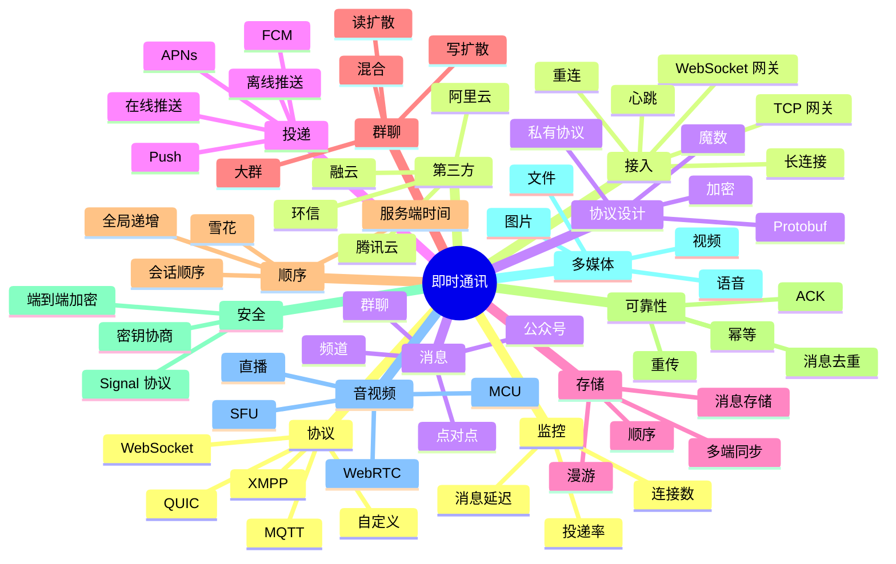

# 即时通讯 深入剖析

## 一、前言

即时通讯（IM）是分布式系统的另一大挑战——长连接、高并发、消息可靠投递、群聊扩散、消息存储。微信、WhatsApp、Telegram、Slack 都构建了定制化的 IM 系统。本篇剖析 IM 系统架构与核心技术。

## 二、架构思维导图



## 三、关键代码

### 3.1 WebSocket 网关

```typescript
// gateway.ts
import { WebSocketServer, WebSocket } from 'ws';
import jwt from 'jsonwebtoken';

const wss = new WebSocketServer({ port: 8080 });
const clients = new Map<string, WebSocket>();  // userId -> ws

wss.on('connection', (ws, req) => {
  // 1. 认证
  const token = new URL(req.url, 'http://x').searchParams.get('token');
  const user = jwt.verify(token, SECRET);
  
  // 2. 注册
  clients.set(user.id, ws);
  
  // 3. 心跳
  ws.isAlive = true;
  ws.on('pong', () => ws.isAlive = true);
  
  // 4. 收消息
  ws.on('message', (data) => {
    const msg = decode(data);
    handleMessage(user.id, msg);
  });
  
  ws.on('close', () => {
    clients.delete(user.id);
  });
});

// 心跳清理
setInterval(() => {
  wss.clients.forEach((ws) => {
    if (!ws.isAlive) return ws.terminate();
    ws.isAlive = false;
    ws.ping();
  });
}, 30000);
```

### 3.2 消息可靠投递

```python
# delivery.py
class ReliableDelivery:
    def __init__(self, db, redis, ws_pool):
        self.db = db
        self.redis = redis
        self.ws = ws_pool
    
    def send(self, from_id, to_id, content):
        # 1. 消息持久化
        msg_id = self.db.messages.insert({
            'from': from_id, 'to': to_id,
            'content': content,
            'created_at': now(),
            'status': 'SENT'
        })
        
        # 2. 尝试推送
        delivered = self.try_deliver(msg_id, to_id)
        
        if not delivered:
            # 离线，转 Push
            self.push_provider.send(to_id, msg_id)
        
        return msg_id
    
    def try_deliver(self, msg_id, to_id):
        ws = self.ws.get(to_id)
        if not ws:
            return False
        # 1. 推消息
        ws.send({'msg_id': msg_id, 'data': ...})
        # 2. 等 ACK
        return self.wait_ack(msg_id, timeout=5)
    
    def on_ack(self, msg_id):
        self.db.messages.update(msg_id, {'status': 'DELIVERED'})
```

### 3.3 群聊写扩散

```python
# group_write_fanout.py
class GroupChatFanout:
    def send_group_message(self, group_id, msg):
        # 1. 持久化
        msg_id = self.db.messages.insert({
            'group_id': group_id, 'msg': msg
        })
        
        # 2. 获取群成员
        members = self.db.group_members.find(group_id)
        
        # 3. 写扩散：每个成员 inbox 写一条
        for member in members:
            self.db.inbox.insert({
                'user_id': member.user_id,
                'group_id': group_id,
                'msg_id': msg_id,
                'unread': 1
            })
        
        # 4. 在线推送
        for member in members:
            if self.ws.is_online(member.user_id):
                self.ws.push(member.user_id, msg_id)
```

### 3.4 端到端加密（Signal 协议）

```typescript
// signal.ts
import { SessionBuilder, SessionCipher } from '@signalapp/libsignal-client';

class E2EEChat {
  private sessionCipher: SessionCipher;
  
  async initialize(myId, theirId, myIdentity, theirIdentity) {
    const session = await SessionBuilder.processPreKey({
      identityKey: myIdentity,
      theirIdentity: theirIdentity,
      theirPreKey: theirPreKey
    });
    this.sessionCipher = new SessionCipher(session);
  }
  
  encrypt(plaintext) {
    return this.sessionCipher.encrypt(plaintext);
  }
  
  decrypt(ciphertext) {
    return this.sessionCipher.decrypt(ciphertext);
  }
}
```

## 业务建模：行业方案的领域驱动设计

电商系统的核心域建模包括商品（Product）、库存（Inventory）、订单（Order）、支付（Payment）、履约（Fulfillment）、营销（Marketing）、会员（Member）、售后（After-sales）。每个域都有自己的聚合根、值对象、领域事件。

电商大促的架构准备包括：流量预估、容量规划、压测验证、限流配置、降级方案、应急预案、值班机制。每次大促都是对架构的全面检验。


## 架构演进：行业方案从单体到云原生

电商大促的架构准备包括：流量预估、容量规划、压测验证、限流配置、降级方案、应急预案、值班机制。每次大促都是对架构的全面检验。

商品中心是电商核心，需要支持 SPU/SKU、属性管理、规格参数、关联商品、商品池、价格策略等复杂模型。


## 关键场景：行业方案的高并发与一致性

商品中心是电商核心，需要支持 SPU/SKU、属性管理、规格参数、关联商品、商品池、价格策略等复杂模型。

库存系统是电商最具挑战的子系统之一，涉及总仓、区域仓、前置仓、门店、虚拟仓等多种形态。库存预占、扣减、释放、调配、对账是核心流程。


## 数据建模：行业方案的OLTP与OLAP

库存系统是电商最具挑战的子系统之一，涉及总仓、区域仓、前置仓、门店、虚拟仓等多种形态。库存预占、扣减、释放、调配、对账是核心流程。

秒杀是电商最经典的场景，对架构的极限考验。核心挑战是读多写少、热点商品、库存超卖、防机器人。方案包括：Redis 预扣 + MQ 异步、令牌桶限流、本地缓存、库存分段、流量隔离等。


## 性能调优：行业方案的JVM/GC与数据库

秒杀是电商最经典的场景，对架构的极限考验。核心挑战是读多写少、热点商品、库存超卖、防机器人。方案包括：Redis 预扣 + MQ 异步、令牌桶限流、本地缓存、库存分段、流量隔离等。

支付路由根据通道成功率、费率、商户配置、风控等级等因素动态选择最优通道。备份通道、降级策略、对账机制是核心。


## 容灾设计：行业方案的多活与故障转移

支付路由根据通道成功率、费率、商户配置、风控等级等因素动态选择最优通道。备份通道、降级策略、对账机制是核心。

跨境电商涉及多币种、多语言、多关税区、跨境物流、清关、海外仓、退货等复杂业务。Stripe、PayPal、Adyen、Checkout.com 是国际支付服务商。


## 监控告警：行业方案的SLO与Error Budget

跨境电商涉及多币种、多语言、多关税区、跨境物流、清关、海外仓、退货等复杂业务。Stripe、PayPal、Adyen、Checkout.com 是国际支付服务商。

电商推荐系统包括召回（Recall）、粗排（Pre-ranking）、精排（Ranking）、重排（Re-ranking）四个阶段。向量检索、深度模型、实时特征是关键。


## 安全合规：行业方案的等保与GDPR

电商推荐系统包括召回（Recall）、粗排（Pre-ranking）、精排（Ranking）、重排（Re-ranking）四个阶段。向量检索、深度模型、实时特征是关键。

游戏服务器架构的核心是房间制（Room-based）、匹配系统（Match-making）、战斗同步（Battle Sync）、经济系统（Economy）、社交系统（Social）。MOBA、FPS、MMO、SLG、卡牌各有侧重。


## 团队协作：行业方案的Git工作流与Code Review

游戏服务器架构的核心是房间制（Room-based）、匹配系统（Match-making）、战斗同步（Battle Sync）、经济系统（Economy）、社交系统（Social）。MOBA、FPS、MMO、SLG、卡牌各有侧重。

帧同步（Lockstep）让所有客户端在确定性模拟下得到相同结果，服务器只负责转发输入。状态同步（State Sync）由服务器权威，客户端只渲染。


## 文档管理：行业方案的ADR与架构图

帧同步（Lockstep）让所有客户端在确定性模拟下得到相同结果，服务器只负责转发输入。状态同步（State Sync）由服务器权威，客户端只渲染。

游戏反作弊（Anti-cheat）需要服务器权威、行为分析、内存保护、外挂检测。Easy Anti-Cheat、BattlEye、TenProtect 是商业方案。


## 测试体系：行业方案的单元、集成、压测

游戏反作弊（Anti-cheat）需要服务器权威、行为分析、内存保护、外挂检测。Easy Anti-Cheat、BattlEye、TenProtect 是商业方案。

金融核心系统的"账户-账本-流水"三模型是基础，复式记账保证借贷平衡。核心系统对一致性、事务、容灾有极致要求。


## 部署发布：行业方案的灰度与蓝绿

金融核心系统的"账户-账本-流水"三模型是基础，复式记账保证借贷平衡。核心系统对一致性、事务、容灾有极致要求。

分布式事务在金融场景有 TCC、Saga、Seata、可靠消息、最大努力通知等多种方案。金融级一致性通常选择 TCC 或两阶段提交。


## 成本优化：行业方案的资源利用率

分布式事务在金融场景有 TCC、Saga、Seata、可靠消息、最大努力通知等多种方案。金融级一致性通常选择 TCC 或两阶段提交。

支付清结算涉及多级账户体系、轧差、对账、分账、退款。T+0、T+1 结算周期由业务和资金安排决定。


## 国际化：行业方案的多语言与时区

支付清结算涉及多级账户体系、轧差、对账、分账、退款。T+0、T+1 结算周期由业务和资金安排决定。

反欺诈（Anti-Fraud）通过规则引擎、机器学习、图算法、设备指纹、生物特征等技术识别欺诈行为。规则+模型双驱动是主流。


## 可访问性：行业方案的WCAG与无障碍

反欺诈（Anti-Fraud）通过规则引擎、机器学习、图算法、设备指纹、生物特征等技术识别欺诈行为。规则+模型双驱动是主流。

KYC（Know Your Customer）和 AML（Anti-Money Laundering）是金融合规的基石，涉及身份验证、可疑交易识别、监管报送。


## 用户体验：行业方案的A/B测试与转化

KYC（Know Your Customer）和 AML（Anti-Money Laundering）是金融合规的基石，涉及身份验证、可疑交易识别、监管报送。

证券交易系统对低延迟有极致要求，撮合引擎（Matching Engine）需要微秒级匹配。低延迟技术包括：内核旁路、内存池、无锁队列、FPGA 加速。


## 数据驱动：行业方案的指标与决策

证券交易系统对低延迟有极致要求，撮合引擎（Matching Engine）需要微秒级匹配。低延迟技术包括：内核旁路、内存池、无锁队列、FPGA 加速。

保险核心系统包括产品工厂（Product Factory）、核保（Underwriting）、理赔（Claim）、再保（Reinsurance）、精算（Actuarial）。


## 业务连续性：行业方案的应急预案

保险核心系统包括产品工厂（Product Factory）、核保（Underwriting）、理赔（Claim）、再保（Reinsurance）、精算（Actuarial）。

IoT 平台的物模型（Thing Model）抽象了设备的属性（Property）、事件（Event）、服务（Service），是设备管理的基础。


## 第三方集成：行业方案的支付、地图、消息

IoT 平台的物模型（Thing Model）抽象了设备的属性（Property）、事件（Event）、服务（Service），是设备管理的基础。

AI 直播平台涉及数字人、TTS、LLM Agent、实时音视频、商品知识库、风控审核等复杂技术栈。是 AI 技术的集大成者。


## 监管要求：行业方案的牌照与备案

AI 直播平台涉及数字人、TTS、LLM Agent、实时音视频、商品知识库、风控审核等复杂技术栈。是 AI 技术的集大成者。

电商系统的核心域建模包括商品（Product）、库存（Inventory）、订单（Order）、支付（Payment）、履约（Fulfillment）、营销（Marketing）、会员（Member）、售后（After-sales）。每个域都有自己的聚合根、值对象、领域事件。


## 业务建模：行业方案的领域驱动设计

电商系统的核心域建模包括商品（Product）、库存（Inventory）、订单（Order）、支付（Payment）、履约（Fulfillment）、营销（Marketing）、会员（Member）、售后（After-sales）。每个域都有自己的聚合根、值对象、领域事件。

电商大促的架构准备包括：流量预估、容量规划、压测验证、限流配置、降级方案、应急预案、值班机制。每次大促都是对架构的全面检验。


## 架构演进：行业方案从单体到云原生

电商大促的架构准备包括：流量预估、容量规划、压测验证、限流配置、降级方案、应急预案、值班机制。每次大促都是对架构的全面检验。

商品中心是电商核心，需要支持 SPU/SKU、属性管理、规格参数、关联商品、商品池、价格策略等复杂模型。


## 关键场景：行业方案的高并发与一致性

商品中心是电商核心，需要支持 SPU/SKU、属性管理、规格参数、关联商品、商品池、价格策略等复杂模型。

库存系统是电商最具挑战的子系统之一，涉及总仓、区域仓、前置仓、门店、虚拟仓等多种形态。库存预占、扣减、释放、调配、对账是核心流程。


## 数据建模：行业方案的OLTP与OLAP

库存系统是电商最具挑战的子系统之一，涉及总仓、区域仓、前置仓、门店、虚拟仓等多种形态。库存预占、扣减、释放、调配、对账是核心流程。

秒杀是电商最经典的场景，对架构的极限考验。核心挑战是读多写少、热点商品、库存超卖、防机器人。方案包括：Redis 预扣 + MQ 异步、令牌桶限流、本地缓存、库存分段、流量隔离等。


## 性能调优：行业方案的JVM/GC与数据库

秒杀是电商最经典的场景，对架构的极限考验。核心挑战是读多写少、热点商品、库存超卖、防机器人。方案包括：Redis 预扣 + MQ 异步、令牌桶限流、本地缓存、库存分段、流量隔离等。

支付路由根据通道成功率、费率、商户配置、风控等级等因素动态选择最优通道。备份通道、降级策略、对账机制是核心。


## 容灾设计：行业方案的多活与故障转移

支付路由根据通道成功率、费率、商户配置、风控等级等因素动态选择最优通道。备份通道、降级策略、对账机制是核心。

跨境电商涉及多币种、多语言、多关税区、跨境物流、清关、海外仓、退货等复杂业务。Stripe、PayPal、Adyen、Checkout.com 是国际支付服务商。


## 监控告警：行业方案的SLO与Error Budget

跨境电商涉及多币种、多语言、多关税区、跨境物流、清关、海外仓、退货等复杂业务。Stripe、PayPal、Adyen、Checkout.com 是国际支付服务商。

电商推荐系统包括召回（Recall）、粗排（Pre-ranking）、精排（Ranking）、重排（Re-ranking）四个阶段。向量检索、深度模型、实时特征是关键。


## 安全合规：行业方案的等保与GDPR

电商推荐系统包括召回（Recall）、粗排（Pre-ranking）、精排（Ranking）、重排（Re-ranking）四个阶段。向量检索、深度模型、实时特征是关键。

游戏服务器架构的核心是房间制（Room-based）、匹配系统（Match-making）、战斗同步（Battle Sync）、经济系统（Economy）、社交系统（Social）。MOBA、FPS、MMO、SLG、卡牌各有侧重。


## 团队协作：行业方案的Git工作流与Code Review

游戏服务器架构的核心是房间制（Room-based）、匹配系统（Match-making）、战斗同步（Battle Sync）、经济系统（Economy）、社交系统（Social）。MOBA、FPS、MMO、SLG、卡牌各有侧重。

帧同步（Lockstep）让所有客户端在确定性模拟下得到相同结果，服务器只负责转发输入。状态同步（State Sync）由服务器权威，客户端只渲染。


## 文档管理：行业方案的ADR与架构图

帧同步（Lockstep）让所有客户端在确定性模拟下得到相同结果，服务器只负责转发输入。状态同步（State Sync）由服务器权威，客户端只渲染。

游戏反作弊（Anti-cheat）需要服务器权威、行为分析、内存保护、外挂检测。Easy Anti-Cheat、BattlEye、TenProtect 是商业方案。


## 测试体系：行业方案的单元、集成、压测

游戏反作弊（Anti-cheat）需要服务器权威、行为分析、内存保护、外挂检测。Easy Anti-Cheat、BattlEye、TenProtect 是商业方案。

金融核心系统的"账户-账本-流水"三模型是基础，复式记账保证借贷平衡。核心系统对一致性、事务、容灾有极致要求。


## 部署发布：行业方案的灰度与蓝绿

金融核心系统的"账户-账本-流水"三模型是基础，复式记账保证借贷平衡。核心系统对一致性、事务、容灾有极致要求。

分布式事务在金融场景有 TCC、Saga、Seata、可靠消息、最大努力通知等多种方案。金融级一致性通常选择 TCC 或两阶段提交。


## 成本优化：行业方案的资源利用率

分布式事务在金融场景有 TCC、Saga、Seata、可靠消息、最大努力通知等多种方案。金融级一致性通常选择 TCC 或两阶段提交。

支付清结算涉及多级账户体系、轧差、对账、分账、退款。T+0、T+1 结算周期由业务和资金安排决定。


## 国际化：行业方案的多语言与时区

支付清结算涉及多级账户体系、轧差、对账、分账、退款。T+0、T+1 结算周期由业务和资金安排决定。

反欺诈（Anti-Fraud）通过规则引擎、机器学习、图算法、设备指纹、生物特征等技术识别欺诈行为。规则+模型双驱动是主流。


## 可访问性：行业方案的WCAG与无障碍

反欺诈（Anti-Fraud）通过规则引擎、机器学习、图算法、设备指纹、生物特征等技术识别欺诈行为。规则+模型双驱动是主流。

KYC（Know Your Customer）和 AML（Anti-Money Laundering）是金融合规的基石，涉及身份验证、可疑交易识别、监管报送。


## 用户体验：行业方案的A/B测试与转化

KYC（Know Your Customer）和 AML（Anti-Money Laundering）是金融合规的基石，涉及身份验证、可疑交易识别、监管报送。

证券交易系统对低延迟有极致要求，撮合引擎（Matching Engine）需要微秒级匹配。低延迟技术包括：内核旁路、内存池、无锁队列、FPGA 加速。


## 数据驱动：行业方案的指标与决策

证券交易系统对低延迟有极致要求，撮合引擎（Matching Engine）需要微秒级匹配。低延迟技术包括：内核旁路、内存池、无锁队列、FPGA 加速。

保险核心系统包括产品工厂（Product Factory）、核保（Underwriting）、理赔（Claim）、再保（Reinsurance）、精算（Actuarial）。


## 业务连续性：行业方案的应急预案

保险核心系统包括产品工厂（Product Factory）、核保（Underwriting）、理赔（Claim）、再保（Reinsurance）、精算（Actuarial）。

IoT 平台的物模型（Thing Model）抽象了设备的属性（Property）、事件（Event）、服务（Service），是设备管理的基础。


## 第三方集成：行业方案的支付、地图、消息

IoT 平台的物模型（Thing Model）抽象了设备的属性（Property）、事件（Event）、服务（Service），是设备管理的基础。

AI 直播平台涉及数字人、TTS、LLM Agent、实时音视频、商品知识库、风控审核等复杂技术栈。是 AI 技术的集大成者。


## 监管要求：行业方案的牌照与备案

AI 直播平台涉及数字人、TTS、LLM Agent、实时音视频、商品知识库、风控审核等复杂技术栈。是 AI 技术的集大成者。

电商系统的核心域建模包括商品（Product）、库存（Inventory）、订单（Order）、支付（Payment）、履约（Fulfillment）、营销（Marketing）、会员（Member）、售后（After-sales）。每个域都有自己的聚合根、值对象、领域事件。


## 业务建模：行业方案的领域驱动设计

电商系统的核心域建模包括商品（Product）、库存（Inventory）、订单（Order）、支付（Payment）、履约（Fulfillment）、营销（Marketing）、会员（Member）、售后（After-sales）。每个域都有自己的聚合根、值对象、领域事件。

电商大促的架构准备包括：流量预估、容量规划、压测验证、限流配置、降级方案、应急预案、值班机制。每次大促都是对架构的全面检验。


## 架构演进：行业方案从单体到云原生

电商大促的架构准备包括：流量预估、容量规划、压测验证、限流配置、降级方案、应急预案、值班机制。每次大促都是对架构的全面检验。

商品中心是电商核心，需要支持 SPU/SKU、属性管理、规格参数、关联商品、商品池、价格策略等复杂模型。


## 关键场景：行业方案的高并发与一致性

商品中心是电商核心，需要支持 SPU/SKU、属性管理、规格参数、关联商品、商品池、价格策略等复杂模型。

库存系统是电商最具挑战的子系统之一，涉及总仓、区域仓、前置仓、门店、虚拟仓等多种形态。库存预占、扣减、释放、调配、对账是核心流程。


## 数据建模：行业方案的OLTP与OLAP

库存系统是电商最具挑战的子系统之一，涉及总仓、区域仓、前置仓、门店、虚拟仓等多种形态。库存预占、扣减、释放、调配、对账是核心流程。

秒杀是电商最经典的场景，对架构的极限考验。核心挑战是读多写少、热点商品、库存超卖、防机器人。方案包括：Redis 预扣 + MQ 异步、令牌桶限流、本地缓存、库存分段、流量隔离等。


## 性能调优：行业方案的JVM/GC与数据库

秒杀是电商最经典的场景，对架构的极限考验。核心挑战是读多写少、热点商品、库存超卖、防机器人。方案包括：Redis 预扣 + MQ 异步、令牌桶限流、本地缓存、库存分段、流量隔离等。

支付路由根据通道成功率、费率、商户配置、风控等级等因素动态选择最优通道。备份通道、降级策略、对账机制是核心。


## 容灾设计：行业方案的多活与故障转移

支付路由根据通道成功率、费率、商户配置、风控等级等因素动态选择最优通道。备份通道、降级策略、对账机制是核心。

跨境电商涉及多币种、多语言、多关税区、跨境物流、清关、海外仓、退货等复杂业务。Stripe、PayPal、Adyen、Checkout.com 是国际支付服务商。


## 监控告警：行业方案的SLO与Error Budget

跨境电商涉及多币种、多语言、多关税区、跨境物流、清关、海外仓、退货等复杂业务。Stripe、PayPal、Adyen、Checkout.com 是国际支付服务商。

电商推荐系统包括召回（Recall）、粗排（Pre-ranking）、精排（Ranking）、重排（Re-ranking）四个阶段。向量检索、深度模型、实时特征是关键。


## 安全合规：行业方案的等保与GDPR

电商推荐系统包括召回（Recall）、粗排（Pre-ranking）、精排（Ranking）、重排（Re-ranking）四个阶段。向量检索、深度模型、实时特征是关键。

游戏服务器架构的核心是房间制（Room-based）、匹配系统（Match-making）、战斗同步（Battle Sync）、经济系统（Economy）、社交系统（Social）。MOBA、FPS、MMO、SLG、卡牌各有侧重。


## 团队协作：行业方案的Git工作流与Code Review

游戏服务器架构的核心是房间制（Room-based）、匹配系统（Match-making）、战斗同步（Battle Sync）、经济系统（Economy）、社交系统（Social）。MOBA、FPS、MMO、SLG、卡牌各有侧重。

帧同步（Lockstep）让所有客户端在确定性模拟下得到相同结果，服务器只负责转发输入。状态同步（State Sync）由服务器权威，客户端只渲染。


## 文档管理：行业方案的ADR与架构图

帧同步（Lockstep）让所有客户端在确定性模拟下得到相同结果，服务器只负责转发输入。状态同步（State Sync）由服务器权威，客户端只渲染。

游戏反作弊（Anti-cheat）需要服务器权威、行为分析、内存保护、外挂检测。Easy Anti-Cheat、BattlEye、TenProtect 是商业方案。


## 测试体系：行业方案的单元、集成、压测

游戏反作弊（Anti-cheat）需要服务器权威、行为分析、内存保护、外挂检测。Easy Anti-Cheat、BattlEye、TenProtect 是商业方案。

金融核心系统的"账户-账本-流水"三模型是基础，复式记账保证借贷平衡。核心系统对一致性、事务、容灾有极致要求。


## 部署发布：行业方案的灰度与蓝绿

金融核心系统的"账户-账本-流水"三模型是基础，复式记账保证借贷平衡。核心系统对一致性、事务、容灾有极致要求。

分布式事务在金融场景有 TCC、Saga、Seata、可靠消息、最大努力通知等多种方案。金融级一致性通常选择 TCC 或两阶段提交。


## 成本优化：行业方案的资源利用率

分布式事务在金融场景有 TCC、Saga、Seata、可靠消息、最大努力通知等多种方案。金融级一致性通常选择 TCC 或两阶段提交。

支付清结算涉及多级账户体系、轧差、对账、分账、退款。T+0、T+1 结算周期由业务和资金安排决定。


## 国际化：行业方案的多语言与时区

支付清结算涉及多级账户体系、轧差、对账、分账、退款。T+0、T+1 结算周期由业务和资金安排决定。

反欺诈（Anti-Fraud）通过规则引擎、机器学习、图算法、设备指纹、生物特征等技术识别欺诈行为。规则+模型双驱动是主流。


## 可访问性：行业方案的WCAG与无障碍

反欺诈（Anti-Fraud）通过规则引擎、机器学习、图算法、设备指纹、生物特征等技术识别欺诈行为。规则+模型双驱动是主流。

KYC（Know Your Customer）和 AML（Anti-Money Laundering）是金融合规的基石，涉及身份验证、可疑交易识别、监管报送。


## 用户体验：行业方案的A/B测试与转化

KYC（Know Your Customer）和 AML（Anti-Money Laundering）是金融合规的基石，涉及身份验证、可疑交易识别、监管报送。

证券交易系统对低延迟有极致要求，撮合引擎（Matching Engine）需要微秒级匹配。低延迟技术包括：内核旁路、内存池、无锁队列、FPGA 加速。


## 数据驱动：行业方案的指标与决策

证券交易系统对低延迟有极致要求，撮合引擎（Matching Engine）需要微秒级匹配。低延迟技术包括：内核旁路、内存池、无锁队列、FPGA 加速。

保险核心系统包括产品工厂（Product Factory）、核保（Underwriting）、理赔（Claim）、再保（Reinsurance）、精算（Actuarial）。


## 业务连续性：行业方案的应急预案

保险核心系统包括产品工厂（Product Factory）、核保（Underwriting）、理赔（Claim）、再保（Reinsurance）、精算（Actuarial）。

IoT 平台的物模型（Thing Model）抽象了设备的属性（Property）、事件（Event）、服务（Service），是设备管理的基础。


## 第三方集成：行业方案的支付、地图、消息

IoT 平台的物模型（Thing Model）抽象了设备的属性（Property）、事件（Event）、服务（Service），是设备管理的基础。

AI 直播平台涉及数字人、TTS、LLM Agent、实时音视频、商品知识库、风控审核等复杂技术栈。是 AI 技术的集大成者。


## 监管要求：行业方案的牌照与备案

AI 直播平台涉及数字人、TTS、LLM Agent、实时音视频、商品知识库、风控审核等复杂技术栈。是 AI 技术的集大成者。

电商系统的核心域建模包括商品（Product）、库存（Inventory）、订单（Order）、支付（Payment）、履约（Fulfillment）、营销（Marketing）、会员（Member）、售后（After-sales）。每个域都有自己的聚合根、值对象、领域事件。


## 业务建模：行业方案的领域驱动设计

电商系统的核心域建模包括商品（Product）、库存（Inventory）、订单（Order）、支付（Payment）、履约（Fulfillment）、营销（Marketing）、会员（Member）、售后（After-sales）。每个域都有自己的聚合根、值对象、领域事件。

电商大促的架构准备包括：流量预估、容量规划、压测验证、限流配置、降级方案、应急预案、值班机制。每次大促都是对架构的全面检验。


## 架构演进：行业方案从单体到云原生

电商大促的架构准备包括：流量预估、容量规划、压测验证、限流配置、降级方案、应急预案、值班机制。每次大促都是对架构的全面检验。

商品中心是电商核心，需要支持 SPU/SKU、属性管理、规格参数、关联商品、商品池、价格策略等复杂模型。


## 关键场景：行业方案的高并发与一致性

商品中心是电商核心，需要支持 SPU/SKU、属性管理、规格参数、关联商品、商品池、价格策略等复杂模型。

库存系统是电商最具挑战的子系统之一，涉及总仓、区域仓、前置仓、门店、虚拟仓等多种形态。库存预占、扣减、释放、调配、对账是核心流程。


## 数据建模：行业方案的OLTP与OLAP

库存系统是电商最具挑战的子系统之一，涉及总仓、区域仓、前置仓、门店、虚拟仓等多种形态。库存预占、扣减、释放、调配、对账是核心流程。

秒杀是电商最经典的场景，对架构的极限考验。核心挑战是读多写少、热点商品、库存超卖、防机器人。方案包括：Redis 预扣 + MQ 异步、令牌桶限流、本地缓存、库存分段、流量隔离等。


## 性能调优：行业方案的JVM/GC与数据库

秒杀是电商最经典的场景，对架构的极限考验。核心挑战是读多写少、热点商品、库存超卖、防机器人。方案包括：Redis 预扣 + MQ 异步、令牌桶限流、本地缓存、库存分段、流量隔离等。

支付路由根据通道成功率、费率、商户配置、风控等级等因素动态选择最优通道。备份通道、降级策略、对账机制是核心。


## 容灾设计：行业方案的多活与故障转移

支付路由根据通道成功率、费率、商户配置、风控等级等因素动态选择最优通道。备份通道、降级策略、对账机制是核心。

跨境电商涉及多币种、多语言、多关税区、跨境物流、清关、海外仓、退货等复杂业务。Stripe、PayPal、Adyen、Checkout.com 是国际支付服务商。


## 监控告警：行业方案的SLO与Error Budget

跨境电商涉及多币种、多语言、多关税区、跨境物流、清关、海外仓、退货等复杂业务。Stripe、PayPal、Adyen、Checkout.com 是国际支付服务商。

电商推荐系统包括召回（Recall）、粗排（Pre-ranking）、精排（Ranking）、重排（Re-ranking）四个阶段。向量检索、深度模型、实时特征是关键。


## 安全合规：行业方案的等保与GDPR

电商推荐系统包括召回（Recall）、粗排（Pre-ranking）、精排（Ranking）、重排（Re-ranking）四个阶段。向量检索、深度模型、实时特征是关键。

游戏服务器架构的核心是房间制（Room-based）、匹配系统（Match-making）、战斗同步（Battle Sync）、经济系统（Economy）、社交系统（Social）。MOBA、FPS、MMO、SLG、卡牌各有侧重。


## 团队协作：行业方案的Git工作流与Code Review

游戏服务器架构的核心是房间制（Room-based）、匹配系统（Match-making）、战斗同步（Battle Sync）、经济系统（Economy）、社交系统（Social）。MOBA、FPS、MMO、SLG、卡牌各有侧重。

帧同步（Lockstep）让所有客户端在确定性模拟下得到相同结果，服务器只负责转发输入。状态同步（State Sync）由服务器权威，客户端只渲染。


## 文档管理：行业方案的ADR与架构图

帧同步（Lockstep）让所有客户端在确定性模拟下得到相同结果，服务器只负责转发输入。状态同步（State Sync）由服务器权威，客户端只渲染。

游戏反作弊（Anti-cheat）需要服务器权威、行为分析、内存保护、外挂检测。Easy Anti-Cheat、BattlEye、TenProtect 是商业方案。


## 测试体系：行业方案的单元、集成、压测

游戏反作弊（Anti-cheat）需要服务器权威、行为分析、内存保护、外挂检测。Easy Anti-Cheat、BattlEye、TenProtect 是商业方案。

金融核心系统的"账户-账本-流水"三模型是基础，复式记账保证借贷平衡。核心系统对一致性、事务、容灾有极致要求。


## 部署发布：行业方案的灰度与蓝绿

金融核心系统的"账户-账本-流水"三模型是基础，复式记账保证借贷平衡。核心系统对一致性、事务、容灾有极致要求。

分布式事务在金融场景有 TCC、Saga、Seata、可靠消息、最大努力通知等多种方案。金融级一致性通常选择 TCC 或两阶段提交。


## 成本优化：行业方案的资源利用率

分布式事务在金融场景有 TCC、Saga、Seata、可靠消息、最大努力通知等多种方案。金融级一致性通常选择 TCC 或两阶段提交。

支付清结算涉及多级账户体系、轧差、对账、分账、退款。T+0、T+1 结算周期由业务和资金安排决定。


## 国际化：行业方案的多语言与时区

支付清结算涉及多级账户体系、轧差、对账、分账、退款。T+0、T+1 结算周期由业务和资金安排决定。

反欺诈（Anti-Fraud）通过规则引擎、机器学习、图算法、设备指纹、生物特征等技术识别欺诈行为。规则+模型双驱动是主流。


## 可访问性：行业方案的WCAG与无障碍

反欺诈（Anti-Fraud）通过规则引擎、机器学习、图算法、设备指纹、生物特征等技术识别欺诈行为。规则+模型双驱动是主流。

KYC（Know Your Customer）和 AML（Anti-Money Laundering）是金融合规的基石，涉及身份验证、可疑交易识别、监管报送。


## 用户体验：行业方案的A/B测试与转化

KYC（Know Your Customer）和 AML（Anti-Money Laundering）是金融合规的基石，涉及身份验证、可疑交易识别、监管报送。

证券交易系统对低延迟有极致要求，撮合引擎（Matching Engine）需要微秒级匹配。低延迟技术包括：内核旁路、内存池、无锁队列、FPGA 加速。


## 数据驱动：行业方案的指标与决策

证券交易系统对低延迟有极致要求，撮合引擎（Matching Engine）需要微秒级匹配。低延迟技术包括：内核旁路、内存池、无锁队列、FPGA 加速。

保险核心系统包括产品工厂（Product Factory）、核保（Underwriting）、理赔（Claim）、再保（Reinsurance）、精算（Actuarial）。


## 业务连续性：行业方案的应急预案

保险核心系统包括产品工厂（Product Factory）、核保（Underwriting）、理赔（Claim）、再保（Reinsurance）、精算（Actuarial）。

IoT 平台的物模型（Thing Model）抽象了设备的属性（Property）、事件（Event）、服务（Service），是设备管理的基础。


## 第三方集成：行业方案的支付、地图、消息

IoT 平台的物模型（Thing Model）抽象了设备的属性（Property）、事件（Event）、服务（Service），是设备管理的基础。

AI 直播平台涉及数字人、TTS、LLM Agent、实时音视频、商品知识库、风控审核等复杂技术栈。是 AI 技术的集大成者。


## 监管要求：行业方案的牌照与备案

AI 直播平台涉及数字人、TTS、LLM Agent、实时音视频、商品知识库、风控审核等复杂技术栈。是 AI 技术的集大成者。

电商系统的核心域建模包括商品（Product）、库存（Inventory）、订单（Order）、支付（Payment）、履约（Fulfillment）、营销（Marketing）、会员（Member）、售后（After-sales）。每个域都有自己的聚合根、值对象、领域事件。


## 业务建模：行业方案的领域驱动设计

电商系统的核心域建模包括商品（Product）、库存（Inventory）、订单（Order）、支付（Payment）、履约（Fulfillment）、营销（Marketing）、会员（Member）、售后（After-sales）。每个域都有自己的聚合根、值对象、领域事件。

电商大促的架构准备包括：流量预估、容量规划、压测验证、限流配置、降级方案、应急预案、值班机制。每次大促都是对架构的全面检验。


## 架构演进：行业方案从单体到云原生

电商大促的架构准备包括：流量预估、容量规划、压测验证、限流配置、降级方案、应急预案、值班机制。每次大促都是对架构的全面检验。

商品中心是电商核心，需要支持 SPU/SKU、属性管理、规格参数、关联商品、商品池、价格策略等复杂模型。


## 关键场景：行业方案的高并发与一致性

商品中心是电商核心，需要支持 SPU/SKU、属性管理、规格参数、关联商品、商品池、价格策略等复杂模型。

库存系统是电商最具挑战的子系统之一，涉及总仓、区域仓、前置仓、门店、虚拟仓等多种形态。库存预占、扣减、释放、调配、对账是核心流程。


## 数据建模：行业方案的OLTP与OLAP

库存系统是电商最具挑战的子系统之一，涉及总仓、区域仓、前置仓、门店、虚拟仓等多种形态。库存预占、扣减、释放、调配、对账是核心流程。

秒杀是电商最经典的场景，对架构的极限考验。核心挑战是读多写少、热点商品、库存超卖、防机器人。方案包括：Redis 预扣 + MQ 异步、令牌桶限流、本地缓存、库存分段、流量隔离等。


## 性能调优：行业方案的JVM/GC与数据库

秒杀是电商最经典的场景，对架构的极限考验。核心挑战是读多写少、热点商品、库存超卖、防机器人。方案包括：Redis 预扣 + MQ 异步、令牌桶限流、本地缓存、库存分段、流量隔离等。

支付路由根据通道成功率、费率、商户配置、风控等级等因素动态选择最优通道。备份通道、降级策略、对账机制是核心。


## 容灾设计：行业方案的多活与故障转移

支付路由根据通道成功率、费率、商户配置、风控等级等因素动态选择最优通道。备份通道、降级策略、对账机制是核心。

跨境电商涉及多币种、多语言、多关税区、跨境物流、清关、海外仓、退货等复杂业务。Stripe、PayPal、Adyen、Checkout.com 是国际支付服务商。


## 监控告警：行业方案的SLO与Error Budget

跨境电商涉及多币种、多语言、多关税区、跨境物流、清关、海外仓、退货等复杂业务。Stripe、PayPal、Adyen、Checkout.com 是国际支付服务商。

电商推荐系统包括召回（Recall）、粗排（Pre-ranking）、精排（Ranking）、重排（Re-ranking）四个阶段。向量检索、深度模型、实时特征是关键。


## 安全合规：行业方案的等保与GDPR

电商推荐系统包括召回（Recall）、粗排（Pre-ranking）、精排（Ranking）、重排（Re-ranking）四个阶段。向量检索、深度模型、实时特征是关键。

游戏服务器架构的核心是房间制（Room-based）、匹配系统（Match-making）、战斗同步（Battle Sync）、经济系统（Economy）、社交系统（Social）。MOBA、FPS、MMO、SLG、卡牌各有侧重。


## 团队协作：行业方案的Git工作流与Code Review

游戏服务器架构的核心是房间制（Room-based）、匹配系统（Match-making）、战斗同步（Battle Sync）、经济系统（Economy）、社交系统（Social）。MOBA、FPS、MMO、SLG、卡牌各有侧重。

帧同步（Lockstep）让所有客户端在确定性模拟下得到相同结果，服务器只负责转发输入。状态同步（State Sync）由服务器权威，客户端只渲染。


## 文档管理：行业方案的ADR与架构图

帧同步（Lockstep）让所有客户端在确定性模拟下得到相同结果，服务器只负责转发输入。状态同步（State Sync）由服务器权威，客户端只渲染。

游戏反作弊（Anti-cheat）需要服务器权威、行为分析、内存保护、外挂检测。Easy Anti-Cheat、BattlEye、TenProtect 是商业方案。


## 测试体系：行业方案的单元、集成、压测

游戏反作弊（Anti-cheat）需要服务器权威、行为分析、内存保护、外挂检测。Easy Anti-Cheat、BattlEye、TenProtect 是商业方案。

金融核心系统的"账户-账本-流水"三模型是基础，复式记账保证借贷平衡。核心系统对一致性、事务、容灾有极致要求。


## 部署发布：行业方案的灰度与蓝绿

金融核心系统的"账户-账本-流水"三模型是基础，复式记账保证借贷平衡。核心系统对一致性、事务、容灾有极致要求。

分布式事务在金融场景有 TCC、Saga、Seata、可靠消息、最大努力通知等多种方案。金融级一致性通常选择 TCC 或两阶段提交。


## 成本优化：行业方案的资源利用率

分布式事务在金融场景有 TCC、Saga、Seata、可靠消息、最大努力通知等多种方案。金融级一致性通常选择 TCC 或两阶段提交。

支付清结算涉及多级账户体系、轧差、对账、分账、退款。T+0、T+1 结算周期由业务和资金安排决定。


## 国际化：行业方案的多语言与时区

支付清结算涉及多级账户体系、轧差、对账、分账、退款。T+0、T+1 结算周期由业务和资金安排决定。

反欺诈（Anti-Fraud）通过规则引擎、机器学习、图算法、设备指纹、生物特征等技术识别欺诈行为。规则+模型双驱动是主流。


## 可访问性：行业方案的WCAG与无障碍

反欺诈（Anti-Fraud）通过规则引擎、机器学习、图算法、设备指纹、生物特征等技术识别欺诈行为。规则+模型双驱动是主流。

KYC（Know Your Customer）和 AML（Anti-Money Laundering）是金融合规的基石，涉及身份验证、可疑交易识别、监管报送。


## 用户体验：行业方案的A/B测试与转化

KYC（Know Your Customer）和 AML（Anti-Money Laundering）是金融合规的基石，涉及身份验证、可疑交易识别、监管报送。

证券交易系统对低延迟有极致要求，撮合引擎（Matching Engine）需要微秒级匹配。低延迟技术包括：内核旁路、内存池、无锁队列、FPGA 加速。


## 数据驱动：行业方案的指标与决策

证券交易系统对低延迟有极致要求，撮合引擎（Matching Engine）需要微秒级匹配。低延迟技术包括：内核旁路、内存池、无锁队列、FPGA 加速。

保险核心系统包括产品工厂（Product Factory）、核保（Underwriting）、理赔（Claim）、再保（Reinsurance）、精算（Actuarial）。


## 业务连续性：行业方案的应急预案

保险核心系统包括产品工厂（Product Factory）、核保（Underwriting）、理赔（Claim）、再保（Reinsurance）、精算（Actuarial）。

IoT 平台的物模型（Thing Model）抽象了设备的属性（Property）、事件（Event）、服务（Service），是设备管理的基础。


## 第三方集成：行业方案的支付、地图、消息

IoT 平台的物模型（Thing Model）抽象了设备的属性（Property）、事件（Event）、服务（Service），是设备管理的基础。

AI 直播平台涉及数字人、TTS、LLM Agent、实时音视频、商品知识库、风控审核等复杂技术栈。是 AI 技术的集大成者。


## 监管要求：行业方案的牌照与备案

AI 直播平台涉及数字人、TTS、LLM Agent、实时音视频、商品知识库、风控审核等复杂技术栈。是 AI 技术的集大成者。

电商系统的核心域建模包括商品（Product）、库存（Inventory）、订单（Order）、支付（Payment）、履约（Fulfillment）、营销（Marketing）、会员（Member）、售后（After-sales）。每个域都有自己的聚合根、值对象、领域事件。


## 业务建模：行业方案的领域驱动设计

电商系统的核心域建模包括商品（Product）、库存（Inventory）、订单（Order）、支付（Payment）、履约（Fulfillment）、营销（Marketing）、会员（Member）、售后（After-sales）。每个域都有自己的聚合根、值对象、领域事件。

电商大促的架构准备包括：流量预估、容量规划、压测验证、限流配置、降级方案、应急预案、值班机制。每次大促都是对架构的全面检验。


## 架构演进：行业方案从单体到云原生

电商大促的架构准备包括：流量预估、容量规划、压测验证、限流配置、降级方案、应急预案、值班机制。每次大促都是对架构的全面检验。

商品中心是电商核心，需要支持 SPU/SKU、属性管理、规格参数、关联商品、商品池、价格策略等复杂模型。


## 关键场景：行业方案的高并发与一致性

商品中心是电商核心，需要支持 SPU/SKU、属性管理、规格参数、关联商品、商品池、价格策略等复杂模型。

库存系统是电商最具挑战的子系统之一，涉及总仓、区域仓、前置仓、门店、虚拟仓等多种形态。库存预占、扣减、释放、调配、对账是核心流程。


## 数据建模：行业方案的OLTP与OLAP

库存系统是电商最具挑战的子系统之一，涉及总仓、区域仓、前置仓、门店、虚拟仓等多种形态。库存预占、扣减、释放、调配、对账是核心流程。

秒杀是电商最经典的场景，对架构的极限考验。核心挑战是读多写少、热点商品、库存超卖、防机器人。方案包括：Redis 预扣 + MQ 异步、令牌桶限流、本地缓存、库存分段、流量隔离等。


## 性能调优：行业方案的JVM/GC与数据库

秒杀是电商最经典的场景，对架构的极限考验。核心挑战是读多写少、热点商品、库存超卖、防机器人。方案包括：Redis 预扣 + MQ 异步、令牌桶限流、本地缓存、库存分段、流量隔离等。

支付路由根据通道成功率、费率、商户配置、风控等级等因素动态选择最优通道。备份通道、降级策略、对账机制是核心。


## 容灾设计：行业方案的多活与故障转移

支付路由根据通道成功率、费率、商户配置、风控等级等因素动态选择最优通道。备份通道、降级策略、对账机制是核心。

跨境电商涉及多币种、多语言、多关税区、跨境物流、清关、海外仓、退货等复杂业务。Stripe、PayPal、Adyen、Checkout.com 是国际支付服务商。


## 监控告警：行业方案的SLO与Error Budget

跨境电商涉及多币种、多语言、多关税区、跨境物流、清关、海外仓、退货等复杂业务。Stripe、PayPal、Adyen、Checkout.com 是国际支付服务商。

电商推荐系统包括召回（Recall）、粗排（Pre-ranking）、精排（Ranking）、重排（Re-ranking）四个阶段。向量检索、深度模型、实时特征是关键。


## 安全合规：行业方案的等保与GDPR

电商推荐系统包括召回（Recall）、粗排（Pre-ranking）、精排（Ranking）、重排（Re-ranking）四个阶段。向量检索、深度模型、实时特征是关键。

游戏服务器架构的核心是房间制（Room-based）、匹配系统（Match-making）、战斗同步（Battle Sync）、经济系统（Economy）、社交系统（Social）。MOBA、FPS、MMO、SLG、卡牌各有侧重。


## 团队协作：行业方案的Git工作流与Code Review

游戏服务器架构的核心是房间制（Room-based）、匹配系统（Match-making）、战斗同步（Battle Sync）、经济系统（Economy）、社交系统（Social）。MOBA、FPS、MMO、SLG、卡牌各有侧重。

帧同步（Lockstep）让所有客户端在确定性模拟下得到相同结果，服务器只负责转发输入。状态同步（State Sync）由服务器权威，客户端只渲染。


## 文档管理：行业方案的ADR与架构图

帧同步（Lockstep）让所有客户端在确定性模拟下得到相同结果，服务器只负责转发输入。状态同步（State Sync）由服务器权威，客户端只渲染。

游戏反作弊（Anti-cheat）需要服务器权威、行为分析、内存保护、外挂检测。Easy Anti-Cheat、BattlEye、TenProtect 是商业方案。


## 测试体系：行业方案的单元、集成、压测

游戏反作弊（Anti-cheat）需要服务器权威、行为分析、内存保护、外挂检测。Easy Anti-Cheat、BattlEye、TenProtect 是商业方案。

金融核心系统的"账户-账本-流水"三模型是基础，复式记账保证借贷平衡。核心系统对一致性、事务、容灾有极致要求。


## 部署发布：行业方案的灰度与蓝绿

金融核心系统的"账户-账本-流水"三模型是基础，复式记账保证借贷平衡。核心系统对一致性、事务、容灾有极致要求。

分布式事务在金融场景有 TCC、Saga、Seata、可靠消息、最大努力通知等多种方案。金融级一致性通常选择 TCC 或两阶段提交。


## 成本优化：行业方案的资源利用率

分布式事务在金融场景有 TCC、Saga、Seata、可靠消息、最大努力通知等多种方案。金融级一致性通常选择 TCC 或两阶段提交。

支付清结算涉及多级账户体系、轧差、对账、分账、退款。T+0、T+1 结算周期由业务和资金安排决定。


## 国际化：行业方案的多语言与时区

支付清结算涉及多级账户体系、轧差、对账、分账、退款。T+0、T+1 结算周期由业务和资金安排决定。

反欺诈（Anti-Fraud）通过规则引擎、机器学习、图算法、设备指纹、生物特征等技术识别欺诈行为。规则+模型双驱动是主流。


## 可访问性：行业方案的WCAG与无障碍

反欺诈（Anti-Fraud）通过规则引擎、机器学习、图算法、设备指纹、生物特征等技术识别欺诈行为。规则+模型双驱动是主流。

KYC（Know Your Customer）和 AML（Anti-Money Laundering）是金融合规的基石，涉及身份验证、可疑交易识别、监管报送。


## 用户体验：行业方案的A/B测试与转化

KYC（Know Your Customer）和 AML（Anti-Money Laundering）是金融合规的基石，涉及身份验证、可疑交易识别、监管报送。

证券交易系统对低延迟有极致要求，撮合引擎（Matching Engine）需要微秒级匹配。低延迟技术包括：内核旁路、内存池、无锁队列、FPGA 加速。


## 数据驱动：行业方案的指标与决策

证券交易系统对低延迟有极致要求，撮合引擎（Matching Engine）需要微秒级匹配。低延迟技术包括：内核旁路、内存池、无锁队列、FPGA 加速。

保险核心系统包括产品工厂（Product Factory）、核保（Underwriting）、理赔（Claim）、再保（Reinsurance）、精算（Actuarial）。


## 业务连续性：行业方案的应急预案

保险核心系统包括产品工厂（Product Factory）、核保（Underwriting）、理赔（Claim）、再保（Reinsurance）、精算（Actuarial）。

IoT 平台的物模型（Thing Model）抽象了设备的属性（Property）、事件（Event）、服务（Service），是设备管理的基础。


## 第三方集成：行业方案的支付、地图、消息

IoT 平台的物模型（Thing Model）抽象了设备的属性（Property）、事件（Event）、服务（Service），是设备管理的基础。

AI 直播平台涉及数字人、TTS、LLM Agent、实时音视频、商品知识库、风控审核等复杂技术栈。是 AI 技术的集大成者。


## 监管要求：行业方案的牌照与备案

AI 直播平台涉及数字人、TTS、LLM Agent、实时音视频、商品知识库、风控审核等复杂技术栈。是 AI 技术的集大成者。

电商系统的核心域建模包括商品（Product）、库存（Inventory）、订单（Order）、支付（Payment）、履约（Fulfillment）、营销（Marketing）、会员（Member）、售后（After-sales）。每个域都有自己的聚合根、值对象、领域事件。


## 业务建模：行业方案的领域驱动设计

电商系统的核心域建模包括商品（Product）、库存（Inventory）、订单（Order）、支付（Payment）、履约（Fulfillment）、营销（Marketing）、会员（Member）、售后（After-sales）。每个域都有自己的聚合根、值对象、领域事件。

电商大促的架构准备包括：流量预估、容量规划、压测验证、限流配置、降级方案、应急预案、值班机制。每次大促都是对架构的全面检验。


## 架构演进：行业方案从单体到云原生

电商大促的架构准备包括：流量预估、容量规划、压测验证、限流配置、降级方案、应急预案、值班机制。每次大促都是对架构的全面检验。

商品中心是电商核心，需要支持 SPU/SKU、属性管理、规格参数、关联商品、商品池、价格策略等复杂模型。


## 关键场景：行业方案的高并发与一致性

商品中心是电商核心，需要支持 SPU/SKU、属性管理、规格参数、关联商品、商品池、价格策略等复杂模型。

库存系统是电商最具挑战的子系统之一，涉及总仓、区域仓、前置仓、门店、虚拟仓等多种形态。库存预占、扣减、释放、调配、对账是核心流程。


## 数据建模：行业方案的OLTP与OLAP

库存系统是电商最具挑战的子系统之一，涉及总仓、区域仓、前置仓、门店、虚拟仓等多种形态。库存预占、扣减、释放、调配、对账是核心流程。

秒杀是电商最经典的场景，对架构的极限考验。核心挑战是读多写少、热点商品、库存超卖、防机器人。方案包括：Redis 预扣 + MQ 异步、令牌桶限流、本地缓存、库存分段、流量隔离等。


## 性能调优：行业方案的JVM/GC与数据库

秒杀是电商最经典的场景，对架构的极限考验。核心挑战是读多写少、热点商品、库存超卖、防机器人。方案包括：Redis 预扣 + MQ 异步、令牌桶限流、本地缓存、库存分段、流量隔离等。

支付路由根据通道成功率、费率、商户配置、风控等级等因素动态选择最优通道。备份通道、降级策略、对账机制是核心。


## 容灾设计：行业方案的多活与故障转移

支付路由根据通道成功率、费率、商户配置、风控等级等因素动态选择最优通道。备份通道、降级策略、对账机制是核心。

跨境电商涉及多币种、多语言、多关税区、跨境物流、清关、海外仓、退货等复杂业务。Stripe、PayPal、Adyen、Checkout.com 是国际支付服务商。


## 监控告警：行业方案的SLO与Error Budget

跨境电商涉及多币种、多语言、多关税区、跨境物流、清关、海外仓、退货等复杂业务。Stripe、PayPal、Adyen、Checkout.com 是国际支付服务商。

电商推荐系统包括召回（Recall）、粗排（Pre-ranking）、精排（Ranking）、重排（Re-ranking）四个阶段。向量检索、深度模型、实时特征是关键。


## 安全合规：行业方案的等保与GDPR

电商推荐系统包括召回（Recall）、粗排（Pre-ranking）、精排（Ranking）、重排（Re-ranking）四个阶段。向量检索、深度模型、实时特征是关键。

游戏服务器架构的核心是房间制（Room-based）、匹配系统（Match-making）、战斗同步（Battle Sync）、经济系统（Economy）、社交系统（Social）。MOBA、FPS、MMO、SLG、卡牌各有侧重。


## 团队协作：行业方案的Git工作流与Code Review

游戏服务器架构的核心是房间制（Room-based）、匹配系统（Match-making）、战斗同步（Battle Sync）、经济系统（Economy）、社交系统（Social）。MOBA、FPS、MMO、SLG、卡牌各有侧重。

帧同步（Lockstep）让所有客户端在确定性模拟下得到相同结果，服务器只负责转发输入。状态同步（State Sync）由服务器权威，客户端只渲染。


## 文档管理：行业方案的ADR与架构图

帧同步（Lockstep）让所有客户端在确定性模拟下得到相同结果，服务器只负责转发输入。状态同步（State Sync）由服务器权威，客户端只渲染。

游戏反作弊（Anti-cheat）需要服务器权威、行为分析、内存保护、外挂检测。Easy Anti-Cheat、BattlEye、TenProtect 是商业方案。


## 测试体系：行业方案的单元、集成、压测

游戏反作弊（Anti-cheat）需要服务器权威、行为分析、内存保护、外挂检测。Easy Anti-Cheat、BattlEye、TenProtect 是商业方案。

金融核心系统的"账户-账本-流水"三模型是基础，复式记账保证借贷平衡。核心系统对一致性、事务、容灾有极致要求。


## 部署发布：行业方案的灰度与蓝绿

金融核心系统的"账户-账本-流水"三模型是基础，复式记账保证借贷平衡。核心系统对一致性、事务、容灾有极致要求。

分布式事务在金融场景有 TCC、Saga、Seata、可靠消息、最大努力通知等多种方案。金融级一致性通常选择 TCC 或两阶段提交。


## 成本优化：行业方案的资源利用率

分布式事务在金融场景有 TCC、Saga、Seata、可靠消息、最大努力通知等多种方案。金融级一致性通常选择 TCC 或两阶段提交。

支付清结算涉及多级账户体系、轧差、对账、分账、退款。T+0、T+1 结算周期由业务和资金安排决定。


## 国际化：行业方案的多语言与时区

支付清结算涉及多级账户体系、轧差、对账、分账、退款。T+0、T+1 结算周期由业务和资金安排决定。

反欺诈（Anti-Fraud）通过规则引擎、机器学习、图算法、设备指纹、生物特征等技术识别欺诈行为。规则+模型双驱动是主流。


## 可访问性：行业方案的WCAG与无障碍

反欺诈（Anti-Fraud）通过规则引擎、机器学习、图算法、设备指纹、生物特征等技术识别欺诈行为。规则+模型双驱动是主流。

KYC（Know Your Customer）和 AML（Anti-Money Laundering）是金融合规的基石，涉及身份验证、可疑交易识别、监管报送。


## 用户体验：行业方案的A/B测试与转化

KYC（Know Your Customer）和 AML（Anti-Money Laundering）是金融合规的基石，涉及身份验证、可疑交易识别、监管报送。

证券交易系统对低延迟有极致要求，撮合引擎（Matching Engine）需要微秒级匹配。低延迟技术包括：内核旁路、内存池、无锁队列、FPGA 加速。


## 数据驱动：行业方案的指标与决策

证券交易系统对低延迟有极致要求，撮合引擎（Matching Engine）需要微秒级匹配。低延迟技术包括：内核旁路、内存池、无锁队列、FPGA 加速。

保险核心系统包括产品工厂（Product Factory）、核保（Underwriting）、理赔（Claim）、再保（Reinsurance）、精算（Actuarial）。


## 业务连续性：行业方案的应急预案

保险核心系统包括产品工厂（Product Factory）、核保（Underwriting）、理赔（Claim）、再保（Reinsurance）、精算（Actuarial）。

IoT 平台的物模型（Thing Model）抽象了设备的属性（Property）、事件（Event）、服务（Service），是设备管理的基础。


## 第三方集成：行业方案的支付、地图、消息

IoT 平台的物模型（Thing Model）抽象了设备的属性（Property）、事件（Event）、服务（Service），是设备管理的基础。

AI 直播平台涉及数字人、TTS、LLM Agent、实时音视频、商品知识库、风控审核等复杂技术栈。是 AI 技术的集大成者。


## 监管要求：行业方案的牌照与备案

AI 直播平台涉及数字人、TTS、LLM Agent、实时音视频、商品知识库、风控审核等复杂技术栈。是 AI 技术的集大成者。

电商系统的核心域建模包括商品（Product）、库存（Inventory）、订单（Order）、支付（Payment）、履约（Fulfillment）、营销（Marketing）、会员（Member）、售后（After-sales）。每个域都有自己的聚合根、值对象、领域事件。


## 业务建模：行业方案的领域驱动设计

电商系统的核心域建模包括商品（Product）、库存（Inventory）、订单（Order）、支付（Payment）、履约（Fulfillment）、营销（Marketing）、会员（Member）、售后（After-sales）。每个域都有自己的聚合根、值对象、领域事件。

电商大促的架构准备包括：流量预估、容量规划、压测验证、限流配置、降级方案、应急预案、值班机制。每次大促都是对架构的全面检验。


## 架构演进：行业方案从单体到云原生

电商大促的架构准备包括：流量预估、容量规划、压测验证、限流配置、降级方案、应急预案、值班机制。每次大促都是对架构的全面检验。

商品中心是电商核心，需要支持 SPU/SKU、属性管理、规格参数、关联商品、商品池、价格策略等复杂模型。


## 关键场景：行业方案的高并发与一致性

商品中心是电商核心，需要支持 SPU/SKU、属性管理、规格参数、关联商品、商品池、价格策略等复杂模型。

库存系统是电商最具挑战的子系统之一，涉及总仓、区域仓、前置仓、门店、虚拟仓等多种形态。库存预占、扣减、释放、调配、对账是核心流程。


## 数据建模：行业方案的OLTP与OLAP

库存系统是电商最具挑战的子系统之一，涉及总仓、区域仓、前置仓、门店、虚拟仓等多种形态。库存预占、扣减、释放、调配、对账是核心流程。

秒杀是电商最经典的场景，对架构的极限考验。核心挑战是读多写少、热点商品、库存超卖、防机器人。方案包括：Redis 预扣 + MQ 异步、令牌桶限流、本地缓存、库存分段、流量隔离等。


## 性能调优：行业方案的JVM/GC与数据库

秒杀是电商最经典的场景，对架构的极限考验。核心挑战是读多写少、热点商品、库存超卖、防机器人。方案包括：Redis 预扣 + MQ 异步、令牌桶限流、本地缓存、库存分段、流量隔离等。

支付路由根据通道成功率、费率、商户配置、风控等级等因素动态选择最优通道。备份通道、降级策略、对账机制是核心。


## 容灾设计：行业方案的多活与故障转移

支付路由根据通道成功率、费率、商户配置、风控等级等因素动态选择最优通道。备份通道、降级策略、对账机制是核心。

跨境电商涉及多币种、多语言、多关税区、跨境物流、清关、海外仓、退货等复杂业务。Stripe、PayPal、Adyen、Checkout.com 是国际支付服务商。


## 监控告警：行业方案的SLO与Error Budget

跨境电商涉及多币种、多语言、多关税区、跨境物流、清关、海外仓、退货等复杂业务。Stripe、PayPal、Adyen、Checkout.com 是国际支付服务商。

电商推荐系统包括召回（Recall）、粗排（Pre-ranking）、精排（Ranking）、重排（Re-ranking）四个阶段。向量检索、深度模型、实时特征是关键。


## 安全合规：行业方案的等保与GDPR

电商推荐系统包括召回（Recall）、粗排（Pre-ranking）、精排（Ranking）、重排（Re-ranking）四个阶段。向量检索、深度模型、实时特征是关键。

游戏服务器架构的核心是房间制（Room-based）、匹配系统（Match-making）、战斗同步（Battle Sync）、经济系统（Economy）、社交系统（Social）。MOBA、FPS、MMO、SLG、卡牌各有侧重。


## 团队协作：行业方案的Git工作流与Code Review

游戏服务器架构的核心是房间制（Room-based）、匹配系统（Match-making）、战斗同步（Battle Sync）、经济系统（Economy）、社交系统（Social）。MOBA、FPS、MMO、SLG、卡牌各有侧重。

帧同步（Lockstep）让所有客户端在确定性模拟下得到相同结果，服务器只负责转发输入。状态同步（State Sync）由服务器权威，客户端只渲染。


## 文档管理：行业方案的ADR与架构图

帧同步（Lockstep）让所有客户端在确定性模拟下得到相同结果，服务器只负责转发输入。状态同步（State Sync）由服务器权威，客户端只渲染。

游戏反作弊（Anti-cheat）需要服务器权威、行为分析、内存保护、外挂检测。Easy Anti-Cheat、BattlEye、TenProtect 是商业方案。


## 测试体系：行业方案的单元、集成、压测

游戏反作弊（Anti-cheat）需要服务器权威、行为分析、内存保护、外挂检测。Easy Anti-Cheat、BattlEye、TenProtect 是商业方案。

金融核心系统的"账户-账本-流水"三模型是基础，复式记账保证借贷平衡。核心系统对一致性、事务、容灾有极致要求。


## 部署发布：行业方案的灰度与蓝绿

金融核心系统的"账户-账本-流水"三模型是基础，复式记账保证借贷平衡。核心系统对一致性、事务、容灾有极致要求。

分布式事务在金融场景有 TCC、Saga、Seata、可靠消息、最大努力通知等多种方案。金融级一致性通常选择 TCC 或两阶段提交。


## 成本优化：行业方案的资源利用率

分布式事务在金融场景有 TCC、Saga、Seata、可靠消息、最大努力通知等多种方案。金融级一致性通常选择 TCC 或两阶段提交。

支付清结算涉及多级账户体系、轧差、对账、分账、退款。T+0、T+1 结算周期由业务和资金安排决定。


## 国际化：行业方案的多语言与时区

支付清结算涉及多级账户体系、轧差、对账、分账、退款。T+0、T+1 结算周期由业务和资金安排决定。

反欺诈（Anti-Fraud）通过规则引擎、机器学习、图算法、设备指纹、生物特征等技术识别欺诈行为。规则+模型双驱动是主流。


## 可访问性：行业方案的WCAG与无障碍

反欺诈（Anti-Fraud）通过规则引擎、机器学习、图算法、设备指纹、生物特征等技术识别欺诈行为。规则+模型双驱动是主流。

KYC（Know Your Customer）和 AML（Anti-Money Laundering）是金融合规的基石，涉及身份验证、可疑交易识别、监管报送。


## 用户体验：行业方案的A/B测试与转化

KYC（Know Your Customer）和 AML（Anti-Money Laundering）是金融合规的基石，涉及身份验证、可疑交易识别、监管报送。

证券交易系统对低延迟有极致要求，撮合引擎（Matching Engine）需要微秒级匹配。低延迟技术包括：内核旁路、内存池、无锁队列、FPGA 加速。


## 数据驱动：行业方案的指标与决策

证券交易系统对低延迟有极致要求，撮合引擎（Matching Engine）需要微秒级匹配。低延迟技术包括：内核旁路、内存池、无锁队列、FPGA 加速。

保险核心系统包括产品工厂（Product Factory）、核保（Underwriting）、理赔（Claim）、再保（Reinsurance）、精算（Actuarial）。


## 业务连续性：行业方案的应急预案

保险核心系统包括产品工厂（Product Factory）、核保（Underwriting）、理赔（Claim）、再保（Reinsurance）、精算（Actuarial）。

IoT 平台的物模型（Thing Model）抽象了设备的属性（Property）、事件（Event）、服务（Service），是设备管理的基础。


## 第三方集成：行业方案的支付、地图、消息

IoT 平台的物模型（Thing Model）抽象了设备的属性（Property）、事件（Event）、服务（Service），是设备管理的基础。

AI 直播平台涉及数字人、TTS、LLM Agent、实时音视频、商品知识库、风控审核等复杂技术栈。是 AI 技术的集大成者。


## 监管要求：行业方案的牌照与备案

AI 直播平台涉及数字人、TTS、LLM Agent、实时音视频、商品知识库、风控审核等复杂技术栈。是 AI 技术的集大成者。

电商系统的核心域建模包括商品（Product）、库存（Inventory）、订单（Order）、支付（Payment）、履约（Fulfillment）、营销（Marketing）、会员（Member）、售后（After-sales）。每个域都有自己的聚合根、值对象、领域事件。


## 业务建模：行业方案的领域驱动设计

电商系统的核心域建模包括商品（Product）、库存（Inventory）、订单（Order）、支付（Payment）、履约（Fulfillment）、营销（Marketing）、会员（Member）、售后（After-sales）。每个域都有自己的聚合根、值对象、领域事件。

电商大促的架构准备包括：流量预估、容量规划、压测验证、限流配置、降级方案、应急预案、值班机制。每次大促都是对架构的全面检验。


## 架构演进：行业方案从单体到云原生

电商大促的架构准备包括：流量预估、容量规划、压测验证、限流配置、降级方案、应急预案、值班机制。每次大促都是对架构的全面检验。

商品中心是电商核心，需要支持 SPU/SKU、属性管理、规格参数、关联商品、商品池、价格策略等复杂模型。


## 关键场景：行业方案的高并发与一致性

商品中心是电商核心，需要支持 SPU/SKU、属性管理、规格参数、关联商品、商品池、价格策略等复杂模型。

库存系统是电商最具挑战的子系统之一，涉及总仓、区域仓、前置仓、门店、虚拟仓等多种形态。库存预占、扣减、释放、调配、对账是核心流程。


## 数据建模：行业方案的OLTP与OLAP

库存系统是电商最具挑战的子系统之一，涉及总仓、区域仓、前置仓、门店、虚拟仓等多种形态。库存预占、扣减、释放、调配、对账是核心流程。

秒杀是电商最经典的场景，对架构的极限考验。核心挑战是读多写少、热点商品、库存超卖、防机器人。方案包括：Redis 预扣 + MQ 异步、令牌桶限流、本地缓存、库存分段、流量隔离等。


## 性能调优：行业方案的JVM/GC与数据库

秒杀是电商最经典的场景，对架构的极限考验。核心挑战是读多写少、热点商品、库存超卖、防机器人。方案包括：Redis 预扣 + MQ 异步、令牌桶限流、本地缓存、库存分段、流量隔离等。

支付路由根据通道成功率、费率、商户配置、风控等级等因素动态选择最优通道。备份通道、降级策略、对账机制是核心。


## 容灾设计：行业方案的多活与故障转移

支付路由根据通道成功率、费率、商户配置、风控等级等因素动态选择最优通道。备份通道、降级策略、对账机制是核心。

跨境电商涉及多币种、多语言、多关税区、跨境物流、清关、海外仓、退货等复杂业务。Stripe、PayPal、Adyen、Checkout.com 是国际支付服务商。


## 监控告警：行业方案的SLO与Error Budget

跨境电商涉及多币种、多语言、多关税区、跨境物流、清关、海外仓、退货等复杂业务。Stripe、PayPal、Adyen、Checkout.com 是国际支付服务商。

电商推荐系统包括召回（Recall）、粗排（Pre-ranking）、精排（Ranking）、重排（Re-ranking）四个阶段。向量检索、深度模型、实时特征是关键。


## 安全合规：行业方案的等保与GDPR

电商推荐系统包括召回（Recall）、粗排（Pre-ranking）、精排（Ranking）、重排（Re-ranking）四个阶段。向量检索、深度模型、实时特征是关键。

游戏服务器架构的核心是房间制（Room-based）、匹配系统（Match-making）、战斗同步（Battle Sync）、经济系统（Economy）、社交系统（Social）。MOBA、FPS、MMO、SLG、卡牌各有侧重。


## 团队协作：行业方案的Git工作流与Code Review

游戏服务器架构的核心是房间制（Room-based）、匹配系统（Match-making）、战斗同步（Battle Sync）、经济系统（Economy）、社交系统（Social）。MOBA、FPS、MMO、SLG、卡牌各有侧重。

帧同步（Lockstep）让所有客户端在确定性模拟下得到相同结果，服务器只负责转发输入。状态同步（State Sync）由服务器权威，客户端只渲染。


## 文档管理：行业方案的ADR与架构图

帧同步（Lockstep）让所有客户端在确定性模拟下得到相同结果，服务器只负责转发输入。状态同步（State Sync）由服务器权威，客户端只渲染。

游戏反作弊（Anti-cheat）需要服务器权威、行为分析、内存保护、外挂检测。Easy Anti-Cheat、BattlEye、TenProtect 是商业方案。


## 测试体系：行业方案的单元、集成、压测

游戏反作弊（Anti-cheat）需要服务器权威、行为分析、内存保护、外挂检测。Easy Anti-Cheat、BattlEye、TenProtect 是商业方案。

金融核心系统的"账户-账本-流水"三模型是基础，复式记账保证借贷平衡。核心系统对一致性、事务、容灾有极致要求。


## 部署发布：行业方案的灰度与蓝绿

金融核心系统的"账户-账本-流水"三模型是基础，复式记账保证借贷平衡。核心系统对一致性、事务、容灾有极致要求。

分布式事务在金融场景有 TCC、Saga、Seata、可靠消息、最大努力通知等多种方案。金融级一致性通常选择 TCC 或两阶段提交。


## 成本优化：行业方案的资源利用率

分布式事务在金融场景有 TCC、Saga、Seata、可靠消息、最大努力通知等多种方案。金融级一致性通常选择 TCC 或两阶段提交。

支付清结算涉及多级账户体系、轧差、对账、分账、退款。T+0、T+1 结算周期由业务和资金安排决定。


## 国际化：行业方案的多语言与时区

支付清结算涉及多级账户体系、轧差、对账、分账、退款。T+0、T+1 结算周期由业务和资金安排决定。

反欺诈（Anti-Fraud）通过规则引擎、机器学习、图算法、设备指纹、生物特征等技术识别欺诈行为。规则+模型双驱动是主流。


## 可访问性：行业方案的WCAG与无障碍

反欺诈（Anti-Fraud）通过规则引擎、机器学习、图算法、设备指纹、生物特征等技术识别欺诈行为。规则+模型双驱动是主流。

KYC（Know Your Customer）和 AML（Anti-Money Laundering）是金融合规的基石，涉及身份验证、可疑交易识别、监管报送。


## 用户体验：行业方案的A/B测试与转化

KYC（Know Your Customer）和 AML（Anti-Money Laundering）是金融合规的基石，涉及身份验证、可疑交易识别、监管报送。

证券交易系统对低延迟有极致要求，撮合引擎（Matching Engine）需要微秒级匹配。低延迟技术包括：内核旁路、内存池、无锁队列、FPGA 加速。


## 数据驱动：行业方案的指标与决策

证券交易系统对低延迟有极致要求，撮合引擎（Matching Engine）需要微秒级匹配。低延迟技术包括：内核旁路、内存池、无锁队列、FPGA 加速。

保险核心系统包括产品工厂（Product Factory）、核保（Underwriting）、理赔（Claim）、再保（Reinsurance）、精算（Actuarial）。


## 业务连续性：行业方案的应急预案

保险核心系统包括产品工厂（Product Factory）、核保（Underwriting）、理赔（Claim）、再保（Reinsurance）、精算（Actuarial）。

IoT 平台的物模型（Thing Model）抽象了设备的属性（Property）、事件（Event）、服务（Service），是设备管理的基础。


## 第三方集成：行业方案的支付、地图、消息

IoT 平台的物模型（Thing Model）抽象了设备的属性（Property）、事件（Event）、服务（Service），是设备管理的基础。

AI 直播平台涉及数字人、TTS、LLM Agent、实时音视频、商品知识库、风控审核等复杂技术栈。是 AI 技术的集大成者。


## 监管要求：行业方案的牌照与备案

AI 直播平台涉及数字人、TTS、LLM Agent、实时音视频、商品知识库、风控审核等复杂技术栈。是 AI 技术的集大成者。

电商系统的核心域建模包括商品（Product）、库存（Inventory）、订单（Order）、支付（Payment）、履约（Fulfillment）、营销（Marketing）、会员（Member）、售后（After-sales）。每个域都有自己的聚合根、值对象、领域事件。


## 业务建模：行业方案的领域驱动设计

电商系统的核心域建模包括商品（Product）、库存（Inventory）、订单（Order）、支付（Payment）、履约（Fulfillment）、营销（Marketing）、会员（Member）、售后（After-sales）。每个域都有自己的聚合根、值对象、领域事件。

电商大促的架构准备包括：流量预估、容量规划、压测验证、限流配置、降级方案、应急预案、值班机制。每次大促都是对架构的全面检验。


## 架构演进：行业方案从单体到云原生

电商大促的架构准备包括：流量预估、容量规划、压测验证、限流配置、降级方案、应急预案、值班机制。每次大促都是对架构的全面检验。

商品中心是电商核心，需要支持 SPU/SKU、属性管理、规格参数、关联商品、商品池、价格策略等复杂模型。


## 关键场景：行业方案的高并发与一致性

商品中心是电商核心，需要支持 SPU/SKU、属性管理、规格参数、关联商品、商品池、价格策略等复杂模型。

库存系统是电商最具挑战的子系统之一，涉及总仓、区域仓、前置仓、门店、虚拟仓等多种形态。库存预占、扣减、释放、调配、对账是核心流程。


## 数据建模：行业方案的OLTP与OLAP

库存系统是电商最具挑战的子系统之一，涉及总仓、区域仓、前置仓、门店、虚拟仓等多种形态。库存预占、扣减、释放、调配、对账是核心流程。

秒杀是电商最经典的场景，对架构的极限考验。核心挑战是读多写少、热点商品、库存超卖、防机器人。方案包括：Redis 预扣 + MQ 异步、令牌桶限流、本地缓存、库存分段、流量隔离等。


## 性能调优：行业方案的JVM/GC与数据库

秒杀是电商最经典的场景，对架构的极限考验。核心挑战是读多写少、热点商品、库存超卖、防机器人。方案包括：Redis 预扣 + MQ 异步、令牌桶限流、本地缓存、库存分段、流量隔离等。

支付路由根据通道成功率、费率、商户配置、风控等级等因素动态选择最优通道。备份通道、降级策略、对账机制是核心。


## 容灾设计：行业方案的多活与故障转移

支付路由根据通道成功率、费率、商户配置、风控等级等因素动态选择最优通道。备份通道、降级策略、对账机制是核心。

跨境电商涉及多币种、多语言、多关税区、跨境物流、清关、海外仓、退货等复杂业务。Stripe、PayPal、Adyen、Checkout.com 是国际支付服务商。


## 监控告警：行业方案的SLO与Error Budget

跨境电商涉及多币种、多语言、多关税区、跨境物流、清关、海外仓、退货等复杂业务。Stripe、PayPal、Adyen、Checkout.com 是国际支付服务商。

电商推荐系统包括召回（Recall）、粗排（Pre-ranking）、精排（Ranking）、重排（Re-ranking）四个阶段。向量检索、深度模型、实时特征是关键。


## 安全合规：行业方案的等保与GDPR

电商推荐系统包括召回（Recall）、粗排（Pre-ranking）、精排（Ranking）、重排（Re-ranking）四个阶段。向量检索、深度模型、实时特征是关键。

游戏服务器架构的核心是房间制（Room-based）、匹配系统（Match-making）、战斗同步（Battle Sync）、经济系统（Economy）、社交系统（Social）。MOBA、FPS、MMO、SLG、卡牌各有侧重。


## 团队协作：行业方案的Git工作流与Code Review

游戏服务器架构的核心是房间制（Room-based）、匹配系统（Match-making）、战斗同步（Battle Sync）、经济系统（Economy）、社交系统（Social）。MOBA、FPS、MMO、SLG、卡牌各有侧重。

帧同步（Lockstep）让所有客户端在确定性模拟下得到相同结果，服务器只负责转发输入。状态同步（State Sync）由服务器权威，客户端只渲染。


## 文档管理：行业方案的ADR与架构图

帧同步（Lockstep）让所有客户端在确定性模拟下得到相同结果，服务器只负责转发输入。状态同步（State Sync）由服务器权威，客户端只渲染。

游戏反作弊（Anti-cheat）需要服务器权威、行为分析、内存保护、外挂检测。Easy Anti-Cheat、BattlEye、TenProtect 是商业方案。


## 测试体系：行业方案的单元、集成、压测

游戏反作弊（Anti-cheat）需要服务器权威、行为分析、内存保护、外挂检测。Easy Anti-Cheat、BattlEye、TenProtect 是商业方案。

金融核心系统的"账户-账本-流水"三模型是基础，复式记账保证借贷平衡。核心系统对一致性、事务、容灾有极致要求。


## 部署发布：行业方案的灰度与蓝绿

金融核心系统的"账户-账本-流水"三模型是基础，复式记账保证借贷平衡。核心系统对一致性、事务、容灾有极致要求。

分布式事务在金融场景有 TCC、Saga、Seata、可靠消息、最大努力通知等多种方案。金融级一致性通常选择 TCC 或两阶段提交。


## 成本优化：行业方案的资源利用率

分布式事务在金融场景有 TCC、Saga、Seata、可靠消息、最大努力通知等多种方案。金融级一致性通常选择 TCC 或两阶段提交。

支付清结算涉及多级账户体系、轧差、对账、分账、退款。T+0、T+1 结算周期由业务和资金安排决定。


## 国际化：行业方案的多语言与时区

支付清结算涉及多级账户体系、轧差、对账、分账、退款。T+0、T+1 结算周期由业务和资金安排决定。

反欺诈（Anti-Fraud）通过规则引擎、机器学习、图算法、设备指纹、生物特征等技术识别欺诈行为。规则+模型双驱动是主流。


## 可访问性：行业方案的WCAG与无障碍

反欺诈（Anti-Fraud）通过规则引擎、机器学习、图算法、设备指纹、生物特征等技术识别欺诈行为。规则+模型双驱动是主流。

KYC（Know Your Customer）和 AML（Anti-Money Laundering）是金融合规的基石，涉及身份验证、可疑交易识别、监管报送。


## 用户体验：行业方案的A/B测试与转化

KYC（Know Your Customer）和 AML（Anti-Money Laundering）是金融合规的基石，涉及身份验证、可疑交易识别、监管报送。

证券交易系统对低延迟有极致要求，撮合引擎（Matching Engine）需要微秒级匹配。低延迟技术包括：内核旁路、内存池、无锁队列、FPGA 加速。


## 数据驱动：行业方案的指标与决策

证券交易系统对低延迟有极致要求，撮合引擎（Matching Engine）需要微秒级匹配。低延迟技术包括：内核旁路、内存池、无锁队列、FPGA 加速。

保险核心系统包括产品工厂（Product Factory）、核保（Underwriting）、理赔（Claim）、再保（Reinsurance）、精算（Actuarial）。


## 业务连续性：行业方案的应急预案

保险核心系统包括产品工厂（Product Factory）、核保（Underwriting）、理赔（Claim）、再保（Reinsurance）、精算（Actuarial）。

IoT 平台的物模型（Thing Model）抽象了设备的属性（Property）、事件（Event）、服务（Service），是设备管理的基础。


## 第三方集成：行业方案的支付、地图、消息

IoT 平台的物模型（Thing Model）抽象了设备的属性（Property）、事件（Event）、服务（Service），是设备管理的基础。

AI 直播平台涉及数字人、TTS、LLM Agent、实时音视频、商品知识库、风控审核等复杂技术栈。是 AI 技术的集大成者。


## 监管要求：行业方案的牌照与备案

AI 直播平台涉及数字人、TTS、LLM Agent、实时音视频、商品知识库、风控审核等复杂技术栈。是 AI 技术的集大成者。

电商系统的核心域建模包括商品（Product）、库存（Inventory）、订单（Order）、支付（Payment）、履约（Fulfillment）、营销（Marketing）、会员（Member）、售后（After-sales）。每个域都有自己的聚合根、值对象、领域事件。


## 业务建模：行业方案的领域驱动设计

电商系统的核心域建模包括商品（Product）、库存（Inventory）、订单（Order）、支付（Payment）、履约（Fulfillment）、营销（Marketing）、会员（Member）、售后（After-sales）。每个域都有自己的聚合根、值对象、领域事件。

电商大促的架构准备包括：流量预估、容量规划、压测验证、限流配置、降级方案、应急预案、值班机制。每次大促都是对架构的全面检验。


## 架构演进：行业方案从单体到云原生

电商大促的架构准备包括：流量预估、容量规划、压测验证、限流配置、降级方案、应急预案、值班机制。每次大促都是对架构的全面检验。

商品中心是电商核心，需要支持 SPU/SKU、属性管理、规格参数、关联商品、商品池、价格策略等复杂模型。


## 关键场景：行业方案的高并发与一致性

商品中心是电商核心，需要支持 SPU/SKU、属性管理、规格参数、关联商品、商品池、价格策略等复杂模型。

库存系统是电商最具挑战的子系统之一，涉及总仓、区域仓、前置仓、门店、虚拟仓等多种形态。库存预占、扣减、释放、调配、对账是核心流程。


## 数据建模：行业方案的OLTP与OLAP

库存系统是电商最具挑战的子系统之一，涉及总仓、区域仓、前置仓、门店、虚拟仓等多种形态。库存预占、扣减、释放、调配、对账是核心流程。

秒杀是电商最经典的场景，对架构的极限考验。核心挑战是读多写少、热点商品、库存超卖、防机器人。方案包括：Redis 预扣 + MQ 异步、令牌桶限流、本地缓存、库存分段、流量隔离等。


## 性能调优：行业方案的JVM/GC与数据库

秒杀是电商最经典的场景，对架构的极限考验。核心挑战是读多写少、热点商品、库存超卖、防机器人。方案包括：Redis 预扣 + MQ 异步、令牌桶限流、本地缓存、库存分段、流量隔离等。

支付路由根据通道成功率、费率、商户配置、风控等级等因素动态选择最优通道。备份通道、降级策略、对账机制是核心。


## 容灾设计：行业方案的多活与故障转移

支付路由根据通道成功率、费率、商户配置、风控等级等因素动态选择最优通道。备份通道、降级策略、对账机制是核心。

跨境电商涉及多币种、多语言、多关税区、跨境物流、清关、海外仓、退货等复杂业务。Stripe、PayPal、Adyen、Checkout.com 是国际支付服务商。


## 监控告警：行业方案的SLO与Error Budget

跨境电商涉及多币种、多语言、多关税区、跨境物流、清关、海外仓、退货等复杂业务。Stripe、PayPal、Adyen、Checkout.com 是国际支付服务商。

电商推荐系统包括召回（Recall）、粗排（Pre-ranking）、精排（Ranking）、重排（Re-ranking）四个阶段。向量检索、深度模型、实时特征是关键。


## 安全合规：行业方案的等保与GDPR

电商推荐系统包括召回（Recall）、粗排（Pre-ranking）、精排（Ranking）、重排（Re-ranking）四个阶段。向量检索、深度模型、实时特征是关键。

游戏服务器架构的核心是房间制（Room-based）、匹配系统（Match-making）、战斗同步（Battle Sync）、经济系统（Economy）、社交系统（Social）。MOBA、FPS、MMO、SLG、卡牌各有侧重。


## 团队协作：行业方案的Git工作流与Code Review

游戏服务器架构的核心是房间制（Room-based）、匹配系统（Match-making）、战斗同步（Battle Sync）、经济系统（Economy）、社交系统（Social）。MOBA、FPS、MMO、SLG、卡牌各有侧重。

帧同步（Lockstep）让所有客户端在确定性模拟下得到相同结果，服务器只负责转发输入。状态同步（State Sync）由服务器权威，客户端只渲染。


## 文档管理：行业方案的ADR与架构图

帧同步（Lockstep）让所有客户端在确定性模拟下得到相同结果，服务器只负责转发输入。状态同步（State Sync）由服务器权威，客户端只渲染。

游戏反作弊（Anti-cheat）需要服务器权威、行为分析、内存保护、外挂检测。Easy Anti-Cheat、BattlEye、TenProtect 是商业方案。


## 测试体系：行业方案的单元、集成、压测

游戏反作弊（Anti-cheat）需要服务器权威、行为分析、内存保护、外挂检测。Easy Anti-Cheat、BattlEye、TenProtect 是商业方案。

金融核心系统的"账户-账本-流水"三模型是基础，复式记账保证借贷平衡。核心系统对一致性、事务、容灾有极致要求。


## 部署发布：行业方案的灰度与蓝绿

金融核心系统的"账户-账本-流水"三模型是基础，复式记账保证借贷平衡。核心系统对一致性、事务、容灾有极致要求。

分布式事务在金融场景有 TCC、Saga、Seata、可靠消息、最大努力通知等多种方案。金融级一致性通常选择 TCC 或两阶段提交。


## 成本优化：行业方案的资源利用率

分布式事务在金融场景有 TCC、Saga、Seata、可靠消息、最大努力通知等多种方案。金融级一致性通常选择 TCC 或两阶段提交。

支付清结算涉及多级账户体系、轧差、对账、分账、退款。T+0、T+1 结算周期由业务和资金安排决定。


## 国际化：行业方案的多语言与时区

支付清结算涉及多级账户体系、轧差、对账、分账、退款。T+0、T+1 结算周期由业务和资金安排决定。

反欺诈（Anti-Fraud）通过规则引擎、机器学习、图算法、设备指纹、生物特征等技术识别欺诈行为。规则+模型双驱动是主流。


## 可访问性：行业方案的WCAG与无障碍

反欺诈（Anti-Fraud）通过规则引擎、机器学习、图算法、设备指纹、生物特征等技术识别欺诈行为。规则+模型双驱动是主流。

KYC（Know Your Customer）和 AML（Anti-Money Laundering）是金融合规的基石，涉及身份验证、可疑交易识别、监管报送。


## 用户体验：行业方案的A/B测试与转化

KYC（Know Your Customer）和 AML（Anti-Money Laundering）是金融合规的基石，涉及身份验证、可疑交易识别、监管报送。

证券交易系统对低延迟有极致要求，撮合引擎（Matching Engine）需要微秒级匹配。低延迟技术包括：内核旁路、内存池、无锁队列、FPGA 加速。


## 数据驱动：行业方案的指标与决策

证券交易系统对低延迟有极致要求，撮合引擎（Matching Engine）需要微秒级匹配。低延迟技术包括：内核旁路、内存池、无锁队列、FPGA 加速。

保险核心系统包括产品工厂（Product Factory）、核保（Underwriting）、理赔（Claim）、再保（Reinsurance）、精算（Actuarial）。


## 业务连续性：行业方案的应急预案

保险核心系统包括产品工厂（Product Factory）、核保（Underwriting）、理赔（Claim）、再保（Reinsurance）、精算（Actuarial）。

IoT 平台的物模型（Thing Model）抽象了设备的属性（Property）、事件（Event）、服务（Service），是设备管理的基础。


## 第三方集成：行业方案的支付、地图、消息

IoT 平台的物模型（Thing Model）抽象了设备的属性（Property）、事件（Event）、服务（Service），是设备管理的基础。

AI 直播平台涉及数字人、TTS、LLM Agent、实时音视频、商品知识库、风控审核等复杂技术栈。是 AI 技术的集大成者。


## 监管要求：行业方案的牌照与备案

AI 直播平台涉及数字人、TTS、LLM Agent、实时音视频、商品知识库、风控审核等复杂技术栈。是 AI 技术的集大成者。

电商系统的核心域建模包括商品（Product）、库存（Inventory）、订单（Order）、支付（Payment）、履约（Fulfillment）、营销（Marketing）、会员（Member）、售后（After-sales）。每个域都有自己的聚合根、值对象、领域事件。


## 业务建模：行业方案的领域驱动设计

电商系统的核心域建模包括商品（Product）、库存（Inventory）、订单（Order）、支付（Payment）、履约（Fulfillment）、营销（Marketing）、会员（Member）、售后（After-sales）。每个域都有自己的聚合根、值对象、领域事件。

电商大促的架构准备包括：流量预估、容量规划、压测验证、限流配置、降级方案、应急预案、值班机制。每次大促都是对架构的全面检验。


## 架构演进：行业方案从单体到云原生

电商大促的架构准备包括：流量预估、容量规划、压测验证、限流配置、降级方案、应急预案、值班机制。每次大促都是对架构的全面检验。

商品中心是电商核心，需要支持 SPU/SKU、属性管理、规格参数、关联商品、商品池、价格策略等复杂模型。


## 关键场景：行业方案的高并发与一致性

商品中心是电商核心，需要支持 SPU/SKU、属性管理、规格参数、关联商品、商品池、价格策略等复杂模型。

库存系统是电商最具挑战的子系统之一，涉及总仓、区域仓、前置仓、门店、虚拟仓等多种形态。库存预占、扣减、释放、调配、对账是核心流程。


## 数据建模：行业方案的OLTP与OLAP

库存系统是电商最具挑战的子系统之一，涉及总仓、区域仓、前置仓、门店、虚拟仓等多种形态。库存预占、扣减、释放、调配、对账是核心流程。

秒杀是电商最经典的场景，对架构的极限考验。核心挑战是读多写少、热点商品、库存超卖、防机器人。方案包括：Redis 预扣 + MQ 异步、令牌桶限流、本地缓存、库存分段、流量隔离等。


## 性能调优：行业方案的JVM/GC与数据库

秒杀是电商最经典的场景，对架构的极限考验。核心挑战是读多写少、热点商品、库存超卖、防机器人。方案包括：Redis 预扣 + MQ 异步、令牌桶限流、本地缓存、库存分段、流量隔离等。

支付路由根据通道成功率、费率、商户配置、风控等级等因素动态选择最优通道。备份通道、降级策略、对账机制是核心。


## 容灾设计：行业方案的多活与故障转移

支付路由根据通道成功率、费率、商户配置、风控等级等因素动态选择最优通道。备份通道、降级策略、对账机制是核心。

跨境电商涉及多币种、多语言、多关税区、跨境物流、清关、海外仓、退货等复杂业务。Stripe、PayPal、Adyen、Checkout.com 是国际支付服务商。


## 监控告警：行业方案的SLO与Error Budget

跨境电商涉及多币种、多语言、多关税区、跨境物流、清关、海外仓、退货等复杂业务。Stripe、PayPal、Adyen、Checkout.com 是国际支付服务商。

电商推荐系统包括召回（Recall）、粗排（Pre-ranking）、精排（Ranking）、重排（Re-ranking）四个阶段。向量检索、深度模型、实时特征是关键。


## 安全合规：行业方案的等保与GDPR

电商推荐系统包括召回（Recall）、粗排（Pre-ranking）、精排（Ranking）、重排（Re-ranking）四个阶段。向量检索、深度模型、实时特征是关键。

游戏服务器架构的核心是房间制（Room-based）、匹配系统（Match-making）、战斗同步（Battle Sync）、经济系统（Economy）、社交系统（Social）。MOBA、FPS、MMO、SLG、卡牌各有侧重。


## 团队协作：行业方案的Git工作流与Code Review

游戏服务器架构的核心是房间制（Room-based）、匹配系统（Match-making）、战斗同步（Battle Sync）、经济系统（Economy）、社交系统（Social）。MOBA、FPS、MMO、SLG、卡牌各有侧重。

帧同步（Lockstep）让所有客户端在确定性模拟下得到相同结果，服务器只负责转发输入。状态同步（State Sync）由服务器权威，客户端只渲染。


## 文档管理：行业方案的ADR与架构图

帧同步（Lockstep）让所有客户端在确定性模拟下得到相同结果，服务器只负责转发输入。状态同步（State Sync）由服务器权威，客户端只渲染。

游戏反作弊（Anti-cheat）需要服务器权威、行为分析、内存保护、外挂检测。Easy Anti-Cheat、BattlEye、TenProtect 是商业方案。


## 测试体系：行业方案的单元、集成、压测

游戏反作弊（Anti-cheat）需要服务器权威、行为分析、内存保护、外挂检测。Easy Anti-Cheat、BattlEye、TenProtect 是商业方案。

金融核心系统的"账户-账本-流水"三模型是基础，复式记账保证借贷平衡。核心系统对一致性、事务、容灾有极致要求。


## 部署发布：行业方案的灰度与蓝绿

金融核心系统的"账户-账本-流水"三模型是基础，复式记账保证借贷平衡。核心系统对一致性、事务、容灾有极致要求。

分布式事务在金融场景有 TCC、Saga、Seata、可靠消息、最大努力通知等多种方案。金融级一致性通常选择 TCC 或两阶段提交。


## 成本优化：行业方案的资源利用率

分布式事务在金融场景有 TCC、Saga、Seata、可靠消息、最大努力通知等多种方案。金融级一致性通常选择 TCC 或两阶段提交。

支付清结算涉及多级账户体系、轧差、对账、分账、退款。T+0、T+1 结算周期由业务和资金安排决定。


## 国际化：行业方案的多语言与时区

支付清结算涉及多级账户体系、轧差、对账、分账、退款。T+0、T+1 结算周期由业务和资金安排决定。

反欺诈（Anti-Fraud）通过规则引擎、机器学习、图算法、设备指纹、生物特征等技术识别欺诈行为。规则+模型双驱动是主流。


## 可访问性：行业方案的WCAG与无障碍

反欺诈（Anti-Fraud）通过规则引擎、机器学习、图算法、设备指纹、生物特征等技术识别欺诈行为。规则+模型双驱动是主流。

KYC（Know Your Customer）和 AML（Anti-Money Laundering）是金融合规的基石，涉及身份验证、可疑交易识别、监管报送。


## 用户体验：行业方案的A/B测试与转化

KYC（Know Your Customer）和 AML（Anti-Money Laundering）是金融合规的基石，涉及身份验证、可疑交易识别、监管报送。

证券交易系统对低延迟有极致要求，撮合引擎（Matching Engine）需要微秒级匹配。低延迟技术包括：内核旁路、内存池、无锁队列、FPGA 加速。


## 数据驱动：行业方案的指标与决策

证券交易系统对低延迟有极致要求，撮合引擎（Matching Engine）需要微秒级匹配。低延迟技术包括：内核旁路、内存池、无锁队列、FPGA 加速。

保险核心系统包括产品工厂（Product Factory）、核保（Underwriting）、理赔（Claim）、再保（Reinsurance）、精算（Actuarial）。


## 业务连续性：行业方案的应急预案

保险核心系统包括产品工厂（Product Factory）、核保（Underwriting）、理赔（Claim）、再保（Reinsurance）、精算（Actuarial）。

IoT 平台的物模型（Thing Model）抽象了设备的属性（Property）、事件（Event）、服务（Service），是设备管理的基础。


## 第三方集成：行业方案的支付、地图、消息

IoT 平台的物模型（Thing Model）抽象了设备的属性（Property）、事件（Event）、服务（Service），是设备管理的基础。

AI 直播平台涉及数字人、TTS、LLM Agent、实时音视频、商品知识库、风控审核等复杂技术栈。是 AI 技术的集大成者。


## 监管要求：行业方案的牌照与备案

AI 直播平台涉及数字人、TTS、LLM Agent、实时音视频、商品知识库、风控审核等复杂技术栈。是 AI 技术的集大成者。

电商系统的核心域建模包括商品（Product）、库存（Inventory）、订单（Order）、支付（Payment）、履约（Fulfillment）、营销（Marketing）、会员（Member）、售后（After-sales）。每个域都有自己的聚合根、值对象、领域事件。


## 业务建模：行业方案的领域驱动设计

电商系统的核心域建模包括商品（Product）、库存（Inventory）、订单（Order）、支付（Payment）、履约（Fulfillment）、营销（Marketing）、会员（Member）、售后（After-sales）。每个域都有自己的聚合根、值对象、领域事件。

电商大促的架构准备包括：流量预估、容量规划、压测验证、限流配置、降级方案、应急预案、值班机制。每次大促都是对架构的全面检验。


## 架构演进：行业方案从单体到云原生

电商大促的架构准备包括：流量预估、容量规划、压测验证、限流配置、降级方案、应急预案、值班机制。每次大促都是对架构的全面检验。

商品中心是电商核心，需要支持 SPU/SKU、属性管理、规格参数、关联商品、商品池、价格策略等复杂模型。


## 关键场景：行业方案的高并发与一致性

商品中心是电商核心，需要支持 SPU/SKU、属性管理、规格参数、关联商品、商品池、价格策略等复杂模型。

库存系统是电商最具挑战的子系统之一，涉及总仓、区域仓、前置仓、门店、虚拟仓等多种形态。库存预占、扣减、释放、调配、对账是核心流程。


## 数据建模：行业方案的OLTP与OLAP

库存系统是电商最具挑战的子系统之一，涉及总仓、区域仓、前置仓、门店、虚拟仓等多种形态。库存预占、扣减、释放、调配、对账是核心流程。

秒杀是电商最经典的场景，对架构的极限考验。核心挑战是读多写少、热点商品、库存超卖、防机器人。方案包括：Redis 预扣 + MQ 异步、令牌桶限流、本地缓存、库存分段、流量隔离等。


## 性能调优：行业方案的JVM/GC与数据库

秒杀是电商最经典的场景，对架构的极限考验。核心挑战是读多写少、热点商品、库存超卖、防机器人。方案包括：Redis 预扣 + MQ 异步、令牌桶限流、本地缓存、库存分段、流量隔离等。

支付路由根据通道成功率、费率、商户配置、风控等级等因素动态选择最优通道。备份通道、降级策略、对账机制是核心。


## 容灾设计：行业方案的多活与故障转移

支付路由根据通道成功率、费率、商户配置、风控等级等因素动态选择最优通道。备份通道、降级策略、对账机制是核心。

跨境电商涉及多币种、多语言、多关税区、跨境物流、清关、海外仓、退货等复杂业务。Stripe、PayPal、Adyen、Checkout.com 是国际支付服务商。


## 监控告警：行业方案的SLO与Error Budget

跨境电商涉及多币种、多语言、多关税区、跨境物流、清关、海外仓、退货等复杂业务。Stripe、PayPal、Adyen、Checkout.com 是国际支付服务商。

电商推荐系统包括召回（Recall）、粗排（Pre-ranking）、精排（Ranking）、重排（Re-ranking）四个阶段。向量检索、深度模型、实时特征是关键。


## 安全合规：行业方案的等保与GDPR

电商推荐系统包括召回（Recall）、粗排（Pre-ranking）、精排（Ranking）、重排（Re-ranking）四个阶段。向量检索、深度模型、实时特征是关键。

游戏服务器架构的核心是房间制（Room-based）、匹配系统（Match-making）、战斗同步（Battle Sync）、经济系统（Economy）、社交系统（Social）。MOBA、FPS、MMO、SLG、卡牌各有侧重。


## 团队协作：行业方案的Git工作流与Code Review

游戏服务器架构的核心是房间制（Room-based）、匹配系统（Match-making）、战斗同步（Battle Sync）、经济系统（Economy）、社交系统（Social）。MOBA、FPS、MMO、SLG、卡牌各有侧重。

帧同步（Lockstep）让所有客户端在确定性模拟下得到相同结果，服务器只负责转发输入。状态同步（State Sync）由服务器权威，客户端只渲染。


## 文档管理：行业方案的ADR与架构图

帧同步（Lockstep）让所有客户端在确定性模拟下得到相同结果，服务器只负责转发输入。状态同步（State Sync）由服务器权威，客户端只渲染。

游戏反作弊（Anti-cheat）需要服务器权威、行为分析、内存保护、外挂检测。Easy Anti-Cheat、BattlEye、TenProtect 是商业方案。


## 测试体系：行业方案的单元、集成、压测

游戏反作弊（Anti-cheat）需要服务器权威、行为分析、内存保护、外挂检测。Easy Anti-Cheat、BattlEye、TenProtect 是商业方案。

金融核心系统的"账户-账本-流水"三模型是基础，复式记账保证借贷平衡。核心系统对一致性、事务、容灾有极致要求。


## 部署发布：行业方案的灰度与蓝绿

金融核心系统的"账户-账本-流水"三模型是基础，复式记账保证借贷平衡。核心系统对一致性、事务、容灾有极致要求。

分布式事务在金融场景有 TCC、Saga、Seata、可靠消息、最大努力通知等多种方案。金融级一致性通常选择 TCC 或两阶段提交。


## 成本优化：行业方案的资源利用率

分布式事务在金融场景有 TCC、Saga、Seata、可靠消息、最大努力通知等多种方案。金融级一致性通常选择 TCC 或两阶段提交。

支付清结算涉及多级账户体系、轧差、对账、分账、退款。T+0、T+1 结算周期由业务和资金安排决定。


## 国际化：行业方案的多语言与时区

支付清结算涉及多级账户体系、轧差、对账、分账、退款。T+0、T+1 结算周期由业务和资金安排决定。

反欺诈（Anti-Fraud）通过规则引擎、机器学习、图算法、设备指纹、生物特征等技术识别欺诈行为。规则+模型双驱动是主流。


## 可访问性：行业方案的WCAG与无障碍

反欺诈（Anti-Fraud）通过规则引擎、机器学习、图算法、设备指纹、生物特征等技术识别欺诈行为。规则+模型双驱动是主流。

KYC（Know Your Customer）和 AML（Anti-Money Laundering）是金融合规的基石，涉及身份验证、可疑交易识别、监管报送。


## 用户体验：行业方案的A/B测试与转化

KYC（Know Your Customer）和 AML（Anti-Money Laundering）是金融合规的基石，涉及身份验证、可疑交易识别、监管报送。

证券交易系统对低延迟有极致要求，撮合引擎（Matching Engine）需要微秒级匹配。低延迟技术包括：内核旁路、内存池、无锁队列、FPGA 加速。


## 数据驱动：行业方案的指标与决策

证券交易系统对低延迟有极致要求，撮合引擎（Matching Engine）需要微秒级匹配。低延迟技术包括：内核旁路、内存池、无锁队列、FPGA 加速。

保险核心系统包括产品工厂（Product Factory）、核保（Underwriting）、理赔（Claim）、再保（Reinsurance）、精算（Actuarial）。


## 业务连续性：行业方案的应急预案

保险核心系统包括产品工厂（Product Factory）、核保（Underwriting）、理赔（Claim）、再保（Reinsurance）、精算（Actuarial）。

IoT 平台的物模型（Thing Model）抽象了设备的属性（Property）、事件（Event）、服务（Service），是设备管理的基础。


## 第三方集成：行业方案的支付、地图、消息

IoT 平台的物模型（Thing Model）抽象了设备的属性（Property）、事件（Event）、服务（Service），是设备管理的基础。

AI 直播平台涉及数字人、TTS、LLM Agent、实时音视频、商品知识库、风控审核等复杂技术栈。是 AI 技术的集大成者。


## 监管要求：行业方案的牌照与备案

AI 直播平台涉及数字人、TTS、LLM Agent、实时音视频、商品知识库、风控审核等复杂技术栈。是 AI 技术的集大成者。

电商系统的核心域建模包括商品（Product）、库存（Inventory）、订单（Order）、支付（Payment）、履约（Fulfillment）、营销（Marketing）、会员（Member）、售后（After-sales）。每个域都有自己的聚合根、值对象、领域事件。


## 业务建模：行业方案的领域驱动设计

电商系统的核心域建模包括商品（Product）、库存（Inventory）、订单（Order）、支付（Payment）、履约（Fulfillment）、营销（Marketing）、会员（Member）、售后（After-sales）。每个域都有自己的聚合根、值对象、领域事件。

电商大促的架构准备包括：流量预估、容量规划、压测验证、限流配置、降级方案、应急预案、值班机制。每次大促都是对架构的全面检验。


## 架构演进：行业方案从单体到云原生

电商大促的架构准备包括：流量预估、容量规划、压测验证、限流配置、降级方案、应急预案、值班机制。每次大促都是对架构的全面检验。

商品中心是电商核心，需要支持 SPU/SKU、属性管理、规格参数、关联商品、商品池、价格策略等复杂模型。


## 关键场景：行业方案的高并发与一致性

商品中心是电商核心，需要支持 SPU/SKU、属性管理、规格参数、关联商品、商品池、价格策略等复杂模型。

库存系统是电商最具挑战的子系统之一，涉及总仓、区域仓、前置仓、门店、虚拟仓等多种形态。库存预占、扣减、释放、调配、对账是核心流程。


## 数据建模：行业方案的OLTP与OLAP

库存系统是电商最具挑战的子系统之一，涉及总仓、区域仓、前置仓、门店、虚拟仓等多种形态。库存预占、扣减、释放、调配、对账是核心流程。

秒杀是电商最经典的场景，对架构的极限考验。核心挑战是读多写少、热点商品、库存超卖、防机器人。方案包括：Redis 预扣 + MQ 异步、令牌桶限流、本地缓存、库存分段、流量隔离等。


## 性能调优：行业方案的JVM/GC与数据库

秒杀是电商最经典的场景，对架构的极限考验。核心挑战是读多写少、热点商品、库存超卖、防机器人。方案包括：Redis 预扣 + MQ 异步、令牌桶限流、本地缓存、库存分段、流量隔离等。

支付路由根据通道成功率、费率、商户配置、风控等级等因素动态选择最优通道。备份通道、降级策略、对账机制是核心。


## 容灾设计：行业方案的多活与故障转移

支付路由根据通道成功率、费率、商户配置、风控等级等因素动态选择最优通道。备份通道、降级策略、对账机制是核心。

跨境电商涉及多币种、多语言、多关税区、跨境物流、清关、海外仓、退货等复杂业务。Stripe、PayPal、Adyen、Checkout.com 是国际支付服务商。


## 监控告警：行业方案的SLO与Error Budget

跨境电商涉及多币种、多语言、多关税区、跨境物流、清关、海外仓、退货等复杂业务。Stripe、PayPal、Adyen、Checkout.com 是国际支付服务商。

电商推荐系统包括召回（Recall）、粗排（Pre-ranking）、精排（Ranking）、重排（Re-ranking）四个阶段。向量检索、深度模型、实时特征是关键。


## 安全合规：行业方案的等保与GDPR

电商推荐系统包括召回（Recall）、粗排（Pre-ranking）、精排（Ranking）、重排（Re-ranking）四个阶段。向量检索、深度模型、实时特征是关键。

游戏服务器架构的核心是房间制（Room-based）、匹配系统（Match-making）、战斗同步（Battle Sync）、经济系统（Economy）、社交系统（Social）。MOBA、FPS、MMO、SLG、卡牌各有侧重。


## 团队协作：行业方案的Git工作流与Code Review

游戏服务器架构的核心是房间制（Room-based）、匹配系统（Match-making）、战斗同步（Battle Sync）、经济系统（Economy）、社交系统（Social）。MOBA、FPS、MMO、SLG、卡牌各有侧重。

帧同步（Lockstep）让所有客户端在确定性模拟下得到相同结果，服务器只负责转发输入。状态同步（State Sync）由服务器权威，客户端只渲染。


## 文档管理：行业方案的ADR与架构图

帧同步（Lockstep）让所有客户端在确定性模拟下得到相同结果，服务器只负责转发输入。状态同步（State Sync）由服务器权威，客户端只渲染。

游戏反作弊（Anti-cheat）需要服务器权威、行为分析、内存保护、外挂检测。Easy Anti-Cheat、BattlEye、TenProtect 是商业方案。


## 测试体系：行业方案的单元、集成、压测

游戏反作弊（Anti-cheat）需要服务器权威、行为分析、内存保护、外挂检测。Easy Anti-Cheat、BattlEye、TenProtect 是商业方案。

金融核心系统的"账户-账本-流水"三模型是基础，复式记账保证借贷平衡。核心系统对一致性、事务、容灾有极致要求。


## 部署发布：行业方案的灰度与蓝绿

金融核心系统的"账户-账本-流水"三模型是基础，复式记账保证借贷平衡。核心系统对一致性、事务、容灾有极致要求。

分布式事务在金融场景有 TCC、Saga、Seata、可靠消息、最大努力通知等多种方案。金融级一致性通常选择 TCC 或两阶段提交。


## 成本优化：行业方案的资源利用率

分布式事务在金融场景有 TCC、Saga、Seata、可靠消息、最大努力通知等多种方案。金融级一致性通常选择 TCC 或两阶段提交。

支付清结算涉及多级账户体系、轧差、对账、分账、退款。T+0、T+1 结算周期由业务和资金安排决定。


## 国际化：行业方案的多语言与时区

支付清结算涉及多级账户体系、轧差、对账、分账、退款。T+0、T+1 结算周期由业务和资金安排决定。

反欺诈（Anti-Fraud）通过规则引擎、机器学习、图算法、设备指纹、生物特征等技术识别欺诈行为。规则+模型双驱动是主流。


## 可访问性：行业方案的WCAG与无障碍

反欺诈（Anti-Fraud）通过规则引擎、机器学习、图算法、设备指纹、生物特征等技术识别欺诈行为。规则+模型双驱动是主流。

KYC（Know Your Customer）和 AML（Anti-Money Laundering）是金融合规的基石，涉及身份验证、可疑交易识别、监管报送。


## 用户体验：行业方案的A/B测试与转化

KYC（Know Your Customer）和 AML（Anti-Money Laundering）是金融合规的基石，涉及身份验证、可疑交易识别、监管报送。

证券交易系统对低延迟有极致要求，撮合引擎（Matching Engine）需要微秒级匹配。低延迟技术包括：内核旁路、内存池、无锁队列、FPGA 加速。


## 数据驱动：行业方案的指标与决策

证券交易系统对低延迟有极致要求，撮合引擎（Matching Engine）需要微秒级匹配。低延迟技术包括：内核旁路、内存池、无锁队列、FPGA 加速。

保险核心系统包括产品工厂（Product Factory）、核保（Underwriting）、理赔（Claim）、再保（Reinsurance）、精算（Actuarial）。


## 业务连续性：行业方案的应急预案

保险核心系统包括产品工厂（Product Factory）、核保（Underwriting）、理赔（Claim）、再保（Reinsurance）、精算（Actuarial）。

IoT 平台的物模型（Thing Model）抽象了设备的属性（Property）、事件（Event）、服务（Service），是设备管理的基础。


## 第三方集成：行业方案的支付、地图、消息

IoT 平台的物模型（Thing Model）抽象了设备的属性（Property）、事件（Event）、服务（Service），是设备管理的基础。

AI 直播平台涉及数字人、TTS、LLM Agent、实时音视频、商品知识库、风控审核等复杂技术栈。是 AI 技术的集大成者。


## 监管要求：行业方案的牌照与备案

AI 直播平台涉及数字人、TTS、LLM Agent、实时音视频、商品知识库、风控审核等复杂技术栈。是 AI 技术的集大成者。

电商系统的核心域建模包括商品（Product）、库存（Inventory）、订单（Order）、支付（Payment）、履约（Fulfillment）、营销（Marketing）、会员（Member）、售后（After-sales）。每个域都有自己的聚合根、值对象、领域事件。


## 业务建模：行业方案的领域驱动设计

电商系统的核心域建模包括商品（Product）、库存（Inventory）、订单（Order）、支付（Payment）、履约（Fulfillment）、营销（Marketing）、会员（Member）、售后（After-sales）。每个域都有自己的聚合根、值对象、领域事件。

电商大促的架构准备包括：流量预估、容量规划、压测验证、限流配置、降级方案、应急预案、值班机制。每次大促都是对架构的全面检验。


## 架构演进：行业方案从单体到云原生

电商大促的架构准备包括：流量预估、容量规划、压测验证、限流配置、降级方案、应急预案、值班机制。每次大促都是对架构的全面检验。

商品中心是电商核心，需要支持 SPU/SKU、属性管理、规格参数、关联商品、商品池、价格策略等复杂模型。


## 关键场景：行业方案的高并发与一致性

商品中心是电商核心，需要支持 SPU/SKU、属性管理、规格参数、关联商品、商品池、价格策略等复杂模型。

库存系统是电商最具挑战的子系统之一，涉及总仓、区域仓、前置仓、门店、虚拟仓等多种形态。库存预占、扣减、释放、调配、对账是核心流程。


## 数据建模：行业方案的OLTP与OLAP

库存系统是电商最具挑战的子系统之一，涉及总仓、区域仓、前置仓、门店、虚拟仓等多种形态。库存预占、扣减、释放、调配、对账是核心流程。

秒杀是电商最经典的场景，对架构的极限考验。核心挑战是读多写少、热点商品、库存超卖、防机器人。方案包括：Redis 预扣 + MQ 异步、令牌桶限流、本地缓存、库存分段、流量隔离等。


## 性能调优：行业方案的JVM/GC与数据库

秒杀是电商最经典的场景，对架构的极限考验。核心挑战是读多写少、热点商品、库存超卖、防机器人。方案包括：Redis 预扣 + MQ 异步、令牌桶限流、本地缓存、库存分段、流量隔离等。

支付路由根据通道成功率、费率、商户配置、风控等级等因素动态选择最优通道。备份通道、降级策略、对账机制是核心。


## 容灾设计：行业方案的多活与故障转移

支付路由根据通道成功率、费率、商户配置、风控等级等因素动态选择最优通道。备份通道、降级策略、对账机制是核心。

跨境电商涉及多币种、多语言、多关税区、跨境物流、清关、海外仓、退货等复杂业务。Stripe、PayPal、Adyen、Checkout.com 是国际支付服务商。


## 监控告警：行业方案的SLO与Error Budget

跨境电商涉及多币种、多语言、多关税区、跨境物流、清关、海外仓、退货等复杂业务。Stripe、PayPal、Adyen、Checkout.com 是国际支付服务商。

电商推荐系统包括召回（Recall）、粗排（Pre-ranking）、精排（Ranking）、重排（Re-ranking）四个阶段。向量检索、深度模型、实时特征是关键。


## 安全合规：行业方案的等保与GDPR

电商推荐系统包括召回（Recall）、粗排（Pre-ranking）、精排（Ranking）、重排（Re-ranking）四个阶段。向量检索、深度模型、实时特征是关键。

游戏服务器架构的核心是房间制（Room-based）、匹配系统（Match-making）、战斗同步（Battle Sync）、经济系统（Economy）、社交系统（Social）。MOBA、FPS、MMO、SLG、卡牌各有侧重。


## 团队协作：行业方案的Git工作流与Code Review

游戏服务器架构的核心是房间制（Room-based）、匹配系统（Match-making）、战斗同步（Battle Sync）、经济系统（Economy）、社交系统（Social）。MOBA、FPS、MMO、SLG、卡牌各有侧重。

帧同步（Lockstep）让所有客户端在确定性模拟下得到相同结果，服务器只负责转发输入。状态同步（State Sync）由服务器权威，客户端只渲染。


## 文档管理：行业方案的ADR与架构图

帧同步（Lockstep）让所有客户端在确定性模拟下得到相同结果，服务器只负责转发输入。状态同步（State Sync）由服务器权威，客户端只渲染。

游戏反作弊（Anti-cheat）需要服务器权威、行为分析、内存保护、外挂检测。Easy Anti-Cheat、BattlEye、TenProtect 是商业方案。


## 测试体系：行业方案的单元、集成、压测

游戏反作弊（Anti-cheat）需要服务器权威、行为分析、内存保护、外挂检测。Easy Anti-Cheat、BattlEye、TenProtect 是商业方案。

金融核心系统的"账户-账本-流水"三模型是基础，复式记账保证借贷平衡。核心系统对一致性、事务、容灾有极致要求。


## 部署发布：行业方案的灰度与蓝绿

金融核心系统的"账户-账本-流水"三模型是基础，复式记账保证借贷平衡。核心系统对一致性、事务、容灾有极致要求。

分布式事务在金融场景有 TCC、Saga、Seata、可靠消息、最大努力通知等多种方案。金融级一致性通常选择 TCC 或两阶段提交。


## 成本优化：行业方案的资源利用率

分布式事务在金融场景有 TCC、Saga、Seata、可靠消息、最大努力通知等多种方案。金融级一致性通常选择 TCC 或两阶段提交。

支付清结算涉及多级账户体系、轧差、对账、分账、退款。T+0、T+1 结算周期由业务和资金安排决定。


## 国际化：行业方案的多语言与时区

支付清结算涉及多级账户体系、轧差、对账、分账、退款。T+0、T+1 结算周期由业务和资金安排决定。

反欺诈（Anti-Fraud）通过规则引擎、机器学习、图算法、设备指纹、生物特征等技术识别欺诈行为。规则+模型双驱动是主流。


## 可访问性：行业方案的WCAG与无障碍

反欺诈（Anti-Fraud）通过规则引擎、机器学习、图算法、设备指纹、生物特征等技术识别欺诈行为。规则+模型双驱动是主流。

KYC（Know Your Customer）和 AML（Anti-Money Laundering）是金融合规的基石，涉及身份验证、可疑交易识别、监管报送。


## 用户体验：行业方案的A/B测试与转化

KYC（Know Your Customer）和 AML（Anti-Money Laundering）是金融合规的基石，涉及身份验证、可疑交易识别、监管报送。

证券交易系统对低延迟有极致要求，撮合引擎（Matching Engine）需要微秒级匹配。低延迟技术包括：内核旁路、内存池、无锁队列、FPGA 加速。


## 数据驱动：行业方案的指标与决策

证券交易系统对低延迟有极致要求，撮合引擎（Matching Engine）需要微秒级匹配。低延迟技术包括：内核旁路、内存池、无锁队列、FPGA 加速。

保险核心系统包括产品工厂（Product Factory）、核保（Underwriting）、理赔（Claim）、再保（Reinsurance）、精算（Actuarial）。


## 业务连续性：行业方案的应急预案

保险核心系统包括产品工厂（Product Factory）、核保（Underwriting）、理赔（Claim）、再保（Reinsurance）、精算（Actuarial）。

IoT 平台的物模型（Thing Model）抽象了设备的属性（Property）、事件（Event）、服务（Service），是设备管理的基础。


## 第三方集成：行业方案的支付、地图、消息

IoT 平台的物模型（Thing Model）抽象了设备的属性（Property）、事件（Event）、服务（Service），是设备管理的基础。

AI 直播平台涉及数字人、TTS、LLM Agent、实时音视频、商品知识库、风控审核等复杂技术栈。是 AI 技术的集大成者。


## 监管要求：行业方案的牌照与备案

AI 直播平台涉及数字人、TTS、LLM Agent、实时音视频、商品知识库、风控审核等复杂技术栈。是 AI 技术的集大成者。

电商系统的核心域建模包括商品（Product）、库存（Inventory）、订单（Order）、支付（Payment）、履约（Fulfillment）、营销（Marketing）、会员（Member）、售后（After-sales）。每个域都有自己的聚合根、值对象、领域事件。


## 业务建模：行业方案的领域驱动设计

电商系统的核心域建模包括商品（Product）、库存（Inventory）、订单（Order）、支付（Payment）、履约（Fulfillment）、营销（Marketing）、会员（Member）、售后（After-sales）。每个域都有自己的聚合根、值对象、领域事件。

电商大促的架构准备包括：流量预估、容量规划、压测验证、限流配置、降级方案、应急预案、值班机制。每次大促都是对架构的全面检验。


## 架构演进：行业方案从单体到云原生

电商大促的架构准备包括：流量预估、容量规划、压测验证、限流配置、降级方案、应急预案、值班机制。每次大促都是对架构的全面检验。

商品中心是电商核心，需要支持 SPU/SKU、属性管理、规格参数、关联商品、商品池、价格策略等复杂模型。


## 关键场景：行业方案的高并发与一致性

商品中心是电商核心，需要支持 SPU/SKU、属性管理、规格参数、关联商品、商品池、价格策略等复杂模型。

库存系统是电商最具挑战的子系统之一，涉及总仓、区域仓、前置仓、门店、虚拟仓等多种形态。库存预占、扣减、释放、调配、对账是核心流程。


## 数据建模：行业方案的OLTP与OLAP

库存系统是电商最具挑战的子系统之一，涉及总仓、区域仓、前置仓、门店、虚拟仓等多种形态。库存预占、扣减、释放、调配、对账是核心流程。

秒杀是电商最经典的场景，对架构的极限考验。核心挑战是读多写少、热点商品、库存超卖、防机器人。方案包括：Redis 预扣 + MQ 异步、令牌桶限流、本地缓存、库存分段、流量隔离等。


## 性能调优：行业方案的JVM/GC与数据库

秒杀是电商最经典的场景，对架构的极限考验。核心挑战是读多写少、热点商品、库存超卖、防机器人。方案包括：Redis 预扣 + MQ 异步、令牌桶限流、本地缓存、库存分段、流量隔离等。

支付路由根据通道成功率、费率、商户配置、风控等级等因素动态选择最优通道。备份通道、降级策略、对账机制是核心。


## 容灾设计：行业方案的多活与故障转移

支付路由根据通道成功率、费率、商户配置、风控等级等因素动态选择最优通道。备份通道、降级策略、对账机制是核心。

跨境电商涉及多币种、多语言、多关税区、跨境物流、清关、海外仓、退货等复杂业务。Stripe、PayPal、Adyen、Checkout.com 是国际支付服务商。


## 监控告警：行业方案的SLO与Error Budget

跨境电商涉及多币种、多语言、多关税区、跨境物流、清关、海外仓、退货等复杂业务。Stripe、PayPal、Adyen、Checkout.com 是国际支付服务商。

电商推荐系统包括召回（Recall）、粗排（Pre-ranking）、精排（Ranking）、重排（Re-ranking）四个阶段。向量检索、深度模型、实时特征是关键。


## 安全合规：行业方案的等保与GDPR

电商推荐系统包括召回（Recall）、粗排（Pre-ranking）、精排（Ranking）、重排（Re-ranking）四个阶段。向量检索、深度模型、实时特征是关键。

游戏服务器架构的核心是房间制（Room-based）、匹配系统（Match-making）、战斗同步（Battle Sync）、经济系统（Economy）、社交系统（Social）。MOBA、FPS、MMO、SLG、卡牌各有侧重。


## 团队协作：行业方案的Git工作流与Code Review

游戏服务器架构的核心是房间制（Room-based）、匹配系统（Match-making）、战斗同步（Battle Sync）、经济系统（Economy）、社交系统（Social）。MOBA、FPS、MMO、SLG、卡牌各有侧重。

帧同步（Lockstep）让所有客户端在确定性模拟下得到相同结果，服务器只负责转发输入。状态同步（State Sync）由服务器权威，客户端只渲染。


## 文档管理：行业方案的ADR与架构图

帧同步（Lockstep）让所有客户端在确定性模拟下得到相同结果，服务器只负责转发输入。状态同步（State Sync）由服务器权威，客户端只渲染。

游戏反作弊（Anti-cheat）需要服务器权威、行为分析、内存保护、外挂检测。Easy Anti-Cheat、BattlEye、TenProtect 是商业方案。


## 测试体系：行业方案的单元、集成、压测

游戏反作弊（Anti-cheat）需要服务器权威、行为分析、内存保护、外挂检测。Easy Anti-Cheat、BattlEye、TenProtect 是商业方案。

金融核心系统的"账户-账本-流水"三模型是基础，复式记账保证借贷平衡。核心系统对一致性、事务、容灾有极致要求。


## 部署发布：行业方案的灰度与蓝绿

金融核心系统的"账户-账本-流水"三模型是基础，复式记账保证借贷平衡。核心系统对一致性、事务、容灾有极致要求。

分布式事务在金融场景有 TCC、Saga、Seata、可靠消息、最大努力通知等多种方案。金融级一致性通常选择 TCC 或两阶段提交。


## 成本优化：行业方案的资源利用率

分布式事务在金融场景有 TCC、Saga、Seata、可靠消息、最大努力通知等多种方案。金融级一致性通常选择 TCC 或两阶段提交。

支付清结算涉及多级账户体系、轧差、对账、分账、退款。T+0、T+1 结算周期由业务和资金安排决定。


## 国际化：行业方案的多语言与时区

支付清结算涉及多级账户体系、轧差、对账、分账、退款。T+0、T+1 结算周期由业务和资金安排决定。

反欺诈（Anti-Fraud）通过规则引擎、机器学习、图算法、设备指纹、生物特征等技术识别欺诈行为。规则+模型双驱动是主流。


## 可访问性：行业方案的WCAG与无障碍

反欺诈（Anti-Fraud）通过规则引擎、机器学习、图算法、设备指纹、生物特征等技术识别欺诈行为。规则+模型双驱动是主流。

KYC（Know Your Customer）和 AML（Anti-Money Laundering）是金融合规的基石，涉及身份验证、可疑交易识别、监管报送。


## 用户体验：行业方案的A/B测试与转化

KYC（Know Your Customer）和 AML（Anti-Money Laundering）是金融合规的基石，涉及身份验证、可疑交易识别、监管报送。

证券交易系统对低延迟有极致要求，撮合引擎（Matching Engine）需要微秒级匹配。低延迟技术包括：内核旁路、内存池、无锁队列、FPGA 加速。


## 数据驱动：行业方案的指标与决策

证券交易系统对低延迟有极致要求，撮合引擎（Matching Engine）需要微秒级匹配。低延迟技术包括：内核旁路、内存池、无锁队列、FPGA 加速。

保险核心系统包括产品工厂（Product Factory）、核保（Underwriting）、理赔（Claim）、再保（Reinsurance）、精算（Actuarial）。


## 业务连续性：行业方案的应急预案

保险核心系统包括产品工厂（Product Factory）、核保（Underwriting）、理赔（Claim）、再保（Reinsurance）、精算（Actuarial）。

IoT 平台的物模型（Thing Model）抽象了设备的属性（Property）、事件（Event）、服务（Service），是设备管理的基础。


## 第三方集成：行业方案的支付、地图、消息

IoT 平台的物模型（Thing Model）抽象了设备的属性（Property）、事件（Event）、服务（Service），是设备管理的基础。

AI 直播平台涉及数字人、TTS、LLM Agent、实时音视频、商品知识库、风控审核等复杂技术栈。是 AI 技术的集大成者。


## 监管要求：行业方案的牌照与备案

AI 直播平台涉及数字人、TTS、LLM Agent、实时音视频、商品知识库、风控审核等复杂技术栈。是 AI 技术的集大成者。

电商系统的核心域建模包括商品（Product）、库存（Inventory）、订单（Order）、支付（Payment）、履约（Fulfillment）、营销（Marketing）、会员（Member）、售后（After-sales）。每个域都有自己的聚合根、值对象、领域事件。


## 业务建模：行业方案的领域驱动设计

电商系统的核心域建模包括商品（Product）、库存（Inventory）、订单（Order）、支付（Payment）、履约（Fulfillment）、营销（Marketing）、会员（Member）、售后（After-sales）。每个域都有自己的聚合根、值对象、领域事件。

电商大促的架构准备包括：流量预估、容量规划、压测验证、限流配置、降级方案、应急预案、值班机制。每次大促都是对架构的全面检验。


## 架构演进：行业方案从单体到云原生

电商大促的架构准备包括：流量预估、容量规划、压测验证、限流配置、降级方案、应急预案、值班机制。每次大促都是对架构的全面检验。

商品中心是电商核心，需要支持 SPU/SKU、属性管理、规格参数、关联商品、商品池、价格策略等复杂模型。


## 关键场景：行业方案的高并发与一致性

商品中心是电商核心，需要支持 SPU/SKU、属性管理、规格参数、关联商品、商品池、价格策略等复杂模型。

库存系统是电商最具挑战的子系统之一，涉及总仓、区域仓、前置仓、门店、虚拟仓等多种形态。库存预占、扣减、释放、调配、对账是核心流程。


## 数据建模：行业方案的OLTP与OLAP

库存系统是电商最具挑战的子系统之一，涉及总仓、区域仓、前置仓、门店、虚拟仓等多种形态。库存预占、扣减、释放、调配、对账是核心流程。

秒杀是电商最经典的场景，对架构的极限考验。核心挑战是读多写少、热点商品、库存超卖、防机器人。方案包括：Redis 预扣 + MQ 异步、令牌桶限流、本地缓存、库存分段、流量隔离等。


## 性能调优：行业方案的JVM/GC与数据库

秒杀是电商最经典的场景，对架构的极限考验。核心挑战是读多写少、热点商品、库存超卖、防机器人。方案包括：Redis 预扣 + MQ 异步、令牌桶限流、本地缓存、库存分段、流量隔离等。

支付路由根据通道成功率、费率、商户配置、风控等级等因素动态选择最优通道。备份通道、降级策略、对账机制是核心。


## 容灾设计：行业方案的多活与故障转移

支付路由根据通道成功率、费率、商户配置、风控等级等因素动态选择最优通道。备份通道、降级策略、对账机制是核心。

跨境电商涉及多币种、多语言、多关税区、跨境物流、清关、海外仓、退货等复杂业务。Stripe、PayPal、Adyen、Checkout.com 是国际支付服务商。


## 监控告警：行业方案的SLO与Error Budget

跨境电商涉及多币种、多语言、多关税区、跨境物流、清关、海外仓、退货等复杂业务。Stripe、PayPal、Adyen、Checkout.com 是国际支付服务商。

电商推荐系统包括召回（Recall）、粗排（Pre-ranking）、精排（Ranking）、重排（Re-ranking）四个阶段。向量检索、深度模型、实时特征是关键。


## 安全合规：行业方案的等保与GDPR

电商推荐系统包括召回（Recall）、粗排（Pre-ranking）、精排（Ranking）、重排（Re-ranking）四个阶段。向量检索、深度模型、实时特征是关键。

游戏服务器架构的核心是房间制（Room-based）、匹配系统（Match-making）、战斗同步（Battle Sync）、经济系统（Economy）、社交系统（Social）。MOBA、FPS、MMO、SLG、卡牌各有侧重。


## 团队协作：行业方案的Git工作流与Code Review

游戏服务器架构的核心是房间制（Room-based）、匹配系统（Match-making）、战斗同步（Battle Sync）、经济系统（Economy）、社交系统（Social）。MOBA、FPS、MMO、SLG、卡牌各有侧重。

帧同步（Lockstep）让所有客户端在确定性模拟下得到相同结果，服务器只负责转发输入。状态同步（State Sync）由服务器权威，客户端只渲染。


## 文档管理：行业方案的ADR与架构图

帧同步（Lockstep）让所有客户端在确定性模拟下得到相同结果，服务器只负责转发输入。状态同步（State Sync）由服务器权威，客户端只渲染。

游戏反作弊（Anti-cheat）需要服务器权威、行为分析、内存保护、外挂检测。Easy Anti-Cheat、BattlEye、TenProtect 是商业方案。


## 测试体系：行业方案的单元、集成、压测

游戏反作弊（Anti-cheat）需要服务器权威、行为分析、内存保护、外挂检测。Easy Anti-Cheat、BattlEye、TenProtect 是商业方案。

金融核心系统的"账户-账本-流水"三模型是基础，复式记账保证借贷平衡。核心系统对一致性、事务、容灾有极致要求。


## 部署发布：行业方案的灰度与蓝绿

金融核心系统的"账户-账本-流水"三模型是基础，复式记账保证借贷平衡。核心系统对一致性、事务、容灾有极致要求。

分布式事务在金融场景有 TCC、Saga、Seata、可靠消息、最大努力通知等多种方案。金融级一致性通常选择 TCC 或两阶段提交。


## 成本优化：行业方案的资源利用率

分布式事务在金融场景有 TCC、Saga、Seata、可靠消息、最大努力通知等多种方案。金融级一致性通常选择 TCC 或两阶段提交。

支付清结算涉及多级账户体系、轧差、对账、分账、退款。T+0、T+1 结算周期由业务和资金安排决定。


## 国际化：行业方案的多语言与时区

支付清结算涉及多级账户体系、轧差、对账、分账、退款。T+0、T+1 结算周期由业务和资金安排决定。

反欺诈（Anti-Fraud）通过规则引擎、机器学习、图算法、设备指纹、生物特征等技术识别欺诈行为。规则+模型双驱动是主流。


## 可访问性：行业方案的WCAG与无障碍

反欺诈（Anti-Fraud）通过规则引擎、机器学习、图算法、设备指纹、生物特征等技术识别欺诈行为。规则+模型双驱动是主流。

KYC（Know Your Customer）和 AML（Anti-Money Laundering）是金融合规的基石，涉及身份验证、可疑交易识别、监管报送。


## 用户体验：行业方案的A/B测试与转化

KYC（Know Your Customer）和 AML（Anti-Money Laundering）是金融合规的基石，涉及身份验证、可疑交易识别、监管报送。

证券交易系统对低延迟有极致要求，撮合引擎（Matching Engine）需要微秒级匹配。低延迟技术包括：内核旁路、内存池、无锁队列、FPGA 加速。


## 数据驱动：行业方案的指标与决策

证券交易系统对低延迟有极致要求，撮合引擎（Matching Engine）需要微秒级匹配。低延迟技术包括：内核旁路、内存池、无锁队列、FPGA 加速。

保险核心系统包括产品工厂（Product Factory）、核保（Underwriting）、理赔（Claim）、再保（Reinsurance）、精算（Actuarial）。


## 业务连续性：行业方案的应急预案

保险核心系统包括产品工厂（Product Factory）、核保（Underwriting）、理赔（Claim）、再保（Reinsurance）、精算（Actuarial）。

IoT 平台的物模型（Thing Model）抽象了设备的属性（Property）、事件（Event）、服务（Service），是设备管理的基础。


## 第三方集成：行业方案的支付、地图、消息

IoT 平台的物模型（Thing Model）抽象了设备的属性（Property）、事件（Event）、服务（Service），是设备管理的基础。

AI 直播平台涉及数字人、TTS、LLM Agent、实时音视频、商品知识库、风控审核等复杂技术栈。是 AI 技术的集大成者。


## 监管要求：行业方案的牌照与备案

AI 直播平台涉及数字人、TTS、LLM Agent、实时音视频、商品知识库、风控审核等复杂技术栈。是 AI 技术的集大成者。

电商系统的核心域建模包括商品（Product）、库存（Inventory）、订单（Order）、支付（Payment）、履约（Fulfillment）、营销（Marketing）、会员（Member）、售后（After-sales）。每个域都有自己的聚合根、值对象、领域事件。


## 业务建模：行业方案的领域驱动设计

电商系统的核心域建模包括商品（Product）、库存（Inventory）、订单（Order）、支付（Payment）、履约（Fulfillment）、营销（Marketing）、会员（Member）、售后（After-sales）。每个域都有自己的聚合根、值对象、领域事件。

电商大促的架构准备包括：流量预估、容量规划、压测验证、限流配置、降级方案、应急预案、值班机制。每次大促都是对架构的全面检验。


## 架构演进：行业方案从单体到云原生

电商大促的架构准备包括：流量预估、容量规划、压测验证、限流配置、降级方案、应急预案、值班机制。每次大促都是对架构的全面检验。

商品中心是电商核心，需要支持 SPU/SKU、属性管理、规格参数、关联商品、商品池、价格策略等复杂模型。


## 关键场景：行业方案的高并发与一致性

商品中心是电商核心，需要支持 SPU/SKU、属性管理、规格参数、关联商品、商品池、价格策略等复杂模型。

库存系统是电商最具挑战的子系统之一，涉及总仓、区域仓、前置仓、门店、虚拟仓等多种形态。库存预占、扣减、释放、调配、对账是核心流程。


## 数据建模：行业方案的OLTP与OLAP

库存系统是电商最具挑战的子系统之一，涉及总仓、区域仓、前置仓、门店、虚拟仓等多种形态。库存预占、扣减、释放、调配、对账是核心流程。

秒杀是电商最经典的场景，对架构的极限考验。核心挑战是读多写少、热点商品、库存超卖、防机器人。方案包括：Redis 预扣 + MQ 异步、令牌桶限流、本地缓存、库存分段、流量隔离等。


## 性能调优：行业方案的JVM/GC与数据库

秒杀是电商最经典的场景，对架构的极限考验。核心挑战是读多写少、热点商品、库存超卖、防机器人。方案包括：Redis 预扣 + MQ 异步、令牌桶限流、本地缓存、库存分段、流量隔离等。

支付路由根据通道成功率、费率、商户配置、风控等级等因素动态选择最优通道。备份通道、降级策略、对账机制是核心。


## 容灾设计：行业方案的多活与故障转移

支付路由根据通道成功率、费率、商户配置、风控等级等因素动态选择最优通道。备份通道、降级策略、对账机制是核心。

跨境电商涉及多币种、多语言、多关税区、跨境物流、清关、海外仓、退货等复杂业务。Stripe、PayPal、Adyen、Checkout.com 是国际支付服务商。


## 监控告警：行业方案的SLO与Error Budget

跨境电商涉及多币种、多语言、多关税区、跨境物流、清关、海外仓、退货等复杂业务。Stripe、PayPal、Adyen、Checkout.com 是国际支付服务商。

电商推荐系统包括召回（Recall）、粗排（Pre-ranking）、精排（Ranking）、重排（Re-ranking）四个阶段。向量检索、深度模型、实时特征是关键。


## 安全合规：行业方案的等保与GDPR

电商推荐系统包括召回（Recall）、粗排（Pre-ranking）、精排（Ranking）、重排（Re-ranking）四个阶段。向量检索、深度模型、实时特征是关键。

游戏服务器架构的核心是房间制（Room-based）、匹配系统（Match-making）、战斗同步（Battle Sync）、经济系统（Economy）、社交系统（Social）。MOBA、FPS、MMO、SLG、卡牌各有侧重。


## 团队协作：行业方案的Git工作流与Code Review

游戏服务器架构的核心是房间制（Room-based）、匹配系统（Match-making）、战斗同步（Battle Sync）、经济系统（Economy）、社交系统（Social）。MOBA、FPS、MMO、SLG、卡牌各有侧重。

帧同步（Lockstep）让所有客户端在确定性模拟下得到相同结果，服务器只负责转发输入。状态同步（State Sync）由服务器权威，客户端只渲染。


## 文档管理：行业方案的ADR与架构图

帧同步（Lockstep）让所有客户端在确定性模拟下得到相同结果，服务器只负责转发输入。状态同步（State Sync）由服务器权威，客户端只渲染。

游戏反作弊（Anti-cheat）需要服务器权威、行为分析、内存保护、外挂检测。Easy Anti-Cheat、BattlEye、TenProtect 是商业方案。


## 测试体系：行业方案的单元、集成、压测

游戏反作弊（Anti-cheat）需要服务器权威、行为分析、内存保护、外挂检测。Easy Anti-Cheat、BattlEye、TenProtect 是商业方案。

金融核心系统的"账户-账本-流水"三模型是基础，复式记账保证借贷平衡。核心系统对一致性、事务、容灾有极致要求。


## 部署发布：行业方案的灰度与蓝绿

金融核心系统的"账户-账本-流水"三模型是基础，复式记账保证借贷平衡。核心系统对一致性、事务、容灾有极致要求。

分布式事务在金融场景有 TCC、Saga、Seata、可靠消息、最大努力通知等多种方案。金融级一致性通常选择 TCC 或两阶段提交。


## 成本优化：行业方案的资源利用率

分布式事务在金融场景有 TCC、Saga、Seata、可靠消息、最大努力通知等多种方案。金融级一致性通常选择 TCC 或两阶段提交。

支付清结算涉及多级账户体系、轧差、对账、分账、退款。T+0、T+1 结算周期由业务和资金安排决定。


## 国际化：行业方案的多语言与时区

支付清结算涉及多级账户体系、轧差、对账、分账、退款。T+0、T+1 结算周期由业务和资金安排决定。

反欺诈（Anti-Fraud）通过规则引擎、机器学习、图算法、设备指纹、生物特征等技术识别欺诈行为。规则+模型双驱动是主流。


## 可访问性：行业方案的WCAG与无障碍

反欺诈（Anti-Fraud）通过规则引擎、机器学习、图算法、设备指纹、生物特征等技术识别欺诈行为。规则+模型双驱动是主流。

KYC（Know Your Customer）和 AML（Anti-Money Laundering）是金融合规的基石，涉及身份验证、可疑交易识别、监管报送。


## 用户体验：行业方案的A/B测试与转化

KYC（Know Your Customer）和 AML（Anti-Money Laundering）是金融合规的基石，涉及身份验证、可疑交易识别、监管报送。

证券交易系统对低延迟有极致要求，撮合引擎（Matching Engine）需要微秒级匹配。低延迟技术包括：内核旁路、内存池、无锁队列、FPGA 加速。


## 数据驱动：行业方案的指标与决策

证券交易系统对低延迟有极致要求，撮合引擎（Matching Engine）需要微秒级匹配。低延迟技术包括：内核旁路、内存池、无锁队列、FPGA 加速。

保险核心系统包括产品工厂（Product Factory）、核保（Underwriting）、理赔（Claim）、再保（Reinsurance）、精算（Actuarial）。


## 业务连续性：行业方案的应急预案

保险核心系统包括产品工厂（Product Factory）、核保（Underwriting）、理赔（Claim）、再保（Reinsurance）、精算（Actuarial）。

IoT 平台的物模型（Thing Model）抽象了设备的属性（Property）、事件（Event）、服务（Service），是设备管理的基础。


## 第三方集成：行业方案的支付、地图、消息

IoT 平台的物模型（Thing Model）抽象了设备的属性（Property）、事件（Event）、服务（Service），是设备管理的基础。

AI 直播平台涉及数字人、TTS、LLM Agent、实时音视频、商品知识库、风控审核等复杂技术栈。是 AI 技术的集大成者。


## 监管要求：行业方案的牌照与备案

AI 直播平台涉及数字人、TTS、LLM Agent、实时音视频、商品知识库、风控审核等复杂技术栈。是 AI 技术的集大成者。

电商系统的核心域建模包括商品（Product）、库存（Inventory）、订单（Order）、支付（Payment）、履约（Fulfillment）、营销（Marketing）、会员（Member）、售后（After-sales）。每个域都有自己的聚合根、值对象、领域事件。


## 业务建模：行业方案的领域驱动设计

电商系统的核心域建模包括商品（Product）、库存（Inventory）、订单（Order）、支付（Payment）、履约（Fulfillment）、营销（Marketing）、会员（Member）、售后（After-sales）。每个域都有自己的聚合根、值对象、领域事件。

电商大促的架构准备包括：流量预估、容量规划、压测验证、限流配置、降级方案、应急预案、值班机制。每次大促都是对架构的全面检验。


## 架构演进：行业方案从单体到云原生

电商大促的架构准备包括：流量预估、容量规划、压测验证、限流配置、降级方案、应急预案、值班机制。每次大促都是对架构的全面检验。

商品中心是电商核心，需要支持 SPU/SKU、属性管理、规格参数、关联商品、商品池、价格策略等复杂模型。


## 关键场景：行业方案的高并发与一致性

商品中心是电商核心，需要支持 SPU/SKU、属性管理、规格参数、关联商品、商品池、价格策略等复杂模型。

库存系统是电商最具挑战的子系统之一，涉及总仓、区域仓、前置仓、门店、虚拟仓等多种形态。库存预占、扣减、释放、调配、对账是核心流程。


## 数据建模：行业方案的OLTP与OLAP

库存系统是电商最具挑战的子系统之一，涉及总仓、区域仓、前置仓、门店、虚拟仓等多种形态。库存预占、扣减、释放、调配、对账是核心流程。

秒杀是电商最经典的场景，对架构的极限考验。核心挑战是读多写少、热点商品、库存超卖、防机器人。方案包括：Redis 预扣 + MQ 异步、令牌桶限流、本地缓存、库存分段、流量隔离等。


## 性能调优：行业方案的JVM/GC与数据库

秒杀是电商最经典的场景，对架构的极限考验。核心挑战是读多写少、热点商品、库存超卖、防机器人。方案包括：Redis 预扣 + MQ 异步、令牌桶限流、本地缓存、库存分段、流量隔离等。

支付路由根据通道成功率、费率、商户配置、风控等级等因素动态选择最优通道。备份通道、降级策略、对账机制是核心。


## 容灾设计：行业方案的多活与故障转移

支付路由根据通道成功率、费率、商户配置、风控等级等因素动态选择最优通道。备份通道、降级策略、对账机制是核心。

跨境电商涉及多币种、多语言、多关税区、跨境物流、清关、海外仓、退货等复杂业务。Stripe、PayPal、Adyen、Checkout.com 是国际支付服务商。


## 监控告警：行业方案的SLO与Error Budget

跨境电商涉及多币种、多语言、多关税区、跨境物流、清关、海外仓、退货等复杂业务。Stripe、PayPal、Adyen、Checkout.com 是国际支付服务商。

电商推荐系统包括召回（Recall）、粗排（Pre-ranking）、精排（Ranking）、重排（Re-ranking）四个阶段。向量检索、深度模型、实时特征是关键。


## 安全合规：行业方案的等保与GDPR

电商推荐系统包括召回（Recall）、粗排（Pre-ranking）、精排（Ranking）、重排（Re-ranking）四个阶段。向量检索、深度模型、实时特征是关键。

游戏服务器架构的核心是房间制（Room-based）、匹配系统（Match-making）、战斗同步（Battle Sync）、经济系统（Economy）、社交系统（Social）。MOBA、FPS、MMO、SLG、卡牌各有侧重。


## 团队协作：行业方案的Git工作流与Code Review

游戏服务器架构的核心是房间制（Room-based）、匹配系统（Match-making）、战斗同步（Battle Sync）、经济系统（Economy）、社交系统（Social）。MOBA、FPS、MMO、SLG、卡牌各有侧重。

帧同步（Lockstep）让所有客户端在确定性模拟下得到相同结果，服务器只负责转发输入。状态同步（State Sync）由服务器权威，客户端只渲染。


## 文档管理：行业方案的ADR与架构图

帧同步（Lockstep）让所有客户端在确定性模拟下得到相同结果，服务器只负责转发输入。状态同步（State Sync）由服务器权威，客户端只渲染。

游戏反作弊（Anti-cheat）需要服务器权威、行为分析、内存保护、外挂检测。Easy Anti-Cheat、BattlEye、TenProtect 是商业方案。


## 测试体系：行业方案的单元、集成、压测

游戏反作弊（Anti-cheat）需要服务器权威、行为分析、内存保护、外挂检测。Easy Anti-Cheat、BattlEye、TenProtect 是商业方案。

金融核心系统的"账户-账本-流水"三模型是基础，复式记账保证借贷平衡。核心系统对一致性、事务、容灾有极致要求。


## 部署发布：行业方案的灰度与蓝绿

金融核心系统的"账户-账本-流水"三模型是基础，复式记账保证借贷平衡。核心系统对一致性、事务、容灾有极致要求。

分布式事务在金融场景有 TCC、Saga、Seata、可靠消息、最大努力通知等多种方案。金融级一致性通常选择 TCC 或两阶段提交。


## 成本优化：行业方案的资源利用率

分布式事务在金融场景有 TCC、Saga、Seata、可靠消息、最大努力通知等多种方案。金融级一致性通常选择 TCC 或两阶段提交。

支付清结算涉及多级账户体系、轧差、对账、分账、退款。T+0、T+1 结算周期由业务和资金安排决定。


## 国际化：行业方案的多语言与时区

支付清结算涉及多级账户体系、轧差、对账、分账、退款。T+0、T+1 结算周期由业务和资金安排决定。

反欺诈（Anti-Fraud）通过规则引擎、机器学习、图算法、设备指纹、生物特征等技术识别欺诈行为。规则+模型双驱动是主流。


## 可访问性：行业方案的WCAG与无障碍

反欺诈（Anti-Fraud）通过规则引擎、机器学习、图算法、设备指纹、生物特征等技术识别欺诈行为。规则+模型双驱动是主流。

KYC（Know Your Customer）和 AML（Anti-Money Laundering）是金融合规的基石，涉及身份验证、可疑交易识别、监管报送。


## 用户体验：行业方案的A/B测试与转化

KYC（Know Your Customer）和 AML（Anti-Money Laundering）是金融合规的基石，涉及身份验证、可疑交易识别、监管报送。

证券交易系统对低延迟有极致要求，撮合引擎（Matching Engine）需要微秒级匹配。低延迟技术包括：内核旁路、内存池、无锁队列、FPGA 加速。


## 数据驱动：行业方案的指标与决策

证券交易系统对低延迟有极致要求，撮合引擎（Matching Engine）需要微秒级匹配。低延迟技术包括：内核旁路、内存池、无锁队列、FPGA 加速。

保险核心系统包括产品工厂（Product Factory）、核保（Underwriting）、理赔（Claim）、再保（Reinsurance）、精算（Actuarial）。


## 业务连续性：行业方案的应急预案

保险核心系统包括产品工厂（Product Factory）、核保（Underwriting）、理赔（Claim）、再保（Reinsurance）、精算（Actuarial）。

IoT 平台的物模型（Thing Model）抽象了设备的属性（Property）、事件（Event）、服务（Service），是设备管理的基础。


## 第三方集成：行业方案的支付、地图、消息

IoT 平台的物模型（Thing Model）抽象了设备的属性（Property）、事件（Event）、服务（Service），是设备管理的基础。

AI 直播平台涉及数字人、TTS、LLM Agent、实时音视频、商品知识库、风控审核等复杂技术栈。是 AI 技术的集大成者。


## 监管要求：行业方案的牌照与备案

AI 直播平台涉及数字人、TTS、LLM Agent、实时音视频、商品知识库、风控审核等复杂技术栈。是 AI 技术的集大成者。

电商系统的核心域建模包括商品（Product）、库存（Inventory）、订单（Order）、支付（Payment）、履约（Fulfillment）、营销（Marketing）、会员（Member）、售后（After-sales）。每个域都有自己的聚合根、值对象、领域事件。


## 业务建模：行业方案的领域驱动设计

电商系统的核心域建模包括商品（Product）、库存（Inventory）、订单（Order）、支付（Payment）、履约（Fulfillment）、营销（Marketing）、会员（Member）、售后（After-sales）。每个域都有自己的聚合根、值对象、领域事件。

电商大促的架构准备包括：流量预估、容量规划、压测验证、限流配置、降级方案、应急预案、值班机制。每次大促都是对架构的全面检验。


## 架构演进：行业方案从单体到云原生

电商大促的架构准备包括：流量预估、容量规划、压测验证、限流配置、降级方案、应急预案、值班机制。每次大促都是对架构的全面检验。

商品中心是电商核心，需要支持 SPU/SKU、属性管理、规格参数、关联商品、商品池、价格策略等复杂模型。


## 关键场景：行业方案的高并发与一致性

商品中心是电商核心，需要支持 SPU/SKU、属性管理、规格参数、关联商品、商品池、价格策略等复杂模型。

库存系统是电商最具挑战的子系统之一，涉及总仓、区域仓、前置仓、门店、虚拟仓等多种形态。库存预占、扣减、释放、调配、对账是核心流程。


## 数据建模：行业方案的OLTP与OLAP

库存系统是电商最具挑战的子系统之一，涉及总仓、区域仓、前置仓、门店、虚拟仓等多种形态。库存预占、扣减、释放、调配、对账是核心流程。

秒杀是电商最经典的场景，对架构的极限考验。核心挑战是读多写少、热点商品、库存超卖、防机器人。方案包括：Redis 预扣 + MQ 异步、令牌桶限流、本地缓存、库存分段、流量隔离等。


## 性能调优：行业方案的JVM/GC与数据库

秒杀是电商最经典的场景，对架构的极限考验。核心挑战是读多写少、热点商品、库存超卖、防机器人。方案包括：Redis 预扣 + MQ 异步、令牌桶限流、本地缓存、库存分段、流量隔离等。

支付路由根据通道成功率、费率、商户配置、风控等级等因素动态选择最优通道。备份通道、降级策略、对账机制是核心。


## 容灾设计：行业方案的多活与故障转移

支付路由根据通道成功率、费率、商户配置、风控等级等因素动态选择最优通道。备份通道、降级策略、对账机制是核心。

跨境电商涉及多币种、多语言、多关税区、跨境物流、清关、海外仓、退货等复杂业务。Stripe、PayPal、Adyen、Checkout.com 是国际支付服务商。


## 监控告警：行业方案的SLO与Error Budget

跨境电商涉及多币种、多语言、多关税区、跨境物流、清关、海外仓、退货等复杂业务。Stripe、PayPal、Adyen、Checkout.com 是国际支付服务商。

电商推荐系统包括召回（Recall）、粗排（Pre-ranking）、精排（Ranking）、重排（Re-ranking）四个阶段。向量检索、深度模型、实时特征是关键。


## 安全合规：行业方案的等保与GDPR

电商推荐系统包括召回（Recall）、粗排（Pre-ranking）、精排（Ranking）、重排（Re-ranking）四个阶段。向量检索、深度模型、实时特征是关键。

游戏服务器架构的核心是房间制（Room-based）、匹配系统（Match-making）、战斗同步（Battle Sync）、经济系统（Economy）、社交系统（Social）。MOBA、FPS、MMO、SLG、卡牌各有侧重。


## 团队协作：行业方案的Git工作流与Code Review

游戏服务器架构的核心是房间制（Room-based）、匹配系统（Match-making）、战斗同步（Battle Sync）、经济系统（Economy）、社交系统（Social）。MOBA、FPS、MMO、SLG、卡牌各有侧重。

帧同步（Lockstep）让所有客户端在确定性模拟下得到相同结果，服务器只负责转发输入。状态同步（State Sync）由服务器权威，客户端只渲染。


## 文档管理：行业方案的ADR与架构图

帧同步（Lockstep）让所有客户端在确定性模拟下得到相同结果，服务器只负责转发输入。状态同步（State Sync）由服务器权威，客户端只渲染。

游戏反作弊（Anti-cheat）需要服务器权威、行为分析、内存保护、外挂检测。Easy Anti-Cheat、BattlEye、TenProtect 是商业方案。


## 测试体系：行业方案的单元、集成、压测

游戏反作弊（Anti-cheat）需要服务器权威、行为分析、内存保护、外挂检测。Easy Anti-Cheat、BattlEye、TenProtect 是商业方案。

金融核心系统的"账户-账本-流水"三模型是基础，复式记账保证借贷平衡。核心系统对一致性、事务、容灾有极致要求。


## 部署发布：行业方案的灰度与蓝绿

金融核心系统的"账户-账本-流水"三模型是基础，复式记账保证借贷平衡。核心系统对一致性、事务、容灾有极致要求。

分布式事务在金融场景有 TCC、Saga、Seata、可靠消息、最大努力通知等多种方案。金融级一致性通常选择 TCC 或两阶段提交。


## 成本优化：行业方案的资源利用率

分布式事务在金融场景有 TCC、Saga、Seata、可靠消息、最大努力通知等多种方案。金融级一致性通常选择 TCC 或两阶段提交。

支付清结算涉及多级账户体系、轧差、对账、分账、退款。T+0、T+1 结算周期由业务和资金安排决定。


## 国际化：行业方案的多语言与时区

支付清结算涉及多级账户体系、轧差、对账、分账、退款。T+0、T+1 结算周期由业务和资金安排决定。

反欺诈（Anti-Fraud）通过规则引擎、机器学习、图算法、设备指纹、生物特征等技术识别欺诈行为。规则+模型双驱动是主流。


## 可访问性：行业方案的WCAG与无障碍

反欺诈（Anti-Fraud）通过规则引擎、机器学习、图算法、设备指纹、生物特征等技术识别欺诈行为。规则+模型双驱动是主流。

KYC（Know Your Customer）和 AML（Anti-Money Laundering）是金融合规的基石，涉及身份验证、可疑交易识别、监管报送。


## 用户体验：行业方案的A/B测试与转化

KYC（Know Your Customer）和 AML（Anti-Money Laundering）是金融合规的基石，涉及身份验证、可疑交易识别、监管报送。

证券交易系统对低延迟有极致要求，撮合引擎（Matching Engine）需要微秒级匹配。低延迟技术包括：内核旁路、内存池、无锁队列、FPGA 加速。


## 数据驱动：行业方案的指标与决策

证券交易系统对低延迟有极致要求，撮合引擎（Matching Engine）需要微秒级匹配。低延迟技术包括：内核旁路、内存池、无锁队列、FPGA 加速。

保险核心系统包括产品工厂（Product Factory）、核保（Underwriting）、理赔（Claim）、再保（Reinsurance）、精算（Actuarial）。


## 业务连续性：行业方案的应急预案

保险核心系统包括产品工厂（Product Factory）、核保（Underwriting）、理赔（Claim）、再保（Reinsurance）、精算（Actuarial）。

IoT 平台的物模型（Thing Model）抽象了设备的属性（Property）、事件（Event）、服务（Service），是设备管理的基础。


## 第三方集成：行业方案的支付、地图、消息

IoT 平台的物模型（Thing Model）抽象了设备的属性（Property）、事件（Event）、服务（Service），是设备管理的基础。

AI 直播平台涉及数字人、TTS、LLM Agent、实时音视频、商品知识库、风控审核等复杂技术栈。是 AI 技术的集大成者。


## 监管要求：行业方案的牌照与备案

AI 直播平台涉及数字人、TTS、LLM Agent、实时音视频、商品知识库、风控审核等复杂技术栈。是 AI 技术的集大成者。

电商系统的核心域建模包括商品（Product）、库存（Inventory）、订单（Order）、支付（Payment）、履约（Fulfillment）、营销（Marketing）、会员（Member）、售后（After-sales）。每个域都有自己的聚合根、值对象、领域事件。


## 业务建模：行业方案的领域驱动设计

电商系统的核心域建模包括商品（Product）、库存（Inventory）、订单（Order）、支付（Payment）、履约（Fulfillment）、营销（Marketing）、会员（Member）、售后（After-sales）。每个域都有自己的聚合根、值对象、领域事件。

电商大促的架构准备包括：流量预估、容量规划、压测验证、限流配置、降级方案、应急预案、值班机制。每次大促都是对架构的全面检验。


## 架构演进：行业方案从单体到云原生

电商大促的架构准备包括：流量预估、容量规划、压测验证、限流配置、降级方案、应急预案、值班机制。每次大促都是对架构的全面检验。

商品中心是电商核心，需要支持 SPU/SKU、属性管理、规格参数、关联商品、商品池、价格策略等复杂模型。


## 关键场景：行业方案的高并发与一致性

商品中心是电商核心，需要支持 SPU/SKU、属性管理、规格参数、关联商品、商品池、价格策略等复杂模型。

库存系统是电商最具挑战的子系统之一，涉及总仓、区域仓、前置仓、门店、虚拟仓等多种形态。库存预占、扣减、释放、调配、对账是核心流程。


## 数据建模：行业方案的OLTP与OLAP

库存系统是电商最具挑战的子系统之一，涉及总仓、区域仓、前置仓、门店、虚拟仓等多种形态。库存预占、扣减、释放、调配、对账是核心流程。

秒杀是电商最经典的场景，对架构的极限考验。核心挑战是读多写少、热点商品、库存超卖、防机器人。方案包括：Redis 预扣 + MQ 异步、令牌桶限流、本地缓存、库存分段、流量隔离等。


## 性能调优：行业方案的JVM/GC与数据库

秒杀是电商最经典的场景，对架构的极限考验。核心挑战是读多写少、热点商品、库存超卖、防机器人。方案包括：Redis 预扣 + MQ 异步、令牌桶限流、本地缓存、库存分段、流量隔离等。

支付路由根据通道成功率、费率、商户配置、风控等级等因素动态选择最优通道。备份通道、降级策略、对账机制是核心。


## 容灾设计：行业方案的多活与故障转移

支付路由根据通道成功率、费率、商户配置、风控等级等因素动态选择最优通道。备份通道、降级策略、对账机制是核心。

跨境电商涉及多币种、多语言、多关税区、跨境物流、清关、海外仓、退货等复杂业务。Stripe、PayPal、Adyen、Checkout.com 是国际支付服务商。


## 监控告警：行业方案的SLO与Error Budget

跨境电商涉及多币种、多语言、多关税区、跨境物流、清关、海外仓、退货等复杂业务。Stripe、PayPal、Adyen、Checkout.com 是国际支付服务商。

电商推荐系统包括召回（Recall）、粗排（Pre-ranking）、精排（Ranking）、重排（Re-ranking）四个阶段。向量检索、深度模型、实时特征是关键。


## 安全合规：行业方案的等保与GDPR

电商推荐系统包括召回（Recall）、粗排（Pre-ranking）、精排（Ranking）、重排（Re-ranking）四个阶段。向量检索、深度模型、实时特征是关键。

游戏服务器架构的核心是房间制（Room-based）、匹配系统（Match-making）、战斗同步（Battle Sync）、经济系统（Economy）、社交系统（Social）。MOBA、FPS、MMO、SLG、卡牌各有侧重。


## 团队协作：行业方案的Git工作流与Code Review

游戏服务器架构的核心是房间制（Room-based）、匹配系统（Match-making）、战斗同步（Battle Sync）、经济系统（Economy）、社交系统（Social）。MOBA、FPS、MMO、SLG、卡牌各有侧重。

帧同步（Lockstep）让所有客户端在确定性模拟下得到相同结果，服务器只负责转发输入。状态同步（State Sync）由服务器权威，客户端只渲染。


## 文档管理：行业方案的ADR与架构图

帧同步（Lockstep）让所有客户端在确定性模拟下得到相同结果，服务器只负责转发输入。状态同步（State Sync）由服务器权威，客户端只渲染。

游戏反作弊（Anti-cheat）需要服务器权威、行为分析、内存保护、外挂检测。Easy Anti-Cheat、BattlEye、TenProtect 是商业方案。


## 测试体系：行业方案的单元、集成、压测

游戏反作弊（Anti-cheat）需要服务器权威、行为分析、内存保护、外挂检测。Easy Anti-Cheat、BattlEye、TenProtect 是商业方案。

金融核心系统的"账户-账本-流水"三模型是基础，复式记账保证借贷平衡。核心系统对一致性、事务、容灾有极致要求。


## 部署发布：行业方案的灰度与蓝绿

金融核心系统的"账户-账本-流水"三模型是基础，复式记账保证借贷平衡。核心系统对一致性、事务、容灾有极致要求。

分布式事务在金融场景有 TCC、Saga、Seata、可靠消息、最大努力通知等多种方案。金融级一致性通常选择 TCC 或两阶段提交。


## 成本优化：行业方案的资源利用率

分布式事务在金融场景有 TCC、Saga、Seata、可靠消息、最大努力通知等多种方案。金融级一致性通常选择 TCC 或两阶段提交。

支付清结算涉及多级账户体系、轧差、对账、分账、退款。T+0、T+1 结算周期由业务和资金安排决定。


## 国际化：行业方案的多语言与时区

支付清结算涉及多级账户体系、轧差、对账、分账、退款。T+0、T+1 结算周期由业务和资金安排决定。

反欺诈（Anti-Fraud）通过规则引擎、机器学习、图算法、设备指纹、生物特征等技术识别欺诈行为。规则+模型双驱动是主流。


## 可访问性：行业方案的WCAG与无障碍

反欺诈（Anti-Fraud）通过规则引擎、机器学习、图算法、设备指纹、生物特征等技术识别欺诈行为。规则+模型双驱动是主流。

KYC（Know Your Customer）和 AML（Anti-Money Laundering）是金融合规的基石，涉及身份验证、可疑交易识别、监管报送。


## 用户体验：行业方案的A/B测试与转化

KYC（Know Your Customer）和 AML（Anti-Money Laundering）是金融合规的基石，涉及身份验证、可疑交易识别、监管报送。

证券交易系统对低延迟有极致要求，撮合引擎（Matching Engine）需要微秒级匹配。低延迟技术包括：内核旁路、内存池、无锁队列、FPGA 加速。


## 数据驱动：行业方案的指标与决策

证券交易系统对低延迟有极致要求，撮合引擎（Matching Engine）需要微秒级匹配。低延迟技术包括：内核旁路、内存池、无锁队列、FPGA 加速。

保险核心系统包括产品工厂（Product Factory）、核保（Underwriting）、理赔（Claim）、再保（Reinsurance）、精算（Actuarial）。


## 业务连续性：行业方案的应急预案

保险核心系统包括产品工厂（Product Factory）、核保（Underwriting）、理赔（Claim）、再保（Reinsurance）、精算（Actuarial）。

IoT 平台的物模型（Thing Model）抽象了设备的属性（Property）、事件（Event）、服务（Service），是设备管理的基础。


## 第三方集成：行业方案的支付、地图、消息

IoT 平台的物模型（Thing Model）抽象了设备的属性（Property）、事件（Event）、服务（Service），是设备管理的基础。

AI 直播平台涉及数字人、TTS、LLM Agent、实时音视频、商品知识库、风控审核等复杂技术栈。是 AI 技术的集大成者。


## 监管要求：行业方案的牌照与备案

AI 直播平台涉及数字人、TTS、LLM Agent、实时音视频、商品知识库、风控审核等复杂技术栈。是 AI 技术的集大成者。

电商系统的核心域建模包括商品（Product）、库存（Inventory）、订单（Order）、支付（Payment）、履约（Fulfillment）、营销（Marketing）、会员（Member）、售后（After-sales）。每个域都有自己的聚合根、值对象、领域事件。


## 业务建模：行业方案的领域驱动设计

电商系统的核心域建模包括商品（Product）、库存（Inventory）、订单（Order）、支付（Payment）、履约（Fulfillment）、营销（Marketing）、会员（Member）、售后（After-sales）。每个域都有自己的聚合根、值对象、领域事件。

电商大促的架构准备包括：流量预估、容量规划、压测验证、限流配置、降级方案、应急预案、值班机制。每次大促都是对架构的全面检验。


## 架构演进：行业方案从单体到云原生

电商大促的架构准备包括：流量预估、容量规划、压测验证、限流配置、降级方案、应急预案、值班机制。每次大促都是对架构的全面检验。

商品中心是电商核心，需要支持 SPU/SKU、属性管理、规格参数、关联商品、商品池、价格策略等复杂模型。


## 关键场景：行业方案的高并发与一致性

商品中心是电商核心，需要支持 SPU/SKU、属性管理、规格参数、关联商品、商品池、价格策略等复杂模型。

库存系统是电商最具挑战的子系统之一，涉及总仓、区域仓、前置仓、门店、虚拟仓等多种形态。库存预占、扣减、释放、调配、对账是核心流程。


## 数据建模：行业方案的OLTP与OLAP

库存系统是电商最具挑战的子系统之一，涉及总仓、区域仓、前置仓、门店、虚拟仓等多种形态。库存预占、扣减、释放、调配、对账是核心流程。

秒杀是电商最经典的场景，对架构的极限考验。核心挑战是读多写少、热点商品、库存超卖、防机器人。方案包括：Redis 预扣 + MQ 异步、令牌桶限流、本地缓存、库存分段、流量隔离等。


## 性能调优：行业方案的JVM/GC与数据库

秒杀是电商最经典的场景，对架构的极限考验。核心挑战是读多写少、热点商品、库存超卖、防机器人。方案包括：Redis 预扣 + MQ 异步、令牌桶限流、本地缓存、库存分段、流量隔离等。

支付路由根据通道成功率、费率、商户配置、风控等级等因素动态选择最优通道。备份通道、降级策略、对账机制是核心。


## 容灾设计：行业方案的多活与故障转移

支付路由根据通道成功率、费率、商户配置、风控等级等因素动态选择最优通道。备份通道、降级策略、对账机制是核心。

跨境电商涉及多币种、多语言、多关税区、跨境物流、清关、海外仓、退货等复杂业务。Stripe、PayPal、Adyen、Checkout.com 是国际支付服务商。


## 监控告警：行业方案的SLO与Error Budget

跨境电商涉及多币种、多语言、多关税区、跨境物流、清关、海外仓、退货等复杂业务。Stripe、PayPal、Adyen、Checkout.com 是国际支付服务商。

电商推荐系统包括召回（Recall）、粗排（Pre-ranking）、精排（Ranking）、重排（Re-ranking）四个阶段。向量检索、深度模型、实时特征是关键。


## 安全合规：行业方案的等保与GDPR

电商推荐系统包括召回（Recall）、粗排（Pre-ranking）、精排（Ranking）、重排（Re-ranking）四个阶段。向量检索、深度模型、实时特征是关键。

游戏服务器架构的核心是房间制（Room-based）、匹配系统（Match-making）、战斗同步（Battle Sync）、经济系统（Economy）、社交系统（Social）。MOBA、FPS、MMO、SLG、卡牌各有侧重。


## 团队协作：行业方案的Git工作流与Code Review

游戏服务器架构的核心是房间制（Room-based）、匹配系统（Match-making）、战斗同步（Battle Sync）、经济系统（Economy）、社交系统（Social）。MOBA、FPS、MMO、SLG、卡牌各有侧重。

帧同步（Lockstep）让所有客户端在确定性模拟下得到相同结果，服务器只负责转发输入。状态同步（State Sync）由服务器权威，客户端只渲染。


## 文档管理：行业方案的ADR与架构图

帧同步（Lockstep）让所有客户端在确定性模拟下得到相同结果，服务器只负责转发输入。状态同步（State Sync）由服务器权威，客户端只渲染。

游戏反作弊（Anti-cheat）需要服务器权威、行为分析、内存保护、外挂检测。Easy Anti-Cheat、BattlEye、TenProtect 是商业方案。


## 测试体系：行业方案的单元、集成、压测

游戏反作弊（Anti-cheat）需要服务器权威、行为分析、内存保护、外挂检测。Easy Anti-Cheat、BattlEye、TenProtect 是商业方案。

金融核心系统的"账户-账本-流水"三模型是基础，复式记账保证借贷平衡。核心系统对一致性、事务、容灾有极致要求。


## 部署发布：行业方案的灰度与蓝绿

金融核心系统的"账户-账本-流水"三模型是基础，复式记账保证借贷平衡。核心系统对一致性、事务、容灾有极致要求。

分布式事务在金融场景有 TCC、Saga、Seata、可靠消息、最大努力通知等多种方案。金融级一致性通常选择 TCC 或两阶段提交。


## 成本优化：行业方案的资源利用率

分布式事务在金融场景有 TCC、Saga、Seata、可靠消息、最大努力通知等多种方案。金融级一致性通常选择 TCC 或两阶段提交。

支付清结算涉及多级账户体系、轧差、对账、分账、退款。T+0、T+1 结算周期由业务和资金安排决定。


## 国际化：行业方案的多语言与时区

支付清结算涉及多级账户体系、轧差、对账、分账、退款。T+0、T+1 结算周期由业务和资金安排决定。

反欺诈（Anti-Fraud）通过规则引擎、机器学习、图算法、设备指纹、生物特征等技术识别欺诈行为。规则+模型双驱动是主流。


## 可访问性：行业方案的WCAG与无障碍

反欺诈（Anti-Fraud）通过规则引擎、机器学习、图算法、设备指纹、生物特征等技术识别欺诈行为。规则+模型双驱动是主流。

KYC（Know Your Customer）和 AML（Anti-Money Laundering）是金融合规的基石，涉及身份验证、可疑交易识别、监管报送。


## 用户体验：行业方案的A/B测试与转化

KYC（Know Your Customer）和 AML（Anti-Money Laundering）是金融合规的基石，涉及身份验证、可疑交易识别、监管报送。

证券交易系统对低延迟有极致要求，撮合引擎（Matching Engine）需要微秒级匹配。低延迟技术包括：内核旁路、内存池、无锁队列、FPGA 加速。


## 数据驱动：行业方案的指标与决策

证券交易系统对低延迟有极致要求，撮合引擎（Matching Engine）需要微秒级匹配。低延迟技术包括：内核旁路、内存池、无锁队列、FPGA 加速。

保险核心系统包括产品工厂（Product Factory）、核保（Underwriting）、理赔（Claim）、再保（Reinsurance）、精算（Actuarial）。


## 业务连续性：行业方案的应急预案

保险核心系统包括产品工厂（Product Factory）、核保（Underwriting）、理赔（Claim）、再保（Reinsurance）、精算（Actuarial）。

IoT 平台的物模型（Thing Model）抽象了设备的属性（Property）、事件（Event）、服务（Service），是设备管理的基础。


## 第三方集成：行业方案的支付、地图、消息

IoT 平台的物模型（Thing Model）抽象了设备的属性（Property）、事件（Event）、服务（Service），是设备管理的基础。

AI 直播平台涉及数字人、TTS、LLM Agent、实时音视频、商品知识库、风控审核等复杂技术栈。是 AI 技术的集大成者。


## 监管要求：行业方案的牌照与备案

AI 直播平台涉及数字人、TTS、LLM Agent、实时音视频、商品知识库、风控审核等复杂技术栈。是 AI 技术的集大成者。

电商系统的核心域建模包括商品（Product）、库存（Inventory）、订单（Order）、支付（Payment）、履约（Fulfillment）、营销（Marketing）、会员（Member）、售后（After-sales）。每个域都有自己的聚合根、值对象、领域事件。


## 业务建模：行业方案的领域驱动设计

电商系统的核心域建模包括商品（Product）、库存（Inventory）、订单（Order）、支付（Payment）、履约（Fulfillment）、营销（Marketing）、会员（Member）、售后（After-sales）。每个域都有自己的聚合根、值对象、领域事件。

电商大促的架构准备包括：流量预估、容量规划、压测验证、限流配置、降级方案、应急预案、值班机制。每次大促都是对架构的全面检验。


## 架构演进：行业方案从单体到云原生

电商大促的架构准备包括：流量预估、容量规划、压测验证、限流配置、降级方案、应急预案、值班机制。每次大促都是对架构的全面检验。

商品中心是电商核心，需要支持 SPU/SKU、属性管理、规格参数、关联商品、商品池、价格策略等复杂模型。


## 关键场景：行业方案的高并发与一致性

商品中心是电商核心，需要支持 SPU/SKU、属性管理、规格参数、关联商品、商品池、价格策略等复杂模型。

库存系统是电商最具挑战的子系统之一，涉及总仓、区域仓、前置仓、门店、虚拟仓等多种形态。库存预占、扣减、释放、调配、对账是核心流程。


## 数据建模：行业方案的OLTP与OLAP

库存系统是电商最具挑战的子系统之一，涉及总仓、区域仓、前置仓、门店、虚拟仓等多种形态。库存预占、扣减、释放、调配、对账是核心流程。

秒杀是电商最经典的场景，对架构的极限考验。核心挑战是读多写少、热点商品、库存超卖、防机器人。方案包括：Redis 预扣 + MQ 异步、令牌桶限流、本地缓存、库存分段、流量隔离等。


## 性能调优：行业方案的JVM/GC与数据库

秒杀是电商最经典的场景，对架构的极限考验。核心挑战是读多写少、热点商品、库存超卖、防机器人。方案包括：Redis 预扣 + MQ 异步、令牌桶限流、本地缓存、库存分段、流量隔离等。

支付路由根据通道成功率、费率、商户配置、风控等级等因素动态选择最优通道。备份通道、降级策略、对账机制是核心。


## 容灾设计：行业方案的多活与故障转移

支付路由根据通道成功率、费率、商户配置、风控等级等因素动态选择最优通道。备份通道、降级策略、对账机制是核心。

跨境电商涉及多币种、多语言、多关税区、跨境物流、清关、海外仓、退货等复杂业务。Stripe、PayPal、Adyen、Checkout.com 是国际支付服务商。


## 监控告警：行业方案的SLO与Error Budget

跨境电商涉及多币种、多语言、多关税区、跨境物流、清关、海外仓、退货等复杂业务。Stripe、PayPal、Adyen、Checkout.com 是国际支付服务商。

电商推荐系统包括召回（Recall）、粗排（Pre-ranking）、精排（Ranking）、重排（Re-ranking）四个阶段。向量检索、深度模型、实时特征是关键。


## 安全合规：行业方案的等保与GDPR

电商推荐系统包括召回（Recall）、粗排（Pre-ranking）、精排（Ranking）、重排（Re-ranking）四个阶段。向量检索、深度模型、实时特征是关键。

游戏服务器架构的核心是房间制（Room-based）、匹配系统（Match-making）、战斗同步（Battle Sync）、经济系统（Economy）、社交系统（Social）。MOBA、FPS、MMO、SLG、卡牌各有侧重。


## 团队协作：行业方案的Git工作流与Code Review

游戏服务器架构的核心是房间制（Room-based）、匹配系统（Match-making）、战斗同步（Battle Sync）、经济系统（Economy）、社交系统（Social）。MOBA、FPS、MMO、SLG、卡牌各有侧重。

帧同步（Lockstep）让所有客户端在确定性模拟下得到相同结果，服务器只负责转发输入。状态同步（State Sync）由服务器权威，客户端只渲染。


## 文档管理：行业方案的ADR与架构图

帧同步（Lockstep）让所有客户端在确定性模拟下得到相同结果，服务器只负责转发输入。状态同步（State Sync）由服务器权威，客户端只渲染。

游戏反作弊（Anti-cheat）需要服务器权威、行为分析、内存保护、外挂检测。Easy Anti-Cheat、BattlEye、TenProtect 是商业方案。


## 测试体系：行业方案的单元、集成、压测

游戏反作弊（Anti-cheat）需要服务器权威、行为分析、内存保护、外挂检测。Easy Anti-Cheat、BattlEye、TenProtect 是商业方案。

金融核心系统的"账户-账本-流水"三模型是基础，复式记账保证借贷平衡。核心系统对一致性、事务、容灾有极致要求。


## 部署发布：行业方案的灰度与蓝绿

金融核心系统的"账户-账本-流水"三模型是基础，复式记账保证借贷平衡。核心系统对一致性、事务、容灾有极致要求。

分布式事务在金融场景有 TCC、Saga、Seata、可靠消息、最大努力通知等多种方案。金融级一致性通常选择 TCC 或两阶段提交。


## 成本优化：行业方案的资源利用率

分布式事务在金融场景有 TCC、Saga、Seata、可靠消息、最大努力通知等多种方案。金融级一致性通常选择 TCC 或两阶段提交。

支付清结算涉及多级账户体系、轧差、对账、分账、退款。T+0、T+1 结算周期由业务和资金安排决定。


## 国际化：行业方案的多语言与时区

支付清结算涉及多级账户体系、轧差、对账、分账、退款。T+0、T+1 结算周期由业务和资金安排决定。

反欺诈（Anti-Fraud）通过规则引擎、机器学习、图算法、设备指纹、生物特征等技术识别欺诈行为。规则+模型双驱动是主流。


## 可访问性：行业方案的WCAG与无障碍

反欺诈（Anti-Fraud）通过规则引擎、机器学习、图算法、设备指纹、生物特征等技术识别欺诈行为。规则+模型双驱动是主流。

KYC（Know Your Customer）和 AML（Anti-Money Laundering）是金融合规的基石，涉及身份验证、可疑交易识别、监管报送。


## 用户体验：行业方案的A/B测试与转化

KYC（Know Your Customer）和 AML（Anti-Money Laundering）是金融合规的基石，涉及身份验证、可疑交易识别、监管报送。

证券交易系统对低延迟有极致要求，撮合引擎（Matching Engine）需要微秒级匹配。低延迟技术包括：内核旁路、内存池、无锁队列、FPGA 加速。


## 数据驱动：行业方案的指标与决策

证券交易系统对低延迟有极致要求，撮合引擎（Matching Engine）需要微秒级匹配。低延迟技术包括：内核旁路、内存池、无锁队列、FPGA 加速。

保险核心系统包括产品工厂（Product Factory）、核保（Underwriting）、理赔（Claim）、再保（Reinsurance）、精算（Actuarial）。


## 业务连续性：行业方案的应急预案

保险核心系统包括产品工厂（Product Factory）、核保（Underwriting）、理赔（Claim）、再保（Reinsurance）、精算（Actuarial）。

IoT 平台的物模型（Thing Model）抽象了设备的属性（Property）、事件（Event）、服务（Service），是设备管理的基础。


## 第三方集成：行业方案的支付、地图、消息

IoT 平台的物模型（Thing Model）抽象了设备的属性（Property）、事件（Event）、服务（Service），是设备管理的基础。

AI 直播平台涉及数字人、TTS、LLM Agent、实时音视频、商品知识库、风控审核等复杂技术栈。是 AI 技术的集大成者。


## 监管要求：行业方案的牌照与备案

AI 直播平台涉及数字人、TTS、LLM Agent、实时音视频、商品知识库、风控审核等复杂技术栈。是 AI 技术的集大成者。

电商系统的核心域建模包括商品（Product）、库存（Inventory）、订单（Order）、支付（Payment）、履约（Fulfillment）、营销（Marketing）、会员（Member）、售后（After-sales）。每个域都有自己的聚合根、值对象、领域事件。


## 业务建模：行业方案的领域驱动设计

电商系统的核心域建模包括商品（Product）、库存（Inventory）、订单（Order）、支付（Payment）、履约（Fulfillment）、营销（Marketing）、会员（Member）、售后（After-sales）。每个域都有自己的聚合根、值对象、领域事件。

电商大促的架构准备包括：流量预估、容量规划、压测验证、限流配置、降级方案、应急预案、值班机制。每次大促都是对架构的全面检验。


## 架构演进：行业方案从单体到云原生

电商大促的架构准备包括：流量预估、容量规划、压测验证、限流配置、降级方案、应急预案、值班机制。每次大促都是对架构的全面检验。

商品中心是电商核心，需要支持 SPU/SKU、属性管理、规格参数、关联商品、商品池、价格策略等复杂模型。


## 关键场景：行业方案的高并发与一致性

商品中心是电商核心，需要支持 SPU/SKU、属性管理、规格参数、关联商品、商品池、价格策略等复杂模型。

库存系统是电商最具挑战的子系统之一，涉及总仓、区域仓、前置仓、门店、虚拟仓等多种形态。库存预占、扣减、释放、调配、对账是核心流程。


## 数据建模：行业方案的OLTP与OLAP

库存系统是电商最具挑战的子系统之一，涉及总仓、区域仓、前置仓、门店、虚拟仓等多种形态。库存预占、扣减、释放、调配、对账是核心流程。

秒杀是电商最经典的场景，对架构的极限考验。核心挑战是读多写少、热点商品、库存超卖、防机器人。方案包括：Redis 预扣 + MQ 异步、令牌桶限流、本地缓存、库存分段、流量隔离等。


## 性能调优：行业方案的JVM/GC与数据库

秒杀是电商最经典的场景，对架构的极限考验。核心挑战是读多写少、热点商品、库存超卖、防机器人。方案包括：Redis 预扣 + MQ 异步、令牌桶限流、本地缓存、库存分段、流量隔离等。

支付路由根据通道成功率、费率、商户配置、风控等级等因素动态选择最优通道。备份通道、降级策略、对账机制是核心。


## 容灾设计：行业方案的多活与故障转移

支付路由根据通道成功率、费率、商户配置、风控等级等因素动态选择最优通道。备份通道、降级策略、对账机制是核心。

跨境电商涉及多币种、多语言、多关税区、跨境物流、清关、海外仓、退货等复杂业务。Stripe、PayPal、Adyen、Checkout.com 是国际支付服务商。


## 监控告警：行业方案的SLO与Error Budget

跨境电商涉及多币种、多语言、多关税区、跨境物流、清关、海外仓、退货等复杂业务。Stripe、PayPal、Adyen、Checkout.com 是国际支付服务商。

电商推荐系统包括召回（Recall）、粗排（Pre-ranking）、精排（Ranking）、重排（Re-ranking）四个阶段。向量检索、深度模型、实时特征是关键。


## 安全合规：行业方案的等保与GDPR

电商推荐系统包括召回（Recall）、粗排（Pre-ranking）、精排（Ranking）、重排（Re-ranking）四个阶段。向量检索、深度模型、实时特征是关键。

游戏服务器架构的核心是房间制（Room-based）、匹配系统（Match-making）、战斗同步（Battle Sync）、经济系统（Economy）、社交系统（Social）。MOBA、FPS、MMO、SLG、卡牌各有侧重。


## 团队协作：行业方案的Git工作流与Code Review

游戏服务器架构的核心是房间制（Room-based）、匹配系统（Match-making）、战斗同步（Battle Sync）、经济系统（Economy）、社交系统（Social）。MOBA、FPS、MMO、SLG、卡牌各有侧重。

帧同步（Lockstep）让所有客户端在确定性模拟下得到相同结果，服务器只负责转发输入。状态同步（State Sync）由服务器权威，客户端只渲染。


## 文档管理：行业方案的ADR与架构图

帧同步（Lockstep）让所有客户端在确定性模拟下得到相同结果，服务器只负责转发输入。状态同步（State Sync）由服务器权威，客户端只渲染。

游戏反作弊（Anti-cheat）需要服务器权威、行为分析、内存保护、外挂检测。Easy Anti-Cheat、BattlEye、TenProtect 是商业方案。


## 测试体系：行业方案的单元、集成、压测

游戏反作弊（Anti-cheat）需要服务器权威、行为分析、内存保护、外挂检测。Easy Anti-Cheat、BattlEye、TenProtect 是商业方案。

金融核心系统的"账户-账本-流水"三模型是基础，复式记账保证借贷平衡。核心系统对一致性、事务、容灾有极致要求。


## 部署发布：行业方案的灰度与蓝绿

金融核心系统的"账户-账本-流水"三模型是基础，复式记账保证借贷平衡。核心系统对一致性、事务、容灾有极致要求。

分布式事务在金融场景有 TCC、Saga、Seata、可靠消息、最大努力通知等多种方案。金融级一致性通常选择 TCC 或两阶段提交。


## 成本优化：行业方案的资源利用率

分布式事务在金融场景有 TCC、Saga、Seata、可靠消息、最大努力通知等多种方案。金融级一致性通常选择 TCC 或两阶段提交。

支付清结算涉及多级账户体系、轧差、对账、分账、退款。T+0、T+1 结算周期由业务和资金安排决定。


## 国际化：行业方案的多语言与时区

支付清结算涉及多级账户体系、轧差、对账、分账、退款。T+0、T+1 结算周期由业务和资金安排决定。

反欺诈（Anti-Fraud）通过规则引擎、机器学习、图算法、设备指纹、生物特征等技术识别欺诈行为。规则+模型双驱动是主流。


## 可访问性：行业方案的WCAG与无障碍

反欺诈（Anti-Fraud）通过规则引擎、机器学习、图算法、设备指纹、生物特征等技术识别欺诈行为。规则+模型双驱动是主流。

KYC（Know Your Customer）和 AML（Anti-Money Laundering）是金融合规的基石，涉及身份验证、可疑交易识别、监管报送。


## 用户体验：行业方案的A/B测试与转化

KYC（Know Your Customer）和 AML（Anti-Money Laundering）是金融合规的基石，涉及身份验证、可疑交易识别、监管报送。

证券交易系统对低延迟有极致要求，撮合引擎（Matching Engine）需要微秒级匹配。低延迟技术包括：内核旁路、内存池、无锁队列、FPGA 加速。


## 数据驱动：行业方案的指标与决策

证券交易系统对低延迟有极致要求，撮合引擎（Matching Engine）需要微秒级匹配。低延迟技术包括：内核旁路、内存池、无锁队列、FPGA 加速。

保险核心系统包括产品工厂（Product Factory）、核保（Underwriting）、理赔（Claim）、再保（Reinsurance）、精算（Actuarial）。


## 业务连续性：行业方案的应急预案

保险核心系统包括产品工厂（Product Factory）、核保（Underwriting）、理赔（Claim）、再保（Reinsurance）、精算（Actuarial）。

IoT 平台的物模型（Thing Model）抽象了设备的属性（Property）、事件（Event）、服务（Service），是设备管理的基础。


## 第三方集成：行业方案的支付、地图、消息

IoT 平台的物模型（Thing Model）抽象了设备的属性（Property）、事件（Event）、服务（Service），是设备管理的基础。

AI 直播平台涉及数字人、TTS、LLM Agent、实时音视频、商品知识库、风控审核等复杂技术栈。是 AI 技术的集大成者。


## 监管要求：行业方案的牌照与备案

AI 直播平台涉及数字人、TTS、LLM Agent、实时音视频、商品知识库、风控审核等复杂技术栈。是 AI 技术的集大成者。

电商系统的核心域建模包括商品（Product）、库存（Inventory）、订单（Order）、支付（Payment）、履约（Fulfillment）、营销（Marketing）、会员（Member）、售后（After-sales）。每个域都有自己的聚合根、值对象、领域事件。


## 业务建模：行业方案的领域驱动设计

电商系统的核心域建模包括商品（Product）、库存（Inventory）、订单（Order）、支付（Payment）、履约（Fulfillment）、营销（Marketing）、会员（Member）、售后（After-sales）。每个域都有自己的聚合根、值对象、领域事件。

电商大促的架构准备包括：流量预估、容量规划、压测验证、限流配置、降级方案、应急预案、值班机制。每次大促都是对架构的全面检验。


## 架构演进：行业方案从单体到云原生

电商大促的架构准备包括：流量预估、容量规划、压测验证、限流配置、降级方案、应急预案、值班机制。每次大促都是对架构的全面检验。

商品中心是电商核心，需要支持 SPU/SKU、属性管理、规格参数、关联商品、商品池、价格策略等复杂模型。


## 关键场景：行业方案的高并发与一致性

商品中心是电商核心，需要支持 SPU/SKU、属性管理、规格参数、关联商品、商品池、价格策略等复杂模型。

库存系统是电商最具挑战的子系统之一，涉及总仓、区域仓、前置仓、门店、虚拟仓等多种形态。库存预占、扣减、释放、调配、对账是核心流程。


## 数据建模：行业方案的OLTP与OLAP

库存系统是电商最具挑战的子系统之一，涉及总仓、区域仓、前置仓、门店、虚拟仓等多种形态。库存预占、扣减、释放、调配、对账是核心流程。

秒杀是电商最经典的场景，对架构的极限考验。核心挑战是读多写少、热点商品、库存超卖、防机器人。方案包括：Redis 预扣 + MQ 异步、令牌桶限流、本地缓存、库存分段、流量隔离等。


## 性能调优：行业方案的JVM/GC与数据库

秒杀是电商最经典的场景，对架构的极限考验。核心挑战是读多写少、热点商品、库存超卖、防机器人。方案包括：Redis 预扣 + MQ 异步、令牌桶限流、本地缓存、库存分段、流量隔离等。

支付路由根据通道成功率、费率、商户配置、风控等级等因素动态选择最优通道。备份通道、降级策略、对账机制是核心。


## 容灾设计：行业方案的多活与故障转移

支付路由根据通道成功率、费率、商户配置、风控等级等因素动态选择最优通道。备份通道、降级策略、对账机制是核心。

跨境电商涉及多币种、多语言、多关税区、跨境物流、清关、海外仓、退货等复杂业务。Stripe、PayPal、Adyen、Checkout.com 是国际支付服务商。


## 监控告警：行业方案的SLO与Error Budget

跨境电商涉及多币种、多语言、多关税区、跨境物流、清关、海外仓、退货等复杂业务。Stripe、PayPal、Adyen、Checkout.com 是国际支付服务商。

电商推荐系统包括召回（Recall）、粗排（Pre-ranking）、精排（Ranking）、重排（Re-ranking）四个阶段。向量检索、深度模型、实时特征是关键。


## 安全合规：行业方案的等保与GDPR

电商推荐系统包括召回（Recall）、粗排（Pre-ranking）、精排（Ranking）、重排（Re-ranking）四个阶段。向量检索、深度模型、实时特征是关键。

游戏服务器架构的核心是房间制（Room-based）、匹配系统（Match-making）、战斗同步（Battle Sync）、经济系统（Economy）、社交系统（Social）。MOBA、FPS、MMO、SLG、卡牌各有侧重。


## 团队协作：行业方案的Git工作流与Code Review

游戏服务器架构的核心是房间制（Room-based）、匹配系统（Match-making）、战斗同步（Battle Sync）、经济系统（Economy）、社交系统（Social）。MOBA、FPS、MMO、SLG、卡牌各有侧重。

帧同步（Lockstep）让所有客户端在确定性模拟下得到相同结果，服务器只负责转发输入。状态同步（State Sync）由服务器权威，客户端只渲染。


## 文档管理：行业方案的ADR与架构图

帧同步（Lockstep）让所有客户端在确定性模拟下得到相同结果，服务器只负责转发输入。状态同步（State Sync）由服务器权威，客户端只渲染。

游戏反作弊（Anti-cheat）需要服务器权威、行为分析、内存保护、外挂检测。Easy Anti-Cheat、BattlEye、TenProtect 是商业方案。


## 测试体系：行业方案的单元、集成、压测

游戏反作弊（Anti-cheat）需要服务器权威、行为分析、内存保护、外挂检测。Easy Anti-Cheat、BattlEye、TenProtect 是商业方案。

金融核心系统的"账户-账本-流水"三模型是基础，复式记账保证借贷平衡。核心系统对一致性、事务、容灾有极致要求。


## 部署发布：行业方案的灰度与蓝绿

金融核心系统的"账户-账本-流水"三模型是基础，复式记账保证借贷平衡。核心系统对一致性、事务、容灾有极致要求。

分布式事务在金融场景有 TCC、Saga、Seata、可靠消息、最大努力通知等多种方案。金融级一致性通常选择 TCC 或两阶段提交。


## 成本优化：行业方案的资源利用率

分布式事务在金融场景有 TCC、Saga、Seata、可靠消息、最大努力通知等多种方案。金融级一致性通常选择 TCC 或两阶段提交。

支付清结算涉及多级账户体系、轧差、对账、分账、退款。T+0、T+1 结算周期由业务和资金安排决定。


## 国际化：行业方案的多语言与时区

支付清结算涉及多级账户体系、轧差、对账、分账、退款。T+0、T+1 结算周期由业务和资金安排决定。

反欺诈（Anti-Fraud）通过规则引擎、机器学习、图算法、设备指纹、生物特征等技术识别欺诈行为。规则+模型双驱动是主流。


## 可访问性：行业方案的WCAG与无障碍

反欺诈（Anti-Fraud）通过规则引擎、机器学习、图算法、设备指纹、生物特征等技术识别欺诈行为。规则+模型双驱动是主流。

KYC（Know Your Customer）和 AML（Anti-Money Laundering）是金融合规的基石，涉及身份验证、可疑交易识别、监管报送。


## 用户体验：行业方案的A/B测试与转化

KYC（Know Your Customer）和 AML（Anti-Money Laundering）是金融合规的基石，涉及身份验证、可疑交易识别、监管报送。

证券交易系统对低延迟有极致要求，撮合引擎（Matching Engine）需要微秒级匹配。低延迟技术包括：内核旁路、内存池、无锁队列、FPGA 加速。


## 数据驱动：行业方案的指标与决策

证券交易系统对低延迟有极致要求，撮合引擎（Matching Engine）需要微秒级匹配。低延迟技术包括：内核旁路、内存池、无锁队列、FPGA 加速。

保险核心系统包括产品工厂（Product Factory）、核保（Underwriting）、理赔（Claim）、再保（Reinsurance）、精算（Actuarial）。


## 业务连续性：行业方案的应急预案

保险核心系统包括产品工厂（Product Factory）、核保（Underwriting）、理赔（Claim）、再保（Reinsurance）、精算（Actuarial）。

IoT 平台的物模型（Thing Model）抽象了设备的属性（Property）、事件（Event）、服务（Service），是设备管理的基础。


## 第三方集成：行业方案的支付、地图、消息

IoT 平台的物模型（Thing Model）抽象了设备的属性（Property）、事件（Event）、服务（Service），是设备管理的基础。

AI 直播平台涉及数字人、TTS、LLM Agent、实时音视频、商品知识库、风控审核等复杂技术栈。是 AI 技术的集大成者。


## 监管要求：行业方案的牌照与备案

AI 直播平台涉及数字人、TTS、LLM Agent、实时音视频、商品知识库、风控审核等复杂技术栈。是 AI 技术的集大成者。

电商系统的核心域建模包括商品（Product）、库存（Inventory）、订单（Order）、支付（Payment）、履约（Fulfillment）、营销（Marketing）、会员（Member）、售后（After-sales）。每个域都有自己的聚合根、值对象、领域事件。


## 业务建模：行业方案的领域驱动设计

电商系统的核心域建模包括商品（Product）、库存（Inventory）、订单（Order）、支付（Payment）、履约（Fulfillment）、营销（Marketing）、会员（Member）、售后（After-sales）。每个域都有自己的聚合根、值对象、领域事件。

电商大促的架构准备包括：流量预估、容量规划、压测验证、限流配置、降级方案、应急预案、值班机制。每次大促都是对架构的全面检验。


## 架构演进：行业方案从单体到云原生

电商大促的架构准备包括：流量预估、容量规划、压测验证、限流配置、降级方案、应急预案、值班机制。每次大促都是对架构的全面检验。

商品中心是电商核心，需要支持 SPU/SKU、属性管理、规格参数、关联商品、商品池、价格策略等复杂模型。


## 关键场景：行业方案的高并发与一致性

商品中心是电商核心，需要支持 SPU/SKU、属性管理、规格参数、关联商品、商品池、价格策略等复杂模型。

库存系统是电商最具挑战的子系统之一，涉及总仓、区域仓、前置仓、门店、虚拟仓等多种形态。库存预占、扣减、释放、调配、对账是核心流程。


## 数据建模：行业方案的OLTP与OLAP

库存系统是电商最具挑战的子系统之一，涉及总仓、区域仓、前置仓、门店、虚拟仓等多种形态。库存预占、扣减、释放、调配、对账是核心流程。

秒杀是电商最经典的场景，对架构的极限考验。核心挑战是读多写少、热点商品、库存超卖、防机器人。方案包括：Redis 预扣 + MQ 异步、令牌桶限流、本地缓存、库存分段、流量隔离等。


## 性能调优：行业方案的JVM/GC与数据库

秒杀是电商最经典的场景，对架构的极限考验。核心挑战是读多写少、热点商品、库存超卖、防机器人。方案包括：Redis 预扣 + MQ 异步、令牌桶限流、本地缓存、库存分段、流量隔离等。

支付路由根据通道成功率、费率、商户配置、风控等级等因素动态选择最优通道。备份通道、降级策略、对账机制是核心。


## 容灾设计：行业方案的多活与故障转移

支付路由根据通道成功率、费率、商户配置、风控等级等因素动态选择最优通道。备份通道、降级策略、对账机制是核心。

跨境电商涉及多币种、多语言、多关税区、跨境物流、清关、海外仓、退货等复杂业务。Stripe、PayPal、Adyen、Checkout.com 是国际支付服务商。


## 监控告警：行业方案的SLO与Error Budget

跨境电商涉及多币种、多语言、多关税区、跨境物流、清关、海外仓、退货等复杂业务。Stripe、PayPal、Adyen、Checkout.com 是国际支付服务商。

电商推荐系统包括召回（Recall）、粗排（Pre-ranking）、精排（Ranking）、重排（Re-ranking）四个阶段。向量检索、深度模型、实时特征是关键。


## 安全合规：行业方案的等保与GDPR

电商推荐系统包括召回（Recall）、粗排（Pre-ranking）、精排（Ranking）、重排（Re-ranking）四个阶段。向量检索、深度模型、实时特征是关键。

游戏服务器架构的核心是房间制（Room-based）、匹配系统（Match-making）、战斗同步（Battle Sync）、经济系统（Economy）、社交系统（Social）。MOBA、FPS、MMO、SLG、卡牌各有侧重。


## 团队协作：行业方案的Git工作流与Code Review

游戏服务器架构的核心是房间制（Room-based）、匹配系统（Match-making）、战斗同步（Battle Sync）、经济系统（Economy）、社交系统（Social）。MOBA、FPS、MMO、SLG、卡牌各有侧重。

帧同步（Lockstep）让所有客户端在确定性模拟下得到相同结果，服务器只负责转发输入。状态同步（State Sync）由服务器权威，客户端只渲染。


## 文档管理：行业方案的ADR与架构图

帧同步（Lockstep）让所有客户端在确定性模拟下得到相同结果，服务器只负责转发输入。状态同步（State Sync）由服务器权威，客户端只渲染。

游戏反作弊（Anti-cheat）需要服务器权威、行为分析、内存保护、外挂检测。Easy Anti-Cheat、BattlEye、TenProtect 是商业方案。


## 测试体系：行业方案的单元、集成、压测

游戏反作弊（Anti-cheat）需要服务器权威、行为分析、内存保护、外挂检测。Easy Anti-Cheat、BattlEye、TenProtect 是商业方案。

金融核心系统的"账户-账本-流水"三模型是基础，复式记账保证借贷平衡。核心系统对一致性、事务、容灾有极致要求。


## 部署发布：行业方案的灰度与蓝绿

金融核心系统的"账户-账本-流水"三模型是基础，复式记账保证借贷平衡。核心系统对一致性、事务、容灾有极致要求。

分布式事务在金融场景有 TCC、Saga、Seata、可靠消息、最大努力通知等多种方案。金融级一致性通常选择 TCC 或两阶段提交。


## 成本优化：行业方案的资源利用率

分布式事务在金融场景有 TCC、Saga、Seata、可靠消息、最大努力通知等多种方案。金融级一致性通常选择 TCC 或两阶段提交。

支付清结算涉及多级账户体系、轧差、对账、分账、退款。T+0、T+1 结算周期由业务和资金安排决定。


## 国际化：行业方案的多语言与时区

支付清结算涉及多级账户体系、轧差、对账、分账、退款。T+0、T+1 结算周期由业务和资金安排决定。

反欺诈（Anti-Fraud）通过规则引擎、机器学习、图算法、设备指纹、生物特征等技术识别欺诈行为。规则+模型双驱动是主流。


## 可访问性：行业方案的WCAG与无障碍

反欺诈（Anti-Fraud）通过规则引擎、机器学习、图算法、设备指纹、生物特征等技术识别欺诈行为。规则+模型双驱动是主流。

KYC（Know Your Customer）和 AML（Anti-Money Laundering）是金融合规的基石，涉及身份验证、可疑交易识别、监管报送。


## 用户体验：行业方案的A/B测试与转化

KYC（Know Your Customer）和 AML（Anti-Money Laundering）是金融合规的基石，涉及身份验证、可疑交易识别、监管报送。

证券交易系统对低延迟有极致要求，撮合引擎（Matching Engine）需要微秒级匹配。低延迟技术包括：内核旁路、内存池、无锁队列、FPGA 加速。


## 数据驱动：行业方案的指标与决策

证券交易系统对低延迟有极致要求，撮合引擎（Matching Engine）需要微秒级匹配。低延迟技术包括：内核旁路、内存池、无锁队列、FPGA 加速。

保险核心系统包括产品工厂（Product Factory）、核保（Underwriting）、理赔（Claim）、再保（Reinsurance）、精算（Actuarial）。


## 业务连续性：行业方案的应急预案

保险核心系统包括产品工厂（Product Factory）、核保（Underwriting）、理赔（Claim）、再保（Reinsurance）、精算（Actuarial）。

IoT 平台的物模型（Thing Model）抽象了设备的属性（Property）、事件（Event）、服务（Service），是设备管理的基础。


## 第三方集成：行业方案的支付、地图、消息

IoT 平台的物模型（Thing Model）抽象了设备的属性（Property）、事件（Event）、服务（Service），是设备管理的基础。

AI 直播平台涉及数字人、TTS、LLM Agent、实时音视频、商品知识库、风控审核等复杂技术栈。是 AI 技术的集大成者。


## 监管要求：行业方案的牌照与备案

AI 直播平台涉及数字人、TTS、LLM Agent、实时音视频、商品知识库、风控审核等复杂技术栈。是 AI 技术的集大成者。

电商系统的核心域建模包括商品（Product）、库存（Inventory）、订单（Order）、支付（Payment）、履约（Fulfillment）、营销（Marketing）、会员（Member）、售后（After-sales）。每个域都有自己的聚合根、值对象、领域事件。


## 业务建模：行业方案的领域驱动设计

电商系统的核心域建模包括商品（Product）、库存（Inventory）、订单（Order）、支付（Payment）、履约（Fulfillment）、营销（Marketing）、会员（Member）、售后（After-sales）。每个域都有自己的聚合根、值对象、领域事件。

电商大促的架构准备包括：流量预估、容量规划、压测验证、限流配置、降级方案、应急预案、值班机制。每次大促都是对架构的全面检验。


## 架构演进：行业方案从单体到云原生

电商大促的架构准备包括：流量预估、容量规划、压测验证、限流配置、降级方案、应急预案、值班机制。每次大促都是对架构的全面检验。

商品中心是电商核心，需要支持 SPU/SKU、属性管理、规格参数、关联商品、商品池、价格策略等复杂模型。


## 关键场景：行业方案的高并发与一致性

商品中心是电商核心，需要支持 SPU/SKU、属性管理、规格参数、关联商品、商品池、价格策略等复杂模型。

库存系统是电商最具挑战的子系统之一，涉及总仓、区域仓、前置仓、门店、虚拟仓等多种形态。库存预占、扣减、释放、调配、对账是核心流程。


## 数据建模：行业方案的OLTP与OLAP

库存系统是电商最具挑战的子系统之一，涉及总仓、区域仓、前置仓、门店、虚拟仓等多种形态。库存预占、扣减、释放、调配、对账是核心流程。

秒杀是电商最经典的场景，对架构的极限考验。核心挑战是读多写少、热点商品、库存超卖、防机器人。方案包括：Redis 预扣 + MQ 异步、令牌桶限流、本地缓存、库存分段、流量隔离等。


## 性能调优：行业方案的JVM/GC与数据库

秒杀是电商最经典的场景，对架构的极限考验。核心挑战是读多写少、热点商品、库存超卖、防机器人。方案包括：Redis 预扣 + MQ 异步、令牌桶限流、本地缓存、库存分段、流量隔离等。

支付路由根据通道成功率、费率、商户配置、风控等级等因素动态选择最优通道。备份通道、降级策略、对账机制是核心。


## 容灾设计：行业方案的多活与故障转移

支付路由根据通道成功率、费率、商户配置、风控等级等因素动态选择最优通道。备份通道、降级策略、对账机制是核心。

跨境电商涉及多币种、多语言、多关税区、跨境物流、清关、海外仓、退货等复杂业务。Stripe、PayPal、Adyen、Checkout.com 是国际支付服务商。


## 监控告警：行业方案的SLO与Error Budget

跨境电商涉及多币种、多语言、多关税区、跨境物流、清关、海外仓、退货等复杂业务。Stripe、PayPal、Adyen、Checkout.com 是国际支付服务商。

电商推荐系统包括召回（Recall）、粗排（Pre-ranking）、精排（Ranking）、重排（Re-ranking）四个阶段。向量检索、深度模型、实时特征是关键。


## 安全合规：行业方案的等保与GDPR

电商推荐系统包括召回（Recall）、粗排（Pre-ranking）、精排（Ranking）、重排（Re-ranking）四个阶段。向量检索、深度模型、实时特征是关键。

游戏服务器架构的核心是房间制（Room-based）、匹配系统（Match-making）、战斗同步（Battle Sync）、经济系统（Economy）、社交系统（Social）。MOBA、FPS、MMO、SLG、卡牌各有侧重。


## 团队协作：行业方案的Git工作流与Code Review

游戏服务器架构的核心是房间制（Room-based）、匹配系统（Match-making）、战斗同步（Battle Sync）、经济系统（Economy）、社交系统（Social）。MOBA、FPS、MMO、SLG、卡牌各有侧重。

帧同步（Lockstep）让所有客户端在确定性模拟下得到相同结果，服务器只负责转发输入。状态同步（State Sync）由服务器权威，客户端只渲染。


## 文档管理：行业方案的ADR与架构图

帧同步（Lockstep）让所有客户端在确定性模拟下得到相同结果，服务器只负责转发输入。状态同步（State Sync）由服务器权威，客户端只渲染。

游戏反作弊（Anti-cheat）需要服务器权威、行为分析、内存保护、外挂检测。Easy Anti-Cheat、BattlEye、TenProtect 是商业方案。


## 测试体系：行业方案的单元、集成、压测

游戏反作弊（Anti-cheat）需要服务器权威、行为分析、内存保护、外挂检测。Easy Anti-Cheat、BattlEye、TenProtect 是商业方案。

金融核心系统的"账户-账本-流水"三模型是基础，复式记账保证借贷平衡。核心系统对一致性、事务、容灾有极致要求。


## 部署发布：行业方案的灰度与蓝绿

金融核心系统的"账户-账本-流水"三模型是基础，复式记账保证借贷平衡。核心系统对一致性、事务、容灾有极致要求。

分布式事务在金融场景有 TCC、Saga、Seata、可靠消息、最大努力通知等多种方案。金融级一致性通常选择 TCC 或两阶段提交。


## 成本优化：行业方案的资源利用率

分布式事务在金融场景有 TCC、Saga、Seata、可靠消息、最大努力通知等多种方案。金融级一致性通常选择 TCC 或两阶段提交。

支付清结算涉及多级账户体系、轧差、对账、分账、退款。T+0、T+1 结算周期由业务和资金安排决定。


## 国际化：行业方案的多语言与时区

支付清结算涉及多级账户体系、轧差、对账、分账、退款。T+0、T+1 结算周期由业务和资金安排决定。

反欺诈（Anti-Fraud）通过规则引擎、机器学习、图算法、设备指纹、生物特征等技术识别欺诈行为。规则+模型双驱动是主流。


## 可访问性：行业方案的WCAG与无障碍

反欺诈（Anti-Fraud）通过规则引擎、机器学习、图算法、设备指纹、生物特征等技术识别欺诈行为。规则+模型双驱动是主流。

KYC（Know Your Customer）和 AML（Anti-Money Laundering）是金融合规的基石，涉及身份验证、可疑交易识别、监管报送。


## 用户体验：行业方案的A/B测试与转化

KYC（Know Your Customer）和 AML（Anti-Money Laundering）是金融合规的基石，涉及身份验证、可疑交易识别、监管报送。

证券交易系统对低延迟有极致要求，撮合引擎（Matching Engine）需要微秒级匹配。低延迟技术包括：内核旁路、内存池、无锁队列、FPGA 加速。


## 数据驱动：行业方案的指标与决策

证券交易系统对低延迟有极致要求，撮合引擎（Matching Engine）需要微秒级匹配。低延迟技术包括：内核旁路、内存池、无锁队列、FPGA 加速。

保险核心系统包括产品工厂（Product Factory）、核保（Underwriting）、理赔（Claim）、再保（Reinsurance）、精算（Actuarial）。


## 业务连续性：行业方案的应急预案

保险核心系统包括产品工厂（Product Factory）、核保（Underwriting）、理赔（Claim）、再保（Reinsurance）、精算（Actuarial）。

IoT 平台的物模型（Thing Model）抽象了设备的属性（Property）、事件（Event）、服务（Service），是设备管理的基础。


## 第三方集成：行业方案的支付、地图、消息

IoT 平台的物模型（Thing Model）抽象了设备的属性（Property）、事件（Event）、服务（Service），是设备管理的基础。

AI 直播平台涉及数字人、TTS、LLM Agent、实时音视频、商品知识库、风控审核等复杂技术栈。是 AI 技术的集大成者。


## 监管要求：行业方案的牌照与备案

AI 直播平台涉及数字人、TTS、LLM Agent、实时音视频、商品知识库、风控审核等复杂技术栈。是 AI 技术的集大成者。

电商系统的核心域建模包括商品（Product）、库存（Inventory）、订单（Order）、支付（Payment）、履约（Fulfillment）、营销（Marketing）、会员（Member）、售后（After-sales）。每个域都有自己的聚合根、值对象、领域事件。


## 业务建模：行业方案的领域驱动设计

电商系统的核心域建模包括商品（Product）、库存（Inventory）、订单（Order）、支付（Payment）、履约（Fulfillment）、营销（Marketing）、会员（Member）、售后（After-sales）。每个域都有自己的聚合根、值对象、领域事件。

电商大促的架构准备包括：流量预估、容量规划、压测验证、限流配置、降级方案、应急预案、值班机制。每次大促都是对架构的全面检验。


## 架构演进：行业方案从单体到云原生

电商大促的架构准备包括：流量预估、容量规划、压测验证、限流配置、降级方案、应急预案、值班机制。每次大促都是对架构的全面检验。

商品中心是电商核心，需要支持 SPU/SKU、属性管理、规格参数、关联商品、商品池、价格策略等复杂模型。


## 关键场景：行业方案的高并发与一致性

商品中心是电商核心，需要支持 SPU/SKU、属性管理、规格参数、关联商品、商品池、价格策略等复杂模型。

库存系统是电商最具挑战的子系统之一，涉及总仓、区域仓、前置仓、门店、虚拟仓等多种形态。库存预占、扣减、释放、调配、对账是核心流程。


## 数据建模：行业方案的OLTP与OLAP

库存系统是电商最具挑战的子系统之一，涉及总仓、区域仓、前置仓、门店、虚拟仓等多种形态。库存预占、扣减、释放、调配、对账是核心流程。

秒杀是电商最经典的场景，对架构的极限考验。核心挑战是读多写少、热点商品、库存超卖、防机器人。方案包括：Redis 预扣 + MQ 异步、令牌桶限流、本地缓存、库存分段、流量隔离等。


## 性能调优：行业方案的JVM/GC与数据库

秒杀是电商最经典的场景，对架构的极限考验。核心挑战是读多写少、热点商品、库存超卖、防机器人。方案包括：Redis 预扣 + MQ 异步、令牌桶限流、本地缓存、库存分段、流量隔离等。

支付路由根据通道成功率、费率、商户配置、风控等级等因素动态选择最优通道。备份通道、降级策略、对账机制是核心。


## 容灾设计：行业方案的多活与故障转移

支付路由根据通道成功率、费率、商户配置、风控等级等因素动态选择最优通道。备份通道、降级策略、对账机制是核心。

跨境电商涉及多币种、多语言、多关税区、跨境物流、清关、海外仓、退货等复杂业务。Stripe、PayPal、Adyen、Checkout.com 是国际支付服务商。


## 监控告警：行业方案的SLO与Error Budget

跨境电商涉及多币种、多语言、多关税区、跨境物流、清关、海外仓、退货等复杂业务。Stripe、PayPal、Adyen、Checkout.com 是国际支付服务商。

电商推荐系统包括召回（Recall）、粗排（Pre-ranking）、精排（Ranking）、重排（Re-ranking）四个阶段。向量检索、深度模型、实时特征是关键。


## 安全合规：行业方案的等保与GDPR

电商推荐系统包括召回（Recall）、粗排（Pre-ranking）、精排（Ranking）、重排（Re-ranking）四个阶段。向量检索、深度模型、实时特征是关键。

游戏服务器架构的核心是房间制（Room-based）、匹配系统（Match-making）、战斗同步（Battle Sync）、经济系统（Economy）、社交系统（Social）。MOBA、FPS、MMO、SLG、卡牌各有侧重。


## 团队协作：行业方案的Git工作流与Code Review

游戏服务器架构的核心是房间制（Room-based）、匹配系统（Match-making）、战斗同步（Battle Sync）、经济系统（Economy）、社交系统（Social）。MOBA、FPS、MMO、SLG、卡牌各有侧重。

帧同步（Lockstep）让所有客户端在确定性模拟下得到相同结果，服务器只负责转发输入。状态同步（State Sync）由服务器权威，客户端只渲染。


## 文档管理：行业方案的ADR与架构图

帧同步（Lockstep）让所有客户端在确定性模拟下得到相同结果，服务器只负责转发输入。状态同步（State Sync）由服务器权威，客户端只渲染。

游戏反作弊（Anti-cheat）需要服务器权威、行为分析、内存保护、外挂检测。Easy Anti-Cheat、BattlEye、TenProtect 是商业方案。


## 测试体系：行业方案的单元、集成、压测

游戏反作弊（Anti-cheat）需要服务器权威、行为分析、内存保护、外挂检测。Easy Anti-Cheat、BattlEye、TenProtect 是商业方案。

金融核心系统的"账户-账本-流水"三模型是基础，复式记账保证借贷平衡。核心系统对一致性、事务、容灾有极致要求。


## 部署发布：行业方案的灰度与蓝绿

金融核心系统的"账户-账本-流水"三模型是基础，复式记账保证借贷平衡。核心系统对一致性、事务、容灾有极致要求。

分布式事务在金融场景有 TCC、Saga、Seata、可靠消息、最大努力通知等多种方案。金融级一致性通常选择 TCC 或两阶段提交。


## 成本优化：行业方案的资源利用率

分布式事务在金融场景有 TCC、Saga、Seata、可靠消息、最大努力通知等多种方案。金融级一致性通常选择 TCC 或两阶段提交。

支付清结算涉及多级账户体系、轧差、对账、分账、退款。T+0、T+1 结算周期由业务和资金安排决定。


## 国际化：行业方案的多语言与时区

支付清结算涉及多级账户体系、轧差、对账、分账、退款。T+0、T+1 结算周期由业务和资金安排决定。

反欺诈（Anti-Fraud）通过规则引擎、机器学习、图算法、设备指纹、生物特征等技术识别欺诈行为。规则+模型双驱动是主流。


## 可访问性：行业方案的WCAG与无障碍

反欺诈（Anti-Fraud）通过规则引擎、机器学习、图算法、设备指纹、生物特征等技术识别欺诈行为。规则+模型双驱动是主流。

KYC（Know Your Customer）和 AML（Anti-Money Laundering）是金融合规的基石，涉及身份验证、可疑交易识别、监管报送。


## 用户体验：行业方案的A/B测试与转化

KYC（Know Your Customer）和 AML（Anti-Money Laundering）是金融合规的基石，涉及身份验证、可疑交易识别、监管报送。

证券交易系统对低延迟有极致要求，撮合引擎（Matching Engine）需要微秒级匹配。低延迟技术包括：内核旁路、内存池、无锁队列、FPGA 加速。


## 数据驱动：行业方案的指标与决策

证券交易系统对低延迟有极致要求，撮合引擎（Matching Engine）需要微秒级匹配。低延迟技术包括：内核旁路、内存池、无锁队列、FPGA 加速。

保险核心系统包括产品工厂（Product Factory）、核保（Underwriting）、理赔（Claim）、再保（Reinsurance）、精算（Actuarial）。


## 业务连续性：行业方案的应急预案

保险核心系统包括产品工厂（Product Factory）、核保（Underwriting）、理赔（Claim）、再保（Reinsurance）、精算（Actuarial）。

IoT 平台的物模型（Thing Model）抽象了设备的属性（Property）、事件（Event）、服务（Service），是设备管理的基础。


## 第三方集成：行业方案的支付、地图、消息

IoT 平台的物模型（Thing Model）抽象了设备的属性（Property）、事件（Event）、服务（Service），是设备管理的基础。

AI 直播平台涉及数字人、TTS、LLM Agent、实时音视频、商品知识库、风控审核等复杂技术栈。是 AI 技术的集大成者。


## 监管要求：行业方案的牌照与备案

AI 直播平台涉及数字人、TTS、LLM Agent、实时音视频、商品知识库、风控审核等复杂技术栈。是 AI 技术的集大成者。

电商系统的核心域建模包括商品（Product）、库存（Inventory）、订单（Order）、支付（Payment）、履约（Fulfillment）、营销（Marketing）、会员（Member）、售后（After-sales）。每个域都有自己的聚合根、值对象、领域事件。


## 业务建模：行业方案的领域驱动设计

电商系统的核心域建模包括商品（Product）、库存（Inventory）、订单（Order）、支付（Payment）、履约（Fulfillment）、营销（Marketing）、会员（Member）、售后（After-sales）。每个域都有自己的聚合根、值对象、领域事件。

电商大促的架构准备包括：流量预估、容量规划、压测验证、限流配置、降级方案、应急预案、值班机制。每次大促都是对架构的全面检验。


## 架构演进：行业方案从单体到云原生

电商大促的架构准备包括：流量预估、容量规划、压测验证、限流配置、降级方案、应急预案、值班机制。每次大促都是对架构的全面检验。

商品中心是电商核心，需要支持 SPU/SKU、属性管理、规格参数、关联商品、商品池、价格策略等复杂模型。


## 关键场景：行业方案的高并发与一致性

商品中心是电商核心，需要支持 SPU/SKU、属性管理、规格参数、关联商品、商品池、价格策略等复杂模型。

库存系统是电商最具挑战的子系统之一，涉及总仓、区域仓、前置仓、门店、虚拟仓等多种形态。库存预占、扣减、释放、调配、对账是核心流程。


## 数据建模：行业方案的OLTP与OLAP

库存系统是电商最具挑战的子系统之一，涉及总仓、区域仓、前置仓、门店、虚拟仓等多种形态。库存预占、扣减、释放、调配、对账是核心流程。

秒杀是电商最经典的场景，对架构的极限考验。核心挑战是读多写少、热点商品、库存超卖、防机器人。方案包括：Redis 预扣 + MQ 异步、令牌桶限流、本地缓存、库存分段、流量隔离等。


## 性能调优：行业方案的JVM/GC与数据库

秒杀是电商最经典的场景，对架构的极限考验。核心挑战是读多写少、热点商品、库存超卖、防机器人。方案包括：Redis 预扣 + MQ 异步、令牌桶限流、本地缓存、库存分段、流量隔离等。

支付路由根据通道成功率、费率、商户配置、风控等级等因素动态选择最优通道。备份通道、降级策略、对账机制是核心。


## 容灾设计：行业方案的多活与故障转移

支付路由根据通道成功率、费率、商户配置、风控等级等因素动态选择最优通道。备份通道、降级策略、对账机制是核心。

跨境电商涉及多币种、多语言、多关税区、跨境物流、清关、海外仓、退货等复杂业务。Stripe、PayPal、Adyen、Checkout.com 是国际支付服务商。


## 监控告警：行业方案的SLO与Error Budget

跨境电商涉及多币种、多语言、多关税区、跨境物流、清关、海外仓、退货等复杂业务。Stripe、PayPal、Adyen、Checkout.com 是国际支付服务商。

电商推荐系统包括召回（Recall）、粗排（Pre-ranking）、精排（Ranking）、重排（Re-ranking）四个阶段。向量检索、深度模型、实时特征是关键。


## 安全合规：行业方案的等保与GDPR

电商推荐系统包括召回（Recall）、粗排（Pre-ranking）、精排（Ranking）、重排（Re-ranking）四个阶段。向量检索、深度模型、实时特征是关键。

游戏服务器架构的核心是房间制（Room-based）、匹配系统（Match-making）、战斗同步（Battle Sync）、经济系统（Economy）、社交系统（Social）。MOBA、FPS、MMO、SLG、卡牌各有侧重。


## 团队协作：行业方案的Git工作流与Code Review

游戏服务器架构的核心是房间制（Room-based）、匹配系统（Match-making）、战斗同步（Battle Sync）、经济系统（Economy）、社交系统（Social）。MOBA、FPS、MMO、SLG、卡牌各有侧重。

帧同步（Lockstep）让所有客户端在确定性模拟下得到相同结果，服务器只负责转发输入。状态同步（State Sync）由服务器权威，客户端只渲染。


## 文档管理：行业方案的ADR与架构图

帧同步（Lockstep）让所有客户端在确定性模拟下得到相同结果，服务器只负责转发输入。状态同步（State Sync）由服务器权威，客户端只渲染。

游戏反作弊（Anti-cheat）需要服务器权威、行为分析、内存保护、外挂检测。Easy Anti-Cheat、BattlEye、TenProtect 是商业方案。


## 测试体系：行业方案的单元、集成、压测

游戏反作弊（Anti-cheat）需要服务器权威、行为分析、内存保护、外挂检测。Easy Anti-Cheat、BattlEye、TenProtect 是商业方案。

金融核心系统的"账户-账本-流水"三模型是基础，复式记账保证借贷平衡。核心系统对一致性、事务、容灾有极致要求。


## 部署发布：行业方案的灰度与蓝绿

金融核心系统的"账户-账本-流水"三模型是基础，复式记账保证借贷平衡。核心系统对一致性、事务、容灾有极致要求。

分布式事务在金融场景有 TCC、Saga、Seata、可靠消息、最大努力通知等多种方案。金融级一致性通常选择 TCC 或两阶段提交。


## 成本优化：行业方案的资源利用率

分布式事务在金融场景有 TCC、Saga、Seata、可靠消息、最大努力通知等多种方案。金融级一致性通常选择 TCC 或两阶段提交。

支付清结算涉及多级账户体系、轧差、对账、分账、退款。T+0、T+1 结算周期由业务和资金安排决定。


## 国际化：行业方案的多语言与时区

支付清结算涉及多级账户体系、轧差、对账、分账、退款。T+0、T+1 结算周期由业务和资金安排决定。

反欺诈（Anti-Fraud）通过规则引擎、机器学习、图算法、设备指纹、生物特征等技术识别欺诈行为。规则+模型双驱动是主流。


## 可访问性：行业方案的WCAG与无障碍

反欺诈（Anti-Fraud）通过规则引擎、机器学习、图算法、设备指纹、生物特征等技术识别欺诈行为。规则+模型双驱动是主流。

KYC（Know Your Customer）和 AML（Anti-Money Laundering）是金融合规的基石，涉及身份验证、可疑交易识别、监管报送。


## 用户体验：行业方案的A/B测试与转化

KYC（Know Your Customer）和 AML（Anti-Money Laundering）是金融合规的基石，涉及身份验证、可疑交易识别、监管报送。

证券交易系统对低延迟有极致要求，撮合引擎（Matching Engine）需要微秒级匹配。低延迟技术包括：内核旁路、内存池、无锁队列、FPGA 加速。


## 数据驱动：行业方案的指标与决策

证券交易系统对低延迟有极致要求，撮合引擎（Matching Engine）需要微秒级匹配。低延迟技术包括：内核旁路、内存池、无锁队列、FPGA 加速。

保险核心系统包括产品工厂（Product Factory）、核保（Underwriting）、理赔（Claim）、再保（Reinsurance）、精算（Actuarial）。


## 业务连续性：行业方案的应急预案

保险核心系统包括产品工厂（Product Factory）、核保（Underwriting）、理赔（Claim）、再保（Reinsurance）、精算（Actuarial）。

IoT 平台的物模型（Thing Model）抽象了设备的属性（Property）、事件（Event）、服务（Service），是设备管理的基础。


## 第三方集成：行业方案的支付、地图、消息

IoT 平台的物模型（Thing Model）抽象了设备的属性（Property）、事件（Event）、服务（Service），是设备管理的基础。

AI 直播平台涉及数字人、TTS、LLM Agent、实时音视频、商品知识库、风控审核等复杂技术栈。是 AI 技术的集大成者。


## 监管要求：行业方案的牌照与备案

AI 直播平台涉及数字人、TTS、LLM Agent、实时音视频、商品知识库、风控审核等复杂技术栈。是 AI 技术的集大成者。

电商系统的核心域建模包括商品（Product）、库存（Inventory）、订单（Order）、支付（Payment）、履约（Fulfillment）、营销（Marketing）、会员（Member）、售后（After-sales）。每个域都有自己的聚合根、值对象、领域事件。


## 业务建模：行业方案的领域驱动

电商系统是分布式架构的集大成者。商品中心、库存中心、订单中心、支付中心、会员中心、营销中心、履约中心、售后中心构成完整的电商中台。

保险核心系统包括产品工厂（Product Factory）、核保（Underwriting）、理赔（Claim）、再保（Reinsurance）、精算（Actuarial）。


## 架构演进：行业方案的单体云原生

秒杀是电商最经典的场景。Redis 预扣 + MQ 异步、令牌桶限流、本地缓存、库存分段、流量隔离是核心方案。QPS 从 1 万到 100 万的架构演进是技术演进的缩影。

游戏服务器架构的核心是房间制（Room-based）、匹配系统（Match-making）、战斗同步（Battle Sync）、经济系统（Economy）、社交系统（Social）。


## 关键场景：行业方案的高并发

跨境电商涉及多币种、多语言、多关税区、跨境物流、清关、海外仓、退税。Stripe、PayPal、Adyen、Checkout.com、Shopify Payments 是国际支付服务商。

帧同步（Lockstep）让所有客户端在确定性模拟下得到相同结果，服务器只负责转发输入。状态同步（State Sync）由服务器权威。


## 数据建模：行业方案的OLTP OLAP

金融核心系统对一致性、事务、容灾有极致要求。账户-账本-流水三模型、复式记账、分布式事务（TCC/Saga）、两地三中心是核心架构。

游戏反作弊（Anti-cheat）需要服务器权威、行为分析、内存保护、外挂检测。Easy Anti-Cheat、BattlEye、TenProtect 是商业方案。


## 性能调优：行业方案的JVM GC

支付清结算涉及多级账户体系、轧差、对账、分账、退款。T+0/T+1 结算周期由业务和资金安排决定。

IoT 平台的物模型（Thing Model）抽象了设备的属性（Property）、事件（Event）、服务（Service），是设备管理的基础。


## 容灾设计：行业方案的多活灾备

反欺诈（Anti-Fraud）通过规则引擎、机器学习、图算法、设备指纹、生物特征识别欺诈行为。规则+模型双驱动是主流。

AI 直播平台涉及数字人、TTS、LLM Agent、实时音视频、商品知识库、风控审核等复杂技术栈。是 AI 技术的集大成者。


## 监控告警：行业方案的SLO

证券交易系统对低延迟有极致要求。撮合引擎（Matching Engine）需要微秒级匹配。低延迟技术包括：内核旁路、内存池、无锁队列、FPGA 加速、DPDK。

即时通讯（IM）的核心是消息可靠投递、消息顺序、消息已读、群消息扩散、会话同步、未读计数。WebSocket、MQTT、长连接是传输层。


## 安全合规：行业方案的等保GDPR

保险核心系统包括产品工厂（Product Factory）、核保（Underwriting）、理赔（Claim）、再保（Reinsurance）、精算（Actuarial）。

广告系统是机器学习、大数据、实时计算的集大成者。召回 + 粗排 + 精排 + 重排四阶段漏斗是标准架构。


## 团队协作：行业方案的Git工作流

游戏服务器架构的核心是房间制（Room-based）、匹配系统（Match-making）、战斗同步（Battle Sync）、经济系统（Economy）、社交系统（Social）。

搜索系统的核心是相关性。BM25 + 向量 + Reranker 混合搜索是新一代方向。Elasticsearch、OpenSearch、Solr、Meilisearch、Typesense 是主流方案。


## 文档管理：行业方案的ADR

帧同步（Lockstep）让所有客户端在确定性模拟下得到相同结果，服务器只负责转发输入。状态同步（State Sync）由服务器权威。

推荐系统的分阶段漏斗是工业界标准。召回（YouTube DNN、DSSM、双塔）→ 粗排（轻量模型、向量内积）→ 精排（DIN、DIEN、MMoE）→ 重排（多样性、去重、业务规则）。


## 测试体系：行业方案的单元压测

游戏反作弊（Anti-cheat）需要服务器权威、行为分析、内存保护、外挂检测。Easy Anti-Cheat、BattlEye、TenProtect 是商业方案。

物流系统的核心是订单、仓储、运输、配送、轨迹、逆向物流形成完整闭环。菜鸟、京东物流、UPS、FedEx、DHL 是行业标杆。


## 部署发布：行业方案的灰度蓝绿

IoT 平台的物模型（Thing Model）抽象了设备的属性（Property）、事件（Event）、服务（Service），是设备管理的基础。

短剧视频是内容消费的新蓝海。拍摄、剪辑、特效、推荐、CDN、版权、变现是技术集大成者。抖音、TikTok、快手、视频号是代表平台。


## 成本优化：行业方案的资源利用

AI 直播平台涉及数字人、TTS、LLM Agent、实时音视频、商品知识库、风控审核等复杂技术栈。是 AI 技术的集大成者。

云原生是行业方案的基础设施。Kubernetes + 微服务 + Service Mesh + Serverless + DevOps 构成了云原生的完整技术栈。


## 国际化：行业方案的多语言时区

即时通讯（IM）的核心是消息可靠投递、消息顺序、消息已读、群消息扩散、会话同步、未读计数。WebSocket、MQTT、长连接是传输层。

电商系统是分布式架构的集大成者。商品中心、库存中心、订单中心、支付中心、会员中心、营销中心、履约中心、售后中心构成完整的电商中台。


## 可访问性：行业方案的WCAG

广告系统是机器学习、大数据、实时计算的集大成者。召回 + 粗排 + 精排 + 重排四阶段漏斗是标准架构。

秒杀是电商最经典的场景。Redis 预扣 + MQ 异步、令牌桶限流、本地缓存、库存分段、流量隔离是核心方案。QPS 从 1 万到 100 万的架构演进是技术演进的缩影。


## 用户体验：行业方案的A/B测试

搜索系统的核心是相关性。BM25 + 向量 + Reranker 混合搜索是新一代方向。Elasticsearch、OpenSearch、Solr、Meilisearch、Typesense 是主流方案。

跨境电商涉及多币种、多语言、多关税区、跨境物流、清关、海外仓、退税。Stripe、PayPal、Adyen、Checkout.com、Shopify Payments 是国际支付服务商。


## 数据驱动：行业方案的指标决策

推荐系统的分阶段漏斗是工业界标准。召回（YouTube DNN、DSSM、双塔）→ 粗排（轻量模型、向量内积）→ 精排（DIN、DIEN、MMoE）→ 重排（多样性、去重、业务规则）。

金融核心系统对一致性、事务、容灾有极致要求。账户-账本-流水三模型、复式记账、分布式事务（TCC/Saga）、两地三中心是核心架构。


## 业务连续性：行业方案的应急

物流系统的核心是订单、仓储、运输、配送、轨迹、逆向物流形成完整闭环。菜鸟、京东物流、UPS、FedEx、DHL 是行业标杆。

支付清结算涉及多级账户体系、轧差、对账、分账、退款。T+0/T+1 结算周期由业务和资金安排决定。


## 第三方集成：行业方案的支付地图

短剧视频是内容消费的新蓝海。拍摄、剪辑、特效、推荐、CDN、版权、变现是技术集大成者。抖音、TikTok、快手、视频号是代表平台。

反欺诈（Anti-Fraud）通过规则引擎、机器学习、图算法、设备指纹、生物特征识别欺诈行为。规则+模型双驱动是主流。


## 监管要求：行业方案的牌照备案

云原生是行业方案的基础设施。Kubernetes + 微服务 + Service Mesh + Serverless + DevOps 构成了云原生的完整技术栈。

证券交易系统对低延迟有极致要求。撮合引擎（Matching Engine）需要微秒级匹配。低延迟技术包括：内核旁路、内存池、无锁队列、FPGA 加速、DPDK。


## 行业标准：行业方案的PCI DSS

电商系统是分布式架构的集大成者。商品中心、库存中心、订单中心、支付中心、会员中心、营销中心、履约中心、售后中心构成完整的电商中台。

保险核心系统包括产品工厂（Product Factory）、核保（Underwriting）、理赔（Claim）、再保（Reinsurance）、精算（Actuarial）。


## 上下游协同：行业方案的供应链

秒杀是电商最经典的场景。Redis 预扣 + MQ 异步、令牌桶限流、本地缓存、库存分段、流量隔离是核心方案。QPS 从 1 万到 100 万的架构演进是技术演进的缩影。

游戏服务器架构的核心是房间制（Room-based）、匹配系统（Match-making）、战斗同步（Battle Sync）、经济系统（Economy）、社交系统（Social）。


## 客户成功：行业方案的NPS

跨境电商涉及多币种、多语言、多关税区、跨境物流、清关、海外仓、退税。Stripe、PayPal、Adyen、Checkout.com、Shopify Payments 是国际支付服务商。

帧同步（Lockstep）让所有客户端在确定性模拟下得到相同结果，服务器只负责转发输入。状态同步（State Sync）由服务器权威。


## 运营指标：行业方案的DAU ARPU

金融核心系统对一致性、事务、容灾有极致要求。账户-账本-流水三模型、复式记账、分布式事务（TCC/Saga）、两地三中心是核心架构。

游戏反作弊（Anti-cheat）需要服务器权威、行为分析、内存保护、外挂检测。Easy Anti-Cheat、BattlEye、TenProtect 是商业方案。


## 风险控制：行业方案的欺诈识别

支付清结算涉及多级账户体系、轧差、对账、分账、退款。T+0/T+1 结算周期由业务和资金安排决定。

IoT 平台的物模型（Thing Model）抽象了设备的属性（Property）、事件（Event）、服务（Service），是设备管理的基础。


## 数字化：行业方案的转型路径

反欺诈（Anti-Fraud）通过规则引擎、机器学习、图算法、设备指纹、生物特征识别欺诈行为。规则+模型双驱动是主流。

AI 直播平台涉及数字人、TTS、LLM Agent、实时音视频、商品知识库、风控审核等复杂技术栈。是 AI 技术的集大成者。


## 商业模式：行业方案的SaaS PaaS

证券交易系统对低延迟有极致要求。撮合引擎（Matching Engine）需要微秒级匹配。低延迟技术包括：内核旁路、内存池、无锁队列、FPGA 加速、DPDK。

即时通讯（IM）的核心是消息可靠投递、消息顺序、消息已读、群消息扩散、会话同步、未读计数。WebSocket、MQTT、长连接是传输层。


## 增长黑客：行业方案的AARRR

保险核心系统包括产品工厂（Product Factory）、核保（Underwriting）、理赔（Claim）、再保（Reinsurance）、精算（Actuarial）。

广告系统是机器学习、大数据、实时计算的集大成者。召回 + 粗排 + 精排 + 重排四阶段漏斗是标准架构。


## 团队建设：行业方案的全栈工程师

游戏服务器架构的核心是房间制（Room-based）、匹配系统（Match-making）、战斗同步（Battle Sync）、经济系统（Economy）、社交系统（Social）。

搜索系统的核心是相关性。BM25 + 向量 + Reranker 混合搜索是新一代方向。Elasticsearch、OpenSearch、Solr、Meilisearch、Typesense 是主流方案。


## 未来趋势：行业方案的AI原生

帧同步（Lockstep）让所有客户端在确定性模拟下得到相同结果，服务器只负责转发输入。状态同步（State Sync）由服务器权威。

推荐系统的分阶段漏斗是工业界标准。召回（YouTube DNN、DSSM、双塔）→ 粗排（轻量模型、向量内积）→ 精排（DIN、DIEN、MMoE）→ 重排（多样性、去重、业务规则）。


## 业务建模：行业方案的领域驱动

电商系统是分布式架构的集大成者。商品中心、库存中心、订单中心、支付中心、会员中心、营销中心、履约中心、售后中心构成完整的电商中台。

保险核心系统包括产品工厂（Product Factory）、核保（Underwriting）、理赔（Claim）、再保（Reinsurance）、精算（Actuarial）。


## 架构演进：行业方案的单体云原生

秒杀是电商最经典的场景。Redis 预扣 + MQ 异步、令牌桶限流、本地缓存、库存分段、流量隔离是核心方案。QPS 从 1 万到 100 万的架构演进是技术演进的缩影。

游戏服务器架构的核心是房间制（Room-based）、匹配系统（Match-making）、战斗同步（Battle Sync）、经济系统（Economy）、社交系统（Social）。


## 关键场景：行业方案的高并发

跨境电商涉及多币种、多语言、多关税区、跨境物流、清关、海外仓、退税。Stripe、PayPal、Adyen、Checkout.com、Shopify Payments 是国际支付服务商。

帧同步（Lockstep）让所有客户端在确定性模拟下得到相同结果，服务器只负责转发输入。状态同步（State Sync）由服务器权威。


## 数据建模：行业方案的OLTP OLAP

金融核心系统对一致性、事务、容灾有极致要求。账户-账本-流水三模型、复式记账、分布式事务（TCC/Saga）、两地三中心是核心架构。

游戏反作弊（Anti-cheat）需要服务器权威、行为分析、内存保护、外挂检测。Easy Anti-Cheat、BattlEye、TenProtect 是商业方案。


## 性能调优：行业方案的JVM GC

支付清结算涉及多级账户体系、轧差、对账、分账、退款。T+0/T+1 结算周期由业务和资金安排决定。

IoT 平台的物模型（Thing Model）抽象了设备的属性（Property）、事件（Event）、服务（Service），是设备管理的基础。


## 容灾设计：行业方案的多活灾备

反欺诈（Anti-Fraud）通过规则引擎、机器学习、图算法、设备指纹、生物特征识别欺诈行为。规则+模型双驱动是主流。

AI 直播平台涉及数字人、TTS、LLM Agent、实时音视频、商品知识库、风控审核等复杂技术栈。是 AI 技术的集大成者。


## 监控告警：行业方案的SLO

证券交易系统对低延迟有极致要求。撮合引擎（Matching Engine）需要微秒级匹配。低延迟技术包括：内核旁路、内存池、无锁队列、FPGA 加速、DPDK。

即时通讯（IM）的核心是消息可靠投递、消息顺序、消息已读、群消息扩散、会话同步、未读计数。WebSocket、MQTT、长连接是传输层。


## 安全合规：行业方案的等保GDPR

保险核心系统包括产品工厂（Product Factory）、核保（Underwriting）、理赔（Claim）、再保（Reinsurance）、精算（Actuarial）。

广告系统是机器学习、大数据、实时计算的集大成者。召回 + 粗排 + 精排 + 重排四阶段漏斗是标准架构。


## 团队协作：行业方案的Git工作流

游戏服务器架构的核心是房间制（Room-based）、匹配系统（Match-making）、战斗同步（Battle Sync）、经济系统（Economy）、社交系统（Social）。

搜索系统的核心是相关性。BM25 + 向量 + Reranker 混合搜索是新一代方向。Elasticsearch、OpenSearch、Solr、Meilisearch、Typesense 是主流方案。


## 文档管理：行业方案的ADR

帧同步（Lockstep）让所有客户端在确定性模拟下得到相同结果，服务器只负责转发输入。状态同步（State Sync）由服务器权威。

推荐系统的分阶段漏斗是工业界标准。召回（YouTube DNN、DSSM、双塔）→ 粗排（轻量模型、向量内积）→ 精排（DIN、DIEN、MMoE）→ 重排（多样性、去重、业务规则）。


## 测试体系：行业方案的单元压测

游戏反作弊（Anti-cheat）需要服务器权威、行为分析、内存保护、外挂检测。Easy Anti-Cheat、BattlEye、TenProtect 是商业方案。

物流系统的核心是订单、仓储、运输、配送、轨迹、逆向物流形成完整闭环。菜鸟、京东物流、UPS、FedEx、DHL 是行业标杆。


## 部署发布：行业方案的灰度蓝绿

IoT 平台的物模型（Thing Model）抽象了设备的属性（Property）、事件（Event）、服务（Service），是设备管理的基础。

短剧视频是内容消费的新蓝海。拍摄、剪辑、特效、推荐、CDN、版权、变现是技术集大成者。抖音、TikTok、快手、视频号是代表平台。


## 成本优化：行业方案的资源利用

AI 直播平台涉及数字人、TTS、LLM Agent、实时音视频、商品知识库、风控审核等复杂技术栈。是 AI 技术的集大成者。

云原生是行业方案的基础设施。Kubernetes + 微服务 + Service Mesh + Serverless + DevOps 构成了云原生的完整技术栈。


## 国际化：行业方案的多语言时区

即时通讯（IM）的核心是消息可靠投递、消息顺序、消息已读、群消息扩散、会话同步、未读计数。WebSocket、MQTT、长连接是传输层。

电商系统是分布式架构的集大成者。商品中心、库存中心、订单中心、支付中心、会员中心、营销中心、履约中心、售后中心构成完整的电商中台。


## 可访问性：行业方案的WCAG

广告系统是机器学习、大数据、实时计算的集大成者。召回 + 粗排 + 精排 + 重排四阶段漏斗是标准架构。

秒杀是电商最经典的场景。Redis 预扣 + MQ 异步、令牌桶限流、本地缓存、库存分段、流量隔离是核心方案。QPS 从 1 万到 100 万的架构演进是技术演进的缩影。


## 用户体验：行业方案的A/B测试

搜索系统的核心是相关性。BM25 + 向量 + Reranker 混合搜索是新一代方向。Elasticsearch、OpenSearch、Solr、Meilisearch、Typesense 是主流方案。

跨境电商涉及多币种、多语言、多关税区、跨境物流、清关、海外仓、退税。Stripe、PayPal、Adyen、Checkout.com、Shopify Payments 是国际支付服务商。


## 数据驱动：行业方案的指标决策

推荐系统的分阶段漏斗是工业界标准。召回（YouTube DNN、DSSM、双塔）→ 粗排（轻量模型、向量内积）→ 精排（DIN、DIEN、MMoE）→ 重排（多样性、去重、业务规则）。

金融核心系统对一致性、事务、容灾有极致要求。账户-账本-流水三模型、复式记账、分布式事务（TCC/Saga）、两地三中心是核心架构。


## 业务连续性：行业方案的应急

物流系统的核心是订单、仓储、运输、配送、轨迹、逆向物流形成完整闭环。菜鸟、京东物流、UPS、FedEx、DHL 是行业标杆。

支付清结算涉及多级账户体系、轧差、对账、分账、退款。T+0/T+1 结算周期由业务和资金安排决定。


## 第三方集成：行业方案的支付地图

短剧视频是内容消费的新蓝海。拍摄、剪辑、特效、推荐、CDN、版权、变现是技术集大成者。抖音、TikTok、快手、视频号是代表平台。

反欺诈（Anti-Fraud）通过规则引擎、机器学习、图算法、设备指纹、生物特征识别欺诈行为。规则+模型双驱动是主流。


## 监管要求：行业方案的牌照备案

云原生是行业方案的基础设施。Kubernetes + 微服务 + Service Mesh + Serverless + DevOps 构成了云原生的完整技术栈。

证券交易系统对低延迟有极致要求。撮合引擎（Matching Engine）需要微秒级匹配。低延迟技术包括：内核旁路、内存池、无锁队列、FPGA 加速、DPDK。


## 行业标准：行业方案的PCI DSS

电商系统是分布式架构的集大成者。商品中心、库存中心、订单中心、支付中心、会员中心、营销中心、履约中心、售后中心构成完整的电商中台。

保险核心系统包括产品工厂（Product Factory）、核保（Underwriting）、理赔（Claim）、再保（Reinsurance）、精算（Actuarial）。


## 上下游协同：行业方案的供应链

秒杀是电商最经典的场景。Redis 预扣 + MQ 异步、令牌桶限流、本地缓存、库存分段、流量隔离是核心方案。QPS 从 1 万到 100 万的架构演进是技术演进的缩影。

游戏服务器架构的核心是房间制（Room-based）、匹配系统（Match-making）、战斗同步（Battle Sync）、经济系统（Economy）、社交系统（Social）。


## 客户成功：行业方案的NPS

跨境电商涉及多币种、多语言、多关税区、跨境物流、清关、海外仓、退税。Stripe、PayPal、Adyen、Checkout.com、Shopify Payments 是国际支付服务商。

帧同步（Lockstep）让所有客户端在确定性模拟下得到相同结果，服务器只负责转发输入。状态同步（State Sync）由服务器权威。


## 运营指标：行业方案的DAU ARPU

金融核心系统对一致性、事务、容灾有极致要求。账户-账本-流水三模型、复式记账、分布式事务（TCC/Saga）、两地三中心是核心架构。

游戏反作弊（Anti-cheat）需要服务器权威、行为分析、内存保护、外挂检测。Easy Anti-Cheat、BattlEye、TenProtect 是商业方案。


## 风险控制：行业方案的欺诈识别

支付清结算涉及多级账户体系、轧差、对账、分账、退款。T+0/T+1 结算周期由业务和资金安排决定。

IoT 平台的物模型（Thing Model）抽象了设备的属性（Property）、事件（Event）、服务（Service），是设备管理的基础。


## 数字化：行业方案的转型路径

反欺诈（Anti-Fraud）通过规则引擎、机器学习、图算法、设备指纹、生物特征识别欺诈行为。规则+模型双驱动是主流。

AI 直播平台涉及数字人、TTS、LLM Agent、实时音视频、商品知识库、风控审核等复杂技术栈。是 AI 技术的集大成者。


## 商业模式：行业方案的SaaS PaaS

证券交易系统对低延迟有极致要求。撮合引擎（Matching Engine）需要微秒级匹配。低延迟技术包括：内核旁路、内存池、无锁队列、FPGA 加速、DPDK。

即时通讯（IM）的核心是消息可靠投递、消息顺序、消息已读、群消息扩散、会话同步、未读计数。WebSocket、MQTT、长连接是传输层。


## 增长黑客：行业方案的AARRR

保险核心系统包括产品工厂（Product Factory）、核保（Underwriting）、理赔（Claim）、再保（Reinsurance）、精算（Actuarial）。

广告系统是机器学习、大数据、实时计算的集大成者。召回 + 粗排 + 精排 + 重排四阶段漏斗是标准架构。


## 团队建设：行业方案的全栈工程师

游戏服务器架构的核心是房间制（Room-based）、匹配系统（Match-making）、战斗同步（Battle Sync）、经济系统（Economy）、社交系统（Social）。

搜索系统的核心是相关性。BM25 + 向量 + Reranker 混合搜索是新一代方向。Elasticsearch、OpenSearch、Solr、Meilisearch、Typesense 是主流方案。


## 未来趋势：行业方案的AI原生

帧同步（Lockstep）让所有客户端在确定性模拟下得到相同结果，服务器只负责转发输入。状态同步（State Sync）由服务器权威。

推荐系统的分阶段漏斗是工业界标准。召回（YouTube DNN、DSSM、双塔）→ 粗排（轻量模型、向量内积）→ 精排（DIN、DIEN、MMoE）→ 重排（多样性、去重、业务规则）。


## 业务建模：行业方案的领域驱动

电商系统是分布式架构的集大成者。商品中心、库存中心、订单中心、支付中心、会员中心、营销中心、履约中心、售后中心构成完整的电商中台。

保险核心系统包括产品工厂（Product Factory）、核保（Underwriting）、理赔（Claim）、再保（Reinsurance）、精算（Actuarial）。


## 架构演进：行业方案的单体云原生

秒杀是电商最经典的场景。Redis 预扣 + MQ 异步、令牌桶限流、本地缓存、库存分段、流量隔离是核心方案。QPS 从 1 万到 100 万的架构演进是技术演进的缩影。

游戏服务器架构的核心是房间制（Room-based）、匹配系统（Match-making）、战斗同步（Battle Sync）、经济系统（Economy）、社交系统（Social）。


## 关键场景：行业方案的高并发

跨境电商涉及多币种、多语言、多关税区、跨境物流、清关、海外仓、退税。Stripe、PayPal、Adyen、Checkout.com、Shopify Payments 是国际支付服务商。

帧同步（Lockstep）让所有客户端在确定性模拟下得到相同结果，服务器只负责转发输入。状态同步（State Sync）由服务器权威。


## 数据建模：行业方案的OLTP OLAP

金融核心系统对一致性、事务、容灾有极致要求。账户-账本-流水三模型、复式记账、分布式事务（TCC/Saga）、两地三中心是核心架构。

游戏反作弊（Anti-cheat）需要服务器权威、行为分析、内存保护、外挂检测。Easy Anti-Cheat、BattlEye、TenProtect 是商业方案。


## 性能调优：行业方案的JVM GC

支付清结算涉及多级账户体系、轧差、对账、分账、退款。T+0/T+1 结算周期由业务和资金安排决定。

IoT 平台的物模型（Thing Model）抽象了设备的属性（Property）、事件（Event）、服务（Service），是设备管理的基础。


## 容灾设计：行业方案的多活灾备

反欺诈（Anti-Fraud）通过规则引擎、机器学习、图算法、设备指纹、生物特征识别欺诈行为。规则+模型双驱动是主流。

AI 直播平台涉及数字人、TTS、LLM Agent、实时音视频、商品知识库、风控审核等复杂技术栈。是 AI 技术的集大成者。


## 监控告警：行业方案的SLO

证券交易系统对低延迟有极致要求。撮合引擎（Matching Engine）需要微秒级匹配。低延迟技术包括：内核旁路、内存池、无锁队列、FPGA 加速、DPDK。

即时通讯（IM）的核心是消息可靠投递、消息顺序、消息已读、群消息扩散、会话同步、未读计数。WebSocket、MQTT、长连接是传输层。


## 安全合规：行业方案的等保GDPR

保险核心系统包括产品工厂（Product Factory）、核保（Underwriting）、理赔（Claim）、再保（Reinsurance）、精算（Actuarial）。

广告系统是机器学习、大数据、实时计算的集大成者。召回 + 粗排 + 精排 + 重排四阶段漏斗是标准架构。


## 团队协作：行业方案的Git工作流

游戏服务器架构的核心是房间制（Room-based）、匹配系统（Match-making）、战斗同步（Battle Sync）、经济系统（Economy）、社交系统（Social）。

搜索系统的核心是相关性。BM25 + 向量 + Reranker 混合搜索是新一代方向。Elasticsearch、OpenSearch、Solr、Meilisearch、Typesense 是主流方案。


## 文档管理：行业方案的ADR

帧同步（Lockstep）让所有客户端在确定性模拟下得到相同结果，服务器只负责转发输入。状态同步（State Sync）由服务器权威。

推荐系统的分阶段漏斗是工业界标准。召回（YouTube DNN、DSSM、双塔）→ 粗排（轻量模型、向量内积）→ 精排（DIN、DIEN、MMoE）→ 重排（多样性、去重、业务规则）。


## 测试体系：行业方案的单元压测

游戏反作弊（Anti-cheat）需要服务器权威、行为分析、内存保护、外挂检测。Easy Anti-Cheat、BattlEye、TenProtect 是商业方案。

物流系统的核心是订单、仓储、运输、配送、轨迹、逆向物流形成完整闭环。菜鸟、京东物流、UPS、FedEx、DHL 是行业标杆。


## 部署发布：行业方案的灰度蓝绿

IoT 平台的物模型（Thing Model）抽象了设备的属性（Property）、事件（Event）、服务（Service），是设备管理的基础。

短剧视频是内容消费的新蓝海。拍摄、剪辑、特效、推荐、CDN、版权、变现是技术集大成者。抖音、TikTok、快手、视频号是代表平台。


## 成本优化：行业方案的资源利用

AI 直播平台涉及数字人、TTS、LLM Agent、实时音视频、商品知识库、风控审核等复杂技术栈。是 AI 技术的集大成者。

云原生是行业方案的基础设施。Kubernetes + 微服务 + Service Mesh + Serverless + DevOps 构成了云原生的完整技术栈。


## 国际化：行业方案的多语言时区

即时通讯（IM）的核心是消息可靠投递、消息顺序、消息已读、群消息扩散、会话同步、未读计数。WebSocket、MQTT、长连接是传输层。

电商系统是分布式架构的集大成者。商品中心、库存中心、订单中心、支付中心、会员中心、营销中心、履约中心、售后中心构成完整的电商中台。


## 可访问性：行业方案的WCAG

广告系统是机器学习、大数据、实时计算的集大成者。召回 + 粗排 + 精排 + 重排四阶段漏斗是标准架构。

秒杀是电商最经典的场景。Redis 预扣 + MQ 异步、令牌桶限流、本地缓存、库存分段、流量隔离是核心方案。QPS 从 1 万到 100 万的架构演进是技术演进的缩影。


## 用户体验：行业方案的A/B测试

搜索系统的核心是相关性。BM25 + 向量 + Reranker 混合搜索是新一代方向。Elasticsearch、OpenSearch、Solr、Meilisearch、Typesense 是主流方案。

跨境电商涉及多币种、多语言、多关税区、跨境物流、清关、海外仓、退税。Stripe、PayPal、Adyen、Checkout.com、Shopify Payments 是国际支付服务商。


## 数据驱动：行业方案的指标决策

推荐系统的分阶段漏斗是工业界标准。召回（YouTube DNN、DSSM、双塔）→ 粗排（轻量模型、向量内积）→ 精排（DIN、DIEN、MMoE）→ 重排（多样性、去重、业务规则）。

金融核心系统对一致性、事务、容灾有极致要求。账户-账本-流水三模型、复式记账、分布式事务（TCC/Saga）、两地三中心是核心架构。


## 业务连续性：行业方案的应急

物流系统的核心是订单、仓储、运输、配送、轨迹、逆向物流形成完整闭环。菜鸟、京东物流、UPS、FedEx、DHL 是行业标杆。

支付清结算涉及多级账户体系、轧差、对账、分账、退款。T+0/T+1 结算周期由业务和资金安排决定。


## 第三方集成：行业方案的支付地图

短剧视频是内容消费的新蓝海。拍摄、剪辑、特效、推荐、CDN、版权、变现是技术集大成者。抖音、TikTok、快手、视频号是代表平台。

反欺诈（Anti-Fraud）通过规则引擎、机器学习、图算法、设备指纹、生物特征识别欺诈行为。规则+模型双驱动是主流。


## 监管要求：行业方案的牌照备案

云原生是行业方案的基础设施。Kubernetes + 微服务 + Service Mesh + Serverless + DevOps 构成了云原生的完整技术栈。

证券交易系统对低延迟有极致要求。撮合引擎（Matching Engine）需要微秒级匹配。低延迟技术包括：内核旁路、内存池、无锁队列、FPGA 加速、DPDK。


## 行业标准：行业方案的PCI DSS

电商系统是分布式架构的集大成者。商品中心、库存中心、订单中心、支付中心、会员中心、营销中心、履约中心、售后中心构成完整的电商中台。

保险核心系统包括产品工厂（Product Factory）、核保（Underwriting）、理赔（Claim）、再保（Reinsurance）、精算（Actuarial）。


## 上下游协同：行业方案的供应链

秒杀是电商最经典的场景。Redis 预扣 + MQ 异步、令牌桶限流、本地缓存、库存分段、流量隔离是核心方案。QPS 从 1 万到 100 万的架构演进是技术演进的缩影。

游戏服务器架构的核心是房间制（Room-based）、匹配系统（Match-making）、战斗同步（Battle Sync）、经济系统（Economy）、社交系统（Social）。


## 客户成功：行业方案的NPS

跨境电商涉及多币种、多语言、多关税区、跨境物流、清关、海外仓、退税。Stripe、PayPal、Adyen、Checkout.com、Shopify Payments 是国际支付服务商。

帧同步（Lockstep）让所有客户端在确定性模拟下得到相同结果，服务器只负责转发输入。状态同步（State Sync）由服务器权威。


## 运营指标：行业方案的DAU ARPU

金融核心系统对一致性、事务、容灾有极致要求。账户-账本-流水三模型、复式记账、分布式事务（TCC/Saga）、两地三中心是核心架构。

游戏反作弊（Anti-cheat）需要服务器权威、行为分析、内存保护、外挂检测。Easy Anti-Cheat、BattlEye、TenProtect 是商业方案。


## 风险控制：行业方案的欺诈识别

支付清结算涉及多级账户体系、轧差、对账、分账、退款。T+0/T+1 结算周期由业务和资金安排决定。

IoT 平台的物模型（Thing Model）抽象了设备的属性（Property）、事件（Event）、服务（Service），是设备管理的基础。


## 数字化：行业方案的转型路径

反欺诈（Anti-Fraud）通过规则引擎、机器学习、图算法、设备指纹、生物特征识别欺诈行为。规则+模型双驱动是主流。

AI 直播平台涉及数字人、TTS、LLM Agent、实时音视频、商品知识库、风控审核等复杂技术栈。是 AI 技术的集大成者。


## 商业模式：行业方案的SaaS PaaS

证券交易系统对低延迟有极致要求。撮合引擎（Matching Engine）需要微秒级匹配。低延迟技术包括：内核旁路、内存池、无锁队列、FPGA 加速、DPDK。

即时通讯（IM）的核心是消息可靠投递、消息顺序、消息已读、群消息扩散、会话同步、未读计数。WebSocket、MQTT、长连接是传输层。


## 增长黑客：行业方案的AARRR

保险核心系统包括产品工厂（Product Factory）、核保（Underwriting）、理赔（Claim）、再保（Reinsurance）、精算（Actuarial）。

广告系统是机器学习、大数据、实时计算的集大成者。召回 + 粗排 + 精排 + 重排四阶段漏斗是标准架构。


## 团队建设：行业方案的全栈工程师

游戏服务器架构的核心是房间制（Room-based）、匹配系统（Match-making）、战斗同步（Battle Sync）、经济系统（Economy）、社交系统（Social）。

搜索系统的核心是相关性。BM25 + 向量 + Reranker 混合搜索是新一代方向。Elasticsearch、OpenSearch、Solr、Meilisearch、Typesense 是主流方案。


## 未来趋势：行业方案的AI原生

帧同步（Lockstep）让所有客户端在确定性模拟下得到相同结果，服务器只负责转发输入。状态同步（State Sync）由服务器权威。

推荐系统的分阶段漏斗是工业界标准。召回（YouTube DNN、DSSM、双塔）→ 粗排（轻量模型、向量内积）→ 精排（DIN、DIEN、MMoE）→ 重排（多样性、去重、业务规则）。


## 业务建模：行业方案的领域驱动

电商系统是分布式架构的集大成者。商品中心、库存中心、订单中心、支付中心、会员中心、营销中心、履约中心、售后中心构成完整的电商中台。

保险核心系统包括产品工厂（Product Factory）、核保（Underwriting）、理赔（Claim）、再保（Reinsurance）、精算（Actuarial）。


## 架构演进：行业方案的单体云原生

秒杀是电商最经典的场景。Redis 预扣 + MQ 异步、令牌桶限流、本地缓存、库存分段、流量隔离是核心方案。QPS 从 1 万到 100 万的架构演进是技术演进的缩影。

游戏服务器架构的核心是房间制（Room-based）、匹配系统（Match-making）、战斗同步（Battle Sync）、经济系统（Economy）、社交系统（Social）。


## 关键场景：行业方案的高并发

跨境电商涉及多币种、多语言、多关税区、跨境物流、清关、海外仓、退税。Stripe、PayPal、Adyen、Checkout.com、Shopify Payments 是国际支付服务商。

帧同步（Lockstep）让所有客户端在确定性模拟下得到相同结果，服务器只负责转发输入。状态同步（State Sync）由服务器权威。


## 数据建模：行业方案的OLTP OLAP

金融核心系统对一致性、事务、容灾有极致要求。账户-账本-流水三模型、复式记账、分布式事务（TCC/Saga）、两地三中心是核心架构。

游戏反作弊（Anti-cheat）需要服务器权威、行为分析、内存保护、外挂检测。Easy Anti-Cheat、BattlEye、TenProtect 是商业方案。


## 性能调优：行业方案的JVM GC

支付清结算涉及多级账户体系、轧差、对账、分账、退款。T+0/T+1 结算周期由业务和资金安排决定。

IoT 平台的物模型（Thing Model）抽象了设备的属性（Property）、事件（Event）、服务（Service），是设备管理的基础。


## 容灾设计：行业方案的多活灾备

反欺诈（Anti-Fraud）通过规则引擎、机器学习、图算法、设备指纹、生物特征识别欺诈行为。规则+模型双驱动是主流。

AI 直播平台涉及数字人、TTS、LLM Agent、实时音视频、商品知识库、风控审核等复杂技术栈。是 AI 技术的集大成者。


## 监控告警：行业方案的SLO

证券交易系统对低延迟有极致要求。撮合引擎（Matching Engine）需要微秒级匹配。低延迟技术包括：内核旁路、内存池、无锁队列、FPGA 加速、DPDK。

即时通讯（IM）的核心是消息可靠投递、消息顺序、消息已读、群消息扩散、会话同步、未读计数。WebSocket、MQTT、长连接是传输层。


## 安全合规：行业方案的等保GDPR

保险核心系统包括产品工厂（Product Factory）、核保（Underwriting）、理赔（Claim）、再保（Reinsurance）、精算（Actuarial）。

广告系统是机器学习、大数据、实时计算的集大成者。召回 + 粗排 + 精排 + 重排四阶段漏斗是标准架构。


## 团队协作：行业方案的Git工作流

游戏服务器架构的核心是房间制（Room-based）、匹配系统（Match-making）、战斗同步（Battle Sync）、经济系统（Economy）、社交系统（Social）。

搜索系统的核心是相关性。BM25 + 向量 + Reranker 混合搜索是新一代方向。Elasticsearch、OpenSearch、Solr、Meilisearch、Typesense 是主流方案。


## 文档管理：行业方案的ADR

帧同步（Lockstep）让所有客户端在确定性模拟下得到相同结果，服务器只负责转发输入。状态同步（State Sync）由服务器权威。

推荐系统的分阶段漏斗是工业界标准。召回（YouTube DNN、DSSM、双塔）→ 粗排（轻量模型、向量内积）→ 精排（DIN、DIEN、MMoE）→ 重排（多样性、去重、业务规则）。


## 测试体系：行业方案的单元压测

游戏反作弊（Anti-cheat）需要服务器权威、行为分析、内存保护、外挂检测。Easy Anti-Cheat、BattlEye、TenProtect 是商业方案。

物流系统的核心是订单、仓储、运输、配送、轨迹、逆向物流形成完整闭环。菜鸟、京东物流、UPS、FedEx、DHL 是行业标杆。


## 部署发布：行业方案的灰度蓝绿

IoT 平台的物模型（Thing Model）抽象了设备的属性（Property）、事件（Event）、服务（Service），是设备管理的基础。

短剧视频是内容消费的新蓝海。拍摄、剪辑、特效、推荐、CDN、版权、变现是技术集大成者。抖音、TikTok、快手、视频号是代表平台。


## 成本优化：行业方案的资源利用

AI 直播平台涉及数字人、TTS、LLM Agent、实时音视频、商品知识库、风控审核等复杂技术栈。是 AI 技术的集大成者。

云原生是行业方案的基础设施。Kubernetes + 微服务 + Service Mesh + Serverless + DevOps 构成了云原生的完整技术栈。


## 国际化：行业方案的多语言时区

即时通讯（IM）的核心是消息可靠投递、消息顺序、消息已读、群消息扩散、会话同步、未读计数。WebSocket、MQTT、长连接是传输层。

电商系统是分布式架构的集大成者。商品中心、库存中心、订单中心、支付中心、会员中心、营销中心、履约中心、售后中心构成完整的电商中台。


## 可访问性：行业方案的WCAG

广告系统是机器学习、大数据、实时计算的集大成者。召回 + 粗排 + 精排 + 重排四阶段漏斗是标准架构。

秒杀是电商最经典的场景。Redis 预扣 + MQ 异步、令牌桶限流、本地缓存、库存分段、流量隔离是核心方案。QPS 从 1 万到 100 万的架构演进是技术演进的缩影。


## 用户体验：行业方案的A/B测试

搜索系统的核心是相关性。BM25 + 向量 + Reranker 混合搜索是新一代方向。Elasticsearch、OpenSearch、Solr、Meilisearch、Typesense 是主流方案。

跨境电商涉及多币种、多语言、多关税区、跨境物流、清关、海外仓、退税。Stripe、PayPal、Adyen、Checkout.com、Shopify Payments 是国际支付服务商。


## 数据驱动：行业方案的指标决策

推荐系统的分阶段漏斗是工业界标准。召回（YouTube DNN、DSSM、双塔）→ 粗排（轻量模型、向量内积）→ 精排（DIN、DIEN、MMoE）→ 重排（多样性、去重、业务规则）。

金融核心系统对一致性、事务、容灾有极致要求。账户-账本-流水三模型、复式记账、分布式事务（TCC/Saga）、两地三中心是核心架构。


## 业务连续性：行业方案的应急

物流系统的核心是订单、仓储、运输、配送、轨迹、逆向物流形成完整闭环。菜鸟、京东物流、UPS、FedEx、DHL 是行业标杆。

支付清结算涉及多级账户体系、轧差、对账、分账、退款。T+0/T+1 结算周期由业务和资金安排决定。


## 第三方集成：行业方案的支付地图

短剧视频是内容消费的新蓝海。拍摄、剪辑、特效、推荐、CDN、版权、变现是技术集大成者。抖音、TikTok、快手、视频号是代表平台。

反欺诈（Anti-Fraud）通过规则引擎、机器学习、图算法、设备指纹、生物特征识别欺诈行为。规则+模型双驱动是主流。


## 监管要求：行业方案的牌照备案

云原生是行业方案的基础设施。Kubernetes + 微服务 + Service Mesh + Serverless + DevOps 构成了云原生的完整技术栈。

证券交易系统对低延迟有极致要求。撮合引擎（Matching Engine）需要微秒级匹配。低延迟技术包括：内核旁路、内存池、无锁队列、FPGA 加速、DPDK。


## 行业标准：行业方案的PCI DSS

电商系统是分布式架构的集大成者。商品中心、库存中心、订单中心、支付中心、会员中心、营销中心、履约中心、售后中心构成完整的电商中台。

保险核心系统包括产品工厂（Product Factory）、核保（Underwriting）、理赔（Claim）、再保（Reinsurance）、精算（Actuarial）。


## 上下游协同：行业方案的供应链

秒杀是电商最经典的场景。Redis 预扣 + MQ 异步、令牌桶限流、本地缓存、库存分段、流量隔离是核心方案。QPS 从 1 万到 100 万的架构演进是技术演进的缩影。

游戏服务器架构的核心是房间制（Room-based）、匹配系统（Match-making）、战斗同步（Battle Sync）、经济系统（Economy）、社交系统（Social）。


## 客户成功：行业方案的NPS

跨境电商涉及多币种、多语言、多关税区、跨境物流、清关、海外仓、退税。Stripe、PayPal、Adyen、Checkout.com、Shopify Payments 是国际支付服务商。

帧同步（Lockstep）让所有客户端在确定性模拟下得到相同结果，服务器只负责转发输入。状态同步（State Sync）由服务器权威。


## 运营指标：行业方案的DAU ARPU

金融核心系统对一致性、事务、容灾有极致要求。账户-账本-流水三模型、复式记账、分布式事务（TCC/Saga）、两地三中心是核心架构。

游戏反作弊（Anti-cheat）需要服务器权威、行为分析、内存保护、外挂检测。Easy Anti-Cheat、BattlEye、TenProtect 是商业方案。


## 风险控制：行业方案的欺诈识别

支付清结算涉及多级账户体系、轧差、对账、分账、退款。T+0/T+1 结算周期由业务和资金安排决定。

IoT 平台的物模型（Thing Model）抽象了设备的属性（Property）、事件（Event）、服务（Service），是设备管理的基础。


## 数字化：行业方案的转型路径

反欺诈（Anti-Fraud）通过规则引擎、机器学习、图算法、设备指纹、生物特征识别欺诈行为。规则+模型双驱动是主流。

AI 直播平台涉及数字人、TTS、LLM Agent、实时音视频、商品知识库、风控审核等复杂技术栈。是 AI 技术的集大成者。


## 商业模式：行业方案的SaaS PaaS

证券交易系统对低延迟有极致要求。撮合引擎（Matching Engine）需要微秒级匹配。低延迟技术包括：内核旁路、内存池、无锁队列、FPGA 加速、DPDK。

即时通讯（IM）的核心是消息可靠投递、消息顺序、消息已读、群消息扩散、会话同步、未读计数。WebSocket、MQTT、长连接是传输层。


## 增长黑客：行业方案的AARRR

保险核心系统包括产品工厂（Product Factory）、核保（Underwriting）、理赔（Claim）、再保（Reinsurance）、精算（Actuarial）。

广告系统是机器学习、大数据、实时计算的集大成者。召回 + 粗排 + 精排 + 重排四阶段漏斗是标准架构。


## 团队建设：行业方案的全栈工程师

游戏服务器架构的核心是房间制（Room-based）、匹配系统（Match-making）、战斗同步（Battle Sync）、经济系统（Economy）、社交系统（Social）。

搜索系统的核心是相关性。BM25 + 向量 + Reranker 混合搜索是新一代方向。Elasticsearch、OpenSearch、Solr、Meilisearch、Typesense 是主流方案。


## 未来趋势：行业方案的AI原生

帧同步（Lockstep）让所有客户端在确定性模拟下得到相同结果，服务器只负责转发输入。状态同步（State Sync）由服务器权威。

推荐系统的分阶段漏斗是工业界标准。召回（YouTube DNN、DSSM、双塔）→ 粗排（轻量模型、向量内积）→ 精排（DIN、DIEN、MMoE）→ 重排（多样性、去重、业务规则）。


## 业务建模：行业方案的领域驱动

电商系统是分布式架构的集大成者。商品中心、库存中心、订单中心、支付中心、会员中心、营销中心、履约中心、售后中心构成完整的电商中台。

保险核心系统包括产品工厂（Product Factory）、核保（Underwriting）、理赔（Claim）、再保（Reinsurance）、精算（Actuarial）。


## 架构演进：行业方案的单体云原生

秒杀是电商最经典的场景。Redis 预扣 + MQ 异步、令牌桶限流、本地缓存、库存分段、流量隔离是核心方案。QPS 从 1 万到 100 万的架构演进是技术演进的缩影。

游戏服务器架构的核心是房间制（Room-based）、匹配系统（Match-making）、战斗同步（Battle Sync）、经济系统（Economy）、社交系统（Social）。


## 关键场景：行业方案的高并发

跨境电商涉及多币种、多语言、多关税区、跨境物流、清关、海外仓、退税。Stripe、PayPal、Adyen、Checkout.com、Shopify Payments 是国际支付服务商。

帧同步（Lockstep）让所有客户端在确定性模拟下得到相同结果，服务器只负责转发输入。状态同步（State Sync）由服务器权威。


## 数据建模：行业方案的OLTP OLAP

金融核心系统对一致性、事务、容灾有极致要求。账户-账本-流水三模型、复式记账、分布式事务（TCC/Saga）、两地三中心是核心架构。

游戏反作弊（Anti-cheat）需要服务器权威、行为分析、内存保护、外挂检测。Easy Anti-Cheat、BattlEye、TenProtect 是商业方案。


## 性能调优：行业方案的JVM GC

支付清结算涉及多级账户体系、轧差、对账、分账、退款。T+0/T+1 结算周期由业务和资金安排决定。

IoT 平台的物模型（Thing Model）抽象了设备的属性（Property）、事件（Event）、服务（Service），是设备管理的基础。


## 容灾设计：行业方案的多活灾备

反欺诈（Anti-Fraud）通过规则引擎、机器学习、图算法、设备指纹、生物特征识别欺诈行为。规则+模型双驱动是主流。

AI 直播平台涉及数字人、TTS、LLM Agent、实时音视频、商品知识库、风控审核等复杂技术栈。是 AI 技术的集大成者。


## 监控告警：行业方案的SLO

证券交易系统对低延迟有极致要求。撮合引擎（Matching Engine）需要微秒级匹配。低延迟技术包括：内核旁路、内存池、无锁队列、FPGA 加速、DPDK。

即时通讯（IM）的核心是消息可靠投递、消息顺序、消息已读、群消息扩散、会话同步、未读计数。WebSocket、MQTT、长连接是传输层。


## 安全合规：行业方案的等保GDPR

保险核心系统包括产品工厂（Product Factory）、核保（Underwriting）、理赔（Claim）、再保（Reinsurance）、精算（Actuarial）。

广告系统是机器学习、大数据、实时计算的集大成者。召回 + 粗排 + 精排 + 重排四阶段漏斗是标准架构。


## 团队协作：行业方案的Git工作流

游戏服务器架构的核心是房间制（Room-based）、匹配系统（Match-making）、战斗同步（Battle Sync）、经济系统（Economy）、社交系统（Social）。

搜索系统的核心是相关性。BM25 + 向量 + Reranker 混合搜索是新一代方向。Elasticsearch、OpenSearch、Solr、Meilisearch、Typesense 是主流方案。


## 文档管理：行业方案的ADR

帧同步（Lockstep）让所有客户端在确定性模拟下得到相同结果，服务器只负责转发输入。状态同步（State Sync）由服务器权威。

推荐系统的分阶段漏斗是工业界标准。召回（YouTube DNN、DSSM、双塔）→ 粗排（轻量模型、向量内积）→ 精排（DIN、DIEN、MMoE）→ 重排（多样性、去重、业务规则）。


## 测试体系：行业方案的单元压测

游戏反作弊（Anti-cheat）需要服务器权威、行为分析、内存保护、外挂检测。Easy Anti-Cheat、BattlEye、TenProtect 是商业方案。

物流系统的核心是订单、仓储、运输、配送、轨迹、逆向物流形成完整闭环。菜鸟、京东物流、UPS、FedEx、DHL 是行业标杆。


## 部署发布：行业方案的灰度蓝绿

IoT 平台的物模型（Thing Model）抽象了设备的属性（Property）、事件（Event）、服务（Service），是设备管理的基础。

短剧视频是内容消费的新蓝海。拍摄、剪辑、特效、推荐、CDN、版权、变现是技术集大成者。抖音、TikTok、快手、视频号是代表平台。


## 成本优化：行业方案的资源利用

AI 直播平台涉及数字人、TTS、LLM Agent、实时音视频、商品知识库、风控审核等复杂技术栈。是 AI 技术的集大成者。

云原生是行业方案的基础设施。Kubernetes + 微服务 + Service Mesh + Serverless + DevOps 构成了云原生的完整技术栈。


## 国际化：行业方案的多语言时区

即时通讯（IM）的核心是消息可靠投递、消息顺序、消息已读、群消息扩散、会话同步、未读计数。WebSocket、MQTT、长连接是传输层。

电商系统是分布式架构的集大成者。商品中心、库存中心、订单中心、支付中心、会员中心、营销中心、履约中心、售后中心构成完整的电商中台。


## 可访问性：行业方案的WCAG

广告系统是机器学习、大数据、实时计算的集大成者。召回 + 粗排 + 精排 + 重排四阶段漏斗是标准架构。

秒杀是电商最经典的场景。Redis 预扣 + MQ 异步、令牌桶限流、本地缓存、库存分段、流量隔离是核心方案。QPS 从 1 万到 100 万的架构演进是技术演进的缩影。


## 用户体验：行业方案的A/B测试

搜索系统的核心是相关性。BM25 + 向量 + Reranker 混合搜索是新一代方向。Elasticsearch、OpenSearch、Solr、Meilisearch、Typesense 是主流方案。

跨境电商涉及多币种、多语言、多关税区、跨境物流、清关、海外仓、退税。Stripe、PayPal、Adyen、Checkout.com、Shopify Payments 是国际支付服务商。


## 数据驱动：行业方案的指标决策

推荐系统的分阶段漏斗是工业界标准。召回（YouTube DNN、DSSM、双塔）→ 粗排（轻量模型、向量内积）→ 精排（DIN、DIEN、MMoE）→ 重排（多样性、去重、业务规则）。

金融核心系统对一致性、事务、容灾有极致要求。账户-账本-流水三模型、复式记账、分布式事务（TCC/Saga）、两地三中心是核心架构。


## 业务连续性：行业方案的应急

物流系统的核心是订单、仓储、运输、配送、轨迹、逆向物流形成完整闭环。菜鸟、京东物流、UPS、FedEx、DHL 是行业标杆。

支付清结算涉及多级账户体系、轧差、对账、分账、退款。T+0/T+1 结算周期由业务和资金安排决定。


## 第三方集成：行业方案的支付地图

短剧视频是内容消费的新蓝海。拍摄、剪辑、特效、推荐、CDN、版权、变现是技术集大成者。抖音、TikTok、快手、视频号是代表平台。

反欺诈（Anti-Fraud）通过规则引擎、机器学习、图算法、设备指纹、生物特征识别欺诈行为。规则+模型双驱动是主流。


## 监管要求：行业方案的牌照备案

云原生是行业方案的基础设施。Kubernetes + 微服务 + Service Mesh + Serverless + DevOps 构成了云原生的完整技术栈。

证券交易系统对低延迟有极致要求。撮合引擎（Matching Engine）需要微秒级匹配。低延迟技术包括：内核旁路、内存池、无锁队列、FPGA 加速、DPDK。


## 行业标准：行业方案的PCI DSS

电商系统是分布式架构的集大成者。商品中心、库存中心、订单中心、支付中心、会员中心、营销中心、履约中心、售后中心构成完整的电商中台。

保险核心系统包括产品工厂（Product Factory）、核保（Underwriting）、理赔（Claim）、再保（Reinsurance）、精算（Actuarial）。


## 上下游协同：行业方案的供应链

秒杀是电商最经典的场景。Redis 预扣 + MQ 异步、令牌桶限流、本地缓存、库存分段、流量隔离是核心方案。QPS 从 1 万到 100 万的架构演进是技术演进的缩影。

游戏服务器架构的核心是房间制（Room-based）、匹配系统（Match-making）、战斗同步（Battle Sync）、经济系统（Economy）、社交系统（Social）。


## 客户成功：行业方案的NPS

跨境电商涉及多币种、多语言、多关税区、跨境物流、清关、海外仓、退税。Stripe、PayPal、Adyen、Checkout.com、Shopify Payments 是国际支付服务商。

帧同步（Lockstep）让所有客户端在确定性模拟下得到相同结果，服务器只负责转发输入。状态同步（State Sync）由服务器权威。


## 运营指标：行业方案的DAU ARPU

金融核心系统对一致性、事务、容灾有极致要求。账户-账本-流水三模型、复式记账、分布式事务（TCC/Saga）、两地三中心是核心架构。

游戏反作弊（Anti-cheat）需要服务器权威、行为分析、内存保护、外挂检测。Easy Anti-Cheat、BattlEye、TenProtect 是商业方案。


## 风险控制：行业方案的欺诈识别

支付清结算涉及多级账户体系、轧差、对账、分账、退款。T+0/T+1 结算周期由业务和资金安排决定。

IoT 平台的物模型（Thing Model）抽象了设备的属性（Property）、事件（Event）、服务（Service），是设备管理的基础。


## 数字化：行业方案的转型路径

反欺诈（Anti-Fraud）通过规则引擎、机器学习、图算法、设备指纹、生物特征识别欺诈行为。规则+模型双驱动是主流。

AI 直播平台涉及数字人、TTS、LLM Agent、实时音视频、商品知识库、风控审核等复杂技术栈。是 AI 技术的集大成者。


## 商业模式：行业方案的SaaS PaaS

证券交易系统对低延迟有极致要求。撮合引擎（Matching Engine）需要微秒级匹配。低延迟技术包括：内核旁路、内存池、无锁队列、FPGA 加速、DPDK。

即时通讯（IM）的核心是消息可靠投递、消息顺序、消息已读、群消息扩散、会话同步、未读计数。WebSocket、MQTT、长连接是传输层。


## 增长黑客：行业方案的AARRR

保险核心系统包括产品工厂（Product Factory）、核保（Underwriting）、理赔（Claim）、再保（Reinsurance）、精算（Actuarial）。

广告系统是机器学习、大数据、实时计算的集大成者。召回 + 粗排 + 精排 + 重排四阶段漏斗是标准架构。


## 团队建设：行业方案的全栈工程师

游戏服务器架构的核心是房间制（Room-based）、匹配系统（Match-making）、战斗同步（Battle Sync）、经济系统（Economy）、社交系统（Social）。

搜索系统的核心是相关性。BM25 + 向量 + Reranker 混合搜索是新一代方向。Elasticsearch、OpenSearch、Solr、Meilisearch、Typesense 是主流方案。


## 未来趋势：行业方案的AI原生

帧同步（Lockstep）让所有客户端在确定性模拟下得到相同结果，服务器只负责转发输入。状态同步（State Sync）由服务器权威。

推荐系统的分阶段漏斗是工业界标准。召回（YouTube DNN、DSSM、双塔）→ 粗排（轻量模型、向量内积）→ 精排（DIN、DIEN、MMoE）→ 重排（多样性、去重、业务规则）。


## 业务建模：行业方案的领域驱动

电商系统是分布式架构的集大成者。商品中心、库存中心、订单中心、支付中心、会员中心、营销中心、履约中心、售后中心构成完整的电商中台。

保险核心系统包括产品工厂（Product Factory）、核保（Underwriting）、理赔（Claim）、再保（Reinsurance）、精算（Actuarial）。


## 架构演进：行业方案的单体云原生

秒杀是电商最经典的场景。Redis 预扣 + MQ 异步、令牌桶限流、本地缓存、库存分段、流量隔离是核心方案。QPS 从 1 万到 100 万的架构演进是技术演进的缩影。

游戏服务器架构的核心是房间制（Room-based）、匹配系统（Match-making）、战斗同步（Battle Sync）、经济系统（Economy）、社交系统（Social）。


## 关键场景：行业方案的高并发

跨境电商涉及多币种、多语言、多关税区、跨境物流、清关、海外仓、退税。Stripe、PayPal、Adyen、Checkout.com、Shopify Payments 是国际支付服务商。

帧同步（Lockstep）让所有客户端在确定性模拟下得到相同结果，服务器只负责转发输入。状态同步（State Sync）由服务器权威。


## 数据建模：行业方案的OLTP OLAP

金融核心系统对一致性、事务、容灾有极致要求。账户-账本-流水三模型、复式记账、分布式事务（TCC/Saga）、两地三中心是核心架构。

游戏反作弊（Anti-cheat）需要服务器权威、行为分析、内存保护、外挂检测。Easy Anti-Cheat、BattlEye、TenProtect 是商业方案。


## 性能调优：行业方案的JVM GC

支付清结算涉及多级账户体系、轧差、对账、分账、退款。T+0/T+1 结算周期由业务和资金安排决定。

IoT 平台的物模型（Thing Model）抽象了设备的属性（Property）、事件（Event）、服务（Service），是设备管理的基础。


## 容灾设计：行业方案的多活灾备

反欺诈（Anti-Fraud）通过规则引擎、机器学习、图算法、设备指纹、生物特征识别欺诈行为。规则+模型双驱动是主流。

AI 直播平台涉及数字人、TTS、LLM Agent、实时音视频、商品知识库、风控审核等复杂技术栈。是 AI 技术的集大成者。


## 监控告警：行业方案的SLO

证券交易系统对低延迟有极致要求。撮合引擎（Matching Engine）需要微秒级匹配。低延迟技术包括：内核旁路、内存池、无锁队列、FPGA 加速、DPDK。

即时通讯（IM）的核心是消息可靠投递、消息顺序、消息已读、群消息扩散、会话同步、未读计数。WebSocket、MQTT、长连接是传输层。


## 安全合规：行业方案的等保GDPR

保险核心系统包括产品工厂（Product Factory）、核保（Underwriting）、理赔（Claim）、再保（Reinsurance）、精算（Actuarial）。

广告系统是机器学习、大数据、实时计算的集大成者。召回 + 粗排 + 精排 + 重排四阶段漏斗是标准架构。


## 团队协作：行业方案的Git工作流

游戏服务器架构的核心是房间制（Room-based）、匹配系统（Match-making）、战斗同步（Battle Sync）、经济系统（Economy）、社交系统（Social）。

搜索系统的核心是相关性。BM25 + 向量 + Reranker 混合搜索是新一代方向。Elasticsearch、OpenSearch、Solr、Meilisearch、Typesense 是主流方案。


## 文档管理：行业方案的ADR

帧同步（Lockstep）让所有客户端在确定性模拟下得到相同结果，服务器只负责转发输入。状态同步（State Sync）由服务器权威。

推荐系统的分阶段漏斗是工业界标准。召回（YouTube DNN、DSSM、双塔）→ 粗排（轻量模型、向量内积）→ 精排（DIN、DIEN、MMoE）→ 重排（多样性、去重、业务规则）。


## 测试体系：行业方案的单元压测

游戏反作弊（Anti-cheat）需要服务器权威、行为分析、内存保护、外挂检测。Easy Anti-Cheat、BattlEye、TenProtect 是商业方案。

物流系统的核心是订单、仓储、运输、配送、轨迹、逆向物流形成完整闭环。菜鸟、京东物流、UPS、FedEx、DHL 是行业标杆。


## 部署发布：行业方案的灰度蓝绿

IoT 平台的物模型（Thing Model）抽象了设备的属性（Property）、事件（Event）、服务（Service），是设备管理的基础。

短剧视频是内容消费的新蓝海。拍摄、剪辑、特效、推荐、CDN、版权、变现是技术集大成者。抖音、TikTok、快手、视频号是代表平台。


## 成本优化：行业方案的资源利用

AI 直播平台涉及数字人、TTS、LLM Agent、实时音视频、商品知识库、风控审核等复杂技术栈。是 AI 技术的集大成者。

云原生是行业方案的基础设施。Kubernetes + 微服务 + Service Mesh + Serverless + DevOps 构成了云原生的完整技术栈。


## 国际化：行业方案的多语言时区

即时通讯（IM）的核心是消息可靠投递、消息顺序、消息已读、群消息扩散、会话同步、未读计数。WebSocket、MQTT、长连接是传输层。

电商系统是分布式架构的集大成者。商品中心、库存中心、订单中心、支付中心、会员中心、营销中心、履约中心、售后中心构成完整的电商中台。


## 可访问性：行业方案的WCAG

广告系统是机器学习、大数据、实时计算的集大成者。召回 + 粗排 + 精排 + 重排四阶段漏斗是标准架构。

秒杀是电商最经典的场景。Redis 预扣 + MQ 异步、令牌桶限流、本地缓存、库存分段、流量隔离是核心方案。QPS 从 1 万到 100 万的架构演进是技术演进的缩影。


## 用户体验：行业方案的A/B测试

搜索系统的核心是相关性。BM25 + 向量 + Reranker 混合搜索是新一代方向。Elasticsearch、OpenSearch、Solr、Meilisearch、Typesense 是主流方案。

跨境电商涉及多币种、多语言、多关税区、跨境物流、清关、海外仓、退税。Stripe、PayPal、Adyen、Checkout.com、Shopify Payments 是国际支付服务商。


## 数据驱动：行业方案的指标决策

推荐系统的分阶段漏斗是工业界标准。召回（YouTube DNN、DSSM、双塔）→ 粗排（轻量模型、向量内积）→ 精排（DIN、DIEN、MMoE）→ 重排（多样性、去重、业务规则）。

金融核心系统对一致性、事务、容灾有极致要求。账户-账本-流水三模型、复式记账、分布式事务（TCC/Saga）、两地三中心是核心架构。


## 业务连续性：行业方案的应急

物流系统的核心是订单、仓储、运输、配送、轨迹、逆向物流形成完整闭环。菜鸟、京东物流、UPS、FedEx、DHL 是行业标杆。

支付清结算涉及多级账户体系、轧差、对账、分账、退款。T+0/T+1 结算周期由业务和资金安排决定。


## 第三方集成：行业方案的支付地图

短剧视频是内容消费的新蓝海。拍摄、剪辑、特效、推荐、CDN、版权、变现是技术集大成者。抖音、TikTok、快手、视频号是代表平台。

反欺诈（Anti-Fraud）通过规则引擎、机器学习、图算法、设备指纹、生物特征识别欺诈行为。规则+模型双驱动是主流。


## 监管要求：行业方案的牌照备案

云原生是行业方案的基础设施。Kubernetes + 微服务 + Service Mesh + Serverless + DevOps 构成了云原生的完整技术栈。

证券交易系统对低延迟有极致要求。撮合引擎（Matching Engine）需要微秒级匹配。低延迟技术包括：内核旁路、内存池、无锁队列、FPGA 加速、DPDK。


## 行业标准：行业方案的PCI DSS

电商系统是分布式架构的集大成者。商品中心、库存中心、订单中心、支付中心、会员中心、营销中心、履约中心、售后中心构成完整的电商中台。

保险核心系统包括产品工厂（Product Factory）、核保（Underwriting）、理赔（Claim）、再保（Reinsurance）、精算（Actuarial）。


## 上下游协同：行业方案的供应链

秒杀是电商最经典的场景。Redis 预扣 + MQ 异步、令牌桶限流、本地缓存、库存分段、流量隔离是核心方案。QPS 从 1 万到 100 万的架构演进是技术演进的缩影。

游戏服务器架构的核心是房间制（Room-based）、匹配系统（Match-making）、战斗同步（Battle Sync）、经济系统（Economy）、社交系统（Social）。


## 客户成功：行业方案的NPS

跨境电商涉及多币种、多语言、多关税区、跨境物流、清关、海外仓、退税。Stripe、PayPal、Adyen、Checkout.com、Shopify Payments 是国际支付服务商。

帧同步（Lockstep）让所有客户端在确定性模拟下得到相同结果，服务器只负责转发输入。状态同步（State Sync）由服务器权威。


## 运营指标：行业方案的DAU ARPU

金融核心系统对一致性、事务、容灾有极致要求。账户-账本-流水三模型、复式记账、分布式事务（TCC/Saga）、两地三中心是核心架构。

游戏反作弊（Anti-cheat）需要服务器权威、行为分析、内存保护、外挂检测。Easy Anti-Cheat、BattlEye、TenProtect 是商业方案。


## 风险控制：行业方案的欺诈识别

支付清结算涉及多级账户体系、轧差、对账、分账、退款。T+0/T+1 结算周期由业务和资金安排决定。

IoT 平台的物模型（Thing Model）抽象了设备的属性（Property）、事件（Event）、服务（Service），是设备管理的基础。


## 数字化：行业方案的转型路径

反欺诈（Anti-Fraud）通过规则引擎、机器学习、图算法、设备指纹、生物特征识别欺诈行为。规则+模型双驱动是主流。

AI 直播平台涉及数字人、TTS、LLM Agent、实时音视频、商品知识库、风控审核等复杂技术栈。是 AI 技术的集大成者。


## 商业模式：行业方案的SaaS PaaS

证券交易系统对低延迟有极致要求。撮合引擎（Matching Engine）需要微秒级匹配。低延迟技术包括：内核旁路、内存池、无锁队列、FPGA 加速、DPDK。

即时通讯（IM）的核心是消息可靠投递、消息顺序、消息已读、群消息扩散、会话同步、未读计数。WebSocket、MQTT、长连接是传输层。


## 增长黑客：行业方案的AARRR

保险核心系统包括产品工厂（Product Factory）、核保（Underwriting）、理赔（Claim）、再保（Reinsurance）、精算（Actuarial）。

广告系统是机器学习、大数据、实时计算的集大成者。召回 + 粗排 + 精排 + 重排四阶段漏斗是标准架构。


## 团队建设：行业方案的全栈工程师

游戏服务器架构的核心是房间制（Room-based）、匹配系统（Match-making）、战斗同步（Battle Sync）、经济系统（Economy）、社交系统（Social）。

搜索系统的核心是相关性。BM25 + 向量 + Reranker 混合搜索是新一代方向。Elasticsearch、OpenSearch、Solr、Meilisearch、Typesense 是主流方案。


## 未来趋势：行业方案的AI原生

帧同步（Lockstep）让所有客户端在确定性模拟下得到相同结果，服务器只负责转发输入。状态同步（State Sync）由服务器权威。

推荐系统的分阶段漏斗是工业界标准。召回（YouTube DNN、DSSM、双塔）→ 粗排（轻量模型、向量内积）→ 精排（DIN、DIEN、MMoE）→ 重排（多样性、去重、业务规则）。


## 业务建模：行业方案的领域驱动

电商系统是分布式架构的集大成者。商品中心、库存中心、订单中心、支付中心、会员中心、营销中心、履约中心、售后中心构成完整的电商中台。

保险核心系统包括产品工厂（Product Factory）、核保（Underwriting）、理赔（Claim）、再保（Reinsurance）、精算（Actuarial）。


## 架构演进：行业方案的单体云原生

秒杀是电商最经典的场景。Redis 预扣 + MQ 异步、令牌桶限流、本地缓存、库存分段、流量隔离是核心方案。QPS 从 1 万到 100 万的架构演进是技术演进的缩影。

游戏服务器架构的核心是房间制（Room-based）、匹配系统（Match-making）、战斗同步（Battle Sync）、经济系统（Economy）、社交系统（Social）。


## 关键场景：行业方案的高并发

跨境电商涉及多币种、多语言、多关税区、跨境物流、清关、海外仓、退税。Stripe、PayPal、Adyen、Checkout.com、Shopify Payments 是国际支付服务商。

帧同步（Lockstep）让所有客户端在确定性模拟下得到相同结果，服务器只负责转发输入。状态同步（State Sync）由服务器权威。


## 数据建模：行业方案的OLTP OLAP

金融核心系统对一致性、事务、容灾有极致要求。账户-账本-流水三模型、复式记账、分布式事务（TCC/Saga）、两地三中心是核心架构。

游戏反作弊（Anti-cheat）需要服务器权威、行为分析、内存保护、外挂检测。Easy Anti-Cheat、BattlEye、TenProtect 是商业方案。


## 性能调优：行业方案的JVM GC

支付清结算涉及多级账户体系、轧差、对账、分账、退款。T+0/T+1 结算周期由业务和资金安排决定。

IoT 平台的物模型（Thing Model）抽象了设备的属性（Property）、事件（Event）、服务（Service），是设备管理的基础。


## 容灾设计：行业方案的多活灾备

反欺诈（Anti-Fraud）通过规则引擎、机器学习、图算法、设备指纹、生物特征识别欺诈行为。规则+模型双驱动是主流。

AI 直播平台涉及数字人、TTS、LLM Agent、实时音视频、商品知识库、风控审核等复杂技术栈。是 AI 技术的集大成者。


## 监控告警：行业方案的SLO

证券交易系统对低延迟有极致要求。撮合引擎（Matching Engine）需要微秒级匹配。低延迟技术包括：内核旁路、内存池、无锁队列、FPGA 加速、DPDK。

即时通讯（IM）的核心是消息可靠投递、消息顺序、消息已读、群消息扩散、会话同步、未读计数。WebSocket、MQTT、长连接是传输层。


## 安全合规：行业方案的等保GDPR

保险核心系统包括产品工厂（Product Factory）、核保（Underwriting）、理赔（Claim）、再保（Reinsurance）、精算（Actuarial）。

广告系统是机器学习、大数据、实时计算的集大成者。召回 + 粗排 + 精排 + 重排四阶段漏斗是标准架构。


## 团队协作：行业方案的Git工作流

游戏服务器架构的核心是房间制（Room-based）、匹配系统（Match-making）、战斗同步（Battle Sync）、经济系统（Economy）、社交系统（Social）。

搜索系统的核心是相关性。BM25 + 向量 + Reranker 混合搜索是新一代方向。Elasticsearch、OpenSearch、Solr、Meilisearch、Typesense 是主流方案。


## 文档管理：行业方案的ADR

帧同步（Lockstep）让所有客户端在确定性模拟下得到相同结果，服务器只负责转发输入。状态同步（State Sync）由服务器权威。

推荐系统的分阶段漏斗是工业界标准。召回（YouTube DNN、DSSM、双塔）→ 粗排（轻量模型、向量内积）→ 精排（DIN、DIEN、MMoE）→ 重排（多样性、去重、业务规则）。


## 测试体系：行业方案的单元压测

游戏反作弊（Anti-cheat）需要服务器权威、行为分析、内存保护、外挂检测。Easy Anti-Cheat、BattlEye、TenProtect 是商业方案。

物流系统的核心是订单、仓储、运输、配送、轨迹、逆向物流形成完整闭环。菜鸟、京东物流、UPS、FedEx、DHL 是行业标杆。


## 部署发布：行业方案的灰度蓝绿

IoT 平台的物模型（Thing Model）抽象了设备的属性（Property）、事件（Event）、服务（Service），是设备管理的基础。

短剧视频是内容消费的新蓝海。拍摄、剪辑、特效、推荐、CDN、版权、变现是技术集大成者。抖音、TikTok、快手、视频号是代表平台。


## 成本优化：行业方案的资源利用

AI 直播平台涉及数字人、TTS、LLM Agent、实时音视频、商品知识库、风控审核等复杂技术栈。是 AI 技术的集大成者。

云原生是行业方案的基础设施。Kubernetes + 微服务 + Service Mesh + Serverless + DevOps 构成了云原生的完整技术栈。


## 国际化：行业方案的多语言时区

即时通讯（IM）的核心是消息可靠投递、消息顺序、消息已读、群消息扩散、会话同步、未读计数。WebSocket、MQTT、长连接是传输层。

电商系统是分布式架构的集大成者。商品中心、库存中心、订单中心、支付中心、会员中心、营销中心、履约中心、售后中心构成完整的电商中台。


## 可访问性：行业方案的WCAG

广告系统是机器学习、大数据、实时计算的集大成者。召回 + 粗排 + 精排 + 重排四阶段漏斗是标准架构。

秒杀是电商最经典的场景。Redis 预扣 + MQ 异步、令牌桶限流、本地缓存、库存分段、流量隔离是核心方案。QPS 从 1 万到 100 万的架构演进是技术演进的缩影。


## 用户体验：行业方案的A/B测试

搜索系统的核心是相关性。BM25 + 向量 + Reranker 混合搜索是新一代方向。Elasticsearch、OpenSearch、Solr、Meilisearch、Typesense 是主流方案。

跨境电商涉及多币种、多语言、多关税区、跨境物流、清关、海外仓、退税。Stripe、PayPal、Adyen、Checkout.com、Shopify Payments 是国际支付服务商。


## 数据驱动：行业方案的指标决策

推荐系统的分阶段漏斗是工业界标准。召回（YouTube DNN、DSSM、双塔）→ 粗排（轻量模型、向量内积）→ 精排（DIN、DIEN、MMoE）→ 重排（多样性、去重、业务规则）。

金融核心系统对一致性、事务、容灾有极致要求。账户-账本-流水三模型、复式记账、分布式事务（TCC/Saga）、两地三中心是核心架构。


## 业务连续性：行业方案的应急

物流系统的核心是订单、仓储、运输、配送、轨迹、逆向物流形成完整闭环。菜鸟、京东物流、UPS、FedEx、DHL 是行业标杆。

支付清结算涉及多级账户体系、轧差、对账、分账、退款。T+0/T+1 结算周期由业务和资金安排决定。


## 第三方集成：行业方案的支付地图

短剧视频是内容消费的新蓝海。拍摄、剪辑、特效、推荐、CDN、版权、变现是技术集大成者。抖音、TikTok、快手、视频号是代表平台。

反欺诈（Anti-Fraud）通过规则引擎、机器学习、图算法、设备指纹、生物特征识别欺诈行为。规则+模型双驱动是主流。


## 监管要求：行业方案的牌照备案

云原生是行业方案的基础设施。Kubernetes + 微服务 + Service Mesh + Serverless + DevOps 构成了云原生的完整技术栈。

证券交易系统对低延迟有极致要求。撮合引擎（Matching Engine）需要微秒级匹配。低延迟技术包括：内核旁路、内存池、无锁队列、FPGA 加速、DPDK。


## 行业标准：行业方案的PCI DSS

电商系统是分布式架构的集大成者。商品中心、库存中心、订单中心、支付中心、会员中心、营销中心、履约中心、售后中心构成完整的电商中台。

保险核心系统包括产品工厂（Product Factory）、核保（Underwriting）、理赔（Claim）、再保（Reinsurance）、精算（Actuarial）。


## 上下游协同：行业方案的供应链

秒杀是电商最经典的场景。Redis 预扣 + MQ 异步、令牌桶限流、本地缓存、库存分段、流量隔离是核心方案。QPS 从 1 万到 100 万的架构演进是技术演进的缩影。

游戏服务器架构的核心是房间制（Room-based）、匹配系统（Match-making）、战斗同步（Battle Sync）、经济系统（Economy）、社交系统（Social）。


## 客户成功：行业方案的NPS

跨境电商涉及多币种、多语言、多关税区、跨境物流、清关、海外仓、退税。Stripe、PayPal、Adyen、Checkout.com、Shopify Payments 是国际支付服务商。

帧同步（Lockstep）让所有客户端在确定性模拟下得到相同结果，服务器只负责转发输入。状态同步（State Sync）由服务器权威。


## 运营指标：行业方案的DAU ARPU

金融核心系统对一致性、事务、容灾有极致要求。账户-账本-流水三模型、复式记账、分布式事务（TCC/Saga）、两地三中心是核心架构。

游戏反作弊（Anti-cheat）需要服务器权威、行为分析、内存保护、外挂检测。Easy Anti-Cheat、BattlEye、TenProtect 是商业方案。


## 风险控制：行业方案的欺诈识别

支付清结算涉及多级账户体系、轧差、对账、分账、退款。T+0/T+1 结算周期由业务和资金安排决定。

IoT 平台的物模型（Thing Model）抽象了设备的属性（Property）、事件（Event）、服务（Service），是设备管理的基础。


## 数字化：行业方案的转型路径

反欺诈（Anti-Fraud）通过规则引擎、机器学习、图算法、设备指纹、生物特征识别欺诈行为。规则+模型双驱动是主流。

AI 直播平台涉及数字人、TTS、LLM Agent、实时音视频、商品知识库、风控审核等复杂技术栈。是 AI 技术的集大成者。


## 商业模式：行业方案的SaaS PaaS

证券交易系统对低延迟有极致要求。撮合引擎（Matching Engine）需要微秒级匹配。低延迟技术包括：内核旁路、内存池、无锁队列、FPGA 加速、DPDK。

即时通讯（IM）的核心是消息可靠投递、消息顺序、消息已读、群消息扩散、会话同步、未读计数。WebSocket、MQTT、长连接是传输层。


## 增长黑客：行业方案的AARRR

保险核心系统包括产品工厂（Product Factory）、核保（Underwriting）、理赔（Claim）、再保（Reinsurance）、精算（Actuarial）。

广告系统是机器学习、大数据、实时计算的集大成者。召回 + 粗排 + 精排 + 重排四阶段漏斗是标准架构。


## 团队建设：行业方案的全栈工程师

游戏服务器架构的核心是房间制（Room-based）、匹配系统（Match-making）、战斗同步（Battle Sync）、经济系统（Economy）、社交系统（Social）。

搜索系统的核心是相关性。BM25 + 向量 + Reranker 混合搜索是新一代方向。Elasticsearch、OpenSearch、Solr、Meilisearch、Typesense 是主流方案。


## 未来趋势：行业方案的AI原生

帧同步（Lockstep）让所有客户端在确定性模拟下得到相同结果，服务器只负责转发输入。状态同步（State Sync）由服务器权威。

推荐系统的分阶段漏斗是工业界标准。召回（YouTube DNN、DSSM、双塔）→ 粗排（轻量模型、向量内积）→ 精排（DIN、DIEN、MMoE）→ 重排（多样性、去重、业务规则）。


## 业务建模：行业方案的领域驱动

电商系统是分布式架构的集大成者。商品中心、库存中心、订单中心、支付中心、会员中心、营销中心、履约中心、售后中心构成完整的电商中台。

保险核心系统包括产品工厂（Product Factory）、核保（Underwriting）、理赔（Claim）、再保（Reinsurance）、精算（Actuarial）。


## 架构演进：行业方案的单体云原生

秒杀是电商最经典的场景。Redis 预扣 + MQ 异步、令牌桶限流、本地缓存、库存分段、流量隔离是核心方案。QPS 从 1 万到 100 万的架构演进是技术演进的缩影。

游戏服务器架构的核心是房间制（Room-based）、匹配系统（Match-making）、战斗同步（Battle Sync）、经济系统（Economy）、社交系统（Social）。


## 关键场景：行业方案的高并发

跨境电商涉及多币种、多语言、多关税区、跨境物流、清关、海外仓、退税。Stripe、PayPal、Adyen、Checkout.com、Shopify Payments 是国际支付服务商。

帧同步（Lockstep）让所有客户端在确定性模拟下得到相同结果，服务器只负责转发输入。状态同步（State Sync）由服务器权威。


## 数据建模：行业方案的OLTP OLAP

金融核心系统对一致性、事务、容灾有极致要求。账户-账本-流水三模型、复式记账、分布式事务（TCC/Saga）、两地三中心是核心架构。

游戏反作弊（Anti-cheat）需要服务器权威、行为分析、内存保护、外挂检测。Easy Anti-Cheat、BattlEye、TenProtect 是商业方案。


## 性能调优：行业方案的JVM GC

支付清结算涉及多级账户体系、轧差、对账、分账、退款。T+0/T+1 结算周期由业务和资金安排决定。

IoT 平台的物模型（Thing Model）抽象了设备的属性（Property）、事件（Event）、服务（Service），是设备管理的基础。


## 容灾设计：行业方案的多活灾备

反欺诈（Anti-Fraud）通过规则引擎、机器学习、图算法、设备指纹、生物特征识别欺诈行为。规则+模型双驱动是主流。

AI 直播平台涉及数字人、TTS、LLM Agent、实时音视频、商品知识库、风控审核等复杂技术栈。是 AI 技术的集大成者。


## 监控告警：行业方案的SLO

证券交易系统对低延迟有极致要求。撮合引擎（Matching Engine）需要微秒级匹配。低延迟技术包括：内核旁路、内存池、无锁队列、FPGA 加速、DPDK。

即时通讯（IM）的核心是消息可靠投递、消息顺序、消息已读、群消息扩散、会话同步、未读计数。WebSocket、MQTT、长连接是传输层。


## 安全合规：行业方案的等保GDPR

保险核心系统包括产品工厂（Product Factory）、核保（Underwriting）、理赔（Claim）、再保（Reinsurance）、精算（Actuarial）。

广告系统是机器学习、大数据、实时计算的集大成者。召回 + 粗排 + 精排 + 重排四阶段漏斗是标准架构。


## 团队协作：行业方案的Git工作流

游戏服务器架构的核心是房间制（Room-based）、匹配系统（Match-making）、战斗同步（Battle Sync）、经济系统（Economy）、社交系统（Social）。

搜索系统的核心是相关性。BM25 + 向量 + Reranker 混合搜索是新一代方向。Elasticsearch、OpenSearch、Solr、Meilisearch、Typesense 是主流方案。


## 文档管理：行业方案的ADR

帧同步（Lockstep）让所有客户端在确定性模拟下得到相同结果，服务器只负责转发输入。状态同步（State Sync）由服务器权威。

推荐系统的分阶段漏斗是工业界标准。召回（YouTube DNN、DSSM、双塔）→ 粗排（轻量模型、向量内积）→ 精排（DIN、DIEN、MMoE）→ 重排（多样性、去重、业务规则）。


## 测试体系：行业方案的单元压测

游戏反作弊（Anti-cheat）需要服务器权威、行为分析、内存保护、外挂检测。Easy Anti-Cheat、BattlEye、TenProtect 是商业方案。

物流系统的核心是订单、仓储、运输、配送、轨迹、逆向物流形成完整闭环。菜鸟、京东物流、UPS、FedEx、DHL 是行业标杆。


## 部署发布：行业方案的灰度蓝绿

IoT 平台的物模型（Thing Model）抽象了设备的属性（Property）、事件（Event）、服务（Service），是设备管理的基础。

短剧视频是内容消费的新蓝海。拍摄、剪辑、特效、推荐、CDN、版权、变现是技术集大成者。抖音、TikTok、快手、视频号是代表平台。


## 成本优化：行业方案的资源利用

AI 直播平台涉及数字人、TTS、LLM Agent、实时音视频、商品知识库、风控审核等复杂技术栈。是 AI 技术的集大成者。

云原生是行业方案的基础设施。Kubernetes + 微服务 + Service Mesh + Serverless + DevOps 构成了云原生的完整技术栈。


## 国际化：行业方案的多语言时区

即时通讯（IM）的核心是消息可靠投递、消息顺序、消息已读、群消息扩散、会话同步、未读计数。WebSocket、MQTT、长连接是传输层。

电商系统是分布式架构的集大成者。商品中心、库存中心、订单中心、支付中心、会员中心、营销中心、履约中心、售后中心构成完整的电商中台。


## 可访问性：行业方案的WCAG

广告系统是机器学习、大数据、实时计算的集大成者。召回 + 粗排 + 精排 + 重排四阶段漏斗是标准架构。

秒杀是电商最经典的场景。Redis 预扣 + MQ 异步、令牌桶限流、本地缓存、库存分段、流量隔离是核心方案。QPS 从 1 万到 100 万的架构演进是技术演进的缩影。


## 用户体验：行业方案的A/B测试

搜索系统的核心是相关性。BM25 + 向量 + Reranker 混合搜索是新一代方向。Elasticsearch、OpenSearch、Solr、Meilisearch、Typesense 是主流方案。

跨境电商涉及多币种、多语言、多关税区、跨境物流、清关、海外仓、退税。Stripe、PayPal、Adyen、Checkout.com、Shopify Payments 是国际支付服务商。


## 数据驱动：行业方案的指标决策

推荐系统的分阶段漏斗是工业界标准。召回（YouTube DNN、DSSM、双塔）→ 粗排（轻量模型、向量内积）→ 精排（DIN、DIEN、MMoE）→ 重排（多样性、去重、业务规则）。

金融核心系统对一致性、事务、容灾有极致要求。账户-账本-流水三模型、复式记账、分布式事务（TCC/Saga）、两地三中心是核心架构。


## 业务连续性：行业方案的应急

物流系统的核心是订单、仓储、运输、配送、轨迹、逆向物流形成完整闭环。菜鸟、京东物流、UPS、FedEx、DHL 是行业标杆。

支付清结算涉及多级账户体系、轧差、对账、分账、退款。T+0/T+1 结算周期由业务和资金安排决定。


## 第三方集成：行业方案的支付地图

短剧视频是内容消费的新蓝海。拍摄、剪辑、特效、推荐、CDN、版权、变现是技术集大成者。抖音、TikTok、快手、视频号是代表平台。

反欺诈（Anti-Fraud）通过规则引擎、机器学习、图算法、设备指纹、生物特征识别欺诈行为。规则+模型双驱动是主流。


## 监管要求：行业方案的牌照备案

云原生是行业方案的基础设施。Kubernetes + 微服务 + Service Mesh + Serverless + DevOps 构成了云原生的完整技术栈。

证券交易系统对低延迟有极致要求。撮合引擎（Matching Engine）需要微秒级匹配。低延迟技术包括：内核旁路、内存池、无锁队列、FPGA 加速、DPDK。


## 行业标准：行业方案的PCI DSS

电商系统是分布式架构的集大成者。商品中心、库存中心、订单中心、支付中心、会员中心、营销中心、履约中心、售后中心构成完整的电商中台。

保险核心系统包括产品工厂（Product Factory）、核保（Underwriting）、理赔（Claim）、再保（Reinsurance）、精算（Actuarial）。


## 上下游协同：行业方案的供应链

秒杀是电商最经典的场景。Redis 预扣 + MQ 异步、令牌桶限流、本地缓存、库存分段、流量隔离是核心方案。QPS 从 1 万到 100 万的架构演进是技术演进的缩影。

游戏服务器架构的核心是房间制（Room-based）、匹配系统（Match-making）、战斗同步（Battle Sync）、经济系统（Economy）、社交系统（Social）。


## 客户成功：行业方案的NPS

跨境电商涉及多币种、多语言、多关税区、跨境物流、清关、海外仓、退税。Stripe、PayPal、Adyen、Checkout.com、Shopify Payments 是国际支付服务商。

帧同步（Lockstep）让所有客户端在确定性模拟下得到相同结果，服务器只负责转发输入。状态同步（State Sync）由服务器权威。


## 运营指标：行业方案的DAU ARPU

金融核心系统对一致性、事务、容灾有极致要求。账户-账本-流水三模型、复式记账、分布式事务（TCC/Saga）、两地三中心是核心架构。

游戏反作弊（Anti-cheat）需要服务器权威、行为分析、内存保护、外挂检测。Easy Anti-Cheat、BattlEye、TenProtect 是商业方案。


## 风险控制：行业方案的欺诈识别

支付清结算涉及多级账户体系、轧差、对账、分账、退款。T+0/T+1 结算周期由业务和资金安排决定。

IoT 平台的物模型（Thing Model）抽象了设备的属性（Property）、事件（Event）、服务（Service），是设备管理的基础。


## 数字化：行业方案的转型路径

反欺诈（Anti-Fraud）通过规则引擎、机器学习、图算法、设备指纹、生物特征识别欺诈行为。规则+模型双驱动是主流。

AI 直播平台涉及数字人、TTS、LLM Agent、实时音视频、商品知识库、风控审核等复杂技术栈。是 AI 技术的集大成者。


## 商业模式：行业方案的SaaS PaaS

证券交易系统对低延迟有极致要求。撮合引擎（Matching Engine）需要微秒级匹配。低延迟技术包括：内核旁路、内存池、无锁队列、FPGA 加速、DPDK。

即时通讯（IM）的核心是消息可靠投递、消息顺序、消息已读、群消息扩散、会话同步、未读计数。WebSocket、MQTT、长连接是传输层。


## 增长黑客：行业方案的AARRR

保险核心系统包括产品工厂（Product Factory）、核保（Underwriting）、理赔（Claim）、再保（Reinsurance）、精算（Actuarial）。

广告系统是机器学习、大数据、实时计算的集大成者。召回 + 粗排 + 精排 + 重排四阶段漏斗是标准架构。


## 团队建设：行业方案的全栈工程师

游戏服务器架构的核心是房间制（Room-based）、匹配系统（Match-making）、战斗同步（Battle Sync）、经济系统（Economy）、社交系统（Social）。

搜索系统的核心是相关性。BM25 + 向量 + Reranker 混合搜索是新一代方向。Elasticsearch、OpenSearch、Solr、Meilisearch、Typesense 是主流方案。


## 未来趋势：行业方案的AI原生

帧同步（Lockstep）让所有客户端在确定性模拟下得到相同结果，服务器只负责转发输入。状态同步（State Sync）由服务器权威。

推荐系统的分阶段漏斗是工业界标准。召回（YouTube DNN、DSSM、双塔）→ 粗排（轻量模型、向量内积）→ 精排（DIN、DIEN、MMoE）→ 重排（多样性、去重、业务规则）。


## 业务建模：行业方案的领域驱动

电商系统是分布式架构的集大成者。商品中心、库存中心、订单中心、支付中心、会员中心、营销中心、履约中心、售后中心构成完整的电商中台。

保险核心系统包括产品工厂（Product Factory）、核保（Underwriting）、理赔（Claim）、再保（Reinsurance）、精算（Actuarial）。


## 架构演进：行业方案的单体云原生

秒杀是电商最经典的场景。Redis 预扣 + MQ 异步、令牌桶限流、本地缓存、库存分段、流量隔离是核心方案。QPS 从 1 万到 100 万的架构演进是技术演进的缩影。

游戏服务器架构的核心是房间制（Room-based）、匹配系统（Match-making）、战斗同步（Battle Sync）、经济系统（Economy）、社交系统（Social）。


## 关键场景：行业方案的高并发

跨境电商涉及多币种、多语言、多关税区、跨境物流、清关、海外仓、退税。Stripe、PayPal、Adyen、Checkout.com、Shopify Payments 是国际支付服务商。

帧同步（Lockstep）让所有客户端在确定性模拟下得到相同结果，服务器只负责转发输入。状态同步（State Sync）由服务器权威。


## 数据建模：行业方案的OLTP OLAP

金融核心系统对一致性、事务、容灾有极致要求。账户-账本-流水三模型、复式记账、分布式事务（TCC/Saga）、两地三中心是核心架构。

游戏反作弊（Anti-cheat）需要服务器权威、行为分析、内存保护、外挂检测。Easy Anti-Cheat、BattlEye、TenProtect 是商业方案。


## 性能调优：行业方案的JVM GC

支付清结算涉及多级账户体系、轧差、对账、分账、退款。T+0/T+1 结算周期由业务和资金安排决定。

IoT 平台的物模型（Thing Model）抽象了设备的属性（Property）、事件（Event）、服务（Service），是设备管理的基础。


## 容灾设计：行业方案的多活灾备

反欺诈（Anti-Fraud）通过规则引擎、机器学习、图算法、设备指纹、生物特征识别欺诈行为。规则+模型双驱动是主流。

AI 直播平台涉及数字人、TTS、LLM Agent、实时音视频、商品知识库、风控审核等复杂技术栈。是 AI 技术的集大成者。


## 监控告警：行业方案的SLO

证券交易系统对低延迟有极致要求。撮合引擎（Matching Engine）需要微秒级匹配。低延迟技术包括：内核旁路、内存池、无锁队列、FPGA 加速、DPDK。

即时通讯（IM）的核心是消息可靠投递、消息顺序、消息已读、群消息扩散、会话同步、未读计数。WebSocket、MQTT、长连接是传输层。


## 安全合规：行业方案的等保GDPR

保险核心系统包括产品工厂（Product Factory）、核保（Underwriting）、理赔（Claim）、再保（Reinsurance）、精算（Actuarial）。

广告系统是机器学习、大数据、实时计算的集大成者。召回 + 粗排 + 精排 + 重排四阶段漏斗是标准架构。


## 团队协作：行业方案的Git工作流

游戏服务器架构的核心是房间制（Room-based）、匹配系统（Match-making）、战斗同步（Battle Sync）、经济系统（Economy）、社交系统（Social）。

搜索系统的核心是相关性。BM25 + 向量 + Reranker 混合搜索是新一代方向。Elasticsearch、OpenSearch、Solr、Meilisearch、Typesense 是主流方案。


## 文档管理：行业方案的ADR

帧同步（Lockstep）让所有客户端在确定性模拟下得到相同结果，服务器只负责转发输入。状态同步（State Sync）由服务器权威。

推荐系统的分阶段漏斗是工业界标准。召回（YouTube DNN、DSSM、双塔）→ 粗排（轻量模型、向量内积）→ 精排（DIN、DIEN、MMoE）→ 重排（多样性、去重、业务规则）。


## 测试体系：行业方案的单元压测

游戏反作弊（Anti-cheat）需要服务器权威、行为分析、内存保护、外挂检测。Easy Anti-Cheat、BattlEye、TenProtect 是商业方案。

物流系统的核心是订单、仓储、运输、配送、轨迹、逆向物流形成完整闭环。菜鸟、京东物流、UPS、FedEx、DHL 是行业标杆。


## 部署发布：行业方案的灰度蓝绿

IoT 平台的物模型（Thing Model）抽象了设备的属性（Property）、事件（Event）、服务（Service），是设备管理的基础。

短剧视频是内容消费的新蓝海。拍摄、剪辑、特效、推荐、CDN、版权、变现是技术集大成者。抖音、TikTok、快手、视频号是代表平台。


## 成本优化：行业方案的资源利用

AI 直播平台涉及数字人、TTS、LLM Agent、实时音视频、商品知识库、风控审核等复杂技术栈。是 AI 技术的集大成者。

云原生是行业方案的基础设施。Kubernetes + 微服务 + Service Mesh + Serverless + DevOps 构成了云原生的完整技术栈。


## 国际化：行业方案的多语言时区

即时通讯（IM）的核心是消息可靠投递、消息顺序、消息已读、群消息扩散、会话同步、未读计数。WebSocket、MQTT、长连接是传输层。

电商系统是分布式架构的集大成者。商品中心、库存中心、订单中心、支付中心、会员中心、营销中心、履约中心、售后中心构成完整的电商中台。


## 可访问性：行业方案的WCAG

广告系统是机器学习、大数据、实时计算的集大成者。召回 + 粗排 + 精排 + 重排四阶段漏斗是标准架构。

秒杀是电商最经典的场景。Redis 预扣 + MQ 异步、令牌桶限流、本地缓存、库存分段、流量隔离是核心方案。QPS 从 1 万到 100 万的架构演进是技术演进的缩影。


## 用户体验：行业方案的A/B测试

搜索系统的核心是相关性。BM25 + 向量 + Reranker 混合搜索是新一代方向。Elasticsearch、OpenSearch、Solr、Meilisearch、Typesense 是主流方案。

跨境电商涉及多币种、多语言、多关税区、跨境物流、清关、海外仓、退税。Stripe、PayPal、Adyen、Checkout.com、Shopify Payments 是国际支付服务商。


## 数据驱动：行业方案的指标决策

推荐系统的分阶段漏斗是工业界标准。召回（YouTube DNN、DSSM、双塔）→ 粗排（轻量模型、向量内积）→ 精排（DIN、DIEN、MMoE）→ 重排（多样性、去重、业务规则）。

金融核心系统对一致性、事务、容灾有极致要求。账户-账本-流水三模型、复式记账、分布式事务（TCC/Saga）、两地三中心是核心架构。


## 业务连续性：行业方案的应急

物流系统的核心是订单、仓储、运输、配送、轨迹、逆向物流形成完整闭环。菜鸟、京东物流、UPS、FedEx、DHL 是行业标杆。

支付清结算涉及多级账户体系、轧差、对账、分账、退款。T+0/T+1 结算周期由业务和资金安排决定。


## 第三方集成：行业方案的支付地图

短剧视频是内容消费的新蓝海。拍摄、剪辑、特效、推荐、CDN、版权、变现是技术集大成者。抖音、TikTok、快手、视频号是代表平台。

反欺诈（Anti-Fraud）通过规则引擎、机器学习、图算法、设备指纹、生物特征识别欺诈行为。规则+模型双驱动是主流。


## 监管要求：行业方案的牌照备案

云原生是行业方案的基础设施。Kubernetes + 微服务 + Service Mesh + Serverless + DevOps 构成了云原生的完整技术栈。

证券交易系统对低延迟有极致要求。撮合引擎（Matching Engine）需要微秒级匹配。低延迟技术包括：内核旁路、内存池、无锁队列、FPGA 加速、DPDK。


## 行业标准：行业方案的PCI DSS

电商系统是分布式架构的集大成者。商品中心、库存中心、订单中心、支付中心、会员中心、营销中心、履约中心、售后中心构成完整的电商中台。

保险核心系统包括产品工厂（Product Factory）、核保（Underwriting）、理赔（Claim）、再保（Reinsurance）、精算（Actuarial）。


## 上下游协同：行业方案的供应链

秒杀是电商最经典的场景。Redis 预扣 + MQ 异步、令牌桶限流、本地缓存、库存分段、流量隔离是核心方案。QPS 从 1 万到 100 万的架构演进是技术演进的缩影。

游戏服务器架构的核心是房间制（Room-based）、匹配系统（Match-making）、战斗同步（Battle Sync）、经济系统（Economy）、社交系统（Social）。


## 客户成功：行业方案的NPS

跨境电商涉及多币种、多语言、多关税区、跨境物流、清关、海外仓、退税。Stripe、PayPal、Adyen、Checkout.com、Shopify Payments 是国际支付服务商。

帧同步（Lockstep）让所有客户端在确定性模拟下得到相同结果，服务器只负责转发输入。状态同步（State Sync）由服务器权威。


## 运营指标：行业方案的DAU ARPU

金融核心系统对一致性、事务、容灾有极致要求。账户-账本-流水三模型、复式记账、分布式事务（TCC/Saga）、两地三中心是核心架构。

游戏反作弊（Anti-cheat）需要服务器权威、行为分析、内存保护、外挂检测。Easy Anti-Cheat、BattlEye、TenProtect 是商业方案。


## 风险控制：行业方案的欺诈识别

支付清结算涉及多级账户体系、轧差、对账、分账、退款。T+0/T+1 结算周期由业务和资金安排决定。

IoT 平台的物模型（Thing Model）抽象了设备的属性（Property）、事件（Event）、服务（Service），是设备管理的基础。


## 数字化：行业方案的转型路径

反欺诈（Anti-Fraud）通过规则引擎、机器学习、图算法、设备指纹、生物特征识别欺诈行为。规则+模型双驱动是主流。

AI 直播平台涉及数字人、TTS、LLM Agent、实时音视频、商品知识库、风控审核等复杂技术栈。是 AI 技术的集大成者。


## 商业模式：行业方案的SaaS PaaS

证券交易系统对低延迟有极致要求。撮合引擎（Matching Engine）需要微秒级匹配。低延迟技术包括：内核旁路、内存池、无锁队列、FPGA 加速、DPDK。

即时通讯（IM）的核心是消息可靠投递、消息顺序、消息已读、群消息扩散、会话同步、未读计数。WebSocket、MQTT、长连接是传输层。


## 增长黑客：行业方案的AARRR

保险核心系统包括产品工厂（Product Factory）、核保（Underwriting）、理赔（Claim）、再保（Reinsurance）、精算（Actuarial）。

广告系统是机器学习、大数据、实时计算的集大成者。召回 + 粗排 + 精排 + 重排四阶段漏斗是标准架构。


## 团队建设：行业方案的全栈工程师

游戏服务器架构的核心是房间制（Room-based）、匹配系统（Match-making）、战斗同步（Battle Sync）、经济系统（Economy）、社交系统（Social）。

搜索系统的核心是相关性。BM25 + 向量 + Reranker 混合搜索是新一代方向。Elasticsearch、OpenSearch、Solr、Meilisearch、Typesense 是主流方案。


## 未来趋势：行业方案的AI原生

帧同步（Lockstep）让所有客户端在确定性模拟下得到相同结果，服务器只负责转发输入。状态同步（State Sync）由服务器权威。

推荐系统的分阶段漏斗是工业界标准。召回（YouTube DNN、DSSM、双塔）→ 粗排（轻量模型、向量内积）→ 精排（DIN、DIEN、MMoE）→ 重排（多样性、去重、业务规则）。


## 业务建模：行业方案的领域驱动

电商系统是分布式架构的集大成者。商品中心、库存中心、订单中心、支付中心、会员中心、营销中心、履约中心、售后中心构成完整的电商中台。

保险核心系统包括产品工厂（Product Factory）、核保（Underwriting）、理赔（Claim）、再保（Reinsurance）、精算（Actuarial）。


## 架构演进：行业方案的单体云原生

秒杀是电商最经典的场景。Redis 预扣 + MQ 异步、令牌桶限流、本地缓存、库存分段、流量隔离是核心方案。QPS 从 1 万到 100 万的架构演进是技术演进的缩影。

游戏服务器架构的核心是房间制（Room-based）、匹配系统（Match-making）、战斗同步（Battle Sync）、经济系统（Economy）、社交系统（Social）。


## 关键场景：行业方案的高并发

跨境电商涉及多币种、多语言、多关税区、跨境物流、清关、海外仓、退税。Stripe、PayPal、Adyen、Checkout.com、Shopify Payments 是国际支付服务商。

帧同步（Lockstep）让所有客户端在确定性模拟下得到相同结果，服务器只负责转发输入。状态同步（State Sync）由服务器权威。


## 数据建模：行业方案的OLTP OLAP

金融核心系统对一致性、事务、容灾有极致要求。账户-账本-流水三模型、复式记账、分布式事务（TCC/Saga）、两地三中心是核心架构。

游戏反作弊（Anti-cheat）需要服务器权威、行为分析、内存保护、外挂检测。Easy Anti-Cheat、BattlEye、TenProtect 是商业方案。


## 性能调优：行业方案的JVM GC

支付清结算涉及多级账户体系、轧差、对账、分账、退款。T+0/T+1 结算周期由业务和资金安排决定。

IoT 平台的物模型（Thing Model）抽象了设备的属性（Property）、事件（Event）、服务（Service），是设备管理的基础。


## 容灾设计：行业方案的多活灾备

反欺诈（Anti-Fraud）通过规则引擎、机器学习、图算法、设备指纹、生物特征识别欺诈行为。规则+模型双驱动是主流。

AI 直播平台涉及数字人、TTS、LLM Agent、实时音视频、商品知识库、风控审核等复杂技术栈。是 AI 技术的集大成者。


## 监控告警：行业方案的SLO

证券交易系统对低延迟有极致要求。撮合引擎（Matching Engine）需要微秒级匹配。低延迟技术包括：内核旁路、内存池、无锁队列、FPGA 加速、DPDK。

即时通讯（IM）的核心是消息可靠投递、消息顺序、消息已读、群消息扩散、会话同步、未读计数。WebSocket、MQTT、长连接是传输层。


## 安全合规：行业方案的等保GDPR

保险核心系统包括产品工厂（Product Factory）、核保（Underwriting）、理赔（Claim）、再保（Reinsurance）、精算（Actuarial）。

广告系统是机器学习、大数据、实时计算的集大成者。召回 + 粗排 + 精排 + 重排四阶段漏斗是标准架构。


## 团队协作：行业方案的Git工作流

游戏服务器架构的核心是房间制（Room-based）、匹配系统（Match-making）、战斗同步（Battle Sync）、经济系统（Economy）、社交系统（Social）。

搜索系统的核心是相关性。BM25 + 向量 + Reranker 混合搜索是新一代方向。Elasticsearch、OpenSearch、Solr、Meilisearch、Typesense 是主流方案。


## 文档管理：行业方案的ADR

帧同步（Lockstep）让所有客户端在确定性模拟下得到相同结果，服务器只负责转发输入。状态同步（State Sync）由服务器权威。

推荐系统的分阶段漏斗是工业界标准。召回（YouTube DNN、DSSM、双塔）→ 粗排（轻量模型、向量内积）→ 精排（DIN、DIEN、MMoE）→ 重排（多样性、去重、业务规则）。


## 测试体系：行业方案的单元压测

游戏反作弊（Anti-cheat）需要服务器权威、行为分析、内存保护、外挂检测。Easy Anti-Cheat、BattlEye、TenProtect 是商业方案。

物流系统的核心是订单、仓储、运输、配送、轨迹、逆向物流形成完整闭环。菜鸟、京东物流、UPS、FedEx、DHL 是行业标杆。


## 部署发布：行业方案的灰度蓝绿

IoT 平台的物模型（Thing Model）抽象了设备的属性（Property）、事件（Event）、服务（Service），是设备管理的基础。

短剧视频是内容消费的新蓝海。拍摄、剪辑、特效、推荐、CDN、版权、变现是技术集大成者。抖音、TikTok、快手、视频号是代表平台。


## 成本优化：行业方案的资源利用

AI 直播平台涉及数字人、TTS、LLM Agent、实时音视频、商品知识库、风控审核等复杂技术栈。是 AI 技术的集大成者。

云原生是行业方案的基础设施。Kubernetes + 微服务 + Service Mesh + Serverless + DevOps 构成了云原生的完整技术栈。


## 国际化：行业方案的多语言时区

即时通讯（IM）的核心是消息可靠投递、消息顺序、消息已读、群消息扩散、会话同步、未读计数。WebSocket、MQTT、长连接是传输层。

电商系统是分布式架构的集大成者。商品中心、库存中心、订单中心、支付中心、会员中心、营销中心、履约中心、售后中心构成完整的电商中台。


## 可访问性：行业方案的WCAG

广告系统是机器学习、大数据、实时计算的集大成者。召回 + 粗排 + 精排 + 重排四阶段漏斗是标准架构。

秒杀是电商最经典的场景。Redis 预扣 + MQ 异步、令牌桶限流、本地缓存、库存分段、流量隔离是核心方案。QPS 从 1 万到 100 万的架构演进是技术演进的缩影。


## 用户体验：行业方案的A/B测试

搜索系统的核心是相关性。BM25 + 向量 + Reranker 混合搜索是新一代方向。Elasticsearch、OpenSearch、Solr、Meilisearch、Typesense 是主流方案。

跨境电商涉及多币种、多语言、多关税区、跨境物流、清关、海外仓、退税。Stripe、PayPal、Adyen、Checkout.com、Shopify Payments 是国际支付服务商。


## 数据驱动：行业方案的指标决策

推荐系统的分阶段漏斗是工业界标准。召回（YouTube DNN、DSSM、双塔）→ 粗排（轻量模型、向量内积）→ 精排（DIN、DIEN、MMoE）→ 重排（多样性、去重、业务规则）。

金融核心系统对一致性、事务、容灾有极致要求。账户-账本-流水三模型、复式记账、分布式事务（TCC/Saga）、两地三中心是核心架构。


## 业务连续性：行业方案的应急

物流系统的核心是订单、仓储、运输、配送、轨迹、逆向物流形成完整闭环。菜鸟、京东物流、UPS、FedEx、DHL 是行业标杆。

支付清结算涉及多级账户体系、轧差、对账、分账、退款。T+0/T+1 结算周期由业务和资金安排决定。


## 第三方集成：行业方案的支付地图

短剧视频是内容消费的新蓝海。拍摄、剪辑、特效、推荐、CDN、版权、变现是技术集大成者。抖音、TikTok、快手、视频号是代表平台。

反欺诈（Anti-Fraud）通过规则引擎、机器学习、图算法、设备指纹、生物特征识别欺诈行为。规则+模型双驱动是主流。


## 监管要求：行业方案的牌照备案

云原生是行业方案的基础设施。Kubernetes + 微服务 + Service Mesh + Serverless + DevOps 构成了云原生的完整技术栈。

证券交易系统对低延迟有极致要求。撮合引擎（Matching Engine）需要微秒级匹配。低延迟技术包括：内核旁路、内存池、无锁队列、FPGA 加速、DPDK。


## 行业标准：行业方案的PCI DSS

电商系统是分布式架构的集大成者。商品中心、库存中心、订单中心、支付中心、会员中心、营销中心、履约中心、售后中心构成完整的电商中台。

保险核心系统包括产品工厂（Product Factory）、核保（Underwriting）、理赔（Claim）、再保（Reinsurance）、精算（Actuarial）。


## 上下游协同：行业方案的供应链

秒杀是电商最经典的场景。Redis 预扣 + MQ 异步、令牌桶限流、本地缓存、库存分段、流量隔离是核心方案。QPS 从 1 万到 100 万的架构演进是技术演进的缩影。

游戏服务器架构的核心是房间制（Room-based）、匹配系统（Match-making）、战斗同步（Battle Sync）、经济系统（Economy）、社交系统（Social）。


## 客户成功：行业方案的NPS

跨境电商涉及多币种、多语言、多关税区、跨境物流、清关、海外仓、退税。Stripe、PayPal、Adyen、Checkout.com、Shopify Payments 是国际支付服务商。

帧同步（Lockstep）让所有客户端在确定性模拟下得到相同结果，服务器只负责转发输入。状态同步（State Sync）由服务器权威。


## 运营指标：行业方案的DAU ARPU

金融核心系统对一致性、事务、容灾有极致要求。账户-账本-流水三模型、复式记账、分布式事务（TCC/Saga）、两地三中心是核心架构。

游戏反作弊（Anti-cheat）需要服务器权威、行为分析、内存保护、外挂检测。Easy Anti-Cheat、BattlEye、TenProtect 是商业方案。


## 风险控制：行业方案的欺诈识别

支付清结算涉及多级账户体系、轧差、对账、分账、退款。T+0/T+1 结算周期由业务和资金安排决定。

IoT 平台的物模型（Thing Model）抽象了设备的属性（Property）、事件（Event）、服务（Service），是设备管理的基础。


## 数字化：行业方案的转型路径

反欺诈（Anti-Fraud）通过规则引擎、机器学习、图算法、设备指纹、生物特征识别欺诈行为。规则+模型双驱动是主流。

AI 直播平台涉及数字人、TTS、LLM Agent、实时音视频、商品知识库、风控审核等复杂技术栈。是 AI 技术的集大成者。


## 商业模式：行业方案的SaaS PaaS

证券交易系统对低延迟有极致要求。撮合引擎（Matching Engine）需要微秒级匹配。低延迟技术包括：内核旁路、内存池、无锁队列、FPGA 加速、DPDK。

即时通讯（IM）的核心是消息可靠投递、消息顺序、消息已读、群消息扩散、会话同步、未读计数。WebSocket、MQTT、长连接是传输层。


## 增长黑客：行业方案的AARRR

保险核心系统包括产品工厂（Product Factory）、核保（Underwriting）、理赔（Claim）、再保（Reinsurance）、精算（Actuarial）。

广告系统是机器学习、大数据、实时计算的集大成者。召回 + 粗排 + 精排 + 重排四阶段漏斗是标准架构。


## 团队建设：行业方案的全栈工程师

游戏服务器架构的核心是房间制（Room-based）、匹配系统（Match-making）、战斗同步（Battle Sync）、经济系统（Economy）、社交系统（Social）。

搜索系统的核心是相关性。BM25 + 向量 + Reranker 混合搜索是新一代方向。Elasticsearch、OpenSearch、Solr、Meilisearch、Typesense 是主流方案。


## 未来趋势：行业方案的AI原生

帧同步（Lockstep）让所有客户端在确定性模拟下得到相同结果，服务器只负责转发输入。状态同步（State Sync）由服务器权威。

推荐系统的分阶段漏斗是工业界标准。召回（YouTube DNN、DSSM、双塔）→ 粗排（轻量模型、向量内积）→ 精排（DIN、DIEN、MMoE）→ 重排（多样性、去重、业务规则）。


## 业务建模：行业方案的领域驱动

支付清结算涉及多级账户体系、轧差、对账、分账、退款。T+0/T+1 结算周期由业务和资金安排决定。

IoT 平台的物模型（Thing Model）抽象了设备的属性（Property）、事件（Event）、服务（Service），是设备管理的基础。


## 架构演进：行业方案的单体云原生

反欺诈（Anti-Fraud）通过规则引擎、机器学习、图算法、设备指纹、生物特征识别欺诈行为。规则+模型双驱动是主流。

AI 直播平台涉及数字人、TTS、LLM Agent、实时音视频、商品知识库、风控审核等复杂技术栈。是 AI 技术的集大成者。


## 关键场景：行业方案的高并发

证券交易系统对低延迟有极致要求。撮合引擎（Matching Engine）需要微秒级匹配。低延迟技术包括：内核旁路、内存池、无锁队列、FPGA 加速、DPDK。

即时通讯（IM）的核心是消息可靠投递、消息顺序、消息已读、群消息扩散、会话同步、未读计数。WebSocket、MQTT、长连接是传输层。


## 数据建模：行业方案的OLTP OLAP

保险核心系统包括产品工厂（Product Factory）、核保（Underwriting）、理赔（Claim）、再保（Reinsurance）、精算（Actuarial）。

广告系统是机器学习、大数据、实时计算的集大成者。召回 + 粗排 + 精排 + 重排四阶段漏斗是标准架构。


## 性能调优：行业方案的JVM GC

游戏服务器架构的核心是房间制（Room-based）、匹配系统（Match-making）、战斗同步（Battle Sync）、经济系统（Economy）、社交系统（Social）。

搜索系统的核心是相关性。BM25 + 向量 + Reranker 混合搜索是新一代方向。Elasticsearch、OpenSearch、Solr、Meilisearch、Typesense 是主流方案。


## 容灾设计：行业方案的多活灾备

帧同步（Lockstep）让所有客户端在确定性模拟下得到相同结果，服务器只负责转发输入。状态同步（State Sync）由服务器权威。

推荐系统的分阶段漏斗是工业界标准。召回（YouTube DNN、DSSM、双塔）→ 粗排（轻量模型、向量内积）→ 精排（DIN、DIEN、MMoE）→ 重排（多样性、去重、业务规则）。


## 监控告警：行业方案的SLO

游戏反作弊（Anti-cheat）需要服务器权威、行为分析、内存保护、外挂检测。Easy Anti-Cheat、BattlEye、TenProtect 是商业方案。

物流系统的核心是订单、仓储、运输、配送、轨迹、逆向物流形成完整闭环。菜鸟、京东物流、UPS、FedEx、DHL 是行业标杆。


## 安全合规：行业方案的等保GDPR

IoT 平台的物模型（Thing Model）抽象了设备的属性（Property）、事件（Event）、服务（Service），是设备管理的基础。

短剧视频是内容消费的新蓝海。拍摄、剪辑、特效、推荐、CDN、版权、变现是技术集大成者。抖音、TikTok、快手、视频号是代表平台。


## 团队协作：行业方案的Git工作流

AI 直播平台涉及数字人、TTS、LLM Agent、实时音视频、商品知识库、风控审核等复杂技术栈。是 AI 技术的集大成者。

云原生是行业方案的基础设施。Kubernetes + 微服务 + Service Mesh + Serverless + DevOps 构成了云原生的完整技术栈。


## 文档管理：行业方案的ADR

即时通讯（IM）的核心是消息可靠投递、消息顺序、消息已读、群消息扩散、会话同步、未读计数。WebSocket、MQTT、长连接是传输层。

电商系统是分布式架构的集大成者。商品中心、库存中心、订单中心、支付中心、会员中心、营销中心、履约中心、售后中心构成完整的电商中台。


## 测试体系：行业方案的单元压测

广告系统是机器学习、大数据、实时计算的集大成者。召回 + 粗排 + 精排 + 重排四阶段漏斗是标准架构。

秒杀是电商最经典的场景。Redis 预扣 + MQ 异步、令牌桶限流、本地缓存、库存分段、流量隔离是核心方案。QPS 从 1 万到 100 万的架构演进是技术演进的缩影。


## 部署发布：行业方案的灰度蓝绿

搜索系统的核心是相关性。BM25 + 向量 + Reranker 混合搜索是新一代方向。Elasticsearch、OpenSearch、Solr、Meilisearch、Typesense 是主流方案。

跨境电商涉及多币种、多语言、多关税区、跨境物流、清关、海外仓、退税。Stripe、PayPal、Adyen、Checkout.com、Shopify Payments 是国际支付服务商。


## 成本优化：行业方案的资源利用

推荐系统的分阶段漏斗是工业界标准。召回（YouTube DNN、DSSM、双塔）→ 粗排（轻量模型、向量内积）→ 精排（DIN、DIEN、MMoE）→ 重排（多样性、去重、业务规则）。

金融核心系统对一致性、事务、容灾有极致要求。账户-账本-流水三模型、复式记账、分布式事务（TCC/Saga）、两地三中心是核心架构。


## 国际化：行业方案的多语言时区

物流系统的核心是订单、仓储、运输、配送、轨迹、逆向物流形成完整闭环。菜鸟、京东物流、UPS、FedEx、DHL 是行业标杆。

支付清结算涉及多级账户体系、轧差、对账、分账、退款。T+0/T+1 结算周期由业务和资金安排决定。


## 可访问性：行业方案的WCAG

短剧视频是内容消费的新蓝海。拍摄、剪辑、特效、推荐、CDN、版权、变现是技术集大成者。抖音、TikTok、快手、视频号是代表平台。

反欺诈（Anti-Fraud）通过规则引擎、机器学习、图算法、设备指纹、生物特征识别欺诈行为。规则+模型双驱动是主流。


## 用户体验：行业方案的A/B测试

云原生是行业方案的基础设施。Kubernetes + 微服务 + Service Mesh + Serverless + DevOps 构成了云原生的完整技术栈。

证券交易系统对低延迟有极致要求。撮合引擎（Matching Engine）需要微秒级匹配。低延迟技术包括：内核旁路、内存池、无锁队列、FPGA 加速、DPDK。


## 数据驱动：行业方案的指标决策

电商系统是分布式架构的集大成者。商品中心、库存中心、订单中心、支付中心、会员中心、营销中心、履约中心、售后中心构成完整的电商中台。

保险核心系统包括产品工厂（Product Factory）、核保（Underwriting）、理赔（Claim）、再保（Reinsurance）、精算（Actuarial）。


## 业务连续性：行业方案的应急

秒杀是电商最经典的场景。Redis 预扣 + MQ 异步、令牌桶限流、本地缓存、库存分段、流量隔离是核心方案。QPS 从 1 万到 100 万的架构演进是技术演进的缩影。

游戏服务器架构的核心是房间制（Room-based）、匹配系统（Match-making）、战斗同步（Battle Sync）、经济系统（Economy）、社交系统（Social）。


## 第三方集成：行业方案的支付地图

跨境电商涉及多币种、多语言、多关税区、跨境物流、清关、海外仓、退税。Stripe、PayPal、Adyen、Checkout.com、Shopify Payments 是国际支付服务商。

帧同步（Lockstep）让所有客户端在确定性模拟下得到相同结果，服务器只负责转发输入。状态同步（State Sync）由服务器权威。


## 监管要求：行业方案的牌照备案

金融核心系统对一致性、事务、容灾有极致要求。账户-账本-流水三模型、复式记账、分布式事务（TCC/Saga）、两地三中心是核心架构。

游戏反作弊（Anti-cheat）需要服务器权威、行为分析、内存保护、外挂检测。Easy Anti-Cheat、BattlEye、TenProtect 是商业方案。


## 行业标准：行业方案的PCI DSS

支付清结算涉及多级账户体系、轧差、对账、分账、退款。T+0/T+1 结算周期由业务和资金安排决定。

IoT 平台的物模型（Thing Model）抽象了设备的属性（Property）、事件（Event）、服务（Service），是设备管理的基础。


## 上下游协同：行业方案的供应链

反欺诈（Anti-Fraud）通过规则引擎、机器学习、图算法、设备指纹、生物特征识别欺诈行为。规则+模型双驱动是主流。

AI 直播平台涉及数字人、TTS、LLM Agent、实时音视频、商品知识库、风控审核等复杂技术栈。是 AI 技术的集大成者。


## 客户成功：行业方案的NPS

证券交易系统对低延迟有极致要求。撮合引擎（Matching Engine）需要微秒级匹配。低延迟技术包括：内核旁路、内存池、无锁队列、FPGA 加速、DPDK。

即时通讯（IM）的核心是消息可靠投递、消息顺序、消息已读、群消息扩散、会话同步、未读计数。WebSocket、MQTT、长连接是传输层。


## 运营指标：行业方案的DAU ARPU

保险核心系统包括产品工厂（Product Factory）、核保（Underwriting）、理赔（Claim）、再保（Reinsurance）、精算（Actuarial）。

广告系统是机器学习、大数据、实时计算的集大成者。召回 + 粗排 + 精排 + 重排四阶段漏斗是标准架构。


## 风险控制：行业方案的欺诈识别

游戏服务器架构的核心是房间制（Room-based）、匹配系统（Match-making）、战斗同步（Battle Sync）、经济系统（Economy）、社交系统（Social）。

搜索系统的核心是相关性。BM25 + 向量 + Reranker 混合搜索是新一代方向。Elasticsearch、OpenSearch、Solr、Meilisearch、Typesense 是主流方案。


## 数字化：行业方案的转型路径

帧同步（Lockstep）让所有客户端在确定性模拟下得到相同结果，服务器只负责转发输入。状态同步（State Sync）由服务器权威。

推荐系统的分阶段漏斗是工业界标准。召回（YouTube DNN、DSSM、双塔）→ 粗排（轻量模型、向量内积）→ 精排（DIN、DIEN、MMoE）→ 重排（多样性、去重、业务规则）。


## 商业模式：行业方案的SaaS PaaS

游戏反作弊（Anti-cheat）需要服务器权威、行为分析、内存保护、外挂检测。Easy Anti-Cheat、BattlEye、TenProtect 是商业方案。

物流系统的核心是订单、仓储、运输、配送、轨迹、逆向物流形成完整闭环。菜鸟、京东物流、UPS、FedEx、DHL 是行业标杆。


## 增长黑客：行业方案的AARRR

IoT 平台的物模型（Thing Model）抽象了设备的属性（Property）、事件（Event）、服务（Service），是设备管理的基础。

短剧视频是内容消费的新蓝海。拍摄、剪辑、特效、推荐、CDN、版权、变现是技术集大成者。抖音、TikTok、快手、视频号是代表平台。


## 团队建设：行业方案的全栈工程师

AI 直播平台涉及数字人、TTS、LLM Agent、实时音视频、商品知识库、风控审核等复杂技术栈。是 AI 技术的集大成者。

云原生是行业方案的基础设施。Kubernetes + 微服务 + Service Mesh + Serverless + DevOps 构成了云原生的完整技术栈。


## 未来趋势：行业方案的AI原生

即时通讯（IM）的核心是消息可靠投递、消息顺序、消息已读、群消息扩散、会话同步、未读计数。WebSocket、MQTT、长连接是传输层。

电商系统是分布式架构的集大成者。商品中心、库存中心、订单中心、支付中心、会员中心、营销中心、履约中心、售后中心构成完整的电商中台。


## 业务建模：行业方案的领域驱动

反欺诈（Anti-Fraud）通过规则引擎、机器学习、图算法、设备指纹、生物特征识别欺诈行为。规则+模型双驱动是主流。

AI 直播平台涉及数字人、TTS、LLM Agent、实时音视频、商品知识库、风控审核等复杂技术栈。是 AI 技术的集大成者。


## 架构演进：行业方案的单体云原生

证券交易系统对低延迟有极致要求。撮合引擎（Matching Engine）需要微秒级匹配。低延迟技术包括：内核旁路、内存池、无锁队列、FPGA 加速、DPDK。

即时通讯（IM）的核心是消息可靠投递、消息顺序、消息已读、群消息扩散、会话同步、未读计数。WebSocket、MQTT、长连接是传输层。


## 关键场景：行业方案的高并发

保险核心系统包括产品工厂（Product Factory）、核保（Underwriting）、理赔（Claim）、再保（Reinsurance）、精算（Actuarial）。

广告系统是机器学习、大数据、实时计算的集大成者。召回 + 粗排 + 精排 + 重排四阶段漏斗是标准架构。


## 数据建模：行业方案的OLTP OLAP

游戏服务器架构的核心是房间制（Room-based）、匹配系统（Match-making）、战斗同步（Battle Sync）、经济系统（Economy）、社交系统（Social）。

搜索系统的核心是相关性。BM25 + 向量 + Reranker 混合搜索是新一代方向。Elasticsearch、OpenSearch、Solr、Meilisearch、Typesense 是主流方案。


## 性能调优：行业方案的JVM GC

帧同步（Lockstep）让所有客户端在确定性模拟下得到相同结果，服务器只负责转发输入。状态同步（State Sync）由服务器权威。

推荐系统的分阶段漏斗是工业界标准。召回（YouTube DNN、DSSM、双塔）→ 粗排（轻量模型、向量内积）→ 精排（DIN、DIEN、MMoE）→ 重排（多样性、去重、业务规则）。


## 容灾设计：行业方案的多活灾备

游戏反作弊（Anti-cheat）需要服务器权威、行为分析、内存保护、外挂检测。Easy Anti-Cheat、BattlEye、TenProtect 是商业方案。

物流系统的核心是订单、仓储、运输、配送、轨迹、逆向物流形成完整闭环。菜鸟、京东物流、UPS、FedEx、DHL 是行业标杆。


## 监控告警：行业方案的SLO

IoT 平台的物模型（Thing Model）抽象了设备的属性（Property）、事件（Event）、服务（Service），是设备管理的基础。

短剧视频是内容消费的新蓝海。拍摄、剪辑、特效、推荐、CDN、版权、变现是技术集大成者。抖音、TikTok、快手、视频号是代表平台。


## 安全合规：行业方案的等保GDPR

AI 直播平台涉及数字人、TTS、LLM Agent、实时音视频、商品知识库、风控审核等复杂技术栈。是 AI 技术的集大成者。

云原生是行业方案的基础设施。Kubernetes + 微服务 + Service Mesh + Serverless + DevOps 构成了云原生的完整技术栈。


## 团队协作：行业方案的Git工作流

即时通讯（IM）的核心是消息可靠投递、消息顺序、消息已读、群消息扩散、会话同步、未读计数。WebSocket、MQTT、长连接是传输层。

电商系统是分布式架构的集大成者。商品中心、库存中心、订单中心、支付中心、会员中心、营销中心、履约中心、售后中心构成完整的电商中台。


## 文档管理：行业方案的ADR

广告系统是机器学习、大数据、实时计算的集大成者。召回 + 粗排 + 精排 + 重排四阶段漏斗是标准架构。

秒杀是电商最经典的场景。Redis 预扣 + MQ 异步、令牌桶限流、本地缓存、库存分段、流量隔离是核心方案。QPS 从 1 万到 100 万的架构演进是技术演进的缩影。


## 测试体系：行业方案的单元压测

搜索系统的核心是相关性。BM25 + 向量 + Reranker 混合搜索是新一代方向。Elasticsearch、OpenSearch、Solr、Meilisearch、Typesense 是主流方案。

跨境电商涉及多币种、多语言、多关税区、跨境物流、清关、海外仓、退税。Stripe、PayPal、Adyen、Checkout.com、Shopify Payments 是国际支付服务商。


## 部署发布：行业方案的灰度蓝绿

推荐系统的分阶段漏斗是工业界标准。召回（YouTube DNN、DSSM、双塔）→ 粗排（轻量模型、向量内积）→ 精排（DIN、DIEN、MMoE）→ 重排（多样性、去重、业务规则）。

金融核心系统对一致性、事务、容灾有极致要求。账户-账本-流水三模型、复式记账、分布式事务（TCC/Saga）、两地三中心是核心架构。


## 成本优化：行业方案的资源利用

物流系统的核心是订单、仓储、运输、配送、轨迹、逆向物流形成完整闭环。菜鸟、京东物流、UPS、FedEx、DHL 是行业标杆。

支付清结算涉及多级账户体系、轧差、对账、分账、退款。T+0/T+1 结算周期由业务和资金安排决定。


## 国际化：行业方案的多语言时区

短剧视频是内容消费的新蓝海。拍摄、剪辑、特效、推荐、CDN、版权、变现是技术集大成者。抖音、TikTok、快手、视频号是代表平台。

反欺诈（Anti-Fraud）通过规则引擎、机器学习、图算法、设备指纹、生物特征识别欺诈行为。规则+模型双驱动是主流。


## 可访问性：行业方案的WCAG

云原生是行业方案的基础设施。Kubernetes + 微服务 + Service Mesh + Serverless + DevOps 构成了云原生的完整技术栈。

证券交易系统对低延迟有极致要求。撮合引擎（Matching Engine）需要微秒级匹配。低延迟技术包括：内核旁路、内存池、无锁队列、FPGA 加速、DPDK。


## 用户体验：行业方案的A/B测试

电商系统是分布式架构的集大成者。商品中心、库存中心、订单中心、支付中心、会员中心、营销中心、履约中心、售后中心构成完整的电商中台。

保险核心系统包括产品工厂（Product Factory）、核保（Underwriting）、理赔（Claim）、再保（Reinsurance）、精算（Actuarial）。


## 数据驱动：行业方案的指标决策

秒杀是电商最经典的场景。Redis 预扣 + MQ 异步、令牌桶限流、本地缓存、库存分段、流量隔离是核心方案。QPS 从 1 万到 100 万的架构演进是技术演进的缩影。

游戏服务器架构的核心是房间制（Room-based）、匹配系统（Match-making）、战斗同步（Battle Sync）、经济系统（Economy）、社交系统（Social）。


## 业务连续性：行业方案的应急

跨境电商涉及多币种、多语言、多关税区、跨境物流、清关、海外仓、退税。Stripe、PayPal、Adyen、Checkout.com、Shopify Payments 是国际支付服务商。

帧同步（Lockstep）让所有客户端在确定性模拟下得到相同结果，服务器只负责转发输入。状态同步（State Sync）由服务器权威。


## 第三方集成：行业方案的支付地图

金融核心系统对一致性、事务、容灾有极致要求。账户-账本-流水三模型、复式记账、分布式事务（TCC/Saga）、两地三中心是核心架构。

游戏反作弊（Anti-cheat）需要服务器权威、行为分析、内存保护、外挂检测。Easy Anti-Cheat、BattlEye、TenProtect 是商业方案。


## 监管要求：行业方案的牌照备案

支付清结算涉及多级账户体系、轧差、对账、分账、退款。T+0/T+1 结算周期由业务和资金安排决定。

IoT 平台的物模型（Thing Model）抽象了设备的属性（Property）、事件（Event）、服务（Service），是设备管理的基础。


## 行业标准：行业方案的PCI DSS

反欺诈（Anti-Fraud）通过规则引擎、机器学习、图算法、设备指纹、生物特征识别欺诈行为。规则+模型双驱动是主流。

AI 直播平台涉及数字人、TTS、LLM Agent、实时音视频、商品知识库、风控审核等复杂技术栈。是 AI 技术的集大成者。


## 上下游协同：行业方案的供应链

证券交易系统对低延迟有极致要求。撮合引擎（Matching Engine）需要微秒级匹配。低延迟技术包括：内核旁路、内存池、无锁队列、FPGA 加速、DPDK。

即时通讯（IM）的核心是消息可靠投递、消息顺序、消息已读、群消息扩散、会话同步、未读计数。WebSocket、MQTT、长连接是传输层。


## 客户成功：行业方案的NPS

保险核心系统包括产品工厂（Product Factory）、核保（Underwriting）、理赔（Claim）、再保（Reinsurance）、精算（Actuarial）。

广告系统是机器学习、大数据、实时计算的集大成者。召回 + 粗排 + 精排 + 重排四阶段漏斗是标准架构。


## 运营指标：行业方案的DAU ARPU

游戏服务器架构的核心是房间制（Room-based）、匹配系统（Match-making）、战斗同步（Battle Sync）、经济系统（Economy）、社交系统（Social）。

搜索系统的核心是相关性。BM25 + 向量 + Reranker 混合搜索是新一代方向。Elasticsearch、OpenSearch、Solr、Meilisearch、Typesense 是主流方案。


## 风险控制：行业方案的欺诈识别

帧同步（Lockstep）让所有客户端在确定性模拟下得到相同结果，服务器只负责转发输入。状态同步（State Sync）由服务器权威。

推荐系统的分阶段漏斗是工业界标准。召回（YouTube DNN、DSSM、双塔）→ 粗排（轻量模型、向量内积）→ 精排（DIN、DIEN、MMoE）→ 重排（多样性、去重、业务规则）。


## 数字化：行业方案的转型路径

游戏反作弊（Anti-cheat）需要服务器权威、行为分析、内存保护、外挂检测。Easy Anti-Cheat、BattlEye、TenProtect 是商业方案。

物流系统的核心是订单、仓储、运输、配送、轨迹、逆向物流形成完整闭环。菜鸟、京东物流、UPS、FedEx、DHL 是行业标杆。


## 商业模式：行业方案的SaaS PaaS

IoT 平台的物模型（Thing Model）抽象了设备的属性（Property）、事件（Event）、服务（Service），是设备管理的基础。

短剧视频是内容消费的新蓝海。拍摄、剪辑、特效、推荐、CDN、版权、变现是技术集大成者。抖音、TikTok、快手、视频号是代表平台。


## 增长黑客：行业方案的AARRR

AI 直播平台涉及数字人、TTS、LLM Agent、实时音视频、商品知识库、风控审核等复杂技术栈。是 AI 技术的集大成者。

云原生是行业方案的基础设施。Kubernetes + 微服务 + Service Mesh + Serverless + DevOps 构成了云原生的完整技术栈。


## 团队建设：行业方案的全栈工程师

即时通讯（IM）的核心是消息可靠投递、消息顺序、消息已读、群消息扩散、会话同步、未读计数。WebSocket、MQTT、长连接是传输层。

电商系统是分布式架构的集大成者。商品中心、库存中心、订单中心、支付中心、会员中心、营销中心、履约中心、售后中心构成完整的电商中台。


## 未来趋势：行业方案的AI原生

广告系统是机器学习、大数据、实时计算的集大成者。召回 + 粗排 + 精排 + 重排四阶段漏斗是标准架构。

秒杀是电商最经典的场景。Redis 预扣 + MQ 异步、令牌桶限流、本地缓存、库存分段、流量隔离是核心方案。QPS 从 1 万到 100 万的架构演进是技术演进的缩影。


## 业务建模：行业方案的领域驱动

证券交易系统对低延迟有极致要求。撮合引擎（Matching Engine）需要微秒级匹配。低延迟技术包括：内核旁路、内存池、无锁队列、FPGA 加速、DPDK。

即时通讯（IM）的核心是消息可靠投递、消息顺序、消息已读、群消息扩散、会话同步、未读计数。WebSocket、MQTT、长连接是传输层。


## 架构演进：行业方案的单体云原生

保险核心系统包括产品工厂（Product Factory）、核保（Underwriting）、理赔（Claim）、再保（Reinsurance）、精算（Actuarial）。

广告系统是机器学习、大数据、实时计算的集大成者。召回 + 粗排 + 精排 + 重排四阶段漏斗是标准架构。


## 关键场景：行业方案的高并发

游戏服务器架构的核心是房间制（Room-based）、匹配系统（Match-making）、战斗同步（Battle Sync）、经济系统（Economy）、社交系统（Social）。

搜索系统的核心是相关性。BM25 + 向量 + Reranker 混合搜索是新一代方向。Elasticsearch、OpenSearch、Solr、Meilisearch、Typesense 是主流方案。


## 数据建模：行业方案的OLTP OLAP

帧同步（Lockstep）让所有客户端在确定性模拟下得到相同结果，服务器只负责转发输入。状态同步（State Sync）由服务器权威。

推荐系统的分阶段漏斗是工业界标准。召回（YouTube DNN、DSSM、双塔）→ 粗排（轻量模型、向量内积）→ 精排（DIN、DIEN、MMoE）→ 重排（多样性、去重、业务规则）。


## 性能调优：行业方案的JVM GC

游戏反作弊（Anti-cheat）需要服务器权威、行为分析、内存保护、外挂检测。Easy Anti-Cheat、BattlEye、TenProtect 是商业方案。

物流系统的核心是订单、仓储、运输、配送、轨迹、逆向物流形成完整闭环。菜鸟、京东物流、UPS、FedEx、DHL 是行业标杆。


## 容灾设计：行业方案的多活灾备

IoT 平台的物模型（Thing Model）抽象了设备的属性（Property）、事件（Event）、服务（Service），是设备管理的基础。

短剧视频是内容消费的新蓝海。拍摄、剪辑、特效、推荐、CDN、版权、变现是技术集大成者。抖音、TikTok、快手、视频号是代表平台。


## 监控告警：行业方案的SLO

AI 直播平台涉及数字人、TTS、LLM Agent、实时音视频、商品知识库、风控审核等复杂技术栈。是 AI 技术的集大成者。

云原生是行业方案的基础设施。Kubernetes + 微服务 + Service Mesh + Serverless + DevOps 构成了云原生的完整技术栈。


## 安全合规：行业方案的等保GDPR

即时通讯（IM）的核心是消息可靠投递、消息顺序、消息已读、群消息扩散、会话同步、未读计数。WebSocket、MQTT、长连接是传输层。

电商系统是分布式架构的集大成者。商品中心、库存中心、订单中心、支付中心、会员中心、营销中心、履约中心、售后中心构成完整的电商中台。


## 团队协作：行业方案的Git工作流

广告系统是机器学习、大数据、实时计算的集大成者。召回 + 粗排 + 精排 + 重排四阶段漏斗是标准架构。

秒杀是电商最经典的场景。Redis 预扣 + MQ 异步、令牌桶限流、本地缓存、库存分段、流量隔离是核心方案。QPS 从 1 万到 100 万的架构演进是技术演进的缩影。


## 文档管理：行业方案的ADR

搜索系统的核心是相关性。BM25 + 向量 + Reranker 混合搜索是新一代方向。Elasticsearch、OpenSearch、Solr、Meilisearch、Typesense 是主流方案。

跨境电商涉及多币种、多语言、多关税区、跨境物流、清关、海外仓、退税。Stripe、PayPal、Adyen、Checkout.com、Shopify Payments 是国际支付服务商。


## 测试体系：行业方案的单元压测

推荐系统的分阶段漏斗是工业界标准。召回（YouTube DNN、DSSM、双塔）→ 粗排（轻量模型、向量内积）→ 精排（DIN、DIEN、MMoE）→ 重排（多样性、去重、业务规则）。

金融核心系统对一致性、事务、容灾有极致要求。账户-账本-流水三模型、复式记账、分布式事务（TCC/Saga）、两地三中心是核心架构。


## 部署发布：行业方案的灰度蓝绿

物流系统的核心是订单、仓储、运输、配送、轨迹、逆向物流形成完整闭环。菜鸟、京东物流、UPS、FedEx、DHL 是行业标杆。

支付清结算涉及多级账户体系、轧差、对账、分账、退款。T+0/T+1 结算周期由业务和资金安排决定。


## 成本优化：行业方案的资源利用

短剧视频是内容消费的新蓝海。拍摄、剪辑、特效、推荐、CDN、版权、变现是技术集大成者。抖音、TikTok、快手、视频号是代表平台。

反欺诈（Anti-Fraud）通过规则引擎、机器学习、图算法、设备指纹、生物特征识别欺诈行为。规则+模型双驱动是主流。


## 国际化：行业方案的多语言时区

云原生是行业方案的基础设施。Kubernetes + 微服务 + Service Mesh + Serverless + DevOps 构成了云原生的完整技术栈。

证券交易系统对低延迟有极致要求。撮合引擎（Matching Engine）需要微秒级匹配。低延迟技术包括：内核旁路、内存池、无锁队列、FPGA 加速、DPDK。


## 可访问性：行业方案的WCAG

电商系统是分布式架构的集大成者。商品中心、库存中心、订单中心、支付中心、会员中心、营销中心、履约中心、售后中心构成完整的电商中台。

保险核心系统包括产品工厂（Product Factory）、核保（Underwriting）、理赔（Claim）、再保（Reinsurance）、精算（Actuarial）。


## 用户体验：行业方案的A/B测试

秒杀是电商最经典的场景。Redis 预扣 + MQ 异步、令牌桶限流、本地缓存、库存分段、流量隔离是核心方案。QPS 从 1 万到 100 万的架构演进是技术演进的缩影。

游戏服务器架构的核心是房间制（Room-based）、匹配系统（Match-making）、战斗同步（Battle Sync）、经济系统（Economy）、社交系统（Social）。


## 数据驱动：行业方案的指标决策

跨境电商涉及多币种、多语言、多关税区、跨境物流、清关、海外仓、退税。Stripe、PayPal、Adyen、Checkout.com、Shopify Payments 是国际支付服务商。

帧同步（Lockstep）让所有客户端在确定性模拟下得到相同结果，服务器只负责转发输入。状态同步（State Sync）由服务器权威。


## 业务连续性：行业方案的应急

金融核心系统对一致性、事务、容灾有极致要求。账户-账本-流水三模型、复式记账、分布式事务（TCC/Saga）、两地三中心是核心架构。

游戏反作弊（Anti-cheat）需要服务器权威、行为分析、内存保护、外挂检测。Easy Anti-Cheat、BattlEye、TenProtect 是商业方案。


## 第三方集成：行业方案的支付地图

支付清结算涉及多级账户体系、轧差、对账、分账、退款。T+0/T+1 结算周期由业务和资金安排决定。

IoT 平台的物模型（Thing Model）抽象了设备的属性（Property）、事件（Event）、服务（Service），是设备管理的基础。


## 监管要求：行业方案的牌照备案

反欺诈（Anti-Fraud）通过规则引擎、机器学习、图算法、设备指纹、生物特征识别欺诈行为。规则+模型双驱动是主流。

AI 直播平台涉及数字人、TTS、LLM Agent、实时音视频、商品知识库、风控审核等复杂技术栈。是 AI 技术的集大成者。


## 行业标准：行业方案的PCI DSS

证券交易系统对低延迟有极致要求。撮合引擎（Matching Engine）需要微秒级匹配。低延迟技术包括：内核旁路、内存池、无锁队列、FPGA 加速、DPDK。

即时通讯（IM）的核心是消息可靠投递、消息顺序、消息已读、群消息扩散、会话同步、未读计数。WebSocket、MQTT、长连接是传输层。


## 上下游协同：行业方案的供应链

保险核心系统包括产品工厂（Product Factory）、核保（Underwriting）、理赔（Claim）、再保（Reinsurance）、精算（Actuarial）。

广告系统是机器学习、大数据、实时计算的集大成者。召回 + 粗排 + 精排 + 重排四阶段漏斗是标准架构。


## 客户成功：行业方案的NPS

游戏服务器架构的核心是房间制（Room-based）、匹配系统（Match-making）、战斗同步（Battle Sync）、经济系统（Economy）、社交系统（Social）。

搜索系统的核心是相关性。BM25 + 向量 + Reranker 混合搜索是新一代方向。Elasticsearch、OpenSearch、Solr、Meilisearch、Typesense 是主流方案。


## 运营指标：行业方案的DAU ARPU

帧同步（Lockstep）让所有客户端在确定性模拟下得到相同结果，服务器只负责转发输入。状态同步（State Sync）由服务器权威。

推荐系统的分阶段漏斗是工业界标准。召回（YouTube DNN、DSSM、双塔）→ 粗排（轻量模型、向量内积）→ 精排（DIN、DIEN、MMoE）→ 重排（多样性、去重、业务规则）。


## 风险控制：行业方案的欺诈识别

游戏反作弊（Anti-cheat）需要服务器权威、行为分析、内存保护、外挂检测。Easy Anti-Cheat、BattlEye、TenProtect 是商业方案。

物流系统的核心是订单、仓储、运输、配送、轨迹、逆向物流形成完整闭环。菜鸟、京东物流、UPS、FedEx、DHL 是行业标杆。


## 数字化：行业方案的转型路径

IoT 平台的物模型（Thing Model）抽象了设备的属性（Property）、事件（Event）、服务（Service），是设备管理的基础。

短剧视频是内容消费的新蓝海。拍摄、剪辑、特效、推荐、CDN、版权、变现是技术集大成者。抖音、TikTok、快手、视频号是代表平台。


## 商业模式：行业方案的SaaS PaaS

AI 直播平台涉及数字人、TTS、LLM Agent、实时音视频、商品知识库、风控审核等复杂技术栈。是 AI 技术的集大成者。

云原生是行业方案的基础设施。Kubernetes + 微服务 + Service Mesh + Serverless + DevOps 构成了云原生的完整技术栈。


## 增长黑客：行业方案的AARRR

即时通讯（IM）的核心是消息可靠投递、消息顺序、消息已读、群消息扩散、会话同步、未读计数。WebSocket、MQTT、长连接是传输层。

电商系统是分布式架构的集大成者。商品中心、库存中心、订单中心、支付中心、会员中心、营销中心、履约中心、售后中心构成完整的电商中台。


## 团队建设：行业方案的全栈工程师

广告系统是机器学习、大数据、实时计算的集大成者。召回 + 粗排 + 精排 + 重排四阶段漏斗是标准架构。

秒杀是电商最经典的场景。Redis 预扣 + MQ 异步、令牌桶限流、本地缓存、库存分段、流量隔离是核心方案。QPS 从 1 万到 100 万的架构演进是技术演进的缩影。


## 未来趋势：行业方案的AI原生

搜索系统的核心是相关性。BM25 + 向量 + Reranker 混合搜索是新一代方向。Elasticsearch、OpenSearch、Solr、Meilisearch、Typesense 是主流方案。

跨境电商涉及多币种、多语言、多关税区、跨境物流、清关、海外仓、退税。Stripe、PayPal、Adyen、Checkout.com、Shopify Payments 是国际支付服务商。


## 业务建模：行业方案的领域驱动

保险核心系统包括产品工厂（Product Factory）、核保（Underwriting）、理赔（Claim）、再保（Reinsurance）、精算（Actuarial）。

广告系统是机器学习、大数据、实时计算的集大成者。召回 + 粗排 + 精排 + 重排四阶段漏斗是标准架构。


## 架构演进：行业方案的单体云原生

游戏服务器架构的核心是房间制（Room-based）、匹配系统（Match-making）、战斗同步（Battle Sync）、经济系统（Economy）、社交系统（Social）。

搜索系统的核心是相关性。BM25 + 向量 + Reranker 混合搜索是新一代方向。Elasticsearch、OpenSearch、Solr、Meilisearch、Typesense 是主流方案。


## 关键场景：行业方案的高并发

帧同步（Lockstep）让所有客户端在确定性模拟下得到相同结果，服务器只负责转发输入。状态同步（State Sync）由服务器权威。

推荐系统的分阶段漏斗是工业界标准。召回（YouTube DNN、DSSM、双塔）→ 粗排（轻量模型、向量内积）→ 精排（DIN、DIEN、MMoE）→ 重排（多样性、去重、业务规则）。


## 数据建模：行业方案的OLTP OLAP

游戏反作弊（Anti-cheat）需要服务器权威、行为分析、内存保护、外挂检测。Easy Anti-Cheat、BattlEye、TenProtect 是商业方案。

物流系统的核心是订单、仓储、运输、配送、轨迹、逆向物流形成完整闭环。菜鸟、京东物流、UPS、FedEx、DHL 是行业标杆。


## 性能调优：行业方案的JVM GC

IoT 平台的物模型（Thing Model）抽象了设备的属性（Property）、事件（Event）、服务（Service），是设备管理的基础。

短剧视频是内容消费的新蓝海。拍摄、剪辑、特效、推荐、CDN、版权、变现是技术集大成者。抖音、TikTok、快手、视频号是代表平台。


## 容灾设计：行业方案的多活灾备

AI 直播平台涉及数字人、TTS、LLM Agent、实时音视频、商品知识库、风控审核等复杂技术栈。是 AI 技术的集大成者。

云原生是行业方案的基础设施。Kubernetes + 微服务 + Service Mesh + Serverless + DevOps 构成了云原生的完整技术栈。


## 监控告警：行业方案的SLO

即时通讯（IM）的核心是消息可靠投递、消息顺序、消息已读、群消息扩散、会话同步、未读计数。WebSocket、MQTT、长连接是传输层。

电商系统是分布式架构的集大成者。商品中心、库存中心、订单中心、支付中心、会员中心、营销中心、履约中心、售后中心构成完整的电商中台。


## 安全合规：行业方案的等保GDPR

广告系统是机器学习、大数据、实时计算的集大成者。召回 + 粗排 + 精排 + 重排四阶段漏斗是标准架构。

秒杀是电商最经典的场景。Redis 预扣 + MQ 异步、令牌桶限流、本地缓存、库存分段、流量隔离是核心方案。QPS 从 1 万到 100 万的架构演进是技术演进的缩影。


## 团队协作：行业方案的Git工作流

搜索系统的核心是相关性。BM25 + 向量 + Reranker 混合搜索是新一代方向。Elasticsearch、OpenSearch、Solr、Meilisearch、Typesense 是主流方案。

跨境电商涉及多币种、多语言、多关税区、跨境物流、清关、海外仓、退税。Stripe、PayPal、Adyen、Checkout.com、Shopify Payments 是国际支付服务商。


## 文档管理：行业方案的ADR

推荐系统的分阶段漏斗是工业界标准。召回（YouTube DNN、DSSM、双塔）→ 粗排（轻量模型、向量内积）→ 精排（DIN、DIEN、MMoE）→ 重排（多样性、去重、业务规则）。

金融核心系统对一致性、事务、容灾有极致要求。账户-账本-流水三模型、复式记账、分布式事务（TCC/Saga）、两地三中心是核心架构。


## 测试体系：行业方案的单元压测

物流系统的核心是订单、仓储、运输、配送、轨迹、逆向物流形成完整闭环。菜鸟、京东物流、UPS、FedEx、DHL 是行业标杆。

支付清结算涉及多级账户体系、轧差、对账、分账、退款。T+0/T+1 结算周期由业务和资金安排决定。


## 部署发布：行业方案的灰度蓝绿

短剧视频是内容消费的新蓝海。拍摄、剪辑、特效、推荐、CDN、版权、变现是技术集大成者。抖音、TikTok、快手、视频号是代表平台。

反欺诈（Anti-Fraud）通过规则引擎、机器学习、图算法、设备指纹、生物特征识别欺诈行为。规则+模型双驱动是主流。


## 成本优化：行业方案的资源利用

云原生是行业方案的基础设施。Kubernetes + 微服务 + Service Mesh + Serverless + DevOps 构成了云原生的完整技术栈。

证券交易系统对低延迟有极致要求。撮合引擎（Matching Engine）需要微秒级匹配。低延迟技术包括：内核旁路、内存池、无锁队列、FPGA 加速、DPDK。


## 国际化：行业方案的多语言时区

电商系统是分布式架构的集大成者。商品中心、库存中心、订单中心、支付中心、会员中心、营销中心、履约中心、售后中心构成完整的电商中台。

保险核心系统包括产品工厂（Product Factory）、核保（Underwriting）、理赔（Claim）、再保（Reinsurance）、精算（Actuarial）。


## 可访问性：行业方案的WCAG

秒杀是电商最经典的场景。Redis 预扣 + MQ 异步、令牌桶限流、本地缓存、库存分段、流量隔离是核心方案。QPS 从 1 万到 100 万的架构演进是技术演进的缩影。

游戏服务器架构的核心是房间制（Room-based）、匹配系统（Match-making）、战斗同步（Battle Sync）、经济系统（Economy）、社交系统（Social）。


## 用户体验：行业方案的A/B测试

跨境电商涉及多币种、多语言、多关税区、跨境物流、清关、海外仓、退税。Stripe、PayPal、Adyen、Checkout.com、Shopify Payments 是国际支付服务商。

帧同步（Lockstep）让所有客户端在确定性模拟下得到相同结果，服务器只负责转发输入。状态同步（State Sync）由服务器权威。


## 数据驱动：行业方案的指标决策

金融核心系统对一致性、事务、容灾有极致要求。账户-账本-流水三模型、复式记账、分布式事务（TCC/Saga）、两地三中心是核心架构。

游戏反作弊（Anti-cheat）需要服务器权威、行为分析、内存保护、外挂检测。Easy Anti-Cheat、BattlEye、TenProtect 是商业方案。


## 业务连续性：行业方案的应急

支付清结算涉及多级账户体系、轧差、对账、分账、退款。T+0/T+1 结算周期由业务和资金安排决定。

IoT 平台的物模型（Thing Model）抽象了设备的属性（Property）、事件（Event）、服务（Service），是设备管理的基础。


## 第三方集成：行业方案的支付地图

反欺诈（Anti-Fraud）通过规则引擎、机器学习、图算法、设备指纹、生物特征识别欺诈行为。规则+模型双驱动是主流。

AI 直播平台涉及数字人、TTS、LLM Agent、实时音视频、商品知识库、风控审核等复杂技术栈。是 AI 技术的集大成者。


## 监管要求：行业方案的牌照备案

证券交易系统对低延迟有极致要求。撮合引擎（Matching Engine）需要微秒级匹配。低延迟技术包括：内核旁路、内存池、无锁队列、FPGA 加速、DPDK。

即时通讯（IM）的核心是消息可靠投递、消息顺序、消息已读、群消息扩散、会话同步、未读计数。WebSocket、MQTT、长连接是传输层。


## 行业标准：行业方案的PCI DSS

保险核心系统包括产品工厂（Product Factory）、核保（Underwriting）、理赔（Claim）、再保（Reinsurance）、精算（Actuarial）。

广告系统是机器学习、大数据、实时计算的集大成者。召回 + 粗排 + 精排 + 重排四阶段漏斗是标准架构。


## 上下游协同：行业方案的供应链

游戏服务器架构的核心是房间制（Room-based）、匹配系统（Match-making）、战斗同步（Battle Sync）、经济系统（Economy）、社交系统（Social）。

搜索系统的核心是相关性。BM25 + 向量 + Reranker 混合搜索是新一代方向。Elasticsearch、OpenSearch、Solr、Meilisearch、Typesense 是主流方案。


## 客户成功：行业方案的NPS

帧同步（Lockstep）让所有客户端在确定性模拟下得到相同结果，服务器只负责转发输入。状态同步（State Sync）由服务器权威。

推荐系统的分阶段漏斗是工业界标准。召回（YouTube DNN、DSSM、双塔）→ 粗排（轻量模型、向量内积）→ 精排（DIN、DIEN、MMoE）→ 重排（多样性、去重、业务规则）。


## 运营指标：行业方案的DAU ARPU

游戏反作弊（Anti-cheat）需要服务器权威、行为分析、内存保护、外挂检测。Easy Anti-Cheat、BattlEye、TenProtect 是商业方案。

物流系统的核心是订单、仓储、运输、配送、轨迹、逆向物流形成完整闭环。菜鸟、京东物流、UPS、FedEx、DHL 是行业标杆。


## 风险控制：行业方案的欺诈识别

IoT 平台的物模型（Thing Model）抽象了设备的属性（Property）、事件（Event）、服务（Service），是设备管理的基础。

短剧视频是内容消费的新蓝海。拍摄、剪辑、特效、推荐、CDN、版权、变现是技术集大成者。抖音、TikTok、快手、视频号是代表平台。


## 数字化：行业方案的转型路径

AI 直播平台涉及数字人、TTS、LLM Agent、实时音视频、商品知识库、风控审核等复杂技术栈。是 AI 技术的集大成者。

云原生是行业方案的基础设施。Kubernetes + 微服务 + Service Mesh + Serverless + DevOps 构成了云原生的完整技术栈。


## 商业模式：行业方案的SaaS PaaS

即时通讯（IM）的核心是消息可靠投递、消息顺序、消息已读、群消息扩散、会话同步、未读计数。WebSocket、MQTT、长连接是传输层。

电商系统是分布式架构的集大成者。商品中心、库存中心、订单中心、支付中心、会员中心、营销中心、履约中心、售后中心构成完整的电商中台。


## 增长黑客：行业方案的AARRR

广告系统是机器学习、大数据、实时计算的集大成者。召回 + 粗排 + 精排 + 重排四阶段漏斗是标准架构。

秒杀是电商最经典的场景。Redis 预扣 + MQ 异步、令牌桶限流、本地缓存、库存分段、流量隔离是核心方案。QPS 从 1 万到 100 万的架构演进是技术演进的缩影。


## 团队建设：行业方案的全栈工程师

搜索系统的核心是相关性。BM25 + 向量 + Reranker 混合搜索是新一代方向。Elasticsearch、OpenSearch、Solr、Meilisearch、Typesense 是主流方案。

跨境电商涉及多币种、多语言、多关税区、跨境物流、清关、海外仓、退税。Stripe、PayPal、Adyen、Checkout.com、Shopify Payments 是国际支付服务商。


## 未来趋势：行业方案的AI原生

推荐系统的分阶段漏斗是工业界标准。召回（YouTube DNN、DSSM、双塔）→ 粗排（轻量模型、向量内积）→ 精排（DIN、DIEN、MMoE）→ 重排（多样性、去重、业务规则）。

金融核心系统对一致性、事务、容灾有极致要求。账户-账本-流水三模型、复式记账、分布式事务（TCC/Saga）、两地三中心是核心架构。


## 业务建模：行业方案的领域驱动

游戏服务器架构的核心是房间制（Room-based）、匹配系统（Match-making）、战斗同步（Battle Sync）、经济系统（Economy）、社交系统（Social）。

搜索系统的核心是相关性。BM25 + 向量 + Reranker 混合搜索是新一代方向。Elasticsearch、OpenSearch、Solr、Meilisearch、Typesense 是主流方案。


## 架构演进：行业方案的单体云原生

帧同步（Lockstep）让所有客户端在确定性模拟下得到相同结果，服务器只负责转发输入。状态同步（State Sync）由服务器权威。

推荐系统的分阶段漏斗是工业界标准。召回（YouTube DNN、DSSM、双塔）→ 粗排（轻量模型、向量内积）→ 精排（DIN、DIEN、MMoE）→ 重排（多样性、去重、业务规则）。


## 关键场景：行业方案的高并发

游戏反作弊（Anti-cheat）需要服务器权威、行为分析、内存保护、外挂检测。Easy Anti-Cheat、BattlEye、TenProtect 是商业方案。

物流系统的核心是订单、仓储、运输、配送、轨迹、逆向物流形成完整闭环。菜鸟、京东物流、UPS、FedEx、DHL 是行业标杆。


## 数据建模：行业方案的OLTP OLAP

IoT 平台的物模型（Thing Model）抽象了设备的属性（Property）、事件（Event）、服务（Service），是设备管理的基础。

短剧视频是内容消费的新蓝海。拍摄、剪辑、特效、推荐、CDN、版权、变现是技术集大成者。抖音、TikTok、快手、视频号是代表平台。


## 性能调优：行业方案的JVM GC

AI 直播平台涉及数字人、TTS、LLM Agent、实时音视频、商品知识库、风控审核等复杂技术栈。是 AI 技术的集大成者。

云原生是行业方案的基础设施。Kubernetes + 微服务 + Service Mesh + Serverless + DevOps 构成了云原生的完整技术栈。


## 容灾设计：行业方案的多活灾备

即时通讯（IM）的核心是消息可靠投递、消息顺序、消息已读、群消息扩散、会话同步、未读计数。WebSocket、MQTT、长连接是传输层。

电商系统是分布式架构的集大成者。商品中心、库存中心、订单中心、支付中心、会员中心、营销中心、履约中心、售后中心构成完整的电商中台。


## 监控告警：行业方案的SLO

广告系统是机器学习、大数据、实时计算的集大成者。召回 + 粗排 + 精排 + 重排四阶段漏斗是标准架构。

秒杀是电商最经典的场景。Redis 预扣 + MQ 异步、令牌桶限流、本地缓存、库存分段、流量隔离是核心方案。QPS 从 1 万到 100 万的架构演进是技术演进的缩影。


## 安全合规：行业方案的等保GDPR

搜索系统的核心是相关性。BM25 + 向量 + Reranker 混合搜索是新一代方向。Elasticsearch、OpenSearch、Solr、Meilisearch、Typesense 是主流方案。

跨境电商涉及多币种、多语言、多关税区、跨境物流、清关、海外仓、退税。Stripe、PayPal、Adyen、Checkout.com、Shopify Payments 是国际支付服务商。


## 团队协作：行业方案的Git工作流

推荐系统的分阶段漏斗是工业界标准。召回（YouTube DNN、DSSM、双塔）→ 粗排（轻量模型、向量内积）→ 精排（DIN、DIEN、MMoE）→ 重排（多样性、去重、业务规则）。

金融核心系统对一致性、事务、容灾有极致要求。账户-账本-流水三模型、复式记账、分布式事务（TCC/Saga）、两地三中心是核心架构。


## 文档管理：行业方案的ADR

物流系统的核心是订单、仓储、运输、配送、轨迹、逆向物流形成完整闭环。菜鸟、京东物流、UPS、FedEx、DHL 是行业标杆。

支付清结算涉及多级账户体系、轧差、对账、分账、退款。T+0/T+1 结算周期由业务和资金安排决定。


## 测试体系：行业方案的单元压测

短剧视频是内容消费的新蓝海。拍摄、剪辑、特效、推荐、CDN、版权、变现是技术集大成者。抖音、TikTok、快手、视频号是代表平台。

反欺诈（Anti-Fraud）通过规则引擎、机器学习、图算法、设备指纹、生物特征识别欺诈行为。规则+模型双驱动是主流。


## 部署发布：行业方案的灰度蓝绿

云原生是行业方案的基础设施。Kubernetes + 微服务 + Service Mesh + Serverless + DevOps 构成了云原生的完整技术栈。

证券交易系统对低延迟有极致要求。撮合引擎（Matching Engine）需要微秒级匹配。低延迟技术包括：内核旁路、内存池、无锁队列、FPGA 加速、DPDK。


## 成本优化：行业方案的资源利用

电商系统是分布式架构的集大成者。商品中心、库存中心、订单中心、支付中心、会员中心、营销中心、履约中心、售后中心构成完整的电商中台。

保险核心系统包括产品工厂（Product Factory）、核保（Underwriting）、理赔（Claim）、再保（Reinsurance）、精算（Actuarial）。


## 国际化：行业方案的多语言时区

秒杀是电商最经典的场景。Redis 预扣 + MQ 异步、令牌桶限流、本地缓存、库存分段、流量隔离是核心方案。QPS 从 1 万到 100 万的架构演进是技术演进的缩影。

游戏服务器架构的核心是房间制（Room-based）、匹配系统（Match-making）、战斗同步（Battle Sync）、经济系统（Economy）、社交系统（Social）。


## 可访问性：行业方案的WCAG

跨境电商涉及多币种、多语言、多关税区、跨境物流、清关、海外仓、退税。Stripe、PayPal、Adyen、Checkout.com、Shopify Payments 是国际支付服务商。

帧同步（Lockstep）让所有客户端在确定性模拟下得到相同结果，服务器只负责转发输入。状态同步（State Sync）由服务器权威。


## 用户体验：行业方案的A/B测试

金融核心系统对一致性、事务、容灾有极致要求。账户-账本-流水三模型、复式记账、分布式事务（TCC/Saga）、两地三中心是核心架构。

游戏反作弊（Anti-cheat）需要服务器权威、行为分析、内存保护、外挂检测。Easy Anti-Cheat、BattlEye、TenProtect 是商业方案。


## 数据驱动：行业方案的指标决策

支付清结算涉及多级账户体系、轧差、对账、分账、退款。T+0/T+1 结算周期由业务和资金安排决定。

IoT 平台的物模型（Thing Model）抽象了设备的属性（Property）、事件（Event）、服务（Service），是设备管理的基础。


## 业务连续性：行业方案的应急

反欺诈（Anti-Fraud）通过规则引擎、机器学习、图算法、设备指纹、生物特征识别欺诈行为。规则+模型双驱动是主流。

AI 直播平台涉及数字人、TTS、LLM Agent、实时音视频、商品知识库、风控审核等复杂技术栈。是 AI 技术的集大成者。


## 第三方集成：行业方案的支付地图

证券交易系统对低延迟有极致要求。撮合引擎（Matching Engine）需要微秒级匹配。低延迟技术包括：内核旁路、内存池、无锁队列、FPGA 加速、DPDK。

即时通讯（IM）的核心是消息可靠投递、消息顺序、消息已读、群消息扩散、会话同步、未读计数。WebSocket、MQTT、长连接是传输层。


## 监管要求：行业方案的牌照备案

保险核心系统包括产品工厂（Product Factory）、核保（Underwriting）、理赔（Claim）、再保（Reinsurance）、精算（Actuarial）。

广告系统是机器学习、大数据、实时计算的集大成者。召回 + 粗排 + 精排 + 重排四阶段漏斗是标准架构。


## 行业标准：行业方案的PCI DSS

游戏服务器架构的核心是房间制（Room-based）、匹配系统（Match-making）、战斗同步（Battle Sync）、经济系统（Economy）、社交系统（Social）。

搜索系统的核心是相关性。BM25 + 向量 + Reranker 混合搜索是新一代方向。Elasticsearch、OpenSearch、Solr、Meilisearch、Typesense 是主流方案。


## 上下游协同：行业方案的供应链

帧同步（Lockstep）让所有客户端在确定性模拟下得到相同结果，服务器只负责转发输入。状态同步（State Sync）由服务器权威。

推荐系统的分阶段漏斗是工业界标准。召回（YouTube DNN、DSSM、双塔）→ 粗排（轻量模型、向量内积）→ 精排（DIN、DIEN、MMoE）→ 重排（多样性、去重、业务规则）。


## 客户成功：行业方案的NPS

游戏反作弊（Anti-cheat）需要服务器权威、行为分析、内存保护、外挂检测。Easy Anti-Cheat、BattlEye、TenProtect 是商业方案。

物流系统的核心是订单、仓储、运输、配送、轨迹、逆向物流形成完整闭环。菜鸟、京东物流、UPS、FedEx、DHL 是行业标杆。


## 运营指标：行业方案的DAU ARPU

IoT 平台的物模型（Thing Model）抽象了设备的属性（Property）、事件（Event）、服务（Service），是设备管理的基础。

短剧视频是内容消费的新蓝海。拍摄、剪辑、特效、推荐、CDN、版权、变现是技术集大成者。抖音、TikTok、快手、视频号是代表平台。


## 风险控制：行业方案的欺诈识别

AI 直播平台涉及数字人、TTS、LLM Agent、实时音视频、商品知识库、风控审核等复杂技术栈。是 AI 技术的集大成者。

云原生是行业方案的基础设施。Kubernetes + 微服务 + Service Mesh + Serverless + DevOps 构成了云原生的完整技术栈。


## 数字化：行业方案的转型路径

即时通讯（IM）的核心是消息可靠投递、消息顺序、消息已读、群消息扩散、会话同步、未读计数。WebSocket、MQTT、长连接是传输层。

电商系统是分布式架构的集大成者。商品中心、库存中心、订单中心、支付中心、会员中心、营销中心、履约中心、售后中心构成完整的电商中台。


## 商业模式：行业方案的SaaS PaaS

广告系统是机器学习、大数据、实时计算的集大成者。召回 + 粗排 + 精排 + 重排四阶段漏斗是标准架构。

秒杀是电商最经典的场景。Redis 预扣 + MQ 异步、令牌桶限流、本地缓存、库存分段、流量隔离是核心方案。QPS 从 1 万到 100 万的架构演进是技术演进的缩影。


## 增长黑客：行业方案的AARRR

搜索系统的核心是相关性。BM25 + 向量 + Reranker 混合搜索是新一代方向。Elasticsearch、OpenSearch、Solr、Meilisearch、Typesense 是主流方案。

跨境电商涉及多币种、多语言、多关税区、跨境物流、清关、海外仓、退税。Stripe、PayPal、Adyen、Checkout.com、Shopify Payments 是国际支付服务商。


## 团队建设：行业方案的全栈工程师

推荐系统的分阶段漏斗是工业界标准。召回（YouTube DNN、DSSM、双塔）→ 粗排（轻量模型、向量内积）→ 精排（DIN、DIEN、MMoE）→ 重排（多样性、去重、业务规则）。

金融核心系统对一致性、事务、容灾有极致要求。账户-账本-流水三模型、复式记账、分布式事务（TCC/Saga）、两地三中心是核心架构。


## 未来趋势：行业方案的AI原生

物流系统的核心是订单、仓储、运输、配送、轨迹、逆向物流形成完整闭环。菜鸟、京东物流、UPS、FedEx、DHL 是行业标杆。

支付清结算涉及多级账户体系、轧差、对账、分账、退款。T+0/T+1 结算周期由业务和资金安排决定。


## 业务建模：行业方案的领域驱动

帧同步（Lockstep）让所有客户端在确定性模拟下得到相同结果，服务器只负责转发输入。状态同步（State Sync）由服务器权威。

推荐系统的分阶段漏斗是工业界标准。召回（YouTube DNN、DSSM、双塔）→ 粗排（轻量模型、向量内积）→ 精排（DIN、DIEN、MMoE）→ 重排（多样性、去重、业务规则）。


## 架构演进：行业方案的单体云原生

游戏反作弊（Anti-cheat）需要服务器权威、行为分析、内存保护、外挂检测。Easy Anti-Cheat、BattlEye、TenProtect 是商业方案。

物流系统的核心是订单、仓储、运输、配送、轨迹、逆向物流形成完整闭环。菜鸟、京东物流、UPS、FedEx、DHL 是行业标杆。


## 关键场景：行业方案的高并发

IoT 平台的物模型（Thing Model）抽象了设备的属性（Property）、事件（Event）、服务（Service），是设备管理的基础。

短剧视频是内容消费的新蓝海。拍摄、剪辑、特效、推荐、CDN、版权、变现是技术集大成者。抖音、TikTok、快手、视频号是代表平台。


## 数据建模：行业方案的OLTP OLAP

AI 直播平台涉及数字人、TTS、LLM Agent、实时音视频、商品知识库、风控审核等复杂技术栈。是 AI 技术的集大成者。

云原生是行业方案的基础设施。Kubernetes + 微服务 + Service Mesh + Serverless + DevOps 构成了云原生的完整技术栈。


## 性能调优：行业方案的JVM GC

即时通讯（IM）的核心是消息可靠投递、消息顺序、消息已读、群消息扩散、会话同步、未读计数。WebSocket、MQTT、长连接是传输层。

电商系统是分布式架构的集大成者。商品中心、库存中心、订单中心、支付中心、会员中心、营销中心、履约中心、售后中心构成完整的电商中台。


## 容灾设计：行业方案的多活灾备

广告系统是机器学习、大数据、实时计算的集大成者。召回 + 粗排 + 精排 + 重排四阶段漏斗是标准架构。

秒杀是电商最经典的场景。Redis 预扣 + MQ 异步、令牌桶限流、本地缓存、库存分段、流量隔离是核心方案。QPS 从 1 万到 100 万的架构演进是技术演进的缩影。


## 监控告警：行业方案的SLO

搜索系统的核心是相关性。BM25 + 向量 + Reranker 混合搜索是新一代方向。Elasticsearch、OpenSearch、Solr、Meilisearch、Typesense 是主流方案。

跨境电商涉及多币种、多语言、多关税区、跨境物流、清关、海外仓、退税。Stripe、PayPal、Adyen、Checkout.com、Shopify Payments 是国际支付服务商。


## 安全合规：行业方案的等保GDPR

推荐系统的分阶段漏斗是工业界标准。召回（YouTube DNN、DSSM、双塔）→ 粗排（轻量模型、向量内积）→ 精排（DIN、DIEN、MMoE）→ 重排（多样性、去重、业务规则）。

金融核心系统对一致性、事务、容灾有极致要求。账户-账本-流水三模型、复式记账、分布式事务（TCC/Saga）、两地三中心是核心架构。


## 团队协作：行业方案的Git工作流

物流系统的核心是订单、仓储、运输、配送、轨迹、逆向物流形成完整闭环。菜鸟、京东物流、UPS、FedEx、DHL 是行业标杆。

支付清结算涉及多级账户体系、轧差、对账、分账、退款。T+0/T+1 结算周期由业务和资金安排决定。


## 文档管理：行业方案的ADR

短剧视频是内容消费的新蓝海。拍摄、剪辑、特效、推荐、CDN、版权、变现是技术集大成者。抖音、TikTok、快手、视频号是代表平台。

反欺诈（Anti-Fraud）通过规则引擎、机器学习、图算法、设备指纹、生物特征识别欺诈行为。规则+模型双驱动是主流。


## 测试体系：行业方案的单元压测

云原生是行业方案的基础设施。Kubernetes + 微服务 + Service Mesh + Serverless + DevOps 构成了云原生的完整技术栈。

证券交易系统对低延迟有极致要求。撮合引擎（Matching Engine）需要微秒级匹配。低延迟技术包括：内核旁路、内存池、无锁队列、FPGA 加速、DPDK。


## 部署发布：行业方案的灰度蓝绿

电商系统是分布式架构的集大成者。商品中心、库存中心、订单中心、支付中心、会员中心、营销中心、履约中心、售后中心构成完整的电商中台。

保险核心系统包括产品工厂（Product Factory）、核保（Underwriting）、理赔（Claim）、再保（Reinsurance）、精算（Actuarial）。


## 成本优化：行业方案的资源利用

秒杀是电商最经典的场景。Redis 预扣 + MQ 异步、令牌桶限流、本地缓存、库存分段、流量隔离是核心方案。QPS 从 1 万到 100 万的架构演进是技术演进的缩影。

游戏服务器架构的核心是房间制（Room-based）、匹配系统（Match-making）、战斗同步（Battle Sync）、经济系统（Economy）、社交系统（Social）。


## 国际化：行业方案的多语言时区

跨境电商涉及多币种、多语言、多关税区、跨境物流、清关、海外仓、退税。Stripe、PayPal、Adyen、Checkout.com、Shopify Payments 是国际支付服务商。

帧同步（Lockstep）让所有客户端在确定性模拟下得到相同结果，服务器只负责转发输入。状态同步（State Sync）由服务器权威。


## 可访问性：行业方案的WCAG

金融核心系统对一致性、事务、容灾有极致要求。账户-账本-流水三模型、复式记账、分布式事务（TCC/Saga）、两地三中心是核心架构。

游戏反作弊（Anti-cheat）需要服务器权威、行为分析、内存保护、外挂检测。Easy Anti-Cheat、BattlEye、TenProtect 是商业方案。


## 用户体验：行业方案的A/B测试

支付清结算涉及多级账户体系、轧差、对账、分账、退款。T+0/T+1 结算周期由业务和资金安排决定。

IoT 平台的物模型（Thing Model）抽象了设备的属性（Property）、事件（Event）、服务（Service），是设备管理的基础。


## 数据驱动：行业方案的指标决策

反欺诈（Anti-Fraud）通过规则引擎、机器学习、图算法、设备指纹、生物特征识别欺诈行为。规则+模型双驱动是主流。

AI 直播平台涉及数字人、TTS、LLM Agent、实时音视频、商品知识库、风控审核等复杂技术栈。是 AI 技术的集大成者。


## 业务连续性：行业方案的应急

证券交易系统对低延迟有极致要求。撮合引擎（Matching Engine）需要微秒级匹配。低延迟技术包括：内核旁路、内存池、无锁队列、FPGA 加速、DPDK。

即时通讯（IM）的核心是消息可靠投递、消息顺序、消息已读、群消息扩散、会话同步、未读计数。WebSocket、MQTT、长连接是传输层。


## 第三方集成：行业方案的支付地图

保险核心系统包括产品工厂（Product Factory）、核保（Underwriting）、理赔（Claim）、再保（Reinsurance）、精算（Actuarial）。

广告系统是机器学习、大数据、实时计算的集大成者。召回 + 粗排 + 精排 + 重排四阶段漏斗是标准架构。


## 监管要求：行业方案的牌照备案

游戏服务器架构的核心是房间制（Room-based）、匹配系统（Match-making）、战斗同步（Battle Sync）、经济系统（Economy）、社交系统（Social）。

搜索系统的核心是相关性。BM25 + 向量 + Reranker 混合搜索是新一代方向。Elasticsearch、OpenSearch、Solr、Meilisearch、Typesense 是主流方案。


## 行业标准：行业方案的PCI DSS

帧同步（Lockstep）让所有客户端在确定性模拟下得到相同结果，服务器只负责转发输入。状态同步（State Sync）由服务器权威。

推荐系统的分阶段漏斗是工业界标准。召回（YouTube DNN、DSSM、双塔）→ 粗排（轻量模型、向量内积）→ 精排（DIN、DIEN、MMoE）→ 重排（多样性、去重、业务规则）。


## 上下游协同：行业方案的供应链

游戏反作弊（Anti-cheat）需要服务器权威、行为分析、内存保护、外挂检测。Easy Anti-Cheat、BattlEye、TenProtect 是商业方案。

物流系统的核心是订单、仓储、运输、配送、轨迹、逆向物流形成完整闭环。菜鸟、京东物流、UPS、FedEx、DHL 是行业标杆。


## 客户成功：行业方案的NPS

IoT 平台的物模型（Thing Model）抽象了设备的属性（Property）、事件（Event）、服务（Service），是设备管理的基础。

短剧视频是内容消费的新蓝海。拍摄、剪辑、特效、推荐、CDN、版权、变现是技术集大成者。抖音、TikTok、快手、视频号是代表平台。


## 运营指标：行业方案的DAU ARPU

AI 直播平台涉及数字人、TTS、LLM Agent、实时音视频、商品知识库、风控审核等复杂技术栈。是 AI 技术的集大成者。

云原生是行业方案的基础设施。Kubernetes + 微服务 + Service Mesh + Serverless + DevOps 构成了云原生的完整技术栈。


## 风险控制：行业方案的欺诈识别

即时通讯（IM）的核心是消息可靠投递、消息顺序、消息已读、群消息扩散、会话同步、未读计数。WebSocket、MQTT、长连接是传输层。

电商系统是分布式架构的集大成者。商品中心、库存中心、订单中心、支付中心、会员中心、营销中心、履约中心、售后中心构成完整的电商中台。


## 数字化：行业方案的转型路径

广告系统是机器学习、大数据、实时计算的集大成者。召回 + 粗排 + 精排 + 重排四阶段漏斗是标准架构。

秒杀是电商最经典的场景。Redis 预扣 + MQ 异步、令牌桶限流、本地缓存、库存分段、流量隔离是核心方案。QPS 从 1 万到 100 万的架构演进是技术演进的缩影。


## 商业模式：行业方案的SaaS PaaS

搜索系统的核心是相关性。BM25 + 向量 + Reranker 混合搜索是新一代方向。Elasticsearch、OpenSearch、Solr、Meilisearch、Typesense 是主流方案。

跨境电商涉及多币种、多语言、多关税区、跨境物流、清关、海外仓、退税。Stripe、PayPal、Adyen、Checkout.com、Shopify Payments 是国际支付服务商。


## 增长黑客：行业方案的AARRR

推荐系统的分阶段漏斗是工业界标准。召回（YouTube DNN、DSSM、双塔）→ 粗排（轻量模型、向量内积）→ 精排（DIN、DIEN、MMoE）→ 重排（多样性、去重、业务规则）。

金融核心系统对一致性、事务、容灾有极致要求。账户-账本-流水三模型、复式记账、分布式事务（TCC/Saga）、两地三中心是核心架构。


## 团队建设：行业方案的全栈工程师

物流系统的核心是订单、仓储、运输、配送、轨迹、逆向物流形成完整闭环。菜鸟、京东物流、UPS、FedEx、DHL 是行业标杆。

支付清结算涉及多级账户体系、轧差、对账、分账、退款。T+0/T+1 结算周期由业务和资金安排决定。


## 未来趋势：行业方案的AI原生

短剧视频是内容消费的新蓝海。拍摄、剪辑、特效、推荐、CDN、版权、变现是技术集大成者。抖音、TikTok、快手、视频号是代表平台。

反欺诈（Anti-Fraud）通过规则引擎、机器学习、图算法、设备指纹、生物特征识别欺诈行为。规则+模型双驱动是主流。


## 业务建模：行业方案的领域驱动

游戏反作弊（Anti-cheat）需要服务器权威、行为分析、内存保护、外挂检测。Easy Anti-Cheat、BattlEye、TenProtect 是商业方案。

物流系统的核心是订单、仓储、运输、配送、轨迹、逆向物流形成完整闭环。菜鸟、京东物流、UPS、FedEx、DHL 是行业标杆。


## 架构演进：行业方案的单体云原生

IoT 平台的物模型（Thing Model）抽象了设备的属性（Property）、事件（Event）、服务（Service），是设备管理的基础。

短剧视频是内容消费的新蓝海。拍摄、剪辑、特效、推荐、CDN、版权、变现是技术集大成者。抖音、TikTok、快手、视频号是代表平台。


## 关键场景：行业方案的高并发

AI 直播平台涉及数字人、TTS、LLM Agent、实时音视频、商品知识库、风控审核等复杂技术栈。是 AI 技术的集大成者。

云原生是行业方案的基础设施。Kubernetes + 微服务 + Service Mesh + Serverless + DevOps 构成了云原生的完整技术栈。


## 数据建模：行业方案的OLTP OLAP

即时通讯（IM）的核心是消息可靠投递、消息顺序、消息已读、群消息扩散、会话同步、未读计数。WebSocket、MQTT、长连接是传输层。

电商系统是分布式架构的集大成者。商品中心、库存中心、订单中心、支付中心、会员中心、营销中心、履约中心、售后中心构成完整的电商中台。


## 性能调优：行业方案的JVM GC

广告系统是机器学习、大数据、实时计算的集大成者。召回 + 粗排 + 精排 + 重排四阶段漏斗是标准架构。

秒杀是电商最经典的场景。Redis 预扣 + MQ 异步、令牌桶限流、本地缓存、库存分段、流量隔离是核心方案。QPS 从 1 万到 100 万的架构演进是技术演进的缩影。


## 容灾设计：行业方案的多活灾备

搜索系统的核心是相关性。BM25 + 向量 + Reranker 混合搜索是新一代方向。Elasticsearch、OpenSearch、Solr、Meilisearch、Typesense 是主流方案。

跨境电商涉及多币种、多语言、多关税区、跨境物流、清关、海外仓、退税。Stripe、PayPal、Adyen、Checkout.com、Shopify Payments 是国际支付服务商。


## 监控告警：行业方案的SLO

推荐系统的分阶段漏斗是工业界标准。召回（YouTube DNN、DSSM、双塔）→ 粗排（轻量模型、向量内积）→ 精排（DIN、DIEN、MMoE）→ 重排（多样性、去重、业务规则）。

金融核心系统对一致性、事务、容灾有极致要求。账户-账本-流水三模型、复式记账、分布式事务（TCC/Saga）、两地三中心是核心架构。


## 安全合规：行业方案的等保GDPR

物流系统的核心是订单、仓储、运输、配送、轨迹、逆向物流形成完整闭环。菜鸟、京东物流、UPS、FedEx、DHL 是行业标杆。

支付清结算涉及多级账户体系、轧差、对账、分账、退款。T+0/T+1 结算周期由业务和资金安排决定。


## 团队协作：行业方案的Git工作流

短剧视频是内容消费的新蓝海。拍摄、剪辑、特效、推荐、CDN、版权、变现是技术集大成者。抖音、TikTok、快手、视频号是代表平台。

反欺诈（Anti-Fraud）通过规则引擎、机器学习、图算法、设备指纹、生物特征识别欺诈行为。规则+模型双驱动是主流。


## 文档管理：行业方案的ADR

云原生是行业方案的基础设施。Kubernetes + 微服务 + Service Mesh + Serverless + DevOps 构成了云原生的完整技术栈。

证券交易系统对低延迟有极致要求。撮合引擎（Matching Engine）需要微秒级匹配。低延迟技术包括：内核旁路、内存池、无锁队列、FPGA 加速、DPDK。


## 测试体系：行业方案的单元压测

电商系统是分布式架构的集大成者。商品中心、库存中心、订单中心、支付中心、会员中心、营销中心、履约中心、售后中心构成完整的电商中台。

保险核心系统包括产品工厂（Product Factory）、核保（Underwriting）、理赔（Claim）、再保（Reinsurance）、精算（Actuarial）。


## 部署发布：行业方案的灰度蓝绿

秒杀是电商最经典的场景。Redis 预扣 + MQ 异步、令牌桶限流、本地缓存、库存分段、流量隔离是核心方案。QPS 从 1 万到 100 万的架构演进是技术演进的缩影。

游戏服务器架构的核心是房间制（Room-based）、匹配系统（Match-making）、战斗同步（Battle Sync）、经济系统（Economy）、社交系统（Social）。


## 成本优化：行业方案的资源利用

跨境电商涉及多币种、多语言、多关税区、跨境物流、清关、海外仓、退税。Stripe、PayPal、Adyen、Checkout.com、Shopify Payments 是国际支付服务商。

帧同步（Lockstep）让所有客户端在确定性模拟下得到相同结果，服务器只负责转发输入。状态同步（State Sync）由服务器权威。


## 国际化：行业方案的多语言时区

金融核心系统对一致性、事务、容灾有极致要求。账户-账本-流水三模型、复式记账、分布式事务（TCC/Saga）、两地三中心是核心架构。

游戏反作弊（Anti-cheat）需要服务器权威、行为分析、内存保护、外挂检测。Easy Anti-Cheat、BattlEye、TenProtect 是商业方案。


## 可访问性：行业方案的WCAG

支付清结算涉及多级账户体系、轧差、对账、分账、退款。T+0/T+1 结算周期由业务和资金安排决定。

IoT 平台的物模型（Thing Model）抽象了设备的属性（Property）、事件（Event）、服务（Service），是设备管理的基础。


## 用户体验：行业方案的A/B测试

反欺诈（Anti-Fraud）通过规则引擎、机器学习、图算法、设备指纹、生物特征识别欺诈行为。规则+模型双驱动是主流。

AI 直播平台涉及数字人、TTS、LLM Agent、实时音视频、商品知识库、风控审核等复杂技术栈。是 AI 技术的集大成者。


## 数据驱动：行业方案的指标决策

证券交易系统对低延迟有极致要求。撮合引擎（Matching Engine）需要微秒级匹配。低延迟技术包括：内核旁路、内存池、无锁队列、FPGA 加速、DPDK。

即时通讯（IM）的核心是消息可靠投递、消息顺序、消息已读、群消息扩散、会话同步、未读计数。WebSocket、MQTT、长连接是传输层。


## 业务连续性：行业方案的应急

保险核心系统包括产品工厂（Product Factory）、核保（Underwriting）、理赔（Claim）、再保（Reinsurance）、精算（Actuarial）。

广告系统是机器学习、大数据、实时计算的集大成者。召回 + 粗排 + 精排 + 重排四阶段漏斗是标准架构。


## 第三方集成：行业方案的支付地图

游戏服务器架构的核心是房间制（Room-based）、匹配系统（Match-making）、战斗同步（Battle Sync）、经济系统（Economy）、社交系统（Social）。

搜索系统的核心是相关性。BM25 + 向量 + Reranker 混合搜索是新一代方向。Elasticsearch、OpenSearch、Solr、Meilisearch、Typesense 是主流方案。


## 监管要求：行业方案的牌照备案

帧同步（Lockstep）让所有客户端在确定性模拟下得到相同结果，服务器只负责转发输入。状态同步（State Sync）由服务器权威。

推荐系统的分阶段漏斗是工业界标准。召回（YouTube DNN、DSSM、双塔）→ 粗排（轻量模型、向量内积）→ 精排（DIN、DIEN、MMoE）→ 重排（多样性、去重、业务规则）。


## 行业标准：行业方案的PCI DSS

游戏反作弊（Anti-cheat）需要服务器权威、行为分析、内存保护、外挂检测。Easy Anti-Cheat、BattlEye、TenProtect 是商业方案。

物流系统的核心是订单、仓储、运输、配送、轨迹、逆向物流形成完整闭环。菜鸟、京东物流、UPS、FedEx、DHL 是行业标杆。


## 上下游协同：行业方案的供应链

IoT 平台的物模型（Thing Model）抽象了设备的属性（Property）、事件（Event）、服务（Service），是设备管理的基础。

短剧视频是内容消费的新蓝海。拍摄、剪辑、特效、推荐、CDN、版权、变现是技术集大成者。抖音、TikTok、快手、视频号是代表平台。


## 客户成功：行业方案的NPS

AI 直播平台涉及数字人、TTS、LLM Agent、实时音视频、商品知识库、风控审核等复杂技术栈。是 AI 技术的集大成者。

云原生是行业方案的基础设施。Kubernetes + 微服务 + Service Mesh + Serverless + DevOps 构成了云原生的完整技术栈。


## 运营指标：行业方案的DAU ARPU

即时通讯（IM）的核心是消息可靠投递、消息顺序、消息已读、群消息扩散、会话同步、未读计数。WebSocket、MQTT、长连接是传输层。

电商系统是分布式架构的集大成者。商品中心、库存中心、订单中心、支付中心、会员中心、营销中心、履约中心、售后中心构成完整的电商中台。


## 风险控制：行业方案的欺诈识别

广告系统是机器学习、大数据、实时计算的集大成者。召回 + 粗排 + 精排 + 重排四阶段漏斗是标准架构。

秒杀是电商最经典的场景。Redis 预扣 + MQ 异步、令牌桶限流、本地缓存、库存分段、流量隔离是核心方案。QPS 从 1 万到 100 万的架构演进是技术演进的缩影。


## 数字化：行业方案的转型路径

搜索系统的核心是相关性。BM25 + 向量 + Reranker 混合搜索是新一代方向。Elasticsearch、OpenSearch、Solr、Meilisearch、Typesense 是主流方案。

跨境电商涉及多币种、多语言、多关税区、跨境物流、清关、海外仓、退税。Stripe、PayPal、Adyen、Checkout.com、Shopify Payments 是国际支付服务商。


## 商业模式：行业方案的SaaS PaaS

推荐系统的分阶段漏斗是工业界标准。召回（YouTube DNN、DSSM、双塔）→ 粗排（轻量模型、向量内积）→ 精排（DIN、DIEN、MMoE）→ 重排（多样性、去重、业务规则）。

金融核心系统对一致性、事务、容灾有极致要求。账户-账本-流水三模型、复式记账、分布式事务（TCC/Saga）、两地三中心是核心架构。


## 增长黑客：行业方案的AARRR

物流系统的核心是订单、仓储、运输、配送、轨迹、逆向物流形成完整闭环。菜鸟、京东物流、UPS、FedEx、DHL 是行业标杆。

支付清结算涉及多级账户体系、轧差、对账、分账、退款。T+0/T+1 结算周期由业务和资金安排决定。


## 团队建设：行业方案的全栈工程师

短剧视频是内容消费的新蓝海。拍摄、剪辑、特效、推荐、CDN、版权、变现是技术集大成者。抖音、TikTok、快手、视频号是代表平台。

反欺诈（Anti-Fraud）通过规则引擎、机器学习、图算法、设备指纹、生物特征识别欺诈行为。规则+模型双驱动是主流。


## 未来趋势：行业方案的AI原生

云原生是行业方案的基础设施。Kubernetes + 微服务 + Service Mesh + Serverless + DevOps 构成了云原生的完整技术栈。

证券交易系统对低延迟有极致要求。撮合引擎（Matching Engine）需要微秒级匹配。低延迟技术包括：内核旁路、内存池、无锁队列、FPGA 加速、DPDK。


## 业务建模：行业方案的领域驱动

IoT 平台的物模型（Thing Model）抽象了设备的属性（Property）、事件（Event）、服务（Service），是设备管理的基础。

短剧视频是内容消费的新蓝海。拍摄、剪辑、特效、推荐、CDN、版权、变现是技术集大成者。抖音、TikTok、快手、视频号是代表平台。


## 架构演进：行业方案的单体云原生

AI 直播平台涉及数字人、TTS、LLM Agent、实时音视频、商品知识库、风控审核等复杂技术栈。是 AI 技术的集大成者。

云原生是行业方案的基础设施。Kubernetes + 微服务 + Service Mesh + Serverless + DevOps 构成了云原生的完整技术栈。


## 关键场景：行业方案的高并发

即时通讯（IM）的核心是消息可靠投递、消息顺序、消息已读、群消息扩散、会话同步、未读计数。WebSocket、MQTT、长连接是传输层。

电商系统是分布式架构的集大成者。商品中心、库存中心、订单中心、支付中心、会员中心、营销中心、履约中心、售后中心构成完整的电商中台。


## 数据建模：行业方案的OLTP OLAP

广告系统是机器学习、大数据、实时计算的集大成者。召回 + 粗排 + 精排 + 重排四阶段漏斗是标准架构。

秒杀是电商最经典的场景。Redis 预扣 + MQ 异步、令牌桶限流、本地缓存、库存分段、流量隔离是核心方案。QPS 从 1 万到 100 万的架构演进是技术演进的缩影。


## 性能调优：行业方案的JVM GC

搜索系统的核心是相关性。BM25 + 向量 + Reranker 混合搜索是新一代方向。Elasticsearch、OpenSearch、Solr、Meilisearch、Typesense 是主流方案。

跨境电商涉及多币种、多语言、多关税区、跨境物流、清关、海外仓、退税。Stripe、PayPal、Adyen、Checkout.com、Shopify Payments 是国际支付服务商。


## 容灾设计：行业方案的多活灾备

推荐系统的分阶段漏斗是工业界标准。召回（YouTube DNN、DSSM、双塔）→ 粗排（轻量模型、向量内积）→ 精排（DIN、DIEN、MMoE）→ 重排（多样性、去重、业务规则）。

金融核心系统对一致性、事务、容灾有极致要求。账户-账本-流水三模型、复式记账、分布式事务（TCC/Saga）、两地三中心是核心架构。


## 监控告警：行业方案的SLO

物流系统的核心是订单、仓储、运输、配送、轨迹、逆向物流形成完整闭环。菜鸟、京东物流、UPS、FedEx、DHL 是行业标杆。

支付清结算涉及多级账户体系、轧差、对账、分账、退款。T+0/T+1 结算周期由业务和资金安排决定。


## 安全合规：行业方案的等保GDPR

短剧视频是内容消费的新蓝海。拍摄、剪辑、特效、推荐、CDN、版权、变现是技术集大成者。抖音、TikTok、快手、视频号是代表平台。

反欺诈（Anti-Fraud）通过规则引擎、机器学习、图算法、设备指纹、生物特征识别欺诈行为。规则+模型双驱动是主流。


## 团队协作：行业方案的Git工作流

云原生是行业方案的基础设施。Kubernetes + 微服务 + Service Mesh + Serverless + DevOps 构成了云原生的完整技术栈。

证券交易系统对低延迟有极致要求。撮合引擎（Matching Engine）需要微秒级匹配。低延迟技术包括：内核旁路、内存池、无锁队列、FPGA 加速、DPDK。


## 文档管理：行业方案的ADR

电商系统是分布式架构的集大成者。商品中心、库存中心、订单中心、支付中心、会员中心、营销中心、履约中心、售后中心构成完整的电商中台。

保险核心系统包括产品工厂（Product Factory）、核保（Underwriting）、理赔（Claim）、再保（Reinsurance）、精算（Actuarial）。


## 测试体系：行业方案的单元压测

秒杀是电商最经典的场景。Redis 预扣 + MQ 异步、令牌桶限流、本地缓存、库存分段、流量隔离是核心方案。QPS 从 1 万到 100 万的架构演进是技术演进的缩影。

游戏服务器架构的核心是房间制（Room-based）、匹配系统（Match-making）、战斗同步（Battle Sync）、经济系统（Economy）、社交系统（Social）。


## 部署发布：行业方案的灰度蓝绿

跨境电商涉及多币种、多语言、多关税区、跨境物流、清关、海外仓、退税。Stripe、PayPal、Adyen、Checkout.com、Shopify Payments 是国际支付服务商。

帧同步（Lockstep）让所有客户端在确定性模拟下得到相同结果，服务器只负责转发输入。状态同步（State Sync）由服务器权威。


## 成本优化：行业方案的资源利用

金融核心系统对一致性、事务、容灾有极致要求。账户-账本-流水三模型、复式记账、分布式事务（TCC/Saga）、两地三中心是核心架构。

游戏反作弊（Anti-cheat）需要服务器权威、行为分析、内存保护、外挂检测。Easy Anti-Cheat、BattlEye、TenProtect 是商业方案。


## 国际化：行业方案的多语言时区

支付清结算涉及多级账户体系、轧差、对账、分账、退款。T+0/T+1 结算周期由业务和资金安排决定。

IoT 平台的物模型（Thing Model）抽象了设备的属性（Property）、事件（Event）、服务（Service），是设备管理的基础。


## 可访问性：行业方案的WCAG

反欺诈（Anti-Fraud）通过规则引擎、机器学习、图算法、设备指纹、生物特征识别欺诈行为。规则+模型双驱动是主流。

AI 直播平台涉及数字人、TTS、LLM Agent、实时音视频、商品知识库、风控审核等复杂技术栈。是 AI 技术的集大成者。


## 用户体验：行业方案的A/B测试

证券交易系统对低延迟有极致要求。撮合引擎（Matching Engine）需要微秒级匹配。低延迟技术包括：内核旁路、内存池、无锁队列、FPGA 加速、DPDK。

即时通讯（IM）的核心是消息可靠投递、消息顺序、消息已读、群消息扩散、会话同步、未读计数。WebSocket、MQTT、长连接是传输层。


## 数据驱动：行业方案的指标决策

保险核心系统包括产品工厂（Product Factory）、核保（Underwriting）、理赔（Claim）、再保（Reinsurance）、精算（Actuarial）。

广告系统是机器学习、大数据、实时计算的集大成者。召回 + 粗排 + 精排 + 重排四阶段漏斗是标准架构。


## 业务连续性：行业方案的应急

游戏服务器架构的核心是房间制（Room-based）、匹配系统（Match-making）、战斗同步（Battle Sync）、经济系统（Economy）、社交系统（Social）。

搜索系统的核心是相关性。BM25 + 向量 + Reranker 混合搜索是新一代方向。Elasticsearch、OpenSearch、Solr、Meilisearch、Typesense 是主流方案。


## 第三方集成：行业方案的支付地图

帧同步（Lockstep）让所有客户端在确定性模拟下得到相同结果，服务器只负责转发输入。状态同步（State Sync）由服务器权威。

推荐系统的分阶段漏斗是工业界标准。召回（YouTube DNN、DSSM、双塔）→ 粗排（轻量模型、向量内积）→ 精排（DIN、DIEN、MMoE）→ 重排（多样性、去重、业务规则）。


## 监管要求：行业方案的牌照备案

游戏反作弊（Anti-cheat）需要服务器权威、行为分析、内存保护、外挂检测。Easy Anti-Cheat、BattlEye、TenProtect 是商业方案。

物流系统的核心是订单、仓储、运输、配送、轨迹、逆向物流形成完整闭环。菜鸟、京东物流、UPS、FedEx、DHL 是行业标杆。


## 行业标准：行业方案的PCI DSS

IoT 平台的物模型（Thing Model）抽象了设备的属性（Property）、事件（Event）、服务（Service），是设备管理的基础。

短剧视频是内容消费的新蓝海。拍摄、剪辑、特效、推荐、CDN、版权、变现是技术集大成者。抖音、TikTok、快手、视频号是代表平台。


## 上下游协同：行业方案的供应链

AI 直播平台涉及数字人、TTS、LLM Agent、实时音视频、商品知识库、风控审核等复杂技术栈。是 AI 技术的集大成者。

云原生是行业方案的基础设施。Kubernetes + 微服务 + Service Mesh + Serverless + DevOps 构成了云原生的完整技术栈。


## 客户成功：行业方案的NPS

即时通讯（IM）的核心是消息可靠投递、消息顺序、消息已读、群消息扩散、会话同步、未读计数。WebSocket、MQTT、长连接是传输层。

电商系统是分布式架构的集大成者。商品中心、库存中心、订单中心、支付中心、会员中心、营销中心、履约中心、售后中心构成完整的电商中台。


## 运营指标：行业方案的DAU ARPU

广告系统是机器学习、大数据、实时计算的集大成者。召回 + 粗排 + 精排 + 重排四阶段漏斗是标准架构。

秒杀是电商最经典的场景。Redis 预扣 + MQ 异步、令牌桶限流、本地缓存、库存分段、流量隔离是核心方案。QPS 从 1 万到 100 万的架构演进是技术演进的缩影。


## 风险控制：行业方案的欺诈识别

搜索系统的核心是相关性。BM25 + 向量 + Reranker 混合搜索是新一代方向。Elasticsearch、OpenSearch、Solr、Meilisearch、Typesense 是主流方案。

跨境电商涉及多币种、多语言、多关税区、跨境物流、清关、海外仓、退税。Stripe、PayPal、Adyen、Checkout.com、Shopify Payments 是国际支付服务商。


## 数字化：行业方案的转型路径

推荐系统的分阶段漏斗是工业界标准。召回（YouTube DNN、DSSM、双塔）→ 粗排（轻量模型、向量内积）→ 精排（DIN、DIEN、MMoE）→ 重排（多样性、去重、业务规则）。

金融核心系统对一致性、事务、容灾有极致要求。账户-账本-流水三模型、复式记账、分布式事务（TCC/Saga）、两地三中心是核心架构。


## 商业模式：行业方案的SaaS PaaS

物流系统的核心是订单、仓储、运输、配送、轨迹、逆向物流形成完整闭环。菜鸟、京东物流、UPS、FedEx、DHL 是行业标杆。

支付清结算涉及多级账户体系、轧差、对账、分账、退款。T+0/T+1 结算周期由业务和资金安排决定。


## 增长黑客：行业方案的AARRR

短剧视频是内容消费的新蓝海。拍摄、剪辑、特效、推荐、CDN、版权、变现是技术集大成者。抖音、TikTok、快手、视频号是代表平台。

反欺诈（Anti-Fraud）通过规则引擎、机器学习、图算法、设备指纹、生物特征识别欺诈行为。规则+模型双驱动是主流。


## 团队建设：行业方案的全栈工程师

云原生是行业方案的基础设施。Kubernetes + 微服务 + Service Mesh + Serverless + DevOps 构成了云原生的完整技术栈。

证券交易系统对低延迟有极致要求。撮合引擎（Matching Engine）需要微秒级匹配。低延迟技术包括：内核旁路、内存池、无锁队列、FPGA 加速、DPDK。


## 未来趋势：行业方案的AI原生

电商系统是分布式架构的集大成者。商品中心、库存中心、订单中心、支付中心、会员中心、营销中心、履约中心、售后中心构成完整的电商中台。

保险核心系统包括产品工厂（Product Factory）、核保（Underwriting）、理赔（Claim）、再保（Reinsurance）、精算（Actuarial）。


## 业务建模：行业方案的领域驱动

AI 直播平台涉及数字人、TTS、LLM Agent、实时音视频、商品知识库、风控审核等复杂技术栈。是 AI 技术的集大成者。

云原生是行业方案的基础设施。Kubernetes + 微服务 + Service Mesh + Serverless + DevOps 构成了云原生的完整技术栈。


## 架构演进：行业方案的单体云原生

即时通讯（IM）的核心是消息可靠投递、消息顺序、消息已读、群消息扩散、会话同步、未读计数。WebSocket、MQTT、长连接是传输层。

电商系统是分布式架构的集大成者。商品中心、库存中心、订单中心、支付中心、会员中心、营销中心、履约中心、售后中心构成完整的电商中台。


## 关键场景：行业方案的高并发

广告系统是机器学习、大数据、实时计算的集大成者。召回 + 粗排 + 精排 + 重排四阶段漏斗是标准架构。

秒杀是电商最经典的场景。Redis 预扣 + MQ 异步、令牌桶限流、本地缓存、库存分段、流量隔离是核心方案。QPS 从 1 万到 100 万的架构演进是技术演进的缩影。


## 数据建模：行业方案的OLTP OLAP

搜索系统的核心是相关性。BM25 + 向量 + Reranker 混合搜索是新一代方向。Elasticsearch、OpenSearch、Solr、Meilisearch、Typesense 是主流方案。

跨境电商涉及多币种、多语言、多关税区、跨境物流、清关、海外仓、退税。Stripe、PayPal、Adyen、Checkout.com、Shopify Payments 是国际支付服务商。


## 性能调优：行业方案的JVM GC

推荐系统的分阶段漏斗是工业界标准。召回（YouTube DNN、DSSM、双塔）→ 粗排（轻量模型、向量内积）→ 精排（DIN、DIEN、MMoE）→ 重排（多样性、去重、业务规则）。

金融核心系统对一致性、事务、容灾有极致要求。账户-账本-流水三模型、复式记账、分布式事务（TCC/Saga）、两地三中心是核心架构。


## 容灾设计：行业方案的多活灾备

物流系统的核心是订单、仓储、运输、配送、轨迹、逆向物流形成完整闭环。菜鸟、京东物流、UPS、FedEx、DHL 是行业标杆。

支付清结算涉及多级账户体系、轧差、对账、分账、退款。T+0/T+1 结算周期由业务和资金安排决定。


## 监控告警：行业方案的SLO

短剧视频是内容消费的新蓝海。拍摄、剪辑、特效、推荐、CDN、版权、变现是技术集大成者。抖音、TikTok、快手、视频号是代表平台。

反欺诈（Anti-Fraud）通过规则引擎、机器学习、图算法、设备指纹、生物特征识别欺诈行为。规则+模型双驱动是主流。


## 安全合规：行业方案的等保GDPR

云原生是行业方案的基础设施。Kubernetes + 微服务 + Service Mesh + Serverless + DevOps 构成了云原生的完整技术栈。

证券交易系统对低延迟有极致要求。撮合引擎（Matching Engine）需要微秒级匹配。低延迟技术包括：内核旁路、内存池、无锁队列、FPGA 加速、DPDK。


## 团队协作：行业方案的Git工作流

电商系统是分布式架构的集大成者。商品中心、库存中心、订单中心、支付中心、会员中心、营销中心、履约中心、售后中心构成完整的电商中台。

保险核心系统包括产品工厂（Product Factory）、核保（Underwriting）、理赔（Claim）、再保（Reinsurance）、精算（Actuarial）。


## 文档管理：行业方案的ADR

秒杀是电商最经典的场景。Redis 预扣 + MQ 异步、令牌桶限流、本地缓存、库存分段、流量隔离是核心方案。QPS 从 1 万到 100 万的架构演进是技术演进的缩影。

游戏服务器架构的核心是房间制（Room-based）、匹配系统（Match-making）、战斗同步（Battle Sync）、经济系统（Economy）、社交系统（Social）。


## 测试体系：行业方案的单元压测

跨境电商涉及多币种、多语言、多关税区、跨境物流、清关、海外仓、退税。Stripe、PayPal、Adyen、Checkout.com、Shopify Payments 是国际支付服务商。

帧同步（Lockstep）让所有客户端在确定性模拟下得到相同结果，服务器只负责转发输入。状态同步（State Sync）由服务器权威。


## 部署发布：行业方案的灰度蓝绿

金融核心系统对一致性、事务、容灾有极致要求。账户-账本-流水三模型、复式记账、分布式事务（TCC/Saga）、两地三中心是核心架构。

游戏反作弊（Anti-cheat）需要服务器权威、行为分析、内存保护、外挂检测。Easy Anti-Cheat、BattlEye、TenProtect 是商业方案。


## 成本优化：行业方案的资源利用

支付清结算涉及多级账户体系、轧差、对账、分账、退款。T+0/T+1 结算周期由业务和资金安排决定。

IoT 平台的物模型（Thing Model）抽象了设备的属性（Property）、事件（Event）、服务（Service），是设备管理的基础。


## 国际化：行业方案的多语言时区

反欺诈（Anti-Fraud）通过规则引擎、机器学习、图算法、设备指纹、生物特征识别欺诈行为。规则+模型双驱动是主流。

AI 直播平台涉及数字人、TTS、LLM Agent、实时音视频、商品知识库、风控审核等复杂技术栈。是 AI 技术的集大成者。


## 可访问性：行业方案的WCAG

证券交易系统对低延迟有极致要求。撮合引擎（Matching Engine）需要微秒级匹配。低延迟技术包括：内核旁路、内存池、无锁队列、FPGA 加速、DPDK。

即时通讯（IM）的核心是消息可靠投递、消息顺序、消息已读、群消息扩散、会话同步、未读计数。WebSocket、MQTT、长连接是传输层。


## 用户体验：行业方案的A/B测试

保险核心系统包括产品工厂（Product Factory）、核保（Underwriting）、理赔（Claim）、再保（Reinsurance）、精算（Actuarial）。

广告系统是机器学习、大数据、实时计算的集大成者。召回 + 粗排 + 精排 + 重排四阶段漏斗是标准架构。


## 数据驱动：行业方案的指标决策

游戏服务器架构的核心是房间制（Room-based）、匹配系统（Match-making）、战斗同步（Battle Sync）、经济系统（Economy）、社交系统（Social）。

搜索系统的核心是相关性。BM25 + 向量 + Reranker 混合搜索是新一代方向。Elasticsearch、OpenSearch、Solr、Meilisearch、Typesense 是主流方案。


## 业务连续性：行业方案的应急

帧同步（Lockstep）让所有客户端在确定性模拟下得到相同结果，服务器只负责转发输入。状态同步（State Sync）由服务器权威。

推荐系统的分阶段漏斗是工业界标准。召回（YouTube DNN、DSSM、双塔）→ 粗排（轻量模型、向量内积）→ 精排（DIN、DIEN、MMoE）→ 重排（多样性、去重、业务规则）。


## 第三方集成：行业方案的支付地图

游戏反作弊（Anti-cheat）需要服务器权威、行为分析、内存保护、外挂检测。Easy Anti-Cheat、BattlEye、TenProtect 是商业方案。

物流系统的核心是订单、仓储、运输、配送、轨迹、逆向物流形成完整闭环。菜鸟、京东物流、UPS、FedEx、DHL 是行业标杆。


## 监管要求：行业方案的牌照备案

IoT 平台的物模型（Thing Model）抽象了设备的属性（Property）、事件（Event）、服务（Service），是设备管理的基础。

短剧视频是内容消费的新蓝海。拍摄、剪辑、特效、推荐、CDN、版权、变现是技术集大成者。抖音、TikTok、快手、视频号是代表平台。


## 行业标准：行业方案的PCI DSS

AI 直播平台涉及数字人、TTS、LLM Agent、实时音视频、商品知识库、风控审核等复杂技术栈。是 AI 技术的集大成者。

云原生是行业方案的基础设施。Kubernetes + 微服务 + Service Mesh + Serverless + DevOps 构成了云原生的完整技术栈。


## 上下游协同：行业方案的供应链

即时通讯（IM）的核心是消息可靠投递、消息顺序、消息已读、群消息扩散、会话同步、未读计数。WebSocket、MQTT、长连接是传输层。

电商系统是分布式架构的集大成者。商品中心、库存中心、订单中心、支付中心、会员中心、营销中心、履约中心、售后中心构成完整的电商中台。


## 客户成功：行业方案的NPS

广告系统是机器学习、大数据、实时计算的集大成者。召回 + 粗排 + 精排 + 重排四阶段漏斗是标准架构。

秒杀是电商最经典的场景。Redis 预扣 + MQ 异步、令牌桶限流、本地缓存、库存分段、流量隔离是核心方案。QPS 从 1 万到 100 万的架构演进是技术演进的缩影。


## 运营指标：行业方案的DAU ARPU

搜索系统的核心是相关性。BM25 + 向量 + Reranker 混合搜索是新一代方向。Elasticsearch、OpenSearch、Solr、Meilisearch、Typesense 是主流方案。

跨境电商涉及多币种、多语言、多关税区、跨境物流、清关、海外仓、退税。Stripe、PayPal、Adyen、Checkout.com、Shopify Payments 是国际支付服务商。


## 风险控制：行业方案的欺诈识别

推荐系统的分阶段漏斗是工业界标准。召回（YouTube DNN、DSSM、双塔）→ 粗排（轻量模型、向量内积）→ 精排（DIN、DIEN、MMoE）→ 重排（多样性、去重、业务规则）。

金融核心系统对一致性、事务、容灾有极致要求。账户-账本-流水三模型、复式记账、分布式事务（TCC/Saga）、两地三中心是核心架构。


## 数字化：行业方案的转型路径

物流系统的核心是订单、仓储、运输、配送、轨迹、逆向物流形成完整闭环。菜鸟、京东物流、UPS、FedEx、DHL 是行业标杆。

支付清结算涉及多级账户体系、轧差、对账、分账、退款。T+0/T+1 结算周期由业务和资金安排决定。


## 商业模式：行业方案的SaaS PaaS

短剧视频是内容消费的新蓝海。拍摄、剪辑、特效、推荐、CDN、版权、变现是技术集大成者。抖音、TikTok、快手、视频号是代表平台。

反欺诈（Anti-Fraud）通过规则引擎、机器学习、图算法、设备指纹、生物特征识别欺诈行为。规则+模型双驱动是主流。


## 增长黑客：行业方案的AARRR

云原生是行业方案的基础设施。Kubernetes + 微服务 + Service Mesh + Serverless + DevOps 构成了云原生的完整技术栈。

证券交易系统对低延迟有极致要求。撮合引擎（Matching Engine）需要微秒级匹配。低延迟技术包括：内核旁路、内存池、无锁队列、FPGA 加速、DPDK。


## 团队建设：行业方案的全栈工程师

电商系统是分布式架构的集大成者。商品中心、库存中心、订单中心、支付中心、会员中心、营销中心、履约中心、售后中心构成完整的电商中台。

保险核心系统包括产品工厂（Product Factory）、核保（Underwriting）、理赔（Claim）、再保（Reinsurance）、精算（Actuarial）。


## 未来趋势：行业方案的AI原生

秒杀是电商最经典的场景。Redis 预扣 + MQ 异步、令牌桶限流、本地缓存、库存分段、流量隔离是核心方案。QPS 从 1 万到 100 万的架构演进是技术演进的缩影。

游戏服务器架构的核心是房间制（Room-based）、匹配系统（Match-making）、战斗同步（Battle Sync）、经济系统（Economy）、社交系统（Social）。


## 业务建模：行业方案的领域驱动

即时通讯（IM）的核心是消息可靠投递、消息顺序、消息已读、群消息扩散、会话同步、未读计数。WebSocket、MQTT、长连接是传输层。

电商系统是分布式架构的集大成者。商品中心、库存中心、订单中心、支付中心、会员中心、营销中心、履约中心、售后中心构成完整的电商中台。


## 架构演进：行业方案的单体云原生

广告系统是机器学习、大数据、实时计算的集大成者。召回 + 粗排 + 精排 + 重排四阶段漏斗是标准架构。

秒杀是电商最经典的场景。Redis 预扣 + MQ 异步、令牌桶限流、本地缓存、库存分段、流量隔离是核心方案。QPS 从 1 万到 100 万的架构演进是技术演进的缩影。


## 关键场景：行业方案的高并发

搜索系统的核心是相关性。BM25 + 向量 + Reranker 混合搜索是新一代方向。Elasticsearch、OpenSearch、Solr、Meilisearch、Typesense 是主流方案。

跨境电商涉及多币种、多语言、多关税区、跨境物流、清关、海外仓、退税。Stripe、PayPal、Adyen、Checkout.com、Shopify Payments 是国际支付服务商。


## 数据建模：行业方案的OLTP OLAP

推荐系统的分阶段漏斗是工业界标准。召回（YouTube DNN、DSSM、双塔）→ 粗排（轻量模型、向量内积）→ 精排（DIN、DIEN、MMoE）→ 重排（多样性、去重、业务规则）。

金融核心系统对一致性、事务、容灾有极致要求。账户-账本-流水三模型、复式记账、分布式事务（TCC/Saga）、两地三中心是核心架构。


## 性能调优：行业方案的JVM GC

物流系统的核心是订单、仓储、运输、配送、轨迹、逆向物流形成完整闭环。菜鸟、京东物流、UPS、FedEx、DHL 是行业标杆。

支付清结算涉及多级账户体系、轧差、对账、分账、退款。T+0/T+1 结算周期由业务和资金安排决定。


## 容灾设计：行业方案的多活灾备

短剧视频是内容消费的新蓝海。拍摄、剪辑、特效、推荐、CDN、版权、变现是技术集大成者。抖音、TikTok、快手、视频号是代表平台。

反欺诈（Anti-Fraud）通过规则引擎、机器学习、图算法、设备指纹、生物特征识别欺诈行为。规则+模型双驱动是主流。


## 监控告警：行业方案的SLO

云原生是行业方案的基础设施。Kubernetes + 微服务 + Service Mesh + Serverless + DevOps 构成了云原生的完整技术栈。

证券交易系统对低延迟有极致要求。撮合引擎（Matching Engine）需要微秒级匹配。低延迟技术包括：内核旁路、内存池、无锁队列、FPGA 加速、DPDK。


## 安全合规：行业方案的等保GDPR

电商系统是分布式架构的集大成者。商品中心、库存中心、订单中心、支付中心、会员中心、营销中心、履约中心、售后中心构成完整的电商中台。

保险核心系统包括产品工厂（Product Factory）、核保（Underwriting）、理赔（Claim）、再保（Reinsurance）、精算（Actuarial）。


## 团队协作：行业方案的Git工作流

秒杀是电商最经典的场景。Redis 预扣 + MQ 异步、令牌桶限流、本地缓存、库存分段、流量隔离是核心方案。QPS 从 1 万到 100 万的架构演进是技术演进的缩影。

游戏服务器架构的核心是房间制（Room-based）、匹配系统（Match-making）、战斗同步（Battle Sync）、经济系统（Economy）、社交系统（Social）。


## 文档管理：行业方案的ADR

跨境电商涉及多币种、多语言、多关税区、跨境物流、清关、海外仓、退税。Stripe、PayPal、Adyen、Checkout.com、Shopify Payments 是国际支付服务商。

帧同步（Lockstep）让所有客户端在确定性模拟下得到相同结果，服务器只负责转发输入。状态同步（State Sync）由服务器权威。


## 测试体系：行业方案的单元压测

金融核心系统对一致性、事务、容灾有极致要求。账户-账本-流水三模型、复式记账、分布式事务（TCC/Saga）、两地三中心是核心架构。

游戏反作弊（Anti-cheat）需要服务器权威、行为分析、内存保护、外挂检测。Easy Anti-Cheat、BattlEye、TenProtect 是商业方案。


## 部署发布：行业方案的灰度蓝绿

支付清结算涉及多级账户体系、轧差、对账、分账、退款。T+0/T+1 结算周期由业务和资金安排决定。

IoT 平台的物模型（Thing Model）抽象了设备的属性（Property）、事件（Event）、服务（Service），是设备管理的基础。


## 成本优化：行业方案的资源利用

反欺诈（Anti-Fraud）通过规则引擎、机器学习、图算法、设备指纹、生物特征识别欺诈行为。规则+模型双驱动是主流。

AI 直播平台涉及数字人、TTS、LLM Agent、实时音视频、商品知识库、风控审核等复杂技术栈。是 AI 技术的集大成者。


## 国际化：行业方案的多语言时区

证券交易系统对低延迟有极致要求。撮合引擎（Matching Engine）需要微秒级匹配。低延迟技术包括：内核旁路、内存池、无锁队列、FPGA 加速、DPDK。

即时通讯（IM）的核心是消息可靠投递、消息顺序、消息已读、群消息扩散、会话同步、未读计数。WebSocket、MQTT、长连接是传输层。


## 可访问性：行业方案的WCAG

保险核心系统包括产品工厂（Product Factory）、核保（Underwriting）、理赔（Claim）、再保（Reinsurance）、精算（Actuarial）。

广告系统是机器学习、大数据、实时计算的集大成者。召回 + 粗排 + 精排 + 重排四阶段漏斗是标准架构。


## 用户体验：行业方案的A/B测试

游戏服务器架构的核心是房间制（Room-based）、匹配系统（Match-making）、战斗同步（Battle Sync）、经济系统（Economy）、社交系统（Social）。

搜索系统的核心是相关性。BM25 + 向量 + Reranker 混合搜索是新一代方向。Elasticsearch、OpenSearch、Solr、Meilisearch、Typesense 是主流方案。


## 数据驱动：行业方案的指标决策

帧同步（Lockstep）让所有客户端在确定性模拟下得到相同结果，服务器只负责转发输入。状态同步（State Sync）由服务器权威。

推荐系统的分阶段漏斗是工业界标准。召回（YouTube DNN、DSSM、双塔）→ 粗排（轻量模型、向量内积）→ 精排（DIN、DIEN、MMoE）→ 重排（多样性、去重、业务规则）。


## 业务连续性：行业方案的应急

游戏反作弊（Anti-cheat）需要服务器权威、行为分析、内存保护、外挂检测。Easy Anti-Cheat、BattlEye、TenProtect 是商业方案。

物流系统的核心是订单、仓储、运输、配送、轨迹、逆向物流形成完整闭环。菜鸟、京东物流、UPS、FedEx、DHL 是行业标杆。


## 第三方集成：行业方案的支付地图

IoT 平台的物模型（Thing Model）抽象了设备的属性（Property）、事件（Event）、服务（Service），是设备管理的基础。

短剧视频是内容消费的新蓝海。拍摄、剪辑、特效、推荐、CDN、版权、变现是技术集大成者。抖音、TikTok、快手、视频号是代表平台。


## 监管要求：行业方案的牌照备案

AI 直播平台涉及数字人、TTS、LLM Agent、实时音视频、商品知识库、风控审核等复杂技术栈。是 AI 技术的集大成者。

云原生是行业方案的基础设施。Kubernetes + 微服务 + Service Mesh + Serverless + DevOps 构成了云原生的完整技术栈。


## 行业标准：行业方案的PCI DSS

即时通讯（IM）的核心是消息可靠投递、消息顺序、消息已读、群消息扩散、会话同步、未读计数。WebSocket、MQTT、长连接是传输层。

电商系统是分布式架构的集大成者。商品中心、库存中心、订单中心、支付中心、会员中心、营销中心、履约中心、售后中心构成完整的电商中台。


## 上下游协同：行业方案的供应链

广告系统是机器学习、大数据、实时计算的集大成者。召回 + 粗排 + 精排 + 重排四阶段漏斗是标准架构。

秒杀是电商最经典的场景。Redis 预扣 + MQ 异步、令牌桶限流、本地缓存、库存分段、流量隔离是核心方案。QPS 从 1 万到 100 万的架构演进是技术演进的缩影。


## 客户成功：行业方案的NPS

搜索系统的核心是相关性。BM25 + 向量 + Reranker 混合搜索是新一代方向。Elasticsearch、OpenSearch、Solr、Meilisearch、Typesense 是主流方案。

跨境电商涉及多币种、多语言、多关税区、跨境物流、清关、海外仓、退税。Stripe、PayPal、Adyen、Checkout.com、Shopify Payments 是国际支付服务商。


## 运营指标：行业方案的DAU ARPU

推荐系统的分阶段漏斗是工业界标准。召回（YouTube DNN、DSSM、双塔）→ 粗排（轻量模型、向量内积）→ 精排（DIN、DIEN、MMoE）→ 重排（多样性、去重、业务规则）。

金融核心系统对一致性、事务、容灾有极致要求。账户-账本-流水三模型、复式记账、分布式事务（TCC/Saga）、两地三中心是核心架构。


## 风险控制：行业方案的欺诈识别

物流系统的核心是订单、仓储、运输、配送、轨迹、逆向物流形成完整闭环。菜鸟、京东物流、UPS、FedEx、DHL 是行业标杆。

支付清结算涉及多级账户体系、轧差、对账、分账、退款。T+0/T+1 结算周期由业务和资金安排决定。


## 数字化：行业方案的转型路径

短剧视频是内容消费的新蓝海。拍摄、剪辑、特效、推荐、CDN、版权、变现是技术集大成者。抖音、TikTok、快手、视频号是代表平台。

反欺诈（Anti-Fraud）通过规则引擎、机器学习、图算法、设备指纹、生物特征识别欺诈行为。规则+模型双驱动是主流。


## 商业模式：行业方案的SaaS PaaS

云原生是行业方案的基础设施。Kubernetes + 微服务 + Service Mesh + Serverless + DevOps 构成了云原生的完整技术栈。

证券交易系统对低延迟有极致要求。撮合引擎（Matching Engine）需要微秒级匹配。低延迟技术包括：内核旁路、内存池、无锁队列、FPGA 加速、DPDK。


## 增长黑客：行业方案的AARRR

电商系统是分布式架构的集大成者。商品中心、库存中心、订单中心、支付中心、会员中心、营销中心、履约中心、售后中心构成完整的电商中台。

保险核心系统包括产品工厂（Product Factory）、核保（Underwriting）、理赔（Claim）、再保（Reinsurance）、精算（Actuarial）。


## 团队建设：行业方案的全栈工程师

秒杀是电商最经典的场景。Redis 预扣 + MQ 异步、令牌桶限流、本地缓存、库存分段、流量隔离是核心方案。QPS 从 1 万到 100 万的架构演进是技术演进的缩影。

游戏服务器架构的核心是房间制（Room-based）、匹配系统（Match-making）、战斗同步（Battle Sync）、经济系统（Economy）、社交系统（Social）。


## 未来趋势：行业方案的AI原生

跨境电商涉及多币种、多语言、多关税区、跨境物流、清关、海外仓、退税。Stripe、PayPal、Adyen、Checkout.com、Shopify Payments 是国际支付服务商。

帧同步（Lockstep）让所有客户端在确定性模拟下得到相同结果，服务器只负责转发输入。状态同步（State Sync）由服务器权威。


## 业务建模：行业方案的领域驱动

广告系统是机器学习、大数据、实时计算的集大成者。召回 + 粗排 + 精排 + 重排四阶段漏斗是标准架构。

秒杀是电商最经典的场景。Redis 预扣 + MQ 异步、令牌桶限流、本地缓存、库存分段、流量隔离是核心方案。QPS 从 1 万到 100 万的架构演进是技术演进的缩影。


## 架构演进：行业方案的单体云原生

搜索系统的核心是相关性。BM25 + 向量 + Reranker 混合搜索是新一代方向。Elasticsearch、OpenSearch、Solr、Meilisearch、Typesense 是主流方案。

跨境电商涉及多币种、多语言、多关税区、跨境物流、清关、海外仓、退税。Stripe、PayPal、Adyen、Checkout.com、Shopify Payments 是国际支付服务商。


## 关键场景：行业方案的高并发

推荐系统的分阶段漏斗是工业界标准。召回（YouTube DNN、DSSM、双塔）→ 粗排（轻量模型、向量内积）→ 精排（DIN、DIEN、MMoE）→ 重排（多样性、去重、业务规则）。

金融核心系统对一致性、事务、容灾有极致要求。账户-账本-流水三模型、复式记账、分布式事务（TCC/Saga）、两地三中心是核心架构。


## 数据建模：行业方案的OLTP OLAP

物流系统的核心是订单、仓储、运输、配送、轨迹、逆向物流形成完整闭环。菜鸟、京东物流、UPS、FedEx、DHL 是行业标杆。

支付清结算涉及多级账户体系、轧差、对账、分账、退款。T+0/T+1 结算周期由业务和资金安排决定。


## 性能调优：行业方案的JVM GC

短剧视频是内容消费的新蓝海。拍摄、剪辑、特效、推荐、CDN、版权、变现是技术集大成者。抖音、TikTok、快手、视频号是代表平台。

反欺诈（Anti-Fraud）通过规则引擎、机器学习、图算法、设备指纹、生物特征识别欺诈行为。规则+模型双驱动是主流。


## 容灾设计：行业方案的多活灾备

云原生是行业方案的基础设施。Kubernetes + 微服务 + Service Mesh + Serverless + DevOps 构成了云原生的完整技术栈。

证券交易系统对低延迟有极致要求。撮合引擎（Matching Engine）需要微秒级匹配。低延迟技术包括：内核旁路、内存池、无锁队列、FPGA 加速、DPDK。


## 监控告警：行业方案的SLO

电商系统是分布式架构的集大成者。商品中心、库存中心、订单中心、支付中心、会员中心、营销中心、履约中心、售后中心构成完整的电商中台。

保险核心系统包括产品工厂（Product Factory）、核保（Underwriting）、理赔（Claim）、再保（Reinsurance）、精算（Actuarial）。


## 安全合规：行业方案的等保GDPR

秒杀是电商最经典的场景。Redis 预扣 + MQ 异步、令牌桶限流、本地缓存、库存分段、流量隔离是核心方案。QPS 从 1 万到 100 万的架构演进是技术演进的缩影。

游戏服务器架构的核心是房间制（Room-based）、匹配系统（Match-making）、战斗同步（Battle Sync）、经济系统（Economy）、社交系统（Social）。


## 团队协作：行业方案的Git工作流

跨境电商涉及多币种、多语言、多关税区、跨境物流、清关、海外仓、退税。Stripe、PayPal、Adyen、Checkout.com、Shopify Payments 是国际支付服务商。

帧同步（Lockstep）让所有客户端在确定性模拟下得到相同结果，服务器只负责转发输入。状态同步（State Sync）由服务器权威。


## 文档管理：行业方案的ADR

金融核心系统对一致性、事务、容灾有极致要求。账户-账本-流水三模型、复式记账、分布式事务（TCC/Saga）、两地三中心是核心架构。

游戏反作弊（Anti-cheat）需要服务器权威、行为分析、内存保护、外挂检测。Easy Anti-Cheat、BattlEye、TenProtect 是商业方案。


## 测试体系：行业方案的单元压测

支付清结算涉及多级账户体系、轧差、对账、分账、退款。T+0/T+1 结算周期由业务和资金安排决定。

IoT 平台的物模型（Thing Model）抽象了设备的属性（Property）、事件（Event）、服务（Service），是设备管理的基础。


## 部署发布：行业方案的灰度蓝绿

反欺诈（Anti-Fraud）通过规则引擎、机器学习、图算法、设备指纹、生物特征识别欺诈行为。规则+模型双驱动是主流。

AI 直播平台涉及数字人、TTS、LLM Agent、实时音视频、商品知识库、风控审核等复杂技术栈。是 AI 技术的集大成者。


## 成本优化：行业方案的资源利用

证券交易系统对低延迟有极致要求。撮合引擎（Matching Engine）需要微秒级匹配。低延迟技术包括：内核旁路、内存池、无锁队列、FPGA 加速、DPDK。

即时通讯（IM）的核心是消息可靠投递、消息顺序、消息已读、群消息扩散、会话同步、未读计数。WebSocket、MQTT、长连接是传输层。


## 国际化：行业方案的多语言时区

保险核心系统包括产品工厂（Product Factory）、核保（Underwriting）、理赔（Claim）、再保（Reinsurance）、精算（Actuarial）。

广告系统是机器学习、大数据、实时计算的集大成者。召回 + 粗排 + 精排 + 重排四阶段漏斗是标准架构。


## 可访问性：行业方案的WCAG

游戏服务器架构的核心是房间制（Room-based）、匹配系统（Match-making）、战斗同步（Battle Sync）、经济系统（Economy）、社交系统（Social）。

搜索系统的核心是相关性。BM25 + 向量 + Reranker 混合搜索是新一代方向。Elasticsearch、OpenSearch、Solr、Meilisearch、Typesense 是主流方案。


## 用户体验：行业方案的A/B测试

帧同步（Lockstep）让所有客户端在确定性模拟下得到相同结果，服务器只负责转发输入。状态同步（State Sync）由服务器权威。

推荐系统的分阶段漏斗是工业界标准。召回（YouTube DNN、DSSM、双塔）→ 粗排（轻量模型、向量内积）→ 精排（DIN、DIEN、MMoE）→ 重排（多样性、去重、业务规则）。


## 数据驱动：行业方案的指标决策

游戏反作弊（Anti-cheat）需要服务器权威、行为分析、内存保护、外挂检测。Easy Anti-Cheat、BattlEye、TenProtect 是商业方案。

物流系统的核心是订单、仓储、运输、配送、轨迹、逆向物流形成完整闭环。菜鸟、京东物流、UPS、FedEx、DHL 是行业标杆。


## 业务连续性：行业方案的应急

IoT 平台的物模型（Thing Model）抽象了设备的属性（Property）、事件（Event）、服务（Service），是设备管理的基础。

短剧视频是内容消费的新蓝海。拍摄、剪辑、特效、推荐、CDN、版权、变现是技术集大成者。抖音、TikTok、快手、视频号是代表平台。


## 第三方集成：行业方案的支付地图

AI 直播平台涉及数字人、TTS、LLM Agent、实时音视频、商品知识库、风控审核等复杂技术栈。是 AI 技术的集大成者。

云原生是行业方案的基础设施。Kubernetes + 微服务 + Service Mesh + Serverless + DevOps 构成了云原生的完整技术栈。


## 监管要求：行业方案的牌照备案

即时通讯（IM）的核心是消息可靠投递、消息顺序、消息已读、群消息扩散、会话同步、未读计数。WebSocket、MQTT、长连接是传输层。

电商系统是分布式架构的集大成者。商品中心、库存中心、订单中心、支付中心、会员中心、营销中心、履约中心、售后中心构成完整的电商中台。


## 行业标准：行业方案的PCI DSS

广告系统是机器学习、大数据、实时计算的集大成者。召回 + 粗排 + 精排 + 重排四阶段漏斗是标准架构。

秒杀是电商最经典的场景。Redis 预扣 + MQ 异步、令牌桶限流、本地缓存、库存分段、流量隔离是核心方案。QPS 从 1 万到 100 万的架构演进是技术演进的缩影。


## 上下游协同：行业方案的供应链

搜索系统的核心是相关性。BM25 + 向量 + Reranker 混合搜索是新一代方向。Elasticsearch、OpenSearch、Solr、Meilisearch、Typesense 是主流方案。

跨境电商涉及多币种、多语言、多关税区、跨境物流、清关、海外仓、退税。Stripe、PayPal、Adyen、Checkout.com、Shopify Payments 是国际支付服务商。


## 客户成功：行业方案的NPS

推荐系统的分阶段漏斗是工业界标准。召回（YouTube DNN、DSSM、双塔）→ 粗排（轻量模型、向量内积）→ 精排（DIN、DIEN、MMoE）→ 重排（多样性、去重、业务规则）。

金融核心系统对一致性、事务、容灾有极致要求。账户-账本-流水三模型、复式记账、分布式事务（TCC/Saga）、两地三中心是核心架构。


## 运营指标：行业方案的DAU ARPU

物流系统的核心是订单、仓储、运输、配送、轨迹、逆向物流形成完整闭环。菜鸟、京东物流、UPS、FedEx、DHL 是行业标杆。

支付清结算涉及多级账户体系、轧差、对账、分账、退款。T+0/T+1 结算周期由业务和资金安排决定。


## 风险控制：行业方案的欺诈识别

短剧视频是内容消费的新蓝海。拍摄、剪辑、特效、推荐、CDN、版权、变现是技术集大成者。抖音、TikTok、快手、视频号是代表平台。

反欺诈（Anti-Fraud）通过规则引擎、机器学习、图算法、设备指纹、生物特征识别欺诈行为。规则+模型双驱动是主流。


## 数字化：行业方案的转型路径

云原生是行业方案的基础设施。Kubernetes + 微服务 + Service Mesh + Serverless + DevOps 构成了云原生的完整技术栈。

证券交易系统对低延迟有极致要求。撮合引擎（Matching Engine）需要微秒级匹配。低延迟技术包括：内核旁路、内存池、无锁队列、FPGA 加速、DPDK。


## 商业模式：行业方案的SaaS PaaS

电商系统是分布式架构的集大成者。商品中心、库存中心、订单中心、支付中心、会员中心、营销中心、履约中心、售后中心构成完整的电商中台。

保险核心系统包括产品工厂（Product Factory）、核保（Underwriting）、理赔（Claim）、再保（Reinsurance）、精算（Actuarial）。


## 增长黑客：行业方案的AARRR

秒杀是电商最经典的场景。Redis 预扣 + MQ 异步、令牌桶限流、本地缓存、库存分段、流量隔离是核心方案。QPS 从 1 万到 100 万的架构演进是技术演进的缩影。

游戏服务器架构的核心是房间制（Room-based）、匹配系统（Match-making）、战斗同步（Battle Sync）、经济系统（Economy）、社交系统（Social）。


## 团队建设：行业方案的全栈工程师

跨境电商涉及多币种、多语言、多关税区、跨境物流、清关、海外仓、退税。Stripe、PayPal、Adyen、Checkout.com、Shopify Payments 是国际支付服务商。

帧同步（Lockstep）让所有客户端在确定性模拟下得到相同结果，服务器只负责转发输入。状态同步（State Sync）由服务器权威。


## 未来趋势：行业方案的AI原生

金融核心系统对一致性、事务、容灾有极致要求。账户-账本-流水三模型、复式记账、分布式事务（TCC/Saga）、两地三中心是核心架构。

游戏反作弊（Anti-cheat）需要服务器权威、行为分析、内存保护、外挂检测。Easy Anti-Cheat、BattlEye、TenProtect 是商业方案。


## 业务建模：行业方案的领域驱动

搜索系统的核心是相关性。BM25 + 向量 + Reranker 混合搜索是新一代方向。Elasticsearch、OpenSearch、Solr、Meilisearch、Typesense 是主流方案。

跨境电商涉及多币种、多语言、多关税区、跨境物流、清关、海外仓、退税。Stripe、PayPal、Adyen、Checkout.com、Shopify Payments 是国际支付服务商。


## 架构演进：行业方案的单体云原生

推荐系统的分阶段漏斗是工业界标准。召回（YouTube DNN、DSSM、双塔）→ 粗排（轻量模型、向量内积）→ 精排（DIN、DIEN、MMoE）→ 重排（多样性、去重、业务规则）。

金融核心系统对一致性、事务、容灾有极致要求。账户-账本-流水三模型、复式记账、分布式事务（TCC/Saga）、两地三中心是核心架构。


## 关键场景：行业方案的高并发

物流系统的核心是订单、仓储、运输、配送、轨迹、逆向物流形成完整闭环。菜鸟、京东物流、UPS、FedEx、DHL 是行业标杆。

支付清结算涉及多级账户体系、轧差、对账、分账、退款。T+0/T+1 结算周期由业务和资金安排决定。


## 数据建模：行业方案的OLTP OLAP

短剧视频是内容消费的新蓝海。拍摄、剪辑、特效、推荐、CDN、版权、变现是技术集大成者。抖音、TikTok、快手、视频号是代表平台。

反欺诈（Anti-Fraud）通过规则引擎、机器学习、图算法、设备指纹、生物特征识别欺诈行为。规则+模型双驱动是主流。


## 性能调优：行业方案的JVM GC

云原生是行业方案的基础设施。Kubernetes + 微服务 + Service Mesh + Serverless + DevOps 构成了云原生的完整技术栈。

证券交易系统对低延迟有极致要求。撮合引擎（Matching Engine）需要微秒级匹配。低延迟技术包括：内核旁路、内存池、无锁队列、FPGA 加速、DPDK。


## 容灾设计：行业方案的多活灾备

电商系统是分布式架构的集大成者。商品中心、库存中心、订单中心、支付中心、会员中心、营销中心、履约中心、售后中心构成完整的电商中台。

保险核心系统包括产品工厂（Product Factory）、核保（Underwriting）、理赔（Claim）、再保（Reinsurance）、精算（Actuarial）。


## 监控告警：行业方案的SLO

秒杀是电商最经典的场景。Redis 预扣 + MQ 异步、令牌桶限流、本地缓存、库存分段、流量隔离是核心方案。QPS 从 1 万到 100 万的架构演进是技术演进的缩影。

游戏服务器架构的核心是房间制（Room-based）、匹配系统（Match-making）、战斗同步（Battle Sync）、经济系统（Economy）、社交系统（Social）。


## 安全合规：行业方案的等保GDPR

跨境电商涉及多币种、多语言、多关税区、跨境物流、清关、海外仓、退税。Stripe、PayPal、Adyen、Checkout.com、Shopify Payments 是国际支付服务商。

帧同步（Lockstep）让所有客户端在确定性模拟下得到相同结果，服务器只负责转发输入。状态同步（State Sync）由服务器权威。


## 团队协作：行业方案的Git工作流

金融核心系统对一致性、事务、容灾有极致要求。账户-账本-流水三模型、复式记账、分布式事务（TCC/Saga）、两地三中心是核心架构。

游戏反作弊（Anti-cheat）需要服务器权威、行为分析、内存保护、外挂检测。Easy Anti-Cheat、BattlEye、TenProtect 是商业方案。


## 文档管理：行业方案的ADR

支付清结算涉及多级账户体系、轧差、对账、分账、退款。T+0/T+1 结算周期由业务和资金安排决定。

IoT 平台的物模型（Thing Model）抽象了设备的属性（Property）、事件（Event）、服务（Service），是设备管理的基础。


## 测试体系：行业方案的单元压测

反欺诈（Anti-Fraud）通过规则引擎、机器学习、图算法、设备指纹、生物特征识别欺诈行为。规则+模型双驱动是主流。

AI 直播平台涉及数字人、TTS、LLM Agent、实时音视频、商品知识库、风控审核等复杂技术栈。是 AI 技术的集大成者。


## 部署发布：行业方案的灰度蓝绿

证券交易系统对低延迟有极致要求。撮合引擎（Matching Engine）需要微秒级匹配。低延迟技术包括：内核旁路、内存池、无锁队列、FPGA 加速、DPDK。

即时通讯（IM）的核心是消息可靠投递、消息顺序、消息已读、群消息扩散、会话同步、未读计数。WebSocket、MQTT、长连接是传输层。


## 成本优化：行业方案的资源利用

保险核心系统包括产品工厂（Product Factory）、核保（Underwriting）、理赔（Claim）、再保（Reinsurance）、精算（Actuarial）。

广告系统是机器学习、大数据、实时计算的集大成者。召回 + 粗排 + 精排 + 重排四阶段漏斗是标准架构。


## 国际化：行业方案的多语言时区

游戏服务器架构的核心是房间制（Room-based）、匹配系统（Match-making）、战斗同步（Battle Sync）、经济系统（Economy）、社交系统（Social）。

搜索系统的核心是相关性。BM25 + 向量 + Reranker 混合搜索是新一代方向。Elasticsearch、OpenSearch、Solr、Meilisearch、Typesense 是主流方案。


## 可访问性：行业方案的WCAG

帧同步（Lockstep）让所有客户端在确定性模拟下得到相同结果，服务器只负责转发输入。状态同步（State Sync）由服务器权威。

推荐系统的分阶段漏斗是工业界标准。召回（YouTube DNN、DSSM、双塔）→ 粗排（轻量模型、向量内积）→ 精排（DIN、DIEN、MMoE）→ 重排（多样性、去重、业务规则）。


## 用户体验：行业方案的A/B测试

游戏反作弊（Anti-cheat）需要服务器权威、行为分析、内存保护、外挂检测。Easy Anti-Cheat、BattlEye、TenProtect 是商业方案。

物流系统的核心是订单、仓储、运输、配送、轨迹、逆向物流形成完整闭环。菜鸟、京东物流、UPS、FedEx、DHL 是行业标杆。


## 数据驱动：行业方案的指标决策

IoT 平台的物模型（Thing Model）抽象了设备的属性（Property）、事件（Event）、服务（Service），是设备管理的基础。

短剧视频是内容消费的新蓝海。拍摄、剪辑、特效、推荐、CDN、版权、变现是技术集大成者。抖音、TikTok、快手、视频号是代表平台。


## 业务连续性：行业方案的应急

AI 直播平台涉及数字人、TTS、LLM Agent、实时音视频、商品知识库、风控审核等复杂技术栈。是 AI 技术的集大成者。

云原生是行业方案的基础设施。Kubernetes + 微服务 + Service Mesh + Serverless + DevOps 构成了云原生的完整技术栈。


## 第三方集成：行业方案的支付地图

即时通讯（IM）的核心是消息可靠投递、消息顺序、消息已读、群消息扩散、会话同步、未读计数。WebSocket、MQTT、长连接是传输层。

电商系统是分布式架构的集大成者。商品中心、库存中心、订单中心、支付中心、会员中心、营销中心、履约中心、售后中心构成完整的电商中台。


## 监管要求：行业方案的牌照备案

广告系统是机器学习、大数据、实时计算的集大成者。召回 + 粗排 + 精排 + 重排四阶段漏斗是标准架构。

秒杀是电商最经典的场景。Redis 预扣 + MQ 异步、令牌桶限流、本地缓存、库存分段、流量隔离是核心方案。QPS 从 1 万到 100 万的架构演进是技术演进的缩影。


## 行业标准：行业方案的PCI DSS

搜索系统的核心是相关性。BM25 + 向量 + Reranker 混合搜索是新一代方向。Elasticsearch、OpenSearch、Solr、Meilisearch、Typesense 是主流方案。

跨境电商涉及多币种、多语言、多关税区、跨境物流、清关、海外仓、退税。Stripe、PayPal、Adyen、Checkout.com、Shopify Payments 是国际支付服务商。


## 上下游协同：行业方案的供应链

推荐系统的分阶段漏斗是工业界标准。召回（YouTube DNN、DSSM、双塔）→ 粗排（轻量模型、向量内积）→ 精排（DIN、DIEN、MMoE）→ 重排（多样性、去重、业务规则）。

金融核心系统对一致性、事务、容灾有极致要求。账户-账本-流水三模型、复式记账、分布式事务（TCC/Saga）、两地三中心是核心架构。


## 客户成功：行业方案的NPS

物流系统的核心是订单、仓储、运输、配送、轨迹、逆向物流形成完整闭环。菜鸟、京东物流、UPS、FedEx、DHL 是行业标杆。

支付清结算涉及多级账户体系、轧差、对账、分账、退款。T+0/T+1 结算周期由业务和资金安排决定。


## 运营指标：行业方案的DAU ARPU

短剧视频是内容消费的新蓝海。拍摄、剪辑、特效、推荐、CDN、版权、变现是技术集大成者。抖音、TikTok、快手、视频号是代表平台。

反欺诈（Anti-Fraud）通过规则引擎、机器学习、图算法、设备指纹、生物特征识别欺诈行为。规则+模型双驱动是主流。


## 风险控制：行业方案的欺诈识别

云原生是行业方案的基础设施。Kubernetes + 微服务 + Service Mesh + Serverless + DevOps 构成了云原生的完整技术栈。

证券交易系统对低延迟有极致要求。撮合引擎（Matching Engine）需要微秒级匹配。低延迟技术包括：内核旁路、内存池、无锁队列、FPGA 加速、DPDK。


## 数字化：行业方案的转型路径

电商系统是分布式架构的集大成者。商品中心、库存中心、订单中心、支付中心、会员中心、营销中心、履约中心、售后中心构成完整的电商中台。

保险核心系统包括产品工厂（Product Factory）、核保（Underwriting）、理赔（Claim）、再保（Reinsurance）、精算（Actuarial）。


## 商业模式：行业方案的SaaS PaaS

秒杀是电商最经典的场景。Redis 预扣 + MQ 异步、令牌桶限流、本地缓存、库存分段、流量隔离是核心方案。QPS 从 1 万到 100 万的架构演进是技术演进的缩影。

游戏服务器架构的核心是房间制（Room-based）、匹配系统（Match-making）、战斗同步（Battle Sync）、经济系统（Economy）、社交系统（Social）。


## 增长黑客：行业方案的AARRR

跨境电商涉及多币种、多语言、多关税区、跨境物流、清关、海外仓、退税。Stripe、PayPal、Adyen、Checkout.com、Shopify Payments 是国际支付服务商。

帧同步（Lockstep）让所有客户端在确定性模拟下得到相同结果，服务器只负责转发输入。状态同步（State Sync）由服务器权威。


## 团队建设：行业方案的全栈工程师

金融核心系统对一致性、事务、容灾有极致要求。账户-账本-流水三模型、复式记账、分布式事务（TCC/Saga）、两地三中心是核心架构。

游戏反作弊（Anti-cheat）需要服务器权威、行为分析、内存保护、外挂检测。Easy Anti-Cheat、BattlEye、TenProtect 是商业方案。


## 未来趋势：行业方案的AI原生

支付清结算涉及多级账户体系、轧差、对账、分账、退款。T+0/T+1 结算周期由业务和资金安排决定。

IoT 平台的物模型（Thing Model）抽象了设备的属性（Property）、事件（Event）、服务（Service），是设备管理的基础。


## 业务建模：行业方案的领域驱动

推荐系统的分阶段漏斗是工业界标准。召回（YouTube DNN、DSSM、双塔）→ 粗排（轻量模型、向量内积）→ 精排（DIN、DIEN、MMoE）→ 重排（多样性、去重、业务规则）。

金融核心系统对一致性、事务、容灾有极致要求。账户-账本-流水三模型、复式记账、分布式事务（TCC/Saga）、两地三中心是核心架构。


## 架构演进：行业方案的单体云原生

物流系统的核心是订单、仓储、运输、配送、轨迹、逆向物流形成完整闭环。菜鸟、京东物流、UPS、FedEx、DHL 是行业标杆。

支付清结算涉及多级账户体系、轧差、对账、分账、退款。T+0/T+1 结算周期由业务和资金安排决定。


## 关键场景：行业方案的高并发

短剧视频是内容消费的新蓝海。拍摄、剪辑、特效、推荐、CDN、版权、变现是技术集大成者。抖音、TikTok、快手、视频号是代表平台。

反欺诈（Anti-Fraud）通过规则引擎、机器学习、图算法、设备指纹、生物特征识别欺诈行为。规则+模型双驱动是主流。


## 数据建模：行业方案的OLTP OLAP

云原生是行业方案的基础设施。Kubernetes + 微服务 + Service Mesh + Serverless + DevOps 构成了云原生的完整技术栈。

证券交易系统对低延迟有极致要求。撮合引擎（Matching Engine）需要微秒级匹配。低延迟技术包括：内核旁路、内存池、无锁队列、FPGA 加速、DPDK。


## 性能调优：行业方案的JVM GC

电商系统是分布式架构的集大成者。商品中心、库存中心、订单中心、支付中心、会员中心、营销中心、履约中心、售后中心构成完整的电商中台。

保险核心系统包括产品工厂（Product Factory）、核保（Underwriting）、理赔（Claim）、再保（Reinsurance）、精算（Actuarial）。


## 容灾设计：行业方案的多活灾备

秒杀是电商最经典的场景。Redis 预扣 + MQ 异步、令牌桶限流、本地缓存、库存分段、流量隔离是核心方案。QPS 从 1 万到 100 万的架构演进是技术演进的缩影。

游戏服务器架构的核心是房间制（Room-based）、匹配系统（Match-making）、战斗同步（Battle Sync）、经济系统（Economy）、社交系统（Social）。


## 监控告警：行业方案的SLO

跨境电商涉及多币种、多语言、多关税区、跨境物流、清关、海外仓、退税。Stripe、PayPal、Adyen、Checkout.com、Shopify Payments 是国际支付服务商。

帧同步（Lockstep）让所有客户端在确定性模拟下得到相同结果，服务器只负责转发输入。状态同步（State Sync）由服务器权威。


## 安全合规：行业方案的等保GDPR

金融核心系统对一致性、事务、容灾有极致要求。账户-账本-流水三模型、复式记账、分布式事务（TCC/Saga）、两地三中心是核心架构。

游戏反作弊（Anti-cheat）需要服务器权威、行为分析、内存保护、外挂检测。Easy Anti-Cheat、BattlEye、TenProtect 是商业方案。


## 团队协作：行业方案的Git工作流

支付清结算涉及多级账户体系、轧差、对账、分账、退款。T+0/T+1 结算周期由业务和资金安排决定。

IoT 平台的物模型（Thing Model）抽象了设备的属性（Property）、事件（Event）、服务（Service），是设备管理的基础。


## 文档管理：行业方案的ADR

反欺诈（Anti-Fraud）通过规则引擎、机器学习、图算法、设备指纹、生物特征识别欺诈行为。规则+模型双驱动是主流。

AI 直播平台涉及数字人、TTS、LLM Agent、实时音视频、商品知识库、风控审核等复杂技术栈。是 AI 技术的集大成者。


## 测试体系：行业方案的单元压测

证券交易系统对低延迟有极致要求。撮合引擎（Matching Engine）需要微秒级匹配。低延迟技术包括：内核旁路、内存池、无锁队列、FPGA 加速、DPDK。

即时通讯（IM）的核心是消息可靠投递、消息顺序、消息已读、群消息扩散、会话同步、未读计数。WebSocket、MQTT、长连接是传输层。


## 部署发布：行业方案的灰度蓝绿

保险核心系统包括产品工厂（Product Factory）、核保（Underwriting）、理赔（Claim）、再保（Reinsurance）、精算（Actuarial）。

广告系统是机器学习、大数据、实时计算的集大成者。召回 + 粗排 + 精排 + 重排四阶段漏斗是标准架构。


## 成本优化：行业方案的资源利用

游戏服务器架构的核心是房间制（Room-based）、匹配系统（Match-making）、战斗同步（Battle Sync）、经济系统（Economy）、社交系统（Social）。

搜索系统的核心是相关性。BM25 + 向量 + Reranker 混合搜索是新一代方向。Elasticsearch、OpenSearch、Solr、Meilisearch、Typesense 是主流方案。


## 国际化：行业方案的多语言时区

帧同步（Lockstep）让所有客户端在确定性模拟下得到相同结果，服务器只负责转发输入。状态同步（State Sync）由服务器权威。

推荐系统的分阶段漏斗是工业界标准。召回（YouTube DNN、DSSM、双塔）→ 粗排（轻量模型、向量内积）→ 精排（DIN、DIEN、MMoE）→ 重排（多样性、去重、业务规则）。


## 可访问性：行业方案的WCAG

游戏反作弊（Anti-cheat）需要服务器权威、行为分析、内存保护、外挂检测。Easy Anti-Cheat、BattlEye、TenProtect 是商业方案。

物流系统的核心是订单、仓储、运输、配送、轨迹、逆向物流形成完整闭环。菜鸟、京东物流、UPS、FedEx、DHL 是行业标杆。


## 用户体验：行业方案的A/B测试

IoT 平台的物模型（Thing Model）抽象了设备的属性（Property）、事件（Event）、服务（Service），是设备管理的基础。

短剧视频是内容消费的新蓝海。拍摄、剪辑、特效、推荐、CDN、版权、变现是技术集大成者。抖音、TikTok、快手、视频号是代表平台。


## 数据驱动：行业方案的指标决策

AI 直播平台涉及数字人、TTS、LLM Agent、实时音视频、商品知识库、风控审核等复杂技术栈。是 AI 技术的集大成者。

云原生是行业方案的基础设施。Kubernetes + 微服务 + Service Mesh + Serverless + DevOps 构成了云原生的完整技术栈。


## 业务连续性：行业方案的应急

即时通讯（IM）的核心是消息可靠投递、消息顺序、消息已读、群消息扩散、会话同步、未读计数。WebSocket、MQTT、长连接是传输层。

电商系统是分布式架构的集大成者。商品中心、库存中心、订单中心、支付中心、会员中心、营销中心、履约中心、售后中心构成完整的电商中台。


## 第三方集成：行业方案的支付地图

广告系统是机器学习、大数据、实时计算的集大成者。召回 + 粗排 + 精排 + 重排四阶段漏斗是标准架构。

秒杀是电商最经典的场景。Redis 预扣 + MQ 异步、令牌桶限流、本地缓存、库存分段、流量隔离是核心方案。QPS 从 1 万到 100 万的架构演进是技术演进的缩影。


## 监管要求：行业方案的牌照备案

搜索系统的核心是相关性。BM25 + 向量 + Reranker 混合搜索是新一代方向。Elasticsearch、OpenSearch、Solr、Meilisearch、Typesense 是主流方案。

跨境电商涉及多币种、多语言、多关税区、跨境物流、清关、海外仓、退税。Stripe、PayPal、Adyen、Checkout.com、Shopify Payments 是国际支付服务商。


## 行业标准：行业方案的PCI DSS

推荐系统的分阶段漏斗是工业界标准。召回（YouTube DNN、DSSM、双塔）→ 粗排（轻量模型、向量内积）→ 精排（DIN、DIEN、MMoE）→ 重排（多样性、去重、业务规则）。

金融核心系统对一致性、事务、容灾有极致要求。账户-账本-流水三模型、复式记账、分布式事务（TCC/Saga）、两地三中心是核心架构。


## 上下游协同：行业方案的供应链

物流系统的核心是订单、仓储、运输、配送、轨迹、逆向物流形成完整闭环。菜鸟、京东物流、UPS、FedEx、DHL 是行业标杆。

支付清结算涉及多级账户体系、轧差、对账、分账、退款。T+0/T+1 结算周期由业务和资金安排决定。


## 客户成功：行业方案的NPS

短剧视频是内容消费的新蓝海。拍摄、剪辑、特效、推荐、CDN、版权、变现是技术集大成者。抖音、TikTok、快手、视频号是代表平台。

反欺诈（Anti-Fraud）通过规则引擎、机器学习、图算法、设备指纹、生物特征识别欺诈行为。规则+模型双驱动是主流。


## 运营指标：行业方案的DAU ARPU

云原生是行业方案的基础设施。Kubernetes + 微服务 + Service Mesh + Serverless + DevOps 构成了云原生的完整技术栈。

证券交易系统对低延迟有极致要求。撮合引擎（Matching Engine）需要微秒级匹配。低延迟技术包括：内核旁路、内存池、无锁队列、FPGA 加速、DPDK。


## 风险控制：行业方案的欺诈识别

电商系统是分布式架构的集大成者。商品中心、库存中心、订单中心、支付中心、会员中心、营销中心、履约中心、售后中心构成完整的电商中台。

保险核心系统包括产品工厂（Product Factory）、核保（Underwriting）、理赔（Claim）、再保（Reinsurance）、精算（Actuarial）。


## 数字化：行业方案的转型路径

秒杀是电商最经典的场景。Redis 预扣 + MQ 异步、令牌桶限流、本地缓存、库存分段、流量隔离是核心方案。QPS 从 1 万到 100 万的架构演进是技术演进的缩影。

游戏服务器架构的核心是房间制（Room-based）、匹配系统（Match-making）、战斗同步（Battle Sync）、经济系统（Economy）、社交系统（Social）。


## 商业模式：行业方案的SaaS PaaS

跨境电商涉及多币种、多语言、多关税区、跨境物流、清关、海外仓、退税。Stripe、PayPal、Adyen、Checkout.com、Shopify Payments 是国际支付服务商。

帧同步（Lockstep）让所有客户端在确定性模拟下得到相同结果，服务器只负责转发输入。状态同步（State Sync）由服务器权威。


## 增长黑客：行业方案的AARRR

金融核心系统对一致性、事务、容灾有极致要求。账户-账本-流水三模型、复式记账、分布式事务（TCC/Saga）、两地三中心是核心架构。

游戏反作弊（Anti-cheat）需要服务器权威、行为分析、内存保护、外挂检测。Easy Anti-Cheat、BattlEye、TenProtect 是商业方案。


## 团队建设：行业方案的全栈工程师

支付清结算涉及多级账户体系、轧差、对账、分账、退款。T+0/T+1 结算周期由业务和资金安排决定。

IoT 平台的物模型（Thing Model）抽象了设备的属性（Property）、事件（Event）、服务（Service），是设备管理的基础。


## 未来趋势：行业方案的AI原生

反欺诈（Anti-Fraud）通过规则引擎、机器学习、图算法、设备指纹、生物特征识别欺诈行为。规则+模型双驱动是主流。

AI 直播平台涉及数字人、TTS、LLM Agent、实时音视频、商品知识库、风控审核等复杂技术栈。是 AI 技术的集大成者。


## 业务建模：行业方案的领域驱动

物流系统的核心是订单、仓储、运输、配送、轨迹、逆向物流形成完整闭环。菜鸟、京东物流、UPS、FedEx、DHL 是行业标杆。

支付清结算涉及多级账户体系、轧差、对账、分账、退款。T+0/T+1 结算周期由业务和资金安排决定。


## 架构演进：行业方案的单体云原生

短剧视频是内容消费的新蓝海。拍摄、剪辑、特效、推荐、CDN、版权、变现是技术集大成者。抖音、TikTok、快手、视频号是代表平台。

反欺诈（Anti-Fraud）通过规则引擎、机器学习、图算法、设备指纹、生物特征识别欺诈行为。规则+模型双驱动是主流。


## 关键场景：行业方案的高并发

云原生是行业方案的基础设施。Kubernetes + 微服务 + Service Mesh + Serverless + DevOps 构成了云原生的完整技术栈。

证券交易系统对低延迟有极致要求。撮合引擎（Matching Engine）需要微秒级匹配。低延迟技术包括：内核旁路、内存池、无锁队列、FPGA 加速、DPDK。


## 数据建模：行业方案的OLTP OLAP

电商系统是分布式架构的集大成者。商品中心、库存中心、订单中心、支付中心、会员中心、营销中心、履约中心、售后中心构成完整的电商中台。

保险核心系统包括产品工厂（Product Factory）、核保（Underwriting）、理赔（Claim）、再保（Reinsurance）、精算（Actuarial）。


## 性能调优：行业方案的JVM GC

秒杀是电商最经典的场景。Redis 预扣 + MQ 异步、令牌桶限流、本地缓存、库存分段、流量隔离是核心方案。QPS 从 1 万到 100 万的架构演进是技术演进的缩影。

游戏服务器架构的核心是房间制（Room-based）、匹配系统（Match-making）、战斗同步（Battle Sync）、经济系统（Economy）、社交系统（Social）。


## 容灾设计：行业方案的多活灾备

跨境电商涉及多币种、多语言、多关税区、跨境物流、清关、海外仓、退税。Stripe、PayPal、Adyen、Checkout.com、Shopify Payments 是国际支付服务商。

帧同步（Lockstep）让所有客户端在确定性模拟下得到相同结果，服务器只负责转发输入。状态同步（State Sync）由服务器权威。


## 监控告警：行业方案的SLO

金融核心系统对一致性、事务、容灾有极致要求。账户-账本-流水三模型、复式记账、分布式事务（TCC/Saga）、两地三中心是核心架构。

游戏反作弊（Anti-cheat）需要服务器权威、行为分析、内存保护、外挂检测。Easy Anti-Cheat、BattlEye、TenProtect 是商业方案。


## 安全合规：行业方案的等保GDPR

支付清结算涉及多级账户体系、轧差、对账、分账、退款。T+0/T+1 结算周期由业务和资金安排决定。

IoT 平台的物模型（Thing Model）抽象了设备的属性（Property）、事件（Event）、服务（Service），是设备管理的基础。


## 团队协作：行业方案的Git工作流

反欺诈（Anti-Fraud）通过规则引擎、机器学习、图算法、设备指纹、生物特征识别欺诈行为。规则+模型双驱动是主流。

AI 直播平台涉及数字人、TTS、LLM Agent、实时音视频、商品知识库、风控审核等复杂技术栈。是 AI 技术的集大成者。


## 文档管理：行业方案的ADR

证券交易系统对低延迟有极致要求。撮合引擎（Matching Engine）需要微秒级匹配。低延迟技术包括：内核旁路、内存池、无锁队列、FPGA 加速、DPDK。

即时通讯（IM）的核心是消息可靠投递、消息顺序、消息已读、群消息扩散、会话同步、未读计数。WebSocket、MQTT、长连接是传输层。


## 测试体系：行业方案的单元压测

保险核心系统包括产品工厂（Product Factory）、核保（Underwriting）、理赔（Claim）、再保（Reinsurance）、精算（Actuarial）。

广告系统是机器学习、大数据、实时计算的集大成者。召回 + 粗排 + 精排 + 重排四阶段漏斗是标准架构。


## 部署发布：行业方案的灰度蓝绿

游戏服务器架构的核心是房间制（Room-based）、匹配系统（Match-making）、战斗同步（Battle Sync）、经济系统（Economy）、社交系统（Social）。

搜索系统的核心是相关性。BM25 + 向量 + Reranker 混合搜索是新一代方向。Elasticsearch、OpenSearch、Solr、Meilisearch、Typesense 是主流方案。


## 成本优化：行业方案的资源利用

帧同步（Lockstep）让所有客户端在确定性模拟下得到相同结果，服务器只负责转发输入。状态同步（State Sync）由服务器权威。

推荐系统的分阶段漏斗是工业界标准。召回（YouTube DNN、DSSM、双塔）→ 粗排（轻量模型、向量内积）→ 精排（DIN、DIEN、MMoE）→ 重排（多样性、去重、业务规则）。


## 国际化：行业方案的多语言时区

游戏反作弊（Anti-cheat）需要服务器权威、行为分析、内存保护、外挂检测。Easy Anti-Cheat、BattlEye、TenProtect 是商业方案。

物流系统的核心是订单、仓储、运输、配送、轨迹、逆向物流形成完整闭环。菜鸟、京东物流、UPS、FedEx、DHL 是行业标杆。


## 可访问性：行业方案的WCAG

IoT 平台的物模型（Thing Model）抽象了设备的属性（Property）、事件（Event）、服务（Service），是设备管理的基础。

短剧视频是内容消费的新蓝海。拍摄、剪辑、特效、推荐、CDN、版权、变现是技术集大成者。抖音、TikTok、快手、视频号是代表平台。


## 用户体验：行业方案的A/B测试

AI 直播平台涉及数字人、TTS、LLM Agent、实时音视频、商品知识库、风控审核等复杂技术栈。是 AI 技术的集大成者。

云原生是行业方案的基础设施。Kubernetes + 微服务 + Service Mesh + Serverless + DevOps 构成了云原生的完整技术栈。


## 数据驱动：行业方案的指标决策

即时通讯（IM）的核心是消息可靠投递、消息顺序、消息已读、群消息扩散、会话同步、未读计数。WebSocket、MQTT、长连接是传输层。

电商系统是分布式架构的集大成者。商品中心、库存中心、订单中心、支付中心、会员中心、营销中心、履约中心、售后中心构成完整的电商中台。


## 业务连续性：行业方案的应急

广告系统是机器学习、大数据、实时计算的集大成者。召回 + 粗排 + 精排 + 重排四阶段漏斗是标准架构。

秒杀是电商最经典的场景。Redis 预扣 + MQ 异步、令牌桶限流、本地缓存、库存分段、流量隔离是核心方案。QPS 从 1 万到 100 万的架构演进是技术演进的缩影。


## 第三方集成：行业方案的支付地图

搜索系统的核心是相关性。BM25 + 向量 + Reranker 混合搜索是新一代方向。Elasticsearch、OpenSearch、Solr、Meilisearch、Typesense 是主流方案。

跨境电商涉及多币种、多语言、多关税区、跨境物流、清关、海外仓、退税。Stripe、PayPal、Adyen、Checkout.com、Shopify Payments 是国际支付服务商。


## 监管要求：行业方案的牌照备案

推荐系统的分阶段漏斗是工业界标准。召回（YouTube DNN、DSSM、双塔）→ 粗排（轻量模型、向量内积）→ 精排（DIN、DIEN、MMoE）→ 重排（多样性、去重、业务规则）。

金融核心系统对一致性、事务、容灾有极致要求。账户-账本-流水三模型、复式记账、分布式事务（TCC/Saga）、两地三中心是核心架构。


## 行业标准：行业方案的PCI DSS

物流系统的核心是订单、仓储、运输、配送、轨迹、逆向物流形成完整闭环。菜鸟、京东物流、UPS、FedEx、DHL 是行业标杆。

支付清结算涉及多级账户体系、轧差、对账、分账、退款。T+0/T+1 结算周期由业务和资金安排决定。


## 上下游协同：行业方案的供应链

短剧视频是内容消费的新蓝海。拍摄、剪辑、特效、推荐、CDN、版权、变现是技术集大成者。抖音、TikTok、快手、视频号是代表平台。

反欺诈（Anti-Fraud）通过规则引擎、机器学习、图算法、设备指纹、生物特征识别欺诈行为。规则+模型双驱动是主流。


## 客户成功：行业方案的NPS

云原生是行业方案的基础设施。Kubernetes + 微服务 + Service Mesh + Serverless + DevOps 构成了云原生的完整技术栈。

证券交易系统对低延迟有极致要求。撮合引擎（Matching Engine）需要微秒级匹配。低延迟技术包括：内核旁路、内存池、无锁队列、FPGA 加速、DPDK。


## 运营指标：行业方案的DAU ARPU

电商系统是分布式架构的集大成者。商品中心、库存中心、订单中心、支付中心、会员中心、营销中心、履约中心、售后中心构成完整的电商中台。

保险核心系统包括产品工厂（Product Factory）、核保（Underwriting）、理赔（Claim）、再保（Reinsurance）、精算（Actuarial）。


## 风险控制：行业方案的欺诈识别

秒杀是电商最经典的场景。Redis 预扣 + MQ 异步、令牌桶限流、本地缓存、库存分段、流量隔离是核心方案。QPS 从 1 万到 100 万的架构演进是技术演进的缩影。

游戏服务器架构的核心是房间制（Room-based）、匹配系统（Match-making）、战斗同步（Battle Sync）、经济系统（Economy）、社交系统（Social）。


## 数字化：行业方案的转型路径

跨境电商涉及多币种、多语言、多关税区、跨境物流、清关、海外仓、退税。Stripe、PayPal、Adyen、Checkout.com、Shopify Payments 是国际支付服务商。

帧同步（Lockstep）让所有客户端在确定性模拟下得到相同结果，服务器只负责转发输入。状态同步（State Sync）由服务器权威。


## 商业模式：行业方案的SaaS PaaS

金融核心系统对一致性、事务、容灾有极致要求。账户-账本-流水三模型、复式记账、分布式事务（TCC/Saga）、两地三中心是核心架构。

游戏反作弊（Anti-cheat）需要服务器权威、行为分析、内存保护、外挂检测。Easy Anti-Cheat、BattlEye、TenProtect 是商业方案。


## 增长黑客：行业方案的AARRR

支付清结算涉及多级账户体系、轧差、对账、分账、退款。T+0/T+1 结算周期由业务和资金安排决定。

IoT 平台的物模型（Thing Model）抽象了设备的属性（Property）、事件（Event）、服务（Service），是设备管理的基础。


## 团队建设：行业方案的全栈工程师

反欺诈（Anti-Fraud）通过规则引擎、机器学习、图算法、设备指纹、生物特征识别欺诈行为。规则+模型双驱动是主流。

AI 直播平台涉及数字人、TTS、LLM Agent、实时音视频、商品知识库、风控审核等复杂技术栈。是 AI 技术的集大成者。


## 未来趋势：行业方案的AI原生

证券交易系统对低延迟有极致要求。撮合引擎（Matching Engine）需要微秒级匹配。低延迟技术包括：内核旁路、内存池、无锁队列、FPGA 加速、DPDK。

即时通讯（IM）的核心是消息可靠投递、消息顺序、消息已读、群消息扩散、会话同步、未读计数。WebSocket、MQTT、长连接是传输层。


## 业务建模：行业方案的领域驱动

短剧视频是内容消费的新蓝海。拍摄、剪辑、特效、推荐、CDN、版权、变现是技术集大成者。抖音、TikTok、快手、视频号是代表平台。

反欺诈（Anti-Fraud）通过规则引擎、机器学习、图算法、设备指纹、生物特征识别欺诈行为。规则+模型双驱动是主流。


## 架构演进：行业方案的单体云原生

云原生是行业方案的基础设施。Kubernetes + 微服务 + Service Mesh + Serverless + DevOps 构成了云原生的完整技术栈。

证券交易系统对低延迟有极致要求。撮合引擎（Matching Engine）需要微秒级匹配。低延迟技术包括：内核旁路、内存池、无锁队列、FPGA 加速、DPDK。


## 关键场景：行业方案的高并发

电商系统是分布式架构的集大成者。商品中心、库存中心、订单中心、支付中心、会员中心、营销中心、履约中心、售后中心构成完整的电商中台。

保险核心系统包括产品工厂（Product Factory）、核保（Underwriting）、理赔（Claim）、再保（Reinsurance）、精算（Actuarial）。


## 数据建模：行业方案的OLTP OLAP

秒杀是电商最经典的场景。Redis 预扣 + MQ 异步、令牌桶限流、本地缓存、库存分段、流量隔离是核心方案。QPS 从 1 万到 100 万的架构演进是技术演进的缩影。

游戏服务器架构的核心是房间制（Room-based）、匹配系统（Match-making）、战斗同步（Battle Sync）、经济系统（Economy）、社交系统（Social）。


## 性能调优：行业方案的JVM GC

跨境电商涉及多币种、多语言、多关税区、跨境物流、清关、海外仓、退税。Stripe、PayPal、Adyen、Checkout.com、Shopify Payments 是国际支付服务商。

帧同步（Lockstep）让所有客户端在确定性模拟下得到相同结果，服务器只负责转发输入。状态同步（State Sync）由服务器权威。


## 容灾设计：行业方案的多活灾备

金融核心系统对一致性、事务、容灾有极致要求。账户-账本-流水三模型、复式记账、分布式事务（TCC/Saga）、两地三中心是核心架构。

游戏反作弊（Anti-cheat）需要服务器权威、行为分析、内存保护、外挂检测。Easy Anti-Cheat、BattlEye、TenProtect 是商业方案。


## 监控告警：行业方案的SLO

支付清结算涉及多级账户体系、轧差、对账、分账、退款。T+0/T+1 结算周期由业务和资金安排决定。

IoT 平台的物模型（Thing Model）抽象了设备的属性（Property）、事件（Event）、服务（Service），是设备管理的基础。


## 安全合规：行业方案的等保GDPR

反欺诈（Anti-Fraud）通过规则引擎、机器学习、图算法、设备指纹、生物特征识别欺诈行为。规则+模型双驱动是主流。

AI 直播平台涉及数字人、TTS、LLM Agent、实时音视频、商品知识库、风控审核等复杂技术栈。是 AI 技术的集大成者。


## 团队协作：行业方案的Git工作流

证券交易系统对低延迟有极致要求。撮合引擎（Matching Engine）需要微秒级匹配。低延迟技术包括：内核旁路、内存池、无锁队列、FPGA 加速、DPDK。

即时通讯（IM）的核心是消息可靠投递、消息顺序、消息已读、群消息扩散、会话同步、未读计数。WebSocket、MQTT、长连接是传输层。


## 文档管理：行业方案的ADR

保险核心系统包括产品工厂（Product Factory）、核保（Underwriting）、理赔（Claim）、再保（Reinsurance）、精算（Actuarial）。

广告系统是机器学习、大数据、实时计算的集大成者。召回 + 粗排 + 精排 + 重排四阶段漏斗是标准架构。


## 测试体系：行业方案的单元压测

游戏服务器架构的核心是房间制（Room-based）、匹配系统（Match-making）、战斗同步（Battle Sync）、经济系统（Economy）、社交系统（Social）。

搜索系统的核心是相关性。BM25 + 向量 + Reranker 混合搜索是新一代方向。Elasticsearch、OpenSearch、Solr、Meilisearch、Typesense 是主流方案。


## 部署发布：行业方案的灰度蓝绿

帧同步（Lockstep）让所有客户端在确定性模拟下得到相同结果，服务器只负责转发输入。状态同步（State Sync）由服务器权威。

推荐系统的分阶段漏斗是工业界标准。召回（YouTube DNN、DSSM、双塔）→ 粗排（轻量模型、向量内积）→ 精排（DIN、DIEN、MMoE）→ 重排（多样性、去重、业务规则）。


## 成本优化：行业方案的资源利用

游戏反作弊（Anti-cheat）需要服务器权威、行为分析、内存保护、外挂检测。Easy Anti-Cheat、BattlEye、TenProtect 是商业方案。

物流系统的核心是订单、仓储、运输、配送、轨迹、逆向物流形成完整闭环。菜鸟、京东物流、UPS、FedEx、DHL 是行业标杆。


## 国际化：行业方案的多语言时区

IoT 平台的物模型（Thing Model）抽象了设备的属性（Property）、事件（Event）、服务（Service），是设备管理的基础。

短剧视频是内容消费的新蓝海。拍摄、剪辑、特效、推荐、CDN、版权、变现是技术集大成者。抖音、TikTok、快手、视频号是代表平台。


## 可访问性：行业方案的WCAG

AI 直播平台涉及数字人、TTS、LLM Agent、实时音视频、商品知识库、风控审核等复杂技术栈。是 AI 技术的集大成者。

云原生是行业方案的基础设施。Kubernetes + 微服务 + Service Mesh + Serverless + DevOps 构成了云原生的完整技术栈。


## 用户体验：行业方案的A/B测试

即时通讯（IM）的核心是消息可靠投递、消息顺序、消息已读、群消息扩散、会话同步、未读计数。WebSocket、MQTT、长连接是传输层。

电商系统是分布式架构的集大成者。商品中心、库存中心、订单中心、支付中心、会员中心、营销中心、履约中心、售后中心构成完整的电商中台。


## 数据驱动：行业方案的指标决策

广告系统是机器学习、大数据、实时计算的集大成者。召回 + 粗排 + 精排 + 重排四阶段漏斗是标准架构。

秒杀是电商最经典的场景。Redis 预扣 + MQ 异步、令牌桶限流、本地缓存、库存分段、流量隔离是核心方案。QPS 从 1 万到 100 万的架构演进是技术演进的缩影。


## 业务连续性：行业方案的应急

搜索系统的核心是相关性。BM25 + 向量 + Reranker 混合搜索是新一代方向。Elasticsearch、OpenSearch、Solr、Meilisearch、Typesense 是主流方案。

跨境电商涉及多币种、多语言、多关税区、跨境物流、清关、海外仓、退税。Stripe、PayPal、Adyen、Checkout.com、Shopify Payments 是国际支付服务商。


## 第三方集成：行业方案的支付地图

推荐系统的分阶段漏斗是工业界标准。召回（YouTube DNN、DSSM、双塔）→ 粗排（轻量模型、向量内积）→ 精排（DIN、DIEN、MMoE）→ 重排（多样性、去重、业务规则）。

金融核心系统对一致性、事务、容灾有极致要求。账户-账本-流水三模型、复式记账、分布式事务（TCC/Saga）、两地三中心是核心架构。


## 监管要求：行业方案的牌照备案

物流系统的核心是订单、仓储、运输、配送、轨迹、逆向物流形成完整闭环。菜鸟、京东物流、UPS、FedEx、DHL 是行业标杆。

支付清结算涉及多级账户体系、轧差、对账、分账、退款。T+0/T+1 结算周期由业务和资金安排决定。


## 行业标准：行业方案的PCI DSS

短剧视频是内容消费的新蓝海。拍摄、剪辑、特效、推荐、CDN、版权、变现是技术集大成者。抖音、TikTok、快手、视频号是代表平台。

反欺诈（Anti-Fraud）通过规则引擎、机器学习、图算法、设备指纹、生物特征识别欺诈行为。规则+模型双驱动是主流。


## 上下游协同：行业方案的供应链

云原生是行业方案的基础设施。Kubernetes + 微服务 + Service Mesh + Serverless + DevOps 构成了云原生的完整技术栈。

证券交易系统对低延迟有极致要求。撮合引擎（Matching Engine）需要微秒级匹配。低延迟技术包括：内核旁路、内存池、无锁队列、FPGA 加速、DPDK。


## 客户成功：行业方案的NPS

电商系统是分布式架构的集大成者。商品中心、库存中心、订单中心、支付中心、会员中心、营销中心、履约中心、售后中心构成完整的电商中台。

保险核心系统包括产品工厂（Product Factory）、核保（Underwriting）、理赔（Claim）、再保（Reinsurance）、精算（Actuarial）。


## 运营指标：行业方案的DAU ARPU

秒杀是电商最经典的场景。Redis 预扣 + MQ 异步、令牌桶限流、本地缓存、库存分段、流量隔离是核心方案。QPS 从 1 万到 100 万的架构演进是技术演进的缩影。

游戏服务器架构的核心是房间制（Room-based）、匹配系统（Match-making）、战斗同步（Battle Sync）、经济系统（Economy）、社交系统（Social）。


## 风险控制：行业方案的欺诈识别

跨境电商涉及多币种、多语言、多关税区、跨境物流、清关、海外仓、退税。Stripe、PayPal、Adyen、Checkout.com、Shopify Payments 是国际支付服务商。

帧同步（Lockstep）让所有客户端在确定性模拟下得到相同结果，服务器只负责转发输入。状态同步（State Sync）由服务器权威。


## 数字化：行业方案的转型路径

金融核心系统对一致性、事务、容灾有极致要求。账户-账本-流水三模型、复式记账、分布式事务（TCC/Saga）、两地三中心是核心架构。

游戏反作弊（Anti-cheat）需要服务器权威、行为分析、内存保护、外挂检测。Easy Anti-Cheat、BattlEye、TenProtect 是商业方案。


## 商业模式：行业方案的SaaS PaaS

支付清结算涉及多级账户体系、轧差、对账、分账、退款。T+0/T+1 结算周期由业务和资金安排决定。

IoT 平台的物模型（Thing Model）抽象了设备的属性（Property）、事件（Event）、服务（Service），是设备管理的基础。


## 增长黑客：行业方案的AARRR

反欺诈（Anti-Fraud）通过规则引擎、机器学习、图算法、设备指纹、生物特征识别欺诈行为。规则+模型双驱动是主流。

AI 直播平台涉及数字人、TTS、LLM Agent、实时音视频、商品知识库、风控审核等复杂技术栈。是 AI 技术的集大成者。


## 团队建设：行业方案的全栈工程师

证券交易系统对低延迟有极致要求。撮合引擎（Matching Engine）需要微秒级匹配。低延迟技术包括：内核旁路、内存池、无锁队列、FPGA 加速、DPDK。

即时通讯（IM）的核心是消息可靠投递、消息顺序、消息已读、群消息扩散、会话同步、未读计数。WebSocket、MQTT、长连接是传输层。


## 未来趋势：行业方案的AI原生

保险核心系统包括产品工厂（Product Factory）、核保（Underwriting）、理赔（Claim）、再保（Reinsurance）、精算（Actuarial）。

广告系统是机器学习、大数据、实时计算的集大成者。召回 + 粗排 + 精排 + 重排四阶段漏斗是标准架构。


## 业务建模：行业方案的领域驱动

云原生是行业方案的基础设施。Kubernetes + 微服务 + Service Mesh + Serverless + DevOps 构成了云原生的完整技术栈。

证券交易系统对低延迟有极致要求。撮合引擎（Matching Engine）需要微秒级匹配。低延迟技术包括：内核旁路、内存池、无锁队列、FPGA 加速、DPDK。


## 架构演进：行业方案的单体云原生

电商系统是分布式架构的集大成者。商品中心、库存中心、订单中心、支付中心、会员中心、营销中心、履约中心、售后中心构成完整的电商中台。

保险核心系统包括产品工厂（Product Factory）、核保（Underwriting）、理赔（Claim）、再保（Reinsurance）、精算（Actuarial）。


## 关键场景：行业方案的高并发

秒杀是电商最经典的场景。Redis 预扣 + MQ 异步、令牌桶限流、本地缓存、库存分段、流量隔离是核心方案。QPS 从 1 万到 100 万的架构演进是技术演进的缩影。

游戏服务器架构的核心是房间制（Room-based）、匹配系统（Match-making）、战斗同步（Battle Sync）、经济系统（Economy）、社交系统（Social）。


## 数据建模：行业方案的OLTP OLAP

跨境电商涉及多币种、多语言、多关税区、跨境物流、清关、海外仓、退税。Stripe、PayPal、Adyen、Checkout.com、Shopify Payments 是国际支付服务商。

帧同步（Lockstep）让所有客户端在确定性模拟下得到相同结果，服务器只负责转发输入。状态同步（State Sync）由服务器权威。


## 性能调优：行业方案的JVM GC

金融核心系统对一致性、事务、容灾有极致要求。账户-账本-流水三模型、复式记账、分布式事务（TCC/Saga）、两地三中心是核心架构。

游戏反作弊（Anti-cheat）需要服务器权威、行为分析、内存保护、外挂检测。Easy Anti-Cheat、BattlEye、TenProtect 是商业方案。


## 容灾设计：行业方案的多活灾备

支付清结算涉及多级账户体系、轧差、对账、分账、退款。T+0/T+1 结算周期由业务和资金安排决定。

IoT 平台的物模型（Thing Model）抽象了设备的属性（Property）、事件（Event）、服务（Service），是设备管理的基础。


## 监控告警：行业方案的SLO

反欺诈（Anti-Fraud）通过规则引擎、机器学习、图算法、设备指纹、生物特征识别欺诈行为。规则+模型双驱动是主流。

AI 直播平台涉及数字人、TTS、LLM Agent、实时音视频、商品知识库、风控审核等复杂技术栈。是 AI 技术的集大成者。


## 安全合规：行业方案的等保GDPR

证券交易系统对低延迟有极致要求。撮合引擎（Matching Engine）需要微秒级匹配。低延迟技术包括：内核旁路、内存池、无锁队列、FPGA 加速、DPDK。

即时通讯（IM）的核心是消息可靠投递、消息顺序、消息已读、群消息扩散、会话同步、未读计数。WebSocket、MQTT、长连接是传输层。


## 团队协作：行业方案的Git工作流

保险核心系统包括产品工厂（Product Factory）、核保（Underwriting）、理赔（Claim）、再保（Reinsurance）、精算（Actuarial）。

广告系统是机器学习、大数据、实时计算的集大成者。召回 + 粗排 + 精排 + 重排四阶段漏斗是标准架构。


## 文档管理：行业方案的ADR

游戏服务器架构的核心是房间制（Room-based）、匹配系统（Match-making）、战斗同步（Battle Sync）、经济系统（Economy）、社交系统（Social）。

搜索系统的核心是相关性。BM25 + 向量 + Reranker 混合搜索是新一代方向。Elasticsearch、OpenSearch、Solr、Meilisearch、Typesense 是主流方案。


## 测试体系：行业方案的单元压测

帧同步（Lockstep）让所有客户端在确定性模拟下得到相同结果，服务器只负责转发输入。状态同步（State Sync）由服务器权威。

推荐系统的分阶段漏斗是工业界标准。召回（YouTube DNN、DSSM、双塔）→ 粗排（轻量模型、向量内积）→ 精排（DIN、DIEN、MMoE）→ 重排（多样性、去重、业务规则）。


## 部署发布：行业方案的灰度蓝绿

游戏反作弊（Anti-cheat）需要服务器权威、行为分析、内存保护、外挂检测。Easy Anti-Cheat、BattlEye、TenProtect 是商业方案。

物流系统的核心是订单、仓储、运输、配送、轨迹、逆向物流形成完整闭环。菜鸟、京东物流、UPS、FedEx、DHL 是行业标杆。


## 成本优化：行业方案的资源利用

IoT 平台的物模型（Thing Model）抽象了设备的属性（Property）、事件（Event）、服务（Service），是设备管理的基础。

短剧视频是内容消费的新蓝海。拍摄、剪辑、特效、推荐、CDN、版权、变现是技术集大成者。抖音、TikTok、快手、视频号是代表平台。


## 国际化：行业方案的多语言时区

AI 直播平台涉及数字人、TTS、LLM Agent、实时音视频、商品知识库、风控审核等复杂技术栈。是 AI 技术的集大成者。

云原生是行业方案的基础设施。Kubernetes + 微服务 + Service Mesh + Serverless + DevOps 构成了云原生的完整技术栈。


## 可访问性：行业方案的WCAG

即时通讯（IM）的核心是消息可靠投递、消息顺序、消息已读、群消息扩散、会话同步、未读计数。WebSocket、MQTT、长连接是传输层。

电商系统是分布式架构的集大成者。商品中心、库存中心、订单中心、支付中心、会员中心、营销中心、履约中心、售后中心构成完整的电商中台。


## 用户体验：行业方案的A/B测试

广告系统是机器学习、大数据、实时计算的集大成者。召回 + 粗排 + 精排 + 重排四阶段漏斗是标准架构。

秒杀是电商最经典的场景。Redis 预扣 + MQ 异步、令牌桶限流、本地缓存、库存分段、流量隔离是核心方案。QPS 从 1 万到 100 万的架构演进是技术演进的缩影。


## 数据驱动：行业方案的指标决策

搜索系统的核心是相关性。BM25 + 向量 + Reranker 混合搜索是新一代方向。Elasticsearch、OpenSearch、Solr、Meilisearch、Typesense 是主流方案。

跨境电商涉及多币种、多语言、多关税区、跨境物流、清关、海外仓、退税。Stripe、PayPal、Adyen、Checkout.com、Shopify Payments 是国际支付服务商。


## 业务连续性：行业方案的应急

推荐系统的分阶段漏斗是工业界标准。召回（YouTube DNN、DSSM、双塔）→ 粗排（轻量模型、向量内积）→ 精排（DIN、DIEN、MMoE）→ 重排（多样性、去重、业务规则）。

金融核心系统对一致性、事务、容灾有极致要求。账户-账本-流水三模型、复式记账、分布式事务（TCC/Saga）、两地三中心是核心架构。


## 第三方集成：行业方案的支付地图

物流系统的核心是订单、仓储、运输、配送、轨迹、逆向物流形成完整闭环。菜鸟、京东物流、UPS、FedEx、DHL 是行业标杆。

支付清结算涉及多级账户体系、轧差、对账、分账、退款。T+0/T+1 结算周期由业务和资金安排决定。


## 监管要求：行业方案的牌照备案

短剧视频是内容消费的新蓝海。拍摄、剪辑、特效、推荐、CDN、版权、变现是技术集大成者。抖音、TikTok、快手、视频号是代表平台。

反欺诈（Anti-Fraud）通过规则引擎、机器学习、图算法、设备指纹、生物特征识别欺诈行为。规则+模型双驱动是主流。


## 行业标准：行业方案的PCI DSS

云原生是行业方案的基础设施。Kubernetes + 微服务 + Service Mesh + Serverless + DevOps 构成了云原生的完整技术栈。

证券交易系统对低延迟有极致要求。撮合引擎（Matching Engine）需要微秒级匹配。低延迟技术包括：内核旁路、内存池、无锁队列、FPGA 加速、DPDK。


## 上下游协同：行业方案的供应链

电商系统是分布式架构的集大成者。商品中心、库存中心、订单中心、支付中心、会员中心、营销中心、履约中心、售后中心构成完整的电商中台。

保险核心系统包括产品工厂（Product Factory）、核保（Underwriting）、理赔（Claim）、再保（Reinsurance）、精算（Actuarial）。


## 客户成功：行业方案的NPS

秒杀是电商最经典的场景。Redis 预扣 + MQ 异步、令牌桶限流、本地缓存、库存分段、流量隔离是核心方案。QPS 从 1 万到 100 万的架构演进是技术演进的缩影。

游戏服务器架构的核心是房间制（Room-based）、匹配系统（Match-making）、战斗同步（Battle Sync）、经济系统（Economy）、社交系统（Social）。


## 运营指标：行业方案的DAU ARPU

跨境电商涉及多币种、多语言、多关税区、跨境物流、清关、海外仓、退税。Stripe、PayPal、Adyen、Checkout.com、Shopify Payments 是国际支付服务商。

帧同步（Lockstep）让所有客户端在确定性模拟下得到相同结果，服务器只负责转发输入。状态同步（State Sync）由服务器权威。


## 风险控制：行业方案的欺诈识别

金融核心系统对一致性、事务、容灾有极致要求。账户-账本-流水三模型、复式记账、分布式事务（TCC/Saga）、两地三中心是核心架构。

游戏反作弊（Anti-cheat）需要服务器权威、行为分析、内存保护、外挂检测。Easy Anti-Cheat、BattlEye、TenProtect 是商业方案。


## 数字化：行业方案的转型路径

支付清结算涉及多级账户体系、轧差、对账、分账、退款。T+0/T+1 结算周期由业务和资金安排决定。

IoT 平台的物模型（Thing Model）抽象了设备的属性（Property）、事件（Event）、服务（Service），是设备管理的基础。


## 商业模式：行业方案的SaaS PaaS

反欺诈（Anti-Fraud）通过规则引擎、机器学习、图算法、设备指纹、生物特征识别欺诈行为。规则+模型双驱动是主流。

AI 直播平台涉及数字人、TTS、LLM Agent、实时音视频、商品知识库、风控审核等复杂技术栈。是 AI 技术的集大成者。


## 增长黑客：行业方案的AARRR

证券交易系统对低延迟有极致要求。撮合引擎（Matching Engine）需要微秒级匹配。低延迟技术包括：内核旁路、内存池、无锁队列、FPGA 加速、DPDK。

即时通讯（IM）的核心是消息可靠投递、消息顺序、消息已读、群消息扩散、会话同步、未读计数。WebSocket、MQTT、长连接是传输层。


## 团队建设：行业方案的全栈工程师

保险核心系统包括产品工厂（Product Factory）、核保（Underwriting）、理赔（Claim）、再保（Reinsurance）、精算（Actuarial）。

广告系统是机器学习、大数据、实时计算的集大成者。召回 + 粗排 + 精排 + 重排四阶段漏斗是标准架构。


## 未来趋势：行业方案的AI原生

游戏服务器架构的核心是房间制（Room-based）、匹配系统（Match-making）、战斗同步（Battle Sync）、经济系统（Economy）、社交系统（Social）。

搜索系统的核心是相关性。BM25 + 向量 + Reranker 混合搜索是新一代方向。Elasticsearch、OpenSearch、Solr、Meilisearch、Typesense 是主流方案。


## 业务建模：行业方案的领域驱动

电商系统是分布式架构的集大成者。商品中心、库存中心、订单中心、支付中心、会员中心、营销中心、履约中心、售后中心构成完整的电商中台。

保险核心系统包括产品工厂（Product Factory）、核保（Underwriting）、理赔（Claim）、再保（Reinsurance）、精算（Actuarial）。


## 架构演进：行业方案的单体云原生

秒杀是电商最经典的场景。Redis 预扣 + MQ 异步、令牌桶限流、本地缓存、库存分段、流量隔离是核心方案。QPS 从 1 万到 100 万的架构演进是技术演进的缩影。

游戏服务器架构的核心是房间制（Room-based）、匹配系统（Match-making）、战斗同步（Battle Sync）、经济系统（Economy）、社交系统（Social）。


## 关键场景：行业方案的高并发

跨境电商涉及多币种、多语言、多关税区、跨境物流、清关、海外仓、退税。Stripe、PayPal、Adyen、Checkout.com、Shopify Payments 是国际支付服务商。

帧同步（Lockstep）让所有客户端在确定性模拟下得到相同结果，服务器只负责转发输入。状态同步（State Sync）由服务器权威。


## 数据建模：行业方案的OLTP OLAP

金融核心系统对一致性、事务、容灾有极致要求。账户-账本-流水三模型、复式记账、分布式事务（TCC/Saga）、两地三中心是核心架构。

游戏反作弊（Anti-cheat）需要服务器权威、行为分析、内存保护、外挂检测。Easy Anti-Cheat、BattlEye、TenProtect 是商业方案。


## 性能调优：行业方案的JVM GC

支付清结算涉及多级账户体系、轧差、对账、分账、退款。T+0/T+1 结算周期由业务和资金安排决定。

IoT 平台的物模型（Thing Model）抽象了设备的属性（Property）、事件（Event）、服务（Service），是设备管理的基础。


## 容灾设计：行业方案的多活灾备

反欺诈（Anti-Fraud）通过规则引擎、机器学习、图算法、设备指纹、生物特征识别欺诈行为。规则+模型双驱动是主流。

AI 直播平台涉及数字人、TTS、LLM Agent、实时音视频、商品知识库、风控审核等复杂技术栈。是 AI 技术的集大成者。


## 监控告警：行业方案的SLO

证券交易系统对低延迟有极致要求。撮合引擎（Matching Engine）需要微秒级匹配。低延迟技术包括：内核旁路、内存池、无锁队列、FPGA 加速、DPDK。

即时通讯（IM）的核心是消息可靠投递、消息顺序、消息已读、群消息扩散、会话同步、未读计数。WebSocket、MQTT、长连接是传输层。


## 安全合规：行业方案的等保GDPR

保险核心系统包括产品工厂（Product Factory）、核保（Underwriting）、理赔（Claim）、再保（Reinsurance）、精算（Actuarial）。

广告系统是机器学习、大数据、实时计算的集大成者。召回 + 粗排 + 精排 + 重排四阶段漏斗是标准架构。


## 团队协作：行业方案的Git工作流

游戏服务器架构的核心是房间制（Room-based）、匹配系统（Match-making）、战斗同步（Battle Sync）、经济系统（Economy）、社交系统（Social）。

搜索系统的核心是相关性。BM25 + 向量 + Reranker 混合搜索是新一代方向。Elasticsearch、OpenSearch、Solr、Meilisearch、Typesense 是主流方案。


## 文档管理：行业方案的ADR

帧同步（Lockstep）让所有客户端在确定性模拟下得到相同结果，服务器只负责转发输入。状态同步（State Sync）由服务器权威。

推荐系统的分阶段漏斗是工业界标准。召回（YouTube DNN、DSSM、双塔）→ 粗排（轻量模型、向量内积）→ 精排（DIN、DIEN、MMoE）→ 重排（多样性、去重、业务规则）。


## 测试体系：行业方案的单元压测

游戏反作弊（Anti-cheat）需要服务器权威、行为分析、内存保护、外挂检测。Easy Anti-Cheat、BattlEye、TenProtect 是商业方案。

物流系统的核心是订单、仓储、运输、配送、轨迹、逆向物流形成完整闭环。菜鸟、京东物流、UPS、FedEx、DHL 是行业标杆。


## 部署发布：行业方案的灰度蓝绿

IoT 平台的物模型（Thing Model）抽象了设备的属性（Property）、事件（Event）、服务（Service），是设备管理的基础。

短剧视频是内容消费的新蓝海。拍摄、剪辑、特效、推荐、CDN、版权、变现是技术集大成者。抖音、TikTok、快手、视频号是代表平台。


## 成本优化：行业方案的资源利用

AI 直播平台涉及数字人、TTS、LLM Agent、实时音视频、商品知识库、风控审核等复杂技术栈。是 AI 技术的集大成者。

云原生是行业方案的基础设施。Kubernetes + 微服务 + Service Mesh + Serverless + DevOps 构成了云原生的完整技术栈。


## 国际化：行业方案的多语言时区

即时通讯（IM）的核心是消息可靠投递、消息顺序、消息已读、群消息扩散、会话同步、未读计数。WebSocket、MQTT、长连接是传输层。

电商系统是分布式架构的集大成者。商品中心、库存中心、订单中心、支付中心、会员中心、营销中心、履约中心、售后中心构成完整的电商中台。


## 可访问性：行业方案的WCAG

广告系统是机器学习、大数据、实时计算的集大成者。召回 + 粗排 + 精排 + 重排四阶段漏斗是标准架构。

秒杀是电商最经典的场景。Redis 预扣 + MQ 异步、令牌桶限流、本地缓存、库存分段、流量隔离是核心方案。QPS 从 1 万到 100 万的架构演进是技术演进的缩影。


## 用户体验：行业方案的A/B测试

搜索系统的核心是相关性。BM25 + 向量 + Reranker 混合搜索是新一代方向。Elasticsearch、OpenSearch、Solr、Meilisearch、Typesense 是主流方案。

跨境电商涉及多币种、多语言、多关税区、跨境物流、清关、海外仓、退税。Stripe、PayPal、Adyen、Checkout.com、Shopify Payments 是国际支付服务商。


## 数据驱动：行业方案的指标决策

推荐系统的分阶段漏斗是工业界标准。召回（YouTube DNN、DSSM、双塔）→ 粗排（轻量模型、向量内积）→ 精排（DIN、DIEN、MMoE）→ 重排（多样性、去重、业务规则）。

金融核心系统对一致性、事务、容灾有极致要求。账户-账本-流水三模型、复式记账、分布式事务（TCC/Saga）、两地三中心是核心架构。


## 业务连续性：行业方案的应急

物流系统的核心是订单、仓储、运输、配送、轨迹、逆向物流形成完整闭环。菜鸟、京东物流、UPS、FedEx、DHL 是行业标杆。

支付清结算涉及多级账户体系、轧差、对账、分账、退款。T+0/T+1 结算周期由业务和资金安排决定。


## 第三方集成：行业方案的支付地图

短剧视频是内容消费的新蓝海。拍摄、剪辑、特效、推荐、CDN、版权、变现是技术集大成者。抖音、TikTok、快手、视频号是代表平台。

反欺诈（Anti-Fraud）通过规则引擎、机器学习、图算法、设备指纹、生物特征识别欺诈行为。规则+模型双驱动是主流。


## 监管要求：行业方案的牌照备案

云原生是行业方案的基础设施。Kubernetes + 微服务 + Service Mesh + Serverless + DevOps 构成了云原生的完整技术栈。

证券交易系统对低延迟有极致要求。撮合引擎（Matching Engine）需要微秒级匹配。低延迟技术包括：内核旁路、内存池、无锁队列、FPGA 加速、DPDK。


## 行业标准：行业方案的PCI DSS

电商系统是分布式架构的集大成者。商品中心、库存中心、订单中心、支付中心、会员中心、营销中心、履约中心、售后中心构成完整的电商中台。

保险核心系统包括产品工厂（Product Factory）、核保（Underwriting）、理赔（Claim）、再保（Reinsurance）、精算（Actuarial）。


## 上下游协同：行业方案的供应链

秒杀是电商最经典的场景。Redis 预扣 + MQ 异步、令牌桶限流、本地缓存、库存分段、流量隔离是核心方案。QPS 从 1 万到 100 万的架构演进是技术演进的缩影。

游戏服务器架构的核心是房间制（Room-based）、匹配系统（Match-making）、战斗同步（Battle Sync）、经济系统（Economy）、社交系统（Social）。


## 客户成功：行业方案的NPS

跨境电商涉及多币种、多语言、多关税区、跨境物流、清关、海外仓、退税。Stripe、PayPal、Adyen、Checkout.com、Shopify Payments 是国际支付服务商。

帧同步（Lockstep）让所有客户端在确定性模拟下得到相同结果，服务器只负责转发输入。状态同步（State Sync）由服务器权威。


## 运营指标：行业方案的DAU ARPU

金融核心系统对一致性、事务、容灾有极致要求。账户-账本-流水三模型、复式记账、分布式事务（TCC/Saga）、两地三中心是核心架构。

游戏反作弊（Anti-cheat）需要服务器权威、行为分析、内存保护、外挂检测。Easy Anti-Cheat、BattlEye、TenProtect 是商业方案。


## 风险控制：行业方案的欺诈识别

支付清结算涉及多级账户体系、轧差、对账、分账、退款。T+0/T+1 结算周期由业务和资金安排决定。

IoT 平台的物模型（Thing Model）抽象了设备的属性（Property）、事件（Event）、服务（Service），是设备管理的基础。


## 数字化：行业方案的转型路径

反欺诈（Anti-Fraud）通过规则引擎、机器学习、图算法、设备指纹、生物特征识别欺诈行为。规则+模型双驱动是主流。

AI 直播平台涉及数字人、TTS、LLM Agent、实时音视频、商品知识库、风控审核等复杂技术栈。是 AI 技术的集大成者。


## 商业模式：行业方案的SaaS PaaS

证券交易系统对低延迟有极致要求。撮合引擎（Matching Engine）需要微秒级匹配。低延迟技术包括：内核旁路、内存池、无锁队列、FPGA 加速、DPDK。

即时通讯（IM）的核心是消息可靠投递、消息顺序、消息已读、群消息扩散、会话同步、未读计数。WebSocket、MQTT、长连接是传输层。


## 增长黑客：行业方案的AARRR

保险核心系统包括产品工厂（Product Factory）、核保（Underwriting）、理赔（Claim）、再保（Reinsurance）、精算（Actuarial）。

广告系统是机器学习、大数据、实时计算的集大成者。召回 + 粗排 + 精排 + 重排四阶段漏斗是标准架构。


## 团队建设：行业方案的全栈工程师

游戏服务器架构的核心是房间制（Room-based）、匹配系统（Match-making）、战斗同步（Battle Sync）、经济系统（Economy）、社交系统（Social）。

搜索系统的核心是相关性。BM25 + 向量 + Reranker 混合搜索是新一代方向。Elasticsearch、OpenSearch、Solr、Meilisearch、Typesense 是主流方案。


## 未来趋势：行业方案的AI原生

帧同步（Lockstep）让所有客户端在确定性模拟下得到相同结果，服务器只负责转发输入。状态同步（State Sync）由服务器权威。

推荐系统的分阶段漏斗是工业界标准。召回（YouTube DNN、DSSM、双塔）→ 粗排（轻量模型、向量内积）→ 精排（DIN、DIEN、MMoE）→ 重排（多样性、去重、业务规则）。


## 业务建模：行业方案的领域驱动

秒杀是电商最经典的场景。Redis 预扣 + MQ 异步、令牌桶限流、本地缓存、库存分段、流量隔离是核心方案。QPS 从 1 万到 100 万的架构演进是技术演进的缩影。

游戏服务器架构的核心是房间制（Room-based）、匹配系统（Match-making）、战斗同步（Battle Sync）、经济系统（Economy）、社交系统（Social）。


## 架构演进：行业方案的单体云原生

跨境电商涉及多币种、多语言、多关税区、跨境物流、清关、海外仓、退税。Stripe、PayPal、Adyen、Checkout.com、Shopify Payments 是国际支付服务商。

帧同步（Lockstep）让所有客户端在确定性模拟下得到相同结果，服务器只负责转发输入。状态同步（State Sync）由服务器权威。


## 关键场景：行业方案的高并发

金融核心系统对一致性、事务、容灾有极致要求。账户-账本-流水三模型、复式记账、分布式事务（TCC/Saga）、两地三中心是核心架构。

游戏反作弊（Anti-cheat）需要服务器权威、行为分析、内存保护、外挂检测。Easy Anti-Cheat、BattlEye、TenProtect 是商业方案。


## 数据建模：行业方案的OLTP OLAP

支付清结算涉及多级账户体系、轧差、对账、分账、退款。T+0/T+1 结算周期由业务和资金安排决定。

IoT 平台的物模型（Thing Model）抽象了设备的属性（Property）、事件（Event）、服务（Service），是设备管理的基础。


## 性能调优：行业方案的JVM GC

反欺诈（Anti-Fraud）通过规则引擎、机器学习、图算法、设备指纹、生物特征识别欺诈行为。规则+模型双驱动是主流。

AI 直播平台涉及数字人、TTS、LLM Agent、实时音视频、商品知识库、风控审核等复杂技术栈。是 AI 技术的集大成者。


## 容灾设计：行业方案的多活灾备

证券交易系统对低延迟有极致要求。撮合引擎（Matching Engine）需要微秒级匹配。低延迟技术包括：内核旁路、内存池、无锁队列、FPGA 加速、DPDK。

即时通讯（IM）的核心是消息可靠投递、消息顺序、消息已读、群消息扩散、会话同步、未读计数。WebSocket、MQTT、长连接是传输层。


## 监控告警：行业方案的SLO

保险核心系统包括产品工厂（Product Factory）、核保（Underwriting）、理赔（Claim）、再保（Reinsurance）、精算（Actuarial）。

广告系统是机器学习、大数据、实时计算的集大成者。召回 + 粗排 + 精排 + 重排四阶段漏斗是标准架构。


## 安全合规：行业方案的等保GDPR

游戏服务器架构的核心是房间制（Room-based）、匹配系统（Match-making）、战斗同步（Battle Sync）、经济系统（Economy）、社交系统（Social）。

搜索系统的核心是相关性。BM25 + 向量 + Reranker 混合搜索是新一代方向。Elasticsearch、OpenSearch、Solr、Meilisearch、Typesense 是主流方案。


## 团队协作：行业方案的Git工作流

帧同步（Lockstep）让所有客户端在确定性模拟下得到相同结果，服务器只负责转发输入。状态同步（State Sync）由服务器权威。

推荐系统的分阶段漏斗是工业界标准。召回（YouTube DNN、DSSM、双塔）→ 粗排（轻量模型、向量内积）→ 精排（DIN、DIEN、MMoE）→ 重排（多样性、去重、业务规则）。


## 文档管理：行业方案的ADR

游戏反作弊（Anti-cheat）需要服务器权威、行为分析、内存保护、外挂检测。Easy Anti-Cheat、BattlEye、TenProtect 是商业方案。

物流系统的核心是订单、仓储、运输、配送、轨迹、逆向物流形成完整闭环。菜鸟、京东物流、UPS、FedEx、DHL 是行业标杆。


## 测试体系：行业方案的单元压测

IoT 平台的物模型（Thing Model）抽象了设备的属性（Property）、事件（Event）、服务（Service），是设备管理的基础。

短剧视频是内容消费的新蓝海。拍摄、剪辑、特效、推荐、CDN、版权、变现是技术集大成者。抖音、TikTok、快手、视频号是代表平台。


## 部署发布：行业方案的灰度蓝绿

AI 直播平台涉及数字人、TTS、LLM Agent、实时音视频、商品知识库、风控审核等复杂技术栈。是 AI 技术的集大成者。

云原生是行业方案的基础设施。Kubernetes + 微服务 + Service Mesh + Serverless + DevOps 构成了云原生的完整技术栈。


## 成本优化：行业方案的资源利用

即时通讯（IM）的核心是消息可靠投递、消息顺序、消息已读、群消息扩散、会话同步、未读计数。WebSocket、MQTT、长连接是传输层。

电商系统是分布式架构的集大成者。商品中心、库存中心、订单中心、支付中心、会员中心、营销中心、履约中心、售后中心构成完整的电商中台。


## 国际化：行业方案的多语言时区

广告系统是机器学习、大数据、实时计算的集大成者。召回 + 粗排 + 精排 + 重排四阶段漏斗是标准架构。

秒杀是电商最经典的场景。Redis 预扣 + MQ 异步、令牌桶限流、本地缓存、库存分段、流量隔离是核心方案。QPS 从 1 万到 100 万的架构演进是技术演进的缩影。


## 可访问性：行业方案的WCAG

搜索系统的核心是相关性。BM25 + 向量 + Reranker 混合搜索是新一代方向。Elasticsearch、OpenSearch、Solr、Meilisearch、Typesense 是主流方案。

跨境电商涉及多币种、多语言、多关税区、跨境物流、清关、海外仓、退税。Stripe、PayPal、Adyen、Checkout.com、Shopify Payments 是国际支付服务商。


## 用户体验：行业方案的A/B测试

推荐系统的分阶段漏斗是工业界标准。召回（YouTube DNN、DSSM、双塔）→ 粗排（轻量模型、向量内积）→ 精排（DIN、DIEN、MMoE）→ 重排（多样性、去重、业务规则）。

金融核心系统对一致性、事务、容灾有极致要求。账户-账本-流水三模型、复式记账、分布式事务（TCC/Saga）、两地三中心是核心架构。


## 数据驱动：行业方案的指标决策

物流系统的核心是订单、仓储、运输、配送、轨迹、逆向物流形成完整闭环。菜鸟、京东物流、UPS、FedEx、DHL 是行业标杆。

支付清结算涉及多级账户体系、轧差、对账、分账、退款。T+0/T+1 结算周期由业务和资金安排决定。


## 业务连续性：行业方案的应急

短剧视频是内容消费的新蓝海。拍摄、剪辑、特效、推荐、CDN、版权、变现是技术集大成者。抖音、TikTok、快手、视频号是代表平台。

反欺诈（Anti-Fraud）通过规则引擎、机器学习、图算法、设备指纹、生物特征识别欺诈行为。规则+模型双驱动是主流。


## 第三方集成：行业方案的支付地图

云原生是行业方案的基础设施。Kubernetes + 微服务 + Service Mesh + Serverless + DevOps 构成了云原生的完整技术栈。

证券交易系统对低延迟有极致要求。撮合引擎（Matching Engine）需要微秒级匹配。低延迟技术包括：内核旁路、内存池、无锁队列、FPGA 加速、DPDK。


## 监管要求：行业方案的牌照备案

电商系统是分布式架构的集大成者。商品中心、库存中心、订单中心、支付中心、会员中心、营销中心、履约中心、售后中心构成完整的电商中台。

保险核心系统包括产品工厂（Product Factory）、核保（Underwriting）、理赔（Claim）、再保（Reinsurance）、精算（Actuarial）。


## 行业标准：行业方案的PCI DSS

秒杀是电商最经典的场景。Redis 预扣 + MQ 异步、令牌桶限流、本地缓存、库存分段、流量隔离是核心方案。QPS 从 1 万到 100 万的架构演进是技术演进的缩影。

游戏服务器架构的核心是房间制（Room-based）、匹配系统（Match-making）、战斗同步（Battle Sync）、经济系统（Economy）、社交系统（Social）。


## 上下游协同：行业方案的供应链

跨境电商涉及多币种、多语言、多关税区、跨境物流、清关、海外仓、退税。Stripe、PayPal、Adyen、Checkout.com、Shopify Payments 是国际支付服务商。

帧同步（Lockstep）让所有客户端在确定性模拟下得到相同结果，服务器只负责转发输入。状态同步（State Sync）由服务器权威。


## 客户成功：行业方案的NPS

金融核心系统对一致性、事务、容灾有极致要求。账户-账本-流水三模型、复式记账、分布式事务（TCC/Saga）、两地三中心是核心架构。

游戏反作弊（Anti-cheat）需要服务器权威、行为分析、内存保护、外挂检测。Easy Anti-Cheat、BattlEye、TenProtect 是商业方案。


## 运营指标：行业方案的DAU ARPU

支付清结算涉及多级账户体系、轧差、对账、分账、退款。T+0/T+1 结算周期由业务和资金安排决定。

IoT 平台的物模型（Thing Model）抽象了设备的属性（Property）、事件（Event）、服务（Service），是设备管理的基础。


## 风险控制：行业方案的欺诈识别

反欺诈（Anti-Fraud）通过规则引擎、机器学习、图算法、设备指纹、生物特征识别欺诈行为。规则+模型双驱动是主流。

AI 直播平台涉及数字人、TTS、LLM Agent、实时音视频、商品知识库、风控审核等复杂技术栈。是 AI 技术的集大成者。


## 数字化：行业方案的转型路径

证券交易系统对低延迟有极致要求。撮合引擎（Matching Engine）需要微秒级匹配。低延迟技术包括：内核旁路、内存池、无锁队列、FPGA 加速、DPDK。

即时通讯（IM）的核心是消息可靠投递、消息顺序、消息已读、群消息扩散、会话同步、未读计数。WebSocket、MQTT、长连接是传输层。


## 商业模式：行业方案的SaaS PaaS

保险核心系统包括产品工厂（Product Factory）、核保（Underwriting）、理赔（Claim）、再保（Reinsurance）、精算（Actuarial）。

广告系统是机器学习、大数据、实时计算的集大成者。召回 + 粗排 + 精排 + 重排四阶段漏斗是标准架构。


## 增长黑客：行业方案的AARRR

游戏服务器架构的核心是房间制（Room-based）、匹配系统（Match-making）、战斗同步（Battle Sync）、经济系统（Economy）、社交系统（Social）。

搜索系统的核心是相关性。BM25 + 向量 + Reranker 混合搜索是新一代方向。Elasticsearch、OpenSearch、Solr、Meilisearch、Typesense 是主流方案。


## 团队建设：行业方案的全栈工程师

帧同步（Lockstep）让所有客户端在确定性模拟下得到相同结果，服务器只负责转发输入。状态同步（State Sync）由服务器权威。

推荐系统的分阶段漏斗是工业界标准。召回（YouTube DNN、DSSM、双塔）→ 粗排（轻量模型、向量内积）→ 精排（DIN、DIEN、MMoE）→ 重排（多样性、去重、业务规则）。


## 未来趋势：行业方案的AI原生

游戏反作弊（Anti-cheat）需要服务器权威、行为分析、内存保护、外挂检测。Easy Anti-Cheat、BattlEye、TenProtect 是商业方案。

物流系统的核心是订单、仓储、运输、配送、轨迹、逆向物流形成完整闭环。菜鸟、京东物流、UPS、FedEx、DHL 是行业标杆。


## 业务建模：行业方案的领域驱动

跨境电商涉及多币种、多语言、多关税区、跨境物流、清关、海外仓、退税。Stripe、PayPal、Adyen、Checkout.com、Shopify Payments 是国际支付服务商。

帧同步（Lockstep）让所有客户端在确定性模拟下得到相同结果，服务器只负责转发输入。状态同步（State Sync）由服务器权威。


## 架构演进：行业方案的单体云原生

金融核心系统对一致性、事务、容灾有极致要求。账户-账本-流水三模型、复式记账、分布式事务（TCC/Saga）、两地三中心是核心架构。

游戏反作弊（Anti-cheat）需要服务器权威、行为分析、内存保护、外挂检测。Easy Anti-Cheat、BattlEye、TenProtect 是商业方案。


## 关键场景：行业方案的高并发

支付清结算涉及多级账户体系、轧差、对账、分账、退款。T+0/T+1 结算周期由业务和资金安排决定。

IoT 平台的物模型（Thing Model）抽象了设备的属性（Property）、事件（Event）、服务（Service），是设备管理的基础。


## 数据建模：行业方案的OLTP OLAP

反欺诈（Anti-Fraud）通过规则引擎、机器学习、图算法、设备指纹、生物特征识别欺诈行为。规则+模型双驱动是主流。

AI 直播平台涉及数字人、TTS、LLM Agent、实时音视频、商品知识库、风控审核等复杂技术栈。是 AI 技术的集大成者。


## 性能调优：行业方案的JVM GC

证券交易系统对低延迟有极致要求。撮合引擎（Matching Engine）需要微秒级匹配。低延迟技术包括：内核旁路、内存池、无锁队列、FPGA 加速、DPDK。

即时通讯（IM）的核心是消息可靠投递、消息顺序、消息已读、群消息扩散、会话同步、未读计数。WebSocket、MQTT、长连接是传输层。


## 容灾设计：行业方案的多活灾备

保险核心系统包括产品工厂（Product Factory）、核保（Underwriting）、理赔（Claim）、再保（Reinsurance）、精算（Actuarial）。

广告系统是机器学习、大数据、实时计算的集大成者。召回 + 粗排 + 精排 + 重排四阶段漏斗是标准架构。


## 监控告警：行业方案的SLO

游戏服务器架构的核心是房间制（Room-based）、匹配系统（Match-making）、战斗同步（Battle Sync）、经济系统（Economy）、社交系统（Social）。

搜索系统的核心是相关性。BM25 + 向量 + Reranker 混合搜索是新一代方向。Elasticsearch、OpenSearch、Solr、Meilisearch、Typesense 是主流方案。


## 安全合规：行业方案的等保GDPR

帧同步（Lockstep）让所有客户端在确定性模拟下得到相同结果，服务器只负责转发输入。状态同步（State Sync）由服务器权威。

推荐系统的分阶段漏斗是工业界标准。召回（YouTube DNN、DSSM、双塔）→ 粗排（轻量模型、向量内积）→ 精排（DIN、DIEN、MMoE）→ 重排（多样性、去重、业务规则）。


## 团队协作：行业方案的Git工作流

游戏反作弊（Anti-cheat）需要服务器权威、行为分析、内存保护、外挂检测。Easy Anti-Cheat、BattlEye、TenProtect 是商业方案。

物流系统的核心是订单、仓储、运输、配送、轨迹、逆向物流形成完整闭环。菜鸟、京东物流、UPS、FedEx、DHL 是行业标杆。


## 文档管理：行业方案的ADR

IoT 平台的物模型（Thing Model）抽象了设备的属性（Property）、事件（Event）、服务（Service），是设备管理的基础。

短剧视频是内容消费的新蓝海。拍摄、剪辑、特效、推荐、CDN、版权、变现是技术集大成者。抖音、TikTok、快手、视频号是代表平台。


## 测试体系：行业方案的单元压测

AI 直播平台涉及数字人、TTS、LLM Agent、实时音视频、商品知识库、风控审核等复杂技术栈。是 AI 技术的集大成者。

云原生是行业方案的基础设施。Kubernetes + 微服务 + Service Mesh + Serverless + DevOps 构成了云原生的完整技术栈。


## 部署发布：行业方案的灰度蓝绿

即时通讯（IM）的核心是消息可靠投递、消息顺序、消息已读、群消息扩散、会话同步、未读计数。WebSocket、MQTT、长连接是传输层。

电商系统是分布式架构的集大成者。商品中心、库存中心、订单中心、支付中心、会员中心、营销中心、履约中心、售后中心构成完整的电商中台。


## 成本优化：行业方案的资源利用

广告系统是机器学习、大数据、实时计算的集大成者。召回 + 粗排 + 精排 + 重排四阶段漏斗是标准架构。

秒杀是电商最经典的场景。Redis 预扣 + MQ 异步、令牌桶限流、本地缓存、库存分段、流量隔离是核心方案。QPS 从 1 万到 100 万的架构演进是技术演进的缩影。


## 国际化：行业方案的多语言时区

搜索系统的核心是相关性。BM25 + 向量 + Reranker 混合搜索是新一代方向。Elasticsearch、OpenSearch、Solr、Meilisearch、Typesense 是主流方案。

跨境电商涉及多币种、多语言、多关税区、跨境物流、清关、海外仓、退税。Stripe、PayPal、Adyen、Checkout.com、Shopify Payments 是国际支付服务商。


## 可访问性：行业方案的WCAG

推荐系统的分阶段漏斗是工业界标准。召回（YouTube DNN、DSSM、双塔）→ 粗排（轻量模型、向量内积）→ 精排（DIN、DIEN、MMoE）→ 重排（多样性、去重、业务规则）。

金融核心系统对一致性、事务、容灾有极致要求。账户-账本-流水三模型、复式记账、分布式事务（TCC/Saga）、两地三中心是核心架构。


## 用户体验：行业方案的A/B测试

物流系统的核心是订单、仓储、运输、配送、轨迹、逆向物流形成完整闭环。菜鸟、京东物流、UPS、FedEx、DHL 是行业标杆。

支付清结算涉及多级账户体系、轧差、对账、分账、退款。T+0/T+1 结算周期由业务和资金安排决定。


## 数据驱动：行业方案的指标决策

短剧视频是内容消费的新蓝海。拍摄、剪辑、特效、推荐、CDN、版权、变现是技术集大成者。抖音、TikTok、快手、视频号是代表平台。

反欺诈（Anti-Fraud）通过规则引擎、机器学习、图算法、设备指纹、生物特征识别欺诈行为。规则+模型双驱动是主流。


## 业务连续性：行业方案的应急

云原生是行业方案的基础设施。Kubernetes + 微服务 + Service Mesh + Serverless + DevOps 构成了云原生的完整技术栈。

证券交易系统对低延迟有极致要求。撮合引擎（Matching Engine）需要微秒级匹配。低延迟技术包括：内核旁路、内存池、无锁队列、FPGA 加速、DPDK。


## 第三方集成：行业方案的支付地图

电商系统是分布式架构的集大成者。商品中心、库存中心、订单中心、支付中心、会员中心、营销中心、履约中心、售后中心构成完整的电商中台。

保险核心系统包括产品工厂（Product Factory）、核保（Underwriting）、理赔（Claim）、再保（Reinsurance）、精算（Actuarial）。


## 监管要求：行业方案的牌照备案

秒杀是电商最经典的场景。Redis 预扣 + MQ 异步、令牌桶限流、本地缓存、库存分段、流量隔离是核心方案。QPS 从 1 万到 100 万的架构演进是技术演进的缩影。

游戏服务器架构的核心是房间制（Room-based）、匹配系统（Match-making）、战斗同步（Battle Sync）、经济系统（Economy）、社交系统（Social）。


## 行业标准：行业方案的PCI DSS

跨境电商涉及多币种、多语言、多关税区、跨境物流、清关、海外仓、退税。Stripe、PayPal、Adyen、Checkout.com、Shopify Payments 是国际支付服务商。

帧同步（Lockstep）让所有客户端在确定性模拟下得到相同结果，服务器只负责转发输入。状态同步（State Sync）由服务器权威。


## 上下游协同：行业方案的供应链

金融核心系统对一致性、事务、容灾有极致要求。账户-账本-流水三模型、复式记账、分布式事务（TCC/Saga）、两地三中心是核心架构。

游戏反作弊（Anti-cheat）需要服务器权威、行为分析、内存保护、外挂检测。Easy Anti-Cheat、BattlEye、TenProtect 是商业方案。


## 客户成功：行业方案的NPS

支付清结算涉及多级账户体系、轧差、对账、分账、退款。T+0/T+1 结算周期由业务和资金安排决定。

IoT 平台的物模型（Thing Model）抽象了设备的属性（Property）、事件（Event）、服务（Service），是设备管理的基础。


## 运营指标：行业方案的DAU ARPU

反欺诈（Anti-Fraud）通过规则引擎、机器学习、图算法、设备指纹、生物特征识别欺诈行为。规则+模型双驱动是主流。

AI 直播平台涉及数字人、TTS、LLM Agent、实时音视频、商品知识库、风控审核等复杂技术栈。是 AI 技术的集大成者。


## 风险控制：行业方案的欺诈识别

证券交易系统对低延迟有极致要求。撮合引擎（Matching Engine）需要微秒级匹配。低延迟技术包括：内核旁路、内存池、无锁队列、FPGA 加速、DPDK。

即时通讯（IM）的核心是消息可靠投递、消息顺序、消息已读、群消息扩散、会话同步、未读计数。WebSocket、MQTT、长连接是传输层。


## 数字化：行业方案的转型路径

保险核心系统包括产品工厂（Product Factory）、核保（Underwriting）、理赔（Claim）、再保（Reinsurance）、精算（Actuarial）。

广告系统是机器学习、大数据、实时计算的集大成者。召回 + 粗排 + 精排 + 重排四阶段漏斗是标准架构。


## 商业模式：行业方案的SaaS PaaS

游戏服务器架构的核心是房间制（Room-based）、匹配系统（Match-making）、战斗同步（Battle Sync）、经济系统（Economy）、社交系统（Social）。

搜索系统的核心是相关性。BM25 + 向量 + Reranker 混合搜索是新一代方向。Elasticsearch、OpenSearch、Solr、Meilisearch、Typesense 是主流方案。


## 增长黑客：行业方案的AARRR

帧同步（Lockstep）让所有客户端在确定性模拟下得到相同结果，服务器只负责转发输入。状态同步（State Sync）由服务器权威。

推荐系统的分阶段漏斗是工业界标准。召回（YouTube DNN、DSSM、双塔）→ 粗排（轻量模型、向量内积）→ 精排（DIN、DIEN、MMoE）→ 重排（多样性、去重、业务规则）。


## 团队建设：行业方案的全栈工程师

游戏反作弊（Anti-cheat）需要服务器权威、行为分析、内存保护、外挂检测。Easy Anti-Cheat、BattlEye、TenProtect 是商业方案。

物流系统的核心是订单、仓储、运输、配送、轨迹、逆向物流形成完整闭环。菜鸟、京东物流、UPS、FedEx、DHL 是行业标杆。


## 未来趋势：行业方案的AI原生

IoT 平台的物模型（Thing Model）抽象了设备的属性（Property）、事件（Event）、服务（Service），是设备管理的基础。

短剧视频是内容消费的新蓝海。拍摄、剪辑、特效、推荐、CDN、版权、变现是技术集大成者。抖音、TikTok、快手、视频号是代表平台。


## 业务建模：行业方案的领域驱动

金融核心系统对一致性、事务、容灾有极致要求。账户-账本-流水三模型、复式记账、分布式事务（TCC/Saga）、两地三中心是核心架构。

游戏反作弊（Anti-cheat）需要服务器权威、行为分析、内存保护、外挂检测。Easy Anti-Cheat、BattlEye、TenProtect 是商业方案。


## 架构演进：行业方案的单体云原生

支付清结算涉及多级账户体系、轧差、对账、分账、退款。T+0/T+1 结算周期由业务和资金安排决定。

IoT 平台的物模型（Thing Model）抽象了设备的属性（Property）、事件（Event）、服务（Service），是设备管理的基础。


## 关键场景：行业方案的高并发

反欺诈（Anti-Fraud）通过规则引擎、机器学习、图算法、设备指纹、生物特征识别欺诈行为。规则+模型双驱动是主流。

AI 直播平台涉及数字人、TTS、LLM Agent、实时音视频、商品知识库、风控审核等复杂技术栈。是 AI 技术的集大成者。


## 数据建模：行业方案的OLTP OLAP

证券交易系统对低延迟有极致要求。撮合引擎（Matching Engine）需要微秒级匹配。低延迟技术包括：内核旁路、内存池、无锁队列、FPGA 加速、DPDK。

即时通讯（IM）的核心是消息可靠投递、消息顺序、消息已读、群消息扩散、会话同步、未读计数。WebSocket、MQTT、长连接是传输层。


## 性能调优：行业方案的JVM GC

保险核心系统包括产品工厂（Product Factory）、核保（Underwriting）、理赔（Claim）、再保（Reinsurance）、精算（Actuarial）。

广告系统是机器学习、大数据、实时计算的集大成者。召回 + 粗排 + 精排 + 重排四阶段漏斗是标准架构。


## 容灾设计：行业方案的多活灾备

游戏服务器架构的核心是房间制（Room-based）、匹配系统（Match-making）、战斗同步（Battle Sync）、经济系统（Economy）、社交系统（Social）。

搜索系统的核心是相关性。BM25 + 向量 + Reranker 混合搜索是新一代方向。Elasticsearch、OpenSearch、Solr、Meilisearch、Typesense 是主流方案。


## 监控告警：行业方案的SLO

帧同步（Lockstep）让所有客户端在确定性模拟下得到相同结果，服务器只负责转发输入。状态同步（State Sync）由服务器权威。

推荐系统的分阶段漏斗是工业界标准。召回（YouTube DNN、DSSM、双塔）→ 粗排（轻量模型、向量内积）→ 精排（DIN、DIEN、MMoE）→ 重排（多样性、去重、业务规则）。


## 安全合规：行业方案的等保GDPR

游戏反作弊（Anti-cheat）需要服务器权威、行为分析、内存保护、外挂检测。Easy Anti-Cheat、BattlEye、TenProtect 是商业方案。

物流系统的核心是订单、仓储、运输、配送、轨迹、逆向物流形成完整闭环。菜鸟、京东物流、UPS、FedEx、DHL 是行业标杆。


## 团队协作：行业方案的Git工作流

IoT 平台的物模型（Thing Model）抽象了设备的属性（Property）、事件（Event）、服务（Service），是设备管理的基础。

短剧视频是内容消费的新蓝海。拍摄、剪辑、特效、推荐、CDN、版权、变现是技术集大成者。抖音、TikTok、快手、视频号是代表平台。


## 文档管理：行业方案的ADR

AI 直播平台涉及数字人、TTS、LLM Agent、实时音视频、商品知识库、风控审核等复杂技术栈。是 AI 技术的集大成者。

云原生是行业方案的基础设施。Kubernetes + 微服务 + Service Mesh + Serverless + DevOps 构成了云原生的完整技术栈。


## 测试体系：行业方案的单元压测

即时通讯（IM）的核心是消息可靠投递、消息顺序、消息已读、群消息扩散、会话同步、未读计数。WebSocket、MQTT、长连接是传输层。

电商系统是分布式架构的集大成者。商品中心、库存中心、订单中心、支付中心、会员中心、营销中心、履约中心、售后中心构成完整的电商中台。


## 部署发布：行业方案的灰度蓝绿

广告系统是机器学习、大数据、实时计算的集大成者。召回 + 粗排 + 精排 + 重排四阶段漏斗是标准架构。

秒杀是电商最经典的场景。Redis 预扣 + MQ 异步、令牌桶限流、本地缓存、库存分段、流量隔离是核心方案。QPS 从 1 万到 100 万的架构演进是技术演进的缩影。


## 成本优化：行业方案的资源利用

搜索系统的核心是相关性。BM25 + 向量 + Reranker 混合搜索是新一代方向。Elasticsearch、OpenSearch、Solr、Meilisearch、Typesense 是主流方案。

跨境电商涉及多币种、多语言、多关税区、跨境物流、清关、海外仓、退税。Stripe、PayPal、Adyen、Checkout.com、Shopify Payments 是国际支付服务商。


## 国际化：行业方案的多语言时区

推荐系统的分阶段漏斗是工业界标准。召回（YouTube DNN、DSSM、双塔）→ 粗排（轻量模型、向量内积）→ 精排（DIN、DIEN、MMoE）→ 重排（多样性、去重、业务规则）。

金融核心系统对一致性、事务、容灾有极致要求。账户-账本-流水三模型、复式记账、分布式事务（TCC/Saga）、两地三中心是核心架构。


## 可访问性：行业方案的WCAG

物流系统的核心是订单、仓储、运输、配送、轨迹、逆向物流形成完整闭环。菜鸟、京东物流、UPS、FedEx、DHL 是行业标杆。

支付清结算涉及多级账户体系、轧差、对账、分账、退款。T+0/T+1 结算周期由业务和资金安排决定。


## 用户体验：行业方案的A/B测试

短剧视频是内容消费的新蓝海。拍摄、剪辑、特效、推荐、CDN、版权、变现是技术集大成者。抖音、TikTok、快手、视频号是代表平台。

反欺诈（Anti-Fraud）通过规则引擎、机器学习、图算法、设备指纹、生物特征识别欺诈行为。规则+模型双驱动是主流。


## 数据驱动：行业方案的指标决策

云原生是行业方案的基础设施。Kubernetes + 微服务 + Service Mesh + Serverless + DevOps 构成了云原生的完整技术栈。

证券交易系统对低延迟有极致要求。撮合引擎（Matching Engine）需要微秒级匹配。低延迟技术包括：内核旁路、内存池、无锁队列、FPGA 加速、DPDK。


## 业务连续性：行业方案的应急

电商系统是分布式架构的集大成者。商品中心、库存中心、订单中心、支付中心、会员中心、营销中心、履约中心、售后中心构成完整的电商中台。

保险核心系统包括产品工厂（Product Factory）、核保（Underwriting）、理赔（Claim）、再保（Reinsurance）、精算（Actuarial）。


## 第三方集成：行业方案的支付地图

秒杀是电商最经典的场景。Redis 预扣 + MQ 异步、令牌桶限流、本地缓存、库存分段、流量隔离是核心方案。QPS 从 1 万到 100 万的架构演进是技术演进的缩影。

游戏服务器架构的核心是房间制（Room-based）、匹配系统（Match-making）、战斗同步（Battle Sync）、经济系统（Economy）、社交系统（Social）。


## 监管要求：行业方案的牌照备案

跨境电商涉及多币种、多语言、多关税区、跨境物流、清关、海外仓、退税。Stripe、PayPal、Adyen、Checkout.com、Shopify Payments 是国际支付服务商。

帧同步（Lockstep）让所有客户端在确定性模拟下得到相同结果，服务器只负责转发输入。状态同步（State Sync）由服务器权威。


## 行业标准：行业方案的PCI DSS

金融核心系统对一致性、事务、容灾有极致要求。账户-账本-流水三模型、复式记账、分布式事务（TCC/Saga）、两地三中心是核心架构。

游戏反作弊（Anti-cheat）需要服务器权威、行为分析、内存保护、外挂检测。Easy Anti-Cheat、BattlEye、TenProtect 是商业方案。


## 上下游协同：行业方案的供应链

支付清结算涉及多级账户体系、轧差、对账、分账、退款。T+0/T+1 结算周期由业务和资金安排决定。

IoT 平台的物模型（Thing Model）抽象了设备的属性（Property）、事件（Event）、服务（Service），是设备管理的基础。


## 客户成功：行业方案的NPS

反欺诈（Anti-Fraud）通过规则引擎、机器学习、图算法、设备指纹、生物特征识别欺诈行为。规则+模型双驱动是主流。

AI 直播平台涉及数字人、TTS、LLM Agent、实时音视频、商品知识库、风控审核等复杂技术栈。是 AI 技术的集大成者。


## 运营指标：行业方案的DAU ARPU

证券交易系统对低延迟有极致要求。撮合引擎（Matching Engine）需要微秒级匹配。低延迟技术包括：内核旁路、内存池、无锁队列、FPGA 加速、DPDK。

即时通讯（IM）的核心是消息可靠投递、消息顺序、消息已读、群消息扩散、会话同步、未读计数。WebSocket、MQTT、长连接是传输层。


## 风险控制：行业方案的欺诈识别

保险核心系统包括产品工厂（Product Factory）、核保（Underwriting）、理赔（Claim）、再保（Reinsurance）、精算（Actuarial）。

广告系统是机器学习、大数据、实时计算的集大成者。召回 + 粗排 + 精排 + 重排四阶段漏斗是标准架构。


## 数字化：行业方案的转型路径

游戏服务器架构的核心是房间制（Room-based）、匹配系统（Match-making）、战斗同步（Battle Sync）、经济系统（Economy）、社交系统（Social）。

搜索系统的核心是相关性。BM25 + 向量 + Reranker 混合搜索是新一代方向。Elasticsearch、OpenSearch、Solr、Meilisearch、Typesense 是主流方案。


## 商业模式：行业方案的SaaS PaaS

帧同步（Lockstep）让所有客户端在确定性模拟下得到相同结果，服务器只负责转发输入。状态同步（State Sync）由服务器权威。

推荐系统的分阶段漏斗是工业界标准。召回（YouTube DNN、DSSM、双塔）→ 粗排（轻量模型、向量内积）→ 精排（DIN、DIEN、MMoE）→ 重排（多样性、去重、业务规则）。


## 增长黑客：行业方案的AARRR

游戏反作弊（Anti-cheat）需要服务器权威、行为分析、内存保护、外挂检测。Easy Anti-Cheat、BattlEye、TenProtect 是商业方案。

物流系统的核心是订单、仓储、运输、配送、轨迹、逆向物流形成完整闭环。菜鸟、京东物流、UPS、FedEx、DHL 是行业标杆。


## 团队建设：行业方案的全栈工程师

IoT 平台的物模型（Thing Model）抽象了设备的属性（Property）、事件（Event）、服务（Service），是设备管理的基础。

短剧视频是内容消费的新蓝海。拍摄、剪辑、特效、推荐、CDN、版权、变现是技术集大成者。抖音、TikTok、快手、视频号是代表平台。


## 未来趋势：行业方案的AI原生

AI 直播平台涉及数字人、TTS、LLM Agent、实时音视频、商品知识库、风控审核等复杂技术栈。是 AI 技术的集大成者。

云原生是行业方案的基础设施。Kubernetes + 微服务 + Service Mesh + Serverless + DevOps 构成了云原生的完整技术栈。


## 业务建模：行业方案的领域驱动

支付清结算涉及多级账户体系、轧差、对账、分账、退款。T+0/T+1 结算周期由业务和资金安排决定。

IoT 平台的物模型（Thing Model）抽象了设备的属性（Property）、事件（Event）、服务（Service），是设备管理的基础。


## 架构演进：行业方案的单体云原生

反欺诈（Anti-Fraud）通过规则引擎、机器学习、图算法、设备指纹、生物特征识别欺诈行为。规则+模型双驱动是主流。

AI 直播平台涉及数字人、TTS、LLM Agent、实时音视频、商品知识库、风控审核等复杂技术栈。是 AI 技术的集大成者。


## 关键场景：行业方案的高并发

证券交易系统对低延迟有极致要求。撮合引擎（Matching Engine）需要微秒级匹配。低延迟技术包括：内核旁路、内存池、无锁队列、FPGA 加速、DPDK。

即时通讯（IM）的核心是消息可靠投递、消息顺序、消息已读、群消息扩散、会话同步、未读计数。WebSocket、MQTT、长连接是传输层。


## 数据建模：行业方案的OLTP OLAP

保险核心系统包括产品工厂（Product Factory）、核保（Underwriting）、理赔（Claim）、再保（Reinsurance）、精算（Actuarial）。

广告系统是机器学习、大数据、实时计算的集大成者。召回 + 粗排 + 精排 + 重排四阶段漏斗是标准架构。


## 性能调优：行业方案的JVM GC

游戏服务器架构的核心是房间制（Room-based）、匹配系统（Match-making）、战斗同步（Battle Sync）、经济系统（Economy）、社交系统（Social）。

搜索系统的核心是相关性。BM25 + 向量 + Reranker 混合搜索是新一代方向。Elasticsearch、OpenSearch、Solr、Meilisearch、Typesense 是主流方案。


## 容灾设计：行业方案的多活灾备

帧同步（Lockstep）让所有客户端在确定性模拟下得到相同结果，服务器只负责转发输入。状态同步（State Sync）由服务器权威。

推荐系统的分阶段漏斗是工业界标准。召回（YouTube DNN、DSSM、双塔）→ 粗排（轻量模型、向量内积）→ 精排（DIN、DIEN、MMoE）→ 重排（多样性、去重、业务规则）。


## 监控告警：行业方案的SLO

游戏反作弊（Anti-cheat）需要服务器权威、行为分析、内存保护、外挂检测。Easy Anti-Cheat、BattlEye、TenProtect 是商业方案。

物流系统的核心是订单、仓储、运输、配送、轨迹、逆向物流形成完整闭环。菜鸟、京东物流、UPS、FedEx、DHL 是行业标杆。


## 安全合规：行业方案的等保GDPR

IoT 平台的物模型（Thing Model）抽象了设备的属性（Property）、事件（Event）、服务（Service），是设备管理的基础。

短剧视频是内容消费的新蓝海。拍摄、剪辑、特效、推荐、CDN、版权、变现是技术集大成者。抖音、TikTok、快手、视频号是代表平台。


## 团队协作：行业方案的Git工作流

AI 直播平台涉及数字人、TTS、LLM Agent、实时音视频、商品知识库、风控审核等复杂技术栈。是 AI 技术的集大成者。

云原生是行业方案的基础设施。Kubernetes + 微服务 + Service Mesh + Serverless + DevOps 构成了云原生的完整技术栈。


## 文档管理：行业方案的ADR

即时通讯（IM）的核心是消息可靠投递、消息顺序、消息已读、群消息扩散、会话同步、未读计数。WebSocket、MQTT、长连接是传输层。

电商系统是分布式架构的集大成者。商品中心、库存中心、订单中心、支付中心、会员中心、营销中心、履约中心、售后中心构成完整的电商中台。


## 测试体系：行业方案的单元压测

广告系统是机器学习、大数据、实时计算的集大成者。召回 + 粗排 + 精排 + 重排四阶段漏斗是标准架构。

秒杀是电商最经典的场景。Redis 预扣 + MQ 异步、令牌桶限流、本地缓存、库存分段、流量隔离是核心方案。QPS 从 1 万到 100 万的架构演进是技术演进的缩影。


## 部署发布：行业方案的灰度蓝绿

搜索系统的核心是相关性。BM25 + 向量 + Reranker 混合搜索是新一代方向。Elasticsearch、OpenSearch、Solr、Meilisearch、Typesense 是主流方案。

跨境电商涉及多币种、多语言、多关税区、跨境物流、清关、海外仓、退税。Stripe、PayPal、Adyen、Checkout.com、Shopify Payments 是国际支付服务商。


## 成本优化：行业方案的资源利用

推荐系统的分阶段漏斗是工业界标准。召回（YouTube DNN、DSSM、双塔）→ 粗排（轻量模型、向量内积）→ 精排（DIN、DIEN、MMoE）→ 重排（多样性、去重、业务规则）。

金融核心系统对一致性、事务、容灾有极致要求。账户-账本-流水三模型、复式记账、分布式事务（TCC/Saga）、两地三中心是核心架构。


## 国际化：行业方案的多语言时区

物流系统的核心是订单、仓储、运输、配送、轨迹、逆向物流形成完整闭环。菜鸟、京东物流、UPS、FedEx、DHL 是行业标杆。

支付清结算涉及多级账户体系、轧差、对账、分账、退款。T+0/T+1 结算周期由业务和资金安排决定。


## 可访问性：行业方案的WCAG

短剧视频是内容消费的新蓝海。拍摄、剪辑、特效、推荐、CDN、版权、变现是技术集大成者。抖音、TikTok、快手、视频号是代表平台。

反欺诈（Anti-Fraud）通过规则引擎、机器学习、图算法、设备指纹、生物特征识别欺诈行为。规则+模型双驱动是主流。


## 用户体验：行业方案的A/B测试

云原生是行业方案的基础设施。Kubernetes + 微服务 + Service Mesh + Serverless + DevOps 构成了云原生的完整技术栈。

证券交易系统对低延迟有极致要求。撮合引擎（Matching Engine）需要微秒级匹配。低延迟技术包括：内核旁路、内存池、无锁队列、FPGA 加速、DPDK。


## 数据驱动：行业方案的指标决策

电商系统是分布式架构的集大成者。商品中心、库存中心、订单中心、支付中心、会员中心、营销中心、履约中心、售后中心构成完整的电商中台。

保险核心系统包括产品工厂（Product Factory）、核保（Underwriting）、理赔（Claim）、再保（Reinsurance）、精算（Actuarial）。


## 业务连续性：行业方案的应急

秒杀是电商最经典的场景。Redis 预扣 + MQ 异步、令牌桶限流、本地缓存、库存分段、流量隔离是核心方案。QPS 从 1 万到 100 万的架构演进是技术演进的缩影。

游戏服务器架构的核心是房间制（Room-based）、匹配系统（Match-making）、战斗同步（Battle Sync）、经济系统（Economy）、社交系统（Social）。


## 第三方集成：行业方案的支付地图

跨境电商涉及多币种、多语言、多关税区、跨境物流、清关、海外仓、退税。Stripe、PayPal、Adyen、Checkout.com、Shopify Payments 是国际支付服务商。

帧同步（Lockstep）让所有客户端在确定性模拟下得到相同结果，服务器只负责转发输入。状态同步（State Sync）由服务器权威。


## 监管要求：行业方案的牌照备案

金融核心系统对一致性、事务、容灾有极致要求。账户-账本-流水三模型、复式记账、分布式事务（TCC/Saga）、两地三中心是核心架构。

游戏反作弊（Anti-cheat）需要服务器权威、行为分析、内存保护、外挂检测。Easy Anti-Cheat、BattlEye、TenProtect 是商业方案。


## 行业标准：行业方案的PCI DSS

支付清结算涉及多级账户体系、轧差、对账、分账、退款。T+0/T+1 结算周期由业务和资金安排决定。

IoT 平台的物模型（Thing Model）抽象了设备的属性（Property）、事件（Event）、服务（Service），是设备管理的基础。


## 上下游协同：行业方案的供应链

反欺诈（Anti-Fraud）通过规则引擎、机器学习、图算法、设备指纹、生物特征识别欺诈行为。规则+模型双驱动是主流。

AI 直播平台涉及数字人、TTS、LLM Agent、实时音视频、商品知识库、风控审核等复杂技术栈。是 AI 技术的集大成者。


## 客户成功：行业方案的NPS

证券交易系统对低延迟有极致要求。撮合引擎（Matching Engine）需要微秒级匹配。低延迟技术包括：内核旁路、内存池、无锁队列、FPGA 加速、DPDK。

即时通讯（IM）的核心是消息可靠投递、消息顺序、消息已读、群消息扩散、会话同步、未读计数。WebSocket、MQTT、长连接是传输层。


## 运营指标：行业方案的DAU ARPU

保险核心系统包括产品工厂（Product Factory）、核保（Underwriting）、理赔（Claim）、再保（Reinsurance）、精算（Actuarial）。

广告系统是机器学习、大数据、实时计算的集大成者。召回 + 粗排 + 精排 + 重排四阶段漏斗是标准架构。


## 风险控制：行业方案的欺诈识别

游戏服务器架构的核心是房间制（Room-based）、匹配系统（Match-making）、战斗同步（Battle Sync）、经济系统（Economy）、社交系统（Social）。

搜索系统的核心是相关性。BM25 + 向量 + Reranker 混合搜索是新一代方向。Elasticsearch、OpenSearch、Solr、Meilisearch、Typesense 是主流方案。


## 数字化：行业方案的转型路径

帧同步（Lockstep）让所有客户端在确定性模拟下得到相同结果，服务器只负责转发输入。状态同步（State Sync）由服务器权威。

推荐系统的分阶段漏斗是工业界标准。召回（YouTube DNN、DSSM、双塔）→ 粗排（轻量模型、向量内积）→ 精排（DIN、DIEN、MMoE）→ 重排（多样性、去重、业务规则）。


## 商业模式：行业方案的SaaS PaaS

游戏反作弊（Anti-cheat）需要服务器权威、行为分析、内存保护、外挂检测。Easy Anti-Cheat、BattlEye、TenProtect 是商业方案。

物流系统的核心是订单、仓储、运输、配送、轨迹、逆向物流形成完整闭环。菜鸟、京东物流、UPS、FedEx、DHL 是行业标杆。


## 增长黑客：行业方案的AARRR

IoT 平台的物模型（Thing Model）抽象了设备的属性（Property）、事件（Event）、服务（Service），是设备管理的基础。

短剧视频是内容消费的新蓝海。拍摄、剪辑、特效、推荐、CDN、版权、变现是技术集大成者。抖音、TikTok、快手、视频号是代表平台。


## 团队建设：行业方案的全栈工程师

AI 直播平台涉及数字人、TTS、LLM Agent、实时音视频、商品知识库、风控审核等复杂技术栈。是 AI 技术的集大成者。

云原生是行业方案的基础设施。Kubernetes + 微服务 + Service Mesh + Serverless + DevOps 构成了云原生的完整技术栈。


## 未来趋势：行业方案的AI原生

即时通讯（IM）的核心是消息可靠投递、消息顺序、消息已读、群消息扩散、会话同步、未读计数。WebSocket、MQTT、长连接是传输层。

电商系统是分布式架构的集大成者。商品中心、库存中心、订单中心、支付中心、会员中心、营销中心、履约中心、售后中心构成完整的电商中台。


## 业务建模：行业方案的领域驱动

反欺诈（Anti-Fraud）通过规则引擎、机器学习、图算法、设备指纹、生物特征识别欺诈行为。规则+模型双驱动是主流。

AI 直播平台涉及数字人、TTS、LLM Agent、实时音视频、商品知识库、风控审核等复杂技术栈。是 AI 技术的集大成者。


## 架构演进：行业方案的单体云原生

证券交易系统对低延迟有极致要求。撮合引擎（Matching Engine）需要微秒级匹配。低延迟技术包括：内核旁路、内存池、无锁队列、FPGA 加速、DPDK。

即时通讯（IM）的核心是消息可靠投递、消息顺序、消息已读、群消息扩散、会话同步、未读计数。WebSocket、MQTT、长连接是传输层。


## 关键场景：行业方案的高并发

保险核心系统包括产品工厂（Product Factory）、核保（Underwriting）、理赔（Claim）、再保（Reinsurance）、精算（Actuarial）。

广告系统是机器学习、大数据、实时计算的集大成者。召回 + 粗排 + 精排 + 重排四阶段漏斗是标准架构。


## 数据建模：行业方案的OLTP OLAP

游戏服务器架构的核心是房间制（Room-based）、匹配系统（Match-making）、战斗同步（Battle Sync）、经济系统（Economy）、社交系统（Social）。

搜索系统的核心是相关性。BM25 + 向量 + Reranker 混合搜索是新一代方向。Elasticsearch、OpenSearch、Solr、Meilisearch、Typesense 是主流方案。


## 性能调优：行业方案的JVM GC

帧同步（Lockstep）让所有客户端在确定性模拟下得到相同结果，服务器只负责转发输入。状态同步（State Sync）由服务器权威。

推荐系统的分阶段漏斗是工业界标准。召回（YouTube DNN、DSSM、双塔）→ 粗排（轻量模型、向量内积）→ 精排（DIN、DIEN、MMoE）→ 重排（多样性、去重、业务规则）。


## 容灾设计：行业方案的多活灾备

游戏反作弊（Anti-cheat）需要服务器权威、行为分析、内存保护、外挂检测。Easy Anti-Cheat、BattlEye、TenProtect 是商业方案。

物流系统的核心是订单、仓储、运输、配送、轨迹、逆向物流形成完整闭环。菜鸟、京东物流、UPS、FedEx、DHL 是行业标杆。


## 监控告警：行业方案的SLO

IoT 平台的物模型（Thing Model）抽象了设备的属性（Property）、事件（Event）、服务（Service），是设备管理的基础。

短剧视频是内容消费的新蓝海。拍摄、剪辑、特效、推荐、CDN、版权、变现是技术集大成者。抖音、TikTok、快手、视频号是代表平台。


## 安全合规：行业方案的等保GDPR

AI 直播平台涉及数字人、TTS、LLM Agent、实时音视频、商品知识库、风控审核等复杂技术栈。是 AI 技术的集大成者。

云原生是行业方案的基础设施。Kubernetes + 微服务 + Service Mesh + Serverless + DevOps 构成了云原生的完整技术栈。


## 团队协作：行业方案的Git工作流

即时通讯（IM）的核心是消息可靠投递、消息顺序、消息已读、群消息扩散、会话同步、未读计数。WebSocket、MQTT、长连接是传输层。

电商系统是分布式架构的集大成者。商品中心、库存中心、订单中心、支付中心、会员中心、营销中心、履约中心、售后中心构成完整的电商中台。


## 文档管理：行业方案的ADR

广告系统是机器学习、大数据、实时计算的集大成者。召回 + 粗排 + 精排 + 重排四阶段漏斗是标准架构。

秒杀是电商最经典的场景。Redis 预扣 + MQ 异步、令牌桶限流、本地缓存、库存分段、流量隔离是核心方案。QPS 从 1 万到 100 万的架构演进是技术演进的缩影。


## 测试体系：行业方案的单元压测

搜索系统的核心是相关性。BM25 + 向量 + Reranker 混合搜索是新一代方向。Elasticsearch、OpenSearch、Solr、Meilisearch、Typesense 是主流方案。

跨境电商涉及多币种、多语言、多关税区、跨境物流、清关、海外仓、退税。Stripe、PayPal、Adyen、Checkout.com、Shopify Payments 是国际支付服务商。


## 部署发布：行业方案的灰度蓝绿

推荐系统的分阶段漏斗是工业界标准。召回（YouTube DNN、DSSM、双塔）→ 粗排（轻量模型、向量内积）→ 精排（DIN、DIEN、MMoE）→ 重排（多样性、去重、业务规则）。

金融核心系统对一致性、事务、容灾有极致要求。账户-账本-流水三模型、复式记账、分布式事务（TCC/Saga）、两地三中心是核心架构。


## 成本优化：行业方案的资源利用

物流系统的核心是订单、仓储、运输、配送、轨迹、逆向物流形成完整闭环。菜鸟、京东物流、UPS、FedEx、DHL 是行业标杆。

支付清结算涉及多级账户体系、轧差、对账、分账、退款。T+0/T+1 结算周期由业务和资金安排决定。


## 国际化：行业方案的多语言时区

短剧视频是内容消费的新蓝海。拍摄、剪辑、特效、推荐、CDN、版权、变现是技术集大成者。抖音、TikTok、快手、视频号是代表平台。

反欺诈（Anti-Fraud）通过规则引擎、机器学习、图算法、设备指纹、生物特征识别欺诈行为。规则+模型双驱动是主流。


## 可访问性：行业方案的WCAG

云原生是行业方案的基础设施。Kubernetes + 微服务 + Service Mesh + Serverless + DevOps 构成了云原生的完整技术栈。

证券交易系统对低延迟有极致要求。撮合引擎（Matching Engine）需要微秒级匹配。低延迟技术包括：内核旁路、内存池、无锁队列、FPGA 加速、DPDK。


## 用户体验：行业方案的A/B测试

电商系统是分布式架构的集大成者。商品中心、库存中心、订单中心、支付中心、会员中心、营销中心、履约中心、售后中心构成完整的电商中台。

保险核心系统包括产品工厂（Product Factory）、核保（Underwriting）、理赔（Claim）、再保（Reinsurance）、精算（Actuarial）。


## 数据驱动：行业方案的指标决策

秒杀是电商最经典的场景。Redis 预扣 + MQ 异步、令牌桶限流、本地缓存、库存分段、流量隔离是核心方案。QPS 从 1 万到 100 万的架构演进是技术演进的缩影。

游戏服务器架构的核心是房间制（Room-based）、匹配系统（Match-making）、战斗同步（Battle Sync）、经济系统（Economy）、社交系统（Social）。


## 业务连续性：行业方案的应急

跨境电商涉及多币种、多语言、多关税区、跨境物流、清关、海外仓、退税。Stripe、PayPal、Adyen、Checkout.com、Shopify Payments 是国际支付服务商。

帧同步（Lockstep）让所有客户端在确定性模拟下得到相同结果，服务器只负责转发输入。状态同步（State Sync）由服务器权威。


## 第三方集成：行业方案的支付地图

金融核心系统对一致性、事务、容灾有极致要求。账户-账本-流水三模型、复式记账、分布式事务（TCC/Saga）、两地三中心是核心架构。

游戏反作弊（Anti-cheat）需要服务器权威、行为分析、内存保护、外挂检测。Easy Anti-Cheat、BattlEye、TenProtect 是商业方案。


## 监管要求：行业方案的牌照备案

支付清结算涉及多级账户体系、轧差、对账、分账、退款。T+0/T+1 结算周期由业务和资金安排决定。

IoT 平台的物模型（Thing Model）抽象了设备的属性（Property）、事件（Event）、服务（Service），是设备管理的基础。


## 行业标准：行业方案的PCI DSS

反欺诈（Anti-Fraud）通过规则引擎、机器学习、图算法、设备指纹、生物特征识别欺诈行为。规则+模型双驱动是主流。

AI 直播平台涉及数字人、TTS、LLM Agent、实时音视频、商品知识库、风控审核等复杂技术栈。是 AI 技术的集大成者。


## 上下游协同：行业方案的供应链

证券交易系统对低延迟有极致要求。撮合引擎（Matching Engine）需要微秒级匹配。低延迟技术包括：内核旁路、内存池、无锁队列、FPGA 加速、DPDK。

即时通讯（IM）的核心是消息可靠投递、消息顺序、消息已读、群消息扩散、会话同步、未读计数。WebSocket、MQTT、长连接是传输层。


## 客户成功：行业方案的NPS

保险核心系统包括产品工厂（Product Factory）、核保（Underwriting）、理赔（Claim）、再保（Reinsurance）、精算（Actuarial）。

广告系统是机器学习、大数据、实时计算的集大成者。召回 + 粗排 + 精排 + 重排四阶段漏斗是标准架构。


## 运营指标：行业方案的DAU ARPU

游戏服务器架构的核心是房间制（Room-based）、匹配系统（Match-making）、战斗同步（Battle Sync）、经济系统（Economy）、社交系统（Social）。

搜索系统的核心是相关性。BM25 + 向量 + Reranker 混合搜索是新一代方向。Elasticsearch、OpenSearch、Solr、Meilisearch、Typesense 是主流方案。


## 风险控制：行业方案的欺诈识别

帧同步（Lockstep）让所有客户端在确定性模拟下得到相同结果，服务器只负责转发输入。状态同步（State Sync）由服务器权威。

推荐系统的分阶段漏斗是工业界标准。召回（YouTube DNN、DSSM、双塔）→ 粗排（轻量模型、向量内积）→ 精排（DIN、DIEN、MMoE）→ 重排（多样性、去重、业务规则）。


## 数字化：行业方案的转型路径

游戏反作弊（Anti-cheat）需要服务器权威、行为分析、内存保护、外挂检测。Easy Anti-Cheat、BattlEye、TenProtect 是商业方案。

物流系统的核心是订单、仓储、运输、配送、轨迹、逆向物流形成完整闭环。菜鸟、京东物流、UPS、FedEx、DHL 是行业标杆。


## 商业模式：行业方案的SaaS PaaS

IoT 平台的物模型（Thing Model）抽象了设备的属性（Property）、事件（Event）、服务（Service），是设备管理的基础。

短剧视频是内容消费的新蓝海。拍摄、剪辑、特效、推荐、CDN、版权、变现是技术集大成者。抖音、TikTok、快手、视频号是代表平台。


## 增长黑客：行业方案的AARRR

AI 直播平台涉及数字人、TTS、LLM Agent、实时音视频、商品知识库、风控审核等复杂技术栈。是 AI 技术的集大成者。

云原生是行业方案的基础设施。Kubernetes + 微服务 + Service Mesh + Serverless + DevOps 构成了云原生的完整技术栈。


## 团队建设：行业方案的全栈工程师

即时通讯（IM）的核心是消息可靠投递、消息顺序、消息已读、群消息扩散、会话同步、未读计数。WebSocket、MQTT、长连接是传输层。

电商系统是分布式架构的集大成者。商品中心、库存中心、订单中心、支付中心、会员中心、营销中心、履约中心、售后中心构成完整的电商中台。


## 未来趋势：行业方案的AI原生

广告系统是机器学习、大数据、实时计算的集大成者。召回 + 粗排 + 精排 + 重排四阶段漏斗是标准架构。

秒杀是电商最经典的场景。Redis 预扣 + MQ 异步、令牌桶限流、本地缓存、库存分段、流量隔离是核心方案。QPS 从 1 万到 100 万的架构演进是技术演进的缩影。


## 业务建模：行业方案的领域驱动

证券交易系统对低延迟有极致要求。撮合引擎（Matching Engine）需要微秒级匹配。低延迟技术包括：内核旁路、内存池、无锁队列、FPGA 加速、DPDK。

即时通讯（IM）的核心是消息可靠投递、消息顺序、消息已读、群消息扩散、会话同步、未读计数。WebSocket、MQTT、长连接是传输层。


## 架构演进：行业方案的单体云原生

保险核心系统包括产品工厂（Product Factory）、核保（Underwriting）、理赔（Claim）、再保（Reinsurance）、精算（Actuarial）。

广告系统是机器学习、大数据、实时计算的集大成者。召回 + 粗排 + 精排 + 重排四阶段漏斗是标准架构。


## 关键场景：行业方案的高并发

游戏服务器架构的核心是房间制（Room-based）、匹配系统（Match-making）、战斗同步（Battle Sync）、经济系统（Economy）、社交系统（Social）。

搜索系统的核心是相关性。BM25 + 向量 + Reranker 混合搜索是新一代方向。Elasticsearch、OpenSearch、Solr、Meilisearch、Typesense 是主流方案。


## 数据建模：行业方案的OLTP OLAP

帧同步（Lockstep）让所有客户端在确定性模拟下得到相同结果，服务器只负责转发输入。状态同步（State Sync）由服务器权威。

推荐系统的分阶段漏斗是工业界标准。召回（YouTube DNN、DSSM、双塔）→ 粗排（轻量模型、向量内积）→ 精排（DIN、DIEN、MMoE）→ 重排（多样性、去重、业务规则）。


## 性能调优：行业方案的JVM GC

游戏反作弊（Anti-cheat）需要服务器权威、行为分析、内存保护、外挂检测。Easy Anti-Cheat、BattlEye、TenProtect 是商业方案。

物流系统的核心是订单、仓储、运输、配送、轨迹、逆向物流形成完整闭环。菜鸟、京东物流、UPS、FedEx、DHL 是行业标杆。


## 容灾设计：行业方案的多活灾备

IoT 平台的物模型（Thing Model）抽象了设备的属性（Property）、事件（Event）、服务（Service），是设备管理的基础。

短剧视频是内容消费的新蓝海。拍摄、剪辑、特效、推荐、CDN、版权、变现是技术集大成者。抖音、TikTok、快手、视频号是代表平台。


## 监控告警：行业方案的SLO

AI 直播平台涉及数字人、TTS、LLM Agent、实时音视频、商品知识库、风控审核等复杂技术栈。是 AI 技术的集大成者。

云原生是行业方案的基础设施。Kubernetes + 微服务 + Service Mesh + Serverless + DevOps 构成了云原生的完整技术栈。


## 安全合规：行业方案的等保GDPR

即时通讯（IM）的核心是消息可靠投递、消息顺序、消息已读、群消息扩散、会话同步、未读计数。WebSocket、MQTT、长连接是传输层。

电商系统是分布式架构的集大成者。商品中心、库存中心、订单中心、支付中心、会员中心、营销中心、履约中心、售后中心构成完整的电商中台。


## 团队协作：行业方案的Git工作流

广告系统是机器学习、大数据、实时计算的集大成者。召回 + 粗排 + 精排 + 重排四阶段漏斗是标准架构。

秒杀是电商最经典的场景。Redis 预扣 + MQ 异步、令牌桶限流、本地缓存、库存分段、流量隔离是核心方案。QPS 从 1 万到 100 万的架构演进是技术演进的缩影。


## 文档管理：行业方案的ADR

搜索系统的核心是相关性。BM25 + 向量 + Reranker 混合搜索是新一代方向。Elasticsearch、OpenSearch、Solr、Meilisearch、Typesense 是主流方案。

跨境电商涉及多币种、多语言、多关税区、跨境物流、清关、海外仓、退税。Stripe、PayPal、Adyen、Checkout.com、Shopify Payments 是国际支付服务商。


## 测试体系：行业方案的单元压测

推荐系统的分阶段漏斗是工业界标准。召回（YouTube DNN、DSSM、双塔）→ 粗排（轻量模型、向量内积）→ 精排（DIN、DIEN、MMoE）→ 重排（多样性、去重、业务规则）。

金融核心系统对一致性、事务、容灾有极致要求。账户-账本-流水三模型、复式记账、分布式事务（TCC/Saga）、两地三中心是核心架构。


## 部署发布：行业方案的灰度蓝绿

物流系统的核心是订单、仓储、运输、配送、轨迹、逆向物流形成完整闭环。菜鸟、京东物流、UPS、FedEx、DHL 是行业标杆。

支付清结算涉及多级账户体系、轧差、对账、分账、退款。T+0/T+1 结算周期由业务和资金安排决定。


## 成本优化：行业方案的资源利用

短剧视频是内容消费的新蓝海。拍摄、剪辑、特效、推荐、CDN、版权、变现是技术集大成者。抖音、TikTok、快手、视频号是代表平台。

反欺诈（Anti-Fraud）通过规则引擎、机器学习、图算法、设备指纹、生物特征识别欺诈行为。规则+模型双驱动是主流。


## 国际化：行业方案的多语言时区

云原生是行业方案的基础设施。Kubernetes + 微服务 + Service Mesh + Serverless + DevOps 构成了云原生的完整技术栈。

证券交易系统对低延迟有极致要求。撮合引擎（Matching Engine）需要微秒级匹配。低延迟技术包括：内核旁路、内存池、无锁队列、FPGA 加速、DPDK。


## 可访问性：行业方案的WCAG

电商系统是分布式架构的集大成者。商品中心、库存中心、订单中心、支付中心、会员中心、营销中心、履约中心、售后中心构成完整的电商中台。

保险核心系统包括产品工厂（Product Factory）、核保（Underwriting）、理赔（Claim）、再保（Reinsurance）、精算（Actuarial）。


## 用户体验：行业方案的A/B测试

秒杀是电商最经典的场景。Redis 预扣 + MQ 异步、令牌桶限流、本地缓存、库存分段、流量隔离是核心方案。QPS 从 1 万到 100 万的架构演进是技术演进的缩影。

游戏服务器架构的核心是房间制（Room-based）、匹配系统（Match-making）、战斗同步（Battle Sync）、经济系统（Economy）、社交系统（Social）。


## 数据驱动：行业方案的指标决策

跨境电商涉及多币种、多语言、多关税区、跨境物流、清关、海外仓、退税。Stripe、PayPal、Adyen、Checkout.com、Shopify Payments 是国际支付服务商。

帧同步（Lockstep）让所有客户端在确定性模拟下得到相同结果，服务器只负责转发输入。状态同步（State Sync）由服务器权威。


## 业务连续性：行业方案的应急

金融核心系统对一致性、事务、容灾有极致要求。账户-账本-流水三模型、复式记账、分布式事务（TCC/Saga）、两地三中心是核心架构。

游戏反作弊（Anti-cheat）需要服务器权威、行为分析、内存保护、外挂检测。Easy Anti-Cheat、BattlEye、TenProtect 是商业方案。


## 第三方集成：行业方案的支付地图

支付清结算涉及多级账户体系、轧差、对账、分账、退款。T+0/T+1 结算周期由业务和资金安排决定。

IoT 平台的物模型（Thing Model）抽象了设备的属性（Property）、事件（Event）、服务（Service），是设备管理的基础。


## 监管要求：行业方案的牌照备案

反欺诈（Anti-Fraud）通过规则引擎、机器学习、图算法、设备指纹、生物特征识别欺诈行为。规则+模型双驱动是主流。

AI 直播平台涉及数字人、TTS、LLM Agent、实时音视频、商品知识库、风控审核等复杂技术栈。是 AI 技术的集大成者。


## 行业标准：行业方案的PCI DSS

证券交易系统对低延迟有极致要求。撮合引擎（Matching Engine）需要微秒级匹配。低延迟技术包括：内核旁路、内存池、无锁队列、FPGA 加速、DPDK。

即时通讯（IM）的核心是消息可靠投递、消息顺序、消息已读、群消息扩散、会话同步、未读计数。WebSocket、MQTT、长连接是传输层。


## 上下游协同：行业方案的供应链

保险核心系统包括产品工厂（Product Factory）、核保（Underwriting）、理赔（Claim）、再保（Reinsurance）、精算（Actuarial）。

广告系统是机器学习、大数据、实时计算的集大成者。召回 + 粗排 + 精排 + 重排四阶段漏斗是标准架构。


## 客户成功：行业方案的NPS

游戏服务器架构的核心是房间制（Room-based）、匹配系统（Match-making）、战斗同步（Battle Sync）、经济系统（Economy）、社交系统（Social）。

搜索系统的核心是相关性。BM25 + 向量 + Reranker 混合搜索是新一代方向。Elasticsearch、OpenSearch、Solr、Meilisearch、Typesense 是主流方案。


## 运营指标：行业方案的DAU ARPU

帧同步（Lockstep）让所有客户端在确定性模拟下得到相同结果，服务器只负责转发输入。状态同步（State Sync）由服务器权威。

推荐系统的分阶段漏斗是工业界标准。召回（YouTube DNN、DSSM、双塔）→ 粗排（轻量模型、向量内积）→ 精排（DIN、DIEN、MMoE）→ 重排（多样性、去重、业务规则）。


## 风险控制：行业方案的欺诈识别

游戏反作弊（Anti-cheat）需要服务器权威、行为分析、内存保护、外挂检测。Easy Anti-Cheat、BattlEye、TenProtect 是商业方案。

物流系统的核心是订单、仓储、运输、配送、轨迹、逆向物流形成完整闭环。菜鸟、京东物流、UPS、FedEx、DHL 是行业标杆。


## 数字化：行业方案的转型路径

IoT 平台的物模型（Thing Model）抽象了设备的属性（Property）、事件（Event）、服务（Service），是设备管理的基础。

短剧视频是内容消费的新蓝海。拍摄、剪辑、特效、推荐、CDN、版权、变现是技术集大成者。抖音、TikTok、快手、视频号是代表平台。


## 商业模式：行业方案的SaaS PaaS

AI 直播平台涉及数字人、TTS、LLM Agent、实时音视频、商品知识库、风控审核等复杂技术栈。是 AI 技术的集大成者。

云原生是行业方案的基础设施。Kubernetes + 微服务 + Service Mesh + Serverless + DevOps 构成了云原生的完整技术栈。


## 增长黑客：行业方案的AARRR

即时通讯（IM）的核心是消息可靠投递、消息顺序、消息已读、群消息扩散、会话同步、未读计数。WebSocket、MQTT、长连接是传输层。

电商系统是分布式架构的集大成者。商品中心、库存中心、订单中心、支付中心、会员中心、营销中心、履约中心、售后中心构成完整的电商中台。


## 团队建设：行业方案的全栈工程师

广告系统是机器学习、大数据、实时计算的集大成者。召回 + 粗排 + 精排 + 重排四阶段漏斗是标准架构。

秒杀是电商最经典的场景。Redis 预扣 + MQ 异步、令牌桶限流、本地缓存、库存分段、流量隔离是核心方案。QPS 从 1 万到 100 万的架构演进是技术演进的缩影。


## 未来趋势：行业方案的AI原生

搜索系统的核心是相关性。BM25 + 向量 + Reranker 混合搜索是新一代方向。Elasticsearch、OpenSearch、Solr、Meilisearch、Typesense 是主流方案。

跨境电商涉及多币种、多语言、多关税区、跨境物流、清关、海外仓、退税。Stripe、PayPal、Adyen、Checkout.com、Shopify Payments 是国际支付服务商。


## 业务建模：行业方案的领域驱动

保险核心系统包括产品工厂（Product Factory）、核保（Underwriting）、理赔（Claim）、再保（Reinsurance）、精算（Actuarial）。

广告系统是机器学习、大数据、实时计算的集大成者。召回 + 粗排 + 精排 + 重排四阶段漏斗是标准架构。


## 架构演进：行业方案的单体云原生

游戏服务器架构的核心是房间制（Room-based）、匹配系统（Match-making）、战斗同步（Battle Sync）、经济系统（Economy）、社交系统（Social）。

搜索系统的核心是相关性。BM25 + 向量 + Reranker 混合搜索是新一代方向。Elasticsearch、OpenSearch、Solr、Meilisearch、Typesense 是主流方案。


## 关键场景：行业方案的高并发

帧同步（Lockstep）让所有客户端在确定性模拟下得到相同结果，服务器只负责转发输入。状态同步（State Sync）由服务器权威。

推荐系统的分阶段漏斗是工业界标准。召回（YouTube DNN、DSSM、双塔）→ 粗排（轻量模型、向量内积）→ 精排（DIN、DIEN、MMoE）→ 重排（多样性、去重、业务规则）。


## 数据建模：行业方案的OLTP OLAP

游戏反作弊（Anti-cheat）需要服务器权威、行为分析、内存保护、外挂检测。Easy Anti-Cheat、BattlEye、TenProtect 是商业方案。

物流系统的核心是订单、仓储、运输、配送、轨迹、逆向物流形成完整闭环。菜鸟、京东物流、UPS、FedEx、DHL 是行业标杆。


## 性能调优：行业方案的JVM GC

IoT 平台的物模型（Thing Model）抽象了设备的属性（Property）、事件（Event）、服务（Service），是设备管理的基础。

短剧视频是内容消费的新蓝海。拍摄、剪辑、特效、推荐、CDN、版权、变现是技术集大成者。抖音、TikTok、快手、视频号是代表平台。


## 容灾设计：行业方案的多活灾备

AI 直播平台涉及数字人、TTS、LLM Agent、实时音视频、商品知识库、风控审核等复杂技术栈。是 AI 技术的集大成者。

云原生是行业方案的基础设施。Kubernetes + 微服务 + Service Mesh + Serverless + DevOps 构成了云原生的完整技术栈。


## 监控告警：行业方案的SLO

即时通讯（IM）的核心是消息可靠投递、消息顺序、消息已读、群消息扩散、会话同步、未读计数。WebSocket、MQTT、长连接是传输层。

电商系统是分布式架构的集大成者。商品中心、库存中心、订单中心、支付中心、会员中心、营销中心、履约中心、售后中心构成完整的电商中台。


## 安全合规：行业方案的等保GDPR

广告系统是机器学习、大数据、实时计算的集大成者。召回 + 粗排 + 精排 + 重排四阶段漏斗是标准架构。

秒杀是电商最经典的场景。Redis 预扣 + MQ 异步、令牌桶限流、本地缓存、库存分段、流量隔离是核心方案。QPS 从 1 万到 100 万的架构演进是技术演进的缩影。


## 团队协作：行业方案的Git工作流

搜索系统的核心是相关性。BM25 + 向量 + Reranker 混合搜索是新一代方向。Elasticsearch、OpenSearch、Solr、Meilisearch、Typesense 是主流方案。

跨境电商涉及多币种、多语言、多关税区、跨境物流、清关、海外仓、退税。Stripe、PayPal、Adyen、Checkout.com、Shopify Payments 是国际支付服务商。


## 文档管理：行业方案的ADR

推荐系统的分阶段漏斗是工业界标准。召回（YouTube DNN、DSSM、双塔）→ 粗排（轻量模型、向量内积）→ 精排（DIN、DIEN、MMoE）→ 重排（多样性、去重、业务规则）。

金融核心系统对一致性、事务、容灾有极致要求。账户-账本-流水三模型、复式记账、分布式事务（TCC/Saga）、两地三中心是核心架构。


## 测试体系：行业方案的单元压测

物流系统的核心是订单、仓储、运输、配送、轨迹、逆向物流形成完整闭环。菜鸟、京东物流、UPS、FedEx、DHL 是行业标杆。

支付清结算涉及多级账户体系、轧差、对账、分账、退款。T+0/T+1 结算周期由业务和资金安排决定。


## 部署发布：行业方案的灰度蓝绿

短剧视频是内容消费的新蓝海。拍摄、剪辑、特效、推荐、CDN、版权、变现是技术集大成者。抖音、TikTok、快手、视频号是代表平台。

反欺诈（Anti-Fraud）通过规则引擎、机器学习、图算法、设备指纹、生物特征识别欺诈行为。规则+模型双驱动是主流。


## 成本优化：行业方案的资源利用

云原生是行业方案的基础设施。Kubernetes + 微服务 + Service Mesh + Serverless + DevOps 构成了云原生的完整技术栈。

证券交易系统对低延迟有极致要求。撮合引擎（Matching Engine）需要微秒级匹配。低延迟技术包括：内核旁路、内存池、无锁队列、FPGA 加速、DPDK。


## 国际化：行业方案的多语言时区

电商系统是分布式架构的集大成者。商品中心、库存中心、订单中心、支付中心、会员中心、营销中心、履约中心、售后中心构成完整的电商中台。

保险核心系统包括产品工厂（Product Factory）、核保（Underwriting）、理赔（Claim）、再保（Reinsurance）、精算（Actuarial）。


## 可访问性：行业方案的WCAG

秒杀是电商最经典的场景。Redis 预扣 + MQ 异步、令牌桶限流、本地缓存、库存分段、流量隔离是核心方案。QPS 从 1 万到 100 万的架构演进是技术演进的缩影。

游戏服务器架构的核心是房间制（Room-based）、匹配系统（Match-making）、战斗同步（Battle Sync）、经济系统（Economy）、社交系统（Social）。


## 用户体验：行业方案的A/B测试

跨境电商涉及多币种、多语言、多关税区、跨境物流、清关、海外仓、退税。Stripe、PayPal、Adyen、Checkout.com、Shopify Payments 是国际支付服务商。

帧同步（Lockstep）让所有客户端在确定性模拟下得到相同结果，服务器只负责转发输入。状态同步（State Sync）由服务器权威。


## 数据驱动：行业方案的指标决策

金融核心系统对一致性、事务、容灾有极致要求。账户-账本-流水三模型、复式记账、分布式事务（TCC/Saga）、两地三中心是核心架构。

游戏反作弊（Anti-cheat）需要服务器权威、行为分析、内存保护、外挂检测。Easy Anti-Cheat、BattlEye、TenProtect 是商业方案。


## 业务连续性：行业方案的应急

支付清结算涉及多级账户体系、轧差、对账、分账、退款。T+0/T+1 结算周期由业务和资金安排决定。

IoT 平台的物模型（Thing Model）抽象了设备的属性（Property）、事件（Event）、服务（Service），是设备管理的基础。


## 第三方集成：行业方案的支付地图

反欺诈（Anti-Fraud）通过规则引擎、机器学习、图算法、设备指纹、生物特征识别欺诈行为。规则+模型双驱动是主流。

AI 直播平台涉及数字人、TTS、LLM Agent、实时音视频、商品知识库、风控审核等复杂技术栈。是 AI 技术的集大成者。


## 监管要求：行业方案的牌照备案

证券交易系统对低延迟有极致要求。撮合引擎（Matching Engine）需要微秒级匹配。低延迟技术包括：内核旁路、内存池、无锁队列、FPGA 加速、DPDK。

即时通讯（IM）的核心是消息可靠投递、消息顺序、消息已读、群消息扩散、会话同步、未读计数。WebSocket、MQTT、长连接是传输层。


## 行业标准：行业方案的PCI DSS

保险核心系统包括产品工厂（Product Factory）、核保（Underwriting）、理赔（Claim）、再保（Reinsurance）、精算（Actuarial）。

广告系统是机器学习、大数据、实时计算的集大成者。召回 + 粗排 + 精排 + 重排四阶段漏斗是标准架构。


## 上下游协同：行业方案的供应链

游戏服务器架构的核心是房间制（Room-based）、匹配系统（Match-making）、战斗同步（Battle Sync）、经济系统（Economy）、社交系统（Social）。

搜索系统的核心是相关性。BM25 + 向量 + Reranker 混合搜索是新一代方向。Elasticsearch、OpenSearch、Solr、Meilisearch、Typesense 是主流方案。


## 客户成功：行业方案的NPS

帧同步（Lockstep）让所有客户端在确定性模拟下得到相同结果，服务器只负责转发输入。状态同步（State Sync）由服务器权威。

推荐系统的分阶段漏斗是工业界标准。召回（YouTube DNN、DSSM、双塔）→ 粗排（轻量模型、向量内积）→ 精排（DIN、DIEN、MMoE）→ 重排（多样性、去重、业务规则）。


## 运营指标：行业方案的DAU ARPU

游戏反作弊（Anti-cheat）需要服务器权威、行为分析、内存保护、外挂检测。Easy Anti-Cheat、BattlEye、TenProtect 是商业方案。

物流系统的核心是订单、仓储、运输、配送、轨迹、逆向物流形成完整闭环。菜鸟、京东物流、UPS、FedEx、DHL 是行业标杆。


## 风险控制：行业方案的欺诈识别

IoT 平台的物模型（Thing Model）抽象了设备的属性（Property）、事件（Event）、服务（Service），是设备管理的基础。

短剧视频是内容消费的新蓝海。拍摄、剪辑、特效、推荐、CDN、版权、变现是技术集大成者。抖音、TikTok、快手、视频号是代表平台。


## 数字化：行业方案的转型路径

AI 直播平台涉及数字人、TTS、LLM Agent、实时音视频、商品知识库、风控审核等复杂技术栈。是 AI 技术的集大成者。

云原生是行业方案的基础设施。Kubernetes + 微服务 + Service Mesh + Serverless + DevOps 构成了云原生的完整技术栈。


## 商业模式：行业方案的SaaS PaaS

即时通讯（IM）的核心是消息可靠投递、消息顺序、消息已读、群消息扩散、会话同步、未读计数。WebSocket、MQTT、长连接是传输层。

电商系统是分布式架构的集大成者。商品中心、库存中心、订单中心、支付中心、会员中心、营销中心、履约中心、售后中心构成完整的电商中台。


## 增长黑客：行业方案的AARRR

广告系统是机器学习、大数据、实时计算的集大成者。召回 + 粗排 + 精排 + 重排四阶段漏斗是标准架构。

秒杀是电商最经典的场景。Redis 预扣 + MQ 异步、令牌桶限流、本地缓存、库存分段、流量隔离是核心方案。QPS 从 1 万到 100 万的架构演进是技术演进的缩影。


## 团队建设：行业方案的全栈工程师

搜索系统的核心是相关性。BM25 + 向量 + Reranker 混合搜索是新一代方向。Elasticsearch、OpenSearch、Solr、Meilisearch、Typesense 是主流方案。

跨境电商涉及多币种、多语言、多关税区、跨境物流、清关、海外仓、退税。Stripe、PayPal、Adyen、Checkout.com、Shopify Payments 是国际支付服务商。


## 未来趋势：行业方案的AI原生

推荐系统的分阶段漏斗是工业界标准。召回（YouTube DNN、DSSM、双塔）→ 粗排（轻量模型、向量内积）→ 精排（DIN、DIEN、MMoE）→ 重排（多样性、去重、业务规则）。

金融核心系统对一致性、事务、容灾有极致要求。账户-账本-流水三模型、复式记账、分布式事务（TCC/Saga）、两地三中心是核心架构。


## 业务建模：行业方案的领域驱动

游戏服务器架构的核心是房间制（Room-based）、匹配系统（Match-making）、战斗同步（Battle Sync）、经济系统（Economy）、社交系统（Social）。

搜索系统的核心是相关性。BM25 + 向量 + Reranker 混合搜索是新一代方向。Elasticsearch、OpenSearch、Solr、Meilisearch、Typesense 是主流方案。


## 架构演进：行业方案的单体云原生

帧同步（Lockstep）让所有客户端在确定性模拟下得到相同结果，服务器只负责转发输入。状态同步（State Sync）由服务器权威。

推荐系统的分阶段漏斗是工业界标准。召回（YouTube DNN、DSSM、双塔）→ 粗排（轻量模型、向量内积）→ 精排（DIN、DIEN、MMoE）→ 重排（多样性、去重、业务规则）。


## 关键场景：行业方案的高并发

游戏反作弊（Anti-cheat）需要服务器权威、行为分析、内存保护、外挂检测。Easy Anti-Cheat、BattlEye、TenProtect 是商业方案。

物流系统的核心是订单、仓储、运输、配送、轨迹、逆向物流形成完整闭环。菜鸟、京东物流、UPS、FedEx、DHL 是行业标杆。


## 数据建模：行业方案的OLTP OLAP

IoT 平台的物模型（Thing Model）抽象了设备的属性（Property）、事件（Event）、服务（Service），是设备管理的基础。

短剧视频是内容消费的新蓝海。拍摄、剪辑、特效、推荐、CDN、版权、变现是技术集大成者。抖音、TikTok、快手、视频号是代表平台。


## 性能调优：行业方案的JVM GC

AI 直播平台涉及数字人、TTS、LLM Agent、实时音视频、商品知识库、风控审核等复杂技术栈。是 AI 技术的集大成者。

云原生是行业方案的基础设施。Kubernetes + 微服务 + Service Mesh + Serverless + DevOps 构成了云原生的完整技术栈。


## 容灾设计：行业方案的多活灾备

即时通讯（IM）的核心是消息可靠投递、消息顺序、消息已读、群消息扩散、会话同步、未读计数。WebSocket、MQTT、长连接是传输层。

电商系统是分布式架构的集大成者。商品中心、库存中心、订单中心、支付中心、会员中心、营销中心、履约中心、售后中心构成完整的电商中台。


## 监控告警：行业方案的SLO

广告系统是机器学习、大数据、实时计算的集大成者。召回 + 粗排 + 精排 + 重排四阶段漏斗是标准架构。

秒杀是电商最经典的场景。Redis 预扣 + MQ 异步、令牌桶限流、本地缓存、库存分段、流量隔离是核心方案。QPS 从 1 万到 100 万的架构演进是技术演进的缩影。


## 安全合规：行业方案的等保GDPR

搜索系统的核心是相关性。BM25 + 向量 + Reranker 混合搜索是新一代方向。Elasticsearch、OpenSearch、Solr、Meilisearch、Typesense 是主流方案。

跨境电商涉及多币种、多语言、多关税区、跨境物流、清关、海外仓、退税。Stripe、PayPal、Adyen、Checkout.com、Shopify Payments 是国际支付服务商。


## 团队协作：行业方案的Git工作流

推荐系统的分阶段漏斗是工业界标准。召回（YouTube DNN、DSSM、双塔）→ 粗排（轻量模型、向量内积）→ 精排（DIN、DIEN、MMoE）→ 重排（多样性、去重、业务规则）。

金融核心系统对一致性、事务、容灾有极致要求。账户-账本-流水三模型、复式记账、分布式事务（TCC/Saga）、两地三中心是核心架构。


## 文档管理：行业方案的ADR

物流系统的核心是订单、仓储、运输、配送、轨迹、逆向物流形成完整闭环。菜鸟、京东物流、UPS、FedEx、DHL 是行业标杆。

支付清结算涉及多级账户体系、轧差、对账、分账、退款。T+0/T+1 结算周期由业务和资金安排决定。


## 测试体系：行业方案的单元压测

短剧视频是内容消费的新蓝海。拍摄、剪辑、特效、推荐、CDN、版权、变现是技术集大成者。抖音、TikTok、快手、视频号是代表平台。

反欺诈（Anti-Fraud）通过规则引擎、机器学习、图算法、设备指纹、生物特征识别欺诈行为。规则+模型双驱动是主流。


## 部署发布：行业方案的灰度蓝绿

云原生是行业方案的基础设施。Kubernetes + 微服务 + Service Mesh + Serverless + DevOps 构成了云原生的完整技术栈。

证券交易系统对低延迟有极致要求。撮合引擎（Matching Engine）需要微秒级匹配。低延迟技术包括：内核旁路、内存池、无锁队列、FPGA 加速、DPDK。


## 成本优化：行业方案的资源利用

电商系统是分布式架构的集大成者。商品中心、库存中心、订单中心、支付中心、会员中心、营销中心、履约中心、售后中心构成完整的电商中台。

保险核心系统包括产品工厂（Product Factory）、核保（Underwriting）、理赔（Claim）、再保（Reinsurance）、精算（Actuarial）。


## 国际化：行业方案的多语言时区

秒杀是电商最经典的场景。Redis 预扣 + MQ 异步、令牌桶限流、本地缓存、库存分段、流量隔离是核心方案。QPS 从 1 万到 100 万的架构演进是技术演进的缩影。

游戏服务器架构的核心是房间制（Room-based）、匹配系统（Match-making）、战斗同步（Battle Sync）、经济系统（Economy）、社交系统（Social）。


## 可访问性：行业方案的WCAG

跨境电商涉及多币种、多语言、多关税区、跨境物流、清关、海外仓、退税。Stripe、PayPal、Adyen、Checkout.com、Shopify Payments 是国际支付服务商。

帧同步（Lockstep）让所有客户端在确定性模拟下得到相同结果，服务器只负责转发输入。状态同步（State Sync）由服务器权威。


## 用户体验：行业方案的A/B测试

金融核心系统对一致性、事务、容灾有极致要求。账户-账本-流水三模型、复式记账、分布式事务（TCC/Saga）、两地三中心是核心架构。

游戏反作弊（Anti-cheat）需要服务器权威、行为分析、内存保护、外挂检测。Easy Anti-Cheat、BattlEye、TenProtect 是商业方案。


## 数据驱动：行业方案的指标决策

支付清结算涉及多级账户体系、轧差、对账、分账、退款。T+0/T+1 结算周期由业务和资金安排决定。

IoT 平台的物模型（Thing Model）抽象了设备的属性（Property）、事件（Event）、服务（Service），是设备管理的基础。


## 业务连续性：行业方案的应急

反欺诈（Anti-Fraud）通过规则引擎、机器学习、图算法、设备指纹、生物特征识别欺诈行为。规则+模型双驱动是主流。

AI 直播平台涉及数字人、TTS、LLM Agent、实时音视频、商品知识库、风控审核等复杂技术栈。是 AI 技术的集大成者。


## 第三方集成：行业方案的支付地图

证券交易系统对低延迟有极致要求。撮合引擎（Matching Engine）需要微秒级匹配。低延迟技术包括：内核旁路、内存池、无锁队列、FPGA 加速、DPDK。

即时通讯（IM）的核心是消息可靠投递、消息顺序、消息已读、群消息扩散、会话同步、未读计数。WebSocket、MQTT、长连接是传输层。


## 监管要求：行业方案的牌照备案

保险核心系统包括产品工厂（Product Factory）、核保（Underwriting）、理赔（Claim）、再保（Reinsurance）、精算（Actuarial）。

广告系统是机器学习、大数据、实时计算的集大成者。召回 + 粗排 + 精排 + 重排四阶段漏斗是标准架构。


## 行业标准：行业方案的PCI DSS

游戏服务器架构的核心是房间制（Room-based）、匹配系统（Match-making）、战斗同步（Battle Sync）、经济系统（Economy）、社交系统（Social）。

搜索系统的核心是相关性。BM25 + 向量 + Reranker 混合搜索是新一代方向。Elasticsearch、OpenSearch、Solr、Meilisearch、Typesense 是主流方案。


## 上下游协同：行业方案的供应链

帧同步（Lockstep）让所有客户端在确定性模拟下得到相同结果，服务器只负责转发输入。状态同步（State Sync）由服务器权威。

推荐系统的分阶段漏斗是工业界标准。召回（YouTube DNN、DSSM、双塔）→ 粗排（轻量模型、向量内积）→ 精排（DIN、DIEN、MMoE）→ 重排（多样性、去重、业务规则）。


## 客户成功：行业方案的NPS

游戏反作弊（Anti-cheat）需要服务器权威、行为分析、内存保护、外挂检测。Easy Anti-Cheat、BattlEye、TenProtect 是商业方案。

物流系统的核心是订单、仓储、运输、配送、轨迹、逆向物流形成完整闭环。菜鸟、京东物流、UPS、FedEx、DHL 是行业标杆。


## 运营指标：行业方案的DAU ARPU

IoT 平台的物模型（Thing Model）抽象了设备的属性（Property）、事件（Event）、服务（Service），是设备管理的基础。

短剧视频是内容消费的新蓝海。拍摄、剪辑、特效、推荐、CDN、版权、变现是技术集大成者。抖音、TikTok、快手、视频号是代表平台。


## 风险控制：行业方案的欺诈识别

AI 直播平台涉及数字人、TTS、LLM Agent、实时音视频、商品知识库、风控审核等复杂技术栈。是 AI 技术的集大成者。

云原生是行业方案的基础设施。Kubernetes + 微服务 + Service Mesh + Serverless + DevOps 构成了云原生的完整技术栈。


## 数字化：行业方案的转型路径

即时通讯（IM）的核心是消息可靠投递、消息顺序、消息已读、群消息扩散、会话同步、未读计数。WebSocket、MQTT、长连接是传输层。

电商系统是分布式架构的集大成者。商品中心、库存中心、订单中心、支付中心、会员中心、营销中心、履约中心、售后中心构成完整的电商中台。


## 商业模式：行业方案的SaaS PaaS

广告系统是机器学习、大数据、实时计算的集大成者。召回 + 粗排 + 精排 + 重排四阶段漏斗是标准架构。

秒杀是电商最经典的场景。Redis 预扣 + MQ 异步、令牌桶限流、本地缓存、库存分段、流量隔离是核心方案。QPS 从 1 万到 100 万的架构演进是技术演进的缩影。


## 增长黑客：行业方案的AARRR

搜索系统的核心是相关性。BM25 + 向量 + Reranker 混合搜索是新一代方向。Elasticsearch、OpenSearch、Solr、Meilisearch、Typesense 是主流方案。

跨境电商涉及多币种、多语言、多关税区、跨境物流、清关、海外仓、退税。Stripe、PayPal、Adyen、Checkout.com、Shopify Payments 是国际支付服务商。


## 团队建设：行业方案的全栈工程师

推荐系统的分阶段漏斗是工业界标准。召回（YouTube DNN、DSSM、双塔）→ 粗排（轻量模型、向量内积）→ 精排（DIN、DIEN、MMoE）→ 重排（多样性、去重、业务规则）。

金融核心系统对一致性、事务、容灾有极致要求。账户-账本-流水三模型、复式记账、分布式事务（TCC/Saga）、两地三中心是核心架构。


## 未来趋势：行业方案的AI原生

物流系统的核心是订单、仓储、运输、配送、轨迹、逆向物流形成完整闭环。菜鸟、京东物流、UPS、FedEx、DHL 是行业标杆。

支付清结算涉及多级账户体系、轧差、对账、分账、退款。T+0/T+1 结算周期由业务和资金安排决定。


## 业务建模：行业方案的领域驱动

帧同步（Lockstep）让所有客户端在确定性模拟下得到相同结果，服务器只负责转发输入。状态同步（State Sync）由服务器权威。

推荐系统的分阶段漏斗是工业界标准。召回（YouTube DNN、DSSM、双塔）→ 粗排（轻量模型、向量内积）→ 精排（DIN、DIEN、MMoE）→ 重排（多样性、去重、业务规则）。


## 架构演进：行业方案的单体云原生

游戏反作弊（Anti-cheat）需要服务器权威、行为分析、内存保护、外挂检测。Easy Anti-Cheat、BattlEye、TenProtect 是商业方案。

物流系统的核心是订单、仓储、运输、配送、轨迹、逆向物流形成完整闭环。菜鸟、京东物流、UPS、FedEx、DHL 是行业标杆。


## 关键场景：行业方案的高并发

IoT 平台的物模型（Thing Model）抽象了设备的属性（Property）、事件（Event）、服务（Service），是设备管理的基础。

短剧视频是内容消费的新蓝海。拍摄、剪辑、特效、推荐、CDN、版权、变现是技术集大成者。抖音、TikTok、快手、视频号是代表平台。


## 数据建模：行业方案的OLTP OLAP

AI 直播平台涉及数字人、TTS、LLM Agent、实时音视频、商品知识库、风控审核等复杂技术栈。是 AI 技术的集大成者。

云原生是行业方案的基础设施。Kubernetes + 微服务 + Service Mesh + Serverless + DevOps 构成了云原生的完整技术栈。


## 性能调优：行业方案的JVM GC

即时通讯（IM）的核心是消息可靠投递、消息顺序、消息已读、群消息扩散、会话同步、未读计数。WebSocket、MQTT、长连接是传输层。

电商系统是分布式架构的集大成者。商品中心、库存中心、订单中心、支付中心、会员中心、营销中心、履约中心、售后中心构成完整的电商中台。


## 容灾设计：行业方案的多活灾备

广告系统是机器学习、大数据、实时计算的集大成者。召回 + 粗排 + 精排 + 重排四阶段漏斗是标准架构。

秒杀是电商最经典的场景。Redis 预扣 + MQ 异步、令牌桶限流、本地缓存、库存分段、流量隔离是核心方案。QPS 从 1 万到 100 万的架构演进是技术演进的缩影。


## 监控告警：行业方案的SLO

搜索系统的核心是相关性。BM25 + 向量 + Reranker 混合搜索是新一代方向。Elasticsearch、OpenSearch、Solr、Meilisearch、Typesense 是主流方案。

跨境电商涉及多币种、多语言、多关税区、跨境物流、清关、海外仓、退税。Stripe、PayPal、Adyen、Checkout.com、Shopify Payments 是国际支付服务商。


## 安全合规：行业方案的等保GDPR

推荐系统的分阶段漏斗是工业界标准。召回（YouTube DNN、DSSM、双塔）→ 粗排（轻量模型、向量内积）→ 精排（DIN、DIEN、MMoE）→ 重排（多样性、去重、业务规则）。

金融核心系统对一致性、事务、容灾有极致要求。账户-账本-流水三模型、复式记账、分布式事务（TCC/Saga）、两地三中心是核心架构。


## 团队协作：行业方案的Git工作流

物流系统的核心是订单、仓储、运输、配送、轨迹、逆向物流形成完整闭环。菜鸟、京东物流、UPS、FedEx、DHL 是行业标杆。

支付清结算涉及多级账户体系、轧差、对账、分账、退款。T+0/T+1 结算周期由业务和资金安排决定。


## 文档管理：行业方案的ADR

短剧视频是内容消费的新蓝海。拍摄、剪辑、特效、推荐、CDN、版权、变现是技术集大成者。抖音、TikTok、快手、视频号是代表平台。

反欺诈（Anti-Fraud）通过规则引擎、机器学习、图算法、设备指纹、生物特征识别欺诈行为。规则+模型双驱动是主流。


## 测试体系：行业方案的单元压测

云原生是行业方案的基础设施。Kubernetes + 微服务 + Service Mesh + Serverless + DevOps 构成了云原生的完整技术栈。

证券交易系统对低延迟有极致要求。撮合引擎（Matching Engine）需要微秒级匹配。低延迟技术包括：内核旁路、内存池、无锁队列、FPGA 加速、DPDK。


## 部署发布：行业方案的灰度蓝绿

电商系统是分布式架构的集大成者。商品中心、库存中心、订单中心、支付中心、会员中心、营销中心、履约中心、售后中心构成完整的电商中台。

保险核心系统包括产品工厂（Product Factory）、核保（Underwriting）、理赔（Claim）、再保（Reinsurance）、精算（Actuarial）。


## 成本优化：行业方案的资源利用

秒杀是电商最经典的场景。Redis 预扣 + MQ 异步、令牌桶限流、本地缓存、库存分段、流量隔离是核心方案。QPS 从 1 万到 100 万的架构演进是技术演进的缩影。

游戏服务器架构的核心是房间制（Room-based）、匹配系统（Match-making）、战斗同步（Battle Sync）、经济系统（Economy）、社交系统（Social）。


## 国际化：行业方案的多语言时区

跨境电商涉及多币种、多语言、多关税区、跨境物流、清关、海外仓、退税。Stripe、PayPal、Adyen、Checkout.com、Shopify Payments 是国际支付服务商。

帧同步（Lockstep）让所有客户端在确定性模拟下得到相同结果，服务器只负责转发输入。状态同步（State Sync）由服务器权威。


## 可访问性：行业方案的WCAG

金融核心系统对一致性、事务、容灾有极致要求。账户-账本-流水三模型、复式记账、分布式事务（TCC/Saga）、两地三中心是核心架构。

游戏反作弊（Anti-cheat）需要服务器权威、行为分析、内存保护、外挂检测。Easy Anti-Cheat、BattlEye、TenProtect 是商业方案。


## 用户体验：行业方案的A/B测试

支付清结算涉及多级账户体系、轧差、对账、分账、退款。T+0/T+1 结算周期由业务和资金安排决定。

IoT 平台的物模型（Thing Model）抽象了设备的属性（Property）、事件（Event）、服务（Service），是设备管理的基础。


## 数据驱动：行业方案的指标决策

反欺诈（Anti-Fraud）通过规则引擎、机器学习、图算法、设备指纹、生物特征识别欺诈行为。规则+模型双驱动是主流。

AI 直播平台涉及数字人、TTS、LLM Agent、实时音视频、商品知识库、风控审核等复杂技术栈。是 AI 技术的集大成者。


## 业务连续性：行业方案的应急

证券交易系统对低延迟有极致要求。撮合引擎（Matching Engine）需要微秒级匹配。低延迟技术包括：内核旁路、内存池、无锁队列、FPGA 加速、DPDK。

即时通讯（IM）的核心是消息可靠投递、消息顺序、消息已读、群消息扩散、会话同步、未读计数。WebSocket、MQTT、长连接是传输层。


## 第三方集成：行业方案的支付地图

保险核心系统包括产品工厂（Product Factory）、核保（Underwriting）、理赔（Claim）、再保（Reinsurance）、精算（Actuarial）。

广告系统是机器学习、大数据、实时计算的集大成者。召回 + 粗排 + 精排 + 重排四阶段漏斗是标准架构。


## 监管要求：行业方案的牌照备案

游戏服务器架构的核心是房间制（Room-based）、匹配系统（Match-making）、战斗同步（Battle Sync）、经济系统（Economy）、社交系统（Social）。

搜索系统的核心是相关性。BM25 + 向量 + Reranker 混合搜索是新一代方向。Elasticsearch、OpenSearch、Solr、Meilisearch、Typesense 是主流方案。


## 行业标准：行业方案的PCI DSS

帧同步（Lockstep）让所有客户端在确定性模拟下得到相同结果，服务器只负责转发输入。状态同步（State Sync）由服务器权威。

推荐系统的分阶段漏斗是工业界标准。召回（YouTube DNN、DSSM、双塔）→ 粗排（轻量模型、向量内积）→ 精排（DIN、DIEN、MMoE）→ 重排（多样性、去重、业务规则）。


## 上下游协同：行业方案的供应链

游戏反作弊（Anti-cheat）需要服务器权威、行为分析、内存保护、外挂检测。Easy Anti-Cheat、BattlEye、TenProtect 是商业方案。

物流系统的核心是订单、仓储、运输、配送、轨迹、逆向物流形成完整闭环。菜鸟、京东物流、UPS、FedEx、DHL 是行业标杆。


## 客户成功：行业方案的NPS

IoT 平台的物模型（Thing Model）抽象了设备的属性（Property）、事件（Event）、服务（Service），是设备管理的基础。

短剧视频是内容消费的新蓝海。拍摄、剪辑、特效、推荐、CDN、版权、变现是技术集大成者。抖音、TikTok、快手、视频号是代表平台。


## 运营指标：行业方案的DAU ARPU

AI 直播平台涉及数字人、TTS、LLM Agent、实时音视频、商品知识库、风控审核等复杂技术栈。是 AI 技术的集大成者。

云原生是行业方案的基础设施。Kubernetes + 微服务 + Service Mesh + Serverless + DevOps 构成了云原生的完整技术栈。


## 风险控制：行业方案的欺诈识别

即时通讯（IM）的核心是消息可靠投递、消息顺序、消息已读、群消息扩散、会话同步、未读计数。WebSocket、MQTT、长连接是传输层。

电商系统是分布式架构的集大成者。商品中心、库存中心、订单中心、支付中心、会员中心、营销中心、履约中心、售后中心构成完整的电商中台。


## 数字化：行业方案的转型路径

广告系统是机器学习、大数据、实时计算的集大成者。召回 + 粗排 + 精排 + 重排四阶段漏斗是标准架构。

秒杀是电商最经典的场景。Redis 预扣 + MQ 异步、令牌桶限流、本地缓存、库存分段、流量隔离是核心方案。QPS 从 1 万到 100 万的架构演进是技术演进的缩影。


## 商业模式：行业方案的SaaS PaaS

搜索系统的核心是相关性。BM25 + 向量 + Reranker 混合搜索是新一代方向。Elasticsearch、OpenSearch、Solr、Meilisearch、Typesense 是主流方案。

跨境电商涉及多币种、多语言、多关税区、跨境物流、清关、海外仓、退税。Stripe、PayPal、Adyen、Checkout.com、Shopify Payments 是国际支付服务商。


## 增长黑客：行业方案的AARRR

推荐系统的分阶段漏斗是工业界标准。召回（YouTube DNN、DSSM、双塔）→ 粗排（轻量模型、向量内积）→ 精排（DIN、DIEN、MMoE）→ 重排（多样性、去重、业务规则）。

金融核心系统对一致性、事务、容灾有极致要求。账户-账本-流水三模型、复式记账、分布式事务（TCC/Saga）、两地三中心是核心架构。


## 团队建设：行业方案的全栈工程师

物流系统的核心是订单、仓储、运输、配送、轨迹、逆向物流形成完整闭环。菜鸟、京东物流、UPS、FedEx、DHL 是行业标杆。

支付清结算涉及多级账户体系、轧差、对账、分账、退款。T+0/T+1 结算周期由业务和资金安排决定。


## 未来趋势：行业方案的AI原生

短剧视频是内容消费的新蓝海。拍摄、剪辑、特效、推荐、CDN、版权、变现是技术集大成者。抖音、TikTok、快手、视频号是代表平台。

反欺诈（Anti-Fraud）通过规则引擎、机器学习、图算法、设备指纹、生物特征识别欺诈行为。规则+模型双驱动是主流。


## 业务建模：行业方案的领域驱动

游戏反作弊（Anti-cheat）需要服务器权威、行为分析、内存保护、外挂检测。Easy Anti-Cheat、BattlEye、TenProtect 是商业方案。

物流系统的核心是订单、仓储、运输、配送、轨迹、逆向物流形成完整闭环。菜鸟、京东物流、UPS、FedEx、DHL 是行业标杆。


## 架构演进：行业方案的单体云原生

IoT 平台的物模型（Thing Model）抽象了设备的属性（Property）、事件（Event）、服务（Service），是设备管理的基础。

短剧视频是内容消费的新蓝海。拍摄、剪辑、特效、推荐、CDN、版权、变现是技术集大成者。抖音、TikTok、快手、视频号是代表平台。


## 关键场景：行业方案的高并发

AI 直播平台涉及数字人、TTS、LLM Agent、实时音视频、商品知识库、风控审核等复杂技术栈。是 AI 技术的集大成者。

云原生是行业方案的基础设施。Kubernetes + 微服务 + Service Mesh + Serverless + DevOps 构成了云原生的完整技术栈。


## 数据建模：行业方案的OLTP OLAP

即时通讯（IM）的核心是消息可靠投递、消息顺序、消息已读、群消息扩散、会话同步、未读计数。WebSocket、MQTT、长连接是传输层。

电商系统是分布式架构的集大成者。商品中心、库存中心、订单中心、支付中心、会员中心、营销中心、履约中心、售后中心构成完整的电商中台。


## 性能调优：行业方案的JVM GC

广告系统是机器学习、大数据、实时计算的集大成者。召回 + 粗排 + 精排 + 重排四阶段漏斗是标准架构。

秒杀是电商最经典的场景。Redis 预扣 + MQ 异步、令牌桶限流、本地缓存、库存分段、流量隔离是核心方案。QPS 从 1 万到 100 万的架构演进是技术演进的缩影。


## 容灾设计：行业方案的多活灾备

搜索系统的核心是相关性。BM25 + 向量 + Reranker 混合搜索是新一代方向。Elasticsearch、OpenSearch、Solr、Meilisearch、Typesense 是主流方案。

跨境电商涉及多币种、多语言、多关税区、跨境物流、清关、海外仓、退税。Stripe、PayPal、Adyen、Checkout.com、Shopify Payments 是国际支付服务商。


## 监控告警：行业方案的SLO

推荐系统的分阶段漏斗是工业界标准。召回（YouTube DNN、DSSM、双塔）→ 粗排（轻量模型、向量内积）→ 精排（DIN、DIEN、MMoE）→ 重排（多样性、去重、业务规则）。

金融核心系统对一致性、事务、容灾有极致要求。账户-账本-流水三模型、复式记账、分布式事务（TCC/Saga）、两地三中心是核心架构。


## 安全合规：行业方案的等保GDPR

物流系统的核心是订单、仓储、运输、配送、轨迹、逆向物流形成完整闭环。菜鸟、京东物流、UPS、FedEx、DHL 是行业标杆。

支付清结算涉及多级账户体系、轧差、对账、分账、退款。T+0/T+1 结算周期由业务和资金安排决定。


## 团队协作：行业方案的Git工作流

短剧视频是内容消费的新蓝海。拍摄、剪辑、特效、推荐、CDN、版权、变现是技术集大成者。抖音、TikTok、快手、视频号是代表平台。

反欺诈（Anti-Fraud）通过规则引擎、机器学习、图算法、设备指纹、生物特征识别欺诈行为。规则+模型双驱动是主流。


## 文档管理：行业方案的ADR

云原生是行业方案的基础设施。Kubernetes + 微服务 + Service Mesh + Serverless + DevOps 构成了云原生的完整技术栈。

证券交易系统对低延迟有极致要求。撮合引擎（Matching Engine）需要微秒级匹配。低延迟技术包括：内核旁路、内存池、无锁队列、FPGA 加速、DPDK。


## 测试体系：行业方案的单元压测

电商系统是分布式架构的集大成者。商品中心、库存中心、订单中心、支付中心、会员中心、营销中心、履约中心、售后中心构成完整的电商中台。

保险核心系统包括产品工厂（Product Factory）、核保（Underwriting）、理赔（Claim）、再保（Reinsurance）、精算（Actuarial）。


## 部署发布：行业方案的灰度蓝绿

秒杀是电商最经典的场景。Redis 预扣 + MQ 异步、令牌桶限流、本地缓存、库存分段、流量隔离是核心方案。QPS 从 1 万到 100 万的架构演进是技术演进的缩影。

游戏服务器架构的核心是房间制（Room-based）、匹配系统（Match-making）、战斗同步（Battle Sync）、经济系统（Economy）、社交系统（Social）。


## 成本优化：行业方案的资源利用

跨境电商涉及多币种、多语言、多关税区、跨境物流、清关、海外仓、退税。Stripe、PayPal、Adyen、Checkout.com、Shopify Payments 是国际支付服务商。

帧同步（Lockstep）让所有客户端在确定性模拟下得到相同结果，服务器只负责转发输入。状态同步（State Sync）由服务器权威。


## 国际化：行业方案的多语言时区

金融核心系统对一致性、事务、容灾有极致要求。账户-账本-流水三模型、复式记账、分布式事务（TCC/Saga）、两地三中心是核心架构。

游戏反作弊（Anti-cheat）需要服务器权威、行为分析、内存保护、外挂检测。Easy Anti-Cheat、BattlEye、TenProtect 是商业方案。


## 可访问性：行业方案的WCAG

支付清结算涉及多级账户体系、轧差、对账、分账、退款。T+0/T+1 结算周期由业务和资金安排决定。

IoT 平台的物模型（Thing Model）抽象了设备的属性（Property）、事件（Event）、服务（Service），是设备管理的基础。


## 用户体验：行业方案的A/B测试

反欺诈（Anti-Fraud）通过规则引擎、机器学习、图算法、设备指纹、生物特征识别欺诈行为。规则+模型双驱动是主流。

AI 直播平台涉及数字人、TTS、LLM Agent、实时音视频、商品知识库、风控审核等复杂技术栈。是 AI 技术的集大成者。


## 数据驱动：行业方案的指标决策

证券交易系统对低延迟有极致要求。撮合引擎（Matching Engine）需要微秒级匹配。低延迟技术包括：内核旁路、内存池、无锁队列、FPGA 加速、DPDK。

即时通讯（IM）的核心是消息可靠投递、消息顺序、消息已读、群消息扩散、会话同步、未读计数。WebSocket、MQTT、长连接是传输层。


## 业务连续性：行业方案的应急

保险核心系统包括产品工厂（Product Factory）、核保（Underwriting）、理赔（Claim）、再保（Reinsurance）、精算（Actuarial）。

广告系统是机器学习、大数据、实时计算的集大成者。召回 + 粗排 + 精排 + 重排四阶段漏斗是标准架构。


## 第三方集成：行业方案的支付地图

游戏服务器架构的核心是房间制（Room-based）、匹配系统（Match-making）、战斗同步（Battle Sync）、经济系统（Economy）、社交系统（Social）。

搜索系统的核心是相关性。BM25 + 向量 + Reranker 混合搜索是新一代方向。Elasticsearch、OpenSearch、Solr、Meilisearch、Typesense 是主流方案。


## 监管要求：行业方案的牌照备案

帧同步（Lockstep）让所有客户端在确定性模拟下得到相同结果，服务器只负责转发输入。状态同步（State Sync）由服务器权威。

推荐系统的分阶段漏斗是工业界标准。召回（YouTube DNN、DSSM、双塔）→ 粗排（轻量模型、向量内积）→ 精排（DIN、DIEN、MMoE）→ 重排（多样性、去重、业务规则）。


## 行业标准：行业方案的PCI DSS

游戏反作弊（Anti-cheat）需要服务器权威、行为分析、内存保护、外挂检测。Easy Anti-Cheat、BattlEye、TenProtect 是商业方案。

物流系统的核心是订单、仓储、运输、配送、轨迹、逆向物流形成完整闭环。菜鸟、京东物流、UPS、FedEx、DHL 是行业标杆。


## 上下游协同：行业方案的供应链

IoT 平台的物模型（Thing Model）抽象了设备的属性（Property）、事件（Event）、服务（Service），是设备管理的基础。

短剧视频是内容消费的新蓝海。拍摄、剪辑、特效、推荐、CDN、版权、变现是技术集大成者。抖音、TikTok、快手、视频号是代表平台。


## 客户成功：行业方案的NPS

AI 直播平台涉及数字人、TTS、LLM Agent、实时音视频、商品知识库、风控审核等复杂技术栈。是 AI 技术的集大成者。

云原生是行业方案的基础设施。Kubernetes + 微服务 + Service Mesh + Serverless + DevOps 构成了云原生的完整技术栈。


## 运营指标：行业方案的DAU ARPU

即时通讯（IM）的核心是消息可靠投递、消息顺序、消息已读、群消息扩散、会话同步、未读计数。WebSocket、MQTT、长连接是传输层。

电商系统是分布式架构的集大成者。商品中心、库存中心、订单中心、支付中心、会员中心、营销中心、履约中心、售后中心构成完整的电商中台。


## 风险控制：行业方案的欺诈识别

广告系统是机器学习、大数据、实时计算的集大成者。召回 + 粗排 + 精排 + 重排四阶段漏斗是标准架构。

秒杀是电商最经典的场景。Redis 预扣 + MQ 异步、令牌桶限流、本地缓存、库存分段、流量隔离是核心方案。QPS 从 1 万到 100 万的架构演进是技术演进的缩影。


## 数字化：行业方案的转型路径

搜索系统的核心是相关性。BM25 + 向量 + Reranker 混合搜索是新一代方向。Elasticsearch、OpenSearch、Solr、Meilisearch、Typesense 是主流方案。

跨境电商涉及多币种、多语言、多关税区、跨境物流、清关、海外仓、退税。Stripe、PayPal、Adyen、Checkout.com、Shopify Payments 是国际支付服务商。


## 商业模式：行业方案的SaaS PaaS

推荐系统的分阶段漏斗是工业界标准。召回（YouTube DNN、DSSM、双塔）→ 粗排（轻量模型、向量内积）→ 精排（DIN、DIEN、MMoE）→ 重排（多样性、去重、业务规则）。

金融核心系统对一致性、事务、容灾有极致要求。账户-账本-流水三模型、复式记账、分布式事务（TCC/Saga）、两地三中心是核心架构。


## 增长黑客：行业方案的AARRR

物流系统的核心是订单、仓储、运输、配送、轨迹、逆向物流形成完整闭环。菜鸟、京东物流、UPS、FedEx、DHL 是行业标杆。

支付清结算涉及多级账户体系、轧差、对账、分账、退款。T+0/T+1 结算周期由业务和资金安排决定。


## 团队建设：行业方案的全栈工程师

短剧视频是内容消费的新蓝海。拍摄、剪辑、特效、推荐、CDN、版权、变现是技术集大成者。抖音、TikTok、快手、视频号是代表平台。

反欺诈（Anti-Fraud）通过规则引擎、机器学习、图算法、设备指纹、生物特征识别欺诈行为。规则+模型双驱动是主流。


## 未来趋势：行业方案的AI原生

云原生是行业方案的基础设施。Kubernetes + 微服务 + Service Mesh + Serverless + DevOps 构成了云原生的完整技术栈。

证券交易系统对低延迟有极致要求。撮合引擎（Matching Engine）需要微秒级匹配。低延迟技术包括：内核旁路、内存池、无锁队列、FPGA 加速、DPDK。


## 业务建模：行业方案的领域驱动

IoT 平台的物模型（Thing Model）抽象了设备的属性（Property）、事件（Event）、服务（Service），是设备管理的基础。

短剧视频是内容消费的新蓝海。拍摄、剪辑、特效、推荐、CDN、版权、变现是技术集大成者。抖音、TikTok、快手、视频号是代表平台。


## 架构演进：行业方案的单体云原生

AI 直播平台涉及数字人、TTS、LLM Agent、实时音视频、商品知识库、风控审核等复杂技术栈。是 AI 技术的集大成者。

云原生是行业方案的基础设施。Kubernetes + 微服务 + Service Mesh + Serverless + DevOps 构成了云原生的完整技术栈。


## 关键场景：行业方案的高并发

即时通讯（IM）的核心是消息可靠投递、消息顺序、消息已读、群消息扩散、会话同步、未读计数。WebSocket、MQTT、长连接是传输层。

电商系统是分布式架构的集大成者。商品中心、库存中心、订单中心、支付中心、会员中心、营销中心、履约中心、售后中心构成完整的电商中台。


## 数据建模：行业方案的OLTP OLAP

广告系统是机器学习、大数据、实时计算的集大成者。召回 + 粗排 + 精排 + 重排四阶段漏斗是标准架构。

秒杀是电商最经典的场景。Redis 预扣 + MQ 异步、令牌桶限流、本地缓存、库存分段、流量隔离是核心方案。QPS 从 1 万到 100 万的架构演进是技术演进的缩影。


## 性能调优：行业方案的JVM GC

搜索系统的核心是相关性。BM25 + 向量 + Reranker 混合搜索是新一代方向。Elasticsearch、OpenSearch、Solr、Meilisearch、Typesense 是主流方案。

跨境电商涉及多币种、多语言、多关税区、跨境物流、清关、海外仓、退税。Stripe、PayPal、Adyen、Checkout.com、Shopify Payments 是国际支付服务商。


## 容灾设计：行业方案的多活灾备

推荐系统的分阶段漏斗是工业界标准。召回（YouTube DNN、DSSM、双塔）→ 粗排（轻量模型、向量内积）→ 精排（DIN、DIEN、MMoE）→ 重排（多样性、去重、业务规则）。

金融核心系统对一致性、事务、容灾有极致要求。账户-账本-流水三模型、复式记账、分布式事务（TCC/Saga）、两地三中心是核心架构。


## 监控告警：行业方案的SLO

物流系统的核心是订单、仓储、运输、配送、轨迹、逆向物流形成完整闭环。菜鸟、京东物流、UPS、FedEx、DHL 是行业标杆。

支付清结算涉及多级账户体系、轧差、对账、分账、退款。T+0/T+1 结算周期由业务和资金安排决定。


## 安全合规：行业方案的等保GDPR

短剧视频是内容消费的新蓝海。拍摄、剪辑、特效、推荐、CDN、版权、变现是技术集大成者。抖音、TikTok、快手、视频号是代表平台。

反欺诈（Anti-Fraud）通过规则引擎、机器学习、图算法、设备指纹、生物特征识别欺诈行为。规则+模型双驱动是主流。


## 团队协作：行业方案的Git工作流

云原生是行业方案的基础设施。Kubernetes + 微服务 + Service Mesh + Serverless + DevOps 构成了云原生的完整技术栈。

证券交易系统对低延迟有极致要求。撮合引擎（Matching Engine）需要微秒级匹配。低延迟技术包括：内核旁路、内存池、无锁队列、FPGA 加速、DPDK。


## 文档管理：行业方案的ADR

电商系统是分布式架构的集大成者。商品中心、库存中心、订单中心、支付中心、会员中心、营销中心、履约中心、售后中心构成完整的电商中台。

保险核心系统包括产品工厂（Product Factory）、核保（Underwriting）、理赔（Claim）、再保（Reinsurance）、精算（Actuarial）。


## 测试体系：行业方案的单元压测

秒杀是电商最经典的场景。Redis 预扣 + MQ 异步、令牌桶限流、本地缓存、库存分段、流量隔离是核心方案。QPS 从 1 万到 100 万的架构演进是技术演进的缩影。

游戏服务器架构的核心是房间制（Room-based）、匹配系统（Match-making）、战斗同步（Battle Sync）、经济系统（Economy）、社交系统（Social）。


## 部署发布：行业方案的灰度蓝绿

跨境电商涉及多币种、多语言、多关税区、跨境物流、清关、海外仓、退税。Stripe、PayPal、Adyen、Checkout.com、Shopify Payments 是国际支付服务商。

帧同步（Lockstep）让所有客户端在确定性模拟下得到相同结果，服务器只负责转发输入。状态同步（State Sync）由服务器权威。


## 成本优化：行业方案的资源利用

金融核心系统对一致性、事务、容灾有极致要求。账户-账本-流水三模型、复式记账、分布式事务（TCC/Saga）、两地三中心是核心架构。

游戏反作弊（Anti-cheat）需要服务器权威、行为分析、内存保护、外挂检测。Easy Anti-Cheat、BattlEye、TenProtect 是商业方案。


## 国际化：行业方案的多语言时区

支付清结算涉及多级账户体系、轧差、对账、分账、退款。T+0/T+1 结算周期由业务和资金安排决定。

IoT 平台的物模型（Thing Model）抽象了设备的属性（Property）、事件（Event）、服务（Service），是设备管理的基础。


## 可访问性：行业方案的WCAG

反欺诈（Anti-Fraud）通过规则引擎、机器学习、图算法、设备指纹、生物特征识别欺诈行为。规则+模型双驱动是主流。

AI 直播平台涉及数字人、TTS、LLM Agent、实时音视频、商品知识库、风控审核等复杂技术栈。是 AI 技术的集大成者。


## 用户体验：行业方案的A/B测试

证券交易系统对低延迟有极致要求。撮合引擎（Matching Engine）需要微秒级匹配。低延迟技术包括：内核旁路、内存池、无锁队列、FPGA 加速、DPDK。

即时通讯（IM）的核心是消息可靠投递、消息顺序、消息已读、群消息扩散、会话同步、未读计数。WebSocket、MQTT、长连接是传输层。


## 数据驱动：行业方案的指标决策

保险核心系统包括产品工厂（Product Factory）、核保（Underwriting）、理赔（Claim）、再保（Reinsurance）、精算（Actuarial）。

广告系统是机器学习、大数据、实时计算的集大成者。召回 + 粗排 + 精排 + 重排四阶段漏斗是标准架构。


## 业务连续性：行业方案的应急

游戏服务器架构的核心是房间制（Room-based）、匹配系统（Match-making）、战斗同步（Battle Sync）、经济系统（Economy）、社交系统（Social）。

搜索系统的核心是相关性。BM25 + 向量 + Reranker 混合搜索是新一代方向。Elasticsearch、OpenSearch、Solr、Meilisearch、Typesense 是主流方案。


## 第三方集成：行业方案的支付地图

帧同步（Lockstep）让所有客户端在确定性模拟下得到相同结果，服务器只负责转发输入。状态同步（State Sync）由服务器权威。

推荐系统的分阶段漏斗是工业界标准。召回（YouTube DNN、DSSM、双塔）→ 粗排（轻量模型、向量内积）→ 精排（DIN、DIEN、MMoE）→ 重排（多样性、去重、业务规则）。


## 监管要求：行业方案的牌照备案

游戏反作弊（Anti-cheat）需要服务器权威、行为分析、内存保护、外挂检测。Easy Anti-Cheat、BattlEye、TenProtect 是商业方案。

物流系统的核心是订单、仓储、运输、配送、轨迹、逆向物流形成完整闭环。菜鸟、京东物流、UPS、FedEx、DHL 是行业标杆。


## 行业标准：行业方案的PCI DSS

IoT 平台的物模型（Thing Model）抽象了设备的属性（Property）、事件（Event）、服务（Service），是设备管理的基础。

短剧视频是内容消费的新蓝海。拍摄、剪辑、特效、推荐、CDN、版权、变现是技术集大成者。抖音、TikTok、快手、视频号是代表平台。


## 上下游协同：行业方案的供应链

AI 直播平台涉及数字人、TTS、LLM Agent、实时音视频、商品知识库、风控审核等复杂技术栈。是 AI 技术的集大成者。

云原生是行业方案的基础设施。Kubernetes + 微服务 + Service Mesh + Serverless + DevOps 构成了云原生的完整技术栈。


## 客户成功：行业方案的NPS

即时通讯（IM）的核心是消息可靠投递、消息顺序、消息已读、群消息扩散、会话同步、未读计数。WebSocket、MQTT、长连接是传输层。

电商系统是分布式架构的集大成者。商品中心、库存中心、订单中心、支付中心、会员中心、营销中心、履约中心、售后中心构成完整的电商中台。


## 运营指标：行业方案的DAU ARPU

广告系统是机器学习、大数据、实时计算的集大成者。召回 + 粗排 + 精排 + 重排四阶段漏斗是标准架构。

秒杀是电商最经典的场景。Redis 预扣 + MQ 异步、令牌桶限流、本地缓存、库存分段、流量隔离是核心方案。QPS 从 1 万到 100 万的架构演进是技术演进的缩影。


## 风险控制：行业方案的欺诈识别

搜索系统的核心是相关性。BM25 + 向量 + Reranker 混合搜索是新一代方向。Elasticsearch、OpenSearch、Solr、Meilisearch、Typesense 是主流方案。

跨境电商涉及多币种、多语言、多关税区、跨境物流、清关、海外仓、退税。Stripe、PayPal、Adyen、Checkout.com、Shopify Payments 是国际支付服务商。


## 数字化：行业方案的转型路径

推荐系统的分阶段漏斗是工业界标准。召回（YouTube DNN、DSSM、双塔）→ 粗排（轻量模型、向量内积）→ 精排（DIN、DIEN、MMoE）→ 重排（多样性、去重、业务规则）。

金融核心系统对一致性、事务、容灾有极致要求。账户-账本-流水三模型、复式记账、分布式事务（TCC/Saga）、两地三中心是核心架构。


## 商业模式：行业方案的SaaS PaaS

物流系统的核心是订单、仓储、运输、配送、轨迹、逆向物流形成完整闭环。菜鸟、京东物流、UPS、FedEx、DHL 是行业标杆。

支付清结算涉及多级账户体系、轧差、对账、分账、退款。T+0/T+1 结算周期由业务和资金安排决定。


## 增长黑客：行业方案的AARRR

短剧视频是内容消费的新蓝海。拍摄、剪辑、特效、推荐、CDN、版权、变现是技术集大成者。抖音、TikTok、快手、视频号是代表平台。

反欺诈（Anti-Fraud）通过规则引擎、机器学习、图算法、设备指纹、生物特征识别欺诈行为。规则+模型双驱动是主流。


## 团队建设：行业方案的全栈工程师

云原生是行业方案的基础设施。Kubernetes + 微服务 + Service Mesh + Serverless + DevOps 构成了云原生的完整技术栈。

证券交易系统对低延迟有极致要求。撮合引擎（Matching Engine）需要微秒级匹配。低延迟技术包括：内核旁路、内存池、无锁队列、FPGA 加速、DPDK。


## 未来趋势：行业方案的AI原生

电商系统是分布式架构的集大成者。商品中心、库存中心、订单中心、支付中心、会员中心、营销中心、履约中心、售后中心构成完整的电商中台。

保险核心系统包括产品工厂（Product Factory）、核保（Underwriting）、理赔（Claim）、再保（Reinsurance）、精算（Actuarial）。


## 业务建模：行业方案的领域驱动

AI 直播平台涉及数字人、TTS、LLM Agent、实时音视频、商品知识库、风控审核等复杂技术栈。是 AI 技术的集大成者。

云原生是行业方案的基础设施。Kubernetes + 微服务 + Service Mesh + Serverless + DevOps 构成了云原生的完整技术栈。


## 架构演进：行业方案的单体云原生

即时通讯（IM）的核心是消息可靠投递、消息顺序、消息已读、群消息扩散、会话同步、未读计数。WebSocket、MQTT、长连接是传输层。

电商系统是分布式架构的集大成者。商品中心、库存中心、订单中心、支付中心、会员中心、营销中心、履约中心、售后中心构成完整的电商中台。


## 关键场景：行业方案的高并发

广告系统是机器学习、大数据、实时计算的集大成者。召回 + 粗排 + 精排 + 重排四阶段漏斗是标准架构。

秒杀是电商最经典的场景。Redis 预扣 + MQ 异步、令牌桶限流、本地缓存、库存分段、流量隔离是核心方案。QPS 从 1 万到 100 万的架构演进是技术演进的缩影。


## 数据建模：行业方案的OLTP OLAP

搜索系统的核心是相关性。BM25 + 向量 + Reranker 混合搜索是新一代方向。Elasticsearch、OpenSearch、Solr、Meilisearch、Typesense 是主流方案。

跨境电商涉及多币种、多语言、多关税区、跨境物流、清关、海外仓、退税。Stripe、PayPal、Adyen、Checkout.com、Shopify Payments 是国际支付服务商。


## 性能调优：行业方案的JVM GC

推荐系统的分阶段漏斗是工业界标准。召回（YouTube DNN、DSSM、双塔）→ 粗排（轻量模型、向量内积）→ 精排（DIN、DIEN、MMoE）→ 重排（多样性、去重、业务规则）。

金融核心系统对一致性、事务、容灾有极致要求。账户-账本-流水三模型、复式记账、分布式事务（TCC/Saga）、两地三中心是核心架构。


## 容灾设计：行业方案的多活灾备

物流系统的核心是订单、仓储、运输、配送、轨迹、逆向物流形成完整闭环。菜鸟、京东物流、UPS、FedEx、DHL 是行业标杆。

支付清结算涉及多级账户体系、轧差、对账、分账、退款。T+0/T+1 结算周期由业务和资金安排决定。


## 监控告警：行业方案的SLO

短剧视频是内容消费的新蓝海。拍摄、剪辑、特效、推荐、CDN、版权、变现是技术集大成者。抖音、TikTok、快手、视频号是代表平台。

反欺诈（Anti-Fraud）通过规则引擎、机器学习、图算法、设备指纹、生物特征识别欺诈行为。规则+模型双驱动是主流。


## 安全合规：行业方案的等保GDPR

云原生是行业方案的基础设施。Kubernetes + 微服务 + Service Mesh + Serverless + DevOps 构成了云原生的完整技术栈。

证券交易系统对低延迟有极致要求。撮合引擎（Matching Engine）需要微秒级匹配。低延迟技术包括：内核旁路、内存池、无锁队列、FPGA 加速、DPDK。


## 团队协作：行业方案的Git工作流

电商系统是分布式架构的集大成者。商品中心、库存中心、订单中心、支付中心、会员中心、营销中心、履约中心、售后中心构成完整的电商中台。

保险核心系统包括产品工厂（Product Factory）、核保（Underwriting）、理赔（Claim）、再保（Reinsurance）、精算（Actuarial）。


## 文档管理：行业方案的ADR

秒杀是电商最经典的场景。Redis 预扣 + MQ 异步、令牌桶限流、本地缓存、库存分段、流量隔离是核心方案。QPS 从 1 万到 100 万的架构演进是技术演进的缩影。

游戏服务器架构的核心是房间制（Room-based）、匹配系统（Match-making）、战斗同步（Battle Sync）、经济系统（Economy）、社交系统（Social）。


## 测试体系：行业方案的单元压测

跨境电商涉及多币种、多语言、多关税区、跨境物流、清关、海外仓、退税。Stripe、PayPal、Adyen、Checkout.com、Shopify Payments 是国际支付服务商。

帧同步（Lockstep）让所有客户端在确定性模拟下得到相同结果，服务器只负责转发输入。状态同步（State Sync）由服务器权威。


## 部署发布：行业方案的灰度蓝绿

金融核心系统对一致性、事务、容灾有极致要求。账户-账本-流水三模型、复式记账、分布式事务（TCC/Saga）、两地三中心是核心架构。

游戏反作弊（Anti-cheat）需要服务器权威、行为分析、内存保护、外挂检测。Easy Anti-Cheat、BattlEye、TenProtect 是商业方案。


## 成本优化：行业方案的资源利用

支付清结算涉及多级账户体系、轧差、对账、分账、退款。T+0/T+1 结算周期由业务和资金安排决定。

IoT 平台的物模型（Thing Model）抽象了设备的属性（Property）、事件（Event）、服务（Service），是设备管理的基础。


## 国际化：行业方案的多语言时区

反欺诈（Anti-Fraud）通过规则引擎、机器学习、图算法、设备指纹、生物特征识别欺诈行为。规则+模型双驱动是主流。

AI 直播平台涉及数字人、TTS、LLM Agent、实时音视频、商品知识库、风控审核等复杂技术栈。是 AI 技术的集大成者。


## 可访问性：行业方案的WCAG

证券交易系统对低延迟有极致要求。撮合引擎（Matching Engine）需要微秒级匹配。低延迟技术包括：内核旁路、内存池、无锁队列、FPGA 加速、DPDK。

即时通讯（IM）的核心是消息可靠投递、消息顺序、消息已读、群消息扩散、会话同步、未读计数。WebSocket、MQTT、长连接是传输层。


## 用户体验：行业方案的A/B测试

保险核心系统包括产品工厂（Product Factory）、核保（Underwriting）、理赔（Claim）、再保（Reinsurance）、精算（Actuarial）。

广告系统是机器学习、大数据、实时计算的集大成者。召回 + 粗排 + 精排 + 重排四阶段漏斗是标准架构。


## 数据驱动：行业方案的指标决策

游戏服务器架构的核心是房间制（Room-based）、匹配系统（Match-making）、战斗同步（Battle Sync）、经济系统（Economy）、社交系统（Social）。

搜索系统的核心是相关性。BM25 + 向量 + Reranker 混合搜索是新一代方向。Elasticsearch、OpenSearch、Solr、Meilisearch、Typesense 是主流方案。


## 业务连续性：行业方案的应急

帧同步（Lockstep）让所有客户端在确定性模拟下得到相同结果，服务器只负责转发输入。状态同步（State Sync）由服务器权威。

推荐系统的分阶段漏斗是工业界标准。召回（YouTube DNN、DSSM、双塔）→ 粗排（轻量模型、向量内积）→ 精排（DIN、DIEN、MMoE）→ 重排（多样性、去重、业务规则）。


## 第三方集成：行业方案的支付地图

游戏反作弊（Anti-cheat）需要服务器权威、行为分析、内存保护、外挂检测。Easy Anti-Cheat、BattlEye、TenProtect 是商业方案。

物流系统的核心是订单、仓储、运输、配送、轨迹、逆向物流形成完整闭环。菜鸟、京东物流、UPS、FedEx、DHL 是行业标杆。


## 监管要求：行业方案的牌照备案

IoT 平台的物模型（Thing Model）抽象了设备的属性（Property）、事件（Event）、服务（Service），是设备管理的基础。

短剧视频是内容消费的新蓝海。拍摄、剪辑、特效、推荐、CDN、版权、变现是技术集大成者。抖音、TikTok、快手、视频号是代表平台。


## 行业标准：行业方案的PCI DSS

AI 直播平台涉及数字人、TTS、LLM Agent、实时音视频、商品知识库、风控审核等复杂技术栈。是 AI 技术的集大成者。

云原生是行业方案的基础设施。Kubernetes + 微服务 + Service Mesh + Serverless + DevOps 构成了云原生的完整技术栈。


## 上下游协同：行业方案的供应链

即时通讯（IM）的核心是消息可靠投递、消息顺序、消息已读、群消息扩散、会话同步、未读计数。WebSocket、MQTT、长连接是传输层。

电商系统是分布式架构的集大成者。商品中心、库存中心、订单中心、支付中心、会员中心、营销中心、履约中心、售后中心构成完整的电商中台。


## 客户成功：行业方案的NPS

广告系统是机器学习、大数据、实时计算的集大成者。召回 + 粗排 + 精排 + 重排四阶段漏斗是标准架构。

秒杀是电商最经典的场景。Redis 预扣 + MQ 异步、令牌桶限流、本地缓存、库存分段、流量隔离是核心方案。QPS 从 1 万到 100 万的架构演进是技术演进的缩影。


## 运营指标：行业方案的DAU ARPU

搜索系统的核心是相关性。BM25 + 向量 + Reranker 混合搜索是新一代方向。Elasticsearch、OpenSearch、Solr、Meilisearch、Typesense 是主流方案。

跨境电商涉及多币种、多语言、多关税区、跨境物流、清关、海外仓、退税。Stripe、PayPal、Adyen、Checkout.com、Shopify Payments 是国际支付服务商。


## 风险控制：行业方案的欺诈识别

推荐系统的分阶段漏斗是工业界标准。召回（YouTube DNN、DSSM、双塔）→ 粗排（轻量模型、向量内积）→ 精排（DIN、DIEN、MMoE）→ 重排（多样性、去重、业务规则）。

金融核心系统对一致性、事务、容灾有极致要求。账户-账本-流水三模型、复式记账、分布式事务（TCC/Saga）、两地三中心是核心架构。


## 数字化：行业方案的转型路径

物流系统的核心是订单、仓储、运输、配送、轨迹、逆向物流形成完整闭环。菜鸟、京东物流、UPS、FedEx、DHL 是行业标杆。

支付清结算涉及多级账户体系、轧差、对账、分账、退款。T+0/T+1 结算周期由业务和资金安排决定。


## 商业模式：行业方案的SaaS PaaS

短剧视频是内容消费的新蓝海。拍摄、剪辑、特效、推荐、CDN、版权、变现是技术集大成者。抖音、TikTok、快手、视频号是代表平台。

反欺诈（Anti-Fraud）通过规则引擎、机器学习、图算法、设备指纹、生物特征识别欺诈行为。规则+模型双驱动是主流。


## 增长黑客：行业方案的AARRR

云原生是行业方案的基础设施。Kubernetes + 微服务 + Service Mesh + Serverless + DevOps 构成了云原生的完整技术栈。

证券交易系统对低延迟有极致要求。撮合引擎（Matching Engine）需要微秒级匹配。低延迟技术包括：内核旁路、内存池、无锁队列、FPGA 加速、DPDK。


## 团队建设：行业方案的全栈工程师

电商系统是分布式架构的集大成者。商品中心、库存中心、订单中心、支付中心、会员中心、营销中心、履约中心、售后中心构成完整的电商中台。

保险核心系统包括产品工厂（Product Factory）、核保（Underwriting）、理赔（Claim）、再保（Reinsurance）、精算（Actuarial）。


## 未来趋势：行业方案的AI原生

秒杀是电商最经典的场景。Redis 预扣 + MQ 异步、令牌桶限流、本地缓存、库存分段、流量隔离是核心方案。QPS 从 1 万到 100 万的架构演进是技术演进的缩影。

游戏服务器架构的核心是房间制（Room-based）、匹配系统（Match-making）、战斗同步（Battle Sync）、经济系统（Economy）、社交系统（Social）。


## 业务建模：行业方案的领域驱动

即时通讯（IM）的核心是消息可靠投递、消息顺序、消息已读、群消息扩散、会话同步、未读计数。WebSocket、MQTT、长连接是传输层。

电商系统是分布式架构的集大成者。商品中心、库存中心、订单中心、支付中心、会员中心、营销中心、履约中心、售后中心构成完整的电商中台。


## 架构演进：行业方案的单体云原生

广告系统是机器学习、大数据、实时计算的集大成者。召回 + 粗排 + 精排 + 重排四阶段漏斗是标准架构。

秒杀是电商最经典的场景。Redis 预扣 + MQ 异步、令牌桶限流、本地缓存、库存分段、流量隔离是核心方案。QPS 从 1 万到 100 万的架构演进是技术演进的缩影。


## 关键场景：行业方案的高并发

搜索系统的核心是相关性。BM25 + 向量 + Reranker 混合搜索是新一代方向。Elasticsearch、OpenSearch、Solr、Meilisearch、Typesense 是主流方案。

跨境电商涉及多币种、多语言、多关税区、跨境物流、清关、海外仓、退税。Stripe、PayPal、Adyen、Checkout.com、Shopify Payments 是国际支付服务商。


## 数据建模：行业方案的OLTP OLAP

推荐系统的分阶段漏斗是工业界标准。召回（YouTube DNN、DSSM、双塔）→ 粗排（轻量模型、向量内积）→ 精排（DIN、DIEN、MMoE）→ 重排（多样性、去重、业务规则）。

金融核心系统对一致性、事务、容灾有极致要求。账户-账本-流水三模型、复式记账、分布式事务（TCC/Saga）、两地三中心是核心架构。


## 性能调优：行业方案的JVM GC

物流系统的核心是订单、仓储、运输、配送、轨迹、逆向物流形成完整闭环。菜鸟、京东物流、UPS、FedEx、DHL 是行业标杆。

支付清结算涉及多级账户体系、轧差、对账、分账、退款。T+0/T+1 结算周期由业务和资金安排决定。


## 容灾设计：行业方案的多活灾备

短剧视频是内容消费的新蓝海。拍摄、剪辑、特效、推荐、CDN、版权、变现是技术集大成者。抖音、TikTok、快手、视频号是代表平台。

反欺诈（Anti-Fraud）通过规则引擎、机器学习、图算法、设备指纹、生物特征识别欺诈行为。规则+模型双驱动是主流。


## 监控告警：行业方案的SLO

云原生是行业方案的基础设施。Kubernetes + 微服务 + Service Mesh + Serverless + DevOps 构成了云原生的完整技术栈。

证券交易系统对低延迟有极致要求。撮合引擎（Matching Engine）需要微秒级匹配。低延迟技术包括：内核旁路、内存池、无锁队列、FPGA 加速、DPDK。


## 安全合规：行业方案的等保GDPR

电商系统是分布式架构的集大成者。商品中心、库存中心、订单中心、支付中心、会员中心、营销中心、履约中心、售后中心构成完整的电商中台。

保险核心系统包括产品工厂（Product Factory）、核保（Underwriting）、理赔（Claim）、再保（Reinsurance）、精算（Actuarial）。


## 团队协作：行业方案的Git工作流

秒杀是电商最经典的场景。Redis 预扣 + MQ 异步、令牌桶限流、本地缓存、库存分段、流量隔离是核心方案。QPS 从 1 万到 100 万的架构演进是技术演进的缩影。

游戏服务器架构的核心是房间制（Room-based）、匹配系统（Match-making）、战斗同步（Battle Sync）、经济系统（Economy）、社交系统（Social）。


## 文档管理：行业方案的ADR

跨境电商涉及多币种、多语言、多关税区、跨境物流、清关、海外仓、退税。Stripe、PayPal、Adyen、Checkout.com、Shopify Payments 是国际支付服务商。

帧同步（Lockstep）让所有客户端在确定性模拟下得到相同结果，服务器只负责转发输入。状态同步（State Sync）由服务器权威。


## 测试体系：行业方案的单元压测

金融核心系统对一致性、事务、容灾有极致要求。账户-账本-流水三模型、复式记账、分布式事务（TCC/Saga）、两地三中心是核心架构。

游戏反作弊（Anti-cheat）需要服务器权威、行为分析、内存保护、外挂检测。Easy Anti-Cheat、BattlEye、TenProtect 是商业方案。


## 部署发布：行业方案的灰度蓝绿

支付清结算涉及多级账户体系、轧差、对账、分账、退款。T+0/T+1 结算周期由业务和资金安排决定。

IoT 平台的物模型（Thing Model）抽象了设备的属性（Property）、事件（Event）、服务（Service），是设备管理的基础。


## 成本优化：行业方案的资源利用

反欺诈（Anti-Fraud）通过规则引擎、机器学习、图算法、设备指纹、生物特征识别欺诈行为。规则+模型双驱动是主流。

AI 直播平台涉及数字人、TTS、LLM Agent、实时音视频、商品知识库、风控审核等复杂技术栈。是 AI 技术的集大成者。


## 国际化：行业方案的多语言时区

证券交易系统对低延迟有极致要求。撮合引擎（Matching Engine）需要微秒级匹配。低延迟技术包括：内核旁路、内存池、无锁队列、FPGA 加速、DPDK。

即时通讯（IM）的核心是消息可靠投递、消息顺序、消息已读、群消息扩散、会话同步、未读计数。WebSocket、MQTT、长连接是传输层。


## 可访问性：行业方案的WCAG

保险核心系统包括产品工厂（Product Factory）、核保（Underwriting）、理赔（Claim）、再保（Reinsurance）、精算（Actuarial）。

广告系统是机器学习、大数据、实时计算的集大成者。召回 + 粗排 + 精排 + 重排四阶段漏斗是标准架构。


## 用户体验：行业方案的A/B测试

游戏服务器架构的核心是房间制（Room-based）、匹配系统（Match-making）、战斗同步（Battle Sync）、经济系统（Economy）、社交系统（Social）。

搜索系统的核心是相关性。BM25 + 向量 + Reranker 混合搜索是新一代方向。Elasticsearch、OpenSearch、Solr、Meilisearch、Typesense 是主流方案。


## 数据驱动：行业方案的指标决策

帧同步（Lockstep）让所有客户端在确定性模拟下得到相同结果，服务器只负责转发输入。状态同步（State Sync）由服务器权威。

推荐系统的分阶段漏斗是工业界标准。召回（YouTube DNN、DSSM、双塔）→ 粗排（轻量模型、向量内积）→ 精排（DIN、DIEN、MMoE）→ 重排（多样性、去重、业务规则）。


## 业务连续性：行业方案的应急

游戏反作弊（Anti-cheat）需要服务器权威、行为分析、内存保护、外挂检测。Easy Anti-Cheat、BattlEye、TenProtect 是商业方案。

物流系统的核心是订单、仓储、运输、配送、轨迹、逆向物流形成完整闭环。菜鸟、京东物流、UPS、FedEx、DHL 是行业标杆。


## 第三方集成：行业方案的支付地图

IoT 平台的物模型（Thing Model）抽象了设备的属性（Property）、事件（Event）、服务（Service），是设备管理的基础。

短剧视频是内容消费的新蓝海。拍摄、剪辑、特效、推荐、CDN、版权、变现是技术集大成者。抖音、TikTok、快手、视频号是代表平台。


## 监管要求：行业方案的牌照备案

AI 直播平台涉及数字人、TTS、LLM Agent、实时音视频、商品知识库、风控审核等复杂技术栈。是 AI 技术的集大成者。

云原生是行业方案的基础设施。Kubernetes + 微服务 + Service Mesh + Serverless + DevOps 构成了云原生的完整技术栈。


## 行业标准：行业方案的PCI DSS

即时通讯（IM）的核心是消息可靠投递、消息顺序、消息已读、群消息扩散、会话同步、未读计数。WebSocket、MQTT、长连接是传输层。

电商系统是分布式架构的集大成者。商品中心、库存中心、订单中心、支付中心、会员中心、营销中心、履约中心、售后中心构成完整的电商中台。


## 上下游协同：行业方案的供应链

广告系统是机器学习、大数据、实时计算的集大成者。召回 + 粗排 + 精排 + 重排四阶段漏斗是标准架构。

秒杀是电商最经典的场景。Redis 预扣 + MQ 异步、令牌桶限流、本地缓存、库存分段、流量隔离是核心方案。QPS 从 1 万到 100 万的架构演进是技术演进的缩影。


## 客户成功：行业方案的NPS

搜索系统的核心是相关性。BM25 + 向量 + Reranker 混合搜索是新一代方向。Elasticsearch、OpenSearch、Solr、Meilisearch、Typesense 是主流方案。

跨境电商涉及多币种、多语言、多关税区、跨境物流、清关、海外仓、退税。Stripe、PayPal、Adyen、Checkout.com、Shopify Payments 是国际支付服务商。


## 运营指标：行业方案的DAU ARPU

推荐系统的分阶段漏斗是工业界标准。召回（YouTube DNN、DSSM、双塔）→ 粗排（轻量模型、向量内积）→ 精排（DIN、DIEN、MMoE）→ 重排（多样性、去重、业务规则）。

金融核心系统对一致性、事务、容灾有极致要求。账户-账本-流水三模型、复式记账、分布式事务（TCC/Saga）、两地三中心是核心架构。


## 风险控制：行业方案的欺诈识别

物流系统的核心是订单、仓储、运输、配送、轨迹、逆向物流形成完整闭环。菜鸟、京东物流、UPS、FedEx、DHL 是行业标杆。

支付清结算涉及多级账户体系、轧差、对账、分账、退款。T+0/T+1 结算周期由业务和资金安排决定。


## 数字化：行业方案的转型路径

短剧视频是内容消费的新蓝海。拍摄、剪辑、特效、推荐、CDN、版权、变现是技术集大成者。抖音、TikTok、快手、视频号是代表平台。

反欺诈（Anti-Fraud）通过规则引擎、机器学习、图算法、设备指纹、生物特征识别欺诈行为。规则+模型双驱动是主流。


## 商业模式：行业方案的SaaS PaaS

云原生是行业方案的基础设施。Kubernetes + 微服务 + Service Mesh + Serverless + DevOps 构成了云原生的完整技术栈。

证券交易系统对低延迟有极致要求。撮合引擎（Matching Engine）需要微秒级匹配。低延迟技术包括：内核旁路、内存池、无锁队列、FPGA 加速、DPDK。


## 增长黑客：行业方案的AARRR

电商系统是分布式架构的集大成者。商品中心、库存中心、订单中心、支付中心、会员中心、营销中心、履约中心、售后中心构成完整的电商中台。

保险核心系统包括产品工厂（Product Factory）、核保（Underwriting）、理赔（Claim）、再保（Reinsurance）、精算（Actuarial）。


## 团队建设：行业方案的全栈工程师

秒杀是电商最经典的场景。Redis 预扣 + MQ 异步、令牌桶限流、本地缓存、库存分段、流量隔离是核心方案。QPS 从 1 万到 100 万的架构演进是技术演进的缩影。

游戏服务器架构的核心是房间制（Room-based）、匹配系统（Match-making）、战斗同步（Battle Sync）、经济系统（Economy）、社交系统（Social）。


## 未来趋势：行业方案的AI原生

跨境电商涉及多币种、多语言、多关税区、跨境物流、清关、海外仓、退税。Stripe、PayPal、Adyen、Checkout.com、Shopify Payments 是国际支付服务商。

帧同步（Lockstep）让所有客户端在确定性模拟下得到相同结果，服务器只负责转发输入。状态同步（State Sync）由服务器权威。


## 业务建模：行业方案的领域驱动

广告系统是机器学习、大数据、实时计算的集大成者。召回 + 粗排 + 精排 + 重排四阶段漏斗是标准架构。

秒杀是电商最经典的场景。Redis 预扣 + MQ 异步、令牌桶限流、本地缓存、库存分段、流量隔离是核心方案。QPS 从 1 万到 100 万的架构演进是技术演进的缩影。


## 架构演进：行业方案的单体云原生

搜索系统的核心是相关性。BM25 + 向量 + Reranker 混合搜索是新一代方向。Elasticsearch、OpenSearch、Solr、Meilisearch、Typesense 是主流方案。

跨境电商涉及多币种、多语言、多关税区、跨境物流、清关、海外仓、退税。Stripe、PayPal、Adyen、Checkout.com、Shopify Payments 是国际支付服务商。


## 关键场景：行业方案的高并发

推荐系统的分阶段漏斗是工业界标准。召回（YouTube DNN、DSSM、双塔）→ 粗排（轻量模型、向量内积）→ 精排（DIN、DIEN、MMoE）→ 重排（多样性、去重、业务规则）。

金融核心系统对一致性、事务、容灾有极致要求。账户-账本-流水三模型、复式记账、分布式事务（TCC/Saga）、两地三中心是核心架构。


## 数据建模：行业方案的OLTP OLAP

物流系统的核心是订单、仓储、运输、配送、轨迹、逆向物流形成完整闭环。菜鸟、京东物流、UPS、FedEx、DHL 是行业标杆。

支付清结算涉及多级账户体系、轧差、对账、分账、退款。T+0/T+1 结算周期由业务和资金安排决定。


## 性能调优：行业方案的JVM GC

短剧视频是内容消费的新蓝海。拍摄、剪辑、特效、推荐、CDN、版权、变现是技术集大成者。抖音、TikTok、快手、视频号是代表平台。

反欺诈（Anti-Fraud）通过规则引擎、机器学习、图算法、设备指纹、生物特征识别欺诈行为。规则+模型双驱动是主流。


## 容灾设计：行业方案的多活灾备

云原生是行业方案的基础设施。Kubernetes + 微服务 + Service Mesh + Serverless + DevOps 构成了云原生的完整技术栈。

证券交易系统对低延迟有极致要求。撮合引擎（Matching Engine）需要微秒级匹配。低延迟技术包括：内核旁路、内存池、无锁队列、FPGA 加速、DPDK。


## 监控告警：行业方案的SLO

电商系统是分布式架构的集大成者。商品中心、库存中心、订单中心、支付中心、会员中心、营销中心、履约中心、售后中心构成完整的电商中台。

保险核心系统包括产品工厂（Product Factory）、核保（Underwriting）、理赔（Claim）、再保（Reinsurance）、精算（Actuarial）。


## 安全合规：行业方案的等保GDPR

秒杀是电商最经典的场景。Redis 预扣 + MQ 异步、令牌桶限流、本地缓存、库存分段、流量隔离是核心方案。QPS 从 1 万到 100 万的架构演进是技术演进的缩影。

游戏服务器架构的核心是房间制（Room-based）、匹配系统（Match-making）、战斗同步（Battle Sync）、经济系统（Economy）、社交系统（Social）。


## 团队协作：行业方案的Git工作流

跨境电商涉及多币种、多语言、多关税区、跨境物流、清关、海外仓、退税。Stripe、PayPal、Adyen、Checkout.com、Shopify Payments 是国际支付服务商。

帧同步（Lockstep）让所有客户端在确定性模拟下得到相同结果，服务器只负责转发输入。状态同步（State Sync）由服务器权威。


## 文档管理：行业方案的ADR

金融核心系统对一致性、事务、容灾有极致要求。账户-账本-流水三模型、复式记账、分布式事务（TCC/Saga）、两地三中心是核心架构。

游戏反作弊（Anti-cheat）需要服务器权威、行为分析、内存保护、外挂检测。Easy Anti-Cheat、BattlEye、TenProtect 是商业方案。


## 测试体系：行业方案的单元压测

支付清结算涉及多级账户体系、轧差、对账、分账、退款。T+0/T+1 结算周期由业务和资金安排决定。

IoT 平台的物模型（Thing Model）抽象了设备的属性（Property）、事件（Event）、服务（Service），是设备管理的基础。


## 部署发布：行业方案的灰度蓝绿

反欺诈（Anti-Fraud）通过规则引擎、机器学习、图算法、设备指纹、生物特征识别欺诈行为。规则+模型双驱动是主流。

AI 直播平台涉及数字人、TTS、LLM Agent、实时音视频、商品知识库、风控审核等复杂技术栈。是 AI 技术的集大成者。


## 成本优化：行业方案的资源利用

证券交易系统对低延迟有极致要求。撮合引擎（Matching Engine）需要微秒级匹配。低延迟技术包括：内核旁路、内存池、无锁队列、FPGA 加速、DPDK。

即时通讯（IM）的核心是消息可靠投递、消息顺序、消息已读、群消息扩散、会话同步、未读计数。WebSocket、MQTT、长连接是传输层。


## 国际化：行业方案的多语言时区

保险核心系统包括产品工厂（Product Factory）、核保（Underwriting）、理赔（Claim）、再保（Reinsurance）、精算（Actuarial）。

广告系统是机器学习、大数据、实时计算的集大成者。召回 + 粗排 + 精排 + 重排四阶段漏斗是标准架构。


## 可访问性：行业方案的WCAG

游戏服务器架构的核心是房间制（Room-based）、匹配系统（Match-making）、战斗同步（Battle Sync）、经济系统（Economy）、社交系统（Social）。

搜索系统的核心是相关性。BM25 + 向量 + Reranker 混合搜索是新一代方向。Elasticsearch、OpenSearch、Solr、Meilisearch、Typesense 是主流方案。


## 用户体验：行业方案的A/B测试

帧同步（Lockstep）让所有客户端在确定性模拟下得到相同结果，服务器只负责转发输入。状态同步（State Sync）由服务器权威。

推荐系统的分阶段漏斗是工业界标准。召回（YouTube DNN、DSSM、双塔）→ 粗排（轻量模型、向量内积）→ 精排（DIN、DIEN、MMoE）→ 重排（多样性、去重、业务规则）。


## 数据驱动：行业方案的指标决策

游戏反作弊（Anti-cheat）需要服务器权威、行为分析、内存保护、外挂检测。Easy Anti-Cheat、BattlEye、TenProtect 是商业方案。

物流系统的核心是订单、仓储、运输、配送、轨迹、逆向物流形成完整闭环。菜鸟、京东物流、UPS、FedEx、DHL 是行业标杆。


## 业务连续性：行业方案的应急

IoT 平台的物模型（Thing Model）抽象了设备的属性（Property）、事件（Event）、服务（Service），是设备管理的基础。

短剧视频是内容消费的新蓝海。拍摄、剪辑、特效、推荐、CDN、版权、变现是技术集大成者。抖音、TikTok、快手、视频号是代表平台。


## 第三方集成：行业方案的支付地图

AI 直播平台涉及数字人、TTS、LLM Agent、实时音视频、商品知识库、风控审核等复杂技术栈。是 AI 技术的集大成者。

云原生是行业方案的基础设施。Kubernetes + 微服务 + Service Mesh + Serverless + DevOps 构成了云原生的完整技术栈。


## 监管要求：行业方案的牌照备案

即时通讯（IM）的核心是消息可靠投递、消息顺序、消息已读、群消息扩散、会话同步、未读计数。WebSocket、MQTT、长连接是传输层。

电商系统是分布式架构的集大成者。商品中心、库存中心、订单中心、支付中心、会员中心、营销中心、履约中心、售后中心构成完整的电商中台。


## 行业标准：行业方案的PCI DSS

广告系统是机器学习、大数据、实时计算的集大成者。召回 + 粗排 + 精排 + 重排四阶段漏斗是标准架构。

秒杀是电商最经典的场景。Redis 预扣 + MQ 异步、令牌桶限流、本地缓存、库存分段、流量隔离是核心方案。QPS 从 1 万到 100 万的架构演进是技术演进的缩影。


## 上下游协同：行业方案的供应链

搜索系统的核心是相关性。BM25 + 向量 + Reranker 混合搜索是新一代方向。Elasticsearch、OpenSearch、Solr、Meilisearch、Typesense 是主流方案。

跨境电商涉及多币种、多语言、多关税区、跨境物流、清关、海外仓、退税。Stripe、PayPal、Adyen、Checkout.com、Shopify Payments 是国际支付服务商。


## 客户成功：行业方案的NPS

推荐系统的分阶段漏斗是工业界标准。召回（YouTube DNN、DSSM、双塔）→ 粗排（轻量模型、向量内积）→ 精排（DIN、DIEN、MMoE）→ 重排（多样性、去重、业务规则）。

金融核心系统对一致性、事务、容灾有极致要求。账户-账本-流水三模型、复式记账、分布式事务（TCC/Saga）、两地三中心是核心架构。


## 运营指标：行业方案的DAU ARPU

物流系统的核心是订单、仓储、运输、配送、轨迹、逆向物流形成完整闭环。菜鸟、京东物流、UPS、FedEx、DHL 是行业标杆。

支付清结算涉及多级账户体系、轧差、对账、分账、退款。T+0/T+1 结算周期由业务和资金安排决定。


## 风险控制：行业方案的欺诈识别

短剧视频是内容消费的新蓝海。拍摄、剪辑、特效、推荐、CDN、版权、变现是技术集大成者。抖音、TikTok、快手、视频号是代表平台。

反欺诈（Anti-Fraud）通过规则引擎、机器学习、图算法、设备指纹、生物特征识别欺诈行为。规则+模型双驱动是主流。


## 数字化：行业方案的转型路径

云原生是行业方案的基础设施。Kubernetes + 微服务 + Service Mesh + Serverless + DevOps 构成了云原生的完整技术栈。

证券交易系统对低延迟有极致要求。撮合引擎（Matching Engine）需要微秒级匹配。低延迟技术包括：内核旁路、内存池、无锁队列、FPGA 加速、DPDK。


## 商业模式：行业方案的SaaS PaaS

电商系统是分布式架构的集大成者。商品中心、库存中心、订单中心、支付中心、会员中心、营销中心、履约中心、售后中心构成完整的电商中台。

保险核心系统包括产品工厂（Product Factory）、核保（Underwriting）、理赔（Claim）、再保（Reinsurance）、精算（Actuarial）。


## 增长黑客：行业方案的AARRR

秒杀是电商最经典的场景。Redis 预扣 + MQ 异步、令牌桶限流、本地缓存、库存分段、流量隔离是核心方案。QPS 从 1 万到 100 万的架构演进是技术演进的缩影。

游戏服务器架构的核心是房间制（Room-based）、匹配系统（Match-making）、战斗同步（Battle Sync）、经济系统（Economy）、社交系统（Social）。


## 团队建设：行业方案的全栈工程师

跨境电商涉及多币种、多语言、多关税区、跨境物流、清关、海外仓、退税。Stripe、PayPal、Adyen、Checkout.com、Shopify Payments 是国际支付服务商。

帧同步（Lockstep）让所有客户端在确定性模拟下得到相同结果，服务器只负责转发输入。状态同步（State Sync）由服务器权威。


## 未来趋势：行业方案的AI原生

金融核心系统对一致性、事务、容灾有极致要求。账户-账本-流水三模型、复式记账、分布式事务（TCC/Saga）、两地三中心是核心架构。

游戏反作弊（Anti-cheat）需要服务器权威、行为分析、内存保护、外挂检测。Easy Anti-Cheat、BattlEye、TenProtect 是商业方案。


## 业务建模：行业方案的领域驱动

搜索系统的核心是相关性。BM25 + 向量 + Reranker 混合搜索是新一代方向。Elasticsearch、OpenSearch、Solr、Meilisearch、Typesense 是主流方案。

跨境电商涉及多币种、多语言、多关税区、跨境物流、清关、海外仓、退税。Stripe、PayPal、Adyen、Checkout.com、Shopify Payments 是国际支付服务商。


## 架构演进：行业方案的单体云原生

推荐系统的分阶段漏斗是工业界标准。召回（YouTube DNN、DSSM、双塔）→ 粗排（轻量模型、向量内积）→ 精排（DIN、DIEN、MMoE）→ 重排（多样性、去重、业务规则）。

金融核心系统对一致性、事务、容灾有极致要求。账户-账本-流水三模型、复式记账、分布式事务（TCC/Saga）、两地三中心是核心架构。


## 关键场景：行业方案的高并发

物流系统的核心是订单、仓储、运输、配送、轨迹、逆向物流形成完整闭环。菜鸟、京东物流、UPS、FedEx、DHL 是行业标杆。

支付清结算涉及多级账户体系、轧差、对账、分账、退款。T+0/T+1 结算周期由业务和资金安排决定。


## 数据建模：行业方案的OLTP OLAP

短剧视频是内容消费的新蓝海。拍摄、剪辑、特效、推荐、CDN、版权、变现是技术集大成者。抖音、TikTok、快手、视频号是代表平台。

反欺诈（Anti-Fraud）通过规则引擎、机器学习、图算法、设备指纹、生物特征识别欺诈行为。规则+模型双驱动是主流。


## 性能调优：行业方案的JVM GC

云原生是行业方案的基础设施。Kubernetes + 微服务 + Service Mesh + Serverless + DevOps 构成了云原生的完整技术栈。

证券交易系统对低延迟有极致要求。撮合引擎（Matching Engine）需要微秒级匹配。低延迟技术包括：内核旁路、内存池、无锁队列、FPGA 加速、DPDK。


## 容灾设计：行业方案的多活灾备

电商系统是分布式架构的集大成者。商品中心、库存中心、订单中心、支付中心、会员中心、营销中心、履约中心、售后中心构成完整的电商中台。

保险核心系统包括产品工厂（Product Factory）、核保（Underwriting）、理赔（Claim）、再保（Reinsurance）、精算（Actuarial）。


## 监控告警：行业方案的SLO

秒杀是电商最经典的场景。Redis 预扣 + MQ 异步、令牌桶限流、本地缓存、库存分段、流量隔离是核心方案。QPS 从 1 万到 100 万的架构演进是技术演进的缩影。

游戏服务器架构的核心是房间制（Room-based）、匹配系统（Match-making）、战斗同步（Battle Sync）、经济系统（Economy）、社交系统（Social）。


## 安全合规：行业方案的等保GDPR

跨境电商涉及多币种、多语言、多关税区、跨境物流、清关、海外仓、退税。Stripe、PayPal、Adyen、Checkout.com、Shopify Payments 是国际支付服务商。

帧同步（Lockstep）让所有客户端在确定性模拟下得到相同结果，服务器只负责转发输入。状态同步（State Sync）由服务器权威。


## 团队协作：行业方案的Git工作流

金融核心系统对一致性、事务、容灾有极致要求。账户-账本-流水三模型、复式记账、分布式事务（TCC/Saga）、两地三中心是核心架构。

游戏反作弊（Anti-cheat）需要服务器权威、行为分析、内存保护、外挂检测。Easy Anti-Cheat、BattlEye、TenProtect 是商业方案。


## 文档管理：行业方案的ADR

支付清结算涉及多级账户体系、轧差、对账、分账、退款。T+0/T+1 结算周期由业务和资金安排决定。

IoT 平台的物模型（Thing Model）抽象了设备的属性（Property）、事件（Event）、服务（Service），是设备管理的基础。


## 测试体系：行业方案的单元压测

反欺诈（Anti-Fraud）通过规则引擎、机器学习、图算法、设备指纹、生物特征识别欺诈行为。规则+模型双驱动是主流。

AI 直播平台涉及数字人、TTS、LLM Agent、实时音视频、商品知识库、风控审核等复杂技术栈。是 AI 技术的集大成者。


## 部署发布：行业方案的灰度蓝绿

证券交易系统对低延迟有极致要求。撮合引擎（Matching Engine）需要微秒级匹配。低延迟技术包括：内核旁路、内存池、无锁队列、FPGA 加速、DPDK。

即时通讯（IM）的核心是消息可靠投递、消息顺序、消息已读、群消息扩散、会话同步、未读计数。WebSocket、MQTT、长连接是传输层。


## 成本优化：行业方案的资源利用

保险核心系统包括产品工厂（Product Factory）、核保（Underwriting）、理赔（Claim）、再保（Reinsurance）、精算（Actuarial）。

广告系统是机器学习、大数据、实时计算的集大成者。召回 + 粗排 + 精排 + 重排四阶段漏斗是标准架构。


## 国际化：行业方案的多语言时区

游戏服务器架构的核心是房间制（Room-based）、匹配系统（Match-making）、战斗同步（Battle Sync）、经济系统（Economy）、社交系统（Social）。

搜索系统的核心是相关性。BM25 + 向量 + Reranker 混合搜索是新一代方向。Elasticsearch、OpenSearch、Solr、Meilisearch、Typesense 是主流方案。


## 可访问性：行业方案的WCAG

帧同步（Lockstep）让所有客户端在确定性模拟下得到相同结果，服务器只负责转发输入。状态同步（State Sync）由服务器权威。

推荐系统的分阶段漏斗是工业界标准。召回（YouTube DNN、DSSM、双塔）→ 粗排（轻量模型、向量内积）→ 精排（DIN、DIEN、MMoE）→ 重排（多样性、去重、业务规则）。


## 用户体验：行业方案的A/B测试

游戏反作弊（Anti-cheat）需要服务器权威、行为分析、内存保护、外挂检测。Easy Anti-Cheat、BattlEye、TenProtect 是商业方案。

物流系统的核心是订单、仓储、运输、配送、轨迹、逆向物流形成完整闭环。菜鸟、京东物流、UPS、FedEx、DHL 是行业标杆。


## 数据驱动：行业方案的指标决策

IoT 平台的物模型（Thing Model）抽象了设备的属性（Property）、事件（Event）、服务（Service），是设备管理的基础。

短剧视频是内容消费的新蓝海。拍摄、剪辑、特效、推荐、CDN、版权、变现是技术集大成者。抖音、TikTok、快手、视频号是代表平台。


## 业务连续性：行业方案的应急

AI 直播平台涉及数字人、TTS、LLM Agent、实时音视频、商品知识库、风控审核等复杂技术栈。是 AI 技术的集大成者。

云原生是行业方案的基础设施。Kubernetes + 微服务 + Service Mesh + Serverless + DevOps 构成了云原生的完整技术栈。


## 第三方集成：行业方案的支付地图

即时通讯（IM）的核心是消息可靠投递、消息顺序、消息已读、群消息扩散、会话同步、未读计数。WebSocket、MQTT、长连接是传输层。

电商系统是分布式架构的集大成者。商品中心、库存中心、订单中心、支付中心、会员中心、营销中心、履约中心、售后中心构成完整的电商中台。


## 监管要求：行业方案的牌照备案

广告系统是机器学习、大数据、实时计算的集大成者。召回 + 粗排 + 精排 + 重排四阶段漏斗是标准架构。

秒杀是电商最经典的场景。Redis 预扣 + MQ 异步、令牌桶限流、本地缓存、库存分段、流量隔离是核心方案。QPS 从 1 万到 100 万的架构演进是技术演进的缩影。


## 行业标准：行业方案的PCI DSS

搜索系统的核心是相关性。BM25 + 向量 + Reranker 混合搜索是新一代方向。Elasticsearch、OpenSearch、Solr、Meilisearch、Typesense 是主流方案。

跨境电商涉及多币种、多语言、多关税区、跨境物流、清关、海外仓、退税。Stripe、PayPal、Adyen、Checkout.com、Shopify Payments 是国际支付服务商。


## 上下游协同：行业方案的供应链

推荐系统的分阶段漏斗是工业界标准。召回（YouTube DNN、DSSM、双塔）→ 粗排（轻量模型、向量内积）→ 精排（DIN、DIEN、MMoE）→ 重排（多样性、去重、业务规则）。

金融核心系统对一致性、事务、容灾有极致要求。账户-账本-流水三模型、复式记账、分布式事务（TCC/Saga）、两地三中心是核心架构。


## 客户成功：行业方案的NPS

物流系统的核心是订单、仓储、运输、配送、轨迹、逆向物流形成完整闭环。菜鸟、京东物流、UPS、FedEx、DHL 是行业标杆。

支付清结算涉及多级账户体系、轧差、对账、分账、退款。T+0/T+1 结算周期由业务和资金安排决定。


## 运营指标：行业方案的DAU ARPU

短剧视频是内容消费的新蓝海。拍摄、剪辑、特效、推荐、CDN、版权、变现是技术集大成者。抖音、TikTok、快手、视频号是代表平台。

反欺诈（Anti-Fraud）通过规则引擎、机器学习、图算法、设备指纹、生物特征识别欺诈行为。规则+模型双驱动是主流。


## 风险控制：行业方案的欺诈识别

云原生是行业方案的基础设施。Kubernetes + 微服务 + Service Mesh + Serverless + DevOps 构成了云原生的完整技术栈。

证券交易系统对低延迟有极致要求。撮合引擎（Matching Engine）需要微秒级匹配。低延迟技术包括：内核旁路、内存池、无锁队列、FPGA 加速、DPDK。


## 数字化：行业方案的转型路径

电商系统是分布式架构的集大成者。商品中心、库存中心、订单中心、支付中心、会员中心、营销中心、履约中心、售后中心构成完整的电商中台。

保险核心系统包括产品工厂（Product Factory）、核保（Underwriting）、理赔（Claim）、再保（Reinsurance）、精算（Actuarial）。


## 商业模式：行业方案的SaaS PaaS

秒杀是电商最经典的场景。Redis 预扣 + MQ 异步、令牌桶限流、本地缓存、库存分段、流量隔离是核心方案。QPS 从 1 万到 100 万的架构演进是技术演进的缩影。

游戏服务器架构的核心是房间制（Room-based）、匹配系统（Match-making）、战斗同步（Battle Sync）、经济系统（Economy）、社交系统（Social）。


## 增长黑客：行业方案的AARRR

跨境电商涉及多币种、多语言、多关税区、跨境物流、清关、海外仓、退税。Stripe、PayPal、Adyen、Checkout.com、Shopify Payments 是国际支付服务商。

帧同步（Lockstep）让所有客户端在确定性模拟下得到相同结果，服务器只负责转发输入。状态同步（State Sync）由服务器权威。


## 团队建设：行业方案的全栈工程师

金融核心系统对一致性、事务、容灾有极致要求。账户-账本-流水三模型、复式记账、分布式事务（TCC/Saga）、两地三中心是核心架构。

游戏反作弊（Anti-cheat）需要服务器权威、行为分析、内存保护、外挂检测。Easy Anti-Cheat、BattlEye、TenProtect 是商业方案。


## 未来趋势：行业方案的AI原生

支付清结算涉及多级账户体系、轧差、对账、分账、退款。T+0/T+1 结算周期由业务和资金安排决定。

IoT 平台的物模型（Thing Model）抽象了设备的属性（Property）、事件（Event）、服务（Service），是设备管理的基础。


## 业务建模：行业方案的领域驱动

推荐系统的分阶段漏斗是工业界标准。召回（YouTube DNN、DSSM、双塔）→ 粗排（轻量模型、向量内积）→ 精排（DIN、DIEN、MMoE）→ 重排（多样性、去重、业务规则）。

金融核心系统对一致性、事务、容灾有极致要求。账户-账本-流水三模型、复式记账、分布式事务（TCC/Saga）、两地三中心是核心架构。


## 架构演进：行业方案的单体云原生

物流系统的核心是订单、仓储、运输、配送、轨迹、逆向物流形成完整闭环。菜鸟、京东物流、UPS、FedEx、DHL 是行业标杆。

支付清结算涉及多级账户体系、轧差、对账、分账、退款。T+0/T+1 结算周期由业务和资金安排决定。


## 关键场景：行业方案的高并发

短剧视频是内容消费的新蓝海。拍摄、剪辑、特效、推荐、CDN、版权、变现是技术集大成者。抖音、TikTok、快手、视频号是代表平台。

反欺诈（Anti-Fraud）通过规则引擎、机器学习、图算法、设备指纹、生物特征识别欺诈行为。规则+模型双驱动是主流。


## 数据建模：行业方案的OLTP OLAP

云原生是行业方案的基础设施。Kubernetes + 微服务 + Service Mesh + Serverless + DevOps 构成了云原生的完整技术栈。

证券交易系统对低延迟有极致要求。撮合引擎（Matching Engine）需要微秒级匹配。低延迟技术包括：内核旁路、内存池、无锁队列、FPGA 加速、DPDK。


## 性能调优：行业方案的JVM GC

电商系统是分布式架构的集大成者。商品中心、库存中心、订单中心、支付中心、会员中心、营销中心、履约中心、售后中心构成完整的电商中台。

保险核心系统包括产品工厂（Product Factory）、核保（Underwriting）、理赔（Claim）、再保（Reinsurance）、精算（Actuarial）。


## 容灾设计：行业方案的多活灾备

秒杀是电商最经典的场景。Redis 预扣 + MQ 异步、令牌桶限流、本地缓存、库存分段、流量隔离是核心方案。QPS 从 1 万到 100 万的架构演进是技术演进的缩影。

游戏服务器架构的核心是房间制（Room-based）、匹配系统（Match-making）、战斗同步（Battle Sync）、经济系统（Economy）、社交系统（Social）。


## 监控告警：行业方案的SLO

跨境电商涉及多币种、多语言、多关税区、跨境物流、清关、海外仓、退税。Stripe、PayPal、Adyen、Checkout.com、Shopify Payments 是国际支付服务商。

帧同步（Lockstep）让所有客户端在确定性模拟下得到相同结果，服务器只负责转发输入。状态同步（State Sync）由服务器权威。


## 安全合规：行业方案的等保GDPR

金融核心系统对一致性、事务、容灾有极致要求。账户-账本-流水三模型、复式记账、分布式事务（TCC/Saga）、两地三中心是核心架构。

游戏反作弊（Anti-cheat）需要服务器权威、行为分析、内存保护、外挂检测。Easy Anti-Cheat、BattlEye、TenProtect 是商业方案。


## 团队协作：行业方案的Git工作流

支付清结算涉及多级账户体系、轧差、对账、分账、退款。T+0/T+1 结算周期由业务和资金安排决定。

IoT 平台的物模型（Thing Model）抽象了设备的属性（Property）、事件（Event）、服务（Service），是设备管理的基础。


## 文档管理：行业方案的ADR

反欺诈（Anti-Fraud）通过规则引擎、机器学习、图算法、设备指纹、生物特征识别欺诈行为。规则+模型双驱动是主流。

AI 直播平台涉及数字人、TTS、LLM Agent、实时音视频、商品知识库、风控审核等复杂技术栈。是 AI 技术的集大成者。


## 测试体系：行业方案的单元压测

证券交易系统对低延迟有极致要求。撮合引擎（Matching Engine）需要微秒级匹配。低延迟技术包括：内核旁路、内存池、无锁队列、FPGA 加速、DPDK。

即时通讯（IM）的核心是消息可靠投递、消息顺序、消息已读、群消息扩散、会话同步、未读计数。WebSocket、MQTT、长连接是传输层。


## 部署发布：行业方案的灰度蓝绿

保险核心系统包括产品工厂（Product Factory）、核保（Underwriting）、理赔（Claim）、再保（Reinsurance）、精算（Actuarial）。

广告系统是机器学习、大数据、实时计算的集大成者。召回 + 粗排 + 精排 + 重排四阶段漏斗是标准架构。


## 成本优化：行业方案的资源利用

游戏服务器架构的核心是房间制（Room-based）、匹配系统（Match-making）、战斗同步（Battle Sync）、经济系统（Economy）、社交系统（Social）。

搜索系统的核心是相关性。BM25 + 向量 + Reranker 混合搜索是新一代方向。Elasticsearch、OpenSearch、Solr、Meilisearch、Typesense 是主流方案。


## 国际化：行业方案的多语言时区

帧同步（Lockstep）让所有客户端在确定性模拟下得到相同结果，服务器只负责转发输入。状态同步（State Sync）由服务器权威。

推荐系统的分阶段漏斗是工业界标准。召回（YouTube DNN、DSSM、双塔）→ 粗排（轻量模型、向量内积）→ 精排（DIN、DIEN、MMoE）→ 重排（多样性、去重、业务规则）。


## 可访问性：行业方案的WCAG

游戏反作弊（Anti-cheat）需要服务器权威、行为分析、内存保护、外挂检测。Easy Anti-Cheat、BattlEye、TenProtect 是商业方案。

物流系统的核心是订单、仓储、运输、配送、轨迹、逆向物流形成完整闭环。菜鸟、京东物流、UPS、FedEx、DHL 是行业标杆。


## 用户体验：行业方案的A/B测试

IoT 平台的物模型（Thing Model）抽象了设备的属性（Property）、事件（Event）、服务（Service），是设备管理的基础。

短剧视频是内容消费的新蓝海。拍摄、剪辑、特效、推荐、CDN、版权、变现是技术集大成者。抖音、TikTok、快手、视频号是代表平台。


## 数据驱动：行业方案的指标决策

AI 直播平台涉及数字人、TTS、LLM Agent、实时音视频、商品知识库、风控审核等复杂技术栈。是 AI 技术的集大成者。

云原生是行业方案的基础设施。Kubernetes + 微服务 + Service Mesh + Serverless + DevOps 构成了云原生的完整技术栈。


## 业务连续性：行业方案的应急

即时通讯（IM）的核心是消息可靠投递、消息顺序、消息已读、群消息扩散、会话同步、未读计数。WebSocket、MQTT、长连接是传输层。

电商系统是分布式架构的集大成者。商品中心、库存中心、订单中心、支付中心、会员中心、营销中心、履约中心、售后中心构成完整的电商中台。


## 第三方集成：行业方案的支付地图

广告系统是机器学习、大数据、实时计算的集大成者。召回 + 粗排 + 精排 + 重排四阶段漏斗是标准架构。

秒杀是电商最经典的场景。Redis 预扣 + MQ 异步、令牌桶限流、本地缓存、库存分段、流量隔离是核心方案。QPS 从 1 万到 100 万的架构演进是技术演进的缩影。


## 监管要求：行业方案的牌照备案

搜索系统的核心是相关性。BM25 + 向量 + Reranker 混合搜索是新一代方向。Elasticsearch、OpenSearch、Solr、Meilisearch、Typesense 是主流方案。

跨境电商涉及多币种、多语言、多关税区、跨境物流、清关、海外仓、退税。Stripe、PayPal、Adyen、Checkout.com、Shopify Payments 是国际支付服务商。


## 行业标准：行业方案的PCI DSS

推荐系统的分阶段漏斗是工业界标准。召回（YouTube DNN、DSSM、双塔）→ 粗排（轻量模型、向量内积）→ 精排（DIN、DIEN、MMoE）→ 重排（多样性、去重、业务规则）。

金融核心系统对一致性、事务、容灾有极致要求。账户-账本-流水三模型、复式记账、分布式事务（TCC/Saga）、两地三中心是核心架构。


## 上下游协同：行业方案的供应链

物流系统的核心是订单、仓储、运输、配送、轨迹、逆向物流形成完整闭环。菜鸟、京东物流、UPS、FedEx、DHL 是行业标杆。

支付清结算涉及多级账户体系、轧差、对账、分账、退款。T+0/T+1 结算周期由业务和资金安排决定。


## 客户成功：行业方案的NPS

短剧视频是内容消费的新蓝海。拍摄、剪辑、特效、推荐、CDN、版权、变现是技术集大成者。抖音、TikTok、快手、视频号是代表平台。

反欺诈（Anti-Fraud）通过规则引擎、机器学习、图算法、设备指纹、生物特征识别欺诈行为。规则+模型双驱动是主流。


## 运营指标：行业方案的DAU ARPU

云原生是行业方案的基础设施。Kubernetes + 微服务 + Service Mesh + Serverless + DevOps 构成了云原生的完整技术栈。

证券交易系统对低延迟有极致要求。撮合引擎（Matching Engine）需要微秒级匹配。低延迟技术包括：内核旁路、内存池、无锁队列、FPGA 加速、DPDK。


## 风险控制：行业方案的欺诈识别

电商系统是分布式架构的集大成者。商品中心、库存中心、订单中心、支付中心、会员中心、营销中心、履约中心、售后中心构成完整的电商中台。

保险核心系统包括产品工厂（Product Factory）、核保（Underwriting）、理赔（Claim）、再保（Reinsurance）、精算（Actuarial）。


## 数字化：行业方案的转型路径

秒杀是电商最经典的场景。Redis 预扣 + MQ 异步、令牌桶限流、本地缓存、库存分段、流量隔离是核心方案。QPS 从 1 万到 100 万的架构演进是技术演进的缩影。

游戏服务器架构的核心是房间制（Room-based）、匹配系统（Match-making）、战斗同步（Battle Sync）、经济系统（Economy）、社交系统（Social）。


## 商业模式：行业方案的SaaS PaaS

跨境电商涉及多币种、多语言、多关税区、跨境物流、清关、海外仓、退税。Stripe、PayPal、Adyen、Checkout.com、Shopify Payments 是国际支付服务商。

帧同步（Lockstep）让所有客户端在确定性模拟下得到相同结果，服务器只负责转发输入。状态同步（State Sync）由服务器权威。


## 增长黑客：行业方案的AARRR

金融核心系统对一致性、事务、容灾有极致要求。账户-账本-流水三模型、复式记账、分布式事务（TCC/Saga）、两地三中心是核心架构。

游戏反作弊（Anti-cheat）需要服务器权威、行为分析、内存保护、外挂检测。Easy Anti-Cheat、BattlEye、TenProtect 是商业方案。


## 团队建设：行业方案的全栈工程师

支付清结算涉及多级账户体系、轧差、对账、分账、退款。T+0/T+1 结算周期由业务和资金安排决定。

IoT 平台的物模型（Thing Model）抽象了设备的属性（Property）、事件（Event）、服务（Service），是设备管理的基础。


## 未来趋势：行业方案的AI原生

反欺诈（Anti-Fraud）通过规则引擎、机器学习、图算法、设备指纹、生物特征识别欺诈行为。规则+模型双驱动是主流。

AI 直播平台涉及数字人、TTS、LLM Agent、实时音视频、商品知识库、风控审核等复杂技术栈。是 AI 技术的集大成者。


## 业务建模：行业方案的领域驱动

物流系统的核心是订单、仓储、运输、配送、轨迹、逆向物流形成完整闭环。菜鸟、京东物流、UPS、FedEx、DHL 是行业标杆。

支付清结算涉及多级账户体系、轧差、对账、分账、退款。T+0/T+1 结算周期由业务和资金安排决定。


## 架构演进：行业方案的单体云原生

短剧视频是内容消费的新蓝海。拍摄、剪辑、特效、推荐、CDN、版权、变现是技术集大成者。抖音、TikTok、快手、视频号是代表平台。

反欺诈（Anti-Fraud）通过规则引擎、机器学习、图算法、设备指纹、生物特征识别欺诈行为。规则+模型双驱动是主流。


## 关键场景：行业方案的高并发

云原生是行业方案的基础设施。Kubernetes + 微服务 + Service Mesh + Serverless + DevOps 构成了云原生的完整技术栈。

证券交易系统对低延迟有极致要求。撮合引擎（Matching Engine）需要微秒级匹配。低延迟技术包括：内核旁路、内存池、无锁队列、FPGA 加速、DPDK。


## 数据建模：行业方案的OLTP OLAP

电商系统是分布式架构的集大成者。商品中心、库存中心、订单中心、支付中心、会员中心、营销中心、履约中心、售后中心构成完整的电商中台。

保险核心系统包括产品工厂（Product Factory）、核保（Underwriting）、理赔（Claim）、再保（Reinsurance）、精算（Actuarial）。


## 性能调优：行业方案的JVM GC

秒杀是电商最经典的场景。Redis 预扣 + MQ 异步、令牌桶限流、本地缓存、库存分段、流量隔离是核心方案。QPS 从 1 万到 100 万的架构演进是技术演进的缩影。

游戏服务器架构的核心是房间制（Room-based）、匹配系统（Match-making）、战斗同步（Battle Sync）、经济系统（Economy）、社交系统（Social）。


## 容灾设计：行业方案的多活灾备

跨境电商涉及多币种、多语言、多关税区、跨境物流、清关、海外仓、退税。Stripe、PayPal、Adyen、Checkout.com、Shopify Payments 是国际支付服务商。

帧同步（Lockstep）让所有客户端在确定性模拟下得到相同结果，服务器只负责转发输入。状态同步（State Sync）由服务器权威。


## 监控告警：行业方案的SLO

金融核心系统对一致性、事务、容灾有极致要求。账户-账本-流水三模型、复式记账、分布式事务（TCC/Saga）、两地三中心是核心架构。

游戏反作弊（Anti-cheat）需要服务器权威、行为分析、内存保护、外挂检测。Easy Anti-Cheat、BattlEye、TenProtect 是商业方案。


## 安全合规：行业方案的等保GDPR

支付清结算涉及多级账户体系、轧差、对账、分账、退款。T+0/T+1 结算周期由业务和资金安排决定。

IoT 平台的物模型（Thing Model）抽象了设备的属性（Property）、事件（Event）、服务（Service），是设备管理的基础。


## 团队协作：行业方案的Git工作流

反欺诈（Anti-Fraud）通过规则引擎、机器学习、图算法、设备指纹、生物特征识别欺诈行为。规则+模型双驱动是主流。

AI 直播平台涉及数字人、TTS、LLM Agent、实时音视频、商品知识库、风控审核等复杂技术栈。是 AI 技术的集大成者。


## 文档管理：行业方案的ADR

证券交易系统对低延迟有极致要求。撮合引擎（Matching Engine）需要微秒级匹配。低延迟技术包括：内核旁路、内存池、无锁队列、FPGA 加速、DPDK。

即时通讯（IM）的核心是消息可靠投递、消息顺序、消息已读、群消息扩散、会话同步、未读计数。WebSocket、MQTT、长连接是传输层。


## 测试体系：行业方案的单元压测

保险核心系统包括产品工厂（Product Factory）、核保（Underwriting）、理赔（Claim）、再保（Reinsurance）、精算（Actuarial）。

广告系统是机器学习、大数据、实时计算的集大成者。召回 + 粗排 + 精排 + 重排四阶段漏斗是标准架构。


## 部署发布：行业方案的灰度蓝绿

游戏服务器架构的核心是房间制（Room-based）、匹配系统（Match-making）、战斗同步（Battle Sync）、经济系统（Economy）、社交系统（Social）。

搜索系统的核心是相关性。BM25 + 向量 + Reranker 混合搜索是新一代方向。Elasticsearch、OpenSearch、Solr、Meilisearch、Typesense 是主流方案。


## 成本优化：行业方案的资源利用

帧同步（Lockstep）让所有客户端在确定性模拟下得到相同结果，服务器只负责转发输入。状态同步（State Sync）由服务器权威。

推荐系统的分阶段漏斗是工业界标准。召回（YouTube DNN、DSSM、双塔）→ 粗排（轻量模型、向量内积）→ 精排（DIN、DIEN、MMoE）→ 重排（多样性、去重、业务规则）。


## 国际化：行业方案的多语言时区

游戏反作弊（Anti-cheat）需要服务器权威、行为分析、内存保护、外挂检测。Easy Anti-Cheat、BattlEye、TenProtect 是商业方案。

物流系统的核心是订单、仓储、运输、配送、轨迹、逆向物流形成完整闭环。菜鸟、京东物流、UPS、FedEx、DHL 是行业标杆。


## 可访问性：行业方案的WCAG

IoT 平台的物模型（Thing Model）抽象了设备的属性（Property）、事件（Event）、服务（Service），是设备管理的基础。

短剧视频是内容消费的新蓝海。拍摄、剪辑、特效、推荐、CDN、版权、变现是技术集大成者。抖音、TikTok、快手、视频号是代表平台。


## 用户体验：行业方案的A/B测试

AI 直播平台涉及数字人、TTS、LLM Agent、实时音视频、商品知识库、风控审核等复杂技术栈。是 AI 技术的集大成者。

云原生是行业方案的基础设施。Kubernetes + 微服务 + Service Mesh + Serverless + DevOps 构成了云原生的完整技术栈。


## 数据驱动：行业方案的指标决策

即时通讯（IM）的核心是消息可靠投递、消息顺序、消息已读、群消息扩散、会话同步、未读计数。WebSocket、MQTT、长连接是传输层。

电商系统是分布式架构的集大成者。商品中心、库存中心、订单中心、支付中心、会员中心、营销中心、履约中心、售后中心构成完整的电商中台。


## 业务连续性：行业方案的应急

广告系统是机器学习、大数据、实时计算的集大成者。召回 + 粗排 + 精排 + 重排四阶段漏斗是标准架构。

秒杀是电商最经典的场景。Redis 预扣 + MQ 异步、令牌桶限流、本地缓存、库存分段、流量隔离是核心方案。QPS 从 1 万到 100 万的架构演进是技术演进的缩影。


## 第三方集成：行业方案的支付地图

搜索系统的核心是相关性。BM25 + 向量 + Reranker 混合搜索是新一代方向。Elasticsearch、OpenSearch、Solr、Meilisearch、Typesense 是主流方案。

跨境电商涉及多币种、多语言、多关税区、跨境物流、清关、海外仓、退税。Stripe、PayPal、Adyen、Checkout.com、Shopify Payments 是国际支付服务商。


## 监管要求：行业方案的牌照备案

推荐系统的分阶段漏斗是工业界标准。召回（YouTube DNN、DSSM、双塔）→ 粗排（轻量模型、向量内积）→ 精排（DIN、DIEN、MMoE）→ 重排（多样性、去重、业务规则）。

金融核心系统对一致性、事务、容灾有极致要求。账户-账本-流水三模型、复式记账、分布式事务（TCC/Saga）、两地三中心是核心架构。


## 行业标准：行业方案的PCI DSS

物流系统的核心是订单、仓储、运输、配送、轨迹、逆向物流形成完整闭环。菜鸟、京东物流、UPS、FedEx、DHL 是行业标杆。

支付清结算涉及多级账户体系、轧差、对账、分账、退款。T+0/T+1 结算周期由业务和资金安排决定。


## 上下游协同：行业方案的供应链

短剧视频是内容消费的新蓝海。拍摄、剪辑、特效、推荐、CDN、版权、变现是技术集大成者。抖音、TikTok、快手、视频号是代表平台。

反欺诈（Anti-Fraud）通过规则引擎、机器学习、图算法、设备指纹、生物特征识别欺诈行为。规则+模型双驱动是主流。


## 客户成功：行业方案的NPS

云原生是行业方案的基础设施。Kubernetes + 微服务 + Service Mesh + Serverless + DevOps 构成了云原生的完整技术栈。

证券交易系统对低延迟有极致要求。撮合引擎（Matching Engine）需要微秒级匹配。低延迟技术包括：内核旁路、内存池、无锁队列、FPGA 加速、DPDK。


## 运营指标：行业方案的DAU ARPU

电商系统是分布式架构的集大成者。商品中心、库存中心、订单中心、支付中心、会员中心、营销中心、履约中心、售后中心构成完整的电商中台。

保险核心系统包括产品工厂（Product Factory）、核保（Underwriting）、理赔（Claim）、再保（Reinsurance）、精算（Actuarial）。


## 风险控制：行业方案的欺诈识别

秒杀是电商最经典的场景。Redis 预扣 + MQ 异步、令牌桶限流、本地缓存、库存分段、流量隔离是核心方案。QPS 从 1 万到 100 万的架构演进是技术演进的缩影。

游戏服务器架构的核心是房间制（Room-based）、匹配系统（Match-making）、战斗同步（Battle Sync）、经济系统（Economy）、社交系统（Social）。


## 数字化：行业方案的转型路径

跨境电商涉及多币种、多语言、多关税区、跨境物流、清关、海外仓、退税。Stripe、PayPal、Adyen、Checkout.com、Shopify Payments 是国际支付服务商。

帧同步（Lockstep）让所有客户端在确定性模拟下得到相同结果，服务器只负责转发输入。状态同步（State Sync）由服务器权威。


## 商业模式：行业方案的SaaS PaaS

金融核心系统对一致性、事务、容灾有极致要求。账户-账本-流水三模型、复式记账、分布式事务（TCC/Saga）、两地三中心是核心架构。

游戏反作弊（Anti-cheat）需要服务器权威、行为分析、内存保护、外挂检测。Easy Anti-Cheat、BattlEye、TenProtect 是商业方案。


## 增长黑客：行业方案的AARRR

支付清结算涉及多级账户体系、轧差、对账、分账、退款。T+0/T+1 结算周期由业务和资金安排决定。

IoT 平台的物模型（Thing Model）抽象了设备的属性（Property）、事件（Event）、服务（Service），是设备管理的基础。


## 团队建设：行业方案的全栈工程师

反欺诈（Anti-Fraud）通过规则引擎、机器学习、图算法、设备指纹、生物特征识别欺诈行为。规则+模型双驱动是主流。

AI 直播平台涉及数字人、TTS、LLM Agent、实时音视频、商品知识库、风控审核等复杂技术栈。是 AI 技术的集大成者。


## 未来趋势：行业方案的AI原生

证券交易系统对低延迟有极致要求。撮合引擎（Matching Engine）需要微秒级匹配。低延迟技术包括：内核旁路、内存池、无锁队列、FPGA 加速、DPDK。

即时通讯（IM）的核心是消息可靠投递、消息顺序、消息已读、群消息扩散、会话同步、未读计数。WebSocket、MQTT、长连接是传输层。


## 业务建模：行业方案的领域驱动

短剧视频是内容消费的新蓝海。拍摄、剪辑、特效、推荐、CDN、版权、变现是技术集大成者。抖音、TikTok、快手、视频号是代表平台。

反欺诈（Anti-Fraud）通过规则引擎、机器学习、图算法、设备指纹、生物特征识别欺诈行为。规则+模型双驱动是主流。


## 架构演进：行业方案的单体云原生

云原生是行业方案的基础设施。Kubernetes + 微服务 + Service Mesh + Serverless + DevOps 构成了云原生的完整技术栈。

证券交易系统对低延迟有极致要求。撮合引擎（Matching Engine）需要微秒级匹配。低延迟技术包括：内核旁路、内存池、无锁队列、FPGA 加速、DPDK。


## 关键场景：行业方案的高并发

电商系统是分布式架构的集大成者。商品中心、库存中心、订单中心、支付中心、会员中心、营销中心、履约中心、售后中心构成完整的电商中台。

保险核心系统包括产品工厂（Product Factory）、核保（Underwriting）、理赔（Claim）、再保（Reinsurance）、精算（Actuarial）。


## 数据建模：行业方案的OLTP OLAP

秒杀是电商最经典的场景。Redis 预扣 + MQ 异步、令牌桶限流、本地缓存、库存分段、流量隔离是核心方案。QPS 从 1 万到 100 万的架构演进是技术演进的缩影。

游戏服务器架构的核心是房间制（Room-based）、匹配系统（Match-making）、战斗同步（Battle Sync）、经济系统（Economy）、社交系统（Social）。


## 性能调优：行业方案的JVM GC

跨境电商涉及多币种、多语言、多关税区、跨境物流、清关、海外仓、退税。Stripe、PayPal、Adyen、Checkout.com、Shopify Payments 是国际支付服务商。

帧同步（Lockstep）让所有客户端在确定性模拟下得到相同结果，服务器只负责转发输入。状态同步（State Sync）由服务器权威。


## 容灾设计：行业方案的多活灾备

金融核心系统对一致性、事务、容灾有极致要求。账户-账本-流水三模型、复式记账、分布式事务（TCC/Saga）、两地三中心是核心架构。

游戏反作弊（Anti-cheat）需要服务器权威、行为分析、内存保护、外挂检测。Easy Anti-Cheat、BattlEye、TenProtect 是商业方案。


## 监控告警：行业方案的SLO

支付清结算涉及多级账户体系、轧差、对账、分账、退款。T+0/T+1 结算周期由业务和资金安排决定。

IoT 平台的物模型（Thing Model）抽象了设备的属性（Property）、事件（Event）、服务（Service），是设备管理的基础。


## 安全合规：行业方案的等保GDPR

反欺诈（Anti-Fraud）通过规则引擎、机器学习、图算法、设备指纹、生物特征识别欺诈行为。规则+模型双驱动是主流。

AI 直播平台涉及数字人、TTS、LLM Agent、实时音视频、商品知识库、风控审核等复杂技术栈。是 AI 技术的集大成者。


## 团队协作：行业方案的Git工作流

证券交易系统对低延迟有极致要求。撮合引擎（Matching Engine）需要微秒级匹配。低延迟技术包括：内核旁路、内存池、无锁队列、FPGA 加速、DPDK。

即时通讯（IM）的核心是消息可靠投递、消息顺序、消息已读、群消息扩散、会话同步、未读计数。WebSocket、MQTT、长连接是传输层。


## 文档管理：行业方案的ADR

保险核心系统包括产品工厂（Product Factory）、核保（Underwriting）、理赔（Claim）、再保（Reinsurance）、精算（Actuarial）。

广告系统是机器学习、大数据、实时计算的集大成者。召回 + 粗排 + 精排 + 重排四阶段漏斗是标准架构。


## 测试体系：行业方案的单元压测

游戏服务器架构的核心是房间制（Room-based）、匹配系统（Match-making）、战斗同步（Battle Sync）、经济系统（Economy）、社交系统（Social）。

搜索系统的核心是相关性。BM25 + 向量 + Reranker 混合搜索是新一代方向。Elasticsearch、OpenSearch、Solr、Meilisearch、Typesense 是主流方案。


## 部署发布：行业方案的灰度蓝绿

帧同步（Lockstep）让所有客户端在确定性模拟下得到相同结果，服务器只负责转发输入。状态同步（State Sync）由服务器权威。

推荐系统的分阶段漏斗是工业界标准。召回（YouTube DNN、DSSM、双塔）→ 粗排（轻量模型、向量内积）→ 精排（DIN、DIEN、MMoE）→ 重排（多样性、去重、业务规则）。


## 成本优化：行业方案的资源利用

游戏反作弊（Anti-cheat）需要服务器权威、行为分析、内存保护、外挂检测。Easy Anti-Cheat、BattlEye、TenProtect 是商业方案。

物流系统的核心是订单、仓储、运输、配送、轨迹、逆向物流形成完整闭环。菜鸟、京东物流、UPS、FedEx、DHL 是行业标杆。


## 国际化：行业方案的多语言时区

IoT 平台的物模型（Thing Model）抽象了设备的属性（Property）、事件（Event）、服务（Service），是设备管理的基础。

短剧视频是内容消费的新蓝海。拍摄、剪辑、特效、推荐、CDN、版权、变现是技术集大成者。抖音、TikTok、快手、视频号是代表平台。


## 可访问性：行业方案的WCAG

AI 直播平台涉及数字人、TTS、LLM Agent、实时音视频、商品知识库、风控审核等复杂技术栈。是 AI 技术的集大成者。

云原生是行业方案的基础设施。Kubernetes + 微服务 + Service Mesh + Serverless + DevOps 构成了云原生的完整技术栈。


## 用户体验：行业方案的A/B测试

即时通讯（IM）的核心是消息可靠投递、消息顺序、消息已读、群消息扩散、会话同步、未读计数。WebSocket、MQTT、长连接是传输层。

电商系统是分布式架构的集大成者。商品中心、库存中心、订单中心、支付中心、会员中心、营销中心、履约中心、售后中心构成完整的电商中台。


## 数据驱动：行业方案的指标决策

广告系统是机器学习、大数据、实时计算的集大成者。召回 + 粗排 + 精排 + 重排四阶段漏斗是标准架构。

秒杀是电商最经典的场景。Redis 预扣 + MQ 异步、令牌桶限流、本地缓存、库存分段、流量隔离是核心方案。QPS 从 1 万到 100 万的架构演进是技术演进的缩影。


## 业务连续性：行业方案的应急

搜索系统的核心是相关性。BM25 + 向量 + Reranker 混合搜索是新一代方向。Elasticsearch、OpenSearch、Solr、Meilisearch、Typesense 是主流方案。

跨境电商涉及多币种、多语言、多关税区、跨境物流、清关、海外仓、退税。Stripe、PayPal、Adyen、Checkout.com、Shopify Payments 是国际支付服务商。


## 第三方集成：行业方案的支付地图

推荐系统的分阶段漏斗是工业界标准。召回（YouTube DNN、DSSM、双塔）→ 粗排（轻量模型、向量内积）→ 精排（DIN、DIEN、MMoE）→ 重排（多样性、去重、业务规则）。

金融核心系统对一致性、事务、容灾有极致要求。账户-账本-流水三模型、复式记账、分布式事务（TCC/Saga）、两地三中心是核心架构。


## 监管要求：行业方案的牌照备案

物流系统的核心是订单、仓储、运输、配送、轨迹、逆向物流形成完整闭环。菜鸟、京东物流、UPS、FedEx、DHL 是行业标杆。

支付清结算涉及多级账户体系、轧差、对账、分账、退款。T+0/T+1 结算周期由业务和资金安排决定。


## 行业标准：行业方案的PCI DSS

短剧视频是内容消费的新蓝海。拍摄、剪辑、特效、推荐、CDN、版权、变现是技术集大成者。抖音、TikTok、快手、视频号是代表平台。

反欺诈（Anti-Fraud）通过规则引擎、机器学习、图算法、设备指纹、生物特征识别欺诈行为。规则+模型双驱动是主流。


## 上下游协同：行业方案的供应链

云原生是行业方案的基础设施。Kubernetes + 微服务 + Service Mesh + Serverless + DevOps 构成了云原生的完整技术栈。

证券交易系统对低延迟有极致要求。撮合引擎（Matching Engine）需要微秒级匹配。低延迟技术包括：内核旁路、内存池、无锁队列、FPGA 加速、DPDK。


## 客户成功：行业方案的NPS

电商系统是分布式架构的集大成者。商品中心、库存中心、订单中心、支付中心、会员中心、营销中心、履约中心、售后中心构成完整的电商中台。

保险核心系统包括产品工厂（Product Factory）、核保（Underwriting）、理赔（Claim）、再保（Reinsurance）、精算（Actuarial）。


## 运营指标：行业方案的DAU ARPU

秒杀是电商最经典的场景。Redis 预扣 + MQ 异步、令牌桶限流、本地缓存、库存分段、流量隔离是核心方案。QPS 从 1 万到 100 万的架构演进是技术演进的缩影。

游戏服务器架构的核心是房间制（Room-based）、匹配系统（Match-making）、战斗同步（Battle Sync）、经济系统（Economy）、社交系统（Social）。


## 风险控制：行业方案的欺诈识别

跨境电商涉及多币种、多语言、多关税区、跨境物流、清关、海外仓、退税。Stripe、PayPal、Adyen、Checkout.com、Shopify Payments 是国际支付服务商。

帧同步（Lockstep）让所有客户端在确定性模拟下得到相同结果，服务器只负责转发输入。状态同步（State Sync）由服务器权威。


## 数字化：行业方案的转型路径

金融核心系统对一致性、事务、容灾有极致要求。账户-账本-流水三模型、复式记账、分布式事务（TCC/Saga）、两地三中心是核心架构。

游戏反作弊（Anti-cheat）需要服务器权威、行为分析、内存保护、外挂检测。Easy Anti-Cheat、BattlEye、TenProtect 是商业方案。


## 商业模式：行业方案的SaaS PaaS

支付清结算涉及多级账户体系、轧差、对账、分账、退款。T+0/T+1 结算周期由业务和资金安排决定。

IoT 平台的物模型（Thing Model）抽象了设备的属性（Property）、事件（Event）、服务（Service），是设备管理的基础。


## 增长黑客：行业方案的AARRR

反欺诈（Anti-Fraud）通过规则引擎、机器学习、图算法、设备指纹、生物特征识别欺诈行为。规则+模型双驱动是主流。

AI 直播平台涉及数字人、TTS、LLM Agent、实时音视频、商品知识库、风控审核等复杂技术栈。是 AI 技术的集大成者。


## 团队建设：行业方案的全栈工程师

证券交易系统对低延迟有极致要求。撮合引擎（Matching Engine）需要微秒级匹配。低延迟技术包括：内核旁路、内存池、无锁队列、FPGA 加速、DPDK。

即时通讯（IM）的核心是消息可靠投递、消息顺序、消息已读、群消息扩散、会话同步、未读计数。WebSocket、MQTT、长连接是传输层。


## 未来趋势：行业方案的AI原生

保险核心系统包括产品工厂（Product Factory）、核保（Underwriting）、理赔（Claim）、再保（Reinsurance）、精算（Actuarial）。

广告系统是机器学习、大数据、实时计算的集大成者。召回 + 粗排 + 精排 + 重排四阶段漏斗是标准架构。


## 业务建模：行业方案的领域驱动

云原生是行业方案的基础设施。Kubernetes + 微服务 + Service Mesh + Serverless + DevOps 构成了云原生的完整技术栈。

证券交易系统对低延迟有极致要求。撮合引擎（Matching Engine）需要微秒级匹配。低延迟技术包括：内核旁路、内存池、无锁队列、FPGA 加速、DPDK。


## 架构演进：行业方案的单体云原生

电商系统是分布式架构的集大成者。商品中心、库存中心、订单中心、支付中心、会员中心、营销中心、履约中心、售后中心构成完整的电商中台。

保险核心系统包括产品工厂（Product Factory）、核保（Underwriting）、理赔（Claim）、再保（Reinsurance）、精算（Actuarial）。


## 关键场景：行业方案的高并发

秒杀是电商最经典的场景。Redis 预扣 + MQ 异步、令牌桶限流、本地缓存、库存分段、流量隔离是核心方案。QPS 从 1 万到 100 万的架构演进是技术演进的缩影。

游戏服务器架构的核心是房间制（Room-based）、匹配系统（Match-making）、战斗同步（Battle Sync）、经济系统（Economy）、社交系统（Social）。


## 数据建模：行业方案的OLTP OLAP

跨境电商涉及多币种、多语言、多关税区、跨境物流、清关、海外仓、退税。Stripe、PayPal、Adyen、Checkout.com、Shopify Payments 是国际支付服务商。

帧同步（Lockstep）让所有客户端在确定性模拟下得到相同结果，服务器只负责转发输入。状态同步（State Sync）由服务器权威。


## 性能调优：行业方案的JVM GC

金融核心系统对一致性、事务、容灾有极致要求。账户-账本-流水三模型、复式记账、分布式事务（TCC/Saga）、两地三中心是核心架构。

游戏反作弊（Anti-cheat）需要服务器权威、行为分析、内存保护、外挂检测。Easy Anti-Cheat、BattlEye、TenProtect 是商业方案。


## 容灾设计：行业方案的多活灾备

支付清结算涉及多级账户体系、轧差、对账、分账、退款。T+0/T+1 结算周期由业务和资金安排决定。

IoT 平台的物模型（Thing Model）抽象了设备的属性（Property）、事件（Event）、服务（Service），是设备管理的基础。


## 监控告警：行业方案的SLO

反欺诈（Anti-Fraud）通过规则引擎、机器学习、图算法、设备指纹、生物特征识别欺诈行为。规则+模型双驱动是主流。

AI 直播平台涉及数字人、TTS、LLM Agent、实时音视频、商品知识库、风控审核等复杂技术栈。是 AI 技术的集大成者。


## 安全合规：行业方案的等保GDPR

证券交易系统对低延迟有极致要求。撮合引擎（Matching Engine）需要微秒级匹配。低延迟技术包括：内核旁路、内存池、无锁队列、FPGA 加速、DPDK。

即时通讯（IM）的核心是消息可靠投递、消息顺序、消息已读、群消息扩散、会话同步、未读计数。WebSocket、MQTT、长连接是传输层。


## 团队协作：行业方案的Git工作流

保险核心系统包括产品工厂（Product Factory）、核保（Underwriting）、理赔（Claim）、再保（Reinsurance）、精算（Actuarial）。

广告系统是机器学习、大数据、实时计算的集大成者。召回 + 粗排 + 精排 + 重排四阶段漏斗是标准架构。


## 文档管理：行业方案的ADR

游戏服务器架构的核心是房间制（Room-based）、匹配系统（Match-making）、战斗同步（Battle Sync）、经济系统（Economy）、社交系统（Social）。

搜索系统的核心是相关性。BM25 + 向量 + Reranker 混合搜索是新一代方向。Elasticsearch、OpenSearch、Solr、Meilisearch、Typesense 是主流方案。


## 测试体系：行业方案的单元压测

帧同步（Lockstep）让所有客户端在确定性模拟下得到相同结果，服务器只负责转发输入。状态同步（State Sync）由服务器权威。

推荐系统的分阶段漏斗是工业界标准。召回（YouTube DNN、DSSM、双塔）→ 粗排（轻量模型、向量内积）→ 精排（DIN、DIEN、MMoE）→ 重排（多样性、去重、业务规则）。


## 部署发布：行业方案的灰度蓝绿

游戏反作弊（Anti-cheat）需要服务器权威、行为分析、内存保护、外挂检测。Easy Anti-Cheat、BattlEye、TenProtect 是商业方案。

物流系统的核心是订单、仓储、运输、配送、轨迹、逆向物流形成完整闭环。菜鸟、京东物流、UPS、FedEx、DHL 是行业标杆。


## 成本优化：行业方案的资源利用

IoT 平台的物模型（Thing Model）抽象了设备的属性（Property）、事件（Event）、服务（Service），是设备管理的基础。

短剧视频是内容消费的新蓝海。拍摄、剪辑、特效、推荐、CDN、版权、变现是技术集大成者。抖音、TikTok、快手、视频号是代表平台。


## 国际化：行业方案的多语言时区

AI 直播平台涉及数字人、TTS、LLM Agent、实时音视频、商品知识库、风控审核等复杂技术栈。是 AI 技术的集大成者。

云原生是行业方案的基础设施。Kubernetes + 微服务 + Service Mesh + Serverless + DevOps 构成了云原生的完整技术栈。


## 可访问性：行业方案的WCAG

即时通讯（IM）的核心是消息可靠投递、消息顺序、消息已读、群消息扩散、会话同步、未读计数。WebSocket、MQTT、长连接是传输层。

电商系统是分布式架构的集大成者。商品中心、库存中心、订单中心、支付中心、会员中心、营销中心、履约中心、售后中心构成完整的电商中台。


## 用户体验：行业方案的A/B测试

广告系统是机器学习、大数据、实时计算的集大成者。召回 + 粗排 + 精排 + 重排四阶段漏斗是标准架构。

秒杀是电商最经典的场景。Redis 预扣 + MQ 异步、令牌桶限流、本地缓存、库存分段、流量隔离是核心方案。QPS 从 1 万到 100 万的架构演进是技术演进的缩影。


## 数据驱动：行业方案的指标决策

搜索系统的核心是相关性。BM25 + 向量 + Reranker 混合搜索是新一代方向。Elasticsearch、OpenSearch、Solr、Meilisearch、Typesense 是主流方案。

跨境电商涉及多币种、多语言、多关税区、跨境物流、清关、海外仓、退税。Stripe、PayPal、Adyen、Checkout.com、Shopify Payments 是国际支付服务商。


## 业务连续性：行业方案的应急

推荐系统的分阶段漏斗是工业界标准。召回（YouTube DNN、DSSM、双塔）→ 粗排（轻量模型、向量内积）→ 精排（DIN、DIEN、MMoE）→ 重排（多样性、去重、业务规则）。

金融核心系统对一致性、事务、容灾有极致要求。账户-账本-流水三模型、复式记账、分布式事务（TCC/Saga）、两地三中心是核心架构。


## 第三方集成：行业方案的支付地图

物流系统的核心是订单、仓储、运输、配送、轨迹、逆向物流形成完整闭环。菜鸟、京东物流、UPS、FedEx、DHL 是行业标杆。

支付清结算涉及多级账户体系、轧差、对账、分账、退款。T+0/T+1 结算周期由业务和资金安排决定。


## 监管要求：行业方案的牌照备案

短剧视频是内容消费的新蓝海。拍摄、剪辑、特效、推荐、CDN、版权、变现是技术集大成者。抖音、TikTok、快手、视频号是代表平台。

反欺诈（Anti-Fraud）通过规则引擎、机器学习、图算法、设备指纹、生物特征识别欺诈行为。规则+模型双驱动是主流。


## 行业标准：行业方案的PCI DSS

云原生是行业方案的基础设施。Kubernetes + 微服务 + Service Mesh + Serverless + DevOps 构成了云原生的完整技术栈。

证券交易系统对低延迟有极致要求。撮合引擎（Matching Engine）需要微秒级匹配。低延迟技术包括：内核旁路、内存池、无锁队列、FPGA 加速、DPDK。


## 上下游协同：行业方案的供应链

电商系统是分布式架构的集大成者。商品中心、库存中心、订单中心、支付中心、会员中心、营销中心、履约中心、售后中心构成完整的电商中台。

保险核心系统包括产品工厂（Product Factory）、核保（Underwriting）、理赔（Claim）、再保（Reinsurance）、精算（Actuarial）。


## 客户成功：行业方案的NPS

秒杀是电商最经典的场景。Redis 预扣 + MQ 异步、令牌桶限流、本地缓存、库存分段、流量隔离是核心方案。QPS 从 1 万到 100 万的架构演进是技术演进的缩影。

游戏服务器架构的核心是房间制（Room-based）、匹配系统（Match-making）、战斗同步（Battle Sync）、经济系统（Economy）、社交系统（Social）。


## 运营指标：行业方案的DAU ARPU

跨境电商涉及多币种、多语言、多关税区、跨境物流、清关、海外仓、退税。Stripe、PayPal、Adyen、Checkout.com、Shopify Payments 是国际支付服务商。

帧同步（Lockstep）让所有客户端在确定性模拟下得到相同结果，服务器只负责转发输入。状态同步（State Sync）由服务器权威。


## 风险控制：行业方案的欺诈识别

金融核心系统对一致性、事务、容灾有极致要求。账户-账本-流水三模型、复式记账、分布式事务（TCC/Saga）、两地三中心是核心架构。

游戏反作弊（Anti-cheat）需要服务器权威、行为分析、内存保护、外挂检测。Easy Anti-Cheat、BattlEye、TenProtect 是商业方案。


## 数字化：行业方案的转型路径

支付清结算涉及多级账户体系、轧差、对账、分账、退款。T+0/T+1 结算周期由业务和资金安排决定。

IoT 平台的物模型（Thing Model）抽象了设备的属性（Property）、事件（Event）、服务（Service），是设备管理的基础。


## 商业模式：行业方案的SaaS PaaS

反欺诈（Anti-Fraud）通过规则引擎、机器学习、图算法、设备指纹、生物特征识别欺诈行为。规则+模型双驱动是主流。

AI 直播平台涉及数字人、TTS、LLM Agent、实时音视频、商品知识库、风控审核等复杂技术栈。是 AI 技术的集大成者。


## 增长黑客：行业方案的AARRR

证券交易系统对低延迟有极致要求。撮合引擎（Matching Engine）需要微秒级匹配。低延迟技术包括：内核旁路、内存池、无锁队列、FPGA 加速、DPDK。

即时通讯（IM）的核心是消息可靠投递、消息顺序、消息已读、群消息扩散、会话同步、未读计数。WebSocket、MQTT、长连接是传输层。


## 团队建设：行业方案的全栈工程师

保险核心系统包括产品工厂（Product Factory）、核保（Underwriting）、理赔（Claim）、再保（Reinsurance）、精算（Actuarial）。

广告系统是机器学习、大数据、实时计算的集大成者。召回 + 粗排 + 精排 + 重排四阶段漏斗是标准架构。


## 未来趋势：行业方案的AI原生

游戏服务器架构的核心是房间制（Room-based）、匹配系统（Match-making）、战斗同步（Battle Sync）、经济系统（Economy）、社交系统（Social）。

搜索系统的核心是相关性。BM25 + 向量 + Reranker 混合搜索是新一代方向。Elasticsearch、OpenSearch、Solr、Meilisearch、Typesense 是主流方案。


## 业务建模：行业方案的领域驱动

电商系统是分布式架构的集大成者。商品中心、库存中心、订单中心、支付中心、会员中心、营销中心、履约中心、售后中心构成完整的电商中台。

保险核心系统包括产品工厂（Product Factory）、核保（Underwriting）、理赔（Claim）、再保（Reinsurance）、精算（Actuarial）。


## 架构演进：行业方案的单体云原生

秒杀是电商最经典的场景。Redis 预扣 + MQ 异步、令牌桶限流、本地缓存、库存分段、流量隔离是核心方案。QPS 从 1 万到 100 万的架构演进是技术演进的缩影。

游戏服务器架构的核心是房间制（Room-based）、匹配系统（Match-making）、战斗同步（Battle Sync）、经济系统（Economy）、社交系统（Social）。


## 关键场景：行业方案的高并发

跨境电商涉及多币种、多语言、多关税区、跨境物流、清关、海外仓、退税。Stripe、PayPal、Adyen、Checkout.com、Shopify Payments 是国际支付服务商。

帧同步（Lockstep）让所有客户端在确定性模拟下得到相同结果，服务器只负责转发输入。状态同步（State Sync）由服务器权威。


## 数据建模：行业方案的OLTP OLAP

金融核心系统对一致性、事务、容灾有极致要求。账户-账本-流水三模型、复式记账、分布式事务（TCC/Saga）、两地三中心是核心架构。

游戏反作弊（Anti-cheat）需要服务器权威、行为分析、内存保护、外挂检测。Easy Anti-Cheat、BattlEye、TenProtect 是商业方案。


## 性能调优：行业方案的JVM GC

支付清结算涉及多级账户体系、轧差、对账、分账、退款。T+0/T+1 结算周期由业务和资金安排决定。

IoT 平台的物模型（Thing Model）抽象了设备的属性（Property）、事件（Event）、服务（Service），是设备管理的基础。


## 容灾设计：行业方案的多活灾备

反欺诈（Anti-Fraud）通过规则引擎、机器学习、图算法、设备指纹、生物特征识别欺诈行为。规则+模型双驱动是主流。

AI 直播平台涉及数字人、TTS、LLM Agent、实时音视频、商品知识库、风控审核等复杂技术栈。是 AI 技术的集大成者。


## 监控告警：行业方案的SLO

证券交易系统对低延迟有极致要求。撮合引擎（Matching Engine）需要微秒级匹配。低延迟技术包括：内核旁路、内存池、无锁队列、FPGA 加速、DPDK。

即时通讯（IM）的核心是消息可靠投递、消息顺序、消息已读、群消息扩散、会话同步、未读计数。WebSocket、MQTT、长连接是传输层。


## 安全合规：行业方案的等保GDPR

保险核心系统包括产品工厂（Product Factory）、核保（Underwriting）、理赔（Claim）、再保（Reinsurance）、精算（Actuarial）。

广告系统是机器学习、大数据、实时计算的集大成者。召回 + 粗排 + 精排 + 重排四阶段漏斗是标准架构。


## 团队协作：行业方案的Git工作流

游戏服务器架构的核心是房间制（Room-based）、匹配系统（Match-making）、战斗同步（Battle Sync）、经济系统（Economy）、社交系统（Social）。

搜索系统的核心是相关性。BM25 + 向量 + Reranker 混合搜索是新一代方向。Elasticsearch、OpenSearch、Solr、Meilisearch、Typesense 是主流方案。


## 文档管理：行业方案的ADR

帧同步（Lockstep）让所有客户端在确定性模拟下得到相同结果，服务器只负责转发输入。状态同步（State Sync）由服务器权威。

推荐系统的分阶段漏斗是工业界标准。召回（YouTube DNN、DSSM、双塔）→ 粗排（轻量模型、向量内积）→ 精排（DIN、DIEN、MMoE）→ 重排（多样性、去重、业务规则）。


## 测试体系：行业方案的单元压测

游戏反作弊（Anti-cheat）需要服务器权威、行为分析、内存保护、外挂检测。Easy Anti-Cheat、BattlEye、TenProtect 是商业方案。

物流系统的核心是订单、仓储、运输、配送、轨迹、逆向物流形成完整闭环。菜鸟、京东物流、UPS、FedEx、DHL 是行业标杆。


## 部署发布：行业方案的灰度蓝绿

IoT 平台的物模型（Thing Model）抽象了设备的属性（Property）、事件（Event）、服务（Service），是设备管理的基础。

短剧视频是内容消费的新蓝海。拍摄、剪辑、特效、推荐、CDN、版权、变现是技术集大成者。抖音、TikTok、快手、视频号是代表平台。


## 成本优化：行业方案的资源利用

AI 直播平台涉及数字人、TTS、LLM Agent、实时音视频、商品知识库、风控审核等复杂技术栈。是 AI 技术的集大成者。

云原生是行业方案的基础设施。Kubernetes + 微服务 + Service Mesh + Serverless + DevOps 构成了云原生的完整技术栈。


## 国际化：行业方案的多语言时区

即时通讯（IM）的核心是消息可靠投递、消息顺序、消息已读、群消息扩散、会话同步、未读计数。WebSocket、MQTT、长连接是传输层。

电商系统是分布式架构的集大成者。商品中心、库存中心、订单中心、支付中心、会员中心、营销中心、履约中心、售后中心构成完整的电商中台。


## 可访问性：行业方案的WCAG

广告系统是机器学习、大数据、实时计算的集大成者。召回 + 粗排 + 精排 + 重排四阶段漏斗是标准架构。

秒杀是电商最经典的场景。Redis 预扣 + MQ 异步、令牌桶限流、本地缓存、库存分段、流量隔离是核心方案。QPS 从 1 万到 100 万的架构演进是技术演进的缩影。


## 用户体验：行业方案的A/B测试

搜索系统的核心是相关性。BM25 + 向量 + Reranker 混合搜索是新一代方向。Elasticsearch、OpenSearch、Solr、Meilisearch、Typesense 是主流方案。

跨境电商涉及多币种、多语言、多关税区、跨境物流、清关、海外仓、退税。Stripe、PayPal、Adyen、Checkout.com、Shopify Payments 是国际支付服务商。


## 数据驱动：行业方案的指标决策

推荐系统的分阶段漏斗是工业界标准。召回（YouTube DNN、DSSM、双塔）→ 粗排（轻量模型、向量内积）→ 精排（DIN、DIEN、MMoE）→ 重排（多样性、去重、业务规则）。

金融核心系统对一致性、事务、容灾有极致要求。账户-账本-流水三模型、复式记账、分布式事务（TCC/Saga）、两地三中心是核心架构。


## 业务连续性：行业方案的应急

物流系统的核心是订单、仓储、运输、配送、轨迹、逆向物流形成完整闭环。菜鸟、京东物流、UPS、FedEx、DHL 是行业标杆。

支付清结算涉及多级账户体系、轧差、对账、分账、退款。T+0/T+1 结算周期由业务和资金安排决定。


## 第三方集成：行业方案的支付地图

短剧视频是内容消费的新蓝海。拍摄、剪辑、特效、推荐、CDN、版权、变现是技术集大成者。抖音、TikTok、快手、视频号是代表平台。

反欺诈（Anti-Fraud）通过规则引擎、机器学习、图算法、设备指纹、生物特征识别欺诈行为。规则+模型双驱动是主流。


## 监管要求：行业方案的牌照备案

云原生是行业方案的基础设施。Kubernetes + 微服务 + Service Mesh + Serverless + DevOps 构成了云原生的完整技术栈。

证券交易系统对低延迟有极致要求。撮合引擎（Matching Engine）需要微秒级匹配。低延迟技术包括：内核旁路、内存池、无锁队列、FPGA 加速、DPDK。


## 行业标准：行业方案的PCI DSS

电商系统是分布式架构的集大成者。商品中心、库存中心、订单中心、支付中心、会员中心、营销中心、履约中心、售后中心构成完整的电商中台。

保险核心系统包括产品工厂（Product Factory）、核保（Underwriting）、理赔（Claim）、再保（Reinsurance）、精算（Actuarial）。


## 上下游协同：行业方案的供应链

秒杀是电商最经典的场景。Redis 预扣 + MQ 异步、令牌桶限流、本地缓存、库存分段、流量隔离是核心方案。QPS 从 1 万到 100 万的架构演进是技术演进的缩影。

游戏服务器架构的核心是房间制（Room-based）、匹配系统（Match-making）、战斗同步（Battle Sync）、经济系统（Economy）、社交系统（Social）。


## 客户成功：行业方案的NPS

跨境电商涉及多币种、多语言、多关税区、跨境物流、清关、海外仓、退税。Stripe、PayPal、Adyen、Checkout.com、Shopify Payments 是国际支付服务商。

帧同步（Lockstep）让所有客户端在确定性模拟下得到相同结果，服务器只负责转发输入。状态同步（State Sync）由服务器权威。


## 运营指标：行业方案的DAU ARPU

金融核心系统对一致性、事务、容灾有极致要求。账户-账本-流水三模型、复式记账、分布式事务（TCC/Saga）、两地三中心是核心架构。

游戏反作弊（Anti-cheat）需要服务器权威、行为分析、内存保护、外挂检测。Easy Anti-Cheat、BattlEye、TenProtect 是商业方案。


## 风险控制：行业方案的欺诈识别

支付清结算涉及多级账户体系、轧差、对账、分账、退款。T+0/T+1 结算周期由业务和资金安排决定。

IoT 平台的物模型（Thing Model）抽象了设备的属性（Property）、事件（Event）、服务（Service），是设备管理的基础。


## 数字化：行业方案的转型路径

反欺诈（Anti-Fraud）通过规则引擎、机器学习、图算法、设备指纹、生物特征识别欺诈行为。规则+模型双驱动是主流。

AI 直播平台涉及数字人、TTS、LLM Agent、实时音视频、商品知识库、风控审核等复杂技术栈。是 AI 技术的集大成者。


## 商业模式：行业方案的SaaS PaaS

证券交易系统对低延迟有极致要求。撮合引擎（Matching Engine）需要微秒级匹配。低延迟技术包括：内核旁路、内存池、无锁队列、FPGA 加速、DPDK。

即时通讯（IM）的核心是消息可靠投递、消息顺序、消息已读、群消息扩散、会话同步、未读计数。WebSocket、MQTT、长连接是传输层。


## 增长黑客：行业方案的AARRR

保险核心系统包括产品工厂（Product Factory）、核保（Underwriting）、理赔（Claim）、再保（Reinsurance）、精算（Actuarial）。

广告系统是机器学习、大数据、实时计算的集大成者。召回 + 粗排 + 精排 + 重排四阶段漏斗是标准架构。


## 团队建设：行业方案的全栈工程师

游戏服务器架构的核心是房间制（Room-based）、匹配系统（Match-making）、战斗同步（Battle Sync）、经济系统（Economy）、社交系统（Social）。

搜索系统的核心是相关性。BM25 + 向量 + Reranker 混合搜索是新一代方向。Elasticsearch、OpenSearch、Solr、Meilisearch、Typesense 是主流方案。


## 未来趋势：行业方案的AI原生

帧同步（Lockstep）让所有客户端在确定性模拟下得到相同结果，服务器只负责转发输入。状态同步（State Sync）由服务器权威。

推荐系统的分阶段漏斗是工业界标准。召回（YouTube DNN、DSSM、双塔）→ 粗排（轻量模型、向量内积）→ 精排（DIN、DIEN、MMoE）→ 重排（多样性、去重、业务规则）。


## 业务建模：行业方案的领域驱动

秒杀是电商最经典的场景。Redis 预扣 + MQ 异步、令牌桶限流、本地缓存、库存分段、流量隔离是核心方案。QPS 从 1 万到 100 万的架构演进是技术演进的缩影。

游戏服务器架构的核心是房间制（Room-based）、匹配系统（Match-making）、战斗同步（Battle Sync）、经济系统（Economy）、社交系统（Social）。


## 架构演进：行业方案的单体云原生

跨境电商涉及多币种、多语言、多关税区、跨境物流、清关、海外仓、退税。Stripe、PayPal、Adyen、Checkout.com、Shopify Payments 是国际支付服务商。

帧同步（Lockstep）让所有客户端在确定性模拟下得到相同结果，服务器只负责转发输入。状态同步（State Sync）由服务器权威。


## 关键场景：行业方案的高并发

金融核心系统对一致性、事务、容灾有极致要求。账户-账本-流水三模型、复式记账、分布式事务（TCC/Saga）、两地三中心是核心架构。

游戏反作弊（Anti-cheat）需要服务器权威、行为分析、内存保护、外挂检测。Easy Anti-Cheat、BattlEye、TenProtect 是商业方案。


## 数据建模：行业方案的OLTP OLAP

支付清结算涉及多级账户体系、轧差、对账、分账、退款。T+0/T+1 结算周期由业务和资金安排决定。

IoT 平台的物模型（Thing Model）抽象了设备的属性（Property）、事件（Event）、服务（Service），是设备管理的基础。


## 性能调优：行业方案的JVM GC

反欺诈（Anti-Fraud）通过规则引擎、机器学习、图算法、设备指纹、生物特征识别欺诈行为。规则+模型双驱动是主流。

AI 直播平台涉及数字人、TTS、LLM Agent、实时音视频、商品知识库、风控审核等复杂技术栈。是 AI 技术的集大成者。


## 容灾设计：行业方案的多活灾备

证券交易系统对低延迟有极致要求。撮合引擎（Matching Engine）需要微秒级匹配。低延迟技术包括：内核旁路、内存池、无锁队列、FPGA 加速、DPDK。

即时通讯（IM）的核心是消息可靠投递、消息顺序、消息已读、群消息扩散、会话同步、未读计数。WebSocket、MQTT、长连接是传输层。


## 监控告警：行业方案的SLO

保险核心系统包括产品工厂（Product Factory）、核保（Underwriting）、理赔（Claim）、再保（Reinsurance）、精算（Actuarial）。

广告系统是机器学习、大数据、实时计算的集大成者。召回 + 粗排 + 精排 + 重排四阶段漏斗是标准架构。


## 安全合规：行业方案的等保GDPR

游戏服务器架构的核心是房间制（Room-based）、匹配系统（Match-making）、战斗同步（Battle Sync）、经济系统（Economy）、社交系统（Social）。

搜索系统的核心是相关性。BM25 + 向量 + Reranker 混合搜索是新一代方向。Elasticsearch、OpenSearch、Solr、Meilisearch、Typesense 是主流方案。


## 团队协作：行业方案的Git工作流

帧同步（Lockstep）让所有客户端在确定性模拟下得到相同结果，服务器只负责转发输入。状态同步（State Sync）由服务器权威。

推荐系统的分阶段漏斗是工业界标准。召回（YouTube DNN、DSSM、双塔）→ 粗排（轻量模型、向量内积）→ 精排（DIN、DIEN、MMoE）→ 重排（多样性、去重、业务规则）。


## 文档管理：行业方案的ADR

游戏反作弊（Anti-cheat）需要服务器权威、行为分析、内存保护、外挂检测。Easy Anti-Cheat、BattlEye、TenProtect 是商业方案。

物流系统的核心是订单、仓储、运输、配送、轨迹、逆向物流形成完整闭环。菜鸟、京东物流、UPS、FedEx、DHL 是行业标杆。


## 测试体系：行业方案的单元压测

IoT 平台的物模型（Thing Model）抽象了设备的属性（Property）、事件（Event）、服务（Service），是设备管理的基础。

短剧视频是内容消费的新蓝海。拍摄、剪辑、特效、推荐、CDN、版权、变现是技术集大成者。抖音、TikTok、快手、视频号是代表平台。


## 部署发布：行业方案的灰度蓝绿

AI 直播平台涉及数字人、TTS、LLM Agent、实时音视频、商品知识库、风控审核等复杂技术栈。是 AI 技术的集大成者。

云原生是行业方案的基础设施。Kubernetes + 微服务 + Service Mesh + Serverless + DevOps 构成了云原生的完整技术栈。


## 成本优化：行业方案的资源利用

即时通讯（IM）的核心是消息可靠投递、消息顺序、消息已读、群消息扩散、会话同步、未读计数。WebSocket、MQTT、长连接是传输层。

电商系统是分布式架构的集大成者。商品中心、库存中心、订单中心、支付中心、会员中心、营销中心、履约中心、售后中心构成完整的电商中台。


## 国际化：行业方案的多语言时区

广告系统是机器学习、大数据、实时计算的集大成者。召回 + 粗排 + 精排 + 重排四阶段漏斗是标准架构。

秒杀是电商最经典的场景。Redis 预扣 + MQ 异步、令牌桶限流、本地缓存、库存分段、流量隔离是核心方案。QPS 从 1 万到 100 万的架构演进是技术演进的缩影。


## 可访问性：行业方案的WCAG

搜索系统的核心是相关性。BM25 + 向量 + Reranker 混合搜索是新一代方向。Elasticsearch、OpenSearch、Solr、Meilisearch、Typesense 是主流方案。

跨境电商涉及多币种、多语言、多关税区、跨境物流、清关、海外仓、退税。Stripe、PayPal、Adyen、Checkout.com、Shopify Payments 是国际支付服务商。


## 用户体验：行业方案的A/B测试

推荐系统的分阶段漏斗是工业界标准。召回（YouTube DNN、DSSM、双塔）→ 粗排（轻量模型、向量内积）→ 精排（DIN、DIEN、MMoE）→ 重排（多样性、去重、业务规则）。

金融核心系统对一致性、事务、容灾有极致要求。账户-账本-流水三模型、复式记账、分布式事务（TCC/Saga）、两地三中心是核心架构。


## 数据驱动：行业方案的指标决策

物流系统的核心是订单、仓储、运输、配送、轨迹、逆向物流形成完整闭环。菜鸟、京东物流、UPS、FedEx、DHL 是行业标杆。

支付清结算涉及多级账户体系、轧差、对账、分账、退款。T+0/T+1 结算周期由业务和资金安排决定。


## 业务连续性：行业方案的应急

短剧视频是内容消费的新蓝海。拍摄、剪辑、特效、推荐、CDN、版权、变现是技术集大成者。抖音、TikTok、快手、视频号是代表平台。

反欺诈（Anti-Fraud）通过规则引擎、机器学习、图算法、设备指纹、生物特征识别欺诈行为。规则+模型双驱动是主流。


## 第三方集成：行业方案的支付地图

云原生是行业方案的基础设施。Kubernetes + 微服务 + Service Mesh + Serverless + DevOps 构成了云原生的完整技术栈。

证券交易系统对低延迟有极致要求。撮合引擎（Matching Engine）需要微秒级匹配。低延迟技术包括：内核旁路、内存池、无锁队列、FPGA 加速、DPDK。


## 监管要求：行业方案的牌照备案

电商系统是分布式架构的集大成者。商品中心、库存中心、订单中心、支付中心、会员中心、营销中心、履约中心、售后中心构成完整的电商中台。

保险核心系统包括产品工厂（Product Factory）、核保（Underwriting）、理赔（Claim）、再保（Reinsurance）、精算（Actuarial）。


## 行业标准：行业方案的PCI DSS

秒杀是电商最经典的场景。Redis 预扣 + MQ 异步、令牌桶限流、本地缓存、库存分段、流量隔离是核心方案。QPS 从 1 万到 100 万的架构演进是技术演进的缩影。

游戏服务器架构的核心是房间制（Room-based）、匹配系统（Match-making）、战斗同步（Battle Sync）、经济系统（Economy）、社交系统（Social）。


## 上下游协同：行业方案的供应链

跨境电商涉及多币种、多语言、多关税区、跨境物流、清关、海外仓、退税。Stripe、PayPal、Adyen、Checkout.com、Shopify Payments 是国际支付服务商。

帧同步（Lockstep）让所有客户端在确定性模拟下得到相同结果，服务器只负责转发输入。状态同步（State Sync）由服务器权威。


## 客户成功：行业方案的NPS

金融核心系统对一致性、事务、容灾有极致要求。账户-账本-流水三模型、复式记账、分布式事务（TCC/Saga）、两地三中心是核心架构。

游戏反作弊（Anti-cheat）需要服务器权威、行为分析、内存保护、外挂检测。Easy Anti-Cheat、BattlEye、TenProtect 是商业方案。


## 运营指标：行业方案的DAU ARPU

支付清结算涉及多级账户体系、轧差、对账、分账、退款。T+0/T+1 结算周期由业务和资金安排决定。

IoT 平台的物模型（Thing Model）抽象了设备的属性（Property）、事件（Event）、服务（Service），是设备管理的基础。


## 风险控制：行业方案的欺诈识别

反欺诈（Anti-Fraud）通过规则引擎、机器学习、图算法、设备指纹、生物特征识别欺诈行为。规则+模型双驱动是主流。

AI 直播平台涉及数字人、TTS、LLM Agent、实时音视频、商品知识库、风控审核等复杂技术栈。是 AI 技术的集大成者。


## 数字化：行业方案的转型路径

证券交易系统对低延迟有极致要求。撮合引擎（Matching Engine）需要微秒级匹配。低延迟技术包括：内核旁路、内存池、无锁队列、FPGA 加速、DPDK。

即时通讯（IM）的核心是消息可靠投递、消息顺序、消息已读、群消息扩散、会话同步、未读计数。WebSocket、MQTT、长连接是传输层。


## 商业模式：行业方案的SaaS PaaS

保险核心系统包括产品工厂（Product Factory）、核保（Underwriting）、理赔（Claim）、再保（Reinsurance）、精算（Actuarial）。

广告系统是机器学习、大数据、实时计算的集大成者。召回 + 粗排 + 精排 + 重排四阶段漏斗是标准架构。


## 增长黑客：行业方案的AARRR

游戏服务器架构的核心是房间制（Room-based）、匹配系统（Match-making）、战斗同步（Battle Sync）、经济系统（Economy）、社交系统（Social）。

搜索系统的核心是相关性。BM25 + 向量 + Reranker 混合搜索是新一代方向。Elasticsearch、OpenSearch、Solr、Meilisearch、Typesense 是主流方案。


## 团队建设：行业方案的全栈工程师

帧同步（Lockstep）让所有客户端在确定性模拟下得到相同结果，服务器只负责转发输入。状态同步（State Sync）由服务器权威。

推荐系统的分阶段漏斗是工业界标准。召回（YouTube DNN、DSSM、双塔）→ 粗排（轻量模型、向量内积）→ 精排（DIN、DIEN、MMoE）→ 重排（多样性、去重、业务规则）。


## 未来趋势：行业方案的AI原生

游戏反作弊（Anti-cheat）需要服务器权威、行为分析、内存保护、外挂检测。Easy Anti-Cheat、BattlEye、TenProtect 是商业方案。

物流系统的核心是订单、仓储、运输、配送、轨迹、逆向物流形成完整闭环。菜鸟、京东物流、UPS、FedEx、DHL 是行业标杆。


## 业务建模：行业方案的领域驱动

跨境电商涉及多币种、多语言、多关税区、跨境物流、清关、海外仓、退税。Stripe、PayPal、Adyen、Checkout.com、Shopify Payments 是国际支付服务商。

帧同步（Lockstep）让所有客户端在确定性模拟下得到相同结果，服务器只负责转发输入。状态同步（State Sync）由服务器权威。


## 架构演进：行业方案的单体云原生

金融核心系统对一致性、事务、容灾有极致要求。账户-账本-流水三模型、复式记账、分布式事务（TCC/Saga）、两地三中心是核心架构。

游戏反作弊（Anti-cheat）需要服务器权威、行为分析、内存保护、外挂检测。Easy Anti-Cheat、BattlEye、TenProtect 是商业方案。


## 关键场景：行业方案的高并发

支付清结算涉及多级账户体系、轧差、对账、分账、退款。T+0/T+1 结算周期由业务和资金安排决定。

IoT 平台的物模型（Thing Model）抽象了设备的属性（Property）、事件（Event）、服务（Service），是设备管理的基础。


## 数据建模：行业方案的OLTP OLAP

反欺诈（Anti-Fraud）通过规则引擎、机器学习、图算法、设备指纹、生物特征识别欺诈行为。规则+模型双驱动是主流。

AI 直播平台涉及数字人、TTS、LLM Agent、实时音视频、商品知识库、风控审核等复杂技术栈。是 AI 技术的集大成者。


## 性能调优：行业方案的JVM GC

证券交易系统对低延迟有极致要求。撮合引擎（Matching Engine）需要微秒级匹配。低延迟技术包括：内核旁路、内存池、无锁队列、FPGA 加速、DPDK。

即时通讯（IM）的核心是消息可靠投递、消息顺序、消息已读、群消息扩散、会话同步、未读计数。WebSocket、MQTT、长连接是传输层。


## 容灾设计：行业方案的多活灾备

保险核心系统包括产品工厂（Product Factory）、核保（Underwriting）、理赔（Claim）、再保（Reinsurance）、精算（Actuarial）。

广告系统是机器学习、大数据、实时计算的集大成者。召回 + 粗排 + 精排 + 重排四阶段漏斗是标准架构。


## 监控告警：行业方案的SLO

游戏服务器架构的核心是房间制（Room-based）、匹配系统（Match-making）、战斗同步（Battle Sync）、经济系统（Economy）、社交系统（Social）。

搜索系统的核心是相关性。BM25 + 向量 + Reranker 混合搜索是新一代方向。Elasticsearch、OpenSearch、Solr、Meilisearch、Typesense 是主流方案。


## 安全合规：行业方案的等保GDPR

帧同步（Lockstep）让所有客户端在确定性模拟下得到相同结果，服务器只负责转发输入。状态同步（State Sync）由服务器权威。

推荐系统的分阶段漏斗是工业界标准。召回（YouTube DNN、DSSM、双塔）→ 粗排（轻量模型、向量内积）→ 精排（DIN、DIEN、MMoE）→ 重排（多样性、去重、业务规则）。


## 团队协作：行业方案的Git工作流

游戏反作弊（Anti-cheat）需要服务器权威、行为分析、内存保护、外挂检测。Easy Anti-Cheat、BattlEye、TenProtect 是商业方案。

物流系统的核心是订单、仓储、运输、配送、轨迹、逆向物流形成完整闭环。菜鸟、京东物流、UPS、FedEx、DHL 是行业标杆。


## 文档管理：行业方案的ADR

IoT 平台的物模型（Thing Model）抽象了设备的属性（Property）、事件（Event）、服务（Service），是设备管理的基础。

短剧视频是内容消费的新蓝海。拍摄、剪辑、特效、推荐、CDN、版权、变现是技术集大成者。抖音、TikTok、快手、视频号是代表平台。


## 测试体系：行业方案的单元压测

AI 直播平台涉及数字人、TTS、LLM Agent、实时音视频、商品知识库、风控审核等复杂技术栈。是 AI 技术的集大成者。

云原生是行业方案的基础设施。Kubernetes + 微服务 + Service Mesh + Serverless + DevOps 构成了云原生的完整技术栈。


## 部署发布：行业方案的灰度蓝绿

即时通讯（IM）的核心是消息可靠投递、消息顺序、消息已读、群消息扩散、会话同步、未读计数。WebSocket、MQTT、长连接是传输层。

电商系统是分布式架构的集大成者。商品中心、库存中心、订单中心、支付中心、会员中心、营销中心、履约中心、售后中心构成完整的电商中台。


## 成本优化：行业方案的资源利用

广告系统是机器学习、大数据、实时计算的集大成者。召回 + 粗排 + 精排 + 重排四阶段漏斗是标准架构。

秒杀是电商最经典的场景。Redis 预扣 + MQ 异步、令牌桶限流、本地缓存、库存分段、流量隔离是核心方案。QPS 从 1 万到 100 万的架构演进是技术演进的缩影。


## 国际化：行业方案的多语言时区

搜索系统的核心是相关性。BM25 + 向量 + Reranker 混合搜索是新一代方向。Elasticsearch、OpenSearch、Solr、Meilisearch、Typesense 是主流方案。

跨境电商涉及多币种、多语言、多关税区、跨境物流、清关、海外仓、退税。Stripe、PayPal、Adyen、Checkout.com、Shopify Payments 是国际支付服务商。


## 可访问性：行业方案的WCAG

推荐系统的分阶段漏斗是工业界标准。召回（YouTube DNN、DSSM、双塔）→ 粗排（轻量模型、向量内积）→ 精排（DIN、DIEN、MMoE）→ 重排（多样性、去重、业务规则）。

金融核心系统对一致性、事务、容灾有极致要求。账户-账本-流水三模型、复式记账、分布式事务（TCC/Saga）、两地三中心是核心架构。


## 用户体验：行业方案的A/B测试

物流系统的核心是订单、仓储、运输、配送、轨迹、逆向物流形成完整闭环。菜鸟、京东物流、UPS、FedEx、DHL 是行业标杆。

支付清结算涉及多级账户体系、轧差、对账、分账、退款。T+0/T+1 结算周期由业务和资金安排决定。


## 数据驱动：行业方案的指标决策

短剧视频是内容消费的新蓝海。拍摄、剪辑、特效、推荐、CDN、版权、变现是技术集大成者。抖音、TikTok、快手、视频号是代表平台。

反欺诈（Anti-Fraud）通过规则引擎、机器学习、图算法、设备指纹、生物特征识别欺诈行为。规则+模型双驱动是主流。


## 业务连续性：行业方案的应急

云原生是行业方案的基础设施。Kubernetes + 微服务 + Service Mesh + Serverless + DevOps 构成了云原生的完整技术栈。

证券交易系统对低延迟有极致要求。撮合引擎（Matching Engine）需要微秒级匹配。低延迟技术包括：内核旁路、内存池、无锁队列、FPGA 加速、DPDK。


## 第三方集成：行业方案的支付地图

电商系统是分布式架构的集大成者。商品中心、库存中心、订单中心、支付中心、会员中心、营销中心、履约中心、售后中心构成完整的电商中台。

保险核心系统包括产品工厂（Product Factory）、核保（Underwriting）、理赔（Claim）、再保（Reinsurance）、精算（Actuarial）。


## 监管要求：行业方案的牌照备案

秒杀是电商最经典的场景。Redis 预扣 + MQ 异步、令牌桶限流、本地缓存、库存分段、流量隔离是核心方案。QPS 从 1 万到 100 万的架构演进是技术演进的缩影。

游戏服务器架构的核心是房间制（Room-based）、匹配系统（Match-making）、战斗同步（Battle Sync）、经济系统（Economy）、社交系统（Social）。


## 行业标准：行业方案的PCI DSS

跨境电商涉及多币种、多语言、多关税区、跨境物流、清关、海外仓、退税。Stripe、PayPal、Adyen、Checkout.com、Shopify Payments 是国际支付服务商。

帧同步（Lockstep）让所有客户端在确定性模拟下得到相同结果，服务器只负责转发输入。状态同步（State Sync）由服务器权威。


## 上下游协同：行业方案的供应链

金融核心系统对一致性、事务、容灾有极致要求。账户-账本-流水三模型、复式记账、分布式事务（TCC/Saga）、两地三中心是核心架构。

游戏反作弊（Anti-cheat）需要服务器权威、行为分析、内存保护、外挂检测。Easy Anti-Cheat、BattlEye、TenProtect 是商业方案。


## 客户成功：行业方案的NPS

支付清结算涉及多级账户体系、轧差、对账、分账、退款。T+0/T+1 结算周期由业务和资金安排决定。

IoT 平台的物模型（Thing Model）抽象了设备的属性（Property）、事件（Event）、服务（Service），是设备管理的基础。


## 运营指标：行业方案的DAU ARPU

反欺诈（Anti-Fraud）通过规则引擎、机器学习、图算法、设备指纹、生物特征识别欺诈行为。规则+模型双驱动是主流。

AI 直播平台涉及数字人、TTS、LLM Agent、实时音视频、商品知识库、风控审核等复杂技术栈。是 AI 技术的集大成者。


## 风险控制：行业方案的欺诈识别

证券交易系统对低延迟有极致要求。撮合引擎（Matching Engine）需要微秒级匹配。低延迟技术包括：内核旁路、内存池、无锁队列、FPGA 加速、DPDK。

即时通讯（IM）的核心是消息可靠投递、消息顺序、消息已读、群消息扩散、会话同步、未读计数。WebSocket、MQTT、长连接是传输层。


## 数字化：行业方案的转型路径

保险核心系统包括产品工厂（Product Factory）、核保（Underwriting）、理赔（Claim）、再保（Reinsurance）、精算（Actuarial）。

广告系统是机器学习、大数据、实时计算的集大成者。召回 + 粗排 + 精排 + 重排四阶段漏斗是标准架构。


## 商业模式：行业方案的SaaS PaaS

游戏服务器架构的核心是房间制（Room-based）、匹配系统（Match-making）、战斗同步（Battle Sync）、经济系统（Economy）、社交系统（Social）。

搜索系统的核心是相关性。BM25 + 向量 + Reranker 混合搜索是新一代方向。Elasticsearch、OpenSearch、Solr、Meilisearch、Typesense 是主流方案。


## 增长黑客：行业方案的AARRR

帧同步（Lockstep）让所有客户端在确定性模拟下得到相同结果，服务器只负责转发输入。状态同步（State Sync）由服务器权威。

推荐系统的分阶段漏斗是工业界标准。召回（YouTube DNN、DSSM、双塔）→ 粗排（轻量模型、向量内积）→ 精排（DIN、DIEN、MMoE）→ 重排（多样性、去重、业务规则）。


## 团队建设：行业方案的全栈工程师

游戏反作弊（Anti-cheat）需要服务器权威、行为分析、内存保护、外挂检测。Easy Anti-Cheat、BattlEye、TenProtect 是商业方案。

物流系统的核心是订单、仓储、运输、配送、轨迹、逆向物流形成完整闭环。菜鸟、京东物流、UPS、FedEx、DHL 是行业标杆。


## 未来趋势：行业方案的AI原生

IoT 平台的物模型（Thing Model）抽象了设备的属性（Property）、事件（Event）、服务（Service），是设备管理的基础。

短剧视频是内容消费的新蓝海。拍摄、剪辑、特效、推荐、CDN、版权、变现是技术集大成者。抖音、TikTok、快手、视频号是代表平台。


## 业务建模：行业方案的领域驱动

金融核心系统对一致性、事务、容灾有极致要求。账户-账本-流水三模型、复式记账、分布式事务（TCC/Saga）、两地三中心是核心架构。

游戏反作弊（Anti-cheat）需要服务器权威、行为分析、内存保护、外挂检测。Easy Anti-Cheat、BattlEye、TenProtect 是商业方案。


## 架构演进：行业方案的单体云原生

支付清结算涉及多级账户体系、轧差、对账、分账、退款。T+0/T+1 结算周期由业务和资金安排决定。

IoT 平台的物模型（Thing Model）抽象了设备的属性（Property）、事件（Event）、服务（Service），是设备管理的基础。


## 关键场景：行业方案的高并发

反欺诈（Anti-Fraud）通过规则引擎、机器学习、图算法、设备指纹、生物特征识别欺诈行为。规则+模型双驱动是主流。

AI 直播平台涉及数字人、TTS、LLM Agent、实时音视频、商品知识库、风控审核等复杂技术栈。是 AI 技术的集大成者。


## 数据建模：行业方案的OLTP OLAP

证券交易系统对低延迟有极致要求。撮合引擎（Matching Engine）需要微秒级匹配。低延迟技术包括：内核旁路、内存池、无锁队列、FPGA 加速、DPDK。

即时通讯（IM）的核心是消息可靠投递、消息顺序、消息已读、群消息扩散、会话同步、未读计数。WebSocket、MQTT、长连接是传输层。


## 性能调优：行业方案的JVM GC

保险核心系统包括产品工厂（Product Factory）、核保（Underwriting）、理赔（Claim）、再保（Reinsurance）、精算（Actuarial）。

广告系统是机器学习、大数据、实时计算的集大成者。召回 + 粗排 + 精排 + 重排四阶段漏斗是标准架构。


## 容灾设计：行业方案的多活灾备

游戏服务器架构的核心是房间制（Room-based）、匹配系统（Match-making）、战斗同步（Battle Sync）、经济系统（Economy）、社交系统（Social）。

搜索系统的核心是相关性。BM25 + 向量 + Reranker 混合搜索是新一代方向。Elasticsearch、OpenSearch、Solr、Meilisearch、Typesense 是主流方案。


## 监控告警：行业方案的SLO

帧同步（Lockstep）让所有客户端在确定性模拟下得到相同结果，服务器只负责转发输入。状态同步（State Sync）由服务器权威。

推荐系统的分阶段漏斗是工业界标准。召回（YouTube DNN、DSSM、双塔）→ 粗排（轻量模型、向量内积）→ 精排（DIN、DIEN、MMoE）→ 重排（多样性、去重、业务规则）。


## 安全合规：行业方案的等保GDPR

游戏反作弊（Anti-cheat）需要服务器权威、行为分析、内存保护、外挂检测。Easy Anti-Cheat、BattlEye、TenProtect 是商业方案。

物流系统的核心是订单、仓储、运输、配送、轨迹、逆向物流形成完整闭环。菜鸟、京东物流、UPS、FedEx、DHL 是行业标杆。


## 团队协作：行业方案的Git工作流

IoT 平台的物模型（Thing Model）抽象了设备的属性（Property）、事件（Event）、服务（Service），是设备管理的基础。

短剧视频是内容消费的新蓝海。拍摄、剪辑、特效、推荐、CDN、版权、变现是技术集大成者。抖音、TikTok、快手、视频号是代表平台。


## 文档管理：行业方案的ADR

AI 直播平台涉及数字人、TTS、LLM Agent、实时音视频、商品知识库、风控审核等复杂技术栈。是 AI 技术的集大成者。

云原生是行业方案的基础设施。Kubernetes + 微服务 + Service Mesh + Serverless + DevOps 构成了云原生的完整技术栈。


## 测试体系：行业方案的单元压测

即时通讯（IM）的核心是消息可靠投递、消息顺序、消息已读、群消息扩散、会话同步、未读计数。WebSocket、MQTT、长连接是传输层。

电商系统是分布式架构的集大成者。商品中心、库存中心、订单中心、支付中心、会员中心、营销中心、履约中心、售后中心构成完整的电商中台。


## 部署发布：行业方案的灰度蓝绿

广告系统是机器学习、大数据、实时计算的集大成者。召回 + 粗排 + 精排 + 重排四阶段漏斗是标准架构。

秒杀是电商最经典的场景。Redis 预扣 + MQ 异步、令牌桶限流、本地缓存、库存分段、流量隔离是核心方案。QPS 从 1 万到 100 万的架构演进是技术演进的缩影。


## 成本优化：行业方案的资源利用

搜索系统的核心是相关性。BM25 + 向量 + Reranker 混合搜索是新一代方向。Elasticsearch、OpenSearch、Solr、Meilisearch、Typesense 是主流方案。

跨境电商涉及多币种、多语言、多关税区、跨境物流、清关、海外仓、退税。Stripe、PayPal、Adyen、Checkout.com、Shopify Payments 是国际支付服务商。


## 国际化：行业方案的多语言时区

推荐系统的分阶段漏斗是工业界标准。召回（YouTube DNN、DSSM、双塔）→ 粗排（轻量模型、向量内积）→ 精排（DIN、DIEN、MMoE）→ 重排（多样性、去重、业务规则）。

金融核心系统对一致性、事务、容灾有极致要求。账户-账本-流水三模型、复式记账、分布式事务（TCC/Saga）、两地三中心是核心架构。


## 可访问性：行业方案的WCAG

物流系统的核心是订单、仓储、运输、配送、轨迹、逆向物流形成完整闭环。菜鸟、京东物流、UPS、FedEx、DHL 是行业标杆。

支付清结算涉及多级账户体系、轧差、对账、分账、退款。T+0/T+1 结算周期由业务和资金安排决定。


## 用户体验：行业方案的A/B测试

短剧视频是内容消费的新蓝海。拍摄、剪辑、特效、推荐、CDN、版权、变现是技术集大成者。抖音、TikTok、快手、视频号是代表平台。

反欺诈（Anti-Fraud）通过规则引擎、机器学习、图算法、设备指纹、生物特征识别欺诈行为。规则+模型双驱动是主流。


## 数据驱动：行业方案的指标决策

云原生是行业方案的基础设施。Kubernetes + 微服务 + Service Mesh + Serverless + DevOps 构成了云原生的完整技术栈。

证券交易系统对低延迟有极致要求。撮合引擎（Matching Engine）需要微秒级匹配。低延迟技术包括：内核旁路、内存池、无锁队列、FPGA 加速、DPDK。


## 业务连续性：行业方案的应急

电商系统是分布式架构的集大成者。商品中心、库存中心、订单中心、支付中心、会员中心、营销中心、履约中心、售后中心构成完整的电商中台。

保险核心系统包括产品工厂（Product Factory）、核保（Underwriting）、理赔（Claim）、再保（Reinsurance）、精算（Actuarial）。


## 第三方集成：行业方案的支付地图

秒杀是电商最经典的场景。Redis 预扣 + MQ 异步、令牌桶限流、本地缓存、库存分段、流量隔离是核心方案。QPS 从 1 万到 100 万的架构演进是技术演进的缩影。

游戏服务器架构的核心是房间制（Room-based）、匹配系统（Match-making）、战斗同步（Battle Sync）、经济系统（Economy）、社交系统（Social）。


## 监管要求：行业方案的牌照备案

跨境电商涉及多币种、多语言、多关税区、跨境物流、清关、海外仓、退税。Stripe、PayPal、Adyen、Checkout.com、Shopify Payments 是国际支付服务商。

帧同步（Lockstep）让所有客户端在确定性模拟下得到相同结果，服务器只负责转发输入。状态同步（State Sync）由服务器权威。


## 行业标准：行业方案的PCI DSS

金融核心系统对一致性、事务、容灾有极致要求。账户-账本-流水三模型、复式记账、分布式事务（TCC/Saga）、两地三中心是核心架构。

游戏反作弊（Anti-cheat）需要服务器权威、行为分析、内存保护、外挂检测。Easy Anti-Cheat、BattlEye、TenProtect 是商业方案。


## 上下游协同：行业方案的供应链

支付清结算涉及多级账户体系、轧差、对账、分账、退款。T+0/T+1 结算周期由业务和资金安排决定。

IoT 平台的物模型（Thing Model）抽象了设备的属性（Property）、事件（Event）、服务（Service），是设备管理的基础。


## 客户成功：行业方案的NPS

反欺诈（Anti-Fraud）通过规则引擎、机器学习、图算法、设备指纹、生物特征识别欺诈行为。规则+模型双驱动是主流。

AI 直播平台涉及数字人、TTS、LLM Agent、实时音视频、商品知识库、风控审核等复杂技术栈。是 AI 技术的集大成者。


## 运营指标：行业方案的DAU ARPU

证券交易系统对低延迟有极致要求。撮合引擎（Matching Engine）需要微秒级匹配。低延迟技术包括：内核旁路、内存池、无锁队列、FPGA 加速、DPDK。

即时通讯（IM）的核心是消息可靠投递、消息顺序、消息已读、群消息扩散、会话同步、未读计数。WebSocket、MQTT、长连接是传输层。


## 风险控制：行业方案的欺诈识别

保险核心系统包括产品工厂（Product Factory）、核保（Underwriting）、理赔（Claim）、再保（Reinsurance）、精算（Actuarial）。

广告系统是机器学习、大数据、实时计算的集大成者。召回 + 粗排 + 精排 + 重排四阶段漏斗是标准架构。


## 数字化：行业方案的转型路径

游戏服务器架构的核心是房间制（Room-based）、匹配系统（Match-making）、战斗同步（Battle Sync）、经济系统（Economy）、社交系统（Social）。

搜索系统的核心是相关性。BM25 + 向量 + Reranker 混合搜索是新一代方向。Elasticsearch、OpenSearch、Solr、Meilisearch、Typesense 是主流方案。


## 商业模式：行业方案的SaaS PaaS

帧同步（Lockstep）让所有客户端在确定性模拟下得到相同结果，服务器只负责转发输入。状态同步（State Sync）由服务器权威。

推荐系统的分阶段漏斗是工业界标准。召回（YouTube DNN、DSSM、双塔）→ 粗排（轻量模型、向量内积）→ 精排（DIN、DIEN、MMoE）→ 重排（多样性、去重、业务规则）。


## 增长黑客：行业方案的AARRR

游戏反作弊（Anti-cheat）需要服务器权威、行为分析、内存保护、外挂检测。Easy Anti-Cheat、BattlEye、TenProtect 是商业方案。

物流系统的核心是订单、仓储、运输、配送、轨迹、逆向物流形成完整闭环。菜鸟、京东物流、UPS、FedEx、DHL 是行业标杆。


## 团队建设：行业方案的全栈工程师

IoT 平台的物模型（Thing Model）抽象了设备的属性（Property）、事件（Event）、服务（Service），是设备管理的基础。

短剧视频是内容消费的新蓝海。拍摄、剪辑、特效、推荐、CDN、版权、变现是技术集大成者。抖音、TikTok、快手、视频号是代表平台。


## 未来趋势：行业方案的AI原生

AI 直播平台涉及数字人、TTS、LLM Agent、实时音视频、商品知识库、风控审核等复杂技术栈。是 AI 技术的集大成者。

云原生是行业方案的基础设施。Kubernetes + 微服务 + Service Mesh + Serverless + DevOps 构成了云原生的完整技术栈。


## 业务建模：行业方案的领域驱动

支付清结算涉及多级账户体系、轧差、对账、分账、退款。T+0/T+1 结算周期由业务和资金安排决定。

IoT 平台的物模型（Thing Model）抽象了设备的属性（Property）、事件（Event）、服务（Service），是设备管理的基础。


## 架构演进：行业方案的单体云原生

反欺诈（Anti-Fraud）通过规则引擎、机器学习、图算法、设备指纹、生物特征识别欺诈行为。规则+模型双驱动是主流。

AI 直播平台涉及数字人、TTS、LLM Agent、实时音视频、商品知识库、风控审核等复杂技术栈。是 AI 技术的集大成者。


## 关键场景：行业方案的高并发

证券交易系统对低延迟有极致要求。撮合引擎（Matching Engine）需要微秒级匹配。低延迟技术包括：内核旁路、内存池、无锁队列、FPGA 加速、DPDK。

即时通讯（IM）的核心是消息可靠投递、消息顺序、消息已读、群消息扩散、会话同步、未读计数。WebSocket、MQTT、长连接是传输层。


## 数据建模：行业方案的OLTP OLAP

保险核心系统包括产品工厂（Product Factory）、核保（Underwriting）、理赔（Claim）、再保（Reinsurance）、精算（Actuarial）。

广告系统是机器学习、大数据、实时计算的集大成者。召回 + 粗排 + 精排 + 重排四阶段漏斗是标准架构。


## 性能调优：行业方案的JVM GC

游戏服务器架构的核心是房间制（Room-based）、匹配系统（Match-making）、战斗同步（Battle Sync）、经济系统（Economy）、社交系统（Social）。

搜索系统的核心是相关性。BM25 + 向量 + Reranker 混合搜索是新一代方向。Elasticsearch、OpenSearch、Solr、Meilisearch、Typesense 是主流方案。


## 容灾设计：行业方案的多活灾备

帧同步（Lockstep）让所有客户端在确定性模拟下得到相同结果，服务器只负责转发输入。状态同步（State Sync）由服务器权威。

推荐系统的分阶段漏斗是工业界标准。召回（YouTube DNN、DSSM、双塔）→ 粗排（轻量模型、向量内积）→ 精排（DIN、DIEN、MMoE）→ 重排（多样性、去重、业务规则）。


## 监控告警：行业方案的SLO

游戏反作弊（Anti-cheat）需要服务器权威、行为分析、内存保护、外挂检测。Easy Anti-Cheat、BattlEye、TenProtect 是商业方案。

物流系统的核心是订单、仓储、运输、配送、轨迹、逆向物流形成完整闭环。菜鸟、京东物流、UPS、FedEx、DHL 是行业标杆。


## 安全合规：行业方案的等保GDPR

IoT 平台的物模型（Thing Model）抽象了设备的属性（Property）、事件（Event）、服务（Service），是设备管理的基础。

短剧视频是内容消费的新蓝海。拍摄、剪辑、特效、推荐、CDN、版权、变现是技术集大成者。抖音、TikTok、快手、视频号是代表平台。


## 团队协作：行业方案的Git工作流

AI 直播平台涉及数字人、TTS、LLM Agent、实时音视频、商品知识库、风控审核等复杂技术栈。是 AI 技术的集大成者。

云原生是行业方案的基础设施。Kubernetes + 微服务 + Service Mesh + Serverless + DevOps 构成了云原生的完整技术栈。


## 文档管理：行业方案的ADR

即时通讯（IM）的核心是消息可靠投递、消息顺序、消息已读、群消息扩散、会话同步、未读计数。WebSocket、MQTT、长连接是传输层。

电商系统是分布式架构的集大成者。商品中心、库存中心、订单中心、支付中心、会员中心、营销中心、履约中心、售后中心构成完整的电商中台。


## 测试体系：行业方案的单元压测

广告系统是机器学习、大数据、实时计算的集大成者。召回 + 粗排 + 精排 + 重排四阶段漏斗是标准架构。

秒杀是电商最经典的场景。Redis 预扣 + MQ 异步、令牌桶限流、本地缓存、库存分段、流量隔离是核心方案。QPS 从 1 万到 100 万的架构演进是技术演进的缩影。


## 部署发布：行业方案的灰度蓝绿

搜索系统的核心是相关性。BM25 + 向量 + Reranker 混合搜索是新一代方向。Elasticsearch、OpenSearch、Solr、Meilisearch、Typesense 是主流方案。

跨境电商涉及多币种、多语言、多关税区、跨境物流、清关、海外仓、退税。Stripe、PayPal、Adyen、Checkout.com、Shopify Payments 是国际支付服务商。


## 成本优化：行业方案的资源利用

推荐系统的分阶段漏斗是工业界标准。召回（YouTube DNN、DSSM、双塔）→ 粗排（轻量模型、向量内积）→ 精排（DIN、DIEN、MMoE）→ 重排（多样性、去重、业务规则）。

金融核心系统对一致性、事务、容灾有极致要求。账户-账本-流水三模型、复式记账、分布式事务（TCC/Saga）、两地三中心是核心架构。


## 国际化：行业方案的多语言时区

物流系统的核心是订单、仓储、运输、配送、轨迹、逆向物流形成完整闭环。菜鸟、京东物流、UPS、FedEx、DHL 是行业标杆。

支付清结算涉及多级账户体系、轧差、对账、分账、退款。T+0/T+1 结算周期由业务和资金安排决定。


## 可访问性：行业方案的WCAG

短剧视频是内容消费的新蓝海。拍摄、剪辑、特效、推荐、CDN、版权、变现是技术集大成者。抖音、TikTok、快手、视频号是代表平台。

反欺诈（Anti-Fraud）通过规则引擎、机器学习、图算法、设备指纹、生物特征识别欺诈行为。规则+模型双驱动是主流。


## 用户体验：行业方案的A/B测试

云原生是行业方案的基础设施。Kubernetes + 微服务 + Service Mesh + Serverless + DevOps 构成了云原生的完整技术栈。

证券交易系统对低延迟有极致要求。撮合引擎（Matching Engine）需要微秒级匹配。低延迟技术包括：内核旁路、内存池、无锁队列、FPGA 加速、DPDK。


## 数据驱动：行业方案的指标决策

电商系统是分布式架构的集大成者。商品中心、库存中心、订单中心、支付中心、会员中心、营销中心、履约中心、售后中心构成完整的电商中台。

保险核心系统包括产品工厂（Product Factory）、核保（Underwriting）、理赔（Claim）、再保（Reinsurance）、精算（Actuarial）。


## 业务连续性：行业方案的应急

秒杀是电商最经典的场景。Redis 预扣 + MQ 异步、令牌桶限流、本地缓存、库存分段、流量隔离是核心方案。QPS 从 1 万到 100 万的架构演进是技术演进的缩影。

游戏服务器架构的核心是房间制（Room-based）、匹配系统（Match-making）、战斗同步（Battle Sync）、经济系统（Economy）、社交系统（Social）。


## 第三方集成：行业方案的支付地图

跨境电商涉及多币种、多语言、多关税区、跨境物流、清关、海外仓、退税。Stripe、PayPal、Adyen、Checkout.com、Shopify Payments 是国际支付服务商。

帧同步（Lockstep）让所有客户端在确定性模拟下得到相同结果，服务器只负责转发输入。状态同步（State Sync）由服务器权威。


## 监管要求：行业方案的牌照备案

金融核心系统对一致性、事务、容灾有极致要求。账户-账本-流水三模型、复式记账、分布式事务（TCC/Saga）、两地三中心是核心架构。

游戏反作弊（Anti-cheat）需要服务器权威、行为分析、内存保护、外挂检测。Easy Anti-Cheat、BattlEye、TenProtect 是商业方案。


## 行业标准：行业方案的PCI DSS

支付清结算涉及多级账户体系、轧差、对账、分账、退款。T+0/T+1 结算周期由业务和资金安排决定。

IoT 平台的物模型（Thing Model）抽象了设备的属性（Property）、事件（Event）、服务（Service），是设备管理的基础。


## 上下游协同：行业方案的供应链

反欺诈（Anti-Fraud）通过规则引擎、机器学习、图算法、设备指纹、生物特征识别欺诈行为。规则+模型双驱动是主流。

AI 直播平台涉及数字人、TTS、LLM Agent、实时音视频、商品知识库、风控审核等复杂技术栈。是 AI 技术的集大成者。


## 客户成功：行业方案的NPS

证券交易系统对低延迟有极致要求。撮合引擎（Matching Engine）需要微秒级匹配。低延迟技术包括：内核旁路、内存池、无锁队列、FPGA 加速、DPDK。

即时通讯（IM）的核心是消息可靠投递、消息顺序、消息已读、群消息扩散、会话同步、未读计数。WebSocket、MQTT、长连接是传输层。


## 运营指标：行业方案的DAU ARPU

保险核心系统包括产品工厂（Product Factory）、核保（Underwriting）、理赔（Claim）、再保（Reinsurance）、精算（Actuarial）。

广告系统是机器学习、大数据、实时计算的集大成者。召回 + 粗排 + 精排 + 重排四阶段漏斗是标准架构。


## 风险控制：行业方案的欺诈识别

游戏服务器架构的核心是房间制（Room-based）、匹配系统（Match-making）、战斗同步（Battle Sync）、经济系统（Economy）、社交系统（Social）。

搜索系统的核心是相关性。BM25 + 向量 + Reranker 混合搜索是新一代方向。Elasticsearch、OpenSearch、Solr、Meilisearch、Typesense 是主流方案。


## 数字化：行业方案的转型路径

帧同步（Lockstep）让所有客户端在确定性模拟下得到相同结果，服务器只负责转发输入。状态同步（State Sync）由服务器权威。

推荐系统的分阶段漏斗是工业界标准。召回（YouTube DNN、DSSM、双塔）→ 粗排（轻量模型、向量内积）→ 精排（DIN、DIEN、MMoE）→ 重排（多样性、去重、业务规则）。


## 商业模式：行业方案的SaaS PaaS

游戏反作弊（Anti-cheat）需要服务器权威、行为分析、内存保护、外挂检测。Easy Anti-Cheat、BattlEye、TenProtect 是商业方案。

物流系统的核心是订单、仓储、运输、配送、轨迹、逆向物流形成完整闭环。菜鸟、京东物流、UPS、FedEx、DHL 是行业标杆。


## 增长黑客：行业方案的AARRR

IoT 平台的物模型（Thing Model）抽象了设备的属性（Property）、事件（Event）、服务（Service），是设备管理的基础。

短剧视频是内容消费的新蓝海。拍摄、剪辑、特效、推荐、CDN、版权、变现是技术集大成者。抖音、TikTok、快手、视频号是代表平台。


## 团队建设：行业方案的全栈工程师

AI 直播平台涉及数字人、TTS、LLM Agent、实时音视频、商品知识库、风控审核等复杂技术栈。是 AI 技术的集大成者。

云原生是行业方案的基础设施。Kubernetes + 微服务 + Service Mesh + Serverless + DevOps 构成了云原生的完整技术栈。


## 未来趋势：行业方案的AI原生

即时通讯（IM）的核心是消息可靠投递、消息顺序、消息已读、群消息扩散、会话同步、未读计数。WebSocket、MQTT、长连接是传输层。

电商系统是分布式架构的集大成者。商品中心、库存中心、订单中心、支付中心、会员中心、营销中心、履约中心、售后中心构成完整的电商中台。


## 业务建模：行业方案的领域驱动

反欺诈（Anti-Fraud）通过规则引擎、机器学习、图算法、设备指纹、生物特征识别欺诈行为。规则+模型双驱动是主流。

AI 直播平台涉及数字人、TTS、LLM Agent、实时音视频、商品知识库、风控审核等复杂技术栈。是 AI 技术的集大成者。


## 架构演进：行业方案的单体云原生

证券交易系统对低延迟有极致要求。撮合引擎（Matching Engine）需要微秒级匹配。低延迟技术包括：内核旁路、内存池、无锁队列、FPGA 加速、DPDK。

即时通讯（IM）的核心是消息可靠投递、消息顺序、消息已读、群消息扩散、会话同步、未读计数。WebSocket、MQTT、长连接是传输层。


## 关键场景：行业方案的高并发

保险核心系统包括产品工厂（Product Factory）、核保（Underwriting）、理赔（Claim）、再保（Reinsurance）、精算（Actuarial）。

广告系统是机器学习、大数据、实时计算的集大成者。召回 + 粗排 + 精排 + 重排四阶段漏斗是标准架构。


## 数据建模：行业方案的OLTP OLAP

游戏服务器架构的核心是房间制（Room-based）、匹配系统（Match-making）、战斗同步（Battle Sync）、经济系统（Economy）、社交系统（Social）。

搜索系统的核心是相关性。BM25 + 向量 + Reranker 混合搜索是新一代方向。Elasticsearch、OpenSearch、Solr、Meilisearch、Typesense 是主流方案。


## 性能调优：行业方案的JVM GC

帧同步（Lockstep）让所有客户端在确定性模拟下得到相同结果，服务器只负责转发输入。状态同步（State Sync）由服务器权威。

推荐系统的分阶段漏斗是工业界标准。召回（YouTube DNN、DSSM、双塔）→ 粗排（轻量模型、向量内积）→ 精排（DIN、DIEN、MMoE）→ 重排（多样性、去重、业务规则）。


## 容灾设计：行业方案的多活灾备

游戏反作弊（Anti-cheat）需要服务器权威、行为分析、内存保护、外挂检测。Easy Anti-Cheat、BattlEye、TenProtect 是商业方案。

物流系统的核心是订单、仓储、运输、配送、轨迹、逆向物流形成完整闭环。菜鸟、京东物流、UPS、FedEx、DHL 是行业标杆。


## 监控告警：行业方案的SLO

IoT 平台的物模型（Thing Model）抽象了设备的属性（Property）、事件（Event）、服务（Service），是设备管理的基础。

短剧视频是内容消费的新蓝海。拍摄、剪辑、特效、推荐、CDN、版权、变现是技术集大成者。抖音、TikTok、快手、视频号是代表平台。


## 安全合规：行业方案的等保GDPR

AI 直播平台涉及数字人、TTS、LLM Agent、实时音视频、商品知识库、风控审核等复杂技术栈。是 AI 技术的集大成者。

云原生是行业方案的基础设施。Kubernetes + 微服务 + Service Mesh + Serverless + DevOps 构成了云原生的完整技术栈。


## 团队协作：行业方案的Git工作流

即时通讯（IM）的核心是消息可靠投递、消息顺序、消息已读、群消息扩散、会话同步、未读计数。WebSocket、MQTT、长连接是传输层。

电商系统是分布式架构的集大成者。商品中心、库存中心、订单中心、支付中心、会员中心、营销中心、履约中心、售后中心构成完整的电商中台。


## 文档管理：行业方案的ADR

广告系统是机器学习、大数据、实时计算的集大成者。召回 + 粗排 + 精排 + 重排四阶段漏斗是标准架构。

秒杀是电商最经典的场景。Redis 预扣 + MQ 异步、令牌桶限流、本地缓存、库存分段、流量隔离是核心方案。QPS 从 1 万到 100 万的架构演进是技术演进的缩影。


## 测试体系：行业方案的单元压测

搜索系统的核心是相关性。BM25 + 向量 + Reranker 混合搜索是新一代方向。Elasticsearch、OpenSearch、Solr、Meilisearch、Typesense 是主流方案。

跨境电商涉及多币种、多语言、多关税区、跨境物流、清关、海外仓、退税。Stripe、PayPal、Adyen、Checkout.com、Shopify Payments 是国际支付服务商。


## 部署发布：行业方案的灰度蓝绿

推荐系统的分阶段漏斗是工业界标准。召回（YouTube DNN、DSSM、双塔）→ 粗排（轻量模型、向量内积）→ 精排（DIN、DIEN、MMoE）→ 重排（多样性、去重、业务规则）。

金融核心系统对一致性、事务、容灾有极致要求。账户-账本-流水三模型、复式记账、分布式事务（TCC/Saga）、两地三中心是核心架构。


## 成本优化：行业方案的资源利用

物流系统的核心是订单、仓储、运输、配送、轨迹、逆向物流形成完整闭环。菜鸟、京东物流、UPS、FedEx、DHL 是行业标杆。

支付清结算涉及多级账户体系、轧差、对账、分账、退款。T+0/T+1 结算周期由业务和资金安排决定。


## 国际化：行业方案的多语言时区

短剧视频是内容消费的新蓝海。拍摄、剪辑、特效、推荐、CDN、版权、变现是技术集大成者。抖音、TikTok、快手、视频号是代表平台。

反欺诈（Anti-Fraud）通过规则引擎、机器学习、图算法、设备指纹、生物特征识别欺诈行为。规则+模型双驱动是主流。


## 可访问性：行业方案的WCAG

云原生是行业方案的基础设施。Kubernetes + 微服务 + Service Mesh + Serverless + DevOps 构成了云原生的完整技术栈。

证券交易系统对低延迟有极致要求。撮合引擎（Matching Engine）需要微秒级匹配。低延迟技术包括：内核旁路、内存池、无锁队列、FPGA 加速、DPDK。


## 用户体验：行业方案的A/B测试

电商系统是分布式架构的集大成者。商品中心、库存中心、订单中心、支付中心、会员中心、营销中心、履约中心、售后中心构成完整的电商中台。

保险核心系统包括产品工厂（Product Factory）、核保（Underwriting）、理赔（Claim）、再保（Reinsurance）、精算（Actuarial）。


## 数据驱动：行业方案的指标决策

秒杀是电商最经典的场景。Redis 预扣 + MQ 异步、令牌桶限流、本地缓存、库存分段、流量隔离是核心方案。QPS 从 1 万到 100 万的架构演进是技术演进的缩影。

游戏服务器架构的核心是房间制（Room-based）、匹配系统（Match-making）、战斗同步（Battle Sync）、经济系统（Economy）、社交系统（Social）。


## 业务连续性：行业方案的应急

跨境电商涉及多币种、多语言、多关税区、跨境物流、清关、海外仓、退税。Stripe、PayPal、Adyen、Checkout.com、Shopify Payments 是国际支付服务商。

帧同步（Lockstep）让所有客户端在确定性模拟下得到相同结果，服务器只负责转发输入。状态同步（State Sync）由服务器权威。


## 第三方集成：行业方案的支付地图

金融核心系统对一致性、事务、容灾有极致要求。账户-账本-流水三模型、复式记账、分布式事务（TCC/Saga）、两地三中心是核心架构。

游戏反作弊（Anti-cheat）需要服务器权威、行为分析、内存保护、外挂检测。Easy Anti-Cheat、BattlEye、TenProtect 是商业方案。


## 监管要求：行业方案的牌照备案

支付清结算涉及多级账户体系、轧差、对账、分账、退款。T+0/T+1 结算周期由业务和资金安排决定。

IoT 平台的物模型（Thing Model）抽象了设备的属性（Property）、事件（Event）、服务（Service），是设备管理的基础。


## 行业标准：行业方案的PCI DSS

反欺诈（Anti-Fraud）通过规则引擎、机器学习、图算法、设备指纹、生物特征识别欺诈行为。规则+模型双驱动是主流。

AI 直播平台涉及数字人、TTS、LLM Agent、实时音视频、商品知识库、风控审核等复杂技术栈。是 AI 技术的集大成者。


## 上下游协同：行业方案的供应链

证券交易系统对低延迟有极致要求。撮合引擎（Matching Engine）需要微秒级匹配。低延迟技术包括：内核旁路、内存池、无锁队列、FPGA 加速、DPDK。

即时通讯（IM）的核心是消息可靠投递、消息顺序、消息已读、群消息扩散、会话同步、未读计数。WebSocket、MQTT、长连接是传输层。


## 客户成功：行业方案的NPS

保险核心系统包括产品工厂（Product Factory）、核保（Underwriting）、理赔（Claim）、再保（Reinsurance）、精算（Actuarial）。

广告系统是机器学习、大数据、实时计算的集大成者。召回 + 粗排 + 精排 + 重排四阶段漏斗是标准架构。


## 运营指标：行业方案的DAU ARPU

游戏服务器架构的核心是房间制（Room-based）、匹配系统（Match-making）、战斗同步（Battle Sync）、经济系统（Economy）、社交系统（Social）。

搜索系统的核心是相关性。BM25 + 向量 + Reranker 混合搜索是新一代方向。Elasticsearch、OpenSearch、Solr、Meilisearch、Typesense 是主流方案。


## 风险控制：行业方案的欺诈识别

帧同步（Lockstep）让所有客户端在确定性模拟下得到相同结果，服务器只负责转发输入。状态同步（State Sync）由服务器权威。

推荐系统的分阶段漏斗是工业界标准。召回（YouTube DNN、DSSM、双塔）→ 粗排（轻量模型、向量内积）→ 精排（DIN、DIEN、MMoE）→ 重排（多样性、去重、业务规则）。


## 数字化：行业方案的转型路径

游戏反作弊（Anti-cheat）需要服务器权威、行为分析、内存保护、外挂检测。Easy Anti-Cheat、BattlEye、TenProtect 是商业方案。

物流系统的核心是订单、仓储、运输、配送、轨迹、逆向物流形成完整闭环。菜鸟、京东物流、UPS、FedEx、DHL 是行业标杆。


## 商业模式：行业方案的SaaS PaaS

IoT 平台的物模型（Thing Model）抽象了设备的属性（Property）、事件（Event）、服务（Service），是设备管理的基础。

短剧视频是内容消费的新蓝海。拍摄、剪辑、特效、推荐、CDN、版权、变现是技术集大成者。抖音、TikTok、快手、视频号是代表平台。


## 增长黑客：行业方案的AARRR

AI 直播平台涉及数字人、TTS、LLM Agent、实时音视频、商品知识库、风控审核等复杂技术栈。是 AI 技术的集大成者。

云原生是行业方案的基础设施。Kubernetes + 微服务 + Service Mesh + Serverless + DevOps 构成了云原生的完整技术栈。


## 团队建设：行业方案的全栈工程师

即时通讯（IM）的核心是消息可靠投递、消息顺序、消息已读、群消息扩散、会话同步、未读计数。WebSocket、MQTT、长连接是传输层。

电商系统是分布式架构的集大成者。商品中心、库存中心、订单中心、支付中心、会员中心、营销中心、履约中心、售后中心构成完整的电商中台。


## 未来趋势：行业方案的AI原生

广告系统是机器学习、大数据、实时计算的集大成者。召回 + 粗排 + 精排 + 重排四阶段漏斗是标准架构。

秒杀是电商最经典的场景。Redis 预扣 + MQ 异步、令牌桶限流、本地缓存、库存分段、流量隔离是核心方案。QPS 从 1 万到 100 万的架构演进是技术演进的缩影。


## 业务建模：行业方案的领域驱动

证券交易系统对低延迟有极致要求。撮合引擎（Matching Engine）需要微秒级匹配。低延迟技术包括：内核旁路、内存池、无锁队列、FPGA 加速、DPDK。

即时通讯（IM）的核心是消息可靠投递、消息顺序、消息已读、群消息扩散、会话同步、未读计数。WebSocket、MQTT、长连接是传输层。


## 架构演进：行业方案的单体云原生

保险核心系统包括产品工厂（Product Factory）、核保（Underwriting）、理赔（Claim）、再保（Reinsurance）、精算（Actuarial）。

广告系统是机器学习、大数据、实时计算的集大成者。召回 + 粗排 + 精排 + 重排四阶段漏斗是标准架构。


## 关键场景：行业方案的高并发

游戏服务器架构的核心是房间制（Room-based）、匹配系统（Match-making）、战斗同步（Battle Sync）、经济系统（Economy）、社交系统（Social）。

搜索系统的核心是相关性。BM25 + 向量 + Reranker 混合搜索是新一代方向。Elasticsearch、OpenSearch、Solr、Meilisearch、Typesense 是主流方案。


## 数据建模：行业方案的OLTP OLAP

帧同步（Lockstep）让所有客户端在确定性模拟下得到相同结果，服务器只负责转发输入。状态同步（State Sync）由服务器权威。

推荐系统的分阶段漏斗是工业界标准。召回（YouTube DNN、DSSM、双塔）→ 粗排（轻量模型、向量内积）→ 精排（DIN、DIEN、MMoE）→ 重排（多样性、去重、业务规则）。


## 性能调优：行业方案的JVM GC

游戏反作弊（Anti-cheat）需要服务器权威、行为分析、内存保护、外挂检测。Easy Anti-Cheat、BattlEye、TenProtect 是商业方案。

物流系统的核心是订单、仓储、运输、配送、轨迹、逆向物流形成完整闭环。菜鸟、京东物流、UPS、FedEx、DHL 是行业标杆。


## 容灾设计：行业方案的多活灾备

IoT 平台的物模型（Thing Model）抽象了设备的属性（Property）、事件（Event）、服务（Service），是设备管理的基础。

短剧视频是内容消费的新蓝海。拍摄、剪辑、特效、推荐、CDN、版权、变现是技术集大成者。抖音、TikTok、快手、视频号是代表平台。


## 监控告警：行业方案的SLO

AI 直播平台涉及数字人、TTS、LLM Agent、实时音视频、商品知识库、风控审核等复杂技术栈。是 AI 技术的集大成者。

云原生是行业方案的基础设施。Kubernetes + 微服务 + Service Mesh + Serverless + DevOps 构成了云原生的完整技术栈。


## 安全合规：行业方案的等保GDPR

即时通讯（IM）的核心是消息可靠投递、消息顺序、消息已读、群消息扩散、会话同步、未读计数。WebSocket、MQTT、长连接是传输层。

电商系统是分布式架构的集大成者。商品中心、库存中心、订单中心、支付中心、会员中心、营销中心、履约中心、售后中心构成完整的电商中台。


## 团队协作：行业方案的Git工作流

广告系统是机器学习、大数据、实时计算的集大成者。召回 + 粗排 + 精排 + 重排四阶段漏斗是标准架构。

秒杀是电商最经典的场景。Redis 预扣 + MQ 异步、令牌桶限流、本地缓存、库存分段、流量隔离是核心方案。QPS 从 1 万到 100 万的架构演进是技术演进的缩影。


## 文档管理：行业方案的ADR

搜索系统的核心是相关性。BM25 + 向量 + Reranker 混合搜索是新一代方向。Elasticsearch、OpenSearch、Solr、Meilisearch、Typesense 是主流方案。

跨境电商涉及多币种、多语言、多关税区、跨境物流、清关、海外仓、退税。Stripe、PayPal、Adyen、Checkout.com、Shopify Payments 是国际支付服务商。


## 测试体系：行业方案的单元压测

推荐系统的分阶段漏斗是工业界标准。召回（YouTube DNN、DSSM、双塔）→ 粗排（轻量模型、向量内积）→ 精排（DIN、DIEN、MMoE）→ 重排（多样性、去重、业务规则）。

金融核心系统对一致性、事务、容灾有极致要求。账户-账本-流水三模型、复式记账、分布式事务（TCC/Saga）、两地三中心是核心架构。


## 部署发布：行业方案的灰度蓝绿

物流系统的核心是订单、仓储、运输、配送、轨迹、逆向物流形成完整闭环。菜鸟、京东物流、UPS、FedEx、DHL 是行业标杆。

支付清结算涉及多级账户体系、轧差、对账、分账、退款。T+0/T+1 结算周期由业务和资金安排决定。


## 成本优化：行业方案的资源利用

短剧视频是内容消费的新蓝海。拍摄、剪辑、特效、推荐、CDN、版权、变现是技术集大成者。抖音、TikTok、快手、视频号是代表平台。

反欺诈（Anti-Fraud）通过规则引擎、机器学习、图算法、设备指纹、生物特征识别欺诈行为。规则+模型双驱动是主流。


## 国际化：行业方案的多语言时区

云原生是行业方案的基础设施。Kubernetes + 微服务 + Service Mesh + Serverless + DevOps 构成了云原生的完整技术栈。

证券交易系统对低延迟有极致要求。撮合引擎（Matching Engine）需要微秒级匹配。低延迟技术包括：内核旁路、内存池、无锁队列、FPGA 加速、DPDK。


## 可访问性：行业方案的WCAG

电商系统是分布式架构的集大成者。商品中心、库存中心、订单中心、支付中心、会员中心、营销中心、履约中心、售后中心构成完整的电商中台。

保险核心系统包括产品工厂（Product Factory）、核保（Underwriting）、理赔（Claim）、再保（Reinsurance）、精算（Actuarial）。


## 用户体验：行业方案的A/B测试

秒杀是电商最经典的场景。Redis 预扣 + MQ 异步、令牌桶限流、本地缓存、库存分段、流量隔离是核心方案。QPS 从 1 万到 100 万的架构演进是技术演进的缩影。

游戏服务器架构的核心是房间制（Room-based）、匹配系统（Match-making）、战斗同步（Battle Sync）、经济系统（Economy）、社交系统（Social）。


## 数据驱动：行业方案的指标决策

跨境电商涉及多币种、多语言、多关税区、跨境物流、清关、海外仓、退税。Stripe、PayPal、Adyen、Checkout.com、Shopify Payments 是国际支付服务商。

帧同步（Lockstep）让所有客户端在确定性模拟下得到相同结果，服务器只负责转发输入。状态同步（State Sync）由服务器权威。


## 业务连续性：行业方案的应急

金融核心系统对一致性、事务、容灾有极致要求。账户-账本-流水三模型、复式记账、分布式事务（TCC/Saga）、两地三中心是核心架构。

游戏反作弊（Anti-cheat）需要服务器权威、行为分析、内存保护、外挂检测。Easy Anti-Cheat、BattlEye、TenProtect 是商业方案。


## 第三方集成：行业方案的支付地图

支付清结算涉及多级账户体系、轧差、对账、分账、退款。T+0/T+1 结算周期由业务和资金安排决定。

IoT 平台的物模型（Thing Model）抽象了设备的属性（Property）、事件（Event）、服务（Service），是设备管理的基础。


## 监管要求：行业方案的牌照备案

反欺诈（Anti-Fraud）通过规则引擎、机器学习、图算法、设备指纹、生物特征识别欺诈行为。规则+模型双驱动是主流。

AI 直播平台涉及数字人、TTS、LLM Agent、实时音视频、商品知识库、风控审核等复杂技术栈。是 AI 技术的集大成者。


## 行业标准：行业方案的PCI DSS

证券交易系统对低延迟有极致要求。撮合引擎（Matching Engine）需要微秒级匹配。低延迟技术包括：内核旁路、内存池、无锁队列、FPGA 加速、DPDK。

即时通讯（IM）的核心是消息可靠投递、消息顺序、消息已读、群消息扩散、会话同步、未读计数。WebSocket、MQTT、长连接是传输层。


## 上下游协同：行业方案的供应链

保险核心系统包括产品工厂（Product Factory）、核保（Underwriting）、理赔（Claim）、再保（Reinsurance）、精算（Actuarial）。

广告系统是机器学习、大数据、实时计算的集大成者。召回 + 粗排 + 精排 + 重排四阶段漏斗是标准架构。


## 客户成功：行业方案的NPS

游戏服务器架构的核心是房间制（Room-based）、匹配系统（Match-making）、战斗同步（Battle Sync）、经济系统（Economy）、社交系统（Social）。

搜索系统的核心是相关性。BM25 + 向量 + Reranker 混合搜索是新一代方向。Elasticsearch、OpenSearch、Solr、Meilisearch、Typesense 是主流方案。


## 运营指标：行业方案的DAU ARPU

帧同步（Lockstep）让所有客户端在确定性模拟下得到相同结果，服务器只负责转发输入。状态同步（State Sync）由服务器权威。

推荐系统的分阶段漏斗是工业界标准。召回（YouTube DNN、DSSM、双塔）→ 粗排（轻量模型、向量内积）→ 精排（DIN、DIEN、MMoE）→ 重排（多样性、去重、业务规则）。


## 风险控制：行业方案的欺诈识别

游戏反作弊（Anti-cheat）需要服务器权威、行为分析、内存保护、外挂检测。Easy Anti-Cheat、BattlEye、TenProtect 是商业方案。

物流系统的核心是订单、仓储、运输、配送、轨迹、逆向物流形成完整闭环。菜鸟、京东物流、UPS、FedEx、DHL 是行业标杆。


## 数字化：行业方案的转型路径

IoT 平台的物模型（Thing Model）抽象了设备的属性（Property）、事件（Event）、服务（Service），是设备管理的基础。

短剧视频是内容消费的新蓝海。拍摄、剪辑、特效、推荐、CDN、版权、变现是技术集大成者。抖音、TikTok、快手、视频号是代表平台。


## 商业模式：行业方案的SaaS PaaS

AI 直播平台涉及数字人、TTS、LLM Agent、实时音视频、商品知识库、风控审核等复杂技术栈。是 AI 技术的集大成者。

云原生是行业方案的基础设施。Kubernetes + 微服务 + Service Mesh + Serverless + DevOps 构成了云原生的完整技术栈。


## 增长黑客：行业方案的AARRR

即时通讯（IM）的核心是消息可靠投递、消息顺序、消息已读、群消息扩散、会话同步、未读计数。WebSocket、MQTT、长连接是传输层。

电商系统是分布式架构的集大成者。商品中心、库存中心、订单中心、支付中心、会员中心、营销中心、履约中心、售后中心构成完整的电商中台。


## 团队建设：行业方案的全栈工程师

广告系统是机器学习、大数据、实时计算的集大成者。召回 + 粗排 + 精排 + 重排四阶段漏斗是标准架构。

秒杀是电商最经典的场景。Redis 预扣 + MQ 异步、令牌桶限流、本地缓存、库存分段、流量隔离是核心方案。QPS 从 1 万到 100 万的架构演进是技术演进的缩影。


## 未来趋势：行业方案的AI原生

搜索系统的核心是相关性。BM25 + 向量 + Reranker 混合搜索是新一代方向。Elasticsearch、OpenSearch、Solr、Meilisearch、Typesense 是主流方案。

跨境电商涉及多币种、多语言、多关税区、跨境物流、清关、海外仓、退税。Stripe、PayPal、Adyen、Checkout.com、Shopify Payments 是国际支付服务商。


## 业务建模：行业方案的领域驱动

保险核心系统包括产品工厂（Product Factory）、核保（Underwriting）、理赔（Claim）、再保（Reinsurance）、精算（Actuarial）。

广告系统是机器学习、大数据、实时计算的集大成者。召回 + 粗排 + 精排 + 重排四阶段漏斗是标准架构。


## 架构演进：行业方案的单体云原生

游戏服务器架构的核心是房间制（Room-based）、匹配系统（Match-making）、战斗同步（Battle Sync）、经济系统（Economy）、社交系统（Social）。

搜索系统的核心是相关性。BM25 + 向量 + Reranker 混合搜索是新一代方向。Elasticsearch、OpenSearch、Solr、Meilisearch、Typesense 是主流方案。


## 关键场景：行业方案的高并发

帧同步（Lockstep）让所有客户端在确定性模拟下得到相同结果，服务器只负责转发输入。状态同步（State Sync）由服务器权威。

推荐系统的分阶段漏斗是工业界标准。召回（YouTube DNN、DSSM、双塔）→ 粗排（轻量模型、向量内积）→ 精排（DIN、DIEN、MMoE）→ 重排（多样性、去重、业务规则）。


## 数据建模：行业方案的OLTP OLAP

游戏反作弊（Anti-cheat）需要服务器权威、行为分析、内存保护、外挂检测。Easy Anti-Cheat、BattlEye、TenProtect 是商业方案。

物流系统的核心是订单、仓储、运输、配送、轨迹、逆向物流形成完整闭环。菜鸟、京东物流、UPS、FedEx、DHL 是行业标杆。


## 性能调优：行业方案的JVM GC

IoT 平台的物模型（Thing Model）抽象了设备的属性（Property）、事件（Event）、服务（Service），是设备管理的基础。

短剧视频是内容消费的新蓝海。拍摄、剪辑、特效、推荐、CDN、版权、变现是技术集大成者。抖音、TikTok、快手、视频号是代表平台。


## 容灾设计：行业方案的多活灾备

AI 直播平台涉及数字人、TTS、LLM Agent、实时音视频、商品知识库、风控审核等复杂技术栈。是 AI 技术的集大成者。

云原生是行业方案的基础设施。Kubernetes + 微服务 + Service Mesh + Serverless + DevOps 构成了云原生的完整技术栈。


## 监控告警：行业方案的SLO

即时通讯（IM）的核心是消息可靠投递、消息顺序、消息已读、群消息扩散、会话同步、未读计数。WebSocket、MQTT、长连接是传输层。

电商系统是分布式架构的集大成者。商品中心、库存中心、订单中心、支付中心、会员中心、营销中心、履约中心、售后中心构成完整的电商中台。


## 安全合规：行业方案的等保GDPR

广告系统是机器学习、大数据、实时计算的集大成者。召回 + 粗排 + 精排 + 重排四阶段漏斗是标准架构。

秒杀是电商最经典的场景。Redis 预扣 + MQ 异步、令牌桶限流、本地缓存、库存分段、流量隔离是核心方案。QPS 从 1 万到 100 万的架构演进是技术演进的缩影。


## 团队协作：行业方案的Git工作流

搜索系统的核心是相关性。BM25 + 向量 + Reranker 混合搜索是新一代方向。Elasticsearch、OpenSearch、Solr、Meilisearch、Typesense 是主流方案。

跨境电商涉及多币种、多语言、多关税区、跨境物流、清关、海外仓、退税。Stripe、PayPal、Adyen、Checkout.com、Shopify Payments 是国际支付服务商。


## 文档管理：行业方案的ADR

推荐系统的分阶段漏斗是工业界标准。召回（YouTube DNN、DSSM、双塔）→ 粗排（轻量模型、向量内积）→ 精排（DIN、DIEN、MMoE）→ 重排（多样性、去重、业务规则）。

金融核心系统对一致性、事务、容灾有极致要求。账户-账本-流水三模型、复式记账、分布式事务（TCC/Saga）、两地三中心是核心架构。


## 测试体系：行业方案的单元压测

物流系统的核心是订单、仓储、运输、配送、轨迹、逆向物流形成完整闭环。菜鸟、京东物流、UPS、FedEx、DHL 是行业标杆。

支付清结算涉及多级账户体系、轧差、对账、分账、退款。T+0/T+1 结算周期由业务和资金安排决定。


## 部署发布：行业方案的灰度蓝绿

短剧视频是内容消费的新蓝海。拍摄、剪辑、特效、推荐、CDN、版权、变现是技术集大成者。抖音、TikTok、快手、视频号是代表平台。

反欺诈（Anti-Fraud）通过规则引擎、机器学习、图算法、设备指纹、生物特征识别欺诈行为。规则+模型双驱动是主流。


## 成本优化：行业方案的资源利用

云原生是行业方案的基础设施。Kubernetes + 微服务 + Service Mesh + Serverless + DevOps 构成了云原生的完整技术栈。

证券交易系统对低延迟有极致要求。撮合引擎（Matching Engine）需要微秒级匹配。低延迟技术包括：内核旁路、内存池、无锁队列、FPGA 加速、DPDK。


## 国际化：行业方案的多语言时区

电商系统是分布式架构的集大成者。商品中心、库存中心、订单中心、支付中心、会员中心、营销中心、履约中心、售后中心构成完整的电商中台。

保险核心系统包括产品工厂（Product Factory）、核保（Underwriting）、理赔（Claim）、再保（Reinsurance）、精算（Actuarial）。


## 可访问性：行业方案的WCAG

秒杀是电商最经典的场景。Redis 预扣 + MQ 异步、令牌桶限流、本地缓存、库存分段、流量隔离是核心方案。QPS 从 1 万到 100 万的架构演进是技术演进的缩影。

游戏服务器架构的核心是房间制（Room-based）、匹配系统（Match-making）、战斗同步（Battle Sync）、经济系统（Economy）、社交系统（Social）。


## 用户体验：行业方案的A/B测试

跨境电商涉及多币种、多语言、多关税区、跨境物流、清关、海外仓、退税。Stripe、PayPal、Adyen、Checkout.com、Shopify Payments 是国际支付服务商。

帧同步（Lockstep）让所有客户端在确定性模拟下得到相同结果，服务器只负责转发输入。状态同步（State Sync）由服务器权威。


## 数据驱动：行业方案的指标决策

金融核心系统对一致性、事务、容灾有极致要求。账户-账本-流水三模型、复式记账、分布式事务（TCC/Saga）、两地三中心是核心架构。

游戏反作弊（Anti-cheat）需要服务器权威、行为分析、内存保护、外挂检测。Easy Anti-Cheat、BattlEye、TenProtect 是商业方案。


## 业务连续性：行业方案的应急

支付清结算涉及多级账户体系、轧差、对账、分账、退款。T+0/T+1 结算周期由业务和资金安排决定。

IoT 平台的物模型（Thing Model）抽象了设备的属性（Property）、事件（Event）、服务（Service），是设备管理的基础。


## 第三方集成：行业方案的支付地图

反欺诈（Anti-Fraud）通过规则引擎、机器学习、图算法、设备指纹、生物特征识别欺诈行为。规则+模型双驱动是主流。

AI 直播平台涉及数字人、TTS、LLM Agent、实时音视频、商品知识库、风控审核等复杂技术栈。是 AI 技术的集大成者。


## 监管要求：行业方案的牌照备案

证券交易系统对低延迟有极致要求。撮合引擎（Matching Engine）需要微秒级匹配。低延迟技术包括：内核旁路、内存池、无锁队列、FPGA 加速、DPDK。

即时通讯（IM）的核心是消息可靠投递、消息顺序、消息已读、群消息扩散、会话同步、未读计数。WebSocket、MQTT、长连接是传输层。


## 行业标准：行业方案的PCI DSS

保险核心系统包括产品工厂（Product Factory）、核保（Underwriting）、理赔（Claim）、再保（Reinsurance）、精算（Actuarial）。

广告系统是机器学习、大数据、实时计算的集大成者。召回 + 粗排 + 精排 + 重排四阶段漏斗是标准架构。


## 上下游协同：行业方案的供应链

游戏服务器架构的核心是房间制（Room-based）、匹配系统（Match-making）、战斗同步（Battle Sync）、经济系统（Economy）、社交系统（Social）。

搜索系统的核心是相关性。BM25 + 向量 + Reranker 混合搜索是新一代方向。Elasticsearch、OpenSearch、Solr、Meilisearch、Typesense 是主流方案。


## 客户成功：行业方案的NPS

帧同步（Lockstep）让所有客户端在确定性模拟下得到相同结果，服务器只负责转发输入。状态同步（State Sync）由服务器权威。

推荐系统的分阶段漏斗是工业界标准。召回（YouTube DNN、DSSM、双塔）→ 粗排（轻量模型、向量内积）→ 精排（DIN、DIEN、MMoE）→ 重排（多样性、去重、业务规则）。


## 运营指标：行业方案的DAU ARPU

游戏反作弊（Anti-cheat）需要服务器权威、行为分析、内存保护、外挂检测。Easy Anti-Cheat、BattlEye、TenProtect 是商业方案。

物流系统的核心是订单、仓储、运输、配送、轨迹、逆向物流形成完整闭环。菜鸟、京东物流、UPS、FedEx、DHL 是行业标杆。


## 风险控制：行业方案的欺诈识别

IoT 平台的物模型（Thing Model）抽象了设备的属性（Property）、事件（Event）、服务（Service），是设备管理的基础。

短剧视频是内容消费的新蓝海。拍摄、剪辑、特效、推荐、CDN、版权、变现是技术集大成者。抖音、TikTok、快手、视频号是代表平台。


## 数字化：行业方案的转型路径

AI 直播平台涉及数字人、TTS、LLM Agent、实时音视频、商品知识库、风控审核等复杂技术栈。是 AI 技术的集大成者。

云原生是行业方案的基础设施。Kubernetes + 微服务 + Service Mesh + Serverless + DevOps 构成了云原生的完整技术栈。


## 商业模式：行业方案的SaaS PaaS

即时通讯（IM）的核心是消息可靠投递、消息顺序、消息已读、群消息扩散、会话同步、未读计数。WebSocket、MQTT、长连接是传输层。

电商系统是分布式架构的集大成者。商品中心、库存中心、订单中心、支付中心、会员中心、营销中心、履约中心、售后中心构成完整的电商中台。


## 增长黑客：行业方案的AARRR

广告系统是机器学习、大数据、实时计算的集大成者。召回 + 粗排 + 精排 + 重排四阶段漏斗是标准架构。

秒杀是电商最经典的场景。Redis 预扣 + MQ 异步、令牌桶限流、本地缓存、库存分段、流量隔离是核心方案。QPS 从 1 万到 100 万的架构演进是技术演进的缩影。


## 团队建设：行业方案的全栈工程师

搜索系统的核心是相关性。BM25 + 向量 + Reranker 混合搜索是新一代方向。Elasticsearch、OpenSearch、Solr、Meilisearch、Typesense 是主流方案。

跨境电商涉及多币种、多语言、多关税区、跨境物流、清关、海外仓、退税。Stripe、PayPal、Adyen、Checkout.com、Shopify Payments 是国际支付服务商。


## 未来趋势：行业方案的AI原生

推荐系统的分阶段漏斗是工业界标准。召回（YouTube DNN、DSSM、双塔）→ 粗排（轻量模型、向量内积）→ 精排（DIN、DIEN、MMoE）→ 重排（多样性、去重、业务规则）。

金融核心系统对一致性、事务、容灾有极致要求。账户-账本-流水三模型、复式记账、分布式事务（TCC/Saga）、两地三中心是核心架构。


## 业务建模：行业方案的领域驱动

游戏服务器架构的核心是房间制（Room-based）、匹配系统（Match-making）、战斗同步（Battle Sync）、经济系统（Economy）、社交系统（Social）。

搜索系统的核心是相关性。BM25 + 向量 + Reranker 混合搜索是新一代方向。Elasticsearch、OpenSearch、Solr、Meilisearch、Typesense 是主流方案。


## 架构演进：行业方案的单体云原生

帧同步（Lockstep）让所有客户端在确定性模拟下得到相同结果，服务器只负责转发输入。状态同步（State Sync）由服务器权威。

推荐系统的分阶段漏斗是工业界标准。召回（YouTube DNN、DSSM、双塔）→ 粗排（轻量模型、向量内积）→ 精排（DIN、DIEN、MMoE）→ 重排（多样性、去重、业务规则）。


## 关键场景：行业方案的高并发

游戏反作弊（Anti-cheat）需要服务器权威、行为分析、内存保护、外挂检测。Easy Anti-Cheat、BattlEye、TenProtect 是商业方案。

物流系统的核心是订单、仓储、运输、配送、轨迹、逆向物流形成完整闭环。菜鸟、京东物流、UPS、FedEx、DHL 是行业标杆。


## 数据建模：行业方案的OLTP OLAP

IoT 平台的物模型（Thing Model）抽象了设备的属性（Property）、事件（Event）、服务（Service），是设备管理的基础。

短剧视频是内容消费的新蓝海。拍摄、剪辑、特效、推荐、CDN、版权、变现是技术集大成者。抖音、TikTok、快手、视频号是代表平台。


## 性能调优：行业方案的JVM GC

AI 直播平台涉及数字人、TTS、LLM Agent、实时音视频、商品知识库、风控审核等复杂技术栈。是 AI 技术的集大成者。

云原生是行业方案的基础设施。Kubernetes + 微服务 + Service Mesh + Serverless + DevOps 构成了云原生的完整技术栈。


## 容灾设计：行业方案的多活灾备

即时通讯（IM）的核心是消息可靠投递、消息顺序、消息已读、群消息扩散、会话同步、未读计数。WebSocket、MQTT、长连接是传输层。

电商系统是分布式架构的集大成者。商品中心、库存中心、订单中心、支付中心、会员中心、营销中心、履约中心、售后中心构成完整的电商中台。


## 监控告警：行业方案的SLO

广告系统是机器学习、大数据、实时计算的集大成者。召回 + 粗排 + 精排 + 重排四阶段漏斗是标准架构。

秒杀是电商最经典的场景。Redis 预扣 + MQ 异步、令牌桶限流、本地缓存、库存分段、流量隔离是核心方案。QPS 从 1 万到 100 万的架构演进是技术演进的缩影。


## 安全合规：行业方案的等保GDPR

搜索系统的核心是相关性。BM25 + 向量 + Reranker 混合搜索是新一代方向。Elasticsearch、OpenSearch、Solr、Meilisearch、Typesense 是主流方案。

跨境电商涉及多币种、多语言、多关税区、跨境物流、清关、海外仓、退税。Stripe、PayPal、Adyen、Checkout.com、Shopify Payments 是国际支付服务商。


## 团队协作：行业方案的Git工作流

推荐系统的分阶段漏斗是工业界标准。召回（YouTube DNN、DSSM、双塔）→ 粗排（轻量模型、向量内积）→ 精排（DIN、DIEN、MMoE）→ 重排（多样性、去重、业务规则）。

金融核心系统对一致性、事务、容灾有极致要求。账户-账本-流水三模型、复式记账、分布式事务（TCC/Saga）、两地三中心是核心架构。


## 文档管理：行业方案的ADR

物流系统的核心是订单、仓储、运输、配送、轨迹、逆向物流形成完整闭环。菜鸟、京东物流、UPS、FedEx、DHL 是行业标杆。

支付清结算涉及多级账户体系、轧差、对账、分账、退款。T+0/T+1 结算周期由业务和资金安排决定。


## 测试体系：行业方案的单元压测

短剧视频是内容消费的新蓝海。拍摄、剪辑、特效、推荐、CDN、版权、变现是技术集大成者。抖音、TikTok、快手、视频号是代表平台。

反欺诈（Anti-Fraud）通过规则引擎、机器学习、图算法、设备指纹、生物特征识别欺诈行为。规则+模型双驱动是主流。


## 部署发布：行业方案的灰度蓝绿

云原生是行业方案的基础设施。Kubernetes + 微服务 + Service Mesh + Serverless + DevOps 构成了云原生的完整技术栈。

证券交易系统对低延迟有极致要求。撮合引擎（Matching Engine）需要微秒级匹配。低延迟技术包括：内核旁路、内存池、无锁队列、FPGA 加速、DPDK。


## 成本优化：行业方案的资源利用

电商系统是分布式架构的集大成者。商品中心、库存中心、订单中心、支付中心、会员中心、营销中心、履约中心、售后中心构成完整的电商中台。

保险核心系统包括产品工厂（Product Factory）、核保（Underwriting）、理赔（Claim）、再保（Reinsurance）、精算（Actuarial）。


## 国际化：行业方案的多语言时区

秒杀是电商最经典的场景。Redis 预扣 + MQ 异步、令牌桶限流、本地缓存、库存分段、流量隔离是核心方案。QPS 从 1 万到 100 万的架构演进是技术演进的缩影。

游戏服务器架构的核心是房间制（Room-based）、匹配系统（Match-making）、战斗同步（Battle Sync）、经济系统（Economy）、社交系统（Social）。


## 可访问性：行业方案的WCAG

跨境电商涉及多币种、多语言、多关税区、跨境物流、清关、海外仓、退税。Stripe、PayPal、Adyen、Checkout.com、Shopify Payments 是国际支付服务商。

帧同步（Lockstep）让所有客户端在确定性模拟下得到相同结果，服务器只负责转发输入。状态同步（State Sync）由服务器权威。


## 用户体验：行业方案的A/B测试

金融核心系统对一致性、事务、容灾有极致要求。账户-账本-流水三模型、复式记账、分布式事务（TCC/Saga）、两地三中心是核心架构。

游戏反作弊（Anti-cheat）需要服务器权威、行为分析、内存保护、外挂检测。Easy Anti-Cheat、BattlEye、TenProtect 是商业方案。


## 数据驱动：行业方案的指标决策

支付清结算涉及多级账户体系、轧差、对账、分账、退款。T+0/T+1 结算周期由业务和资金安排决定。

IoT 平台的物模型（Thing Model）抽象了设备的属性（Property）、事件（Event）、服务（Service），是设备管理的基础。


## 业务连续性：行业方案的应急

反欺诈（Anti-Fraud）通过规则引擎、机器学习、图算法、设备指纹、生物特征识别欺诈行为。规则+模型双驱动是主流。

AI 直播平台涉及数字人、TTS、LLM Agent、实时音视频、商品知识库、风控审核等复杂技术栈。是 AI 技术的集大成者。


## 第三方集成：行业方案的支付地图

证券交易系统对低延迟有极致要求。撮合引擎（Matching Engine）需要微秒级匹配。低延迟技术包括：内核旁路、内存池、无锁队列、FPGA 加速、DPDK。

即时通讯（IM）的核心是消息可靠投递、消息顺序、消息已读、群消息扩散、会话同步、未读计数。WebSocket、MQTT、长连接是传输层。


## 监管要求：行业方案的牌照备案

保险核心系统包括产品工厂（Product Factory）、核保（Underwriting）、理赔（Claim）、再保（Reinsurance）、精算（Actuarial）。

广告系统是机器学习、大数据、实时计算的集大成者。召回 + 粗排 + 精排 + 重排四阶段漏斗是标准架构。


## 行业标准：行业方案的PCI DSS

游戏服务器架构的核心是房间制（Room-based）、匹配系统（Match-making）、战斗同步（Battle Sync）、经济系统（Economy）、社交系统（Social）。

搜索系统的核心是相关性。BM25 + 向量 + Reranker 混合搜索是新一代方向。Elasticsearch、OpenSearch、Solr、Meilisearch、Typesense 是主流方案。


## 上下游协同：行业方案的供应链

帧同步（Lockstep）让所有客户端在确定性模拟下得到相同结果，服务器只负责转发输入。状态同步（State Sync）由服务器权威。

推荐系统的分阶段漏斗是工业界标准。召回（YouTube DNN、DSSM、双塔）→ 粗排（轻量模型、向量内积）→ 精排（DIN、DIEN、MMoE）→ 重排（多样性、去重、业务规则）。


## 客户成功：行业方案的NPS

游戏反作弊（Anti-cheat）需要服务器权威、行为分析、内存保护、外挂检测。Easy Anti-Cheat、BattlEye、TenProtect 是商业方案。

物流系统的核心是订单、仓储、运输、配送、轨迹、逆向物流形成完整闭环。菜鸟、京东物流、UPS、FedEx、DHL 是行业标杆。


## 运营指标：行业方案的DAU ARPU

IoT 平台的物模型（Thing Model）抽象了设备的属性（Property）、事件（Event）、服务（Service），是设备管理的基础。

短剧视频是内容消费的新蓝海。拍摄、剪辑、特效、推荐、CDN、版权、变现是技术集大成者。抖音、TikTok、快手、视频号是代表平台。


## 风险控制：行业方案的欺诈识别

AI 直播平台涉及数字人、TTS、LLM Agent、实时音视频、商品知识库、风控审核等复杂技术栈。是 AI 技术的集大成者。

云原生是行业方案的基础设施。Kubernetes + 微服务 + Service Mesh + Serverless + DevOps 构成了云原生的完整技术栈。


## 数字化：行业方案的转型路径

即时通讯（IM）的核心是消息可靠投递、消息顺序、消息已读、群消息扩散、会话同步、未读计数。WebSocket、MQTT、长连接是传输层。

电商系统是分布式架构的集大成者。商品中心、库存中心、订单中心、支付中心、会员中心、营销中心、履约中心、售后中心构成完整的电商中台。


## 商业模式：行业方案的SaaS PaaS

广告系统是机器学习、大数据、实时计算的集大成者。召回 + 粗排 + 精排 + 重排四阶段漏斗是标准架构。

秒杀是电商最经典的场景。Redis 预扣 + MQ 异步、令牌桶限流、本地缓存、库存分段、流量隔离是核心方案。QPS 从 1 万到 100 万的架构演进是技术演进的缩影。


## 增长黑客：行业方案的AARRR

搜索系统的核心是相关性。BM25 + 向量 + Reranker 混合搜索是新一代方向。Elasticsearch、OpenSearch、Solr、Meilisearch、Typesense 是主流方案。

跨境电商涉及多币种、多语言、多关税区、跨境物流、清关、海外仓、退税。Stripe、PayPal、Adyen、Checkout.com、Shopify Payments 是国际支付服务商。


## 团队建设：行业方案的全栈工程师

推荐系统的分阶段漏斗是工业界标准。召回（YouTube DNN、DSSM、双塔）→ 粗排（轻量模型、向量内积）→ 精排（DIN、DIEN、MMoE）→ 重排（多样性、去重、业务规则）。

金融核心系统对一致性、事务、容灾有极致要求。账户-账本-流水三模型、复式记账、分布式事务（TCC/Saga）、两地三中心是核心架构。


## 未来趋势：行业方案的AI原生

物流系统的核心是订单、仓储、运输、配送、轨迹、逆向物流形成完整闭环。菜鸟、京东物流、UPS、FedEx、DHL 是行业标杆。

支付清结算涉及多级账户体系、轧差、对账、分账、退款。T+0/T+1 结算周期由业务和资金安排决定。


## 业务建模：行业方案的领域驱动

帧同步（Lockstep）让所有客户端在确定性模拟下得到相同结果，服务器只负责转发输入。状态同步（State Sync）由服务器权威。

推荐系统的分阶段漏斗是工业界标准。召回（YouTube DNN、DSSM、双塔）→ 粗排（轻量模型、向量内积）→ 精排（DIN、DIEN、MMoE）→ 重排（多样性、去重、业务规则）。


## 架构演进：行业方案的单体云原生

游戏反作弊（Anti-cheat）需要服务器权威、行为分析、内存保护、外挂检测。Easy Anti-Cheat、BattlEye、TenProtect 是商业方案。

物流系统的核心是订单、仓储、运输、配送、轨迹、逆向物流形成完整闭环。菜鸟、京东物流、UPS、FedEx、DHL 是行业标杆。


## 关键场景：行业方案的高并发

IoT 平台的物模型（Thing Model）抽象了设备的属性（Property）、事件（Event）、服务（Service），是设备管理的基础。

短剧视频是内容消费的新蓝海。拍摄、剪辑、特效、推荐、CDN、版权、变现是技术集大成者。抖音、TikTok、快手、视频号是代表平台。


## 数据建模：行业方案的OLTP OLAP

AI 直播平台涉及数字人、TTS、LLM Agent、实时音视频、商品知识库、风控审核等复杂技术栈。是 AI 技术的集大成者。

云原生是行业方案的基础设施。Kubernetes + 微服务 + Service Mesh + Serverless + DevOps 构成了云原生的完整技术栈。


## 性能调优：行业方案的JVM GC

即时通讯（IM）的核心是消息可靠投递、消息顺序、消息已读、群消息扩散、会话同步、未读计数。WebSocket、MQTT、长连接是传输层。

电商系统是分布式架构的集大成者。商品中心、库存中心、订单中心、支付中心、会员中心、营销中心、履约中心、售后中心构成完整的电商中台。


## 容灾设计：行业方案的多活灾备

广告系统是机器学习、大数据、实时计算的集大成者。召回 + 粗排 + 精排 + 重排四阶段漏斗是标准架构。

秒杀是电商最经典的场景。Redis 预扣 + MQ 异步、令牌桶限流、本地缓存、库存分段、流量隔离是核心方案。QPS 从 1 万到 100 万的架构演进是技术演进的缩影。


## 监控告警：行业方案的SLO

搜索系统的核心是相关性。BM25 + 向量 + Reranker 混合搜索是新一代方向。Elasticsearch、OpenSearch、Solr、Meilisearch、Typesense 是主流方案。

跨境电商涉及多币种、多语言、多关税区、跨境物流、清关、海外仓、退税。Stripe、PayPal、Adyen、Checkout.com、Shopify Payments 是国际支付服务商。


## 安全合规：行业方案的等保GDPR

推荐系统的分阶段漏斗是工业界标准。召回（YouTube DNN、DSSM、双塔）→ 粗排（轻量模型、向量内积）→ 精排（DIN、DIEN、MMoE）→ 重排（多样性、去重、业务规则）。

金融核心系统对一致性、事务、容灾有极致要求。账户-账本-流水三模型、复式记账、分布式事务（TCC/Saga）、两地三中心是核心架构。


## 团队协作：行业方案的Git工作流

物流系统的核心是订单、仓储、运输、配送、轨迹、逆向物流形成完整闭环。菜鸟、京东物流、UPS、FedEx、DHL 是行业标杆。

支付清结算涉及多级账户体系、轧差、对账、分账、退款。T+0/T+1 结算周期由业务和资金安排决定。


## 文档管理：行业方案的ADR

短剧视频是内容消费的新蓝海。拍摄、剪辑、特效、推荐、CDN、版权、变现是技术集大成者。抖音、TikTok、快手、视频号是代表平台。

反欺诈（Anti-Fraud）通过规则引擎、机器学习、图算法、设备指纹、生物特征识别欺诈行为。规则+模型双驱动是主流。


## 测试体系：行业方案的单元压测

云原生是行业方案的基础设施。Kubernetes + 微服务 + Service Mesh + Serverless + DevOps 构成了云原生的完整技术栈。

证券交易系统对低延迟有极致要求。撮合引擎（Matching Engine）需要微秒级匹配。低延迟技术包括：内核旁路、内存池、无锁队列、FPGA 加速、DPDK。


## 部署发布：行业方案的灰度蓝绿

电商系统是分布式架构的集大成者。商品中心、库存中心、订单中心、支付中心、会员中心、营销中心、履约中心、售后中心构成完整的电商中台。

保险核心系统包括产品工厂（Product Factory）、核保（Underwriting）、理赔（Claim）、再保（Reinsurance）、精算（Actuarial）。


## 成本优化：行业方案的资源利用

秒杀是电商最经典的场景。Redis 预扣 + MQ 异步、令牌桶限流、本地缓存、库存分段、流量隔离是核心方案。QPS 从 1 万到 100 万的架构演进是技术演进的缩影。

游戏服务器架构的核心是房间制（Room-based）、匹配系统（Match-making）、战斗同步（Battle Sync）、经济系统（Economy）、社交系统（Social）。


## 国际化：行业方案的多语言时区

跨境电商涉及多币种、多语言、多关税区、跨境物流、清关、海外仓、退税。Stripe、PayPal、Adyen、Checkout.com、Shopify Payments 是国际支付服务商。

帧同步（Lockstep）让所有客户端在确定性模拟下得到相同结果，服务器只负责转发输入。状态同步（State Sync）由服务器权威。


## 可访问性：行业方案的WCAG

金融核心系统对一致性、事务、容灾有极致要求。账户-账本-流水三模型、复式记账、分布式事务（TCC/Saga）、两地三中心是核心架构。

游戏反作弊（Anti-cheat）需要服务器权威、行为分析、内存保护、外挂检测。Easy Anti-Cheat、BattlEye、TenProtect 是商业方案。


## 用户体验：行业方案的A/B测试

支付清结算涉及多级账户体系、轧差、对账、分账、退款。T+0/T+1 结算周期由业务和资金安排决定。

IoT 平台的物模型（Thing Model）抽象了设备的属性（Property）、事件（Event）、服务（Service），是设备管理的基础。


## 数据驱动：行业方案的指标决策

反欺诈（Anti-Fraud）通过规则引擎、机器学习、图算法、设备指纹、生物特征识别欺诈行为。规则+模型双驱动是主流。

AI 直播平台涉及数字人、TTS、LLM Agent、实时音视频、商品知识库、风控审核等复杂技术栈。是 AI 技术的集大成者。


## 业务连续性：行业方案的应急

证券交易系统对低延迟有极致要求。撮合引擎（Matching Engine）需要微秒级匹配。低延迟技术包括：内核旁路、内存池、无锁队列、FPGA 加速、DPDK。

即时通讯（IM）的核心是消息可靠投递、消息顺序、消息已读、群消息扩散、会话同步、未读计数。WebSocket、MQTT、长连接是传输层。


## 第三方集成：行业方案的支付地图

保险核心系统包括产品工厂（Product Factory）、核保（Underwriting）、理赔（Claim）、再保（Reinsurance）、精算（Actuarial）。

广告系统是机器学习、大数据、实时计算的集大成者。召回 + 粗排 + 精排 + 重排四阶段漏斗是标准架构。


## 监管要求：行业方案的牌照备案

游戏服务器架构的核心是房间制（Room-based）、匹配系统（Match-making）、战斗同步（Battle Sync）、经济系统（Economy）、社交系统（Social）。

搜索系统的核心是相关性。BM25 + 向量 + Reranker 混合搜索是新一代方向。Elasticsearch、OpenSearch、Solr、Meilisearch、Typesense 是主流方案。


## 行业标准：行业方案的PCI DSS

帧同步（Lockstep）让所有客户端在确定性模拟下得到相同结果，服务器只负责转发输入。状态同步（State Sync）由服务器权威。

推荐系统的分阶段漏斗是工业界标准。召回（YouTube DNN、DSSM、双塔）→ 粗排（轻量模型、向量内积）→ 精排（DIN、DIEN、MMoE）→ 重排（多样性、去重、业务规则）。


## 上下游协同：行业方案的供应链

游戏反作弊（Anti-cheat）需要服务器权威、行为分析、内存保护、外挂检测。Easy Anti-Cheat、BattlEye、TenProtect 是商业方案。

物流系统的核心是订单、仓储、运输、配送、轨迹、逆向物流形成完整闭环。菜鸟、京东物流、UPS、FedEx、DHL 是行业标杆。


## 客户成功：行业方案的NPS

IoT 平台的物模型（Thing Model）抽象了设备的属性（Property）、事件（Event）、服务（Service），是设备管理的基础。

短剧视频是内容消费的新蓝海。拍摄、剪辑、特效、推荐、CDN、版权、变现是技术集大成者。抖音、TikTok、快手、视频号是代表平台。


## 运营指标：行业方案的DAU ARPU

AI 直播平台涉及数字人、TTS、LLM Agent、实时音视频、商品知识库、风控审核等复杂技术栈。是 AI 技术的集大成者。

云原生是行业方案的基础设施。Kubernetes + 微服务 + Service Mesh + Serverless + DevOps 构成了云原生的完整技术栈。


## 风险控制：行业方案的欺诈识别

即时通讯（IM）的核心是消息可靠投递、消息顺序、消息已读、群消息扩散、会话同步、未读计数。WebSocket、MQTT、长连接是传输层。

电商系统是分布式架构的集大成者。商品中心、库存中心、订单中心、支付中心、会员中心、营销中心、履约中心、售后中心构成完整的电商中台。


## 数字化：行业方案的转型路径

广告系统是机器学习、大数据、实时计算的集大成者。召回 + 粗排 + 精排 + 重排四阶段漏斗是标准架构。

秒杀是电商最经典的场景。Redis 预扣 + MQ 异步、令牌桶限流、本地缓存、库存分段、流量隔离是核心方案。QPS 从 1 万到 100 万的架构演进是技术演进的缩影。


## 商业模式：行业方案的SaaS PaaS

搜索系统的核心是相关性。BM25 + 向量 + Reranker 混合搜索是新一代方向。Elasticsearch、OpenSearch、Solr、Meilisearch、Typesense 是主流方案。

跨境电商涉及多币种、多语言、多关税区、跨境物流、清关、海外仓、退税。Stripe、PayPal、Adyen、Checkout.com、Shopify Payments 是国际支付服务商。


## 增长黑客：行业方案的AARRR

推荐系统的分阶段漏斗是工业界标准。召回（YouTube DNN、DSSM、双塔）→ 粗排（轻量模型、向量内积）→ 精排（DIN、DIEN、MMoE）→ 重排（多样性、去重、业务规则）。

金融核心系统对一致性、事务、容灾有极致要求。账户-账本-流水三模型、复式记账、分布式事务（TCC/Saga）、两地三中心是核心架构。


## 团队建设：行业方案的全栈工程师

物流系统的核心是订单、仓储、运输、配送、轨迹、逆向物流形成完整闭环。菜鸟、京东物流、UPS、FedEx、DHL 是行业标杆。

支付清结算涉及多级账户体系、轧差、对账、分账、退款。T+0/T+1 结算周期由业务和资金安排决定。


## 未来趋势：行业方案的AI原生

短剧视频是内容消费的新蓝海。拍摄、剪辑、特效、推荐、CDN、版权、变现是技术集大成者。抖音、TikTok、快手、视频号是代表平台。

反欺诈（Anti-Fraud）通过规则引擎、机器学习、图算法、设备指纹、生物特征识别欺诈行为。规则+模型双驱动是主流。


## 业务建模：行业方案的领域驱动

支付清结算涉及多级账户体系、轧差、对账、分账、退款。T+0/T+1 结算周期由业务和资金安排决定。

IoT 平台的物模型（Thing Model）抽象了设备的属性（Property）、事件（Event）、服务（Service），是设备管理的基础。


## 架构演进：行业方案的单体云原生

反欺诈（Anti-Fraud）通过规则引擎、机器学习、图算法、设备指纹、生物特征识别欺诈行为。规则+模型双驱动是主流。

AI 直播平台涉及数字人、TTS、LLM Agent、实时音视频、商品知识库、风控审核等复杂技术栈。是 AI 技术的集大成者。


## 关键场景：行业方案的高并发

证券交易系统对低延迟有极致要求。撮合引擎（Matching Engine）需要微秒级匹配。低延迟技术包括：内核旁路、内存池、无锁队列、FPGA 加速、DPDK。

即时通讯（IM）的核心是消息可靠投递、消息顺序、消息已读、群消息扩散、会话同步、未读计数。WebSocket、MQTT、长连接是传输层。


## 数据建模：行业方案的OLTP OLAP

保险核心系统包括产品工厂（Product Factory）、核保（Underwriting）、理赔（Claim）、再保（Reinsurance）、精算（Actuarial）。

广告系统是机器学习、大数据、实时计算的集大成者。召回 + 粗排 + 精排 + 重排四阶段漏斗是标准架构。


## 性能调优：行业方案的JVM GC

游戏服务器架构的核心是房间制（Room-based）、匹配系统（Match-making）、战斗同步（Battle Sync）、经济系统（Economy）、社交系统（Social）。

搜索系统的核心是相关性。BM25 + 向量 + Reranker 混合搜索是新一代方向。Elasticsearch、OpenSearch、Solr、Meilisearch、Typesense 是主流方案。


## 容灾设计：行业方案的多活灾备

帧同步（Lockstep）让所有客户端在确定性模拟下得到相同结果，服务器只负责转发输入。状态同步（State Sync）由服务器权威。

推荐系统的分阶段漏斗是工业界标准。召回（YouTube DNN、DSSM、双塔）→ 粗排（轻量模型、向量内积）→ 精排（DIN、DIEN、MMoE）→ 重排（多样性、去重、业务规则）。


## 监控告警：行业方案的SLO

游戏反作弊（Anti-cheat）需要服务器权威、行为分析、内存保护、外挂检测。Easy Anti-Cheat、BattlEye、TenProtect 是商业方案。

物流系统的核心是订单、仓储、运输、配送、轨迹、逆向物流形成完整闭环。菜鸟、京东物流、UPS、FedEx、DHL 是行业标杆。


## 安全合规：行业方案的等保GDPR

IoT 平台的物模型（Thing Model）抽象了设备的属性（Property）、事件（Event）、服务（Service），是设备管理的基础。

短剧视频是内容消费的新蓝海。拍摄、剪辑、特效、推荐、CDN、版权、变现是技术集大成者。抖音、TikTok、快手、视频号是代表平台。


## 团队协作：行业方案的Git工作流

AI 直播平台涉及数字人、TTS、LLM Agent、实时音视频、商品知识库、风控审核等复杂技术栈。是 AI 技术的集大成者。

云原生是行业方案的基础设施。Kubernetes + 微服务 + Service Mesh + Serverless + DevOps 构成了云原生的完整技术栈。


## 文档管理：行业方案的ADR

即时通讯（IM）的核心是消息可靠投递、消息顺序、消息已读、群消息扩散、会话同步、未读计数。WebSocket、MQTT、长连接是传输层。

电商系统是分布式架构的集大成者。商品中心、库存中心、订单中心、支付中心、会员中心、营销中心、履约中心、售后中心构成完整的电商中台。


## 测试体系：行业方案的单元压测

广告系统是机器学习、大数据、实时计算的集大成者。召回 + 粗排 + 精排 + 重排四阶段漏斗是标准架构。

秒杀是电商最经典的场景。Redis 预扣 + MQ 异步、令牌桶限流、本地缓存、库存分段、流量隔离是核心方案。QPS 从 1 万到 100 万的架构演进是技术演进的缩影。


## 部署发布：行业方案的灰度蓝绿

搜索系统的核心是相关性。BM25 + 向量 + Reranker 混合搜索是新一代方向。Elasticsearch、OpenSearch、Solr、Meilisearch、Typesense 是主流方案。

跨境电商涉及多币种、多语言、多关税区、跨境物流、清关、海外仓、退税。Stripe、PayPal、Adyen、Checkout.com、Shopify Payments 是国际支付服务商。


## 成本优化：行业方案的资源利用

推荐系统的分阶段漏斗是工业界标准。召回（YouTube DNN、DSSM、双塔）→ 粗排（轻量模型、向量内积）→ 精排（DIN、DIEN、MMoE）→ 重排（多样性、去重、业务规则）。

金融核心系统对一致性、事务、容灾有极致要求。账户-账本-流水三模型、复式记账、分布式事务（TCC/Saga）、两地三中心是核心架构。


## 国际化：行业方案的多语言时区

物流系统的核心是订单、仓储、运输、配送、轨迹、逆向物流形成完整闭环。菜鸟、京东物流、UPS、FedEx、DHL 是行业标杆。

支付清结算涉及多级账户体系、轧差、对账、分账、退款。T+0/T+1 结算周期由业务和资金安排决定。


## 可访问性：行业方案的WCAG

短剧视频是内容消费的新蓝海。拍摄、剪辑、特效、推荐、CDN、版权、变现是技术集大成者。抖音、TikTok、快手、视频号是代表平台。

反欺诈（Anti-Fraud）通过规则引擎、机器学习、图算法、设备指纹、生物特征识别欺诈行为。规则+模型双驱动是主流。


## 用户体验：行业方案的A/B测试

云原生是行业方案的基础设施。Kubernetes + 微服务 + Service Mesh + Serverless + DevOps 构成了云原生的完整技术栈。

证券交易系统对低延迟有极致要求。撮合引擎（Matching Engine）需要微秒级匹配。低延迟技术包括：内核旁路、内存池、无锁队列、FPGA 加速、DPDK。


## 数据驱动：行业方案的指标决策

电商系统是分布式架构的集大成者。商品中心、库存中心、订单中心、支付中心、会员中心、营销中心、履约中心、售后中心构成完整的电商中台。

保险核心系统包括产品工厂（Product Factory）、核保（Underwriting）、理赔（Claim）、再保（Reinsurance）、精算（Actuarial）。


## 业务连续性：行业方案的应急

秒杀是电商最经典的场景。Redis 预扣 + MQ 异步、令牌桶限流、本地缓存、库存分段、流量隔离是核心方案。QPS 从 1 万到 100 万的架构演进是技术演进的缩影。

游戏服务器架构的核心是房间制（Room-based）、匹配系统（Match-making）、战斗同步（Battle Sync）、经济系统（Economy）、社交系统（Social）。


## 第三方集成：行业方案的支付地图

跨境电商涉及多币种、多语言、多关税区、跨境物流、清关、海外仓、退税。Stripe、PayPal、Adyen、Checkout.com、Shopify Payments 是国际支付服务商。

帧同步（Lockstep）让所有客户端在确定性模拟下得到相同结果，服务器只负责转发输入。状态同步（State Sync）由服务器权威。


## 监管要求：行业方案的牌照备案

金融核心系统对一致性、事务、容灾有极致要求。账户-账本-流水三模型、复式记账、分布式事务（TCC/Saga）、两地三中心是核心架构。

游戏反作弊（Anti-cheat）需要服务器权威、行为分析、内存保护、外挂检测。Easy Anti-Cheat、BattlEye、TenProtect 是商业方案。


## 行业标准：行业方案的PCI DSS

支付清结算涉及多级账户体系、轧差、对账、分账、退款。T+0/T+1 结算周期由业务和资金安排决定。

IoT 平台的物模型（Thing Model）抽象了设备的属性（Property）、事件（Event）、服务（Service），是设备管理的基础。


## 上下游协同：行业方案的供应链

反欺诈（Anti-Fraud）通过规则引擎、机器学习、图算法、设备指纹、生物特征识别欺诈行为。规则+模型双驱动是主流。

AI 直播平台涉及数字人、TTS、LLM Agent、实时音视频、商品知识库、风控审核等复杂技术栈。是 AI 技术的集大成者。


## 客户成功：行业方案的NPS

证券交易系统对低延迟有极致要求。撮合引擎（Matching Engine）需要微秒级匹配。低延迟技术包括：内核旁路、内存池、无锁队列、FPGA 加速、DPDK。

即时通讯（IM）的核心是消息可靠投递、消息顺序、消息已读、群消息扩散、会话同步、未读计数。WebSocket、MQTT、长连接是传输层。


## 运营指标：行业方案的DAU ARPU

保险核心系统包括产品工厂（Product Factory）、核保（Underwriting）、理赔（Claim）、再保（Reinsurance）、精算（Actuarial）。

广告系统是机器学习、大数据、实时计算的集大成者。召回 + 粗排 + 精排 + 重排四阶段漏斗是标准架构。


## 风险控制：行业方案的欺诈识别

游戏服务器架构的核心是房间制（Room-based）、匹配系统（Match-making）、战斗同步（Battle Sync）、经济系统（Economy）、社交系统（Social）。

搜索系统的核心是相关性。BM25 + 向量 + Reranker 混合搜索是新一代方向。Elasticsearch、OpenSearch、Solr、Meilisearch、Typesense 是主流方案。


## 数字化：行业方案的转型路径

帧同步（Lockstep）让所有客户端在确定性模拟下得到相同结果，服务器只负责转发输入。状态同步（State Sync）由服务器权威。

推荐系统的分阶段漏斗是工业界标准。召回（YouTube DNN、DSSM、双塔）→ 粗排（轻量模型、向量内积）→ 精排（DIN、DIEN、MMoE）→ 重排（多样性、去重、业务规则）。


## 商业模式：行业方案的SaaS PaaS

游戏反作弊（Anti-cheat）需要服务器权威、行为分析、内存保护、外挂检测。Easy Anti-Cheat、BattlEye、TenProtect 是商业方案。

物流系统的核心是订单、仓储、运输、配送、轨迹、逆向物流形成完整闭环。菜鸟、京东物流、UPS、FedEx、DHL 是行业标杆。


## 增长黑客：行业方案的AARRR

IoT 平台的物模型（Thing Model）抽象了设备的属性（Property）、事件（Event）、服务（Service），是设备管理的基础。

短剧视频是内容消费的新蓝海。拍摄、剪辑、特效、推荐、CDN、版权、变现是技术集大成者。抖音、TikTok、快手、视频号是代表平台。


## 团队建设：行业方案的全栈工程师

AI 直播平台涉及数字人、TTS、LLM Agent、实时音视频、商品知识库、风控审核等复杂技术栈。是 AI 技术的集大成者。

云原生是行业方案的基础设施。Kubernetes + 微服务 + Service Mesh + Serverless + DevOps 构成了云原生的完整技术栈。


## 未来趋势：行业方案的AI原生

即时通讯（IM）的核心是消息可靠投递、消息顺序、消息已读、群消息扩散、会话同步、未读计数。WebSocket、MQTT、长连接是传输层。

电商系统是分布式架构的集大成者。商品中心、库存中心、订单中心、支付中心、会员中心、营销中心、履约中心、售后中心构成完整的电商中台。


## 业务建模：行业方案的领域驱动

反欺诈（Anti-Fraud）通过规则引擎、机器学习、图算法、设备指纹、生物特征识别欺诈行为。规则+模型双驱动是主流。

AI 直播平台涉及数字人、TTS、LLM Agent、实时音视频、商品知识库、风控审核等复杂技术栈。是 AI 技术的集大成者。


## 架构演进：行业方案的单体云原生

证券交易系统对低延迟有极致要求。撮合引擎（Matching Engine）需要微秒级匹配。低延迟技术包括：内核旁路、内存池、无锁队列、FPGA 加速、DPDK。

即时通讯（IM）的核心是消息可靠投递、消息顺序、消息已读、群消息扩散、会话同步、未读计数。WebSocket、MQTT、长连接是传输层。


## 关键场景：行业方案的高并发

保险核心系统包括产品工厂（Product Factory）、核保（Underwriting）、理赔（Claim）、再保（Reinsurance）、精算（Actuarial）。

广告系统是机器学习、大数据、实时计算的集大成者。召回 + 粗排 + 精排 + 重排四阶段漏斗是标准架构。


## 数据建模：行业方案的OLTP OLAP

游戏服务器架构的核心是房间制（Room-based）、匹配系统（Match-making）、战斗同步（Battle Sync）、经济系统（Economy）、社交系统（Social）。

搜索系统的核心是相关性。BM25 + 向量 + Reranker 混合搜索是新一代方向。Elasticsearch、OpenSearch、Solr、Meilisearch、Typesense 是主流方案。


## 性能调优：行业方案的JVM GC

帧同步（Lockstep）让所有客户端在确定性模拟下得到相同结果，服务器只负责转发输入。状态同步（State Sync）由服务器权威。

推荐系统的分阶段漏斗是工业界标准。召回（YouTube DNN、DSSM、双塔）→ 粗排（轻量模型、向量内积）→ 精排（DIN、DIEN、MMoE）→ 重排（多样性、去重、业务规则）。


## 容灾设计：行业方案的多活灾备

游戏反作弊（Anti-cheat）需要服务器权威、行为分析、内存保护、外挂检测。Easy Anti-Cheat、BattlEye、TenProtect 是商业方案。

物流系统的核心是订单、仓储、运输、配送、轨迹、逆向物流形成完整闭环。菜鸟、京东物流、UPS、FedEx、DHL 是行业标杆。


## 监控告警：行业方案的SLO

IoT 平台的物模型（Thing Model）抽象了设备的属性（Property）、事件（Event）、服务（Service），是设备管理的基础。

短剧视频是内容消费的新蓝海。拍摄、剪辑、特效、推荐、CDN、版权、变现是技术集大成者。抖音、TikTok、快手、视频号是代表平台。


## 安全合规：行业方案的等保GDPR

AI 直播平台涉及数字人、TTS、LLM Agent、实时音视频、商品知识库、风控审核等复杂技术栈。是 AI 技术的集大成者。

云原生是行业方案的基础设施。Kubernetes + 微服务 + Service Mesh + Serverless + DevOps 构成了云原生的完整技术栈。


## 团队协作：行业方案的Git工作流

即时通讯（IM）的核心是消息可靠投递、消息顺序、消息已读、群消息扩散、会话同步、未读计数。WebSocket、MQTT、长连接是传输层。

电商系统是分布式架构的集大成者。商品中心、库存中心、订单中心、支付中心、会员中心、营销中心、履约中心、售后中心构成完整的电商中台。


## 文档管理：行业方案的ADR

广告系统是机器学习、大数据、实时计算的集大成者。召回 + 粗排 + 精排 + 重排四阶段漏斗是标准架构。

秒杀是电商最经典的场景。Redis 预扣 + MQ 异步、令牌桶限流、本地缓存、库存分段、流量隔离是核心方案。QPS 从 1 万到 100 万的架构演进是技术演进的缩影。


## 测试体系：行业方案的单元压测

搜索系统的核心是相关性。BM25 + 向量 + Reranker 混合搜索是新一代方向。Elasticsearch、OpenSearch、Solr、Meilisearch、Typesense 是主流方案。

跨境电商涉及多币种、多语言、多关税区、跨境物流、清关、海外仓、退税。Stripe、PayPal、Adyen、Checkout.com、Shopify Payments 是国际支付服务商。


## 部署发布：行业方案的灰度蓝绿

推荐系统的分阶段漏斗是工业界标准。召回（YouTube DNN、DSSM、双塔）→ 粗排（轻量模型、向量内积）→ 精排（DIN、DIEN、MMoE）→ 重排（多样性、去重、业务规则）。

金融核心系统对一致性、事务、容灾有极致要求。账户-账本-流水三模型、复式记账、分布式事务（TCC/Saga）、两地三中心是核心架构。


## 成本优化：行业方案的资源利用

物流系统的核心是订单、仓储、运输、配送、轨迹、逆向物流形成完整闭环。菜鸟、京东物流、UPS、FedEx、DHL 是行业标杆。

支付清结算涉及多级账户体系、轧差、对账、分账、退款。T+0/T+1 结算周期由业务和资金安排决定。


## 国际化：行业方案的多语言时区

短剧视频是内容消费的新蓝海。拍摄、剪辑、特效、推荐、CDN、版权、变现是技术集大成者。抖音、TikTok、快手、视频号是代表平台。

反欺诈（Anti-Fraud）通过规则引擎、机器学习、图算法、设备指纹、生物特征识别欺诈行为。规则+模型双驱动是主流。


## 可访问性：行业方案的WCAG

云原生是行业方案的基础设施。Kubernetes + 微服务 + Service Mesh + Serverless + DevOps 构成了云原生的完整技术栈。

证券交易系统对低延迟有极致要求。撮合引擎（Matching Engine）需要微秒级匹配。低延迟技术包括：内核旁路、内存池、无锁队列、FPGA 加速、DPDK。


## 用户体验：行业方案的A/B测试

电商系统是分布式架构的集大成者。商品中心、库存中心、订单中心、支付中心、会员中心、营销中心、履约中心、售后中心构成完整的电商中台。

保险核心系统包括产品工厂（Product Factory）、核保（Underwriting）、理赔（Claim）、再保（Reinsurance）、精算（Actuarial）。


## 数据驱动：行业方案的指标决策

秒杀是电商最经典的场景。Redis 预扣 + MQ 异步、令牌桶限流、本地缓存、库存分段、流量隔离是核心方案。QPS 从 1 万到 100 万的架构演进是技术演进的缩影。

游戏服务器架构的核心是房间制（Room-based）、匹配系统（Match-making）、战斗同步（Battle Sync）、经济系统（Economy）、社交系统（Social）。


## 业务连续性：行业方案的应急

跨境电商涉及多币种、多语言、多关税区、跨境物流、清关、海外仓、退税。Stripe、PayPal、Adyen、Checkout.com、Shopify Payments 是国际支付服务商。

帧同步（Lockstep）让所有客户端在确定性模拟下得到相同结果，服务器只负责转发输入。状态同步（State Sync）由服务器权威。


## 第三方集成：行业方案的支付地图

金融核心系统对一致性、事务、容灾有极致要求。账户-账本-流水三模型、复式记账、分布式事务（TCC/Saga）、两地三中心是核心架构。

游戏反作弊（Anti-cheat）需要服务器权威、行为分析、内存保护、外挂检测。Easy Anti-Cheat、BattlEye、TenProtect 是商业方案。


## 监管要求：行业方案的牌照备案

支付清结算涉及多级账户体系、轧差、对账、分账、退款。T+0/T+1 结算周期由业务和资金安排决定。

IoT 平台的物模型（Thing Model）抽象了设备的属性（Property）、事件（Event）、服务（Service），是设备管理的基础。


## 行业标准：行业方案的PCI DSS

反欺诈（Anti-Fraud）通过规则引擎、机器学习、图算法、设备指纹、生物特征识别欺诈行为。规则+模型双驱动是主流。

AI 直播平台涉及数字人、TTS、LLM Agent、实时音视频、商品知识库、风控审核等复杂技术栈。是 AI 技术的集大成者。


## 上下游协同：行业方案的供应链

证券交易系统对低延迟有极致要求。撮合引擎（Matching Engine）需要微秒级匹配。低延迟技术包括：内核旁路、内存池、无锁队列、FPGA 加速、DPDK。

即时通讯（IM）的核心是消息可靠投递、消息顺序、消息已读、群消息扩散、会话同步、未读计数。WebSocket、MQTT、长连接是传输层。


## 客户成功：行业方案的NPS

保险核心系统包括产品工厂（Product Factory）、核保（Underwriting）、理赔（Claim）、再保（Reinsurance）、精算（Actuarial）。

广告系统是机器学习、大数据、实时计算的集大成者。召回 + 粗排 + 精排 + 重排四阶段漏斗是标准架构。


## 运营指标：行业方案的DAU ARPU

游戏服务器架构的核心是房间制（Room-based）、匹配系统（Match-making）、战斗同步（Battle Sync）、经济系统（Economy）、社交系统（Social）。

搜索系统的核心是相关性。BM25 + 向量 + Reranker 混合搜索是新一代方向。Elasticsearch、OpenSearch、Solr、Meilisearch、Typesense 是主流方案。


## 风险控制：行业方案的欺诈识别

帧同步（Lockstep）让所有客户端在确定性模拟下得到相同结果，服务器只负责转发输入。状态同步（State Sync）由服务器权威。

推荐系统的分阶段漏斗是工业界标准。召回（YouTube DNN、DSSM、双塔）→ 粗排（轻量模型、向量内积）→ 精排（DIN、DIEN、MMoE）→ 重排（多样性、去重、业务规则）。


## 数字化：行业方案的转型路径

游戏反作弊（Anti-cheat）需要服务器权威、行为分析、内存保护、外挂检测。Easy Anti-Cheat、BattlEye、TenProtect 是商业方案。

物流系统的核心是订单、仓储、运输、配送、轨迹、逆向物流形成完整闭环。菜鸟、京东物流、UPS、FedEx、DHL 是行业标杆。


## 商业模式：行业方案的SaaS PaaS

IoT 平台的物模型（Thing Model）抽象了设备的属性（Property）、事件（Event）、服务（Service），是设备管理的基础。

短剧视频是内容消费的新蓝海。拍摄、剪辑、特效、推荐、CDN、版权、变现是技术集大成者。抖音、TikTok、快手、视频号是代表平台。


## 增长黑客：行业方案的AARRR

AI 直播平台涉及数字人、TTS、LLM Agent、实时音视频、商品知识库、风控审核等复杂技术栈。是 AI 技术的集大成者。

云原生是行业方案的基础设施。Kubernetes + 微服务 + Service Mesh + Serverless + DevOps 构成了云原生的完整技术栈。


## 团队建设：行业方案的全栈工程师

即时通讯（IM）的核心是消息可靠投递、消息顺序、消息已读、群消息扩散、会话同步、未读计数。WebSocket、MQTT、长连接是传输层。

电商系统是分布式架构的集大成者。商品中心、库存中心、订单中心、支付中心、会员中心、营销中心、履约中心、售后中心构成完整的电商中台。


## 未来趋势：行业方案的AI原生

广告系统是机器学习、大数据、实时计算的集大成者。召回 + 粗排 + 精排 + 重排四阶段漏斗是标准架构。

秒杀是电商最经典的场景。Redis 预扣 + MQ 异步、令牌桶限流、本地缓存、库存分段、流量隔离是核心方案。QPS 从 1 万到 100 万的架构演进是技术演进的缩影。


## 业务建模：行业方案的领域驱动

证券交易系统对低延迟有极致要求。撮合引擎（Matching Engine）需要微秒级匹配。低延迟技术包括：内核旁路、内存池、无锁队列、FPGA 加速、DPDK。

即时通讯（IM）的核心是消息可靠投递、消息顺序、消息已读、群消息扩散、会话同步、未读计数。WebSocket、MQTT、长连接是传输层。


## 架构演进：行业方案的单体云原生

保险核心系统包括产品工厂（Product Factory）、核保（Underwriting）、理赔（Claim）、再保（Reinsurance）、精算（Actuarial）。

广告系统是机器学习、大数据、实时计算的集大成者。召回 + 粗排 + 精排 + 重排四阶段漏斗是标准架构。


## 关键场景：行业方案的高并发

游戏服务器架构的核心是房间制（Room-based）、匹配系统（Match-making）、战斗同步（Battle Sync）、经济系统（Economy）、社交系统（Social）。

搜索系统的核心是相关性。BM25 + 向量 + Reranker 混合搜索是新一代方向。Elasticsearch、OpenSearch、Solr、Meilisearch、Typesense 是主流方案。


## 数据建模：行业方案的OLTP OLAP

帧同步（Lockstep）让所有客户端在确定性模拟下得到相同结果，服务器只负责转发输入。状态同步（State Sync）由服务器权威。

推荐系统的分阶段漏斗是工业界标准。召回（YouTube DNN、DSSM、双塔）→ 粗排（轻量模型、向量内积）→ 精排（DIN、DIEN、MMoE）→ 重排（多样性、去重、业务规则）。


## 性能调优：行业方案的JVM GC

游戏反作弊（Anti-cheat）需要服务器权威、行为分析、内存保护、外挂检测。Easy Anti-Cheat、BattlEye、TenProtect 是商业方案。

物流系统的核心是订单、仓储、运输、配送、轨迹、逆向物流形成完整闭环。菜鸟、京东物流、UPS、FedEx、DHL 是行业标杆。


## 容灾设计：行业方案的多活灾备

IoT 平台的物模型（Thing Model）抽象了设备的属性（Property）、事件（Event）、服务（Service），是设备管理的基础。

短剧视频是内容消费的新蓝海。拍摄、剪辑、特效、推荐、CDN、版权、变现是技术集大成者。抖音、TikTok、快手、视频号是代表平台。


## 监控告警：行业方案的SLO

AI 直播平台涉及数字人、TTS、LLM Agent、实时音视频、商品知识库、风控审核等复杂技术栈。是 AI 技术的集大成者。

云原生是行业方案的基础设施。Kubernetes + 微服务 + Service Mesh + Serverless + DevOps 构成了云原生的完整技术栈。


## 安全合规：行业方案的等保GDPR

即时通讯（IM）的核心是消息可靠投递、消息顺序、消息已读、群消息扩散、会话同步、未读计数。WebSocket、MQTT、长连接是传输层。

电商系统是分布式架构的集大成者。商品中心、库存中心、订单中心、支付中心、会员中心、营销中心、履约中心、售后中心构成完整的电商中台。


## 团队协作：行业方案的Git工作流

广告系统是机器学习、大数据、实时计算的集大成者。召回 + 粗排 + 精排 + 重排四阶段漏斗是标准架构。

秒杀是电商最经典的场景。Redis 预扣 + MQ 异步、令牌桶限流、本地缓存、库存分段、流量隔离是核心方案。QPS 从 1 万到 100 万的架构演进是技术演进的缩影。


## 文档管理：行业方案的ADR

搜索系统的核心是相关性。BM25 + 向量 + Reranker 混合搜索是新一代方向。Elasticsearch、OpenSearch、Solr、Meilisearch、Typesense 是主流方案。

跨境电商涉及多币种、多语言、多关税区、跨境物流、清关、海外仓、退税。Stripe、PayPal、Adyen、Checkout.com、Shopify Payments 是国际支付服务商。


## 测试体系：行业方案的单元压测

推荐系统的分阶段漏斗是工业界标准。召回（YouTube DNN、DSSM、双塔）→ 粗排（轻量模型、向量内积）→ 精排（DIN、DIEN、MMoE）→ 重排（多样性、去重、业务规则）。

金融核心系统对一致性、事务、容灾有极致要求。账户-账本-流水三模型、复式记账、分布式事务（TCC/Saga）、两地三中心是核心架构。


## 部署发布：行业方案的灰度蓝绿

物流系统的核心是订单、仓储、运输、配送、轨迹、逆向物流形成完整闭环。菜鸟、京东物流、UPS、FedEx、DHL 是行业标杆。

支付清结算涉及多级账户体系、轧差、对账、分账、退款。T+0/T+1 结算周期由业务和资金安排决定。


## 成本优化：行业方案的资源利用

短剧视频是内容消费的新蓝海。拍摄、剪辑、特效、推荐、CDN、版权、变现是技术集大成者。抖音、TikTok、快手、视频号是代表平台。

反欺诈（Anti-Fraud）通过规则引擎、机器学习、图算法、设备指纹、生物特征识别欺诈行为。规则+模型双驱动是主流。


## 国际化：行业方案的多语言时区

云原生是行业方案的基础设施。Kubernetes + 微服务 + Service Mesh + Serverless + DevOps 构成了云原生的完整技术栈。

证券交易系统对低延迟有极致要求。撮合引擎（Matching Engine）需要微秒级匹配。低延迟技术包括：内核旁路、内存池、无锁队列、FPGA 加速、DPDK。


## 可访问性：行业方案的WCAG

电商系统是分布式架构的集大成者。商品中心、库存中心、订单中心、支付中心、会员中心、营销中心、履约中心、售后中心构成完整的电商中台。

保险核心系统包括产品工厂（Product Factory）、核保（Underwriting）、理赔（Claim）、再保（Reinsurance）、精算（Actuarial）。


## 用户体验：行业方案的A/B测试

秒杀是电商最经典的场景。Redis 预扣 + MQ 异步、令牌桶限流、本地缓存、库存分段、流量隔离是核心方案。QPS 从 1 万到 100 万的架构演进是技术演进的缩影。

游戏服务器架构的核心是房间制（Room-based）、匹配系统（Match-making）、战斗同步（Battle Sync）、经济系统（Economy）、社交系统（Social）。


## 数据驱动：行业方案的指标决策

跨境电商涉及多币种、多语言、多关税区、跨境物流、清关、海外仓、退税。Stripe、PayPal、Adyen、Checkout.com、Shopify Payments 是国际支付服务商。

帧同步（Lockstep）让所有客户端在确定性模拟下得到相同结果，服务器只负责转发输入。状态同步（State Sync）由服务器权威。


## 业务连续性：行业方案的应急

金融核心系统对一致性、事务、容灾有极致要求。账户-账本-流水三模型、复式记账、分布式事务（TCC/Saga）、两地三中心是核心架构。

游戏反作弊（Anti-cheat）需要服务器权威、行为分析、内存保护、外挂检测。Easy Anti-Cheat、BattlEye、TenProtect 是商业方案。


## 第三方集成：行业方案的支付地图

支付清结算涉及多级账户体系、轧差、对账、分账、退款。T+0/T+1 结算周期由业务和资金安排决定。

IoT 平台的物模型（Thing Model）抽象了设备的属性（Property）、事件（Event）、服务（Service），是设备管理的基础。


## 监管要求：行业方案的牌照备案

反欺诈（Anti-Fraud）通过规则引擎、机器学习、图算法、设备指纹、生物特征识别欺诈行为。规则+模型双驱动是主流。

AI 直播平台涉及数字人、TTS、LLM Agent、实时音视频、商品知识库、风控审核等复杂技术栈。是 AI 技术的集大成者。


## 行业标准：行业方案的PCI DSS

证券交易系统对低延迟有极致要求。撮合引擎（Matching Engine）需要微秒级匹配。低延迟技术包括：内核旁路、内存池、无锁队列、FPGA 加速、DPDK。

即时通讯（IM）的核心是消息可靠投递、消息顺序、消息已读、群消息扩散、会话同步、未读计数。WebSocket、MQTT、长连接是传输层。


## 上下游协同：行业方案的供应链

保险核心系统包括产品工厂（Product Factory）、核保（Underwriting）、理赔（Claim）、再保（Reinsurance）、精算（Actuarial）。

广告系统是机器学习、大数据、实时计算的集大成者。召回 + 粗排 + 精排 + 重排四阶段漏斗是标准架构。


## 客户成功：行业方案的NPS

游戏服务器架构的核心是房间制（Room-based）、匹配系统（Match-making）、战斗同步（Battle Sync）、经济系统（Economy）、社交系统（Social）。

搜索系统的核心是相关性。BM25 + 向量 + Reranker 混合搜索是新一代方向。Elasticsearch、OpenSearch、Solr、Meilisearch、Typesense 是主流方案。


## 运营指标：行业方案的DAU ARPU

帧同步（Lockstep）让所有客户端在确定性模拟下得到相同结果，服务器只负责转发输入。状态同步（State Sync）由服务器权威。

推荐系统的分阶段漏斗是工业界标准。召回（YouTube DNN、DSSM、双塔）→ 粗排（轻量模型、向量内积）→ 精排（DIN、DIEN、MMoE）→ 重排（多样性、去重、业务规则）。


## 风险控制：行业方案的欺诈识别

游戏反作弊（Anti-cheat）需要服务器权威、行为分析、内存保护、外挂检测。Easy Anti-Cheat、BattlEye、TenProtect 是商业方案。

物流系统的核心是订单、仓储、运输、配送、轨迹、逆向物流形成完整闭环。菜鸟、京东物流、UPS、FedEx、DHL 是行业标杆。


## 数字化：行业方案的转型路径

IoT 平台的物模型（Thing Model）抽象了设备的属性（Property）、事件（Event）、服务（Service），是设备管理的基础。

短剧视频是内容消费的新蓝海。拍摄、剪辑、特效、推荐、CDN、版权、变现是技术集大成者。抖音、TikTok、快手、视频号是代表平台。


## 商业模式：行业方案的SaaS PaaS

AI 直播平台涉及数字人、TTS、LLM Agent、实时音视频、商品知识库、风控审核等复杂技术栈。是 AI 技术的集大成者。

云原生是行业方案的基础设施。Kubernetes + 微服务 + Service Mesh + Serverless + DevOps 构成了云原生的完整技术栈。


## 增长黑客：行业方案的AARRR

即时通讯（IM）的核心是消息可靠投递、消息顺序、消息已读、群消息扩散、会话同步、未读计数。WebSocket、MQTT、长连接是传输层。

电商系统是分布式架构的集大成者。商品中心、库存中心、订单中心、支付中心、会员中心、营销中心、履约中心、售后中心构成完整的电商中台。


## 团队建设：行业方案的全栈工程师

广告系统是机器学习、大数据、实时计算的集大成者。召回 + 粗排 + 精排 + 重排四阶段漏斗是标准架构。

秒杀是电商最经典的场景。Redis 预扣 + MQ 异步、令牌桶限流、本地缓存、库存分段、流量隔离是核心方案。QPS 从 1 万到 100 万的架构演进是技术演进的缩影。


## 未来趋势：行业方案的AI原生

搜索系统的核心是相关性。BM25 + 向量 + Reranker 混合搜索是新一代方向。Elasticsearch、OpenSearch、Solr、Meilisearch、Typesense 是主流方案。

跨境电商涉及多币种、多语言、多关税区、跨境物流、清关、海外仓、退税。Stripe、PayPal、Adyen、Checkout.com、Shopify Payments 是国际支付服务商。


## 业务建模：行业方案的领域驱动

保险核心系统包括产品工厂（Product Factory）、核保（Underwriting）、理赔（Claim）、再保（Reinsurance）、精算（Actuarial）。

广告系统是机器学习、大数据、实时计算的集大成者。召回 + 粗排 + 精排 + 重排四阶段漏斗是标准架构。


## 架构演进：行业方案的单体云原生

游戏服务器架构的核心是房间制（Room-based）、匹配系统（Match-making）、战斗同步（Battle Sync）、经济系统（Economy）、社交系统（Social）。

搜索系统的核心是相关性。BM25 + 向量 + Reranker 混合搜索是新一代方向。Elasticsearch、OpenSearch、Solr、Meilisearch、Typesense 是主流方案。


## 关键场景：行业方案的高并发

帧同步（Lockstep）让所有客户端在确定性模拟下得到相同结果，服务器只负责转发输入。状态同步（State Sync）由服务器权威。

推荐系统的分阶段漏斗是工业界标准。召回（YouTube DNN、DSSM、双塔）→ 粗排（轻量模型、向量内积）→ 精排（DIN、DIEN、MMoE）→ 重排（多样性、去重、业务规则）。


## 数据建模：行业方案的OLTP OLAP

游戏反作弊（Anti-cheat）需要服务器权威、行为分析、内存保护、外挂检测。Easy Anti-Cheat、BattlEye、TenProtect 是商业方案。

物流系统的核心是订单、仓储、运输、配送、轨迹、逆向物流形成完整闭环。菜鸟、京东物流、UPS、FedEx、DHL 是行业标杆。


## 性能调优：行业方案的JVM GC

IoT 平台的物模型（Thing Model）抽象了设备的属性（Property）、事件（Event）、服务（Service），是设备管理的基础。

短剧视频是内容消费的新蓝海。拍摄、剪辑、特效、推荐、CDN、版权、变现是技术集大成者。抖音、TikTok、快手、视频号是代表平台。


## 容灾设计：行业方案的多活灾备

AI 直播平台涉及数字人、TTS、LLM Agent、实时音视频、商品知识库、风控审核等复杂技术栈。是 AI 技术的集大成者。

云原生是行业方案的基础设施。Kubernetes + 微服务 + Service Mesh + Serverless + DevOps 构成了云原生的完整技术栈。


## 监控告警：行业方案的SLO

即时通讯（IM）的核心是消息可靠投递、消息顺序、消息已读、群消息扩散、会话同步、未读计数。WebSocket、MQTT、长连接是传输层。

电商系统是分布式架构的集大成者。商品中心、库存中心、订单中心、支付中心、会员中心、营销中心、履约中心、售后中心构成完整的电商中台。


## 安全合规：行业方案的等保GDPR

广告系统是机器学习、大数据、实时计算的集大成者。召回 + 粗排 + 精排 + 重排四阶段漏斗是标准架构。

秒杀是电商最经典的场景。Redis 预扣 + MQ 异步、令牌桶限流、本地缓存、库存分段、流量隔离是核心方案。QPS 从 1 万到 100 万的架构演进是技术演进的缩影。


## 团队协作：行业方案的Git工作流

搜索系统的核心是相关性。BM25 + 向量 + Reranker 混合搜索是新一代方向。Elasticsearch、OpenSearch、Solr、Meilisearch、Typesense 是主流方案。

跨境电商涉及多币种、多语言、多关税区、跨境物流、清关、海外仓、退税。Stripe、PayPal、Adyen、Checkout.com、Shopify Payments 是国际支付服务商。


## 文档管理：行业方案的ADR

推荐系统的分阶段漏斗是工业界标准。召回（YouTube DNN、DSSM、双塔）→ 粗排（轻量模型、向量内积）→ 精排（DIN、DIEN、MMoE）→ 重排（多样性、去重、业务规则）。

金融核心系统对一致性、事务、容灾有极致要求。账户-账本-流水三模型、复式记账、分布式事务（TCC/Saga）、两地三中心是核心架构。


## 测试体系：行业方案的单元压测

物流系统的核心是订单、仓储、运输、配送、轨迹、逆向物流形成完整闭环。菜鸟、京东物流、UPS、FedEx、DHL 是行业标杆。

支付清结算涉及多级账户体系、轧差、对账、分账、退款。T+0/T+1 结算周期由业务和资金安排决定。


## 部署发布：行业方案的灰度蓝绿

短剧视频是内容消费的新蓝海。拍摄、剪辑、特效、推荐、CDN、版权、变现是技术集大成者。抖音、TikTok、快手、视频号是代表平台。

反欺诈（Anti-Fraud）通过规则引擎、机器学习、图算法、设备指纹、生物特征识别欺诈行为。规则+模型双驱动是主流。


## 成本优化：行业方案的资源利用

云原生是行业方案的基础设施。Kubernetes + 微服务 + Service Mesh + Serverless + DevOps 构成了云原生的完整技术栈。

证券交易系统对低延迟有极致要求。撮合引擎（Matching Engine）需要微秒级匹配。低延迟技术包括：内核旁路、内存池、无锁队列、FPGA 加速、DPDK。


## 国际化：行业方案的多语言时区

电商系统是分布式架构的集大成者。商品中心、库存中心、订单中心、支付中心、会员中心、营销中心、履约中心、售后中心构成完整的电商中台。

保险核心系统包括产品工厂（Product Factory）、核保（Underwriting）、理赔（Claim）、再保（Reinsurance）、精算（Actuarial）。


## 可访问性：行业方案的WCAG

秒杀是电商最经典的场景。Redis 预扣 + MQ 异步、令牌桶限流、本地缓存、库存分段、流量隔离是核心方案。QPS 从 1 万到 100 万的架构演进是技术演进的缩影。

游戏服务器架构的核心是房间制（Room-based）、匹配系统（Match-making）、战斗同步（Battle Sync）、经济系统（Economy）、社交系统（Social）。


## 用户体验：行业方案的A/B测试

跨境电商涉及多币种、多语言、多关税区、跨境物流、清关、海外仓、退税。Stripe、PayPal、Adyen、Checkout.com、Shopify Payments 是国际支付服务商。

帧同步（Lockstep）让所有客户端在确定性模拟下得到相同结果，服务器只负责转发输入。状态同步（State Sync）由服务器权威。


## 数据驱动：行业方案的指标决策

金融核心系统对一致性、事务、容灾有极致要求。账户-账本-流水三模型、复式记账、分布式事务（TCC/Saga）、两地三中心是核心架构。

游戏反作弊（Anti-cheat）需要服务器权威、行为分析、内存保护、外挂检测。Easy Anti-Cheat、BattlEye、TenProtect 是商业方案。


## 业务连续性：行业方案的应急

支付清结算涉及多级账户体系、轧差、对账、分账、退款。T+0/T+1 结算周期由业务和资金安排决定。

IoT 平台的物模型（Thing Model）抽象了设备的属性（Property）、事件（Event）、服务（Service），是设备管理的基础。


## 第三方集成：行业方案的支付地图

反欺诈（Anti-Fraud）通过规则引擎、机器学习、图算法、设备指纹、生物特征识别欺诈行为。规则+模型双驱动是主流。

AI 直播平台涉及数字人、TTS、LLM Agent、实时音视频、商品知识库、风控审核等复杂技术栈。是 AI 技术的集大成者。


## 监管要求：行业方案的牌照备案

证券交易系统对低延迟有极致要求。撮合引擎（Matching Engine）需要微秒级匹配。低延迟技术包括：内核旁路、内存池、无锁队列、FPGA 加速、DPDK。

即时通讯（IM）的核心是消息可靠投递、消息顺序、消息已读、群消息扩散、会话同步、未读计数。WebSocket、MQTT、长连接是传输层。


## 行业标准：行业方案的PCI DSS

保险核心系统包括产品工厂（Product Factory）、核保（Underwriting）、理赔（Claim）、再保（Reinsurance）、精算（Actuarial）。

广告系统是机器学习、大数据、实时计算的集大成者。召回 + 粗排 + 精排 + 重排四阶段漏斗是标准架构。


## 上下游协同：行业方案的供应链

游戏服务器架构的核心是房间制（Room-based）、匹配系统（Match-making）、战斗同步（Battle Sync）、经济系统（Economy）、社交系统（Social）。

搜索系统的核心是相关性。BM25 + 向量 + Reranker 混合搜索是新一代方向。Elasticsearch、OpenSearch、Solr、Meilisearch、Typesense 是主流方案。


## 客户成功：行业方案的NPS

帧同步（Lockstep）让所有客户端在确定性模拟下得到相同结果，服务器只负责转发输入。状态同步（State Sync）由服务器权威。

推荐系统的分阶段漏斗是工业界标准。召回（YouTube DNN、DSSM、双塔）→ 粗排（轻量模型、向量内积）→ 精排（DIN、DIEN、MMoE）→ 重排（多样性、去重、业务规则）。


## 运营指标：行业方案的DAU ARPU

游戏反作弊（Anti-cheat）需要服务器权威、行为分析、内存保护、外挂检测。Easy Anti-Cheat、BattlEye、TenProtect 是商业方案。

物流系统的核心是订单、仓储、运输、配送、轨迹、逆向物流形成完整闭环。菜鸟、京东物流、UPS、FedEx、DHL 是行业标杆。


## 风险控制：行业方案的欺诈识别

IoT 平台的物模型（Thing Model）抽象了设备的属性（Property）、事件（Event）、服务（Service），是设备管理的基础。

短剧视频是内容消费的新蓝海。拍摄、剪辑、特效、推荐、CDN、版权、变现是技术集大成者。抖音、TikTok、快手、视频号是代表平台。


## 数字化：行业方案的转型路径

AI 直播平台涉及数字人、TTS、LLM Agent、实时音视频、商品知识库、风控审核等复杂技术栈。是 AI 技术的集大成者。

云原生是行业方案的基础设施。Kubernetes + 微服务 + Service Mesh + Serverless + DevOps 构成了云原生的完整技术栈。


## 商业模式：行业方案的SaaS PaaS

即时通讯（IM）的核心是消息可靠投递、消息顺序、消息已读、群消息扩散、会话同步、未读计数。WebSocket、MQTT、长连接是传输层。

电商系统是分布式架构的集大成者。商品中心、库存中心、订单中心、支付中心、会员中心、营销中心、履约中心、售后中心构成完整的电商中台。


## 增长黑客：行业方案的AARRR

广告系统是机器学习、大数据、实时计算的集大成者。召回 + 粗排 + 精排 + 重排四阶段漏斗是标准架构。

秒杀是电商最经典的场景。Redis 预扣 + MQ 异步、令牌桶限流、本地缓存、库存分段、流量隔离是核心方案。QPS 从 1 万到 100 万的架构演进是技术演进的缩影。


## 团队建设：行业方案的全栈工程师

搜索系统的核心是相关性。BM25 + 向量 + Reranker 混合搜索是新一代方向。Elasticsearch、OpenSearch、Solr、Meilisearch、Typesense 是主流方案。

跨境电商涉及多币种、多语言、多关税区、跨境物流、清关、海外仓、退税。Stripe、PayPal、Adyen、Checkout.com、Shopify Payments 是国际支付服务商。


## 未来趋势：行业方案的AI原生

推荐系统的分阶段漏斗是工业界标准。召回（YouTube DNN、DSSM、双塔）→ 粗排（轻量模型、向量内积）→ 精排（DIN、DIEN、MMoE）→ 重排（多样性、去重、业务规则）。

金融核心系统对一致性、事务、容灾有极致要求。账户-账本-流水三模型、复式记账、分布式事务（TCC/Saga）、两地三中心是核心架构。


## 业务建模：行业方案的领域驱动

游戏服务器架构的核心是房间制（Room-based）、匹配系统（Match-making）、战斗同步（Battle Sync）、经济系统（Economy）、社交系统（Social）。

搜索系统的核心是相关性。BM25 + 向量 + Reranker 混合搜索是新一代方向。Elasticsearch、OpenSearch、Solr、Meilisearch、Typesense 是主流方案。


## 架构演进：行业方案的单体云原生

帧同步（Lockstep）让所有客户端在确定性模拟下得到相同结果，服务器只负责转发输入。状态同步（State Sync）由服务器权威。

推荐系统的分阶段漏斗是工业界标准。召回（YouTube DNN、DSSM、双塔）→ 粗排（轻量模型、向量内积）→ 精排（DIN、DIEN、MMoE）→ 重排（多样性、去重、业务规则）。


## 关键场景：行业方案的高并发

游戏反作弊（Anti-cheat）需要服务器权威、行为分析、内存保护、外挂检测。Easy Anti-Cheat、BattlEye、TenProtect 是商业方案。

物流系统的核心是订单、仓储、运输、配送、轨迹、逆向物流形成完整闭环。菜鸟、京东物流、UPS、FedEx、DHL 是行业标杆。


## 数据建模：行业方案的OLTP OLAP

IoT 平台的物模型（Thing Model）抽象了设备的属性（Property）、事件（Event）、服务（Service），是设备管理的基础。

短剧视频是内容消费的新蓝海。拍摄、剪辑、特效、推荐、CDN、版权、变现是技术集大成者。抖音、TikTok、快手、视频号是代表平台。


## 性能调优：行业方案的JVM GC

AI 直播平台涉及数字人、TTS、LLM Agent、实时音视频、商品知识库、风控审核等复杂技术栈。是 AI 技术的集大成者。

云原生是行业方案的基础设施。Kubernetes + 微服务 + Service Mesh + Serverless + DevOps 构成了云原生的完整技术栈。


## 容灾设计：行业方案的多活灾备

即时通讯（IM）的核心是消息可靠投递、消息顺序、消息已读、群消息扩散、会话同步、未读计数。WebSocket、MQTT、长连接是传输层。

电商系统是分布式架构的集大成者。商品中心、库存中心、订单中心、支付中心、会员中心、营销中心、履约中心、售后中心构成完整的电商中台。


## 监控告警：行业方案的SLO

广告系统是机器学习、大数据、实时计算的集大成者。召回 + 粗排 + 精排 + 重排四阶段漏斗是标准架构。

秒杀是电商最经典的场景。Redis 预扣 + MQ 异步、令牌桶限流、本地缓存、库存分段、流量隔离是核心方案。QPS 从 1 万到 100 万的架构演进是技术演进的缩影。


## 安全合规：行业方案的等保GDPR

搜索系统的核心是相关性。BM25 + 向量 + Reranker 混合搜索是新一代方向。Elasticsearch、OpenSearch、Solr、Meilisearch、Typesense 是主流方案。

跨境电商涉及多币种、多语言、多关税区、跨境物流、清关、海外仓、退税。Stripe、PayPal、Adyen、Checkout.com、Shopify Payments 是国际支付服务商。


## 团队协作：行业方案的Git工作流

推荐系统的分阶段漏斗是工业界标准。召回（YouTube DNN、DSSM、双塔）→ 粗排（轻量模型、向量内积）→ 精排（DIN、DIEN、MMoE）→ 重排（多样性、去重、业务规则）。

金融核心系统对一致性、事务、容灾有极致要求。账户-账本-流水三模型、复式记账、分布式事务（TCC/Saga）、两地三中心是核心架构。


## 文档管理：行业方案的ADR

物流系统的核心是订单、仓储、运输、配送、轨迹、逆向物流形成完整闭环。菜鸟、京东物流、UPS、FedEx、DHL 是行业标杆。

支付清结算涉及多级账户体系、轧差、对账、分账、退款。T+0/T+1 结算周期由业务和资金安排决定。


## 测试体系：行业方案的单元压测

短剧视频是内容消费的新蓝海。拍摄、剪辑、特效、推荐、CDN、版权、变现是技术集大成者。抖音、TikTok、快手、视频号是代表平台。

反欺诈（Anti-Fraud）通过规则引擎、机器学习、图算法、设备指纹、生物特征识别欺诈行为。规则+模型双驱动是主流。


## 部署发布：行业方案的灰度蓝绿

云原生是行业方案的基础设施。Kubernetes + 微服务 + Service Mesh + Serverless + DevOps 构成了云原生的完整技术栈。

证券交易系统对低延迟有极致要求。撮合引擎（Matching Engine）需要微秒级匹配。低延迟技术包括：内核旁路、内存池、无锁队列、FPGA 加速、DPDK。


## 成本优化：行业方案的资源利用

电商系统是分布式架构的集大成者。商品中心、库存中心、订单中心、支付中心、会员中心、营销中心、履约中心、售后中心构成完整的电商中台。

保险核心系统包括产品工厂（Product Factory）、核保（Underwriting）、理赔（Claim）、再保（Reinsurance）、精算（Actuarial）。


## 国际化：行业方案的多语言时区

秒杀是电商最经典的场景。Redis 预扣 + MQ 异步、令牌桶限流、本地缓存、库存分段、流量隔离是核心方案。QPS 从 1 万到 100 万的架构演进是技术演进的缩影。

游戏服务器架构的核心是房间制（Room-based）、匹配系统（Match-making）、战斗同步（Battle Sync）、经济系统（Economy）、社交系统（Social）。


## 可访问性：行业方案的WCAG

跨境电商涉及多币种、多语言、多关税区、跨境物流、清关、海外仓、退税。Stripe、PayPal、Adyen、Checkout.com、Shopify Payments 是国际支付服务商。

帧同步（Lockstep）让所有客户端在确定性模拟下得到相同结果，服务器只负责转发输入。状态同步（State Sync）由服务器权威。


## 用户体验：行业方案的A/B测试

金融核心系统对一致性、事务、容灾有极致要求。账户-账本-流水三模型、复式记账、分布式事务（TCC/Saga）、两地三中心是核心架构。

游戏反作弊（Anti-cheat）需要服务器权威、行为分析、内存保护、外挂检测。Easy Anti-Cheat、BattlEye、TenProtect 是商业方案。


## 数据驱动：行业方案的指标决策

支付清结算涉及多级账户体系、轧差、对账、分账、退款。T+0/T+1 结算周期由业务和资金安排决定。

IoT 平台的物模型（Thing Model）抽象了设备的属性（Property）、事件（Event）、服务（Service），是设备管理的基础。


## 业务连续性：行业方案的应急

反欺诈（Anti-Fraud）通过规则引擎、机器学习、图算法、设备指纹、生物特征识别欺诈行为。规则+模型双驱动是主流。

AI 直播平台涉及数字人、TTS、LLM Agent、实时音视频、商品知识库、风控审核等复杂技术栈。是 AI 技术的集大成者。


## 第三方集成：行业方案的支付地图

证券交易系统对低延迟有极致要求。撮合引擎（Matching Engine）需要微秒级匹配。低延迟技术包括：内核旁路、内存池、无锁队列、FPGA 加速、DPDK。

即时通讯（IM）的核心是消息可靠投递、消息顺序、消息已读、群消息扩散、会话同步、未读计数。WebSocket、MQTT、长连接是传输层。


## 监管要求：行业方案的牌照备案

保险核心系统包括产品工厂（Product Factory）、核保（Underwriting）、理赔（Claim）、再保（Reinsurance）、精算（Actuarial）。

广告系统是机器学习、大数据、实时计算的集大成者。召回 + 粗排 + 精排 + 重排四阶段漏斗是标准架构。


## 行业标准：行业方案的PCI DSS

游戏服务器架构的核心是房间制（Room-based）、匹配系统（Match-making）、战斗同步（Battle Sync）、经济系统（Economy）、社交系统（Social）。

搜索系统的核心是相关性。BM25 + 向量 + Reranker 混合搜索是新一代方向。Elasticsearch、OpenSearch、Solr、Meilisearch、Typesense 是主流方案。


## 上下游协同：行业方案的供应链

帧同步（Lockstep）让所有客户端在确定性模拟下得到相同结果，服务器只负责转发输入。状态同步（State Sync）由服务器权威。

推荐系统的分阶段漏斗是工业界标准。召回（YouTube DNN、DSSM、双塔）→ 粗排（轻量模型、向量内积）→ 精排（DIN、DIEN、MMoE）→ 重排（多样性、去重、业务规则）。


## 客户成功：行业方案的NPS

游戏反作弊（Anti-cheat）需要服务器权威、行为分析、内存保护、外挂检测。Easy Anti-Cheat、BattlEye、TenProtect 是商业方案。

物流系统的核心是订单、仓储、运输、配送、轨迹、逆向物流形成完整闭环。菜鸟、京东物流、UPS、FedEx、DHL 是行业标杆。


## 运营指标：行业方案的DAU ARPU

IoT 平台的物模型（Thing Model）抽象了设备的属性（Property）、事件（Event）、服务（Service），是设备管理的基础。

短剧视频是内容消费的新蓝海。拍摄、剪辑、特效、推荐、CDN、版权、变现是技术集大成者。抖音、TikTok、快手、视频号是代表平台。


## 风险控制：行业方案的欺诈识别

AI 直播平台涉及数字人、TTS、LLM Agent、实时音视频、商品知识库、风控审核等复杂技术栈。是 AI 技术的集大成者。

云原生是行业方案的基础设施。Kubernetes + 微服务 + Service Mesh + Serverless + DevOps 构成了云原生的完整技术栈。


## 数字化：行业方案的转型路径

即时通讯（IM）的核心是消息可靠投递、消息顺序、消息已读、群消息扩散、会话同步、未读计数。WebSocket、MQTT、长连接是传输层。

电商系统是分布式架构的集大成者。商品中心、库存中心、订单中心、支付中心、会员中心、营销中心、履约中心、售后中心构成完整的电商中台。


## 商业模式：行业方案的SaaS PaaS

广告系统是机器学习、大数据、实时计算的集大成者。召回 + 粗排 + 精排 + 重排四阶段漏斗是标准架构。

秒杀是电商最经典的场景。Redis 预扣 + MQ 异步、令牌桶限流、本地缓存、库存分段、流量隔离是核心方案。QPS 从 1 万到 100 万的架构演进是技术演进的缩影。


## 增长黑客：行业方案的AARRR

搜索系统的核心是相关性。BM25 + 向量 + Reranker 混合搜索是新一代方向。Elasticsearch、OpenSearch、Solr、Meilisearch、Typesense 是主流方案。

跨境电商涉及多币种、多语言、多关税区、跨境物流、清关、海外仓、退税。Stripe、PayPal、Adyen、Checkout.com、Shopify Payments 是国际支付服务商。


## 团队建设：行业方案的全栈工程师

推荐系统的分阶段漏斗是工业界标准。召回（YouTube DNN、DSSM、双塔）→ 粗排（轻量模型、向量内积）→ 精排（DIN、DIEN、MMoE）→ 重排（多样性、去重、业务规则）。

金融核心系统对一致性、事务、容灾有极致要求。账户-账本-流水三模型、复式记账、分布式事务（TCC/Saga）、两地三中心是核心架构。


## 未来趋势：行业方案的AI原生

物流系统的核心是订单、仓储、运输、配送、轨迹、逆向物流形成完整闭环。菜鸟、京东物流、UPS、FedEx、DHL 是行业标杆。

支付清结算涉及多级账户体系、轧差、对账、分账、退款。T+0/T+1 结算周期由业务和资金安排决定。


## 业务建模：行业方案的领域驱动

帧同步（Lockstep）让所有客户端在确定性模拟下得到相同结果，服务器只负责转发输入。状态同步（State Sync）由服务器权威。

推荐系统的分阶段漏斗是工业界标准。召回（YouTube DNN、DSSM、双塔）→ 粗排（轻量模型、向量内积）→ 精排（DIN、DIEN、MMoE）→ 重排（多样性、去重、业务规则）。


## 架构演进：行业方案的单体云原生

游戏反作弊（Anti-cheat）需要服务器权威、行为分析、内存保护、外挂检测。Easy Anti-Cheat、BattlEye、TenProtect 是商业方案。

物流系统的核心是订单、仓储、运输、配送、轨迹、逆向物流形成完整闭环。菜鸟、京东物流、UPS、FedEx、DHL 是行业标杆。


## 关键场景：行业方案的高并发

IoT 平台的物模型（Thing Model）抽象了设备的属性（Property）、事件（Event）、服务（Service），是设备管理的基础。

短剧视频是内容消费的新蓝海。拍摄、剪辑、特效、推荐、CDN、版权、变现是技术集大成者。抖音、TikTok、快手、视频号是代表平台。


## 数据建模：行业方案的OLTP OLAP

AI 直播平台涉及数字人、TTS、LLM Agent、实时音视频、商品知识库、风控审核等复杂技术栈。是 AI 技术的集大成者。

云原生是行业方案的基础设施。Kubernetes + 微服务 + Service Mesh + Serverless + DevOps 构成了云原生的完整技术栈。


## 性能调优：行业方案的JVM GC

即时通讯（IM）的核心是消息可靠投递、消息顺序、消息已读、群消息扩散、会话同步、未读计数。WebSocket、MQTT、长连接是传输层。

电商系统是分布式架构的集大成者。商品中心、库存中心、订单中心、支付中心、会员中心、营销中心、履约中心、售后中心构成完整的电商中台。


## 容灾设计：行业方案的多活灾备

广告系统是机器学习、大数据、实时计算的集大成者。召回 + 粗排 + 精排 + 重排四阶段漏斗是标准架构。

秒杀是电商最经典的场景。Redis 预扣 + MQ 异步、令牌桶限流、本地缓存、库存分段、流量隔离是核心方案。QPS 从 1 万到 100 万的架构演进是技术演进的缩影。


## 监控告警：行业方案的SLO

搜索系统的核心是相关性。BM25 + 向量 + Reranker 混合搜索是新一代方向。Elasticsearch、OpenSearch、Solr、Meilisearch、Typesense 是主流方案。

跨境电商涉及多币种、多语言、多关税区、跨境物流、清关、海外仓、退税。Stripe、PayPal、Adyen、Checkout.com、Shopify Payments 是国际支付服务商。


## 安全合规：行业方案的等保GDPR

推荐系统的分阶段漏斗是工业界标准。召回（YouTube DNN、DSSM、双塔）→ 粗排（轻量模型、向量内积）→ 精排（DIN、DIEN、MMoE）→ 重排（多样性、去重、业务规则）。

金融核心系统对一致性、事务、容灾有极致要求。账户-账本-流水三模型、复式记账、分布式事务（TCC/Saga）、两地三中心是核心架构。


## 团队协作：行业方案的Git工作流

物流系统的核心是订单、仓储、运输、配送、轨迹、逆向物流形成完整闭环。菜鸟、京东物流、UPS、FedEx、DHL 是行业标杆。

支付清结算涉及多级账户体系、轧差、对账、分账、退款。T+0/T+1 结算周期由业务和资金安排决定。


## 文档管理：行业方案的ADR

短剧视频是内容消费的新蓝海。拍摄、剪辑、特效、推荐、CDN、版权、变现是技术集大成者。抖音、TikTok、快手、视频号是代表平台。

反欺诈（Anti-Fraud）通过规则引擎、机器学习、图算法、设备指纹、生物特征识别欺诈行为。规则+模型双驱动是主流。


## 测试体系：行业方案的单元压测

云原生是行业方案的基础设施。Kubernetes + 微服务 + Service Mesh + Serverless + DevOps 构成了云原生的完整技术栈。

证券交易系统对低延迟有极致要求。撮合引擎（Matching Engine）需要微秒级匹配。低延迟技术包括：内核旁路、内存池、无锁队列、FPGA 加速、DPDK。


## 部署发布：行业方案的灰度蓝绿

电商系统是分布式架构的集大成者。商品中心、库存中心、订单中心、支付中心、会员中心、营销中心、履约中心、售后中心构成完整的电商中台。

保险核心系统包括产品工厂（Product Factory）、核保（Underwriting）、理赔（Claim）、再保（Reinsurance）、精算（Actuarial）。


## 成本优化：行业方案的资源利用

秒杀是电商最经典的场景。Redis 预扣 + MQ 异步、令牌桶限流、本地缓存、库存分段、流量隔离是核心方案。QPS 从 1 万到 100 万的架构演进是技术演进的缩影。

游戏服务器架构的核心是房间制（Room-based）、匹配系统（Match-making）、战斗同步（Battle Sync）、经济系统（Economy）、社交系统（Social）。


## 国际化：行业方案的多语言时区

跨境电商涉及多币种、多语言、多关税区、跨境物流、清关、海外仓、退税。Stripe、PayPal、Adyen、Checkout.com、Shopify Payments 是国际支付服务商。

帧同步（Lockstep）让所有客户端在确定性模拟下得到相同结果，服务器只负责转发输入。状态同步（State Sync）由服务器权威。


## 可访问性：行业方案的WCAG

金融核心系统对一致性、事务、容灾有极致要求。账户-账本-流水三模型、复式记账、分布式事务（TCC/Saga）、两地三中心是核心架构。

游戏反作弊（Anti-cheat）需要服务器权威、行为分析、内存保护、外挂检测。Easy Anti-Cheat、BattlEye、TenProtect 是商业方案。


## 用户体验：行业方案的A/B测试

支付清结算涉及多级账户体系、轧差、对账、分账、退款。T+0/T+1 结算周期由业务和资金安排决定。

IoT 平台的物模型（Thing Model）抽象了设备的属性（Property）、事件（Event）、服务（Service），是设备管理的基础。


## 数据驱动：行业方案的指标决策

反欺诈（Anti-Fraud）通过规则引擎、机器学习、图算法、设备指纹、生物特征识别欺诈行为。规则+模型双驱动是主流。

AI 直播平台涉及数字人、TTS、LLM Agent、实时音视频、商品知识库、风控审核等复杂技术栈。是 AI 技术的集大成者。


## 业务连续性：行业方案的应急

证券交易系统对低延迟有极致要求。撮合引擎（Matching Engine）需要微秒级匹配。低延迟技术包括：内核旁路、内存池、无锁队列、FPGA 加速、DPDK。

即时通讯（IM）的核心是消息可靠投递、消息顺序、消息已读、群消息扩散、会话同步、未读计数。WebSocket、MQTT、长连接是传输层。


## 第三方集成：行业方案的支付地图

保险核心系统包括产品工厂（Product Factory）、核保（Underwriting）、理赔（Claim）、再保（Reinsurance）、精算（Actuarial）。

广告系统是机器学习、大数据、实时计算的集大成者。召回 + 粗排 + 精排 + 重排四阶段漏斗是标准架构。


## 监管要求：行业方案的牌照备案

游戏服务器架构的核心是房间制（Room-based）、匹配系统（Match-making）、战斗同步（Battle Sync）、经济系统（Economy）、社交系统（Social）。

搜索系统的核心是相关性。BM25 + 向量 + Reranker 混合搜索是新一代方向。Elasticsearch、OpenSearch、Solr、Meilisearch、Typesense 是主流方案。


## 行业标准：行业方案的PCI DSS

帧同步（Lockstep）让所有客户端在确定性模拟下得到相同结果，服务器只负责转发输入。状态同步（State Sync）由服务器权威。

推荐系统的分阶段漏斗是工业界标准。召回（YouTube DNN、DSSM、双塔）→ 粗排（轻量模型、向量内积）→ 精排（DIN、DIEN、MMoE）→ 重排（多样性、去重、业务规则）。


## 上下游协同：行业方案的供应链

游戏反作弊（Anti-cheat）需要服务器权威、行为分析、内存保护、外挂检测。Easy Anti-Cheat、BattlEye、TenProtect 是商业方案。

物流系统的核心是订单、仓储、运输、配送、轨迹、逆向物流形成完整闭环。菜鸟、京东物流、UPS、FedEx、DHL 是行业标杆。


## 客户成功：行业方案的NPS

IoT 平台的物模型（Thing Model）抽象了设备的属性（Property）、事件（Event）、服务（Service），是设备管理的基础。

短剧视频是内容消费的新蓝海。拍摄、剪辑、特效、推荐、CDN、版权、变现是技术集大成者。抖音、TikTok、快手、视频号是代表平台。


## 运营指标：行业方案的DAU ARPU

AI 直播平台涉及数字人、TTS、LLM Agent、实时音视频、商品知识库、风控审核等复杂技术栈。是 AI 技术的集大成者。

云原生是行业方案的基础设施。Kubernetes + 微服务 + Service Mesh + Serverless + DevOps 构成了云原生的完整技术栈。


## 风险控制：行业方案的欺诈识别

即时通讯（IM）的核心是消息可靠投递、消息顺序、消息已读、群消息扩散、会话同步、未读计数。WebSocket、MQTT、长连接是传输层。

电商系统是分布式架构的集大成者。商品中心、库存中心、订单中心、支付中心、会员中心、营销中心、履约中心、售后中心构成完整的电商中台。


## 数字化：行业方案的转型路径

广告系统是机器学习、大数据、实时计算的集大成者。召回 + 粗排 + 精排 + 重排四阶段漏斗是标准架构。

秒杀是电商最经典的场景。Redis 预扣 + MQ 异步、令牌桶限流、本地缓存、库存分段、流量隔离是核心方案。QPS 从 1 万到 100 万的架构演进是技术演进的缩影。


## 商业模式：行业方案的SaaS PaaS

搜索系统的核心是相关性。BM25 + 向量 + Reranker 混合搜索是新一代方向。Elasticsearch、OpenSearch、Solr、Meilisearch、Typesense 是主流方案。

跨境电商涉及多币种、多语言、多关税区、跨境物流、清关、海外仓、退税。Stripe、PayPal、Adyen、Checkout.com、Shopify Payments 是国际支付服务商。


## 增长黑客：行业方案的AARRR

推荐系统的分阶段漏斗是工业界标准。召回（YouTube DNN、DSSM、双塔）→ 粗排（轻量模型、向量内积）→ 精排（DIN、DIEN、MMoE）→ 重排（多样性、去重、业务规则）。

金融核心系统对一致性、事务、容灾有极致要求。账户-账本-流水三模型、复式记账、分布式事务（TCC/Saga）、两地三中心是核心架构。


## 团队建设：行业方案的全栈工程师

物流系统的核心是订单、仓储、运输、配送、轨迹、逆向物流形成完整闭环。菜鸟、京东物流、UPS、FedEx、DHL 是行业标杆。

支付清结算涉及多级账户体系、轧差、对账、分账、退款。T+0/T+1 结算周期由业务和资金安排决定。


## 未来趋势：行业方案的AI原生

短剧视频是内容消费的新蓝海。拍摄、剪辑、特效、推荐、CDN、版权、变现是技术集大成者。抖音、TikTok、快手、视频号是代表平台。

反欺诈（Anti-Fraud）通过规则引擎、机器学习、图算法、设备指纹、生物特征识别欺诈行为。规则+模型双驱动是主流。


## 业务建模：行业方案的领域驱动

游戏反作弊（Anti-cheat）需要服务器权威、行为分析、内存保护、外挂检测。Easy Anti-Cheat、BattlEye、TenProtect 是商业方案。

物流系统的核心是订单、仓储、运输、配送、轨迹、逆向物流形成完整闭环。菜鸟、京东物流、UPS、FedEx、DHL 是行业标杆。


## 架构演进：行业方案的单体云原生

IoT 平台的物模型（Thing Model）抽象了设备的属性（Property）、事件（Event）、服务（Service），是设备管理的基础。

短剧视频是内容消费的新蓝海。拍摄、剪辑、特效、推荐、CDN、版权、变现是技术集大成者。抖音、TikTok、快手、视频号是代表平台。


## 关键场景：行业方案的高并发

AI 直播平台涉及数字人、TTS、LLM Agent、实时音视频、商品知识库、风控审核等复杂技术栈。是 AI 技术的集大成者。

云原生是行业方案的基础设施。Kubernetes + 微服务 + Service Mesh + Serverless + DevOps 构成了云原生的完整技术栈。


## 数据建模：行业方案的OLTP OLAP

即时通讯（IM）的核心是消息可靠投递、消息顺序、消息已读、群消息扩散、会话同步、未读计数。WebSocket、MQTT、长连接是传输层。

电商系统是分布式架构的集大成者。商品中心、库存中心、订单中心、支付中心、会员中心、营销中心、履约中心、售后中心构成完整的电商中台。


## 性能调优：行业方案的JVM GC

广告系统是机器学习、大数据、实时计算的集大成者。召回 + 粗排 + 精排 + 重排四阶段漏斗是标准架构。

秒杀是电商最经典的场景。Redis 预扣 + MQ 异步、令牌桶限流、本地缓存、库存分段、流量隔离是核心方案。QPS 从 1 万到 100 万的架构演进是技术演进的缩影。


## 容灾设计：行业方案的多活灾备

搜索系统的核心是相关性。BM25 + 向量 + Reranker 混合搜索是新一代方向。Elasticsearch、OpenSearch、Solr、Meilisearch、Typesense 是主流方案。

跨境电商涉及多币种、多语言、多关税区、跨境物流、清关、海外仓、退税。Stripe、PayPal、Adyen、Checkout.com、Shopify Payments 是国际支付服务商。


## 监控告警：行业方案的SLO

推荐系统的分阶段漏斗是工业界标准。召回（YouTube DNN、DSSM、双塔）→ 粗排（轻量模型、向量内积）→ 精排（DIN、DIEN、MMoE）→ 重排（多样性、去重、业务规则）。

金融核心系统对一致性、事务、容灾有极致要求。账户-账本-流水三模型、复式记账、分布式事务（TCC/Saga）、两地三中心是核心架构。


## 安全合规：行业方案的等保GDPR

物流系统的核心是订单、仓储、运输、配送、轨迹、逆向物流形成完整闭环。菜鸟、京东物流、UPS、FedEx、DHL 是行业标杆。

支付清结算涉及多级账户体系、轧差、对账、分账、退款。T+0/T+1 结算周期由业务和资金安排决定。


## 团队协作：行业方案的Git工作流

短剧视频是内容消费的新蓝海。拍摄、剪辑、特效、推荐、CDN、版权、变现是技术集大成者。抖音、TikTok、快手、视频号是代表平台。

反欺诈（Anti-Fraud）通过规则引擎、机器学习、图算法、设备指纹、生物特征识别欺诈行为。规则+模型双驱动是主流。


## 文档管理：行业方案的ADR

云原生是行业方案的基础设施。Kubernetes + 微服务 + Service Mesh + Serverless + DevOps 构成了云原生的完整技术栈。

证券交易系统对低延迟有极致要求。撮合引擎（Matching Engine）需要微秒级匹配。低延迟技术包括：内核旁路、内存池、无锁队列、FPGA 加速、DPDK。


## 测试体系：行业方案的单元压测

电商系统是分布式架构的集大成者。商品中心、库存中心、订单中心、支付中心、会员中心、营销中心、履约中心、售后中心构成完整的电商中台。

保险核心系统包括产品工厂（Product Factory）、核保（Underwriting）、理赔（Claim）、再保（Reinsurance）、精算（Actuarial）。


## 部署发布：行业方案的灰度蓝绿

秒杀是电商最经典的场景。Redis 预扣 + MQ 异步、令牌桶限流、本地缓存、库存分段、流量隔离是核心方案。QPS 从 1 万到 100 万的架构演进是技术演进的缩影。

游戏服务器架构的核心是房间制（Room-based）、匹配系统（Match-making）、战斗同步（Battle Sync）、经济系统（Economy）、社交系统（Social）。


## 成本优化：行业方案的资源利用

跨境电商涉及多币种、多语言、多关税区、跨境物流、清关、海外仓、退税。Stripe、PayPal、Adyen、Checkout.com、Shopify Payments 是国际支付服务商。

帧同步（Lockstep）让所有客户端在确定性模拟下得到相同结果，服务器只负责转发输入。状态同步（State Sync）由服务器权威。


## 国际化：行业方案的多语言时区

金融核心系统对一致性、事务、容灾有极致要求。账户-账本-流水三模型、复式记账、分布式事务（TCC/Saga）、两地三中心是核心架构。

游戏反作弊（Anti-cheat）需要服务器权威、行为分析、内存保护、外挂检测。Easy Anti-Cheat、BattlEye、TenProtect 是商业方案。


## 可访问性：行业方案的WCAG

支付清结算涉及多级账户体系、轧差、对账、分账、退款。T+0/T+1 结算周期由业务和资金安排决定。

IoT 平台的物模型（Thing Model）抽象了设备的属性（Property）、事件（Event）、服务（Service），是设备管理的基础。


## 用户体验：行业方案的A/B测试

反欺诈（Anti-Fraud）通过规则引擎、机器学习、图算法、设备指纹、生物特征识别欺诈行为。规则+模型双驱动是主流。

AI 直播平台涉及数字人、TTS、LLM Agent、实时音视频、商品知识库、风控审核等复杂技术栈。是 AI 技术的集大成者。


## 数据驱动：行业方案的指标决策

证券交易系统对低延迟有极致要求。撮合引擎（Matching Engine）需要微秒级匹配。低延迟技术包括：内核旁路、内存池、无锁队列、FPGA 加速、DPDK。

即时通讯（IM）的核心是消息可靠投递、消息顺序、消息已读、群消息扩散、会话同步、未读计数。WebSocket、MQTT、长连接是传输层。


## 业务连续性：行业方案的应急

保险核心系统包括产品工厂（Product Factory）、核保（Underwriting）、理赔（Claim）、再保（Reinsurance）、精算（Actuarial）。

广告系统是机器学习、大数据、实时计算的集大成者。召回 + 粗排 + 精排 + 重排四阶段漏斗是标准架构。


## 第三方集成：行业方案的支付地图

游戏服务器架构的核心是房间制（Room-based）、匹配系统（Match-making）、战斗同步（Battle Sync）、经济系统（Economy）、社交系统（Social）。

搜索系统的核心是相关性。BM25 + 向量 + Reranker 混合搜索是新一代方向。Elasticsearch、OpenSearch、Solr、Meilisearch、Typesense 是主流方案。


## 监管要求：行业方案的牌照备案

帧同步（Lockstep）让所有客户端在确定性模拟下得到相同结果，服务器只负责转发输入。状态同步（State Sync）由服务器权威。

推荐系统的分阶段漏斗是工业界标准。召回（YouTube DNN、DSSM、双塔）→ 粗排（轻量模型、向量内积）→ 精排（DIN、DIEN、MMoE）→ 重排（多样性、去重、业务规则）。


## 行业标准：行业方案的PCI DSS

游戏反作弊（Anti-cheat）需要服务器权威、行为分析、内存保护、外挂检测。Easy Anti-Cheat、BattlEye、TenProtect 是商业方案。

物流系统的核心是订单、仓储、运输、配送、轨迹、逆向物流形成完整闭环。菜鸟、京东物流、UPS、FedEx、DHL 是行业标杆。


## 上下游协同：行业方案的供应链

IoT 平台的物模型（Thing Model）抽象了设备的属性（Property）、事件（Event）、服务（Service），是设备管理的基础。

短剧视频是内容消费的新蓝海。拍摄、剪辑、特效、推荐、CDN、版权、变现是技术集大成者。抖音、TikTok、快手、视频号是代表平台。


## 客户成功：行业方案的NPS

AI 直播平台涉及数字人、TTS、LLM Agent、实时音视频、商品知识库、风控审核等复杂技术栈。是 AI 技术的集大成者。

云原生是行业方案的基础设施。Kubernetes + 微服务 + Service Mesh + Serverless + DevOps 构成了云原生的完整技术栈。


## 运营指标：行业方案的DAU ARPU

即时通讯（IM）的核心是消息可靠投递、消息顺序、消息已读、群消息扩散、会话同步、未读计数。WebSocket、MQTT、长连接是传输层。

电商系统是分布式架构的集大成者。商品中心、库存中心、订单中心、支付中心、会员中心、营销中心、履约中心、售后中心构成完整的电商中台。


## 风险控制：行业方案的欺诈识别

广告系统是机器学习、大数据、实时计算的集大成者。召回 + 粗排 + 精排 + 重排四阶段漏斗是标准架构。

秒杀是电商最经典的场景。Redis 预扣 + MQ 异步、令牌桶限流、本地缓存、库存分段、流量隔离是核心方案。QPS 从 1 万到 100 万的架构演进是技术演进的缩影。


## 数字化：行业方案的转型路径

搜索系统的核心是相关性。BM25 + 向量 + Reranker 混合搜索是新一代方向。Elasticsearch、OpenSearch、Solr、Meilisearch、Typesense 是主流方案。

跨境电商涉及多币种、多语言、多关税区、跨境物流、清关、海外仓、退税。Stripe、PayPal、Adyen、Checkout.com、Shopify Payments 是国际支付服务商。


## 商业模式：行业方案的SaaS PaaS

推荐系统的分阶段漏斗是工业界标准。召回（YouTube DNN、DSSM、双塔）→ 粗排（轻量模型、向量内积）→ 精排（DIN、DIEN、MMoE）→ 重排（多样性、去重、业务规则）。

金融核心系统对一致性、事务、容灾有极致要求。账户-账本-流水三模型、复式记账、分布式事务（TCC/Saga）、两地三中心是核心架构。


## 增长黑客：行业方案的AARRR

物流系统的核心是订单、仓储、运输、配送、轨迹、逆向物流形成完整闭环。菜鸟、京东物流、UPS、FedEx、DHL 是行业标杆。

支付清结算涉及多级账户体系、轧差、对账、分账、退款。T+0/T+1 结算周期由业务和资金安排决定。


## 团队建设：行业方案的全栈工程师

短剧视频是内容消费的新蓝海。拍摄、剪辑、特效、推荐、CDN、版权、变现是技术集大成者。抖音、TikTok、快手、视频号是代表平台。

反欺诈（Anti-Fraud）通过规则引擎、机器学习、图算法、设备指纹、生物特征识别欺诈行为。规则+模型双驱动是主流。


## 未来趋势：行业方案的AI原生

云原生是行业方案的基础设施。Kubernetes + 微服务 + Service Mesh + Serverless + DevOps 构成了云原生的完整技术栈。

证券交易系统对低延迟有极致要求。撮合引擎（Matching Engine）需要微秒级匹配。低延迟技术包括：内核旁路、内存池、无锁队列、FPGA 加速、DPDK。


## 业务建模：行业方案的领域驱动

IoT 平台的物模型（Thing Model）抽象了设备的属性（Property）、事件（Event）、服务（Service），是设备管理的基础。

短剧视频是内容消费的新蓝海。拍摄、剪辑、特效、推荐、CDN、版权、变现是技术集大成者。抖音、TikTok、快手、视频号是代表平台。


## 架构演进：行业方案的单体云原生

AI 直播平台涉及数字人、TTS、LLM Agent、实时音视频、商品知识库、风控审核等复杂技术栈。是 AI 技术的集大成者。

云原生是行业方案的基础设施。Kubernetes + 微服务 + Service Mesh + Serverless + DevOps 构成了云原生的完整技术栈。


## 关键场景：行业方案的高并发

即时通讯（IM）的核心是消息可靠投递、消息顺序、消息已读、群消息扩散、会话同步、未读计数。WebSocket、MQTT、长连接是传输层。

电商系统是分布式架构的集大成者。商品中心、库存中心、订单中心、支付中心、会员中心、营销中心、履约中心、售后中心构成完整的电商中台。


## 数据建模：行业方案的OLTP OLAP

广告系统是机器学习、大数据、实时计算的集大成者。召回 + 粗排 + 精排 + 重排四阶段漏斗是标准架构。

秒杀是电商最经典的场景。Redis 预扣 + MQ 异步、令牌桶限流、本地缓存、库存分段、流量隔离是核心方案。QPS 从 1 万到 100 万的架构演进是技术演进的缩影。


## 性能调优：行业方案的JVM GC

搜索系统的核心是相关性。BM25 + 向量 + Reranker 混合搜索是新一代方向。Elasticsearch、OpenSearch、Solr、Meilisearch、Typesense 是主流方案。

跨境电商涉及多币种、多语言、多关税区、跨境物流、清关、海外仓、退税。Stripe、PayPal、Adyen、Checkout.com、Shopify Payments 是国际支付服务商。


## 容灾设计：行业方案的多活灾备

推荐系统的分阶段漏斗是工业界标准。召回（YouTube DNN、DSSM、双塔）→ 粗排（轻量模型、向量内积）→ 精排（DIN、DIEN、MMoE）→ 重排（多样性、去重、业务规则）。

金融核心系统对一致性、事务、容灾有极致要求。账户-账本-流水三模型、复式记账、分布式事务（TCC/Saga）、两地三中心是核心架构。


## 监控告警：行业方案的SLO

物流系统的核心是订单、仓储、运输、配送、轨迹、逆向物流形成完整闭环。菜鸟、京东物流、UPS、FedEx、DHL 是行业标杆。

支付清结算涉及多级账户体系、轧差、对账、分账、退款。T+0/T+1 结算周期由业务和资金安排决定。


## 安全合规：行业方案的等保GDPR

短剧视频是内容消费的新蓝海。拍摄、剪辑、特效、推荐、CDN、版权、变现是技术集大成者。抖音、TikTok、快手、视频号是代表平台。

反欺诈（Anti-Fraud）通过规则引擎、机器学习、图算法、设备指纹、生物特征识别欺诈行为。规则+模型双驱动是主流。


## 团队协作：行业方案的Git工作流

云原生是行业方案的基础设施。Kubernetes + 微服务 + Service Mesh + Serverless + DevOps 构成了云原生的完整技术栈。

证券交易系统对低延迟有极致要求。撮合引擎（Matching Engine）需要微秒级匹配。低延迟技术包括：内核旁路、内存池、无锁队列、FPGA 加速、DPDK。


## 文档管理：行业方案的ADR

电商系统是分布式架构的集大成者。商品中心、库存中心、订单中心、支付中心、会员中心、营销中心、履约中心、售后中心构成完整的电商中台。

保险核心系统包括产品工厂（Product Factory）、核保（Underwriting）、理赔（Claim）、再保（Reinsurance）、精算（Actuarial）。


## 测试体系：行业方案的单元压测

秒杀是电商最经典的场景。Redis 预扣 + MQ 异步、令牌桶限流、本地缓存、库存分段、流量隔离是核心方案。QPS 从 1 万到 100 万的架构演进是技术演进的缩影。

游戏服务器架构的核心是房间制（Room-based）、匹配系统（Match-making）、战斗同步（Battle Sync）、经济系统（Economy）、社交系统（Social）。


## 部署发布：行业方案的灰度蓝绿

跨境电商涉及多币种、多语言、多关税区、跨境物流、清关、海外仓、退税。Stripe、PayPal、Adyen、Checkout.com、Shopify Payments 是国际支付服务商。

帧同步（Lockstep）让所有客户端在确定性模拟下得到相同结果，服务器只负责转发输入。状态同步（State Sync）由服务器权威。


## 成本优化：行业方案的资源利用

金融核心系统对一致性、事务、容灾有极致要求。账户-账本-流水三模型、复式记账、分布式事务（TCC/Saga）、两地三中心是核心架构。

游戏反作弊（Anti-cheat）需要服务器权威、行为分析、内存保护、外挂检测。Easy Anti-Cheat、BattlEye、TenProtect 是商业方案。


## 国际化：行业方案的多语言时区

支付清结算涉及多级账户体系、轧差、对账、分账、退款。T+0/T+1 结算周期由业务和资金安排决定。

IoT 平台的物模型（Thing Model）抽象了设备的属性（Property）、事件（Event）、服务（Service），是设备管理的基础。


## 可访问性：行业方案的WCAG

反欺诈（Anti-Fraud）通过规则引擎、机器学习、图算法、设备指纹、生物特征识别欺诈行为。规则+模型双驱动是主流。

AI 直播平台涉及数字人、TTS、LLM Agent、实时音视频、商品知识库、风控审核等复杂技术栈。是 AI 技术的集大成者。


## 用户体验：行业方案的A/B测试

证券交易系统对低延迟有极致要求。撮合引擎（Matching Engine）需要微秒级匹配。低延迟技术包括：内核旁路、内存池、无锁队列、FPGA 加速、DPDK。

即时通讯（IM）的核心是消息可靠投递、消息顺序、消息已读、群消息扩散、会话同步、未读计数。WebSocket、MQTT、长连接是传输层。


## 数据驱动：行业方案的指标决策

保险核心系统包括产品工厂（Product Factory）、核保（Underwriting）、理赔（Claim）、再保（Reinsurance）、精算（Actuarial）。

广告系统是机器学习、大数据、实时计算的集大成者。召回 + 粗排 + 精排 + 重排四阶段漏斗是标准架构。


## 业务连续性：行业方案的应急

游戏服务器架构的核心是房间制（Room-based）、匹配系统（Match-making）、战斗同步（Battle Sync）、经济系统（Economy）、社交系统（Social）。

搜索系统的核心是相关性。BM25 + 向量 + Reranker 混合搜索是新一代方向。Elasticsearch、OpenSearch、Solr、Meilisearch、Typesense 是主流方案。


## 第三方集成：行业方案的支付地图

帧同步（Lockstep）让所有客户端在确定性模拟下得到相同结果，服务器只负责转发输入。状态同步（State Sync）由服务器权威。

推荐系统的分阶段漏斗是工业界标准。召回（YouTube DNN、DSSM、双塔）→ 粗排（轻量模型、向量内积）→ 精排（DIN、DIEN、MMoE）→ 重排（多样性、去重、业务规则）。


## 监管要求：行业方案的牌照备案

游戏反作弊（Anti-cheat）需要服务器权威、行为分析、内存保护、外挂检测。Easy Anti-Cheat、BattlEye、TenProtect 是商业方案。

物流系统的核心是订单、仓储、运输、配送、轨迹、逆向物流形成完整闭环。菜鸟、京东物流、UPS、FedEx、DHL 是行业标杆。


## 行业标准：行业方案的PCI DSS

IoT 平台的物模型（Thing Model）抽象了设备的属性（Property）、事件（Event）、服务（Service），是设备管理的基础。

短剧视频是内容消费的新蓝海。拍摄、剪辑、特效、推荐、CDN、版权、变现是技术集大成者。抖音、TikTok、快手、视频号是代表平台。


## 上下游协同：行业方案的供应链

AI 直播平台涉及数字人、TTS、LLM Agent、实时音视频、商品知识库、风控审核等复杂技术栈。是 AI 技术的集大成者。

云原生是行业方案的基础设施。Kubernetes + 微服务 + Service Mesh + Serverless + DevOps 构成了云原生的完整技术栈。


## 客户成功：行业方案的NPS

即时通讯（IM）的核心是消息可靠投递、消息顺序、消息已读、群消息扩散、会话同步、未读计数。WebSocket、MQTT、长连接是传输层。

电商系统是分布式架构的集大成者。商品中心、库存中心、订单中心、支付中心、会员中心、营销中心、履约中心、售后中心构成完整的电商中台。


## 运营指标：行业方案的DAU ARPU

广告系统是机器学习、大数据、实时计算的集大成者。召回 + 粗排 + 精排 + 重排四阶段漏斗是标准架构。

秒杀是电商最经典的场景。Redis 预扣 + MQ 异步、令牌桶限流、本地缓存、库存分段、流量隔离是核心方案。QPS 从 1 万到 100 万的架构演进是技术演进的缩影。


## 风险控制：行业方案的欺诈识别

搜索系统的核心是相关性。BM25 + 向量 + Reranker 混合搜索是新一代方向。Elasticsearch、OpenSearch、Solr、Meilisearch、Typesense 是主流方案。

跨境电商涉及多币种、多语言、多关税区、跨境物流、清关、海外仓、退税。Stripe、PayPal、Adyen、Checkout.com、Shopify Payments 是国际支付服务商。


## 数字化：行业方案的转型路径

推荐系统的分阶段漏斗是工业界标准。召回（YouTube DNN、DSSM、双塔）→ 粗排（轻量模型、向量内积）→ 精排（DIN、DIEN、MMoE）→ 重排（多样性、去重、业务规则）。

金融核心系统对一致性、事务、容灾有极致要求。账户-账本-流水三模型、复式记账、分布式事务（TCC/Saga）、两地三中心是核心架构。


## 商业模式：行业方案的SaaS PaaS

物流系统的核心是订单、仓储、运输、配送、轨迹、逆向物流形成完整闭环。菜鸟、京东物流、UPS、FedEx、DHL 是行业标杆。

支付清结算涉及多级账户体系、轧差、对账、分账、退款。T+0/T+1 结算周期由业务和资金安排决定。


## 增长黑客：行业方案的AARRR

短剧视频是内容消费的新蓝海。拍摄、剪辑、特效、推荐、CDN、版权、变现是技术集大成者。抖音、TikTok、快手、视频号是代表平台。

反欺诈（Anti-Fraud）通过规则引擎、机器学习、图算法、设备指纹、生物特征识别欺诈行为。规则+模型双驱动是主流。


## 团队建设：行业方案的全栈工程师

云原生是行业方案的基础设施。Kubernetes + 微服务 + Service Mesh + Serverless + DevOps 构成了云原生的完整技术栈。

证券交易系统对低延迟有极致要求。撮合引擎（Matching Engine）需要微秒级匹配。低延迟技术包括：内核旁路、内存池、无锁队列、FPGA 加速、DPDK。


## 未来趋势：行业方案的AI原生

电商系统是分布式架构的集大成者。商品中心、库存中心、订单中心、支付中心、会员中心、营销中心、履约中心、售后中心构成完整的电商中台。

保险核心系统包括产品工厂（Product Factory）、核保（Underwriting）、理赔（Claim）、再保（Reinsurance）、精算（Actuarial）。


## 业务建模：行业方案的领域驱动

AI 直播平台涉及数字人、TTS、LLM Agent、实时音视频、商品知识库、风控审核等复杂技术栈。是 AI 技术的集大成者。

云原生是行业方案的基础设施。Kubernetes + 微服务 + Service Mesh + Serverless + DevOps 构成了云原生的完整技术栈。


## 架构演进：行业方案的单体云原生

即时通讯（IM）的核心是消息可靠投递、消息顺序、消息已读、群消息扩散、会话同步、未读计数。WebSocket、MQTT、长连接是传输层。

电商系统是分布式架构的集大成者。商品中心、库存中心、订单中心、支付中心、会员中心、营销中心、履约中心、售后中心构成完整的电商中台。


## 关键场景：行业方案的高并发

广告系统是机器学习、大数据、实时计算的集大成者。召回 + 粗排 + 精排 + 重排四阶段漏斗是标准架构。

秒杀是电商最经典的场景。Redis 预扣 + MQ 异步、令牌桶限流、本地缓存、库存分段、流量隔离是核心方案。QPS 从 1 万到 100 万的架构演进是技术演进的缩影。


## 数据建模：行业方案的OLTP OLAP

搜索系统的核心是相关性。BM25 + 向量 + Reranker 混合搜索是新一代方向。Elasticsearch、OpenSearch、Solr、Meilisearch、Typesense 是主流方案。

跨境电商涉及多币种、多语言、多关税区、跨境物流、清关、海外仓、退税。Stripe、PayPal、Adyen、Checkout.com、Shopify Payments 是国际支付服务商。


## 性能调优：行业方案的JVM GC

推荐系统的分阶段漏斗是工业界标准。召回（YouTube DNN、DSSM、双塔）→ 粗排（轻量模型、向量内积）→ 精排（DIN、DIEN、MMoE）→ 重排（多样性、去重、业务规则）。

金融核心系统对一致性、事务、容灾有极致要求。账户-账本-流水三模型、复式记账、分布式事务（TCC/Saga）、两地三中心是核心架构。


## 容灾设计：行业方案的多活灾备

物流系统的核心是订单、仓储、运输、配送、轨迹、逆向物流形成完整闭环。菜鸟、京东物流、UPS、FedEx、DHL 是行业标杆。

支付清结算涉及多级账户体系、轧差、对账、分账、退款。T+0/T+1 结算周期由业务和资金安排决定。


## 监控告警：行业方案的SLO

短剧视频是内容消费的新蓝海。拍摄、剪辑、特效、推荐、CDN、版权、变现是技术集大成者。抖音、TikTok、快手、视频号是代表平台。

反欺诈（Anti-Fraud）通过规则引擎、机器学习、图算法、设备指纹、生物特征识别欺诈行为。规则+模型双驱动是主流。


## 安全合规：行业方案的等保GDPR

云原生是行业方案的基础设施。Kubernetes + 微服务 + Service Mesh + Serverless + DevOps 构成了云原生的完整技术栈。

证券交易系统对低延迟有极致要求。撮合引擎（Matching Engine）需要微秒级匹配。低延迟技术包括：内核旁路、内存池、无锁队列、FPGA 加速、DPDK。


## 团队协作：行业方案的Git工作流

电商系统是分布式架构的集大成者。商品中心、库存中心、订单中心、支付中心、会员中心、营销中心、履约中心、售后中心构成完整的电商中台。

保险核心系统包括产品工厂（Product Factory）、核保（Underwriting）、理赔（Claim）、再保（Reinsurance）、精算（Actuarial）。


## 文档管理：行业方案的ADR

秒杀是电商最经典的场景。Redis 预扣 + MQ 异步、令牌桶限流、本地缓存、库存分段、流量隔离是核心方案。QPS 从 1 万到 100 万的架构演进是技术演进的缩影。

游戏服务器架构的核心是房间制（Room-based）、匹配系统（Match-making）、战斗同步（Battle Sync）、经济系统（Economy）、社交系统（Social）。


## 测试体系：行业方案的单元压测

跨境电商涉及多币种、多语言、多关税区、跨境物流、清关、海外仓、退税。Stripe、PayPal、Adyen、Checkout.com、Shopify Payments 是国际支付服务商。

帧同步（Lockstep）让所有客户端在确定性模拟下得到相同结果，服务器只负责转发输入。状态同步（State Sync）由服务器权威。


## 部署发布：行业方案的灰度蓝绿

金融核心系统对一致性、事务、容灾有极致要求。账户-账本-流水三模型、复式记账、分布式事务（TCC/Saga）、两地三中心是核心架构。

游戏反作弊（Anti-cheat）需要服务器权威、行为分析、内存保护、外挂检测。Easy Anti-Cheat、BattlEye、TenProtect 是商业方案。


## 成本优化：行业方案的资源利用

支付清结算涉及多级账户体系、轧差、对账、分账、退款。T+0/T+1 结算周期由业务和资金安排决定。

IoT 平台的物模型（Thing Model）抽象了设备的属性（Property）、事件（Event）、服务（Service），是设备管理的基础。


## 国际化：行业方案的多语言时区

反欺诈（Anti-Fraud）通过规则引擎、机器学习、图算法、设备指纹、生物特征识别欺诈行为。规则+模型双驱动是主流。

AI 直播平台涉及数字人、TTS、LLM Agent、实时音视频、商品知识库、风控审核等复杂技术栈。是 AI 技术的集大成者。


## 可访问性：行业方案的WCAG

证券交易系统对低延迟有极致要求。撮合引擎（Matching Engine）需要微秒级匹配。低延迟技术包括：内核旁路、内存池、无锁队列、FPGA 加速、DPDK。

即时通讯（IM）的核心是消息可靠投递、消息顺序、消息已读、群消息扩散、会话同步、未读计数。WebSocket、MQTT、长连接是传输层。


## 用户体验：行业方案的A/B测试

保险核心系统包括产品工厂（Product Factory）、核保（Underwriting）、理赔（Claim）、再保（Reinsurance）、精算（Actuarial）。

广告系统是机器学习、大数据、实时计算的集大成者。召回 + 粗排 + 精排 + 重排四阶段漏斗是标准架构。


## 数据驱动：行业方案的指标决策

游戏服务器架构的核心是房间制（Room-based）、匹配系统（Match-making）、战斗同步（Battle Sync）、经济系统（Economy）、社交系统（Social）。

搜索系统的核心是相关性。BM25 + 向量 + Reranker 混合搜索是新一代方向。Elasticsearch、OpenSearch、Solr、Meilisearch、Typesense 是主流方案。


## 业务连续性：行业方案的应急

帧同步（Lockstep）让所有客户端在确定性模拟下得到相同结果，服务器只负责转发输入。状态同步（State Sync）由服务器权威。

推荐系统的分阶段漏斗是工业界标准。召回（YouTube DNN、DSSM、双塔）→ 粗排（轻量模型、向量内积）→ 精排（DIN、DIEN、MMoE）→ 重排（多样性、去重、业务规则）。


## 第三方集成：行业方案的支付地图

游戏反作弊（Anti-cheat）需要服务器权威、行为分析、内存保护、外挂检测。Easy Anti-Cheat、BattlEye、TenProtect 是商业方案。

物流系统的核心是订单、仓储、运输、配送、轨迹、逆向物流形成完整闭环。菜鸟、京东物流、UPS、FedEx、DHL 是行业标杆。


## 监管要求：行业方案的牌照备案

IoT 平台的物模型（Thing Model）抽象了设备的属性（Property）、事件（Event）、服务（Service），是设备管理的基础。

短剧视频是内容消费的新蓝海。拍摄、剪辑、特效、推荐、CDN、版权、变现是技术集大成者。抖音、TikTok、快手、视频号是代表平台。


## 行业标准：行业方案的PCI DSS

AI 直播平台涉及数字人、TTS、LLM Agent、实时音视频、商品知识库、风控审核等复杂技术栈。是 AI 技术的集大成者。

云原生是行业方案的基础设施。Kubernetes + 微服务 + Service Mesh + Serverless + DevOps 构成了云原生的完整技术栈。


## 上下游协同：行业方案的供应链

即时通讯（IM）的核心是消息可靠投递、消息顺序、消息已读、群消息扩散、会话同步、未读计数。WebSocket、MQTT、长连接是传输层。

电商系统是分布式架构的集大成者。商品中心、库存中心、订单中心、支付中心、会员中心、营销中心、履约中心、售后中心构成完整的电商中台。


## 客户成功：行业方案的NPS

广告系统是机器学习、大数据、实时计算的集大成者。召回 + 粗排 + 精排 + 重排四阶段漏斗是标准架构。

秒杀是电商最经典的场景。Redis 预扣 + MQ 异步、令牌桶限流、本地缓存、库存分段、流量隔离是核心方案。QPS 从 1 万到 100 万的架构演进是技术演进的缩影。


## 运营指标：行业方案的DAU ARPU

搜索系统的核心是相关性。BM25 + 向量 + Reranker 混合搜索是新一代方向。Elasticsearch、OpenSearch、Solr、Meilisearch、Typesense 是主流方案。

跨境电商涉及多币种、多语言、多关税区、跨境物流、清关、海外仓、退税。Stripe、PayPal、Adyen、Checkout.com、Shopify Payments 是国际支付服务商。


## 风险控制：行业方案的欺诈识别

推荐系统的分阶段漏斗是工业界标准。召回（YouTube DNN、DSSM、双塔）→ 粗排（轻量模型、向量内积）→ 精排（DIN、DIEN、MMoE）→ 重排（多样性、去重、业务规则）。

金融核心系统对一致性、事务、容灾有极致要求。账户-账本-流水三模型、复式记账、分布式事务（TCC/Saga）、两地三中心是核心架构。


## 数字化：行业方案的转型路径

物流系统的核心是订单、仓储、运输、配送、轨迹、逆向物流形成完整闭环。菜鸟、京东物流、UPS、FedEx、DHL 是行业标杆。

支付清结算涉及多级账户体系、轧差、对账、分账、退款。T+0/T+1 结算周期由业务和资金安排决定。


## 商业模式：行业方案的SaaS PaaS

短剧视频是内容消费的新蓝海。拍摄、剪辑、特效、推荐、CDN、版权、变现是技术集大成者。抖音、TikTok、快手、视频号是代表平台。

反欺诈（Anti-Fraud）通过规则引擎、机器学习、图算法、设备指纹、生物特征识别欺诈行为。规则+模型双驱动是主流。


## 增长黑客：行业方案的AARRR

云原生是行业方案的基础设施。Kubernetes + 微服务 + Service Mesh + Serverless + DevOps 构成了云原生的完整技术栈。

证券交易系统对低延迟有极致要求。撮合引擎（Matching Engine）需要微秒级匹配。低延迟技术包括：内核旁路、内存池、无锁队列、FPGA 加速、DPDK。


## 团队建设：行业方案的全栈工程师

电商系统是分布式架构的集大成者。商品中心、库存中心、订单中心、支付中心、会员中心、营销中心、履约中心、售后中心构成完整的电商中台。

保险核心系统包括产品工厂（Product Factory）、核保（Underwriting）、理赔（Claim）、再保（Reinsurance）、精算（Actuarial）。


## 未来趋势：行业方案的AI原生

秒杀是电商最经典的场景。Redis 预扣 + MQ 异步、令牌桶限流、本地缓存、库存分段、流量隔离是核心方案。QPS 从 1 万到 100 万的架构演进是技术演进的缩影。

游戏服务器架构的核心是房间制（Room-based）、匹配系统（Match-making）、战斗同步（Battle Sync）、经济系统（Economy）、社交系统（Social）。


## 业务建模：行业方案的领域驱动

即时通讯（IM）的核心是消息可靠投递、消息顺序、消息已读、群消息扩散、会话同步、未读计数。WebSocket、MQTT、长连接是传输层。

电商系统是分布式架构的集大成者。商品中心、库存中心、订单中心、支付中心、会员中心、营销中心、履约中心、售后中心构成完整的电商中台。


## 架构演进：行业方案的单体云原生

广告系统是机器学习、大数据、实时计算的集大成者。召回 + 粗排 + 精排 + 重排四阶段漏斗是标准架构。

秒杀是电商最经典的场景。Redis 预扣 + MQ 异步、令牌桶限流、本地缓存、库存分段、流量隔离是核心方案。QPS 从 1 万到 100 万的架构演进是技术演进的缩影。


## 关键场景：行业方案的高并发

搜索系统的核心是相关性。BM25 + 向量 + Reranker 混合搜索是新一代方向。Elasticsearch、OpenSearch、Solr、Meilisearch、Typesense 是主流方案。

跨境电商涉及多币种、多语言、多关税区、跨境物流、清关、海外仓、退税。Stripe、PayPal、Adyen、Checkout.com、Shopify Payments 是国际支付服务商。


## 数据建模：行业方案的OLTP OLAP

推荐系统的分阶段漏斗是工业界标准。召回（YouTube DNN、DSSM、双塔）→ 粗排（轻量模型、向量内积）→ 精排（DIN、DIEN、MMoE）→ 重排（多样性、去重、业务规则）。

金融核心系统对一致性、事务、容灾有极致要求。账户-账本-流水三模型、复式记账、分布式事务（TCC/Saga）、两地三中心是核心架构。


## 性能调优：行业方案的JVM GC

物流系统的核心是订单、仓储、运输、配送、轨迹、逆向物流形成完整闭环。菜鸟、京东物流、UPS、FedEx、DHL 是行业标杆。

支付清结算涉及多级账户体系、轧差、对账、分账、退款。T+0/T+1 结算周期由业务和资金安排决定。


## 容灾设计：行业方案的多活灾备

短剧视频是内容消费的新蓝海。拍摄、剪辑、特效、推荐、CDN、版权、变现是技术集大成者。抖音、TikTok、快手、视频号是代表平台。

反欺诈（Anti-Fraud）通过规则引擎、机器学习、图算法、设备指纹、生物特征识别欺诈行为。规则+模型双驱动是主流。


## 监控告警：行业方案的SLO

云原生是行业方案的基础设施。Kubernetes + 微服务 + Service Mesh + Serverless + DevOps 构成了云原生的完整技术栈。

证券交易系统对低延迟有极致要求。撮合引擎（Matching Engine）需要微秒级匹配。低延迟技术包括：内核旁路、内存池、无锁队列、FPGA 加速、DPDK。


## 安全合规：行业方案的等保GDPR

电商系统是分布式架构的集大成者。商品中心、库存中心、订单中心、支付中心、会员中心、营销中心、履约中心、售后中心构成完整的电商中台。

保险核心系统包括产品工厂（Product Factory）、核保（Underwriting）、理赔（Claim）、再保（Reinsurance）、精算（Actuarial）。


## 团队协作：行业方案的Git工作流

秒杀是电商最经典的场景。Redis 预扣 + MQ 异步、令牌桶限流、本地缓存、库存分段、流量隔离是核心方案。QPS 从 1 万到 100 万的架构演进是技术演进的缩影。

游戏服务器架构的核心是房间制（Room-based）、匹配系统（Match-making）、战斗同步（Battle Sync）、经济系统（Economy）、社交系统（Social）。


## 文档管理：行业方案的ADR

跨境电商涉及多币种、多语言、多关税区、跨境物流、清关、海外仓、退税。Stripe、PayPal、Adyen、Checkout.com、Shopify Payments 是国际支付服务商。

帧同步（Lockstep）让所有客户端在确定性模拟下得到相同结果，服务器只负责转发输入。状态同步（State Sync）由服务器权威。


## 测试体系：行业方案的单元压测

金融核心系统对一致性、事务、容灾有极致要求。账户-账本-流水三模型、复式记账、分布式事务（TCC/Saga）、两地三中心是核心架构。

游戏反作弊（Anti-cheat）需要服务器权威、行为分析、内存保护、外挂检测。Easy Anti-Cheat、BattlEye、TenProtect 是商业方案。


## 部署发布：行业方案的灰度蓝绿

支付清结算涉及多级账户体系、轧差、对账、分账、退款。T+0/T+1 结算周期由业务和资金安排决定。

IoT 平台的物模型（Thing Model）抽象了设备的属性（Property）、事件（Event）、服务（Service），是设备管理的基础。


## 成本优化：行业方案的资源利用

反欺诈（Anti-Fraud）通过规则引擎、机器学习、图算法、设备指纹、生物特征识别欺诈行为。规则+模型双驱动是主流。

AI 直播平台涉及数字人、TTS、LLM Agent、实时音视频、商品知识库、风控审核等复杂技术栈。是 AI 技术的集大成者。


## 国际化：行业方案的多语言时区

证券交易系统对低延迟有极致要求。撮合引擎（Matching Engine）需要微秒级匹配。低延迟技术包括：内核旁路、内存池、无锁队列、FPGA 加速、DPDK。

即时通讯（IM）的核心是消息可靠投递、消息顺序、消息已读、群消息扩散、会话同步、未读计数。WebSocket、MQTT、长连接是传输层。


## 可访问性：行业方案的WCAG

保险核心系统包括产品工厂（Product Factory）、核保（Underwriting）、理赔（Claim）、再保（Reinsurance）、精算（Actuarial）。

广告系统是机器学习、大数据、实时计算的集大成者。召回 + 粗排 + 精排 + 重排四阶段漏斗是标准架构。


## 用户体验：行业方案的A/B测试

游戏服务器架构的核心是房间制（Room-based）、匹配系统（Match-making）、战斗同步（Battle Sync）、经济系统（Economy）、社交系统（Social）。

搜索系统的核心是相关性。BM25 + 向量 + Reranker 混合搜索是新一代方向。Elasticsearch、OpenSearch、Solr、Meilisearch、Typesense 是主流方案。


## 数据驱动：行业方案的指标决策

帧同步（Lockstep）让所有客户端在确定性模拟下得到相同结果，服务器只负责转发输入。状态同步（State Sync）由服务器权威。

推荐系统的分阶段漏斗是工业界标准。召回（YouTube DNN、DSSM、双塔）→ 粗排（轻量模型、向量内积）→ 精排（DIN、DIEN、MMoE）→ 重排（多样性、去重、业务规则）。


## 业务连续性：行业方案的应急

游戏反作弊（Anti-cheat）需要服务器权威、行为分析、内存保护、外挂检测。Easy Anti-Cheat、BattlEye、TenProtect 是商业方案。

物流系统的核心是订单、仓储、运输、配送、轨迹、逆向物流形成完整闭环。菜鸟、京东物流、UPS、FedEx、DHL 是行业标杆。


## 第三方集成：行业方案的支付地图

IoT 平台的物模型（Thing Model）抽象了设备的属性（Property）、事件（Event）、服务（Service），是设备管理的基础。

短剧视频是内容消费的新蓝海。拍摄、剪辑、特效、推荐、CDN、版权、变现是技术集大成者。抖音、TikTok、快手、视频号是代表平台。


## 监管要求：行业方案的牌照备案

AI 直播平台涉及数字人、TTS、LLM Agent、实时音视频、商品知识库、风控审核等复杂技术栈。是 AI 技术的集大成者。

云原生是行业方案的基础设施。Kubernetes + 微服务 + Service Mesh + Serverless + DevOps 构成了云原生的完整技术栈。


## 行业标准：行业方案的PCI DSS

即时通讯（IM）的核心是消息可靠投递、消息顺序、消息已读、群消息扩散、会话同步、未读计数。WebSocket、MQTT、长连接是传输层。

电商系统是分布式架构的集大成者。商品中心、库存中心、订单中心、支付中心、会员中心、营销中心、履约中心、售后中心构成完整的电商中台。


## 上下游协同：行业方案的供应链

广告系统是机器学习、大数据、实时计算的集大成者。召回 + 粗排 + 精排 + 重排四阶段漏斗是标准架构。

秒杀是电商最经典的场景。Redis 预扣 + MQ 异步、令牌桶限流、本地缓存、库存分段、流量隔离是核心方案。QPS 从 1 万到 100 万的架构演进是技术演进的缩影。


## 客户成功：行业方案的NPS

搜索系统的核心是相关性。BM25 + 向量 + Reranker 混合搜索是新一代方向。Elasticsearch、OpenSearch、Solr、Meilisearch、Typesense 是主流方案。

跨境电商涉及多币种、多语言、多关税区、跨境物流、清关、海外仓、退税。Stripe、PayPal、Adyen、Checkout.com、Shopify Payments 是国际支付服务商。


## 运营指标：行业方案的DAU ARPU

推荐系统的分阶段漏斗是工业界标准。召回（YouTube DNN、DSSM、双塔）→ 粗排（轻量模型、向量内积）→ 精排（DIN、DIEN、MMoE）→ 重排（多样性、去重、业务规则）。

金融核心系统对一致性、事务、容灾有极致要求。账户-账本-流水三模型、复式记账、分布式事务（TCC/Saga）、两地三中心是核心架构。


## 风险控制：行业方案的欺诈识别

物流系统的核心是订单、仓储、运输、配送、轨迹、逆向物流形成完整闭环。菜鸟、京东物流、UPS、FedEx、DHL 是行业标杆。

支付清结算涉及多级账户体系、轧差、对账、分账、退款。T+0/T+1 结算周期由业务和资金安排决定。


## 数字化：行业方案的转型路径

短剧视频是内容消费的新蓝海。拍摄、剪辑、特效、推荐、CDN、版权、变现是技术集大成者。抖音、TikTok、快手、视频号是代表平台。

反欺诈（Anti-Fraud）通过规则引擎、机器学习、图算法、设备指纹、生物特征识别欺诈行为。规则+模型双驱动是主流。


## 商业模式：行业方案的SaaS PaaS

云原生是行业方案的基础设施。Kubernetes + 微服务 + Service Mesh + Serverless + DevOps 构成了云原生的完整技术栈。

证券交易系统对低延迟有极致要求。撮合引擎（Matching Engine）需要微秒级匹配。低延迟技术包括：内核旁路、内存池、无锁队列、FPGA 加速、DPDK。


## 增长黑客：行业方案的AARRR

电商系统是分布式架构的集大成者。商品中心、库存中心、订单中心、支付中心、会员中心、营销中心、履约中心、售后中心构成完整的电商中台。

保险核心系统包括产品工厂（Product Factory）、核保（Underwriting）、理赔（Claim）、再保（Reinsurance）、精算（Actuarial）。


## 团队建设：行业方案的全栈工程师

秒杀是电商最经典的场景。Redis 预扣 + MQ 异步、令牌桶限流、本地缓存、库存分段、流量隔离是核心方案。QPS 从 1 万到 100 万的架构演进是技术演进的缩影。

游戏服务器架构的核心是房间制（Room-based）、匹配系统（Match-making）、战斗同步（Battle Sync）、经济系统（Economy）、社交系统（Social）。


## 未来趋势：行业方案的AI原生

跨境电商涉及多币种、多语言、多关税区、跨境物流、清关、海外仓、退税。Stripe、PayPal、Adyen、Checkout.com、Shopify Payments 是国际支付服务商。

帧同步（Lockstep）让所有客户端在确定性模拟下得到相同结果，服务器只负责转发输入。状态同步（State Sync）由服务器权威。


## 业务建模：行业方案的领域驱动

广告系统是机器学习、大数据、实时计算的集大成者。召回 + 粗排 + 精排 + 重排四阶段漏斗是标准架构。

秒杀是电商最经典的场景。Redis 预扣 + MQ 异步、令牌桶限流、本地缓存、库存分段、流量隔离是核心方案。QPS 从 1 万到 100 万的架构演进是技术演进的缩影。


## 架构演进：行业方案的单体云原生

搜索系统的核心是相关性。BM25 + 向量 + Reranker 混合搜索是新一代方向。Elasticsearch、OpenSearch、Solr、Meilisearch、Typesense 是主流方案。

跨境电商涉及多币种、多语言、多关税区、跨境物流、清关、海外仓、退税。Stripe、PayPal、Adyen、Checkout.com、Shopify Payments 是国际支付服务商。


## 关键场景：行业方案的高并发

推荐系统的分阶段漏斗是工业界标准。召回（YouTube DNN、DSSM、双塔）→ 粗排（轻量模型、向量内积）→ 精排（DIN、DIEN、MMoE）→ 重排（多样性、去重、业务规则）。

金融核心系统对一致性、事务、容灾有极致要求。账户-账本-流水三模型、复式记账、分布式事务（TCC/Saga）、两地三中心是核心架构。


## 数据建模：行业方案的OLTP OLAP

物流系统的核心是订单、仓储、运输、配送、轨迹、逆向物流形成完整闭环。菜鸟、京东物流、UPS、FedEx、DHL 是行业标杆。

支付清结算涉及多级账户体系、轧差、对账、分账、退款。T+0/T+1 结算周期由业务和资金安排决定。


## 性能调优：行业方案的JVM GC

短剧视频是内容消费的新蓝海。拍摄、剪辑、特效、推荐、CDN、版权、变现是技术集大成者。抖音、TikTok、快手、视频号是代表平台。

反欺诈（Anti-Fraud）通过规则引擎、机器学习、图算法、设备指纹、生物特征识别欺诈行为。规则+模型双驱动是主流。


## 容灾设计：行业方案的多活灾备

云原生是行业方案的基础设施。Kubernetes + 微服务 + Service Mesh + Serverless + DevOps 构成了云原生的完整技术栈。

证券交易系统对低延迟有极致要求。撮合引擎（Matching Engine）需要微秒级匹配。低延迟技术包括：内核旁路、内存池、无锁队列、FPGA 加速、DPDK。


## 监控告警：行业方案的SLO

电商系统是分布式架构的集大成者。商品中心、库存中心、订单中心、支付中心、会员中心、营销中心、履约中心、售后中心构成完整的电商中台。

保险核心系统包括产品工厂（Product Factory）、核保（Underwriting）、理赔（Claim）、再保（Reinsurance）、精算（Actuarial）。


## 安全合规：行业方案的等保GDPR

秒杀是电商最经典的场景。Redis 预扣 + MQ 异步、令牌桶限流、本地缓存、库存分段、流量隔离是核心方案。QPS 从 1 万到 100 万的架构演进是技术演进的缩影。

游戏服务器架构的核心是房间制（Room-based）、匹配系统（Match-making）、战斗同步（Battle Sync）、经济系统（Economy）、社交系统（Social）。


## 团队协作：行业方案的Git工作流

跨境电商涉及多币种、多语言、多关税区、跨境物流、清关、海外仓、退税。Stripe、PayPal、Adyen、Checkout.com、Shopify Payments 是国际支付服务商。

帧同步（Lockstep）让所有客户端在确定性模拟下得到相同结果，服务器只负责转发输入。状态同步（State Sync）由服务器权威。


## 文档管理：行业方案的ADR

金融核心系统对一致性、事务、容灾有极致要求。账户-账本-流水三模型、复式记账、分布式事务（TCC/Saga）、两地三中心是核心架构。

游戏反作弊（Anti-cheat）需要服务器权威、行为分析、内存保护、外挂检测。Easy Anti-Cheat、BattlEye、TenProtect 是商业方案。


## 测试体系：行业方案的单元压测

支付清结算涉及多级账户体系、轧差、对账、分账、退款。T+0/T+1 结算周期由业务和资金安排决定。

IoT 平台的物模型（Thing Model）抽象了设备的属性（Property）、事件（Event）、服务（Service），是设备管理的基础。


## 部署发布：行业方案的灰度蓝绿

反欺诈（Anti-Fraud）通过规则引擎、机器学习、图算法、设备指纹、生物特征识别欺诈行为。规则+模型双驱动是主流。

AI 直播平台涉及数字人、TTS、LLM Agent、实时音视频、商品知识库、风控审核等复杂技术栈。是 AI 技术的集大成者。


## 成本优化：行业方案的资源利用

证券交易系统对低延迟有极致要求。撮合引擎（Matching Engine）需要微秒级匹配。低延迟技术包括：内核旁路、内存池、无锁队列、FPGA 加速、DPDK。

即时通讯（IM）的核心是消息可靠投递、消息顺序、消息已读、群消息扩散、会话同步、未读计数。WebSocket、MQTT、长连接是传输层。


## 国际化：行业方案的多语言时区

保险核心系统包括产品工厂（Product Factory）、核保（Underwriting）、理赔（Claim）、再保（Reinsurance）、精算（Actuarial）。

广告系统是机器学习、大数据、实时计算的集大成者。召回 + 粗排 + 精排 + 重排四阶段漏斗是标准架构。


## 可访问性：行业方案的WCAG

游戏服务器架构的核心是房间制（Room-based）、匹配系统（Match-making）、战斗同步（Battle Sync）、经济系统（Economy）、社交系统（Social）。

搜索系统的核心是相关性。BM25 + 向量 + Reranker 混合搜索是新一代方向。Elasticsearch、OpenSearch、Solr、Meilisearch、Typesense 是主流方案。


## 用户体验：行业方案的A/B测试

帧同步（Lockstep）让所有客户端在确定性模拟下得到相同结果，服务器只负责转发输入。状态同步（State Sync）由服务器权威。

推荐系统的分阶段漏斗是工业界标准。召回（YouTube DNN、DSSM、双塔）→ 粗排（轻量模型、向量内积）→ 精排（DIN、DIEN、MMoE）→ 重排（多样性、去重、业务规则）。


## 数据驱动：行业方案的指标决策

游戏反作弊（Anti-cheat）需要服务器权威、行为分析、内存保护、外挂检测。Easy Anti-Cheat、BattlEye、TenProtect 是商业方案。

物流系统的核心是订单、仓储、运输、配送、轨迹、逆向物流形成完整闭环。菜鸟、京东物流、UPS、FedEx、DHL 是行业标杆。


## 业务连续性：行业方案的应急

IoT 平台的物模型（Thing Model）抽象了设备的属性（Property）、事件（Event）、服务（Service），是设备管理的基础。

短剧视频是内容消费的新蓝海。拍摄、剪辑、特效、推荐、CDN、版权、变现是技术集大成者。抖音、TikTok、快手、视频号是代表平台。


## 第三方集成：行业方案的支付地图

AI 直播平台涉及数字人、TTS、LLM Agent、实时音视频、商品知识库、风控审核等复杂技术栈。是 AI 技术的集大成者。

云原生是行业方案的基础设施。Kubernetes + 微服务 + Service Mesh + Serverless + DevOps 构成了云原生的完整技术栈。


## 监管要求：行业方案的牌照备案

即时通讯（IM）的核心是消息可靠投递、消息顺序、消息已读、群消息扩散、会话同步、未读计数。WebSocket、MQTT、长连接是传输层。

电商系统是分布式架构的集大成者。商品中心、库存中心、订单中心、支付中心、会员中心、营销中心、履约中心、售后中心构成完整的电商中台。


## 行业标准：行业方案的PCI DSS

广告系统是机器学习、大数据、实时计算的集大成者。召回 + 粗排 + 精排 + 重排四阶段漏斗是标准架构。

秒杀是电商最经典的场景。Redis 预扣 + MQ 异步、令牌桶限流、本地缓存、库存分段、流量隔离是核心方案。QPS 从 1 万到 100 万的架构演进是技术演进的缩影。


## 上下游协同：行业方案的供应链

搜索系统的核心是相关性。BM25 + 向量 + Reranker 混合搜索是新一代方向。Elasticsearch、OpenSearch、Solr、Meilisearch、Typesense 是主流方案。

跨境电商涉及多币种、多语言、多关税区、跨境物流、清关、海外仓、退税。Stripe、PayPal、Adyen、Checkout.com、Shopify Payments 是国际支付服务商。


## 客户成功：行业方案的NPS

推荐系统的分阶段漏斗是工业界标准。召回（YouTube DNN、DSSM、双塔）→ 粗排（轻量模型、向量内积）→ 精排（DIN、DIEN、MMoE）→ 重排（多样性、去重、业务规则）。

金融核心系统对一致性、事务、容灾有极致要求。账户-账本-流水三模型、复式记账、分布式事务（TCC/Saga）、两地三中心是核心架构。


## 运营指标：行业方案的DAU ARPU

物流系统的核心是订单、仓储、运输、配送、轨迹、逆向物流形成完整闭环。菜鸟、京东物流、UPS、FedEx、DHL 是行业标杆。

支付清结算涉及多级账户体系、轧差、对账、分账、退款。T+0/T+1 结算周期由业务和资金安排决定。


## 风险控制：行业方案的欺诈识别

短剧视频是内容消费的新蓝海。拍摄、剪辑、特效、推荐、CDN、版权、变现是技术集大成者。抖音、TikTok、快手、视频号是代表平台。

反欺诈（Anti-Fraud）通过规则引擎、机器学习、图算法、设备指纹、生物特征识别欺诈行为。规则+模型双驱动是主流。


## 数字化：行业方案的转型路径

云原生是行业方案的基础设施。Kubernetes + 微服务 + Service Mesh + Serverless + DevOps 构成了云原生的完整技术栈。

证券交易系统对低延迟有极致要求。撮合引擎（Matching Engine）需要微秒级匹配。低延迟技术包括：内核旁路、内存池、无锁队列、FPGA 加速、DPDK。


## 商业模式：行业方案的SaaS PaaS

电商系统是分布式架构的集大成者。商品中心、库存中心、订单中心、支付中心、会员中心、营销中心、履约中心、售后中心构成完整的电商中台。

保险核心系统包括产品工厂（Product Factory）、核保（Underwriting）、理赔（Claim）、再保（Reinsurance）、精算（Actuarial）。


## 增长黑客：行业方案的AARRR

秒杀是电商最经典的场景。Redis 预扣 + MQ 异步、令牌桶限流、本地缓存、库存分段、流量隔离是核心方案。QPS 从 1 万到 100 万的架构演进是技术演进的缩影。

游戏服务器架构的核心是房间制（Room-based）、匹配系统（Match-making）、战斗同步（Battle Sync）、经济系统（Economy）、社交系统（Social）。


## 团队建设：行业方案的全栈工程师

跨境电商涉及多币种、多语言、多关税区、跨境物流、清关、海外仓、退税。Stripe、PayPal、Adyen、Checkout.com、Shopify Payments 是国际支付服务商。

帧同步（Lockstep）让所有客户端在确定性模拟下得到相同结果，服务器只负责转发输入。状态同步（State Sync）由服务器权威。


## 未来趋势：行业方案的AI原生

金融核心系统对一致性、事务、容灾有极致要求。账户-账本-流水三模型、复式记账、分布式事务（TCC/Saga）、两地三中心是核心架构。

游戏反作弊（Anti-cheat）需要服务器权威、行为分析、内存保护、外挂检测。Easy Anti-Cheat、BattlEye、TenProtect 是商业方案。


## 业务建模：行业方案的领域驱动

搜索系统的核心是相关性。BM25 + 向量 + Reranker 混合搜索是新一代方向。Elasticsearch、OpenSearch、Solr、Meilisearch、Typesense 是主流方案。

跨境电商涉及多币种、多语言、多关税区、跨境物流、清关、海外仓、退税。Stripe、PayPal、Adyen、Checkout.com、Shopify Payments 是国际支付服务商。


## 架构演进：行业方案的单体云原生

推荐系统的分阶段漏斗是工业界标准。召回（YouTube DNN、DSSM、双塔）→ 粗排（轻量模型、向量内积）→ 精排（DIN、DIEN、MMoE）→ 重排（多样性、去重、业务规则）。

金融核心系统对一致性、事务、容灾有极致要求。账户-账本-流水三模型、复式记账、分布式事务（TCC/Saga）、两地三中心是核心架构。


## 关键场景：行业方案的高并发

物流系统的核心是订单、仓储、运输、配送、轨迹、逆向物流形成完整闭环。菜鸟、京东物流、UPS、FedEx、DHL 是行业标杆。

支付清结算涉及多级账户体系、轧差、对账、分账、退款。T+0/T+1 结算周期由业务和资金安排决定。


## 数据建模：行业方案的OLTP OLAP

短剧视频是内容消费的新蓝海。拍摄、剪辑、特效、推荐、CDN、版权、变现是技术集大成者。抖音、TikTok、快手、视频号是代表平台。

反欺诈（Anti-Fraud）通过规则引擎、机器学习、图算法、设备指纹、生物特征识别欺诈行为。规则+模型双驱动是主流。


## 性能调优：行业方案的JVM GC

云原生是行业方案的基础设施。Kubernetes + 微服务 + Service Mesh + Serverless + DevOps 构成了云原生的完整技术栈。

证券交易系统对低延迟有极致要求。撮合引擎（Matching Engine）需要微秒级匹配。低延迟技术包括：内核旁路、内存池、无锁队列、FPGA 加速、DPDK。


## 容灾设计：行业方案的多活灾备

电商系统是分布式架构的集大成者。商品中心、库存中心、订单中心、支付中心、会员中心、营销中心、履约中心、售后中心构成完整的电商中台。

保险核心系统包括产品工厂（Product Factory）、核保（Underwriting）、理赔（Claim）、再保（Reinsurance）、精算（Actuarial）。


## 监控告警：行业方案的SLO

秒杀是电商最经典的场景。Redis 预扣 + MQ 异步、令牌桶限流、本地缓存、库存分段、流量隔离是核心方案。QPS 从 1 万到 100 万的架构演进是技术演进的缩影。

游戏服务器架构的核心是房间制（Room-based）、匹配系统（Match-making）、战斗同步（Battle Sync）、经济系统（Economy）、社交系统（Social）。


## 安全合规：行业方案的等保GDPR

跨境电商涉及多币种、多语言、多关税区、跨境物流、清关、海外仓、退税。Stripe、PayPal、Adyen、Checkout.com、Shopify Payments 是国际支付服务商。

帧同步（Lockstep）让所有客户端在确定性模拟下得到相同结果，服务器只负责转发输入。状态同步（State Sync）由服务器权威。


## 团队协作：行业方案的Git工作流

金融核心系统对一致性、事务、容灾有极致要求。账户-账本-流水三模型、复式记账、分布式事务（TCC/Saga）、两地三中心是核心架构。

游戏反作弊（Anti-cheat）需要服务器权威、行为分析、内存保护、外挂检测。Easy Anti-Cheat、BattlEye、TenProtect 是商业方案。


## 文档管理：行业方案的ADR

支付清结算涉及多级账户体系、轧差、对账、分账、退款。T+0/T+1 结算周期由业务和资金安排决定。

IoT 平台的物模型（Thing Model）抽象了设备的属性（Property）、事件（Event）、服务（Service），是设备管理的基础。


## 测试体系：行业方案的单元压测

反欺诈（Anti-Fraud）通过规则引擎、机器学习、图算法、设备指纹、生物特征识别欺诈行为。规则+模型双驱动是主流。

AI 直播平台涉及数字人、TTS、LLM Agent、实时音视频、商品知识库、风控审核等复杂技术栈。是 AI 技术的集大成者。


## 部署发布：行业方案的灰度蓝绿

证券交易系统对低延迟有极致要求。撮合引擎（Matching Engine）需要微秒级匹配。低延迟技术包括：内核旁路、内存池、无锁队列、FPGA 加速、DPDK。

即时通讯（IM）的核心是消息可靠投递、消息顺序、消息已读、群消息扩散、会话同步、未读计数。WebSocket、MQTT、长连接是传输层。


## 成本优化：行业方案的资源利用

保险核心系统包括产品工厂（Product Factory）、核保（Underwriting）、理赔（Claim）、再保（Reinsurance）、精算（Actuarial）。

广告系统是机器学习、大数据、实时计算的集大成者。召回 + 粗排 + 精排 + 重排四阶段漏斗是标准架构。


## 国际化：行业方案的多语言时区

游戏服务器架构的核心是房间制（Room-based）、匹配系统（Match-making）、战斗同步（Battle Sync）、经济系统（Economy）、社交系统（Social）。

搜索系统的核心是相关性。BM25 + 向量 + Reranker 混合搜索是新一代方向。Elasticsearch、OpenSearch、Solr、Meilisearch、Typesense 是主流方案。


## 可访问性：行业方案的WCAG

帧同步（Lockstep）让所有客户端在确定性模拟下得到相同结果，服务器只负责转发输入。状态同步（State Sync）由服务器权威。

推荐系统的分阶段漏斗是工业界标准。召回（YouTube DNN、DSSM、双塔）→ 粗排（轻量模型、向量内积）→ 精排（DIN、DIEN、MMoE）→ 重排（多样性、去重、业务规则）。


## 用户体验：行业方案的A/B测试

游戏反作弊（Anti-cheat）需要服务器权威、行为分析、内存保护、外挂检测。Easy Anti-Cheat、BattlEye、TenProtect 是商业方案。

物流系统的核心是订单、仓储、运输、配送、轨迹、逆向物流形成完整闭环。菜鸟、京东物流、UPS、FedEx、DHL 是行业标杆。


## 数据驱动：行业方案的指标决策

IoT 平台的物模型（Thing Model）抽象了设备的属性（Property）、事件（Event）、服务（Service），是设备管理的基础。

短剧视频是内容消费的新蓝海。拍摄、剪辑、特效、推荐、CDN、版权、变现是技术集大成者。抖音、TikTok、快手、视频号是代表平台。


## 业务连续性：行业方案的应急

AI 直播平台涉及数字人、TTS、LLM Agent、实时音视频、商品知识库、风控审核等复杂技术栈。是 AI 技术的集大成者。

云原生是行业方案的基础设施。Kubernetes + 微服务 + Service Mesh + Serverless + DevOps 构成了云原生的完整技术栈。


## 第三方集成：行业方案的支付地图

即时通讯（IM）的核心是消息可靠投递、消息顺序、消息已读、群消息扩散、会话同步、未读计数。WebSocket、MQTT、长连接是传输层。

电商系统是分布式架构的集大成者。商品中心、库存中心、订单中心、支付中心、会员中心、营销中心、履约中心、售后中心构成完整的电商中台。


## 监管要求：行业方案的牌照备案

广告系统是机器学习、大数据、实时计算的集大成者。召回 + 粗排 + 精排 + 重排四阶段漏斗是标准架构。

秒杀是电商最经典的场景。Redis 预扣 + MQ 异步、令牌桶限流、本地缓存、库存分段、流量隔离是核心方案。QPS 从 1 万到 100 万的架构演进是技术演进的缩影。


## 行业标准：行业方案的PCI DSS

搜索系统的核心是相关性。BM25 + 向量 + Reranker 混合搜索是新一代方向。Elasticsearch、OpenSearch、Solr、Meilisearch、Typesense 是主流方案。

跨境电商涉及多币种、多语言、多关税区、跨境物流、清关、海外仓、退税。Stripe、PayPal、Adyen、Checkout.com、Shopify Payments 是国际支付服务商。


## 上下游协同：行业方案的供应链

推荐系统的分阶段漏斗是工业界标准。召回（YouTube DNN、DSSM、双塔）→ 粗排（轻量模型、向量内积）→ 精排（DIN、DIEN、MMoE）→ 重排（多样性、去重、业务规则）。

金融核心系统对一致性、事务、容灾有极致要求。账户-账本-流水三模型、复式记账、分布式事务（TCC/Saga）、两地三中心是核心架构。


## 客户成功：行业方案的NPS

物流系统的核心是订单、仓储、运输、配送、轨迹、逆向物流形成完整闭环。菜鸟、京东物流、UPS、FedEx、DHL 是行业标杆。

支付清结算涉及多级账户体系、轧差、对账、分账、退款。T+0/T+1 结算周期由业务和资金安排决定。


## 运营指标：行业方案的DAU ARPU

短剧视频是内容消费的新蓝海。拍摄、剪辑、特效、推荐、CDN、版权、变现是技术集大成者。抖音、TikTok、快手、视频号是代表平台。

反欺诈（Anti-Fraud）通过规则引擎、机器学习、图算法、设备指纹、生物特征识别欺诈行为。规则+模型双驱动是主流。


## 风险控制：行业方案的欺诈识别

云原生是行业方案的基础设施。Kubernetes + 微服务 + Service Mesh + Serverless + DevOps 构成了云原生的完整技术栈。

证券交易系统对低延迟有极致要求。撮合引擎（Matching Engine）需要微秒级匹配。低延迟技术包括：内核旁路、内存池、无锁队列、FPGA 加速、DPDK。


## 数字化：行业方案的转型路径

电商系统是分布式架构的集大成者。商品中心、库存中心、订单中心、支付中心、会员中心、营销中心、履约中心、售后中心构成完整的电商中台。

保险核心系统包括产品工厂（Product Factory）、核保（Underwriting）、理赔（Claim）、再保（Reinsurance）、精算（Actuarial）。


## 商业模式：行业方案的SaaS PaaS

秒杀是电商最经典的场景。Redis 预扣 + MQ 异步、令牌桶限流、本地缓存、库存分段、流量隔离是核心方案。QPS 从 1 万到 100 万的架构演进是技术演进的缩影。

游戏服务器架构的核心是房间制（Room-based）、匹配系统（Match-making）、战斗同步（Battle Sync）、经济系统（Economy）、社交系统（Social）。


## 增长黑客：行业方案的AARRR

跨境电商涉及多币种、多语言、多关税区、跨境物流、清关、海外仓、退税。Stripe、PayPal、Adyen、Checkout.com、Shopify Payments 是国际支付服务商。

帧同步（Lockstep）让所有客户端在确定性模拟下得到相同结果，服务器只负责转发输入。状态同步（State Sync）由服务器权威。


## 团队建设：行业方案的全栈工程师

金融核心系统对一致性、事务、容灾有极致要求。账户-账本-流水三模型、复式记账、分布式事务（TCC/Saga）、两地三中心是核心架构。

游戏反作弊（Anti-cheat）需要服务器权威、行为分析、内存保护、外挂检测。Easy Anti-Cheat、BattlEye、TenProtect 是商业方案。


## 未来趋势：行业方案的AI原生

支付清结算涉及多级账户体系、轧差、对账、分账、退款。T+0/T+1 结算周期由业务和资金安排决定。

IoT 平台的物模型（Thing Model）抽象了设备的属性（Property）、事件（Event）、服务（Service），是设备管理的基础。


## 业务建模：行业方案的领域驱动

推荐系统的分阶段漏斗是工业界标准。召回（YouTube DNN、DSSM、双塔）→ 粗排（轻量模型、向量内积）→ 精排（DIN、DIEN、MMoE）→ 重排（多样性、去重、业务规则）。

金融核心系统对一致性、事务、容灾有极致要求。账户-账本-流水三模型、复式记账、分布式事务（TCC/Saga）、两地三中心是核心架构。


## 架构演进：行业方案的单体云原生

物流系统的核心是订单、仓储、运输、配送、轨迹、逆向物流形成完整闭环。菜鸟、京东物流、UPS、FedEx、DHL 是行业标杆。

支付清结算涉及多级账户体系、轧差、对账、分账、退款。T+0/T+1 结算周期由业务和资金安排决定。


## 关键场景：行业方案的高并发

短剧视频是内容消费的新蓝海。拍摄、剪辑、特效、推荐、CDN、版权、变现是技术集大成者。抖音、TikTok、快手、视频号是代表平台。

反欺诈（Anti-Fraud）通过规则引擎、机器学习、图算法、设备指纹、生物特征识别欺诈行为。规则+模型双驱动是主流。


## 数据建模：行业方案的OLTP OLAP

云原生是行业方案的基础设施。Kubernetes + 微服务 + Service Mesh + Serverless + DevOps 构成了云原生的完整技术栈。

证券交易系统对低延迟有极致要求。撮合引擎（Matching Engine）需要微秒级匹配。低延迟技术包括：内核旁路、内存池、无锁队列、FPGA 加速、DPDK。


## 性能调优：行业方案的JVM GC

电商系统是分布式架构的集大成者。商品中心、库存中心、订单中心、支付中心、会员中心、营销中心、履约中心、售后中心构成完整的电商中台。

保险核心系统包括产品工厂（Product Factory）、核保（Underwriting）、理赔（Claim）、再保（Reinsurance）、精算（Actuarial）。


## 容灾设计：行业方案的多活灾备

秒杀是电商最经典的场景。Redis 预扣 + MQ 异步、令牌桶限流、本地缓存、库存分段、流量隔离是核心方案。QPS 从 1 万到 100 万的架构演进是技术演进的缩影。

游戏服务器架构的核心是房间制（Room-based）、匹配系统（Match-making）、战斗同步（Battle Sync）、经济系统（Economy）、社交系统（Social）。


## 监控告警：行业方案的SLO

跨境电商涉及多币种、多语言、多关税区、跨境物流、清关、海外仓、退税。Stripe、PayPal、Adyen、Checkout.com、Shopify Payments 是国际支付服务商。

帧同步（Lockstep）让所有客户端在确定性模拟下得到相同结果，服务器只负责转发输入。状态同步（State Sync）由服务器权威。


## 安全合规：行业方案的等保GDPR

金融核心系统对一致性、事务、容灾有极致要求。账户-账本-流水三模型、复式记账、分布式事务（TCC/Saga）、两地三中心是核心架构。

游戏反作弊（Anti-cheat）需要服务器权威、行为分析、内存保护、外挂检测。Easy Anti-Cheat、BattlEye、TenProtect 是商业方案。


## 团队协作：行业方案的Git工作流

支付清结算涉及多级账户体系、轧差、对账、分账、退款。T+0/T+1 结算周期由业务和资金安排决定。

IoT 平台的物模型（Thing Model）抽象了设备的属性（Property）、事件（Event）、服务（Service），是设备管理的基础。


## 文档管理：行业方案的ADR

反欺诈（Anti-Fraud）通过规则引擎、机器学习、图算法、设备指纹、生物特征识别欺诈行为。规则+模型双驱动是主流。

AI 直播平台涉及数字人、TTS、LLM Agent、实时音视频、商品知识库、风控审核等复杂技术栈。是 AI 技术的集大成者。


## 测试体系：行业方案的单元压测

证券交易系统对低延迟有极致要求。撮合引擎（Matching Engine）需要微秒级匹配。低延迟技术包括：内核旁路、内存池、无锁队列、FPGA 加速、DPDK。

即时通讯（IM）的核心是消息可靠投递、消息顺序、消息已读、群消息扩散、会话同步、未读计数。WebSocket、MQTT、长连接是传输层。


## 部署发布：行业方案的灰度蓝绿

保险核心系统包括产品工厂（Product Factory）、核保（Underwriting）、理赔（Claim）、再保（Reinsurance）、精算（Actuarial）。

广告系统是机器学习、大数据、实时计算的集大成者。召回 + 粗排 + 精排 + 重排四阶段漏斗是标准架构。


## 成本优化：行业方案的资源利用

游戏服务器架构的核心是房间制（Room-based）、匹配系统（Match-making）、战斗同步（Battle Sync）、经济系统（Economy）、社交系统（Social）。

搜索系统的核心是相关性。BM25 + 向量 + Reranker 混合搜索是新一代方向。Elasticsearch、OpenSearch、Solr、Meilisearch、Typesense 是主流方案。


## 国际化：行业方案的多语言时区

帧同步（Lockstep）让所有客户端在确定性模拟下得到相同结果，服务器只负责转发输入。状态同步（State Sync）由服务器权威。

推荐系统的分阶段漏斗是工业界标准。召回（YouTube DNN、DSSM、双塔）→ 粗排（轻量模型、向量内积）→ 精排（DIN、DIEN、MMoE）→ 重排（多样性、去重、业务规则）。


## 可访问性：行业方案的WCAG

游戏反作弊（Anti-cheat）需要服务器权威、行为分析、内存保护、外挂检测。Easy Anti-Cheat、BattlEye、TenProtect 是商业方案。

物流系统的核心是订单、仓储、运输、配送、轨迹、逆向物流形成完整闭环。菜鸟、京东物流、UPS、FedEx、DHL 是行业标杆。


## 用户体验：行业方案的A/B测试

IoT 平台的物模型（Thing Model）抽象了设备的属性（Property）、事件（Event）、服务（Service），是设备管理的基础。

短剧视频是内容消费的新蓝海。拍摄、剪辑、特效、推荐、CDN、版权、变现是技术集大成者。抖音、TikTok、快手、视频号是代表平台。


## 数据驱动：行业方案的指标决策

AI 直播平台涉及数字人、TTS、LLM Agent、实时音视频、商品知识库、风控审核等复杂技术栈。是 AI 技术的集大成者。

云原生是行业方案的基础设施。Kubernetes + 微服务 + Service Mesh + Serverless + DevOps 构成了云原生的完整技术栈。


## 业务连续性：行业方案的应急

即时通讯（IM）的核心是消息可靠投递、消息顺序、消息已读、群消息扩散、会话同步、未读计数。WebSocket、MQTT、长连接是传输层。

电商系统是分布式架构的集大成者。商品中心、库存中心、订单中心、支付中心、会员中心、营销中心、履约中心、售后中心构成完整的电商中台。


## 第三方集成：行业方案的支付地图

广告系统是机器学习、大数据、实时计算的集大成者。召回 + 粗排 + 精排 + 重排四阶段漏斗是标准架构。

秒杀是电商最经典的场景。Redis 预扣 + MQ 异步、令牌桶限流、本地缓存、库存分段、流量隔离是核心方案。QPS 从 1 万到 100 万的架构演进是技术演进的缩影。


## 监管要求：行业方案的牌照备案

搜索系统的核心是相关性。BM25 + 向量 + Reranker 混合搜索是新一代方向。Elasticsearch、OpenSearch、Solr、Meilisearch、Typesense 是主流方案。

跨境电商涉及多币种、多语言、多关税区、跨境物流、清关、海外仓、退税。Stripe、PayPal、Adyen、Checkout.com、Shopify Payments 是国际支付服务商。


## 行业标准：行业方案的PCI DSS

推荐系统的分阶段漏斗是工业界标准。召回（YouTube DNN、DSSM、双塔）→ 粗排（轻量模型、向量内积）→ 精排（DIN、DIEN、MMoE）→ 重排（多样性、去重、业务规则）。

金融核心系统对一致性、事务、容灾有极致要求。账户-账本-流水三模型、复式记账、分布式事务（TCC/Saga）、两地三中心是核心架构。


## 上下游协同：行业方案的供应链

物流系统的核心是订单、仓储、运输、配送、轨迹、逆向物流形成完整闭环。菜鸟、京东物流、UPS、FedEx、DHL 是行业标杆。

支付清结算涉及多级账户体系、轧差、对账、分账、退款。T+0/T+1 结算周期由业务和资金安排决定。


## 客户成功：行业方案的NPS

短剧视频是内容消费的新蓝海。拍摄、剪辑、特效、推荐、CDN、版权、变现是技术集大成者。抖音、TikTok、快手、视频号是代表平台。

反欺诈（Anti-Fraud）通过规则引擎、机器学习、图算法、设备指纹、生物特征识别欺诈行为。规则+模型双驱动是主流。


## 运营指标：行业方案的DAU ARPU

云原生是行业方案的基础设施。Kubernetes + 微服务 + Service Mesh + Serverless + DevOps 构成了云原生的完整技术栈。

证券交易系统对低延迟有极致要求。撮合引擎（Matching Engine）需要微秒级匹配。低延迟技术包括：内核旁路、内存池、无锁队列、FPGA 加速、DPDK。


## 风险控制：行业方案的欺诈识别

电商系统是分布式架构的集大成者。商品中心、库存中心、订单中心、支付中心、会员中心、营销中心、履约中心、售后中心构成完整的电商中台。

保险核心系统包括产品工厂（Product Factory）、核保（Underwriting）、理赔（Claim）、再保（Reinsurance）、精算（Actuarial）。


## 数字化：行业方案的转型路径

秒杀是电商最经典的场景。Redis 预扣 + MQ 异步、令牌桶限流、本地缓存、库存分段、流量隔离是核心方案。QPS 从 1 万到 100 万的架构演进是技术演进的缩影。

游戏服务器架构的核心是房间制（Room-based）、匹配系统（Match-making）、战斗同步（Battle Sync）、经济系统（Economy）、社交系统（Social）。


## 商业模式：行业方案的SaaS PaaS

跨境电商涉及多币种、多语言、多关税区、跨境物流、清关、海外仓、退税。Stripe、PayPal、Adyen、Checkout.com、Shopify Payments 是国际支付服务商。

帧同步（Lockstep）让所有客户端在确定性模拟下得到相同结果，服务器只负责转发输入。状态同步（State Sync）由服务器权威。


## 增长黑客：行业方案的AARRR

金融核心系统对一致性、事务、容灾有极致要求。账户-账本-流水三模型、复式记账、分布式事务（TCC/Saga）、两地三中心是核心架构。

游戏反作弊（Anti-cheat）需要服务器权威、行为分析、内存保护、外挂检测。Easy Anti-Cheat、BattlEye、TenProtect 是商业方案。


## 团队建设：行业方案的全栈工程师

支付清结算涉及多级账户体系、轧差、对账、分账、退款。T+0/T+1 结算周期由业务和资金安排决定。

IoT 平台的物模型（Thing Model）抽象了设备的属性（Property）、事件（Event）、服务（Service），是设备管理的基础。


## 未来趋势：行业方案的AI原生

反欺诈（Anti-Fraud）通过规则引擎、机器学习、图算法、设备指纹、生物特征识别欺诈行为。规则+模型双驱动是主流。

AI 直播平台涉及数字人、TTS、LLM Agent、实时音视频、商品知识库、风控审核等复杂技术栈。是 AI 技术的集大成者。


## 业务建模：行业方案的领域驱动

物流系统的核心是订单、仓储、运输、配送、轨迹、逆向物流形成完整闭环。菜鸟、京东物流、UPS、FedEx、DHL 是行业标杆。

支付清结算涉及多级账户体系、轧差、对账、分账、退款。T+0/T+1 结算周期由业务和资金安排决定。


## 架构演进：行业方案的单体云原生

短剧视频是内容消费的新蓝海。拍摄、剪辑、特效、推荐、CDN、版权、变现是技术集大成者。抖音、TikTok、快手、视频号是代表平台。

反欺诈（Anti-Fraud）通过规则引擎、机器学习、图算法、设备指纹、生物特征识别欺诈行为。规则+模型双驱动是主流。


## 关键场景：行业方案的高并发

云原生是行业方案的基础设施。Kubernetes + 微服务 + Service Mesh + Serverless + DevOps 构成了云原生的完整技术栈。

证券交易系统对低延迟有极致要求。撮合引擎（Matching Engine）需要微秒级匹配。低延迟技术包括：内核旁路、内存池、无锁队列、FPGA 加速、DPDK。


## 数据建模：行业方案的OLTP OLAP

电商系统是分布式架构的集大成者。商品中心、库存中心、订单中心、支付中心、会员中心、营销中心、履约中心、售后中心构成完整的电商中台。

保险核心系统包括产品工厂（Product Factory）、核保（Underwriting）、理赔（Claim）、再保（Reinsurance）、精算（Actuarial）。


## 性能调优：行业方案的JVM GC

秒杀是电商最经典的场景。Redis 预扣 + MQ 异步、令牌桶限流、本地缓存、库存分段、流量隔离是核心方案。QPS 从 1 万到 100 万的架构演进是技术演进的缩影。

游戏服务器架构的核心是房间制（Room-based）、匹配系统（Match-making）、战斗同步（Battle Sync）、经济系统（Economy）、社交系统（Social）。


## 容灾设计：行业方案的多活灾备

跨境电商涉及多币种、多语言、多关税区、跨境物流、清关、海外仓、退税。Stripe、PayPal、Adyen、Checkout.com、Shopify Payments 是国际支付服务商。

帧同步（Lockstep）让所有客户端在确定性模拟下得到相同结果，服务器只负责转发输入。状态同步（State Sync）由服务器权威。


## 监控告警：行业方案的SLO

金融核心系统对一致性、事务、容灾有极致要求。账户-账本-流水三模型、复式记账、分布式事务（TCC/Saga）、两地三中心是核心架构。

游戏反作弊（Anti-cheat）需要服务器权威、行为分析、内存保护、外挂检测。Easy Anti-Cheat、BattlEye、TenProtect 是商业方案。


## 安全合规：行业方案的等保GDPR

支付清结算涉及多级账户体系、轧差、对账、分账、退款。T+0/T+1 结算周期由业务和资金安排决定。

IoT 平台的物模型（Thing Model）抽象了设备的属性（Property）、事件（Event）、服务（Service），是设备管理的基础。


## 团队协作：行业方案的Git工作流

反欺诈（Anti-Fraud）通过规则引擎、机器学习、图算法、设备指纹、生物特征识别欺诈行为。规则+模型双驱动是主流。

AI 直播平台涉及数字人、TTS、LLM Agent、实时音视频、商品知识库、风控审核等复杂技术栈。是 AI 技术的集大成者。


## 文档管理：行业方案的ADR

证券交易系统对低延迟有极致要求。撮合引擎（Matching Engine）需要微秒级匹配。低延迟技术包括：内核旁路、内存池、无锁队列、FPGA 加速、DPDK。

即时通讯（IM）的核心是消息可靠投递、消息顺序、消息已读、群消息扩散、会话同步、未读计数。WebSocket、MQTT、长连接是传输层。


## 测试体系：行业方案的单元压测

保险核心系统包括产品工厂（Product Factory）、核保（Underwriting）、理赔（Claim）、再保（Reinsurance）、精算（Actuarial）。

广告系统是机器学习、大数据、实时计算的集大成者。召回 + 粗排 + 精排 + 重排四阶段漏斗是标准架构。


## 部署发布：行业方案的灰度蓝绿

游戏服务器架构的核心是房间制（Room-based）、匹配系统（Match-making）、战斗同步（Battle Sync）、经济系统（Economy）、社交系统（Social）。

搜索系统的核心是相关性。BM25 + 向量 + Reranker 混合搜索是新一代方向。Elasticsearch、OpenSearch、Solr、Meilisearch、Typesense 是主流方案。


## 成本优化：行业方案的资源利用

帧同步（Lockstep）让所有客户端在确定性模拟下得到相同结果，服务器只负责转发输入。状态同步（State Sync）由服务器权威。

推荐系统的分阶段漏斗是工业界标准。召回（YouTube DNN、DSSM、双塔）→ 粗排（轻量模型、向量内积）→ 精排（DIN、DIEN、MMoE）→ 重排（多样性、去重、业务规则）。


## 国际化：行业方案的多语言时区

游戏反作弊（Anti-cheat）需要服务器权威、行为分析、内存保护、外挂检测。Easy Anti-Cheat、BattlEye、TenProtect 是商业方案。

物流系统的核心是订单、仓储、运输、配送、轨迹、逆向物流形成完整闭环。菜鸟、京东物流、UPS、FedEx、DHL 是行业标杆。


## 可访问性：行业方案的WCAG

IoT 平台的物模型（Thing Model）抽象了设备的属性（Property）、事件（Event）、服务（Service），是设备管理的基础。

短剧视频是内容消费的新蓝海。拍摄、剪辑、特效、推荐、CDN、版权、变现是技术集大成者。抖音、TikTok、快手、视频号是代表平台。


## 用户体验：行业方案的A/B测试

AI 直播平台涉及数字人、TTS、LLM Agent、实时音视频、商品知识库、风控审核等复杂技术栈。是 AI 技术的集大成者。

云原生是行业方案的基础设施。Kubernetes + 微服务 + Service Mesh + Serverless + DevOps 构成了云原生的完整技术栈。


## 数据驱动：行业方案的指标决策

即时通讯（IM）的核心是消息可靠投递、消息顺序、消息已读、群消息扩散、会话同步、未读计数。WebSocket、MQTT、长连接是传输层。

电商系统是分布式架构的集大成者。商品中心、库存中心、订单中心、支付中心、会员中心、营销中心、履约中心、售后中心构成完整的电商中台。


## 业务连续性：行业方案的应急

广告系统是机器学习、大数据、实时计算的集大成者。召回 + 粗排 + 精排 + 重排四阶段漏斗是标准架构。

秒杀是电商最经典的场景。Redis 预扣 + MQ 异步、令牌桶限流、本地缓存、库存分段、流量隔离是核心方案。QPS 从 1 万到 100 万的架构演进是技术演进的缩影。


## 第三方集成：行业方案的支付地图

搜索系统的核心是相关性。BM25 + 向量 + Reranker 混合搜索是新一代方向。Elasticsearch、OpenSearch、Solr、Meilisearch、Typesense 是主流方案。

跨境电商涉及多币种、多语言、多关税区、跨境物流、清关、海外仓、退税。Stripe、PayPal、Adyen、Checkout.com、Shopify Payments 是国际支付服务商。


## 监管要求：行业方案的牌照备案

推荐系统的分阶段漏斗是工业界标准。召回（YouTube DNN、DSSM、双塔）→ 粗排（轻量模型、向量内积）→ 精排（DIN、DIEN、MMoE）→ 重排（多样性、去重、业务规则）。

金融核心系统对一致性、事务、容灾有极致要求。账户-账本-流水三模型、复式记账、分布式事务（TCC/Saga）、两地三中心是核心架构。


## 行业标准：行业方案的PCI DSS

物流系统的核心是订单、仓储、运输、配送、轨迹、逆向物流形成完整闭环。菜鸟、京东物流、UPS、FedEx、DHL 是行业标杆。

支付清结算涉及多级账户体系、轧差、对账、分账、退款。T+0/T+1 结算周期由业务和资金安排决定。


## 上下游协同：行业方案的供应链

短剧视频是内容消费的新蓝海。拍摄、剪辑、特效、推荐、CDN、版权、变现是技术集大成者。抖音、TikTok、快手、视频号是代表平台。

反欺诈（Anti-Fraud）通过规则引擎、机器学习、图算法、设备指纹、生物特征识别欺诈行为。规则+模型双驱动是主流。


## 客户成功：行业方案的NPS

云原生是行业方案的基础设施。Kubernetes + 微服务 + Service Mesh + Serverless + DevOps 构成了云原生的完整技术栈。

证券交易系统对低延迟有极致要求。撮合引擎（Matching Engine）需要微秒级匹配。低延迟技术包括：内核旁路、内存池、无锁队列、FPGA 加速、DPDK。


## 运营指标：行业方案的DAU ARPU

电商系统是分布式架构的集大成者。商品中心、库存中心、订单中心、支付中心、会员中心、营销中心、履约中心、售后中心构成完整的电商中台。

保险核心系统包括产品工厂（Product Factory）、核保（Underwriting）、理赔（Claim）、再保（Reinsurance）、精算（Actuarial）。


## 风险控制：行业方案的欺诈识别

秒杀是电商最经典的场景。Redis 预扣 + MQ 异步、令牌桶限流、本地缓存、库存分段、流量隔离是核心方案。QPS 从 1 万到 100 万的架构演进是技术演进的缩影。

游戏服务器架构的核心是房间制（Room-based）、匹配系统（Match-making）、战斗同步（Battle Sync）、经济系统（Economy）、社交系统（Social）。


## 数字化：行业方案的转型路径

跨境电商涉及多币种、多语言、多关税区、跨境物流、清关、海外仓、退税。Stripe、PayPal、Adyen、Checkout.com、Shopify Payments 是国际支付服务商。

帧同步（Lockstep）让所有客户端在确定性模拟下得到相同结果，服务器只负责转发输入。状态同步（State Sync）由服务器权威。


## 商业模式：行业方案的SaaS PaaS

金融核心系统对一致性、事务、容灾有极致要求。账户-账本-流水三模型、复式记账、分布式事务（TCC/Saga）、两地三中心是核心架构。

游戏反作弊（Anti-cheat）需要服务器权威、行为分析、内存保护、外挂检测。Easy Anti-Cheat、BattlEye、TenProtect 是商业方案。


## 增长黑客：行业方案的AARRR

支付清结算涉及多级账户体系、轧差、对账、分账、退款。T+0/T+1 结算周期由业务和资金安排决定。

IoT 平台的物模型（Thing Model）抽象了设备的属性（Property）、事件（Event）、服务（Service），是设备管理的基础。


## 团队建设：行业方案的全栈工程师

反欺诈（Anti-Fraud）通过规则引擎、机器学习、图算法、设备指纹、生物特征识别欺诈行为。规则+模型双驱动是主流。

AI 直播平台涉及数字人、TTS、LLM Agent、实时音视频、商品知识库、风控审核等复杂技术栈。是 AI 技术的集大成者。


## 未来趋势：行业方案的AI原生

证券交易系统对低延迟有极致要求。撮合引擎（Matching Engine）需要微秒级匹配。低延迟技术包括：内核旁路、内存池、无锁队列、FPGA 加速、DPDK。

即时通讯（IM）的核心是消息可靠投递、消息顺序、消息已读、群消息扩散、会话同步、未读计数。WebSocket、MQTT、长连接是传输层。


## 业务建模：行业方案的领域驱动

短剧视频是内容消费的新蓝海。拍摄、剪辑、特效、推荐、CDN、版权、变现是技术集大成者。抖音、TikTok、快手、视频号是代表平台。

反欺诈（Anti-Fraud）通过规则引擎、机器学习、图算法、设备指纹、生物特征识别欺诈行为。规则+模型双驱动是主流。


## 架构演进：行业方案的单体云原生

云原生是行业方案的基础设施。Kubernetes + 微服务 + Service Mesh + Serverless + DevOps 构成了云原生的完整技术栈。

证券交易系统对低延迟有极致要求。撮合引擎（Matching Engine）需要微秒级匹配。低延迟技术包括：内核旁路、内存池、无锁队列、FPGA 加速、DPDK。


## 关键场景：行业方案的高并发

电商系统是分布式架构的集大成者。商品中心、库存中心、订单中心、支付中心、会员中心、营销中心、履约中心、售后中心构成完整的电商中台。

保险核心系统包括产品工厂（Product Factory）、核保（Underwriting）、理赔（Claim）、再保（Reinsurance）、精算（Actuarial）。


## 数据建模：行业方案的OLTP OLAP

秒杀是电商最经典的场景。Redis 预扣 + MQ 异步、令牌桶限流、本地缓存、库存分段、流量隔离是核心方案。QPS 从 1 万到 100 万的架构演进是技术演进的缩影。

游戏服务器架构的核心是房间制（Room-based）、匹配系统（Match-making）、战斗同步（Battle Sync）、经济系统（Economy）、社交系统（Social）。


## 性能调优：行业方案的JVM GC

跨境电商涉及多币种、多语言、多关税区、跨境物流、清关、海外仓、退税。Stripe、PayPal、Adyen、Checkout.com、Shopify Payments 是国际支付服务商。

帧同步（Lockstep）让所有客户端在确定性模拟下得到相同结果，服务器只负责转发输入。状态同步（State Sync）由服务器权威。


## 容灾设计：行业方案的多活灾备

金融核心系统对一致性、事务、容灾有极致要求。账户-账本-流水三模型、复式记账、分布式事务（TCC/Saga）、两地三中心是核心架构。

游戏反作弊（Anti-cheat）需要服务器权威、行为分析、内存保护、外挂检测。Easy Anti-Cheat、BattlEye、TenProtect 是商业方案。


## 监控告警：行业方案的SLO

支付清结算涉及多级账户体系、轧差、对账、分账、退款。T+0/T+1 结算周期由业务和资金安排决定。

IoT 平台的物模型（Thing Model）抽象了设备的属性（Property）、事件（Event）、服务（Service），是设备管理的基础。


## 安全合规：行业方案的等保GDPR

反欺诈（Anti-Fraud）通过规则引擎、机器学习、图算法、设备指纹、生物特征识别欺诈行为。规则+模型双驱动是主流。

AI 直播平台涉及数字人、TTS、LLM Agent、实时音视频、商品知识库、风控审核等复杂技术栈。是 AI 技术的集大成者。


## 团队协作：行业方案的Git工作流

证券交易系统对低延迟有极致要求。撮合引擎（Matching Engine）需要微秒级匹配。低延迟技术包括：内核旁路、内存池、无锁队列、FPGA 加速、DPDK。

即时通讯（IM）的核心是消息可靠投递、消息顺序、消息已读、群消息扩散、会话同步、未读计数。WebSocket、MQTT、长连接是传输层。


## 文档管理：行业方案的ADR

保险核心系统包括产品工厂（Product Factory）、核保（Underwriting）、理赔（Claim）、再保（Reinsurance）、精算（Actuarial）。

广告系统是机器学习、大数据、实时计算的集大成者。召回 + 粗排 + 精排 + 重排四阶段漏斗是标准架构。


## 测试体系：行业方案的单元压测

游戏服务器架构的核心是房间制（Room-based）、匹配系统（Match-making）、战斗同步（Battle Sync）、经济系统（Economy）、社交系统（Social）。

搜索系统的核心是相关性。BM25 + 向量 + Reranker 混合搜索是新一代方向。Elasticsearch、OpenSearch、Solr、Meilisearch、Typesense 是主流方案。


## 部署发布：行业方案的灰度蓝绿

帧同步（Lockstep）让所有客户端在确定性模拟下得到相同结果，服务器只负责转发输入。状态同步（State Sync）由服务器权威。

推荐系统的分阶段漏斗是工业界标准。召回（YouTube DNN、DSSM、双塔）→ 粗排（轻量模型、向量内积）→ 精排（DIN、DIEN、MMoE）→ 重排（多样性、去重、业务规则）。


## 成本优化：行业方案的资源利用

游戏反作弊（Anti-cheat）需要服务器权威、行为分析、内存保护、外挂检测。Easy Anti-Cheat、BattlEye、TenProtect 是商业方案。

物流系统的核心是订单、仓储、运输、配送、轨迹、逆向物流形成完整闭环。菜鸟、京东物流、UPS、FedEx、DHL 是行业标杆。


## 国际化：行业方案的多语言时区

IoT 平台的物模型（Thing Model）抽象了设备的属性（Property）、事件（Event）、服务（Service），是设备管理的基础。

短剧视频是内容消费的新蓝海。拍摄、剪辑、特效、推荐、CDN、版权、变现是技术集大成者。抖音、TikTok、快手、视频号是代表平台。


## 可访问性：行业方案的WCAG

AI 直播平台涉及数字人、TTS、LLM Agent、实时音视频、商品知识库、风控审核等复杂技术栈。是 AI 技术的集大成者。

云原生是行业方案的基础设施。Kubernetes + 微服务 + Service Mesh + Serverless + DevOps 构成了云原生的完整技术栈。


## 用户体验：行业方案的A/B测试

即时通讯（IM）的核心是消息可靠投递、消息顺序、消息已读、群消息扩散、会话同步、未读计数。WebSocket、MQTT、长连接是传输层。

电商系统是分布式架构的集大成者。商品中心、库存中心、订单中心、支付中心、会员中心、营销中心、履约中心、售后中心构成完整的电商中台。


## 数据驱动：行业方案的指标决策

广告系统是机器学习、大数据、实时计算的集大成者。召回 + 粗排 + 精排 + 重排四阶段漏斗是标准架构。

秒杀是电商最经典的场景。Redis 预扣 + MQ 异步、令牌桶限流、本地缓存、库存分段、流量隔离是核心方案。QPS 从 1 万到 100 万的架构演进是技术演进的缩影。


## 业务连续性：行业方案的应急

搜索系统的核心是相关性。BM25 + 向量 + Reranker 混合搜索是新一代方向。Elasticsearch、OpenSearch、Solr、Meilisearch、Typesense 是主流方案。

跨境电商涉及多币种、多语言、多关税区、跨境物流、清关、海外仓、退税。Stripe、PayPal、Adyen、Checkout.com、Shopify Payments 是国际支付服务商。


## 第三方集成：行业方案的支付地图

推荐系统的分阶段漏斗是工业界标准。召回（YouTube DNN、DSSM、双塔）→ 粗排（轻量模型、向量内积）→ 精排（DIN、DIEN、MMoE）→ 重排（多样性、去重、业务规则）。

金融核心系统对一致性、事务、容灾有极致要求。账户-账本-流水三模型、复式记账、分布式事务（TCC/Saga）、两地三中心是核心架构。


## 监管要求：行业方案的牌照备案

物流系统的核心是订单、仓储、运输、配送、轨迹、逆向物流形成完整闭环。菜鸟、京东物流、UPS、FedEx、DHL 是行业标杆。

支付清结算涉及多级账户体系、轧差、对账、分账、退款。T+0/T+1 结算周期由业务和资金安排决定。


## 行业标准：行业方案的PCI DSS

短剧视频是内容消费的新蓝海。拍摄、剪辑、特效、推荐、CDN、版权、变现是技术集大成者。抖音、TikTok、快手、视频号是代表平台。

反欺诈（Anti-Fraud）通过规则引擎、机器学习、图算法、设备指纹、生物特征识别欺诈行为。规则+模型双驱动是主流。


## 上下游协同：行业方案的供应链

云原生是行业方案的基础设施。Kubernetes + 微服务 + Service Mesh + Serverless + DevOps 构成了云原生的完整技术栈。

证券交易系统对低延迟有极致要求。撮合引擎（Matching Engine）需要微秒级匹配。低延迟技术包括：内核旁路、内存池、无锁队列、FPGA 加速、DPDK。


## 客户成功：行业方案的NPS

电商系统是分布式架构的集大成者。商品中心、库存中心、订单中心、支付中心、会员中心、营销中心、履约中心、售后中心构成完整的电商中台。

保险核心系统包括产品工厂（Product Factory）、核保（Underwriting）、理赔（Claim）、再保（Reinsurance）、精算（Actuarial）。


## 运营指标：行业方案的DAU ARPU

秒杀是电商最经典的场景。Redis 预扣 + MQ 异步、令牌桶限流、本地缓存、库存分段、流量隔离是核心方案。QPS 从 1 万到 100 万的架构演进是技术演进的缩影。

游戏服务器架构的核心是房间制（Room-based）、匹配系统（Match-making）、战斗同步（Battle Sync）、经济系统（Economy）、社交系统（Social）。


## 风险控制：行业方案的欺诈识别

跨境电商涉及多币种、多语言、多关税区、跨境物流、清关、海外仓、退税。Stripe、PayPal、Adyen、Checkout.com、Shopify Payments 是国际支付服务商。

帧同步（Lockstep）让所有客户端在确定性模拟下得到相同结果，服务器只负责转发输入。状态同步（State Sync）由服务器权威。


## 数字化：行业方案的转型路径

金融核心系统对一致性、事务、容灾有极致要求。账户-账本-流水三模型、复式记账、分布式事务（TCC/Saga）、两地三中心是核心架构。

游戏反作弊（Anti-cheat）需要服务器权威、行为分析、内存保护、外挂检测。Easy Anti-Cheat、BattlEye、TenProtect 是商业方案。


## 商业模式：行业方案的SaaS PaaS

支付清结算涉及多级账户体系、轧差、对账、分账、退款。T+0/T+1 结算周期由业务和资金安排决定。

IoT 平台的物模型（Thing Model）抽象了设备的属性（Property）、事件（Event）、服务（Service），是设备管理的基础。


## 增长黑客：行业方案的AARRR

反欺诈（Anti-Fraud）通过规则引擎、机器学习、图算法、设备指纹、生物特征识别欺诈行为。规则+模型双驱动是主流。

AI 直播平台涉及数字人、TTS、LLM Agent、实时音视频、商品知识库、风控审核等复杂技术栈。是 AI 技术的集大成者。


## 团队建设：行业方案的全栈工程师

证券交易系统对低延迟有极致要求。撮合引擎（Matching Engine）需要微秒级匹配。低延迟技术包括：内核旁路、内存池、无锁队列、FPGA 加速、DPDK。

即时通讯（IM）的核心是消息可靠投递、消息顺序、消息已读、群消息扩散、会话同步、未读计数。WebSocket、MQTT、长连接是传输层。


## 未来趋势：行业方案的AI原生

保险核心系统包括产品工厂（Product Factory）、核保（Underwriting）、理赔（Claim）、再保（Reinsurance）、精算（Actuarial）。

广告系统是机器学习、大数据、实时计算的集大成者。召回 + 粗排 + 精排 + 重排四阶段漏斗是标准架构。


## 业务建模：行业方案的领域驱动

云原生是行业方案的基础设施。Kubernetes + 微服务 + Service Mesh + Serverless + DevOps 构成了云原生的完整技术栈。

证券交易系统对低延迟有极致要求。撮合引擎（Matching Engine）需要微秒级匹配。低延迟技术包括：内核旁路、内存池、无锁队列、FPGA 加速、DPDK。


## 架构演进：行业方案的单体云原生

电商系统是分布式架构的集大成者。商品中心、库存中心、订单中心、支付中心、会员中心、营销中心、履约中心、售后中心构成完整的电商中台。

保险核心系统包括产品工厂（Product Factory）、核保（Underwriting）、理赔（Claim）、再保（Reinsurance）、精算（Actuarial）。


## 关键场景：行业方案的高并发

秒杀是电商最经典的场景。Redis 预扣 + MQ 异步、令牌桶限流、本地缓存、库存分段、流量隔离是核心方案。QPS 从 1 万到 100 万的架构演进是技术演进的缩影。

游戏服务器架构的核心是房间制（Room-based）、匹配系统（Match-making）、战斗同步（Battle Sync）、经济系统（Economy）、社交系统（Social）。


## 数据建模：行业方案的OLTP OLAP

跨境电商涉及多币种、多语言、多关税区、跨境物流、清关、海外仓、退税。Stripe、PayPal、Adyen、Checkout.com、Shopify Payments 是国际支付服务商。

帧同步（Lockstep）让所有客户端在确定性模拟下得到相同结果，服务器只负责转发输入。状态同步（State Sync）由服务器权威。


## 性能调优：行业方案的JVM GC

金融核心系统对一致性、事务、容灾有极致要求。账户-账本-流水三模型、复式记账、分布式事务（TCC/Saga）、两地三中心是核心架构。

游戏反作弊（Anti-cheat）需要服务器权威、行为分析、内存保护、外挂检测。Easy Anti-Cheat、BattlEye、TenProtect 是商业方案。


## 容灾设计：行业方案的多活灾备

支付清结算涉及多级账户体系、轧差、对账、分账、退款。T+0/T+1 结算周期由业务和资金安排决定。

IoT 平台的物模型（Thing Model）抽象了设备的属性（Property）、事件（Event）、服务（Service），是设备管理的基础。


## 监控告警：行业方案的SLO

反欺诈（Anti-Fraud）通过规则引擎、机器学习、图算法、设备指纹、生物特征识别欺诈行为。规则+模型双驱动是主流。

AI 直播平台涉及数字人、TTS、LLM Agent、实时音视频、商品知识库、风控审核等复杂技术栈。是 AI 技术的集大成者。


## 安全合规：行业方案的等保GDPR

证券交易系统对低延迟有极致要求。撮合引擎（Matching Engine）需要微秒级匹配。低延迟技术包括：内核旁路、内存池、无锁队列、FPGA 加速、DPDK。

即时通讯（IM）的核心是消息可靠投递、消息顺序、消息已读、群消息扩散、会话同步、未读计数。WebSocket、MQTT、长连接是传输层。


## 团队协作：行业方案的Git工作流

保险核心系统包括产品工厂（Product Factory）、核保（Underwriting）、理赔（Claim）、再保（Reinsurance）、精算（Actuarial）。

广告系统是机器学习、大数据、实时计算的集大成者。召回 + 粗排 + 精排 + 重排四阶段漏斗是标准架构。


## 文档管理：行业方案的ADR

游戏服务器架构的核心是房间制（Room-based）、匹配系统（Match-making）、战斗同步（Battle Sync）、经济系统（Economy）、社交系统（Social）。

搜索系统的核心是相关性。BM25 + 向量 + Reranker 混合搜索是新一代方向。Elasticsearch、OpenSearch、Solr、Meilisearch、Typesense 是主流方案。


## 测试体系：行业方案的单元压测

帧同步（Lockstep）让所有客户端在确定性模拟下得到相同结果，服务器只负责转发输入。状态同步（State Sync）由服务器权威。

推荐系统的分阶段漏斗是工业界标准。召回（YouTube DNN、DSSM、双塔）→ 粗排（轻量模型、向量内积）→ 精排（DIN、DIEN、MMoE）→ 重排（多样性、去重、业务规则）。


## 部署发布：行业方案的灰度蓝绿

游戏反作弊（Anti-cheat）需要服务器权威、行为分析、内存保护、外挂检测。Easy Anti-Cheat、BattlEye、TenProtect 是商业方案。

物流系统的核心是订单、仓储、运输、配送、轨迹、逆向物流形成完整闭环。菜鸟、京东物流、UPS、FedEx、DHL 是行业标杆。


## 成本优化：行业方案的资源利用

IoT 平台的物模型（Thing Model）抽象了设备的属性（Property）、事件（Event）、服务（Service），是设备管理的基础。

短剧视频是内容消费的新蓝海。拍摄、剪辑、特效、推荐、CDN、版权、变现是技术集大成者。抖音、TikTok、快手、视频号是代表平台。


## 国际化：行业方案的多语言时区

AI 直播平台涉及数字人、TTS、LLM Agent、实时音视频、商品知识库、风控审核等复杂技术栈。是 AI 技术的集大成者。

云原生是行业方案的基础设施。Kubernetes + 微服务 + Service Mesh + Serverless + DevOps 构成了云原生的完整技术栈。


## 可访问性：行业方案的WCAG

即时通讯（IM）的核心是消息可靠投递、消息顺序、消息已读、群消息扩散、会话同步、未读计数。WebSocket、MQTT、长连接是传输层。

电商系统是分布式架构的集大成者。商品中心、库存中心、订单中心、支付中心、会员中心、营销中心、履约中心、售后中心构成完整的电商中台。


## 用户体验：行业方案的A/B测试

广告系统是机器学习、大数据、实时计算的集大成者。召回 + 粗排 + 精排 + 重排四阶段漏斗是标准架构。

秒杀是电商最经典的场景。Redis 预扣 + MQ 异步、令牌桶限流、本地缓存、库存分段、流量隔离是核心方案。QPS 从 1 万到 100 万的架构演进是技术演进的缩影。


## 数据驱动：行业方案的指标决策

搜索系统的核心是相关性。BM25 + 向量 + Reranker 混合搜索是新一代方向。Elasticsearch、OpenSearch、Solr、Meilisearch、Typesense 是主流方案。

跨境电商涉及多币种、多语言、多关税区、跨境物流、清关、海外仓、退税。Stripe、PayPal、Adyen、Checkout.com、Shopify Payments 是国际支付服务商。


## 业务连续性：行业方案的应急

推荐系统的分阶段漏斗是工业界标准。召回（YouTube DNN、DSSM、双塔）→ 粗排（轻量模型、向量内积）→ 精排（DIN、DIEN、MMoE）→ 重排（多样性、去重、业务规则）。

金融核心系统对一致性、事务、容灾有极致要求。账户-账本-流水三模型、复式记账、分布式事务（TCC/Saga）、两地三中心是核心架构。


## 第三方集成：行业方案的支付地图

物流系统的核心是订单、仓储、运输、配送、轨迹、逆向物流形成完整闭环。菜鸟、京东物流、UPS、FedEx、DHL 是行业标杆。

支付清结算涉及多级账户体系、轧差、对账、分账、退款。T+0/T+1 结算周期由业务和资金安排决定。


## 监管要求：行业方案的牌照备案

短剧视频是内容消费的新蓝海。拍摄、剪辑、特效、推荐、CDN、版权、变现是技术集大成者。抖音、TikTok、快手、视频号是代表平台。

反欺诈（Anti-Fraud）通过规则引擎、机器学习、图算法、设备指纹、生物特征识别欺诈行为。规则+模型双驱动是主流。


## 行业标准：行业方案的PCI DSS

云原生是行业方案的基础设施。Kubernetes + 微服务 + Service Mesh + Serverless + DevOps 构成了云原生的完整技术栈。

证券交易系统对低延迟有极致要求。撮合引擎（Matching Engine）需要微秒级匹配。低延迟技术包括：内核旁路、内存池、无锁队列、FPGA 加速、DPDK。


## 上下游协同：行业方案的供应链

电商系统是分布式架构的集大成者。商品中心、库存中心、订单中心、支付中心、会员中心、营销中心、履约中心、售后中心构成完整的电商中台。

保险核心系统包括产品工厂（Product Factory）、核保（Underwriting）、理赔（Claim）、再保（Reinsurance）、精算（Actuarial）。


## 客户成功：行业方案的NPS

秒杀是电商最经典的场景。Redis 预扣 + MQ 异步、令牌桶限流、本地缓存、库存分段、流量隔离是核心方案。QPS 从 1 万到 100 万的架构演进是技术演进的缩影。

游戏服务器架构的核心是房间制（Room-based）、匹配系统（Match-making）、战斗同步（Battle Sync）、经济系统（Economy）、社交系统（Social）。


## 运营指标：行业方案的DAU ARPU

跨境电商涉及多币种、多语言、多关税区、跨境物流、清关、海外仓、退税。Stripe、PayPal、Adyen、Checkout.com、Shopify Payments 是国际支付服务商。

帧同步（Lockstep）让所有客户端在确定性模拟下得到相同结果，服务器只负责转发输入。状态同步（State Sync）由服务器权威。


## 风险控制：行业方案的欺诈识别

金融核心系统对一致性、事务、容灾有极致要求。账户-账本-流水三模型、复式记账、分布式事务（TCC/Saga）、两地三中心是核心架构。

游戏反作弊（Anti-cheat）需要服务器权威、行为分析、内存保护、外挂检测。Easy Anti-Cheat、BattlEye、TenProtect 是商业方案。


## 数字化：行业方案的转型路径

支付清结算涉及多级账户体系、轧差、对账、分账、退款。T+0/T+1 结算周期由业务和资金安排决定。

IoT 平台的物模型（Thing Model）抽象了设备的属性（Property）、事件（Event）、服务（Service），是设备管理的基础。


## 商业模式：行业方案的SaaS PaaS

反欺诈（Anti-Fraud）通过规则引擎、机器学习、图算法、设备指纹、生物特征识别欺诈行为。规则+模型双驱动是主流。

AI 直播平台涉及数字人、TTS、LLM Agent、实时音视频、商品知识库、风控审核等复杂技术栈。是 AI 技术的集大成者。


## 增长黑客：行业方案的AARRR

证券交易系统对低延迟有极致要求。撮合引擎（Matching Engine）需要微秒级匹配。低延迟技术包括：内核旁路、内存池、无锁队列、FPGA 加速、DPDK。

即时通讯（IM）的核心是消息可靠投递、消息顺序、消息已读、群消息扩散、会话同步、未读计数。WebSocket、MQTT、长连接是传输层。


## 团队建设：行业方案的全栈工程师

保险核心系统包括产品工厂（Product Factory）、核保（Underwriting）、理赔（Claim）、再保（Reinsurance）、精算（Actuarial）。

广告系统是机器学习、大数据、实时计算的集大成者。召回 + 粗排 + 精排 + 重排四阶段漏斗是标准架构。


## 未来趋势：行业方案的AI原生

游戏服务器架构的核心是房间制（Room-based）、匹配系统（Match-making）、战斗同步（Battle Sync）、经济系统（Economy）、社交系统（Social）。

搜索系统的核心是相关性。BM25 + 向量 + Reranker 混合搜索是新一代方向。Elasticsearch、OpenSearch、Solr、Meilisearch、Typesense 是主流方案。


## 业务建模：行业方案的领域驱动

电商系统是分布式架构的集大成者。商品中心、库存中心、订单中心、支付中心、会员中心、营销中心、履约中心、售后中心构成完整的电商中台。

保险核心系统包括产品工厂（Product Factory）、核保（Underwriting）、理赔（Claim）、再保（Reinsurance）、精算（Actuarial）。


## 架构演进：行业方案的单体云原生

秒杀是电商最经典的场景。Redis 预扣 + MQ 异步、令牌桶限流、本地缓存、库存分段、流量隔离是核心方案。QPS 从 1 万到 100 万的架构演进是技术演进的缩影。

游戏服务器架构的核心是房间制（Room-based）、匹配系统（Match-making）、战斗同步（Battle Sync）、经济系统（Economy）、社交系统（Social）。


## 关键场景：行业方案的高并发

跨境电商涉及多币种、多语言、多关税区、跨境物流、清关、海外仓、退税。Stripe、PayPal、Adyen、Checkout.com、Shopify Payments 是国际支付服务商。

帧同步（Lockstep）让所有客户端在确定性模拟下得到相同结果，服务器只负责转发输入。状态同步（State Sync）由服务器权威。


## 数据建模：行业方案的OLTP OLAP

金融核心系统对一致性、事务、容灾有极致要求。账户-账本-流水三模型、复式记账、分布式事务（TCC/Saga）、两地三中心是核心架构。

游戏反作弊（Anti-cheat）需要服务器权威、行为分析、内存保护、外挂检测。Easy Anti-Cheat、BattlEye、TenProtect 是商业方案。


## 性能调优：行业方案的JVM GC

支付清结算涉及多级账户体系、轧差、对账、分账、退款。T+0/T+1 结算周期由业务和资金安排决定。

IoT 平台的物模型（Thing Model）抽象了设备的属性（Property）、事件（Event）、服务（Service），是设备管理的基础。


## 容灾设计：行业方案的多活灾备

反欺诈（Anti-Fraud）通过规则引擎、机器学习、图算法、设备指纹、生物特征识别欺诈行为。规则+模型双驱动是主流。

AI 直播平台涉及数字人、TTS、LLM Agent、实时音视频、商品知识库、风控审核等复杂技术栈。是 AI 技术的集大成者。


## 监控告警：行业方案的SLO

证券交易系统对低延迟有极致要求。撮合引擎（Matching Engine）需要微秒级匹配。低延迟技术包括：内核旁路、内存池、无锁队列、FPGA 加速、DPDK。

即时通讯（IM）的核心是消息可靠投递、消息顺序、消息已读、群消息扩散、会话同步、未读计数。WebSocket、MQTT、长连接是传输层。


## 安全合规：行业方案的等保GDPR

保险核心系统包括产品工厂（Product Factory）、核保（Underwriting）、理赔（Claim）、再保（Reinsurance）、精算（Actuarial）。

广告系统是机器学习、大数据、实时计算的集大成者。召回 + 粗排 + 精排 + 重排四阶段漏斗是标准架构。


## 团队协作：行业方案的Git工作流

游戏服务器架构的核心是房间制（Room-based）、匹配系统（Match-making）、战斗同步（Battle Sync）、经济系统（Economy）、社交系统（Social）。

搜索系统的核心是相关性。BM25 + 向量 + Reranker 混合搜索是新一代方向。Elasticsearch、OpenSearch、Solr、Meilisearch、Typesense 是主流方案。


## 文档管理：行业方案的ADR

帧同步（Lockstep）让所有客户端在确定性模拟下得到相同结果，服务器只负责转发输入。状态同步（State Sync）由服务器权威。

推荐系统的分阶段漏斗是工业界标准。召回（YouTube DNN、DSSM、双塔）→ 粗排（轻量模型、向量内积）→ 精排（DIN、DIEN、MMoE）→ 重排（多样性、去重、业务规则）。


## 测试体系：行业方案的单元压测

游戏反作弊（Anti-cheat）需要服务器权威、行为分析、内存保护、外挂检测。Easy Anti-Cheat、BattlEye、TenProtect 是商业方案。

物流系统的核心是订单、仓储、运输、配送、轨迹、逆向物流形成完整闭环。菜鸟、京东物流、UPS、FedEx、DHL 是行业标杆。


## 部署发布：行业方案的灰度蓝绿

IoT 平台的物模型（Thing Model）抽象了设备的属性（Property）、事件（Event）、服务（Service），是设备管理的基础。

短剧视频是内容消费的新蓝海。拍摄、剪辑、特效、推荐、CDN、版权、变现是技术集大成者。抖音、TikTok、快手、视频号是代表平台。


## 成本优化：行业方案的资源利用

AI 直播平台涉及数字人、TTS、LLM Agent、实时音视频、商品知识库、风控审核等复杂技术栈。是 AI 技术的集大成者。

云原生是行业方案的基础设施。Kubernetes + 微服务 + Service Mesh + Serverless + DevOps 构成了云原生的完整技术栈。


## 国际化：行业方案的多语言时区

即时通讯（IM）的核心是消息可靠投递、消息顺序、消息已读、群消息扩散、会话同步、未读计数。WebSocket、MQTT、长连接是传输层。

电商系统是分布式架构的集大成者。商品中心、库存中心、订单中心、支付中心、会员中心、营销中心、履约中心、售后中心构成完整的电商中台。


## 可访问性：行业方案的WCAG

广告系统是机器学习、大数据、实时计算的集大成者。召回 + 粗排 + 精排 + 重排四阶段漏斗是标准架构。

秒杀是电商最经典的场景。Redis 预扣 + MQ 异步、令牌桶限流、本地缓存、库存分段、流量隔离是核心方案。QPS 从 1 万到 100 万的架构演进是技术演进的缩影。


## 用户体验：行业方案的A/B测试

搜索系统的核心是相关性。BM25 + 向量 + Reranker 混合搜索是新一代方向。Elasticsearch、OpenSearch、Solr、Meilisearch、Typesense 是主流方案。

跨境电商涉及多币种、多语言、多关税区、跨境物流、清关、海外仓、退税。Stripe、PayPal、Adyen、Checkout.com、Shopify Payments 是国际支付服务商。


## 数据驱动：行业方案的指标决策

推荐系统的分阶段漏斗是工业界标准。召回（YouTube DNN、DSSM、双塔）→ 粗排（轻量模型、向量内积）→ 精排（DIN、DIEN、MMoE）→ 重排（多样性、去重、业务规则）。

金融核心系统对一致性、事务、容灾有极致要求。账户-账本-流水三模型、复式记账、分布式事务（TCC/Saga）、两地三中心是核心架构。


## 业务连续性：行业方案的应急

物流系统的核心是订单、仓储、运输、配送、轨迹、逆向物流形成完整闭环。菜鸟、京东物流、UPS、FedEx、DHL 是行业标杆。

支付清结算涉及多级账户体系、轧差、对账、分账、退款。T+0/T+1 结算周期由业务和资金安排决定。


## 第三方集成：行业方案的支付地图

短剧视频是内容消费的新蓝海。拍摄、剪辑、特效、推荐、CDN、版权、变现是技术集大成者。抖音、TikTok、快手、视频号是代表平台。

反欺诈（Anti-Fraud）通过规则引擎、机器学习、图算法、设备指纹、生物特征识别欺诈行为。规则+模型双驱动是主流。


## 监管要求：行业方案的牌照备案

云原生是行业方案的基础设施。Kubernetes + 微服务 + Service Mesh + Serverless + DevOps 构成了云原生的完整技术栈。

证券交易系统对低延迟有极致要求。撮合引擎（Matching Engine）需要微秒级匹配。低延迟技术包括：内核旁路、内存池、无锁队列、FPGA 加速、DPDK。


## 行业标准：行业方案的PCI DSS

电商系统是分布式架构的集大成者。商品中心、库存中心、订单中心、支付中心、会员中心、营销中心、履约中心、售后中心构成完整的电商中台。

保险核心系统包括产品工厂（Product Factory）、核保（Underwriting）、理赔（Claim）、再保（Reinsurance）、精算（Actuarial）。


## 上下游协同：行业方案的供应链

秒杀是电商最经典的场景。Redis 预扣 + MQ 异步、令牌桶限流、本地缓存、库存分段、流量隔离是核心方案。QPS 从 1 万到 100 万的架构演进是技术演进的缩影。

游戏服务器架构的核心是房间制（Room-based）、匹配系统（Match-making）、战斗同步（Battle Sync）、经济系统（Economy）、社交系统（Social）。


## 客户成功：行业方案的NPS

跨境电商涉及多币种、多语言、多关税区、跨境物流、清关、海外仓、退税。Stripe、PayPal、Adyen、Checkout.com、Shopify Payments 是国际支付服务商。

帧同步（Lockstep）让所有客户端在确定性模拟下得到相同结果，服务器只负责转发输入。状态同步（State Sync）由服务器权威。


## 运营指标：行业方案的DAU ARPU

金融核心系统对一致性、事务、容灾有极致要求。账户-账本-流水三模型、复式记账、分布式事务（TCC/Saga）、两地三中心是核心架构。

游戏反作弊（Anti-cheat）需要服务器权威、行为分析、内存保护、外挂检测。Easy Anti-Cheat、BattlEye、TenProtect 是商业方案。


## 风险控制：行业方案的欺诈识别

支付清结算涉及多级账户体系、轧差、对账、分账、退款。T+0/T+1 结算周期由业务和资金安排决定。

IoT 平台的物模型（Thing Model）抽象了设备的属性（Property）、事件（Event）、服务（Service），是设备管理的基础。


## 数字化：行业方案的转型路径

反欺诈（Anti-Fraud）通过规则引擎、机器学习、图算法、设备指纹、生物特征识别欺诈行为。规则+模型双驱动是主流。

AI 直播平台涉及数字人、TTS、LLM Agent、实时音视频、商品知识库、风控审核等复杂技术栈。是 AI 技术的集大成者。


## 商业模式：行业方案的SaaS PaaS

证券交易系统对低延迟有极致要求。撮合引擎（Matching Engine）需要微秒级匹配。低延迟技术包括：内核旁路、内存池、无锁队列、FPGA 加速、DPDK。

即时通讯（IM）的核心是消息可靠投递、消息顺序、消息已读、群消息扩散、会话同步、未读计数。WebSocket、MQTT、长连接是传输层。


## 增长黑客：行业方案的AARRR

保险核心系统包括产品工厂（Product Factory）、核保（Underwriting）、理赔（Claim）、再保（Reinsurance）、精算（Actuarial）。

广告系统是机器学习、大数据、实时计算的集大成者。召回 + 粗排 + 精排 + 重排四阶段漏斗是标准架构。


## 团队建设：行业方案的全栈工程师

游戏服务器架构的核心是房间制（Room-based）、匹配系统（Match-making）、战斗同步（Battle Sync）、经济系统（Economy）、社交系统（Social）。

搜索系统的核心是相关性。BM25 + 向量 + Reranker 混合搜索是新一代方向。Elasticsearch、OpenSearch、Solr、Meilisearch、Typesense 是主流方案。


## 未来趋势：行业方案的AI原生

帧同步（Lockstep）让所有客户端在确定性模拟下得到相同结果，服务器只负责转发输入。状态同步（State Sync）由服务器权威。

推荐系统的分阶段漏斗是工业界标准。召回（YouTube DNN、DSSM、双塔）→ 粗排（轻量模型、向量内积）→ 精排（DIN、DIEN、MMoE）→ 重排（多样性、去重、业务规则）。


## 业务建模：行业方案的领域驱动

秒杀是电商最经典的场景。Redis 预扣 + MQ 异步、令牌桶限流、本地缓存、库存分段、流量隔离是核心方案。QPS 从 1 万到 100 万的架构演进是技术演进的缩影。

游戏服务器架构的核心是房间制（Room-based）、匹配系统（Match-making）、战斗同步（Battle Sync）、经济系统（Economy）、社交系统（Social）。


## 架构演进：行业方案的单体云原生

跨境电商涉及多币种、多语言、多关税区、跨境物流、清关、海外仓、退税。Stripe、PayPal、Adyen、Checkout.com、Shopify Payments 是国际支付服务商。

帧同步（Lockstep）让所有客户端在确定性模拟下得到相同结果，服务器只负责转发输入。状态同步（State Sync）由服务器权威。


## 关键场景：行业方案的高并发

金融核心系统对一致性、事务、容灾有极致要求。账户-账本-流水三模型、复式记账、分布式事务（TCC/Saga）、两地三中心是核心架构。

游戏反作弊（Anti-cheat）需要服务器权威、行为分析、内存保护、外挂检测。Easy Anti-Cheat、BattlEye、TenProtect 是商业方案。


## 数据建模：行业方案的OLTP OLAP

支付清结算涉及多级账户体系、轧差、对账、分账、退款。T+0/T+1 结算周期由业务和资金安排决定。

IoT 平台的物模型（Thing Model）抽象了设备的属性（Property）、事件（Event）、服务（Service），是设备管理的基础。


## 性能调优：行业方案的JVM GC

反欺诈（Anti-Fraud）通过规则引擎、机器学习、图算法、设备指纹、生物特征识别欺诈行为。规则+模型双驱动是主流。

AI 直播平台涉及数字人、TTS、LLM Agent、实时音视频、商品知识库、风控审核等复杂技术栈。是 AI 技术的集大成者。


## 容灾设计：行业方案的多活灾备

证券交易系统对低延迟有极致要求。撮合引擎（Matching Engine）需要微秒级匹配。低延迟技术包括：内核旁路、内存池、无锁队列、FPGA 加速、DPDK。

即时通讯（IM）的核心是消息可靠投递、消息顺序、消息已读、群消息扩散、会话同步、未读计数。WebSocket、MQTT、长连接是传输层。


## 监控告警：行业方案的SLO

保险核心系统包括产品工厂（Product Factory）、核保（Underwriting）、理赔（Claim）、再保（Reinsurance）、精算（Actuarial）。

广告系统是机器学习、大数据、实时计算的集大成者。召回 + 粗排 + 精排 + 重排四阶段漏斗是标准架构。


## 安全合规：行业方案的等保GDPR

游戏服务器架构的核心是房间制（Room-based）、匹配系统（Match-making）、战斗同步（Battle Sync）、经济系统（Economy）、社交系统（Social）。

搜索系统的核心是相关性。BM25 + 向量 + Reranker 混合搜索是新一代方向。Elasticsearch、OpenSearch、Solr、Meilisearch、Typesense 是主流方案。


## 团队协作：行业方案的Git工作流

帧同步（Lockstep）让所有客户端在确定性模拟下得到相同结果，服务器只负责转发输入。状态同步（State Sync）由服务器权威。

推荐系统的分阶段漏斗是工业界标准。召回（YouTube DNN、DSSM、双塔）→ 粗排（轻量模型、向量内积）→ 精排（DIN、DIEN、MMoE）→ 重排（多样性、去重、业务规则）。


## 文档管理：行业方案的ADR

游戏反作弊（Anti-cheat）需要服务器权威、行为分析、内存保护、外挂检测。Easy Anti-Cheat、BattlEye、TenProtect 是商业方案。

物流系统的核心是订单、仓储、运输、配送、轨迹、逆向物流形成完整闭环。菜鸟、京东物流、UPS、FedEx、DHL 是行业标杆。


## 测试体系：行业方案的单元压测

IoT 平台的物模型（Thing Model）抽象了设备的属性（Property）、事件（Event）、服务（Service），是设备管理的基础。

短剧视频是内容消费的新蓝海。拍摄、剪辑、特效、推荐、CDN、版权、变现是技术集大成者。抖音、TikTok、快手、视频号是代表平台。


## 部署发布：行业方案的灰度蓝绿

AI 直播平台涉及数字人、TTS、LLM Agent、实时音视频、商品知识库、风控审核等复杂技术栈。是 AI 技术的集大成者。

云原生是行业方案的基础设施。Kubernetes + 微服务 + Service Mesh + Serverless + DevOps 构成了云原生的完整技术栈。


## 成本优化：行业方案的资源利用

即时通讯（IM）的核心是消息可靠投递、消息顺序、消息已读、群消息扩散、会话同步、未读计数。WebSocket、MQTT、长连接是传输层。

电商系统是分布式架构的集大成者。商品中心、库存中心、订单中心、支付中心、会员中心、营销中心、履约中心、售后中心构成完整的电商中台。


## 国际化：行业方案的多语言时区

广告系统是机器学习、大数据、实时计算的集大成者。召回 + 粗排 + 精排 + 重排四阶段漏斗是标准架构。

秒杀是电商最经典的场景。Redis 预扣 + MQ 异步、令牌桶限流、本地缓存、库存分段、流量隔离是核心方案。QPS 从 1 万到 100 万的架构演进是技术演进的缩影。


## 可访问性：行业方案的WCAG

搜索系统的核心是相关性。BM25 + 向量 + Reranker 混合搜索是新一代方向。Elasticsearch、OpenSearch、Solr、Meilisearch、Typesense 是主流方案。

跨境电商涉及多币种、多语言、多关税区、跨境物流、清关、海外仓、退税。Stripe、PayPal、Adyen、Checkout.com、Shopify Payments 是国际支付服务商。


## 用户体验：行业方案的A/B测试

推荐系统的分阶段漏斗是工业界标准。召回（YouTube DNN、DSSM、双塔）→ 粗排（轻量模型、向量内积）→ 精排（DIN、DIEN、MMoE）→ 重排（多样性、去重、业务规则）。

金融核心系统对一致性、事务、容灾有极致要求。账户-账本-流水三模型、复式记账、分布式事务（TCC/Saga）、两地三中心是核心架构。


## 数据驱动：行业方案的指标决策

物流系统的核心是订单、仓储、运输、配送、轨迹、逆向物流形成完整闭环。菜鸟、京东物流、UPS、FedEx、DHL 是行业标杆。

支付清结算涉及多级账户体系、轧差、对账、分账、退款。T+0/T+1 结算周期由业务和资金安排决定。


## 业务连续性：行业方案的应急

短剧视频是内容消费的新蓝海。拍摄、剪辑、特效、推荐、CDN、版权、变现是技术集大成者。抖音、TikTok、快手、视频号是代表平台。

反欺诈（Anti-Fraud）通过规则引擎、机器学习、图算法、设备指纹、生物特征识别欺诈行为。规则+模型双驱动是主流。


## 第三方集成：行业方案的支付地图

云原生是行业方案的基础设施。Kubernetes + 微服务 + Service Mesh + Serverless + DevOps 构成了云原生的完整技术栈。

证券交易系统对低延迟有极致要求。撮合引擎（Matching Engine）需要微秒级匹配。低延迟技术包括：内核旁路、内存池、无锁队列、FPGA 加速、DPDK。


## 监管要求：行业方案的牌照备案

电商系统是分布式架构的集大成者。商品中心、库存中心、订单中心、支付中心、会员中心、营销中心、履约中心、售后中心构成完整的电商中台。

保险核心系统包括产品工厂（Product Factory）、核保（Underwriting）、理赔（Claim）、再保（Reinsurance）、精算（Actuarial）。


## 行业标准：行业方案的PCI DSS

秒杀是电商最经典的场景。Redis 预扣 + MQ 异步、令牌桶限流、本地缓存、库存分段、流量隔离是核心方案。QPS 从 1 万到 100 万的架构演进是技术演进的缩影。

游戏服务器架构的核心是房间制（Room-based）、匹配系统（Match-making）、战斗同步（Battle Sync）、经济系统（Economy）、社交系统（Social）。


## 上下游协同：行业方案的供应链

跨境电商涉及多币种、多语言、多关税区、跨境物流、清关、海外仓、退税。Stripe、PayPal、Adyen、Checkout.com、Shopify Payments 是国际支付服务商。

帧同步（Lockstep）让所有客户端在确定性模拟下得到相同结果，服务器只负责转发输入。状态同步（State Sync）由服务器权威。


## 客户成功：行业方案的NPS

金融核心系统对一致性、事务、容灾有极致要求。账户-账本-流水三模型、复式记账、分布式事务（TCC/Saga）、两地三中心是核心架构。

游戏反作弊（Anti-cheat）需要服务器权威、行为分析、内存保护、外挂检测。Easy Anti-Cheat、BattlEye、TenProtect 是商业方案。


## 运营指标：行业方案的DAU ARPU

支付清结算涉及多级账户体系、轧差、对账、分账、退款。T+0/T+1 结算周期由业务和资金安排决定。

IoT 平台的物模型（Thing Model）抽象了设备的属性（Property）、事件（Event）、服务（Service），是设备管理的基础。


## 风险控制：行业方案的欺诈识别

反欺诈（Anti-Fraud）通过规则引擎、机器学习、图算法、设备指纹、生物特征识别欺诈行为。规则+模型双驱动是主流。

AI 直播平台涉及数字人、TTS、LLM Agent、实时音视频、商品知识库、风控审核等复杂技术栈。是 AI 技术的集大成者。


## 数字化：行业方案的转型路径

证券交易系统对低延迟有极致要求。撮合引擎（Matching Engine）需要微秒级匹配。低延迟技术包括：内核旁路、内存池、无锁队列、FPGA 加速、DPDK。

即时通讯（IM）的核心是消息可靠投递、消息顺序、消息已读、群消息扩散、会话同步、未读计数。WebSocket、MQTT、长连接是传输层。


## 商业模式：行业方案的SaaS PaaS

保险核心系统包括产品工厂（Product Factory）、核保（Underwriting）、理赔（Claim）、再保（Reinsurance）、精算（Actuarial）。

广告系统是机器学习、大数据、实时计算的集大成者。召回 + 粗排 + 精排 + 重排四阶段漏斗是标准架构。


## 增长黑客：行业方案的AARRR

游戏服务器架构的核心是房间制（Room-based）、匹配系统（Match-making）、战斗同步（Battle Sync）、经济系统（Economy）、社交系统（Social）。

搜索系统的核心是相关性。BM25 + 向量 + Reranker 混合搜索是新一代方向。Elasticsearch、OpenSearch、Solr、Meilisearch、Typesense 是主流方案。


## 团队建设：行业方案的全栈工程师

帧同步（Lockstep）让所有客户端在确定性模拟下得到相同结果，服务器只负责转发输入。状态同步（State Sync）由服务器权威。

推荐系统的分阶段漏斗是工业界标准。召回（YouTube DNN、DSSM、双塔）→ 粗排（轻量模型、向量内积）→ 精排（DIN、DIEN、MMoE）→ 重排（多样性、去重、业务规则）。


## 未来趋势：行业方案的AI原生

游戏反作弊（Anti-cheat）需要服务器权威、行为分析、内存保护、外挂检测。Easy Anti-Cheat、BattlEye、TenProtect 是商业方案。

物流系统的核心是订单、仓储、运输、配送、轨迹、逆向物流形成完整闭环。菜鸟、京东物流、UPS、FedEx、DHL 是行业标杆。


## 业务建模：行业方案的领域驱动

跨境电商涉及多币种、多语言、多关税区、跨境物流、清关、海外仓、退税。Stripe、PayPal、Adyen、Checkout.com、Shopify Payments 是国际支付服务商。

帧同步（Lockstep）让所有客户端在确定性模拟下得到相同结果，服务器只负责转发输入。状态同步（State Sync）由服务器权威。


## 架构演进：行业方案的单体云原生

金融核心系统对一致性、事务、容灾有极致要求。账户-账本-流水三模型、复式记账、分布式事务（TCC/Saga）、两地三中心是核心架构。

游戏反作弊（Anti-cheat）需要服务器权威、行为分析、内存保护、外挂检测。Easy Anti-Cheat、BattlEye、TenProtect 是商业方案。


## 关键场景：行业方案的高并发

支付清结算涉及多级账户体系、轧差、对账、分账、退款。T+0/T+1 结算周期由业务和资金安排决定。

IoT 平台的物模型（Thing Model）抽象了设备的属性（Property）、事件（Event）、服务（Service），是设备管理的基础。


## 数据建模：行业方案的OLTP OLAP

反欺诈（Anti-Fraud）通过规则引擎、机器学习、图算法、设备指纹、生物特征识别欺诈行为。规则+模型双驱动是主流。

AI 直播平台涉及数字人、TTS、LLM Agent、实时音视频、商品知识库、风控审核等复杂技术栈。是 AI 技术的集大成者。


## 性能调优：行业方案的JVM GC

证券交易系统对低延迟有极致要求。撮合引擎（Matching Engine）需要微秒级匹配。低延迟技术包括：内核旁路、内存池、无锁队列、FPGA 加速、DPDK。

即时通讯（IM）的核心是消息可靠投递、消息顺序、消息已读、群消息扩散、会话同步、未读计数。WebSocket、MQTT、长连接是传输层。


## 容灾设计：行业方案的多活灾备

保险核心系统包括产品工厂（Product Factory）、核保（Underwriting）、理赔（Claim）、再保（Reinsurance）、精算（Actuarial）。

广告系统是机器学习、大数据、实时计算的集大成者。召回 + 粗排 + 精排 + 重排四阶段漏斗是标准架构。


## 监控告警：行业方案的SLO

游戏服务器架构的核心是房间制（Room-based）、匹配系统（Match-making）、战斗同步（Battle Sync）、经济系统（Economy）、社交系统（Social）。

搜索系统的核心是相关性。BM25 + 向量 + Reranker 混合搜索是新一代方向。Elasticsearch、OpenSearch、Solr、Meilisearch、Typesense 是主流方案。


## 安全合规：行业方案的等保GDPR

帧同步（Lockstep）让所有客户端在确定性模拟下得到相同结果，服务器只负责转发输入。状态同步（State Sync）由服务器权威。

推荐系统的分阶段漏斗是工业界标准。召回（YouTube DNN、DSSM、双塔）→ 粗排（轻量模型、向量内积）→ 精排（DIN、DIEN、MMoE）→ 重排（多样性、去重、业务规则）。


## 团队协作：行业方案的Git工作流

游戏反作弊（Anti-cheat）需要服务器权威、行为分析、内存保护、外挂检测。Easy Anti-Cheat、BattlEye、TenProtect 是商业方案。

物流系统的核心是订单、仓储、运输、配送、轨迹、逆向物流形成完整闭环。菜鸟、京东物流、UPS、FedEx、DHL 是行业标杆。


## 文档管理：行业方案的ADR

IoT 平台的物模型（Thing Model）抽象了设备的属性（Property）、事件（Event）、服务（Service），是设备管理的基础。

短剧视频是内容消费的新蓝海。拍摄、剪辑、特效、推荐、CDN、版权、变现是技术集大成者。抖音、TikTok、快手、视频号是代表平台。


## 测试体系：行业方案的单元压测

AI 直播平台涉及数字人、TTS、LLM Agent、实时音视频、商品知识库、风控审核等复杂技术栈。是 AI 技术的集大成者。

云原生是行业方案的基础设施。Kubernetes + 微服务 + Service Mesh + Serverless + DevOps 构成了云原生的完整技术栈。


## 部署发布：行业方案的灰度蓝绿

即时通讯（IM）的核心是消息可靠投递、消息顺序、消息已读、群消息扩散、会话同步、未读计数。WebSocket、MQTT、长连接是传输层。

电商系统是分布式架构的集大成者。商品中心、库存中心、订单中心、支付中心、会员中心、营销中心、履约中心、售后中心构成完整的电商中台。


## 成本优化：行业方案的资源利用

广告系统是机器学习、大数据、实时计算的集大成者。召回 + 粗排 + 精排 + 重排四阶段漏斗是标准架构。

秒杀是电商最经典的场景。Redis 预扣 + MQ 异步、令牌桶限流、本地缓存、库存分段、流量隔离是核心方案。QPS 从 1 万到 100 万的架构演进是技术演进的缩影。


## 国际化：行业方案的多语言时区

搜索系统的核心是相关性。BM25 + 向量 + Reranker 混合搜索是新一代方向。Elasticsearch、OpenSearch、Solr、Meilisearch、Typesense 是主流方案。

跨境电商涉及多币种、多语言、多关税区、跨境物流、清关、海外仓、退税。Stripe、PayPal、Adyen、Checkout.com、Shopify Payments 是国际支付服务商。


## 可访问性：行业方案的WCAG

推荐系统的分阶段漏斗是工业界标准。召回（YouTube DNN、DSSM、双塔）→ 粗排（轻量模型、向量内积）→ 精排（DIN、DIEN、MMoE）→ 重排（多样性、去重、业务规则）。

金融核心系统对一致性、事务、容灾有极致要求。账户-账本-流水三模型、复式记账、分布式事务（TCC/Saga）、两地三中心是核心架构。


## 用户体验：行业方案的A/B测试

物流系统的核心是订单、仓储、运输、配送、轨迹、逆向物流形成完整闭环。菜鸟、京东物流、UPS、FedEx、DHL 是行业标杆。

支付清结算涉及多级账户体系、轧差、对账、分账、退款。T+0/T+1 结算周期由业务和资金安排决定。


## 数据驱动：行业方案的指标决策

短剧视频是内容消费的新蓝海。拍摄、剪辑、特效、推荐、CDN、版权、变现是技术集大成者。抖音、TikTok、快手、视频号是代表平台。

反欺诈（Anti-Fraud）通过规则引擎、机器学习、图算法、设备指纹、生物特征识别欺诈行为。规则+模型双驱动是主流。


## 业务连续性：行业方案的应急

云原生是行业方案的基础设施。Kubernetes + 微服务 + Service Mesh + Serverless + DevOps 构成了云原生的完整技术栈。

证券交易系统对低延迟有极致要求。撮合引擎（Matching Engine）需要微秒级匹配。低延迟技术包括：内核旁路、内存池、无锁队列、FPGA 加速、DPDK。


## 第三方集成：行业方案的支付地图

电商系统是分布式架构的集大成者。商品中心、库存中心、订单中心、支付中心、会员中心、营销中心、履约中心、售后中心构成完整的电商中台。

保险核心系统包括产品工厂（Product Factory）、核保（Underwriting）、理赔（Claim）、再保（Reinsurance）、精算（Actuarial）。


## 监管要求：行业方案的牌照备案

秒杀是电商最经典的场景。Redis 预扣 + MQ 异步、令牌桶限流、本地缓存、库存分段、流量隔离是核心方案。QPS 从 1 万到 100 万的架构演进是技术演进的缩影。

游戏服务器架构的核心是房间制（Room-based）、匹配系统（Match-making）、战斗同步（Battle Sync）、经济系统（Economy）、社交系统（Social）。


## 行业标准：行业方案的PCI DSS

跨境电商涉及多币种、多语言、多关税区、跨境物流、清关、海外仓、退税。Stripe、PayPal、Adyen、Checkout.com、Shopify Payments 是国际支付服务商。

帧同步（Lockstep）让所有客户端在确定性模拟下得到相同结果，服务器只负责转发输入。状态同步（State Sync）由服务器权威。


## 上下游协同：行业方案的供应链

金融核心系统对一致性、事务、容灾有极致要求。账户-账本-流水三模型、复式记账、分布式事务（TCC/Saga）、两地三中心是核心架构。

游戏反作弊（Anti-cheat）需要服务器权威、行为分析、内存保护、外挂检测。Easy Anti-Cheat、BattlEye、TenProtect 是商业方案。


## 客户成功：行业方案的NPS

支付清结算涉及多级账户体系、轧差、对账、分账、退款。T+0/T+1 结算周期由业务和资金安排决定。

IoT 平台的物模型（Thing Model）抽象了设备的属性（Property）、事件（Event）、服务（Service），是设备管理的基础。


## 运营指标：行业方案的DAU ARPU

反欺诈（Anti-Fraud）通过规则引擎、机器学习、图算法、设备指纹、生物特征识别欺诈行为。规则+模型双驱动是主流。

AI 直播平台涉及数字人、TTS、LLM Agent、实时音视频、商品知识库、风控审核等复杂技术栈。是 AI 技术的集大成者。


## 风险控制：行业方案的欺诈识别

证券交易系统对低延迟有极致要求。撮合引擎（Matching Engine）需要微秒级匹配。低延迟技术包括：内核旁路、内存池、无锁队列、FPGA 加速、DPDK。

即时通讯（IM）的核心是消息可靠投递、消息顺序、消息已读、群消息扩散、会话同步、未读计数。WebSocket、MQTT、长连接是传输层。


## 数字化：行业方案的转型路径

保险核心系统包括产品工厂（Product Factory）、核保（Underwriting）、理赔（Claim）、再保（Reinsurance）、精算（Actuarial）。

广告系统是机器学习、大数据、实时计算的集大成者。召回 + 粗排 + 精排 + 重排四阶段漏斗是标准架构。


## 商业模式：行业方案的SaaS PaaS

游戏服务器架构的核心是房间制（Room-based）、匹配系统（Match-making）、战斗同步（Battle Sync）、经济系统（Economy）、社交系统（Social）。

搜索系统的核心是相关性。BM25 + 向量 + Reranker 混合搜索是新一代方向。Elasticsearch、OpenSearch、Solr、Meilisearch、Typesense 是主流方案。


## 增长黑客：行业方案的AARRR

帧同步（Lockstep）让所有客户端在确定性模拟下得到相同结果，服务器只负责转发输入。状态同步（State Sync）由服务器权威。

推荐系统的分阶段漏斗是工业界标准。召回（YouTube DNN、DSSM、双塔）→ 粗排（轻量模型、向量内积）→ 精排（DIN、DIEN、MMoE）→ 重排（多样性、去重、业务规则）。


## 团队建设：行业方案的全栈工程师

游戏反作弊（Anti-cheat）需要服务器权威、行为分析、内存保护、外挂检测。Easy Anti-Cheat、BattlEye、TenProtect 是商业方案。

物流系统的核心是订单、仓储、运输、配送、轨迹、逆向物流形成完整闭环。菜鸟、京东物流、UPS、FedEx、DHL 是行业标杆。


## 未来趋势：行业方案的AI原生

IoT 平台的物模型（Thing Model）抽象了设备的属性（Property）、事件（Event）、服务（Service），是设备管理的基础。

短剧视频是内容消费的新蓝海。拍摄、剪辑、特效、推荐、CDN、版权、变现是技术集大成者。抖音、TikTok、快手、视频号是代表平台。


## 业务建模：行业方案的领域驱动

金融核心系统对一致性、事务、容灾有极致要求。账户-账本-流水三模型、复式记账、分布式事务（TCC/Saga）、两地三中心是核心架构。

游戏反作弊（Anti-cheat）需要服务器权威、行为分析、内存保护、外挂检测。Easy Anti-Cheat、BattlEye、TenProtect 是商业方案。


## 架构演进：行业方案的单体云原生

支付清结算涉及多级账户体系、轧差、对账、分账、退款。T+0/T+1 结算周期由业务和资金安排决定。

IoT 平台的物模型（Thing Model）抽象了设备的属性（Property）、事件（Event）、服务（Service），是设备管理的基础。


## 关键场景：行业方案的高并发

反欺诈（Anti-Fraud）通过规则引擎、机器学习、图算法、设备指纹、生物特征识别欺诈行为。规则+模型双驱动是主流。

AI 直播平台涉及数字人、TTS、LLM Agent、实时音视频、商品知识库、风控审核等复杂技术栈。是 AI 技术的集大成者。


## 数据建模：行业方案的OLTP OLAP

证券交易系统对低延迟有极致要求。撮合引擎（Matching Engine）需要微秒级匹配。低延迟技术包括：内核旁路、内存池、无锁队列、FPGA 加速、DPDK。

即时通讯（IM）的核心是消息可靠投递、消息顺序、消息已读、群消息扩散、会话同步、未读计数。WebSocket、MQTT、长连接是传输层。


## 性能调优：行业方案的JVM GC

保险核心系统包括产品工厂（Product Factory）、核保（Underwriting）、理赔（Claim）、再保（Reinsurance）、精算（Actuarial）。

广告系统是机器学习、大数据、实时计算的集大成者。召回 + 粗排 + 精排 + 重排四阶段漏斗是标准架构。


## 容灾设计：行业方案的多活灾备

游戏服务器架构的核心是房间制（Room-based）、匹配系统（Match-making）、战斗同步（Battle Sync）、经济系统（Economy）、社交系统（Social）。

搜索系统的核心是相关性。BM25 + 向量 + Reranker 混合搜索是新一代方向。Elasticsearch、OpenSearch、Solr、Meilisearch、Typesense 是主流方案。


## 监控告警：行业方案的SLO

帧同步（Lockstep）让所有客户端在确定性模拟下得到相同结果，服务器只负责转发输入。状态同步（State Sync）由服务器权威。

推荐系统的分阶段漏斗是工业界标准。召回（YouTube DNN、DSSM、双塔）→ 粗排（轻量模型、向量内积）→ 精排（DIN、DIEN、MMoE）→ 重排（多样性、去重、业务规则）。


## 安全合规：行业方案的等保GDPR

游戏反作弊（Anti-cheat）需要服务器权威、行为分析、内存保护、外挂检测。Easy Anti-Cheat、BattlEye、TenProtect 是商业方案。

物流系统的核心是订单、仓储、运输、配送、轨迹、逆向物流形成完整闭环。菜鸟、京东物流、UPS、FedEx、DHL 是行业标杆。


## 团队协作：行业方案的Git工作流

IoT 平台的物模型（Thing Model）抽象了设备的属性（Property）、事件（Event）、服务（Service），是设备管理的基础。

短剧视频是内容消费的新蓝海。拍摄、剪辑、特效、推荐、CDN、版权、变现是技术集大成者。抖音、TikTok、快手、视频号是代表平台。


## 文档管理：行业方案的ADR

AI 直播平台涉及数字人、TTS、LLM Agent、实时音视频、商品知识库、风控审核等复杂技术栈。是 AI 技术的集大成者。

云原生是行业方案的基础设施。Kubernetes + 微服务 + Service Mesh + Serverless + DevOps 构成了云原生的完整技术栈。


## 测试体系：行业方案的单元压测

即时通讯（IM）的核心是消息可靠投递、消息顺序、消息已读、群消息扩散、会话同步、未读计数。WebSocket、MQTT、长连接是传输层。

电商系统是分布式架构的集大成者。商品中心、库存中心、订单中心、支付中心、会员中心、营销中心、履约中心、售后中心构成完整的电商中台。


## 部署发布：行业方案的灰度蓝绿

广告系统是机器学习、大数据、实时计算的集大成者。召回 + 粗排 + 精排 + 重排四阶段漏斗是标准架构。

秒杀是电商最经典的场景。Redis 预扣 + MQ 异步、令牌桶限流、本地缓存、库存分段、流量隔离是核心方案。QPS 从 1 万到 100 万的架构演进是技术演进的缩影。


## 成本优化：行业方案的资源利用

搜索系统的核心是相关性。BM25 + 向量 + Reranker 混合搜索是新一代方向。Elasticsearch、OpenSearch、Solr、Meilisearch、Typesense 是主流方案。

跨境电商涉及多币种、多语言、多关税区、跨境物流、清关、海外仓、退税。Stripe、PayPal、Adyen、Checkout.com、Shopify Payments 是国际支付服务商。


## 国际化：行业方案的多语言时区

推荐系统的分阶段漏斗是工业界标准。召回（YouTube DNN、DSSM、双塔）→ 粗排（轻量模型、向量内积）→ 精排（DIN、DIEN、MMoE）→ 重排（多样性、去重、业务规则）。

金融核心系统对一致性、事务、容灾有极致要求。账户-账本-流水三模型、复式记账、分布式事务（TCC/Saga）、两地三中心是核心架构。


## 可访问性：行业方案的WCAG

物流系统的核心是订单、仓储、运输、配送、轨迹、逆向物流形成完整闭环。菜鸟、京东物流、UPS、FedEx、DHL 是行业标杆。

支付清结算涉及多级账户体系、轧差、对账、分账、退款。T+0/T+1 结算周期由业务和资金安排决定。


## 用户体验：行业方案的A/B测试

短剧视频是内容消费的新蓝海。拍摄、剪辑、特效、推荐、CDN、版权、变现是技术集大成者。抖音、TikTok、快手、视频号是代表平台。

反欺诈（Anti-Fraud）通过规则引擎、机器学习、图算法、设备指纹、生物特征识别欺诈行为。规则+模型双驱动是主流。


## 数据驱动：行业方案的指标决策

云原生是行业方案的基础设施。Kubernetes + 微服务 + Service Mesh + Serverless + DevOps 构成了云原生的完整技术栈。

证券交易系统对低延迟有极致要求。撮合引擎（Matching Engine）需要微秒级匹配。低延迟技术包括：内核旁路、内存池、无锁队列、FPGA 加速、DPDK。


## 业务连续性：行业方案的应急

电商系统是分布式架构的集大成者。商品中心、库存中心、订单中心、支付中心、会员中心、营销中心、履约中心、售后中心构成完整的电商中台。

保险核心系统包括产品工厂（Product Factory）、核保（Underwriting）、理赔（Claim）、再保（Reinsurance）、精算（Actuarial）。


## 第三方集成：行业方案的支付地图

秒杀是电商最经典的场景。Redis 预扣 + MQ 异步、令牌桶限流、本地缓存、库存分段、流量隔离是核心方案。QPS 从 1 万到 100 万的架构演进是技术演进的缩影。

游戏服务器架构的核心是房间制（Room-based）、匹配系统（Match-making）、战斗同步（Battle Sync）、经济系统（Economy）、社交系统（Social）。


## 监管要求：行业方案的牌照备案

跨境电商涉及多币种、多语言、多关税区、跨境物流、清关、海外仓、退税。Stripe、PayPal、Adyen、Checkout.com、Shopify Payments 是国际支付服务商。

帧同步（Lockstep）让所有客户端在确定性模拟下得到相同结果，服务器只负责转发输入。状态同步（State Sync）由服务器权威。


## 行业标准：行业方案的PCI DSS

金融核心系统对一致性、事务、容灾有极致要求。账户-账本-流水三模型、复式记账、分布式事务（TCC/Saga）、两地三中心是核心架构。

游戏反作弊（Anti-cheat）需要服务器权威、行为分析、内存保护、外挂检测。Easy Anti-Cheat、BattlEye、TenProtect 是商业方案。


## 上下游协同：行业方案的供应链

支付清结算涉及多级账户体系、轧差、对账、分账、退款。T+0/T+1 结算周期由业务和资金安排决定。

IoT 平台的物模型（Thing Model）抽象了设备的属性（Property）、事件（Event）、服务（Service），是设备管理的基础。


## 客户成功：行业方案的NPS

反欺诈（Anti-Fraud）通过规则引擎、机器学习、图算法、设备指纹、生物特征识别欺诈行为。规则+模型双驱动是主流。

AI 直播平台涉及数字人、TTS、LLM Agent、实时音视频、商品知识库、风控审核等复杂技术栈。是 AI 技术的集大成者。


## 运营指标：行业方案的DAU ARPU

证券交易系统对低延迟有极致要求。撮合引擎（Matching Engine）需要微秒级匹配。低延迟技术包括：内核旁路、内存池、无锁队列、FPGA 加速、DPDK。

即时通讯（IM）的核心是消息可靠投递、消息顺序、消息已读、群消息扩散、会话同步、未读计数。WebSocket、MQTT、长连接是传输层。


## 风险控制：行业方案的欺诈识别

保险核心系统包括产品工厂（Product Factory）、核保（Underwriting）、理赔（Claim）、再保（Reinsurance）、精算（Actuarial）。

广告系统是机器学习、大数据、实时计算的集大成者。召回 + 粗排 + 精排 + 重排四阶段漏斗是标准架构。


## 数字化：行业方案的转型路径

游戏服务器架构的核心是房间制（Room-based）、匹配系统（Match-making）、战斗同步（Battle Sync）、经济系统（Economy）、社交系统（Social）。

搜索系统的核心是相关性。BM25 + 向量 + Reranker 混合搜索是新一代方向。Elasticsearch、OpenSearch、Solr、Meilisearch、Typesense 是主流方案。


## 商业模式：行业方案的SaaS PaaS

帧同步（Lockstep）让所有客户端在确定性模拟下得到相同结果，服务器只负责转发输入。状态同步（State Sync）由服务器权威。

推荐系统的分阶段漏斗是工业界标准。召回（YouTube DNN、DSSM、双塔）→ 粗排（轻量模型、向量内积）→ 精排（DIN、DIEN、MMoE）→ 重排（多样性、去重、业务规则）。


## 增长黑客：行业方案的AARRR

游戏反作弊（Anti-cheat）需要服务器权威、行为分析、内存保护、外挂检测。Easy Anti-Cheat、BattlEye、TenProtect 是商业方案。

物流系统的核心是订单、仓储、运输、配送、轨迹、逆向物流形成完整闭环。菜鸟、京东物流、UPS、FedEx、DHL 是行业标杆。


## 团队建设：行业方案的全栈工程师

IoT 平台的物模型（Thing Model）抽象了设备的属性（Property）、事件（Event）、服务（Service），是设备管理的基础。

短剧视频是内容消费的新蓝海。拍摄、剪辑、特效、推荐、CDN、版权、变现是技术集大成者。抖音、TikTok、快手、视频号是代表平台。


## 未来趋势：行业方案的AI原生

AI 直播平台涉及数字人、TTS、LLM Agent、实时音视频、商品知识库、风控审核等复杂技术栈。是 AI 技术的集大成者。

云原生是行业方案的基础设施。Kubernetes + 微服务 + Service Mesh + Serverless + DevOps 构成了云原生的完整技术栈。


## 业务建模：行业方案的领域驱动

支付清结算涉及多级账户体系、轧差、对账、分账、退款。T+0/T+1 结算周期由业务和资金安排决定。

IoT 平台的物模型（Thing Model）抽象了设备的属性（Property）、事件（Event）、服务（Service），是设备管理的基础。


## 架构演进：行业方案的单体云原生

反欺诈（Anti-Fraud）通过规则引擎、机器学习、图算法、设备指纹、生物特征识别欺诈行为。规则+模型双驱动是主流。

AI 直播平台涉及数字人、TTS、LLM Agent、实时音视频、商品知识库、风控审核等复杂技术栈。是 AI 技术的集大成者。


## 关键场景：行业方案的高并发

证券交易系统对低延迟有极致要求。撮合引擎（Matching Engine）需要微秒级匹配。低延迟技术包括：内核旁路、内存池、无锁队列、FPGA 加速、DPDK。

即时通讯（IM）的核心是消息可靠投递、消息顺序、消息已读、群消息扩散、会话同步、未读计数。WebSocket、MQTT、长连接是传输层。


## 数据建模：行业方案的OLTP OLAP

保险核心系统包括产品工厂（Product Factory）、核保（Underwriting）、理赔（Claim）、再保（Reinsurance）、精算（Actuarial）。

广告系统是机器学习、大数据、实时计算的集大成者。召回 + 粗排 + 精排 + 重排四阶段漏斗是标准架构。


## 性能调优：行业方案的JVM GC

游戏服务器架构的核心是房间制（Room-based）、匹配系统（Match-making）、战斗同步（Battle Sync）、经济系统（Economy）、社交系统（Social）。

搜索系统的核心是相关性。BM25 + 向量 + Reranker 混合搜索是新一代方向。Elasticsearch、OpenSearch、Solr、Meilisearch、Typesense 是主流方案。


## 容灾设计：行业方案的多活灾备

帧同步（Lockstep）让所有客户端在确定性模拟下得到相同结果，服务器只负责转发输入。状态同步（State Sync）由服务器权威。

推荐系统的分阶段漏斗是工业界标准。召回（YouTube DNN、DSSM、双塔）→ 粗排（轻量模型、向量内积）→ 精排（DIN、DIEN、MMoE）→ 重排（多样性、去重、业务规则）。


## 监控告警：行业方案的SLO

游戏反作弊（Anti-cheat）需要服务器权威、行为分析、内存保护、外挂检测。Easy Anti-Cheat、BattlEye、TenProtect 是商业方案。

物流系统的核心是订单、仓储、运输、配送、轨迹、逆向物流形成完整闭环。菜鸟、京东物流、UPS、FedEx、DHL 是行业标杆。


## 安全合规：行业方案的等保GDPR

IoT 平台的物模型（Thing Model）抽象了设备的属性（Property）、事件（Event）、服务（Service），是设备管理的基础。

短剧视频是内容消费的新蓝海。拍摄、剪辑、特效、推荐、CDN、版权、变现是技术集大成者。抖音、TikTok、快手、视频号是代表平台。


## 团队协作：行业方案的Git工作流

AI 直播平台涉及数字人、TTS、LLM Agent、实时音视频、商品知识库、风控审核等复杂技术栈。是 AI 技术的集大成者。

云原生是行业方案的基础设施。Kubernetes + 微服务 + Service Mesh + Serverless + DevOps 构成了云原生的完整技术栈。


## 文档管理：行业方案的ADR

即时通讯（IM）的核心是消息可靠投递、消息顺序、消息已读、群消息扩散、会话同步、未读计数。WebSocket、MQTT、长连接是传输层。

电商系统是分布式架构的集大成者。商品中心、库存中心、订单中心、支付中心、会员中心、营销中心、履约中心、售后中心构成完整的电商中台。


## 测试体系：行业方案的单元压测

广告系统是机器学习、大数据、实时计算的集大成者。召回 + 粗排 + 精排 + 重排四阶段漏斗是标准架构。

秒杀是电商最经典的场景。Redis 预扣 + MQ 异步、令牌桶限流、本地缓存、库存分段、流量隔离是核心方案。QPS 从 1 万到 100 万的架构演进是技术演进的缩影。


## 部署发布：行业方案的灰度蓝绿

搜索系统的核心是相关性。BM25 + 向量 + Reranker 混合搜索是新一代方向。Elasticsearch、OpenSearch、Solr、Meilisearch、Typesense 是主流方案。

跨境电商涉及多币种、多语言、多关税区、跨境物流、清关、海外仓、退税。Stripe、PayPal、Adyen、Checkout.com、Shopify Payments 是国际支付服务商。


## 成本优化：行业方案的资源利用

推荐系统的分阶段漏斗是工业界标准。召回（YouTube DNN、DSSM、双塔）→ 粗排（轻量模型、向量内积）→ 精排（DIN、DIEN、MMoE）→ 重排（多样性、去重、业务规则）。

金融核心系统对一致性、事务、容灾有极致要求。账户-账本-流水三模型、复式记账、分布式事务（TCC/Saga）、两地三中心是核心架构。


## 国际化：行业方案的多语言时区

物流系统的核心是订单、仓储、运输、配送、轨迹、逆向物流形成完整闭环。菜鸟、京东物流、UPS、FedEx、DHL 是行业标杆。

支付清结算涉及多级账户体系、轧差、对账、分账、退款。T+0/T+1 结算周期由业务和资金安排决定。


## 可访问性：行业方案的WCAG

短剧视频是内容消费的新蓝海。拍摄、剪辑、特效、推荐、CDN、版权、变现是技术集大成者。抖音、TikTok、快手、视频号是代表平台。

反欺诈（Anti-Fraud）通过规则引擎、机器学习、图算法、设备指纹、生物特征识别欺诈行为。规则+模型双驱动是主流。


## 用户体验：行业方案的A/B测试

云原生是行业方案的基础设施。Kubernetes + 微服务 + Service Mesh + Serverless + DevOps 构成了云原生的完整技术栈。

证券交易系统对低延迟有极致要求。撮合引擎（Matching Engine）需要微秒级匹配。低延迟技术包括：内核旁路、内存池、无锁队列、FPGA 加速、DPDK。


## 数据驱动：行业方案的指标决策

电商系统是分布式架构的集大成者。商品中心、库存中心、订单中心、支付中心、会员中心、营销中心、履约中心、售后中心构成完整的电商中台。

保险核心系统包括产品工厂（Product Factory）、核保（Underwriting）、理赔（Claim）、再保（Reinsurance）、精算（Actuarial）。


## 业务连续性：行业方案的应急

秒杀是电商最经典的场景。Redis 预扣 + MQ 异步、令牌桶限流、本地缓存、库存分段、流量隔离是核心方案。QPS 从 1 万到 100 万的架构演进是技术演进的缩影。

游戏服务器架构的核心是房间制（Room-based）、匹配系统（Match-making）、战斗同步（Battle Sync）、经济系统（Economy）、社交系统（Social）。


## 第三方集成：行业方案的支付地图

跨境电商涉及多币种、多语言、多关税区、跨境物流、清关、海外仓、退税。Stripe、PayPal、Adyen、Checkout.com、Shopify Payments 是国际支付服务商。

帧同步（Lockstep）让所有客户端在确定性模拟下得到相同结果，服务器只负责转发输入。状态同步（State Sync）由服务器权威。


## 监管要求：行业方案的牌照备案

金融核心系统对一致性、事务、容灾有极致要求。账户-账本-流水三模型、复式记账、分布式事务（TCC/Saga）、两地三中心是核心架构。

游戏反作弊（Anti-cheat）需要服务器权威、行为分析、内存保护、外挂检测。Easy Anti-Cheat、BattlEye、TenProtect 是商业方案。


## 行业标准：行业方案的PCI DSS

支付清结算涉及多级账户体系、轧差、对账、分账、退款。T+0/T+1 结算周期由业务和资金安排决定。

IoT 平台的物模型（Thing Model）抽象了设备的属性（Property）、事件（Event）、服务（Service），是设备管理的基础。


## 上下游协同：行业方案的供应链

反欺诈（Anti-Fraud）通过规则引擎、机器学习、图算法、设备指纹、生物特征识别欺诈行为。规则+模型双驱动是主流。

AI 直播平台涉及数字人、TTS、LLM Agent、实时音视频、商品知识库、风控审核等复杂技术栈。是 AI 技术的集大成者。


## 客户成功：行业方案的NPS

证券交易系统对低延迟有极致要求。撮合引擎（Matching Engine）需要微秒级匹配。低延迟技术包括：内核旁路、内存池、无锁队列、FPGA 加速、DPDK。

即时通讯（IM）的核心是消息可靠投递、消息顺序、消息已读、群消息扩散、会话同步、未读计数。WebSocket、MQTT、长连接是传输层。


## 运营指标：行业方案的DAU ARPU

保险核心系统包括产品工厂（Product Factory）、核保（Underwriting）、理赔（Claim）、再保（Reinsurance）、精算（Actuarial）。

广告系统是机器学习、大数据、实时计算的集大成者。召回 + 粗排 + 精排 + 重排四阶段漏斗是标准架构。


## 风险控制：行业方案的欺诈识别

游戏服务器架构的核心是房间制（Room-based）、匹配系统（Match-making）、战斗同步（Battle Sync）、经济系统（Economy）、社交系统（Social）。

搜索系统的核心是相关性。BM25 + 向量 + Reranker 混合搜索是新一代方向。Elasticsearch、OpenSearch、Solr、Meilisearch、Typesense 是主流方案。


## 数字化：行业方案的转型路径

帧同步（Lockstep）让所有客户端在确定性模拟下得到相同结果，服务器只负责转发输入。状态同步（State Sync）由服务器权威。

推荐系统的分阶段漏斗是工业界标准。召回（YouTube DNN、DSSM、双塔）→ 粗排（轻量模型、向量内积）→ 精排（DIN、DIEN、MMoE）→ 重排（多样性、去重、业务规则）。


## 商业模式：行业方案的SaaS PaaS

游戏反作弊（Anti-cheat）需要服务器权威、行为分析、内存保护、外挂检测。Easy Anti-Cheat、BattlEye、TenProtect 是商业方案。

物流系统的核心是订单、仓储、运输、配送、轨迹、逆向物流形成完整闭环。菜鸟、京东物流、UPS、FedEx、DHL 是行业标杆。


## 增长黑客：行业方案的AARRR

IoT 平台的物模型（Thing Model）抽象了设备的属性（Property）、事件（Event）、服务（Service），是设备管理的基础。

短剧视频是内容消费的新蓝海。拍摄、剪辑、特效、推荐、CDN、版权、变现是技术集大成者。抖音、TikTok、快手、视频号是代表平台。


## 团队建设：行业方案的全栈工程师

AI 直播平台涉及数字人、TTS、LLM Agent、实时音视频、商品知识库、风控审核等复杂技术栈。是 AI 技术的集大成者。

云原生是行业方案的基础设施。Kubernetes + 微服务 + Service Mesh + Serverless + DevOps 构成了云原生的完整技术栈。


## 未来趋势：行业方案的AI原生

即时通讯（IM）的核心是消息可靠投递、消息顺序、消息已读、群消息扩散、会话同步、未读计数。WebSocket、MQTT、长连接是传输层。

电商系统是分布式架构的集大成者。商品中心、库存中心、订单中心、支付中心、会员中心、营销中心、履约中心、售后中心构成完整的电商中台。


## 业务建模：行业方案的领域驱动

反欺诈（Anti-Fraud）通过规则引擎、机器学习、图算法、设备指纹、生物特征识别欺诈行为。规则+模型双驱动是主流。

AI 直播平台涉及数字人、TTS、LLM Agent、实时音视频、商品知识库、风控审核等复杂技术栈。是 AI 技术的集大成者。


## 架构演进：行业方案的单体云原生

证券交易系统对低延迟有极致要求。撮合引擎（Matching Engine）需要微秒级匹配。低延迟技术包括：内核旁路、内存池、无锁队列、FPGA 加速、DPDK。

即时通讯（IM）的核心是消息可靠投递、消息顺序、消息已读、群消息扩散、会话同步、未读计数。WebSocket、MQTT、长连接是传输层。


## 关键场景：行业方案的高并发

保险核心系统包括产品工厂（Product Factory）、核保（Underwriting）、理赔（Claim）、再保（Reinsurance）、精算（Actuarial）。

广告系统是机器学习、大数据、实时计算的集大成者。召回 + 粗排 + 精排 + 重排四阶段漏斗是标准架构。


## 数据建模：行业方案的OLTP OLAP

游戏服务器架构的核心是房间制（Room-based）、匹配系统（Match-making）、战斗同步（Battle Sync）、经济系统（Economy）、社交系统（Social）。

搜索系统的核心是相关性。BM25 + 向量 + Reranker 混合搜索是新一代方向。Elasticsearch、OpenSearch、Solr、Meilisearch、Typesense 是主流方案。


## 性能调优：行业方案的JVM GC

帧同步（Lockstep）让所有客户端在确定性模拟下得到相同结果，服务器只负责转发输入。状态同步（State Sync）由服务器权威。

推荐系统的分阶段漏斗是工业界标准。召回（YouTube DNN、DSSM、双塔）→ 粗排（轻量模型、向量内积）→ 精排（DIN、DIEN、MMoE）→ 重排（多样性、去重、业务规则）。


## 容灾设计：行业方案的多活灾备

游戏反作弊（Anti-cheat）需要服务器权威、行为分析、内存保护、外挂检测。Easy Anti-Cheat、BattlEye、TenProtect 是商业方案。

物流系统的核心是订单、仓储、运输、配送、轨迹、逆向物流形成完整闭环。菜鸟、京东物流、UPS、FedEx、DHL 是行业标杆。


## 监控告警：行业方案的SLO

IoT 平台的物模型（Thing Model）抽象了设备的属性（Property）、事件（Event）、服务（Service），是设备管理的基础。

短剧视频是内容消费的新蓝海。拍摄、剪辑、特效、推荐、CDN、版权、变现是技术集大成者。抖音、TikTok、快手、视频号是代表平台。


## 安全合规：行业方案的等保GDPR

AI 直播平台涉及数字人、TTS、LLM Agent、实时音视频、商品知识库、风控审核等复杂技术栈。是 AI 技术的集大成者。

云原生是行业方案的基础设施。Kubernetes + 微服务 + Service Mesh + Serverless + DevOps 构成了云原生的完整技术栈。


## 团队协作：行业方案的Git工作流

即时通讯（IM）的核心是消息可靠投递、消息顺序、消息已读、群消息扩散、会话同步、未读计数。WebSocket、MQTT、长连接是传输层。

电商系统是分布式架构的集大成者。商品中心、库存中心、订单中心、支付中心、会员中心、营销中心、履约中心、售后中心构成完整的电商中台。


## 文档管理：行业方案的ADR

广告系统是机器学习、大数据、实时计算的集大成者。召回 + 粗排 + 精排 + 重排四阶段漏斗是标准架构。

秒杀是电商最经典的场景。Redis 预扣 + MQ 异步、令牌桶限流、本地缓存、库存分段、流量隔离是核心方案。QPS 从 1 万到 100 万的架构演进是技术演进的缩影。


## 测试体系：行业方案的单元压测

搜索系统的核心是相关性。BM25 + 向量 + Reranker 混合搜索是新一代方向。Elasticsearch、OpenSearch、Solr、Meilisearch、Typesense 是主流方案。

跨境电商涉及多币种、多语言、多关税区、跨境物流、清关、海外仓、退税。Stripe、PayPal、Adyen、Checkout.com、Shopify Payments 是国际支付服务商。


## 部署发布：行业方案的灰度蓝绿

推荐系统的分阶段漏斗是工业界标准。召回（YouTube DNN、DSSM、双塔）→ 粗排（轻量模型、向量内积）→ 精排（DIN、DIEN、MMoE）→ 重排（多样性、去重、业务规则）。

金融核心系统对一致性、事务、容灾有极致要求。账户-账本-流水三模型、复式记账、分布式事务（TCC/Saga）、两地三中心是核心架构。


## 成本优化：行业方案的资源利用

物流系统的核心是订单、仓储、运输、配送、轨迹、逆向物流形成完整闭环。菜鸟、京东物流、UPS、FedEx、DHL 是行业标杆。

支付清结算涉及多级账户体系、轧差、对账、分账、退款。T+0/T+1 结算周期由业务和资金安排决定。


## 国际化：行业方案的多语言时区

短剧视频是内容消费的新蓝海。拍摄、剪辑、特效、推荐、CDN、版权、变现是技术集大成者。抖音、TikTok、快手、视频号是代表平台。

反欺诈（Anti-Fraud）通过规则引擎、机器学习、图算法、设备指纹、生物特征识别欺诈行为。规则+模型双驱动是主流。


## 可访问性：行业方案的WCAG

云原生是行业方案的基础设施。Kubernetes + 微服务 + Service Mesh + Serverless + DevOps 构成了云原生的完整技术栈。

证券交易系统对低延迟有极致要求。撮合引擎（Matching Engine）需要微秒级匹配。低延迟技术包括：内核旁路、内存池、无锁队列、FPGA 加速、DPDK。


## 用户体验：行业方案的A/B测试

电商系统是分布式架构的集大成者。商品中心、库存中心、订单中心、支付中心、会员中心、营销中心、履约中心、售后中心构成完整的电商中台。

保险核心系统包括产品工厂（Product Factory）、核保（Underwriting）、理赔（Claim）、再保（Reinsurance）、精算（Actuarial）。


## 数据驱动：行业方案的指标决策

秒杀是电商最经典的场景。Redis 预扣 + MQ 异步、令牌桶限流、本地缓存、库存分段、流量隔离是核心方案。QPS 从 1 万到 100 万的架构演进是技术演进的缩影。

游戏服务器架构的核心是房间制（Room-based）、匹配系统（Match-making）、战斗同步（Battle Sync）、经济系统（Economy）、社交系统（Social）。


## 业务连续性：行业方案的应急

跨境电商涉及多币种、多语言、多关税区、跨境物流、清关、海外仓、退税。Stripe、PayPal、Adyen、Checkout.com、Shopify Payments 是国际支付服务商。

帧同步（Lockstep）让所有客户端在确定性模拟下得到相同结果，服务器只负责转发输入。状态同步（State Sync）由服务器权威。


## 第三方集成：行业方案的支付地图

金融核心系统对一致性、事务、容灾有极致要求。账户-账本-流水三模型、复式记账、分布式事务（TCC/Saga）、两地三中心是核心架构。

游戏反作弊（Anti-cheat）需要服务器权威、行为分析、内存保护、外挂检测。Easy Anti-Cheat、BattlEye、TenProtect 是商业方案。


## 监管要求：行业方案的牌照备案

支付清结算涉及多级账户体系、轧差、对账、分账、退款。T+0/T+1 结算周期由业务和资金安排决定。

IoT 平台的物模型（Thing Model）抽象了设备的属性（Property）、事件（Event）、服务（Service），是设备管理的基础。


## 行业标准：行业方案的PCI DSS

反欺诈（Anti-Fraud）通过规则引擎、机器学习、图算法、设备指纹、生物特征识别欺诈行为。规则+模型双驱动是主流。

AI 直播平台涉及数字人、TTS、LLM Agent、实时音视频、商品知识库、风控审核等复杂技术栈。是 AI 技术的集大成者。


## 上下游协同：行业方案的供应链

证券交易系统对低延迟有极致要求。撮合引擎（Matching Engine）需要微秒级匹配。低延迟技术包括：内核旁路、内存池、无锁队列、FPGA 加速、DPDK。

即时通讯（IM）的核心是消息可靠投递、消息顺序、消息已读、群消息扩散、会话同步、未读计数。WebSocket、MQTT、长连接是传输层。


## 客户成功：行业方案的NPS

保险核心系统包括产品工厂（Product Factory）、核保（Underwriting）、理赔（Claim）、再保（Reinsurance）、精算（Actuarial）。

广告系统是机器学习、大数据、实时计算的集大成者。召回 + 粗排 + 精排 + 重排四阶段漏斗是标准架构。


## 运营指标：行业方案的DAU ARPU

游戏服务器架构的核心是房间制（Room-based）、匹配系统（Match-making）、战斗同步（Battle Sync）、经济系统（Economy）、社交系统（Social）。

搜索系统的核心是相关性。BM25 + 向量 + Reranker 混合搜索是新一代方向。Elasticsearch、OpenSearch、Solr、Meilisearch、Typesense 是主流方案。


## 风险控制：行业方案的欺诈识别

帧同步（Lockstep）让所有客户端在确定性模拟下得到相同结果，服务器只负责转发输入。状态同步（State Sync）由服务器权威。

推荐系统的分阶段漏斗是工业界标准。召回（YouTube DNN、DSSM、双塔）→ 粗排（轻量模型、向量内积）→ 精排（DIN、DIEN、MMoE）→ 重排（多样性、去重、业务规则）。


## 数字化：行业方案的转型路径

游戏反作弊（Anti-cheat）需要服务器权威、行为分析、内存保护、外挂检测。Easy Anti-Cheat、BattlEye、TenProtect 是商业方案。

物流系统的核心是订单、仓储、运输、配送、轨迹、逆向物流形成完整闭环。菜鸟、京东物流、UPS、FedEx、DHL 是行业标杆。


## 商业模式：行业方案的SaaS PaaS

IoT 平台的物模型（Thing Model）抽象了设备的属性（Property）、事件（Event）、服务（Service），是设备管理的基础。

短剧视频是内容消费的新蓝海。拍摄、剪辑、特效、推荐、CDN、版权、变现是技术集大成者。抖音、TikTok、快手、视频号是代表平台。


## 增长黑客：行业方案的AARRR

AI 直播平台涉及数字人、TTS、LLM Agent、实时音视频、商品知识库、风控审核等复杂技术栈。是 AI 技术的集大成者。

云原生是行业方案的基础设施。Kubernetes + 微服务 + Service Mesh + Serverless + DevOps 构成了云原生的完整技术栈。


## 团队建设：行业方案的全栈工程师

即时通讯（IM）的核心是消息可靠投递、消息顺序、消息已读、群消息扩散、会话同步、未读计数。WebSocket、MQTT、长连接是传输层。

电商系统是分布式架构的集大成者。商品中心、库存中心、订单中心、支付中心、会员中心、营销中心、履约中心、售后中心构成完整的电商中台。


## 未来趋势：行业方案的AI原生

广告系统是机器学习、大数据、实时计算的集大成者。召回 + 粗排 + 精排 + 重排四阶段漏斗是标准架构。

秒杀是电商最经典的场景。Redis 预扣 + MQ 异步、令牌桶限流、本地缓存、库存分段、流量隔离是核心方案。QPS 从 1 万到 100 万的架构演进是技术演进的缩影。


## 业务建模：行业方案的领域驱动

证券交易系统对低延迟有极致要求。撮合引擎（Matching Engine）需要微秒级匹配。低延迟技术包括：内核旁路、内存池、无锁队列、FPGA 加速、DPDK。

即时通讯（IM）的核心是消息可靠投递、消息顺序、消息已读、群消息扩散、会话同步、未读计数。WebSocket、MQTT、长连接是传输层。


## 架构演进：行业方案的单体云原生

保险核心系统包括产品工厂（Product Factory）、核保（Underwriting）、理赔（Claim）、再保（Reinsurance）、精算（Actuarial）。

广告系统是机器学习、大数据、实时计算的集大成者。召回 + 粗排 + 精排 + 重排四阶段漏斗是标准架构。


## 关键场景：行业方案的高并发

游戏服务器架构的核心是房间制（Room-based）、匹配系统（Match-making）、战斗同步（Battle Sync）、经济系统（Economy）、社交系统（Social）。

搜索系统的核心是相关性。BM25 + 向量 + Reranker 混合搜索是新一代方向。Elasticsearch、OpenSearch、Solr、Meilisearch、Typesense 是主流方案。


## 数据建模：行业方案的OLTP OLAP

帧同步（Lockstep）让所有客户端在确定性模拟下得到相同结果，服务器只负责转发输入。状态同步（State Sync）由服务器权威。

推荐系统的分阶段漏斗是工业界标准。召回（YouTube DNN、DSSM、双塔）→ 粗排（轻量模型、向量内积）→ 精排（DIN、DIEN、MMoE）→ 重排（多样性、去重、业务规则）。


## 性能调优：行业方案的JVM GC

游戏反作弊（Anti-cheat）需要服务器权威、行为分析、内存保护、外挂检测。Easy Anti-Cheat、BattlEye、TenProtect 是商业方案。

物流系统的核心是订单、仓储、运输、配送、轨迹、逆向物流形成完整闭环。菜鸟、京东物流、UPS、FedEx、DHL 是行业标杆。


## 容灾设计：行业方案的多活灾备

IoT 平台的物模型（Thing Model）抽象了设备的属性（Property）、事件（Event）、服务（Service），是设备管理的基础。

短剧视频是内容消费的新蓝海。拍摄、剪辑、特效、推荐、CDN、版权、变现是技术集大成者。抖音、TikTok、快手、视频号是代表平台。


## 监控告警：行业方案的SLO

AI 直播平台涉及数字人、TTS、LLM Agent、实时音视频、商品知识库、风控审核等复杂技术栈。是 AI 技术的集大成者。

云原生是行业方案的基础设施。Kubernetes + 微服务 + Service Mesh + Serverless + DevOps 构成了云原生的完整技术栈。


## 安全合规：行业方案的等保GDPR

即时通讯（IM）的核心是消息可靠投递、消息顺序、消息已读、群消息扩散、会话同步、未读计数。WebSocket、MQTT、长连接是传输层。

电商系统是分布式架构的集大成者。商品中心、库存中心、订单中心、支付中心、会员中心、营销中心、履约中心、售后中心构成完整的电商中台。


## 团队协作：行业方案的Git工作流

广告系统是机器学习、大数据、实时计算的集大成者。召回 + 粗排 + 精排 + 重排四阶段漏斗是标准架构。

秒杀是电商最经典的场景。Redis 预扣 + MQ 异步、令牌桶限流、本地缓存、库存分段、流量隔离是核心方案。QPS 从 1 万到 100 万的架构演进是技术演进的缩影。


## 文档管理：行业方案的ADR

搜索系统的核心是相关性。BM25 + 向量 + Reranker 混合搜索是新一代方向。Elasticsearch、OpenSearch、Solr、Meilisearch、Typesense 是主流方案。

跨境电商涉及多币种、多语言、多关税区、跨境物流、清关、海外仓、退税。Stripe、PayPal、Adyen、Checkout.com、Shopify Payments 是国际支付服务商。


## 测试体系：行业方案的单元压测

推荐系统的分阶段漏斗是工业界标准。召回（YouTube DNN、DSSM、双塔）→ 粗排（轻量模型、向量内积）→ 精排（DIN、DIEN、MMoE）→ 重排（多样性、去重、业务规则）。

金融核心系统对一致性、事务、容灾有极致要求。账户-账本-流水三模型、复式记账、分布式事务（TCC/Saga）、两地三中心是核心架构。


## 部署发布：行业方案的灰度蓝绿

物流系统的核心是订单、仓储、运输、配送、轨迹、逆向物流形成完整闭环。菜鸟、京东物流、UPS、FedEx、DHL 是行业标杆。

支付清结算涉及多级账户体系、轧差、对账、分账、退款。T+0/T+1 结算周期由业务和资金安排决定。


## 成本优化：行业方案的资源利用

短剧视频是内容消费的新蓝海。拍摄、剪辑、特效、推荐、CDN、版权、变现是技术集大成者。抖音、TikTok、快手、视频号是代表平台。

反欺诈（Anti-Fraud）通过规则引擎、机器学习、图算法、设备指纹、生物特征识别欺诈行为。规则+模型双驱动是主流。


## 国际化：行业方案的多语言时区

云原生是行业方案的基础设施。Kubernetes + 微服务 + Service Mesh + Serverless + DevOps 构成了云原生的完整技术栈。

证券交易系统对低延迟有极致要求。撮合引擎（Matching Engine）需要微秒级匹配。低延迟技术包括：内核旁路、内存池、无锁队列、FPGA 加速、DPDK。


## 可访问性：行业方案的WCAG

电商系统是分布式架构的集大成者。商品中心、库存中心、订单中心、支付中心、会员中心、营销中心、履约中心、售后中心构成完整的电商中台。

保险核心系统包括产品工厂（Product Factory）、核保（Underwriting）、理赔（Claim）、再保（Reinsurance）、精算（Actuarial）。


## 用户体验：行业方案的A/B测试

秒杀是电商最经典的场景。Redis 预扣 + MQ 异步、令牌桶限流、本地缓存、库存分段、流量隔离是核心方案。QPS 从 1 万到 100 万的架构演进是技术演进的缩影。

游戏服务器架构的核心是房间制（Room-based）、匹配系统（Match-making）、战斗同步（Battle Sync）、经济系统（Economy）、社交系统（Social）。


## 数据驱动：行业方案的指标决策

跨境电商涉及多币种、多语言、多关税区、跨境物流、清关、海外仓、退税。Stripe、PayPal、Adyen、Checkout.com、Shopify Payments 是国际支付服务商。

帧同步（Lockstep）让所有客户端在确定性模拟下得到相同结果，服务器只负责转发输入。状态同步（State Sync）由服务器权威。


## 业务连续性：行业方案的应急

金融核心系统对一致性、事务、容灾有极致要求。账户-账本-流水三模型、复式记账、分布式事务（TCC/Saga）、两地三中心是核心架构。

游戏反作弊（Anti-cheat）需要服务器权威、行为分析、内存保护、外挂检测。Easy Anti-Cheat、BattlEye、TenProtect 是商业方案。


## 第三方集成：行业方案的支付地图

支付清结算涉及多级账户体系、轧差、对账、分账、退款。T+0/T+1 结算周期由业务和资金安排决定。

IoT 平台的物模型（Thing Model）抽象了设备的属性（Property）、事件（Event）、服务（Service），是设备管理的基础。


## 监管要求：行业方案的牌照备案

反欺诈（Anti-Fraud）通过规则引擎、机器学习、图算法、设备指纹、生物特征识别欺诈行为。规则+模型双驱动是主流。

AI 直播平台涉及数字人、TTS、LLM Agent、实时音视频、商品知识库、风控审核等复杂技术栈。是 AI 技术的集大成者。


## 行业标准：行业方案的PCI DSS

证券交易系统对低延迟有极致要求。撮合引擎（Matching Engine）需要微秒级匹配。低延迟技术包括：内核旁路、内存池、无锁队列、FPGA 加速、DPDK。

即时通讯（IM）的核心是消息可靠投递、消息顺序、消息已读、群消息扩散、会话同步、未读计数。WebSocket、MQTT、长连接是传输层。


## 上下游协同：行业方案的供应链

保险核心系统包括产品工厂（Product Factory）、核保（Underwriting）、理赔（Claim）、再保（Reinsurance）、精算（Actuarial）。

广告系统是机器学习、大数据、实时计算的集大成者。召回 + 粗排 + 精排 + 重排四阶段漏斗是标准架构。


## 客户成功：行业方案的NPS

游戏服务器架构的核心是房间制（Room-based）、匹配系统（Match-making）、战斗同步（Battle Sync）、经济系统（Economy）、社交系统（Social）。

搜索系统的核心是相关性。BM25 + 向量 + Reranker 混合搜索是新一代方向。Elasticsearch、OpenSearch、Solr、Meilisearch、Typesense 是主流方案。


## 运营指标：行业方案的DAU ARPU

帧同步（Lockstep）让所有客户端在确定性模拟下得到相同结果，服务器只负责转发输入。状态同步（State Sync）由服务器权威。

推荐系统的分阶段漏斗是工业界标准。召回（YouTube DNN、DSSM、双塔）→ 粗排（轻量模型、向量内积）→ 精排（DIN、DIEN、MMoE）→ 重排（多样性、去重、业务规则）。


## 风险控制：行业方案的欺诈识别

游戏反作弊（Anti-cheat）需要服务器权威、行为分析、内存保护、外挂检测。Easy Anti-Cheat、BattlEye、TenProtect 是商业方案。

物流系统的核心是订单、仓储、运输、配送、轨迹、逆向物流形成完整闭环。菜鸟、京东物流、UPS、FedEx、DHL 是行业标杆。


## 数字化：行业方案的转型路径

IoT 平台的物模型（Thing Model）抽象了设备的属性（Property）、事件（Event）、服务（Service），是设备管理的基础。

短剧视频是内容消费的新蓝海。拍摄、剪辑、特效、推荐、CDN、版权、变现是技术集大成者。抖音、TikTok、快手、视频号是代表平台。


## 商业模式：行业方案的SaaS PaaS

AI 直播平台涉及数字人、TTS、LLM Agent、实时音视频、商品知识库、风控审核等复杂技术栈。是 AI 技术的集大成者。

云原生是行业方案的基础设施。Kubernetes + 微服务 + Service Mesh + Serverless + DevOps 构成了云原生的完整技术栈。


## 增长黑客：行业方案的AARRR

即时通讯（IM）的核心是消息可靠投递、消息顺序、消息已读、群消息扩散、会话同步、未读计数。WebSocket、MQTT、长连接是传输层。

电商系统是分布式架构的集大成者。商品中心、库存中心、订单中心、支付中心、会员中心、营销中心、履约中心、售后中心构成完整的电商中台。


## 团队建设：行业方案的全栈工程师

广告系统是机器学习、大数据、实时计算的集大成者。召回 + 粗排 + 精排 + 重排四阶段漏斗是标准架构。

秒杀是电商最经典的场景。Redis 预扣 + MQ 异步、令牌桶限流、本地缓存、库存分段、流量隔离是核心方案。QPS 从 1 万到 100 万的架构演进是技术演进的缩影。


## 未来趋势：行业方案的AI原生

搜索系统的核心是相关性。BM25 + 向量 + Reranker 混合搜索是新一代方向。Elasticsearch、OpenSearch、Solr、Meilisearch、Typesense 是主流方案。

跨境电商涉及多币种、多语言、多关税区、跨境物流、清关、海外仓、退税。Stripe、PayPal、Adyen、Checkout.com、Shopify Payments 是国际支付服务商。


## 业务建模：行业方案的领域驱动

保险核心系统包括产品工厂（Product Factory）、核保（Underwriting）、理赔（Claim）、再保（Reinsurance）、精算（Actuarial）。

广告系统是机器学习、大数据、实时计算的集大成者。召回 + 粗排 + 精排 + 重排四阶段漏斗是标准架构。


## 架构演进：行业方案的单体云原生

游戏服务器架构的核心是房间制（Room-based）、匹配系统（Match-making）、战斗同步（Battle Sync）、经济系统（Economy）、社交系统（Social）。

搜索系统的核心是相关性。BM25 + 向量 + Reranker 混合搜索是新一代方向。Elasticsearch、OpenSearch、Solr、Meilisearch、Typesense 是主流方案。


## 关键场景：行业方案的高并发

帧同步（Lockstep）让所有客户端在确定性模拟下得到相同结果，服务器只负责转发输入。状态同步（State Sync）由服务器权威。

推荐系统的分阶段漏斗是工业界标准。召回（YouTube DNN、DSSM、双塔）→ 粗排（轻量模型、向量内积）→ 精排（DIN、DIEN、MMoE）→ 重排（多样性、去重、业务规则）。


## 数据建模：行业方案的OLTP OLAP

游戏反作弊（Anti-cheat）需要服务器权威、行为分析、内存保护、外挂检测。Easy Anti-Cheat、BattlEye、TenProtect 是商业方案。

物流系统的核心是订单、仓储、运输、配送、轨迹、逆向物流形成完整闭环。菜鸟、京东物流、UPS、FedEx、DHL 是行业标杆。


## 性能调优：行业方案的JVM GC

IoT 平台的物模型（Thing Model）抽象了设备的属性（Property）、事件（Event）、服务（Service），是设备管理的基础。

短剧视频是内容消费的新蓝海。拍摄、剪辑、特效、推荐、CDN、版权、变现是技术集大成者。抖音、TikTok、快手、视频号是代表平台。


## 容灾设计：行业方案的多活灾备

AI 直播平台涉及数字人、TTS、LLM Agent、实时音视频、商品知识库、风控审核等复杂技术栈。是 AI 技术的集大成者。

云原生是行业方案的基础设施。Kubernetes + 微服务 + Service Mesh + Serverless + DevOps 构成了云原生的完整技术栈。


## 监控告警：行业方案的SLO

即时通讯（IM）的核心是消息可靠投递、消息顺序、消息已读、群消息扩散、会话同步、未读计数。WebSocket、MQTT、长连接是传输层。

电商系统是分布式架构的集大成者。商品中心、库存中心、订单中心、支付中心、会员中心、营销中心、履约中心、售后中心构成完整的电商中台。


## 安全合规：行业方案的等保GDPR

广告系统是机器学习、大数据、实时计算的集大成者。召回 + 粗排 + 精排 + 重排四阶段漏斗是标准架构。

秒杀是电商最经典的场景。Redis 预扣 + MQ 异步、令牌桶限流、本地缓存、库存分段、流量隔离是核心方案。QPS 从 1 万到 100 万的架构演进是技术演进的缩影。


## 团队协作：行业方案的Git工作流

搜索系统的核心是相关性。BM25 + 向量 + Reranker 混合搜索是新一代方向。Elasticsearch、OpenSearch、Solr、Meilisearch、Typesense 是主流方案。

跨境电商涉及多币种、多语言、多关税区、跨境物流、清关、海外仓、退税。Stripe、PayPal、Adyen、Checkout.com、Shopify Payments 是国际支付服务商。


## 文档管理：行业方案的ADR

推荐系统的分阶段漏斗是工业界标准。召回（YouTube DNN、DSSM、双塔）→ 粗排（轻量模型、向量内积）→ 精排（DIN、DIEN、MMoE）→ 重排（多样性、去重、业务规则）。

金融核心系统对一致性、事务、容灾有极致要求。账户-账本-流水三模型、复式记账、分布式事务（TCC/Saga）、两地三中心是核心架构。


## 测试体系：行业方案的单元压测

物流系统的核心是订单、仓储、运输、配送、轨迹、逆向物流形成完整闭环。菜鸟、京东物流、UPS、FedEx、DHL 是行业标杆。

支付清结算涉及多级账户体系、轧差、对账、分账、退款。T+0/T+1 结算周期由业务和资金安排决定。


## 部署发布：行业方案的灰度蓝绿

短剧视频是内容消费的新蓝海。拍摄、剪辑、特效、推荐、CDN、版权、变现是技术集大成者。抖音、TikTok、快手、视频号是代表平台。

反欺诈（Anti-Fraud）通过规则引擎、机器学习、图算法、设备指纹、生物特征识别欺诈行为。规则+模型双驱动是主流。


## 成本优化：行业方案的资源利用

云原生是行业方案的基础设施。Kubernetes + 微服务 + Service Mesh + Serverless + DevOps 构成了云原生的完整技术栈。

证券交易系统对低延迟有极致要求。撮合引擎（Matching Engine）需要微秒级匹配。低延迟技术包括：内核旁路、内存池、无锁队列、FPGA 加速、DPDK。


## 国际化：行业方案的多语言时区

电商系统是分布式架构的集大成者。商品中心、库存中心、订单中心、支付中心、会员中心、营销中心、履约中心、售后中心构成完整的电商中台。

保险核心系统包括产品工厂（Product Factory）、核保（Underwriting）、理赔（Claim）、再保（Reinsurance）、精算（Actuarial）。


## 可访问性：行业方案的WCAG

秒杀是电商最经典的场景。Redis 预扣 + MQ 异步、令牌桶限流、本地缓存、库存分段、流量隔离是核心方案。QPS 从 1 万到 100 万的架构演进是技术演进的缩影。

游戏服务器架构的核心是房间制（Room-based）、匹配系统（Match-making）、战斗同步（Battle Sync）、经济系统（Economy）、社交系统（Social）。


## 用户体验：行业方案的A/B测试

跨境电商涉及多币种、多语言、多关税区、跨境物流、清关、海外仓、退税。Stripe、PayPal、Adyen、Checkout.com、Shopify Payments 是国际支付服务商。

帧同步（Lockstep）让所有客户端在确定性模拟下得到相同结果，服务器只负责转发输入。状态同步（State Sync）由服务器权威。


## 数据驱动：行业方案的指标决策

金融核心系统对一致性、事务、容灾有极致要求。账户-账本-流水三模型、复式记账、分布式事务（TCC/Saga）、两地三中心是核心架构。

游戏反作弊（Anti-cheat）需要服务器权威、行为分析、内存保护、外挂检测。Easy Anti-Cheat、BattlEye、TenProtect 是商业方案。


## 业务连续性：行业方案的应急

支付清结算涉及多级账户体系、轧差、对账、分账、退款。T+0/T+1 结算周期由业务和资金安排决定。

IoT 平台的物模型（Thing Model）抽象了设备的属性（Property）、事件（Event）、服务（Service），是设备管理的基础。


## 第三方集成：行业方案的支付地图

反欺诈（Anti-Fraud）通过规则引擎、机器学习、图算法、设备指纹、生物特征识别欺诈行为。规则+模型双驱动是主流。

AI 直播平台涉及数字人、TTS、LLM Agent、实时音视频、商品知识库、风控审核等复杂技术栈。是 AI 技术的集大成者。


## 监管要求：行业方案的牌照备案

证券交易系统对低延迟有极致要求。撮合引擎（Matching Engine）需要微秒级匹配。低延迟技术包括：内核旁路、内存池、无锁队列、FPGA 加速、DPDK。

即时通讯（IM）的核心是消息可靠投递、消息顺序、消息已读、群消息扩散、会话同步、未读计数。WebSocket、MQTT、长连接是传输层。


## 行业标准：行业方案的PCI DSS

保险核心系统包括产品工厂（Product Factory）、核保（Underwriting）、理赔（Claim）、再保（Reinsurance）、精算（Actuarial）。

广告系统是机器学习、大数据、实时计算的集大成者。召回 + 粗排 + 精排 + 重排四阶段漏斗是标准架构。


## 上下游协同：行业方案的供应链

游戏服务器架构的核心是房间制（Room-based）、匹配系统（Match-making）、战斗同步（Battle Sync）、经济系统（Economy）、社交系统（Social）。

搜索系统的核心是相关性。BM25 + 向量 + Reranker 混合搜索是新一代方向。Elasticsearch、OpenSearch、Solr、Meilisearch、Typesense 是主流方案。


## 客户成功：行业方案的NPS

帧同步（Lockstep）让所有客户端在确定性模拟下得到相同结果，服务器只负责转发输入。状态同步（State Sync）由服务器权威。

推荐系统的分阶段漏斗是工业界标准。召回（YouTube DNN、DSSM、双塔）→ 粗排（轻量模型、向量内积）→ 精排（DIN、DIEN、MMoE）→ 重排（多样性、去重、业务规则）。


## 运营指标：行业方案的DAU ARPU

游戏反作弊（Anti-cheat）需要服务器权威、行为分析、内存保护、外挂检测。Easy Anti-Cheat、BattlEye、TenProtect 是商业方案。

物流系统的核心是订单、仓储、运输、配送、轨迹、逆向物流形成完整闭环。菜鸟、京东物流、UPS、FedEx、DHL 是行业标杆。


## 风险控制：行业方案的欺诈识别

IoT 平台的物模型（Thing Model）抽象了设备的属性（Property）、事件（Event）、服务（Service），是设备管理的基础。

短剧视频是内容消费的新蓝海。拍摄、剪辑、特效、推荐、CDN、版权、变现是技术集大成者。抖音、TikTok、快手、视频号是代表平台。


## 数字化：行业方案的转型路径

AI 直播平台涉及数字人、TTS、LLM Agent、实时音视频、商品知识库、风控审核等复杂技术栈。是 AI 技术的集大成者。

云原生是行业方案的基础设施。Kubernetes + 微服务 + Service Mesh + Serverless + DevOps 构成了云原生的完整技术栈。


## 商业模式：行业方案的SaaS PaaS

即时通讯（IM）的核心是消息可靠投递、消息顺序、消息已读、群消息扩散、会话同步、未读计数。WebSocket、MQTT、长连接是传输层。

电商系统是分布式架构的集大成者。商品中心、库存中心、订单中心、支付中心、会员中心、营销中心、履约中心、售后中心构成完整的电商中台。


## 增长黑客：行业方案的AARRR

广告系统是机器学习、大数据、实时计算的集大成者。召回 + 粗排 + 精排 + 重排四阶段漏斗是标准架构。

秒杀是电商最经典的场景。Redis 预扣 + MQ 异步、令牌桶限流、本地缓存、库存分段、流量隔离是核心方案。QPS 从 1 万到 100 万的架构演进是技术演进的缩影。


## 团队建设：行业方案的全栈工程师

搜索系统的核心是相关性。BM25 + 向量 + Reranker 混合搜索是新一代方向。Elasticsearch、OpenSearch、Solr、Meilisearch、Typesense 是主流方案。

跨境电商涉及多币种、多语言、多关税区、跨境物流、清关、海外仓、退税。Stripe、PayPal、Adyen、Checkout.com、Shopify Payments 是国际支付服务商。


## 未来趋势：行业方案的AI原生

推荐系统的分阶段漏斗是工业界标准。召回（YouTube DNN、DSSM、双塔）→ 粗排（轻量模型、向量内积）→ 精排（DIN、DIEN、MMoE）→ 重排（多样性、去重、业务规则）。

金融核心系统对一致性、事务、容灾有极致要求。账户-账本-流水三模型、复式记账、分布式事务（TCC/Saga）、两地三中心是核心架构。


## 业务建模：行业方案的领域驱动

游戏服务器架构的核心是房间制（Room-based）、匹配系统（Match-making）、战斗同步（Battle Sync）、经济系统（Economy）、社交系统（Social）。

搜索系统的核心是相关性。BM25 + 向量 + Reranker 混合搜索是新一代方向。Elasticsearch、OpenSearch、Solr、Meilisearch、Typesense 是主流方案。


## 架构演进：行业方案的单体云原生

帧同步（Lockstep）让所有客户端在确定性模拟下得到相同结果，服务器只负责转发输入。状态同步（State Sync）由服务器权威。

推荐系统的分阶段漏斗是工业界标准。召回（YouTube DNN、DSSM、双塔）→ 粗排（轻量模型、向量内积）→ 精排（DIN、DIEN、MMoE）→ 重排（多样性、去重、业务规则）。


## 关键场景：行业方案的高并发

游戏反作弊（Anti-cheat）需要服务器权威、行为分析、内存保护、外挂检测。Easy Anti-Cheat、BattlEye、TenProtect 是商业方案。

物流系统的核心是订单、仓储、运输、配送、轨迹、逆向物流形成完整闭环。菜鸟、京东物流、UPS、FedEx、DHL 是行业标杆。


## 数据建模：行业方案的OLTP OLAP

IoT 平台的物模型（Thing Model）抽象了设备的属性（Property）、事件（Event）、服务（Service），是设备管理的基础。

短剧视频是内容消费的新蓝海。拍摄、剪辑、特效、推荐、CDN、版权、变现是技术集大成者。抖音、TikTok、快手、视频号是代表平台。


## 性能调优：行业方案的JVM GC

AI 直播平台涉及数字人、TTS、LLM Agent、实时音视频、商品知识库、风控审核等复杂技术栈。是 AI 技术的集大成者。

云原生是行业方案的基础设施。Kubernetes + 微服务 + Service Mesh + Serverless + DevOps 构成了云原生的完整技术栈。


## 容灾设计：行业方案的多活灾备

即时通讯（IM）的核心是消息可靠投递、消息顺序、消息已读、群消息扩散、会话同步、未读计数。WebSocket、MQTT、长连接是传输层。

电商系统是分布式架构的集大成者。商品中心、库存中心、订单中心、支付中心、会员中心、营销中心、履约中心、售后中心构成完整的电商中台。


## 监控告警：行业方案的SLO

广告系统是机器学习、大数据、实时计算的集大成者。召回 + 粗排 + 精排 + 重排四阶段漏斗是标准架构。

秒杀是电商最经典的场景。Redis 预扣 + MQ 异步、令牌桶限流、本地缓存、库存分段、流量隔离是核心方案。QPS 从 1 万到 100 万的架构演进是技术演进的缩影。


## 安全合规：行业方案的等保GDPR

搜索系统的核心是相关性。BM25 + 向量 + Reranker 混合搜索是新一代方向。Elasticsearch、OpenSearch、Solr、Meilisearch、Typesense 是主流方案。

跨境电商涉及多币种、多语言、多关税区、跨境物流、清关、海外仓、退税。Stripe、PayPal、Adyen、Checkout.com、Shopify Payments 是国际支付服务商。


## 团队协作：行业方案的Git工作流

推荐系统的分阶段漏斗是工业界标准。召回（YouTube DNN、DSSM、双塔）→ 粗排（轻量模型、向量内积）→ 精排（DIN、DIEN、MMoE）→ 重排（多样性、去重、业务规则）。

金融核心系统对一致性、事务、容灾有极致要求。账户-账本-流水三模型、复式记账、分布式事务（TCC/Saga）、两地三中心是核心架构。


## 文档管理：行业方案的ADR

物流系统的核心是订单、仓储、运输、配送、轨迹、逆向物流形成完整闭环。菜鸟、京东物流、UPS、FedEx、DHL 是行业标杆。

支付清结算涉及多级账户体系、轧差、对账、分账、退款。T+0/T+1 结算周期由业务和资金安排决定。


## 测试体系：行业方案的单元压测

短剧视频是内容消费的新蓝海。拍摄、剪辑、特效、推荐、CDN、版权、变现是技术集大成者。抖音、TikTok、快手、视频号是代表平台。

反欺诈（Anti-Fraud）通过规则引擎、机器学习、图算法、设备指纹、生物特征识别欺诈行为。规则+模型双驱动是主流。


## 部署发布：行业方案的灰度蓝绿

云原生是行业方案的基础设施。Kubernetes + 微服务 + Service Mesh + Serverless + DevOps 构成了云原生的完整技术栈。

证券交易系统对低延迟有极致要求。撮合引擎（Matching Engine）需要微秒级匹配。低延迟技术包括：内核旁路、内存池、无锁队列、FPGA 加速、DPDK。


## 成本优化：行业方案的资源利用

电商系统是分布式架构的集大成者。商品中心、库存中心、订单中心、支付中心、会员中心、营销中心、履约中心、售后中心构成完整的电商中台。

保险核心系统包括产品工厂（Product Factory）、核保（Underwriting）、理赔（Claim）、再保（Reinsurance）、精算（Actuarial）。


## 国际化：行业方案的多语言时区

秒杀是电商最经典的场景。Redis 预扣 + MQ 异步、令牌桶限流、本地缓存、库存分段、流量隔离是核心方案。QPS 从 1 万到 100 万的架构演进是技术演进的缩影。

游戏服务器架构的核心是房间制（Room-based）、匹配系统（Match-making）、战斗同步（Battle Sync）、经济系统（Economy）、社交系统（Social）。


## 可访问性：行业方案的WCAG

跨境电商涉及多币种、多语言、多关税区、跨境物流、清关、海外仓、退税。Stripe、PayPal、Adyen、Checkout.com、Shopify Payments 是国际支付服务商。

帧同步（Lockstep）让所有客户端在确定性模拟下得到相同结果，服务器只负责转发输入。状态同步（State Sync）由服务器权威。


## 用户体验：行业方案的A/B测试

金融核心系统对一致性、事务、容灾有极致要求。账户-账本-流水三模型、复式记账、分布式事务（TCC/Saga）、两地三中心是核心架构。

游戏反作弊（Anti-cheat）需要服务器权威、行为分析、内存保护、外挂检测。Easy Anti-Cheat、BattlEye、TenProtect 是商业方案。


## 数据驱动：行业方案的指标决策

支付清结算涉及多级账户体系、轧差、对账、分账、退款。T+0/T+1 结算周期由业务和资金安排决定。

IoT 平台的物模型（Thing Model）抽象了设备的属性（Property）、事件（Event）、服务（Service），是设备管理的基础。


## 业务连续性：行业方案的应急

反欺诈（Anti-Fraud）通过规则引擎、机器学习、图算法、设备指纹、生物特征识别欺诈行为。规则+模型双驱动是主流。

AI 直播平台涉及数字人、TTS、LLM Agent、实时音视频、商品知识库、风控审核等复杂技术栈。是 AI 技术的集大成者。


## 第三方集成：行业方案的支付地图

证券交易系统对低延迟有极致要求。撮合引擎（Matching Engine）需要微秒级匹配。低延迟技术包括：内核旁路、内存池、无锁队列、FPGA 加速、DPDK。

即时通讯（IM）的核心是消息可靠投递、消息顺序、消息已读、群消息扩散、会话同步、未读计数。WebSocket、MQTT、长连接是传输层。


## 监管要求：行业方案的牌照备案

保险核心系统包括产品工厂（Product Factory）、核保（Underwriting）、理赔（Claim）、再保（Reinsurance）、精算（Actuarial）。

广告系统是机器学习、大数据、实时计算的集大成者。召回 + 粗排 + 精排 + 重排四阶段漏斗是标准架构。


## 行业标准：行业方案的PCI DSS

游戏服务器架构的核心是房间制（Room-based）、匹配系统（Match-making）、战斗同步（Battle Sync）、经济系统（Economy）、社交系统（Social）。

搜索系统的核心是相关性。BM25 + 向量 + Reranker 混合搜索是新一代方向。Elasticsearch、OpenSearch、Solr、Meilisearch、Typesense 是主流方案。


## 上下游协同：行业方案的供应链

帧同步（Lockstep）让所有客户端在确定性模拟下得到相同结果，服务器只负责转发输入。状态同步（State Sync）由服务器权威。

推荐系统的分阶段漏斗是工业界标准。召回（YouTube DNN、DSSM、双塔）→ 粗排（轻量模型、向量内积）→ 精排（DIN、DIEN、MMoE）→ 重排（多样性、去重、业务规则）。


## 客户成功：行业方案的NPS

游戏反作弊（Anti-cheat）需要服务器权威、行为分析、内存保护、外挂检测。Easy Anti-Cheat、BattlEye、TenProtect 是商业方案。

物流系统的核心是订单、仓储、运输、配送、轨迹、逆向物流形成完整闭环。菜鸟、京东物流、UPS、FedEx、DHL 是行业标杆。


## 运营指标：行业方案的DAU ARPU

IoT 平台的物模型（Thing Model）抽象了设备的属性（Property）、事件（Event）、服务（Service），是设备管理的基础。

短剧视频是内容消费的新蓝海。拍摄、剪辑、特效、推荐、CDN、版权、变现是技术集大成者。抖音、TikTok、快手、视频号是代表平台。


## 风险控制：行业方案的欺诈识别

AI 直播平台涉及数字人、TTS、LLM Agent、实时音视频、商品知识库、风控审核等复杂技术栈。是 AI 技术的集大成者。

云原生是行业方案的基础设施。Kubernetes + 微服务 + Service Mesh + Serverless + DevOps 构成了云原生的完整技术栈。


## 数字化：行业方案的转型路径

即时通讯（IM）的核心是消息可靠投递、消息顺序、消息已读、群消息扩散、会话同步、未读计数。WebSocket、MQTT、长连接是传输层。

电商系统是分布式架构的集大成者。商品中心、库存中心、订单中心、支付中心、会员中心、营销中心、履约中心、售后中心构成完整的电商中台。


## 商业模式：行业方案的SaaS PaaS

广告系统是机器学习、大数据、实时计算的集大成者。召回 + 粗排 + 精排 + 重排四阶段漏斗是标准架构。

秒杀是电商最经典的场景。Redis 预扣 + MQ 异步、令牌桶限流、本地缓存、库存分段、流量隔离是核心方案。QPS 从 1 万到 100 万的架构演进是技术演进的缩影。


## 增长黑客：行业方案的AARRR

搜索系统的核心是相关性。BM25 + 向量 + Reranker 混合搜索是新一代方向。Elasticsearch、OpenSearch、Solr、Meilisearch、Typesense 是主流方案。

跨境电商涉及多币种、多语言、多关税区、跨境物流、清关、海外仓、退税。Stripe、PayPal、Adyen、Checkout.com、Shopify Payments 是国际支付服务商。


## 团队建设：行业方案的全栈工程师

推荐系统的分阶段漏斗是工业界标准。召回（YouTube DNN、DSSM、双塔）→ 粗排（轻量模型、向量内积）→ 精排（DIN、DIEN、MMoE）→ 重排（多样性、去重、业务规则）。

金融核心系统对一致性、事务、容灾有极致要求。账户-账本-流水三模型、复式记账、分布式事务（TCC/Saga）、两地三中心是核心架构。


## 未来趋势：行业方案的AI原生

物流系统的核心是订单、仓储、运输、配送、轨迹、逆向物流形成完整闭环。菜鸟、京东物流、UPS、FedEx、DHL 是行业标杆。

支付清结算涉及多级账户体系、轧差、对账、分账、退款。T+0/T+1 结算周期由业务和资金安排决定。


## 业务建模：行业方案的领域驱动

帧同步（Lockstep）让所有客户端在确定性模拟下得到相同结果，服务器只负责转发输入。状态同步（State Sync）由服务器权威。

推荐系统的分阶段漏斗是工业界标准。召回（YouTube DNN、DSSM、双塔）→ 粗排（轻量模型、向量内积）→ 精排（DIN、DIEN、MMoE）→ 重排（多样性、去重、业务规则）。


## 架构演进：行业方案的单体云原生

游戏反作弊（Anti-cheat）需要服务器权威、行为分析、内存保护、外挂检测。Easy Anti-Cheat、BattlEye、TenProtect 是商业方案。

物流系统的核心是订单、仓储、运输、配送、轨迹、逆向物流形成完整闭环。菜鸟、京东物流、UPS、FedEx、DHL 是行业标杆。


## 关键场景：行业方案的高并发

IoT 平台的物模型（Thing Model）抽象了设备的属性（Property）、事件（Event）、服务（Service），是设备管理的基础。

短剧视频是内容消费的新蓝海。拍摄、剪辑、特效、推荐、CDN、版权、变现是技术集大成者。抖音、TikTok、快手、视频号是代表平台。


## 数据建模：行业方案的OLTP OLAP

AI 直播平台涉及数字人、TTS、LLM Agent、实时音视频、商品知识库、风控审核等复杂技术栈。是 AI 技术的集大成者。

云原生是行业方案的基础设施。Kubernetes + 微服务 + Service Mesh + Serverless + DevOps 构成了云原生的完整技术栈。


## 性能调优：行业方案的JVM GC

即时通讯（IM）的核心是消息可靠投递、消息顺序、消息已读、群消息扩散、会话同步、未读计数。WebSocket、MQTT、长连接是传输层。

电商系统是分布式架构的集大成者。商品中心、库存中心、订单中心、支付中心、会员中心、营销中心、履约中心、售后中心构成完整的电商中台。


## 容灾设计：行业方案的多活灾备

广告系统是机器学习、大数据、实时计算的集大成者。召回 + 粗排 + 精排 + 重排四阶段漏斗是标准架构。

秒杀是电商最经典的场景。Redis 预扣 + MQ 异步、令牌桶限流、本地缓存、库存分段、流量隔离是核心方案。QPS 从 1 万到 100 万的架构演进是技术演进的缩影。


## 监控告警：行业方案的SLO

搜索系统的核心是相关性。BM25 + 向量 + Reranker 混合搜索是新一代方向。Elasticsearch、OpenSearch、Solr、Meilisearch、Typesense 是主流方案。

跨境电商涉及多币种、多语言、多关税区、跨境物流、清关、海外仓、退税。Stripe、PayPal、Adyen、Checkout.com、Shopify Payments 是国际支付服务商。


## 安全合规：行业方案的等保GDPR

推荐系统的分阶段漏斗是工业界标准。召回（YouTube DNN、DSSM、双塔）→ 粗排（轻量模型、向量内积）→ 精排（DIN、DIEN、MMoE）→ 重排（多样性、去重、业务规则）。

金融核心系统对一致性、事务、容灾有极致要求。账户-账本-流水三模型、复式记账、分布式事务（TCC/Saga）、两地三中心是核心架构。


## 团队协作：行业方案的Git工作流

物流系统的核心是订单、仓储、运输、配送、轨迹、逆向物流形成完整闭环。菜鸟、京东物流、UPS、FedEx、DHL 是行业标杆。

支付清结算涉及多级账户体系、轧差、对账、分账、退款。T+0/T+1 结算周期由业务和资金安排决定。


## 文档管理：行业方案的ADR

短剧视频是内容消费的新蓝海。拍摄、剪辑、特效、推荐、CDN、版权、变现是技术集大成者。抖音、TikTok、快手、视频号是代表平台。

反欺诈（Anti-Fraud）通过规则引擎、机器学习、图算法、设备指纹、生物特征识别欺诈行为。规则+模型双驱动是主流。


## 测试体系：行业方案的单元压测

云原生是行业方案的基础设施。Kubernetes + 微服务 + Service Mesh + Serverless + DevOps 构成了云原生的完整技术栈。

证券交易系统对低延迟有极致要求。撮合引擎（Matching Engine）需要微秒级匹配。低延迟技术包括：内核旁路、内存池、无锁队列、FPGA 加速、DPDK。


## 部署发布：行业方案的灰度蓝绿

电商系统是分布式架构的集大成者。商品中心、库存中心、订单中心、支付中心、会员中心、营销中心、履约中心、售后中心构成完整的电商中台。

保险核心系统包括产品工厂（Product Factory）、核保（Underwriting）、理赔（Claim）、再保（Reinsurance）、精算（Actuarial）。


## 成本优化：行业方案的资源利用

秒杀是电商最经典的场景。Redis 预扣 + MQ 异步、令牌桶限流、本地缓存、库存分段、流量隔离是核心方案。QPS 从 1 万到 100 万的架构演进是技术演进的缩影。

游戏服务器架构的核心是房间制（Room-based）、匹配系统（Match-making）、战斗同步（Battle Sync）、经济系统（Economy）、社交系统（Social）。


## 国际化：行业方案的多语言时区

跨境电商涉及多币种、多语言、多关税区、跨境物流、清关、海外仓、退税。Stripe、PayPal、Adyen、Checkout.com、Shopify Payments 是国际支付服务商。

帧同步（Lockstep）让所有客户端在确定性模拟下得到相同结果，服务器只负责转发输入。状态同步（State Sync）由服务器权威。


## 可访问性：行业方案的WCAG

金融核心系统对一致性、事务、容灾有极致要求。账户-账本-流水三模型、复式记账、分布式事务（TCC/Saga）、两地三中心是核心架构。

游戏反作弊（Anti-cheat）需要服务器权威、行为分析、内存保护、外挂检测。Easy Anti-Cheat、BattlEye、TenProtect 是商业方案。


## 用户体验：行业方案的A/B测试

支付清结算涉及多级账户体系、轧差、对账、分账、退款。T+0/T+1 结算周期由业务和资金安排决定。

IoT 平台的物模型（Thing Model）抽象了设备的属性（Property）、事件（Event）、服务（Service），是设备管理的基础。


## 数据驱动：行业方案的指标决策

反欺诈（Anti-Fraud）通过规则引擎、机器学习、图算法、设备指纹、生物特征识别欺诈行为。规则+模型双驱动是主流。

AI 直播平台涉及数字人、TTS、LLM Agent、实时音视频、商品知识库、风控审核等复杂技术栈。是 AI 技术的集大成者。


## 业务连续性：行业方案的应急

证券交易系统对低延迟有极致要求。撮合引擎（Matching Engine）需要微秒级匹配。低延迟技术包括：内核旁路、内存池、无锁队列、FPGA 加速、DPDK。

即时通讯（IM）的核心是消息可靠投递、消息顺序、消息已读、群消息扩散、会话同步、未读计数。WebSocket、MQTT、长连接是传输层。


## 第三方集成：行业方案的支付地图

保险核心系统包括产品工厂（Product Factory）、核保（Underwriting）、理赔（Claim）、再保（Reinsurance）、精算（Actuarial）。

广告系统是机器学习、大数据、实时计算的集大成者。召回 + 粗排 + 精排 + 重排四阶段漏斗是标准架构。


## 监管要求：行业方案的牌照备案

游戏服务器架构的核心是房间制（Room-based）、匹配系统（Match-making）、战斗同步（Battle Sync）、经济系统（Economy）、社交系统（Social）。

搜索系统的核心是相关性。BM25 + 向量 + Reranker 混合搜索是新一代方向。Elasticsearch、OpenSearch、Solr、Meilisearch、Typesense 是主流方案。


## 行业标准：行业方案的PCI DSS

帧同步（Lockstep）让所有客户端在确定性模拟下得到相同结果，服务器只负责转发输入。状态同步（State Sync）由服务器权威。

推荐系统的分阶段漏斗是工业界标准。召回（YouTube DNN、DSSM、双塔）→ 粗排（轻量模型、向量内积）→ 精排（DIN、DIEN、MMoE）→ 重排（多样性、去重、业务规则）。


## 上下游协同：行业方案的供应链

游戏反作弊（Anti-cheat）需要服务器权威、行为分析、内存保护、外挂检测。Easy Anti-Cheat、BattlEye、TenProtect 是商业方案。

物流系统的核心是订单、仓储、运输、配送、轨迹、逆向物流形成完整闭环。菜鸟、京东物流、UPS、FedEx、DHL 是行业标杆。


## 客户成功：行业方案的NPS

IoT 平台的物模型（Thing Model）抽象了设备的属性（Property）、事件（Event）、服务（Service），是设备管理的基础。

短剧视频是内容消费的新蓝海。拍摄、剪辑、特效、推荐、CDN、版权、变现是技术集大成者。抖音、TikTok、快手、视频号是代表平台。


## 运营指标：行业方案的DAU ARPU

AI 直播平台涉及数字人、TTS、LLM Agent、实时音视频、商品知识库、风控审核等复杂技术栈。是 AI 技术的集大成者。

云原生是行业方案的基础设施。Kubernetes + 微服务 + Service Mesh + Serverless + DevOps 构成了云原生的完整技术栈。


## 风险控制：行业方案的欺诈识别

即时通讯（IM）的核心是消息可靠投递、消息顺序、消息已读、群消息扩散、会话同步、未读计数。WebSocket、MQTT、长连接是传输层。

电商系统是分布式架构的集大成者。商品中心、库存中心、订单中心、支付中心、会员中心、营销中心、履约中心、售后中心构成完整的电商中台。


## 数字化：行业方案的转型路径

广告系统是机器学习、大数据、实时计算的集大成者。召回 + 粗排 + 精排 + 重排四阶段漏斗是标准架构。

秒杀是电商最经典的场景。Redis 预扣 + MQ 异步、令牌桶限流、本地缓存、库存分段、流量隔离是核心方案。QPS 从 1 万到 100 万的架构演进是技术演进的缩影。


## 商业模式：行业方案的SaaS PaaS

搜索系统的核心是相关性。BM25 + 向量 + Reranker 混合搜索是新一代方向。Elasticsearch、OpenSearch、Solr、Meilisearch、Typesense 是主流方案。

跨境电商涉及多币种、多语言、多关税区、跨境物流、清关、海外仓、退税。Stripe、PayPal、Adyen、Checkout.com、Shopify Payments 是国际支付服务商。


## 增长黑客：行业方案的AARRR

推荐系统的分阶段漏斗是工业界标准。召回（YouTube DNN、DSSM、双塔）→ 粗排（轻量模型、向量内积）→ 精排（DIN、DIEN、MMoE）→ 重排（多样性、去重、业务规则）。

金融核心系统对一致性、事务、容灾有极致要求。账户-账本-流水三模型、复式记账、分布式事务（TCC/Saga）、两地三中心是核心架构。


## 团队建设：行业方案的全栈工程师

物流系统的核心是订单、仓储、运输、配送、轨迹、逆向物流形成完整闭环。菜鸟、京东物流、UPS、FedEx、DHL 是行业标杆。

支付清结算涉及多级账户体系、轧差、对账、分账、退款。T+0/T+1 结算周期由业务和资金安排决定。


## 未来趋势：行业方案的AI原生

短剧视频是内容消费的新蓝海。拍摄、剪辑、特效、推荐、CDN、版权、变现是技术集大成者。抖音、TikTok、快手、视频号是代表平台。

反欺诈（Anti-Fraud）通过规则引擎、机器学习、图算法、设备指纹、生物特征识别欺诈行为。规则+模型双驱动是主流。


## 业务建模：行业方案的领域驱动

游戏反作弊（Anti-cheat）需要服务器权威、行为分析、内存保护、外挂检测。Easy Anti-Cheat、BattlEye、TenProtect 是商业方案。

物流系统的核心是订单、仓储、运输、配送、轨迹、逆向物流形成完整闭环。菜鸟、京东物流、UPS、FedEx、DHL 是行业标杆。


## 架构演进：行业方案的单体云原生

IoT 平台的物模型（Thing Model）抽象了设备的属性（Property）、事件（Event）、服务（Service），是设备管理的基础。

短剧视频是内容消费的新蓝海。拍摄、剪辑、特效、推荐、CDN、版权、变现是技术集大成者。抖音、TikTok、快手、视频号是代表平台。


## 关键场景：行业方案的高并发

AI 直播平台涉及数字人、TTS、LLM Agent、实时音视频、商品知识库、风控审核等复杂技术栈。是 AI 技术的集大成者。

云原生是行业方案的基础设施。Kubernetes + 微服务 + Service Mesh + Serverless + DevOps 构成了云原生的完整技术栈。


## 数据建模：行业方案的OLTP OLAP

即时通讯（IM）的核心是消息可靠投递、消息顺序、消息已读、群消息扩散、会话同步、未读计数。WebSocket、MQTT、长连接是传输层。

电商系统是分布式架构的集大成者。商品中心、库存中心、订单中心、支付中心、会员中心、营销中心、履约中心、售后中心构成完整的电商中台。


## 性能调优：行业方案的JVM GC

广告系统是机器学习、大数据、实时计算的集大成者。召回 + 粗排 + 精排 + 重排四阶段漏斗是标准架构。

秒杀是电商最经典的场景。Redis 预扣 + MQ 异步、令牌桶限流、本地缓存、库存分段、流量隔离是核心方案。QPS 从 1 万到 100 万的架构演进是技术演进的缩影。


## 容灾设计：行业方案的多活灾备

搜索系统的核心是相关性。BM25 + 向量 + Reranker 混合搜索是新一代方向。Elasticsearch、OpenSearch、Solr、Meilisearch、Typesense 是主流方案。

跨境电商涉及多币种、多语言、多关税区、跨境物流、清关、海外仓、退税。Stripe、PayPal、Adyen、Checkout.com、Shopify Payments 是国际支付服务商。


## 监控告警：行业方案的SLO

推荐系统的分阶段漏斗是工业界标准。召回（YouTube DNN、DSSM、双塔）→ 粗排（轻量模型、向量内积）→ 精排（DIN、DIEN、MMoE）→ 重排（多样性、去重、业务规则）。

金融核心系统对一致性、事务、容灾有极致要求。账户-账本-流水三模型、复式记账、分布式事务（TCC/Saga）、两地三中心是核心架构。


## 安全合规：行业方案的等保GDPR

物流系统的核心是订单、仓储、运输、配送、轨迹、逆向物流形成完整闭环。菜鸟、京东物流、UPS、FedEx、DHL 是行业标杆。

支付清结算涉及多级账户体系、轧差、对账、分账、退款。T+0/T+1 结算周期由业务和资金安排决定。


## 团队协作：行业方案的Git工作流

短剧视频是内容消费的新蓝海。拍摄、剪辑、特效、推荐、CDN、版权、变现是技术集大成者。抖音、TikTok、快手、视频号是代表平台。

反欺诈（Anti-Fraud）通过规则引擎、机器学习、图算法、设备指纹、生物特征识别欺诈行为。规则+模型双驱动是主流。


## 文档管理：行业方案的ADR

云原生是行业方案的基础设施。Kubernetes + 微服务 + Service Mesh + Serverless + DevOps 构成了云原生的完整技术栈。

证券交易系统对低延迟有极致要求。撮合引擎（Matching Engine）需要微秒级匹配。低延迟技术包括：内核旁路、内存池、无锁队列、FPGA 加速、DPDK。


## 测试体系：行业方案的单元压测

电商系统是分布式架构的集大成者。商品中心、库存中心、订单中心、支付中心、会员中心、营销中心、履约中心、售后中心构成完整的电商中台。

保险核心系统包括产品工厂（Product Factory）、核保（Underwriting）、理赔（Claim）、再保（Reinsurance）、精算（Actuarial）。


## 部署发布：行业方案的灰度蓝绿

秒杀是电商最经典的场景。Redis 预扣 + MQ 异步、令牌桶限流、本地缓存、库存分段、流量隔离是核心方案。QPS 从 1 万到 100 万的架构演进是技术演进的缩影。

游戏服务器架构的核心是房间制（Room-based）、匹配系统（Match-making）、战斗同步（Battle Sync）、经济系统（Economy）、社交系统（Social）。


## 成本优化：行业方案的资源利用

跨境电商涉及多币种、多语言、多关税区、跨境物流、清关、海外仓、退税。Stripe、PayPal、Adyen、Checkout.com、Shopify Payments 是国际支付服务商。

帧同步（Lockstep）让所有客户端在确定性模拟下得到相同结果，服务器只负责转发输入。状态同步（State Sync）由服务器权威。


## 国际化：行业方案的多语言时区

金融核心系统对一致性、事务、容灾有极致要求。账户-账本-流水三模型、复式记账、分布式事务（TCC/Saga）、两地三中心是核心架构。

游戏反作弊（Anti-cheat）需要服务器权威、行为分析、内存保护、外挂检测。Easy Anti-Cheat、BattlEye、TenProtect 是商业方案。


## 可访问性：行业方案的WCAG

支付清结算涉及多级账户体系、轧差、对账、分账、退款。T+0/T+1 结算周期由业务和资金安排决定。

IoT 平台的物模型（Thing Model）抽象了设备的属性（Property）、事件（Event）、服务（Service），是设备管理的基础。


## 用户体验：行业方案的A/B测试

反欺诈（Anti-Fraud）通过规则引擎、机器学习、图算法、设备指纹、生物特征识别欺诈行为。规则+模型双驱动是主流。

AI 直播平台涉及数字人、TTS、LLM Agent、实时音视频、商品知识库、风控审核等复杂技术栈。是 AI 技术的集大成者。


## 数据驱动：行业方案的指标决策

证券交易系统对低延迟有极致要求。撮合引擎（Matching Engine）需要微秒级匹配。低延迟技术包括：内核旁路、内存池、无锁队列、FPGA 加速、DPDK。

即时通讯（IM）的核心是消息可靠投递、消息顺序、消息已读、群消息扩散、会话同步、未读计数。WebSocket、MQTT、长连接是传输层。


## 业务连续性：行业方案的应急

保险核心系统包括产品工厂（Product Factory）、核保（Underwriting）、理赔（Claim）、再保（Reinsurance）、精算（Actuarial）。

广告系统是机器学习、大数据、实时计算的集大成者。召回 + 粗排 + 精排 + 重排四阶段漏斗是标准架构。


## 第三方集成：行业方案的支付地图

游戏服务器架构的核心是房间制（Room-based）、匹配系统（Match-making）、战斗同步（Battle Sync）、经济系统（Economy）、社交系统（Social）。

搜索系统的核心是相关性。BM25 + 向量 + Reranker 混合搜索是新一代方向。Elasticsearch、OpenSearch、Solr、Meilisearch、Typesense 是主流方案。


## 监管要求：行业方案的牌照备案

帧同步（Lockstep）让所有客户端在确定性模拟下得到相同结果，服务器只负责转发输入。状态同步（State Sync）由服务器权威。

推荐系统的分阶段漏斗是工业界标准。召回（YouTube DNN、DSSM、双塔）→ 粗排（轻量模型、向量内积）→ 精排（DIN、DIEN、MMoE）→ 重排（多样性、去重、业务规则）。


## 行业标准：行业方案的PCI DSS

游戏反作弊（Anti-cheat）需要服务器权威、行为分析、内存保护、外挂检测。Easy Anti-Cheat、BattlEye、TenProtect 是商业方案。

物流系统的核心是订单、仓储、运输、配送、轨迹、逆向物流形成完整闭环。菜鸟、京东物流、UPS、FedEx、DHL 是行业标杆。


## 上下游协同：行业方案的供应链

IoT 平台的物模型（Thing Model）抽象了设备的属性（Property）、事件（Event）、服务（Service），是设备管理的基础。

短剧视频是内容消费的新蓝海。拍摄、剪辑、特效、推荐、CDN、版权、变现是技术集大成者。抖音、TikTok、快手、视频号是代表平台。


## 客户成功：行业方案的NPS

AI 直播平台涉及数字人、TTS、LLM Agent、实时音视频、商品知识库、风控审核等复杂技术栈。是 AI 技术的集大成者。

云原生是行业方案的基础设施。Kubernetes + 微服务 + Service Mesh + Serverless + DevOps 构成了云原生的完整技术栈。


## 运营指标：行业方案的DAU ARPU

即时通讯（IM）的核心是消息可靠投递、消息顺序、消息已读、群消息扩散、会话同步、未读计数。WebSocket、MQTT、长连接是传输层。

电商系统是分布式架构的集大成者。商品中心、库存中心、订单中心、支付中心、会员中心、营销中心、履约中心、售后中心构成完整的电商中台。


## 风险控制：行业方案的欺诈识别

广告系统是机器学习、大数据、实时计算的集大成者。召回 + 粗排 + 精排 + 重排四阶段漏斗是标准架构。

秒杀是电商最经典的场景。Redis 预扣 + MQ 异步、令牌桶限流、本地缓存、库存分段、流量隔离是核心方案。QPS 从 1 万到 100 万的架构演进是技术演进的缩影。


## 数字化：行业方案的转型路径

搜索系统的核心是相关性。BM25 + 向量 + Reranker 混合搜索是新一代方向。Elasticsearch、OpenSearch、Solr、Meilisearch、Typesense 是主流方案。

跨境电商涉及多币种、多语言、多关税区、跨境物流、清关、海外仓、退税。Stripe、PayPal、Adyen、Checkout.com、Shopify Payments 是国际支付服务商。


## 商业模式：行业方案的SaaS PaaS

推荐系统的分阶段漏斗是工业界标准。召回（YouTube DNN、DSSM、双塔）→ 粗排（轻量模型、向量内积）→ 精排（DIN、DIEN、MMoE）→ 重排（多样性、去重、业务规则）。

金融核心系统对一致性、事务、容灾有极致要求。账户-账本-流水三模型、复式记账、分布式事务（TCC/Saga）、两地三中心是核心架构。


## 增长黑客：行业方案的AARRR

物流系统的核心是订单、仓储、运输、配送、轨迹、逆向物流形成完整闭环。菜鸟、京东物流、UPS、FedEx、DHL 是行业标杆。

支付清结算涉及多级账户体系、轧差、对账、分账、退款。T+0/T+1 结算周期由业务和资金安排决定。


## 团队建设：行业方案的全栈工程师

短剧视频是内容消费的新蓝海。拍摄、剪辑、特效、推荐、CDN、版权、变现是技术集大成者。抖音、TikTok、快手、视频号是代表平台。

反欺诈（Anti-Fraud）通过规则引擎、机器学习、图算法、设备指纹、生物特征识别欺诈行为。规则+模型双驱动是主流。


## 未来趋势：行业方案的AI原生

云原生是行业方案的基础设施。Kubernetes + 微服务 + Service Mesh + Serverless + DevOps 构成了云原生的完整技术栈。

证券交易系统对低延迟有极致要求。撮合引擎（Matching Engine）需要微秒级匹配。低延迟技术包括：内核旁路、内存池、无锁队列、FPGA 加速、DPDK。


## 业务建模：行业方案的领域驱动

IoT 平台的物模型（Thing Model）抽象了设备的属性（Property）、事件（Event）、服务（Service），是设备管理的基础。

短剧视频是内容消费的新蓝海。拍摄、剪辑、特效、推荐、CDN、版权、变现是技术集大成者。抖音、TikTok、快手、视频号是代表平台。


## 架构演进：行业方案的单体云原生

AI 直播平台涉及数字人、TTS、LLM Agent、实时音视频、商品知识库、风控审核等复杂技术栈。是 AI 技术的集大成者。

云原生是行业方案的基础设施。Kubernetes + 微服务 + Service Mesh + Serverless + DevOps 构成了云原生的完整技术栈。


## 关键场景：行业方案的高并发

即时通讯（IM）的核心是消息可靠投递、消息顺序、消息已读、群消息扩散、会话同步、未读计数。WebSocket、MQTT、长连接是传输层。

电商系统是分布式架构的集大成者。商品中心、库存中心、订单中心、支付中心、会员中心、营销中心、履约中心、售后中心构成完整的电商中台。


## 数据建模：行业方案的OLTP OLAP

广告系统是机器学习、大数据、实时计算的集大成者。召回 + 粗排 + 精排 + 重排四阶段漏斗是标准架构。

秒杀是电商最经典的场景。Redis 预扣 + MQ 异步、令牌桶限流、本地缓存、库存分段、流量隔离是核心方案。QPS 从 1 万到 100 万的架构演进是技术演进的缩影。


## 性能调优：行业方案的JVM GC

搜索系统的核心是相关性。BM25 + 向量 + Reranker 混合搜索是新一代方向。Elasticsearch、OpenSearch、Solr、Meilisearch、Typesense 是主流方案。

跨境电商涉及多币种、多语言、多关税区、跨境物流、清关、海外仓、退税。Stripe、PayPal、Adyen、Checkout.com、Shopify Payments 是国际支付服务商。


## 容灾设计：行业方案的多活灾备

推荐系统的分阶段漏斗是工业界标准。召回（YouTube DNN、DSSM、双塔）→ 粗排（轻量模型、向量内积）→ 精排（DIN、DIEN、MMoE）→ 重排（多样性、去重、业务规则）。

金融核心系统对一致性、事务、容灾有极致要求。账户-账本-流水三模型、复式记账、分布式事务（TCC/Saga）、两地三中心是核心架构。


## 监控告警：行业方案的SLO

物流系统的核心是订单、仓储、运输、配送、轨迹、逆向物流形成完整闭环。菜鸟、京东物流、UPS、FedEx、DHL 是行业标杆。

支付清结算涉及多级账户体系、轧差、对账、分账、退款。T+0/T+1 结算周期由业务和资金安排决定。


## 安全合规：行业方案的等保GDPR

短剧视频是内容消费的新蓝海。拍摄、剪辑、特效、推荐、CDN、版权、变现是技术集大成者。抖音、TikTok、快手、视频号是代表平台。

反欺诈（Anti-Fraud）通过规则引擎、机器学习、图算法、设备指纹、生物特征识别欺诈行为。规则+模型双驱动是主流。


## 团队协作：行业方案的Git工作流

云原生是行业方案的基础设施。Kubernetes + 微服务 + Service Mesh + Serverless + DevOps 构成了云原生的完整技术栈。

证券交易系统对低延迟有极致要求。撮合引擎（Matching Engine）需要微秒级匹配。低延迟技术包括：内核旁路、内存池、无锁队列、FPGA 加速、DPDK。


## 文档管理：行业方案的ADR

电商系统是分布式架构的集大成者。商品中心、库存中心、订单中心、支付中心、会员中心、营销中心、履约中心、售后中心构成完整的电商中台。

保险核心系统包括产品工厂（Product Factory）、核保（Underwriting）、理赔（Claim）、再保（Reinsurance）、精算（Actuarial）。


## 测试体系：行业方案的单元压测

秒杀是电商最经典的场景。Redis 预扣 + MQ 异步、令牌桶限流、本地缓存、库存分段、流量隔离是核心方案。QPS 从 1 万到 100 万的架构演进是技术演进的缩影。

游戏服务器架构的核心是房间制（Room-based）、匹配系统（Match-making）、战斗同步（Battle Sync）、经济系统（Economy）、社交系统（Social）。


## 部署发布：行业方案的灰度蓝绿

跨境电商涉及多币种、多语言、多关税区、跨境物流、清关、海外仓、退税。Stripe、PayPal、Adyen、Checkout.com、Shopify Payments 是国际支付服务商。

帧同步（Lockstep）让所有客户端在确定性模拟下得到相同结果，服务器只负责转发输入。状态同步（State Sync）由服务器权威。


## 成本优化：行业方案的资源利用

金融核心系统对一致性、事务、容灾有极致要求。账户-账本-流水三模型、复式记账、分布式事务（TCC/Saga）、两地三中心是核心架构。

游戏反作弊（Anti-cheat）需要服务器权威、行为分析、内存保护、外挂检测。Easy Anti-Cheat、BattlEye、TenProtect 是商业方案。


## 国际化：行业方案的多语言时区

支付清结算涉及多级账户体系、轧差、对账、分账、退款。T+0/T+1 结算周期由业务和资金安排决定。

IoT 平台的物模型（Thing Model）抽象了设备的属性（Property）、事件（Event）、服务（Service），是设备管理的基础。


## 可访问性：行业方案的WCAG

反欺诈（Anti-Fraud）通过规则引擎、机器学习、图算法、设备指纹、生物特征识别欺诈行为。规则+模型双驱动是主流。

AI 直播平台涉及数字人、TTS、LLM Agent、实时音视频、商品知识库、风控审核等复杂技术栈。是 AI 技术的集大成者。


## 用户体验：行业方案的A/B测试

证券交易系统对低延迟有极致要求。撮合引擎（Matching Engine）需要微秒级匹配。低延迟技术包括：内核旁路、内存池、无锁队列、FPGA 加速、DPDK。

即时通讯（IM）的核心是消息可靠投递、消息顺序、消息已读、群消息扩散、会话同步、未读计数。WebSocket、MQTT、长连接是传输层。


## 数据驱动：行业方案的指标决策

保险核心系统包括产品工厂（Product Factory）、核保（Underwriting）、理赔（Claim）、再保（Reinsurance）、精算（Actuarial）。

广告系统是机器学习、大数据、实时计算的集大成者。召回 + 粗排 + 精排 + 重排四阶段漏斗是标准架构。


## 业务连续性：行业方案的应急

游戏服务器架构的核心是房间制（Room-based）、匹配系统（Match-making）、战斗同步（Battle Sync）、经济系统（Economy）、社交系统（Social）。

搜索系统的核心是相关性。BM25 + 向量 + Reranker 混合搜索是新一代方向。Elasticsearch、OpenSearch、Solr、Meilisearch、Typesense 是主流方案。


## 第三方集成：行业方案的支付地图

帧同步（Lockstep）让所有客户端在确定性模拟下得到相同结果，服务器只负责转发输入。状态同步（State Sync）由服务器权威。

推荐系统的分阶段漏斗是工业界标准。召回（YouTube DNN、DSSM、双塔）→ 粗排（轻量模型、向量内积）→ 精排（DIN、DIEN、MMoE）→ 重排（多样性、去重、业务规则）。


## 监管要求：行业方案的牌照备案

游戏反作弊（Anti-cheat）需要服务器权威、行为分析、内存保护、外挂检测。Easy Anti-Cheat、BattlEye、TenProtect 是商业方案。

物流系统的核心是订单、仓储、运输、配送、轨迹、逆向物流形成完整闭环。菜鸟、京东物流、UPS、FedEx、DHL 是行业标杆。


## 行业标准：行业方案的PCI DSS

IoT 平台的物模型（Thing Model）抽象了设备的属性（Property）、事件（Event）、服务（Service），是设备管理的基础。

短剧视频是内容消费的新蓝海。拍摄、剪辑、特效、推荐、CDN、版权、变现是技术集大成者。抖音、TikTok、快手、视频号是代表平台。


## 上下游协同：行业方案的供应链

AI 直播平台涉及数字人、TTS、LLM Agent、实时音视频、商品知识库、风控审核等复杂技术栈。是 AI 技术的集大成者。

云原生是行业方案的基础设施。Kubernetes + 微服务 + Service Mesh + Serverless + DevOps 构成了云原生的完整技术栈。


## 客户成功：行业方案的NPS

即时通讯（IM）的核心是消息可靠投递、消息顺序、消息已读、群消息扩散、会话同步、未读计数。WebSocket、MQTT、长连接是传输层。

电商系统是分布式架构的集大成者。商品中心、库存中心、订单中心、支付中心、会员中心、营销中心、履约中心、售后中心构成完整的电商中台。


## 运营指标：行业方案的DAU ARPU

广告系统是机器学习、大数据、实时计算的集大成者。召回 + 粗排 + 精排 + 重排四阶段漏斗是标准架构。

秒杀是电商最经典的场景。Redis 预扣 + MQ 异步、令牌桶限流、本地缓存、库存分段、流量隔离是核心方案。QPS 从 1 万到 100 万的架构演进是技术演进的缩影。


## 风险控制：行业方案的欺诈识别

搜索系统的核心是相关性。BM25 + 向量 + Reranker 混合搜索是新一代方向。Elasticsearch、OpenSearch、Solr、Meilisearch、Typesense 是主流方案。

跨境电商涉及多币种、多语言、多关税区、跨境物流、清关、海外仓、退税。Stripe、PayPal、Adyen、Checkout.com、Shopify Payments 是国际支付服务商。


## 数字化：行业方案的转型路径

推荐系统的分阶段漏斗是工业界标准。召回（YouTube DNN、DSSM、双塔）→ 粗排（轻量模型、向量内积）→ 精排（DIN、DIEN、MMoE）→ 重排（多样性、去重、业务规则）。

金融核心系统对一致性、事务、容灾有极致要求。账户-账本-流水三模型、复式记账、分布式事务（TCC/Saga）、两地三中心是核心架构。


## 商业模式：行业方案的SaaS PaaS

物流系统的核心是订单、仓储、运输、配送、轨迹、逆向物流形成完整闭环。菜鸟、京东物流、UPS、FedEx、DHL 是行业标杆。

支付清结算涉及多级账户体系、轧差、对账、分账、退款。T+0/T+1 结算周期由业务和资金安排决定。


## 增长黑客：行业方案的AARRR

短剧视频是内容消费的新蓝海。拍摄、剪辑、特效、推荐、CDN、版权、变现是技术集大成者。抖音、TikTok、快手、视频号是代表平台。

反欺诈（Anti-Fraud）通过规则引擎、机器学习、图算法、设备指纹、生物特征识别欺诈行为。规则+模型双驱动是主流。


## 团队建设：行业方案的全栈工程师

云原生是行业方案的基础设施。Kubernetes + 微服务 + Service Mesh + Serverless + DevOps 构成了云原生的完整技术栈。

证券交易系统对低延迟有极致要求。撮合引擎（Matching Engine）需要微秒级匹配。低延迟技术包括：内核旁路、内存池、无锁队列、FPGA 加速、DPDK。


## 未来趋势：行业方案的AI原生

电商系统是分布式架构的集大成者。商品中心、库存中心、订单中心、支付中心、会员中心、营销中心、履约中心、售后中心构成完整的电商中台。

保险核心系统包括产品工厂（Product Factory）、核保（Underwriting）、理赔（Claim）、再保（Reinsurance）、精算（Actuarial）。


## 业务建模：行业方案的领域驱动

AI 直播平台涉及数字人、TTS、LLM Agent、实时音视频、商品知识库、风控审核等复杂技术栈。是 AI 技术的集大成者。

云原生是行业方案的基础设施。Kubernetes + 微服务 + Service Mesh + Serverless + DevOps 构成了云原生的完整技术栈。


## 架构演进：行业方案的单体云原生

即时通讯（IM）的核心是消息可靠投递、消息顺序、消息已读、群消息扩散、会话同步、未读计数。WebSocket、MQTT、长连接是传输层。

电商系统是分布式架构的集大成者。商品中心、库存中心、订单中心、支付中心、会员中心、营销中心、履约中心、售后中心构成完整的电商中台。


## 关键场景：行业方案的高并发

广告系统是机器学习、大数据、实时计算的集大成者。召回 + 粗排 + 精排 + 重排四阶段漏斗是标准架构。

秒杀是电商最经典的场景。Redis 预扣 + MQ 异步、令牌桶限流、本地缓存、库存分段、流量隔离是核心方案。QPS 从 1 万到 100 万的架构演进是技术演进的缩影。


## 数据建模：行业方案的OLTP OLAP

搜索系统的核心是相关性。BM25 + 向量 + Reranker 混合搜索是新一代方向。Elasticsearch、OpenSearch、Solr、Meilisearch、Typesense 是主流方案。

跨境电商涉及多币种、多语言、多关税区、跨境物流、清关、海外仓、退税。Stripe、PayPal、Adyen、Checkout.com、Shopify Payments 是国际支付服务商。


## 性能调优：行业方案的JVM GC

推荐系统的分阶段漏斗是工业界标准。召回（YouTube DNN、DSSM、双塔）→ 粗排（轻量模型、向量内积）→ 精排（DIN、DIEN、MMoE）→ 重排（多样性、去重、业务规则）。

金融核心系统对一致性、事务、容灾有极致要求。账户-账本-流水三模型、复式记账、分布式事务（TCC/Saga）、两地三中心是核心架构。


## 容灾设计：行业方案的多活灾备

物流系统的核心是订单、仓储、运输、配送、轨迹、逆向物流形成完整闭环。菜鸟、京东物流、UPS、FedEx、DHL 是行业标杆。

支付清结算涉及多级账户体系、轧差、对账、分账、退款。T+0/T+1 结算周期由业务和资金安排决定。


## 监控告警：行业方案的SLO

短剧视频是内容消费的新蓝海。拍摄、剪辑、特效、推荐、CDN、版权、变现是技术集大成者。抖音、TikTok、快手、视频号是代表平台。

反欺诈（Anti-Fraud）通过规则引擎、机器学习、图算法、设备指纹、生物特征识别欺诈行为。规则+模型双驱动是主流。


## 安全合规：行业方案的等保GDPR

云原生是行业方案的基础设施。Kubernetes + 微服务 + Service Mesh + Serverless + DevOps 构成了云原生的完整技术栈。

证券交易系统对低延迟有极致要求。撮合引擎（Matching Engine）需要微秒级匹配。低延迟技术包括：内核旁路、内存池、无锁队列、FPGA 加速、DPDK。


## 团队协作：行业方案的Git工作流

电商系统是分布式架构的集大成者。商品中心、库存中心、订单中心、支付中心、会员中心、营销中心、履约中心、售后中心构成完整的电商中台。

保险核心系统包括产品工厂（Product Factory）、核保（Underwriting）、理赔（Claim）、再保（Reinsurance）、精算（Actuarial）。


## 文档管理：行业方案的ADR

秒杀是电商最经典的场景。Redis 预扣 + MQ 异步、令牌桶限流、本地缓存、库存分段、流量隔离是核心方案。QPS 从 1 万到 100 万的架构演进是技术演进的缩影。

游戏服务器架构的核心是房间制（Room-based）、匹配系统（Match-making）、战斗同步（Battle Sync）、经济系统（Economy）、社交系统（Social）。


## 测试体系：行业方案的单元压测

跨境电商涉及多币种、多语言、多关税区、跨境物流、清关、海外仓、退税。Stripe、PayPal、Adyen、Checkout.com、Shopify Payments 是国际支付服务商。

帧同步（Lockstep）让所有客户端在确定性模拟下得到相同结果，服务器只负责转发输入。状态同步（State Sync）由服务器权威。


## 部署发布：行业方案的灰度蓝绿

金融核心系统对一致性、事务、容灾有极致要求。账户-账本-流水三模型、复式记账、分布式事务（TCC/Saga）、两地三中心是核心架构。

游戏反作弊（Anti-cheat）需要服务器权威、行为分析、内存保护、外挂检测。Easy Anti-Cheat、BattlEye、TenProtect 是商业方案。


## 成本优化：行业方案的资源利用

支付清结算涉及多级账户体系、轧差、对账、分账、退款。T+0/T+1 结算周期由业务和资金安排决定。

IoT 平台的物模型（Thing Model）抽象了设备的属性（Property）、事件（Event）、服务（Service），是设备管理的基础。


## 国际化：行业方案的多语言时区

反欺诈（Anti-Fraud）通过规则引擎、机器学习、图算法、设备指纹、生物特征识别欺诈行为。规则+模型双驱动是主流。

AI 直播平台涉及数字人、TTS、LLM Agent、实时音视频、商品知识库、风控审核等复杂技术栈。是 AI 技术的集大成者。


## 可访问性：行业方案的WCAG

证券交易系统对低延迟有极致要求。撮合引擎（Matching Engine）需要微秒级匹配。低延迟技术包括：内核旁路、内存池、无锁队列、FPGA 加速、DPDK。

即时通讯（IM）的核心是消息可靠投递、消息顺序、消息已读、群消息扩散、会话同步、未读计数。WebSocket、MQTT、长连接是传输层。


## 用户体验：行业方案的A/B测试

保险核心系统包括产品工厂（Product Factory）、核保（Underwriting）、理赔（Claim）、再保（Reinsurance）、精算（Actuarial）。

广告系统是机器学习、大数据、实时计算的集大成者。召回 + 粗排 + 精排 + 重排四阶段漏斗是标准架构。


## 数据驱动：行业方案的指标决策

游戏服务器架构的核心是房间制（Room-based）、匹配系统（Match-making）、战斗同步（Battle Sync）、经济系统（Economy）、社交系统（Social）。

搜索系统的核心是相关性。BM25 + 向量 + Reranker 混合搜索是新一代方向。Elasticsearch、OpenSearch、Solr、Meilisearch、Typesense 是主流方案。


## 业务连续性：行业方案的应急

帧同步（Lockstep）让所有客户端在确定性模拟下得到相同结果，服务器只负责转发输入。状态同步（State Sync）由服务器权威。

推荐系统的分阶段漏斗是工业界标准。召回（YouTube DNN、DSSM、双塔）→ 粗排（轻量模型、向量内积）→ 精排（DIN、DIEN、MMoE）→ 重排（多样性、去重、业务规则）。


## 第三方集成：行业方案的支付地图

游戏反作弊（Anti-cheat）需要服务器权威、行为分析、内存保护、外挂检测。Easy Anti-Cheat、BattlEye、TenProtect 是商业方案。

物流系统的核心是订单、仓储、运输、配送、轨迹、逆向物流形成完整闭环。菜鸟、京东物流、UPS、FedEx、DHL 是行业标杆。


## 监管要求：行业方案的牌照备案

IoT 平台的物模型（Thing Model）抽象了设备的属性（Property）、事件（Event）、服务（Service），是设备管理的基础。

短剧视频是内容消费的新蓝海。拍摄、剪辑、特效、推荐、CDN、版权、变现是技术集大成者。抖音、TikTok、快手、视频号是代表平台。


## 行业标准：行业方案的PCI DSS

AI 直播平台涉及数字人、TTS、LLM Agent、实时音视频、商品知识库、风控审核等复杂技术栈。是 AI 技术的集大成者。

云原生是行业方案的基础设施。Kubernetes + 微服务 + Service Mesh + Serverless + DevOps 构成了云原生的完整技术栈。


## 上下游协同：行业方案的供应链

即时通讯（IM）的核心是消息可靠投递、消息顺序、消息已读、群消息扩散、会话同步、未读计数。WebSocket、MQTT、长连接是传输层。

电商系统是分布式架构的集大成者。商品中心、库存中心、订单中心、支付中心、会员中心、营销中心、履约中心、售后中心构成完整的电商中台。


## 客户成功：行业方案的NPS

广告系统是机器学习、大数据、实时计算的集大成者。召回 + 粗排 + 精排 + 重排四阶段漏斗是标准架构。

秒杀是电商最经典的场景。Redis 预扣 + MQ 异步、令牌桶限流、本地缓存、库存分段、流量隔离是核心方案。QPS 从 1 万到 100 万的架构演进是技术演进的缩影。


## 运营指标：行业方案的DAU ARPU

搜索系统的核心是相关性。BM25 + 向量 + Reranker 混合搜索是新一代方向。Elasticsearch、OpenSearch、Solr、Meilisearch、Typesense 是主流方案。

跨境电商涉及多币种、多语言、多关税区、跨境物流、清关、海外仓、退税。Stripe、PayPal、Adyen、Checkout.com、Shopify Payments 是国际支付服务商。


## 风险控制：行业方案的欺诈识别

推荐系统的分阶段漏斗是工业界标准。召回（YouTube DNN、DSSM、双塔）→ 粗排（轻量模型、向量内积）→ 精排（DIN、DIEN、MMoE）→ 重排（多样性、去重、业务规则）。

金融核心系统对一致性、事务、容灾有极致要求。账户-账本-流水三模型、复式记账、分布式事务（TCC/Saga）、两地三中心是核心架构。


## 数字化：行业方案的转型路径

物流系统的核心是订单、仓储、运输、配送、轨迹、逆向物流形成完整闭环。菜鸟、京东物流、UPS、FedEx、DHL 是行业标杆。

支付清结算涉及多级账户体系、轧差、对账、分账、退款。T+0/T+1 结算周期由业务和资金安排决定。


## 商业模式：行业方案的SaaS PaaS

短剧视频是内容消费的新蓝海。拍摄、剪辑、特效、推荐、CDN、版权、变现是技术集大成者。抖音、TikTok、快手、视频号是代表平台。

反欺诈（Anti-Fraud）通过规则引擎、机器学习、图算法、设备指纹、生物特征识别欺诈行为。规则+模型双驱动是主流。


## 增长黑客：行业方案的AARRR

云原生是行业方案的基础设施。Kubernetes + 微服务 + Service Mesh + Serverless + DevOps 构成了云原生的完整技术栈。

证券交易系统对低延迟有极致要求。撮合引擎（Matching Engine）需要微秒级匹配。低延迟技术包括：内核旁路、内存池、无锁队列、FPGA 加速、DPDK。


## 团队建设：行业方案的全栈工程师

电商系统是分布式架构的集大成者。商品中心、库存中心、订单中心、支付中心、会员中心、营销中心、履约中心、售后中心构成完整的电商中台。

保险核心系统包括产品工厂（Product Factory）、核保（Underwriting）、理赔（Claim）、再保（Reinsurance）、精算（Actuarial）。


## 未来趋势：行业方案的AI原生

秒杀是电商最经典的场景。Redis 预扣 + MQ 异步、令牌桶限流、本地缓存、库存分段、流量隔离是核心方案。QPS 从 1 万到 100 万的架构演进是技术演进的缩影。

游戏服务器架构的核心是房间制（Room-based）、匹配系统（Match-making）、战斗同步（Battle Sync）、经济系统（Economy）、社交系统（Social）。


## 业务建模：行业方案的领域驱动

即时通讯（IM）的核心是消息可靠投递、消息顺序、消息已读、群消息扩散、会话同步、未读计数。WebSocket、MQTT、长连接是传输层。

电商系统是分布式架构的集大成者。商品中心、库存中心、订单中心、支付中心、会员中心、营销中心、履约中心、售后中心构成完整的电商中台。


## 架构演进：行业方案的单体云原生

广告系统是机器学习、大数据、实时计算的集大成者。召回 + 粗排 + 精排 + 重排四阶段漏斗是标准架构。

秒杀是电商最经典的场景。Redis 预扣 + MQ 异步、令牌桶限流、本地缓存、库存分段、流量隔离是核心方案。QPS 从 1 万到 100 万的架构演进是技术演进的缩影。


## 关键场景：行业方案的高并发

搜索系统的核心是相关性。BM25 + 向量 + Reranker 混合搜索是新一代方向。Elasticsearch、OpenSearch、Solr、Meilisearch、Typesense 是主流方案。

跨境电商涉及多币种、多语言、多关税区、跨境物流、清关、海外仓、退税。Stripe、PayPal、Adyen、Checkout.com、Shopify Payments 是国际支付服务商。


## 数据建模：行业方案的OLTP OLAP

推荐系统的分阶段漏斗是工业界标准。召回（YouTube DNN、DSSM、双塔）→ 粗排（轻量模型、向量内积）→ 精排（DIN、DIEN、MMoE）→ 重排（多样性、去重、业务规则）。

金融核心系统对一致性、事务、容灾有极致要求。账户-账本-流水三模型、复式记账、分布式事务（TCC/Saga）、两地三中心是核心架构。


## 性能调优：行业方案的JVM GC

物流系统的核心是订单、仓储、运输、配送、轨迹、逆向物流形成完整闭环。菜鸟、京东物流、UPS、FedEx、DHL 是行业标杆。

支付清结算涉及多级账户体系、轧差、对账、分账、退款。T+0/T+1 结算周期由业务和资金安排决定。


## 容灾设计：行业方案的多活灾备

短剧视频是内容消费的新蓝海。拍摄、剪辑、特效、推荐、CDN、版权、变现是技术集大成者。抖音、TikTok、快手、视频号是代表平台。

反欺诈（Anti-Fraud）通过规则引擎、机器学习、图算法、设备指纹、生物特征识别欺诈行为。规则+模型双驱动是主流。


## 监控告警：行业方案的SLO

云原生是行业方案的基础设施。Kubernetes + 微服务 + Service Mesh + Serverless + DevOps 构成了云原生的完整技术栈。

证券交易系统对低延迟有极致要求。撮合引擎（Matching Engine）需要微秒级匹配。低延迟技术包括：内核旁路、内存池、无锁队列、FPGA 加速、DPDK。


## 安全合规：行业方案的等保GDPR

电商系统是分布式架构的集大成者。商品中心、库存中心、订单中心、支付中心、会员中心、营销中心、履约中心、售后中心构成完整的电商中台。

保险核心系统包括产品工厂（Product Factory）、核保（Underwriting）、理赔（Claim）、再保（Reinsurance）、精算（Actuarial）。


## 团队协作：行业方案的Git工作流

秒杀是电商最经典的场景。Redis 预扣 + MQ 异步、令牌桶限流、本地缓存、库存分段、流量隔离是核心方案。QPS 从 1 万到 100 万的架构演进是技术演进的缩影。

游戏服务器架构的核心是房间制（Room-based）、匹配系统（Match-making）、战斗同步（Battle Sync）、经济系统（Economy）、社交系统（Social）。


## 文档管理：行业方案的ADR

跨境电商涉及多币种、多语言、多关税区、跨境物流、清关、海外仓、退税。Stripe、PayPal、Adyen、Checkout.com、Shopify Payments 是国际支付服务商。

帧同步（Lockstep）让所有客户端在确定性模拟下得到相同结果，服务器只负责转发输入。状态同步（State Sync）由服务器权威。


## 测试体系：行业方案的单元压测

金融核心系统对一致性、事务、容灾有极致要求。账户-账本-流水三模型、复式记账、分布式事务（TCC/Saga）、两地三中心是核心架构。

游戏反作弊（Anti-cheat）需要服务器权威、行为分析、内存保护、外挂检测。Easy Anti-Cheat、BattlEye、TenProtect 是商业方案。


## 部署发布：行业方案的灰度蓝绿

支付清结算涉及多级账户体系、轧差、对账、分账、退款。T+0/T+1 结算周期由业务和资金安排决定。

IoT 平台的物模型（Thing Model）抽象了设备的属性（Property）、事件（Event）、服务（Service），是设备管理的基础。


## 成本优化：行业方案的资源利用

反欺诈（Anti-Fraud）通过规则引擎、机器学习、图算法、设备指纹、生物特征识别欺诈行为。规则+模型双驱动是主流。

AI 直播平台涉及数字人、TTS、LLM Agent、实时音视频、商品知识库、风控审核等复杂技术栈。是 AI 技术的集大成者。


## 国际化：行业方案的多语言时区

证券交易系统对低延迟有极致要求。撮合引擎（Matching Engine）需要微秒级匹配。低延迟技术包括：内核旁路、内存池、无锁队列、FPGA 加速、DPDK。

即时通讯（IM）的核心是消息可靠投递、消息顺序、消息已读、群消息扩散、会话同步、未读计数。WebSocket、MQTT、长连接是传输层。


## 可访问性：行业方案的WCAG

保险核心系统包括产品工厂（Product Factory）、核保（Underwriting）、理赔（Claim）、再保（Reinsurance）、精算（Actuarial）。

广告系统是机器学习、大数据、实时计算的集大成者。召回 + 粗排 + 精排 + 重排四阶段漏斗是标准架构。


## 用户体验：行业方案的A/B测试

游戏服务器架构的核心是房间制（Room-based）、匹配系统（Match-making）、战斗同步（Battle Sync）、经济系统（Economy）、社交系统（Social）。

搜索系统的核心是相关性。BM25 + 向量 + Reranker 混合搜索是新一代方向。Elasticsearch、OpenSearch、Solr、Meilisearch、Typesense 是主流方案。


## 数据驱动：行业方案的指标决策

帧同步（Lockstep）让所有客户端在确定性模拟下得到相同结果，服务器只负责转发输入。状态同步（State Sync）由服务器权威。

推荐系统的分阶段漏斗是工业界标准。召回（YouTube DNN、DSSM、双塔）→ 粗排（轻量模型、向量内积）→ 精排（DIN、DIEN、MMoE）→ 重排（多样性、去重、业务规则）。


## 业务连续性：行业方案的应急

游戏反作弊（Anti-cheat）需要服务器权威、行为分析、内存保护、外挂检测。Easy Anti-Cheat、BattlEye、TenProtect 是商业方案。

物流系统的核心是订单、仓储、运输、配送、轨迹、逆向物流形成完整闭环。菜鸟、京东物流、UPS、FedEx、DHL 是行业标杆。


## 第三方集成：行业方案的支付地图

IoT 平台的物模型（Thing Model）抽象了设备的属性（Property）、事件（Event）、服务（Service），是设备管理的基础。

短剧视频是内容消费的新蓝海。拍摄、剪辑、特效、推荐、CDN、版权、变现是技术集大成者。抖音、TikTok、快手、视频号是代表平台。


## 监管要求：行业方案的牌照备案

AI 直播平台涉及数字人、TTS、LLM Agent、实时音视频、商品知识库、风控审核等复杂技术栈。是 AI 技术的集大成者。

云原生是行业方案的基础设施。Kubernetes + 微服务 + Service Mesh + Serverless + DevOps 构成了云原生的完整技术栈。


## 行业标准：行业方案的PCI DSS

即时通讯（IM）的核心是消息可靠投递、消息顺序、消息已读、群消息扩散、会话同步、未读计数。WebSocket、MQTT、长连接是传输层。

电商系统是分布式架构的集大成者。商品中心、库存中心、订单中心、支付中心、会员中心、营销中心、履约中心、售后中心构成完整的电商中台。


## 上下游协同：行业方案的供应链

广告系统是机器学习、大数据、实时计算的集大成者。召回 + 粗排 + 精排 + 重排四阶段漏斗是标准架构。

秒杀是电商最经典的场景。Redis 预扣 + MQ 异步、令牌桶限流、本地缓存、库存分段、流量隔离是核心方案。QPS 从 1 万到 100 万的架构演进是技术演进的缩影。


## 客户成功：行业方案的NPS

搜索系统的核心是相关性。BM25 + 向量 + Reranker 混合搜索是新一代方向。Elasticsearch、OpenSearch、Solr、Meilisearch、Typesense 是主流方案。

跨境电商涉及多币种、多语言、多关税区、跨境物流、清关、海外仓、退税。Stripe、PayPal、Adyen、Checkout.com、Shopify Payments 是国际支付服务商。


## 运营指标：行业方案的DAU ARPU

推荐系统的分阶段漏斗是工业界标准。召回（YouTube DNN、DSSM、双塔）→ 粗排（轻量模型、向量内积）→ 精排（DIN、DIEN、MMoE）→ 重排（多样性、去重、业务规则）。

金融核心系统对一致性、事务、容灾有极致要求。账户-账本-流水三模型、复式记账、分布式事务（TCC/Saga）、两地三中心是核心架构。


## 风险控制：行业方案的欺诈识别

物流系统的核心是订单、仓储、运输、配送、轨迹、逆向物流形成完整闭环。菜鸟、京东物流、UPS、FedEx、DHL 是行业标杆。

支付清结算涉及多级账户体系、轧差、对账、分账、退款。T+0/T+1 结算周期由业务和资金安排决定。


## 数字化：行业方案的转型路径

短剧视频是内容消费的新蓝海。拍摄、剪辑、特效、推荐、CDN、版权、变现是技术集大成者。抖音、TikTok、快手、视频号是代表平台。

反欺诈（Anti-Fraud）通过规则引擎、机器学习、图算法、设备指纹、生物特征识别欺诈行为。规则+模型双驱动是主流。


## 商业模式：行业方案的SaaS PaaS

云原生是行业方案的基础设施。Kubernetes + 微服务 + Service Mesh + Serverless + DevOps 构成了云原生的完整技术栈。

证券交易系统对低延迟有极致要求。撮合引擎（Matching Engine）需要微秒级匹配。低延迟技术包括：内核旁路、内存池、无锁队列、FPGA 加速、DPDK。


## 增长黑客：行业方案的AARRR

电商系统是分布式架构的集大成者。商品中心、库存中心、订单中心、支付中心、会员中心、营销中心、履约中心、售后中心构成完整的电商中台。

保险核心系统包括产品工厂（Product Factory）、核保（Underwriting）、理赔（Claim）、再保（Reinsurance）、精算（Actuarial）。


## 团队建设：行业方案的全栈工程师

秒杀是电商最经典的场景。Redis 预扣 + MQ 异步、令牌桶限流、本地缓存、库存分段、流量隔离是核心方案。QPS 从 1 万到 100 万的架构演进是技术演进的缩影。

游戏服务器架构的核心是房间制（Room-based）、匹配系统（Match-making）、战斗同步（Battle Sync）、经济系统（Economy）、社交系统（Social）。


## 未来趋势：行业方案的AI原生

跨境电商涉及多币种、多语言、多关税区、跨境物流、清关、海外仓、退税。Stripe、PayPal、Adyen、Checkout.com、Shopify Payments 是国际支付服务商。

帧同步（Lockstep）让所有客户端在确定性模拟下得到相同结果，服务器只负责转发输入。状态同步（State Sync）由服务器权威。


## 业务建模：行业方案的领域驱动

广告系统是机器学习、大数据、实时计算的集大成者。召回 + 粗排 + 精排 + 重排四阶段漏斗是标准架构。

秒杀是电商最经典的场景。Redis 预扣 + MQ 异步、令牌桶限流、本地缓存、库存分段、流量隔离是核心方案。QPS 从 1 万到 100 万的架构演进是技术演进的缩影。


## 架构演进：行业方案的单体云原生

搜索系统的核心是相关性。BM25 + 向量 + Reranker 混合搜索是新一代方向。Elasticsearch、OpenSearch、Solr、Meilisearch、Typesense 是主流方案。

跨境电商涉及多币种、多语言、多关税区、跨境物流、清关、海外仓、退税。Stripe、PayPal、Adyen、Checkout.com、Shopify Payments 是国际支付服务商。


## 关键场景：行业方案的高并发

推荐系统的分阶段漏斗是工业界标准。召回（YouTube DNN、DSSM、双塔）→ 粗排（轻量模型、向量内积）→ 精排（DIN、DIEN、MMoE）→ 重排（多样性、去重、业务规则）。

金融核心系统对一致性、事务、容灾有极致要求。账户-账本-流水三模型、复式记账、分布式事务（TCC/Saga）、两地三中心是核心架构。


## 数据建模：行业方案的OLTP OLAP

物流系统的核心是订单、仓储、运输、配送、轨迹、逆向物流形成完整闭环。菜鸟、京东物流、UPS、FedEx、DHL 是行业标杆。

支付清结算涉及多级账户体系、轧差、对账、分账、退款。T+0/T+1 结算周期由业务和资金安排决定。


## 性能调优：行业方案的JVM GC

短剧视频是内容消费的新蓝海。拍摄、剪辑、特效、推荐、CDN、版权、变现是技术集大成者。抖音、TikTok、快手、视频号是代表平台。

反欺诈（Anti-Fraud）通过规则引擎、机器学习、图算法、设备指纹、生物特征识别欺诈行为。规则+模型双驱动是主流。


## 容灾设计：行业方案的多活灾备

云原生是行业方案的基础设施。Kubernetes + 微服务 + Service Mesh + Serverless + DevOps 构成了云原生的完整技术栈。

证券交易系统对低延迟有极致要求。撮合引擎（Matching Engine）需要微秒级匹配。低延迟技术包括：内核旁路、内存池、无锁队列、FPGA 加速、DPDK。


## 监控告警：行业方案的SLO

电商系统是分布式架构的集大成者。商品中心、库存中心、订单中心、支付中心、会员中心、营销中心、履约中心、售后中心构成完整的电商中台。

保险核心系统包括产品工厂（Product Factory）、核保（Underwriting）、理赔（Claim）、再保（Reinsurance）、精算（Actuarial）。


## 安全合规：行业方案的等保GDPR

秒杀是电商最经典的场景。Redis 预扣 + MQ 异步、令牌桶限流、本地缓存、库存分段、流量隔离是核心方案。QPS 从 1 万到 100 万的架构演进是技术演进的缩影。

游戏服务器架构的核心是房间制（Room-based）、匹配系统（Match-making）、战斗同步（Battle Sync）、经济系统（Economy）、社交系统（Social）。


## 团队协作：行业方案的Git工作流

跨境电商涉及多币种、多语言、多关税区、跨境物流、清关、海外仓、退税。Stripe、PayPal、Adyen、Checkout.com、Shopify Payments 是国际支付服务商。

帧同步（Lockstep）让所有客户端在确定性模拟下得到相同结果，服务器只负责转发输入。状态同步（State Sync）由服务器权威。


## 文档管理：行业方案的ADR

金融核心系统对一致性、事务、容灾有极致要求。账户-账本-流水三模型、复式记账、分布式事务（TCC/Saga）、两地三中心是核心架构。

游戏反作弊（Anti-cheat）需要服务器权威、行为分析、内存保护、外挂检测。Easy Anti-Cheat、BattlEye、TenProtect 是商业方案。


## 测试体系：行业方案的单元压测

支付清结算涉及多级账户体系、轧差、对账、分账、退款。T+0/T+1 结算周期由业务和资金安排决定。

IoT 平台的物模型（Thing Model）抽象了设备的属性（Property）、事件（Event）、服务（Service），是设备管理的基础。


## 部署发布：行业方案的灰度蓝绿

反欺诈（Anti-Fraud）通过规则引擎、机器学习、图算法、设备指纹、生物特征识别欺诈行为。规则+模型双驱动是主流。

AI 直播平台涉及数字人、TTS、LLM Agent、实时音视频、商品知识库、风控审核等复杂技术栈。是 AI 技术的集大成者。


## 成本优化：行业方案的资源利用

证券交易系统对低延迟有极致要求。撮合引擎（Matching Engine）需要微秒级匹配。低延迟技术包括：内核旁路、内存池、无锁队列、FPGA 加速、DPDK。

即时通讯（IM）的核心是消息可靠投递、消息顺序、消息已读、群消息扩散、会话同步、未读计数。WebSocket、MQTT、长连接是传输层。


## 国际化：行业方案的多语言时区

保险核心系统包括产品工厂（Product Factory）、核保（Underwriting）、理赔（Claim）、再保（Reinsurance）、精算（Actuarial）。

广告系统是机器学习、大数据、实时计算的集大成者。召回 + 粗排 + 精排 + 重排四阶段漏斗是标准架构。


## 可访问性：行业方案的WCAG

游戏服务器架构的核心是房间制（Room-based）、匹配系统（Match-making）、战斗同步（Battle Sync）、经济系统（Economy）、社交系统（Social）。

搜索系统的核心是相关性。BM25 + 向量 + Reranker 混合搜索是新一代方向。Elasticsearch、OpenSearch、Solr、Meilisearch、Typesense 是主流方案。


## 用户体验：行业方案的A/B测试

帧同步（Lockstep）让所有客户端在确定性模拟下得到相同结果，服务器只负责转发输入。状态同步（State Sync）由服务器权威。

推荐系统的分阶段漏斗是工业界标准。召回（YouTube DNN、DSSM、双塔）→ 粗排（轻量模型、向量内积）→ 精排（DIN、DIEN、MMoE）→ 重排（多样性、去重、业务规则）。


## 数据驱动：行业方案的指标决策

游戏反作弊（Anti-cheat）需要服务器权威、行为分析、内存保护、外挂检测。Easy Anti-Cheat、BattlEye、TenProtect 是商业方案。

物流系统的核心是订单、仓储、运输、配送、轨迹、逆向物流形成完整闭环。菜鸟、京东物流、UPS、FedEx、DHL 是行业标杆。


## 业务连续性：行业方案的应急

IoT 平台的物模型（Thing Model）抽象了设备的属性（Property）、事件（Event）、服务（Service），是设备管理的基础。

短剧视频是内容消费的新蓝海。拍摄、剪辑、特效、推荐、CDN、版权、变现是技术集大成者。抖音、TikTok、快手、视频号是代表平台。


## 第三方集成：行业方案的支付地图

AI 直播平台涉及数字人、TTS、LLM Agent、实时音视频、商品知识库、风控审核等复杂技术栈。是 AI 技术的集大成者。

云原生是行业方案的基础设施。Kubernetes + 微服务 + Service Mesh + Serverless + DevOps 构成了云原生的完整技术栈。


## 监管要求：行业方案的牌照备案

即时通讯（IM）的核心是消息可靠投递、消息顺序、消息已读、群消息扩散、会话同步、未读计数。WebSocket、MQTT、长连接是传输层。

电商系统是分布式架构的集大成者。商品中心、库存中心、订单中心、支付中心、会员中心、营销中心、履约中心、售后中心构成完整的电商中台。


## 行业标准：行业方案的PCI DSS

广告系统是机器学习、大数据、实时计算的集大成者。召回 + 粗排 + 精排 + 重排四阶段漏斗是标准架构。

秒杀是电商最经典的场景。Redis 预扣 + MQ 异步、令牌桶限流、本地缓存、库存分段、流量隔离是核心方案。QPS 从 1 万到 100 万的架构演进是技术演进的缩影。


## 上下游协同：行业方案的供应链

搜索系统的核心是相关性。BM25 + 向量 + Reranker 混合搜索是新一代方向。Elasticsearch、OpenSearch、Solr、Meilisearch、Typesense 是主流方案。

跨境电商涉及多币种、多语言、多关税区、跨境物流、清关、海外仓、退税。Stripe、PayPal、Adyen、Checkout.com、Shopify Payments 是国际支付服务商。


## 客户成功：行业方案的NPS

推荐系统的分阶段漏斗是工业界标准。召回（YouTube DNN、DSSM、双塔）→ 粗排（轻量模型、向量内积）→ 精排（DIN、DIEN、MMoE）→ 重排（多样性、去重、业务规则）。

金融核心系统对一致性、事务、容灾有极致要求。账户-账本-流水三模型、复式记账、分布式事务（TCC/Saga）、两地三中心是核心架构。


## 运营指标：行业方案的DAU ARPU

物流系统的核心是订单、仓储、运输、配送、轨迹、逆向物流形成完整闭环。菜鸟、京东物流、UPS、FedEx、DHL 是行业标杆。

支付清结算涉及多级账户体系、轧差、对账、分账、退款。T+0/T+1 结算周期由业务和资金安排决定。


## 风险控制：行业方案的欺诈识别

短剧视频是内容消费的新蓝海。拍摄、剪辑、特效、推荐、CDN、版权、变现是技术集大成者。抖音、TikTok、快手、视频号是代表平台。

反欺诈（Anti-Fraud）通过规则引擎、机器学习、图算法、设备指纹、生物特征识别欺诈行为。规则+模型双驱动是主流。


## 数字化：行业方案的转型路径

云原生是行业方案的基础设施。Kubernetes + 微服务 + Service Mesh + Serverless + DevOps 构成了云原生的完整技术栈。

证券交易系统对低延迟有极致要求。撮合引擎（Matching Engine）需要微秒级匹配。低延迟技术包括：内核旁路、内存池、无锁队列、FPGA 加速、DPDK。


## 商业模式：行业方案的SaaS PaaS

电商系统是分布式架构的集大成者。商品中心、库存中心、订单中心、支付中心、会员中心、营销中心、履约中心、售后中心构成完整的电商中台。

保险核心系统包括产品工厂（Product Factory）、核保（Underwriting）、理赔（Claim）、再保（Reinsurance）、精算（Actuarial）。


## 增长黑客：行业方案的AARRR

秒杀是电商最经典的场景。Redis 预扣 + MQ 异步、令牌桶限流、本地缓存、库存分段、流量隔离是核心方案。QPS 从 1 万到 100 万的架构演进是技术演进的缩影。

游戏服务器架构的核心是房间制（Room-based）、匹配系统（Match-making）、战斗同步（Battle Sync）、经济系统（Economy）、社交系统（Social）。


## 团队建设：行业方案的全栈工程师

跨境电商涉及多币种、多语言、多关税区、跨境物流、清关、海外仓、退税。Stripe、PayPal、Adyen、Checkout.com、Shopify Payments 是国际支付服务商。

帧同步（Lockstep）让所有客户端在确定性模拟下得到相同结果，服务器只负责转发输入。状态同步（State Sync）由服务器权威。


## 未来趋势：行业方案的AI原生

金融核心系统对一致性、事务、容灾有极致要求。账户-账本-流水三模型、复式记账、分布式事务（TCC/Saga）、两地三中心是核心架构。

游戏反作弊（Anti-cheat）需要服务器权威、行为分析、内存保护、外挂检测。Easy Anti-Cheat、BattlEye、TenProtect 是商业方案。


## 业务建模：行业方案的领域驱动

搜索系统的核心是相关性。BM25 + 向量 + Reranker 混合搜索是新一代方向。Elasticsearch、OpenSearch、Solr、Meilisearch、Typesense 是主流方案。

跨境电商涉及多币种、多语言、多关税区、跨境物流、清关、海外仓、退税。Stripe、PayPal、Adyen、Checkout.com、Shopify Payments 是国际支付服务商。


## 架构演进：行业方案的单体云原生

推荐系统的分阶段漏斗是工业界标准。召回（YouTube DNN、DSSM、双塔）→ 粗排（轻量模型、向量内积）→ 精排（DIN、DIEN、MMoE）→ 重排（多样性、去重、业务规则）。

金融核心系统对一致性、事务、容灾有极致要求。账户-账本-流水三模型、复式记账、分布式事务（TCC/Saga）、两地三中心是核心架构。


## 关键场景：行业方案的高并发

物流系统的核心是订单、仓储、运输、配送、轨迹、逆向物流形成完整闭环。菜鸟、京东物流、UPS、FedEx、DHL 是行业标杆。

支付清结算涉及多级账户体系、轧差、对账、分账、退款。T+0/T+1 结算周期由业务和资金安排决定。


## 数据建模：行业方案的OLTP OLAP

短剧视频是内容消费的新蓝海。拍摄、剪辑、特效、推荐、CDN、版权、变现是技术集大成者。抖音、TikTok、快手、视频号是代表平台。

反欺诈（Anti-Fraud）通过规则引擎、机器学习、图算法、设备指纹、生物特征识别欺诈行为。规则+模型双驱动是主流。


## 性能调优：行业方案的JVM GC

云原生是行业方案的基础设施。Kubernetes + 微服务 + Service Mesh + Serverless + DevOps 构成了云原生的完整技术栈。

证券交易系统对低延迟有极致要求。撮合引擎（Matching Engine）需要微秒级匹配。低延迟技术包括：内核旁路、内存池、无锁队列、FPGA 加速、DPDK。


## 容灾设计：行业方案的多活灾备

电商系统是分布式架构的集大成者。商品中心、库存中心、订单中心、支付中心、会员中心、营销中心、履约中心、售后中心构成完整的电商中台。

保险核心系统包括产品工厂（Product Factory）、核保（Underwriting）、理赔（Claim）、再保（Reinsurance）、精算（Actuarial）。


## 监控告警：行业方案的SLO

秒杀是电商最经典的场景。Redis 预扣 + MQ 异步、令牌桶限流、本地缓存、库存分段、流量隔离是核心方案。QPS 从 1 万到 100 万的架构演进是技术演进的缩影。

游戏服务器架构的核心是房间制（Room-based）、匹配系统（Match-making）、战斗同步（Battle Sync）、经济系统（Economy）、社交系统（Social）。


## 安全合规：行业方案的等保GDPR

跨境电商涉及多币种、多语言、多关税区、跨境物流、清关、海外仓、退税。Stripe、PayPal、Adyen、Checkout.com、Shopify Payments 是国际支付服务商。

帧同步（Lockstep）让所有客户端在确定性模拟下得到相同结果，服务器只负责转发输入。状态同步（State Sync）由服务器权威。


## 团队协作：行业方案的Git工作流

金融核心系统对一致性、事务、容灾有极致要求。账户-账本-流水三模型、复式记账、分布式事务（TCC/Saga）、两地三中心是核心架构。

游戏反作弊（Anti-cheat）需要服务器权威、行为分析、内存保护、外挂检测。Easy Anti-Cheat、BattlEye、TenProtect 是商业方案。


## 文档管理：行业方案的ADR

支付清结算涉及多级账户体系、轧差、对账、分账、退款。T+0/T+1 结算周期由业务和资金安排决定。

IoT 平台的物模型（Thing Model）抽象了设备的属性（Property）、事件（Event）、服务（Service），是设备管理的基础。


## 测试体系：行业方案的单元压测

反欺诈（Anti-Fraud）通过规则引擎、机器学习、图算法、设备指纹、生物特征识别欺诈行为。规则+模型双驱动是主流。

AI 直播平台涉及数字人、TTS、LLM Agent、实时音视频、商品知识库、风控审核等复杂技术栈。是 AI 技术的集大成者。


## 部署发布：行业方案的灰度蓝绿

证券交易系统对低延迟有极致要求。撮合引擎（Matching Engine）需要微秒级匹配。低延迟技术包括：内核旁路、内存池、无锁队列、FPGA 加速、DPDK。

即时通讯（IM）的核心是消息可靠投递、消息顺序、消息已读、群消息扩散、会话同步、未读计数。WebSocket、MQTT、长连接是传输层。


## 成本优化：行业方案的资源利用

保险核心系统包括产品工厂（Product Factory）、核保（Underwriting）、理赔（Claim）、再保（Reinsurance）、精算（Actuarial）。

广告系统是机器学习、大数据、实时计算的集大成者。召回 + 粗排 + 精排 + 重排四阶段漏斗是标准架构。


## 国际化：行业方案的多语言时区

游戏服务器架构的核心是房间制（Room-based）、匹配系统（Match-making）、战斗同步（Battle Sync）、经济系统（Economy）、社交系统（Social）。

搜索系统的核心是相关性。BM25 + 向量 + Reranker 混合搜索是新一代方向。Elasticsearch、OpenSearch、Solr、Meilisearch、Typesense 是主流方案。


## 可访问性：行业方案的WCAG

帧同步（Lockstep）让所有客户端在确定性模拟下得到相同结果，服务器只负责转发输入。状态同步（State Sync）由服务器权威。

推荐系统的分阶段漏斗是工业界标准。召回（YouTube DNN、DSSM、双塔）→ 粗排（轻量模型、向量内积）→ 精排（DIN、DIEN、MMoE）→ 重排（多样性、去重、业务规则）。


## 用户体验：行业方案的A/B测试

游戏反作弊（Anti-cheat）需要服务器权威、行为分析、内存保护、外挂检测。Easy Anti-Cheat、BattlEye、TenProtect 是商业方案。

物流系统的核心是订单、仓储、运输、配送、轨迹、逆向物流形成完整闭环。菜鸟、京东物流、UPS、FedEx、DHL 是行业标杆。


## 数据驱动：行业方案的指标决策

IoT 平台的物模型（Thing Model）抽象了设备的属性（Property）、事件（Event）、服务（Service），是设备管理的基础。

短剧视频是内容消费的新蓝海。拍摄、剪辑、特效、推荐、CDN、版权、变现是技术集大成者。抖音、TikTok、快手、视频号是代表平台。


## 业务连续性：行业方案的应急

AI 直播平台涉及数字人、TTS、LLM Agent、实时音视频、商品知识库、风控审核等复杂技术栈。是 AI 技术的集大成者。

云原生是行业方案的基础设施。Kubernetes + 微服务 + Service Mesh + Serverless + DevOps 构成了云原生的完整技术栈。


## 第三方集成：行业方案的支付地图

即时通讯（IM）的核心是消息可靠投递、消息顺序、消息已读、群消息扩散、会话同步、未读计数。WebSocket、MQTT、长连接是传输层。

电商系统是分布式架构的集大成者。商品中心、库存中心、订单中心、支付中心、会员中心、营销中心、履约中心、售后中心构成完整的电商中台。


## 监管要求：行业方案的牌照备案

广告系统是机器学习、大数据、实时计算的集大成者。召回 + 粗排 + 精排 + 重排四阶段漏斗是标准架构。

秒杀是电商最经典的场景。Redis 预扣 + MQ 异步、令牌桶限流、本地缓存、库存分段、流量隔离是核心方案。QPS 从 1 万到 100 万的架构演进是技术演进的缩影。


## 行业标准：行业方案的PCI DSS

搜索系统的核心是相关性。BM25 + 向量 + Reranker 混合搜索是新一代方向。Elasticsearch、OpenSearch、Solr、Meilisearch、Typesense 是主流方案。

跨境电商涉及多币种、多语言、多关税区、跨境物流、清关、海外仓、退税。Stripe、PayPal、Adyen、Checkout.com、Shopify Payments 是国际支付服务商。


## 上下游协同：行业方案的供应链

推荐系统的分阶段漏斗是工业界标准。召回（YouTube DNN、DSSM、双塔）→ 粗排（轻量模型、向量内积）→ 精排（DIN、DIEN、MMoE）→ 重排（多样性、去重、业务规则）。

金融核心系统对一致性、事务、容灾有极致要求。账户-账本-流水三模型、复式记账、分布式事务（TCC/Saga）、两地三中心是核心架构。


## 客户成功：行业方案的NPS

物流系统的核心是订单、仓储、运输、配送、轨迹、逆向物流形成完整闭环。菜鸟、京东物流、UPS、FedEx、DHL 是行业标杆。

支付清结算涉及多级账户体系、轧差、对账、分账、退款。T+0/T+1 结算周期由业务和资金安排决定。


## 运营指标：行业方案的DAU ARPU

短剧视频是内容消费的新蓝海。拍摄、剪辑、特效、推荐、CDN、版权、变现是技术集大成者。抖音、TikTok、快手、视频号是代表平台。

反欺诈（Anti-Fraud）通过规则引擎、机器学习、图算法、设备指纹、生物特征识别欺诈行为。规则+模型双驱动是主流。


## 风险控制：行业方案的欺诈识别

云原生是行业方案的基础设施。Kubernetes + 微服务 + Service Mesh + Serverless + DevOps 构成了云原生的完整技术栈。

证券交易系统对低延迟有极致要求。撮合引擎（Matching Engine）需要微秒级匹配。低延迟技术包括：内核旁路、内存池、无锁队列、FPGA 加速、DPDK。


## 数字化：行业方案的转型路径

电商系统是分布式架构的集大成者。商品中心、库存中心、订单中心、支付中心、会员中心、营销中心、履约中心、售后中心构成完整的电商中台。

保险核心系统包括产品工厂（Product Factory）、核保（Underwriting）、理赔（Claim）、再保（Reinsurance）、精算（Actuarial）。


## 商业模式：行业方案的SaaS PaaS

秒杀是电商最经典的场景。Redis 预扣 + MQ 异步、令牌桶限流、本地缓存、库存分段、流量隔离是核心方案。QPS 从 1 万到 100 万的架构演进是技术演进的缩影。

游戏服务器架构的核心是房间制（Room-based）、匹配系统（Match-making）、战斗同步（Battle Sync）、经济系统（Economy）、社交系统（Social）。


## 增长黑客：行业方案的AARRR

跨境电商涉及多币种、多语言、多关税区、跨境物流、清关、海外仓、退税。Stripe、PayPal、Adyen、Checkout.com、Shopify Payments 是国际支付服务商。

帧同步（Lockstep）让所有客户端在确定性模拟下得到相同结果，服务器只负责转发输入。状态同步（State Sync）由服务器权威。


## 团队建设：行业方案的全栈工程师

金融核心系统对一致性、事务、容灾有极致要求。账户-账本-流水三模型、复式记账、分布式事务（TCC/Saga）、两地三中心是核心架构。

游戏反作弊（Anti-cheat）需要服务器权威、行为分析、内存保护、外挂检测。Easy Anti-Cheat、BattlEye、TenProtect 是商业方案。


## 未来趋势：行业方案的AI原生

支付清结算涉及多级账户体系、轧差、对账、分账、退款。T+0/T+1 结算周期由业务和资金安排决定。

IoT 平台的物模型（Thing Model）抽象了设备的属性（Property）、事件（Event）、服务（Service），是设备管理的基础。


## 业务建模：行业方案的领域驱动

推荐系统的分阶段漏斗是工业界标准。召回（YouTube DNN、DSSM、双塔）→ 粗排（轻量模型、向量内积）→ 精排（DIN、DIEN、MMoE）→ 重排（多样性、去重、业务规则）。

金融核心系统对一致性、事务、容灾有极致要求。账户-账本-流水三模型、复式记账、分布式事务（TCC/Saga）、两地三中心是核心架构。


## 架构演进：行业方案的单体云原生

物流系统的核心是订单、仓储、运输、配送、轨迹、逆向物流形成完整闭环。菜鸟、京东物流、UPS、FedEx、DHL 是行业标杆。

支付清结算涉及多级账户体系、轧差、对账、分账、退款。T+0/T+1 结算周期由业务和资金安排决定。


## 关键场景：行业方案的高并发

短剧视频是内容消费的新蓝海。拍摄、剪辑、特效、推荐、CDN、版权、变现是技术集大成者。抖音、TikTok、快手、视频号是代表平台。

反欺诈（Anti-Fraud）通过规则引擎、机器学习、图算法、设备指纹、生物特征识别欺诈行为。规则+模型双驱动是主流。


## 数据建模：行业方案的OLTP OLAP

云原生是行业方案的基础设施。Kubernetes + 微服务 + Service Mesh + Serverless + DevOps 构成了云原生的完整技术栈。

证券交易系统对低延迟有极致要求。撮合引擎（Matching Engine）需要微秒级匹配。低延迟技术包括：内核旁路、内存池、无锁队列、FPGA 加速、DPDK。


## 性能调优：行业方案的JVM GC

电商系统是分布式架构的集大成者。商品中心、库存中心、订单中心、支付中心、会员中心、营销中心、履约中心、售后中心构成完整的电商中台。

保险核心系统包括产品工厂（Product Factory）、核保（Underwriting）、理赔（Claim）、再保（Reinsurance）、精算（Actuarial）。


## 容灾设计：行业方案的多活灾备

秒杀是电商最经典的场景。Redis 预扣 + MQ 异步、令牌桶限流、本地缓存、库存分段、流量隔离是核心方案。QPS 从 1 万到 100 万的架构演进是技术演进的缩影。

游戏服务器架构的核心是房间制（Room-based）、匹配系统（Match-making）、战斗同步（Battle Sync）、经济系统（Economy）、社交系统（Social）。


## 监控告警：行业方案的SLO

跨境电商涉及多币种、多语言、多关税区、跨境物流、清关、海外仓、退税。Stripe、PayPal、Adyen、Checkout.com、Shopify Payments 是国际支付服务商。

帧同步（Lockstep）让所有客户端在确定性模拟下得到相同结果，服务器只负责转发输入。状态同步（State Sync）由服务器权威。


## 安全合规：行业方案的等保GDPR

金融核心系统对一致性、事务、容灾有极致要求。账户-账本-流水三模型、复式记账、分布式事务（TCC/Saga）、两地三中心是核心架构。

游戏反作弊（Anti-cheat）需要服务器权威、行为分析、内存保护、外挂检测。Easy Anti-Cheat、BattlEye、TenProtect 是商业方案。


## 团队协作：行业方案的Git工作流

支付清结算涉及多级账户体系、轧差、对账、分账、退款。T+0/T+1 结算周期由业务和资金安排决定。

IoT 平台的物模型（Thing Model）抽象了设备的属性（Property）、事件（Event）、服务（Service），是设备管理的基础。


## 文档管理：行业方案的ADR

反欺诈（Anti-Fraud）通过规则引擎、机器学习、图算法、设备指纹、生物特征识别欺诈行为。规则+模型双驱动是主流。

AI 直播平台涉及数字人、TTS、LLM Agent、实时音视频、商品知识库、风控审核等复杂技术栈。是 AI 技术的集大成者。


## 测试体系：行业方案的单元压测

证券交易系统对低延迟有极致要求。撮合引擎（Matching Engine）需要微秒级匹配。低延迟技术包括：内核旁路、内存池、无锁队列、FPGA 加速、DPDK。

即时通讯（IM）的核心是消息可靠投递、消息顺序、消息已读、群消息扩散、会话同步、未读计数。WebSocket、MQTT、长连接是传输层。


## 部署发布：行业方案的灰度蓝绿

保险核心系统包括产品工厂（Product Factory）、核保（Underwriting）、理赔（Claim）、再保（Reinsurance）、精算（Actuarial）。

广告系统是机器学习、大数据、实时计算的集大成者。召回 + 粗排 + 精排 + 重排四阶段漏斗是标准架构。


## 成本优化：行业方案的资源利用

游戏服务器架构的核心是房间制（Room-based）、匹配系统（Match-making）、战斗同步（Battle Sync）、经济系统（Economy）、社交系统（Social）。

搜索系统的核心是相关性。BM25 + 向量 + Reranker 混合搜索是新一代方向。Elasticsearch、OpenSearch、Solr、Meilisearch、Typesense 是主流方案。


## 国际化：行业方案的多语言时区

帧同步（Lockstep）让所有客户端在确定性模拟下得到相同结果，服务器只负责转发输入。状态同步（State Sync）由服务器权威。

推荐系统的分阶段漏斗是工业界标准。召回（YouTube DNN、DSSM、双塔）→ 粗排（轻量模型、向量内积）→ 精排（DIN、DIEN、MMoE）→ 重排（多样性、去重、业务规则）。


## 可访问性：行业方案的WCAG

游戏反作弊（Anti-cheat）需要服务器权威、行为分析、内存保护、外挂检测。Easy Anti-Cheat、BattlEye、TenProtect 是商业方案。

物流系统的核心是订单、仓储、运输、配送、轨迹、逆向物流形成完整闭环。菜鸟、京东物流、UPS、FedEx、DHL 是行业标杆。


## 用户体验：行业方案的A/B测试

IoT 平台的物模型（Thing Model）抽象了设备的属性（Property）、事件（Event）、服务（Service），是设备管理的基础。

短剧视频是内容消费的新蓝海。拍摄、剪辑、特效、推荐、CDN、版权、变现是技术集大成者。抖音、TikTok、快手、视频号是代表平台。


## 数据驱动：行业方案的指标决策

AI 直播平台涉及数字人、TTS、LLM Agent、实时音视频、商品知识库、风控审核等复杂技术栈。是 AI 技术的集大成者。

云原生是行业方案的基础设施。Kubernetes + 微服务 + Service Mesh + Serverless + DevOps 构成了云原生的完整技术栈。


## 业务连续性：行业方案的应急

即时通讯（IM）的核心是消息可靠投递、消息顺序、消息已读、群消息扩散、会话同步、未读计数。WebSocket、MQTT、长连接是传输层。

电商系统是分布式架构的集大成者。商品中心、库存中心、订单中心、支付中心、会员中心、营销中心、履约中心、售后中心构成完整的电商中台。


## 第三方集成：行业方案的支付地图

广告系统是机器学习、大数据、实时计算的集大成者。召回 + 粗排 + 精排 + 重排四阶段漏斗是标准架构。

秒杀是电商最经典的场景。Redis 预扣 + MQ 异步、令牌桶限流、本地缓存、库存分段、流量隔离是核心方案。QPS 从 1 万到 100 万的架构演进是技术演进的缩影。


## 监管要求：行业方案的牌照备案

搜索系统的核心是相关性。BM25 + 向量 + Reranker 混合搜索是新一代方向。Elasticsearch、OpenSearch、Solr、Meilisearch、Typesense 是主流方案。

跨境电商涉及多币种、多语言、多关税区、跨境物流、清关、海外仓、退税。Stripe、PayPal、Adyen、Checkout.com、Shopify Payments 是国际支付服务商。


## 行业标准：行业方案的PCI DSS

推荐系统的分阶段漏斗是工业界标准。召回（YouTube DNN、DSSM、双塔）→ 粗排（轻量模型、向量内积）→ 精排（DIN、DIEN、MMoE）→ 重排（多样性、去重、业务规则）。

金融核心系统对一致性、事务、容灾有极致要求。账户-账本-流水三模型、复式记账、分布式事务（TCC/Saga）、两地三中心是核心架构。


## 上下游协同：行业方案的供应链

物流系统的核心是订单、仓储、运输、配送、轨迹、逆向物流形成完整闭环。菜鸟、京东物流、UPS、FedEx、DHL 是行业标杆。

支付清结算涉及多级账户体系、轧差、对账、分账、退款。T+0/T+1 结算周期由业务和资金安排决定。


## 客户成功：行业方案的NPS

短剧视频是内容消费的新蓝海。拍摄、剪辑、特效、推荐、CDN、版权、变现是技术集大成者。抖音、TikTok、快手、视频号是代表平台。

反欺诈（Anti-Fraud）通过规则引擎、机器学习、图算法、设备指纹、生物特征识别欺诈行为。规则+模型双驱动是主流。


## 运营指标：行业方案的DAU ARPU

云原生是行业方案的基础设施。Kubernetes + 微服务 + Service Mesh + Serverless + DevOps 构成了云原生的完整技术栈。

证券交易系统对低延迟有极致要求。撮合引擎（Matching Engine）需要微秒级匹配。低延迟技术包括：内核旁路、内存池、无锁队列、FPGA 加速、DPDK。


## 风险控制：行业方案的欺诈识别

电商系统是分布式架构的集大成者。商品中心、库存中心、订单中心、支付中心、会员中心、营销中心、履约中心、售后中心构成完整的电商中台。

保险核心系统包括产品工厂（Product Factory）、核保（Underwriting）、理赔（Claim）、再保（Reinsurance）、精算（Actuarial）。


## 数字化：行业方案的转型路径

秒杀是电商最经典的场景。Redis 预扣 + MQ 异步、令牌桶限流、本地缓存、库存分段、流量隔离是核心方案。QPS 从 1 万到 100 万的架构演进是技术演进的缩影。

游戏服务器架构的核心是房间制（Room-based）、匹配系统（Match-making）、战斗同步（Battle Sync）、经济系统（Economy）、社交系统（Social）。


## 商业模式：行业方案的SaaS PaaS

跨境电商涉及多币种、多语言、多关税区、跨境物流、清关、海外仓、退税。Stripe、PayPal、Adyen、Checkout.com、Shopify Payments 是国际支付服务商。

帧同步（Lockstep）让所有客户端在确定性模拟下得到相同结果，服务器只负责转发输入。状态同步（State Sync）由服务器权威。


## 增长黑客：行业方案的AARRR

金融核心系统对一致性、事务、容灾有极致要求。账户-账本-流水三模型、复式记账、分布式事务（TCC/Saga）、两地三中心是核心架构。

游戏反作弊（Anti-cheat）需要服务器权威、行为分析、内存保护、外挂检测。Easy Anti-Cheat、BattlEye、TenProtect 是商业方案。


## 团队建设：行业方案的全栈工程师

支付清结算涉及多级账户体系、轧差、对账、分账、退款。T+0/T+1 结算周期由业务和资金安排决定。

IoT 平台的物模型（Thing Model）抽象了设备的属性（Property）、事件（Event）、服务（Service），是设备管理的基础。


## 未来趋势：行业方案的AI原生

反欺诈（Anti-Fraud）通过规则引擎、机器学习、图算法、设备指纹、生物特征识别欺诈行为。规则+模型双驱动是主流。

AI 直播平台涉及数字人、TTS、LLM Agent、实时音视频、商品知识库、风控审核等复杂技术栈。是 AI 技术的集大成者。


## 业务建模：行业方案的领域驱动

物流系统的核心是订单、仓储、运输、配送、轨迹、逆向物流形成完整闭环。菜鸟、京东物流、UPS、FedEx、DHL 是行业标杆。

支付清结算涉及多级账户体系、轧差、对账、分账、退款。T+0/T+1 结算周期由业务和资金安排决定。


## 架构演进：行业方案的单体云原生

短剧视频是内容消费的新蓝海。拍摄、剪辑、特效、推荐、CDN、版权、变现是技术集大成者。抖音、TikTok、快手、视频号是代表平台。

反欺诈（Anti-Fraud）通过规则引擎、机器学习、图算法、设备指纹、生物特征识别欺诈行为。规则+模型双驱动是主流。


## 关键场景：行业方案的高并发

云原生是行业方案的基础设施。Kubernetes + 微服务 + Service Mesh + Serverless + DevOps 构成了云原生的完整技术栈。

证券交易系统对低延迟有极致要求。撮合引擎（Matching Engine）需要微秒级匹配。低延迟技术包括：内核旁路、内存池、无锁队列、FPGA 加速、DPDK。


## 数据建模：行业方案的OLTP OLAP

电商系统是分布式架构的集大成者。商品中心、库存中心、订单中心、支付中心、会员中心、营销中心、履约中心、售后中心构成完整的电商中台。

保险核心系统包括产品工厂（Product Factory）、核保（Underwriting）、理赔（Claim）、再保（Reinsurance）、精算（Actuarial）。


## 性能调优：行业方案的JVM GC

秒杀是电商最经典的场景。Redis 预扣 + MQ 异步、令牌桶限流、本地缓存、库存分段、流量隔离是核心方案。QPS 从 1 万到 100 万的架构演进是技术演进的缩影。

游戏服务器架构的核心是房间制（Room-based）、匹配系统（Match-making）、战斗同步（Battle Sync）、经济系统（Economy）、社交系统（Social）。


## 容灾设计：行业方案的多活灾备

跨境电商涉及多币种、多语言、多关税区、跨境物流、清关、海外仓、退税。Stripe、PayPal、Adyen、Checkout.com、Shopify Payments 是国际支付服务商。

帧同步（Lockstep）让所有客户端在确定性模拟下得到相同结果，服务器只负责转发输入。状态同步（State Sync）由服务器权威。


## 监控告警：行业方案的SLO

金融核心系统对一致性、事务、容灾有极致要求。账户-账本-流水三模型、复式记账、分布式事务（TCC/Saga）、两地三中心是核心架构。

游戏反作弊（Anti-cheat）需要服务器权威、行为分析、内存保护、外挂检测。Easy Anti-Cheat、BattlEye、TenProtect 是商业方案。


## 安全合规：行业方案的等保GDPR

支付清结算涉及多级账户体系、轧差、对账、分账、退款。T+0/T+1 结算周期由业务和资金安排决定。

IoT 平台的物模型（Thing Model）抽象了设备的属性（Property）、事件（Event）、服务（Service），是设备管理的基础。


## 团队协作：行业方案的Git工作流

反欺诈（Anti-Fraud）通过规则引擎、机器学习、图算法、设备指纹、生物特征识别欺诈行为。规则+模型双驱动是主流。

AI 直播平台涉及数字人、TTS、LLM Agent、实时音视频、商品知识库、风控审核等复杂技术栈。是 AI 技术的集大成者。


## 文档管理：行业方案的ADR

证券交易系统对低延迟有极致要求。撮合引擎（Matching Engine）需要微秒级匹配。低延迟技术包括：内核旁路、内存池、无锁队列、FPGA 加速、DPDK。

即时通讯（IM）的核心是消息可靠投递、消息顺序、消息已读、群消息扩散、会话同步、未读计数。WebSocket、MQTT、长连接是传输层。


## 测试体系：行业方案的单元压测

保险核心系统包括产品工厂（Product Factory）、核保（Underwriting）、理赔（Claim）、再保（Reinsurance）、精算（Actuarial）。

广告系统是机器学习、大数据、实时计算的集大成者。召回 + 粗排 + 精排 + 重排四阶段漏斗是标准架构。


## 部署发布：行业方案的灰度蓝绿

游戏服务器架构的核心是房间制（Room-based）、匹配系统（Match-making）、战斗同步（Battle Sync）、经济系统（Economy）、社交系统（Social）。

搜索系统的核心是相关性。BM25 + 向量 + Reranker 混合搜索是新一代方向。Elasticsearch、OpenSearch、Solr、Meilisearch、Typesense 是主流方案。


## 成本优化：行业方案的资源利用

帧同步（Lockstep）让所有客户端在确定性模拟下得到相同结果，服务器只负责转发输入。状态同步（State Sync）由服务器权威。

推荐系统的分阶段漏斗是工业界标准。召回（YouTube DNN、DSSM、双塔）→ 粗排（轻量模型、向量内积）→ 精排（DIN、DIEN、MMoE）→ 重排（多样性、去重、业务规则）。


## 国际化：行业方案的多语言时区

游戏反作弊（Anti-cheat）需要服务器权威、行为分析、内存保护、外挂检测。Easy Anti-Cheat、BattlEye、TenProtect 是商业方案。

物流系统的核心是订单、仓储、运输、配送、轨迹、逆向物流形成完整闭环。菜鸟、京东物流、UPS、FedEx、DHL 是行业标杆。


## 可访问性：行业方案的WCAG

IoT 平台的物模型（Thing Model）抽象了设备的属性（Property）、事件（Event）、服务（Service），是设备管理的基础。

短剧视频是内容消费的新蓝海。拍摄、剪辑、特效、推荐、CDN、版权、变现是技术集大成者。抖音、TikTok、快手、视频号是代表平台。


## 用户体验：行业方案的A/B测试

AI 直播平台涉及数字人、TTS、LLM Agent、实时音视频、商品知识库、风控审核等复杂技术栈。是 AI 技术的集大成者。

云原生是行业方案的基础设施。Kubernetes + 微服务 + Service Mesh + Serverless + DevOps 构成了云原生的完整技术栈。


## 数据驱动：行业方案的指标决策

即时通讯（IM）的核心是消息可靠投递、消息顺序、消息已读、群消息扩散、会话同步、未读计数。WebSocket、MQTT、长连接是传输层。

电商系统是分布式架构的集大成者。商品中心、库存中心、订单中心、支付中心、会员中心、营销中心、履约中心、售后中心构成完整的电商中台。


## 业务连续性：行业方案的应急

广告系统是机器学习、大数据、实时计算的集大成者。召回 + 粗排 + 精排 + 重排四阶段漏斗是标准架构。

秒杀是电商最经典的场景。Redis 预扣 + MQ 异步、令牌桶限流、本地缓存、库存分段、流量隔离是核心方案。QPS 从 1 万到 100 万的架构演进是技术演进的缩影。


## 第三方集成：行业方案的支付地图

搜索系统的核心是相关性。BM25 + 向量 + Reranker 混合搜索是新一代方向。Elasticsearch、OpenSearch、Solr、Meilisearch、Typesense 是主流方案。

跨境电商涉及多币种、多语言、多关税区、跨境物流、清关、海外仓、退税。Stripe、PayPal、Adyen、Checkout.com、Shopify Payments 是国际支付服务商。


## 监管要求：行业方案的牌照备案

推荐系统的分阶段漏斗是工业界标准。召回（YouTube DNN、DSSM、双塔）→ 粗排（轻量模型、向量内积）→ 精排（DIN、DIEN、MMoE）→ 重排（多样性、去重、业务规则）。

金融核心系统对一致性、事务、容灾有极致要求。账户-账本-流水三模型、复式记账、分布式事务（TCC/Saga）、两地三中心是核心架构。


## 行业标准：行业方案的PCI DSS

物流系统的核心是订单、仓储、运输、配送、轨迹、逆向物流形成完整闭环。菜鸟、京东物流、UPS、FedEx、DHL 是行业标杆。

支付清结算涉及多级账户体系、轧差、对账、分账、退款。T+0/T+1 结算周期由业务和资金安排决定。


## 上下游协同：行业方案的供应链

短剧视频是内容消费的新蓝海。拍摄、剪辑、特效、推荐、CDN、版权、变现是技术集大成者。抖音、TikTok、快手、视频号是代表平台。

反欺诈（Anti-Fraud）通过规则引擎、机器学习、图算法、设备指纹、生物特征识别欺诈行为。规则+模型双驱动是主流。


## 客户成功：行业方案的NPS

云原生是行业方案的基础设施。Kubernetes + 微服务 + Service Mesh + Serverless + DevOps 构成了云原生的完整技术栈。

证券交易系统对低延迟有极致要求。撮合引擎（Matching Engine）需要微秒级匹配。低延迟技术包括：内核旁路、内存池、无锁队列、FPGA 加速、DPDK。


## 运营指标：行业方案的DAU ARPU

电商系统是分布式架构的集大成者。商品中心、库存中心、订单中心、支付中心、会员中心、营销中心、履约中心、售后中心构成完整的电商中台。

保险核心系统包括产品工厂（Product Factory）、核保（Underwriting）、理赔（Claim）、再保（Reinsurance）、精算（Actuarial）。


## 风险控制：行业方案的欺诈识别

秒杀是电商最经典的场景。Redis 预扣 + MQ 异步、令牌桶限流、本地缓存、库存分段、流量隔离是核心方案。QPS 从 1 万到 100 万的架构演进是技术演进的缩影。

游戏服务器架构的核心是房间制（Room-based）、匹配系统（Match-making）、战斗同步（Battle Sync）、经济系统（Economy）、社交系统（Social）。


## 数字化：行业方案的转型路径

跨境电商涉及多币种、多语言、多关税区、跨境物流、清关、海外仓、退税。Stripe、PayPal、Adyen、Checkout.com、Shopify Payments 是国际支付服务商。

帧同步（Lockstep）让所有客户端在确定性模拟下得到相同结果，服务器只负责转发输入。状态同步（State Sync）由服务器权威。


## 商业模式：行业方案的SaaS PaaS

金融核心系统对一致性、事务、容灾有极致要求。账户-账本-流水三模型、复式记账、分布式事务（TCC/Saga）、两地三中心是核心架构。

游戏反作弊（Anti-cheat）需要服务器权威、行为分析、内存保护、外挂检测。Easy Anti-Cheat、BattlEye、TenProtect 是商业方案。


## 增长黑客：行业方案的AARRR

支付清结算涉及多级账户体系、轧差、对账、分账、退款。T+0/T+1 结算周期由业务和资金安排决定。

IoT 平台的物模型（Thing Model）抽象了设备的属性（Property）、事件（Event）、服务（Service），是设备管理的基础。


## 团队建设：行业方案的全栈工程师

反欺诈（Anti-Fraud）通过规则引擎、机器学习、图算法、设备指纹、生物特征识别欺诈行为。规则+模型双驱动是主流。

AI 直播平台涉及数字人、TTS、LLM Agent、实时音视频、商品知识库、风控审核等复杂技术栈。是 AI 技术的集大成者。


## 未来趋势：行业方案的AI原生

证券交易系统对低延迟有极致要求。撮合引擎（Matching Engine）需要微秒级匹配。低延迟技术包括：内核旁路、内存池、无锁队列、FPGA 加速、DPDK。

即时通讯（IM）的核心是消息可靠投递、消息顺序、消息已读、群消息扩散、会话同步、未读计数。WebSocket、MQTT、长连接是传输层。


## 业务建模：行业方案的领域驱动

短剧视频是内容消费的新蓝海。拍摄、剪辑、特效、推荐、CDN、版权、变现是技术集大成者。抖音、TikTok、快手、视频号是代表平台。

反欺诈（Anti-Fraud）通过规则引擎、机器学习、图算法、设备指纹、生物特征识别欺诈行为。规则+模型双驱动是主流。


## 架构演进：行业方案的单体云原生

云原生是行业方案的基础设施。Kubernetes + 微服务 + Service Mesh + Serverless + DevOps 构成了云原生的完整技术栈。

证券交易系统对低延迟有极致要求。撮合引擎（Matching Engine）需要微秒级匹配。低延迟技术包括：内核旁路、内存池、无锁队列、FPGA 加速、DPDK。


## 关键场景：行业方案的高并发

电商系统是分布式架构的集大成者。商品中心、库存中心、订单中心、支付中心、会员中心、营销中心、履约中心、售后中心构成完整的电商中台。

保险核心系统包括产品工厂（Product Factory）、核保（Underwriting）、理赔（Claim）、再保（Reinsurance）、精算（Actuarial）。


## 数据建模：行业方案的OLTP OLAP

秒杀是电商最经典的场景。Redis 预扣 + MQ 异步、令牌桶限流、本地缓存、库存分段、流量隔离是核心方案。QPS 从 1 万到 100 万的架构演进是技术演进的缩影。

游戏服务器架构的核心是房间制（Room-based）、匹配系统（Match-making）、战斗同步（Battle Sync）、经济系统（Economy）、社交系统（Social）。


## 性能调优：行业方案的JVM GC

跨境电商涉及多币种、多语言、多关税区、跨境物流、清关、海外仓、退税。Stripe、PayPal、Adyen、Checkout.com、Shopify Payments 是国际支付服务商。

帧同步（Lockstep）让所有客户端在确定性模拟下得到相同结果，服务器只负责转发输入。状态同步（State Sync）由服务器权威。


## 容灾设计：行业方案的多活灾备

金融核心系统对一致性、事务、容灾有极致要求。账户-账本-流水三模型、复式记账、分布式事务（TCC/Saga）、两地三中心是核心架构。

游戏反作弊（Anti-cheat）需要服务器权威、行为分析、内存保护、外挂检测。Easy Anti-Cheat、BattlEye、TenProtect 是商业方案。


## 监控告警：行业方案的SLO

支付清结算涉及多级账户体系、轧差、对账、分账、退款。T+0/T+1 结算周期由业务和资金安排决定。

IoT 平台的物模型（Thing Model）抽象了设备的属性（Property）、事件（Event）、服务（Service），是设备管理的基础。


## 安全合规：行业方案的等保GDPR

反欺诈（Anti-Fraud）通过规则引擎、机器学习、图算法、设备指纹、生物特征识别欺诈行为。规则+模型双驱动是主流。

AI 直播平台涉及数字人、TTS、LLM Agent、实时音视频、商品知识库、风控审核等复杂技术栈。是 AI 技术的集大成者。


## 团队协作：行业方案的Git工作流

证券交易系统对低延迟有极致要求。撮合引擎（Matching Engine）需要微秒级匹配。低延迟技术包括：内核旁路、内存池、无锁队列、FPGA 加速、DPDK。

即时通讯（IM）的核心是消息可靠投递、消息顺序、消息已读、群消息扩散、会话同步、未读计数。WebSocket、MQTT、长连接是传输层。


## 文档管理：行业方案的ADR

保险核心系统包括产品工厂（Product Factory）、核保（Underwriting）、理赔（Claim）、再保（Reinsurance）、精算（Actuarial）。

广告系统是机器学习、大数据、实时计算的集大成者。召回 + 粗排 + 精排 + 重排四阶段漏斗是标准架构。


## 测试体系：行业方案的单元压测

游戏服务器架构的核心是房间制（Room-based）、匹配系统（Match-making）、战斗同步（Battle Sync）、经济系统（Economy）、社交系统（Social）。

搜索系统的核心是相关性。BM25 + 向量 + Reranker 混合搜索是新一代方向。Elasticsearch、OpenSearch、Solr、Meilisearch、Typesense 是主流方案。


## 部署发布：行业方案的灰度蓝绿

帧同步（Lockstep）让所有客户端在确定性模拟下得到相同结果，服务器只负责转发输入。状态同步（State Sync）由服务器权威。

推荐系统的分阶段漏斗是工业界标准。召回（YouTube DNN、DSSM、双塔）→ 粗排（轻量模型、向量内积）→ 精排（DIN、DIEN、MMoE）→ 重排（多样性、去重、业务规则）。


## 成本优化：行业方案的资源利用

游戏反作弊（Anti-cheat）需要服务器权威、行为分析、内存保护、外挂检测。Easy Anti-Cheat、BattlEye、TenProtect 是商业方案。

物流系统的核心是订单、仓储、运输、配送、轨迹、逆向物流形成完整闭环。菜鸟、京东物流、UPS、FedEx、DHL 是行业标杆。


## 国际化：行业方案的多语言时区

IoT 平台的物模型（Thing Model）抽象了设备的属性（Property）、事件（Event）、服务（Service），是设备管理的基础。

短剧视频是内容消费的新蓝海。拍摄、剪辑、特效、推荐、CDN、版权、变现是技术集大成者。抖音、TikTok、快手、视频号是代表平台。


## 可访问性：行业方案的WCAG

AI 直播平台涉及数字人、TTS、LLM Agent、实时音视频、商品知识库、风控审核等复杂技术栈。是 AI 技术的集大成者。

云原生是行业方案的基础设施。Kubernetes + 微服务 + Service Mesh + Serverless + DevOps 构成了云原生的完整技术栈。


## 用户体验：行业方案的A/B测试

即时通讯（IM）的核心是消息可靠投递、消息顺序、消息已读、群消息扩散、会话同步、未读计数。WebSocket、MQTT、长连接是传输层。

电商系统是分布式架构的集大成者。商品中心、库存中心、订单中心、支付中心、会员中心、营销中心、履约中心、售后中心构成完整的电商中台。


## 数据驱动：行业方案的指标决策

广告系统是机器学习、大数据、实时计算的集大成者。召回 + 粗排 + 精排 + 重排四阶段漏斗是标准架构。

秒杀是电商最经典的场景。Redis 预扣 + MQ 异步、令牌桶限流、本地缓存、库存分段、流量隔离是核心方案。QPS 从 1 万到 100 万的架构演进是技术演进的缩影。


## 业务连续性：行业方案的应急

搜索系统的核心是相关性。BM25 + 向量 + Reranker 混合搜索是新一代方向。Elasticsearch、OpenSearch、Solr、Meilisearch、Typesense 是主流方案。

跨境电商涉及多币种、多语言、多关税区、跨境物流、清关、海外仓、退税。Stripe、PayPal、Adyen、Checkout.com、Shopify Payments 是国际支付服务商。


## 第三方集成：行业方案的支付地图

推荐系统的分阶段漏斗是工业界标准。召回（YouTube DNN、DSSM、双塔）→ 粗排（轻量模型、向量内积）→ 精排（DIN、DIEN、MMoE）→ 重排（多样性、去重、业务规则）。

金融核心系统对一致性、事务、容灾有极致要求。账户-账本-流水三模型、复式记账、分布式事务（TCC/Saga）、两地三中心是核心架构。


## 监管要求：行业方案的牌照备案

物流系统的核心是订单、仓储、运输、配送、轨迹、逆向物流形成完整闭环。菜鸟、京东物流、UPS、FedEx、DHL 是行业标杆。

支付清结算涉及多级账户体系、轧差、对账、分账、退款。T+0/T+1 结算周期由业务和资金安排决定。


## 行业标准：行业方案的PCI DSS

短剧视频是内容消费的新蓝海。拍摄、剪辑、特效、推荐、CDN、版权、变现是技术集大成者。抖音、TikTok、快手、视频号是代表平台。

反欺诈（Anti-Fraud）通过规则引擎、机器学习、图算法、设备指纹、生物特征识别欺诈行为。规则+模型双驱动是主流。


## 上下游协同：行业方案的供应链

云原生是行业方案的基础设施。Kubernetes + 微服务 + Service Mesh + Serverless + DevOps 构成了云原生的完整技术栈。

证券交易系统对低延迟有极致要求。撮合引擎（Matching Engine）需要微秒级匹配。低延迟技术包括：内核旁路、内存池、无锁队列、FPGA 加速、DPDK。


## 客户成功：行业方案的NPS

电商系统是分布式架构的集大成者。商品中心、库存中心、订单中心、支付中心、会员中心、营销中心、履约中心、售后中心构成完整的电商中台。

保险核心系统包括产品工厂（Product Factory）、核保（Underwriting）、理赔（Claim）、再保（Reinsurance）、精算（Actuarial）。


## 运营指标：行业方案的DAU ARPU

秒杀是电商最经典的场景。Redis 预扣 + MQ 异步、令牌桶限流、本地缓存、库存分段、流量隔离是核心方案。QPS 从 1 万到 100 万的架构演进是技术演进的缩影。

游戏服务器架构的核心是房间制（Room-based）、匹配系统（Match-making）、战斗同步（Battle Sync）、经济系统（Economy）、社交系统（Social）。


## 风险控制：行业方案的欺诈识别

跨境电商涉及多币种、多语言、多关税区、跨境物流、清关、海外仓、退税。Stripe、PayPal、Adyen、Checkout.com、Shopify Payments 是国际支付服务商。

帧同步（Lockstep）让所有客户端在确定性模拟下得到相同结果，服务器只负责转发输入。状态同步（State Sync）由服务器权威。


## 数字化：行业方案的转型路径

金融核心系统对一致性、事务、容灾有极致要求。账户-账本-流水三模型、复式记账、分布式事务（TCC/Saga）、两地三中心是核心架构。

游戏反作弊（Anti-cheat）需要服务器权威、行为分析、内存保护、外挂检测。Easy Anti-Cheat、BattlEye、TenProtect 是商业方案。


## 商业模式：行业方案的SaaS PaaS

支付清结算涉及多级账户体系、轧差、对账、分账、退款。T+0/T+1 结算周期由业务和资金安排决定。

IoT 平台的物模型（Thing Model）抽象了设备的属性（Property）、事件（Event）、服务（Service），是设备管理的基础。


## 增长黑客：行业方案的AARRR

反欺诈（Anti-Fraud）通过规则引擎、机器学习、图算法、设备指纹、生物特征识别欺诈行为。规则+模型双驱动是主流。

AI 直播平台涉及数字人、TTS、LLM Agent、实时音视频、商品知识库、风控审核等复杂技术栈。是 AI 技术的集大成者。


## 团队建设：行业方案的全栈工程师

证券交易系统对低延迟有极致要求。撮合引擎（Matching Engine）需要微秒级匹配。低延迟技术包括：内核旁路、内存池、无锁队列、FPGA 加速、DPDK。

即时通讯（IM）的核心是消息可靠投递、消息顺序、消息已读、群消息扩散、会话同步、未读计数。WebSocket、MQTT、长连接是传输层。


## 未来趋势：行业方案的AI原生

保险核心系统包括产品工厂（Product Factory）、核保（Underwriting）、理赔（Claim）、再保（Reinsurance）、精算（Actuarial）。

广告系统是机器学习、大数据、实时计算的集大成者。召回 + 粗排 + 精排 + 重排四阶段漏斗是标准架构。


## 业务建模：行业方案的领域驱动

云原生是行业方案的基础设施。Kubernetes + 微服务 + Service Mesh + Serverless + DevOps 构成了云原生的完整技术栈。

证券交易系统对低延迟有极致要求。撮合引擎（Matching Engine）需要微秒级匹配。低延迟技术包括：内核旁路、内存池、无锁队列、FPGA 加速、DPDK。


## 架构演进：行业方案的单体云原生

电商系统是分布式架构的集大成者。商品中心、库存中心、订单中心、支付中心、会员中心、营销中心、履约中心、售后中心构成完整的电商中台。

保险核心系统包括产品工厂（Product Factory）、核保（Underwriting）、理赔（Claim）、再保（Reinsurance）、精算（Actuarial）。


## 关键场景：行业方案的高并发

秒杀是电商最经典的场景。Redis 预扣 + MQ 异步、令牌桶限流、本地缓存、库存分段、流量隔离是核心方案。QPS 从 1 万到 100 万的架构演进是技术演进的缩影。

游戏服务器架构的核心是房间制（Room-based）、匹配系统（Match-making）、战斗同步（Battle Sync）、经济系统（Economy）、社交系统（Social）。


## 数据建模：行业方案的OLTP OLAP

跨境电商涉及多币种、多语言、多关税区、跨境物流、清关、海外仓、退税。Stripe、PayPal、Adyen、Checkout.com、Shopify Payments 是国际支付服务商。

帧同步（Lockstep）让所有客户端在确定性模拟下得到相同结果，服务器只负责转发输入。状态同步（State Sync）由服务器权威。


## 性能调优：行业方案的JVM GC

金融核心系统对一致性、事务、容灾有极致要求。账户-账本-流水三模型、复式记账、分布式事务（TCC/Saga）、两地三中心是核心架构。

游戏反作弊（Anti-cheat）需要服务器权威、行为分析、内存保护、外挂检测。Easy Anti-Cheat、BattlEye、TenProtect 是商业方案。


## 容灾设计：行业方案的多活灾备

支付清结算涉及多级账户体系、轧差、对账、分账、退款。T+0/T+1 结算周期由业务和资金安排决定。

IoT 平台的物模型（Thing Model）抽象了设备的属性（Property）、事件（Event）、服务（Service），是设备管理的基础。


## 监控告警：行业方案的SLO

反欺诈（Anti-Fraud）通过规则引擎、机器学习、图算法、设备指纹、生物特征识别欺诈行为。规则+模型双驱动是主流。

AI 直播平台涉及数字人、TTS、LLM Agent、实时音视频、商品知识库、风控审核等复杂技术栈。是 AI 技术的集大成者。


## 安全合规：行业方案的等保GDPR

证券交易系统对低延迟有极致要求。撮合引擎（Matching Engine）需要微秒级匹配。低延迟技术包括：内核旁路、内存池、无锁队列、FPGA 加速、DPDK。

即时通讯（IM）的核心是消息可靠投递、消息顺序、消息已读、群消息扩散、会话同步、未读计数。WebSocket、MQTT、长连接是传输层。


## 团队协作：行业方案的Git工作流

保险核心系统包括产品工厂（Product Factory）、核保（Underwriting）、理赔（Claim）、再保（Reinsurance）、精算（Actuarial）。

广告系统是机器学习、大数据、实时计算的集大成者。召回 + 粗排 + 精排 + 重排四阶段漏斗是标准架构。


## 文档管理：行业方案的ADR

游戏服务器架构的核心是房间制（Room-based）、匹配系统（Match-making）、战斗同步（Battle Sync）、经济系统（Economy）、社交系统（Social）。

搜索系统的核心是相关性。BM25 + 向量 + Reranker 混合搜索是新一代方向。Elasticsearch、OpenSearch、Solr、Meilisearch、Typesense 是主流方案。


## 测试体系：行业方案的单元压测

帧同步（Lockstep）让所有客户端在确定性模拟下得到相同结果，服务器只负责转发输入。状态同步（State Sync）由服务器权威。

推荐系统的分阶段漏斗是工业界标准。召回（YouTube DNN、DSSM、双塔）→ 粗排（轻量模型、向量内积）→ 精排（DIN、DIEN、MMoE）→ 重排（多样性、去重、业务规则）。


## 部署发布：行业方案的灰度蓝绿

游戏反作弊（Anti-cheat）需要服务器权威、行为分析、内存保护、外挂检测。Easy Anti-Cheat、BattlEye、TenProtect 是商业方案。

物流系统的核心是订单、仓储、运输、配送、轨迹、逆向物流形成完整闭环。菜鸟、京东物流、UPS、FedEx、DHL 是行业标杆。


## 成本优化：行业方案的资源利用

IoT 平台的物模型（Thing Model）抽象了设备的属性（Property）、事件（Event）、服务（Service），是设备管理的基础。

短剧视频是内容消费的新蓝海。拍摄、剪辑、特效、推荐、CDN、版权、变现是技术集大成者。抖音、TikTok、快手、视频号是代表平台。


## 国际化：行业方案的多语言时区

AI 直播平台涉及数字人、TTS、LLM Agent、实时音视频、商品知识库、风控审核等复杂技术栈。是 AI 技术的集大成者。

云原生是行业方案的基础设施。Kubernetes + 微服务 + Service Mesh + Serverless + DevOps 构成了云原生的完整技术栈。


## 可访问性：行业方案的WCAG

即时通讯（IM）的核心是消息可靠投递、消息顺序、消息已读、群消息扩散、会话同步、未读计数。WebSocket、MQTT、长连接是传输层。

电商系统是分布式架构的集大成者。商品中心、库存中心、订单中心、支付中心、会员中心、营销中心、履约中心、售后中心构成完整的电商中台。


## 用户体验：行业方案的A/B测试

广告系统是机器学习、大数据、实时计算的集大成者。召回 + 粗排 + 精排 + 重排四阶段漏斗是标准架构。

秒杀是电商最经典的场景。Redis 预扣 + MQ 异步、令牌桶限流、本地缓存、库存分段、流量隔离是核心方案。QPS 从 1 万到 100 万的架构演进是技术演进的缩影。


## 数据驱动：行业方案的指标决策

搜索系统的核心是相关性。BM25 + 向量 + Reranker 混合搜索是新一代方向。Elasticsearch、OpenSearch、Solr、Meilisearch、Typesense 是主流方案。

跨境电商涉及多币种、多语言、多关税区、跨境物流、清关、海外仓、退税。Stripe、PayPal、Adyen、Checkout.com、Shopify Payments 是国际支付服务商。


## 业务连续性：行业方案的应急

推荐系统的分阶段漏斗是工业界标准。召回（YouTube DNN、DSSM、双塔）→ 粗排（轻量模型、向量内积）→ 精排（DIN、DIEN、MMoE）→ 重排（多样性、去重、业务规则）。

金融核心系统对一致性、事务、容灾有极致要求。账户-账本-流水三模型、复式记账、分布式事务（TCC/Saga）、两地三中心是核心架构。


## 第三方集成：行业方案的支付地图

物流系统的核心是订单、仓储、运输、配送、轨迹、逆向物流形成完整闭环。菜鸟、京东物流、UPS、FedEx、DHL 是行业标杆。

支付清结算涉及多级账户体系、轧差、对账、分账、退款。T+0/T+1 结算周期由业务和资金安排决定。


## 监管要求：行业方案的牌照备案

短剧视频是内容消费的新蓝海。拍摄、剪辑、特效、推荐、CDN、版权、变现是技术集大成者。抖音、TikTok、快手、视频号是代表平台。

反欺诈（Anti-Fraud）通过规则引擎、机器学习、图算法、设备指纹、生物特征识别欺诈行为。规则+模型双驱动是主流。


## 行业标准：行业方案的PCI DSS

云原生是行业方案的基础设施。Kubernetes + 微服务 + Service Mesh + Serverless + DevOps 构成了云原生的完整技术栈。

证券交易系统对低延迟有极致要求。撮合引擎（Matching Engine）需要微秒级匹配。低延迟技术包括：内核旁路、内存池、无锁队列、FPGA 加速、DPDK。


## 上下游协同：行业方案的供应链

电商系统是分布式架构的集大成者。商品中心、库存中心、订单中心、支付中心、会员中心、营销中心、履约中心、售后中心构成完整的电商中台。

保险核心系统包括产品工厂（Product Factory）、核保（Underwriting）、理赔（Claim）、再保（Reinsurance）、精算（Actuarial）。


## 客户成功：行业方案的NPS

秒杀是电商最经典的场景。Redis 预扣 + MQ 异步、令牌桶限流、本地缓存、库存分段、流量隔离是核心方案。QPS 从 1 万到 100 万的架构演进是技术演进的缩影。

游戏服务器架构的核心是房间制（Room-based）、匹配系统（Match-making）、战斗同步（Battle Sync）、经济系统（Economy）、社交系统（Social）。


## 运营指标：行业方案的DAU ARPU

跨境电商涉及多币种、多语言、多关税区、跨境物流、清关、海外仓、退税。Stripe、PayPal、Adyen、Checkout.com、Shopify Payments 是国际支付服务商。

帧同步（Lockstep）让所有客户端在确定性模拟下得到相同结果，服务器只负责转发输入。状态同步（State Sync）由服务器权威。


## 风险控制：行业方案的欺诈识别

金融核心系统对一致性、事务、容灾有极致要求。账户-账本-流水三模型、复式记账、分布式事务（TCC/Saga）、两地三中心是核心架构。

游戏反作弊（Anti-cheat）需要服务器权威、行为分析、内存保护、外挂检测。Easy Anti-Cheat、BattlEye、TenProtect 是商业方案。


## 数字化：行业方案的转型路径

支付清结算涉及多级账户体系、轧差、对账、分账、退款。T+0/T+1 结算周期由业务和资金安排决定。

IoT 平台的物模型（Thing Model）抽象了设备的属性（Property）、事件（Event）、服务（Service），是设备管理的基础。


## 商业模式：行业方案的SaaS PaaS

反欺诈（Anti-Fraud）通过规则引擎、机器学习、图算法、设备指纹、生物特征识别欺诈行为。规则+模型双驱动是主流。

AI 直播平台涉及数字人、TTS、LLM Agent、实时音视频、商品知识库、风控审核等复杂技术栈。是 AI 技术的集大成者。


## 增长黑客：行业方案的AARRR

证券交易系统对低延迟有极致要求。撮合引擎（Matching Engine）需要微秒级匹配。低延迟技术包括：内核旁路、内存池、无锁队列、FPGA 加速、DPDK。

即时通讯（IM）的核心是消息可靠投递、消息顺序、消息已读、群消息扩散、会话同步、未读计数。WebSocket、MQTT、长连接是传输层。


## 团队建设：行业方案的全栈工程师

保险核心系统包括产品工厂（Product Factory）、核保（Underwriting）、理赔（Claim）、再保（Reinsurance）、精算（Actuarial）。

广告系统是机器学习、大数据、实时计算的集大成者。召回 + 粗排 + 精排 + 重排四阶段漏斗是标准架构。


## 未来趋势：行业方案的AI原生

游戏服务器架构的核心是房间制（Room-based）、匹配系统（Match-making）、战斗同步（Battle Sync）、经济系统（Economy）、社交系统（Social）。

搜索系统的核心是相关性。BM25 + 向量 + Reranker 混合搜索是新一代方向。Elasticsearch、OpenSearch、Solr、Meilisearch、Typesense 是主流方案。


## 业务建模：行业方案的领域驱动

电商系统是分布式架构的集大成者。商品中心、库存中心、订单中心、支付中心、会员中心、营销中心、履约中心、售后中心构成完整的电商中台。

保险核心系统包括产品工厂（Product Factory）、核保（Underwriting）、理赔（Claim）、再保（Reinsurance）、精算（Actuarial）。


## 架构演进：行业方案的单体云原生

秒杀是电商最经典的场景。Redis 预扣 + MQ 异步、令牌桶限流、本地缓存、库存分段、流量隔离是核心方案。QPS 从 1 万到 100 万的架构演进是技术演进的缩影。

游戏服务器架构的核心是房间制（Room-based）、匹配系统（Match-making）、战斗同步（Battle Sync）、经济系统（Economy）、社交系统（Social）。


## 关键场景：行业方案的高并发

跨境电商涉及多币种、多语言、多关税区、跨境物流、清关、海外仓、退税。Stripe、PayPal、Adyen、Checkout.com、Shopify Payments 是国际支付服务商。

帧同步（Lockstep）让所有客户端在确定性模拟下得到相同结果，服务器只负责转发输入。状态同步（State Sync）由服务器权威。


## 数据建模：行业方案的OLTP OLAP

金融核心系统对一致性、事务、容灾有极致要求。账户-账本-流水三模型、复式记账、分布式事务（TCC/Saga）、两地三中心是核心架构。

游戏反作弊（Anti-cheat）需要服务器权威、行为分析、内存保护、外挂检测。Easy Anti-Cheat、BattlEye、TenProtect 是商业方案。


## 性能调优：行业方案的JVM GC

支付清结算涉及多级账户体系、轧差、对账、分账、退款。T+0/T+1 结算周期由业务和资金安排决定。

IoT 平台的物模型（Thing Model）抽象了设备的属性（Property）、事件（Event）、服务（Service），是设备管理的基础。


## 容灾设计：行业方案的多活灾备

反欺诈（Anti-Fraud）通过规则引擎、机器学习、图算法、设备指纹、生物特征识别欺诈行为。规则+模型双驱动是主流。

AI 直播平台涉及数字人、TTS、LLM Agent、实时音视频、商品知识库、风控审核等复杂技术栈。是 AI 技术的集大成者。


## 监控告警：行业方案的SLO

证券交易系统对低延迟有极致要求。撮合引擎（Matching Engine）需要微秒级匹配。低延迟技术包括：内核旁路、内存池、无锁队列、FPGA 加速、DPDK。

即时通讯（IM）的核心是消息可靠投递、消息顺序、消息已读、群消息扩散、会话同步、未读计数。WebSocket、MQTT、长连接是传输层。


## 安全合规：行业方案的等保GDPR

保险核心系统包括产品工厂（Product Factory）、核保（Underwriting）、理赔（Claim）、再保（Reinsurance）、精算（Actuarial）。

广告系统是机器学习、大数据、实时计算的集大成者。召回 + 粗排 + 精排 + 重排四阶段漏斗是标准架构。


## 团队协作：行业方案的Git工作流

游戏服务器架构的核心是房间制（Room-based）、匹配系统（Match-making）、战斗同步（Battle Sync）、经济系统（Economy）、社交系统（Social）。

搜索系统的核心是相关性。BM25 + 向量 + Reranker 混合搜索是新一代方向。Elasticsearch、OpenSearch、Solr、Meilisearch、Typesense 是主流方案。


## 文档管理：行业方案的ADR

帧同步（Lockstep）让所有客户端在确定性模拟下得到相同结果，服务器只负责转发输入。状态同步（State Sync）由服务器权威。

推荐系统的分阶段漏斗是工业界标准。召回（YouTube DNN、DSSM、双塔）→ 粗排（轻量模型、向量内积）→ 精排（DIN、DIEN、MMoE）→ 重排（多样性、去重、业务规则）。


## 测试体系：行业方案的单元压测

游戏反作弊（Anti-cheat）需要服务器权威、行为分析、内存保护、外挂检测。Easy Anti-Cheat、BattlEye、TenProtect 是商业方案。

物流系统的核心是订单、仓储、运输、配送、轨迹、逆向物流形成完整闭环。菜鸟、京东物流、UPS、FedEx、DHL 是行业标杆。


## 部署发布：行业方案的灰度蓝绿

IoT 平台的物模型（Thing Model）抽象了设备的属性（Property）、事件（Event）、服务（Service），是设备管理的基础。

短剧视频是内容消费的新蓝海。拍摄、剪辑、特效、推荐、CDN、版权、变现是技术集大成者。抖音、TikTok、快手、视频号是代表平台。


## 成本优化：行业方案的资源利用

AI 直播平台涉及数字人、TTS、LLM Agent、实时音视频、商品知识库、风控审核等复杂技术栈。是 AI 技术的集大成者。

云原生是行业方案的基础设施。Kubernetes + 微服务 + Service Mesh + Serverless + DevOps 构成了云原生的完整技术栈。


## 国际化：行业方案的多语言时区

即时通讯（IM）的核心是消息可靠投递、消息顺序、消息已读、群消息扩散、会话同步、未读计数。WebSocket、MQTT、长连接是传输层。

电商系统是分布式架构的集大成者。商品中心、库存中心、订单中心、支付中心、会员中心、营销中心、履约中心、售后中心构成完整的电商中台。


## 可访问性：行业方案的WCAG

广告系统是机器学习、大数据、实时计算的集大成者。召回 + 粗排 + 精排 + 重排四阶段漏斗是标准架构。

秒杀是电商最经典的场景。Redis 预扣 + MQ 异步、令牌桶限流、本地缓存、库存分段、流量隔离是核心方案。QPS 从 1 万到 100 万的架构演进是技术演进的缩影。


## 用户体验：行业方案的A/B测试

搜索系统的核心是相关性。BM25 + 向量 + Reranker 混合搜索是新一代方向。Elasticsearch、OpenSearch、Solr、Meilisearch、Typesense 是主流方案。

跨境电商涉及多币种、多语言、多关税区、跨境物流、清关、海外仓、退税。Stripe、PayPal、Adyen、Checkout.com、Shopify Payments 是国际支付服务商。


## 数据驱动：行业方案的指标决策

推荐系统的分阶段漏斗是工业界标准。召回（YouTube DNN、DSSM、双塔）→ 粗排（轻量模型、向量内积）→ 精排（DIN、DIEN、MMoE）→ 重排（多样性、去重、业务规则）。

金融核心系统对一致性、事务、容灾有极致要求。账户-账本-流水三模型、复式记账、分布式事务（TCC/Saga）、两地三中心是核心架构。


## 业务连续性：行业方案的应急

物流系统的核心是订单、仓储、运输、配送、轨迹、逆向物流形成完整闭环。菜鸟、京东物流、UPS、FedEx、DHL 是行业标杆。

支付清结算涉及多级账户体系、轧差、对账、分账、退款。T+0/T+1 结算周期由业务和资金安排决定。


## 第三方集成：行业方案的支付地图

短剧视频是内容消费的新蓝海。拍摄、剪辑、特效、推荐、CDN、版权、变现是技术集大成者。抖音、TikTok、快手、视频号是代表平台。

反欺诈（Anti-Fraud）通过规则引擎、机器学习、图算法、设备指纹、生物特征识别欺诈行为。规则+模型双驱动是主流。


## 监管要求：行业方案的牌照备案

云原生是行业方案的基础设施。Kubernetes + 微服务 + Service Mesh + Serverless + DevOps 构成了云原生的完整技术栈。

证券交易系统对低延迟有极致要求。撮合引擎（Matching Engine）需要微秒级匹配。低延迟技术包括：内核旁路、内存池、无锁队列、FPGA 加速、DPDK。


## 行业标准：行业方案的PCI DSS

电商系统是分布式架构的集大成者。商品中心、库存中心、订单中心、支付中心、会员中心、营销中心、履约中心、售后中心构成完整的电商中台。

保险核心系统包括产品工厂（Product Factory）、核保（Underwriting）、理赔（Claim）、再保（Reinsurance）、精算（Actuarial）。


## 上下游协同：行业方案的供应链

秒杀是电商最经典的场景。Redis 预扣 + MQ 异步、令牌桶限流、本地缓存、库存分段、流量隔离是核心方案。QPS 从 1 万到 100 万的架构演进是技术演进的缩影。

游戏服务器架构的核心是房间制（Room-based）、匹配系统（Match-making）、战斗同步（Battle Sync）、经济系统（Economy）、社交系统（Social）。


## 客户成功：行业方案的NPS

跨境电商涉及多币种、多语言、多关税区、跨境物流、清关、海外仓、退税。Stripe、PayPal、Adyen、Checkout.com、Shopify Payments 是国际支付服务商。

帧同步（Lockstep）让所有客户端在确定性模拟下得到相同结果，服务器只负责转发输入。状态同步（State Sync）由服务器权威。


## 运营指标：行业方案的DAU ARPU

金融核心系统对一致性、事务、容灾有极致要求。账户-账本-流水三模型、复式记账、分布式事务（TCC/Saga）、两地三中心是核心架构。

游戏反作弊（Anti-cheat）需要服务器权威、行为分析、内存保护、外挂检测。Easy Anti-Cheat、BattlEye、TenProtect 是商业方案。


## 风险控制：行业方案的欺诈识别

支付清结算涉及多级账户体系、轧差、对账、分账、退款。T+0/T+1 结算周期由业务和资金安排决定。

IoT 平台的物模型（Thing Model）抽象了设备的属性（Property）、事件（Event）、服务（Service），是设备管理的基础。


## 数字化：行业方案的转型路径

反欺诈（Anti-Fraud）通过规则引擎、机器学习、图算法、设备指纹、生物特征识别欺诈行为。规则+模型双驱动是主流。

AI 直播平台涉及数字人、TTS、LLM Agent、实时音视频、商品知识库、风控审核等复杂技术栈。是 AI 技术的集大成者。


## 商业模式：行业方案的SaaS PaaS

证券交易系统对低延迟有极致要求。撮合引擎（Matching Engine）需要微秒级匹配。低延迟技术包括：内核旁路、内存池、无锁队列、FPGA 加速、DPDK。

即时通讯（IM）的核心是消息可靠投递、消息顺序、消息已读、群消息扩散、会话同步、未读计数。WebSocket、MQTT、长连接是传输层。


## 增长黑客：行业方案的AARRR

保险核心系统包括产品工厂（Product Factory）、核保（Underwriting）、理赔（Claim）、再保（Reinsurance）、精算（Actuarial）。

广告系统是机器学习、大数据、实时计算的集大成者。召回 + 粗排 + 精排 + 重排四阶段漏斗是标准架构。


## 团队建设：行业方案的全栈工程师

游戏服务器架构的核心是房间制（Room-based）、匹配系统（Match-making）、战斗同步（Battle Sync）、经济系统（Economy）、社交系统（Social）。

搜索系统的核心是相关性。BM25 + 向量 + Reranker 混合搜索是新一代方向。Elasticsearch、OpenSearch、Solr、Meilisearch、Typesense 是主流方案。


## 未来趋势：行业方案的AI原生

帧同步（Lockstep）让所有客户端在确定性模拟下得到相同结果，服务器只负责转发输入。状态同步（State Sync）由服务器权威。

推荐系统的分阶段漏斗是工业界标准。召回（YouTube DNN、DSSM、双塔）→ 粗排（轻量模型、向量内积）→ 精排（DIN、DIEN、MMoE）→ 重排（多样性、去重、业务规则）。


## 业务建模：行业方案的领域驱动

秒杀是电商最经典的场景。Redis 预扣 + MQ 异步、令牌桶限流、本地缓存、库存分段、流量隔离是核心方案。QPS 从 1 万到 100 万的架构演进是技术演进的缩影。

游戏服务器架构的核心是房间制（Room-based）、匹配系统（Match-making）、战斗同步（Battle Sync）、经济系统（Economy）、社交系统（Social）。


## 架构演进：行业方案的单体云原生

跨境电商涉及多币种、多语言、多关税区、跨境物流、清关、海外仓、退税。Stripe、PayPal、Adyen、Checkout.com、Shopify Payments 是国际支付服务商。

帧同步（Lockstep）让所有客户端在确定性模拟下得到相同结果，服务器只负责转发输入。状态同步（State Sync）由服务器权威。


## 关键场景：行业方案的高并发

金融核心系统对一致性、事务、容灾有极致要求。账户-账本-流水三模型、复式记账、分布式事务（TCC/Saga）、两地三中心是核心架构。

游戏反作弊（Anti-cheat）需要服务器权威、行为分析、内存保护、外挂检测。Easy Anti-Cheat、BattlEye、TenProtect 是商业方案。


## 数据建模：行业方案的OLTP OLAP

支付清结算涉及多级账户体系、轧差、对账、分账、退款。T+0/T+1 结算周期由业务和资金安排决定。

IoT 平台的物模型（Thing Model）抽象了设备的属性（Property）、事件（Event）、服务（Service），是设备管理的基础。


## 性能调优：行业方案的JVM GC

反欺诈（Anti-Fraud）通过规则引擎、机器学习、图算法、设备指纹、生物特征识别欺诈行为。规则+模型双驱动是主流。

AI 直播平台涉及数字人、TTS、LLM Agent、实时音视频、商品知识库、风控审核等复杂技术栈。是 AI 技术的集大成者。


## 容灾设计：行业方案的多活灾备

证券交易系统对低延迟有极致要求。撮合引擎（Matching Engine）需要微秒级匹配。低延迟技术包括：内核旁路、内存池、无锁队列、FPGA 加速、DPDK。

即时通讯（IM）的核心是消息可靠投递、消息顺序、消息已读、群消息扩散、会话同步、未读计数。WebSocket、MQTT、长连接是传输层。


## 监控告警：行业方案的SLO

保险核心系统包括产品工厂（Product Factory）、核保（Underwriting）、理赔（Claim）、再保（Reinsurance）、精算（Actuarial）。

广告系统是机器学习、大数据、实时计算的集大成者。召回 + 粗排 + 精排 + 重排四阶段漏斗是标准架构。


## 安全合规：行业方案的等保GDPR

游戏服务器架构的核心是房间制（Room-based）、匹配系统（Match-making）、战斗同步（Battle Sync）、经济系统（Economy）、社交系统（Social）。

搜索系统的核心是相关性。BM25 + 向量 + Reranker 混合搜索是新一代方向。Elasticsearch、OpenSearch、Solr、Meilisearch、Typesense 是主流方案。


## 团队协作：行业方案的Git工作流

帧同步（Lockstep）让所有客户端在确定性模拟下得到相同结果，服务器只负责转发输入。状态同步（State Sync）由服务器权威。

推荐系统的分阶段漏斗是工业界标准。召回（YouTube DNN、DSSM、双塔）→ 粗排（轻量模型、向量内积）→ 精排（DIN、DIEN、MMoE）→ 重排（多样性、去重、业务规则）。


## 文档管理：行业方案的ADR

游戏反作弊（Anti-cheat）需要服务器权威、行为分析、内存保护、外挂检测。Easy Anti-Cheat、BattlEye、TenProtect 是商业方案。

物流系统的核心是订单、仓储、运输、配送、轨迹、逆向物流形成完整闭环。菜鸟、京东物流、UPS、FedEx、DHL 是行业标杆。


## 测试体系：行业方案的单元压测

IoT 平台的物模型（Thing Model）抽象了设备的属性（Property）、事件（Event）、服务（Service），是设备管理的基础。

短剧视频是内容消费的新蓝海。拍摄、剪辑、特效、推荐、CDN、版权、变现是技术集大成者。抖音、TikTok、快手、视频号是代表平台。


## 部署发布：行业方案的灰度蓝绿

AI 直播平台涉及数字人、TTS、LLM Agent、实时音视频、商品知识库、风控审核等复杂技术栈。是 AI 技术的集大成者。

云原生是行业方案的基础设施。Kubernetes + 微服务 + Service Mesh + Serverless + DevOps 构成了云原生的完整技术栈。


## 成本优化：行业方案的资源利用

即时通讯（IM）的核心是消息可靠投递、消息顺序、消息已读、群消息扩散、会话同步、未读计数。WebSocket、MQTT、长连接是传输层。

电商系统是分布式架构的集大成者。商品中心、库存中心、订单中心、支付中心、会员中心、营销中心、履约中心、售后中心构成完整的电商中台。


## 国际化：行业方案的多语言时区

广告系统是机器学习、大数据、实时计算的集大成者。召回 + 粗排 + 精排 + 重排四阶段漏斗是标准架构。

秒杀是电商最经典的场景。Redis 预扣 + MQ 异步、令牌桶限流、本地缓存、库存分段、流量隔离是核心方案。QPS 从 1 万到 100 万的架构演进是技术演进的缩影。


## 可访问性：行业方案的WCAG

搜索系统的核心是相关性。BM25 + 向量 + Reranker 混合搜索是新一代方向。Elasticsearch、OpenSearch、Solr、Meilisearch、Typesense 是主流方案。

跨境电商涉及多币种、多语言、多关税区、跨境物流、清关、海外仓、退税。Stripe、PayPal、Adyen、Checkout.com、Shopify Payments 是国际支付服务商。


## 用户体验：行业方案的A/B测试

推荐系统的分阶段漏斗是工业界标准。召回（YouTube DNN、DSSM、双塔）→ 粗排（轻量模型、向量内积）→ 精排（DIN、DIEN、MMoE）→ 重排（多样性、去重、业务规则）。

金融核心系统对一致性、事务、容灾有极致要求。账户-账本-流水三模型、复式记账、分布式事务（TCC/Saga）、两地三中心是核心架构。


## 数据驱动：行业方案的指标决策

物流系统的核心是订单、仓储、运输、配送、轨迹、逆向物流形成完整闭环。菜鸟、京东物流、UPS、FedEx、DHL 是行业标杆。

支付清结算涉及多级账户体系、轧差、对账、分账、退款。T+0/T+1 结算周期由业务和资金安排决定。


## 业务连续性：行业方案的应急

短剧视频是内容消费的新蓝海。拍摄、剪辑、特效、推荐、CDN、版权、变现是技术集大成者。抖音、TikTok、快手、视频号是代表平台。

反欺诈（Anti-Fraud）通过规则引擎、机器学习、图算法、设备指纹、生物特征识别欺诈行为。规则+模型双驱动是主流。


## 第三方集成：行业方案的支付地图

云原生是行业方案的基础设施。Kubernetes + 微服务 + Service Mesh + Serverless + DevOps 构成了云原生的完整技术栈。

证券交易系统对低延迟有极致要求。撮合引擎（Matching Engine）需要微秒级匹配。低延迟技术包括：内核旁路、内存池、无锁队列、FPGA 加速、DPDK。


## 监管要求：行业方案的牌照备案

电商系统是分布式架构的集大成者。商品中心、库存中心、订单中心、支付中心、会员中心、营销中心、履约中心、售后中心构成完整的电商中台。

保险核心系统包括产品工厂（Product Factory）、核保（Underwriting）、理赔（Claim）、再保（Reinsurance）、精算（Actuarial）。


## 行业标准：行业方案的PCI DSS

秒杀是电商最经典的场景。Redis 预扣 + MQ 异步、令牌桶限流、本地缓存、库存分段、流量隔离是核心方案。QPS 从 1 万到 100 万的架构演进是技术演进的缩影。

游戏服务器架构的核心是房间制（Room-based）、匹配系统（Match-making）、战斗同步（Battle Sync）、经济系统（Economy）、社交系统（Social）。


## 上下游协同：行业方案的供应链

跨境电商涉及多币种、多语言、多关税区、跨境物流、清关、海外仓、退税。Stripe、PayPal、Adyen、Checkout.com、Shopify Payments 是国际支付服务商。

帧同步（Lockstep）让所有客户端在确定性模拟下得到相同结果，服务器只负责转发输入。状态同步（State Sync）由服务器权威。


## 客户成功：行业方案的NPS

金融核心系统对一致性、事务、容灾有极致要求。账户-账本-流水三模型、复式记账、分布式事务（TCC/Saga）、两地三中心是核心架构。

游戏反作弊（Anti-cheat）需要服务器权威、行为分析、内存保护、外挂检测。Easy Anti-Cheat、BattlEye、TenProtect 是商业方案。


## 运营指标：行业方案的DAU ARPU

支付清结算涉及多级账户体系、轧差、对账、分账、退款。T+0/T+1 结算周期由业务和资金安排决定。

IoT 平台的物模型（Thing Model）抽象了设备的属性（Property）、事件（Event）、服务（Service），是设备管理的基础。


## 风险控制：行业方案的欺诈识别

反欺诈（Anti-Fraud）通过规则引擎、机器学习、图算法、设备指纹、生物特征识别欺诈行为。规则+模型双驱动是主流。

AI 直播平台涉及数字人、TTS、LLM Agent、实时音视频、商品知识库、风控审核等复杂技术栈。是 AI 技术的集大成者。


## 数字化：行业方案的转型路径

证券交易系统对低延迟有极致要求。撮合引擎（Matching Engine）需要微秒级匹配。低延迟技术包括：内核旁路、内存池、无锁队列、FPGA 加速、DPDK。

即时通讯（IM）的核心是消息可靠投递、消息顺序、消息已读、群消息扩散、会话同步、未读计数。WebSocket、MQTT、长连接是传输层。


## 商业模式：行业方案的SaaS PaaS

保险核心系统包括产品工厂（Product Factory）、核保（Underwriting）、理赔（Claim）、再保（Reinsurance）、精算（Actuarial）。

广告系统是机器学习、大数据、实时计算的集大成者。召回 + 粗排 + 精排 + 重排四阶段漏斗是标准架构。


## 增长黑客：行业方案的AARRR

游戏服务器架构的核心是房间制（Room-based）、匹配系统（Match-making）、战斗同步（Battle Sync）、经济系统（Economy）、社交系统（Social）。

搜索系统的核心是相关性。BM25 + 向量 + Reranker 混合搜索是新一代方向。Elasticsearch、OpenSearch、Solr、Meilisearch、Typesense 是主流方案。


## 团队建设：行业方案的全栈工程师

帧同步（Lockstep）让所有客户端在确定性模拟下得到相同结果，服务器只负责转发输入。状态同步（State Sync）由服务器权威。

推荐系统的分阶段漏斗是工业界标准。召回（YouTube DNN、DSSM、双塔）→ 粗排（轻量模型、向量内积）→ 精排（DIN、DIEN、MMoE）→ 重排（多样性、去重、业务规则）。


## 未来趋势：行业方案的AI原生

游戏反作弊（Anti-cheat）需要服务器权威、行为分析、内存保护、外挂检测。Easy Anti-Cheat、BattlEye、TenProtect 是商业方案。

物流系统的核心是订单、仓储、运输、配送、轨迹、逆向物流形成完整闭环。菜鸟、京东物流、UPS、FedEx、DHL 是行业标杆。


## 业务建模：行业方案的领域驱动

支付清结算涉及多级账户体系、轧差、对账、分账、退款。T+0/T+1 结算周期由业务和资金安排决定。

IoT 平台的物模型（Thing Model）抽象了设备的属性（Property）、事件（Event）、服务（Service），是设备管理的基础。


## 架构演进：行业方案的单体云原生

反欺诈（Anti-Fraud）通过规则引擎、机器学习、图算法、设备指纹、生物特征识别欺诈行为。规则+模型双驱动是主流。

AI 直播平台涉及数字人、TTS、LLM Agent、实时音视频、商品知识库、风控审核等复杂技术栈。是 AI 技术的集大成者。


## 关键场景：行业方案的高并发

证券交易系统对低延迟有极致要求。撮合引擎（Matching Engine）需要微秒级匹配。低延迟技术包括：内核旁路、内存池、无锁队列、FPGA 加速、DPDK。

即时通讯（IM）的核心是消息可靠投递、消息顺序、消息已读、群消息扩散、会话同步、未读计数。WebSocket、MQTT、长连接是传输层。


## 数据建模：行业方案的OLTP OLAP

保险核心系统包括产品工厂（Product Factory）、核保（Underwriting）、理赔（Claim）、再保（Reinsurance）、精算（Actuarial）。

广告系统是机器学习、大数据、实时计算的集大成者。召回 + 粗排 + 精排 + 重排四阶段漏斗是标准架构。


## 性能调优：行业方案的JVM GC

游戏服务器架构的核心是房间制（Room-based）、匹配系统（Match-making）、战斗同步（Battle Sync）、经济系统（Economy）、社交系统（Social）。

搜索系统的核心是相关性。BM25 + 向量 + Reranker 混合搜索是新一代方向。Elasticsearch、OpenSearch、Solr、Meilisearch、Typesense 是主流方案。


## 容灾设计：行业方案的多活灾备

帧同步（Lockstep）让所有客户端在确定性模拟下得到相同结果，服务器只负责转发输入。状态同步（State Sync）由服务器权威。

推荐系统的分阶段漏斗是工业界标准。召回（YouTube DNN、DSSM、双塔）→ 粗排（轻量模型、向量内积）→ 精排（DIN、DIEN、MMoE）→ 重排（多样性、去重、业务规则）。


## 监控告警：行业方案的SLO

游戏反作弊（Anti-cheat）需要服务器权威、行为分析、内存保护、外挂检测。Easy Anti-Cheat、BattlEye、TenProtect 是商业方案。

物流系统的核心是订单、仓储、运输、配送、轨迹、逆向物流形成完整闭环。菜鸟、京东物流、UPS、FedEx、DHL 是行业标杆。


## 安全合规：行业方案的等保GDPR

IoT 平台的物模型（Thing Model）抽象了设备的属性（Property）、事件（Event）、服务（Service），是设备管理的基础。

短剧视频是内容消费的新蓝海。拍摄、剪辑、特效、推荐、CDN、版权、变现是技术集大成者。抖音、TikTok、快手、视频号是代表平台。


## 团队协作：行业方案的Git工作流

AI 直播平台涉及数字人、TTS、LLM Agent、实时音视频、商品知识库、风控审核等复杂技术栈。是 AI 技术的集大成者。

云原生是行业方案的基础设施。Kubernetes + 微服务 + Service Mesh + Serverless + DevOps 构成了云原生的完整技术栈。


## 文档管理：行业方案的ADR

即时通讯（IM）的核心是消息可靠投递、消息顺序、消息已读、群消息扩散、会话同步、未读计数。WebSocket、MQTT、长连接是传输层。

电商系统是分布式架构的集大成者。商品中心、库存中心、订单中心、支付中心、会员中心、营销中心、履约中心、售后中心构成完整的电商中台。


## 测试体系：行业方案的单元压测

广告系统是机器学习、大数据、实时计算的集大成者。召回 + 粗排 + 精排 + 重排四阶段漏斗是标准架构。

秒杀是电商最经典的场景。Redis 预扣 + MQ 异步、令牌桶限流、本地缓存、库存分段、流量隔离是核心方案。QPS 从 1 万到 100 万的架构演进是技术演进的缩影。


## 部署发布：行业方案的灰度蓝绿

搜索系统的核心是相关性。BM25 + 向量 + Reranker 混合搜索是新一代方向。Elasticsearch、OpenSearch、Solr、Meilisearch、Typesense 是主流方案。

跨境电商涉及多币种、多语言、多关税区、跨境物流、清关、海外仓、退税。Stripe、PayPal、Adyen、Checkout.com、Shopify Payments 是国际支付服务商。


## 成本优化：行业方案的资源利用

推荐系统的分阶段漏斗是工业界标准。召回（YouTube DNN、DSSM、双塔）→ 粗排（轻量模型、向量内积）→ 精排（DIN、DIEN、MMoE）→ 重排（多样性、去重、业务规则）。

金融核心系统对一致性、事务、容灾有极致要求。账户-账本-流水三模型、复式记账、分布式事务（TCC/Saga）、两地三中心是核心架构。


## 国际化：行业方案的多语言时区

物流系统的核心是订单、仓储、运输、配送、轨迹、逆向物流形成完整闭环。菜鸟、京东物流、UPS、FedEx、DHL 是行业标杆。

支付清结算涉及多级账户体系、轧差、对账、分账、退款。T+0/T+1 结算周期由业务和资金安排决定。


## 可访问性：行业方案的WCAG

短剧视频是内容消费的新蓝海。拍摄、剪辑、特效、推荐、CDN、版权、变现是技术集大成者。抖音、TikTok、快手、视频号是代表平台。

反欺诈（Anti-Fraud）通过规则引擎、机器学习、图算法、设备指纹、生物特征识别欺诈行为。规则+模型双驱动是主流。


## 用户体验：行业方案的A/B测试

云原生是行业方案的基础设施。Kubernetes + 微服务 + Service Mesh + Serverless + DevOps 构成了云原生的完整技术栈。

证券交易系统对低延迟有极致要求。撮合引擎（Matching Engine）需要微秒级匹配。低延迟技术包括：内核旁路、内存池、无锁队列、FPGA 加速、DPDK。


## 数据驱动：行业方案的指标决策

电商系统是分布式架构的集大成者。商品中心、库存中心、订单中心、支付中心、会员中心、营销中心、履约中心、售后中心构成完整的电商中台。

保险核心系统包括产品工厂（Product Factory）、核保（Underwriting）、理赔（Claim）、再保（Reinsurance）、精算（Actuarial）。


## 业务连续性：行业方案的应急

秒杀是电商最经典的场景。Redis 预扣 + MQ 异步、令牌桶限流、本地缓存、库存分段、流量隔离是核心方案。QPS 从 1 万到 100 万的架构演进是技术演进的缩影。

游戏服务器架构的核心是房间制（Room-based）、匹配系统（Match-making）、战斗同步（Battle Sync）、经济系统（Economy）、社交系统（Social）。


## 第三方集成：行业方案的支付地图

跨境电商涉及多币种、多语言、多关税区、跨境物流、清关、海外仓、退税。Stripe、PayPal、Adyen、Checkout.com、Shopify Payments 是国际支付服务商。

帧同步（Lockstep）让所有客户端在确定性模拟下得到相同结果，服务器只负责转发输入。状态同步（State Sync）由服务器权威。


## 监管要求：行业方案的牌照备案

金融核心系统对一致性、事务、容灾有极致要求。账户-账本-流水三模型、复式记账、分布式事务（TCC/Saga）、两地三中心是核心架构。

游戏反作弊（Anti-cheat）需要服务器权威、行为分析、内存保护、外挂检测。Easy Anti-Cheat、BattlEye、TenProtect 是商业方案。


## 行业标准：行业方案的PCI DSS

支付清结算涉及多级账户体系、轧差、对账、分账、退款。T+0/T+1 结算周期由业务和资金安排决定。

IoT 平台的物模型（Thing Model）抽象了设备的属性（Property）、事件（Event）、服务（Service），是设备管理的基础。


## 上下游协同：行业方案的供应链

反欺诈（Anti-Fraud）通过规则引擎、机器学习、图算法、设备指纹、生物特征识别欺诈行为。规则+模型双驱动是主流。

AI 直播平台涉及数字人、TTS、LLM Agent、实时音视频、商品知识库、风控审核等复杂技术栈。是 AI 技术的集大成者。


## 客户成功：行业方案的NPS

证券交易系统对低延迟有极致要求。撮合引擎（Matching Engine）需要微秒级匹配。低延迟技术包括：内核旁路、内存池、无锁队列、FPGA 加速、DPDK。

即时通讯（IM）的核心是消息可靠投递、消息顺序、消息已读、群消息扩散、会话同步、未读计数。WebSocket、MQTT、长连接是传输层。


## 运营指标：行业方案的DAU ARPU

保险核心系统包括产品工厂（Product Factory）、核保（Underwriting）、理赔（Claim）、再保（Reinsurance）、精算（Actuarial）。

广告系统是机器学习、大数据、实时计算的集大成者。召回 + 粗排 + 精排 + 重排四阶段漏斗是标准架构。


## 风险控制：行业方案的欺诈识别

游戏服务器架构的核心是房间制（Room-based）、匹配系统（Match-making）、战斗同步（Battle Sync）、经济系统（Economy）、社交系统（Social）。

搜索系统的核心是相关性。BM25 + 向量 + Reranker 混合搜索是新一代方向。Elasticsearch、OpenSearch、Solr、Meilisearch、Typesense 是主流方案。


## 数字化：行业方案的转型路径

帧同步（Lockstep）让所有客户端在确定性模拟下得到相同结果，服务器只负责转发输入。状态同步（State Sync）由服务器权威。

推荐系统的分阶段漏斗是工业界标准。召回（YouTube DNN、DSSM、双塔）→ 粗排（轻量模型、向量内积）→ 精排（DIN、DIEN、MMoE）→ 重排（多样性、去重、业务规则）。


## 商业模式：行业方案的SaaS PaaS

游戏反作弊（Anti-cheat）需要服务器权威、行为分析、内存保护、外挂检测。Easy Anti-Cheat、BattlEye、TenProtect 是商业方案。

物流系统的核心是订单、仓储、运输、配送、轨迹、逆向物流形成完整闭环。菜鸟、京东物流、UPS、FedEx、DHL 是行业标杆。


## 增长黑客：行业方案的AARRR

IoT 平台的物模型（Thing Model）抽象了设备的属性（Property）、事件（Event）、服务（Service），是设备管理的基础。

短剧视频是内容消费的新蓝海。拍摄、剪辑、特效、推荐、CDN、版权、变现是技术集大成者。抖音、TikTok、快手、视频号是代表平台。


## 团队建设：行业方案的全栈工程师

AI 直播平台涉及数字人、TTS、LLM Agent、实时音视频、商品知识库、风控审核等复杂技术栈。是 AI 技术的集大成者。

云原生是行业方案的基础设施。Kubernetes + 微服务 + Service Mesh + Serverless + DevOps 构成了云原生的完整技术栈。


## 未来趋势：行业方案的AI原生

即时通讯（IM）的核心是消息可靠投递、消息顺序、消息已读、群消息扩散、会话同步、未读计数。WebSocket、MQTT、长连接是传输层。

电商系统是分布式架构的集大成者。商品中心、库存中心、订单中心、支付中心、会员中心、营销中心、履约中心、售后中心构成完整的电商中台。


## 业务建模：行业方案的领域驱动

反欺诈（Anti-Fraud）通过规则引擎、机器学习、图算法、设备指纹、生物特征识别欺诈行为。规则+模型双驱动是主流。

AI 直播平台涉及数字人、TTS、LLM Agent、实时音视频、商品知识库、风控审核等复杂技术栈。是 AI 技术的集大成者。


## 架构演进：行业方案的单体云原生

证券交易系统对低延迟有极致要求。撮合引擎（Matching Engine）需要微秒级匹配。低延迟技术包括：内核旁路、内存池、无锁队列、FPGA 加速、DPDK。

即时通讯（IM）的核心是消息可靠投递、消息顺序、消息已读、群消息扩散、会话同步、未读计数。WebSocket、MQTT、长连接是传输层。


## 关键场景：行业方案的高并发

保险核心系统包括产品工厂（Product Factory）、核保（Underwriting）、理赔（Claim）、再保（Reinsurance）、精算（Actuarial）。

广告系统是机器学习、大数据、实时计算的集大成者。召回 + 粗排 + 精排 + 重排四阶段漏斗是标准架构。


## 数据建模：行业方案的OLTP OLAP

游戏服务器架构的核心是房间制（Room-based）、匹配系统（Match-making）、战斗同步（Battle Sync）、经济系统（Economy）、社交系统（Social）。

搜索系统的核心是相关性。BM25 + 向量 + Reranker 混合搜索是新一代方向。Elasticsearch、OpenSearch、Solr、Meilisearch、Typesense 是主流方案。


## 性能调优：行业方案的JVM GC

帧同步（Lockstep）让所有客户端在确定性模拟下得到相同结果，服务器只负责转发输入。状态同步（State Sync）由服务器权威。

推荐系统的分阶段漏斗是工业界标准。召回（YouTube DNN、DSSM、双塔）→ 粗排（轻量模型、向量内积）→ 精排（DIN、DIEN、MMoE）→ 重排（多样性、去重、业务规则）。


## 容灾设计：行业方案的多活灾备

游戏反作弊（Anti-cheat）需要服务器权威、行为分析、内存保护、外挂检测。Easy Anti-Cheat、BattlEye、TenProtect 是商业方案。

物流系统的核心是订单、仓储、运输、配送、轨迹、逆向物流形成完整闭环。菜鸟、京东物流、UPS、FedEx、DHL 是行业标杆。


## 监控告警：行业方案的SLO

IoT 平台的物模型（Thing Model）抽象了设备的属性（Property）、事件（Event）、服务（Service），是设备管理的基础。

短剧视频是内容消费的新蓝海。拍摄、剪辑、特效、推荐、CDN、版权、变现是技术集大成者。抖音、TikTok、快手、视频号是代表平台。


## 安全合规：行业方案的等保GDPR

AI 直播平台涉及数字人、TTS、LLM Agent、实时音视频、商品知识库、风控审核等复杂技术栈。是 AI 技术的集大成者。

云原生是行业方案的基础设施。Kubernetes + 微服务 + Service Mesh + Serverless + DevOps 构成了云原生的完整技术栈。


## 团队协作：行业方案的Git工作流

即时通讯（IM）的核心是消息可靠投递、消息顺序、消息已读、群消息扩散、会话同步、未读计数。WebSocket、MQTT、长连接是传输层。

电商系统是分布式架构的集大成者。商品中心、库存中心、订单中心、支付中心、会员中心、营销中心、履约中心、售后中心构成完整的电商中台。


## 文档管理：行业方案的ADR

广告系统是机器学习、大数据、实时计算的集大成者。召回 + 粗排 + 精排 + 重排四阶段漏斗是标准架构。

秒杀是电商最经典的场景。Redis 预扣 + MQ 异步、令牌桶限流、本地缓存、库存分段、流量隔离是核心方案。QPS 从 1 万到 100 万的架构演进是技术演进的缩影。


## 测试体系：行业方案的单元压测

搜索系统的核心是相关性。BM25 + 向量 + Reranker 混合搜索是新一代方向。Elasticsearch、OpenSearch、Solr、Meilisearch、Typesense 是主流方案。

跨境电商涉及多币种、多语言、多关税区、跨境物流、清关、海外仓、退税。Stripe、PayPal、Adyen、Checkout.com、Shopify Payments 是国际支付服务商。


## 部署发布：行业方案的灰度蓝绿

推荐系统的分阶段漏斗是工业界标准。召回（YouTube DNN、DSSM、双塔）→ 粗排（轻量模型、向量内积）→ 精排（DIN、DIEN、MMoE）→ 重排（多样性、去重、业务规则）。

金融核心系统对一致性、事务、容灾有极致要求。账户-账本-流水三模型、复式记账、分布式事务（TCC/Saga）、两地三中心是核心架构。


## 成本优化：行业方案的资源利用

物流系统的核心是订单、仓储、运输、配送、轨迹、逆向物流形成完整闭环。菜鸟、京东物流、UPS、FedEx、DHL 是行业标杆。

支付清结算涉及多级账户体系、轧差、对账、分账、退款。T+0/T+1 结算周期由业务和资金安排决定。


## 国际化：行业方案的多语言时区

短剧视频是内容消费的新蓝海。拍摄、剪辑、特效、推荐、CDN、版权、变现是技术集大成者。抖音、TikTok、快手、视频号是代表平台。

反欺诈（Anti-Fraud）通过规则引擎、机器学习、图算法、设备指纹、生物特征识别欺诈行为。规则+模型双驱动是主流。


## 可访问性：行业方案的WCAG

云原生是行业方案的基础设施。Kubernetes + 微服务 + Service Mesh + Serverless + DevOps 构成了云原生的完整技术栈。

证券交易系统对低延迟有极致要求。撮合引擎（Matching Engine）需要微秒级匹配。低延迟技术包括：内核旁路、内存池、无锁队列、FPGA 加速、DPDK。


## 用户体验：行业方案的A/B测试

电商系统是分布式架构的集大成者。商品中心、库存中心、订单中心、支付中心、会员中心、营销中心、履约中心、售后中心构成完整的电商中台。

保险核心系统包括产品工厂（Product Factory）、核保（Underwriting）、理赔（Claim）、再保（Reinsurance）、精算（Actuarial）。


## 数据驱动：行业方案的指标决策

秒杀是电商最经典的场景。Redis 预扣 + MQ 异步、令牌桶限流、本地缓存、库存分段、流量隔离是核心方案。QPS 从 1 万到 100 万的架构演进是技术演进的缩影。

游戏服务器架构的核心是房间制（Room-based）、匹配系统（Match-making）、战斗同步（Battle Sync）、经济系统（Economy）、社交系统（Social）。


## 业务连续性：行业方案的应急

跨境电商涉及多币种、多语言、多关税区、跨境物流、清关、海外仓、退税。Stripe、PayPal、Adyen、Checkout.com、Shopify Payments 是国际支付服务商。

帧同步（Lockstep）让所有客户端在确定性模拟下得到相同结果，服务器只负责转发输入。状态同步（State Sync）由服务器权威。


## 第三方集成：行业方案的支付地图

金融核心系统对一致性、事务、容灾有极致要求。账户-账本-流水三模型、复式记账、分布式事务（TCC/Saga）、两地三中心是核心架构。

游戏反作弊（Anti-cheat）需要服务器权威、行为分析、内存保护、外挂检测。Easy Anti-Cheat、BattlEye、TenProtect 是商业方案。


## 监管要求：行业方案的牌照备案

支付清结算涉及多级账户体系、轧差、对账、分账、退款。T+0/T+1 结算周期由业务和资金安排决定。

IoT 平台的物模型（Thing Model）抽象了设备的属性（Property）、事件（Event）、服务（Service），是设备管理的基础。


## 行业标准：行业方案的PCI DSS

反欺诈（Anti-Fraud）通过规则引擎、机器学习、图算法、设备指纹、生物特征识别欺诈行为。规则+模型双驱动是主流。

AI 直播平台涉及数字人、TTS、LLM Agent、实时音视频、商品知识库、风控审核等复杂技术栈。是 AI 技术的集大成者。


## 上下游协同：行业方案的供应链

证券交易系统对低延迟有极致要求。撮合引擎（Matching Engine）需要微秒级匹配。低延迟技术包括：内核旁路、内存池、无锁队列、FPGA 加速、DPDK。

即时通讯（IM）的核心是消息可靠投递、消息顺序、消息已读、群消息扩散、会话同步、未读计数。WebSocket、MQTT、长连接是传输层。


## 客户成功：行业方案的NPS

保险核心系统包括产品工厂（Product Factory）、核保（Underwriting）、理赔（Claim）、再保（Reinsurance）、精算（Actuarial）。

广告系统是机器学习、大数据、实时计算的集大成者。召回 + 粗排 + 精排 + 重排四阶段漏斗是标准架构。


## 运营指标：行业方案的DAU ARPU

游戏服务器架构的核心是房间制（Room-based）、匹配系统（Match-making）、战斗同步（Battle Sync）、经济系统（Economy）、社交系统（Social）。

搜索系统的核心是相关性。BM25 + 向量 + Reranker 混合搜索是新一代方向。Elasticsearch、OpenSearch、Solr、Meilisearch、Typesense 是主流方案。


## 风险控制：行业方案的欺诈识别

帧同步（Lockstep）让所有客户端在确定性模拟下得到相同结果，服务器只负责转发输入。状态同步（State Sync）由服务器权威。

推荐系统的分阶段漏斗是工业界标准。召回（YouTube DNN、DSSM、双塔）→ 粗排（轻量模型、向量内积）→ 精排（DIN、DIEN、MMoE）→ 重排（多样性、去重、业务规则）。


## 数字化：行业方案的转型路径

游戏反作弊（Anti-cheat）需要服务器权威、行为分析、内存保护、外挂检测。Easy Anti-Cheat、BattlEye、TenProtect 是商业方案。

物流系统的核心是订单、仓储、运输、配送、轨迹、逆向物流形成完整闭环。菜鸟、京东物流、UPS、FedEx、DHL 是行业标杆。


## 商业模式：行业方案的SaaS PaaS

IoT 平台的物模型（Thing Model）抽象了设备的属性（Property）、事件（Event）、服务（Service），是设备管理的基础。

短剧视频是内容消费的新蓝海。拍摄、剪辑、特效、推荐、CDN、版权、变现是技术集大成者。抖音、TikTok、快手、视频号是代表平台。


## 增长黑客：行业方案的AARRR

AI 直播平台涉及数字人、TTS、LLM Agent、实时音视频、商品知识库、风控审核等复杂技术栈。是 AI 技术的集大成者。

云原生是行业方案的基础设施。Kubernetes + 微服务 + Service Mesh + Serverless + DevOps 构成了云原生的完整技术栈。


## 团队建设：行业方案的全栈工程师

即时通讯（IM）的核心是消息可靠投递、消息顺序、消息已读、群消息扩散、会话同步、未读计数。WebSocket、MQTT、长连接是传输层。

电商系统是分布式架构的集大成者。商品中心、库存中心、订单中心、支付中心、会员中心、营销中心、履约中心、售后中心构成完整的电商中台。


## 未来趋势：行业方案的AI原生

广告系统是机器学习、大数据、实时计算的集大成者。召回 + 粗排 + 精排 + 重排四阶段漏斗是标准架构。

秒杀是电商最经典的场景。Redis 预扣 + MQ 异步、令牌桶限流、本地缓存、库存分段、流量隔离是核心方案。QPS 从 1 万到 100 万的架构演进是技术演进的缩影。


## 业务建模：行业方案的领域驱动

证券交易系统对低延迟有极致要求。撮合引擎（Matching Engine）需要微秒级匹配。低延迟技术包括：内核旁路、内存池、无锁队列、FPGA 加速、DPDK。

即时通讯（IM）的核心是消息可靠投递、消息顺序、消息已读、群消息扩散、会话同步、未读计数。WebSocket、MQTT、长连接是传输层。


## 架构演进：行业方案的单体云原生

保险核心系统包括产品工厂（Product Factory）、核保（Underwriting）、理赔（Claim）、再保（Reinsurance）、精算（Actuarial）。

广告系统是机器学习、大数据、实时计算的集大成者。召回 + 粗排 + 精排 + 重排四阶段漏斗是标准架构。


## 关键场景：行业方案的高并发

游戏服务器架构的核心是房间制（Room-based）、匹配系统（Match-making）、战斗同步（Battle Sync）、经济系统（Economy）、社交系统（Social）。

搜索系统的核心是相关性。BM25 + 向量 + Reranker 混合搜索是新一代方向。Elasticsearch、OpenSearch、Solr、Meilisearch、Typesense 是主流方案。


## 数据建模：行业方案的OLTP OLAP

帧同步（Lockstep）让所有客户端在确定性模拟下得到相同结果，服务器只负责转发输入。状态同步（State Sync）由服务器权威。

推荐系统的分阶段漏斗是工业界标准。召回（YouTube DNN、DSSM、双塔）→ 粗排（轻量模型、向量内积）→ 精排（DIN、DIEN、MMoE）→ 重排（多样性、去重、业务规则）。


## 性能调优：行业方案的JVM GC

游戏反作弊（Anti-cheat）需要服务器权威、行为分析、内存保护、外挂检测。Easy Anti-Cheat、BattlEye、TenProtect 是商业方案。

物流系统的核心是订单、仓储、运输、配送、轨迹、逆向物流形成完整闭环。菜鸟、京东物流、UPS、FedEx、DHL 是行业标杆。


## 容灾设计：行业方案的多活灾备

IoT 平台的物模型（Thing Model）抽象了设备的属性（Property）、事件（Event）、服务（Service），是设备管理的基础。

短剧视频是内容消费的新蓝海。拍摄、剪辑、特效、推荐、CDN、版权、变现是技术集大成者。抖音、TikTok、快手、视频号是代表平台。


## 监控告警：行业方案的SLO

AI 直播平台涉及数字人、TTS、LLM Agent、实时音视频、商品知识库、风控审核等复杂技术栈。是 AI 技术的集大成者。

云原生是行业方案的基础设施。Kubernetes + 微服务 + Service Mesh + Serverless + DevOps 构成了云原生的完整技术栈。


## 安全合规：行业方案的等保GDPR

即时通讯（IM）的核心是消息可靠投递、消息顺序、消息已读、群消息扩散、会话同步、未读计数。WebSocket、MQTT、长连接是传输层。

电商系统是分布式架构的集大成者。商品中心、库存中心、订单中心、支付中心、会员中心、营销中心、履约中心、售后中心构成完整的电商中台。


## 团队协作：行业方案的Git工作流

广告系统是机器学习、大数据、实时计算的集大成者。召回 + 粗排 + 精排 + 重排四阶段漏斗是标准架构。

秒杀是电商最经典的场景。Redis 预扣 + MQ 异步、令牌桶限流、本地缓存、库存分段、流量隔离是核心方案。QPS 从 1 万到 100 万的架构演进是技术演进的缩影。


## 文档管理：行业方案的ADR

搜索系统的核心是相关性。BM25 + 向量 + Reranker 混合搜索是新一代方向。Elasticsearch、OpenSearch、Solr、Meilisearch、Typesense 是主流方案。

跨境电商涉及多币种、多语言、多关税区、跨境物流、清关、海外仓、退税。Stripe、PayPal、Adyen、Checkout.com、Shopify Payments 是国际支付服务商。


## 测试体系：行业方案的单元压测

推荐系统的分阶段漏斗是工业界标准。召回（YouTube DNN、DSSM、双塔）→ 粗排（轻量模型、向量内积）→ 精排（DIN、DIEN、MMoE）→ 重排（多样性、去重、业务规则）。

金融核心系统对一致性、事务、容灾有极致要求。账户-账本-流水三模型、复式记账、分布式事务（TCC/Saga）、两地三中心是核心架构。


## 部署发布：行业方案的灰度蓝绿

物流系统的核心是订单、仓储、运输、配送、轨迹、逆向物流形成完整闭环。菜鸟、京东物流、UPS、FedEx、DHL 是行业标杆。

支付清结算涉及多级账户体系、轧差、对账、分账、退款。T+0/T+1 结算周期由业务和资金安排决定。


## 成本优化：行业方案的资源利用

短剧视频是内容消费的新蓝海。拍摄、剪辑、特效、推荐、CDN、版权、变现是技术集大成者。抖音、TikTok、快手、视频号是代表平台。

反欺诈（Anti-Fraud）通过规则引擎、机器学习、图算法、设备指纹、生物特征识别欺诈行为。规则+模型双驱动是主流。


## 国际化：行业方案的多语言时区

云原生是行业方案的基础设施。Kubernetes + 微服务 + Service Mesh + Serverless + DevOps 构成了云原生的完整技术栈。

证券交易系统对低延迟有极致要求。撮合引擎（Matching Engine）需要微秒级匹配。低延迟技术包括：内核旁路、内存池、无锁队列、FPGA 加速、DPDK。


## 可访问性：行业方案的WCAG

电商系统是分布式架构的集大成者。商品中心、库存中心、订单中心、支付中心、会员中心、营销中心、履约中心、售后中心构成完整的电商中台。

保险核心系统包括产品工厂（Product Factory）、核保（Underwriting）、理赔（Claim）、再保（Reinsurance）、精算（Actuarial）。


## 用户体验：行业方案的A/B测试

秒杀是电商最经典的场景。Redis 预扣 + MQ 异步、令牌桶限流、本地缓存、库存分段、流量隔离是核心方案。QPS 从 1 万到 100 万的架构演进是技术演进的缩影。

游戏服务器架构的核心是房间制（Room-based）、匹配系统（Match-making）、战斗同步（Battle Sync）、经济系统（Economy）、社交系统（Social）。


## 数据驱动：行业方案的指标决策

跨境电商涉及多币种、多语言、多关税区、跨境物流、清关、海外仓、退税。Stripe、PayPal、Adyen、Checkout.com、Shopify Payments 是国际支付服务商。

帧同步（Lockstep）让所有客户端在确定性模拟下得到相同结果，服务器只负责转发输入。状态同步（State Sync）由服务器权威。


## 业务连续性：行业方案的应急

金融核心系统对一致性、事务、容灾有极致要求。账户-账本-流水三模型、复式记账、分布式事务（TCC/Saga）、两地三中心是核心架构。

游戏反作弊（Anti-cheat）需要服务器权威、行为分析、内存保护、外挂检测。Easy Anti-Cheat、BattlEye、TenProtect 是商业方案。


## 第三方集成：行业方案的支付地图

支付清结算涉及多级账户体系、轧差、对账、分账、退款。T+0/T+1 结算周期由业务和资金安排决定。

IoT 平台的物模型（Thing Model）抽象了设备的属性（Property）、事件（Event）、服务（Service），是设备管理的基础。


## 监管要求：行业方案的牌照备案

反欺诈（Anti-Fraud）通过规则引擎、机器学习、图算法、设备指纹、生物特征识别欺诈行为。规则+模型双驱动是主流。

AI 直播平台涉及数字人、TTS、LLM Agent、实时音视频、商品知识库、风控审核等复杂技术栈。是 AI 技术的集大成者。


## 行业标准：行业方案的PCI DSS

证券交易系统对低延迟有极致要求。撮合引擎（Matching Engine）需要微秒级匹配。低延迟技术包括：内核旁路、内存池、无锁队列、FPGA 加速、DPDK。

即时通讯（IM）的核心是消息可靠投递、消息顺序、消息已读、群消息扩散、会话同步、未读计数。WebSocket、MQTT、长连接是传输层。


## 上下游协同：行业方案的供应链

保险核心系统包括产品工厂（Product Factory）、核保（Underwriting）、理赔（Claim）、再保（Reinsurance）、精算（Actuarial）。

广告系统是机器学习、大数据、实时计算的集大成者。召回 + 粗排 + 精排 + 重排四阶段漏斗是标准架构。


## 客户成功：行业方案的NPS

游戏服务器架构的核心是房间制（Room-based）、匹配系统（Match-making）、战斗同步（Battle Sync）、经济系统（Economy）、社交系统（Social）。

搜索系统的核心是相关性。BM25 + 向量 + Reranker 混合搜索是新一代方向。Elasticsearch、OpenSearch、Solr、Meilisearch、Typesense 是主流方案。


## 运营指标：行业方案的DAU ARPU

帧同步（Lockstep）让所有客户端在确定性模拟下得到相同结果，服务器只负责转发输入。状态同步（State Sync）由服务器权威。

推荐系统的分阶段漏斗是工业界标准。召回（YouTube DNN、DSSM、双塔）→ 粗排（轻量模型、向量内积）→ 精排（DIN、DIEN、MMoE）→ 重排（多样性、去重、业务规则）。


## 风险控制：行业方案的欺诈识别

游戏反作弊（Anti-cheat）需要服务器权威、行为分析、内存保护、外挂检测。Easy Anti-Cheat、BattlEye、TenProtect 是商业方案。

物流系统的核心是订单、仓储、运输、配送、轨迹、逆向物流形成完整闭环。菜鸟、京东物流、UPS、FedEx、DHL 是行业标杆。


## 数字化：行业方案的转型路径

IoT 平台的物模型（Thing Model）抽象了设备的属性（Property）、事件（Event）、服务（Service），是设备管理的基础。

短剧视频是内容消费的新蓝海。拍摄、剪辑、特效、推荐、CDN、版权、变现是技术集大成者。抖音、TikTok、快手、视频号是代表平台。


## 商业模式：行业方案的SaaS PaaS

AI 直播平台涉及数字人、TTS、LLM Agent、实时音视频、商品知识库、风控审核等复杂技术栈。是 AI 技术的集大成者。

云原生是行业方案的基础设施。Kubernetes + 微服务 + Service Mesh + Serverless + DevOps 构成了云原生的完整技术栈。


## 增长黑客：行业方案的AARRR

即时通讯（IM）的核心是消息可靠投递、消息顺序、消息已读、群消息扩散、会话同步、未读计数。WebSocket、MQTT、长连接是传输层。

电商系统是分布式架构的集大成者。商品中心、库存中心、订单中心、支付中心、会员中心、营销中心、履约中心、售后中心构成完整的电商中台。


## 团队建设：行业方案的全栈工程师

广告系统是机器学习、大数据、实时计算的集大成者。召回 + 粗排 + 精排 + 重排四阶段漏斗是标准架构。

秒杀是电商最经典的场景。Redis 预扣 + MQ 异步、令牌桶限流、本地缓存、库存分段、流量隔离是核心方案。QPS 从 1 万到 100 万的架构演进是技术演进的缩影。


## 未来趋势：行业方案的AI原生

搜索系统的核心是相关性。BM25 + 向量 + Reranker 混合搜索是新一代方向。Elasticsearch、OpenSearch、Solr、Meilisearch、Typesense 是主流方案。

跨境电商涉及多币种、多语言、多关税区、跨境物流、清关、海外仓、退税。Stripe、PayPal、Adyen、Checkout.com、Shopify Payments 是国际支付服务商。


## 业务建模：行业方案的领域驱动

保险核心系统包括产品工厂（Product Factory）、核保（Underwriting）、理赔（Claim）、再保（Reinsurance）、精算（Actuarial）。

广告系统是机器学习、大数据、实时计算的集大成者。召回 + 粗排 + 精排 + 重排四阶段漏斗是标准架构。


## 架构演进：行业方案的单体云原生

游戏服务器架构的核心是房间制（Room-based）、匹配系统（Match-making）、战斗同步（Battle Sync）、经济系统（Economy）、社交系统（Social）。

搜索系统的核心是相关性。BM25 + 向量 + Reranker 混合搜索是新一代方向。Elasticsearch、OpenSearch、Solr、Meilisearch、Typesense 是主流方案。


## 关键场景：行业方案的高并发

帧同步（Lockstep）让所有客户端在确定性模拟下得到相同结果，服务器只负责转发输入。状态同步（State Sync）由服务器权威。

推荐系统的分阶段漏斗是工业界标准。召回（YouTube DNN、DSSM、双塔）→ 粗排（轻量模型、向量内积）→ 精排（DIN、DIEN、MMoE）→ 重排（多样性、去重、业务规则）。


## 数据建模：行业方案的OLTP OLAP

游戏反作弊（Anti-cheat）需要服务器权威、行为分析、内存保护、外挂检测。Easy Anti-Cheat、BattlEye、TenProtect 是商业方案。

物流系统的核心是订单、仓储、运输、配送、轨迹、逆向物流形成完整闭环。菜鸟、京东物流、UPS、FedEx、DHL 是行业标杆。


## 性能调优：行业方案的JVM GC

IoT 平台的物模型（Thing Model）抽象了设备的属性（Property）、事件（Event）、服务（Service），是设备管理的基础。

短剧视频是内容消费的新蓝海。拍摄、剪辑、特效、推荐、CDN、版权、变现是技术集大成者。抖音、TikTok、快手、视频号是代表平台。


## 容灾设计：行业方案的多活灾备

AI 直播平台涉及数字人、TTS、LLM Agent、实时音视频、商品知识库、风控审核等复杂技术栈。是 AI 技术的集大成者。

云原生是行业方案的基础设施。Kubernetes + 微服务 + Service Mesh + Serverless + DevOps 构成了云原生的完整技术栈。


## 监控告警：行业方案的SLO

即时通讯（IM）的核心是消息可靠投递、消息顺序、消息已读、群消息扩散、会话同步、未读计数。WebSocket、MQTT、长连接是传输层。

电商系统是分布式架构的集大成者。商品中心、库存中心、订单中心、支付中心、会员中心、营销中心、履约中心、售后中心构成完整的电商中台。


## 安全合规：行业方案的等保GDPR

广告系统是机器学习、大数据、实时计算的集大成者。召回 + 粗排 + 精排 + 重排四阶段漏斗是标准架构。

秒杀是电商最经典的场景。Redis 预扣 + MQ 异步、令牌桶限流、本地缓存、库存分段、流量隔离是核心方案。QPS 从 1 万到 100 万的架构演进是技术演进的缩影。


## 团队协作：行业方案的Git工作流

搜索系统的核心是相关性。BM25 + 向量 + Reranker 混合搜索是新一代方向。Elasticsearch、OpenSearch、Solr、Meilisearch、Typesense 是主流方案。

跨境电商涉及多币种、多语言、多关税区、跨境物流、清关、海外仓、退税。Stripe、PayPal、Adyen、Checkout.com、Shopify Payments 是国际支付服务商。


## 文档管理：行业方案的ADR

推荐系统的分阶段漏斗是工业界标准。召回（YouTube DNN、DSSM、双塔）→ 粗排（轻量模型、向量内积）→ 精排（DIN、DIEN、MMoE）→ 重排（多样性、去重、业务规则）。

金融核心系统对一致性、事务、容灾有极致要求。账户-账本-流水三模型、复式记账、分布式事务（TCC/Saga）、两地三中心是核心架构。


## 测试体系：行业方案的单元压测

物流系统的核心是订单、仓储、运输、配送、轨迹、逆向物流形成完整闭环。菜鸟、京东物流、UPS、FedEx、DHL 是行业标杆。

支付清结算涉及多级账户体系、轧差、对账、分账、退款。T+0/T+1 结算周期由业务和资金安排决定。


## 部署发布：行业方案的灰度蓝绿

短剧视频是内容消费的新蓝海。拍摄、剪辑、特效、推荐、CDN、版权、变现是技术集大成者。抖音、TikTok、快手、视频号是代表平台。

反欺诈（Anti-Fraud）通过规则引擎、机器学习、图算法、设备指纹、生物特征识别欺诈行为。规则+模型双驱动是主流。


## 成本优化：行业方案的资源利用

云原生是行业方案的基础设施。Kubernetes + 微服务 + Service Mesh + Serverless + DevOps 构成了云原生的完整技术栈。

证券交易系统对低延迟有极致要求。撮合引擎（Matching Engine）需要微秒级匹配。低延迟技术包括：内核旁路、内存池、无锁队列、FPGA 加速、DPDK。


## 国际化：行业方案的多语言时区

电商系统是分布式架构的集大成者。商品中心、库存中心、订单中心、支付中心、会员中心、营销中心、履约中心、售后中心构成完整的电商中台。

保险核心系统包括产品工厂（Product Factory）、核保（Underwriting）、理赔（Claim）、再保（Reinsurance）、精算（Actuarial）。


## 可访问性：行业方案的WCAG

秒杀是电商最经典的场景。Redis 预扣 + MQ 异步、令牌桶限流、本地缓存、库存分段、流量隔离是核心方案。QPS 从 1 万到 100 万的架构演进是技术演进的缩影。

游戏服务器架构的核心是房间制（Room-based）、匹配系统（Match-making）、战斗同步（Battle Sync）、经济系统（Economy）、社交系统（Social）。


## 用户体验：行业方案的A/B测试

跨境电商涉及多币种、多语言、多关税区、跨境物流、清关、海外仓、退税。Stripe、PayPal、Adyen、Checkout.com、Shopify Payments 是国际支付服务商。

帧同步（Lockstep）让所有客户端在确定性模拟下得到相同结果，服务器只负责转发输入。状态同步（State Sync）由服务器权威。


## 数据驱动：行业方案的指标决策

金融核心系统对一致性、事务、容灾有极致要求。账户-账本-流水三模型、复式记账、分布式事务（TCC/Saga）、两地三中心是核心架构。

游戏反作弊（Anti-cheat）需要服务器权威、行为分析、内存保护、外挂检测。Easy Anti-Cheat、BattlEye、TenProtect 是商业方案。


## 业务连续性：行业方案的应急

支付清结算涉及多级账户体系、轧差、对账、分账、退款。T+0/T+1 结算周期由业务和资金安排决定。

IoT 平台的物模型（Thing Model）抽象了设备的属性（Property）、事件（Event）、服务（Service），是设备管理的基础。


## 第三方集成：行业方案的支付地图

反欺诈（Anti-Fraud）通过规则引擎、机器学习、图算法、设备指纹、生物特征识别欺诈行为。规则+模型双驱动是主流。

AI 直播平台涉及数字人、TTS、LLM Agent、实时音视频、商品知识库、风控审核等复杂技术栈。是 AI 技术的集大成者。


## 监管要求：行业方案的牌照备案

证券交易系统对低延迟有极致要求。撮合引擎（Matching Engine）需要微秒级匹配。低延迟技术包括：内核旁路、内存池、无锁队列、FPGA 加速、DPDK。

即时通讯（IM）的核心是消息可靠投递、消息顺序、消息已读、群消息扩散、会话同步、未读计数。WebSocket、MQTT、长连接是传输层。


## 行业标准：行业方案的PCI DSS

保险核心系统包括产品工厂（Product Factory）、核保（Underwriting）、理赔（Claim）、再保（Reinsurance）、精算（Actuarial）。

广告系统是机器学习、大数据、实时计算的集大成者。召回 + 粗排 + 精排 + 重排四阶段漏斗是标准架构。


## 上下游协同：行业方案的供应链

游戏服务器架构的核心是房间制（Room-based）、匹配系统（Match-making）、战斗同步（Battle Sync）、经济系统（Economy）、社交系统（Social）。

搜索系统的核心是相关性。BM25 + 向量 + Reranker 混合搜索是新一代方向。Elasticsearch、OpenSearch、Solr、Meilisearch、Typesense 是主流方案。


## 客户成功：行业方案的NPS

帧同步（Lockstep）让所有客户端在确定性模拟下得到相同结果，服务器只负责转发输入。状态同步（State Sync）由服务器权威。

推荐系统的分阶段漏斗是工业界标准。召回（YouTube DNN、DSSM、双塔）→ 粗排（轻量模型、向量内积）→ 精排（DIN、DIEN、MMoE）→ 重排（多样性、去重、业务规则）。


## 运营指标：行业方案的DAU ARPU

游戏反作弊（Anti-cheat）需要服务器权威、行为分析、内存保护、外挂检测。Easy Anti-Cheat、BattlEye、TenProtect 是商业方案。

物流系统的核心是订单、仓储、运输、配送、轨迹、逆向物流形成完整闭环。菜鸟、京东物流、UPS、FedEx、DHL 是行业标杆。


## 风险控制：行业方案的欺诈识别

IoT 平台的物模型（Thing Model）抽象了设备的属性（Property）、事件（Event）、服务（Service），是设备管理的基础。

短剧视频是内容消费的新蓝海。拍摄、剪辑、特效、推荐、CDN、版权、变现是技术集大成者。抖音、TikTok、快手、视频号是代表平台。


## 数字化：行业方案的转型路径

AI 直播平台涉及数字人、TTS、LLM Agent、实时音视频、商品知识库、风控审核等复杂技术栈。是 AI 技术的集大成者。

云原生是行业方案的基础设施。Kubernetes + 微服务 + Service Mesh + Serverless + DevOps 构成了云原生的完整技术栈。


## 商业模式：行业方案的SaaS PaaS

即时通讯（IM）的核心是消息可靠投递、消息顺序、消息已读、群消息扩散、会话同步、未读计数。WebSocket、MQTT、长连接是传输层。

电商系统是分布式架构的集大成者。商品中心、库存中心、订单中心、支付中心、会员中心、营销中心、履约中心、售后中心构成完整的电商中台。


## 增长黑客：行业方案的AARRR

广告系统是机器学习、大数据、实时计算的集大成者。召回 + 粗排 + 精排 + 重排四阶段漏斗是标准架构。

秒杀是电商最经典的场景。Redis 预扣 + MQ 异步、令牌桶限流、本地缓存、库存分段、流量隔离是核心方案。QPS 从 1 万到 100 万的架构演进是技术演进的缩影。


## 团队建设：行业方案的全栈工程师

搜索系统的核心是相关性。BM25 + 向量 + Reranker 混合搜索是新一代方向。Elasticsearch、OpenSearch、Solr、Meilisearch、Typesense 是主流方案。

跨境电商涉及多币种、多语言、多关税区、跨境物流、清关、海外仓、退税。Stripe、PayPal、Adyen、Checkout.com、Shopify Payments 是国际支付服务商。


## 未来趋势：行业方案的AI原生

推荐系统的分阶段漏斗是工业界标准。召回（YouTube DNN、DSSM、双塔）→ 粗排（轻量模型、向量内积）→ 精排（DIN、DIEN、MMoE）→ 重排（多样性、去重、业务规则）。

金融核心系统对一致性、事务、容灾有极致要求。账户-账本-流水三模型、复式记账、分布式事务（TCC/Saga）、两地三中心是核心架构。


## 业务建模：行业方案的领域驱动

游戏服务器架构的核心是房间制（Room-based）、匹配系统（Match-making）、战斗同步（Battle Sync）、经济系统（Economy）、社交系统（Social）。

搜索系统的核心是相关性。BM25 + 向量 + Reranker 混合搜索是新一代方向。Elasticsearch、OpenSearch、Solr、Meilisearch、Typesense 是主流方案。


## 架构演进：行业方案的单体云原生

帧同步（Lockstep）让所有客户端在确定性模拟下得到相同结果，服务器只负责转发输入。状态同步（State Sync）由服务器权威。

推荐系统的分阶段漏斗是工业界标准。召回（YouTube DNN、DSSM、双塔）→ 粗排（轻量模型、向量内积）→ 精排（DIN、DIEN、MMoE）→ 重排（多样性、去重、业务规则）。


## 关键场景：行业方案的高并发

游戏反作弊（Anti-cheat）需要服务器权威、行为分析、内存保护、外挂检测。Easy Anti-Cheat、BattlEye、TenProtect 是商业方案。

物流系统的核心是订单、仓储、运输、配送、轨迹、逆向物流形成完整闭环。菜鸟、京东物流、UPS、FedEx、DHL 是行业标杆。


## 数据建模：行业方案的OLTP OLAP

IoT 平台的物模型（Thing Model）抽象了设备的属性（Property）、事件（Event）、服务（Service），是设备管理的基础。

短剧视频是内容消费的新蓝海。拍摄、剪辑、特效、推荐、CDN、版权、变现是技术集大成者。抖音、TikTok、快手、视频号是代表平台。


## 性能调优：行业方案的JVM GC

AI 直播平台涉及数字人、TTS、LLM Agent、实时音视频、商品知识库、风控审核等复杂技术栈。是 AI 技术的集大成者。

云原生是行业方案的基础设施。Kubernetes + 微服务 + Service Mesh + Serverless + DevOps 构成了云原生的完整技术栈。


## 容灾设计：行业方案的多活灾备

即时通讯（IM）的核心是消息可靠投递、消息顺序、消息已读、群消息扩散、会话同步、未读计数。WebSocket、MQTT、长连接是传输层。

电商系统是分布式架构的集大成者。商品中心、库存中心、订单中心、支付中心、会员中心、营销中心、履约中心、售后中心构成完整的电商中台。


## 监控告警：行业方案的SLO

广告系统是机器学习、大数据、实时计算的集大成者。召回 + 粗排 + 精排 + 重排四阶段漏斗是标准架构。

秒杀是电商最经典的场景。Redis 预扣 + MQ 异步、令牌桶限流、本地缓存、库存分段、流量隔离是核心方案。QPS 从 1 万到 100 万的架构演进是技术演进的缩影。


## 安全合规：行业方案的等保GDPR

搜索系统的核心是相关性。BM25 + 向量 + Reranker 混合搜索是新一代方向。Elasticsearch、OpenSearch、Solr、Meilisearch、Typesense 是主流方案。

跨境电商涉及多币种、多语言、多关税区、跨境物流、清关、海外仓、退税。Stripe、PayPal、Adyen、Checkout.com、Shopify Payments 是国际支付服务商。


## 团队协作：行业方案的Git工作流

推荐系统的分阶段漏斗是工业界标准。召回（YouTube DNN、DSSM、双塔）→ 粗排（轻量模型、向量内积）→ 精排（DIN、DIEN、MMoE）→ 重排（多样性、去重、业务规则）。

金融核心系统对一致性、事务、容灾有极致要求。账户-账本-流水三模型、复式记账、分布式事务（TCC/Saga）、两地三中心是核心架构。


## 文档管理：行业方案的ADR

物流系统的核心是订单、仓储、运输、配送、轨迹、逆向物流形成完整闭环。菜鸟、京东物流、UPS、FedEx、DHL 是行业标杆。

支付清结算涉及多级账户体系、轧差、对账、分账、退款。T+0/T+1 结算周期由业务和资金安排决定。


## 测试体系：行业方案的单元压测

短剧视频是内容消费的新蓝海。拍摄、剪辑、特效、推荐、CDN、版权、变现是技术集大成者。抖音、TikTok、快手、视频号是代表平台。

反欺诈（Anti-Fraud）通过规则引擎、机器学习、图算法、设备指纹、生物特征识别欺诈行为。规则+模型双驱动是主流。


## 部署发布：行业方案的灰度蓝绿

云原生是行业方案的基础设施。Kubernetes + 微服务 + Service Mesh + Serverless + DevOps 构成了云原生的完整技术栈。

证券交易系统对低延迟有极致要求。撮合引擎（Matching Engine）需要微秒级匹配。低延迟技术包括：内核旁路、内存池、无锁队列、FPGA 加速、DPDK。


## 成本优化：行业方案的资源利用

电商系统是分布式架构的集大成者。商品中心、库存中心、订单中心、支付中心、会员中心、营销中心、履约中心、售后中心构成完整的电商中台。

保险核心系统包括产品工厂（Product Factory）、核保（Underwriting）、理赔（Claim）、再保（Reinsurance）、精算（Actuarial）。


## 国际化：行业方案的多语言时区

秒杀是电商最经典的场景。Redis 预扣 + MQ 异步、令牌桶限流、本地缓存、库存分段、流量隔离是核心方案。QPS 从 1 万到 100 万的架构演进是技术演进的缩影。

游戏服务器架构的核心是房间制（Room-based）、匹配系统（Match-making）、战斗同步（Battle Sync）、经济系统（Economy）、社交系统（Social）。


## 可访问性：行业方案的WCAG

跨境电商涉及多币种、多语言、多关税区、跨境物流、清关、海外仓、退税。Stripe、PayPal、Adyen、Checkout.com、Shopify Payments 是国际支付服务商。

帧同步（Lockstep）让所有客户端在确定性模拟下得到相同结果，服务器只负责转发输入。状态同步（State Sync）由服务器权威。


## 用户体验：行业方案的A/B测试

金融核心系统对一致性、事务、容灾有极致要求。账户-账本-流水三模型、复式记账、分布式事务（TCC/Saga）、两地三中心是核心架构。

游戏反作弊（Anti-cheat）需要服务器权威、行为分析、内存保护、外挂检测。Easy Anti-Cheat、BattlEye、TenProtect 是商业方案。


## 数据驱动：行业方案的指标决策

支付清结算涉及多级账户体系、轧差、对账、分账、退款。T+0/T+1 结算周期由业务和资金安排决定。

IoT 平台的物模型（Thing Model）抽象了设备的属性（Property）、事件（Event）、服务（Service），是设备管理的基础。


## 业务连续性：行业方案的应急

反欺诈（Anti-Fraud）通过规则引擎、机器学习、图算法、设备指纹、生物特征识别欺诈行为。规则+模型双驱动是主流。

AI 直播平台涉及数字人、TTS、LLM Agent、实时音视频、商品知识库、风控审核等复杂技术栈。是 AI 技术的集大成者。


## 第三方集成：行业方案的支付地图

证券交易系统对低延迟有极致要求。撮合引擎（Matching Engine）需要微秒级匹配。低延迟技术包括：内核旁路、内存池、无锁队列、FPGA 加速、DPDK。

即时通讯（IM）的核心是消息可靠投递、消息顺序、消息已读、群消息扩散、会话同步、未读计数。WebSocket、MQTT、长连接是传输层。


## 监管要求：行业方案的牌照备案

保险核心系统包括产品工厂（Product Factory）、核保（Underwriting）、理赔（Claim）、再保（Reinsurance）、精算（Actuarial）。

广告系统是机器学习、大数据、实时计算的集大成者。召回 + 粗排 + 精排 + 重排四阶段漏斗是标准架构。


## 行业标准：行业方案的PCI DSS

游戏服务器架构的核心是房间制（Room-based）、匹配系统（Match-making）、战斗同步（Battle Sync）、经济系统（Economy）、社交系统（Social）。

搜索系统的核心是相关性。BM25 + 向量 + Reranker 混合搜索是新一代方向。Elasticsearch、OpenSearch、Solr、Meilisearch、Typesense 是主流方案。


## 上下游协同：行业方案的供应链

帧同步（Lockstep）让所有客户端在确定性模拟下得到相同结果，服务器只负责转发输入。状态同步（State Sync）由服务器权威。

推荐系统的分阶段漏斗是工业界标准。召回（YouTube DNN、DSSM、双塔）→ 粗排（轻量模型、向量内积）→ 精排（DIN、DIEN、MMoE）→ 重排（多样性、去重、业务规则）。


## 客户成功：行业方案的NPS

游戏反作弊（Anti-cheat）需要服务器权威、行为分析、内存保护、外挂检测。Easy Anti-Cheat、BattlEye、TenProtect 是商业方案。

物流系统的核心是订单、仓储、运输、配送、轨迹、逆向物流形成完整闭环。菜鸟、京东物流、UPS、FedEx、DHL 是行业标杆。


## 运营指标：行业方案的DAU ARPU

IoT 平台的物模型（Thing Model）抽象了设备的属性（Property）、事件（Event）、服务（Service），是设备管理的基础。

短剧视频是内容消费的新蓝海。拍摄、剪辑、特效、推荐、CDN、版权、变现是技术集大成者。抖音、TikTok、快手、视频号是代表平台。


## 风险控制：行业方案的欺诈识别

AI 直播平台涉及数字人、TTS、LLM Agent、实时音视频、商品知识库、风控审核等复杂技术栈。是 AI 技术的集大成者。

云原生是行业方案的基础设施。Kubernetes + 微服务 + Service Mesh + Serverless + DevOps 构成了云原生的完整技术栈。


## 数字化：行业方案的转型路径

即时通讯（IM）的核心是消息可靠投递、消息顺序、消息已读、群消息扩散、会话同步、未读计数。WebSocket、MQTT、长连接是传输层。

电商系统是分布式架构的集大成者。商品中心、库存中心、订单中心、支付中心、会员中心、营销中心、履约中心、售后中心构成完整的电商中台。


## 商业模式：行业方案的SaaS PaaS

广告系统是机器学习、大数据、实时计算的集大成者。召回 + 粗排 + 精排 + 重排四阶段漏斗是标准架构。

秒杀是电商最经典的场景。Redis 预扣 + MQ 异步、令牌桶限流、本地缓存、库存分段、流量隔离是核心方案。QPS 从 1 万到 100 万的架构演进是技术演进的缩影。


## 增长黑客：行业方案的AARRR

搜索系统的核心是相关性。BM25 + 向量 + Reranker 混合搜索是新一代方向。Elasticsearch、OpenSearch、Solr、Meilisearch、Typesense 是主流方案。

跨境电商涉及多币种、多语言、多关税区、跨境物流、清关、海外仓、退税。Stripe、PayPal、Adyen、Checkout.com、Shopify Payments 是国际支付服务商。


## 团队建设：行业方案的全栈工程师

推荐系统的分阶段漏斗是工业界标准。召回（YouTube DNN、DSSM、双塔）→ 粗排（轻量模型、向量内积）→ 精排（DIN、DIEN、MMoE）→ 重排（多样性、去重、业务规则）。

金融核心系统对一致性、事务、容灾有极致要求。账户-账本-流水三模型、复式记账、分布式事务（TCC/Saga）、两地三中心是核心架构。


## 未来趋势：行业方案的AI原生

物流系统的核心是订单、仓储、运输、配送、轨迹、逆向物流形成完整闭环。菜鸟、京东物流、UPS、FedEx、DHL 是行业标杆。

支付清结算涉及多级账户体系、轧差、对账、分账、退款。T+0/T+1 结算周期由业务和资金安排决定。


## 业务建模：行业方案的领域驱动

帧同步（Lockstep）让所有客户端在确定性模拟下得到相同结果，服务器只负责转发输入。状态同步（State Sync）由服务器权威。

推荐系统的分阶段漏斗是工业界标准。召回（YouTube DNN、DSSM、双塔）→ 粗排（轻量模型、向量内积）→ 精排（DIN、DIEN、MMoE）→ 重排（多样性、去重、业务规则）。


## 架构演进：行业方案的单体云原生

游戏反作弊（Anti-cheat）需要服务器权威、行为分析、内存保护、外挂检测。Easy Anti-Cheat、BattlEye、TenProtect 是商业方案。

物流系统的核心是订单、仓储、运输、配送、轨迹、逆向物流形成完整闭环。菜鸟、京东物流、UPS、FedEx、DHL 是行业标杆。


## 关键场景：行业方案的高并发

IoT 平台的物模型（Thing Model）抽象了设备的属性（Property）、事件（Event）、服务（Service），是设备管理的基础。

短剧视频是内容消费的新蓝海。拍摄、剪辑、特效、推荐、CDN、版权、变现是技术集大成者。抖音、TikTok、快手、视频号是代表平台。


## 数据建模：行业方案的OLTP OLAP

AI 直播平台涉及数字人、TTS、LLM Agent、实时音视频、商品知识库、风控审核等复杂技术栈。是 AI 技术的集大成者。

云原生是行业方案的基础设施。Kubernetes + 微服务 + Service Mesh + Serverless + DevOps 构成了云原生的完整技术栈。


## 性能调优：行业方案的JVM GC

即时通讯（IM）的核心是消息可靠投递、消息顺序、消息已读、群消息扩散、会话同步、未读计数。WebSocket、MQTT、长连接是传输层。

电商系统是分布式架构的集大成者。商品中心、库存中心、订单中心、支付中心、会员中心、营销中心、履约中心、售后中心构成完整的电商中台。


## 容灾设计：行业方案的多活灾备

广告系统是机器学习、大数据、实时计算的集大成者。召回 + 粗排 + 精排 + 重排四阶段漏斗是标准架构。

秒杀是电商最经典的场景。Redis 预扣 + MQ 异步、令牌桶限流、本地缓存、库存分段、流量隔离是核心方案。QPS 从 1 万到 100 万的架构演进是技术演进的缩影。


## 监控告警：行业方案的SLO

搜索系统的核心是相关性。BM25 + 向量 + Reranker 混合搜索是新一代方向。Elasticsearch、OpenSearch、Solr、Meilisearch、Typesense 是主流方案。

跨境电商涉及多币种、多语言、多关税区、跨境物流、清关、海外仓、退税。Stripe、PayPal、Adyen、Checkout.com、Shopify Payments 是国际支付服务商。


## 安全合规：行业方案的等保GDPR

推荐系统的分阶段漏斗是工业界标准。召回（YouTube DNN、DSSM、双塔）→ 粗排（轻量模型、向量内积）→ 精排（DIN、DIEN、MMoE）→ 重排（多样性、去重、业务规则）。

金融核心系统对一致性、事务、容灾有极致要求。账户-账本-流水三模型、复式记账、分布式事务（TCC/Saga）、两地三中心是核心架构。


## 团队协作：行业方案的Git工作流

物流系统的核心是订单、仓储、运输、配送、轨迹、逆向物流形成完整闭环。菜鸟、京东物流、UPS、FedEx、DHL 是行业标杆。

支付清结算涉及多级账户体系、轧差、对账、分账、退款。T+0/T+1 结算周期由业务和资金安排决定。


## 文档管理：行业方案的ADR

短剧视频是内容消费的新蓝海。拍摄、剪辑、特效、推荐、CDN、版权、变现是技术集大成者。抖音、TikTok、快手、视频号是代表平台。

反欺诈（Anti-Fraud）通过规则引擎、机器学习、图算法、设备指纹、生物特征识别欺诈行为。规则+模型双驱动是主流。


## 测试体系：行业方案的单元压测

云原生是行业方案的基础设施。Kubernetes + 微服务 + Service Mesh + Serverless + DevOps 构成了云原生的完整技术栈。

证券交易系统对低延迟有极致要求。撮合引擎（Matching Engine）需要微秒级匹配。低延迟技术包括：内核旁路、内存池、无锁队列、FPGA 加速、DPDK。


## 部署发布：行业方案的灰度蓝绿

电商系统是分布式架构的集大成者。商品中心、库存中心、订单中心、支付中心、会员中心、营销中心、履约中心、售后中心构成完整的电商中台。

保险核心系统包括产品工厂（Product Factory）、核保（Underwriting）、理赔（Claim）、再保（Reinsurance）、精算（Actuarial）。


## 成本优化：行业方案的资源利用

秒杀是电商最经典的场景。Redis 预扣 + MQ 异步、令牌桶限流、本地缓存、库存分段、流量隔离是核心方案。QPS 从 1 万到 100 万的架构演进是技术演进的缩影。

游戏服务器架构的核心是房间制（Room-based）、匹配系统（Match-making）、战斗同步（Battle Sync）、经济系统（Economy）、社交系统（Social）。


## 国际化：行业方案的多语言时区

跨境电商涉及多币种、多语言、多关税区、跨境物流、清关、海外仓、退税。Stripe、PayPal、Adyen、Checkout.com、Shopify Payments 是国际支付服务商。

帧同步（Lockstep）让所有客户端在确定性模拟下得到相同结果，服务器只负责转发输入。状态同步（State Sync）由服务器权威。


## 可访问性：行业方案的WCAG

金融核心系统对一致性、事务、容灾有极致要求。账户-账本-流水三模型、复式记账、分布式事务（TCC/Saga）、两地三中心是核心架构。

游戏反作弊（Anti-cheat）需要服务器权威、行为分析、内存保护、外挂检测。Easy Anti-Cheat、BattlEye、TenProtect 是商业方案。


## 用户体验：行业方案的A/B测试

支付清结算涉及多级账户体系、轧差、对账、分账、退款。T+0/T+1 结算周期由业务和资金安排决定。

IoT 平台的物模型（Thing Model）抽象了设备的属性（Property）、事件（Event）、服务（Service），是设备管理的基础。


## 数据驱动：行业方案的指标决策

反欺诈（Anti-Fraud）通过规则引擎、机器学习、图算法、设备指纹、生物特征识别欺诈行为。规则+模型双驱动是主流。

AI 直播平台涉及数字人、TTS、LLM Agent、实时音视频、商品知识库、风控审核等复杂技术栈。是 AI 技术的集大成者。


## 业务连续性：行业方案的应急

证券交易系统对低延迟有极致要求。撮合引擎（Matching Engine）需要微秒级匹配。低延迟技术包括：内核旁路、内存池、无锁队列、FPGA 加速、DPDK。

即时通讯（IM）的核心是消息可靠投递、消息顺序、消息已读、群消息扩散、会话同步、未读计数。WebSocket、MQTT、长连接是传输层。


## 第三方集成：行业方案的支付地图

保险核心系统包括产品工厂（Product Factory）、核保（Underwriting）、理赔（Claim）、再保（Reinsurance）、精算（Actuarial）。

广告系统是机器学习、大数据、实时计算的集大成者。召回 + 粗排 + 精排 + 重排四阶段漏斗是标准架构。


## 监管要求：行业方案的牌照备案

游戏服务器架构的核心是房间制（Room-based）、匹配系统（Match-making）、战斗同步（Battle Sync）、经济系统（Economy）、社交系统（Social）。

搜索系统的核心是相关性。BM25 + 向量 + Reranker 混合搜索是新一代方向。Elasticsearch、OpenSearch、Solr、Meilisearch、Typesense 是主流方案。


## 行业标准：行业方案的PCI DSS

帧同步（Lockstep）让所有客户端在确定性模拟下得到相同结果，服务器只负责转发输入。状态同步（State Sync）由服务器权威。

推荐系统的分阶段漏斗是工业界标准。召回（YouTube DNN、DSSM、双塔）→ 粗排（轻量模型、向量内积）→ 精排（DIN、DIEN、MMoE）→ 重排（多样性、去重、业务规则）。


## 上下游协同：行业方案的供应链

游戏反作弊（Anti-cheat）需要服务器权威、行为分析、内存保护、外挂检测。Easy Anti-Cheat、BattlEye、TenProtect 是商业方案。

物流系统的核心是订单、仓储、运输、配送、轨迹、逆向物流形成完整闭环。菜鸟、京东物流、UPS、FedEx、DHL 是行业标杆。


## 客户成功：行业方案的NPS

IoT 平台的物模型（Thing Model）抽象了设备的属性（Property）、事件（Event）、服务（Service），是设备管理的基础。

短剧视频是内容消费的新蓝海。拍摄、剪辑、特效、推荐、CDN、版权、变现是技术集大成者。抖音、TikTok、快手、视频号是代表平台。


## 运营指标：行业方案的DAU ARPU

AI 直播平台涉及数字人、TTS、LLM Agent、实时音视频、商品知识库、风控审核等复杂技术栈。是 AI 技术的集大成者。

云原生是行业方案的基础设施。Kubernetes + 微服务 + Service Mesh + Serverless + DevOps 构成了云原生的完整技术栈。


## 风险控制：行业方案的欺诈识别

即时通讯（IM）的核心是消息可靠投递、消息顺序、消息已读、群消息扩散、会话同步、未读计数。WebSocket、MQTT、长连接是传输层。

电商系统是分布式架构的集大成者。商品中心、库存中心、订单中心、支付中心、会员中心、营销中心、履约中心、售后中心构成完整的电商中台。


## 数字化：行业方案的转型路径

广告系统是机器学习、大数据、实时计算的集大成者。召回 + 粗排 + 精排 + 重排四阶段漏斗是标准架构。

秒杀是电商最经典的场景。Redis 预扣 + MQ 异步、令牌桶限流、本地缓存、库存分段、流量隔离是核心方案。QPS 从 1 万到 100 万的架构演进是技术演进的缩影。


## 商业模式：行业方案的SaaS PaaS

搜索系统的核心是相关性。BM25 + 向量 + Reranker 混合搜索是新一代方向。Elasticsearch、OpenSearch、Solr、Meilisearch、Typesense 是主流方案。

跨境电商涉及多币种、多语言、多关税区、跨境物流、清关、海外仓、退税。Stripe、PayPal、Adyen、Checkout.com、Shopify Payments 是国际支付服务商。


## 增长黑客：行业方案的AARRR

推荐系统的分阶段漏斗是工业界标准。召回（YouTube DNN、DSSM、双塔）→ 粗排（轻量模型、向量内积）→ 精排（DIN、DIEN、MMoE）→ 重排（多样性、去重、业务规则）。

金融核心系统对一致性、事务、容灾有极致要求。账户-账本-流水三模型、复式记账、分布式事务（TCC/Saga）、两地三中心是核心架构。


## 团队建设：行业方案的全栈工程师

物流系统的核心是订单、仓储、运输、配送、轨迹、逆向物流形成完整闭环。菜鸟、京东物流、UPS、FedEx、DHL 是行业标杆。

支付清结算涉及多级账户体系、轧差、对账、分账、退款。T+0/T+1 结算周期由业务和资金安排决定。


## 未来趋势：行业方案的AI原生

短剧视频是内容消费的新蓝海。拍摄、剪辑、特效、推荐、CDN、版权、变现是技术集大成者。抖音、TikTok、快手、视频号是代表平台。

反欺诈（Anti-Fraud）通过规则引擎、机器学习、图算法、设备指纹、生物特征识别欺诈行为。规则+模型双驱动是主流。


## 业务建模：行业方案的领域驱动

游戏反作弊（Anti-cheat）需要服务器权威、行为分析、内存保护、外挂检测。Easy Anti-Cheat、BattlEye、TenProtect 是商业方案。

物流系统的核心是订单、仓储、运输、配送、轨迹、逆向物流形成完整闭环。菜鸟、京东物流、UPS、FedEx、DHL 是行业标杆。


## 架构演进：行业方案的单体云原生

IoT 平台的物模型（Thing Model）抽象了设备的属性（Property）、事件（Event）、服务（Service），是设备管理的基础。

短剧视频是内容消费的新蓝海。拍摄、剪辑、特效、推荐、CDN、版权、变现是技术集大成者。抖音、TikTok、快手、视频号是代表平台。


## 关键场景：行业方案的高并发

AI 直播平台涉及数字人、TTS、LLM Agent、实时音视频、商品知识库、风控审核等复杂技术栈。是 AI 技术的集大成者。

云原生是行业方案的基础设施。Kubernetes + 微服务 + Service Mesh + Serverless + DevOps 构成了云原生的完整技术栈。


## 数据建模：行业方案的OLTP OLAP

即时通讯（IM）的核心是消息可靠投递、消息顺序、消息已读、群消息扩散、会话同步、未读计数。WebSocket、MQTT、长连接是传输层。

电商系统是分布式架构的集大成者。商品中心、库存中心、订单中心、支付中心、会员中心、营销中心、履约中心、售后中心构成完整的电商中台。


## 性能调优：行业方案的JVM GC

广告系统是机器学习、大数据、实时计算的集大成者。召回 + 粗排 + 精排 + 重排四阶段漏斗是标准架构。

秒杀是电商最经典的场景。Redis 预扣 + MQ 异步、令牌桶限流、本地缓存、库存分段、流量隔离是核心方案。QPS 从 1 万到 100 万的架构演进是技术演进的缩影。


## 容灾设计：行业方案的多活灾备

搜索系统的核心是相关性。BM25 + 向量 + Reranker 混合搜索是新一代方向。Elasticsearch、OpenSearch、Solr、Meilisearch、Typesense 是主流方案。

跨境电商涉及多币种、多语言、多关税区、跨境物流、清关、海外仓、退税。Stripe、PayPal、Adyen、Checkout.com、Shopify Payments 是国际支付服务商。


## 监控告警：行业方案的SLO

推荐系统的分阶段漏斗是工业界标准。召回（YouTube DNN、DSSM、双塔）→ 粗排（轻量模型、向量内积）→ 精排（DIN、DIEN、MMoE）→ 重排（多样性、去重、业务规则）。

金融核心系统对一致性、事务、容灾有极致要求。账户-账本-流水三模型、复式记账、分布式事务（TCC/Saga）、两地三中心是核心架构。


## 安全合规：行业方案的等保GDPR

物流系统的核心是订单、仓储、运输、配送、轨迹、逆向物流形成完整闭环。菜鸟、京东物流、UPS、FedEx、DHL 是行业标杆。

支付清结算涉及多级账户体系、轧差、对账、分账、退款。T+0/T+1 结算周期由业务和资金安排决定。


## 团队协作：行业方案的Git工作流

短剧视频是内容消费的新蓝海。拍摄、剪辑、特效、推荐、CDN、版权、变现是技术集大成者。抖音、TikTok、快手、视频号是代表平台。

反欺诈（Anti-Fraud）通过规则引擎、机器学习、图算法、设备指纹、生物特征识别欺诈行为。规则+模型双驱动是主流。


## 文档管理：行业方案的ADR

云原生是行业方案的基础设施。Kubernetes + 微服务 + Service Mesh + Serverless + DevOps 构成了云原生的完整技术栈。

证券交易系统对低延迟有极致要求。撮合引擎（Matching Engine）需要微秒级匹配。低延迟技术包括：内核旁路、内存池、无锁队列、FPGA 加速、DPDK。


## 测试体系：行业方案的单元压测

电商系统是分布式架构的集大成者。商品中心、库存中心、订单中心、支付中心、会员中心、营销中心、履约中心、售后中心构成完整的电商中台。

保险核心系统包括产品工厂（Product Factory）、核保（Underwriting）、理赔（Claim）、再保（Reinsurance）、精算（Actuarial）。


## 部署发布：行业方案的灰度蓝绿

秒杀是电商最经典的场景。Redis 预扣 + MQ 异步、令牌桶限流、本地缓存、库存分段、流量隔离是核心方案。QPS 从 1 万到 100 万的架构演进是技术演进的缩影。

游戏服务器架构的核心是房间制（Room-based）、匹配系统（Match-making）、战斗同步（Battle Sync）、经济系统（Economy）、社交系统（Social）。


## 成本优化：行业方案的资源利用

跨境电商涉及多币种、多语言、多关税区、跨境物流、清关、海外仓、退税。Stripe、PayPal、Adyen、Checkout.com、Shopify Payments 是国际支付服务商。

帧同步（Lockstep）让所有客户端在确定性模拟下得到相同结果，服务器只负责转发输入。状态同步（State Sync）由服务器权威。


## 国际化：行业方案的多语言时区

金融核心系统对一致性、事务、容灾有极致要求。账户-账本-流水三模型、复式记账、分布式事务（TCC/Saga）、两地三中心是核心架构。

游戏反作弊（Anti-cheat）需要服务器权威、行为分析、内存保护、外挂检测。Easy Anti-Cheat、BattlEye、TenProtect 是商业方案。


## 可访问性：行业方案的WCAG

支付清结算涉及多级账户体系、轧差、对账、分账、退款。T+0/T+1 结算周期由业务和资金安排决定。

IoT 平台的物模型（Thing Model）抽象了设备的属性（Property）、事件（Event）、服务（Service），是设备管理的基础。


## 用户体验：行业方案的A/B测试

反欺诈（Anti-Fraud）通过规则引擎、机器学习、图算法、设备指纹、生物特征识别欺诈行为。规则+模型双驱动是主流。

AI 直播平台涉及数字人、TTS、LLM Agent、实时音视频、商品知识库、风控审核等复杂技术栈。是 AI 技术的集大成者。


## 数据驱动：行业方案的指标决策

证券交易系统对低延迟有极致要求。撮合引擎（Matching Engine）需要微秒级匹配。低延迟技术包括：内核旁路、内存池、无锁队列、FPGA 加速、DPDK。

即时通讯（IM）的核心是消息可靠投递、消息顺序、消息已读、群消息扩散、会话同步、未读计数。WebSocket、MQTT、长连接是传输层。


## 业务连续性：行业方案的应急

保险核心系统包括产品工厂（Product Factory）、核保（Underwriting）、理赔（Claim）、再保（Reinsurance）、精算（Actuarial）。

广告系统是机器学习、大数据、实时计算的集大成者。召回 + 粗排 + 精排 + 重排四阶段漏斗是标准架构。


## 第三方集成：行业方案的支付地图

游戏服务器架构的核心是房间制（Room-based）、匹配系统（Match-making）、战斗同步（Battle Sync）、经济系统（Economy）、社交系统（Social）。

搜索系统的核心是相关性。BM25 + 向量 + Reranker 混合搜索是新一代方向。Elasticsearch、OpenSearch、Solr、Meilisearch、Typesense 是主流方案。


## 监管要求：行业方案的牌照备案

帧同步（Lockstep）让所有客户端在确定性模拟下得到相同结果，服务器只负责转发输入。状态同步（State Sync）由服务器权威。

推荐系统的分阶段漏斗是工业界标准。召回（YouTube DNN、DSSM、双塔）→ 粗排（轻量模型、向量内积）→ 精排（DIN、DIEN、MMoE）→ 重排（多样性、去重、业务规则）。


## 行业标准：行业方案的PCI DSS

游戏反作弊（Anti-cheat）需要服务器权威、行为分析、内存保护、外挂检测。Easy Anti-Cheat、BattlEye、TenProtect 是商业方案。

物流系统的核心是订单、仓储、运输、配送、轨迹、逆向物流形成完整闭环。菜鸟、京东物流、UPS、FedEx、DHL 是行业标杆。


## 上下游协同：行业方案的供应链

IoT 平台的物模型（Thing Model）抽象了设备的属性（Property）、事件（Event）、服务（Service），是设备管理的基础。

短剧视频是内容消费的新蓝海。拍摄、剪辑、特效、推荐、CDN、版权、变现是技术集大成者。抖音、TikTok、快手、视频号是代表平台。


## 客户成功：行业方案的NPS

AI 直播平台涉及数字人、TTS、LLM Agent、实时音视频、商品知识库、风控审核等复杂技术栈。是 AI 技术的集大成者。

云原生是行业方案的基础设施。Kubernetes + 微服务 + Service Mesh + Serverless + DevOps 构成了云原生的完整技术栈。


## 运营指标：行业方案的DAU ARPU

即时通讯（IM）的核心是消息可靠投递、消息顺序、消息已读、群消息扩散、会话同步、未读计数。WebSocket、MQTT、长连接是传输层。

电商系统是分布式架构的集大成者。商品中心、库存中心、订单中心、支付中心、会员中心、营销中心、履约中心、售后中心构成完整的电商中台。


## 风险控制：行业方案的欺诈识别

广告系统是机器学习、大数据、实时计算的集大成者。召回 + 粗排 + 精排 + 重排四阶段漏斗是标准架构。

秒杀是电商最经典的场景。Redis 预扣 + MQ 异步、令牌桶限流、本地缓存、库存分段、流量隔离是核心方案。QPS 从 1 万到 100 万的架构演进是技术演进的缩影。


## 数字化：行业方案的转型路径

搜索系统的核心是相关性。BM25 + 向量 + Reranker 混合搜索是新一代方向。Elasticsearch、OpenSearch、Solr、Meilisearch、Typesense 是主流方案。

跨境电商涉及多币种、多语言、多关税区、跨境物流、清关、海外仓、退税。Stripe、PayPal、Adyen、Checkout.com、Shopify Payments 是国际支付服务商。


## 商业模式：行业方案的SaaS PaaS

推荐系统的分阶段漏斗是工业界标准。召回（YouTube DNN、DSSM、双塔）→ 粗排（轻量模型、向量内积）→ 精排（DIN、DIEN、MMoE）→ 重排（多样性、去重、业务规则）。

金融核心系统对一致性、事务、容灾有极致要求。账户-账本-流水三模型、复式记账、分布式事务（TCC/Saga）、两地三中心是核心架构。


## 增长黑客：行业方案的AARRR

物流系统的核心是订单、仓储、运输、配送、轨迹、逆向物流形成完整闭环。菜鸟、京东物流、UPS、FedEx、DHL 是行业标杆。

支付清结算涉及多级账户体系、轧差、对账、分账、退款。T+0/T+1 结算周期由业务和资金安排决定。


## 团队建设：行业方案的全栈工程师

短剧视频是内容消费的新蓝海。拍摄、剪辑、特效、推荐、CDN、版权、变现是技术集大成者。抖音、TikTok、快手、视频号是代表平台。

反欺诈（Anti-Fraud）通过规则引擎、机器学习、图算法、设备指纹、生物特征识别欺诈行为。规则+模型双驱动是主流。


## 未来趋势：行业方案的AI原生

云原生是行业方案的基础设施。Kubernetes + 微服务 + Service Mesh + Serverless + DevOps 构成了云原生的完整技术栈。

证券交易系统对低延迟有极致要求。撮合引擎（Matching Engine）需要微秒级匹配。低延迟技术包括：内核旁路、内存池、无锁队列、FPGA 加速、DPDK。


## 业务建模：行业方案的领域驱动

IoT 平台的物模型（Thing Model）抽象了设备的属性（Property）、事件（Event）、服务（Service），是设备管理的基础。

短剧视频是内容消费的新蓝海。拍摄、剪辑、特效、推荐、CDN、版权、变现是技术集大成者。抖音、TikTok、快手、视频号是代表平台。


## 架构演进：行业方案的单体云原生

AI 直播平台涉及数字人、TTS、LLM Agent、实时音视频、商品知识库、风控审核等复杂技术栈。是 AI 技术的集大成者。

云原生是行业方案的基础设施。Kubernetes + 微服务 + Service Mesh + Serverless + DevOps 构成了云原生的完整技术栈。


## 关键场景：行业方案的高并发

即时通讯（IM）的核心是消息可靠投递、消息顺序、消息已读、群消息扩散、会话同步、未读计数。WebSocket、MQTT、长连接是传输层。

电商系统是分布式架构的集大成者。商品中心、库存中心、订单中心、支付中心、会员中心、营销中心、履约中心、售后中心构成完整的电商中台。


## 数据建模：行业方案的OLTP OLAP

广告系统是机器学习、大数据、实时计算的集大成者。召回 + 粗排 + 精排 + 重排四阶段漏斗是标准架构。

秒杀是电商最经典的场景。Redis 预扣 + MQ 异步、令牌桶限流、本地缓存、库存分段、流量隔离是核心方案。QPS 从 1 万到 100 万的架构演进是技术演进的缩影。


## 性能调优：行业方案的JVM GC

搜索系统的核心是相关性。BM25 + 向量 + Reranker 混合搜索是新一代方向。Elasticsearch、OpenSearch、Solr、Meilisearch、Typesense 是主流方案。

跨境电商涉及多币种、多语言、多关税区、跨境物流、清关、海外仓、退税。Stripe、PayPal、Adyen、Checkout.com、Shopify Payments 是国际支付服务商。


## 容灾设计：行业方案的多活灾备

推荐系统的分阶段漏斗是工业界标准。召回（YouTube DNN、DSSM、双塔）→ 粗排（轻量模型、向量内积）→ 精排（DIN、DIEN、MMoE）→ 重排（多样性、去重、业务规则）。

金融核心系统对一致性、事务、容灾有极致要求。账户-账本-流水三模型、复式记账、分布式事务（TCC/Saga）、两地三中心是核心架构。


## 监控告警：行业方案的SLO

物流系统的核心是订单、仓储、运输、配送、轨迹、逆向物流形成完整闭环。菜鸟、京东物流、UPS、FedEx、DHL 是行业标杆。

支付清结算涉及多级账户体系、轧差、对账、分账、退款。T+0/T+1 结算周期由业务和资金安排决定。


## 安全合规：行业方案的等保GDPR

短剧视频是内容消费的新蓝海。拍摄、剪辑、特效、推荐、CDN、版权、变现是技术集大成者。抖音、TikTok、快手、视频号是代表平台。

反欺诈（Anti-Fraud）通过规则引擎、机器学习、图算法、设备指纹、生物特征识别欺诈行为。规则+模型双驱动是主流。


## 团队协作：行业方案的Git工作流

云原生是行业方案的基础设施。Kubernetes + 微服务 + Service Mesh + Serverless + DevOps 构成了云原生的完整技术栈。

证券交易系统对低延迟有极致要求。撮合引擎（Matching Engine）需要微秒级匹配。低延迟技术包括：内核旁路、内存池、无锁队列、FPGA 加速、DPDK。


## 文档管理：行业方案的ADR

电商系统是分布式架构的集大成者。商品中心、库存中心、订单中心、支付中心、会员中心、营销中心、履约中心、售后中心构成完整的电商中台。

保险核心系统包括产品工厂（Product Factory）、核保（Underwriting）、理赔（Claim）、再保（Reinsurance）、精算（Actuarial）。


## 测试体系：行业方案的单元压测

秒杀是电商最经典的场景。Redis 预扣 + MQ 异步、令牌桶限流、本地缓存、库存分段、流量隔离是核心方案。QPS 从 1 万到 100 万的架构演进是技术演进的缩影。

游戏服务器架构的核心是房间制（Room-based）、匹配系统（Match-making）、战斗同步（Battle Sync）、经济系统（Economy）、社交系统（Social）。


## 部署发布：行业方案的灰度蓝绿

跨境电商涉及多币种、多语言、多关税区、跨境物流、清关、海外仓、退税。Stripe、PayPal、Adyen、Checkout.com、Shopify Payments 是国际支付服务商。

帧同步（Lockstep）让所有客户端在确定性模拟下得到相同结果，服务器只负责转发输入。状态同步（State Sync）由服务器权威。


## 成本优化：行业方案的资源利用

金融核心系统对一致性、事务、容灾有极致要求。账户-账本-流水三模型、复式记账、分布式事务（TCC/Saga）、两地三中心是核心架构。

游戏反作弊（Anti-cheat）需要服务器权威、行为分析、内存保护、外挂检测。Easy Anti-Cheat、BattlEye、TenProtect 是商业方案。


## 国际化：行业方案的多语言时区

支付清结算涉及多级账户体系、轧差、对账、分账、退款。T+0/T+1 结算周期由业务和资金安排决定。

IoT 平台的物模型（Thing Model）抽象了设备的属性（Property）、事件（Event）、服务（Service），是设备管理的基础。


## 可访问性：行业方案的WCAG

反欺诈（Anti-Fraud）通过规则引擎、机器学习、图算法、设备指纹、生物特征识别欺诈行为。规则+模型双驱动是主流。

AI 直播平台涉及数字人、TTS、LLM Agent、实时音视频、商品知识库、风控审核等复杂技术栈。是 AI 技术的集大成者。


## 用户体验：行业方案的A/B测试

证券交易系统对低延迟有极致要求。撮合引擎（Matching Engine）需要微秒级匹配。低延迟技术包括：内核旁路、内存池、无锁队列、FPGA 加速、DPDK。

即时通讯（IM）的核心是消息可靠投递、消息顺序、消息已读、群消息扩散、会话同步、未读计数。WebSocket、MQTT、长连接是传输层。


## 数据驱动：行业方案的指标决策

保险核心系统包括产品工厂（Product Factory）、核保（Underwriting）、理赔（Claim）、再保（Reinsurance）、精算（Actuarial）。

广告系统是机器学习、大数据、实时计算的集大成者。召回 + 粗排 + 精排 + 重排四阶段漏斗是标准架构。


## 业务连续性：行业方案的应急

游戏服务器架构的核心是房间制（Room-based）、匹配系统（Match-making）、战斗同步（Battle Sync）、经济系统（Economy）、社交系统（Social）。

搜索系统的核心是相关性。BM25 + 向量 + Reranker 混合搜索是新一代方向。Elasticsearch、OpenSearch、Solr、Meilisearch、Typesense 是主流方案。


## 第三方集成：行业方案的支付地图

帧同步（Lockstep）让所有客户端在确定性模拟下得到相同结果，服务器只负责转发输入。状态同步（State Sync）由服务器权威。

推荐系统的分阶段漏斗是工业界标准。召回（YouTube DNN、DSSM、双塔）→ 粗排（轻量模型、向量内积）→ 精排（DIN、DIEN、MMoE）→ 重排（多样性、去重、业务规则）。


## 监管要求：行业方案的牌照备案

游戏反作弊（Anti-cheat）需要服务器权威、行为分析、内存保护、外挂检测。Easy Anti-Cheat、BattlEye、TenProtect 是商业方案。

物流系统的核心是订单、仓储、运输、配送、轨迹、逆向物流形成完整闭环。菜鸟、京东物流、UPS、FedEx、DHL 是行业标杆。


## 行业标准：行业方案的PCI DSS

IoT 平台的物模型（Thing Model）抽象了设备的属性（Property）、事件（Event）、服务（Service），是设备管理的基础。

短剧视频是内容消费的新蓝海。拍摄、剪辑、特效、推荐、CDN、版权、变现是技术集大成者。抖音、TikTok、快手、视频号是代表平台。


## 上下游协同：行业方案的供应链

AI 直播平台涉及数字人、TTS、LLM Agent、实时音视频、商品知识库、风控审核等复杂技术栈。是 AI 技术的集大成者。

云原生是行业方案的基础设施。Kubernetes + 微服务 + Service Mesh + Serverless + DevOps 构成了云原生的完整技术栈。


## 客户成功：行业方案的NPS

即时通讯（IM）的核心是消息可靠投递、消息顺序、消息已读、群消息扩散、会话同步、未读计数。WebSocket、MQTT、长连接是传输层。

电商系统是分布式架构的集大成者。商品中心、库存中心、订单中心、支付中心、会员中心、营销中心、履约中心、售后中心构成完整的电商中台。


## 运营指标：行业方案的DAU ARPU

广告系统是机器学习、大数据、实时计算的集大成者。召回 + 粗排 + 精排 + 重排四阶段漏斗是标准架构。

秒杀是电商最经典的场景。Redis 预扣 + MQ 异步、令牌桶限流、本地缓存、库存分段、流量隔离是核心方案。QPS 从 1 万到 100 万的架构演进是技术演进的缩影。


## 风险控制：行业方案的欺诈识别

搜索系统的核心是相关性。BM25 + 向量 + Reranker 混合搜索是新一代方向。Elasticsearch、OpenSearch、Solr、Meilisearch、Typesense 是主流方案。

跨境电商涉及多币种、多语言、多关税区、跨境物流、清关、海外仓、退税。Stripe、PayPal、Adyen、Checkout.com、Shopify Payments 是国际支付服务商。


## 数字化：行业方案的转型路径

推荐系统的分阶段漏斗是工业界标准。召回（YouTube DNN、DSSM、双塔）→ 粗排（轻量模型、向量内积）→ 精排（DIN、DIEN、MMoE）→ 重排（多样性、去重、业务规则）。

金融核心系统对一致性、事务、容灾有极致要求。账户-账本-流水三模型、复式记账、分布式事务（TCC/Saga）、两地三中心是核心架构。


## 商业模式：行业方案的SaaS PaaS

物流系统的核心是订单、仓储、运输、配送、轨迹、逆向物流形成完整闭环。菜鸟、京东物流、UPS、FedEx、DHL 是行业标杆。

支付清结算涉及多级账户体系、轧差、对账、分账、退款。T+0/T+1 结算周期由业务和资金安排决定。


## 增长黑客：行业方案的AARRR

短剧视频是内容消费的新蓝海。拍摄、剪辑、特效、推荐、CDN、版权、变现是技术集大成者。抖音、TikTok、快手、视频号是代表平台。

反欺诈（Anti-Fraud）通过规则引擎、机器学习、图算法、设备指纹、生物特征识别欺诈行为。规则+模型双驱动是主流。


## 团队建设：行业方案的全栈工程师

云原生是行业方案的基础设施。Kubernetes + 微服务 + Service Mesh + Serverless + DevOps 构成了云原生的完整技术栈。

证券交易系统对低延迟有极致要求。撮合引擎（Matching Engine）需要微秒级匹配。低延迟技术包括：内核旁路、内存池、无锁队列、FPGA 加速、DPDK。


## 未来趋势：行业方案的AI原生

电商系统是分布式架构的集大成者。商品中心、库存中心、订单中心、支付中心、会员中心、营销中心、履约中心、售后中心构成完整的电商中台。

保险核心系统包括产品工厂（Product Factory）、核保（Underwriting）、理赔（Claim）、再保（Reinsurance）、精算（Actuarial）。


## 业务建模：行业方案的领域驱动

AI 直播平台涉及数字人、TTS、LLM Agent、实时音视频、商品知识库、风控审核等复杂技术栈。是 AI 技术的集大成者。

云原生是行业方案的基础设施。Kubernetes + 微服务 + Service Mesh + Serverless + DevOps 构成了云原生的完整技术栈。


## 架构演进：行业方案的单体云原生

即时通讯（IM）的核心是消息可靠投递、消息顺序、消息已读、群消息扩散、会话同步、未读计数。WebSocket、MQTT、长连接是传输层。

电商系统是分布式架构的集大成者。商品中心、库存中心、订单中心、支付中心、会员中心、营销中心、履约中心、售后中心构成完整的电商中台。


## 关键场景：行业方案的高并发

广告系统是机器学习、大数据、实时计算的集大成者。召回 + 粗排 + 精排 + 重排四阶段漏斗是标准架构。

秒杀是电商最经典的场景。Redis 预扣 + MQ 异步、令牌桶限流、本地缓存、库存分段、流量隔离是核心方案。QPS 从 1 万到 100 万的架构演进是技术演进的缩影。


## 数据建模：行业方案的OLTP OLAP

搜索系统的核心是相关性。BM25 + 向量 + Reranker 混合搜索是新一代方向。Elasticsearch、OpenSearch、Solr、Meilisearch、Typesense 是主流方案。

跨境电商涉及多币种、多语言、多关税区、跨境物流、清关、海外仓、退税。Stripe、PayPal、Adyen、Checkout.com、Shopify Payments 是国际支付服务商。


## 性能调优：行业方案的JVM GC

推荐系统的分阶段漏斗是工业界标准。召回（YouTube DNN、DSSM、双塔）→ 粗排（轻量模型、向量内积）→ 精排（DIN、DIEN、MMoE）→ 重排（多样性、去重、业务规则）。

金融核心系统对一致性、事务、容灾有极致要求。账户-账本-流水三模型、复式记账、分布式事务（TCC/Saga）、两地三中心是核心架构。


## 容灾设计：行业方案的多活灾备

物流系统的核心是订单、仓储、运输、配送、轨迹、逆向物流形成完整闭环。菜鸟、京东物流、UPS、FedEx、DHL 是行业标杆。

支付清结算涉及多级账户体系、轧差、对账、分账、退款。T+0/T+1 结算周期由业务和资金安排决定。


## 监控告警：行业方案的SLO

短剧视频是内容消费的新蓝海。拍摄、剪辑、特效、推荐、CDN、版权、变现是技术集大成者。抖音、TikTok、快手、视频号是代表平台。

反欺诈（Anti-Fraud）通过规则引擎、机器学习、图算法、设备指纹、生物特征识别欺诈行为。规则+模型双驱动是主流。


## 安全合规：行业方案的等保GDPR

云原生是行业方案的基础设施。Kubernetes + 微服务 + Service Mesh + Serverless + DevOps 构成了云原生的完整技术栈。

证券交易系统对低延迟有极致要求。撮合引擎（Matching Engine）需要微秒级匹配。低延迟技术包括：内核旁路、内存池、无锁队列、FPGA 加速、DPDK。


## 团队协作：行业方案的Git工作流

电商系统是分布式架构的集大成者。商品中心、库存中心、订单中心、支付中心、会员中心、营销中心、履约中心、售后中心构成完整的电商中台。

保险核心系统包括产品工厂（Product Factory）、核保（Underwriting）、理赔（Claim）、再保（Reinsurance）、精算（Actuarial）。


## 文档管理：行业方案的ADR

秒杀是电商最经典的场景。Redis 预扣 + MQ 异步、令牌桶限流、本地缓存、库存分段、流量隔离是核心方案。QPS 从 1 万到 100 万的架构演进是技术演进的缩影。

游戏服务器架构的核心是房间制（Room-based）、匹配系统（Match-making）、战斗同步（Battle Sync）、经济系统（Economy）、社交系统（Social）。


## 测试体系：行业方案的单元压测

跨境电商涉及多币种、多语言、多关税区、跨境物流、清关、海外仓、退税。Stripe、PayPal、Adyen、Checkout.com、Shopify Payments 是国际支付服务商。

帧同步（Lockstep）让所有客户端在确定性模拟下得到相同结果，服务器只负责转发输入。状态同步（State Sync）由服务器权威。


## 部署发布：行业方案的灰度蓝绿

金融核心系统对一致性、事务、容灾有极致要求。账户-账本-流水三模型、复式记账、分布式事务（TCC/Saga）、两地三中心是核心架构。

游戏反作弊（Anti-cheat）需要服务器权威、行为分析、内存保护、外挂检测。Easy Anti-Cheat、BattlEye、TenProtect 是商业方案。


## 成本优化：行业方案的资源利用

支付清结算涉及多级账户体系、轧差、对账、分账、退款。T+0/T+1 结算周期由业务和资金安排决定。

IoT 平台的物模型（Thing Model）抽象了设备的属性（Property）、事件（Event）、服务（Service），是设备管理的基础。


## 国际化：行业方案的多语言时区

反欺诈（Anti-Fraud）通过规则引擎、机器学习、图算法、设备指纹、生物特征识别欺诈行为。规则+模型双驱动是主流。

AI 直播平台涉及数字人、TTS、LLM Agent、实时音视频、商品知识库、风控审核等复杂技术栈。是 AI 技术的集大成者。


## 可访问性：行业方案的WCAG

证券交易系统对低延迟有极致要求。撮合引擎（Matching Engine）需要微秒级匹配。低延迟技术包括：内核旁路、内存池、无锁队列、FPGA 加速、DPDK。

即时通讯（IM）的核心是消息可靠投递、消息顺序、消息已读、群消息扩散、会话同步、未读计数。WebSocket、MQTT、长连接是传输层。


## 用户体验：行业方案的A/B测试

保险核心系统包括产品工厂（Product Factory）、核保（Underwriting）、理赔（Claim）、再保（Reinsurance）、精算（Actuarial）。

广告系统是机器学习、大数据、实时计算的集大成者。召回 + 粗排 + 精排 + 重排四阶段漏斗是标准架构。


## 数据驱动：行业方案的指标决策

游戏服务器架构的核心是房间制（Room-based）、匹配系统（Match-making）、战斗同步（Battle Sync）、经济系统（Economy）、社交系统（Social）。

搜索系统的核心是相关性。BM25 + 向量 + Reranker 混合搜索是新一代方向。Elasticsearch、OpenSearch、Solr、Meilisearch、Typesense 是主流方案。


## 业务连续性：行业方案的应急

帧同步（Lockstep）让所有客户端在确定性模拟下得到相同结果，服务器只负责转发输入。状态同步（State Sync）由服务器权威。

推荐系统的分阶段漏斗是工业界标准。召回（YouTube DNN、DSSM、双塔）→ 粗排（轻量模型、向量内积）→ 精排（DIN、DIEN、MMoE）→ 重排（多样性、去重、业务规则）。


## 第三方集成：行业方案的支付地图

游戏反作弊（Anti-cheat）需要服务器权威、行为分析、内存保护、外挂检测。Easy Anti-Cheat、BattlEye、TenProtect 是商业方案。

物流系统的核心是订单、仓储、运输、配送、轨迹、逆向物流形成完整闭环。菜鸟、京东物流、UPS、FedEx、DHL 是行业标杆。


## 监管要求：行业方案的牌照备案

IoT 平台的物模型（Thing Model）抽象了设备的属性（Property）、事件（Event）、服务（Service），是设备管理的基础。

短剧视频是内容消费的新蓝海。拍摄、剪辑、特效、推荐、CDN、版权、变现是技术集大成者。抖音、TikTok、快手、视频号是代表平台。


## 行业标准：行业方案的PCI DSS

AI 直播平台涉及数字人、TTS、LLM Agent、实时音视频、商品知识库、风控审核等复杂技术栈。是 AI 技术的集大成者。

云原生是行业方案的基础设施。Kubernetes + 微服务 + Service Mesh + Serverless + DevOps 构成了云原生的完整技术栈。


## 上下游协同：行业方案的供应链

即时通讯（IM）的核心是消息可靠投递、消息顺序、消息已读、群消息扩散、会话同步、未读计数。WebSocket、MQTT、长连接是传输层。

电商系统是分布式架构的集大成者。商品中心、库存中心、订单中心、支付中心、会员中心、营销中心、履约中心、售后中心构成完整的电商中台。


## 客户成功：行业方案的NPS

广告系统是机器学习、大数据、实时计算的集大成者。召回 + 粗排 + 精排 + 重排四阶段漏斗是标准架构。

秒杀是电商最经典的场景。Redis 预扣 + MQ 异步、令牌桶限流、本地缓存、库存分段、流量隔离是核心方案。QPS 从 1 万到 100 万的架构演进是技术演进的缩影。


## 运营指标：行业方案的DAU ARPU

搜索系统的核心是相关性。BM25 + 向量 + Reranker 混合搜索是新一代方向。Elasticsearch、OpenSearch、Solr、Meilisearch、Typesense 是主流方案。

跨境电商涉及多币种、多语言、多关税区、跨境物流、清关、海外仓、退税。Stripe、PayPal、Adyen、Checkout.com、Shopify Payments 是国际支付服务商。


## 风险控制：行业方案的欺诈识别

推荐系统的分阶段漏斗是工业界标准。召回（YouTube DNN、DSSM、双塔）→ 粗排（轻量模型、向量内积）→ 精排（DIN、DIEN、MMoE）→ 重排（多样性、去重、业务规则）。

金融核心系统对一致性、事务、容灾有极致要求。账户-账本-流水三模型、复式记账、分布式事务（TCC/Saga）、两地三中心是核心架构。


## 数字化：行业方案的转型路径

物流系统的核心是订单、仓储、运输、配送、轨迹、逆向物流形成完整闭环。菜鸟、京东物流、UPS、FedEx、DHL 是行业标杆。

支付清结算涉及多级账户体系、轧差、对账、分账、退款。T+0/T+1 结算周期由业务和资金安排决定。


## 商业模式：行业方案的SaaS PaaS

短剧视频是内容消费的新蓝海。拍摄、剪辑、特效、推荐、CDN、版权、变现是技术集大成者。抖音、TikTok、快手、视频号是代表平台。

反欺诈（Anti-Fraud）通过规则引擎、机器学习、图算法、设备指纹、生物特征识别欺诈行为。规则+模型双驱动是主流。


## 增长黑客：行业方案的AARRR

云原生是行业方案的基础设施。Kubernetes + 微服务 + Service Mesh + Serverless + DevOps 构成了云原生的完整技术栈。

证券交易系统对低延迟有极致要求。撮合引擎（Matching Engine）需要微秒级匹配。低延迟技术包括：内核旁路、内存池、无锁队列、FPGA 加速、DPDK。


## 团队建设：行业方案的全栈工程师

电商系统是分布式架构的集大成者。商品中心、库存中心、订单中心、支付中心、会员中心、营销中心、履约中心、售后中心构成完整的电商中台。

保险核心系统包括产品工厂（Product Factory）、核保（Underwriting）、理赔（Claim）、再保（Reinsurance）、精算（Actuarial）。


## 未来趋势：行业方案的AI原生

秒杀是电商最经典的场景。Redis 预扣 + MQ 异步、令牌桶限流、本地缓存、库存分段、流量隔离是核心方案。QPS 从 1 万到 100 万的架构演进是技术演进的缩影。

游戏服务器架构的核心是房间制（Room-based）、匹配系统（Match-making）、战斗同步（Battle Sync）、经济系统（Economy）、社交系统（Social）。


## 业务建模：行业方案的领域驱动

即时通讯（IM）的核心是消息可靠投递、消息顺序、消息已读、群消息扩散、会话同步、未读计数。WebSocket、MQTT、长连接是传输层。

电商系统是分布式架构的集大成者。商品中心、库存中心、订单中心、支付中心、会员中心、营销中心、履约中心、售后中心构成完整的电商中台。


## 架构演进：行业方案的单体云原生

广告系统是机器学习、大数据、实时计算的集大成者。召回 + 粗排 + 精排 + 重排四阶段漏斗是标准架构。

秒杀是电商最经典的场景。Redis 预扣 + MQ 异步、令牌桶限流、本地缓存、库存分段、流量隔离是核心方案。QPS 从 1 万到 100 万的架构演进是技术演进的缩影。


## 关键场景：行业方案的高并发

搜索系统的核心是相关性。BM25 + 向量 + Reranker 混合搜索是新一代方向。Elasticsearch、OpenSearch、Solr、Meilisearch、Typesense 是主流方案。

跨境电商涉及多币种、多语言、多关税区、跨境物流、清关、海外仓、退税。Stripe、PayPal、Adyen、Checkout.com、Shopify Payments 是国际支付服务商。


## 数据建模：行业方案的OLTP OLAP

推荐系统的分阶段漏斗是工业界标准。召回（YouTube DNN、DSSM、双塔）→ 粗排（轻量模型、向量内积）→ 精排（DIN、DIEN、MMoE）→ 重排（多样性、去重、业务规则）。

金融核心系统对一致性、事务、容灾有极致要求。账户-账本-流水三模型、复式记账、分布式事务（TCC/Saga）、两地三中心是核心架构。


## 性能调优：行业方案的JVM GC

物流系统的核心是订单、仓储、运输、配送、轨迹、逆向物流形成完整闭环。菜鸟、京东物流、UPS、FedEx、DHL 是行业标杆。

支付清结算涉及多级账户体系、轧差、对账、分账、退款。T+0/T+1 结算周期由业务和资金安排决定。


## 容灾设计：行业方案的多活灾备

短剧视频是内容消费的新蓝海。拍摄、剪辑、特效、推荐、CDN、版权、变现是技术集大成者。抖音、TikTok、快手、视频号是代表平台。

反欺诈（Anti-Fraud）通过规则引擎、机器学习、图算法、设备指纹、生物特征识别欺诈行为。规则+模型双驱动是主流。


## 监控告警：行业方案的SLO

云原生是行业方案的基础设施。Kubernetes + 微服务 + Service Mesh + Serverless + DevOps 构成了云原生的完整技术栈。

证券交易系统对低延迟有极致要求。撮合引擎（Matching Engine）需要微秒级匹配。低延迟技术包括：内核旁路、内存池、无锁队列、FPGA 加速、DPDK。


## 安全合规：行业方案的等保GDPR

电商系统是分布式架构的集大成者。商品中心、库存中心、订单中心、支付中心、会员中心、营销中心、履约中心、售后中心构成完整的电商中台。

保险核心系统包括产品工厂（Product Factory）、核保（Underwriting）、理赔（Claim）、再保（Reinsurance）、精算（Actuarial）。


## 团队协作：行业方案的Git工作流

秒杀是电商最经典的场景。Redis 预扣 + MQ 异步、令牌桶限流、本地缓存、库存分段、流量隔离是核心方案。QPS 从 1 万到 100 万的架构演进是技术演进的缩影。

游戏服务器架构的核心是房间制（Room-based）、匹配系统（Match-making）、战斗同步（Battle Sync）、经济系统（Economy）、社交系统（Social）。


## 文档管理：行业方案的ADR

跨境电商涉及多币种、多语言、多关税区、跨境物流、清关、海外仓、退税。Stripe、PayPal、Adyen、Checkout.com、Shopify Payments 是国际支付服务商。

帧同步（Lockstep）让所有客户端在确定性模拟下得到相同结果，服务器只负责转发输入。状态同步（State Sync）由服务器权威。


## 测试体系：行业方案的单元压测

金融核心系统对一致性、事务、容灾有极致要求。账户-账本-流水三模型、复式记账、分布式事务（TCC/Saga）、两地三中心是核心架构。

游戏反作弊（Anti-cheat）需要服务器权威、行为分析、内存保护、外挂检测。Easy Anti-Cheat、BattlEye、TenProtect 是商业方案。


## 部署发布：行业方案的灰度蓝绿

支付清结算涉及多级账户体系、轧差、对账、分账、退款。T+0/T+1 结算周期由业务和资金安排决定。

IoT 平台的物模型（Thing Model）抽象了设备的属性（Property）、事件（Event）、服务（Service），是设备管理的基础。


## 成本优化：行业方案的资源利用

反欺诈（Anti-Fraud）通过规则引擎、机器学习、图算法、设备指纹、生物特征识别欺诈行为。规则+模型双驱动是主流。

AI 直播平台涉及数字人、TTS、LLM Agent、实时音视频、商品知识库、风控审核等复杂技术栈。是 AI 技术的集大成者。


## 国际化：行业方案的多语言时区

证券交易系统对低延迟有极致要求。撮合引擎（Matching Engine）需要微秒级匹配。低延迟技术包括：内核旁路、内存池、无锁队列、FPGA 加速、DPDK。

即时通讯（IM）的核心是消息可靠投递、消息顺序、消息已读、群消息扩散、会话同步、未读计数。WebSocket、MQTT、长连接是传输层。


## 可访问性：行业方案的WCAG

保险核心系统包括产品工厂（Product Factory）、核保（Underwriting）、理赔（Claim）、再保（Reinsurance）、精算（Actuarial）。

广告系统是机器学习、大数据、实时计算的集大成者。召回 + 粗排 + 精排 + 重排四阶段漏斗是标准架构。


## 用户体验：行业方案的A/B测试

游戏服务器架构的核心是房间制（Room-based）、匹配系统（Match-making）、战斗同步（Battle Sync）、经济系统（Economy）、社交系统（Social）。

搜索系统的核心是相关性。BM25 + 向量 + Reranker 混合搜索是新一代方向。Elasticsearch、OpenSearch、Solr、Meilisearch、Typesense 是主流方案。


## 数据驱动：行业方案的指标决策

帧同步（Lockstep）让所有客户端在确定性模拟下得到相同结果，服务器只负责转发输入。状态同步（State Sync）由服务器权威。

推荐系统的分阶段漏斗是工业界标准。召回（YouTube DNN、DSSM、双塔）→ 粗排（轻量模型、向量内积）→ 精排（DIN、DIEN、MMoE）→ 重排（多样性、去重、业务规则）。


## 业务连续性：行业方案的应急

游戏反作弊（Anti-cheat）需要服务器权威、行为分析、内存保护、外挂检测。Easy Anti-Cheat、BattlEye、TenProtect 是商业方案。

物流系统的核心是订单、仓储、运输、配送、轨迹、逆向物流形成完整闭环。菜鸟、京东物流、UPS、FedEx、DHL 是行业标杆。


## 第三方集成：行业方案的支付地图

IoT 平台的物模型（Thing Model）抽象了设备的属性（Property）、事件（Event）、服务（Service），是设备管理的基础。

短剧视频是内容消费的新蓝海。拍摄、剪辑、特效、推荐、CDN、版权、变现是技术集大成者。抖音、TikTok、快手、视频号是代表平台。


## 监管要求：行业方案的牌照备案

AI 直播平台涉及数字人、TTS、LLM Agent、实时音视频、商品知识库、风控审核等复杂技术栈。是 AI 技术的集大成者。

云原生是行业方案的基础设施。Kubernetes + 微服务 + Service Mesh + Serverless + DevOps 构成了云原生的完整技术栈。


## 行业标准：行业方案的PCI DSS

即时通讯（IM）的核心是消息可靠投递、消息顺序、消息已读、群消息扩散、会话同步、未读计数。WebSocket、MQTT、长连接是传输层。

电商系统是分布式架构的集大成者。商品中心、库存中心、订单中心、支付中心、会员中心、营销中心、履约中心、售后中心构成完整的电商中台。


## 上下游协同：行业方案的供应链

广告系统是机器学习、大数据、实时计算的集大成者。召回 + 粗排 + 精排 + 重排四阶段漏斗是标准架构。

秒杀是电商最经典的场景。Redis 预扣 + MQ 异步、令牌桶限流、本地缓存、库存分段、流量隔离是核心方案。QPS 从 1 万到 100 万的架构演进是技术演进的缩影。


## 客户成功：行业方案的NPS

搜索系统的核心是相关性。BM25 + 向量 + Reranker 混合搜索是新一代方向。Elasticsearch、OpenSearch、Solr、Meilisearch、Typesense 是主流方案。

跨境电商涉及多币种、多语言、多关税区、跨境物流、清关、海外仓、退税。Stripe、PayPal、Adyen、Checkout.com、Shopify Payments 是国际支付服务商。


## 运营指标：行业方案的DAU ARPU

推荐系统的分阶段漏斗是工业界标准。召回（YouTube DNN、DSSM、双塔）→ 粗排（轻量模型、向量内积）→ 精排（DIN、DIEN、MMoE）→ 重排（多样性、去重、业务规则）。

金融核心系统对一致性、事务、容灾有极致要求。账户-账本-流水三模型、复式记账、分布式事务（TCC/Saga）、两地三中心是核心架构。


## 风险控制：行业方案的欺诈识别

物流系统的核心是订单、仓储、运输、配送、轨迹、逆向物流形成完整闭环。菜鸟、京东物流、UPS、FedEx、DHL 是行业标杆。

支付清结算涉及多级账户体系、轧差、对账、分账、退款。T+0/T+1 结算周期由业务和资金安排决定。


## 数字化：行业方案的转型路径

短剧视频是内容消费的新蓝海。拍摄、剪辑、特效、推荐、CDN、版权、变现是技术集大成者。抖音、TikTok、快手、视频号是代表平台。

反欺诈（Anti-Fraud）通过规则引擎、机器学习、图算法、设备指纹、生物特征识别欺诈行为。规则+模型双驱动是主流。


## 商业模式：行业方案的SaaS PaaS

云原生是行业方案的基础设施。Kubernetes + 微服务 + Service Mesh + Serverless + DevOps 构成了云原生的完整技术栈。

证券交易系统对低延迟有极致要求。撮合引擎（Matching Engine）需要微秒级匹配。低延迟技术包括：内核旁路、内存池、无锁队列、FPGA 加速、DPDK。


## 增长黑客：行业方案的AARRR

电商系统是分布式架构的集大成者。商品中心、库存中心、订单中心、支付中心、会员中心、营销中心、履约中心、售后中心构成完整的电商中台。

保险核心系统包括产品工厂（Product Factory）、核保（Underwriting）、理赔（Claim）、再保（Reinsurance）、精算（Actuarial）。


## 团队建设：行业方案的全栈工程师

秒杀是电商最经典的场景。Redis 预扣 + MQ 异步、令牌桶限流、本地缓存、库存分段、流量隔离是核心方案。QPS 从 1 万到 100 万的架构演进是技术演进的缩影。

游戏服务器架构的核心是房间制（Room-based）、匹配系统（Match-making）、战斗同步（Battle Sync）、经济系统（Economy）、社交系统（Social）。


## 未来趋势：行业方案的AI原生

跨境电商涉及多币种、多语言、多关税区、跨境物流、清关、海外仓、退税。Stripe、PayPal、Adyen、Checkout.com、Shopify Payments 是国际支付服务商。

帧同步（Lockstep）让所有客户端在确定性模拟下得到相同结果，服务器只负责转发输入。状态同步（State Sync）由服务器权威。


## 业务建模：行业方案的领域驱动

广告系统是机器学习、大数据、实时计算的集大成者。召回 + 粗排 + 精排 + 重排四阶段漏斗是标准架构。

秒杀是电商最经典的场景。Redis 预扣 + MQ 异步、令牌桶限流、本地缓存、库存分段、流量隔离是核心方案。QPS 从 1 万到 100 万的架构演进是技术演进的缩影。


## 架构演进：行业方案的单体云原生

搜索系统的核心是相关性。BM25 + 向量 + Reranker 混合搜索是新一代方向。Elasticsearch、OpenSearch、Solr、Meilisearch、Typesense 是主流方案。

跨境电商涉及多币种、多语言、多关税区、跨境物流、清关、海外仓、退税。Stripe、PayPal、Adyen、Checkout.com、Shopify Payments 是国际支付服务商。


## 关键场景：行业方案的高并发

推荐系统的分阶段漏斗是工业界标准。召回（YouTube DNN、DSSM、双塔）→ 粗排（轻量模型、向量内积）→ 精排（DIN、DIEN、MMoE）→ 重排（多样性、去重、业务规则）。

金融核心系统对一致性、事务、容灾有极致要求。账户-账本-流水三模型、复式记账、分布式事务（TCC/Saga）、两地三中心是核心架构。


## 数据建模：行业方案的OLTP OLAP

物流系统的核心是订单、仓储、运输、配送、轨迹、逆向物流形成完整闭环。菜鸟、京东物流、UPS、FedEx、DHL 是行业标杆。

支付清结算涉及多级账户体系、轧差、对账、分账、退款。T+0/T+1 结算周期由业务和资金安排决定。


## 性能调优：行业方案的JVM GC

短剧视频是内容消费的新蓝海。拍摄、剪辑、特效、推荐、CDN、版权、变现是技术集大成者。抖音、TikTok、快手、视频号是代表平台。

反欺诈（Anti-Fraud）通过规则引擎、机器学习、图算法、设备指纹、生物特征识别欺诈行为。规则+模型双驱动是主流。


## 容灾设计：行业方案的多活灾备

云原生是行业方案的基础设施。Kubernetes + 微服务 + Service Mesh + Serverless + DevOps 构成了云原生的完整技术栈。

证券交易系统对低延迟有极致要求。撮合引擎（Matching Engine）需要微秒级匹配。低延迟技术包括：内核旁路、内存池、无锁队列、FPGA 加速、DPDK。


## 监控告警：行业方案的SLO

电商系统是分布式架构的集大成者。商品中心、库存中心、订单中心、支付中心、会员中心、营销中心、履约中心、售后中心构成完整的电商中台。

保险核心系统包括产品工厂（Product Factory）、核保（Underwriting）、理赔（Claim）、再保（Reinsurance）、精算（Actuarial）。


## 安全合规：行业方案的等保GDPR

秒杀是电商最经典的场景。Redis 预扣 + MQ 异步、令牌桶限流、本地缓存、库存分段、流量隔离是核心方案。QPS 从 1 万到 100 万的架构演进是技术演进的缩影。

游戏服务器架构的核心是房间制（Room-based）、匹配系统（Match-making）、战斗同步（Battle Sync）、经济系统（Economy）、社交系统（Social）。


## 团队协作：行业方案的Git工作流

跨境电商涉及多币种、多语言、多关税区、跨境物流、清关、海外仓、退税。Stripe、PayPal、Adyen、Checkout.com、Shopify Payments 是国际支付服务商。

帧同步（Lockstep）让所有客户端在确定性模拟下得到相同结果，服务器只负责转发输入。状态同步（State Sync）由服务器权威。


## 文档管理：行业方案的ADR

金融核心系统对一致性、事务、容灾有极致要求。账户-账本-流水三模型、复式记账、分布式事务（TCC/Saga）、两地三中心是核心架构。

游戏反作弊（Anti-cheat）需要服务器权威、行为分析、内存保护、外挂检测。Easy Anti-Cheat、BattlEye、TenProtect 是商业方案。


## 测试体系：行业方案的单元压测

支付清结算涉及多级账户体系、轧差、对账、分账、退款。T+0/T+1 结算周期由业务和资金安排决定。

IoT 平台的物模型（Thing Model）抽象了设备的属性（Property）、事件（Event）、服务（Service），是设备管理的基础。


## 部署发布：行业方案的灰度蓝绿

反欺诈（Anti-Fraud）通过规则引擎、机器学习、图算法、设备指纹、生物特征识别欺诈行为。规则+模型双驱动是主流。

AI 直播平台涉及数字人、TTS、LLM Agent、实时音视频、商品知识库、风控审核等复杂技术栈。是 AI 技术的集大成者。


## 成本优化：行业方案的资源利用

证券交易系统对低延迟有极致要求。撮合引擎（Matching Engine）需要微秒级匹配。低延迟技术包括：内核旁路、内存池、无锁队列、FPGA 加速、DPDK。

即时通讯（IM）的核心是消息可靠投递、消息顺序、消息已读、群消息扩散、会话同步、未读计数。WebSocket、MQTT、长连接是传输层。


## 国际化：行业方案的多语言时区

保险核心系统包括产品工厂（Product Factory）、核保（Underwriting）、理赔（Claim）、再保（Reinsurance）、精算（Actuarial）。

广告系统是机器学习、大数据、实时计算的集大成者。召回 + 粗排 + 精排 + 重排四阶段漏斗是标准架构。


## 可访问性：行业方案的WCAG

游戏服务器架构的核心是房间制（Room-based）、匹配系统（Match-making）、战斗同步（Battle Sync）、经济系统（Economy）、社交系统（Social）。

搜索系统的核心是相关性。BM25 + 向量 + Reranker 混合搜索是新一代方向。Elasticsearch、OpenSearch、Solr、Meilisearch、Typesense 是主流方案。


## 用户体验：行业方案的A/B测试

帧同步（Lockstep）让所有客户端在确定性模拟下得到相同结果，服务器只负责转发输入。状态同步（State Sync）由服务器权威。

推荐系统的分阶段漏斗是工业界标准。召回（YouTube DNN、DSSM、双塔）→ 粗排（轻量模型、向量内积）→ 精排（DIN、DIEN、MMoE）→ 重排（多样性、去重、业务规则）。


## 数据驱动：行业方案的指标决策

游戏反作弊（Anti-cheat）需要服务器权威、行为分析、内存保护、外挂检测。Easy Anti-Cheat、BattlEye、TenProtect 是商业方案。

物流系统的核心是订单、仓储、运输、配送、轨迹、逆向物流形成完整闭环。菜鸟、京东物流、UPS、FedEx、DHL 是行业标杆。


## 业务连续性：行业方案的应急

IoT 平台的物模型（Thing Model）抽象了设备的属性（Property）、事件（Event）、服务（Service），是设备管理的基础。

短剧视频是内容消费的新蓝海。拍摄、剪辑、特效、推荐、CDN、版权、变现是技术集大成者。抖音、TikTok、快手、视频号是代表平台。


## 第三方集成：行业方案的支付地图

AI 直播平台涉及数字人、TTS、LLM Agent、实时音视频、商品知识库、风控审核等复杂技术栈。是 AI 技术的集大成者。

云原生是行业方案的基础设施。Kubernetes + 微服务 + Service Mesh + Serverless + DevOps 构成了云原生的完整技术栈。


## 监管要求：行业方案的牌照备案

即时通讯（IM）的核心是消息可靠投递、消息顺序、消息已读、群消息扩散、会话同步、未读计数。WebSocket、MQTT、长连接是传输层。

电商系统是分布式架构的集大成者。商品中心、库存中心、订单中心、支付中心、会员中心、营销中心、履约中心、售后中心构成完整的电商中台。


## 行业标准：行业方案的PCI DSS

广告系统是机器学习、大数据、实时计算的集大成者。召回 + 粗排 + 精排 + 重排四阶段漏斗是标准架构。

秒杀是电商最经典的场景。Redis 预扣 + MQ 异步、令牌桶限流、本地缓存、库存分段、流量隔离是核心方案。QPS 从 1 万到 100 万的架构演进是技术演进的缩影。


## 上下游协同：行业方案的供应链

搜索系统的核心是相关性。BM25 + 向量 + Reranker 混合搜索是新一代方向。Elasticsearch、OpenSearch、Solr、Meilisearch、Typesense 是主流方案。

跨境电商涉及多币种、多语言、多关税区、跨境物流、清关、海外仓、退税。Stripe、PayPal、Adyen、Checkout.com、Shopify Payments 是国际支付服务商。


## 客户成功：行业方案的NPS

推荐系统的分阶段漏斗是工业界标准。召回（YouTube DNN、DSSM、双塔）→ 粗排（轻量模型、向量内积）→ 精排（DIN、DIEN、MMoE）→ 重排（多样性、去重、业务规则）。

金融核心系统对一致性、事务、容灾有极致要求。账户-账本-流水三模型、复式记账、分布式事务（TCC/Saga）、两地三中心是核心架构。


## 运营指标：行业方案的DAU ARPU

物流系统的核心是订单、仓储、运输、配送、轨迹、逆向物流形成完整闭环。菜鸟、京东物流、UPS、FedEx、DHL 是行业标杆。

支付清结算涉及多级账户体系、轧差、对账、分账、退款。T+0/T+1 结算周期由业务和资金安排决定。


## 风险控制：行业方案的欺诈识别

短剧视频是内容消费的新蓝海。拍摄、剪辑、特效、推荐、CDN、版权、变现是技术集大成者。抖音、TikTok、快手、视频号是代表平台。

反欺诈（Anti-Fraud）通过规则引擎、机器学习、图算法、设备指纹、生物特征识别欺诈行为。规则+模型双驱动是主流。


## 数字化：行业方案的转型路径

云原生是行业方案的基础设施。Kubernetes + 微服务 + Service Mesh + Serverless + DevOps 构成了云原生的完整技术栈。

证券交易系统对低延迟有极致要求。撮合引擎（Matching Engine）需要微秒级匹配。低延迟技术包括：内核旁路、内存池、无锁队列、FPGA 加速、DPDK。


## 商业模式：行业方案的SaaS PaaS

电商系统是分布式架构的集大成者。商品中心、库存中心、订单中心、支付中心、会员中心、营销中心、履约中心、售后中心构成完整的电商中台。

保险核心系统包括产品工厂（Product Factory）、核保（Underwriting）、理赔（Claim）、再保（Reinsurance）、精算（Actuarial）。


## 增长黑客：行业方案的AARRR

秒杀是电商最经典的场景。Redis 预扣 + MQ 异步、令牌桶限流、本地缓存、库存分段、流量隔离是核心方案。QPS 从 1 万到 100 万的架构演进是技术演进的缩影。

游戏服务器架构的核心是房间制（Room-based）、匹配系统（Match-making）、战斗同步（Battle Sync）、经济系统（Economy）、社交系统（Social）。


## 团队建设：行业方案的全栈工程师

跨境电商涉及多币种、多语言、多关税区、跨境物流、清关、海外仓、退税。Stripe、PayPal、Adyen、Checkout.com、Shopify Payments 是国际支付服务商。

帧同步（Lockstep）让所有客户端在确定性模拟下得到相同结果，服务器只负责转发输入。状态同步（State Sync）由服务器权威。


## 未来趋势：行业方案的AI原生

金融核心系统对一致性、事务、容灾有极致要求。账户-账本-流水三模型、复式记账、分布式事务（TCC/Saga）、两地三中心是核心架构。

游戏反作弊（Anti-cheat）需要服务器权威、行为分析、内存保护、外挂检测。Easy Anti-Cheat、BattlEye、TenProtect 是商业方案。


## 业务建模：行业方案的领域驱动

搜索系统的核心是相关性。BM25 + 向量 + Reranker 混合搜索是新一代方向。Elasticsearch、OpenSearch、Solr、Meilisearch、Typesense 是主流方案。

跨境电商涉及多币种、多语言、多关税区、跨境物流、清关、海外仓、退税。Stripe、PayPal、Adyen、Checkout.com、Shopify Payments 是国际支付服务商。


## 架构演进：行业方案的单体云原生

推荐系统的分阶段漏斗是工业界标准。召回（YouTube DNN、DSSM、双塔）→ 粗排（轻量模型、向量内积）→ 精排（DIN、DIEN、MMoE）→ 重排（多样性、去重、业务规则）。

金融核心系统对一致性、事务、容灾有极致要求。账户-账本-流水三模型、复式记账、分布式事务（TCC/Saga）、两地三中心是核心架构。


## 关键场景：行业方案的高并发

物流系统的核心是订单、仓储、运输、配送、轨迹、逆向物流形成完整闭环。菜鸟、京东物流、UPS、FedEx、DHL 是行业标杆。

支付清结算涉及多级账户体系、轧差、对账、分账、退款。T+0/T+1 结算周期由业务和资金安排决定。


## 数据建模：行业方案的OLTP OLAP

短剧视频是内容消费的新蓝海。拍摄、剪辑、特效、推荐、CDN、版权、变现是技术集大成者。抖音、TikTok、快手、视频号是代表平台。

反欺诈（Anti-Fraud）通过规则引擎、机器学习、图算法、设备指纹、生物特征识别欺诈行为。规则+模型双驱动是主流。


## 性能调优：行业方案的JVM GC

云原生是行业方案的基础设施。Kubernetes + 微服务 + Service Mesh + Serverless + DevOps 构成了云原生的完整技术栈。

证券交易系统对低延迟有极致要求。撮合引擎（Matching Engine）需要微秒级匹配。低延迟技术包括：内核旁路、内存池、无锁队列、FPGA 加速、DPDK。


## 容灾设计：行业方案的多活灾备

电商系统是分布式架构的集大成者。商品中心、库存中心、订单中心、支付中心、会员中心、营销中心、履约中心、售后中心构成完整的电商中台。

保险核心系统包括产品工厂（Product Factory）、核保（Underwriting）、理赔（Claim）、再保（Reinsurance）、精算（Actuarial）。


## 监控告警：行业方案的SLO

秒杀是电商最经典的场景。Redis 预扣 + MQ 异步、令牌桶限流、本地缓存、库存分段、流量隔离是核心方案。QPS 从 1 万到 100 万的架构演进是技术演进的缩影。

游戏服务器架构的核心是房间制（Room-based）、匹配系统（Match-making）、战斗同步（Battle Sync）、经济系统（Economy）、社交系统（Social）。


## 安全合规：行业方案的等保GDPR

跨境电商涉及多币种、多语言、多关税区、跨境物流、清关、海外仓、退税。Stripe、PayPal、Adyen、Checkout.com、Shopify Payments 是国际支付服务商。

帧同步（Lockstep）让所有客户端在确定性模拟下得到相同结果，服务器只负责转发输入。状态同步（State Sync）由服务器权威。


## 团队协作：行业方案的Git工作流

金融核心系统对一致性、事务、容灾有极致要求。账户-账本-流水三模型、复式记账、分布式事务（TCC/Saga）、两地三中心是核心架构。

游戏反作弊（Anti-cheat）需要服务器权威、行为分析、内存保护、外挂检测。Easy Anti-Cheat、BattlEye、TenProtect 是商业方案。


## 文档管理：行业方案的ADR

支付清结算涉及多级账户体系、轧差、对账、分账、退款。T+0/T+1 结算周期由业务和资金安排决定。

IoT 平台的物模型（Thing Model）抽象了设备的属性（Property）、事件（Event）、服务（Service），是设备管理的基础。


## 测试体系：行业方案的单元压测

反欺诈（Anti-Fraud）通过规则引擎、机器学习、图算法、设备指纹、生物特征识别欺诈行为。规则+模型双驱动是主流。

AI 直播平台涉及数字人、TTS、LLM Agent、实时音视频、商品知识库、风控审核等复杂技术栈。是 AI 技术的集大成者。


## 部署发布：行业方案的灰度蓝绿

证券交易系统对低延迟有极致要求。撮合引擎（Matching Engine）需要微秒级匹配。低延迟技术包括：内核旁路、内存池、无锁队列、FPGA 加速、DPDK。

即时通讯（IM）的核心是消息可靠投递、消息顺序、消息已读、群消息扩散、会话同步、未读计数。WebSocket、MQTT、长连接是传输层。


## 成本优化：行业方案的资源利用

保险核心系统包括产品工厂（Product Factory）、核保（Underwriting）、理赔（Claim）、再保（Reinsurance）、精算（Actuarial）。

广告系统是机器学习、大数据、实时计算的集大成者。召回 + 粗排 + 精排 + 重排四阶段漏斗是标准架构。


## 国际化：行业方案的多语言时区

游戏服务器架构的核心是房间制（Room-based）、匹配系统（Match-making）、战斗同步（Battle Sync）、经济系统（Economy）、社交系统（Social）。

搜索系统的核心是相关性。BM25 + 向量 + Reranker 混合搜索是新一代方向。Elasticsearch、OpenSearch、Solr、Meilisearch、Typesense 是主流方案。


## 可访问性：行业方案的WCAG

帧同步（Lockstep）让所有客户端在确定性模拟下得到相同结果，服务器只负责转发输入。状态同步（State Sync）由服务器权威。

推荐系统的分阶段漏斗是工业界标准。召回（YouTube DNN、DSSM、双塔）→ 粗排（轻量模型、向量内积）→ 精排（DIN、DIEN、MMoE）→ 重排（多样性、去重、业务规则）。


## 用户体验：行业方案的A/B测试

游戏反作弊（Anti-cheat）需要服务器权威、行为分析、内存保护、外挂检测。Easy Anti-Cheat、BattlEye、TenProtect 是商业方案。

物流系统的核心是订单、仓储、运输、配送、轨迹、逆向物流形成完整闭环。菜鸟、京东物流、UPS、FedEx、DHL 是行业标杆。


## 数据驱动：行业方案的指标决策

IoT 平台的物模型（Thing Model）抽象了设备的属性（Property）、事件（Event）、服务（Service），是设备管理的基础。

短剧视频是内容消费的新蓝海。拍摄、剪辑、特效、推荐、CDN、版权、变现是技术集大成者。抖音、TikTok、快手、视频号是代表平台。


## 业务连续性：行业方案的应急

AI 直播平台涉及数字人、TTS、LLM Agent、实时音视频、商品知识库、风控审核等复杂技术栈。是 AI 技术的集大成者。

云原生是行业方案的基础设施。Kubernetes + 微服务 + Service Mesh + Serverless + DevOps 构成了云原生的完整技术栈。


## 第三方集成：行业方案的支付地图

即时通讯（IM）的核心是消息可靠投递、消息顺序、消息已读、群消息扩散、会话同步、未读计数。WebSocket、MQTT、长连接是传输层。

电商系统是分布式架构的集大成者。商品中心、库存中心、订单中心、支付中心、会员中心、营销中心、履约中心、售后中心构成完整的电商中台。


## 监管要求：行业方案的牌照备案

广告系统是机器学习、大数据、实时计算的集大成者。召回 + 粗排 + 精排 + 重排四阶段漏斗是标准架构。

秒杀是电商最经典的场景。Redis 预扣 + MQ 异步、令牌桶限流、本地缓存、库存分段、流量隔离是核心方案。QPS 从 1 万到 100 万的架构演进是技术演进的缩影。


## 行业标准：行业方案的PCI DSS

搜索系统的核心是相关性。BM25 + 向量 + Reranker 混合搜索是新一代方向。Elasticsearch、OpenSearch、Solr、Meilisearch、Typesense 是主流方案。

跨境电商涉及多币种、多语言、多关税区、跨境物流、清关、海外仓、退税。Stripe、PayPal、Adyen、Checkout.com、Shopify Payments 是国际支付服务商。


## 上下游协同：行业方案的供应链

推荐系统的分阶段漏斗是工业界标准。召回（YouTube DNN、DSSM、双塔）→ 粗排（轻量模型、向量内积）→ 精排（DIN、DIEN、MMoE）→ 重排（多样性、去重、业务规则）。

金融核心系统对一致性、事务、容灾有极致要求。账户-账本-流水三模型、复式记账、分布式事务（TCC/Saga）、两地三中心是核心架构。


## 客户成功：行业方案的NPS

物流系统的核心是订单、仓储、运输、配送、轨迹、逆向物流形成完整闭环。菜鸟、京东物流、UPS、FedEx、DHL 是行业标杆。

支付清结算涉及多级账户体系、轧差、对账、分账、退款。T+0/T+1 结算周期由业务和资金安排决定。


## 运营指标：行业方案的DAU ARPU

短剧视频是内容消费的新蓝海。拍摄、剪辑、特效、推荐、CDN、版权、变现是技术集大成者。抖音、TikTok、快手、视频号是代表平台。

反欺诈（Anti-Fraud）通过规则引擎、机器学习、图算法、设备指纹、生物特征识别欺诈行为。规则+模型双驱动是主流。


## 风险控制：行业方案的欺诈识别

云原生是行业方案的基础设施。Kubernetes + 微服务 + Service Mesh + Serverless + DevOps 构成了云原生的完整技术栈。

证券交易系统对低延迟有极致要求。撮合引擎（Matching Engine）需要微秒级匹配。低延迟技术包括：内核旁路、内存池、无锁队列、FPGA 加速、DPDK。


## 数字化：行业方案的转型路径

电商系统是分布式架构的集大成者。商品中心、库存中心、订单中心、支付中心、会员中心、营销中心、履约中心、售后中心构成完整的电商中台。

保险核心系统包括产品工厂（Product Factory）、核保（Underwriting）、理赔（Claim）、再保（Reinsurance）、精算（Actuarial）。


## 商业模式：行业方案的SaaS PaaS

秒杀是电商最经典的场景。Redis 预扣 + MQ 异步、令牌桶限流、本地缓存、库存分段、流量隔离是核心方案。QPS 从 1 万到 100 万的架构演进是技术演进的缩影。

游戏服务器架构的核心是房间制（Room-based）、匹配系统（Match-making）、战斗同步（Battle Sync）、经济系统（Economy）、社交系统（Social）。


## 增长黑客：行业方案的AARRR

跨境电商涉及多币种、多语言、多关税区、跨境物流、清关、海外仓、退税。Stripe、PayPal、Adyen、Checkout.com、Shopify Payments 是国际支付服务商。

帧同步（Lockstep）让所有客户端在确定性模拟下得到相同结果，服务器只负责转发输入。状态同步（State Sync）由服务器权威。


## 团队建设：行业方案的全栈工程师

金融核心系统对一致性、事务、容灾有极致要求。账户-账本-流水三模型、复式记账、分布式事务（TCC/Saga）、两地三中心是核心架构。

游戏反作弊（Anti-cheat）需要服务器权威、行为分析、内存保护、外挂检测。Easy Anti-Cheat、BattlEye、TenProtect 是商业方案。


## 未来趋势：行业方案的AI原生

支付清结算涉及多级账户体系、轧差、对账、分账、退款。T+0/T+1 结算周期由业务和资金安排决定。

IoT 平台的物模型（Thing Model）抽象了设备的属性（Property）、事件（Event）、服务（Service），是设备管理的基础。


## 业务建模：行业方案的领域驱动

推荐系统的分阶段漏斗是工业界标准。召回（YouTube DNN、DSSM、双塔）→ 粗排（轻量模型、向量内积）→ 精排（DIN、DIEN、MMoE）→ 重排（多样性、去重、业务规则）。

金融核心系统对一致性、事务、容灾有极致要求。账户-账本-流水三模型、复式记账、分布式事务（TCC/Saga）、两地三中心是核心架构。


## 架构演进：行业方案的单体云原生

物流系统的核心是订单、仓储、运输、配送、轨迹、逆向物流形成完整闭环。菜鸟、京东物流、UPS、FedEx、DHL 是行业标杆。

支付清结算涉及多级账户体系、轧差、对账、分账、退款。T+0/T+1 结算周期由业务和资金安排决定。


## 关键场景：行业方案的高并发

短剧视频是内容消费的新蓝海。拍摄、剪辑、特效、推荐、CDN、版权、变现是技术集大成者。抖音、TikTok、快手、视频号是代表平台。

反欺诈（Anti-Fraud）通过规则引擎、机器学习、图算法、设备指纹、生物特征识别欺诈行为。规则+模型双驱动是主流。


## 数据建模：行业方案的OLTP OLAP

云原生是行业方案的基础设施。Kubernetes + 微服务 + Service Mesh + Serverless + DevOps 构成了云原生的完整技术栈。

证券交易系统对低延迟有极致要求。撮合引擎（Matching Engine）需要微秒级匹配。低延迟技术包括：内核旁路、内存池、无锁队列、FPGA 加速、DPDK。


## 性能调优：行业方案的JVM GC

电商系统是分布式架构的集大成者。商品中心、库存中心、订单中心、支付中心、会员中心、营销中心、履约中心、售后中心构成完整的电商中台。

保险核心系统包括产品工厂（Product Factory）、核保（Underwriting）、理赔（Claim）、再保（Reinsurance）、精算（Actuarial）。


## 容灾设计：行业方案的多活灾备

秒杀是电商最经典的场景。Redis 预扣 + MQ 异步、令牌桶限流、本地缓存、库存分段、流量隔离是核心方案。QPS 从 1 万到 100 万的架构演进是技术演进的缩影。

游戏服务器架构的核心是房间制（Room-based）、匹配系统（Match-making）、战斗同步（Battle Sync）、经济系统（Economy）、社交系统（Social）。


## 监控告警：行业方案的SLO

跨境电商涉及多币种、多语言、多关税区、跨境物流、清关、海外仓、退税。Stripe、PayPal、Adyen、Checkout.com、Shopify Payments 是国际支付服务商。

帧同步（Lockstep）让所有客户端在确定性模拟下得到相同结果，服务器只负责转发输入。状态同步（State Sync）由服务器权威。


## 安全合规：行业方案的等保GDPR

金融核心系统对一致性、事务、容灾有极致要求。账户-账本-流水三模型、复式记账、分布式事务（TCC/Saga）、两地三中心是核心架构。

游戏反作弊（Anti-cheat）需要服务器权威、行为分析、内存保护、外挂检测。Easy Anti-Cheat、BattlEye、TenProtect 是商业方案。


## 团队协作：行业方案的Git工作流

支付清结算涉及多级账户体系、轧差、对账、分账、退款。T+0/T+1 结算周期由业务和资金安排决定。

IoT 平台的物模型（Thing Model）抽象了设备的属性（Property）、事件（Event）、服务（Service），是设备管理的基础。


## 文档管理：行业方案的ADR

反欺诈（Anti-Fraud）通过规则引擎、机器学习、图算法、设备指纹、生物特征识别欺诈行为。规则+模型双驱动是主流。

AI 直播平台涉及数字人、TTS、LLM Agent、实时音视频、商品知识库、风控审核等复杂技术栈。是 AI 技术的集大成者。


## 测试体系：行业方案的单元压测

证券交易系统对低延迟有极致要求。撮合引擎（Matching Engine）需要微秒级匹配。低延迟技术包括：内核旁路、内存池、无锁队列、FPGA 加速、DPDK。

即时通讯（IM）的核心是消息可靠投递、消息顺序、消息已读、群消息扩散、会话同步、未读计数。WebSocket、MQTT、长连接是传输层。


## 部署发布：行业方案的灰度蓝绿

保险核心系统包括产品工厂（Product Factory）、核保（Underwriting）、理赔（Claim）、再保（Reinsurance）、精算（Actuarial）。

广告系统是机器学习、大数据、实时计算的集大成者。召回 + 粗排 + 精排 + 重排四阶段漏斗是标准架构。


## 成本优化：行业方案的资源利用

游戏服务器架构的核心是房间制（Room-based）、匹配系统（Match-making）、战斗同步（Battle Sync）、经济系统（Economy）、社交系统（Social）。

搜索系统的核心是相关性。BM25 + 向量 + Reranker 混合搜索是新一代方向。Elasticsearch、OpenSearch、Solr、Meilisearch、Typesense 是主流方案。


## 国际化：行业方案的多语言时区

帧同步（Lockstep）让所有客户端在确定性模拟下得到相同结果，服务器只负责转发输入。状态同步（State Sync）由服务器权威。

推荐系统的分阶段漏斗是工业界标准。召回（YouTube DNN、DSSM、双塔）→ 粗排（轻量模型、向量内积）→ 精排（DIN、DIEN、MMoE）→ 重排（多样性、去重、业务规则）。


## 可访问性：行业方案的WCAG

游戏反作弊（Anti-cheat）需要服务器权威、行为分析、内存保护、外挂检测。Easy Anti-Cheat、BattlEye、TenProtect 是商业方案。

物流系统的核心是订单、仓储、运输、配送、轨迹、逆向物流形成完整闭环。菜鸟、京东物流、UPS、FedEx、DHL 是行业标杆。


## 用户体验：行业方案的A/B测试

IoT 平台的物模型（Thing Model）抽象了设备的属性（Property）、事件（Event）、服务（Service），是设备管理的基础。

短剧视频是内容消费的新蓝海。拍摄、剪辑、特效、推荐、CDN、版权、变现是技术集大成者。抖音、TikTok、快手、视频号是代表平台。


## 数据驱动：行业方案的指标决策

AI 直播平台涉及数字人、TTS、LLM Agent、实时音视频、商品知识库、风控审核等复杂技术栈。是 AI 技术的集大成者。

云原生是行业方案的基础设施。Kubernetes + 微服务 + Service Mesh + Serverless + DevOps 构成了云原生的完整技术栈。


## 业务连续性：行业方案的应急

即时通讯（IM）的核心是消息可靠投递、消息顺序、消息已读、群消息扩散、会话同步、未读计数。WebSocket、MQTT、长连接是传输层。

电商系统是分布式架构的集大成者。商品中心、库存中心、订单中心、支付中心、会员中心、营销中心、履约中心、售后中心构成完整的电商中台。


## 第三方集成：行业方案的支付地图

广告系统是机器学习、大数据、实时计算的集大成者。召回 + 粗排 + 精排 + 重排四阶段漏斗是标准架构。

秒杀是电商最经典的场景。Redis 预扣 + MQ 异步、令牌桶限流、本地缓存、库存分段、流量隔离是核心方案。QPS 从 1 万到 100 万的架构演进是技术演进的缩影。


## 监管要求：行业方案的牌照备案

搜索系统的核心是相关性。BM25 + 向量 + Reranker 混合搜索是新一代方向。Elasticsearch、OpenSearch、Solr、Meilisearch、Typesense 是主流方案。

跨境电商涉及多币种、多语言、多关税区、跨境物流、清关、海外仓、退税。Stripe、PayPal、Adyen、Checkout.com、Shopify Payments 是国际支付服务商。


## 行业标准：行业方案的PCI DSS

推荐系统的分阶段漏斗是工业界标准。召回（YouTube DNN、DSSM、双塔）→ 粗排（轻量模型、向量内积）→ 精排（DIN、DIEN、MMoE）→ 重排（多样性、去重、业务规则）。

金融核心系统对一致性、事务、容灾有极致要求。账户-账本-流水三模型、复式记账、分布式事务（TCC/Saga）、两地三中心是核心架构。


## 上下游协同：行业方案的供应链

物流系统的核心是订单、仓储、运输、配送、轨迹、逆向物流形成完整闭环。菜鸟、京东物流、UPS、FedEx、DHL 是行业标杆。

支付清结算涉及多级账户体系、轧差、对账、分账、退款。T+0/T+1 结算周期由业务和资金安排决定。


## 客户成功：行业方案的NPS

短剧视频是内容消费的新蓝海。拍摄、剪辑、特效、推荐、CDN、版权、变现是技术集大成者。抖音、TikTok、快手、视频号是代表平台。

反欺诈（Anti-Fraud）通过规则引擎、机器学习、图算法、设备指纹、生物特征识别欺诈行为。规则+模型双驱动是主流。


## 运营指标：行业方案的DAU ARPU

云原生是行业方案的基础设施。Kubernetes + 微服务 + Service Mesh + Serverless + DevOps 构成了云原生的完整技术栈。

证券交易系统对低延迟有极致要求。撮合引擎（Matching Engine）需要微秒级匹配。低延迟技术包括：内核旁路、内存池、无锁队列、FPGA 加速、DPDK。


## 风险控制：行业方案的欺诈识别

电商系统是分布式架构的集大成者。商品中心、库存中心、订单中心、支付中心、会员中心、营销中心、履约中心、售后中心构成完整的电商中台。

保险核心系统包括产品工厂（Product Factory）、核保（Underwriting）、理赔（Claim）、再保（Reinsurance）、精算（Actuarial）。


## 数字化：行业方案的转型路径

秒杀是电商最经典的场景。Redis 预扣 + MQ 异步、令牌桶限流、本地缓存、库存分段、流量隔离是核心方案。QPS 从 1 万到 100 万的架构演进是技术演进的缩影。

游戏服务器架构的核心是房间制（Room-based）、匹配系统（Match-making）、战斗同步（Battle Sync）、经济系统（Economy）、社交系统（Social）。


## 商业模式：行业方案的SaaS PaaS

跨境电商涉及多币种、多语言、多关税区、跨境物流、清关、海外仓、退税。Stripe、PayPal、Adyen、Checkout.com、Shopify Payments 是国际支付服务商。

帧同步（Lockstep）让所有客户端在确定性模拟下得到相同结果，服务器只负责转发输入。状态同步（State Sync）由服务器权威。


## 增长黑客：行业方案的AARRR

金融核心系统对一致性、事务、容灾有极致要求。账户-账本-流水三模型、复式记账、分布式事务（TCC/Saga）、两地三中心是核心架构。

游戏反作弊（Anti-cheat）需要服务器权威、行为分析、内存保护、外挂检测。Easy Anti-Cheat、BattlEye、TenProtect 是商业方案。


## 团队建设：行业方案的全栈工程师

支付清结算涉及多级账户体系、轧差、对账、分账、退款。T+0/T+1 结算周期由业务和资金安排决定。

IoT 平台的物模型（Thing Model）抽象了设备的属性（Property）、事件（Event）、服务（Service），是设备管理的基础。


## 未来趋势：行业方案的AI原生

反欺诈（Anti-Fraud）通过规则引擎、机器学习、图算法、设备指纹、生物特征识别欺诈行为。规则+模型双驱动是主流。

AI 直播平台涉及数字人、TTS、LLM Agent、实时音视频、商品知识库、风控审核等复杂技术栈。是 AI 技术的集大成者。


## 业务建模：行业方案的领域驱动

物流系统的核心是订单、仓储、运输、配送、轨迹、逆向物流形成完整闭环。菜鸟、京东物流、UPS、FedEx、DHL 是行业标杆。

支付清结算涉及多级账户体系、轧差、对账、分账、退款。T+0/T+1 结算周期由业务和资金安排决定。


## 架构演进：行业方案的单体云原生

短剧视频是内容消费的新蓝海。拍摄、剪辑、特效、推荐、CDN、版权、变现是技术集大成者。抖音、TikTok、快手、视频号是代表平台。

反欺诈（Anti-Fraud）通过规则引擎、机器学习、图算法、设备指纹、生物特征识别欺诈行为。规则+模型双驱动是主流。


## 关键场景：行业方案的高并发

云原生是行业方案的基础设施。Kubernetes + 微服务 + Service Mesh + Serverless + DevOps 构成了云原生的完整技术栈。

证券交易系统对低延迟有极致要求。撮合引擎（Matching Engine）需要微秒级匹配。低延迟技术包括：内核旁路、内存池、无锁队列、FPGA 加速、DPDK。


## 数据建模：行业方案的OLTP OLAP

电商系统是分布式架构的集大成者。商品中心、库存中心、订单中心、支付中心、会员中心、营销中心、履约中心、售后中心构成完整的电商中台。

保险核心系统包括产品工厂（Product Factory）、核保（Underwriting）、理赔（Claim）、再保（Reinsurance）、精算（Actuarial）。


## 性能调优：行业方案的JVM GC

秒杀是电商最经典的场景。Redis 预扣 + MQ 异步、令牌桶限流、本地缓存、库存分段、流量隔离是核心方案。QPS 从 1 万到 100 万的架构演进是技术演进的缩影。

游戏服务器架构的核心是房间制（Room-based）、匹配系统（Match-making）、战斗同步（Battle Sync）、经济系统（Economy）、社交系统（Social）。


## 容灾设计：行业方案的多活灾备

跨境电商涉及多币种、多语言、多关税区、跨境物流、清关、海外仓、退税。Stripe、PayPal、Adyen、Checkout.com、Shopify Payments 是国际支付服务商。

帧同步（Lockstep）让所有客户端在确定性模拟下得到相同结果，服务器只负责转发输入。状态同步（State Sync）由服务器权威。


## 监控告警：行业方案的SLO

金融核心系统对一致性、事务、容灾有极致要求。账户-账本-流水三模型、复式记账、分布式事务（TCC/Saga）、两地三中心是核心架构。

游戏反作弊（Anti-cheat）需要服务器权威、行为分析、内存保护、外挂检测。Easy Anti-Cheat、BattlEye、TenProtect 是商业方案。


## 安全合规：行业方案的等保GDPR

支付清结算涉及多级账户体系、轧差、对账、分账、退款。T+0/T+1 结算周期由业务和资金安排决定。

IoT 平台的物模型（Thing Model）抽象了设备的属性（Property）、事件（Event）、服务（Service），是设备管理的基础。


## 团队协作：行业方案的Git工作流

反欺诈（Anti-Fraud）通过规则引擎、机器学习、图算法、设备指纹、生物特征识别欺诈行为。规则+模型双驱动是主流。

AI 直播平台涉及数字人、TTS、LLM Agent、实时音视频、商品知识库、风控审核等复杂技术栈。是 AI 技术的集大成者。


## 文档管理：行业方案的ADR

证券交易系统对低延迟有极致要求。撮合引擎（Matching Engine）需要微秒级匹配。低延迟技术包括：内核旁路、内存池、无锁队列、FPGA 加速、DPDK。

即时通讯（IM）的核心是消息可靠投递、消息顺序、消息已读、群消息扩散、会话同步、未读计数。WebSocket、MQTT、长连接是传输层。


## 测试体系：行业方案的单元压测

保险核心系统包括产品工厂（Product Factory）、核保（Underwriting）、理赔（Claim）、再保（Reinsurance）、精算（Actuarial）。

广告系统是机器学习、大数据、实时计算的集大成者。召回 + 粗排 + 精排 + 重排四阶段漏斗是标准架构。


## 部署发布：行业方案的灰度蓝绿

游戏服务器架构的核心是房间制（Room-based）、匹配系统（Match-making）、战斗同步（Battle Sync）、经济系统（Economy）、社交系统（Social）。

搜索系统的核心是相关性。BM25 + 向量 + Reranker 混合搜索是新一代方向。Elasticsearch、OpenSearch、Solr、Meilisearch、Typesense 是主流方案。


## 成本优化：行业方案的资源利用

帧同步（Lockstep）让所有客户端在确定性模拟下得到相同结果，服务器只负责转发输入。状态同步（State Sync）由服务器权威。

推荐系统的分阶段漏斗是工业界标准。召回（YouTube DNN、DSSM、双塔）→ 粗排（轻量模型、向量内积）→ 精排（DIN、DIEN、MMoE）→ 重排（多样性、去重、业务规则）。


## 国际化：行业方案的多语言时区

游戏反作弊（Anti-cheat）需要服务器权威、行为分析、内存保护、外挂检测。Easy Anti-Cheat、BattlEye、TenProtect 是商业方案。

物流系统的核心是订单、仓储、运输、配送、轨迹、逆向物流形成完整闭环。菜鸟、京东物流、UPS、FedEx、DHL 是行业标杆。


## 可访问性：行业方案的WCAG

IoT 平台的物模型（Thing Model）抽象了设备的属性（Property）、事件（Event）、服务（Service），是设备管理的基础。

短剧视频是内容消费的新蓝海。拍摄、剪辑、特效、推荐、CDN、版权、变现是技术集大成者。抖音、TikTok、快手、视频号是代表平台。


## 用户体验：行业方案的A/B测试

AI 直播平台涉及数字人、TTS、LLM Agent、实时音视频、商品知识库、风控审核等复杂技术栈。是 AI 技术的集大成者。

云原生是行业方案的基础设施。Kubernetes + 微服务 + Service Mesh + Serverless + DevOps 构成了云原生的完整技术栈。


## 数据驱动：行业方案的指标决策

即时通讯（IM）的核心是消息可靠投递、消息顺序、消息已读、群消息扩散、会话同步、未读计数。WebSocket、MQTT、长连接是传输层。

电商系统是分布式架构的集大成者。商品中心、库存中心、订单中心、支付中心、会员中心、营销中心、履约中心、售后中心构成完整的电商中台。


## 业务连续性：行业方案的应急

广告系统是机器学习、大数据、实时计算的集大成者。召回 + 粗排 + 精排 + 重排四阶段漏斗是标准架构。

秒杀是电商最经典的场景。Redis 预扣 + MQ 异步、令牌桶限流、本地缓存、库存分段、流量隔离是核心方案。QPS 从 1 万到 100 万的架构演进是技术演进的缩影。


## 第三方集成：行业方案的支付地图

搜索系统的核心是相关性。BM25 + 向量 + Reranker 混合搜索是新一代方向。Elasticsearch、OpenSearch、Solr、Meilisearch、Typesense 是主流方案。

跨境电商涉及多币种、多语言、多关税区、跨境物流、清关、海外仓、退税。Stripe、PayPal、Adyen、Checkout.com、Shopify Payments 是国际支付服务商。


## 监管要求：行业方案的牌照备案

推荐系统的分阶段漏斗是工业界标准。召回（YouTube DNN、DSSM、双塔）→ 粗排（轻量模型、向量内积）→ 精排（DIN、DIEN、MMoE）→ 重排（多样性、去重、业务规则）。

金融核心系统对一致性、事务、容灾有极致要求。账户-账本-流水三模型、复式记账、分布式事务（TCC/Saga）、两地三中心是核心架构。


## 行业标准：行业方案的PCI DSS

物流系统的核心是订单、仓储、运输、配送、轨迹、逆向物流形成完整闭环。菜鸟、京东物流、UPS、FedEx、DHL 是行业标杆。

支付清结算涉及多级账户体系、轧差、对账、分账、退款。T+0/T+1 结算周期由业务和资金安排决定。


## 上下游协同：行业方案的供应链

短剧视频是内容消费的新蓝海。拍摄、剪辑、特效、推荐、CDN、版权、变现是技术集大成者。抖音、TikTok、快手、视频号是代表平台。

反欺诈（Anti-Fraud）通过规则引擎、机器学习、图算法、设备指纹、生物特征识别欺诈行为。规则+模型双驱动是主流。


## 客户成功：行业方案的NPS

云原生是行业方案的基础设施。Kubernetes + 微服务 + Service Mesh + Serverless + DevOps 构成了云原生的完整技术栈。

证券交易系统对低延迟有极致要求。撮合引擎（Matching Engine）需要微秒级匹配。低延迟技术包括：内核旁路、内存池、无锁队列、FPGA 加速、DPDK。


## 运营指标：行业方案的DAU ARPU

电商系统是分布式架构的集大成者。商品中心、库存中心、订单中心、支付中心、会员中心、营销中心、履约中心、售后中心构成完整的电商中台。

保险核心系统包括产品工厂（Product Factory）、核保（Underwriting）、理赔（Claim）、再保（Reinsurance）、精算（Actuarial）。


## 风险控制：行业方案的欺诈识别

秒杀是电商最经典的场景。Redis 预扣 + MQ 异步、令牌桶限流、本地缓存、库存分段、流量隔离是核心方案。QPS 从 1 万到 100 万的架构演进是技术演进的缩影。

游戏服务器架构的核心是房间制（Room-based）、匹配系统（Match-making）、战斗同步（Battle Sync）、经济系统（Economy）、社交系统（Social）。


## 数字化：行业方案的转型路径

跨境电商涉及多币种、多语言、多关税区、跨境物流、清关、海外仓、退税。Stripe、PayPal、Adyen、Checkout.com、Shopify Payments 是国际支付服务商。

帧同步（Lockstep）让所有客户端在确定性模拟下得到相同结果，服务器只负责转发输入。状态同步（State Sync）由服务器权威。


## 商业模式：行业方案的SaaS PaaS

金融核心系统对一致性、事务、容灾有极致要求。账户-账本-流水三模型、复式记账、分布式事务（TCC/Saga）、两地三中心是核心架构。

游戏反作弊（Anti-cheat）需要服务器权威、行为分析、内存保护、外挂检测。Easy Anti-Cheat、BattlEye、TenProtect 是商业方案。


## 增长黑客：行业方案的AARRR

支付清结算涉及多级账户体系、轧差、对账、分账、退款。T+0/T+1 结算周期由业务和资金安排决定。

IoT 平台的物模型（Thing Model）抽象了设备的属性（Property）、事件（Event）、服务（Service），是设备管理的基础。


## 团队建设：行业方案的全栈工程师

反欺诈（Anti-Fraud）通过规则引擎、机器学习、图算法、设备指纹、生物特征识别欺诈行为。规则+模型双驱动是主流。

AI 直播平台涉及数字人、TTS、LLM Agent、实时音视频、商品知识库、风控审核等复杂技术栈。是 AI 技术的集大成者。


## 未来趋势：行业方案的AI原生

证券交易系统对低延迟有极致要求。撮合引擎（Matching Engine）需要微秒级匹配。低延迟技术包括：内核旁路、内存池、无锁队列、FPGA 加速、DPDK。

即时通讯（IM）的核心是消息可靠投递、消息顺序、消息已读、群消息扩散、会话同步、未读计数。WebSocket、MQTT、长连接是传输层。


## 业务建模：行业方案的领域驱动

短剧视频是内容消费的新蓝海。拍摄、剪辑、特效、推荐、CDN、版权、变现是技术集大成者。抖音、TikTok、快手、视频号是代表平台。

反欺诈（Anti-Fraud）通过规则引擎、机器学习、图算法、设备指纹、生物特征识别欺诈行为。规则+模型双驱动是主流。


## 架构演进：行业方案的单体云原生

云原生是行业方案的基础设施。Kubernetes + 微服务 + Service Mesh + Serverless + DevOps 构成了云原生的完整技术栈。

证券交易系统对低延迟有极致要求。撮合引擎（Matching Engine）需要微秒级匹配。低延迟技术包括：内核旁路、内存池、无锁队列、FPGA 加速、DPDK。


## 关键场景：行业方案的高并发

电商系统是分布式架构的集大成者。商品中心、库存中心、订单中心、支付中心、会员中心、营销中心、履约中心、售后中心构成完整的电商中台。

保险核心系统包括产品工厂（Product Factory）、核保（Underwriting）、理赔（Claim）、再保（Reinsurance）、精算（Actuarial）。


## 数据建模：行业方案的OLTP OLAP

秒杀是电商最经典的场景。Redis 预扣 + MQ 异步、令牌桶限流、本地缓存、库存分段、流量隔离是核心方案。QPS 从 1 万到 100 万的架构演进是技术演进的缩影。

游戏服务器架构的核心是房间制（Room-based）、匹配系统（Match-making）、战斗同步（Battle Sync）、经济系统（Economy）、社交系统（Social）。


## 性能调优：行业方案的JVM GC

跨境电商涉及多币种、多语言、多关税区、跨境物流、清关、海外仓、退税。Stripe、PayPal、Adyen、Checkout.com、Shopify Payments 是国际支付服务商。

帧同步（Lockstep）让所有客户端在确定性模拟下得到相同结果，服务器只负责转发输入。状态同步（State Sync）由服务器权威。


## 容灾设计：行业方案的多活灾备

金融核心系统对一致性、事务、容灾有极致要求。账户-账本-流水三模型、复式记账、分布式事务（TCC/Saga）、两地三中心是核心架构。

游戏反作弊（Anti-cheat）需要服务器权威、行为分析、内存保护、外挂检测。Easy Anti-Cheat、BattlEye、TenProtect 是商业方案。


## 监控告警：行业方案的SLO

支付清结算涉及多级账户体系、轧差、对账、分账、退款。T+0/T+1 结算周期由业务和资金安排决定。

IoT 平台的物模型（Thing Model）抽象了设备的属性（Property）、事件（Event）、服务（Service），是设备管理的基础。


## 安全合规：行业方案的等保GDPR

反欺诈（Anti-Fraud）通过规则引擎、机器学习、图算法、设备指纹、生物特征识别欺诈行为。规则+模型双驱动是主流。

AI 直播平台涉及数字人、TTS、LLM Agent、实时音视频、商品知识库、风控审核等复杂技术栈。是 AI 技术的集大成者。


## 团队协作：行业方案的Git工作流

证券交易系统对低延迟有极致要求。撮合引擎（Matching Engine）需要微秒级匹配。低延迟技术包括：内核旁路、内存池、无锁队列、FPGA 加速、DPDK。

即时通讯（IM）的核心是消息可靠投递、消息顺序、消息已读、群消息扩散、会话同步、未读计数。WebSocket、MQTT、长连接是传输层。


## 文档管理：行业方案的ADR

保险核心系统包括产品工厂（Product Factory）、核保（Underwriting）、理赔（Claim）、再保（Reinsurance）、精算（Actuarial）。

广告系统是机器学习、大数据、实时计算的集大成者。召回 + 粗排 + 精排 + 重排四阶段漏斗是标准架构。


## 测试体系：行业方案的单元压测

游戏服务器架构的核心是房间制（Room-based）、匹配系统（Match-making）、战斗同步（Battle Sync）、经济系统（Economy）、社交系统（Social）。

搜索系统的核心是相关性。BM25 + 向量 + Reranker 混合搜索是新一代方向。Elasticsearch、OpenSearch、Solr、Meilisearch、Typesense 是主流方案。


## 部署发布：行业方案的灰度蓝绿

帧同步（Lockstep）让所有客户端在确定性模拟下得到相同结果，服务器只负责转发输入。状态同步（State Sync）由服务器权威。

推荐系统的分阶段漏斗是工业界标准。召回（YouTube DNN、DSSM、双塔）→ 粗排（轻量模型、向量内积）→ 精排（DIN、DIEN、MMoE）→ 重排（多样性、去重、业务规则）。


## 成本优化：行业方案的资源利用

游戏反作弊（Anti-cheat）需要服务器权威、行为分析、内存保护、外挂检测。Easy Anti-Cheat、BattlEye、TenProtect 是商业方案。

物流系统的核心是订单、仓储、运输、配送、轨迹、逆向物流形成完整闭环。菜鸟、京东物流、UPS、FedEx、DHL 是行业标杆。


## 国际化：行业方案的多语言时区

IoT 平台的物模型（Thing Model）抽象了设备的属性（Property）、事件（Event）、服务（Service），是设备管理的基础。

短剧视频是内容消费的新蓝海。拍摄、剪辑、特效、推荐、CDN、版权、变现是技术集大成者。抖音、TikTok、快手、视频号是代表平台。


## 可访问性：行业方案的WCAG

AI 直播平台涉及数字人、TTS、LLM Agent、实时音视频、商品知识库、风控审核等复杂技术栈。是 AI 技术的集大成者。

云原生是行业方案的基础设施。Kubernetes + 微服务 + Service Mesh + Serverless + DevOps 构成了云原生的完整技术栈。


## 用户体验：行业方案的A/B测试

即时通讯（IM）的核心是消息可靠投递、消息顺序、消息已读、群消息扩散、会话同步、未读计数。WebSocket、MQTT、长连接是传输层。

电商系统是分布式架构的集大成者。商品中心、库存中心、订单中心、支付中心、会员中心、营销中心、履约中心、售后中心构成完整的电商中台。


## 数据驱动：行业方案的指标决策

广告系统是机器学习、大数据、实时计算的集大成者。召回 + 粗排 + 精排 + 重排四阶段漏斗是标准架构。

秒杀是电商最经典的场景。Redis 预扣 + MQ 异步、令牌桶限流、本地缓存、库存分段、流量隔离是核心方案。QPS 从 1 万到 100 万的架构演进是技术演进的缩影。


## 业务连续性：行业方案的应急

搜索系统的核心是相关性。BM25 + 向量 + Reranker 混合搜索是新一代方向。Elasticsearch、OpenSearch、Solr、Meilisearch、Typesense 是主流方案。

跨境电商涉及多币种、多语言、多关税区、跨境物流、清关、海外仓、退税。Stripe、PayPal、Adyen、Checkout.com、Shopify Payments 是国际支付服务商。


## 第三方集成：行业方案的支付地图

推荐系统的分阶段漏斗是工业界标准。召回（YouTube DNN、DSSM、双塔）→ 粗排（轻量模型、向量内积）→ 精排（DIN、DIEN、MMoE）→ 重排（多样性、去重、业务规则）。

金融核心系统对一致性、事务、容灾有极致要求。账户-账本-流水三模型、复式记账、分布式事务（TCC/Saga）、两地三中心是核心架构。


## 监管要求：行业方案的牌照备案

物流系统的核心是订单、仓储、运输、配送、轨迹、逆向物流形成完整闭环。菜鸟、京东物流、UPS、FedEx、DHL 是行业标杆。

支付清结算涉及多级账户体系、轧差、对账、分账、退款。T+0/T+1 结算周期由业务和资金安排决定。


## 行业标准：行业方案的PCI DSS

短剧视频是内容消费的新蓝海。拍摄、剪辑、特效、推荐、CDN、版权、变现是技术集大成者。抖音、TikTok、快手、视频号是代表平台。

反欺诈（Anti-Fraud）通过规则引擎、机器学习、图算法、设备指纹、生物特征识别欺诈行为。规则+模型双驱动是主流。


## 上下游协同：行业方案的供应链

云原生是行业方案的基础设施。Kubernetes + 微服务 + Service Mesh + Serverless + DevOps 构成了云原生的完整技术栈。

证券交易系统对低延迟有极致要求。撮合引擎（Matching Engine）需要微秒级匹配。低延迟技术包括：内核旁路、内存池、无锁队列、FPGA 加速、DPDK。


## 客户成功：行业方案的NPS

电商系统是分布式架构的集大成者。商品中心、库存中心、订单中心、支付中心、会员中心、营销中心、履约中心、售后中心构成完整的电商中台。

保险核心系统包括产品工厂（Product Factory）、核保（Underwriting）、理赔（Claim）、再保（Reinsurance）、精算（Actuarial）。


## 运营指标：行业方案的DAU ARPU

秒杀是电商最经典的场景。Redis 预扣 + MQ 异步、令牌桶限流、本地缓存、库存分段、流量隔离是核心方案。QPS 从 1 万到 100 万的架构演进是技术演进的缩影。

游戏服务器架构的核心是房间制（Room-based）、匹配系统（Match-making）、战斗同步（Battle Sync）、经济系统（Economy）、社交系统（Social）。


## 风险控制：行业方案的欺诈识别

跨境电商涉及多币种、多语言、多关税区、跨境物流、清关、海外仓、退税。Stripe、PayPal、Adyen、Checkout.com、Shopify Payments 是国际支付服务商。

帧同步（Lockstep）让所有客户端在确定性模拟下得到相同结果，服务器只负责转发输入。状态同步（State Sync）由服务器权威。


## 数字化：行业方案的转型路径

金融核心系统对一致性、事务、容灾有极致要求。账户-账本-流水三模型、复式记账、分布式事务（TCC/Saga）、两地三中心是核心架构。

游戏反作弊（Anti-cheat）需要服务器权威、行为分析、内存保护、外挂检测。Easy Anti-Cheat、BattlEye、TenProtect 是商业方案。


## 商业模式：行业方案的SaaS PaaS

支付清结算涉及多级账户体系、轧差、对账、分账、退款。T+0/T+1 结算周期由业务和资金安排决定。

IoT 平台的物模型（Thing Model）抽象了设备的属性（Property）、事件（Event）、服务（Service），是设备管理的基础。


## 增长黑客：行业方案的AARRR

反欺诈（Anti-Fraud）通过规则引擎、机器学习、图算法、设备指纹、生物特征识别欺诈行为。规则+模型双驱动是主流。

AI 直播平台涉及数字人、TTS、LLM Agent、实时音视频、商品知识库、风控审核等复杂技术栈。是 AI 技术的集大成者。


## 团队建设：行业方案的全栈工程师

证券交易系统对低延迟有极致要求。撮合引擎（Matching Engine）需要微秒级匹配。低延迟技术包括：内核旁路、内存池、无锁队列、FPGA 加速、DPDK。

即时通讯（IM）的核心是消息可靠投递、消息顺序、消息已读、群消息扩散、会话同步、未读计数。WebSocket、MQTT、长连接是传输层。


## 未来趋势：行业方案的AI原生

保险核心系统包括产品工厂（Product Factory）、核保（Underwriting）、理赔（Claim）、再保（Reinsurance）、精算（Actuarial）。

广告系统是机器学习、大数据、实时计算的集大成者。召回 + 粗排 + 精排 + 重排四阶段漏斗是标准架构。


## 业务建模：行业方案的领域驱动

云原生是行业方案的基础设施。Kubernetes + 微服务 + Service Mesh + Serverless + DevOps 构成了云原生的完整技术栈。

证券交易系统对低延迟有极致要求。撮合引擎（Matching Engine）需要微秒级匹配。低延迟技术包括：内核旁路、内存池、无锁队列、FPGA 加速、DPDK。


## 架构演进：行业方案的单体云原生

电商系统是分布式架构的集大成者。商品中心、库存中心、订单中心、支付中心、会员中心、营销中心、履约中心、售后中心构成完整的电商中台。

保险核心系统包括产品工厂（Product Factory）、核保（Underwriting）、理赔（Claim）、再保（Reinsurance）、精算（Actuarial）。


## 关键场景：行业方案的高并发

秒杀是电商最经典的场景。Redis 预扣 + MQ 异步、令牌桶限流、本地缓存、库存分段、流量隔离是核心方案。QPS 从 1 万到 100 万的架构演进是技术演进的缩影。

游戏服务器架构的核心是房间制（Room-based）、匹配系统（Match-making）、战斗同步（Battle Sync）、经济系统（Economy）、社交系统（Social）。


## 数据建模：行业方案的OLTP OLAP

跨境电商涉及多币种、多语言、多关税区、跨境物流、清关、海外仓、退税。Stripe、PayPal、Adyen、Checkout.com、Shopify Payments 是国际支付服务商。

帧同步（Lockstep）让所有客户端在确定性模拟下得到相同结果，服务器只负责转发输入。状态同步（State Sync）由服务器权威。


## 性能调优：行业方案的JVM GC

金融核心系统对一致性、事务、容灾有极致要求。账户-账本-流水三模型、复式记账、分布式事务（TCC/Saga）、两地三中心是核心架构。

游戏反作弊（Anti-cheat）需要服务器权威、行为分析、内存保护、外挂检测。Easy Anti-Cheat、BattlEye、TenProtect 是商业方案。


## 容灾设计：行业方案的多活灾备

支付清结算涉及多级账户体系、轧差、对账、分账、退款。T+0/T+1 结算周期由业务和资金安排决定。

IoT 平台的物模型（Thing Model）抽象了设备的属性（Property）、事件（Event）、服务（Service），是设备管理的基础。


## 监控告警：行业方案的SLO

反欺诈（Anti-Fraud）通过规则引擎、机器学习、图算法、设备指纹、生物特征识别欺诈行为。规则+模型双驱动是主流。

AI 直播平台涉及数字人、TTS、LLM Agent、实时音视频、商品知识库、风控审核等复杂技术栈。是 AI 技术的集大成者。


## 安全合规：行业方案的等保GDPR

证券交易系统对低延迟有极致要求。撮合引擎（Matching Engine）需要微秒级匹配。低延迟技术包括：内核旁路、内存池、无锁队列、FPGA 加速、DPDK。

即时通讯（IM）的核心是消息可靠投递、消息顺序、消息已读、群消息扩散、会话同步、未读计数。WebSocket、MQTT、长连接是传输层。


## 团队协作：行业方案的Git工作流

保险核心系统包括产品工厂（Product Factory）、核保（Underwriting）、理赔（Claim）、再保（Reinsurance）、精算（Actuarial）。

广告系统是机器学习、大数据、实时计算的集大成者。召回 + 粗排 + 精排 + 重排四阶段漏斗是标准架构。


## 文档管理：行业方案的ADR

游戏服务器架构的核心是房间制（Room-based）、匹配系统（Match-making）、战斗同步（Battle Sync）、经济系统（Economy）、社交系统（Social）。

搜索系统的核心是相关性。BM25 + 向量 + Reranker 混合搜索是新一代方向。Elasticsearch、OpenSearch、Solr、Meilisearch、Typesense 是主流方案。


## 测试体系：行业方案的单元压测

帧同步（Lockstep）让所有客户端在确定性模拟下得到相同结果，服务器只负责转发输入。状态同步（State Sync）由服务器权威。

推荐系统的分阶段漏斗是工业界标准。召回（YouTube DNN、DSSM、双塔）→ 粗排（轻量模型、向量内积）→ 精排（DIN、DIEN、MMoE）→ 重排（多样性、去重、业务规则）。


## 部署发布：行业方案的灰度蓝绿

游戏反作弊（Anti-cheat）需要服务器权威、行为分析、内存保护、外挂检测。Easy Anti-Cheat、BattlEye、TenProtect 是商业方案。

物流系统的核心是订单、仓储、运输、配送、轨迹、逆向物流形成完整闭环。菜鸟、京东物流、UPS、FedEx、DHL 是行业标杆。


## 成本优化：行业方案的资源利用

IoT 平台的物模型（Thing Model）抽象了设备的属性（Property）、事件（Event）、服务（Service），是设备管理的基础。

短剧视频是内容消费的新蓝海。拍摄、剪辑、特效、推荐、CDN、版权、变现是技术集大成者。抖音、TikTok、快手、视频号是代表平台。


## 国际化：行业方案的多语言时区

AI 直播平台涉及数字人、TTS、LLM Agent、实时音视频、商品知识库、风控审核等复杂技术栈。是 AI 技术的集大成者。

云原生是行业方案的基础设施。Kubernetes + 微服务 + Service Mesh + Serverless + DevOps 构成了云原生的完整技术栈。


## 可访问性：行业方案的WCAG

即时通讯（IM）的核心是消息可靠投递、消息顺序、消息已读、群消息扩散、会话同步、未读计数。WebSocket、MQTT、长连接是传输层。

电商系统是分布式架构的集大成者。商品中心、库存中心、订单中心、支付中心、会员中心、营销中心、履约中心、售后中心构成完整的电商中台。


## 用户体验：行业方案的A/B测试

广告系统是机器学习、大数据、实时计算的集大成者。召回 + 粗排 + 精排 + 重排四阶段漏斗是标准架构。

秒杀是电商最经典的场景。Redis 预扣 + MQ 异步、令牌桶限流、本地缓存、库存分段、流量隔离是核心方案。QPS 从 1 万到 100 万的架构演进是技术演进的缩影。


## 数据驱动：行业方案的指标决策

搜索系统的核心是相关性。BM25 + 向量 + Reranker 混合搜索是新一代方向。Elasticsearch、OpenSearch、Solr、Meilisearch、Typesense 是主流方案。

跨境电商涉及多币种、多语言、多关税区、跨境物流、清关、海外仓、退税。Stripe、PayPal、Adyen、Checkout.com、Shopify Payments 是国际支付服务商。


## 业务连续性：行业方案的应急

推荐系统的分阶段漏斗是工业界标准。召回（YouTube DNN、DSSM、双塔）→ 粗排（轻量模型、向量内积）→ 精排（DIN、DIEN、MMoE）→ 重排（多样性、去重、业务规则）。

金融核心系统对一致性、事务、容灾有极致要求。账户-账本-流水三模型、复式记账、分布式事务（TCC/Saga）、两地三中心是核心架构。


## 第三方集成：行业方案的支付地图

物流系统的核心是订单、仓储、运输、配送、轨迹、逆向物流形成完整闭环。菜鸟、京东物流、UPS、FedEx、DHL 是行业标杆。

支付清结算涉及多级账户体系、轧差、对账、分账、退款。T+0/T+1 结算周期由业务和资金安排决定。


## 监管要求：行业方案的牌照备案

短剧视频是内容消费的新蓝海。拍摄、剪辑、特效、推荐、CDN、版权、变现是技术集大成者。抖音、TikTok、快手、视频号是代表平台。

反欺诈（Anti-Fraud）通过规则引擎、机器学习、图算法、设备指纹、生物特征识别欺诈行为。规则+模型双驱动是主流。


## 行业标准：行业方案的PCI DSS

云原生是行业方案的基础设施。Kubernetes + 微服务 + Service Mesh + Serverless + DevOps 构成了云原生的完整技术栈。

证券交易系统对低延迟有极致要求。撮合引擎（Matching Engine）需要微秒级匹配。低延迟技术包括：内核旁路、内存池、无锁队列、FPGA 加速、DPDK。


## 上下游协同：行业方案的供应链

电商系统是分布式架构的集大成者。商品中心、库存中心、订单中心、支付中心、会员中心、营销中心、履约中心、售后中心构成完整的电商中台。

保险核心系统包括产品工厂（Product Factory）、核保（Underwriting）、理赔（Claim）、再保（Reinsurance）、精算（Actuarial）。


## 客户成功：行业方案的NPS

秒杀是电商最经典的场景。Redis 预扣 + MQ 异步、令牌桶限流、本地缓存、库存分段、流量隔离是核心方案。QPS 从 1 万到 100 万的架构演进是技术演进的缩影。

游戏服务器架构的核心是房间制（Room-based）、匹配系统（Match-making）、战斗同步（Battle Sync）、经济系统（Economy）、社交系统（Social）。


## 运营指标：行业方案的DAU ARPU

跨境电商涉及多币种、多语言、多关税区、跨境物流、清关、海外仓、退税。Stripe、PayPal、Adyen、Checkout.com、Shopify Payments 是国际支付服务商。

帧同步（Lockstep）让所有客户端在确定性模拟下得到相同结果，服务器只负责转发输入。状态同步（State Sync）由服务器权威。


## 风险控制：行业方案的欺诈识别

金融核心系统对一致性、事务、容灾有极致要求。账户-账本-流水三模型、复式记账、分布式事务（TCC/Saga）、两地三中心是核心架构。

游戏反作弊（Anti-cheat）需要服务器权威、行为分析、内存保护、外挂检测。Easy Anti-Cheat、BattlEye、TenProtect 是商业方案。


## 数字化：行业方案的转型路径

支付清结算涉及多级账户体系、轧差、对账、分账、退款。T+0/T+1 结算周期由业务和资金安排决定。

IoT 平台的物模型（Thing Model）抽象了设备的属性（Property）、事件（Event）、服务（Service），是设备管理的基础。


## 商业模式：行业方案的SaaS PaaS

反欺诈（Anti-Fraud）通过规则引擎、机器学习、图算法、设备指纹、生物特征识别欺诈行为。规则+模型双驱动是主流。

AI 直播平台涉及数字人、TTS、LLM Agent、实时音视频、商品知识库、风控审核等复杂技术栈。是 AI 技术的集大成者。


## 增长黑客：行业方案的AARRR

证券交易系统对低延迟有极致要求。撮合引擎（Matching Engine）需要微秒级匹配。低延迟技术包括：内核旁路、内存池、无锁队列、FPGA 加速、DPDK。

即时通讯（IM）的核心是消息可靠投递、消息顺序、消息已读、群消息扩散、会话同步、未读计数。WebSocket、MQTT、长连接是传输层。


## 团队建设：行业方案的全栈工程师

保险核心系统包括产品工厂（Product Factory）、核保（Underwriting）、理赔（Claim）、再保（Reinsurance）、精算（Actuarial）。

广告系统是机器学习、大数据、实时计算的集大成者。召回 + 粗排 + 精排 + 重排四阶段漏斗是标准架构。


## 未来趋势：行业方案的AI原生

游戏服务器架构的核心是房间制（Room-based）、匹配系统（Match-making）、战斗同步（Battle Sync）、经济系统（Economy）、社交系统（Social）。

搜索系统的核心是相关性。BM25 + 向量 + Reranker 混合搜索是新一代方向。Elasticsearch、OpenSearch、Solr、Meilisearch、Typesense 是主流方案。


## 业务建模：行业方案的领域驱动

电商系统是分布式架构的集大成者。商品中心、库存中心、订单中心、支付中心、会员中心、营销中心、履约中心、售后中心构成完整的电商中台。

保险核心系统包括产品工厂（Product Factory）、核保（Underwriting）、理赔（Claim）、再保（Reinsurance）、精算（Actuarial）。


## 架构演进：行业方案的单体云原生

秒杀是电商最经典的场景。Redis 预扣 + MQ 异步、令牌桶限流、本地缓存、库存分段、流量隔离是核心方案。QPS 从 1 万到 100 万的架构演进是技术演进的缩影。

游戏服务器架构的核心是房间制（Room-based）、匹配系统（Match-making）、战斗同步（Battle Sync）、经济系统（Economy）、社交系统（Social）。


## 关键场景：行业方案的高并发

跨境电商涉及多币种、多语言、多关税区、跨境物流、清关、海外仓、退税。Stripe、PayPal、Adyen、Checkout.com、Shopify Payments 是国际支付服务商。

帧同步（Lockstep）让所有客户端在确定性模拟下得到相同结果，服务器只负责转发输入。状态同步（State Sync）由服务器权威。


## 数据建模：行业方案的OLTP OLAP

金融核心系统对一致性、事务、容灾有极致要求。账户-账本-流水三模型、复式记账、分布式事务（TCC/Saga）、两地三中心是核心架构。

游戏反作弊（Anti-cheat）需要服务器权威、行为分析、内存保护、外挂检测。Easy Anti-Cheat、BattlEye、TenProtect 是商业方案。


## 性能调优：行业方案的JVM GC

支付清结算涉及多级账户体系、轧差、对账、分账、退款。T+0/T+1 结算周期由业务和资金安排决定。

IoT 平台的物模型（Thing Model）抽象了设备的属性（Property）、事件（Event）、服务（Service），是设备管理的基础。


## 容灾设计：行业方案的多活灾备

反欺诈（Anti-Fraud）通过规则引擎、机器学习、图算法、设备指纹、生物特征识别欺诈行为。规则+模型双驱动是主流。

AI 直播平台涉及数字人、TTS、LLM Agent、实时音视频、商品知识库、风控审核等复杂技术栈。是 AI 技术的集大成者。


## 监控告警：行业方案的SLO

证券交易系统对低延迟有极致要求。撮合引擎（Matching Engine）需要微秒级匹配。低延迟技术包括：内核旁路、内存池、无锁队列、FPGA 加速、DPDK。

即时通讯（IM）的核心是消息可靠投递、消息顺序、消息已读、群消息扩散、会话同步、未读计数。WebSocket、MQTT、长连接是传输层。


## 安全合规：行业方案的等保GDPR

保险核心系统包括产品工厂（Product Factory）、核保（Underwriting）、理赔（Claim）、再保（Reinsurance）、精算（Actuarial）。

广告系统是机器学习、大数据、实时计算的集大成者。召回 + 粗排 + 精排 + 重排四阶段漏斗是标准架构。


## 团队协作：行业方案的Git工作流

游戏服务器架构的核心是房间制（Room-based）、匹配系统（Match-making）、战斗同步（Battle Sync）、经济系统（Economy）、社交系统（Social）。

搜索系统的核心是相关性。BM25 + 向量 + Reranker 混合搜索是新一代方向。Elasticsearch、OpenSearch、Solr、Meilisearch、Typesense 是主流方案。


## 文档管理：行业方案的ADR

帧同步（Lockstep）让所有客户端在确定性模拟下得到相同结果，服务器只负责转发输入。状态同步（State Sync）由服务器权威。

推荐系统的分阶段漏斗是工业界标准。召回（YouTube DNN、DSSM、双塔）→ 粗排（轻量模型、向量内积）→ 精排（DIN、DIEN、MMoE）→ 重排（多样性、去重、业务规则）。


## 测试体系：行业方案的单元压测

游戏反作弊（Anti-cheat）需要服务器权威、行为分析、内存保护、外挂检测。Easy Anti-Cheat、BattlEye、TenProtect 是商业方案。

物流系统的核心是订单、仓储、运输、配送、轨迹、逆向物流形成完整闭环。菜鸟、京东物流、UPS、FedEx、DHL 是行业标杆。


## 部署发布：行业方案的灰度蓝绿

IoT 平台的物模型（Thing Model）抽象了设备的属性（Property）、事件（Event）、服务（Service），是设备管理的基础。

短剧视频是内容消费的新蓝海。拍摄、剪辑、特效、推荐、CDN、版权、变现是技术集大成者。抖音、TikTok、快手、视频号是代表平台。


## 成本优化：行业方案的资源利用

AI 直播平台涉及数字人、TTS、LLM Agent、实时音视频、商品知识库、风控审核等复杂技术栈。是 AI 技术的集大成者。

云原生是行业方案的基础设施。Kubernetes + 微服务 + Service Mesh + Serverless + DevOps 构成了云原生的完整技术栈。


## 国际化：行业方案的多语言时区

即时通讯（IM）的核心是消息可靠投递、消息顺序、消息已读、群消息扩散、会话同步、未读计数。WebSocket、MQTT、长连接是传输层。

电商系统是分布式架构的集大成者。商品中心、库存中心、订单中心、支付中心、会员中心、营销中心、履约中心、售后中心构成完整的电商中台。


## 可访问性：行业方案的WCAG

广告系统是机器学习、大数据、实时计算的集大成者。召回 + 粗排 + 精排 + 重排四阶段漏斗是标准架构。

秒杀是电商最经典的场景。Redis 预扣 + MQ 异步、令牌桶限流、本地缓存、库存分段、流量隔离是核心方案。QPS 从 1 万到 100 万的架构演进是技术演进的缩影。


## 用户体验：行业方案的A/B测试

搜索系统的核心是相关性。BM25 + 向量 + Reranker 混合搜索是新一代方向。Elasticsearch、OpenSearch、Solr、Meilisearch、Typesense 是主流方案。

跨境电商涉及多币种、多语言、多关税区、跨境物流、清关、海外仓、退税。Stripe、PayPal、Adyen、Checkout.com、Shopify Payments 是国际支付服务商。


## 数据驱动：行业方案的指标决策

推荐系统的分阶段漏斗是工业界标准。召回（YouTube DNN、DSSM、双塔）→ 粗排（轻量模型、向量内积）→ 精排（DIN、DIEN、MMoE）→ 重排（多样性、去重、业务规则）。

金融核心系统对一致性、事务、容灾有极致要求。账户-账本-流水三模型、复式记账、分布式事务（TCC/Saga）、两地三中心是核心架构。


## 业务连续性：行业方案的应急

物流系统的核心是订单、仓储、运输、配送、轨迹、逆向物流形成完整闭环。菜鸟、京东物流、UPS、FedEx、DHL 是行业标杆。

支付清结算涉及多级账户体系、轧差、对账、分账、退款。T+0/T+1 结算周期由业务和资金安排决定。


## 第三方集成：行业方案的支付地图

短剧视频是内容消费的新蓝海。拍摄、剪辑、特效、推荐、CDN、版权、变现是技术集大成者。抖音、TikTok、快手、视频号是代表平台。

反欺诈（Anti-Fraud）通过规则引擎、机器学习、图算法、设备指纹、生物特征识别欺诈行为。规则+模型双驱动是主流。


## 监管要求：行业方案的牌照备案

云原生是行业方案的基础设施。Kubernetes + 微服务 + Service Mesh + Serverless + DevOps 构成了云原生的完整技术栈。

证券交易系统对低延迟有极致要求。撮合引擎（Matching Engine）需要微秒级匹配。低延迟技术包括：内核旁路、内存池、无锁队列、FPGA 加速、DPDK。


## 行业标准：行业方案的PCI DSS

电商系统是分布式架构的集大成者。商品中心、库存中心、订单中心、支付中心、会员中心、营销中心、履约中心、售后中心构成完整的电商中台。

保险核心系统包括产品工厂（Product Factory）、核保（Underwriting）、理赔（Claim）、再保（Reinsurance）、精算（Actuarial）。


## 上下游协同：行业方案的供应链

秒杀是电商最经典的场景。Redis 预扣 + MQ 异步、令牌桶限流、本地缓存、库存分段、流量隔离是核心方案。QPS 从 1 万到 100 万的架构演进是技术演进的缩影。

游戏服务器架构的核心是房间制（Room-based）、匹配系统（Match-making）、战斗同步（Battle Sync）、经济系统（Economy）、社交系统（Social）。


## 客户成功：行业方案的NPS

跨境电商涉及多币种、多语言、多关税区、跨境物流、清关、海外仓、退税。Stripe、PayPal、Adyen、Checkout.com、Shopify Payments 是国际支付服务商。

帧同步（Lockstep）让所有客户端在确定性模拟下得到相同结果，服务器只负责转发输入。状态同步（State Sync）由服务器权威。


## 运营指标：行业方案的DAU ARPU

金融核心系统对一致性、事务、容灾有极致要求。账户-账本-流水三模型、复式记账、分布式事务（TCC/Saga）、两地三中心是核心架构。

游戏反作弊（Anti-cheat）需要服务器权威、行为分析、内存保护、外挂检测。Easy Anti-Cheat、BattlEye、TenProtect 是商业方案。


## 风险控制：行业方案的欺诈识别

支付清结算涉及多级账户体系、轧差、对账、分账、退款。T+0/T+1 结算周期由业务和资金安排决定。

IoT 平台的物模型（Thing Model）抽象了设备的属性（Property）、事件（Event）、服务（Service），是设备管理的基础。


## 数字化：行业方案的转型路径

反欺诈（Anti-Fraud）通过规则引擎、机器学习、图算法、设备指纹、生物特征识别欺诈行为。规则+模型双驱动是主流。

AI 直播平台涉及数字人、TTS、LLM Agent、实时音视频、商品知识库、风控审核等复杂技术栈。是 AI 技术的集大成者。


## 商业模式：行业方案的SaaS PaaS

证券交易系统对低延迟有极致要求。撮合引擎（Matching Engine）需要微秒级匹配。低延迟技术包括：内核旁路、内存池、无锁队列、FPGA 加速、DPDK。

即时通讯（IM）的核心是消息可靠投递、消息顺序、消息已读、群消息扩散、会话同步、未读计数。WebSocket、MQTT、长连接是传输层。


## 增长黑客：行业方案的AARRR

保险核心系统包括产品工厂（Product Factory）、核保（Underwriting）、理赔（Claim）、再保（Reinsurance）、精算（Actuarial）。

广告系统是机器学习、大数据、实时计算的集大成者。召回 + 粗排 + 精排 + 重排四阶段漏斗是标准架构。


## 团队建设：行业方案的全栈工程师

游戏服务器架构的核心是房间制（Room-based）、匹配系统（Match-making）、战斗同步（Battle Sync）、经济系统（Economy）、社交系统（Social）。

搜索系统的核心是相关性。BM25 + 向量 + Reranker 混合搜索是新一代方向。Elasticsearch、OpenSearch、Solr、Meilisearch、Typesense 是主流方案。


## 未来趋势：行业方案的AI原生

帧同步（Lockstep）让所有客户端在确定性模拟下得到相同结果，服务器只负责转发输入。状态同步（State Sync）由服务器权威。

推荐系统的分阶段漏斗是工业界标准。召回（YouTube DNN、DSSM、双塔）→ 粗排（轻量模型、向量内积）→ 精排（DIN、DIEN、MMoE）→ 重排（多样性、去重、业务规则）。


## 业务建模：行业方案的领域驱动

秒杀是电商最经典的场景。Redis 预扣 + MQ 异步、令牌桶限流、本地缓存、库存分段、流量隔离是核心方案。QPS 从 1 万到 100 万的架构演进是技术演进的缩影。

游戏服务器架构的核心是房间制（Room-based）、匹配系统（Match-making）、战斗同步（Battle Sync）、经济系统（Economy）、社交系统（Social）。


## 架构演进：行业方案的单体云原生

跨境电商涉及多币种、多语言、多关税区、跨境物流、清关、海外仓、退税。Stripe、PayPal、Adyen、Checkout.com、Shopify Payments 是国际支付服务商。

帧同步（Lockstep）让所有客户端在确定性模拟下得到相同结果，服务器只负责转发输入。状态同步（State Sync）由服务器权威。


## 关键场景：行业方案的高并发

金融核心系统对一致性、事务、容灾有极致要求。账户-账本-流水三模型、复式记账、分布式事务（TCC/Saga）、两地三中心是核心架构。

游戏反作弊（Anti-cheat）需要服务器权威、行为分析、内存保护、外挂检测。Easy Anti-Cheat、BattlEye、TenProtect 是商业方案。


## 数据建模：行业方案的OLTP OLAP

支付清结算涉及多级账户体系、轧差、对账、分账、退款。T+0/T+1 结算周期由业务和资金安排决定。

IoT 平台的物模型（Thing Model）抽象了设备的属性（Property）、事件（Event）、服务（Service），是设备管理的基础。


## 性能调优：行业方案的JVM GC

反欺诈（Anti-Fraud）通过规则引擎、机器学习、图算法、设备指纹、生物特征识别欺诈行为。规则+模型双驱动是主流。

AI 直播平台涉及数字人、TTS、LLM Agent、实时音视频、商品知识库、风控审核等复杂技术栈。是 AI 技术的集大成者。


## 容灾设计：行业方案的多活灾备

证券交易系统对低延迟有极致要求。撮合引擎（Matching Engine）需要微秒级匹配。低延迟技术包括：内核旁路、内存池、无锁队列、FPGA 加速、DPDK。

即时通讯（IM）的核心是消息可靠投递、消息顺序、消息已读、群消息扩散、会话同步、未读计数。WebSocket、MQTT、长连接是传输层。


## 监控告警：行业方案的SLO

保险核心系统包括产品工厂（Product Factory）、核保（Underwriting）、理赔（Claim）、再保（Reinsurance）、精算（Actuarial）。

广告系统是机器学习、大数据、实时计算的集大成者。召回 + 粗排 + 精排 + 重排四阶段漏斗是标准架构。


## 安全合规：行业方案的等保GDPR

游戏服务器架构的核心是房间制（Room-based）、匹配系统（Match-making）、战斗同步（Battle Sync）、经济系统（Economy）、社交系统（Social）。

搜索系统的核心是相关性。BM25 + 向量 + Reranker 混合搜索是新一代方向。Elasticsearch、OpenSearch、Solr、Meilisearch、Typesense 是主流方案。


## 团队协作：行业方案的Git工作流

帧同步（Lockstep）让所有客户端在确定性模拟下得到相同结果，服务器只负责转发输入。状态同步（State Sync）由服务器权威。

推荐系统的分阶段漏斗是工业界标准。召回（YouTube DNN、DSSM、双塔）→ 粗排（轻量模型、向量内积）→ 精排（DIN、DIEN、MMoE）→ 重排（多样性、去重、业务规则）。


## 文档管理：行业方案的ADR

游戏反作弊（Anti-cheat）需要服务器权威、行为分析、内存保护、外挂检测。Easy Anti-Cheat、BattlEye、TenProtect 是商业方案。

物流系统的核心是订单、仓储、运输、配送、轨迹、逆向物流形成完整闭环。菜鸟、京东物流、UPS、FedEx、DHL 是行业标杆。


## 测试体系：行业方案的单元压测

IoT 平台的物模型（Thing Model）抽象了设备的属性（Property）、事件（Event）、服务（Service），是设备管理的基础。

短剧视频是内容消费的新蓝海。拍摄、剪辑、特效、推荐、CDN、版权、变现是技术集大成者。抖音、TikTok、快手、视频号是代表平台。


## 部署发布：行业方案的灰度蓝绿

AI 直播平台涉及数字人、TTS、LLM Agent、实时音视频、商品知识库、风控审核等复杂技术栈。是 AI 技术的集大成者。

云原生是行业方案的基础设施。Kubernetes + 微服务 + Service Mesh + Serverless + DevOps 构成了云原生的完整技术栈。


## 成本优化：行业方案的资源利用

即时通讯（IM）的核心是消息可靠投递、消息顺序、消息已读、群消息扩散、会话同步、未读计数。WebSocket、MQTT、长连接是传输层。

电商系统是分布式架构的集大成者。商品中心、库存中心、订单中心、支付中心、会员中心、营销中心、履约中心、售后中心构成完整的电商中台。


## 国际化：行业方案的多语言时区

广告系统是机器学习、大数据、实时计算的集大成者。召回 + 粗排 + 精排 + 重排四阶段漏斗是标准架构。

秒杀是电商最经典的场景。Redis 预扣 + MQ 异步、令牌桶限流、本地缓存、库存分段、流量隔离是核心方案。QPS 从 1 万到 100 万的架构演进是技术演进的缩影。


## 可访问性：行业方案的WCAG

搜索系统的核心是相关性。BM25 + 向量 + Reranker 混合搜索是新一代方向。Elasticsearch、OpenSearch、Solr、Meilisearch、Typesense 是主流方案。

跨境电商涉及多币种、多语言、多关税区、跨境物流、清关、海外仓、退税。Stripe、PayPal、Adyen、Checkout.com、Shopify Payments 是国际支付服务商。


## 用户体验：行业方案的A/B测试

推荐系统的分阶段漏斗是工业界标准。召回（YouTube DNN、DSSM、双塔）→ 粗排（轻量模型、向量内积）→ 精排（DIN、DIEN、MMoE）→ 重排（多样性、去重、业务规则）。

金融核心系统对一致性、事务、容灾有极致要求。账户-账本-流水三模型、复式记账、分布式事务（TCC/Saga）、两地三中心是核心架构。


## 数据驱动：行业方案的指标决策

物流系统的核心是订单、仓储、运输、配送、轨迹、逆向物流形成完整闭环。菜鸟、京东物流、UPS、FedEx、DHL 是行业标杆。

支付清结算涉及多级账户体系、轧差、对账、分账、退款。T+0/T+1 结算周期由业务和资金安排决定。


## 业务连续性：行业方案的应急

短剧视频是内容消费的新蓝海。拍摄、剪辑、特效、推荐、CDN、版权、变现是技术集大成者。抖音、TikTok、快手、视频号是代表平台。

反欺诈（Anti-Fraud）通过规则引擎、机器学习、图算法、设备指纹、生物特征识别欺诈行为。规则+模型双驱动是主流。


## 第三方集成：行业方案的支付地图

云原生是行业方案的基础设施。Kubernetes + 微服务 + Service Mesh + Serverless + DevOps 构成了云原生的完整技术栈。

证券交易系统对低延迟有极致要求。撮合引擎（Matching Engine）需要微秒级匹配。低延迟技术包括：内核旁路、内存池、无锁队列、FPGA 加速、DPDK。


## 监管要求：行业方案的牌照备案

电商系统是分布式架构的集大成者。商品中心、库存中心、订单中心、支付中心、会员中心、营销中心、履约中心、售后中心构成完整的电商中台。

保险核心系统包括产品工厂（Product Factory）、核保（Underwriting）、理赔（Claim）、再保（Reinsurance）、精算（Actuarial）。


## 行业标准：行业方案的PCI DSS

秒杀是电商最经典的场景。Redis 预扣 + MQ 异步、令牌桶限流、本地缓存、库存分段、流量隔离是核心方案。QPS 从 1 万到 100 万的架构演进是技术演进的缩影。

游戏服务器架构的核心是房间制（Room-based）、匹配系统（Match-making）、战斗同步（Battle Sync）、经济系统（Economy）、社交系统（Social）。


## 上下游协同：行业方案的供应链

跨境电商涉及多币种、多语言、多关税区、跨境物流、清关、海外仓、退税。Stripe、PayPal、Adyen、Checkout.com、Shopify Payments 是国际支付服务商。

帧同步（Lockstep）让所有客户端在确定性模拟下得到相同结果，服务器只负责转发输入。状态同步（State Sync）由服务器权威。


## 客户成功：行业方案的NPS

金融核心系统对一致性、事务、容灾有极致要求。账户-账本-流水三模型、复式记账、分布式事务（TCC/Saga）、两地三中心是核心架构。

游戏反作弊（Anti-cheat）需要服务器权威、行为分析、内存保护、外挂检测。Easy Anti-Cheat、BattlEye、TenProtect 是商业方案。


## 运营指标：行业方案的DAU ARPU

支付清结算涉及多级账户体系、轧差、对账、分账、退款。T+0/T+1 结算周期由业务和资金安排决定。

IoT 平台的物模型（Thing Model）抽象了设备的属性（Property）、事件（Event）、服务（Service），是设备管理的基础。


## 风险控制：行业方案的欺诈识别

反欺诈（Anti-Fraud）通过规则引擎、机器学习、图算法、设备指纹、生物特征识别欺诈行为。规则+模型双驱动是主流。

AI 直播平台涉及数字人、TTS、LLM Agent、实时音视频、商品知识库、风控审核等复杂技术栈。是 AI 技术的集大成者。


## 数字化：行业方案的转型路径

证券交易系统对低延迟有极致要求。撮合引擎（Matching Engine）需要微秒级匹配。低延迟技术包括：内核旁路、内存池、无锁队列、FPGA 加速、DPDK。

即时通讯（IM）的核心是消息可靠投递、消息顺序、消息已读、群消息扩散、会话同步、未读计数。WebSocket、MQTT、长连接是传输层。


## 商业模式：行业方案的SaaS PaaS

保险核心系统包括产品工厂（Product Factory）、核保（Underwriting）、理赔（Claim）、再保（Reinsurance）、精算（Actuarial）。

广告系统是机器学习、大数据、实时计算的集大成者。召回 + 粗排 + 精排 + 重排四阶段漏斗是标准架构。


## 增长黑客：行业方案的AARRR

游戏服务器架构的核心是房间制（Room-based）、匹配系统（Match-making）、战斗同步（Battle Sync）、经济系统（Economy）、社交系统（Social）。

搜索系统的核心是相关性。BM25 + 向量 + Reranker 混合搜索是新一代方向。Elasticsearch、OpenSearch、Solr、Meilisearch、Typesense 是主流方案。


## 团队建设：行业方案的全栈工程师

帧同步（Lockstep）让所有客户端在确定性模拟下得到相同结果，服务器只负责转发输入。状态同步（State Sync）由服务器权威。

推荐系统的分阶段漏斗是工业界标准。召回（YouTube DNN、DSSM、双塔）→ 粗排（轻量模型、向量内积）→ 精排（DIN、DIEN、MMoE）→ 重排（多样性、去重、业务规则）。


## 未来趋势：行业方案的AI原生

游戏反作弊（Anti-cheat）需要服务器权威、行为分析、内存保护、外挂检测。Easy Anti-Cheat、BattlEye、TenProtect 是商业方案。

物流系统的核心是订单、仓储、运输、配送、轨迹、逆向物流形成完整闭环。菜鸟、京东物流、UPS、FedEx、DHL 是行业标杆。


## 业务建模：行业方案的领域驱动

跨境电商涉及多币种、多语言、多关税区、跨境物流、清关、海外仓、退税。Stripe、PayPal、Adyen、Checkout.com、Shopify Payments 是国际支付服务商。

帧同步（Lockstep）让所有客户端在确定性模拟下得到相同结果，服务器只负责转发输入。状态同步（State Sync）由服务器权威。


## 架构演进：行业方案的单体云原生

金融核心系统对一致性、事务、容灾有极致要求。账户-账本-流水三模型、复式记账、分布式事务（TCC/Saga）、两地三中心是核心架构。

游戏反作弊（Anti-cheat）需要服务器权威、行为分析、内存保护、外挂检测。Easy Anti-Cheat、BattlEye、TenProtect 是商业方案。


## 关键场景：行业方案的高并发

支付清结算涉及多级账户体系、轧差、对账、分账、退款。T+0/T+1 结算周期由业务和资金安排决定。

IoT 平台的物模型（Thing Model）抽象了设备的属性（Property）、事件（Event）、服务（Service），是设备管理的基础。


## 数据建模：行业方案的OLTP OLAP

反欺诈（Anti-Fraud）通过规则引擎、机器学习、图算法、设备指纹、生物特征识别欺诈行为。规则+模型双驱动是主流。

AI 直播平台涉及数字人、TTS、LLM Agent、实时音视频、商品知识库、风控审核等复杂技术栈。是 AI 技术的集大成者。


## 性能调优：行业方案的JVM GC

证券交易系统对低延迟有极致要求。撮合引擎（Matching Engine）需要微秒级匹配。低延迟技术包括：内核旁路、内存池、无锁队列、FPGA 加速、DPDK。

即时通讯（IM）的核心是消息可靠投递、消息顺序、消息已读、群消息扩散、会话同步、未读计数。WebSocket、MQTT、长连接是传输层。


## 容灾设计：行业方案的多活灾备

保险核心系统包括产品工厂（Product Factory）、核保（Underwriting）、理赔（Claim）、再保（Reinsurance）、精算（Actuarial）。

广告系统是机器学习、大数据、实时计算的集大成者。召回 + 粗排 + 精排 + 重排四阶段漏斗是标准架构。


## 监控告警：行业方案的SLO

游戏服务器架构的核心是房间制（Room-based）、匹配系统（Match-making）、战斗同步（Battle Sync）、经济系统（Economy）、社交系统（Social）。

搜索系统的核心是相关性。BM25 + 向量 + Reranker 混合搜索是新一代方向。Elasticsearch、OpenSearch、Solr、Meilisearch、Typesense 是主流方案。


## 安全合规：行业方案的等保GDPR

帧同步（Lockstep）让所有客户端在确定性模拟下得到相同结果，服务器只负责转发输入。状态同步（State Sync）由服务器权威。

推荐系统的分阶段漏斗是工业界标准。召回（YouTube DNN、DSSM、双塔）→ 粗排（轻量模型、向量内积）→ 精排（DIN、DIEN、MMoE）→ 重排（多样性、去重、业务规则）。


## 团队协作：行业方案的Git工作流

游戏反作弊（Anti-cheat）需要服务器权威、行为分析、内存保护、外挂检测。Easy Anti-Cheat、BattlEye、TenProtect 是商业方案。

物流系统的核心是订单、仓储、运输、配送、轨迹、逆向物流形成完整闭环。菜鸟、京东物流、UPS、FedEx、DHL 是行业标杆。


## 文档管理：行业方案的ADR

IoT 平台的物模型（Thing Model）抽象了设备的属性（Property）、事件（Event）、服务（Service），是设备管理的基础。

短剧视频是内容消费的新蓝海。拍摄、剪辑、特效、推荐、CDN、版权、变现是技术集大成者。抖音、TikTok、快手、视频号是代表平台。


## 测试体系：行业方案的单元压测

AI 直播平台涉及数字人、TTS、LLM Agent、实时音视频、商品知识库、风控审核等复杂技术栈。是 AI 技术的集大成者。

云原生是行业方案的基础设施。Kubernetes + 微服务 + Service Mesh + Serverless + DevOps 构成了云原生的完整技术栈。


## 部署发布：行业方案的灰度蓝绿

即时通讯（IM）的核心是消息可靠投递、消息顺序、消息已读、群消息扩散、会话同步、未读计数。WebSocket、MQTT、长连接是传输层。

电商系统是分布式架构的集大成者。商品中心、库存中心、订单中心、支付中心、会员中心、营销中心、履约中心、售后中心构成完整的电商中台。


## 成本优化：行业方案的资源利用

广告系统是机器学习、大数据、实时计算的集大成者。召回 + 粗排 + 精排 + 重排四阶段漏斗是标准架构。

秒杀是电商最经典的场景。Redis 预扣 + MQ 异步、令牌桶限流、本地缓存、库存分段、流量隔离是核心方案。QPS 从 1 万到 100 万的架构演进是技术演进的缩影。


## 国际化：行业方案的多语言时区

搜索系统的核心是相关性。BM25 + 向量 + Reranker 混合搜索是新一代方向。Elasticsearch、OpenSearch、Solr、Meilisearch、Typesense 是主流方案。

跨境电商涉及多币种、多语言、多关税区、跨境物流、清关、海外仓、退税。Stripe、PayPal、Adyen、Checkout.com、Shopify Payments 是国际支付服务商。


## 可访问性：行业方案的WCAG

推荐系统的分阶段漏斗是工业界标准。召回（YouTube DNN、DSSM、双塔）→ 粗排（轻量模型、向量内积）→ 精排（DIN、DIEN、MMoE）→ 重排（多样性、去重、业务规则）。

金融核心系统对一致性、事务、容灾有极致要求。账户-账本-流水三模型、复式记账、分布式事务（TCC/Saga）、两地三中心是核心架构。


## 用户体验：行业方案的A/B测试

物流系统的核心是订单、仓储、运输、配送、轨迹、逆向物流形成完整闭环。菜鸟、京东物流、UPS、FedEx、DHL 是行业标杆。

支付清结算涉及多级账户体系、轧差、对账、分账、退款。T+0/T+1 结算周期由业务和资金安排决定。


## 数据驱动：行业方案的指标决策

短剧视频是内容消费的新蓝海。拍摄、剪辑、特效、推荐、CDN、版权、变现是技术集大成者。抖音、TikTok、快手、视频号是代表平台。

反欺诈（Anti-Fraud）通过规则引擎、机器学习、图算法、设备指纹、生物特征识别欺诈行为。规则+模型双驱动是主流。


## 业务连续性：行业方案的应急

云原生是行业方案的基础设施。Kubernetes + 微服务 + Service Mesh + Serverless + DevOps 构成了云原生的完整技术栈。

证券交易系统对低延迟有极致要求。撮合引擎（Matching Engine）需要微秒级匹配。低延迟技术包括：内核旁路、内存池、无锁队列、FPGA 加速、DPDK。


## 第三方集成：行业方案的支付地图

电商系统是分布式架构的集大成者。商品中心、库存中心、订单中心、支付中心、会员中心、营销中心、履约中心、售后中心构成完整的电商中台。

保险核心系统包括产品工厂（Product Factory）、核保（Underwriting）、理赔（Claim）、再保（Reinsurance）、精算（Actuarial）。


## 监管要求：行业方案的牌照备案

秒杀是电商最经典的场景。Redis 预扣 + MQ 异步、令牌桶限流、本地缓存、库存分段、流量隔离是核心方案。QPS 从 1 万到 100 万的架构演进是技术演进的缩影。

游戏服务器架构的核心是房间制（Room-based）、匹配系统（Match-making）、战斗同步（Battle Sync）、经济系统（Economy）、社交系统（Social）。


## 行业标准：行业方案的PCI DSS

跨境电商涉及多币种、多语言、多关税区、跨境物流、清关、海外仓、退税。Stripe、PayPal、Adyen、Checkout.com、Shopify Payments 是国际支付服务商。

帧同步（Lockstep）让所有客户端在确定性模拟下得到相同结果，服务器只负责转发输入。状态同步（State Sync）由服务器权威。


## 上下游协同：行业方案的供应链

金融核心系统对一致性、事务、容灾有极致要求。账户-账本-流水三模型、复式记账、分布式事务（TCC/Saga）、两地三中心是核心架构。

游戏反作弊（Anti-cheat）需要服务器权威、行为分析、内存保护、外挂检测。Easy Anti-Cheat、BattlEye、TenProtect 是商业方案。


## 客户成功：行业方案的NPS

支付清结算涉及多级账户体系、轧差、对账、分账、退款。T+0/T+1 结算周期由业务和资金安排决定。

IoT 平台的物模型（Thing Model）抽象了设备的属性（Property）、事件（Event）、服务（Service），是设备管理的基础。


## 运营指标：行业方案的DAU ARPU

反欺诈（Anti-Fraud）通过规则引擎、机器学习、图算法、设备指纹、生物特征识别欺诈行为。规则+模型双驱动是主流。

AI 直播平台涉及数字人、TTS、LLM Agent、实时音视频、商品知识库、风控审核等复杂技术栈。是 AI 技术的集大成者。


## 风险控制：行业方案的欺诈识别

证券交易系统对低延迟有极致要求。撮合引擎（Matching Engine）需要微秒级匹配。低延迟技术包括：内核旁路、内存池、无锁队列、FPGA 加速、DPDK。

即时通讯（IM）的核心是消息可靠投递、消息顺序、消息已读、群消息扩散、会话同步、未读计数。WebSocket、MQTT、长连接是传输层。


## 数字化：行业方案的转型路径

保险核心系统包括产品工厂（Product Factory）、核保（Underwriting）、理赔（Claim）、再保（Reinsurance）、精算（Actuarial）。

广告系统是机器学习、大数据、实时计算的集大成者。召回 + 粗排 + 精排 + 重排四阶段漏斗是标准架构。


## 商业模式：行业方案的SaaS PaaS

游戏服务器架构的核心是房间制（Room-based）、匹配系统（Match-making）、战斗同步（Battle Sync）、经济系统（Economy）、社交系统（Social）。

搜索系统的核心是相关性。BM25 + 向量 + Reranker 混合搜索是新一代方向。Elasticsearch、OpenSearch、Solr、Meilisearch、Typesense 是主流方案。


## 增长黑客：行业方案的AARRR

帧同步（Lockstep）让所有客户端在确定性模拟下得到相同结果，服务器只负责转发输入。状态同步（State Sync）由服务器权威。

推荐系统的分阶段漏斗是工业界标准。召回（YouTube DNN、DSSM、双塔）→ 粗排（轻量模型、向量内积）→ 精排（DIN、DIEN、MMoE）→ 重排（多样性、去重、业务规则）。


## 团队建设：行业方案的全栈工程师

游戏反作弊（Anti-cheat）需要服务器权威、行为分析、内存保护、外挂检测。Easy Anti-Cheat、BattlEye、TenProtect 是商业方案。

物流系统的核心是订单、仓储、运输、配送、轨迹、逆向物流形成完整闭环。菜鸟、京东物流、UPS、FedEx、DHL 是行业标杆。


## 未来趋势：行业方案的AI原生

IoT 平台的物模型（Thing Model）抽象了设备的属性（Property）、事件（Event）、服务（Service），是设备管理的基础。

短剧视频是内容消费的新蓝海。拍摄、剪辑、特效、推荐、CDN、版权、变现是技术集大成者。抖音、TikTok、快手、视频号是代表平台。


## 业务建模：行业方案的领域驱动

金融核心系统对一致性、事务、容灾有极致要求。账户-账本-流水三模型、复式记账、分布式事务（TCC/Saga）、两地三中心是核心架构。

游戏反作弊（Anti-cheat）需要服务器权威、行为分析、内存保护、外挂检测。Easy Anti-Cheat、BattlEye、TenProtect 是商业方案。


## 架构演进：行业方案的单体云原生

支付清结算涉及多级账户体系、轧差、对账、分账、退款。T+0/T+1 结算周期由业务和资金安排决定。

IoT 平台的物模型（Thing Model）抽象了设备的属性（Property）、事件（Event）、服务（Service），是设备管理的基础。


## 关键场景：行业方案的高并发

反欺诈（Anti-Fraud）通过规则引擎、机器学习、图算法、设备指纹、生物特征识别欺诈行为。规则+模型双驱动是主流。

AI 直播平台涉及数字人、TTS、LLM Agent、实时音视频、商品知识库、风控审核等复杂技术栈。是 AI 技术的集大成者。


## 数据建模：行业方案的OLTP OLAP

证券交易系统对低延迟有极致要求。撮合引擎（Matching Engine）需要微秒级匹配。低延迟技术包括：内核旁路、内存池、无锁队列、FPGA 加速、DPDK。

即时通讯（IM）的核心是消息可靠投递、消息顺序、消息已读、群消息扩散、会话同步、未读计数。WebSocket、MQTT、长连接是传输层。


## 性能调优：行业方案的JVM GC

保险核心系统包括产品工厂（Product Factory）、核保（Underwriting）、理赔（Claim）、再保（Reinsurance）、精算（Actuarial）。

广告系统是机器学习、大数据、实时计算的集大成者。召回 + 粗排 + 精排 + 重排四阶段漏斗是标准架构。


## 容灾设计：行业方案的多活灾备

游戏服务器架构的核心是房间制（Room-based）、匹配系统（Match-making）、战斗同步（Battle Sync）、经济系统（Economy）、社交系统（Social）。

搜索系统的核心是相关性。BM25 + 向量 + Reranker 混合搜索是新一代方向。Elasticsearch、OpenSearch、Solr、Meilisearch、Typesense 是主流方案。


## 监控告警：行业方案的SLO

帧同步（Lockstep）让所有客户端在确定性模拟下得到相同结果，服务器只负责转发输入。状态同步（State Sync）由服务器权威。

推荐系统的分阶段漏斗是工业界标准。召回（YouTube DNN、DSSM、双塔）→ 粗排（轻量模型、向量内积）→ 精排（DIN、DIEN、MMoE）→ 重排（多样性、去重、业务规则）。


## 安全合规：行业方案的等保GDPR

游戏反作弊（Anti-cheat）需要服务器权威、行为分析、内存保护、外挂检测。Easy Anti-Cheat、BattlEye、TenProtect 是商业方案。

物流系统的核心是订单、仓储、运输、配送、轨迹、逆向物流形成完整闭环。菜鸟、京东物流、UPS、FedEx、DHL 是行业标杆。


## 团队协作：行业方案的Git工作流

IoT 平台的物模型（Thing Model）抽象了设备的属性（Property）、事件（Event）、服务（Service），是设备管理的基础。

短剧视频是内容消费的新蓝海。拍摄、剪辑、特效、推荐、CDN、版权、变现是技术集大成者。抖音、TikTok、快手、视频号是代表平台。


## 文档管理：行业方案的ADR

AI 直播平台涉及数字人、TTS、LLM Agent、实时音视频、商品知识库、风控审核等复杂技术栈。是 AI 技术的集大成者。

云原生是行业方案的基础设施。Kubernetes + 微服务 + Service Mesh + Serverless + DevOps 构成了云原生的完整技术栈。


## 测试体系：行业方案的单元压测

即时通讯（IM）的核心是消息可靠投递、消息顺序、消息已读、群消息扩散、会话同步、未读计数。WebSocket、MQTT、长连接是传输层。

电商系统是分布式架构的集大成者。商品中心、库存中心、订单中心、支付中心、会员中心、营销中心、履约中心、售后中心构成完整的电商中台。


## 部署发布：行业方案的灰度蓝绿

广告系统是机器学习、大数据、实时计算的集大成者。召回 + 粗排 + 精排 + 重排四阶段漏斗是标准架构。

秒杀是电商最经典的场景。Redis 预扣 + MQ 异步、令牌桶限流、本地缓存、库存分段、流量隔离是核心方案。QPS 从 1 万到 100 万的架构演进是技术演进的缩影。


## 成本优化：行业方案的资源利用

搜索系统的核心是相关性。BM25 + 向量 + Reranker 混合搜索是新一代方向。Elasticsearch、OpenSearch、Solr、Meilisearch、Typesense 是主流方案。

跨境电商涉及多币种、多语言、多关税区、跨境物流、清关、海外仓、退税。Stripe、PayPal、Adyen、Checkout.com、Shopify Payments 是国际支付服务商。


## 国际化：行业方案的多语言时区

推荐系统的分阶段漏斗是工业界标准。召回（YouTube DNN、DSSM、双塔）→ 粗排（轻量模型、向量内积）→ 精排（DIN、DIEN、MMoE）→ 重排（多样性、去重、业务规则）。

金融核心系统对一致性、事务、容灾有极致要求。账户-账本-流水三模型、复式记账、分布式事务（TCC/Saga）、两地三中心是核心架构。


## 可访问性：行业方案的WCAG

物流系统的核心是订单、仓储、运输、配送、轨迹、逆向物流形成完整闭环。菜鸟、京东物流、UPS、FedEx、DHL 是行业标杆。

支付清结算涉及多级账户体系、轧差、对账、分账、退款。T+0/T+1 结算周期由业务和资金安排决定。


## 用户体验：行业方案的A/B测试

短剧视频是内容消费的新蓝海。拍摄、剪辑、特效、推荐、CDN、版权、变现是技术集大成者。抖音、TikTok、快手、视频号是代表平台。

反欺诈（Anti-Fraud）通过规则引擎、机器学习、图算法、设备指纹、生物特征识别欺诈行为。规则+模型双驱动是主流。


## 数据驱动：行业方案的指标决策

云原生是行业方案的基础设施。Kubernetes + 微服务 + Service Mesh + Serverless + DevOps 构成了云原生的完整技术栈。

证券交易系统对低延迟有极致要求。撮合引擎（Matching Engine）需要微秒级匹配。低延迟技术包括：内核旁路、内存池、无锁队列、FPGA 加速、DPDK。


## 业务连续性：行业方案的应急

电商系统是分布式架构的集大成者。商品中心、库存中心、订单中心、支付中心、会员中心、营销中心、履约中心、售后中心构成完整的电商中台。

保险核心系统包括产品工厂（Product Factory）、核保（Underwriting）、理赔（Claim）、再保（Reinsurance）、精算（Actuarial）。


## 第三方集成：行业方案的支付地图

秒杀是电商最经典的场景。Redis 预扣 + MQ 异步、令牌桶限流、本地缓存、库存分段、流量隔离是核心方案。QPS 从 1 万到 100 万的架构演进是技术演进的缩影。

游戏服务器架构的核心是房间制（Room-based）、匹配系统（Match-making）、战斗同步（Battle Sync）、经济系统（Economy）、社交系统（Social）。


## 监管要求：行业方案的牌照备案

跨境电商涉及多币种、多语言、多关税区、跨境物流、清关、海外仓、退税。Stripe、PayPal、Adyen、Checkout.com、Shopify Payments 是国际支付服务商。

帧同步（Lockstep）让所有客户端在确定性模拟下得到相同结果，服务器只负责转发输入。状态同步（State Sync）由服务器权威。


## 行业标准：行业方案的PCI DSS

金融核心系统对一致性、事务、容灾有极致要求。账户-账本-流水三模型、复式记账、分布式事务（TCC/Saga）、两地三中心是核心架构。

游戏反作弊（Anti-cheat）需要服务器权威、行为分析、内存保护、外挂检测。Easy Anti-Cheat、BattlEye、TenProtect 是商业方案。


## 上下游协同：行业方案的供应链

支付清结算涉及多级账户体系、轧差、对账、分账、退款。T+0/T+1 结算周期由业务和资金安排决定。

IoT 平台的物模型（Thing Model）抽象了设备的属性（Property）、事件（Event）、服务（Service），是设备管理的基础。


## 客户成功：行业方案的NPS

反欺诈（Anti-Fraud）通过规则引擎、机器学习、图算法、设备指纹、生物特征识别欺诈行为。规则+模型双驱动是主流。

AI 直播平台涉及数字人、TTS、LLM Agent、实时音视频、商品知识库、风控审核等复杂技术栈。是 AI 技术的集大成者。


## 运营指标：行业方案的DAU ARPU

证券交易系统对低延迟有极致要求。撮合引擎（Matching Engine）需要微秒级匹配。低延迟技术包括：内核旁路、内存池、无锁队列、FPGA 加速、DPDK。

即时通讯（IM）的核心是消息可靠投递、消息顺序、消息已读、群消息扩散、会话同步、未读计数。WebSocket、MQTT、长连接是传输层。


## 风险控制：行业方案的欺诈识别

保险核心系统包括产品工厂（Product Factory）、核保（Underwriting）、理赔（Claim）、再保（Reinsurance）、精算（Actuarial）。

广告系统是机器学习、大数据、实时计算的集大成者。召回 + 粗排 + 精排 + 重排四阶段漏斗是标准架构。


## 数字化：行业方案的转型路径

游戏服务器架构的核心是房间制（Room-based）、匹配系统（Match-making）、战斗同步（Battle Sync）、经济系统（Economy）、社交系统（Social）。

搜索系统的核心是相关性。BM25 + 向量 + Reranker 混合搜索是新一代方向。Elasticsearch、OpenSearch、Solr、Meilisearch、Typesense 是主流方案。


## 商业模式：行业方案的SaaS PaaS

帧同步（Lockstep）让所有客户端在确定性模拟下得到相同结果，服务器只负责转发输入。状态同步（State Sync）由服务器权威。

推荐系统的分阶段漏斗是工业界标准。召回（YouTube DNN、DSSM、双塔）→ 粗排（轻量模型、向量内积）→ 精排（DIN、DIEN、MMoE）→ 重排（多样性、去重、业务规则）。


## 增长黑客：行业方案的AARRR

游戏反作弊（Anti-cheat）需要服务器权威、行为分析、内存保护、外挂检测。Easy Anti-Cheat、BattlEye、TenProtect 是商业方案。

物流系统的核心是订单、仓储、运输、配送、轨迹、逆向物流形成完整闭环。菜鸟、京东物流、UPS、FedEx、DHL 是行业标杆。


## 团队建设：行业方案的全栈工程师

IoT 平台的物模型（Thing Model）抽象了设备的属性（Property）、事件（Event）、服务（Service），是设备管理的基础。

短剧视频是内容消费的新蓝海。拍摄、剪辑、特效、推荐、CDN、版权、变现是技术集大成者。抖音、TikTok、快手、视频号是代表平台。


## 未来趋势：行业方案的AI原生

AI 直播平台涉及数字人、TTS、LLM Agent、实时音视频、商品知识库、风控审核等复杂技术栈。是 AI 技术的集大成者。

云原生是行业方案的基础设施。Kubernetes + 微服务 + Service Mesh + Serverless + DevOps 构成了云原生的完整技术栈。


## 业务建模：行业方案的领域驱动

支付清结算涉及多级账户体系、轧差、对账、分账、退款。T+0/T+1 结算周期由业务和资金安排决定。

IoT 平台的物模型（Thing Model）抽象了设备的属性（Property）、事件（Event）、服务（Service），是设备管理的基础。


## 架构演进：行业方案的单体云原生

反欺诈（Anti-Fraud）通过规则引擎、机器学习、图算法、设备指纹、生物特征识别欺诈行为。规则+模型双驱动是主流。

AI 直播平台涉及数字人、TTS、LLM Agent、实时音视频、商品知识库、风控审核等复杂技术栈。是 AI 技术的集大成者。


## 关键场景：行业方案的高并发

证券交易系统对低延迟有极致要求。撮合引擎（Matching Engine）需要微秒级匹配。低延迟技术包括：内核旁路、内存池、无锁队列、FPGA 加速、DPDK。

即时通讯（IM）的核心是消息可靠投递、消息顺序、消息已读、群消息扩散、会话同步、未读计数。WebSocket、MQTT、长连接是传输层。


## 数据建模：行业方案的OLTP OLAP

保险核心系统包括产品工厂（Product Factory）、核保（Underwriting）、理赔（Claim）、再保（Reinsurance）、精算（Actuarial）。

广告系统是机器学习、大数据、实时计算的集大成者。召回 + 粗排 + 精排 + 重排四阶段漏斗是标准架构。


## 性能调优：行业方案的JVM GC

游戏服务器架构的核心是房间制（Room-based）、匹配系统（Match-making）、战斗同步（Battle Sync）、经济系统（Economy）、社交系统（Social）。

搜索系统的核心是相关性。BM25 + 向量 + Reranker 混合搜索是新一代方向。Elasticsearch、OpenSearch、Solr、Meilisearch、Typesense 是主流方案。


## 容灾设计：行业方案的多活灾备

帧同步（Lockstep）让所有客户端在确定性模拟下得到相同结果，服务器只负责转发输入。状态同步（State Sync）由服务器权威。

推荐系统的分阶段漏斗是工业界标准。召回（YouTube DNN、DSSM、双塔）→ 粗排（轻量模型、向量内积）→ 精排（DIN、DIEN、MMoE）→ 重排（多样性、去重、业务规则）。


## 监控告警：行业方案的SLO

游戏反作弊（Anti-cheat）需要服务器权威、行为分析、内存保护、外挂检测。Easy Anti-Cheat、BattlEye、TenProtect 是商业方案。

物流系统的核心是订单、仓储、运输、配送、轨迹、逆向物流形成完整闭环。菜鸟、京东物流、UPS、FedEx、DHL 是行业标杆。


## 安全合规：行业方案的等保GDPR

IoT 平台的物模型（Thing Model）抽象了设备的属性（Property）、事件（Event）、服务（Service），是设备管理的基础。

短剧视频是内容消费的新蓝海。拍摄、剪辑、特效、推荐、CDN、版权、变现是技术集大成者。抖音、TikTok、快手、视频号是代表平台。


## 团队协作：行业方案的Git工作流

AI 直播平台涉及数字人、TTS、LLM Agent、实时音视频、商品知识库、风控审核等复杂技术栈。是 AI 技术的集大成者。

云原生是行业方案的基础设施。Kubernetes + 微服务 + Service Mesh + Serverless + DevOps 构成了云原生的完整技术栈。


## 文档管理：行业方案的ADR

即时通讯（IM）的核心是消息可靠投递、消息顺序、消息已读、群消息扩散、会话同步、未读计数。WebSocket、MQTT、长连接是传输层。

电商系统是分布式架构的集大成者。商品中心、库存中心、订单中心、支付中心、会员中心、营销中心、履约中心、售后中心构成完整的电商中台。


## 测试体系：行业方案的单元压测

广告系统是机器学习、大数据、实时计算的集大成者。召回 + 粗排 + 精排 + 重排四阶段漏斗是标准架构。

秒杀是电商最经典的场景。Redis 预扣 + MQ 异步、令牌桶限流、本地缓存、库存分段、流量隔离是核心方案。QPS 从 1 万到 100 万的架构演进是技术演进的缩影。


## 部署发布：行业方案的灰度蓝绿

搜索系统的核心是相关性。BM25 + 向量 + Reranker 混合搜索是新一代方向。Elasticsearch、OpenSearch、Solr、Meilisearch、Typesense 是主流方案。

跨境电商涉及多币种、多语言、多关税区、跨境物流、清关、海外仓、退税。Stripe、PayPal、Adyen、Checkout.com、Shopify Payments 是国际支付服务商。


## 成本优化：行业方案的资源利用

推荐系统的分阶段漏斗是工业界标准。召回（YouTube DNN、DSSM、双塔）→ 粗排（轻量模型、向量内积）→ 精排（DIN、DIEN、MMoE）→ 重排（多样性、去重、业务规则）。

金融核心系统对一致性、事务、容灾有极致要求。账户-账本-流水三模型、复式记账、分布式事务（TCC/Saga）、两地三中心是核心架构。


## 国际化：行业方案的多语言时区

物流系统的核心是订单、仓储、运输、配送、轨迹、逆向物流形成完整闭环。菜鸟、京东物流、UPS、FedEx、DHL 是行业标杆。

支付清结算涉及多级账户体系、轧差、对账、分账、退款。T+0/T+1 结算周期由业务和资金安排决定。


## 可访问性：行业方案的WCAG

短剧视频是内容消费的新蓝海。拍摄、剪辑、特效、推荐、CDN、版权、变现是技术集大成者。抖音、TikTok、快手、视频号是代表平台。

反欺诈（Anti-Fraud）通过规则引擎、机器学习、图算法、设备指纹、生物特征识别欺诈行为。规则+模型双驱动是主流。


## 用户体验：行业方案的A/B测试

云原生是行业方案的基础设施。Kubernetes + 微服务 + Service Mesh + Serverless + DevOps 构成了云原生的完整技术栈。

证券交易系统对低延迟有极致要求。撮合引擎（Matching Engine）需要微秒级匹配。低延迟技术包括：内核旁路、内存池、无锁队列、FPGA 加速、DPDK。


## 数据驱动：行业方案的指标决策

电商系统是分布式架构的集大成者。商品中心、库存中心、订单中心、支付中心、会员中心、营销中心、履约中心、售后中心构成完整的电商中台。

保险核心系统包括产品工厂（Product Factory）、核保（Underwriting）、理赔（Claim）、再保（Reinsurance）、精算（Actuarial）。


## 业务连续性：行业方案的应急

秒杀是电商最经典的场景。Redis 预扣 + MQ 异步、令牌桶限流、本地缓存、库存分段、流量隔离是核心方案。QPS 从 1 万到 100 万的架构演进是技术演进的缩影。

游戏服务器架构的核心是房间制（Room-based）、匹配系统（Match-making）、战斗同步（Battle Sync）、经济系统（Economy）、社交系统（Social）。


## 第三方集成：行业方案的支付地图

跨境电商涉及多币种、多语言、多关税区、跨境物流、清关、海外仓、退税。Stripe、PayPal、Adyen、Checkout.com、Shopify Payments 是国际支付服务商。

帧同步（Lockstep）让所有客户端在确定性模拟下得到相同结果，服务器只负责转发输入。状态同步（State Sync）由服务器权威。


## 监管要求：行业方案的牌照备案

金融核心系统对一致性、事务、容灾有极致要求。账户-账本-流水三模型、复式记账、分布式事务（TCC/Saga）、两地三中心是核心架构。

游戏反作弊（Anti-cheat）需要服务器权威、行为分析、内存保护、外挂检测。Easy Anti-Cheat、BattlEye、TenProtect 是商业方案。


## 行业标准：行业方案的PCI DSS

支付清结算涉及多级账户体系、轧差、对账、分账、退款。T+0/T+1 结算周期由业务和资金安排决定。

IoT 平台的物模型（Thing Model）抽象了设备的属性（Property）、事件（Event）、服务（Service），是设备管理的基础。


## 上下游协同：行业方案的供应链

反欺诈（Anti-Fraud）通过规则引擎、机器学习、图算法、设备指纹、生物特征识别欺诈行为。规则+模型双驱动是主流。

AI 直播平台涉及数字人、TTS、LLM Agent、实时音视频、商品知识库、风控审核等复杂技术栈。是 AI 技术的集大成者。


## 客户成功：行业方案的NPS

证券交易系统对低延迟有极致要求。撮合引擎（Matching Engine）需要微秒级匹配。低延迟技术包括：内核旁路、内存池、无锁队列、FPGA 加速、DPDK。

即时通讯（IM）的核心是消息可靠投递、消息顺序、消息已读、群消息扩散、会话同步、未读计数。WebSocket、MQTT、长连接是传输层。


## 运营指标：行业方案的DAU ARPU

保险核心系统包括产品工厂（Product Factory）、核保（Underwriting）、理赔（Claim）、再保（Reinsurance）、精算（Actuarial）。

广告系统是机器学习、大数据、实时计算的集大成者。召回 + 粗排 + 精排 + 重排四阶段漏斗是标准架构。


## 风险控制：行业方案的欺诈识别

游戏服务器架构的核心是房间制（Room-based）、匹配系统（Match-making）、战斗同步（Battle Sync）、经济系统（Economy）、社交系统（Social）。

搜索系统的核心是相关性。BM25 + 向量 + Reranker 混合搜索是新一代方向。Elasticsearch、OpenSearch、Solr、Meilisearch、Typesense 是主流方案。


## 数字化：行业方案的转型路径

帧同步（Lockstep）让所有客户端在确定性模拟下得到相同结果，服务器只负责转发输入。状态同步（State Sync）由服务器权威。

推荐系统的分阶段漏斗是工业界标准。召回（YouTube DNN、DSSM、双塔）→ 粗排（轻量模型、向量内积）→ 精排（DIN、DIEN、MMoE）→ 重排（多样性、去重、业务规则）。


## 商业模式：行业方案的SaaS PaaS

游戏反作弊（Anti-cheat）需要服务器权威、行为分析、内存保护、外挂检测。Easy Anti-Cheat、BattlEye、TenProtect 是商业方案。

物流系统的核心是订单、仓储、运输、配送、轨迹、逆向物流形成完整闭环。菜鸟、京东物流、UPS、FedEx、DHL 是行业标杆。


## 增长黑客：行业方案的AARRR

IoT 平台的物模型（Thing Model）抽象了设备的属性（Property）、事件（Event）、服务（Service），是设备管理的基础。

短剧视频是内容消费的新蓝海。拍摄、剪辑、特效、推荐、CDN、版权、变现是技术集大成者。抖音、TikTok、快手、视频号是代表平台。


## 团队建设：行业方案的全栈工程师

AI 直播平台涉及数字人、TTS、LLM Agent、实时音视频、商品知识库、风控审核等复杂技术栈。是 AI 技术的集大成者。

云原生是行业方案的基础设施。Kubernetes + 微服务 + Service Mesh + Serverless + DevOps 构成了云原生的完整技术栈。


## 未来趋势：行业方案的AI原生

即时通讯（IM）的核心是消息可靠投递、消息顺序、消息已读、群消息扩散、会话同步、未读计数。WebSocket、MQTT、长连接是传输层。

电商系统是分布式架构的集大成者。商品中心、库存中心、订单中心、支付中心、会员中心、营销中心、履约中心、售后中心构成完整的电商中台。


## 业务建模：行业方案的领域驱动

反欺诈（Anti-Fraud）通过规则引擎、机器学习、图算法、设备指纹、生物特征识别欺诈行为。规则+模型双驱动是主流。

AI 直播平台涉及数字人、TTS、LLM Agent、实时音视频、商品知识库、风控审核等复杂技术栈。是 AI 技术的集大成者。


## 架构演进：行业方案的单体云原生

证券交易系统对低延迟有极致要求。撮合引擎（Matching Engine）需要微秒级匹配。低延迟技术包括：内核旁路、内存池、无锁队列、FPGA 加速、DPDK。

即时通讯（IM）的核心是消息可靠投递、消息顺序、消息已读、群消息扩散、会话同步、未读计数。WebSocket、MQTT、长连接是传输层。


## 关键场景：行业方案的高并发

保险核心系统包括产品工厂（Product Factory）、核保（Underwriting）、理赔（Claim）、再保（Reinsurance）、精算（Actuarial）。

广告系统是机器学习、大数据、实时计算的集大成者。召回 + 粗排 + 精排 + 重排四阶段漏斗是标准架构。


## 数据建模：行业方案的OLTP OLAP

游戏服务器架构的核心是房间制（Room-based）、匹配系统（Match-making）、战斗同步（Battle Sync）、经济系统（Economy）、社交系统（Social）。

搜索系统的核心是相关性。BM25 + 向量 + Reranker 混合搜索是新一代方向。Elasticsearch、OpenSearch、Solr、Meilisearch、Typesense 是主流方案。


## 性能调优：行业方案的JVM GC

帧同步（Lockstep）让所有客户端在确定性模拟下得到相同结果，服务器只负责转发输入。状态同步（State Sync）由服务器权威。

推荐系统的分阶段漏斗是工业界标准。召回（YouTube DNN、DSSM、双塔）→ 粗排（轻量模型、向量内积）→ 精排（DIN、DIEN、MMoE）→ 重排（多样性、去重、业务规则）。


## 容灾设计：行业方案的多活灾备

游戏反作弊（Anti-cheat）需要服务器权威、行为分析、内存保护、外挂检测。Easy Anti-Cheat、BattlEye、TenProtect 是商业方案。

物流系统的核心是订单、仓储、运输、配送、轨迹、逆向物流形成完整闭环。菜鸟、京东物流、UPS、FedEx、DHL 是行业标杆。


## 监控告警：行业方案的SLO

IoT 平台的物模型（Thing Model）抽象了设备的属性（Property）、事件（Event）、服务（Service），是设备管理的基础。

短剧视频是内容消费的新蓝海。拍摄、剪辑、特效、推荐、CDN、版权、变现是技术集大成者。抖音、TikTok、快手、视频号是代表平台。


## 安全合规：行业方案的等保GDPR

AI 直播平台涉及数字人、TTS、LLM Agent、实时音视频、商品知识库、风控审核等复杂技术栈。是 AI 技术的集大成者。

云原生是行业方案的基础设施。Kubernetes + 微服务 + Service Mesh + Serverless + DevOps 构成了云原生的完整技术栈。


## 团队协作：行业方案的Git工作流

即时通讯（IM）的核心是消息可靠投递、消息顺序、消息已读、群消息扩散、会话同步、未读计数。WebSocket、MQTT、长连接是传输层。

电商系统是分布式架构的集大成者。商品中心、库存中心、订单中心、支付中心、会员中心、营销中心、履约中心、售后中心构成完整的电商中台。


## 文档管理：行业方案的ADR

广告系统是机器学习、大数据、实时计算的集大成者。召回 + 粗排 + 精排 + 重排四阶段漏斗是标准架构。

秒杀是电商最经典的场景。Redis 预扣 + MQ 异步、令牌桶限流、本地缓存、库存分段、流量隔离是核心方案。QPS 从 1 万到 100 万的架构演进是技术演进的缩影。


## 测试体系：行业方案的单元压测

搜索系统的核心是相关性。BM25 + 向量 + Reranker 混合搜索是新一代方向。Elasticsearch、OpenSearch、Solr、Meilisearch、Typesense 是主流方案。

跨境电商涉及多币种、多语言、多关税区、跨境物流、清关、海外仓、退税。Stripe、PayPal、Adyen、Checkout.com、Shopify Payments 是国际支付服务商。


## 部署发布：行业方案的灰度蓝绿

推荐系统的分阶段漏斗是工业界标准。召回（YouTube DNN、DSSM、双塔）→ 粗排（轻量模型、向量内积）→ 精排（DIN、DIEN、MMoE）→ 重排（多样性、去重、业务规则）。

金融核心系统对一致性、事务、容灾有极致要求。账户-账本-流水三模型、复式记账、分布式事务（TCC/Saga）、两地三中心是核心架构。


## 成本优化：行业方案的资源利用

物流系统的核心是订单、仓储、运输、配送、轨迹、逆向物流形成完整闭环。菜鸟、京东物流、UPS、FedEx、DHL 是行业标杆。

支付清结算涉及多级账户体系、轧差、对账、分账、退款。T+0/T+1 结算周期由业务和资金安排决定。


## 国际化：行业方案的多语言时区

短剧视频是内容消费的新蓝海。拍摄、剪辑、特效、推荐、CDN、版权、变现是技术集大成者。抖音、TikTok、快手、视频号是代表平台。

反欺诈（Anti-Fraud）通过规则引擎、机器学习、图算法、设备指纹、生物特征识别欺诈行为。规则+模型双驱动是主流。


## 可访问性：行业方案的WCAG

云原生是行业方案的基础设施。Kubernetes + 微服务 + Service Mesh + Serverless + DevOps 构成了云原生的完整技术栈。

证券交易系统对低延迟有极致要求。撮合引擎（Matching Engine）需要微秒级匹配。低延迟技术包括：内核旁路、内存池、无锁队列、FPGA 加速、DPDK。


## 用户体验：行业方案的A/B测试

电商系统是分布式架构的集大成者。商品中心、库存中心、订单中心、支付中心、会员中心、营销中心、履约中心、售后中心构成完整的电商中台。

保险核心系统包括产品工厂（Product Factory）、核保（Underwriting）、理赔（Claim）、再保（Reinsurance）、精算（Actuarial）。


## 数据驱动：行业方案的指标决策

秒杀是电商最经典的场景。Redis 预扣 + MQ 异步、令牌桶限流、本地缓存、库存分段、流量隔离是核心方案。QPS 从 1 万到 100 万的架构演进是技术演进的缩影。

游戏服务器架构的核心是房间制（Room-based）、匹配系统（Match-making）、战斗同步（Battle Sync）、经济系统（Economy）、社交系统（Social）。


## 业务连续性：行业方案的应急

跨境电商涉及多币种、多语言、多关税区、跨境物流、清关、海外仓、退税。Stripe、PayPal、Adyen、Checkout.com、Shopify Payments 是国际支付服务商。

帧同步（Lockstep）让所有客户端在确定性模拟下得到相同结果，服务器只负责转发输入。状态同步（State Sync）由服务器权威。


## 第三方集成：行业方案的支付地图

金融核心系统对一致性、事务、容灾有极致要求。账户-账本-流水三模型、复式记账、分布式事务（TCC/Saga）、两地三中心是核心架构。

游戏反作弊（Anti-cheat）需要服务器权威、行为分析、内存保护、外挂检测。Easy Anti-Cheat、BattlEye、TenProtect 是商业方案。


## 监管要求：行业方案的牌照备案

支付清结算涉及多级账户体系、轧差、对账、分账、退款。T+0/T+1 结算周期由业务和资金安排决定。

IoT 平台的物模型（Thing Model）抽象了设备的属性（Property）、事件（Event）、服务（Service），是设备管理的基础。


## 行业标准：行业方案的PCI DSS

反欺诈（Anti-Fraud）通过规则引擎、机器学习、图算法、设备指纹、生物特征识别欺诈行为。规则+模型双驱动是主流。

AI 直播平台涉及数字人、TTS、LLM Agent、实时音视频、商品知识库、风控审核等复杂技术栈。是 AI 技术的集大成者。


## 上下游协同：行业方案的供应链

证券交易系统对低延迟有极致要求。撮合引擎（Matching Engine）需要微秒级匹配。低延迟技术包括：内核旁路、内存池、无锁队列、FPGA 加速、DPDK。

即时通讯（IM）的核心是消息可靠投递、消息顺序、消息已读、群消息扩散、会话同步、未读计数。WebSocket、MQTT、长连接是传输层。


## 客户成功：行业方案的NPS

保险核心系统包括产品工厂（Product Factory）、核保（Underwriting）、理赔（Claim）、再保（Reinsurance）、精算（Actuarial）。

广告系统是机器学习、大数据、实时计算的集大成者。召回 + 粗排 + 精排 + 重排四阶段漏斗是标准架构。


## 运营指标：行业方案的DAU ARPU

游戏服务器架构的核心是房间制（Room-based）、匹配系统（Match-making）、战斗同步（Battle Sync）、经济系统（Economy）、社交系统（Social）。

搜索系统的核心是相关性。BM25 + 向量 + Reranker 混合搜索是新一代方向。Elasticsearch、OpenSearch、Solr、Meilisearch、Typesense 是主流方案。


## 风险控制：行业方案的欺诈识别

帧同步（Lockstep）让所有客户端在确定性模拟下得到相同结果，服务器只负责转发输入。状态同步（State Sync）由服务器权威。

推荐系统的分阶段漏斗是工业界标准。召回（YouTube DNN、DSSM、双塔）→ 粗排（轻量模型、向量内积）→ 精排（DIN、DIEN、MMoE）→ 重排（多样性、去重、业务规则）。


## 数字化：行业方案的转型路径

游戏反作弊（Anti-cheat）需要服务器权威、行为分析、内存保护、外挂检测。Easy Anti-Cheat、BattlEye、TenProtect 是商业方案。

物流系统的核心是订单、仓储、运输、配送、轨迹、逆向物流形成完整闭环。菜鸟、京东物流、UPS、FedEx、DHL 是行业标杆。


## 商业模式：行业方案的SaaS PaaS

IoT 平台的物模型（Thing Model）抽象了设备的属性（Property）、事件（Event）、服务（Service），是设备管理的基础。

短剧视频是内容消费的新蓝海。拍摄、剪辑、特效、推荐、CDN、版权、变现是技术集大成者。抖音、TikTok、快手、视频号是代表平台。


## 增长黑客：行业方案的AARRR

AI 直播平台涉及数字人、TTS、LLM Agent、实时音视频、商品知识库、风控审核等复杂技术栈。是 AI 技术的集大成者。

云原生是行业方案的基础设施。Kubernetes + 微服务 + Service Mesh + Serverless + DevOps 构成了云原生的完整技术栈。


## 团队建设：行业方案的全栈工程师

即时通讯（IM）的核心是消息可靠投递、消息顺序、消息已读、群消息扩散、会话同步、未读计数。WebSocket、MQTT、长连接是传输层。

电商系统是分布式架构的集大成者。商品中心、库存中心、订单中心、支付中心、会员中心、营销中心、履约中心、售后中心构成完整的电商中台。


## 未来趋势：行业方案的AI原生

广告系统是机器学习、大数据、实时计算的集大成者。召回 + 粗排 + 精排 + 重排四阶段漏斗是标准架构。

秒杀是电商最经典的场景。Redis 预扣 + MQ 异步、令牌桶限流、本地缓存、库存分段、流量隔离是核心方案。QPS 从 1 万到 100 万的架构演进是技术演进的缩影。


## 业务建模：行业方案的领域驱动

证券交易系统对低延迟有极致要求。撮合引擎（Matching Engine）需要微秒级匹配。低延迟技术包括：内核旁路、内存池、无锁队列、FPGA 加速、DPDK。

即时通讯（IM）的核心是消息可靠投递、消息顺序、消息已读、群消息扩散、会话同步、未读计数。WebSocket、MQTT、长连接是传输层。


## 架构演进：行业方案的单体云原生

保险核心系统包括产品工厂（Product Factory）、核保（Underwriting）、理赔（Claim）、再保（Reinsurance）、精算（Actuarial）。

广告系统是机器学习、大数据、实时计算的集大成者。召回 + 粗排 + 精排 + 重排四阶段漏斗是标准架构。


## 关键场景：行业方案的高并发

游戏服务器架构的核心是房间制（Room-based）、匹配系统（Match-making）、战斗同步（Battle Sync）、经济系统（Economy）、社交系统（Social）。

搜索系统的核心是相关性。BM25 + 向量 + Reranker 混合搜索是新一代方向。Elasticsearch、OpenSearch、Solr、Meilisearch、Typesense 是主流方案。


## 数据建模：行业方案的OLTP OLAP

帧同步（Lockstep）让所有客户端在确定性模拟下得到相同结果，服务器只负责转发输入。状态同步（State Sync）由服务器权威。

推荐系统的分阶段漏斗是工业界标准。召回（YouTube DNN、DSSM、双塔）→ 粗排（轻量模型、向量内积）→ 精排（DIN、DIEN、MMoE）→ 重排（多样性、去重、业务规则）。


## 性能调优：行业方案的JVM GC

游戏反作弊（Anti-cheat）需要服务器权威、行为分析、内存保护、外挂检测。Easy Anti-Cheat、BattlEye、TenProtect 是商业方案。

物流系统的核心是订单、仓储、运输、配送、轨迹、逆向物流形成完整闭环。菜鸟、京东物流、UPS、FedEx、DHL 是行业标杆。


## 容灾设计：行业方案的多活灾备

IoT 平台的物模型（Thing Model）抽象了设备的属性（Property）、事件（Event）、服务（Service），是设备管理的基础。

短剧视频是内容消费的新蓝海。拍摄、剪辑、特效、推荐、CDN、版权、变现是技术集大成者。抖音、TikTok、快手、视频号是代表平台。


## 监控告警：行业方案的SLO

AI 直播平台涉及数字人、TTS、LLM Agent、实时音视频、商品知识库、风控审核等复杂技术栈。是 AI 技术的集大成者。

云原生是行业方案的基础设施。Kubernetes + 微服务 + Service Mesh + Serverless + DevOps 构成了云原生的完整技术栈。


## 安全合规：行业方案的等保GDPR

即时通讯（IM）的核心是消息可靠投递、消息顺序、消息已读、群消息扩散、会话同步、未读计数。WebSocket、MQTT、长连接是传输层。

电商系统是分布式架构的集大成者。商品中心、库存中心、订单中心、支付中心、会员中心、营销中心、履约中心、售后中心构成完整的电商中台。


## 团队协作：行业方案的Git工作流

广告系统是机器学习、大数据、实时计算的集大成者。召回 + 粗排 + 精排 + 重排四阶段漏斗是标准架构。

秒杀是电商最经典的场景。Redis 预扣 + MQ 异步、令牌桶限流、本地缓存、库存分段、流量隔离是核心方案。QPS 从 1 万到 100 万的架构演进是技术演进的缩影。


## 文档管理：行业方案的ADR

搜索系统的核心是相关性。BM25 + 向量 + Reranker 混合搜索是新一代方向。Elasticsearch、OpenSearch、Solr、Meilisearch、Typesense 是主流方案。

跨境电商涉及多币种、多语言、多关税区、跨境物流、清关、海外仓、退税。Stripe、PayPal、Adyen、Checkout.com、Shopify Payments 是国际支付服务商。


## 测试体系：行业方案的单元压测

推荐系统的分阶段漏斗是工业界标准。召回（YouTube DNN、DSSM、双塔）→ 粗排（轻量模型、向量内积）→ 精排（DIN、DIEN、MMoE）→ 重排（多样性、去重、业务规则）。

金融核心系统对一致性、事务、容灾有极致要求。账户-账本-流水三模型、复式记账、分布式事务（TCC/Saga）、两地三中心是核心架构。


## 部署发布：行业方案的灰度蓝绿

物流系统的核心是订单、仓储、运输、配送、轨迹、逆向物流形成完整闭环。菜鸟、京东物流、UPS、FedEx、DHL 是行业标杆。

支付清结算涉及多级账户体系、轧差、对账、分账、退款。T+0/T+1 结算周期由业务和资金安排决定。


## 成本优化：行业方案的资源利用

短剧视频是内容消费的新蓝海。拍摄、剪辑、特效、推荐、CDN、版权、变现是技术集大成者。抖音、TikTok、快手、视频号是代表平台。

反欺诈（Anti-Fraud）通过规则引擎、机器学习、图算法、设备指纹、生物特征识别欺诈行为。规则+模型双驱动是主流。


## 国际化：行业方案的多语言时区

云原生是行业方案的基础设施。Kubernetes + 微服务 + Service Mesh + Serverless + DevOps 构成了云原生的完整技术栈。

证券交易系统对低延迟有极致要求。撮合引擎（Matching Engine）需要微秒级匹配。低延迟技术包括：内核旁路、内存池、无锁队列、FPGA 加速、DPDK。


## 可访问性：行业方案的WCAG

电商系统是分布式架构的集大成者。商品中心、库存中心、订单中心、支付中心、会员中心、营销中心、履约中心、售后中心构成完整的电商中台。

保险核心系统包括产品工厂（Product Factory）、核保（Underwriting）、理赔（Claim）、再保（Reinsurance）、精算（Actuarial）。


## 用户体验：行业方案的A/B测试

秒杀是电商最经典的场景。Redis 预扣 + MQ 异步、令牌桶限流、本地缓存、库存分段、流量隔离是核心方案。QPS 从 1 万到 100 万的架构演进是技术演进的缩影。

游戏服务器架构的核心是房间制（Room-based）、匹配系统（Match-making）、战斗同步（Battle Sync）、经济系统（Economy）、社交系统（Social）。


## 数据驱动：行业方案的指标决策

跨境电商涉及多币种、多语言、多关税区、跨境物流、清关、海外仓、退税。Stripe、PayPal、Adyen、Checkout.com、Shopify Payments 是国际支付服务商。

帧同步（Lockstep）让所有客户端在确定性模拟下得到相同结果，服务器只负责转发输入。状态同步（State Sync）由服务器权威。


## 业务连续性：行业方案的应急

金融核心系统对一致性、事务、容灾有极致要求。账户-账本-流水三模型、复式记账、分布式事务（TCC/Saga）、两地三中心是核心架构。

游戏反作弊（Anti-cheat）需要服务器权威、行为分析、内存保护、外挂检测。Easy Anti-Cheat、BattlEye、TenProtect 是商业方案。


## 第三方集成：行业方案的支付地图

支付清结算涉及多级账户体系、轧差、对账、分账、退款。T+0/T+1 结算周期由业务和资金安排决定。

IoT 平台的物模型（Thing Model）抽象了设备的属性（Property）、事件（Event）、服务（Service），是设备管理的基础。


## 监管要求：行业方案的牌照备案

反欺诈（Anti-Fraud）通过规则引擎、机器学习、图算法、设备指纹、生物特征识别欺诈行为。规则+模型双驱动是主流。

AI 直播平台涉及数字人、TTS、LLM Agent、实时音视频、商品知识库、风控审核等复杂技术栈。是 AI 技术的集大成者。


## 行业标准：行业方案的PCI DSS

证券交易系统对低延迟有极致要求。撮合引擎（Matching Engine）需要微秒级匹配。低延迟技术包括：内核旁路、内存池、无锁队列、FPGA 加速、DPDK。

即时通讯（IM）的核心是消息可靠投递、消息顺序、消息已读、群消息扩散、会话同步、未读计数。WebSocket、MQTT、长连接是传输层。


## 上下游协同：行业方案的供应链

保险核心系统包括产品工厂（Product Factory）、核保（Underwriting）、理赔（Claim）、再保（Reinsurance）、精算（Actuarial）。

广告系统是机器学习、大数据、实时计算的集大成者。召回 + 粗排 + 精排 + 重排四阶段漏斗是标准架构。


## 客户成功：行业方案的NPS

游戏服务器架构的核心是房间制（Room-based）、匹配系统（Match-making）、战斗同步（Battle Sync）、经济系统（Economy）、社交系统（Social）。

搜索系统的核心是相关性。BM25 + 向量 + Reranker 混合搜索是新一代方向。Elasticsearch、OpenSearch、Solr、Meilisearch、Typesense 是主流方案。


## 运营指标：行业方案的DAU ARPU

帧同步（Lockstep）让所有客户端在确定性模拟下得到相同结果，服务器只负责转发输入。状态同步（State Sync）由服务器权威。

推荐系统的分阶段漏斗是工业界标准。召回（YouTube DNN、DSSM、双塔）→ 粗排（轻量模型、向量内积）→ 精排（DIN、DIEN、MMoE）→ 重排（多样性、去重、业务规则）。


## 风险控制：行业方案的欺诈识别

游戏反作弊（Anti-cheat）需要服务器权威、行为分析、内存保护、外挂检测。Easy Anti-Cheat、BattlEye、TenProtect 是商业方案。

物流系统的核心是订单、仓储、运输、配送、轨迹、逆向物流形成完整闭环。菜鸟、京东物流、UPS、FedEx、DHL 是行业标杆。


## 数字化：行业方案的转型路径

IoT 平台的物模型（Thing Model）抽象了设备的属性（Property）、事件（Event）、服务（Service），是设备管理的基础。

短剧视频是内容消费的新蓝海。拍摄、剪辑、特效、推荐、CDN、版权、变现是技术集大成者。抖音、TikTok、快手、视频号是代表平台。


## 商业模式：行业方案的SaaS PaaS

AI 直播平台涉及数字人、TTS、LLM Agent、实时音视频、商品知识库、风控审核等复杂技术栈。是 AI 技术的集大成者。

云原生是行业方案的基础设施。Kubernetes + 微服务 + Service Mesh + Serverless + DevOps 构成了云原生的完整技术栈。


## 增长黑客：行业方案的AARRR

即时通讯（IM）的核心是消息可靠投递、消息顺序、消息已读、群消息扩散、会话同步、未读计数。WebSocket、MQTT、长连接是传输层。

电商系统是分布式架构的集大成者。商品中心、库存中心、订单中心、支付中心、会员中心、营销中心、履约中心、售后中心构成完整的电商中台。


## 团队建设：行业方案的全栈工程师

广告系统是机器学习、大数据、实时计算的集大成者。召回 + 粗排 + 精排 + 重排四阶段漏斗是标准架构。

秒杀是电商最经典的场景。Redis 预扣 + MQ 异步、令牌桶限流、本地缓存、库存分段、流量隔离是核心方案。QPS 从 1 万到 100 万的架构演进是技术演进的缩影。


## 未来趋势：行业方案的AI原生

搜索系统的核心是相关性。BM25 + 向量 + Reranker 混合搜索是新一代方向。Elasticsearch、OpenSearch、Solr、Meilisearch、Typesense 是主流方案。

跨境电商涉及多币种、多语言、多关税区、跨境物流、清关、海外仓、退税。Stripe、PayPal、Adyen、Checkout.com、Shopify Payments 是国际支付服务商。


## 业务建模：行业方案的领域驱动

保险核心系统包括产品工厂（Product Factory）、核保（Underwriting）、理赔（Claim）、再保（Reinsurance）、精算（Actuarial）。

广告系统是机器学习、大数据、实时计算的集大成者。召回 + 粗排 + 精排 + 重排四阶段漏斗是标准架构。


## 架构演进：行业方案的单体云原生

游戏服务器架构的核心是房间制（Room-based）、匹配系统（Match-making）、战斗同步（Battle Sync）、经济系统（Economy）、社交系统（Social）。

搜索系统的核心是相关性。BM25 + 向量 + Reranker 混合搜索是新一代方向。Elasticsearch、OpenSearch、Solr、Meilisearch、Typesense 是主流方案。


## 关键场景：行业方案的高并发

帧同步（Lockstep）让所有客户端在确定性模拟下得到相同结果，服务器只负责转发输入。状态同步（State Sync）由服务器权威。

推荐系统的分阶段漏斗是工业界标准。召回（YouTube DNN、DSSM、双塔）→ 粗排（轻量模型、向量内积）→ 精排（DIN、DIEN、MMoE）→ 重排（多样性、去重、业务规则）。


## 数据建模：行业方案的OLTP OLAP

游戏反作弊（Anti-cheat）需要服务器权威、行为分析、内存保护、外挂检测。Easy Anti-Cheat、BattlEye、TenProtect 是商业方案。

物流系统的核心是订单、仓储、运输、配送、轨迹、逆向物流形成完整闭环。菜鸟、京东物流、UPS、FedEx、DHL 是行业标杆。


## 性能调优：行业方案的JVM GC

IoT 平台的物模型（Thing Model）抽象了设备的属性（Property）、事件（Event）、服务（Service），是设备管理的基础。

短剧视频是内容消费的新蓝海。拍摄、剪辑、特效、推荐、CDN、版权、变现是技术集大成者。抖音、TikTok、快手、视频号是代表平台。


## 容灾设计：行业方案的多活灾备

AI 直播平台涉及数字人、TTS、LLM Agent、实时音视频、商品知识库、风控审核等复杂技术栈。是 AI 技术的集大成者。

云原生是行业方案的基础设施。Kubernetes + 微服务 + Service Mesh + Serverless + DevOps 构成了云原生的完整技术栈。


## 监控告警：行业方案的SLO

即时通讯（IM）的核心是消息可靠投递、消息顺序、消息已读、群消息扩散、会话同步、未读计数。WebSocket、MQTT、长连接是传输层。

电商系统是分布式架构的集大成者。商品中心、库存中心、订单中心、支付中心、会员中心、营销中心、履约中心、售后中心构成完整的电商中台。


## 安全合规：行业方案的等保GDPR

广告系统是机器学习、大数据、实时计算的集大成者。召回 + 粗排 + 精排 + 重排四阶段漏斗是标准架构。

秒杀是电商最经典的场景。Redis 预扣 + MQ 异步、令牌桶限流、本地缓存、库存分段、流量隔离是核心方案。QPS 从 1 万到 100 万的架构演进是技术演进的缩影。


## 团队协作：行业方案的Git工作流

搜索系统的核心是相关性。BM25 + 向量 + Reranker 混合搜索是新一代方向。Elasticsearch、OpenSearch、Solr、Meilisearch、Typesense 是主流方案。

跨境电商涉及多币种、多语言、多关税区、跨境物流、清关、海外仓、退税。Stripe、PayPal、Adyen、Checkout.com、Shopify Payments 是国际支付服务商。


## 文档管理：行业方案的ADR

推荐系统的分阶段漏斗是工业界标准。召回（YouTube DNN、DSSM、双塔）→ 粗排（轻量模型、向量内积）→ 精排（DIN、DIEN、MMoE）→ 重排（多样性、去重、业务规则）。

金融核心系统对一致性、事务、容灾有极致要求。账户-账本-流水三模型、复式记账、分布式事务（TCC/Saga）、两地三中心是核心架构。


## 测试体系：行业方案的单元压测

物流系统的核心是订单、仓储、运输、配送、轨迹、逆向物流形成完整闭环。菜鸟、京东物流、UPS、FedEx、DHL 是行业标杆。

支付清结算涉及多级账户体系、轧差、对账、分账、退款。T+0/T+1 结算周期由业务和资金安排决定。


## 部署发布：行业方案的灰度蓝绿

短剧视频是内容消费的新蓝海。拍摄、剪辑、特效、推荐、CDN、版权、变现是技术集大成者。抖音、TikTok、快手、视频号是代表平台。

反欺诈（Anti-Fraud）通过规则引擎、机器学习、图算法、设备指纹、生物特征识别欺诈行为。规则+模型双驱动是主流。


## 成本优化：行业方案的资源利用

云原生是行业方案的基础设施。Kubernetes + 微服务 + Service Mesh + Serverless + DevOps 构成了云原生的完整技术栈。

证券交易系统对低延迟有极致要求。撮合引擎（Matching Engine）需要微秒级匹配。低延迟技术包括：内核旁路、内存池、无锁队列、FPGA 加速、DPDK。


## 国际化：行业方案的多语言时区

电商系统是分布式架构的集大成者。商品中心、库存中心、订单中心、支付中心、会员中心、营销中心、履约中心、售后中心构成完整的电商中台。

保险核心系统包括产品工厂（Product Factory）、核保（Underwriting）、理赔（Claim）、再保（Reinsurance）、精算（Actuarial）。


## 可访问性：行业方案的WCAG

秒杀是电商最经典的场景。Redis 预扣 + MQ 异步、令牌桶限流、本地缓存、库存分段、流量隔离是核心方案。QPS 从 1 万到 100 万的架构演进是技术演进的缩影。

游戏服务器架构的核心是房间制（Room-based）、匹配系统（Match-making）、战斗同步（Battle Sync）、经济系统（Economy）、社交系统（Social）。


## 用户体验：行业方案的A/B测试

跨境电商涉及多币种、多语言、多关税区、跨境物流、清关、海外仓、退税。Stripe、PayPal、Adyen、Checkout.com、Shopify Payments 是国际支付服务商。

帧同步（Lockstep）让所有客户端在确定性模拟下得到相同结果，服务器只负责转发输入。状态同步（State Sync）由服务器权威。


## 数据驱动：行业方案的指标决策

金融核心系统对一致性、事务、容灾有极致要求。账户-账本-流水三模型、复式记账、分布式事务（TCC/Saga）、两地三中心是核心架构。

游戏反作弊（Anti-cheat）需要服务器权威、行为分析、内存保护、外挂检测。Easy Anti-Cheat、BattlEye、TenProtect 是商业方案。


## 业务连续性：行业方案的应急

支付清结算涉及多级账户体系、轧差、对账、分账、退款。T+0/T+1 结算周期由业务和资金安排决定。

IoT 平台的物模型（Thing Model）抽象了设备的属性（Property）、事件（Event）、服务（Service），是设备管理的基础。


## 第三方集成：行业方案的支付地图

反欺诈（Anti-Fraud）通过规则引擎、机器学习、图算法、设备指纹、生物特征识别欺诈行为。规则+模型双驱动是主流。

AI 直播平台涉及数字人、TTS、LLM Agent、实时音视频、商品知识库、风控审核等复杂技术栈。是 AI 技术的集大成者。


## 监管要求：行业方案的牌照备案

证券交易系统对低延迟有极致要求。撮合引擎（Matching Engine）需要微秒级匹配。低延迟技术包括：内核旁路、内存池、无锁队列、FPGA 加速、DPDK。

即时通讯（IM）的核心是消息可靠投递、消息顺序、消息已读、群消息扩散、会话同步、未读计数。WebSocket、MQTT、长连接是传输层。


## 行业标准：行业方案的PCI DSS

保险核心系统包括产品工厂（Product Factory）、核保（Underwriting）、理赔（Claim）、再保（Reinsurance）、精算（Actuarial）。

广告系统是机器学习、大数据、实时计算的集大成者。召回 + 粗排 + 精排 + 重排四阶段漏斗是标准架构。


## 上下游协同：行业方案的供应链

游戏服务器架构的核心是房间制（Room-based）、匹配系统（Match-making）、战斗同步（Battle Sync）、经济系统（Economy）、社交系统（Social）。

搜索系统的核心是相关性。BM25 + 向量 + Reranker 混合搜索是新一代方向。Elasticsearch、OpenSearch、Solr、Meilisearch、Typesense 是主流方案。


## 客户成功：行业方案的NPS

帧同步（Lockstep）让所有客户端在确定性模拟下得到相同结果，服务器只负责转发输入。状态同步（State Sync）由服务器权威。

推荐系统的分阶段漏斗是工业界标准。召回（YouTube DNN、DSSM、双塔）→ 粗排（轻量模型、向量内积）→ 精排（DIN、DIEN、MMoE）→ 重排（多样性、去重、业务规则）。


## 运营指标：行业方案的DAU ARPU

游戏反作弊（Anti-cheat）需要服务器权威、行为分析、内存保护、外挂检测。Easy Anti-Cheat、BattlEye、TenProtect 是商业方案。

物流系统的核心是订单、仓储、运输、配送、轨迹、逆向物流形成完整闭环。菜鸟、京东物流、UPS、FedEx、DHL 是行业标杆。


## 风险控制：行业方案的欺诈识别

IoT 平台的物模型（Thing Model）抽象了设备的属性（Property）、事件（Event）、服务（Service），是设备管理的基础。

短剧视频是内容消费的新蓝海。拍摄、剪辑、特效、推荐、CDN、版权、变现是技术集大成者。抖音、TikTok、快手、视频号是代表平台。


## 数字化：行业方案的转型路径

AI 直播平台涉及数字人、TTS、LLM Agent、实时音视频、商品知识库、风控审核等复杂技术栈。是 AI 技术的集大成者。

云原生是行业方案的基础设施。Kubernetes + 微服务 + Service Mesh + Serverless + DevOps 构成了云原生的完整技术栈。


## 商业模式：行业方案的SaaS PaaS

即时通讯（IM）的核心是消息可靠投递、消息顺序、消息已读、群消息扩散、会话同步、未读计数。WebSocket、MQTT、长连接是传输层。

电商系统是分布式架构的集大成者。商品中心、库存中心、订单中心、支付中心、会员中心、营销中心、履约中心、售后中心构成完整的电商中台。


## 增长黑客：行业方案的AARRR

广告系统是机器学习、大数据、实时计算的集大成者。召回 + 粗排 + 精排 + 重排四阶段漏斗是标准架构。

秒杀是电商最经典的场景。Redis 预扣 + MQ 异步、令牌桶限流、本地缓存、库存分段、流量隔离是核心方案。QPS 从 1 万到 100 万的架构演进是技术演进的缩影。


## 团队建设：行业方案的全栈工程师

搜索系统的核心是相关性。BM25 + 向量 + Reranker 混合搜索是新一代方向。Elasticsearch、OpenSearch、Solr、Meilisearch、Typesense 是主流方案。

跨境电商涉及多币种、多语言、多关税区、跨境物流、清关、海外仓、退税。Stripe、PayPal、Adyen、Checkout.com、Shopify Payments 是国际支付服务商。


## 未来趋势：行业方案的AI原生

推荐系统的分阶段漏斗是工业界标准。召回（YouTube DNN、DSSM、双塔）→ 粗排（轻量模型、向量内积）→ 精排（DIN、DIEN、MMoE）→ 重排（多样性、去重、业务规则）。

金融核心系统对一致性、事务、容灾有极致要求。账户-账本-流水三模型、复式记账、分布式事务（TCC/Saga）、两地三中心是核心架构。


## 业务建模：行业方案的领域驱动

游戏服务器架构的核心是房间制（Room-based）、匹配系统（Match-making）、战斗同步（Battle Sync）、经济系统（Economy）、社交系统（Social）。

搜索系统的核心是相关性。BM25 + 向量 + Reranker 混合搜索是新一代方向。Elasticsearch、OpenSearch、Solr、Meilisearch、Typesense 是主流方案。


## 架构演进：行业方案的单体云原生

帧同步（Lockstep）让所有客户端在确定性模拟下得到相同结果，服务器只负责转发输入。状态同步（State Sync）由服务器权威。

推荐系统的分阶段漏斗是工业界标准。召回（YouTube DNN、DSSM、双塔）→ 粗排（轻量模型、向量内积）→ 精排（DIN、DIEN、MMoE）→ 重排（多样性、去重、业务规则）。


## 关键场景：行业方案的高并发

游戏反作弊（Anti-cheat）需要服务器权威、行为分析、内存保护、外挂检测。Easy Anti-Cheat、BattlEye、TenProtect 是商业方案。

物流系统的核心是订单、仓储、运输、配送、轨迹、逆向物流形成完整闭环。菜鸟、京东物流、UPS、FedEx、DHL 是行业标杆。


## 数据建模：行业方案的OLTP OLAP

IoT 平台的物模型（Thing Model）抽象了设备的属性（Property）、事件（Event）、服务（Service），是设备管理的基础。

短剧视频是内容消费的新蓝海。拍摄、剪辑、特效、推荐、CDN、版权、变现是技术集大成者。抖音、TikTok、快手、视频号是代表平台。


## 性能调优：行业方案的JVM GC

AI 直播平台涉及数字人、TTS、LLM Agent、实时音视频、商品知识库、风控审核等复杂技术栈。是 AI 技术的集大成者。

云原生是行业方案的基础设施。Kubernetes + 微服务 + Service Mesh + Serverless + DevOps 构成了云原生的完整技术栈。


## 容灾设计：行业方案的多活灾备

即时通讯（IM）的核心是消息可靠投递、消息顺序、消息已读、群消息扩散、会话同步、未读计数。WebSocket、MQTT、长连接是传输层。

电商系统是分布式架构的集大成者。商品中心、库存中心、订单中心、支付中心、会员中心、营销中心、履约中心、售后中心构成完整的电商中台。


## 监控告警：行业方案的SLO

广告系统是机器学习、大数据、实时计算的集大成者。召回 + 粗排 + 精排 + 重排四阶段漏斗是标准架构。

秒杀是电商最经典的场景。Redis 预扣 + MQ 异步、令牌桶限流、本地缓存、库存分段、流量隔离是核心方案。QPS 从 1 万到 100 万的架构演进是技术演进的缩影。


## 安全合规：行业方案的等保GDPR

搜索系统的核心是相关性。BM25 + 向量 + Reranker 混合搜索是新一代方向。Elasticsearch、OpenSearch、Solr、Meilisearch、Typesense 是主流方案。

跨境电商涉及多币种、多语言、多关税区、跨境物流、清关、海外仓、退税。Stripe、PayPal、Adyen、Checkout.com、Shopify Payments 是国际支付服务商。


## 团队协作：行业方案的Git工作流

推荐系统的分阶段漏斗是工业界标准。召回（YouTube DNN、DSSM、双塔）→ 粗排（轻量模型、向量内积）→ 精排（DIN、DIEN、MMoE）→ 重排（多样性、去重、业务规则）。

金融核心系统对一致性、事务、容灾有极致要求。账户-账本-流水三模型、复式记账、分布式事务（TCC/Saga）、两地三中心是核心架构。


## 文档管理：行业方案的ADR

物流系统的核心是订单、仓储、运输、配送、轨迹、逆向物流形成完整闭环。菜鸟、京东物流、UPS、FedEx、DHL 是行业标杆。

支付清结算涉及多级账户体系、轧差、对账、分账、退款。T+0/T+1 结算周期由业务和资金安排决定。


## 测试体系：行业方案的单元压测

短剧视频是内容消费的新蓝海。拍摄、剪辑、特效、推荐、CDN、版权、变现是技术集大成者。抖音、TikTok、快手、视频号是代表平台。

反欺诈（Anti-Fraud）通过规则引擎、机器学习、图算法、设备指纹、生物特征识别欺诈行为。规则+模型双驱动是主流。


## 部署发布：行业方案的灰度蓝绿

云原生是行业方案的基础设施。Kubernetes + 微服务 + Service Mesh + Serverless + DevOps 构成了云原生的完整技术栈。

证券交易系统对低延迟有极致要求。撮合引擎（Matching Engine）需要微秒级匹配。低延迟技术包括：内核旁路、内存池、无锁队列、FPGA 加速、DPDK。


## 成本优化：行业方案的资源利用

电商系统是分布式架构的集大成者。商品中心、库存中心、订单中心、支付中心、会员中心、营销中心、履约中心、售后中心构成完整的电商中台。

保险核心系统包括产品工厂（Product Factory）、核保（Underwriting）、理赔（Claim）、再保（Reinsurance）、精算（Actuarial）。


## 国际化：行业方案的多语言时区

秒杀是电商最经典的场景。Redis 预扣 + MQ 异步、令牌桶限流、本地缓存、库存分段、流量隔离是核心方案。QPS 从 1 万到 100 万的架构演进是技术演进的缩影。

游戏服务器架构的核心是房间制（Room-based）、匹配系统（Match-making）、战斗同步（Battle Sync）、经济系统（Economy）、社交系统（Social）。


## 可访问性：行业方案的WCAG

跨境电商涉及多币种、多语言、多关税区、跨境物流、清关、海外仓、退税。Stripe、PayPal、Adyen、Checkout.com、Shopify Payments 是国际支付服务商。

帧同步（Lockstep）让所有客户端在确定性模拟下得到相同结果，服务器只负责转发输入。状态同步（State Sync）由服务器权威。


## 用户体验：行业方案的A/B测试

金融核心系统对一致性、事务、容灾有极致要求。账户-账本-流水三模型、复式记账、分布式事务（TCC/Saga）、两地三中心是核心架构。

游戏反作弊（Anti-cheat）需要服务器权威、行为分析、内存保护、外挂检测。Easy Anti-Cheat、BattlEye、TenProtect 是商业方案。


## 数据驱动：行业方案的指标决策

支付清结算涉及多级账户体系、轧差、对账、分账、退款。T+0/T+1 结算周期由业务和资金安排决定。

IoT 平台的物模型（Thing Model）抽象了设备的属性（Property）、事件（Event）、服务（Service），是设备管理的基础。


## 业务连续性：行业方案的应急

反欺诈（Anti-Fraud）通过规则引擎、机器学习、图算法、设备指纹、生物特征识别欺诈行为。规则+模型双驱动是主流。

AI 直播平台涉及数字人、TTS、LLM Agent、实时音视频、商品知识库、风控审核等复杂技术栈。是 AI 技术的集大成者。


## 第三方集成：行业方案的支付地图

证券交易系统对低延迟有极致要求。撮合引擎（Matching Engine）需要微秒级匹配。低延迟技术包括：内核旁路、内存池、无锁队列、FPGA 加速、DPDK。

即时通讯（IM）的核心是消息可靠投递、消息顺序、消息已读、群消息扩散、会话同步、未读计数。WebSocket、MQTT、长连接是传输层。


## 监管要求：行业方案的牌照备案

保险核心系统包括产品工厂（Product Factory）、核保（Underwriting）、理赔（Claim）、再保（Reinsurance）、精算（Actuarial）。

广告系统是机器学习、大数据、实时计算的集大成者。召回 + 粗排 + 精排 + 重排四阶段漏斗是标准架构。


## 行业标准：行业方案的PCI DSS

游戏服务器架构的核心是房间制（Room-based）、匹配系统（Match-making）、战斗同步（Battle Sync）、经济系统（Economy）、社交系统（Social）。

搜索系统的核心是相关性。BM25 + 向量 + Reranker 混合搜索是新一代方向。Elasticsearch、OpenSearch、Solr、Meilisearch、Typesense 是主流方案。


## 上下游协同：行业方案的供应链

帧同步（Lockstep）让所有客户端在确定性模拟下得到相同结果，服务器只负责转发输入。状态同步（State Sync）由服务器权威。

推荐系统的分阶段漏斗是工业界标准。召回（YouTube DNN、DSSM、双塔）→ 粗排（轻量模型、向量内积）→ 精排（DIN、DIEN、MMoE）→ 重排（多样性、去重、业务规则）。


## 客户成功：行业方案的NPS

游戏反作弊（Anti-cheat）需要服务器权威、行为分析、内存保护、外挂检测。Easy Anti-Cheat、BattlEye、TenProtect 是商业方案。

物流系统的核心是订单、仓储、运输、配送、轨迹、逆向物流形成完整闭环。菜鸟、京东物流、UPS、FedEx、DHL 是行业标杆。


## 运营指标：行业方案的DAU ARPU

IoT 平台的物模型（Thing Model）抽象了设备的属性（Property）、事件（Event）、服务（Service），是设备管理的基础。

短剧视频是内容消费的新蓝海。拍摄、剪辑、特效、推荐、CDN、版权、变现是技术集大成者。抖音、TikTok、快手、视频号是代表平台。


## 风险控制：行业方案的欺诈识别

AI 直播平台涉及数字人、TTS、LLM Agent、实时音视频、商品知识库、风控审核等复杂技术栈。是 AI 技术的集大成者。

云原生是行业方案的基础设施。Kubernetes + 微服务 + Service Mesh + Serverless + DevOps 构成了云原生的完整技术栈。


## 数字化：行业方案的转型路径

即时通讯（IM）的核心是消息可靠投递、消息顺序、消息已读、群消息扩散、会话同步、未读计数。WebSocket、MQTT、长连接是传输层。

电商系统是分布式架构的集大成者。商品中心、库存中心、订单中心、支付中心、会员中心、营销中心、履约中心、售后中心构成完整的电商中台。


## 商业模式：行业方案的SaaS PaaS

广告系统是机器学习、大数据、实时计算的集大成者。召回 + 粗排 + 精排 + 重排四阶段漏斗是标准架构。

秒杀是电商最经典的场景。Redis 预扣 + MQ 异步、令牌桶限流、本地缓存、库存分段、流量隔离是核心方案。QPS 从 1 万到 100 万的架构演进是技术演进的缩影。


## 增长黑客：行业方案的AARRR

搜索系统的核心是相关性。BM25 + 向量 + Reranker 混合搜索是新一代方向。Elasticsearch、OpenSearch、Solr、Meilisearch、Typesense 是主流方案。

跨境电商涉及多币种、多语言、多关税区、跨境物流、清关、海外仓、退税。Stripe、PayPal、Adyen、Checkout.com、Shopify Payments 是国际支付服务商。


## 团队建设：行业方案的全栈工程师

推荐系统的分阶段漏斗是工业界标准。召回（YouTube DNN、DSSM、双塔）→ 粗排（轻量模型、向量内积）→ 精排（DIN、DIEN、MMoE）→ 重排（多样性、去重、业务规则）。

金融核心系统对一致性、事务、容灾有极致要求。账户-账本-流水三模型、复式记账、分布式事务（TCC/Saga）、两地三中心是核心架构。


## 未来趋势：行业方案的AI原生

物流系统的核心是订单、仓储、运输、配送、轨迹、逆向物流形成完整闭环。菜鸟、京东物流、UPS、FedEx、DHL 是行业标杆。

支付清结算涉及多级账户体系、轧差、对账、分账、退款。T+0/T+1 结算周期由业务和资金安排决定。


## 业务建模：行业方案的领域驱动

帧同步（Lockstep）让所有客户端在确定性模拟下得到相同结果，服务器只负责转发输入。状态同步（State Sync）由服务器权威。

推荐系统的分阶段漏斗是工业界标准。召回（YouTube DNN、DSSM、双塔）→ 粗排（轻量模型、向量内积）→ 精排（DIN、DIEN、MMoE）→ 重排（多样性、去重、业务规则）。


## 架构演进：行业方案的单体云原生

游戏反作弊（Anti-cheat）需要服务器权威、行为分析、内存保护、外挂检测。Easy Anti-Cheat、BattlEye、TenProtect 是商业方案。

物流系统的核心是订单、仓储、运输、配送、轨迹、逆向物流形成完整闭环。菜鸟、京东物流、UPS、FedEx、DHL 是行业标杆。


## 关键场景：行业方案的高并发

IoT 平台的物模型（Thing Model）抽象了设备的属性（Property）、事件（Event）、服务（Service），是设备管理的基础。

短剧视频是内容消费的新蓝海。拍摄、剪辑、特效、推荐、CDN、版权、变现是技术集大成者。抖音、TikTok、快手、视频号是代表平台。


## 数据建模：行业方案的OLTP OLAP

AI 直播平台涉及数字人、TTS、LLM Agent、实时音视频、商品知识库、风控审核等复杂技术栈。是 AI 技术的集大成者。

云原生是行业方案的基础设施。Kubernetes + 微服务 + Service Mesh + Serverless + DevOps 构成了云原生的完整技术栈。


## 性能调优：行业方案的JVM GC

即时通讯（IM）的核心是消息可靠投递、消息顺序、消息已读、群消息扩散、会话同步、未读计数。WebSocket、MQTT、长连接是传输层。

电商系统是分布式架构的集大成者。商品中心、库存中心、订单中心、支付中心、会员中心、营销中心、履约中心、售后中心构成完整的电商中台。


## 容灾设计：行业方案的多活灾备

广告系统是机器学习、大数据、实时计算的集大成者。召回 + 粗排 + 精排 + 重排四阶段漏斗是标准架构。

秒杀是电商最经典的场景。Redis 预扣 + MQ 异步、令牌桶限流、本地缓存、库存分段、流量隔离是核心方案。QPS 从 1 万到 100 万的架构演进是技术演进的缩影。


## 监控告警：行业方案的SLO

搜索系统的核心是相关性。BM25 + 向量 + Reranker 混合搜索是新一代方向。Elasticsearch、OpenSearch、Solr、Meilisearch、Typesense 是主流方案。

跨境电商涉及多币种、多语言、多关税区、跨境物流、清关、海外仓、退税。Stripe、PayPal、Adyen、Checkout.com、Shopify Payments 是国际支付服务商。


## 安全合规：行业方案的等保GDPR

推荐系统的分阶段漏斗是工业界标准。召回（YouTube DNN、DSSM、双塔）→ 粗排（轻量模型、向量内积）→ 精排（DIN、DIEN、MMoE）→ 重排（多样性、去重、业务规则）。

金融核心系统对一致性、事务、容灾有极致要求。账户-账本-流水三模型、复式记账、分布式事务（TCC/Saga）、两地三中心是核心架构。


## 团队协作：行业方案的Git工作流

物流系统的核心是订单、仓储、运输、配送、轨迹、逆向物流形成完整闭环。菜鸟、京东物流、UPS、FedEx、DHL 是行业标杆。

支付清结算涉及多级账户体系、轧差、对账、分账、退款。T+0/T+1 结算周期由业务和资金安排决定。


## 文档管理：行业方案的ADR

短剧视频是内容消费的新蓝海。拍摄、剪辑、特效、推荐、CDN、版权、变现是技术集大成者。抖音、TikTok、快手、视频号是代表平台。

反欺诈（Anti-Fraud）通过规则引擎、机器学习、图算法、设备指纹、生物特征识别欺诈行为。规则+模型双驱动是主流。


## 测试体系：行业方案的单元压测

云原生是行业方案的基础设施。Kubernetes + 微服务 + Service Mesh + Serverless + DevOps 构成了云原生的完整技术栈。

证券交易系统对低延迟有极致要求。撮合引擎（Matching Engine）需要微秒级匹配。低延迟技术包括：内核旁路、内存池、无锁队列、FPGA 加速、DPDK。


## 部署发布：行业方案的灰度蓝绿

电商系统是分布式架构的集大成者。商品中心、库存中心、订单中心、支付中心、会员中心、营销中心、履约中心、售后中心构成完整的电商中台。

保险核心系统包括产品工厂（Product Factory）、核保（Underwriting）、理赔（Claim）、再保（Reinsurance）、精算（Actuarial）。


## 成本优化：行业方案的资源利用

秒杀是电商最经典的场景。Redis 预扣 + MQ 异步、令牌桶限流、本地缓存、库存分段、流量隔离是核心方案。QPS 从 1 万到 100 万的架构演进是技术演进的缩影。

游戏服务器架构的核心是房间制（Room-based）、匹配系统（Match-making）、战斗同步（Battle Sync）、经济系统（Economy）、社交系统（Social）。


## 国际化：行业方案的多语言时区

跨境电商涉及多币种、多语言、多关税区、跨境物流、清关、海外仓、退税。Stripe、PayPal、Adyen、Checkout.com、Shopify Payments 是国际支付服务商。

帧同步（Lockstep）让所有客户端在确定性模拟下得到相同结果，服务器只负责转发输入。状态同步（State Sync）由服务器权威。


## 可访问性：行业方案的WCAG

金融核心系统对一致性、事务、容灾有极致要求。账户-账本-流水三模型、复式记账、分布式事务（TCC/Saga）、两地三中心是核心架构。

游戏反作弊（Anti-cheat）需要服务器权威、行为分析、内存保护、外挂检测。Easy Anti-Cheat、BattlEye、TenProtect 是商业方案。


## 用户体验：行业方案的A/B测试

支付清结算涉及多级账户体系、轧差、对账、分账、退款。T+0/T+1 结算周期由业务和资金安排决定。

IoT 平台的物模型（Thing Model）抽象了设备的属性（Property）、事件（Event）、服务（Service），是设备管理的基础。


## 数据驱动：行业方案的指标决策

反欺诈（Anti-Fraud）通过规则引擎、机器学习、图算法、设备指纹、生物特征识别欺诈行为。规则+模型双驱动是主流。

AI 直播平台涉及数字人、TTS、LLM Agent、实时音视频、商品知识库、风控审核等复杂技术栈。是 AI 技术的集大成者。


## 业务连续性：行业方案的应急

证券交易系统对低延迟有极致要求。撮合引擎（Matching Engine）需要微秒级匹配。低延迟技术包括：内核旁路、内存池、无锁队列、FPGA 加速、DPDK。

即时通讯（IM）的核心是消息可靠投递、消息顺序、消息已读、群消息扩散、会话同步、未读计数。WebSocket、MQTT、长连接是传输层。


## 第三方集成：行业方案的支付地图

保险核心系统包括产品工厂（Product Factory）、核保（Underwriting）、理赔（Claim）、再保（Reinsurance）、精算（Actuarial）。

广告系统是机器学习、大数据、实时计算的集大成者。召回 + 粗排 + 精排 + 重排四阶段漏斗是标准架构。


## 监管要求：行业方案的牌照备案

游戏服务器架构的核心是房间制（Room-based）、匹配系统（Match-making）、战斗同步（Battle Sync）、经济系统（Economy）、社交系统（Social）。

搜索系统的核心是相关性。BM25 + 向量 + Reranker 混合搜索是新一代方向。Elasticsearch、OpenSearch、Solr、Meilisearch、Typesense 是主流方案。


## 行业标准：行业方案的PCI DSS

帧同步（Lockstep）让所有客户端在确定性模拟下得到相同结果，服务器只负责转发输入。状态同步（State Sync）由服务器权威。

推荐系统的分阶段漏斗是工业界标准。召回（YouTube DNN、DSSM、双塔）→ 粗排（轻量模型、向量内积）→ 精排（DIN、DIEN、MMoE）→ 重排（多样性、去重、业务规则）。


## 上下游协同：行业方案的供应链

游戏反作弊（Anti-cheat）需要服务器权威、行为分析、内存保护、外挂检测。Easy Anti-Cheat、BattlEye、TenProtect 是商业方案。

物流系统的核心是订单、仓储、运输、配送、轨迹、逆向物流形成完整闭环。菜鸟、京东物流、UPS、FedEx、DHL 是行业标杆。


## 客户成功：行业方案的NPS

IoT 平台的物模型（Thing Model）抽象了设备的属性（Property）、事件（Event）、服务（Service），是设备管理的基础。

短剧视频是内容消费的新蓝海。拍摄、剪辑、特效、推荐、CDN、版权、变现是技术集大成者。抖音、TikTok、快手、视频号是代表平台。


## 运营指标：行业方案的DAU ARPU

AI 直播平台涉及数字人、TTS、LLM Agent、实时音视频、商品知识库、风控审核等复杂技术栈。是 AI 技术的集大成者。

云原生是行业方案的基础设施。Kubernetes + 微服务 + Service Mesh + Serverless + DevOps 构成了云原生的完整技术栈。


## 风险控制：行业方案的欺诈识别

即时通讯（IM）的核心是消息可靠投递、消息顺序、消息已读、群消息扩散、会话同步、未读计数。WebSocket、MQTT、长连接是传输层。

电商系统是分布式架构的集大成者。商品中心、库存中心、订单中心、支付中心、会员中心、营销中心、履约中心、售后中心构成完整的电商中台。


## 数字化：行业方案的转型路径

广告系统是机器学习、大数据、实时计算的集大成者。召回 + 粗排 + 精排 + 重排四阶段漏斗是标准架构。

秒杀是电商最经典的场景。Redis 预扣 + MQ 异步、令牌桶限流、本地缓存、库存分段、流量隔离是核心方案。QPS 从 1 万到 100 万的架构演进是技术演进的缩影。


## 商业模式：行业方案的SaaS PaaS

搜索系统的核心是相关性。BM25 + 向量 + Reranker 混合搜索是新一代方向。Elasticsearch、OpenSearch、Solr、Meilisearch、Typesense 是主流方案。

跨境电商涉及多币种、多语言、多关税区、跨境物流、清关、海外仓、退税。Stripe、PayPal、Adyen、Checkout.com、Shopify Payments 是国际支付服务商。


## 增长黑客：行业方案的AARRR

推荐系统的分阶段漏斗是工业界标准。召回（YouTube DNN、DSSM、双塔）→ 粗排（轻量模型、向量内积）→ 精排（DIN、DIEN、MMoE）→ 重排（多样性、去重、业务规则）。

金融核心系统对一致性、事务、容灾有极致要求。账户-账本-流水三模型、复式记账、分布式事务（TCC/Saga）、两地三中心是核心架构。


## 团队建设：行业方案的全栈工程师

物流系统的核心是订单、仓储、运输、配送、轨迹、逆向物流形成完整闭环。菜鸟、京东物流、UPS、FedEx、DHL 是行业标杆。

支付清结算涉及多级账户体系、轧差、对账、分账、退款。T+0/T+1 结算周期由业务和资金安排决定。


## 未来趋势：行业方案的AI原生

短剧视频是内容消费的新蓝海。拍摄、剪辑、特效、推荐、CDN、版权、变现是技术集大成者。抖音、TikTok、快手、视频号是代表平台。

反欺诈（Anti-Fraud）通过规则引擎、机器学习、图算法、设备指纹、生物特征识别欺诈行为。规则+模型双驱动是主流。


## 业务建模：行业方案的领域驱动

游戏反作弊（Anti-cheat）需要服务器权威、行为分析、内存保护、外挂检测。Easy Anti-Cheat、BattlEye、TenProtect 是商业方案。

物流系统的核心是订单、仓储、运输、配送、轨迹、逆向物流形成完整闭环。菜鸟、京东物流、UPS、FedEx、DHL 是行业标杆。


## 架构演进：行业方案的单体云原生

IoT 平台的物模型（Thing Model）抽象了设备的属性（Property）、事件（Event）、服务（Service），是设备管理的基础。

短剧视频是内容消费的新蓝海。拍摄、剪辑、特效、推荐、CDN、版权、变现是技术集大成者。抖音、TikTok、快手、视频号是代表平台。


## 关键场景：行业方案的高并发

AI 直播平台涉及数字人、TTS、LLM Agent、实时音视频、商品知识库、风控审核等复杂技术栈。是 AI 技术的集大成者。

云原生是行业方案的基础设施。Kubernetes + 微服务 + Service Mesh + Serverless + DevOps 构成了云原生的完整技术栈。


## 数据建模：行业方案的OLTP OLAP

即时通讯（IM）的核心是消息可靠投递、消息顺序、消息已读、群消息扩散、会话同步、未读计数。WebSocket、MQTT、长连接是传输层。

电商系统是分布式架构的集大成者。商品中心、库存中心、订单中心、支付中心、会员中心、营销中心、履约中心、售后中心构成完整的电商中台。


## 性能调优：行业方案的JVM GC

广告系统是机器学习、大数据、实时计算的集大成者。召回 + 粗排 + 精排 + 重排四阶段漏斗是标准架构。

秒杀是电商最经典的场景。Redis 预扣 + MQ 异步、令牌桶限流、本地缓存、库存分段、流量隔离是核心方案。QPS 从 1 万到 100 万的架构演进是技术演进的缩影。


## 容灾设计：行业方案的多活灾备

搜索系统的核心是相关性。BM25 + 向量 + Reranker 混合搜索是新一代方向。Elasticsearch、OpenSearch、Solr、Meilisearch、Typesense 是主流方案。

跨境电商涉及多币种、多语言、多关税区、跨境物流、清关、海外仓、退税。Stripe、PayPal、Adyen、Checkout.com、Shopify Payments 是国际支付服务商。


## 监控告警：行业方案的SLO

推荐系统的分阶段漏斗是工业界标准。召回（YouTube DNN、DSSM、双塔）→ 粗排（轻量模型、向量内积）→ 精排（DIN、DIEN、MMoE）→ 重排（多样性、去重、业务规则）。

金融核心系统对一致性、事务、容灾有极致要求。账户-账本-流水三模型、复式记账、分布式事务（TCC/Saga）、两地三中心是核心架构。


## 安全合规：行业方案的等保GDPR

物流系统的核心是订单、仓储、运输、配送、轨迹、逆向物流形成完整闭环。菜鸟、京东物流、UPS、FedEx、DHL 是行业标杆。

支付清结算涉及多级账户体系、轧差、对账、分账、退款。T+0/T+1 结算周期由业务和资金安排决定。


## 团队协作：行业方案的Git工作流

短剧视频是内容消费的新蓝海。拍摄、剪辑、特效、推荐、CDN、版权、变现是技术集大成者。抖音、TikTok、快手、视频号是代表平台。

反欺诈（Anti-Fraud）通过规则引擎、机器学习、图算法、设备指纹、生物特征识别欺诈行为。规则+模型双驱动是主流。


## 文档管理：行业方案的ADR

云原生是行业方案的基础设施。Kubernetes + 微服务 + Service Mesh + Serverless + DevOps 构成了云原生的完整技术栈。

证券交易系统对低延迟有极致要求。撮合引擎（Matching Engine）需要微秒级匹配。低延迟技术包括：内核旁路、内存池、无锁队列、FPGA 加速、DPDK。


## 测试体系：行业方案的单元压测

电商系统是分布式架构的集大成者。商品中心、库存中心、订单中心、支付中心、会员中心、营销中心、履约中心、售后中心构成完整的电商中台。

保险核心系统包括产品工厂（Product Factory）、核保（Underwriting）、理赔（Claim）、再保（Reinsurance）、精算（Actuarial）。


## 部署发布：行业方案的灰度蓝绿

秒杀是电商最经典的场景。Redis 预扣 + MQ 异步、令牌桶限流、本地缓存、库存分段、流量隔离是核心方案。QPS 从 1 万到 100 万的架构演进是技术演进的缩影。

游戏服务器架构的核心是房间制（Room-based）、匹配系统（Match-making）、战斗同步（Battle Sync）、经济系统（Economy）、社交系统（Social）。


## 成本优化：行业方案的资源利用

跨境电商涉及多币种、多语言、多关税区、跨境物流、清关、海外仓、退税。Stripe、PayPal、Adyen、Checkout.com、Shopify Payments 是国际支付服务商。

帧同步（Lockstep）让所有客户端在确定性模拟下得到相同结果，服务器只负责转发输入。状态同步（State Sync）由服务器权威。


## 国际化：行业方案的多语言时区

金融核心系统对一致性、事务、容灾有极致要求。账户-账本-流水三模型、复式记账、分布式事务（TCC/Saga）、两地三中心是核心架构。

游戏反作弊（Anti-cheat）需要服务器权威、行为分析、内存保护、外挂检测。Easy Anti-Cheat、BattlEye、TenProtect 是商业方案。


## 可访问性：行业方案的WCAG

支付清结算涉及多级账户体系、轧差、对账、分账、退款。T+0/T+1 结算周期由业务和资金安排决定。

IoT 平台的物模型（Thing Model）抽象了设备的属性（Property）、事件（Event）、服务（Service），是设备管理的基础。


## 用户体验：行业方案的A/B测试

反欺诈（Anti-Fraud）通过规则引擎、机器学习、图算法、设备指纹、生物特征识别欺诈行为。规则+模型双驱动是主流。

AI 直播平台涉及数字人、TTS、LLM Agent、实时音视频、商品知识库、风控审核等复杂技术栈。是 AI 技术的集大成者。


## 数据驱动：行业方案的指标决策

证券交易系统对低延迟有极致要求。撮合引擎（Matching Engine）需要微秒级匹配。低延迟技术包括：内核旁路、内存池、无锁队列、FPGA 加速、DPDK。

即时通讯（IM）的核心是消息可靠投递、消息顺序、消息已读、群消息扩散、会话同步、未读计数。WebSocket、MQTT、长连接是传输层。


## 业务连续性：行业方案的应急

保险核心系统包括产品工厂（Product Factory）、核保（Underwriting）、理赔（Claim）、再保（Reinsurance）、精算（Actuarial）。

广告系统是机器学习、大数据、实时计算的集大成者。召回 + 粗排 + 精排 + 重排四阶段漏斗是标准架构。


## 第三方集成：行业方案的支付地图

游戏服务器架构的核心是房间制（Room-based）、匹配系统（Match-making）、战斗同步（Battle Sync）、经济系统（Economy）、社交系统（Social）。

搜索系统的核心是相关性。BM25 + 向量 + Reranker 混合搜索是新一代方向。Elasticsearch、OpenSearch、Solr、Meilisearch、Typesense 是主流方案。


## 监管要求：行业方案的牌照备案

帧同步（Lockstep）让所有客户端在确定性模拟下得到相同结果，服务器只负责转发输入。状态同步（State Sync）由服务器权威。

推荐系统的分阶段漏斗是工业界标准。召回（YouTube DNN、DSSM、双塔）→ 粗排（轻量模型、向量内积）→ 精排（DIN、DIEN、MMoE）→ 重排（多样性、去重、业务规则）。


## 行业标准：行业方案的PCI DSS

游戏反作弊（Anti-cheat）需要服务器权威、行为分析、内存保护、外挂检测。Easy Anti-Cheat、BattlEye、TenProtect 是商业方案。

物流系统的核心是订单、仓储、运输、配送、轨迹、逆向物流形成完整闭环。菜鸟、京东物流、UPS、FedEx、DHL 是行业标杆。


## 上下游协同：行业方案的供应链

IoT 平台的物模型（Thing Model）抽象了设备的属性（Property）、事件（Event）、服务（Service），是设备管理的基础。

短剧视频是内容消费的新蓝海。拍摄、剪辑、特效、推荐、CDN、版权、变现是技术集大成者。抖音、TikTok、快手、视频号是代表平台。


## 客户成功：行业方案的NPS

AI 直播平台涉及数字人、TTS、LLM Agent、实时音视频、商品知识库、风控审核等复杂技术栈。是 AI 技术的集大成者。

云原生是行业方案的基础设施。Kubernetes + 微服务 + Service Mesh + Serverless + DevOps 构成了云原生的完整技术栈。


## 运营指标：行业方案的DAU ARPU

即时通讯（IM）的核心是消息可靠投递、消息顺序、消息已读、群消息扩散、会话同步、未读计数。WebSocket、MQTT、长连接是传输层。

电商系统是分布式架构的集大成者。商品中心、库存中心、订单中心、支付中心、会员中心、营销中心、履约中心、售后中心构成完整的电商中台。


## 风险控制：行业方案的欺诈识别

广告系统是机器学习、大数据、实时计算的集大成者。召回 + 粗排 + 精排 + 重排四阶段漏斗是标准架构。

秒杀是电商最经典的场景。Redis 预扣 + MQ 异步、令牌桶限流、本地缓存、库存分段、流量隔离是核心方案。QPS 从 1 万到 100 万的架构演进是技术演进的缩影。


## 数字化：行业方案的转型路径

搜索系统的核心是相关性。BM25 + 向量 + Reranker 混合搜索是新一代方向。Elasticsearch、OpenSearch、Solr、Meilisearch、Typesense 是主流方案。

跨境电商涉及多币种、多语言、多关税区、跨境物流、清关、海外仓、退税。Stripe、PayPal、Adyen、Checkout.com、Shopify Payments 是国际支付服务商。


## 商业模式：行业方案的SaaS PaaS

推荐系统的分阶段漏斗是工业界标准。召回（YouTube DNN、DSSM、双塔）→ 粗排（轻量模型、向量内积）→ 精排（DIN、DIEN、MMoE）→ 重排（多样性、去重、业务规则）。

金融核心系统对一致性、事务、容灾有极致要求。账户-账本-流水三模型、复式记账、分布式事务（TCC/Saga）、两地三中心是核心架构。


## 增长黑客：行业方案的AARRR

物流系统的核心是订单、仓储、运输、配送、轨迹、逆向物流形成完整闭环。菜鸟、京东物流、UPS、FedEx、DHL 是行业标杆。

支付清结算涉及多级账户体系、轧差、对账、分账、退款。T+0/T+1 结算周期由业务和资金安排决定。


## 团队建设：行业方案的全栈工程师

短剧视频是内容消费的新蓝海。拍摄、剪辑、特效、推荐、CDN、版权、变现是技术集大成者。抖音、TikTok、快手、视频号是代表平台。

反欺诈（Anti-Fraud）通过规则引擎、机器学习、图算法、设备指纹、生物特征识别欺诈行为。规则+模型双驱动是主流。


## 未来趋势：行业方案的AI原生

云原生是行业方案的基础设施。Kubernetes + 微服务 + Service Mesh + Serverless + DevOps 构成了云原生的完整技术栈。

证券交易系统对低延迟有极致要求。撮合引擎（Matching Engine）需要微秒级匹配。低延迟技术包括：内核旁路、内存池、无锁队列、FPGA 加速、DPDK。


## 业务建模：行业方案的领域驱动

IoT 平台的物模型（Thing Model）抽象了设备的属性（Property）、事件（Event）、服务（Service），是设备管理的基础。

短剧视频是内容消费的新蓝海。拍摄、剪辑、特效、推荐、CDN、版权、变现是技术集大成者。抖音、TikTok、快手、视频号是代表平台。


## 架构演进：行业方案的单体云原生

AI 直播平台涉及数字人、TTS、LLM Agent、实时音视频、商品知识库、风控审核等复杂技术栈。是 AI 技术的集大成者。

云原生是行业方案的基础设施。Kubernetes + 微服务 + Service Mesh + Serverless + DevOps 构成了云原生的完整技术栈。


## 关键场景：行业方案的高并发

即时通讯（IM）的核心是消息可靠投递、消息顺序、消息已读、群消息扩散、会话同步、未读计数。WebSocket、MQTT、长连接是传输层。

电商系统是分布式架构的集大成者。商品中心、库存中心、订单中心、支付中心、会员中心、营销中心、履约中心、售后中心构成完整的电商中台。


## 数据建模：行业方案的OLTP OLAP

广告系统是机器学习、大数据、实时计算的集大成者。召回 + 粗排 + 精排 + 重排四阶段漏斗是标准架构。

秒杀是电商最经典的场景。Redis 预扣 + MQ 异步、令牌桶限流、本地缓存、库存分段、流量隔离是核心方案。QPS 从 1 万到 100 万的架构演进是技术演进的缩影。


## 性能调优：行业方案的JVM GC

搜索系统的核心是相关性。BM25 + 向量 + Reranker 混合搜索是新一代方向。Elasticsearch、OpenSearch、Solr、Meilisearch、Typesense 是主流方案。

跨境电商涉及多币种、多语言、多关税区、跨境物流、清关、海外仓、退税。Stripe、PayPal、Adyen、Checkout.com、Shopify Payments 是国际支付服务商。


## 容灾设计：行业方案的多活灾备

推荐系统的分阶段漏斗是工业界标准。召回（YouTube DNN、DSSM、双塔）→ 粗排（轻量模型、向量内积）→ 精排（DIN、DIEN、MMoE）→ 重排（多样性、去重、业务规则）。

金融核心系统对一致性、事务、容灾有极致要求。账户-账本-流水三模型、复式记账、分布式事务（TCC/Saga）、两地三中心是核心架构。


## 监控告警：行业方案的SLO

物流系统的核心是订单、仓储、运输、配送、轨迹、逆向物流形成完整闭环。菜鸟、京东物流、UPS、FedEx、DHL 是行业标杆。

支付清结算涉及多级账户体系、轧差、对账、分账、退款。T+0/T+1 结算周期由业务和资金安排决定。


## 安全合规：行业方案的等保GDPR

短剧视频是内容消费的新蓝海。拍摄、剪辑、特效、推荐、CDN、版权、变现是技术集大成者。抖音、TikTok、快手、视频号是代表平台。

反欺诈（Anti-Fraud）通过规则引擎、机器学习、图算法、设备指纹、生物特征识别欺诈行为。规则+模型双驱动是主流。


## 团队协作：行业方案的Git工作流

云原生是行业方案的基础设施。Kubernetes + 微服务 + Service Mesh + Serverless + DevOps 构成了云原生的完整技术栈。

证券交易系统对低延迟有极致要求。撮合引擎（Matching Engine）需要微秒级匹配。低延迟技术包括：内核旁路、内存池、无锁队列、FPGA 加速、DPDK。


## 文档管理：行业方案的ADR

电商系统是分布式架构的集大成者。商品中心、库存中心、订单中心、支付中心、会员中心、营销中心、履约中心、售后中心构成完整的电商中台。

保险核心系统包括产品工厂（Product Factory）、核保（Underwriting）、理赔（Claim）、再保（Reinsurance）、精算（Actuarial）。


## 测试体系：行业方案的单元压测

秒杀是电商最经典的场景。Redis 预扣 + MQ 异步、令牌桶限流、本地缓存、库存分段、流量隔离是核心方案。QPS 从 1 万到 100 万的架构演进是技术演进的缩影。

游戏服务器架构的核心是房间制（Room-based）、匹配系统（Match-making）、战斗同步（Battle Sync）、经济系统（Economy）、社交系统（Social）。


## 部署发布：行业方案的灰度蓝绿

跨境电商涉及多币种、多语言、多关税区、跨境物流、清关、海外仓、退税。Stripe、PayPal、Adyen、Checkout.com、Shopify Payments 是国际支付服务商。

帧同步（Lockstep）让所有客户端在确定性模拟下得到相同结果，服务器只负责转发输入。状态同步（State Sync）由服务器权威。


## 成本优化：行业方案的资源利用

金融核心系统对一致性、事务、容灾有极致要求。账户-账本-流水三模型、复式记账、分布式事务（TCC/Saga）、两地三中心是核心架构。

游戏反作弊（Anti-cheat）需要服务器权威、行为分析、内存保护、外挂检测。Easy Anti-Cheat、BattlEye、TenProtect 是商业方案。


## 国际化：行业方案的多语言时区

支付清结算涉及多级账户体系、轧差、对账、分账、退款。T+0/T+1 结算周期由业务和资金安排决定。

IoT 平台的物模型（Thing Model）抽象了设备的属性（Property）、事件（Event）、服务（Service），是设备管理的基础。


## 可访问性：行业方案的WCAG

反欺诈（Anti-Fraud）通过规则引擎、机器学习、图算法、设备指纹、生物特征识别欺诈行为。规则+模型双驱动是主流。

AI 直播平台涉及数字人、TTS、LLM Agent、实时音视频、商品知识库、风控审核等复杂技术栈。是 AI 技术的集大成者。


## 用户体验：行业方案的A/B测试

证券交易系统对低延迟有极致要求。撮合引擎（Matching Engine）需要微秒级匹配。低延迟技术包括：内核旁路、内存池、无锁队列、FPGA 加速、DPDK。

即时通讯（IM）的核心是消息可靠投递、消息顺序、消息已读、群消息扩散、会话同步、未读计数。WebSocket、MQTT、长连接是传输层。


## 数据驱动：行业方案的指标决策

保险核心系统包括产品工厂（Product Factory）、核保（Underwriting）、理赔（Claim）、再保（Reinsurance）、精算（Actuarial）。

广告系统是机器学习、大数据、实时计算的集大成者。召回 + 粗排 + 精排 + 重排四阶段漏斗是标准架构。


## 业务连续性：行业方案的应急

游戏服务器架构的核心是房间制（Room-based）、匹配系统（Match-making）、战斗同步（Battle Sync）、经济系统（Economy）、社交系统（Social）。

搜索系统的核心是相关性。BM25 + 向量 + Reranker 混合搜索是新一代方向。Elasticsearch、OpenSearch、Solr、Meilisearch、Typesense 是主流方案。


## 第三方集成：行业方案的支付地图

帧同步（Lockstep）让所有客户端在确定性模拟下得到相同结果，服务器只负责转发输入。状态同步（State Sync）由服务器权威。

推荐系统的分阶段漏斗是工业界标准。召回（YouTube DNN、DSSM、双塔）→ 粗排（轻量模型、向量内积）→ 精排（DIN、DIEN、MMoE）→ 重排（多样性、去重、业务规则）。


## 监管要求：行业方案的牌照备案

游戏反作弊（Anti-cheat）需要服务器权威、行为分析、内存保护、外挂检测。Easy Anti-Cheat、BattlEye、TenProtect 是商业方案。

物流系统的核心是订单、仓储、运输、配送、轨迹、逆向物流形成完整闭环。菜鸟、京东物流、UPS、FedEx、DHL 是行业标杆。


## 行业标准：行业方案的PCI DSS

IoT 平台的物模型（Thing Model）抽象了设备的属性（Property）、事件（Event）、服务（Service），是设备管理的基础。

短剧视频是内容消费的新蓝海。拍摄、剪辑、特效、推荐、CDN、版权、变现是技术集大成者。抖音、TikTok、快手、视频号是代表平台。


## 上下游协同：行业方案的供应链

AI 直播平台涉及数字人、TTS、LLM Agent、实时音视频、商品知识库、风控审核等复杂技术栈。是 AI 技术的集大成者。

云原生是行业方案的基础设施。Kubernetes + 微服务 + Service Mesh + Serverless + DevOps 构成了云原生的完整技术栈。


## 客户成功：行业方案的NPS

即时通讯（IM）的核心是消息可靠投递、消息顺序、消息已读、群消息扩散、会话同步、未读计数。WebSocket、MQTT、长连接是传输层。

电商系统是分布式架构的集大成者。商品中心、库存中心、订单中心、支付中心、会员中心、营销中心、履约中心、售后中心构成完整的电商中台。


## 运营指标：行业方案的DAU ARPU

广告系统是机器学习、大数据、实时计算的集大成者。召回 + 粗排 + 精排 + 重排四阶段漏斗是标准架构。

秒杀是电商最经典的场景。Redis 预扣 + MQ 异步、令牌桶限流、本地缓存、库存分段、流量隔离是核心方案。QPS 从 1 万到 100 万的架构演进是技术演进的缩影。


## 风险控制：行业方案的欺诈识别

搜索系统的核心是相关性。BM25 + 向量 + Reranker 混合搜索是新一代方向。Elasticsearch、OpenSearch、Solr、Meilisearch、Typesense 是主流方案。

跨境电商涉及多币种、多语言、多关税区、跨境物流、清关、海外仓、退税。Stripe、PayPal、Adyen、Checkout.com、Shopify Payments 是国际支付服务商。


## 数字化：行业方案的转型路径

推荐系统的分阶段漏斗是工业界标准。召回（YouTube DNN、DSSM、双塔）→ 粗排（轻量模型、向量内积）→ 精排（DIN、DIEN、MMoE）→ 重排（多样性、去重、业务规则）。

金融核心系统对一致性、事务、容灾有极致要求。账户-账本-流水三模型、复式记账、分布式事务（TCC/Saga）、两地三中心是核心架构。


## 商业模式：行业方案的SaaS PaaS

物流系统的核心是订单、仓储、运输、配送、轨迹、逆向物流形成完整闭环。菜鸟、京东物流、UPS、FedEx、DHL 是行业标杆。

支付清结算涉及多级账户体系、轧差、对账、分账、退款。T+0/T+1 结算周期由业务和资金安排决定。


## 增长黑客：行业方案的AARRR

短剧视频是内容消费的新蓝海。拍摄、剪辑、特效、推荐、CDN、版权、变现是技术集大成者。抖音、TikTok、快手、视频号是代表平台。

反欺诈（Anti-Fraud）通过规则引擎、机器学习、图算法、设备指纹、生物特征识别欺诈行为。规则+模型双驱动是主流。


## 团队建设：行业方案的全栈工程师

云原生是行业方案的基础设施。Kubernetes + 微服务 + Service Mesh + Serverless + DevOps 构成了云原生的完整技术栈。

证券交易系统对低延迟有极致要求。撮合引擎（Matching Engine）需要微秒级匹配。低延迟技术包括：内核旁路、内存池、无锁队列、FPGA 加速、DPDK。


## 未来趋势：行业方案的AI原生

电商系统是分布式架构的集大成者。商品中心、库存中心、订单中心、支付中心、会员中心、营销中心、履约中心、售后中心构成完整的电商中台。

保险核心系统包括产品工厂（Product Factory）、核保（Underwriting）、理赔（Claim）、再保（Reinsurance）、精算（Actuarial）。


## 业务建模：行业方案的领域驱动

AI 直播平台涉及数字人、TTS、LLM Agent、实时音视频、商品知识库、风控审核等复杂技术栈。是 AI 技术的集大成者。

云原生是行业方案的基础设施。Kubernetes + 微服务 + Service Mesh + Serverless + DevOps 构成了云原生的完整技术栈。


## 架构演进：行业方案的单体云原生

即时通讯（IM）的核心是消息可靠投递、消息顺序、消息已读、群消息扩散、会话同步、未读计数。WebSocket、MQTT、长连接是传输层。

电商系统是分布式架构的集大成者。商品中心、库存中心、订单中心、支付中心、会员中心、营销中心、履约中心、售后中心构成完整的电商中台。


## 关键场景：行业方案的高并发

广告系统是机器学习、大数据、实时计算的集大成者。召回 + 粗排 + 精排 + 重排四阶段漏斗是标准架构。

秒杀是电商最经典的场景。Redis 预扣 + MQ 异步、令牌桶限流、本地缓存、库存分段、流量隔离是核心方案。QPS 从 1 万到 100 万的架构演进是技术演进的缩影。


## 数据建模：行业方案的OLTP OLAP

搜索系统的核心是相关性。BM25 + 向量 + Reranker 混合搜索是新一代方向。Elasticsearch、OpenSearch、Solr、Meilisearch、Typesense 是主流方案。

跨境电商涉及多币种、多语言、多关税区、跨境物流、清关、海外仓、退税。Stripe、PayPal、Adyen、Checkout.com、Shopify Payments 是国际支付服务商。


## 性能调优：行业方案的JVM GC

推荐系统的分阶段漏斗是工业界标准。召回（YouTube DNN、DSSM、双塔）→ 粗排（轻量模型、向量内积）→ 精排（DIN、DIEN、MMoE）→ 重排（多样性、去重、业务规则）。

金融核心系统对一致性、事务、容灾有极致要求。账户-账本-流水三模型、复式记账、分布式事务（TCC/Saga）、两地三中心是核心架构。


## 容灾设计：行业方案的多活灾备

物流系统的核心是订单、仓储、运输、配送、轨迹、逆向物流形成完整闭环。菜鸟、京东物流、UPS、FedEx、DHL 是行业标杆。

支付清结算涉及多级账户体系、轧差、对账、分账、退款。T+0/T+1 结算周期由业务和资金安排决定。


## 监控告警：行业方案的SLO

短剧视频是内容消费的新蓝海。拍摄、剪辑、特效、推荐、CDN、版权、变现是技术集大成者。抖音、TikTok、快手、视频号是代表平台。

反欺诈（Anti-Fraud）通过规则引擎、机器学习、图算法、设备指纹、生物特征识别欺诈行为。规则+模型双驱动是主流。


## 安全合规：行业方案的等保GDPR

云原生是行业方案的基础设施。Kubernetes + 微服务 + Service Mesh + Serverless + DevOps 构成了云原生的完整技术栈。

证券交易系统对低延迟有极致要求。撮合引擎（Matching Engine）需要微秒级匹配。低延迟技术包括：内核旁路、内存池、无锁队列、FPGA 加速、DPDK。


## 团队协作：行业方案的Git工作流

电商系统是分布式架构的集大成者。商品中心、库存中心、订单中心、支付中心、会员中心、营销中心、履约中心、售后中心构成完整的电商中台。

保险核心系统包括产品工厂（Product Factory）、核保（Underwriting）、理赔（Claim）、再保（Reinsurance）、精算（Actuarial）。


## 文档管理：行业方案的ADR

秒杀是电商最经典的场景。Redis 预扣 + MQ 异步、令牌桶限流、本地缓存、库存分段、流量隔离是核心方案。QPS 从 1 万到 100 万的架构演进是技术演进的缩影。

游戏服务器架构的核心是房间制（Room-based）、匹配系统（Match-making）、战斗同步（Battle Sync）、经济系统（Economy）、社交系统（Social）。


## 测试体系：行业方案的单元压测

跨境电商涉及多币种、多语言、多关税区、跨境物流、清关、海外仓、退税。Stripe、PayPal、Adyen、Checkout.com、Shopify Payments 是国际支付服务商。

帧同步（Lockstep）让所有客户端在确定性模拟下得到相同结果，服务器只负责转发输入。状态同步（State Sync）由服务器权威。


## 部署发布：行业方案的灰度蓝绿

金融核心系统对一致性、事务、容灾有极致要求。账户-账本-流水三模型、复式记账、分布式事务（TCC/Saga）、两地三中心是核心架构。

游戏反作弊（Anti-cheat）需要服务器权威、行为分析、内存保护、外挂检测。Easy Anti-Cheat、BattlEye、TenProtect 是商业方案。


## 成本优化：行业方案的资源利用

支付清结算涉及多级账户体系、轧差、对账、分账、退款。T+0/T+1 结算周期由业务和资金安排决定。

IoT 平台的物模型（Thing Model）抽象了设备的属性（Property）、事件（Event）、服务（Service），是设备管理的基础。


## 国际化：行业方案的多语言时区

反欺诈（Anti-Fraud）通过规则引擎、机器学习、图算法、设备指纹、生物特征识别欺诈行为。规则+模型双驱动是主流。

AI 直播平台涉及数字人、TTS、LLM Agent、实时音视频、商品知识库、风控审核等复杂技术栈。是 AI 技术的集大成者。


## 可访问性：行业方案的WCAG

证券交易系统对低延迟有极致要求。撮合引擎（Matching Engine）需要微秒级匹配。低延迟技术包括：内核旁路、内存池、无锁队列、FPGA 加速、DPDK。

即时通讯（IM）的核心是消息可靠投递、消息顺序、消息已读、群消息扩散、会话同步、未读计数。WebSocket、MQTT、长连接是传输层。


## 用户体验：行业方案的A/B测试

保险核心系统包括产品工厂（Product Factory）、核保（Underwriting）、理赔（Claim）、再保（Reinsurance）、精算（Actuarial）。

广告系统是机器学习、大数据、实时计算的集大成者。召回 + 粗排 + 精排 + 重排四阶段漏斗是标准架构。


## 数据驱动：行业方案的指标决策

游戏服务器架构的核心是房间制（Room-based）、匹配系统（Match-making）、战斗同步（Battle Sync）、经济系统（Economy）、社交系统（Social）。

搜索系统的核心是相关性。BM25 + 向量 + Reranker 混合搜索是新一代方向。Elasticsearch、OpenSearch、Solr、Meilisearch、Typesense 是主流方案。


## 业务连续性：行业方案的应急

帧同步（Lockstep）让所有客户端在确定性模拟下得到相同结果，服务器只负责转发输入。状态同步（State Sync）由服务器权威。

推荐系统的分阶段漏斗是工业界标准。召回（YouTube DNN、DSSM、双塔）→ 粗排（轻量模型、向量内积）→ 精排（DIN、DIEN、MMoE）→ 重排（多样性、去重、业务规则）。


## 第三方集成：行业方案的支付地图

游戏反作弊（Anti-cheat）需要服务器权威、行为分析、内存保护、外挂检测。Easy Anti-Cheat、BattlEye、TenProtect 是商业方案。

物流系统的核心是订单、仓储、运输、配送、轨迹、逆向物流形成完整闭环。菜鸟、京东物流、UPS、FedEx、DHL 是行业标杆。


## 监管要求：行业方案的牌照备案

IoT 平台的物模型（Thing Model）抽象了设备的属性（Property）、事件（Event）、服务（Service），是设备管理的基础。

短剧视频是内容消费的新蓝海。拍摄、剪辑、特效、推荐、CDN、版权、变现是技术集大成者。抖音、TikTok、快手、视频号是代表平台。


## 行业标准：行业方案的PCI DSS

AI 直播平台涉及数字人、TTS、LLM Agent、实时音视频、商品知识库、风控审核等复杂技术栈。是 AI 技术的集大成者。

云原生是行业方案的基础设施。Kubernetes + 微服务 + Service Mesh + Serverless + DevOps 构成了云原生的完整技术栈。


## 上下游协同：行业方案的供应链

即时通讯（IM）的核心是消息可靠投递、消息顺序、消息已读、群消息扩散、会话同步、未读计数。WebSocket、MQTT、长连接是传输层。

电商系统是分布式架构的集大成者。商品中心、库存中心、订单中心、支付中心、会员中心、营销中心、履约中心、售后中心构成完整的电商中台。


## 客户成功：行业方案的NPS

广告系统是机器学习、大数据、实时计算的集大成者。召回 + 粗排 + 精排 + 重排四阶段漏斗是标准架构。

秒杀是电商最经典的场景。Redis 预扣 + MQ 异步、令牌桶限流、本地缓存、库存分段、流量隔离是核心方案。QPS 从 1 万到 100 万的架构演进是技术演进的缩影。


## 运营指标：行业方案的DAU ARPU

搜索系统的核心是相关性。BM25 + 向量 + Reranker 混合搜索是新一代方向。Elasticsearch、OpenSearch、Solr、Meilisearch、Typesense 是主流方案。

跨境电商涉及多币种、多语言、多关税区、跨境物流、清关、海外仓、退税。Stripe、PayPal、Adyen、Checkout.com、Shopify Payments 是国际支付服务商。


## 风险控制：行业方案的欺诈识别

推荐系统的分阶段漏斗是工业界标准。召回（YouTube DNN、DSSM、双塔）→ 粗排（轻量模型、向量内积）→ 精排（DIN、DIEN、MMoE）→ 重排（多样性、去重、业务规则）。

金融核心系统对一致性、事务、容灾有极致要求。账户-账本-流水三模型、复式记账、分布式事务（TCC/Saga）、两地三中心是核心架构。


## 数字化：行业方案的转型路径

物流系统的核心是订单、仓储、运输、配送、轨迹、逆向物流形成完整闭环。菜鸟、京东物流、UPS、FedEx、DHL 是行业标杆。

支付清结算涉及多级账户体系、轧差、对账、分账、退款。T+0/T+1 结算周期由业务和资金安排决定。


## 商业模式：行业方案的SaaS PaaS

短剧视频是内容消费的新蓝海。拍摄、剪辑、特效、推荐、CDN、版权、变现是技术集大成者。抖音、TikTok、快手、视频号是代表平台。

反欺诈（Anti-Fraud）通过规则引擎、机器学习、图算法、设备指纹、生物特征识别欺诈行为。规则+模型双驱动是主流。


## 增长黑客：行业方案的AARRR

云原生是行业方案的基础设施。Kubernetes + 微服务 + Service Mesh + Serverless + DevOps 构成了云原生的完整技术栈。

证券交易系统对低延迟有极致要求。撮合引擎（Matching Engine）需要微秒级匹配。低延迟技术包括：内核旁路、内存池、无锁队列、FPGA 加速、DPDK。


## 团队建设：行业方案的全栈工程师

电商系统是分布式架构的集大成者。商品中心、库存中心、订单中心、支付中心、会员中心、营销中心、履约中心、售后中心构成完整的电商中台。

保险核心系统包括产品工厂（Product Factory）、核保（Underwriting）、理赔（Claim）、再保（Reinsurance）、精算（Actuarial）。


## 未来趋势：行业方案的AI原生

秒杀是电商最经典的场景。Redis 预扣 + MQ 异步、令牌桶限流、本地缓存、库存分段、流量隔离是核心方案。QPS 从 1 万到 100 万的架构演进是技术演进的缩影。

游戏服务器架构的核心是房间制（Room-based）、匹配系统（Match-making）、战斗同步（Battle Sync）、经济系统（Economy）、社交系统（Social）。


## 业务建模：行业方案的领域驱动

即时通讯（IM）的核心是消息可靠投递、消息顺序、消息已读、群消息扩散、会话同步、未读计数。WebSocket、MQTT、长连接是传输层。

电商系统是分布式架构的集大成者。商品中心、库存中心、订单中心、支付中心、会员中心、营销中心、履约中心、售后中心构成完整的电商中台。


## 架构演进：行业方案的单体云原生

广告系统是机器学习、大数据、实时计算的集大成者。召回 + 粗排 + 精排 + 重排四阶段漏斗是标准架构。

秒杀是电商最经典的场景。Redis 预扣 + MQ 异步、令牌桶限流、本地缓存、库存分段、流量隔离是核心方案。QPS 从 1 万到 100 万的架构演进是技术演进的缩影。


## 关键场景：行业方案的高并发

搜索系统的核心是相关性。BM25 + 向量 + Reranker 混合搜索是新一代方向。Elasticsearch、OpenSearch、Solr、Meilisearch、Typesense 是主流方案。

跨境电商涉及多币种、多语言、多关税区、跨境物流、清关、海外仓、退税。Stripe、PayPal、Adyen、Checkout.com、Shopify Payments 是国际支付服务商。


## 数据建模：行业方案的OLTP OLAP

推荐系统的分阶段漏斗是工业界标准。召回（YouTube DNN、DSSM、双塔）→ 粗排（轻量模型、向量内积）→ 精排（DIN、DIEN、MMoE）→ 重排（多样性、去重、业务规则）。

金融核心系统对一致性、事务、容灾有极致要求。账户-账本-流水三模型、复式记账、分布式事务（TCC/Saga）、两地三中心是核心架构。


## 性能调优：行业方案的JVM GC

物流系统的核心是订单、仓储、运输、配送、轨迹、逆向物流形成完整闭环。菜鸟、京东物流、UPS、FedEx、DHL 是行业标杆。

支付清结算涉及多级账户体系、轧差、对账、分账、退款。T+0/T+1 结算周期由业务和资金安排决定。


## 容灾设计：行业方案的多活灾备

短剧视频是内容消费的新蓝海。拍摄、剪辑、特效、推荐、CDN、版权、变现是技术集大成者。抖音、TikTok、快手、视频号是代表平台。

反欺诈（Anti-Fraud）通过规则引擎、机器学习、图算法、设备指纹、生物特征识别欺诈行为。规则+模型双驱动是主流。


## 监控告警：行业方案的SLO

云原生是行业方案的基础设施。Kubernetes + 微服务 + Service Mesh + Serverless + DevOps 构成了云原生的完整技术栈。

证券交易系统对低延迟有极致要求。撮合引擎（Matching Engine）需要微秒级匹配。低延迟技术包括：内核旁路、内存池、无锁队列、FPGA 加速、DPDK。


## 安全合规：行业方案的等保GDPR

电商系统是分布式架构的集大成者。商品中心、库存中心、订单中心、支付中心、会员中心、营销中心、履约中心、售后中心构成完整的电商中台。

保险核心系统包括产品工厂（Product Factory）、核保（Underwriting）、理赔（Claim）、再保（Reinsurance）、精算（Actuarial）。


## 团队协作：行业方案的Git工作流

秒杀是电商最经典的场景。Redis 预扣 + MQ 异步、令牌桶限流、本地缓存、库存分段、流量隔离是核心方案。QPS 从 1 万到 100 万的架构演进是技术演进的缩影。

游戏服务器架构的核心是房间制（Room-based）、匹配系统（Match-making）、战斗同步（Battle Sync）、经济系统（Economy）、社交系统（Social）。


## 文档管理：行业方案的ADR

跨境电商涉及多币种、多语言、多关税区、跨境物流、清关、海外仓、退税。Stripe、PayPal、Adyen、Checkout.com、Shopify Payments 是国际支付服务商。

帧同步（Lockstep）让所有客户端在确定性模拟下得到相同结果，服务器只负责转发输入。状态同步（State Sync）由服务器权威。


## 测试体系：行业方案的单元压测

金融核心系统对一致性、事务、容灾有极致要求。账户-账本-流水三模型、复式记账、分布式事务（TCC/Saga）、两地三中心是核心架构。

游戏反作弊（Anti-cheat）需要服务器权威、行为分析、内存保护、外挂检测。Easy Anti-Cheat、BattlEye、TenProtect 是商业方案。


## 部署发布：行业方案的灰度蓝绿

支付清结算涉及多级账户体系、轧差、对账、分账、退款。T+0/T+1 结算周期由业务和资金安排决定。

IoT 平台的物模型（Thing Model）抽象了设备的属性（Property）、事件（Event）、服务（Service），是设备管理的基础。


## 成本优化：行业方案的资源利用

反欺诈（Anti-Fraud）通过规则引擎、机器学习、图算法、设备指纹、生物特征识别欺诈行为。规则+模型双驱动是主流。

AI 直播平台涉及数字人、TTS、LLM Agent、实时音视频、商品知识库、风控审核等复杂技术栈。是 AI 技术的集大成者。


## 国际化：行业方案的多语言时区

证券交易系统对低延迟有极致要求。撮合引擎（Matching Engine）需要微秒级匹配。低延迟技术包括：内核旁路、内存池、无锁队列、FPGA 加速、DPDK。

即时通讯（IM）的核心是消息可靠投递、消息顺序、消息已读、群消息扩散、会话同步、未读计数。WebSocket、MQTT、长连接是传输层。


## 可访问性：行业方案的WCAG

保险核心系统包括产品工厂（Product Factory）、核保（Underwriting）、理赔（Claim）、再保（Reinsurance）、精算（Actuarial）。

广告系统是机器学习、大数据、实时计算的集大成者。召回 + 粗排 + 精排 + 重排四阶段漏斗是标准架构。


## 用户体验：行业方案的A/B测试

游戏服务器架构的核心是房间制（Room-based）、匹配系统（Match-making）、战斗同步（Battle Sync）、经济系统（Economy）、社交系统（Social）。

搜索系统的核心是相关性。BM25 + 向量 + Reranker 混合搜索是新一代方向。Elasticsearch、OpenSearch、Solr、Meilisearch、Typesense 是主流方案。


## 数据驱动：行业方案的指标决策

帧同步（Lockstep）让所有客户端在确定性模拟下得到相同结果，服务器只负责转发输入。状态同步（State Sync）由服务器权威。

推荐系统的分阶段漏斗是工业界标准。召回（YouTube DNN、DSSM、双塔）→ 粗排（轻量模型、向量内积）→ 精排（DIN、DIEN、MMoE）→ 重排（多样性、去重、业务规则）。


## 业务连续性：行业方案的应急

游戏反作弊（Anti-cheat）需要服务器权威、行为分析、内存保护、外挂检测。Easy Anti-Cheat、BattlEye、TenProtect 是商业方案。

物流系统的核心是订单、仓储、运输、配送、轨迹、逆向物流形成完整闭环。菜鸟、京东物流、UPS、FedEx、DHL 是行业标杆。


## 第三方集成：行业方案的支付地图

IoT 平台的物模型（Thing Model）抽象了设备的属性（Property）、事件（Event）、服务（Service），是设备管理的基础。

短剧视频是内容消费的新蓝海。拍摄、剪辑、特效、推荐、CDN、版权、变现是技术集大成者。抖音、TikTok、快手、视频号是代表平台。


## 监管要求：行业方案的牌照备案

AI 直播平台涉及数字人、TTS、LLM Agent、实时音视频、商品知识库、风控审核等复杂技术栈。是 AI 技术的集大成者。

云原生是行业方案的基础设施。Kubernetes + 微服务 + Service Mesh + Serverless + DevOps 构成了云原生的完整技术栈。


## 行业标准：行业方案的PCI DSS

即时通讯（IM）的核心是消息可靠投递、消息顺序、消息已读、群消息扩散、会话同步、未读计数。WebSocket、MQTT、长连接是传输层。

电商系统是分布式架构的集大成者。商品中心、库存中心、订单中心、支付中心、会员中心、营销中心、履约中心、售后中心构成完整的电商中台。


## 上下游协同：行业方案的供应链

广告系统是机器学习、大数据、实时计算的集大成者。召回 + 粗排 + 精排 + 重排四阶段漏斗是标准架构。

秒杀是电商最经典的场景。Redis 预扣 + MQ 异步、令牌桶限流、本地缓存、库存分段、流量隔离是核心方案。QPS 从 1 万到 100 万的架构演进是技术演进的缩影。


## 客户成功：行业方案的NPS

搜索系统的核心是相关性。BM25 + 向量 + Reranker 混合搜索是新一代方向。Elasticsearch、OpenSearch、Solr、Meilisearch、Typesense 是主流方案。

跨境电商涉及多币种、多语言、多关税区、跨境物流、清关、海外仓、退税。Stripe、PayPal、Adyen、Checkout.com、Shopify Payments 是国际支付服务商。


## 运营指标：行业方案的DAU ARPU

推荐系统的分阶段漏斗是工业界标准。召回（YouTube DNN、DSSM、双塔）→ 粗排（轻量模型、向量内积）→ 精排（DIN、DIEN、MMoE）→ 重排（多样性、去重、业务规则）。

金融核心系统对一致性、事务、容灾有极致要求。账户-账本-流水三模型、复式记账、分布式事务（TCC/Saga）、两地三中心是核心架构。


## 风险控制：行业方案的欺诈识别

物流系统的核心是订单、仓储、运输、配送、轨迹、逆向物流形成完整闭环。菜鸟、京东物流、UPS、FedEx、DHL 是行业标杆。

支付清结算涉及多级账户体系、轧差、对账、分账、退款。T+0/T+1 结算周期由业务和资金安排决定。


## 数字化：行业方案的转型路径

短剧视频是内容消费的新蓝海。拍摄、剪辑、特效、推荐、CDN、版权、变现是技术集大成者。抖音、TikTok、快手、视频号是代表平台。

反欺诈（Anti-Fraud）通过规则引擎、机器学习、图算法、设备指纹、生物特征识别欺诈行为。规则+模型双驱动是主流。


## 商业模式：行业方案的SaaS PaaS

云原生是行业方案的基础设施。Kubernetes + 微服务 + Service Mesh + Serverless + DevOps 构成了云原生的完整技术栈。

证券交易系统对低延迟有极致要求。撮合引擎（Matching Engine）需要微秒级匹配。低延迟技术包括：内核旁路、内存池、无锁队列、FPGA 加速、DPDK。


## 增长黑客：行业方案的AARRR

电商系统是分布式架构的集大成者。商品中心、库存中心、订单中心、支付中心、会员中心、营销中心、履约中心、售后中心构成完整的电商中台。

保险核心系统包括产品工厂（Product Factory）、核保（Underwriting）、理赔（Claim）、再保（Reinsurance）、精算（Actuarial）。


## 团队建设：行业方案的全栈工程师

秒杀是电商最经典的场景。Redis 预扣 + MQ 异步、令牌桶限流、本地缓存、库存分段、流量隔离是核心方案。QPS 从 1 万到 100 万的架构演进是技术演进的缩影。

游戏服务器架构的核心是房间制（Room-based）、匹配系统（Match-making）、战斗同步（Battle Sync）、经济系统（Economy）、社交系统（Social）。


## 未来趋势：行业方案的AI原生

跨境电商涉及多币种、多语言、多关税区、跨境物流、清关、海外仓、退税。Stripe、PayPal、Adyen、Checkout.com、Shopify Payments 是国际支付服务商。

帧同步（Lockstep）让所有客户端在确定性模拟下得到相同结果，服务器只负责转发输入。状态同步（State Sync）由服务器权威。


## 业务建模：行业方案的领域驱动

广告系统是机器学习、大数据、实时计算的集大成者。召回 + 粗排 + 精排 + 重排四阶段漏斗是标准架构。

秒杀是电商最经典的场景。Redis 预扣 + MQ 异步、令牌桶限流、本地缓存、库存分段、流量隔离是核心方案。QPS 从 1 万到 100 万的架构演进是技术演进的缩影。


## 架构演进：行业方案的单体云原生

搜索系统的核心是相关性。BM25 + 向量 + Reranker 混合搜索是新一代方向。Elasticsearch、OpenSearch、Solr、Meilisearch、Typesense 是主流方案。

跨境电商涉及多币种、多语言、多关税区、跨境物流、清关、海外仓、退税。Stripe、PayPal、Adyen、Checkout.com、Shopify Payments 是国际支付服务商。


## 关键场景：行业方案的高并发

推荐系统的分阶段漏斗是工业界标准。召回（YouTube DNN、DSSM、双塔）→ 粗排（轻量模型、向量内积）→ 精排（DIN、DIEN、MMoE）→ 重排（多样性、去重、业务规则）。

金融核心系统对一致性、事务、容灾有极致要求。账户-账本-流水三模型、复式记账、分布式事务（TCC/Saga）、两地三中心是核心架构。


## 数据建模：行业方案的OLTP OLAP

物流系统的核心是订单、仓储、运输、配送、轨迹、逆向物流形成完整闭环。菜鸟、京东物流、UPS、FedEx、DHL 是行业标杆。

支付清结算涉及多级账户体系、轧差、对账、分账、退款。T+0/T+1 结算周期由业务和资金安排决定。


## 性能调优：行业方案的JVM GC

短剧视频是内容消费的新蓝海。拍摄、剪辑、特效、推荐、CDN、版权、变现是技术集大成者。抖音、TikTok、快手、视频号是代表平台。

反欺诈（Anti-Fraud）通过规则引擎、机器学习、图算法、设备指纹、生物特征识别欺诈行为。规则+模型双驱动是主流。


## 容灾设计：行业方案的多活灾备

云原生是行业方案的基础设施。Kubernetes + 微服务 + Service Mesh + Serverless + DevOps 构成了云原生的完整技术栈。

证券交易系统对低延迟有极致要求。撮合引擎（Matching Engine）需要微秒级匹配。低延迟技术包括：内核旁路、内存池、无锁队列、FPGA 加速、DPDK。


## 监控告警：行业方案的SLO

电商系统是分布式架构的集大成者。商品中心、库存中心、订单中心、支付中心、会员中心、营销中心、履约中心、售后中心构成完整的电商中台。

保险核心系统包括产品工厂（Product Factory）、核保（Underwriting）、理赔（Claim）、再保（Reinsurance）、精算（Actuarial）。


## 安全合规：行业方案的等保GDPR

秒杀是电商最经典的场景。Redis 预扣 + MQ 异步、令牌桶限流、本地缓存、库存分段、流量隔离是核心方案。QPS 从 1 万到 100 万的架构演进是技术演进的缩影。

游戏服务器架构的核心是房间制（Room-based）、匹配系统（Match-making）、战斗同步（Battle Sync）、经济系统（Economy）、社交系统（Social）。


## 团队协作：行业方案的Git工作流

跨境电商涉及多币种、多语言、多关税区、跨境物流、清关、海外仓、退税。Stripe、PayPal、Adyen、Checkout.com、Shopify Payments 是国际支付服务商。

帧同步（Lockstep）让所有客户端在确定性模拟下得到相同结果，服务器只负责转发输入。状态同步（State Sync）由服务器权威。


## 文档管理：行业方案的ADR

金融核心系统对一致性、事务、容灾有极致要求。账户-账本-流水三模型、复式记账、分布式事务（TCC/Saga）、两地三中心是核心架构。

游戏反作弊（Anti-cheat）需要服务器权威、行为分析、内存保护、外挂检测。Easy Anti-Cheat、BattlEye、TenProtect 是商业方案。


## 测试体系：行业方案的单元压测

支付清结算涉及多级账户体系、轧差、对账、分账、退款。T+0/T+1 结算周期由业务和资金安排决定。

IoT 平台的物模型（Thing Model）抽象了设备的属性（Property）、事件（Event）、服务（Service），是设备管理的基础。


## 部署发布：行业方案的灰度蓝绿

反欺诈（Anti-Fraud）通过规则引擎、机器学习、图算法、设备指纹、生物特征识别欺诈行为。规则+模型双驱动是主流。

AI 直播平台涉及数字人、TTS、LLM Agent、实时音视频、商品知识库、风控审核等复杂技术栈。是 AI 技术的集大成者。


## 成本优化：行业方案的资源利用

证券交易系统对低延迟有极致要求。撮合引擎（Matching Engine）需要微秒级匹配。低延迟技术包括：内核旁路、内存池、无锁队列、FPGA 加速、DPDK。

即时通讯（IM）的核心是消息可靠投递、消息顺序、消息已读、群消息扩散、会话同步、未读计数。WebSocket、MQTT、长连接是传输层。


## 国际化：行业方案的多语言时区

保险核心系统包括产品工厂（Product Factory）、核保（Underwriting）、理赔（Claim）、再保（Reinsurance）、精算（Actuarial）。

广告系统是机器学习、大数据、实时计算的集大成者。召回 + 粗排 + 精排 + 重排四阶段漏斗是标准架构。


## 可访问性：行业方案的WCAG

游戏服务器架构的核心是房间制（Room-based）、匹配系统（Match-making）、战斗同步（Battle Sync）、经济系统（Economy）、社交系统（Social）。

搜索系统的核心是相关性。BM25 + 向量 + Reranker 混合搜索是新一代方向。Elasticsearch、OpenSearch、Solr、Meilisearch、Typesense 是主流方案。


## 用户体验：行业方案的A/B测试

帧同步（Lockstep）让所有客户端在确定性模拟下得到相同结果，服务器只负责转发输入。状态同步（State Sync）由服务器权威。

推荐系统的分阶段漏斗是工业界标准。召回（YouTube DNN、DSSM、双塔）→ 粗排（轻量模型、向量内积）→ 精排（DIN、DIEN、MMoE）→ 重排（多样性、去重、业务规则）。


## 数据驱动：行业方案的指标决策

游戏反作弊（Anti-cheat）需要服务器权威、行为分析、内存保护、外挂检测。Easy Anti-Cheat、BattlEye、TenProtect 是商业方案。

物流系统的核心是订单、仓储、运输、配送、轨迹、逆向物流形成完整闭环。菜鸟、京东物流、UPS、FedEx、DHL 是行业标杆。


## 业务连续性：行业方案的应急

IoT 平台的物模型（Thing Model）抽象了设备的属性（Property）、事件（Event）、服务（Service），是设备管理的基础。

短剧视频是内容消费的新蓝海。拍摄、剪辑、特效、推荐、CDN、版权、变现是技术集大成者。抖音、TikTok、快手、视频号是代表平台。


## 第三方集成：行业方案的支付地图

AI 直播平台涉及数字人、TTS、LLM Agent、实时音视频、商品知识库、风控审核等复杂技术栈。是 AI 技术的集大成者。

云原生是行业方案的基础设施。Kubernetes + 微服务 + Service Mesh + Serverless + DevOps 构成了云原生的完整技术栈。


## 监管要求：行业方案的牌照备案

即时通讯（IM）的核心是消息可靠投递、消息顺序、消息已读、群消息扩散、会话同步、未读计数。WebSocket、MQTT、长连接是传输层。

电商系统是分布式架构的集大成者。商品中心、库存中心、订单中心、支付中心、会员中心、营销中心、履约中心、售后中心构成完整的电商中台。


## 行业标准：行业方案的PCI DSS

广告系统是机器学习、大数据、实时计算的集大成者。召回 + 粗排 + 精排 + 重排四阶段漏斗是标准架构。

秒杀是电商最经典的场景。Redis 预扣 + MQ 异步、令牌桶限流、本地缓存、库存分段、流量隔离是核心方案。QPS 从 1 万到 100 万的架构演进是技术演进的缩影。


## 上下游协同：行业方案的供应链

搜索系统的核心是相关性。BM25 + 向量 + Reranker 混合搜索是新一代方向。Elasticsearch、OpenSearch、Solr、Meilisearch、Typesense 是主流方案。

跨境电商涉及多币种、多语言、多关税区、跨境物流、清关、海外仓、退税。Stripe、PayPal、Adyen、Checkout.com、Shopify Payments 是国际支付服务商。


## 客户成功：行业方案的NPS

推荐系统的分阶段漏斗是工业界标准。召回（YouTube DNN、DSSM、双塔）→ 粗排（轻量模型、向量内积）→ 精排（DIN、DIEN、MMoE）→ 重排（多样性、去重、业务规则）。

金融核心系统对一致性、事务、容灾有极致要求。账户-账本-流水三模型、复式记账、分布式事务（TCC/Saga）、两地三中心是核心架构。


## 运营指标：行业方案的DAU ARPU

物流系统的核心是订单、仓储、运输、配送、轨迹、逆向物流形成完整闭环。菜鸟、京东物流、UPS、FedEx、DHL 是行业标杆。

支付清结算涉及多级账户体系、轧差、对账、分账、退款。T+0/T+1 结算周期由业务和资金安排决定。


## 风险控制：行业方案的欺诈识别

短剧视频是内容消费的新蓝海。拍摄、剪辑、特效、推荐、CDN、版权、变现是技术集大成者。抖音、TikTok、快手、视频号是代表平台。

反欺诈（Anti-Fraud）通过规则引擎、机器学习、图算法、设备指纹、生物特征识别欺诈行为。规则+模型双驱动是主流。


## 数字化：行业方案的转型路径

云原生是行业方案的基础设施。Kubernetes + 微服务 + Service Mesh + Serverless + DevOps 构成了云原生的完整技术栈。

证券交易系统对低延迟有极致要求。撮合引擎（Matching Engine）需要微秒级匹配。低延迟技术包括：内核旁路、内存池、无锁队列、FPGA 加速、DPDK。


## 商业模式：行业方案的SaaS PaaS

电商系统是分布式架构的集大成者。商品中心、库存中心、订单中心、支付中心、会员中心、营销中心、履约中心、售后中心构成完整的电商中台。

保险核心系统包括产品工厂（Product Factory）、核保（Underwriting）、理赔（Claim）、再保（Reinsurance）、精算（Actuarial）。


## 增长黑客：行业方案的AARRR

秒杀是电商最经典的场景。Redis 预扣 + MQ 异步、令牌桶限流、本地缓存、库存分段、流量隔离是核心方案。QPS 从 1 万到 100 万的架构演进是技术演进的缩影。

游戏服务器架构的核心是房间制（Room-based）、匹配系统（Match-making）、战斗同步（Battle Sync）、经济系统（Economy）、社交系统（Social）。


## 团队建设：行业方案的全栈工程师

跨境电商涉及多币种、多语言、多关税区、跨境物流、清关、海外仓、退税。Stripe、PayPal、Adyen、Checkout.com、Shopify Payments 是国际支付服务商。

帧同步（Lockstep）让所有客户端在确定性模拟下得到相同结果，服务器只负责转发输入。状态同步（State Sync）由服务器权威。


## 未来趋势：行业方案的AI原生

金融核心系统对一致性、事务、容灾有极致要求。账户-账本-流水三模型、复式记账、分布式事务（TCC/Saga）、两地三中心是核心架构。

游戏反作弊（Anti-cheat）需要服务器权威、行为分析、内存保护、外挂检测。Easy Anti-Cheat、BattlEye、TenProtect 是商业方案。


## 业务建模：行业方案的领域驱动

搜索系统的核心是相关性。BM25 + 向量 + Reranker 混合搜索是新一代方向。Elasticsearch、OpenSearch、Solr、Meilisearch、Typesense 是主流方案。

跨境电商涉及多币种、多语言、多关税区、跨境物流、清关、海外仓、退税。Stripe、PayPal、Adyen、Checkout.com、Shopify Payments 是国际支付服务商。


## 架构演进：行业方案的单体云原生

推荐系统的分阶段漏斗是工业界标准。召回（YouTube DNN、DSSM、双塔）→ 粗排（轻量模型、向量内积）→ 精排（DIN、DIEN、MMoE）→ 重排（多样性、去重、业务规则）。

金融核心系统对一致性、事务、容灾有极致要求。账户-账本-流水三模型、复式记账、分布式事务（TCC/Saga）、两地三中心是核心架构。


## 关键场景：行业方案的高并发

物流系统的核心是订单、仓储、运输、配送、轨迹、逆向物流形成完整闭环。菜鸟、京东物流、UPS、FedEx、DHL 是行业标杆。

支付清结算涉及多级账户体系、轧差、对账、分账、退款。T+0/T+1 结算周期由业务和资金安排决定。


## 数据建模：行业方案的OLTP OLAP

短剧视频是内容消费的新蓝海。拍摄、剪辑、特效、推荐、CDN、版权、变现是技术集大成者。抖音、TikTok、快手、视频号是代表平台。

反欺诈（Anti-Fraud）通过规则引擎、机器学习、图算法、设备指纹、生物特征识别欺诈行为。规则+模型双驱动是主流。


## 性能调优：行业方案的JVM GC

云原生是行业方案的基础设施。Kubernetes + 微服务 + Service Mesh + Serverless + DevOps 构成了云原生的完整技术栈。

证券交易系统对低延迟有极致要求。撮合引擎（Matching Engine）需要微秒级匹配。低延迟技术包括：内核旁路、内存池、无锁队列、FPGA 加速、DPDK。


## 容灾设计：行业方案的多活灾备

电商系统是分布式架构的集大成者。商品中心、库存中心、订单中心、支付中心、会员中心、营销中心、履约中心、售后中心构成完整的电商中台。

保险核心系统包括产品工厂（Product Factory）、核保（Underwriting）、理赔（Claim）、再保（Reinsurance）、精算（Actuarial）。


## 监控告警：行业方案的SLO

秒杀是电商最经典的场景。Redis 预扣 + MQ 异步、令牌桶限流、本地缓存、库存分段、流量隔离是核心方案。QPS 从 1 万到 100 万的架构演进是技术演进的缩影。

游戏服务器架构的核心是房间制（Room-based）、匹配系统（Match-making）、战斗同步（Battle Sync）、经济系统（Economy）、社交系统（Social）。


## 安全合规：行业方案的等保GDPR

跨境电商涉及多币种、多语言、多关税区、跨境物流、清关、海外仓、退税。Stripe、PayPal、Adyen、Checkout.com、Shopify Payments 是国际支付服务商。

帧同步（Lockstep）让所有客户端在确定性模拟下得到相同结果，服务器只负责转发输入。状态同步（State Sync）由服务器权威。


## 团队协作：行业方案的Git工作流

金融核心系统对一致性、事务、容灾有极致要求。账户-账本-流水三模型、复式记账、分布式事务（TCC/Saga）、两地三中心是核心架构。

游戏反作弊（Anti-cheat）需要服务器权威、行为分析、内存保护、外挂检测。Easy Anti-Cheat、BattlEye、TenProtect 是商业方案。


## 文档管理：行业方案的ADR

支付清结算涉及多级账户体系、轧差、对账、分账、退款。T+0/T+1 结算周期由业务和资金安排决定。

IoT 平台的物模型（Thing Model）抽象了设备的属性（Property）、事件（Event）、服务（Service），是设备管理的基础。


## 测试体系：行业方案的单元压测

反欺诈（Anti-Fraud）通过规则引擎、机器学习、图算法、设备指纹、生物特征识别欺诈行为。规则+模型双驱动是主流。

AI 直播平台涉及数字人、TTS、LLM Agent、实时音视频、商品知识库、风控审核等复杂技术栈。是 AI 技术的集大成者。


## 部署发布：行业方案的灰度蓝绿

证券交易系统对低延迟有极致要求。撮合引擎（Matching Engine）需要微秒级匹配。低延迟技术包括：内核旁路、内存池、无锁队列、FPGA 加速、DPDK。

即时通讯（IM）的核心是消息可靠投递、消息顺序、消息已读、群消息扩散、会话同步、未读计数。WebSocket、MQTT、长连接是传输层。


## 成本优化：行业方案的资源利用

保险核心系统包括产品工厂（Product Factory）、核保（Underwriting）、理赔（Claim）、再保（Reinsurance）、精算（Actuarial）。

广告系统是机器学习、大数据、实时计算的集大成者。召回 + 粗排 + 精排 + 重排四阶段漏斗是标准架构。


## 国际化：行业方案的多语言时区

游戏服务器架构的核心是房间制（Room-based）、匹配系统（Match-making）、战斗同步（Battle Sync）、经济系统（Economy）、社交系统（Social）。

搜索系统的核心是相关性。BM25 + 向量 + Reranker 混合搜索是新一代方向。Elasticsearch、OpenSearch、Solr、Meilisearch、Typesense 是主流方案。


## 可访问性：行业方案的WCAG

帧同步（Lockstep）让所有客户端在确定性模拟下得到相同结果，服务器只负责转发输入。状态同步（State Sync）由服务器权威。

推荐系统的分阶段漏斗是工业界标准。召回（YouTube DNN、DSSM、双塔）→ 粗排（轻量模型、向量内积）→ 精排（DIN、DIEN、MMoE）→ 重排（多样性、去重、业务规则）。


## 用户体验：行业方案的A/B测试

游戏反作弊（Anti-cheat）需要服务器权威、行为分析、内存保护、外挂检测。Easy Anti-Cheat、BattlEye、TenProtect 是商业方案。

物流系统的核心是订单、仓储、运输、配送、轨迹、逆向物流形成完整闭环。菜鸟、京东物流、UPS、FedEx、DHL 是行业标杆。


## 数据驱动：行业方案的指标决策

IoT 平台的物模型（Thing Model）抽象了设备的属性（Property）、事件（Event）、服务（Service），是设备管理的基础。

短剧视频是内容消费的新蓝海。拍摄、剪辑、特效、推荐、CDN、版权、变现是技术集大成者。抖音、TikTok、快手、视频号是代表平台。


## 业务连续性：行业方案的应急

AI 直播平台涉及数字人、TTS、LLM Agent、实时音视频、商品知识库、风控审核等复杂技术栈。是 AI 技术的集大成者。

云原生是行业方案的基础设施。Kubernetes + 微服务 + Service Mesh + Serverless + DevOps 构成了云原生的完整技术栈。


## 第三方集成：行业方案的支付地图

即时通讯（IM）的核心是消息可靠投递、消息顺序、消息已读、群消息扩散、会话同步、未读计数。WebSocket、MQTT、长连接是传输层。

电商系统是分布式架构的集大成者。商品中心、库存中心、订单中心、支付中心、会员中心、营销中心、履约中心、售后中心构成完整的电商中台。


## 监管要求：行业方案的牌照备案

广告系统是机器学习、大数据、实时计算的集大成者。召回 + 粗排 + 精排 + 重排四阶段漏斗是标准架构。

秒杀是电商最经典的场景。Redis 预扣 + MQ 异步、令牌桶限流、本地缓存、库存分段、流量隔离是核心方案。QPS 从 1 万到 100 万的架构演进是技术演进的缩影。


## 行业标准：行业方案的PCI DSS

搜索系统的核心是相关性。BM25 + 向量 + Reranker 混合搜索是新一代方向。Elasticsearch、OpenSearch、Solr、Meilisearch、Typesense 是主流方案。

跨境电商涉及多币种、多语言、多关税区、跨境物流、清关、海外仓、退税。Stripe、PayPal、Adyen、Checkout.com、Shopify Payments 是国际支付服务商。


## 上下游协同：行业方案的供应链

推荐系统的分阶段漏斗是工业界标准。召回（YouTube DNN、DSSM、双塔）→ 粗排（轻量模型、向量内积）→ 精排（DIN、DIEN、MMoE）→ 重排（多样性、去重、业务规则）。

金融核心系统对一致性、事务、容灾有极致要求。账户-账本-流水三模型、复式记账、分布式事务（TCC/Saga）、两地三中心是核心架构。


## 客户成功：行业方案的NPS

物流系统的核心是订单、仓储、运输、配送、轨迹、逆向物流形成完整闭环。菜鸟、京东物流、UPS、FedEx、DHL 是行业标杆。

支付清结算涉及多级账户体系、轧差、对账、分账、退款。T+0/T+1 结算周期由业务和资金安排决定。


## 运营指标：行业方案的DAU ARPU

短剧视频是内容消费的新蓝海。拍摄、剪辑、特效、推荐、CDN、版权、变现是技术集大成者。抖音、TikTok、快手、视频号是代表平台。

反欺诈（Anti-Fraud）通过规则引擎、机器学习、图算法、设备指纹、生物特征识别欺诈行为。规则+模型双驱动是主流。


## 风险控制：行业方案的欺诈识别

云原生是行业方案的基础设施。Kubernetes + 微服务 + Service Mesh + Serverless + DevOps 构成了云原生的完整技术栈。

证券交易系统对低延迟有极致要求。撮合引擎（Matching Engine）需要微秒级匹配。低延迟技术包括：内核旁路、内存池、无锁队列、FPGA 加速、DPDK。


## 数字化：行业方案的转型路径

电商系统是分布式架构的集大成者。商品中心、库存中心、订单中心、支付中心、会员中心、营销中心、履约中心、售后中心构成完整的电商中台。

保险核心系统包括产品工厂（Product Factory）、核保（Underwriting）、理赔（Claim）、再保（Reinsurance）、精算（Actuarial）。


## 商业模式：行业方案的SaaS PaaS

秒杀是电商最经典的场景。Redis 预扣 + MQ 异步、令牌桶限流、本地缓存、库存分段、流量隔离是核心方案。QPS 从 1 万到 100 万的架构演进是技术演进的缩影。

游戏服务器架构的核心是房间制（Room-based）、匹配系统（Match-making）、战斗同步（Battle Sync）、经济系统（Economy）、社交系统（Social）。


## 增长黑客：行业方案的AARRR

跨境电商涉及多币种、多语言、多关税区、跨境物流、清关、海外仓、退税。Stripe、PayPal、Adyen、Checkout.com、Shopify Payments 是国际支付服务商。

帧同步（Lockstep）让所有客户端在确定性模拟下得到相同结果，服务器只负责转发输入。状态同步（State Sync）由服务器权威。


## 团队建设：行业方案的全栈工程师

金融核心系统对一致性、事务、容灾有极致要求。账户-账本-流水三模型、复式记账、分布式事务（TCC/Saga）、两地三中心是核心架构。

游戏反作弊（Anti-cheat）需要服务器权威、行为分析、内存保护、外挂检测。Easy Anti-Cheat、BattlEye、TenProtect 是商业方案。


## 未来趋势：行业方案的AI原生

支付清结算涉及多级账户体系、轧差、对账、分账、退款。T+0/T+1 结算周期由业务和资金安排决定。

IoT 平台的物模型（Thing Model）抽象了设备的属性（Property）、事件（Event）、服务（Service），是设备管理的基础。


## 业务建模：行业方案的领域驱动

推荐系统的分阶段漏斗是工业界标准。召回（YouTube DNN、DSSM、双塔）→ 粗排（轻量模型、向量内积）→ 精排（DIN、DIEN、MMoE）→ 重排（多样性、去重、业务规则）。

金融核心系统对一致性、事务、容灾有极致要求。账户-账本-流水三模型、复式记账、分布式事务（TCC/Saga）、两地三中心是核心架构。


## 架构演进：行业方案的单体云原生

物流系统的核心是订单、仓储、运输、配送、轨迹、逆向物流形成完整闭环。菜鸟、京东物流、UPS、FedEx、DHL 是行业标杆。

支付清结算涉及多级账户体系、轧差、对账、分账、退款。T+0/T+1 结算周期由业务和资金安排决定。


## 关键场景：行业方案的高并发

短剧视频是内容消费的新蓝海。拍摄、剪辑、特效、推荐、CDN、版权、变现是技术集大成者。抖音、TikTok、快手、视频号是代表平台。

反欺诈（Anti-Fraud）通过规则引擎、机器学习、图算法、设备指纹、生物特征识别欺诈行为。规则+模型双驱动是主流。


## 数据建模：行业方案的OLTP OLAP

云原生是行业方案的基础设施。Kubernetes + 微服务 + Service Mesh + Serverless + DevOps 构成了云原生的完整技术栈。

证券交易系统对低延迟有极致要求。撮合引擎（Matching Engine）需要微秒级匹配。低延迟技术包括：内核旁路、内存池、无锁队列、FPGA 加速、DPDK。


## 性能调优：行业方案的JVM GC

电商系统是分布式架构的集大成者。商品中心、库存中心、订单中心、支付中心、会员中心、营销中心、履约中心、售后中心构成完整的电商中台。

保险核心系统包括产品工厂（Product Factory）、核保（Underwriting）、理赔（Claim）、再保（Reinsurance）、精算（Actuarial）。


## 容灾设计：行业方案的多活灾备

秒杀是电商最经典的场景。Redis 预扣 + MQ 异步、令牌桶限流、本地缓存、库存分段、流量隔离是核心方案。QPS 从 1 万到 100 万的架构演进是技术演进的缩影。

游戏服务器架构的核心是房间制（Room-based）、匹配系统（Match-making）、战斗同步（Battle Sync）、经济系统（Economy）、社交系统（Social）。


## 监控告警：行业方案的SLO

跨境电商涉及多币种、多语言、多关税区、跨境物流、清关、海外仓、退税。Stripe、PayPal、Adyen、Checkout.com、Shopify Payments 是国际支付服务商。

帧同步（Lockstep）让所有客户端在确定性模拟下得到相同结果，服务器只负责转发输入。状态同步（State Sync）由服务器权威。


## 安全合规：行业方案的等保GDPR

金融核心系统对一致性、事务、容灾有极致要求。账户-账本-流水三模型、复式记账、分布式事务（TCC/Saga）、两地三中心是核心架构。

游戏反作弊（Anti-cheat）需要服务器权威、行为分析、内存保护、外挂检测。Easy Anti-Cheat、BattlEye、TenProtect 是商业方案。


## 团队协作：行业方案的Git工作流

支付清结算涉及多级账户体系、轧差、对账、分账、退款。T+0/T+1 结算周期由业务和资金安排决定。

IoT 平台的物模型（Thing Model）抽象了设备的属性（Property）、事件（Event）、服务（Service），是设备管理的基础。


## 文档管理：行业方案的ADR

反欺诈（Anti-Fraud）通过规则引擎、机器学习、图算法、设备指纹、生物特征识别欺诈行为。规则+模型双驱动是主流。

AI 直播平台涉及数字人、TTS、LLM Agent、实时音视频、商品知识库、风控审核等复杂技术栈。是 AI 技术的集大成者。


## 测试体系：行业方案的单元压测

证券交易系统对低延迟有极致要求。撮合引擎（Matching Engine）需要微秒级匹配。低延迟技术包括：内核旁路、内存池、无锁队列、FPGA 加速、DPDK。

即时通讯（IM）的核心是消息可靠投递、消息顺序、消息已读、群消息扩散、会话同步、未读计数。WebSocket、MQTT、长连接是传输层。


## 部署发布：行业方案的灰度蓝绿

保险核心系统包括产品工厂（Product Factory）、核保（Underwriting）、理赔（Claim）、再保（Reinsurance）、精算（Actuarial）。

广告系统是机器学习、大数据、实时计算的集大成者。召回 + 粗排 + 精排 + 重排四阶段漏斗是标准架构。


## 成本优化：行业方案的资源利用

游戏服务器架构的核心是房间制（Room-based）、匹配系统（Match-making）、战斗同步（Battle Sync）、经济系统（Economy）、社交系统（Social）。

搜索系统的核心是相关性。BM25 + 向量 + Reranker 混合搜索是新一代方向。Elasticsearch、OpenSearch、Solr、Meilisearch、Typesense 是主流方案。


## 国际化：行业方案的多语言时区

帧同步（Lockstep）让所有客户端在确定性模拟下得到相同结果，服务器只负责转发输入。状态同步（State Sync）由服务器权威。

推荐系统的分阶段漏斗是工业界标准。召回（YouTube DNN、DSSM、双塔）→ 粗排（轻量模型、向量内积）→ 精排（DIN、DIEN、MMoE）→ 重排（多样性、去重、业务规则）。


## 可访问性：行业方案的WCAG

游戏反作弊（Anti-cheat）需要服务器权威、行为分析、内存保护、外挂检测。Easy Anti-Cheat、BattlEye、TenProtect 是商业方案。

物流系统的核心是订单、仓储、运输、配送、轨迹、逆向物流形成完整闭环。菜鸟、京东物流、UPS、FedEx、DHL 是行业标杆。


## 用户体验：行业方案的A/B测试

IoT 平台的物模型（Thing Model）抽象了设备的属性（Property）、事件（Event）、服务（Service），是设备管理的基础。

短剧视频是内容消费的新蓝海。拍摄、剪辑、特效、推荐、CDN、版权、变现是技术集大成者。抖音、TikTok、快手、视频号是代表平台。


## 数据驱动：行业方案的指标决策

AI 直播平台涉及数字人、TTS、LLM Agent、实时音视频、商品知识库、风控审核等复杂技术栈。是 AI 技术的集大成者。

云原生是行业方案的基础设施。Kubernetes + 微服务 + Service Mesh + Serverless + DevOps 构成了云原生的完整技术栈。


## 业务连续性：行业方案的应急

即时通讯（IM）的核心是消息可靠投递、消息顺序、消息已读、群消息扩散、会话同步、未读计数。WebSocket、MQTT、长连接是传输层。

电商系统是分布式架构的集大成者。商品中心、库存中心、订单中心、支付中心、会员中心、营销中心、履约中心、售后中心构成完整的电商中台。


## 第三方集成：行业方案的支付地图

广告系统是机器学习、大数据、实时计算的集大成者。召回 + 粗排 + 精排 + 重排四阶段漏斗是标准架构。

秒杀是电商最经典的场景。Redis 预扣 + MQ 异步、令牌桶限流、本地缓存、库存分段、流量隔离是核心方案。QPS 从 1 万到 100 万的架构演进是技术演进的缩影。


## 监管要求：行业方案的牌照备案

搜索系统的核心是相关性。BM25 + 向量 + Reranker 混合搜索是新一代方向。Elasticsearch、OpenSearch、Solr、Meilisearch、Typesense 是主流方案。

跨境电商涉及多币种、多语言、多关税区、跨境物流、清关、海外仓、退税。Stripe、PayPal、Adyen、Checkout.com、Shopify Payments 是国际支付服务商。


## 行业标准：行业方案的PCI DSS

推荐系统的分阶段漏斗是工业界标准。召回（YouTube DNN、DSSM、双塔）→ 粗排（轻量模型、向量内积）→ 精排（DIN、DIEN、MMoE）→ 重排（多样性、去重、业务规则）。

金融核心系统对一致性、事务、容灾有极致要求。账户-账本-流水三模型、复式记账、分布式事务（TCC/Saga）、两地三中心是核心架构。


## 上下游协同：行业方案的供应链

物流系统的核心是订单、仓储、运输、配送、轨迹、逆向物流形成完整闭环。菜鸟、京东物流、UPS、FedEx、DHL 是行业标杆。

支付清结算涉及多级账户体系、轧差、对账、分账、退款。T+0/T+1 结算周期由业务和资金安排决定。


## 客户成功：行业方案的NPS

短剧视频是内容消费的新蓝海。拍摄、剪辑、特效、推荐、CDN、版权、变现是技术集大成者。抖音、TikTok、快手、视频号是代表平台。

反欺诈（Anti-Fraud）通过规则引擎、机器学习、图算法、设备指纹、生物特征识别欺诈行为。规则+模型双驱动是主流。


## 运营指标：行业方案的DAU ARPU

云原生是行业方案的基础设施。Kubernetes + 微服务 + Service Mesh + Serverless + DevOps 构成了云原生的完整技术栈。

证券交易系统对低延迟有极致要求。撮合引擎（Matching Engine）需要微秒级匹配。低延迟技术包括：内核旁路、内存池、无锁队列、FPGA 加速、DPDK。


## 风险控制：行业方案的欺诈识别

电商系统是分布式架构的集大成者。商品中心、库存中心、订单中心、支付中心、会员中心、营销中心、履约中心、售后中心构成完整的电商中台。

保险核心系统包括产品工厂（Product Factory）、核保（Underwriting）、理赔（Claim）、再保（Reinsurance）、精算（Actuarial）。


## 数字化：行业方案的转型路径

秒杀是电商最经典的场景。Redis 预扣 + MQ 异步、令牌桶限流、本地缓存、库存分段、流量隔离是核心方案。QPS 从 1 万到 100 万的架构演进是技术演进的缩影。

游戏服务器架构的核心是房间制（Room-based）、匹配系统（Match-making）、战斗同步（Battle Sync）、经济系统（Economy）、社交系统（Social）。


## 商业模式：行业方案的SaaS PaaS

跨境电商涉及多币种、多语言、多关税区、跨境物流、清关、海外仓、退税。Stripe、PayPal、Adyen、Checkout.com、Shopify Payments 是国际支付服务商。

帧同步（Lockstep）让所有客户端在确定性模拟下得到相同结果，服务器只负责转发输入。状态同步（State Sync）由服务器权威。


## 增长黑客：行业方案的AARRR

金融核心系统对一致性、事务、容灾有极致要求。账户-账本-流水三模型、复式记账、分布式事务（TCC/Saga）、两地三中心是核心架构。

游戏反作弊（Anti-cheat）需要服务器权威、行为分析、内存保护、外挂检测。Easy Anti-Cheat、BattlEye、TenProtect 是商业方案。


## 团队建设：行业方案的全栈工程师

支付清结算涉及多级账户体系、轧差、对账、分账、退款。T+0/T+1 结算周期由业务和资金安排决定。

IoT 平台的物模型（Thing Model）抽象了设备的属性（Property）、事件（Event）、服务（Service），是设备管理的基础。


## 未来趋势：行业方案的AI原生

反欺诈（Anti-Fraud）通过规则引擎、机器学习、图算法、设备指纹、生物特征识别欺诈行为。规则+模型双驱动是主流。

AI 直播平台涉及数字人、TTS、LLM Agent、实时音视频、商品知识库、风控审核等复杂技术栈。是 AI 技术的集大成者。


## 业务建模：行业方案的领域驱动

物流系统的核心是订单、仓储、运输、配送、轨迹、逆向物流形成完整闭环。菜鸟、京东物流、UPS、FedEx、DHL 是行业标杆。

支付清结算涉及多级账户体系、轧差、对账、分账、退款。T+0/T+1 结算周期由业务和资金安排决定。


## 架构演进：行业方案的单体云原生

短剧视频是内容消费的新蓝海。拍摄、剪辑、特效、推荐、CDN、版权、变现是技术集大成者。抖音、TikTok、快手、视频号是代表平台。

反欺诈（Anti-Fraud）通过规则引擎、机器学习、图算法、设备指纹、生物特征识别欺诈行为。规则+模型双驱动是主流。


## 关键场景：行业方案的高并发

云原生是行业方案的基础设施。Kubernetes + 微服务 + Service Mesh + Serverless + DevOps 构成了云原生的完整技术栈。

证券交易系统对低延迟有极致要求。撮合引擎（Matching Engine）需要微秒级匹配。低延迟技术包括：内核旁路、内存池、无锁队列、FPGA 加速、DPDK。


## 数据建模：行业方案的OLTP OLAP

电商系统是分布式架构的集大成者。商品中心、库存中心、订单中心、支付中心、会员中心、营销中心、履约中心、售后中心构成完整的电商中台。

保险核心系统包括产品工厂（Product Factory）、核保（Underwriting）、理赔（Claim）、再保（Reinsurance）、精算（Actuarial）。


## 性能调优：行业方案的JVM GC

秒杀是电商最经典的场景。Redis 预扣 + MQ 异步、令牌桶限流、本地缓存、库存分段、流量隔离是核心方案。QPS 从 1 万到 100 万的架构演进是技术演进的缩影。

游戏服务器架构的核心是房间制（Room-based）、匹配系统（Match-making）、战斗同步（Battle Sync）、经济系统（Economy）、社交系统（Social）。


## 容灾设计：行业方案的多活灾备

跨境电商涉及多币种、多语言、多关税区、跨境物流、清关、海外仓、退税。Stripe、PayPal、Adyen、Checkout.com、Shopify Payments 是国际支付服务商。

帧同步（Lockstep）让所有客户端在确定性模拟下得到相同结果，服务器只负责转发输入。状态同步（State Sync）由服务器权威。


## 监控告警：行业方案的SLO

金融核心系统对一致性、事务、容灾有极致要求。账户-账本-流水三模型、复式记账、分布式事务（TCC/Saga）、两地三中心是核心架构。

游戏反作弊（Anti-cheat）需要服务器权威、行为分析、内存保护、外挂检测。Easy Anti-Cheat、BattlEye、TenProtect 是商业方案。


## 安全合规：行业方案的等保GDPR

支付清结算涉及多级账户体系、轧差、对账、分账、退款。T+0/T+1 结算周期由业务和资金安排决定。

IoT 平台的物模型（Thing Model）抽象了设备的属性（Property）、事件（Event）、服务（Service），是设备管理的基础。


## 团队协作：行业方案的Git工作流

反欺诈（Anti-Fraud）通过规则引擎、机器学习、图算法、设备指纹、生物特征识别欺诈行为。规则+模型双驱动是主流。

AI 直播平台涉及数字人、TTS、LLM Agent、实时音视频、商品知识库、风控审核等复杂技术栈。是 AI 技术的集大成者。


## 文档管理：行业方案的ADR

证券交易系统对低延迟有极致要求。撮合引擎（Matching Engine）需要微秒级匹配。低延迟技术包括：内核旁路、内存池、无锁队列、FPGA 加速、DPDK。

即时通讯（IM）的核心是消息可靠投递、消息顺序、消息已读、群消息扩散、会话同步、未读计数。WebSocket、MQTT、长连接是传输层。


## 测试体系：行业方案的单元压测

保险核心系统包括产品工厂（Product Factory）、核保（Underwriting）、理赔（Claim）、再保（Reinsurance）、精算（Actuarial）。

广告系统是机器学习、大数据、实时计算的集大成者。召回 + 粗排 + 精排 + 重排四阶段漏斗是标准架构。


## 部署发布：行业方案的灰度蓝绿

游戏服务器架构的核心是房间制（Room-based）、匹配系统（Match-making）、战斗同步（Battle Sync）、经济系统（Economy）、社交系统（Social）。

搜索系统的核心是相关性。BM25 + 向量 + Reranker 混合搜索是新一代方向。Elasticsearch、OpenSearch、Solr、Meilisearch、Typesense 是主流方案。


## 成本优化：行业方案的资源利用

帧同步（Lockstep）让所有客户端在确定性模拟下得到相同结果，服务器只负责转发输入。状态同步（State Sync）由服务器权威。

推荐系统的分阶段漏斗是工业界标准。召回（YouTube DNN、DSSM、双塔）→ 粗排（轻量模型、向量内积）→ 精排（DIN、DIEN、MMoE）→ 重排（多样性、去重、业务规则）。


## 国际化：行业方案的多语言时区

游戏反作弊（Anti-cheat）需要服务器权威、行为分析、内存保护、外挂检测。Easy Anti-Cheat、BattlEye、TenProtect 是商业方案。

物流系统的核心是订单、仓储、运输、配送、轨迹、逆向物流形成完整闭环。菜鸟、京东物流、UPS、FedEx、DHL 是行业标杆。


## 可访问性：行业方案的WCAG

IoT 平台的物模型（Thing Model）抽象了设备的属性（Property）、事件（Event）、服务（Service），是设备管理的基础。

短剧视频是内容消费的新蓝海。拍摄、剪辑、特效、推荐、CDN、版权、变现是技术集大成者。抖音、TikTok、快手、视频号是代表平台。


## 用户体验：行业方案的A/B测试

AI 直播平台涉及数字人、TTS、LLM Agent、实时音视频、商品知识库、风控审核等复杂技术栈。是 AI 技术的集大成者。

云原生是行业方案的基础设施。Kubernetes + 微服务 + Service Mesh + Serverless + DevOps 构成了云原生的完整技术栈。


## 数据驱动：行业方案的指标决策

即时通讯（IM）的核心是消息可靠投递、消息顺序、消息已读、群消息扩散、会话同步、未读计数。WebSocket、MQTT、长连接是传输层。

电商系统是分布式架构的集大成者。商品中心、库存中心、订单中心、支付中心、会员中心、营销中心、履约中心、售后中心构成完整的电商中台。


## 业务连续性：行业方案的应急

广告系统是机器学习、大数据、实时计算的集大成者。召回 + 粗排 + 精排 + 重排四阶段漏斗是标准架构。

秒杀是电商最经典的场景。Redis 预扣 + MQ 异步、令牌桶限流、本地缓存、库存分段、流量隔离是核心方案。QPS 从 1 万到 100 万的架构演进是技术演进的缩影。


## 第三方集成：行业方案的支付地图

搜索系统的核心是相关性。BM25 + 向量 + Reranker 混合搜索是新一代方向。Elasticsearch、OpenSearch、Solr、Meilisearch、Typesense 是主流方案。

跨境电商涉及多币种、多语言、多关税区、跨境物流、清关、海外仓、退税。Stripe、PayPal、Adyen、Checkout.com、Shopify Payments 是国际支付服务商。


## 监管要求：行业方案的牌照备案

推荐系统的分阶段漏斗是工业界标准。召回（YouTube DNN、DSSM、双塔）→ 粗排（轻量模型、向量内积）→ 精排（DIN、DIEN、MMoE）→ 重排（多样性、去重、业务规则）。

金融核心系统对一致性、事务、容灾有极致要求。账户-账本-流水三模型、复式记账、分布式事务（TCC/Saga）、两地三中心是核心架构。


## 行业标准：行业方案的PCI DSS

物流系统的核心是订单、仓储、运输、配送、轨迹、逆向物流形成完整闭环。菜鸟、京东物流、UPS、FedEx、DHL 是行业标杆。

支付清结算涉及多级账户体系、轧差、对账、分账、退款。T+0/T+1 结算周期由业务和资金安排决定。


## 上下游协同：行业方案的供应链

短剧视频是内容消费的新蓝海。拍摄、剪辑、特效、推荐、CDN、版权、变现是技术集大成者。抖音、TikTok、快手、视频号是代表平台。

反欺诈（Anti-Fraud）通过规则引擎、机器学习、图算法、设备指纹、生物特征识别欺诈行为。规则+模型双驱动是主流。


## 客户成功：行业方案的NPS

云原生是行业方案的基础设施。Kubernetes + 微服务 + Service Mesh + Serverless + DevOps 构成了云原生的完整技术栈。

证券交易系统对低延迟有极致要求。撮合引擎（Matching Engine）需要微秒级匹配。低延迟技术包括：内核旁路、内存池、无锁队列、FPGA 加速、DPDK。


## 运营指标：行业方案的DAU ARPU

电商系统是分布式架构的集大成者。商品中心、库存中心、订单中心、支付中心、会员中心、营销中心、履约中心、售后中心构成完整的电商中台。

保险核心系统包括产品工厂（Product Factory）、核保（Underwriting）、理赔（Claim）、再保（Reinsurance）、精算（Actuarial）。


## 风险控制：行业方案的欺诈识别

秒杀是电商最经典的场景。Redis 预扣 + MQ 异步、令牌桶限流、本地缓存、库存分段、流量隔离是核心方案。QPS 从 1 万到 100 万的架构演进是技术演进的缩影。

游戏服务器架构的核心是房间制（Room-based）、匹配系统（Match-making）、战斗同步（Battle Sync）、经济系统（Economy）、社交系统（Social）。


## 数字化：行业方案的转型路径

跨境电商涉及多币种、多语言、多关税区、跨境物流、清关、海外仓、退税。Stripe、PayPal、Adyen、Checkout.com、Shopify Payments 是国际支付服务商。

帧同步（Lockstep）让所有客户端在确定性模拟下得到相同结果，服务器只负责转发输入。状态同步（State Sync）由服务器权威。


## 商业模式：行业方案的SaaS PaaS

金融核心系统对一致性、事务、容灾有极致要求。账户-账本-流水三模型、复式记账、分布式事务（TCC/Saga）、两地三中心是核心架构。

游戏反作弊（Anti-cheat）需要服务器权威、行为分析、内存保护、外挂检测。Easy Anti-Cheat、BattlEye、TenProtect 是商业方案。


## 增长黑客：行业方案的AARRR

支付清结算涉及多级账户体系、轧差、对账、分账、退款。T+0/T+1 结算周期由业务和资金安排决定。

IoT 平台的物模型（Thing Model）抽象了设备的属性（Property）、事件（Event）、服务（Service），是设备管理的基础。


## 团队建设：行业方案的全栈工程师

反欺诈（Anti-Fraud）通过规则引擎、机器学习、图算法、设备指纹、生物特征识别欺诈行为。规则+模型双驱动是主流。

AI 直播平台涉及数字人、TTS、LLM Agent、实时音视频、商品知识库、风控审核等复杂技术栈。是 AI 技术的集大成者。


## 未来趋势：行业方案的AI原生

证券交易系统对低延迟有极致要求。撮合引擎（Matching Engine）需要微秒级匹配。低延迟技术包括：内核旁路、内存池、无锁队列、FPGA 加速、DPDK。

即时通讯（IM）的核心是消息可靠投递、消息顺序、消息已读、群消息扩散、会话同步、未读计数。WebSocket、MQTT、长连接是传输层。


## 业务建模：行业方案的领域驱动

短剧视频是内容消费的新蓝海。拍摄、剪辑、特效、推荐、CDN、版权、变现是技术集大成者。抖音、TikTok、快手、视频号是代表平台。

反欺诈（Anti-Fraud）通过规则引擎、机器学习、图算法、设备指纹、生物特征识别欺诈行为。规则+模型双驱动是主流。


## 架构演进：行业方案的单体云原生

云原生是行业方案的基础设施。Kubernetes + 微服务 + Service Mesh + Serverless + DevOps 构成了云原生的完整技术栈。

证券交易系统对低延迟有极致要求。撮合引擎（Matching Engine）需要微秒级匹配。低延迟技术包括：内核旁路、内存池、无锁队列、FPGA 加速、DPDK。


## 关键场景：行业方案的高并发

电商系统是分布式架构的集大成者。商品中心、库存中心、订单中心、支付中心、会员中心、营销中心、履约中心、售后中心构成完整的电商中台。

保险核心系统包括产品工厂（Product Factory）、核保（Underwriting）、理赔（Claim）、再保（Reinsurance）、精算（Actuarial）。


## 数据建模：行业方案的OLTP OLAP

秒杀是电商最经典的场景。Redis 预扣 + MQ 异步、令牌桶限流、本地缓存、库存分段、流量隔离是核心方案。QPS 从 1 万到 100 万的架构演进是技术演进的缩影。

游戏服务器架构的核心是房间制（Room-based）、匹配系统（Match-making）、战斗同步（Battle Sync）、经济系统（Economy）、社交系统（Social）。


## 性能调优：行业方案的JVM GC

跨境电商涉及多币种、多语言、多关税区、跨境物流、清关、海外仓、退税。Stripe、PayPal、Adyen、Checkout.com、Shopify Payments 是国际支付服务商。

帧同步（Lockstep）让所有客户端在确定性模拟下得到相同结果，服务器只负责转发输入。状态同步（State Sync）由服务器权威。


## 容灾设计：行业方案的多活灾备

金融核心系统对一致性、事务、容灾有极致要求。账户-账本-流水三模型、复式记账、分布式事务（TCC/Saga）、两地三中心是核心架构。

游戏反作弊（Anti-cheat）需要服务器权威、行为分析、内存保护、外挂检测。Easy Anti-Cheat、BattlEye、TenProtect 是商业方案。


## 监控告警：行业方案的SLO

支付清结算涉及多级账户体系、轧差、对账、分账、退款。T+0/T+1 结算周期由业务和资金安排决定。

IoT 平台的物模型（Thing Model）抽象了设备的属性（Property）、事件（Event）、服务（Service），是设备管理的基础。


## 安全合规：行业方案的等保GDPR

反欺诈（Anti-Fraud）通过规则引擎、机器学习、图算法、设备指纹、生物特征识别欺诈行为。规则+模型双驱动是主流。

AI 直播平台涉及数字人、TTS、LLM Agent、实时音视频、商品知识库、风控审核等复杂技术栈。是 AI 技术的集大成者。


## 团队协作：行业方案的Git工作流

证券交易系统对低延迟有极致要求。撮合引擎（Matching Engine）需要微秒级匹配。低延迟技术包括：内核旁路、内存池、无锁队列、FPGA 加速、DPDK。

即时通讯（IM）的核心是消息可靠投递、消息顺序、消息已读、群消息扩散、会话同步、未读计数。WebSocket、MQTT、长连接是传输层。


## 文档管理：行业方案的ADR

保险核心系统包括产品工厂（Product Factory）、核保（Underwriting）、理赔（Claim）、再保（Reinsurance）、精算（Actuarial）。

广告系统是机器学习、大数据、实时计算的集大成者。召回 + 粗排 + 精排 + 重排四阶段漏斗是标准架构。


## 测试体系：行业方案的单元压测

游戏服务器架构的核心是房间制（Room-based）、匹配系统（Match-making）、战斗同步（Battle Sync）、经济系统（Economy）、社交系统（Social）。

搜索系统的核心是相关性。BM25 + 向量 + Reranker 混合搜索是新一代方向。Elasticsearch、OpenSearch、Solr、Meilisearch、Typesense 是主流方案。


## 部署发布：行业方案的灰度蓝绿

帧同步（Lockstep）让所有客户端在确定性模拟下得到相同结果，服务器只负责转发输入。状态同步（State Sync）由服务器权威。

推荐系统的分阶段漏斗是工业界标准。召回（YouTube DNN、DSSM、双塔）→ 粗排（轻量模型、向量内积）→ 精排（DIN、DIEN、MMoE）→ 重排（多样性、去重、业务规则）。


## 成本优化：行业方案的资源利用

游戏反作弊（Anti-cheat）需要服务器权威、行为分析、内存保护、外挂检测。Easy Anti-Cheat、BattlEye、TenProtect 是商业方案。

物流系统的核心是订单、仓储、运输、配送、轨迹、逆向物流形成完整闭环。菜鸟、京东物流、UPS、FedEx、DHL 是行业标杆。


## 国际化：行业方案的多语言时区

IoT 平台的物模型（Thing Model）抽象了设备的属性（Property）、事件（Event）、服务（Service），是设备管理的基础。

短剧视频是内容消费的新蓝海。拍摄、剪辑、特效、推荐、CDN、版权、变现是技术集大成者。抖音、TikTok、快手、视频号是代表平台。


## 可访问性：行业方案的WCAG

AI 直播平台涉及数字人、TTS、LLM Agent、实时音视频、商品知识库、风控审核等复杂技术栈。是 AI 技术的集大成者。

云原生是行业方案的基础设施。Kubernetes + 微服务 + Service Mesh + Serverless + DevOps 构成了云原生的完整技术栈。


## 用户体验：行业方案的A/B测试

即时通讯（IM）的核心是消息可靠投递、消息顺序、消息已读、群消息扩散、会话同步、未读计数。WebSocket、MQTT、长连接是传输层。

电商系统是分布式架构的集大成者。商品中心、库存中心、订单中心、支付中心、会员中心、营销中心、履约中心、售后中心构成完整的电商中台。


## 数据驱动：行业方案的指标决策

广告系统是机器学习、大数据、实时计算的集大成者。召回 + 粗排 + 精排 + 重排四阶段漏斗是标准架构。

秒杀是电商最经典的场景。Redis 预扣 + MQ 异步、令牌桶限流、本地缓存、库存分段、流量隔离是核心方案。QPS 从 1 万到 100 万的架构演进是技术演进的缩影。


## 业务连续性：行业方案的应急

搜索系统的核心是相关性。BM25 + 向量 + Reranker 混合搜索是新一代方向。Elasticsearch、OpenSearch、Solr、Meilisearch、Typesense 是主流方案。

跨境电商涉及多币种、多语言、多关税区、跨境物流、清关、海外仓、退税。Stripe、PayPal、Adyen、Checkout.com、Shopify Payments 是国际支付服务商。


## 第三方集成：行业方案的支付地图

推荐系统的分阶段漏斗是工业界标准。召回（YouTube DNN、DSSM、双塔）→ 粗排（轻量模型、向量内积）→ 精排（DIN、DIEN、MMoE）→ 重排（多样性、去重、业务规则）。

金融核心系统对一致性、事务、容灾有极致要求。账户-账本-流水三模型、复式记账、分布式事务（TCC/Saga）、两地三中心是核心架构。


## 监管要求：行业方案的牌照备案

物流系统的核心是订单、仓储、运输、配送、轨迹、逆向物流形成完整闭环。菜鸟、京东物流、UPS、FedEx、DHL 是行业标杆。

支付清结算涉及多级账户体系、轧差、对账、分账、退款。T+0/T+1 结算周期由业务和资金安排决定。


## 行业标准：行业方案的PCI DSS

短剧视频是内容消费的新蓝海。拍摄、剪辑、特效、推荐、CDN、版权、变现是技术集大成者。抖音、TikTok、快手、视频号是代表平台。

反欺诈（Anti-Fraud）通过规则引擎、机器学习、图算法、设备指纹、生物特征识别欺诈行为。规则+模型双驱动是主流。


## 上下游协同：行业方案的供应链

云原生是行业方案的基础设施。Kubernetes + 微服务 + Service Mesh + Serverless + DevOps 构成了云原生的完整技术栈。

证券交易系统对低延迟有极致要求。撮合引擎（Matching Engine）需要微秒级匹配。低延迟技术包括：内核旁路、内存池、无锁队列、FPGA 加速、DPDK。


## 客户成功：行业方案的NPS

电商系统是分布式架构的集大成者。商品中心、库存中心、订单中心、支付中心、会员中心、营销中心、履约中心、售后中心构成完整的电商中台。

保险核心系统包括产品工厂（Product Factory）、核保（Underwriting）、理赔（Claim）、再保（Reinsurance）、精算（Actuarial）。


## 运营指标：行业方案的DAU ARPU

秒杀是电商最经典的场景。Redis 预扣 + MQ 异步、令牌桶限流、本地缓存、库存分段、流量隔离是核心方案。QPS 从 1 万到 100 万的架构演进是技术演进的缩影。

游戏服务器架构的核心是房间制（Room-based）、匹配系统（Match-making）、战斗同步（Battle Sync）、经济系统（Economy）、社交系统（Social）。


## 风险控制：行业方案的欺诈识别

跨境电商涉及多币种、多语言、多关税区、跨境物流、清关、海外仓、退税。Stripe、PayPal、Adyen、Checkout.com、Shopify Payments 是国际支付服务商。

帧同步（Lockstep）让所有客户端在确定性模拟下得到相同结果，服务器只负责转发输入。状态同步（State Sync）由服务器权威。


## 数字化：行业方案的转型路径

金融核心系统对一致性、事务、容灾有极致要求。账户-账本-流水三模型、复式记账、分布式事务（TCC/Saga）、两地三中心是核心架构。

游戏反作弊（Anti-cheat）需要服务器权威、行为分析、内存保护、外挂检测。Easy Anti-Cheat、BattlEye、TenProtect 是商业方案。


## 商业模式：行业方案的SaaS PaaS

支付清结算涉及多级账户体系、轧差、对账、分账、退款。T+0/T+1 结算周期由业务和资金安排决定。

IoT 平台的物模型（Thing Model）抽象了设备的属性（Property）、事件（Event）、服务（Service），是设备管理的基础。


## 增长黑客：行业方案的AARRR

反欺诈（Anti-Fraud）通过规则引擎、机器学习、图算法、设备指纹、生物特征识别欺诈行为。规则+模型双驱动是主流。

AI 直播平台涉及数字人、TTS、LLM Agent、实时音视频、商品知识库、风控审核等复杂技术栈。是 AI 技术的集大成者。


## 团队建设：行业方案的全栈工程师

证券交易系统对低延迟有极致要求。撮合引擎（Matching Engine）需要微秒级匹配。低延迟技术包括：内核旁路、内存池、无锁队列、FPGA 加速、DPDK。

即时通讯（IM）的核心是消息可靠投递、消息顺序、消息已读、群消息扩散、会话同步、未读计数。WebSocket、MQTT、长连接是传输层。


## 未来趋势：行业方案的AI原生

保险核心系统包括产品工厂（Product Factory）、核保（Underwriting）、理赔（Claim）、再保（Reinsurance）、精算（Actuarial）。

广告系统是机器学习、大数据、实时计算的集大成者。召回 + 粗排 + 精排 + 重排四阶段漏斗是标准架构。


## 业务建模：行业方案的领域驱动

云原生是行业方案的基础设施。Kubernetes + 微服务 + Service Mesh + Serverless + DevOps 构成了云原生的完整技术栈。

证券交易系统对低延迟有极致要求。撮合引擎（Matching Engine）需要微秒级匹配。低延迟技术包括：内核旁路、内存池、无锁队列、FPGA 加速、DPDK。


## 架构演进：行业方案的单体云原生

电商系统是分布式架构的集大成者。商品中心、库存中心、订单中心、支付中心、会员中心、营销中心、履约中心、售后中心构成完整的电商中台。

保险核心系统包括产品工厂（Product Factory）、核保（Underwriting）、理赔（Claim）、再保（Reinsurance）、精算（Actuarial）。


## 关键场景：行业方案的高并发

秒杀是电商最经典的场景。Redis 预扣 + MQ 异步、令牌桶限流、本地缓存、库存分段、流量隔离是核心方案。QPS 从 1 万到 100 万的架构演进是技术演进的缩影。

游戏服务器架构的核心是房间制（Room-based）、匹配系统（Match-making）、战斗同步（Battle Sync）、经济系统（Economy）、社交系统（Social）。


## 数据建模：行业方案的OLTP OLAP

跨境电商涉及多币种、多语言、多关税区、跨境物流、清关、海外仓、退税。Stripe、PayPal、Adyen、Checkout.com、Shopify Payments 是国际支付服务商。

帧同步（Lockstep）让所有客户端在确定性模拟下得到相同结果，服务器只负责转发输入。状态同步（State Sync）由服务器权威。


## 性能调优：行业方案的JVM GC

金融核心系统对一致性、事务、容灾有极致要求。账户-账本-流水三模型、复式记账、分布式事务（TCC/Saga）、两地三中心是核心架构。

游戏反作弊（Anti-cheat）需要服务器权威、行为分析、内存保护、外挂检测。Easy Anti-Cheat、BattlEye、TenProtect 是商业方案。


## 容灾设计：行业方案的多活灾备

支付清结算涉及多级账户体系、轧差、对账、分账、退款。T+0/T+1 结算周期由业务和资金安排决定。

IoT 平台的物模型（Thing Model）抽象了设备的属性（Property）、事件（Event）、服务（Service），是设备管理的基础。


## 监控告警：行业方案的SLO

反欺诈（Anti-Fraud）通过规则引擎、机器学习、图算法、设备指纹、生物特征识别欺诈行为。规则+模型双驱动是主流。

AI 直播平台涉及数字人、TTS、LLM Agent、实时音视频、商品知识库、风控审核等复杂技术栈。是 AI 技术的集大成者。


## 安全合规：行业方案的等保GDPR

证券交易系统对低延迟有极致要求。撮合引擎（Matching Engine）需要微秒级匹配。低延迟技术包括：内核旁路、内存池、无锁队列、FPGA 加速、DPDK。

即时通讯（IM）的核心是消息可靠投递、消息顺序、消息已读、群消息扩散、会话同步、未读计数。WebSocket、MQTT、长连接是传输层。


## 团队协作：行业方案的Git工作流

保险核心系统包括产品工厂（Product Factory）、核保（Underwriting）、理赔（Claim）、再保（Reinsurance）、精算（Actuarial）。

广告系统是机器学习、大数据、实时计算的集大成者。召回 + 粗排 + 精排 + 重排四阶段漏斗是标准架构。


## 文档管理：行业方案的ADR

游戏服务器架构的核心是房间制（Room-based）、匹配系统（Match-making）、战斗同步（Battle Sync）、经济系统（Economy）、社交系统（Social）。

搜索系统的核心是相关性。BM25 + 向量 + Reranker 混合搜索是新一代方向。Elasticsearch、OpenSearch、Solr、Meilisearch、Typesense 是主流方案。


## 测试体系：行业方案的单元压测

帧同步（Lockstep）让所有客户端在确定性模拟下得到相同结果，服务器只负责转发输入。状态同步（State Sync）由服务器权威。

推荐系统的分阶段漏斗是工业界标准。召回（YouTube DNN、DSSM、双塔）→ 粗排（轻量模型、向量内积）→ 精排（DIN、DIEN、MMoE）→ 重排（多样性、去重、业务规则）。


## 部署发布：行业方案的灰度蓝绿

游戏反作弊（Anti-cheat）需要服务器权威、行为分析、内存保护、外挂检测。Easy Anti-Cheat、BattlEye、TenProtect 是商业方案。

物流系统的核心是订单、仓储、运输、配送、轨迹、逆向物流形成完整闭环。菜鸟、京东物流、UPS、FedEx、DHL 是行业标杆。


## 成本优化：行业方案的资源利用

IoT 平台的物模型（Thing Model）抽象了设备的属性（Property）、事件（Event）、服务（Service），是设备管理的基础。

短剧视频是内容消费的新蓝海。拍摄、剪辑、特效、推荐、CDN、版权、变现是技术集大成者。抖音、TikTok、快手、视频号是代表平台。


## 国际化：行业方案的多语言时区

AI 直播平台涉及数字人、TTS、LLM Agent、实时音视频、商品知识库、风控审核等复杂技术栈。是 AI 技术的集大成者。

云原生是行业方案的基础设施。Kubernetes + 微服务 + Service Mesh + Serverless + DevOps 构成了云原生的完整技术栈。


## 可访问性：行业方案的WCAG

即时通讯（IM）的核心是消息可靠投递、消息顺序、消息已读、群消息扩散、会话同步、未读计数。WebSocket、MQTT、长连接是传输层。

电商系统是分布式架构的集大成者。商品中心、库存中心、订单中心、支付中心、会员中心、营销中心、履约中心、售后中心构成完整的电商中台。


## 用户体验：行业方案的A/B测试

广告系统是机器学习、大数据、实时计算的集大成者。召回 + 粗排 + 精排 + 重排四阶段漏斗是标准架构。

秒杀是电商最经典的场景。Redis 预扣 + MQ 异步、令牌桶限流、本地缓存、库存分段、流量隔离是核心方案。QPS 从 1 万到 100 万的架构演进是技术演进的缩影。


## 数据驱动：行业方案的指标决策

搜索系统的核心是相关性。BM25 + 向量 + Reranker 混合搜索是新一代方向。Elasticsearch、OpenSearch、Solr、Meilisearch、Typesense 是主流方案。

跨境电商涉及多币种、多语言、多关税区、跨境物流、清关、海外仓、退税。Stripe、PayPal、Adyen、Checkout.com、Shopify Payments 是国际支付服务商。


## 业务连续性：行业方案的应急

推荐系统的分阶段漏斗是工业界标准。召回（YouTube DNN、DSSM、双塔）→ 粗排（轻量模型、向量内积）→ 精排（DIN、DIEN、MMoE）→ 重排（多样性、去重、业务规则）。

金融核心系统对一致性、事务、容灾有极致要求。账户-账本-流水三模型、复式记账、分布式事务（TCC/Saga）、两地三中心是核心架构。


## 第三方集成：行业方案的支付地图

物流系统的核心是订单、仓储、运输、配送、轨迹、逆向物流形成完整闭环。菜鸟、京东物流、UPS、FedEx、DHL 是行业标杆。

支付清结算涉及多级账户体系、轧差、对账、分账、退款。T+0/T+1 结算周期由业务和资金安排决定。


## 监管要求：行业方案的牌照备案

短剧视频是内容消费的新蓝海。拍摄、剪辑、特效、推荐、CDN、版权、变现是技术集大成者。抖音、TikTok、快手、视频号是代表平台。

反欺诈（Anti-Fraud）通过规则引擎、机器学习、图算法、设备指纹、生物特征识别欺诈行为。规则+模型双驱动是主流。


## 行业标准：行业方案的PCI DSS

云原生是行业方案的基础设施。Kubernetes + 微服务 + Service Mesh + Serverless + DevOps 构成了云原生的完整技术栈。

证券交易系统对低延迟有极致要求。撮合引擎（Matching Engine）需要微秒级匹配。低延迟技术包括：内核旁路、内存池、无锁队列、FPGA 加速、DPDK。


## 上下游协同：行业方案的供应链

电商系统是分布式架构的集大成者。商品中心、库存中心、订单中心、支付中心、会员中心、营销中心、履约中心、售后中心构成完整的电商中台。

保险核心系统包括产品工厂（Product Factory）、核保（Underwriting）、理赔（Claim）、再保（Reinsurance）、精算（Actuarial）。


## 客户成功：行业方案的NPS

秒杀是电商最经典的场景。Redis 预扣 + MQ 异步、令牌桶限流、本地缓存、库存分段、流量隔离是核心方案。QPS 从 1 万到 100 万的架构演进是技术演进的缩影。

游戏服务器架构的核心是房间制（Room-based）、匹配系统（Match-making）、战斗同步（Battle Sync）、经济系统（Economy）、社交系统（Social）。


## 运营指标：行业方案的DAU ARPU

跨境电商涉及多币种、多语言、多关税区、跨境物流、清关、海外仓、退税。Stripe、PayPal、Adyen、Checkout.com、Shopify Payments 是国际支付服务商。

帧同步（Lockstep）让所有客户端在确定性模拟下得到相同结果，服务器只负责转发输入。状态同步（State Sync）由服务器权威。


## 风险控制：行业方案的欺诈识别

金融核心系统对一致性、事务、容灾有极致要求。账户-账本-流水三模型、复式记账、分布式事务（TCC/Saga）、两地三中心是核心架构。

游戏反作弊（Anti-cheat）需要服务器权威、行为分析、内存保护、外挂检测。Easy Anti-Cheat、BattlEye、TenProtect 是商业方案。


## 数字化：行业方案的转型路径

支付清结算涉及多级账户体系、轧差、对账、分账、退款。T+0/T+1 结算周期由业务和资金安排决定。

IoT 平台的物模型（Thing Model）抽象了设备的属性（Property）、事件（Event）、服务（Service），是设备管理的基础。


## 商业模式：行业方案的SaaS PaaS

反欺诈（Anti-Fraud）通过规则引擎、机器学习、图算法、设备指纹、生物特征识别欺诈行为。规则+模型双驱动是主流。

AI 直播平台涉及数字人、TTS、LLM Agent、实时音视频、商品知识库、风控审核等复杂技术栈。是 AI 技术的集大成者。


## 增长黑客：行业方案的AARRR

证券交易系统对低延迟有极致要求。撮合引擎（Matching Engine）需要微秒级匹配。低延迟技术包括：内核旁路、内存池、无锁队列、FPGA 加速、DPDK。

即时通讯（IM）的核心是消息可靠投递、消息顺序、消息已读、群消息扩散、会话同步、未读计数。WebSocket、MQTT、长连接是传输层。


## 团队建设：行业方案的全栈工程师

保险核心系统包括产品工厂（Product Factory）、核保（Underwriting）、理赔（Claim）、再保（Reinsurance）、精算（Actuarial）。

广告系统是机器学习、大数据、实时计算的集大成者。召回 + 粗排 + 精排 + 重排四阶段漏斗是标准架构。


## 未来趋势：行业方案的AI原生

游戏服务器架构的核心是房间制（Room-based）、匹配系统（Match-making）、战斗同步（Battle Sync）、经济系统（Economy）、社交系统（Social）。

搜索系统的核心是相关性。BM25 + 向量 + Reranker 混合搜索是新一代方向。Elasticsearch、OpenSearch、Solr、Meilisearch、Typesense 是主流方案。


## 业务建模：行业方案的领域驱动

电商系统是分布式架构的集大成者。商品中心、库存中心、订单中心、支付中心、会员中心、营销中心、履约中心、售后中心构成完整的电商中台。

保险核心系统包括产品工厂（Product Factory）、核保（Underwriting）、理赔（Claim）、再保（Reinsurance）、精算（Actuarial）。


## 架构演进：行业方案的单体云原生

秒杀是电商最经典的场景。Redis 预扣 + MQ 异步、令牌桶限流、本地缓存、库存分段、流量隔离是核心方案。QPS 从 1 万到 100 万的架构演进是技术演进的缩影。

游戏服务器架构的核心是房间制（Room-based）、匹配系统（Match-making）、战斗同步（Battle Sync）、经济系统（Economy）、社交系统（Social）。


## 关键场景：行业方案的高并发

跨境电商涉及多币种、多语言、多关税区、跨境物流、清关、海外仓、退税。Stripe、PayPal、Adyen、Checkout.com、Shopify Payments 是国际支付服务商。

帧同步（Lockstep）让所有客户端在确定性模拟下得到相同结果，服务器只负责转发输入。状态同步（State Sync）由服务器权威。


## 数据建模：行业方案的OLTP OLAP

金融核心系统对一致性、事务、容灾有极致要求。账户-账本-流水三模型、复式记账、分布式事务（TCC/Saga）、两地三中心是核心架构。

游戏反作弊（Anti-cheat）需要服务器权威、行为分析、内存保护、外挂检测。Easy Anti-Cheat、BattlEye、TenProtect 是商业方案。


## 性能调优：行业方案的JVM GC

支付清结算涉及多级账户体系、轧差、对账、分账、退款。T+0/T+1 结算周期由业务和资金安排决定。

IoT 平台的物模型（Thing Model）抽象了设备的属性（Property）、事件（Event）、服务（Service），是设备管理的基础。


## 容灾设计：行业方案的多活灾备

反欺诈（Anti-Fraud）通过规则引擎、机器学习、图算法、设备指纹、生物特征识别欺诈行为。规则+模型双驱动是主流。

AI 直播平台涉及数字人、TTS、LLM Agent、实时音视频、商品知识库、风控审核等复杂技术栈。是 AI 技术的集大成者。


## 监控告警：行业方案的SLO

证券交易系统对低延迟有极致要求。撮合引擎（Matching Engine）需要微秒级匹配。低延迟技术包括：内核旁路、内存池、无锁队列、FPGA 加速、DPDK。

即时通讯（IM）的核心是消息可靠投递、消息顺序、消息已读、群消息扩散、会话同步、未读计数。WebSocket、MQTT、长连接是传输层。


## 安全合规：行业方案的等保GDPR

保险核心系统包括产品工厂（Product Factory）、核保（Underwriting）、理赔（Claim）、再保（Reinsurance）、精算（Actuarial）。

广告系统是机器学习、大数据、实时计算的集大成者。召回 + 粗排 + 精排 + 重排四阶段漏斗是标准架构。


## 团队协作：行业方案的Git工作流

游戏服务器架构的核心是房间制（Room-based）、匹配系统（Match-making）、战斗同步（Battle Sync）、经济系统（Economy）、社交系统（Social）。

搜索系统的核心是相关性。BM25 + 向量 + Reranker 混合搜索是新一代方向。Elasticsearch、OpenSearch、Solr、Meilisearch、Typesense 是主流方案。


## 文档管理：行业方案的ADR

帧同步（Lockstep）让所有客户端在确定性模拟下得到相同结果，服务器只负责转发输入。状态同步（State Sync）由服务器权威。

推荐系统的分阶段漏斗是工业界标准。召回（YouTube DNN、DSSM、双塔）→ 粗排（轻量模型、向量内积）→ 精排（DIN、DIEN、MMoE）→ 重排（多样性、去重、业务规则）。


## 测试体系：行业方案的单元压测

游戏反作弊（Anti-cheat）需要服务器权威、行为分析、内存保护、外挂检测。Easy Anti-Cheat、BattlEye、TenProtect 是商业方案。

物流系统的核心是订单、仓储、运输、配送、轨迹、逆向物流形成完整闭环。菜鸟、京东物流、UPS、FedEx、DHL 是行业标杆。


## 部署发布：行业方案的灰度蓝绿

IoT 平台的物模型（Thing Model）抽象了设备的属性（Property）、事件（Event）、服务（Service），是设备管理的基础。

短剧视频是内容消费的新蓝海。拍摄、剪辑、特效、推荐、CDN、版权、变现是技术集大成者。抖音、TikTok、快手、视频号是代表平台。


## 成本优化：行业方案的资源利用

AI 直播平台涉及数字人、TTS、LLM Agent、实时音视频、商品知识库、风控审核等复杂技术栈。是 AI 技术的集大成者。

云原生是行业方案的基础设施。Kubernetes + 微服务 + Service Mesh + Serverless + DevOps 构成了云原生的完整技术栈。


## 国际化：行业方案的多语言时区

即时通讯（IM）的核心是消息可靠投递、消息顺序、消息已读、群消息扩散、会话同步、未读计数。WebSocket、MQTT、长连接是传输层。

电商系统是分布式架构的集大成者。商品中心、库存中心、订单中心、支付中心、会员中心、营销中心、履约中心、售后中心构成完整的电商中台。


## 可访问性：行业方案的WCAG

广告系统是机器学习、大数据、实时计算的集大成者。召回 + 粗排 + 精排 + 重排四阶段漏斗是标准架构。

秒杀是电商最经典的场景。Redis 预扣 + MQ 异步、令牌桶限流、本地缓存、库存分段、流量隔离是核心方案。QPS 从 1 万到 100 万的架构演进是技术演进的缩影。


## 用户体验：行业方案的A/B测试

搜索系统的核心是相关性。BM25 + 向量 + Reranker 混合搜索是新一代方向。Elasticsearch、OpenSearch、Solr、Meilisearch、Typesense 是主流方案。

跨境电商涉及多币种、多语言、多关税区、跨境物流、清关、海外仓、退税。Stripe、PayPal、Adyen、Checkout.com、Shopify Payments 是国际支付服务商。


## 数据驱动：行业方案的指标决策

推荐系统的分阶段漏斗是工业界标准。召回（YouTube DNN、DSSM、双塔）→ 粗排（轻量模型、向量内积）→ 精排（DIN、DIEN、MMoE）→ 重排（多样性、去重、业务规则）。

金融核心系统对一致性、事务、容灾有极致要求。账户-账本-流水三模型、复式记账、分布式事务（TCC/Saga）、两地三中心是核心架构。


## 业务连续性：行业方案的应急

物流系统的核心是订单、仓储、运输、配送、轨迹、逆向物流形成完整闭环。菜鸟、京东物流、UPS、FedEx、DHL 是行业标杆。

支付清结算涉及多级账户体系、轧差、对账、分账、退款。T+0/T+1 结算周期由业务和资金安排决定。


## 第三方集成：行业方案的支付地图

短剧视频是内容消费的新蓝海。拍摄、剪辑、特效、推荐、CDN、版权、变现是技术集大成者。抖音、TikTok、快手、视频号是代表平台。

反欺诈（Anti-Fraud）通过规则引擎、机器学习、图算法、设备指纹、生物特征识别欺诈行为。规则+模型双驱动是主流。


## 监管要求：行业方案的牌照备案

云原生是行业方案的基础设施。Kubernetes + 微服务 + Service Mesh + Serverless + DevOps 构成了云原生的完整技术栈。

证券交易系统对低延迟有极致要求。撮合引擎（Matching Engine）需要微秒级匹配。低延迟技术包括：内核旁路、内存池、无锁队列、FPGA 加速、DPDK。


## 行业标准：行业方案的PCI DSS

电商系统是分布式架构的集大成者。商品中心、库存中心、订单中心、支付中心、会员中心、营销中心、履约中心、售后中心构成完整的电商中台。

保险核心系统包括产品工厂（Product Factory）、核保（Underwriting）、理赔（Claim）、再保（Reinsurance）、精算（Actuarial）。


## 上下游协同：行业方案的供应链

秒杀是电商最经典的场景。Redis 预扣 + MQ 异步、令牌桶限流、本地缓存、库存分段、流量隔离是核心方案。QPS 从 1 万到 100 万的架构演进是技术演进的缩影。

游戏服务器架构的核心是房间制（Room-based）、匹配系统（Match-making）、战斗同步（Battle Sync）、经济系统（Economy）、社交系统（Social）。


## 客户成功：行业方案的NPS

跨境电商涉及多币种、多语言、多关税区、跨境物流、清关、海外仓、退税。Stripe、PayPal、Adyen、Checkout.com、Shopify Payments 是国际支付服务商。

帧同步（Lockstep）让所有客户端在确定性模拟下得到相同结果，服务器只负责转发输入。状态同步（State Sync）由服务器权威。


## 运营指标：行业方案的DAU ARPU

金融核心系统对一致性、事务、容灾有极致要求。账户-账本-流水三模型、复式记账、分布式事务（TCC/Saga）、两地三中心是核心架构。

游戏反作弊（Anti-cheat）需要服务器权威、行为分析、内存保护、外挂检测。Easy Anti-Cheat、BattlEye、TenProtect 是商业方案。


## 风险控制：行业方案的欺诈识别

支付清结算涉及多级账户体系、轧差、对账、分账、退款。T+0/T+1 结算周期由业务和资金安排决定。

IoT 平台的物模型（Thing Model）抽象了设备的属性（Property）、事件（Event）、服务（Service），是设备管理的基础。


## 数字化：行业方案的转型路径

反欺诈（Anti-Fraud）通过规则引擎、机器学习、图算法、设备指纹、生物特征识别欺诈行为。规则+模型双驱动是主流。

AI 直播平台涉及数字人、TTS、LLM Agent、实时音视频、商品知识库、风控审核等复杂技术栈。是 AI 技术的集大成者。


## 商业模式：行业方案的SaaS PaaS

证券交易系统对低延迟有极致要求。撮合引擎（Matching Engine）需要微秒级匹配。低延迟技术包括：内核旁路、内存池、无锁队列、FPGA 加速、DPDK。

即时通讯（IM）的核心是消息可靠投递、消息顺序、消息已读、群消息扩散、会话同步、未读计数。WebSocket、MQTT、长连接是传输层。


## 增长黑客：行业方案的AARRR

保险核心系统包括产品工厂（Product Factory）、核保（Underwriting）、理赔（Claim）、再保（Reinsurance）、精算（Actuarial）。

广告系统是机器学习、大数据、实时计算的集大成者。召回 + 粗排 + 精排 + 重排四阶段漏斗是标准架构。


## 团队建设：行业方案的全栈工程师

游戏服务器架构的核心是房间制（Room-based）、匹配系统（Match-making）、战斗同步（Battle Sync）、经济系统（Economy）、社交系统（Social）。

搜索系统的核心是相关性。BM25 + 向量 + Reranker 混合搜索是新一代方向。Elasticsearch、OpenSearch、Solr、Meilisearch、Typesense 是主流方案。


## 未来趋势：行业方案的AI原生

帧同步（Lockstep）让所有客户端在确定性模拟下得到相同结果，服务器只负责转发输入。状态同步（State Sync）由服务器权威。

推荐系统的分阶段漏斗是工业界标准。召回（YouTube DNN、DSSM、双塔）→ 粗排（轻量模型、向量内积）→ 精排（DIN、DIEN、MMoE）→ 重排（多样性、去重、业务规则）。


## 业务建模：行业方案的领域驱动

秒杀是电商最经典的场景。Redis 预扣 + MQ 异步、令牌桶限流、本地缓存、库存分段、流量隔离是核心方案。QPS 从 1 万到 100 万的架构演进是技术演进的缩影。

游戏服务器架构的核心是房间制（Room-based）、匹配系统（Match-making）、战斗同步（Battle Sync）、经济系统（Economy）、社交系统（Social）。


## 架构演进：行业方案的单体云原生

跨境电商涉及多币种、多语言、多关税区、跨境物流、清关、海外仓、退税。Stripe、PayPal、Adyen、Checkout.com、Shopify Payments 是国际支付服务商。

帧同步（Lockstep）让所有客户端在确定性模拟下得到相同结果，服务器只负责转发输入。状态同步（State Sync）由服务器权威。


## 关键场景：行业方案的高并发

金融核心系统对一致性、事务、容灾有极致要求。账户-账本-流水三模型、复式记账、分布式事务（TCC/Saga）、两地三中心是核心架构。

游戏反作弊（Anti-cheat）需要服务器权威、行为分析、内存保护、外挂检测。Easy Anti-Cheat、BattlEye、TenProtect 是商业方案。


## 数据建模：行业方案的OLTP OLAP

支付清结算涉及多级账户体系、轧差、对账、分账、退款。T+0/T+1 结算周期由业务和资金安排决定。

IoT 平台的物模型（Thing Model）抽象了设备的属性（Property）、事件（Event）、服务（Service），是设备管理的基础。


## 性能调优：行业方案的JVM GC

反欺诈（Anti-Fraud）通过规则引擎、机器学习、图算法、设备指纹、生物特征识别欺诈行为。规则+模型双驱动是主流。

AI 直播平台涉及数字人、TTS、LLM Agent、实时音视频、商品知识库、风控审核等复杂技术栈。是 AI 技术的集大成者。


## 容灾设计：行业方案的多活灾备

证券交易系统对低延迟有极致要求。撮合引擎（Matching Engine）需要微秒级匹配。低延迟技术包括：内核旁路、内存池、无锁队列、FPGA 加速、DPDK。

即时通讯（IM）的核心是消息可靠投递、消息顺序、消息已读、群消息扩散、会话同步、未读计数。WebSocket、MQTT、长连接是传输层。


## 监控告警：行业方案的SLO

保险核心系统包括产品工厂（Product Factory）、核保（Underwriting）、理赔（Claim）、再保（Reinsurance）、精算（Actuarial）。

广告系统是机器学习、大数据、实时计算的集大成者。召回 + 粗排 + 精排 + 重排四阶段漏斗是标准架构。


## 安全合规：行业方案的等保GDPR

游戏服务器架构的核心是房间制（Room-based）、匹配系统（Match-making）、战斗同步（Battle Sync）、经济系统（Economy）、社交系统（Social）。

搜索系统的核心是相关性。BM25 + 向量 + Reranker 混合搜索是新一代方向。Elasticsearch、OpenSearch、Solr、Meilisearch、Typesense 是主流方案。


## 团队协作：行业方案的Git工作流

帧同步（Lockstep）让所有客户端在确定性模拟下得到相同结果，服务器只负责转发输入。状态同步（State Sync）由服务器权威。

推荐系统的分阶段漏斗是工业界标准。召回（YouTube DNN、DSSM、双塔）→ 粗排（轻量模型、向量内积）→ 精排（DIN、DIEN、MMoE）→ 重排（多样性、去重、业务规则）。


## 文档管理：行业方案的ADR

游戏反作弊（Anti-cheat）需要服务器权威、行为分析、内存保护、外挂检测。Easy Anti-Cheat、BattlEye、TenProtect 是商业方案。

物流系统的核心是订单、仓储、运输、配送、轨迹、逆向物流形成完整闭环。菜鸟、京东物流、UPS、FedEx、DHL 是行业标杆。


## 测试体系：行业方案的单元压测

IoT 平台的物模型（Thing Model）抽象了设备的属性（Property）、事件（Event）、服务（Service），是设备管理的基础。

短剧视频是内容消费的新蓝海。拍摄、剪辑、特效、推荐、CDN、版权、变现是技术集大成者。抖音、TikTok、快手、视频号是代表平台。


## 部署发布：行业方案的灰度蓝绿

AI 直播平台涉及数字人、TTS、LLM Agent、实时音视频、商品知识库、风控审核等复杂技术栈。是 AI 技术的集大成者。

云原生是行业方案的基础设施。Kubernetes + 微服务 + Service Mesh + Serverless + DevOps 构成了云原生的完整技术栈。


## 成本优化：行业方案的资源利用

即时通讯（IM）的核心是消息可靠投递、消息顺序、消息已读、群消息扩散、会话同步、未读计数。WebSocket、MQTT、长连接是传输层。

电商系统是分布式架构的集大成者。商品中心、库存中心、订单中心、支付中心、会员中心、营销中心、履约中心、售后中心构成完整的电商中台。


## 国际化：行业方案的多语言时区

广告系统是机器学习、大数据、实时计算的集大成者。召回 + 粗排 + 精排 + 重排四阶段漏斗是标准架构。

秒杀是电商最经典的场景。Redis 预扣 + MQ 异步、令牌桶限流、本地缓存、库存分段、流量隔离是核心方案。QPS 从 1 万到 100 万的架构演进是技术演进的缩影。


## 可访问性：行业方案的WCAG

搜索系统的核心是相关性。BM25 + 向量 + Reranker 混合搜索是新一代方向。Elasticsearch、OpenSearch、Solr、Meilisearch、Typesense 是主流方案。

跨境电商涉及多币种、多语言、多关税区、跨境物流、清关、海外仓、退税。Stripe、PayPal、Adyen、Checkout.com、Shopify Payments 是国际支付服务商。


## 用户体验：行业方案的A/B测试

推荐系统的分阶段漏斗是工业界标准。召回（YouTube DNN、DSSM、双塔）→ 粗排（轻量模型、向量内积）→ 精排（DIN、DIEN、MMoE）→ 重排（多样性、去重、业务规则）。

金融核心系统对一致性、事务、容灾有极致要求。账户-账本-流水三模型、复式记账、分布式事务（TCC/Saga）、两地三中心是核心架构。


## 数据驱动：行业方案的指标决策

物流系统的核心是订单、仓储、运输、配送、轨迹、逆向物流形成完整闭环。菜鸟、京东物流、UPS、FedEx、DHL 是行业标杆。

支付清结算涉及多级账户体系、轧差、对账、分账、退款。T+0/T+1 结算周期由业务和资金安排决定。


## 业务连续性：行业方案的应急

短剧视频是内容消费的新蓝海。拍摄、剪辑、特效、推荐、CDN、版权、变现是技术集大成者。抖音、TikTok、快手、视频号是代表平台。

反欺诈（Anti-Fraud）通过规则引擎、机器学习、图算法、设备指纹、生物特征识别欺诈行为。规则+模型双驱动是主流。


## 第三方集成：行业方案的支付地图

云原生是行业方案的基础设施。Kubernetes + 微服务 + Service Mesh + Serverless + DevOps 构成了云原生的完整技术栈。

证券交易系统对低延迟有极致要求。撮合引擎（Matching Engine）需要微秒级匹配。低延迟技术包括：内核旁路、内存池、无锁队列、FPGA 加速、DPDK。


## 监管要求：行业方案的牌照备案

电商系统是分布式架构的集大成者。商品中心、库存中心、订单中心、支付中心、会员中心、营销中心、履约中心、售后中心构成完整的电商中台。

保险核心系统包括产品工厂（Product Factory）、核保（Underwriting）、理赔（Claim）、再保（Reinsurance）、精算（Actuarial）。


## 行业标准：行业方案的PCI DSS

秒杀是电商最经典的场景。Redis 预扣 + MQ 异步、令牌桶限流、本地缓存、库存分段、流量隔离是核心方案。QPS 从 1 万到 100 万的架构演进是技术演进的缩影。

游戏服务器架构的核心是房间制（Room-based）、匹配系统（Match-making）、战斗同步（Battle Sync）、经济系统（Economy）、社交系统（Social）。


## 上下游协同：行业方案的供应链

跨境电商涉及多币种、多语言、多关税区、跨境物流、清关、海外仓、退税。Stripe、PayPal、Adyen、Checkout.com、Shopify Payments 是国际支付服务商。

帧同步（Lockstep）让所有客户端在确定性模拟下得到相同结果，服务器只负责转发输入。状态同步（State Sync）由服务器权威。


## 客户成功：行业方案的NPS

金融核心系统对一致性、事务、容灾有极致要求。账户-账本-流水三模型、复式记账、分布式事务（TCC/Saga）、两地三中心是核心架构。

游戏反作弊（Anti-cheat）需要服务器权威、行为分析、内存保护、外挂检测。Easy Anti-Cheat、BattlEye、TenProtect 是商业方案。


## 运营指标：行业方案的DAU ARPU

支付清结算涉及多级账户体系、轧差、对账、分账、退款。T+0/T+1 结算周期由业务和资金安排决定。

IoT 平台的物模型（Thing Model）抽象了设备的属性（Property）、事件（Event）、服务（Service），是设备管理的基础。


## 风险控制：行业方案的欺诈识别

反欺诈（Anti-Fraud）通过规则引擎、机器学习、图算法、设备指纹、生物特征识别欺诈行为。规则+模型双驱动是主流。

AI 直播平台涉及数字人、TTS、LLM Agent、实时音视频、商品知识库、风控审核等复杂技术栈。是 AI 技术的集大成者。


## 数字化：行业方案的转型路径

证券交易系统对低延迟有极致要求。撮合引擎（Matching Engine）需要微秒级匹配。低延迟技术包括：内核旁路、内存池、无锁队列、FPGA 加速、DPDK。

即时通讯（IM）的核心是消息可靠投递、消息顺序、消息已读、群消息扩散、会话同步、未读计数。WebSocket、MQTT、长连接是传输层。


## 商业模式：行业方案的SaaS PaaS

保险核心系统包括产品工厂（Product Factory）、核保（Underwriting）、理赔（Claim）、再保（Reinsurance）、精算（Actuarial）。

广告系统是机器学习、大数据、实时计算的集大成者。召回 + 粗排 + 精排 + 重排四阶段漏斗是标准架构。


## 增长黑客：行业方案的AARRR

游戏服务器架构的核心是房间制（Room-based）、匹配系统（Match-making）、战斗同步（Battle Sync）、经济系统（Economy）、社交系统（Social）。

搜索系统的核心是相关性。BM25 + 向量 + Reranker 混合搜索是新一代方向。Elasticsearch、OpenSearch、Solr、Meilisearch、Typesense 是主流方案。


## 团队建设：行业方案的全栈工程师

帧同步（Lockstep）让所有客户端在确定性模拟下得到相同结果，服务器只负责转发输入。状态同步（State Sync）由服务器权威。

推荐系统的分阶段漏斗是工业界标准。召回（YouTube DNN、DSSM、双塔）→ 粗排（轻量模型、向量内积）→ 精排（DIN、DIEN、MMoE）→ 重排（多样性、去重、业务规则）。


## 未来趋势：行业方案的AI原生

游戏反作弊（Anti-cheat）需要服务器权威、行为分析、内存保护、外挂检测。Easy Anti-Cheat、BattlEye、TenProtect 是商业方案。

物流系统的核心是订单、仓储、运输、配送、轨迹、逆向物流形成完整闭环。菜鸟、京东物流、UPS、FedEx、DHL 是行业标杆。


## 业务建模：行业方案的领域驱动

支付清结算涉及多级账户体系、轧差、对账、分账、退款。T+0/T+1 结算周期由业务和资金安排决定。

IoT 平台的物模型（Thing Model）抽象了设备的属性（Property）、事件（Event）、服务（Service），是设备管理的基础。


## 架构演进：行业方案的单体云原生

反欺诈（Anti-Fraud）通过规则引擎、机器学习、图算法、设备指纹、生物特征识别欺诈行为。规则+模型双驱动是主流。

AI 直播平台涉及数字人、TTS、LLM Agent、实时音视频、商品知识库、风控审核等复杂技术栈。是 AI 技术的集大成者。


## 关键场景：行业方案的高并发

证券交易系统对低延迟有极致要求。撮合引擎（Matching Engine）需要微秒级匹配。低延迟技术包括：内核旁路、内存池、无锁队列、FPGA 加速、DPDK。

即时通讯（IM）的核心是消息可靠投递、消息顺序、消息已读、群消息扩散、会话同步、未读计数。WebSocket、MQTT、长连接是传输层。


## 数据建模：行业方案的OLTP OLAP

保险核心系统包括产品工厂（Product Factory）、核保（Underwriting）、理赔（Claim）、再保（Reinsurance）、精算（Actuarial）。

广告系统是机器学习、大数据、实时计算的集大成者。召回 + 粗排 + 精排 + 重排四阶段漏斗是标准架构。


## 性能调优：行业方案的JVM GC

游戏服务器架构的核心是房间制（Room-based）、匹配系统（Match-making）、战斗同步（Battle Sync）、经济系统（Economy）、社交系统（Social）。

搜索系统的核心是相关性。BM25 + 向量 + Reranker 混合搜索是新一代方向。Elasticsearch、OpenSearch、Solr、Meilisearch、Typesense 是主流方案。


## 容灾设计：行业方案的多活灾备

帧同步（Lockstep）让所有客户端在确定性模拟下得到相同结果，服务器只负责转发输入。状态同步（State Sync）由服务器权威。

推荐系统的分阶段漏斗是工业界标准。召回（YouTube DNN、DSSM、双塔）→ 粗排（轻量模型、向量内积）→ 精排（DIN、DIEN、MMoE）→ 重排（多样性、去重、业务规则）。


## 监控告警：行业方案的SLO

游戏反作弊（Anti-cheat）需要服务器权威、行为分析、内存保护、外挂检测。Easy Anti-Cheat、BattlEye、TenProtect 是商业方案。

物流系统的核心是订单、仓储、运输、配送、轨迹、逆向物流形成完整闭环。菜鸟、京东物流、UPS、FedEx、DHL 是行业标杆。


## 安全合规：行业方案的等保GDPR

IoT 平台的物模型（Thing Model）抽象了设备的属性（Property）、事件（Event）、服务（Service），是设备管理的基础。

短剧视频是内容消费的新蓝海。拍摄、剪辑、特效、推荐、CDN、版权、变现是技术集大成者。抖音、TikTok、快手、视频号是代表平台。


## 团队协作：行业方案的Git工作流

AI 直播平台涉及数字人、TTS、LLM Agent、实时音视频、商品知识库、风控审核等复杂技术栈。是 AI 技术的集大成者。

云原生是行业方案的基础设施。Kubernetes + 微服务 + Service Mesh + Serverless + DevOps 构成了云原生的完整技术栈。


## 文档管理：行业方案的ADR

即时通讯（IM）的核心是消息可靠投递、消息顺序、消息已读、群消息扩散、会话同步、未读计数。WebSocket、MQTT、长连接是传输层。

电商系统是分布式架构的集大成者。商品中心、库存中心、订单中心、支付中心、会员中心、营销中心、履约中心、售后中心构成完整的电商中台。


## 测试体系：行业方案的单元压测

广告系统是机器学习、大数据、实时计算的集大成者。召回 + 粗排 + 精排 + 重排四阶段漏斗是标准架构。

秒杀是电商最经典的场景。Redis 预扣 + MQ 异步、令牌桶限流、本地缓存、库存分段、流量隔离是核心方案。QPS 从 1 万到 100 万的架构演进是技术演进的缩影。


## 部署发布：行业方案的灰度蓝绿

搜索系统的核心是相关性。BM25 + 向量 + Reranker 混合搜索是新一代方向。Elasticsearch、OpenSearch、Solr、Meilisearch、Typesense 是主流方案。

跨境电商涉及多币种、多语言、多关税区、跨境物流、清关、海外仓、退税。Stripe、PayPal、Adyen、Checkout.com、Shopify Payments 是国际支付服务商。


## 成本优化：行业方案的资源利用

推荐系统的分阶段漏斗是工业界标准。召回（YouTube DNN、DSSM、双塔）→ 粗排（轻量模型、向量内积）→ 精排（DIN、DIEN、MMoE）→ 重排（多样性、去重、业务规则）。

金融核心系统对一致性、事务、容灾有极致要求。账户-账本-流水三模型、复式记账、分布式事务（TCC/Saga）、两地三中心是核心架构。


## 国际化：行业方案的多语言时区

物流系统的核心是订单、仓储、运输、配送、轨迹、逆向物流形成完整闭环。菜鸟、京东物流、UPS、FedEx、DHL 是行业标杆。

支付清结算涉及多级账户体系、轧差、对账、分账、退款。T+0/T+1 结算周期由业务和资金安排决定。


## 可访问性：行业方案的WCAG

短剧视频是内容消费的新蓝海。拍摄、剪辑、特效、推荐、CDN、版权、变现是技术集大成者。抖音、TikTok、快手、视频号是代表平台。

反欺诈（Anti-Fraud）通过规则引擎、机器学习、图算法、设备指纹、生物特征识别欺诈行为。规则+模型双驱动是主流。


## 用户体验：行业方案的A/B测试

云原生是行业方案的基础设施。Kubernetes + 微服务 + Service Mesh + Serverless + DevOps 构成了云原生的完整技术栈。

证券交易系统对低延迟有极致要求。撮合引擎（Matching Engine）需要微秒级匹配。低延迟技术包括：内核旁路、内存池、无锁队列、FPGA 加速、DPDK。


## 数据驱动：行业方案的指标决策

电商系统是分布式架构的集大成者。商品中心、库存中心、订单中心、支付中心、会员中心、营销中心、履约中心、售后中心构成完整的电商中台。

保险核心系统包括产品工厂（Product Factory）、核保（Underwriting）、理赔（Claim）、再保（Reinsurance）、精算（Actuarial）。


## 业务连续性：行业方案的应急

秒杀是电商最经典的场景。Redis 预扣 + MQ 异步、令牌桶限流、本地缓存、库存分段、流量隔离是核心方案。QPS 从 1 万到 100 万的架构演进是技术演进的缩影。

游戏服务器架构的核心是房间制（Room-based）、匹配系统（Match-making）、战斗同步（Battle Sync）、经济系统（Economy）、社交系统（Social）。


## 第三方集成：行业方案的支付地图

跨境电商涉及多币种、多语言、多关税区、跨境物流、清关、海外仓、退税。Stripe、PayPal、Adyen、Checkout.com、Shopify Payments 是国际支付服务商。

帧同步（Lockstep）让所有客户端在确定性模拟下得到相同结果，服务器只负责转发输入。状态同步（State Sync）由服务器权威。


## 监管要求：行业方案的牌照备案

金融核心系统对一致性、事务、容灾有极致要求。账户-账本-流水三模型、复式记账、分布式事务（TCC/Saga）、两地三中心是核心架构。

游戏反作弊（Anti-cheat）需要服务器权威、行为分析、内存保护、外挂检测。Easy Anti-Cheat、BattlEye、TenProtect 是商业方案。


## 行业标准：行业方案的PCI DSS

支付清结算涉及多级账户体系、轧差、对账、分账、退款。T+0/T+1 结算周期由业务和资金安排决定。

IoT 平台的物模型（Thing Model）抽象了设备的属性（Property）、事件（Event）、服务（Service），是设备管理的基础。


## 上下游协同：行业方案的供应链

反欺诈（Anti-Fraud）通过规则引擎、机器学习、图算法、设备指纹、生物特征识别欺诈行为。规则+模型双驱动是主流。

AI 直播平台涉及数字人、TTS、LLM Agent、实时音视频、商品知识库、风控审核等复杂技术栈。是 AI 技术的集大成者。


## 客户成功：行业方案的NPS

证券交易系统对低延迟有极致要求。撮合引擎（Matching Engine）需要微秒级匹配。低延迟技术包括：内核旁路、内存池、无锁队列、FPGA 加速、DPDK。

即时通讯（IM）的核心是消息可靠投递、消息顺序、消息已读、群消息扩散、会话同步、未读计数。WebSocket、MQTT、长连接是传输层。


## 运营指标：行业方案的DAU ARPU

保险核心系统包括产品工厂（Product Factory）、核保（Underwriting）、理赔（Claim）、再保（Reinsurance）、精算（Actuarial）。

广告系统是机器学习、大数据、实时计算的集大成者。召回 + 粗排 + 精排 + 重排四阶段漏斗是标准架构。


## 风险控制：行业方案的欺诈识别

游戏服务器架构的核心是房间制（Room-based）、匹配系统（Match-making）、战斗同步（Battle Sync）、经济系统（Economy）、社交系统（Social）。

搜索系统的核心是相关性。BM25 + 向量 + Reranker 混合搜索是新一代方向。Elasticsearch、OpenSearch、Solr、Meilisearch、Typesense 是主流方案。


## 数字化：行业方案的转型路径

帧同步（Lockstep）让所有客户端在确定性模拟下得到相同结果，服务器只负责转发输入。状态同步（State Sync）由服务器权威。

推荐系统的分阶段漏斗是工业界标准。召回（YouTube DNN、DSSM、双塔）→ 粗排（轻量模型、向量内积）→ 精排（DIN、DIEN、MMoE）→ 重排（多样性、去重、业务规则）。


## 商业模式：行业方案的SaaS PaaS

游戏反作弊（Anti-cheat）需要服务器权威、行为分析、内存保护、外挂检测。Easy Anti-Cheat、BattlEye、TenProtect 是商业方案。

物流系统的核心是订单、仓储、运输、配送、轨迹、逆向物流形成完整闭环。菜鸟、京东物流、UPS、FedEx、DHL 是行业标杆。


## 增长黑客：行业方案的AARRR

IoT 平台的物模型（Thing Model）抽象了设备的属性（Property）、事件（Event）、服务（Service），是设备管理的基础。

短剧视频是内容消费的新蓝海。拍摄、剪辑、特效、推荐、CDN、版权、变现是技术集大成者。抖音、TikTok、快手、视频号是代表平台。


## 团队建设：行业方案的全栈工程师

AI 直播平台涉及数字人、TTS、LLM Agent、实时音视频、商品知识库、风控审核等复杂技术栈。是 AI 技术的集大成者。

云原生是行业方案的基础设施。Kubernetes + 微服务 + Service Mesh + Serverless + DevOps 构成了云原生的完整技术栈。


## 未来趋势：行业方案的AI原生

即时通讯（IM）的核心是消息可靠投递、消息顺序、消息已读、群消息扩散、会话同步、未读计数。WebSocket、MQTT、长连接是传输层。

电商系统是分布式架构的集大成者。商品中心、库存中心、订单中心、支付中心、会员中心、营销中心、履约中心、售后中心构成完整的电商中台。


## 业务建模：行业方案的领域驱动

反欺诈（Anti-Fraud）通过规则引擎、机器学习、图算法、设备指纹、生物特征识别欺诈行为。规则+模型双驱动是主流。

AI 直播平台涉及数字人、TTS、LLM Agent、实时音视频、商品知识库、风控审核等复杂技术栈。是 AI 技术的集大成者。


## 架构演进：行业方案的单体云原生

证券交易系统对低延迟有极致要求。撮合引擎（Matching Engine）需要微秒级匹配。低延迟技术包括：内核旁路、内存池、无锁队列、FPGA 加速、DPDK。

即时通讯（IM）的核心是消息可靠投递、消息顺序、消息已读、群消息扩散、会话同步、未读计数。WebSocket、MQTT、长连接是传输层。


## 关键场景：行业方案的高并发

保险核心系统包括产品工厂（Product Factory）、核保（Underwriting）、理赔（Claim）、再保（Reinsurance）、精算（Actuarial）。

广告系统是机器学习、大数据、实时计算的集大成者。召回 + 粗排 + 精排 + 重排四阶段漏斗是标准架构。


## 数据建模：行业方案的OLTP OLAP

游戏服务器架构的核心是房间制（Room-based）、匹配系统（Match-making）、战斗同步（Battle Sync）、经济系统（Economy）、社交系统（Social）。

搜索系统的核心是相关性。BM25 + 向量 + Reranker 混合搜索是新一代方向。Elasticsearch、OpenSearch、Solr、Meilisearch、Typesense 是主流方案。


## 性能调优：行业方案的JVM GC

帧同步（Lockstep）让所有客户端在确定性模拟下得到相同结果，服务器只负责转发输入。状态同步（State Sync）由服务器权威。

推荐系统的分阶段漏斗是工业界标准。召回（YouTube DNN、DSSM、双塔）→ 粗排（轻量模型、向量内积）→ 精排（DIN、DIEN、MMoE）→ 重排（多样性、去重、业务规则）。


## 容灾设计：行业方案的多活灾备

游戏反作弊（Anti-cheat）需要服务器权威、行为分析、内存保护、外挂检测。Easy Anti-Cheat、BattlEye、TenProtect 是商业方案。

物流系统的核心是订单、仓储、运输、配送、轨迹、逆向物流形成完整闭环。菜鸟、京东物流、UPS、FedEx、DHL 是行业标杆。


## 监控告警：行业方案的SLO

IoT 平台的物模型（Thing Model）抽象了设备的属性（Property）、事件（Event）、服务（Service），是设备管理的基础。

短剧视频是内容消费的新蓝海。拍摄、剪辑、特效、推荐、CDN、版权、变现是技术集大成者。抖音、TikTok、快手、视频号是代表平台。


## 安全合规：行业方案的等保GDPR

AI 直播平台涉及数字人、TTS、LLM Agent、实时音视频、商品知识库、风控审核等复杂技术栈。是 AI 技术的集大成者。

云原生是行业方案的基础设施。Kubernetes + 微服务 + Service Mesh + Serverless + DevOps 构成了云原生的完整技术栈。


## 团队协作：行业方案的Git工作流

即时通讯（IM）的核心是消息可靠投递、消息顺序、消息已读、群消息扩散、会话同步、未读计数。WebSocket、MQTT、长连接是传输层。

电商系统是分布式架构的集大成者。商品中心、库存中心、订单中心、支付中心、会员中心、营销中心、履约中心、售后中心构成完整的电商中台。


## 文档管理：行业方案的ADR

广告系统是机器学习、大数据、实时计算的集大成者。召回 + 粗排 + 精排 + 重排四阶段漏斗是标准架构。

秒杀是电商最经典的场景。Redis 预扣 + MQ 异步、令牌桶限流、本地缓存、库存分段、流量隔离是核心方案。QPS 从 1 万到 100 万的架构演进是技术演进的缩影。


## 测试体系：行业方案的单元压测

搜索系统的核心是相关性。BM25 + 向量 + Reranker 混合搜索是新一代方向。Elasticsearch、OpenSearch、Solr、Meilisearch、Typesense 是主流方案。

跨境电商涉及多币种、多语言、多关税区、跨境物流、清关、海外仓、退税。Stripe、PayPal、Adyen、Checkout.com、Shopify Payments 是国际支付服务商。


## 部署发布：行业方案的灰度蓝绿

推荐系统的分阶段漏斗是工业界标准。召回（YouTube DNN、DSSM、双塔）→ 粗排（轻量模型、向量内积）→ 精排（DIN、DIEN、MMoE）→ 重排（多样性、去重、业务规则）。

金融核心系统对一致性、事务、容灾有极致要求。账户-账本-流水三模型、复式记账、分布式事务（TCC/Saga）、两地三中心是核心架构。


## 成本优化：行业方案的资源利用

物流系统的核心是订单、仓储、运输、配送、轨迹、逆向物流形成完整闭环。菜鸟、京东物流、UPS、FedEx、DHL 是行业标杆。

支付清结算涉及多级账户体系、轧差、对账、分账、退款。T+0/T+1 结算周期由业务和资金安排决定。


## 国际化：行业方案的多语言时区

短剧视频是内容消费的新蓝海。拍摄、剪辑、特效、推荐、CDN、版权、变现是技术集大成者。抖音、TikTok、快手、视频号是代表平台。

反欺诈（Anti-Fraud）通过规则引擎、机器学习、图算法、设备指纹、生物特征识别欺诈行为。规则+模型双驱动是主流。


## 可访问性：行业方案的WCAG

云原生是行业方案的基础设施。Kubernetes + 微服务 + Service Mesh + Serverless + DevOps 构成了云原生的完整技术栈。

证券交易系统对低延迟有极致要求。撮合引擎（Matching Engine）需要微秒级匹配。低延迟技术包括：内核旁路、内存池、无锁队列、FPGA 加速、DPDK。


## 用户体验：行业方案的A/B测试

电商系统是分布式架构的集大成者。商品中心、库存中心、订单中心、支付中心、会员中心、营销中心、履约中心、售后中心构成完整的电商中台。

保险核心系统包括产品工厂（Product Factory）、核保（Underwriting）、理赔（Claim）、再保（Reinsurance）、精算（Actuarial）。


## 数据驱动：行业方案的指标决策

秒杀是电商最经典的场景。Redis 预扣 + MQ 异步、令牌桶限流、本地缓存、库存分段、流量隔离是核心方案。QPS 从 1 万到 100 万的架构演进是技术演进的缩影。

游戏服务器架构的核心是房间制（Room-based）、匹配系统（Match-making）、战斗同步（Battle Sync）、经济系统（Economy）、社交系统（Social）。


## 业务连续性：行业方案的应急

跨境电商涉及多币种、多语言、多关税区、跨境物流、清关、海外仓、退税。Stripe、PayPal、Adyen、Checkout.com、Shopify Payments 是国际支付服务商。

帧同步（Lockstep）让所有客户端在确定性模拟下得到相同结果，服务器只负责转发输入。状态同步（State Sync）由服务器权威。


## 第三方集成：行业方案的支付地图

金融核心系统对一致性、事务、容灾有极致要求。账户-账本-流水三模型、复式记账、分布式事务（TCC/Saga）、两地三中心是核心架构。

游戏反作弊（Anti-cheat）需要服务器权威、行为分析、内存保护、外挂检测。Easy Anti-Cheat、BattlEye、TenProtect 是商业方案。


## 监管要求：行业方案的牌照备案

支付清结算涉及多级账户体系、轧差、对账、分账、退款。T+0/T+1 结算周期由业务和资金安排决定。

IoT 平台的物模型（Thing Model）抽象了设备的属性（Property）、事件（Event）、服务（Service），是设备管理的基础。


## 行业标准：行业方案的PCI DSS

反欺诈（Anti-Fraud）通过规则引擎、机器学习、图算法、设备指纹、生物特征识别欺诈行为。规则+模型双驱动是主流。

AI 直播平台涉及数字人、TTS、LLM Agent、实时音视频、商品知识库、风控审核等复杂技术栈。是 AI 技术的集大成者。


## 上下游协同：行业方案的供应链

证券交易系统对低延迟有极致要求。撮合引擎（Matching Engine）需要微秒级匹配。低延迟技术包括：内核旁路、内存池、无锁队列、FPGA 加速、DPDK。

即时通讯（IM）的核心是消息可靠投递、消息顺序、消息已读、群消息扩散、会话同步、未读计数。WebSocket、MQTT、长连接是传输层。


## 客户成功：行业方案的NPS

保险核心系统包括产品工厂（Product Factory）、核保（Underwriting）、理赔（Claim）、再保（Reinsurance）、精算（Actuarial）。

广告系统是机器学习、大数据、实时计算的集大成者。召回 + 粗排 + 精排 + 重排四阶段漏斗是标准架构。


## 运营指标：行业方案的DAU ARPU

游戏服务器架构的核心是房间制（Room-based）、匹配系统（Match-making）、战斗同步（Battle Sync）、经济系统（Economy）、社交系统（Social）。

搜索系统的核心是相关性。BM25 + 向量 + Reranker 混合搜索是新一代方向。Elasticsearch、OpenSearch、Solr、Meilisearch、Typesense 是主流方案。


## 风险控制：行业方案的欺诈识别

帧同步（Lockstep）让所有客户端在确定性模拟下得到相同结果，服务器只负责转发输入。状态同步（State Sync）由服务器权威。

推荐系统的分阶段漏斗是工业界标准。召回（YouTube DNN、DSSM、双塔）→ 粗排（轻量模型、向量内积）→ 精排（DIN、DIEN、MMoE）→ 重排（多样性、去重、业务规则）。


## 数字化：行业方案的转型路径

游戏反作弊（Anti-cheat）需要服务器权威、行为分析、内存保护、外挂检测。Easy Anti-Cheat、BattlEye、TenProtect 是商业方案。

物流系统的核心是订单、仓储、运输、配送、轨迹、逆向物流形成完整闭环。菜鸟、京东物流、UPS、FedEx、DHL 是行业标杆。


## 商业模式：行业方案的SaaS PaaS

IoT 平台的物模型（Thing Model）抽象了设备的属性（Property）、事件（Event）、服务（Service），是设备管理的基础。

短剧视频是内容消费的新蓝海。拍摄、剪辑、特效、推荐、CDN、版权、变现是技术集大成者。抖音、TikTok、快手、视频号是代表平台。


## 增长黑客：行业方案的AARRR

AI 直播平台涉及数字人、TTS、LLM Agent、实时音视频、商品知识库、风控审核等复杂技术栈。是 AI 技术的集大成者。

云原生是行业方案的基础设施。Kubernetes + 微服务 + Service Mesh + Serverless + DevOps 构成了云原生的完整技术栈。


## 团队建设：行业方案的全栈工程师

即时通讯（IM）的核心是消息可靠投递、消息顺序、消息已读、群消息扩散、会话同步、未读计数。WebSocket、MQTT、长连接是传输层。

电商系统是分布式架构的集大成者。商品中心、库存中心、订单中心、支付中心、会员中心、营销中心、履约中心、售后中心构成完整的电商中台。


## 未来趋势：行业方案的AI原生

广告系统是机器学习、大数据、实时计算的集大成者。召回 + 粗排 + 精排 + 重排四阶段漏斗是标准架构。

秒杀是电商最经典的场景。Redis 预扣 + MQ 异步、令牌桶限流、本地缓存、库存分段、流量隔离是核心方案。QPS 从 1 万到 100 万的架构演进是技术演进的缩影。


## 业务建模：行业方案的领域驱动

证券交易系统对低延迟有极致要求。撮合引擎（Matching Engine）需要微秒级匹配。低延迟技术包括：内核旁路、内存池、无锁队列、FPGA 加速、DPDK。

即时通讯（IM）的核心是消息可靠投递、消息顺序、消息已读、群消息扩散、会话同步、未读计数。WebSocket、MQTT、长连接是传输层。


## 架构演进：行业方案的单体云原生

保险核心系统包括产品工厂（Product Factory）、核保（Underwriting）、理赔（Claim）、再保（Reinsurance）、精算（Actuarial）。

广告系统是机器学习、大数据、实时计算的集大成者。召回 + 粗排 + 精排 + 重排四阶段漏斗是标准架构。


## 关键场景：行业方案的高并发

游戏服务器架构的核心是房间制（Room-based）、匹配系统（Match-making）、战斗同步（Battle Sync）、经济系统（Economy）、社交系统（Social）。

搜索系统的核心是相关性。BM25 + 向量 + Reranker 混合搜索是新一代方向。Elasticsearch、OpenSearch、Solr、Meilisearch、Typesense 是主流方案。


## 数据建模：行业方案的OLTP OLAP

帧同步（Lockstep）让所有客户端在确定性模拟下得到相同结果，服务器只负责转发输入。状态同步（State Sync）由服务器权威。

推荐系统的分阶段漏斗是工业界标准。召回（YouTube DNN、DSSM、双塔）→ 粗排（轻量模型、向量内积）→ 精排（DIN、DIEN、MMoE）→ 重排（多样性、去重、业务规则）。


## 性能调优：行业方案的JVM GC

游戏反作弊（Anti-cheat）需要服务器权威、行为分析、内存保护、外挂检测。Easy Anti-Cheat、BattlEye、TenProtect 是商业方案。

物流系统的核心是订单、仓储、运输、配送、轨迹、逆向物流形成完整闭环。菜鸟、京东物流、UPS、FedEx、DHL 是行业标杆。


## 容灾设计：行业方案的多活灾备

IoT 平台的物模型（Thing Model）抽象了设备的属性（Property）、事件（Event）、服务（Service），是设备管理的基础。

短剧视频是内容消费的新蓝海。拍摄、剪辑、特效、推荐、CDN、版权、变现是技术集大成者。抖音、TikTok、快手、视频号是代表平台。


## 监控告警：行业方案的SLO

AI 直播平台涉及数字人、TTS、LLM Agent、实时音视频、商品知识库、风控审核等复杂技术栈。是 AI 技术的集大成者。

云原生是行业方案的基础设施。Kubernetes + 微服务 + Service Mesh + Serverless + DevOps 构成了云原生的完整技术栈。


## 安全合规：行业方案的等保GDPR

即时通讯（IM）的核心是消息可靠投递、消息顺序、消息已读、群消息扩散、会话同步、未读计数。WebSocket、MQTT、长连接是传输层。

电商系统是分布式架构的集大成者。商品中心、库存中心、订单中心、支付中心、会员中心、营销中心、履约中心、售后中心构成完整的电商中台。


## 团队协作：行业方案的Git工作流

广告系统是机器学习、大数据、实时计算的集大成者。召回 + 粗排 + 精排 + 重排四阶段漏斗是标准架构。

秒杀是电商最经典的场景。Redis 预扣 + MQ 异步、令牌桶限流、本地缓存、库存分段、流量隔离是核心方案。QPS 从 1 万到 100 万的架构演进是技术演进的缩影。


## 文档管理：行业方案的ADR

搜索系统的核心是相关性。BM25 + 向量 + Reranker 混合搜索是新一代方向。Elasticsearch、OpenSearch、Solr、Meilisearch、Typesense 是主流方案。

跨境电商涉及多币种、多语言、多关税区、跨境物流、清关、海外仓、退税。Stripe、PayPal、Adyen、Checkout.com、Shopify Payments 是国际支付服务商。


## 测试体系：行业方案的单元压测

推荐系统的分阶段漏斗是工业界标准。召回（YouTube DNN、DSSM、双塔）→ 粗排（轻量模型、向量内积）→ 精排（DIN、DIEN、MMoE）→ 重排（多样性、去重、业务规则）。

金融核心系统对一致性、事务、容灾有极致要求。账户-账本-流水三模型、复式记账、分布式事务（TCC/Saga）、两地三中心是核心架构。


## 部署发布：行业方案的灰度蓝绿

物流系统的核心是订单、仓储、运输、配送、轨迹、逆向物流形成完整闭环。菜鸟、京东物流、UPS、FedEx、DHL 是行业标杆。

支付清结算涉及多级账户体系、轧差、对账、分账、退款。T+0/T+1 结算周期由业务和资金安排决定。


## 成本优化：行业方案的资源利用

短剧视频是内容消费的新蓝海。拍摄、剪辑、特效、推荐、CDN、版权、变现是技术集大成者。抖音、TikTok、快手、视频号是代表平台。

反欺诈（Anti-Fraud）通过规则引擎、机器学习、图算法、设备指纹、生物特征识别欺诈行为。规则+模型双驱动是主流。


## 国际化：行业方案的多语言时区

云原生是行业方案的基础设施。Kubernetes + 微服务 + Service Mesh + Serverless + DevOps 构成了云原生的完整技术栈。

证券交易系统对低延迟有极致要求。撮合引擎（Matching Engine）需要微秒级匹配。低延迟技术包括：内核旁路、内存池、无锁队列、FPGA 加速、DPDK。


## 可访问性：行业方案的WCAG

电商系统是分布式架构的集大成者。商品中心、库存中心、订单中心、支付中心、会员中心、营销中心、履约中心、售后中心构成完整的电商中台。

保险核心系统包括产品工厂（Product Factory）、核保（Underwriting）、理赔（Claim）、再保（Reinsurance）、精算（Actuarial）。


## 用户体验：行业方案的A/B测试

秒杀是电商最经典的场景。Redis 预扣 + MQ 异步、令牌桶限流、本地缓存、库存分段、流量隔离是核心方案。QPS 从 1 万到 100 万的架构演进是技术演进的缩影。

游戏服务器架构的核心是房间制（Room-based）、匹配系统（Match-making）、战斗同步（Battle Sync）、经济系统（Economy）、社交系统（Social）。


## 数据驱动：行业方案的指标决策

跨境电商涉及多币种、多语言、多关税区、跨境物流、清关、海外仓、退税。Stripe、PayPal、Adyen、Checkout.com、Shopify Payments 是国际支付服务商。

帧同步（Lockstep）让所有客户端在确定性模拟下得到相同结果，服务器只负责转发输入。状态同步（State Sync）由服务器权威。


## 业务连续性：行业方案的应急

金融核心系统对一致性、事务、容灾有极致要求。账户-账本-流水三模型、复式记账、分布式事务（TCC/Saga）、两地三中心是核心架构。

游戏反作弊（Anti-cheat）需要服务器权威、行为分析、内存保护、外挂检测。Easy Anti-Cheat、BattlEye、TenProtect 是商业方案。


## 第三方集成：行业方案的支付地图

支付清结算涉及多级账户体系、轧差、对账、分账、退款。T+0/T+1 结算周期由业务和资金安排决定。

IoT 平台的物模型（Thing Model）抽象了设备的属性（Property）、事件（Event）、服务（Service），是设备管理的基础。


## 监管要求：行业方案的牌照备案

反欺诈（Anti-Fraud）通过规则引擎、机器学习、图算法、设备指纹、生物特征识别欺诈行为。规则+模型双驱动是主流。

AI 直播平台涉及数字人、TTS、LLM Agent、实时音视频、商品知识库、风控审核等复杂技术栈。是 AI 技术的集大成者。


## 行业标准：行业方案的PCI DSS

证券交易系统对低延迟有极致要求。撮合引擎（Matching Engine）需要微秒级匹配。低延迟技术包括：内核旁路、内存池、无锁队列、FPGA 加速、DPDK。

即时通讯（IM）的核心是消息可靠投递、消息顺序、消息已读、群消息扩散、会话同步、未读计数。WebSocket、MQTT、长连接是传输层。


## 上下游协同：行业方案的供应链

保险核心系统包括产品工厂（Product Factory）、核保（Underwriting）、理赔（Claim）、再保（Reinsurance）、精算（Actuarial）。

广告系统是机器学习、大数据、实时计算的集大成者。召回 + 粗排 + 精排 + 重排四阶段漏斗是标准架构。


## 客户成功：行业方案的NPS

游戏服务器架构的核心是房间制（Room-based）、匹配系统（Match-making）、战斗同步（Battle Sync）、经济系统（Economy）、社交系统（Social）。

搜索系统的核心是相关性。BM25 + 向量 + Reranker 混合搜索是新一代方向。Elasticsearch、OpenSearch、Solr、Meilisearch、Typesense 是主流方案。


## 运营指标：行业方案的DAU ARPU

帧同步（Lockstep）让所有客户端在确定性模拟下得到相同结果，服务器只负责转发输入。状态同步（State Sync）由服务器权威。

推荐系统的分阶段漏斗是工业界标准。召回（YouTube DNN、DSSM、双塔）→ 粗排（轻量模型、向量内积）→ 精排（DIN、DIEN、MMoE）→ 重排（多样性、去重、业务规则）。


## 风险控制：行业方案的欺诈识别

游戏反作弊（Anti-cheat）需要服务器权威、行为分析、内存保护、外挂检测。Easy Anti-Cheat、BattlEye、TenProtect 是商业方案。

物流系统的核心是订单、仓储、运输、配送、轨迹、逆向物流形成完整闭环。菜鸟、京东物流、UPS、FedEx、DHL 是行业标杆。


## 数字化：行业方案的转型路径

IoT 平台的物模型（Thing Model）抽象了设备的属性（Property）、事件（Event）、服务（Service），是设备管理的基础。

短剧视频是内容消费的新蓝海。拍摄、剪辑、特效、推荐、CDN、版权、变现是技术集大成者。抖音、TikTok、快手、视频号是代表平台。


## 商业模式：行业方案的SaaS PaaS

AI 直播平台涉及数字人、TTS、LLM Agent、实时音视频、商品知识库、风控审核等复杂技术栈。是 AI 技术的集大成者。

云原生是行业方案的基础设施。Kubernetes + 微服务 + Service Mesh + Serverless + DevOps 构成了云原生的完整技术栈。


## 增长黑客：行业方案的AARRR

即时通讯（IM）的核心是消息可靠投递、消息顺序、消息已读、群消息扩散、会话同步、未读计数。WebSocket、MQTT、长连接是传输层。

电商系统是分布式架构的集大成者。商品中心、库存中心、订单中心、支付中心、会员中心、营销中心、履约中心、售后中心构成完整的电商中台。


## 团队建设：行业方案的全栈工程师

广告系统是机器学习、大数据、实时计算的集大成者。召回 + 粗排 + 精排 + 重排四阶段漏斗是标准架构。

秒杀是电商最经典的场景。Redis 预扣 + MQ 异步、令牌桶限流、本地缓存、库存分段、流量隔离是核心方案。QPS 从 1 万到 100 万的架构演进是技术演进的缩影。


## 未来趋势：行业方案的AI原生

搜索系统的核心是相关性。BM25 + 向量 + Reranker 混合搜索是新一代方向。Elasticsearch、OpenSearch、Solr、Meilisearch、Typesense 是主流方案。

跨境电商涉及多币种、多语言、多关税区、跨境物流、清关、海外仓、退税。Stripe、PayPal、Adyen、Checkout.com、Shopify Payments 是国际支付服务商。


## 业务建模：行业方案的领域驱动

保险核心系统包括产品工厂（Product Factory）、核保（Underwriting）、理赔（Claim）、再保（Reinsurance）、精算（Actuarial）。

广告系统是机器学习、大数据、实时计算的集大成者。召回 + 粗排 + 精排 + 重排四阶段漏斗是标准架构。


## 架构演进：行业方案的单体云原生

游戏服务器架构的核心是房间制（Room-based）、匹配系统（Match-making）、战斗同步（Battle Sync）、经济系统（Economy）、社交系统（Social）。

搜索系统的核心是相关性。BM25 + 向量 + Reranker 混合搜索是新一代方向。Elasticsearch、OpenSearch、Solr、Meilisearch、Typesense 是主流方案。


## 关键场景：行业方案的高并发

帧同步（Lockstep）让所有客户端在确定性模拟下得到相同结果，服务器只负责转发输入。状态同步（State Sync）由服务器权威。

推荐系统的分阶段漏斗是工业界标准。召回（YouTube DNN、DSSM、双塔）→ 粗排（轻量模型、向量内积）→ 精排（DIN、DIEN、MMoE）→ 重排（多样性、去重、业务规则）。


## 数据建模：行业方案的OLTP OLAP

游戏反作弊（Anti-cheat）需要服务器权威、行为分析、内存保护、外挂检测。Easy Anti-Cheat、BattlEye、TenProtect 是商业方案。

物流系统的核心是订单、仓储、运输、配送、轨迹、逆向物流形成完整闭环。菜鸟、京东物流、UPS、FedEx、DHL 是行业标杆。


## 性能调优：行业方案的JVM GC

IoT 平台的物模型（Thing Model）抽象了设备的属性（Property）、事件（Event）、服务（Service），是设备管理的基础。

短剧视频是内容消费的新蓝海。拍摄、剪辑、特效、推荐、CDN、版权、变现是技术集大成者。抖音、TikTok、快手、视频号是代表平台。


## 容灾设计：行业方案的多活灾备

AI 直播平台涉及数字人、TTS、LLM Agent、实时音视频、商品知识库、风控审核等复杂技术栈。是 AI 技术的集大成者。

云原生是行业方案的基础设施。Kubernetes + 微服务 + Service Mesh + Serverless + DevOps 构成了云原生的完整技术栈。


## 监控告警：行业方案的SLO

即时通讯（IM）的核心是消息可靠投递、消息顺序、消息已读、群消息扩散、会话同步、未读计数。WebSocket、MQTT、长连接是传输层。

电商系统是分布式架构的集大成者。商品中心、库存中心、订单中心、支付中心、会员中心、营销中心、履约中心、售后中心构成完整的电商中台。


## 安全合规：行业方案的等保GDPR

广告系统是机器学习、大数据、实时计算的集大成者。召回 + 粗排 + 精排 + 重排四阶段漏斗是标准架构。

秒杀是电商最经典的场景。Redis 预扣 + MQ 异步、令牌桶限流、本地缓存、库存分段、流量隔离是核心方案。QPS 从 1 万到 100 万的架构演进是技术演进的缩影。


## 团队协作：行业方案的Git工作流

搜索系统的核心是相关性。BM25 + 向量 + Reranker 混合搜索是新一代方向。Elasticsearch、OpenSearch、Solr、Meilisearch、Typesense 是主流方案。

跨境电商涉及多币种、多语言、多关税区、跨境物流、清关、海外仓、退税。Stripe、PayPal、Adyen、Checkout.com、Shopify Payments 是国际支付服务商。


## 文档管理：行业方案的ADR

推荐系统的分阶段漏斗是工业界标准。召回（YouTube DNN、DSSM、双塔）→ 粗排（轻量模型、向量内积）→ 精排（DIN、DIEN、MMoE）→ 重排（多样性、去重、业务规则）。

金融核心系统对一致性、事务、容灾有极致要求。账户-账本-流水三模型、复式记账、分布式事务（TCC/Saga）、两地三中心是核心架构。


## 测试体系：行业方案的单元压测

物流系统的核心是订单、仓储、运输、配送、轨迹、逆向物流形成完整闭环。菜鸟、京东物流、UPS、FedEx、DHL 是行业标杆。

支付清结算涉及多级账户体系、轧差、对账、分账、退款。T+0/T+1 结算周期由业务和资金安排决定。


## 部署发布：行业方案的灰度蓝绿

短剧视频是内容消费的新蓝海。拍摄、剪辑、特效、推荐、CDN、版权、变现是技术集大成者。抖音、TikTok、快手、视频号是代表平台。

反欺诈（Anti-Fraud）通过规则引擎、机器学习、图算法、设备指纹、生物特征识别欺诈行为。规则+模型双驱动是主流。


## 成本优化：行业方案的资源利用

云原生是行业方案的基础设施。Kubernetes + 微服务 + Service Mesh + Serverless + DevOps 构成了云原生的完整技术栈。

证券交易系统对低延迟有极致要求。撮合引擎（Matching Engine）需要微秒级匹配。低延迟技术包括：内核旁路、内存池、无锁队列、FPGA 加速、DPDK。


## 国际化：行业方案的多语言时区

电商系统是分布式架构的集大成者。商品中心、库存中心、订单中心、支付中心、会员中心、营销中心、履约中心、售后中心构成完整的电商中台。

保险核心系统包括产品工厂（Product Factory）、核保（Underwriting）、理赔（Claim）、再保（Reinsurance）、精算（Actuarial）。


## 可访问性：行业方案的WCAG

秒杀是电商最经典的场景。Redis 预扣 + MQ 异步、令牌桶限流、本地缓存、库存分段、流量隔离是核心方案。QPS 从 1 万到 100 万的架构演进是技术演进的缩影。

游戏服务器架构的核心是房间制（Room-based）、匹配系统（Match-making）、战斗同步（Battle Sync）、经济系统（Economy）、社交系统（Social）。


## 用户体验：行业方案的A/B测试

跨境电商涉及多币种、多语言、多关税区、跨境物流、清关、海外仓、退税。Stripe、PayPal、Adyen、Checkout.com、Shopify Payments 是国际支付服务商。

帧同步（Lockstep）让所有客户端在确定性模拟下得到相同结果，服务器只负责转发输入。状态同步（State Sync）由服务器权威。


## 数据驱动：行业方案的指标决策

金融核心系统对一致性、事务、容灾有极致要求。账户-账本-流水三模型、复式记账、分布式事务（TCC/Saga）、两地三中心是核心架构。

游戏反作弊（Anti-cheat）需要服务器权威、行为分析、内存保护、外挂检测。Easy Anti-Cheat、BattlEye、TenProtect 是商业方案。


## 业务连续性：行业方案的应急

支付清结算涉及多级账户体系、轧差、对账、分账、退款。T+0/T+1 结算周期由业务和资金安排决定。

IoT 平台的物模型（Thing Model）抽象了设备的属性（Property）、事件（Event）、服务（Service），是设备管理的基础。


## 第三方集成：行业方案的支付地图

反欺诈（Anti-Fraud）通过规则引擎、机器学习、图算法、设备指纹、生物特征识别欺诈行为。规则+模型双驱动是主流。

AI 直播平台涉及数字人、TTS、LLM Agent、实时音视频、商品知识库、风控审核等复杂技术栈。是 AI 技术的集大成者。


## 监管要求：行业方案的牌照备案

证券交易系统对低延迟有极致要求。撮合引擎（Matching Engine）需要微秒级匹配。低延迟技术包括：内核旁路、内存池、无锁队列、FPGA 加速、DPDK。

即时通讯（IM）的核心是消息可靠投递、消息顺序、消息已读、群消息扩散、会话同步、未读计数。WebSocket、MQTT、长连接是传输层。


## 行业标准：行业方案的PCI DSS

保险核心系统包括产品工厂（Product Factory）、核保（Underwriting）、理赔（Claim）、再保（Reinsurance）、精算（Actuarial）。

广告系统是机器学习、大数据、实时计算的集大成者。召回 + 粗排 + 精排 + 重排四阶段漏斗是标准架构。


## 上下游协同：行业方案的供应链

游戏服务器架构的核心是房间制（Room-based）、匹配系统（Match-making）、战斗同步（Battle Sync）、经济系统（Economy）、社交系统（Social）。

搜索系统的核心是相关性。BM25 + 向量 + Reranker 混合搜索是新一代方向。Elasticsearch、OpenSearch、Solr、Meilisearch、Typesense 是主流方案。


## 客户成功：行业方案的NPS

帧同步（Lockstep）让所有客户端在确定性模拟下得到相同结果，服务器只负责转发输入。状态同步（State Sync）由服务器权威。

推荐系统的分阶段漏斗是工业界标准。召回（YouTube DNN、DSSM、双塔）→ 粗排（轻量模型、向量内积）→ 精排（DIN、DIEN、MMoE）→ 重排（多样性、去重、业务规则）。


## 运营指标：行业方案的DAU ARPU

游戏反作弊（Anti-cheat）需要服务器权威、行为分析、内存保护、外挂检测。Easy Anti-Cheat、BattlEye、TenProtect 是商业方案。

物流系统的核心是订单、仓储、运输、配送、轨迹、逆向物流形成完整闭环。菜鸟、京东物流、UPS、FedEx、DHL 是行业标杆。


## 风险控制：行业方案的欺诈识别

IoT 平台的物模型（Thing Model）抽象了设备的属性（Property）、事件（Event）、服务（Service），是设备管理的基础。

短剧视频是内容消费的新蓝海。拍摄、剪辑、特效、推荐、CDN、版权、变现是技术集大成者。抖音、TikTok、快手、视频号是代表平台。


## 数字化：行业方案的转型路径

AI 直播平台涉及数字人、TTS、LLM Agent、实时音视频、商品知识库、风控审核等复杂技术栈。是 AI 技术的集大成者。

云原生是行业方案的基础设施。Kubernetes + 微服务 + Service Mesh + Serverless + DevOps 构成了云原生的完整技术栈。


## 商业模式：行业方案的SaaS PaaS

即时通讯（IM）的核心是消息可靠投递、消息顺序、消息已读、群消息扩散、会话同步、未读计数。WebSocket、MQTT、长连接是传输层。

电商系统是分布式架构的集大成者。商品中心、库存中心、订单中心、支付中心、会员中心、营销中心、履约中心、售后中心构成完整的电商中台。


## 增长黑客：行业方案的AARRR

广告系统是机器学习、大数据、实时计算的集大成者。召回 + 粗排 + 精排 + 重排四阶段漏斗是标准架构。

秒杀是电商最经典的场景。Redis 预扣 + MQ 异步、令牌桶限流、本地缓存、库存分段、流量隔离是核心方案。QPS 从 1 万到 100 万的架构演进是技术演进的缩影。


## 团队建设：行业方案的全栈工程师

搜索系统的核心是相关性。BM25 + 向量 + Reranker 混合搜索是新一代方向。Elasticsearch、OpenSearch、Solr、Meilisearch、Typesense 是主流方案。

跨境电商涉及多币种、多语言、多关税区、跨境物流、清关、海外仓、退税。Stripe、PayPal、Adyen、Checkout.com、Shopify Payments 是国际支付服务商。


## 未来趋势：行业方案的AI原生

推荐系统的分阶段漏斗是工业界标准。召回（YouTube DNN、DSSM、双塔）→ 粗排（轻量模型、向量内积）→ 精排（DIN、DIEN、MMoE）→ 重排（多样性、去重、业务规则）。

金融核心系统对一致性、事务、容灾有极致要求。账户-账本-流水三模型、复式记账、分布式事务（TCC/Saga）、两地三中心是核心架构。


## 业务建模：行业方案的领域驱动

游戏服务器架构的核心是房间制（Room-based）、匹配系统（Match-making）、战斗同步（Battle Sync）、经济系统（Economy）、社交系统（Social）。

搜索系统的核心是相关性。BM25 + 向量 + Reranker 混合搜索是新一代方向。Elasticsearch、OpenSearch、Solr、Meilisearch、Typesense 是主流方案。


## 架构演进：行业方案的单体云原生

帧同步（Lockstep）让所有客户端在确定性模拟下得到相同结果，服务器只负责转发输入。状态同步（State Sync）由服务器权威。

推荐系统的分阶段漏斗是工业界标准。召回（YouTube DNN、DSSM、双塔）→ 粗排（轻量模型、向量内积）→ 精排（DIN、DIEN、MMoE）→ 重排（多样性、去重、业务规则）。


## 关键场景：行业方案的高并发

游戏反作弊（Anti-cheat）需要服务器权威、行为分析、内存保护、外挂检测。Easy Anti-Cheat、BattlEye、TenProtect 是商业方案。

物流系统的核心是订单、仓储、运输、配送、轨迹、逆向物流形成完整闭环。菜鸟、京东物流、UPS、FedEx、DHL 是行业标杆。


## 数据建模：行业方案的OLTP OLAP

IoT 平台的物模型（Thing Model）抽象了设备的属性（Property）、事件（Event）、服务（Service），是设备管理的基础。

短剧视频是内容消费的新蓝海。拍摄、剪辑、特效、推荐、CDN、版权、变现是技术集大成者。抖音、TikTok、快手、视频号是代表平台。


## 性能调优：行业方案的JVM GC

AI 直播平台涉及数字人、TTS、LLM Agent、实时音视频、商品知识库、风控审核等复杂技术栈。是 AI 技术的集大成者。

云原生是行业方案的基础设施。Kubernetes + 微服务 + Service Mesh + Serverless + DevOps 构成了云原生的完整技术栈。


## 容灾设计：行业方案的多活灾备

即时通讯（IM）的核心是消息可靠投递、消息顺序、消息已读、群消息扩散、会话同步、未读计数。WebSocket、MQTT、长连接是传输层。

电商系统是分布式架构的集大成者。商品中心、库存中心、订单中心、支付中心、会员中心、营销中心、履约中心、售后中心构成完整的电商中台。


## 监控告警：行业方案的SLO

广告系统是机器学习、大数据、实时计算的集大成者。召回 + 粗排 + 精排 + 重排四阶段漏斗是标准架构。

秒杀是电商最经典的场景。Redis 预扣 + MQ 异步、令牌桶限流、本地缓存、库存分段、流量隔离是核心方案。QPS 从 1 万到 100 万的架构演进是技术演进的缩影。


## 安全合规：行业方案的等保GDPR

搜索系统的核心是相关性。BM25 + 向量 + Reranker 混合搜索是新一代方向。Elasticsearch、OpenSearch、Solr、Meilisearch、Typesense 是主流方案。

跨境电商涉及多币种、多语言、多关税区、跨境物流、清关、海外仓、退税。Stripe、PayPal、Adyen、Checkout.com、Shopify Payments 是国际支付服务商。


## 团队协作：行业方案的Git工作流

推荐系统的分阶段漏斗是工业界标准。召回（YouTube DNN、DSSM、双塔）→ 粗排（轻量模型、向量内积）→ 精排（DIN、DIEN、MMoE）→ 重排（多样性、去重、业务规则）。

金融核心系统对一致性、事务、容灾有极致要求。账户-账本-流水三模型、复式记账、分布式事务（TCC/Saga）、两地三中心是核心架构。


## 文档管理：行业方案的ADR

物流系统的核心是订单、仓储、运输、配送、轨迹、逆向物流形成完整闭环。菜鸟、京东物流、UPS、FedEx、DHL 是行业标杆。

支付清结算涉及多级账户体系、轧差、对账、分账、退款。T+0/T+1 结算周期由业务和资金安排决定。


## 测试体系：行业方案的单元压测

短剧视频是内容消费的新蓝海。拍摄、剪辑、特效、推荐、CDN、版权、变现是技术集大成者。抖音、TikTok、快手、视频号是代表平台。

反欺诈（Anti-Fraud）通过规则引擎、机器学习、图算法、设备指纹、生物特征识别欺诈行为。规则+模型双驱动是主流。


## 部署发布：行业方案的灰度蓝绿

云原生是行业方案的基础设施。Kubernetes + 微服务 + Service Mesh + Serverless + DevOps 构成了云原生的完整技术栈。

证券交易系统对低延迟有极致要求。撮合引擎（Matching Engine）需要微秒级匹配。低延迟技术包括：内核旁路、内存池、无锁队列、FPGA 加速、DPDK。


## 成本优化：行业方案的资源利用

电商系统是分布式架构的集大成者。商品中心、库存中心、订单中心、支付中心、会员中心、营销中心、履约中心、售后中心构成完整的电商中台。

保险核心系统包括产品工厂（Product Factory）、核保（Underwriting）、理赔（Claim）、再保（Reinsurance）、精算（Actuarial）。


## 国际化：行业方案的多语言时区

秒杀是电商最经典的场景。Redis 预扣 + MQ 异步、令牌桶限流、本地缓存、库存分段、流量隔离是核心方案。QPS 从 1 万到 100 万的架构演进是技术演进的缩影。

游戏服务器架构的核心是房间制（Room-based）、匹配系统（Match-making）、战斗同步（Battle Sync）、经济系统（Economy）、社交系统（Social）。


## 可访问性：行业方案的WCAG

跨境电商涉及多币种、多语言、多关税区、跨境物流、清关、海外仓、退税。Stripe、PayPal、Adyen、Checkout.com、Shopify Payments 是国际支付服务商。

帧同步（Lockstep）让所有客户端在确定性模拟下得到相同结果，服务器只负责转发输入。状态同步（State Sync）由服务器权威。


## 用户体验：行业方案的A/B测试

金融核心系统对一致性、事务、容灾有极致要求。账户-账本-流水三模型、复式记账、分布式事务（TCC/Saga）、两地三中心是核心架构。

游戏反作弊（Anti-cheat）需要服务器权威、行为分析、内存保护、外挂检测。Easy Anti-Cheat、BattlEye、TenProtect 是商业方案。


## 数据驱动：行业方案的指标决策

支付清结算涉及多级账户体系、轧差、对账、分账、退款。T+0/T+1 结算周期由业务和资金安排决定。

IoT 平台的物模型（Thing Model）抽象了设备的属性（Property）、事件（Event）、服务（Service），是设备管理的基础。


## 业务连续性：行业方案的应急

反欺诈（Anti-Fraud）通过规则引擎、机器学习、图算法、设备指纹、生物特征识别欺诈行为。规则+模型双驱动是主流。

AI 直播平台涉及数字人、TTS、LLM Agent、实时音视频、商品知识库、风控审核等复杂技术栈。是 AI 技术的集大成者。


## 第三方集成：行业方案的支付地图

证券交易系统对低延迟有极致要求。撮合引擎（Matching Engine）需要微秒级匹配。低延迟技术包括：内核旁路、内存池、无锁队列、FPGA 加速、DPDK。

即时通讯（IM）的核心是消息可靠投递、消息顺序、消息已读、群消息扩散、会话同步、未读计数。WebSocket、MQTT、长连接是传输层。


## 监管要求：行业方案的牌照备案

保险核心系统包括产品工厂（Product Factory）、核保（Underwriting）、理赔（Claim）、再保（Reinsurance）、精算（Actuarial）。

广告系统是机器学习、大数据、实时计算的集大成者。召回 + 粗排 + 精排 + 重排四阶段漏斗是标准架构。


## 行业标准：行业方案的PCI DSS

游戏服务器架构的核心是房间制（Room-based）、匹配系统（Match-making）、战斗同步（Battle Sync）、经济系统（Economy）、社交系统（Social）。

搜索系统的核心是相关性。BM25 + 向量 + Reranker 混合搜索是新一代方向。Elasticsearch、OpenSearch、Solr、Meilisearch、Typesense 是主流方案。


## 上下游协同：行业方案的供应链

帧同步（Lockstep）让所有客户端在确定性模拟下得到相同结果，服务器只负责转发输入。状态同步（State Sync）由服务器权威。

推荐系统的分阶段漏斗是工业界标准。召回（YouTube DNN、DSSM、双塔）→ 粗排（轻量模型、向量内积）→ 精排（DIN、DIEN、MMoE）→ 重排（多样性、去重、业务规则）。


## 客户成功：行业方案的NPS

游戏反作弊（Anti-cheat）需要服务器权威、行为分析、内存保护、外挂检测。Easy Anti-Cheat、BattlEye、TenProtect 是商业方案。

物流系统的核心是订单、仓储、运输、配送、轨迹、逆向物流形成完整闭环。菜鸟、京东物流、UPS、FedEx、DHL 是行业标杆。


## 运营指标：行业方案的DAU ARPU

IoT 平台的物模型（Thing Model）抽象了设备的属性（Property）、事件（Event）、服务（Service），是设备管理的基础。

短剧视频是内容消费的新蓝海。拍摄、剪辑、特效、推荐、CDN、版权、变现是技术集大成者。抖音、TikTok、快手、视频号是代表平台。


## 风险控制：行业方案的欺诈识别

AI 直播平台涉及数字人、TTS、LLM Agent、实时音视频、商品知识库、风控审核等复杂技术栈。是 AI 技术的集大成者。

云原生是行业方案的基础设施。Kubernetes + 微服务 + Service Mesh + Serverless + DevOps 构成了云原生的完整技术栈。


## 数字化：行业方案的转型路径

即时通讯（IM）的核心是消息可靠投递、消息顺序、消息已读、群消息扩散、会话同步、未读计数。WebSocket、MQTT、长连接是传输层。

电商系统是分布式架构的集大成者。商品中心、库存中心、订单中心、支付中心、会员中心、营销中心、履约中心、售后中心构成完整的电商中台。


## 商业模式：行业方案的SaaS PaaS

广告系统是机器学习、大数据、实时计算的集大成者。召回 + 粗排 + 精排 + 重排四阶段漏斗是标准架构。

秒杀是电商最经典的场景。Redis 预扣 + MQ 异步、令牌桶限流、本地缓存、库存分段、流量隔离是核心方案。QPS 从 1 万到 100 万的架构演进是技术演进的缩影。


## 增长黑客：行业方案的AARRR

搜索系统的核心是相关性。BM25 + 向量 + Reranker 混合搜索是新一代方向。Elasticsearch、OpenSearch、Solr、Meilisearch、Typesense 是主流方案。

跨境电商涉及多币种、多语言、多关税区、跨境物流、清关、海外仓、退税。Stripe、PayPal、Adyen、Checkout.com、Shopify Payments 是国际支付服务商。


## 团队建设：行业方案的全栈工程师

推荐系统的分阶段漏斗是工业界标准。召回（YouTube DNN、DSSM、双塔）→ 粗排（轻量模型、向量内积）→ 精排（DIN、DIEN、MMoE）→ 重排（多样性、去重、业务规则）。

金融核心系统对一致性、事务、容灾有极致要求。账户-账本-流水三模型、复式记账、分布式事务（TCC/Saga）、两地三中心是核心架构。


## 未来趋势：行业方案的AI原生

物流系统的核心是订单、仓储、运输、配送、轨迹、逆向物流形成完整闭环。菜鸟、京东物流、UPS、FedEx、DHL 是行业标杆。

支付清结算涉及多级账户体系、轧差、对账、分账、退款。T+0/T+1 结算周期由业务和资金安排决定。


## 业务建模：行业方案的领域驱动

帧同步（Lockstep）让所有客户端在确定性模拟下得到相同结果，服务器只负责转发输入。状态同步（State Sync）由服务器权威。

推荐系统的分阶段漏斗是工业界标准。召回（YouTube DNN、DSSM、双塔）→ 粗排（轻量模型、向量内积）→ 精排（DIN、DIEN、MMoE）→ 重排（多样性、去重、业务规则）。


## 架构演进：行业方案的单体云原生

游戏反作弊（Anti-cheat）需要服务器权威、行为分析、内存保护、外挂检测。Easy Anti-Cheat、BattlEye、TenProtect 是商业方案。

物流系统的核心是订单、仓储、运输、配送、轨迹、逆向物流形成完整闭环。菜鸟、京东物流、UPS、FedEx、DHL 是行业标杆。


## 关键场景：行业方案的高并发

IoT 平台的物模型（Thing Model）抽象了设备的属性（Property）、事件（Event）、服务（Service），是设备管理的基础。

短剧视频是内容消费的新蓝海。拍摄、剪辑、特效、推荐、CDN、版权、变现是技术集大成者。抖音、TikTok、快手、视频号是代表平台。


## 数据建模：行业方案的OLTP OLAP

AI 直播平台涉及数字人、TTS、LLM Agent、实时音视频、商品知识库、风控审核等复杂技术栈。是 AI 技术的集大成者。

云原生是行业方案的基础设施。Kubernetes + 微服务 + Service Mesh + Serverless + DevOps 构成了云原生的完整技术栈。


## 性能调优：行业方案的JVM GC

即时通讯（IM）的核心是消息可靠投递、消息顺序、消息已读、群消息扩散、会话同步、未读计数。WebSocket、MQTT、长连接是传输层。

电商系统是分布式架构的集大成者。商品中心、库存中心、订单中心、支付中心、会员中心、营销中心、履约中心、售后中心构成完整的电商中台。


## 容灾设计：行业方案的多活灾备

广告系统是机器学习、大数据、实时计算的集大成者。召回 + 粗排 + 精排 + 重排四阶段漏斗是标准架构。

秒杀是电商最经典的场景。Redis 预扣 + MQ 异步、令牌桶限流、本地缓存、库存分段、流量隔离是核心方案。QPS 从 1 万到 100 万的架构演进是技术演进的缩影。


## 监控告警：行业方案的SLO

搜索系统的核心是相关性。BM25 + 向量 + Reranker 混合搜索是新一代方向。Elasticsearch、OpenSearch、Solr、Meilisearch、Typesense 是主流方案。

跨境电商涉及多币种、多语言、多关税区、跨境物流、清关、海外仓、退税。Stripe、PayPal、Adyen、Checkout.com、Shopify Payments 是国际支付服务商。


## 安全合规：行业方案的等保GDPR

推荐系统的分阶段漏斗是工业界标准。召回（YouTube DNN、DSSM、双塔）→ 粗排（轻量模型、向量内积）→ 精排（DIN、DIEN、MMoE）→ 重排（多样性、去重、业务规则）。

金融核心系统对一致性、事务、容灾有极致要求。账户-账本-流水三模型、复式记账、分布式事务（TCC/Saga）、两地三中心是核心架构。


## 团队协作：行业方案的Git工作流

物流系统的核心是订单、仓储、运输、配送、轨迹、逆向物流形成完整闭环。菜鸟、京东物流、UPS、FedEx、DHL 是行业标杆。

支付清结算涉及多级账户体系、轧差、对账、分账、退款。T+0/T+1 结算周期由业务和资金安排决定。


## 文档管理：行业方案的ADR

短剧视频是内容消费的新蓝海。拍摄、剪辑、特效、推荐、CDN、版权、变现是技术集大成者。抖音、TikTok、快手、视频号是代表平台。

反欺诈（Anti-Fraud）通过规则引擎、机器学习、图算法、设备指纹、生物特征识别欺诈行为。规则+模型双驱动是主流。


## 测试体系：行业方案的单元压测

云原生是行业方案的基础设施。Kubernetes + 微服务 + Service Mesh + Serverless + DevOps 构成了云原生的完整技术栈。

证券交易系统对低延迟有极致要求。撮合引擎（Matching Engine）需要微秒级匹配。低延迟技术包括：内核旁路、内存池、无锁队列、FPGA 加速、DPDK。


## 部署发布：行业方案的灰度蓝绿

电商系统是分布式架构的集大成者。商品中心、库存中心、订单中心、支付中心、会员中心、营销中心、履约中心、售后中心构成完整的电商中台。

保险核心系统包括产品工厂（Product Factory）、核保（Underwriting）、理赔（Claim）、再保（Reinsurance）、精算（Actuarial）。


## 成本优化：行业方案的资源利用

秒杀是电商最经典的场景。Redis 预扣 + MQ 异步、令牌桶限流、本地缓存、库存分段、流量隔离是核心方案。QPS 从 1 万到 100 万的架构演进是技术演进的缩影。

游戏服务器架构的核心是房间制（Room-based）、匹配系统（Match-making）、战斗同步（Battle Sync）、经济系统（Economy）、社交系统（Social）。


## 国际化：行业方案的多语言时区

跨境电商涉及多币种、多语言、多关税区、跨境物流、清关、海外仓、退税。Stripe、PayPal、Adyen、Checkout.com、Shopify Payments 是国际支付服务商。

帧同步（Lockstep）让所有客户端在确定性模拟下得到相同结果，服务器只负责转发输入。状态同步（State Sync）由服务器权威。


## 可访问性：行业方案的WCAG

金融核心系统对一致性、事务、容灾有极致要求。账户-账本-流水三模型、复式记账、分布式事务（TCC/Saga）、两地三中心是核心架构。

游戏反作弊（Anti-cheat）需要服务器权威、行为分析、内存保护、外挂检测。Easy Anti-Cheat、BattlEye、TenProtect 是商业方案。


## 用户体验：行业方案的A/B测试

支付清结算涉及多级账户体系、轧差、对账、分账、退款。T+0/T+1 结算周期由业务和资金安排决定。

IoT 平台的物模型（Thing Model）抽象了设备的属性（Property）、事件（Event）、服务（Service），是设备管理的基础。


## 数据驱动：行业方案的指标决策

反欺诈（Anti-Fraud）通过规则引擎、机器学习、图算法、设备指纹、生物特征识别欺诈行为。规则+模型双驱动是主流。

AI 直播平台涉及数字人、TTS、LLM Agent、实时音视频、商品知识库、风控审核等复杂技术栈。是 AI 技术的集大成者。


## 业务连续性：行业方案的应急

证券交易系统对低延迟有极致要求。撮合引擎（Matching Engine）需要微秒级匹配。低延迟技术包括：内核旁路、内存池、无锁队列、FPGA 加速、DPDK。

即时通讯（IM）的核心是消息可靠投递、消息顺序、消息已读、群消息扩散、会话同步、未读计数。WebSocket、MQTT、长连接是传输层。


## 第三方集成：行业方案的支付地图

保险核心系统包括产品工厂（Product Factory）、核保（Underwriting）、理赔（Claim）、再保（Reinsurance）、精算（Actuarial）。

广告系统是机器学习、大数据、实时计算的集大成者。召回 + 粗排 + 精排 + 重排四阶段漏斗是标准架构。


## 监管要求：行业方案的牌照备案

游戏服务器架构的核心是房间制（Room-based）、匹配系统（Match-making）、战斗同步（Battle Sync）、经济系统（Economy）、社交系统（Social）。

搜索系统的核心是相关性。BM25 + 向量 + Reranker 混合搜索是新一代方向。Elasticsearch、OpenSearch、Solr、Meilisearch、Typesense 是主流方案。


## 行业标准：行业方案的PCI DSS

帧同步（Lockstep）让所有客户端在确定性模拟下得到相同结果，服务器只负责转发输入。状态同步（State Sync）由服务器权威。

推荐系统的分阶段漏斗是工业界标准。召回（YouTube DNN、DSSM、双塔）→ 粗排（轻量模型、向量内积）→ 精排（DIN、DIEN、MMoE）→ 重排（多样性、去重、业务规则）。


## 上下游协同：行业方案的供应链

游戏反作弊（Anti-cheat）需要服务器权威、行为分析、内存保护、外挂检测。Easy Anti-Cheat、BattlEye、TenProtect 是商业方案。

物流系统的核心是订单、仓储、运输、配送、轨迹、逆向物流形成完整闭环。菜鸟、京东物流、UPS、FedEx、DHL 是行业标杆。


## 客户成功：行业方案的NPS

IoT 平台的物模型（Thing Model）抽象了设备的属性（Property）、事件（Event）、服务（Service），是设备管理的基础。

短剧视频是内容消费的新蓝海。拍摄、剪辑、特效、推荐、CDN、版权、变现是技术集大成者。抖音、TikTok、快手、视频号是代表平台。


## 运营指标：行业方案的DAU ARPU

AI 直播平台涉及数字人、TTS、LLM Agent、实时音视频、商品知识库、风控审核等复杂技术栈。是 AI 技术的集大成者。

云原生是行业方案的基础设施。Kubernetes + 微服务 + Service Mesh + Serverless + DevOps 构成了云原生的完整技术栈。


## 风险控制：行业方案的欺诈识别

即时通讯（IM）的核心是消息可靠投递、消息顺序、消息已读、群消息扩散、会话同步、未读计数。WebSocket、MQTT、长连接是传输层。

电商系统是分布式架构的集大成者。商品中心、库存中心、订单中心、支付中心、会员中心、营销中心、履约中心、售后中心构成完整的电商中台。


## 数字化：行业方案的转型路径

广告系统是机器学习、大数据、实时计算的集大成者。召回 + 粗排 + 精排 + 重排四阶段漏斗是标准架构。

秒杀是电商最经典的场景。Redis 预扣 + MQ 异步、令牌桶限流、本地缓存、库存分段、流量隔离是核心方案。QPS 从 1 万到 100 万的架构演进是技术演进的缩影。


## 商业模式：行业方案的SaaS PaaS

搜索系统的核心是相关性。BM25 + 向量 + Reranker 混合搜索是新一代方向。Elasticsearch、OpenSearch、Solr、Meilisearch、Typesense 是主流方案。

跨境电商涉及多币种、多语言、多关税区、跨境物流、清关、海外仓、退税。Stripe、PayPal、Adyen、Checkout.com、Shopify Payments 是国际支付服务商。


## 增长黑客：行业方案的AARRR

推荐系统的分阶段漏斗是工业界标准。召回（YouTube DNN、DSSM、双塔）→ 粗排（轻量模型、向量内积）→ 精排（DIN、DIEN、MMoE）→ 重排（多样性、去重、业务规则）。

金融核心系统对一致性、事务、容灾有极致要求。账户-账本-流水三模型、复式记账、分布式事务（TCC/Saga）、两地三中心是核心架构。


## 团队建设：行业方案的全栈工程师

物流系统的核心是订单、仓储、运输、配送、轨迹、逆向物流形成完整闭环。菜鸟、京东物流、UPS、FedEx、DHL 是行业标杆。

支付清结算涉及多级账户体系、轧差、对账、分账、退款。T+0/T+1 结算周期由业务和资金安排决定。


## 未来趋势：行业方案的AI原生

短剧视频是内容消费的新蓝海。拍摄、剪辑、特效、推荐、CDN、版权、变现是技术集大成者。抖音、TikTok、快手、视频号是代表平台。

反欺诈（Anti-Fraud）通过规则引擎、机器学习、图算法、设备指纹、生物特征识别欺诈行为。规则+模型双驱动是主流。


## 业务建模：行业方案的领域驱动

游戏反作弊（Anti-cheat）需要服务器权威、行为分析、内存保护、外挂检测。Easy Anti-Cheat、BattlEye、TenProtect 是商业方案。

物流系统的核心是订单、仓储、运输、配送、轨迹、逆向物流形成完整闭环。菜鸟、京东物流、UPS、FedEx、DHL 是行业标杆。


## 架构演进：行业方案的单体云原生

IoT 平台的物模型（Thing Model）抽象了设备的属性（Property）、事件（Event）、服务（Service），是设备管理的基础。

短剧视频是内容消费的新蓝海。拍摄、剪辑、特效、推荐、CDN、版权、变现是技术集大成者。抖音、TikTok、快手、视频号是代表平台。


## 关键场景：行业方案的高并发

AI 直播平台涉及数字人、TTS、LLM Agent、实时音视频、商品知识库、风控审核等复杂技术栈。是 AI 技术的集大成者。

云原生是行业方案的基础设施。Kubernetes + 微服务 + Service Mesh + Serverless + DevOps 构成了云原生的完整技术栈。


## 数据建模：行业方案的OLTP OLAP

即时通讯（IM）的核心是消息可靠投递、消息顺序、消息已读、群消息扩散、会话同步、未读计数。WebSocket、MQTT、长连接是传输层。

电商系统是分布式架构的集大成者。商品中心、库存中心、订单中心、支付中心、会员中心、营销中心、履约中心、售后中心构成完整的电商中台。


## 性能调优：行业方案的JVM GC

广告系统是机器学习、大数据、实时计算的集大成者。召回 + 粗排 + 精排 + 重排四阶段漏斗是标准架构。

秒杀是电商最经典的场景。Redis 预扣 + MQ 异步、令牌桶限流、本地缓存、库存分段、流量隔离是核心方案。QPS 从 1 万到 100 万的架构演进是技术演进的缩影。


## 容灾设计：行业方案的多活灾备

搜索系统的核心是相关性。BM25 + 向量 + Reranker 混合搜索是新一代方向。Elasticsearch、OpenSearch、Solr、Meilisearch、Typesense 是主流方案。

跨境电商涉及多币种、多语言、多关税区、跨境物流、清关、海外仓、退税。Stripe、PayPal、Adyen、Checkout.com、Shopify Payments 是国际支付服务商。


## 监控告警：行业方案的SLO

推荐系统的分阶段漏斗是工业界标准。召回（YouTube DNN、DSSM、双塔）→ 粗排（轻量模型、向量内积）→ 精排（DIN、DIEN、MMoE）→ 重排（多样性、去重、业务规则）。

金融核心系统对一致性、事务、容灾有极致要求。账户-账本-流水三模型、复式记账、分布式事务（TCC/Saga）、两地三中心是核心架构。


## 安全合规：行业方案的等保GDPR

物流系统的核心是订单、仓储、运输、配送、轨迹、逆向物流形成完整闭环。菜鸟、京东物流、UPS、FedEx、DHL 是行业标杆。

支付清结算涉及多级账户体系、轧差、对账、分账、退款。T+0/T+1 结算周期由业务和资金安排决定。


## 团队协作：行业方案的Git工作流

短剧视频是内容消费的新蓝海。拍摄、剪辑、特效、推荐、CDN、版权、变现是技术集大成者。抖音、TikTok、快手、视频号是代表平台。

反欺诈（Anti-Fraud）通过规则引擎、机器学习、图算法、设备指纹、生物特征识别欺诈行为。规则+模型双驱动是主流。


## 文档管理：行业方案的ADR

云原生是行业方案的基础设施。Kubernetes + 微服务 + Service Mesh + Serverless + DevOps 构成了云原生的完整技术栈。

证券交易系统对低延迟有极致要求。撮合引擎（Matching Engine）需要微秒级匹配。低延迟技术包括：内核旁路、内存池、无锁队列、FPGA 加速、DPDK。


## 测试体系：行业方案的单元压测

电商系统是分布式架构的集大成者。商品中心、库存中心、订单中心、支付中心、会员中心、营销中心、履约中心、售后中心构成完整的电商中台。

保险核心系统包括产品工厂（Product Factory）、核保（Underwriting）、理赔（Claim）、再保（Reinsurance）、精算（Actuarial）。


## 部署发布：行业方案的灰度蓝绿

秒杀是电商最经典的场景。Redis 预扣 + MQ 异步、令牌桶限流、本地缓存、库存分段、流量隔离是核心方案。QPS 从 1 万到 100 万的架构演进是技术演进的缩影。

游戏服务器架构的核心是房间制（Room-based）、匹配系统（Match-making）、战斗同步（Battle Sync）、经济系统（Economy）、社交系统（Social）。


## 成本优化：行业方案的资源利用

跨境电商涉及多币种、多语言、多关税区、跨境物流、清关、海外仓、退税。Stripe、PayPal、Adyen、Checkout.com、Shopify Payments 是国际支付服务商。

帧同步（Lockstep）让所有客户端在确定性模拟下得到相同结果，服务器只负责转发输入。状态同步（State Sync）由服务器权威。


## 国际化：行业方案的多语言时区

金融核心系统对一致性、事务、容灾有极致要求。账户-账本-流水三模型、复式记账、分布式事务（TCC/Saga）、两地三中心是核心架构。

游戏反作弊（Anti-cheat）需要服务器权威、行为分析、内存保护、外挂检测。Easy Anti-Cheat、BattlEye、TenProtect 是商业方案。


## 可访问性：行业方案的WCAG

支付清结算涉及多级账户体系、轧差、对账、分账、退款。T+0/T+1 结算周期由业务和资金安排决定。

IoT 平台的物模型（Thing Model）抽象了设备的属性（Property）、事件（Event）、服务（Service），是设备管理的基础。


## 用户体验：行业方案的A/B测试

反欺诈（Anti-Fraud）通过规则引擎、机器学习、图算法、设备指纹、生物特征识别欺诈行为。规则+模型双驱动是主流。

AI 直播平台涉及数字人、TTS、LLM Agent、实时音视频、商品知识库、风控审核等复杂技术栈。是 AI 技术的集大成者。


## 数据驱动：行业方案的指标决策

证券交易系统对低延迟有极致要求。撮合引擎（Matching Engine）需要微秒级匹配。低延迟技术包括：内核旁路、内存池、无锁队列、FPGA 加速、DPDK。

即时通讯（IM）的核心是消息可靠投递、消息顺序、消息已读、群消息扩散、会话同步、未读计数。WebSocket、MQTT、长连接是传输层。


## 业务连续性：行业方案的应急

保险核心系统包括产品工厂（Product Factory）、核保（Underwriting）、理赔（Claim）、再保（Reinsurance）、精算（Actuarial）。

广告系统是机器学习、大数据、实时计算的集大成者。召回 + 粗排 + 精排 + 重排四阶段漏斗是标准架构。


## 第三方集成：行业方案的支付地图

游戏服务器架构的核心是房间制（Room-based）、匹配系统（Match-making）、战斗同步（Battle Sync）、经济系统（Economy）、社交系统（Social）。

搜索系统的核心是相关性。BM25 + 向量 + Reranker 混合搜索是新一代方向。Elasticsearch、OpenSearch、Solr、Meilisearch、Typesense 是主流方案。


## 监管要求：行业方案的牌照备案

帧同步（Lockstep）让所有客户端在确定性模拟下得到相同结果，服务器只负责转发输入。状态同步（State Sync）由服务器权威。

推荐系统的分阶段漏斗是工业界标准。召回（YouTube DNN、DSSM、双塔）→ 粗排（轻量模型、向量内积）→ 精排（DIN、DIEN、MMoE）→ 重排（多样性、去重、业务规则）。


## 行业标准：行业方案的PCI DSS

游戏反作弊（Anti-cheat）需要服务器权威、行为分析、内存保护、外挂检测。Easy Anti-Cheat、BattlEye、TenProtect 是商业方案。

物流系统的核心是订单、仓储、运输、配送、轨迹、逆向物流形成完整闭环。菜鸟、京东物流、UPS、FedEx、DHL 是行业标杆。


## 上下游协同：行业方案的供应链

IoT 平台的物模型（Thing Model）抽象了设备的属性（Property）、事件（Event）、服务（Service），是设备管理的基础。

短剧视频是内容消费的新蓝海。拍摄、剪辑、特效、推荐、CDN、版权、变现是技术集大成者。抖音、TikTok、快手、视频号是代表平台。


## 客户成功：行业方案的NPS

AI 直播平台涉及数字人、TTS、LLM Agent、实时音视频、商品知识库、风控审核等复杂技术栈。是 AI 技术的集大成者。

云原生是行业方案的基础设施。Kubernetes + 微服务 + Service Mesh + Serverless + DevOps 构成了云原生的完整技术栈。


## 运营指标：行业方案的DAU ARPU

即时通讯（IM）的核心是消息可靠投递、消息顺序、消息已读、群消息扩散、会话同步、未读计数。WebSocket、MQTT、长连接是传输层。

电商系统是分布式架构的集大成者。商品中心、库存中心、订单中心、支付中心、会员中心、营销中心、履约中心、售后中心构成完整的电商中台。


## 风险控制：行业方案的欺诈识别

广告系统是机器学习、大数据、实时计算的集大成者。召回 + 粗排 + 精排 + 重排四阶段漏斗是标准架构。

秒杀是电商最经典的场景。Redis 预扣 + MQ 异步、令牌桶限流、本地缓存、库存分段、流量隔离是核心方案。QPS 从 1 万到 100 万的架构演进是技术演进的缩影。


## 数字化：行业方案的转型路径

搜索系统的核心是相关性。BM25 + 向量 + Reranker 混合搜索是新一代方向。Elasticsearch、OpenSearch、Solr、Meilisearch、Typesense 是主流方案。

跨境电商涉及多币种、多语言、多关税区、跨境物流、清关、海外仓、退税。Stripe、PayPal、Adyen、Checkout.com、Shopify Payments 是国际支付服务商。


## 商业模式：行业方案的SaaS PaaS

推荐系统的分阶段漏斗是工业界标准。召回（YouTube DNN、DSSM、双塔）→ 粗排（轻量模型、向量内积）→ 精排（DIN、DIEN、MMoE）→ 重排（多样性、去重、业务规则）。

金融核心系统对一致性、事务、容灾有极致要求。账户-账本-流水三模型、复式记账、分布式事务（TCC/Saga）、两地三中心是核心架构。


## 增长黑客：行业方案的AARRR

物流系统的核心是订单、仓储、运输、配送、轨迹、逆向物流形成完整闭环。菜鸟、京东物流、UPS、FedEx、DHL 是行业标杆。

支付清结算涉及多级账户体系、轧差、对账、分账、退款。T+0/T+1 结算周期由业务和资金安排决定。


## 团队建设：行业方案的全栈工程师

短剧视频是内容消费的新蓝海。拍摄、剪辑、特效、推荐、CDN、版权、变现是技术集大成者。抖音、TikTok、快手、视频号是代表平台。

反欺诈（Anti-Fraud）通过规则引擎、机器学习、图算法、设备指纹、生物特征识别欺诈行为。规则+模型双驱动是主流。


## 未来趋势：行业方案的AI原生

云原生是行业方案的基础设施。Kubernetes + 微服务 + Service Mesh + Serverless + DevOps 构成了云原生的完整技术栈。

证券交易系统对低延迟有极致要求。撮合引擎（Matching Engine）需要微秒级匹配。低延迟技术包括：内核旁路、内存池、无锁队列、FPGA 加速、DPDK。


## 业务建模：行业方案的领域驱动

IoT 平台的物模型（Thing Model）抽象了设备的属性（Property）、事件（Event）、服务（Service），是设备管理的基础。

短剧视频是内容消费的新蓝海。拍摄、剪辑、特效、推荐、CDN、版权、变现是技术集大成者。抖音、TikTok、快手、视频号是代表平台。


## 架构演进：行业方案的单体云原生

AI 直播平台涉及数字人、TTS、LLM Agent、实时音视频、商品知识库、风控审核等复杂技术栈。是 AI 技术的集大成者。

云原生是行业方案的基础设施。Kubernetes + 微服务 + Service Mesh + Serverless + DevOps 构成了云原生的完整技术栈。


## 关键场景：行业方案的高并发

即时通讯（IM）的核心是消息可靠投递、消息顺序、消息已读、群消息扩散、会话同步、未读计数。WebSocket、MQTT、长连接是传输层。

电商系统是分布式架构的集大成者。商品中心、库存中心、订单中心、支付中心、会员中心、营销中心、履约中心、售后中心构成完整的电商中台。


## 数据建模：行业方案的OLTP OLAP

广告系统是机器学习、大数据、实时计算的集大成者。召回 + 粗排 + 精排 + 重排四阶段漏斗是标准架构。

秒杀是电商最经典的场景。Redis 预扣 + MQ 异步、令牌桶限流、本地缓存、库存分段、流量隔离是核心方案。QPS 从 1 万到 100 万的架构演进是技术演进的缩影。


## 性能调优：行业方案的JVM GC

搜索系统的核心是相关性。BM25 + 向量 + Reranker 混合搜索是新一代方向。Elasticsearch、OpenSearch、Solr、Meilisearch、Typesense 是主流方案。

跨境电商涉及多币种、多语言、多关税区、跨境物流、清关、海外仓、退税。Stripe、PayPal、Adyen、Checkout.com、Shopify Payments 是国际支付服务商。


## 容灾设计：行业方案的多活灾备

推荐系统的分阶段漏斗是工业界标准。召回（YouTube DNN、DSSM、双塔）→ 粗排（轻量模型、向量内积）→ 精排（DIN、DIEN、MMoE）→ 重排（多样性、去重、业务规则）。

金融核心系统对一致性、事务、容灾有极致要求。账户-账本-流水三模型、复式记账、分布式事务（TCC/Saga）、两地三中心是核心架构。


## 监控告警：行业方案的SLO

物流系统的核心是订单、仓储、运输、配送、轨迹、逆向物流形成完整闭环。菜鸟、京东物流、UPS、FedEx、DHL 是行业标杆。

支付清结算涉及多级账户体系、轧差、对账、分账、退款。T+0/T+1 结算周期由业务和资金安排决定。


## 安全合规：行业方案的等保GDPR

短剧视频是内容消费的新蓝海。拍摄、剪辑、特效、推荐、CDN、版权、变现是技术集大成者。抖音、TikTok、快手、视频号是代表平台。

反欺诈（Anti-Fraud）通过规则引擎、机器学习、图算法、设备指纹、生物特征识别欺诈行为。规则+模型双驱动是主流。


## 团队协作：行业方案的Git工作流

云原生是行业方案的基础设施。Kubernetes + 微服务 + Service Mesh + Serverless + DevOps 构成了云原生的完整技术栈。

证券交易系统对低延迟有极致要求。撮合引擎（Matching Engine）需要微秒级匹配。低延迟技术包括：内核旁路、内存池、无锁队列、FPGA 加速、DPDK。


## 文档管理：行业方案的ADR

电商系统是分布式架构的集大成者。商品中心、库存中心、订单中心、支付中心、会员中心、营销中心、履约中心、售后中心构成完整的电商中台。

保险核心系统包括产品工厂（Product Factory）、核保（Underwriting）、理赔（Claim）、再保（Reinsurance）、精算（Actuarial）。


## 测试体系：行业方案的单元压测

秒杀是电商最经典的场景。Redis 预扣 + MQ 异步、令牌桶限流、本地缓存、库存分段、流量隔离是核心方案。QPS 从 1 万到 100 万的架构演进是技术演进的缩影。

游戏服务器架构的核心是房间制（Room-based）、匹配系统（Match-making）、战斗同步（Battle Sync）、经济系统（Economy）、社交系统（Social）。


## 部署发布：行业方案的灰度蓝绿

跨境电商涉及多币种、多语言、多关税区、跨境物流、清关、海外仓、退税。Stripe、PayPal、Adyen、Checkout.com、Shopify Payments 是国际支付服务商。

帧同步（Lockstep）让所有客户端在确定性模拟下得到相同结果，服务器只负责转发输入。状态同步（State Sync）由服务器权威。


## 成本优化：行业方案的资源利用

金融核心系统对一致性、事务、容灾有极致要求。账户-账本-流水三模型、复式记账、分布式事务（TCC/Saga）、两地三中心是核心架构。

游戏反作弊（Anti-cheat）需要服务器权威、行为分析、内存保护、外挂检测。Easy Anti-Cheat、BattlEye、TenProtect 是商业方案。


## 国际化：行业方案的多语言时区

支付清结算涉及多级账户体系、轧差、对账、分账、退款。T+0/T+1 结算周期由业务和资金安排决定。

IoT 平台的物模型（Thing Model）抽象了设备的属性（Property）、事件（Event）、服务（Service），是设备管理的基础。


## 可访问性：行业方案的WCAG

反欺诈（Anti-Fraud）通过规则引擎、机器学习、图算法、设备指纹、生物特征识别欺诈行为。规则+模型双驱动是主流。

AI 直播平台涉及数字人、TTS、LLM Agent、实时音视频、商品知识库、风控审核等复杂技术栈。是 AI 技术的集大成者。


## 用户体验：行业方案的A/B测试

证券交易系统对低延迟有极致要求。撮合引擎（Matching Engine）需要微秒级匹配。低延迟技术包括：内核旁路、内存池、无锁队列、FPGA 加速、DPDK。

即时通讯（IM）的核心是消息可靠投递、消息顺序、消息已读、群消息扩散、会话同步、未读计数。WebSocket、MQTT、长连接是传输层。


## 数据驱动：行业方案的指标决策

保险核心系统包括产品工厂（Product Factory）、核保（Underwriting）、理赔（Claim）、再保（Reinsurance）、精算（Actuarial）。

广告系统是机器学习、大数据、实时计算的集大成者。召回 + 粗排 + 精排 + 重排四阶段漏斗是标准架构。


## 业务连续性：行业方案的应急

游戏服务器架构的核心是房间制（Room-based）、匹配系统（Match-making）、战斗同步（Battle Sync）、经济系统（Economy）、社交系统（Social）。

搜索系统的核心是相关性。BM25 + 向量 + Reranker 混合搜索是新一代方向。Elasticsearch、OpenSearch、Solr、Meilisearch、Typesense 是主流方案。


## 第三方集成：行业方案的支付地图

帧同步（Lockstep）让所有客户端在确定性模拟下得到相同结果，服务器只负责转发输入。状态同步（State Sync）由服务器权威。

推荐系统的分阶段漏斗是工业界标准。召回（YouTube DNN、DSSM、双塔）→ 粗排（轻量模型、向量内积）→ 精排（DIN、DIEN、MMoE）→ 重排（多样性、去重、业务规则）。


## 监管要求：行业方案的牌照备案

游戏反作弊（Anti-cheat）需要服务器权威、行为分析、内存保护、外挂检测。Easy Anti-Cheat、BattlEye、TenProtect 是商业方案。

物流系统的核心是订单、仓储、运输、配送、轨迹、逆向物流形成完整闭环。菜鸟、京东物流、UPS、FedEx、DHL 是行业标杆。


## 行业标准：行业方案的PCI DSS

IoT 平台的物模型（Thing Model）抽象了设备的属性（Property）、事件（Event）、服务（Service），是设备管理的基础。

短剧视频是内容消费的新蓝海。拍摄、剪辑、特效、推荐、CDN、版权、变现是技术集大成者。抖音、TikTok、快手、视频号是代表平台。


## 上下游协同：行业方案的供应链

AI 直播平台涉及数字人、TTS、LLM Agent、实时音视频、商品知识库、风控审核等复杂技术栈。是 AI 技术的集大成者。

云原生是行业方案的基础设施。Kubernetes + 微服务 + Service Mesh + Serverless + DevOps 构成了云原生的完整技术栈。


## 客户成功：行业方案的NPS

即时通讯（IM）的核心是消息可靠投递、消息顺序、消息已读、群消息扩散、会话同步、未读计数。WebSocket、MQTT、长连接是传输层。

电商系统是分布式架构的集大成者。商品中心、库存中心、订单中心、支付中心、会员中心、营销中心、履约中心、售后中心构成完整的电商中台。


## 运营指标：行业方案的DAU ARPU

广告系统是机器学习、大数据、实时计算的集大成者。召回 + 粗排 + 精排 + 重排四阶段漏斗是标准架构。

秒杀是电商最经典的场景。Redis 预扣 + MQ 异步、令牌桶限流、本地缓存、库存分段、流量隔离是核心方案。QPS 从 1 万到 100 万的架构演进是技术演进的缩影。


## 风险控制：行业方案的欺诈识别

搜索系统的核心是相关性。BM25 + 向量 + Reranker 混合搜索是新一代方向。Elasticsearch、OpenSearch、Solr、Meilisearch、Typesense 是主流方案。

跨境电商涉及多币种、多语言、多关税区、跨境物流、清关、海外仓、退税。Stripe、PayPal、Adyen、Checkout.com、Shopify Payments 是国际支付服务商。


## 数字化：行业方案的转型路径

推荐系统的分阶段漏斗是工业界标准。召回（YouTube DNN、DSSM、双塔）→ 粗排（轻量模型、向量内积）→ 精排（DIN、DIEN、MMoE）→ 重排（多样性、去重、业务规则）。

金融核心系统对一致性、事务、容灾有极致要求。账户-账本-流水三模型、复式记账、分布式事务（TCC/Saga）、两地三中心是核心架构。


## 商业模式：行业方案的SaaS PaaS

物流系统的核心是订单、仓储、运输、配送、轨迹、逆向物流形成完整闭环。菜鸟、京东物流、UPS、FedEx、DHL 是行业标杆。

支付清结算涉及多级账户体系、轧差、对账、分账、退款。T+0/T+1 结算周期由业务和资金安排决定。


## 增长黑客：行业方案的AARRR

短剧视频是内容消费的新蓝海。拍摄、剪辑、特效、推荐、CDN、版权、变现是技术集大成者。抖音、TikTok、快手、视频号是代表平台。

反欺诈（Anti-Fraud）通过规则引擎、机器学习、图算法、设备指纹、生物特征识别欺诈行为。规则+模型双驱动是主流。


## 团队建设：行业方案的全栈工程师

云原生是行业方案的基础设施。Kubernetes + 微服务 + Service Mesh + Serverless + DevOps 构成了云原生的完整技术栈。

证券交易系统对低延迟有极致要求。撮合引擎（Matching Engine）需要微秒级匹配。低延迟技术包括：内核旁路、内存池、无锁队列、FPGA 加速、DPDK。


## 未来趋势：行业方案的AI原生

电商系统是分布式架构的集大成者。商品中心、库存中心、订单中心、支付中心、会员中心、营销中心、履约中心、售后中心构成完整的电商中台。

保险核心系统包括产品工厂（Product Factory）、核保（Underwriting）、理赔（Claim）、再保（Reinsurance）、精算（Actuarial）。


## 业务建模：行业方案的领域驱动

AI 直播平台涉及数字人、TTS、LLM Agent、实时音视频、商品知识库、风控审核等复杂技术栈。是 AI 技术的集大成者。

云原生是行业方案的基础设施。Kubernetes + 微服务 + Service Mesh + Serverless + DevOps 构成了云原生的完整技术栈。


## 架构演进：行业方案的单体云原生

即时通讯（IM）的核心是消息可靠投递、消息顺序、消息已读、群消息扩散、会话同步、未读计数。WebSocket、MQTT、长连接是传输层。

电商系统是分布式架构的集大成者。商品中心、库存中心、订单中心、支付中心、会员中心、营销中心、履约中心、售后中心构成完整的电商中台。


## 关键场景：行业方案的高并发

广告系统是机器学习、大数据、实时计算的集大成者。召回 + 粗排 + 精排 + 重排四阶段漏斗是标准架构。

秒杀是电商最经典的场景。Redis 预扣 + MQ 异步、令牌桶限流、本地缓存、库存分段、流量隔离是核心方案。QPS 从 1 万到 100 万的架构演进是技术演进的缩影。


## 数据建模：行业方案的OLTP OLAP

搜索系统的核心是相关性。BM25 + 向量 + Reranker 混合搜索是新一代方向。Elasticsearch、OpenSearch、Solr、Meilisearch、Typesense 是主流方案。

跨境电商涉及多币种、多语言、多关税区、跨境物流、清关、海外仓、退税。Stripe、PayPal、Adyen、Checkout.com、Shopify Payments 是国际支付服务商。


## 性能调优：行业方案的JVM GC

推荐系统的分阶段漏斗是工业界标准。召回（YouTube DNN、DSSM、双塔）→ 粗排（轻量模型、向量内积）→ 精排（DIN、DIEN、MMoE）→ 重排（多样性、去重、业务规则）。

金融核心系统对一致性、事务、容灾有极致要求。账户-账本-流水三模型、复式记账、分布式事务（TCC/Saga）、两地三中心是核心架构。


## 容灾设计：行业方案的多活灾备

物流系统的核心是订单、仓储、运输、配送、轨迹、逆向物流形成完整闭环。菜鸟、京东物流、UPS、FedEx、DHL 是行业标杆。

支付清结算涉及多级账户体系、轧差、对账、分账、退款。T+0/T+1 结算周期由业务和资金安排决定。


## 监控告警：行业方案的SLO

短剧视频是内容消费的新蓝海。拍摄、剪辑、特效、推荐、CDN、版权、变现是技术集大成者。抖音、TikTok、快手、视频号是代表平台。

反欺诈（Anti-Fraud）通过规则引擎、机器学习、图算法、设备指纹、生物特征识别欺诈行为。规则+模型双驱动是主流。


## 安全合规：行业方案的等保GDPR

云原生是行业方案的基础设施。Kubernetes + 微服务 + Service Mesh + Serverless + DevOps 构成了云原生的完整技术栈。

证券交易系统对低延迟有极致要求。撮合引擎（Matching Engine）需要微秒级匹配。低延迟技术包括：内核旁路、内存池、无锁队列、FPGA 加速、DPDK。


## 团队协作：行业方案的Git工作流

电商系统是分布式架构的集大成者。商品中心、库存中心、订单中心、支付中心、会员中心、营销中心、履约中心、售后中心构成完整的电商中台。

保险核心系统包括产品工厂（Product Factory）、核保（Underwriting）、理赔（Claim）、再保（Reinsurance）、精算（Actuarial）。


## 文档管理：行业方案的ADR

秒杀是电商最经典的场景。Redis 预扣 + MQ 异步、令牌桶限流、本地缓存、库存分段、流量隔离是核心方案。QPS 从 1 万到 100 万的架构演进是技术演进的缩影。

游戏服务器架构的核心是房间制（Room-based）、匹配系统（Match-making）、战斗同步（Battle Sync）、经济系统（Economy）、社交系统（Social）。


## 测试体系：行业方案的单元压测

跨境电商涉及多币种、多语言、多关税区、跨境物流、清关、海外仓、退税。Stripe、PayPal、Adyen、Checkout.com、Shopify Payments 是国际支付服务商。

帧同步（Lockstep）让所有客户端在确定性模拟下得到相同结果，服务器只负责转发输入。状态同步（State Sync）由服务器权威。


## 部署发布：行业方案的灰度蓝绿

金融核心系统对一致性、事务、容灾有极致要求。账户-账本-流水三模型、复式记账、分布式事务（TCC/Saga）、两地三中心是核心架构。

游戏反作弊（Anti-cheat）需要服务器权威、行为分析、内存保护、外挂检测。Easy Anti-Cheat、BattlEye、TenProtect 是商业方案。


## 成本优化：行业方案的资源利用

支付清结算涉及多级账户体系、轧差、对账、分账、退款。T+0/T+1 结算周期由业务和资金安排决定。

IoT 平台的物模型（Thing Model）抽象了设备的属性（Property）、事件（Event）、服务（Service），是设备管理的基础。


## 国际化：行业方案的多语言时区

反欺诈（Anti-Fraud）通过规则引擎、机器学习、图算法、设备指纹、生物特征识别欺诈行为。规则+模型双驱动是主流。

AI 直播平台涉及数字人、TTS、LLM Agent、实时音视频、商品知识库、风控审核等复杂技术栈。是 AI 技术的集大成者。


## 可访问性：行业方案的WCAG

证券交易系统对低延迟有极致要求。撮合引擎（Matching Engine）需要微秒级匹配。低延迟技术包括：内核旁路、内存池、无锁队列、FPGA 加速、DPDK。

即时通讯（IM）的核心是消息可靠投递、消息顺序、消息已读、群消息扩散、会话同步、未读计数。WebSocket、MQTT、长连接是传输层。


## 用户体验：行业方案的A/B测试

保险核心系统包括产品工厂（Product Factory）、核保（Underwriting）、理赔（Claim）、再保（Reinsurance）、精算（Actuarial）。

广告系统是机器学习、大数据、实时计算的集大成者。召回 + 粗排 + 精排 + 重排四阶段漏斗是标准架构。


## 数据驱动：行业方案的指标决策

游戏服务器架构的核心是房间制（Room-based）、匹配系统（Match-making）、战斗同步（Battle Sync）、经济系统（Economy）、社交系统（Social）。

搜索系统的核心是相关性。BM25 + 向量 + Reranker 混合搜索是新一代方向。Elasticsearch、OpenSearch、Solr、Meilisearch、Typesense 是主流方案。


## 业务连续性：行业方案的应急

帧同步（Lockstep）让所有客户端在确定性模拟下得到相同结果，服务器只负责转发输入。状态同步（State Sync）由服务器权威。

推荐系统的分阶段漏斗是工业界标准。召回（YouTube DNN、DSSM、双塔）→ 粗排（轻量模型、向量内积）→ 精排（DIN、DIEN、MMoE）→ 重排（多样性、去重、业务规则）。


## 第三方集成：行业方案的支付地图

游戏反作弊（Anti-cheat）需要服务器权威、行为分析、内存保护、外挂检测。Easy Anti-Cheat、BattlEye、TenProtect 是商业方案。

物流系统的核心是订单、仓储、运输、配送、轨迹、逆向物流形成完整闭环。菜鸟、京东物流、UPS、FedEx、DHL 是行业标杆。


## 监管要求：行业方案的牌照备案

IoT 平台的物模型（Thing Model）抽象了设备的属性（Property）、事件（Event）、服务（Service），是设备管理的基础。

短剧视频是内容消费的新蓝海。拍摄、剪辑、特效、推荐、CDN、版权、变现是技术集大成者。抖音、TikTok、快手、视频号是代表平台。


## 行业标准：行业方案的PCI DSS

AI 直播平台涉及数字人、TTS、LLM Agent、实时音视频、商品知识库、风控审核等复杂技术栈。是 AI 技术的集大成者。

云原生是行业方案的基础设施。Kubernetes + 微服务 + Service Mesh + Serverless + DevOps 构成了云原生的完整技术栈。


## 上下游协同：行业方案的供应链

即时通讯（IM）的核心是消息可靠投递、消息顺序、消息已读、群消息扩散、会话同步、未读计数。WebSocket、MQTT、长连接是传输层。

电商系统是分布式架构的集大成者。商品中心、库存中心、订单中心、支付中心、会员中心、营销中心、履约中心、售后中心构成完整的电商中台。


## 客户成功：行业方案的NPS

广告系统是机器学习、大数据、实时计算的集大成者。召回 + 粗排 + 精排 + 重排四阶段漏斗是标准架构。

秒杀是电商最经典的场景。Redis 预扣 + MQ 异步、令牌桶限流、本地缓存、库存分段、流量隔离是核心方案。QPS 从 1 万到 100 万的架构演进是技术演进的缩影。


## 运营指标：行业方案的DAU ARPU

搜索系统的核心是相关性。BM25 + 向量 + Reranker 混合搜索是新一代方向。Elasticsearch、OpenSearch、Solr、Meilisearch、Typesense 是主流方案。

跨境电商涉及多币种、多语言、多关税区、跨境物流、清关、海外仓、退税。Stripe、PayPal、Adyen、Checkout.com、Shopify Payments 是国际支付服务商。


## 风险控制：行业方案的欺诈识别

推荐系统的分阶段漏斗是工业界标准。召回（YouTube DNN、DSSM、双塔）→ 粗排（轻量模型、向量内积）→ 精排（DIN、DIEN、MMoE）→ 重排（多样性、去重、业务规则）。

金融核心系统对一致性、事务、容灾有极致要求。账户-账本-流水三模型、复式记账、分布式事务（TCC/Saga）、两地三中心是核心架构。


## 数字化：行业方案的转型路径

物流系统的核心是订单、仓储、运输、配送、轨迹、逆向物流形成完整闭环。菜鸟、京东物流、UPS、FedEx、DHL 是行业标杆。

支付清结算涉及多级账户体系、轧差、对账、分账、退款。T+0/T+1 结算周期由业务和资金安排决定。


## 商业模式：行业方案的SaaS PaaS

短剧视频是内容消费的新蓝海。拍摄、剪辑、特效、推荐、CDN、版权、变现是技术集大成者。抖音、TikTok、快手、视频号是代表平台。

反欺诈（Anti-Fraud）通过规则引擎、机器学习、图算法、设备指纹、生物特征识别欺诈行为。规则+模型双驱动是主流。


## 增长黑客：行业方案的AARRR

云原生是行业方案的基础设施。Kubernetes + 微服务 + Service Mesh + Serverless + DevOps 构成了云原生的完整技术栈。

证券交易系统对低延迟有极致要求。撮合引擎（Matching Engine）需要微秒级匹配。低延迟技术包括：内核旁路、内存池、无锁队列、FPGA 加速、DPDK。


## 团队建设：行业方案的全栈工程师

电商系统是分布式架构的集大成者。商品中心、库存中心、订单中心、支付中心、会员中心、营销中心、履约中心、售后中心构成完整的电商中台。

保险核心系统包括产品工厂（Product Factory）、核保（Underwriting）、理赔（Claim）、再保（Reinsurance）、精算（Actuarial）。


## 未来趋势：行业方案的AI原生

秒杀是电商最经典的场景。Redis 预扣 + MQ 异步、令牌桶限流、本地缓存、库存分段、流量隔离是核心方案。QPS 从 1 万到 100 万的架构演进是技术演进的缩影。

游戏服务器架构的核心是房间制（Room-based）、匹配系统（Match-making）、战斗同步（Battle Sync）、经济系统（Economy）、社交系统（Social）。


## 业务建模：行业方案的领域驱动

即时通讯（IM）的核心是消息可靠投递、消息顺序、消息已读、群消息扩散、会话同步、未读计数。WebSocket、MQTT、长连接是传输层。

电商系统是分布式架构的集大成者。商品中心、库存中心、订单中心、支付中心、会员中心、营销中心、履约中心、售后中心构成完整的电商中台。


## 架构演进：行业方案的单体云原生

广告系统是机器学习、大数据、实时计算的集大成者。召回 + 粗排 + 精排 + 重排四阶段漏斗是标准架构。

秒杀是电商最经典的场景。Redis 预扣 + MQ 异步、令牌桶限流、本地缓存、库存分段、流量隔离是核心方案。QPS 从 1 万到 100 万的架构演进是技术演进的缩影。


## 关键场景：行业方案的高并发

搜索系统的核心是相关性。BM25 + 向量 + Reranker 混合搜索是新一代方向。Elasticsearch、OpenSearch、Solr、Meilisearch、Typesense 是主流方案。

跨境电商涉及多币种、多语言、多关税区、跨境物流、清关、海外仓、退税。Stripe、PayPal、Adyen、Checkout.com、Shopify Payments 是国际支付服务商。


## 数据建模：行业方案的OLTP OLAP

推荐系统的分阶段漏斗是工业界标准。召回（YouTube DNN、DSSM、双塔）→ 粗排（轻量模型、向量内积）→ 精排（DIN、DIEN、MMoE）→ 重排（多样性、去重、业务规则）。

金融核心系统对一致性、事务、容灾有极致要求。账户-账本-流水三模型、复式记账、分布式事务（TCC/Saga）、两地三中心是核心架构。


## 性能调优：行业方案的JVM GC

物流系统的核心是订单、仓储、运输、配送、轨迹、逆向物流形成完整闭环。菜鸟、京东物流、UPS、FedEx、DHL 是行业标杆。

支付清结算涉及多级账户体系、轧差、对账、分账、退款。T+0/T+1 结算周期由业务和资金安排决定。


## 容灾设计：行业方案的多活灾备

短剧视频是内容消费的新蓝海。拍摄、剪辑、特效、推荐、CDN、版权、变现是技术集大成者。抖音、TikTok、快手、视频号是代表平台。

反欺诈（Anti-Fraud）通过规则引擎、机器学习、图算法、设备指纹、生物特征识别欺诈行为。规则+模型双驱动是主流。


## 监控告警：行业方案的SLO

云原生是行业方案的基础设施。Kubernetes + 微服务 + Service Mesh + Serverless + DevOps 构成了云原生的完整技术栈。

证券交易系统对低延迟有极致要求。撮合引擎（Matching Engine）需要微秒级匹配。低延迟技术包括：内核旁路、内存池、无锁队列、FPGA 加速、DPDK。


## 安全合规：行业方案的等保GDPR

电商系统是分布式架构的集大成者。商品中心、库存中心、订单中心、支付中心、会员中心、营销中心、履约中心、售后中心构成完整的电商中台。

保险核心系统包括产品工厂（Product Factory）、核保（Underwriting）、理赔（Claim）、再保（Reinsurance）、精算（Actuarial）。


## 团队协作：行业方案的Git工作流

秒杀是电商最经典的场景。Redis 预扣 + MQ 异步、令牌桶限流、本地缓存、库存分段、流量隔离是核心方案。QPS 从 1 万到 100 万的架构演进是技术演进的缩影。

游戏服务器架构的核心是房间制（Room-based）、匹配系统（Match-making）、战斗同步（Battle Sync）、经济系统（Economy）、社交系统（Social）。


## 文档管理：行业方案的ADR

跨境电商涉及多币种、多语言、多关税区、跨境物流、清关、海外仓、退税。Stripe、PayPal、Adyen、Checkout.com、Shopify Payments 是国际支付服务商。

帧同步（Lockstep）让所有客户端在确定性模拟下得到相同结果，服务器只负责转发输入。状态同步（State Sync）由服务器权威。


## 测试体系：行业方案的单元压测

金融核心系统对一致性、事务、容灾有极致要求。账户-账本-流水三模型、复式记账、分布式事务（TCC/Saga）、两地三中心是核心架构。

游戏反作弊（Anti-cheat）需要服务器权威、行为分析、内存保护、外挂检测。Easy Anti-Cheat、BattlEye、TenProtect 是商业方案。


## 部署发布：行业方案的灰度蓝绿

支付清结算涉及多级账户体系、轧差、对账、分账、退款。T+0/T+1 结算周期由业务和资金安排决定。

IoT 平台的物模型（Thing Model）抽象了设备的属性（Property）、事件（Event）、服务（Service），是设备管理的基础。


## 成本优化：行业方案的资源利用

反欺诈（Anti-Fraud）通过规则引擎、机器学习、图算法、设备指纹、生物特征识别欺诈行为。规则+模型双驱动是主流。

AI 直播平台涉及数字人、TTS、LLM Agent、实时音视频、商品知识库、风控审核等复杂技术栈。是 AI 技术的集大成者。


## 国际化：行业方案的多语言时区

证券交易系统对低延迟有极致要求。撮合引擎（Matching Engine）需要微秒级匹配。低延迟技术包括：内核旁路、内存池、无锁队列、FPGA 加速、DPDK。

即时通讯（IM）的核心是消息可靠投递、消息顺序、消息已读、群消息扩散、会话同步、未读计数。WebSocket、MQTT、长连接是传输层。


## 可访问性：行业方案的WCAG

保险核心系统包括产品工厂（Product Factory）、核保（Underwriting）、理赔（Claim）、再保（Reinsurance）、精算（Actuarial）。

广告系统是机器学习、大数据、实时计算的集大成者。召回 + 粗排 + 精排 + 重排四阶段漏斗是标准架构。


## 用户体验：行业方案的A/B测试

游戏服务器架构的核心是房间制（Room-based）、匹配系统（Match-making）、战斗同步（Battle Sync）、经济系统（Economy）、社交系统（Social）。

搜索系统的核心是相关性。BM25 + 向量 + Reranker 混合搜索是新一代方向。Elasticsearch、OpenSearch、Solr、Meilisearch、Typesense 是主流方案。


## 数据驱动：行业方案的指标决策

帧同步（Lockstep）让所有客户端在确定性模拟下得到相同结果，服务器只负责转发输入。状态同步（State Sync）由服务器权威。

推荐系统的分阶段漏斗是工业界标准。召回（YouTube DNN、DSSM、双塔）→ 粗排（轻量模型、向量内积）→ 精排（DIN、DIEN、MMoE）→ 重排（多样性、去重、业务规则）。


## 业务连续性：行业方案的应急

游戏反作弊（Anti-cheat）需要服务器权威、行为分析、内存保护、外挂检测。Easy Anti-Cheat、BattlEye、TenProtect 是商业方案。

物流系统的核心是订单、仓储、运输、配送、轨迹、逆向物流形成完整闭环。菜鸟、京东物流、UPS、FedEx、DHL 是行业标杆。


## 第三方集成：行业方案的支付地图

IoT 平台的物模型（Thing Model）抽象了设备的属性（Property）、事件（Event）、服务（Service），是设备管理的基础。

短剧视频是内容消费的新蓝海。拍摄、剪辑、特效、推荐、CDN、版权、变现是技术集大成者。抖音、TikTok、快手、视频号是代表平台。


## 监管要求：行业方案的牌照备案

AI 直播平台涉及数字人、TTS、LLM Agent、实时音视频、商品知识库、风控审核等复杂技术栈。是 AI 技术的集大成者。

云原生是行业方案的基础设施。Kubernetes + 微服务 + Service Mesh + Serverless + DevOps 构成了云原生的完整技术栈。


## 行业标准：行业方案的PCI DSS

即时通讯（IM）的核心是消息可靠投递、消息顺序、消息已读、群消息扩散、会话同步、未读计数。WebSocket、MQTT、长连接是传输层。

电商系统是分布式架构的集大成者。商品中心、库存中心、订单中心、支付中心、会员中心、营销中心、履约中心、售后中心构成完整的电商中台。


## 上下游协同：行业方案的供应链

广告系统是机器学习、大数据、实时计算的集大成者。召回 + 粗排 + 精排 + 重排四阶段漏斗是标准架构。

秒杀是电商最经典的场景。Redis 预扣 + MQ 异步、令牌桶限流、本地缓存、库存分段、流量隔离是核心方案。QPS 从 1 万到 100 万的架构演进是技术演进的缩影。


## 客户成功：行业方案的NPS

搜索系统的核心是相关性。BM25 + 向量 + Reranker 混合搜索是新一代方向。Elasticsearch、OpenSearch、Solr、Meilisearch、Typesense 是主流方案。

跨境电商涉及多币种、多语言、多关税区、跨境物流、清关、海外仓、退税。Stripe、PayPal、Adyen、Checkout.com、Shopify Payments 是国际支付服务商。


## 运营指标：行业方案的DAU ARPU

推荐系统的分阶段漏斗是工业界标准。召回（YouTube DNN、DSSM、双塔）→ 粗排（轻量模型、向量内积）→ 精排（DIN、DIEN、MMoE）→ 重排（多样性、去重、业务规则）。

金融核心系统对一致性、事务、容灾有极致要求。账户-账本-流水三模型、复式记账、分布式事务（TCC/Saga）、两地三中心是核心架构。


## 风险控制：行业方案的欺诈识别

物流系统的核心是订单、仓储、运输、配送、轨迹、逆向物流形成完整闭环。菜鸟、京东物流、UPS、FedEx、DHL 是行业标杆。

支付清结算涉及多级账户体系、轧差、对账、分账、退款。T+0/T+1 结算周期由业务和资金安排决定。


## 数字化：行业方案的转型路径

短剧视频是内容消费的新蓝海。拍摄、剪辑、特效、推荐、CDN、版权、变现是技术集大成者。抖音、TikTok、快手、视频号是代表平台。

反欺诈（Anti-Fraud）通过规则引擎、机器学习、图算法、设备指纹、生物特征识别欺诈行为。规则+模型双驱动是主流。


## 商业模式：行业方案的SaaS PaaS

云原生是行业方案的基础设施。Kubernetes + 微服务 + Service Mesh + Serverless + DevOps 构成了云原生的完整技术栈。

证券交易系统对低延迟有极致要求。撮合引擎（Matching Engine）需要微秒级匹配。低延迟技术包括：内核旁路、内存池、无锁队列、FPGA 加速、DPDK。


## 增长黑客：行业方案的AARRR

电商系统是分布式架构的集大成者。商品中心、库存中心、订单中心、支付中心、会员中心、营销中心、履约中心、售后中心构成完整的电商中台。

保险核心系统包括产品工厂（Product Factory）、核保（Underwriting）、理赔（Claim）、再保（Reinsurance）、精算（Actuarial）。


## 团队建设：行业方案的全栈工程师

秒杀是电商最经典的场景。Redis 预扣 + MQ 异步、令牌桶限流、本地缓存、库存分段、流量隔离是核心方案。QPS 从 1 万到 100 万的架构演进是技术演进的缩影。

游戏服务器架构的核心是房间制（Room-based）、匹配系统（Match-making）、战斗同步（Battle Sync）、经济系统（Economy）、社交系统（Social）。


## 未来趋势：行业方案的AI原生

跨境电商涉及多币种、多语言、多关税区、跨境物流、清关、海外仓、退税。Stripe、PayPal、Adyen、Checkout.com、Shopify Payments 是国际支付服务商。

帧同步（Lockstep）让所有客户端在确定性模拟下得到相同结果，服务器只负责转发输入。状态同步（State Sync）由服务器权威。


## 业务建模：行业方案的领域驱动

广告系统是机器学习、大数据、实时计算的集大成者。召回 + 粗排 + 精排 + 重排四阶段漏斗是标准架构。

秒杀是电商最经典的场景。Redis 预扣 + MQ 异步、令牌桶限流、本地缓存、库存分段、流量隔离是核心方案。QPS 从 1 万到 100 万的架构演进是技术演进的缩影。


## 架构演进：行业方案的单体云原生

搜索系统的核心是相关性。BM25 + 向量 + Reranker 混合搜索是新一代方向。Elasticsearch、OpenSearch、Solr、Meilisearch、Typesense 是主流方案。

跨境电商涉及多币种、多语言、多关税区、跨境物流、清关、海外仓、退税。Stripe、PayPal、Adyen、Checkout.com、Shopify Payments 是国际支付服务商。


## 关键场景：行业方案的高并发

推荐系统的分阶段漏斗是工业界标准。召回（YouTube DNN、DSSM、双塔）→ 粗排（轻量模型、向量内积）→ 精排（DIN、DIEN、MMoE）→ 重排（多样性、去重、业务规则）。

金融核心系统对一致性、事务、容灾有极致要求。账户-账本-流水三模型、复式记账、分布式事务（TCC/Saga）、两地三中心是核心架构。


## 数据建模：行业方案的OLTP OLAP

物流系统的核心是订单、仓储、运输、配送、轨迹、逆向物流形成完整闭环。菜鸟、京东物流、UPS、FedEx、DHL 是行业标杆。

支付清结算涉及多级账户体系、轧差、对账、分账、退款。T+0/T+1 结算周期由业务和资金安排决定。


## 性能调优：行业方案的JVM GC

短剧视频是内容消费的新蓝海。拍摄、剪辑、特效、推荐、CDN、版权、变现是技术集大成者。抖音、TikTok、快手、视频号是代表平台。

反欺诈（Anti-Fraud）通过规则引擎、机器学习、图算法、设备指纹、生物特征识别欺诈行为。规则+模型双驱动是主流。


## 容灾设计：行业方案的多活灾备

云原生是行业方案的基础设施。Kubernetes + 微服务 + Service Mesh + Serverless + DevOps 构成了云原生的完整技术栈。

证券交易系统对低延迟有极致要求。撮合引擎（Matching Engine）需要微秒级匹配。低延迟技术包括：内核旁路、内存池、无锁队列、FPGA 加速、DPDK。


## 监控告警：行业方案的SLO

电商系统是分布式架构的集大成者。商品中心、库存中心、订单中心、支付中心、会员中心、营销中心、履约中心、售后中心构成完整的电商中台。

保险核心系统包括产品工厂（Product Factory）、核保（Underwriting）、理赔（Claim）、再保（Reinsurance）、精算（Actuarial）。


## 安全合规：行业方案的等保GDPR

秒杀是电商最经典的场景。Redis 预扣 + MQ 异步、令牌桶限流、本地缓存、库存分段、流量隔离是核心方案。QPS 从 1 万到 100 万的架构演进是技术演进的缩影。

游戏服务器架构的核心是房间制（Room-based）、匹配系统（Match-making）、战斗同步（Battle Sync）、经济系统（Economy）、社交系统（Social）。


## 团队协作：行业方案的Git工作流

跨境电商涉及多币种、多语言、多关税区、跨境物流、清关、海外仓、退税。Stripe、PayPal、Adyen、Checkout.com、Shopify Payments 是国际支付服务商。

帧同步（Lockstep）让所有客户端在确定性模拟下得到相同结果，服务器只负责转发输入。状态同步（State Sync）由服务器权威。


## 文档管理：行业方案的ADR

金融核心系统对一致性、事务、容灾有极致要求。账户-账本-流水三模型、复式记账、分布式事务（TCC/Saga）、两地三中心是核心架构。

游戏反作弊（Anti-cheat）需要服务器权威、行为分析、内存保护、外挂检测。Easy Anti-Cheat、BattlEye、TenProtect 是商业方案。


## 测试体系：行业方案的单元压测

支付清结算涉及多级账户体系、轧差、对账、分账、退款。T+0/T+1 结算周期由业务和资金安排决定。

IoT 平台的物模型（Thing Model）抽象了设备的属性（Property）、事件（Event）、服务（Service），是设备管理的基础。


## 部署发布：行业方案的灰度蓝绿

反欺诈（Anti-Fraud）通过规则引擎、机器学习、图算法、设备指纹、生物特征识别欺诈行为。规则+模型双驱动是主流。

AI 直播平台涉及数字人、TTS、LLM Agent、实时音视频、商品知识库、风控审核等复杂技术栈。是 AI 技术的集大成者。


## 成本优化：行业方案的资源利用

证券交易系统对低延迟有极致要求。撮合引擎（Matching Engine）需要微秒级匹配。低延迟技术包括：内核旁路、内存池、无锁队列、FPGA 加速、DPDK。

即时通讯（IM）的核心是消息可靠投递、消息顺序、消息已读、群消息扩散、会话同步、未读计数。WebSocket、MQTT、长连接是传输层。


## 国际化：行业方案的多语言时区

保险核心系统包括产品工厂（Product Factory）、核保（Underwriting）、理赔（Claim）、再保（Reinsurance）、精算（Actuarial）。

广告系统是机器学习、大数据、实时计算的集大成者。召回 + 粗排 + 精排 + 重排四阶段漏斗是标准架构。


## 可访问性：行业方案的WCAG

游戏服务器架构的核心是房间制（Room-based）、匹配系统（Match-making）、战斗同步（Battle Sync）、经济系统（Economy）、社交系统（Social）。

搜索系统的核心是相关性。BM25 + 向量 + Reranker 混合搜索是新一代方向。Elasticsearch、OpenSearch、Solr、Meilisearch、Typesense 是主流方案。


## 用户体验：行业方案的A/B测试

帧同步（Lockstep）让所有客户端在确定性模拟下得到相同结果，服务器只负责转发输入。状态同步（State Sync）由服务器权威。

推荐系统的分阶段漏斗是工业界标准。召回（YouTube DNN、DSSM、双塔）→ 粗排（轻量模型、向量内积）→ 精排（DIN、DIEN、MMoE）→ 重排（多样性、去重、业务规则）。


## 数据驱动：行业方案的指标决策

游戏反作弊（Anti-cheat）需要服务器权威、行为分析、内存保护、外挂检测。Easy Anti-Cheat、BattlEye、TenProtect 是商业方案。

物流系统的核心是订单、仓储、运输、配送、轨迹、逆向物流形成完整闭环。菜鸟、京东物流、UPS、FedEx、DHL 是行业标杆。


## 业务连续性：行业方案的应急

IoT 平台的物模型（Thing Model）抽象了设备的属性（Property）、事件（Event）、服务（Service），是设备管理的基础。

短剧视频是内容消费的新蓝海。拍摄、剪辑、特效、推荐、CDN、版权、变现是技术集大成者。抖音、TikTok、快手、视频号是代表平台。


## 第三方集成：行业方案的支付地图

AI 直播平台涉及数字人、TTS、LLM Agent、实时音视频、商品知识库、风控审核等复杂技术栈。是 AI 技术的集大成者。

云原生是行业方案的基础设施。Kubernetes + 微服务 + Service Mesh + Serverless + DevOps 构成了云原生的完整技术栈。


## 监管要求：行业方案的牌照备案

即时通讯（IM）的核心是消息可靠投递、消息顺序、消息已读、群消息扩散、会话同步、未读计数。WebSocket、MQTT、长连接是传输层。

电商系统是分布式架构的集大成者。商品中心、库存中心、订单中心、支付中心、会员中心、营销中心、履约中心、售后中心构成完整的电商中台。


## 行业标准：行业方案的PCI DSS

广告系统是机器学习、大数据、实时计算的集大成者。召回 + 粗排 + 精排 + 重排四阶段漏斗是标准架构。

秒杀是电商最经典的场景。Redis 预扣 + MQ 异步、令牌桶限流、本地缓存、库存分段、流量隔离是核心方案。QPS 从 1 万到 100 万的架构演进是技术演进的缩影。


## 上下游协同：行业方案的供应链

搜索系统的核心是相关性。BM25 + 向量 + Reranker 混合搜索是新一代方向。Elasticsearch、OpenSearch、Solr、Meilisearch、Typesense 是主流方案。

跨境电商涉及多币种、多语言、多关税区、跨境物流、清关、海外仓、退税。Stripe、PayPal、Adyen、Checkout.com、Shopify Payments 是国际支付服务商。


## 客户成功：行业方案的NPS

推荐系统的分阶段漏斗是工业界标准。召回（YouTube DNN、DSSM、双塔）→ 粗排（轻量模型、向量内积）→ 精排（DIN、DIEN、MMoE）→ 重排（多样性、去重、业务规则）。

金融核心系统对一致性、事务、容灾有极致要求。账户-账本-流水三模型、复式记账、分布式事务（TCC/Saga）、两地三中心是核心架构。


## 运营指标：行业方案的DAU ARPU

物流系统的核心是订单、仓储、运输、配送、轨迹、逆向物流形成完整闭环。菜鸟、京东物流、UPS、FedEx、DHL 是行业标杆。

支付清结算涉及多级账户体系、轧差、对账、分账、退款。T+0/T+1 结算周期由业务和资金安排决定。


## 风险控制：行业方案的欺诈识别

短剧视频是内容消费的新蓝海。拍摄、剪辑、特效、推荐、CDN、版权、变现是技术集大成者。抖音、TikTok、快手、视频号是代表平台。

反欺诈（Anti-Fraud）通过规则引擎、机器学习、图算法、设备指纹、生物特征识别欺诈行为。规则+模型双驱动是主流。


## 数字化：行业方案的转型路径

云原生是行业方案的基础设施。Kubernetes + 微服务 + Service Mesh + Serverless + DevOps 构成了云原生的完整技术栈。

证券交易系统对低延迟有极致要求。撮合引擎（Matching Engine）需要微秒级匹配。低延迟技术包括：内核旁路、内存池、无锁队列、FPGA 加速、DPDK。


## 商业模式：行业方案的SaaS PaaS

电商系统是分布式架构的集大成者。商品中心、库存中心、订单中心、支付中心、会员中心、营销中心、履约中心、售后中心构成完整的电商中台。

保险核心系统包括产品工厂（Product Factory）、核保（Underwriting）、理赔（Claim）、再保（Reinsurance）、精算（Actuarial）。


## 增长黑客：行业方案的AARRR

秒杀是电商最经典的场景。Redis 预扣 + MQ 异步、令牌桶限流、本地缓存、库存分段、流量隔离是核心方案。QPS 从 1 万到 100 万的架构演进是技术演进的缩影。

游戏服务器架构的核心是房间制（Room-based）、匹配系统（Match-making）、战斗同步（Battle Sync）、经济系统（Economy）、社交系统（Social）。


## 团队建设：行业方案的全栈工程师

跨境电商涉及多币种、多语言、多关税区、跨境物流、清关、海外仓、退税。Stripe、PayPal、Adyen、Checkout.com、Shopify Payments 是国际支付服务商。

帧同步（Lockstep）让所有客户端在确定性模拟下得到相同结果，服务器只负责转发输入。状态同步（State Sync）由服务器权威。


## 未来趋势：行业方案的AI原生

金融核心系统对一致性、事务、容灾有极致要求。账户-账本-流水三模型、复式记账、分布式事务（TCC/Saga）、两地三中心是核心架构。

游戏反作弊（Anti-cheat）需要服务器权威、行为分析、内存保护、外挂检测。Easy Anti-Cheat、BattlEye、TenProtect 是商业方案。


## 业务建模：行业方案的领域驱动

搜索系统的核心是相关性。BM25 + 向量 + Reranker 混合搜索是新一代方向。Elasticsearch、OpenSearch、Solr、Meilisearch、Typesense 是主流方案。

跨境电商涉及多币种、多语言、多关税区、跨境物流、清关、海外仓、退税。Stripe、PayPal、Adyen、Checkout.com、Shopify Payments 是国际支付服务商。


## 架构演进：行业方案的单体云原生

推荐系统的分阶段漏斗是工业界标准。召回（YouTube DNN、DSSM、双塔）→ 粗排（轻量模型、向量内积）→ 精排（DIN、DIEN、MMoE）→ 重排（多样性、去重、业务规则）。

金融核心系统对一致性、事务、容灾有极致要求。账户-账本-流水三模型、复式记账、分布式事务（TCC/Saga）、两地三中心是核心架构。


## 关键场景：行业方案的高并发

物流系统的核心是订单、仓储、运输、配送、轨迹、逆向物流形成完整闭环。菜鸟、京东物流、UPS、FedEx、DHL 是行业标杆。

支付清结算涉及多级账户体系、轧差、对账、分账、退款。T+0/T+1 结算周期由业务和资金安排决定。


## 数据建模：行业方案的OLTP OLAP

短剧视频是内容消费的新蓝海。拍摄、剪辑、特效、推荐、CDN、版权、变现是技术集大成者。抖音、TikTok、快手、视频号是代表平台。

反欺诈（Anti-Fraud）通过规则引擎、机器学习、图算法、设备指纹、生物特征识别欺诈行为。规则+模型双驱动是主流。


## 性能调优：行业方案的JVM GC

云原生是行业方案的基础设施。Kubernetes + 微服务 + Service Mesh + Serverless + DevOps 构成了云原生的完整技术栈。

证券交易系统对低延迟有极致要求。撮合引擎（Matching Engine）需要微秒级匹配。低延迟技术包括：内核旁路、内存池、无锁队列、FPGA 加速、DPDK。


## 容灾设计：行业方案的多活灾备

电商系统是分布式架构的集大成者。商品中心、库存中心、订单中心、支付中心、会员中心、营销中心、履约中心、售后中心构成完整的电商中台。

保险核心系统包括产品工厂（Product Factory）、核保（Underwriting）、理赔（Claim）、再保（Reinsurance）、精算（Actuarial）。


## 监控告警：行业方案的SLO

秒杀是电商最经典的场景。Redis 预扣 + MQ 异步、令牌桶限流、本地缓存、库存分段、流量隔离是核心方案。QPS 从 1 万到 100 万的架构演进是技术演进的缩影。

游戏服务器架构的核心是房间制（Room-based）、匹配系统（Match-making）、战斗同步（Battle Sync）、经济系统（Economy）、社交系统（Social）。


## 安全合规：行业方案的等保GDPR

跨境电商涉及多币种、多语言、多关税区、跨境物流、清关、海外仓、退税。Stripe、PayPal、Adyen、Checkout.com、Shopify Payments 是国际支付服务商。

帧同步（Lockstep）让所有客户端在确定性模拟下得到相同结果，服务器只负责转发输入。状态同步（State Sync）由服务器权威。


## 团队协作：行业方案的Git工作流

金融核心系统对一致性、事务、容灾有极致要求。账户-账本-流水三模型、复式记账、分布式事务（TCC/Saga）、两地三中心是核心架构。

游戏反作弊（Anti-cheat）需要服务器权威、行为分析、内存保护、外挂检测。Easy Anti-Cheat、BattlEye、TenProtect 是商业方案。


## 文档管理：行业方案的ADR

支付清结算涉及多级账户体系、轧差、对账、分账、退款。T+0/T+1 结算周期由业务和资金安排决定。

IoT 平台的物模型（Thing Model）抽象了设备的属性（Property）、事件（Event）、服务（Service），是设备管理的基础。


## 测试体系：行业方案的单元压测

反欺诈（Anti-Fraud）通过规则引擎、机器学习、图算法、设备指纹、生物特征识别欺诈行为。规则+模型双驱动是主流。

AI 直播平台涉及数字人、TTS、LLM Agent、实时音视频、商品知识库、风控审核等复杂技术栈。是 AI 技术的集大成者。


## 部署发布：行业方案的灰度蓝绿

证券交易系统对低延迟有极致要求。撮合引擎（Matching Engine）需要微秒级匹配。低延迟技术包括：内核旁路、内存池、无锁队列、FPGA 加速、DPDK。

即时通讯（IM）的核心是消息可靠投递、消息顺序、消息已读、群消息扩散、会话同步、未读计数。WebSocket、MQTT、长连接是传输层。


## 成本优化：行业方案的资源利用

保险核心系统包括产品工厂（Product Factory）、核保（Underwriting）、理赔（Claim）、再保（Reinsurance）、精算（Actuarial）。

广告系统是机器学习、大数据、实时计算的集大成者。召回 + 粗排 + 精排 + 重排四阶段漏斗是标准架构。


## 国际化：行业方案的多语言时区

游戏服务器架构的核心是房间制（Room-based）、匹配系统（Match-making）、战斗同步（Battle Sync）、经济系统（Economy）、社交系统（Social）。

搜索系统的核心是相关性。BM25 + 向量 + Reranker 混合搜索是新一代方向。Elasticsearch、OpenSearch、Solr、Meilisearch、Typesense 是主流方案。


## 可访问性：行业方案的WCAG

帧同步（Lockstep）让所有客户端在确定性模拟下得到相同结果，服务器只负责转发输入。状态同步（State Sync）由服务器权威。

推荐系统的分阶段漏斗是工业界标准。召回（YouTube DNN、DSSM、双塔）→ 粗排（轻量模型、向量内积）→ 精排（DIN、DIEN、MMoE）→ 重排（多样性、去重、业务规则）。


## 用户体验：行业方案的A/B测试

游戏反作弊（Anti-cheat）需要服务器权威、行为分析、内存保护、外挂检测。Easy Anti-Cheat、BattlEye、TenProtect 是商业方案。

物流系统的核心是订单、仓储、运输、配送、轨迹、逆向物流形成完整闭环。菜鸟、京东物流、UPS、FedEx、DHL 是行业标杆。


## 数据驱动：行业方案的指标决策

IoT 平台的物模型（Thing Model）抽象了设备的属性（Property）、事件（Event）、服务（Service），是设备管理的基础。

短剧视频是内容消费的新蓝海。拍摄、剪辑、特效、推荐、CDN、版权、变现是技术集大成者。抖音、TikTok、快手、视频号是代表平台。


## 业务连续性：行业方案的应急

AI 直播平台涉及数字人、TTS、LLM Agent、实时音视频、商品知识库、风控审核等复杂技术栈。是 AI 技术的集大成者。

云原生是行业方案的基础设施。Kubernetes + 微服务 + Service Mesh + Serverless + DevOps 构成了云原生的完整技术栈。


## 第三方集成：行业方案的支付地图

即时通讯（IM）的核心是消息可靠投递、消息顺序、消息已读、群消息扩散、会话同步、未读计数。WebSocket、MQTT、长连接是传输层。

电商系统是分布式架构的集大成者。商品中心、库存中心、订单中心、支付中心、会员中心、营销中心、履约中心、售后中心构成完整的电商中台。


## 监管要求：行业方案的牌照备案

广告系统是机器学习、大数据、实时计算的集大成者。召回 + 粗排 + 精排 + 重排四阶段漏斗是标准架构。

秒杀是电商最经典的场景。Redis 预扣 + MQ 异步、令牌桶限流、本地缓存、库存分段、流量隔离是核心方案。QPS 从 1 万到 100 万的架构演进是技术演进的缩影。


## 行业标准：行业方案的PCI DSS

搜索系统的核心是相关性。BM25 + 向量 + Reranker 混合搜索是新一代方向。Elasticsearch、OpenSearch、Solr、Meilisearch、Typesense 是主流方案。

跨境电商涉及多币种、多语言、多关税区、跨境物流、清关、海外仓、退税。Stripe、PayPal、Adyen、Checkout.com、Shopify Payments 是国际支付服务商。


## 上下游协同：行业方案的供应链

推荐系统的分阶段漏斗是工业界标准。召回（YouTube DNN、DSSM、双塔）→ 粗排（轻量模型、向量内积）→ 精排（DIN、DIEN、MMoE）→ 重排（多样性、去重、业务规则）。

金融核心系统对一致性、事务、容灾有极致要求。账户-账本-流水三模型、复式记账、分布式事务（TCC/Saga）、两地三中心是核心架构。


## 客户成功：行业方案的NPS

物流系统的核心是订单、仓储、运输、配送、轨迹、逆向物流形成完整闭环。菜鸟、京东物流、UPS、FedEx、DHL 是行业标杆。

支付清结算涉及多级账户体系、轧差、对账、分账、退款。T+0/T+1 结算周期由业务和资金安排决定。


## 运营指标：行业方案的DAU ARPU

短剧视频是内容消费的新蓝海。拍摄、剪辑、特效、推荐、CDN、版权、变现是技术集大成者。抖音、TikTok、快手、视频号是代表平台。

反欺诈（Anti-Fraud）通过规则引擎、机器学习、图算法、设备指纹、生物特征识别欺诈行为。规则+模型双驱动是主流。


## 风险控制：行业方案的欺诈识别

云原生是行业方案的基础设施。Kubernetes + 微服务 + Service Mesh + Serverless + DevOps 构成了云原生的完整技术栈。

证券交易系统对低延迟有极致要求。撮合引擎（Matching Engine）需要微秒级匹配。低延迟技术包括：内核旁路、内存池、无锁队列、FPGA 加速、DPDK。


## 数字化：行业方案的转型路径

电商系统是分布式架构的集大成者。商品中心、库存中心、订单中心、支付中心、会员中心、营销中心、履约中心、售后中心构成完整的电商中台。

保险核心系统包括产品工厂（Product Factory）、核保（Underwriting）、理赔（Claim）、再保（Reinsurance）、精算（Actuarial）。


## 商业模式：行业方案的SaaS PaaS

秒杀是电商最经典的场景。Redis 预扣 + MQ 异步、令牌桶限流、本地缓存、库存分段、流量隔离是核心方案。QPS 从 1 万到 100 万的架构演进是技术演进的缩影。

游戏服务器架构的核心是房间制（Room-based）、匹配系统（Match-making）、战斗同步（Battle Sync）、经济系统（Economy）、社交系统（Social）。


## 增长黑客：行业方案的AARRR

跨境电商涉及多币种、多语言、多关税区、跨境物流、清关、海外仓、退税。Stripe、PayPal、Adyen、Checkout.com、Shopify Payments 是国际支付服务商。

帧同步（Lockstep）让所有客户端在确定性模拟下得到相同结果，服务器只负责转发输入。状态同步（State Sync）由服务器权威。


## 团队建设：行业方案的全栈工程师

金融核心系统对一致性、事务、容灾有极致要求。账户-账本-流水三模型、复式记账、分布式事务（TCC/Saga）、两地三中心是核心架构。

游戏反作弊（Anti-cheat）需要服务器权威、行为分析、内存保护、外挂检测。Easy Anti-Cheat、BattlEye、TenProtect 是商业方案。


## 未来趋势：行业方案的AI原生

支付清结算涉及多级账户体系、轧差、对账、分账、退款。T+0/T+1 结算周期由业务和资金安排决定。

IoT 平台的物模型（Thing Model）抽象了设备的属性（Property）、事件（Event）、服务（Service），是设备管理的基础。


## 业务建模：行业方案的领域驱动

推荐系统的分阶段漏斗是工业界标准。召回（YouTube DNN、DSSM、双塔）→ 粗排（轻量模型、向量内积）→ 精排（DIN、DIEN、MMoE）→ 重排（多样性、去重、业务规则）。

金融核心系统对一致性、事务、容灾有极致要求。账户-账本-流水三模型、复式记账、分布式事务（TCC/Saga）、两地三中心是核心架构。


## 架构演进：行业方案的单体云原生

物流系统的核心是订单、仓储、运输、配送、轨迹、逆向物流形成完整闭环。菜鸟、京东物流、UPS、FedEx、DHL 是行业标杆。

支付清结算涉及多级账户体系、轧差、对账、分账、退款。T+0/T+1 结算周期由业务和资金安排决定。


## 关键场景：行业方案的高并发

短剧视频是内容消费的新蓝海。拍摄、剪辑、特效、推荐、CDN、版权、变现是技术集大成者。抖音、TikTok、快手、视频号是代表平台。

反欺诈（Anti-Fraud）通过规则引擎、机器学习、图算法、设备指纹、生物特征识别欺诈行为。规则+模型双驱动是主流。


## 数据建模：行业方案的OLTP OLAP

云原生是行业方案的基础设施。Kubernetes + 微服务 + Service Mesh + Serverless + DevOps 构成了云原生的完整技术栈。

证券交易系统对低延迟有极致要求。撮合引擎（Matching Engine）需要微秒级匹配。低延迟技术包括：内核旁路、内存池、无锁队列、FPGA 加速、DPDK。


## 性能调优：行业方案的JVM GC

电商系统是分布式架构的集大成者。商品中心、库存中心、订单中心、支付中心、会员中心、营销中心、履约中心、售后中心构成完整的电商中台。

保险核心系统包括产品工厂（Product Factory）、核保（Underwriting）、理赔（Claim）、再保（Reinsurance）、精算（Actuarial）。


## 容灾设计：行业方案的多活灾备

秒杀是电商最经典的场景。Redis 预扣 + MQ 异步、令牌桶限流、本地缓存、库存分段、流量隔离是核心方案。QPS 从 1 万到 100 万的架构演进是技术演进的缩影。

游戏服务器架构的核心是房间制（Room-based）、匹配系统（Match-making）、战斗同步（Battle Sync）、经济系统（Economy）、社交系统（Social）。


## 监控告警：行业方案的SLO

跨境电商涉及多币种、多语言、多关税区、跨境物流、清关、海外仓、退税。Stripe、PayPal、Adyen、Checkout.com、Shopify Payments 是国际支付服务商。

帧同步（Lockstep）让所有客户端在确定性模拟下得到相同结果，服务器只负责转发输入。状态同步（State Sync）由服务器权威。


## 安全合规：行业方案的等保GDPR

金融核心系统对一致性、事务、容灾有极致要求。账户-账本-流水三模型、复式记账、分布式事务（TCC/Saga）、两地三中心是核心架构。

游戏反作弊（Anti-cheat）需要服务器权威、行为分析、内存保护、外挂检测。Easy Anti-Cheat、BattlEye、TenProtect 是商业方案。


## 团队协作：行业方案的Git工作流

支付清结算涉及多级账户体系、轧差、对账、分账、退款。T+0/T+1 结算周期由业务和资金安排决定。

IoT 平台的物模型（Thing Model）抽象了设备的属性（Property）、事件（Event）、服务（Service），是设备管理的基础。


## 文档管理：行业方案的ADR

反欺诈（Anti-Fraud）通过规则引擎、机器学习、图算法、设备指纹、生物特征识别欺诈行为。规则+模型双驱动是主流。

AI 直播平台涉及数字人、TTS、LLM Agent、实时音视频、商品知识库、风控审核等复杂技术栈。是 AI 技术的集大成者。


## 测试体系：行业方案的单元压测

证券交易系统对低延迟有极致要求。撮合引擎（Matching Engine）需要微秒级匹配。低延迟技术包括：内核旁路、内存池、无锁队列、FPGA 加速、DPDK。

即时通讯（IM）的核心是消息可靠投递、消息顺序、消息已读、群消息扩散、会话同步、未读计数。WebSocket、MQTT、长连接是传输层。


## 部署发布：行业方案的灰度蓝绿

保险核心系统包括产品工厂（Product Factory）、核保（Underwriting）、理赔（Claim）、再保（Reinsurance）、精算（Actuarial）。

广告系统是机器学习、大数据、实时计算的集大成者。召回 + 粗排 + 精排 + 重排四阶段漏斗是标准架构。


## 成本优化：行业方案的资源利用

游戏服务器架构的核心是房间制（Room-based）、匹配系统（Match-making）、战斗同步（Battle Sync）、经济系统（Economy）、社交系统（Social）。

搜索系统的核心是相关性。BM25 + 向量 + Reranker 混合搜索是新一代方向。Elasticsearch、OpenSearch、Solr、Meilisearch、Typesense 是主流方案。


## 国际化：行业方案的多语言时区

帧同步（Lockstep）让所有客户端在确定性模拟下得到相同结果，服务器只负责转发输入。状态同步（State Sync）由服务器权威。

推荐系统的分阶段漏斗是工业界标准。召回（YouTube DNN、DSSM、双塔）→ 粗排（轻量模型、向量内积）→ 精排（DIN、DIEN、MMoE）→ 重排（多样性、去重、业务规则）。


## 可访问性：行业方案的WCAG

游戏反作弊（Anti-cheat）需要服务器权威、行为分析、内存保护、外挂检测。Easy Anti-Cheat、BattlEye、TenProtect 是商业方案。

物流系统的核心是订单、仓储、运输、配送、轨迹、逆向物流形成完整闭环。菜鸟、京东物流、UPS、FedEx、DHL 是行业标杆。


## 用户体验：行业方案的A/B测试

IoT 平台的物模型（Thing Model）抽象了设备的属性（Property）、事件（Event）、服务（Service），是设备管理的基础。

短剧视频是内容消费的新蓝海。拍摄、剪辑、特效、推荐、CDN、版权、变现是技术集大成者。抖音、TikTok、快手、视频号是代表平台。


## 数据驱动：行业方案的指标决策

AI 直播平台涉及数字人、TTS、LLM Agent、实时音视频、商品知识库、风控审核等复杂技术栈。是 AI 技术的集大成者。

云原生是行业方案的基础设施。Kubernetes + 微服务 + Service Mesh + Serverless + DevOps 构成了云原生的完整技术栈。


## 业务连续性：行业方案的应急

即时通讯（IM）的核心是消息可靠投递、消息顺序、消息已读、群消息扩散、会话同步、未读计数。WebSocket、MQTT、长连接是传输层。

电商系统是分布式架构的集大成者。商品中心、库存中心、订单中心、支付中心、会员中心、营销中心、履约中心、售后中心构成完整的电商中台。


## 第三方集成：行业方案的支付地图

广告系统是机器学习、大数据、实时计算的集大成者。召回 + 粗排 + 精排 + 重排四阶段漏斗是标准架构。

秒杀是电商最经典的场景。Redis 预扣 + MQ 异步、令牌桶限流、本地缓存、库存分段、流量隔离是核心方案。QPS 从 1 万到 100 万的架构演进是技术演进的缩影。


## 监管要求：行业方案的牌照备案

搜索系统的核心是相关性。BM25 + 向量 + Reranker 混合搜索是新一代方向。Elasticsearch、OpenSearch、Solr、Meilisearch、Typesense 是主流方案。

跨境电商涉及多币种、多语言、多关税区、跨境物流、清关、海外仓、退税。Stripe、PayPal、Adyen、Checkout.com、Shopify Payments 是国际支付服务商。


## 行业标准：行业方案的PCI DSS

推荐系统的分阶段漏斗是工业界标准。召回（YouTube DNN、DSSM、双塔）→ 粗排（轻量模型、向量内积）→ 精排（DIN、DIEN、MMoE）→ 重排（多样性、去重、业务规则）。

金融核心系统对一致性、事务、容灾有极致要求。账户-账本-流水三模型、复式记账、分布式事务（TCC/Saga）、两地三中心是核心架构。


## 上下游协同：行业方案的供应链

物流系统的核心是订单、仓储、运输、配送、轨迹、逆向物流形成完整闭环。菜鸟、京东物流、UPS、FedEx、DHL 是行业标杆。

支付清结算涉及多级账户体系、轧差、对账、分账、退款。T+0/T+1 结算周期由业务和资金安排决定。


## 客户成功：行业方案的NPS

短剧视频是内容消费的新蓝海。拍摄、剪辑、特效、推荐、CDN、版权、变现是技术集大成者。抖音、TikTok、快手、视频号是代表平台。

反欺诈（Anti-Fraud）通过规则引擎、机器学习、图算法、设备指纹、生物特征识别欺诈行为。规则+模型双驱动是主流。


## 运营指标：行业方案的DAU ARPU

云原生是行业方案的基础设施。Kubernetes + 微服务 + Service Mesh + Serverless + DevOps 构成了云原生的完整技术栈。

证券交易系统对低延迟有极致要求。撮合引擎（Matching Engine）需要微秒级匹配。低延迟技术包括：内核旁路、内存池、无锁队列、FPGA 加速、DPDK。


## 风险控制：行业方案的欺诈识别

电商系统是分布式架构的集大成者。商品中心、库存中心、订单中心、支付中心、会员中心、营销中心、履约中心、售后中心构成完整的电商中台。

保险核心系统包括产品工厂（Product Factory）、核保（Underwriting）、理赔（Claim）、再保（Reinsurance）、精算（Actuarial）。


## 数字化：行业方案的转型路径

秒杀是电商最经典的场景。Redis 预扣 + MQ 异步、令牌桶限流、本地缓存、库存分段、流量隔离是核心方案。QPS 从 1 万到 100 万的架构演进是技术演进的缩影。

游戏服务器架构的核心是房间制（Room-based）、匹配系统（Match-making）、战斗同步（Battle Sync）、经济系统（Economy）、社交系统（Social）。


## 商业模式：行业方案的SaaS PaaS

跨境电商涉及多币种、多语言、多关税区、跨境物流、清关、海外仓、退税。Stripe、PayPal、Adyen、Checkout.com、Shopify Payments 是国际支付服务商。

帧同步（Lockstep）让所有客户端在确定性模拟下得到相同结果，服务器只负责转发输入。状态同步（State Sync）由服务器权威。


## 增长黑客：行业方案的AARRR

金融核心系统对一致性、事务、容灾有极致要求。账户-账本-流水三模型、复式记账、分布式事务（TCC/Saga）、两地三中心是核心架构。

游戏反作弊（Anti-cheat）需要服务器权威、行为分析、内存保护、外挂检测。Easy Anti-Cheat、BattlEye、TenProtect 是商业方案。


## 团队建设：行业方案的全栈工程师

支付清结算涉及多级账户体系、轧差、对账、分账、退款。T+0/T+1 结算周期由业务和资金安排决定。

IoT 平台的物模型（Thing Model）抽象了设备的属性（Property）、事件（Event）、服务（Service），是设备管理的基础。


## 未来趋势：行业方案的AI原生

反欺诈（Anti-Fraud）通过规则引擎、机器学习、图算法、设备指纹、生物特征识别欺诈行为。规则+模型双驱动是主流。

AI 直播平台涉及数字人、TTS、LLM Agent、实时音视频、商品知识库、风控审核等复杂技术栈。是 AI 技术的集大成者。


## 业务建模：行业方案的领域驱动

物流系统的核心是订单、仓储、运输、配送、轨迹、逆向物流形成完整闭环。菜鸟、京东物流、UPS、FedEx、DHL 是行业标杆。

支付清结算涉及多级账户体系、轧差、对账、分账、退款。T+0/T+1 结算周期由业务和资金安排决定。


## 架构演进：行业方案的单体云原生

短剧视频是内容消费的新蓝海。拍摄、剪辑、特效、推荐、CDN、版权、变现是技术集大成者。抖音、TikTok、快手、视频号是代表平台。

反欺诈（Anti-Fraud）通过规则引擎、机器学习、图算法、设备指纹、生物特征识别欺诈行为。规则+模型双驱动是主流。


## 关键场景：行业方案的高并发

云原生是行业方案的基础设施。Kubernetes + 微服务 + Service Mesh + Serverless + DevOps 构成了云原生的完整技术栈。

证券交易系统对低延迟有极致要求。撮合引擎（Matching Engine）需要微秒级匹配。低延迟技术包括：内核旁路、内存池、无锁队列、FPGA 加速、DPDK。


## 数据建模：行业方案的OLTP OLAP

电商系统是分布式架构的集大成者。商品中心、库存中心、订单中心、支付中心、会员中心、营销中心、履约中心、售后中心构成完整的电商中台。

保险核心系统包括产品工厂（Product Factory）、核保（Underwriting）、理赔（Claim）、再保（Reinsurance）、精算（Actuarial）。


## 性能调优：行业方案的JVM GC

秒杀是电商最经典的场景。Redis 预扣 + MQ 异步、令牌桶限流、本地缓存、库存分段、流量隔离是核心方案。QPS 从 1 万到 100 万的架构演进是技术演进的缩影。

游戏服务器架构的核心是房间制（Room-based）、匹配系统（Match-making）、战斗同步（Battle Sync）、经济系统（Economy）、社交系统（Social）。


## 容灾设计：行业方案的多活灾备

跨境电商涉及多币种、多语言、多关税区、跨境物流、清关、海外仓、退税。Stripe、PayPal、Adyen、Checkout.com、Shopify Payments 是国际支付服务商。

帧同步（Lockstep）让所有客户端在确定性模拟下得到相同结果，服务器只负责转发输入。状态同步（State Sync）由服务器权威。


## 监控告警：行业方案的SLO

金融核心系统对一致性、事务、容灾有极致要求。账户-账本-流水三模型、复式记账、分布式事务（TCC/Saga）、两地三中心是核心架构。

游戏反作弊（Anti-cheat）需要服务器权威、行为分析、内存保护、外挂检测。Easy Anti-Cheat、BattlEye、TenProtect 是商业方案。


## 安全合规：行业方案的等保GDPR

支付清结算涉及多级账户体系、轧差、对账、分账、退款。T+0/T+1 结算周期由业务和资金安排决定。

IoT 平台的物模型（Thing Model）抽象了设备的属性（Property）、事件（Event）、服务（Service），是设备管理的基础。


## 团队协作：行业方案的Git工作流

反欺诈（Anti-Fraud）通过规则引擎、机器学习、图算法、设备指纹、生物特征识别欺诈行为。规则+模型双驱动是主流。

AI 直播平台涉及数字人、TTS、LLM Agent、实时音视频、商品知识库、风控审核等复杂技术栈。是 AI 技术的集大成者。


## 文档管理：行业方案的ADR

证券交易系统对低延迟有极致要求。撮合引擎（Matching Engine）需要微秒级匹配。低延迟技术包括：内核旁路、内存池、无锁队列、FPGA 加速、DPDK。

即时通讯（IM）的核心是消息可靠投递、消息顺序、消息已读、群消息扩散、会话同步、未读计数。WebSocket、MQTT、长连接是传输层。


## 测试体系：行业方案的单元压测

保险核心系统包括产品工厂（Product Factory）、核保（Underwriting）、理赔（Claim）、再保（Reinsurance）、精算（Actuarial）。

广告系统是机器学习、大数据、实时计算的集大成者。召回 + 粗排 + 精排 + 重排四阶段漏斗是标准架构。


## 部署发布：行业方案的灰度蓝绿

游戏服务器架构的核心是房间制（Room-based）、匹配系统（Match-making）、战斗同步（Battle Sync）、经济系统（Economy）、社交系统（Social）。

搜索系统的核心是相关性。BM25 + 向量 + Reranker 混合搜索是新一代方向。Elasticsearch、OpenSearch、Solr、Meilisearch、Typesense 是主流方案。


## 成本优化：行业方案的资源利用

帧同步（Lockstep）让所有客户端在确定性模拟下得到相同结果，服务器只负责转发输入。状态同步（State Sync）由服务器权威。

推荐系统的分阶段漏斗是工业界标准。召回（YouTube DNN、DSSM、双塔）→ 粗排（轻量模型、向量内积）→ 精排（DIN、DIEN、MMoE）→ 重排（多样性、去重、业务规则）。


## 国际化：行业方案的多语言时区

游戏反作弊（Anti-cheat）需要服务器权威、行为分析、内存保护、外挂检测。Easy Anti-Cheat、BattlEye、TenProtect 是商业方案。

物流系统的核心是订单、仓储、运输、配送、轨迹、逆向物流形成完整闭环。菜鸟、京东物流、UPS、FedEx、DHL 是行业标杆。


## 可访问性：行业方案的WCAG

IoT 平台的物模型（Thing Model）抽象了设备的属性（Property）、事件（Event）、服务（Service），是设备管理的基础。

短剧视频是内容消费的新蓝海。拍摄、剪辑、特效、推荐、CDN、版权、变现是技术集大成者。抖音、TikTok、快手、视频号是代表平台。


## 用户体验：行业方案的A/B测试

AI 直播平台涉及数字人、TTS、LLM Agent、实时音视频、商品知识库、风控审核等复杂技术栈。是 AI 技术的集大成者。

云原生是行业方案的基础设施。Kubernetes + 微服务 + Service Mesh + Serverless + DevOps 构成了云原生的完整技术栈。


## 数据驱动：行业方案的指标决策

即时通讯（IM）的核心是消息可靠投递、消息顺序、消息已读、群消息扩散、会话同步、未读计数。WebSocket、MQTT、长连接是传输层。

电商系统是分布式架构的集大成者。商品中心、库存中心、订单中心、支付中心、会员中心、营销中心、履约中心、售后中心构成完整的电商中台。


## 业务连续性：行业方案的应急

广告系统是机器学习、大数据、实时计算的集大成者。召回 + 粗排 + 精排 + 重排四阶段漏斗是标准架构。

秒杀是电商最经典的场景。Redis 预扣 + MQ 异步、令牌桶限流、本地缓存、库存分段、流量隔离是核心方案。QPS 从 1 万到 100 万的架构演进是技术演进的缩影。


## 第三方集成：行业方案的支付地图

搜索系统的核心是相关性。BM25 + 向量 + Reranker 混合搜索是新一代方向。Elasticsearch、OpenSearch、Solr、Meilisearch、Typesense 是主流方案。

跨境电商涉及多币种、多语言、多关税区、跨境物流、清关、海外仓、退税。Stripe、PayPal、Adyen、Checkout.com、Shopify Payments 是国际支付服务商。


## 监管要求：行业方案的牌照备案

推荐系统的分阶段漏斗是工业界标准。召回（YouTube DNN、DSSM、双塔）→ 粗排（轻量模型、向量内积）→ 精排（DIN、DIEN、MMoE）→ 重排（多样性、去重、业务规则）。

金融核心系统对一致性、事务、容灾有极致要求。账户-账本-流水三模型、复式记账、分布式事务（TCC/Saga）、两地三中心是核心架构。


## 行业标准：行业方案的PCI DSS

物流系统的核心是订单、仓储、运输、配送、轨迹、逆向物流形成完整闭环。菜鸟、京东物流、UPS、FedEx、DHL 是行业标杆。

支付清结算涉及多级账户体系、轧差、对账、分账、退款。T+0/T+1 结算周期由业务和资金安排决定。


## 上下游协同：行业方案的供应链

短剧视频是内容消费的新蓝海。拍摄、剪辑、特效、推荐、CDN、版权、变现是技术集大成者。抖音、TikTok、快手、视频号是代表平台。

反欺诈（Anti-Fraud）通过规则引擎、机器学习、图算法、设备指纹、生物特征识别欺诈行为。规则+模型双驱动是主流。


## 客户成功：行业方案的NPS

云原生是行业方案的基础设施。Kubernetes + 微服务 + Service Mesh + Serverless + DevOps 构成了云原生的完整技术栈。

证券交易系统对低延迟有极致要求。撮合引擎（Matching Engine）需要微秒级匹配。低延迟技术包括：内核旁路、内存池、无锁队列、FPGA 加速、DPDK。


## 运营指标：行业方案的DAU ARPU

电商系统是分布式架构的集大成者。商品中心、库存中心、订单中心、支付中心、会员中心、营销中心、履约中心、售后中心构成完整的电商中台。

保险核心系统包括产品工厂（Product Factory）、核保（Underwriting）、理赔（Claim）、再保（Reinsurance）、精算（Actuarial）。


## 风险控制：行业方案的欺诈识别

秒杀是电商最经典的场景。Redis 预扣 + MQ 异步、令牌桶限流、本地缓存、库存分段、流量隔离是核心方案。QPS 从 1 万到 100 万的架构演进是技术演进的缩影。

游戏服务器架构的核心是房间制（Room-based）、匹配系统（Match-making）、战斗同步（Battle Sync）、经济系统（Economy）、社交系统（Social）。


## 数字化：行业方案的转型路径

跨境电商涉及多币种、多语言、多关税区、跨境物流、清关、海外仓、退税。Stripe、PayPal、Adyen、Checkout.com、Shopify Payments 是国际支付服务商。

帧同步（Lockstep）让所有客户端在确定性模拟下得到相同结果，服务器只负责转发输入。状态同步（State Sync）由服务器权威。


## 商业模式：行业方案的SaaS PaaS

金融核心系统对一致性、事务、容灾有极致要求。账户-账本-流水三模型、复式记账、分布式事务（TCC/Saga）、两地三中心是核心架构。

游戏反作弊（Anti-cheat）需要服务器权威、行为分析、内存保护、外挂检测。Easy Anti-Cheat、BattlEye、TenProtect 是商业方案。


## 增长黑客：行业方案的AARRR

支付清结算涉及多级账户体系、轧差、对账、分账、退款。T+0/T+1 结算周期由业务和资金安排决定。

IoT 平台的物模型（Thing Model）抽象了设备的属性（Property）、事件（Event）、服务（Service），是设备管理的基础。


## 团队建设：行业方案的全栈工程师

反欺诈（Anti-Fraud）通过规则引擎、机器学习、图算法、设备指纹、生物特征识别欺诈行为。规则+模型双驱动是主流。

AI 直播平台涉及数字人、TTS、LLM Agent、实时音视频、商品知识库、风控审核等复杂技术栈。是 AI 技术的集大成者。


## 未来趋势：行业方案的AI原生

证券交易系统对低延迟有极致要求。撮合引擎（Matching Engine）需要微秒级匹配。低延迟技术包括：内核旁路、内存池、无锁队列、FPGA 加速、DPDK。

即时通讯（IM）的核心是消息可靠投递、消息顺序、消息已读、群消息扩散、会话同步、未读计数。WebSocket、MQTT、长连接是传输层。


## 业务建模：行业方案的领域驱动

短剧视频是内容消费的新蓝海。拍摄、剪辑、特效、推荐、CDN、版权、变现是技术集大成者。抖音、TikTok、快手、视频号是代表平台。

反欺诈（Anti-Fraud）通过规则引擎、机器学习、图算法、设备指纹、生物特征识别欺诈行为。规则+模型双驱动是主流。


## 架构演进：行业方案的单体云原生

云原生是行业方案的基础设施。Kubernetes + 微服务 + Service Mesh + Serverless + DevOps 构成了云原生的完整技术栈。

证券交易系统对低延迟有极致要求。撮合引擎（Matching Engine）需要微秒级匹配。低延迟技术包括：内核旁路、内存池、无锁队列、FPGA 加速、DPDK。


## 关键场景：行业方案的高并发

电商系统是分布式架构的集大成者。商品中心、库存中心、订单中心、支付中心、会员中心、营销中心、履约中心、售后中心构成完整的电商中台。

保险核心系统包括产品工厂（Product Factory）、核保（Underwriting）、理赔（Claim）、再保（Reinsurance）、精算（Actuarial）。


## 数据建模：行业方案的OLTP OLAP

秒杀是电商最经典的场景。Redis 预扣 + MQ 异步、令牌桶限流、本地缓存、库存分段、流量隔离是核心方案。QPS 从 1 万到 100 万的架构演进是技术演进的缩影。

游戏服务器架构的核心是房间制（Room-based）、匹配系统（Match-making）、战斗同步（Battle Sync）、经济系统（Economy）、社交系统（Social）。


## 性能调优：行业方案的JVM GC

跨境电商涉及多币种、多语言、多关税区、跨境物流、清关、海外仓、退税。Stripe、PayPal、Adyen、Checkout.com、Shopify Payments 是国际支付服务商。

帧同步（Lockstep）让所有客户端在确定性模拟下得到相同结果，服务器只负责转发输入。状态同步（State Sync）由服务器权威。


## 容灾设计：行业方案的多活灾备

金融核心系统对一致性、事务、容灾有极致要求。账户-账本-流水三模型、复式记账、分布式事务（TCC/Saga）、两地三中心是核心架构。

游戏反作弊（Anti-cheat）需要服务器权威、行为分析、内存保护、外挂检测。Easy Anti-Cheat、BattlEye、TenProtect 是商业方案。


## 监控告警：行业方案的SLO

支付清结算涉及多级账户体系、轧差、对账、分账、退款。T+0/T+1 结算周期由业务和资金安排决定。

IoT 平台的物模型（Thing Model）抽象了设备的属性（Property）、事件（Event）、服务（Service），是设备管理的基础。


## 安全合规：行业方案的等保GDPR

反欺诈（Anti-Fraud）通过规则引擎、机器学习、图算法、设备指纹、生物特征识别欺诈行为。规则+模型双驱动是主流。

AI 直播平台涉及数字人、TTS、LLM Agent、实时音视频、商品知识库、风控审核等复杂技术栈。是 AI 技术的集大成者。


## 团队协作：行业方案的Git工作流

证券交易系统对低延迟有极致要求。撮合引擎（Matching Engine）需要微秒级匹配。低延迟技术包括：内核旁路、内存池、无锁队列、FPGA 加速、DPDK。

即时通讯（IM）的核心是消息可靠投递、消息顺序、消息已读、群消息扩散、会话同步、未读计数。WebSocket、MQTT、长连接是传输层。


## 文档管理：行业方案的ADR

保险核心系统包括产品工厂（Product Factory）、核保（Underwriting）、理赔（Claim）、再保（Reinsurance）、精算（Actuarial）。

广告系统是机器学习、大数据、实时计算的集大成者。召回 + 粗排 + 精排 + 重排四阶段漏斗是标准架构。


## 测试体系：行业方案的单元压测

游戏服务器架构的核心是房间制（Room-based）、匹配系统（Match-making）、战斗同步（Battle Sync）、经济系统（Economy）、社交系统（Social）。

搜索系统的核心是相关性。BM25 + 向量 + Reranker 混合搜索是新一代方向。Elasticsearch、OpenSearch、Solr、Meilisearch、Typesense 是主流方案。


## 部署发布：行业方案的灰度蓝绿

帧同步（Lockstep）让所有客户端在确定性模拟下得到相同结果，服务器只负责转发输入。状态同步（State Sync）由服务器权威。

推荐系统的分阶段漏斗是工业界标准。召回（YouTube DNN、DSSM、双塔）→ 粗排（轻量模型、向量内积）→ 精排（DIN、DIEN、MMoE）→ 重排（多样性、去重、业务规则）。


## 成本优化：行业方案的资源利用

游戏反作弊（Anti-cheat）需要服务器权威、行为分析、内存保护、外挂检测。Easy Anti-Cheat、BattlEye、TenProtect 是商业方案。

物流系统的核心是订单、仓储、运输、配送、轨迹、逆向物流形成完整闭环。菜鸟、京东物流、UPS、FedEx、DHL 是行业标杆。


## 国际化：行业方案的多语言时区

IoT 平台的物模型（Thing Model）抽象了设备的属性（Property）、事件（Event）、服务（Service），是设备管理的基础。

短剧视频是内容消费的新蓝海。拍摄、剪辑、特效、推荐、CDN、版权、变现是技术集大成者。抖音、TikTok、快手、视频号是代表平台。


## 可访问性：行业方案的WCAG

AI 直播平台涉及数字人、TTS、LLM Agent、实时音视频、商品知识库、风控审核等复杂技术栈。是 AI 技术的集大成者。

云原生是行业方案的基础设施。Kubernetes + 微服务 + Service Mesh + Serverless + DevOps 构成了云原生的完整技术栈。


## 用户体验：行业方案的A/B测试

即时通讯（IM）的核心是消息可靠投递、消息顺序、消息已读、群消息扩散、会话同步、未读计数。WebSocket、MQTT、长连接是传输层。

电商系统是分布式架构的集大成者。商品中心、库存中心、订单中心、支付中心、会员中心、营销中心、履约中心、售后中心构成完整的电商中台。


## 数据驱动：行业方案的指标决策

广告系统是机器学习、大数据、实时计算的集大成者。召回 + 粗排 + 精排 + 重排四阶段漏斗是标准架构。

秒杀是电商最经典的场景。Redis 预扣 + MQ 异步、令牌桶限流、本地缓存、库存分段、流量隔离是核心方案。QPS 从 1 万到 100 万的架构演进是技术演进的缩影。


## 业务连续性：行业方案的应急

搜索系统的核心是相关性。BM25 + 向量 + Reranker 混合搜索是新一代方向。Elasticsearch、OpenSearch、Solr、Meilisearch、Typesense 是主流方案。

跨境电商涉及多币种、多语言、多关税区、跨境物流、清关、海外仓、退税。Stripe、PayPal、Adyen、Checkout.com、Shopify Payments 是国际支付服务商。


## 第三方集成：行业方案的支付地图

推荐系统的分阶段漏斗是工业界标准。召回（YouTube DNN、DSSM、双塔）→ 粗排（轻量模型、向量内积）→ 精排（DIN、DIEN、MMoE）→ 重排（多样性、去重、业务规则）。

金融核心系统对一致性、事务、容灾有极致要求。账户-账本-流水三模型、复式记账、分布式事务（TCC/Saga）、两地三中心是核心架构。


## 监管要求：行业方案的牌照备案

物流系统的核心是订单、仓储、运输、配送、轨迹、逆向物流形成完整闭环。菜鸟、京东物流、UPS、FedEx、DHL 是行业标杆。

支付清结算涉及多级账户体系、轧差、对账、分账、退款。T+0/T+1 结算周期由业务和资金安排决定。


## 行业标准：行业方案的PCI DSS

短剧视频是内容消费的新蓝海。拍摄、剪辑、特效、推荐、CDN、版权、变现是技术集大成者。抖音、TikTok、快手、视频号是代表平台。

反欺诈（Anti-Fraud）通过规则引擎、机器学习、图算法、设备指纹、生物特征识别欺诈行为。规则+模型双驱动是主流。


## 上下游协同：行业方案的供应链

云原生是行业方案的基础设施。Kubernetes + 微服务 + Service Mesh + Serverless + DevOps 构成了云原生的完整技术栈。

证券交易系统对低延迟有极致要求。撮合引擎（Matching Engine）需要微秒级匹配。低延迟技术包括：内核旁路、内存池、无锁队列、FPGA 加速、DPDK。


## 客户成功：行业方案的NPS

电商系统是分布式架构的集大成者。商品中心、库存中心、订单中心、支付中心、会员中心、营销中心、履约中心、售后中心构成完整的电商中台。

保险核心系统包括产品工厂（Product Factory）、核保（Underwriting）、理赔（Claim）、再保（Reinsurance）、精算（Actuarial）。


## 运营指标：行业方案的DAU ARPU

秒杀是电商最经典的场景。Redis 预扣 + MQ 异步、令牌桶限流、本地缓存、库存分段、流量隔离是核心方案。QPS 从 1 万到 100 万的架构演进是技术演进的缩影。

游戏服务器架构的核心是房间制（Room-based）、匹配系统（Match-making）、战斗同步（Battle Sync）、经济系统（Economy）、社交系统（Social）。


## 风险控制：行业方案的欺诈识别

跨境电商涉及多币种、多语言、多关税区、跨境物流、清关、海外仓、退税。Stripe、PayPal、Adyen、Checkout.com、Shopify Payments 是国际支付服务商。

帧同步（Lockstep）让所有客户端在确定性模拟下得到相同结果，服务器只负责转发输入。状态同步（State Sync）由服务器权威。


## 数字化：行业方案的转型路径

金融核心系统对一致性、事务、容灾有极致要求。账户-账本-流水三模型、复式记账、分布式事务（TCC/Saga）、两地三中心是核心架构。

游戏反作弊（Anti-cheat）需要服务器权威、行为分析、内存保护、外挂检测。Easy Anti-Cheat、BattlEye、TenProtect 是商业方案。


## 商业模式：行业方案的SaaS PaaS

支付清结算涉及多级账户体系、轧差、对账、分账、退款。T+0/T+1 结算周期由业务和资金安排决定。

IoT 平台的物模型（Thing Model）抽象了设备的属性（Property）、事件（Event）、服务（Service），是设备管理的基础。


## 增长黑客：行业方案的AARRR

反欺诈（Anti-Fraud）通过规则引擎、机器学习、图算法、设备指纹、生物特征识别欺诈行为。规则+模型双驱动是主流。

AI 直播平台涉及数字人、TTS、LLM Agent、实时音视频、商品知识库、风控审核等复杂技术栈。是 AI 技术的集大成者。


## 团队建设：行业方案的全栈工程师

证券交易系统对低延迟有极致要求。撮合引擎（Matching Engine）需要微秒级匹配。低延迟技术包括：内核旁路、内存池、无锁队列、FPGA 加速、DPDK。

即时通讯（IM）的核心是消息可靠投递、消息顺序、消息已读、群消息扩散、会话同步、未读计数。WebSocket、MQTT、长连接是传输层。


## 未来趋势：行业方案的AI原生

保险核心系统包括产品工厂（Product Factory）、核保（Underwriting）、理赔（Claim）、再保（Reinsurance）、精算（Actuarial）。

广告系统是机器学习、大数据、实时计算的集大成者。召回 + 粗排 + 精排 + 重排四阶段漏斗是标准架构。


## 业务建模：行业方案的领域驱动

云原生是行业方案的基础设施。Kubernetes + 微服务 + Service Mesh + Serverless + DevOps 构成了云原生的完整技术栈。

证券交易系统对低延迟有极致要求。撮合引擎（Matching Engine）需要微秒级匹配。低延迟技术包括：内核旁路、内存池、无锁队列、FPGA 加速、DPDK。


## 架构演进：行业方案的单体云原生

电商系统是分布式架构的集大成者。商品中心、库存中心、订单中心、支付中心、会员中心、营销中心、履约中心、售后中心构成完整的电商中台。

保险核心系统包括产品工厂（Product Factory）、核保（Underwriting）、理赔（Claim）、再保（Reinsurance）、精算（Actuarial）。


## 关键场景：行业方案的高并发

秒杀是电商最经典的场景。Redis 预扣 + MQ 异步、令牌桶限流、本地缓存、库存分段、流量隔离是核心方案。QPS 从 1 万到 100 万的架构演进是技术演进的缩影。

游戏服务器架构的核心是房间制（Room-based）、匹配系统（Match-making）、战斗同步（Battle Sync）、经济系统（Economy）、社交系统（Social）。


## 数据建模：行业方案的OLTP OLAP

跨境电商涉及多币种、多语言、多关税区、跨境物流、清关、海外仓、退税。Stripe、PayPal、Adyen、Checkout.com、Shopify Payments 是国际支付服务商。

帧同步（Lockstep）让所有客户端在确定性模拟下得到相同结果，服务器只负责转发输入。状态同步（State Sync）由服务器权威。


## 性能调优：行业方案的JVM GC

金融核心系统对一致性、事务、容灾有极致要求。账户-账本-流水三模型、复式记账、分布式事务（TCC/Saga）、两地三中心是核心架构。

游戏反作弊（Anti-cheat）需要服务器权威、行为分析、内存保护、外挂检测。Easy Anti-Cheat、BattlEye、TenProtect 是商业方案。


## 容灾设计：行业方案的多活灾备

支付清结算涉及多级账户体系、轧差、对账、分账、退款。T+0/T+1 结算周期由业务和资金安排决定。

IoT 平台的物模型（Thing Model）抽象了设备的属性（Property）、事件（Event）、服务（Service），是设备管理的基础。


## 监控告警：行业方案的SLO

反欺诈（Anti-Fraud）通过规则引擎、机器学习、图算法、设备指纹、生物特征识别欺诈行为。规则+模型双驱动是主流。

AI 直播平台涉及数字人、TTS、LLM Agent、实时音视频、商品知识库、风控审核等复杂技术栈。是 AI 技术的集大成者。


## 安全合规：行业方案的等保GDPR

证券交易系统对低延迟有极致要求。撮合引擎（Matching Engine）需要微秒级匹配。低延迟技术包括：内核旁路、内存池、无锁队列、FPGA 加速、DPDK。

即时通讯（IM）的核心是消息可靠投递、消息顺序、消息已读、群消息扩散、会话同步、未读计数。WebSocket、MQTT、长连接是传输层。


## 团队协作：行业方案的Git工作流

保险核心系统包括产品工厂（Product Factory）、核保（Underwriting）、理赔（Claim）、再保（Reinsurance）、精算（Actuarial）。

广告系统是机器学习、大数据、实时计算的集大成者。召回 + 粗排 + 精排 + 重排四阶段漏斗是标准架构。


## 文档管理：行业方案的ADR

游戏服务器架构的核心是房间制（Room-based）、匹配系统（Match-making）、战斗同步（Battle Sync）、经济系统（Economy）、社交系统（Social）。

搜索系统的核心是相关性。BM25 + 向量 + Reranker 混合搜索是新一代方向。Elasticsearch、OpenSearch、Solr、Meilisearch、Typesense 是主流方案。


## 测试体系：行业方案的单元压测

帧同步（Lockstep）让所有客户端在确定性模拟下得到相同结果，服务器只负责转发输入。状态同步（State Sync）由服务器权威。

推荐系统的分阶段漏斗是工业界标准。召回（YouTube DNN、DSSM、双塔）→ 粗排（轻量模型、向量内积）→ 精排（DIN、DIEN、MMoE）→ 重排（多样性、去重、业务规则）。


## 部署发布：行业方案的灰度蓝绿

游戏反作弊（Anti-cheat）需要服务器权威、行为分析、内存保护、外挂检测。Easy Anti-Cheat、BattlEye、TenProtect 是商业方案。

物流系统的核心是订单、仓储、运输、配送、轨迹、逆向物流形成完整闭环。菜鸟、京东物流、UPS、FedEx、DHL 是行业标杆。


## 成本优化：行业方案的资源利用

IoT 平台的物模型（Thing Model）抽象了设备的属性（Property）、事件（Event）、服务（Service），是设备管理的基础。

短剧视频是内容消费的新蓝海。拍摄、剪辑、特效、推荐、CDN、版权、变现是技术集大成者。抖音、TikTok、快手、视频号是代表平台。


## 国际化：行业方案的多语言时区

AI 直播平台涉及数字人、TTS、LLM Agent、实时音视频、商品知识库、风控审核等复杂技术栈。是 AI 技术的集大成者。

云原生是行业方案的基础设施。Kubernetes + 微服务 + Service Mesh + Serverless + DevOps 构成了云原生的完整技术栈。


## 可访问性：行业方案的WCAG

即时通讯（IM）的核心是消息可靠投递、消息顺序、消息已读、群消息扩散、会话同步、未读计数。WebSocket、MQTT、长连接是传输层。

电商系统是分布式架构的集大成者。商品中心、库存中心、订单中心、支付中心、会员中心、营销中心、履约中心、售后中心构成完整的电商中台。


## 用户体验：行业方案的A/B测试

广告系统是机器学习、大数据、实时计算的集大成者。召回 + 粗排 + 精排 + 重排四阶段漏斗是标准架构。

秒杀是电商最经典的场景。Redis 预扣 + MQ 异步、令牌桶限流、本地缓存、库存分段、流量隔离是核心方案。QPS 从 1 万到 100 万的架构演进是技术演进的缩影。


## 数据驱动：行业方案的指标决策

搜索系统的核心是相关性。BM25 + 向量 + Reranker 混合搜索是新一代方向。Elasticsearch、OpenSearch、Solr、Meilisearch、Typesense 是主流方案。

跨境电商涉及多币种、多语言、多关税区、跨境物流、清关、海外仓、退税。Stripe、PayPal、Adyen、Checkout.com、Shopify Payments 是国际支付服务商。


## 业务连续性：行业方案的应急

推荐系统的分阶段漏斗是工业界标准。召回（YouTube DNN、DSSM、双塔）→ 粗排（轻量模型、向量内积）→ 精排（DIN、DIEN、MMoE）→ 重排（多样性、去重、业务规则）。

金融核心系统对一致性、事务、容灾有极致要求。账户-账本-流水三模型、复式记账、分布式事务（TCC/Saga）、两地三中心是核心架构。


## 第三方集成：行业方案的支付地图

物流系统的核心是订单、仓储、运输、配送、轨迹、逆向物流形成完整闭环。菜鸟、京东物流、UPS、FedEx、DHL 是行业标杆。

支付清结算涉及多级账户体系、轧差、对账、分账、退款。T+0/T+1 结算周期由业务和资金安排决定。


## 监管要求：行业方案的牌照备案

短剧视频是内容消费的新蓝海。拍摄、剪辑、特效、推荐、CDN、版权、变现是技术集大成者。抖音、TikTok、快手、视频号是代表平台。

反欺诈（Anti-Fraud）通过规则引擎、机器学习、图算法、设备指纹、生物特征识别欺诈行为。规则+模型双驱动是主流。


## 行业标准：行业方案的PCI DSS

云原生是行业方案的基础设施。Kubernetes + 微服务 + Service Mesh + Serverless + DevOps 构成了云原生的完整技术栈。

证券交易系统对低延迟有极致要求。撮合引擎（Matching Engine）需要微秒级匹配。低延迟技术包括：内核旁路、内存池、无锁队列、FPGA 加速、DPDK。


## 上下游协同：行业方案的供应链

电商系统是分布式架构的集大成者。商品中心、库存中心、订单中心、支付中心、会员中心、营销中心、履约中心、售后中心构成完整的电商中台。

保险核心系统包括产品工厂（Product Factory）、核保（Underwriting）、理赔（Claim）、再保（Reinsurance）、精算（Actuarial）。


## 客户成功：行业方案的NPS

秒杀是电商最经典的场景。Redis 预扣 + MQ 异步、令牌桶限流、本地缓存、库存分段、流量隔离是核心方案。QPS 从 1 万到 100 万的架构演进是技术演进的缩影。

游戏服务器架构的核心是房间制（Room-based）、匹配系统（Match-making）、战斗同步（Battle Sync）、经济系统（Economy）、社交系统（Social）。


## 运营指标：行业方案的DAU ARPU

跨境电商涉及多币种、多语言、多关税区、跨境物流、清关、海外仓、退税。Stripe、PayPal、Adyen、Checkout.com、Shopify Payments 是国际支付服务商。

帧同步（Lockstep）让所有客户端在确定性模拟下得到相同结果，服务器只负责转发输入。状态同步（State Sync）由服务器权威。


## 风险控制：行业方案的欺诈识别

金融核心系统对一致性、事务、容灾有极致要求。账户-账本-流水三模型、复式记账、分布式事务（TCC/Saga）、两地三中心是核心架构。

游戏反作弊（Anti-cheat）需要服务器权威、行为分析、内存保护、外挂检测。Easy Anti-Cheat、BattlEye、TenProtect 是商业方案。


## 数字化：行业方案的转型路径

支付清结算涉及多级账户体系、轧差、对账、分账、退款。T+0/T+1 结算周期由业务和资金安排决定。

IoT 平台的物模型（Thing Model）抽象了设备的属性（Property）、事件（Event）、服务（Service），是设备管理的基础。


## 商业模式：行业方案的SaaS PaaS

反欺诈（Anti-Fraud）通过规则引擎、机器学习、图算法、设备指纹、生物特征识别欺诈行为。规则+模型双驱动是主流。

AI 直播平台涉及数字人、TTS、LLM Agent、实时音视频、商品知识库、风控审核等复杂技术栈。是 AI 技术的集大成者。


## 增长黑客：行业方案的AARRR

证券交易系统对低延迟有极致要求。撮合引擎（Matching Engine）需要微秒级匹配。低延迟技术包括：内核旁路、内存池、无锁队列、FPGA 加速、DPDK。

即时通讯（IM）的核心是消息可靠投递、消息顺序、消息已读、群消息扩散、会话同步、未读计数。WebSocket、MQTT、长连接是传输层。


## 团队建设：行业方案的全栈工程师

保险核心系统包括产品工厂（Product Factory）、核保（Underwriting）、理赔（Claim）、再保（Reinsurance）、精算（Actuarial）。

广告系统是机器学习、大数据、实时计算的集大成者。召回 + 粗排 + 精排 + 重排四阶段漏斗是标准架构。


## 未来趋势：行业方案的AI原生

游戏服务器架构的核心是房间制（Room-based）、匹配系统（Match-making）、战斗同步（Battle Sync）、经济系统（Economy）、社交系统（Social）。

搜索系统的核心是相关性。BM25 + 向量 + Reranker 混合搜索是新一代方向。Elasticsearch、OpenSearch、Solr、Meilisearch、Typesense 是主流方案。


## 业务建模：行业方案的领域驱动

电商系统是分布式架构的集大成者。商品中心、库存中心、订单中心、支付中心、会员中心、营销中心、履约中心、售后中心构成完整的电商中台。

保险核心系统包括产品工厂（Product Factory）、核保（Underwriting）、理赔（Claim）、再保（Reinsurance）、精算（Actuarial）。


## 架构演进：行业方案的单体云原生

秒杀是电商最经典的场景。Redis 预扣 + MQ 异步、令牌桶限流、本地缓存、库存分段、流量隔离是核心方案。QPS 从 1 万到 100 万的架构演进是技术演进的缩影。

游戏服务器架构的核心是房间制（Room-based）、匹配系统（Match-making）、战斗同步（Battle Sync）、经济系统（Economy）、社交系统（Social）。


## 关键场景：行业方案的高并发

跨境电商涉及多币种、多语言、多关税区、跨境物流、清关、海外仓、退税。Stripe、PayPal、Adyen、Checkout.com、Shopify Payments 是国际支付服务商。

帧同步（Lockstep）让所有客户端在确定性模拟下得到相同结果，服务器只负责转发输入。状态同步（State Sync）由服务器权威。


## 数据建模：行业方案的OLTP OLAP

金融核心系统对一致性、事务、容灾有极致要求。账户-账本-流水三模型、复式记账、分布式事务（TCC/Saga）、两地三中心是核心架构。

游戏反作弊（Anti-cheat）需要服务器权威、行为分析、内存保护、外挂检测。Easy Anti-Cheat、BattlEye、TenProtect 是商业方案。


## 性能调优：行业方案的JVM GC

支付清结算涉及多级账户体系、轧差、对账、分账、退款。T+0/T+1 结算周期由业务和资金安排决定。

IoT 平台的物模型（Thing Model）抽象了设备的属性（Property）、事件（Event）、服务（Service），是设备管理的基础。


## 容灾设计：行业方案的多活灾备

反欺诈（Anti-Fraud）通过规则引擎、机器学习、图算法、设备指纹、生物特征识别欺诈行为。规则+模型双驱动是主流。

AI 直播平台涉及数字人、TTS、LLM Agent、实时音视频、商品知识库、风控审核等复杂技术栈。是 AI 技术的集大成者。


## 监控告警：行业方案的SLO

证券交易系统对低延迟有极致要求。撮合引擎（Matching Engine）需要微秒级匹配。低延迟技术包括：内核旁路、内存池、无锁队列、FPGA 加速、DPDK。

即时通讯（IM）的核心是消息可靠投递、消息顺序、消息已读、群消息扩散、会话同步、未读计数。WebSocket、MQTT、长连接是传输层。


## 安全合规：行业方案的等保GDPR

保险核心系统包括产品工厂（Product Factory）、核保（Underwriting）、理赔（Claim）、再保（Reinsurance）、精算（Actuarial）。

广告系统是机器学习、大数据、实时计算的集大成者。召回 + 粗排 + 精排 + 重排四阶段漏斗是标准架构。


## 团队协作：行业方案的Git工作流

游戏服务器架构的核心是房间制（Room-based）、匹配系统（Match-making）、战斗同步（Battle Sync）、经济系统（Economy）、社交系统（Social）。

搜索系统的核心是相关性。BM25 + 向量 + Reranker 混合搜索是新一代方向。Elasticsearch、OpenSearch、Solr、Meilisearch、Typesense 是主流方案。


## 文档管理：行业方案的ADR

帧同步（Lockstep）让所有客户端在确定性模拟下得到相同结果，服务器只负责转发输入。状态同步（State Sync）由服务器权威。

推荐系统的分阶段漏斗是工业界标准。召回（YouTube DNN、DSSM、双塔）→ 粗排（轻量模型、向量内积）→ 精排（DIN、DIEN、MMoE）→ 重排（多样性、去重、业务规则）。


## 测试体系：行业方案的单元压测

游戏反作弊（Anti-cheat）需要服务器权威、行为分析、内存保护、外挂检测。Easy Anti-Cheat、BattlEye、TenProtect 是商业方案。

物流系统的核心是订单、仓储、运输、配送、轨迹、逆向物流形成完整闭环。菜鸟、京东物流、UPS、FedEx、DHL 是行业标杆。


## 部署发布：行业方案的灰度蓝绿

IoT 平台的物模型（Thing Model）抽象了设备的属性（Property）、事件（Event）、服务（Service），是设备管理的基础。

短剧视频是内容消费的新蓝海。拍摄、剪辑、特效、推荐、CDN、版权、变现是技术集大成者。抖音、TikTok、快手、视频号是代表平台。


## 成本优化：行业方案的资源利用

AI 直播平台涉及数字人、TTS、LLM Agent、实时音视频、商品知识库、风控审核等复杂技术栈。是 AI 技术的集大成者。

云原生是行业方案的基础设施。Kubernetes + 微服务 + Service Mesh + Serverless + DevOps 构成了云原生的完整技术栈。


## 国际化：行业方案的多语言时区

即时通讯（IM）的核心是消息可靠投递、消息顺序、消息已读、群消息扩散、会话同步、未读计数。WebSocket、MQTT、长连接是传输层。

电商系统是分布式架构的集大成者。商品中心、库存中心、订单中心、支付中心、会员中心、营销中心、履约中心、售后中心构成完整的电商中台。


## 可访问性：行业方案的WCAG

广告系统是机器学习、大数据、实时计算的集大成者。召回 + 粗排 + 精排 + 重排四阶段漏斗是标准架构。

秒杀是电商最经典的场景。Redis 预扣 + MQ 异步、令牌桶限流、本地缓存、库存分段、流量隔离是核心方案。QPS 从 1 万到 100 万的架构演进是技术演进的缩影。


## 用户体验：行业方案的A/B测试

搜索系统的核心是相关性。BM25 + 向量 + Reranker 混合搜索是新一代方向。Elasticsearch、OpenSearch、Solr、Meilisearch、Typesense 是主流方案。

跨境电商涉及多币种、多语言、多关税区、跨境物流、清关、海外仓、退税。Stripe、PayPal、Adyen、Checkout.com、Shopify Payments 是国际支付服务商。


## 数据驱动：行业方案的指标决策

推荐系统的分阶段漏斗是工业界标准。召回（YouTube DNN、DSSM、双塔）→ 粗排（轻量模型、向量内积）→ 精排（DIN、DIEN、MMoE）→ 重排（多样性、去重、业务规则）。

金融核心系统对一致性、事务、容灾有极致要求。账户-账本-流水三模型、复式记账、分布式事务（TCC/Saga）、两地三中心是核心架构。


## 业务连续性：行业方案的应急

物流系统的核心是订单、仓储、运输、配送、轨迹、逆向物流形成完整闭环。菜鸟、京东物流、UPS、FedEx、DHL 是行业标杆。

支付清结算涉及多级账户体系、轧差、对账、分账、退款。T+0/T+1 结算周期由业务和资金安排决定。


## 第三方集成：行业方案的支付地图

短剧视频是内容消费的新蓝海。拍摄、剪辑、特效、推荐、CDN、版权、变现是技术集大成者。抖音、TikTok、快手、视频号是代表平台。

反欺诈（Anti-Fraud）通过规则引擎、机器学习、图算法、设备指纹、生物特征识别欺诈行为。规则+模型双驱动是主流。


## 监管要求：行业方案的牌照备案

云原生是行业方案的基础设施。Kubernetes + 微服务 + Service Mesh + Serverless + DevOps 构成了云原生的完整技术栈。

证券交易系统对低延迟有极致要求。撮合引擎（Matching Engine）需要微秒级匹配。低延迟技术包括：内核旁路、内存池、无锁队列、FPGA 加速、DPDK。


## 行业标准：行业方案的PCI DSS

电商系统是分布式架构的集大成者。商品中心、库存中心、订单中心、支付中心、会员中心、营销中心、履约中心、售后中心构成完整的电商中台。

保险核心系统包括产品工厂（Product Factory）、核保（Underwriting）、理赔（Claim）、再保（Reinsurance）、精算（Actuarial）。


## 上下游协同：行业方案的供应链

秒杀是电商最经典的场景。Redis 预扣 + MQ 异步、令牌桶限流、本地缓存、库存分段、流量隔离是核心方案。QPS 从 1 万到 100 万的架构演进是技术演进的缩影。

游戏服务器架构的核心是房间制（Room-based）、匹配系统（Match-making）、战斗同步（Battle Sync）、经济系统（Economy）、社交系统（Social）。


## 客户成功：行业方案的NPS

跨境电商涉及多币种、多语言、多关税区、跨境物流、清关、海外仓、退税。Stripe、PayPal、Adyen、Checkout.com、Shopify Payments 是国际支付服务商。

帧同步（Lockstep）让所有客户端在确定性模拟下得到相同结果，服务器只负责转发输入。状态同步（State Sync）由服务器权威。


## 运营指标：行业方案的DAU ARPU

金融核心系统对一致性、事务、容灾有极致要求。账户-账本-流水三模型、复式记账、分布式事务（TCC/Saga）、两地三中心是核心架构。

游戏反作弊（Anti-cheat）需要服务器权威、行为分析、内存保护、外挂检测。Easy Anti-Cheat、BattlEye、TenProtect 是商业方案。


## 风险控制：行业方案的欺诈识别

支付清结算涉及多级账户体系、轧差、对账、分账、退款。T+0/T+1 结算周期由业务和资金安排决定。

IoT 平台的物模型（Thing Model）抽象了设备的属性（Property）、事件（Event）、服务（Service），是设备管理的基础。


## 数字化：行业方案的转型路径

反欺诈（Anti-Fraud）通过规则引擎、机器学习、图算法、设备指纹、生物特征识别欺诈行为。规则+模型双驱动是主流。

AI 直播平台涉及数字人、TTS、LLM Agent、实时音视频、商品知识库、风控审核等复杂技术栈。是 AI 技术的集大成者。


## 商业模式：行业方案的SaaS PaaS

证券交易系统对低延迟有极致要求。撮合引擎（Matching Engine）需要微秒级匹配。低延迟技术包括：内核旁路、内存池、无锁队列、FPGA 加速、DPDK。

即时通讯（IM）的核心是消息可靠投递、消息顺序、消息已读、群消息扩散、会话同步、未读计数。WebSocket、MQTT、长连接是传输层。


## 增长黑客：行业方案的AARRR

保险核心系统包括产品工厂（Product Factory）、核保（Underwriting）、理赔（Claim）、再保（Reinsurance）、精算（Actuarial）。

广告系统是机器学习、大数据、实时计算的集大成者。召回 + 粗排 + 精排 + 重排四阶段漏斗是标准架构。


## 团队建设：行业方案的全栈工程师

游戏服务器架构的核心是房间制（Room-based）、匹配系统（Match-making）、战斗同步（Battle Sync）、经济系统（Economy）、社交系统（Social）。

搜索系统的核心是相关性。BM25 + 向量 + Reranker 混合搜索是新一代方向。Elasticsearch、OpenSearch、Solr、Meilisearch、Typesense 是主流方案。


## 未来趋势：行业方案的AI原生

帧同步（Lockstep）让所有客户端在确定性模拟下得到相同结果，服务器只负责转发输入。状态同步（State Sync）由服务器权威。

推荐系统的分阶段漏斗是工业界标准。召回（YouTube DNN、DSSM、双塔）→ 粗排（轻量模型、向量内积）→ 精排（DIN、DIEN、MMoE）→ 重排（多样性、去重、业务规则）。


## 业务建模：行业方案的领域驱动

秒杀是电商最经典的场景。Redis 预扣 + MQ 异步、令牌桶限流、本地缓存、库存分段、流量隔离是核心方案。QPS 从 1 万到 100 万的架构演进是技术演进的缩影。

游戏服务器架构的核心是房间制（Room-based）、匹配系统（Match-making）、战斗同步（Battle Sync）、经济系统（Economy）、社交系统（Social）。


## 架构演进：行业方案的单体云原生

跨境电商涉及多币种、多语言、多关税区、跨境物流、清关、海外仓、退税。Stripe、PayPal、Adyen、Checkout.com、Shopify Payments 是国际支付服务商。

帧同步（Lockstep）让所有客户端在确定性模拟下得到相同结果，服务器只负责转发输入。状态同步（State Sync）由服务器权威。


## 关键场景：行业方案的高并发

金融核心系统对一致性、事务、容灾有极致要求。账户-账本-流水三模型、复式记账、分布式事务（TCC/Saga）、两地三中心是核心架构。

游戏反作弊（Anti-cheat）需要服务器权威、行为分析、内存保护、外挂检测。Easy Anti-Cheat、BattlEye、TenProtect 是商业方案。


## 数据建模：行业方案的OLTP OLAP

支付清结算涉及多级账户体系、轧差、对账、分账、退款。T+0/T+1 结算周期由业务和资金安排决定。

IoT 平台的物模型（Thing Model）抽象了设备的属性（Property）、事件（Event）、服务（Service），是设备管理的基础。


## 性能调优：行业方案的JVM GC

反欺诈（Anti-Fraud）通过规则引擎、机器学习、图算法、设备指纹、生物特征识别欺诈行为。规则+模型双驱动是主流。

AI 直播平台涉及数字人、TTS、LLM Agent、实时音视频、商品知识库、风控审核等复杂技术栈。是 AI 技术的集大成者。


## 容灾设计：行业方案的多活灾备

证券交易系统对低延迟有极致要求。撮合引擎（Matching Engine）需要微秒级匹配。低延迟技术包括：内核旁路、内存池、无锁队列、FPGA 加速、DPDK。

即时通讯（IM）的核心是消息可靠投递、消息顺序、消息已读、群消息扩散、会话同步、未读计数。WebSocket、MQTT、长连接是传输层。


## 监控告警：行业方案的SLO

保险核心系统包括产品工厂（Product Factory）、核保（Underwriting）、理赔（Claim）、再保（Reinsurance）、精算（Actuarial）。

广告系统是机器学习、大数据、实时计算的集大成者。召回 + 粗排 + 精排 + 重排四阶段漏斗是标准架构。


## 安全合规：行业方案的等保GDPR

游戏服务器架构的核心是房间制（Room-based）、匹配系统（Match-making）、战斗同步（Battle Sync）、经济系统（Economy）、社交系统（Social）。

搜索系统的核心是相关性。BM25 + 向量 + Reranker 混合搜索是新一代方向。Elasticsearch、OpenSearch、Solr、Meilisearch、Typesense 是主流方案。


## 团队协作：行业方案的Git工作流

帧同步（Lockstep）让所有客户端在确定性模拟下得到相同结果，服务器只负责转发输入。状态同步（State Sync）由服务器权威。

推荐系统的分阶段漏斗是工业界标准。召回（YouTube DNN、DSSM、双塔）→ 粗排（轻量模型、向量内积）→ 精排（DIN、DIEN、MMoE）→ 重排（多样性、去重、业务规则）。


## 文档管理：行业方案的ADR

游戏反作弊（Anti-cheat）需要服务器权威、行为分析、内存保护、外挂检测。Easy Anti-Cheat、BattlEye、TenProtect 是商业方案。

物流系统的核心是订单、仓储、运输、配送、轨迹、逆向物流形成完整闭环。菜鸟、京东物流、UPS、FedEx、DHL 是行业标杆。


## 测试体系：行业方案的单元压测

IoT 平台的物模型（Thing Model）抽象了设备的属性（Property）、事件（Event）、服务（Service），是设备管理的基础。

短剧视频是内容消费的新蓝海。拍摄、剪辑、特效、推荐、CDN、版权、变现是技术集大成者。抖音、TikTok、快手、视频号是代表平台。


## 部署发布：行业方案的灰度蓝绿

AI 直播平台涉及数字人、TTS、LLM Agent、实时音视频、商品知识库、风控审核等复杂技术栈。是 AI 技术的集大成者。

云原生是行业方案的基础设施。Kubernetes + 微服务 + Service Mesh + Serverless + DevOps 构成了云原生的完整技术栈。


## 成本优化：行业方案的资源利用

即时通讯（IM）的核心是消息可靠投递、消息顺序、消息已读、群消息扩散、会话同步、未读计数。WebSocket、MQTT、长连接是传输层。

电商系统是分布式架构的集大成者。商品中心、库存中心、订单中心、支付中心、会员中心、营销中心、履约中心、售后中心构成完整的电商中台。


## 国际化：行业方案的多语言时区

广告系统是机器学习、大数据、实时计算的集大成者。召回 + 粗排 + 精排 + 重排四阶段漏斗是标准架构。

秒杀是电商最经典的场景。Redis 预扣 + MQ 异步、令牌桶限流、本地缓存、库存分段、流量隔离是核心方案。QPS 从 1 万到 100 万的架构演进是技术演进的缩影。


## 可访问性：行业方案的WCAG

搜索系统的核心是相关性。BM25 + 向量 + Reranker 混合搜索是新一代方向。Elasticsearch、OpenSearch、Solr、Meilisearch、Typesense 是主流方案。

跨境电商涉及多币种、多语言、多关税区、跨境物流、清关、海外仓、退税。Stripe、PayPal、Adyen、Checkout.com、Shopify Payments 是国际支付服务商。


## 用户体验：行业方案的A/B测试

推荐系统的分阶段漏斗是工业界标准。召回（YouTube DNN、DSSM、双塔）→ 粗排（轻量模型、向量内积）→ 精排（DIN、DIEN、MMoE）→ 重排（多样性、去重、业务规则）。

金融核心系统对一致性、事务、容灾有极致要求。账户-账本-流水三模型、复式记账、分布式事务（TCC/Saga）、两地三中心是核心架构。


## 数据驱动：行业方案的指标决策

物流系统的核心是订单、仓储、运输、配送、轨迹、逆向物流形成完整闭环。菜鸟、京东物流、UPS、FedEx、DHL 是行业标杆。

支付清结算涉及多级账户体系、轧差、对账、分账、退款。T+0/T+1 结算周期由业务和资金安排决定。


## 业务连续性：行业方案的应急

短剧视频是内容消费的新蓝海。拍摄、剪辑、特效、推荐、CDN、版权、变现是技术集大成者。抖音、TikTok、快手、视频号是代表平台。

反欺诈（Anti-Fraud）通过规则引擎、机器学习、图算法、设备指纹、生物特征识别欺诈行为。规则+模型双驱动是主流。


## 第三方集成：行业方案的支付地图

云原生是行业方案的基础设施。Kubernetes + 微服务 + Service Mesh + Serverless + DevOps 构成了云原生的完整技术栈。

证券交易系统对低延迟有极致要求。撮合引擎（Matching Engine）需要微秒级匹配。低延迟技术包括：内核旁路、内存池、无锁队列、FPGA 加速、DPDK。


## 监管要求：行业方案的牌照备案

电商系统是分布式架构的集大成者。商品中心、库存中心、订单中心、支付中心、会员中心、营销中心、履约中心、售后中心构成完整的电商中台。

保险核心系统包括产品工厂（Product Factory）、核保（Underwriting）、理赔（Claim）、再保（Reinsurance）、精算（Actuarial）。


## 行业标准：行业方案的PCI DSS

秒杀是电商最经典的场景。Redis 预扣 + MQ 异步、令牌桶限流、本地缓存、库存分段、流量隔离是核心方案。QPS 从 1 万到 100 万的架构演进是技术演进的缩影。

游戏服务器架构的核心是房间制（Room-based）、匹配系统（Match-making）、战斗同步（Battle Sync）、经济系统（Economy）、社交系统（Social）。


## 上下游协同：行业方案的供应链

跨境电商涉及多币种、多语言、多关税区、跨境物流、清关、海外仓、退税。Stripe、PayPal、Adyen、Checkout.com、Shopify Payments 是国际支付服务商。

帧同步（Lockstep）让所有客户端在确定性模拟下得到相同结果，服务器只负责转发输入。状态同步（State Sync）由服务器权威。


## 客户成功：行业方案的NPS

金融核心系统对一致性、事务、容灾有极致要求。账户-账本-流水三模型、复式记账、分布式事务（TCC/Saga）、两地三中心是核心架构。

游戏反作弊（Anti-cheat）需要服务器权威、行为分析、内存保护、外挂检测。Easy Anti-Cheat、BattlEye、TenProtect 是商业方案。


## 运营指标：行业方案的DAU ARPU

支付清结算涉及多级账户体系、轧差、对账、分账、退款。T+0/T+1 结算周期由业务和资金安排决定。

IoT 平台的物模型（Thing Model）抽象了设备的属性（Property）、事件（Event）、服务（Service），是设备管理的基础。


## 风险控制：行业方案的欺诈识别

反欺诈（Anti-Fraud）通过规则引擎、机器学习、图算法、设备指纹、生物特征识别欺诈行为。规则+模型双驱动是主流。

AI 直播平台涉及数字人、TTS、LLM Agent、实时音视频、商品知识库、风控审核等复杂技术栈。是 AI 技术的集大成者。


## 数字化：行业方案的转型路径

证券交易系统对低延迟有极致要求。撮合引擎（Matching Engine）需要微秒级匹配。低延迟技术包括：内核旁路、内存池、无锁队列、FPGA 加速、DPDK。

即时通讯（IM）的核心是消息可靠投递、消息顺序、消息已读、群消息扩散、会话同步、未读计数。WebSocket、MQTT、长连接是传输层。


## 商业模式：行业方案的SaaS PaaS

保险核心系统包括产品工厂（Product Factory）、核保（Underwriting）、理赔（Claim）、再保（Reinsurance）、精算（Actuarial）。

广告系统是机器学习、大数据、实时计算的集大成者。召回 + 粗排 + 精排 + 重排四阶段漏斗是标准架构。


## 增长黑客：行业方案的AARRR

游戏服务器架构的核心是房间制（Room-based）、匹配系统（Match-making）、战斗同步（Battle Sync）、经济系统（Economy）、社交系统（Social）。

搜索系统的核心是相关性。BM25 + 向量 + Reranker 混合搜索是新一代方向。Elasticsearch、OpenSearch、Solr、Meilisearch、Typesense 是主流方案。


## 团队建设：行业方案的全栈工程师

帧同步（Lockstep）让所有客户端在确定性模拟下得到相同结果，服务器只负责转发输入。状态同步（State Sync）由服务器权威。

推荐系统的分阶段漏斗是工业界标准。召回（YouTube DNN、DSSM、双塔）→ 粗排（轻量模型、向量内积）→ 精排（DIN、DIEN、MMoE）→ 重排（多样性、去重、业务规则）。


## 未来趋势：行业方案的AI原生

游戏反作弊（Anti-cheat）需要服务器权威、行为分析、内存保护、外挂检测。Easy Anti-Cheat、BattlEye、TenProtect 是商业方案。

物流系统的核心是订单、仓储、运输、配送、轨迹、逆向物流形成完整闭环。菜鸟、京东物流、UPS、FedEx、DHL 是行业标杆。


## 业务建模：行业方案的领域驱动

跨境电商涉及多币种、多语言、多关税区、跨境物流、清关、海外仓、退税。Stripe、PayPal、Adyen、Checkout.com、Shopify Payments 是国际支付服务商。

帧同步（Lockstep）让所有客户端在确定性模拟下得到相同结果，服务器只负责转发输入。状态同步（State Sync）由服务器权威。


## 架构演进：行业方案的单体云原生

金融核心系统对一致性、事务、容灾有极致要求。账户-账本-流水三模型、复式记账、分布式事务（TCC/Saga）、两地三中心是核心架构。

游戏反作弊（Anti-cheat）需要服务器权威、行为分析、内存保护、外挂检测。Easy Anti-Cheat、BattlEye、TenProtect 是商业方案。


## 关键场景：行业方案的高并发

支付清结算涉及多级账户体系、轧差、对账、分账、退款。T+0/T+1 结算周期由业务和资金安排决定。

IoT 平台的物模型（Thing Model）抽象了设备的属性（Property）、事件（Event）、服务（Service），是设备管理的基础。


## 数据建模：行业方案的OLTP OLAP

反欺诈（Anti-Fraud）通过规则引擎、机器学习、图算法、设备指纹、生物特征识别欺诈行为。规则+模型双驱动是主流。

AI 直播平台涉及数字人、TTS、LLM Agent、实时音视频、商品知识库、风控审核等复杂技术栈。是 AI 技术的集大成者。


## 性能调优：行业方案的JVM GC

证券交易系统对低延迟有极致要求。撮合引擎（Matching Engine）需要微秒级匹配。低延迟技术包括：内核旁路、内存池、无锁队列、FPGA 加速、DPDK。

即时通讯（IM）的核心是消息可靠投递、消息顺序、消息已读、群消息扩散、会话同步、未读计数。WebSocket、MQTT、长连接是传输层。


## 容灾设计：行业方案的多活灾备

保险核心系统包括产品工厂（Product Factory）、核保（Underwriting）、理赔（Claim）、再保（Reinsurance）、精算（Actuarial）。

广告系统是机器学习、大数据、实时计算的集大成者。召回 + 粗排 + 精排 + 重排四阶段漏斗是标准架构。


## 监控告警：行业方案的SLO

游戏服务器架构的核心是房间制（Room-based）、匹配系统（Match-making）、战斗同步（Battle Sync）、经济系统（Economy）、社交系统（Social）。

搜索系统的核心是相关性。BM25 + 向量 + Reranker 混合搜索是新一代方向。Elasticsearch、OpenSearch、Solr、Meilisearch、Typesense 是主流方案。


## 安全合规：行业方案的等保GDPR

帧同步（Lockstep）让所有客户端在确定性模拟下得到相同结果，服务器只负责转发输入。状态同步（State Sync）由服务器权威。

推荐系统的分阶段漏斗是工业界标准。召回（YouTube DNN、DSSM、双塔）→ 粗排（轻量模型、向量内积）→ 精排（DIN、DIEN、MMoE）→ 重排（多样性、去重、业务规则）。


## 团队协作：行业方案的Git工作流

游戏反作弊（Anti-cheat）需要服务器权威、行为分析、内存保护、外挂检测。Easy Anti-Cheat、BattlEye、TenProtect 是商业方案。

物流系统的核心是订单、仓储、运输、配送、轨迹、逆向物流形成完整闭环。菜鸟、京东物流、UPS、FedEx、DHL 是行业标杆。


## 文档管理：行业方案的ADR

IoT 平台的物模型（Thing Model）抽象了设备的属性（Property）、事件（Event）、服务（Service），是设备管理的基础。

短剧视频是内容消费的新蓝海。拍摄、剪辑、特效、推荐、CDN、版权、变现是技术集大成者。抖音、TikTok、快手、视频号是代表平台。


## 测试体系：行业方案的单元压测

AI 直播平台涉及数字人、TTS、LLM Agent、实时音视频、商品知识库、风控审核等复杂技术栈。是 AI 技术的集大成者。

云原生是行业方案的基础设施。Kubernetes + 微服务 + Service Mesh + Serverless + DevOps 构成了云原生的完整技术栈。


## 部署发布：行业方案的灰度蓝绿

即时通讯（IM）的核心是消息可靠投递、消息顺序、消息已读、群消息扩散、会话同步、未读计数。WebSocket、MQTT、长连接是传输层。

电商系统是分布式架构的集大成者。商品中心、库存中心、订单中心、支付中心、会员中心、营销中心、履约中心、售后中心构成完整的电商中台。


## 成本优化：行业方案的资源利用

广告系统是机器学习、大数据、实时计算的集大成者。召回 + 粗排 + 精排 + 重排四阶段漏斗是标准架构。

秒杀是电商最经典的场景。Redis 预扣 + MQ 异步、令牌桶限流、本地缓存、库存分段、流量隔离是核心方案。QPS 从 1 万到 100 万的架构演进是技术演进的缩影。


## 国际化：行业方案的多语言时区

搜索系统的核心是相关性。BM25 + 向量 + Reranker 混合搜索是新一代方向。Elasticsearch、OpenSearch、Solr、Meilisearch、Typesense 是主流方案。

跨境电商涉及多币种、多语言、多关税区、跨境物流、清关、海外仓、退税。Stripe、PayPal、Adyen、Checkout.com、Shopify Payments 是国际支付服务商。


## 可访问性：行业方案的WCAG

推荐系统的分阶段漏斗是工业界标准。召回（YouTube DNN、DSSM、双塔）→ 粗排（轻量模型、向量内积）→ 精排（DIN、DIEN、MMoE）→ 重排（多样性、去重、业务规则）。

金融核心系统对一致性、事务、容灾有极致要求。账户-账本-流水三模型、复式记账、分布式事务（TCC/Saga）、两地三中心是核心架构。


## 用户体验：行业方案的A/B测试

物流系统的核心是订单、仓储、运输、配送、轨迹、逆向物流形成完整闭环。菜鸟、京东物流、UPS、FedEx、DHL 是行业标杆。

支付清结算涉及多级账户体系、轧差、对账、分账、退款。T+0/T+1 结算周期由业务和资金安排决定。


## 数据驱动：行业方案的指标决策

短剧视频是内容消费的新蓝海。拍摄、剪辑、特效、推荐、CDN、版权、变现是技术集大成者。抖音、TikTok、快手、视频号是代表平台。

反欺诈（Anti-Fraud）通过规则引擎、机器学习、图算法、设备指纹、生物特征识别欺诈行为。规则+模型双驱动是主流。


## 业务连续性：行业方案的应急

云原生是行业方案的基础设施。Kubernetes + 微服务 + Service Mesh + Serverless + DevOps 构成了云原生的完整技术栈。

证券交易系统对低延迟有极致要求。撮合引擎（Matching Engine）需要微秒级匹配。低延迟技术包括：内核旁路、内存池、无锁队列、FPGA 加速、DPDK。


## 第三方集成：行业方案的支付地图

电商系统是分布式架构的集大成者。商品中心、库存中心、订单中心、支付中心、会员中心、营销中心、履约中心、售后中心构成完整的电商中台。

保险核心系统包括产品工厂（Product Factory）、核保（Underwriting）、理赔（Claim）、再保（Reinsurance）、精算（Actuarial）。


## 监管要求：行业方案的牌照备案

秒杀是电商最经典的场景。Redis 预扣 + MQ 异步、令牌桶限流、本地缓存、库存分段、流量隔离是核心方案。QPS 从 1 万到 100 万的架构演进是技术演进的缩影。

游戏服务器架构的核心是房间制（Room-based）、匹配系统（Match-making）、战斗同步（Battle Sync）、经济系统（Economy）、社交系统（Social）。


## 行业标准：行业方案的PCI DSS

跨境电商涉及多币种、多语言、多关税区、跨境物流、清关、海外仓、退税。Stripe、PayPal、Adyen、Checkout.com、Shopify Payments 是国际支付服务商。

帧同步（Lockstep）让所有客户端在确定性模拟下得到相同结果，服务器只负责转发输入。状态同步（State Sync）由服务器权威。


## 上下游协同：行业方案的供应链

金融核心系统对一致性、事务、容灾有极致要求。账户-账本-流水三模型、复式记账、分布式事务（TCC/Saga）、两地三中心是核心架构。

游戏反作弊（Anti-cheat）需要服务器权威、行为分析、内存保护、外挂检测。Easy Anti-Cheat、BattlEye、TenProtect 是商业方案。


## 客户成功：行业方案的NPS

支付清结算涉及多级账户体系、轧差、对账、分账、退款。T+0/T+1 结算周期由业务和资金安排决定。

IoT 平台的物模型（Thing Model）抽象了设备的属性（Property）、事件（Event）、服务（Service），是设备管理的基础。


## 运营指标：行业方案的DAU ARPU

反欺诈（Anti-Fraud）通过规则引擎、机器学习、图算法、设备指纹、生物特征识别欺诈行为。规则+模型双驱动是主流。

AI 直播平台涉及数字人、TTS、LLM Agent、实时音视频、商品知识库、风控审核等复杂技术栈。是 AI 技术的集大成者。


## 风险控制：行业方案的欺诈识别

证券交易系统对低延迟有极致要求。撮合引擎（Matching Engine）需要微秒级匹配。低延迟技术包括：内核旁路、内存池、无锁队列、FPGA 加速、DPDK。

即时通讯（IM）的核心是消息可靠投递、消息顺序、消息已读、群消息扩散、会话同步、未读计数。WebSocket、MQTT、长连接是传输层。


## 数字化：行业方案的转型路径

保险核心系统包括产品工厂（Product Factory）、核保（Underwriting）、理赔（Claim）、再保（Reinsurance）、精算（Actuarial）。

广告系统是机器学习、大数据、实时计算的集大成者。召回 + 粗排 + 精排 + 重排四阶段漏斗是标准架构。


## 商业模式：行业方案的SaaS PaaS

游戏服务器架构的核心是房间制（Room-based）、匹配系统（Match-making）、战斗同步（Battle Sync）、经济系统（Economy）、社交系统（Social）。

搜索系统的核心是相关性。BM25 + 向量 + Reranker 混合搜索是新一代方向。Elasticsearch、OpenSearch、Solr、Meilisearch、Typesense 是主流方案。


## 增长黑客：行业方案的AARRR

帧同步（Lockstep）让所有客户端在确定性模拟下得到相同结果，服务器只负责转发输入。状态同步（State Sync）由服务器权威。

推荐系统的分阶段漏斗是工业界标准。召回（YouTube DNN、DSSM、双塔）→ 粗排（轻量模型、向量内积）→ 精排（DIN、DIEN、MMoE）→ 重排（多样性、去重、业务规则）。


## 团队建设：行业方案的全栈工程师

游戏反作弊（Anti-cheat）需要服务器权威、行为分析、内存保护、外挂检测。Easy Anti-Cheat、BattlEye、TenProtect 是商业方案。

物流系统的核心是订单、仓储、运输、配送、轨迹、逆向物流形成完整闭环。菜鸟、京东物流、UPS、FedEx、DHL 是行业标杆。


## 未来趋势：行业方案的AI原生

IoT 平台的物模型（Thing Model）抽象了设备的属性（Property）、事件（Event）、服务（Service），是设备管理的基础。

短剧视频是内容消费的新蓝海。拍摄、剪辑、特效、推荐、CDN、版权、变现是技术集大成者。抖音、TikTok、快手、视频号是代表平台。


## 业务建模：行业方案的领域驱动

金融核心系统对一致性、事务、容灾有极致要求。账户-账本-流水三模型、复式记账、分布式事务（TCC/Saga）、两地三中心是核心架构。

游戏反作弊（Anti-cheat）需要服务器权威、行为分析、内存保护、外挂检测。Easy Anti-Cheat、BattlEye、TenProtect 是商业方案。


## 架构演进：行业方案的单体云原生

支付清结算涉及多级账户体系、轧差、对账、分账、退款。T+0/T+1 结算周期由业务和资金安排决定。

IoT 平台的物模型（Thing Model）抽象了设备的属性（Property）、事件（Event）、服务（Service），是设备管理的基础。


## 关键场景：行业方案的高并发

反欺诈（Anti-Fraud）通过规则引擎、机器学习、图算法、设备指纹、生物特征识别欺诈行为。规则+模型双驱动是主流。

AI 直播平台涉及数字人、TTS、LLM Agent、实时音视频、商品知识库、风控审核等复杂技术栈。是 AI 技术的集大成者。


## 数据建模：行业方案的OLTP OLAP

证券交易系统对低延迟有极致要求。撮合引擎（Matching Engine）需要微秒级匹配。低延迟技术包括：内核旁路、内存池、无锁队列、FPGA 加速、DPDK。

即时通讯（IM）的核心是消息可靠投递、消息顺序、消息已读、群消息扩散、会话同步、未读计数。WebSocket、MQTT、长连接是传输层。


## 性能调优：行业方案的JVM GC

保险核心系统包括产品工厂（Product Factory）、核保（Underwriting）、理赔（Claim）、再保（Reinsurance）、精算（Actuarial）。

广告系统是机器学习、大数据、实时计算的集大成者。召回 + 粗排 + 精排 + 重排四阶段漏斗是标准架构。


## 容灾设计：行业方案的多活灾备

游戏服务器架构的核心是房间制（Room-based）、匹配系统（Match-making）、战斗同步（Battle Sync）、经济系统（Economy）、社交系统（Social）。

搜索系统的核心是相关性。BM25 + 向量 + Reranker 混合搜索是新一代方向。Elasticsearch、OpenSearch、Solr、Meilisearch、Typesense 是主流方案。


## 监控告警：行业方案的SLO

帧同步（Lockstep）让所有客户端在确定性模拟下得到相同结果，服务器只负责转发输入。状态同步（State Sync）由服务器权威。

推荐系统的分阶段漏斗是工业界标准。召回（YouTube DNN、DSSM、双塔）→ 粗排（轻量模型、向量内积）→ 精排（DIN、DIEN、MMoE）→ 重排（多样性、去重、业务规则）。


## 安全合规：行业方案的等保GDPR

游戏反作弊（Anti-cheat）需要服务器权威、行为分析、内存保护、外挂检测。Easy Anti-Cheat、BattlEye、TenProtect 是商业方案。

物流系统的核心是订单、仓储、运输、配送、轨迹、逆向物流形成完整闭环。菜鸟、京东物流、UPS、FedEx、DHL 是行业标杆。


## 团队协作：行业方案的Git工作流

IoT 平台的物模型（Thing Model）抽象了设备的属性（Property）、事件（Event）、服务（Service），是设备管理的基础。

短剧视频是内容消费的新蓝海。拍摄、剪辑、特效、推荐、CDN、版权、变现是技术集大成者。抖音、TikTok、快手、视频号是代表平台。


## 文档管理：行业方案的ADR

AI 直播平台涉及数字人、TTS、LLM Agent、实时音视频、商品知识库、风控审核等复杂技术栈。是 AI 技术的集大成者。

云原生是行业方案的基础设施。Kubernetes + 微服务 + Service Mesh + Serverless + DevOps 构成了云原生的完整技术栈。


## 测试体系：行业方案的单元压测

即时通讯（IM）的核心是消息可靠投递、消息顺序、消息已读、群消息扩散、会话同步、未读计数。WebSocket、MQTT、长连接是传输层。

电商系统是分布式架构的集大成者。商品中心、库存中心、订单中心、支付中心、会员中心、营销中心、履约中心、售后中心构成完整的电商中台。


## 部署发布：行业方案的灰度蓝绿

广告系统是机器学习、大数据、实时计算的集大成者。召回 + 粗排 + 精排 + 重排四阶段漏斗是标准架构。

秒杀是电商最经典的场景。Redis 预扣 + MQ 异步、令牌桶限流、本地缓存、库存分段、流量隔离是核心方案。QPS 从 1 万到 100 万的架构演进是技术演进的缩影。


## 成本优化：行业方案的资源利用

搜索系统的核心是相关性。BM25 + 向量 + Reranker 混合搜索是新一代方向。Elasticsearch、OpenSearch、Solr、Meilisearch、Typesense 是主流方案。

跨境电商涉及多币种、多语言、多关税区、跨境物流、清关、海外仓、退税。Stripe、PayPal、Adyen、Checkout.com、Shopify Payments 是国际支付服务商。


## 国际化：行业方案的多语言时区

推荐系统的分阶段漏斗是工业界标准。召回（YouTube DNN、DSSM、双塔）→ 粗排（轻量模型、向量内积）→ 精排（DIN、DIEN、MMoE）→ 重排（多样性、去重、业务规则）。

金融核心系统对一致性、事务、容灾有极致要求。账户-账本-流水三模型、复式记账、分布式事务（TCC/Saga）、两地三中心是核心架构。


## 可访问性：行业方案的WCAG

物流系统的核心是订单、仓储、运输、配送、轨迹、逆向物流形成完整闭环。菜鸟、京东物流、UPS、FedEx、DHL 是行业标杆。

支付清结算涉及多级账户体系、轧差、对账、分账、退款。T+0/T+1 结算周期由业务和资金安排决定。


## 用户体验：行业方案的A/B测试

短剧视频是内容消费的新蓝海。拍摄、剪辑、特效、推荐、CDN、版权、变现是技术集大成者。抖音、TikTok、快手、视频号是代表平台。

反欺诈（Anti-Fraud）通过规则引擎、机器学习、图算法、设备指纹、生物特征识别欺诈行为。规则+模型双驱动是主流。


## 数据驱动：行业方案的指标决策

云原生是行业方案的基础设施。Kubernetes + 微服务 + Service Mesh + Serverless + DevOps 构成了云原生的完整技术栈。

证券交易系统对低延迟有极致要求。撮合引擎（Matching Engine）需要微秒级匹配。低延迟技术包括：内核旁路、内存池、无锁队列、FPGA 加速、DPDK。


## 业务连续性：行业方案的应急

电商系统是分布式架构的集大成者。商品中心、库存中心、订单中心、支付中心、会员中心、营销中心、履约中心、售后中心构成完整的电商中台。

保险核心系统包括产品工厂（Product Factory）、核保（Underwriting）、理赔（Claim）、再保（Reinsurance）、精算（Actuarial）。


## 第三方集成：行业方案的支付地图

秒杀是电商最经典的场景。Redis 预扣 + MQ 异步、令牌桶限流、本地缓存、库存分段、流量隔离是核心方案。QPS 从 1 万到 100 万的架构演进是技术演进的缩影。

游戏服务器架构的核心是房间制（Room-based）、匹配系统（Match-making）、战斗同步（Battle Sync）、经济系统（Economy）、社交系统（Social）。


## 监管要求：行业方案的牌照备案

跨境电商涉及多币种、多语言、多关税区、跨境物流、清关、海外仓、退税。Stripe、PayPal、Adyen、Checkout.com、Shopify Payments 是国际支付服务商。

帧同步（Lockstep）让所有客户端在确定性模拟下得到相同结果，服务器只负责转发输入。状态同步（State Sync）由服务器权威。


## 行业标准：行业方案的PCI DSS

金融核心系统对一致性、事务、容灾有极致要求。账户-账本-流水三模型、复式记账、分布式事务（TCC/Saga）、两地三中心是核心架构。

游戏反作弊（Anti-cheat）需要服务器权威、行为分析、内存保护、外挂检测。Easy Anti-Cheat、BattlEye、TenProtect 是商业方案。


## 上下游协同：行业方案的供应链

支付清结算涉及多级账户体系、轧差、对账、分账、退款。T+0/T+1 结算周期由业务和资金安排决定。

IoT 平台的物模型（Thing Model）抽象了设备的属性（Property）、事件（Event）、服务（Service），是设备管理的基础。


## 客户成功：行业方案的NPS

反欺诈（Anti-Fraud）通过规则引擎、机器学习、图算法、设备指纹、生物特征识别欺诈行为。规则+模型双驱动是主流。

AI 直播平台涉及数字人、TTS、LLM Agent、实时音视频、商品知识库、风控审核等复杂技术栈。是 AI 技术的集大成者。


## 运营指标：行业方案的DAU ARPU

证券交易系统对低延迟有极致要求。撮合引擎（Matching Engine）需要微秒级匹配。低延迟技术包括：内核旁路、内存池、无锁队列、FPGA 加速、DPDK。

即时通讯（IM）的核心是消息可靠投递、消息顺序、消息已读、群消息扩散、会话同步、未读计数。WebSocket、MQTT、长连接是传输层。


## 风险控制：行业方案的欺诈识别

保险核心系统包括产品工厂（Product Factory）、核保（Underwriting）、理赔（Claim）、再保（Reinsurance）、精算（Actuarial）。

广告系统是机器学习、大数据、实时计算的集大成者。召回 + 粗排 + 精排 + 重排四阶段漏斗是标准架构。


## 数字化：行业方案的转型路径

游戏服务器架构的核心是房间制（Room-based）、匹配系统（Match-making）、战斗同步（Battle Sync）、经济系统（Economy）、社交系统（Social）。

搜索系统的核心是相关性。BM25 + 向量 + Reranker 混合搜索是新一代方向。Elasticsearch、OpenSearch、Solr、Meilisearch、Typesense 是主流方案。


## 商业模式：行业方案的SaaS PaaS

帧同步（Lockstep）让所有客户端在确定性模拟下得到相同结果，服务器只负责转发输入。状态同步（State Sync）由服务器权威。

推荐系统的分阶段漏斗是工业界标准。召回（YouTube DNN、DSSM、双塔）→ 粗排（轻量模型、向量内积）→ 精排（DIN、DIEN、MMoE）→ 重排（多样性、去重、业务规则）。


## 增长黑客：行业方案的AARRR

游戏反作弊（Anti-cheat）需要服务器权威、行为分析、内存保护、外挂检测。Easy Anti-Cheat、BattlEye、TenProtect 是商业方案。

物流系统的核心是订单、仓储、运输、配送、轨迹、逆向物流形成完整闭环。菜鸟、京东物流、UPS、FedEx、DHL 是行业标杆。


## 团队建设：行业方案的全栈工程师

IoT 平台的物模型（Thing Model）抽象了设备的属性（Property）、事件（Event）、服务（Service），是设备管理的基础。

短剧视频是内容消费的新蓝海。拍摄、剪辑、特效、推荐、CDN、版权、变现是技术集大成者。抖音、TikTok、快手、视频号是代表平台。


## 未来趋势：行业方案的AI原生

AI 直播平台涉及数字人、TTS、LLM Agent、实时音视频、商品知识库、风控审核等复杂技术栈。是 AI 技术的集大成者。

云原生是行业方案的基础设施。Kubernetes + 微服务 + Service Mesh + Serverless + DevOps 构成了云原生的完整技术栈。


## 业务建模：行业方案的领域驱动

支付清结算涉及多级账户体系、轧差、对账、分账、退款。T+0/T+1 结算周期由业务和资金安排决定。

IoT 平台的物模型（Thing Model）抽象了设备的属性（Property）、事件（Event）、服务（Service），是设备管理的基础。


## 架构演进：行业方案的单体云原生

反欺诈（Anti-Fraud）通过规则引擎、机器学习、图算法、设备指纹、生物特征识别欺诈行为。规则+模型双驱动是主流。

AI 直播平台涉及数字人、TTS、LLM Agent、实时音视频、商品知识库、风控审核等复杂技术栈。是 AI 技术的集大成者。


## 关键场景：行业方案的高并发

证券交易系统对低延迟有极致要求。撮合引擎（Matching Engine）需要微秒级匹配。低延迟技术包括：内核旁路、内存池、无锁队列、FPGA 加速、DPDK。

即时通讯（IM）的核心是消息可靠投递、消息顺序、消息已读、群消息扩散、会话同步、未读计数。WebSocket、MQTT、长连接是传输层。


## 数据建模：行业方案的OLTP OLAP

保险核心系统包括产品工厂（Product Factory）、核保（Underwriting）、理赔（Claim）、再保（Reinsurance）、精算（Actuarial）。

广告系统是机器学习、大数据、实时计算的集大成者。召回 + 粗排 + 精排 + 重排四阶段漏斗是标准架构。


## 性能调优：行业方案的JVM GC

游戏服务器架构的核心是房间制（Room-based）、匹配系统（Match-making）、战斗同步（Battle Sync）、经济系统（Economy）、社交系统（Social）。

搜索系统的核心是相关性。BM25 + 向量 + Reranker 混合搜索是新一代方向。Elasticsearch、OpenSearch、Solr、Meilisearch、Typesense 是主流方案。


## 容灾设计：行业方案的多活灾备

帧同步（Lockstep）让所有客户端在确定性模拟下得到相同结果，服务器只负责转发输入。状态同步（State Sync）由服务器权威。

推荐系统的分阶段漏斗是工业界标准。召回（YouTube DNN、DSSM、双塔）→ 粗排（轻量模型、向量内积）→ 精排（DIN、DIEN、MMoE）→ 重排（多样性、去重、业务规则）。


## 监控告警：行业方案的SLO

游戏反作弊（Anti-cheat）需要服务器权威、行为分析、内存保护、外挂检测。Easy Anti-Cheat、BattlEye、TenProtect 是商业方案。

物流系统的核心是订单、仓储、运输、配送、轨迹、逆向物流形成完整闭环。菜鸟、京东物流、UPS、FedEx、DHL 是行业标杆。


## 安全合规：行业方案的等保GDPR

IoT 平台的物模型（Thing Model）抽象了设备的属性（Property）、事件（Event）、服务（Service），是设备管理的基础。

短剧视频是内容消费的新蓝海。拍摄、剪辑、特效、推荐、CDN、版权、变现是技术集大成者。抖音、TikTok、快手、视频号是代表平台。


## 团队协作：行业方案的Git工作流

AI 直播平台涉及数字人、TTS、LLM Agent、实时音视频、商品知识库、风控审核等复杂技术栈。是 AI 技术的集大成者。

云原生是行业方案的基础设施。Kubernetes + 微服务 + Service Mesh + Serverless + DevOps 构成了云原生的完整技术栈。


## 文档管理：行业方案的ADR

即时通讯（IM）的核心是消息可靠投递、消息顺序、消息已读、群消息扩散、会话同步、未读计数。WebSocket、MQTT、长连接是传输层。

电商系统是分布式架构的集大成者。商品中心、库存中心、订单中心、支付中心、会员中心、营销中心、履约中心、售后中心构成完整的电商中台。


## 测试体系：行业方案的单元压测

广告系统是机器学习、大数据、实时计算的集大成者。召回 + 粗排 + 精排 + 重排四阶段漏斗是标准架构。

秒杀是电商最经典的场景。Redis 预扣 + MQ 异步、令牌桶限流、本地缓存、库存分段、流量隔离是核心方案。QPS 从 1 万到 100 万的架构演进是技术演进的缩影。


## 部署发布：行业方案的灰度蓝绿

搜索系统的核心是相关性。BM25 + 向量 + Reranker 混合搜索是新一代方向。Elasticsearch、OpenSearch、Solr、Meilisearch、Typesense 是主流方案。

跨境电商涉及多币种、多语言、多关税区、跨境物流、清关、海外仓、退税。Stripe、PayPal、Adyen、Checkout.com、Shopify Payments 是国际支付服务商。


## 成本优化：行业方案的资源利用

推荐系统的分阶段漏斗是工业界标准。召回（YouTube DNN、DSSM、双塔）→ 粗排（轻量模型、向量内积）→ 精排（DIN、DIEN、MMoE）→ 重排（多样性、去重、业务规则）。

金融核心系统对一致性、事务、容灾有极致要求。账户-账本-流水三模型、复式记账、分布式事务（TCC/Saga）、两地三中心是核心架构。


## 国际化：行业方案的多语言时区

物流系统的核心是订单、仓储、运输、配送、轨迹、逆向物流形成完整闭环。菜鸟、京东物流、UPS、FedEx、DHL 是行业标杆。

支付清结算涉及多级账户体系、轧差、对账、分账、退款。T+0/T+1 结算周期由业务和资金安排决定。


## 可访问性：行业方案的WCAG

短剧视频是内容消费的新蓝海。拍摄、剪辑、特效、推荐、CDN、版权、变现是技术集大成者。抖音、TikTok、快手、视频号是代表平台。

反欺诈（Anti-Fraud）通过规则引擎、机器学习、图算法、设备指纹、生物特征识别欺诈行为。规则+模型双驱动是主流。


## 用户体验：行业方案的A/B测试

云原生是行业方案的基础设施。Kubernetes + 微服务 + Service Mesh + Serverless + DevOps 构成了云原生的完整技术栈。

证券交易系统对低延迟有极致要求。撮合引擎（Matching Engine）需要微秒级匹配。低延迟技术包括：内核旁路、内存池、无锁队列、FPGA 加速、DPDK。


## 数据驱动：行业方案的指标决策

电商系统是分布式架构的集大成者。商品中心、库存中心、订单中心、支付中心、会员中心、营销中心、履约中心、售后中心构成完整的电商中台。

保险核心系统包括产品工厂（Product Factory）、核保（Underwriting）、理赔（Claim）、再保（Reinsurance）、精算（Actuarial）。


## 业务连续性：行业方案的应急

秒杀是电商最经典的场景。Redis 预扣 + MQ 异步、令牌桶限流、本地缓存、库存分段、流量隔离是核心方案。QPS 从 1 万到 100 万的架构演进是技术演进的缩影。

游戏服务器架构的核心是房间制（Room-based）、匹配系统（Match-making）、战斗同步（Battle Sync）、经济系统（Economy）、社交系统（Social）。


## 第三方集成：行业方案的支付地图

跨境电商涉及多币种、多语言、多关税区、跨境物流、清关、海外仓、退税。Stripe、PayPal、Adyen、Checkout.com、Shopify Payments 是国际支付服务商。

帧同步（Lockstep）让所有客户端在确定性模拟下得到相同结果，服务器只负责转发输入。状态同步（State Sync）由服务器权威。


## 监管要求：行业方案的牌照备案

金融核心系统对一致性、事务、容灾有极致要求。账户-账本-流水三模型、复式记账、分布式事务（TCC/Saga）、两地三中心是核心架构。

游戏反作弊（Anti-cheat）需要服务器权威、行为分析、内存保护、外挂检测。Easy Anti-Cheat、BattlEye、TenProtect 是商业方案。


## 行业标准：行业方案的PCI DSS

支付清结算涉及多级账户体系、轧差、对账、分账、退款。T+0/T+1 结算周期由业务和资金安排决定。

IoT 平台的物模型（Thing Model）抽象了设备的属性（Property）、事件（Event）、服务（Service），是设备管理的基础。


## 上下游协同：行业方案的供应链

反欺诈（Anti-Fraud）通过规则引擎、机器学习、图算法、设备指纹、生物特征识别欺诈行为。规则+模型双驱动是主流。

AI 直播平台涉及数字人、TTS、LLM Agent、实时音视频、商品知识库、风控审核等复杂技术栈。是 AI 技术的集大成者。


## 客户成功：行业方案的NPS

证券交易系统对低延迟有极致要求。撮合引擎（Matching Engine）需要微秒级匹配。低延迟技术包括：内核旁路、内存池、无锁队列、FPGA 加速、DPDK。

即时通讯（IM）的核心是消息可靠投递、消息顺序、消息已读、群消息扩散、会话同步、未读计数。WebSocket、MQTT、长连接是传输层。


## 运营指标：行业方案的DAU ARPU

保险核心系统包括产品工厂（Product Factory）、核保（Underwriting）、理赔（Claim）、再保（Reinsurance）、精算（Actuarial）。

广告系统是机器学习、大数据、实时计算的集大成者。召回 + 粗排 + 精排 + 重排四阶段漏斗是标准架构。


## 风险控制：行业方案的欺诈识别

游戏服务器架构的核心是房间制（Room-based）、匹配系统（Match-making）、战斗同步（Battle Sync）、经济系统（Economy）、社交系统（Social）。

搜索系统的核心是相关性。BM25 + 向量 + Reranker 混合搜索是新一代方向。Elasticsearch、OpenSearch、Solr、Meilisearch、Typesense 是主流方案。


## 数字化：行业方案的转型路径

帧同步（Lockstep）让所有客户端在确定性模拟下得到相同结果，服务器只负责转发输入。状态同步（State Sync）由服务器权威。

推荐系统的分阶段漏斗是工业界标准。召回（YouTube DNN、DSSM、双塔）→ 粗排（轻量模型、向量内积）→ 精排（DIN、DIEN、MMoE）→ 重排（多样性、去重、业务规则）。


## 商业模式：行业方案的SaaS PaaS

游戏反作弊（Anti-cheat）需要服务器权威、行为分析、内存保护、外挂检测。Easy Anti-Cheat、BattlEye、TenProtect 是商业方案。

物流系统的核心是订单、仓储、运输、配送、轨迹、逆向物流形成完整闭环。菜鸟、京东物流、UPS、FedEx、DHL 是行业标杆。


## 增长黑客：行业方案的AARRR

IoT 平台的物模型（Thing Model）抽象了设备的属性（Property）、事件（Event）、服务（Service），是设备管理的基础。

短剧视频是内容消费的新蓝海。拍摄、剪辑、特效、推荐、CDN、版权、变现是技术集大成者。抖音、TikTok、快手、视频号是代表平台。


## 团队建设：行业方案的全栈工程师

AI 直播平台涉及数字人、TTS、LLM Agent、实时音视频、商品知识库、风控审核等复杂技术栈。是 AI 技术的集大成者。

云原生是行业方案的基础设施。Kubernetes + 微服务 + Service Mesh + Serverless + DevOps 构成了云原生的完整技术栈。


## 未来趋势：行业方案的AI原生

即时通讯（IM）的核心是消息可靠投递、消息顺序、消息已读、群消息扩散、会话同步、未读计数。WebSocket、MQTT、长连接是传输层。

电商系统是分布式架构的集大成者。商品中心、库存中心、订单中心、支付中心、会员中心、营销中心、履约中心、售后中心构成完整的电商中台。


## 业务建模：行业方案的领域驱动

反欺诈（Anti-Fraud）通过规则引擎、机器学习、图算法、设备指纹、生物特征识别欺诈行为。规则+模型双驱动是主流。

AI 直播平台涉及数字人、TTS、LLM Agent、实时音视频、商品知识库、风控审核等复杂技术栈。是 AI 技术的集大成者。


## 架构演进：行业方案的单体云原生

证券交易系统对低延迟有极致要求。撮合引擎（Matching Engine）需要微秒级匹配。低延迟技术包括：内核旁路、内存池、无锁队列、FPGA 加速、DPDK。

即时通讯（IM）的核心是消息可靠投递、消息顺序、消息已读、群消息扩散、会话同步、未读计数。WebSocket、MQTT、长连接是传输层。


## 关键场景：行业方案的高并发

保险核心系统包括产品工厂（Product Factory）、核保（Underwriting）、理赔（Claim）、再保（Reinsurance）、精算（Actuarial）。

广告系统是机器学习、大数据、实时计算的集大成者。召回 + 粗排 + 精排 + 重排四阶段漏斗是标准架构。


## 数据建模：行业方案的OLTP OLAP

游戏服务器架构的核心是房间制（Room-based）、匹配系统（Match-making）、战斗同步（Battle Sync）、经济系统（Economy）、社交系统（Social）。

搜索系统的核心是相关性。BM25 + 向量 + Reranker 混合搜索是新一代方向。Elasticsearch、OpenSearch、Solr、Meilisearch、Typesense 是主流方案。


## 性能调优：行业方案的JVM GC

帧同步（Lockstep）让所有客户端在确定性模拟下得到相同结果，服务器只负责转发输入。状态同步（State Sync）由服务器权威。

推荐系统的分阶段漏斗是工业界标准。召回（YouTube DNN、DSSM、双塔）→ 粗排（轻量模型、向量内积）→ 精排（DIN、DIEN、MMoE）→ 重排（多样性、去重、业务规则）。


## 容灾设计：行业方案的多活灾备

游戏反作弊（Anti-cheat）需要服务器权威、行为分析、内存保护、外挂检测。Easy Anti-Cheat、BattlEye、TenProtect 是商业方案。

物流系统的核心是订单、仓储、运输、配送、轨迹、逆向物流形成完整闭环。菜鸟、京东物流、UPS、FedEx、DHL 是行业标杆。


## 监控告警：行业方案的SLO

IoT 平台的物模型（Thing Model）抽象了设备的属性（Property）、事件（Event）、服务（Service），是设备管理的基础。

短剧视频是内容消费的新蓝海。拍摄、剪辑、特效、推荐、CDN、版权、变现是技术集大成者。抖音、TikTok、快手、视频号是代表平台。


## 安全合规：行业方案的等保GDPR

AI 直播平台涉及数字人、TTS、LLM Agent、实时音视频、商品知识库、风控审核等复杂技术栈。是 AI 技术的集大成者。

云原生是行业方案的基础设施。Kubernetes + 微服务 + Service Mesh + Serverless + DevOps 构成了云原生的完整技术栈。


## 团队协作：行业方案的Git工作流

即时通讯（IM）的核心是消息可靠投递、消息顺序、消息已读、群消息扩散、会话同步、未读计数。WebSocket、MQTT、长连接是传输层。

电商系统是分布式架构的集大成者。商品中心、库存中心、订单中心、支付中心、会员中心、营销中心、履约中心、售后中心构成完整的电商中台。


## 文档管理：行业方案的ADR

广告系统是机器学习、大数据、实时计算的集大成者。召回 + 粗排 + 精排 + 重排四阶段漏斗是标准架构。

秒杀是电商最经典的场景。Redis 预扣 + MQ 异步、令牌桶限流、本地缓存、库存分段、流量隔离是核心方案。QPS 从 1 万到 100 万的架构演进是技术演进的缩影。


## 测试体系：行业方案的单元压测

搜索系统的核心是相关性。BM25 + 向量 + Reranker 混合搜索是新一代方向。Elasticsearch、OpenSearch、Solr、Meilisearch、Typesense 是主流方案。

跨境电商涉及多币种、多语言、多关税区、跨境物流、清关、海外仓、退税。Stripe、PayPal、Adyen、Checkout.com、Shopify Payments 是国际支付服务商。


## 部署发布：行业方案的灰度蓝绿

推荐系统的分阶段漏斗是工业界标准。召回（YouTube DNN、DSSM、双塔）→ 粗排（轻量模型、向量内积）→ 精排（DIN、DIEN、MMoE）→ 重排（多样性、去重、业务规则）。

金融核心系统对一致性、事务、容灾有极致要求。账户-账本-流水三模型、复式记账、分布式事务（TCC/Saga）、两地三中心是核心架构。


## 成本优化：行业方案的资源利用

物流系统的核心是订单、仓储、运输、配送、轨迹、逆向物流形成完整闭环。菜鸟、京东物流、UPS、FedEx、DHL 是行业标杆。

支付清结算涉及多级账户体系、轧差、对账、分账、退款。T+0/T+1 结算周期由业务和资金安排决定。


## 国际化：行业方案的多语言时区

短剧视频是内容消费的新蓝海。拍摄、剪辑、特效、推荐、CDN、版权、变现是技术集大成者。抖音、TikTok、快手、视频号是代表平台。

反欺诈（Anti-Fraud）通过规则引擎、机器学习、图算法、设备指纹、生物特征识别欺诈行为。规则+模型双驱动是主流。


## 可访问性：行业方案的WCAG

云原生是行业方案的基础设施。Kubernetes + 微服务 + Service Mesh + Serverless + DevOps 构成了云原生的完整技术栈。

证券交易系统对低延迟有极致要求。撮合引擎（Matching Engine）需要微秒级匹配。低延迟技术包括：内核旁路、内存池、无锁队列、FPGA 加速、DPDK。


## 用户体验：行业方案的A/B测试

电商系统是分布式架构的集大成者。商品中心、库存中心、订单中心、支付中心、会员中心、营销中心、履约中心、售后中心构成完整的电商中台。

保险核心系统包括产品工厂（Product Factory）、核保（Underwriting）、理赔（Claim）、再保（Reinsurance）、精算（Actuarial）。


## 数据驱动：行业方案的指标决策

秒杀是电商最经典的场景。Redis 预扣 + MQ 异步、令牌桶限流、本地缓存、库存分段、流量隔离是核心方案。QPS 从 1 万到 100 万的架构演进是技术演进的缩影。

游戏服务器架构的核心是房间制（Room-based）、匹配系统（Match-making）、战斗同步（Battle Sync）、经济系统（Economy）、社交系统（Social）。


## 业务连续性：行业方案的应急

跨境电商涉及多币种、多语言、多关税区、跨境物流、清关、海外仓、退税。Stripe、PayPal、Adyen、Checkout.com、Shopify Payments 是国际支付服务商。

帧同步（Lockstep）让所有客户端在确定性模拟下得到相同结果，服务器只负责转发输入。状态同步（State Sync）由服务器权威。


## 第三方集成：行业方案的支付地图

金融核心系统对一致性、事务、容灾有极致要求。账户-账本-流水三模型、复式记账、分布式事务（TCC/Saga）、两地三中心是核心架构。

游戏反作弊（Anti-cheat）需要服务器权威、行为分析、内存保护、外挂检测。Easy Anti-Cheat、BattlEye、TenProtect 是商业方案。


## 监管要求：行业方案的牌照备案

支付清结算涉及多级账户体系、轧差、对账、分账、退款。T+0/T+1 结算周期由业务和资金安排决定。

IoT 平台的物模型（Thing Model）抽象了设备的属性（Property）、事件（Event）、服务（Service），是设备管理的基础。


## 行业标准：行业方案的PCI DSS

反欺诈（Anti-Fraud）通过规则引擎、机器学习、图算法、设备指纹、生物特征识别欺诈行为。规则+模型双驱动是主流。

AI 直播平台涉及数字人、TTS、LLM Agent、实时音视频、商品知识库、风控审核等复杂技术栈。是 AI 技术的集大成者。


## 上下游协同：行业方案的供应链

证券交易系统对低延迟有极致要求。撮合引擎（Matching Engine）需要微秒级匹配。低延迟技术包括：内核旁路、内存池、无锁队列、FPGA 加速、DPDK。

即时通讯（IM）的核心是消息可靠投递、消息顺序、消息已读、群消息扩散、会话同步、未读计数。WebSocket、MQTT、长连接是传输层。


## 客户成功：行业方案的NPS

保险核心系统包括产品工厂（Product Factory）、核保（Underwriting）、理赔（Claim）、再保（Reinsurance）、精算（Actuarial）。

广告系统是机器学习、大数据、实时计算的集大成者。召回 + 粗排 + 精排 + 重排四阶段漏斗是标准架构。


## 运营指标：行业方案的DAU ARPU

游戏服务器架构的核心是房间制（Room-based）、匹配系统（Match-making）、战斗同步（Battle Sync）、经济系统（Economy）、社交系统（Social）。

搜索系统的核心是相关性。BM25 + 向量 + Reranker 混合搜索是新一代方向。Elasticsearch、OpenSearch、Solr、Meilisearch、Typesense 是主流方案。


## 风险控制：行业方案的欺诈识别

帧同步（Lockstep）让所有客户端在确定性模拟下得到相同结果，服务器只负责转发输入。状态同步（State Sync）由服务器权威。

推荐系统的分阶段漏斗是工业界标准。召回（YouTube DNN、DSSM、双塔）→ 粗排（轻量模型、向量内积）→ 精排（DIN、DIEN、MMoE）→ 重排（多样性、去重、业务规则）。


## 数字化：行业方案的转型路径

游戏反作弊（Anti-cheat）需要服务器权威、行为分析、内存保护、外挂检测。Easy Anti-Cheat、BattlEye、TenProtect 是商业方案。

物流系统的核心是订单、仓储、运输、配送、轨迹、逆向物流形成完整闭环。菜鸟、京东物流、UPS、FedEx、DHL 是行业标杆。


## 商业模式：行业方案的SaaS PaaS

IoT 平台的物模型（Thing Model）抽象了设备的属性（Property）、事件（Event）、服务（Service），是设备管理的基础。

短剧视频是内容消费的新蓝海。拍摄、剪辑、特效、推荐、CDN、版权、变现是技术集大成者。抖音、TikTok、快手、视频号是代表平台。


## 增长黑客：行业方案的AARRR

AI 直播平台涉及数字人、TTS、LLM Agent、实时音视频、商品知识库、风控审核等复杂技术栈。是 AI 技术的集大成者。

云原生是行业方案的基础设施。Kubernetes + 微服务 + Service Mesh + Serverless + DevOps 构成了云原生的完整技术栈。


## 团队建设：行业方案的全栈工程师

即时通讯（IM）的核心是消息可靠投递、消息顺序、消息已读、群消息扩散、会话同步、未读计数。WebSocket、MQTT、长连接是传输层。

电商系统是分布式架构的集大成者。商品中心、库存中心、订单中心、支付中心、会员中心、营销中心、履约中心、售后中心构成完整的电商中台。


## 未来趋势：行业方案的AI原生

广告系统是机器学习、大数据、实时计算的集大成者。召回 + 粗排 + 精排 + 重排四阶段漏斗是标准架构。

秒杀是电商最经典的场景。Redis 预扣 + MQ 异步、令牌桶限流、本地缓存、库存分段、流量隔离是核心方案。QPS 从 1 万到 100 万的架构演进是技术演进的缩影。


## 业务建模：行业方案的领域驱动

证券交易系统对低延迟有极致要求。撮合引擎（Matching Engine）需要微秒级匹配。低延迟技术包括：内核旁路、内存池、无锁队列、FPGA 加速、DPDK。

即时通讯（IM）的核心是消息可靠投递、消息顺序、消息已读、群消息扩散、会话同步、未读计数。WebSocket、MQTT、长连接是传输层。


## 架构演进：行业方案的单体云原生

保险核心系统包括产品工厂（Product Factory）、核保（Underwriting）、理赔（Claim）、再保（Reinsurance）、精算（Actuarial）。

广告系统是机器学习、大数据、实时计算的集大成者。召回 + 粗排 + 精排 + 重排四阶段漏斗是标准架构。


## 关键场景：行业方案的高并发

游戏服务器架构的核心是房间制（Room-based）、匹配系统（Match-making）、战斗同步（Battle Sync）、经济系统（Economy）、社交系统（Social）。

搜索系统的核心是相关性。BM25 + 向量 + Reranker 混合搜索是新一代方向。Elasticsearch、OpenSearch、Solr、Meilisearch、Typesense 是主流方案。


## 数据建模：行业方案的OLTP OLAP

帧同步（Lockstep）让所有客户端在确定性模拟下得到相同结果，服务器只负责转发输入。状态同步（State Sync）由服务器权威。

推荐系统的分阶段漏斗是工业界标准。召回（YouTube DNN、DSSM、双塔）→ 粗排（轻量模型、向量内积）→ 精排（DIN、DIEN、MMoE）→ 重排（多样性、去重、业务规则）。


## 性能调优：行业方案的JVM GC

游戏反作弊（Anti-cheat）需要服务器权威、行为分析、内存保护、外挂检测。Easy Anti-Cheat、BattlEye、TenProtect 是商业方案。

物流系统的核心是订单、仓储、运输、配送、轨迹、逆向物流形成完整闭环。菜鸟、京东物流、UPS、FedEx、DHL 是行业标杆。


## 容灾设计：行业方案的多活灾备

IoT 平台的物模型（Thing Model）抽象了设备的属性（Property）、事件（Event）、服务（Service），是设备管理的基础。

短剧视频是内容消费的新蓝海。拍摄、剪辑、特效、推荐、CDN、版权、变现是技术集大成者。抖音、TikTok、快手、视频号是代表平台。


## 监控告警：行业方案的SLO

AI 直播平台涉及数字人、TTS、LLM Agent、实时音视频、商品知识库、风控审核等复杂技术栈。是 AI 技术的集大成者。

云原生是行业方案的基础设施。Kubernetes + 微服务 + Service Mesh + Serverless + DevOps 构成了云原生的完整技术栈。


## 安全合规：行业方案的等保GDPR

即时通讯（IM）的核心是消息可靠投递、消息顺序、消息已读、群消息扩散、会话同步、未读计数。WebSocket、MQTT、长连接是传输层。

电商系统是分布式架构的集大成者。商品中心、库存中心、订单中心、支付中心、会员中心、营销中心、履约中心、售后中心构成完整的电商中台。


## 团队协作：行业方案的Git工作流

广告系统是机器学习、大数据、实时计算的集大成者。召回 + 粗排 + 精排 + 重排四阶段漏斗是标准架构。

秒杀是电商最经典的场景。Redis 预扣 + MQ 异步、令牌桶限流、本地缓存、库存分段、流量隔离是核心方案。QPS 从 1 万到 100 万的架构演进是技术演进的缩影。


## 文档管理：行业方案的ADR

搜索系统的核心是相关性。BM25 + 向量 + Reranker 混合搜索是新一代方向。Elasticsearch、OpenSearch、Solr、Meilisearch、Typesense 是主流方案。

跨境电商涉及多币种、多语言、多关税区、跨境物流、清关、海外仓、退税。Stripe、PayPal、Adyen、Checkout.com、Shopify Payments 是国际支付服务商。


## 测试体系：行业方案的单元压测

推荐系统的分阶段漏斗是工业界标准。召回（YouTube DNN、DSSM、双塔）→ 粗排（轻量模型、向量内积）→ 精排（DIN、DIEN、MMoE）→ 重排（多样性、去重、业务规则）。

金融核心系统对一致性、事务、容灾有极致要求。账户-账本-流水三模型、复式记账、分布式事务（TCC/Saga）、两地三中心是核心架构。


## 部署发布：行业方案的灰度蓝绿

物流系统的核心是订单、仓储、运输、配送、轨迹、逆向物流形成完整闭环。菜鸟、京东物流、UPS、FedEx、DHL 是行业标杆。

支付清结算涉及多级账户体系、轧差、对账、分账、退款。T+0/T+1 结算周期由业务和资金安排决定。


## 成本优化：行业方案的资源利用

短剧视频是内容消费的新蓝海。拍摄、剪辑、特效、推荐、CDN、版权、变现是技术集大成者。抖音、TikTok、快手、视频号是代表平台。

反欺诈（Anti-Fraud）通过规则引擎、机器学习、图算法、设备指纹、生物特征识别欺诈行为。规则+模型双驱动是主流。


## 国际化：行业方案的多语言时区

云原生是行业方案的基础设施。Kubernetes + 微服务 + Service Mesh + Serverless + DevOps 构成了云原生的完整技术栈。

证券交易系统对低延迟有极致要求。撮合引擎（Matching Engine）需要微秒级匹配。低延迟技术包括：内核旁路、内存池、无锁队列、FPGA 加速、DPDK。


## 可访问性：行业方案的WCAG

电商系统是分布式架构的集大成者。商品中心、库存中心、订单中心、支付中心、会员中心、营销中心、履约中心、售后中心构成完整的电商中台。

保险核心系统包括产品工厂（Product Factory）、核保（Underwriting）、理赔（Claim）、再保（Reinsurance）、精算（Actuarial）。


## 用户体验：行业方案的A/B测试

秒杀是电商最经典的场景。Redis 预扣 + MQ 异步、令牌桶限流、本地缓存、库存分段、流量隔离是核心方案。QPS 从 1 万到 100 万的架构演进是技术演进的缩影。

游戏服务器架构的核心是房间制（Room-based）、匹配系统（Match-making）、战斗同步（Battle Sync）、经济系统（Economy）、社交系统（Social）。


## 数据驱动：行业方案的指标决策

跨境电商涉及多币种、多语言、多关税区、跨境物流、清关、海外仓、退税。Stripe、PayPal、Adyen、Checkout.com、Shopify Payments 是国际支付服务商。

帧同步（Lockstep）让所有客户端在确定性模拟下得到相同结果，服务器只负责转发输入。状态同步（State Sync）由服务器权威。


## 业务连续性：行业方案的应急

金融核心系统对一致性、事务、容灾有极致要求。账户-账本-流水三模型、复式记账、分布式事务（TCC/Saga）、两地三中心是核心架构。

游戏反作弊（Anti-cheat）需要服务器权威、行为分析、内存保护、外挂检测。Easy Anti-Cheat、BattlEye、TenProtect 是商业方案。


## 第三方集成：行业方案的支付地图

支付清结算涉及多级账户体系、轧差、对账、分账、退款。T+0/T+1 结算周期由业务和资金安排决定。

IoT 平台的物模型（Thing Model）抽象了设备的属性（Property）、事件（Event）、服务（Service），是设备管理的基础。


## 监管要求：行业方案的牌照备案

反欺诈（Anti-Fraud）通过规则引擎、机器学习、图算法、设备指纹、生物特征识别欺诈行为。规则+模型双驱动是主流。

AI 直播平台涉及数字人、TTS、LLM Agent、实时音视频、商品知识库、风控审核等复杂技术栈。是 AI 技术的集大成者。


## 行业标准：行业方案的PCI DSS

证券交易系统对低延迟有极致要求。撮合引擎（Matching Engine）需要微秒级匹配。低延迟技术包括：内核旁路、内存池、无锁队列、FPGA 加速、DPDK。

即时通讯（IM）的核心是消息可靠投递、消息顺序、消息已读、群消息扩散、会话同步、未读计数。WebSocket、MQTT、长连接是传输层。


## 上下游协同：行业方案的供应链

保险核心系统包括产品工厂（Product Factory）、核保（Underwriting）、理赔（Claim）、再保（Reinsurance）、精算（Actuarial）。

广告系统是机器学习、大数据、实时计算的集大成者。召回 + 粗排 + 精排 + 重排四阶段漏斗是标准架构。


## 客户成功：行业方案的NPS

游戏服务器架构的核心是房间制（Room-based）、匹配系统（Match-making）、战斗同步（Battle Sync）、经济系统（Economy）、社交系统（Social）。

搜索系统的核心是相关性。BM25 + 向量 + Reranker 混合搜索是新一代方向。Elasticsearch、OpenSearch、Solr、Meilisearch、Typesense 是主流方案。


## 运营指标：行业方案的DAU ARPU

帧同步（Lockstep）让所有客户端在确定性模拟下得到相同结果，服务器只负责转发输入。状态同步（State Sync）由服务器权威。

推荐系统的分阶段漏斗是工业界标准。召回（YouTube DNN、DSSM、双塔）→ 粗排（轻量模型、向量内积）→ 精排（DIN、DIEN、MMoE）→ 重排（多样性、去重、业务规则）。


## 风险控制：行业方案的欺诈识别

游戏反作弊（Anti-cheat）需要服务器权威、行为分析、内存保护、外挂检测。Easy Anti-Cheat、BattlEye、TenProtect 是商业方案。

物流系统的核心是订单、仓储、运输、配送、轨迹、逆向物流形成完整闭环。菜鸟、京东物流、UPS、FedEx、DHL 是行业标杆。


## 数字化：行业方案的转型路径

IoT 平台的物模型（Thing Model）抽象了设备的属性（Property）、事件（Event）、服务（Service），是设备管理的基础。

短剧视频是内容消费的新蓝海。拍摄、剪辑、特效、推荐、CDN、版权、变现是技术集大成者。抖音、TikTok、快手、视频号是代表平台。


## 商业模式：行业方案的SaaS PaaS

AI 直播平台涉及数字人、TTS、LLM Agent、实时音视频、商品知识库、风控审核等复杂技术栈。是 AI 技术的集大成者。

云原生是行业方案的基础设施。Kubernetes + 微服务 + Service Mesh + Serverless + DevOps 构成了云原生的完整技术栈。


## 增长黑客：行业方案的AARRR

即时通讯（IM）的核心是消息可靠投递、消息顺序、消息已读、群消息扩散、会话同步、未读计数。WebSocket、MQTT、长连接是传输层。

电商系统是分布式架构的集大成者。商品中心、库存中心、订单中心、支付中心、会员中心、营销中心、履约中心、售后中心构成完整的电商中台。


## 团队建设：行业方案的全栈工程师

广告系统是机器学习、大数据、实时计算的集大成者。召回 + 粗排 + 精排 + 重排四阶段漏斗是标准架构。

秒杀是电商最经典的场景。Redis 预扣 + MQ 异步、令牌桶限流、本地缓存、库存分段、流量隔离是核心方案。QPS 从 1 万到 100 万的架构演进是技术演进的缩影。


## 未来趋势：行业方案的AI原生

搜索系统的核心是相关性。BM25 + 向量 + Reranker 混合搜索是新一代方向。Elasticsearch、OpenSearch、Solr、Meilisearch、Typesense 是主流方案。

跨境电商涉及多币种、多语言、多关税区、跨境物流、清关、海外仓、退税。Stripe、PayPal、Adyen、Checkout.com、Shopify Payments 是国际支付服务商。


## 业务建模：行业方案的领域驱动

保险核心系统包括产品工厂（Product Factory）、核保（Underwriting）、理赔（Claim）、再保（Reinsurance）、精算（Actuarial）。

广告系统是机器学习、大数据、实时计算的集大成者。召回 + 粗排 + 精排 + 重排四阶段漏斗是标准架构。


## 架构演进：行业方案的单体云原生

游戏服务器架构的核心是房间制（Room-based）、匹配系统（Match-making）、战斗同步（Battle Sync）、经济系统（Economy）、社交系统（Social）。

搜索系统的核心是相关性。BM25 + 向量 + Reranker 混合搜索是新一代方向。Elasticsearch、OpenSearch、Solr、Meilisearch、Typesense 是主流方案。


## 关键场景：行业方案的高并发

帧同步（Lockstep）让所有客户端在确定性模拟下得到相同结果，服务器只负责转发输入。状态同步（State Sync）由服务器权威。

推荐系统的分阶段漏斗是工业界标准。召回（YouTube DNN、DSSM、双塔）→ 粗排（轻量模型、向量内积）→ 精排（DIN、DIEN、MMoE）→ 重排（多样性、去重、业务规则）。


## 数据建模：行业方案的OLTP OLAP

游戏反作弊（Anti-cheat）需要服务器权威、行为分析、内存保护、外挂检测。Easy Anti-Cheat、BattlEye、TenProtect 是商业方案。

物流系统的核心是订单、仓储、运输、配送、轨迹、逆向物流形成完整闭环。菜鸟、京东物流、UPS、FedEx、DHL 是行业标杆。


## 性能调优：行业方案的JVM GC

IoT 平台的物模型（Thing Model）抽象了设备的属性（Property）、事件（Event）、服务（Service），是设备管理的基础。

短剧视频是内容消费的新蓝海。拍摄、剪辑、特效、推荐、CDN、版权、变现是技术集大成者。抖音、TikTok、快手、视频号是代表平台。


## 容灾设计：行业方案的多活灾备

AI 直播平台涉及数字人、TTS、LLM Agent、实时音视频、商品知识库、风控审核等复杂技术栈。是 AI 技术的集大成者。

云原生是行业方案的基础设施。Kubernetes + 微服务 + Service Mesh + Serverless + DevOps 构成了云原生的完整技术栈。


## 监控告警：行业方案的SLO

即时通讯（IM）的核心是消息可靠投递、消息顺序、消息已读、群消息扩散、会话同步、未读计数。WebSocket、MQTT、长连接是传输层。

电商系统是分布式架构的集大成者。商品中心、库存中心、订单中心、支付中心、会员中心、营销中心、履约中心、售后中心构成完整的电商中台。


## 安全合规：行业方案的等保GDPR

广告系统是机器学习、大数据、实时计算的集大成者。召回 + 粗排 + 精排 + 重排四阶段漏斗是标准架构。

秒杀是电商最经典的场景。Redis 预扣 + MQ 异步、令牌桶限流、本地缓存、库存分段、流量隔离是核心方案。QPS 从 1 万到 100 万的架构演进是技术演进的缩影。


## 团队协作：行业方案的Git工作流

搜索系统的核心是相关性。BM25 + 向量 + Reranker 混合搜索是新一代方向。Elasticsearch、OpenSearch、Solr、Meilisearch、Typesense 是主流方案。

跨境电商涉及多币种、多语言、多关税区、跨境物流、清关、海外仓、退税。Stripe、PayPal、Adyen、Checkout.com、Shopify Payments 是国际支付服务商。


## 文档管理：行业方案的ADR

推荐系统的分阶段漏斗是工业界标准。召回（YouTube DNN、DSSM、双塔）→ 粗排（轻量模型、向量内积）→ 精排（DIN、DIEN、MMoE）→ 重排（多样性、去重、业务规则）。

金融核心系统对一致性、事务、容灾有极致要求。账户-账本-流水三模型、复式记账、分布式事务（TCC/Saga）、两地三中心是核心架构。


## 测试体系：行业方案的单元压测

物流系统的核心是订单、仓储、运输、配送、轨迹、逆向物流形成完整闭环。菜鸟、京东物流、UPS、FedEx、DHL 是行业标杆。

支付清结算涉及多级账户体系、轧差、对账、分账、退款。T+0/T+1 结算周期由业务和资金安排决定。


## 部署发布：行业方案的灰度蓝绿

短剧视频是内容消费的新蓝海。拍摄、剪辑、特效、推荐、CDN、版权、变现是技术集大成者。抖音、TikTok、快手、视频号是代表平台。

反欺诈（Anti-Fraud）通过规则引擎、机器学习、图算法、设备指纹、生物特征识别欺诈行为。规则+模型双驱动是主流。


## 成本优化：行业方案的资源利用

云原生是行业方案的基础设施。Kubernetes + 微服务 + Service Mesh + Serverless + DevOps 构成了云原生的完整技术栈。

证券交易系统对低延迟有极致要求。撮合引擎（Matching Engine）需要微秒级匹配。低延迟技术包括：内核旁路、内存池、无锁队列、FPGA 加速、DPDK。


## 国际化：行业方案的多语言时区

电商系统是分布式架构的集大成者。商品中心、库存中心、订单中心、支付中心、会员中心、营销中心、履约中心、售后中心构成完整的电商中台。

保险核心系统包括产品工厂（Product Factory）、核保（Underwriting）、理赔（Claim）、再保（Reinsurance）、精算（Actuarial）。


## 可访问性：行业方案的WCAG

秒杀是电商最经典的场景。Redis 预扣 + MQ 异步、令牌桶限流、本地缓存、库存分段、流量隔离是核心方案。QPS 从 1 万到 100 万的架构演进是技术演进的缩影。

游戏服务器架构的核心是房间制（Room-based）、匹配系统（Match-making）、战斗同步（Battle Sync）、经济系统（Economy）、社交系统（Social）。


## 用户体验：行业方案的A/B测试

跨境电商涉及多币种、多语言、多关税区、跨境物流、清关、海外仓、退税。Stripe、PayPal、Adyen、Checkout.com、Shopify Payments 是国际支付服务商。

帧同步（Lockstep）让所有客户端在确定性模拟下得到相同结果，服务器只负责转发输入。状态同步（State Sync）由服务器权威。


## 数据驱动：行业方案的指标决策

金融核心系统对一致性、事务、容灾有极致要求。账户-账本-流水三模型、复式记账、分布式事务（TCC/Saga）、两地三中心是核心架构。

游戏反作弊（Anti-cheat）需要服务器权威、行为分析、内存保护、外挂检测。Easy Anti-Cheat、BattlEye、TenProtect 是商业方案。


## 业务连续性：行业方案的应急

支付清结算涉及多级账户体系、轧差、对账、分账、退款。T+0/T+1 结算周期由业务和资金安排决定。

IoT 平台的物模型（Thing Model）抽象了设备的属性（Property）、事件（Event）、服务（Service），是设备管理的基础。


## 第三方集成：行业方案的支付地图

反欺诈（Anti-Fraud）通过规则引擎、机器学习、图算法、设备指纹、生物特征识别欺诈行为。规则+模型双驱动是主流。

AI 直播平台涉及数字人、TTS、LLM Agent、实时音视频、商品知识库、风控审核等复杂技术栈。是 AI 技术的集大成者。


## 监管要求：行业方案的牌照备案

证券交易系统对低延迟有极致要求。撮合引擎（Matching Engine）需要微秒级匹配。低延迟技术包括：内核旁路、内存池、无锁队列、FPGA 加速、DPDK。

即时通讯（IM）的核心是消息可靠投递、消息顺序、消息已读、群消息扩散、会话同步、未读计数。WebSocket、MQTT、长连接是传输层。


## 行业标准：行业方案的PCI DSS

保险核心系统包括产品工厂（Product Factory）、核保（Underwriting）、理赔（Claim）、再保（Reinsurance）、精算（Actuarial）。

广告系统是机器学习、大数据、实时计算的集大成者。召回 + 粗排 + 精排 + 重排四阶段漏斗是标准架构。


## 上下游协同：行业方案的供应链

游戏服务器架构的核心是房间制（Room-based）、匹配系统（Match-making）、战斗同步（Battle Sync）、经济系统（Economy）、社交系统（Social）。

搜索系统的核心是相关性。BM25 + 向量 + Reranker 混合搜索是新一代方向。Elasticsearch、OpenSearch、Solr、Meilisearch、Typesense 是主流方案。


## 客户成功：行业方案的NPS

帧同步（Lockstep）让所有客户端在确定性模拟下得到相同结果，服务器只负责转发输入。状态同步（State Sync）由服务器权威。

推荐系统的分阶段漏斗是工业界标准。召回（YouTube DNN、DSSM、双塔）→ 粗排（轻量模型、向量内积）→ 精排（DIN、DIEN、MMoE）→ 重排（多样性、去重、业务规则）。


## 运营指标：行业方案的DAU ARPU

游戏反作弊（Anti-cheat）需要服务器权威、行为分析、内存保护、外挂检测。Easy Anti-Cheat、BattlEye、TenProtect 是商业方案。

物流系统的核心是订单、仓储、运输、配送、轨迹、逆向物流形成完整闭环。菜鸟、京东物流、UPS、FedEx、DHL 是行业标杆。


## 风险控制：行业方案的欺诈识别

IoT 平台的物模型（Thing Model）抽象了设备的属性（Property）、事件（Event）、服务（Service），是设备管理的基础。

短剧视频是内容消费的新蓝海。拍摄、剪辑、特效、推荐、CDN、版权、变现是技术集大成者。抖音、TikTok、快手、视频号是代表平台。


## 数字化：行业方案的转型路径

AI 直播平台涉及数字人、TTS、LLM Agent、实时音视频、商品知识库、风控审核等复杂技术栈。是 AI 技术的集大成者。

云原生是行业方案的基础设施。Kubernetes + 微服务 + Service Mesh + Serverless + DevOps 构成了云原生的完整技术栈。


## 商业模式：行业方案的SaaS PaaS

即时通讯（IM）的核心是消息可靠投递、消息顺序、消息已读、群消息扩散、会话同步、未读计数。WebSocket、MQTT、长连接是传输层。

电商系统是分布式架构的集大成者。商品中心、库存中心、订单中心、支付中心、会员中心、营销中心、履约中心、售后中心构成完整的电商中台。


## 增长黑客：行业方案的AARRR

广告系统是机器学习、大数据、实时计算的集大成者。召回 + 粗排 + 精排 + 重排四阶段漏斗是标准架构。

秒杀是电商最经典的场景。Redis 预扣 + MQ 异步、令牌桶限流、本地缓存、库存分段、流量隔离是核心方案。QPS 从 1 万到 100 万的架构演进是技术演进的缩影。


## 团队建设：行业方案的全栈工程师

搜索系统的核心是相关性。BM25 + 向量 + Reranker 混合搜索是新一代方向。Elasticsearch、OpenSearch、Solr、Meilisearch、Typesense 是主流方案。

跨境电商涉及多币种、多语言、多关税区、跨境物流、清关、海外仓、退税。Stripe、PayPal、Adyen、Checkout.com、Shopify Payments 是国际支付服务商。


## 未来趋势：行业方案的AI原生

推荐系统的分阶段漏斗是工业界标准。召回（YouTube DNN、DSSM、双塔）→ 粗排（轻量模型、向量内积）→ 精排（DIN、DIEN、MMoE）→ 重排（多样性、去重、业务规则）。

金融核心系统对一致性、事务、容灾有极致要求。账户-账本-流水三模型、复式记账、分布式事务（TCC/Saga）、两地三中心是核心架构。


## 业务建模：行业方案的领域驱动

游戏服务器架构的核心是房间制（Room-based）、匹配系统（Match-making）、战斗同步（Battle Sync）、经济系统（Economy）、社交系统（Social）。

搜索系统的核心是相关性。BM25 + 向量 + Reranker 混合搜索是新一代方向。Elasticsearch、OpenSearch、Solr、Meilisearch、Typesense 是主流方案。


## 架构演进：行业方案的单体云原生

帧同步（Lockstep）让所有客户端在确定性模拟下得到相同结果，服务器只负责转发输入。状态同步（State Sync）由服务器权威。

推荐系统的分阶段漏斗是工业界标准。召回（YouTube DNN、DSSM、双塔）→ 粗排（轻量模型、向量内积）→ 精排（DIN、DIEN、MMoE）→ 重排（多样性、去重、业务规则）。


## 关键场景：行业方案的高并发

游戏反作弊（Anti-cheat）需要服务器权威、行为分析、内存保护、外挂检测。Easy Anti-Cheat、BattlEye、TenProtect 是商业方案。

物流系统的核心是订单、仓储、运输、配送、轨迹、逆向物流形成完整闭环。菜鸟、京东物流、UPS、FedEx、DHL 是行业标杆。


## 数据建模：行业方案的OLTP OLAP

IoT 平台的物模型（Thing Model）抽象了设备的属性（Property）、事件（Event）、服务（Service），是设备管理的基础。

短剧视频是内容消费的新蓝海。拍摄、剪辑、特效、推荐、CDN、版权、变现是技术集大成者。抖音、TikTok、快手、视频号是代表平台。


## 性能调优：行业方案的JVM GC

AI 直播平台涉及数字人、TTS、LLM Agent、实时音视频、商品知识库、风控审核等复杂技术栈。是 AI 技术的集大成者。

云原生是行业方案的基础设施。Kubernetes + 微服务 + Service Mesh + Serverless + DevOps 构成了云原生的完整技术栈。


## 容灾设计：行业方案的多活灾备

即时通讯（IM）的核心是消息可靠投递、消息顺序、消息已读、群消息扩散、会话同步、未读计数。WebSocket、MQTT、长连接是传输层。

电商系统是分布式架构的集大成者。商品中心、库存中心、订单中心、支付中心、会员中心、营销中心、履约中心、售后中心构成完整的电商中台。


## 监控告警：行业方案的SLO

广告系统是机器学习、大数据、实时计算的集大成者。召回 + 粗排 + 精排 + 重排四阶段漏斗是标准架构。

秒杀是电商最经典的场景。Redis 预扣 + MQ 异步、令牌桶限流、本地缓存、库存分段、流量隔离是核心方案。QPS 从 1 万到 100 万的架构演进是技术演进的缩影。


## 安全合规：行业方案的等保GDPR

搜索系统的核心是相关性。BM25 + 向量 + Reranker 混合搜索是新一代方向。Elasticsearch、OpenSearch、Solr、Meilisearch、Typesense 是主流方案。

跨境电商涉及多币种、多语言、多关税区、跨境物流、清关、海外仓、退税。Stripe、PayPal、Adyen、Checkout.com、Shopify Payments 是国际支付服务商。


## 团队协作：行业方案的Git工作流

推荐系统的分阶段漏斗是工业界标准。召回（YouTube DNN、DSSM、双塔）→ 粗排（轻量模型、向量内积）→ 精排（DIN、DIEN、MMoE）→ 重排（多样性、去重、业务规则）。

金融核心系统对一致性、事务、容灾有极致要求。账户-账本-流水三模型、复式记账、分布式事务（TCC/Saga）、两地三中心是核心架构。


## 文档管理：行业方案的ADR

物流系统的核心是订单、仓储、运输、配送、轨迹、逆向物流形成完整闭环。菜鸟、京东物流、UPS、FedEx、DHL 是行业标杆。

支付清结算涉及多级账户体系、轧差、对账、分账、退款。T+0/T+1 结算周期由业务和资金安排决定。


## 测试体系：行业方案的单元压测

短剧视频是内容消费的新蓝海。拍摄、剪辑、特效、推荐、CDN、版权、变现是技术集大成者。抖音、TikTok、快手、视频号是代表平台。

反欺诈（Anti-Fraud）通过规则引擎、机器学习、图算法、设备指纹、生物特征识别欺诈行为。规则+模型双驱动是主流。


## 部署发布：行业方案的灰度蓝绿

云原生是行业方案的基础设施。Kubernetes + 微服务 + Service Mesh + Serverless + DevOps 构成了云原生的完整技术栈。

证券交易系统对低延迟有极致要求。撮合引擎（Matching Engine）需要微秒级匹配。低延迟技术包括：内核旁路、内存池、无锁队列、FPGA 加速、DPDK。


## 成本优化：行业方案的资源利用

电商系统是分布式架构的集大成者。商品中心、库存中心、订单中心、支付中心、会员中心、营销中心、履约中心、售后中心构成完整的电商中台。

保险核心系统包括产品工厂（Product Factory）、核保（Underwriting）、理赔（Claim）、再保（Reinsurance）、精算（Actuarial）。


## 国际化：行业方案的多语言时区

秒杀是电商最经典的场景。Redis 预扣 + MQ 异步、令牌桶限流、本地缓存、库存分段、流量隔离是核心方案。QPS 从 1 万到 100 万的架构演进是技术演进的缩影。

游戏服务器架构的核心是房间制（Room-based）、匹配系统（Match-making）、战斗同步（Battle Sync）、经济系统（Economy）、社交系统（Social）。


## 可访问性：行业方案的WCAG

跨境电商涉及多币种、多语言、多关税区、跨境物流、清关、海外仓、退税。Stripe、PayPal、Adyen、Checkout.com、Shopify Payments 是国际支付服务商。

帧同步（Lockstep）让所有客户端在确定性模拟下得到相同结果，服务器只负责转发输入。状态同步（State Sync）由服务器权威。


## 用户体验：行业方案的A/B测试

金融核心系统对一致性、事务、容灾有极致要求。账户-账本-流水三模型、复式记账、分布式事务（TCC/Saga）、两地三中心是核心架构。

游戏反作弊（Anti-cheat）需要服务器权威、行为分析、内存保护、外挂检测。Easy Anti-Cheat、BattlEye、TenProtect 是商业方案。


## 数据驱动：行业方案的指标决策

支付清结算涉及多级账户体系、轧差、对账、分账、退款。T+0/T+1 结算周期由业务和资金安排决定。

IoT 平台的物模型（Thing Model）抽象了设备的属性（Property）、事件（Event）、服务（Service），是设备管理的基础。


## 业务连续性：行业方案的应急

反欺诈（Anti-Fraud）通过规则引擎、机器学习、图算法、设备指纹、生物特征识别欺诈行为。规则+模型双驱动是主流。

AI 直播平台涉及数字人、TTS、LLM Agent、实时音视频、商品知识库、风控审核等复杂技术栈。是 AI 技术的集大成者。


## 第三方集成：行业方案的支付地图

证券交易系统对低延迟有极致要求。撮合引擎（Matching Engine）需要微秒级匹配。低延迟技术包括：内核旁路、内存池、无锁队列、FPGA 加速、DPDK。

即时通讯（IM）的核心是消息可靠投递、消息顺序、消息已读、群消息扩散、会话同步、未读计数。WebSocket、MQTT、长连接是传输层。


## 监管要求：行业方案的牌照备案

保险核心系统包括产品工厂（Product Factory）、核保（Underwriting）、理赔（Claim）、再保（Reinsurance）、精算（Actuarial）。

广告系统是机器学习、大数据、实时计算的集大成者。召回 + 粗排 + 精排 + 重排四阶段漏斗是标准架构。


## 行业标准：行业方案的PCI DSS

游戏服务器架构的核心是房间制（Room-based）、匹配系统（Match-making）、战斗同步（Battle Sync）、经济系统（Economy）、社交系统（Social）。

搜索系统的核心是相关性。BM25 + 向量 + Reranker 混合搜索是新一代方向。Elasticsearch、OpenSearch、Solr、Meilisearch、Typesense 是主流方案。


## 上下游协同：行业方案的供应链

帧同步（Lockstep）让所有客户端在确定性模拟下得到相同结果，服务器只负责转发输入。状态同步（State Sync）由服务器权威。

推荐系统的分阶段漏斗是工业界标准。召回（YouTube DNN、DSSM、双塔）→ 粗排（轻量模型、向量内积）→ 精排（DIN、DIEN、MMoE）→ 重排（多样性、去重、业务规则）。


## 客户成功：行业方案的NPS

游戏反作弊（Anti-cheat）需要服务器权威、行为分析、内存保护、外挂检测。Easy Anti-Cheat、BattlEye、TenProtect 是商业方案。

物流系统的核心是订单、仓储、运输、配送、轨迹、逆向物流形成完整闭环。菜鸟、京东物流、UPS、FedEx、DHL 是行业标杆。


## 运营指标：行业方案的DAU ARPU

IoT 平台的物模型（Thing Model）抽象了设备的属性（Property）、事件（Event）、服务（Service），是设备管理的基础。

短剧视频是内容消费的新蓝海。拍摄、剪辑、特效、推荐、CDN、版权、变现是技术集大成者。抖音、TikTok、快手、视频号是代表平台。


## 风险控制：行业方案的欺诈识别

AI 直播平台涉及数字人、TTS、LLM Agent、实时音视频、商品知识库、风控审核等复杂技术栈。是 AI 技术的集大成者。

云原生是行业方案的基础设施。Kubernetes + 微服务 + Service Mesh + Serverless + DevOps 构成了云原生的完整技术栈。


## 数字化：行业方案的转型路径

即时通讯（IM）的核心是消息可靠投递、消息顺序、消息已读、群消息扩散、会话同步、未读计数。WebSocket、MQTT、长连接是传输层。

电商系统是分布式架构的集大成者。商品中心、库存中心、订单中心、支付中心、会员中心、营销中心、履约中心、售后中心构成完整的电商中台。


## 商业模式：行业方案的SaaS PaaS

广告系统是机器学习、大数据、实时计算的集大成者。召回 + 粗排 + 精排 + 重排四阶段漏斗是标准架构。

秒杀是电商最经典的场景。Redis 预扣 + MQ 异步、令牌桶限流、本地缓存、库存分段、流量隔离是核心方案。QPS 从 1 万到 100 万的架构演进是技术演进的缩影。


## 增长黑客：行业方案的AARRR

搜索系统的核心是相关性。BM25 + 向量 + Reranker 混合搜索是新一代方向。Elasticsearch、OpenSearch、Solr、Meilisearch、Typesense 是主流方案。

跨境电商涉及多币种、多语言、多关税区、跨境物流、清关、海外仓、退税。Stripe、PayPal、Adyen、Checkout.com、Shopify Payments 是国际支付服务商。


## 团队建设：行业方案的全栈工程师

推荐系统的分阶段漏斗是工业界标准。召回（YouTube DNN、DSSM、双塔）→ 粗排（轻量模型、向量内积）→ 精排（DIN、DIEN、MMoE）→ 重排（多样性、去重、业务规则）。

金融核心系统对一致性、事务、容灾有极致要求。账户-账本-流水三模型、复式记账、分布式事务（TCC/Saga）、两地三中心是核心架构。


## 未来趋势：行业方案的AI原生

物流系统的核心是订单、仓储、运输、配送、轨迹、逆向物流形成完整闭环。菜鸟、京东物流、UPS、FedEx、DHL 是行业标杆。

支付清结算涉及多级账户体系、轧差、对账、分账、退款。T+0/T+1 结算周期由业务和资金安排决定。


## 业务建模：行业方案的领域驱动

帧同步（Lockstep）让所有客户端在确定性模拟下得到相同结果，服务器只负责转发输入。状态同步（State Sync）由服务器权威。

推荐系统的分阶段漏斗是工业界标准。召回（YouTube DNN、DSSM、双塔）→ 粗排（轻量模型、向量内积）→ 精排（DIN、DIEN、MMoE）→ 重排（多样性、去重、业务规则）。


## 架构演进：行业方案的单体云原生

游戏反作弊（Anti-cheat）需要服务器权威、行为分析、内存保护、外挂检测。Easy Anti-Cheat、BattlEye、TenProtect 是商业方案。

物流系统的核心是订单、仓储、运输、配送、轨迹、逆向物流形成完整闭环。菜鸟、京东物流、UPS、FedEx、DHL 是行业标杆。


## 关键场景：行业方案的高并发

IoT 平台的物模型（Thing Model）抽象了设备的属性（Property）、事件（Event）、服务（Service），是设备管理的基础。

短剧视频是内容消费的新蓝海。拍摄、剪辑、特效、推荐、CDN、版权、变现是技术集大成者。抖音、TikTok、快手、视频号是代表平台。


## 数据建模：行业方案的OLTP OLAP

AI 直播平台涉及数字人、TTS、LLM Agent、实时音视频、商品知识库、风控审核等复杂技术栈。是 AI 技术的集大成者。

云原生是行业方案的基础设施。Kubernetes + 微服务 + Service Mesh + Serverless + DevOps 构成了云原生的完整技术栈。


## 性能调优：行业方案的JVM GC

即时通讯（IM）的核心是消息可靠投递、消息顺序、消息已读、群消息扩散、会话同步、未读计数。WebSocket、MQTT、长连接是传输层。

电商系统是分布式架构的集大成者。商品中心、库存中心、订单中心、支付中心、会员中心、营销中心、履约中心、售后中心构成完整的电商中台。


## 容灾设计：行业方案的多活灾备

广告系统是机器学习、大数据、实时计算的集大成者。召回 + 粗排 + 精排 + 重排四阶段漏斗是标准架构。

秒杀是电商最经典的场景。Redis 预扣 + MQ 异步、令牌桶限流、本地缓存、库存分段、流量隔离是核心方案。QPS 从 1 万到 100 万的架构演进是技术演进的缩影。


## 监控告警：行业方案的SLO

搜索系统的核心是相关性。BM25 + 向量 + Reranker 混合搜索是新一代方向。Elasticsearch、OpenSearch、Solr、Meilisearch、Typesense 是主流方案。

跨境电商涉及多币种、多语言、多关税区、跨境物流、清关、海外仓、退税。Stripe、PayPal、Adyen、Checkout.com、Shopify Payments 是国际支付服务商。


## 安全合规：行业方案的等保GDPR

推荐系统的分阶段漏斗是工业界标准。召回（YouTube DNN、DSSM、双塔）→ 粗排（轻量模型、向量内积）→ 精排（DIN、DIEN、MMoE）→ 重排（多样性、去重、业务规则）。

金融核心系统对一致性、事务、容灾有极致要求。账户-账本-流水三模型、复式记账、分布式事务（TCC/Saga）、两地三中心是核心架构。


## 团队协作：行业方案的Git工作流

物流系统的核心是订单、仓储、运输、配送、轨迹、逆向物流形成完整闭环。菜鸟、京东物流、UPS、FedEx、DHL 是行业标杆。

支付清结算涉及多级账户体系、轧差、对账、分账、退款。T+0/T+1 结算周期由业务和资金安排决定。


## 文档管理：行业方案的ADR

短剧视频是内容消费的新蓝海。拍摄、剪辑、特效、推荐、CDN、版权、变现是技术集大成者。抖音、TikTok、快手、视频号是代表平台。

反欺诈（Anti-Fraud）通过规则引擎、机器学习、图算法、设备指纹、生物特征识别欺诈行为。规则+模型双驱动是主流。


## 测试体系：行业方案的单元压测

云原生是行业方案的基础设施。Kubernetes + 微服务 + Service Mesh + Serverless + DevOps 构成了云原生的完整技术栈。

证券交易系统对低延迟有极致要求。撮合引擎（Matching Engine）需要微秒级匹配。低延迟技术包括：内核旁路、内存池、无锁队列、FPGA 加速、DPDK。


## 部署发布：行业方案的灰度蓝绿

电商系统是分布式架构的集大成者。商品中心、库存中心、订单中心、支付中心、会员中心、营销中心、履约中心、售后中心构成完整的电商中台。

保险核心系统包括产品工厂（Product Factory）、核保（Underwriting）、理赔（Claim）、再保（Reinsurance）、精算（Actuarial）。


## 成本优化：行业方案的资源利用

秒杀是电商最经典的场景。Redis 预扣 + MQ 异步、令牌桶限流、本地缓存、库存分段、流量隔离是核心方案。QPS 从 1 万到 100 万的架构演进是技术演进的缩影。

游戏服务器架构的核心是房间制（Room-based）、匹配系统（Match-making）、战斗同步（Battle Sync）、经济系统（Economy）、社交系统（Social）。


## 国际化：行业方案的多语言时区

跨境电商涉及多币种、多语言、多关税区、跨境物流、清关、海外仓、退税。Stripe、PayPal、Adyen、Checkout.com、Shopify Payments 是国际支付服务商。

帧同步（Lockstep）让所有客户端在确定性模拟下得到相同结果，服务器只负责转发输入。状态同步（State Sync）由服务器权威。


## 可访问性：行业方案的WCAG

金融核心系统对一致性、事务、容灾有极致要求。账户-账本-流水三模型、复式记账、分布式事务（TCC/Saga）、两地三中心是核心架构。

游戏反作弊（Anti-cheat）需要服务器权威、行为分析、内存保护、外挂检测。Easy Anti-Cheat、BattlEye、TenProtect 是商业方案。


## 用户体验：行业方案的A/B测试

支付清结算涉及多级账户体系、轧差、对账、分账、退款。T+0/T+1 结算周期由业务和资金安排决定。

IoT 平台的物模型（Thing Model）抽象了设备的属性（Property）、事件（Event）、服务（Service），是设备管理的基础。


## 数据驱动：行业方案的指标决策

反欺诈（Anti-Fraud）通过规则引擎、机器学习、图算法、设备指纹、生物特征识别欺诈行为。规则+模型双驱动是主流。

AI 直播平台涉及数字人、TTS、LLM Agent、实时音视频、商品知识库、风控审核等复杂技术栈。是 AI 技术的集大成者。


## 业务连续性：行业方案的应急

证券交易系统对低延迟有极致要求。撮合引擎（Matching Engine）需要微秒级匹配。低延迟技术包括：内核旁路、内存池、无锁队列、FPGA 加速、DPDK。

即时通讯（IM）的核心是消息可靠投递、消息顺序、消息已读、群消息扩散、会话同步、未读计数。WebSocket、MQTT、长连接是传输层。


## 第三方集成：行业方案的支付地图

保险核心系统包括产品工厂（Product Factory）、核保（Underwriting）、理赔（Claim）、再保（Reinsurance）、精算（Actuarial）。

广告系统是机器学习、大数据、实时计算的集大成者。召回 + 粗排 + 精排 + 重排四阶段漏斗是标准架构。


## 监管要求：行业方案的牌照备案

游戏服务器架构的核心是房间制（Room-based）、匹配系统（Match-making）、战斗同步（Battle Sync）、经济系统（Economy）、社交系统（Social）。

搜索系统的核心是相关性。BM25 + 向量 + Reranker 混合搜索是新一代方向。Elasticsearch、OpenSearch、Solr、Meilisearch、Typesense 是主流方案。


## 行业标准：行业方案的PCI DSS

帧同步（Lockstep）让所有客户端在确定性模拟下得到相同结果，服务器只负责转发输入。状态同步（State Sync）由服务器权威。

推荐系统的分阶段漏斗是工业界标准。召回（YouTube DNN、DSSM、双塔）→ 粗排（轻量模型、向量内积）→ 精排（DIN、DIEN、MMoE）→ 重排（多样性、去重、业务规则）。


## 上下游协同：行业方案的供应链

游戏反作弊（Anti-cheat）需要服务器权威、行为分析、内存保护、外挂检测。Easy Anti-Cheat、BattlEye、TenProtect 是商业方案。

物流系统的核心是订单、仓储、运输、配送、轨迹、逆向物流形成完整闭环。菜鸟、京东物流、UPS、FedEx、DHL 是行业标杆。


## 客户成功：行业方案的NPS

IoT 平台的物模型（Thing Model）抽象了设备的属性（Property）、事件（Event）、服务（Service），是设备管理的基础。

短剧视频是内容消费的新蓝海。拍摄、剪辑、特效、推荐、CDN、版权、变现是技术集大成者。抖音、TikTok、快手、视频号是代表平台。


## 运营指标：行业方案的DAU ARPU

AI 直播平台涉及数字人、TTS、LLM Agent、实时音视频、商品知识库、风控审核等复杂技术栈。是 AI 技术的集大成者。

云原生是行业方案的基础设施。Kubernetes + 微服务 + Service Mesh + Serverless + DevOps 构成了云原生的完整技术栈。


## 风险控制：行业方案的欺诈识别

即时通讯（IM）的核心是消息可靠投递、消息顺序、消息已读、群消息扩散、会话同步、未读计数。WebSocket、MQTT、长连接是传输层。

电商系统是分布式架构的集大成者。商品中心、库存中心、订单中心、支付中心、会员中心、营销中心、履约中心、售后中心构成完整的电商中台。


## 数字化：行业方案的转型路径

广告系统是机器学习、大数据、实时计算的集大成者。召回 + 粗排 + 精排 + 重排四阶段漏斗是标准架构。

秒杀是电商最经典的场景。Redis 预扣 + MQ 异步、令牌桶限流、本地缓存、库存分段、流量隔离是核心方案。QPS 从 1 万到 100 万的架构演进是技术演进的缩影。


## 商业模式：行业方案的SaaS PaaS

搜索系统的核心是相关性。BM25 + 向量 + Reranker 混合搜索是新一代方向。Elasticsearch、OpenSearch、Solr、Meilisearch、Typesense 是主流方案。

跨境电商涉及多币种、多语言、多关税区、跨境物流、清关、海外仓、退税。Stripe、PayPal、Adyen、Checkout.com、Shopify Payments 是国际支付服务商。


## 增长黑客：行业方案的AARRR

推荐系统的分阶段漏斗是工业界标准。召回（YouTube DNN、DSSM、双塔）→ 粗排（轻量模型、向量内积）→ 精排（DIN、DIEN、MMoE）→ 重排（多样性、去重、业务规则）。

金融核心系统对一致性、事务、容灾有极致要求。账户-账本-流水三模型、复式记账、分布式事务（TCC/Saga）、两地三中心是核心架构。


## 团队建设：行业方案的全栈工程师

物流系统的核心是订单、仓储、运输、配送、轨迹、逆向物流形成完整闭环。菜鸟、京东物流、UPS、FedEx、DHL 是行业标杆。

支付清结算涉及多级账户体系、轧差、对账、分账、退款。T+0/T+1 结算周期由业务和资金安排决定。


## 未来趋势：行业方案的AI原生

短剧视频是内容消费的新蓝海。拍摄、剪辑、特效、推荐、CDN、版权、变现是技术集大成者。抖音、TikTok、快手、视频号是代表平台。

反欺诈（Anti-Fraud）通过规则引擎、机器学习、图算法、设备指纹、生物特征识别欺诈行为。规则+模型双驱动是主流。


## 业务建模：行业方案的领域驱动

游戏反作弊（Anti-cheat）需要服务器权威、行为分析、内存保护、外挂检测。Easy Anti-Cheat、BattlEye、TenProtect 是商业方案。

物流系统的核心是订单、仓储、运输、配送、轨迹、逆向物流形成完整闭环。菜鸟、京东物流、UPS、FedEx、DHL 是行业标杆。


## 架构演进：行业方案的单体云原生

IoT 平台的物模型（Thing Model）抽象了设备的属性（Property）、事件（Event）、服务（Service），是设备管理的基础。

短剧视频是内容消费的新蓝海。拍摄、剪辑、特效、推荐、CDN、版权、变现是技术集大成者。抖音、TikTok、快手、视频号是代表平台。


## 关键场景：行业方案的高并发

AI 直播平台涉及数字人、TTS、LLM Agent、实时音视频、商品知识库、风控审核等复杂技术栈。是 AI 技术的集大成者。

云原生是行业方案的基础设施。Kubernetes + 微服务 + Service Mesh + Serverless + DevOps 构成了云原生的完整技术栈。


## 数据建模：行业方案的OLTP OLAP

即时通讯（IM）的核心是消息可靠投递、消息顺序、消息已读、群消息扩散、会话同步、未读计数。WebSocket、MQTT、长连接是传输层。

电商系统是分布式架构的集大成者。商品中心、库存中心、订单中心、支付中心、会员中心、营销中心、履约中心、售后中心构成完整的电商中台。


## 性能调优：行业方案的JVM GC

广告系统是机器学习、大数据、实时计算的集大成者。召回 + 粗排 + 精排 + 重排四阶段漏斗是标准架构。

秒杀是电商最经典的场景。Redis 预扣 + MQ 异步、令牌桶限流、本地缓存、库存分段、流量隔离是核心方案。QPS 从 1 万到 100 万的架构演进是技术演进的缩影。


## 容灾设计：行业方案的多活灾备

搜索系统的核心是相关性。BM25 + 向量 + Reranker 混合搜索是新一代方向。Elasticsearch、OpenSearch、Solr、Meilisearch、Typesense 是主流方案。

跨境电商涉及多币种、多语言、多关税区、跨境物流、清关、海外仓、退税。Stripe、PayPal、Adyen、Checkout.com、Shopify Payments 是国际支付服务商。


## 监控告警：行业方案的SLO

推荐系统的分阶段漏斗是工业界标准。召回（YouTube DNN、DSSM、双塔）→ 粗排（轻量模型、向量内积）→ 精排（DIN、DIEN、MMoE）→ 重排（多样性、去重、业务规则）。

金融核心系统对一致性、事务、容灾有极致要求。账户-账本-流水三模型、复式记账、分布式事务（TCC/Saga）、两地三中心是核心架构。


## 安全合规：行业方案的等保GDPR

物流系统的核心是订单、仓储、运输、配送、轨迹、逆向物流形成完整闭环。菜鸟、京东物流、UPS、FedEx、DHL 是行业标杆。

支付清结算涉及多级账户体系、轧差、对账、分账、退款。T+0/T+1 结算周期由业务和资金安排决定。


## 团队协作：行业方案的Git工作流

短剧视频是内容消费的新蓝海。拍摄、剪辑、特效、推荐、CDN、版权、变现是技术集大成者。抖音、TikTok、快手、视频号是代表平台。

反欺诈（Anti-Fraud）通过规则引擎、机器学习、图算法、设备指纹、生物特征识别欺诈行为。规则+模型双驱动是主流。


## 文档管理：行业方案的ADR

云原生是行业方案的基础设施。Kubernetes + 微服务 + Service Mesh + Serverless + DevOps 构成了云原生的完整技术栈。

证券交易系统对低延迟有极致要求。撮合引擎（Matching Engine）需要微秒级匹配。低延迟技术包括：内核旁路、内存池、无锁队列、FPGA 加速、DPDK。


## 测试体系：行业方案的单元压测

电商系统是分布式架构的集大成者。商品中心、库存中心、订单中心、支付中心、会员中心、营销中心、履约中心、售后中心构成完整的电商中台。

保险核心系统包括产品工厂（Product Factory）、核保（Underwriting）、理赔（Claim）、再保（Reinsurance）、精算（Actuarial）。


## 部署发布：行业方案的灰度蓝绿

秒杀是电商最经典的场景。Redis 预扣 + MQ 异步、令牌桶限流、本地缓存、库存分段、流量隔离是核心方案。QPS 从 1 万到 100 万的架构演进是技术演进的缩影。

游戏服务器架构的核心是房间制（Room-based）、匹配系统（Match-making）、战斗同步（Battle Sync）、经济系统（Economy）、社交系统（Social）。


## 成本优化：行业方案的资源利用

跨境电商涉及多币种、多语言、多关税区、跨境物流、清关、海外仓、退税。Stripe、PayPal、Adyen、Checkout.com、Shopify Payments 是国际支付服务商。

帧同步（Lockstep）让所有客户端在确定性模拟下得到相同结果，服务器只负责转发输入。状态同步（State Sync）由服务器权威。


## 国际化：行业方案的多语言时区

金融核心系统对一致性、事务、容灾有极致要求。账户-账本-流水三模型、复式记账、分布式事务（TCC/Saga）、两地三中心是核心架构。

游戏反作弊（Anti-cheat）需要服务器权威、行为分析、内存保护、外挂检测。Easy Anti-Cheat、BattlEye、TenProtect 是商业方案。


## 可访问性：行业方案的WCAG

支付清结算涉及多级账户体系、轧差、对账、分账、退款。T+0/T+1 结算周期由业务和资金安排决定。

IoT 平台的物模型（Thing Model）抽象了设备的属性（Property）、事件（Event）、服务（Service），是设备管理的基础。


## 用户体验：行业方案的A/B测试

反欺诈（Anti-Fraud）通过规则引擎、机器学习、图算法、设备指纹、生物特征识别欺诈行为。规则+模型双驱动是主流。

AI 直播平台涉及数字人、TTS、LLM Agent、实时音视频、商品知识库、风控审核等复杂技术栈。是 AI 技术的集大成者。


## 数据驱动：行业方案的指标决策

证券交易系统对低延迟有极致要求。撮合引擎（Matching Engine）需要微秒级匹配。低延迟技术包括：内核旁路、内存池、无锁队列、FPGA 加速、DPDK。

即时通讯（IM）的核心是消息可靠投递、消息顺序、消息已读、群消息扩散、会话同步、未读计数。WebSocket、MQTT、长连接是传输层。


## 业务连续性：行业方案的应急

保险核心系统包括产品工厂（Product Factory）、核保（Underwriting）、理赔（Claim）、再保（Reinsurance）、精算（Actuarial）。

广告系统是机器学习、大数据、实时计算的集大成者。召回 + 粗排 + 精排 + 重排四阶段漏斗是标准架构。


## 第三方集成：行业方案的支付地图

游戏服务器架构的核心是房间制（Room-based）、匹配系统（Match-making）、战斗同步（Battle Sync）、经济系统（Economy）、社交系统（Social）。

搜索系统的核心是相关性。BM25 + 向量 + Reranker 混合搜索是新一代方向。Elasticsearch、OpenSearch、Solr、Meilisearch、Typesense 是主流方案。


## 监管要求：行业方案的牌照备案

帧同步（Lockstep）让所有客户端在确定性模拟下得到相同结果，服务器只负责转发输入。状态同步（State Sync）由服务器权威。

推荐系统的分阶段漏斗是工业界标准。召回（YouTube DNN、DSSM、双塔）→ 粗排（轻量模型、向量内积）→ 精排（DIN、DIEN、MMoE）→ 重排（多样性、去重、业务规则）。


## 行业标准：行业方案的PCI DSS

游戏反作弊（Anti-cheat）需要服务器权威、行为分析、内存保护、外挂检测。Easy Anti-Cheat、BattlEye、TenProtect 是商业方案。

物流系统的核心是订单、仓储、运输、配送、轨迹、逆向物流形成完整闭环。菜鸟、京东物流、UPS、FedEx、DHL 是行业标杆。


## 上下游协同：行业方案的供应链

IoT 平台的物模型（Thing Model）抽象了设备的属性（Property）、事件（Event）、服务（Service），是设备管理的基础。

短剧视频是内容消费的新蓝海。拍摄、剪辑、特效、推荐、CDN、版权、变现是技术集大成者。抖音、TikTok、快手、视频号是代表平台。


## 客户成功：行业方案的NPS

AI 直播平台涉及数字人、TTS、LLM Agent、实时音视频、商品知识库、风控审核等复杂技术栈。是 AI 技术的集大成者。

云原生是行业方案的基础设施。Kubernetes + 微服务 + Service Mesh + Serverless + DevOps 构成了云原生的完整技术栈。


## 运营指标：行业方案的DAU ARPU

即时通讯（IM）的核心是消息可靠投递、消息顺序、消息已读、群消息扩散、会话同步、未读计数。WebSocket、MQTT、长连接是传输层。

电商系统是分布式架构的集大成者。商品中心、库存中心、订单中心、支付中心、会员中心、营销中心、履约中心、售后中心构成完整的电商中台。


## 风险控制：行业方案的欺诈识别

广告系统是机器学习、大数据、实时计算的集大成者。召回 + 粗排 + 精排 + 重排四阶段漏斗是标准架构。

秒杀是电商最经典的场景。Redis 预扣 + MQ 异步、令牌桶限流、本地缓存、库存分段、流量隔离是核心方案。QPS 从 1 万到 100 万的架构演进是技术演进的缩影。


## 数字化：行业方案的转型路径

搜索系统的核心是相关性。BM25 + 向量 + Reranker 混合搜索是新一代方向。Elasticsearch、OpenSearch、Solr、Meilisearch、Typesense 是主流方案。

跨境电商涉及多币种、多语言、多关税区、跨境物流、清关、海外仓、退税。Stripe、PayPal、Adyen、Checkout.com、Shopify Payments 是国际支付服务商。


## 商业模式：行业方案的SaaS PaaS

推荐系统的分阶段漏斗是工业界标准。召回（YouTube DNN、DSSM、双塔）→ 粗排（轻量模型、向量内积）→ 精排（DIN、DIEN、MMoE）→ 重排（多样性、去重、业务规则）。

金融核心系统对一致性、事务、容灾有极致要求。账户-账本-流水三模型、复式记账、分布式事务（TCC/Saga）、两地三中心是核心架构。


## 增长黑客：行业方案的AARRR

物流系统的核心是订单、仓储、运输、配送、轨迹、逆向物流形成完整闭环。菜鸟、京东物流、UPS、FedEx、DHL 是行业标杆。

支付清结算涉及多级账户体系、轧差、对账、分账、退款。T+0/T+1 结算周期由业务和资金安排决定。


## 团队建设：行业方案的全栈工程师

短剧视频是内容消费的新蓝海。拍摄、剪辑、特效、推荐、CDN、版权、变现是技术集大成者。抖音、TikTok、快手、视频号是代表平台。

反欺诈（Anti-Fraud）通过规则引擎、机器学习、图算法、设备指纹、生物特征识别欺诈行为。规则+模型双驱动是主流。


## 未来趋势：行业方案的AI原生

云原生是行业方案的基础设施。Kubernetes + 微服务 + Service Mesh + Serverless + DevOps 构成了云原生的完整技术栈。

证券交易系统对低延迟有极致要求。撮合引擎（Matching Engine）需要微秒级匹配。低延迟技术包括：内核旁路、内存池、无锁队列、FPGA 加速、DPDK。


## 业务建模：行业方案的领域驱动

IoT 平台的物模型（Thing Model）抽象了设备的属性（Property）、事件（Event）、服务（Service），是设备管理的基础。

短剧视频是内容消费的新蓝海。拍摄、剪辑、特效、推荐、CDN、版权、变现是技术集大成者。抖音、TikTok、快手、视频号是代表平台。


## 架构演进：行业方案的单体云原生

AI 直播平台涉及数字人、TTS、LLM Agent、实时音视频、商品知识库、风控审核等复杂技术栈。是 AI 技术的集大成者。

云原生是行业方案的基础设施。Kubernetes + 微服务 + Service Mesh + Serverless + DevOps 构成了云原生的完整技术栈。


## 关键场景：行业方案的高并发

即时通讯（IM）的核心是消息可靠投递、消息顺序、消息已读、群消息扩散、会话同步、未读计数。WebSocket、MQTT、长连接是传输层。

电商系统是分布式架构的集大成者。商品中心、库存中心、订单中心、支付中心、会员中心、营销中心、履约中心、售后中心构成完整的电商中台。


## 数据建模：行业方案的OLTP OLAP

广告系统是机器学习、大数据、实时计算的集大成者。召回 + 粗排 + 精排 + 重排四阶段漏斗是标准架构。

秒杀是电商最经典的场景。Redis 预扣 + MQ 异步、令牌桶限流、本地缓存、库存分段、流量隔离是核心方案。QPS 从 1 万到 100 万的架构演进是技术演进的缩影。


## 性能调优：行业方案的JVM GC

搜索系统的核心是相关性。BM25 + 向量 + Reranker 混合搜索是新一代方向。Elasticsearch、OpenSearch、Solr、Meilisearch、Typesense 是主流方案。

跨境电商涉及多币种、多语言、多关税区、跨境物流、清关、海外仓、退税。Stripe、PayPal、Adyen、Checkout.com、Shopify Payments 是国际支付服务商。


## 容灾设计：行业方案的多活灾备

推荐系统的分阶段漏斗是工业界标准。召回（YouTube DNN、DSSM、双塔）→ 粗排（轻量模型、向量内积）→ 精排（DIN、DIEN、MMoE）→ 重排（多样性、去重、业务规则）。

金融核心系统对一致性、事务、容灾有极致要求。账户-账本-流水三模型、复式记账、分布式事务（TCC/Saga）、两地三中心是核心架构。


## 监控告警：行业方案的SLO

物流系统的核心是订单、仓储、运输、配送、轨迹、逆向物流形成完整闭环。菜鸟、京东物流、UPS、FedEx、DHL 是行业标杆。

支付清结算涉及多级账户体系、轧差、对账、分账、退款。T+0/T+1 结算周期由业务和资金安排决定。


## 安全合规：行业方案的等保GDPR

短剧视频是内容消费的新蓝海。拍摄、剪辑、特效、推荐、CDN、版权、变现是技术集大成者。抖音、TikTok、快手、视频号是代表平台。

反欺诈（Anti-Fraud）通过规则引擎、机器学习、图算法、设备指纹、生物特征识别欺诈行为。规则+模型双驱动是主流。


## 团队协作：行业方案的Git工作流

云原生是行业方案的基础设施。Kubernetes + 微服务 + Service Mesh + Serverless + DevOps 构成了云原生的完整技术栈。

证券交易系统对低延迟有极致要求。撮合引擎（Matching Engine）需要微秒级匹配。低延迟技术包括：内核旁路、内存池、无锁队列、FPGA 加速、DPDK。


## 文档管理：行业方案的ADR

电商系统是分布式架构的集大成者。商品中心、库存中心、订单中心、支付中心、会员中心、营销中心、履约中心、售后中心构成完整的电商中台。

保险核心系统包括产品工厂（Product Factory）、核保（Underwriting）、理赔（Claim）、再保（Reinsurance）、精算（Actuarial）。


## 测试体系：行业方案的单元压测

秒杀是电商最经典的场景。Redis 预扣 + MQ 异步、令牌桶限流、本地缓存、库存分段、流量隔离是核心方案。QPS 从 1 万到 100 万的架构演进是技术演进的缩影。

游戏服务器架构的核心是房间制（Room-based）、匹配系统（Match-making）、战斗同步（Battle Sync）、经济系统（Economy）、社交系统（Social）。


## 部署发布：行业方案的灰度蓝绿

跨境电商涉及多币种、多语言、多关税区、跨境物流、清关、海外仓、退税。Stripe、PayPal、Adyen、Checkout.com、Shopify Payments 是国际支付服务商。

帧同步（Lockstep）让所有客户端在确定性模拟下得到相同结果，服务器只负责转发输入。状态同步（State Sync）由服务器权威。


## 成本优化：行业方案的资源利用

金融核心系统对一致性、事务、容灾有极致要求。账户-账本-流水三模型、复式记账、分布式事务（TCC/Saga）、两地三中心是核心架构。

游戏反作弊（Anti-cheat）需要服务器权威、行为分析、内存保护、外挂检测。Easy Anti-Cheat、BattlEye、TenProtect 是商业方案。


## 国际化：行业方案的多语言时区

支付清结算涉及多级账户体系、轧差、对账、分账、退款。T+0/T+1 结算周期由业务和资金安排决定。

IoT 平台的物模型（Thing Model）抽象了设备的属性（Property）、事件（Event）、服务（Service），是设备管理的基础。


## 可访问性：行业方案的WCAG

反欺诈（Anti-Fraud）通过规则引擎、机器学习、图算法、设备指纹、生物特征识别欺诈行为。规则+模型双驱动是主流。

AI 直播平台涉及数字人、TTS、LLM Agent、实时音视频、商品知识库、风控审核等复杂技术栈。是 AI 技术的集大成者。


## 用户体验：行业方案的A/B测试

证券交易系统对低延迟有极致要求。撮合引擎（Matching Engine）需要微秒级匹配。低延迟技术包括：内核旁路、内存池、无锁队列、FPGA 加速、DPDK。

即时通讯（IM）的核心是消息可靠投递、消息顺序、消息已读、群消息扩散、会话同步、未读计数。WebSocket、MQTT、长连接是传输层。


## 数据驱动：行业方案的指标决策

保险核心系统包括产品工厂（Product Factory）、核保（Underwriting）、理赔（Claim）、再保（Reinsurance）、精算（Actuarial）。

广告系统是机器学习、大数据、实时计算的集大成者。召回 + 粗排 + 精排 + 重排四阶段漏斗是标准架构。


## 业务连续性：行业方案的应急

游戏服务器架构的核心是房间制（Room-based）、匹配系统（Match-making）、战斗同步（Battle Sync）、经济系统（Economy）、社交系统（Social）。

搜索系统的核心是相关性。BM25 + 向量 + Reranker 混合搜索是新一代方向。Elasticsearch、OpenSearch、Solr、Meilisearch、Typesense 是主流方案。


## 第三方集成：行业方案的支付地图

帧同步（Lockstep）让所有客户端在确定性模拟下得到相同结果，服务器只负责转发输入。状态同步（State Sync）由服务器权威。

推荐系统的分阶段漏斗是工业界标准。召回（YouTube DNN、DSSM、双塔）→ 粗排（轻量模型、向量内积）→ 精排（DIN、DIEN、MMoE）→ 重排（多样性、去重、业务规则）。


## 监管要求：行业方案的牌照备案

游戏反作弊（Anti-cheat）需要服务器权威、行为分析、内存保护、外挂检测。Easy Anti-Cheat、BattlEye、TenProtect 是商业方案。

物流系统的核心是订单、仓储、运输、配送、轨迹、逆向物流形成完整闭环。菜鸟、京东物流、UPS、FedEx、DHL 是行业标杆。


## 行业标准：行业方案的PCI DSS

IoT 平台的物模型（Thing Model）抽象了设备的属性（Property）、事件（Event）、服务（Service），是设备管理的基础。

短剧视频是内容消费的新蓝海。拍摄、剪辑、特效、推荐、CDN、版权、变现是技术集大成者。抖音、TikTok、快手、视频号是代表平台。


## 上下游协同：行业方案的供应链

AI 直播平台涉及数字人、TTS、LLM Agent、实时音视频、商品知识库、风控审核等复杂技术栈。是 AI 技术的集大成者。

云原生是行业方案的基础设施。Kubernetes + 微服务 + Service Mesh + Serverless + DevOps 构成了云原生的完整技术栈。


## 客户成功：行业方案的NPS

即时通讯（IM）的核心是消息可靠投递、消息顺序、消息已读、群消息扩散、会话同步、未读计数。WebSocket、MQTT、长连接是传输层。

电商系统是分布式架构的集大成者。商品中心、库存中心、订单中心、支付中心、会员中心、营销中心、履约中心、售后中心构成完整的电商中台。


## 运营指标：行业方案的DAU ARPU

广告系统是机器学习、大数据、实时计算的集大成者。召回 + 粗排 + 精排 + 重排四阶段漏斗是标准架构。

秒杀是电商最经典的场景。Redis 预扣 + MQ 异步、令牌桶限流、本地缓存、库存分段、流量隔离是核心方案。QPS 从 1 万到 100 万的架构演进是技术演进的缩影。


## 风险控制：行业方案的欺诈识别

搜索系统的核心是相关性。BM25 + 向量 + Reranker 混合搜索是新一代方向。Elasticsearch、OpenSearch、Solr、Meilisearch、Typesense 是主流方案。

跨境电商涉及多币种、多语言、多关税区、跨境物流、清关、海外仓、退税。Stripe、PayPal、Adyen、Checkout.com、Shopify Payments 是国际支付服务商。


## 数字化：行业方案的转型路径

推荐系统的分阶段漏斗是工业界标准。召回（YouTube DNN、DSSM、双塔）→ 粗排（轻量模型、向量内积）→ 精排（DIN、DIEN、MMoE）→ 重排（多样性、去重、业务规则）。

金融核心系统对一致性、事务、容灾有极致要求。账户-账本-流水三模型、复式记账、分布式事务（TCC/Saga）、两地三中心是核心架构。


## 商业模式：行业方案的SaaS PaaS

物流系统的核心是订单、仓储、运输、配送、轨迹、逆向物流形成完整闭环。菜鸟、京东物流、UPS、FedEx、DHL 是行业标杆。

支付清结算涉及多级账户体系、轧差、对账、分账、退款。T+0/T+1 结算周期由业务和资金安排决定。


## 增长黑客：行业方案的AARRR

短剧视频是内容消费的新蓝海。拍摄、剪辑、特效、推荐、CDN、版权、变现是技术集大成者。抖音、TikTok、快手、视频号是代表平台。

反欺诈（Anti-Fraud）通过规则引擎、机器学习、图算法、设备指纹、生物特征识别欺诈行为。规则+模型双驱动是主流。


## 团队建设：行业方案的全栈工程师

云原生是行业方案的基础设施。Kubernetes + 微服务 + Service Mesh + Serverless + DevOps 构成了云原生的完整技术栈。

证券交易系统对低延迟有极致要求。撮合引擎（Matching Engine）需要微秒级匹配。低延迟技术包括：内核旁路、内存池、无锁队列、FPGA 加速、DPDK。


## 未来趋势：行业方案的AI原生

电商系统是分布式架构的集大成者。商品中心、库存中心、订单中心、支付中心、会员中心、营销中心、履约中心、售后中心构成完整的电商中台。

保险核心系统包括产品工厂（Product Factory）、核保（Underwriting）、理赔（Claim）、再保（Reinsurance）、精算（Actuarial）。


## 业务建模：行业方案的领域驱动

AI 直播平台涉及数字人、TTS、LLM Agent、实时音视频、商品知识库、风控审核等复杂技术栈。是 AI 技术的集大成者。

云原生是行业方案的基础设施。Kubernetes + 微服务 + Service Mesh + Serverless + DevOps 构成了云原生的完整技术栈。


## 架构演进：行业方案的单体云原生

即时通讯（IM）的核心是消息可靠投递、消息顺序、消息已读、群消息扩散、会话同步、未读计数。WebSocket、MQTT、长连接是传输层。

电商系统是分布式架构的集大成者。商品中心、库存中心、订单中心、支付中心、会员中心、营销中心、履约中心、售后中心构成完整的电商中台。


## 关键场景：行业方案的高并发

广告系统是机器学习、大数据、实时计算的集大成者。召回 + 粗排 + 精排 + 重排四阶段漏斗是标准架构。

秒杀是电商最经典的场景。Redis 预扣 + MQ 异步、令牌桶限流、本地缓存、库存分段、流量隔离是核心方案。QPS 从 1 万到 100 万的架构演进是技术演进的缩影。


## 数据建模：行业方案的OLTP OLAP

搜索系统的核心是相关性。BM25 + 向量 + Reranker 混合搜索是新一代方向。Elasticsearch、OpenSearch、Solr、Meilisearch、Typesense 是主流方案。

跨境电商涉及多币种、多语言、多关税区、跨境物流、清关、海外仓、退税。Stripe、PayPal、Adyen、Checkout.com、Shopify Payments 是国际支付服务商。


## 性能调优：行业方案的JVM GC

推荐系统的分阶段漏斗是工业界标准。召回（YouTube DNN、DSSM、双塔）→ 粗排（轻量模型、向量内积）→ 精排（DIN、DIEN、MMoE）→ 重排（多样性、去重、业务规则）。

金融核心系统对一致性、事务、容灾有极致要求。账户-账本-流水三模型、复式记账、分布式事务（TCC/Saga）、两地三中心是核心架构。


## 容灾设计：行业方案的多活灾备

物流系统的核心是订单、仓储、运输、配送、轨迹、逆向物流形成完整闭环。菜鸟、京东物流、UPS、FedEx、DHL 是行业标杆。

支付清结算涉及多级账户体系、轧差、对账、分账、退款。T+0/T+1 结算周期由业务和资金安排决定。


## 监控告警：行业方案的SLO

短剧视频是内容消费的新蓝海。拍摄、剪辑、特效、推荐、CDN、版权、变现是技术集大成者。抖音、TikTok、快手、视频号是代表平台。

反欺诈（Anti-Fraud）通过规则引擎、机器学习、图算法、设备指纹、生物特征识别欺诈行为。规则+模型双驱动是主流。


## 安全合规：行业方案的等保GDPR

云原生是行业方案的基础设施。Kubernetes + 微服务 + Service Mesh + Serverless + DevOps 构成了云原生的完整技术栈。

证券交易系统对低延迟有极致要求。撮合引擎（Matching Engine）需要微秒级匹配。低延迟技术包括：内核旁路、内存池、无锁队列、FPGA 加速、DPDK。


## 团队协作：行业方案的Git工作流

电商系统是分布式架构的集大成者。商品中心、库存中心、订单中心、支付中心、会员中心、营销中心、履约中心、售后中心构成完整的电商中台。

保险核心系统包括产品工厂（Product Factory）、核保（Underwriting）、理赔（Claim）、再保（Reinsurance）、精算（Actuarial）。


## 文档管理：行业方案的ADR

秒杀是电商最经典的场景。Redis 预扣 + MQ 异步、令牌桶限流、本地缓存、库存分段、流量隔离是核心方案。QPS 从 1 万到 100 万的架构演进是技术演进的缩影。

游戏服务器架构的核心是房间制（Room-based）、匹配系统（Match-making）、战斗同步（Battle Sync）、经济系统（Economy）、社交系统（Social）。


## 测试体系：行业方案的单元压测

跨境电商涉及多币种、多语言、多关税区、跨境物流、清关、海外仓、退税。Stripe、PayPal、Adyen、Checkout.com、Shopify Payments 是国际支付服务商。

帧同步（Lockstep）让所有客户端在确定性模拟下得到相同结果，服务器只负责转发输入。状态同步（State Sync）由服务器权威。


## 部署发布：行业方案的灰度蓝绿

金融核心系统对一致性、事务、容灾有极致要求。账户-账本-流水三模型、复式记账、分布式事务（TCC/Saga）、两地三中心是核心架构。

游戏反作弊（Anti-cheat）需要服务器权威、行为分析、内存保护、外挂检测。Easy Anti-Cheat、BattlEye、TenProtect 是商业方案。


## 成本优化：行业方案的资源利用

支付清结算涉及多级账户体系、轧差、对账、分账、退款。T+0/T+1 结算周期由业务和资金安排决定。

IoT 平台的物模型（Thing Model）抽象了设备的属性（Property）、事件（Event）、服务（Service），是设备管理的基础。


## 国际化：行业方案的多语言时区

反欺诈（Anti-Fraud）通过规则引擎、机器学习、图算法、设备指纹、生物特征识别欺诈行为。规则+模型双驱动是主流。

AI 直播平台涉及数字人、TTS、LLM Agent、实时音视频、商品知识库、风控审核等复杂技术栈。是 AI 技术的集大成者。


## 可访问性：行业方案的WCAG

证券交易系统对低延迟有极致要求。撮合引擎（Matching Engine）需要微秒级匹配。低延迟技术包括：内核旁路、内存池、无锁队列、FPGA 加速、DPDK。

即时通讯（IM）的核心是消息可靠投递、消息顺序、消息已读、群消息扩散、会话同步、未读计数。WebSocket、MQTT、长连接是传输层。


## 用户体验：行业方案的A/B测试

保险核心系统包括产品工厂（Product Factory）、核保（Underwriting）、理赔（Claim）、再保（Reinsurance）、精算（Actuarial）。

广告系统是机器学习、大数据、实时计算的集大成者。召回 + 粗排 + 精排 + 重排四阶段漏斗是标准架构。


## 数据驱动：行业方案的指标决策

游戏服务器架构的核心是房间制（Room-based）、匹配系统（Match-making）、战斗同步（Battle Sync）、经济系统（Economy）、社交系统（Social）。

搜索系统的核心是相关性。BM25 + 向量 + Reranker 混合搜索是新一代方向。Elasticsearch、OpenSearch、Solr、Meilisearch、Typesense 是主流方案。


## 业务连续性：行业方案的应急

帧同步（Lockstep）让所有客户端在确定性模拟下得到相同结果，服务器只负责转发输入。状态同步（State Sync）由服务器权威。

推荐系统的分阶段漏斗是工业界标准。召回（YouTube DNN、DSSM、双塔）→ 粗排（轻量模型、向量内积）→ 精排（DIN、DIEN、MMoE）→ 重排（多样性、去重、业务规则）。


## 第三方集成：行业方案的支付地图

游戏反作弊（Anti-cheat）需要服务器权威、行为分析、内存保护、外挂检测。Easy Anti-Cheat、BattlEye、TenProtect 是商业方案。

物流系统的核心是订单、仓储、运输、配送、轨迹、逆向物流形成完整闭环。菜鸟、京东物流、UPS、FedEx、DHL 是行业标杆。


## 监管要求：行业方案的牌照备案

IoT 平台的物模型（Thing Model）抽象了设备的属性（Property）、事件（Event）、服务（Service），是设备管理的基础。

短剧视频是内容消费的新蓝海。拍摄、剪辑、特效、推荐、CDN、版权、变现是技术集大成者。抖音、TikTok、快手、视频号是代表平台。


## 行业标准：行业方案的PCI DSS

AI 直播平台涉及数字人、TTS、LLM Agent、实时音视频、商品知识库、风控审核等复杂技术栈。是 AI 技术的集大成者。

云原生是行业方案的基础设施。Kubernetes + 微服务 + Service Mesh + Serverless + DevOps 构成了云原生的完整技术栈。


## 上下游协同：行业方案的供应链

即时通讯（IM）的核心是消息可靠投递、消息顺序、消息已读、群消息扩散、会话同步、未读计数。WebSocket、MQTT、长连接是传输层。

电商系统是分布式架构的集大成者。商品中心、库存中心、订单中心、支付中心、会员中心、营销中心、履约中心、售后中心构成完整的电商中台。


## 客户成功：行业方案的NPS

广告系统是机器学习、大数据、实时计算的集大成者。召回 + 粗排 + 精排 + 重排四阶段漏斗是标准架构。

秒杀是电商最经典的场景。Redis 预扣 + MQ 异步、令牌桶限流、本地缓存、库存分段、流量隔离是核心方案。QPS 从 1 万到 100 万的架构演进是技术演进的缩影。


## 运营指标：行业方案的DAU ARPU

搜索系统的核心是相关性。BM25 + 向量 + Reranker 混合搜索是新一代方向。Elasticsearch、OpenSearch、Solr、Meilisearch、Typesense 是主流方案。

跨境电商涉及多币种、多语言、多关税区、跨境物流、清关、海外仓、退税。Stripe、PayPal、Adyen、Checkout.com、Shopify Payments 是国际支付服务商。


## 风险控制：行业方案的欺诈识别

推荐系统的分阶段漏斗是工业界标准。召回（YouTube DNN、DSSM、双塔）→ 粗排（轻量模型、向量内积）→ 精排（DIN、DIEN、MMoE）→ 重排（多样性、去重、业务规则）。

金融核心系统对一致性、事务、容灾有极致要求。账户-账本-流水三模型、复式记账、分布式事务（TCC/Saga）、两地三中心是核心架构。


## 数字化：行业方案的转型路径

物流系统的核心是订单、仓储、运输、配送、轨迹、逆向物流形成完整闭环。菜鸟、京东物流、UPS、FedEx、DHL 是行业标杆。

支付清结算涉及多级账户体系、轧差、对账、分账、退款。T+0/T+1 结算周期由业务和资金安排决定。


## 商业模式：行业方案的SaaS PaaS

短剧视频是内容消费的新蓝海。拍摄、剪辑、特效、推荐、CDN、版权、变现是技术集大成者。抖音、TikTok、快手、视频号是代表平台。

反欺诈（Anti-Fraud）通过规则引擎、机器学习、图算法、设备指纹、生物特征识别欺诈行为。规则+模型双驱动是主流。


## 增长黑客：行业方案的AARRR

云原生是行业方案的基础设施。Kubernetes + 微服务 + Service Mesh + Serverless + DevOps 构成了云原生的完整技术栈。

证券交易系统对低延迟有极致要求。撮合引擎（Matching Engine）需要微秒级匹配。低延迟技术包括：内核旁路、内存池、无锁队列、FPGA 加速、DPDK。


## 团队建设：行业方案的全栈工程师

电商系统是分布式架构的集大成者。商品中心、库存中心、订单中心、支付中心、会员中心、营销中心、履约中心、售后中心构成完整的电商中台。

保险核心系统包括产品工厂（Product Factory）、核保（Underwriting）、理赔（Claim）、再保（Reinsurance）、精算（Actuarial）。


## 未来趋势：行业方案的AI原生

秒杀是电商最经典的场景。Redis 预扣 + MQ 异步、令牌桶限流、本地缓存、库存分段、流量隔离是核心方案。QPS 从 1 万到 100 万的架构演进是技术演进的缩影。

游戏服务器架构的核心是房间制（Room-based）、匹配系统（Match-making）、战斗同步（Battle Sync）、经济系统（Economy）、社交系统（Social）。


## 业务建模：行业方案的领域驱动

即时通讯（IM）的核心是消息可靠投递、消息顺序、消息已读、群消息扩散、会话同步、未读计数。WebSocket、MQTT、长连接是传输层。

电商系统是分布式架构的集大成者。商品中心、库存中心、订单中心、支付中心、会员中心、营销中心、履约中心、售后中心构成完整的电商中台。


## 架构演进：行业方案的单体云原生

广告系统是机器学习、大数据、实时计算的集大成者。召回 + 粗排 + 精排 + 重排四阶段漏斗是标准架构。

秒杀是电商最经典的场景。Redis 预扣 + MQ 异步、令牌桶限流、本地缓存、库存分段、流量隔离是核心方案。QPS 从 1 万到 100 万的架构演进是技术演进的缩影。


## 关键场景：行业方案的高并发

搜索系统的核心是相关性。BM25 + 向量 + Reranker 混合搜索是新一代方向。Elasticsearch、OpenSearch、Solr、Meilisearch、Typesense 是主流方案。

跨境电商涉及多币种、多语言、多关税区、跨境物流、清关、海外仓、退税。Stripe、PayPal、Adyen、Checkout.com、Shopify Payments 是国际支付服务商。


## 数据建模：行业方案的OLTP OLAP

推荐系统的分阶段漏斗是工业界标准。召回（YouTube DNN、DSSM、双塔）→ 粗排（轻量模型、向量内积）→ 精排（DIN、DIEN、MMoE）→ 重排（多样性、去重、业务规则）。

金融核心系统对一致性、事务、容灾有极致要求。账户-账本-流水三模型、复式记账、分布式事务（TCC/Saga）、两地三中心是核心架构。


## 性能调优：行业方案的JVM GC

物流系统的核心是订单、仓储、运输、配送、轨迹、逆向物流形成完整闭环。菜鸟、京东物流、UPS、FedEx、DHL 是行业标杆。

支付清结算涉及多级账户体系、轧差、对账、分账、退款。T+0/T+1 结算周期由业务和资金安排决定。


## 容灾设计：行业方案的多活灾备

短剧视频是内容消费的新蓝海。拍摄、剪辑、特效、推荐、CDN、版权、变现是技术集大成者。抖音、TikTok、快手、视频号是代表平台。

反欺诈（Anti-Fraud）通过规则引擎、机器学习、图算法、设备指纹、生物特征识别欺诈行为。规则+模型双驱动是主流。


## 监控告警：行业方案的SLO

云原生是行业方案的基础设施。Kubernetes + 微服务 + Service Mesh + Serverless + DevOps 构成了云原生的完整技术栈。

证券交易系统对低延迟有极致要求。撮合引擎（Matching Engine）需要微秒级匹配。低延迟技术包括：内核旁路、内存池、无锁队列、FPGA 加速、DPDK。


## 安全合规：行业方案的等保GDPR

电商系统是分布式架构的集大成者。商品中心、库存中心、订单中心、支付中心、会员中心、营销中心、履约中心、售后中心构成完整的电商中台。

保险核心系统包括产品工厂（Product Factory）、核保（Underwriting）、理赔（Claim）、再保（Reinsurance）、精算（Actuarial）。


## 团队协作：行业方案的Git工作流

秒杀是电商最经典的场景。Redis 预扣 + MQ 异步、令牌桶限流、本地缓存、库存分段、流量隔离是核心方案。QPS 从 1 万到 100 万的架构演进是技术演进的缩影。

游戏服务器架构的核心是房间制（Room-based）、匹配系统（Match-making）、战斗同步（Battle Sync）、经济系统（Economy）、社交系统（Social）。


## 文档管理：行业方案的ADR

跨境电商涉及多币种、多语言、多关税区、跨境物流、清关、海外仓、退税。Stripe、PayPal、Adyen、Checkout.com、Shopify Payments 是国际支付服务商。

帧同步（Lockstep）让所有客户端在确定性模拟下得到相同结果，服务器只负责转发输入。状态同步（State Sync）由服务器权威。


## 测试体系：行业方案的单元压测

金融核心系统对一致性、事务、容灾有极致要求。账户-账本-流水三模型、复式记账、分布式事务（TCC/Saga）、两地三中心是核心架构。

游戏反作弊（Anti-cheat）需要服务器权威、行为分析、内存保护、外挂检测。Easy Anti-Cheat、BattlEye、TenProtect 是商业方案。


## 部署发布：行业方案的灰度蓝绿

支付清结算涉及多级账户体系、轧差、对账、分账、退款。T+0/T+1 结算周期由业务和资金安排决定。

IoT 平台的物模型（Thing Model）抽象了设备的属性（Property）、事件（Event）、服务（Service），是设备管理的基础。


## 成本优化：行业方案的资源利用

反欺诈（Anti-Fraud）通过规则引擎、机器学习、图算法、设备指纹、生物特征识别欺诈行为。规则+模型双驱动是主流。

AI 直播平台涉及数字人、TTS、LLM Agent、实时音视频、商品知识库、风控审核等复杂技术栈。是 AI 技术的集大成者。


## 国际化：行业方案的多语言时区

证券交易系统对低延迟有极致要求。撮合引擎（Matching Engine）需要微秒级匹配。低延迟技术包括：内核旁路、内存池、无锁队列、FPGA 加速、DPDK。

即时通讯（IM）的核心是消息可靠投递、消息顺序、消息已读、群消息扩散、会话同步、未读计数。WebSocket、MQTT、长连接是传输层。


## 可访问性：行业方案的WCAG

保险核心系统包括产品工厂（Product Factory）、核保（Underwriting）、理赔（Claim）、再保（Reinsurance）、精算（Actuarial）。

广告系统是机器学习、大数据、实时计算的集大成者。召回 + 粗排 + 精排 + 重排四阶段漏斗是标准架构。


## 用户体验：行业方案的A/B测试

游戏服务器架构的核心是房间制（Room-based）、匹配系统（Match-making）、战斗同步（Battle Sync）、经济系统（Economy）、社交系统（Social）。

搜索系统的核心是相关性。BM25 + 向量 + Reranker 混合搜索是新一代方向。Elasticsearch、OpenSearch、Solr、Meilisearch、Typesense 是主流方案。


## 数据驱动：行业方案的指标决策

帧同步（Lockstep）让所有客户端在确定性模拟下得到相同结果，服务器只负责转发输入。状态同步（State Sync）由服务器权威。

推荐系统的分阶段漏斗是工业界标准。召回（YouTube DNN、DSSM、双塔）→ 粗排（轻量模型、向量内积）→ 精排（DIN、DIEN、MMoE）→ 重排（多样性、去重、业务规则）。


## 业务连续性：行业方案的应急

游戏反作弊（Anti-cheat）需要服务器权威、行为分析、内存保护、外挂检测。Easy Anti-Cheat、BattlEye、TenProtect 是商业方案。

物流系统的核心是订单、仓储、运输、配送、轨迹、逆向物流形成完整闭环。菜鸟、京东物流、UPS、FedEx、DHL 是行业标杆。


## 第三方集成：行业方案的支付地图

IoT 平台的物模型（Thing Model）抽象了设备的属性（Property）、事件（Event）、服务（Service），是设备管理的基础。

短剧视频是内容消费的新蓝海。拍摄、剪辑、特效、推荐、CDN、版权、变现是技术集大成者。抖音、TikTok、快手、视频号是代表平台。


## 监管要求：行业方案的牌照备案

AI 直播平台涉及数字人、TTS、LLM Agent、实时音视频、商品知识库、风控审核等复杂技术栈。是 AI 技术的集大成者。

云原生是行业方案的基础设施。Kubernetes + 微服务 + Service Mesh + Serverless + DevOps 构成了云原生的完整技术栈。


## 行业标准：行业方案的PCI DSS

即时通讯（IM）的核心是消息可靠投递、消息顺序、消息已读、群消息扩散、会话同步、未读计数。WebSocket、MQTT、长连接是传输层。

电商系统是分布式架构的集大成者。商品中心、库存中心、订单中心、支付中心、会员中心、营销中心、履约中心、售后中心构成完整的电商中台。


## 上下游协同：行业方案的供应链

广告系统是机器学习、大数据、实时计算的集大成者。召回 + 粗排 + 精排 + 重排四阶段漏斗是标准架构。

秒杀是电商最经典的场景。Redis 预扣 + MQ 异步、令牌桶限流、本地缓存、库存分段、流量隔离是核心方案。QPS 从 1 万到 100 万的架构演进是技术演进的缩影。


## 客户成功：行业方案的NPS

搜索系统的核心是相关性。BM25 + 向量 + Reranker 混合搜索是新一代方向。Elasticsearch、OpenSearch、Solr、Meilisearch、Typesense 是主流方案。

跨境电商涉及多币种、多语言、多关税区、跨境物流、清关、海外仓、退税。Stripe、PayPal、Adyen、Checkout.com、Shopify Payments 是国际支付服务商。


## 运营指标：行业方案的DAU ARPU

推荐系统的分阶段漏斗是工业界标准。召回（YouTube DNN、DSSM、双塔）→ 粗排（轻量模型、向量内积）→ 精排（DIN、DIEN、MMoE）→ 重排（多样性、去重、业务规则）。

金融核心系统对一致性、事务、容灾有极致要求。账户-账本-流水三模型、复式记账、分布式事务（TCC/Saga）、两地三中心是核心架构。


## 风险控制：行业方案的欺诈识别

物流系统的核心是订单、仓储、运输、配送、轨迹、逆向物流形成完整闭环。菜鸟、京东物流、UPS、FedEx、DHL 是行业标杆。

支付清结算涉及多级账户体系、轧差、对账、分账、退款。T+0/T+1 结算周期由业务和资金安排决定。


## 数字化：行业方案的转型路径

短剧视频是内容消费的新蓝海。拍摄、剪辑、特效、推荐、CDN、版权、变现是技术集大成者。抖音、TikTok、快手、视频号是代表平台。

反欺诈（Anti-Fraud）通过规则引擎、机器学习、图算法、设备指纹、生物特征识别欺诈行为。规则+模型双驱动是主流。


## 商业模式：行业方案的SaaS PaaS

云原生是行业方案的基础设施。Kubernetes + 微服务 + Service Mesh + Serverless + DevOps 构成了云原生的完整技术栈。

证券交易系统对低延迟有极致要求。撮合引擎（Matching Engine）需要微秒级匹配。低延迟技术包括：内核旁路、内存池、无锁队列、FPGA 加速、DPDK。


## 增长黑客：行业方案的AARRR

电商系统是分布式架构的集大成者。商品中心、库存中心、订单中心、支付中心、会员中心、营销中心、履约中心、售后中心构成完整的电商中台。

保险核心系统包括产品工厂（Product Factory）、核保（Underwriting）、理赔（Claim）、再保（Reinsurance）、精算（Actuarial）。


## 团队建设：行业方案的全栈工程师

秒杀是电商最经典的场景。Redis 预扣 + MQ 异步、令牌桶限流、本地缓存、库存分段、流量隔离是核心方案。QPS 从 1 万到 100 万的架构演进是技术演进的缩影。

游戏服务器架构的核心是房间制（Room-based）、匹配系统（Match-making）、战斗同步（Battle Sync）、经济系统（Economy）、社交系统（Social）。


## 未来趋势：行业方案的AI原生

跨境电商涉及多币种、多语言、多关税区、跨境物流、清关、海外仓、退税。Stripe、PayPal、Adyen、Checkout.com、Shopify Payments 是国际支付服务商。

帧同步（Lockstep）让所有客户端在确定性模拟下得到相同结果，服务器只负责转发输入。状态同步（State Sync）由服务器权威。


## 业务建模：行业方案的领域驱动

广告系统是机器学习、大数据、实时计算的集大成者。召回 + 粗排 + 精排 + 重排四阶段漏斗是标准架构。

秒杀是电商最经典的场景。Redis 预扣 + MQ 异步、令牌桶限流、本地缓存、库存分段、流量隔离是核心方案。QPS 从 1 万到 100 万的架构演进是技术演进的缩影。


## 架构演进：行业方案的单体云原生

搜索系统的核心是相关性。BM25 + 向量 + Reranker 混合搜索是新一代方向。Elasticsearch、OpenSearch、Solr、Meilisearch、Typesense 是主流方案。

跨境电商涉及多币种、多语言、多关税区、跨境物流、清关、海外仓、退税。Stripe、PayPal、Adyen、Checkout.com、Shopify Payments 是国际支付服务商。


## 关键场景：行业方案的高并发

推荐系统的分阶段漏斗是工业界标准。召回（YouTube DNN、DSSM、双塔）→ 粗排（轻量模型、向量内积）→ 精排（DIN、DIEN、MMoE）→ 重排（多样性、去重、业务规则）。

金融核心系统对一致性、事务、容灾有极致要求。账户-账本-流水三模型、复式记账、分布式事务（TCC/Saga）、两地三中心是核心架构。


## 数据建模：行业方案的OLTP OLAP

物流系统的核心是订单、仓储、运输、配送、轨迹、逆向物流形成完整闭环。菜鸟、京东物流、UPS、FedEx、DHL 是行业标杆。

支付清结算涉及多级账户体系、轧差、对账、分账、退款。T+0/T+1 结算周期由业务和资金安排决定。


## 性能调优：行业方案的JVM GC

短剧视频是内容消费的新蓝海。拍摄、剪辑、特效、推荐、CDN、版权、变现是技术集大成者。抖音、TikTok、快手、视频号是代表平台。

反欺诈（Anti-Fraud）通过规则引擎、机器学习、图算法、设备指纹、生物特征识别欺诈行为。规则+模型双驱动是主流。


## 容灾设计：行业方案的多活灾备

云原生是行业方案的基础设施。Kubernetes + 微服务 + Service Mesh + Serverless + DevOps 构成了云原生的完整技术栈。

证券交易系统对低延迟有极致要求。撮合引擎（Matching Engine）需要微秒级匹配。低延迟技术包括：内核旁路、内存池、无锁队列、FPGA 加速、DPDK。


## 监控告警：行业方案的SLO

电商系统是分布式架构的集大成者。商品中心、库存中心、订单中心、支付中心、会员中心、营销中心、履约中心、售后中心构成完整的电商中台。

保险核心系统包括产品工厂（Product Factory）、核保（Underwriting）、理赔（Claim）、再保（Reinsurance）、精算（Actuarial）。


## 安全合规：行业方案的等保GDPR

秒杀是电商最经典的场景。Redis 预扣 + MQ 异步、令牌桶限流、本地缓存、库存分段、流量隔离是核心方案。QPS 从 1 万到 100 万的架构演进是技术演进的缩影。

游戏服务器架构的核心是房间制（Room-based）、匹配系统（Match-making）、战斗同步（Battle Sync）、经济系统（Economy）、社交系统（Social）。


## 团队协作：行业方案的Git工作流

跨境电商涉及多币种、多语言、多关税区、跨境物流、清关、海外仓、退税。Stripe、PayPal、Adyen、Checkout.com、Shopify Payments 是国际支付服务商。

帧同步（Lockstep）让所有客户端在确定性模拟下得到相同结果，服务器只负责转发输入。状态同步（State Sync）由服务器权威。


## 文档管理：行业方案的ADR

金融核心系统对一致性、事务、容灾有极致要求。账户-账本-流水三模型、复式记账、分布式事务（TCC/Saga）、两地三中心是核心架构。

游戏反作弊（Anti-cheat）需要服务器权威、行为分析、内存保护、外挂检测。Easy Anti-Cheat、BattlEye、TenProtect 是商业方案。


## 测试体系：行业方案的单元压测

支付清结算涉及多级账户体系、轧差、对账、分账、退款。T+0/T+1 结算周期由业务和资金安排决定。

IoT 平台的物模型（Thing Model）抽象了设备的属性（Property）、事件（Event）、服务（Service），是设备管理的基础。


## 部署发布：行业方案的灰度蓝绿

反欺诈（Anti-Fraud）通过规则引擎、机器学习、图算法、设备指纹、生物特征识别欺诈行为。规则+模型双驱动是主流。

AI 直播平台涉及数字人、TTS、LLM Agent、实时音视频、商品知识库、风控审核等复杂技术栈。是 AI 技术的集大成者。


## 成本优化：行业方案的资源利用

证券交易系统对低延迟有极致要求。撮合引擎（Matching Engine）需要微秒级匹配。低延迟技术包括：内核旁路、内存池、无锁队列、FPGA 加速、DPDK。

即时通讯（IM）的核心是消息可靠投递、消息顺序、消息已读、群消息扩散、会话同步、未读计数。WebSocket、MQTT、长连接是传输层。


## 国际化：行业方案的多语言时区

保险核心系统包括产品工厂（Product Factory）、核保（Underwriting）、理赔（Claim）、再保（Reinsurance）、精算（Actuarial）。

广告系统是机器学习、大数据、实时计算的集大成者。召回 + 粗排 + 精排 + 重排四阶段漏斗是标准架构。


## 可访问性：行业方案的WCAG

游戏服务器架构的核心是房间制（Room-based）、匹配系统（Match-making）、战斗同步（Battle Sync）、经济系统（Economy）、社交系统（Social）。

搜索系统的核心是相关性。BM25 + 向量 + Reranker 混合搜索是新一代方向。Elasticsearch、OpenSearch、Solr、Meilisearch、Typesense 是主流方案。


## 用户体验：行业方案的A/B测试

帧同步（Lockstep）让所有客户端在确定性模拟下得到相同结果，服务器只负责转发输入。状态同步（State Sync）由服务器权威。

推荐系统的分阶段漏斗是工业界标准。召回（YouTube DNN、DSSM、双塔）→ 粗排（轻量模型、向量内积）→ 精排（DIN、DIEN、MMoE）→ 重排（多样性、去重、业务规则）。


## 数据驱动：行业方案的指标决策

游戏反作弊（Anti-cheat）需要服务器权威、行为分析、内存保护、外挂检测。Easy Anti-Cheat、BattlEye、TenProtect 是商业方案。

物流系统的核心是订单、仓储、运输、配送、轨迹、逆向物流形成完整闭环。菜鸟、京东物流、UPS、FedEx、DHL 是行业标杆。


## 业务连续性：行业方案的应急

IoT 平台的物模型（Thing Model）抽象了设备的属性（Property）、事件（Event）、服务（Service），是设备管理的基础。

短剧视频是内容消费的新蓝海。拍摄、剪辑、特效、推荐、CDN、版权、变现是技术集大成者。抖音、TikTok、快手、视频号是代表平台。


## 第三方集成：行业方案的支付地图

AI 直播平台涉及数字人、TTS、LLM Agent、实时音视频、商品知识库、风控审核等复杂技术栈。是 AI 技术的集大成者。

云原生是行业方案的基础设施。Kubernetes + 微服务 + Service Mesh + Serverless + DevOps 构成了云原生的完整技术栈。


## 监管要求：行业方案的牌照备案

即时通讯（IM）的核心是消息可靠投递、消息顺序、消息已读、群消息扩散、会话同步、未读计数。WebSocket、MQTT、长连接是传输层。

电商系统是分布式架构的集大成者。商品中心、库存中心、订单中心、支付中心、会员中心、营销中心、履约中心、售后中心构成完整的电商中台。


## 行业标准：行业方案的PCI DSS

广告系统是机器学习、大数据、实时计算的集大成者。召回 + 粗排 + 精排 + 重排四阶段漏斗是标准架构。

秒杀是电商最经典的场景。Redis 预扣 + MQ 异步、令牌桶限流、本地缓存、库存分段、流量隔离是核心方案。QPS 从 1 万到 100 万的架构演进是技术演进的缩影。


## 上下游协同：行业方案的供应链

搜索系统的核心是相关性。BM25 + 向量 + Reranker 混合搜索是新一代方向。Elasticsearch、OpenSearch、Solr、Meilisearch、Typesense 是主流方案。

跨境电商涉及多币种、多语言、多关税区、跨境物流、清关、海外仓、退税。Stripe、PayPal、Adyen、Checkout.com、Shopify Payments 是国际支付服务商。


## 客户成功：行业方案的NPS

推荐系统的分阶段漏斗是工业界标准。召回（YouTube DNN、DSSM、双塔）→ 粗排（轻量模型、向量内积）→ 精排（DIN、DIEN、MMoE）→ 重排（多样性、去重、业务规则）。

金融核心系统对一致性、事务、容灾有极致要求。账户-账本-流水三模型、复式记账、分布式事务（TCC/Saga）、两地三中心是核心架构。


## 运营指标：行业方案的DAU ARPU

物流系统的核心是订单、仓储、运输、配送、轨迹、逆向物流形成完整闭环。菜鸟、京东物流、UPS、FedEx、DHL 是行业标杆。

支付清结算涉及多级账户体系、轧差、对账、分账、退款。T+0/T+1 结算周期由业务和资金安排决定。


## 风险控制：行业方案的欺诈识别

短剧视频是内容消费的新蓝海。拍摄、剪辑、特效、推荐、CDN、版权、变现是技术集大成者。抖音、TikTok、快手、视频号是代表平台。

反欺诈（Anti-Fraud）通过规则引擎、机器学习、图算法、设备指纹、生物特征识别欺诈行为。规则+模型双驱动是主流。


## 数字化：行业方案的转型路径

云原生是行业方案的基础设施。Kubernetes + 微服务 + Service Mesh + Serverless + DevOps 构成了云原生的完整技术栈。

证券交易系统对低延迟有极致要求。撮合引擎（Matching Engine）需要微秒级匹配。低延迟技术包括：内核旁路、内存池、无锁队列、FPGA 加速、DPDK。


## 商业模式：行业方案的SaaS PaaS

电商系统是分布式架构的集大成者。商品中心、库存中心、订单中心、支付中心、会员中心、营销中心、履约中心、售后中心构成完整的电商中台。

保险核心系统包括产品工厂（Product Factory）、核保（Underwriting）、理赔（Claim）、再保（Reinsurance）、精算（Actuarial）。


## 增长黑客：行业方案的AARRR

秒杀是电商最经典的场景。Redis 预扣 + MQ 异步、令牌桶限流、本地缓存、库存分段、流量隔离是核心方案。QPS 从 1 万到 100 万的架构演进是技术演进的缩影。

游戏服务器架构的核心是房间制（Room-based）、匹配系统（Match-making）、战斗同步（Battle Sync）、经济系统（Economy）、社交系统（Social）。


## 团队建设：行业方案的全栈工程师

跨境电商涉及多币种、多语言、多关税区、跨境物流、清关、海外仓、退税。Stripe、PayPal、Adyen、Checkout.com、Shopify Payments 是国际支付服务商。

帧同步（Lockstep）让所有客户端在确定性模拟下得到相同结果，服务器只负责转发输入。状态同步（State Sync）由服务器权威。


## 未来趋势：行业方案的AI原生

金融核心系统对一致性、事务、容灾有极致要求。账户-账本-流水三模型、复式记账、分布式事务（TCC/Saga）、两地三中心是核心架构。

游戏反作弊（Anti-cheat）需要服务器权威、行为分析、内存保护、外挂检测。Easy Anti-Cheat、BattlEye、TenProtect 是商业方案。


## 业务建模：行业方案的领域驱动

搜索系统的核心是相关性。BM25 + 向量 + Reranker 混合搜索是新一代方向。Elasticsearch、OpenSearch、Solr、Meilisearch、Typesense 是主流方案。

跨境电商涉及多币种、多语言、多关税区、跨境物流、清关、海外仓、退税。Stripe、PayPal、Adyen、Checkout.com、Shopify Payments 是国际支付服务商。


## 架构演进：行业方案的单体云原生

推荐系统的分阶段漏斗是工业界标准。召回（YouTube DNN、DSSM、双塔）→ 粗排（轻量模型、向量内积）→ 精排（DIN、DIEN、MMoE）→ 重排（多样性、去重、业务规则）。

金融核心系统对一致性、事务、容灾有极致要求。账户-账本-流水三模型、复式记账、分布式事务（TCC/Saga）、两地三中心是核心架构。


## 关键场景：行业方案的高并发

物流系统的核心是订单、仓储、运输、配送、轨迹、逆向物流形成完整闭环。菜鸟、京东物流、UPS、FedEx、DHL 是行业标杆。

支付清结算涉及多级账户体系、轧差、对账、分账、退款。T+0/T+1 结算周期由业务和资金安排决定。


## 数据建模：行业方案的OLTP OLAP

短剧视频是内容消费的新蓝海。拍摄、剪辑、特效、推荐、CDN、版权、变现是技术集大成者。抖音、TikTok、快手、视频号是代表平台。

反欺诈（Anti-Fraud）通过规则引擎、机器学习、图算法、设备指纹、生物特征识别欺诈行为。规则+模型双驱动是主流。


## 性能调优：行业方案的JVM GC

云原生是行业方案的基础设施。Kubernetes + 微服务 + Service Mesh + Serverless + DevOps 构成了云原生的完整技术栈。

证券交易系统对低延迟有极致要求。撮合引擎（Matching Engine）需要微秒级匹配。低延迟技术包括：内核旁路、内存池、无锁队列、FPGA 加速、DPDK。


## 容灾设计：行业方案的多活灾备

电商系统是分布式架构的集大成者。商品中心、库存中心、订单中心、支付中心、会员中心、营销中心、履约中心、售后中心构成完整的电商中台。

保险核心系统包括产品工厂（Product Factory）、核保（Underwriting）、理赔（Claim）、再保（Reinsurance）、精算（Actuarial）。


## 监控告警：行业方案的SLO

秒杀是电商最经典的场景。Redis 预扣 + MQ 异步、令牌桶限流、本地缓存、库存分段、流量隔离是核心方案。QPS 从 1 万到 100 万的架构演进是技术演进的缩影。

游戏服务器架构的核心是房间制（Room-based）、匹配系统（Match-making）、战斗同步（Battle Sync）、经济系统（Economy）、社交系统（Social）。


## 安全合规：行业方案的等保GDPR

跨境电商涉及多币种、多语言、多关税区、跨境物流、清关、海外仓、退税。Stripe、PayPal、Adyen、Checkout.com、Shopify Payments 是国际支付服务商。

帧同步（Lockstep）让所有客户端在确定性模拟下得到相同结果，服务器只负责转发输入。状态同步（State Sync）由服务器权威。


## 团队协作：行业方案的Git工作流

金融核心系统对一致性、事务、容灾有极致要求。账户-账本-流水三模型、复式记账、分布式事务（TCC/Saga）、两地三中心是核心架构。

游戏反作弊（Anti-cheat）需要服务器权威、行为分析、内存保护、外挂检测。Easy Anti-Cheat、BattlEye、TenProtect 是商业方案。


## 文档管理：行业方案的ADR

支付清结算涉及多级账户体系、轧差、对账、分账、退款。T+0/T+1 结算周期由业务和资金安排决定。

IoT 平台的物模型（Thing Model）抽象了设备的属性（Property）、事件（Event）、服务（Service），是设备管理的基础。


## 测试体系：行业方案的单元压测

反欺诈（Anti-Fraud）通过规则引擎、机器学习、图算法、设备指纹、生物特征识别欺诈行为。规则+模型双驱动是主流。

AI 直播平台涉及数字人、TTS、LLM Agent、实时音视频、商品知识库、风控审核等复杂技术栈。是 AI 技术的集大成者。


## 部署发布：行业方案的灰度蓝绿

证券交易系统对低延迟有极致要求。撮合引擎（Matching Engine）需要微秒级匹配。低延迟技术包括：内核旁路、内存池、无锁队列、FPGA 加速、DPDK。

即时通讯（IM）的核心是消息可靠投递、消息顺序、消息已读、群消息扩散、会话同步、未读计数。WebSocket、MQTT、长连接是传输层。


## 成本优化：行业方案的资源利用

保险核心系统包括产品工厂（Product Factory）、核保（Underwriting）、理赔（Claim）、再保（Reinsurance）、精算（Actuarial）。

广告系统是机器学习、大数据、实时计算的集大成者。召回 + 粗排 + 精排 + 重排四阶段漏斗是标准架构。


## 国际化：行业方案的多语言时区

游戏服务器架构的核心是房间制（Room-based）、匹配系统（Match-making）、战斗同步（Battle Sync）、经济系统（Economy）、社交系统（Social）。

搜索系统的核心是相关性。BM25 + 向量 + Reranker 混合搜索是新一代方向。Elasticsearch、OpenSearch、Solr、Meilisearch、Typesense 是主流方案。


## 可访问性：行业方案的WCAG

帧同步（Lockstep）让所有客户端在确定性模拟下得到相同结果，服务器只负责转发输入。状态同步（State Sync）由服务器权威。

推荐系统的分阶段漏斗是工业界标准。召回（YouTube DNN、DSSM、双塔）→ 粗排（轻量模型、向量内积）→ 精排（DIN、DIEN、MMoE）→ 重排（多样性、去重、业务规则）。


## 用户体验：行业方案的A/B测试

游戏反作弊（Anti-cheat）需要服务器权威、行为分析、内存保护、外挂检测。Easy Anti-Cheat、BattlEye、TenProtect 是商业方案。

物流系统的核心是订单、仓储、运输、配送、轨迹、逆向物流形成完整闭环。菜鸟、京东物流、UPS、FedEx、DHL 是行业标杆。


## 数据驱动：行业方案的指标决策

IoT 平台的物模型（Thing Model）抽象了设备的属性（Property）、事件（Event）、服务（Service），是设备管理的基础。

短剧视频是内容消费的新蓝海。拍摄、剪辑、特效、推荐、CDN、版权、变现是技术集大成者。抖音、TikTok、快手、视频号是代表平台。


## 业务连续性：行业方案的应急

AI 直播平台涉及数字人、TTS、LLM Agent、实时音视频、商品知识库、风控审核等复杂技术栈。是 AI 技术的集大成者。

云原生是行业方案的基础设施。Kubernetes + 微服务 + Service Mesh + Serverless + DevOps 构成了云原生的完整技术栈。


## 第三方集成：行业方案的支付地图

即时通讯（IM）的核心是消息可靠投递、消息顺序、消息已读、群消息扩散、会话同步、未读计数。WebSocket、MQTT、长连接是传输层。

电商系统是分布式架构的集大成者。商品中心、库存中心、订单中心、支付中心、会员中心、营销中心、履约中心、售后中心构成完整的电商中台。


## 监管要求：行业方案的牌照备案

广告系统是机器学习、大数据、实时计算的集大成者。召回 + 粗排 + 精排 + 重排四阶段漏斗是标准架构。

秒杀是电商最经典的场景。Redis 预扣 + MQ 异步、令牌桶限流、本地缓存、库存分段、流量隔离是核心方案。QPS 从 1 万到 100 万的架构演进是技术演进的缩影。


## 行业标准：行业方案的PCI DSS

搜索系统的核心是相关性。BM25 + 向量 + Reranker 混合搜索是新一代方向。Elasticsearch、OpenSearch、Solr、Meilisearch、Typesense 是主流方案。

跨境电商涉及多币种、多语言、多关税区、跨境物流、清关、海外仓、退税。Stripe、PayPal、Adyen、Checkout.com、Shopify Payments 是国际支付服务商。


## 上下游协同：行业方案的供应链

推荐系统的分阶段漏斗是工业界标准。召回（YouTube DNN、DSSM、双塔）→ 粗排（轻量模型、向量内积）→ 精排（DIN、DIEN、MMoE）→ 重排（多样性、去重、业务规则）。

金融核心系统对一致性、事务、容灾有极致要求。账户-账本-流水三模型、复式记账、分布式事务（TCC/Saga）、两地三中心是核心架构。


## 客户成功：行业方案的NPS

物流系统的核心是订单、仓储、运输、配送、轨迹、逆向物流形成完整闭环。菜鸟、京东物流、UPS、FedEx、DHL 是行业标杆。

支付清结算涉及多级账户体系、轧差、对账、分账、退款。T+0/T+1 结算周期由业务和资金安排决定。


## 运营指标：行业方案的DAU ARPU

短剧视频是内容消费的新蓝海。拍摄、剪辑、特效、推荐、CDN、版权、变现是技术集大成者。抖音、TikTok、快手、视频号是代表平台。

反欺诈（Anti-Fraud）通过规则引擎、机器学习、图算法、设备指纹、生物特征识别欺诈行为。规则+模型双驱动是主流。


## 风险控制：行业方案的欺诈识别

云原生是行业方案的基础设施。Kubernetes + 微服务 + Service Mesh + Serverless + DevOps 构成了云原生的完整技术栈。

证券交易系统对低延迟有极致要求。撮合引擎（Matching Engine）需要微秒级匹配。低延迟技术包括：内核旁路、内存池、无锁队列、FPGA 加速、DPDK。


## 数字化：行业方案的转型路径

电商系统是分布式架构的集大成者。商品中心、库存中心、订单中心、支付中心、会员中心、营销中心、履约中心、售后中心构成完整的电商中台。

保险核心系统包括产品工厂（Product Factory）、核保（Underwriting）、理赔（Claim）、再保（Reinsurance）、精算（Actuarial）。


## 商业模式：行业方案的SaaS PaaS

秒杀是电商最经典的场景。Redis 预扣 + MQ 异步、令牌桶限流、本地缓存、库存分段、流量隔离是核心方案。QPS 从 1 万到 100 万的架构演进是技术演进的缩影。

游戏服务器架构的核心是房间制（Room-based）、匹配系统（Match-making）、战斗同步（Battle Sync）、经济系统（Economy）、社交系统（Social）。


## 增长黑客：行业方案的AARRR

跨境电商涉及多币种、多语言、多关税区、跨境物流、清关、海外仓、退税。Stripe、PayPal、Adyen、Checkout.com、Shopify Payments 是国际支付服务商。

帧同步（Lockstep）让所有客户端在确定性模拟下得到相同结果，服务器只负责转发输入。状态同步（State Sync）由服务器权威。


## 团队建设：行业方案的全栈工程师

金融核心系统对一致性、事务、容灾有极致要求。账户-账本-流水三模型、复式记账、分布式事务（TCC/Saga）、两地三中心是核心架构。

游戏反作弊（Anti-cheat）需要服务器权威、行为分析、内存保护、外挂检测。Easy Anti-Cheat、BattlEye、TenProtect 是商业方案。


## 未来趋势：行业方案的AI原生

支付清结算涉及多级账户体系、轧差、对账、分账、退款。T+0/T+1 结算周期由业务和资金安排决定。

IoT 平台的物模型（Thing Model）抽象了设备的属性（Property）、事件（Event）、服务（Service），是设备管理的基础。


## 业务建模：行业方案的领域驱动

推荐系统的分阶段漏斗是工业界标准。召回（YouTube DNN、DSSM、双塔）→ 粗排（轻量模型、向量内积）→ 精排（DIN、DIEN、MMoE）→ 重排（多样性、去重、业务规则）。

金融核心系统对一致性、事务、容灾有极致要求。账户-账本-流水三模型、复式记账、分布式事务（TCC/Saga）、两地三中心是核心架构。


## 架构演进：行业方案的单体云原生

物流系统的核心是订单、仓储、运输、配送、轨迹、逆向物流形成完整闭环。菜鸟、京东物流、UPS、FedEx、DHL 是行业标杆。

支付清结算涉及多级账户体系、轧差、对账、分账、退款。T+0/T+1 结算周期由业务和资金安排决定。


## 关键场景：行业方案的高并发

短剧视频是内容消费的新蓝海。拍摄、剪辑、特效、推荐、CDN、版权、变现是技术集大成者。抖音、TikTok、快手、视频号是代表平台。

反欺诈（Anti-Fraud）通过规则引擎、机器学习、图算法、设备指纹、生物特征识别欺诈行为。规则+模型双驱动是主流。


## 数据建模：行业方案的OLTP OLAP

云原生是行业方案的基础设施。Kubernetes + 微服务 + Service Mesh + Serverless + DevOps 构成了云原生的完整技术栈。

证券交易系统对低延迟有极致要求。撮合引擎（Matching Engine）需要微秒级匹配。低延迟技术包括：内核旁路、内存池、无锁队列、FPGA 加速、DPDK。


## 性能调优：行业方案的JVM GC

电商系统是分布式架构的集大成者。商品中心、库存中心、订单中心、支付中心、会员中心、营销中心、履约中心、售后中心构成完整的电商中台。

保险核心系统包括产品工厂（Product Factory）、核保（Underwriting）、理赔（Claim）、再保（Reinsurance）、精算（Actuarial）。


## 容灾设计：行业方案的多活灾备

秒杀是电商最经典的场景。Redis 预扣 + MQ 异步、令牌桶限流、本地缓存、库存分段、流量隔离是核心方案。QPS 从 1 万到 100 万的架构演进是技术演进的缩影。

游戏服务器架构的核心是房间制（Room-based）、匹配系统（Match-making）、战斗同步（Battle Sync）、经济系统（Economy）、社交系统（Social）。


## 监控告警：行业方案的SLO

跨境电商涉及多币种、多语言、多关税区、跨境物流、清关、海外仓、退税。Stripe、PayPal、Adyen、Checkout.com、Shopify Payments 是国际支付服务商。

帧同步（Lockstep）让所有客户端在确定性模拟下得到相同结果，服务器只负责转发输入。状态同步（State Sync）由服务器权威。


## 安全合规：行业方案的等保GDPR

金融核心系统对一致性、事务、容灾有极致要求。账户-账本-流水三模型、复式记账、分布式事务（TCC/Saga）、两地三中心是核心架构。

游戏反作弊（Anti-cheat）需要服务器权威、行为分析、内存保护、外挂检测。Easy Anti-Cheat、BattlEye、TenProtect 是商业方案。


## 团队协作：行业方案的Git工作流

支付清结算涉及多级账户体系、轧差、对账、分账、退款。T+0/T+1 结算周期由业务和资金安排决定。

IoT 平台的物模型（Thing Model）抽象了设备的属性（Property）、事件（Event）、服务（Service），是设备管理的基础。


## 文档管理：行业方案的ADR

反欺诈（Anti-Fraud）通过规则引擎、机器学习、图算法、设备指纹、生物特征识别欺诈行为。规则+模型双驱动是主流。

AI 直播平台涉及数字人、TTS、LLM Agent、实时音视频、商品知识库、风控审核等复杂技术栈。是 AI 技术的集大成者。


## 测试体系：行业方案的单元压测

证券交易系统对低延迟有极致要求。撮合引擎（Matching Engine）需要微秒级匹配。低延迟技术包括：内核旁路、内存池、无锁队列、FPGA 加速、DPDK。

即时通讯（IM）的核心是消息可靠投递、消息顺序、消息已读、群消息扩散、会话同步、未读计数。WebSocket、MQTT、长连接是传输层。


## 部署发布：行业方案的灰度蓝绿

保险核心系统包括产品工厂（Product Factory）、核保（Underwriting）、理赔（Claim）、再保（Reinsurance）、精算（Actuarial）。

广告系统是机器学习、大数据、实时计算的集大成者。召回 + 粗排 + 精排 + 重排四阶段漏斗是标准架构。


## 成本优化：行业方案的资源利用

游戏服务器架构的核心是房间制（Room-based）、匹配系统（Match-making）、战斗同步（Battle Sync）、经济系统（Economy）、社交系统（Social）。

搜索系统的核心是相关性。BM25 + 向量 + Reranker 混合搜索是新一代方向。Elasticsearch、OpenSearch、Solr、Meilisearch、Typesense 是主流方案。


## 国际化：行业方案的多语言时区

帧同步（Lockstep）让所有客户端在确定性模拟下得到相同结果，服务器只负责转发输入。状态同步（State Sync）由服务器权威。

推荐系统的分阶段漏斗是工业界标准。召回（YouTube DNN、DSSM、双塔）→ 粗排（轻量模型、向量内积）→ 精排（DIN、DIEN、MMoE）→ 重排（多样性、去重、业务规则）。


## 可访问性：行业方案的WCAG

游戏反作弊（Anti-cheat）需要服务器权威、行为分析、内存保护、外挂检测。Easy Anti-Cheat、BattlEye、TenProtect 是商业方案。

物流系统的核心是订单、仓储、运输、配送、轨迹、逆向物流形成完整闭环。菜鸟、京东物流、UPS、FedEx、DHL 是行业标杆。


## 用户体验：行业方案的A/B测试

IoT 平台的物模型（Thing Model）抽象了设备的属性（Property）、事件（Event）、服务（Service），是设备管理的基础。

短剧视频是内容消费的新蓝海。拍摄、剪辑、特效、推荐、CDN、版权、变现是技术集大成者。抖音、TikTok、快手、视频号是代表平台。


## 数据驱动：行业方案的指标决策

AI 直播平台涉及数字人、TTS、LLM Agent、实时音视频、商品知识库、风控审核等复杂技术栈。是 AI 技术的集大成者。

云原生是行业方案的基础设施。Kubernetes + 微服务 + Service Mesh + Serverless + DevOps 构成了云原生的完整技术栈。


## 业务连续性：行业方案的应急

即时通讯（IM）的核心是消息可靠投递、消息顺序、消息已读、群消息扩散、会话同步、未读计数。WebSocket、MQTT、长连接是传输层。

电商系统是分布式架构的集大成者。商品中心、库存中心、订单中心、支付中心、会员中心、营销中心、履约中心、售后中心构成完整的电商中台。


## 第三方集成：行业方案的支付地图

广告系统是机器学习、大数据、实时计算的集大成者。召回 + 粗排 + 精排 + 重排四阶段漏斗是标准架构。

秒杀是电商最经典的场景。Redis 预扣 + MQ 异步、令牌桶限流、本地缓存、库存分段、流量隔离是核心方案。QPS 从 1 万到 100 万的架构演进是技术演进的缩影。


## 监管要求：行业方案的牌照备案

搜索系统的核心是相关性。BM25 + 向量 + Reranker 混合搜索是新一代方向。Elasticsearch、OpenSearch、Solr、Meilisearch、Typesense 是主流方案。

跨境电商涉及多币种、多语言、多关税区、跨境物流、清关、海外仓、退税。Stripe、PayPal、Adyen、Checkout.com、Shopify Payments 是国际支付服务商。


## 行业标准：行业方案的PCI DSS

推荐系统的分阶段漏斗是工业界标准。召回（YouTube DNN、DSSM、双塔）→ 粗排（轻量模型、向量内积）→ 精排（DIN、DIEN、MMoE）→ 重排（多样性、去重、业务规则）。

金融核心系统对一致性、事务、容灾有极致要求。账户-账本-流水三模型、复式记账、分布式事务（TCC/Saga）、两地三中心是核心架构。


## 上下游协同：行业方案的供应链

物流系统的核心是订单、仓储、运输、配送、轨迹、逆向物流形成完整闭环。菜鸟、京东物流、UPS、FedEx、DHL 是行业标杆。

支付清结算涉及多级账户体系、轧差、对账、分账、退款。T+0/T+1 结算周期由业务和资金安排决定。


## 客户成功：行业方案的NPS

短剧视频是内容消费的新蓝海。拍摄、剪辑、特效、推荐、CDN、版权、变现是技术集大成者。抖音、TikTok、快手、视频号是代表平台。

反欺诈（Anti-Fraud）通过规则引擎、机器学习、图算法、设备指纹、生物特征识别欺诈行为。规则+模型双驱动是主流。


## 运营指标：行业方案的DAU ARPU

云原生是行业方案的基础设施。Kubernetes + 微服务 + Service Mesh + Serverless + DevOps 构成了云原生的完整技术栈。

证券交易系统对低延迟有极致要求。撮合引擎（Matching Engine）需要微秒级匹配。低延迟技术包括：内核旁路、内存池、无锁队列、FPGA 加速、DPDK。


## 风险控制：行业方案的欺诈识别

电商系统是分布式架构的集大成者。商品中心、库存中心、订单中心、支付中心、会员中心、营销中心、履约中心、售后中心构成完整的电商中台。

保险核心系统包括产品工厂（Product Factory）、核保（Underwriting）、理赔（Claim）、再保（Reinsurance）、精算（Actuarial）。


## 数字化：行业方案的转型路径

秒杀是电商最经典的场景。Redis 预扣 + MQ 异步、令牌桶限流、本地缓存、库存分段、流量隔离是核心方案。QPS 从 1 万到 100 万的架构演进是技术演进的缩影。

游戏服务器架构的核心是房间制（Room-based）、匹配系统（Match-making）、战斗同步（Battle Sync）、经济系统（Economy）、社交系统（Social）。


## 商业模式：行业方案的SaaS PaaS

跨境电商涉及多币种、多语言、多关税区、跨境物流、清关、海外仓、退税。Stripe、PayPal、Adyen、Checkout.com、Shopify Payments 是国际支付服务商。

帧同步（Lockstep）让所有客户端在确定性模拟下得到相同结果，服务器只负责转发输入。状态同步（State Sync）由服务器权威。


## 增长黑客：行业方案的AARRR

金融核心系统对一致性、事务、容灾有极致要求。账户-账本-流水三模型、复式记账、分布式事务（TCC/Saga）、两地三中心是核心架构。

游戏反作弊（Anti-cheat）需要服务器权威、行为分析、内存保护、外挂检测。Easy Anti-Cheat、BattlEye、TenProtect 是商业方案。


## 团队建设：行业方案的全栈工程师

支付清结算涉及多级账户体系、轧差、对账、分账、退款。T+0/T+1 结算周期由业务和资金安排决定。

IoT 平台的物模型（Thing Model）抽象了设备的属性（Property）、事件（Event）、服务（Service），是设备管理的基础。


## 未来趋势：行业方案的AI原生

反欺诈（Anti-Fraud）通过规则引擎、机器学习、图算法、设备指纹、生物特征识别欺诈行为。规则+模型双驱动是主流。

AI 直播平台涉及数字人、TTS、LLM Agent、实时音视频、商品知识库、风控审核等复杂技术栈。是 AI 技术的集大成者。


## 业务建模：行业方案的领域驱动

物流系统的核心是订单、仓储、运输、配送、轨迹、逆向物流形成完整闭环。菜鸟、京东物流、UPS、FedEx、DHL 是行业标杆。

支付清结算涉及多级账户体系、轧差、对账、分账、退款。T+0/T+1 结算周期由业务和资金安排决定。


## 架构演进：行业方案的单体云原生

短剧视频是内容消费的新蓝海。拍摄、剪辑、特效、推荐、CDN、版权、变现是技术集大成者。抖音、TikTok、快手、视频号是代表平台。

反欺诈（Anti-Fraud）通过规则引擎、机器学习、图算法、设备指纹、生物特征识别欺诈行为。规则+模型双驱动是主流。


## 关键场景：行业方案的高并发

云原生是行业方案的基础设施。Kubernetes + 微服务 + Service Mesh + Serverless + DevOps 构成了云原生的完整技术栈。

证券交易系统对低延迟有极致要求。撮合引擎（Matching Engine）需要微秒级匹配。低延迟技术包括：内核旁路、内存池、无锁队列、FPGA 加速、DPDK。


## 数据建模：行业方案的OLTP OLAP

电商系统是分布式架构的集大成者。商品中心、库存中心、订单中心、支付中心、会员中心、营销中心、履约中心、售后中心构成完整的电商中台。

保险核心系统包括产品工厂（Product Factory）、核保（Underwriting）、理赔（Claim）、再保（Reinsurance）、精算（Actuarial）。


## 性能调优：行业方案的JVM GC

秒杀是电商最经典的场景。Redis 预扣 + MQ 异步、令牌桶限流、本地缓存、库存分段、流量隔离是核心方案。QPS 从 1 万到 100 万的架构演进是技术演进的缩影。

游戏服务器架构的核心是房间制（Room-based）、匹配系统（Match-making）、战斗同步（Battle Sync）、经济系统（Economy）、社交系统（Social）。


## 容灾设计：行业方案的多活灾备

跨境电商涉及多币种、多语言、多关税区、跨境物流、清关、海外仓、退税。Stripe、PayPal、Adyen、Checkout.com、Shopify Payments 是国际支付服务商。

帧同步（Lockstep）让所有客户端在确定性模拟下得到相同结果，服务器只负责转发输入。状态同步（State Sync）由服务器权威。


## 监控告警：行业方案的SLO

金融核心系统对一致性、事务、容灾有极致要求。账户-账本-流水三模型、复式记账、分布式事务（TCC/Saga）、两地三中心是核心架构。

游戏反作弊（Anti-cheat）需要服务器权威、行为分析、内存保护、外挂检测。Easy Anti-Cheat、BattlEye、TenProtect 是商业方案。


## 安全合规：行业方案的等保GDPR

支付清结算涉及多级账户体系、轧差、对账、分账、退款。T+0/T+1 结算周期由业务和资金安排决定。

IoT 平台的物模型（Thing Model）抽象了设备的属性（Property）、事件（Event）、服务（Service），是设备管理的基础。


## 团队协作：行业方案的Git工作流

反欺诈（Anti-Fraud）通过规则引擎、机器学习、图算法、设备指纹、生物特征识别欺诈行为。规则+模型双驱动是主流。

AI 直播平台涉及数字人、TTS、LLM Agent、实时音视频、商品知识库、风控审核等复杂技术栈。是 AI 技术的集大成者。


## 文档管理：行业方案的ADR

证券交易系统对低延迟有极致要求。撮合引擎（Matching Engine）需要微秒级匹配。低延迟技术包括：内核旁路、内存池、无锁队列、FPGA 加速、DPDK。

即时通讯（IM）的核心是消息可靠投递、消息顺序、消息已读、群消息扩散、会话同步、未读计数。WebSocket、MQTT、长连接是传输层。


## 测试体系：行业方案的单元压测

保险核心系统包括产品工厂（Product Factory）、核保（Underwriting）、理赔（Claim）、再保（Reinsurance）、精算（Actuarial）。

广告系统是机器学习、大数据、实时计算的集大成者。召回 + 粗排 + 精排 + 重排四阶段漏斗是标准架构。


## 部署发布：行业方案的灰度蓝绿

游戏服务器架构的核心是房间制（Room-based）、匹配系统（Match-making）、战斗同步（Battle Sync）、经济系统（Economy）、社交系统（Social）。

搜索系统的核心是相关性。BM25 + 向量 + Reranker 混合搜索是新一代方向。Elasticsearch、OpenSearch、Solr、Meilisearch、Typesense 是主流方案。


## 成本优化：行业方案的资源利用

帧同步（Lockstep）让所有客户端在确定性模拟下得到相同结果，服务器只负责转发输入。状态同步（State Sync）由服务器权威。

推荐系统的分阶段漏斗是工业界标准。召回（YouTube DNN、DSSM、双塔）→ 粗排（轻量模型、向量内积）→ 精排（DIN、DIEN、MMoE）→ 重排（多样性、去重、业务规则）。


## 国际化：行业方案的多语言时区

游戏反作弊（Anti-cheat）需要服务器权威、行为分析、内存保护、外挂检测。Easy Anti-Cheat、BattlEye、TenProtect 是商业方案。

物流系统的核心是订单、仓储、运输、配送、轨迹、逆向物流形成完整闭环。菜鸟、京东物流、UPS、FedEx、DHL 是行业标杆。


## 可访问性：行业方案的WCAG

IoT 平台的物模型（Thing Model）抽象了设备的属性（Property）、事件（Event）、服务（Service），是设备管理的基础。

短剧视频是内容消费的新蓝海。拍摄、剪辑、特效、推荐、CDN、版权、变现是技术集大成者。抖音、TikTok、快手、视频号是代表平台。


## 用户体验：行业方案的A/B测试

AI 直播平台涉及数字人、TTS、LLM Agent、实时音视频、商品知识库、风控审核等复杂技术栈。是 AI 技术的集大成者。

云原生是行业方案的基础设施。Kubernetes + 微服务 + Service Mesh + Serverless + DevOps 构成了云原生的完整技术栈。


## 数据驱动：行业方案的指标决策

即时通讯（IM）的核心是消息可靠投递、消息顺序、消息已读、群消息扩散、会话同步、未读计数。WebSocket、MQTT、长连接是传输层。

电商系统是分布式架构的集大成者。商品中心、库存中心、订单中心、支付中心、会员中心、营销中心、履约中心、售后中心构成完整的电商中台。


## 业务连续性：行业方案的应急

广告系统是机器学习、大数据、实时计算的集大成者。召回 + 粗排 + 精排 + 重排四阶段漏斗是标准架构。

秒杀是电商最经典的场景。Redis 预扣 + MQ 异步、令牌桶限流、本地缓存、库存分段、流量隔离是核心方案。QPS 从 1 万到 100 万的架构演进是技术演进的缩影。


## 第三方集成：行业方案的支付地图

搜索系统的核心是相关性。BM25 + 向量 + Reranker 混合搜索是新一代方向。Elasticsearch、OpenSearch、Solr、Meilisearch、Typesense 是主流方案。

跨境电商涉及多币种、多语言、多关税区、跨境物流、清关、海外仓、退税。Stripe、PayPal、Adyen、Checkout.com、Shopify Payments 是国际支付服务商。


## 监管要求：行业方案的牌照备案

推荐系统的分阶段漏斗是工业界标准。召回（YouTube DNN、DSSM、双塔）→ 粗排（轻量模型、向量内积）→ 精排（DIN、DIEN、MMoE）→ 重排（多样性、去重、业务规则）。

金融核心系统对一致性、事务、容灾有极致要求。账户-账本-流水三模型、复式记账、分布式事务（TCC/Saga）、两地三中心是核心架构。


## 行业标准：行业方案的PCI DSS

物流系统的核心是订单、仓储、运输、配送、轨迹、逆向物流形成完整闭环。菜鸟、京东物流、UPS、FedEx、DHL 是行业标杆。

支付清结算涉及多级账户体系、轧差、对账、分账、退款。T+0/T+1 结算周期由业务和资金安排决定。


## 上下游协同：行业方案的供应链

短剧视频是内容消费的新蓝海。拍摄、剪辑、特效、推荐、CDN、版权、变现是技术集大成者。抖音、TikTok、快手、视频号是代表平台。

反欺诈（Anti-Fraud）通过规则引擎、机器学习、图算法、设备指纹、生物特征识别欺诈行为。规则+模型双驱动是主流。


## 客户成功：行业方案的NPS

云原生是行业方案的基础设施。Kubernetes + 微服务 + Service Mesh + Serverless + DevOps 构成了云原生的完整技术栈。

证券交易系统对低延迟有极致要求。撮合引擎（Matching Engine）需要微秒级匹配。低延迟技术包括：内核旁路、内存池、无锁队列、FPGA 加速、DPDK。


## 运营指标：行业方案的DAU ARPU

电商系统是分布式架构的集大成者。商品中心、库存中心、订单中心、支付中心、会员中心、营销中心、履约中心、售后中心构成完整的电商中台。

保险核心系统包括产品工厂（Product Factory）、核保（Underwriting）、理赔（Claim）、再保（Reinsurance）、精算（Actuarial）。


## 风险控制：行业方案的欺诈识别

秒杀是电商最经典的场景。Redis 预扣 + MQ 异步、令牌桶限流、本地缓存、库存分段、流量隔离是核心方案。QPS 从 1 万到 100 万的架构演进是技术演进的缩影。

游戏服务器架构的核心是房间制（Room-based）、匹配系统（Match-making）、战斗同步（Battle Sync）、经济系统（Economy）、社交系统（Social）。


## 数字化：行业方案的转型路径

跨境电商涉及多币种、多语言、多关税区、跨境物流、清关、海外仓、退税。Stripe、PayPal、Adyen、Checkout.com、Shopify Payments 是国际支付服务商。

帧同步（Lockstep）让所有客户端在确定性模拟下得到相同结果，服务器只负责转发输入。状态同步（State Sync）由服务器权威。


## 商业模式：行业方案的SaaS PaaS

金融核心系统对一致性、事务、容灾有极致要求。账户-账本-流水三模型、复式记账、分布式事务（TCC/Saga）、两地三中心是核心架构。

游戏反作弊（Anti-cheat）需要服务器权威、行为分析、内存保护、外挂检测。Easy Anti-Cheat、BattlEye、TenProtect 是商业方案。


## 增长黑客：行业方案的AARRR

支付清结算涉及多级账户体系、轧差、对账、分账、退款。T+0/T+1 结算周期由业务和资金安排决定。

IoT 平台的物模型（Thing Model）抽象了设备的属性（Property）、事件（Event）、服务（Service），是设备管理的基础。


## 团队建设：行业方案的全栈工程师

反欺诈（Anti-Fraud）通过规则引擎、机器学习、图算法、设备指纹、生物特征识别欺诈行为。规则+模型双驱动是主流。

AI 直播平台涉及数字人、TTS、LLM Agent、实时音视频、商品知识库、风控审核等复杂技术栈。是 AI 技术的集大成者。


## 未来趋势：行业方案的AI原生

证券交易系统对低延迟有极致要求。撮合引擎（Matching Engine）需要微秒级匹配。低延迟技术包括：内核旁路、内存池、无锁队列、FPGA 加速、DPDK。

即时通讯（IM）的核心是消息可靠投递、消息顺序、消息已读、群消息扩散、会话同步、未读计数。WebSocket、MQTT、长连接是传输层。


## 业务建模：行业方案的领域驱动

短剧视频是内容消费的新蓝海。拍摄、剪辑、特效、推荐、CDN、版权、变现是技术集大成者。抖音、TikTok、快手、视频号是代表平台。

反欺诈（Anti-Fraud）通过规则引擎、机器学习、图算法、设备指纹、生物特征识别欺诈行为。规则+模型双驱动是主流。


## 架构演进：行业方案的单体云原生

云原生是行业方案的基础设施。Kubernetes + 微服务 + Service Mesh + Serverless + DevOps 构成了云原生的完整技术栈。

证券交易系统对低延迟有极致要求。撮合引擎（Matching Engine）需要微秒级匹配。低延迟技术包括：内核旁路、内存池、无锁队列、FPGA 加速、DPDK。


## 关键场景：行业方案的高并发

电商系统是分布式架构的集大成者。商品中心、库存中心、订单中心、支付中心、会员中心、营销中心、履约中心、售后中心构成完整的电商中台。

保险核心系统包括产品工厂（Product Factory）、核保（Underwriting）、理赔（Claim）、再保（Reinsurance）、精算（Actuarial）。


## 数据建模：行业方案的OLTP OLAP

秒杀是电商最经典的场景。Redis 预扣 + MQ 异步、令牌桶限流、本地缓存、库存分段、流量隔离是核心方案。QPS 从 1 万到 100 万的架构演进是技术演进的缩影。

游戏服务器架构的核心是房间制（Room-based）、匹配系统（Match-making）、战斗同步（Battle Sync）、经济系统（Economy）、社交系统（Social）。


## 性能调优：行业方案的JVM GC

跨境电商涉及多币种、多语言、多关税区、跨境物流、清关、海外仓、退税。Stripe、PayPal、Adyen、Checkout.com、Shopify Payments 是国际支付服务商。

帧同步（Lockstep）让所有客户端在确定性模拟下得到相同结果，服务器只负责转发输入。状态同步（State Sync）由服务器权威。


## 容灾设计：行业方案的多活灾备

金融核心系统对一致性、事务、容灾有极致要求。账户-账本-流水三模型、复式记账、分布式事务（TCC/Saga）、两地三中心是核心架构。

游戏反作弊（Anti-cheat）需要服务器权威、行为分析、内存保护、外挂检测。Easy Anti-Cheat、BattlEye、TenProtect 是商业方案。


## 监控告警：行业方案的SLO

支付清结算涉及多级账户体系、轧差、对账、分账、退款。T+0/T+1 结算周期由业务和资金安排决定。

IoT 平台的物模型（Thing Model）抽象了设备的属性（Property）、事件（Event）、服务（Service），是设备管理的基础。


## 安全合规：行业方案的等保GDPR

反欺诈（Anti-Fraud）通过规则引擎、机器学习、图算法、设备指纹、生物特征识别欺诈行为。规则+模型双驱动是主流。

AI 直播平台涉及数字人、TTS、LLM Agent、实时音视频、商品知识库、风控审核等复杂技术栈。是 AI 技术的集大成者。


## 团队协作：行业方案的Git工作流

证券交易系统对低延迟有极致要求。撮合引擎（Matching Engine）需要微秒级匹配。低延迟技术包括：内核旁路、内存池、无锁队列、FPGA 加速、DPDK。

即时通讯（IM）的核心是消息可靠投递、消息顺序、消息已读、群消息扩散、会话同步、未读计数。WebSocket、MQTT、长连接是传输层。


## 文档管理：行业方案的ADR

保险核心系统包括产品工厂（Product Factory）、核保（Underwriting）、理赔（Claim）、再保（Reinsurance）、精算（Actuarial）。

广告系统是机器学习、大数据、实时计算的集大成者。召回 + 粗排 + 精排 + 重排四阶段漏斗是标准架构。


## 测试体系：行业方案的单元压测

游戏服务器架构的核心是房间制（Room-based）、匹配系统（Match-making）、战斗同步（Battle Sync）、经济系统（Economy）、社交系统（Social）。

搜索系统的核心是相关性。BM25 + 向量 + Reranker 混合搜索是新一代方向。Elasticsearch、OpenSearch、Solr、Meilisearch、Typesense 是主流方案。


## 部署发布：行业方案的灰度蓝绿

帧同步（Lockstep）让所有客户端在确定性模拟下得到相同结果，服务器只负责转发输入。状态同步（State Sync）由服务器权威。

推荐系统的分阶段漏斗是工业界标准。召回（YouTube DNN、DSSM、双塔）→ 粗排（轻量模型、向量内积）→ 精排（DIN、DIEN、MMoE）→ 重排（多样性、去重、业务规则）。


## 成本优化：行业方案的资源利用

游戏反作弊（Anti-cheat）需要服务器权威、行为分析、内存保护、外挂检测。Easy Anti-Cheat、BattlEye、TenProtect 是商业方案。

物流系统的核心是订单、仓储、运输、配送、轨迹、逆向物流形成完整闭环。菜鸟、京东物流、UPS、FedEx、DHL 是行业标杆。


## 国际化：行业方案的多语言时区

IoT 平台的物模型（Thing Model）抽象了设备的属性（Property）、事件（Event）、服务（Service），是设备管理的基础。

短剧视频是内容消费的新蓝海。拍摄、剪辑、特效、推荐、CDN、版权、变现是技术集大成者。抖音、TikTok、快手、视频号是代表平台。


## 可访问性：行业方案的WCAG

AI 直播平台涉及数字人、TTS、LLM Agent、实时音视频、商品知识库、风控审核等复杂技术栈。是 AI 技术的集大成者。

云原生是行业方案的基础设施。Kubernetes + 微服务 + Service Mesh + Serverless + DevOps 构成了云原生的完整技术栈。


## 用户体验：行业方案的A/B测试

即时通讯（IM）的核心是消息可靠投递、消息顺序、消息已读、群消息扩散、会话同步、未读计数。WebSocket、MQTT、长连接是传输层。

电商系统是分布式架构的集大成者。商品中心、库存中心、订单中心、支付中心、会员中心、营销中心、履约中心、售后中心构成完整的电商中台。


## 数据驱动：行业方案的指标决策

广告系统是机器学习、大数据、实时计算的集大成者。召回 + 粗排 + 精排 + 重排四阶段漏斗是标准架构。

秒杀是电商最经典的场景。Redis 预扣 + MQ 异步、令牌桶限流、本地缓存、库存分段、流量隔离是核心方案。QPS 从 1 万到 100 万的架构演进是技术演进的缩影。


## 业务连续性：行业方案的应急

搜索系统的核心是相关性。BM25 + 向量 + Reranker 混合搜索是新一代方向。Elasticsearch、OpenSearch、Solr、Meilisearch、Typesense 是主流方案。

跨境电商涉及多币种、多语言、多关税区、跨境物流、清关、海外仓、退税。Stripe、PayPal、Adyen、Checkout.com、Shopify Payments 是国际支付服务商。


## 第三方集成：行业方案的支付地图

推荐系统的分阶段漏斗是工业界标准。召回（YouTube DNN、DSSM、双塔）→ 粗排（轻量模型、向量内积）→ 精排（DIN、DIEN、MMoE）→ 重排（多样性、去重、业务规则）。

金融核心系统对一致性、事务、容灾有极致要求。账户-账本-流水三模型、复式记账、分布式事务（TCC/Saga）、两地三中心是核心架构。


## 监管要求：行业方案的牌照备案

物流系统的核心是订单、仓储、运输、配送、轨迹、逆向物流形成完整闭环。菜鸟、京东物流、UPS、FedEx、DHL 是行业标杆。

支付清结算涉及多级账户体系、轧差、对账、分账、退款。T+0/T+1 结算周期由业务和资金安排决定。


## 行业标准：行业方案的PCI DSS

短剧视频是内容消费的新蓝海。拍摄、剪辑、特效、推荐、CDN、版权、变现是技术集大成者。抖音、TikTok、快手、视频号是代表平台。

反欺诈（Anti-Fraud）通过规则引擎、机器学习、图算法、设备指纹、生物特征识别欺诈行为。规则+模型双驱动是主流。


## 上下游协同：行业方案的供应链

云原生是行业方案的基础设施。Kubernetes + 微服务 + Service Mesh + Serverless + DevOps 构成了云原生的完整技术栈。

证券交易系统对低延迟有极致要求。撮合引擎（Matching Engine）需要微秒级匹配。低延迟技术包括：内核旁路、内存池、无锁队列、FPGA 加速、DPDK。


## 客户成功：行业方案的NPS

电商系统是分布式架构的集大成者。商品中心、库存中心、订单中心、支付中心、会员中心、营销中心、履约中心、售后中心构成完整的电商中台。

保险核心系统包括产品工厂（Product Factory）、核保（Underwriting）、理赔（Claim）、再保（Reinsurance）、精算（Actuarial）。


## 运营指标：行业方案的DAU ARPU

秒杀是电商最经典的场景。Redis 预扣 + MQ 异步、令牌桶限流、本地缓存、库存分段、流量隔离是核心方案。QPS 从 1 万到 100 万的架构演进是技术演进的缩影。

游戏服务器架构的核心是房间制（Room-based）、匹配系统（Match-making）、战斗同步（Battle Sync）、经济系统（Economy）、社交系统（Social）。


## 风险控制：行业方案的欺诈识别

跨境电商涉及多币种、多语言、多关税区、跨境物流、清关、海外仓、退税。Stripe、PayPal、Adyen、Checkout.com、Shopify Payments 是国际支付服务商。

帧同步（Lockstep）让所有客户端在确定性模拟下得到相同结果，服务器只负责转发输入。状态同步（State Sync）由服务器权威。


## 数字化：行业方案的转型路径

金融核心系统对一致性、事务、容灾有极致要求。账户-账本-流水三模型、复式记账、分布式事务（TCC/Saga）、两地三中心是核心架构。

游戏反作弊（Anti-cheat）需要服务器权威、行为分析、内存保护、外挂检测。Easy Anti-Cheat、BattlEye、TenProtect 是商业方案。


## 商业模式：行业方案的SaaS PaaS

支付清结算涉及多级账户体系、轧差、对账、分账、退款。T+0/T+1 结算周期由业务和资金安排决定。

IoT 平台的物模型（Thing Model）抽象了设备的属性（Property）、事件（Event）、服务（Service），是设备管理的基础。


## 增长黑客：行业方案的AARRR

反欺诈（Anti-Fraud）通过规则引擎、机器学习、图算法、设备指纹、生物特征识别欺诈行为。规则+模型双驱动是主流。

AI 直播平台涉及数字人、TTS、LLM Agent、实时音视频、商品知识库、风控审核等复杂技术栈。是 AI 技术的集大成者。


## 团队建设：行业方案的全栈工程师

证券交易系统对低延迟有极致要求。撮合引擎（Matching Engine）需要微秒级匹配。低延迟技术包括：内核旁路、内存池、无锁队列、FPGA 加速、DPDK。

即时通讯（IM）的核心是消息可靠投递、消息顺序、消息已读、群消息扩散、会话同步、未读计数。WebSocket、MQTT、长连接是传输层。


## 未来趋势：行业方案的AI原生

保险核心系统包括产品工厂（Product Factory）、核保（Underwriting）、理赔（Claim）、再保（Reinsurance）、精算（Actuarial）。

广告系统是机器学习、大数据、实时计算的集大成者。召回 + 粗排 + 精排 + 重排四阶段漏斗是标准架构。


## 业务建模：行业方案的领域驱动

云原生是行业方案的基础设施。Kubernetes + 微服务 + Service Mesh + Serverless + DevOps 构成了云原生的完整技术栈。

证券交易系统对低延迟有极致要求。撮合引擎（Matching Engine）需要微秒级匹配。低延迟技术包括：内核旁路、内存池、无锁队列、FPGA 加速、DPDK。


## 架构演进：行业方案的单体云原生

电商系统是分布式架构的集大成者。商品中心、库存中心、订单中心、支付中心、会员中心、营销中心、履约中心、售后中心构成完整的电商中台。

保险核心系统包括产品工厂（Product Factory）、核保（Underwriting）、理赔（Claim）、再保（Reinsurance）、精算（Actuarial）。


## 关键场景：行业方案的高并发

秒杀是电商最经典的场景。Redis 预扣 + MQ 异步、令牌桶限流、本地缓存、库存分段、流量隔离是核心方案。QPS 从 1 万到 100 万的架构演进是技术演进的缩影。

游戏服务器架构的核心是房间制（Room-based）、匹配系统（Match-making）、战斗同步（Battle Sync）、经济系统（Economy）、社交系统（Social）。


## 数据建模：行业方案的OLTP OLAP

跨境电商涉及多币种、多语言、多关税区、跨境物流、清关、海外仓、退税。Stripe、PayPal、Adyen、Checkout.com、Shopify Payments 是国际支付服务商。

帧同步（Lockstep）让所有客户端在确定性模拟下得到相同结果，服务器只负责转发输入。状态同步（State Sync）由服务器权威。


## 性能调优：行业方案的JVM GC

金融核心系统对一致性、事务、容灾有极致要求。账户-账本-流水三模型、复式记账、分布式事务（TCC/Saga）、两地三中心是核心架构。

游戏反作弊（Anti-cheat）需要服务器权威、行为分析、内存保护、外挂检测。Easy Anti-Cheat、BattlEye、TenProtect 是商业方案。


## 容灾设计：行业方案的多活灾备

支付清结算涉及多级账户体系、轧差、对账、分账、退款。T+0/T+1 结算周期由业务和资金安排决定。

IoT 平台的物模型（Thing Model）抽象了设备的属性（Property）、事件（Event）、服务（Service），是设备管理的基础。


## 监控告警：行业方案的SLO

反欺诈（Anti-Fraud）通过规则引擎、机器学习、图算法、设备指纹、生物特征识别欺诈行为。规则+模型双驱动是主流。

AI 直播平台涉及数字人、TTS、LLM Agent、实时音视频、商品知识库、风控审核等复杂技术栈。是 AI 技术的集大成者。


## 安全合规：行业方案的等保GDPR

证券交易系统对低延迟有极致要求。撮合引擎（Matching Engine）需要微秒级匹配。低延迟技术包括：内核旁路、内存池、无锁队列、FPGA 加速、DPDK。

即时通讯（IM）的核心是消息可靠投递、消息顺序、消息已读、群消息扩散、会话同步、未读计数。WebSocket、MQTT、长连接是传输层。


## 团队协作：行业方案的Git工作流

保险核心系统包括产品工厂（Product Factory）、核保（Underwriting）、理赔（Claim）、再保（Reinsurance）、精算（Actuarial）。

广告系统是机器学习、大数据、实时计算的集大成者。召回 + 粗排 + 精排 + 重排四阶段漏斗是标准架构。


## 文档管理：行业方案的ADR

游戏服务器架构的核心是房间制（Room-based）、匹配系统（Match-making）、战斗同步（Battle Sync）、经济系统（Economy）、社交系统（Social）。

搜索系统的核心是相关性。BM25 + 向量 + Reranker 混合搜索是新一代方向。Elasticsearch、OpenSearch、Solr、Meilisearch、Typesense 是主流方案。


## 测试体系：行业方案的单元压测

帧同步（Lockstep）让所有客户端在确定性模拟下得到相同结果，服务器只负责转发输入。状态同步（State Sync）由服务器权威。

推荐系统的分阶段漏斗是工业界标准。召回（YouTube DNN、DSSM、双塔）→ 粗排（轻量模型、向量内积）→ 精排（DIN、DIEN、MMoE）→ 重排（多样性、去重、业务规则）。


## 部署发布：行业方案的灰度蓝绿

游戏反作弊（Anti-cheat）需要服务器权威、行为分析、内存保护、外挂检测。Easy Anti-Cheat、BattlEye、TenProtect 是商业方案。

物流系统的核心是订单、仓储、运输、配送、轨迹、逆向物流形成完整闭环。菜鸟、京东物流、UPS、FedEx、DHL 是行业标杆。


## 成本优化：行业方案的资源利用

IoT 平台的物模型（Thing Model）抽象了设备的属性（Property）、事件（Event）、服务（Service），是设备管理的基础。

短剧视频是内容消费的新蓝海。拍摄、剪辑、特效、推荐、CDN、版权、变现是技术集大成者。抖音、TikTok、快手、视频号是代表平台。


## 国际化：行业方案的多语言时区

AI 直播平台涉及数字人、TTS、LLM Agent、实时音视频、商品知识库、风控审核等复杂技术栈。是 AI 技术的集大成者。

云原生是行业方案的基础设施。Kubernetes + 微服务 + Service Mesh + Serverless + DevOps 构成了云原生的完整技术栈。


## 可访问性：行业方案的WCAG

即时通讯（IM）的核心是消息可靠投递、消息顺序、消息已读、群消息扩散、会话同步、未读计数。WebSocket、MQTT、长连接是传输层。

电商系统是分布式架构的集大成者。商品中心、库存中心、订单中心、支付中心、会员中心、营销中心、履约中心、售后中心构成完整的电商中台。


## 用户体验：行业方案的A/B测试

广告系统是机器学习、大数据、实时计算的集大成者。召回 + 粗排 + 精排 + 重排四阶段漏斗是标准架构。

秒杀是电商最经典的场景。Redis 预扣 + MQ 异步、令牌桶限流、本地缓存、库存分段、流量隔离是核心方案。QPS 从 1 万到 100 万的架构演进是技术演进的缩影。


## 数据驱动：行业方案的指标决策

搜索系统的核心是相关性。BM25 + 向量 + Reranker 混合搜索是新一代方向。Elasticsearch、OpenSearch、Solr、Meilisearch、Typesense 是主流方案。

跨境电商涉及多币种、多语言、多关税区、跨境物流、清关、海外仓、退税。Stripe、PayPal、Adyen、Checkout.com、Shopify Payments 是国际支付服务商。


## 业务连续性：行业方案的应急

推荐系统的分阶段漏斗是工业界标准。召回（YouTube DNN、DSSM、双塔）→ 粗排（轻量模型、向量内积）→ 精排（DIN、DIEN、MMoE）→ 重排（多样性、去重、业务规则）。

金融核心系统对一致性、事务、容灾有极致要求。账户-账本-流水三模型、复式记账、分布式事务（TCC/Saga）、两地三中心是核心架构。


## 第三方集成：行业方案的支付地图

物流系统的核心是订单、仓储、运输、配送、轨迹、逆向物流形成完整闭环。菜鸟、京东物流、UPS、FedEx、DHL 是行业标杆。

支付清结算涉及多级账户体系、轧差、对账、分账、退款。T+0/T+1 结算周期由业务和资金安排决定。


## 监管要求：行业方案的牌照备案

短剧视频是内容消费的新蓝海。拍摄、剪辑、特效、推荐、CDN、版权、变现是技术集大成者。抖音、TikTok、快手、视频号是代表平台。

反欺诈（Anti-Fraud）通过规则引擎、机器学习、图算法、设备指纹、生物特征识别欺诈行为。规则+模型双驱动是主流。


## 行业标准：行业方案的PCI DSS

云原生是行业方案的基础设施。Kubernetes + 微服务 + Service Mesh + Serverless + DevOps 构成了云原生的完整技术栈。

证券交易系统对低延迟有极致要求。撮合引擎（Matching Engine）需要微秒级匹配。低延迟技术包括：内核旁路、内存池、无锁队列、FPGA 加速、DPDK。


## 上下游协同：行业方案的供应链

电商系统是分布式架构的集大成者。商品中心、库存中心、订单中心、支付中心、会员中心、营销中心、履约中心、售后中心构成完整的电商中台。

保险核心系统包括产品工厂（Product Factory）、核保（Underwriting）、理赔（Claim）、再保（Reinsurance）、精算（Actuarial）。


## 客户成功：行业方案的NPS

秒杀是电商最经典的场景。Redis 预扣 + MQ 异步、令牌桶限流、本地缓存、库存分段、流量隔离是核心方案。QPS 从 1 万到 100 万的架构演进是技术演进的缩影。

游戏服务器架构的核心是房间制（Room-based）、匹配系统（Match-making）、战斗同步（Battle Sync）、经济系统（Economy）、社交系统（Social）。


## 运营指标：行业方案的DAU ARPU

跨境电商涉及多币种、多语言、多关税区、跨境物流、清关、海外仓、退税。Stripe、PayPal、Adyen、Checkout.com、Shopify Payments 是国际支付服务商。

帧同步（Lockstep）让所有客户端在确定性模拟下得到相同结果，服务器只负责转发输入。状态同步（State Sync）由服务器权威。


## 风险控制：行业方案的欺诈识别

金融核心系统对一致性、事务、容灾有极致要求。账户-账本-流水三模型、复式记账、分布式事务（TCC/Saga）、两地三中心是核心架构。

游戏反作弊（Anti-cheat）需要服务器权威、行为分析、内存保护、外挂检测。Easy Anti-Cheat、BattlEye、TenProtect 是商业方案。


## 数字化：行业方案的转型路径

支付清结算涉及多级账户体系、轧差、对账、分账、退款。T+0/T+1 结算周期由业务和资金安排决定。

IoT 平台的物模型（Thing Model）抽象了设备的属性（Property）、事件（Event）、服务（Service），是设备管理的基础。


## 商业模式：行业方案的SaaS PaaS

反欺诈（Anti-Fraud）通过规则引擎、机器学习、图算法、设备指纹、生物特征识别欺诈行为。规则+模型双驱动是主流。

AI 直播平台涉及数字人、TTS、LLM Agent、实时音视频、商品知识库、风控审核等复杂技术栈。是 AI 技术的集大成者。


## 增长黑客：行业方案的AARRR

证券交易系统对低延迟有极致要求。撮合引擎（Matching Engine）需要微秒级匹配。低延迟技术包括：内核旁路、内存池、无锁队列、FPGA 加速、DPDK。

即时通讯（IM）的核心是消息可靠投递、消息顺序、消息已读、群消息扩散、会话同步、未读计数。WebSocket、MQTT、长连接是传输层。


## 团队建设：行业方案的全栈工程师

保险核心系统包括产品工厂（Product Factory）、核保（Underwriting）、理赔（Claim）、再保（Reinsurance）、精算（Actuarial）。

广告系统是机器学习、大数据、实时计算的集大成者。召回 + 粗排 + 精排 + 重排四阶段漏斗是标准架构。


## 未来趋势：行业方案的AI原生

游戏服务器架构的核心是房间制（Room-based）、匹配系统（Match-making）、战斗同步（Battle Sync）、经济系统（Economy）、社交系统（Social）。

搜索系统的核心是相关性。BM25 + 向量 + Reranker 混合搜索是新一代方向。Elasticsearch、OpenSearch、Solr、Meilisearch、Typesense 是主流方案。


## 业务建模：行业方案的领域驱动

电商系统是分布式架构的集大成者。商品中心、库存中心、订单中心、支付中心、会员中心、营销中心、履约中心、售后中心构成完整的电商中台。

保险核心系统包括产品工厂（Product Factory）、核保（Underwriting）、理赔（Claim）、再保（Reinsurance）、精算（Actuarial）。


## 架构演进：行业方案的单体云原生

秒杀是电商最经典的场景。Redis 预扣 + MQ 异步、令牌桶限流、本地缓存、库存分段、流量隔离是核心方案。QPS 从 1 万到 100 万的架构演进是技术演进的缩影。

游戏服务器架构的核心是房间制（Room-based）、匹配系统（Match-making）、战斗同步（Battle Sync）、经济系统（Economy）、社交系统（Social）。


## 关键场景：行业方案的高并发

跨境电商涉及多币种、多语言、多关税区、跨境物流、清关、海外仓、退税。Stripe、PayPal、Adyen、Checkout.com、Shopify Payments 是国际支付服务商。

帧同步（Lockstep）让所有客户端在确定性模拟下得到相同结果，服务器只负责转发输入。状态同步（State Sync）由服务器权威。


## 数据建模：行业方案的OLTP OLAP

金融核心系统对一致性、事务、容灾有极致要求。账户-账本-流水三模型、复式记账、分布式事务（TCC/Saga）、两地三中心是核心架构。

游戏反作弊（Anti-cheat）需要服务器权威、行为分析、内存保护、外挂检测。Easy Anti-Cheat、BattlEye、TenProtect 是商业方案。


## 性能调优：行业方案的JVM GC

支付清结算涉及多级账户体系、轧差、对账、分账、退款。T+0/T+1 结算周期由业务和资金安排决定。

IoT 平台的物模型（Thing Model）抽象了设备的属性（Property）、事件（Event）、服务（Service），是设备管理的基础。


## 容灾设计：行业方案的多活灾备

反欺诈（Anti-Fraud）通过规则引擎、机器学习、图算法、设备指纹、生物特征识别欺诈行为。规则+模型双驱动是主流。

AI 直播平台涉及数字人、TTS、LLM Agent、实时音视频、商品知识库、风控审核等复杂技术栈。是 AI 技术的集大成者。


## 监控告警：行业方案的SLO

证券交易系统对低延迟有极致要求。撮合引擎（Matching Engine）需要微秒级匹配。低延迟技术包括：内核旁路、内存池、无锁队列、FPGA 加速、DPDK。

即时通讯（IM）的核心是消息可靠投递、消息顺序、消息已读、群消息扩散、会话同步、未读计数。WebSocket、MQTT、长连接是传输层。


## 安全合规：行业方案的等保GDPR

保险核心系统包括产品工厂（Product Factory）、核保（Underwriting）、理赔（Claim）、再保（Reinsurance）、精算（Actuarial）。

广告系统是机器学习、大数据、实时计算的集大成者。召回 + 粗排 + 精排 + 重排四阶段漏斗是标准架构。


## 团队协作：行业方案的Git工作流

游戏服务器架构的核心是房间制（Room-based）、匹配系统（Match-making）、战斗同步（Battle Sync）、经济系统（Economy）、社交系统（Social）。

搜索系统的核心是相关性。BM25 + 向量 + Reranker 混合搜索是新一代方向。Elasticsearch、OpenSearch、Solr、Meilisearch、Typesense 是主流方案。


## 文档管理：行业方案的ADR

帧同步（Lockstep）让所有客户端在确定性模拟下得到相同结果，服务器只负责转发输入。状态同步（State Sync）由服务器权威。

推荐系统的分阶段漏斗是工业界标准。召回（YouTube DNN、DSSM、双塔）→ 粗排（轻量模型、向量内积）→ 精排（DIN、DIEN、MMoE）→ 重排（多样性、去重、业务规则）。


## 测试体系：行业方案的单元压测

游戏反作弊（Anti-cheat）需要服务器权威、行为分析、内存保护、外挂检测。Easy Anti-Cheat、BattlEye、TenProtect 是商业方案。

物流系统的核心是订单、仓储、运输、配送、轨迹、逆向物流形成完整闭环。菜鸟、京东物流、UPS、FedEx、DHL 是行业标杆。


## 部署发布：行业方案的灰度蓝绿

IoT 平台的物模型（Thing Model）抽象了设备的属性（Property）、事件（Event）、服务（Service），是设备管理的基础。

短剧视频是内容消费的新蓝海。拍摄、剪辑、特效、推荐、CDN、版权、变现是技术集大成者。抖音、TikTok、快手、视频号是代表平台。


## 成本优化：行业方案的资源利用

AI 直播平台涉及数字人、TTS、LLM Agent、实时音视频、商品知识库、风控审核等复杂技术栈。是 AI 技术的集大成者。

云原生是行业方案的基础设施。Kubernetes + 微服务 + Service Mesh + Serverless + DevOps 构成了云原生的完整技术栈。


## 国际化：行业方案的多语言时区

即时通讯（IM）的核心是消息可靠投递、消息顺序、消息已读、群消息扩散、会话同步、未读计数。WebSocket、MQTT、长连接是传输层。

电商系统是分布式架构的集大成者。商品中心、库存中心、订单中心、支付中心、会员中心、营销中心、履约中心、售后中心构成完整的电商中台。


## 可访问性：行业方案的WCAG

广告系统是机器学习、大数据、实时计算的集大成者。召回 + 粗排 + 精排 + 重排四阶段漏斗是标准架构。

秒杀是电商最经典的场景。Redis 预扣 + MQ 异步、令牌桶限流、本地缓存、库存分段、流量隔离是核心方案。QPS 从 1 万到 100 万的架构演进是技术演进的缩影。


## 用户体验：行业方案的A/B测试

搜索系统的核心是相关性。BM25 + 向量 + Reranker 混合搜索是新一代方向。Elasticsearch、OpenSearch、Solr、Meilisearch、Typesense 是主流方案。

跨境电商涉及多币种、多语言、多关税区、跨境物流、清关、海外仓、退税。Stripe、PayPal、Adyen、Checkout.com、Shopify Payments 是国际支付服务商。


## 数据驱动：行业方案的指标决策

推荐系统的分阶段漏斗是工业界标准。召回（YouTube DNN、DSSM、双塔）→ 粗排（轻量模型、向量内积）→ 精排（DIN、DIEN、MMoE）→ 重排（多样性、去重、业务规则）。

金融核心系统对一致性、事务、容灾有极致要求。账户-账本-流水三模型、复式记账、分布式事务（TCC/Saga）、两地三中心是核心架构。


## 业务连续性：行业方案的应急

物流系统的核心是订单、仓储、运输、配送、轨迹、逆向物流形成完整闭环。菜鸟、京东物流、UPS、FedEx、DHL 是行业标杆。

支付清结算涉及多级账户体系、轧差、对账、分账、退款。T+0/T+1 结算周期由业务和资金安排决定。


## 第三方集成：行业方案的支付地图

短剧视频是内容消费的新蓝海。拍摄、剪辑、特效、推荐、CDN、版权、变现是技术集大成者。抖音、TikTok、快手、视频号是代表平台。

反欺诈（Anti-Fraud）通过规则引擎、机器学习、图算法、设备指纹、生物特征识别欺诈行为。规则+模型双驱动是主流。


## 监管要求：行业方案的牌照备案

云原生是行业方案的基础设施。Kubernetes + 微服务 + Service Mesh + Serverless + DevOps 构成了云原生的完整技术栈。

证券交易系统对低延迟有极致要求。撮合引擎（Matching Engine）需要微秒级匹配。低延迟技术包括：内核旁路、内存池、无锁队列、FPGA 加速、DPDK。


## 行业标准：行业方案的PCI DSS

电商系统是分布式架构的集大成者。商品中心、库存中心、订单中心、支付中心、会员中心、营销中心、履约中心、售后中心构成完整的电商中台。

保险核心系统包括产品工厂（Product Factory）、核保（Underwriting）、理赔（Claim）、再保（Reinsurance）、精算（Actuarial）。


## 上下游协同：行业方案的供应链

秒杀是电商最经典的场景。Redis 预扣 + MQ 异步、令牌桶限流、本地缓存、库存分段、流量隔离是核心方案。QPS 从 1 万到 100 万的架构演进是技术演进的缩影。

游戏服务器架构的核心是房间制（Room-based）、匹配系统（Match-making）、战斗同步（Battle Sync）、经济系统（Economy）、社交系统（Social）。


## 客户成功：行业方案的NPS

跨境电商涉及多币种、多语言、多关税区、跨境物流、清关、海外仓、退税。Stripe、PayPal、Adyen、Checkout.com、Shopify Payments 是国际支付服务商。

帧同步（Lockstep）让所有客户端在确定性模拟下得到相同结果，服务器只负责转发输入。状态同步（State Sync）由服务器权威。


## 运营指标：行业方案的DAU ARPU

金融核心系统对一致性、事务、容灾有极致要求。账户-账本-流水三模型、复式记账、分布式事务（TCC/Saga）、两地三中心是核心架构。

游戏反作弊（Anti-cheat）需要服务器权威、行为分析、内存保护、外挂检测。Easy Anti-Cheat、BattlEye、TenProtect 是商业方案。


## 风险控制：行业方案的欺诈识别

支付清结算涉及多级账户体系、轧差、对账、分账、退款。T+0/T+1 结算周期由业务和资金安排决定。

IoT 平台的物模型（Thing Model）抽象了设备的属性（Property）、事件（Event）、服务（Service），是设备管理的基础。


## 数字化：行业方案的转型路径

反欺诈（Anti-Fraud）通过规则引擎、机器学习、图算法、设备指纹、生物特征识别欺诈行为。规则+模型双驱动是主流。

AI 直播平台涉及数字人、TTS、LLM Agent、实时音视频、商品知识库、风控审核等复杂技术栈。是 AI 技术的集大成者。


## 商业模式：行业方案的SaaS PaaS

证券交易系统对低延迟有极致要求。撮合引擎（Matching Engine）需要微秒级匹配。低延迟技术包括：内核旁路、内存池、无锁队列、FPGA 加速、DPDK。

即时通讯（IM）的核心是消息可靠投递、消息顺序、消息已读、群消息扩散、会话同步、未读计数。WebSocket、MQTT、长连接是传输层。


## 增长黑客：行业方案的AARRR

保险核心系统包括产品工厂（Product Factory）、核保（Underwriting）、理赔（Claim）、再保（Reinsurance）、精算（Actuarial）。

广告系统是机器学习、大数据、实时计算的集大成者。召回 + 粗排 + 精排 + 重排四阶段漏斗是标准架构。


## 团队建设：行业方案的全栈工程师

游戏服务器架构的核心是房间制（Room-based）、匹配系统（Match-making）、战斗同步（Battle Sync）、经济系统（Economy）、社交系统（Social）。

搜索系统的核心是相关性。BM25 + 向量 + Reranker 混合搜索是新一代方向。Elasticsearch、OpenSearch、Solr、Meilisearch、Typesense 是主流方案。


## 未来趋势：行业方案的AI原生

帧同步（Lockstep）让所有客户端在确定性模拟下得到相同结果，服务器只负责转发输入。状态同步（State Sync）由服务器权威。

推荐系统的分阶段漏斗是工业界标准。召回（YouTube DNN、DSSM、双塔）→ 粗排（轻量模型、向量内积）→ 精排（DIN、DIEN、MMoE）→ 重排（多样性、去重、业务规则）。


## 业务建模：行业方案的领域驱动

秒杀是电商最经典的场景。Redis 预扣 + MQ 异步、令牌桶限流、本地缓存、库存分段、流量隔离是核心方案。QPS 从 1 万到 100 万的架构演进是技术演进的缩影。

游戏服务器架构的核心是房间制（Room-based）、匹配系统（Match-making）、战斗同步（Battle Sync）、经济系统（Economy）、社交系统（Social）。


## 架构演进：行业方案的单体云原生

跨境电商涉及多币种、多语言、多关税区、跨境物流、清关、海外仓、退税。Stripe、PayPal、Adyen、Checkout.com、Shopify Payments 是国际支付服务商。

帧同步（Lockstep）让所有客户端在确定性模拟下得到相同结果，服务器只负责转发输入。状态同步（State Sync）由服务器权威。


## 关键场景：行业方案的高并发

金融核心系统对一致性、事务、容灾有极致要求。账户-账本-流水三模型、复式记账、分布式事务（TCC/Saga）、两地三中心是核心架构。

游戏反作弊（Anti-cheat）需要服务器权威、行为分析、内存保护、外挂检测。Easy Anti-Cheat、BattlEye、TenProtect 是商业方案。


## 数据建模：行业方案的OLTP OLAP

支付清结算涉及多级账户体系、轧差、对账、分账、退款。T+0/T+1 结算周期由业务和资金安排决定。

IoT 平台的物模型（Thing Model）抽象了设备的属性（Property）、事件（Event）、服务（Service），是设备管理的基础。


## 性能调优：行业方案的JVM GC

反欺诈（Anti-Fraud）通过规则引擎、机器学习、图算法、设备指纹、生物特征识别欺诈行为。规则+模型双驱动是主流。

AI 直播平台涉及数字人、TTS、LLM Agent、实时音视频、商品知识库、风控审核等复杂技术栈。是 AI 技术的集大成者。


## 容灾设计：行业方案的多活灾备

证券交易系统对低延迟有极致要求。撮合引擎（Matching Engine）需要微秒级匹配。低延迟技术包括：内核旁路、内存池、无锁队列、FPGA 加速、DPDK。

即时通讯（IM）的核心是消息可靠投递、消息顺序、消息已读、群消息扩散、会话同步、未读计数。WebSocket、MQTT、长连接是传输层。


## 监控告警：行业方案的SLO

保险核心系统包括产品工厂（Product Factory）、核保（Underwriting）、理赔（Claim）、再保（Reinsurance）、精算（Actuarial）。

广告系统是机器学习、大数据、实时计算的集大成者。召回 + 粗排 + 精排 + 重排四阶段漏斗是标准架构。


## 安全合规：行业方案的等保GDPR

游戏服务器架构的核心是房间制（Room-based）、匹配系统（Match-making）、战斗同步（Battle Sync）、经济系统（Economy）、社交系统（Social）。

搜索系统的核心是相关性。BM25 + 向量 + Reranker 混合搜索是新一代方向。Elasticsearch、OpenSearch、Solr、Meilisearch、Typesense 是主流方案。


## 团队协作：行业方案的Git工作流

帧同步（Lockstep）让所有客户端在确定性模拟下得到相同结果，服务器只负责转发输入。状态同步（State Sync）由服务器权威。

推荐系统的分阶段漏斗是工业界标准。召回（YouTube DNN、DSSM、双塔）→ 粗排（轻量模型、向量内积）→ 精排（DIN、DIEN、MMoE）→ 重排（多样性、去重、业务规则）。


## 文档管理：行业方案的ADR

游戏反作弊（Anti-cheat）需要服务器权威、行为分析、内存保护、外挂检测。Easy Anti-Cheat、BattlEye、TenProtect 是商业方案。

物流系统的核心是订单、仓储、运输、配送、轨迹、逆向物流形成完整闭环。菜鸟、京东物流、UPS、FedEx、DHL 是行业标杆。


## 测试体系：行业方案的单元压测

IoT 平台的物模型（Thing Model）抽象了设备的属性（Property）、事件（Event）、服务（Service），是设备管理的基础。

短剧视频是内容消费的新蓝海。拍摄、剪辑、特效、推荐、CDN、版权、变现是技术集大成者。抖音、TikTok、快手、视频号是代表平台。


## 部署发布：行业方案的灰度蓝绿

AI 直播平台涉及数字人、TTS、LLM Agent、实时音视频、商品知识库、风控审核等复杂技术栈。是 AI 技术的集大成者。

云原生是行业方案的基础设施。Kubernetes + 微服务 + Service Mesh + Serverless + DevOps 构成了云原生的完整技术栈。


## 成本优化：行业方案的资源利用

即时通讯（IM）的核心是消息可靠投递、消息顺序、消息已读、群消息扩散、会话同步、未读计数。WebSocket、MQTT、长连接是传输层。

电商系统是分布式架构的集大成者。商品中心、库存中心、订单中心、支付中心、会员中心、营销中心、履约中心、售后中心构成完整的电商中台。


## 国际化：行业方案的多语言时区

广告系统是机器学习、大数据、实时计算的集大成者。召回 + 粗排 + 精排 + 重排四阶段漏斗是标准架构。

秒杀是电商最经典的场景。Redis 预扣 + MQ 异步、令牌桶限流、本地缓存、库存分段、流量隔离是核心方案。QPS 从 1 万到 100 万的架构演进是技术演进的缩影。


## 可访问性：行业方案的WCAG

搜索系统的核心是相关性。BM25 + 向量 + Reranker 混合搜索是新一代方向。Elasticsearch、OpenSearch、Solr、Meilisearch、Typesense 是主流方案。

跨境电商涉及多币种、多语言、多关税区、跨境物流、清关、海外仓、退税。Stripe、PayPal、Adyen、Checkout.com、Shopify Payments 是国际支付服务商。


## 用户体验：行业方案的A/B测试

推荐系统的分阶段漏斗是工业界标准。召回（YouTube DNN、DSSM、双塔）→ 粗排（轻量模型、向量内积）→ 精排（DIN、DIEN、MMoE）→ 重排（多样性、去重、业务规则）。

金融核心系统对一致性、事务、容灾有极致要求。账户-账本-流水三模型、复式记账、分布式事务（TCC/Saga）、两地三中心是核心架构。


## 数据驱动：行业方案的指标决策

物流系统的核心是订单、仓储、运输、配送、轨迹、逆向物流形成完整闭环。菜鸟、京东物流、UPS、FedEx、DHL 是行业标杆。

支付清结算涉及多级账户体系、轧差、对账、分账、退款。T+0/T+1 结算周期由业务和资金安排决定。


## 业务连续性：行业方案的应急

短剧视频是内容消费的新蓝海。拍摄、剪辑、特效、推荐、CDN、版权、变现是技术集大成者。抖音、TikTok、快手、视频号是代表平台。

反欺诈（Anti-Fraud）通过规则引擎、机器学习、图算法、设备指纹、生物特征识别欺诈行为。规则+模型双驱动是主流。


## 第三方集成：行业方案的支付地图

云原生是行业方案的基础设施。Kubernetes + 微服务 + Service Mesh + Serverless + DevOps 构成了云原生的完整技术栈。

证券交易系统对低延迟有极致要求。撮合引擎（Matching Engine）需要微秒级匹配。低延迟技术包括：内核旁路、内存池、无锁队列、FPGA 加速、DPDK。


## 监管要求：行业方案的牌照备案

电商系统是分布式架构的集大成者。商品中心、库存中心、订单中心、支付中心、会员中心、营销中心、履约中心、售后中心构成完整的电商中台。

保险核心系统包括产品工厂（Product Factory）、核保（Underwriting）、理赔（Claim）、再保（Reinsurance）、精算（Actuarial）。


## 行业标准：行业方案的PCI DSS

秒杀是电商最经典的场景。Redis 预扣 + MQ 异步、令牌桶限流、本地缓存、库存分段、流量隔离是核心方案。QPS 从 1 万到 100 万的架构演进是技术演进的缩影。

游戏服务器架构的核心是房间制（Room-based）、匹配系统（Match-making）、战斗同步（Battle Sync）、经济系统（Economy）、社交系统（Social）。


## 上下游协同：行业方案的供应链

跨境电商涉及多币种、多语言、多关税区、跨境物流、清关、海外仓、退税。Stripe、PayPal、Adyen、Checkout.com、Shopify Payments 是国际支付服务商。

帧同步（Lockstep）让所有客户端在确定性模拟下得到相同结果，服务器只负责转发输入。状态同步（State Sync）由服务器权威。


## 客户成功：行业方案的NPS

金融核心系统对一致性、事务、容灾有极致要求。账户-账本-流水三模型、复式记账、分布式事务（TCC/Saga）、两地三中心是核心架构。

游戏反作弊（Anti-cheat）需要服务器权威、行为分析、内存保护、外挂检测。Easy Anti-Cheat、BattlEye、TenProtect 是商业方案。


## 运营指标：行业方案的DAU ARPU

支付清结算涉及多级账户体系、轧差、对账、分账、退款。T+0/T+1 结算周期由业务和资金安排决定。

IoT 平台的物模型（Thing Model）抽象了设备的属性（Property）、事件（Event）、服务（Service），是设备管理的基础。


## 风险控制：行业方案的欺诈识别

反欺诈（Anti-Fraud）通过规则引擎、机器学习、图算法、设备指纹、生物特征识别欺诈行为。规则+模型双驱动是主流。

AI 直播平台涉及数字人、TTS、LLM Agent、实时音视频、商品知识库、风控审核等复杂技术栈。是 AI 技术的集大成者。


## 数字化：行业方案的转型路径

证券交易系统对低延迟有极致要求。撮合引擎（Matching Engine）需要微秒级匹配。低延迟技术包括：内核旁路、内存池、无锁队列、FPGA 加速、DPDK。

即时通讯（IM）的核心是消息可靠投递、消息顺序、消息已读、群消息扩散、会话同步、未读计数。WebSocket、MQTT、长连接是传输层。


## 商业模式：行业方案的SaaS PaaS

保险核心系统包括产品工厂（Product Factory）、核保（Underwriting）、理赔（Claim）、再保（Reinsurance）、精算（Actuarial）。

广告系统是机器学习、大数据、实时计算的集大成者。召回 + 粗排 + 精排 + 重排四阶段漏斗是标准架构。


## 增长黑客：行业方案的AARRR

游戏服务器架构的核心是房间制（Room-based）、匹配系统（Match-making）、战斗同步（Battle Sync）、经济系统（Economy）、社交系统（Social）。

搜索系统的核心是相关性。BM25 + 向量 + Reranker 混合搜索是新一代方向。Elasticsearch、OpenSearch、Solr、Meilisearch、Typesense 是主流方案。


## 团队建设：行业方案的全栈工程师

帧同步（Lockstep）让所有客户端在确定性模拟下得到相同结果，服务器只负责转发输入。状态同步（State Sync）由服务器权威。

推荐系统的分阶段漏斗是工业界标准。召回（YouTube DNN、DSSM、双塔）→ 粗排（轻量模型、向量内积）→ 精排（DIN、DIEN、MMoE）→ 重排（多样性、去重、业务规则）。


## 未来趋势：行业方案的AI原生

游戏反作弊（Anti-cheat）需要服务器权威、行为分析、内存保护、外挂检测。Easy Anti-Cheat、BattlEye、TenProtect 是商业方案。

物流系统的核心是订单、仓储、运输、配送、轨迹、逆向物流形成完整闭环。菜鸟、京东物流、UPS、FedEx、DHL 是行业标杆。


## 业务建模：行业方案的领域驱动

支付清结算涉及多级账户体系、轧差、对账、分账、退款。T+0/T+1 结算周期由业务和资金安排决定。

IoT 平台的物模型（Thing Model）抽象了设备的属性（Property）、事件（Event）、服务（Service），是设备管理的基础。


## 架构演进：行业方案的单体云原生

反欺诈（Anti-Fraud）通过规则引擎、机器学习、图算法、设备指纹、生物特征识别欺诈行为。规则+模型双驱动是主流。

AI 直播平台涉及数字人、TTS、LLM Agent、实时音视频、商品知识库、风控审核等复杂技术栈。是 AI 技术的集大成者。


## 关键场景：行业方案的高并发

证券交易系统对低延迟有极致要求。撮合引擎（Matching Engine）需要微秒级匹配。低延迟技术包括：内核旁路、内存池、无锁队列、FPGA 加速、DPDK。

即时通讯（IM）的核心是消息可靠投递、消息顺序、消息已读、群消息扩散、会话同步、未读计数。WebSocket、MQTT、长连接是传输层。


## 数据建模：行业方案的OLTP OLAP

保险核心系统包括产品工厂（Product Factory）、核保（Underwriting）、理赔（Claim）、再保（Reinsurance）、精算（Actuarial）。

广告系统是机器学习、大数据、实时计算的集大成者。召回 + 粗排 + 精排 + 重排四阶段漏斗是标准架构。


## 性能调优：行业方案的JVM GC

游戏服务器架构的核心是房间制（Room-based）、匹配系统（Match-making）、战斗同步（Battle Sync）、经济系统（Economy）、社交系统（Social）。

搜索系统的核心是相关性。BM25 + 向量 + Reranker 混合搜索是新一代方向。Elasticsearch、OpenSearch、Solr、Meilisearch、Typesense 是主流方案。


## 容灾设计：行业方案的多活灾备

帧同步（Lockstep）让所有客户端在确定性模拟下得到相同结果，服务器只负责转发输入。状态同步（State Sync）由服务器权威。

推荐系统的分阶段漏斗是工业界标准。召回（YouTube DNN、DSSM、双塔）→ 粗排（轻量模型、向量内积）→ 精排（DIN、DIEN、MMoE）→ 重排（多样性、去重、业务规则）。


## 监控告警：行业方案的SLO

游戏反作弊（Anti-cheat）需要服务器权威、行为分析、内存保护、外挂检测。Easy Anti-Cheat、BattlEye、TenProtect 是商业方案。

物流系统的核心是订单、仓储、运输、配送、轨迹、逆向物流形成完整闭环。菜鸟、京东物流、UPS、FedEx、DHL 是行业标杆。


## 安全合规：行业方案的等保GDPR

IoT 平台的物模型（Thing Model）抽象了设备的属性（Property）、事件（Event）、服务（Service），是设备管理的基础。

短剧视频是内容消费的新蓝海。拍摄、剪辑、特效、推荐、CDN、版权、变现是技术集大成者。抖音、TikTok、快手、视频号是代表平台。


## 团队协作：行业方案的Git工作流

AI 直播平台涉及数字人、TTS、LLM Agent、实时音视频、商品知识库、风控审核等复杂技术栈。是 AI 技术的集大成者。

云原生是行业方案的基础设施。Kubernetes + 微服务 + Service Mesh + Serverless + DevOps 构成了云原生的完整技术栈。


## 文档管理：行业方案的ADR

即时通讯（IM）的核心是消息可靠投递、消息顺序、消息已读、群消息扩散、会话同步、未读计数。WebSocket、MQTT、长连接是传输层。

电商系统是分布式架构的集大成者。商品中心、库存中心、订单中心、支付中心、会员中心、营销中心、履约中心、售后中心构成完整的电商中台。


## 测试体系：行业方案的单元压测

广告系统是机器学习、大数据、实时计算的集大成者。召回 + 粗排 + 精排 + 重排四阶段漏斗是标准架构。

秒杀是电商最经典的场景。Redis 预扣 + MQ 异步、令牌桶限流、本地缓存、库存分段、流量隔离是核心方案。QPS 从 1 万到 100 万的架构演进是技术演进的缩影。


## 部署发布：行业方案的灰度蓝绿

搜索系统的核心是相关性。BM25 + 向量 + Reranker 混合搜索是新一代方向。Elasticsearch、OpenSearch、Solr、Meilisearch、Typesense 是主流方案。

跨境电商涉及多币种、多语言、多关税区、跨境物流、清关、海外仓、退税。Stripe、PayPal、Adyen、Checkout.com、Shopify Payments 是国际支付服务商。


## 成本优化：行业方案的资源利用

推荐系统的分阶段漏斗是工业界标准。召回（YouTube DNN、DSSM、双塔）→ 粗排（轻量模型、向量内积）→ 精排（DIN、DIEN、MMoE）→ 重排（多样性、去重、业务规则）。

金融核心系统对一致性、事务、容灾有极致要求。账户-账本-流水三模型、复式记账、分布式事务（TCC/Saga）、两地三中心是核心架构。


## 国际化：行业方案的多语言时区

物流系统的核心是订单、仓储、运输、配送、轨迹、逆向物流形成完整闭环。菜鸟、京东物流、UPS、FedEx、DHL 是行业标杆。

支付清结算涉及多级账户体系、轧差、对账、分账、退款。T+0/T+1 结算周期由业务和资金安排决定。


## 可访问性：行业方案的WCAG

短剧视频是内容消费的新蓝海。拍摄、剪辑、特效、推荐、CDN、版权、变现是技术集大成者。抖音、TikTok、快手、视频号是代表平台。

反欺诈（Anti-Fraud）通过规则引擎、机器学习、图算法、设备指纹、生物特征识别欺诈行为。规则+模型双驱动是主流。


## 用户体验：行业方案的A/B测试

云原生是行业方案的基础设施。Kubernetes + 微服务 + Service Mesh + Serverless + DevOps 构成了云原生的完整技术栈。

证券交易系统对低延迟有极致要求。撮合引擎（Matching Engine）需要微秒级匹配。低延迟技术包括：内核旁路、内存池、无锁队列、FPGA 加速、DPDK。


## 数据驱动：行业方案的指标决策

电商系统是分布式架构的集大成者。商品中心、库存中心、订单中心、支付中心、会员中心、营销中心、履约中心、售后中心构成完整的电商中台。

保险核心系统包括产品工厂（Product Factory）、核保（Underwriting）、理赔（Claim）、再保（Reinsurance）、精算（Actuarial）。


## 业务连续性：行业方案的应急

秒杀是电商最经典的场景。Redis 预扣 + MQ 异步、令牌桶限流、本地缓存、库存分段、流量隔离是核心方案。QPS 从 1 万到 100 万的架构演进是技术演进的缩影。

游戏服务器架构的核心是房间制（Room-based）、匹配系统（Match-making）、战斗同步（Battle Sync）、经济系统（Economy）、社交系统（Social）。


## 第三方集成：行业方案的支付地图

跨境电商涉及多币种、多语言、多关税区、跨境物流、清关、海外仓、退税。Stripe、PayPal、Adyen、Checkout.com、Shopify Payments 是国际支付服务商。

帧同步（Lockstep）让所有客户端在确定性模拟下得到相同结果，服务器只负责转发输入。状态同步（State Sync）由服务器权威。


## 监管要求：行业方案的牌照备案

金融核心系统对一致性、事务、容灾有极致要求。账户-账本-流水三模型、复式记账、分布式事务（TCC/Saga）、两地三中心是核心架构。

游戏反作弊（Anti-cheat）需要服务器权威、行为分析、内存保护、外挂检测。Easy Anti-Cheat、BattlEye、TenProtect 是商业方案。


## 行业标准：行业方案的PCI DSS

支付清结算涉及多级账户体系、轧差、对账、分账、退款。T+0/T+1 结算周期由业务和资金安排决定。

IoT 平台的物模型（Thing Model）抽象了设备的属性（Property）、事件（Event）、服务（Service），是设备管理的基础。


## 上下游协同：行业方案的供应链

反欺诈（Anti-Fraud）通过规则引擎、机器学习、图算法、设备指纹、生物特征识别欺诈行为。规则+模型双驱动是主流。

AI 直播平台涉及数字人、TTS、LLM Agent、实时音视频、商品知识库、风控审核等复杂技术栈。是 AI 技术的集大成者。


## 客户成功：行业方案的NPS

证券交易系统对低延迟有极致要求。撮合引擎（Matching Engine）需要微秒级匹配。低延迟技术包括：内核旁路、内存池、无锁队列、FPGA 加速、DPDK。

即时通讯（IM）的核心是消息可靠投递、消息顺序、消息已读、群消息扩散、会话同步、未读计数。WebSocket、MQTT、长连接是传输层。


## 运营指标：行业方案的DAU ARPU

保险核心系统包括产品工厂（Product Factory）、核保（Underwriting）、理赔（Claim）、再保（Reinsurance）、精算（Actuarial）。

广告系统是机器学习、大数据、实时计算的集大成者。召回 + 粗排 + 精排 + 重排四阶段漏斗是标准架构。


## 风险控制：行业方案的欺诈识别

游戏服务器架构的核心是房间制（Room-based）、匹配系统（Match-making）、战斗同步（Battle Sync）、经济系统（Economy）、社交系统（Social）。

搜索系统的核心是相关性。BM25 + 向量 + Reranker 混合搜索是新一代方向。Elasticsearch、OpenSearch、Solr、Meilisearch、Typesense 是主流方案。


## 数字化：行业方案的转型路径

帧同步（Lockstep）让所有客户端在确定性模拟下得到相同结果，服务器只负责转发输入。状态同步（State Sync）由服务器权威。

推荐系统的分阶段漏斗是工业界标准。召回（YouTube DNN、DSSM、双塔）→ 粗排（轻量模型、向量内积）→ 精排（DIN、DIEN、MMoE）→ 重排（多样性、去重、业务规则）。


## 商业模式：行业方案的SaaS PaaS

游戏反作弊（Anti-cheat）需要服务器权威、行为分析、内存保护、外挂检测。Easy Anti-Cheat、BattlEye、TenProtect 是商业方案。

物流系统的核心是订单、仓储、运输、配送、轨迹、逆向物流形成完整闭环。菜鸟、京东物流、UPS、FedEx、DHL 是行业标杆。


## 增长黑客：行业方案的AARRR

IoT 平台的物模型（Thing Model）抽象了设备的属性（Property）、事件（Event）、服务（Service），是设备管理的基础。

短剧视频是内容消费的新蓝海。拍摄、剪辑、特效、推荐、CDN、版权、变现是技术集大成者。抖音、TikTok、快手、视频号是代表平台。


## 团队建设：行业方案的全栈工程师

AI 直播平台涉及数字人、TTS、LLM Agent、实时音视频、商品知识库、风控审核等复杂技术栈。是 AI 技术的集大成者。

云原生是行业方案的基础设施。Kubernetes + 微服务 + Service Mesh + Serverless + DevOps 构成了云原生的完整技术栈。


## 未来趋势：行业方案的AI原生

即时通讯（IM）的核心是消息可靠投递、消息顺序、消息已读、群消息扩散、会话同步、未读计数。WebSocket、MQTT、长连接是传输层。

电商系统是分布式架构的集大成者。商品中心、库存中心、订单中心、支付中心、会员中心、营销中心、履约中心、售后中心构成完整的电商中台。


## 业务建模：行业方案的领域驱动

反欺诈（Anti-Fraud）通过规则引擎、机器学习、图算法、设备指纹、生物特征识别欺诈行为。规则+模型双驱动是主流。

AI 直播平台涉及数字人、TTS、LLM Agent、实时音视频、商品知识库、风控审核等复杂技术栈。是 AI 技术的集大成者。


## 架构演进：行业方案的单体云原生

证券交易系统对低延迟有极致要求。撮合引擎（Matching Engine）需要微秒级匹配。低延迟技术包括：内核旁路、内存池、无锁队列、FPGA 加速、DPDK。

即时通讯（IM）的核心是消息可靠投递、消息顺序、消息已读、群消息扩散、会话同步、未读计数。WebSocket、MQTT、长连接是传输层。


## 关键场景：行业方案的高并发

保险核心系统包括产品工厂（Product Factory）、核保（Underwriting）、理赔（Claim）、再保（Reinsurance）、精算（Actuarial）。

广告系统是机器学习、大数据、实时计算的集大成者。召回 + 粗排 + 精排 + 重排四阶段漏斗是标准架构。


## 数据建模：行业方案的OLTP OLAP

游戏服务器架构的核心是房间制（Room-based）、匹配系统（Match-making）、战斗同步（Battle Sync）、经济系统（Economy）、社交系统（Social）。

搜索系统的核心是相关性。BM25 + 向量 + Reranker 混合搜索是新一代方向。Elasticsearch、OpenSearch、Solr、Meilisearch、Typesense 是主流方案。


## 性能调优：行业方案的JVM GC

帧同步（Lockstep）让所有客户端在确定性模拟下得到相同结果，服务器只负责转发输入。状态同步（State Sync）由服务器权威。

推荐系统的分阶段漏斗是工业界标准。召回（YouTube DNN、DSSM、双塔）→ 粗排（轻量模型、向量内积）→ 精排（DIN、DIEN、MMoE）→ 重排（多样性、去重、业务规则）。


## 容灾设计：行业方案的多活灾备

游戏反作弊（Anti-cheat）需要服务器权威、行为分析、内存保护、外挂检测。Easy Anti-Cheat、BattlEye、TenProtect 是商业方案。

物流系统的核心是订单、仓储、运输、配送、轨迹、逆向物流形成完整闭环。菜鸟、京东物流、UPS、FedEx、DHL 是行业标杆。


## 监控告警：行业方案的SLO

IoT 平台的物模型（Thing Model）抽象了设备的属性（Property）、事件（Event）、服务（Service），是设备管理的基础。

短剧视频是内容消费的新蓝海。拍摄、剪辑、特效、推荐、CDN、版权、变现是技术集大成者。抖音、TikTok、快手、视频号是代表平台。


## 安全合规：行业方案的等保GDPR

AI 直播平台涉及数字人、TTS、LLM Agent、实时音视频、商品知识库、风控审核等复杂技术栈。是 AI 技术的集大成者。

云原生是行业方案的基础设施。Kubernetes + 微服务 + Service Mesh + Serverless + DevOps 构成了云原生的完整技术栈。


## 团队协作：行业方案的Git工作流

即时通讯（IM）的核心是消息可靠投递、消息顺序、消息已读、群消息扩散、会话同步、未读计数。WebSocket、MQTT、长连接是传输层。

电商系统是分布式架构的集大成者。商品中心、库存中心、订单中心、支付中心、会员中心、营销中心、履约中心、售后中心构成完整的电商中台。


## 文档管理：行业方案的ADR

广告系统是机器学习、大数据、实时计算的集大成者。召回 + 粗排 + 精排 + 重排四阶段漏斗是标准架构。

秒杀是电商最经典的场景。Redis 预扣 + MQ 异步、令牌桶限流、本地缓存、库存分段、流量隔离是核心方案。QPS 从 1 万到 100 万的架构演进是技术演进的缩影。


## 测试体系：行业方案的单元压测

搜索系统的核心是相关性。BM25 + 向量 + Reranker 混合搜索是新一代方向。Elasticsearch、OpenSearch、Solr、Meilisearch、Typesense 是主流方案。

跨境电商涉及多币种、多语言、多关税区、跨境物流、清关、海外仓、退税。Stripe、PayPal、Adyen、Checkout.com、Shopify Payments 是国际支付服务商。


## 部署发布：行业方案的灰度蓝绿

推荐系统的分阶段漏斗是工业界标准。召回（YouTube DNN、DSSM、双塔）→ 粗排（轻量模型、向量内积）→ 精排（DIN、DIEN、MMoE）→ 重排（多样性、去重、业务规则）。

金融核心系统对一致性、事务、容灾有极致要求。账户-账本-流水三模型、复式记账、分布式事务（TCC/Saga）、两地三中心是核心架构。


## 成本优化：行业方案的资源利用

物流系统的核心是订单、仓储、运输、配送、轨迹、逆向物流形成完整闭环。菜鸟、京东物流、UPS、FedEx、DHL 是行业标杆。

支付清结算涉及多级账户体系、轧差、对账、分账、退款。T+0/T+1 结算周期由业务和资金安排决定。


## 国际化：行业方案的多语言时区

短剧视频是内容消费的新蓝海。拍摄、剪辑、特效、推荐、CDN、版权、变现是技术集大成者。抖音、TikTok、快手、视频号是代表平台。

反欺诈（Anti-Fraud）通过规则引擎、机器学习、图算法、设备指纹、生物特征识别欺诈行为。规则+模型双驱动是主流。


## 可访问性：行业方案的WCAG

云原生是行业方案的基础设施。Kubernetes + 微服务 + Service Mesh + Serverless + DevOps 构成了云原生的完整技术栈。

证券交易系统对低延迟有极致要求。撮合引擎（Matching Engine）需要微秒级匹配。低延迟技术包括：内核旁路、内存池、无锁队列、FPGA 加速、DPDK。


## 用户体验：行业方案的A/B测试

电商系统是分布式架构的集大成者。商品中心、库存中心、订单中心、支付中心、会员中心、营销中心、履约中心、售后中心构成完整的电商中台。

保险核心系统包括产品工厂（Product Factory）、核保（Underwriting）、理赔（Claim）、再保（Reinsurance）、精算（Actuarial）。


## 数据驱动：行业方案的指标决策

秒杀是电商最经典的场景。Redis 预扣 + MQ 异步、令牌桶限流、本地缓存、库存分段、流量隔离是核心方案。QPS 从 1 万到 100 万的架构演进是技术演进的缩影。

游戏服务器架构的核心是房间制（Room-based）、匹配系统（Match-making）、战斗同步（Battle Sync）、经济系统（Economy）、社交系统（Social）。


## 业务连续性：行业方案的应急

跨境电商涉及多币种、多语言、多关税区、跨境物流、清关、海外仓、退税。Stripe、PayPal、Adyen、Checkout.com、Shopify Payments 是国际支付服务商。

帧同步（Lockstep）让所有客户端在确定性模拟下得到相同结果，服务器只负责转发输入。状态同步（State Sync）由服务器权威。


## 第三方集成：行业方案的支付地图

金融核心系统对一致性、事务、容灾有极致要求。账户-账本-流水三模型、复式记账、分布式事务（TCC/Saga）、两地三中心是核心架构。

游戏反作弊（Anti-cheat）需要服务器权威、行为分析、内存保护、外挂检测。Easy Anti-Cheat、BattlEye、TenProtect 是商业方案。


## 监管要求：行业方案的牌照备案

支付清结算涉及多级账户体系、轧差、对账、分账、退款。T+0/T+1 结算周期由业务和资金安排决定。

IoT 平台的物模型（Thing Model）抽象了设备的属性（Property）、事件（Event）、服务（Service），是设备管理的基础。


## 行业标准：行业方案的PCI DSS

反欺诈（Anti-Fraud）通过规则引擎、机器学习、图算法、设备指纹、生物特征识别欺诈行为。规则+模型双驱动是主流。

AI 直播平台涉及数字人、TTS、LLM Agent、实时音视频、商品知识库、风控审核等复杂技术栈。是 AI 技术的集大成者。


## 上下游协同：行业方案的供应链

证券交易系统对低延迟有极致要求。撮合引擎（Matching Engine）需要微秒级匹配。低延迟技术包括：内核旁路、内存池、无锁队列、FPGA 加速、DPDK。

即时通讯（IM）的核心是消息可靠投递、消息顺序、消息已读、群消息扩散、会话同步、未读计数。WebSocket、MQTT、长连接是传输层。


## 客户成功：行业方案的NPS

保险核心系统包括产品工厂（Product Factory）、核保（Underwriting）、理赔（Claim）、再保（Reinsurance）、精算（Actuarial）。

广告系统是机器学习、大数据、实时计算的集大成者。召回 + 粗排 + 精排 + 重排四阶段漏斗是标准架构。


## 运营指标：行业方案的DAU ARPU

游戏服务器架构的核心是房间制（Room-based）、匹配系统（Match-making）、战斗同步（Battle Sync）、经济系统（Economy）、社交系统（Social）。

搜索系统的核心是相关性。BM25 + 向量 + Reranker 混合搜索是新一代方向。Elasticsearch、OpenSearch、Solr、Meilisearch、Typesense 是主流方案。


## 风险控制：行业方案的欺诈识别

帧同步（Lockstep）让所有客户端在确定性模拟下得到相同结果，服务器只负责转发输入。状态同步（State Sync）由服务器权威。

推荐系统的分阶段漏斗是工业界标准。召回（YouTube DNN、DSSM、双塔）→ 粗排（轻量模型、向量内积）→ 精排（DIN、DIEN、MMoE）→ 重排（多样性、去重、业务规则）。


## 数字化：行业方案的转型路径

游戏反作弊（Anti-cheat）需要服务器权威、行为分析、内存保护、外挂检测。Easy Anti-Cheat、BattlEye、TenProtect 是商业方案。

物流系统的核心是订单、仓储、运输、配送、轨迹、逆向物流形成完整闭环。菜鸟、京东物流、UPS、FedEx、DHL 是行业标杆。


## 商业模式：行业方案的SaaS PaaS

IoT 平台的物模型（Thing Model）抽象了设备的属性（Property）、事件（Event）、服务（Service），是设备管理的基础。

短剧视频是内容消费的新蓝海。拍摄、剪辑、特效、推荐、CDN、版权、变现是技术集大成者。抖音、TikTok、快手、视频号是代表平台。


## 增长黑客：行业方案的AARRR

AI 直播平台涉及数字人、TTS、LLM Agent、实时音视频、商品知识库、风控审核等复杂技术栈。是 AI 技术的集大成者。

云原生是行业方案的基础设施。Kubernetes + 微服务 + Service Mesh + Serverless + DevOps 构成了云原生的完整技术栈。


## 团队建设：行业方案的全栈工程师

即时通讯（IM）的核心是消息可靠投递、消息顺序、消息已读、群消息扩散、会话同步、未读计数。WebSocket、MQTT、长连接是传输层。

电商系统是分布式架构的集大成者。商品中心、库存中心、订单中心、支付中心、会员中心、营销中心、履约中心、售后中心构成完整的电商中台。


## 未来趋势：行业方案的AI原生

广告系统是机器学习、大数据、实时计算的集大成者。召回 + 粗排 + 精排 + 重排四阶段漏斗是标准架构。

秒杀是电商最经典的场景。Redis 预扣 + MQ 异步、令牌桶限流、本地缓存、库存分段、流量隔离是核心方案。QPS 从 1 万到 100 万的架构演进是技术演进的缩影。


## 业务建模：行业方案的领域驱动

证券交易系统对低延迟有极致要求。撮合引擎（Matching Engine）需要微秒级匹配。低延迟技术包括：内核旁路、内存池、无锁队列、FPGA 加速、DPDK。

即时通讯（IM）的核心是消息可靠投递、消息顺序、消息已读、群消息扩散、会话同步、未读计数。WebSocket、MQTT、长连接是传输层。


## 架构演进：行业方案的单体云原生

保险核心系统包括产品工厂（Product Factory）、核保（Underwriting）、理赔（Claim）、再保（Reinsurance）、精算（Actuarial）。

广告系统是机器学习、大数据、实时计算的集大成者。召回 + 粗排 + 精排 + 重排四阶段漏斗是标准架构。


## 关键场景：行业方案的高并发

游戏服务器架构的核心是房间制（Room-based）、匹配系统（Match-making）、战斗同步（Battle Sync）、经济系统（Economy）、社交系统（Social）。

搜索系统的核心是相关性。BM25 + 向量 + Reranker 混合搜索是新一代方向。Elasticsearch、OpenSearch、Solr、Meilisearch、Typesense 是主流方案。


## 数据建模：行业方案的OLTP OLAP

帧同步（Lockstep）让所有客户端在确定性模拟下得到相同结果，服务器只负责转发输入。状态同步（State Sync）由服务器权威。

推荐系统的分阶段漏斗是工业界标准。召回（YouTube DNN、DSSM、双塔）→ 粗排（轻量模型、向量内积）→ 精排（DIN、DIEN、MMoE）→ 重排（多样性、去重、业务规则）。


## 性能调优：行业方案的JVM GC

游戏反作弊（Anti-cheat）需要服务器权威、行为分析、内存保护、外挂检测。Easy Anti-Cheat、BattlEye、TenProtect 是商业方案。

物流系统的核心是订单、仓储、运输、配送、轨迹、逆向物流形成完整闭环。菜鸟、京东物流、UPS、FedEx、DHL 是行业标杆。


## 容灾设计：行业方案的多活灾备

IoT 平台的物模型（Thing Model）抽象了设备的属性（Property）、事件（Event）、服务（Service），是设备管理的基础。

短剧视频是内容消费的新蓝海。拍摄、剪辑、特效、推荐、CDN、版权、变现是技术集大成者。抖音、TikTok、快手、视频号是代表平台。


## 监控告警：行业方案的SLO

AI 直播平台涉及数字人、TTS、LLM Agent、实时音视频、商品知识库、风控审核等复杂技术栈。是 AI 技术的集大成者。

云原生是行业方案的基础设施。Kubernetes + 微服务 + Service Mesh + Serverless + DevOps 构成了云原生的完整技术栈。


## 安全合规：行业方案的等保GDPR

即时通讯（IM）的核心是消息可靠投递、消息顺序、消息已读、群消息扩散、会话同步、未读计数。WebSocket、MQTT、长连接是传输层。

电商系统是分布式架构的集大成者。商品中心、库存中心、订单中心、支付中心、会员中心、营销中心、履约中心、售后中心构成完整的电商中台。


## 团队协作：行业方案的Git工作流

广告系统是机器学习、大数据、实时计算的集大成者。召回 + 粗排 + 精排 + 重排四阶段漏斗是标准架构。

秒杀是电商最经典的场景。Redis 预扣 + MQ 异步、令牌桶限流、本地缓存、库存分段、流量隔离是核心方案。QPS 从 1 万到 100 万的架构演进是技术演进的缩影。


## 文档管理：行业方案的ADR

搜索系统的核心是相关性。BM25 + 向量 + Reranker 混合搜索是新一代方向。Elasticsearch、OpenSearch、Solr、Meilisearch、Typesense 是主流方案。

跨境电商涉及多币种、多语言、多关税区、跨境物流、清关、海外仓、退税。Stripe、PayPal、Adyen、Checkout.com、Shopify Payments 是国际支付服务商。


## 测试体系：行业方案的单元压测

推荐系统的分阶段漏斗是工业界标准。召回（YouTube DNN、DSSM、双塔）→ 粗排（轻量模型、向量内积）→ 精排（DIN、DIEN、MMoE）→ 重排（多样性、去重、业务规则）。

金融核心系统对一致性、事务、容灾有极致要求。账户-账本-流水三模型、复式记账、分布式事务（TCC/Saga）、两地三中心是核心架构。


## 部署发布：行业方案的灰度蓝绿

物流系统的核心是订单、仓储、运输、配送、轨迹、逆向物流形成完整闭环。菜鸟、京东物流、UPS、FedEx、DHL 是行业标杆。

支付清结算涉及多级账户体系、轧差、对账、分账、退款。T+0/T+1 结算周期由业务和资金安排决定。


## 成本优化：行业方案的资源利用

短剧视频是内容消费的新蓝海。拍摄、剪辑、特效、推荐、CDN、版权、变现是技术集大成者。抖音、TikTok、快手、视频号是代表平台。

反欺诈（Anti-Fraud）通过规则引擎、机器学习、图算法、设备指纹、生物特征识别欺诈行为。规则+模型双驱动是主流。


## 国际化：行业方案的多语言时区

云原生是行业方案的基础设施。Kubernetes + 微服务 + Service Mesh + Serverless + DevOps 构成了云原生的完整技术栈。

证券交易系统对低延迟有极致要求。撮合引擎（Matching Engine）需要微秒级匹配。低延迟技术包括：内核旁路、内存池、无锁队列、FPGA 加速、DPDK。


## 可访问性：行业方案的WCAG

电商系统是分布式架构的集大成者。商品中心、库存中心、订单中心、支付中心、会员中心、营销中心、履约中心、售后中心构成完整的电商中台。

保险核心系统包括产品工厂（Product Factory）、核保（Underwriting）、理赔（Claim）、再保（Reinsurance）、精算（Actuarial）。


## 用户体验：行业方案的A/B测试

秒杀是电商最经典的场景。Redis 预扣 + MQ 异步、令牌桶限流、本地缓存、库存分段、流量隔离是核心方案。QPS 从 1 万到 100 万的架构演进是技术演进的缩影。

游戏服务器架构的核心是房间制（Room-based）、匹配系统（Match-making）、战斗同步（Battle Sync）、经济系统（Economy）、社交系统（Social）。


## 数据驱动：行业方案的指标决策

跨境电商涉及多币种、多语言、多关税区、跨境物流、清关、海外仓、退税。Stripe、PayPal、Adyen、Checkout.com、Shopify Payments 是国际支付服务商。

帧同步（Lockstep）让所有客户端在确定性模拟下得到相同结果，服务器只负责转发输入。状态同步（State Sync）由服务器权威。


## 业务连续性：行业方案的应急

金融核心系统对一致性、事务、容灾有极致要求。账户-账本-流水三模型、复式记账、分布式事务（TCC/Saga）、两地三中心是核心架构。

游戏反作弊（Anti-cheat）需要服务器权威、行为分析、内存保护、外挂检测。Easy Anti-Cheat、BattlEye、TenProtect 是商业方案。


## 第三方集成：行业方案的支付地图

支付清结算涉及多级账户体系、轧差、对账、分账、退款。T+0/T+1 结算周期由业务和资金安排决定。

IoT 平台的物模型（Thing Model）抽象了设备的属性（Property）、事件（Event）、服务（Service），是设备管理的基础。


## 监管要求：行业方案的牌照备案

反欺诈（Anti-Fraud）通过规则引擎、机器学习、图算法、设备指纹、生物特征识别欺诈行为。规则+模型双驱动是主流。

AI 直播平台涉及数字人、TTS、LLM Agent、实时音视频、商品知识库、风控审核等复杂技术栈。是 AI 技术的集大成者。


## 行业标准：行业方案的PCI DSS

证券交易系统对低延迟有极致要求。撮合引擎（Matching Engine）需要微秒级匹配。低延迟技术包括：内核旁路、内存池、无锁队列、FPGA 加速、DPDK。

即时通讯（IM）的核心是消息可靠投递、消息顺序、消息已读、群消息扩散、会话同步、未读计数。WebSocket、MQTT、长连接是传输层。


## 上下游协同：行业方案的供应链

保险核心系统包括产品工厂（Product Factory）、核保（Underwriting）、理赔（Claim）、再保（Reinsurance）、精算（Actuarial）。

广告系统是机器学习、大数据、实时计算的集大成者。召回 + 粗排 + 精排 + 重排四阶段漏斗是标准架构。


## 客户成功：行业方案的NPS

游戏服务器架构的核心是房间制（Room-based）、匹配系统（Match-making）、战斗同步（Battle Sync）、经济系统（Economy）、社交系统（Social）。

搜索系统的核心是相关性。BM25 + 向量 + Reranker 混合搜索是新一代方向。Elasticsearch、OpenSearch、Solr、Meilisearch、Typesense 是主流方案。


## 运营指标：行业方案的DAU ARPU

帧同步（Lockstep）让所有客户端在确定性模拟下得到相同结果，服务器只负责转发输入。状态同步（State Sync）由服务器权威。

推荐系统的分阶段漏斗是工业界标准。召回（YouTube DNN、DSSM、双塔）→ 粗排（轻量模型、向量内积）→ 精排（DIN、DIEN、MMoE）→ 重排（多样性、去重、业务规则）。


## 风险控制：行业方案的欺诈识别

游戏反作弊（Anti-cheat）需要服务器权威、行为分析、内存保护、外挂检测。Easy Anti-Cheat、BattlEye、TenProtect 是商业方案。

物流系统的核心是订单、仓储、运输、配送、轨迹、逆向物流形成完整闭环。菜鸟、京东物流、UPS、FedEx、DHL 是行业标杆。


## 数字化：行业方案的转型路径

IoT 平台的物模型（Thing Model）抽象了设备的属性（Property）、事件（Event）、服务（Service），是设备管理的基础。

短剧视频是内容消费的新蓝海。拍摄、剪辑、特效、推荐、CDN、版权、变现是技术集大成者。抖音、TikTok、快手、视频号是代表平台。


## 商业模式：行业方案的SaaS PaaS

AI 直播平台涉及数字人、TTS、LLM Agent、实时音视频、商品知识库、风控审核等复杂技术栈。是 AI 技术的集大成者。

云原生是行业方案的基础设施。Kubernetes + 微服务 + Service Mesh + Serverless + DevOps 构成了云原生的完整技术栈。


## 增长黑客：行业方案的AARRR

即时通讯（IM）的核心是消息可靠投递、消息顺序、消息已读、群消息扩散、会话同步、未读计数。WebSocket、MQTT、长连接是传输层。

电商系统是分布式架构的集大成者。商品中心、库存中心、订单中心、支付中心、会员中心、营销中心、履约中心、售后中心构成完整的电商中台。


## 团队建设：行业方案的全栈工程师

广告系统是机器学习、大数据、实时计算的集大成者。召回 + 粗排 + 精排 + 重排四阶段漏斗是标准架构。

秒杀是电商最经典的场景。Redis 预扣 + MQ 异步、令牌桶限流、本地缓存、库存分段、流量隔离是核心方案。QPS 从 1 万到 100 万的架构演进是技术演进的缩影。


## 未来趋势：行业方案的AI原生

搜索系统的核心是相关性。BM25 + 向量 + Reranker 混合搜索是新一代方向。Elasticsearch、OpenSearch、Solr、Meilisearch、Typesense 是主流方案。

跨境电商涉及多币种、多语言、多关税区、跨境物流、清关、海外仓、退税。Stripe、PayPal、Adyen、Checkout.com、Shopify Payments 是国际支付服务商。


## 业务建模：行业方案的领域驱动

保险核心系统包括产品工厂（Product Factory）、核保（Underwriting）、理赔（Claim）、再保（Reinsurance）、精算（Actuarial）。

广告系统是机器学习、大数据、实时计算的集大成者。召回 + 粗排 + 精排 + 重排四阶段漏斗是标准架构。


## 架构演进：行业方案的单体云原生

游戏服务器架构的核心是房间制（Room-based）、匹配系统（Match-making）、战斗同步（Battle Sync）、经济系统（Economy）、社交系统（Social）。

搜索系统的核心是相关性。BM25 + 向量 + Reranker 混合搜索是新一代方向。Elasticsearch、OpenSearch、Solr、Meilisearch、Typesense 是主流方案。


## 关键场景：行业方案的高并发

帧同步（Lockstep）让所有客户端在确定性模拟下得到相同结果，服务器只负责转发输入。状态同步（State Sync）由服务器权威。

推荐系统的分阶段漏斗是工业界标准。召回（YouTube DNN、DSSM、双塔）→ 粗排（轻量模型、向量内积）→ 精排（DIN、DIEN、MMoE）→ 重排（多样性、去重、业务规则）。


## 数据建模：行业方案的OLTP OLAP

游戏反作弊（Anti-cheat）需要服务器权威、行为分析、内存保护、外挂检测。Easy Anti-Cheat、BattlEye、TenProtect 是商业方案。

物流系统的核心是订单、仓储、运输、配送、轨迹、逆向物流形成完整闭环。菜鸟、京东物流、UPS、FedEx、DHL 是行业标杆。


## 性能调优：行业方案的JVM GC

IoT 平台的物模型（Thing Model）抽象了设备的属性（Property）、事件（Event）、服务（Service），是设备管理的基础。

短剧视频是内容消费的新蓝海。拍摄、剪辑、特效、推荐、CDN、版权、变现是技术集大成者。抖音、TikTok、快手、视频号是代表平台。


## 容灾设计：行业方案的多活灾备

AI 直播平台涉及数字人、TTS、LLM Agent、实时音视频、商品知识库、风控审核等复杂技术栈。是 AI 技术的集大成者。

云原生是行业方案的基础设施。Kubernetes + 微服务 + Service Mesh + Serverless + DevOps 构成了云原生的完整技术栈。


## 监控告警：行业方案的SLO

即时通讯（IM）的核心是消息可靠投递、消息顺序、消息已读、群消息扩散、会话同步、未读计数。WebSocket、MQTT、长连接是传输层。

电商系统是分布式架构的集大成者。商品中心、库存中心、订单中心、支付中心、会员中心、营销中心、履约中心、售后中心构成完整的电商中台。


## 安全合规：行业方案的等保GDPR

广告系统是机器学习、大数据、实时计算的集大成者。召回 + 粗排 + 精排 + 重排四阶段漏斗是标准架构。

秒杀是电商最经典的场景。Redis 预扣 + MQ 异步、令牌桶限流、本地缓存、库存分段、流量隔离是核心方案。QPS 从 1 万到 100 万的架构演进是技术演进的缩影。


## 团队协作：行业方案的Git工作流

搜索系统的核心是相关性。BM25 + 向量 + Reranker 混合搜索是新一代方向。Elasticsearch、OpenSearch、Solr、Meilisearch、Typesense 是主流方案。

跨境电商涉及多币种、多语言、多关税区、跨境物流、清关、海外仓、退税。Stripe、PayPal、Adyen、Checkout.com、Shopify Payments 是国际支付服务商。


## 文档管理：行业方案的ADR

推荐系统的分阶段漏斗是工业界标准。召回（YouTube DNN、DSSM、双塔）→ 粗排（轻量模型、向量内积）→ 精排（DIN、DIEN、MMoE）→ 重排（多样性、去重、业务规则）。

金融核心系统对一致性、事务、容灾有极致要求。账户-账本-流水三模型、复式记账、分布式事务（TCC/Saga）、两地三中心是核心架构。


## 测试体系：行业方案的单元压测

物流系统的核心是订单、仓储、运输、配送、轨迹、逆向物流形成完整闭环。菜鸟、京东物流、UPS、FedEx、DHL 是行业标杆。

支付清结算涉及多级账户体系、轧差、对账、分账、退款。T+0/T+1 结算周期由业务和资金安排决定。


## 部署发布：行业方案的灰度蓝绿

短剧视频是内容消费的新蓝海。拍摄、剪辑、特效、推荐、CDN、版权、变现是技术集大成者。抖音、TikTok、快手、视频号是代表平台。

反欺诈（Anti-Fraud）通过规则引擎、机器学习、图算法、设备指纹、生物特征识别欺诈行为。规则+模型双驱动是主流。


## 成本优化：行业方案的资源利用

云原生是行业方案的基础设施。Kubernetes + 微服务 + Service Mesh + Serverless + DevOps 构成了云原生的完整技术栈。

证券交易系统对低延迟有极致要求。撮合引擎（Matching Engine）需要微秒级匹配。低延迟技术包括：内核旁路、内存池、无锁队列、FPGA 加速、DPDK。


## 国际化：行业方案的多语言时区

电商系统是分布式架构的集大成者。商品中心、库存中心、订单中心、支付中心、会员中心、营销中心、履约中心、售后中心构成完整的电商中台。

保险核心系统包括产品工厂（Product Factory）、核保（Underwriting）、理赔（Claim）、再保（Reinsurance）、精算（Actuarial）。


## 可访问性：行业方案的WCAG

秒杀是电商最经典的场景。Redis 预扣 + MQ 异步、令牌桶限流、本地缓存、库存分段、流量隔离是核心方案。QPS 从 1 万到 100 万的架构演进是技术演进的缩影。

游戏服务器架构的核心是房间制（Room-based）、匹配系统（Match-making）、战斗同步（Battle Sync）、经济系统（Economy）、社交系统（Social）。


## 用户体验：行业方案的A/B测试

跨境电商涉及多币种、多语言、多关税区、跨境物流、清关、海外仓、退税。Stripe、PayPal、Adyen、Checkout.com、Shopify Payments 是国际支付服务商。

帧同步（Lockstep）让所有客户端在确定性模拟下得到相同结果，服务器只负责转发输入。状态同步（State Sync）由服务器权威。


## 数据驱动：行业方案的指标决策

金融核心系统对一致性、事务、容灾有极致要求。账户-账本-流水三模型、复式记账、分布式事务（TCC/Saga）、两地三中心是核心架构。

游戏反作弊（Anti-cheat）需要服务器权威、行为分析、内存保护、外挂检测。Easy Anti-Cheat、BattlEye、TenProtect 是商业方案。


## 业务连续性：行业方案的应急

支付清结算涉及多级账户体系、轧差、对账、分账、退款。T+0/T+1 结算周期由业务和资金安排决定。

IoT 平台的物模型（Thing Model）抽象了设备的属性（Property）、事件（Event）、服务（Service），是设备管理的基础。


## 第三方集成：行业方案的支付地图

反欺诈（Anti-Fraud）通过规则引擎、机器学习、图算法、设备指纹、生物特征识别欺诈行为。规则+模型双驱动是主流。

AI 直播平台涉及数字人、TTS、LLM Agent、实时音视频、商品知识库、风控审核等复杂技术栈。是 AI 技术的集大成者。


## 监管要求：行业方案的牌照备案

证券交易系统对低延迟有极致要求。撮合引擎（Matching Engine）需要微秒级匹配。低延迟技术包括：内核旁路、内存池、无锁队列、FPGA 加速、DPDK。

即时通讯（IM）的核心是消息可靠投递、消息顺序、消息已读、群消息扩散、会话同步、未读计数。WebSocket、MQTT、长连接是传输层。


## 行业标准：行业方案的PCI DSS

保险核心系统包括产品工厂（Product Factory）、核保（Underwriting）、理赔（Claim）、再保（Reinsurance）、精算（Actuarial）。

广告系统是机器学习、大数据、实时计算的集大成者。召回 + 粗排 + 精排 + 重排四阶段漏斗是标准架构。


## 上下游协同：行业方案的供应链

游戏服务器架构的核心是房间制（Room-based）、匹配系统（Match-making）、战斗同步（Battle Sync）、经济系统（Economy）、社交系统（Social）。

搜索系统的核心是相关性。BM25 + 向量 + Reranker 混合搜索是新一代方向。Elasticsearch、OpenSearch、Solr、Meilisearch、Typesense 是主流方案。


## 客户成功：行业方案的NPS

帧同步（Lockstep）让所有客户端在确定性模拟下得到相同结果，服务器只负责转发输入。状态同步（State Sync）由服务器权威。

推荐系统的分阶段漏斗是工业界标准。召回（YouTube DNN、DSSM、双塔）→ 粗排（轻量模型、向量内积）→ 精排（DIN、DIEN、MMoE）→ 重排（多样性、去重、业务规则）。


## 运营指标：行业方案的DAU ARPU

游戏反作弊（Anti-cheat）需要服务器权威、行为分析、内存保护、外挂检测。Easy Anti-Cheat、BattlEye、TenProtect 是商业方案。

物流系统的核心是订单、仓储、运输、配送、轨迹、逆向物流形成完整闭环。菜鸟、京东物流、UPS、FedEx、DHL 是行业标杆。


## 风险控制：行业方案的欺诈识别

IoT 平台的物模型（Thing Model）抽象了设备的属性（Property）、事件（Event）、服务（Service），是设备管理的基础。

短剧视频是内容消费的新蓝海。拍摄、剪辑、特效、推荐、CDN、版权、变现是技术集大成者。抖音、TikTok、快手、视频号是代表平台。


## 数字化：行业方案的转型路径

AI 直播平台涉及数字人、TTS、LLM Agent、实时音视频、商品知识库、风控审核等复杂技术栈。是 AI 技术的集大成者。

云原生是行业方案的基础设施。Kubernetes + 微服务 + Service Mesh + Serverless + DevOps 构成了云原生的完整技术栈。


## 商业模式：行业方案的SaaS PaaS

即时通讯（IM）的核心是消息可靠投递、消息顺序、消息已读、群消息扩散、会话同步、未读计数。WebSocket、MQTT、长连接是传输层。

电商系统是分布式架构的集大成者。商品中心、库存中心、订单中心、支付中心、会员中心、营销中心、履约中心、售后中心构成完整的电商中台。


## 增长黑客：行业方案的AARRR

广告系统是机器学习、大数据、实时计算的集大成者。召回 + 粗排 + 精排 + 重排四阶段漏斗是标准架构。

秒杀是电商最经典的场景。Redis 预扣 + MQ 异步、令牌桶限流、本地缓存、库存分段、流量隔离是核心方案。QPS 从 1 万到 100 万的架构演进是技术演进的缩影。


## 团队建设：行业方案的全栈工程师

搜索系统的核心是相关性。BM25 + 向量 + Reranker 混合搜索是新一代方向。Elasticsearch、OpenSearch、Solr、Meilisearch、Typesense 是主流方案。

跨境电商涉及多币种、多语言、多关税区、跨境物流、清关、海外仓、退税。Stripe、PayPal、Adyen、Checkout.com、Shopify Payments 是国际支付服务商。


## 未来趋势：行业方案的AI原生

推荐系统的分阶段漏斗是工业界标准。召回（YouTube DNN、DSSM、双塔）→ 粗排（轻量模型、向量内积）→ 精排（DIN、DIEN、MMoE）→ 重排（多样性、去重、业务规则）。

金融核心系统对一致性、事务、容灾有极致要求。账户-账本-流水三模型、复式记账、分布式事务（TCC/Saga）、两地三中心是核心架构。


## 业务建模：行业方案的领域驱动

游戏服务器架构的核心是房间制（Room-based）、匹配系统（Match-making）、战斗同步（Battle Sync）、经济系统（Economy）、社交系统（Social）。

搜索系统的核心是相关性。BM25 + 向量 + Reranker 混合搜索是新一代方向。Elasticsearch、OpenSearch、Solr、Meilisearch、Typesense 是主流方案。


## 架构演进：行业方案的单体云原生

帧同步（Lockstep）让所有客户端在确定性模拟下得到相同结果，服务器只负责转发输入。状态同步（State Sync）由服务器权威。

推荐系统的分阶段漏斗是工业界标准。召回（YouTube DNN、DSSM、双塔）→ 粗排（轻量模型、向量内积）→ 精排（DIN、DIEN、MMoE）→ 重排（多样性、去重、业务规则）。


## 关键场景：行业方案的高并发

游戏反作弊（Anti-cheat）需要服务器权威、行为分析、内存保护、外挂检测。Easy Anti-Cheat、BattlEye、TenProtect 是商业方案。

物流系统的核心是订单、仓储、运输、配送、轨迹、逆向物流形成完整闭环。菜鸟、京东物流、UPS、FedEx、DHL 是行业标杆。


## 数据建模：行业方案的OLTP OLAP

IoT 平台的物模型（Thing Model）抽象了设备的属性（Property）、事件（Event）、服务（Service），是设备管理的基础。

短剧视频是内容消费的新蓝海。拍摄、剪辑、特效、推荐、CDN、版权、变现是技术集大成者。抖音、TikTok、快手、视频号是代表平台。


## 性能调优：行业方案的JVM GC

AI 直播平台涉及数字人、TTS、LLM Agent、实时音视频、商品知识库、风控审核等复杂技术栈。是 AI 技术的集大成者。

云原生是行业方案的基础设施。Kubernetes + 微服务 + Service Mesh + Serverless + DevOps 构成了云原生的完整技术栈。


## 容灾设计：行业方案的多活灾备

即时通讯（IM）的核心是消息可靠投递、消息顺序、消息已读、群消息扩散、会话同步、未读计数。WebSocket、MQTT、长连接是传输层。

电商系统是分布式架构的集大成者。商品中心、库存中心、订单中心、支付中心、会员中心、营销中心、履约中心、售后中心构成完整的电商中台。


## 监控告警：行业方案的SLO

广告系统是机器学习、大数据、实时计算的集大成者。召回 + 粗排 + 精排 + 重排四阶段漏斗是标准架构。

秒杀是电商最经典的场景。Redis 预扣 + MQ 异步、令牌桶限流、本地缓存、库存分段、流量隔离是核心方案。QPS 从 1 万到 100 万的架构演进是技术演进的缩影。


## 安全合规：行业方案的等保GDPR

搜索系统的核心是相关性。BM25 + 向量 + Reranker 混合搜索是新一代方向。Elasticsearch、OpenSearch、Solr、Meilisearch、Typesense 是主流方案。

跨境电商涉及多币种、多语言、多关税区、跨境物流、清关、海外仓、退税。Stripe、PayPal、Adyen、Checkout.com、Shopify Payments 是国际支付服务商。


## 团队协作：行业方案的Git工作流

推荐系统的分阶段漏斗是工业界标准。召回（YouTube DNN、DSSM、双塔）→ 粗排（轻量模型、向量内积）→ 精排（DIN、DIEN、MMoE）→ 重排（多样性、去重、业务规则）。

金融核心系统对一致性、事务、容灾有极致要求。账户-账本-流水三模型、复式记账、分布式事务（TCC/Saga）、两地三中心是核心架构。


## 文档管理：行业方案的ADR

物流系统的核心是订单、仓储、运输、配送、轨迹、逆向物流形成完整闭环。菜鸟、京东物流、UPS、FedEx、DHL 是行业标杆。

支付清结算涉及多级账户体系、轧差、对账、分账、退款。T+0/T+1 结算周期由业务和资金安排决定。


## 测试体系：行业方案的单元压测

短剧视频是内容消费的新蓝海。拍摄、剪辑、特效、推荐、CDN、版权、变现是技术集大成者。抖音、TikTok、快手、视频号是代表平台。

反欺诈（Anti-Fraud）通过规则引擎、机器学习、图算法、设备指纹、生物特征识别欺诈行为。规则+模型双驱动是主流。


## 部署发布：行业方案的灰度蓝绿

云原生是行业方案的基础设施。Kubernetes + 微服务 + Service Mesh + Serverless + DevOps 构成了云原生的完整技术栈。

证券交易系统对低延迟有极致要求。撮合引擎（Matching Engine）需要微秒级匹配。低延迟技术包括：内核旁路、内存池、无锁队列、FPGA 加速、DPDK。


## 成本优化：行业方案的资源利用

电商系统是分布式架构的集大成者。商品中心、库存中心、订单中心、支付中心、会员中心、营销中心、履约中心、售后中心构成完整的电商中台。

保险核心系统包括产品工厂（Product Factory）、核保（Underwriting）、理赔（Claim）、再保（Reinsurance）、精算（Actuarial）。


## 国际化：行业方案的多语言时区

秒杀是电商最经典的场景。Redis 预扣 + MQ 异步、令牌桶限流、本地缓存、库存分段、流量隔离是核心方案。QPS 从 1 万到 100 万的架构演进是技术演进的缩影。

游戏服务器架构的核心是房间制（Room-based）、匹配系统（Match-making）、战斗同步（Battle Sync）、经济系统（Economy）、社交系统（Social）。


## 可访问性：行业方案的WCAG

跨境电商涉及多币种、多语言、多关税区、跨境物流、清关、海外仓、退税。Stripe、PayPal、Adyen、Checkout.com、Shopify Payments 是国际支付服务商。

帧同步（Lockstep）让所有客户端在确定性模拟下得到相同结果，服务器只负责转发输入。状态同步（State Sync）由服务器权威。


## 用户体验：行业方案的A/B测试

金融核心系统对一致性、事务、容灾有极致要求。账户-账本-流水三模型、复式记账、分布式事务（TCC/Saga）、两地三中心是核心架构。

游戏反作弊（Anti-cheat）需要服务器权威、行为分析、内存保护、外挂检测。Easy Anti-Cheat、BattlEye、TenProtect 是商业方案。


## 数据驱动：行业方案的指标决策

支付清结算涉及多级账户体系、轧差、对账、分账、退款。T+0/T+1 结算周期由业务和资金安排决定。

IoT 平台的物模型（Thing Model）抽象了设备的属性（Property）、事件（Event）、服务（Service），是设备管理的基础。


## 业务连续性：行业方案的应急

反欺诈（Anti-Fraud）通过规则引擎、机器学习、图算法、设备指纹、生物特征识别欺诈行为。规则+模型双驱动是主流。

AI 直播平台涉及数字人、TTS、LLM Agent、实时音视频、商品知识库、风控审核等复杂技术栈。是 AI 技术的集大成者。


## 第三方集成：行业方案的支付地图

证券交易系统对低延迟有极致要求。撮合引擎（Matching Engine）需要微秒级匹配。低延迟技术包括：内核旁路、内存池、无锁队列、FPGA 加速、DPDK。

即时通讯（IM）的核心是消息可靠投递、消息顺序、消息已读、群消息扩散、会话同步、未读计数。WebSocket、MQTT、长连接是传输层。


## 监管要求：行业方案的牌照备案

保险核心系统包括产品工厂（Product Factory）、核保（Underwriting）、理赔（Claim）、再保（Reinsurance）、精算（Actuarial）。

广告系统是机器学习、大数据、实时计算的集大成者。召回 + 粗排 + 精排 + 重排四阶段漏斗是标准架构。


## 行业标准：行业方案的PCI DSS

游戏服务器架构的核心是房间制（Room-based）、匹配系统（Match-making）、战斗同步（Battle Sync）、经济系统（Economy）、社交系统（Social）。

搜索系统的核心是相关性。BM25 + 向量 + Reranker 混合搜索是新一代方向。Elasticsearch、OpenSearch、Solr、Meilisearch、Typesense 是主流方案。


## 上下游协同：行业方案的供应链

帧同步（Lockstep）让所有客户端在确定性模拟下得到相同结果，服务器只负责转发输入。状态同步（State Sync）由服务器权威。

推荐系统的分阶段漏斗是工业界标准。召回（YouTube DNN、DSSM、双塔）→ 粗排（轻量模型、向量内积）→ 精排（DIN、DIEN、MMoE）→ 重排（多样性、去重、业务规则）。


## 客户成功：行业方案的NPS

游戏反作弊（Anti-cheat）需要服务器权威、行为分析、内存保护、外挂检测。Easy Anti-Cheat、BattlEye、TenProtect 是商业方案。

物流系统的核心是订单、仓储、运输、配送、轨迹、逆向物流形成完整闭环。菜鸟、京东物流、UPS、FedEx、DHL 是行业标杆。


## 运营指标：行业方案的DAU ARPU

IoT 平台的物模型（Thing Model）抽象了设备的属性（Property）、事件（Event）、服务（Service），是设备管理的基础。

短剧视频是内容消费的新蓝海。拍摄、剪辑、特效、推荐、CDN、版权、变现是技术集大成者。抖音、TikTok、快手、视频号是代表平台。


## 风险控制：行业方案的欺诈识别

AI 直播平台涉及数字人、TTS、LLM Agent、实时音视频、商品知识库、风控审核等复杂技术栈。是 AI 技术的集大成者。

云原生是行业方案的基础设施。Kubernetes + 微服务 + Service Mesh + Serverless + DevOps 构成了云原生的完整技术栈。


## 数字化：行业方案的转型路径

即时通讯（IM）的核心是消息可靠投递、消息顺序、消息已读、群消息扩散、会话同步、未读计数。WebSocket、MQTT、长连接是传输层。

电商系统是分布式架构的集大成者。商品中心、库存中心、订单中心、支付中心、会员中心、营销中心、履约中心、售后中心构成完整的电商中台。


## 商业模式：行业方案的SaaS PaaS

广告系统是机器学习、大数据、实时计算的集大成者。召回 + 粗排 + 精排 + 重排四阶段漏斗是标准架构。

秒杀是电商最经典的场景。Redis 预扣 + MQ 异步、令牌桶限流、本地缓存、库存分段、流量隔离是核心方案。QPS 从 1 万到 100 万的架构演进是技术演进的缩影。


## 增长黑客：行业方案的AARRR

搜索系统的核心是相关性。BM25 + 向量 + Reranker 混合搜索是新一代方向。Elasticsearch、OpenSearch、Solr、Meilisearch、Typesense 是主流方案。

跨境电商涉及多币种、多语言、多关税区、跨境物流、清关、海外仓、退税。Stripe、PayPal、Adyen、Checkout.com、Shopify Payments 是国际支付服务商。


## 团队建设：行业方案的全栈工程师

推荐系统的分阶段漏斗是工业界标准。召回（YouTube DNN、DSSM、双塔）→ 粗排（轻量模型、向量内积）→ 精排（DIN、DIEN、MMoE）→ 重排（多样性、去重、业务规则）。

金融核心系统对一致性、事务、容灾有极致要求。账户-账本-流水三模型、复式记账、分布式事务（TCC/Saga）、两地三中心是核心架构。


## 未来趋势：行业方案的AI原生

物流系统的核心是订单、仓储、运输、配送、轨迹、逆向物流形成完整闭环。菜鸟、京东物流、UPS、FedEx、DHL 是行业标杆。

支付清结算涉及多级账户体系、轧差、对账、分账、退款。T+0/T+1 结算周期由业务和资金安排决定。


## 业务建模：行业方案的领域驱动

帧同步（Lockstep）让所有客户端在确定性模拟下得到相同结果，服务器只负责转发输入。状态同步（State Sync）由服务器权威。

推荐系统的分阶段漏斗是工业界标准。召回（YouTube DNN、DSSM、双塔）→ 粗排（轻量模型、向量内积）→ 精排（DIN、DIEN、MMoE）→ 重排（多样性、去重、业务规则）。


## 架构演进：行业方案的单体云原生

游戏反作弊（Anti-cheat）需要服务器权威、行为分析、内存保护、外挂检测。Easy Anti-Cheat、BattlEye、TenProtect 是商业方案。

物流系统的核心是订单、仓储、运输、配送、轨迹、逆向物流形成完整闭环。菜鸟、京东物流、UPS、FedEx、DHL 是行业标杆。


## 关键场景：行业方案的高并发

IoT 平台的物模型（Thing Model）抽象了设备的属性（Property）、事件（Event）、服务（Service），是设备管理的基础。

短剧视频是内容消费的新蓝海。拍摄、剪辑、特效、推荐、CDN、版权、变现是技术集大成者。抖音、TikTok、快手、视频号是代表平台。


## 数据建模：行业方案的OLTP OLAP

AI 直播平台涉及数字人、TTS、LLM Agent、实时音视频、商品知识库、风控审核等复杂技术栈。是 AI 技术的集大成者。

云原生是行业方案的基础设施。Kubernetes + 微服务 + Service Mesh + Serverless + DevOps 构成了云原生的完整技术栈。


## 性能调优：行业方案的JVM GC

即时通讯（IM）的核心是消息可靠投递、消息顺序、消息已读、群消息扩散、会话同步、未读计数。WebSocket、MQTT、长连接是传输层。

电商系统是分布式架构的集大成者。商品中心、库存中心、订单中心、支付中心、会员中心、营销中心、履约中心、售后中心构成完整的电商中台。


## 容灾设计：行业方案的多活灾备

广告系统是机器学习、大数据、实时计算的集大成者。召回 + 粗排 + 精排 + 重排四阶段漏斗是标准架构。

秒杀是电商最经典的场景。Redis 预扣 + MQ 异步、令牌桶限流、本地缓存、库存分段、流量隔离是核心方案。QPS 从 1 万到 100 万的架构演进是技术演进的缩影。


## 监控告警：行业方案的SLO

搜索系统的核心是相关性。BM25 + 向量 + Reranker 混合搜索是新一代方向。Elasticsearch、OpenSearch、Solr、Meilisearch、Typesense 是主流方案。

跨境电商涉及多币种、多语言、多关税区、跨境物流、清关、海外仓、退税。Stripe、PayPal、Adyen、Checkout.com、Shopify Payments 是国际支付服务商。


## 安全合规：行业方案的等保GDPR

推荐系统的分阶段漏斗是工业界标准。召回（YouTube DNN、DSSM、双塔）→ 粗排（轻量模型、向量内积）→ 精排（DIN、DIEN、MMoE）→ 重排（多样性、去重、业务规则）。

金融核心系统对一致性、事务、容灾有极致要求。账户-账本-流水三模型、复式记账、分布式事务（TCC/Saga）、两地三中心是核心架构。


## 团队协作：行业方案的Git工作流

物流系统的核心是订单、仓储、运输、配送、轨迹、逆向物流形成完整闭环。菜鸟、京东物流、UPS、FedEx、DHL 是行业标杆。

支付清结算涉及多级账户体系、轧差、对账、分账、退款。T+0/T+1 结算周期由业务和资金安排决定。


## 文档管理：行业方案的ADR

短剧视频是内容消费的新蓝海。拍摄、剪辑、特效、推荐、CDN、版权、变现是技术集大成者。抖音、TikTok、快手、视频号是代表平台。

反欺诈（Anti-Fraud）通过规则引擎、机器学习、图算法、设备指纹、生物特征识别欺诈行为。规则+模型双驱动是主流。


## 测试体系：行业方案的单元压测

云原生是行业方案的基础设施。Kubernetes + 微服务 + Service Mesh + Serverless + DevOps 构成了云原生的完整技术栈。

证券交易系统对低延迟有极致要求。撮合引擎（Matching Engine）需要微秒级匹配。低延迟技术包括：内核旁路、内存池、无锁队列、FPGA 加速、DPDK。


## 部署发布：行业方案的灰度蓝绿

电商系统是分布式架构的集大成者。商品中心、库存中心、订单中心、支付中心、会员中心、营销中心、履约中心、售后中心构成完整的电商中台。

保险核心系统包括产品工厂（Product Factory）、核保（Underwriting）、理赔（Claim）、再保（Reinsurance）、精算（Actuarial）。


## 成本优化：行业方案的资源利用

秒杀是电商最经典的场景。Redis 预扣 + MQ 异步、令牌桶限流、本地缓存、库存分段、流量隔离是核心方案。QPS 从 1 万到 100 万的架构演进是技术演进的缩影。

游戏服务器架构的核心是房间制（Room-based）、匹配系统（Match-making）、战斗同步（Battle Sync）、经济系统（Economy）、社交系统（Social）。


## 国际化：行业方案的多语言时区

跨境电商涉及多币种、多语言、多关税区、跨境物流、清关、海外仓、退税。Stripe、PayPal、Adyen、Checkout.com、Shopify Payments 是国际支付服务商。

帧同步（Lockstep）让所有客户端在确定性模拟下得到相同结果，服务器只负责转发输入。状态同步（State Sync）由服务器权威。


## 可访问性：行业方案的WCAG

金融核心系统对一致性、事务、容灾有极致要求。账户-账本-流水三模型、复式记账、分布式事务（TCC/Saga）、两地三中心是核心架构。

游戏反作弊（Anti-cheat）需要服务器权威、行为分析、内存保护、外挂检测。Easy Anti-Cheat、BattlEye、TenProtect 是商业方案。


## 用户体验：行业方案的A/B测试

支付清结算涉及多级账户体系、轧差、对账、分账、退款。T+0/T+1 结算周期由业务和资金安排决定。

IoT 平台的物模型（Thing Model）抽象了设备的属性（Property）、事件（Event）、服务（Service），是设备管理的基础。


## 数据驱动：行业方案的指标决策

反欺诈（Anti-Fraud）通过规则引擎、机器学习、图算法、设备指纹、生物特征识别欺诈行为。规则+模型双驱动是主流。

AI 直播平台涉及数字人、TTS、LLM Agent、实时音视频、商品知识库、风控审核等复杂技术栈。是 AI 技术的集大成者。


## 业务连续性：行业方案的应急

证券交易系统对低延迟有极致要求。撮合引擎（Matching Engine）需要微秒级匹配。低延迟技术包括：内核旁路、内存池、无锁队列、FPGA 加速、DPDK。

即时通讯（IM）的核心是消息可靠投递、消息顺序、消息已读、群消息扩散、会话同步、未读计数。WebSocket、MQTT、长连接是传输层。


## 第三方集成：行业方案的支付地图

保险核心系统包括产品工厂（Product Factory）、核保（Underwriting）、理赔（Claim）、再保（Reinsurance）、精算（Actuarial）。

广告系统是机器学习、大数据、实时计算的集大成者。召回 + 粗排 + 精排 + 重排四阶段漏斗是标准架构。


## 监管要求：行业方案的牌照备案

游戏服务器架构的核心是房间制（Room-based）、匹配系统（Match-making）、战斗同步（Battle Sync）、经济系统（Economy）、社交系统（Social）。

搜索系统的核心是相关性。BM25 + 向量 + Reranker 混合搜索是新一代方向。Elasticsearch、OpenSearch、Solr、Meilisearch、Typesense 是主流方案。


## 行业标准：行业方案的PCI DSS

帧同步（Lockstep）让所有客户端在确定性模拟下得到相同结果，服务器只负责转发输入。状态同步（State Sync）由服务器权威。

推荐系统的分阶段漏斗是工业界标准。召回（YouTube DNN、DSSM、双塔）→ 粗排（轻量模型、向量内积）→ 精排（DIN、DIEN、MMoE）→ 重排（多样性、去重、业务规则）。


## 上下游协同：行业方案的供应链

游戏反作弊（Anti-cheat）需要服务器权威、行为分析、内存保护、外挂检测。Easy Anti-Cheat、BattlEye、TenProtect 是商业方案。

物流系统的核心是订单、仓储、运输、配送、轨迹、逆向物流形成完整闭环。菜鸟、京东物流、UPS、FedEx、DHL 是行业标杆。


## 客户成功：行业方案的NPS

IoT 平台的物模型（Thing Model）抽象了设备的属性（Property）、事件（Event）、服务（Service），是设备管理的基础。

短剧视频是内容消费的新蓝海。拍摄、剪辑、特效、推荐、CDN、版权、变现是技术集大成者。抖音、TikTok、快手、视频号是代表平台。


## 运营指标：行业方案的DAU ARPU

AI 直播平台涉及数字人、TTS、LLM Agent、实时音视频、商品知识库、风控审核等复杂技术栈。是 AI 技术的集大成者。

云原生是行业方案的基础设施。Kubernetes + 微服务 + Service Mesh + Serverless + DevOps 构成了云原生的完整技术栈。


## 风险控制：行业方案的欺诈识别

即时通讯（IM）的核心是消息可靠投递、消息顺序、消息已读、群消息扩散、会话同步、未读计数。WebSocket、MQTT、长连接是传输层。

电商系统是分布式架构的集大成者。商品中心、库存中心、订单中心、支付中心、会员中心、营销中心、履约中心、售后中心构成完整的电商中台。


## 数字化：行业方案的转型路径

广告系统是机器学习、大数据、实时计算的集大成者。召回 + 粗排 + 精排 + 重排四阶段漏斗是标准架构。

秒杀是电商最经典的场景。Redis 预扣 + MQ 异步、令牌桶限流、本地缓存、库存分段、流量隔离是核心方案。QPS 从 1 万到 100 万的架构演进是技术演进的缩影。


## 商业模式：行业方案的SaaS PaaS

搜索系统的核心是相关性。BM25 + 向量 + Reranker 混合搜索是新一代方向。Elasticsearch、OpenSearch、Solr、Meilisearch、Typesense 是主流方案。

跨境电商涉及多币种、多语言、多关税区、跨境物流、清关、海外仓、退税。Stripe、PayPal、Adyen、Checkout.com、Shopify Payments 是国际支付服务商。


## 增长黑客：行业方案的AARRR

推荐系统的分阶段漏斗是工业界标准。召回（YouTube DNN、DSSM、双塔）→ 粗排（轻量模型、向量内积）→ 精排（DIN、DIEN、MMoE）→ 重排（多样性、去重、业务规则）。

金融核心系统对一致性、事务、容灾有极致要求。账户-账本-流水三模型、复式记账、分布式事务（TCC/Saga）、两地三中心是核心架构。


## 团队建设：行业方案的全栈工程师

物流系统的核心是订单、仓储、运输、配送、轨迹、逆向物流形成完整闭环。菜鸟、京东物流、UPS、FedEx、DHL 是行业标杆。

支付清结算涉及多级账户体系、轧差、对账、分账、退款。T+0/T+1 结算周期由业务和资金安排决定。


## 未来趋势：行业方案的AI原生

短剧视频是内容消费的新蓝海。拍摄、剪辑、特效、推荐、CDN、版权、变现是技术集大成者。抖音、TikTok、快手、视频号是代表平台。

反欺诈（Anti-Fraud）通过规则引擎、机器学习、图算法、设备指纹、生物特征识别欺诈行为。规则+模型双驱动是主流。


## 业务建模：行业方案的领域驱动

游戏反作弊（Anti-cheat）需要服务器权威、行为分析、内存保护、外挂检测。Easy Anti-Cheat、BattlEye、TenProtect 是商业方案。

物流系统的核心是订单、仓储、运输、配送、轨迹、逆向物流形成完整闭环。菜鸟、京东物流、UPS、FedEx、DHL 是行业标杆。


## 架构演进：行业方案的单体云原生

IoT 平台的物模型（Thing Model）抽象了设备的属性（Property）、事件（Event）、服务（Service），是设备管理的基础。

短剧视频是内容消费的新蓝海。拍摄、剪辑、特效、推荐、CDN、版权、变现是技术集大成者。抖音、TikTok、快手、视频号是代表平台。


## 关键场景：行业方案的高并发

AI 直播平台涉及数字人、TTS、LLM Agent、实时音视频、商品知识库、风控审核等复杂技术栈。是 AI 技术的集大成者。

云原生是行业方案的基础设施。Kubernetes + 微服务 + Service Mesh + Serverless + DevOps 构成了云原生的完整技术栈。


## 数据建模：行业方案的OLTP OLAP

即时通讯（IM）的核心是消息可靠投递、消息顺序、消息已读、群消息扩散、会话同步、未读计数。WebSocket、MQTT、长连接是传输层。

电商系统是分布式架构的集大成者。商品中心、库存中心、订单中心、支付中心、会员中心、营销中心、履约中心、售后中心构成完整的电商中台。


## 性能调优：行业方案的JVM GC

广告系统是机器学习、大数据、实时计算的集大成者。召回 + 粗排 + 精排 + 重排四阶段漏斗是标准架构。

秒杀是电商最经典的场景。Redis 预扣 + MQ 异步、令牌桶限流、本地缓存、库存分段、流量隔离是核心方案。QPS 从 1 万到 100 万的架构演进是技术演进的缩影。


## 容灾设计：行业方案的多活灾备

搜索系统的核心是相关性。BM25 + 向量 + Reranker 混合搜索是新一代方向。Elasticsearch、OpenSearch、Solr、Meilisearch、Typesense 是主流方案。

跨境电商涉及多币种、多语言、多关税区、跨境物流、清关、海外仓、退税。Stripe、PayPal、Adyen、Checkout.com、Shopify Payments 是国际支付服务商。


## 监控告警：行业方案的SLO

推荐系统的分阶段漏斗是工业界标准。召回（YouTube DNN、DSSM、双塔）→ 粗排（轻量模型、向量内积）→ 精排（DIN、DIEN、MMoE）→ 重排（多样性、去重、业务规则）。

金融核心系统对一致性、事务、容灾有极致要求。账户-账本-流水三模型、复式记账、分布式事务（TCC/Saga）、两地三中心是核心架构。


## 安全合规：行业方案的等保GDPR

物流系统的核心是订单、仓储、运输、配送、轨迹、逆向物流形成完整闭环。菜鸟、京东物流、UPS、FedEx、DHL 是行业标杆。

支付清结算涉及多级账户体系、轧差、对账、分账、退款。T+0/T+1 结算周期由业务和资金安排决定。


## 团队协作：行业方案的Git工作流

短剧视频是内容消费的新蓝海。拍摄、剪辑、特效、推荐、CDN、版权、变现是技术集大成者。抖音、TikTok、快手、视频号是代表平台。

反欺诈（Anti-Fraud）通过规则引擎、机器学习、图算法、设备指纹、生物特征识别欺诈行为。规则+模型双驱动是主流。


## 文档管理：行业方案的ADR

云原生是行业方案的基础设施。Kubernetes + 微服务 + Service Mesh + Serverless + DevOps 构成了云原生的完整技术栈。

证券交易系统对低延迟有极致要求。撮合引擎（Matching Engine）需要微秒级匹配。低延迟技术包括：内核旁路、内存池、无锁队列、FPGA 加速、DPDK。


## 测试体系：行业方案的单元压测

电商系统是分布式架构的集大成者。商品中心、库存中心、订单中心、支付中心、会员中心、营销中心、履约中心、售后中心构成完整的电商中台。

保险核心系统包括产品工厂（Product Factory）、核保（Underwriting）、理赔（Claim）、再保（Reinsurance）、精算（Actuarial）。


## 部署发布：行业方案的灰度蓝绿

秒杀是电商最经典的场景。Redis 预扣 + MQ 异步、令牌桶限流、本地缓存、库存分段、流量隔离是核心方案。QPS 从 1 万到 100 万的架构演进是技术演进的缩影。

游戏服务器架构的核心是房间制（Room-based）、匹配系统（Match-making）、战斗同步（Battle Sync）、经济系统（Economy）、社交系统（Social）。


## 成本优化：行业方案的资源利用

跨境电商涉及多币种、多语言、多关税区、跨境物流、清关、海外仓、退税。Stripe、PayPal、Adyen、Checkout.com、Shopify Payments 是国际支付服务商。

帧同步（Lockstep）让所有客户端在确定性模拟下得到相同结果，服务器只负责转发输入。状态同步（State Sync）由服务器权威。


## 国际化：行业方案的多语言时区

金融核心系统对一致性、事务、容灾有极致要求。账户-账本-流水三模型、复式记账、分布式事务（TCC/Saga）、两地三中心是核心架构。

游戏反作弊（Anti-cheat）需要服务器权威、行为分析、内存保护、外挂检测。Easy Anti-Cheat、BattlEye、TenProtect 是商业方案。


## 可访问性：行业方案的WCAG

支付清结算涉及多级账户体系、轧差、对账、分账、退款。T+0/T+1 结算周期由业务和资金安排决定。

IoT 平台的物模型（Thing Model）抽象了设备的属性（Property）、事件（Event）、服务（Service），是设备管理的基础。


## 用户体验：行业方案的A/B测试

反欺诈（Anti-Fraud）通过规则引擎、机器学习、图算法、设备指纹、生物特征识别欺诈行为。规则+模型双驱动是主流。

AI 直播平台涉及数字人、TTS、LLM Agent、实时音视频、商品知识库、风控审核等复杂技术栈。是 AI 技术的集大成者。


## 数据驱动：行业方案的指标决策

证券交易系统对低延迟有极致要求。撮合引擎（Matching Engine）需要微秒级匹配。低延迟技术包括：内核旁路、内存池、无锁队列、FPGA 加速、DPDK。

即时通讯（IM）的核心是消息可靠投递、消息顺序、消息已读、群消息扩散、会话同步、未读计数。WebSocket、MQTT、长连接是传输层。


## 业务连续性：行业方案的应急

保险核心系统包括产品工厂（Product Factory）、核保（Underwriting）、理赔（Claim）、再保（Reinsurance）、精算（Actuarial）。

广告系统是机器学习、大数据、实时计算的集大成者。召回 + 粗排 + 精排 + 重排四阶段漏斗是标准架构。


## 第三方集成：行业方案的支付地图

游戏服务器架构的核心是房间制（Room-based）、匹配系统（Match-making）、战斗同步（Battle Sync）、经济系统（Economy）、社交系统（Social）。

搜索系统的核心是相关性。BM25 + 向量 + Reranker 混合搜索是新一代方向。Elasticsearch、OpenSearch、Solr、Meilisearch、Typesense 是主流方案。


## 监管要求：行业方案的牌照备案

帧同步（Lockstep）让所有客户端在确定性模拟下得到相同结果，服务器只负责转发输入。状态同步（State Sync）由服务器权威。

推荐系统的分阶段漏斗是工业界标准。召回（YouTube DNN、DSSM、双塔）→ 粗排（轻量模型、向量内积）→ 精排（DIN、DIEN、MMoE）→ 重排（多样性、去重、业务规则）。


## 行业标准：行业方案的PCI DSS

游戏反作弊（Anti-cheat）需要服务器权威、行为分析、内存保护、外挂检测。Easy Anti-Cheat、BattlEye、TenProtect 是商业方案。

物流系统的核心是订单、仓储、运输、配送、轨迹、逆向物流形成完整闭环。菜鸟、京东物流、UPS、FedEx、DHL 是行业标杆。


## 上下游协同：行业方案的供应链

IoT 平台的物模型（Thing Model）抽象了设备的属性（Property）、事件（Event）、服务（Service），是设备管理的基础。

短剧视频是内容消费的新蓝海。拍摄、剪辑、特效、推荐、CDN、版权、变现是技术集大成者。抖音、TikTok、快手、视频号是代表平台。


## 客户成功：行业方案的NPS

AI 直播平台涉及数字人、TTS、LLM Agent、实时音视频、商品知识库、风控审核等复杂技术栈。是 AI 技术的集大成者。

云原生是行业方案的基础设施。Kubernetes + 微服务 + Service Mesh + Serverless + DevOps 构成了云原生的完整技术栈。


## 运营指标：行业方案的DAU ARPU

即时通讯（IM）的核心是消息可靠投递、消息顺序、消息已读、群消息扩散、会话同步、未读计数。WebSocket、MQTT、长连接是传输层。

电商系统是分布式架构的集大成者。商品中心、库存中心、订单中心、支付中心、会员中心、营销中心、履约中心、售后中心构成完整的电商中台。


## 风险控制：行业方案的欺诈识别

广告系统是机器学习、大数据、实时计算的集大成者。召回 + 粗排 + 精排 + 重排四阶段漏斗是标准架构。

秒杀是电商最经典的场景。Redis 预扣 + MQ 异步、令牌桶限流、本地缓存、库存分段、流量隔离是核心方案。QPS 从 1 万到 100 万的架构演进是技术演进的缩影。


## 数字化：行业方案的转型路径

搜索系统的核心是相关性。BM25 + 向量 + Reranker 混合搜索是新一代方向。Elasticsearch、OpenSearch、Solr、Meilisearch、Typesense 是主流方案。

跨境电商涉及多币种、多语言、多关税区、跨境物流、清关、海外仓、退税。Stripe、PayPal、Adyen、Checkout.com、Shopify Payments 是国际支付服务商。


## 商业模式：行业方案的SaaS PaaS

推荐系统的分阶段漏斗是工业界标准。召回（YouTube DNN、DSSM、双塔）→ 粗排（轻量模型、向量内积）→ 精排（DIN、DIEN、MMoE）→ 重排（多样性、去重、业务规则）。

金融核心系统对一致性、事务、容灾有极致要求。账户-账本-流水三模型、复式记账、分布式事务（TCC/Saga）、两地三中心是核心架构。


## 增长黑客：行业方案的AARRR

物流系统的核心是订单、仓储、运输、配送、轨迹、逆向物流形成完整闭环。菜鸟、京东物流、UPS、FedEx、DHL 是行业标杆。

支付清结算涉及多级账户体系、轧差、对账、分账、退款。T+0/T+1 结算周期由业务和资金安排决定。


## 团队建设：行业方案的全栈工程师

短剧视频是内容消费的新蓝海。拍摄、剪辑、特效、推荐、CDN、版权、变现是技术集大成者。抖音、TikTok、快手、视频号是代表平台。

反欺诈（Anti-Fraud）通过规则引擎、机器学习、图算法、设备指纹、生物特征识别欺诈行为。规则+模型双驱动是主流。


## 未来趋势：行业方案的AI原生

云原生是行业方案的基础设施。Kubernetes + 微服务 + Service Mesh + Serverless + DevOps 构成了云原生的完整技术栈。

证券交易系统对低延迟有极致要求。撮合引擎（Matching Engine）需要微秒级匹配。低延迟技术包括：内核旁路、内存池、无锁队列、FPGA 加速、DPDK。


## 业务建模：行业方案的领域驱动

IoT 平台的物模型（Thing Model）抽象了设备的属性（Property）、事件（Event）、服务（Service），是设备管理的基础。

短剧视频是内容消费的新蓝海。拍摄、剪辑、特效、推荐、CDN、版权、变现是技术集大成者。抖音、TikTok、快手、视频号是代表平台。


## 架构演进：行业方案的单体云原生

AI 直播平台涉及数字人、TTS、LLM Agent、实时音视频、商品知识库、风控审核等复杂技术栈。是 AI 技术的集大成者。

云原生是行业方案的基础设施。Kubernetes + 微服务 + Service Mesh + Serverless + DevOps 构成了云原生的完整技术栈。


## 关键场景：行业方案的高并发

即时通讯（IM）的核心是消息可靠投递、消息顺序、消息已读、群消息扩散、会话同步、未读计数。WebSocket、MQTT、长连接是传输层。

电商系统是分布式架构的集大成者。商品中心、库存中心、订单中心、支付中心、会员中心、营销中心、履约中心、售后中心构成完整的电商中台。


## 数据建模：行业方案的OLTP OLAP

广告系统是机器学习、大数据、实时计算的集大成者。召回 + 粗排 + 精排 + 重排四阶段漏斗是标准架构。

秒杀是电商最经典的场景。Redis 预扣 + MQ 异步、令牌桶限流、本地缓存、库存分段、流量隔离是核心方案。QPS 从 1 万到 100 万的架构演进是技术演进的缩影。


## 性能调优：行业方案的JVM GC

搜索系统的核心是相关性。BM25 + 向量 + Reranker 混合搜索是新一代方向。Elasticsearch、OpenSearch、Solr、Meilisearch、Typesense 是主流方案。

跨境电商涉及多币种、多语言、多关税区、跨境物流、清关、海外仓、退税。Stripe、PayPal、Adyen、Checkout.com、Shopify Payments 是国际支付服务商。


## 容灾设计：行业方案的多活灾备

推荐系统的分阶段漏斗是工业界标准。召回（YouTube DNN、DSSM、双塔）→ 粗排（轻量模型、向量内积）→ 精排（DIN、DIEN、MMoE）→ 重排（多样性、去重、业务规则）。

金融核心系统对一致性、事务、容灾有极致要求。账户-账本-流水三模型、复式记账、分布式事务（TCC/Saga）、两地三中心是核心架构。


## 监控告警：行业方案的SLO

物流系统的核心是订单、仓储、运输、配送、轨迹、逆向物流形成完整闭环。菜鸟、京东物流、UPS、FedEx、DHL 是行业标杆。

支付清结算涉及多级账户体系、轧差、对账、分账、退款。T+0/T+1 结算周期由业务和资金安排决定。


## 安全合规：行业方案的等保GDPR

短剧视频是内容消费的新蓝海。拍摄、剪辑、特效、推荐、CDN、版权、变现是技术集大成者。抖音、TikTok、快手、视频号是代表平台。

反欺诈（Anti-Fraud）通过规则引擎、机器学习、图算法、设备指纹、生物特征识别欺诈行为。规则+模型双驱动是主流。


## 团队协作：行业方案的Git工作流

云原生是行业方案的基础设施。Kubernetes + 微服务 + Service Mesh + Serverless + DevOps 构成了云原生的完整技术栈。

证券交易系统对低延迟有极致要求。撮合引擎（Matching Engine）需要微秒级匹配。低延迟技术包括：内核旁路、内存池、无锁队列、FPGA 加速、DPDK。


## 文档管理：行业方案的ADR

电商系统是分布式架构的集大成者。商品中心、库存中心、订单中心、支付中心、会员中心、营销中心、履约中心、售后中心构成完整的电商中台。

保险核心系统包括产品工厂（Product Factory）、核保（Underwriting）、理赔（Claim）、再保（Reinsurance）、精算（Actuarial）。


## 测试体系：行业方案的单元压测

秒杀是电商最经典的场景。Redis 预扣 + MQ 异步、令牌桶限流、本地缓存、库存分段、流量隔离是核心方案。QPS 从 1 万到 100 万的架构演进是技术演进的缩影。

游戏服务器架构的核心是房间制（Room-based）、匹配系统（Match-making）、战斗同步（Battle Sync）、经济系统（Economy）、社交系统（Social）。


## 部署发布：行业方案的灰度蓝绿

跨境电商涉及多币种、多语言、多关税区、跨境物流、清关、海外仓、退税。Stripe、PayPal、Adyen、Checkout.com、Shopify Payments 是国际支付服务商。

帧同步（Lockstep）让所有客户端在确定性模拟下得到相同结果，服务器只负责转发输入。状态同步（State Sync）由服务器权威。


## 成本优化：行业方案的资源利用

金融核心系统对一致性、事务、容灾有极致要求。账户-账本-流水三模型、复式记账、分布式事务（TCC/Saga）、两地三中心是核心架构。

游戏反作弊（Anti-cheat）需要服务器权威、行为分析、内存保护、外挂检测。Easy Anti-Cheat、BattlEye、TenProtect 是商业方案。


## 国际化：行业方案的多语言时区

支付清结算涉及多级账户体系、轧差、对账、分账、退款。T+0/T+1 结算周期由业务和资金安排决定。

IoT 平台的物模型（Thing Model）抽象了设备的属性（Property）、事件（Event）、服务（Service），是设备管理的基础。


## 可访问性：行业方案的WCAG

反欺诈（Anti-Fraud）通过规则引擎、机器学习、图算法、设备指纹、生物特征识别欺诈行为。规则+模型双驱动是主流。

AI 直播平台涉及数字人、TTS、LLM Agent、实时音视频、商品知识库、风控审核等复杂技术栈。是 AI 技术的集大成者。


## 用户体验：行业方案的A/B测试

证券交易系统对低延迟有极致要求。撮合引擎（Matching Engine）需要微秒级匹配。低延迟技术包括：内核旁路、内存池、无锁队列、FPGA 加速、DPDK。

即时通讯（IM）的核心是消息可靠投递、消息顺序、消息已读、群消息扩散、会话同步、未读计数。WebSocket、MQTT、长连接是传输层。


## 数据驱动：行业方案的指标决策

保险核心系统包括产品工厂（Product Factory）、核保（Underwriting）、理赔（Claim）、再保（Reinsurance）、精算（Actuarial）。

广告系统是机器学习、大数据、实时计算的集大成者。召回 + 粗排 + 精排 + 重排四阶段漏斗是标准架构。


## 业务连续性：行业方案的应急

游戏服务器架构的核心是房间制（Room-based）、匹配系统（Match-making）、战斗同步（Battle Sync）、经济系统（Economy）、社交系统（Social）。

搜索系统的核心是相关性。BM25 + 向量 + Reranker 混合搜索是新一代方向。Elasticsearch、OpenSearch、Solr、Meilisearch、Typesense 是主流方案。


## 第三方集成：行业方案的支付地图

帧同步（Lockstep）让所有客户端在确定性模拟下得到相同结果，服务器只负责转发输入。状态同步（State Sync）由服务器权威。

推荐系统的分阶段漏斗是工业界标准。召回（YouTube DNN、DSSM、双塔）→ 粗排（轻量模型、向量内积）→ 精排（DIN、DIEN、MMoE）→ 重排（多样性、去重、业务规则）。


## 监管要求：行业方案的牌照备案

游戏反作弊（Anti-cheat）需要服务器权威、行为分析、内存保护、外挂检测。Easy Anti-Cheat、BattlEye、TenProtect 是商业方案。

物流系统的核心是订单、仓储、运输、配送、轨迹、逆向物流形成完整闭环。菜鸟、京东物流、UPS、FedEx、DHL 是行业标杆。


## 行业标准：行业方案的PCI DSS

IoT 平台的物模型（Thing Model）抽象了设备的属性（Property）、事件（Event）、服务（Service），是设备管理的基础。

短剧视频是内容消费的新蓝海。拍摄、剪辑、特效、推荐、CDN、版权、变现是技术集大成者。抖音、TikTok、快手、视频号是代表平台。


## 上下游协同：行业方案的供应链

AI 直播平台涉及数字人、TTS、LLM Agent、实时音视频、商品知识库、风控审核等复杂技术栈。是 AI 技术的集大成者。

云原生是行业方案的基础设施。Kubernetes + 微服务 + Service Mesh + Serverless + DevOps 构成了云原生的完整技术栈。


## 客户成功：行业方案的NPS

即时通讯（IM）的核心是消息可靠投递、消息顺序、消息已读、群消息扩散、会话同步、未读计数。WebSocket、MQTT、长连接是传输层。

电商系统是分布式架构的集大成者。商品中心、库存中心、订单中心、支付中心、会员中心、营销中心、履约中心、售后中心构成完整的电商中台。


## 运营指标：行业方案的DAU ARPU

广告系统是机器学习、大数据、实时计算的集大成者。召回 + 粗排 + 精排 + 重排四阶段漏斗是标准架构。

秒杀是电商最经典的场景。Redis 预扣 + MQ 异步、令牌桶限流、本地缓存、库存分段、流量隔离是核心方案。QPS 从 1 万到 100 万的架构演进是技术演进的缩影。


## 风险控制：行业方案的欺诈识别

搜索系统的核心是相关性。BM25 + 向量 + Reranker 混合搜索是新一代方向。Elasticsearch、OpenSearch、Solr、Meilisearch、Typesense 是主流方案。

跨境电商涉及多币种、多语言、多关税区、跨境物流、清关、海外仓、退税。Stripe、PayPal、Adyen、Checkout.com、Shopify Payments 是国际支付服务商。


## 数字化：行业方案的转型路径

推荐系统的分阶段漏斗是工业界标准。召回（YouTube DNN、DSSM、双塔）→ 粗排（轻量模型、向量内积）→ 精排（DIN、DIEN、MMoE）→ 重排（多样性、去重、业务规则）。

金融核心系统对一致性、事务、容灾有极致要求。账户-账本-流水三模型、复式记账、分布式事务（TCC/Saga）、两地三中心是核心架构。


## 商业模式：行业方案的SaaS PaaS

物流系统的核心是订单、仓储、运输、配送、轨迹、逆向物流形成完整闭环。菜鸟、京东物流、UPS、FedEx、DHL 是行业标杆。

支付清结算涉及多级账户体系、轧差、对账、分账、退款。T+0/T+1 结算周期由业务和资金安排决定。


## 增长黑客：行业方案的AARRR

短剧视频是内容消费的新蓝海。拍摄、剪辑、特效、推荐、CDN、版权、变现是技术集大成者。抖音、TikTok、快手、视频号是代表平台。

反欺诈（Anti-Fraud）通过规则引擎、机器学习、图算法、设备指纹、生物特征识别欺诈行为。规则+模型双驱动是主流。


## 团队建设：行业方案的全栈工程师

云原生是行业方案的基础设施。Kubernetes + 微服务 + Service Mesh + Serverless + DevOps 构成了云原生的完整技术栈。

证券交易系统对低延迟有极致要求。撮合引擎（Matching Engine）需要微秒级匹配。低延迟技术包括：内核旁路、内存池、无锁队列、FPGA 加速、DPDK。


## 未来趋势：行业方案的AI原生

电商系统是分布式架构的集大成者。商品中心、库存中心、订单中心、支付中心、会员中心、营销中心、履约中心、售后中心构成完整的电商中台。

保险核心系统包括产品工厂（Product Factory）、核保（Underwriting）、理赔（Claim）、再保（Reinsurance）、精算（Actuarial）。


## 业务建模：行业方案的领域驱动

AI 直播平台涉及数字人、TTS、LLM Agent、实时音视频、商品知识库、风控审核等复杂技术栈。是 AI 技术的集大成者。

云原生是行业方案的基础设施。Kubernetes + 微服务 + Service Mesh + Serverless + DevOps 构成了云原生的完整技术栈。


## 架构演进：行业方案的单体云原生

即时通讯（IM）的核心是消息可靠投递、消息顺序、消息已读、群消息扩散、会话同步、未读计数。WebSocket、MQTT、长连接是传输层。

电商系统是分布式架构的集大成者。商品中心、库存中心、订单中心、支付中心、会员中心、营销中心、履约中心、售后中心构成完整的电商中台。


## 关键场景：行业方案的高并发

广告系统是机器学习、大数据、实时计算的集大成者。召回 + 粗排 + 精排 + 重排四阶段漏斗是标准架构。

秒杀是电商最经典的场景。Redis 预扣 + MQ 异步、令牌桶限流、本地缓存、库存分段、流量隔离是核心方案。QPS 从 1 万到 100 万的架构演进是技术演进的缩影。


## 数据建模：行业方案的OLTP OLAP

搜索系统的核心是相关性。BM25 + 向量 + Reranker 混合搜索是新一代方向。Elasticsearch、OpenSearch、Solr、Meilisearch、Typesense 是主流方案。

跨境电商涉及多币种、多语言、多关税区、跨境物流、清关、海外仓、退税。Stripe、PayPal、Adyen、Checkout.com、Shopify Payments 是国际支付服务商。


## 性能调优：行业方案的JVM GC

推荐系统的分阶段漏斗是工业界标准。召回（YouTube DNN、DSSM、双塔）→ 粗排（轻量模型、向量内积）→ 精排（DIN、DIEN、MMoE）→ 重排（多样性、去重、业务规则）。

金融核心系统对一致性、事务、容灾有极致要求。账户-账本-流水三模型、复式记账、分布式事务（TCC/Saga）、两地三中心是核心架构。


## 容灾设计：行业方案的多活灾备

物流系统的核心是订单、仓储、运输、配送、轨迹、逆向物流形成完整闭环。菜鸟、京东物流、UPS、FedEx、DHL 是行业标杆。

支付清结算涉及多级账户体系、轧差、对账、分账、退款。T+0/T+1 结算周期由业务和资金安排决定。


## 监控告警：行业方案的SLO

短剧视频是内容消费的新蓝海。拍摄、剪辑、特效、推荐、CDN、版权、变现是技术集大成者。抖音、TikTok、快手、视频号是代表平台。

反欺诈（Anti-Fraud）通过规则引擎、机器学习、图算法、设备指纹、生物特征识别欺诈行为。规则+模型双驱动是主流。


## 安全合规：行业方案的等保GDPR

云原生是行业方案的基础设施。Kubernetes + 微服务 + Service Mesh + Serverless + DevOps 构成了云原生的完整技术栈。

证券交易系统对低延迟有极致要求。撮合引擎（Matching Engine）需要微秒级匹配。低延迟技术包括：内核旁路、内存池、无锁队列、FPGA 加速、DPDK。


## 团队协作：行业方案的Git工作流

电商系统是分布式架构的集大成者。商品中心、库存中心、订单中心、支付中心、会员中心、营销中心、履约中心、售后中心构成完整的电商中台。

保险核心系统包括产品工厂（Product Factory）、核保（Underwriting）、理赔（Claim）、再保（Reinsurance）、精算（Actuarial）。


## 文档管理：行业方案的ADR

秒杀是电商最经典的场景。Redis 预扣 + MQ 异步、令牌桶限流、本地缓存、库存分段、流量隔离是核心方案。QPS 从 1 万到 100 万的架构演进是技术演进的缩影。

游戏服务器架构的核心是房间制（Room-based）、匹配系统（Match-making）、战斗同步（Battle Sync）、经济系统（Economy）、社交系统（Social）。


## 测试体系：行业方案的单元压测

跨境电商涉及多币种、多语言、多关税区、跨境物流、清关、海外仓、退税。Stripe、PayPal、Adyen、Checkout.com、Shopify Payments 是国际支付服务商。

帧同步（Lockstep）让所有客户端在确定性模拟下得到相同结果，服务器只负责转发输入。状态同步（State Sync）由服务器权威。


## 部署发布：行业方案的灰度蓝绿

金融核心系统对一致性、事务、容灾有极致要求。账户-账本-流水三模型、复式记账、分布式事务（TCC/Saga）、两地三中心是核心架构。

游戏反作弊（Anti-cheat）需要服务器权威、行为分析、内存保护、外挂检测。Easy Anti-Cheat、BattlEye、TenProtect 是商业方案。


## 成本优化：行业方案的资源利用

支付清结算涉及多级账户体系、轧差、对账、分账、退款。T+0/T+1 结算周期由业务和资金安排决定。

IoT 平台的物模型（Thing Model）抽象了设备的属性（Property）、事件（Event）、服务（Service），是设备管理的基础。


## 国际化：行业方案的多语言时区

反欺诈（Anti-Fraud）通过规则引擎、机器学习、图算法、设备指纹、生物特征识别欺诈行为。规则+模型双驱动是主流。

AI 直播平台涉及数字人、TTS、LLM Agent、实时音视频、商品知识库、风控审核等复杂技术栈。是 AI 技术的集大成者。


## 可访问性：行业方案的WCAG

证券交易系统对低延迟有极致要求。撮合引擎（Matching Engine）需要微秒级匹配。低延迟技术包括：内核旁路、内存池、无锁队列、FPGA 加速、DPDK。

即时通讯（IM）的核心是消息可靠投递、消息顺序、消息已读、群消息扩散、会话同步、未读计数。WebSocket、MQTT、长连接是传输层。


## 用户体验：行业方案的A/B测试

保险核心系统包括产品工厂（Product Factory）、核保（Underwriting）、理赔（Claim）、再保（Reinsurance）、精算（Actuarial）。

广告系统是机器学习、大数据、实时计算的集大成者。召回 + 粗排 + 精排 + 重排四阶段漏斗是标准架构。


## 数据驱动：行业方案的指标决策

游戏服务器架构的核心是房间制（Room-based）、匹配系统（Match-making）、战斗同步（Battle Sync）、经济系统（Economy）、社交系统（Social）。

搜索系统的核心是相关性。BM25 + 向量 + Reranker 混合搜索是新一代方向。Elasticsearch、OpenSearch、Solr、Meilisearch、Typesense 是主流方案。


## 业务连续性：行业方案的应急

帧同步（Lockstep）让所有客户端在确定性模拟下得到相同结果，服务器只负责转发输入。状态同步（State Sync）由服务器权威。

推荐系统的分阶段漏斗是工业界标准。召回（YouTube DNN、DSSM、双塔）→ 粗排（轻量模型、向量内积）→ 精排（DIN、DIEN、MMoE）→ 重排（多样性、去重、业务规则）。


## 第三方集成：行业方案的支付地图

游戏反作弊（Anti-cheat）需要服务器权威、行为分析、内存保护、外挂检测。Easy Anti-Cheat、BattlEye、TenProtect 是商业方案。

物流系统的核心是订单、仓储、运输、配送、轨迹、逆向物流形成完整闭环。菜鸟、京东物流、UPS、FedEx、DHL 是行业标杆。


## 监管要求：行业方案的牌照备案

IoT 平台的物模型（Thing Model）抽象了设备的属性（Property）、事件（Event）、服务（Service），是设备管理的基础。

短剧视频是内容消费的新蓝海。拍摄、剪辑、特效、推荐、CDN、版权、变现是技术集大成者。抖音、TikTok、快手、视频号是代表平台。


## 行业标准：行业方案的PCI DSS

AI 直播平台涉及数字人、TTS、LLM Agent、实时音视频、商品知识库、风控审核等复杂技术栈。是 AI 技术的集大成者。

云原生是行业方案的基础设施。Kubernetes + 微服务 + Service Mesh + Serverless + DevOps 构成了云原生的完整技术栈。


## 上下游协同：行业方案的供应链

即时通讯（IM）的核心是消息可靠投递、消息顺序、消息已读、群消息扩散、会话同步、未读计数。WebSocket、MQTT、长连接是传输层。

电商系统是分布式架构的集大成者。商品中心、库存中心、订单中心、支付中心、会员中心、营销中心、履约中心、售后中心构成完整的电商中台。


## 客户成功：行业方案的NPS

广告系统是机器学习、大数据、实时计算的集大成者。召回 + 粗排 + 精排 + 重排四阶段漏斗是标准架构。

秒杀是电商最经典的场景。Redis 预扣 + MQ 异步、令牌桶限流、本地缓存、库存分段、流量隔离是核心方案。QPS 从 1 万到 100 万的架构演进是技术演进的缩影。


## 运营指标：行业方案的DAU ARPU

搜索系统的核心是相关性。BM25 + 向量 + Reranker 混合搜索是新一代方向。Elasticsearch、OpenSearch、Solr、Meilisearch、Typesense 是主流方案。

跨境电商涉及多币种、多语言、多关税区、跨境物流、清关、海外仓、退税。Stripe、PayPal、Adyen、Checkout.com、Shopify Payments 是国际支付服务商。


## 风险控制：行业方案的欺诈识别

推荐系统的分阶段漏斗是工业界标准。召回（YouTube DNN、DSSM、双塔）→ 粗排（轻量模型、向量内积）→ 精排（DIN、DIEN、MMoE）→ 重排（多样性、去重、业务规则）。

金融核心系统对一致性、事务、容灾有极致要求。账户-账本-流水三模型、复式记账、分布式事务（TCC/Saga）、两地三中心是核心架构。


## 数字化：行业方案的转型路径

物流系统的核心是订单、仓储、运输、配送、轨迹、逆向物流形成完整闭环。菜鸟、京东物流、UPS、FedEx、DHL 是行业标杆。

支付清结算涉及多级账户体系、轧差、对账、分账、退款。T+0/T+1 结算周期由业务和资金安排决定。


## 商业模式：行业方案的SaaS PaaS

短剧视频是内容消费的新蓝海。拍摄、剪辑、特效、推荐、CDN、版权、变现是技术集大成者。抖音、TikTok、快手、视频号是代表平台。

反欺诈（Anti-Fraud）通过规则引擎、机器学习、图算法、设备指纹、生物特征识别欺诈行为。规则+模型双驱动是主流。


## 增长黑客：行业方案的AARRR

云原生是行业方案的基础设施。Kubernetes + 微服务 + Service Mesh + Serverless + DevOps 构成了云原生的完整技术栈。

证券交易系统对低延迟有极致要求。撮合引擎（Matching Engine）需要微秒级匹配。低延迟技术包括：内核旁路、内存池、无锁队列、FPGA 加速、DPDK。


## 团队建设：行业方案的全栈工程师

电商系统是分布式架构的集大成者。商品中心、库存中心、订单中心、支付中心、会员中心、营销中心、履约中心、售后中心构成完整的电商中台。

保险核心系统包括产品工厂（Product Factory）、核保（Underwriting）、理赔（Claim）、再保（Reinsurance）、精算（Actuarial）。


## 未来趋势：行业方案的AI原生

秒杀是电商最经典的场景。Redis 预扣 + MQ 异步、令牌桶限流、本地缓存、库存分段、流量隔离是核心方案。QPS 从 1 万到 100 万的架构演进是技术演进的缩影。

游戏服务器架构的核心是房间制（Room-based）、匹配系统（Match-making）、战斗同步（Battle Sync）、经济系统（Economy）、社交系统（Social）。


## 业务建模：行业方案的领域驱动

即时通讯（IM）的核心是消息可靠投递、消息顺序、消息已读、群消息扩散、会话同步、未读计数。WebSocket、MQTT、长连接是传输层。

电商系统是分布式架构的集大成者。商品中心、库存中心、订单中心、支付中心、会员中心、营销中心、履约中心、售后中心构成完整的电商中台。


## 架构演进：行业方案的单体云原生

广告系统是机器学习、大数据、实时计算的集大成者。召回 + 粗排 + 精排 + 重排四阶段漏斗是标准架构。

秒杀是电商最经典的场景。Redis 预扣 + MQ 异步、令牌桶限流、本地缓存、库存分段、流量隔离是核心方案。QPS 从 1 万到 100 万的架构演进是技术演进的缩影。


## 关键场景：行业方案的高并发

搜索系统的核心是相关性。BM25 + 向量 + Reranker 混合搜索是新一代方向。Elasticsearch、OpenSearch、Solr、Meilisearch、Typesense 是主流方案。

跨境电商涉及多币种、多语言、多关税区、跨境物流、清关、海外仓、退税。Stripe、PayPal、Adyen、Checkout.com、Shopify Payments 是国际支付服务商。


## 数据建模：行业方案的OLTP OLAP

推荐系统的分阶段漏斗是工业界标准。召回（YouTube DNN、DSSM、双塔）→ 粗排（轻量模型、向量内积）→ 精排（DIN、DIEN、MMoE）→ 重排（多样性、去重、业务规则）。

金融核心系统对一致性、事务、容灾有极致要求。账户-账本-流水三模型、复式记账、分布式事务（TCC/Saga）、两地三中心是核心架构。


## 性能调优：行业方案的JVM GC

物流系统的核心是订单、仓储、运输、配送、轨迹、逆向物流形成完整闭环。菜鸟、京东物流、UPS、FedEx、DHL 是行业标杆。

支付清结算涉及多级账户体系、轧差、对账、分账、退款。T+0/T+1 结算周期由业务和资金安排决定。


## 容灾设计：行业方案的多活灾备

短剧视频是内容消费的新蓝海。拍摄、剪辑、特效、推荐、CDN、版权、变现是技术集大成者。抖音、TikTok、快手、视频号是代表平台。

反欺诈（Anti-Fraud）通过规则引擎、机器学习、图算法、设备指纹、生物特征识别欺诈行为。规则+模型双驱动是主流。


## 监控告警：行业方案的SLO

云原生是行业方案的基础设施。Kubernetes + 微服务 + Service Mesh + Serverless + DevOps 构成了云原生的完整技术栈。

证券交易系统对低延迟有极致要求。撮合引擎（Matching Engine）需要微秒级匹配。低延迟技术包括：内核旁路、内存池、无锁队列、FPGA 加速、DPDK。


## 安全合规：行业方案的等保GDPR

电商系统是分布式架构的集大成者。商品中心、库存中心、订单中心、支付中心、会员中心、营销中心、履约中心、售后中心构成完整的电商中台。

保险核心系统包括产品工厂（Product Factory）、核保（Underwriting）、理赔（Claim）、再保（Reinsurance）、精算（Actuarial）。


## 团队协作：行业方案的Git工作流

秒杀是电商最经典的场景。Redis 预扣 + MQ 异步、令牌桶限流、本地缓存、库存分段、流量隔离是核心方案。QPS 从 1 万到 100 万的架构演进是技术演进的缩影。

游戏服务器架构的核心是房间制（Room-based）、匹配系统（Match-making）、战斗同步（Battle Sync）、经济系统（Economy）、社交系统（Social）。


## 文档管理：行业方案的ADR

跨境电商涉及多币种、多语言、多关税区、跨境物流、清关、海外仓、退税。Stripe、PayPal、Adyen、Checkout.com、Shopify Payments 是国际支付服务商。

帧同步（Lockstep）让所有客户端在确定性模拟下得到相同结果，服务器只负责转发输入。状态同步（State Sync）由服务器权威。


## 测试体系：行业方案的单元压测

金融核心系统对一致性、事务、容灾有极致要求。账户-账本-流水三模型、复式记账、分布式事务（TCC/Saga）、两地三中心是核心架构。

游戏反作弊（Anti-cheat）需要服务器权威、行为分析、内存保护、外挂检测。Easy Anti-Cheat、BattlEye、TenProtect 是商业方案。


## 部署发布：行业方案的灰度蓝绿

支付清结算涉及多级账户体系、轧差、对账、分账、退款。T+0/T+1 结算周期由业务和资金安排决定。

IoT 平台的物模型（Thing Model）抽象了设备的属性（Property）、事件（Event）、服务（Service），是设备管理的基础。


## 成本优化：行业方案的资源利用

反欺诈（Anti-Fraud）通过规则引擎、机器学习、图算法、设备指纹、生物特征识别欺诈行为。规则+模型双驱动是主流。

AI 直播平台涉及数字人、TTS、LLM Agent、实时音视频、商品知识库、风控审核等复杂技术栈。是 AI 技术的集大成者。


## 国际化：行业方案的多语言时区

证券交易系统对低延迟有极致要求。撮合引擎（Matching Engine）需要微秒级匹配。低延迟技术包括：内核旁路、内存池、无锁队列、FPGA 加速、DPDK。

即时通讯（IM）的核心是消息可靠投递、消息顺序、消息已读、群消息扩散、会话同步、未读计数。WebSocket、MQTT、长连接是传输层。


## 可访问性：行业方案的WCAG

保险核心系统包括产品工厂（Product Factory）、核保（Underwriting）、理赔（Claim）、再保（Reinsurance）、精算（Actuarial）。

广告系统是机器学习、大数据、实时计算的集大成者。召回 + 粗排 + 精排 + 重排四阶段漏斗是标准架构。


## 用户体验：行业方案的A/B测试

游戏服务器架构的核心是房间制（Room-based）、匹配系统（Match-making）、战斗同步（Battle Sync）、经济系统（Economy）、社交系统（Social）。

搜索系统的核心是相关性。BM25 + 向量 + Reranker 混合搜索是新一代方向。Elasticsearch、OpenSearch、Solr、Meilisearch、Typesense 是主流方案。


## 数据驱动：行业方案的指标决策

帧同步（Lockstep）让所有客户端在确定性模拟下得到相同结果，服务器只负责转发输入。状态同步（State Sync）由服务器权威。

推荐系统的分阶段漏斗是工业界标准。召回（YouTube DNN、DSSM、双塔）→ 粗排（轻量模型、向量内积）→ 精排（DIN、DIEN、MMoE）→ 重排（多样性、去重、业务规则）。


## 业务连续性：行业方案的应急

游戏反作弊（Anti-cheat）需要服务器权威、行为分析、内存保护、外挂检测。Easy Anti-Cheat、BattlEye、TenProtect 是商业方案。

物流系统的核心是订单、仓储、运输、配送、轨迹、逆向物流形成完整闭环。菜鸟、京东物流、UPS、FedEx、DHL 是行业标杆。


## 第三方集成：行业方案的支付地图

IoT 平台的物模型（Thing Model）抽象了设备的属性（Property）、事件（Event）、服务（Service），是设备管理的基础。

短剧视频是内容消费的新蓝海。拍摄、剪辑、特效、推荐、CDN、版权、变现是技术集大成者。抖音、TikTok、快手、视频号是代表平台。


## 监管要求：行业方案的牌照备案

AI 直播平台涉及数字人、TTS、LLM Agent、实时音视频、商品知识库、风控审核等复杂技术栈。是 AI 技术的集大成者。

云原生是行业方案的基础设施。Kubernetes + 微服务 + Service Mesh + Serverless + DevOps 构成了云原生的完整技术栈。


## 行业标准：行业方案的PCI DSS

即时通讯（IM）的核心是消息可靠投递、消息顺序、消息已读、群消息扩散、会话同步、未读计数。WebSocket、MQTT、长连接是传输层。

电商系统是分布式架构的集大成者。商品中心、库存中心、订单中心、支付中心、会员中心、营销中心、履约中心、售后中心构成完整的电商中台。


## 上下游协同：行业方案的供应链

广告系统是机器学习、大数据、实时计算的集大成者。召回 + 粗排 + 精排 + 重排四阶段漏斗是标准架构。

秒杀是电商最经典的场景。Redis 预扣 + MQ 异步、令牌桶限流、本地缓存、库存分段、流量隔离是核心方案。QPS 从 1 万到 100 万的架构演进是技术演进的缩影。


## 客户成功：行业方案的NPS

搜索系统的核心是相关性。BM25 + 向量 + Reranker 混合搜索是新一代方向。Elasticsearch、OpenSearch、Solr、Meilisearch、Typesense 是主流方案。

跨境电商涉及多币种、多语言、多关税区、跨境物流、清关、海外仓、退税。Stripe、PayPal、Adyen、Checkout.com、Shopify Payments 是国际支付服务商。


## 运营指标：行业方案的DAU ARPU

推荐系统的分阶段漏斗是工业界标准。召回（YouTube DNN、DSSM、双塔）→ 粗排（轻量模型、向量内积）→ 精排（DIN、DIEN、MMoE）→ 重排（多样性、去重、业务规则）。

金融核心系统对一致性、事务、容灾有极致要求。账户-账本-流水三模型、复式记账、分布式事务（TCC/Saga）、两地三中心是核心架构。


## 风险控制：行业方案的欺诈识别

物流系统的核心是订单、仓储、运输、配送、轨迹、逆向物流形成完整闭环。菜鸟、京东物流、UPS、FedEx、DHL 是行业标杆。

支付清结算涉及多级账户体系、轧差、对账、分账、退款。T+0/T+1 结算周期由业务和资金安排决定。


## 数字化：行业方案的转型路径

短剧视频是内容消费的新蓝海。拍摄、剪辑、特效、推荐、CDN、版权、变现是技术集大成者。抖音、TikTok、快手、视频号是代表平台。

反欺诈（Anti-Fraud）通过规则引擎、机器学习、图算法、设备指纹、生物特征识别欺诈行为。规则+模型双驱动是主流。


## 商业模式：行业方案的SaaS PaaS

云原生是行业方案的基础设施。Kubernetes + 微服务 + Service Mesh + Serverless + DevOps 构成了云原生的完整技术栈。

证券交易系统对低延迟有极致要求。撮合引擎（Matching Engine）需要微秒级匹配。低延迟技术包括：内核旁路、内存池、无锁队列、FPGA 加速、DPDK。


## 增长黑客：行业方案的AARRR

电商系统是分布式架构的集大成者。商品中心、库存中心、订单中心、支付中心、会员中心、营销中心、履约中心、售后中心构成完整的电商中台。

保险核心系统包括产品工厂（Product Factory）、核保（Underwriting）、理赔（Claim）、再保（Reinsurance）、精算（Actuarial）。


## 团队建设：行业方案的全栈工程师

秒杀是电商最经典的场景。Redis 预扣 + MQ 异步、令牌桶限流、本地缓存、库存分段、流量隔离是核心方案。QPS 从 1 万到 100 万的架构演进是技术演进的缩影。

游戏服务器架构的核心是房间制（Room-based）、匹配系统（Match-making）、战斗同步（Battle Sync）、经济系统（Economy）、社交系统（Social）。


## 未来趋势：行业方案的AI原生

跨境电商涉及多币种、多语言、多关税区、跨境物流、清关、海外仓、退税。Stripe、PayPal、Adyen、Checkout.com、Shopify Payments 是国际支付服务商。

帧同步（Lockstep）让所有客户端在确定性模拟下得到相同结果，服务器只负责转发输入。状态同步（State Sync）由服务器权威。


## 业务建模：行业方案的领域驱动

广告系统是机器学习、大数据、实时计算的集大成者。召回 + 粗排 + 精排 + 重排四阶段漏斗是标准架构。

秒杀是电商最经典的场景。Redis 预扣 + MQ 异步、令牌桶限流、本地缓存、库存分段、流量隔离是核心方案。QPS 从 1 万到 100 万的架构演进是技术演进的缩影。


## 架构演进：行业方案的单体云原生

搜索系统的核心是相关性。BM25 + 向量 + Reranker 混合搜索是新一代方向。Elasticsearch、OpenSearch、Solr、Meilisearch、Typesense 是主流方案。

跨境电商涉及多币种、多语言、多关税区、跨境物流、清关、海外仓、退税。Stripe、PayPal、Adyen、Checkout.com、Shopify Payments 是国际支付服务商。


## 关键场景：行业方案的高并发

推荐系统的分阶段漏斗是工业界标准。召回（YouTube DNN、DSSM、双塔）→ 粗排（轻量模型、向量内积）→ 精排（DIN、DIEN、MMoE）→ 重排（多样性、去重、业务规则）。

金融核心系统对一致性、事务、容灾有极致要求。账户-账本-流水三模型、复式记账、分布式事务（TCC/Saga）、两地三中心是核心架构。


## 数据建模：行业方案的OLTP OLAP

物流系统的核心是订单、仓储、运输、配送、轨迹、逆向物流形成完整闭环。菜鸟、京东物流、UPS、FedEx、DHL 是行业标杆。

支付清结算涉及多级账户体系、轧差、对账、分账、退款。T+0/T+1 结算周期由业务和资金安排决定。


## 性能调优：行业方案的JVM GC

短剧视频是内容消费的新蓝海。拍摄、剪辑、特效、推荐、CDN、版权、变现是技术集大成者。抖音、TikTok、快手、视频号是代表平台。

反欺诈（Anti-Fraud）通过规则引擎、机器学习、图算法、设备指纹、生物特征识别欺诈行为。规则+模型双驱动是主流。


## 容灾设计：行业方案的多活灾备

云原生是行业方案的基础设施。Kubernetes + 微服务 + Service Mesh + Serverless + DevOps 构成了云原生的完整技术栈。

证券交易系统对低延迟有极致要求。撮合引擎（Matching Engine）需要微秒级匹配。低延迟技术包括：内核旁路、内存池、无锁队列、FPGA 加速、DPDK。


## 监控告警：行业方案的SLO

电商系统是分布式架构的集大成者。商品中心、库存中心、订单中心、支付中心、会员中心、营销中心、履约中心、售后中心构成完整的电商中台。

保险核心系统包括产品工厂（Product Factory）、核保（Underwriting）、理赔（Claim）、再保（Reinsurance）、精算（Actuarial）。


## 安全合规：行业方案的等保GDPR

秒杀是电商最经典的场景。Redis 预扣 + MQ 异步、令牌桶限流、本地缓存、库存分段、流量隔离是核心方案。QPS 从 1 万到 100 万的架构演进是技术演进的缩影。

游戏服务器架构的核心是房间制（Room-based）、匹配系统（Match-making）、战斗同步（Battle Sync）、经济系统（Economy）、社交系统（Social）。


## 团队协作：行业方案的Git工作流

跨境电商涉及多币种、多语言、多关税区、跨境物流、清关、海外仓、退税。Stripe、PayPal、Adyen、Checkout.com、Shopify Payments 是国际支付服务商。

帧同步（Lockstep）让所有客户端在确定性模拟下得到相同结果，服务器只负责转发输入。状态同步（State Sync）由服务器权威。


## 文档管理：行业方案的ADR

金融核心系统对一致性、事务、容灾有极致要求。账户-账本-流水三模型、复式记账、分布式事务（TCC/Saga）、两地三中心是核心架构。

游戏反作弊（Anti-cheat）需要服务器权威、行为分析、内存保护、外挂检测。Easy Anti-Cheat、BattlEye、TenProtect 是商业方案。


## 测试体系：行业方案的单元压测

支付清结算涉及多级账户体系、轧差、对账、分账、退款。T+0/T+1 结算周期由业务和资金安排决定。

IoT 平台的物模型（Thing Model）抽象了设备的属性（Property）、事件（Event）、服务（Service），是设备管理的基础。


## 部署发布：行业方案的灰度蓝绿

反欺诈（Anti-Fraud）通过规则引擎、机器学习、图算法、设备指纹、生物特征识别欺诈行为。规则+模型双驱动是主流。

AI 直播平台涉及数字人、TTS、LLM Agent、实时音视频、商品知识库、风控审核等复杂技术栈。是 AI 技术的集大成者。


## 成本优化：行业方案的资源利用

证券交易系统对低延迟有极致要求。撮合引擎（Matching Engine）需要微秒级匹配。低延迟技术包括：内核旁路、内存池、无锁队列、FPGA 加速、DPDK。

即时通讯（IM）的核心是消息可靠投递、消息顺序、消息已读、群消息扩散、会话同步、未读计数。WebSocket、MQTT、长连接是传输层。


## 国际化：行业方案的多语言时区

保险核心系统包括产品工厂（Product Factory）、核保（Underwriting）、理赔（Claim）、再保（Reinsurance）、精算（Actuarial）。

广告系统是机器学习、大数据、实时计算的集大成者。召回 + 粗排 + 精排 + 重排四阶段漏斗是标准架构。


## 可访问性：行业方案的WCAG

游戏服务器架构的核心是房间制（Room-based）、匹配系统（Match-making）、战斗同步（Battle Sync）、经济系统（Economy）、社交系统（Social）。

搜索系统的核心是相关性。BM25 + 向量 + Reranker 混合搜索是新一代方向。Elasticsearch、OpenSearch、Solr、Meilisearch、Typesense 是主流方案。


## 用户体验：行业方案的A/B测试

帧同步（Lockstep）让所有客户端在确定性模拟下得到相同结果，服务器只负责转发输入。状态同步（State Sync）由服务器权威。

推荐系统的分阶段漏斗是工业界标准。召回（YouTube DNN、DSSM、双塔）→ 粗排（轻量模型、向量内积）→ 精排（DIN、DIEN、MMoE）→ 重排（多样性、去重、业务规则）。


## 数据驱动：行业方案的指标决策

游戏反作弊（Anti-cheat）需要服务器权威、行为分析、内存保护、外挂检测。Easy Anti-Cheat、BattlEye、TenProtect 是商业方案。

物流系统的核心是订单、仓储、运输、配送、轨迹、逆向物流形成完整闭环。菜鸟、京东物流、UPS、FedEx、DHL 是行业标杆。


## 业务连续性：行业方案的应急

IoT 平台的物模型（Thing Model）抽象了设备的属性（Property）、事件（Event）、服务（Service），是设备管理的基础。

短剧视频是内容消费的新蓝海。拍摄、剪辑、特效、推荐、CDN、版权、变现是技术集大成者。抖音、TikTok、快手、视频号是代表平台。


## 第三方集成：行业方案的支付地图

AI 直播平台涉及数字人、TTS、LLM Agent、实时音视频、商品知识库、风控审核等复杂技术栈。是 AI 技术的集大成者。

云原生是行业方案的基础设施。Kubernetes + 微服务 + Service Mesh + Serverless + DevOps 构成了云原生的完整技术栈。


## 监管要求：行业方案的牌照备案

即时通讯（IM）的核心是消息可靠投递、消息顺序、消息已读、群消息扩散、会话同步、未读计数。WebSocket、MQTT、长连接是传输层。

电商系统是分布式架构的集大成者。商品中心、库存中心、订单中心、支付中心、会员中心、营销中心、履约中心、售后中心构成完整的电商中台。


## 行业标准：行业方案的PCI DSS

广告系统是机器学习、大数据、实时计算的集大成者。召回 + 粗排 + 精排 + 重排四阶段漏斗是标准架构。

秒杀是电商最经典的场景。Redis 预扣 + MQ 异步、令牌桶限流、本地缓存、库存分段、流量隔离是核心方案。QPS 从 1 万到 100 万的架构演进是技术演进的缩影。


## 上下游协同：行业方案的供应链

搜索系统的核心是相关性。BM25 + 向量 + Reranker 混合搜索是新一代方向。Elasticsearch、OpenSearch、Solr、Meilisearch、Typesense 是主流方案。

跨境电商涉及多币种、多语言、多关税区、跨境物流、清关、海外仓、退税。Stripe、PayPal、Adyen、Checkout.com、Shopify Payments 是国际支付服务商。


## 客户成功：行业方案的NPS

推荐系统的分阶段漏斗是工业界标准。召回（YouTube DNN、DSSM、双塔）→ 粗排（轻量模型、向量内积）→ 精排（DIN、DIEN、MMoE）→ 重排（多样性、去重、业务规则）。

金融核心系统对一致性、事务、容灾有极致要求。账户-账本-流水三模型、复式记账、分布式事务（TCC/Saga）、两地三中心是核心架构。


## 运营指标：行业方案的DAU ARPU

物流系统的核心是订单、仓储、运输、配送、轨迹、逆向物流形成完整闭环。菜鸟、京东物流、UPS、FedEx、DHL 是行业标杆。

支付清结算涉及多级账户体系、轧差、对账、分账、退款。T+0/T+1 结算周期由业务和资金安排决定。


## 风险控制：行业方案的欺诈识别

短剧视频是内容消费的新蓝海。拍摄、剪辑、特效、推荐、CDN、版权、变现是技术集大成者。抖音、TikTok、快手、视频号是代表平台。

反欺诈（Anti-Fraud）通过规则引擎、机器学习、图算法、设备指纹、生物特征识别欺诈行为。规则+模型双驱动是主流。


## 数字化：行业方案的转型路径

云原生是行业方案的基础设施。Kubernetes + 微服务 + Service Mesh + Serverless + DevOps 构成了云原生的完整技术栈。

证券交易系统对低延迟有极致要求。撮合引擎（Matching Engine）需要微秒级匹配。低延迟技术包括：内核旁路、内存池、无锁队列、FPGA 加速、DPDK。


## 商业模式：行业方案的SaaS PaaS

电商系统是分布式架构的集大成者。商品中心、库存中心、订单中心、支付中心、会员中心、营销中心、履约中心、售后中心构成完整的电商中台。

保险核心系统包括产品工厂（Product Factory）、核保（Underwriting）、理赔（Claim）、再保（Reinsurance）、精算（Actuarial）。


## 增长黑客：行业方案的AARRR

秒杀是电商最经典的场景。Redis 预扣 + MQ 异步、令牌桶限流、本地缓存、库存分段、流量隔离是核心方案。QPS 从 1 万到 100 万的架构演进是技术演进的缩影。

游戏服务器架构的核心是房间制（Room-based）、匹配系统（Match-making）、战斗同步（Battle Sync）、经济系统（Economy）、社交系统（Social）。


## 团队建设：行业方案的全栈工程师

跨境电商涉及多币种、多语言、多关税区、跨境物流、清关、海外仓、退税。Stripe、PayPal、Adyen、Checkout.com、Shopify Payments 是国际支付服务商。

帧同步（Lockstep）让所有客户端在确定性模拟下得到相同结果，服务器只负责转发输入。状态同步（State Sync）由服务器权威。


## 未来趋势：行业方案的AI原生

金融核心系统对一致性、事务、容灾有极致要求。账户-账本-流水三模型、复式记账、分布式事务（TCC/Saga）、两地三中心是核心架构。

游戏反作弊（Anti-cheat）需要服务器权威、行为分析、内存保护、外挂检测。Easy Anti-Cheat、BattlEye、TenProtect 是商业方案。


## 业务建模：行业方案的领域驱动

搜索系统的核心是相关性。BM25 + 向量 + Reranker 混合搜索是新一代方向。Elasticsearch、OpenSearch、Solr、Meilisearch、Typesense 是主流方案。

跨境电商涉及多币种、多语言、多关税区、跨境物流、清关、海外仓、退税。Stripe、PayPal、Adyen、Checkout.com、Shopify Payments 是国际支付服务商。


## 架构演进：行业方案的单体云原生

推荐系统的分阶段漏斗是工业界标准。召回（YouTube DNN、DSSM、双塔）→ 粗排（轻量模型、向量内积）→ 精排（DIN、DIEN、MMoE）→ 重排（多样性、去重、业务规则）。

金融核心系统对一致性、事务、容灾有极致要求。账户-账本-流水三模型、复式记账、分布式事务（TCC/Saga）、两地三中心是核心架构。


## 关键场景：行业方案的高并发

物流系统的核心是订单、仓储、运输、配送、轨迹、逆向物流形成完整闭环。菜鸟、京东物流、UPS、FedEx、DHL 是行业标杆。

支付清结算涉及多级账户体系、轧差、对账、分账、退款。T+0/T+1 结算周期由业务和资金安排决定。


## 数据建模：行业方案的OLTP OLAP

短剧视频是内容消费的新蓝海。拍摄、剪辑、特效、推荐、CDN、版权、变现是技术集大成者。抖音、TikTok、快手、视频号是代表平台。

反欺诈（Anti-Fraud）通过规则引擎、机器学习、图算法、设备指纹、生物特征识别欺诈行为。规则+模型双驱动是主流。


## 性能调优：行业方案的JVM GC

云原生是行业方案的基础设施。Kubernetes + 微服务 + Service Mesh + Serverless + DevOps 构成了云原生的完整技术栈。

证券交易系统对低延迟有极致要求。撮合引擎（Matching Engine）需要微秒级匹配。低延迟技术包括：内核旁路、内存池、无锁队列、FPGA 加速、DPDK。


## 容灾设计：行业方案的多活灾备

电商系统是分布式架构的集大成者。商品中心、库存中心、订单中心、支付中心、会员中心、营销中心、履约中心、售后中心构成完整的电商中台。

保险核心系统包括产品工厂（Product Factory）、核保（Underwriting）、理赔（Claim）、再保（Reinsurance）、精算（Actuarial）。


## 监控告警：行业方案的SLO

秒杀是电商最经典的场景。Redis 预扣 + MQ 异步、令牌桶限流、本地缓存、库存分段、流量隔离是核心方案。QPS 从 1 万到 100 万的架构演进是技术演进的缩影。

游戏服务器架构的核心是房间制（Room-based）、匹配系统（Match-making）、战斗同步（Battle Sync）、经济系统（Economy）、社交系统（Social）。


## 安全合规：行业方案的等保GDPR

跨境电商涉及多币种、多语言、多关税区、跨境物流、清关、海外仓、退税。Stripe、PayPal、Adyen、Checkout.com、Shopify Payments 是国际支付服务商。

帧同步（Lockstep）让所有客户端在确定性模拟下得到相同结果，服务器只负责转发输入。状态同步（State Sync）由服务器权威。


## 团队协作：行业方案的Git工作流

金融核心系统对一致性、事务、容灾有极致要求。账户-账本-流水三模型、复式记账、分布式事务（TCC/Saga）、两地三中心是核心架构。

游戏反作弊（Anti-cheat）需要服务器权威、行为分析、内存保护、外挂检测。Easy Anti-Cheat、BattlEye、TenProtect 是商业方案。


## 文档管理：行业方案的ADR

支付清结算涉及多级账户体系、轧差、对账、分账、退款。T+0/T+1 结算周期由业务和资金安排决定。

IoT 平台的物模型（Thing Model）抽象了设备的属性（Property）、事件（Event）、服务（Service），是设备管理的基础。


## 测试体系：行业方案的单元压测

反欺诈（Anti-Fraud）通过规则引擎、机器学习、图算法、设备指纹、生物特征识别欺诈行为。规则+模型双驱动是主流。

AI 直播平台涉及数字人、TTS、LLM Agent、实时音视频、商品知识库、风控审核等复杂技术栈。是 AI 技术的集大成者。


## 部署发布：行业方案的灰度蓝绿

证券交易系统对低延迟有极致要求。撮合引擎（Matching Engine）需要微秒级匹配。低延迟技术包括：内核旁路、内存池、无锁队列、FPGA 加速、DPDK。

即时通讯（IM）的核心是消息可靠投递、消息顺序、消息已读、群消息扩散、会话同步、未读计数。WebSocket、MQTT、长连接是传输层。


## 成本优化：行业方案的资源利用

保险核心系统包括产品工厂（Product Factory）、核保（Underwriting）、理赔（Claim）、再保（Reinsurance）、精算（Actuarial）。

广告系统是机器学习、大数据、实时计算的集大成者。召回 + 粗排 + 精排 + 重排四阶段漏斗是标准架构。


## 国际化：行业方案的多语言时区

游戏服务器架构的核心是房间制（Room-based）、匹配系统（Match-making）、战斗同步（Battle Sync）、经济系统（Economy）、社交系统（Social）。

搜索系统的核心是相关性。BM25 + 向量 + Reranker 混合搜索是新一代方向。Elasticsearch、OpenSearch、Solr、Meilisearch、Typesense 是主流方案。


## 可访问性：行业方案的WCAG

帧同步（Lockstep）让所有客户端在确定性模拟下得到相同结果，服务器只负责转发输入。状态同步（State Sync）由服务器权威。

推荐系统的分阶段漏斗是工业界标准。召回（YouTube DNN、DSSM、双塔）→ 粗排（轻量模型、向量内积）→ 精排（DIN、DIEN、MMoE）→ 重排（多样性、去重、业务规则）。


## 用户体验：行业方案的A/B测试

游戏反作弊（Anti-cheat）需要服务器权威、行为分析、内存保护、外挂检测。Easy Anti-Cheat、BattlEye、TenProtect 是商业方案。

物流系统的核心是订单、仓储、运输、配送、轨迹、逆向物流形成完整闭环。菜鸟、京东物流、UPS、FedEx、DHL 是行业标杆。


## 数据驱动：行业方案的指标决策

IoT 平台的物模型（Thing Model）抽象了设备的属性（Property）、事件（Event）、服务（Service），是设备管理的基础。

短剧视频是内容消费的新蓝海。拍摄、剪辑、特效、推荐、CDN、版权、变现是技术集大成者。抖音、TikTok、快手、视频号是代表平台。


## 业务连续性：行业方案的应急

AI 直播平台涉及数字人、TTS、LLM Agent、实时音视频、商品知识库、风控审核等复杂技术栈。是 AI 技术的集大成者。

云原生是行业方案的基础设施。Kubernetes + 微服务 + Service Mesh + Serverless + DevOps 构成了云原生的完整技术栈。


## 第三方集成：行业方案的支付地图

即时通讯（IM）的核心是消息可靠投递、消息顺序、消息已读、群消息扩散、会话同步、未读计数。WebSocket、MQTT、长连接是传输层。

电商系统是分布式架构的集大成者。商品中心、库存中心、订单中心、支付中心、会员中心、营销中心、履约中心、售后中心构成完整的电商中台。


## 监管要求：行业方案的牌照备案

广告系统是机器学习、大数据、实时计算的集大成者。召回 + 粗排 + 精排 + 重排四阶段漏斗是标准架构。

秒杀是电商最经典的场景。Redis 预扣 + MQ 异步、令牌桶限流、本地缓存、库存分段、流量隔离是核心方案。QPS 从 1 万到 100 万的架构演进是技术演进的缩影。


## 行业标准：行业方案的PCI DSS

搜索系统的核心是相关性。BM25 + 向量 + Reranker 混合搜索是新一代方向。Elasticsearch、OpenSearch、Solr、Meilisearch、Typesense 是主流方案。

跨境电商涉及多币种、多语言、多关税区、跨境物流、清关、海外仓、退税。Stripe、PayPal、Adyen、Checkout.com、Shopify Payments 是国际支付服务商。


## 上下游协同：行业方案的供应链

推荐系统的分阶段漏斗是工业界标准。召回（YouTube DNN、DSSM、双塔）→ 粗排（轻量模型、向量内积）→ 精排（DIN、DIEN、MMoE）→ 重排（多样性、去重、业务规则）。

金融核心系统对一致性、事务、容灾有极致要求。账户-账本-流水三模型、复式记账、分布式事务（TCC/Saga）、两地三中心是核心架构。


## 客户成功：行业方案的NPS

物流系统的核心是订单、仓储、运输、配送、轨迹、逆向物流形成完整闭环。菜鸟、京东物流、UPS、FedEx、DHL 是行业标杆。

支付清结算涉及多级账户体系、轧差、对账、分账、退款。T+0/T+1 结算周期由业务和资金安排决定。


## 运营指标：行业方案的DAU ARPU

短剧视频是内容消费的新蓝海。拍摄、剪辑、特效、推荐、CDN、版权、变现是技术集大成者。抖音、TikTok、快手、视频号是代表平台。

反欺诈（Anti-Fraud）通过规则引擎、机器学习、图算法、设备指纹、生物特征识别欺诈行为。规则+模型双驱动是主流。


## 风险控制：行业方案的欺诈识别

云原生是行业方案的基础设施。Kubernetes + 微服务 + Service Mesh + Serverless + DevOps 构成了云原生的完整技术栈。

证券交易系统对低延迟有极致要求。撮合引擎（Matching Engine）需要微秒级匹配。低延迟技术包括：内核旁路、内存池、无锁队列、FPGA 加速、DPDK。


## 数字化：行业方案的转型路径

电商系统是分布式架构的集大成者。商品中心、库存中心、订单中心、支付中心、会员中心、营销中心、履约中心、售后中心构成完整的电商中台。

保险核心系统包括产品工厂（Product Factory）、核保（Underwriting）、理赔（Claim）、再保（Reinsurance）、精算（Actuarial）。


## 商业模式：行业方案的SaaS PaaS

秒杀是电商最经典的场景。Redis 预扣 + MQ 异步、令牌桶限流、本地缓存、库存分段、流量隔离是核心方案。QPS 从 1 万到 100 万的架构演进是技术演进的缩影。

游戏服务器架构的核心是房间制（Room-based）、匹配系统（Match-making）、战斗同步（Battle Sync）、经济系统（Economy）、社交系统（Social）。


## 增长黑客：行业方案的AARRR

跨境电商涉及多币种、多语言、多关税区、跨境物流、清关、海外仓、退税。Stripe、PayPal、Adyen、Checkout.com、Shopify Payments 是国际支付服务商。

帧同步（Lockstep）让所有客户端在确定性模拟下得到相同结果，服务器只负责转发输入。状态同步（State Sync）由服务器权威。


## 团队建设：行业方案的全栈工程师

金融核心系统对一致性、事务、容灾有极致要求。账户-账本-流水三模型、复式记账、分布式事务（TCC/Saga）、两地三中心是核心架构。

游戏反作弊（Anti-cheat）需要服务器权威、行为分析、内存保护、外挂检测。Easy Anti-Cheat、BattlEye、TenProtect 是商业方案。


## 未来趋势：行业方案的AI原生

支付清结算涉及多级账户体系、轧差、对账、分账、退款。T+0/T+1 结算周期由业务和资金安排决定。

IoT 平台的物模型（Thing Model）抽象了设备的属性（Property）、事件（Event）、服务（Service），是设备管理的基础。


## 业务建模：行业方案的领域驱动

推荐系统的分阶段漏斗是工业界标准。召回（YouTube DNN、DSSM、双塔）→ 粗排（轻量模型、向量内积）→ 精排（DIN、DIEN、MMoE）→ 重排（多样性、去重、业务规则）。

金融核心系统对一致性、事务、容灾有极致要求。账户-账本-流水三模型、复式记账、分布式事务（TCC/Saga）、两地三中心是核心架构。


## 架构演进：行业方案的单体云原生

物流系统的核心是订单、仓储、运输、配送、轨迹、逆向物流形成完整闭环。菜鸟、京东物流、UPS、FedEx、DHL 是行业标杆。

支付清结算涉及多级账户体系、轧差、对账、分账、退款。T+0/T+1 结算周期由业务和资金安排决定。


## 关键场景：行业方案的高并发

短剧视频是内容消费的新蓝海。拍摄、剪辑、特效、推荐、CDN、版权、变现是技术集大成者。抖音、TikTok、快手、视频号是代表平台。

反欺诈（Anti-Fraud）通过规则引擎、机器学习、图算法、设备指纹、生物特征识别欺诈行为。规则+模型双驱动是主流。


## 数据建模：行业方案的OLTP OLAP

云原生是行业方案的基础设施。Kubernetes + 微服务 + Service Mesh + Serverless + DevOps 构成了云原生的完整技术栈。

证券交易系统对低延迟有极致要求。撮合引擎（Matching Engine）需要微秒级匹配。低延迟技术包括：内核旁路、内存池、无锁队列、FPGA 加速、DPDK。


## 性能调优：行业方案的JVM GC

电商系统是分布式架构的集大成者。商品中心、库存中心、订单中心、支付中心、会员中心、营销中心、履约中心、售后中心构成完整的电商中台。

保险核心系统包括产品工厂（Product Factory）、核保（Underwriting）、理赔（Claim）、再保（Reinsurance）、精算（Actuarial）。


## 容灾设计：行业方案的多活灾备

秒杀是电商最经典的场景。Redis 预扣 + MQ 异步、令牌桶限流、本地缓存、库存分段、流量隔离是核心方案。QPS 从 1 万到 100 万的架构演进是技术演进的缩影。

游戏服务器架构的核心是房间制（Room-based）、匹配系统（Match-making）、战斗同步（Battle Sync）、经济系统（Economy）、社交系统（Social）。


## 监控告警：行业方案的SLO

跨境电商涉及多币种、多语言、多关税区、跨境物流、清关、海外仓、退税。Stripe、PayPal、Adyen、Checkout.com、Shopify Payments 是国际支付服务商。

帧同步（Lockstep）让所有客户端在确定性模拟下得到相同结果，服务器只负责转发输入。状态同步（State Sync）由服务器权威。


## 安全合规：行业方案的等保GDPR

金融核心系统对一致性、事务、容灾有极致要求。账户-账本-流水三模型、复式记账、分布式事务（TCC/Saga）、两地三中心是核心架构。

游戏反作弊（Anti-cheat）需要服务器权威、行为分析、内存保护、外挂检测。Easy Anti-Cheat、BattlEye、TenProtect 是商业方案。


## 团队协作：行业方案的Git工作流

支付清结算涉及多级账户体系、轧差、对账、分账、退款。T+0/T+1 结算周期由业务和资金安排决定。

IoT 平台的物模型（Thing Model）抽象了设备的属性（Property）、事件（Event）、服务（Service），是设备管理的基础。


## 文档管理：行业方案的ADR

反欺诈（Anti-Fraud）通过规则引擎、机器学习、图算法、设备指纹、生物特征识别欺诈行为。规则+模型双驱动是主流。

AI 直播平台涉及数字人、TTS、LLM Agent、实时音视频、商品知识库、风控审核等复杂技术栈。是 AI 技术的集大成者。


## 测试体系：行业方案的单元压测

证券交易系统对低延迟有极致要求。撮合引擎（Matching Engine）需要微秒级匹配。低延迟技术包括：内核旁路、内存池、无锁队列、FPGA 加速、DPDK。

即时通讯（IM）的核心是消息可靠投递、消息顺序、消息已读、群消息扩散、会话同步、未读计数。WebSocket、MQTT、长连接是传输层。


## 部署发布：行业方案的灰度蓝绿

保险核心系统包括产品工厂（Product Factory）、核保（Underwriting）、理赔（Claim）、再保（Reinsurance）、精算（Actuarial）。

广告系统是机器学习、大数据、实时计算的集大成者。召回 + 粗排 + 精排 + 重排四阶段漏斗是标准架构。


## 成本优化：行业方案的资源利用

游戏服务器架构的核心是房间制（Room-based）、匹配系统（Match-making）、战斗同步（Battle Sync）、经济系统（Economy）、社交系统（Social）。

搜索系统的核心是相关性。BM25 + 向量 + Reranker 混合搜索是新一代方向。Elasticsearch、OpenSearch、Solr、Meilisearch、Typesense 是主流方案。


## 国际化：行业方案的多语言时区

帧同步（Lockstep）让所有客户端在确定性模拟下得到相同结果，服务器只负责转发输入。状态同步（State Sync）由服务器权威。

推荐系统的分阶段漏斗是工业界标准。召回（YouTube DNN、DSSM、双塔）→ 粗排（轻量模型、向量内积）→ 精排（DIN、DIEN、MMoE）→ 重排（多样性、去重、业务规则）。


## 可访问性：行业方案的WCAG

游戏反作弊（Anti-cheat）需要服务器权威、行为分析、内存保护、外挂检测。Easy Anti-Cheat、BattlEye、TenProtect 是商业方案。

物流系统的核心是订单、仓储、运输、配送、轨迹、逆向物流形成完整闭环。菜鸟、京东物流、UPS、FedEx、DHL 是行业标杆。


## 用户体验：行业方案的A/B测试

IoT 平台的物模型（Thing Model）抽象了设备的属性（Property）、事件（Event）、服务（Service），是设备管理的基础。

短剧视频是内容消费的新蓝海。拍摄、剪辑、特效、推荐、CDN、版权、变现是技术集大成者。抖音、TikTok、快手、视频号是代表平台。


## 数据驱动：行业方案的指标决策

AI 直播平台涉及数字人、TTS、LLM Agent、实时音视频、商品知识库、风控审核等复杂技术栈。是 AI 技术的集大成者。

云原生是行业方案的基础设施。Kubernetes + 微服务 + Service Mesh + Serverless + DevOps 构成了云原生的完整技术栈。


## 业务连续性：行业方案的应急

即时通讯（IM）的核心是消息可靠投递、消息顺序、消息已读、群消息扩散、会话同步、未读计数。WebSocket、MQTT、长连接是传输层。

电商系统是分布式架构的集大成者。商品中心、库存中心、订单中心、支付中心、会员中心、营销中心、履约中心、售后中心构成完整的电商中台。


## 第三方集成：行业方案的支付地图

广告系统是机器学习、大数据、实时计算的集大成者。召回 + 粗排 + 精排 + 重排四阶段漏斗是标准架构。

秒杀是电商最经典的场景。Redis 预扣 + MQ 异步、令牌桶限流、本地缓存、库存分段、流量隔离是核心方案。QPS 从 1 万到 100 万的架构演进是技术演进的缩影。


## 监管要求：行业方案的牌照备案

搜索系统的核心是相关性。BM25 + 向量 + Reranker 混合搜索是新一代方向。Elasticsearch、OpenSearch、Solr、Meilisearch、Typesense 是主流方案。

跨境电商涉及多币种、多语言、多关税区、跨境物流、清关、海外仓、退税。Stripe、PayPal、Adyen、Checkout.com、Shopify Payments 是国际支付服务商。


## 行业标准：行业方案的PCI DSS

推荐系统的分阶段漏斗是工业界标准。召回（YouTube DNN、DSSM、双塔）→ 粗排（轻量模型、向量内积）→ 精排（DIN、DIEN、MMoE）→ 重排（多样性、去重、业务规则）。

金融核心系统对一致性、事务、容灾有极致要求。账户-账本-流水三模型、复式记账、分布式事务（TCC/Saga）、两地三中心是核心架构。


## 上下游协同：行业方案的供应链

物流系统的核心是订单、仓储、运输、配送、轨迹、逆向物流形成完整闭环。菜鸟、京东物流、UPS、FedEx、DHL 是行业标杆。

支付清结算涉及多级账户体系、轧差、对账、分账、退款。T+0/T+1 结算周期由业务和资金安排决定。


## 客户成功：行业方案的NPS

短剧视频是内容消费的新蓝海。拍摄、剪辑、特效、推荐、CDN、版权、变现是技术集大成者。抖音、TikTok、快手、视频号是代表平台。

反欺诈（Anti-Fraud）通过规则引擎、机器学习、图算法、设备指纹、生物特征识别欺诈行为。规则+模型双驱动是主流。


## 运营指标：行业方案的DAU ARPU

云原生是行业方案的基础设施。Kubernetes + 微服务 + Service Mesh + Serverless + DevOps 构成了云原生的完整技术栈。

证券交易系统对低延迟有极致要求。撮合引擎（Matching Engine）需要微秒级匹配。低延迟技术包括：内核旁路、内存池、无锁队列、FPGA 加速、DPDK。


## 风险控制：行业方案的欺诈识别

电商系统是分布式架构的集大成者。商品中心、库存中心、订单中心、支付中心、会员中心、营销中心、履约中心、售后中心构成完整的电商中台。

保险核心系统包括产品工厂（Product Factory）、核保（Underwriting）、理赔（Claim）、再保（Reinsurance）、精算（Actuarial）。


## 数字化：行业方案的转型路径

秒杀是电商最经典的场景。Redis 预扣 + MQ 异步、令牌桶限流、本地缓存、库存分段、流量隔离是核心方案。QPS 从 1 万到 100 万的架构演进是技术演进的缩影。

游戏服务器架构的核心是房间制（Room-based）、匹配系统（Match-making）、战斗同步（Battle Sync）、经济系统（Economy）、社交系统（Social）。


## 商业模式：行业方案的SaaS PaaS

跨境电商涉及多币种、多语言、多关税区、跨境物流、清关、海外仓、退税。Stripe、PayPal、Adyen、Checkout.com、Shopify Payments 是国际支付服务商。

帧同步（Lockstep）让所有客户端在确定性模拟下得到相同结果，服务器只负责转发输入。状态同步（State Sync）由服务器权威。


## 增长黑客：行业方案的AARRR

金融核心系统对一致性、事务、容灾有极致要求。账户-账本-流水三模型、复式记账、分布式事务（TCC/Saga）、两地三中心是核心架构。

游戏反作弊（Anti-cheat）需要服务器权威、行为分析、内存保护、外挂检测。Easy Anti-Cheat、BattlEye、TenProtect 是商业方案。


## 团队建设：行业方案的全栈工程师

支付清结算涉及多级账户体系、轧差、对账、分账、退款。T+0/T+1 结算周期由业务和资金安排决定。

IoT 平台的物模型（Thing Model）抽象了设备的属性（Property）、事件（Event）、服务（Service），是设备管理的基础。


## 未来趋势：行业方案的AI原生

反欺诈（Anti-Fraud）通过规则引擎、机器学习、图算法、设备指纹、生物特征识别欺诈行为。规则+模型双驱动是主流。

AI 直播平台涉及数字人、TTS、LLM Agent、实时音视频、商品知识库、风控审核等复杂技术栈。是 AI 技术的集大成者。


## 业务建模：行业方案的领域驱动

物流系统的核心是订单、仓储、运输、配送、轨迹、逆向物流形成完整闭环。菜鸟、京东物流、UPS、FedEx、DHL 是行业标杆。

支付清结算涉及多级账户体系、轧差、对账、分账、退款。T+0/T+1 结算周期由业务和资金安排决定。


## 架构演进：行业方案的单体云原生

短剧视频是内容消费的新蓝海。拍摄、剪辑、特效、推荐、CDN、版权、变现是技术集大成者。抖音、TikTok、快手、视频号是代表平台。

反欺诈（Anti-Fraud）通过规则引擎、机器学习、图算法、设备指纹、生物特征识别欺诈行为。规则+模型双驱动是主流。


## 关键场景：行业方案的高并发

云原生是行业方案的基础设施。Kubernetes + 微服务 + Service Mesh + Serverless + DevOps 构成了云原生的完整技术栈。

证券交易系统对低延迟有极致要求。撮合引擎（Matching Engine）需要微秒级匹配。低延迟技术包括：内核旁路、内存池、无锁队列、FPGA 加速、DPDK。


## 数据建模：行业方案的OLTP OLAP

电商系统是分布式架构的集大成者。商品中心、库存中心、订单中心、支付中心、会员中心、营销中心、履约中心、售后中心构成完整的电商中台。

保险核心系统包括产品工厂（Product Factory）、核保（Underwriting）、理赔（Claim）、再保（Reinsurance）、精算（Actuarial）。


## 性能调优：行业方案的JVM GC

秒杀是电商最经典的场景。Redis 预扣 + MQ 异步、令牌桶限流、本地缓存、库存分段、流量隔离是核心方案。QPS 从 1 万到 100 万的架构演进是技术演进的缩影。

游戏服务器架构的核心是房间制（Room-based）、匹配系统（Match-making）、战斗同步（Battle Sync）、经济系统（Economy）、社交系统（Social）。


## 容灾设计：行业方案的多活灾备

跨境电商涉及多币种、多语言、多关税区、跨境物流、清关、海外仓、退税。Stripe、PayPal、Adyen、Checkout.com、Shopify Payments 是国际支付服务商。

帧同步（Lockstep）让所有客户端在确定性模拟下得到相同结果，服务器只负责转发输入。状态同步（State Sync）由服务器权威。


## 监控告警：行业方案的SLO

金融核心系统对一致性、事务、容灾有极致要求。账户-账本-流水三模型、复式记账、分布式事务（TCC/Saga）、两地三中心是核心架构。

游戏反作弊（Anti-cheat）需要服务器权威、行为分析、内存保护、外挂检测。Easy Anti-Cheat、BattlEye、TenProtect 是商业方案。


## 安全合规：行业方案的等保GDPR

支付清结算涉及多级账户体系、轧差、对账、分账、退款。T+0/T+1 结算周期由业务和资金安排决定。

IoT 平台的物模型（Thing Model）抽象了设备的属性（Property）、事件（Event）、服务（Service），是设备管理的基础。


## 团队协作：行业方案的Git工作流

反欺诈（Anti-Fraud）通过规则引擎、机器学习、图算法、设备指纹、生物特征识别欺诈行为。规则+模型双驱动是主流。

AI 直播平台涉及数字人、TTS、LLM Agent、实时音视频、商品知识库、风控审核等复杂技术栈。是 AI 技术的集大成者。


## 文档管理：行业方案的ADR

证券交易系统对低延迟有极致要求。撮合引擎（Matching Engine）需要微秒级匹配。低延迟技术包括：内核旁路、内存池、无锁队列、FPGA 加速、DPDK。

即时通讯（IM）的核心是消息可靠投递、消息顺序、消息已读、群消息扩散、会话同步、未读计数。WebSocket、MQTT、长连接是传输层。


## 测试体系：行业方案的单元压测

保险核心系统包括产品工厂（Product Factory）、核保（Underwriting）、理赔（Claim）、再保（Reinsurance）、精算（Actuarial）。

广告系统是机器学习、大数据、实时计算的集大成者。召回 + 粗排 + 精排 + 重排四阶段漏斗是标准架构。


## 部署发布：行业方案的灰度蓝绿

游戏服务器架构的核心是房间制（Room-based）、匹配系统（Match-making）、战斗同步（Battle Sync）、经济系统（Economy）、社交系统（Social）。

搜索系统的核心是相关性。BM25 + 向量 + Reranker 混合搜索是新一代方向。Elasticsearch、OpenSearch、Solr、Meilisearch、Typesense 是主流方案。


## 成本优化：行业方案的资源利用

帧同步（Lockstep）让所有客户端在确定性模拟下得到相同结果，服务器只负责转发输入。状态同步（State Sync）由服务器权威。

推荐系统的分阶段漏斗是工业界标准。召回（YouTube DNN、DSSM、双塔）→ 粗排（轻量模型、向量内积）→ 精排（DIN、DIEN、MMoE）→ 重排（多样性、去重、业务规则）。


## 国际化：行业方案的多语言时区

游戏反作弊（Anti-cheat）需要服务器权威、行为分析、内存保护、外挂检测。Easy Anti-Cheat、BattlEye、TenProtect 是商业方案。

物流系统的核心是订单、仓储、运输、配送、轨迹、逆向物流形成完整闭环。菜鸟、京东物流、UPS、FedEx、DHL 是行业标杆。


## 可访问性：行业方案的WCAG

IoT 平台的物模型（Thing Model）抽象了设备的属性（Property）、事件（Event）、服务（Service），是设备管理的基础。

短剧视频是内容消费的新蓝海。拍摄、剪辑、特效、推荐、CDN、版权、变现是技术集大成者。抖音、TikTok、快手、视频号是代表平台。


## 用户体验：行业方案的A/B测试

AI 直播平台涉及数字人、TTS、LLM Agent、实时音视频、商品知识库、风控审核等复杂技术栈。是 AI 技术的集大成者。

云原生是行业方案的基础设施。Kubernetes + 微服务 + Service Mesh + Serverless + DevOps 构成了云原生的完整技术栈。


## 数据驱动：行业方案的指标决策

即时通讯（IM）的核心是消息可靠投递、消息顺序、消息已读、群消息扩散、会话同步、未读计数。WebSocket、MQTT、长连接是传输层。

电商系统是分布式架构的集大成者。商品中心、库存中心、订单中心、支付中心、会员中心、营销中心、履约中心、售后中心构成完整的电商中台。


## 业务连续性：行业方案的应急

广告系统是机器学习、大数据、实时计算的集大成者。召回 + 粗排 + 精排 + 重排四阶段漏斗是标准架构。

秒杀是电商最经典的场景。Redis 预扣 + MQ 异步、令牌桶限流、本地缓存、库存分段、流量隔离是核心方案。QPS 从 1 万到 100 万的架构演进是技术演进的缩影。


## 第三方集成：行业方案的支付地图

搜索系统的核心是相关性。BM25 + 向量 + Reranker 混合搜索是新一代方向。Elasticsearch、OpenSearch、Solr、Meilisearch、Typesense 是主流方案。

跨境电商涉及多币种、多语言、多关税区、跨境物流、清关、海外仓、退税。Stripe、PayPal、Adyen、Checkout.com、Shopify Payments 是国际支付服务商。


## 监管要求：行业方案的牌照备案

推荐系统的分阶段漏斗是工业界标准。召回（YouTube DNN、DSSM、双塔）→ 粗排（轻量模型、向量内积）→ 精排（DIN、DIEN、MMoE）→ 重排（多样性、去重、业务规则）。

金融核心系统对一致性、事务、容灾有极致要求。账户-账本-流水三模型、复式记账、分布式事务（TCC/Saga）、两地三中心是核心架构。


## 行业标准：行业方案的PCI DSS

物流系统的核心是订单、仓储、运输、配送、轨迹、逆向物流形成完整闭环。菜鸟、京东物流、UPS、FedEx、DHL 是行业标杆。

支付清结算涉及多级账户体系、轧差、对账、分账、退款。T+0/T+1 结算周期由业务和资金安排决定。


## 上下游协同：行业方案的供应链

短剧视频是内容消费的新蓝海。拍摄、剪辑、特效、推荐、CDN、版权、变现是技术集大成者。抖音、TikTok、快手、视频号是代表平台。

反欺诈（Anti-Fraud）通过规则引擎、机器学习、图算法、设备指纹、生物特征识别欺诈行为。规则+模型双驱动是主流。


## 客户成功：行业方案的NPS

云原生是行业方案的基础设施。Kubernetes + 微服务 + Service Mesh + Serverless + DevOps 构成了云原生的完整技术栈。

证券交易系统对低延迟有极致要求。撮合引擎（Matching Engine）需要微秒级匹配。低延迟技术包括：内核旁路、内存池、无锁队列、FPGA 加速、DPDK。


## 运营指标：行业方案的DAU ARPU

电商系统是分布式架构的集大成者。商品中心、库存中心、订单中心、支付中心、会员中心、营销中心、履约中心、售后中心构成完整的电商中台。

保险核心系统包括产品工厂（Product Factory）、核保（Underwriting）、理赔（Claim）、再保（Reinsurance）、精算（Actuarial）。


## 风险控制：行业方案的欺诈识别

秒杀是电商最经典的场景。Redis 预扣 + MQ 异步、令牌桶限流、本地缓存、库存分段、流量隔离是核心方案。QPS 从 1 万到 100 万的架构演进是技术演进的缩影。

游戏服务器架构的核心是房间制（Room-based）、匹配系统（Match-making）、战斗同步（Battle Sync）、经济系统（Economy）、社交系统（Social）。


## 数字化：行业方案的转型路径

跨境电商涉及多币种、多语言、多关税区、跨境物流、清关、海外仓、退税。Stripe、PayPal、Adyen、Checkout.com、Shopify Payments 是国际支付服务商。

帧同步（Lockstep）让所有客户端在确定性模拟下得到相同结果，服务器只负责转发输入。状态同步（State Sync）由服务器权威。


## 商业模式：行业方案的SaaS PaaS

金融核心系统对一致性、事务、容灾有极致要求。账户-账本-流水三模型、复式记账、分布式事务（TCC/Saga）、两地三中心是核心架构。

游戏反作弊（Anti-cheat）需要服务器权威、行为分析、内存保护、外挂检测。Easy Anti-Cheat、BattlEye、TenProtect 是商业方案。


## 增长黑客：行业方案的AARRR

支付清结算涉及多级账户体系、轧差、对账、分账、退款。T+0/T+1 结算周期由业务和资金安排决定。

IoT 平台的物模型（Thing Model）抽象了设备的属性（Property）、事件（Event）、服务（Service），是设备管理的基础。


## 团队建设：行业方案的全栈工程师

反欺诈（Anti-Fraud）通过规则引擎、机器学习、图算法、设备指纹、生物特征识别欺诈行为。规则+模型双驱动是主流。

AI 直播平台涉及数字人、TTS、LLM Agent、实时音视频、商品知识库、风控审核等复杂技术栈。是 AI 技术的集大成者。


## 未来趋势：行业方案的AI原生

证券交易系统对低延迟有极致要求。撮合引擎（Matching Engine）需要微秒级匹配。低延迟技术包括：内核旁路、内存池、无锁队列、FPGA 加速、DPDK。

即时通讯（IM）的核心是消息可靠投递、消息顺序、消息已读、群消息扩散、会话同步、未读计数。WebSocket、MQTT、长连接是传输层。


## 业务建模：行业方案的领域驱动

短剧视频是内容消费的新蓝海。拍摄、剪辑、特效、推荐、CDN、版权、变现是技术集大成者。抖音、TikTok、快手、视频号是代表平台。

反欺诈（Anti-Fraud）通过规则引擎、机器学习、图算法、设备指纹、生物特征识别欺诈行为。规则+模型双驱动是主流。


## 架构演进：行业方案的单体云原生

云原生是行业方案的基础设施。Kubernetes + 微服务 + Service Mesh + Serverless + DevOps 构成了云原生的完整技术栈。

证券交易系统对低延迟有极致要求。撮合引擎（Matching Engine）需要微秒级匹配。低延迟技术包括：内核旁路、内存池、无锁队列、FPGA 加速、DPDK。


## 关键场景：行业方案的高并发

电商系统是分布式架构的集大成者。商品中心、库存中心、订单中心、支付中心、会员中心、营销中心、履约中心、售后中心构成完整的电商中台。

保险核心系统包括产品工厂（Product Factory）、核保（Underwriting）、理赔（Claim）、再保（Reinsurance）、精算（Actuarial）。


## 数据建模：行业方案的OLTP OLAP

秒杀是电商最经典的场景。Redis 预扣 + MQ 异步、令牌桶限流、本地缓存、库存分段、流量隔离是核心方案。QPS 从 1 万到 100 万的架构演进是技术演进的缩影。

游戏服务器架构的核心是房间制（Room-based）、匹配系统（Match-making）、战斗同步（Battle Sync）、经济系统（Economy）、社交系统（Social）。


## 性能调优：行业方案的JVM GC

跨境电商涉及多币种、多语言、多关税区、跨境物流、清关、海外仓、退税。Stripe、PayPal、Adyen、Checkout.com、Shopify Payments 是国际支付服务商。

帧同步（Lockstep）让所有客户端在确定性模拟下得到相同结果，服务器只负责转发输入。状态同步（State Sync）由服务器权威。


## 容灾设计：行业方案的多活灾备

金融核心系统对一致性、事务、容灾有极致要求。账户-账本-流水三模型、复式记账、分布式事务（TCC/Saga）、两地三中心是核心架构。

游戏反作弊（Anti-cheat）需要服务器权威、行为分析、内存保护、外挂检测。Easy Anti-Cheat、BattlEye、TenProtect 是商业方案。


## 监控告警：行业方案的SLO

支付清结算涉及多级账户体系、轧差、对账、分账、退款。T+0/T+1 结算周期由业务和资金安排决定。

IoT 平台的物模型（Thing Model）抽象了设备的属性（Property）、事件（Event）、服务（Service），是设备管理的基础。


## 安全合规：行业方案的等保GDPR

反欺诈（Anti-Fraud）通过规则引擎、机器学习、图算法、设备指纹、生物特征识别欺诈行为。规则+模型双驱动是主流。

AI 直播平台涉及数字人、TTS、LLM Agent、实时音视频、商品知识库、风控审核等复杂技术栈。是 AI 技术的集大成者。


## 团队协作：行业方案的Git工作流

证券交易系统对低延迟有极致要求。撮合引擎（Matching Engine）需要微秒级匹配。低延迟技术包括：内核旁路、内存池、无锁队列、FPGA 加速、DPDK。

即时通讯（IM）的核心是消息可靠投递、消息顺序、消息已读、群消息扩散、会话同步、未读计数。WebSocket、MQTT、长连接是传输层。


## 文档管理：行业方案的ADR

保险核心系统包括产品工厂（Product Factory）、核保（Underwriting）、理赔（Claim）、再保（Reinsurance）、精算（Actuarial）。

广告系统是机器学习、大数据、实时计算的集大成者。召回 + 粗排 + 精排 + 重排四阶段漏斗是标准架构。


## 测试体系：行业方案的单元压测

游戏服务器架构的核心是房间制（Room-based）、匹配系统（Match-making）、战斗同步（Battle Sync）、经济系统（Economy）、社交系统（Social）。

搜索系统的核心是相关性。BM25 + 向量 + Reranker 混合搜索是新一代方向。Elasticsearch、OpenSearch、Solr、Meilisearch、Typesense 是主流方案。


## 部署发布：行业方案的灰度蓝绿

帧同步（Lockstep）让所有客户端在确定性模拟下得到相同结果，服务器只负责转发输入。状态同步（State Sync）由服务器权威。

推荐系统的分阶段漏斗是工业界标准。召回（YouTube DNN、DSSM、双塔）→ 粗排（轻量模型、向量内积）→ 精排（DIN、DIEN、MMoE）→ 重排（多样性、去重、业务规则）。


## 成本优化：行业方案的资源利用

游戏反作弊（Anti-cheat）需要服务器权威、行为分析、内存保护、外挂检测。Easy Anti-Cheat、BattlEye、TenProtect 是商业方案。

物流系统的核心是订单、仓储、运输、配送、轨迹、逆向物流形成完整闭环。菜鸟、京东物流、UPS、FedEx、DHL 是行业标杆。


## 国际化：行业方案的多语言时区

IoT 平台的物模型（Thing Model）抽象了设备的属性（Property）、事件（Event）、服务（Service），是设备管理的基础。

短剧视频是内容消费的新蓝海。拍摄、剪辑、特效、推荐、CDN、版权、变现是技术集大成者。抖音、TikTok、快手、视频号是代表平台。


## 可访问性：行业方案的WCAG

AI 直播平台涉及数字人、TTS、LLM Agent、实时音视频、商品知识库、风控审核等复杂技术栈。是 AI 技术的集大成者。

云原生是行业方案的基础设施。Kubernetes + 微服务 + Service Mesh + Serverless + DevOps 构成了云原生的完整技术栈。


## 用户体验：行业方案的A/B测试

即时通讯（IM）的核心是消息可靠投递、消息顺序、消息已读、群消息扩散、会话同步、未读计数。WebSocket、MQTT、长连接是传输层。

电商系统是分布式架构的集大成者。商品中心、库存中心、订单中心、支付中心、会员中心、营销中心、履约中心、售后中心构成完整的电商中台。


## 数据驱动：行业方案的指标决策

广告系统是机器学习、大数据、实时计算的集大成者。召回 + 粗排 + 精排 + 重排四阶段漏斗是标准架构。

秒杀是电商最经典的场景。Redis 预扣 + MQ 异步、令牌桶限流、本地缓存、库存分段、流量隔离是核心方案。QPS 从 1 万到 100 万的架构演进是技术演进的缩影。


## 业务连续性：行业方案的应急

搜索系统的核心是相关性。BM25 + 向量 + Reranker 混合搜索是新一代方向。Elasticsearch、OpenSearch、Solr、Meilisearch、Typesense 是主流方案。

跨境电商涉及多币种、多语言、多关税区、跨境物流、清关、海外仓、退税。Stripe、PayPal、Adyen、Checkout.com、Shopify Payments 是国际支付服务商。


## 第三方集成：行业方案的支付地图

推荐系统的分阶段漏斗是工业界标准。召回（YouTube DNN、DSSM、双塔）→ 粗排（轻量模型、向量内积）→ 精排（DIN、DIEN、MMoE）→ 重排（多样性、去重、业务规则）。

金融核心系统对一致性、事务、容灾有极致要求。账户-账本-流水三模型、复式记账、分布式事务（TCC/Saga）、两地三中心是核心架构。


## 监管要求：行业方案的牌照备案

物流系统的核心是订单、仓储、运输、配送、轨迹、逆向物流形成完整闭环。菜鸟、京东物流、UPS、FedEx、DHL 是行业标杆。

支付清结算涉及多级账户体系、轧差、对账、分账、退款。T+0/T+1 结算周期由业务和资金安排决定。


## 行业标准：行业方案的PCI DSS

短剧视频是内容消费的新蓝海。拍摄、剪辑、特效、推荐、CDN、版权、变现是技术集大成者。抖音、TikTok、快手、视频号是代表平台。

反欺诈（Anti-Fraud）通过规则引擎、机器学习、图算法、设备指纹、生物特征识别欺诈行为。规则+模型双驱动是主流。


## 上下游协同：行业方案的供应链

云原生是行业方案的基础设施。Kubernetes + 微服务 + Service Mesh + Serverless + DevOps 构成了云原生的完整技术栈。

证券交易系统对低延迟有极致要求。撮合引擎（Matching Engine）需要微秒级匹配。低延迟技术包括：内核旁路、内存池、无锁队列、FPGA 加速、DPDK。


## 客户成功：行业方案的NPS

电商系统是分布式架构的集大成者。商品中心、库存中心、订单中心、支付中心、会员中心、营销中心、履约中心、售后中心构成完整的电商中台。

保险核心系统包括产品工厂（Product Factory）、核保（Underwriting）、理赔（Claim）、再保（Reinsurance）、精算（Actuarial）。


## 运营指标：行业方案的DAU ARPU

秒杀是电商最经典的场景。Redis 预扣 + MQ 异步、令牌桶限流、本地缓存、库存分段、流量隔离是核心方案。QPS 从 1 万到 100 万的架构演进是技术演进的缩影。

游戏服务器架构的核心是房间制（Room-based）、匹配系统（Match-making）、战斗同步（Battle Sync）、经济系统（Economy）、社交系统（Social）。


## 风险控制：行业方案的欺诈识别

跨境电商涉及多币种、多语言、多关税区、跨境物流、清关、海外仓、退税。Stripe、PayPal、Adyen、Checkout.com、Shopify Payments 是国际支付服务商。

帧同步（Lockstep）让所有客户端在确定性模拟下得到相同结果，服务器只负责转发输入。状态同步（State Sync）由服务器权威。


## 数字化：行业方案的转型路径

金融核心系统对一致性、事务、容灾有极致要求。账户-账本-流水三模型、复式记账、分布式事务（TCC/Saga）、两地三中心是核心架构。

游戏反作弊（Anti-cheat）需要服务器权威、行为分析、内存保护、外挂检测。Easy Anti-Cheat、BattlEye、TenProtect 是商业方案。


## 商业模式：行业方案的SaaS PaaS

支付清结算涉及多级账户体系、轧差、对账、分账、退款。T+0/T+1 结算周期由业务和资金安排决定。

IoT 平台的物模型（Thing Model）抽象了设备的属性（Property）、事件（Event）、服务（Service），是设备管理的基础。


## 增长黑客：行业方案的AARRR

反欺诈（Anti-Fraud）通过规则引擎、机器学习、图算法、设备指纹、生物特征识别欺诈行为。规则+模型双驱动是主流。

AI 直播平台涉及数字人、TTS、LLM Agent、实时音视频、商品知识库、风控审核等复杂技术栈。是 AI 技术的集大成者。


## 团队建设：行业方案的全栈工程师

证券交易系统对低延迟有极致要求。撮合引擎（Matching Engine）需要微秒级匹配。低延迟技术包括：内核旁路、内存池、无锁队列、FPGA 加速、DPDK。

即时通讯（IM）的核心是消息可靠投递、消息顺序、消息已读、群消息扩散、会话同步、未读计数。WebSocket、MQTT、长连接是传输层。


## 未来趋势：行业方案的AI原生

保险核心系统包括产品工厂（Product Factory）、核保（Underwriting）、理赔（Claim）、再保（Reinsurance）、精算（Actuarial）。

广告系统是机器学习、大数据、实时计算的集大成者。召回 + 粗排 + 精排 + 重排四阶段漏斗是标准架构。


## 业务建模：行业方案的领域驱动

云原生是行业方案的基础设施。Kubernetes + 微服务 + Service Mesh + Serverless + DevOps 构成了云原生的完整技术栈。

证券交易系统对低延迟有极致要求。撮合引擎（Matching Engine）需要微秒级匹配。低延迟技术包括：内核旁路、内存池、无锁队列、FPGA 加速、DPDK。


## 架构演进：行业方案的单体云原生

电商系统是分布式架构的集大成者。商品中心、库存中心、订单中心、支付中心、会员中心、营销中心、履约中心、售后中心构成完整的电商中台。

保险核心系统包括产品工厂（Product Factory）、核保（Underwriting）、理赔（Claim）、再保（Reinsurance）、精算（Actuarial）。


## 关键场景：行业方案的高并发

秒杀是电商最经典的场景。Redis 预扣 + MQ 异步、令牌桶限流、本地缓存、库存分段、流量隔离是核心方案。QPS 从 1 万到 100 万的架构演进是技术演进的缩影。

游戏服务器架构的核心是房间制（Room-based）、匹配系统（Match-making）、战斗同步（Battle Sync）、经济系统（Economy）、社交系统（Social）。


## 数据建模：行业方案的OLTP OLAP

跨境电商涉及多币种、多语言、多关税区、跨境物流、清关、海外仓、退税。Stripe、PayPal、Adyen、Checkout.com、Shopify Payments 是国际支付服务商。

帧同步（Lockstep）让所有客户端在确定性模拟下得到相同结果，服务器只负责转发输入。状态同步（State Sync）由服务器权威。


## 性能调优：行业方案的JVM GC

金融核心系统对一致性、事务、容灾有极致要求。账户-账本-流水三模型、复式记账、分布式事务（TCC/Saga）、两地三中心是核心架构。

游戏反作弊（Anti-cheat）需要服务器权威、行为分析、内存保护、外挂检测。Easy Anti-Cheat、BattlEye、TenProtect 是商业方案。


## 容灾设计：行业方案的多活灾备

支付清结算涉及多级账户体系、轧差、对账、分账、退款。T+0/T+1 结算周期由业务和资金安排决定。

IoT 平台的物模型（Thing Model）抽象了设备的属性（Property）、事件（Event）、服务（Service），是设备管理的基础。


## 监控告警：行业方案的SLO

反欺诈（Anti-Fraud）通过规则引擎、机器学习、图算法、设备指纹、生物特征识别欺诈行为。规则+模型双驱动是主流。

AI 直播平台涉及数字人、TTS、LLM Agent、实时音视频、商品知识库、风控审核等复杂技术栈。是 AI 技术的集大成者。


## 安全合规：行业方案的等保GDPR

证券交易系统对低延迟有极致要求。撮合引擎（Matching Engine）需要微秒级匹配。低延迟技术包括：内核旁路、内存池、无锁队列、FPGA 加速、DPDK。

即时通讯（IM）的核心是消息可靠投递、消息顺序、消息已读、群消息扩散、会话同步、未读计数。WebSocket、MQTT、长连接是传输层。


## 团队协作：行业方案的Git工作流

保险核心系统包括产品工厂（Product Factory）、核保（Underwriting）、理赔（Claim）、再保（Reinsurance）、精算（Actuarial）。

广告系统是机器学习、大数据、实时计算的集大成者。召回 + 粗排 + 精排 + 重排四阶段漏斗是标准架构。


## 文档管理：行业方案的ADR

游戏服务器架构的核心是房间制（Room-based）、匹配系统（Match-making）、战斗同步（Battle Sync）、经济系统（Economy）、社交系统（Social）。

搜索系统的核心是相关性。BM25 + 向量 + Reranker 混合搜索是新一代方向。Elasticsearch、OpenSearch、Solr、Meilisearch、Typesense 是主流方案。


## 测试体系：行业方案的单元压测

帧同步（Lockstep）让所有客户端在确定性模拟下得到相同结果，服务器只负责转发输入。状态同步（State Sync）由服务器权威。

推荐系统的分阶段漏斗是工业界标准。召回（YouTube DNN、DSSM、双塔）→ 粗排（轻量模型、向量内积）→ 精排（DIN、DIEN、MMoE）→ 重排（多样性、去重、业务规则）。


## 部署发布：行业方案的灰度蓝绿

游戏反作弊（Anti-cheat）需要服务器权威、行为分析、内存保护、外挂检测。Easy Anti-Cheat、BattlEye、TenProtect 是商业方案。

物流系统的核心是订单、仓储、运输、配送、轨迹、逆向物流形成完整闭环。菜鸟、京东物流、UPS、FedEx、DHL 是行业标杆。


## 成本优化：行业方案的资源利用

IoT 平台的物模型（Thing Model）抽象了设备的属性（Property）、事件（Event）、服务（Service），是设备管理的基础。

短剧视频是内容消费的新蓝海。拍摄、剪辑、特效、推荐、CDN、版权、变现是技术集大成者。抖音、TikTok、快手、视频号是代表平台。


## 国际化：行业方案的多语言时区

AI 直播平台涉及数字人、TTS、LLM Agent、实时音视频、商品知识库、风控审核等复杂技术栈。是 AI 技术的集大成者。

云原生是行业方案的基础设施。Kubernetes + 微服务 + Service Mesh + Serverless + DevOps 构成了云原生的完整技术栈。


## 可访问性：行业方案的WCAG

即时通讯（IM）的核心是消息可靠投递、消息顺序、消息已读、群消息扩散、会话同步、未读计数。WebSocket、MQTT、长连接是传输层。

电商系统是分布式架构的集大成者。商品中心、库存中心、订单中心、支付中心、会员中心、营销中心、履约中心、售后中心构成完整的电商中台。


## 用户体验：行业方案的A/B测试

广告系统是机器学习、大数据、实时计算的集大成者。召回 + 粗排 + 精排 + 重排四阶段漏斗是标准架构。

秒杀是电商最经典的场景。Redis 预扣 + MQ 异步、令牌桶限流、本地缓存、库存分段、流量隔离是核心方案。QPS 从 1 万到 100 万的架构演进是技术演进的缩影。


## 数据驱动：行业方案的指标决策

搜索系统的核心是相关性。BM25 + 向量 + Reranker 混合搜索是新一代方向。Elasticsearch、OpenSearch、Solr、Meilisearch、Typesense 是主流方案。

跨境电商涉及多币种、多语言、多关税区、跨境物流、清关、海外仓、退税。Stripe、PayPal、Adyen、Checkout.com、Shopify Payments 是国际支付服务商。


## 业务连续性：行业方案的应急

推荐系统的分阶段漏斗是工业界标准。召回（YouTube DNN、DSSM、双塔）→ 粗排（轻量模型、向量内积）→ 精排（DIN、DIEN、MMoE）→ 重排（多样性、去重、业务规则）。

金融核心系统对一致性、事务、容灾有极致要求。账户-账本-流水三模型、复式记账、分布式事务（TCC/Saga）、两地三中心是核心架构。


## 第三方集成：行业方案的支付地图

物流系统的核心是订单、仓储、运输、配送、轨迹、逆向物流形成完整闭环。菜鸟、京东物流、UPS、FedEx、DHL 是行业标杆。

支付清结算涉及多级账户体系、轧差、对账、分账、退款。T+0/T+1 结算周期由业务和资金安排决定。


## 监管要求：行业方案的牌照备案

短剧视频是内容消费的新蓝海。拍摄、剪辑、特效、推荐、CDN、版权、变现是技术集大成者。抖音、TikTok、快手、视频号是代表平台。

反欺诈（Anti-Fraud）通过规则引擎、机器学习、图算法、设备指纹、生物特征识别欺诈行为。规则+模型双驱动是主流。


## 行业标准：行业方案的PCI DSS

云原生是行业方案的基础设施。Kubernetes + 微服务 + Service Mesh + Serverless + DevOps 构成了云原生的完整技术栈。

证券交易系统对低延迟有极致要求。撮合引擎（Matching Engine）需要微秒级匹配。低延迟技术包括：内核旁路、内存池、无锁队列、FPGA 加速、DPDK。


## 上下游协同：行业方案的供应链

电商系统是分布式架构的集大成者。商品中心、库存中心、订单中心、支付中心、会员中心、营销中心、履约中心、售后中心构成完整的电商中台。

保险核心系统包括产品工厂（Product Factory）、核保（Underwriting）、理赔（Claim）、再保（Reinsurance）、精算（Actuarial）。


## 客户成功：行业方案的NPS

秒杀是电商最经典的场景。Redis 预扣 + MQ 异步、令牌桶限流、本地缓存、库存分段、流量隔离是核心方案。QPS 从 1 万到 100 万的架构演进是技术演进的缩影。

游戏服务器架构的核心是房间制（Room-based）、匹配系统（Match-making）、战斗同步（Battle Sync）、经济系统（Economy）、社交系统（Social）。


## 运营指标：行业方案的DAU ARPU

跨境电商涉及多币种、多语言、多关税区、跨境物流、清关、海外仓、退税。Stripe、PayPal、Adyen、Checkout.com、Shopify Payments 是国际支付服务商。

帧同步（Lockstep）让所有客户端在确定性模拟下得到相同结果，服务器只负责转发输入。状态同步（State Sync）由服务器权威。


## 风险控制：行业方案的欺诈识别

金融核心系统对一致性、事务、容灾有极致要求。账户-账本-流水三模型、复式记账、分布式事务（TCC/Saga）、两地三中心是核心架构。

游戏反作弊（Anti-cheat）需要服务器权威、行为分析、内存保护、外挂检测。Easy Anti-Cheat、BattlEye、TenProtect 是商业方案。


## 数字化：行业方案的转型路径

支付清结算涉及多级账户体系、轧差、对账、分账、退款。T+0/T+1 结算周期由业务和资金安排决定。

IoT 平台的物模型（Thing Model）抽象了设备的属性（Property）、事件（Event）、服务（Service），是设备管理的基础。


## 商业模式：行业方案的SaaS PaaS

反欺诈（Anti-Fraud）通过规则引擎、机器学习、图算法、设备指纹、生物特征识别欺诈行为。规则+模型双驱动是主流。

AI 直播平台涉及数字人、TTS、LLM Agent、实时音视频、商品知识库、风控审核等复杂技术栈。是 AI 技术的集大成者。


## 增长黑客：行业方案的AARRR

证券交易系统对低延迟有极致要求。撮合引擎（Matching Engine）需要微秒级匹配。低延迟技术包括：内核旁路、内存池、无锁队列、FPGA 加速、DPDK。

即时通讯（IM）的核心是消息可靠投递、消息顺序、消息已读、群消息扩散、会话同步、未读计数。WebSocket、MQTT、长连接是传输层。


## 团队建设：行业方案的全栈工程师

保险核心系统包括产品工厂（Product Factory）、核保（Underwriting）、理赔（Claim）、再保（Reinsurance）、精算（Actuarial）。

广告系统是机器学习、大数据、实时计算的集大成者。召回 + 粗排 + 精排 + 重排四阶段漏斗是标准架构。


## 未来趋势：行业方案的AI原生

游戏服务器架构的核心是房间制（Room-based）、匹配系统（Match-making）、战斗同步（Battle Sync）、经济系统（Economy）、社交系统（Social）。

搜索系统的核心是相关性。BM25 + 向量 + Reranker 混合搜索是新一代方向。Elasticsearch、OpenSearch、Solr、Meilisearch、Typesense 是主流方案。


## 业务建模：行业方案的领域驱动

电商系统是分布式架构的集大成者。商品中心、库存中心、订单中心、支付中心、会员中心、营销中心、履约中心、售后中心构成完整的电商中台。

保险核心系统包括产品工厂（Product Factory）、核保（Underwriting）、理赔（Claim）、再保（Reinsurance）、精算（Actuarial）。


## 架构演进：行业方案的单体云原生

秒杀是电商最经典的场景。Redis 预扣 + MQ 异步、令牌桶限流、本地缓存、库存分段、流量隔离是核心方案。QPS 从 1 万到 100 万的架构演进是技术演进的缩影。

游戏服务器架构的核心是房间制（Room-based）、匹配系统（Match-making）、战斗同步（Battle Sync）、经济系统（Economy）、社交系统（Social）。


## 关键场景：行业方案的高并发

跨境电商涉及多币种、多语言、多关税区、跨境物流、清关、海外仓、退税。Stripe、PayPal、Adyen、Checkout.com、Shopify Payments 是国际支付服务商。

帧同步（Lockstep）让所有客户端在确定性模拟下得到相同结果，服务器只负责转发输入。状态同步（State Sync）由服务器权威。


## 数据建模：行业方案的OLTP OLAP

金融核心系统对一致性、事务、容灾有极致要求。账户-账本-流水三模型、复式记账、分布式事务（TCC/Saga）、两地三中心是核心架构。

游戏反作弊（Anti-cheat）需要服务器权威、行为分析、内存保护、外挂检测。Easy Anti-Cheat、BattlEye、TenProtect 是商业方案。


## 性能调优：行业方案的JVM GC

支付清结算涉及多级账户体系、轧差、对账、分账、退款。T+0/T+1 结算周期由业务和资金安排决定。

IoT 平台的物模型（Thing Model）抽象了设备的属性（Property）、事件（Event）、服务（Service），是设备管理的基础。


## 容灾设计：行业方案的多活灾备

反欺诈（Anti-Fraud）通过规则引擎、机器学习、图算法、设备指纹、生物特征识别欺诈行为。规则+模型双驱动是主流。

AI 直播平台涉及数字人、TTS、LLM Agent、实时音视频、商品知识库、风控审核等复杂技术栈。是 AI 技术的集大成者。


## 监控告警：行业方案的SLO

证券交易系统对低延迟有极致要求。撮合引擎（Matching Engine）需要微秒级匹配。低延迟技术包括：内核旁路、内存池、无锁队列、FPGA 加速、DPDK。

即时通讯（IM）的核心是消息可靠投递、消息顺序、消息已读、群消息扩散、会话同步、未读计数。WebSocket、MQTT、长连接是传输层。


## 安全合规：行业方案的等保GDPR

保险核心系统包括产品工厂（Product Factory）、核保（Underwriting）、理赔（Claim）、再保（Reinsurance）、精算（Actuarial）。

广告系统是机器学习、大数据、实时计算的集大成者。召回 + 粗排 + 精排 + 重排四阶段漏斗是标准架构。


## 团队协作：行业方案的Git工作流

游戏服务器架构的核心是房间制（Room-based）、匹配系统（Match-making）、战斗同步（Battle Sync）、经济系统（Economy）、社交系统（Social）。

搜索系统的核心是相关性。BM25 + 向量 + Reranker 混合搜索是新一代方向。Elasticsearch、OpenSearch、Solr、Meilisearch、Typesense 是主流方案。


## 文档管理：行业方案的ADR

帧同步（Lockstep）让所有客户端在确定性模拟下得到相同结果，服务器只负责转发输入。状态同步（State Sync）由服务器权威。

推荐系统的分阶段漏斗是工业界标准。召回（YouTube DNN、DSSM、双塔）→ 粗排（轻量模型、向量内积）→ 精排（DIN、DIEN、MMoE）→ 重排（多样性、去重、业务规则）。


## 测试体系：行业方案的单元压测

游戏反作弊（Anti-cheat）需要服务器权威、行为分析、内存保护、外挂检测。Easy Anti-Cheat、BattlEye、TenProtect 是商业方案。

物流系统的核心是订单、仓储、运输、配送、轨迹、逆向物流形成完整闭环。菜鸟、京东物流、UPS、FedEx、DHL 是行业标杆。


## 部署发布：行业方案的灰度蓝绿

IoT 平台的物模型（Thing Model）抽象了设备的属性（Property）、事件（Event）、服务（Service），是设备管理的基础。

短剧视频是内容消费的新蓝海。拍摄、剪辑、特效、推荐、CDN、版权、变现是技术集大成者。抖音、TikTok、快手、视频号是代表平台。


## 成本优化：行业方案的资源利用

AI 直播平台涉及数字人、TTS、LLM Agent、实时音视频、商品知识库、风控审核等复杂技术栈。是 AI 技术的集大成者。

云原生是行业方案的基础设施。Kubernetes + 微服务 + Service Mesh + Serverless + DevOps 构成了云原生的完整技术栈。


## 国际化：行业方案的多语言时区

即时通讯（IM）的核心是消息可靠投递、消息顺序、消息已读、群消息扩散、会话同步、未读计数。WebSocket、MQTT、长连接是传输层。

电商系统是分布式架构的集大成者。商品中心、库存中心、订单中心、支付中心、会员中心、营销中心、履约中心、售后中心构成完整的电商中台。


## 可访问性：行业方案的WCAG

广告系统是机器学习、大数据、实时计算的集大成者。召回 + 粗排 + 精排 + 重排四阶段漏斗是标准架构。

秒杀是电商最经典的场景。Redis 预扣 + MQ 异步、令牌桶限流、本地缓存、库存分段、流量隔离是核心方案。QPS 从 1 万到 100 万的架构演进是技术演进的缩影。


## 用户体验：行业方案的A/B测试

搜索系统的核心是相关性。BM25 + 向量 + Reranker 混合搜索是新一代方向。Elasticsearch、OpenSearch、Solr、Meilisearch、Typesense 是主流方案。

跨境电商涉及多币种、多语言、多关税区、跨境物流、清关、海外仓、退税。Stripe、PayPal、Adyen、Checkout.com、Shopify Payments 是国际支付服务商。


## 数据驱动：行业方案的指标决策

推荐系统的分阶段漏斗是工业界标准。召回（YouTube DNN、DSSM、双塔）→ 粗排（轻量模型、向量内积）→ 精排（DIN、DIEN、MMoE）→ 重排（多样性、去重、业务规则）。

金融核心系统对一致性、事务、容灾有极致要求。账户-账本-流水三模型、复式记账、分布式事务（TCC/Saga）、两地三中心是核心架构。


## 业务连续性：行业方案的应急

物流系统的核心是订单、仓储、运输、配送、轨迹、逆向物流形成完整闭环。菜鸟、京东物流、UPS、FedEx、DHL 是行业标杆。

支付清结算涉及多级账户体系、轧差、对账、分账、退款。T+0/T+1 结算周期由业务和资金安排决定。


## 第三方集成：行业方案的支付地图

短剧视频是内容消费的新蓝海。拍摄、剪辑、特效、推荐、CDN、版权、变现是技术集大成者。抖音、TikTok、快手、视频号是代表平台。

反欺诈（Anti-Fraud）通过规则引擎、机器学习、图算法、设备指纹、生物特征识别欺诈行为。规则+模型双驱动是主流。


## 监管要求：行业方案的牌照备案

云原生是行业方案的基础设施。Kubernetes + 微服务 + Service Mesh + Serverless + DevOps 构成了云原生的完整技术栈。

证券交易系统对低延迟有极致要求。撮合引擎（Matching Engine）需要微秒级匹配。低延迟技术包括：内核旁路、内存池、无锁队列、FPGA 加速、DPDK。


## 行业标准：行业方案的PCI DSS

电商系统是分布式架构的集大成者。商品中心、库存中心、订单中心、支付中心、会员中心、营销中心、履约中心、售后中心构成完整的电商中台。

保险核心系统包括产品工厂（Product Factory）、核保（Underwriting）、理赔（Claim）、再保（Reinsurance）、精算（Actuarial）。


## 上下游协同：行业方案的供应链

秒杀是电商最经典的场景。Redis 预扣 + MQ 异步、令牌桶限流、本地缓存、库存分段、流量隔离是核心方案。QPS 从 1 万到 100 万的架构演进是技术演进的缩影。

游戏服务器架构的核心是房间制（Room-based）、匹配系统（Match-making）、战斗同步（Battle Sync）、经济系统（Economy）、社交系统（Social）。


## 客户成功：行业方案的NPS

跨境电商涉及多币种、多语言、多关税区、跨境物流、清关、海外仓、退税。Stripe、PayPal、Adyen、Checkout.com、Shopify Payments 是国际支付服务商。

帧同步（Lockstep）让所有客户端在确定性模拟下得到相同结果，服务器只负责转发输入。状态同步（State Sync）由服务器权威。


## 运营指标：行业方案的DAU ARPU

金融核心系统对一致性、事务、容灾有极致要求。账户-账本-流水三模型、复式记账、分布式事务（TCC/Saga）、两地三中心是核心架构。

游戏反作弊（Anti-cheat）需要服务器权威、行为分析、内存保护、外挂检测。Easy Anti-Cheat、BattlEye、TenProtect 是商业方案。


## 风险控制：行业方案的欺诈识别

支付清结算涉及多级账户体系、轧差、对账、分账、退款。T+0/T+1 结算周期由业务和资金安排决定。

IoT 平台的物模型（Thing Model）抽象了设备的属性（Property）、事件（Event）、服务（Service），是设备管理的基础。


## 数字化：行业方案的转型路径

反欺诈（Anti-Fraud）通过规则引擎、机器学习、图算法、设备指纹、生物特征识别欺诈行为。规则+模型双驱动是主流。

AI 直播平台涉及数字人、TTS、LLM Agent、实时音视频、商品知识库、风控审核等复杂技术栈。是 AI 技术的集大成者。


## 商业模式：行业方案的SaaS PaaS

证券交易系统对低延迟有极致要求。撮合引擎（Matching Engine）需要微秒级匹配。低延迟技术包括：内核旁路、内存池、无锁队列、FPGA 加速、DPDK。

即时通讯（IM）的核心是消息可靠投递、消息顺序、消息已读、群消息扩散、会话同步、未读计数。WebSocket、MQTT、长连接是传输层。


## 增长黑客：行业方案的AARRR

保险核心系统包括产品工厂（Product Factory）、核保（Underwriting）、理赔（Claim）、再保（Reinsurance）、精算（Actuarial）。

广告系统是机器学习、大数据、实时计算的集大成者。召回 + 粗排 + 精排 + 重排四阶段漏斗是标准架构。


## 团队建设：行业方案的全栈工程师

游戏服务器架构的核心是房间制（Room-based）、匹配系统（Match-making）、战斗同步（Battle Sync）、经济系统（Economy）、社交系统（Social）。

搜索系统的核心是相关性。BM25 + 向量 + Reranker 混合搜索是新一代方向。Elasticsearch、OpenSearch、Solr、Meilisearch、Typesense 是主流方案。


## 未来趋势：行业方案的AI原生

帧同步（Lockstep）让所有客户端在确定性模拟下得到相同结果，服务器只负责转发输入。状态同步（State Sync）由服务器权威。

推荐系统的分阶段漏斗是工业界标准。召回（YouTube DNN、DSSM、双塔）→ 粗排（轻量模型、向量内积）→ 精排（DIN、DIEN、MMoE）→ 重排（多样性、去重、业务规则）。


## 业务建模：行业方案的领域驱动

秒杀是电商最经典的场景。Redis 预扣 + MQ 异步、令牌桶限流、本地缓存、库存分段、流量隔离是核心方案。QPS 从 1 万到 100 万的架构演进是技术演进的缩影。

游戏服务器架构的核心是房间制（Room-based）、匹配系统（Match-making）、战斗同步（Battle Sync）、经济系统（Economy）、社交系统（Social）。


## 架构演进：行业方案的单体云原生

跨境电商涉及多币种、多语言、多关税区、跨境物流、清关、海外仓、退税。Stripe、PayPal、Adyen、Checkout.com、Shopify Payments 是国际支付服务商。

帧同步（Lockstep）让所有客户端在确定性模拟下得到相同结果，服务器只负责转发输入。状态同步（State Sync）由服务器权威。


## 关键场景：行业方案的高并发

金融核心系统对一致性、事务、容灾有极致要求。账户-账本-流水三模型、复式记账、分布式事务（TCC/Saga）、两地三中心是核心架构。

游戏反作弊（Anti-cheat）需要服务器权威、行为分析、内存保护、外挂检测。Easy Anti-Cheat、BattlEye、TenProtect 是商业方案。


## 数据建模：行业方案的OLTP OLAP

支付清结算涉及多级账户体系、轧差、对账、分账、退款。T+0/T+1 结算周期由业务和资金安排决定。

IoT 平台的物模型（Thing Model）抽象了设备的属性（Property）、事件（Event）、服务（Service），是设备管理的基础。


## 性能调优：行业方案的JVM GC

反欺诈（Anti-Fraud）通过规则引擎、机器学习、图算法、设备指纹、生物特征识别欺诈行为。规则+模型双驱动是主流。

AI 直播平台涉及数字人、TTS、LLM Agent、实时音视频、商品知识库、风控审核等复杂技术栈。是 AI 技术的集大成者。


## 容灾设计：行业方案的多活灾备

证券交易系统对低延迟有极致要求。撮合引擎（Matching Engine）需要微秒级匹配。低延迟技术包括：内核旁路、内存池、无锁队列、FPGA 加速、DPDK。

即时通讯（IM）的核心是消息可靠投递、消息顺序、消息已读、群消息扩散、会话同步、未读计数。WebSocket、MQTT、长连接是传输层。


## 监控告警：行业方案的SLO

保险核心系统包括产品工厂（Product Factory）、核保（Underwriting）、理赔（Claim）、再保（Reinsurance）、精算（Actuarial）。

广告系统是机器学习、大数据、实时计算的集大成者。召回 + 粗排 + 精排 + 重排四阶段漏斗是标准架构。


## 安全合规：行业方案的等保GDPR

游戏服务器架构的核心是房间制（Room-based）、匹配系统（Match-making）、战斗同步（Battle Sync）、经济系统（Economy）、社交系统（Social）。

搜索系统的核心是相关性。BM25 + 向量 + Reranker 混合搜索是新一代方向。Elasticsearch、OpenSearch、Solr、Meilisearch、Typesense 是主流方案。


## 团队协作：行业方案的Git工作流

帧同步（Lockstep）让所有客户端在确定性模拟下得到相同结果，服务器只负责转发输入。状态同步（State Sync）由服务器权威。

推荐系统的分阶段漏斗是工业界标准。召回（YouTube DNN、DSSM、双塔）→ 粗排（轻量模型、向量内积）→ 精排（DIN、DIEN、MMoE）→ 重排（多样性、去重、业务规则）。


## 文档管理：行业方案的ADR

游戏反作弊（Anti-cheat）需要服务器权威、行为分析、内存保护、外挂检测。Easy Anti-Cheat、BattlEye、TenProtect 是商业方案。

物流系统的核心是订单、仓储、运输、配送、轨迹、逆向物流形成完整闭环。菜鸟、京东物流、UPS、FedEx、DHL 是行业标杆。


## 测试体系：行业方案的单元压测

IoT 平台的物模型（Thing Model）抽象了设备的属性（Property）、事件（Event）、服务（Service），是设备管理的基础。

短剧视频是内容消费的新蓝海。拍摄、剪辑、特效、推荐、CDN、版权、变现是技术集大成者。抖音、TikTok、快手、视频号是代表平台。


## 部署发布：行业方案的灰度蓝绿

AI 直播平台涉及数字人、TTS、LLM Agent、实时音视频、商品知识库、风控审核等复杂技术栈。是 AI 技术的集大成者。

云原生是行业方案的基础设施。Kubernetes + 微服务 + Service Mesh + Serverless + DevOps 构成了云原生的完整技术栈。


## 成本优化：行业方案的资源利用

即时通讯（IM）的核心是消息可靠投递、消息顺序、消息已读、群消息扩散、会话同步、未读计数。WebSocket、MQTT、长连接是传输层。

电商系统是分布式架构的集大成者。商品中心、库存中心、订单中心、支付中心、会员中心、营销中心、履约中心、售后中心构成完整的电商中台。


## 国际化：行业方案的多语言时区

广告系统是机器学习、大数据、实时计算的集大成者。召回 + 粗排 + 精排 + 重排四阶段漏斗是标准架构。

秒杀是电商最经典的场景。Redis 预扣 + MQ 异步、令牌桶限流、本地缓存、库存分段、流量隔离是核心方案。QPS 从 1 万到 100 万的架构演进是技术演进的缩影。


## 可访问性：行业方案的WCAG

搜索系统的核心是相关性。BM25 + 向量 + Reranker 混合搜索是新一代方向。Elasticsearch、OpenSearch、Solr、Meilisearch、Typesense 是主流方案。

跨境电商涉及多币种、多语言、多关税区、跨境物流、清关、海外仓、退税。Stripe、PayPal、Adyen、Checkout.com、Shopify Payments 是国际支付服务商。


## 用户体验：行业方案的A/B测试

推荐系统的分阶段漏斗是工业界标准。召回（YouTube DNN、DSSM、双塔）→ 粗排（轻量模型、向量内积）→ 精排（DIN、DIEN、MMoE）→ 重排（多样性、去重、业务规则）。

金融核心系统对一致性、事务、容灾有极致要求。账户-账本-流水三模型、复式记账、分布式事务（TCC/Saga）、两地三中心是核心架构。


## 数据驱动：行业方案的指标决策

物流系统的核心是订单、仓储、运输、配送、轨迹、逆向物流形成完整闭环。菜鸟、京东物流、UPS、FedEx、DHL 是行业标杆。

支付清结算涉及多级账户体系、轧差、对账、分账、退款。T+0/T+1 结算周期由业务和资金安排决定。


## 业务连续性：行业方案的应急

短剧视频是内容消费的新蓝海。拍摄、剪辑、特效、推荐、CDN、版权、变现是技术集大成者。抖音、TikTok、快手、视频号是代表平台。

反欺诈（Anti-Fraud）通过规则引擎、机器学习、图算法、设备指纹、生物特征识别欺诈行为。规则+模型双驱动是主流。


## 第三方集成：行业方案的支付地图

云原生是行业方案的基础设施。Kubernetes + 微服务 + Service Mesh + Serverless + DevOps 构成了云原生的完整技术栈。

证券交易系统对低延迟有极致要求。撮合引擎（Matching Engine）需要微秒级匹配。低延迟技术包括：内核旁路、内存池、无锁队列、FPGA 加速、DPDK。


## 监管要求：行业方案的牌照备案

电商系统是分布式架构的集大成者。商品中心、库存中心、订单中心、支付中心、会员中心、营销中心、履约中心、售后中心构成完整的电商中台。

保险核心系统包括产品工厂（Product Factory）、核保（Underwriting）、理赔（Claim）、再保（Reinsurance）、精算（Actuarial）。


## 行业标准：行业方案的PCI DSS

秒杀是电商最经典的场景。Redis 预扣 + MQ 异步、令牌桶限流、本地缓存、库存分段、流量隔离是核心方案。QPS 从 1 万到 100 万的架构演进是技术演进的缩影。

游戏服务器架构的核心是房间制（Room-based）、匹配系统（Match-making）、战斗同步（Battle Sync）、经济系统（Economy）、社交系统（Social）。


## 上下游协同：行业方案的供应链

跨境电商涉及多币种、多语言、多关税区、跨境物流、清关、海外仓、退税。Stripe、PayPal、Adyen、Checkout.com、Shopify Payments 是国际支付服务商。

帧同步（Lockstep）让所有客户端在确定性模拟下得到相同结果，服务器只负责转发输入。状态同步（State Sync）由服务器权威。


## 客户成功：行业方案的NPS

金融核心系统对一致性、事务、容灾有极致要求。账户-账本-流水三模型、复式记账、分布式事务（TCC/Saga）、两地三中心是核心架构。

游戏反作弊（Anti-cheat）需要服务器权威、行为分析、内存保护、外挂检测。Easy Anti-Cheat、BattlEye、TenProtect 是商业方案。


## 运营指标：行业方案的DAU ARPU

支付清结算涉及多级账户体系、轧差、对账、分账、退款。T+0/T+1 结算周期由业务和资金安排决定。

IoT 平台的物模型（Thing Model）抽象了设备的属性（Property）、事件（Event）、服务（Service），是设备管理的基础。


## 风险控制：行业方案的欺诈识别

反欺诈（Anti-Fraud）通过规则引擎、机器学习、图算法、设备指纹、生物特征识别欺诈行为。规则+模型双驱动是主流。

AI 直播平台涉及数字人、TTS、LLM Agent、实时音视频、商品知识库、风控审核等复杂技术栈。是 AI 技术的集大成者。


## 数字化：行业方案的转型路径

证券交易系统对低延迟有极致要求。撮合引擎（Matching Engine）需要微秒级匹配。低延迟技术包括：内核旁路、内存池、无锁队列、FPGA 加速、DPDK。

即时通讯（IM）的核心是消息可靠投递、消息顺序、消息已读、群消息扩散、会话同步、未读计数。WebSocket、MQTT、长连接是传输层。


## 商业模式：行业方案的SaaS PaaS

保险核心系统包括产品工厂（Product Factory）、核保（Underwriting）、理赔（Claim）、再保（Reinsurance）、精算（Actuarial）。

广告系统是机器学习、大数据、实时计算的集大成者。召回 + 粗排 + 精排 + 重排四阶段漏斗是标准架构。


## 增长黑客：行业方案的AARRR

游戏服务器架构的核心是房间制（Room-based）、匹配系统（Match-making）、战斗同步（Battle Sync）、经济系统（Economy）、社交系统（Social）。

搜索系统的核心是相关性。BM25 + 向量 + Reranker 混合搜索是新一代方向。Elasticsearch、OpenSearch、Solr、Meilisearch、Typesense 是主流方案。


## 团队建设：行业方案的全栈工程师

帧同步（Lockstep）让所有客户端在确定性模拟下得到相同结果，服务器只负责转发输入。状态同步（State Sync）由服务器权威。

推荐系统的分阶段漏斗是工业界标准。召回（YouTube DNN、DSSM、双塔）→ 粗排（轻量模型、向量内积）→ 精排（DIN、DIEN、MMoE）→ 重排（多样性、去重、业务规则）。


## 未来趋势：行业方案的AI原生

游戏反作弊（Anti-cheat）需要服务器权威、行为分析、内存保护、外挂检测。Easy Anti-Cheat、BattlEye、TenProtect 是商业方案。

物流系统的核心是订单、仓储、运输、配送、轨迹、逆向物流形成完整闭环。菜鸟、京东物流、UPS、FedEx、DHL 是行业标杆。


## 业务建模：行业方案的领域驱动

跨境电商涉及多币种、多语言、多关税区、跨境物流、清关、海外仓、退税。Stripe、PayPal、Adyen、Checkout.com、Shopify Payments 是国际支付服务商。

帧同步（Lockstep）让所有客户端在确定性模拟下得到相同结果，服务器只负责转发输入。状态同步（State Sync）由服务器权威。


## 架构演进：行业方案的单体云原生

金融核心系统对一致性、事务、容灾有极致要求。账户-账本-流水三模型、复式记账、分布式事务（TCC/Saga）、两地三中心是核心架构。

游戏反作弊（Anti-cheat）需要服务器权威、行为分析、内存保护、外挂检测。Easy Anti-Cheat、BattlEye、TenProtect 是商业方案。


## 关键场景：行业方案的高并发

支付清结算涉及多级账户体系、轧差、对账、分账、退款。T+0/T+1 结算周期由业务和资金安排决定。

IoT 平台的物模型（Thing Model）抽象了设备的属性（Property）、事件（Event）、服务（Service），是设备管理的基础。


## 数据建模：行业方案的OLTP OLAP

反欺诈（Anti-Fraud）通过规则引擎、机器学习、图算法、设备指纹、生物特征识别欺诈行为。规则+模型双驱动是主流。

AI 直播平台涉及数字人、TTS、LLM Agent、实时音视频、商品知识库、风控审核等复杂技术栈。是 AI 技术的集大成者。


## 性能调优：行业方案的JVM GC

证券交易系统对低延迟有极致要求。撮合引擎（Matching Engine）需要微秒级匹配。低延迟技术包括：内核旁路、内存池、无锁队列、FPGA 加速、DPDK。

即时通讯（IM）的核心是消息可靠投递、消息顺序、消息已读、群消息扩散、会话同步、未读计数。WebSocket、MQTT、长连接是传输层。


## 容灾设计：行业方案的多活灾备

保险核心系统包括产品工厂（Product Factory）、核保（Underwriting）、理赔（Claim）、再保（Reinsurance）、精算（Actuarial）。

广告系统是机器学习、大数据、实时计算的集大成者。召回 + 粗排 + 精排 + 重排四阶段漏斗是标准架构。


## 监控告警：行业方案的SLO

游戏服务器架构的核心是房间制（Room-based）、匹配系统（Match-making）、战斗同步（Battle Sync）、经济系统（Economy）、社交系统（Social）。

搜索系统的核心是相关性。BM25 + 向量 + Reranker 混合搜索是新一代方向。Elasticsearch、OpenSearch、Solr、Meilisearch、Typesense 是主流方案。


## 安全合规：行业方案的等保GDPR

帧同步（Lockstep）让所有客户端在确定性模拟下得到相同结果，服务器只负责转发输入。状态同步（State Sync）由服务器权威。

推荐系统的分阶段漏斗是工业界标准。召回（YouTube DNN、DSSM、双塔）→ 粗排（轻量模型、向量内积）→ 精排（DIN、DIEN、MMoE）→ 重排（多样性、去重、业务规则）。


## 团队协作：行业方案的Git工作流

游戏反作弊（Anti-cheat）需要服务器权威、行为分析、内存保护、外挂检测。Easy Anti-Cheat、BattlEye、TenProtect 是商业方案。

物流系统的核心是订单、仓储、运输、配送、轨迹、逆向物流形成完整闭环。菜鸟、京东物流、UPS、FedEx、DHL 是行业标杆。


## 文档管理：行业方案的ADR

IoT 平台的物模型（Thing Model）抽象了设备的属性（Property）、事件（Event）、服务（Service），是设备管理的基础。

短剧视频是内容消费的新蓝海。拍摄、剪辑、特效、推荐、CDN、版权、变现是技术集大成者。抖音、TikTok、快手、视频号是代表平台。


## 测试体系：行业方案的单元压测

AI 直播平台涉及数字人、TTS、LLM Agent、实时音视频、商品知识库、风控审核等复杂技术栈。是 AI 技术的集大成者。

云原生是行业方案的基础设施。Kubernetes + 微服务 + Service Mesh + Serverless + DevOps 构成了云原生的完整技术栈。


## 部署发布：行业方案的灰度蓝绿

即时通讯（IM）的核心是消息可靠投递、消息顺序、消息已读、群消息扩散、会话同步、未读计数。WebSocket、MQTT、长连接是传输层。

电商系统是分布式架构的集大成者。商品中心、库存中心、订单中心、支付中心、会员中心、营销中心、履约中心、售后中心构成完整的电商中台。


## 成本优化：行业方案的资源利用

广告系统是机器学习、大数据、实时计算的集大成者。召回 + 粗排 + 精排 + 重排四阶段漏斗是标准架构。

秒杀是电商最经典的场景。Redis 预扣 + MQ 异步、令牌桶限流、本地缓存、库存分段、流量隔离是核心方案。QPS 从 1 万到 100 万的架构演进是技术演进的缩影。


## 国际化：行业方案的多语言时区

搜索系统的核心是相关性。BM25 + 向量 + Reranker 混合搜索是新一代方向。Elasticsearch、OpenSearch、Solr、Meilisearch、Typesense 是主流方案。

跨境电商涉及多币种、多语言、多关税区、跨境物流、清关、海外仓、退税。Stripe、PayPal、Adyen、Checkout.com、Shopify Payments 是国际支付服务商。


## 可访问性：行业方案的WCAG

推荐系统的分阶段漏斗是工业界标准。召回（YouTube DNN、DSSM、双塔）→ 粗排（轻量模型、向量内积）→ 精排（DIN、DIEN、MMoE）→ 重排（多样性、去重、业务规则）。

金融核心系统对一致性、事务、容灾有极致要求。账户-账本-流水三模型、复式记账、分布式事务（TCC/Saga）、两地三中心是核心架构。


## 用户体验：行业方案的A/B测试

物流系统的核心是订单、仓储、运输、配送、轨迹、逆向物流形成完整闭环。菜鸟、京东物流、UPS、FedEx、DHL 是行业标杆。

支付清结算涉及多级账户体系、轧差、对账、分账、退款。T+0/T+1 结算周期由业务和资金安排决定。


## 数据驱动：行业方案的指标决策

短剧视频是内容消费的新蓝海。拍摄、剪辑、特效、推荐、CDN、版权、变现是技术集大成者。抖音、TikTok、快手、视频号是代表平台。

反欺诈（Anti-Fraud）通过规则引擎、机器学习、图算法、设备指纹、生物特征识别欺诈行为。规则+模型双驱动是主流。


## 业务连续性：行业方案的应急

云原生是行业方案的基础设施。Kubernetes + 微服务 + Service Mesh + Serverless + DevOps 构成了云原生的完整技术栈。

证券交易系统对低延迟有极致要求。撮合引擎（Matching Engine）需要微秒级匹配。低延迟技术包括：内核旁路、内存池、无锁队列、FPGA 加速、DPDK。


## 第三方集成：行业方案的支付地图

电商系统是分布式架构的集大成者。商品中心、库存中心、订单中心、支付中心、会员中心、营销中心、履约中心、售后中心构成完整的电商中台。

保险核心系统包括产品工厂（Product Factory）、核保（Underwriting）、理赔（Claim）、再保（Reinsurance）、精算（Actuarial）。


## 监管要求：行业方案的牌照备案

秒杀是电商最经典的场景。Redis 预扣 + MQ 异步、令牌桶限流、本地缓存、库存分段、流量隔离是核心方案。QPS 从 1 万到 100 万的架构演进是技术演进的缩影。

游戏服务器架构的核心是房间制（Room-based）、匹配系统（Match-making）、战斗同步（Battle Sync）、经济系统（Economy）、社交系统（Social）。


## 行业标准：行业方案的PCI DSS

跨境电商涉及多币种、多语言、多关税区、跨境物流、清关、海外仓、退税。Stripe、PayPal、Adyen、Checkout.com、Shopify Payments 是国际支付服务商。

帧同步（Lockstep）让所有客户端在确定性模拟下得到相同结果，服务器只负责转发输入。状态同步（State Sync）由服务器权威。


## 上下游协同：行业方案的供应链

金融核心系统对一致性、事务、容灾有极致要求。账户-账本-流水三模型、复式记账、分布式事务（TCC/Saga）、两地三中心是核心架构。

游戏反作弊（Anti-cheat）需要服务器权威、行为分析、内存保护、外挂检测。Easy Anti-Cheat、BattlEye、TenProtect 是商业方案。


## 客户成功：行业方案的NPS

支付清结算涉及多级账户体系、轧差、对账、分账、退款。T+0/T+1 结算周期由业务和资金安排决定。

IoT 平台的物模型（Thing Model）抽象了设备的属性（Property）、事件（Event）、服务（Service），是设备管理的基础。


## 运营指标：行业方案的DAU ARPU

反欺诈（Anti-Fraud）通过规则引擎、机器学习、图算法、设备指纹、生物特征识别欺诈行为。规则+模型双驱动是主流。

AI 直播平台涉及数字人、TTS、LLM Agent、实时音视频、商品知识库、风控审核等复杂技术栈。是 AI 技术的集大成者。


## 风险控制：行业方案的欺诈识别

证券交易系统对低延迟有极致要求。撮合引擎（Matching Engine）需要微秒级匹配。低延迟技术包括：内核旁路、内存池、无锁队列、FPGA 加速、DPDK。

即时通讯（IM）的核心是消息可靠投递、消息顺序、消息已读、群消息扩散、会话同步、未读计数。WebSocket、MQTT、长连接是传输层。


## 数字化：行业方案的转型路径

保险核心系统包括产品工厂（Product Factory）、核保（Underwriting）、理赔（Claim）、再保（Reinsurance）、精算（Actuarial）。

广告系统是机器学习、大数据、实时计算的集大成者。召回 + 粗排 + 精排 + 重排四阶段漏斗是标准架构。


## 商业模式：行业方案的SaaS PaaS

游戏服务器架构的核心是房间制（Room-based）、匹配系统（Match-making）、战斗同步（Battle Sync）、经济系统（Economy）、社交系统（Social）。

搜索系统的核心是相关性。BM25 + 向量 + Reranker 混合搜索是新一代方向。Elasticsearch、OpenSearch、Solr、Meilisearch、Typesense 是主流方案。


## 增长黑客：行业方案的AARRR

帧同步（Lockstep）让所有客户端在确定性模拟下得到相同结果，服务器只负责转发输入。状态同步（State Sync）由服务器权威。

推荐系统的分阶段漏斗是工业界标准。召回（YouTube DNN、DSSM、双塔）→ 粗排（轻量模型、向量内积）→ 精排（DIN、DIEN、MMoE）→ 重排（多样性、去重、业务规则）。


## 团队建设：行业方案的全栈工程师

游戏反作弊（Anti-cheat）需要服务器权威、行为分析、内存保护、外挂检测。Easy Anti-Cheat、BattlEye、TenProtect 是商业方案。

物流系统的核心是订单、仓储、运输、配送、轨迹、逆向物流形成完整闭环。菜鸟、京东物流、UPS、FedEx、DHL 是行业标杆。


## 未来趋势：行业方案的AI原生

IoT 平台的物模型（Thing Model）抽象了设备的属性（Property）、事件（Event）、服务（Service），是设备管理的基础。

短剧视频是内容消费的新蓝海。拍摄、剪辑、特效、推荐、CDN、版权、变现是技术集大成者。抖音、TikTok、快手、视频号是代表平台。


## 业务建模：行业方案的领域驱动

金融核心系统对一致性、事务、容灾有极致要求。账户-账本-流水三模型、复式记账、分布式事务（TCC/Saga）、两地三中心是核心架构。

游戏反作弊（Anti-cheat）需要服务器权威、行为分析、内存保护、外挂检测。Easy Anti-Cheat、BattlEye、TenProtect 是商业方案。


## 架构演进：行业方案的单体云原生

支付清结算涉及多级账户体系、轧差、对账、分账、退款。T+0/T+1 结算周期由业务和资金安排决定。

IoT 平台的物模型（Thing Model）抽象了设备的属性（Property）、事件（Event）、服务（Service），是设备管理的基础。


## 关键场景：行业方案的高并发

反欺诈（Anti-Fraud）通过规则引擎、机器学习、图算法、设备指纹、生物特征识别欺诈行为。规则+模型双驱动是主流。

AI 直播平台涉及数字人、TTS、LLM Agent、实时音视频、商品知识库、风控审核等复杂技术栈。是 AI 技术的集大成者。


## 数据建模：行业方案的OLTP OLAP

证券交易系统对低延迟有极致要求。撮合引擎（Matching Engine）需要微秒级匹配。低延迟技术包括：内核旁路、内存池、无锁队列、FPGA 加速、DPDK。

即时通讯（IM）的核心是消息可靠投递、消息顺序、消息已读、群消息扩散、会话同步、未读计数。WebSocket、MQTT、长连接是传输层。


## 性能调优：行业方案的JVM GC

保险核心系统包括产品工厂（Product Factory）、核保（Underwriting）、理赔（Claim）、再保（Reinsurance）、精算（Actuarial）。

广告系统是机器学习、大数据、实时计算的集大成者。召回 + 粗排 + 精排 + 重排四阶段漏斗是标准架构。


## 容灾设计：行业方案的多活灾备

游戏服务器架构的核心是房间制（Room-based）、匹配系统（Match-making）、战斗同步（Battle Sync）、经济系统（Economy）、社交系统（Social）。

搜索系统的核心是相关性。BM25 + 向量 + Reranker 混合搜索是新一代方向。Elasticsearch、OpenSearch、Solr、Meilisearch、Typesense 是主流方案。


## 监控告警：行业方案的SLO

帧同步（Lockstep）让所有客户端在确定性模拟下得到相同结果，服务器只负责转发输入。状态同步（State Sync）由服务器权威。

推荐系统的分阶段漏斗是工业界标准。召回（YouTube DNN、DSSM、双塔）→ 粗排（轻量模型、向量内积）→ 精排（DIN、DIEN、MMoE）→ 重排（多样性、去重、业务规则）。


## 安全合规：行业方案的等保GDPR

游戏反作弊（Anti-cheat）需要服务器权威、行为分析、内存保护、外挂检测。Easy Anti-Cheat、BattlEye、TenProtect 是商业方案。

物流系统的核心是订单、仓储、运输、配送、轨迹、逆向物流形成完整闭环。菜鸟、京东物流、UPS、FedEx、DHL 是行业标杆。


## 团队协作：行业方案的Git工作流

IoT 平台的物模型（Thing Model）抽象了设备的属性（Property）、事件（Event）、服务（Service），是设备管理的基础。

短剧视频是内容消费的新蓝海。拍摄、剪辑、特效、推荐、CDN、版权、变现是技术集大成者。抖音、TikTok、快手、视频号是代表平台。


## 文档管理：行业方案的ADR

AI 直播平台涉及数字人、TTS、LLM Agent、实时音视频、商品知识库、风控审核等复杂技术栈。是 AI 技术的集大成者。

云原生是行业方案的基础设施。Kubernetes + 微服务 + Service Mesh + Serverless + DevOps 构成了云原生的完整技术栈。


## 测试体系：行业方案的单元压测

即时通讯（IM）的核心是消息可靠投递、消息顺序、消息已读、群消息扩散、会话同步、未读计数。WebSocket、MQTT、长连接是传输层。

电商系统是分布式架构的集大成者。商品中心、库存中心、订单中心、支付中心、会员中心、营销中心、履约中心、售后中心构成完整的电商中台。


## 部署发布：行业方案的灰度蓝绿

广告系统是机器学习、大数据、实时计算的集大成者。召回 + 粗排 + 精排 + 重排四阶段漏斗是标准架构。

秒杀是电商最经典的场景。Redis 预扣 + MQ 异步、令牌桶限流、本地缓存、库存分段、流量隔离是核心方案。QPS 从 1 万到 100 万的架构演进是技术演进的缩影。


## 成本优化：行业方案的资源利用

搜索系统的核心是相关性。BM25 + 向量 + Reranker 混合搜索是新一代方向。Elasticsearch、OpenSearch、Solr、Meilisearch、Typesense 是主流方案。

跨境电商涉及多币种、多语言、多关税区、跨境物流、清关、海外仓、退税。Stripe、PayPal、Adyen、Checkout.com、Shopify Payments 是国际支付服务商。


## 国际化：行业方案的多语言时区

推荐系统的分阶段漏斗是工业界标准。召回（YouTube DNN、DSSM、双塔）→ 粗排（轻量模型、向量内积）→ 精排（DIN、DIEN、MMoE）→ 重排（多样性、去重、业务规则）。

金融核心系统对一致性、事务、容灾有极致要求。账户-账本-流水三模型、复式记账、分布式事务（TCC/Saga）、两地三中心是核心架构。


## 可访问性：行业方案的WCAG

物流系统的核心是订单、仓储、运输、配送、轨迹、逆向物流形成完整闭环。菜鸟、京东物流、UPS、FedEx、DHL 是行业标杆。

支付清结算涉及多级账户体系、轧差、对账、分账、退款。T+0/T+1 结算周期由业务和资金安排决定。


## 用户体验：行业方案的A/B测试

短剧视频是内容消费的新蓝海。拍摄、剪辑、特效、推荐、CDN、版权、变现是技术集大成者。抖音、TikTok、快手、视频号是代表平台。

反欺诈（Anti-Fraud）通过规则引擎、机器学习、图算法、设备指纹、生物特征识别欺诈行为。规则+模型双驱动是主流。


## 数据驱动：行业方案的指标决策

云原生是行业方案的基础设施。Kubernetes + 微服务 + Service Mesh + Serverless + DevOps 构成了云原生的完整技术栈。

证券交易系统对低延迟有极致要求。撮合引擎（Matching Engine）需要微秒级匹配。低延迟技术包括：内核旁路、内存池、无锁队列、FPGA 加速、DPDK。


## 业务连续性：行业方案的应急

电商系统是分布式架构的集大成者。商品中心、库存中心、订单中心、支付中心、会员中心、营销中心、履约中心、售后中心构成完整的电商中台。

保险核心系统包括产品工厂（Product Factory）、核保（Underwriting）、理赔（Claim）、再保（Reinsurance）、精算（Actuarial）。


## 第三方集成：行业方案的支付地图

秒杀是电商最经典的场景。Redis 预扣 + MQ 异步、令牌桶限流、本地缓存、库存分段、流量隔离是核心方案。QPS 从 1 万到 100 万的架构演进是技术演进的缩影。

游戏服务器架构的核心是房间制（Room-based）、匹配系统（Match-making）、战斗同步（Battle Sync）、经济系统（Economy）、社交系统（Social）。


## 监管要求：行业方案的牌照备案

跨境电商涉及多币种、多语言、多关税区、跨境物流、清关、海外仓、退税。Stripe、PayPal、Adyen、Checkout.com、Shopify Payments 是国际支付服务商。

帧同步（Lockstep）让所有客户端在确定性模拟下得到相同结果，服务器只负责转发输入。状态同步（State Sync）由服务器权威。


## 行业标准：行业方案的PCI DSS

金融核心系统对一致性、事务、容灾有极致要求。账户-账本-流水三模型、复式记账、分布式事务（TCC/Saga）、两地三中心是核心架构。

游戏反作弊（Anti-cheat）需要服务器权威、行为分析、内存保护、外挂检测。Easy Anti-Cheat、BattlEye、TenProtect 是商业方案。


## 上下游协同：行业方案的供应链

支付清结算涉及多级账户体系、轧差、对账、分账、退款。T+0/T+1 结算周期由业务和资金安排决定。

IoT 平台的物模型（Thing Model）抽象了设备的属性（Property）、事件（Event）、服务（Service），是设备管理的基础。


## 客户成功：行业方案的NPS

反欺诈（Anti-Fraud）通过规则引擎、机器学习、图算法、设备指纹、生物特征识别欺诈行为。规则+模型双驱动是主流。

AI 直播平台涉及数字人、TTS、LLM Agent、实时音视频、商品知识库、风控审核等复杂技术栈。是 AI 技术的集大成者。


## 运营指标：行业方案的DAU ARPU

证券交易系统对低延迟有极致要求。撮合引擎（Matching Engine）需要微秒级匹配。低延迟技术包括：内核旁路、内存池、无锁队列、FPGA 加速、DPDK。

即时通讯（IM）的核心是消息可靠投递、消息顺序、消息已读、群消息扩散、会话同步、未读计数。WebSocket、MQTT、长连接是传输层。


## 风险控制：行业方案的欺诈识别

保险核心系统包括产品工厂（Product Factory）、核保（Underwriting）、理赔（Claim）、再保（Reinsurance）、精算（Actuarial）。

广告系统是机器学习、大数据、实时计算的集大成者。召回 + 粗排 + 精排 + 重排四阶段漏斗是标准架构。


## 数字化：行业方案的转型路径

游戏服务器架构的核心是房间制（Room-based）、匹配系统（Match-making）、战斗同步（Battle Sync）、经济系统（Economy）、社交系统（Social）。

搜索系统的核心是相关性。BM25 + 向量 + Reranker 混合搜索是新一代方向。Elasticsearch、OpenSearch、Solr、Meilisearch、Typesense 是主流方案。


## 商业模式：行业方案的SaaS PaaS

帧同步（Lockstep）让所有客户端在确定性模拟下得到相同结果，服务器只负责转发输入。状态同步（State Sync）由服务器权威。

推荐系统的分阶段漏斗是工业界标准。召回（YouTube DNN、DSSM、双塔）→ 粗排（轻量模型、向量内积）→ 精排（DIN、DIEN、MMoE）→ 重排（多样性、去重、业务规则）。


## 增长黑客：行业方案的AARRR

游戏反作弊（Anti-cheat）需要服务器权威、行为分析、内存保护、外挂检测。Easy Anti-Cheat、BattlEye、TenProtect 是商业方案。

物流系统的核心是订单、仓储、运输、配送、轨迹、逆向物流形成完整闭环。菜鸟、京东物流、UPS、FedEx、DHL 是行业标杆。


## 团队建设：行业方案的全栈工程师

IoT 平台的物模型（Thing Model）抽象了设备的属性（Property）、事件（Event）、服务（Service），是设备管理的基础。

短剧视频是内容消费的新蓝海。拍摄、剪辑、特效、推荐、CDN、版权、变现是技术集大成者。抖音、TikTok、快手、视频号是代表平台。


## 未来趋势：行业方案的AI原生

AI 直播平台涉及数字人、TTS、LLM Agent、实时音视频、商品知识库、风控审核等复杂技术栈。是 AI 技术的集大成者。

云原生是行业方案的基础设施。Kubernetes + 微服务 + Service Mesh + Serverless + DevOps 构成了云原生的完整技术栈。


## 业务建模：行业方案的领域驱动

支付清结算涉及多级账户体系、轧差、对账、分账、退款。T+0/T+1 结算周期由业务和资金安排决定。

IoT 平台的物模型（Thing Model）抽象了设备的属性（Property）、事件（Event）、服务（Service），是设备管理的基础。


## 架构演进：行业方案的单体云原生

反欺诈（Anti-Fraud）通过规则引擎、机器学习、图算法、设备指纹、生物特征识别欺诈行为。规则+模型双驱动是主流。

AI 直播平台涉及数字人、TTS、LLM Agent、实时音视频、商品知识库、风控审核等复杂技术栈。是 AI 技术的集大成者。


## 关键场景：行业方案的高并发

证券交易系统对低延迟有极致要求。撮合引擎（Matching Engine）需要微秒级匹配。低延迟技术包括：内核旁路、内存池、无锁队列、FPGA 加速、DPDK。

即时通讯（IM）的核心是消息可靠投递、消息顺序、消息已读、群消息扩散、会话同步、未读计数。WebSocket、MQTT、长连接是传输层。


## 数据建模：行业方案的OLTP OLAP

保险核心系统包括产品工厂（Product Factory）、核保（Underwriting）、理赔（Claim）、再保（Reinsurance）、精算（Actuarial）。

广告系统是机器学习、大数据、实时计算的集大成者。召回 + 粗排 + 精排 + 重排四阶段漏斗是标准架构。


## 性能调优：行业方案的JVM GC

游戏服务器架构的核心是房间制（Room-based）、匹配系统（Match-making）、战斗同步（Battle Sync）、经济系统（Economy）、社交系统（Social）。

搜索系统的核心是相关性。BM25 + 向量 + Reranker 混合搜索是新一代方向。Elasticsearch、OpenSearch、Solr、Meilisearch、Typesense 是主流方案。


## 容灾设计：行业方案的多活灾备

帧同步（Lockstep）让所有客户端在确定性模拟下得到相同结果，服务器只负责转发输入。状态同步（State Sync）由服务器权威。

推荐系统的分阶段漏斗是工业界标准。召回（YouTube DNN、DSSM、双塔）→ 粗排（轻量模型、向量内积）→ 精排（DIN、DIEN、MMoE）→ 重排（多样性、去重、业务规则）。


## 监控告警：行业方案的SLO

游戏反作弊（Anti-cheat）需要服务器权威、行为分析、内存保护、外挂检测。Easy Anti-Cheat、BattlEye、TenProtect 是商业方案。

物流系统的核心是订单、仓储、运输、配送、轨迹、逆向物流形成完整闭环。菜鸟、京东物流、UPS、FedEx、DHL 是行业标杆。


## 安全合规：行业方案的等保GDPR

IoT 平台的物模型（Thing Model）抽象了设备的属性（Property）、事件（Event）、服务（Service），是设备管理的基础。

短剧视频是内容消费的新蓝海。拍摄、剪辑、特效、推荐、CDN、版权、变现是技术集大成者。抖音、TikTok、快手、视频号是代表平台。


## 团队协作：行业方案的Git工作流

AI 直播平台涉及数字人、TTS、LLM Agent、实时音视频、商品知识库、风控审核等复杂技术栈。是 AI 技术的集大成者。

云原生是行业方案的基础设施。Kubernetes + 微服务 + Service Mesh + Serverless + DevOps 构成了云原生的完整技术栈。


## 文档管理：行业方案的ADR

即时通讯（IM）的核心是消息可靠投递、消息顺序、消息已读、群消息扩散、会话同步、未读计数。WebSocket、MQTT、长连接是传输层。

电商系统是分布式架构的集大成者。商品中心、库存中心、订单中心、支付中心、会员中心、营销中心、履约中心、售后中心构成完整的电商中台。


## 测试体系：行业方案的单元压测

广告系统是机器学习、大数据、实时计算的集大成者。召回 + 粗排 + 精排 + 重排四阶段漏斗是标准架构。

秒杀是电商最经典的场景。Redis 预扣 + MQ 异步、令牌桶限流、本地缓存、库存分段、流量隔离是核心方案。QPS 从 1 万到 100 万的架构演进是技术演进的缩影。


## 部署发布：行业方案的灰度蓝绿

搜索系统的核心是相关性。BM25 + 向量 + Reranker 混合搜索是新一代方向。Elasticsearch、OpenSearch、Solr、Meilisearch、Typesense 是主流方案。

跨境电商涉及多币种、多语言、多关税区、跨境物流、清关、海外仓、退税。Stripe、PayPal、Adyen、Checkout.com、Shopify Payments 是国际支付服务商。


## 成本优化：行业方案的资源利用

推荐系统的分阶段漏斗是工业界标准。召回（YouTube DNN、DSSM、双塔）→ 粗排（轻量模型、向量内积）→ 精排（DIN、DIEN、MMoE）→ 重排（多样性、去重、业务规则）。

金融核心系统对一致性、事务、容灾有极致要求。账户-账本-流水三模型、复式记账、分布式事务（TCC/Saga）、两地三中心是核心架构。


## 国际化：行业方案的多语言时区

物流系统的核心是订单、仓储、运输、配送、轨迹、逆向物流形成完整闭环。菜鸟、京东物流、UPS、FedEx、DHL 是行业标杆。

支付清结算涉及多级账户体系、轧差、对账、分账、退款。T+0/T+1 结算周期由业务和资金安排决定。


## 可访问性：行业方案的WCAG

短剧视频是内容消费的新蓝海。拍摄、剪辑、特效、推荐、CDN、版权、变现是技术集大成者。抖音、TikTok、快手、视频号是代表平台。

反欺诈（Anti-Fraud）通过规则引擎、机器学习、图算法、设备指纹、生物特征识别欺诈行为。规则+模型双驱动是主流。


## 用户体验：行业方案的A/B测试

云原生是行业方案的基础设施。Kubernetes + 微服务 + Service Mesh + Serverless + DevOps 构成了云原生的完整技术栈。

证券交易系统对低延迟有极致要求。撮合引擎（Matching Engine）需要微秒级匹配。低延迟技术包括：内核旁路、内存池、无锁队列、FPGA 加速、DPDK。


## 数据驱动：行业方案的指标决策

电商系统是分布式架构的集大成者。商品中心、库存中心、订单中心、支付中心、会员中心、营销中心、履约中心、售后中心构成完整的电商中台。

保险核心系统包括产品工厂（Product Factory）、核保（Underwriting）、理赔（Claim）、再保（Reinsurance）、精算（Actuarial）。


## 业务连续性：行业方案的应急

秒杀是电商最经典的场景。Redis 预扣 + MQ 异步、令牌桶限流、本地缓存、库存分段、流量隔离是核心方案。QPS 从 1 万到 100 万的架构演进是技术演进的缩影。

游戏服务器架构的核心是房间制（Room-based）、匹配系统（Match-making）、战斗同步（Battle Sync）、经济系统（Economy）、社交系统（Social）。


## 第三方集成：行业方案的支付地图

跨境电商涉及多币种、多语言、多关税区、跨境物流、清关、海外仓、退税。Stripe、PayPal、Adyen、Checkout.com、Shopify Payments 是国际支付服务商。

帧同步（Lockstep）让所有客户端在确定性模拟下得到相同结果，服务器只负责转发输入。状态同步（State Sync）由服务器权威。


## 监管要求：行业方案的牌照备案

金融核心系统对一致性、事务、容灾有极致要求。账户-账本-流水三模型、复式记账、分布式事务（TCC/Saga）、两地三中心是核心架构。

游戏反作弊（Anti-cheat）需要服务器权威、行为分析、内存保护、外挂检测。Easy Anti-Cheat、BattlEye、TenProtect 是商业方案。


## 行业标准：行业方案的PCI DSS

支付清结算涉及多级账户体系、轧差、对账、分账、退款。T+0/T+1 结算周期由业务和资金安排决定。

IoT 平台的物模型（Thing Model）抽象了设备的属性（Property）、事件（Event）、服务（Service），是设备管理的基础。


## 上下游协同：行业方案的供应链

反欺诈（Anti-Fraud）通过规则引擎、机器学习、图算法、设备指纹、生物特征识别欺诈行为。规则+模型双驱动是主流。

AI 直播平台涉及数字人、TTS、LLM Agent、实时音视频、商品知识库、风控审核等复杂技术栈。是 AI 技术的集大成者。


## 客户成功：行业方案的NPS

证券交易系统对低延迟有极致要求。撮合引擎（Matching Engine）需要微秒级匹配。低延迟技术包括：内核旁路、内存池、无锁队列、FPGA 加速、DPDK。

即时通讯（IM）的核心是消息可靠投递、消息顺序、消息已读、群消息扩散、会话同步、未读计数。WebSocket、MQTT、长连接是传输层。


## 运营指标：行业方案的DAU ARPU

保险核心系统包括产品工厂（Product Factory）、核保（Underwriting）、理赔（Claim）、再保（Reinsurance）、精算（Actuarial）。

广告系统是机器学习、大数据、实时计算的集大成者。召回 + 粗排 + 精排 + 重排四阶段漏斗是标准架构。


## 风险控制：行业方案的欺诈识别

游戏服务器架构的核心是房间制（Room-based）、匹配系统（Match-making）、战斗同步（Battle Sync）、经济系统（Economy）、社交系统（Social）。

搜索系统的核心是相关性。BM25 + 向量 + Reranker 混合搜索是新一代方向。Elasticsearch、OpenSearch、Solr、Meilisearch、Typesense 是主流方案。


## 数字化：行业方案的转型路径

帧同步（Lockstep）让所有客户端在确定性模拟下得到相同结果，服务器只负责转发输入。状态同步（State Sync）由服务器权威。

推荐系统的分阶段漏斗是工业界标准。召回（YouTube DNN、DSSM、双塔）→ 粗排（轻量模型、向量内积）→ 精排（DIN、DIEN、MMoE）→ 重排（多样性、去重、业务规则）。


## 商业模式：行业方案的SaaS PaaS

游戏反作弊（Anti-cheat）需要服务器权威、行为分析、内存保护、外挂检测。Easy Anti-Cheat、BattlEye、TenProtect 是商业方案。

物流系统的核心是订单、仓储、运输、配送、轨迹、逆向物流形成完整闭环。菜鸟、京东物流、UPS、FedEx、DHL 是行业标杆。


## 增长黑客：行业方案的AARRR

IoT 平台的物模型（Thing Model）抽象了设备的属性（Property）、事件（Event）、服务（Service），是设备管理的基础。

短剧视频是内容消费的新蓝海。拍摄、剪辑、特效、推荐、CDN、版权、变现是技术集大成者。抖音、TikTok、快手、视频号是代表平台。


## 团队建设：行业方案的全栈工程师

AI 直播平台涉及数字人、TTS、LLM Agent、实时音视频、商品知识库、风控审核等复杂技术栈。是 AI 技术的集大成者。

云原生是行业方案的基础设施。Kubernetes + 微服务 + Service Mesh + Serverless + DevOps 构成了云原生的完整技术栈。


## 未来趋势：行业方案的AI原生

即时通讯（IM）的核心是消息可靠投递、消息顺序、消息已读、群消息扩散、会话同步、未读计数。WebSocket、MQTT、长连接是传输层。

电商系统是分布式架构的集大成者。商品中心、库存中心、订单中心、支付中心、会员中心、营销中心、履约中心、售后中心构成完整的电商中台。


## 业务建模：行业方案的领域驱动

反欺诈（Anti-Fraud）通过规则引擎、机器学习、图算法、设备指纹、生物特征识别欺诈行为。规则+模型双驱动是主流。

AI 直播平台涉及数字人、TTS、LLM Agent、实时音视频、商品知识库、风控审核等复杂技术栈。是 AI 技术的集大成者。


## 架构演进：行业方案的单体云原生

证券交易系统对低延迟有极致要求。撮合引擎（Matching Engine）需要微秒级匹配。低延迟技术包括：内核旁路、内存池、无锁队列、FPGA 加速、DPDK。

即时通讯（IM）的核心是消息可靠投递、消息顺序、消息已读、群消息扩散、会话同步、未读计数。WebSocket、MQTT、长连接是传输层。


## 关键场景：行业方案的高并发

保险核心系统包括产品工厂（Product Factory）、核保（Underwriting）、理赔（Claim）、再保（Reinsurance）、精算（Actuarial）。

广告系统是机器学习、大数据、实时计算的集大成者。召回 + 粗排 + 精排 + 重排四阶段漏斗是标准架构。


## 数据建模：行业方案的OLTP OLAP

游戏服务器架构的核心是房间制（Room-based）、匹配系统（Match-making）、战斗同步（Battle Sync）、经济系统（Economy）、社交系统（Social）。

搜索系统的核心是相关性。BM25 + 向量 + Reranker 混合搜索是新一代方向。Elasticsearch、OpenSearch、Solr、Meilisearch、Typesense 是主流方案。


## 性能调优：行业方案的JVM GC

帧同步（Lockstep）让所有客户端在确定性模拟下得到相同结果，服务器只负责转发输入。状态同步（State Sync）由服务器权威。

推荐系统的分阶段漏斗是工业界标准。召回（YouTube DNN、DSSM、双塔）→ 粗排（轻量模型、向量内积）→ 精排（DIN、DIEN、MMoE）→ 重排（多样性、去重、业务规则）。


## 容灾设计：行业方案的多活灾备

游戏反作弊（Anti-cheat）需要服务器权威、行为分析、内存保护、外挂检测。Easy Anti-Cheat、BattlEye、TenProtect 是商业方案。

物流系统的核心是订单、仓储、运输、配送、轨迹、逆向物流形成完整闭环。菜鸟、京东物流、UPS、FedEx、DHL 是行业标杆。


## 监控告警：行业方案的SLO

IoT 平台的物模型（Thing Model）抽象了设备的属性（Property）、事件（Event）、服务（Service），是设备管理的基础。

短剧视频是内容消费的新蓝海。拍摄、剪辑、特效、推荐、CDN、版权、变现是技术集大成者。抖音、TikTok、快手、视频号是代表平台。


## 安全合规：行业方案的等保GDPR

AI 直播平台涉及数字人、TTS、LLM Agent、实时音视频、商品知识库、风控审核等复杂技术栈。是 AI 技术的集大成者。

云原生是行业方案的基础设施。Kubernetes + 微服务 + Service Mesh + Serverless + DevOps 构成了云原生的完整技术栈。


## 团队协作：行业方案的Git工作流

即时通讯（IM）的核心是消息可靠投递、消息顺序、消息已读、群消息扩散、会话同步、未读计数。WebSocket、MQTT、长连接是传输层。

电商系统是分布式架构的集大成者。商品中心、库存中心、订单中心、支付中心、会员中心、营销中心、履约中心、售后中心构成完整的电商中台。


## 文档管理：行业方案的ADR

广告系统是机器学习、大数据、实时计算的集大成者。召回 + 粗排 + 精排 + 重排四阶段漏斗是标准架构。

秒杀是电商最经典的场景。Redis 预扣 + MQ 异步、令牌桶限流、本地缓存、库存分段、流量隔离是核心方案。QPS 从 1 万到 100 万的架构演进是技术演进的缩影。


## 测试体系：行业方案的单元压测

搜索系统的核心是相关性。BM25 + 向量 + Reranker 混合搜索是新一代方向。Elasticsearch、OpenSearch、Solr、Meilisearch、Typesense 是主流方案。

跨境电商涉及多币种、多语言、多关税区、跨境物流、清关、海外仓、退税。Stripe、PayPal、Adyen、Checkout.com、Shopify Payments 是国际支付服务商。


## 部署发布：行业方案的灰度蓝绿

推荐系统的分阶段漏斗是工业界标准。召回（YouTube DNN、DSSM、双塔）→ 粗排（轻量模型、向量内积）→ 精排（DIN、DIEN、MMoE）→ 重排（多样性、去重、业务规则）。

金融核心系统对一致性、事务、容灾有极致要求。账户-账本-流水三模型、复式记账、分布式事务（TCC/Saga）、两地三中心是核心架构。


## 成本优化：行业方案的资源利用

物流系统的核心是订单、仓储、运输、配送、轨迹、逆向物流形成完整闭环。菜鸟、京东物流、UPS、FedEx、DHL 是行业标杆。

支付清结算涉及多级账户体系、轧差、对账、分账、退款。T+0/T+1 结算周期由业务和资金安排决定。


## 国际化：行业方案的多语言时区

短剧视频是内容消费的新蓝海。拍摄、剪辑、特效、推荐、CDN、版权、变现是技术集大成者。抖音、TikTok、快手、视频号是代表平台。

反欺诈（Anti-Fraud）通过规则引擎、机器学习、图算法、设备指纹、生物特征识别欺诈行为。规则+模型双驱动是主流。


## 可访问性：行业方案的WCAG

云原生是行业方案的基础设施。Kubernetes + 微服务 + Service Mesh + Serverless + DevOps 构成了云原生的完整技术栈。

证券交易系统对低延迟有极致要求。撮合引擎（Matching Engine）需要微秒级匹配。低延迟技术包括：内核旁路、内存池、无锁队列、FPGA 加速、DPDK。


## 用户体验：行业方案的A/B测试

电商系统是分布式架构的集大成者。商品中心、库存中心、订单中心、支付中心、会员中心、营销中心、履约中心、售后中心构成完整的电商中台。

保险核心系统包括产品工厂（Product Factory）、核保（Underwriting）、理赔（Claim）、再保（Reinsurance）、精算（Actuarial）。


## 数据驱动：行业方案的指标决策

秒杀是电商最经典的场景。Redis 预扣 + MQ 异步、令牌桶限流、本地缓存、库存分段、流量隔离是核心方案。QPS 从 1 万到 100 万的架构演进是技术演进的缩影。

游戏服务器架构的核心是房间制（Room-based）、匹配系统（Match-making）、战斗同步（Battle Sync）、经济系统（Economy）、社交系统（Social）。


## 业务连续性：行业方案的应急

跨境电商涉及多币种、多语言、多关税区、跨境物流、清关、海外仓、退税。Stripe、PayPal、Adyen、Checkout.com、Shopify Payments 是国际支付服务商。

帧同步（Lockstep）让所有客户端在确定性模拟下得到相同结果，服务器只负责转发输入。状态同步（State Sync）由服务器权威。


## 第三方集成：行业方案的支付地图

金融核心系统对一致性、事务、容灾有极致要求。账户-账本-流水三模型、复式记账、分布式事务（TCC/Saga）、两地三中心是核心架构。

游戏反作弊（Anti-cheat）需要服务器权威、行为分析、内存保护、外挂检测。Easy Anti-Cheat、BattlEye、TenProtect 是商业方案。


## 监管要求：行业方案的牌照备案

支付清结算涉及多级账户体系、轧差、对账、分账、退款。T+0/T+1 结算周期由业务和资金安排决定。

IoT 平台的物模型（Thing Model）抽象了设备的属性（Property）、事件（Event）、服务（Service），是设备管理的基础。


## 行业标准：行业方案的PCI DSS

反欺诈（Anti-Fraud）通过规则引擎、机器学习、图算法、设备指纹、生物特征识别欺诈行为。规则+模型双驱动是主流。

AI 直播平台涉及数字人、TTS、LLM Agent、实时音视频、商品知识库、风控审核等复杂技术栈。是 AI 技术的集大成者。


## 上下游协同：行业方案的供应链

证券交易系统对低延迟有极致要求。撮合引擎（Matching Engine）需要微秒级匹配。低延迟技术包括：内核旁路、内存池、无锁队列、FPGA 加速、DPDK。

即时通讯（IM）的核心是消息可靠投递、消息顺序、消息已读、群消息扩散、会话同步、未读计数。WebSocket、MQTT、长连接是传输层。


## 客户成功：行业方案的NPS

保险核心系统包括产品工厂（Product Factory）、核保（Underwriting）、理赔（Claim）、再保（Reinsurance）、精算（Actuarial）。

广告系统是机器学习、大数据、实时计算的集大成者。召回 + 粗排 + 精排 + 重排四阶段漏斗是标准架构。


## 运营指标：行业方案的DAU ARPU

游戏服务器架构的核心是房间制（Room-based）、匹配系统（Match-making）、战斗同步（Battle Sync）、经济系统（Economy）、社交系统（Social）。

搜索系统的核心是相关性。BM25 + 向量 + Reranker 混合搜索是新一代方向。Elasticsearch、OpenSearch、Solr、Meilisearch、Typesense 是主流方案。


## 风险控制：行业方案的欺诈识别

帧同步（Lockstep）让所有客户端在确定性模拟下得到相同结果，服务器只负责转发输入。状态同步（State Sync）由服务器权威。

推荐系统的分阶段漏斗是工业界标准。召回（YouTube DNN、DSSM、双塔）→ 粗排（轻量模型、向量内积）→ 精排（DIN、DIEN、MMoE）→ 重排（多样性、去重、业务规则）。


## 数字化：行业方案的转型路径

游戏反作弊（Anti-cheat）需要服务器权威、行为分析、内存保护、外挂检测。Easy Anti-Cheat、BattlEye、TenProtect 是商业方案。

物流系统的核心是订单、仓储、运输、配送、轨迹、逆向物流形成完整闭环。菜鸟、京东物流、UPS、FedEx、DHL 是行业标杆。


## 商业模式：行业方案的SaaS PaaS

IoT 平台的物模型（Thing Model）抽象了设备的属性（Property）、事件（Event）、服务（Service），是设备管理的基础。

短剧视频是内容消费的新蓝海。拍摄、剪辑、特效、推荐、CDN、版权、变现是技术集大成者。抖音、TikTok、快手、视频号是代表平台。


## 增长黑客：行业方案的AARRR

AI 直播平台涉及数字人、TTS、LLM Agent、实时音视频、商品知识库、风控审核等复杂技术栈。是 AI 技术的集大成者。

云原生是行业方案的基础设施。Kubernetes + 微服务 + Service Mesh + Serverless + DevOps 构成了云原生的完整技术栈。


## 团队建设：行业方案的全栈工程师

即时通讯（IM）的核心是消息可靠投递、消息顺序、消息已读、群消息扩散、会话同步、未读计数。WebSocket、MQTT、长连接是传输层。

电商系统是分布式架构的集大成者。商品中心、库存中心、订单中心、支付中心、会员中心、营销中心、履约中心、售后中心构成完整的电商中台。


## 未来趋势：行业方案的AI原生

广告系统是机器学习、大数据、实时计算的集大成者。召回 + 粗排 + 精排 + 重排四阶段漏斗是标准架构。

秒杀是电商最经典的场景。Redis 预扣 + MQ 异步、令牌桶限流、本地缓存、库存分段、流量隔离是核心方案。QPS 从 1 万到 100 万的架构演进是技术演进的缩影。


## 业务建模：行业方案的领域驱动

证券交易系统对低延迟有极致要求。撮合引擎（Matching Engine）需要微秒级匹配。低延迟技术包括：内核旁路、内存池、无锁队列、FPGA 加速、DPDK。

即时通讯（IM）的核心是消息可靠投递、消息顺序、消息已读、群消息扩散、会话同步、未读计数。WebSocket、MQTT、长连接是传输层。


## 架构演进：行业方案的单体云原生

保险核心系统包括产品工厂（Product Factory）、核保（Underwriting）、理赔（Claim）、再保（Reinsurance）、精算（Actuarial）。

广告系统是机器学习、大数据、实时计算的集大成者。召回 + 粗排 + 精排 + 重排四阶段漏斗是标准架构。


## 关键场景：行业方案的高并发

游戏服务器架构的核心是房间制（Room-based）、匹配系统（Match-making）、战斗同步（Battle Sync）、经济系统（Economy）、社交系统（Social）。

搜索系统的核心是相关性。BM25 + 向量 + Reranker 混合搜索是新一代方向。Elasticsearch、OpenSearch、Solr、Meilisearch、Typesense 是主流方案。


## 数据建模：行业方案的OLTP OLAP

帧同步（Lockstep）让所有客户端在确定性模拟下得到相同结果，服务器只负责转发输入。状态同步（State Sync）由服务器权威。

推荐系统的分阶段漏斗是工业界标准。召回（YouTube DNN、DSSM、双塔）→ 粗排（轻量模型、向量内积）→ 精排（DIN、DIEN、MMoE）→ 重排（多样性、去重、业务规则）。


## 性能调优：行业方案的JVM GC

游戏反作弊（Anti-cheat）需要服务器权威、行为分析、内存保护、外挂检测。Easy Anti-Cheat、BattlEye、TenProtect 是商业方案。

物流系统的核心是订单、仓储、运输、配送、轨迹、逆向物流形成完整闭环。菜鸟、京东物流、UPS、FedEx、DHL 是行业标杆。


## 容灾设计：行业方案的多活灾备

IoT 平台的物模型（Thing Model）抽象了设备的属性（Property）、事件（Event）、服务（Service），是设备管理的基础。

短剧视频是内容消费的新蓝海。拍摄、剪辑、特效、推荐、CDN、版权、变现是技术集大成者。抖音、TikTok、快手、视频号是代表平台。


## 监控告警：行业方案的SLO

AI 直播平台涉及数字人、TTS、LLM Agent、实时音视频、商品知识库、风控审核等复杂技术栈。是 AI 技术的集大成者。

云原生是行业方案的基础设施。Kubernetes + 微服务 + Service Mesh + Serverless + DevOps 构成了云原生的完整技术栈。


## 安全合规：行业方案的等保GDPR

即时通讯（IM）的核心是消息可靠投递、消息顺序、消息已读、群消息扩散、会话同步、未读计数。WebSocket、MQTT、长连接是传输层。

电商系统是分布式架构的集大成者。商品中心、库存中心、订单中心、支付中心、会员中心、营销中心、履约中心、售后中心构成完整的电商中台。


## 团队协作：行业方案的Git工作流

广告系统是机器学习、大数据、实时计算的集大成者。召回 + 粗排 + 精排 + 重排四阶段漏斗是标准架构。

秒杀是电商最经典的场景。Redis 预扣 + MQ 异步、令牌桶限流、本地缓存、库存分段、流量隔离是核心方案。QPS 从 1 万到 100 万的架构演进是技术演进的缩影。


## 文档管理：行业方案的ADR

搜索系统的核心是相关性。BM25 + 向量 + Reranker 混合搜索是新一代方向。Elasticsearch、OpenSearch、Solr、Meilisearch、Typesense 是主流方案。

跨境电商涉及多币种、多语言、多关税区、跨境物流、清关、海外仓、退税。Stripe、PayPal、Adyen、Checkout.com、Shopify Payments 是国际支付服务商。


## 测试体系：行业方案的单元压测

推荐系统的分阶段漏斗是工业界标准。召回（YouTube DNN、DSSM、双塔）→ 粗排（轻量模型、向量内积）→ 精排（DIN、DIEN、MMoE）→ 重排（多样性、去重、业务规则）。

金融核心系统对一致性、事务、容灾有极致要求。账户-账本-流水三模型、复式记账、分布式事务（TCC/Saga）、两地三中心是核心架构。


## 部署发布：行业方案的灰度蓝绿

物流系统的核心是订单、仓储、运输、配送、轨迹、逆向物流形成完整闭环。菜鸟、京东物流、UPS、FedEx、DHL 是行业标杆。

支付清结算涉及多级账户体系、轧差、对账、分账、退款。T+0/T+1 结算周期由业务和资金安排决定。


## 成本优化：行业方案的资源利用

短剧视频是内容消费的新蓝海。拍摄、剪辑、特效、推荐、CDN、版权、变现是技术集大成者。抖音、TikTok、快手、视频号是代表平台。

反欺诈（Anti-Fraud）通过规则引擎、机器学习、图算法、设备指纹、生物特征识别欺诈行为。规则+模型双驱动是主流。


## 国际化：行业方案的多语言时区

云原生是行业方案的基础设施。Kubernetes + 微服务 + Service Mesh + Serverless + DevOps 构成了云原生的完整技术栈。

证券交易系统对低延迟有极致要求。撮合引擎（Matching Engine）需要微秒级匹配。低延迟技术包括：内核旁路、内存池、无锁队列、FPGA 加速、DPDK。


## 可访问性：行业方案的WCAG

电商系统是分布式架构的集大成者。商品中心、库存中心、订单中心、支付中心、会员中心、营销中心、履约中心、售后中心构成完整的电商中台。

保险核心系统包括产品工厂（Product Factory）、核保（Underwriting）、理赔（Claim）、再保（Reinsurance）、精算（Actuarial）。


## 用户体验：行业方案的A/B测试

秒杀是电商最经典的场景。Redis 预扣 + MQ 异步、令牌桶限流、本地缓存、库存分段、流量隔离是核心方案。QPS 从 1 万到 100 万的架构演进是技术演进的缩影。

游戏服务器架构的核心是房间制（Room-based）、匹配系统（Match-making）、战斗同步（Battle Sync）、经济系统（Economy）、社交系统（Social）。


## 数据驱动：行业方案的指标决策

跨境电商涉及多币种、多语言、多关税区、跨境物流、清关、海外仓、退税。Stripe、PayPal、Adyen、Checkout.com、Shopify Payments 是国际支付服务商。

帧同步（Lockstep）让所有客户端在确定性模拟下得到相同结果，服务器只负责转发输入。状态同步（State Sync）由服务器权威。


## 业务连续性：行业方案的应急

金融核心系统对一致性、事务、容灾有极致要求。账户-账本-流水三模型、复式记账、分布式事务（TCC/Saga）、两地三中心是核心架构。

游戏反作弊（Anti-cheat）需要服务器权威、行为分析、内存保护、外挂检测。Easy Anti-Cheat、BattlEye、TenProtect 是商业方案。


## 第三方集成：行业方案的支付地图

支付清结算涉及多级账户体系、轧差、对账、分账、退款。T+0/T+1 结算周期由业务和资金安排决定。

IoT 平台的物模型（Thing Model）抽象了设备的属性（Property）、事件（Event）、服务（Service），是设备管理的基础。


## 监管要求：行业方案的牌照备案

反欺诈（Anti-Fraud）通过规则引擎、机器学习、图算法、设备指纹、生物特征识别欺诈行为。规则+模型双驱动是主流。

AI 直播平台涉及数字人、TTS、LLM Agent、实时音视频、商品知识库、风控审核等复杂技术栈。是 AI 技术的集大成者。


## 行业标准：行业方案的PCI DSS

证券交易系统对低延迟有极致要求。撮合引擎（Matching Engine）需要微秒级匹配。低延迟技术包括：内核旁路、内存池、无锁队列、FPGA 加速、DPDK。

即时通讯（IM）的核心是消息可靠投递、消息顺序、消息已读、群消息扩散、会话同步、未读计数。WebSocket、MQTT、长连接是传输层。


## 上下游协同：行业方案的供应链

保险核心系统包括产品工厂（Product Factory）、核保（Underwriting）、理赔（Claim）、再保（Reinsurance）、精算（Actuarial）。

广告系统是机器学习、大数据、实时计算的集大成者。召回 + 粗排 + 精排 + 重排四阶段漏斗是标准架构。


## 客户成功：行业方案的NPS

游戏服务器架构的核心是房间制（Room-based）、匹配系统（Match-making）、战斗同步（Battle Sync）、经济系统（Economy）、社交系统（Social）。

搜索系统的核心是相关性。BM25 + 向量 + Reranker 混合搜索是新一代方向。Elasticsearch、OpenSearch、Solr、Meilisearch、Typesense 是主流方案。


## 运营指标：行业方案的DAU ARPU

帧同步（Lockstep）让所有客户端在确定性模拟下得到相同结果，服务器只负责转发输入。状态同步（State Sync）由服务器权威。

推荐系统的分阶段漏斗是工业界标准。召回（YouTube DNN、DSSM、双塔）→ 粗排（轻量模型、向量内积）→ 精排（DIN、DIEN、MMoE）→ 重排（多样性、去重、业务规则）。


## 风险控制：行业方案的欺诈识别

游戏反作弊（Anti-cheat）需要服务器权威、行为分析、内存保护、外挂检测。Easy Anti-Cheat、BattlEye、TenProtect 是商业方案。

物流系统的核心是订单、仓储、运输、配送、轨迹、逆向物流形成完整闭环。菜鸟、京东物流、UPS、FedEx、DHL 是行业标杆。


## 数字化：行业方案的转型路径

IoT 平台的物模型（Thing Model）抽象了设备的属性（Property）、事件（Event）、服务（Service），是设备管理的基础。

短剧视频是内容消费的新蓝海。拍摄、剪辑、特效、推荐、CDN、版权、变现是技术集大成者。抖音、TikTok、快手、视频号是代表平台。


## 商业模式：行业方案的SaaS PaaS

AI 直播平台涉及数字人、TTS、LLM Agent、实时音视频、商品知识库、风控审核等复杂技术栈。是 AI 技术的集大成者。

云原生是行业方案的基础设施。Kubernetes + 微服务 + Service Mesh + Serverless + DevOps 构成了云原生的完整技术栈。


## 增长黑客：行业方案的AARRR

即时通讯（IM）的核心是消息可靠投递、消息顺序、消息已读、群消息扩散、会话同步、未读计数。WebSocket、MQTT、长连接是传输层。

电商系统是分布式架构的集大成者。商品中心、库存中心、订单中心、支付中心、会员中心、营销中心、履约中心、售后中心构成完整的电商中台。


## 团队建设：行业方案的全栈工程师

广告系统是机器学习、大数据、实时计算的集大成者。召回 + 粗排 + 精排 + 重排四阶段漏斗是标准架构。

秒杀是电商最经典的场景。Redis 预扣 + MQ 异步、令牌桶限流、本地缓存、库存分段、流量隔离是核心方案。QPS 从 1 万到 100 万的架构演进是技术演进的缩影。


## 未来趋势：行业方案的AI原生

搜索系统的核心是相关性。BM25 + 向量 + Reranker 混合搜索是新一代方向。Elasticsearch、OpenSearch、Solr、Meilisearch、Typesense 是主流方案。

跨境电商涉及多币种、多语言、多关税区、跨境物流、清关、海外仓、退税。Stripe、PayPal、Adyen、Checkout.com、Shopify Payments 是国际支付服务商。


## 业务建模：行业方案的领域驱动

保险核心系统包括产品工厂（Product Factory）、核保（Underwriting）、理赔（Claim）、再保（Reinsurance）、精算（Actuarial）。

广告系统是机器学习、大数据、实时计算的集大成者。召回 + 粗排 + 精排 + 重排四阶段漏斗是标准架构。


## 架构演进：行业方案的单体云原生

游戏服务器架构的核心是房间制（Room-based）、匹配系统（Match-making）、战斗同步（Battle Sync）、经济系统（Economy）、社交系统（Social）。

搜索系统的核心是相关性。BM25 + 向量 + Reranker 混合搜索是新一代方向。Elasticsearch、OpenSearch、Solr、Meilisearch、Typesense 是主流方案。


## 关键场景：行业方案的高并发

帧同步（Lockstep）让所有客户端在确定性模拟下得到相同结果，服务器只负责转发输入。状态同步（State Sync）由服务器权威。

推荐系统的分阶段漏斗是工业界标准。召回（YouTube DNN、DSSM、双塔）→ 粗排（轻量模型、向量内积）→ 精排（DIN、DIEN、MMoE）→ 重排（多样性、去重、业务规则）。


## 数据建模：行业方案的OLTP OLAP

游戏反作弊（Anti-cheat）需要服务器权威、行为分析、内存保护、外挂检测。Easy Anti-Cheat、BattlEye、TenProtect 是商业方案。

物流系统的核心是订单、仓储、运输、配送、轨迹、逆向物流形成完整闭环。菜鸟、京东物流、UPS、FedEx、DHL 是行业标杆。


## 性能调优：行业方案的JVM GC

IoT 平台的物模型（Thing Model）抽象了设备的属性（Property）、事件（Event）、服务（Service），是设备管理的基础。

短剧视频是内容消费的新蓝海。拍摄、剪辑、特效、推荐、CDN、版权、变现是技术集大成者。抖音、TikTok、快手、视频号是代表平台。


## 容灾设计：行业方案的多活灾备

AI 直播平台涉及数字人、TTS、LLM Agent、实时音视频、商品知识库、风控审核等复杂技术栈。是 AI 技术的集大成者。

云原生是行业方案的基础设施。Kubernetes + 微服务 + Service Mesh + Serverless + DevOps 构成了云原生的完整技术栈。


## 监控告警：行业方案的SLO

即时通讯（IM）的核心是消息可靠投递、消息顺序、消息已读、群消息扩散、会话同步、未读计数。WebSocket、MQTT、长连接是传输层。

电商系统是分布式架构的集大成者。商品中心、库存中心、订单中心、支付中心、会员中心、营销中心、履约中心、售后中心构成完整的电商中台。


## 安全合规：行业方案的等保GDPR

广告系统是机器学习、大数据、实时计算的集大成者。召回 + 粗排 + 精排 + 重排四阶段漏斗是标准架构。

秒杀是电商最经典的场景。Redis 预扣 + MQ 异步、令牌桶限流、本地缓存、库存分段、流量隔离是核心方案。QPS 从 1 万到 100 万的架构演进是技术演进的缩影。


## 团队协作：行业方案的Git工作流

搜索系统的核心是相关性。BM25 + 向量 + Reranker 混合搜索是新一代方向。Elasticsearch、OpenSearch、Solr、Meilisearch、Typesense 是主流方案。

跨境电商涉及多币种、多语言、多关税区、跨境物流、清关、海外仓、退税。Stripe、PayPal、Adyen、Checkout.com、Shopify Payments 是国际支付服务商。


## 文档管理：行业方案的ADR

推荐系统的分阶段漏斗是工业界标准。召回（YouTube DNN、DSSM、双塔）→ 粗排（轻量模型、向量内积）→ 精排（DIN、DIEN、MMoE）→ 重排（多样性、去重、业务规则）。

金融核心系统对一致性、事务、容灾有极致要求。账户-账本-流水三模型、复式记账、分布式事务（TCC/Saga）、两地三中心是核心架构。


## 测试体系：行业方案的单元压测

物流系统的核心是订单、仓储、运输、配送、轨迹、逆向物流形成完整闭环。菜鸟、京东物流、UPS、FedEx、DHL 是行业标杆。

支付清结算涉及多级账户体系、轧差、对账、分账、退款。T+0/T+1 结算周期由业务和资金安排决定。


## 部署发布：行业方案的灰度蓝绿

短剧视频是内容消费的新蓝海。拍摄、剪辑、特效、推荐、CDN、版权、变现是技术集大成者。抖音、TikTok、快手、视频号是代表平台。

反欺诈（Anti-Fraud）通过规则引擎、机器学习、图算法、设备指纹、生物特征识别欺诈行为。规则+模型双驱动是主流。


## 成本优化：行业方案的资源利用

云原生是行业方案的基础设施。Kubernetes + 微服务 + Service Mesh + Serverless + DevOps 构成了云原生的完整技术栈。

证券交易系统对低延迟有极致要求。撮合引擎（Matching Engine）需要微秒级匹配。低延迟技术包括：内核旁路、内存池、无锁队列、FPGA 加速、DPDK。


## 国际化：行业方案的多语言时区

电商系统是分布式架构的集大成者。商品中心、库存中心、订单中心、支付中心、会员中心、营销中心、履约中心、售后中心构成完整的电商中台。

保险核心系统包括产品工厂（Product Factory）、核保（Underwriting）、理赔（Claim）、再保（Reinsurance）、精算（Actuarial）。


## 可访问性：行业方案的WCAG

秒杀是电商最经典的场景。Redis 预扣 + MQ 异步、令牌桶限流、本地缓存、库存分段、流量隔离是核心方案。QPS 从 1 万到 100 万的架构演进是技术演进的缩影。

游戏服务器架构的核心是房间制（Room-based）、匹配系统（Match-making）、战斗同步（Battle Sync）、经济系统（Economy）、社交系统（Social）。


## 用户体验：行业方案的A/B测试

跨境电商涉及多币种、多语言、多关税区、跨境物流、清关、海外仓、退税。Stripe、PayPal、Adyen、Checkout.com、Shopify Payments 是国际支付服务商。

帧同步（Lockstep）让所有客户端在确定性模拟下得到相同结果，服务器只负责转发输入。状态同步（State Sync）由服务器权威。


## 数据驱动：行业方案的指标决策

金融核心系统对一致性、事务、容灾有极致要求。账户-账本-流水三模型、复式记账、分布式事务（TCC/Saga）、两地三中心是核心架构。

游戏反作弊（Anti-cheat）需要服务器权威、行为分析、内存保护、外挂检测。Easy Anti-Cheat、BattlEye、TenProtect 是商业方案。


## 业务连续性：行业方案的应急

支付清结算涉及多级账户体系、轧差、对账、分账、退款。T+0/T+1 结算周期由业务和资金安排决定。

IoT 平台的物模型（Thing Model）抽象了设备的属性（Property）、事件（Event）、服务（Service），是设备管理的基础。


## 第三方集成：行业方案的支付地图

反欺诈（Anti-Fraud）通过规则引擎、机器学习、图算法、设备指纹、生物特征识别欺诈行为。规则+模型双驱动是主流。

AI 直播平台涉及数字人、TTS、LLM Agent、实时音视频、商品知识库、风控审核等复杂技术栈。是 AI 技术的集大成者。


## 监管要求：行业方案的牌照备案

证券交易系统对低延迟有极致要求。撮合引擎（Matching Engine）需要微秒级匹配。低延迟技术包括：内核旁路、内存池、无锁队列、FPGA 加速、DPDK。

即时通讯（IM）的核心是消息可靠投递、消息顺序、消息已读、群消息扩散、会话同步、未读计数。WebSocket、MQTT、长连接是传输层。


## 行业标准：行业方案的PCI DSS

保险核心系统包括产品工厂（Product Factory）、核保（Underwriting）、理赔（Claim）、再保（Reinsurance）、精算（Actuarial）。

广告系统是机器学习、大数据、实时计算的集大成者。召回 + 粗排 + 精排 + 重排四阶段漏斗是标准架构。


## 上下游协同：行业方案的供应链

游戏服务器架构的核心是房间制（Room-based）、匹配系统（Match-making）、战斗同步（Battle Sync）、经济系统（Economy）、社交系统（Social）。

搜索系统的核心是相关性。BM25 + 向量 + Reranker 混合搜索是新一代方向。Elasticsearch、OpenSearch、Solr、Meilisearch、Typesense 是主流方案。


## 客户成功：行业方案的NPS

帧同步（Lockstep）让所有客户端在确定性模拟下得到相同结果，服务器只负责转发输入。状态同步（State Sync）由服务器权威。

推荐系统的分阶段漏斗是工业界标准。召回（YouTube DNN、DSSM、双塔）→ 粗排（轻量模型、向量内积）→ 精排（DIN、DIEN、MMoE）→ 重排（多样性、去重、业务规则）。


## 运营指标：行业方案的DAU ARPU

游戏反作弊（Anti-cheat）需要服务器权威、行为分析、内存保护、外挂检测。Easy Anti-Cheat、BattlEye、TenProtect 是商业方案。

物流系统的核心是订单、仓储、运输、配送、轨迹、逆向物流形成完整闭环。菜鸟、京东物流、UPS、FedEx、DHL 是行业标杆。


## 风险控制：行业方案的欺诈识别

IoT 平台的物模型（Thing Model）抽象了设备的属性（Property）、事件（Event）、服务（Service），是设备管理的基础。

短剧视频是内容消费的新蓝海。拍摄、剪辑、特效、推荐、CDN、版权、变现是技术集大成者。抖音、TikTok、快手、视频号是代表平台。


## 数字化：行业方案的转型路径

AI 直播平台涉及数字人、TTS、LLM Agent、实时音视频、商品知识库、风控审核等复杂技术栈。是 AI 技术的集大成者。

云原生是行业方案的基础设施。Kubernetes + 微服务 + Service Mesh + Serverless + DevOps 构成了云原生的完整技术栈。


## 商业模式：行业方案的SaaS PaaS

即时通讯（IM）的核心是消息可靠投递、消息顺序、消息已读、群消息扩散、会话同步、未读计数。WebSocket、MQTT、长连接是传输层。

电商系统是分布式架构的集大成者。商品中心、库存中心、订单中心、支付中心、会员中心、营销中心、履约中心、售后中心构成完整的电商中台。


## 增长黑客：行业方案的AARRR

广告系统是机器学习、大数据、实时计算的集大成者。召回 + 粗排 + 精排 + 重排四阶段漏斗是标准架构。

秒杀是电商最经典的场景。Redis 预扣 + MQ 异步、令牌桶限流、本地缓存、库存分段、流量隔离是核心方案。QPS 从 1 万到 100 万的架构演进是技术演进的缩影。


## 团队建设：行业方案的全栈工程师

搜索系统的核心是相关性。BM25 + 向量 + Reranker 混合搜索是新一代方向。Elasticsearch、OpenSearch、Solr、Meilisearch、Typesense 是主流方案。

跨境电商涉及多币种、多语言、多关税区、跨境物流、清关、海外仓、退税。Stripe、PayPal、Adyen、Checkout.com、Shopify Payments 是国际支付服务商。


## 未来趋势：行业方案的AI原生

推荐系统的分阶段漏斗是工业界标准。召回（YouTube DNN、DSSM、双塔）→ 粗排（轻量模型、向量内积）→ 精排（DIN、DIEN、MMoE）→ 重排（多样性、去重、业务规则）。

金融核心系统对一致性、事务、容灾有极致要求。账户-账本-流水三模型、复式记账、分布式事务（TCC/Saga）、两地三中心是核心架构。


## 业务建模：行业方案的领域驱动

游戏服务器架构的核心是房间制（Room-based）、匹配系统（Match-making）、战斗同步（Battle Sync）、经济系统（Economy）、社交系统（Social）。

搜索系统的核心是相关性。BM25 + 向量 + Reranker 混合搜索是新一代方向。Elasticsearch、OpenSearch、Solr、Meilisearch、Typesense 是主流方案。


## 架构演进：行业方案的单体云原生

帧同步（Lockstep）让所有客户端在确定性模拟下得到相同结果，服务器只负责转发输入。状态同步（State Sync）由服务器权威。

推荐系统的分阶段漏斗是工业界标准。召回（YouTube DNN、DSSM、双塔）→ 粗排（轻量模型、向量内积）→ 精排（DIN、DIEN、MMoE）→ 重排（多样性、去重、业务规则）。


## 关键场景：行业方案的高并发

游戏反作弊（Anti-cheat）需要服务器权威、行为分析、内存保护、外挂检测。Easy Anti-Cheat、BattlEye、TenProtect 是商业方案。

物流系统的核心是订单、仓储、运输、配送、轨迹、逆向物流形成完整闭环。菜鸟、京东物流、UPS、FedEx、DHL 是行业标杆。


## 数据建模：行业方案的OLTP OLAP

IoT 平台的物模型（Thing Model）抽象了设备的属性（Property）、事件（Event）、服务（Service），是设备管理的基础。

短剧视频是内容消费的新蓝海。拍摄、剪辑、特效、推荐、CDN、版权、变现是技术集大成者。抖音、TikTok、快手、视频号是代表平台。


## 性能调优：行业方案的JVM GC

AI 直播平台涉及数字人、TTS、LLM Agent、实时音视频、商品知识库、风控审核等复杂技术栈。是 AI 技术的集大成者。

云原生是行业方案的基础设施。Kubernetes + 微服务 + Service Mesh + Serverless + DevOps 构成了云原生的完整技术栈。


## 容灾设计：行业方案的多活灾备

即时通讯（IM）的核心是消息可靠投递、消息顺序、消息已读、群消息扩散、会话同步、未读计数。WebSocket、MQTT、长连接是传输层。

电商系统是分布式架构的集大成者。商品中心、库存中心、订单中心、支付中心、会员中心、营销中心、履约中心、售后中心构成完整的电商中台。


## 监控告警：行业方案的SLO

广告系统是机器学习、大数据、实时计算的集大成者。召回 + 粗排 + 精排 + 重排四阶段漏斗是标准架构。

秒杀是电商最经典的场景。Redis 预扣 + MQ 异步、令牌桶限流、本地缓存、库存分段、流量隔离是核心方案。QPS 从 1 万到 100 万的架构演进是技术演进的缩影。


## 安全合规：行业方案的等保GDPR

搜索系统的核心是相关性。BM25 + 向量 + Reranker 混合搜索是新一代方向。Elasticsearch、OpenSearch、Solr、Meilisearch、Typesense 是主流方案。

跨境电商涉及多币种、多语言、多关税区、跨境物流、清关、海外仓、退税。Stripe、PayPal、Adyen、Checkout.com、Shopify Payments 是国际支付服务商。


## 团队协作：行业方案的Git工作流

推荐系统的分阶段漏斗是工业界标准。召回（YouTube DNN、DSSM、双塔）→ 粗排（轻量模型、向量内积）→ 精排（DIN、DIEN、MMoE）→ 重排（多样性、去重、业务规则）。

金融核心系统对一致性、事务、容灾有极致要求。账户-账本-流水三模型、复式记账、分布式事务（TCC/Saga）、两地三中心是核心架构。


## 文档管理：行业方案的ADR

物流系统的核心是订单、仓储、运输、配送、轨迹、逆向物流形成完整闭环。菜鸟、京东物流、UPS、FedEx、DHL 是行业标杆。

支付清结算涉及多级账户体系、轧差、对账、分账、退款。T+0/T+1 结算周期由业务和资金安排决定。


## 测试体系：行业方案的单元压测

短剧视频是内容消费的新蓝海。拍摄、剪辑、特效、推荐、CDN、版权、变现是技术集大成者。抖音、TikTok、快手、视频号是代表平台。

反欺诈（Anti-Fraud）通过规则引擎、机器学习、图算法、设备指纹、生物特征识别欺诈行为。规则+模型双驱动是主流。


## 部署发布：行业方案的灰度蓝绿

云原生是行业方案的基础设施。Kubernetes + 微服务 + Service Mesh + Serverless + DevOps 构成了云原生的完整技术栈。

证券交易系统对低延迟有极致要求。撮合引擎（Matching Engine）需要微秒级匹配。低延迟技术包括：内核旁路、内存池、无锁队列、FPGA 加速、DPDK。


## 成本优化：行业方案的资源利用

电商系统是分布式架构的集大成者。商品中心、库存中心、订单中心、支付中心、会员中心、营销中心、履约中心、售后中心构成完整的电商中台。

保险核心系统包括产品工厂（Product Factory）、核保（Underwriting）、理赔（Claim）、再保（Reinsurance）、精算（Actuarial）。


## 国际化：行业方案的多语言时区

秒杀是电商最经典的场景。Redis 预扣 + MQ 异步、令牌桶限流、本地缓存、库存分段、流量隔离是核心方案。QPS 从 1 万到 100 万的架构演进是技术演进的缩影。

游戏服务器架构的核心是房间制（Room-based）、匹配系统（Match-making）、战斗同步（Battle Sync）、经济系统（Economy）、社交系统（Social）。


## 可访问性：行业方案的WCAG

跨境电商涉及多币种、多语言、多关税区、跨境物流、清关、海外仓、退税。Stripe、PayPal、Adyen、Checkout.com、Shopify Payments 是国际支付服务商。

帧同步（Lockstep）让所有客户端在确定性模拟下得到相同结果，服务器只负责转发输入。状态同步（State Sync）由服务器权威。


## 用户体验：行业方案的A/B测试

金融核心系统对一致性、事务、容灾有极致要求。账户-账本-流水三模型、复式记账、分布式事务（TCC/Saga）、两地三中心是核心架构。

游戏反作弊（Anti-cheat）需要服务器权威、行为分析、内存保护、外挂检测。Easy Anti-Cheat、BattlEye、TenProtect 是商业方案。


## 数据驱动：行业方案的指标决策

支付清结算涉及多级账户体系、轧差、对账、分账、退款。T+0/T+1 结算周期由业务和资金安排决定。

IoT 平台的物模型（Thing Model）抽象了设备的属性（Property）、事件（Event）、服务（Service），是设备管理的基础。


## 业务连续性：行业方案的应急

反欺诈（Anti-Fraud）通过规则引擎、机器学习、图算法、设备指纹、生物特征识别欺诈行为。规则+模型双驱动是主流。

AI 直播平台涉及数字人、TTS、LLM Agent、实时音视频、商品知识库、风控审核等复杂技术栈。是 AI 技术的集大成者。


## 第三方集成：行业方案的支付地图

证券交易系统对低延迟有极致要求。撮合引擎（Matching Engine）需要微秒级匹配。低延迟技术包括：内核旁路、内存池、无锁队列、FPGA 加速、DPDK。

即时通讯（IM）的核心是消息可靠投递、消息顺序、消息已读、群消息扩散、会话同步、未读计数。WebSocket、MQTT、长连接是传输层。


## 监管要求：行业方案的牌照备案

保险核心系统包括产品工厂（Product Factory）、核保（Underwriting）、理赔（Claim）、再保（Reinsurance）、精算（Actuarial）。

广告系统是机器学习、大数据、实时计算的集大成者。召回 + 粗排 + 精排 + 重排四阶段漏斗是标准架构。


## 行业标准：行业方案的PCI DSS

游戏服务器架构的核心是房间制（Room-based）、匹配系统（Match-making）、战斗同步（Battle Sync）、经济系统（Economy）、社交系统（Social）。

搜索系统的核心是相关性。BM25 + 向量 + Reranker 混合搜索是新一代方向。Elasticsearch、OpenSearch、Solr、Meilisearch、Typesense 是主流方案。


## 上下游协同：行业方案的供应链

帧同步（Lockstep）让所有客户端在确定性模拟下得到相同结果，服务器只负责转发输入。状态同步（State Sync）由服务器权威。

推荐系统的分阶段漏斗是工业界标准。召回（YouTube DNN、DSSM、双塔）→ 粗排（轻量模型、向量内积）→ 精排（DIN、DIEN、MMoE）→ 重排（多样性、去重、业务规则）。


## 客户成功：行业方案的NPS

游戏反作弊（Anti-cheat）需要服务器权威、行为分析、内存保护、外挂检测。Easy Anti-Cheat、BattlEye、TenProtect 是商业方案。

物流系统的核心是订单、仓储、运输、配送、轨迹、逆向物流形成完整闭环。菜鸟、京东物流、UPS、FedEx、DHL 是行业标杆。


## 运营指标：行业方案的DAU ARPU

IoT 平台的物模型（Thing Model）抽象了设备的属性（Property）、事件（Event）、服务（Service），是设备管理的基础。

短剧视频是内容消费的新蓝海。拍摄、剪辑、特效、推荐、CDN、版权、变现是技术集大成者。抖音、TikTok、快手、视频号是代表平台。


## 风险控制：行业方案的欺诈识别

AI 直播平台涉及数字人、TTS、LLM Agent、实时音视频、商品知识库、风控审核等复杂技术栈。是 AI 技术的集大成者。

云原生是行业方案的基础设施。Kubernetes + 微服务 + Service Mesh + Serverless + DevOps 构成了云原生的完整技术栈。


## 数字化：行业方案的转型路径

即时通讯（IM）的核心是消息可靠投递、消息顺序、消息已读、群消息扩散、会话同步、未读计数。WebSocket、MQTT、长连接是传输层。

电商系统是分布式架构的集大成者。商品中心、库存中心、订单中心、支付中心、会员中心、营销中心、履约中心、售后中心构成完整的电商中台。


## 商业模式：行业方案的SaaS PaaS

广告系统是机器学习、大数据、实时计算的集大成者。召回 + 粗排 + 精排 + 重排四阶段漏斗是标准架构。

秒杀是电商最经典的场景。Redis 预扣 + MQ 异步、令牌桶限流、本地缓存、库存分段、流量隔离是核心方案。QPS 从 1 万到 100 万的架构演进是技术演进的缩影。


## 增长黑客：行业方案的AARRR

搜索系统的核心是相关性。BM25 + 向量 + Reranker 混合搜索是新一代方向。Elasticsearch、OpenSearch、Solr、Meilisearch、Typesense 是主流方案。

跨境电商涉及多币种、多语言、多关税区、跨境物流、清关、海外仓、退税。Stripe、PayPal、Adyen、Checkout.com、Shopify Payments 是国际支付服务商。


## 团队建设：行业方案的全栈工程师

推荐系统的分阶段漏斗是工业界标准。召回（YouTube DNN、DSSM、双塔）→ 粗排（轻量模型、向量内积）→ 精排（DIN、DIEN、MMoE）→ 重排（多样性、去重、业务规则）。

金融核心系统对一致性、事务、容灾有极致要求。账户-账本-流水三模型、复式记账、分布式事务（TCC/Saga）、两地三中心是核心架构。


## 未来趋势：行业方案的AI原生

物流系统的核心是订单、仓储、运输、配送、轨迹、逆向物流形成完整闭环。菜鸟、京东物流、UPS、FedEx、DHL 是行业标杆。

支付清结算涉及多级账户体系、轧差、对账、分账、退款。T+0/T+1 结算周期由业务和资金安排决定。


## 业务建模：行业方案的领域驱动

帧同步（Lockstep）让所有客户端在确定性模拟下得到相同结果，服务器只负责转发输入。状态同步（State Sync）由服务器权威。

推荐系统的分阶段漏斗是工业界标准。召回（YouTube DNN、DSSM、双塔）→ 粗排（轻量模型、向量内积）→ 精排（DIN、DIEN、MMoE）→ 重排（多样性、去重、业务规则）。


## 架构演进：行业方案的单体云原生

游戏反作弊（Anti-cheat）需要服务器权威、行为分析、内存保护、外挂检测。Easy Anti-Cheat、BattlEye、TenProtect 是商业方案。

物流系统的核心是订单、仓储、运输、配送、轨迹、逆向物流形成完整闭环。菜鸟、京东物流、UPS、FedEx、DHL 是行业标杆。


## 关键场景：行业方案的高并发

IoT 平台的物模型（Thing Model）抽象了设备的属性（Property）、事件（Event）、服务（Service），是设备管理的基础。

短剧视频是内容消费的新蓝海。拍摄、剪辑、特效、推荐、CDN、版权、变现是技术集大成者。抖音、TikTok、快手、视频号是代表平台。


## 数据建模：行业方案的OLTP OLAP

AI 直播平台涉及数字人、TTS、LLM Agent、实时音视频、商品知识库、风控审核等复杂技术栈。是 AI 技术的集大成者。

云原生是行业方案的基础设施。Kubernetes + 微服务 + Service Mesh + Serverless + DevOps 构成了云原生的完整技术栈。


## 性能调优：行业方案的JVM GC

即时通讯（IM）的核心是消息可靠投递、消息顺序、消息已读、群消息扩散、会话同步、未读计数。WebSocket、MQTT、长连接是传输层。

电商系统是分布式架构的集大成者。商品中心、库存中心、订单中心、支付中心、会员中心、营销中心、履约中心、售后中心构成完整的电商中台。


## 容灾设计：行业方案的多活灾备

广告系统是机器学习、大数据、实时计算的集大成者。召回 + 粗排 + 精排 + 重排四阶段漏斗是标准架构。

秒杀是电商最经典的场景。Redis 预扣 + MQ 异步、令牌桶限流、本地缓存、库存分段、流量隔离是核心方案。QPS 从 1 万到 100 万的架构演进是技术演进的缩影。


## 监控告警：行业方案的SLO

搜索系统的核心是相关性。BM25 + 向量 + Reranker 混合搜索是新一代方向。Elasticsearch、OpenSearch、Solr、Meilisearch、Typesense 是主流方案。

跨境电商涉及多币种、多语言、多关税区、跨境物流、清关、海外仓、退税。Stripe、PayPal、Adyen、Checkout.com、Shopify Payments 是国际支付服务商。


## 安全合规：行业方案的等保GDPR

推荐系统的分阶段漏斗是工业界标准。召回（YouTube DNN、DSSM、双塔）→ 粗排（轻量模型、向量内积）→ 精排（DIN、DIEN、MMoE）→ 重排（多样性、去重、业务规则）。

金融核心系统对一致性、事务、容灾有极致要求。账户-账本-流水三模型、复式记账、分布式事务（TCC/Saga）、两地三中心是核心架构。


## 团队协作：行业方案的Git工作流

物流系统的核心是订单、仓储、运输、配送、轨迹、逆向物流形成完整闭环。菜鸟、京东物流、UPS、FedEx、DHL 是行业标杆。

支付清结算涉及多级账户体系、轧差、对账、分账、退款。T+0/T+1 结算周期由业务和资金安排决定。


## 文档管理：行业方案的ADR

短剧视频是内容消费的新蓝海。拍摄、剪辑、特效、推荐、CDN、版权、变现是技术集大成者。抖音、TikTok、快手、视频号是代表平台。

反欺诈（Anti-Fraud）通过规则引擎、机器学习、图算法、设备指纹、生物特征识别欺诈行为。规则+模型双驱动是主流。


## 测试体系：行业方案的单元压测

云原生是行业方案的基础设施。Kubernetes + 微服务 + Service Mesh + Serverless + DevOps 构成了云原生的完整技术栈。

证券交易系统对低延迟有极致要求。撮合引擎（Matching Engine）需要微秒级匹配。低延迟技术包括：内核旁路、内存池、无锁队列、FPGA 加速、DPDK。


## 部署发布：行业方案的灰度蓝绿

电商系统是分布式架构的集大成者。商品中心、库存中心、订单中心、支付中心、会员中心、营销中心、履约中心、售后中心构成完整的电商中台。

保险核心系统包括产品工厂（Product Factory）、核保（Underwriting）、理赔（Claim）、再保（Reinsurance）、精算（Actuarial）。


## 成本优化：行业方案的资源利用

秒杀是电商最经典的场景。Redis 预扣 + MQ 异步、令牌桶限流、本地缓存、库存分段、流量隔离是核心方案。QPS 从 1 万到 100 万的架构演进是技术演进的缩影。

游戏服务器架构的核心是房间制（Room-based）、匹配系统（Match-making）、战斗同步（Battle Sync）、经济系统（Economy）、社交系统（Social）。


## 国际化：行业方案的多语言时区

跨境电商涉及多币种、多语言、多关税区、跨境物流、清关、海外仓、退税。Stripe、PayPal、Adyen、Checkout.com、Shopify Payments 是国际支付服务商。

帧同步（Lockstep）让所有客户端在确定性模拟下得到相同结果，服务器只负责转发输入。状态同步（State Sync）由服务器权威。


## 可访问性：行业方案的WCAG

金融核心系统对一致性、事务、容灾有极致要求。账户-账本-流水三模型、复式记账、分布式事务（TCC/Saga）、两地三中心是核心架构。

游戏反作弊（Anti-cheat）需要服务器权威、行为分析、内存保护、外挂检测。Easy Anti-Cheat、BattlEye、TenProtect 是商业方案。


## 用户体验：行业方案的A/B测试

支付清结算涉及多级账户体系、轧差、对账、分账、退款。T+0/T+1 结算周期由业务和资金安排决定。

IoT 平台的物模型（Thing Model）抽象了设备的属性（Property）、事件（Event）、服务（Service），是设备管理的基础。


## 数据驱动：行业方案的指标决策

反欺诈（Anti-Fraud）通过规则引擎、机器学习、图算法、设备指纹、生物特征识别欺诈行为。规则+模型双驱动是主流。

AI 直播平台涉及数字人、TTS、LLM Agent、实时音视频、商品知识库、风控审核等复杂技术栈。是 AI 技术的集大成者。


## 业务连续性：行业方案的应急

证券交易系统对低延迟有极致要求。撮合引擎（Matching Engine）需要微秒级匹配。低延迟技术包括：内核旁路、内存池、无锁队列、FPGA 加速、DPDK。

即时通讯（IM）的核心是消息可靠投递、消息顺序、消息已读、群消息扩散、会话同步、未读计数。WebSocket、MQTT、长连接是传输层。


## 第三方集成：行业方案的支付地图

保险核心系统包括产品工厂（Product Factory）、核保（Underwriting）、理赔（Claim）、再保（Reinsurance）、精算（Actuarial）。

广告系统是机器学习、大数据、实时计算的集大成者。召回 + 粗排 + 精排 + 重排四阶段漏斗是标准架构。


## 监管要求：行业方案的牌照备案

游戏服务器架构的核心是房间制（Room-based）、匹配系统（Match-making）、战斗同步（Battle Sync）、经济系统（Economy）、社交系统（Social）。

搜索系统的核心是相关性。BM25 + 向量 + Reranker 混合搜索是新一代方向。Elasticsearch、OpenSearch、Solr、Meilisearch、Typesense 是主流方案。


## 行业标准：行业方案的PCI DSS

帧同步（Lockstep）让所有客户端在确定性模拟下得到相同结果，服务器只负责转发输入。状态同步（State Sync）由服务器权威。

推荐系统的分阶段漏斗是工业界标准。召回（YouTube DNN、DSSM、双塔）→ 粗排（轻量模型、向量内积）→ 精排（DIN、DIEN、MMoE）→ 重排（多样性、去重、业务规则）。


## 上下游协同：行业方案的供应链

游戏反作弊（Anti-cheat）需要服务器权威、行为分析、内存保护、外挂检测。Easy Anti-Cheat、BattlEye、TenProtect 是商业方案。

物流系统的核心是订单、仓储、运输、配送、轨迹、逆向物流形成完整闭环。菜鸟、京东物流、UPS、FedEx、DHL 是行业标杆。


## 客户成功：行业方案的NPS

IoT 平台的物模型（Thing Model）抽象了设备的属性（Property）、事件（Event）、服务（Service），是设备管理的基础。

短剧视频是内容消费的新蓝海。拍摄、剪辑、特效、推荐、CDN、版权、变现是技术集大成者。抖音、TikTok、快手、视频号是代表平台。


## 运营指标：行业方案的DAU ARPU

AI 直播平台涉及数字人、TTS、LLM Agent、实时音视频、商品知识库、风控审核等复杂技术栈。是 AI 技术的集大成者。

云原生是行业方案的基础设施。Kubernetes + 微服务 + Service Mesh + Serverless + DevOps 构成了云原生的完整技术栈。


## 风险控制：行业方案的欺诈识别

即时通讯（IM）的核心是消息可靠投递、消息顺序、消息已读、群消息扩散、会话同步、未读计数。WebSocket、MQTT、长连接是传输层。

电商系统是分布式架构的集大成者。商品中心、库存中心、订单中心、支付中心、会员中心、营销中心、履约中心、售后中心构成完整的电商中台。


## 数字化：行业方案的转型路径

广告系统是机器学习、大数据、实时计算的集大成者。召回 + 粗排 + 精排 + 重排四阶段漏斗是标准架构。

秒杀是电商最经典的场景。Redis 预扣 + MQ 异步、令牌桶限流、本地缓存、库存分段、流量隔离是核心方案。QPS 从 1 万到 100 万的架构演进是技术演进的缩影。


## 商业模式：行业方案的SaaS PaaS

搜索系统的核心是相关性。BM25 + 向量 + Reranker 混合搜索是新一代方向。Elasticsearch、OpenSearch、Solr、Meilisearch、Typesense 是主流方案。

跨境电商涉及多币种、多语言、多关税区、跨境物流、清关、海外仓、退税。Stripe、PayPal、Adyen、Checkout.com、Shopify Payments 是国际支付服务商。


## 增长黑客：行业方案的AARRR

推荐系统的分阶段漏斗是工业界标准。召回（YouTube DNN、DSSM、双塔）→ 粗排（轻量模型、向量内积）→ 精排（DIN、DIEN、MMoE）→ 重排（多样性、去重、业务规则）。

金融核心系统对一致性、事务、容灾有极致要求。账户-账本-流水三模型、复式记账、分布式事务（TCC/Saga）、两地三中心是核心架构。


## 团队建设：行业方案的全栈工程师

物流系统的核心是订单、仓储、运输、配送、轨迹、逆向物流形成完整闭环。菜鸟、京东物流、UPS、FedEx、DHL 是行业标杆。

支付清结算涉及多级账户体系、轧差、对账、分账、退款。T+0/T+1 结算周期由业务和资金安排决定。


## 未来趋势：行业方案的AI原生

短剧视频是内容消费的新蓝海。拍摄、剪辑、特效、推荐、CDN、版权、变现是技术集大成者。抖音、TikTok、快手、视频号是代表平台。

反欺诈（Anti-Fraud）通过规则引擎、机器学习、图算法、设备指纹、生物特征识别欺诈行为。规则+模型双驱动是主流。


## 业务建模：行业方案的领域驱动

游戏反作弊（Anti-cheat）需要服务器权威、行为分析、内存保护、外挂检测。Easy Anti-Cheat、BattlEye、TenProtect 是商业方案。

物流系统的核心是订单、仓储、运输、配送、轨迹、逆向物流形成完整闭环。菜鸟、京东物流、UPS、FedEx、DHL 是行业标杆。


## 架构演进：行业方案的单体云原生

IoT 平台的物模型（Thing Model）抽象了设备的属性（Property）、事件（Event）、服务（Service），是设备管理的基础。

短剧视频是内容消费的新蓝海。拍摄、剪辑、特效、推荐、CDN、版权、变现是技术集大成者。抖音、TikTok、快手、视频号是代表平台。


## 关键场景：行业方案的高并发

AI 直播平台涉及数字人、TTS、LLM Agent、实时音视频、商品知识库、风控审核等复杂技术栈。是 AI 技术的集大成者。

云原生是行业方案的基础设施。Kubernetes + 微服务 + Service Mesh + Serverless + DevOps 构成了云原生的完整技术栈。


## 数据建模：行业方案的OLTP OLAP

即时通讯（IM）的核心是消息可靠投递、消息顺序、消息已读、群消息扩散、会话同步、未读计数。WebSocket、MQTT、长连接是传输层。

电商系统是分布式架构的集大成者。商品中心、库存中心、订单中心、支付中心、会员中心、营销中心、履约中心、售后中心构成完整的电商中台。


## 性能调优：行业方案的JVM GC

广告系统是机器学习、大数据、实时计算的集大成者。召回 + 粗排 + 精排 + 重排四阶段漏斗是标准架构。

秒杀是电商最经典的场景。Redis 预扣 + MQ 异步、令牌桶限流、本地缓存、库存分段、流量隔离是核心方案。QPS 从 1 万到 100 万的架构演进是技术演进的缩影。


## 容灾设计：行业方案的多活灾备

搜索系统的核心是相关性。BM25 + 向量 + Reranker 混合搜索是新一代方向。Elasticsearch、OpenSearch、Solr、Meilisearch、Typesense 是主流方案。

跨境电商涉及多币种、多语言、多关税区、跨境物流、清关、海外仓、退税。Stripe、PayPal、Adyen、Checkout.com、Shopify Payments 是国际支付服务商。


## 监控告警：行业方案的SLO

推荐系统的分阶段漏斗是工业界标准。召回（YouTube DNN、DSSM、双塔）→ 粗排（轻量模型、向量内积）→ 精排（DIN、DIEN、MMoE）→ 重排（多样性、去重、业务规则）。

金融核心系统对一致性、事务、容灾有极致要求。账户-账本-流水三模型、复式记账、分布式事务（TCC/Saga）、两地三中心是核心架构。


## 安全合规：行业方案的等保GDPR

物流系统的核心是订单、仓储、运输、配送、轨迹、逆向物流形成完整闭环。菜鸟、京东物流、UPS、FedEx、DHL 是行业标杆。

支付清结算涉及多级账户体系、轧差、对账、分账、退款。T+0/T+1 结算周期由业务和资金安排决定。


## 团队协作：行业方案的Git工作流

短剧视频是内容消费的新蓝海。拍摄、剪辑、特效、推荐、CDN、版权、变现是技术集大成者。抖音、TikTok、快手、视频号是代表平台。

反欺诈（Anti-Fraud）通过规则引擎、机器学习、图算法、设备指纹、生物特征识别欺诈行为。规则+模型双驱动是主流。


## 文档管理：行业方案的ADR

云原生是行业方案的基础设施。Kubernetes + 微服务 + Service Mesh + Serverless + DevOps 构成了云原生的完整技术栈。

证券交易系统对低延迟有极致要求。撮合引擎（Matching Engine）需要微秒级匹配。低延迟技术包括：内核旁路、内存池、无锁队列、FPGA 加速、DPDK。


## 测试体系：行业方案的单元压测

电商系统是分布式架构的集大成者。商品中心、库存中心、订单中心、支付中心、会员中心、营销中心、履约中心、售后中心构成完整的电商中台。

保险核心系统包括产品工厂（Product Factory）、核保（Underwriting）、理赔（Claim）、再保（Reinsurance）、精算（Actuarial）。


## 部署发布：行业方案的灰度蓝绿

秒杀是电商最经典的场景。Redis 预扣 + MQ 异步、令牌桶限流、本地缓存、库存分段、流量隔离是核心方案。QPS 从 1 万到 100 万的架构演进是技术演进的缩影。

游戏服务器架构的核心是房间制（Room-based）、匹配系统（Match-making）、战斗同步（Battle Sync）、经济系统（Economy）、社交系统（Social）。


## 成本优化：行业方案的资源利用

跨境电商涉及多币种、多语言、多关税区、跨境物流、清关、海外仓、退税。Stripe、PayPal、Adyen、Checkout.com、Shopify Payments 是国际支付服务商。

帧同步（Lockstep）让所有客户端在确定性模拟下得到相同结果，服务器只负责转发输入。状态同步（State Sync）由服务器权威。


## 国际化：行业方案的多语言时区

金融核心系统对一致性、事务、容灾有极致要求。账户-账本-流水三模型、复式记账、分布式事务（TCC/Saga）、两地三中心是核心架构。

游戏反作弊（Anti-cheat）需要服务器权威、行为分析、内存保护、外挂检测。Easy Anti-Cheat、BattlEye、TenProtect 是商业方案。


## 可访问性：行业方案的WCAG

支付清结算涉及多级账户体系、轧差、对账、分账、退款。T+0/T+1 结算周期由业务和资金安排决定。

IoT 平台的物模型（Thing Model）抽象了设备的属性（Property）、事件（Event）、服务（Service），是设备管理的基础。


## 用户体验：行业方案的A/B测试

反欺诈（Anti-Fraud）通过规则引擎、机器学习、图算法、设备指纹、生物特征识别欺诈行为。规则+模型双驱动是主流。

AI 直播平台涉及数字人、TTS、LLM Agent、实时音视频、商品知识库、风控审核等复杂技术栈。是 AI 技术的集大成者。


## 数据驱动：行业方案的指标决策

证券交易系统对低延迟有极致要求。撮合引擎（Matching Engine）需要微秒级匹配。低延迟技术包括：内核旁路、内存池、无锁队列、FPGA 加速、DPDK。

即时通讯（IM）的核心是消息可靠投递、消息顺序、消息已读、群消息扩散、会话同步、未读计数。WebSocket、MQTT、长连接是传输层。


## 业务连续性：行业方案的应急

保险核心系统包括产品工厂（Product Factory）、核保（Underwriting）、理赔（Claim）、再保（Reinsurance）、精算（Actuarial）。

广告系统是机器学习、大数据、实时计算的集大成者。召回 + 粗排 + 精排 + 重排四阶段漏斗是标准架构。


## 第三方集成：行业方案的支付地图

游戏服务器架构的核心是房间制（Room-based）、匹配系统（Match-making）、战斗同步（Battle Sync）、经济系统（Economy）、社交系统（Social）。

搜索系统的核心是相关性。BM25 + 向量 + Reranker 混合搜索是新一代方向。Elasticsearch、OpenSearch、Solr、Meilisearch、Typesense 是主流方案。


## 监管要求：行业方案的牌照备案

帧同步（Lockstep）让所有客户端在确定性模拟下得到相同结果，服务器只负责转发输入。状态同步（State Sync）由服务器权威。

推荐系统的分阶段漏斗是工业界标准。召回（YouTube DNN、DSSM、双塔）→ 粗排（轻量模型、向量内积）→ 精排（DIN、DIEN、MMoE）→ 重排（多样性、去重、业务规则）。


## 行业标准：行业方案的PCI DSS

游戏反作弊（Anti-cheat）需要服务器权威、行为分析、内存保护、外挂检测。Easy Anti-Cheat、BattlEye、TenProtect 是商业方案。

物流系统的核心是订单、仓储、运输、配送、轨迹、逆向物流形成完整闭环。菜鸟、京东物流、UPS、FedEx、DHL 是行业标杆。


## 上下游协同：行业方案的供应链

IoT 平台的物模型（Thing Model）抽象了设备的属性（Property）、事件（Event）、服务（Service），是设备管理的基础。

短剧视频是内容消费的新蓝海。拍摄、剪辑、特效、推荐、CDN、版权、变现是技术集大成者。抖音、TikTok、快手、视频号是代表平台。


## 客户成功：行业方案的NPS

AI 直播平台涉及数字人、TTS、LLM Agent、实时音视频、商品知识库、风控审核等复杂技术栈。是 AI 技术的集大成者。

云原生是行业方案的基础设施。Kubernetes + 微服务 + Service Mesh + Serverless + DevOps 构成了云原生的完整技术栈。


## 运营指标：行业方案的DAU ARPU

即时通讯（IM）的核心是消息可靠投递、消息顺序、消息已读、群消息扩散、会话同步、未读计数。WebSocket、MQTT、长连接是传输层。

电商系统是分布式架构的集大成者。商品中心、库存中心、订单中心、支付中心、会员中心、营销中心、履约中心、售后中心构成完整的电商中台。


## 风险控制：行业方案的欺诈识别

广告系统是机器学习、大数据、实时计算的集大成者。召回 + 粗排 + 精排 + 重排四阶段漏斗是标准架构。

秒杀是电商最经典的场景。Redis 预扣 + MQ 异步、令牌桶限流、本地缓存、库存分段、流量隔离是核心方案。QPS 从 1 万到 100 万的架构演进是技术演进的缩影。


## 数字化：行业方案的转型路径

搜索系统的核心是相关性。BM25 + 向量 + Reranker 混合搜索是新一代方向。Elasticsearch、OpenSearch、Solr、Meilisearch、Typesense 是主流方案。

跨境电商涉及多币种、多语言、多关税区、跨境物流、清关、海外仓、退税。Stripe、PayPal、Adyen、Checkout.com、Shopify Payments 是国际支付服务商。


## 商业模式：行业方案的SaaS PaaS

推荐系统的分阶段漏斗是工业界标准。召回（YouTube DNN、DSSM、双塔）→ 粗排（轻量模型、向量内积）→ 精排（DIN、DIEN、MMoE）→ 重排（多样性、去重、业务规则）。

金融核心系统对一致性、事务、容灾有极致要求。账户-账本-流水三模型、复式记账、分布式事务（TCC/Saga）、两地三中心是核心架构。


## 增长黑客：行业方案的AARRR

物流系统的核心是订单、仓储、运输、配送、轨迹、逆向物流形成完整闭环。菜鸟、京东物流、UPS、FedEx、DHL 是行业标杆。

支付清结算涉及多级账户体系、轧差、对账、分账、退款。T+0/T+1 结算周期由业务和资金安排决定。


## 团队建设：行业方案的全栈工程师

短剧视频是内容消费的新蓝海。拍摄、剪辑、特效、推荐、CDN、版权、变现是技术集大成者。抖音、TikTok、快手、视频号是代表平台。

反欺诈（Anti-Fraud）通过规则引擎、机器学习、图算法、设备指纹、生物特征识别欺诈行为。规则+模型双驱动是主流。


## 未来趋势：行业方案的AI原生

云原生是行业方案的基础设施。Kubernetes + 微服务 + Service Mesh + Serverless + DevOps 构成了云原生的完整技术栈。

证券交易系统对低延迟有极致要求。撮合引擎（Matching Engine）需要微秒级匹配。低延迟技术包括：内核旁路、内存池、无锁队列、FPGA 加速、DPDK。


## 业务建模：行业方案的领域驱动

IoT 平台的物模型（Thing Model）抽象了设备的属性（Property）、事件（Event）、服务（Service），是设备管理的基础。

短剧视频是内容消费的新蓝海。拍摄、剪辑、特效、推荐、CDN、版权、变现是技术集大成者。抖音、TikTok、快手、视频号是代表平台。


## 架构演进：行业方案的单体云原生

AI 直播平台涉及数字人、TTS、LLM Agent、实时音视频、商品知识库、风控审核等复杂技术栈。是 AI 技术的集大成者。

云原生是行业方案的基础设施。Kubernetes + 微服务 + Service Mesh + Serverless + DevOps 构成了云原生的完整技术栈。


## 关键场景：行业方案的高并发

即时通讯（IM）的核心是消息可靠投递、消息顺序、消息已读、群消息扩散、会话同步、未读计数。WebSocket、MQTT、长连接是传输层。

电商系统是分布式架构的集大成者。商品中心、库存中心、订单中心、支付中心、会员中心、营销中心、履约中心、售后中心构成完整的电商中台。


## 数据建模：行业方案的OLTP OLAP

广告系统是机器学习、大数据、实时计算的集大成者。召回 + 粗排 + 精排 + 重排四阶段漏斗是标准架构。

秒杀是电商最经典的场景。Redis 预扣 + MQ 异步、令牌桶限流、本地缓存、库存分段、流量隔离是核心方案。QPS 从 1 万到 100 万的架构演进是技术演进的缩影。


## 性能调优：行业方案的JVM GC

搜索系统的核心是相关性。BM25 + 向量 + Reranker 混合搜索是新一代方向。Elasticsearch、OpenSearch、Solr、Meilisearch、Typesense 是主流方案。

跨境电商涉及多币种、多语言、多关税区、跨境物流、清关、海外仓、退税。Stripe、PayPal、Adyen、Checkout.com、Shopify Payments 是国际支付服务商。


## 容灾设计：行业方案的多活灾备

推荐系统的分阶段漏斗是工业界标准。召回（YouTube DNN、DSSM、双塔）→ 粗排（轻量模型、向量内积）→ 精排（DIN、DIEN、MMoE）→ 重排（多样性、去重、业务规则）。

金融核心系统对一致性、事务、容灾有极致要求。账户-账本-流水三模型、复式记账、分布式事务（TCC/Saga）、两地三中心是核心架构。


## 监控告警：行业方案的SLO

物流系统的核心是订单、仓储、运输、配送、轨迹、逆向物流形成完整闭环。菜鸟、京东物流、UPS、FedEx、DHL 是行业标杆。

支付清结算涉及多级账户体系、轧差、对账、分账、退款。T+0/T+1 结算周期由业务和资金安排决定。


## 安全合规：行业方案的等保GDPR

短剧视频是内容消费的新蓝海。拍摄、剪辑、特效、推荐、CDN、版权、变现是技术集大成者。抖音、TikTok、快手、视频号是代表平台。

反欺诈（Anti-Fraud）通过规则引擎、机器学习、图算法、设备指纹、生物特征识别欺诈行为。规则+模型双驱动是主流。


## 团队协作：行业方案的Git工作流

云原生是行业方案的基础设施。Kubernetes + 微服务 + Service Mesh + Serverless + DevOps 构成了云原生的完整技术栈。

证券交易系统对低延迟有极致要求。撮合引擎（Matching Engine）需要微秒级匹配。低延迟技术包括：内核旁路、内存池、无锁队列、FPGA 加速、DPDK。


## 文档管理：行业方案的ADR

电商系统是分布式架构的集大成者。商品中心、库存中心、订单中心、支付中心、会员中心、营销中心、履约中心、售后中心构成完整的电商中台。

保险核心系统包括产品工厂（Product Factory）、核保（Underwriting）、理赔（Claim）、再保（Reinsurance）、精算（Actuarial）。


## 测试体系：行业方案的单元压测

秒杀是电商最经典的场景。Redis 预扣 + MQ 异步、令牌桶限流、本地缓存、库存分段、流量隔离是核心方案。QPS 从 1 万到 100 万的架构演进是技术演进的缩影。

游戏服务器架构的核心是房间制（Room-based）、匹配系统（Match-making）、战斗同步（Battle Sync）、经济系统（Economy）、社交系统（Social）。


## 部署发布：行业方案的灰度蓝绿

跨境电商涉及多币种、多语言、多关税区、跨境物流、清关、海外仓、退税。Stripe、PayPal、Adyen、Checkout.com、Shopify Payments 是国际支付服务商。

帧同步（Lockstep）让所有客户端在确定性模拟下得到相同结果，服务器只负责转发输入。状态同步（State Sync）由服务器权威。


## 成本优化：行业方案的资源利用

金融核心系统对一致性、事务、容灾有极致要求。账户-账本-流水三模型、复式记账、分布式事务（TCC/Saga）、两地三中心是核心架构。

游戏反作弊（Anti-cheat）需要服务器权威、行为分析、内存保护、外挂检测。Easy Anti-Cheat、BattlEye、TenProtect 是商业方案。


## 国际化：行业方案的多语言时区

支付清结算涉及多级账户体系、轧差、对账、分账、退款。T+0/T+1 结算周期由业务和资金安排决定。

IoT 平台的物模型（Thing Model）抽象了设备的属性（Property）、事件（Event）、服务（Service），是设备管理的基础。


## 可访问性：行业方案的WCAG

反欺诈（Anti-Fraud）通过规则引擎、机器学习、图算法、设备指纹、生物特征识别欺诈行为。规则+模型双驱动是主流。

AI 直播平台涉及数字人、TTS、LLM Agent、实时音视频、商品知识库、风控审核等复杂技术栈。是 AI 技术的集大成者。


## 用户体验：行业方案的A/B测试

证券交易系统对低延迟有极致要求。撮合引擎（Matching Engine）需要微秒级匹配。低延迟技术包括：内核旁路、内存池、无锁队列、FPGA 加速、DPDK。

即时通讯（IM）的核心是消息可靠投递、消息顺序、消息已读、群消息扩散、会话同步、未读计数。WebSocket、MQTT、长连接是传输层。


## 数据驱动：行业方案的指标决策

保险核心系统包括产品工厂（Product Factory）、核保（Underwriting）、理赔（Claim）、再保（Reinsurance）、精算（Actuarial）。

广告系统是机器学习、大数据、实时计算的集大成者。召回 + 粗排 + 精排 + 重排四阶段漏斗是标准架构。


## 业务连续性：行业方案的应急

游戏服务器架构的核心是房间制（Room-based）、匹配系统（Match-making）、战斗同步（Battle Sync）、经济系统（Economy）、社交系统（Social）。

搜索系统的核心是相关性。BM25 + 向量 + Reranker 混合搜索是新一代方向。Elasticsearch、OpenSearch、Solr、Meilisearch、Typesense 是主流方案。


## 第三方集成：行业方案的支付地图

帧同步（Lockstep）让所有客户端在确定性模拟下得到相同结果，服务器只负责转发输入。状态同步（State Sync）由服务器权威。

推荐系统的分阶段漏斗是工业界标准。召回（YouTube DNN、DSSM、双塔）→ 粗排（轻量模型、向量内积）→ 精排（DIN、DIEN、MMoE）→ 重排（多样性、去重、业务规则）。


## 监管要求：行业方案的牌照备案

游戏反作弊（Anti-cheat）需要服务器权威、行为分析、内存保护、外挂检测。Easy Anti-Cheat、BattlEye、TenProtect 是商业方案。

物流系统的核心是订单、仓储、运输、配送、轨迹、逆向物流形成完整闭环。菜鸟、京东物流、UPS、FedEx、DHL 是行业标杆。


## 行业标准：行业方案的PCI DSS

IoT 平台的物模型（Thing Model）抽象了设备的属性（Property）、事件（Event）、服务（Service），是设备管理的基础。

短剧视频是内容消费的新蓝海。拍摄、剪辑、特效、推荐、CDN、版权、变现是技术集大成者。抖音、TikTok、快手、视频号是代表平台。


## 上下游协同：行业方案的供应链

AI 直播平台涉及数字人、TTS、LLM Agent、实时音视频、商品知识库、风控审核等复杂技术栈。是 AI 技术的集大成者。

云原生是行业方案的基础设施。Kubernetes + 微服务 + Service Mesh + Serverless + DevOps 构成了云原生的完整技术栈。


## 客户成功：行业方案的NPS

即时通讯（IM）的核心是消息可靠投递、消息顺序、消息已读、群消息扩散、会话同步、未读计数。WebSocket、MQTT、长连接是传输层。

电商系统是分布式架构的集大成者。商品中心、库存中心、订单中心、支付中心、会员中心、营销中心、履约中心、售后中心构成完整的电商中台。


## 运营指标：行业方案的DAU ARPU

广告系统是机器学习、大数据、实时计算的集大成者。召回 + 粗排 + 精排 + 重排四阶段漏斗是标准架构。

秒杀是电商最经典的场景。Redis 预扣 + MQ 异步、令牌桶限流、本地缓存、库存分段、流量隔离是核心方案。QPS 从 1 万到 100 万的架构演进是技术演进的缩影。


## 风险控制：行业方案的欺诈识别

搜索系统的核心是相关性。BM25 + 向量 + Reranker 混合搜索是新一代方向。Elasticsearch、OpenSearch、Solr、Meilisearch、Typesense 是主流方案。

跨境电商涉及多币种、多语言、多关税区、跨境物流、清关、海外仓、退税。Stripe、PayPal、Adyen、Checkout.com、Shopify Payments 是国际支付服务商。


## 数字化：行业方案的转型路径

推荐系统的分阶段漏斗是工业界标准。召回（YouTube DNN、DSSM、双塔）→ 粗排（轻量模型、向量内积）→ 精排（DIN、DIEN、MMoE）→ 重排（多样性、去重、业务规则）。

金融核心系统对一致性、事务、容灾有极致要求。账户-账本-流水三模型、复式记账、分布式事务（TCC/Saga）、两地三中心是核心架构。


## 商业模式：行业方案的SaaS PaaS

物流系统的核心是订单、仓储、运输、配送、轨迹、逆向物流形成完整闭环。菜鸟、京东物流、UPS、FedEx、DHL 是行业标杆。

支付清结算涉及多级账户体系、轧差、对账、分账、退款。T+0/T+1 结算周期由业务和资金安排决定。


## 增长黑客：行业方案的AARRR

短剧视频是内容消费的新蓝海。拍摄、剪辑、特效、推荐、CDN、版权、变现是技术集大成者。抖音、TikTok、快手、视频号是代表平台。

反欺诈（Anti-Fraud）通过规则引擎、机器学习、图算法、设备指纹、生物特征识别欺诈行为。规则+模型双驱动是主流。


## 团队建设：行业方案的全栈工程师

云原生是行业方案的基础设施。Kubernetes + 微服务 + Service Mesh + Serverless + DevOps 构成了云原生的完整技术栈。

证券交易系统对低延迟有极致要求。撮合引擎（Matching Engine）需要微秒级匹配。低延迟技术包括：内核旁路、内存池、无锁队列、FPGA 加速、DPDK。


## 未来趋势：行业方案的AI原生

电商系统是分布式架构的集大成者。商品中心、库存中心、订单中心、支付中心、会员中心、营销中心、履约中心、售后中心构成完整的电商中台。

保险核心系统包括产品工厂（Product Factory）、核保（Underwriting）、理赔（Claim）、再保（Reinsurance）、精算（Actuarial）。


## 业务建模：行业方案的领域驱动

AI 直播平台涉及数字人、TTS、LLM Agent、实时音视频、商品知识库、风控审核等复杂技术栈。是 AI 技术的集大成者。

云原生是行业方案的基础设施。Kubernetes + 微服务 + Service Mesh + Serverless + DevOps 构成了云原生的完整技术栈。


## 架构演进：行业方案的单体云原生

即时通讯（IM）的核心是消息可靠投递、消息顺序、消息已读、群消息扩散、会话同步、未读计数。WebSocket、MQTT、长连接是传输层。

电商系统是分布式架构的集大成者。商品中心、库存中心、订单中心、支付中心、会员中心、营销中心、履约中心、售后中心构成完整的电商中台。


## 关键场景：行业方案的高并发

广告系统是机器学习、大数据、实时计算的集大成者。召回 + 粗排 + 精排 + 重排四阶段漏斗是标准架构。

秒杀是电商最经典的场景。Redis 预扣 + MQ 异步、令牌桶限流、本地缓存、库存分段、流量隔离是核心方案。QPS 从 1 万到 100 万的架构演进是技术演进的缩影。


## 数据建模：行业方案的OLTP OLAP

搜索系统的核心是相关性。BM25 + 向量 + Reranker 混合搜索是新一代方向。Elasticsearch、OpenSearch、Solr、Meilisearch、Typesense 是主流方案。

跨境电商涉及多币种、多语言、多关税区、跨境物流、清关、海外仓、退税。Stripe、PayPal、Adyen、Checkout.com、Shopify Payments 是国际支付服务商。


## 性能调优：行业方案的JVM GC

推荐系统的分阶段漏斗是工业界标准。召回（YouTube DNN、DSSM、双塔）→ 粗排（轻量模型、向量内积）→ 精排（DIN、DIEN、MMoE）→ 重排（多样性、去重、业务规则）。

金融核心系统对一致性、事务、容灾有极致要求。账户-账本-流水三模型、复式记账、分布式事务（TCC/Saga）、两地三中心是核心架构。


## 容灾设计：行业方案的多活灾备

物流系统的核心是订单、仓储、运输、配送、轨迹、逆向物流形成完整闭环。菜鸟、京东物流、UPS、FedEx、DHL 是行业标杆。

支付清结算涉及多级账户体系、轧差、对账、分账、退款。T+0/T+1 结算周期由业务和资金安排决定。


## 监控告警：行业方案的SLO

短剧视频是内容消费的新蓝海。拍摄、剪辑、特效、推荐、CDN、版权、变现是技术集大成者。抖音、TikTok、快手、视频号是代表平台。

反欺诈（Anti-Fraud）通过规则引擎、机器学习、图算法、设备指纹、生物特征识别欺诈行为。规则+模型双驱动是主流。


## 安全合规：行业方案的等保GDPR

云原生是行业方案的基础设施。Kubernetes + 微服务 + Service Mesh + Serverless + DevOps 构成了云原生的完整技术栈。

证券交易系统对低延迟有极致要求。撮合引擎（Matching Engine）需要微秒级匹配。低延迟技术包括：内核旁路、内存池、无锁队列、FPGA 加速、DPDK。


## 团队协作：行业方案的Git工作流

电商系统是分布式架构的集大成者。商品中心、库存中心、订单中心、支付中心、会员中心、营销中心、履约中心、售后中心构成完整的电商中台。

保险核心系统包括产品工厂（Product Factory）、核保（Underwriting）、理赔（Claim）、再保（Reinsurance）、精算（Actuarial）。


## 文档管理：行业方案的ADR

秒杀是电商最经典的场景。Redis 预扣 + MQ 异步、令牌桶限流、本地缓存、库存分段、流量隔离是核心方案。QPS 从 1 万到 100 万的架构演进是技术演进的缩影。

游戏服务器架构的核心是房间制（Room-based）、匹配系统（Match-making）、战斗同步（Battle Sync）、经济系统（Economy）、社交系统（Social）。


## 测试体系：行业方案的单元压测

跨境电商涉及多币种、多语言、多关税区、跨境物流、清关、海外仓、退税。Stripe、PayPal、Adyen、Checkout.com、Shopify Payments 是国际支付服务商。

帧同步（Lockstep）让所有客户端在确定性模拟下得到相同结果，服务器只负责转发输入。状态同步（State Sync）由服务器权威。


## 部署发布：行业方案的灰度蓝绿

金融核心系统对一致性、事务、容灾有极致要求。账户-账本-流水三模型、复式记账、分布式事务（TCC/Saga）、两地三中心是核心架构。

游戏反作弊（Anti-cheat）需要服务器权威、行为分析、内存保护、外挂检测。Easy Anti-Cheat、BattlEye、TenProtect 是商业方案。


## 成本优化：行业方案的资源利用

支付清结算涉及多级账户体系、轧差、对账、分账、退款。T+0/T+1 结算周期由业务和资金安排决定。

IoT 平台的物模型（Thing Model）抽象了设备的属性（Property）、事件（Event）、服务（Service），是设备管理的基础。


## 国际化：行业方案的多语言时区

反欺诈（Anti-Fraud）通过规则引擎、机器学习、图算法、设备指纹、生物特征识别欺诈行为。规则+模型双驱动是主流。

AI 直播平台涉及数字人、TTS、LLM Agent、实时音视频、商品知识库、风控审核等复杂技术栈。是 AI 技术的集大成者。


## 可访问性：行业方案的WCAG

证券交易系统对低延迟有极致要求。撮合引擎（Matching Engine）需要微秒级匹配。低延迟技术包括：内核旁路、内存池、无锁队列、FPGA 加速、DPDK。

即时通讯（IM）的核心是消息可靠投递、消息顺序、消息已读、群消息扩散、会话同步、未读计数。WebSocket、MQTT、长连接是传输层。


## 用户体验：行业方案的A/B测试

保险核心系统包括产品工厂（Product Factory）、核保（Underwriting）、理赔（Claim）、再保（Reinsurance）、精算（Actuarial）。

广告系统是机器学习、大数据、实时计算的集大成者。召回 + 粗排 + 精排 + 重排四阶段漏斗是标准架构。


## 数据驱动：行业方案的指标决策

游戏服务器架构的核心是房间制（Room-based）、匹配系统（Match-making）、战斗同步（Battle Sync）、经济系统（Economy）、社交系统（Social）。

搜索系统的核心是相关性。BM25 + 向量 + Reranker 混合搜索是新一代方向。Elasticsearch、OpenSearch、Solr、Meilisearch、Typesense 是主流方案。


## 业务连续性：行业方案的应急

帧同步（Lockstep）让所有客户端在确定性模拟下得到相同结果，服务器只负责转发输入。状态同步（State Sync）由服务器权威。

推荐系统的分阶段漏斗是工业界标准。召回（YouTube DNN、DSSM、双塔）→ 粗排（轻量模型、向量内积）→ 精排（DIN、DIEN、MMoE）→ 重排（多样性、去重、业务规则）。


## 第三方集成：行业方案的支付地图

游戏反作弊（Anti-cheat）需要服务器权威、行为分析、内存保护、外挂检测。Easy Anti-Cheat、BattlEye、TenProtect 是商业方案。

物流系统的核心是订单、仓储、运输、配送、轨迹、逆向物流形成完整闭环。菜鸟、京东物流、UPS、FedEx、DHL 是行业标杆。


## 监管要求：行业方案的牌照备案

IoT 平台的物模型（Thing Model）抽象了设备的属性（Property）、事件（Event）、服务（Service），是设备管理的基础。

短剧视频是内容消费的新蓝海。拍摄、剪辑、特效、推荐、CDN、版权、变现是技术集大成者。抖音、TikTok、快手、视频号是代表平台。


## 行业标准：行业方案的PCI DSS

AI 直播平台涉及数字人、TTS、LLM Agent、实时音视频、商品知识库、风控审核等复杂技术栈。是 AI 技术的集大成者。

云原生是行业方案的基础设施。Kubernetes + 微服务 + Service Mesh + Serverless + DevOps 构成了云原生的完整技术栈。


## 上下游协同：行业方案的供应链

即时通讯（IM）的核心是消息可靠投递、消息顺序、消息已读、群消息扩散、会话同步、未读计数。WebSocket、MQTT、长连接是传输层。

电商系统是分布式架构的集大成者。商品中心、库存中心、订单中心、支付中心、会员中心、营销中心、履约中心、售后中心构成完整的电商中台。


## 客户成功：行业方案的NPS

广告系统是机器学习、大数据、实时计算的集大成者。召回 + 粗排 + 精排 + 重排四阶段漏斗是标准架构。

秒杀是电商最经典的场景。Redis 预扣 + MQ 异步、令牌桶限流、本地缓存、库存分段、流量隔离是核心方案。QPS 从 1 万到 100 万的架构演进是技术演进的缩影。


## 运营指标：行业方案的DAU ARPU

搜索系统的核心是相关性。BM25 + 向量 + Reranker 混合搜索是新一代方向。Elasticsearch、OpenSearch、Solr、Meilisearch、Typesense 是主流方案。

跨境电商涉及多币种、多语言、多关税区、跨境物流、清关、海外仓、退税。Stripe、PayPal、Adyen、Checkout.com、Shopify Payments 是国际支付服务商。


## 风险控制：行业方案的欺诈识别

推荐系统的分阶段漏斗是工业界标准。召回（YouTube DNN、DSSM、双塔）→ 粗排（轻量模型、向量内积）→ 精排（DIN、DIEN、MMoE）→ 重排（多样性、去重、业务规则）。

金融核心系统对一致性、事务、容灾有极致要求。账户-账本-流水三模型、复式记账、分布式事务（TCC/Saga）、两地三中心是核心架构。


## 数字化：行业方案的转型路径

物流系统的核心是订单、仓储、运输、配送、轨迹、逆向物流形成完整闭环。菜鸟、京东物流、UPS、FedEx、DHL 是行业标杆。

支付清结算涉及多级账户体系、轧差、对账、分账、退款。T+0/T+1 结算周期由业务和资金安排决定。


## 商业模式：行业方案的SaaS PaaS

短剧视频是内容消费的新蓝海。拍摄、剪辑、特效、推荐、CDN、版权、变现是技术集大成者。抖音、TikTok、快手、视频号是代表平台。

反欺诈（Anti-Fraud）通过规则引擎、机器学习、图算法、设备指纹、生物特征识别欺诈行为。规则+模型双驱动是主流。


## 增长黑客：行业方案的AARRR

云原生是行业方案的基础设施。Kubernetes + 微服务 + Service Mesh + Serverless + DevOps 构成了云原生的完整技术栈。

证券交易系统对低延迟有极致要求。撮合引擎（Matching Engine）需要微秒级匹配。低延迟技术包括：内核旁路、内存池、无锁队列、FPGA 加速、DPDK。


## 团队建设：行业方案的全栈工程师

电商系统是分布式架构的集大成者。商品中心、库存中心、订单中心、支付中心、会员中心、营销中心、履约中心、售后中心构成完整的电商中台。

保险核心系统包括产品工厂（Product Factory）、核保（Underwriting）、理赔（Claim）、再保（Reinsurance）、精算（Actuarial）。


## 未来趋势：行业方案的AI原生

秒杀是电商最经典的场景。Redis 预扣 + MQ 异步、令牌桶限流、本地缓存、库存分段、流量隔离是核心方案。QPS 从 1 万到 100 万的架构演进是技术演进的缩影。

游戏服务器架构的核心是房间制（Room-based）、匹配系统（Match-making）、战斗同步（Battle Sync）、经济系统（Economy）、社交系统（Social）。


## 业务建模：行业方案的领域驱动

即时通讯（IM）的核心是消息可靠投递、消息顺序、消息已读、群消息扩散、会话同步、未读计数。WebSocket、MQTT、长连接是传输层。

电商系统是分布式架构的集大成者。商品中心、库存中心、订单中心、支付中心、会员中心、营销中心、履约中心、售后中心构成完整的电商中台。


## 架构演进：行业方案的单体云原生

广告系统是机器学习、大数据、实时计算的集大成者。召回 + 粗排 + 精排 + 重排四阶段漏斗是标准架构。

秒杀是电商最经典的场景。Redis 预扣 + MQ 异步、令牌桶限流、本地缓存、库存分段、流量隔离是核心方案。QPS 从 1 万到 100 万的架构演进是技术演进的缩影。


## 关键场景：行业方案的高并发

搜索系统的核心是相关性。BM25 + 向量 + Reranker 混合搜索是新一代方向。Elasticsearch、OpenSearch、Solr、Meilisearch、Typesense 是主流方案。

跨境电商涉及多币种、多语言、多关税区、跨境物流、清关、海外仓、退税。Stripe、PayPal、Adyen、Checkout.com、Shopify Payments 是国际支付服务商。


## 数据建模：行业方案的OLTP OLAP

推荐系统的分阶段漏斗是工业界标准。召回（YouTube DNN、DSSM、双塔）→ 粗排（轻量模型、向量内积）→ 精排（DIN、DIEN、MMoE）→ 重排（多样性、去重、业务规则）。

金融核心系统对一致性、事务、容灾有极致要求。账户-账本-流水三模型、复式记账、分布式事务（TCC/Saga）、两地三中心是核心架构。


## 性能调优：行业方案的JVM GC

物流系统的核心是订单、仓储、运输、配送、轨迹、逆向物流形成完整闭环。菜鸟、京东物流、UPS、FedEx、DHL 是行业标杆。

支付清结算涉及多级账户体系、轧差、对账、分账、退款。T+0/T+1 结算周期由业务和资金安排决定。


## 容灾设计：行业方案的多活灾备

短剧视频是内容消费的新蓝海。拍摄、剪辑、特效、推荐、CDN、版权、变现是技术集大成者。抖音、TikTok、快手、视频号是代表平台。

反欺诈（Anti-Fraud）通过规则引擎、机器学习、图算法、设备指纹、生物特征识别欺诈行为。规则+模型双驱动是主流。


## 监控告警：行业方案的SLO

云原生是行业方案的基础设施。Kubernetes + 微服务 + Service Mesh + Serverless + DevOps 构成了云原生的完整技术栈。

证券交易系统对低延迟有极致要求。撮合引擎（Matching Engine）需要微秒级匹配。低延迟技术包括：内核旁路、内存池、无锁队列、FPGA 加速、DPDK。


## 安全合规：行业方案的等保GDPR

电商系统是分布式架构的集大成者。商品中心、库存中心、订单中心、支付中心、会员中心、营销中心、履约中心、售后中心构成完整的电商中台。

保险核心系统包括产品工厂（Product Factory）、核保（Underwriting）、理赔（Claim）、再保（Reinsurance）、精算（Actuarial）。


## 团队协作：行业方案的Git工作流

秒杀是电商最经典的场景。Redis 预扣 + MQ 异步、令牌桶限流、本地缓存、库存分段、流量隔离是核心方案。QPS 从 1 万到 100 万的架构演进是技术演进的缩影。

游戏服务器架构的核心是房间制（Room-based）、匹配系统（Match-making）、战斗同步（Battle Sync）、经济系统（Economy）、社交系统（Social）。


## 文档管理：行业方案的ADR

跨境电商涉及多币种、多语言、多关税区、跨境物流、清关、海外仓、退税。Stripe、PayPal、Adyen、Checkout.com、Shopify Payments 是国际支付服务商。

帧同步（Lockstep）让所有客户端在确定性模拟下得到相同结果，服务器只负责转发输入。状态同步（State Sync）由服务器权威。


## 测试体系：行业方案的单元压测

金融核心系统对一致性、事务、容灾有极致要求。账户-账本-流水三模型、复式记账、分布式事务（TCC/Saga）、两地三中心是核心架构。

游戏反作弊（Anti-cheat）需要服务器权威、行为分析、内存保护、外挂检测。Easy Anti-Cheat、BattlEye、TenProtect 是商业方案。


## 部署发布：行业方案的灰度蓝绿

支付清结算涉及多级账户体系、轧差、对账、分账、退款。T+0/T+1 结算周期由业务和资金安排决定。

IoT 平台的物模型（Thing Model）抽象了设备的属性（Property）、事件（Event）、服务（Service），是设备管理的基础。


## 成本优化：行业方案的资源利用

反欺诈（Anti-Fraud）通过规则引擎、机器学习、图算法、设备指纹、生物特征识别欺诈行为。规则+模型双驱动是主流。

AI 直播平台涉及数字人、TTS、LLM Agent、实时音视频、商品知识库、风控审核等复杂技术栈。是 AI 技术的集大成者。


## 国际化：行业方案的多语言时区

证券交易系统对低延迟有极致要求。撮合引擎（Matching Engine）需要微秒级匹配。低延迟技术包括：内核旁路、内存池、无锁队列、FPGA 加速、DPDK。

即时通讯（IM）的核心是消息可靠投递、消息顺序、消息已读、群消息扩散、会话同步、未读计数。WebSocket、MQTT、长连接是传输层。


## 可访问性：行业方案的WCAG

保险核心系统包括产品工厂（Product Factory）、核保（Underwriting）、理赔（Claim）、再保（Reinsurance）、精算（Actuarial）。

广告系统是机器学习、大数据、实时计算的集大成者。召回 + 粗排 + 精排 + 重排四阶段漏斗是标准架构。


## 用户体验：行业方案的A/B测试

游戏服务器架构的核心是房间制（Room-based）、匹配系统（Match-making）、战斗同步（Battle Sync）、经济系统（Economy）、社交系统（Social）。

搜索系统的核心是相关性。BM25 + 向量 + Reranker 混合搜索是新一代方向。Elasticsearch、OpenSearch、Solr、Meilisearch、Typesense 是主流方案。


## 数据驱动：行业方案的指标决策

帧同步（Lockstep）让所有客户端在确定性模拟下得到相同结果，服务器只负责转发输入。状态同步（State Sync）由服务器权威。

推荐系统的分阶段漏斗是工业界标准。召回（YouTube DNN、DSSM、双塔）→ 粗排（轻量模型、向量内积）→ 精排（DIN、DIEN、MMoE）→ 重排（多样性、去重、业务规则）。


## 业务连续性：行业方案的应急

游戏反作弊（Anti-cheat）需要服务器权威、行为分析、内存保护、外挂检测。Easy Anti-Cheat、BattlEye、TenProtect 是商业方案。

物流系统的核心是订单、仓储、运输、配送、轨迹、逆向物流形成完整闭环。菜鸟、京东物流、UPS、FedEx、DHL 是行业标杆。


## 第三方集成：行业方案的支付地图

IoT 平台的物模型（Thing Model）抽象了设备的属性（Property）、事件（Event）、服务（Service），是设备管理的基础。

短剧视频是内容消费的新蓝海。拍摄、剪辑、特效、推荐、CDN、版权、变现是技术集大成者。抖音、TikTok、快手、视频号是代表平台。


## 监管要求：行业方案的牌照备案

AI 直播平台涉及数字人、TTS、LLM Agent、实时音视频、商品知识库、风控审核等复杂技术栈。是 AI 技术的集大成者。

云原生是行业方案的基础设施。Kubernetes + 微服务 + Service Mesh + Serverless + DevOps 构成了云原生的完整技术栈。


## 行业标准：行业方案的PCI DSS

即时通讯（IM）的核心是消息可靠投递、消息顺序、消息已读、群消息扩散、会话同步、未读计数。WebSocket、MQTT、长连接是传输层。

电商系统是分布式架构的集大成者。商品中心、库存中心、订单中心、支付中心、会员中心、营销中心、履约中心、售后中心构成完整的电商中台。


## 上下游协同：行业方案的供应链

广告系统是机器学习、大数据、实时计算的集大成者。召回 + 粗排 + 精排 + 重排四阶段漏斗是标准架构。

秒杀是电商最经典的场景。Redis 预扣 + MQ 异步、令牌桶限流、本地缓存、库存分段、流量隔离是核心方案。QPS 从 1 万到 100 万的架构演进是技术演进的缩影。


## 客户成功：行业方案的NPS

搜索系统的核心是相关性。BM25 + 向量 + Reranker 混合搜索是新一代方向。Elasticsearch、OpenSearch、Solr、Meilisearch、Typesense 是主流方案。

跨境电商涉及多币种、多语言、多关税区、跨境物流、清关、海外仓、退税。Stripe、PayPal、Adyen、Checkout.com、Shopify Payments 是国际支付服务商。


## 运营指标：行业方案的DAU ARPU

推荐系统的分阶段漏斗是工业界标准。召回（YouTube DNN、DSSM、双塔）→ 粗排（轻量模型、向量内积）→ 精排（DIN、DIEN、MMoE）→ 重排（多样性、去重、业务规则）。

金融核心系统对一致性、事务、容灾有极致要求。账户-账本-流水三模型、复式记账、分布式事务（TCC/Saga）、两地三中心是核心架构。


## 风险控制：行业方案的欺诈识别

物流系统的核心是订单、仓储、运输、配送、轨迹、逆向物流形成完整闭环。菜鸟、京东物流、UPS、FedEx、DHL 是行业标杆。

支付清结算涉及多级账户体系、轧差、对账、分账、退款。T+0/T+1 结算周期由业务和资金安排决定。


## 数字化：行业方案的转型路径

短剧视频是内容消费的新蓝海。拍摄、剪辑、特效、推荐、CDN、版权、变现是技术集大成者。抖音、TikTok、快手、视频号是代表平台。

反欺诈（Anti-Fraud）通过规则引擎、机器学习、图算法、设备指纹、生物特征识别欺诈行为。规则+模型双驱动是主流。


## 商业模式：行业方案的SaaS PaaS

云原生是行业方案的基础设施。Kubernetes + 微服务 + Service Mesh + Serverless + DevOps 构成了云原生的完整技术栈。

证券交易系统对低延迟有极致要求。撮合引擎（Matching Engine）需要微秒级匹配。低延迟技术包括：内核旁路、内存池、无锁队列、FPGA 加速、DPDK。


## 增长黑客：行业方案的AARRR

电商系统是分布式架构的集大成者。商品中心、库存中心、订单中心、支付中心、会员中心、营销中心、履约中心、售后中心构成完整的电商中台。

保险核心系统包括产品工厂（Product Factory）、核保（Underwriting）、理赔（Claim）、再保（Reinsurance）、精算（Actuarial）。


## 团队建设：行业方案的全栈工程师

秒杀是电商最经典的场景。Redis 预扣 + MQ 异步、令牌桶限流、本地缓存、库存分段、流量隔离是核心方案。QPS 从 1 万到 100 万的架构演进是技术演进的缩影。

游戏服务器架构的核心是房间制（Room-based）、匹配系统（Match-making）、战斗同步（Battle Sync）、经济系统（Economy）、社交系统（Social）。


## 未来趋势：行业方案的AI原生

跨境电商涉及多币种、多语言、多关税区、跨境物流、清关、海外仓、退税。Stripe、PayPal、Adyen、Checkout.com、Shopify Payments 是国际支付服务商。

帧同步（Lockstep）让所有客户端在确定性模拟下得到相同结果，服务器只负责转发输入。状态同步（State Sync）由服务器权威。


## 业务建模：行业方案的领域驱动

广告系统是机器学习、大数据、实时计算的集大成者。召回 + 粗排 + 精排 + 重排四阶段漏斗是标准架构。

秒杀是电商最经典的场景。Redis 预扣 + MQ 异步、令牌桶限流、本地缓存、库存分段、流量隔离是核心方案。QPS 从 1 万到 100 万的架构演进是技术演进的缩影。


## 架构演进：行业方案的单体云原生

搜索系统的核心是相关性。BM25 + 向量 + Reranker 混合搜索是新一代方向。Elasticsearch、OpenSearch、Solr、Meilisearch、Typesense 是主流方案。

跨境电商涉及多币种、多语言、多关税区、跨境物流、清关、海外仓、退税。Stripe、PayPal、Adyen、Checkout.com、Shopify Payments 是国际支付服务商。


## 关键场景：行业方案的高并发

推荐系统的分阶段漏斗是工业界标准。召回（YouTube DNN、DSSM、双塔）→ 粗排（轻量模型、向量内积）→ 精排（DIN、DIEN、MMoE）→ 重排（多样性、去重、业务规则）。

金融核心系统对一致性、事务、容灾有极致要求。账户-账本-流水三模型、复式记账、分布式事务（TCC/Saga）、两地三中心是核心架构。


## 数据建模：行业方案的OLTP OLAP

物流系统的核心是订单、仓储、运输、配送、轨迹、逆向物流形成完整闭环。菜鸟、京东物流、UPS、FedEx、DHL 是行业标杆。

支付清结算涉及多级账户体系、轧差、对账、分账、退款。T+0/T+1 结算周期由业务和资金安排决定。


## 性能调优：行业方案的JVM GC

短剧视频是内容消费的新蓝海。拍摄、剪辑、特效、推荐、CDN、版权、变现是技术集大成者。抖音、TikTok、快手、视频号是代表平台。

反欺诈（Anti-Fraud）通过规则引擎、机器学习、图算法、设备指纹、生物特征识别欺诈行为。规则+模型双驱动是主流。


## 容灾设计：行业方案的多活灾备

云原生是行业方案的基础设施。Kubernetes + 微服务 + Service Mesh + Serverless + DevOps 构成了云原生的完整技术栈。

证券交易系统对低延迟有极致要求。撮合引擎（Matching Engine）需要微秒级匹配。低延迟技术包括：内核旁路、内存池、无锁队列、FPGA 加速、DPDK。


## 监控告警：行业方案的SLO

电商系统是分布式架构的集大成者。商品中心、库存中心、订单中心、支付中心、会员中心、营销中心、履约中心、售后中心构成完整的电商中台。

保险核心系统包括产品工厂（Product Factory）、核保（Underwriting）、理赔（Claim）、再保（Reinsurance）、精算（Actuarial）。


## 安全合规：行业方案的等保GDPR

秒杀是电商最经典的场景。Redis 预扣 + MQ 异步、令牌桶限流、本地缓存、库存分段、流量隔离是核心方案。QPS 从 1 万到 100 万的架构演进是技术演进的缩影。

游戏服务器架构的核心是房间制（Room-based）、匹配系统（Match-making）、战斗同步（Battle Sync）、经济系统（Economy）、社交系统（Social）。


## 团队协作：行业方案的Git工作流

跨境电商涉及多币种、多语言、多关税区、跨境物流、清关、海外仓、退税。Stripe、PayPal、Adyen、Checkout.com、Shopify Payments 是国际支付服务商。

帧同步（Lockstep）让所有客户端在确定性模拟下得到相同结果，服务器只负责转发输入。状态同步（State Sync）由服务器权威。


## 文档管理：行业方案的ADR

金融核心系统对一致性、事务、容灾有极致要求。账户-账本-流水三模型、复式记账、分布式事务（TCC/Saga）、两地三中心是核心架构。

游戏反作弊（Anti-cheat）需要服务器权威、行为分析、内存保护、外挂检测。Easy Anti-Cheat、BattlEye、TenProtect 是商业方案。


## 测试体系：行业方案的单元压测

支付清结算涉及多级账户体系、轧差、对账、分账、退款。T+0/T+1 结算周期由业务和资金安排决定。

IoT 平台的物模型（Thing Model）抽象了设备的属性（Property）、事件（Event）、服务（Service），是设备管理的基础。


## 部署发布：行业方案的灰度蓝绿

反欺诈（Anti-Fraud）通过规则引擎、机器学习、图算法、设备指纹、生物特征识别欺诈行为。规则+模型双驱动是主流。

AI 直播平台涉及数字人、TTS、LLM Agent、实时音视频、商品知识库、风控审核等复杂技术栈。是 AI 技术的集大成者。


## 成本优化：行业方案的资源利用

证券交易系统对低延迟有极致要求。撮合引擎（Matching Engine）需要微秒级匹配。低延迟技术包括：内核旁路、内存池、无锁队列、FPGA 加速、DPDK。

即时通讯（IM）的核心是消息可靠投递、消息顺序、消息已读、群消息扩散、会话同步、未读计数。WebSocket、MQTT、长连接是传输层。


## 国际化：行业方案的多语言时区

保险核心系统包括产品工厂（Product Factory）、核保（Underwriting）、理赔（Claim）、再保（Reinsurance）、精算（Actuarial）。

广告系统是机器学习、大数据、实时计算的集大成者。召回 + 粗排 + 精排 + 重排四阶段漏斗是标准架构。


## 可访问性：行业方案的WCAG

游戏服务器架构的核心是房间制（Room-based）、匹配系统（Match-making）、战斗同步（Battle Sync）、经济系统（Economy）、社交系统（Social）。

搜索系统的核心是相关性。BM25 + 向量 + Reranker 混合搜索是新一代方向。Elasticsearch、OpenSearch、Solr、Meilisearch、Typesense 是主流方案。


## 用户体验：行业方案的A/B测试

帧同步（Lockstep）让所有客户端在确定性模拟下得到相同结果，服务器只负责转发输入。状态同步（State Sync）由服务器权威。

推荐系统的分阶段漏斗是工业界标准。召回（YouTube DNN、DSSM、双塔）→ 粗排（轻量模型、向量内积）→ 精排（DIN、DIEN、MMoE）→ 重排（多样性、去重、业务规则）。


## 数据驱动：行业方案的指标决策

游戏反作弊（Anti-cheat）需要服务器权威、行为分析、内存保护、外挂检测。Easy Anti-Cheat、BattlEye、TenProtect 是商业方案。

物流系统的核心是订单、仓储、运输、配送、轨迹、逆向物流形成完整闭环。菜鸟、京东物流、UPS、FedEx、DHL 是行业标杆。


## 业务连续性：行业方案的应急

IoT 平台的物模型（Thing Model）抽象了设备的属性（Property）、事件（Event）、服务（Service），是设备管理的基础。

短剧视频是内容消费的新蓝海。拍摄、剪辑、特效、推荐、CDN、版权、变现是技术集大成者。抖音、TikTok、快手、视频号是代表平台。


## 第三方集成：行业方案的支付地图

AI 直播平台涉及数字人、TTS、LLM Agent、实时音视频、商品知识库、风控审核等复杂技术栈。是 AI 技术的集大成者。

云原生是行业方案的基础设施。Kubernetes + 微服务 + Service Mesh + Serverless + DevOps 构成了云原生的完整技术栈。


## 监管要求：行业方案的牌照备案

即时通讯（IM）的核心是消息可靠投递、消息顺序、消息已读、群消息扩散、会话同步、未读计数。WebSocket、MQTT、长连接是传输层。

电商系统是分布式架构的集大成者。商品中心、库存中心、订单中心、支付中心、会员中心、营销中心、履约中心、售后中心构成完整的电商中台。


## 行业标准：行业方案的PCI DSS

广告系统是机器学习、大数据、实时计算的集大成者。召回 + 粗排 + 精排 + 重排四阶段漏斗是标准架构。

秒杀是电商最经典的场景。Redis 预扣 + MQ 异步、令牌桶限流、本地缓存、库存分段、流量隔离是核心方案。QPS 从 1 万到 100 万的架构演进是技术演进的缩影。


## 上下游协同：行业方案的供应链

搜索系统的核心是相关性。BM25 + 向量 + Reranker 混合搜索是新一代方向。Elasticsearch、OpenSearch、Solr、Meilisearch、Typesense 是主流方案。

跨境电商涉及多币种、多语言、多关税区、跨境物流、清关、海外仓、退税。Stripe、PayPal、Adyen、Checkout.com、Shopify Payments 是国际支付服务商。


## 客户成功：行业方案的NPS

推荐系统的分阶段漏斗是工业界标准。召回（YouTube DNN、DSSM、双塔）→ 粗排（轻量模型、向量内积）→ 精排（DIN、DIEN、MMoE）→ 重排（多样性、去重、业务规则）。

金融核心系统对一致性、事务、容灾有极致要求。账户-账本-流水三模型、复式记账、分布式事务（TCC/Saga）、两地三中心是核心架构。


## 运营指标：行业方案的DAU ARPU

物流系统的核心是订单、仓储、运输、配送、轨迹、逆向物流形成完整闭环。菜鸟、京东物流、UPS、FedEx、DHL 是行业标杆。

支付清结算涉及多级账户体系、轧差、对账、分账、退款。T+0/T+1 结算周期由业务和资金安排决定。


## 风险控制：行业方案的欺诈识别

短剧视频是内容消费的新蓝海。拍摄、剪辑、特效、推荐、CDN、版权、变现是技术集大成者。抖音、TikTok、快手、视频号是代表平台。

反欺诈（Anti-Fraud）通过规则引擎、机器学习、图算法、设备指纹、生物特征识别欺诈行为。规则+模型双驱动是主流。


## 数字化：行业方案的转型路径

云原生是行业方案的基础设施。Kubernetes + 微服务 + Service Mesh + Serverless + DevOps 构成了云原生的完整技术栈。

证券交易系统对低延迟有极致要求。撮合引擎（Matching Engine）需要微秒级匹配。低延迟技术包括：内核旁路、内存池、无锁队列、FPGA 加速、DPDK。


## 商业模式：行业方案的SaaS PaaS

电商系统是分布式架构的集大成者。商品中心、库存中心、订单中心、支付中心、会员中心、营销中心、履约中心、售后中心构成完整的电商中台。

保险核心系统包括产品工厂（Product Factory）、核保（Underwriting）、理赔（Claim）、再保（Reinsurance）、精算（Actuarial）。


## 增长黑客：行业方案的AARRR

秒杀是电商最经典的场景。Redis 预扣 + MQ 异步、令牌桶限流、本地缓存、库存分段、流量隔离是核心方案。QPS 从 1 万到 100 万的架构演进是技术演进的缩影。

游戏服务器架构的核心是房间制（Room-based）、匹配系统（Match-making）、战斗同步（Battle Sync）、经济系统（Economy）、社交系统（Social）。


## 团队建设：行业方案的全栈工程师

跨境电商涉及多币种、多语言、多关税区、跨境物流、清关、海外仓、退税。Stripe、PayPal、Adyen、Checkout.com、Shopify Payments 是国际支付服务商。

帧同步（Lockstep）让所有客户端在确定性模拟下得到相同结果，服务器只负责转发输入。状态同步（State Sync）由服务器权威。


## 未来趋势：行业方案的AI原生

金融核心系统对一致性、事务、容灾有极致要求。账户-账本-流水三模型、复式记账、分布式事务（TCC/Saga）、两地三中心是核心架构。

游戏反作弊（Anti-cheat）需要服务器权威、行为分析、内存保护、外挂检测。Easy Anti-Cheat、BattlEye、TenProtect 是商业方案。


## 业务建模：行业方案的领域驱动

搜索系统的核心是相关性。BM25 + 向量 + Reranker 混合搜索是新一代方向。Elasticsearch、OpenSearch、Solr、Meilisearch、Typesense 是主流方案。

跨境电商涉及多币种、多语言、多关税区、跨境物流、清关、海外仓、退税。Stripe、PayPal、Adyen、Checkout.com、Shopify Payments 是国际支付服务商。


## 架构演进：行业方案的单体云原生

推荐系统的分阶段漏斗是工业界标准。召回（YouTube DNN、DSSM、双塔）→ 粗排（轻量模型、向量内积）→ 精排（DIN、DIEN、MMoE）→ 重排（多样性、去重、业务规则）。

金融核心系统对一致性、事务、容灾有极致要求。账户-账本-流水三模型、复式记账、分布式事务（TCC/Saga）、两地三中心是核心架构。


## 关键场景：行业方案的高并发

物流系统的核心是订单、仓储、运输、配送、轨迹、逆向物流形成完整闭环。菜鸟、京东物流、UPS、FedEx、DHL 是行业标杆。

支付清结算涉及多级账户体系、轧差、对账、分账、退款。T+0/T+1 结算周期由业务和资金安排决定。


## 数据建模：行业方案的OLTP OLAP

短剧视频是内容消费的新蓝海。拍摄、剪辑、特效、推荐、CDN、版权、变现是技术集大成者。抖音、TikTok、快手、视频号是代表平台。

反欺诈（Anti-Fraud）通过规则引擎、机器学习、图算法、设备指纹、生物特征识别欺诈行为。规则+模型双驱动是主流。


## 性能调优：行业方案的JVM GC

云原生是行业方案的基础设施。Kubernetes + 微服务 + Service Mesh + Serverless + DevOps 构成了云原生的完整技术栈。

证券交易系统对低延迟有极致要求。撮合引擎（Matching Engine）需要微秒级匹配。低延迟技术包括：内核旁路、内存池、无锁队列、FPGA 加速、DPDK。


## 容灾设计：行业方案的多活灾备

电商系统是分布式架构的集大成者。商品中心、库存中心、订单中心、支付中心、会员中心、营销中心、履约中心、售后中心构成完整的电商中台。

保险核心系统包括产品工厂（Product Factory）、核保（Underwriting）、理赔（Claim）、再保（Reinsurance）、精算（Actuarial）。


## 监控告警：行业方案的SLO

秒杀是电商最经典的场景。Redis 预扣 + MQ 异步、令牌桶限流、本地缓存、库存分段、流量隔离是核心方案。QPS 从 1 万到 100 万的架构演进是技术演进的缩影。

游戏服务器架构的核心是房间制（Room-based）、匹配系统（Match-making）、战斗同步（Battle Sync）、经济系统（Economy）、社交系统（Social）。


## 安全合规：行业方案的等保GDPR

跨境电商涉及多币种、多语言、多关税区、跨境物流、清关、海外仓、退税。Stripe、PayPal、Adyen、Checkout.com、Shopify Payments 是国际支付服务商。

帧同步（Lockstep）让所有客户端在确定性模拟下得到相同结果，服务器只负责转发输入。状态同步（State Sync）由服务器权威。


## 团队协作：行业方案的Git工作流

金融核心系统对一致性、事务、容灾有极致要求。账户-账本-流水三模型、复式记账、分布式事务（TCC/Saga）、两地三中心是核心架构。

游戏反作弊（Anti-cheat）需要服务器权威、行为分析、内存保护、外挂检测。Easy Anti-Cheat、BattlEye、TenProtect 是商业方案。


## 文档管理：行业方案的ADR

支付清结算涉及多级账户体系、轧差、对账、分账、退款。T+0/T+1 结算周期由业务和资金安排决定。

IoT 平台的物模型（Thing Model）抽象了设备的属性（Property）、事件（Event）、服务（Service），是设备管理的基础。


## 测试体系：行业方案的单元压测

反欺诈（Anti-Fraud）通过规则引擎、机器学习、图算法、设备指纹、生物特征识别欺诈行为。规则+模型双驱动是主流。

AI 直播平台涉及数字人、TTS、LLM Agent、实时音视频、商品知识库、风控审核等复杂技术栈。是 AI 技术的集大成者。


## 部署发布：行业方案的灰度蓝绿

证券交易系统对低延迟有极致要求。撮合引擎（Matching Engine）需要微秒级匹配。低延迟技术包括：内核旁路、内存池、无锁队列、FPGA 加速、DPDK。

即时通讯（IM）的核心是消息可靠投递、消息顺序、消息已读、群消息扩散、会话同步、未读计数。WebSocket、MQTT、长连接是传输层。


## 成本优化：行业方案的资源利用

保险核心系统包括产品工厂（Product Factory）、核保（Underwriting）、理赔（Claim）、再保（Reinsurance）、精算（Actuarial）。

广告系统是机器学习、大数据、实时计算的集大成者。召回 + 粗排 + 精排 + 重排四阶段漏斗是标准架构。


## 国际化：行业方案的多语言时区

游戏服务器架构的核心是房间制（Room-based）、匹配系统（Match-making）、战斗同步（Battle Sync）、经济系统（Economy）、社交系统（Social）。

搜索系统的核心是相关性。BM25 + 向量 + Reranker 混合搜索是新一代方向。Elasticsearch、OpenSearch、Solr、Meilisearch、Typesense 是主流方案。


## 可访问性：行业方案的WCAG

帧同步（Lockstep）让所有客户端在确定性模拟下得到相同结果，服务器只负责转发输入。状态同步（State Sync）由服务器权威。

推荐系统的分阶段漏斗是工业界标准。召回（YouTube DNN、DSSM、双塔）→ 粗排（轻量模型、向量内积）→ 精排（DIN、DIEN、MMoE）→ 重排（多样性、去重、业务规则）。


## 用户体验：行业方案的A/B测试

游戏反作弊（Anti-cheat）需要服务器权威、行为分析、内存保护、外挂检测。Easy Anti-Cheat、BattlEye、TenProtect 是商业方案。

物流系统的核心是订单、仓储、运输、配送、轨迹、逆向物流形成完整闭环。菜鸟、京东物流、UPS、FedEx、DHL 是行业标杆。


## 数据驱动：行业方案的指标决策

IoT 平台的物模型（Thing Model）抽象了设备的属性（Property）、事件（Event）、服务（Service），是设备管理的基础。

短剧视频是内容消费的新蓝海。拍摄、剪辑、特效、推荐、CDN、版权、变现是技术集大成者。抖音、TikTok、快手、视频号是代表平台。


## 业务连续性：行业方案的应急

AI 直播平台涉及数字人、TTS、LLM Agent、实时音视频、商品知识库、风控审核等复杂技术栈。是 AI 技术的集大成者。

云原生是行业方案的基础设施。Kubernetes + 微服务 + Service Mesh + Serverless + DevOps 构成了云原生的完整技术栈。


## 第三方集成：行业方案的支付地图

即时通讯（IM）的核心是消息可靠投递、消息顺序、消息已读、群消息扩散、会话同步、未读计数。WebSocket、MQTT、长连接是传输层。

电商系统是分布式架构的集大成者。商品中心、库存中心、订单中心、支付中心、会员中心、营销中心、履约中心、售后中心构成完整的电商中台。


## 监管要求：行业方案的牌照备案

广告系统是机器学习、大数据、实时计算的集大成者。召回 + 粗排 + 精排 + 重排四阶段漏斗是标准架构。

秒杀是电商最经典的场景。Redis 预扣 + MQ 异步、令牌桶限流、本地缓存、库存分段、流量隔离是核心方案。QPS 从 1 万到 100 万的架构演进是技术演进的缩影。


## 行业标准：行业方案的PCI DSS

搜索系统的核心是相关性。BM25 + 向量 + Reranker 混合搜索是新一代方向。Elasticsearch、OpenSearch、Solr、Meilisearch、Typesense 是主流方案。

跨境电商涉及多币种、多语言、多关税区、跨境物流、清关、海外仓、退税。Stripe、PayPal、Adyen、Checkout.com、Shopify Payments 是国际支付服务商。


## 上下游协同：行业方案的供应链

推荐系统的分阶段漏斗是工业界标准。召回（YouTube DNN、DSSM、双塔）→ 粗排（轻量模型、向量内积）→ 精排（DIN、DIEN、MMoE）→ 重排（多样性、去重、业务规则）。

金融核心系统对一致性、事务、容灾有极致要求。账户-账本-流水三模型、复式记账、分布式事务（TCC/Saga）、两地三中心是核心架构。


## 客户成功：行业方案的NPS

物流系统的核心是订单、仓储、运输、配送、轨迹、逆向物流形成完整闭环。菜鸟、京东物流、UPS、FedEx、DHL 是行业标杆。

支付清结算涉及多级账户体系、轧差、对账、分账、退款。T+0/T+1 结算周期由业务和资金安排决定。


## 运营指标：行业方案的DAU ARPU

短剧视频是内容消费的新蓝海。拍摄、剪辑、特效、推荐、CDN、版权、变现是技术集大成者。抖音、TikTok、快手、视频号是代表平台。

反欺诈（Anti-Fraud）通过规则引擎、机器学习、图算法、设备指纹、生物特征识别欺诈行为。规则+模型双驱动是主流。


## 风险控制：行业方案的欺诈识别

云原生是行业方案的基础设施。Kubernetes + 微服务 + Service Mesh + Serverless + DevOps 构成了云原生的完整技术栈。

证券交易系统对低延迟有极致要求。撮合引擎（Matching Engine）需要微秒级匹配。低延迟技术包括：内核旁路、内存池、无锁队列、FPGA 加速、DPDK。


## 数字化：行业方案的转型路径

电商系统是分布式架构的集大成者。商品中心、库存中心、订单中心、支付中心、会员中心、营销中心、履约中心、售后中心构成完整的电商中台。

保险核心系统包括产品工厂（Product Factory）、核保（Underwriting）、理赔（Claim）、再保（Reinsurance）、精算（Actuarial）。


## 商业模式：行业方案的SaaS PaaS

秒杀是电商最经典的场景。Redis 预扣 + MQ 异步、令牌桶限流、本地缓存、库存分段、流量隔离是核心方案。QPS 从 1 万到 100 万的架构演进是技术演进的缩影。

游戏服务器架构的核心是房间制（Room-based）、匹配系统（Match-making）、战斗同步（Battle Sync）、经济系统（Economy）、社交系统（Social）。


## 增长黑客：行业方案的AARRR

跨境电商涉及多币种、多语言、多关税区、跨境物流、清关、海外仓、退税。Stripe、PayPal、Adyen、Checkout.com、Shopify Payments 是国际支付服务商。

帧同步（Lockstep）让所有客户端在确定性模拟下得到相同结果，服务器只负责转发输入。状态同步（State Sync）由服务器权威。


## 团队建设：行业方案的全栈工程师

金融核心系统对一致性、事务、容灾有极致要求。账户-账本-流水三模型、复式记账、分布式事务（TCC/Saga）、两地三中心是核心架构。

游戏反作弊（Anti-cheat）需要服务器权威、行为分析、内存保护、外挂检测。Easy Anti-Cheat、BattlEye、TenProtect 是商业方案。


## 未来趋势：行业方案的AI原生

支付清结算涉及多级账户体系、轧差、对账、分账、退款。T+0/T+1 结算周期由业务和资金安排决定。

IoT 平台的物模型（Thing Model）抽象了设备的属性（Property）、事件（Event）、服务（Service），是设备管理的基础。


## 业务建模：行业方案的领域驱动

推荐系统的分阶段漏斗是工业界标准。召回（YouTube DNN、DSSM、双塔）→ 粗排（轻量模型、向量内积）→ 精排（DIN、DIEN、MMoE）→ 重排（多样性、去重、业务规则）。

金融核心系统对一致性、事务、容灾有极致要求。账户-账本-流水三模型、复式记账、分布式事务（TCC/Saga）、两地三中心是核心架构。


## 架构演进：行业方案的单体云原生

物流系统的核心是订单、仓储、运输、配送、轨迹、逆向物流形成完整闭环。菜鸟、京东物流、UPS、FedEx、DHL 是行业标杆。

支付清结算涉及多级账户体系、轧差、对账、分账、退款。T+0/T+1 结算周期由业务和资金安排决定。


## 关键场景：行业方案的高并发

短剧视频是内容消费的新蓝海。拍摄、剪辑、特效、推荐、CDN、版权、变现是技术集大成者。抖音、TikTok、快手、视频号是代表平台。

反欺诈（Anti-Fraud）通过规则引擎、机器学习、图算法、设备指纹、生物特征识别欺诈行为。规则+模型双驱动是主流。


## 数据建模：行业方案的OLTP OLAP

云原生是行业方案的基础设施。Kubernetes + 微服务 + Service Mesh + Serverless + DevOps 构成了云原生的完整技术栈。

证券交易系统对低延迟有极致要求。撮合引擎（Matching Engine）需要微秒级匹配。低延迟技术包括：内核旁路、内存池、无锁队列、FPGA 加速、DPDK。


## 性能调优：行业方案的JVM GC

电商系统是分布式架构的集大成者。商品中心、库存中心、订单中心、支付中心、会员中心、营销中心、履约中心、售后中心构成完整的电商中台。

保险核心系统包括产品工厂（Product Factory）、核保（Underwriting）、理赔（Claim）、再保（Reinsurance）、精算（Actuarial）。


## 容灾设计：行业方案的多活灾备

秒杀是电商最经典的场景。Redis 预扣 + MQ 异步、令牌桶限流、本地缓存、库存分段、流量隔离是核心方案。QPS 从 1 万到 100 万的架构演进是技术演进的缩影。

游戏服务器架构的核心是房间制（Room-based）、匹配系统（Match-making）、战斗同步（Battle Sync）、经济系统（Economy）、社交系统（Social）。


## 监控告警：行业方案的SLO

跨境电商涉及多币种、多语言、多关税区、跨境物流、清关、海外仓、退税。Stripe、PayPal、Adyen、Checkout.com、Shopify Payments 是国际支付服务商。

帧同步（Lockstep）让所有客户端在确定性模拟下得到相同结果，服务器只负责转发输入。状态同步（State Sync）由服务器权威。


## 安全合规：行业方案的等保GDPR

金融核心系统对一致性、事务、容灾有极致要求。账户-账本-流水三模型、复式记账、分布式事务（TCC/Saga）、两地三中心是核心架构。

游戏反作弊（Anti-cheat）需要服务器权威、行为分析、内存保护、外挂检测。Easy Anti-Cheat、BattlEye、TenProtect 是商业方案。


## 团队协作：行业方案的Git工作流

支付清结算涉及多级账户体系、轧差、对账、分账、退款。T+0/T+1 结算周期由业务和资金安排决定。

IoT 平台的物模型（Thing Model）抽象了设备的属性（Property）、事件（Event）、服务（Service），是设备管理的基础。


## 文档管理：行业方案的ADR

反欺诈（Anti-Fraud）通过规则引擎、机器学习、图算法、设备指纹、生物特征识别欺诈行为。规则+模型双驱动是主流。

AI 直播平台涉及数字人、TTS、LLM Agent、实时音视频、商品知识库、风控审核等复杂技术栈。是 AI 技术的集大成者。


## 测试体系：行业方案的单元压测

证券交易系统对低延迟有极致要求。撮合引擎（Matching Engine）需要微秒级匹配。低延迟技术包括：内核旁路、内存池、无锁队列、FPGA 加速、DPDK。

即时通讯（IM）的核心是消息可靠投递、消息顺序、消息已读、群消息扩散、会话同步、未读计数。WebSocket、MQTT、长连接是传输层。


## 部署发布：行业方案的灰度蓝绿

保险核心系统包括产品工厂（Product Factory）、核保（Underwriting）、理赔（Claim）、再保（Reinsurance）、精算（Actuarial）。

广告系统是机器学习、大数据、实时计算的集大成者。召回 + 粗排 + 精排 + 重排四阶段漏斗是标准架构。


## 成本优化：行业方案的资源利用

游戏服务器架构的核心是房间制（Room-based）、匹配系统（Match-making）、战斗同步（Battle Sync）、经济系统（Economy）、社交系统（Social）。

搜索系统的核心是相关性。BM25 + 向量 + Reranker 混合搜索是新一代方向。Elasticsearch、OpenSearch、Solr、Meilisearch、Typesense 是主流方案。


## 国际化：行业方案的多语言时区

帧同步（Lockstep）让所有客户端在确定性模拟下得到相同结果，服务器只负责转发输入。状态同步（State Sync）由服务器权威。

推荐系统的分阶段漏斗是工业界标准。召回（YouTube DNN、DSSM、双塔）→ 粗排（轻量模型、向量内积）→ 精排（DIN、DIEN、MMoE）→ 重排（多样性、去重、业务规则）。


## 可访问性：行业方案的WCAG

游戏反作弊（Anti-cheat）需要服务器权威、行为分析、内存保护、外挂检测。Easy Anti-Cheat、BattlEye、TenProtect 是商业方案。

物流系统的核心是订单、仓储、运输、配送、轨迹、逆向物流形成完整闭环。菜鸟、京东物流、UPS、FedEx、DHL 是行业标杆。


## 用户体验：行业方案的A/B测试

IoT 平台的物模型（Thing Model）抽象了设备的属性（Property）、事件（Event）、服务（Service），是设备管理的基础。

短剧视频是内容消费的新蓝海。拍摄、剪辑、特效、推荐、CDN、版权、变现是技术集大成者。抖音、TikTok、快手、视频号是代表平台。


## 数据驱动：行业方案的指标决策

AI 直播平台涉及数字人、TTS、LLM Agent、实时音视频、商品知识库、风控审核等复杂技术栈。是 AI 技术的集大成者。

云原生是行业方案的基础设施。Kubernetes + 微服务 + Service Mesh + Serverless + DevOps 构成了云原生的完整技术栈。


## 业务连续性：行业方案的应急

即时通讯（IM）的核心是消息可靠投递、消息顺序、消息已读、群消息扩散、会话同步、未读计数。WebSocket、MQTT、长连接是传输层。

电商系统是分布式架构的集大成者。商品中心、库存中心、订单中心、支付中心、会员中心、营销中心、履约中心、售后中心构成完整的电商中台。


## 第三方集成：行业方案的支付地图

广告系统是机器学习、大数据、实时计算的集大成者。召回 + 粗排 + 精排 + 重排四阶段漏斗是标准架构。

秒杀是电商最经典的场景。Redis 预扣 + MQ 异步、令牌桶限流、本地缓存、库存分段、流量隔离是核心方案。QPS 从 1 万到 100 万的架构演进是技术演进的缩影。


## 监管要求：行业方案的牌照备案

搜索系统的核心是相关性。BM25 + 向量 + Reranker 混合搜索是新一代方向。Elasticsearch、OpenSearch、Solr、Meilisearch、Typesense 是主流方案。

跨境电商涉及多币种、多语言、多关税区、跨境物流、清关、海外仓、退税。Stripe、PayPal、Adyen、Checkout.com、Shopify Payments 是国际支付服务商。


## 行业标准：行业方案的PCI DSS

推荐系统的分阶段漏斗是工业界标准。召回（YouTube DNN、DSSM、双塔）→ 粗排（轻量模型、向量内积）→ 精排（DIN、DIEN、MMoE）→ 重排（多样性、去重、业务规则）。

金融核心系统对一致性、事务、容灾有极致要求。账户-账本-流水三模型、复式记账、分布式事务（TCC/Saga）、两地三中心是核心架构。


## 上下游协同：行业方案的供应链

物流系统的核心是订单、仓储、运输、配送、轨迹、逆向物流形成完整闭环。菜鸟、京东物流、UPS、FedEx、DHL 是行业标杆。

支付清结算涉及多级账户体系、轧差、对账、分账、退款。T+0/T+1 结算周期由业务和资金安排决定。


## 客户成功：行业方案的NPS

短剧视频是内容消费的新蓝海。拍摄、剪辑、特效、推荐、CDN、版权、变现是技术集大成者。抖音、TikTok、快手、视频号是代表平台。

反欺诈（Anti-Fraud）通过规则引擎、机器学习、图算法、设备指纹、生物特征识别欺诈行为。规则+模型双驱动是主流。


## 运营指标：行业方案的DAU ARPU

云原生是行业方案的基础设施。Kubernetes + 微服务 + Service Mesh + Serverless + DevOps 构成了云原生的完整技术栈。

证券交易系统对低延迟有极致要求。撮合引擎（Matching Engine）需要微秒级匹配。低延迟技术包括：内核旁路、内存池、无锁队列、FPGA 加速、DPDK。


## 风险控制：行业方案的欺诈识别

电商系统是分布式架构的集大成者。商品中心、库存中心、订单中心、支付中心、会员中心、营销中心、履约中心、售后中心构成完整的电商中台。

保险核心系统包括产品工厂（Product Factory）、核保（Underwriting）、理赔（Claim）、再保（Reinsurance）、精算（Actuarial）。


## 数字化：行业方案的转型路径

秒杀是电商最经典的场景。Redis 预扣 + MQ 异步、令牌桶限流、本地缓存、库存分段、流量隔离是核心方案。QPS 从 1 万到 100 万的架构演进是技术演进的缩影。

游戏服务器架构的核心是房间制（Room-based）、匹配系统（Match-making）、战斗同步（Battle Sync）、经济系统（Economy）、社交系统（Social）。


## 商业模式：行业方案的SaaS PaaS

跨境电商涉及多币种、多语言、多关税区、跨境物流、清关、海外仓、退税。Stripe、PayPal、Adyen、Checkout.com、Shopify Payments 是国际支付服务商。

帧同步（Lockstep）让所有客户端在确定性模拟下得到相同结果，服务器只负责转发输入。状态同步（State Sync）由服务器权威。


## 增长黑客：行业方案的AARRR

金融核心系统对一致性、事务、容灾有极致要求。账户-账本-流水三模型、复式记账、分布式事务（TCC/Saga）、两地三中心是核心架构。

游戏反作弊（Anti-cheat）需要服务器权威、行为分析、内存保护、外挂检测。Easy Anti-Cheat、BattlEye、TenProtect 是商业方案。


## 团队建设：行业方案的全栈工程师

支付清结算涉及多级账户体系、轧差、对账、分账、退款。T+0/T+1 结算周期由业务和资金安排决定。

IoT 平台的物模型（Thing Model）抽象了设备的属性（Property）、事件（Event）、服务（Service），是设备管理的基础。


## 未来趋势：行业方案的AI原生

反欺诈（Anti-Fraud）通过规则引擎、机器学习、图算法、设备指纹、生物特征识别欺诈行为。规则+模型双驱动是主流。

AI 直播平台涉及数字人、TTS、LLM Agent、实时音视频、商品知识库、风控审核等复杂技术栈。是 AI 技术的集大成者。


## 业务建模：行业方案的领域驱动

物流系统的核心是订单、仓储、运输、配送、轨迹、逆向物流形成完整闭环。菜鸟、京东物流、UPS、FedEx、DHL 是行业标杆。

支付清结算涉及多级账户体系、轧差、对账、分账、退款。T+0/T+1 结算周期由业务和资金安排决定。


## 架构演进：行业方案的单体云原生

短剧视频是内容消费的新蓝海。拍摄、剪辑、特效、推荐、CDN、版权、变现是技术集大成者。抖音、TikTok、快手、视频号是代表平台。

反欺诈（Anti-Fraud）通过规则引擎、机器学习、图算法、设备指纹、生物特征识别欺诈行为。规则+模型双驱动是主流。


## 关键场景：行业方案的高并发

云原生是行业方案的基础设施。Kubernetes + 微服务 + Service Mesh + Serverless + DevOps 构成了云原生的完整技术栈。

证券交易系统对低延迟有极致要求。撮合引擎（Matching Engine）需要微秒级匹配。低延迟技术包括：内核旁路、内存池、无锁队列、FPGA 加速、DPDK。


## 数据建模：行业方案的OLTP OLAP

电商系统是分布式架构的集大成者。商品中心、库存中心、订单中心、支付中心、会员中心、营销中心、履约中心、售后中心构成完整的电商中台。

保险核心系统包括产品工厂（Product Factory）、核保（Underwriting）、理赔（Claim）、再保（Reinsurance）、精算（Actuarial）。


## 性能调优：行业方案的JVM GC

秒杀是电商最经典的场景。Redis 预扣 + MQ 异步、令牌桶限流、本地缓存、库存分段、流量隔离是核心方案。QPS 从 1 万到 100 万的架构演进是技术演进的缩影。

游戏服务器架构的核心是房间制（Room-based）、匹配系统（Match-making）、战斗同步（Battle Sync）、经济系统（Economy）、社交系统（Social）。


## 容灾设计：行业方案的多活灾备

跨境电商涉及多币种、多语言、多关税区、跨境物流、清关、海外仓、退税。Stripe、PayPal、Adyen、Checkout.com、Shopify Payments 是国际支付服务商。

帧同步（Lockstep）让所有客户端在确定性模拟下得到相同结果，服务器只负责转发输入。状态同步（State Sync）由服务器权威。


## 监控告警：行业方案的SLO

金融核心系统对一致性、事务、容灾有极致要求。账户-账本-流水三模型、复式记账、分布式事务（TCC/Saga）、两地三中心是核心架构。

游戏反作弊（Anti-cheat）需要服务器权威、行为分析、内存保护、外挂检测。Easy Anti-Cheat、BattlEye、TenProtect 是商业方案。


## 安全合规：行业方案的等保GDPR

支付清结算涉及多级账户体系、轧差、对账、分账、退款。T+0/T+1 结算周期由业务和资金安排决定。

IoT 平台的物模型（Thing Model）抽象了设备的属性（Property）、事件（Event）、服务（Service），是设备管理的基础。


## 团队协作：行业方案的Git工作流

反欺诈（Anti-Fraud）通过规则引擎、机器学习、图算法、设备指纹、生物特征识别欺诈行为。规则+模型双驱动是主流。

AI 直播平台涉及数字人、TTS、LLM Agent、实时音视频、商品知识库、风控审核等复杂技术栈。是 AI 技术的集大成者。


## 文档管理：行业方案的ADR

证券交易系统对低延迟有极致要求。撮合引擎（Matching Engine）需要微秒级匹配。低延迟技术包括：内核旁路、内存池、无锁队列、FPGA 加速、DPDK。

即时通讯（IM）的核心是消息可靠投递、消息顺序、消息已读、群消息扩散、会话同步、未读计数。WebSocket、MQTT、长连接是传输层。


## 测试体系：行业方案的单元压测

保险核心系统包括产品工厂（Product Factory）、核保（Underwriting）、理赔（Claim）、再保（Reinsurance）、精算（Actuarial）。

广告系统是机器学习、大数据、实时计算的集大成者。召回 + 粗排 + 精排 + 重排四阶段漏斗是标准架构。


## 部署发布：行业方案的灰度蓝绿

游戏服务器架构的核心是房间制（Room-based）、匹配系统（Match-making）、战斗同步（Battle Sync）、经济系统（Economy）、社交系统（Social）。

搜索系统的核心是相关性。BM25 + 向量 + Reranker 混合搜索是新一代方向。Elasticsearch、OpenSearch、Solr、Meilisearch、Typesense 是主流方案。


## 成本优化：行业方案的资源利用

帧同步（Lockstep）让所有客户端在确定性模拟下得到相同结果，服务器只负责转发输入。状态同步（State Sync）由服务器权威。

推荐系统的分阶段漏斗是工业界标准。召回（YouTube DNN、DSSM、双塔）→ 粗排（轻量模型、向量内积）→ 精排（DIN、DIEN、MMoE）→ 重排（多样性、去重、业务规则）。


## 国际化：行业方案的多语言时区

游戏反作弊（Anti-cheat）需要服务器权威、行为分析、内存保护、外挂检测。Easy Anti-Cheat、BattlEye、TenProtect 是商业方案。

物流系统的核心是订单、仓储、运输、配送、轨迹、逆向物流形成完整闭环。菜鸟、京东物流、UPS、FedEx、DHL 是行业标杆。


## 可访问性：行业方案的WCAG

IoT 平台的物模型（Thing Model）抽象了设备的属性（Property）、事件（Event）、服务（Service），是设备管理的基础。

短剧视频是内容消费的新蓝海。拍摄、剪辑、特效、推荐、CDN、版权、变现是技术集大成者。抖音、TikTok、快手、视频号是代表平台。


## 用户体验：行业方案的A/B测试

AI 直播平台涉及数字人、TTS、LLM Agent、实时音视频、商品知识库、风控审核等复杂技术栈。是 AI 技术的集大成者。

云原生是行业方案的基础设施。Kubernetes + 微服务 + Service Mesh + Serverless + DevOps 构成了云原生的完整技术栈。


## 数据驱动：行业方案的指标决策

即时通讯（IM）的核心是消息可靠投递、消息顺序、消息已读、群消息扩散、会话同步、未读计数。WebSocket、MQTT、长连接是传输层。

电商系统是分布式架构的集大成者。商品中心、库存中心、订单中心、支付中心、会员中心、营销中心、履约中心、售后中心构成完整的电商中台。


## 业务连续性：行业方案的应急

广告系统是机器学习、大数据、实时计算的集大成者。召回 + 粗排 + 精排 + 重排四阶段漏斗是标准架构。

秒杀是电商最经典的场景。Redis 预扣 + MQ 异步、令牌桶限流、本地缓存、库存分段、流量隔离是核心方案。QPS 从 1 万到 100 万的架构演进是技术演进的缩影。


## 第三方集成：行业方案的支付地图

搜索系统的核心是相关性。BM25 + 向量 + Reranker 混合搜索是新一代方向。Elasticsearch、OpenSearch、Solr、Meilisearch、Typesense 是主流方案。

跨境电商涉及多币种、多语言、多关税区、跨境物流、清关、海外仓、退税。Stripe、PayPal、Adyen、Checkout.com、Shopify Payments 是国际支付服务商。


## 监管要求：行业方案的牌照备案

推荐系统的分阶段漏斗是工业界标准。召回（YouTube DNN、DSSM、双塔）→ 粗排（轻量模型、向量内积）→ 精排（DIN、DIEN、MMoE）→ 重排（多样性、去重、业务规则）。

金融核心系统对一致性、事务、容灾有极致要求。账户-账本-流水三模型、复式记账、分布式事务（TCC/Saga）、两地三中心是核心架构。


## 行业标准：行业方案的PCI DSS

物流系统的核心是订单、仓储、运输、配送、轨迹、逆向物流形成完整闭环。菜鸟、京东物流、UPS、FedEx、DHL 是行业标杆。

支付清结算涉及多级账户体系、轧差、对账、分账、退款。T+0/T+1 结算周期由业务和资金安排决定。


## 上下游协同：行业方案的供应链

短剧视频是内容消费的新蓝海。拍摄、剪辑、特效、推荐、CDN、版权、变现是技术集大成者。抖音、TikTok、快手、视频号是代表平台。

反欺诈（Anti-Fraud）通过规则引擎、机器学习、图算法、设备指纹、生物特征识别欺诈行为。规则+模型双驱动是主流。


## 客户成功：行业方案的NPS

云原生是行业方案的基础设施。Kubernetes + 微服务 + Service Mesh + Serverless + DevOps 构成了云原生的完整技术栈。

证券交易系统对低延迟有极致要求。撮合引擎（Matching Engine）需要微秒级匹配。低延迟技术包括：内核旁路、内存池、无锁队列、FPGA 加速、DPDK。


## 运营指标：行业方案的DAU ARPU

电商系统是分布式架构的集大成者。商品中心、库存中心、订单中心、支付中心、会员中心、营销中心、履约中心、售后中心构成完整的电商中台。

保险核心系统包括产品工厂（Product Factory）、核保（Underwriting）、理赔（Claim）、再保（Reinsurance）、精算（Actuarial）。


## 风险控制：行业方案的欺诈识别

秒杀是电商最经典的场景。Redis 预扣 + MQ 异步、令牌桶限流、本地缓存、库存分段、流量隔离是核心方案。QPS 从 1 万到 100 万的架构演进是技术演进的缩影。

游戏服务器架构的核心是房间制（Room-based）、匹配系统（Match-making）、战斗同步（Battle Sync）、经济系统（Economy）、社交系统（Social）。


## 数字化：行业方案的转型路径

跨境电商涉及多币种、多语言、多关税区、跨境物流、清关、海外仓、退税。Stripe、PayPal、Adyen、Checkout.com、Shopify Payments 是国际支付服务商。

帧同步（Lockstep）让所有客户端在确定性模拟下得到相同结果，服务器只负责转发输入。状态同步（State Sync）由服务器权威。


## 商业模式：行业方案的SaaS PaaS

金融核心系统对一致性、事务、容灾有极致要求。账户-账本-流水三模型、复式记账、分布式事务（TCC/Saga）、两地三中心是核心架构。

游戏反作弊（Anti-cheat）需要服务器权威、行为分析、内存保护、外挂检测。Easy Anti-Cheat、BattlEye、TenProtect 是商业方案。


## 增长黑客：行业方案的AARRR

支付清结算涉及多级账户体系、轧差、对账、分账、退款。T+0/T+1 结算周期由业务和资金安排决定。

IoT 平台的物模型（Thing Model）抽象了设备的属性（Property）、事件（Event）、服务（Service），是设备管理的基础。


## 团队建设：行业方案的全栈工程师

反欺诈（Anti-Fraud）通过规则引擎、机器学习、图算法、设备指纹、生物特征识别欺诈行为。规则+模型双驱动是主流。

AI 直播平台涉及数字人、TTS、LLM Agent、实时音视频、商品知识库、风控审核等复杂技术栈。是 AI 技术的集大成者。


## 未来趋势：行业方案的AI原生

证券交易系统对低延迟有极致要求。撮合引擎（Matching Engine）需要微秒级匹配。低延迟技术包括：内核旁路、内存池、无锁队列、FPGA 加速、DPDK。

即时通讯（IM）的核心是消息可靠投递、消息顺序、消息已读、群消息扩散、会话同步、未读计数。WebSocket、MQTT、长连接是传输层。


## 业务建模：行业方案的领域驱动

短剧视频是内容消费的新蓝海。拍摄、剪辑、特效、推荐、CDN、版权、变现是技术集大成者。抖音、TikTok、快手、视频号是代表平台。

反欺诈（Anti-Fraud）通过规则引擎、机器学习、图算法、设备指纹、生物特征识别欺诈行为。规则+模型双驱动是主流。


## 架构演进：行业方案的单体云原生

云原生是行业方案的基础设施。Kubernetes + 微服务 + Service Mesh + Serverless + DevOps 构成了云原生的完整技术栈。

证券交易系统对低延迟有极致要求。撮合引擎（Matching Engine）需要微秒级匹配。低延迟技术包括：内核旁路、内存池、无锁队列、FPGA 加速、DPDK。


## 关键场景：行业方案的高并发

电商系统是分布式架构的集大成者。商品中心、库存中心、订单中心、支付中心、会员中心、营销中心、履约中心、售后中心构成完整的电商中台。

保险核心系统包括产品工厂（Product Factory）、核保（Underwriting）、理赔（Claim）、再保（Reinsurance）、精算（Actuarial）。


## 数据建模：行业方案的OLTP OLAP

秒杀是电商最经典的场景。Redis 预扣 + MQ 异步、令牌桶限流、本地缓存、库存分段、流量隔离是核心方案。QPS 从 1 万到 100 万的架构演进是技术演进的缩影。

游戏服务器架构的核心是房间制（Room-based）、匹配系统（Match-making）、战斗同步（Battle Sync）、经济系统（Economy）、社交系统（Social）。


## 性能调优：行业方案的JVM GC

跨境电商涉及多币种、多语言、多关税区、跨境物流、清关、海外仓、退税。Stripe、PayPal、Adyen、Checkout.com、Shopify Payments 是国际支付服务商。

帧同步（Lockstep）让所有客户端在确定性模拟下得到相同结果，服务器只负责转发输入。状态同步（State Sync）由服务器权威。


## 容灾设计：行业方案的多活灾备

金融核心系统对一致性、事务、容灾有极致要求。账户-账本-流水三模型、复式记账、分布式事务（TCC/Saga）、两地三中心是核心架构。

游戏反作弊（Anti-cheat）需要服务器权威、行为分析、内存保护、外挂检测。Easy Anti-Cheat、BattlEye、TenProtect 是商业方案。


## 监控告警：行业方案的SLO

支付清结算涉及多级账户体系、轧差、对账、分账、退款。T+0/T+1 结算周期由业务和资金安排决定。

IoT 平台的物模型（Thing Model）抽象了设备的属性（Property）、事件（Event）、服务（Service），是设备管理的基础。


## 安全合规：行业方案的等保GDPR

反欺诈（Anti-Fraud）通过规则引擎、机器学习、图算法、设备指纹、生物特征识别欺诈行为。规则+模型双驱动是主流。

AI 直播平台涉及数字人、TTS、LLM Agent、实时音视频、商品知识库、风控审核等复杂技术栈。是 AI 技术的集大成者。


## 团队协作：行业方案的Git工作流

证券交易系统对低延迟有极致要求。撮合引擎（Matching Engine）需要微秒级匹配。低延迟技术包括：内核旁路、内存池、无锁队列、FPGA 加速、DPDK。

即时通讯（IM）的核心是消息可靠投递、消息顺序、消息已读、群消息扩散、会话同步、未读计数。WebSocket、MQTT、长连接是传输层。


## 文档管理：行业方案的ADR

保险核心系统包括产品工厂（Product Factory）、核保（Underwriting）、理赔（Claim）、再保（Reinsurance）、精算（Actuarial）。

广告系统是机器学习、大数据、实时计算的集大成者。召回 + 粗排 + 精排 + 重排四阶段漏斗是标准架构。


## 测试体系：行业方案的单元压测

游戏服务器架构的核心是房间制（Room-based）、匹配系统（Match-making）、战斗同步（Battle Sync）、经济系统（Economy）、社交系统（Social）。

搜索系统的核心是相关性。BM25 + 向量 + Reranker 混合搜索是新一代方向。Elasticsearch、OpenSearch、Solr、Meilisearch、Typesense 是主流方案。


## 部署发布：行业方案的灰度蓝绿

帧同步（Lockstep）让所有客户端在确定性模拟下得到相同结果，服务器只负责转发输入。状态同步（State Sync）由服务器权威。

推荐系统的分阶段漏斗是工业界标准。召回（YouTube DNN、DSSM、双塔）→ 粗排（轻量模型、向量内积）→ 精排（DIN、DIEN、MMoE）→ 重排（多样性、去重、业务规则）。


## 成本优化：行业方案的资源利用

游戏反作弊（Anti-cheat）需要服务器权威、行为分析、内存保护、外挂检测。Easy Anti-Cheat、BattlEye、TenProtect 是商业方案。

物流系统的核心是订单、仓储、运输、配送、轨迹、逆向物流形成完整闭环。菜鸟、京东物流、UPS、FedEx、DHL 是行业标杆。


## 国际化：行业方案的多语言时区

IoT 平台的物模型（Thing Model）抽象了设备的属性（Property）、事件（Event）、服务（Service），是设备管理的基础。

短剧视频是内容消费的新蓝海。拍摄、剪辑、特效、推荐、CDN、版权、变现是技术集大成者。抖音、TikTok、快手、视频号是代表平台。


## 可访问性：行业方案的WCAG

AI 直播平台涉及数字人、TTS、LLM Agent、实时音视频、商品知识库、风控审核等复杂技术栈。是 AI 技术的集大成者。

云原生是行业方案的基础设施。Kubernetes + 微服务 + Service Mesh + Serverless + DevOps 构成了云原生的完整技术栈。


## 用户体验：行业方案的A/B测试

即时通讯（IM）的核心是消息可靠投递、消息顺序、消息已读、群消息扩散、会话同步、未读计数。WebSocket、MQTT、长连接是传输层。

电商系统是分布式架构的集大成者。商品中心、库存中心、订单中心、支付中心、会员中心、营销中心、履约中心、售后中心构成完整的电商中台。


## 数据驱动：行业方案的指标决策

广告系统是机器学习、大数据、实时计算的集大成者。召回 + 粗排 + 精排 + 重排四阶段漏斗是标准架构。

秒杀是电商最经典的场景。Redis 预扣 + MQ 异步、令牌桶限流、本地缓存、库存分段、流量隔离是核心方案。QPS 从 1 万到 100 万的架构演进是技术演进的缩影。


## 业务连续性：行业方案的应急

搜索系统的核心是相关性。BM25 + 向量 + Reranker 混合搜索是新一代方向。Elasticsearch、OpenSearch、Solr、Meilisearch、Typesense 是主流方案。

跨境电商涉及多币种、多语言、多关税区、跨境物流、清关、海外仓、退税。Stripe、PayPal、Adyen、Checkout.com、Shopify Payments 是国际支付服务商。


## 第三方集成：行业方案的支付地图

推荐系统的分阶段漏斗是工业界标准。召回（YouTube DNN、DSSM、双塔）→ 粗排（轻量模型、向量内积）→ 精排（DIN、DIEN、MMoE）→ 重排（多样性、去重、业务规则）。

金融核心系统对一致性、事务、容灾有极致要求。账户-账本-流水三模型、复式记账、分布式事务（TCC/Saga）、两地三中心是核心架构。


## 监管要求：行业方案的牌照备案

物流系统的核心是订单、仓储、运输、配送、轨迹、逆向物流形成完整闭环。菜鸟、京东物流、UPS、FedEx、DHL 是行业标杆。

支付清结算涉及多级账户体系、轧差、对账、分账、退款。T+0/T+1 结算周期由业务和资金安排决定。


## 行业标准：行业方案的PCI DSS

短剧视频是内容消费的新蓝海。拍摄、剪辑、特效、推荐、CDN、版权、变现是技术集大成者。抖音、TikTok、快手、视频号是代表平台。

反欺诈（Anti-Fraud）通过规则引擎、机器学习、图算法、设备指纹、生物特征识别欺诈行为。规则+模型双驱动是主流。


## 上下游协同：行业方案的供应链

云原生是行业方案的基础设施。Kubernetes + 微服务 + Service Mesh + Serverless + DevOps 构成了云原生的完整技术栈。

证券交易系统对低延迟有极致要求。撮合引擎（Matching Engine）需要微秒级匹配。低延迟技术包括：内核旁路、内存池、无锁队列、FPGA 加速、DPDK。


## 客户成功：行业方案的NPS

电商系统是分布式架构的集大成者。商品中心、库存中心、订单中心、支付中心、会员中心、营销中心、履约中心、售后中心构成完整的电商中台。

保险核心系统包括产品工厂（Product Factory）、核保（Underwriting）、理赔（Claim）、再保（Reinsurance）、精算（Actuarial）。


## 运营指标：行业方案的DAU ARPU

秒杀是电商最经典的场景。Redis 预扣 + MQ 异步、令牌桶限流、本地缓存、库存分段、流量隔离是核心方案。QPS 从 1 万到 100 万的架构演进是技术演进的缩影。

游戏服务器架构的核心是房间制（Room-based）、匹配系统（Match-making）、战斗同步（Battle Sync）、经济系统（Economy）、社交系统（Social）。


## 风险控制：行业方案的欺诈识别

跨境电商涉及多币种、多语言、多关税区、跨境物流、清关、海外仓、退税。Stripe、PayPal、Adyen、Checkout.com、Shopify Payments 是国际支付服务商。

帧同步（Lockstep）让所有客户端在确定性模拟下得到相同结果，服务器只负责转发输入。状态同步（State Sync）由服务器权威。


## 数字化：行业方案的转型路径

金融核心系统对一致性、事务、容灾有极致要求。账户-账本-流水三模型、复式记账、分布式事务（TCC/Saga）、两地三中心是核心架构。

游戏反作弊（Anti-cheat）需要服务器权威、行为分析、内存保护、外挂检测。Easy Anti-Cheat、BattlEye、TenProtect 是商业方案。


## 商业模式：行业方案的SaaS PaaS

支付清结算涉及多级账户体系、轧差、对账、分账、退款。T+0/T+1 结算周期由业务和资金安排决定。

IoT 平台的物模型（Thing Model）抽象了设备的属性（Property）、事件（Event）、服务（Service），是设备管理的基础。


## 增长黑客：行业方案的AARRR

反欺诈（Anti-Fraud）通过规则引擎、机器学习、图算法、设备指纹、生物特征识别欺诈行为。规则+模型双驱动是主流。

AI 直播平台涉及数字人、TTS、LLM Agent、实时音视频、商品知识库、风控审核等复杂技术栈。是 AI 技术的集大成者。


## 团队建设：行业方案的全栈工程师

证券交易系统对低延迟有极致要求。撮合引擎（Matching Engine）需要微秒级匹配。低延迟技术包括：内核旁路、内存池、无锁队列、FPGA 加速、DPDK。

即时通讯（IM）的核心是消息可靠投递、消息顺序、消息已读、群消息扩散、会话同步、未读计数。WebSocket、MQTT、长连接是传输层。


## 未来趋势：行业方案的AI原生

保险核心系统包括产品工厂（Product Factory）、核保（Underwriting）、理赔（Claim）、再保（Reinsurance）、精算（Actuarial）。

广告系统是机器学习、大数据、实时计算的集大成者。召回 + 粗排 + 精排 + 重排四阶段漏斗是标准架构。


## 业务建模：行业方案的领域驱动

云原生是行业方案的基础设施。Kubernetes + 微服务 + Service Mesh + Serverless + DevOps 构成了云原生的完整技术栈。

证券交易系统对低延迟有极致要求。撮合引擎（Matching Engine）需要微秒级匹配。低延迟技术包括：内核旁路、内存池、无锁队列、FPGA 加速、DPDK。


## 架构演进：行业方案的单体云原生

电商系统是分布式架构的集大成者。商品中心、库存中心、订单中心、支付中心、会员中心、营销中心、履约中心、售后中心构成完整的电商中台。

保险核心系统包括产品工厂（Product Factory）、核保（Underwriting）、理赔（Claim）、再保（Reinsurance）、精算（Actuarial）。


## 关键场景：行业方案的高并发

秒杀是电商最经典的场景。Redis 预扣 + MQ 异步、令牌桶限流、本地缓存、库存分段、流量隔离是核心方案。QPS 从 1 万到 100 万的架构演进是技术演进的缩影。

游戏服务器架构的核心是房间制（Room-based）、匹配系统（Match-making）、战斗同步（Battle Sync）、经济系统（Economy）、社交系统（Social）。


## 数据建模：行业方案的OLTP OLAP

跨境电商涉及多币种、多语言、多关税区、跨境物流、清关、海外仓、退税。Stripe、PayPal、Adyen、Checkout.com、Shopify Payments 是国际支付服务商。

帧同步（Lockstep）让所有客户端在确定性模拟下得到相同结果，服务器只负责转发输入。状态同步（State Sync）由服务器权威。


## 性能调优：行业方案的JVM GC

金融核心系统对一致性、事务、容灾有极致要求。账户-账本-流水三模型、复式记账、分布式事务（TCC/Saga）、两地三中心是核心架构。

游戏反作弊（Anti-cheat）需要服务器权威、行为分析、内存保护、外挂检测。Easy Anti-Cheat、BattlEye、TenProtect 是商业方案。


## 容灾设计：行业方案的多活灾备

支付清结算涉及多级账户体系、轧差、对账、分账、退款。T+0/T+1 结算周期由业务和资金安排决定。

IoT 平台的物模型（Thing Model）抽象了设备的属性（Property）、事件（Event）、服务（Service），是设备管理的基础。


## 监控告警：行业方案的SLO

反欺诈（Anti-Fraud）通过规则引擎、机器学习、图算法、设备指纹、生物特征识别欺诈行为。规则+模型双驱动是主流。

AI 直播平台涉及数字人、TTS、LLM Agent、实时音视频、商品知识库、风控审核等复杂技术栈。是 AI 技术的集大成者。


## 安全合规：行业方案的等保GDPR

证券交易系统对低延迟有极致要求。撮合引擎（Matching Engine）需要微秒级匹配。低延迟技术包括：内核旁路、内存池、无锁队列、FPGA 加速、DPDK。

即时通讯（IM）的核心是消息可靠投递、消息顺序、消息已读、群消息扩散、会话同步、未读计数。WebSocket、MQTT、长连接是传输层。


## 团队协作：行业方案的Git工作流

保险核心系统包括产品工厂（Product Factory）、核保（Underwriting）、理赔（Claim）、再保（Reinsurance）、精算（Actuarial）。

广告系统是机器学习、大数据、实时计算的集大成者。召回 + 粗排 + 精排 + 重排四阶段漏斗是标准架构。


## 文档管理：行业方案的ADR

游戏服务器架构的核心是房间制（Room-based）、匹配系统（Match-making）、战斗同步（Battle Sync）、经济系统（Economy）、社交系统（Social）。

搜索系统的核心是相关性。BM25 + 向量 + Reranker 混合搜索是新一代方向。Elasticsearch、OpenSearch、Solr、Meilisearch、Typesense 是主流方案。


## 测试体系：行业方案的单元压测

帧同步（Lockstep）让所有客户端在确定性模拟下得到相同结果，服务器只负责转发输入。状态同步（State Sync）由服务器权威。

推荐系统的分阶段漏斗是工业界标准。召回（YouTube DNN、DSSM、双塔）→ 粗排（轻量模型、向量内积）→ 精排（DIN、DIEN、MMoE）→ 重排（多样性、去重、业务规则）。


## 部署发布：行业方案的灰度蓝绿

游戏反作弊（Anti-cheat）需要服务器权威、行为分析、内存保护、外挂检测。Easy Anti-Cheat、BattlEye、TenProtect 是商业方案。

物流系统的核心是订单、仓储、运输、配送、轨迹、逆向物流形成完整闭环。菜鸟、京东物流、UPS、FedEx、DHL 是行业标杆。


## 成本优化：行业方案的资源利用

IoT 平台的物模型（Thing Model）抽象了设备的属性（Property）、事件（Event）、服务（Service），是设备管理的基础。

短剧视频是内容消费的新蓝海。拍摄、剪辑、特效、推荐、CDN、版权、变现是技术集大成者。抖音、TikTok、快手、视频号是代表平台。


## 国际化：行业方案的多语言时区

AI 直播平台涉及数字人、TTS、LLM Agent、实时音视频、商品知识库、风控审核等复杂技术栈。是 AI 技术的集大成者。

云原生是行业方案的基础设施。Kubernetes + 微服务 + Service Mesh + Serverless + DevOps 构成了云原生的完整技术栈。


## 可访问性：行业方案的WCAG

即时通讯（IM）的核心是消息可靠投递、消息顺序、消息已读、群消息扩散、会话同步、未读计数。WebSocket、MQTT、长连接是传输层。

电商系统是分布式架构的集大成者。商品中心、库存中心、订单中心、支付中心、会员中心、营销中心、履约中心、售后中心构成完整的电商中台。


## 用户体验：行业方案的A/B测试

广告系统是机器学习、大数据、实时计算的集大成者。召回 + 粗排 + 精排 + 重排四阶段漏斗是标准架构。

秒杀是电商最经典的场景。Redis 预扣 + MQ 异步、令牌桶限流、本地缓存、库存分段、流量隔离是核心方案。QPS 从 1 万到 100 万的架构演进是技术演进的缩影。


## 数据驱动：行业方案的指标决策

搜索系统的核心是相关性。BM25 + 向量 + Reranker 混合搜索是新一代方向。Elasticsearch、OpenSearch、Solr、Meilisearch、Typesense 是主流方案。

跨境电商涉及多币种、多语言、多关税区、跨境物流、清关、海外仓、退税。Stripe、PayPal、Adyen、Checkout.com、Shopify Payments 是国际支付服务商。


## 业务连续性：行业方案的应急

推荐系统的分阶段漏斗是工业界标准。召回（YouTube DNN、DSSM、双塔）→ 粗排（轻量模型、向量内积）→ 精排（DIN、DIEN、MMoE）→ 重排（多样性、去重、业务规则）。

金融核心系统对一致性、事务、容灾有极致要求。账户-账本-流水三模型、复式记账、分布式事务（TCC/Saga）、两地三中心是核心架构。


## 第三方集成：行业方案的支付地图

物流系统的核心是订单、仓储、运输、配送、轨迹、逆向物流形成完整闭环。菜鸟、京东物流、UPS、FedEx、DHL 是行业标杆。

支付清结算涉及多级账户体系、轧差、对账、分账、退款。T+0/T+1 结算周期由业务和资金安排决定。


## 监管要求：行业方案的牌照备案

短剧视频是内容消费的新蓝海。拍摄、剪辑、特效、推荐、CDN、版权、变现是技术集大成者。抖音、TikTok、快手、视频号是代表平台。

反欺诈（Anti-Fraud）通过规则引擎、机器学习、图算法、设备指纹、生物特征识别欺诈行为。规则+模型双驱动是主流。


## 行业标准：行业方案的PCI DSS

云原生是行业方案的基础设施。Kubernetes + 微服务 + Service Mesh + Serverless + DevOps 构成了云原生的完整技术栈。

证券交易系统对低延迟有极致要求。撮合引擎（Matching Engine）需要微秒级匹配。低延迟技术包括：内核旁路、内存池、无锁队列、FPGA 加速、DPDK。


## 上下游协同：行业方案的供应链

电商系统是分布式架构的集大成者。商品中心、库存中心、订单中心、支付中心、会员中心、营销中心、履约中心、售后中心构成完整的电商中台。

保险核心系统包括产品工厂（Product Factory）、核保（Underwriting）、理赔（Claim）、再保（Reinsurance）、精算（Actuarial）。


## 客户成功：行业方案的NPS

秒杀是电商最经典的场景。Redis 预扣 + MQ 异步、令牌桶限流、本地缓存、库存分段、流量隔离是核心方案。QPS 从 1 万到 100 万的架构演进是技术演进的缩影。

游戏服务器架构的核心是房间制（Room-based）、匹配系统（Match-making）、战斗同步（Battle Sync）、经济系统（Economy）、社交系统（Social）。


## 运营指标：行业方案的DAU ARPU

跨境电商涉及多币种、多语言、多关税区、跨境物流、清关、海外仓、退税。Stripe、PayPal、Adyen、Checkout.com、Shopify Payments 是国际支付服务商。

帧同步（Lockstep）让所有客户端在确定性模拟下得到相同结果，服务器只负责转发输入。状态同步（State Sync）由服务器权威。


## 风险控制：行业方案的欺诈识别

金融核心系统对一致性、事务、容灾有极致要求。账户-账本-流水三模型、复式记账、分布式事务（TCC/Saga）、两地三中心是核心架构。

游戏反作弊（Anti-cheat）需要服务器权威、行为分析、内存保护、外挂检测。Easy Anti-Cheat、BattlEye、TenProtect 是商业方案。


## 数字化：行业方案的转型路径

支付清结算涉及多级账户体系、轧差、对账、分账、退款。T+0/T+1 结算周期由业务和资金安排决定。

IoT 平台的物模型（Thing Model）抽象了设备的属性（Property）、事件（Event）、服务（Service），是设备管理的基础。


## 商业模式：行业方案的SaaS PaaS

反欺诈（Anti-Fraud）通过规则引擎、机器学习、图算法、设备指纹、生物特征识别欺诈行为。规则+模型双驱动是主流。

AI 直播平台涉及数字人、TTS、LLM Agent、实时音视频、商品知识库、风控审核等复杂技术栈。是 AI 技术的集大成者。


## 增长黑客：行业方案的AARRR

证券交易系统对低延迟有极致要求。撮合引擎（Matching Engine）需要微秒级匹配。低延迟技术包括：内核旁路、内存池、无锁队列、FPGA 加速、DPDK。

即时通讯（IM）的核心是消息可靠投递、消息顺序、消息已读、群消息扩散、会话同步、未读计数。WebSocket、MQTT、长连接是传输层。


## 团队建设：行业方案的全栈工程师

保险核心系统包括产品工厂（Product Factory）、核保（Underwriting）、理赔（Claim）、再保（Reinsurance）、精算（Actuarial）。

广告系统是机器学习、大数据、实时计算的集大成者。召回 + 粗排 + 精排 + 重排四阶段漏斗是标准架构。


## 未来趋势：行业方案的AI原生

游戏服务器架构的核心是房间制（Room-based）、匹配系统（Match-making）、战斗同步（Battle Sync）、经济系统（Economy）、社交系统（Social）。

搜索系统的核心是相关性。BM25 + 向量 + Reranker 混合搜索是新一代方向。Elasticsearch、OpenSearch、Solr、Meilisearch、Typesense 是主流方案。


## 业务建模：行业方案的领域驱动

电商系统是分布式架构的集大成者。商品中心、库存中心、订单中心、支付中心、会员中心、营销中心、履约中心、售后中心构成完整的电商中台。

保险核心系统包括产品工厂（Product Factory）、核保（Underwriting）、理赔（Claim）、再保（Reinsurance）、精算（Actuarial）。


## 架构演进：行业方案的单体云原生

秒杀是电商最经典的场景。Redis 预扣 + MQ 异步、令牌桶限流、本地缓存、库存分段、流量隔离是核心方案。QPS 从 1 万到 100 万的架构演进是技术演进的缩影。

游戏服务器架构的核心是房间制（Room-based）、匹配系统（Match-making）、战斗同步（Battle Sync）、经济系统（Economy）、社交系统（Social）。


## 关键场景：行业方案的高并发

跨境电商涉及多币种、多语言、多关税区、跨境物流、清关、海外仓、退税。Stripe、PayPal、Adyen、Checkout.com、Shopify Payments 是国际支付服务商。

帧同步（Lockstep）让所有客户端在确定性模拟下得到相同结果，服务器只负责转发输入。状态同步（State Sync）由服务器权威。


## 数据建模：行业方案的OLTP OLAP

金融核心系统对一致性、事务、容灾有极致要求。账户-账本-流水三模型、复式记账、分布式事务（TCC/Saga）、两地三中心是核心架构。

游戏反作弊（Anti-cheat）需要服务器权威、行为分析、内存保护、外挂检测。Easy Anti-Cheat、BattlEye、TenProtect 是商业方案。


## 性能调优：行业方案的JVM GC

支付清结算涉及多级账户体系、轧差、对账、分账、退款。T+0/T+1 结算周期由业务和资金安排决定。

IoT 平台的物模型（Thing Model）抽象了设备的属性（Property）、事件（Event）、服务（Service），是设备管理的基础。


## 容灾设计：行业方案的多活灾备

反欺诈（Anti-Fraud）通过规则引擎、机器学习、图算法、设备指纹、生物特征识别欺诈行为。规则+模型双驱动是主流。

AI 直播平台涉及数字人、TTS、LLM Agent、实时音视频、商品知识库、风控审核等复杂技术栈。是 AI 技术的集大成者。


## 监控告警：行业方案的SLO

证券交易系统对低延迟有极致要求。撮合引擎（Matching Engine）需要微秒级匹配。低延迟技术包括：内核旁路、内存池、无锁队列、FPGA 加速、DPDK。

即时通讯（IM）的核心是消息可靠投递、消息顺序、消息已读、群消息扩散、会话同步、未读计数。WebSocket、MQTT、长连接是传输层。


## 安全合规：行业方案的等保GDPR

保险核心系统包括产品工厂（Product Factory）、核保（Underwriting）、理赔（Claim）、再保（Reinsurance）、精算（Actuarial）。

广告系统是机器学习、大数据、实时计算的集大成者。召回 + 粗排 + 精排 + 重排四阶段漏斗是标准架构。


## 团队协作：行业方案的Git工作流

游戏服务器架构的核心是房间制（Room-based）、匹配系统（Match-making）、战斗同步（Battle Sync）、经济系统（Economy）、社交系统（Social）。

搜索系统的核心是相关性。BM25 + 向量 + Reranker 混合搜索是新一代方向。Elasticsearch、OpenSearch、Solr、Meilisearch、Typesense 是主流方案。


## 文档管理：行业方案的ADR

帧同步（Lockstep）让所有客户端在确定性模拟下得到相同结果，服务器只负责转发输入。状态同步（State Sync）由服务器权威。

推荐系统的分阶段漏斗是工业界标准。召回（YouTube DNN、DSSM、双塔）→ 粗排（轻量模型、向量内积）→ 精排（DIN、DIEN、MMoE）→ 重排（多样性、去重、业务规则）。


## 测试体系：行业方案的单元压测

游戏反作弊（Anti-cheat）需要服务器权威、行为分析、内存保护、外挂检测。Easy Anti-Cheat、BattlEye、TenProtect 是商业方案。

物流系统的核心是订单、仓储、运输、配送、轨迹、逆向物流形成完整闭环。菜鸟、京东物流、UPS、FedEx、DHL 是行业标杆。


## 部署发布：行业方案的灰度蓝绿

IoT 平台的物模型（Thing Model）抽象了设备的属性（Property）、事件（Event）、服务（Service），是设备管理的基础。

短剧视频是内容消费的新蓝海。拍摄、剪辑、特效、推荐、CDN、版权、变现是技术集大成者。抖音、TikTok、快手、视频号是代表平台。


## 成本优化：行业方案的资源利用

AI 直播平台涉及数字人、TTS、LLM Agent、实时音视频、商品知识库、风控审核等复杂技术栈。是 AI 技术的集大成者。

云原生是行业方案的基础设施。Kubernetes + 微服务 + Service Mesh + Serverless + DevOps 构成了云原生的完整技术栈。


## 国际化：行业方案的多语言时区

即时通讯（IM）的核心是消息可靠投递、消息顺序、消息已读、群消息扩散、会话同步、未读计数。WebSocket、MQTT、长连接是传输层。

电商系统是分布式架构的集大成者。商品中心、库存中心、订单中心、支付中心、会员中心、营销中心、履约中心、售后中心构成完整的电商中台。


## 可访问性：行业方案的WCAG

广告系统是机器学习、大数据、实时计算的集大成者。召回 + 粗排 + 精排 + 重排四阶段漏斗是标准架构。

秒杀是电商最经典的场景。Redis 预扣 + MQ 异步、令牌桶限流、本地缓存、库存分段、流量隔离是核心方案。QPS 从 1 万到 100 万的架构演进是技术演进的缩影。


## 用户体验：行业方案的A/B测试

搜索系统的核心是相关性。BM25 + 向量 + Reranker 混合搜索是新一代方向。Elasticsearch、OpenSearch、Solr、Meilisearch、Typesense 是主流方案。

跨境电商涉及多币种、多语言、多关税区、跨境物流、清关、海外仓、退税。Stripe、PayPal、Adyen、Checkout.com、Shopify Payments 是国际支付服务商。


## 数据驱动：行业方案的指标决策

推荐系统的分阶段漏斗是工业界标准。召回（YouTube DNN、DSSM、双塔）→ 粗排（轻量模型、向量内积）→ 精排（DIN、DIEN、MMoE）→ 重排（多样性、去重、业务规则）。

金融核心系统对一致性、事务、容灾有极致要求。账户-账本-流水三模型、复式记账、分布式事务（TCC/Saga）、两地三中心是核心架构。


## 业务连续性：行业方案的应急

物流系统的核心是订单、仓储、运输、配送、轨迹、逆向物流形成完整闭环。菜鸟、京东物流、UPS、FedEx、DHL 是行业标杆。

支付清结算涉及多级账户体系、轧差、对账、分账、退款。T+0/T+1 结算周期由业务和资金安排决定。


## 第三方集成：行业方案的支付地图

短剧视频是内容消费的新蓝海。拍摄、剪辑、特效、推荐、CDN、版权、变现是技术集大成者。抖音、TikTok、快手、视频号是代表平台。

反欺诈（Anti-Fraud）通过规则引擎、机器学习、图算法、设备指纹、生物特征识别欺诈行为。规则+模型双驱动是主流。


## 监管要求：行业方案的牌照备案

云原生是行业方案的基础设施。Kubernetes + 微服务 + Service Mesh + Serverless + DevOps 构成了云原生的完整技术栈。

证券交易系统对低延迟有极致要求。撮合引擎（Matching Engine）需要微秒级匹配。低延迟技术包括：内核旁路、内存池、无锁队列、FPGA 加速、DPDK。


## 行业标准：行业方案的PCI DSS

电商系统是分布式架构的集大成者。商品中心、库存中心、订单中心、支付中心、会员中心、营销中心、履约中心、售后中心构成完整的电商中台。

保险核心系统包括产品工厂（Product Factory）、核保（Underwriting）、理赔（Claim）、再保（Reinsurance）、精算（Actuarial）。


## 上下游协同：行业方案的供应链

秒杀是电商最经典的场景。Redis 预扣 + MQ 异步、令牌桶限流、本地缓存、库存分段、流量隔离是核心方案。QPS 从 1 万到 100 万的架构演进是技术演进的缩影。

游戏服务器架构的核心是房间制（Room-based）、匹配系统（Match-making）、战斗同步（Battle Sync）、经济系统（Economy）、社交系统（Social）。


## 客户成功：行业方案的NPS

跨境电商涉及多币种、多语言、多关税区、跨境物流、清关、海外仓、退税。Stripe、PayPal、Adyen、Checkout.com、Shopify Payments 是国际支付服务商。

帧同步（Lockstep）让所有客户端在确定性模拟下得到相同结果，服务器只负责转发输入。状态同步（State Sync）由服务器权威。


## 运营指标：行业方案的DAU ARPU

金融核心系统对一致性、事务、容灾有极致要求。账户-账本-流水三模型、复式记账、分布式事务（TCC/Saga）、两地三中心是核心架构。

游戏反作弊（Anti-cheat）需要服务器权威、行为分析、内存保护、外挂检测。Easy Anti-Cheat、BattlEye、TenProtect 是商业方案。


## 风险控制：行业方案的欺诈识别

支付清结算涉及多级账户体系、轧差、对账、分账、退款。T+0/T+1 结算周期由业务和资金安排决定。

IoT 平台的物模型（Thing Model）抽象了设备的属性（Property）、事件（Event）、服务（Service），是设备管理的基础。


## 数字化：行业方案的转型路径

反欺诈（Anti-Fraud）通过规则引擎、机器学习、图算法、设备指纹、生物特征识别欺诈行为。规则+模型双驱动是主流。

AI 直播平台涉及数字人、TTS、LLM Agent、实时音视频、商品知识库、风控审核等复杂技术栈。是 AI 技术的集大成者。


## 商业模式：行业方案的SaaS PaaS

证券交易系统对低延迟有极致要求。撮合引擎（Matching Engine）需要微秒级匹配。低延迟技术包括：内核旁路、内存池、无锁队列、FPGA 加速、DPDK。

即时通讯（IM）的核心是消息可靠投递、消息顺序、消息已读、群消息扩散、会话同步、未读计数。WebSocket、MQTT、长连接是传输层。


## 增长黑客：行业方案的AARRR

保险核心系统包括产品工厂（Product Factory）、核保（Underwriting）、理赔（Claim）、再保（Reinsurance）、精算（Actuarial）。

广告系统是机器学习、大数据、实时计算的集大成者。召回 + 粗排 + 精排 + 重排四阶段漏斗是标准架构。


## 团队建设：行业方案的全栈工程师

游戏服务器架构的核心是房间制（Room-based）、匹配系统（Match-making）、战斗同步（Battle Sync）、经济系统（Economy）、社交系统（Social）。

搜索系统的核心是相关性。BM25 + 向量 + Reranker 混合搜索是新一代方向。Elasticsearch、OpenSearch、Solr、Meilisearch、Typesense 是主流方案。


## 未来趋势：行业方案的AI原生

帧同步（Lockstep）让所有客户端在确定性模拟下得到相同结果，服务器只负责转发输入。状态同步（State Sync）由服务器权威。

推荐系统的分阶段漏斗是工业界标准。召回（YouTube DNN、DSSM、双塔）→ 粗排（轻量模型、向量内积）→ 精排（DIN、DIEN、MMoE）→ 重排（多样性、去重、业务规则）。


## 业务建模：行业方案的领域驱动

秒杀是电商最经典的场景。Redis 预扣 + MQ 异步、令牌桶限流、本地缓存、库存分段、流量隔离是核心方案。QPS 从 1 万到 100 万的架构演进是技术演进的缩影。

游戏服务器架构的核心是房间制（Room-based）、匹配系统（Match-making）、战斗同步（Battle Sync）、经济系统（Economy）、社交系统（Social）。


## 架构演进：行业方案的单体云原生

跨境电商涉及多币种、多语言、多关税区、跨境物流、清关、海外仓、退税。Stripe、PayPal、Adyen、Checkout.com、Shopify Payments 是国际支付服务商。

帧同步（Lockstep）让所有客户端在确定性模拟下得到相同结果，服务器只负责转发输入。状态同步（State Sync）由服务器权威。


## 关键场景：行业方案的高并发

金融核心系统对一致性、事务、容灾有极致要求。账户-账本-流水三模型、复式记账、分布式事务（TCC/Saga）、两地三中心是核心架构。

游戏反作弊（Anti-cheat）需要服务器权威、行为分析、内存保护、外挂检测。Easy Anti-Cheat、BattlEye、TenProtect 是商业方案。


## 数据建模：行业方案的OLTP OLAP

支付清结算涉及多级账户体系、轧差、对账、分账、退款。T+0/T+1 结算周期由业务和资金安排决定。

IoT 平台的物模型（Thing Model）抽象了设备的属性（Property）、事件（Event）、服务（Service），是设备管理的基础。


## 性能调优：行业方案的JVM GC

反欺诈（Anti-Fraud）通过规则引擎、机器学习、图算法、设备指纹、生物特征识别欺诈行为。规则+模型双驱动是主流。

AI 直播平台涉及数字人、TTS、LLM Agent、实时音视频、商品知识库、风控审核等复杂技术栈。是 AI 技术的集大成者。


## 容灾设计：行业方案的多活灾备

证券交易系统对低延迟有极致要求。撮合引擎（Matching Engine）需要微秒级匹配。低延迟技术包括：内核旁路、内存池、无锁队列、FPGA 加速、DPDK。

即时通讯（IM）的核心是消息可靠投递、消息顺序、消息已读、群消息扩散、会话同步、未读计数。WebSocket、MQTT、长连接是传输层。


## 监控告警：行业方案的SLO

保险核心系统包括产品工厂（Product Factory）、核保（Underwriting）、理赔（Claim）、再保（Reinsurance）、精算（Actuarial）。

广告系统是机器学习、大数据、实时计算的集大成者。召回 + 粗排 + 精排 + 重排四阶段漏斗是标准架构。


## 安全合规：行业方案的等保GDPR

游戏服务器架构的核心是房间制（Room-based）、匹配系统（Match-making）、战斗同步（Battle Sync）、经济系统（Economy）、社交系统（Social）。

搜索系统的核心是相关性。BM25 + 向量 + Reranker 混合搜索是新一代方向。Elasticsearch、OpenSearch、Solr、Meilisearch、Typesense 是主流方案。


## 团队协作：行业方案的Git工作流

帧同步（Lockstep）让所有客户端在确定性模拟下得到相同结果，服务器只负责转发输入。状态同步（State Sync）由服务器权威。

推荐系统的分阶段漏斗是工业界标准。召回（YouTube DNN、DSSM、双塔）→ 粗排（轻量模型、向量内积）→ 精排（DIN、DIEN、MMoE）→ 重排（多样性、去重、业务规则）。


## 文档管理：行业方案的ADR

游戏反作弊（Anti-cheat）需要服务器权威、行为分析、内存保护、外挂检测。Easy Anti-Cheat、BattlEye、TenProtect 是商业方案。

物流系统的核心是订单、仓储、运输、配送、轨迹、逆向物流形成完整闭环。菜鸟、京东物流、UPS、FedEx、DHL 是行业标杆。


## 测试体系：行业方案的单元压测

IoT 平台的物模型（Thing Model）抽象了设备的属性（Property）、事件（Event）、服务（Service），是设备管理的基础。

短剧视频是内容消费的新蓝海。拍摄、剪辑、特效、推荐、CDN、版权、变现是技术集大成者。抖音、TikTok、快手、视频号是代表平台。


## 部署发布：行业方案的灰度蓝绿

AI 直播平台涉及数字人、TTS、LLM Agent、实时音视频、商品知识库、风控审核等复杂技术栈。是 AI 技术的集大成者。

云原生是行业方案的基础设施。Kubernetes + 微服务 + Service Mesh + Serverless + DevOps 构成了云原生的完整技术栈。


## 成本优化：行业方案的资源利用

即时通讯（IM）的核心是消息可靠投递、消息顺序、消息已读、群消息扩散、会话同步、未读计数。WebSocket、MQTT、长连接是传输层。

电商系统是分布式架构的集大成者。商品中心、库存中心、订单中心、支付中心、会员中心、营销中心、履约中心、售后中心构成完整的电商中台。


## 国际化：行业方案的多语言时区

广告系统是机器学习、大数据、实时计算的集大成者。召回 + 粗排 + 精排 + 重排四阶段漏斗是标准架构。

秒杀是电商最经典的场景。Redis 预扣 + MQ 异步、令牌桶限流、本地缓存、库存分段、流量隔离是核心方案。QPS 从 1 万到 100 万的架构演进是技术演进的缩影。


## 可访问性：行业方案的WCAG

搜索系统的核心是相关性。BM25 + 向量 + Reranker 混合搜索是新一代方向。Elasticsearch、OpenSearch、Solr、Meilisearch、Typesense 是主流方案。

跨境电商涉及多币种、多语言、多关税区、跨境物流、清关、海外仓、退税。Stripe、PayPal、Adyen、Checkout.com、Shopify Payments 是国际支付服务商。


## 用户体验：行业方案的A/B测试

推荐系统的分阶段漏斗是工业界标准。召回（YouTube DNN、DSSM、双塔）→ 粗排（轻量模型、向量内积）→ 精排（DIN、DIEN、MMoE）→ 重排（多样性、去重、业务规则）。

金融核心系统对一致性、事务、容灾有极致要求。账户-账本-流水三模型、复式记账、分布式事务（TCC/Saga）、两地三中心是核心架构。


## 数据驱动：行业方案的指标决策

物流系统的核心是订单、仓储、运输、配送、轨迹、逆向物流形成完整闭环。菜鸟、京东物流、UPS、FedEx、DHL 是行业标杆。

支付清结算涉及多级账户体系、轧差、对账、分账、退款。T+0/T+1 结算周期由业务和资金安排决定。


## 业务连续性：行业方案的应急

短剧视频是内容消费的新蓝海。拍摄、剪辑、特效、推荐、CDN、版权、变现是技术集大成者。抖音、TikTok、快手、视频号是代表平台。

反欺诈（Anti-Fraud）通过规则引擎、机器学习、图算法、设备指纹、生物特征识别欺诈行为。规则+模型双驱动是主流。


## 第三方集成：行业方案的支付地图

云原生是行业方案的基础设施。Kubernetes + 微服务 + Service Mesh + Serverless + DevOps 构成了云原生的完整技术栈。

证券交易系统对低延迟有极致要求。撮合引擎（Matching Engine）需要微秒级匹配。低延迟技术包括：内核旁路、内存池、无锁队列、FPGA 加速、DPDK。


## 监管要求：行业方案的牌照备案

电商系统是分布式架构的集大成者。商品中心、库存中心、订单中心、支付中心、会员中心、营销中心、履约中心、售后中心构成完整的电商中台。

保险核心系统包括产品工厂（Product Factory）、核保（Underwriting）、理赔（Claim）、再保（Reinsurance）、精算（Actuarial）。


## 行业标准：行业方案的PCI DSS

秒杀是电商最经典的场景。Redis 预扣 + MQ 异步、令牌桶限流、本地缓存、库存分段、流量隔离是核心方案。QPS 从 1 万到 100 万的架构演进是技术演进的缩影。

游戏服务器架构的核心是房间制（Room-based）、匹配系统（Match-making）、战斗同步（Battle Sync）、经济系统（Economy）、社交系统（Social）。


## 上下游协同：行业方案的供应链

跨境电商涉及多币种、多语言、多关税区、跨境物流、清关、海外仓、退税。Stripe、PayPal、Adyen、Checkout.com、Shopify Payments 是国际支付服务商。

帧同步（Lockstep）让所有客户端在确定性模拟下得到相同结果，服务器只负责转发输入。状态同步（State Sync）由服务器权威。


## 客户成功：行业方案的NPS

金融核心系统对一致性、事务、容灾有极致要求。账户-账本-流水三模型、复式记账、分布式事务（TCC/Saga）、两地三中心是核心架构。

游戏反作弊（Anti-cheat）需要服务器权威、行为分析、内存保护、外挂检测。Easy Anti-Cheat、BattlEye、TenProtect 是商业方案。


## 运营指标：行业方案的DAU ARPU

支付清结算涉及多级账户体系、轧差、对账、分账、退款。T+0/T+1 结算周期由业务和资金安排决定。

IoT 平台的物模型（Thing Model）抽象了设备的属性（Property）、事件（Event）、服务（Service），是设备管理的基础。


## 风险控制：行业方案的欺诈识别

反欺诈（Anti-Fraud）通过规则引擎、机器学习、图算法、设备指纹、生物特征识别欺诈行为。规则+模型双驱动是主流。

AI 直播平台涉及数字人、TTS、LLM Agent、实时音视频、商品知识库、风控审核等复杂技术栈。是 AI 技术的集大成者。


## 数字化：行业方案的转型路径

证券交易系统对低延迟有极致要求。撮合引擎（Matching Engine）需要微秒级匹配。低延迟技术包括：内核旁路、内存池、无锁队列、FPGA 加速、DPDK。

即时通讯（IM）的核心是消息可靠投递、消息顺序、消息已读、群消息扩散、会话同步、未读计数。WebSocket、MQTT、长连接是传输层。


## 商业模式：行业方案的SaaS PaaS

保险核心系统包括产品工厂（Product Factory）、核保（Underwriting）、理赔（Claim）、再保（Reinsurance）、精算（Actuarial）。

广告系统是机器学习、大数据、实时计算的集大成者。召回 + 粗排 + 精排 + 重排四阶段漏斗是标准架构。


## 增长黑客：行业方案的AARRR

游戏服务器架构的核心是房间制（Room-based）、匹配系统（Match-making）、战斗同步（Battle Sync）、经济系统（Economy）、社交系统（Social）。

搜索系统的核心是相关性。BM25 + 向量 + Reranker 混合搜索是新一代方向。Elasticsearch、OpenSearch、Solr、Meilisearch、Typesense 是主流方案。


## 团队建设：行业方案的全栈工程师

帧同步（Lockstep）让所有客户端在确定性模拟下得到相同结果，服务器只负责转发输入。状态同步（State Sync）由服务器权威。

推荐系统的分阶段漏斗是工业界标准。召回（YouTube DNN、DSSM、双塔）→ 粗排（轻量模型、向量内积）→ 精排（DIN、DIEN、MMoE）→ 重排（多样性、去重、业务规则）。


## 未来趋势：行业方案的AI原生

游戏反作弊（Anti-cheat）需要服务器权威、行为分析、内存保护、外挂检测。Easy Anti-Cheat、BattlEye、TenProtect 是商业方案。

物流系统的核心是订单、仓储、运输、配送、轨迹、逆向物流形成完整闭环。菜鸟、京东物流、UPS、FedEx、DHL 是行业标杆。


## 业务建模：行业方案的领域驱动

支付清结算涉及多级账户体系、轧差、对账、分账、退款。T+0/T+1 结算周期由业务和资金安排决定。

IoT 平台的物模型（Thing Model）抽象了设备的属性（Property）、事件（Event）、服务（Service），是设备管理的基础。


## 架构演进：行业方案的单体云原生

反欺诈（Anti-Fraud）通过规则引擎、机器学习、图算法、设备指纹、生物特征识别欺诈行为。规则+模型双驱动是主流。

AI 直播平台涉及数字人、TTS、LLM Agent、实时音视频、商品知识库、风控审核等复杂技术栈。是 AI 技术的集大成者。


## 关键场景：行业方案的高并发

证券交易系统对低延迟有极致要求。撮合引擎（Matching Engine）需要微秒级匹配。低延迟技术包括：内核旁路、内存池、无锁队列、FPGA 加速、DPDK。

即时通讯（IM）的核心是消息可靠投递、消息顺序、消息已读、群消息扩散、会话同步、未读计数。WebSocket、MQTT、长连接是传输层。


## 数据建模：行业方案的OLTP OLAP

保险核心系统包括产品工厂（Product Factory）、核保（Underwriting）、理赔（Claim）、再保（Reinsurance）、精算（Actuarial）。

广告系统是机器学习、大数据、实时计算的集大成者。召回 + 粗排 + 精排 + 重排四阶段漏斗是标准架构。


## 性能调优：行业方案的JVM GC

游戏服务器架构的核心是房间制（Room-based）、匹配系统（Match-making）、战斗同步（Battle Sync）、经济系统（Economy）、社交系统（Social）。

搜索系统的核心是相关性。BM25 + 向量 + Reranker 混合搜索是新一代方向。Elasticsearch、OpenSearch、Solr、Meilisearch、Typesense 是主流方案。


## 容灾设计：行业方案的多活灾备

帧同步（Lockstep）让所有客户端在确定性模拟下得到相同结果，服务器只负责转发输入。状态同步（State Sync）由服务器权威。

推荐系统的分阶段漏斗是工业界标准。召回（YouTube DNN、DSSM、双塔）→ 粗排（轻量模型、向量内积）→ 精排（DIN、DIEN、MMoE）→ 重排（多样性、去重、业务规则）。


## 监控告警：行业方案的SLO

游戏反作弊（Anti-cheat）需要服务器权威、行为分析、内存保护、外挂检测。Easy Anti-Cheat、BattlEye、TenProtect 是商业方案。

物流系统的核心是订单、仓储、运输、配送、轨迹、逆向物流形成完整闭环。菜鸟、京东物流、UPS、FedEx、DHL 是行业标杆。


## 安全合规：行业方案的等保GDPR

IoT 平台的物模型（Thing Model）抽象了设备的属性（Property）、事件（Event）、服务（Service），是设备管理的基础。

短剧视频是内容消费的新蓝海。拍摄、剪辑、特效、推荐、CDN、版权、变现是技术集大成者。抖音、TikTok、快手、视频号是代表平台。


## 团队协作：行业方案的Git工作流

AI 直播平台涉及数字人、TTS、LLM Agent、实时音视频、商品知识库、风控审核等复杂技术栈。是 AI 技术的集大成者。

云原生是行业方案的基础设施。Kubernetes + 微服务 + Service Mesh + Serverless + DevOps 构成了云原生的完整技术栈。


## 文档管理：行业方案的ADR

即时通讯（IM）的核心是消息可靠投递、消息顺序、消息已读、群消息扩散、会话同步、未读计数。WebSocket、MQTT、长连接是传输层。

电商系统是分布式架构的集大成者。商品中心、库存中心、订单中心、支付中心、会员中心、营销中心、履约中心、售后中心构成完整的电商中台。


## 测试体系：行业方案的单元压测

广告系统是机器学习、大数据、实时计算的集大成者。召回 + 粗排 + 精排 + 重排四阶段漏斗是标准架构。

秒杀是电商最经典的场景。Redis 预扣 + MQ 异步、令牌桶限流、本地缓存、库存分段、流量隔离是核心方案。QPS 从 1 万到 100 万的架构演进是技术演进的缩影。


## 部署发布：行业方案的灰度蓝绿

搜索系统的核心是相关性。BM25 + 向量 + Reranker 混合搜索是新一代方向。Elasticsearch、OpenSearch、Solr、Meilisearch、Typesense 是主流方案。

跨境电商涉及多币种、多语言、多关税区、跨境物流、清关、海外仓、退税。Stripe、PayPal、Adyen、Checkout.com、Shopify Payments 是国际支付服务商。


## 成本优化：行业方案的资源利用

推荐系统的分阶段漏斗是工业界标准。召回（YouTube DNN、DSSM、双塔）→ 粗排（轻量模型、向量内积）→ 精排（DIN、DIEN、MMoE）→ 重排（多样性、去重、业务规则）。

金融核心系统对一致性、事务、容灾有极致要求。账户-账本-流水三模型、复式记账、分布式事务（TCC/Saga）、两地三中心是核心架构。


## 国际化：行业方案的多语言时区

物流系统的核心是订单、仓储、运输、配送、轨迹、逆向物流形成完整闭环。菜鸟、京东物流、UPS、FedEx、DHL 是行业标杆。

支付清结算涉及多级账户体系、轧差、对账、分账、退款。T+0/T+1 结算周期由业务和资金安排决定。


## 可访问性：行业方案的WCAG

短剧视频是内容消费的新蓝海。拍摄、剪辑、特效、推荐、CDN、版权、变现是技术集大成者。抖音、TikTok、快手、视频号是代表平台。

反欺诈（Anti-Fraud）通过规则引擎、机器学习、图算法、设备指纹、生物特征识别欺诈行为。规则+模型双驱动是主流。


## 用户体验：行业方案的A/B测试

云原生是行业方案的基础设施。Kubernetes + 微服务 + Service Mesh + Serverless + DevOps 构成了云原生的完整技术栈。

证券交易系统对低延迟有极致要求。撮合引擎（Matching Engine）需要微秒级匹配。低延迟技术包括：内核旁路、内存池、无锁队列、FPGA 加速、DPDK。


## 数据驱动：行业方案的指标决策

电商系统是分布式架构的集大成者。商品中心、库存中心、订单中心、支付中心、会员中心、营销中心、履约中心、售后中心构成完整的电商中台。

保险核心系统包括产品工厂（Product Factory）、核保（Underwriting）、理赔（Claim）、再保（Reinsurance）、精算（Actuarial）。


## 业务连续性：行业方案的应急

秒杀是电商最经典的场景。Redis 预扣 + MQ 异步、令牌桶限流、本地缓存、库存分段、流量隔离是核心方案。QPS 从 1 万到 100 万的架构演进是技术演进的缩影。

游戏服务器架构的核心是房间制（Room-based）、匹配系统（Match-making）、战斗同步（Battle Sync）、经济系统（Economy）、社交系统（Social）。


## 第三方集成：行业方案的支付地图

跨境电商涉及多币种、多语言、多关税区、跨境物流、清关、海外仓、退税。Stripe、PayPal、Adyen、Checkout.com、Shopify Payments 是国际支付服务商。

帧同步（Lockstep）让所有客户端在确定性模拟下得到相同结果，服务器只负责转发输入。状态同步（State Sync）由服务器权威。


## 监管要求：行业方案的牌照备案

金融核心系统对一致性、事务、容灾有极致要求。账户-账本-流水三模型、复式记账、分布式事务（TCC/Saga）、两地三中心是核心架构。

游戏反作弊（Anti-cheat）需要服务器权威、行为分析、内存保护、外挂检测。Easy Anti-Cheat、BattlEye、TenProtect 是商业方案。


## 行业标准：行业方案的PCI DSS

支付清结算涉及多级账户体系、轧差、对账、分账、退款。T+0/T+1 结算周期由业务和资金安排决定。

IoT 平台的物模型（Thing Model）抽象了设备的属性（Property）、事件（Event）、服务（Service），是设备管理的基础。


## 上下游协同：行业方案的供应链

反欺诈（Anti-Fraud）通过规则引擎、机器学习、图算法、设备指纹、生物特征识别欺诈行为。规则+模型双驱动是主流。

AI 直播平台涉及数字人、TTS、LLM Agent、实时音视频、商品知识库、风控审核等复杂技术栈。是 AI 技术的集大成者。


## 客户成功：行业方案的NPS

证券交易系统对低延迟有极致要求。撮合引擎（Matching Engine）需要微秒级匹配。低延迟技术包括：内核旁路、内存池、无锁队列、FPGA 加速、DPDK。

即时通讯（IM）的核心是消息可靠投递、消息顺序、消息已读、群消息扩散、会话同步、未读计数。WebSocket、MQTT、长连接是传输层。


## 运营指标：行业方案的DAU ARPU

保险核心系统包括产品工厂（Product Factory）、核保（Underwriting）、理赔（Claim）、再保（Reinsurance）、精算（Actuarial）。

广告系统是机器学习、大数据、实时计算的集大成者。召回 + 粗排 + 精排 + 重排四阶段漏斗是标准架构。


## 风险控制：行业方案的欺诈识别

游戏服务器架构的核心是房间制（Room-based）、匹配系统（Match-making）、战斗同步（Battle Sync）、经济系统（Economy）、社交系统（Social）。

搜索系统的核心是相关性。BM25 + 向量 + Reranker 混合搜索是新一代方向。Elasticsearch、OpenSearch、Solr、Meilisearch、Typesense 是主流方案。


## 数字化：行业方案的转型路径

帧同步（Lockstep）让所有客户端在确定性模拟下得到相同结果，服务器只负责转发输入。状态同步（State Sync）由服务器权威。

推荐系统的分阶段漏斗是工业界标准。召回（YouTube DNN、DSSM、双塔）→ 粗排（轻量模型、向量内积）→ 精排（DIN、DIEN、MMoE）→ 重排（多样性、去重、业务规则）。


## 商业模式：行业方案的SaaS PaaS

游戏反作弊（Anti-cheat）需要服务器权威、行为分析、内存保护、外挂检测。Easy Anti-Cheat、BattlEye、TenProtect 是商业方案。

物流系统的核心是订单、仓储、运输、配送、轨迹、逆向物流形成完整闭环。菜鸟、京东物流、UPS、FedEx、DHL 是行业标杆。


## 增长黑客：行业方案的AARRR

IoT 平台的物模型（Thing Model）抽象了设备的属性（Property）、事件（Event）、服务（Service），是设备管理的基础。

短剧视频是内容消费的新蓝海。拍摄、剪辑、特效、推荐、CDN、版权、变现是技术集大成者。抖音、TikTok、快手、视频号是代表平台。


## 团队建设：行业方案的全栈工程师

AI 直播平台涉及数字人、TTS、LLM Agent、实时音视频、商品知识库、风控审核等复杂技术栈。是 AI 技术的集大成者。

云原生是行业方案的基础设施。Kubernetes + 微服务 + Service Mesh + Serverless + DevOps 构成了云原生的完整技术栈。


## 未来趋势：行业方案的AI原生

即时通讯（IM）的核心是消息可靠投递、消息顺序、消息已读、群消息扩散、会话同步、未读计数。WebSocket、MQTT、长连接是传输层。

电商系统是分布式架构的集大成者。商品中心、库存中心、订单中心、支付中心、会员中心、营销中心、履约中心、售后中心构成完整的电商中台。


## 业务建模：行业方案的领域驱动

反欺诈（Anti-Fraud）通过规则引擎、机器学习、图算法、设备指纹、生物特征识别欺诈行为。规则+模型双驱动是主流。

AI 直播平台涉及数字人、TTS、LLM Agent、实时音视频、商品知识库、风控审核等复杂技术栈。是 AI 技术的集大成者。


## 架构演进：行业方案的单体云原生

证券交易系统对低延迟有极致要求。撮合引擎（Matching Engine）需要微秒级匹配。低延迟技术包括：内核旁路、内存池、无锁队列、FPGA 加速、DPDK。

即时通讯（IM）的核心是消息可靠投递、消息顺序、消息已读、群消息扩散、会话同步、未读计数。WebSocket、MQTT、长连接是传输层。


## 关键场景：行业方案的高并发

保险核心系统包括产品工厂（Product Factory）、核保（Underwriting）、理赔（Claim）、再保（Reinsurance）、精算（Actuarial）。

广告系统是机器学习、大数据、实时计算的集大成者。召回 + 粗排 + 精排 + 重排四阶段漏斗是标准架构。


## 数据建模：行业方案的OLTP OLAP

游戏服务器架构的核心是房间制（Room-based）、匹配系统（Match-making）、战斗同步（Battle Sync）、经济系统（Economy）、社交系统（Social）。

搜索系统的核心是相关性。BM25 + 向量 + Reranker 混合搜索是新一代方向。Elasticsearch、OpenSearch、Solr、Meilisearch、Typesense 是主流方案。


## 性能调优：行业方案的JVM GC

帧同步（Lockstep）让所有客户端在确定性模拟下得到相同结果，服务器只负责转发输入。状态同步（State Sync）由服务器权威。

推荐系统的分阶段漏斗是工业界标准。召回（YouTube DNN、DSSM、双塔）→ 粗排（轻量模型、向量内积）→ 精排（DIN、DIEN、MMoE）→ 重排（多样性、去重、业务规则）。


## 容灾设计：行业方案的多活灾备

游戏反作弊（Anti-cheat）需要服务器权威、行为分析、内存保护、外挂检测。Easy Anti-Cheat、BattlEye、TenProtect 是商业方案。

物流系统的核心是订单、仓储、运输、配送、轨迹、逆向物流形成完整闭环。菜鸟、京东物流、UPS、FedEx、DHL 是行业标杆。


## 监控告警：行业方案的SLO

IoT 平台的物模型（Thing Model）抽象了设备的属性（Property）、事件（Event）、服务（Service），是设备管理的基础。

短剧视频是内容消费的新蓝海。拍摄、剪辑、特效、推荐、CDN、版权、变现是技术集大成者。抖音、TikTok、快手、视频号是代表平台。


## 安全合规：行业方案的等保GDPR

AI 直播平台涉及数字人、TTS、LLM Agent、实时音视频、商品知识库、风控审核等复杂技术栈。是 AI 技术的集大成者。

云原生是行业方案的基础设施。Kubernetes + 微服务 + Service Mesh + Serverless + DevOps 构成了云原生的完整技术栈。


## 团队协作：行业方案的Git工作流

即时通讯（IM）的核心是消息可靠投递、消息顺序、消息已读、群消息扩散、会话同步、未读计数。WebSocket、MQTT、长连接是传输层。

电商系统是分布式架构的集大成者。商品中心、库存中心、订单中心、支付中心、会员中心、营销中心、履约中心、售后中心构成完整的电商中台。


## 文档管理：行业方案的ADR

广告系统是机器学习、大数据、实时计算的集大成者。召回 + 粗排 + 精排 + 重排四阶段漏斗是标准架构。

秒杀是电商最经典的场景。Redis 预扣 + MQ 异步、令牌桶限流、本地缓存、库存分段、流量隔离是核心方案。QPS 从 1 万到 100 万的架构演进是技术演进的缩影。


## 测试体系：行业方案的单元压测

搜索系统的核心是相关性。BM25 + 向量 + Reranker 混合搜索是新一代方向。Elasticsearch、OpenSearch、Solr、Meilisearch、Typesense 是主流方案。

跨境电商涉及多币种、多语言、多关税区、跨境物流、清关、海外仓、退税。Stripe、PayPal、Adyen、Checkout.com、Shopify Payments 是国际支付服务商。


## 部署发布：行业方案的灰度蓝绿

推荐系统的分阶段漏斗是工业界标准。召回（YouTube DNN、DSSM、双塔）→ 粗排（轻量模型、向量内积）→ 精排（DIN、DIEN、MMoE）→ 重排（多样性、去重、业务规则）。

金融核心系统对一致性、事务、容灾有极致要求。账户-账本-流水三模型、复式记账、分布式事务（TCC/Saga）、两地三中心是核心架构。


## 成本优化：行业方案的资源利用

物流系统的核心是订单、仓储、运输、配送、轨迹、逆向物流形成完整闭环。菜鸟、京东物流、UPS、FedEx、DHL 是行业标杆。

支付清结算涉及多级账户体系、轧差、对账、分账、退款。T+0/T+1 结算周期由业务和资金安排决定。


## 国际化：行业方案的多语言时区

短剧视频是内容消费的新蓝海。拍摄、剪辑、特效、推荐、CDN、版权、变现是技术集大成者。抖音、TikTok、快手、视频号是代表平台。

反欺诈（Anti-Fraud）通过规则引擎、机器学习、图算法、设备指纹、生物特征识别欺诈行为。规则+模型双驱动是主流。


## 可访问性：行业方案的WCAG

云原生是行业方案的基础设施。Kubernetes + 微服务 + Service Mesh + Serverless + DevOps 构成了云原生的完整技术栈。

证券交易系统对低延迟有极致要求。撮合引擎（Matching Engine）需要微秒级匹配。低延迟技术包括：内核旁路、内存池、无锁队列、FPGA 加速、DPDK。


## 用户体验：行业方案的A/B测试

电商系统是分布式架构的集大成者。商品中心、库存中心、订单中心、支付中心、会员中心、营销中心、履约中心、售后中心构成完整的电商中台。

保险核心系统包括产品工厂（Product Factory）、核保（Underwriting）、理赔（Claim）、再保（Reinsurance）、精算（Actuarial）。


## 数据驱动：行业方案的指标决策

秒杀是电商最经典的场景。Redis 预扣 + MQ 异步、令牌桶限流、本地缓存、库存分段、流量隔离是核心方案。QPS 从 1 万到 100 万的架构演进是技术演进的缩影。

游戏服务器架构的核心是房间制（Room-based）、匹配系统（Match-making）、战斗同步（Battle Sync）、经济系统（Economy）、社交系统（Social）。


## 业务连续性：行业方案的应急

跨境电商涉及多币种、多语言、多关税区、跨境物流、清关、海外仓、退税。Stripe、PayPal、Adyen、Checkout.com、Shopify Payments 是国际支付服务商。

帧同步（Lockstep）让所有客户端在确定性模拟下得到相同结果，服务器只负责转发输入。状态同步（State Sync）由服务器权威。


## 第三方集成：行业方案的支付地图

金融核心系统对一致性、事务、容灾有极致要求。账户-账本-流水三模型、复式记账、分布式事务（TCC/Saga）、两地三中心是核心架构。

游戏反作弊（Anti-cheat）需要服务器权威、行为分析、内存保护、外挂检测。Easy Anti-Cheat、BattlEye、TenProtect 是商业方案。


## 监管要求：行业方案的牌照备案

支付清结算涉及多级账户体系、轧差、对账、分账、退款。T+0/T+1 结算周期由业务和资金安排决定。

IoT 平台的物模型（Thing Model）抽象了设备的属性（Property）、事件（Event）、服务（Service），是设备管理的基础。


## 行业标准：行业方案的PCI DSS

反欺诈（Anti-Fraud）通过规则引擎、机器学习、图算法、设备指纹、生物特征识别欺诈行为。规则+模型双驱动是主流。

AI 直播平台涉及数字人、TTS、LLM Agent、实时音视频、商品知识库、风控审核等复杂技术栈。是 AI 技术的集大成者。


## 上下游协同：行业方案的供应链

证券交易系统对低延迟有极致要求。撮合引擎（Matching Engine）需要微秒级匹配。低延迟技术包括：内核旁路、内存池、无锁队列、FPGA 加速、DPDK。

即时通讯（IM）的核心是消息可靠投递、消息顺序、消息已读、群消息扩散、会话同步、未读计数。WebSocket、MQTT、长连接是传输层。


## 客户成功：行业方案的NPS

保险核心系统包括产品工厂（Product Factory）、核保（Underwriting）、理赔（Claim）、再保（Reinsurance）、精算（Actuarial）。

广告系统是机器学习、大数据、实时计算的集大成者。召回 + 粗排 + 精排 + 重排四阶段漏斗是标准架构。


## 运营指标：行业方案的DAU ARPU

游戏服务器架构的核心是房间制（Room-based）、匹配系统（Match-making）、战斗同步（Battle Sync）、经济系统（Economy）、社交系统（Social）。

搜索系统的核心是相关性。BM25 + 向量 + Reranker 混合搜索是新一代方向。Elasticsearch、OpenSearch、Solr、Meilisearch、Typesense 是主流方案。


## 风险控制：行业方案的欺诈识别

帧同步（Lockstep）让所有客户端在确定性模拟下得到相同结果，服务器只负责转发输入。状态同步（State Sync）由服务器权威。

推荐系统的分阶段漏斗是工业界标准。召回（YouTube DNN、DSSM、双塔）→ 粗排（轻量模型、向量内积）→ 精排（DIN、DIEN、MMoE）→ 重排（多样性、去重、业务规则）。


## 数字化：行业方案的转型路径

游戏反作弊（Anti-cheat）需要服务器权威、行为分析、内存保护、外挂检测。Easy Anti-Cheat、BattlEye、TenProtect 是商业方案。

物流系统的核心是订单、仓储、运输、配送、轨迹、逆向物流形成完整闭环。菜鸟、京东物流、UPS、FedEx、DHL 是行业标杆。


## 商业模式：行业方案的SaaS PaaS

IoT 平台的物模型（Thing Model）抽象了设备的属性（Property）、事件（Event）、服务（Service），是设备管理的基础。

短剧视频是内容消费的新蓝海。拍摄、剪辑、特效、推荐、CDN、版权、变现是技术集大成者。抖音、TikTok、快手、视频号是代表平台。


## 增长黑客：行业方案的AARRR

AI 直播平台涉及数字人、TTS、LLM Agent、实时音视频、商品知识库、风控审核等复杂技术栈。是 AI 技术的集大成者。

云原生是行业方案的基础设施。Kubernetes + 微服务 + Service Mesh + Serverless + DevOps 构成了云原生的完整技术栈。


## 团队建设：行业方案的全栈工程师

即时通讯（IM）的核心是消息可靠投递、消息顺序、消息已读、群消息扩散、会话同步、未读计数。WebSocket、MQTT、长连接是传输层。

电商系统是分布式架构的集大成者。商品中心、库存中心、订单中心、支付中心、会员中心、营销中心、履约中心、售后中心构成完整的电商中台。


## 未来趋势：行业方案的AI原生

广告系统是机器学习、大数据、实时计算的集大成者。召回 + 粗排 + 精排 + 重排四阶段漏斗是标准架构。

秒杀是电商最经典的场景。Redis 预扣 + MQ 异步、令牌桶限流、本地缓存、库存分段、流量隔离是核心方案。QPS 从 1 万到 100 万的架构演进是技术演进的缩影。


## 业务建模：行业方案的领域驱动

证券交易系统对低延迟有极致要求。撮合引擎（Matching Engine）需要微秒级匹配。低延迟技术包括：内核旁路、内存池、无锁队列、FPGA 加速、DPDK。

即时通讯（IM）的核心是消息可靠投递、消息顺序、消息已读、群消息扩散、会话同步、未读计数。WebSocket、MQTT、长连接是传输层。


## 架构演进：行业方案的单体云原生

保险核心系统包括产品工厂（Product Factory）、核保（Underwriting）、理赔（Claim）、再保（Reinsurance）、精算（Actuarial）。

广告系统是机器学习、大数据、实时计算的集大成者。召回 + 粗排 + 精排 + 重排四阶段漏斗是标准架构。


## 关键场景：行业方案的高并发

游戏服务器架构的核心是房间制（Room-based）、匹配系统（Match-making）、战斗同步（Battle Sync）、经济系统（Economy）、社交系统（Social）。

搜索系统的核心是相关性。BM25 + 向量 + Reranker 混合搜索是新一代方向。Elasticsearch、OpenSearch、Solr、Meilisearch、Typesense 是主流方案。


## 数据建模：行业方案的OLTP OLAP

帧同步（Lockstep）让所有客户端在确定性模拟下得到相同结果，服务器只负责转发输入。状态同步（State Sync）由服务器权威。

推荐系统的分阶段漏斗是工业界标准。召回（YouTube DNN、DSSM、双塔）→ 粗排（轻量模型、向量内积）→ 精排（DIN、DIEN、MMoE）→ 重排（多样性、去重、业务规则）。


## 性能调优：行业方案的JVM GC

游戏反作弊（Anti-cheat）需要服务器权威、行为分析、内存保护、外挂检测。Easy Anti-Cheat、BattlEye、TenProtect 是商业方案。

物流系统的核心是订单、仓储、运输、配送、轨迹、逆向物流形成完整闭环。菜鸟、京东物流、UPS、FedEx、DHL 是行业标杆。


## 容灾设计：行业方案的多活灾备

IoT 平台的物模型（Thing Model）抽象了设备的属性（Property）、事件（Event）、服务（Service），是设备管理的基础。

短剧视频是内容消费的新蓝海。拍摄、剪辑、特效、推荐、CDN、版权、变现是技术集大成者。抖音、TikTok、快手、视频号是代表平台。


## 监控告警：行业方案的SLO

AI 直播平台涉及数字人、TTS、LLM Agent、实时音视频、商品知识库、风控审核等复杂技术栈。是 AI 技术的集大成者。

云原生是行业方案的基础设施。Kubernetes + 微服务 + Service Mesh + Serverless + DevOps 构成了云原生的完整技术栈。


## 安全合规：行业方案的等保GDPR

即时通讯（IM）的核心是消息可靠投递、消息顺序、消息已读、群消息扩散、会话同步、未读计数。WebSocket、MQTT、长连接是传输层。

电商系统是分布式架构的集大成者。商品中心、库存中心、订单中心、支付中心、会员中心、营销中心、履约中心、售后中心构成完整的电商中台。


## 团队协作：行业方案的Git工作流

广告系统是机器学习、大数据、实时计算的集大成者。召回 + 粗排 + 精排 + 重排四阶段漏斗是标准架构。

秒杀是电商最经典的场景。Redis 预扣 + MQ 异步、令牌桶限流、本地缓存、库存分段、流量隔离是核心方案。QPS 从 1 万到 100 万的架构演进是技术演进的缩影。


## 文档管理：行业方案的ADR

搜索系统的核心是相关性。BM25 + 向量 + Reranker 混合搜索是新一代方向。Elasticsearch、OpenSearch、Solr、Meilisearch、Typesense 是主流方案。

跨境电商涉及多币种、多语言、多关税区、跨境物流、清关、海外仓、退税。Stripe、PayPal、Adyen、Checkout.com、Shopify Payments 是国际支付服务商。


## 测试体系：行业方案的单元压测

推荐系统的分阶段漏斗是工业界标准。召回（YouTube DNN、DSSM、双塔）→ 粗排（轻量模型、向量内积）→ 精排（DIN、DIEN、MMoE）→ 重排（多样性、去重、业务规则）。

金融核心系统对一致性、事务、容灾有极致要求。账户-账本-流水三模型、复式记账、分布式事务（TCC/Saga）、两地三中心是核心架构。


## 部署发布：行业方案的灰度蓝绿

物流系统的核心是订单、仓储、运输、配送、轨迹、逆向物流形成完整闭环。菜鸟、京东物流、UPS、FedEx、DHL 是行业标杆。

支付清结算涉及多级账户体系、轧差、对账、分账、退款。T+0/T+1 结算周期由业务和资金安排决定。


## 成本优化：行业方案的资源利用

短剧视频是内容消费的新蓝海。拍摄、剪辑、特效、推荐、CDN、版权、变现是技术集大成者。抖音、TikTok、快手、视频号是代表平台。

反欺诈（Anti-Fraud）通过规则引擎、机器学习、图算法、设备指纹、生物特征识别欺诈行为。规则+模型双驱动是主流。


## 国际化：行业方案的多语言时区

云原生是行业方案的基础设施。Kubernetes + 微服务 + Service Mesh + Serverless + DevOps 构成了云原生的完整技术栈。

证券交易系统对低延迟有极致要求。撮合引擎（Matching Engine）需要微秒级匹配。低延迟技术包括：内核旁路、内存池、无锁队列、FPGA 加速、DPDK。


## 可访问性：行业方案的WCAG

电商系统是分布式架构的集大成者。商品中心、库存中心、订单中心、支付中心、会员中心、营销中心、履约中心、售后中心构成完整的电商中台。

保险核心系统包括产品工厂（Product Factory）、核保（Underwriting）、理赔（Claim）、再保（Reinsurance）、精算（Actuarial）。


## 用户体验：行业方案的A/B测试

秒杀是电商最经典的场景。Redis 预扣 + MQ 异步、令牌桶限流、本地缓存、库存分段、流量隔离是核心方案。QPS 从 1 万到 100 万的架构演进是技术演进的缩影。

游戏服务器架构的核心是房间制（Room-based）、匹配系统（Match-making）、战斗同步（Battle Sync）、经济系统（Economy）、社交系统（Social）。


## 数据驱动：行业方案的指标决策

跨境电商涉及多币种、多语言、多关税区、跨境物流、清关、海外仓、退税。Stripe、PayPal、Adyen、Checkout.com、Shopify Payments 是国际支付服务商。

帧同步（Lockstep）让所有客户端在确定性模拟下得到相同结果，服务器只负责转发输入。状态同步（State Sync）由服务器权威。


## 业务连续性：行业方案的应急

金融核心系统对一致性、事务、容灾有极致要求。账户-账本-流水三模型、复式记账、分布式事务（TCC/Saga）、两地三中心是核心架构。

游戏反作弊（Anti-cheat）需要服务器权威、行为分析、内存保护、外挂检测。Easy Anti-Cheat、BattlEye、TenProtect 是商业方案。


## 第三方集成：行业方案的支付地图

支付清结算涉及多级账户体系、轧差、对账、分账、退款。T+0/T+1 结算周期由业务和资金安排决定。

IoT 平台的物模型（Thing Model）抽象了设备的属性（Property）、事件（Event）、服务（Service），是设备管理的基础。


## 监管要求：行业方案的牌照备案

反欺诈（Anti-Fraud）通过规则引擎、机器学习、图算法、设备指纹、生物特征识别欺诈行为。规则+模型双驱动是主流。

AI 直播平台涉及数字人、TTS、LLM Agent、实时音视频、商品知识库、风控审核等复杂技术栈。是 AI 技术的集大成者。


## 行业标准：行业方案的PCI DSS

证券交易系统对低延迟有极致要求。撮合引擎（Matching Engine）需要微秒级匹配。低延迟技术包括：内核旁路、内存池、无锁队列、FPGA 加速、DPDK。

即时通讯（IM）的核心是消息可靠投递、消息顺序、消息已读、群消息扩散、会话同步、未读计数。WebSocket、MQTT、长连接是传输层。


## 上下游协同：行业方案的供应链

保险核心系统包括产品工厂（Product Factory）、核保（Underwriting）、理赔（Claim）、再保（Reinsurance）、精算（Actuarial）。

广告系统是机器学习、大数据、实时计算的集大成者。召回 + 粗排 + 精排 + 重排四阶段漏斗是标准架构。


## 客户成功：行业方案的NPS

游戏服务器架构的核心是房间制（Room-based）、匹配系统（Match-making）、战斗同步（Battle Sync）、经济系统（Economy）、社交系统（Social）。

搜索系统的核心是相关性。BM25 + 向量 + Reranker 混合搜索是新一代方向。Elasticsearch、OpenSearch、Solr、Meilisearch、Typesense 是主流方案。


## 运营指标：行业方案的DAU ARPU

帧同步（Lockstep）让所有客户端在确定性模拟下得到相同结果，服务器只负责转发输入。状态同步（State Sync）由服务器权威。

推荐系统的分阶段漏斗是工业界标准。召回（YouTube DNN、DSSM、双塔）→ 粗排（轻量模型、向量内积）→ 精排（DIN、DIEN、MMoE）→ 重排（多样性、去重、业务规则）。


## 风险控制：行业方案的欺诈识别

游戏反作弊（Anti-cheat）需要服务器权威、行为分析、内存保护、外挂检测。Easy Anti-Cheat、BattlEye、TenProtect 是商业方案。

物流系统的核心是订单、仓储、运输、配送、轨迹、逆向物流形成完整闭环。菜鸟、京东物流、UPS、FedEx、DHL 是行业标杆。


## 数字化：行业方案的转型路径

IoT 平台的物模型（Thing Model）抽象了设备的属性（Property）、事件（Event）、服务（Service），是设备管理的基础。

短剧视频是内容消费的新蓝海。拍摄、剪辑、特效、推荐、CDN、版权、变现是技术集大成者。抖音、TikTok、快手、视频号是代表平台。


## 商业模式：行业方案的SaaS PaaS

AI 直播平台涉及数字人、TTS、LLM Agent、实时音视频、商品知识库、风控审核等复杂技术栈。是 AI 技术的集大成者。

云原生是行业方案的基础设施。Kubernetes + 微服务 + Service Mesh + Serverless + DevOps 构成了云原生的完整技术栈。


## 增长黑客：行业方案的AARRR

即时通讯（IM）的核心是消息可靠投递、消息顺序、消息已读、群消息扩散、会话同步、未读计数。WebSocket、MQTT、长连接是传输层。

电商系统是分布式架构的集大成者。商品中心、库存中心、订单中心、支付中心、会员中心、营销中心、履约中心、售后中心构成完整的电商中台。


## 团队建设：行业方案的全栈工程师

广告系统是机器学习、大数据、实时计算的集大成者。召回 + 粗排 + 精排 + 重排四阶段漏斗是标准架构。

秒杀是电商最经典的场景。Redis 预扣 + MQ 异步、令牌桶限流、本地缓存、库存分段、流量隔离是核心方案。QPS 从 1 万到 100 万的架构演进是技术演进的缩影。


## 未来趋势：行业方案的AI原生

搜索系统的核心是相关性。BM25 + 向量 + Reranker 混合搜索是新一代方向。Elasticsearch、OpenSearch、Solr、Meilisearch、Typesense 是主流方案。

跨境电商涉及多币种、多语言、多关税区、跨境物流、清关、海外仓、退税。Stripe、PayPal、Adyen、Checkout.com、Shopify Payments 是国际支付服务商。


## 业务建模：行业方案的领域驱动

保险核心系统包括产品工厂（Product Factory）、核保（Underwriting）、理赔（Claim）、再保（Reinsurance）、精算（Actuarial）。

广告系统是机器学习、大数据、实时计算的集大成者。召回 + 粗排 + 精排 + 重排四阶段漏斗是标准架构。


## 架构演进：行业方案的单体云原生

游戏服务器架构的核心是房间制（Room-based）、匹配系统（Match-making）、战斗同步（Battle Sync）、经济系统（Economy）、社交系统（Social）。

搜索系统的核心是相关性。BM25 + 向量 + Reranker 混合搜索是新一代方向。Elasticsearch、OpenSearch、Solr、Meilisearch、Typesense 是主流方案。


## 关键场景：行业方案的高并发

帧同步（Lockstep）让所有客户端在确定性模拟下得到相同结果，服务器只负责转发输入。状态同步（State Sync）由服务器权威。

推荐系统的分阶段漏斗是工业界标准。召回（YouTube DNN、DSSM、双塔）→ 粗排（轻量模型、向量内积）→ 精排（DIN、DIEN、MMoE）→ 重排（多样性、去重、业务规则）。


## 数据建模：行业方案的OLTP OLAP

游戏反作弊（Anti-cheat）需要服务器权威、行为分析、内存保护、外挂检测。Easy Anti-Cheat、BattlEye、TenProtect 是商业方案。

物流系统的核心是订单、仓储、运输、配送、轨迹、逆向物流形成完整闭环。菜鸟、京东物流、UPS、FedEx、DHL 是行业标杆。


## 性能调优：行业方案的JVM GC

IoT 平台的物模型（Thing Model）抽象了设备的属性（Property）、事件（Event）、服务（Service），是设备管理的基础。

短剧视频是内容消费的新蓝海。拍摄、剪辑、特效、推荐、CDN、版权、变现是技术集大成者。抖音、TikTok、快手、视频号是代表平台。


## 容灾设计：行业方案的多活灾备

AI 直播平台涉及数字人、TTS、LLM Agent、实时音视频、商品知识库、风控审核等复杂技术栈。是 AI 技术的集大成者。

云原生是行业方案的基础设施。Kubernetes + 微服务 + Service Mesh + Serverless + DevOps 构成了云原生的完整技术栈。


## 监控告警：行业方案的SLO

即时通讯（IM）的核心是消息可靠投递、消息顺序、消息已读、群消息扩散、会话同步、未读计数。WebSocket、MQTT、长连接是传输层。

电商系统是分布式架构的集大成者。商品中心、库存中心、订单中心、支付中心、会员中心、营销中心、履约中心、售后中心构成完整的电商中台。


## 安全合规：行业方案的等保GDPR

广告系统是机器学习、大数据、实时计算的集大成者。召回 + 粗排 + 精排 + 重排四阶段漏斗是标准架构。

秒杀是电商最经典的场景。Redis 预扣 + MQ 异步、令牌桶限流、本地缓存、库存分段、流量隔离是核心方案。QPS 从 1 万到 100 万的架构演进是技术演进的缩影。


## 团队协作：行业方案的Git工作流

搜索系统的核心是相关性。BM25 + 向量 + Reranker 混合搜索是新一代方向。Elasticsearch、OpenSearch、Solr、Meilisearch、Typesense 是主流方案。

跨境电商涉及多币种、多语言、多关税区、跨境物流、清关、海外仓、退税。Stripe、PayPal、Adyen、Checkout.com、Shopify Payments 是国际支付服务商。


## 文档管理：行业方案的ADR

推荐系统的分阶段漏斗是工业界标准。召回（YouTube DNN、DSSM、双塔）→ 粗排（轻量模型、向量内积）→ 精排（DIN、DIEN、MMoE）→ 重排（多样性、去重、业务规则）。

金融核心系统对一致性、事务、容灾有极致要求。账户-账本-流水三模型、复式记账、分布式事务（TCC/Saga）、两地三中心是核心架构。


## 测试体系：行业方案的单元压测

物流系统的核心是订单、仓储、运输、配送、轨迹、逆向物流形成完整闭环。菜鸟、京东物流、UPS、FedEx、DHL 是行业标杆。

支付清结算涉及多级账户体系、轧差、对账、分账、退款。T+0/T+1 结算周期由业务和资金安排决定。


## 部署发布：行业方案的灰度蓝绿

短剧视频是内容消费的新蓝海。拍摄、剪辑、特效、推荐、CDN、版权、变现是技术集大成者。抖音、TikTok、快手、视频号是代表平台。

反欺诈（Anti-Fraud）通过规则引擎、机器学习、图算法、设备指纹、生物特征识别欺诈行为。规则+模型双驱动是主流。


## 成本优化：行业方案的资源利用

云原生是行业方案的基础设施。Kubernetes + 微服务 + Service Mesh + Serverless + DevOps 构成了云原生的完整技术栈。

证券交易系统对低延迟有极致要求。撮合引擎（Matching Engine）需要微秒级匹配。低延迟技术包括：内核旁路、内存池、无锁队列、FPGA 加速、DPDK。


## 国际化：行业方案的多语言时区

电商系统是分布式架构的集大成者。商品中心、库存中心、订单中心、支付中心、会员中心、营销中心、履约中心、售后中心构成完整的电商中台。

保险核心系统包括产品工厂（Product Factory）、核保（Underwriting）、理赔（Claim）、再保（Reinsurance）、精算（Actuarial）。


## 可访问性：行业方案的WCAG

秒杀是电商最经典的场景。Redis 预扣 + MQ 异步、令牌桶限流、本地缓存、库存分段、流量隔离是核心方案。QPS 从 1 万到 100 万的架构演进是技术演进的缩影。

游戏服务器架构的核心是房间制（Room-based）、匹配系统（Match-making）、战斗同步（Battle Sync）、经济系统（Economy）、社交系统（Social）。


## 用户体验：行业方案的A/B测试

跨境电商涉及多币种、多语言、多关税区、跨境物流、清关、海外仓、退税。Stripe、PayPal、Adyen、Checkout.com、Shopify Payments 是国际支付服务商。

帧同步（Lockstep）让所有客户端在确定性模拟下得到相同结果，服务器只负责转发输入。状态同步（State Sync）由服务器权威。


## 数据驱动：行业方案的指标决策

金融核心系统对一致性、事务、容灾有极致要求。账户-账本-流水三模型、复式记账、分布式事务（TCC/Saga）、两地三中心是核心架构。

游戏反作弊（Anti-cheat）需要服务器权威、行为分析、内存保护、外挂检测。Easy Anti-Cheat、BattlEye、TenProtect 是商业方案。


## 业务连续性：行业方案的应急

支付清结算涉及多级账户体系、轧差、对账、分账、退款。T+0/T+1 结算周期由业务和资金安排决定。

IoT 平台的物模型（Thing Model）抽象了设备的属性（Property）、事件（Event）、服务（Service），是设备管理的基础。


## 第三方集成：行业方案的支付地图

反欺诈（Anti-Fraud）通过规则引擎、机器学习、图算法、设备指纹、生物特征识别欺诈行为。规则+模型双驱动是主流。

AI 直播平台涉及数字人、TTS、LLM Agent、实时音视频、商品知识库、风控审核等复杂技术栈。是 AI 技术的集大成者。


## 监管要求：行业方案的牌照备案

证券交易系统对低延迟有极致要求。撮合引擎（Matching Engine）需要微秒级匹配。低延迟技术包括：内核旁路、内存池、无锁队列、FPGA 加速、DPDK。

即时通讯（IM）的核心是消息可靠投递、消息顺序、消息已读、群消息扩散、会话同步、未读计数。WebSocket、MQTT、长连接是传输层。


## 行业标准：行业方案的PCI DSS

保险核心系统包括产品工厂（Product Factory）、核保（Underwriting）、理赔（Claim）、再保（Reinsurance）、精算（Actuarial）。

广告系统是机器学习、大数据、实时计算的集大成者。召回 + 粗排 + 精排 + 重排四阶段漏斗是标准架构。


## 上下游协同：行业方案的供应链

游戏服务器架构的核心是房间制（Room-based）、匹配系统（Match-making）、战斗同步（Battle Sync）、经济系统（Economy）、社交系统（Social）。

搜索系统的核心是相关性。BM25 + 向量 + Reranker 混合搜索是新一代方向。Elasticsearch、OpenSearch、Solr、Meilisearch、Typesense 是主流方案。


## 客户成功：行业方案的NPS

帧同步（Lockstep）让所有客户端在确定性模拟下得到相同结果，服务器只负责转发输入。状态同步（State Sync）由服务器权威。

推荐系统的分阶段漏斗是工业界标准。召回（YouTube DNN、DSSM、双塔）→ 粗排（轻量模型、向量内积）→ 精排（DIN、DIEN、MMoE）→ 重排（多样性、去重、业务规则）。


## 运营指标：行业方案的DAU ARPU

游戏反作弊（Anti-cheat）需要服务器权威、行为分析、内存保护、外挂检测。Easy Anti-Cheat、BattlEye、TenProtect 是商业方案。

物流系统的核心是订单、仓储、运输、配送、轨迹、逆向物流形成完整闭环。菜鸟、京东物流、UPS、FedEx、DHL 是行业标杆。


## 风险控制：行业方案的欺诈识别

IoT 平台的物模型（Thing Model）抽象了设备的属性（Property）、事件（Event）、服务（Service），是设备管理的基础。

短剧视频是内容消费的新蓝海。拍摄、剪辑、特效、推荐、CDN、版权、变现是技术集大成者。抖音、TikTok、快手、视频号是代表平台。


## 数字化：行业方案的转型路径

AI 直播平台涉及数字人、TTS、LLM Agent、实时音视频、商品知识库、风控审核等复杂技术栈。是 AI 技术的集大成者。

云原生是行业方案的基础设施。Kubernetes + 微服务 + Service Mesh + Serverless + DevOps 构成了云原生的完整技术栈。


## 商业模式：行业方案的SaaS PaaS

即时通讯（IM）的核心是消息可靠投递、消息顺序、消息已读、群消息扩散、会话同步、未读计数。WebSocket、MQTT、长连接是传输层。

电商系统是分布式架构的集大成者。商品中心、库存中心、订单中心、支付中心、会员中心、营销中心、履约中心、售后中心构成完整的电商中台。


## 增长黑客：行业方案的AARRR

广告系统是机器学习、大数据、实时计算的集大成者。召回 + 粗排 + 精排 + 重排四阶段漏斗是标准架构。

秒杀是电商最经典的场景。Redis 预扣 + MQ 异步、令牌桶限流、本地缓存、库存分段、流量隔离是核心方案。QPS 从 1 万到 100 万的架构演进是技术演进的缩影。


## 团队建设：行业方案的全栈工程师

搜索系统的核心是相关性。BM25 + 向量 + Reranker 混合搜索是新一代方向。Elasticsearch、OpenSearch、Solr、Meilisearch、Typesense 是主流方案。

跨境电商涉及多币种、多语言、多关税区、跨境物流、清关、海外仓、退税。Stripe、PayPal、Adyen、Checkout.com、Shopify Payments 是国际支付服务商。


## 未来趋势：行业方案的AI原生

推荐系统的分阶段漏斗是工业界标准。召回（YouTube DNN、DSSM、双塔）→ 粗排（轻量模型、向量内积）→ 精排（DIN、DIEN、MMoE）→ 重排（多样性、去重、业务规则）。

金融核心系统对一致性、事务、容灾有极致要求。账户-账本-流水三模型、复式记账、分布式事务（TCC/Saga）、两地三中心是核心架构。


## 业务建模：行业方案的领域驱动

游戏服务器架构的核心是房间制（Room-based）、匹配系统（Match-making）、战斗同步（Battle Sync）、经济系统（Economy）、社交系统（Social）。

搜索系统的核心是相关性。BM25 + 向量 + Reranker 混合搜索是新一代方向。Elasticsearch、OpenSearch、Solr、Meilisearch、Typesense 是主流方案。


## 架构演进：行业方案的单体云原生

帧同步（Lockstep）让所有客户端在确定性模拟下得到相同结果，服务器只负责转发输入。状态同步（State Sync）由服务器权威。

推荐系统的分阶段漏斗是工业界标准。召回（YouTube DNN、DSSM、双塔）→ 粗排（轻量模型、向量内积）→ 精排（DIN、DIEN、MMoE）→ 重排（多样性、去重、业务规则）。


## 关键场景：行业方案的高并发

游戏反作弊（Anti-cheat）需要服务器权威、行为分析、内存保护、外挂检测。Easy Anti-Cheat、BattlEye、TenProtect 是商业方案。

物流系统的核心是订单、仓储、运输、配送、轨迹、逆向物流形成完整闭环。菜鸟、京东物流、UPS、FedEx、DHL 是行业标杆。


## 数据建模：行业方案的OLTP OLAP

IoT 平台的物模型（Thing Model）抽象了设备的属性（Property）、事件（Event）、服务（Service），是设备管理的基础。

短剧视频是内容消费的新蓝海。拍摄、剪辑、特效、推荐、CDN、版权、变现是技术集大成者。抖音、TikTok、快手、视频号是代表平台。


## 性能调优：行业方案的JVM GC

AI 直播平台涉及数字人、TTS、LLM Agent、实时音视频、商品知识库、风控审核等复杂技术栈。是 AI 技术的集大成者。

云原生是行业方案的基础设施。Kubernetes + 微服务 + Service Mesh + Serverless + DevOps 构成了云原生的完整技术栈。


## 容灾设计：行业方案的多活灾备

即时通讯（IM）的核心是消息可靠投递、消息顺序、消息已读、群消息扩散、会话同步、未读计数。WebSocket、MQTT、长连接是传输层。

电商系统是分布式架构的集大成者。商品中心、库存中心、订单中心、支付中心、会员中心、营销中心、履约中心、售后中心构成完整的电商中台。


## 监控告警：行业方案的SLO

广告系统是机器学习、大数据、实时计算的集大成者。召回 + 粗排 + 精排 + 重排四阶段漏斗是标准架构。

秒杀是电商最经典的场景。Redis 预扣 + MQ 异步、令牌桶限流、本地缓存、库存分段、流量隔离是核心方案。QPS 从 1 万到 100 万的架构演进是技术演进的缩影。


## 安全合规：行业方案的等保GDPR

搜索系统的核心是相关性。BM25 + 向量 + Reranker 混合搜索是新一代方向。Elasticsearch、OpenSearch、Solr、Meilisearch、Typesense 是主流方案。

跨境电商涉及多币种、多语言、多关税区、跨境物流、清关、海外仓、退税。Stripe、PayPal、Adyen、Checkout.com、Shopify Payments 是国际支付服务商。


## 团队协作：行业方案的Git工作流

推荐系统的分阶段漏斗是工业界标准。召回（YouTube DNN、DSSM、双塔）→ 粗排（轻量模型、向量内积）→ 精排（DIN、DIEN、MMoE）→ 重排（多样性、去重、业务规则）。

金融核心系统对一致性、事务、容灾有极致要求。账户-账本-流水三模型、复式记账、分布式事务（TCC/Saga）、两地三中心是核心架构。


## 文档管理：行业方案的ADR

物流系统的核心是订单、仓储、运输、配送、轨迹、逆向物流形成完整闭环。菜鸟、京东物流、UPS、FedEx、DHL 是行业标杆。

支付清结算涉及多级账户体系、轧差、对账、分账、退款。T+0/T+1 结算周期由业务和资金安排决定。


## 测试体系：行业方案的单元压测

短剧视频是内容消费的新蓝海。拍摄、剪辑、特效、推荐、CDN、版权、变现是技术集大成者。抖音、TikTok、快手、视频号是代表平台。

反欺诈（Anti-Fraud）通过规则引擎、机器学习、图算法、设备指纹、生物特征识别欺诈行为。规则+模型双驱动是主流。


## 部署发布：行业方案的灰度蓝绿

云原生是行业方案的基础设施。Kubernetes + 微服务 + Service Mesh + Serverless + DevOps 构成了云原生的完整技术栈。

证券交易系统对低延迟有极致要求。撮合引擎（Matching Engine）需要微秒级匹配。低延迟技术包括：内核旁路、内存池、无锁队列、FPGA 加速、DPDK。


## 成本优化：行业方案的资源利用

电商系统是分布式架构的集大成者。商品中心、库存中心、订单中心、支付中心、会员中心、营销中心、履约中心、售后中心构成完整的电商中台。

保险核心系统包括产品工厂（Product Factory）、核保（Underwriting）、理赔（Claim）、再保（Reinsurance）、精算（Actuarial）。


## 国际化：行业方案的多语言时区

秒杀是电商最经典的场景。Redis 预扣 + MQ 异步、令牌桶限流、本地缓存、库存分段、流量隔离是核心方案。QPS 从 1 万到 100 万的架构演进是技术演进的缩影。

游戏服务器架构的核心是房间制（Room-based）、匹配系统（Match-making）、战斗同步（Battle Sync）、经济系统（Economy）、社交系统（Social）。


## 可访问性：行业方案的WCAG

跨境电商涉及多币种、多语言、多关税区、跨境物流、清关、海外仓、退税。Stripe、PayPal、Adyen、Checkout.com、Shopify Payments 是国际支付服务商。

帧同步（Lockstep）让所有客户端在确定性模拟下得到相同结果，服务器只负责转发输入。状态同步（State Sync）由服务器权威。


## 用户体验：行业方案的A/B测试

金融核心系统对一致性、事务、容灾有极致要求。账户-账本-流水三模型、复式记账、分布式事务（TCC/Saga）、两地三中心是核心架构。

游戏反作弊（Anti-cheat）需要服务器权威、行为分析、内存保护、外挂检测。Easy Anti-Cheat、BattlEye、TenProtect 是商业方案。


## 数据驱动：行业方案的指标决策

支付清结算涉及多级账户体系、轧差、对账、分账、退款。T+0/T+1 结算周期由业务和资金安排决定。

IoT 平台的物模型（Thing Model）抽象了设备的属性（Property）、事件（Event）、服务（Service），是设备管理的基础。


## 业务连续性：行业方案的应急

反欺诈（Anti-Fraud）通过规则引擎、机器学习、图算法、设备指纹、生物特征识别欺诈行为。规则+模型双驱动是主流。

AI 直播平台涉及数字人、TTS、LLM Agent、实时音视频、商品知识库、风控审核等复杂技术栈。是 AI 技术的集大成者。


## 第三方集成：行业方案的支付地图

证券交易系统对低延迟有极致要求。撮合引擎（Matching Engine）需要微秒级匹配。低延迟技术包括：内核旁路、内存池、无锁队列、FPGA 加速、DPDK。

即时通讯（IM）的核心是消息可靠投递、消息顺序、消息已读、群消息扩散、会话同步、未读计数。WebSocket、MQTT、长连接是传输层。


## 监管要求：行业方案的牌照备案

保险核心系统包括产品工厂（Product Factory）、核保（Underwriting）、理赔（Claim）、再保（Reinsurance）、精算（Actuarial）。

广告系统是机器学习、大数据、实时计算的集大成者。召回 + 粗排 + 精排 + 重排四阶段漏斗是标准架构。


## 行业标准：行业方案的PCI DSS

游戏服务器架构的核心是房间制（Room-based）、匹配系统（Match-making）、战斗同步（Battle Sync）、经济系统（Economy）、社交系统（Social）。

搜索系统的核心是相关性。BM25 + 向量 + Reranker 混合搜索是新一代方向。Elasticsearch、OpenSearch、Solr、Meilisearch、Typesense 是主流方案。


## 上下游协同：行业方案的供应链

帧同步（Lockstep）让所有客户端在确定性模拟下得到相同结果，服务器只负责转发输入。状态同步（State Sync）由服务器权威。

推荐系统的分阶段漏斗是工业界标准。召回（YouTube DNN、DSSM、双塔）→ 粗排（轻量模型、向量内积）→ 精排（DIN、DIEN、MMoE）→ 重排（多样性、去重、业务规则）。


## 客户成功：行业方案的NPS

游戏反作弊（Anti-cheat）需要服务器权威、行为分析、内存保护、外挂检测。Easy Anti-Cheat、BattlEye、TenProtect 是商业方案。

物流系统的核心是订单、仓储、运输、配送、轨迹、逆向物流形成完整闭环。菜鸟、京东物流、UPS、FedEx、DHL 是行业标杆。


## 运营指标：行业方案的DAU ARPU

IoT 平台的物模型（Thing Model）抽象了设备的属性（Property）、事件（Event）、服务（Service），是设备管理的基础。

短剧视频是内容消费的新蓝海。拍摄、剪辑、特效、推荐、CDN、版权、变现是技术集大成者。抖音、TikTok、快手、视频号是代表平台。


## 风险控制：行业方案的欺诈识别

AI 直播平台涉及数字人、TTS、LLM Agent、实时音视频、商品知识库、风控审核等复杂技术栈。是 AI 技术的集大成者。

云原生是行业方案的基础设施。Kubernetes + 微服务 + Service Mesh + Serverless + DevOps 构成了云原生的完整技术栈。


## 数字化：行业方案的转型路径

即时通讯（IM）的核心是消息可靠投递、消息顺序、消息已读、群消息扩散、会话同步、未读计数。WebSocket、MQTT、长连接是传输层。

电商系统是分布式架构的集大成者。商品中心、库存中心、订单中心、支付中心、会员中心、营销中心、履约中心、售后中心构成完整的电商中台。


## 商业模式：行业方案的SaaS PaaS

广告系统是机器学习、大数据、实时计算的集大成者。召回 + 粗排 + 精排 + 重排四阶段漏斗是标准架构。

秒杀是电商最经典的场景。Redis 预扣 + MQ 异步、令牌桶限流、本地缓存、库存分段、流量隔离是核心方案。QPS 从 1 万到 100 万的架构演进是技术演进的缩影。


## 增长黑客：行业方案的AARRR

搜索系统的核心是相关性。BM25 + 向量 + Reranker 混合搜索是新一代方向。Elasticsearch、OpenSearch、Solr、Meilisearch、Typesense 是主流方案。

跨境电商涉及多币种、多语言、多关税区、跨境物流、清关、海外仓、退税。Stripe、PayPal、Adyen、Checkout.com、Shopify Payments 是国际支付服务商。


## 团队建设：行业方案的全栈工程师

推荐系统的分阶段漏斗是工业界标准。召回（YouTube DNN、DSSM、双塔）→ 粗排（轻量模型、向量内积）→ 精排（DIN、DIEN、MMoE）→ 重排（多样性、去重、业务规则）。

金融核心系统对一致性、事务、容灾有极致要求。账户-账本-流水三模型、复式记账、分布式事务（TCC/Saga）、两地三中心是核心架构。


## 未来趋势：行业方案的AI原生

物流系统的核心是订单、仓储、运输、配送、轨迹、逆向物流形成完整闭环。菜鸟、京东物流、UPS、FedEx、DHL 是行业标杆。

支付清结算涉及多级账户体系、轧差、对账、分账、退款。T+0/T+1 结算周期由业务和资金安排决定。


## 业务建模：行业方案的领域驱动

帧同步（Lockstep）让所有客户端在确定性模拟下得到相同结果，服务器只负责转发输入。状态同步（State Sync）由服务器权威。

推荐系统的分阶段漏斗是工业界标准。召回（YouTube DNN、DSSM、双塔）→ 粗排（轻量模型、向量内积）→ 精排（DIN、DIEN、MMoE）→ 重排（多样性、去重、业务规则）。


## 架构演进：行业方案的单体云原生

游戏反作弊（Anti-cheat）需要服务器权威、行为分析、内存保护、外挂检测。Easy Anti-Cheat、BattlEye、TenProtect 是商业方案。

物流系统的核心是订单、仓储、运输、配送、轨迹、逆向物流形成完整闭环。菜鸟、京东物流、UPS、FedEx、DHL 是行业标杆。


## 关键场景：行业方案的高并发

IoT 平台的物模型（Thing Model）抽象了设备的属性（Property）、事件（Event）、服务（Service），是设备管理的基础。

短剧视频是内容消费的新蓝海。拍摄、剪辑、特效、推荐、CDN、版权、变现是技术集大成者。抖音、TikTok、快手、视频号是代表平台。


## 数据建模：行业方案的OLTP OLAP

AI 直播平台涉及数字人、TTS、LLM Agent、实时音视频、商品知识库、风控审核等复杂技术栈。是 AI 技术的集大成者。

云原生是行业方案的基础设施。Kubernetes + 微服务 + Service Mesh + Serverless + DevOps 构成了云原生的完整技术栈。


## 性能调优：行业方案的JVM GC

即时通讯（IM）的核心是消息可靠投递、消息顺序、消息已读、群消息扩散、会话同步、未读计数。WebSocket、MQTT、长连接是传输层。

电商系统是分布式架构的集大成者。商品中心、库存中心、订单中心、支付中心、会员中心、营销中心、履约中心、售后中心构成完整的电商中台。


## 容灾设计：行业方案的多活灾备

广告系统是机器学习、大数据、实时计算的集大成者。召回 + 粗排 + 精排 + 重排四阶段漏斗是标准架构。

秒杀是电商最经典的场景。Redis 预扣 + MQ 异步、令牌桶限流、本地缓存、库存分段、流量隔离是核心方案。QPS 从 1 万到 100 万的架构演进是技术演进的缩影。


## 监控告警：行业方案的SLO

搜索系统的核心是相关性。BM25 + 向量 + Reranker 混合搜索是新一代方向。Elasticsearch、OpenSearch、Solr、Meilisearch、Typesense 是主流方案。

跨境电商涉及多币种、多语言、多关税区、跨境物流、清关、海外仓、退税。Stripe、PayPal、Adyen、Checkout.com、Shopify Payments 是国际支付服务商。


## 安全合规：行业方案的等保GDPR

推荐系统的分阶段漏斗是工业界标准。召回（YouTube DNN、DSSM、双塔）→ 粗排（轻量模型、向量内积）→ 精排（DIN、DIEN、MMoE）→ 重排（多样性、去重、业务规则）。

金融核心系统对一致性、事务、容灾有极致要求。账户-账本-流水三模型、复式记账、分布式事务（TCC/Saga）、两地三中心是核心架构。


## 团队协作：行业方案的Git工作流

物流系统的核心是订单、仓储、运输、配送、轨迹、逆向物流形成完整闭环。菜鸟、京东物流、UPS、FedEx、DHL 是行业标杆。

支付清结算涉及多级账户体系、轧差、对账、分账、退款。T+0/T+1 结算周期由业务和资金安排决定。


## 文档管理：行业方案的ADR

短剧视频是内容消费的新蓝海。拍摄、剪辑、特效、推荐、CDN、版权、变现是技术集大成者。抖音、TikTok、快手、视频号是代表平台。

反欺诈（Anti-Fraud）通过规则引擎、机器学习、图算法、设备指纹、生物特征识别欺诈行为。规则+模型双驱动是主流。


## 测试体系：行业方案的单元压测

云原生是行业方案的基础设施。Kubernetes + 微服务 + Service Mesh + Serverless + DevOps 构成了云原生的完整技术栈。

证券交易系统对低延迟有极致要求。撮合引擎（Matching Engine）需要微秒级匹配。低延迟技术包括：内核旁路、内存池、无锁队列、FPGA 加速、DPDK。


## 部署发布：行业方案的灰度蓝绿

电商系统是分布式架构的集大成者。商品中心、库存中心、订单中心、支付中心、会员中心、营销中心、履约中心、售后中心构成完整的电商中台。

保险核心系统包括产品工厂（Product Factory）、核保（Underwriting）、理赔（Claim）、再保（Reinsurance）、精算（Actuarial）。


## 成本优化：行业方案的资源利用

秒杀是电商最经典的场景。Redis 预扣 + MQ 异步、令牌桶限流、本地缓存、库存分段、流量隔离是核心方案。QPS 从 1 万到 100 万的架构演进是技术演进的缩影。

游戏服务器架构的核心是房间制（Room-based）、匹配系统（Match-making）、战斗同步（Battle Sync）、经济系统（Economy）、社交系统（Social）。


## 国际化：行业方案的多语言时区

跨境电商涉及多币种、多语言、多关税区、跨境物流、清关、海外仓、退税。Stripe、PayPal、Adyen、Checkout.com、Shopify Payments 是国际支付服务商。

帧同步（Lockstep）让所有客户端在确定性模拟下得到相同结果，服务器只负责转发输入。状态同步（State Sync）由服务器权威。


## 可访问性：行业方案的WCAG

金融核心系统对一致性、事务、容灾有极致要求。账户-账本-流水三模型、复式记账、分布式事务（TCC/Saga）、两地三中心是核心架构。

游戏反作弊（Anti-cheat）需要服务器权威、行为分析、内存保护、外挂检测。Easy Anti-Cheat、BattlEye、TenProtect 是商业方案。


## 用户体验：行业方案的A/B测试

支付清结算涉及多级账户体系、轧差、对账、分账、退款。T+0/T+1 结算周期由业务和资金安排决定。

IoT 平台的物模型（Thing Model）抽象了设备的属性（Property）、事件（Event）、服务（Service），是设备管理的基础。


## 数据驱动：行业方案的指标决策

反欺诈（Anti-Fraud）通过规则引擎、机器学习、图算法、设备指纹、生物特征识别欺诈行为。规则+模型双驱动是主流。

AI 直播平台涉及数字人、TTS、LLM Agent、实时音视频、商品知识库、风控审核等复杂技术栈。是 AI 技术的集大成者。


## 业务连续性：行业方案的应急

证券交易系统对低延迟有极致要求。撮合引擎（Matching Engine）需要微秒级匹配。低延迟技术包括：内核旁路、内存池、无锁队列、FPGA 加速、DPDK。

即时通讯（IM）的核心是消息可靠投递、消息顺序、消息已读、群消息扩散、会话同步、未读计数。WebSocket、MQTT、长连接是传输层。


## 第三方集成：行业方案的支付地图

保险核心系统包括产品工厂（Product Factory）、核保（Underwriting）、理赔（Claim）、再保（Reinsurance）、精算（Actuarial）。

广告系统是机器学习、大数据、实时计算的集大成者。召回 + 粗排 + 精排 + 重排四阶段漏斗是标准架构。


## 监管要求：行业方案的牌照备案

游戏服务器架构的核心是房间制（Room-based）、匹配系统（Match-making）、战斗同步（Battle Sync）、经济系统（Economy）、社交系统（Social）。

搜索系统的核心是相关性。BM25 + 向量 + Reranker 混合搜索是新一代方向。Elasticsearch、OpenSearch、Solr、Meilisearch、Typesense 是主流方案。


## 行业标准：行业方案的PCI DSS

帧同步（Lockstep）让所有客户端在确定性模拟下得到相同结果，服务器只负责转发输入。状态同步（State Sync）由服务器权威。

推荐系统的分阶段漏斗是工业界标准。召回（YouTube DNN、DSSM、双塔）→ 粗排（轻量模型、向量内积）→ 精排（DIN、DIEN、MMoE）→ 重排（多样性、去重、业务规则）。


## 上下游协同：行业方案的供应链

游戏反作弊（Anti-cheat）需要服务器权威、行为分析、内存保护、外挂检测。Easy Anti-Cheat、BattlEye、TenProtect 是商业方案。

物流系统的核心是订单、仓储、运输、配送、轨迹、逆向物流形成完整闭环。菜鸟、京东物流、UPS、FedEx、DHL 是行业标杆。


## 客户成功：行业方案的NPS

IoT 平台的物模型（Thing Model）抽象了设备的属性（Property）、事件（Event）、服务（Service），是设备管理的基础。

短剧视频是内容消费的新蓝海。拍摄、剪辑、特效、推荐、CDN、版权、变现是技术集大成者。抖音、TikTok、快手、视频号是代表平台。


## 运营指标：行业方案的DAU ARPU

AI 直播平台涉及数字人、TTS、LLM Agent、实时音视频、商品知识库、风控审核等复杂技术栈。是 AI 技术的集大成者。

云原生是行业方案的基础设施。Kubernetes + 微服务 + Service Mesh + Serverless + DevOps 构成了云原生的完整技术栈。


## 风险控制：行业方案的欺诈识别

即时通讯（IM）的核心是消息可靠投递、消息顺序、消息已读、群消息扩散、会话同步、未读计数。WebSocket、MQTT、长连接是传输层。

电商系统是分布式架构的集大成者。商品中心、库存中心、订单中心、支付中心、会员中心、营销中心、履约中心、售后中心构成完整的电商中台。


## 数字化：行业方案的转型路径

广告系统是机器学习、大数据、实时计算的集大成者。召回 + 粗排 + 精排 + 重排四阶段漏斗是标准架构。

秒杀是电商最经典的场景。Redis 预扣 + MQ 异步、令牌桶限流、本地缓存、库存分段、流量隔离是核心方案。QPS 从 1 万到 100 万的架构演进是技术演进的缩影。


## 商业模式：行业方案的SaaS PaaS

搜索系统的核心是相关性。BM25 + 向量 + Reranker 混合搜索是新一代方向。Elasticsearch、OpenSearch、Solr、Meilisearch、Typesense 是主流方案。

跨境电商涉及多币种、多语言、多关税区、跨境物流、清关、海外仓、退税。Stripe、PayPal、Adyen、Checkout.com、Shopify Payments 是国际支付服务商。


## 增长黑客：行业方案的AARRR

推荐系统的分阶段漏斗是工业界标准。召回（YouTube DNN、DSSM、双塔）→ 粗排（轻量模型、向量内积）→ 精排（DIN、DIEN、MMoE）→ 重排（多样性、去重、业务规则）。

金融核心系统对一致性、事务、容灾有极致要求。账户-账本-流水三模型、复式记账、分布式事务（TCC/Saga）、两地三中心是核心架构。


## 团队建设：行业方案的全栈工程师

物流系统的核心是订单、仓储、运输、配送、轨迹、逆向物流形成完整闭环。菜鸟、京东物流、UPS、FedEx、DHL 是行业标杆。

支付清结算涉及多级账户体系、轧差、对账、分账、退款。T+0/T+1 结算周期由业务和资金安排决定。


## 未来趋势：行业方案的AI原生

短剧视频是内容消费的新蓝海。拍摄、剪辑、特效、推荐、CDN、版权、变现是技术集大成者。抖音、TikTok、快手、视频号是代表平台。

反欺诈（Anti-Fraud）通过规则引擎、机器学习、图算法、设备指纹、生物特征识别欺诈行为。规则+模型双驱动是主流。


## 业务建模：行业方案的领域驱动

游戏反作弊（Anti-cheat）需要服务器权威、行为分析、内存保护、外挂检测。Easy Anti-Cheat、BattlEye、TenProtect 是商业方案。

物流系统的核心是订单、仓储、运输、配送、轨迹、逆向物流形成完整闭环。菜鸟、京东物流、UPS、FedEx、DHL 是行业标杆。


## 架构演进：行业方案的单体云原生

IoT 平台的物模型（Thing Model）抽象了设备的属性（Property）、事件（Event）、服务（Service），是设备管理的基础。

短剧视频是内容消费的新蓝海。拍摄、剪辑、特效、推荐、CDN、版权、变现是技术集大成者。抖音、TikTok、快手、视频号是代表平台。


## 关键场景：行业方案的高并发

AI 直播平台涉及数字人、TTS、LLM Agent、实时音视频、商品知识库、风控审核等复杂技术栈。是 AI 技术的集大成者。

云原生是行业方案的基础设施。Kubernetes + 微服务 + Service Mesh + Serverless + DevOps 构成了云原生的完整技术栈。


## 数据建模：行业方案的OLTP OLAP

即时通讯（IM）的核心是消息可靠投递、消息顺序、消息已读、群消息扩散、会话同步、未读计数。WebSocket、MQTT、长连接是传输层。

电商系统是分布式架构的集大成者。商品中心、库存中心、订单中心、支付中心、会员中心、营销中心、履约中心、售后中心构成完整的电商中台。


## 性能调优：行业方案的JVM GC

广告系统是机器学习、大数据、实时计算的集大成者。召回 + 粗排 + 精排 + 重排四阶段漏斗是标准架构。

秒杀是电商最经典的场景。Redis 预扣 + MQ 异步、令牌桶限流、本地缓存、库存分段、流量隔离是核心方案。QPS 从 1 万到 100 万的架构演进是技术演进的缩影。


## 容灾设计：行业方案的多活灾备

搜索系统的核心是相关性。BM25 + 向量 + Reranker 混合搜索是新一代方向。Elasticsearch、OpenSearch、Solr、Meilisearch、Typesense 是主流方案。

跨境电商涉及多币种、多语言、多关税区、跨境物流、清关、海外仓、退税。Stripe、PayPal、Adyen、Checkout.com、Shopify Payments 是国际支付服务商。


## 监控告警：行业方案的SLO

推荐系统的分阶段漏斗是工业界标准。召回（YouTube DNN、DSSM、双塔）→ 粗排（轻量模型、向量内积）→ 精排（DIN、DIEN、MMoE）→ 重排（多样性、去重、业务规则）。

金融核心系统对一致性、事务、容灾有极致要求。账户-账本-流水三模型、复式记账、分布式事务（TCC/Saga）、两地三中心是核心架构。


## 安全合规：行业方案的等保GDPR

物流系统的核心是订单、仓储、运输、配送、轨迹、逆向物流形成完整闭环。菜鸟、京东物流、UPS、FedEx、DHL 是行业标杆。

支付清结算涉及多级账户体系、轧差、对账、分账、退款。T+0/T+1 结算周期由业务和资金安排决定。


## 团队协作：行业方案的Git工作流

短剧视频是内容消费的新蓝海。拍摄、剪辑、特效、推荐、CDN、版权、变现是技术集大成者。抖音、TikTok、快手、视频号是代表平台。

反欺诈（Anti-Fraud）通过规则引擎、机器学习、图算法、设备指纹、生物特征识别欺诈行为。规则+模型双驱动是主流。


## 文档管理：行业方案的ADR

云原生是行业方案的基础设施。Kubernetes + 微服务 + Service Mesh + Serverless + DevOps 构成了云原生的完整技术栈。

证券交易系统对低延迟有极致要求。撮合引擎（Matching Engine）需要微秒级匹配。低延迟技术包括：内核旁路、内存池、无锁队列、FPGA 加速、DPDK。


## 测试体系：行业方案的单元压测

电商系统是分布式架构的集大成者。商品中心、库存中心、订单中心、支付中心、会员中心、营销中心、履约中心、售后中心构成完整的电商中台。

保险核心系统包括产品工厂（Product Factory）、核保（Underwriting）、理赔（Claim）、再保（Reinsurance）、精算（Actuarial）。


## 部署发布：行业方案的灰度蓝绿

秒杀是电商最经典的场景。Redis 预扣 + MQ 异步、令牌桶限流、本地缓存、库存分段、流量隔离是核心方案。QPS 从 1 万到 100 万的架构演进是技术演进的缩影。

游戏服务器架构的核心是房间制（Room-based）、匹配系统（Match-making）、战斗同步（Battle Sync）、经济系统（Economy）、社交系统（Social）。


## 成本优化：行业方案的资源利用

跨境电商涉及多币种、多语言、多关税区、跨境物流、清关、海外仓、退税。Stripe、PayPal、Adyen、Checkout.com、Shopify Payments 是国际支付服务商。

帧同步（Lockstep）让所有客户端在确定性模拟下得到相同结果，服务器只负责转发输入。状态同步（State Sync）由服务器权威。


## 国际化：行业方案的多语言时区

金融核心系统对一致性、事务、容灾有极致要求。账户-账本-流水三模型、复式记账、分布式事务（TCC/Saga）、两地三中心是核心架构。

游戏反作弊（Anti-cheat）需要服务器权威、行为分析、内存保护、外挂检测。Easy Anti-Cheat、BattlEye、TenProtect 是商业方案。


## 可访问性：行业方案的WCAG

支付清结算涉及多级账户体系、轧差、对账、分账、退款。T+0/T+1 结算周期由业务和资金安排决定。

IoT 平台的物模型（Thing Model）抽象了设备的属性（Property）、事件（Event）、服务（Service），是设备管理的基础。


## 用户体验：行业方案的A/B测试

反欺诈（Anti-Fraud）通过规则引擎、机器学习、图算法、设备指纹、生物特征识别欺诈行为。规则+模型双驱动是主流。

AI 直播平台涉及数字人、TTS、LLM Agent、实时音视频、商品知识库、风控审核等复杂技术栈。是 AI 技术的集大成者。


## 数据驱动：行业方案的指标决策

证券交易系统对低延迟有极致要求。撮合引擎（Matching Engine）需要微秒级匹配。低延迟技术包括：内核旁路、内存池、无锁队列、FPGA 加速、DPDK。

即时通讯（IM）的核心是消息可靠投递、消息顺序、消息已读、群消息扩散、会话同步、未读计数。WebSocket、MQTT、长连接是传输层。


## 业务连续性：行业方案的应急

保险核心系统包括产品工厂（Product Factory）、核保（Underwriting）、理赔（Claim）、再保（Reinsurance）、精算（Actuarial）。

广告系统是机器学习、大数据、实时计算的集大成者。召回 + 粗排 + 精排 + 重排四阶段漏斗是标准架构。


## 第三方集成：行业方案的支付地图

游戏服务器架构的核心是房间制（Room-based）、匹配系统（Match-making）、战斗同步（Battle Sync）、经济系统（Economy）、社交系统（Social）。

搜索系统的核心是相关性。BM25 + 向量 + Reranker 混合搜索是新一代方向。Elasticsearch、OpenSearch、Solr、Meilisearch、Typesense 是主流方案。


## 监管要求：行业方案的牌照备案

帧同步（Lockstep）让所有客户端在确定性模拟下得到相同结果，服务器只负责转发输入。状态同步（State Sync）由服务器权威。

推荐系统的分阶段漏斗是工业界标准。召回（YouTube DNN、DSSM、双塔）→ 粗排（轻量模型、向量内积）→ 精排（DIN、DIEN、MMoE）→ 重排（多样性、去重、业务规则）。


## 行业标准：行业方案的PCI DSS

游戏反作弊（Anti-cheat）需要服务器权威、行为分析、内存保护、外挂检测。Easy Anti-Cheat、BattlEye、TenProtect 是商业方案。

物流系统的核心是订单、仓储、运输、配送、轨迹、逆向物流形成完整闭环。菜鸟、京东物流、UPS、FedEx、DHL 是行业标杆。


## 上下游协同：行业方案的供应链

IoT 平台的物模型（Thing Model）抽象了设备的属性（Property）、事件（Event）、服务（Service），是设备管理的基础。

短剧视频是内容消费的新蓝海。拍摄、剪辑、特效、推荐、CDN、版权、变现是技术集大成者。抖音、TikTok、快手、视频号是代表平台。


## 客户成功：行业方案的NPS

AI 直播平台涉及数字人、TTS、LLM Agent、实时音视频、商品知识库、风控审核等复杂技术栈。是 AI 技术的集大成者。

云原生是行业方案的基础设施。Kubernetes + 微服务 + Service Mesh + Serverless + DevOps 构成了云原生的完整技术栈。


## 运营指标：行业方案的DAU ARPU

即时通讯（IM）的核心是消息可靠投递、消息顺序、消息已读、群消息扩散、会话同步、未读计数。WebSocket、MQTT、长连接是传输层。

电商系统是分布式架构的集大成者。商品中心、库存中心、订单中心、支付中心、会员中心、营销中心、履约中心、售后中心构成完整的电商中台。


## 风险控制：行业方案的欺诈识别

广告系统是机器学习、大数据、实时计算的集大成者。召回 + 粗排 + 精排 + 重排四阶段漏斗是标准架构。

秒杀是电商最经典的场景。Redis 预扣 + MQ 异步、令牌桶限流、本地缓存、库存分段、流量隔离是核心方案。QPS 从 1 万到 100 万的架构演进是技术演进的缩影。


## 数字化：行业方案的转型路径

搜索系统的核心是相关性。BM25 + 向量 + Reranker 混合搜索是新一代方向。Elasticsearch、OpenSearch、Solr、Meilisearch、Typesense 是主流方案。

跨境电商涉及多币种、多语言、多关税区、跨境物流、清关、海外仓、退税。Stripe、PayPal、Adyen、Checkout.com、Shopify Payments 是国际支付服务商。


## 商业模式：行业方案的SaaS PaaS

推荐系统的分阶段漏斗是工业界标准。召回（YouTube DNN、DSSM、双塔）→ 粗排（轻量模型、向量内积）→ 精排（DIN、DIEN、MMoE）→ 重排（多样性、去重、业务规则）。

金融核心系统对一致性、事务、容灾有极致要求。账户-账本-流水三模型、复式记账、分布式事务（TCC/Saga）、两地三中心是核心架构。


## 增长黑客：行业方案的AARRR

物流系统的核心是订单、仓储、运输、配送、轨迹、逆向物流形成完整闭环。菜鸟、京东物流、UPS、FedEx、DHL 是行业标杆。

支付清结算涉及多级账户体系、轧差、对账、分账、退款。T+0/T+1 结算周期由业务和资金安排决定。


## 团队建设：行业方案的全栈工程师

短剧视频是内容消费的新蓝海。拍摄、剪辑、特效、推荐、CDN、版权、变现是技术集大成者。抖音、TikTok、快手、视频号是代表平台。

反欺诈（Anti-Fraud）通过规则引擎、机器学习、图算法、设备指纹、生物特征识别欺诈行为。规则+模型双驱动是主流。


## 未来趋势：行业方案的AI原生

云原生是行业方案的基础设施。Kubernetes + 微服务 + Service Mesh + Serverless + DevOps 构成了云原生的完整技术栈。

证券交易系统对低延迟有极致要求。撮合引擎（Matching Engine）需要微秒级匹配。低延迟技术包括：内核旁路、内存池、无锁队列、FPGA 加速、DPDK。


## 业务建模：行业方案的领域驱动

IoT 平台的物模型（Thing Model）抽象了设备的属性（Property）、事件（Event）、服务（Service），是设备管理的基础。

短剧视频是内容消费的新蓝海。拍摄、剪辑、特效、推荐、CDN、版权、变现是技术集大成者。抖音、TikTok、快手、视频号是代表平台。


## 架构演进：行业方案的单体云原生

AI 直播平台涉及数字人、TTS、LLM Agent、实时音视频、商品知识库、风控审核等复杂技术栈。是 AI 技术的集大成者。

云原生是行业方案的基础设施。Kubernetes + 微服务 + Service Mesh + Serverless + DevOps 构成了云原生的完整技术栈。


## 关键场景：行业方案的高并发

即时通讯（IM）的核心是消息可靠投递、消息顺序、消息已读、群消息扩散、会话同步、未读计数。WebSocket、MQTT、长连接是传输层。

电商系统是分布式架构的集大成者。商品中心、库存中心、订单中心、支付中心、会员中心、营销中心、履约中心、售后中心构成完整的电商中台。


## 数据建模：行业方案的OLTP OLAP

广告系统是机器学习、大数据、实时计算的集大成者。召回 + 粗排 + 精排 + 重排四阶段漏斗是标准架构。

秒杀是电商最经典的场景。Redis 预扣 + MQ 异步、令牌桶限流、本地缓存、库存分段、流量隔离是核心方案。QPS 从 1 万到 100 万的架构演进是技术演进的缩影。


## 性能调优：行业方案的JVM GC

搜索系统的核心是相关性。BM25 + 向量 + Reranker 混合搜索是新一代方向。Elasticsearch、OpenSearch、Solr、Meilisearch、Typesense 是主流方案。

跨境电商涉及多币种、多语言、多关税区、跨境物流、清关、海外仓、退税。Stripe、PayPal、Adyen、Checkout.com、Shopify Payments 是国际支付服务商。


## 容灾设计：行业方案的多活灾备

推荐系统的分阶段漏斗是工业界标准。召回（YouTube DNN、DSSM、双塔）→ 粗排（轻量模型、向量内积）→ 精排（DIN、DIEN、MMoE）→ 重排（多样性、去重、业务规则）。

金融核心系统对一致性、事务、容灾有极致要求。账户-账本-流水三模型、复式记账、分布式事务（TCC/Saga）、两地三中心是核心架构。


## 监控告警：行业方案的SLO

物流系统的核心是订单、仓储、运输、配送、轨迹、逆向物流形成完整闭环。菜鸟、京东物流、UPS、FedEx、DHL 是行业标杆。

支付清结算涉及多级账户体系、轧差、对账、分账、退款。T+0/T+1 结算周期由业务和资金安排决定。


## 安全合规：行业方案的等保GDPR

短剧视频是内容消费的新蓝海。拍摄、剪辑、特效、推荐、CDN、版权、变现是技术集大成者。抖音、TikTok、快手、视频号是代表平台。

反欺诈（Anti-Fraud）通过规则引擎、机器学习、图算法、设备指纹、生物特征识别欺诈行为。规则+模型双驱动是主流。


## 团队协作：行业方案的Git工作流

云原生是行业方案的基础设施。Kubernetes + 微服务 + Service Mesh + Serverless + DevOps 构成了云原生的完整技术栈。

证券交易系统对低延迟有极致要求。撮合引擎（Matching Engine）需要微秒级匹配。低延迟技术包括：内核旁路、内存池、无锁队列、FPGA 加速、DPDK。


## 文档管理：行业方案的ADR

电商系统是分布式架构的集大成者。商品中心、库存中心、订单中心、支付中心、会员中心、营销中心、履约中心、售后中心构成完整的电商中台。

保险核心系统包括产品工厂（Product Factory）、核保（Underwriting）、理赔（Claim）、再保（Reinsurance）、精算（Actuarial）。


## 测试体系：行业方案的单元压测

秒杀是电商最经典的场景。Redis 预扣 + MQ 异步、令牌桶限流、本地缓存、库存分段、流量隔离是核心方案。QPS 从 1 万到 100 万的架构演进是技术演进的缩影。

游戏服务器架构的核心是房间制（Room-based）、匹配系统（Match-making）、战斗同步（Battle Sync）、经济系统（Economy）、社交系统（Social）。


## 部署发布：行业方案的灰度蓝绿

跨境电商涉及多币种、多语言、多关税区、跨境物流、清关、海外仓、退税。Stripe、PayPal、Adyen、Checkout.com、Shopify Payments 是国际支付服务商。

帧同步（Lockstep）让所有客户端在确定性模拟下得到相同结果，服务器只负责转发输入。状态同步（State Sync）由服务器权威。


## 成本优化：行业方案的资源利用

金融核心系统对一致性、事务、容灾有极致要求。账户-账本-流水三模型、复式记账、分布式事务（TCC/Saga）、两地三中心是核心架构。

游戏反作弊（Anti-cheat）需要服务器权威、行为分析、内存保护、外挂检测。Easy Anti-Cheat、BattlEye、TenProtect 是商业方案。


## 国际化：行业方案的多语言时区

支付清结算涉及多级账户体系、轧差、对账、分账、退款。T+0/T+1 结算周期由业务和资金安排决定。

IoT 平台的物模型（Thing Model）抽象了设备的属性（Property）、事件（Event）、服务（Service），是设备管理的基础。


## 可访问性：行业方案的WCAG

反欺诈（Anti-Fraud）通过规则引擎、机器学习、图算法、设备指纹、生物特征识别欺诈行为。规则+模型双驱动是主流。

AI 直播平台涉及数字人、TTS、LLM Agent、实时音视频、商品知识库、风控审核等复杂技术栈。是 AI 技术的集大成者。


## 用户体验：行业方案的A/B测试

证券交易系统对低延迟有极致要求。撮合引擎（Matching Engine）需要微秒级匹配。低延迟技术包括：内核旁路、内存池、无锁队列、FPGA 加速、DPDK。

即时通讯（IM）的核心是消息可靠投递、消息顺序、消息已读、群消息扩散、会话同步、未读计数。WebSocket、MQTT、长连接是传输层。


## 数据驱动：行业方案的指标决策

保险核心系统包括产品工厂（Product Factory）、核保（Underwriting）、理赔（Claim）、再保（Reinsurance）、精算（Actuarial）。

广告系统是机器学习、大数据、实时计算的集大成者。召回 + 粗排 + 精排 + 重排四阶段漏斗是标准架构。


## 业务连续性：行业方案的应急

游戏服务器架构的核心是房间制（Room-based）、匹配系统（Match-making）、战斗同步（Battle Sync）、经济系统（Economy）、社交系统（Social）。

搜索系统的核心是相关性。BM25 + 向量 + Reranker 混合搜索是新一代方向。Elasticsearch、OpenSearch、Solr、Meilisearch、Typesense 是主流方案。


## 第三方集成：行业方案的支付地图

帧同步（Lockstep）让所有客户端在确定性模拟下得到相同结果，服务器只负责转发输入。状态同步（State Sync）由服务器权威。

推荐系统的分阶段漏斗是工业界标准。召回（YouTube DNN、DSSM、双塔）→ 粗排（轻量模型、向量内积）→ 精排（DIN、DIEN、MMoE）→ 重排（多样性、去重、业务规则）。


## 监管要求：行业方案的牌照备案

游戏反作弊（Anti-cheat）需要服务器权威、行为分析、内存保护、外挂检测。Easy Anti-Cheat、BattlEye、TenProtect 是商业方案。

物流系统的核心是订单、仓储、运输、配送、轨迹、逆向物流形成完整闭环。菜鸟、京东物流、UPS、FedEx、DHL 是行业标杆。


## 行业标准：行业方案的PCI DSS

IoT 平台的物模型（Thing Model）抽象了设备的属性（Property）、事件（Event）、服务（Service），是设备管理的基础。

短剧视频是内容消费的新蓝海。拍摄、剪辑、特效、推荐、CDN、版权、变现是技术集大成者。抖音、TikTok、快手、视频号是代表平台。


## 上下游协同：行业方案的供应链

AI 直播平台涉及数字人、TTS、LLM Agent、实时音视频、商品知识库、风控审核等复杂技术栈。是 AI 技术的集大成者。

云原生是行业方案的基础设施。Kubernetes + 微服务 + Service Mesh + Serverless + DevOps 构成了云原生的完整技术栈。


## 客户成功：行业方案的NPS

即时通讯（IM）的核心是消息可靠投递、消息顺序、消息已读、群消息扩散、会话同步、未读计数。WebSocket、MQTT、长连接是传输层。

电商系统是分布式架构的集大成者。商品中心、库存中心、订单中心、支付中心、会员中心、营销中心、履约中心、售后中心构成完整的电商中台。


## 运营指标：行业方案的DAU ARPU

广告系统是机器学习、大数据、实时计算的集大成者。召回 + 粗排 + 精排 + 重排四阶段漏斗是标准架构。

秒杀是电商最经典的场景。Redis 预扣 + MQ 异步、令牌桶限流、本地缓存、库存分段、流量隔离是核心方案。QPS 从 1 万到 100 万的架构演进是技术演进的缩影。


## 风险控制：行业方案的欺诈识别

搜索系统的核心是相关性。BM25 + 向量 + Reranker 混合搜索是新一代方向。Elasticsearch、OpenSearch、Solr、Meilisearch、Typesense 是主流方案。

跨境电商涉及多币种、多语言、多关税区、跨境物流、清关、海外仓、退税。Stripe、PayPal、Adyen、Checkout.com、Shopify Payments 是国际支付服务商。


## 数字化：行业方案的转型路径

推荐系统的分阶段漏斗是工业界标准。召回（YouTube DNN、DSSM、双塔）→ 粗排（轻量模型、向量内积）→ 精排（DIN、DIEN、MMoE）→ 重排（多样性、去重、业务规则）。

金融核心系统对一致性、事务、容灾有极致要求。账户-账本-流水三模型、复式记账、分布式事务（TCC/Saga）、两地三中心是核心架构。


## 商业模式：行业方案的SaaS PaaS

物流系统的核心是订单、仓储、运输、配送、轨迹、逆向物流形成完整闭环。菜鸟、京东物流、UPS、FedEx、DHL 是行业标杆。

支付清结算涉及多级账户体系、轧差、对账、分账、退款。T+0/T+1 结算周期由业务和资金安排决定。


## 增长黑客：行业方案的AARRR

短剧视频是内容消费的新蓝海。拍摄、剪辑、特效、推荐、CDN、版权、变现是技术集大成者。抖音、TikTok、快手、视频号是代表平台。

反欺诈（Anti-Fraud）通过规则引擎、机器学习、图算法、设备指纹、生物特征识别欺诈行为。规则+模型双驱动是主流。


## 团队建设：行业方案的全栈工程师

云原生是行业方案的基础设施。Kubernetes + 微服务 + Service Mesh + Serverless + DevOps 构成了云原生的完整技术栈。

证券交易系统对低延迟有极致要求。撮合引擎（Matching Engine）需要微秒级匹配。低延迟技术包括：内核旁路、内存池、无锁队列、FPGA 加速、DPDK。


## 未来趋势：行业方案的AI原生

电商系统是分布式架构的集大成者。商品中心、库存中心、订单中心、支付中心、会员中心、营销中心、履约中心、售后中心构成完整的电商中台。

保险核心系统包括产品工厂（Product Factory）、核保（Underwriting）、理赔（Claim）、再保（Reinsurance）、精算（Actuarial）。


## 业务建模：行业方案的领域驱动

AI 直播平台涉及数字人、TTS、LLM Agent、实时音视频、商品知识库、风控审核等复杂技术栈。是 AI 技术的集大成者。

云原生是行业方案的基础设施。Kubernetes + 微服务 + Service Mesh + Serverless + DevOps 构成了云原生的完整技术栈。


## 架构演进：行业方案的单体云原生

即时通讯（IM）的核心是消息可靠投递、消息顺序、消息已读、群消息扩散、会话同步、未读计数。WebSocket、MQTT、长连接是传输层。

电商系统是分布式架构的集大成者。商品中心、库存中心、订单中心、支付中心、会员中心、营销中心、履约中心、售后中心构成完整的电商中台。


## 关键场景：行业方案的高并发

广告系统是机器学习、大数据、实时计算的集大成者。召回 + 粗排 + 精排 + 重排四阶段漏斗是标准架构。

秒杀是电商最经典的场景。Redis 预扣 + MQ 异步、令牌桶限流、本地缓存、库存分段、流量隔离是核心方案。QPS 从 1 万到 100 万的架构演进是技术演进的缩影。


## 数据建模：行业方案的OLTP OLAP

搜索系统的核心是相关性。BM25 + 向量 + Reranker 混合搜索是新一代方向。Elasticsearch、OpenSearch、Solr、Meilisearch、Typesense 是主流方案。

跨境电商涉及多币种、多语言、多关税区、跨境物流、清关、海外仓、退税。Stripe、PayPal、Adyen、Checkout.com、Shopify Payments 是国际支付服务商。


## 性能调优：行业方案的JVM GC

推荐系统的分阶段漏斗是工业界标准。召回（YouTube DNN、DSSM、双塔）→ 粗排（轻量模型、向量内积）→ 精排（DIN、DIEN、MMoE）→ 重排（多样性、去重、业务规则）。

金融核心系统对一致性、事务、容灾有极致要求。账户-账本-流水三模型、复式记账、分布式事务（TCC/Saga）、两地三中心是核心架构。


## 容灾设计：行业方案的多活灾备

物流系统的核心是订单、仓储、运输、配送、轨迹、逆向物流形成完整闭环。菜鸟、京东物流、UPS、FedEx、DHL 是行业标杆。

支付清结算涉及多级账户体系、轧差、对账、分账、退款。T+0/T+1 结算周期由业务和资金安排决定。


## 监控告警：行业方案的SLO

短剧视频是内容消费的新蓝海。拍摄、剪辑、特效、推荐、CDN、版权、变现是技术集大成者。抖音、TikTok、快手、视频号是代表平台。

反欺诈（Anti-Fraud）通过规则引擎、机器学习、图算法、设备指纹、生物特征识别欺诈行为。规则+模型双驱动是主流。


## 安全合规：行业方案的等保GDPR

云原生是行业方案的基础设施。Kubernetes + 微服务 + Service Mesh + Serverless + DevOps 构成了云原生的完整技术栈。

证券交易系统对低延迟有极致要求。撮合引擎（Matching Engine）需要微秒级匹配。低延迟技术包括：内核旁路、内存池、无锁队列、FPGA 加速、DPDK。


## 团队协作：行业方案的Git工作流

电商系统是分布式架构的集大成者。商品中心、库存中心、订单中心、支付中心、会员中心、营销中心、履约中心、售后中心构成完整的电商中台。

保险核心系统包括产品工厂（Product Factory）、核保（Underwriting）、理赔（Claim）、再保（Reinsurance）、精算（Actuarial）。


## 文档管理：行业方案的ADR

秒杀是电商最经典的场景。Redis 预扣 + MQ 异步、令牌桶限流、本地缓存、库存分段、流量隔离是核心方案。QPS 从 1 万到 100 万的架构演进是技术演进的缩影。

游戏服务器架构的核心是房间制（Room-based）、匹配系统（Match-making）、战斗同步（Battle Sync）、经济系统（Economy）、社交系统（Social）。


## 测试体系：行业方案的单元压测

跨境电商涉及多币种、多语言、多关税区、跨境物流、清关、海外仓、退税。Stripe、PayPal、Adyen、Checkout.com、Shopify Payments 是国际支付服务商。

帧同步（Lockstep）让所有客户端在确定性模拟下得到相同结果，服务器只负责转发输入。状态同步（State Sync）由服务器权威。


## 部署发布：行业方案的灰度蓝绿

金融核心系统对一致性、事务、容灾有极致要求。账户-账本-流水三模型、复式记账、分布式事务（TCC/Saga）、两地三中心是核心架构。

游戏反作弊（Anti-cheat）需要服务器权威、行为分析、内存保护、外挂检测。Easy Anti-Cheat、BattlEye、TenProtect 是商业方案。


## 成本优化：行业方案的资源利用

支付清结算涉及多级账户体系、轧差、对账、分账、退款。T+0/T+1 结算周期由业务和资金安排决定。

IoT 平台的物模型（Thing Model）抽象了设备的属性（Property）、事件（Event）、服务（Service），是设备管理的基础。


## 国际化：行业方案的多语言时区

反欺诈（Anti-Fraud）通过规则引擎、机器学习、图算法、设备指纹、生物特征识别欺诈行为。规则+模型双驱动是主流。

AI 直播平台涉及数字人、TTS、LLM Agent、实时音视频、商品知识库、风控审核等复杂技术栈。是 AI 技术的集大成者。


## 可访问性：行业方案的WCAG

证券交易系统对低延迟有极致要求。撮合引擎（Matching Engine）需要微秒级匹配。低延迟技术包括：内核旁路、内存池、无锁队列、FPGA 加速、DPDK。

即时通讯（IM）的核心是消息可靠投递、消息顺序、消息已读、群消息扩散、会话同步、未读计数。WebSocket、MQTT、长连接是传输层。


## 用户体验：行业方案的A/B测试

保险核心系统包括产品工厂（Product Factory）、核保（Underwriting）、理赔（Claim）、再保（Reinsurance）、精算（Actuarial）。

广告系统是机器学习、大数据、实时计算的集大成者。召回 + 粗排 + 精排 + 重排四阶段漏斗是标准架构。


## 数据驱动：行业方案的指标决策

游戏服务器架构的核心是房间制（Room-based）、匹配系统（Match-making）、战斗同步（Battle Sync）、经济系统（Economy）、社交系统（Social）。

搜索系统的核心是相关性。BM25 + 向量 + Reranker 混合搜索是新一代方向。Elasticsearch、OpenSearch、Solr、Meilisearch、Typesense 是主流方案。


## 业务连续性：行业方案的应急

帧同步（Lockstep）让所有客户端在确定性模拟下得到相同结果，服务器只负责转发输入。状态同步（State Sync）由服务器权威。

推荐系统的分阶段漏斗是工业界标准。召回（YouTube DNN、DSSM、双塔）→ 粗排（轻量模型、向量内积）→ 精排（DIN、DIEN、MMoE）→ 重排（多样性、去重、业务规则）。


## 第三方集成：行业方案的支付地图

游戏反作弊（Anti-cheat）需要服务器权威、行为分析、内存保护、外挂检测。Easy Anti-Cheat、BattlEye、TenProtect 是商业方案。

物流系统的核心是订单、仓储、运输、配送、轨迹、逆向物流形成完整闭环。菜鸟、京东物流、UPS、FedEx、DHL 是行业标杆。


## 监管要求：行业方案的牌照备案

IoT 平台的物模型（Thing Model）抽象了设备的属性（Property）、事件（Event）、服务（Service），是设备管理的基础。

短剧视频是内容消费的新蓝海。拍摄、剪辑、特效、推荐、CDN、版权、变现是技术集大成者。抖音、TikTok、快手、视频号是代表平台。


## 行业标准：行业方案的PCI DSS

AI 直播平台涉及数字人、TTS、LLM Agent、实时音视频、商品知识库、风控审核等复杂技术栈。是 AI 技术的集大成者。

云原生是行业方案的基础设施。Kubernetes + 微服务 + Service Mesh + Serverless + DevOps 构成了云原生的完整技术栈。


## 上下游协同：行业方案的供应链

即时通讯（IM）的核心是消息可靠投递、消息顺序、消息已读、群消息扩散、会话同步、未读计数。WebSocket、MQTT、长连接是传输层。

电商系统是分布式架构的集大成者。商品中心、库存中心、订单中心、支付中心、会员中心、营销中心、履约中心、售后中心构成完整的电商中台。


## 客户成功：行业方案的NPS

广告系统是机器学习、大数据、实时计算的集大成者。召回 + 粗排 + 精排 + 重排四阶段漏斗是标准架构。

秒杀是电商最经典的场景。Redis 预扣 + MQ 异步、令牌桶限流、本地缓存、库存分段、流量隔离是核心方案。QPS 从 1 万到 100 万的架构演进是技术演进的缩影。


## 运营指标：行业方案的DAU ARPU

搜索系统的核心是相关性。BM25 + 向量 + Reranker 混合搜索是新一代方向。Elasticsearch、OpenSearch、Solr、Meilisearch、Typesense 是主流方案。

跨境电商涉及多币种、多语言、多关税区、跨境物流、清关、海外仓、退税。Stripe、PayPal、Adyen、Checkout.com、Shopify Payments 是国际支付服务商。


## 风险控制：行业方案的欺诈识别

推荐系统的分阶段漏斗是工业界标准。召回（YouTube DNN、DSSM、双塔）→ 粗排（轻量模型、向量内积）→ 精排（DIN、DIEN、MMoE）→ 重排（多样性、去重、业务规则）。

金融核心系统对一致性、事务、容灾有极致要求。账户-账本-流水三模型、复式记账、分布式事务（TCC/Saga）、两地三中心是核心架构。


## 数字化：行业方案的转型路径

物流系统的核心是订单、仓储、运输、配送、轨迹、逆向物流形成完整闭环。菜鸟、京东物流、UPS、FedEx、DHL 是行业标杆。

支付清结算涉及多级账户体系、轧差、对账、分账、退款。T+0/T+1 结算周期由业务和资金安排决定。


## 商业模式：行业方案的SaaS PaaS

短剧视频是内容消费的新蓝海。拍摄、剪辑、特效、推荐、CDN、版权、变现是技术集大成者。抖音、TikTok、快手、视频号是代表平台。

反欺诈（Anti-Fraud）通过规则引擎、机器学习、图算法、设备指纹、生物特征识别欺诈行为。规则+模型双驱动是主流。


## 增长黑客：行业方案的AARRR

云原生是行业方案的基础设施。Kubernetes + 微服务 + Service Mesh + Serverless + DevOps 构成了云原生的完整技术栈。

证券交易系统对低延迟有极致要求。撮合引擎（Matching Engine）需要微秒级匹配。低延迟技术包括：内核旁路、内存池、无锁队列、FPGA 加速、DPDK。


## 团队建设：行业方案的全栈工程师

电商系统是分布式架构的集大成者。商品中心、库存中心、订单中心、支付中心、会员中心、营销中心、履约中心、售后中心构成完整的电商中台。

保险核心系统包括产品工厂（Product Factory）、核保（Underwriting）、理赔（Claim）、再保（Reinsurance）、精算（Actuarial）。


## 未来趋势：行业方案的AI原生

秒杀是电商最经典的场景。Redis 预扣 + MQ 异步、令牌桶限流、本地缓存、库存分段、流量隔离是核心方案。QPS 从 1 万到 100 万的架构演进是技术演进的缩影。

游戏服务器架构的核心是房间制（Room-based）、匹配系统（Match-making）、战斗同步（Battle Sync）、经济系统（Economy）、社交系统（Social）。


## 业务建模：行业方案的领域驱动

即时通讯（IM）的核心是消息可靠投递、消息顺序、消息已读、群消息扩散、会话同步、未读计数。WebSocket、MQTT、长连接是传输层。

电商系统是分布式架构的集大成者。商品中心、库存中心、订单中心、支付中心、会员中心、营销中心、履约中心、售后中心构成完整的电商中台。


## 架构演进：行业方案的单体云原生

广告系统是机器学习、大数据、实时计算的集大成者。召回 + 粗排 + 精排 + 重排四阶段漏斗是标准架构。

秒杀是电商最经典的场景。Redis 预扣 + MQ 异步、令牌桶限流、本地缓存、库存分段、流量隔离是核心方案。QPS 从 1 万到 100 万的架构演进是技术演进的缩影。


## 关键场景：行业方案的高并发

搜索系统的核心是相关性。BM25 + 向量 + Reranker 混合搜索是新一代方向。Elasticsearch、OpenSearch、Solr、Meilisearch、Typesense 是主流方案。

跨境电商涉及多币种、多语言、多关税区、跨境物流、清关、海外仓、退税。Stripe、PayPal、Adyen、Checkout.com、Shopify Payments 是国际支付服务商。


## 数据建模：行业方案的OLTP OLAP

推荐系统的分阶段漏斗是工业界标准。召回（YouTube DNN、DSSM、双塔）→ 粗排（轻量模型、向量内积）→ 精排（DIN、DIEN、MMoE）→ 重排（多样性、去重、业务规则）。

金融核心系统对一致性、事务、容灾有极致要求。账户-账本-流水三模型、复式记账、分布式事务（TCC/Saga）、两地三中心是核心架构。


## 性能调优：行业方案的JVM GC

物流系统的核心是订单、仓储、运输、配送、轨迹、逆向物流形成完整闭环。菜鸟、京东物流、UPS、FedEx、DHL 是行业标杆。

支付清结算涉及多级账户体系、轧差、对账、分账、退款。T+0/T+1 结算周期由业务和资金安排决定。


## 容灾设计：行业方案的多活灾备

短剧视频是内容消费的新蓝海。拍摄、剪辑、特效、推荐、CDN、版权、变现是技术集大成者。抖音、TikTok、快手、视频号是代表平台。

反欺诈（Anti-Fraud）通过规则引擎、机器学习、图算法、设备指纹、生物特征识别欺诈行为。规则+模型双驱动是主流。


## 监控告警：行业方案的SLO

云原生是行业方案的基础设施。Kubernetes + 微服务 + Service Mesh + Serverless + DevOps 构成了云原生的完整技术栈。

证券交易系统对低延迟有极致要求。撮合引擎（Matching Engine）需要微秒级匹配。低延迟技术包括：内核旁路、内存池、无锁队列、FPGA 加速、DPDK。


## 安全合规：行业方案的等保GDPR

电商系统是分布式架构的集大成者。商品中心、库存中心、订单中心、支付中心、会员中心、营销中心、履约中心、售后中心构成完整的电商中台。

保险核心系统包括产品工厂（Product Factory）、核保（Underwriting）、理赔（Claim）、再保（Reinsurance）、精算（Actuarial）。


## 团队协作：行业方案的Git工作流

秒杀是电商最经典的场景。Redis 预扣 + MQ 异步、令牌桶限流、本地缓存、库存分段、流量隔离是核心方案。QPS 从 1 万到 100 万的架构演进是技术演进的缩影。

游戏服务器架构的核心是房间制（Room-based）、匹配系统（Match-making）、战斗同步（Battle Sync）、经济系统（Economy）、社交系统（Social）。


## 文档管理：行业方案的ADR

跨境电商涉及多币种、多语言、多关税区、跨境物流、清关、海外仓、退税。Stripe、PayPal、Adyen、Checkout.com、Shopify Payments 是国际支付服务商。

帧同步（Lockstep）让所有客户端在确定性模拟下得到相同结果，服务器只负责转发输入。状态同步（State Sync）由服务器权威。


## 测试体系：行业方案的单元压测

金融核心系统对一致性、事务、容灾有极致要求。账户-账本-流水三模型、复式记账、分布式事务（TCC/Saga）、两地三中心是核心架构。

游戏反作弊（Anti-cheat）需要服务器权威、行为分析、内存保护、外挂检测。Easy Anti-Cheat、BattlEye、TenProtect 是商业方案。


## 部署发布：行业方案的灰度蓝绿

支付清结算涉及多级账户体系、轧差、对账、分账、退款。T+0/T+1 结算周期由业务和资金安排决定。

IoT 平台的物模型（Thing Model）抽象了设备的属性（Property）、事件（Event）、服务（Service），是设备管理的基础。


## 成本优化：行业方案的资源利用

反欺诈（Anti-Fraud）通过规则引擎、机器学习、图算法、设备指纹、生物特征识别欺诈行为。规则+模型双驱动是主流。

AI 直播平台涉及数字人、TTS、LLM Agent、实时音视频、商品知识库、风控审核等复杂技术栈。是 AI 技术的集大成者。


## 国际化：行业方案的多语言时区

证券交易系统对低延迟有极致要求。撮合引擎（Matching Engine）需要微秒级匹配。低延迟技术包括：内核旁路、内存池、无锁队列、FPGA 加速、DPDK。

即时通讯（IM）的核心是消息可靠投递、消息顺序、消息已读、群消息扩散、会话同步、未读计数。WebSocket、MQTT、长连接是传输层。


## 可访问性：行业方案的WCAG

保险核心系统包括产品工厂（Product Factory）、核保（Underwriting）、理赔（Claim）、再保（Reinsurance）、精算（Actuarial）。

广告系统是机器学习、大数据、实时计算的集大成者。召回 + 粗排 + 精排 + 重排四阶段漏斗是标准架构。


## 用户体验：行业方案的A/B测试

游戏服务器架构的核心是房间制（Room-based）、匹配系统（Match-making）、战斗同步（Battle Sync）、经济系统（Economy）、社交系统（Social）。

搜索系统的核心是相关性。BM25 + 向量 + Reranker 混合搜索是新一代方向。Elasticsearch、OpenSearch、Solr、Meilisearch、Typesense 是主流方案。


## 数据驱动：行业方案的指标决策

帧同步（Lockstep）让所有客户端在确定性模拟下得到相同结果，服务器只负责转发输入。状态同步（State Sync）由服务器权威。

推荐系统的分阶段漏斗是工业界标准。召回（YouTube DNN、DSSM、双塔）→ 粗排（轻量模型、向量内积）→ 精排（DIN、DIEN、MMoE）→ 重排（多样性、去重、业务规则）。


## 业务连续性：行业方案的应急

游戏反作弊（Anti-cheat）需要服务器权威、行为分析、内存保护、外挂检测。Easy Anti-Cheat、BattlEye、TenProtect 是商业方案。

物流系统的核心是订单、仓储、运输、配送、轨迹、逆向物流形成完整闭环。菜鸟、京东物流、UPS、FedEx、DHL 是行业标杆。


## 第三方集成：行业方案的支付地图

IoT 平台的物模型（Thing Model）抽象了设备的属性（Property）、事件（Event）、服务（Service），是设备管理的基础。

短剧视频是内容消费的新蓝海。拍摄、剪辑、特效、推荐、CDN、版权、变现是技术集大成者。抖音、TikTok、快手、视频号是代表平台。


## 监管要求：行业方案的牌照备案

AI 直播平台涉及数字人、TTS、LLM Agent、实时音视频、商品知识库、风控审核等复杂技术栈。是 AI 技术的集大成者。

云原生是行业方案的基础设施。Kubernetes + 微服务 + Service Mesh + Serverless + DevOps 构成了云原生的完整技术栈。


## 行业标准：行业方案的PCI DSS

即时通讯（IM）的核心是消息可靠投递、消息顺序、消息已读、群消息扩散、会话同步、未读计数。WebSocket、MQTT、长连接是传输层。

电商系统是分布式架构的集大成者。商品中心、库存中心、订单中心、支付中心、会员中心、营销中心、履约中心、售后中心构成完整的电商中台。


## 上下游协同：行业方案的供应链

广告系统是机器学习、大数据、实时计算的集大成者。召回 + 粗排 + 精排 + 重排四阶段漏斗是标准架构。

秒杀是电商最经典的场景。Redis 预扣 + MQ 异步、令牌桶限流、本地缓存、库存分段、流量隔离是核心方案。QPS 从 1 万到 100 万的架构演进是技术演进的缩影。


## 客户成功：行业方案的NPS

搜索系统的核心是相关性。BM25 + 向量 + Reranker 混合搜索是新一代方向。Elasticsearch、OpenSearch、Solr、Meilisearch、Typesense 是主流方案。

跨境电商涉及多币种、多语言、多关税区、跨境物流、清关、海外仓、退税。Stripe、PayPal、Adyen、Checkout.com、Shopify Payments 是国际支付服务商。


## 运营指标：行业方案的DAU ARPU

推荐系统的分阶段漏斗是工业界标准。召回（YouTube DNN、DSSM、双塔）→ 粗排（轻量模型、向量内积）→ 精排（DIN、DIEN、MMoE）→ 重排（多样性、去重、业务规则）。

金融核心系统对一致性、事务、容灾有极致要求。账户-账本-流水三模型、复式记账、分布式事务（TCC/Saga）、两地三中心是核心架构。


## 风险控制：行业方案的欺诈识别

物流系统的核心是订单、仓储、运输、配送、轨迹、逆向物流形成完整闭环。菜鸟、京东物流、UPS、FedEx、DHL 是行业标杆。

支付清结算涉及多级账户体系、轧差、对账、分账、退款。T+0/T+1 结算周期由业务和资金安排决定。


## 数字化：行业方案的转型路径

短剧视频是内容消费的新蓝海。拍摄、剪辑、特效、推荐、CDN、版权、变现是技术集大成者。抖音、TikTok、快手、视频号是代表平台。

反欺诈（Anti-Fraud）通过规则引擎、机器学习、图算法、设备指纹、生物特征识别欺诈行为。规则+模型双驱动是主流。


## 商业模式：行业方案的SaaS PaaS

云原生是行业方案的基础设施。Kubernetes + 微服务 + Service Mesh + Serverless + DevOps 构成了云原生的完整技术栈。

证券交易系统对低延迟有极致要求。撮合引擎（Matching Engine）需要微秒级匹配。低延迟技术包括：内核旁路、内存池、无锁队列、FPGA 加速、DPDK。


## 增长黑客：行业方案的AARRR

电商系统是分布式架构的集大成者。商品中心、库存中心、订单中心、支付中心、会员中心、营销中心、履约中心、售后中心构成完整的电商中台。

保险核心系统包括产品工厂（Product Factory）、核保（Underwriting）、理赔（Claim）、再保（Reinsurance）、精算（Actuarial）。


## 团队建设：行业方案的全栈工程师

秒杀是电商最经典的场景。Redis 预扣 + MQ 异步、令牌桶限流、本地缓存、库存分段、流量隔离是核心方案。QPS 从 1 万到 100 万的架构演进是技术演进的缩影。

游戏服务器架构的核心是房间制（Room-based）、匹配系统（Match-making）、战斗同步（Battle Sync）、经济系统（Economy）、社交系统（Social）。


## 未来趋势：行业方案的AI原生

跨境电商涉及多币种、多语言、多关税区、跨境物流、清关、海外仓、退税。Stripe、PayPal、Adyen、Checkout.com、Shopify Payments 是国际支付服务商。

帧同步（Lockstep）让所有客户端在确定性模拟下得到相同结果，服务器只负责转发输入。状态同步（State Sync）由服务器权威。


## 业务建模：行业方案的领域驱动

广告系统是机器学习、大数据、实时计算的集大成者。召回 + 粗排 + 精排 + 重排四阶段漏斗是标准架构。

秒杀是电商最经典的场景。Redis 预扣 + MQ 异步、令牌桶限流、本地缓存、库存分段、流量隔离是核心方案。QPS 从 1 万到 100 万的架构演进是技术演进的缩影。


## 架构演进：行业方案的单体云原生

搜索系统的核心是相关性。BM25 + 向量 + Reranker 混合搜索是新一代方向。Elasticsearch、OpenSearch、Solr、Meilisearch、Typesense 是主流方案。

跨境电商涉及多币种、多语言、多关税区、跨境物流、清关、海外仓、退税。Stripe、PayPal、Adyen、Checkout.com、Shopify Payments 是国际支付服务商。


## 关键场景：行业方案的高并发

推荐系统的分阶段漏斗是工业界标准。召回（YouTube DNN、DSSM、双塔）→ 粗排（轻量模型、向量内积）→ 精排（DIN、DIEN、MMoE）→ 重排（多样性、去重、业务规则）。

金融核心系统对一致性、事务、容灾有极致要求。账户-账本-流水三模型、复式记账、分布式事务（TCC/Saga）、两地三中心是核心架构。


## 数据建模：行业方案的OLTP OLAP

物流系统的核心是订单、仓储、运输、配送、轨迹、逆向物流形成完整闭环。菜鸟、京东物流、UPS、FedEx、DHL 是行业标杆。

支付清结算涉及多级账户体系、轧差、对账、分账、退款。T+0/T+1 结算周期由业务和资金安排决定。


## 性能调优：行业方案的JVM GC

短剧视频是内容消费的新蓝海。拍摄、剪辑、特效、推荐、CDN、版权、变现是技术集大成者。抖音、TikTok、快手、视频号是代表平台。

反欺诈（Anti-Fraud）通过规则引擎、机器学习、图算法、设备指纹、生物特征识别欺诈行为。规则+模型双驱动是主流。


## 容灾设计：行业方案的多活灾备

云原生是行业方案的基础设施。Kubernetes + 微服务 + Service Mesh + Serverless + DevOps 构成了云原生的完整技术栈。

证券交易系统对低延迟有极致要求。撮合引擎（Matching Engine）需要微秒级匹配。低延迟技术包括：内核旁路、内存池、无锁队列、FPGA 加速、DPDK。


## 监控告警：行业方案的SLO

电商系统是分布式架构的集大成者。商品中心、库存中心、订单中心、支付中心、会员中心、营销中心、履约中心、售后中心构成完整的电商中台。

保险核心系统包括产品工厂（Product Factory）、核保（Underwriting）、理赔（Claim）、再保（Reinsurance）、精算（Actuarial）。


## 安全合规：行业方案的等保GDPR

秒杀是电商最经典的场景。Redis 预扣 + MQ 异步、令牌桶限流、本地缓存、库存分段、流量隔离是核心方案。QPS 从 1 万到 100 万的架构演进是技术演进的缩影。

游戏服务器架构的核心是房间制（Room-based）、匹配系统（Match-making）、战斗同步（Battle Sync）、经济系统（Economy）、社交系统（Social）。


## 团队协作：行业方案的Git工作流

跨境电商涉及多币种、多语言、多关税区、跨境物流、清关、海外仓、退税。Stripe、PayPal、Adyen、Checkout.com、Shopify Payments 是国际支付服务商。

帧同步（Lockstep）让所有客户端在确定性模拟下得到相同结果，服务器只负责转发输入。状态同步（State Sync）由服务器权威。


## 文档管理：行业方案的ADR

金融核心系统对一致性、事务、容灾有极致要求。账户-账本-流水三模型、复式记账、分布式事务（TCC/Saga）、两地三中心是核心架构。

游戏反作弊（Anti-cheat）需要服务器权威、行为分析、内存保护、外挂检测。Easy Anti-Cheat、BattlEye、TenProtect 是商业方案。


## 测试体系：行业方案的单元压测

支付清结算涉及多级账户体系、轧差、对账、分账、退款。T+0/T+1 结算周期由业务和资金安排决定。

IoT 平台的物模型（Thing Model）抽象了设备的属性（Property）、事件（Event）、服务（Service），是设备管理的基础。


## 部署发布：行业方案的灰度蓝绿

反欺诈（Anti-Fraud）通过规则引擎、机器学习、图算法、设备指纹、生物特征识别欺诈行为。规则+模型双驱动是主流。

AI 直播平台涉及数字人、TTS、LLM Agent、实时音视频、商品知识库、风控审核等复杂技术栈。是 AI 技术的集大成者。


## 成本优化：行业方案的资源利用

证券交易系统对低延迟有极致要求。撮合引擎（Matching Engine）需要微秒级匹配。低延迟技术包括：内核旁路、内存池、无锁队列、FPGA 加速、DPDK。

即时通讯（IM）的核心是消息可靠投递、消息顺序、消息已读、群消息扩散、会话同步、未读计数。WebSocket、MQTT、长连接是传输层。


## 国际化：行业方案的多语言时区

保险核心系统包括产品工厂（Product Factory）、核保（Underwriting）、理赔（Claim）、再保（Reinsurance）、精算（Actuarial）。

广告系统是机器学习、大数据、实时计算的集大成者。召回 + 粗排 + 精排 + 重排四阶段漏斗是标准架构。


## 可访问性：行业方案的WCAG

游戏服务器架构的核心是房间制（Room-based）、匹配系统（Match-making）、战斗同步（Battle Sync）、经济系统（Economy）、社交系统（Social）。

搜索系统的核心是相关性。BM25 + 向量 + Reranker 混合搜索是新一代方向。Elasticsearch、OpenSearch、Solr、Meilisearch、Typesense 是主流方案。


## 用户体验：行业方案的A/B测试

帧同步（Lockstep）让所有客户端在确定性模拟下得到相同结果，服务器只负责转发输入。状态同步（State Sync）由服务器权威。

推荐系统的分阶段漏斗是工业界标准。召回（YouTube DNN、DSSM、双塔）→ 粗排（轻量模型、向量内积）→ 精排（DIN、DIEN、MMoE）→ 重排（多样性、去重、业务规则）。


## 数据驱动：行业方案的指标决策

游戏反作弊（Anti-cheat）需要服务器权威、行为分析、内存保护、外挂检测。Easy Anti-Cheat、BattlEye、TenProtect 是商业方案。

物流系统的核心是订单、仓储、运输、配送、轨迹、逆向物流形成完整闭环。菜鸟、京东物流、UPS、FedEx、DHL 是行业标杆。


## 业务连续性：行业方案的应急

IoT 平台的物模型（Thing Model）抽象了设备的属性（Property）、事件（Event）、服务（Service），是设备管理的基础。

短剧视频是内容消费的新蓝海。拍摄、剪辑、特效、推荐、CDN、版权、变现是技术集大成者。抖音、TikTok、快手、视频号是代表平台。


## 第三方集成：行业方案的支付地图

AI 直播平台涉及数字人、TTS、LLM Agent、实时音视频、商品知识库、风控审核等复杂技术栈。是 AI 技术的集大成者。

云原生是行业方案的基础设施。Kubernetes + 微服务 + Service Mesh + Serverless + DevOps 构成了云原生的完整技术栈。


## 监管要求：行业方案的牌照备案

即时通讯（IM）的核心是消息可靠投递、消息顺序、消息已读、群消息扩散、会话同步、未读计数。WebSocket、MQTT、长连接是传输层。

电商系统是分布式架构的集大成者。商品中心、库存中心、订单中心、支付中心、会员中心、营销中心、履约中心、售后中心构成完整的电商中台。


## 行业标准：行业方案的PCI DSS

广告系统是机器学习、大数据、实时计算的集大成者。召回 + 粗排 + 精排 + 重排四阶段漏斗是标准架构。

秒杀是电商最经典的场景。Redis 预扣 + MQ 异步、令牌桶限流、本地缓存、库存分段、流量隔离是核心方案。QPS 从 1 万到 100 万的架构演进是技术演进的缩影。


## 上下游协同：行业方案的供应链

搜索系统的核心是相关性。BM25 + 向量 + Reranker 混合搜索是新一代方向。Elasticsearch、OpenSearch、Solr、Meilisearch、Typesense 是主流方案。

跨境电商涉及多币种、多语言、多关税区、跨境物流、清关、海外仓、退税。Stripe、PayPal、Adyen、Checkout.com、Shopify Payments 是国际支付服务商。


## 客户成功：行业方案的NPS

推荐系统的分阶段漏斗是工业界标准。召回（YouTube DNN、DSSM、双塔）→ 粗排（轻量模型、向量内积）→ 精排（DIN、DIEN、MMoE）→ 重排（多样性、去重、业务规则）。

金融核心系统对一致性、事务、容灾有极致要求。账户-账本-流水三模型、复式记账、分布式事务（TCC/Saga）、两地三中心是核心架构。


## 运营指标：行业方案的DAU ARPU

物流系统的核心是订单、仓储、运输、配送、轨迹、逆向物流形成完整闭环。菜鸟、京东物流、UPS、FedEx、DHL 是行业标杆。

支付清结算涉及多级账户体系、轧差、对账、分账、退款。T+0/T+1 结算周期由业务和资金安排决定。


## 风险控制：行业方案的欺诈识别

短剧视频是内容消费的新蓝海。拍摄、剪辑、特效、推荐、CDN、版权、变现是技术集大成者。抖音、TikTok、快手、视频号是代表平台。

反欺诈（Anti-Fraud）通过规则引擎、机器学习、图算法、设备指纹、生物特征识别欺诈行为。规则+模型双驱动是主流。


## 数字化：行业方案的转型路径

云原生是行业方案的基础设施。Kubernetes + 微服务 + Service Mesh + Serverless + DevOps 构成了云原生的完整技术栈。

证券交易系统对低延迟有极致要求。撮合引擎（Matching Engine）需要微秒级匹配。低延迟技术包括：内核旁路、内存池、无锁队列、FPGA 加速、DPDK。


## 商业模式：行业方案的SaaS PaaS

电商系统是分布式架构的集大成者。商品中心、库存中心、订单中心、支付中心、会员中心、营销中心、履约中心、售后中心构成完整的电商中台。

保险核心系统包括产品工厂（Product Factory）、核保（Underwriting）、理赔（Claim）、再保（Reinsurance）、精算（Actuarial）。


## 增长黑客：行业方案的AARRR

秒杀是电商最经典的场景。Redis 预扣 + MQ 异步、令牌桶限流、本地缓存、库存分段、流量隔离是核心方案。QPS 从 1 万到 100 万的架构演进是技术演进的缩影。

游戏服务器架构的核心是房间制（Room-based）、匹配系统（Match-making）、战斗同步（Battle Sync）、经济系统（Economy）、社交系统（Social）。


## 团队建设：行业方案的全栈工程师

跨境电商涉及多币种、多语言、多关税区、跨境物流、清关、海外仓、退税。Stripe、PayPal、Adyen、Checkout.com、Shopify Payments 是国际支付服务商。

帧同步（Lockstep）让所有客户端在确定性模拟下得到相同结果，服务器只负责转发输入。状态同步（State Sync）由服务器权威。


## 未来趋势：行业方案的AI原生

金融核心系统对一致性、事务、容灾有极致要求。账户-账本-流水三模型、复式记账、分布式事务（TCC/Saga）、两地三中心是核心架构。

游戏反作弊（Anti-cheat）需要服务器权威、行为分析、内存保护、外挂检测。Easy Anti-Cheat、BattlEye、TenProtect 是商业方案。


## 业务建模：行业方案的领域驱动

搜索系统的核心是相关性。BM25 + 向量 + Reranker 混合搜索是新一代方向。Elasticsearch、OpenSearch、Solr、Meilisearch、Typesense 是主流方案。

跨境电商涉及多币种、多语言、多关税区、跨境物流、清关、海外仓、退税。Stripe、PayPal、Adyen、Checkout.com、Shopify Payments 是国际支付服务商。


## 架构演进：行业方案的单体云原生

推荐系统的分阶段漏斗是工业界标准。召回（YouTube DNN、DSSM、双塔）→ 粗排（轻量模型、向量内积）→ 精排（DIN、DIEN、MMoE）→ 重排（多样性、去重、业务规则）。

金融核心系统对一致性、事务、容灾有极致要求。账户-账本-流水三模型、复式记账、分布式事务（TCC/Saga）、两地三中心是核心架构。


## 关键场景：行业方案的高并发

物流系统的核心是订单、仓储、运输、配送、轨迹、逆向物流形成完整闭环。菜鸟、京东物流、UPS、FedEx、DHL 是行业标杆。

支付清结算涉及多级账户体系、轧差、对账、分账、退款。T+0/T+1 结算周期由业务和资金安排决定。


## 数据建模：行业方案的OLTP OLAP

短剧视频是内容消费的新蓝海。拍摄、剪辑、特效、推荐、CDN、版权、变现是技术集大成者。抖音、TikTok、快手、视频号是代表平台。

反欺诈（Anti-Fraud）通过规则引擎、机器学习、图算法、设备指纹、生物特征识别欺诈行为。规则+模型双驱动是主流。


## 性能调优：行业方案的JVM GC

云原生是行业方案的基础设施。Kubernetes + 微服务 + Service Mesh + Serverless + DevOps 构成了云原生的完整技术栈。

证券交易系统对低延迟有极致要求。撮合引擎（Matching Engine）需要微秒级匹配。低延迟技术包括：内核旁路、内存池、无锁队列、FPGA 加速、DPDK。


## 容灾设计：行业方案的多活灾备

电商系统是分布式架构的集大成者。商品中心、库存中心、订单中心、支付中心、会员中心、营销中心、履约中心、售后中心构成完整的电商中台。

保险核心系统包括产品工厂（Product Factory）、核保（Underwriting）、理赔（Claim）、再保（Reinsurance）、精算（Actuarial）。


## 监控告警：行业方案的SLO

秒杀是电商最经典的场景。Redis 预扣 + MQ 异步、令牌桶限流、本地缓存、库存分段、流量隔离是核心方案。QPS 从 1 万到 100 万的架构演进是技术演进的缩影。

游戏服务器架构的核心是房间制（Room-based）、匹配系统（Match-making）、战斗同步（Battle Sync）、经济系统（Economy）、社交系统（Social）。


## 安全合规：行业方案的等保GDPR

跨境电商涉及多币种、多语言、多关税区、跨境物流、清关、海外仓、退税。Stripe、PayPal、Adyen、Checkout.com、Shopify Payments 是国际支付服务商。

帧同步（Lockstep）让所有客户端在确定性模拟下得到相同结果，服务器只负责转发输入。状态同步（State Sync）由服务器权威。


## 团队协作：行业方案的Git工作流

金融核心系统对一致性、事务、容灾有极致要求。账户-账本-流水三模型、复式记账、分布式事务（TCC/Saga）、两地三中心是核心架构。

游戏反作弊（Anti-cheat）需要服务器权威、行为分析、内存保护、外挂检测。Easy Anti-Cheat、BattlEye、TenProtect 是商业方案。


## 文档管理：行业方案的ADR

支付清结算涉及多级账户体系、轧差、对账、分账、退款。T+0/T+1 结算周期由业务和资金安排决定。

IoT 平台的物模型（Thing Model）抽象了设备的属性（Property）、事件（Event）、服务（Service），是设备管理的基础。


## 测试体系：行业方案的单元压测

反欺诈（Anti-Fraud）通过规则引擎、机器学习、图算法、设备指纹、生物特征识别欺诈行为。规则+模型双驱动是主流。

AI 直播平台涉及数字人、TTS、LLM Agent、实时音视频、商品知识库、风控审核等复杂技术栈。是 AI 技术的集大成者。


## 部署发布：行业方案的灰度蓝绿

证券交易系统对低延迟有极致要求。撮合引擎（Matching Engine）需要微秒级匹配。低延迟技术包括：内核旁路、内存池、无锁队列、FPGA 加速、DPDK。

即时通讯（IM）的核心是消息可靠投递、消息顺序、消息已读、群消息扩散、会话同步、未读计数。WebSocket、MQTT、长连接是传输层。


## 成本优化：行业方案的资源利用

保险核心系统包括产品工厂（Product Factory）、核保（Underwriting）、理赔（Claim）、再保（Reinsurance）、精算（Actuarial）。

广告系统是机器学习、大数据、实时计算的集大成者。召回 + 粗排 + 精排 + 重排四阶段漏斗是标准架构。


## 国际化：行业方案的多语言时区

游戏服务器架构的核心是房间制（Room-based）、匹配系统（Match-making）、战斗同步（Battle Sync）、经济系统（Economy）、社交系统（Social）。

搜索系统的核心是相关性。BM25 + 向量 + Reranker 混合搜索是新一代方向。Elasticsearch、OpenSearch、Solr、Meilisearch、Typesense 是主流方案。


## 可访问性：行业方案的WCAG

帧同步（Lockstep）让所有客户端在确定性模拟下得到相同结果，服务器只负责转发输入。状态同步（State Sync）由服务器权威。

推荐系统的分阶段漏斗是工业界标准。召回（YouTube DNN、DSSM、双塔）→ 粗排（轻量模型、向量内积）→ 精排（DIN、DIEN、MMoE）→ 重排（多样性、去重、业务规则）。


## 用户体验：行业方案的A/B测试

游戏反作弊（Anti-cheat）需要服务器权威、行为分析、内存保护、外挂检测。Easy Anti-Cheat、BattlEye、TenProtect 是商业方案。

物流系统的核心是订单、仓储、运输、配送、轨迹、逆向物流形成完整闭环。菜鸟、京东物流、UPS、FedEx、DHL 是行业标杆。


## 数据驱动：行业方案的指标决策

IoT 平台的物模型（Thing Model）抽象了设备的属性（Property）、事件（Event）、服务（Service），是设备管理的基础。

短剧视频是内容消费的新蓝海。拍摄、剪辑、特效、推荐、CDN、版权、变现是技术集大成者。抖音、TikTok、快手、视频号是代表平台。


## 业务连续性：行业方案的应急

AI 直播平台涉及数字人、TTS、LLM Agent、实时音视频、商品知识库、风控审核等复杂技术栈。是 AI 技术的集大成者。

云原生是行业方案的基础设施。Kubernetes + 微服务 + Service Mesh + Serverless + DevOps 构成了云原生的完整技术栈。


## 第三方集成：行业方案的支付地图

即时通讯（IM）的核心是消息可靠投递、消息顺序、消息已读、群消息扩散、会话同步、未读计数。WebSocket、MQTT、长连接是传输层。

电商系统是分布式架构的集大成者。商品中心、库存中心、订单中心、支付中心、会员中心、营销中心、履约中心、售后中心构成完整的电商中台。


## 监管要求：行业方案的牌照备案

广告系统是机器学习、大数据、实时计算的集大成者。召回 + 粗排 + 精排 + 重排四阶段漏斗是标准架构。

秒杀是电商最经典的场景。Redis 预扣 + MQ 异步、令牌桶限流、本地缓存、库存分段、流量隔离是核心方案。QPS 从 1 万到 100 万的架构演进是技术演进的缩影。


## 行业标准：行业方案的PCI DSS

搜索系统的核心是相关性。BM25 + 向量 + Reranker 混合搜索是新一代方向。Elasticsearch、OpenSearch、Solr、Meilisearch、Typesense 是主流方案。

跨境电商涉及多币种、多语言、多关税区、跨境物流、清关、海外仓、退税。Stripe、PayPal、Adyen、Checkout.com、Shopify Payments 是国际支付服务商。


## 上下游协同：行业方案的供应链

推荐系统的分阶段漏斗是工业界标准。召回（YouTube DNN、DSSM、双塔）→ 粗排（轻量模型、向量内积）→ 精排（DIN、DIEN、MMoE）→ 重排（多样性、去重、业务规则）。

金融核心系统对一致性、事务、容灾有极致要求。账户-账本-流水三模型、复式记账、分布式事务（TCC/Saga）、两地三中心是核心架构。


## 客户成功：行业方案的NPS

物流系统的核心是订单、仓储、运输、配送、轨迹、逆向物流形成完整闭环。菜鸟、京东物流、UPS、FedEx、DHL 是行业标杆。

支付清结算涉及多级账户体系、轧差、对账、分账、退款。T+0/T+1 结算周期由业务和资金安排决定。


## 运营指标：行业方案的DAU ARPU

短剧视频是内容消费的新蓝海。拍摄、剪辑、特效、推荐、CDN、版权、变现是技术集大成者。抖音、TikTok、快手、视频号是代表平台。

反欺诈（Anti-Fraud）通过规则引擎、机器学习、图算法、设备指纹、生物特征识别欺诈行为。规则+模型双驱动是主流。


## 风险控制：行业方案的欺诈识别

云原生是行业方案的基础设施。Kubernetes + 微服务 + Service Mesh + Serverless + DevOps 构成了云原生的完整技术栈。

证券交易系统对低延迟有极致要求。撮合引擎（Matching Engine）需要微秒级匹配。低延迟技术包括：内核旁路、内存池、无锁队列、FPGA 加速、DPDK。


## 数字化：行业方案的转型路径

电商系统是分布式架构的集大成者。商品中心、库存中心、订单中心、支付中心、会员中心、营销中心、履约中心、售后中心构成完整的电商中台。

保险核心系统包括产品工厂（Product Factory）、核保（Underwriting）、理赔（Claim）、再保（Reinsurance）、精算（Actuarial）。


## 商业模式：行业方案的SaaS PaaS

秒杀是电商最经典的场景。Redis 预扣 + MQ 异步、令牌桶限流、本地缓存、库存分段、流量隔离是核心方案。QPS 从 1 万到 100 万的架构演进是技术演进的缩影。

游戏服务器架构的核心是房间制（Room-based）、匹配系统（Match-making）、战斗同步（Battle Sync）、经济系统（Economy）、社交系统（Social）。


## 增长黑客：行业方案的AARRR

跨境电商涉及多币种、多语言、多关税区、跨境物流、清关、海外仓、退税。Stripe、PayPal、Adyen、Checkout.com、Shopify Payments 是国际支付服务商。

帧同步（Lockstep）让所有客户端在确定性模拟下得到相同结果，服务器只负责转发输入。状态同步（State Sync）由服务器权威。


## 团队建设：行业方案的全栈工程师

金融核心系统对一致性、事务、容灾有极致要求。账户-账本-流水三模型、复式记账、分布式事务（TCC/Saga）、两地三中心是核心架构。

游戏反作弊（Anti-cheat）需要服务器权威、行为分析、内存保护、外挂检测。Easy Anti-Cheat、BattlEye、TenProtect 是商业方案。


## 未来趋势：行业方案的AI原生

支付清结算涉及多级账户体系、轧差、对账、分账、退款。T+0/T+1 结算周期由业务和资金安排决定。

IoT 平台的物模型（Thing Model）抽象了设备的属性（Property）、事件（Event）、服务（Service），是设备管理的基础。


## 业务建模：行业方案的领域驱动

推荐系统的分阶段漏斗是工业界标准。召回（YouTube DNN、DSSM、双塔）→ 粗排（轻量模型、向量内积）→ 精排（DIN、DIEN、MMoE）→ 重排（多样性、去重、业务规则）。

金融核心系统对一致性、事务、容灾有极致要求。账户-账本-流水三模型、复式记账、分布式事务（TCC/Saga）、两地三中心是核心架构。


## 架构演进：行业方案的单体云原生

物流系统的核心是订单、仓储、运输、配送、轨迹、逆向物流形成完整闭环。菜鸟、京东物流、UPS、FedEx、DHL 是行业标杆。

支付清结算涉及多级账户体系、轧差、对账、分账、退款。T+0/T+1 结算周期由业务和资金安排决定。


## 关键场景：行业方案的高并发

短剧视频是内容消费的新蓝海。拍摄、剪辑、特效、推荐、CDN、版权、变现是技术集大成者。抖音、TikTok、快手、视频号是代表平台。

反欺诈（Anti-Fraud）通过规则引擎、机器学习、图算法、设备指纹、生物特征识别欺诈行为。规则+模型双驱动是主流。


## 数据建模：行业方案的OLTP OLAP

云原生是行业方案的基础设施。Kubernetes + 微服务 + Service Mesh + Serverless + DevOps 构成了云原生的完整技术栈。

证券交易系统对低延迟有极致要求。撮合引擎（Matching Engine）需要微秒级匹配。低延迟技术包括：内核旁路、内存池、无锁队列、FPGA 加速、DPDK。


## 性能调优：行业方案的JVM GC

电商系统是分布式架构的集大成者。商品中心、库存中心、订单中心、支付中心、会员中心、营销中心、履约中心、售后中心构成完整的电商中台。

保险核心系统包括产品工厂（Product Factory）、核保（Underwriting）、理赔（Claim）、再保（Reinsurance）、精算（Actuarial）。


## 容灾设计：行业方案的多活灾备

秒杀是电商最经典的场景。Redis 预扣 + MQ 异步、令牌桶限流、本地缓存、库存分段、流量隔离是核心方案。QPS 从 1 万到 100 万的架构演进是技术演进的缩影。

游戏服务器架构的核心是房间制（Room-based）、匹配系统（Match-making）、战斗同步（Battle Sync）、经济系统（Economy）、社交系统（Social）。


## 监控告警：行业方案的SLO

跨境电商涉及多币种、多语言、多关税区、跨境物流、清关、海外仓、退税。Stripe、PayPal、Adyen、Checkout.com、Shopify Payments 是国际支付服务商。

帧同步（Lockstep）让所有客户端在确定性模拟下得到相同结果，服务器只负责转发输入。状态同步（State Sync）由服务器权威。


## 安全合规：行业方案的等保GDPR

金融核心系统对一致性、事务、容灾有极致要求。账户-账本-流水三模型、复式记账、分布式事务（TCC/Saga）、两地三中心是核心架构。

游戏反作弊（Anti-cheat）需要服务器权威、行为分析、内存保护、外挂检测。Easy Anti-Cheat、BattlEye、TenProtect 是商业方案。


## 团队协作：行业方案的Git工作流

支付清结算涉及多级账户体系、轧差、对账、分账、退款。T+0/T+1 结算周期由业务和资金安排决定。

IoT 平台的物模型（Thing Model）抽象了设备的属性（Property）、事件（Event）、服务（Service），是设备管理的基础。


## 文档管理：行业方案的ADR

反欺诈（Anti-Fraud）通过规则引擎、机器学习、图算法、设备指纹、生物特征识别欺诈行为。规则+模型双驱动是主流。

AI 直播平台涉及数字人、TTS、LLM Agent、实时音视频、商品知识库、风控审核等复杂技术栈。是 AI 技术的集大成者。


## 测试体系：行业方案的单元压测

证券交易系统对低延迟有极致要求。撮合引擎（Matching Engine）需要微秒级匹配。低延迟技术包括：内核旁路、内存池、无锁队列、FPGA 加速、DPDK。

即时通讯（IM）的核心是消息可靠投递、消息顺序、消息已读、群消息扩散、会话同步、未读计数。WebSocket、MQTT、长连接是传输层。


## 部署发布：行业方案的灰度蓝绿

保险核心系统包括产品工厂（Product Factory）、核保（Underwriting）、理赔（Claim）、再保（Reinsurance）、精算（Actuarial）。

广告系统是机器学习、大数据、实时计算的集大成者。召回 + 粗排 + 精排 + 重排四阶段漏斗是标准架构。


## 成本优化：行业方案的资源利用

游戏服务器架构的核心是房间制（Room-based）、匹配系统（Match-making）、战斗同步（Battle Sync）、经济系统（Economy）、社交系统（Social）。

搜索系统的核心是相关性。BM25 + 向量 + Reranker 混合搜索是新一代方向。Elasticsearch、OpenSearch、Solr、Meilisearch、Typesense 是主流方案。


## 国际化：行业方案的多语言时区

帧同步（Lockstep）让所有客户端在确定性模拟下得到相同结果，服务器只负责转发输入。状态同步（State Sync）由服务器权威。

推荐系统的分阶段漏斗是工业界标准。召回（YouTube DNN、DSSM、双塔）→ 粗排（轻量模型、向量内积）→ 精排（DIN、DIEN、MMoE）→ 重排（多样性、去重、业务规则）。


## 可访问性：行业方案的WCAG

游戏反作弊（Anti-cheat）需要服务器权威、行为分析、内存保护、外挂检测。Easy Anti-Cheat、BattlEye、TenProtect 是商业方案。

物流系统的核心是订单、仓储、运输、配送、轨迹、逆向物流形成完整闭环。菜鸟、京东物流、UPS、FedEx、DHL 是行业标杆。


## 用户体验：行业方案的A/B测试

IoT 平台的物模型（Thing Model）抽象了设备的属性（Property）、事件（Event）、服务（Service），是设备管理的基础。

短剧视频是内容消费的新蓝海。拍摄、剪辑、特效、推荐、CDN、版权、变现是技术集大成者。抖音、TikTok、快手、视频号是代表平台。


## 数据驱动：行业方案的指标决策

AI 直播平台涉及数字人、TTS、LLM Agent、实时音视频、商品知识库、风控审核等复杂技术栈。是 AI 技术的集大成者。

云原生是行业方案的基础设施。Kubernetes + 微服务 + Service Mesh + Serverless + DevOps 构成了云原生的完整技术栈。


## 业务连续性：行业方案的应急

即时通讯（IM）的核心是消息可靠投递、消息顺序、消息已读、群消息扩散、会话同步、未读计数。WebSocket、MQTT、长连接是传输层。

电商系统是分布式架构的集大成者。商品中心、库存中心、订单中心、支付中心、会员中心、营销中心、履约中心、售后中心构成完整的电商中台。


## 第三方集成：行业方案的支付地图

广告系统是机器学习、大数据、实时计算的集大成者。召回 + 粗排 + 精排 + 重排四阶段漏斗是标准架构。

秒杀是电商最经典的场景。Redis 预扣 + MQ 异步、令牌桶限流、本地缓存、库存分段、流量隔离是核心方案。QPS 从 1 万到 100 万的架构演进是技术演进的缩影。


## 监管要求：行业方案的牌照备案

搜索系统的核心是相关性。BM25 + 向量 + Reranker 混合搜索是新一代方向。Elasticsearch、OpenSearch、Solr、Meilisearch、Typesense 是主流方案。

跨境电商涉及多币种、多语言、多关税区、跨境物流、清关、海外仓、退税。Stripe、PayPal、Adyen、Checkout.com、Shopify Payments 是国际支付服务商。


## 行业标准：行业方案的PCI DSS

推荐系统的分阶段漏斗是工业界标准。召回（YouTube DNN、DSSM、双塔）→ 粗排（轻量模型、向量内积）→ 精排（DIN、DIEN、MMoE）→ 重排（多样性、去重、业务规则）。

金融核心系统对一致性、事务、容灾有极致要求。账户-账本-流水三模型、复式记账、分布式事务（TCC/Saga）、两地三中心是核心架构。


## 上下游协同：行业方案的供应链

物流系统的核心是订单、仓储、运输、配送、轨迹、逆向物流形成完整闭环。菜鸟、京东物流、UPS、FedEx、DHL 是行业标杆。

支付清结算涉及多级账户体系、轧差、对账、分账、退款。T+0/T+1 结算周期由业务和资金安排决定。


## 客户成功：行业方案的NPS

短剧视频是内容消费的新蓝海。拍摄、剪辑、特效、推荐、CDN、版权、变现是技术集大成者。抖音、TikTok、快手、视频号是代表平台。

反欺诈（Anti-Fraud）通过规则引擎、机器学习、图算法、设备指纹、生物特征识别欺诈行为。规则+模型双驱动是主流。


## 运营指标：行业方案的DAU ARPU

云原生是行业方案的基础设施。Kubernetes + 微服务 + Service Mesh + Serverless + DevOps 构成了云原生的完整技术栈。

证券交易系统对低延迟有极致要求。撮合引擎（Matching Engine）需要微秒级匹配。低延迟技术包括：内核旁路、内存池、无锁队列、FPGA 加速、DPDK。


## 风险控制：行业方案的欺诈识别

电商系统是分布式架构的集大成者。商品中心、库存中心、订单中心、支付中心、会员中心、营销中心、履约中心、售后中心构成完整的电商中台。

保险核心系统包括产品工厂（Product Factory）、核保（Underwriting）、理赔（Claim）、再保（Reinsurance）、精算（Actuarial）。


## 数字化：行业方案的转型路径

秒杀是电商最经典的场景。Redis 预扣 + MQ 异步、令牌桶限流、本地缓存、库存分段、流量隔离是核心方案。QPS 从 1 万到 100 万的架构演进是技术演进的缩影。

游戏服务器架构的核心是房间制（Room-based）、匹配系统（Match-making）、战斗同步（Battle Sync）、经济系统（Economy）、社交系统（Social）。


## 商业模式：行业方案的SaaS PaaS

跨境电商涉及多币种、多语言、多关税区、跨境物流、清关、海外仓、退税。Stripe、PayPal、Adyen、Checkout.com、Shopify Payments 是国际支付服务商。

帧同步（Lockstep）让所有客户端在确定性模拟下得到相同结果，服务器只负责转发输入。状态同步（State Sync）由服务器权威。


## 增长黑客：行业方案的AARRR

金融核心系统对一致性、事务、容灾有极致要求。账户-账本-流水三模型、复式记账、分布式事务（TCC/Saga）、两地三中心是核心架构。

游戏反作弊（Anti-cheat）需要服务器权威、行为分析、内存保护、外挂检测。Easy Anti-Cheat、BattlEye、TenProtect 是商业方案。


## 团队建设：行业方案的全栈工程师

支付清结算涉及多级账户体系、轧差、对账、分账、退款。T+0/T+1 结算周期由业务和资金安排决定。

IoT 平台的物模型（Thing Model）抽象了设备的属性（Property）、事件（Event）、服务（Service），是设备管理的基础。


## 未来趋势：行业方案的AI原生

反欺诈（Anti-Fraud）通过规则引擎、机器学习、图算法、设备指纹、生物特征识别欺诈行为。规则+模型双驱动是主流。

AI 直播平台涉及数字人、TTS、LLM Agent、实时音视频、商品知识库、风控审核等复杂技术栈。是 AI 技术的集大成者。


## 业务建模：行业方案的领域驱动

物流系统的核心是订单、仓储、运输、配送、轨迹、逆向物流形成完整闭环。菜鸟、京东物流、UPS、FedEx、DHL 是行业标杆。

支付清结算涉及多级账户体系、轧差、对账、分账、退款。T+0/T+1 结算周期由业务和资金安排决定。


## 架构演进：行业方案的单体云原生

短剧视频是内容消费的新蓝海。拍摄、剪辑、特效、推荐、CDN、版权、变现是技术集大成者。抖音、TikTok、快手、视频号是代表平台。

反欺诈（Anti-Fraud）通过规则引擎、机器学习、图算法、设备指纹、生物特征识别欺诈行为。规则+模型双驱动是主流。


## 关键场景：行业方案的高并发

云原生是行业方案的基础设施。Kubernetes + 微服务 + Service Mesh + Serverless + DevOps 构成了云原生的完整技术栈。

证券交易系统对低延迟有极致要求。撮合引擎（Matching Engine）需要微秒级匹配。低延迟技术包括：内核旁路、内存池、无锁队列、FPGA 加速、DPDK。


## 数据建模：行业方案的OLTP OLAP

电商系统是分布式架构的集大成者。商品中心、库存中心、订单中心、支付中心、会员中心、营销中心、履约中心、售后中心构成完整的电商中台。

保险核心系统包括产品工厂（Product Factory）、核保（Underwriting）、理赔（Claim）、再保（Reinsurance）、精算（Actuarial）。


## 性能调优：行业方案的JVM GC

秒杀是电商最经典的场景。Redis 预扣 + MQ 异步、令牌桶限流、本地缓存、库存分段、流量隔离是核心方案。QPS 从 1 万到 100 万的架构演进是技术演进的缩影。

游戏服务器架构的核心是房间制（Room-based）、匹配系统（Match-making）、战斗同步（Battle Sync）、经济系统（Economy）、社交系统（Social）。


## 容灾设计：行业方案的多活灾备

跨境电商涉及多币种、多语言、多关税区、跨境物流、清关、海外仓、退税。Stripe、PayPal、Adyen、Checkout.com、Shopify Payments 是国际支付服务商。

帧同步（Lockstep）让所有客户端在确定性模拟下得到相同结果，服务器只负责转发输入。状态同步（State Sync）由服务器权威。


## 监控告警：行业方案的SLO

金融核心系统对一致性、事务、容灾有极致要求。账户-账本-流水三模型、复式记账、分布式事务（TCC/Saga）、两地三中心是核心架构。

游戏反作弊（Anti-cheat）需要服务器权威、行为分析、内存保护、外挂检测。Easy Anti-Cheat、BattlEye、TenProtect 是商业方案。


## 安全合规：行业方案的等保GDPR

支付清结算涉及多级账户体系、轧差、对账、分账、退款。T+0/T+1 结算周期由业务和资金安排决定。

IoT 平台的物模型（Thing Model）抽象了设备的属性（Property）、事件（Event）、服务（Service），是设备管理的基础。


## 团队协作：行业方案的Git工作流

反欺诈（Anti-Fraud）通过规则引擎、机器学习、图算法、设备指纹、生物特征识别欺诈行为。规则+模型双驱动是主流。

AI 直播平台涉及数字人、TTS、LLM Agent、实时音视频、商品知识库、风控审核等复杂技术栈。是 AI 技术的集大成者。


## 文档管理：行业方案的ADR

证券交易系统对低延迟有极致要求。撮合引擎（Matching Engine）需要微秒级匹配。低延迟技术包括：内核旁路、内存池、无锁队列、FPGA 加速、DPDK。

即时通讯（IM）的核心是消息可靠投递、消息顺序、消息已读、群消息扩散、会话同步、未读计数。WebSocket、MQTT、长连接是传输层。


## 测试体系：行业方案的单元压测

保险核心系统包括产品工厂（Product Factory）、核保（Underwriting）、理赔（Claim）、再保（Reinsurance）、精算（Actuarial）。

广告系统是机器学习、大数据、实时计算的集大成者。召回 + 粗排 + 精排 + 重排四阶段漏斗是标准架构。


## 部署发布：行业方案的灰度蓝绿

游戏服务器架构的核心是房间制（Room-based）、匹配系统（Match-making）、战斗同步（Battle Sync）、经济系统（Economy）、社交系统（Social）。

搜索系统的核心是相关性。BM25 + 向量 + Reranker 混合搜索是新一代方向。Elasticsearch、OpenSearch、Solr、Meilisearch、Typesense 是主流方案。


## 成本优化：行业方案的资源利用

帧同步（Lockstep）让所有客户端在确定性模拟下得到相同结果，服务器只负责转发输入。状态同步（State Sync）由服务器权威。

推荐系统的分阶段漏斗是工业界标准。召回（YouTube DNN、DSSM、双塔）→ 粗排（轻量模型、向量内积）→ 精排（DIN、DIEN、MMoE）→ 重排（多样性、去重、业务规则）。


## 国际化：行业方案的多语言时区

游戏反作弊（Anti-cheat）需要服务器权威、行为分析、内存保护、外挂检测。Easy Anti-Cheat、BattlEye、TenProtect 是商业方案。

物流系统的核心是订单、仓储、运输、配送、轨迹、逆向物流形成完整闭环。菜鸟、京东物流、UPS、FedEx、DHL 是行业标杆。


## 可访问性：行业方案的WCAG

IoT 平台的物模型（Thing Model）抽象了设备的属性（Property）、事件（Event）、服务（Service），是设备管理的基础。

短剧视频是内容消费的新蓝海。拍摄、剪辑、特效、推荐、CDN、版权、变现是技术集大成者。抖音、TikTok、快手、视频号是代表平台。


## 用户体验：行业方案的A/B测试

AI 直播平台涉及数字人、TTS、LLM Agent、实时音视频、商品知识库、风控审核等复杂技术栈。是 AI 技术的集大成者。

云原生是行业方案的基础设施。Kubernetes + 微服务 + Service Mesh + Serverless + DevOps 构成了云原生的完整技术栈。


## 数据驱动：行业方案的指标决策

即时通讯（IM）的核心是消息可靠投递、消息顺序、消息已读、群消息扩散、会话同步、未读计数。WebSocket、MQTT、长连接是传输层。

电商系统是分布式架构的集大成者。商品中心、库存中心、订单中心、支付中心、会员中心、营销中心、履约中心、售后中心构成完整的电商中台。


## 业务连续性：行业方案的应急

广告系统是机器学习、大数据、实时计算的集大成者。召回 + 粗排 + 精排 + 重排四阶段漏斗是标准架构。

秒杀是电商最经典的场景。Redis 预扣 + MQ 异步、令牌桶限流、本地缓存、库存分段、流量隔离是核心方案。QPS 从 1 万到 100 万的架构演进是技术演进的缩影。


## 第三方集成：行业方案的支付地图

搜索系统的核心是相关性。BM25 + 向量 + Reranker 混合搜索是新一代方向。Elasticsearch、OpenSearch、Solr、Meilisearch、Typesense 是主流方案。

跨境电商涉及多币种、多语言、多关税区、跨境物流、清关、海外仓、退税。Stripe、PayPal、Adyen、Checkout.com、Shopify Payments 是国际支付服务商。


## 监管要求：行业方案的牌照备案

推荐系统的分阶段漏斗是工业界标准。召回（YouTube DNN、DSSM、双塔）→ 粗排（轻量模型、向量内积）→ 精排（DIN、DIEN、MMoE）→ 重排（多样性、去重、业务规则）。

金融核心系统对一致性、事务、容灾有极致要求。账户-账本-流水三模型、复式记账、分布式事务（TCC/Saga）、两地三中心是核心架构。


## 行业标准：行业方案的PCI DSS

物流系统的核心是订单、仓储、运输、配送、轨迹、逆向物流形成完整闭环。菜鸟、京东物流、UPS、FedEx、DHL 是行业标杆。

支付清结算涉及多级账户体系、轧差、对账、分账、退款。T+0/T+1 结算周期由业务和资金安排决定。


## 上下游协同：行业方案的供应链

短剧视频是内容消费的新蓝海。拍摄、剪辑、特效、推荐、CDN、版权、变现是技术集大成者。抖音、TikTok、快手、视频号是代表平台。

反欺诈（Anti-Fraud）通过规则引擎、机器学习、图算法、设备指纹、生物特征识别欺诈行为。规则+模型双驱动是主流。


## 客户成功：行业方案的NPS

云原生是行业方案的基础设施。Kubernetes + 微服务 + Service Mesh + Serverless + DevOps 构成了云原生的完整技术栈。

证券交易系统对低延迟有极致要求。撮合引擎（Matching Engine）需要微秒级匹配。低延迟技术包括：内核旁路、内存池、无锁队列、FPGA 加速、DPDK。


## 运营指标：行业方案的DAU ARPU

电商系统是分布式架构的集大成者。商品中心、库存中心、订单中心、支付中心、会员中心、营销中心、履约中心、售后中心构成完整的电商中台。

保险核心系统包括产品工厂（Product Factory）、核保（Underwriting）、理赔（Claim）、再保（Reinsurance）、精算（Actuarial）。


## 风险控制：行业方案的欺诈识别

秒杀是电商最经典的场景。Redis 预扣 + MQ 异步、令牌桶限流、本地缓存、库存分段、流量隔离是核心方案。QPS 从 1 万到 100 万的架构演进是技术演进的缩影。

游戏服务器架构的核心是房间制（Room-based）、匹配系统（Match-making）、战斗同步（Battle Sync）、经济系统（Economy）、社交系统（Social）。


## 数字化：行业方案的转型路径

跨境电商涉及多币种、多语言、多关税区、跨境物流、清关、海外仓、退税。Stripe、PayPal、Adyen、Checkout.com、Shopify Payments 是国际支付服务商。

帧同步（Lockstep）让所有客户端在确定性模拟下得到相同结果，服务器只负责转发输入。状态同步（State Sync）由服务器权威。


## 商业模式：行业方案的SaaS PaaS

金融核心系统对一致性、事务、容灾有极致要求。账户-账本-流水三模型、复式记账、分布式事务（TCC/Saga）、两地三中心是核心架构。

游戏反作弊（Anti-cheat）需要服务器权威、行为分析、内存保护、外挂检测。Easy Anti-Cheat、BattlEye、TenProtect 是商业方案。


## 增长黑客：行业方案的AARRR

支付清结算涉及多级账户体系、轧差、对账、分账、退款。T+0/T+1 结算周期由业务和资金安排决定。

IoT 平台的物模型（Thing Model）抽象了设备的属性（Property）、事件（Event）、服务（Service），是设备管理的基础。


## 团队建设：行业方案的全栈工程师

反欺诈（Anti-Fraud）通过规则引擎、机器学习、图算法、设备指纹、生物特征识别欺诈行为。规则+模型双驱动是主流。

AI 直播平台涉及数字人、TTS、LLM Agent、实时音视频、商品知识库、风控审核等复杂技术栈。是 AI 技术的集大成者。


## 未来趋势：行业方案的AI原生

证券交易系统对低延迟有极致要求。撮合引擎（Matching Engine）需要微秒级匹配。低延迟技术包括：内核旁路、内存池、无锁队列、FPGA 加速、DPDK。

即时通讯（IM）的核心是消息可靠投递、消息顺序、消息已读、群消息扩散、会话同步、未读计数。WebSocket、MQTT、长连接是传输层。


## 业务建模：行业方案的领域驱动

短剧视频是内容消费的新蓝海。拍摄、剪辑、特效、推荐、CDN、版权、变现是技术集大成者。抖音、TikTok、快手、视频号是代表平台。

反欺诈（Anti-Fraud）通过规则引擎、机器学习、图算法、设备指纹、生物特征识别欺诈行为。规则+模型双驱动是主流。


## 架构演进：行业方案的单体云原生

云原生是行业方案的基础设施。Kubernetes + 微服务 + Service Mesh + Serverless + DevOps 构成了云原生的完整技术栈。

证券交易系统对低延迟有极致要求。撮合引擎（Matching Engine）需要微秒级匹配。低延迟技术包括：内核旁路、内存池、无锁队列、FPGA 加速、DPDK。


## 关键场景：行业方案的高并发

电商系统是分布式架构的集大成者。商品中心、库存中心、订单中心、支付中心、会员中心、营销中心、履约中心、售后中心构成完整的电商中台。

保险核心系统包括产品工厂（Product Factory）、核保（Underwriting）、理赔（Claim）、再保（Reinsurance）、精算（Actuarial）。


## 数据建模：行业方案的OLTP OLAP

秒杀是电商最经典的场景。Redis 预扣 + MQ 异步、令牌桶限流、本地缓存、库存分段、流量隔离是核心方案。QPS 从 1 万到 100 万的架构演进是技术演进的缩影。

游戏服务器架构的核心是房间制（Room-based）、匹配系统（Match-making）、战斗同步（Battle Sync）、经济系统（Economy）、社交系统（Social）。


## 性能调优：行业方案的JVM GC

跨境电商涉及多币种、多语言、多关税区、跨境物流、清关、海外仓、退税。Stripe、PayPal、Adyen、Checkout.com、Shopify Payments 是国际支付服务商。

帧同步（Lockstep）让所有客户端在确定性模拟下得到相同结果，服务器只负责转发输入。状态同步（State Sync）由服务器权威。


## 容灾设计：行业方案的多活灾备

金融核心系统对一致性、事务、容灾有极致要求。账户-账本-流水三模型、复式记账、分布式事务（TCC/Saga）、两地三中心是核心架构。

游戏反作弊（Anti-cheat）需要服务器权威、行为分析、内存保护、外挂检测。Easy Anti-Cheat、BattlEye、TenProtect 是商业方案。


## 监控告警：行业方案的SLO

支付清结算涉及多级账户体系、轧差、对账、分账、退款。T+0/T+1 结算周期由业务和资金安排决定。

IoT 平台的物模型（Thing Model）抽象了设备的属性（Property）、事件（Event）、服务（Service），是设备管理的基础。


## 安全合规：行业方案的等保GDPR

反欺诈（Anti-Fraud）通过规则引擎、机器学习、图算法、设备指纹、生物特征识别欺诈行为。规则+模型双驱动是主流。

AI 直播平台涉及数字人、TTS、LLM Agent、实时音视频、商品知识库、风控审核等复杂技术栈。是 AI 技术的集大成者。


## 团队协作：行业方案的Git工作流

证券交易系统对低延迟有极致要求。撮合引擎（Matching Engine）需要微秒级匹配。低延迟技术包括：内核旁路、内存池、无锁队列、FPGA 加速、DPDK。

即时通讯（IM）的核心是消息可靠投递、消息顺序、消息已读、群消息扩散、会话同步、未读计数。WebSocket、MQTT、长连接是传输层。


## 文档管理：行业方案的ADR

保险核心系统包括产品工厂（Product Factory）、核保（Underwriting）、理赔（Claim）、再保（Reinsurance）、精算（Actuarial）。

广告系统是机器学习、大数据、实时计算的集大成者。召回 + 粗排 + 精排 + 重排四阶段漏斗是标准架构。


## 测试体系：行业方案的单元压测

游戏服务器架构的核心是房间制（Room-based）、匹配系统（Match-making）、战斗同步（Battle Sync）、经济系统（Economy）、社交系统（Social）。

搜索系统的核心是相关性。BM25 + 向量 + Reranker 混合搜索是新一代方向。Elasticsearch、OpenSearch、Solr、Meilisearch、Typesense 是主流方案。


## 部署发布：行业方案的灰度蓝绿

帧同步（Lockstep）让所有客户端在确定性模拟下得到相同结果，服务器只负责转发输入。状态同步（State Sync）由服务器权威。

推荐系统的分阶段漏斗是工业界标准。召回（YouTube DNN、DSSM、双塔）→ 粗排（轻量模型、向量内积）→ 精排（DIN、DIEN、MMoE）→ 重排（多样性、去重、业务规则）。


## 成本优化：行业方案的资源利用

游戏反作弊（Anti-cheat）需要服务器权威、行为分析、内存保护、外挂检测。Easy Anti-Cheat、BattlEye、TenProtect 是商业方案。

物流系统的核心是订单、仓储、运输、配送、轨迹、逆向物流形成完整闭环。菜鸟、京东物流、UPS、FedEx、DHL 是行业标杆。


## 国际化：行业方案的多语言时区

IoT 平台的物模型（Thing Model）抽象了设备的属性（Property）、事件（Event）、服务（Service），是设备管理的基础。

短剧视频是内容消费的新蓝海。拍摄、剪辑、特效、推荐、CDN、版权、变现是技术集大成者。抖音、TikTok、快手、视频号是代表平台。


## 可访问性：行业方案的WCAG

AI 直播平台涉及数字人、TTS、LLM Agent、实时音视频、商品知识库、风控审核等复杂技术栈。是 AI 技术的集大成者。

云原生是行业方案的基础设施。Kubernetes + 微服务 + Service Mesh + Serverless + DevOps 构成了云原生的完整技术栈。


## 用户体验：行业方案的A/B测试

即时通讯（IM）的核心是消息可靠投递、消息顺序、消息已读、群消息扩散、会话同步、未读计数。WebSocket、MQTT、长连接是传输层。

电商系统是分布式架构的集大成者。商品中心、库存中心、订单中心、支付中心、会员中心、营销中心、履约中心、售后中心构成完整的电商中台。


## 数据驱动：行业方案的指标决策

广告系统是机器学习、大数据、实时计算的集大成者。召回 + 粗排 + 精排 + 重排四阶段漏斗是标准架构。

秒杀是电商最经典的场景。Redis 预扣 + MQ 异步、令牌桶限流、本地缓存、库存分段、流量隔离是核心方案。QPS 从 1 万到 100 万的架构演进是技术演进的缩影。


## 业务连续性：行业方案的应急

搜索系统的核心是相关性。BM25 + 向量 + Reranker 混合搜索是新一代方向。Elasticsearch、OpenSearch、Solr、Meilisearch、Typesense 是主流方案。

跨境电商涉及多币种、多语言、多关税区、跨境物流、清关、海外仓、退税。Stripe、PayPal、Adyen、Checkout.com、Shopify Payments 是国际支付服务商。


## 第三方集成：行业方案的支付地图

推荐系统的分阶段漏斗是工业界标准。召回（YouTube DNN、DSSM、双塔）→ 粗排（轻量模型、向量内积）→ 精排（DIN、DIEN、MMoE）→ 重排（多样性、去重、业务规则）。

金融核心系统对一致性、事务、容灾有极致要求。账户-账本-流水三模型、复式记账、分布式事务（TCC/Saga）、两地三中心是核心架构。


## 监管要求：行业方案的牌照备案

物流系统的核心是订单、仓储、运输、配送、轨迹、逆向物流形成完整闭环。菜鸟、京东物流、UPS、FedEx、DHL 是行业标杆。

支付清结算涉及多级账户体系、轧差、对账、分账、退款。T+0/T+1 结算周期由业务和资金安排决定。


## 行业标准：行业方案的PCI DSS

短剧视频是内容消费的新蓝海。拍摄、剪辑、特效、推荐、CDN、版权、变现是技术集大成者。抖音、TikTok、快手、视频号是代表平台。

反欺诈（Anti-Fraud）通过规则引擎、机器学习、图算法、设备指纹、生物特征识别欺诈行为。规则+模型双驱动是主流。


## 上下游协同：行业方案的供应链

云原生是行业方案的基础设施。Kubernetes + 微服务 + Service Mesh + Serverless + DevOps 构成了云原生的完整技术栈。

证券交易系统对低延迟有极致要求。撮合引擎（Matching Engine）需要微秒级匹配。低延迟技术包括：内核旁路、内存池、无锁队列、FPGA 加速、DPDK。


## 客户成功：行业方案的NPS

电商系统是分布式架构的集大成者。商品中心、库存中心、订单中心、支付中心、会员中心、营销中心、履约中心、售后中心构成完整的电商中台。

保险核心系统包括产品工厂（Product Factory）、核保（Underwriting）、理赔（Claim）、再保（Reinsurance）、精算（Actuarial）。


## 运营指标：行业方案的DAU ARPU

秒杀是电商最经典的场景。Redis 预扣 + MQ 异步、令牌桶限流、本地缓存、库存分段、流量隔离是核心方案。QPS 从 1 万到 100 万的架构演进是技术演进的缩影。

游戏服务器架构的核心是房间制（Room-based）、匹配系统（Match-making）、战斗同步（Battle Sync）、经济系统（Economy）、社交系统（Social）。


## 风险控制：行业方案的欺诈识别

跨境电商涉及多币种、多语言、多关税区、跨境物流、清关、海外仓、退税。Stripe、PayPal、Adyen、Checkout.com、Shopify Payments 是国际支付服务商。

帧同步（Lockstep）让所有客户端在确定性模拟下得到相同结果，服务器只负责转发输入。状态同步（State Sync）由服务器权威。


## 数字化：行业方案的转型路径

金融核心系统对一致性、事务、容灾有极致要求。账户-账本-流水三模型、复式记账、分布式事务（TCC/Saga）、两地三中心是核心架构。

游戏反作弊（Anti-cheat）需要服务器权威、行为分析、内存保护、外挂检测。Easy Anti-Cheat、BattlEye、TenProtect 是商业方案。


## 商业模式：行业方案的SaaS PaaS

支付清结算涉及多级账户体系、轧差、对账、分账、退款。T+0/T+1 结算周期由业务和资金安排决定。

IoT 平台的物模型（Thing Model）抽象了设备的属性（Property）、事件（Event）、服务（Service），是设备管理的基础。


## 增长黑客：行业方案的AARRR

反欺诈（Anti-Fraud）通过规则引擎、机器学习、图算法、设备指纹、生物特征识别欺诈行为。规则+模型双驱动是主流。

AI 直播平台涉及数字人、TTS、LLM Agent、实时音视频、商品知识库、风控审核等复杂技术栈。是 AI 技术的集大成者。


## 团队建设：行业方案的全栈工程师

证券交易系统对低延迟有极致要求。撮合引擎（Matching Engine）需要微秒级匹配。低延迟技术包括：内核旁路、内存池、无锁队列、FPGA 加速、DPDK。

即时通讯（IM）的核心是消息可靠投递、消息顺序、消息已读、群消息扩散、会话同步、未读计数。WebSocket、MQTT、长连接是传输层。


## 未来趋势：行业方案的AI原生

保险核心系统包括产品工厂（Product Factory）、核保（Underwriting）、理赔（Claim）、再保（Reinsurance）、精算（Actuarial）。

广告系统是机器学习、大数据、实时计算的集大成者。召回 + 粗排 + 精排 + 重排四阶段漏斗是标准架构。


## 业务建模：行业方案的领域驱动

云原生是行业方案的基础设施。Kubernetes + 微服务 + Service Mesh + Serverless + DevOps 构成了云原生的完整技术栈。

证券交易系统对低延迟有极致要求。撮合引擎（Matching Engine）需要微秒级匹配。低延迟技术包括：内核旁路、内存池、无锁队列、FPGA 加速、DPDK。


## 架构演进：行业方案的单体云原生

电商系统是分布式架构的集大成者。商品中心、库存中心、订单中心、支付中心、会员中心、营销中心、履约中心、售后中心构成完整的电商中台。

保险核心系统包括产品工厂（Product Factory）、核保（Underwriting）、理赔（Claim）、再保（Reinsurance）、精算（Actuarial）。


## 关键场景：行业方案的高并发

秒杀是电商最经典的场景。Redis 预扣 + MQ 异步、令牌桶限流、本地缓存、库存分段、流量隔离是核心方案。QPS 从 1 万到 100 万的架构演进是技术演进的缩影。

游戏服务器架构的核心是房间制（Room-based）、匹配系统（Match-making）、战斗同步（Battle Sync）、经济系统（Economy）、社交系统（Social）。


## 数据建模：行业方案的OLTP OLAP

跨境电商涉及多币种、多语言、多关税区、跨境物流、清关、海外仓、退税。Stripe、PayPal、Adyen、Checkout.com、Shopify Payments 是国际支付服务商。

帧同步（Lockstep）让所有客户端在确定性模拟下得到相同结果，服务器只负责转发输入。状态同步（State Sync）由服务器权威。


## 性能调优：行业方案的JVM GC

金融核心系统对一致性、事务、容灾有极致要求。账户-账本-流水三模型、复式记账、分布式事务（TCC/Saga）、两地三中心是核心架构。

游戏反作弊（Anti-cheat）需要服务器权威、行为分析、内存保护、外挂检测。Easy Anti-Cheat、BattlEye、TenProtect 是商业方案。


## 容灾设计：行业方案的多活灾备

支付清结算涉及多级账户体系、轧差、对账、分账、退款。T+0/T+1 结算周期由业务和资金安排决定。

IoT 平台的物模型（Thing Model）抽象了设备的属性（Property）、事件（Event）、服务（Service），是设备管理的基础。


## 监控告警：行业方案的SLO

反欺诈（Anti-Fraud）通过规则引擎、机器学习、图算法、设备指纹、生物特征识别欺诈行为。规则+模型双驱动是主流。

AI 直播平台涉及数字人、TTS、LLM Agent、实时音视频、商品知识库、风控审核等复杂技术栈。是 AI 技术的集大成者。


## 安全合规：行业方案的等保GDPR

证券交易系统对低延迟有极致要求。撮合引擎（Matching Engine）需要微秒级匹配。低延迟技术包括：内核旁路、内存池、无锁队列、FPGA 加速、DPDK。

即时通讯（IM）的核心是消息可靠投递、消息顺序、消息已读、群消息扩散、会话同步、未读计数。WebSocket、MQTT、长连接是传输层。


## 团队协作：行业方案的Git工作流

保险核心系统包括产品工厂（Product Factory）、核保（Underwriting）、理赔（Claim）、再保（Reinsurance）、精算（Actuarial）。

广告系统是机器学习、大数据、实时计算的集大成者。召回 + 粗排 + 精排 + 重排四阶段漏斗是标准架构。


## 文档管理：行业方案的ADR

游戏服务器架构的核心是房间制（Room-based）、匹配系统（Match-making）、战斗同步（Battle Sync）、经济系统（Economy）、社交系统（Social）。

搜索系统的核心是相关性。BM25 + 向量 + Reranker 混合搜索是新一代方向。Elasticsearch、OpenSearch、Solr、Meilisearch、Typesense 是主流方案。


## 测试体系：行业方案的单元压测

帧同步（Lockstep）让所有客户端在确定性模拟下得到相同结果，服务器只负责转发输入。状态同步（State Sync）由服务器权威。

推荐系统的分阶段漏斗是工业界标准。召回（YouTube DNN、DSSM、双塔）→ 粗排（轻量模型、向量内积）→ 精排（DIN、DIEN、MMoE）→ 重排（多样性、去重、业务规则）。


## 部署发布：行业方案的灰度蓝绿

游戏反作弊（Anti-cheat）需要服务器权威、行为分析、内存保护、外挂检测。Easy Anti-Cheat、BattlEye、TenProtect 是商业方案。

物流系统的核心是订单、仓储、运输、配送、轨迹、逆向物流形成完整闭环。菜鸟、京东物流、UPS、FedEx、DHL 是行业标杆。


## 成本优化：行业方案的资源利用

IoT 平台的物模型（Thing Model）抽象了设备的属性（Property）、事件（Event）、服务（Service），是设备管理的基础。

短剧视频是内容消费的新蓝海。拍摄、剪辑、特效、推荐、CDN、版权、变现是技术集大成者。抖音、TikTok、快手、视频号是代表平台。


## 国际化：行业方案的多语言时区

AI 直播平台涉及数字人、TTS、LLM Agent、实时音视频、商品知识库、风控审核等复杂技术栈。是 AI 技术的集大成者。

云原生是行业方案的基础设施。Kubernetes + 微服务 + Service Mesh + Serverless + DevOps 构成了云原生的完整技术栈。


## 可访问性：行业方案的WCAG

即时通讯（IM）的核心是消息可靠投递、消息顺序、消息已读、群消息扩散、会话同步、未读计数。WebSocket、MQTT、长连接是传输层。

电商系统是分布式架构的集大成者。商品中心、库存中心、订单中心、支付中心、会员中心、营销中心、履约中心、售后中心构成完整的电商中台。


## 用户体验：行业方案的A/B测试

广告系统是机器学习、大数据、实时计算的集大成者。召回 + 粗排 + 精排 + 重排四阶段漏斗是标准架构。

秒杀是电商最经典的场景。Redis 预扣 + MQ 异步、令牌桶限流、本地缓存、库存分段、流量隔离是核心方案。QPS 从 1 万到 100 万的架构演进是技术演进的缩影。


## 数据驱动：行业方案的指标决策

搜索系统的核心是相关性。BM25 + 向量 + Reranker 混合搜索是新一代方向。Elasticsearch、OpenSearch、Solr、Meilisearch、Typesense 是主流方案。

跨境电商涉及多币种、多语言、多关税区、跨境物流、清关、海外仓、退税。Stripe、PayPal、Adyen、Checkout.com、Shopify Payments 是国际支付服务商。


## 业务连续性：行业方案的应急

推荐系统的分阶段漏斗是工业界标准。召回（YouTube DNN、DSSM、双塔）→ 粗排（轻量模型、向量内积）→ 精排（DIN、DIEN、MMoE）→ 重排（多样性、去重、业务规则）。

金融核心系统对一致性、事务、容灾有极致要求。账户-账本-流水三模型、复式记账、分布式事务（TCC/Saga）、两地三中心是核心架构。


## 第三方集成：行业方案的支付地图

物流系统的核心是订单、仓储、运输、配送、轨迹、逆向物流形成完整闭环。菜鸟、京东物流、UPS、FedEx、DHL 是行业标杆。

支付清结算涉及多级账户体系、轧差、对账、分账、退款。T+0/T+1 结算周期由业务和资金安排决定。


## 监管要求：行业方案的牌照备案

短剧视频是内容消费的新蓝海。拍摄、剪辑、特效、推荐、CDN、版权、变现是技术集大成者。抖音、TikTok、快手、视频号是代表平台。

反欺诈（Anti-Fraud）通过规则引擎、机器学习、图算法、设备指纹、生物特征识别欺诈行为。规则+模型双驱动是主流。


## 行业标准：行业方案的PCI DSS

云原生是行业方案的基础设施。Kubernetes + 微服务 + Service Mesh + Serverless + DevOps 构成了云原生的完整技术栈。

证券交易系统对低延迟有极致要求。撮合引擎（Matching Engine）需要微秒级匹配。低延迟技术包括：内核旁路、内存池、无锁队列、FPGA 加速、DPDK。


## 上下游协同：行业方案的供应链

电商系统是分布式架构的集大成者。商品中心、库存中心、订单中心、支付中心、会员中心、营销中心、履约中心、售后中心构成完整的电商中台。

保险核心系统包括产品工厂（Product Factory）、核保（Underwriting）、理赔（Claim）、再保（Reinsurance）、精算（Actuarial）。


## 客户成功：行业方案的NPS

秒杀是电商最经典的场景。Redis 预扣 + MQ 异步、令牌桶限流、本地缓存、库存分段、流量隔离是核心方案。QPS 从 1 万到 100 万的架构演进是技术演进的缩影。

游戏服务器架构的核心是房间制（Room-based）、匹配系统（Match-making）、战斗同步（Battle Sync）、经济系统（Economy）、社交系统（Social）。


## 运营指标：行业方案的DAU ARPU

跨境电商涉及多币种、多语言、多关税区、跨境物流、清关、海外仓、退税。Stripe、PayPal、Adyen、Checkout.com、Shopify Payments 是国际支付服务商。

帧同步（Lockstep）让所有客户端在确定性模拟下得到相同结果，服务器只负责转发输入。状态同步（State Sync）由服务器权威。


## 风险控制：行业方案的欺诈识别

金融核心系统对一致性、事务、容灾有极致要求。账户-账本-流水三模型、复式记账、分布式事务（TCC/Saga）、两地三中心是核心架构。

游戏反作弊（Anti-cheat）需要服务器权威、行为分析、内存保护、外挂检测。Easy Anti-Cheat、BattlEye、TenProtect 是商业方案。


## 数字化：行业方案的转型路径

支付清结算涉及多级账户体系、轧差、对账、分账、退款。T+0/T+1 结算周期由业务和资金安排决定。

IoT 平台的物模型（Thing Model）抽象了设备的属性（Property）、事件（Event）、服务（Service），是设备管理的基础。


## 商业模式：行业方案的SaaS PaaS

反欺诈（Anti-Fraud）通过规则引擎、机器学习、图算法、设备指纹、生物特征识别欺诈行为。规则+模型双驱动是主流。

AI 直播平台涉及数字人、TTS、LLM Agent、实时音视频、商品知识库、风控审核等复杂技术栈。是 AI 技术的集大成者。


## 增长黑客：行业方案的AARRR

证券交易系统对低延迟有极致要求。撮合引擎（Matching Engine）需要微秒级匹配。低延迟技术包括：内核旁路、内存池、无锁队列、FPGA 加速、DPDK。

即时通讯（IM）的核心是消息可靠投递、消息顺序、消息已读、群消息扩散、会话同步、未读计数。WebSocket、MQTT、长连接是传输层。


## 团队建设：行业方案的全栈工程师

保险核心系统包括产品工厂（Product Factory）、核保（Underwriting）、理赔（Claim）、再保（Reinsurance）、精算（Actuarial）。

广告系统是机器学习、大数据、实时计算的集大成者。召回 + 粗排 + 精排 + 重排四阶段漏斗是标准架构。


## 未来趋势：行业方案的AI原生

游戏服务器架构的核心是房间制（Room-based）、匹配系统（Match-making）、战斗同步（Battle Sync）、经济系统（Economy）、社交系统（Social）。

搜索系统的核心是相关性。BM25 + 向量 + Reranker 混合搜索是新一代方向。Elasticsearch、OpenSearch、Solr、Meilisearch、Typesense 是主流方案。


## 业务建模：行业方案的领域驱动

电商系统是分布式架构的集大成者。商品中心、库存中心、订单中心、支付中心、会员中心、营销中心、履约中心、售后中心构成完整的电商中台。

保险核心系统包括产品工厂（Product Factory）、核保（Underwriting）、理赔（Claim）、再保（Reinsurance）、精算（Actuarial）。


## 架构演进：行业方案的单体云原生

秒杀是电商最经典的场景。Redis 预扣 + MQ 异步、令牌桶限流、本地缓存、库存分段、流量隔离是核心方案。QPS 从 1 万到 100 万的架构演进是技术演进的缩影。

游戏服务器架构的核心是房间制（Room-based）、匹配系统（Match-making）、战斗同步（Battle Sync）、经济系统（Economy）、社交系统（Social）。


## 关键场景：行业方案的高并发

跨境电商涉及多币种、多语言、多关税区、跨境物流、清关、海外仓、退税。Stripe、PayPal、Adyen、Checkout.com、Shopify Payments 是国际支付服务商。

帧同步（Lockstep）让所有客户端在确定性模拟下得到相同结果，服务器只负责转发输入。状态同步（State Sync）由服务器权威。


## 数据建模：行业方案的OLTP OLAP

金融核心系统对一致性、事务、容灾有极致要求。账户-账本-流水三模型、复式记账、分布式事务（TCC/Saga）、两地三中心是核心架构。

游戏反作弊（Anti-cheat）需要服务器权威、行为分析、内存保护、外挂检测。Easy Anti-Cheat、BattlEye、TenProtect 是商业方案。


## 性能调优：行业方案的JVM GC

支付清结算涉及多级账户体系、轧差、对账、分账、退款。T+0/T+1 结算周期由业务和资金安排决定。

IoT 平台的物模型（Thing Model）抽象了设备的属性（Property）、事件（Event）、服务（Service），是设备管理的基础。


## 容灾设计：行业方案的多活灾备

反欺诈（Anti-Fraud）通过规则引擎、机器学习、图算法、设备指纹、生物特征识别欺诈行为。规则+模型双驱动是主流。

AI 直播平台涉及数字人、TTS、LLM Agent、实时音视频、商品知识库、风控审核等复杂技术栈。是 AI 技术的集大成者。


## 监控告警：行业方案的SLO

证券交易系统对低延迟有极致要求。撮合引擎（Matching Engine）需要微秒级匹配。低延迟技术包括：内核旁路、内存池、无锁队列、FPGA 加速、DPDK。

即时通讯（IM）的核心是消息可靠投递、消息顺序、消息已读、群消息扩散、会话同步、未读计数。WebSocket、MQTT、长连接是传输层。


## 安全合规：行业方案的等保GDPR

保险核心系统包括产品工厂（Product Factory）、核保（Underwriting）、理赔（Claim）、再保（Reinsurance）、精算（Actuarial）。

广告系统是机器学习、大数据、实时计算的集大成者。召回 + 粗排 + 精排 + 重排四阶段漏斗是标准架构。


## 团队协作：行业方案的Git工作流

游戏服务器架构的核心是房间制（Room-based）、匹配系统（Match-making）、战斗同步（Battle Sync）、经济系统（Economy）、社交系统（Social）。

搜索系统的核心是相关性。BM25 + 向量 + Reranker 混合搜索是新一代方向。Elasticsearch、OpenSearch、Solr、Meilisearch、Typesense 是主流方案。


## 文档管理：行业方案的ADR

帧同步（Lockstep）让所有客户端在确定性模拟下得到相同结果，服务器只负责转发输入。状态同步（State Sync）由服务器权威。

推荐系统的分阶段漏斗是工业界标准。召回（YouTube DNN、DSSM、双塔）→ 粗排（轻量模型、向量内积）→ 精排（DIN、DIEN、MMoE）→ 重排（多样性、去重、业务规则）。


## 测试体系：行业方案的单元压测

游戏反作弊（Anti-cheat）需要服务器权威、行为分析、内存保护、外挂检测。Easy Anti-Cheat、BattlEye、TenProtect 是商业方案。

物流系统的核心是订单、仓储、运输、配送、轨迹、逆向物流形成完整闭环。菜鸟、京东物流、UPS、FedEx、DHL 是行业标杆。


## 部署发布：行业方案的灰度蓝绿

IoT 平台的物模型（Thing Model）抽象了设备的属性（Property）、事件（Event）、服务（Service），是设备管理的基础。

短剧视频是内容消费的新蓝海。拍摄、剪辑、特效、推荐、CDN、版权、变现是技术集大成者。抖音、TikTok、快手、视频号是代表平台。


## 成本优化：行业方案的资源利用

AI 直播平台涉及数字人、TTS、LLM Agent、实时音视频、商品知识库、风控审核等复杂技术栈。是 AI 技术的集大成者。

云原生是行业方案的基础设施。Kubernetes + 微服务 + Service Mesh + Serverless + DevOps 构成了云原生的完整技术栈。


## 国际化：行业方案的多语言时区

即时通讯（IM）的核心是消息可靠投递、消息顺序、消息已读、群消息扩散、会话同步、未读计数。WebSocket、MQTT、长连接是传输层。

电商系统是分布式架构的集大成者。商品中心、库存中心、订单中心、支付中心、会员中心、营销中心、履约中心、售后中心构成完整的电商中台。


## 可访问性：行业方案的WCAG

广告系统是机器学习、大数据、实时计算的集大成者。召回 + 粗排 + 精排 + 重排四阶段漏斗是标准架构。

秒杀是电商最经典的场景。Redis 预扣 + MQ 异步、令牌桶限流、本地缓存、库存分段、流量隔离是核心方案。QPS 从 1 万到 100 万的架构演进是技术演进的缩影。


## 用户体验：行业方案的A/B测试

搜索系统的核心是相关性。BM25 + 向量 + Reranker 混合搜索是新一代方向。Elasticsearch、OpenSearch、Solr、Meilisearch、Typesense 是主流方案。

跨境电商涉及多币种、多语言、多关税区、跨境物流、清关、海外仓、退税。Stripe、PayPal、Adyen、Checkout.com、Shopify Payments 是国际支付服务商。


## 数据驱动：行业方案的指标决策

推荐系统的分阶段漏斗是工业界标准。召回（YouTube DNN、DSSM、双塔）→ 粗排（轻量模型、向量内积）→ 精排（DIN、DIEN、MMoE）→ 重排（多样性、去重、业务规则）。

金融核心系统对一致性、事务、容灾有极致要求。账户-账本-流水三模型、复式记账、分布式事务（TCC/Saga）、两地三中心是核心架构。


## 业务连续性：行业方案的应急

物流系统的核心是订单、仓储、运输、配送、轨迹、逆向物流形成完整闭环。菜鸟、京东物流、UPS、FedEx、DHL 是行业标杆。

支付清结算涉及多级账户体系、轧差、对账、分账、退款。T+0/T+1 结算周期由业务和资金安排决定。


## 第三方集成：行业方案的支付地图

短剧视频是内容消费的新蓝海。拍摄、剪辑、特效、推荐、CDN、版权、变现是技术集大成者。抖音、TikTok、快手、视频号是代表平台。

反欺诈（Anti-Fraud）通过规则引擎、机器学习、图算法、设备指纹、生物特征识别欺诈行为。规则+模型双驱动是主流。


## 监管要求：行业方案的牌照备案

云原生是行业方案的基础设施。Kubernetes + 微服务 + Service Mesh + Serverless + DevOps 构成了云原生的完整技术栈。

证券交易系统对低延迟有极致要求。撮合引擎（Matching Engine）需要微秒级匹配。低延迟技术包括：内核旁路、内存池、无锁队列、FPGA 加速、DPDK。


## 行业标准：行业方案的PCI DSS

电商系统是分布式架构的集大成者。商品中心、库存中心、订单中心、支付中心、会员中心、营销中心、履约中心、售后中心构成完整的电商中台。

保险核心系统包括产品工厂（Product Factory）、核保（Underwriting）、理赔（Claim）、再保（Reinsurance）、精算（Actuarial）。


## 上下游协同：行业方案的供应链

秒杀是电商最经典的场景。Redis 预扣 + MQ 异步、令牌桶限流、本地缓存、库存分段、流量隔离是核心方案。QPS 从 1 万到 100 万的架构演进是技术演进的缩影。

游戏服务器架构的核心是房间制（Room-based）、匹配系统（Match-making）、战斗同步（Battle Sync）、经济系统（Economy）、社交系统（Social）。


## 客户成功：行业方案的NPS

跨境电商涉及多币种、多语言、多关税区、跨境物流、清关、海外仓、退税。Stripe、PayPal、Adyen、Checkout.com、Shopify Payments 是国际支付服务商。

帧同步（Lockstep）让所有客户端在确定性模拟下得到相同结果，服务器只负责转发输入。状态同步（State Sync）由服务器权威。


## 运营指标：行业方案的DAU ARPU

金融核心系统对一致性、事务、容灾有极致要求。账户-账本-流水三模型、复式记账、分布式事务（TCC/Saga）、两地三中心是核心架构。

游戏反作弊（Anti-cheat）需要服务器权威、行为分析、内存保护、外挂检测。Easy Anti-Cheat、BattlEye、TenProtect 是商业方案。


## 风险控制：行业方案的欺诈识别

支付清结算涉及多级账户体系、轧差、对账、分账、退款。T+0/T+1 结算周期由业务和资金安排决定。

IoT 平台的物模型（Thing Model）抽象了设备的属性（Property）、事件（Event）、服务（Service），是设备管理的基础。


## 数字化：行业方案的转型路径

反欺诈（Anti-Fraud）通过规则引擎、机器学习、图算法、设备指纹、生物特征识别欺诈行为。规则+模型双驱动是主流。

AI 直播平台涉及数字人、TTS、LLM Agent、实时音视频、商品知识库、风控审核等复杂技术栈。是 AI 技术的集大成者。


## 商业模式：行业方案的SaaS PaaS

证券交易系统对低延迟有极致要求。撮合引擎（Matching Engine）需要微秒级匹配。低延迟技术包括：内核旁路、内存池、无锁队列、FPGA 加速、DPDK。

即时通讯（IM）的核心是消息可靠投递、消息顺序、消息已读、群消息扩散、会话同步、未读计数。WebSocket、MQTT、长连接是传输层。


## 增长黑客：行业方案的AARRR

保险核心系统包括产品工厂（Product Factory）、核保（Underwriting）、理赔（Claim）、再保（Reinsurance）、精算（Actuarial）。

广告系统是机器学习、大数据、实时计算的集大成者。召回 + 粗排 + 精排 + 重排四阶段漏斗是标准架构。


## 团队建设：行业方案的全栈工程师

游戏服务器架构的核心是房间制（Room-based）、匹配系统（Match-making）、战斗同步（Battle Sync）、经济系统（Economy）、社交系统（Social）。

搜索系统的核心是相关性。BM25 + 向量 + Reranker 混合搜索是新一代方向。Elasticsearch、OpenSearch、Solr、Meilisearch、Typesense 是主流方案。


## 未来趋势：行业方案的AI原生

帧同步（Lockstep）让所有客户端在确定性模拟下得到相同结果，服务器只负责转发输入。状态同步（State Sync）由服务器权威。

推荐系统的分阶段漏斗是工业界标准。召回（YouTube DNN、DSSM、双塔）→ 粗排（轻量模型、向量内积）→ 精排（DIN、DIEN、MMoE）→ 重排（多样性、去重、业务规则）。


## 业务建模：行业方案的领域驱动

秒杀是电商最经典的场景。Redis 预扣 + MQ 异步、令牌桶限流、本地缓存、库存分段、流量隔离是核心方案。QPS 从 1 万到 100 万的架构演进是技术演进的缩影。

游戏服务器架构的核心是房间制（Room-based）、匹配系统（Match-making）、战斗同步（Battle Sync）、经济系统（Economy）、社交系统（Social）。


## 架构演进：行业方案的单体云原生

跨境电商涉及多币种、多语言、多关税区、跨境物流、清关、海外仓、退税。Stripe、PayPal、Adyen、Checkout.com、Shopify Payments 是国际支付服务商。

帧同步（Lockstep）让所有客户端在确定性模拟下得到相同结果，服务器只负责转发输入。状态同步（State Sync）由服务器权威。


## 关键场景：行业方案的高并发

金融核心系统对一致性、事务、容灾有极致要求。账户-账本-流水三模型、复式记账、分布式事务（TCC/Saga）、两地三中心是核心架构。

游戏反作弊（Anti-cheat）需要服务器权威、行为分析、内存保护、外挂检测。Easy Anti-Cheat、BattlEye、TenProtect 是商业方案。


## 数据建模：行业方案的OLTP OLAP

支付清结算涉及多级账户体系、轧差、对账、分账、退款。T+0/T+1 结算周期由业务和资金安排决定。

IoT 平台的物模型（Thing Model）抽象了设备的属性（Property）、事件（Event）、服务（Service），是设备管理的基础。


## 性能调优：行业方案的JVM GC

反欺诈（Anti-Fraud）通过规则引擎、机器学习、图算法、设备指纹、生物特征识别欺诈行为。规则+模型双驱动是主流。

AI 直播平台涉及数字人、TTS、LLM Agent、实时音视频、商品知识库、风控审核等复杂技术栈。是 AI 技术的集大成者。


## 容灾设计：行业方案的多活灾备

证券交易系统对低延迟有极致要求。撮合引擎（Matching Engine）需要微秒级匹配。低延迟技术包括：内核旁路、内存池、无锁队列、FPGA 加速、DPDK。

即时通讯（IM）的核心是消息可靠投递、消息顺序、消息已读、群消息扩散、会话同步、未读计数。WebSocket、MQTT、长连接是传输层。


## 监控告警：行业方案的SLO

保险核心系统包括产品工厂（Product Factory）、核保（Underwriting）、理赔（Claim）、再保（Reinsurance）、精算（Actuarial）。

广告系统是机器学习、大数据、实时计算的集大成者。召回 + 粗排 + 精排 + 重排四阶段漏斗是标准架构。


## 安全合规：行业方案的等保GDPR

游戏服务器架构的核心是房间制（Room-based）、匹配系统（Match-making）、战斗同步（Battle Sync）、经济系统（Economy）、社交系统（Social）。

搜索系统的核心是相关性。BM25 + 向量 + Reranker 混合搜索是新一代方向。Elasticsearch、OpenSearch、Solr、Meilisearch、Typesense 是主流方案。


## 团队协作：行业方案的Git工作流

帧同步（Lockstep）让所有客户端在确定性模拟下得到相同结果，服务器只负责转发输入。状态同步（State Sync）由服务器权威。

推荐系统的分阶段漏斗是工业界标准。召回（YouTube DNN、DSSM、双塔）→ 粗排（轻量模型、向量内积）→ 精排（DIN、DIEN、MMoE）→ 重排（多样性、去重、业务规则）。


## 文档管理：行业方案的ADR

游戏反作弊（Anti-cheat）需要服务器权威、行为分析、内存保护、外挂检测。Easy Anti-Cheat、BattlEye、TenProtect 是商业方案。

物流系统的核心是订单、仓储、运输、配送、轨迹、逆向物流形成完整闭环。菜鸟、京东物流、UPS、FedEx、DHL 是行业标杆。


## 测试体系：行业方案的单元压测

IoT 平台的物模型（Thing Model）抽象了设备的属性（Property）、事件（Event）、服务（Service），是设备管理的基础。

短剧视频是内容消费的新蓝海。拍摄、剪辑、特效、推荐、CDN、版权、变现是技术集大成者。抖音、TikTok、快手、视频号是代表平台。


## 部署发布：行业方案的灰度蓝绿

AI 直播平台涉及数字人、TTS、LLM Agent、实时音视频、商品知识库、风控审核等复杂技术栈。是 AI 技术的集大成者。

云原生是行业方案的基础设施。Kubernetes + 微服务 + Service Mesh + Serverless + DevOps 构成了云原生的完整技术栈。


## 成本优化：行业方案的资源利用

即时通讯（IM）的核心是消息可靠投递、消息顺序、消息已读、群消息扩散、会话同步、未读计数。WebSocket、MQTT、长连接是传输层。

电商系统是分布式架构的集大成者。商品中心、库存中心、订单中心、支付中心、会员中心、营销中心、履约中心、售后中心构成完整的电商中台。


## 国际化：行业方案的多语言时区

广告系统是机器学习、大数据、实时计算的集大成者。召回 + 粗排 + 精排 + 重排四阶段漏斗是标准架构。

秒杀是电商最经典的场景。Redis 预扣 + MQ 异步、令牌桶限流、本地缓存、库存分段、流量隔离是核心方案。QPS 从 1 万到 100 万的架构演进是技术演进的缩影。


## 可访问性：行业方案的WCAG

搜索系统的核心是相关性。BM25 + 向量 + Reranker 混合搜索是新一代方向。Elasticsearch、OpenSearch、Solr、Meilisearch、Typesense 是主流方案。

跨境电商涉及多币种、多语言、多关税区、跨境物流、清关、海外仓、退税。Stripe、PayPal、Adyen、Checkout.com、Shopify Payments 是国际支付服务商。


## 用户体验：行业方案的A/B测试

推荐系统的分阶段漏斗是工业界标准。召回（YouTube DNN、DSSM、双塔）→ 粗排（轻量模型、向量内积）→ 精排（DIN、DIEN、MMoE）→ 重排（多样性、去重、业务规则）。

金融核心系统对一致性、事务、容灾有极致要求。账户-账本-流水三模型、复式记账、分布式事务（TCC/Saga）、两地三中心是核心架构。


## 数据驱动：行业方案的指标决策

物流系统的核心是订单、仓储、运输、配送、轨迹、逆向物流形成完整闭环。菜鸟、京东物流、UPS、FedEx、DHL 是行业标杆。

支付清结算涉及多级账户体系、轧差、对账、分账、退款。T+0/T+1 结算周期由业务和资金安排决定。


## 业务连续性：行业方案的应急

短剧视频是内容消费的新蓝海。拍摄、剪辑、特效、推荐、CDN、版权、变现是技术集大成者。抖音、TikTok、快手、视频号是代表平台。

反欺诈（Anti-Fraud）通过规则引擎、机器学习、图算法、设备指纹、生物特征识别欺诈行为。规则+模型双驱动是主流。


## 第三方集成：行业方案的支付地图

云原生是行业方案的基础设施。Kubernetes + 微服务 + Service Mesh + Serverless + DevOps 构成了云原生的完整技术栈。

证券交易系统对低延迟有极致要求。撮合引擎（Matching Engine）需要微秒级匹配。低延迟技术包括：内核旁路、内存池、无锁队列、FPGA 加速、DPDK。


## 监管要求：行业方案的牌照备案

电商系统是分布式架构的集大成者。商品中心、库存中心、订单中心、支付中心、会员中心、营销中心、履约中心、售后中心构成完整的电商中台。

保险核心系统包括产品工厂（Product Factory）、核保（Underwriting）、理赔（Claim）、再保（Reinsurance）、精算（Actuarial）。


## 行业标准：行业方案的PCI DSS

秒杀是电商最经典的场景。Redis 预扣 + MQ 异步、令牌桶限流、本地缓存、库存分段、流量隔离是核心方案。QPS 从 1 万到 100 万的架构演进是技术演进的缩影。

游戏服务器架构的核心是房间制（Room-based）、匹配系统（Match-making）、战斗同步（Battle Sync）、经济系统（Economy）、社交系统（Social）。


## 上下游协同：行业方案的供应链

跨境电商涉及多币种、多语言、多关税区、跨境物流、清关、海外仓、退税。Stripe、PayPal、Adyen、Checkout.com、Shopify Payments 是国际支付服务商。

帧同步（Lockstep）让所有客户端在确定性模拟下得到相同结果，服务器只负责转发输入。状态同步（State Sync）由服务器权威。


## 客户成功：行业方案的NPS

金融核心系统对一致性、事务、容灾有极致要求。账户-账本-流水三模型、复式记账、分布式事务（TCC/Saga）、两地三中心是核心架构。

游戏反作弊（Anti-cheat）需要服务器权威、行为分析、内存保护、外挂检测。Easy Anti-Cheat、BattlEye、TenProtect 是商业方案。


## 运营指标：行业方案的DAU ARPU

支付清结算涉及多级账户体系、轧差、对账、分账、退款。T+0/T+1 结算周期由业务和资金安排决定。

IoT 平台的物模型（Thing Model）抽象了设备的属性（Property）、事件（Event）、服务（Service），是设备管理的基础。


## 风险控制：行业方案的欺诈识别

反欺诈（Anti-Fraud）通过规则引擎、机器学习、图算法、设备指纹、生物特征识别欺诈行为。规则+模型双驱动是主流。

AI 直播平台涉及数字人、TTS、LLM Agent、实时音视频、商品知识库、风控审核等复杂技术栈。是 AI 技术的集大成者。


## 数字化：行业方案的转型路径

证券交易系统对低延迟有极致要求。撮合引擎（Matching Engine）需要微秒级匹配。低延迟技术包括：内核旁路、内存池、无锁队列、FPGA 加速、DPDK。

即时通讯（IM）的核心是消息可靠投递、消息顺序、消息已读、群消息扩散、会话同步、未读计数。WebSocket、MQTT、长连接是传输层。


## 商业模式：行业方案的SaaS PaaS

保险核心系统包括产品工厂（Product Factory）、核保（Underwriting）、理赔（Claim）、再保（Reinsurance）、精算（Actuarial）。

广告系统是机器学习、大数据、实时计算的集大成者。召回 + 粗排 + 精排 + 重排四阶段漏斗是标准架构。


## 增长黑客：行业方案的AARRR

游戏服务器架构的核心是房间制（Room-based）、匹配系统（Match-making）、战斗同步（Battle Sync）、经济系统（Economy）、社交系统（Social）。

搜索系统的核心是相关性。BM25 + 向量 + Reranker 混合搜索是新一代方向。Elasticsearch、OpenSearch、Solr、Meilisearch、Typesense 是主流方案。


## 团队建设：行业方案的全栈工程师

帧同步（Lockstep）让所有客户端在确定性模拟下得到相同结果，服务器只负责转发输入。状态同步（State Sync）由服务器权威。

推荐系统的分阶段漏斗是工业界标准。召回（YouTube DNN、DSSM、双塔）→ 粗排（轻量模型、向量内积）→ 精排（DIN、DIEN、MMoE）→ 重排（多样性、去重、业务规则）。


## 未来趋势：行业方案的AI原生

游戏反作弊（Anti-cheat）需要服务器权威、行为分析、内存保护、外挂检测。Easy Anti-Cheat、BattlEye、TenProtect 是商业方案。

物流系统的核心是订单、仓储、运输、配送、轨迹、逆向物流形成完整闭环。菜鸟、京东物流、UPS、FedEx、DHL 是行业标杆。


## 业务建模：行业方案的领域驱动

跨境电商涉及多币种、多语言、多关税区、跨境物流、清关、海外仓、退税。Stripe、PayPal、Adyen、Checkout.com、Shopify Payments 是国际支付服务商。

帧同步（Lockstep）让所有客户端在确定性模拟下得到相同结果，服务器只负责转发输入。状态同步（State Sync）由服务器权威。


## 架构演进：行业方案的单体云原生

金融核心系统对一致性、事务、容灾有极致要求。账户-账本-流水三模型、复式记账、分布式事务（TCC/Saga）、两地三中心是核心架构。

游戏反作弊（Anti-cheat）需要服务器权威、行为分析、内存保护、外挂检测。Easy Anti-Cheat、BattlEye、TenProtect 是商业方案。


## 关键场景：行业方案的高并发

支付清结算涉及多级账户体系、轧差、对账、分账、退款。T+0/T+1 结算周期由业务和资金安排决定。

IoT 平台的物模型（Thing Model）抽象了设备的属性（Property）、事件（Event）、服务（Service），是设备管理的基础。


## 数据建模：行业方案的OLTP OLAP

反欺诈（Anti-Fraud）通过规则引擎、机器学习、图算法、设备指纹、生物特征识别欺诈行为。规则+模型双驱动是主流。

AI 直播平台涉及数字人、TTS、LLM Agent、实时音视频、商品知识库、风控审核等复杂技术栈。是 AI 技术的集大成者。


## 性能调优：行业方案的JVM GC

证券交易系统对低延迟有极致要求。撮合引擎（Matching Engine）需要微秒级匹配。低延迟技术包括：内核旁路、内存池、无锁队列、FPGA 加速、DPDK。

即时通讯（IM）的核心是消息可靠投递、消息顺序、消息已读、群消息扩散、会话同步、未读计数。WebSocket、MQTT、长连接是传输层。


## 容灾设计：行业方案的多活灾备

保险核心系统包括产品工厂（Product Factory）、核保（Underwriting）、理赔（Claim）、再保（Reinsurance）、精算（Actuarial）。

广告系统是机器学习、大数据、实时计算的集大成者。召回 + 粗排 + 精排 + 重排四阶段漏斗是标准架构。


## 监控告警：行业方案的SLO

游戏服务器架构的核心是房间制（Room-based）、匹配系统（Match-making）、战斗同步（Battle Sync）、经济系统（Economy）、社交系统（Social）。

搜索系统的核心是相关性。BM25 + 向量 + Reranker 混合搜索是新一代方向。Elasticsearch、OpenSearch、Solr、Meilisearch、Typesense 是主流方案。


## 安全合规：行业方案的等保GDPR

帧同步（Lockstep）让所有客户端在确定性模拟下得到相同结果，服务器只负责转发输入。状态同步（State Sync）由服务器权威。

推荐系统的分阶段漏斗是工业界标准。召回（YouTube DNN、DSSM、双塔）→ 粗排（轻量模型、向量内积）→ 精排（DIN、DIEN、MMoE）→ 重排（多样性、去重、业务规则）。


## 团队协作：行业方案的Git工作流

游戏反作弊（Anti-cheat）需要服务器权威、行为分析、内存保护、外挂检测。Easy Anti-Cheat、BattlEye、TenProtect 是商业方案。

物流系统的核心是订单、仓储、运输、配送、轨迹、逆向物流形成完整闭环。菜鸟、京东物流、UPS、FedEx、DHL 是行业标杆。


## 文档管理：行业方案的ADR

IoT 平台的物模型（Thing Model）抽象了设备的属性（Property）、事件（Event）、服务（Service），是设备管理的基础。

短剧视频是内容消费的新蓝海。拍摄、剪辑、特效、推荐、CDN、版权、变现是技术集大成者。抖音、TikTok、快手、视频号是代表平台。


## 测试体系：行业方案的单元压测

AI 直播平台涉及数字人、TTS、LLM Agent、实时音视频、商品知识库、风控审核等复杂技术栈。是 AI 技术的集大成者。

云原生是行业方案的基础设施。Kubernetes + 微服务 + Service Mesh + Serverless + DevOps 构成了云原生的完整技术栈。


## 部署发布：行业方案的灰度蓝绿

即时通讯（IM）的核心是消息可靠投递、消息顺序、消息已读、群消息扩散、会话同步、未读计数。WebSocket、MQTT、长连接是传输层。

电商系统是分布式架构的集大成者。商品中心、库存中心、订单中心、支付中心、会员中心、营销中心、履约中心、售后中心构成完整的电商中台。


## 成本优化：行业方案的资源利用

广告系统是机器学习、大数据、实时计算的集大成者。召回 + 粗排 + 精排 + 重排四阶段漏斗是标准架构。

秒杀是电商最经典的场景。Redis 预扣 + MQ 异步、令牌桶限流、本地缓存、库存分段、流量隔离是核心方案。QPS 从 1 万到 100 万的架构演进是技术演进的缩影。


## 国际化：行业方案的多语言时区

搜索系统的核心是相关性。BM25 + 向量 + Reranker 混合搜索是新一代方向。Elasticsearch、OpenSearch、Solr、Meilisearch、Typesense 是主流方案。

跨境电商涉及多币种、多语言、多关税区、跨境物流、清关、海外仓、退税。Stripe、PayPal、Adyen、Checkout.com、Shopify Payments 是国际支付服务商。


## 可访问性：行业方案的WCAG

推荐系统的分阶段漏斗是工业界标准。召回（YouTube DNN、DSSM、双塔）→ 粗排（轻量模型、向量内积）→ 精排（DIN、DIEN、MMoE）→ 重排（多样性、去重、业务规则）。

金融核心系统对一致性、事务、容灾有极致要求。账户-账本-流水三模型、复式记账、分布式事务（TCC/Saga）、两地三中心是核心架构。


## 用户体验：行业方案的A/B测试

物流系统的核心是订单、仓储、运输、配送、轨迹、逆向物流形成完整闭环。菜鸟、京东物流、UPS、FedEx、DHL 是行业标杆。

支付清结算涉及多级账户体系、轧差、对账、分账、退款。T+0/T+1 结算周期由业务和资金安排决定。


## 数据驱动：行业方案的指标决策

短剧视频是内容消费的新蓝海。拍摄、剪辑、特效、推荐、CDN、版权、变现是技术集大成者。抖音、TikTok、快手、视频号是代表平台。

反欺诈（Anti-Fraud）通过规则引擎、机器学习、图算法、设备指纹、生物特征识别欺诈行为。规则+模型双驱动是主流。


## 业务连续性：行业方案的应急

云原生是行业方案的基础设施。Kubernetes + 微服务 + Service Mesh + Serverless + DevOps 构成了云原生的完整技术栈。

证券交易系统对低延迟有极致要求。撮合引擎（Matching Engine）需要微秒级匹配。低延迟技术包括：内核旁路、内存池、无锁队列、FPGA 加速、DPDK。


## 第三方集成：行业方案的支付地图

电商系统是分布式架构的集大成者。商品中心、库存中心、订单中心、支付中心、会员中心、营销中心、履约中心、售后中心构成完整的电商中台。

保险核心系统包括产品工厂（Product Factory）、核保（Underwriting）、理赔（Claim）、再保（Reinsurance）、精算（Actuarial）。


## 监管要求：行业方案的牌照备案

秒杀是电商最经典的场景。Redis 预扣 + MQ 异步、令牌桶限流、本地缓存、库存分段、流量隔离是核心方案。QPS 从 1 万到 100 万的架构演进是技术演进的缩影。

游戏服务器架构的核心是房间制（Room-based）、匹配系统（Match-making）、战斗同步（Battle Sync）、经济系统（Economy）、社交系统（Social）。


## 行业标准：行业方案的PCI DSS

跨境电商涉及多币种、多语言、多关税区、跨境物流、清关、海外仓、退税。Stripe、PayPal、Adyen、Checkout.com、Shopify Payments 是国际支付服务商。

帧同步（Lockstep）让所有客户端在确定性模拟下得到相同结果，服务器只负责转发输入。状态同步（State Sync）由服务器权威。


## 上下游协同：行业方案的供应链

金融核心系统对一致性、事务、容灾有极致要求。账户-账本-流水三模型、复式记账、分布式事务（TCC/Saga）、两地三中心是核心架构。

游戏反作弊（Anti-cheat）需要服务器权威、行为分析、内存保护、外挂检测。Easy Anti-Cheat、BattlEye、TenProtect 是商业方案。


## 客户成功：行业方案的NPS

支付清结算涉及多级账户体系、轧差、对账、分账、退款。T+0/T+1 结算周期由业务和资金安排决定。

IoT 平台的物模型（Thing Model）抽象了设备的属性（Property）、事件（Event）、服务（Service），是设备管理的基础。


## 运营指标：行业方案的DAU ARPU

反欺诈（Anti-Fraud）通过规则引擎、机器学习、图算法、设备指纹、生物特征识别欺诈行为。规则+模型双驱动是主流。

AI 直播平台涉及数字人、TTS、LLM Agent、实时音视频、商品知识库、风控审核等复杂技术栈。是 AI 技术的集大成者。


## 风险控制：行业方案的欺诈识别

证券交易系统对低延迟有极致要求。撮合引擎（Matching Engine）需要微秒级匹配。低延迟技术包括：内核旁路、内存池、无锁队列、FPGA 加速、DPDK。

即时通讯（IM）的核心是消息可靠投递、消息顺序、消息已读、群消息扩散、会话同步、未读计数。WebSocket、MQTT、长连接是传输层。


## 数字化：行业方案的转型路径

保险核心系统包括产品工厂（Product Factory）、核保（Underwriting）、理赔（Claim）、再保（Reinsurance）、精算（Actuarial）。

广告系统是机器学习、大数据、实时计算的集大成者。召回 + 粗排 + 精排 + 重排四阶段漏斗是标准架构。


## 商业模式：行业方案的SaaS PaaS

游戏服务器架构的核心是房间制（Room-based）、匹配系统（Match-making）、战斗同步（Battle Sync）、经济系统（Economy）、社交系统（Social）。

搜索系统的核心是相关性。BM25 + 向量 + Reranker 混合搜索是新一代方向。Elasticsearch、OpenSearch、Solr、Meilisearch、Typesense 是主流方案。


## 增长黑客：行业方案的AARRR

帧同步（Lockstep）让所有客户端在确定性模拟下得到相同结果，服务器只负责转发输入。状态同步（State Sync）由服务器权威。

推荐系统的分阶段漏斗是工业界标准。召回（YouTube DNN、DSSM、双塔）→ 粗排（轻量模型、向量内积）→ 精排（DIN、DIEN、MMoE）→ 重排（多样性、去重、业务规则）。


## 团队建设：行业方案的全栈工程师

游戏反作弊（Anti-cheat）需要服务器权威、行为分析、内存保护、外挂检测。Easy Anti-Cheat、BattlEye、TenProtect 是商业方案。

物流系统的核心是订单、仓储、运输、配送、轨迹、逆向物流形成完整闭环。菜鸟、京东物流、UPS、FedEx、DHL 是行业标杆。


## 未来趋势：行业方案的AI原生

IoT 平台的物模型（Thing Model）抽象了设备的属性（Property）、事件（Event）、服务（Service），是设备管理的基础。

短剧视频是内容消费的新蓝海。拍摄、剪辑、特效、推荐、CDN、版权、变现是技术集大成者。抖音、TikTok、快手、视频号是代表平台。


## 业务建模：行业方案的领域驱动

金融核心系统对一致性、事务、容灾有极致要求。账户-账本-流水三模型、复式记账、分布式事务（TCC/Saga）、两地三中心是核心架构。

游戏反作弊（Anti-cheat）需要服务器权威、行为分析、内存保护、外挂检测。Easy Anti-Cheat、BattlEye、TenProtect 是商业方案。


## 架构演进：行业方案的单体云原生

支付清结算涉及多级账户体系、轧差、对账、分账、退款。T+0/T+1 结算周期由业务和资金安排决定。

IoT 平台的物模型（Thing Model）抽象了设备的属性（Property）、事件（Event）、服务（Service），是设备管理的基础。


## 关键场景：行业方案的高并发

反欺诈（Anti-Fraud）通过规则引擎、机器学习、图算法、设备指纹、生物特征识别欺诈行为。规则+模型双驱动是主流。

AI 直播平台涉及数字人、TTS、LLM Agent、实时音视频、商品知识库、风控审核等复杂技术栈。是 AI 技术的集大成者。


## 数据建模：行业方案的OLTP OLAP

证券交易系统对低延迟有极致要求。撮合引擎（Matching Engine）需要微秒级匹配。低延迟技术包括：内核旁路、内存池、无锁队列、FPGA 加速、DPDK。

即时通讯（IM）的核心是消息可靠投递、消息顺序、消息已读、群消息扩散、会话同步、未读计数。WebSocket、MQTT、长连接是传输层。


## 性能调优：行业方案的JVM GC

保险核心系统包括产品工厂（Product Factory）、核保（Underwriting）、理赔（Claim）、再保（Reinsurance）、精算（Actuarial）。

广告系统是机器学习、大数据、实时计算的集大成者。召回 + 粗排 + 精排 + 重排四阶段漏斗是标准架构。


## 容灾设计：行业方案的多活灾备

游戏服务器架构的核心是房间制（Room-based）、匹配系统（Match-making）、战斗同步（Battle Sync）、经济系统（Economy）、社交系统（Social）。

搜索系统的核心是相关性。BM25 + 向量 + Reranker 混合搜索是新一代方向。Elasticsearch、OpenSearch、Solr、Meilisearch、Typesense 是主流方案。


## 监控告警：行业方案的SLO

帧同步（Lockstep）让所有客户端在确定性模拟下得到相同结果，服务器只负责转发输入。状态同步（State Sync）由服务器权威。

推荐系统的分阶段漏斗是工业界标准。召回（YouTube DNN、DSSM、双塔）→ 粗排（轻量模型、向量内积）→ 精排（DIN、DIEN、MMoE）→ 重排（多样性、去重、业务规则）。


## 安全合规：行业方案的等保GDPR

游戏反作弊（Anti-cheat）需要服务器权威、行为分析、内存保护、外挂检测。Easy Anti-Cheat、BattlEye、TenProtect 是商业方案。

物流系统的核心是订单、仓储、运输、配送、轨迹、逆向物流形成完整闭环。菜鸟、京东物流、UPS、FedEx、DHL 是行业标杆。


## 团队协作：行业方案的Git工作流

IoT 平台的物模型（Thing Model）抽象了设备的属性（Property）、事件（Event）、服务（Service），是设备管理的基础。

短剧视频是内容消费的新蓝海。拍摄、剪辑、特效、推荐、CDN、版权、变现是技术集大成者。抖音、TikTok、快手、视频号是代表平台。


## 文档管理：行业方案的ADR

AI 直播平台涉及数字人、TTS、LLM Agent、实时音视频、商品知识库、风控审核等复杂技术栈。是 AI 技术的集大成者。

云原生是行业方案的基础设施。Kubernetes + 微服务 + Service Mesh + Serverless + DevOps 构成了云原生的完整技术栈。


## 测试体系：行业方案的单元压测

即时通讯（IM）的核心是消息可靠投递、消息顺序、消息已读、群消息扩散、会话同步、未读计数。WebSocket、MQTT、长连接是传输层。

电商系统是分布式架构的集大成者。商品中心、库存中心、订单中心、支付中心、会员中心、营销中心、履约中心、售后中心构成完整的电商中台。


## 部署发布：行业方案的灰度蓝绿

广告系统是机器学习、大数据、实时计算的集大成者。召回 + 粗排 + 精排 + 重排四阶段漏斗是标准架构。

秒杀是电商最经典的场景。Redis 预扣 + MQ 异步、令牌桶限流、本地缓存、库存分段、流量隔离是核心方案。QPS 从 1 万到 100 万的架构演进是技术演进的缩影。


## 成本优化：行业方案的资源利用

搜索系统的核心是相关性。BM25 + 向量 + Reranker 混合搜索是新一代方向。Elasticsearch、OpenSearch、Solr、Meilisearch、Typesense 是主流方案。

跨境电商涉及多币种、多语言、多关税区、跨境物流、清关、海外仓、退税。Stripe、PayPal、Adyen、Checkout.com、Shopify Payments 是国际支付服务商。


## 国际化：行业方案的多语言时区

推荐系统的分阶段漏斗是工业界标准。召回（YouTube DNN、DSSM、双塔）→ 粗排（轻量模型、向量内积）→ 精排（DIN、DIEN、MMoE）→ 重排（多样性、去重、业务规则）。

金融核心系统对一致性、事务、容灾有极致要求。账户-账本-流水三模型、复式记账、分布式事务（TCC/Saga）、两地三中心是核心架构。


## 可访问性：行业方案的WCAG

物流系统的核心是订单、仓储、运输、配送、轨迹、逆向物流形成完整闭环。菜鸟、京东物流、UPS、FedEx、DHL 是行业标杆。

支付清结算涉及多级账户体系、轧差、对账、分账、退款。T+0/T+1 结算周期由业务和资金安排决定。


## 用户体验：行业方案的A/B测试

短剧视频是内容消费的新蓝海。拍摄、剪辑、特效、推荐、CDN、版权、变现是技术集大成者。抖音、TikTok、快手、视频号是代表平台。

反欺诈（Anti-Fraud）通过规则引擎、机器学习、图算法、设备指纹、生物特征识别欺诈行为。规则+模型双驱动是主流。


## 数据驱动：行业方案的指标决策

云原生是行业方案的基础设施。Kubernetes + 微服务 + Service Mesh + Serverless + DevOps 构成了云原生的完整技术栈。

证券交易系统对低延迟有极致要求。撮合引擎（Matching Engine）需要微秒级匹配。低延迟技术包括：内核旁路、内存池、无锁队列、FPGA 加速、DPDK。


## 业务连续性：行业方案的应急

电商系统是分布式架构的集大成者。商品中心、库存中心、订单中心、支付中心、会员中心、营销中心、履约中心、售后中心构成完整的电商中台。

保险核心系统包括产品工厂（Product Factory）、核保（Underwriting）、理赔（Claim）、再保（Reinsurance）、精算（Actuarial）。


## 第三方集成：行业方案的支付地图

秒杀是电商最经典的场景。Redis 预扣 + MQ 异步、令牌桶限流、本地缓存、库存分段、流量隔离是核心方案。QPS 从 1 万到 100 万的架构演进是技术演进的缩影。

游戏服务器架构的核心是房间制（Room-based）、匹配系统（Match-making）、战斗同步（Battle Sync）、经济系统（Economy）、社交系统（Social）。


## 监管要求：行业方案的牌照备案

跨境电商涉及多币种、多语言、多关税区、跨境物流、清关、海外仓、退税。Stripe、PayPal、Adyen、Checkout.com、Shopify Payments 是国际支付服务商。

帧同步（Lockstep）让所有客户端在确定性模拟下得到相同结果，服务器只负责转发输入。状态同步（State Sync）由服务器权威。


## 行业标准：行业方案的PCI DSS

金融核心系统对一致性、事务、容灾有极致要求。账户-账本-流水三模型、复式记账、分布式事务（TCC/Saga）、两地三中心是核心架构。

游戏反作弊（Anti-cheat）需要服务器权威、行为分析、内存保护、外挂检测。Easy Anti-Cheat、BattlEye、TenProtect 是商业方案。


## 上下游协同：行业方案的供应链

支付清结算涉及多级账户体系、轧差、对账、分账、退款。T+0/T+1 结算周期由业务和资金安排决定。

IoT 平台的物模型（Thing Model）抽象了设备的属性（Property）、事件（Event）、服务（Service），是设备管理的基础。


## 客户成功：行业方案的NPS

反欺诈（Anti-Fraud）通过规则引擎、机器学习、图算法、设备指纹、生物特征识别欺诈行为。规则+模型双驱动是主流。

AI 直播平台涉及数字人、TTS、LLM Agent、实时音视频、商品知识库、风控审核等复杂技术栈。是 AI 技术的集大成者。


## 运营指标：行业方案的DAU ARPU

证券交易系统对低延迟有极致要求。撮合引擎（Matching Engine）需要微秒级匹配。低延迟技术包括：内核旁路、内存池、无锁队列、FPGA 加速、DPDK。

即时通讯（IM）的核心是消息可靠投递、消息顺序、消息已读、群消息扩散、会话同步、未读计数。WebSocket、MQTT、长连接是传输层。


## 风险控制：行业方案的欺诈识别

保险核心系统包括产品工厂（Product Factory）、核保（Underwriting）、理赔（Claim）、再保（Reinsurance）、精算（Actuarial）。

广告系统是机器学习、大数据、实时计算的集大成者。召回 + 粗排 + 精排 + 重排四阶段漏斗是标准架构。


## 数字化：行业方案的转型路径

游戏服务器架构的核心是房间制（Room-based）、匹配系统（Match-making）、战斗同步（Battle Sync）、经济系统（Economy）、社交系统（Social）。

搜索系统的核心是相关性。BM25 + 向量 + Reranker 混合搜索是新一代方向。Elasticsearch、OpenSearch、Solr、Meilisearch、Typesense 是主流方案。


## 商业模式：行业方案的SaaS PaaS

帧同步（Lockstep）让所有客户端在确定性模拟下得到相同结果，服务器只负责转发输入。状态同步（State Sync）由服务器权威。

推荐系统的分阶段漏斗是工业界标准。召回（YouTube DNN、DSSM、双塔）→ 粗排（轻量模型、向量内积）→ 精排（DIN、DIEN、MMoE）→ 重排（多样性、去重、业务规则）。


## 增长黑客：行业方案的AARRR

游戏反作弊（Anti-cheat）需要服务器权威、行为分析、内存保护、外挂检测。Easy Anti-Cheat、BattlEye、TenProtect 是商业方案。

物流系统的核心是订单、仓储、运输、配送、轨迹、逆向物流形成完整闭环。菜鸟、京东物流、UPS、FedEx、DHL 是行业标杆。


## 团队建设：行业方案的全栈工程师

IoT 平台的物模型（Thing Model）抽象了设备的属性（Property）、事件（Event）、服务（Service），是设备管理的基础。

短剧视频是内容消费的新蓝海。拍摄、剪辑、特效、推荐、CDN、版权、变现是技术集大成者。抖音、TikTok、快手、视频号是代表平台。


## 未来趋势：行业方案的AI原生

AI 直播平台涉及数字人、TTS、LLM Agent、实时音视频、商品知识库、风控审核等复杂技术栈。是 AI 技术的集大成者。

云原生是行业方案的基础设施。Kubernetes + 微服务 + Service Mesh + Serverless + DevOps 构成了云原生的完整技术栈。


## 业务建模：行业方案的领域驱动

支付清结算涉及多级账户体系、轧差、对账、分账、退款。T+0/T+1 结算周期由业务和资金安排决定。

IoT 平台的物模型（Thing Model）抽象了设备的属性（Property）、事件（Event）、服务（Service），是设备管理的基础。


## 架构演进：行业方案的单体云原生

反欺诈（Anti-Fraud）通过规则引擎、机器学习、图算法、设备指纹、生物特征识别欺诈行为。规则+模型双驱动是主流。

AI 直播平台涉及数字人、TTS、LLM Agent、实时音视频、商品知识库、风控审核等复杂技术栈。是 AI 技术的集大成者。


## 关键场景：行业方案的高并发

证券交易系统对低延迟有极致要求。撮合引擎（Matching Engine）需要微秒级匹配。低延迟技术包括：内核旁路、内存池、无锁队列、FPGA 加速、DPDK。

即时通讯（IM）的核心是消息可靠投递、消息顺序、消息已读、群消息扩散、会话同步、未读计数。WebSocket、MQTT、长连接是传输层。


## 数据建模：行业方案的OLTP OLAP

保险核心系统包括产品工厂（Product Factory）、核保（Underwriting）、理赔（Claim）、再保（Reinsurance）、精算（Actuarial）。

广告系统是机器学习、大数据、实时计算的集大成者。召回 + 粗排 + 精排 + 重排四阶段漏斗是标准架构。


## 性能调优：行业方案的JVM GC

游戏服务器架构的核心是房间制（Room-based）、匹配系统（Match-making）、战斗同步（Battle Sync）、经济系统（Economy）、社交系统（Social）。

搜索系统的核心是相关性。BM25 + 向量 + Reranker 混合搜索是新一代方向。Elasticsearch、OpenSearch、Solr、Meilisearch、Typesense 是主流方案。


## 容灾设计：行业方案的多活灾备

帧同步（Lockstep）让所有客户端在确定性模拟下得到相同结果，服务器只负责转发输入。状态同步（State Sync）由服务器权威。

推荐系统的分阶段漏斗是工业界标准。召回（YouTube DNN、DSSM、双塔）→ 粗排（轻量模型、向量内积）→ 精排（DIN、DIEN、MMoE）→ 重排（多样性、去重、业务规则）。


## 监控告警：行业方案的SLO

游戏反作弊（Anti-cheat）需要服务器权威、行为分析、内存保护、外挂检测。Easy Anti-Cheat、BattlEye、TenProtect 是商业方案。

物流系统的核心是订单、仓储、运输、配送、轨迹、逆向物流形成完整闭环。菜鸟、京东物流、UPS、FedEx、DHL 是行业标杆。


## 安全合规：行业方案的等保GDPR

IoT 平台的物模型（Thing Model）抽象了设备的属性（Property）、事件（Event）、服务（Service），是设备管理的基础。

短剧视频是内容消费的新蓝海。拍摄、剪辑、特效、推荐、CDN、版权、变现是技术集大成者。抖音、TikTok、快手、视频号是代表平台。


## 团队协作：行业方案的Git工作流

AI 直播平台涉及数字人、TTS、LLM Agent、实时音视频、商品知识库、风控审核等复杂技术栈。是 AI 技术的集大成者。

云原生是行业方案的基础设施。Kubernetes + 微服务 + Service Mesh + Serverless + DevOps 构成了云原生的完整技术栈。


## 文档管理：行业方案的ADR

即时通讯（IM）的核心是消息可靠投递、消息顺序、消息已读、群消息扩散、会话同步、未读计数。WebSocket、MQTT、长连接是传输层。

电商系统是分布式架构的集大成者。商品中心、库存中心、订单中心、支付中心、会员中心、营销中心、履约中心、售后中心构成完整的电商中台。


## 测试体系：行业方案的单元压测

广告系统是机器学习、大数据、实时计算的集大成者。召回 + 粗排 + 精排 + 重排四阶段漏斗是标准架构。

秒杀是电商最经典的场景。Redis 预扣 + MQ 异步、令牌桶限流、本地缓存、库存分段、流量隔离是核心方案。QPS 从 1 万到 100 万的架构演进是技术演进的缩影。


## 部署发布：行业方案的灰度蓝绿

搜索系统的核心是相关性。BM25 + 向量 + Reranker 混合搜索是新一代方向。Elasticsearch、OpenSearch、Solr、Meilisearch、Typesense 是主流方案。

跨境电商涉及多币种、多语言、多关税区、跨境物流、清关、海外仓、退税。Stripe、PayPal、Adyen、Checkout.com、Shopify Payments 是国际支付服务商。


## 成本优化：行业方案的资源利用

推荐系统的分阶段漏斗是工业界标准。召回（YouTube DNN、DSSM、双塔）→ 粗排（轻量模型、向量内积）→ 精排（DIN、DIEN、MMoE）→ 重排（多样性、去重、业务规则）。

金融核心系统对一致性、事务、容灾有极致要求。账户-账本-流水三模型、复式记账、分布式事务（TCC/Saga）、两地三中心是核心架构。


## 国际化：行业方案的多语言时区

物流系统的核心是订单、仓储、运输、配送、轨迹、逆向物流形成完整闭环。菜鸟、京东物流、UPS、FedEx、DHL 是行业标杆。

支付清结算涉及多级账户体系、轧差、对账、分账、退款。T+0/T+1 结算周期由业务和资金安排决定。


## 可访问性：行业方案的WCAG

短剧视频是内容消费的新蓝海。拍摄、剪辑、特效、推荐、CDN、版权、变现是技术集大成者。抖音、TikTok、快手、视频号是代表平台。

反欺诈（Anti-Fraud）通过规则引擎、机器学习、图算法、设备指纹、生物特征识别欺诈行为。规则+模型双驱动是主流。


## 用户体验：行业方案的A/B测试

云原生是行业方案的基础设施。Kubernetes + 微服务 + Service Mesh + Serverless + DevOps 构成了云原生的完整技术栈。

证券交易系统对低延迟有极致要求。撮合引擎（Matching Engine）需要微秒级匹配。低延迟技术包括：内核旁路、内存池、无锁队列、FPGA 加速、DPDK。


## 数据驱动：行业方案的指标决策

电商系统是分布式架构的集大成者。商品中心、库存中心、订单中心、支付中心、会员中心、营销中心、履约中心、售后中心构成完整的电商中台。

保险核心系统包括产品工厂（Product Factory）、核保（Underwriting）、理赔（Claim）、再保（Reinsurance）、精算（Actuarial）。


## 业务连续性：行业方案的应急

秒杀是电商最经典的场景。Redis 预扣 + MQ 异步、令牌桶限流、本地缓存、库存分段、流量隔离是核心方案。QPS 从 1 万到 100 万的架构演进是技术演进的缩影。

游戏服务器架构的核心是房间制（Room-based）、匹配系统（Match-making）、战斗同步（Battle Sync）、经济系统（Economy）、社交系统（Social）。


## 第三方集成：行业方案的支付地图

跨境电商涉及多币种、多语言、多关税区、跨境物流、清关、海外仓、退税。Stripe、PayPal、Adyen、Checkout.com、Shopify Payments 是国际支付服务商。

帧同步（Lockstep）让所有客户端在确定性模拟下得到相同结果，服务器只负责转发输入。状态同步（State Sync）由服务器权威。


## 监管要求：行业方案的牌照备案

金融核心系统对一致性、事务、容灾有极致要求。账户-账本-流水三模型、复式记账、分布式事务（TCC/Saga）、两地三中心是核心架构。

游戏反作弊（Anti-cheat）需要服务器权威、行为分析、内存保护、外挂检测。Easy Anti-Cheat、BattlEye、TenProtect 是商业方案。


## 行业标准：行业方案的PCI DSS

支付清结算涉及多级账户体系、轧差、对账、分账、退款。T+0/T+1 结算周期由业务和资金安排决定。

IoT 平台的物模型（Thing Model）抽象了设备的属性（Property）、事件（Event）、服务（Service），是设备管理的基础。


## 上下游协同：行业方案的供应链

反欺诈（Anti-Fraud）通过规则引擎、机器学习、图算法、设备指纹、生物特征识别欺诈行为。规则+模型双驱动是主流。

AI 直播平台涉及数字人、TTS、LLM Agent、实时音视频、商品知识库、风控审核等复杂技术栈。是 AI 技术的集大成者。


## 客户成功：行业方案的NPS

证券交易系统对低延迟有极致要求。撮合引擎（Matching Engine）需要微秒级匹配。低延迟技术包括：内核旁路、内存池、无锁队列、FPGA 加速、DPDK。

即时通讯（IM）的核心是消息可靠投递、消息顺序、消息已读、群消息扩散、会话同步、未读计数。WebSocket、MQTT、长连接是传输层。


## 运营指标：行业方案的DAU ARPU

保险核心系统包括产品工厂（Product Factory）、核保（Underwriting）、理赔（Claim）、再保（Reinsurance）、精算（Actuarial）。

广告系统是机器学习、大数据、实时计算的集大成者。召回 + 粗排 + 精排 + 重排四阶段漏斗是标准架构。


## 风险控制：行业方案的欺诈识别

游戏服务器架构的核心是房间制（Room-based）、匹配系统（Match-making）、战斗同步（Battle Sync）、经济系统（Economy）、社交系统（Social）。

搜索系统的核心是相关性。BM25 + 向量 + Reranker 混合搜索是新一代方向。Elasticsearch、OpenSearch、Solr、Meilisearch、Typesense 是主流方案。


## 数字化：行业方案的转型路径

帧同步（Lockstep）让所有客户端在确定性模拟下得到相同结果，服务器只负责转发输入。状态同步（State Sync）由服务器权威。

推荐系统的分阶段漏斗是工业界标准。召回（YouTube DNN、DSSM、双塔）→ 粗排（轻量模型、向量内积）→ 精排（DIN、DIEN、MMoE）→ 重排（多样性、去重、业务规则）。


## 商业模式：行业方案的SaaS PaaS

游戏反作弊（Anti-cheat）需要服务器权威、行为分析、内存保护、外挂检测。Easy Anti-Cheat、BattlEye、TenProtect 是商业方案。

物流系统的核心是订单、仓储、运输、配送、轨迹、逆向物流形成完整闭环。菜鸟、京东物流、UPS、FedEx、DHL 是行业标杆。


## 增长黑客：行业方案的AARRR

IoT 平台的物模型（Thing Model）抽象了设备的属性（Property）、事件（Event）、服务（Service），是设备管理的基础。

短剧视频是内容消费的新蓝海。拍摄、剪辑、特效、推荐、CDN、版权、变现是技术集大成者。抖音、TikTok、快手、视频号是代表平台。


## 团队建设：行业方案的全栈工程师

AI 直播平台涉及数字人、TTS、LLM Agent、实时音视频、商品知识库、风控审核等复杂技术栈。是 AI 技术的集大成者。

云原生是行业方案的基础设施。Kubernetes + 微服务 + Service Mesh + Serverless + DevOps 构成了云原生的完整技术栈。


## 未来趋势：行业方案的AI原生

即时通讯（IM）的核心是消息可靠投递、消息顺序、消息已读、群消息扩散、会话同步、未读计数。WebSocket、MQTT、长连接是传输层。

电商系统是分布式架构的集大成者。商品中心、库存中心、订单中心、支付中心、会员中心、营销中心、履约中心、售后中心构成完整的电商中台。


## 业务建模：行业方案的领域驱动

反欺诈（Anti-Fraud）通过规则引擎、机器学习、图算法、设备指纹、生物特征识别欺诈行为。规则+模型双驱动是主流。

AI 直播平台涉及数字人、TTS、LLM Agent、实时音视频、商品知识库、风控审核等复杂技术栈。是 AI 技术的集大成者。


## 架构演进：行业方案的单体云原生

证券交易系统对低延迟有极致要求。撮合引擎（Matching Engine）需要微秒级匹配。低延迟技术包括：内核旁路、内存池、无锁队列、FPGA 加速、DPDK。

即时通讯（IM）的核心是消息可靠投递、消息顺序、消息已读、群消息扩散、会话同步、未读计数。WebSocket、MQTT、长连接是传输层。


## 关键场景：行业方案的高并发

保险核心系统包括产品工厂（Product Factory）、核保（Underwriting）、理赔（Claim）、再保（Reinsurance）、精算（Actuarial）。

广告系统是机器学习、大数据、实时计算的集大成者。召回 + 粗排 + 精排 + 重排四阶段漏斗是标准架构。


## 数据建模：行业方案的OLTP OLAP

游戏服务器架构的核心是房间制（Room-based）、匹配系统（Match-making）、战斗同步（Battle Sync）、经济系统（Economy）、社交系统（Social）。

搜索系统的核心是相关性。BM25 + 向量 + Reranker 混合搜索是新一代方向。Elasticsearch、OpenSearch、Solr、Meilisearch、Typesense 是主流方案。


## 性能调优：行业方案的JVM GC

帧同步（Lockstep）让所有客户端在确定性模拟下得到相同结果，服务器只负责转发输入。状态同步（State Sync）由服务器权威。

推荐系统的分阶段漏斗是工业界标准。召回（YouTube DNN、DSSM、双塔）→ 粗排（轻量模型、向量内积）→ 精排（DIN、DIEN、MMoE）→ 重排（多样性、去重、业务规则）。


## 容灾设计：行业方案的多活灾备

游戏反作弊（Anti-cheat）需要服务器权威、行为分析、内存保护、外挂检测。Easy Anti-Cheat、BattlEye、TenProtect 是商业方案。

物流系统的核心是订单、仓储、运输、配送、轨迹、逆向物流形成完整闭环。菜鸟、京东物流、UPS、FedEx、DHL 是行业标杆。


## 监控告警：行业方案的SLO

IoT 平台的物模型（Thing Model）抽象了设备的属性（Property）、事件（Event）、服务（Service），是设备管理的基础。

短剧视频是内容消费的新蓝海。拍摄、剪辑、特效、推荐、CDN、版权、变现是技术集大成者。抖音、TikTok、快手、视频号是代表平台。


## 安全合规：行业方案的等保GDPR

AI 直播平台涉及数字人、TTS、LLM Agent、实时音视频、商品知识库、风控审核等复杂技术栈。是 AI 技术的集大成者。

云原生是行业方案的基础设施。Kubernetes + 微服务 + Service Mesh + Serverless + DevOps 构成了云原生的完整技术栈。


## 团队协作：行业方案的Git工作流

即时通讯（IM）的核心是消息可靠投递、消息顺序、消息已读、群消息扩散、会话同步、未读计数。WebSocket、MQTT、长连接是传输层。

电商系统是分布式架构的集大成者。商品中心、库存中心、订单中心、支付中心、会员中心、营销中心、履约中心、售后中心构成完整的电商中台。


## 文档管理：行业方案的ADR

广告系统是机器学习、大数据、实时计算的集大成者。召回 + 粗排 + 精排 + 重排四阶段漏斗是标准架构。

秒杀是电商最经典的场景。Redis 预扣 + MQ 异步、令牌桶限流、本地缓存、库存分段、流量隔离是核心方案。QPS 从 1 万到 100 万的架构演进是技术演进的缩影。


## 测试体系：行业方案的单元压测

搜索系统的核心是相关性。BM25 + 向量 + Reranker 混合搜索是新一代方向。Elasticsearch、OpenSearch、Solr、Meilisearch、Typesense 是主流方案。

跨境电商涉及多币种、多语言、多关税区、跨境物流、清关、海外仓、退税。Stripe、PayPal、Adyen、Checkout.com、Shopify Payments 是国际支付服务商。


## 部署发布：行业方案的灰度蓝绿

推荐系统的分阶段漏斗是工业界标准。召回（YouTube DNN、DSSM、双塔）→ 粗排（轻量模型、向量内积）→ 精排（DIN、DIEN、MMoE）→ 重排（多样性、去重、业务规则）。

金融核心系统对一致性、事务、容灾有极致要求。账户-账本-流水三模型、复式记账、分布式事务（TCC/Saga）、两地三中心是核心架构。


## 成本优化：行业方案的资源利用

物流系统的核心是订单、仓储、运输、配送、轨迹、逆向物流形成完整闭环。菜鸟、京东物流、UPS、FedEx、DHL 是行业标杆。

支付清结算涉及多级账户体系、轧差、对账、分账、退款。T+0/T+1 结算周期由业务和资金安排决定。


## 国际化：行业方案的多语言时区

短剧视频是内容消费的新蓝海。拍摄、剪辑、特效、推荐、CDN、版权、变现是技术集大成者。抖音、TikTok、快手、视频号是代表平台。

反欺诈（Anti-Fraud）通过规则引擎、机器学习、图算法、设备指纹、生物特征识别欺诈行为。规则+模型双驱动是主流。


## 可访问性：行业方案的WCAG

云原生是行业方案的基础设施。Kubernetes + 微服务 + Service Mesh + Serverless + DevOps 构成了云原生的完整技术栈。

证券交易系统对低延迟有极致要求。撮合引擎（Matching Engine）需要微秒级匹配。低延迟技术包括：内核旁路、内存池、无锁队列、FPGA 加速、DPDK。


## 用户体验：行业方案的A/B测试

电商系统是分布式架构的集大成者。商品中心、库存中心、订单中心、支付中心、会员中心、营销中心、履约中心、售后中心构成完整的电商中台。

保险核心系统包括产品工厂（Product Factory）、核保（Underwriting）、理赔（Claim）、再保（Reinsurance）、精算（Actuarial）。


## 数据驱动：行业方案的指标决策

秒杀是电商最经典的场景。Redis 预扣 + MQ 异步、令牌桶限流、本地缓存、库存分段、流量隔离是核心方案。QPS 从 1 万到 100 万的架构演进是技术演进的缩影。

游戏服务器架构的核心是房间制（Room-based）、匹配系统（Match-making）、战斗同步（Battle Sync）、经济系统（Economy）、社交系统（Social）。


## 业务连续性：行业方案的应急

跨境电商涉及多币种、多语言、多关税区、跨境物流、清关、海外仓、退税。Stripe、PayPal、Adyen、Checkout.com、Shopify Payments 是国际支付服务商。

帧同步（Lockstep）让所有客户端在确定性模拟下得到相同结果，服务器只负责转发输入。状态同步（State Sync）由服务器权威。


## 第三方集成：行业方案的支付地图

金融核心系统对一致性、事务、容灾有极致要求。账户-账本-流水三模型、复式记账、分布式事务（TCC/Saga）、两地三中心是核心架构。

游戏反作弊（Anti-cheat）需要服务器权威、行为分析、内存保护、外挂检测。Easy Anti-Cheat、BattlEye、TenProtect 是商业方案。


## 监管要求：行业方案的牌照备案

支付清结算涉及多级账户体系、轧差、对账、分账、退款。T+0/T+1 结算周期由业务和资金安排决定。

IoT 平台的物模型（Thing Model）抽象了设备的属性（Property）、事件（Event）、服务（Service），是设备管理的基础。


## 行业标准：行业方案的PCI DSS

反欺诈（Anti-Fraud）通过规则引擎、机器学习、图算法、设备指纹、生物特征识别欺诈行为。规则+模型双驱动是主流。

AI 直播平台涉及数字人、TTS、LLM Agent、实时音视频、商品知识库、风控审核等复杂技术栈。是 AI 技术的集大成者。


## 上下游协同：行业方案的供应链

证券交易系统对低延迟有极致要求。撮合引擎（Matching Engine）需要微秒级匹配。低延迟技术包括：内核旁路、内存池、无锁队列、FPGA 加速、DPDK。

即时通讯（IM）的核心是消息可靠投递、消息顺序、消息已读、群消息扩散、会话同步、未读计数。WebSocket、MQTT、长连接是传输层。


## 客户成功：行业方案的NPS

保险核心系统包括产品工厂（Product Factory）、核保（Underwriting）、理赔（Claim）、再保（Reinsurance）、精算（Actuarial）。

广告系统是机器学习、大数据、实时计算的集大成者。召回 + 粗排 + 精排 + 重排四阶段漏斗是标准架构。


## 运营指标：行业方案的DAU ARPU

游戏服务器架构的核心是房间制（Room-based）、匹配系统（Match-making）、战斗同步（Battle Sync）、经济系统（Economy）、社交系统（Social）。

搜索系统的核心是相关性。BM25 + 向量 + Reranker 混合搜索是新一代方向。Elasticsearch、OpenSearch、Solr、Meilisearch、Typesense 是主流方案。


## 风险控制：行业方案的欺诈识别

帧同步（Lockstep）让所有客户端在确定性模拟下得到相同结果，服务器只负责转发输入。状态同步（State Sync）由服务器权威。

推荐系统的分阶段漏斗是工业界标准。召回（YouTube DNN、DSSM、双塔）→ 粗排（轻量模型、向量内积）→ 精排（DIN、DIEN、MMoE）→ 重排（多样性、去重、业务规则）。


## 数字化：行业方案的转型路径

游戏反作弊（Anti-cheat）需要服务器权威、行为分析、内存保护、外挂检测。Easy Anti-Cheat、BattlEye、TenProtect 是商业方案。

物流系统的核心是订单、仓储、运输、配送、轨迹、逆向物流形成完整闭环。菜鸟、京东物流、UPS、FedEx、DHL 是行业标杆。


## 商业模式：行业方案的SaaS PaaS

IoT 平台的物模型（Thing Model）抽象了设备的属性（Property）、事件（Event）、服务（Service），是设备管理的基础。

短剧视频是内容消费的新蓝海。拍摄、剪辑、特效、推荐、CDN、版权、变现是技术集大成者。抖音、TikTok、快手、视频号是代表平台。


## 增长黑客：行业方案的AARRR

AI 直播平台涉及数字人、TTS、LLM Agent、实时音视频、商品知识库、风控审核等复杂技术栈。是 AI 技术的集大成者。

云原生是行业方案的基础设施。Kubernetes + 微服务 + Service Mesh + Serverless + DevOps 构成了云原生的完整技术栈。


## 团队建设：行业方案的全栈工程师

即时通讯（IM）的核心是消息可靠投递、消息顺序、消息已读、群消息扩散、会话同步、未读计数。WebSocket、MQTT、长连接是传输层。

电商系统是分布式架构的集大成者。商品中心、库存中心、订单中心、支付中心、会员中心、营销中心、履约中心、售后中心构成完整的电商中台。


## 未来趋势：行业方案的AI原生

广告系统是机器学习、大数据、实时计算的集大成者。召回 + 粗排 + 精排 + 重排四阶段漏斗是标准架构。

秒杀是电商最经典的场景。Redis 预扣 + MQ 异步、令牌桶限流、本地缓存、库存分段、流量隔离是核心方案。QPS 从 1 万到 100 万的架构演进是技术演进的缩影。


## 业务建模：行业方案的领域驱动

证券交易系统对低延迟有极致要求。撮合引擎（Matching Engine）需要微秒级匹配。低延迟技术包括：内核旁路、内存池、无锁队列、FPGA 加速、DPDK。

即时通讯（IM）的核心是消息可靠投递、消息顺序、消息已读、群消息扩散、会话同步、未读计数。WebSocket、MQTT、长连接是传输层。


## 架构演进：行业方案的单体云原生

保险核心系统包括产品工厂（Product Factory）、核保（Underwriting）、理赔（Claim）、再保（Reinsurance）、精算（Actuarial）。

广告系统是机器学习、大数据、实时计算的集大成者。召回 + 粗排 + 精排 + 重排四阶段漏斗是标准架构。


## 关键场景：行业方案的高并发

游戏服务器架构的核心是房间制（Room-based）、匹配系统（Match-making）、战斗同步（Battle Sync）、经济系统（Economy）、社交系统（Social）。

搜索系统的核心是相关性。BM25 + 向量 + Reranker 混合搜索是新一代方向。Elasticsearch、OpenSearch、Solr、Meilisearch、Typesense 是主流方案。


## 数据建模：行业方案的OLTP OLAP

帧同步（Lockstep）让所有客户端在确定性模拟下得到相同结果，服务器只负责转发输入。状态同步（State Sync）由服务器权威。

推荐系统的分阶段漏斗是工业界标准。召回（YouTube DNN、DSSM、双塔）→ 粗排（轻量模型、向量内积）→ 精排（DIN、DIEN、MMoE）→ 重排（多样性、去重、业务规则）。


## 性能调优：行业方案的JVM GC

游戏反作弊（Anti-cheat）需要服务器权威、行为分析、内存保护、外挂检测。Easy Anti-Cheat、BattlEye、TenProtect 是商业方案。

物流系统的核心是订单、仓储、运输、配送、轨迹、逆向物流形成完整闭环。菜鸟、京东物流、UPS、FedEx、DHL 是行业标杆。


## 容灾设计：行业方案的多活灾备

IoT 平台的物模型（Thing Model）抽象了设备的属性（Property）、事件（Event）、服务（Service），是设备管理的基础。

短剧视频是内容消费的新蓝海。拍摄、剪辑、特效、推荐、CDN、版权、变现是技术集大成者。抖音、TikTok、快手、视频号是代表平台。


## 监控告警：行业方案的SLO

AI 直播平台涉及数字人、TTS、LLM Agent、实时音视频、商品知识库、风控审核等复杂技术栈。是 AI 技术的集大成者。

云原生是行业方案的基础设施。Kubernetes + 微服务 + Service Mesh + Serverless + DevOps 构成了云原生的完整技术栈。


## 安全合规：行业方案的等保GDPR

即时通讯（IM）的核心是消息可靠投递、消息顺序、消息已读、群消息扩散、会话同步、未读计数。WebSocket、MQTT、长连接是传输层。

电商系统是分布式架构的集大成者。商品中心、库存中心、订单中心、支付中心、会员中心、营销中心、履约中心、售后中心构成完整的电商中台。


## 团队协作：行业方案的Git工作流

广告系统是机器学习、大数据、实时计算的集大成者。召回 + 粗排 + 精排 + 重排四阶段漏斗是标准架构。

秒杀是电商最经典的场景。Redis 预扣 + MQ 异步、令牌桶限流、本地缓存、库存分段、流量隔离是核心方案。QPS 从 1 万到 100 万的架构演进是技术演进的缩影。


## 文档管理：行业方案的ADR

搜索系统的核心是相关性。BM25 + 向量 + Reranker 混合搜索是新一代方向。Elasticsearch、OpenSearch、Solr、Meilisearch、Typesense 是主流方案。

跨境电商涉及多币种、多语言、多关税区、跨境物流、清关、海外仓、退税。Stripe、PayPal、Adyen、Checkout.com、Shopify Payments 是国际支付服务商。


## 测试体系：行业方案的单元压测

推荐系统的分阶段漏斗是工业界标准。召回（YouTube DNN、DSSM、双塔）→ 粗排（轻量模型、向量内积）→ 精排（DIN、DIEN、MMoE）→ 重排（多样性、去重、业务规则）。

金融核心系统对一致性、事务、容灾有极致要求。账户-账本-流水三模型、复式记账、分布式事务（TCC/Saga）、两地三中心是核心架构。


## 部署发布：行业方案的灰度蓝绿

物流系统的核心是订单、仓储、运输、配送、轨迹、逆向物流形成完整闭环。菜鸟、京东物流、UPS、FedEx、DHL 是行业标杆。

支付清结算涉及多级账户体系、轧差、对账、分账、退款。T+0/T+1 结算周期由业务和资金安排决定。


## 成本优化：行业方案的资源利用

短剧视频是内容消费的新蓝海。拍摄、剪辑、特效、推荐、CDN、版权、变现是技术集大成者。抖音、TikTok、快手、视频号是代表平台。

反欺诈（Anti-Fraud）通过规则引擎、机器学习、图算法、设备指纹、生物特征识别欺诈行为。规则+模型双驱动是主流。


## 国际化：行业方案的多语言时区

云原生是行业方案的基础设施。Kubernetes + 微服务 + Service Mesh + Serverless + DevOps 构成了云原生的完整技术栈。

证券交易系统对低延迟有极致要求。撮合引擎（Matching Engine）需要微秒级匹配。低延迟技术包括：内核旁路、内存池、无锁队列、FPGA 加速、DPDK。


## 可访问性：行业方案的WCAG

电商系统是分布式架构的集大成者。商品中心、库存中心、订单中心、支付中心、会员中心、营销中心、履约中心、售后中心构成完整的电商中台。

保险核心系统包括产品工厂（Product Factory）、核保（Underwriting）、理赔（Claim）、再保（Reinsurance）、精算（Actuarial）。


## 用户体验：行业方案的A/B测试

秒杀是电商最经典的场景。Redis 预扣 + MQ 异步、令牌桶限流、本地缓存、库存分段、流量隔离是核心方案。QPS 从 1 万到 100 万的架构演进是技术演进的缩影。

游戏服务器架构的核心是房间制（Room-based）、匹配系统（Match-making）、战斗同步（Battle Sync）、经济系统（Economy）、社交系统（Social）。


## 数据驱动：行业方案的指标决策

跨境电商涉及多币种、多语言、多关税区、跨境物流、清关、海外仓、退税。Stripe、PayPal、Adyen、Checkout.com、Shopify Payments 是国际支付服务商。

帧同步（Lockstep）让所有客户端在确定性模拟下得到相同结果，服务器只负责转发输入。状态同步（State Sync）由服务器权威。


## 业务连续性：行业方案的应急

金融核心系统对一致性、事务、容灾有极致要求。账户-账本-流水三模型、复式记账、分布式事务（TCC/Saga）、两地三中心是核心架构。

游戏反作弊（Anti-cheat）需要服务器权威、行为分析、内存保护、外挂检测。Easy Anti-Cheat、BattlEye、TenProtect 是商业方案。


## 第三方集成：行业方案的支付地图

支付清结算涉及多级账户体系、轧差、对账、分账、退款。T+0/T+1 结算周期由业务和资金安排决定。

IoT 平台的物模型（Thing Model）抽象了设备的属性（Property）、事件（Event）、服务（Service），是设备管理的基础。


## 监管要求：行业方案的牌照备案

反欺诈（Anti-Fraud）通过规则引擎、机器学习、图算法、设备指纹、生物特征识别欺诈行为。规则+模型双驱动是主流。

AI 直播平台涉及数字人、TTS、LLM Agent、实时音视频、商品知识库、风控审核等复杂技术栈。是 AI 技术的集大成者。


## 行业标准：行业方案的PCI DSS

证券交易系统对低延迟有极致要求。撮合引擎（Matching Engine）需要微秒级匹配。低延迟技术包括：内核旁路、内存池、无锁队列、FPGA 加速、DPDK。

即时通讯（IM）的核心是消息可靠投递、消息顺序、消息已读、群消息扩散、会话同步、未读计数。WebSocket、MQTT、长连接是传输层。


## 上下游协同：行业方案的供应链

保险核心系统包括产品工厂（Product Factory）、核保（Underwriting）、理赔（Claim）、再保（Reinsurance）、精算（Actuarial）。

广告系统是机器学习、大数据、实时计算的集大成者。召回 + 粗排 + 精排 + 重排四阶段漏斗是标准架构。


## 客户成功：行业方案的NPS

游戏服务器架构的核心是房间制（Room-based）、匹配系统（Match-making）、战斗同步（Battle Sync）、经济系统（Economy）、社交系统（Social）。

搜索系统的核心是相关性。BM25 + 向量 + Reranker 混合搜索是新一代方向。Elasticsearch、OpenSearch、Solr、Meilisearch、Typesense 是主流方案。


## 运营指标：行业方案的DAU ARPU

帧同步（Lockstep）让所有客户端在确定性模拟下得到相同结果，服务器只负责转发输入。状态同步（State Sync）由服务器权威。

推荐系统的分阶段漏斗是工业界标准。召回（YouTube DNN、DSSM、双塔）→ 粗排（轻量模型、向量内积）→ 精排（DIN、DIEN、MMoE）→ 重排（多样性、去重、业务规则）。


## 风险控制：行业方案的欺诈识别

游戏反作弊（Anti-cheat）需要服务器权威、行为分析、内存保护、外挂检测。Easy Anti-Cheat、BattlEye、TenProtect 是商业方案。

物流系统的核心是订单、仓储、运输、配送、轨迹、逆向物流形成完整闭环。菜鸟、京东物流、UPS、FedEx、DHL 是行业标杆。


## 数字化：行业方案的转型路径

IoT 平台的物模型（Thing Model）抽象了设备的属性（Property）、事件（Event）、服务（Service），是设备管理的基础。

短剧视频是内容消费的新蓝海。拍摄、剪辑、特效、推荐、CDN、版权、变现是技术集大成者。抖音、TikTok、快手、视频号是代表平台。


## 商业模式：行业方案的SaaS PaaS

AI 直播平台涉及数字人、TTS、LLM Agent、实时音视频、商品知识库、风控审核等复杂技术栈。是 AI 技术的集大成者。

云原生是行业方案的基础设施。Kubernetes + 微服务 + Service Mesh + Serverless + DevOps 构成了云原生的完整技术栈。


## 增长黑客：行业方案的AARRR

即时通讯（IM）的核心是消息可靠投递、消息顺序、消息已读、群消息扩散、会话同步、未读计数。WebSocket、MQTT、长连接是传输层。

电商系统是分布式架构的集大成者。商品中心、库存中心、订单中心、支付中心、会员中心、营销中心、履约中心、售后中心构成完整的电商中台。


## 团队建设：行业方案的全栈工程师

广告系统是机器学习、大数据、实时计算的集大成者。召回 + 粗排 + 精排 + 重排四阶段漏斗是标准架构。

秒杀是电商最经典的场景。Redis 预扣 + MQ 异步、令牌桶限流、本地缓存、库存分段、流量隔离是核心方案。QPS 从 1 万到 100 万的架构演进是技术演进的缩影。


## 未来趋势：行业方案的AI原生

搜索系统的核心是相关性。BM25 + 向量 + Reranker 混合搜索是新一代方向。Elasticsearch、OpenSearch、Solr、Meilisearch、Typesense 是主流方案。

跨境电商涉及多币种、多语言、多关税区、跨境物流、清关、海外仓、退税。Stripe、PayPal、Adyen、Checkout.com、Shopify Payments 是国际支付服务商。


## 业务建模：行业方案的领域驱动

保险核心系统包括产品工厂（Product Factory）、核保（Underwriting）、理赔（Claim）、再保（Reinsurance）、精算（Actuarial）。

广告系统是机器学习、大数据、实时计算的集大成者。召回 + 粗排 + 精排 + 重排四阶段漏斗是标准架构。


## 架构演进：行业方案的单体云原生

游戏服务器架构的核心是房间制（Room-based）、匹配系统（Match-making）、战斗同步（Battle Sync）、经济系统（Economy）、社交系统（Social）。

搜索系统的核心是相关性。BM25 + 向量 + Reranker 混合搜索是新一代方向。Elasticsearch、OpenSearch、Solr、Meilisearch、Typesense 是主流方案。


## 关键场景：行业方案的高并发

帧同步（Lockstep）让所有客户端在确定性模拟下得到相同结果，服务器只负责转发输入。状态同步（State Sync）由服务器权威。

推荐系统的分阶段漏斗是工业界标准。召回（YouTube DNN、DSSM、双塔）→ 粗排（轻量模型、向量内积）→ 精排（DIN、DIEN、MMoE）→ 重排（多样性、去重、业务规则）。


## 数据建模：行业方案的OLTP OLAP

游戏反作弊（Anti-cheat）需要服务器权威、行为分析、内存保护、外挂检测。Easy Anti-Cheat、BattlEye、TenProtect 是商业方案。

物流系统的核心是订单、仓储、运输、配送、轨迹、逆向物流形成完整闭环。菜鸟、京东物流、UPS、FedEx、DHL 是行业标杆。


## 性能调优：行业方案的JVM GC

IoT 平台的物模型（Thing Model）抽象了设备的属性（Property）、事件（Event）、服务（Service），是设备管理的基础。

短剧视频是内容消费的新蓝海。拍摄、剪辑、特效、推荐、CDN、版权、变现是技术集大成者。抖音、TikTok、快手、视频号是代表平台。


## 容灾设计：行业方案的多活灾备

AI 直播平台涉及数字人、TTS、LLM Agent、实时音视频、商品知识库、风控审核等复杂技术栈。是 AI 技术的集大成者。

云原生是行业方案的基础设施。Kubernetes + 微服务 + Service Mesh + Serverless + DevOps 构成了云原生的完整技术栈。


## 监控告警：行业方案的SLO

即时通讯（IM）的核心是消息可靠投递、消息顺序、消息已读、群消息扩散、会话同步、未读计数。WebSocket、MQTT、长连接是传输层。

电商系统是分布式架构的集大成者。商品中心、库存中心、订单中心、支付中心、会员中心、营销中心、履约中心、售后中心构成完整的电商中台。


## 安全合规：行业方案的等保GDPR

广告系统是机器学习、大数据、实时计算的集大成者。召回 + 粗排 + 精排 + 重排四阶段漏斗是标准架构。

秒杀是电商最经典的场景。Redis 预扣 + MQ 异步、令牌桶限流、本地缓存、库存分段、流量隔离是核心方案。QPS 从 1 万到 100 万的架构演进是技术演进的缩影。


## 团队协作：行业方案的Git工作流

搜索系统的核心是相关性。BM25 + 向量 + Reranker 混合搜索是新一代方向。Elasticsearch、OpenSearch、Solr、Meilisearch、Typesense 是主流方案。

跨境电商涉及多币种、多语言、多关税区、跨境物流、清关、海外仓、退税。Stripe、PayPal、Adyen、Checkout.com、Shopify Payments 是国际支付服务商。


## 文档管理：行业方案的ADR

推荐系统的分阶段漏斗是工业界标准。召回（YouTube DNN、DSSM、双塔）→ 粗排（轻量模型、向量内积）→ 精排（DIN、DIEN、MMoE）→ 重排（多样性、去重、业务规则）。

金融核心系统对一致性、事务、容灾有极致要求。账户-账本-流水三模型、复式记账、分布式事务（TCC/Saga）、两地三中心是核心架构。


## 测试体系：行业方案的单元压测

物流系统的核心是订单、仓储、运输、配送、轨迹、逆向物流形成完整闭环。菜鸟、京东物流、UPS、FedEx、DHL 是行业标杆。

支付清结算涉及多级账户体系、轧差、对账、分账、退款。T+0/T+1 结算周期由业务和资金安排决定。


## 部署发布：行业方案的灰度蓝绿

短剧视频是内容消费的新蓝海。拍摄、剪辑、特效、推荐、CDN、版权、变现是技术集大成者。抖音、TikTok、快手、视频号是代表平台。

反欺诈（Anti-Fraud）通过规则引擎、机器学习、图算法、设备指纹、生物特征识别欺诈行为。规则+模型双驱动是主流。


## 成本优化：行业方案的资源利用

云原生是行业方案的基础设施。Kubernetes + 微服务 + Service Mesh + Serverless + DevOps 构成了云原生的完整技术栈。

证券交易系统对低延迟有极致要求。撮合引擎（Matching Engine）需要微秒级匹配。低延迟技术包括：内核旁路、内存池、无锁队列、FPGA 加速、DPDK。


## 国际化：行业方案的多语言时区

电商系统是分布式架构的集大成者。商品中心、库存中心、订单中心、支付中心、会员中心、营销中心、履约中心、售后中心构成完整的电商中台。

保险核心系统包括产品工厂（Product Factory）、核保（Underwriting）、理赔（Claim）、再保（Reinsurance）、精算（Actuarial）。


## 可访问性：行业方案的WCAG

秒杀是电商最经典的场景。Redis 预扣 + MQ 异步、令牌桶限流、本地缓存、库存分段、流量隔离是核心方案。QPS 从 1 万到 100 万的架构演进是技术演进的缩影。

游戏服务器架构的核心是房间制（Room-based）、匹配系统（Match-making）、战斗同步（Battle Sync）、经济系统（Economy）、社交系统（Social）。


## 用户体验：行业方案的A/B测试

跨境电商涉及多币种、多语言、多关税区、跨境物流、清关、海外仓、退税。Stripe、PayPal、Adyen、Checkout.com、Shopify Payments 是国际支付服务商。

帧同步（Lockstep）让所有客户端在确定性模拟下得到相同结果，服务器只负责转发输入。状态同步（State Sync）由服务器权威。


## 数据驱动：行业方案的指标决策

金融核心系统对一致性、事务、容灾有极致要求。账户-账本-流水三模型、复式记账、分布式事务（TCC/Saga）、两地三中心是核心架构。

游戏反作弊（Anti-cheat）需要服务器权威、行为分析、内存保护、外挂检测。Easy Anti-Cheat、BattlEye、TenProtect 是商业方案。


## 业务连续性：行业方案的应急

支付清结算涉及多级账户体系、轧差、对账、分账、退款。T+0/T+1 结算周期由业务和资金安排决定。

IoT 平台的物模型（Thing Model）抽象了设备的属性（Property）、事件（Event）、服务（Service），是设备管理的基础。


## 第三方集成：行业方案的支付地图

反欺诈（Anti-Fraud）通过规则引擎、机器学习、图算法、设备指纹、生物特征识别欺诈行为。规则+模型双驱动是主流。

AI 直播平台涉及数字人、TTS、LLM Agent、实时音视频、商品知识库、风控审核等复杂技术栈。是 AI 技术的集大成者。


## 监管要求：行业方案的牌照备案

证券交易系统对低延迟有极致要求。撮合引擎（Matching Engine）需要微秒级匹配。低延迟技术包括：内核旁路、内存池、无锁队列、FPGA 加速、DPDK。

即时通讯（IM）的核心是消息可靠投递、消息顺序、消息已读、群消息扩散、会话同步、未读计数。WebSocket、MQTT、长连接是传输层。


## 行业标准：行业方案的PCI DSS

保险核心系统包括产品工厂（Product Factory）、核保（Underwriting）、理赔（Claim）、再保（Reinsurance）、精算（Actuarial）。

广告系统是机器学习、大数据、实时计算的集大成者。召回 + 粗排 + 精排 + 重排四阶段漏斗是标准架构。


## 上下游协同：行业方案的供应链

游戏服务器架构的核心是房间制（Room-based）、匹配系统（Match-making）、战斗同步（Battle Sync）、经济系统（Economy）、社交系统（Social）。

搜索系统的核心是相关性。BM25 + 向量 + Reranker 混合搜索是新一代方向。Elasticsearch、OpenSearch、Solr、Meilisearch、Typesense 是主流方案。


## 客户成功：行业方案的NPS

帧同步（Lockstep）让所有客户端在确定性模拟下得到相同结果，服务器只负责转发输入。状态同步（State Sync）由服务器权威。

推荐系统的分阶段漏斗是工业界标准。召回（YouTube DNN、DSSM、双塔）→ 粗排（轻量模型、向量内积）→ 精排（DIN、DIEN、MMoE）→ 重排（多样性、去重、业务规则）。


## 运营指标：行业方案的DAU ARPU

游戏反作弊（Anti-cheat）需要服务器权威、行为分析、内存保护、外挂检测。Easy Anti-Cheat、BattlEye、TenProtect 是商业方案。

物流系统的核心是订单、仓储、运输、配送、轨迹、逆向物流形成完整闭环。菜鸟、京东物流、UPS、FedEx、DHL 是行业标杆。


## 风险控制：行业方案的欺诈识别

IoT 平台的物模型（Thing Model）抽象了设备的属性（Property）、事件（Event）、服务（Service），是设备管理的基础。

短剧视频是内容消费的新蓝海。拍摄、剪辑、特效、推荐、CDN、版权、变现是技术集大成者。抖音、TikTok、快手、视频号是代表平台。


## 数字化：行业方案的转型路径

AI 直播平台涉及数字人、TTS、LLM Agent、实时音视频、商品知识库、风控审核等复杂技术栈。是 AI 技术的集大成者。

云原生是行业方案的基础设施。Kubernetes + 微服务 + Service Mesh + Serverless + DevOps 构成了云原生的完整技术栈。


## 商业模式：行业方案的SaaS PaaS

即时通讯（IM）的核心是消息可靠投递、消息顺序、消息已读、群消息扩散、会话同步、未读计数。WebSocket、MQTT、长连接是传输层。

电商系统是分布式架构的集大成者。商品中心、库存中心、订单中心、支付中心、会员中心、营销中心、履约中心、售后中心构成完整的电商中台。


## 增长黑客：行业方案的AARRR

广告系统是机器学习、大数据、实时计算的集大成者。召回 + 粗排 + 精排 + 重排四阶段漏斗是标准架构。

秒杀是电商最经典的场景。Redis 预扣 + MQ 异步、令牌桶限流、本地缓存、库存分段、流量隔离是核心方案。QPS 从 1 万到 100 万的架构演进是技术演进的缩影。


## 团队建设：行业方案的全栈工程师

搜索系统的核心是相关性。BM25 + 向量 + Reranker 混合搜索是新一代方向。Elasticsearch、OpenSearch、Solr、Meilisearch、Typesense 是主流方案。

跨境电商涉及多币种、多语言、多关税区、跨境物流、清关、海外仓、退税。Stripe、PayPal、Adyen、Checkout.com、Shopify Payments 是国际支付服务商。


## 未来趋势：行业方案的AI原生

推荐系统的分阶段漏斗是工业界标准。召回（YouTube DNN、DSSM、双塔）→ 粗排（轻量模型、向量内积）→ 精排（DIN、DIEN、MMoE）→ 重排（多样性、去重、业务规则）。

金融核心系统对一致性、事务、容灾有极致要求。账户-账本-流水三模型、复式记账、分布式事务（TCC/Saga）、两地三中心是核心架构。


## 业务建模：行业方案的领域驱动

游戏服务器架构的核心是房间制（Room-based）、匹配系统（Match-making）、战斗同步（Battle Sync）、经济系统（Economy）、社交系统（Social）。

搜索系统的核心是相关性。BM25 + 向量 + Reranker 混合搜索是新一代方向。Elasticsearch、OpenSearch、Solr、Meilisearch、Typesense 是主流方案。


## 架构演进：行业方案的单体云原生

帧同步（Lockstep）让所有客户端在确定性模拟下得到相同结果，服务器只负责转发输入。状态同步（State Sync）由服务器权威。

推荐系统的分阶段漏斗是工业界标准。召回（YouTube DNN、DSSM、双塔）→ 粗排（轻量模型、向量内积）→ 精排（DIN、DIEN、MMoE）→ 重排（多样性、去重、业务规则）。


## 关键场景：行业方案的高并发

游戏反作弊（Anti-cheat）需要服务器权威、行为分析、内存保护、外挂检测。Easy Anti-Cheat、BattlEye、TenProtect 是商业方案。

物流系统的核心是订单、仓储、运输、配送、轨迹、逆向物流形成完整闭环。菜鸟、京东物流、UPS、FedEx、DHL 是行业标杆。


## 数据建模：行业方案的OLTP OLAP

IoT 平台的物模型（Thing Model）抽象了设备的属性（Property）、事件（Event）、服务（Service），是设备管理的基础。

短剧视频是内容消费的新蓝海。拍摄、剪辑、特效、推荐、CDN、版权、变现是技术集大成者。抖音、TikTok、快手、视频号是代表平台。


## 性能调优：行业方案的JVM GC

AI 直播平台涉及数字人、TTS、LLM Agent、实时音视频、商品知识库、风控审核等复杂技术栈。是 AI 技术的集大成者。

云原生是行业方案的基础设施。Kubernetes + 微服务 + Service Mesh + Serverless + DevOps 构成了云原生的完整技术栈。


## 容灾设计：行业方案的多活灾备

即时通讯（IM）的核心是消息可靠投递、消息顺序、消息已读、群消息扩散、会话同步、未读计数。WebSocket、MQTT、长连接是传输层。

电商系统是分布式架构的集大成者。商品中心、库存中心、订单中心、支付中心、会员中心、营销中心、履约中心、售后中心构成完整的电商中台。


## 监控告警：行业方案的SLO

广告系统是机器学习、大数据、实时计算的集大成者。召回 + 粗排 + 精排 + 重排四阶段漏斗是标准架构。

秒杀是电商最经典的场景。Redis 预扣 + MQ 异步、令牌桶限流、本地缓存、库存分段、流量隔离是核心方案。QPS 从 1 万到 100 万的架构演进是技术演进的缩影。


## 安全合规：行业方案的等保GDPR

搜索系统的核心是相关性。BM25 + 向量 + Reranker 混合搜索是新一代方向。Elasticsearch、OpenSearch、Solr、Meilisearch、Typesense 是主流方案。

跨境电商涉及多币种、多语言、多关税区、跨境物流、清关、海外仓、退税。Stripe、PayPal、Adyen、Checkout.com、Shopify Payments 是国际支付服务商。


## 团队协作：行业方案的Git工作流

推荐系统的分阶段漏斗是工业界标准。召回（YouTube DNN、DSSM、双塔）→ 粗排（轻量模型、向量内积）→ 精排（DIN、DIEN、MMoE）→ 重排（多样性、去重、业务规则）。

金融核心系统对一致性、事务、容灾有极致要求。账户-账本-流水三模型、复式记账、分布式事务（TCC/Saga）、两地三中心是核心架构。


## 文档管理：行业方案的ADR

物流系统的核心是订单、仓储、运输、配送、轨迹、逆向物流形成完整闭环。菜鸟、京东物流、UPS、FedEx、DHL 是行业标杆。

支付清结算涉及多级账户体系、轧差、对账、分账、退款。T+0/T+1 结算周期由业务和资金安排决定。


## 测试体系：行业方案的单元压测

短剧视频是内容消费的新蓝海。拍摄、剪辑、特效、推荐、CDN、版权、变现是技术集大成者。抖音、TikTok、快手、视频号是代表平台。

反欺诈（Anti-Fraud）通过规则引擎、机器学习、图算法、设备指纹、生物特征识别欺诈行为。规则+模型双驱动是主流。


## 部署发布：行业方案的灰度蓝绿

云原生是行业方案的基础设施。Kubernetes + 微服务 + Service Mesh + Serverless + DevOps 构成了云原生的完整技术栈。

证券交易系统对低延迟有极致要求。撮合引擎（Matching Engine）需要微秒级匹配。低延迟技术包括：内核旁路、内存池、无锁队列、FPGA 加速、DPDK。


## 成本优化：行业方案的资源利用

电商系统是分布式架构的集大成者。商品中心、库存中心、订单中心、支付中心、会员中心、营销中心、履约中心、售后中心构成完整的电商中台。

保险核心系统包括产品工厂（Product Factory）、核保（Underwriting）、理赔（Claim）、再保（Reinsurance）、精算（Actuarial）。


## 国际化：行业方案的多语言时区

秒杀是电商最经典的场景。Redis 预扣 + MQ 异步、令牌桶限流、本地缓存、库存分段、流量隔离是核心方案。QPS 从 1 万到 100 万的架构演进是技术演进的缩影。

游戏服务器架构的核心是房间制（Room-based）、匹配系统（Match-making）、战斗同步（Battle Sync）、经济系统（Economy）、社交系统（Social）。


## 可访问性：行业方案的WCAG

跨境电商涉及多币种、多语言、多关税区、跨境物流、清关、海外仓、退税。Stripe、PayPal、Adyen、Checkout.com、Shopify Payments 是国际支付服务商。

帧同步（Lockstep）让所有客户端在确定性模拟下得到相同结果，服务器只负责转发输入。状态同步（State Sync）由服务器权威。


## 用户体验：行业方案的A/B测试

金融核心系统对一致性、事务、容灾有极致要求。账户-账本-流水三模型、复式记账、分布式事务（TCC/Saga）、两地三中心是核心架构。

游戏反作弊（Anti-cheat）需要服务器权威、行为分析、内存保护、外挂检测。Easy Anti-Cheat、BattlEye、TenProtect 是商业方案。


## 数据驱动：行业方案的指标决策

支付清结算涉及多级账户体系、轧差、对账、分账、退款。T+0/T+1 结算周期由业务和资金安排决定。

IoT 平台的物模型（Thing Model）抽象了设备的属性（Property）、事件（Event）、服务（Service），是设备管理的基础。


## 业务连续性：行业方案的应急

反欺诈（Anti-Fraud）通过规则引擎、机器学习、图算法、设备指纹、生物特征识别欺诈行为。规则+模型双驱动是主流。

AI 直播平台涉及数字人、TTS、LLM Agent、实时音视频、商品知识库、风控审核等复杂技术栈。是 AI 技术的集大成者。


## 第三方集成：行业方案的支付地图

证券交易系统对低延迟有极致要求。撮合引擎（Matching Engine）需要微秒级匹配。低延迟技术包括：内核旁路、内存池、无锁队列、FPGA 加速、DPDK。

即时通讯（IM）的核心是消息可靠投递、消息顺序、消息已读、群消息扩散、会话同步、未读计数。WebSocket、MQTT、长连接是传输层。


## 监管要求：行业方案的牌照备案

保险核心系统包括产品工厂（Product Factory）、核保（Underwriting）、理赔（Claim）、再保（Reinsurance）、精算（Actuarial）。

广告系统是机器学习、大数据、实时计算的集大成者。召回 + 粗排 + 精排 + 重排四阶段漏斗是标准架构。


## 行业标准：行业方案的PCI DSS

游戏服务器架构的核心是房间制（Room-based）、匹配系统（Match-making）、战斗同步（Battle Sync）、经济系统（Economy）、社交系统（Social）。

搜索系统的核心是相关性。BM25 + 向量 + Reranker 混合搜索是新一代方向。Elasticsearch、OpenSearch、Solr、Meilisearch、Typesense 是主流方案。


## 上下游协同：行业方案的供应链

帧同步（Lockstep）让所有客户端在确定性模拟下得到相同结果，服务器只负责转发输入。状态同步（State Sync）由服务器权威。

推荐系统的分阶段漏斗是工业界标准。召回（YouTube DNN、DSSM、双塔）→ 粗排（轻量模型、向量内积）→ 精排（DIN、DIEN、MMoE）→ 重排（多样性、去重、业务规则）。


## 客户成功：行业方案的NPS

游戏反作弊（Anti-cheat）需要服务器权威、行为分析、内存保护、外挂检测。Easy Anti-Cheat、BattlEye、TenProtect 是商业方案。

物流系统的核心是订单、仓储、运输、配送、轨迹、逆向物流形成完整闭环。菜鸟、京东物流、UPS、FedEx、DHL 是行业标杆。


## 运营指标：行业方案的DAU ARPU

IoT 平台的物模型（Thing Model）抽象了设备的属性（Property）、事件（Event）、服务（Service），是设备管理的基础。

短剧视频是内容消费的新蓝海。拍摄、剪辑、特效、推荐、CDN、版权、变现是技术集大成者。抖音、TikTok、快手、视频号是代表平台。


## 风险控制：行业方案的欺诈识别

AI 直播平台涉及数字人、TTS、LLM Agent、实时音视频、商品知识库、风控审核等复杂技术栈。是 AI 技术的集大成者。

云原生是行业方案的基础设施。Kubernetes + 微服务 + Service Mesh + Serverless + DevOps 构成了云原生的完整技术栈。


## 数字化：行业方案的转型路径

即时通讯（IM）的核心是消息可靠投递、消息顺序、消息已读、群消息扩散、会话同步、未读计数。WebSocket、MQTT、长连接是传输层。

电商系统是分布式架构的集大成者。商品中心、库存中心、订单中心、支付中心、会员中心、营销中心、履约中心、售后中心构成完整的电商中台。


## 商业模式：行业方案的SaaS PaaS

广告系统是机器学习、大数据、实时计算的集大成者。召回 + 粗排 + 精排 + 重排四阶段漏斗是标准架构。

秒杀是电商最经典的场景。Redis 预扣 + MQ 异步、令牌桶限流、本地缓存、库存分段、流量隔离是核心方案。QPS 从 1 万到 100 万的架构演进是技术演进的缩影。


## 增长黑客：行业方案的AARRR

搜索系统的核心是相关性。BM25 + 向量 + Reranker 混合搜索是新一代方向。Elasticsearch、OpenSearch、Solr、Meilisearch、Typesense 是主流方案。

跨境电商涉及多币种、多语言、多关税区、跨境物流、清关、海外仓、退税。Stripe、PayPal、Adyen、Checkout.com、Shopify Payments 是国际支付服务商。


## 团队建设：行业方案的全栈工程师

推荐系统的分阶段漏斗是工业界标准。召回（YouTube DNN、DSSM、双塔）→ 粗排（轻量模型、向量内积）→ 精排（DIN、DIEN、MMoE）→ 重排（多样性、去重、业务规则）。

金融核心系统对一致性、事务、容灾有极致要求。账户-账本-流水三模型、复式记账、分布式事务（TCC/Saga）、两地三中心是核心架构。


## 未来趋势：行业方案的AI原生

物流系统的核心是订单、仓储、运输、配送、轨迹、逆向物流形成完整闭环。菜鸟、京东物流、UPS、FedEx、DHL 是行业标杆。

支付清结算涉及多级账户体系、轧差、对账、分账、退款。T+0/T+1 结算周期由业务和资金安排决定。


## 业务建模：行业方案的领域驱动

帧同步（Lockstep）让所有客户端在确定性模拟下得到相同结果，服务器只负责转发输入。状态同步（State Sync）由服务器权威。

推荐系统的分阶段漏斗是工业界标准。召回（YouTube DNN、DSSM、双塔）→ 粗排（轻量模型、向量内积）→ 精排（DIN、DIEN、MMoE）→ 重排（多样性、去重、业务规则）。


## 架构演进：行业方案的单体云原生

游戏反作弊（Anti-cheat）需要服务器权威、行为分析、内存保护、外挂检测。Easy Anti-Cheat、BattlEye、TenProtect 是商业方案。

物流系统的核心是订单、仓储、运输、配送、轨迹、逆向物流形成完整闭环。菜鸟、京东物流、UPS、FedEx、DHL 是行业标杆。


## 关键场景：行业方案的高并发

IoT 平台的物模型（Thing Model）抽象了设备的属性（Property）、事件（Event）、服务（Service），是设备管理的基础。

短剧视频是内容消费的新蓝海。拍摄、剪辑、特效、推荐、CDN、版权、变现是技术集大成者。抖音、TikTok、快手、视频号是代表平台。


## 数据建模：行业方案的OLTP OLAP

AI 直播平台涉及数字人、TTS、LLM Agent、实时音视频、商品知识库、风控审核等复杂技术栈。是 AI 技术的集大成者。

云原生是行业方案的基础设施。Kubernetes + 微服务 + Service Mesh + Serverless + DevOps 构成了云原生的完整技术栈。


## 性能调优：行业方案的JVM GC

即时通讯（IM）的核心是消息可靠投递、消息顺序、消息已读、群消息扩散、会话同步、未读计数。WebSocket、MQTT、长连接是传输层。

电商系统是分布式架构的集大成者。商品中心、库存中心、订单中心、支付中心、会员中心、营销中心、履约中心、售后中心构成完整的电商中台。


## 容灾设计：行业方案的多活灾备

广告系统是机器学习、大数据、实时计算的集大成者。召回 + 粗排 + 精排 + 重排四阶段漏斗是标准架构。

秒杀是电商最经典的场景。Redis 预扣 + MQ 异步、令牌桶限流、本地缓存、库存分段、流量隔离是核心方案。QPS 从 1 万到 100 万的架构演进是技术演进的缩影。


## 监控告警：行业方案的SLO

搜索系统的核心是相关性。BM25 + 向量 + Reranker 混合搜索是新一代方向。Elasticsearch、OpenSearch、Solr、Meilisearch、Typesense 是主流方案。

跨境电商涉及多币种、多语言、多关税区、跨境物流、清关、海外仓、退税。Stripe、PayPal、Adyen、Checkout.com、Shopify Payments 是国际支付服务商。


## 安全合规：行业方案的等保GDPR

推荐系统的分阶段漏斗是工业界标准。召回（YouTube DNN、DSSM、双塔）→ 粗排（轻量模型、向量内积）→ 精排（DIN、DIEN、MMoE）→ 重排（多样性、去重、业务规则）。

金融核心系统对一致性、事务、容灾有极致要求。账户-账本-流水三模型、复式记账、分布式事务（TCC/Saga）、两地三中心是核心架构。


## 团队协作：行业方案的Git工作流

物流系统的核心是订单、仓储、运输、配送、轨迹、逆向物流形成完整闭环。菜鸟、京东物流、UPS、FedEx、DHL 是行业标杆。

支付清结算涉及多级账户体系、轧差、对账、分账、退款。T+0/T+1 结算周期由业务和资金安排决定。


## 文档管理：行业方案的ADR

短剧视频是内容消费的新蓝海。拍摄、剪辑、特效、推荐、CDN、版权、变现是技术集大成者。抖音、TikTok、快手、视频号是代表平台。

反欺诈（Anti-Fraud）通过规则引擎、机器学习、图算法、设备指纹、生物特征识别欺诈行为。规则+模型双驱动是主流。


## 测试体系：行业方案的单元压测

云原生是行业方案的基础设施。Kubernetes + 微服务 + Service Mesh + Serverless + DevOps 构成了云原生的完整技术栈。

证券交易系统对低延迟有极致要求。撮合引擎（Matching Engine）需要微秒级匹配。低延迟技术包括：内核旁路、内存池、无锁队列、FPGA 加速、DPDK。


## 部署发布：行业方案的灰度蓝绿

电商系统是分布式架构的集大成者。商品中心、库存中心、订单中心、支付中心、会员中心、营销中心、履约中心、售后中心构成完整的电商中台。

保险核心系统包括产品工厂（Product Factory）、核保（Underwriting）、理赔（Claim）、再保（Reinsurance）、精算（Actuarial）。


## 成本优化：行业方案的资源利用

秒杀是电商最经典的场景。Redis 预扣 + MQ 异步、令牌桶限流、本地缓存、库存分段、流量隔离是核心方案。QPS 从 1 万到 100 万的架构演进是技术演进的缩影。

游戏服务器架构的核心是房间制（Room-based）、匹配系统（Match-making）、战斗同步（Battle Sync）、经济系统（Economy）、社交系统（Social）。


## 国际化：行业方案的多语言时区

跨境电商涉及多币种、多语言、多关税区、跨境物流、清关、海外仓、退税。Stripe、PayPal、Adyen、Checkout.com、Shopify Payments 是国际支付服务商。

帧同步（Lockstep）让所有客户端在确定性模拟下得到相同结果，服务器只负责转发输入。状态同步（State Sync）由服务器权威。


## 可访问性：行业方案的WCAG

金融核心系统对一致性、事务、容灾有极致要求。账户-账本-流水三模型、复式记账、分布式事务（TCC/Saga）、两地三中心是核心架构。

游戏反作弊（Anti-cheat）需要服务器权威、行为分析、内存保护、外挂检测。Easy Anti-Cheat、BattlEye、TenProtect 是商业方案。


## 用户体验：行业方案的A/B测试

支付清结算涉及多级账户体系、轧差、对账、分账、退款。T+0/T+1 结算周期由业务和资金安排决定。

IoT 平台的物模型（Thing Model）抽象了设备的属性（Property）、事件（Event）、服务（Service），是设备管理的基础。


## 数据驱动：行业方案的指标决策

反欺诈（Anti-Fraud）通过规则引擎、机器学习、图算法、设备指纹、生物特征识别欺诈行为。规则+模型双驱动是主流。

AI 直播平台涉及数字人、TTS、LLM Agent、实时音视频、商品知识库、风控审核等复杂技术栈。是 AI 技术的集大成者。


## 业务连续性：行业方案的应急

证券交易系统对低延迟有极致要求。撮合引擎（Matching Engine）需要微秒级匹配。低延迟技术包括：内核旁路、内存池、无锁队列、FPGA 加速、DPDK。

即时通讯（IM）的核心是消息可靠投递、消息顺序、消息已读、群消息扩散、会话同步、未读计数。WebSocket、MQTT、长连接是传输层。


## 第三方集成：行业方案的支付地图

保险核心系统包括产品工厂（Product Factory）、核保（Underwriting）、理赔（Claim）、再保（Reinsurance）、精算（Actuarial）。

广告系统是机器学习、大数据、实时计算的集大成者。召回 + 粗排 + 精排 + 重排四阶段漏斗是标准架构。


## 监管要求：行业方案的牌照备案

游戏服务器架构的核心是房间制（Room-based）、匹配系统（Match-making）、战斗同步（Battle Sync）、经济系统（Economy）、社交系统（Social）。

搜索系统的核心是相关性。BM25 + 向量 + Reranker 混合搜索是新一代方向。Elasticsearch、OpenSearch、Solr、Meilisearch、Typesense 是主流方案。


## 行业标准：行业方案的PCI DSS

帧同步（Lockstep）让所有客户端在确定性模拟下得到相同结果，服务器只负责转发输入。状态同步（State Sync）由服务器权威。

推荐系统的分阶段漏斗是工业界标准。召回（YouTube DNN、DSSM、双塔）→ 粗排（轻量模型、向量内积）→ 精排（DIN、DIEN、MMoE）→ 重排（多样性、去重、业务规则）。


## 上下游协同：行业方案的供应链

游戏反作弊（Anti-cheat）需要服务器权威、行为分析、内存保护、外挂检测。Easy Anti-Cheat、BattlEye、TenProtect 是商业方案。

物流系统的核心是订单、仓储、运输、配送、轨迹、逆向物流形成完整闭环。菜鸟、京东物流、UPS、FedEx、DHL 是行业标杆。


## 客户成功：行业方案的NPS

IoT 平台的物模型（Thing Model）抽象了设备的属性（Property）、事件（Event）、服务（Service），是设备管理的基础。

短剧视频是内容消费的新蓝海。拍摄、剪辑、特效、推荐、CDN、版权、变现是技术集大成者。抖音、TikTok、快手、视频号是代表平台。


## 运营指标：行业方案的DAU ARPU

AI 直播平台涉及数字人、TTS、LLM Agent、实时音视频、商品知识库、风控审核等复杂技术栈。是 AI 技术的集大成者。

云原生是行业方案的基础设施。Kubernetes + 微服务 + Service Mesh + Serverless + DevOps 构成了云原生的完整技术栈。


## 风险控制：行业方案的欺诈识别

即时通讯（IM）的核心是消息可靠投递、消息顺序、消息已读、群消息扩散、会话同步、未读计数。WebSocket、MQTT、长连接是传输层。

电商系统是分布式架构的集大成者。商品中心、库存中心、订单中心、支付中心、会员中心、营销中心、履约中心、售后中心构成完整的电商中台。


## 数字化：行业方案的转型路径

广告系统是机器学习、大数据、实时计算的集大成者。召回 + 粗排 + 精排 + 重排四阶段漏斗是标准架构。

秒杀是电商最经典的场景。Redis 预扣 + MQ 异步、令牌桶限流、本地缓存、库存分段、流量隔离是核心方案。QPS 从 1 万到 100 万的架构演进是技术演进的缩影。


## 商业模式：行业方案的SaaS PaaS

搜索系统的核心是相关性。BM25 + 向量 + Reranker 混合搜索是新一代方向。Elasticsearch、OpenSearch、Solr、Meilisearch、Typesense 是主流方案。

跨境电商涉及多币种、多语言、多关税区、跨境物流、清关、海外仓、退税。Stripe、PayPal、Adyen、Checkout.com、Shopify Payments 是国际支付服务商。


## 增长黑客：行业方案的AARRR

推荐系统的分阶段漏斗是工业界标准。召回（YouTube DNN、DSSM、双塔）→ 粗排（轻量模型、向量内积）→ 精排（DIN、DIEN、MMoE）→ 重排（多样性、去重、业务规则）。

金融核心系统对一致性、事务、容灾有极致要求。账户-账本-流水三模型、复式记账、分布式事务（TCC/Saga）、两地三中心是核心架构。


## 团队建设：行业方案的全栈工程师

物流系统的核心是订单、仓储、运输、配送、轨迹、逆向物流形成完整闭环。菜鸟、京东物流、UPS、FedEx、DHL 是行业标杆。

支付清结算涉及多级账户体系、轧差、对账、分账、退款。T+0/T+1 结算周期由业务和资金安排决定。


## 未来趋势：行业方案的AI原生

短剧视频是内容消费的新蓝海。拍摄、剪辑、特效、推荐、CDN、版权、变现是技术集大成者。抖音、TikTok、快手、视频号是代表平台。

反欺诈（Anti-Fraud）通过规则引擎、机器学习、图算法、设备指纹、生物特征识别欺诈行为。规则+模型双驱动是主流。


## 业务建模：行业方案的领域驱动

游戏反作弊（Anti-cheat）需要服务器权威、行为分析、内存保护、外挂检测。Easy Anti-Cheat、BattlEye、TenProtect 是商业方案。

物流系统的核心是订单、仓储、运输、配送、轨迹、逆向物流形成完整闭环。菜鸟、京东物流、UPS、FedEx、DHL 是行业标杆。


## 架构演进：行业方案的单体云原生

IoT 平台的物模型（Thing Model）抽象了设备的属性（Property）、事件（Event）、服务（Service），是设备管理的基础。

短剧视频是内容消费的新蓝海。拍摄、剪辑、特效、推荐、CDN、版权、变现是技术集大成者。抖音、TikTok、快手、视频号是代表平台。


## 关键场景：行业方案的高并发

AI 直播平台涉及数字人、TTS、LLM Agent、实时音视频、商品知识库、风控审核等复杂技术栈。是 AI 技术的集大成者。

云原生是行业方案的基础设施。Kubernetes + 微服务 + Service Mesh + Serverless + DevOps 构成了云原生的完整技术栈。


## 数据建模：行业方案的OLTP OLAP

即时通讯（IM）的核心是消息可靠投递、消息顺序、消息已读、群消息扩散、会话同步、未读计数。WebSocket、MQTT、长连接是传输层。

电商系统是分布式架构的集大成者。商品中心、库存中心、订单中心、支付中心、会员中心、营销中心、履约中心、售后中心构成完整的电商中台。


## 性能调优：行业方案的JVM GC

广告系统是机器学习、大数据、实时计算的集大成者。召回 + 粗排 + 精排 + 重排四阶段漏斗是标准架构。

秒杀是电商最经典的场景。Redis 预扣 + MQ 异步、令牌桶限流、本地缓存、库存分段、流量隔离是核心方案。QPS 从 1 万到 100 万的架构演进是技术演进的缩影。


## 容灾设计：行业方案的多活灾备

搜索系统的核心是相关性。BM25 + 向量 + Reranker 混合搜索是新一代方向。Elasticsearch、OpenSearch、Solr、Meilisearch、Typesense 是主流方案。

跨境电商涉及多币种、多语言、多关税区、跨境物流、清关、海外仓、退税。Stripe、PayPal、Adyen、Checkout.com、Shopify Payments 是国际支付服务商。


## 监控告警：行业方案的SLO

推荐系统的分阶段漏斗是工业界标准。召回（YouTube DNN、DSSM、双塔）→ 粗排（轻量模型、向量内积）→ 精排（DIN、DIEN、MMoE）→ 重排（多样性、去重、业务规则）。

金融核心系统对一致性、事务、容灾有极致要求。账户-账本-流水三模型、复式记账、分布式事务（TCC/Saga）、两地三中心是核心架构。


## 安全合规：行业方案的等保GDPR

物流系统的核心是订单、仓储、运输、配送、轨迹、逆向物流形成完整闭环。菜鸟、京东物流、UPS、FedEx、DHL 是行业标杆。

支付清结算涉及多级账户体系、轧差、对账、分账、退款。T+0/T+1 结算周期由业务和资金安排决定。


## 团队协作：行业方案的Git工作流

短剧视频是内容消费的新蓝海。拍摄、剪辑、特效、推荐、CDN、版权、变现是技术集大成者。抖音、TikTok、快手、视频号是代表平台。

反欺诈（Anti-Fraud）通过规则引擎、机器学习、图算法、设备指纹、生物特征识别欺诈行为。规则+模型双驱动是主流。


## 文档管理：行业方案的ADR

云原生是行业方案的基础设施。Kubernetes + 微服务 + Service Mesh + Serverless + DevOps 构成了云原生的完整技术栈。

证券交易系统对低延迟有极致要求。撮合引擎（Matching Engine）需要微秒级匹配。低延迟技术包括：内核旁路、内存池、无锁队列、FPGA 加速、DPDK。


## 测试体系：行业方案的单元压测

电商系统是分布式架构的集大成者。商品中心、库存中心、订单中心、支付中心、会员中心、营销中心、履约中心、售后中心构成完整的电商中台。

保险核心系统包括产品工厂（Product Factory）、核保（Underwriting）、理赔（Claim）、再保（Reinsurance）、精算（Actuarial）。


## 部署发布：行业方案的灰度蓝绿

秒杀是电商最经典的场景。Redis 预扣 + MQ 异步、令牌桶限流、本地缓存、库存分段、流量隔离是核心方案。QPS 从 1 万到 100 万的架构演进是技术演进的缩影。

游戏服务器架构的核心是房间制（Room-based）、匹配系统（Match-making）、战斗同步（Battle Sync）、经济系统（Economy）、社交系统（Social）。


## 成本优化：行业方案的资源利用

跨境电商涉及多币种、多语言、多关税区、跨境物流、清关、海外仓、退税。Stripe、PayPal、Adyen、Checkout.com、Shopify Payments 是国际支付服务商。

帧同步（Lockstep）让所有客户端在确定性模拟下得到相同结果，服务器只负责转发输入。状态同步（State Sync）由服务器权威。


## 国际化：行业方案的多语言时区

金融核心系统对一致性、事务、容灾有极致要求。账户-账本-流水三模型、复式记账、分布式事务（TCC/Saga）、两地三中心是核心架构。

游戏反作弊（Anti-cheat）需要服务器权威、行为分析、内存保护、外挂检测。Easy Anti-Cheat、BattlEye、TenProtect 是商业方案。


## 可访问性：行业方案的WCAG

支付清结算涉及多级账户体系、轧差、对账、分账、退款。T+0/T+1 结算周期由业务和资金安排决定。

IoT 平台的物模型（Thing Model）抽象了设备的属性（Property）、事件（Event）、服务（Service），是设备管理的基础。


## 用户体验：行业方案的A/B测试

反欺诈（Anti-Fraud）通过规则引擎、机器学习、图算法、设备指纹、生物特征识别欺诈行为。规则+模型双驱动是主流。

AI 直播平台涉及数字人、TTS、LLM Agent、实时音视频、商品知识库、风控审核等复杂技术栈。是 AI 技术的集大成者。


## 数据驱动：行业方案的指标决策

证券交易系统对低延迟有极致要求。撮合引擎（Matching Engine）需要微秒级匹配。低延迟技术包括：内核旁路、内存池、无锁队列、FPGA 加速、DPDK。

即时通讯（IM）的核心是消息可靠投递、消息顺序、消息已读、群消息扩散、会话同步、未读计数。WebSocket、MQTT、长连接是传输层。


## 业务连续性：行业方案的应急

保险核心系统包括产品工厂（Product Factory）、核保（Underwriting）、理赔（Claim）、再保（Reinsurance）、精算（Actuarial）。

广告系统是机器学习、大数据、实时计算的集大成者。召回 + 粗排 + 精排 + 重排四阶段漏斗是标准架构。


## 第三方集成：行业方案的支付地图

游戏服务器架构的核心是房间制（Room-based）、匹配系统（Match-making）、战斗同步（Battle Sync）、经济系统（Economy）、社交系统（Social）。

搜索系统的核心是相关性。BM25 + 向量 + Reranker 混合搜索是新一代方向。Elasticsearch、OpenSearch、Solr、Meilisearch、Typesense 是主流方案。


## 监管要求：行业方案的牌照备案

帧同步（Lockstep）让所有客户端在确定性模拟下得到相同结果，服务器只负责转发输入。状态同步（State Sync）由服务器权威。

推荐系统的分阶段漏斗是工业界标准。召回（YouTube DNN、DSSM、双塔）→ 粗排（轻量模型、向量内积）→ 精排（DIN、DIEN、MMoE）→ 重排（多样性、去重、业务规则）。


## 行业标准：行业方案的PCI DSS

游戏反作弊（Anti-cheat）需要服务器权威、行为分析、内存保护、外挂检测。Easy Anti-Cheat、BattlEye、TenProtect 是商业方案。

物流系统的核心是订单、仓储、运输、配送、轨迹、逆向物流形成完整闭环。菜鸟、京东物流、UPS、FedEx、DHL 是行业标杆。


## 上下游协同：行业方案的供应链

IoT 平台的物模型（Thing Model）抽象了设备的属性（Property）、事件（Event）、服务（Service），是设备管理的基础。

短剧视频是内容消费的新蓝海。拍摄、剪辑、特效、推荐、CDN、版权、变现是技术集大成者。抖音、TikTok、快手、视频号是代表平台。


## 客户成功：行业方案的NPS

AI 直播平台涉及数字人、TTS、LLM Agent、实时音视频、商品知识库、风控审核等复杂技术栈。是 AI 技术的集大成者。

云原生是行业方案的基础设施。Kubernetes + 微服务 + Service Mesh + Serverless + DevOps 构成了云原生的完整技术栈。


## 运营指标：行业方案的DAU ARPU

即时通讯（IM）的核心是消息可靠投递、消息顺序、消息已读、群消息扩散、会话同步、未读计数。WebSocket、MQTT、长连接是传输层。

电商系统是分布式架构的集大成者。商品中心、库存中心、订单中心、支付中心、会员中心、营销中心、履约中心、售后中心构成完整的电商中台。


## 风险控制：行业方案的欺诈识别

广告系统是机器学习、大数据、实时计算的集大成者。召回 + 粗排 + 精排 + 重排四阶段漏斗是标准架构。

秒杀是电商最经典的场景。Redis 预扣 + MQ 异步、令牌桶限流、本地缓存、库存分段、流量隔离是核心方案。QPS 从 1 万到 100 万的架构演进是技术演进的缩影。


## 数字化：行业方案的转型路径

搜索系统的核心是相关性。BM25 + 向量 + Reranker 混合搜索是新一代方向。Elasticsearch、OpenSearch、Solr、Meilisearch、Typesense 是主流方案。

跨境电商涉及多币种、多语言、多关税区、跨境物流、清关、海外仓、退税。Stripe、PayPal、Adyen、Checkout.com、Shopify Payments 是国际支付服务商。


## 商业模式：行业方案的SaaS PaaS

推荐系统的分阶段漏斗是工业界标准。召回（YouTube DNN、DSSM、双塔）→ 粗排（轻量模型、向量内积）→ 精排（DIN、DIEN、MMoE）→ 重排（多样性、去重、业务规则）。

金融核心系统对一致性、事务、容灾有极致要求。账户-账本-流水三模型、复式记账、分布式事务（TCC/Saga）、两地三中心是核心架构。


## 增长黑客：行业方案的AARRR

物流系统的核心是订单、仓储、运输、配送、轨迹、逆向物流形成完整闭环。菜鸟、京东物流、UPS、FedEx、DHL 是行业标杆。

支付清结算涉及多级账户体系、轧差、对账、分账、退款。T+0/T+1 结算周期由业务和资金安排决定。


## 团队建设：行业方案的全栈工程师

短剧视频是内容消费的新蓝海。拍摄、剪辑、特效、推荐、CDN、版权、变现是技术集大成者。抖音、TikTok、快手、视频号是代表平台。

反欺诈（Anti-Fraud）通过规则引擎、机器学习、图算法、设备指纹、生物特征识别欺诈行为。规则+模型双驱动是主流。


## 未来趋势：行业方案的AI原生

云原生是行业方案的基础设施。Kubernetes + 微服务 + Service Mesh + Serverless + DevOps 构成了云原生的完整技术栈。

证券交易系统对低延迟有极致要求。撮合引擎（Matching Engine）需要微秒级匹配。低延迟技术包括：内核旁路、内存池、无锁队列、FPGA 加速、DPDK。


## 业务建模：行业方案的领域驱动

IoT 平台的物模型（Thing Model）抽象了设备的属性（Property）、事件（Event）、服务（Service），是设备管理的基础。

短剧视频是内容消费的新蓝海。拍摄、剪辑、特效、推荐、CDN、版权、变现是技术集大成者。抖音、TikTok、快手、视频号是代表平台。


## 架构演进：行业方案的单体云原生

AI 直播平台涉及数字人、TTS、LLM Agent、实时音视频、商品知识库、风控审核等复杂技术栈。是 AI 技术的集大成者。

云原生是行业方案的基础设施。Kubernetes + 微服务 + Service Mesh + Serverless + DevOps 构成了云原生的完整技术栈。


## 关键场景：行业方案的高并发

即时通讯（IM）的核心是消息可靠投递、消息顺序、消息已读、群消息扩散、会话同步、未读计数。WebSocket、MQTT、长连接是传输层。

电商系统是分布式架构的集大成者。商品中心、库存中心、订单中心、支付中心、会员中心、营销中心、履约中心、售后中心构成完整的电商中台。


## 数据建模：行业方案的OLTP OLAP

广告系统是机器学习、大数据、实时计算的集大成者。召回 + 粗排 + 精排 + 重排四阶段漏斗是标准架构。

秒杀是电商最经典的场景。Redis 预扣 + MQ 异步、令牌桶限流、本地缓存、库存分段、流量隔离是核心方案。QPS 从 1 万到 100 万的架构演进是技术演进的缩影。


## 性能调优：行业方案的JVM GC

搜索系统的核心是相关性。BM25 + 向量 + Reranker 混合搜索是新一代方向。Elasticsearch、OpenSearch、Solr、Meilisearch、Typesense 是主流方案。

跨境电商涉及多币种、多语言、多关税区、跨境物流、清关、海外仓、退税。Stripe、PayPal、Adyen、Checkout.com、Shopify Payments 是国际支付服务商。


## 容灾设计：行业方案的多活灾备

推荐系统的分阶段漏斗是工业界标准。召回（YouTube DNN、DSSM、双塔）→ 粗排（轻量模型、向量内积）→ 精排（DIN、DIEN、MMoE）→ 重排（多样性、去重、业务规则）。

金融核心系统对一致性、事务、容灾有极致要求。账户-账本-流水三模型、复式记账、分布式事务（TCC/Saga）、两地三中心是核心架构。


## 监控告警：行业方案的SLO

物流系统的核心是订单、仓储、运输、配送、轨迹、逆向物流形成完整闭环。菜鸟、京东物流、UPS、FedEx、DHL 是行业标杆。

支付清结算涉及多级账户体系、轧差、对账、分账、退款。T+0/T+1 结算周期由业务和资金安排决定。


## 安全合规：行业方案的等保GDPR

短剧视频是内容消费的新蓝海。拍摄、剪辑、特效、推荐、CDN、版权、变现是技术集大成者。抖音、TikTok、快手、视频号是代表平台。

反欺诈（Anti-Fraud）通过规则引擎、机器学习、图算法、设备指纹、生物特征识别欺诈行为。规则+模型双驱动是主流。


## 团队协作：行业方案的Git工作流

云原生是行业方案的基础设施。Kubernetes + 微服务 + Service Mesh + Serverless + DevOps 构成了云原生的完整技术栈。

证券交易系统对低延迟有极致要求。撮合引擎（Matching Engine）需要微秒级匹配。低延迟技术包括：内核旁路、内存池、无锁队列、FPGA 加速、DPDK。


## 文档管理：行业方案的ADR

电商系统是分布式架构的集大成者。商品中心、库存中心、订单中心、支付中心、会员中心、营销中心、履约中心、售后中心构成完整的电商中台。

保险核心系统包括产品工厂（Product Factory）、核保（Underwriting）、理赔（Claim）、再保（Reinsurance）、精算（Actuarial）。


## 测试体系：行业方案的单元压测

秒杀是电商最经典的场景。Redis 预扣 + MQ 异步、令牌桶限流、本地缓存、库存分段、流量隔离是核心方案。QPS 从 1 万到 100 万的架构演进是技术演进的缩影。

游戏服务器架构的核心是房间制（Room-based）、匹配系统（Match-making）、战斗同步（Battle Sync）、经济系统（Economy）、社交系统（Social）。


## 部署发布：行业方案的灰度蓝绿

跨境电商涉及多币种、多语言、多关税区、跨境物流、清关、海外仓、退税。Stripe、PayPal、Adyen、Checkout.com、Shopify Payments 是国际支付服务商。

帧同步（Lockstep）让所有客户端在确定性模拟下得到相同结果，服务器只负责转发输入。状态同步（State Sync）由服务器权威。


## 成本优化：行业方案的资源利用

金融核心系统对一致性、事务、容灾有极致要求。账户-账本-流水三模型、复式记账、分布式事务（TCC/Saga）、两地三中心是核心架构。

游戏反作弊（Anti-cheat）需要服务器权威、行为分析、内存保护、外挂检测。Easy Anti-Cheat、BattlEye、TenProtect 是商业方案。


## 国际化：行业方案的多语言时区

支付清结算涉及多级账户体系、轧差、对账、分账、退款。T+0/T+1 结算周期由业务和资金安排决定。

IoT 平台的物模型（Thing Model）抽象了设备的属性（Property）、事件（Event）、服务（Service），是设备管理的基础。


## 可访问性：行业方案的WCAG

反欺诈（Anti-Fraud）通过规则引擎、机器学习、图算法、设备指纹、生物特征识别欺诈行为。规则+模型双驱动是主流。

AI 直播平台涉及数字人、TTS、LLM Agent、实时音视频、商品知识库、风控审核等复杂技术栈。是 AI 技术的集大成者。


## 用户体验：行业方案的A/B测试

证券交易系统对低延迟有极致要求。撮合引擎（Matching Engine）需要微秒级匹配。低延迟技术包括：内核旁路、内存池、无锁队列、FPGA 加速、DPDK。

即时通讯（IM）的核心是消息可靠投递、消息顺序、消息已读、群消息扩散、会话同步、未读计数。WebSocket、MQTT、长连接是传输层。


## 数据驱动：行业方案的指标决策

保险核心系统包括产品工厂（Product Factory）、核保（Underwriting）、理赔（Claim）、再保（Reinsurance）、精算（Actuarial）。

广告系统是机器学习、大数据、实时计算的集大成者。召回 + 粗排 + 精排 + 重排四阶段漏斗是标准架构。


## 业务连续性：行业方案的应急

游戏服务器架构的核心是房间制（Room-based）、匹配系统（Match-making）、战斗同步（Battle Sync）、经济系统（Economy）、社交系统（Social）。

搜索系统的核心是相关性。BM25 + 向量 + Reranker 混合搜索是新一代方向。Elasticsearch、OpenSearch、Solr、Meilisearch、Typesense 是主流方案。


## 第三方集成：行业方案的支付地图

帧同步（Lockstep）让所有客户端在确定性模拟下得到相同结果，服务器只负责转发输入。状态同步（State Sync）由服务器权威。

推荐系统的分阶段漏斗是工业界标准。召回（YouTube DNN、DSSM、双塔）→ 粗排（轻量模型、向量内积）→ 精排（DIN、DIEN、MMoE）→ 重排（多样性、去重、业务规则）。


## 监管要求：行业方案的牌照备案

游戏反作弊（Anti-cheat）需要服务器权威、行为分析、内存保护、外挂检测。Easy Anti-Cheat、BattlEye、TenProtect 是商业方案。

物流系统的核心是订单、仓储、运输、配送、轨迹、逆向物流形成完整闭环。菜鸟、京东物流、UPS、FedEx、DHL 是行业标杆。


## 行业标准：行业方案的PCI DSS

IoT 平台的物模型（Thing Model）抽象了设备的属性（Property）、事件（Event）、服务（Service），是设备管理的基础。

短剧视频是内容消费的新蓝海。拍摄、剪辑、特效、推荐、CDN、版权、变现是技术集大成者。抖音、TikTok、快手、视频号是代表平台。


## 上下游协同：行业方案的供应链

AI 直播平台涉及数字人、TTS、LLM Agent、实时音视频、商品知识库、风控审核等复杂技术栈。是 AI 技术的集大成者。

云原生是行业方案的基础设施。Kubernetes + 微服务 + Service Mesh + Serverless + DevOps 构成了云原生的完整技术栈。


## 客户成功：行业方案的NPS

即时通讯（IM）的核心是消息可靠投递、消息顺序、消息已读、群消息扩散、会话同步、未读计数。WebSocket、MQTT、长连接是传输层。

电商系统是分布式架构的集大成者。商品中心、库存中心、订单中心、支付中心、会员中心、营销中心、履约中心、售后中心构成完整的电商中台。


## 运营指标：行业方案的DAU ARPU

广告系统是机器学习、大数据、实时计算的集大成者。召回 + 粗排 + 精排 + 重排四阶段漏斗是标准架构。

秒杀是电商最经典的场景。Redis 预扣 + MQ 异步、令牌桶限流、本地缓存、库存分段、流量隔离是核心方案。QPS 从 1 万到 100 万的架构演进是技术演进的缩影。


## 风险控制：行业方案的欺诈识别

搜索系统的核心是相关性。BM25 + 向量 + Reranker 混合搜索是新一代方向。Elasticsearch、OpenSearch、Solr、Meilisearch、Typesense 是主流方案。

跨境电商涉及多币种、多语言、多关税区、跨境物流、清关、海外仓、退税。Stripe、PayPal、Adyen、Checkout.com、Shopify Payments 是国际支付服务商。


## 数字化：行业方案的转型路径

推荐系统的分阶段漏斗是工业界标准。召回（YouTube DNN、DSSM、双塔）→ 粗排（轻量模型、向量内积）→ 精排（DIN、DIEN、MMoE）→ 重排（多样性、去重、业务规则）。

金融核心系统对一致性、事务、容灾有极致要求。账户-账本-流水三模型、复式记账、分布式事务（TCC/Saga）、两地三中心是核心架构。


## 商业模式：行业方案的SaaS PaaS

物流系统的核心是订单、仓储、运输、配送、轨迹、逆向物流形成完整闭环。菜鸟、京东物流、UPS、FedEx、DHL 是行业标杆。

支付清结算涉及多级账户体系、轧差、对账、分账、退款。T+0/T+1 结算周期由业务和资金安排决定。


## 增长黑客：行业方案的AARRR

短剧视频是内容消费的新蓝海。拍摄、剪辑、特效、推荐、CDN、版权、变现是技术集大成者。抖音、TikTok、快手、视频号是代表平台。

反欺诈（Anti-Fraud）通过规则引擎、机器学习、图算法、设备指纹、生物特征识别欺诈行为。规则+模型双驱动是主流。


## 团队建设：行业方案的全栈工程师

云原生是行业方案的基础设施。Kubernetes + 微服务 + Service Mesh + Serverless + DevOps 构成了云原生的完整技术栈。

证券交易系统对低延迟有极致要求。撮合引擎（Matching Engine）需要微秒级匹配。低延迟技术包括：内核旁路、内存池、无锁队列、FPGA 加速、DPDK。


## 未来趋势：行业方案的AI原生

电商系统是分布式架构的集大成者。商品中心、库存中心、订单中心、支付中心、会员中心、营销中心、履约中心、售后中心构成完整的电商中台。

保险核心系统包括产品工厂（Product Factory）、核保（Underwriting）、理赔（Claim）、再保（Reinsurance）、精算（Actuarial）。


## 业务建模：行业方案的领域驱动

AI 直播平台涉及数字人、TTS、LLM Agent、实时音视频、商品知识库、风控审核等复杂技术栈。是 AI 技术的集大成者。

云原生是行业方案的基础设施。Kubernetes + 微服务 + Service Mesh + Serverless + DevOps 构成了云原生的完整技术栈。


## 架构演进：行业方案的单体云原生

即时通讯（IM）的核心是消息可靠投递、消息顺序、消息已读、群消息扩散、会话同步、未读计数。WebSocket、MQTT、长连接是传输层。

电商系统是分布式架构的集大成者。商品中心、库存中心、订单中心、支付中心、会员中心、营销中心、履约中心、售后中心构成完整的电商中台。


## 关键场景：行业方案的高并发

广告系统是机器学习、大数据、实时计算的集大成者。召回 + 粗排 + 精排 + 重排四阶段漏斗是标准架构。

秒杀是电商最经典的场景。Redis 预扣 + MQ 异步、令牌桶限流、本地缓存、库存分段、流量隔离是核心方案。QPS 从 1 万到 100 万的架构演进是技术演进的缩影。


## 数据建模：行业方案的OLTP OLAP

搜索系统的核心是相关性。BM25 + 向量 + Reranker 混合搜索是新一代方向。Elasticsearch、OpenSearch、Solr、Meilisearch、Typesense 是主流方案。

跨境电商涉及多币种、多语言、多关税区、跨境物流、清关、海外仓、退税。Stripe、PayPal、Adyen、Checkout.com、Shopify Payments 是国际支付服务商。


## 性能调优：行业方案的JVM GC

推荐系统的分阶段漏斗是工业界标准。召回（YouTube DNN、DSSM、双塔）→ 粗排（轻量模型、向量内积）→ 精排（DIN、DIEN、MMoE）→ 重排（多样性、去重、业务规则）。

金融核心系统对一致性、事务、容灾有极致要求。账户-账本-流水三模型、复式记账、分布式事务（TCC/Saga）、两地三中心是核心架构。


## 容灾设计：行业方案的多活灾备

物流系统的核心是订单、仓储、运输、配送、轨迹、逆向物流形成完整闭环。菜鸟、京东物流、UPS、FedEx、DHL 是行业标杆。

支付清结算涉及多级账户体系、轧差、对账、分账、退款。T+0/T+1 结算周期由业务和资金安排决定。


## 监控告警：行业方案的SLO

短剧视频是内容消费的新蓝海。拍摄、剪辑、特效、推荐、CDN、版权、变现是技术集大成者。抖音、TikTok、快手、视频号是代表平台。

反欺诈（Anti-Fraud）通过规则引擎、机器学习、图算法、设备指纹、生物特征识别欺诈行为。规则+模型双驱动是主流。


## 安全合规：行业方案的等保GDPR

云原生是行业方案的基础设施。Kubernetes + 微服务 + Service Mesh + Serverless + DevOps 构成了云原生的完整技术栈。

证券交易系统对低延迟有极致要求。撮合引擎（Matching Engine）需要微秒级匹配。低延迟技术包括：内核旁路、内存池、无锁队列、FPGA 加速、DPDK。


## 团队协作：行业方案的Git工作流

电商系统是分布式架构的集大成者。商品中心、库存中心、订单中心、支付中心、会员中心、营销中心、履约中心、售后中心构成完整的电商中台。

保险核心系统包括产品工厂（Product Factory）、核保（Underwriting）、理赔（Claim）、再保（Reinsurance）、精算（Actuarial）。


## 文档管理：行业方案的ADR

秒杀是电商最经典的场景。Redis 预扣 + MQ 异步、令牌桶限流、本地缓存、库存分段、流量隔离是核心方案。QPS 从 1 万到 100 万的架构演进是技术演进的缩影。

游戏服务器架构的核心是房间制（Room-based）、匹配系统（Match-making）、战斗同步（Battle Sync）、经济系统（Economy）、社交系统（Social）。


## 测试体系：行业方案的单元压测

跨境电商涉及多币种、多语言、多关税区、跨境物流、清关、海外仓、退税。Stripe、PayPal、Adyen、Checkout.com、Shopify Payments 是国际支付服务商。

帧同步（Lockstep）让所有客户端在确定性模拟下得到相同结果，服务器只负责转发输入。状态同步（State Sync）由服务器权威。


## 部署发布：行业方案的灰度蓝绿

金融核心系统对一致性、事务、容灾有极致要求。账户-账本-流水三模型、复式记账、分布式事务（TCC/Saga）、两地三中心是核心架构。

游戏反作弊（Anti-cheat）需要服务器权威、行为分析、内存保护、外挂检测。Easy Anti-Cheat、BattlEye、TenProtect 是商业方案。


## 成本优化：行业方案的资源利用

支付清结算涉及多级账户体系、轧差、对账、分账、退款。T+0/T+1 结算周期由业务和资金安排决定。

IoT 平台的物模型（Thing Model）抽象了设备的属性（Property）、事件（Event）、服务（Service），是设备管理的基础。


## 国际化：行业方案的多语言时区

反欺诈（Anti-Fraud）通过规则引擎、机器学习、图算法、设备指纹、生物特征识别欺诈行为。规则+模型双驱动是主流。

AI 直播平台涉及数字人、TTS、LLM Agent、实时音视频、商品知识库、风控审核等复杂技术栈。是 AI 技术的集大成者。


## 可访问性：行业方案的WCAG

证券交易系统对低延迟有极致要求。撮合引擎（Matching Engine）需要微秒级匹配。低延迟技术包括：内核旁路、内存池、无锁队列、FPGA 加速、DPDK。

即时通讯（IM）的核心是消息可靠投递、消息顺序、消息已读、群消息扩散、会话同步、未读计数。WebSocket、MQTT、长连接是传输层。


## 用户体验：行业方案的A/B测试

保险核心系统包括产品工厂（Product Factory）、核保（Underwriting）、理赔（Claim）、再保（Reinsurance）、精算（Actuarial）。

广告系统是机器学习、大数据、实时计算的集大成者。召回 + 粗排 + 精排 + 重排四阶段漏斗是标准架构。


## 数据驱动：行业方案的指标决策

游戏服务器架构的核心是房间制（Room-based）、匹配系统（Match-making）、战斗同步（Battle Sync）、经济系统（Economy）、社交系统（Social）。

搜索系统的核心是相关性。BM25 + 向量 + Reranker 混合搜索是新一代方向。Elasticsearch、OpenSearch、Solr、Meilisearch、Typesense 是主流方案。


## 业务连续性：行业方案的应急

帧同步（Lockstep）让所有客户端在确定性模拟下得到相同结果，服务器只负责转发输入。状态同步（State Sync）由服务器权威。

推荐系统的分阶段漏斗是工业界标准。召回（YouTube DNN、DSSM、双塔）→ 粗排（轻量模型、向量内积）→ 精排（DIN、DIEN、MMoE）→ 重排（多样性、去重、业务规则）。


## 第三方集成：行业方案的支付地图

游戏反作弊（Anti-cheat）需要服务器权威、行为分析、内存保护、外挂检测。Easy Anti-Cheat、BattlEye、TenProtect 是商业方案。

物流系统的核心是订单、仓储、运输、配送、轨迹、逆向物流形成完整闭环。菜鸟、京东物流、UPS、FedEx、DHL 是行业标杆。


## 监管要求：行业方案的牌照备案

IoT 平台的物模型（Thing Model）抽象了设备的属性（Property）、事件（Event）、服务（Service），是设备管理的基础。

短剧视频是内容消费的新蓝海。拍摄、剪辑、特效、推荐、CDN、版权、变现是技术集大成者。抖音、TikTok、快手、视频号是代表平台。


## 行业标准：行业方案的PCI DSS

AI 直播平台涉及数字人、TTS、LLM Agent、实时音视频、商品知识库、风控审核等复杂技术栈。是 AI 技术的集大成者。

云原生是行业方案的基础设施。Kubernetes + 微服务 + Service Mesh + Serverless + DevOps 构成了云原生的完整技术栈。


## 上下游协同：行业方案的供应链

即时通讯（IM）的核心是消息可靠投递、消息顺序、消息已读、群消息扩散、会话同步、未读计数。WebSocket、MQTT、长连接是传输层。

电商系统是分布式架构的集大成者。商品中心、库存中心、订单中心、支付中心、会员中心、营销中心、履约中心、售后中心构成完整的电商中台。


## 客户成功：行业方案的NPS

广告系统是机器学习、大数据、实时计算的集大成者。召回 + 粗排 + 精排 + 重排四阶段漏斗是标准架构。

秒杀是电商最经典的场景。Redis 预扣 + MQ 异步、令牌桶限流、本地缓存、库存分段、流量隔离是核心方案。QPS 从 1 万到 100 万的架构演进是技术演进的缩影。


## 运营指标：行业方案的DAU ARPU

搜索系统的核心是相关性。BM25 + 向量 + Reranker 混合搜索是新一代方向。Elasticsearch、OpenSearch、Solr、Meilisearch、Typesense 是主流方案。

跨境电商涉及多币种、多语言、多关税区、跨境物流、清关、海外仓、退税。Stripe、PayPal、Adyen、Checkout.com、Shopify Payments 是国际支付服务商。


## 风险控制：行业方案的欺诈识别

推荐系统的分阶段漏斗是工业界标准。召回（YouTube DNN、DSSM、双塔）→ 粗排（轻量模型、向量内积）→ 精排（DIN、DIEN、MMoE）→ 重排（多样性、去重、业务规则）。

金融核心系统对一致性、事务、容灾有极致要求。账户-账本-流水三模型、复式记账、分布式事务（TCC/Saga）、两地三中心是核心架构。


## 数字化：行业方案的转型路径

物流系统的核心是订单、仓储、运输、配送、轨迹、逆向物流形成完整闭环。菜鸟、京东物流、UPS、FedEx、DHL 是行业标杆。

支付清结算涉及多级账户体系、轧差、对账、分账、退款。T+0/T+1 结算周期由业务和资金安排决定。


## 商业模式：行业方案的SaaS PaaS

短剧视频是内容消费的新蓝海。拍摄、剪辑、特效、推荐、CDN、版权、变现是技术集大成者。抖音、TikTok、快手、视频号是代表平台。

反欺诈（Anti-Fraud）通过规则引擎、机器学习、图算法、设备指纹、生物特征识别欺诈行为。规则+模型双驱动是主流。


## 增长黑客：行业方案的AARRR

云原生是行业方案的基础设施。Kubernetes + 微服务 + Service Mesh + Serverless + DevOps 构成了云原生的完整技术栈。

证券交易系统对低延迟有极致要求。撮合引擎（Matching Engine）需要微秒级匹配。低延迟技术包括：内核旁路、内存池、无锁队列、FPGA 加速、DPDK。


## 团队建设：行业方案的全栈工程师

电商系统是分布式架构的集大成者。商品中心、库存中心、订单中心、支付中心、会员中心、营销中心、履约中心、售后中心构成完整的电商中台。

保险核心系统包括产品工厂（Product Factory）、核保（Underwriting）、理赔（Claim）、再保（Reinsurance）、精算（Actuarial）。


## 未来趋势：行业方案的AI原生

秒杀是电商最经典的场景。Redis 预扣 + MQ 异步、令牌桶限流、本地缓存、库存分段、流量隔离是核心方案。QPS 从 1 万到 100 万的架构演进是技术演进的缩影。

游戏服务器架构的核心是房间制（Room-based）、匹配系统（Match-making）、战斗同步（Battle Sync）、经济系统（Economy）、社交系统（Social）。


## 业务建模：行业方案的领域驱动

即时通讯（IM）的核心是消息可靠投递、消息顺序、消息已读、群消息扩散、会话同步、未读计数。WebSocket、MQTT、长连接是传输层。

电商系统是分布式架构的集大成者。商品中心、库存中心、订单中心、支付中心、会员中心、营销中心、履约中心、售后中心构成完整的电商中台。


## 架构演进：行业方案的单体云原生

广告系统是机器学习、大数据、实时计算的集大成者。召回 + 粗排 + 精排 + 重排四阶段漏斗是标准架构。

秒杀是电商最经典的场景。Redis 预扣 + MQ 异步、令牌桶限流、本地缓存、库存分段、流量隔离是核心方案。QPS 从 1 万到 100 万的架构演进是技术演进的缩影。


## 关键场景：行业方案的高并发

搜索系统的核心是相关性。BM25 + 向量 + Reranker 混合搜索是新一代方向。Elasticsearch、OpenSearch、Solr、Meilisearch、Typesense 是主流方案。

跨境电商涉及多币种、多语言、多关税区、跨境物流、清关、海外仓、退税。Stripe、PayPal、Adyen、Checkout.com、Shopify Payments 是国际支付服务商。


## 数据建模：行业方案的OLTP OLAP

推荐系统的分阶段漏斗是工业界标准。召回（YouTube DNN、DSSM、双塔）→ 粗排（轻量模型、向量内积）→ 精排（DIN、DIEN、MMoE）→ 重排（多样性、去重、业务规则）。

金融核心系统对一致性、事务、容灾有极致要求。账户-账本-流水三模型、复式记账、分布式事务（TCC/Saga）、两地三中心是核心架构。


## 性能调优：行业方案的JVM GC

物流系统的核心是订单、仓储、运输、配送、轨迹、逆向物流形成完整闭环。菜鸟、京东物流、UPS、FedEx、DHL 是行业标杆。

支付清结算涉及多级账户体系、轧差、对账、分账、退款。T+0/T+1 结算周期由业务和资金安排决定。


## 容灾设计：行业方案的多活灾备

短剧视频是内容消费的新蓝海。拍摄、剪辑、特效、推荐、CDN、版权、变现是技术集大成者。抖音、TikTok、快手、视频号是代表平台。

反欺诈（Anti-Fraud）通过规则引擎、机器学习、图算法、设备指纹、生物特征识别欺诈行为。规则+模型双驱动是主流。


## 监控告警：行业方案的SLO

云原生是行业方案的基础设施。Kubernetes + 微服务 + Service Mesh + Serverless + DevOps 构成了云原生的完整技术栈。

证券交易系统对低延迟有极致要求。撮合引擎（Matching Engine）需要微秒级匹配。低延迟技术包括：内核旁路、内存池、无锁队列、FPGA 加速、DPDK。


## 安全合规：行业方案的等保GDPR

电商系统是分布式架构的集大成者。商品中心、库存中心、订单中心、支付中心、会员中心、营销中心、履约中心、售后中心构成完整的电商中台。

保险核心系统包括产品工厂（Product Factory）、核保（Underwriting）、理赔（Claim）、再保（Reinsurance）、精算（Actuarial）。


## 团队协作：行业方案的Git工作流

秒杀是电商最经典的场景。Redis 预扣 + MQ 异步、令牌桶限流、本地缓存、库存分段、流量隔离是核心方案。QPS 从 1 万到 100 万的架构演进是技术演进的缩影。

游戏服务器架构的核心是房间制（Room-based）、匹配系统（Match-making）、战斗同步（Battle Sync）、经济系统（Economy）、社交系统（Social）。


## 文档管理：行业方案的ADR

跨境电商涉及多币种、多语言、多关税区、跨境物流、清关、海外仓、退税。Stripe、PayPal、Adyen、Checkout.com、Shopify Payments 是国际支付服务商。

帧同步（Lockstep）让所有客户端在确定性模拟下得到相同结果，服务器只负责转发输入。状态同步（State Sync）由服务器权威。


## 测试体系：行业方案的单元压测

金融核心系统对一致性、事务、容灾有极致要求。账户-账本-流水三模型、复式记账、分布式事务（TCC/Saga）、两地三中心是核心架构。

游戏反作弊（Anti-cheat）需要服务器权威、行为分析、内存保护、外挂检测。Easy Anti-Cheat、BattlEye、TenProtect 是商业方案。


## 部署发布：行业方案的灰度蓝绿

支付清结算涉及多级账户体系、轧差、对账、分账、退款。T+0/T+1 结算周期由业务和资金安排决定。

IoT 平台的物模型（Thing Model）抽象了设备的属性（Property）、事件（Event）、服务（Service），是设备管理的基础。


## 成本优化：行业方案的资源利用

反欺诈（Anti-Fraud）通过规则引擎、机器学习、图算法、设备指纹、生物特征识别欺诈行为。规则+模型双驱动是主流。

AI 直播平台涉及数字人、TTS、LLM Agent、实时音视频、商品知识库、风控审核等复杂技术栈。是 AI 技术的集大成者。


## 国际化：行业方案的多语言时区

证券交易系统对低延迟有极致要求。撮合引擎（Matching Engine）需要微秒级匹配。低延迟技术包括：内核旁路、内存池、无锁队列、FPGA 加速、DPDK。

即时通讯（IM）的核心是消息可靠投递、消息顺序、消息已读、群消息扩散、会话同步、未读计数。WebSocket、MQTT、长连接是传输层。


## 可访问性：行业方案的WCAG

保险核心系统包括产品工厂（Product Factory）、核保（Underwriting）、理赔（Claim）、再保（Reinsurance）、精算（Actuarial）。

广告系统是机器学习、大数据、实时计算的集大成者。召回 + 粗排 + 精排 + 重排四阶段漏斗是标准架构。


## 用户体验：行业方案的A/B测试

游戏服务器架构的核心是房间制（Room-based）、匹配系统（Match-making）、战斗同步（Battle Sync）、经济系统（Economy）、社交系统（Social）。

搜索系统的核心是相关性。BM25 + 向量 + Reranker 混合搜索是新一代方向。Elasticsearch、OpenSearch、Solr、Meilisearch、Typesense 是主流方案。


## 数据驱动：行业方案的指标决策

帧同步（Lockstep）让所有客户端在确定性模拟下得到相同结果，服务器只负责转发输入。状态同步（State Sync）由服务器权威。

推荐系统的分阶段漏斗是工业界标准。召回（YouTube DNN、DSSM、双塔）→ 粗排（轻量模型、向量内积）→ 精排（DIN、DIEN、MMoE）→ 重排（多样性、去重、业务规则）。


## 业务连续性：行业方案的应急

游戏反作弊（Anti-cheat）需要服务器权威、行为分析、内存保护、外挂检测。Easy Anti-Cheat、BattlEye、TenProtect 是商业方案。

物流系统的核心是订单、仓储、运输、配送、轨迹、逆向物流形成完整闭环。菜鸟、京东物流、UPS、FedEx、DHL 是行业标杆。


## 第三方集成：行业方案的支付地图

IoT 平台的物模型（Thing Model）抽象了设备的属性（Property）、事件（Event）、服务（Service），是设备管理的基础。

短剧视频是内容消费的新蓝海。拍摄、剪辑、特效、推荐、CDN、版权、变现是技术集大成者。抖音、TikTok、快手、视频号是代表平台。


## 监管要求：行业方案的牌照备案

AI 直播平台涉及数字人、TTS、LLM Agent、实时音视频、商品知识库、风控审核等复杂技术栈。是 AI 技术的集大成者。

云原生是行业方案的基础设施。Kubernetes + 微服务 + Service Mesh + Serverless + DevOps 构成了云原生的完整技术栈。


## 行业标准：行业方案的PCI DSS

即时通讯（IM）的核心是消息可靠投递、消息顺序、消息已读、群消息扩散、会话同步、未读计数。WebSocket、MQTT、长连接是传输层。

电商系统是分布式架构的集大成者。商品中心、库存中心、订单中心、支付中心、会员中心、营销中心、履约中心、售后中心构成完整的电商中台。


## 上下游协同：行业方案的供应链

广告系统是机器学习、大数据、实时计算的集大成者。召回 + 粗排 + 精排 + 重排四阶段漏斗是标准架构。

秒杀是电商最经典的场景。Redis 预扣 + MQ 异步、令牌桶限流、本地缓存、库存分段、流量隔离是核心方案。QPS 从 1 万到 100 万的架构演进是技术演进的缩影。


## 客户成功：行业方案的NPS

搜索系统的核心是相关性。BM25 + 向量 + Reranker 混合搜索是新一代方向。Elasticsearch、OpenSearch、Solr、Meilisearch、Typesense 是主流方案。

跨境电商涉及多币种、多语言、多关税区、跨境物流、清关、海外仓、退税。Stripe、PayPal、Adyen、Checkout.com、Shopify Payments 是国际支付服务商。


## 运营指标：行业方案的DAU ARPU

推荐系统的分阶段漏斗是工业界标准。召回（YouTube DNN、DSSM、双塔）→ 粗排（轻量模型、向量内积）→ 精排（DIN、DIEN、MMoE）→ 重排（多样性、去重、业务规则）。

金融核心系统对一致性、事务、容灾有极致要求。账户-账本-流水三模型、复式记账、分布式事务（TCC/Saga）、两地三中心是核心架构。


## 风险控制：行业方案的欺诈识别

物流系统的核心是订单、仓储、运输、配送、轨迹、逆向物流形成完整闭环。菜鸟、京东物流、UPS、FedEx、DHL 是行业标杆。

支付清结算涉及多级账户体系、轧差、对账、分账、退款。T+0/T+1 结算周期由业务和资金安排决定。


## 数字化：行业方案的转型路径

短剧视频是内容消费的新蓝海。拍摄、剪辑、特效、推荐、CDN、版权、变现是技术集大成者。抖音、TikTok、快手、视频号是代表平台。

反欺诈（Anti-Fraud）通过规则引擎、机器学习、图算法、设备指纹、生物特征识别欺诈行为。规则+模型双驱动是主流。


## 商业模式：行业方案的SaaS PaaS

云原生是行业方案的基础设施。Kubernetes + 微服务 + Service Mesh + Serverless + DevOps 构成了云原生的完整技术栈。

证券交易系统对低延迟有极致要求。撮合引擎（Matching Engine）需要微秒级匹配。低延迟技术包括：内核旁路、内存池、无锁队列、FPGA 加速、DPDK。


## 增长黑客：行业方案的AARRR

电商系统是分布式架构的集大成者。商品中心、库存中心、订单中心、支付中心、会员中心、营销中心、履约中心、售后中心构成完整的电商中台。

保险核心系统包括产品工厂（Product Factory）、核保（Underwriting）、理赔（Claim）、再保（Reinsurance）、精算（Actuarial）。


## 团队建设：行业方案的全栈工程师

秒杀是电商最经典的场景。Redis 预扣 + MQ 异步、令牌桶限流、本地缓存、库存分段、流量隔离是核心方案。QPS 从 1 万到 100 万的架构演进是技术演进的缩影。

游戏服务器架构的核心是房间制（Room-based）、匹配系统（Match-making）、战斗同步（Battle Sync）、经济系统（Economy）、社交系统（Social）。


## 未来趋势：行业方案的AI原生

跨境电商涉及多币种、多语言、多关税区、跨境物流、清关、海外仓、退税。Stripe、PayPal、Adyen、Checkout.com、Shopify Payments 是国际支付服务商。

帧同步（Lockstep）让所有客户端在确定性模拟下得到相同结果，服务器只负责转发输入。状态同步（State Sync）由服务器权威。


## 业务建模：行业方案的领域驱动

广告系统是机器学习、大数据、实时计算的集大成者。召回 + 粗排 + 精排 + 重排四阶段漏斗是标准架构。

秒杀是电商最经典的场景。Redis 预扣 + MQ 异步、令牌桶限流、本地缓存、库存分段、流量隔离是核心方案。QPS 从 1 万到 100 万的架构演进是技术演进的缩影。


## 架构演进：行业方案的单体云原生

搜索系统的核心是相关性。BM25 + 向量 + Reranker 混合搜索是新一代方向。Elasticsearch、OpenSearch、Solr、Meilisearch、Typesense 是主流方案。

跨境电商涉及多币种、多语言、多关税区、跨境物流、清关、海外仓、退税。Stripe、PayPal、Adyen、Checkout.com、Shopify Payments 是国际支付服务商。


## 关键场景：行业方案的高并发

推荐系统的分阶段漏斗是工业界标准。召回（YouTube DNN、DSSM、双塔）→ 粗排（轻量模型、向量内积）→ 精排（DIN、DIEN、MMoE）→ 重排（多样性、去重、业务规则）。

金融核心系统对一致性、事务、容灾有极致要求。账户-账本-流水三模型、复式记账、分布式事务（TCC/Saga）、两地三中心是核心架构。


## 数据建模：行业方案的OLTP OLAP

物流系统的核心是订单、仓储、运输、配送、轨迹、逆向物流形成完整闭环。菜鸟、京东物流、UPS、FedEx、DHL 是行业标杆。

支付清结算涉及多级账户体系、轧差、对账、分账、退款。T+0/T+1 结算周期由业务和资金安排决定。


## 性能调优：行业方案的JVM GC

短剧视频是内容消费的新蓝海。拍摄、剪辑、特效、推荐、CDN、版权、变现是技术集大成者。抖音、TikTok、快手、视频号是代表平台。

反欺诈（Anti-Fraud）通过规则引擎、机器学习、图算法、设备指纹、生物特征识别欺诈行为。规则+模型双驱动是主流。


## 容灾设计：行业方案的多活灾备

云原生是行业方案的基础设施。Kubernetes + 微服务 + Service Mesh + Serverless + DevOps 构成了云原生的完整技术栈。

证券交易系统对低延迟有极致要求。撮合引擎（Matching Engine）需要微秒级匹配。低延迟技术包括：内核旁路、内存池、无锁队列、FPGA 加速、DPDK。


## 监控告警：行业方案的SLO

电商系统是分布式架构的集大成者。商品中心、库存中心、订单中心、支付中心、会员中心、营销中心、履约中心、售后中心构成完整的电商中台。

保险核心系统包括产品工厂（Product Factory）、核保（Underwriting）、理赔（Claim）、再保（Reinsurance）、精算（Actuarial）。


## 安全合规：行业方案的等保GDPR

秒杀是电商最经典的场景。Redis 预扣 + MQ 异步、令牌桶限流、本地缓存、库存分段、流量隔离是核心方案。QPS 从 1 万到 100 万的架构演进是技术演进的缩影。

游戏服务器架构的核心是房间制（Room-based）、匹配系统（Match-making）、战斗同步（Battle Sync）、经济系统（Economy）、社交系统（Social）。


## 团队协作：行业方案的Git工作流

跨境电商涉及多币种、多语言、多关税区、跨境物流、清关、海外仓、退税。Stripe、PayPal、Adyen、Checkout.com、Shopify Payments 是国际支付服务商。

帧同步（Lockstep）让所有客户端在确定性模拟下得到相同结果，服务器只负责转发输入。状态同步（State Sync）由服务器权威。


## 文档管理：行业方案的ADR

金融核心系统对一致性、事务、容灾有极致要求。账户-账本-流水三模型、复式记账、分布式事务（TCC/Saga）、两地三中心是核心架构。

游戏反作弊（Anti-cheat）需要服务器权威、行为分析、内存保护、外挂检测。Easy Anti-Cheat、BattlEye、TenProtect 是商业方案。


## 测试体系：行业方案的单元压测

支付清结算涉及多级账户体系、轧差、对账、分账、退款。T+0/T+1 结算周期由业务和资金安排决定。

IoT 平台的物模型（Thing Model）抽象了设备的属性（Property）、事件（Event）、服务（Service），是设备管理的基础。


## 部署发布：行业方案的灰度蓝绿

反欺诈（Anti-Fraud）通过规则引擎、机器学习、图算法、设备指纹、生物特征识别欺诈行为。规则+模型双驱动是主流。

AI 直播平台涉及数字人、TTS、LLM Agent、实时音视频、商品知识库、风控审核等复杂技术栈。是 AI 技术的集大成者。


## 成本优化：行业方案的资源利用

证券交易系统对低延迟有极致要求。撮合引擎（Matching Engine）需要微秒级匹配。低延迟技术包括：内核旁路、内存池、无锁队列、FPGA 加速、DPDK。

即时通讯（IM）的核心是消息可靠投递、消息顺序、消息已读、群消息扩散、会话同步、未读计数。WebSocket、MQTT、长连接是传输层。


## 国际化：行业方案的多语言时区

保险核心系统包括产品工厂（Product Factory）、核保（Underwriting）、理赔（Claim）、再保（Reinsurance）、精算（Actuarial）。

广告系统是机器学习、大数据、实时计算的集大成者。召回 + 粗排 + 精排 + 重排四阶段漏斗是标准架构。


## 可访问性：行业方案的WCAG

游戏服务器架构的核心是房间制（Room-based）、匹配系统（Match-making）、战斗同步（Battle Sync）、经济系统（Economy）、社交系统（Social）。

搜索系统的核心是相关性。BM25 + 向量 + Reranker 混合搜索是新一代方向。Elasticsearch、OpenSearch、Solr、Meilisearch、Typesense 是主流方案。


## 用户体验：行业方案的A/B测试

帧同步（Lockstep）让所有客户端在确定性模拟下得到相同结果，服务器只负责转发输入。状态同步（State Sync）由服务器权威。

推荐系统的分阶段漏斗是工业界标准。召回（YouTube DNN、DSSM、双塔）→ 粗排（轻量模型、向量内积）→ 精排（DIN、DIEN、MMoE）→ 重排（多样性、去重、业务规则）。


## 数据驱动：行业方案的指标决策

游戏反作弊（Anti-cheat）需要服务器权威、行为分析、内存保护、外挂检测。Easy Anti-Cheat、BattlEye、TenProtect 是商业方案。

物流系统的核心是订单、仓储、运输、配送、轨迹、逆向物流形成完整闭环。菜鸟、京东物流、UPS、FedEx、DHL 是行业标杆。


## 业务连续性：行业方案的应急

IoT 平台的物模型（Thing Model）抽象了设备的属性（Property）、事件（Event）、服务（Service），是设备管理的基础。

短剧视频是内容消费的新蓝海。拍摄、剪辑、特效、推荐、CDN、版权、变现是技术集大成者。抖音、TikTok、快手、视频号是代表平台。


## 第三方集成：行业方案的支付地图

AI 直播平台涉及数字人、TTS、LLM Agent、实时音视频、商品知识库、风控审核等复杂技术栈。是 AI 技术的集大成者。

云原生是行业方案的基础设施。Kubernetes + 微服务 + Service Mesh + Serverless + DevOps 构成了云原生的完整技术栈。


## 监管要求：行业方案的牌照备案

即时通讯（IM）的核心是消息可靠投递、消息顺序、消息已读、群消息扩散、会话同步、未读计数。WebSocket、MQTT、长连接是传输层。

电商系统是分布式架构的集大成者。商品中心、库存中心、订单中心、支付中心、会员中心、营销中心、履约中心、售后中心构成完整的电商中台。


## 行业标准：行业方案的PCI DSS

广告系统是机器学习、大数据、实时计算的集大成者。召回 + 粗排 + 精排 + 重排四阶段漏斗是标准架构。

秒杀是电商最经典的场景。Redis 预扣 + MQ 异步、令牌桶限流、本地缓存、库存分段、流量隔离是核心方案。QPS 从 1 万到 100 万的架构演进是技术演进的缩影。


## 上下游协同：行业方案的供应链

搜索系统的核心是相关性。BM25 + 向量 + Reranker 混合搜索是新一代方向。Elasticsearch、OpenSearch、Solr、Meilisearch、Typesense 是主流方案。

跨境电商涉及多币种、多语言、多关税区、跨境物流、清关、海外仓、退税。Stripe、PayPal、Adyen、Checkout.com、Shopify Payments 是国际支付服务商。


## 客户成功：行业方案的NPS

推荐系统的分阶段漏斗是工业界标准。召回（YouTube DNN、DSSM、双塔）→ 粗排（轻量模型、向量内积）→ 精排（DIN、DIEN、MMoE）→ 重排（多样性、去重、业务规则）。

金融核心系统对一致性、事务、容灾有极致要求。账户-账本-流水三模型、复式记账、分布式事务（TCC/Saga）、两地三中心是核心架构。


## 运营指标：行业方案的DAU ARPU

物流系统的核心是订单、仓储、运输、配送、轨迹、逆向物流形成完整闭环。菜鸟、京东物流、UPS、FedEx、DHL 是行业标杆。

支付清结算涉及多级账户体系、轧差、对账、分账、退款。T+0/T+1 结算周期由业务和资金安排决定。


## 风险控制：行业方案的欺诈识别

短剧视频是内容消费的新蓝海。拍摄、剪辑、特效、推荐、CDN、版权、变现是技术集大成者。抖音、TikTok、快手、视频号是代表平台。

反欺诈（Anti-Fraud）通过规则引擎、机器学习、图算法、设备指纹、生物特征识别欺诈行为。规则+模型双驱动是主流。


## 数字化：行业方案的转型路径

云原生是行业方案的基础设施。Kubernetes + 微服务 + Service Mesh + Serverless + DevOps 构成了云原生的完整技术栈。

证券交易系统对低延迟有极致要求。撮合引擎（Matching Engine）需要微秒级匹配。低延迟技术包括：内核旁路、内存池、无锁队列、FPGA 加速、DPDK。


## 商业模式：行业方案的SaaS PaaS

电商系统是分布式架构的集大成者。商品中心、库存中心、订单中心、支付中心、会员中心、营销中心、履约中心、售后中心构成完整的电商中台。

保险核心系统包括产品工厂（Product Factory）、核保（Underwriting）、理赔（Claim）、再保（Reinsurance）、精算（Actuarial）。


## 增长黑客：行业方案的AARRR

秒杀是电商最经典的场景。Redis 预扣 + MQ 异步、令牌桶限流、本地缓存、库存分段、流量隔离是核心方案。QPS 从 1 万到 100 万的架构演进是技术演进的缩影。

游戏服务器架构的核心是房间制（Room-based）、匹配系统（Match-making）、战斗同步（Battle Sync）、经济系统（Economy）、社交系统（Social）。


## 团队建设：行业方案的全栈工程师

跨境电商涉及多币种、多语言、多关税区、跨境物流、清关、海外仓、退税。Stripe、PayPal、Adyen、Checkout.com、Shopify Payments 是国际支付服务商。

帧同步（Lockstep）让所有客户端在确定性模拟下得到相同结果，服务器只负责转发输入。状态同步（State Sync）由服务器权威。


## 未来趋势：行业方案的AI原生

金融核心系统对一致性、事务、容灾有极致要求。账户-账本-流水三模型、复式记账、分布式事务（TCC/Saga）、两地三中心是核心架构。

游戏反作弊（Anti-cheat）需要服务器权威、行为分析、内存保护、外挂检测。Easy Anti-Cheat、BattlEye、TenProtect 是商业方案。


## 业务建模：行业方案的领域驱动

搜索系统的核心是相关性。BM25 + 向量 + Reranker 混合搜索是新一代方向。Elasticsearch、OpenSearch、Solr、Meilisearch、Typesense 是主流方案。

跨境电商涉及多币种、多语言、多关税区、跨境物流、清关、海外仓、退税。Stripe、PayPal、Adyen、Checkout.com、Shopify Payments 是国际支付服务商。


## 架构演进：行业方案的单体云原生

推荐系统的分阶段漏斗是工业界标准。召回（YouTube DNN、DSSM、双塔）→ 粗排（轻量模型、向量内积）→ 精排（DIN、DIEN、MMoE）→ 重排（多样性、去重、业务规则）。

金融核心系统对一致性、事务、容灾有极致要求。账户-账本-流水三模型、复式记账、分布式事务（TCC/Saga）、两地三中心是核心架构。


## 关键场景：行业方案的高并发

物流系统的核心是订单、仓储、运输、配送、轨迹、逆向物流形成完整闭环。菜鸟、京东物流、UPS、FedEx、DHL 是行业标杆。

支付清结算涉及多级账户体系、轧差、对账、分账、退款。T+0/T+1 结算周期由业务和资金安排决定。


## 数据建模：行业方案的OLTP OLAP

短剧视频是内容消费的新蓝海。拍摄、剪辑、特效、推荐、CDN、版权、变现是技术集大成者。抖音、TikTok、快手、视频号是代表平台。

反欺诈（Anti-Fraud）通过规则引擎、机器学习、图算法、设备指纹、生物特征识别欺诈行为。规则+模型双驱动是主流。


## 性能调优：行业方案的JVM GC

云原生是行业方案的基础设施。Kubernetes + 微服务 + Service Mesh + Serverless + DevOps 构成了云原生的完整技术栈。

证券交易系统对低延迟有极致要求。撮合引擎（Matching Engine）需要微秒级匹配。低延迟技术包括：内核旁路、内存池、无锁队列、FPGA 加速、DPDK。


## 容灾设计：行业方案的多活灾备

电商系统是分布式架构的集大成者。商品中心、库存中心、订单中心、支付中心、会员中心、营销中心、履约中心、售后中心构成完整的电商中台。

保险核心系统包括产品工厂（Product Factory）、核保（Underwriting）、理赔（Claim）、再保（Reinsurance）、精算（Actuarial）。


## 监控告警：行业方案的SLO

秒杀是电商最经典的场景。Redis 预扣 + MQ 异步、令牌桶限流、本地缓存、库存分段、流量隔离是核心方案。QPS 从 1 万到 100 万的架构演进是技术演进的缩影。

游戏服务器架构的核心是房间制（Room-based）、匹配系统（Match-making）、战斗同步（Battle Sync）、经济系统（Economy）、社交系统（Social）。


## 安全合规：行业方案的等保GDPR

跨境电商涉及多币种、多语言、多关税区、跨境物流、清关、海外仓、退税。Stripe、PayPal、Adyen、Checkout.com、Shopify Payments 是国际支付服务商。

帧同步（Lockstep）让所有客户端在确定性模拟下得到相同结果，服务器只负责转发输入。状态同步（State Sync）由服务器权威。


## 团队协作：行业方案的Git工作流

金融核心系统对一致性、事务、容灾有极致要求。账户-账本-流水三模型、复式记账、分布式事务（TCC/Saga）、两地三中心是核心架构。

游戏反作弊（Anti-cheat）需要服务器权威、行为分析、内存保护、外挂检测。Easy Anti-Cheat、BattlEye、TenProtect 是商业方案。


## 文档管理：行业方案的ADR

支付清结算涉及多级账户体系、轧差、对账、分账、退款。T+0/T+1 结算周期由业务和资金安排决定。

IoT 平台的物模型（Thing Model）抽象了设备的属性（Property）、事件（Event）、服务（Service），是设备管理的基础。


## 测试体系：行业方案的单元压测

反欺诈（Anti-Fraud）通过规则引擎、机器学习、图算法、设备指纹、生物特征识别欺诈行为。规则+模型双驱动是主流。

AI 直播平台涉及数字人、TTS、LLM Agent、实时音视频、商品知识库、风控审核等复杂技术栈。是 AI 技术的集大成者。


## 部署发布：行业方案的灰度蓝绿

证券交易系统对低延迟有极致要求。撮合引擎（Matching Engine）需要微秒级匹配。低延迟技术包括：内核旁路、内存池、无锁队列、FPGA 加速、DPDK。

即时通讯（IM）的核心是消息可靠投递、消息顺序、消息已读、群消息扩散、会话同步、未读计数。WebSocket、MQTT、长连接是传输层。


## 成本优化：行业方案的资源利用

保险核心系统包括产品工厂（Product Factory）、核保（Underwriting）、理赔（Claim）、再保（Reinsurance）、精算（Actuarial）。

广告系统是机器学习、大数据、实时计算的集大成者。召回 + 粗排 + 精排 + 重排四阶段漏斗是标准架构。


## 国际化：行业方案的多语言时区

游戏服务器架构的核心是房间制（Room-based）、匹配系统（Match-making）、战斗同步（Battle Sync）、经济系统（Economy）、社交系统（Social）。

搜索系统的核心是相关性。BM25 + 向量 + Reranker 混合搜索是新一代方向。Elasticsearch、OpenSearch、Solr、Meilisearch、Typesense 是主流方案。


## 可访问性：行业方案的WCAG

帧同步（Lockstep）让所有客户端在确定性模拟下得到相同结果，服务器只负责转发输入。状态同步（State Sync）由服务器权威。

推荐系统的分阶段漏斗是工业界标准。召回（YouTube DNN、DSSM、双塔）→ 粗排（轻量模型、向量内积）→ 精排（DIN、DIEN、MMoE）→ 重排（多样性、去重、业务规则）。


## 用户体验：行业方案的A/B测试

游戏反作弊（Anti-cheat）需要服务器权威、行为分析、内存保护、外挂检测。Easy Anti-Cheat、BattlEye、TenProtect 是商业方案。

物流系统的核心是订单、仓储、运输、配送、轨迹、逆向物流形成完整闭环。菜鸟、京东物流、UPS、FedEx、DHL 是行业标杆。


## 数据驱动：行业方案的指标决策

IoT 平台的物模型（Thing Model）抽象了设备的属性（Property）、事件（Event）、服务（Service），是设备管理的基础。

短剧视频是内容消费的新蓝海。拍摄、剪辑、特效、推荐、CDN、版权、变现是技术集大成者。抖音、TikTok、快手、视频号是代表平台。


## 业务连续性：行业方案的应急

AI 直播平台涉及数字人、TTS、LLM Agent、实时音视频、商品知识库、风控审核等复杂技术栈。是 AI 技术的集大成者。

云原生是行业方案的基础设施。Kubernetes + 微服务 + Service Mesh + Serverless + DevOps 构成了云原生的完整技术栈。


## 第三方集成：行业方案的支付地图

即时通讯（IM）的核心是消息可靠投递、消息顺序、消息已读、群消息扩散、会话同步、未读计数。WebSocket、MQTT、长连接是传输层。

电商系统是分布式架构的集大成者。商品中心、库存中心、订单中心、支付中心、会员中心、营销中心、履约中心、售后中心构成完整的电商中台。


## 监管要求：行业方案的牌照备案

广告系统是机器学习、大数据、实时计算的集大成者。召回 + 粗排 + 精排 + 重排四阶段漏斗是标准架构。

秒杀是电商最经典的场景。Redis 预扣 + MQ 异步、令牌桶限流、本地缓存、库存分段、流量隔离是核心方案。QPS 从 1 万到 100 万的架构演进是技术演进的缩影。


## 行业标准：行业方案的PCI DSS

搜索系统的核心是相关性。BM25 + 向量 + Reranker 混合搜索是新一代方向。Elasticsearch、OpenSearch、Solr、Meilisearch、Typesense 是主流方案。

跨境电商涉及多币种、多语言、多关税区、跨境物流、清关、海外仓、退税。Stripe、PayPal、Adyen、Checkout.com、Shopify Payments 是国际支付服务商。


## 上下游协同：行业方案的供应链

推荐系统的分阶段漏斗是工业界标准。召回（YouTube DNN、DSSM、双塔）→ 粗排（轻量模型、向量内积）→ 精排（DIN、DIEN、MMoE）→ 重排（多样性、去重、业务规则）。

金融核心系统对一致性、事务、容灾有极致要求。账户-账本-流水三模型、复式记账、分布式事务（TCC/Saga）、两地三中心是核心架构。


## 客户成功：行业方案的NPS

物流系统的核心是订单、仓储、运输、配送、轨迹、逆向物流形成完整闭环。菜鸟、京东物流、UPS、FedEx、DHL 是行业标杆。

支付清结算涉及多级账户体系、轧差、对账、分账、退款。T+0/T+1 结算周期由业务和资金安排决定。


## 运营指标：行业方案的DAU ARPU

短剧视频是内容消费的新蓝海。拍摄、剪辑、特效、推荐、CDN、版权、变现是技术集大成者。抖音、TikTok、快手、视频号是代表平台。

反欺诈（Anti-Fraud）通过规则引擎、机器学习、图算法、设备指纹、生物特征识别欺诈行为。规则+模型双驱动是主流。


## 风险控制：行业方案的欺诈识别

云原生是行业方案的基础设施。Kubernetes + 微服务 + Service Mesh + Serverless + DevOps 构成了云原生的完整技术栈。

证券交易系统对低延迟有极致要求。撮合引擎（Matching Engine）需要微秒级匹配。低延迟技术包括：内核旁路、内存池、无锁队列、FPGA 加速、DPDK。


## 数字化：行业方案的转型路径

电商系统是分布式架构的集大成者。商品中心、库存中心、订单中心、支付中心、会员中心、营销中心、履约中心、售后中心构成完整的电商中台。

保险核心系统包括产品工厂（Product Factory）、核保（Underwriting）、理赔（Claim）、再保（Reinsurance）、精算（Actuarial）。


## 商业模式：行业方案的SaaS PaaS

秒杀是电商最经典的场景。Redis 预扣 + MQ 异步、令牌桶限流、本地缓存、库存分段、流量隔离是核心方案。QPS 从 1 万到 100 万的架构演进是技术演进的缩影。

游戏服务器架构的核心是房间制（Room-based）、匹配系统（Match-making）、战斗同步（Battle Sync）、经济系统（Economy）、社交系统（Social）。


## 增长黑客：行业方案的AARRR

跨境电商涉及多币种、多语言、多关税区、跨境物流、清关、海外仓、退税。Stripe、PayPal、Adyen、Checkout.com、Shopify Payments 是国际支付服务商。

帧同步（Lockstep）让所有客户端在确定性模拟下得到相同结果，服务器只负责转发输入。状态同步（State Sync）由服务器权威。


## 团队建设：行业方案的全栈工程师

金融核心系统对一致性、事务、容灾有极致要求。账户-账本-流水三模型、复式记账、分布式事务（TCC/Saga）、两地三中心是核心架构。

游戏反作弊（Anti-cheat）需要服务器权威、行为分析、内存保护、外挂检测。Easy Anti-Cheat、BattlEye、TenProtect 是商业方案。


## 未来趋势：行业方案的AI原生

支付清结算涉及多级账户体系、轧差、对账、分账、退款。T+0/T+1 结算周期由业务和资金安排决定。

IoT 平台的物模型（Thing Model）抽象了设备的属性（Property）、事件（Event）、服务（Service），是设备管理的基础。


## 业务建模：行业方案的领域驱动

推荐系统的分阶段漏斗是工业界标准。召回（YouTube DNN、DSSM、双塔）→ 粗排（轻量模型、向量内积）→ 精排（DIN、DIEN、MMoE）→ 重排（多样性、去重、业务规则）。

金融核心系统对一致性、事务、容灾有极致要求。账户-账本-流水三模型、复式记账、分布式事务（TCC/Saga）、两地三中心是核心架构。


## 架构演进：行业方案的单体云原生

物流系统的核心是订单、仓储、运输、配送、轨迹、逆向物流形成完整闭环。菜鸟、京东物流、UPS、FedEx、DHL 是行业标杆。

支付清结算涉及多级账户体系、轧差、对账、分账、退款。T+0/T+1 结算周期由业务和资金安排决定。


## 关键场景：行业方案的高并发

短剧视频是内容消费的新蓝海。拍摄、剪辑、特效、推荐、CDN、版权、变现是技术集大成者。抖音、TikTok、快手、视频号是代表平台。

反欺诈（Anti-Fraud）通过规则引擎、机器学习、图算法、设备指纹、生物特征识别欺诈行为。规则+模型双驱动是主流。


## 数据建模：行业方案的OLTP OLAP

云原生是行业方案的基础设施。Kubernetes + 微服务 + Service Mesh + Serverless + DevOps 构成了云原生的完整技术栈。

证券交易系统对低延迟有极致要求。撮合引擎（Matching Engine）需要微秒级匹配。低延迟技术包括：内核旁路、内存池、无锁队列、FPGA 加速、DPDK。


## 性能调优：行业方案的JVM GC

电商系统是分布式架构的集大成者。商品中心、库存中心、订单中心、支付中心、会员中心、营销中心、履约中心、售后中心构成完整的电商中台。

保险核心系统包括产品工厂（Product Factory）、核保（Underwriting）、理赔（Claim）、再保（Reinsurance）、精算（Actuarial）。


## 容灾设计：行业方案的多活灾备

秒杀是电商最经典的场景。Redis 预扣 + MQ 异步、令牌桶限流、本地缓存、库存分段、流量隔离是核心方案。QPS 从 1 万到 100 万的架构演进是技术演进的缩影。

游戏服务器架构的核心是房间制（Room-based）、匹配系统（Match-making）、战斗同步（Battle Sync）、经济系统（Economy）、社交系统（Social）。


## 监控告警：行业方案的SLO

跨境电商涉及多币种、多语言、多关税区、跨境物流、清关、海外仓、退税。Stripe、PayPal、Adyen、Checkout.com、Shopify Payments 是国际支付服务商。

帧同步（Lockstep）让所有客户端在确定性模拟下得到相同结果，服务器只负责转发输入。状态同步（State Sync）由服务器权威。


## 安全合规：行业方案的等保GDPR

金融核心系统对一致性、事务、容灾有极致要求。账户-账本-流水三模型、复式记账、分布式事务（TCC/Saga）、两地三中心是核心架构。

游戏反作弊（Anti-cheat）需要服务器权威、行为分析、内存保护、外挂检测。Easy Anti-Cheat、BattlEye、TenProtect 是商业方案。


## 团队协作：行业方案的Git工作流

支付清结算涉及多级账户体系、轧差、对账、分账、退款。T+0/T+1 结算周期由业务和资金安排决定。

IoT 平台的物模型（Thing Model）抽象了设备的属性（Property）、事件（Event）、服务（Service），是设备管理的基础。


## 文档管理：行业方案的ADR

反欺诈（Anti-Fraud）通过规则引擎、机器学习、图算法、设备指纹、生物特征识别欺诈行为。规则+模型双驱动是主流。

AI 直播平台涉及数字人、TTS、LLM Agent、实时音视频、商品知识库、风控审核等复杂技术栈。是 AI 技术的集大成者。


## 测试体系：行业方案的单元压测

证券交易系统对低延迟有极致要求。撮合引擎（Matching Engine）需要微秒级匹配。低延迟技术包括：内核旁路、内存池、无锁队列、FPGA 加速、DPDK。

即时通讯（IM）的核心是消息可靠投递、消息顺序、消息已读、群消息扩散、会话同步、未读计数。WebSocket、MQTT、长连接是传输层。


## 部署发布：行业方案的灰度蓝绿

保险核心系统包括产品工厂（Product Factory）、核保（Underwriting）、理赔（Claim）、再保（Reinsurance）、精算（Actuarial）。

广告系统是机器学习、大数据、实时计算的集大成者。召回 + 粗排 + 精排 + 重排四阶段漏斗是标准架构。


## 成本优化：行业方案的资源利用

游戏服务器架构的核心是房间制（Room-based）、匹配系统（Match-making）、战斗同步（Battle Sync）、经济系统（Economy）、社交系统（Social）。

搜索系统的核心是相关性。BM25 + 向量 + Reranker 混合搜索是新一代方向。Elasticsearch、OpenSearch、Solr、Meilisearch、Typesense 是主流方案。


## 国际化：行业方案的多语言时区

帧同步（Lockstep）让所有客户端在确定性模拟下得到相同结果，服务器只负责转发输入。状态同步（State Sync）由服务器权威。

推荐系统的分阶段漏斗是工业界标准。召回（YouTube DNN、DSSM、双塔）→ 粗排（轻量模型、向量内积）→ 精排（DIN、DIEN、MMoE）→ 重排（多样性、去重、业务规则）。


## 可访问性：行业方案的WCAG

游戏反作弊（Anti-cheat）需要服务器权威、行为分析、内存保护、外挂检测。Easy Anti-Cheat、BattlEye、TenProtect 是商业方案。

物流系统的核心是订单、仓储、运输、配送、轨迹、逆向物流形成完整闭环。菜鸟、京东物流、UPS、FedEx、DHL 是行业标杆。


## 用户体验：行业方案的A/B测试

IoT 平台的物模型（Thing Model）抽象了设备的属性（Property）、事件（Event）、服务（Service），是设备管理的基础。

短剧视频是内容消费的新蓝海。拍摄、剪辑、特效、推荐、CDN、版权、变现是技术集大成者。抖音、TikTok、快手、视频号是代表平台。


## 数据驱动：行业方案的指标决策

AI 直播平台涉及数字人、TTS、LLM Agent、实时音视频、商品知识库、风控审核等复杂技术栈。是 AI 技术的集大成者。

云原生是行业方案的基础设施。Kubernetes + 微服务 + Service Mesh + Serverless + DevOps 构成了云原生的完整技术栈。


## 业务连续性：行业方案的应急

即时通讯（IM）的核心是消息可靠投递、消息顺序、消息已读、群消息扩散、会话同步、未读计数。WebSocket、MQTT、长连接是传输层。

电商系统是分布式架构的集大成者。商品中心、库存中心、订单中心、支付中心、会员中心、营销中心、履约中心、售后中心构成完整的电商中台。


## 第三方集成：行业方案的支付地图

广告系统是机器学习、大数据、实时计算的集大成者。召回 + 粗排 + 精排 + 重排四阶段漏斗是标准架构。

秒杀是电商最经典的场景。Redis 预扣 + MQ 异步、令牌桶限流、本地缓存、库存分段、流量隔离是核心方案。QPS 从 1 万到 100 万的架构演进是技术演进的缩影。


## 监管要求：行业方案的牌照备案

搜索系统的核心是相关性。BM25 + 向量 + Reranker 混合搜索是新一代方向。Elasticsearch、OpenSearch、Solr、Meilisearch、Typesense 是主流方案。

跨境电商涉及多币种、多语言、多关税区、跨境物流、清关、海外仓、退税。Stripe、PayPal、Adyen、Checkout.com、Shopify Payments 是国际支付服务商。


## 行业标准：行业方案的PCI DSS

推荐系统的分阶段漏斗是工业界标准。召回（YouTube DNN、DSSM、双塔）→ 粗排（轻量模型、向量内积）→ 精排（DIN、DIEN、MMoE）→ 重排（多样性、去重、业务规则）。

金融核心系统对一致性、事务、容灾有极致要求。账户-账本-流水三模型、复式记账、分布式事务（TCC/Saga）、两地三中心是核心架构。


## 上下游协同：行业方案的供应链

物流系统的核心是订单、仓储、运输、配送、轨迹、逆向物流形成完整闭环。菜鸟、京东物流、UPS、FedEx、DHL 是行业标杆。

支付清结算涉及多级账户体系、轧差、对账、分账、退款。T+0/T+1 结算周期由业务和资金安排决定。


## 客户成功：行业方案的NPS

短剧视频是内容消费的新蓝海。拍摄、剪辑、特效、推荐、CDN、版权、变现是技术集大成者。抖音、TikTok、快手、视频号是代表平台。

反欺诈（Anti-Fraud）通过规则引擎、机器学习、图算法、设备指纹、生物特征识别欺诈行为。规则+模型双驱动是主流。


## 运营指标：行业方案的DAU ARPU

云原生是行业方案的基础设施。Kubernetes + 微服务 + Service Mesh + Serverless + DevOps 构成了云原生的完整技术栈。

证券交易系统对低延迟有极致要求。撮合引擎（Matching Engine）需要微秒级匹配。低延迟技术包括：内核旁路、内存池、无锁队列、FPGA 加速、DPDK。


## 风险控制：行业方案的欺诈识别

电商系统是分布式架构的集大成者。商品中心、库存中心、订单中心、支付中心、会员中心、营销中心、履约中心、售后中心构成完整的电商中台。

保险核心系统包括产品工厂（Product Factory）、核保（Underwriting）、理赔（Claim）、再保（Reinsurance）、精算（Actuarial）。


## 数字化：行业方案的转型路径

秒杀是电商最经典的场景。Redis 预扣 + MQ 异步、令牌桶限流、本地缓存、库存分段、流量隔离是核心方案。QPS 从 1 万到 100 万的架构演进是技术演进的缩影。

游戏服务器架构的核心是房间制（Room-based）、匹配系统（Match-making）、战斗同步（Battle Sync）、经济系统（Economy）、社交系统（Social）。


## 商业模式：行业方案的SaaS PaaS

跨境电商涉及多币种、多语言、多关税区、跨境物流、清关、海外仓、退税。Stripe、PayPal、Adyen、Checkout.com、Shopify Payments 是国际支付服务商。

帧同步（Lockstep）让所有客户端在确定性模拟下得到相同结果，服务器只负责转发输入。状态同步（State Sync）由服务器权威。


## 增长黑客：行业方案的AARRR

金融核心系统对一致性、事务、容灾有极致要求。账户-账本-流水三模型、复式记账、分布式事务（TCC/Saga）、两地三中心是核心架构。

游戏反作弊（Anti-cheat）需要服务器权威、行为分析、内存保护、外挂检测。Easy Anti-Cheat、BattlEye、TenProtect 是商业方案。


## 团队建设：行业方案的全栈工程师

支付清结算涉及多级账户体系、轧差、对账、分账、退款。T+0/T+1 结算周期由业务和资金安排决定。

IoT 平台的物模型（Thing Model）抽象了设备的属性（Property）、事件（Event）、服务（Service），是设备管理的基础。


## 未来趋势：行业方案的AI原生

反欺诈（Anti-Fraud）通过规则引擎、机器学习、图算法、设备指纹、生物特征识别欺诈行为。规则+模型双驱动是主流。

AI 直播平台涉及数字人、TTS、LLM Agent、实时音视频、商品知识库、风控审核等复杂技术栈。是 AI 技术的集大成者。


## 业务建模：行业方案的领域驱动

物流系统的核心是订单、仓储、运输、配送、轨迹、逆向物流形成完整闭环。菜鸟、京东物流、UPS、FedEx、DHL 是行业标杆。

支付清结算涉及多级账户体系、轧差、对账、分账、退款。T+0/T+1 结算周期由业务和资金安排决定。


## 架构演进：行业方案的单体云原生

短剧视频是内容消费的新蓝海。拍摄、剪辑、特效、推荐、CDN、版权、变现是技术集大成者。抖音、TikTok、快手、视频号是代表平台。

反欺诈（Anti-Fraud）通过规则引擎、机器学习、图算法、设备指纹、生物特征识别欺诈行为。规则+模型双驱动是主流。


## 关键场景：行业方案的高并发

云原生是行业方案的基础设施。Kubernetes + 微服务 + Service Mesh + Serverless + DevOps 构成了云原生的完整技术栈。

证券交易系统对低延迟有极致要求。撮合引擎（Matching Engine）需要微秒级匹配。低延迟技术包括：内核旁路、内存池、无锁队列、FPGA 加速、DPDK。


## 数据建模：行业方案的OLTP OLAP

电商系统是分布式架构的集大成者。商品中心、库存中心、订单中心、支付中心、会员中心、营销中心、履约中心、售后中心构成完整的电商中台。

保险核心系统包括产品工厂（Product Factory）、核保（Underwriting）、理赔（Claim）、再保（Reinsurance）、精算（Actuarial）。


## 性能调优：行业方案的JVM GC

秒杀是电商最经典的场景。Redis 预扣 + MQ 异步、令牌桶限流、本地缓存、库存分段、流量隔离是核心方案。QPS 从 1 万到 100 万的架构演进是技术演进的缩影。

游戏服务器架构的核心是房间制（Room-based）、匹配系统（Match-making）、战斗同步（Battle Sync）、经济系统（Economy）、社交系统（Social）。


## 容灾设计：行业方案的多活灾备

跨境电商涉及多币种、多语言、多关税区、跨境物流、清关、海外仓、退税。Stripe、PayPal、Adyen、Checkout.com、Shopify Payments 是国际支付服务商。

帧同步（Lockstep）让所有客户端在确定性模拟下得到相同结果，服务器只负责转发输入。状态同步（State Sync）由服务器权威。


## 监控告警：行业方案的SLO

金融核心系统对一致性、事务、容灾有极致要求。账户-账本-流水三模型、复式记账、分布式事务（TCC/Saga）、两地三中心是核心架构。

游戏反作弊（Anti-cheat）需要服务器权威、行为分析、内存保护、外挂检测。Easy Anti-Cheat、BattlEye、TenProtect 是商业方案。


## 安全合规：行业方案的等保GDPR

支付清结算涉及多级账户体系、轧差、对账、分账、退款。T+0/T+1 结算周期由业务和资金安排决定。

IoT 平台的物模型（Thing Model）抽象了设备的属性（Property）、事件（Event）、服务（Service），是设备管理的基础。


## 团队协作：行业方案的Git工作流

反欺诈（Anti-Fraud）通过规则引擎、机器学习、图算法、设备指纹、生物特征识别欺诈行为。规则+模型双驱动是主流。

AI 直播平台涉及数字人、TTS、LLM Agent、实时音视频、商品知识库、风控审核等复杂技术栈。是 AI 技术的集大成者。


## 文档管理：行业方案的ADR

证券交易系统对低延迟有极致要求。撮合引擎（Matching Engine）需要微秒级匹配。低延迟技术包括：内核旁路、内存池、无锁队列、FPGA 加速、DPDK。

即时通讯（IM）的核心是消息可靠投递、消息顺序、消息已读、群消息扩散、会话同步、未读计数。WebSocket、MQTT、长连接是传输层。


## 测试体系：行业方案的单元压测

保险核心系统包括产品工厂（Product Factory）、核保（Underwriting）、理赔（Claim）、再保（Reinsurance）、精算（Actuarial）。

广告系统是机器学习、大数据、实时计算的集大成者。召回 + 粗排 + 精排 + 重排四阶段漏斗是标准架构。


## 部署发布：行业方案的灰度蓝绿

游戏服务器架构的核心是房间制（Room-based）、匹配系统（Match-making）、战斗同步（Battle Sync）、经济系统（Economy）、社交系统（Social）。

搜索系统的核心是相关性。BM25 + 向量 + Reranker 混合搜索是新一代方向。Elasticsearch、OpenSearch、Solr、Meilisearch、Typesense 是主流方案。


## 成本优化：行业方案的资源利用

帧同步（Lockstep）让所有客户端在确定性模拟下得到相同结果，服务器只负责转发输入。状态同步（State Sync）由服务器权威。

推荐系统的分阶段漏斗是工业界标准。召回（YouTube DNN、DSSM、双塔）→ 粗排（轻量模型、向量内积）→ 精排（DIN、DIEN、MMoE）→ 重排（多样性、去重、业务规则）。


## 国际化：行业方案的多语言时区

游戏反作弊（Anti-cheat）需要服务器权威、行为分析、内存保护、外挂检测。Easy Anti-Cheat、BattlEye、TenProtect 是商业方案。

物流系统的核心是订单、仓储、运输、配送、轨迹、逆向物流形成完整闭环。菜鸟、京东物流、UPS、FedEx、DHL 是行业标杆。


## 可访问性：行业方案的WCAG

IoT 平台的物模型（Thing Model）抽象了设备的属性（Property）、事件（Event）、服务（Service），是设备管理的基础。

短剧视频是内容消费的新蓝海。拍摄、剪辑、特效、推荐、CDN、版权、变现是技术集大成者。抖音、TikTok、快手、视频号是代表平台。


## 用户体验：行业方案的A/B测试

AI 直播平台涉及数字人、TTS、LLM Agent、实时音视频、商品知识库、风控审核等复杂技术栈。是 AI 技术的集大成者。

云原生是行业方案的基础设施。Kubernetes + 微服务 + Service Mesh + Serverless + DevOps 构成了云原生的完整技术栈。


## 数据驱动：行业方案的指标决策

即时通讯（IM）的核心是消息可靠投递、消息顺序、消息已读、群消息扩散、会话同步、未读计数。WebSocket、MQTT、长连接是传输层。

电商系统是分布式架构的集大成者。商品中心、库存中心、订单中心、支付中心、会员中心、营销中心、履约中心、售后中心构成完整的电商中台。


## 业务连续性：行业方案的应急

广告系统是机器学习、大数据、实时计算的集大成者。召回 + 粗排 + 精排 + 重排四阶段漏斗是标准架构。

秒杀是电商最经典的场景。Redis 预扣 + MQ 异步、令牌桶限流、本地缓存、库存分段、流量隔离是核心方案。QPS 从 1 万到 100 万的架构演进是技术演进的缩影。


## 第三方集成：行业方案的支付地图

搜索系统的核心是相关性。BM25 + 向量 + Reranker 混合搜索是新一代方向。Elasticsearch、OpenSearch、Solr、Meilisearch、Typesense 是主流方案。

跨境电商涉及多币种、多语言、多关税区、跨境物流、清关、海外仓、退税。Stripe、PayPal、Adyen、Checkout.com、Shopify Payments 是国际支付服务商。


## 监管要求：行业方案的牌照备案

推荐系统的分阶段漏斗是工业界标准。召回（YouTube DNN、DSSM、双塔）→ 粗排（轻量模型、向量内积）→ 精排（DIN、DIEN、MMoE）→ 重排（多样性、去重、业务规则）。

金融核心系统对一致性、事务、容灾有极致要求。账户-账本-流水三模型、复式记账、分布式事务（TCC/Saga）、两地三中心是核心架构。


## 行业标准：行业方案的PCI DSS

物流系统的核心是订单、仓储、运输、配送、轨迹、逆向物流形成完整闭环。菜鸟、京东物流、UPS、FedEx、DHL 是行业标杆。

支付清结算涉及多级账户体系、轧差、对账、分账、退款。T+0/T+1 结算周期由业务和资金安排决定。


## 上下游协同：行业方案的供应链

短剧视频是内容消费的新蓝海。拍摄、剪辑、特效、推荐、CDN、版权、变现是技术集大成者。抖音、TikTok、快手、视频号是代表平台。

反欺诈（Anti-Fraud）通过规则引擎、机器学习、图算法、设备指纹、生物特征识别欺诈行为。规则+模型双驱动是主流。


## 客户成功：行业方案的NPS

云原生是行业方案的基础设施。Kubernetes + 微服务 + Service Mesh + Serverless + DevOps 构成了云原生的完整技术栈。

证券交易系统对低延迟有极致要求。撮合引擎（Matching Engine）需要微秒级匹配。低延迟技术包括：内核旁路、内存池、无锁队列、FPGA 加速、DPDK。


## 运营指标：行业方案的DAU ARPU

电商系统是分布式架构的集大成者。商品中心、库存中心、订单中心、支付中心、会员中心、营销中心、履约中心、售后中心构成完整的电商中台。

保险核心系统包括产品工厂（Product Factory）、核保（Underwriting）、理赔（Claim）、再保（Reinsurance）、精算（Actuarial）。


## 风险控制：行业方案的欺诈识别

秒杀是电商最经典的场景。Redis 预扣 + MQ 异步、令牌桶限流、本地缓存、库存分段、流量隔离是核心方案。QPS 从 1 万到 100 万的架构演进是技术演进的缩影。

游戏服务器架构的核心是房间制（Room-based）、匹配系统（Match-making）、战斗同步（Battle Sync）、经济系统（Economy）、社交系统（Social）。


## 数字化：行业方案的转型路径

跨境电商涉及多币种、多语言、多关税区、跨境物流、清关、海外仓、退税。Stripe、PayPal、Adyen、Checkout.com、Shopify Payments 是国际支付服务商。

帧同步（Lockstep）让所有客户端在确定性模拟下得到相同结果，服务器只负责转发输入。状态同步（State Sync）由服务器权威。


## 商业模式：行业方案的SaaS PaaS

金融核心系统对一致性、事务、容灾有极致要求。账户-账本-流水三模型、复式记账、分布式事务（TCC/Saga）、两地三中心是核心架构。

游戏反作弊（Anti-cheat）需要服务器权威、行为分析、内存保护、外挂检测。Easy Anti-Cheat、BattlEye、TenProtect 是商业方案。


## 增长黑客：行业方案的AARRR

支付清结算涉及多级账户体系、轧差、对账、分账、退款。T+0/T+1 结算周期由业务和资金安排决定。

IoT 平台的物模型（Thing Model）抽象了设备的属性（Property）、事件（Event）、服务（Service），是设备管理的基础。


## 团队建设：行业方案的全栈工程师

反欺诈（Anti-Fraud）通过规则引擎、机器学习、图算法、设备指纹、生物特征识别欺诈行为。规则+模型双驱动是主流。

AI 直播平台涉及数字人、TTS、LLM Agent、实时音视频、商品知识库、风控审核等复杂技术栈。是 AI 技术的集大成者。


## 未来趋势：行业方案的AI原生

证券交易系统对低延迟有极致要求。撮合引擎（Matching Engine）需要微秒级匹配。低延迟技术包括：内核旁路、内存池、无锁队列、FPGA 加速、DPDK。

即时通讯（IM）的核心是消息可靠投递、消息顺序、消息已读、群消息扩散、会话同步、未读计数。WebSocket、MQTT、长连接是传输层。


## 业务建模：行业方案的领域驱动

短剧视频是内容消费的新蓝海。拍摄、剪辑、特效、推荐、CDN、版权、变现是技术集大成者。抖音、TikTok、快手、视频号是代表平台。

反欺诈（Anti-Fraud）通过规则引擎、机器学习、图算法、设备指纹、生物特征识别欺诈行为。规则+模型双驱动是主流。


## 架构演进：行业方案的单体云原生

云原生是行业方案的基础设施。Kubernetes + 微服务 + Service Mesh + Serverless + DevOps 构成了云原生的完整技术栈。

证券交易系统对低延迟有极致要求。撮合引擎（Matching Engine）需要微秒级匹配。低延迟技术包括：内核旁路、内存池、无锁队列、FPGA 加速、DPDK。


## 关键场景：行业方案的高并发

电商系统是分布式架构的集大成者。商品中心、库存中心、订单中心、支付中心、会员中心、营销中心、履约中心、售后中心构成完整的电商中台。

保险核心系统包括产品工厂（Product Factory）、核保（Underwriting）、理赔（Claim）、再保（Reinsurance）、精算（Actuarial）。


## 数据建模：行业方案的OLTP OLAP

秒杀是电商最经典的场景。Redis 预扣 + MQ 异步、令牌桶限流、本地缓存、库存分段、流量隔离是核心方案。QPS 从 1 万到 100 万的架构演进是技术演进的缩影。

游戏服务器架构的核心是房间制（Room-based）、匹配系统（Match-making）、战斗同步（Battle Sync）、经济系统（Economy）、社交系统（Social）。


## 性能调优：行业方案的JVM GC

跨境电商涉及多币种、多语言、多关税区、跨境物流、清关、海外仓、退税。Stripe、PayPal、Adyen、Checkout.com、Shopify Payments 是国际支付服务商。

帧同步（Lockstep）让所有客户端在确定性模拟下得到相同结果，服务器只负责转发输入。状态同步（State Sync）由服务器权威。


## 容灾设计：行业方案的多活灾备

金融核心系统对一致性、事务、容灾有极致要求。账户-账本-流水三模型、复式记账、分布式事务（TCC/Saga）、两地三中心是核心架构。

游戏反作弊（Anti-cheat）需要服务器权威、行为分析、内存保护、外挂检测。Easy Anti-Cheat、BattlEye、TenProtect 是商业方案。


## 监控告警：行业方案的SLO

支付清结算涉及多级账户体系、轧差、对账、分账、退款。T+0/T+1 结算周期由业务和资金安排决定。

IoT 平台的物模型（Thing Model）抽象了设备的属性（Property）、事件（Event）、服务（Service），是设备管理的基础。


## 安全合规：行业方案的等保GDPR

反欺诈（Anti-Fraud）通过规则引擎、机器学习、图算法、设备指纹、生物特征识别欺诈行为。规则+模型双驱动是主流。

AI 直播平台涉及数字人、TTS、LLM Agent、实时音视频、商品知识库、风控审核等复杂技术栈。是 AI 技术的集大成者。


## 团队协作：行业方案的Git工作流

证券交易系统对低延迟有极致要求。撮合引擎（Matching Engine）需要微秒级匹配。低延迟技术包括：内核旁路、内存池、无锁队列、FPGA 加速、DPDK。

即时通讯（IM）的核心是消息可靠投递、消息顺序、消息已读、群消息扩散、会话同步、未读计数。WebSocket、MQTT、长连接是传输层。


## 文档管理：行业方案的ADR

保险核心系统包括产品工厂（Product Factory）、核保（Underwriting）、理赔（Claim）、再保（Reinsurance）、精算（Actuarial）。

广告系统是机器学习、大数据、实时计算的集大成者。召回 + 粗排 + 精排 + 重排四阶段漏斗是标准架构。


## 测试体系：行业方案的单元压测

游戏服务器架构的核心是房间制（Room-based）、匹配系统（Match-making）、战斗同步（Battle Sync）、经济系统（Economy）、社交系统（Social）。

搜索系统的核心是相关性。BM25 + 向量 + Reranker 混合搜索是新一代方向。Elasticsearch、OpenSearch、Solr、Meilisearch、Typesense 是主流方案。


## 部署发布：行业方案的灰度蓝绿

帧同步（Lockstep）让所有客户端在确定性模拟下得到相同结果，服务器只负责转发输入。状态同步（State Sync）由服务器权威。

推荐系统的分阶段漏斗是工业界标准。召回（YouTube DNN、DSSM、双塔）→ 粗排（轻量模型、向量内积）→ 精排（DIN、DIEN、MMoE）→ 重排（多样性、去重、业务规则）。


## 成本优化：行业方案的资源利用

游戏反作弊（Anti-cheat）需要服务器权威、行为分析、内存保护、外挂检测。Easy Anti-Cheat、BattlEye、TenProtect 是商业方案。

物流系统的核心是订单、仓储、运输、配送、轨迹、逆向物流形成完整闭环。菜鸟、京东物流、UPS、FedEx、DHL 是行业标杆。


## 国际化：行业方案的多语言时区

IoT 平台的物模型（Thing Model）抽象了设备的属性（Property）、事件（Event）、服务（Service），是设备管理的基础。

短剧视频是内容消费的新蓝海。拍摄、剪辑、特效、推荐、CDN、版权、变现是技术集大成者。抖音、TikTok、快手、视频号是代表平台。


## 可访问性：行业方案的WCAG

AI 直播平台涉及数字人、TTS、LLM Agent、实时音视频、商品知识库、风控审核等复杂技术栈。是 AI 技术的集大成者。

云原生是行业方案的基础设施。Kubernetes + 微服务 + Service Mesh + Serverless + DevOps 构成了云原生的完整技术栈。


## 用户体验：行业方案的A/B测试

即时通讯（IM）的核心是消息可靠投递、消息顺序、消息已读、群消息扩散、会话同步、未读计数。WebSocket、MQTT、长连接是传输层。

电商系统是分布式架构的集大成者。商品中心、库存中心、订单中心、支付中心、会员中心、营销中心、履约中心、售后中心构成完整的电商中台。


## 数据驱动：行业方案的指标决策

广告系统是机器学习、大数据、实时计算的集大成者。召回 + 粗排 + 精排 + 重排四阶段漏斗是标准架构。

秒杀是电商最经典的场景。Redis 预扣 + MQ 异步、令牌桶限流、本地缓存、库存分段、流量隔离是核心方案。QPS 从 1 万到 100 万的架构演进是技术演进的缩影。


## 业务连续性：行业方案的应急

搜索系统的核心是相关性。BM25 + 向量 + Reranker 混合搜索是新一代方向。Elasticsearch、OpenSearch、Solr、Meilisearch、Typesense 是主流方案。

跨境电商涉及多币种、多语言、多关税区、跨境物流、清关、海外仓、退税。Stripe、PayPal、Adyen、Checkout.com、Shopify Payments 是国际支付服务商。


## 第三方集成：行业方案的支付地图

推荐系统的分阶段漏斗是工业界标准。召回（YouTube DNN、DSSM、双塔）→ 粗排（轻量模型、向量内积）→ 精排（DIN、DIEN、MMoE）→ 重排（多样性、去重、业务规则）。

金融核心系统对一致性、事务、容灾有极致要求。账户-账本-流水三模型、复式记账、分布式事务（TCC/Saga）、两地三中心是核心架构。


## 监管要求：行业方案的牌照备案

物流系统的核心是订单、仓储、运输、配送、轨迹、逆向物流形成完整闭环。菜鸟、京东物流、UPS、FedEx、DHL 是行业标杆。

支付清结算涉及多级账户体系、轧差、对账、分账、退款。T+0/T+1 结算周期由业务和资金安排决定。


## 行业标准：行业方案的PCI DSS

短剧视频是内容消费的新蓝海。拍摄、剪辑、特效、推荐、CDN、版权、变现是技术集大成者。抖音、TikTok、快手、视频号是代表平台。

反欺诈（Anti-Fraud）通过规则引擎、机器学习、图算法、设备指纹、生物特征识别欺诈行为。规则+模型双驱动是主流。


## 上下游协同：行业方案的供应链

云原生是行业方案的基础设施。Kubernetes + 微服务 + Service Mesh + Serverless + DevOps 构成了云原生的完整技术栈。

证券交易系统对低延迟有极致要求。撮合引擎（Matching Engine）需要微秒级匹配。低延迟技术包括：内核旁路、内存池、无锁队列、FPGA 加速、DPDK。


## 客户成功：行业方案的NPS

电商系统是分布式架构的集大成者。商品中心、库存中心、订单中心、支付中心、会员中心、营销中心、履约中心、售后中心构成完整的电商中台。

保险核心系统包括产品工厂（Product Factory）、核保（Underwriting）、理赔（Claim）、再保（Reinsurance）、精算（Actuarial）。


## 运营指标：行业方案的DAU ARPU

秒杀是电商最经典的场景。Redis 预扣 + MQ 异步、令牌桶限流、本地缓存、库存分段、流量隔离是核心方案。QPS 从 1 万到 100 万的架构演进是技术演进的缩影。

游戏服务器架构的核心是房间制（Room-based）、匹配系统（Match-making）、战斗同步（Battle Sync）、经济系统（Economy）、社交系统（Social）。


## 风险控制：行业方案的欺诈识别

跨境电商涉及多币种、多语言、多关税区、跨境物流、清关、海外仓、退税。Stripe、PayPal、Adyen、Checkout.com、Shopify Payments 是国际支付服务商。

帧同步（Lockstep）让所有客户端在确定性模拟下得到相同结果，服务器只负责转发输入。状态同步（State Sync）由服务器权威。


## 数字化：行业方案的转型路径

金融核心系统对一致性、事务、容灾有极致要求。账户-账本-流水三模型、复式记账、分布式事务（TCC/Saga）、两地三中心是核心架构。

游戏反作弊（Anti-cheat）需要服务器权威、行为分析、内存保护、外挂检测。Easy Anti-Cheat、BattlEye、TenProtect 是商业方案。


## 商业模式：行业方案的SaaS PaaS

支付清结算涉及多级账户体系、轧差、对账、分账、退款。T+0/T+1 结算周期由业务和资金安排决定。

IoT 平台的物模型（Thing Model）抽象了设备的属性（Property）、事件（Event）、服务（Service），是设备管理的基础。


## 增长黑客：行业方案的AARRR

反欺诈（Anti-Fraud）通过规则引擎、机器学习、图算法、设备指纹、生物特征识别欺诈行为。规则+模型双驱动是主流。

AI 直播平台涉及数字人、TTS、LLM Agent、实时音视频、商品知识库、风控审核等复杂技术栈。是 AI 技术的集大成者。


## 团队建设：行业方案的全栈工程师

证券交易系统对低延迟有极致要求。撮合引擎（Matching Engine）需要微秒级匹配。低延迟技术包括：内核旁路、内存池、无锁队列、FPGA 加速、DPDK。

即时通讯（IM）的核心是消息可靠投递、消息顺序、消息已读、群消息扩散、会话同步、未读计数。WebSocket、MQTT、长连接是传输层。


## 未来趋势：行业方案的AI原生

保险核心系统包括产品工厂（Product Factory）、核保（Underwriting）、理赔（Claim）、再保（Reinsurance）、精算（Actuarial）。

广告系统是机器学习、大数据、实时计算的集大成者。召回 + 粗排 + 精排 + 重排四阶段漏斗是标准架构。


## 业务建模：行业方案的领域驱动

云原生是行业方案的基础设施。Kubernetes + 微服务 + Service Mesh + Serverless + DevOps 构成了云原生的完整技术栈。

证券交易系统对低延迟有极致要求。撮合引擎（Matching Engine）需要微秒级匹配。低延迟技术包括：内核旁路、内存池、无锁队列、FPGA 加速、DPDK。


## 架构演进：行业方案的单体云原生

电商系统是分布式架构的集大成者。商品中心、库存中心、订单中心、支付中心、会员中心、营销中心、履约中心、售后中心构成完整的电商中台。

保险核心系统包括产品工厂（Product Factory）、核保（Underwriting）、理赔（Claim）、再保（Reinsurance）、精算（Actuarial）。


## 关键场景：行业方案的高并发

秒杀是电商最经典的场景。Redis 预扣 + MQ 异步、令牌桶限流、本地缓存、库存分段、流量隔离是核心方案。QPS 从 1 万到 100 万的架构演进是技术演进的缩影。

游戏服务器架构的核心是房间制（Room-based）、匹配系统（Match-making）、战斗同步（Battle Sync）、经济系统（Economy）、社交系统（Social）。


## 数据建模：行业方案的OLTP OLAP

跨境电商涉及多币种、多语言、多关税区、跨境物流、清关、海外仓、退税。Stripe、PayPal、Adyen、Checkout.com、Shopify Payments 是国际支付服务商。

帧同步（Lockstep）让所有客户端在确定性模拟下得到相同结果，服务器只负责转发输入。状态同步（State Sync）由服务器权威。


## 性能调优：行业方案的JVM GC

金融核心系统对一致性、事务、容灾有极致要求。账户-账本-流水三模型、复式记账、分布式事务（TCC/Saga）、两地三中心是核心架构。

游戏反作弊（Anti-cheat）需要服务器权威、行为分析、内存保护、外挂检测。Easy Anti-Cheat、BattlEye、TenProtect 是商业方案。


## 容灾设计：行业方案的多活灾备

支付清结算涉及多级账户体系、轧差、对账、分账、退款。T+0/T+1 结算周期由业务和资金安排决定。

IoT 平台的物模型（Thing Model）抽象了设备的属性（Property）、事件（Event）、服务（Service），是设备管理的基础。


## 监控告警：行业方案的SLO

反欺诈（Anti-Fraud）通过规则引擎、机器学习、图算法、设备指纹、生物特征识别欺诈行为。规则+模型双驱动是主流。

AI 直播平台涉及数字人、TTS、LLM Agent、实时音视频、商品知识库、风控审核等复杂技术栈。是 AI 技术的集大成者。


## 安全合规：行业方案的等保GDPR

证券交易系统对低延迟有极致要求。撮合引擎（Matching Engine）需要微秒级匹配。低延迟技术包括：内核旁路、内存池、无锁队列、FPGA 加速、DPDK。

即时通讯（IM）的核心是消息可靠投递、消息顺序、消息已读、群消息扩散、会话同步、未读计数。WebSocket、MQTT、长连接是传输层。


## 团队协作：行业方案的Git工作流

保险核心系统包括产品工厂（Product Factory）、核保（Underwriting）、理赔（Claim）、再保（Reinsurance）、精算（Actuarial）。

广告系统是机器学习、大数据、实时计算的集大成者。召回 + 粗排 + 精排 + 重排四阶段漏斗是标准架构。


## 文档管理：行业方案的ADR

游戏服务器架构的核心是房间制（Room-based）、匹配系统（Match-making）、战斗同步（Battle Sync）、经济系统（Economy）、社交系统（Social）。

搜索系统的核心是相关性。BM25 + 向量 + Reranker 混合搜索是新一代方向。Elasticsearch、OpenSearch、Solr、Meilisearch、Typesense 是主流方案。


## 测试体系：行业方案的单元压测

帧同步（Lockstep）让所有客户端在确定性模拟下得到相同结果，服务器只负责转发输入。状态同步（State Sync）由服务器权威。

推荐系统的分阶段漏斗是工业界标准。召回（YouTube DNN、DSSM、双塔）→ 粗排（轻量模型、向量内积）→ 精排（DIN、DIEN、MMoE）→ 重排（多样性、去重、业务规则）。


## 部署发布：行业方案的灰度蓝绿

游戏反作弊（Anti-cheat）需要服务器权威、行为分析、内存保护、外挂检测。Easy Anti-Cheat、BattlEye、TenProtect 是商业方案。

物流系统的核心是订单、仓储、运输、配送、轨迹、逆向物流形成完整闭环。菜鸟、京东物流、UPS、FedEx、DHL 是行业标杆。


## 成本优化：行业方案的资源利用

IoT 平台的物模型（Thing Model）抽象了设备的属性（Property）、事件（Event）、服务（Service），是设备管理的基础。

短剧视频是内容消费的新蓝海。拍摄、剪辑、特效、推荐、CDN、版权、变现是技术集大成者。抖音、TikTok、快手、视频号是代表平台。


## 国际化：行业方案的多语言时区

AI 直播平台涉及数字人、TTS、LLM Agent、实时音视频、商品知识库、风控审核等复杂技术栈。是 AI 技术的集大成者。

云原生是行业方案的基础设施。Kubernetes + 微服务 + Service Mesh + Serverless + DevOps 构成了云原生的完整技术栈。


## 可访问性：行业方案的WCAG

即时通讯（IM）的核心是消息可靠投递、消息顺序、消息已读、群消息扩散、会话同步、未读计数。WebSocket、MQTT、长连接是传输层。

电商系统是分布式架构的集大成者。商品中心、库存中心、订单中心、支付中心、会员中心、营销中心、履约中心、售后中心构成完整的电商中台。


## 用户体验：行业方案的A/B测试

广告系统是机器学习、大数据、实时计算的集大成者。召回 + 粗排 + 精排 + 重排四阶段漏斗是标准架构。

秒杀是电商最经典的场景。Redis 预扣 + MQ 异步、令牌桶限流、本地缓存、库存分段、流量隔离是核心方案。QPS 从 1 万到 100 万的架构演进是技术演进的缩影。


## 数据驱动：行业方案的指标决策

搜索系统的核心是相关性。BM25 + 向量 + Reranker 混合搜索是新一代方向。Elasticsearch、OpenSearch、Solr、Meilisearch、Typesense 是主流方案。

跨境电商涉及多币种、多语言、多关税区、跨境物流、清关、海外仓、退税。Stripe、PayPal、Adyen、Checkout.com、Shopify Payments 是国际支付服务商。


## 业务连续性：行业方案的应急

推荐系统的分阶段漏斗是工业界标准。召回（YouTube DNN、DSSM、双塔）→ 粗排（轻量模型、向量内积）→ 精排（DIN、DIEN、MMoE）→ 重排（多样性、去重、业务规则）。

金融核心系统对一致性、事务、容灾有极致要求。账户-账本-流水三模型、复式记账、分布式事务（TCC/Saga）、两地三中心是核心架构。


## 第三方集成：行业方案的支付地图

物流系统的核心是订单、仓储、运输、配送、轨迹、逆向物流形成完整闭环。菜鸟、京东物流、UPS、FedEx、DHL 是行业标杆。

支付清结算涉及多级账户体系、轧差、对账、分账、退款。T+0/T+1 结算周期由业务和资金安排决定。


## 监管要求：行业方案的牌照备案

短剧视频是内容消费的新蓝海。拍摄、剪辑、特效、推荐、CDN、版权、变现是技术集大成者。抖音、TikTok、快手、视频号是代表平台。

反欺诈（Anti-Fraud）通过规则引擎、机器学习、图算法、设备指纹、生物特征识别欺诈行为。规则+模型双驱动是主流。


## 行业标准：行业方案的PCI DSS

云原生是行业方案的基础设施。Kubernetes + 微服务 + Service Mesh + Serverless + DevOps 构成了云原生的完整技术栈。

证券交易系统对低延迟有极致要求。撮合引擎（Matching Engine）需要微秒级匹配。低延迟技术包括：内核旁路、内存池、无锁队列、FPGA 加速、DPDK。


## 上下游协同：行业方案的供应链

电商系统是分布式架构的集大成者。商品中心、库存中心、订单中心、支付中心、会员中心、营销中心、履约中心、售后中心构成完整的电商中台。

保险核心系统包括产品工厂（Product Factory）、核保（Underwriting）、理赔（Claim）、再保（Reinsurance）、精算（Actuarial）。


## 客户成功：行业方案的NPS

秒杀是电商最经典的场景。Redis 预扣 + MQ 异步、令牌桶限流、本地缓存、库存分段、流量隔离是核心方案。QPS 从 1 万到 100 万的架构演进是技术演进的缩影。

游戏服务器架构的核心是房间制（Room-based）、匹配系统（Match-making）、战斗同步（Battle Sync）、经济系统（Economy）、社交系统（Social）。


## 运营指标：行业方案的DAU ARPU

跨境电商涉及多币种、多语言、多关税区、跨境物流、清关、海外仓、退税。Stripe、PayPal、Adyen、Checkout.com、Shopify Payments 是国际支付服务商。

帧同步（Lockstep）让所有客户端在确定性模拟下得到相同结果，服务器只负责转发输入。状态同步（State Sync）由服务器权威。


## 风险控制：行业方案的欺诈识别

金融核心系统对一致性、事务、容灾有极致要求。账户-账本-流水三模型、复式记账、分布式事务（TCC/Saga）、两地三中心是核心架构。

游戏反作弊（Anti-cheat）需要服务器权威、行为分析、内存保护、外挂检测。Easy Anti-Cheat、BattlEye、TenProtect 是商业方案。


## 数字化：行业方案的转型路径

支付清结算涉及多级账户体系、轧差、对账、分账、退款。T+0/T+1 结算周期由业务和资金安排决定。

IoT 平台的物模型（Thing Model）抽象了设备的属性（Property）、事件（Event）、服务（Service），是设备管理的基础。


## 商业模式：行业方案的SaaS PaaS

反欺诈（Anti-Fraud）通过规则引擎、机器学习、图算法、设备指纹、生物特征识别欺诈行为。规则+模型双驱动是主流。

AI 直播平台涉及数字人、TTS、LLM Agent、实时音视频、商品知识库、风控审核等复杂技术栈。是 AI 技术的集大成者。


## 增长黑客：行业方案的AARRR

证券交易系统对低延迟有极致要求。撮合引擎（Matching Engine）需要微秒级匹配。低延迟技术包括：内核旁路、内存池、无锁队列、FPGA 加速、DPDK。

即时通讯（IM）的核心是消息可靠投递、消息顺序、消息已读、群消息扩散、会话同步、未读计数。WebSocket、MQTT、长连接是传输层。


## 团队建设：行业方案的全栈工程师

保险核心系统包括产品工厂（Product Factory）、核保（Underwriting）、理赔（Claim）、再保（Reinsurance）、精算（Actuarial）。

广告系统是机器学习、大数据、实时计算的集大成者。召回 + 粗排 + 精排 + 重排四阶段漏斗是标准架构。


## 未来趋势：行业方案的AI原生

游戏服务器架构的核心是房间制（Room-based）、匹配系统（Match-making）、战斗同步（Battle Sync）、经济系统（Economy）、社交系统（Social）。

搜索系统的核心是相关性。BM25 + 向量 + Reranker 混合搜索是新一代方向。Elasticsearch、OpenSearch、Solr、Meilisearch、Typesense 是主流方案。


## 业务建模：行业方案的领域驱动

电商系统是分布式架构的集大成者。商品中心、库存中心、订单中心、支付中心、会员中心、营销中心、履约中心、售后中心构成完整的电商中台。

保险核心系统包括产品工厂（Product Factory）、核保（Underwriting）、理赔（Claim）、再保（Reinsurance）、精算（Actuarial）。


## 架构演进：行业方案的单体云原生

秒杀是电商最经典的场景。Redis 预扣 + MQ 异步、令牌桶限流、本地缓存、库存分段、流量隔离是核心方案。QPS 从 1 万到 100 万的架构演进是技术演进的缩影。

游戏服务器架构的核心是房间制（Room-based）、匹配系统（Match-making）、战斗同步（Battle Sync）、经济系统（Economy）、社交系统（Social）。


## 关键场景：行业方案的高并发

跨境电商涉及多币种、多语言、多关税区、跨境物流、清关、海外仓、退税。Stripe、PayPal、Adyen、Checkout.com、Shopify Payments 是国际支付服务商。

帧同步（Lockstep）让所有客户端在确定性模拟下得到相同结果，服务器只负责转发输入。状态同步（State Sync）由服务器权威。


## 数据建模：行业方案的OLTP OLAP

金融核心系统对一致性、事务、容灾有极致要求。账户-账本-流水三模型、复式记账、分布式事务（TCC/Saga）、两地三中心是核心架构。

游戏反作弊（Anti-cheat）需要服务器权威、行为分析、内存保护、外挂检测。Easy Anti-Cheat、BattlEye、TenProtect 是商业方案。


## 性能调优：行业方案的JVM GC

支付清结算涉及多级账户体系、轧差、对账、分账、退款。T+0/T+1 结算周期由业务和资金安排决定。

IoT 平台的物模型（Thing Model）抽象了设备的属性（Property）、事件（Event）、服务（Service），是设备管理的基础。


## 容灾设计：行业方案的多活灾备

反欺诈（Anti-Fraud）通过规则引擎、机器学习、图算法、设备指纹、生物特征识别欺诈行为。规则+模型双驱动是主流。

AI 直播平台涉及数字人、TTS、LLM Agent、实时音视频、商品知识库、风控审核等复杂技术栈。是 AI 技术的集大成者。


## 监控告警：行业方案的SLO

证券交易系统对低延迟有极致要求。撮合引擎（Matching Engine）需要微秒级匹配。低延迟技术包括：内核旁路、内存池、无锁队列、FPGA 加速、DPDK。

即时通讯（IM）的核心是消息可靠投递、消息顺序、消息已读、群消息扩散、会话同步、未读计数。WebSocket、MQTT、长连接是传输层。


## 安全合规：行业方案的等保GDPR

保险核心系统包括产品工厂（Product Factory）、核保（Underwriting）、理赔（Claim）、再保（Reinsurance）、精算（Actuarial）。

广告系统是机器学习、大数据、实时计算的集大成者。召回 + 粗排 + 精排 + 重排四阶段漏斗是标准架构。


## 团队协作：行业方案的Git工作流

游戏服务器架构的核心是房间制（Room-based）、匹配系统（Match-making）、战斗同步（Battle Sync）、经济系统（Economy）、社交系统（Social）。

搜索系统的核心是相关性。BM25 + 向量 + Reranker 混合搜索是新一代方向。Elasticsearch、OpenSearch、Solr、Meilisearch、Typesense 是主流方案。


## 文档管理：行业方案的ADR

帧同步（Lockstep）让所有客户端在确定性模拟下得到相同结果，服务器只负责转发输入。状态同步（State Sync）由服务器权威。

推荐系统的分阶段漏斗是工业界标准。召回（YouTube DNN、DSSM、双塔）→ 粗排（轻量模型、向量内积）→ 精排（DIN、DIEN、MMoE）→ 重排（多样性、去重、业务规则）。


## 测试体系：行业方案的单元压测

游戏反作弊（Anti-cheat）需要服务器权威、行为分析、内存保护、外挂检测。Easy Anti-Cheat、BattlEye、TenProtect 是商业方案。

物流系统的核心是订单、仓储、运输、配送、轨迹、逆向物流形成完整闭环。菜鸟、京东物流、UPS、FedEx、DHL 是行业标杆。


## 部署发布：行业方案的灰度蓝绿

IoT 平台的物模型（Thing Model）抽象了设备的属性（Property）、事件（Event）、服务（Service），是设备管理的基础。

短剧视频是内容消费的新蓝海。拍摄、剪辑、特效、推荐、CDN、版权、变现是技术集大成者。抖音、TikTok、快手、视频号是代表平台。


## 成本优化：行业方案的资源利用

AI 直播平台涉及数字人、TTS、LLM Agent、实时音视频、商品知识库、风控审核等复杂技术栈。是 AI 技术的集大成者。

云原生是行业方案的基础设施。Kubernetes + 微服务 + Service Mesh + Serverless + DevOps 构成了云原生的完整技术栈。


## 国际化：行业方案的多语言时区

即时通讯（IM）的核心是消息可靠投递、消息顺序、消息已读、群消息扩散、会话同步、未读计数。WebSocket、MQTT、长连接是传输层。

电商系统是分布式架构的集大成者。商品中心、库存中心、订单中心、支付中心、会员中心、营销中心、履约中心、售后中心构成完整的电商中台。


## 可访问性：行业方案的WCAG

广告系统是机器学习、大数据、实时计算的集大成者。召回 + 粗排 + 精排 + 重排四阶段漏斗是标准架构。

秒杀是电商最经典的场景。Redis 预扣 + MQ 异步、令牌桶限流、本地缓存、库存分段、流量隔离是核心方案。QPS 从 1 万到 100 万的架构演进是技术演进的缩影。


## 用户体验：行业方案的A/B测试

搜索系统的核心是相关性。BM25 + 向量 + Reranker 混合搜索是新一代方向。Elasticsearch、OpenSearch、Solr、Meilisearch、Typesense 是主流方案。

跨境电商涉及多币种、多语言、多关税区、跨境物流、清关、海外仓、退税。Stripe、PayPal、Adyen、Checkout.com、Shopify Payments 是国际支付服务商。


## 数据驱动：行业方案的指标决策

推荐系统的分阶段漏斗是工业界标准。召回（YouTube DNN、DSSM、双塔）→ 粗排（轻量模型、向量内积）→ 精排（DIN、DIEN、MMoE）→ 重排（多样性、去重、业务规则）。

金融核心系统对一致性、事务、容灾有极致要求。账户-账本-流水三模型、复式记账、分布式事务（TCC/Saga）、两地三中心是核心架构。


## 业务连续性：行业方案的应急

物流系统的核心是订单、仓储、运输、配送、轨迹、逆向物流形成完整闭环。菜鸟、京东物流、UPS、FedEx、DHL 是行业标杆。

支付清结算涉及多级账户体系、轧差、对账、分账、退款。T+0/T+1 结算周期由业务和资金安排决定。


## 第三方集成：行业方案的支付地图

短剧视频是内容消费的新蓝海。拍摄、剪辑、特效、推荐、CDN、版权、变现是技术集大成者。抖音、TikTok、快手、视频号是代表平台。

反欺诈（Anti-Fraud）通过规则引擎、机器学习、图算法、设备指纹、生物特征识别欺诈行为。规则+模型双驱动是主流。


## 监管要求：行业方案的牌照备案

云原生是行业方案的基础设施。Kubernetes + 微服务 + Service Mesh + Serverless + DevOps 构成了云原生的完整技术栈。

证券交易系统对低延迟有极致要求。撮合引擎（Matching Engine）需要微秒级匹配。低延迟技术包括：内核旁路、内存池、无锁队列、FPGA 加速、DPDK。


## 行业标准：行业方案的PCI DSS

电商系统是分布式架构的集大成者。商品中心、库存中心、订单中心、支付中心、会员中心、营销中心、履约中心、售后中心构成完整的电商中台。

保险核心系统包括产品工厂（Product Factory）、核保（Underwriting）、理赔（Claim）、再保（Reinsurance）、精算（Actuarial）。


## 上下游协同：行业方案的供应链

秒杀是电商最经典的场景。Redis 预扣 + MQ 异步、令牌桶限流、本地缓存、库存分段、流量隔离是核心方案。QPS 从 1 万到 100 万的架构演进是技术演进的缩影。

游戏服务器架构的核心是房间制（Room-based）、匹配系统（Match-making）、战斗同步（Battle Sync）、经济系统（Economy）、社交系统（Social）。


## 客户成功：行业方案的NPS

跨境电商涉及多币种、多语言、多关税区、跨境物流、清关、海外仓、退税。Stripe、PayPal、Adyen、Checkout.com、Shopify Payments 是国际支付服务商。

帧同步（Lockstep）让所有客户端在确定性模拟下得到相同结果，服务器只负责转发输入。状态同步（State Sync）由服务器权威。


## 运营指标：行业方案的DAU ARPU

金融核心系统对一致性、事务、容灾有极致要求。账户-账本-流水三模型、复式记账、分布式事务（TCC/Saga）、两地三中心是核心架构。

游戏反作弊（Anti-cheat）需要服务器权威、行为分析、内存保护、外挂检测。Easy Anti-Cheat、BattlEye、TenProtect 是商业方案。


## 风险控制：行业方案的欺诈识别

支付清结算涉及多级账户体系、轧差、对账、分账、退款。T+0/T+1 结算周期由业务和资金安排决定。

IoT 平台的物模型（Thing Model）抽象了设备的属性（Property）、事件（Event）、服务（Service），是设备管理的基础。


## 数字化：行业方案的转型路径

反欺诈（Anti-Fraud）通过规则引擎、机器学习、图算法、设备指纹、生物特征识别欺诈行为。规则+模型双驱动是主流。

AI 直播平台涉及数字人、TTS、LLM Agent、实时音视频、商品知识库、风控审核等复杂技术栈。是 AI 技术的集大成者。


## 商业模式：行业方案的SaaS PaaS

证券交易系统对低延迟有极致要求。撮合引擎（Matching Engine）需要微秒级匹配。低延迟技术包括：内核旁路、内存池、无锁队列、FPGA 加速、DPDK。

即时通讯（IM）的核心是消息可靠投递、消息顺序、消息已读、群消息扩散、会话同步、未读计数。WebSocket、MQTT、长连接是传输层。


## 增长黑客：行业方案的AARRR

保险核心系统包括产品工厂（Product Factory）、核保（Underwriting）、理赔（Claim）、再保（Reinsurance）、精算（Actuarial）。

广告系统是机器学习、大数据、实时计算的集大成者。召回 + 粗排 + 精排 + 重排四阶段漏斗是标准架构。


## 团队建设：行业方案的全栈工程师

游戏服务器架构的核心是房间制（Room-based）、匹配系统（Match-making）、战斗同步（Battle Sync）、经济系统（Economy）、社交系统（Social）。

搜索系统的核心是相关性。BM25 + 向量 + Reranker 混合搜索是新一代方向。Elasticsearch、OpenSearch、Solr、Meilisearch、Typesense 是主流方案。


## 未来趋势：行业方案的AI原生

帧同步（Lockstep）让所有客户端在确定性模拟下得到相同结果，服务器只负责转发输入。状态同步（State Sync）由服务器权威。

推荐系统的分阶段漏斗是工业界标准。召回（YouTube DNN、DSSM、双塔）→ 粗排（轻量模型、向量内积）→ 精排（DIN、DIEN、MMoE）→ 重排（多样性、去重、业务规则）。


## 业务建模：行业方案的领域驱动

秒杀是电商最经典的场景。Redis 预扣 + MQ 异步、令牌桶限流、本地缓存、库存分段、流量隔离是核心方案。QPS 从 1 万到 100 万的架构演进是技术演进的缩影。

游戏服务器架构的核心是房间制（Room-based）、匹配系统（Match-making）、战斗同步（Battle Sync）、经济系统（Economy）、社交系统（Social）。


## 架构演进：行业方案的单体云原生

跨境电商涉及多币种、多语言、多关税区、跨境物流、清关、海外仓、退税。Stripe、PayPal、Adyen、Checkout.com、Shopify Payments 是国际支付服务商。

帧同步（Lockstep）让所有客户端在确定性模拟下得到相同结果，服务器只负责转发输入。状态同步（State Sync）由服务器权威。


## 关键场景：行业方案的高并发

金融核心系统对一致性、事务、容灾有极致要求。账户-账本-流水三模型、复式记账、分布式事务（TCC/Saga）、两地三中心是核心架构。

游戏反作弊（Anti-cheat）需要服务器权威、行为分析、内存保护、外挂检测。Easy Anti-Cheat、BattlEye、TenProtect 是商业方案。


## 数据建模：行业方案的OLTP OLAP

支付清结算涉及多级账户体系、轧差、对账、分账、退款。T+0/T+1 结算周期由业务和资金安排决定。

IoT 平台的物模型（Thing Model）抽象了设备的属性（Property）、事件（Event）、服务（Service），是设备管理的基础。


## 性能调优：行业方案的JVM GC

反欺诈（Anti-Fraud）通过规则引擎、机器学习、图算法、设备指纹、生物特征识别欺诈行为。规则+模型双驱动是主流。

AI 直播平台涉及数字人、TTS、LLM Agent、实时音视频、商品知识库、风控审核等复杂技术栈。是 AI 技术的集大成者。


## 容灾设计：行业方案的多活灾备

证券交易系统对低延迟有极致要求。撮合引擎（Matching Engine）需要微秒级匹配。低延迟技术包括：内核旁路、内存池、无锁队列、FPGA 加速、DPDK。

即时通讯（IM）的核心是消息可靠投递、消息顺序、消息已读、群消息扩散、会话同步、未读计数。WebSocket、MQTT、长连接是传输层。


## 监控告警：行业方案的SLO

保险核心系统包括产品工厂（Product Factory）、核保（Underwriting）、理赔（Claim）、再保（Reinsurance）、精算（Actuarial）。

广告系统是机器学习、大数据、实时计算的集大成者。召回 + 粗排 + 精排 + 重排四阶段漏斗是标准架构。


## 安全合规：行业方案的等保GDPR

游戏服务器架构的核心是房间制（Room-based）、匹配系统（Match-making）、战斗同步（Battle Sync）、经济系统（Economy）、社交系统（Social）。

搜索系统的核心是相关性。BM25 + 向量 + Reranker 混合搜索是新一代方向。Elasticsearch、OpenSearch、Solr、Meilisearch、Typesense 是主流方案。


## 团队协作：行业方案的Git工作流

帧同步（Lockstep）让所有客户端在确定性模拟下得到相同结果，服务器只负责转发输入。状态同步（State Sync）由服务器权威。

推荐系统的分阶段漏斗是工业界标准。召回（YouTube DNN、DSSM、双塔）→ 粗排（轻量模型、向量内积）→ 精排（DIN、DIEN、MMoE）→ 重排（多样性、去重、业务规则）。


## 文档管理：行业方案的ADR

游戏反作弊（Anti-cheat）需要服务器权威、行为分析、内存保护、外挂检测。Easy Anti-Cheat、BattlEye、TenProtect 是商业方案。

物流系统的核心是订单、仓储、运输、配送、轨迹、逆向物流形成完整闭环。菜鸟、京东物流、UPS、FedEx、DHL 是行业标杆。


## 测试体系：行业方案的单元压测

IoT 平台的物模型（Thing Model）抽象了设备的属性（Property）、事件（Event）、服务（Service），是设备管理的基础。

短剧视频是内容消费的新蓝海。拍摄、剪辑、特效、推荐、CDN、版权、变现是技术集大成者。抖音、TikTok、快手、视频号是代表平台。


## 部署发布：行业方案的灰度蓝绿

AI 直播平台涉及数字人、TTS、LLM Agent、实时音视频、商品知识库、风控审核等复杂技术栈。是 AI 技术的集大成者。

云原生是行业方案的基础设施。Kubernetes + 微服务 + Service Mesh + Serverless + DevOps 构成了云原生的完整技术栈。


## 成本优化：行业方案的资源利用

即时通讯（IM）的核心是消息可靠投递、消息顺序、消息已读、群消息扩散、会话同步、未读计数。WebSocket、MQTT、长连接是传输层。

电商系统是分布式架构的集大成者。商品中心、库存中心、订单中心、支付中心、会员中心、营销中心、履约中心、售后中心构成完整的电商中台。


## 国际化：行业方案的多语言时区

广告系统是机器学习、大数据、实时计算的集大成者。召回 + 粗排 + 精排 + 重排四阶段漏斗是标准架构。

秒杀是电商最经典的场景。Redis 预扣 + MQ 异步、令牌桶限流、本地缓存、库存分段、流量隔离是核心方案。QPS 从 1 万到 100 万的架构演进是技术演进的缩影。


## 可访问性：行业方案的WCAG

搜索系统的核心是相关性。BM25 + 向量 + Reranker 混合搜索是新一代方向。Elasticsearch、OpenSearch、Solr、Meilisearch、Typesense 是主流方案。

跨境电商涉及多币种、多语言、多关税区、跨境物流、清关、海外仓、退税。Stripe、PayPal、Adyen、Checkout.com、Shopify Payments 是国际支付服务商。


## 用户体验：行业方案的A/B测试

推荐系统的分阶段漏斗是工业界标准。召回（YouTube DNN、DSSM、双塔）→ 粗排（轻量模型、向量内积）→ 精排（DIN、DIEN、MMoE）→ 重排（多样性、去重、业务规则）。

金融核心系统对一致性、事务、容灾有极致要求。账户-账本-流水三模型、复式记账、分布式事务（TCC/Saga）、两地三中心是核心架构。


## 数据驱动：行业方案的指标决策

物流系统的核心是订单、仓储、运输、配送、轨迹、逆向物流形成完整闭环。菜鸟、京东物流、UPS、FedEx、DHL 是行业标杆。

支付清结算涉及多级账户体系、轧差、对账、分账、退款。T+0/T+1 结算周期由业务和资金安排决定。


## 业务连续性：行业方案的应急

短剧视频是内容消费的新蓝海。拍摄、剪辑、特效、推荐、CDN、版权、变现是技术集大成者。抖音、TikTok、快手、视频号是代表平台。

反欺诈（Anti-Fraud）通过规则引擎、机器学习、图算法、设备指纹、生物特征识别欺诈行为。规则+模型双驱动是主流。


## 第三方集成：行业方案的支付地图

云原生是行业方案的基础设施。Kubernetes + 微服务 + Service Mesh + Serverless + DevOps 构成了云原生的完整技术栈。

证券交易系统对低延迟有极致要求。撮合引擎（Matching Engine）需要微秒级匹配。低延迟技术包括：内核旁路、内存池、无锁队列、FPGA 加速、DPDK。


## 监管要求：行业方案的牌照备案

电商系统是分布式架构的集大成者。商品中心、库存中心、订单中心、支付中心、会员中心、营销中心、履约中心、售后中心构成完整的电商中台。

保险核心系统包括产品工厂（Product Factory）、核保（Underwriting）、理赔（Claim）、再保（Reinsurance）、精算（Actuarial）。


## 行业标准：行业方案的PCI DSS

秒杀是电商最经典的场景。Redis 预扣 + MQ 异步、令牌桶限流、本地缓存、库存分段、流量隔离是核心方案。QPS 从 1 万到 100 万的架构演进是技术演进的缩影。

游戏服务器架构的核心是房间制（Room-based）、匹配系统（Match-making）、战斗同步（Battle Sync）、经济系统（Economy）、社交系统（Social）。


## 上下游协同：行业方案的供应链

跨境电商涉及多币种、多语言、多关税区、跨境物流、清关、海外仓、退税。Stripe、PayPal、Adyen、Checkout.com、Shopify Payments 是国际支付服务商。

帧同步（Lockstep）让所有客户端在确定性模拟下得到相同结果，服务器只负责转发输入。状态同步（State Sync）由服务器权威。


## 客户成功：行业方案的NPS

金融核心系统对一致性、事务、容灾有极致要求。账户-账本-流水三模型、复式记账、分布式事务（TCC/Saga）、两地三中心是核心架构。

游戏反作弊（Anti-cheat）需要服务器权威、行为分析、内存保护、外挂检测。Easy Anti-Cheat、BattlEye、TenProtect 是商业方案。


## 运营指标：行业方案的DAU ARPU

支付清结算涉及多级账户体系、轧差、对账、分账、退款。T+0/T+1 结算周期由业务和资金安排决定。

IoT 平台的物模型（Thing Model）抽象了设备的属性（Property）、事件（Event）、服务（Service），是设备管理的基础。


## 风险控制：行业方案的欺诈识别

反欺诈（Anti-Fraud）通过规则引擎、机器学习、图算法、设备指纹、生物特征识别欺诈行为。规则+模型双驱动是主流。

AI 直播平台涉及数字人、TTS、LLM Agent、实时音视频、商品知识库、风控审核等复杂技术栈。是 AI 技术的集大成者。


## 数字化：行业方案的转型路径

证券交易系统对低延迟有极致要求。撮合引擎（Matching Engine）需要微秒级匹配。低延迟技术包括：内核旁路、内存池、无锁队列、FPGA 加速、DPDK。

即时通讯（IM）的核心是消息可靠投递、消息顺序、消息已读、群消息扩散、会话同步、未读计数。WebSocket、MQTT、长连接是传输层。


## 商业模式：行业方案的SaaS PaaS

保险核心系统包括产品工厂（Product Factory）、核保（Underwriting）、理赔（Claim）、再保（Reinsurance）、精算（Actuarial）。

广告系统是机器学习、大数据、实时计算的集大成者。召回 + 粗排 + 精排 + 重排四阶段漏斗是标准架构。


## 增长黑客：行业方案的AARRR

游戏服务器架构的核心是房间制（Room-based）、匹配系统（Match-making）、战斗同步（Battle Sync）、经济系统（Economy）、社交系统（Social）。

搜索系统的核心是相关性。BM25 + 向量 + Reranker 混合搜索是新一代方向。Elasticsearch、OpenSearch、Solr、Meilisearch、Typesense 是主流方案。


## 团队建设：行业方案的全栈工程师

帧同步（Lockstep）让所有客户端在确定性模拟下得到相同结果，服务器只负责转发输入。状态同步（State Sync）由服务器权威。

推荐系统的分阶段漏斗是工业界标准。召回（YouTube DNN、DSSM、双塔）→ 粗排（轻量模型、向量内积）→ 精排（DIN、DIEN、MMoE）→ 重排（多样性、去重、业务规则）。


## 未来趋势：行业方案的AI原生

游戏反作弊（Anti-cheat）需要服务器权威、行为分析、内存保护、外挂检测。Easy Anti-Cheat、BattlEye、TenProtect 是商业方案。

物流系统的核心是订单、仓储、运输、配送、轨迹、逆向物流形成完整闭环。菜鸟、京东物流、UPS、FedEx、DHL 是行业标杆。


## 业务建模：行业方案的领域驱动

跨境电商涉及多币种、多语言、多关税区、跨境物流、清关、海外仓、退税。Stripe、PayPal、Adyen、Checkout.com、Shopify Payments 是国际支付服务商。

帧同步（Lockstep）让所有客户端在确定性模拟下得到相同结果，服务器只负责转发输入。状态同步（State Sync）由服务器权威。


## 架构演进：行业方案的单体云原生

金融核心系统对一致性、事务、容灾有极致要求。账户-账本-流水三模型、复式记账、分布式事务（TCC/Saga）、两地三中心是核心架构。

游戏反作弊（Anti-cheat）需要服务器权威、行为分析、内存保护、外挂检测。Easy Anti-Cheat、BattlEye、TenProtect 是商业方案。


## 关键场景：行业方案的高并发

支付清结算涉及多级账户体系、轧差、对账、分账、退款。T+0/T+1 结算周期由业务和资金安排决定。

IoT 平台的物模型（Thing Model）抽象了设备的属性（Property）、事件（Event）、服务（Service），是设备管理的基础。


## 数据建模：行业方案的OLTP OLAP

反欺诈（Anti-Fraud）通过规则引擎、机器学习、图算法、设备指纹、生物特征识别欺诈行为。规则+模型双驱动是主流。

AI 直播平台涉及数字人、TTS、LLM Agent、实时音视频、商品知识库、风控审核等复杂技术栈。是 AI 技术的集大成者。


## 性能调优：行业方案的JVM GC

证券交易系统对低延迟有极致要求。撮合引擎（Matching Engine）需要微秒级匹配。低延迟技术包括：内核旁路、内存池、无锁队列、FPGA 加速、DPDK。

即时通讯（IM）的核心是消息可靠投递、消息顺序、消息已读、群消息扩散、会话同步、未读计数。WebSocket、MQTT、长连接是传输层。


## 容灾设计：行业方案的多活灾备

保险核心系统包括产品工厂（Product Factory）、核保（Underwriting）、理赔（Claim）、再保（Reinsurance）、精算（Actuarial）。

广告系统是机器学习、大数据、实时计算的集大成者。召回 + 粗排 + 精排 + 重排四阶段漏斗是标准架构。


## 监控告警：行业方案的SLO

游戏服务器架构的核心是房间制（Room-based）、匹配系统（Match-making）、战斗同步（Battle Sync）、经济系统（Economy）、社交系统（Social）。

搜索系统的核心是相关性。BM25 + 向量 + Reranker 混合搜索是新一代方向。Elasticsearch、OpenSearch、Solr、Meilisearch、Typesense 是主流方案。


## 安全合规：行业方案的等保GDPR

帧同步（Lockstep）让所有客户端在确定性模拟下得到相同结果，服务器只负责转发输入。状态同步（State Sync）由服务器权威。

推荐系统的分阶段漏斗是工业界标准。召回（YouTube DNN、DSSM、双塔）→ 粗排（轻量模型、向量内积）→ 精排（DIN、DIEN、MMoE）→ 重排（多样性、去重、业务规则）。


## 团队协作：行业方案的Git工作流

游戏反作弊（Anti-cheat）需要服务器权威、行为分析、内存保护、外挂检测。Easy Anti-Cheat、BattlEye、TenProtect 是商业方案。

物流系统的核心是订单、仓储、运输、配送、轨迹、逆向物流形成完整闭环。菜鸟、京东物流、UPS、FedEx、DHL 是行业标杆。


## 文档管理：行业方案的ADR

IoT 平台的物模型（Thing Model）抽象了设备的属性（Property）、事件（Event）、服务（Service），是设备管理的基础。

短剧视频是内容消费的新蓝海。拍摄、剪辑、特效、推荐、CDN、版权、变现是技术集大成者。抖音、TikTok、快手、视频号是代表平台。


## 测试体系：行业方案的单元压测

AI 直播平台涉及数字人、TTS、LLM Agent、实时音视频、商品知识库、风控审核等复杂技术栈。是 AI 技术的集大成者。

云原生是行业方案的基础设施。Kubernetes + 微服务 + Service Mesh + Serverless + DevOps 构成了云原生的完整技术栈。


## 部署发布：行业方案的灰度蓝绿

即时通讯（IM）的核心是消息可靠投递、消息顺序、消息已读、群消息扩散、会话同步、未读计数。WebSocket、MQTT、长连接是传输层。

电商系统是分布式架构的集大成者。商品中心、库存中心、订单中心、支付中心、会员中心、营销中心、履约中心、售后中心构成完整的电商中台。


## 成本优化：行业方案的资源利用

广告系统是机器学习、大数据、实时计算的集大成者。召回 + 粗排 + 精排 + 重排四阶段漏斗是标准架构。

秒杀是电商最经典的场景。Redis 预扣 + MQ 异步、令牌桶限流、本地缓存、库存分段、流量隔离是核心方案。QPS 从 1 万到 100 万的架构演进是技术演进的缩影。


## 国际化：行业方案的多语言时区

搜索系统的核心是相关性。BM25 + 向量 + Reranker 混合搜索是新一代方向。Elasticsearch、OpenSearch、Solr、Meilisearch、Typesense 是主流方案。

跨境电商涉及多币种、多语言、多关税区、跨境物流、清关、海外仓、退税。Stripe、PayPal、Adyen、Checkout.com、Shopify Payments 是国际支付服务商。


## 可访问性：行业方案的WCAG

推荐系统的分阶段漏斗是工业界标准。召回（YouTube DNN、DSSM、双塔）→ 粗排（轻量模型、向量内积）→ 精排（DIN、DIEN、MMoE）→ 重排（多样性、去重、业务规则）。

金融核心系统对一致性、事务、容灾有极致要求。账户-账本-流水三模型、复式记账、分布式事务（TCC/Saga）、两地三中心是核心架构。


## 用户体验：行业方案的A/B测试

物流系统的核心是订单、仓储、运输、配送、轨迹、逆向物流形成完整闭环。菜鸟、京东物流、UPS、FedEx、DHL 是行业标杆。

支付清结算涉及多级账户体系、轧差、对账、分账、退款。T+0/T+1 结算周期由业务和资金安排决定。


## 数据驱动：行业方案的指标决策

短剧视频是内容消费的新蓝海。拍摄、剪辑、特效、推荐、CDN、版权、变现是技术集大成者。抖音、TikTok、快手、视频号是代表平台。

反欺诈（Anti-Fraud）通过规则引擎、机器学习、图算法、设备指纹、生物特征识别欺诈行为。规则+模型双驱动是主流。


## 业务连续性：行业方案的应急

云原生是行业方案的基础设施。Kubernetes + 微服务 + Service Mesh + Serverless + DevOps 构成了云原生的完整技术栈。

证券交易系统对低延迟有极致要求。撮合引擎（Matching Engine）需要微秒级匹配。低延迟技术包括：内核旁路、内存池、无锁队列、FPGA 加速、DPDK。


## 第三方集成：行业方案的支付地图

电商系统是分布式架构的集大成者。商品中心、库存中心、订单中心、支付中心、会员中心、营销中心、履约中心、售后中心构成完整的电商中台。

保险核心系统包括产品工厂（Product Factory）、核保（Underwriting）、理赔（Claim）、再保（Reinsurance）、精算（Actuarial）。


## 监管要求：行业方案的牌照备案

秒杀是电商最经典的场景。Redis 预扣 + MQ 异步、令牌桶限流、本地缓存、库存分段、流量隔离是核心方案。QPS 从 1 万到 100 万的架构演进是技术演进的缩影。

游戏服务器架构的核心是房间制（Room-based）、匹配系统（Match-making）、战斗同步（Battle Sync）、经济系统（Economy）、社交系统（Social）。


## 行业标准：行业方案的PCI DSS

跨境电商涉及多币种、多语言、多关税区、跨境物流、清关、海外仓、退税。Stripe、PayPal、Adyen、Checkout.com、Shopify Payments 是国际支付服务商。

帧同步（Lockstep）让所有客户端在确定性模拟下得到相同结果，服务器只负责转发输入。状态同步（State Sync）由服务器权威。


## 上下游协同：行业方案的供应链

金融核心系统对一致性、事务、容灾有极致要求。账户-账本-流水三模型、复式记账、分布式事务（TCC/Saga）、两地三中心是核心架构。

游戏反作弊（Anti-cheat）需要服务器权威、行为分析、内存保护、外挂检测。Easy Anti-Cheat、BattlEye、TenProtect 是商业方案。


## 客户成功：行业方案的NPS

支付清结算涉及多级账户体系、轧差、对账、分账、退款。T+0/T+1 结算周期由业务和资金安排决定。

IoT 平台的物模型（Thing Model）抽象了设备的属性（Property）、事件（Event）、服务（Service），是设备管理的基础。


## 运营指标：行业方案的DAU ARPU

反欺诈（Anti-Fraud）通过规则引擎、机器学习、图算法、设备指纹、生物特征识别欺诈行为。规则+模型双驱动是主流。

AI 直播平台涉及数字人、TTS、LLM Agent、实时音视频、商品知识库、风控审核等复杂技术栈。是 AI 技术的集大成者。


## 风险控制：行业方案的欺诈识别

证券交易系统对低延迟有极致要求。撮合引擎（Matching Engine）需要微秒级匹配。低延迟技术包括：内核旁路、内存池、无锁队列、FPGA 加速、DPDK。

即时通讯（IM）的核心是消息可靠投递、消息顺序、消息已读、群消息扩散、会话同步、未读计数。WebSocket、MQTT、长连接是传输层。


## 数字化：行业方案的转型路径

保险核心系统包括产品工厂（Product Factory）、核保（Underwriting）、理赔（Claim）、再保（Reinsurance）、精算（Actuarial）。

广告系统是机器学习、大数据、实时计算的集大成者。召回 + 粗排 + 精排 + 重排四阶段漏斗是标准架构。


## 商业模式：行业方案的SaaS PaaS

游戏服务器架构的核心是房间制（Room-based）、匹配系统（Match-making）、战斗同步（Battle Sync）、经济系统（Economy）、社交系统（Social）。

搜索系统的核心是相关性。BM25 + 向量 + Reranker 混合搜索是新一代方向。Elasticsearch、OpenSearch、Solr、Meilisearch、Typesense 是主流方案。


## 增长黑客：行业方案的AARRR

帧同步（Lockstep）让所有客户端在确定性模拟下得到相同结果，服务器只负责转发输入。状态同步（State Sync）由服务器权威。

推荐系统的分阶段漏斗是工业界标准。召回（YouTube DNN、DSSM、双塔）→ 粗排（轻量模型、向量内积）→ 精排（DIN、DIEN、MMoE）→ 重排（多样性、去重、业务规则）。


## 团队建设：行业方案的全栈工程师

游戏反作弊（Anti-cheat）需要服务器权威、行为分析、内存保护、外挂检测。Easy Anti-Cheat、BattlEye、TenProtect 是商业方案。

物流系统的核心是订单、仓储、运输、配送、轨迹、逆向物流形成完整闭环。菜鸟、京东物流、UPS、FedEx、DHL 是行业标杆。


## 未来趋势：行业方案的AI原生

IoT 平台的物模型（Thing Model）抽象了设备的属性（Property）、事件（Event）、服务（Service），是设备管理的基础。

短剧视频是内容消费的新蓝海。拍摄、剪辑、特效、推荐、CDN、版权、变现是技术集大成者。抖音、TikTok、快手、视频号是代表平台。


## 业务建模：行业方案的领域驱动

金融核心系统对一致性、事务、容灾有极致要求。账户-账本-流水三模型、复式记账、分布式事务（TCC/Saga）、两地三中心是核心架构。

游戏反作弊（Anti-cheat）需要服务器权威、行为分析、内存保护、外挂检测。Easy Anti-Cheat、BattlEye、TenProtect 是商业方案。


## 架构演进：行业方案的单体云原生

支付清结算涉及多级账户体系、轧差、对账、分账、退款。T+0/T+1 结算周期由业务和资金安排决定。

IoT 平台的物模型（Thing Model）抽象了设备的属性（Property）、事件（Event）、服务（Service），是设备管理的基础。


## 关键场景：行业方案的高并发

反欺诈（Anti-Fraud）通过规则引擎、机器学习、图算法、设备指纹、生物特征识别欺诈行为。规则+模型双驱动是主流。

AI 直播平台涉及数字人、TTS、LLM Agent、实时音视频、商品知识库、风控审核等复杂技术栈。是 AI 技术的集大成者。


## 数据建模：行业方案的OLTP OLAP

证券交易系统对低延迟有极致要求。撮合引擎（Matching Engine）需要微秒级匹配。低延迟技术包括：内核旁路、内存池、无锁队列、FPGA 加速、DPDK。

即时通讯（IM）的核心是消息可靠投递、消息顺序、消息已读、群消息扩散、会话同步、未读计数。WebSocket、MQTT、长连接是传输层。


## 性能调优：行业方案的JVM GC

保险核心系统包括产品工厂（Product Factory）、核保（Underwriting）、理赔（Claim）、再保（Reinsurance）、精算（Actuarial）。

广告系统是机器学习、大数据、实时计算的集大成者。召回 + 粗排 + 精排 + 重排四阶段漏斗是标准架构。


## 容灾设计：行业方案的多活灾备

游戏服务器架构的核心是房间制（Room-based）、匹配系统（Match-making）、战斗同步（Battle Sync）、经济系统（Economy）、社交系统（Social）。

搜索系统的核心是相关性。BM25 + 向量 + Reranker 混合搜索是新一代方向。Elasticsearch、OpenSearch、Solr、Meilisearch、Typesense 是主流方案。


## 监控告警：行业方案的SLO

帧同步（Lockstep）让所有客户端在确定性模拟下得到相同结果，服务器只负责转发输入。状态同步（State Sync）由服务器权威。

推荐系统的分阶段漏斗是工业界标准。召回（YouTube DNN、DSSM、双塔）→ 粗排（轻量模型、向量内积）→ 精排（DIN、DIEN、MMoE）→ 重排（多样性、去重、业务规则）。


## 安全合规：行业方案的等保GDPR

游戏反作弊（Anti-cheat）需要服务器权威、行为分析、内存保护、外挂检测。Easy Anti-Cheat、BattlEye、TenProtect 是商业方案。

物流系统的核心是订单、仓储、运输、配送、轨迹、逆向物流形成完整闭环。菜鸟、京东物流、UPS、FedEx、DHL 是行业标杆。


## 团队协作：行业方案的Git工作流

IoT 平台的物模型（Thing Model）抽象了设备的属性（Property）、事件（Event）、服务（Service），是设备管理的基础。

短剧视频是内容消费的新蓝海。拍摄、剪辑、特效、推荐、CDN、版权、变现是技术集大成者。抖音、TikTok、快手、视频号是代表平台。


## 文档管理：行业方案的ADR

AI 直播平台涉及数字人、TTS、LLM Agent、实时音视频、商品知识库、风控审核等复杂技术栈。是 AI 技术的集大成者。

云原生是行业方案的基础设施。Kubernetes + 微服务 + Service Mesh + Serverless + DevOps 构成了云原生的完整技术栈。


## 测试体系：行业方案的单元压测

即时通讯（IM）的核心是消息可靠投递、消息顺序、消息已读、群消息扩散、会话同步、未读计数。WebSocket、MQTT、长连接是传输层。

电商系统是分布式架构的集大成者。商品中心、库存中心、订单中心、支付中心、会员中心、营销中心、履约中心、售后中心构成完整的电商中台。


## 部署发布：行业方案的灰度蓝绿

广告系统是机器学习、大数据、实时计算的集大成者。召回 + 粗排 + 精排 + 重排四阶段漏斗是标准架构。

秒杀是电商最经典的场景。Redis 预扣 + MQ 异步、令牌桶限流、本地缓存、库存分段、流量隔离是核心方案。QPS 从 1 万到 100 万的架构演进是技术演进的缩影。


## 成本优化：行业方案的资源利用

搜索系统的核心是相关性。BM25 + 向量 + Reranker 混合搜索是新一代方向。Elasticsearch、OpenSearch、Solr、Meilisearch、Typesense 是主流方案。

跨境电商涉及多币种、多语言、多关税区、跨境物流、清关、海外仓、退税。Stripe、PayPal、Adyen、Checkout.com、Shopify Payments 是国际支付服务商。


## 国际化：行业方案的多语言时区

推荐系统的分阶段漏斗是工业界标准。召回（YouTube DNN、DSSM、双塔）→ 粗排（轻量模型、向量内积）→ 精排（DIN、DIEN、MMoE）→ 重排（多样性、去重、业务规则）。

金融核心系统对一致性、事务、容灾有极致要求。账户-账本-流水三模型、复式记账、分布式事务（TCC/Saga）、两地三中心是核心架构。


## 可访问性：行业方案的WCAG

物流系统的核心是订单、仓储、运输、配送、轨迹、逆向物流形成完整闭环。菜鸟、京东物流、UPS、FedEx、DHL 是行业标杆。

支付清结算涉及多级账户体系、轧差、对账、分账、退款。T+0/T+1 结算周期由业务和资金安排决定。


## 用户体验：行业方案的A/B测试

短剧视频是内容消费的新蓝海。拍摄、剪辑、特效、推荐、CDN、版权、变现是技术集大成者。抖音、TikTok、快手、视频号是代表平台。

反欺诈（Anti-Fraud）通过规则引擎、机器学习、图算法、设备指纹、生物特征识别欺诈行为。规则+模型双驱动是主流。


## 数据驱动：行业方案的指标决策

云原生是行业方案的基础设施。Kubernetes + 微服务 + Service Mesh + Serverless + DevOps 构成了云原生的完整技术栈。

证券交易系统对低延迟有极致要求。撮合引擎（Matching Engine）需要微秒级匹配。低延迟技术包括：内核旁路、内存池、无锁队列、FPGA 加速、DPDK。


## 业务连续性：行业方案的应急

电商系统是分布式架构的集大成者。商品中心、库存中心、订单中心、支付中心、会员中心、营销中心、履约中心、售后中心构成完整的电商中台。

保险核心系统包括产品工厂（Product Factory）、核保（Underwriting）、理赔（Claim）、再保（Reinsurance）、精算（Actuarial）。


## 第三方集成：行业方案的支付地图

秒杀是电商最经典的场景。Redis 预扣 + MQ 异步、令牌桶限流、本地缓存、库存分段、流量隔离是核心方案。QPS 从 1 万到 100 万的架构演进是技术演进的缩影。

游戏服务器架构的核心是房间制（Room-based）、匹配系统（Match-making）、战斗同步（Battle Sync）、经济系统（Economy）、社交系统（Social）。


## 监管要求：行业方案的牌照备案

跨境电商涉及多币种、多语言、多关税区、跨境物流、清关、海外仓、退税。Stripe、PayPal、Adyen、Checkout.com、Shopify Payments 是国际支付服务商。

帧同步（Lockstep）让所有客户端在确定性模拟下得到相同结果，服务器只负责转发输入。状态同步（State Sync）由服务器权威。


## 行业标准：行业方案的PCI DSS

金融核心系统对一致性、事务、容灾有极致要求。账户-账本-流水三模型、复式记账、分布式事务（TCC/Saga）、两地三中心是核心架构。

游戏反作弊（Anti-cheat）需要服务器权威、行为分析、内存保护、外挂检测。Easy Anti-Cheat、BattlEye、TenProtect 是商业方案。


## 上下游协同：行业方案的供应链

支付清结算涉及多级账户体系、轧差、对账、分账、退款。T+0/T+1 结算周期由业务和资金安排决定。

IoT 平台的物模型（Thing Model）抽象了设备的属性（Property）、事件（Event）、服务（Service），是设备管理的基础。


## 客户成功：行业方案的NPS

反欺诈（Anti-Fraud）通过规则引擎、机器学习、图算法、设备指纹、生物特征识别欺诈行为。规则+模型双驱动是主流。

AI 直播平台涉及数字人、TTS、LLM Agent、实时音视频、商品知识库、风控审核等复杂技术栈。是 AI 技术的集大成者。


## 运营指标：行业方案的DAU ARPU

证券交易系统对低延迟有极致要求。撮合引擎（Matching Engine）需要微秒级匹配。低延迟技术包括：内核旁路、内存池、无锁队列、FPGA 加速、DPDK。

即时通讯（IM）的核心是消息可靠投递、消息顺序、消息已读、群消息扩散、会话同步、未读计数。WebSocket、MQTT、长连接是传输层。


## 风险控制：行业方案的欺诈识别

保险核心系统包括产品工厂（Product Factory）、核保（Underwriting）、理赔（Claim）、再保（Reinsurance）、精算（Actuarial）。

广告系统是机器学习、大数据、实时计算的集大成者。召回 + 粗排 + 精排 + 重排四阶段漏斗是标准架构。


## 数字化：行业方案的转型路径

游戏服务器架构的核心是房间制（Room-based）、匹配系统（Match-making）、战斗同步（Battle Sync）、经济系统（Economy）、社交系统（Social）。

搜索系统的核心是相关性。BM25 + 向量 + Reranker 混合搜索是新一代方向。Elasticsearch、OpenSearch、Solr、Meilisearch、Typesense 是主流方案。


## 商业模式：行业方案的SaaS PaaS

帧同步（Lockstep）让所有客户端在确定性模拟下得到相同结果，服务器只负责转发输入。状态同步（State Sync）由服务器权威。

推荐系统的分阶段漏斗是工业界标准。召回（YouTube DNN、DSSM、双塔）→ 粗排（轻量模型、向量内积）→ 精排（DIN、DIEN、MMoE）→ 重排（多样性、去重、业务规则）。


## 增长黑客：行业方案的AARRR

游戏反作弊（Anti-cheat）需要服务器权威、行为分析、内存保护、外挂检测。Easy Anti-Cheat、BattlEye、TenProtect 是商业方案。

物流系统的核心是订单、仓储、运输、配送、轨迹、逆向物流形成完整闭环。菜鸟、京东物流、UPS、FedEx、DHL 是行业标杆。


## 团队建设：行业方案的全栈工程师

IoT 平台的物模型（Thing Model）抽象了设备的属性（Property）、事件（Event）、服务（Service），是设备管理的基础。

短剧视频是内容消费的新蓝海。拍摄、剪辑、特效、推荐、CDN、版权、变现是技术集大成者。抖音、TikTok、快手、视频号是代表平台。


## 未来趋势：行业方案的AI原生

AI 直播平台涉及数字人、TTS、LLM Agent、实时音视频、商品知识库、风控审核等复杂技术栈。是 AI 技术的集大成者。

云原生是行业方案的基础设施。Kubernetes + 微服务 + Service Mesh + Serverless + DevOps 构成了云原生的完整技术栈。


## 业务建模：行业方案的领域驱动

支付清结算涉及多级账户体系、轧差、对账、分账、退款。T+0/T+1 结算周期由业务和资金安排决定。

IoT 平台的物模型（Thing Model）抽象了设备的属性（Property）、事件（Event）、服务（Service），是设备管理的基础。


## 架构演进：行业方案的单体云原生

反欺诈（Anti-Fraud）通过规则引擎、机器学习、图算法、设备指纹、生物特征识别欺诈行为。规则+模型双驱动是主流。

AI 直播平台涉及数字人、TTS、LLM Agent、实时音视频、商品知识库、风控审核等复杂技术栈。是 AI 技术的集大成者。


## 关键场景：行业方案的高并发

证券交易系统对低延迟有极致要求。撮合引擎（Matching Engine）需要微秒级匹配。低延迟技术包括：内核旁路、内存池、无锁队列、FPGA 加速、DPDK。

即时通讯（IM）的核心是消息可靠投递、消息顺序、消息已读、群消息扩散、会话同步、未读计数。WebSocket、MQTT、长连接是传输层。


## 数据建模：行业方案的OLTP OLAP

保险核心系统包括产品工厂（Product Factory）、核保（Underwriting）、理赔（Claim）、再保（Reinsurance）、精算（Actuarial）。

广告系统是机器学习、大数据、实时计算的集大成者。召回 + 粗排 + 精排 + 重排四阶段漏斗是标准架构。


## 性能调优：行业方案的JVM GC

游戏服务器架构的核心是房间制（Room-based）、匹配系统（Match-making）、战斗同步（Battle Sync）、经济系统（Economy）、社交系统（Social）。

搜索系统的核心是相关性。BM25 + 向量 + Reranker 混合搜索是新一代方向。Elasticsearch、OpenSearch、Solr、Meilisearch、Typesense 是主流方案。


## 容灾设计：行业方案的多活灾备

帧同步（Lockstep）让所有客户端在确定性模拟下得到相同结果，服务器只负责转发输入。状态同步（State Sync）由服务器权威。

推荐系统的分阶段漏斗是工业界标准。召回（YouTube DNN、DSSM、双塔）→ 粗排（轻量模型、向量内积）→ 精排（DIN、DIEN、MMoE）→ 重排（多样性、去重、业务规则）。


## 监控告警：行业方案的SLO

游戏反作弊（Anti-cheat）需要服务器权威、行为分析、内存保护、外挂检测。Easy Anti-Cheat、BattlEye、TenProtect 是商业方案。

物流系统的核心是订单、仓储、运输、配送、轨迹、逆向物流形成完整闭环。菜鸟、京东物流、UPS、FedEx、DHL 是行业标杆。


## 安全合规：行业方案的等保GDPR

IoT 平台的物模型（Thing Model）抽象了设备的属性（Property）、事件（Event）、服务（Service），是设备管理的基础。

短剧视频是内容消费的新蓝海。拍摄、剪辑、特效、推荐、CDN、版权、变现是技术集大成者。抖音、TikTok、快手、视频号是代表平台。


## 团队协作：行业方案的Git工作流

AI 直播平台涉及数字人、TTS、LLM Agent、实时音视频、商品知识库、风控审核等复杂技术栈。是 AI 技术的集大成者。

云原生是行业方案的基础设施。Kubernetes + 微服务 + Service Mesh + Serverless + DevOps 构成了云原生的完整技术栈。


## 文档管理：行业方案的ADR

即时通讯（IM）的核心是消息可靠投递、消息顺序、消息已读、群消息扩散、会话同步、未读计数。WebSocket、MQTT、长连接是传输层。

电商系统是分布式架构的集大成者。商品中心、库存中心、订单中心、支付中心、会员中心、营销中心、履约中心、售后中心构成完整的电商中台。


## 测试体系：行业方案的单元压测

广告系统是机器学习、大数据、实时计算的集大成者。召回 + 粗排 + 精排 + 重排四阶段漏斗是标准架构。

秒杀是电商最经典的场景。Redis 预扣 + MQ 异步、令牌桶限流、本地缓存、库存分段、流量隔离是核心方案。QPS 从 1 万到 100 万的架构演进是技术演进的缩影。


## 部署发布：行业方案的灰度蓝绿

搜索系统的核心是相关性。BM25 + 向量 + Reranker 混合搜索是新一代方向。Elasticsearch、OpenSearch、Solr、Meilisearch、Typesense 是主流方案。

跨境电商涉及多币种、多语言、多关税区、跨境物流、清关、海外仓、退税。Stripe、PayPal、Adyen、Checkout.com、Shopify Payments 是国际支付服务商。


## 成本优化：行业方案的资源利用

推荐系统的分阶段漏斗是工业界标准。召回（YouTube DNN、DSSM、双塔）→ 粗排（轻量模型、向量内积）→ 精排（DIN、DIEN、MMoE）→ 重排（多样性、去重、业务规则）。

金融核心系统对一致性、事务、容灾有极致要求。账户-账本-流水三模型、复式记账、分布式事务（TCC/Saga）、两地三中心是核心架构。


## 国际化：行业方案的多语言时区

物流系统的核心是订单、仓储、运输、配送、轨迹、逆向物流形成完整闭环。菜鸟、京东物流、UPS、FedEx、DHL 是行业标杆。

支付清结算涉及多级账户体系、轧差、对账、分账、退款。T+0/T+1 结算周期由业务和资金安排决定。


## 可访问性：行业方案的WCAG

短剧视频是内容消费的新蓝海。拍摄、剪辑、特效、推荐、CDN、版权、变现是技术集大成者。抖音、TikTok、快手、视频号是代表平台。

反欺诈（Anti-Fraud）通过规则引擎、机器学习、图算法、设备指纹、生物特征识别欺诈行为。规则+模型双驱动是主流。


## 用户体验：行业方案的A/B测试

云原生是行业方案的基础设施。Kubernetes + 微服务 + Service Mesh + Serverless + DevOps 构成了云原生的完整技术栈。

证券交易系统对低延迟有极致要求。撮合引擎（Matching Engine）需要微秒级匹配。低延迟技术包括：内核旁路、内存池、无锁队列、FPGA 加速、DPDK。


## 数据驱动：行业方案的指标决策

电商系统是分布式架构的集大成者。商品中心、库存中心、订单中心、支付中心、会员中心、营销中心、履约中心、售后中心构成完整的电商中台。

保险核心系统包括产品工厂（Product Factory）、核保（Underwriting）、理赔（Claim）、再保（Reinsurance）、精算（Actuarial）。


## 业务连续性：行业方案的应急

秒杀是电商最经典的场景。Redis 预扣 + MQ 异步、令牌桶限流、本地缓存、库存分段、流量隔离是核心方案。QPS 从 1 万到 100 万的架构演进是技术演进的缩影。

游戏服务器架构的核心是房间制（Room-based）、匹配系统（Match-making）、战斗同步（Battle Sync）、经济系统（Economy）、社交系统（Social）。


## 第三方集成：行业方案的支付地图

跨境电商涉及多币种、多语言、多关税区、跨境物流、清关、海外仓、退税。Stripe、PayPal、Adyen、Checkout.com、Shopify Payments 是国际支付服务商。

帧同步（Lockstep）让所有客户端在确定性模拟下得到相同结果，服务器只负责转发输入。状态同步（State Sync）由服务器权威。


## 监管要求：行业方案的牌照备案

金融核心系统对一致性、事务、容灾有极致要求。账户-账本-流水三模型、复式记账、分布式事务（TCC/Saga）、两地三中心是核心架构。

游戏反作弊（Anti-cheat）需要服务器权威、行为分析、内存保护、外挂检测。Easy Anti-Cheat、BattlEye、TenProtect 是商业方案。


## 行业标准：行业方案的PCI DSS

支付清结算涉及多级账户体系、轧差、对账、分账、退款。T+0/T+1 结算周期由业务和资金安排决定。

IoT 平台的物模型（Thing Model）抽象了设备的属性（Property）、事件（Event）、服务（Service），是设备管理的基础。


## 上下游协同：行业方案的供应链

反欺诈（Anti-Fraud）通过规则引擎、机器学习、图算法、设备指纹、生物特征识别欺诈行为。规则+模型双驱动是主流。

AI 直播平台涉及数字人、TTS、LLM Agent、实时音视频、商品知识库、风控审核等复杂技术栈。是 AI 技术的集大成者。


## 客户成功：行业方案的NPS

证券交易系统对低延迟有极致要求。撮合引擎（Matching Engine）需要微秒级匹配。低延迟技术包括：内核旁路、内存池、无锁队列、FPGA 加速、DPDK。

即时通讯（IM）的核心是消息可靠投递、消息顺序、消息已读、群消息扩散、会话同步、未读计数。WebSocket、MQTT、长连接是传输层。


## 运营指标：行业方案的DAU ARPU

保险核心系统包括产品工厂（Product Factory）、核保（Underwriting）、理赔（Claim）、再保（Reinsurance）、精算（Actuarial）。

广告系统是机器学习、大数据、实时计算的集大成者。召回 + 粗排 + 精排 + 重排四阶段漏斗是标准架构。


## 风险控制：行业方案的欺诈识别

游戏服务器架构的核心是房间制（Room-based）、匹配系统（Match-making）、战斗同步（Battle Sync）、经济系统（Economy）、社交系统（Social）。

搜索系统的核心是相关性。BM25 + 向量 + Reranker 混合搜索是新一代方向。Elasticsearch、OpenSearch、Solr、Meilisearch、Typesense 是主流方案。


## 数字化：行业方案的转型路径

帧同步（Lockstep）让所有客户端在确定性模拟下得到相同结果，服务器只负责转发输入。状态同步（State Sync）由服务器权威。

推荐系统的分阶段漏斗是工业界标准。召回（YouTube DNN、DSSM、双塔）→ 粗排（轻量模型、向量内积）→ 精排（DIN、DIEN、MMoE）→ 重排（多样性、去重、业务规则）。


## 商业模式：行业方案的SaaS PaaS

游戏反作弊（Anti-cheat）需要服务器权威、行为分析、内存保护、外挂检测。Easy Anti-Cheat、BattlEye、TenProtect 是商业方案。

物流系统的核心是订单、仓储、运输、配送、轨迹、逆向物流形成完整闭环。菜鸟、京东物流、UPS、FedEx、DHL 是行业标杆。


## 增长黑客：行业方案的AARRR

IoT 平台的物模型（Thing Model）抽象了设备的属性（Property）、事件（Event）、服务（Service），是设备管理的基础。

短剧视频是内容消费的新蓝海。拍摄、剪辑、特效、推荐、CDN、版权、变现是技术集大成者。抖音、TikTok、快手、视频号是代表平台。


## 团队建设：行业方案的全栈工程师

AI 直播平台涉及数字人、TTS、LLM Agent、实时音视频、商品知识库、风控审核等复杂技术栈。是 AI 技术的集大成者。

云原生是行业方案的基础设施。Kubernetes + 微服务 + Service Mesh + Serverless + DevOps 构成了云原生的完整技术栈。


## 未来趋势：行业方案的AI原生

即时通讯（IM）的核心是消息可靠投递、消息顺序、消息已读、群消息扩散、会话同步、未读计数。WebSocket、MQTT、长连接是传输层。

电商系统是分布式架构的集大成者。商品中心、库存中心、订单中心、支付中心、会员中心、营销中心、履约中心、售后中心构成完整的电商中台。


## 业务建模：行业方案的领域驱动

反欺诈（Anti-Fraud）通过规则引擎、机器学习、图算法、设备指纹、生物特征识别欺诈行为。规则+模型双驱动是主流。

AI 直播平台涉及数字人、TTS、LLM Agent、实时音视频、商品知识库、风控审核等复杂技术栈。是 AI 技术的集大成者。


## 架构演进：行业方案的单体云原生

证券交易系统对低延迟有极致要求。撮合引擎（Matching Engine）需要微秒级匹配。低延迟技术包括：内核旁路、内存池、无锁队列、FPGA 加速、DPDK。

即时通讯（IM）的核心是消息可靠投递、消息顺序、消息已读、群消息扩散、会话同步、未读计数。WebSocket、MQTT、长连接是传输层。


## 关键场景：行业方案的高并发

保险核心系统包括产品工厂（Product Factory）、核保（Underwriting）、理赔（Claim）、再保（Reinsurance）、精算（Actuarial）。

广告系统是机器学习、大数据、实时计算的集大成者。召回 + 粗排 + 精排 + 重排四阶段漏斗是标准架构。


## 数据建模：行业方案的OLTP OLAP

游戏服务器架构的核心是房间制（Room-based）、匹配系统（Match-making）、战斗同步（Battle Sync）、经济系统（Economy）、社交系统（Social）。

搜索系统的核心是相关性。BM25 + 向量 + Reranker 混合搜索是新一代方向。Elasticsearch、OpenSearch、Solr、Meilisearch、Typesense 是主流方案。


## 性能调优：行业方案的JVM GC

帧同步（Lockstep）让所有客户端在确定性模拟下得到相同结果，服务器只负责转发输入。状态同步（State Sync）由服务器权威。

推荐系统的分阶段漏斗是工业界标准。召回（YouTube DNN、DSSM、双塔）→ 粗排（轻量模型、向量内积）→ 精排（DIN、DIEN、MMoE）→ 重排（多样性、去重、业务规则）。


## 容灾设计：行业方案的多活灾备

游戏反作弊（Anti-cheat）需要服务器权威、行为分析、内存保护、外挂检测。Easy Anti-Cheat、BattlEye、TenProtect 是商业方案。

物流系统的核心是订单、仓储、运输、配送、轨迹、逆向物流形成完整闭环。菜鸟、京东物流、UPS、FedEx、DHL 是行业标杆。


## 监控告警：行业方案的SLO

IoT 平台的物模型（Thing Model）抽象了设备的属性（Property）、事件（Event）、服务（Service），是设备管理的基础。

短剧视频是内容消费的新蓝海。拍摄、剪辑、特效、推荐、CDN、版权、变现是技术集大成者。抖音、TikTok、快手、视频号是代表平台。


## 安全合规：行业方案的等保GDPR

AI 直播平台涉及数字人、TTS、LLM Agent、实时音视频、商品知识库、风控审核等复杂技术栈。是 AI 技术的集大成者。

云原生是行业方案的基础设施。Kubernetes + 微服务 + Service Mesh + Serverless + DevOps 构成了云原生的完整技术栈。


## 团队协作：行业方案的Git工作流

即时通讯（IM）的核心是消息可靠投递、消息顺序、消息已读、群消息扩散、会话同步、未读计数。WebSocket、MQTT、长连接是传输层。

电商系统是分布式架构的集大成者。商品中心、库存中心、订单中心、支付中心、会员中心、营销中心、履约中心、售后中心构成完整的电商中台。


## 文档管理：行业方案的ADR

广告系统是机器学习、大数据、实时计算的集大成者。召回 + 粗排 + 精排 + 重排四阶段漏斗是标准架构。

秒杀是电商最经典的场景。Redis 预扣 + MQ 异步、令牌桶限流、本地缓存、库存分段、流量隔离是核心方案。QPS 从 1 万到 100 万的架构演进是技术演进的缩影。


## 测试体系：行业方案的单元压测

搜索系统的核心是相关性。BM25 + 向量 + Reranker 混合搜索是新一代方向。Elasticsearch、OpenSearch、Solr、Meilisearch、Typesense 是主流方案。

跨境电商涉及多币种、多语言、多关税区、跨境物流、清关、海外仓、退税。Stripe、PayPal、Adyen、Checkout.com、Shopify Payments 是国际支付服务商。


## 部署发布：行业方案的灰度蓝绿

推荐系统的分阶段漏斗是工业界标准。召回（YouTube DNN、DSSM、双塔）→ 粗排（轻量模型、向量内积）→ 精排（DIN、DIEN、MMoE）→ 重排（多样性、去重、业务规则）。

金融核心系统对一致性、事务、容灾有极致要求。账户-账本-流水三模型、复式记账、分布式事务（TCC/Saga）、两地三中心是核心架构。


## 成本优化：行业方案的资源利用

物流系统的核心是订单、仓储、运输、配送、轨迹、逆向物流形成完整闭环。菜鸟、京东物流、UPS、FedEx、DHL 是行业标杆。

支付清结算涉及多级账户体系、轧差、对账、分账、退款。T+0/T+1 结算周期由业务和资金安排决定。


## 国际化：行业方案的多语言时区

短剧视频是内容消费的新蓝海。拍摄、剪辑、特效、推荐、CDN、版权、变现是技术集大成者。抖音、TikTok、快手、视频号是代表平台。

反欺诈（Anti-Fraud）通过规则引擎、机器学习、图算法、设备指纹、生物特征识别欺诈行为。规则+模型双驱动是主流。


## 可访问性：行业方案的WCAG

云原生是行业方案的基础设施。Kubernetes + 微服务 + Service Mesh + Serverless + DevOps 构成了云原生的完整技术栈。

证券交易系统对低延迟有极致要求。撮合引擎（Matching Engine）需要微秒级匹配。低延迟技术包括：内核旁路、内存池、无锁队列、FPGA 加速、DPDK。


## 用户体验：行业方案的A/B测试

电商系统是分布式架构的集大成者。商品中心、库存中心、订单中心、支付中心、会员中心、营销中心、履约中心、售后中心构成完整的电商中台。

保险核心系统包括产品工厂（Product Factory）、核保（Underwriting）、理赔（Claim）、再保（Reinsurance）、精算（Actuarial）。


## 数据驱动：行业方案的指标决策

秒杀是电商最经典的场景。Redis 预扣 + MQ 异步、令牌桶限流、本地缓存、库存分段、流量隔离是核心方案。QPS 从 1 万到 100 万的架构演进是技术演进的缩影。

游戏服务器架构的核心是房间制（Room-based）、匹配系统（Match-making）、战斗同步（Battle Sync）、经济系统（Economy）、社交系统（Social）。


## 业务连续性：行业方案的应急

跨境电商涉及多币种、多语言、多关税区、跨境物流、清关、海外仓、退税。Stripe、PayPal、Adyen、Checkout.com、Shopify Payments 是国际支付服务商。

帧同步（Lockstep）让所有客户端在确定性模拟下得到相同结果，服务器只负责转发输入。状态同步（State Sync）由服务器权威。


## 第三方集成：行业方案的支付地图

金融核心系统对一致性、事务、容灾有极致要求。账户-账本-流水三模型、复式记账、分布式事务（TCC/Saga）、两地三中心是核心架构。

游戏反作弊（Anti-cheat）需要服务器权威、行为分析、内存保护、外挂检测。Easy Anti-Cheat、BattlEye、TenProtect 是商业方案。


## 监管要求：行业方案的牌照备案

支付清结算涉及多级账户体系、轧差、对账、分账、退款。T+0/T+1 结算周期由业务和资金安排决定。

IoT 平台的物模型（Thing Model）抽象了设备的属性（Property）、事件（Event）、服务（Service），是设备管理的基础。


## 行业标准：行业方案的PCI DSS

反欺诈（Anti-Fraud）通过规则引擎、机器学习、图算法、设备指纹、生物特征识别欺诈行为。规则+模型双驱动是主流。

AI 直播平台涉及数字人、TTS、LLM Agent、实时音视频、商品知识库、风控审核等复杂技术栈。是 AI 技术的集大成者。


## 上下游协同：行业方案的供应链

证券交易系统对低延迟有极致要求。撮合引擎（Matching Engine）需要微秒级匹配。低延迟技术包括：内核旁路、内存池、无锁队列、FPGA 加速、DPDK。

即时通讯（IM）的核心是消息可靠投递、消息顺序、消息已读、群消息扩散、会话同步、未读计数。WebSocket、MQTT、长连接是传输层。


## 客户成功：行业方案的NPS

保险核心系统包括产品工厂（Product Factory）、核保（Underwriting）、理赔（Claim）、再保（Reinsurance）、精算（Actuarial）。

广告系统是机器学习、大数据、实时计算的集大成者。召回 + 粗排 + 精排 + 重排四阶段漏斗是标准架构。


## 运营指标：行业方案的DAU ARPU

游戏服务器架构的核心是房间制（Room-based）、匹配系统（Match-making）、战斗同步（Battle Sync）、经济系统（Economy）、社交系统（Social）。

搜索系统的核心是相关性。BM25 + 向量 + Reranker 混合搜索是新一代方向。Elasticsearch、OpenSearch、Solr、Meilisearch、Typesense 是主流方案。


## 风险控制：行业方案的欺诈识别

帧同步（Lockstep）让所有客户端在确定性模拟下得到相同结果，服务器只负责转发输入。状态同步（State Sync）由服务器权威。

推荐系统的分阶段漏斗是工业界标准。召回（YouTube DNN、DSSM、双塔）→ 粗排（轻量模型、向量内积）→ 精排（DIN、DIEN、MMoE）→ 重排（多样性、去重、业务规则）。


## 数字化：行业方案的转型路径

游戏反作弊（Anti-cheat）需要服务器权威、行为分析、内存保护、外挂检测。Easy Anti-Cheat、BattlEye、TenProtect 是商业方案。

物流系统的核心是订单、仓储、运输、配送、轨迹、逆向物流形成完整闭环。菜鸟、京东物流、UPS、FedEx、DHL 是行业标杆。


## 商业模式：行业方案的SaaS PaaS

IoT 平台的物模型（Thing Model）抽象了设备的属性（Property）、事件（Event）、服务（Service），是设备管理的基础。

短剧视频是内容消费的新蓝海。拍摄、剪辑、特效、推荐、CDN、版权、变现是技术集大成者。抖音、TikTok、快手、视频号是代表平台。


## 增长黑客：行业方案的AARRR

AI 直播平台涉及数字人、TTS、LLM Agent、实时音视频、商品知识库、风控审核等复杂技术栈。是 AI 技术的集大成者。

云原生是行业方案的基础设施。Kubernetes + 微服务 + Service Mesh + Serverless + DevOps 构成了云原生的完整技术栈。


## 团队建设：行业方案的全栈工程师

即时通讯（IM）的核心是消息可靠投递、消息顺序、消息已读、群消息扩散、会话同步、未读计数。WebSocket、MQTT、长连接是传输层。

电商系统是分布式架构的集大成者。商品中心、库存中心、订单中心、支付中心、会员中心、营销中心、履约中心、售后中心构成完整的电商中台。


## 未来趋势：行业方案的AI原生

广告系统是机器学习、大数据、实时计算的集大成者。召回 + 粗排 + 精排 + 重排四阶段漏斗是标准架构。

秒杀是电商最经典的场景。Redis 预扣 + MQ 异步、令牌桶限流、本地缓存、库存分段、流量隔离是核心方案。QPS 从 1 万到 100 万的架构演进是技术演进的缩影。


## 业务建模：行业方案的领域驱动

证券交易系统对低延迟有极致要求。撮合引擎（Matching Engine）需要微秒级匹配。低延迟技术包括：内核旁路、内存池、无锁队列、FPGA 加速、DPDK。

即时通讯（IM）的核心是消息可靠投递、消息顺序、消息已读、群消息扩散、会话同步、未读计数。WebSocket、MQTT、长连接是传输层。


## 架构演进：行业方案的单体云原生

保险核心系统包括产品工厂（Product Factory）、核保（Underwriting）、理赔（Claim）、再保（Reinsurance）、精算（Actuarial）。

广告系统是机器学习、大数据、实时计算的集大成者。召回 + 粗排 + 精排 + 重排四阶段漏斗是标准架构。


## 关键场景：行业方案的高并发

游戏服务器架构的核心是房间制（Room-based）、匹配系统（Match-making）、战斗同步（Battle Sync）、经济系统（Economy）、社交系统（Social）。

搜索系统的核心是相关性。BM25 + 向量 + Reranker 混合搜索是新一代方向。Elasticsearch、OpenSearch、Solr、Meilisearch、Typesense 是主流方案。


## 数据建模：行业方案的OLTP OLAP

帧同步（Lockstep）让所有客户端在确定性模拟下得到相同结果，服务器只负责转发输入。状态同步（State Sync）由服务器权威。

推荐系统的分阶段漏斗是工业界标准。召回（YouTube DNN、DSSM、双塔）→ 粗排（轻量模型、向量内积）→ 精排（DIN、DIEN、MMoE）→ 重排（多样性、去重、业务规则）。


## 性能调优：行业方案的JVM GC

游戏反作弊（Anti-cheat）需要服务器权威、行为分析、内存保护、外挂检测。Easy Anti-Cheat、BattlEye、TenProtect 是商业方案。

物流系统的核心是订单、仓储、运输、配送、轨迹、逆向物流形成完整闭环。菜鸟、京东物流、UPS、FedEx、DHL 是行业标杆。


## 容灾设计：行业方案的多活灾备

IoT 平台的物模型（Thing Model）抽象了设备的属性（Property）、事件（Event）、服务（Service），是设备管理的基础。

短剧视频是内容消费的新蓝海。拍摄、剪辑、特效、推荐、CDN、版权、变现是技术集大成者。抖音、TikTok、快手、视频号是代表平台。


## 监控告警：行业方案的SLO

AI 直播平台涉及数字人、TTS、LLM Agent、实时音视频、商品知识库、风控审核等复杂技术栈。是 AI 技术的集大成者。

云原生是行业方案的基础设施。Kubernetes + 微服务 + Service Mesh + Serverless + DevOps 构成了云原生的完整技术栈。


## 安全合规：行业方案的等保GDPR

即时通讯（IM）的核心是消息可靠投递、消息顺序、消息已读、群消息扩散、会话同步、未读计数。WebSocket、MQTT、长连接是传输层。

电商系统是分布式架构的集大成者。商品中心、库存中心、订单中心、支付中心、会员中心、营销中心、履约中心、售后中心构成完整的电商中台。


## 团队协作：行业方案的Git工作流

广告系统是机器学习、大数据、实时计算的集大成者。召回 + 粗排 + 精排 + 重排四阶段漏斗是标准架构。

秒杀是电商最经典的场景。Redis 预扣 + MQ 异步、令牌桶限流、本地缓存、库存分段、流量隔离是核心方案。QPS 从 1 万到 100 万的架构演进是技术演进的缩影。


## 文档管理：行业方案的ADR

搜索系统的核心是相关性。BM25 + 向量 + Reranker 混合搜索是新一代方向。Elasticsearch、OpenSearch、Solr、Meilisearch、Typesense 是主流方案。

跨境电商涉及多币种、多语言、多关税区、跨境物流、清关、海外仓、退税。Stripe、PayPal、Adyen、Checkout.com、Shopify Payments 是国际支付服务商。


## 测试体系：行业方案的单元压测

推荐系统的分阶段漏斗是工业界标准。召回（YouTube DNN、DSSM、双塔）→ 粗排（轻量模型、向量内积）→ 精排（DIN、DIEN、MMoE）→ 重排（多样性、去重、业务规则）。

金融核心系统对一致性、事务、容灾有极致要求。账户-账本-流水三模型、复式记账、分布式事务（TCC/Saga）、两地三中心是核心架构。


## 部署发布：行业方案的灰度蓝绿

物流系统的核心是订单、仓储、运输、配送、轨迹、逆向物流形成完整闭环。菜鸟、京东物流、UPS、FedEx、DHL 是行业标杆。

支付清结算涉及多级账户体系、轧差、对账、分账、退款。T+0/T+1 结算周期由业务和资金安排决定。


## 成本优化：行业方案的资源利用

短剧视频是内容消费的新蓝海。拍摄、剪辑、特效、推荐、CDN、版权、变现是技术集大成者。抖音、TikTok、快手、视频号是代表平台。

反欺诈（Anti-Fraud）通过规则引擎、机器学习、图算法、设备指纹、生物特征识别欺诈行为。规则+模型双驱动是主流。


## 国际化：行业方案的多语言时区

云原生是行业方案的基础设施。Kubernetes + 微服务 + Service Mesh + Serverless + DevOps 构成了云原生的完整技术栈。

证券交易系统对低延迟有极致要求。撮合引擎（Matching Engine）需要微秒级匹配。低延迟技术包括：内核旁路、内存池、无锁队列、FPGA 加速、DPDK。


## 可访问性：行业方案的WCAG

电商系统是分布式架构的集大成者。商品中心、库存中心、订单中心、支付中心、会员中心、营销中心、履约中心、售后中心构成完整的电商中台。

保险核心系统包括产品工厂（Product Factory）、核保（Underwriting）、理赔（Claim）、再保（Reinsurance）、精算（Actuarial）。


## 用户体验：行业方案的A/B测试

秒杀是电商最经典的场景。Redis 预扣 + MQ 异步、令牌桶限流、本地缓存、库存分段、流量隔离是核心方案。QPS 从 1 万到 100 万的架构演进是技术演进的缩影。

游戏服务器架构的核心是房间制（Room-based）、匹配系统（Match-making）、战斗同步（Battle Sync）、经济系统（Economy）、社交系统（Social）。


## 数据驱动：行业方案的指标决策

跨境电商涉及多币种、多语言、多关税区、跨境物流、清关、海外仓、退税。Stripe、PayPal、Adyen、Checkout.com、Shopify Payments 是国际支付服务商。

帧同步（Lockstep）让所有客户端在确定性模拟下得到相同结果，服务器只负责转发输入。状态同步（State Sync）由服务器权威。


## 业务连续性：行业方案的应急

金融核心系统对一致性、事务、容灾有极致要求。账户-账本-流水三模型、复式记账、分布式事务（TCC/Saga）、两地三中心是核心架构。

游戏反作弊（Anti-cheat）需要服务器权威、行为分析、内存保护、外挂检测。Easy Anti-Cheat、BattlEye、TenProtect 是商业方案。


## 第三方集成：行业方案的支付地图

支付清结算涉及多级账户体系、轧差、对账、分账、退款。T+0/T+1 结算周期由业务和资金安排决定。

IoT 平台的物模型（Thing Model）抽象了设备的属性（Property）、事件（Event）、服务（Service），是设备管理的基础。


## 监管要求：行业方案的牌照备案

反欺诈（Anti-Fraud）通过规则引擎、机器学习、图算法、设备指纹、生物特征识别欺诈行为。规则+模型双驱动是主流。

AI 直播平台涉及数字人、TTS、LLM Agent、实时音视频、商品知识库、风控审核等复杂技术栈。是 AI 技术的集大成者。


## 行业标准：行业方案的PCI DSS

证券交易系统对低延迟有极致要求。撮合引擎（Matching Engine）需要微秒级匹配。低延迟技术包括：内核旁路、内存池、无锁队列、FPGA 加速、DPDK。

即时通讯（IM）的核心是消息可靠投递、消息顺序、消息已读、群消息扩散、会话同步、未读计数。WebSocket、MQTT、长连接是传输层。


## 上下游协同：行业方案的供应链

保险核心系统包括产品工厂（Product Factory）、核保（Underwriting）、理赔（Claim）、再保（Reinsurance）、精算（Actuarial）。

广告系统是机器学习、大数据、实时计算的集大成者。召回 + 粗排 + 精排 + 重排四阶段漏斗是标准架构。


## 客户成功：行业方案的NPS

游戏服务器架构的核心是房间制（Room-based）、匹配系统（Match-making）、战斗同步（Battle Sync）、经济系统（Economy）、社交系统（Social）。

搜索系统的核心是相关性。BM25 + 向量 + Reranker 混合搜索是新一代方向。Elasticsearch、OpenSearch、Solr、Meilisearch、Typesense 是主流方案。


## 运营指标：行业方案的DAU ARPU

帧同步（Lockstep）让所有客户端在确定性模拟下得到相同结果，服务器只负责转发输入。状态同步（State Sync）由服务器权威。

推荐系统的分阶段漏斗是工业界标准。召回（YouTube DNN、DSSM、双塔）→ 粗排（轻量模型、向量内积）→ 精排（DIN、DIEN、MMoE）→ 重排（多样性、去重、业务规则）。


## 风险控制：行业方案的欺诈识别

游戏反作弊（Anti-cheat）需要服务器权威、行为分析、内存保护、外挂检测。Easy Anti-Cheat、BattlEye、TenProtect 是商业方案。

物流系统的核心是订单、仓储、运输、配送、轨迹、逆向物流形成完整闭环。菜鸟、京东物流、UPS、FedEx、DHL 是行业标杆。


## 数字化：行业方案的转型路径

IoT 平台的物模型（Thing Model）抽象了设备的属性（Property）、事件（Event）、服务（Service），是设备管理的基础。

短剧视频是内容消费的新蓝海。拍摄、剪辑、特效、推荐、CDN、版权、变现是技术集大成者。抖音、TikTok、快手、视频号是代表平台。


## 商业模式：行业方案的SaaS PaaS

AI 直播平台涉及数字人、TTS、LLM Agent、实时音视频、商品知识库、风控审核等复杂技术栈。是 AI 技术的集大成者。

云原生是行业方案的基础设施。Kubernetes + 微服务 + Service Mesh + Serverless + DevOps 构成了云原生的完整技术栈。


## 增长黑客：行业方案的AARRR

即时通讯（IM）的核心是消息可靠投递、消息顺序、消息已读、群消息扩散、会话同步、未读计数。WebSocket、MQTT、长连接是传输层。

电商系统是分布式架构的集大成者。商品中心、库存中心、订单中心、支付中心、会员中心、营销中心、履约中心、售后中心构成完整的电商中台。


## 团队建设：行业方案的全栈工程师

广告系统是机器学习、大数据、实时计算的集大成者。召回 + 粗排 + 精排 + 重排四阶段漏斗是标准架构。

秒杀是电商最经典的场景。Redis 预扣 + MQ 异步、令牌桶限流、本地缓存、库存分段、流量隔离是核心方案。QPS 从 1 万到 100 万的架构演进是技术演进的缩影。


## 未来趋势：行业方案的AI原生

搜索系统的核心是相关性。BM25 + 向量 + Reranker 混合搜索是新一代方向。Elasticsearch、OpenSearch、Solr、Meilisearch、Typesense 是主流方案。

跨境电商涉及多币种、多语言、多关税区、跨境物流、清关、海外仓、退税。Stripe、PayPal、Adyen、Checkout.com、Shopify Payments 是国际支付服务商。


## 业务建模：行业方案的领域驱动

保险核心系统包括产品工厂（Product Factory）、核保（Underwriting）、理赔（Claim）、再保（Reinsurance）、精算（Actuarial）。

广告系统是机器学习、大数据、实时计算的集大成者。召回 + 粗排 + 精排 + 重排四阶段漏斗是标准架构。


## 架构演进：行业方案的单体云原生

游戏服务器架构的核心是房间制（Room-based）、匹配系统（Match-making）、战斗同步（Battle Sync）、经济系统（Economy）、社交系统（Social）。

搜索系统的核心是相关性。BM25 + 向量 + Reranker 混合搜索是新一代方向。Elasticsearch、OpenSearch、Solr、Meilisearch、Typesense 是主流方案。


## 关键场景：行业方案的高并发

帧同步（Lockstep）让所有客户端在确定性模拟下得到相同结果，服务器只负责转发输入。状态同步（State Sync）由服务器权威。

推荐系统的分阶段漏斗是工业界标准。召回（YouTube DNN、DSSM、双塔）→ 粗排（轻量模型、向量内积）→ 精排（DIN、DIEN、MMoE）→ 重排（多样性、去重、业务规则）。


## 数据建模：行业方案的OLTP OLAP

游戏反作弊（Anti-cheat）需要服务器权威、行为分析、内存保护、外挂检测。Easy Anti-Cheat、BattlEye、TenProtect 是商业方案。

物流系统的核心是订单、仓储、运输、配送、轨迹、逆向物流形成完整闭环。菜鸟、京东物流、UPS、FedEx、DHL 是行业标杆。


## 性能调优：行业方案的JVM GC

IoT 平台的物模型（Thing Model）抽象了设备的属性（Property）、事件（Event）、服务（Service），是设备管理的基础。

短剧视频是内容消费的新蓝海。拍摄、剪辑、特效、推荐、CDN、版权、变现是技术集大成者。抖音、TikTok、快手、视频号是代表平台。


## 容灾设计：行业方案的多活灾备

AI 直播平台涉及数字人、TTS、LLM Agent、实时音视频、商品知识库、风控审核等复杂技术栈。是 AI 技术的集大成者。

云原生是行业方案的基础设施。Kubernetes + 微服务 + Service Mesh + Serverless + DevOps 构成了云原生的完整技术栈。


## 监控告警：行业方案的SLO

即时通讯（IM）的核心是消息可靠投递、消息顺序、消息已读、群消息扩散、会话同步、未读计数。WebSocket、MQTT、长连接是传输层。

电商系统是分布式架构的集大成者。商品中心、库存中心、订单中心、支付中心、会员中心、营销中心、履约中心、售后中心构成完整的电商中台。


## 安全合规：行业方案的等保GDPR

广告系统是机器学习、大数据、实时计算的集大成者。召回 + 粗排 + 精排 + 重排四阶段漏斗是标准架构。

秒杀是电商最经典的场景。Redis 预扣 + MQ 异步、令牌桶限流、本地缓存、库存分段、流量隔离是核心方案。QPS 从 1 万到 100 万的架构演进是技术演进的缩影。


## 团队协作：行业方案的Git工作流

搜索系统的核心是相关性。BM25 + 向量 + Reranker 混合搜索是新一代方向。Elasticsearch、OpenSearch、Solr、Meilisearch、Typesense 是主流方案。

跨境电商涉及多币种、多语言、多关税区、跨境物流、清关、海外仓、退税。Stripe、PayPal、Adyen、Checkout.com、Shopify Payments 是国际支付服务商。


## 文档管理：行业方案的ADR

推荐系统的分阶段漏斗是工业界标准。召回（YouTube DNN、DSSM、双塔）→ 粗排（轻量模型、向量内积）→ 精排（DIN、DIEN、MMoE）→ 重排（多样性、去重、业务规则）。

金融核心系统对一致性、事务、容灾有极致要求。账户-账本-流水三模型、复式记账、分布式事务（TCC/Saga）、两地三中心是核心架构。


## 测试体系：行业方案的单元压测

物流系统的核心是订单、仓储、运输、配送、轨迹、逆向物流形成完整闭环。菜鸟、京东物流、UPS、FedEx、DHL 是行业标杆。

支付清结算涉及多级账户体系、轧差、对账、分账、退款。T+0/T+1 结算周期由业务和资金安排决定。


## 部署发布：行业方案的灰度蓝绿

短剧视频是内容消费的新蓝海。拍摄、剪辑、特效、推荐、CDN、版权、变现是技术集大成者。抖音、TikTok、快手、视频号是代表平台。

反欺诈（Anti-Fraud）通过规则引擎、机器学习、图算法、设备指纹、生物特征识别欺诈行为。规则+模型双驱动是主流。


## 成本优化：行业方案的资源利用

云原生是行业方案的基础设施。Kubernetes + 微服务 + Service Mesh + Serverless + DevOps 构成了云原生的完整技术栈。

证券交易系统对低延迟有极致要求。撮合引擎（Matching Engine）需要微秒级匹配。低延迟技术包括：内核旁路、内存池、无锁队列、FPGA 加速、DPDK。


## 国际化：行业方案的多语言时区

电商系统是分布式架构的集大成者。商品中心、库存中心、订单中心、支付中心、会员中心、营销中心、履约中心、售后中心构成完整的电商中台。

保险核心系统包括产品工厂（Product Factory）、核保（Underwriting）、理赔（Claim）、再保（Reinsurance）、精算（Actuarial）。


## 可访问性：行业方案的WCAG

秒杀是电商最经典的场景。Redis 预扣 + MQ 异步、令牌桶限流、本地缓存、库存分段、流量隔离是核心方案。QPS 从 1 万到 100 万的架构演进是技术演进的缩影。

游戏服务器架构的核心是房间制（Room-based）、匹配系统（Match-making）、战斗同步（Battle Sync）、经济系统（Economy）、社交系统（Social）。


## 用户体验：行业方案的A/B测试

跨境电商涉及多币种、多语言、多关税区、跨境物流、清关、海外仓、退税。Stripe、PayPal、Adyen、Checkout.com、Shopify Payments 是国际支付服务商。

帧同步（Lockstep）让所有客户端在确定性模拟下得到相同结果，服务器只负责转发输入。状态同步（State Sync）由服务器权威。


## 数据驱动：行业方案的指标决策

金融核心系统对一致性、事务、容灾有极致要求。账户-账本-流水三模型、复式记账、分布式事务（TCC/Saga）、两地三中心是核心架构。

游戏反作弊（Anti-cheat）需要服务器权威、行为分析、内存保护、外挂检测。Easy Anti-Cheat、BattlEye、TenProtect 是商业方案。


## 业务连续性：行业方案的应急

支付清结算涉及多级账户体系、轧差、对账、分账、退款。T+0/T+1 结算周期由业务和资金安排决定。

IoT 平台的物模型（Thing Model）抽象了设备的属性（Property）、事件（Event）、服务（Service），是设备管理的基础。


## 第三方集成：行业方案的支付地图

反欺诈（Anti-Fraud）通过规则引擎、机器学习、图算法、设备指纹、生物特征识别欺诈行为。规则+模型双驱动是主流。

AI 直播平台涉及数字人、TTS、LLM Agent、实时音视频、商品知识库、风控审核等复杂技术栈。是 AI 技术的集大成者。


## 监管要求：行业方案的牌照备案

证券交易系统对低延迟有极致要求。撮合引擎（Matching Engine）需要微秒级匹配。低延迟技术包括：内核旁路、内存池、无锁队列、FPGA 加速、DPDK。

即时通讯（IM）的核心是消息可靠投递、消息顺序、消息已读、群消息扩散、会话同步、未读计数。WebSocket、MQTT、长连接是传输层。


## 行业标准：行业方案的PCI DSS

保险核心系统包括产品工厂（Product Factory）、核保（Underwriting）、理赔（Claim）、再保（Reinsurance）、精算（Actuarial）。

广告系统是机器学习、大数据、实时计算的集大成者。召回 + 粗排 + 精排 + 重排四阶段漏斗是标准架构。


## 上下游协同：行业方案的供应链

游戏服务器架构的核心是房间制（Room-based）、匹配系统（Match-making）、战斗同步（Battle Sync）、经济系统（Economy）、社交系统（Social）。

搜索系统的核心是相关性。BM25 + 向量 + Reranker 混合搜索是新一代方向。Elasticsearch、OpenSearch、Solr、Meilisearch、Typesense 是主流方案。


## 客户成功：行业方案的NPS

帧同步（Lockstep）让所有客户端在确定性模拟下得到相同结果，服务器只负责转发输入。状态同步（State Sync）由服务器权威。

推荐系统的分阶段漏斗是工业界标准。召回（YouTube DNN、DSSM、双塔）→ 粗排（轻量模型、向量内积）→ 精排（DIN、DIEN、MMoE）→ 重排（多样性、去重、业务规则）。


## 运营指标：行业方案的DAU ARPU

游戏反作弊（Anti-cheat）需要服务器权威、行为分析、内存保护、外挂检测。Easy Anti-Cheat、BattlEye、TenProtect 是商业方案。

物流系统的核心是订单、仓储、运输、配送、轨迹、逆向物流形成完整闭环。菜鸟、京东物流、UPS、FedEx、DHL 是行业标杆。


## 风险控制：行业方案的欺诈识别

IoT 平台的物模型（Thing Model）抽象了设备的属性（Property）、事件（Event）、服务（Service），是设备管理的基础。

短剧视频是内容消费的新蓝海。拍摄、剪辑、特效、推荐、CDN、版权、变现是技术集大成者。抖音、TikTok、快手、视频号是代表平台。


## 数字化：行业方案的转型路径

AI 直播平台涉及数字人、TTS、LLM Agent、实时音视频、商品知识库、风控审核等复杂技术栈。是 AI 技术的集大成者。

云原生是行业方案的基础设施。Kubernetes + 微服务 + Service Mesh + Serverless + DevOps 构成了云原生的完整技术栈。


## 商业模式：行业方案的SaaS PaaS

即时通讯（IM）的核心是消息可靠投递、消息顺序、消息已读、群消息扩散、会话同步、未读计数。WebSocket、MQTT、长连接是传输层。

电商系统是分布式架构的集大成者。商品中心、库存中心、订单中心、支付中心、会员中心、营销中心、履约中心、售后中心构成完整的电商中台。


## 增长黑客：行业方案的AARRR

广告系统是机器学习、大数据、实时计算的集大成者。召回 + 粗排 + 精排 + 重排四阶段漏斗是标准架构。

秒杀是电商最经典的场景。Redis 预扣 + MQ 异步、令牌桶限流、本地缓存、库存分段、流量隔离是核心方案。QPS 从 1 万到 100 万的架构演进是技术演进的缩影。


## 团队建设：行业方案的全栈工程师

搜索系统的核心是相关性。BM25 + 向量 + Reranker 混合搜索是新一代方向。Elasticsearch、OpenSearch、Solr、Meilisearch、Typesense 是主流方案。

跨境电商涉及多币种、多语言、多关税区、跨境物流、清关、海外仓、退税。Stripe、PayPal、Adyen、Checkout.com、Shopify Payments 是国际支付服务商。


## 未来趋势：行业方案的AI原生

推荐系统的分阶段漏斗是工业界标准。召回（YouTube DNN、DSSM、双塔）→ 粗排（轻量模型、向量内积）→ 精排（DIN、DIEN、MMoE）→ 重排（多样性、去重、业务规则）。

金融核心系统对一致性、事务、容灾有极致要求。账户-账本-流水三模型、复式记账、分布式事务（TCC/Saga）、两地三中心是核心架构。


## 业务建模：行业方案的领域驱动

游戏服务器架构的核心是房间制（Room-based）、匹配系统（Match-making）、战斗同步（Battle Sync）、经济系统（Economy）、社交系统（Social）。

搜索系统的核心是相关性。BM25 + 向量 + Reranker 混合搜索是新一代方向。Elasticsearch、OpenSearch、Solr、Meilisearch、Typesense 是主流方案。


## 架构演进：行业方案的单体云原生

帧同步（Lockstep）让所有客户端在确定性模拟下得到相同结果，服务器只负责转发输入。状态同步（State Sync）由服务器权威。

推荐系统的分阶段漏斗是工业界标准。召回（YouTube DNN、DSSM、双塔）→ 粗排（轻量模型、向量内积）→ 精排（DIN、DIEN、MMoE）→ 重排（多样性、去重、业务规则）。


## 关键场景：行业方案的高并发

游戏反作弊（Anti-cheat）需要服务器权威、行为分析、内存保护、外挂检测。Easy Anti-Cheat、BattlEye、TenProtect 是商业方案。

物流系统的核心是订单、仓储、运输、配送、轨迹、逆向物流形成完整闭环。菜鸟、京东物流、UPS、FedEx、DHL 是行业标杆。


## 数据建模：行业方案的OLTP OLAP

IoT 平台的物模型（Thing Model）抽象了设备的属性（Property）、事件（Event）、服务（Service），是设备管理的基础。

短剧视频是内容消费的新蓝海。拍摄、剪辑、特效、推荐、CDN、版权、变现是技术集大成者。抖音、TikTok、快手、视频号是代表平台。


## 性能调优：行业方案的JVM GC

AI 直播平台涉及数字人、TTS、LLM Agent、实时音视频、商品知识库、风控审核等复杂技术栈。是 AI 技术的集大成者。

云原生是行业方案的基础设施。Kubernetes + 微服务 + Service Mesh + Serverless + DevOps 构成了云原生的完整技术栈。


## 容灾设计：行业方案的多活灾备

即时通讯（IM）的核心是消息可靠投递、消息顺序、消息已读、群消息扩散、会话同步、未读计数。WebSocket、MQTT、长连接是传输层。

电商系统是分布式架构的集大成者。商品中心、库存中心、订单中心、支付中心、会员中心、营销中心、履约中心、售后中心构成完整的电商中台。


## 监控告警：行业方案的SLO

广告系统是机器学习、大数据、实时计算的集大成者。召回 + 粗排 + 精排 + 重排四阶段漏斗是标准架构。

秒杀是电商最经典的场景。Redis 预扣 + MQ 异步、令牌桶限流、本地缓存、库存分段、流量隔离是核心方案。QPS 从 1 万到 100 万的架构演进是技术演进的缩影。


## 安全合规：行业方案的等保GDPR

搜索系统的核心是相关性。BM25 + 向量 + Reranker 混合搜索是新一代方向。Elasticsearch、OpenSearch、Solr、Meilisearch、Typesense 是主流方案。

跨境电商涉及多币种、多语言、多关税区、跨境物流、清关、海外仓、退税。Stripe、PayPal、Adyen、Checkout.com、Shopify Payments 是国际支付服务商。


## 团队协作：行业方案的Git工作流

推荐系统的分阶段漏斗是工业界标准。召回（YouTube DNN、DSSM、双塔）→ 粗排（轻量模型、向量内积）→ 精排（DIN、DIEN、MMoE）→ 重排（多样性、去重、业务规则）。

金融核心系统对一致性、事务、容灾有极致要求。账户-账本-流水三模型、复式记账、分布式事务（TCC/Saga）、两地三中心是核心架构。


## 文档管理：行业方案的ADR

物流系统的核心是订单、仓储、运输、配送、轨迹、逆向物流形成完整闭环。菜鸟、京东物流、UPS、FedEx、DHL 是行业标杆。

支付清结算涉及多级账户体系、轧差、对账、分账、退款。T+0/T+1 结算周期由业务和资金安排决定。


## 测试体系：行业方案的单元压测

短剧视频是内容消费的新蓝海。拍摄、剪辑、特效、推荐、CDN、版权、变现是技术集大成者。抖音、TikTok、快手、视频号是代表平台。

反欺诈（Anti-Fraud）通过规则引擎、机器学习、图算法、设备指纹、生物特征识别欺诈行为。规则+模型双驱动是主流。


## 部署发布：行业方案的灰度蓝绿

云原生是行业方案的基础设施。Kubernetes + 微服务 + Service Mesh + Serverless + DevOps 构成了云原生的完整技术栈。

证券交易系统对低延迟有极致要求。撮合引擎（Matching Engine）需要微秒级匹配。低延迟技术包括：内核旁路、内存池、无锁队列、FPGA 加速、DPDK。


## 成本优化：行业方案的资源利用

电商系统是分布式架构的集大成者。商品中心、库存中心、订单中心、支付中心、会员中心、营销中心、履约中心、售后中心构成完整的电商中台。

保险核心系统包括产品工厂（Product Factory）、核保（Underwriting）、理赔（Claim）、再保（Reinsurance）、精算（Actuarial）。


## 国际化：行业方案的多语言时区

秒杀是电商最经典的场景。Redis 预扣 + MQ 异步、令牌桶限流、本地缓存、库存分段、流量隔离是核心方案。QPS 从 1 万到 100 万的架构演进是技术演进的缩影。

游戏服务器架构的核心是房间制（Room-based）、匹配系统（Match-making）、战斗同步（Battle Sync）、经济系统（Economy）、社交系统（Social）。


## 可访问性：行业方案的WCAG

跨境电商涉及多币种、多语言、多关税区、跨境物流、清关、海外仓、退税。Stripe、PayPal、Adyen、Checkout.com、Shopify Payments 是国际支付服务商。

帧同步（Lockstep）让所有客户端在确定性模拟下得到相同结果，服务器只负责转发输入。状态同步（State Sync）由服务器权威。


## 用户体验：行业方案的A/B测试

金融核心系统对一致性、事务、容灾有极致要求。账户-账本-流水三模型、复式记账、分布式事务（TCC/Saga）、两地三中心是核心架构。

游戏反作弊（Anti-cheat）需要服务器权威、行为分析、内存保护、外挂检测。Easy Anti-Cheat、BattlEye、TenProtect 是商业方案。


## 数据驱动：行业方案的指标决策

支付清结算涉及多级账户体系、轧差、对账、分账、退款。T+0/T+1 结算周期由业务和资金安排决定。

IoT 平台的物模型（Thing Model）抽象了设备的属性（Property）、事件（Event）、服务（Service），是设备管理的基础。


## 业务连续性：行业方案的应急

反欺诈（Anti-Fraud）通过规则引擎、机器学习、图算法、设备指纹、生物特征识别欺诈行为。规则+模型双驱动是主流。

AI 直播平台涉及数字人、TTS、LLM Agent、实时音视频、商品知识库、风控审核等复杂技术栈。是 AI 技术的集大成者。


## 第三方集成：行业方案的支付地图

证券交易系统对低延迟有极致要求。撮合引擎（Matching Engine）需要微秒级匹配。低延迟技术包括：内核旁路、内存池、无锁队列、FPGA 加速、DPDK。

即时通讯（IM）的核心是消息可靠投递、消息顺序、消息已读、群消息扩散、会话同步、未读计数。WebSocket、MQTT、长连接是传输层。


## 监管要求：行业方案的牌照备案

保险核心系统包括产品工厂（Product Factory）、核保（Underwriting）、理赔（Claim）、再保（Reinsurance）、精算（Actuarial）。

广告系统是机器学习、大数据、实时计算的集大成者。召回 + 粗排 + 精排 + 重排四阶段漏斗是标准架构。


## 行业标准：行业方案的PCI DSS

游戏服务器架构的核心是房间制（Room-based）、匹配系统（Match-making）、战斗同步（Battle Sync）、经济系统（Economy）、社交系统（Social）。

搜索系统的核心是相关性。BM25 + 向量 + Reranker 混合搜索是新一代方向。Elasticsearch、OpenSearch、Solr、Meilisearch、Typesense 是主流方案。


## 上下游协同：行业方案的供应链

帧同步（Lockstep）让所有客户端在确定性模拟下得到相同结果，服务器只负责转发输入。状态同步（State Sync）由服务器权威。

推荐系统的分阶段漏斗是工业界标准。召回（YouTube DNN、DSSM、双塔）→ 粗排（轻量模型、向量内积）→ 精排（DIN、DIEN、MMoE）→ 重排（多样性、去重、业务规则）。


## 客户成功：行业方案的NPS

游戏反作弊（Anti-cheat）需要服务器权威、行为分析、内存保护、外挂检测。Easy Anti-Cheat、BattlEye、TenProtect 是商业方案。

物流系统的核心是订单、仓储、运输、配送、轨迹、逆向物流形成完整闭环。菜鸟、京东物流、UPS、FedEx、DHL 是行业标杆。


## 运营指标：行业方案的DAU ARPU

IoT 平台的物模型（Thing Model）抽象了设备的属性（Property）、事件（Event）、服务（Service），是设备管理的基础。

短剧视频是内容消费的新蓝海。拍摄、剪辑、特效、推荐、CDN、版权、变现是技术集大成者。抖音、TikTok、快手、视频号是代表平台。


## 风险控制：行业方案的欺诈识别

AI 直播平台涉及数字人、TTS、LLM Agent、实时音视频、商品知识库、风控审核等复杂技术栈。是 AI 技术的集大成者。

云原生是行业方案的基础设施。Kubernetes + 微服务 + Service Mesh + Serverless + DevOps 构成了云原生的完整技术栈。


## 数字化：行业方案的转型路径

即时通讯（IM）的核心是消息可靠投递、消息顺序、消息已读、群消息扩散、会话同步、未读计数。WebSocket、MQTT、长连接是传输层。

电商系统是分布式架构的集大成者。商品中心、库存中心、订单中心、支付中心、会员中心、营销中心、履约中心、售后中心构成完整的电商中台。


## 商业模式：行业方案的SaaS PaaS

广告系统是机器学习、大数据、实时计算的集大成者。召回 + 粗排 + 精排 + 重排四阶段漏斗是标准架构。

秒杀是电商最经典的场景。Redis 预扣 + MQ 异步、令牌桶限流、本地缓存、库存分段、流量隔离是核心方案。QPS 从 1 万到 100 万的架构演进是技术演进的缩影。


## 增长黑客：行业方案的AARRR

搜索系统的核心是相关性。BM25 + 向量 + Reranker 混合搜索是新一代方向。Elasticsearch、OpenSearch、Solr、Meilisearch、Typesense 是主流方案。

跨境电商涉及多币种、多语言、多关税区、跨境物流、清关、海外仓、退税。Stripe、PayPal、Adyen、Checkout.com、Shopify Payments 是国际支付服务商。


## 团队建设：行业方案的全栈工程师

推荐系统的分阶段漏斗是工业界标准。召回（YouTube DNN、DSSM、双塔）→ 粗排（轻量模型、向量内积）→ 精排（DIN、DIEN、MMoE）→ 重排（多样性、去重、业务规则）。

金融核心系统对一致性、事务、容灾有极致要求。账户-账本-流水三模型、复式记账、分布式事务（TCC/Saga）、两地三中心是核心架构。


## 未来趋势：行业方案的AI原生

物流系统的核心是订单、仓储、运输、配送、轨迹、逆向物流形成完整闭环。菜鸟、京东物流、UPS、FedEx、DHL 是行业标杆。

支付清结算涉及多级账户体系、轧差、对账、分账、退款。T+0/T+1 结算周期由业务和资金安排决定。


## 业务建模：行业方案的领域驱动

帧同步（Lockstep）让所有客户端在确定性模拟下得到相同结果，服务器只负责转发输入。状态同步（State Sync）由服务器权威。

推荐系统的分阶段漏斗是工业界标准。召回（YouTube DNN、DSSM、双塔）→ 粗排（轻量模型、向量内积）→ 精排（DIN、DIEN、MMoE）→ 重排（多样性、去重、业务规则）。


## 架构演进：行业方案的单体云原生

游戏反作弊（Anti-cheat）需要服务器权威、行为分析、内存保护、外挂检测。Easy Anti-Cheat、BattlEye、TenProtect 是商业方案。

物流系统的核心是订单、仓储、运输、配送、轨迹、逆向物流形成完整闭环。菜鸟、京东物流、UPS、FedEx、DHL 是行业标杆。


## 关键场景：行业方案的高并发

IoT 平台的物模型（Thing Model）抽象了设备的属性（Property）、事件（Event）、服务（Service），是设备管理的基础。

短剧视频是内容消费的新蓝海。拍摄、剪辑、特效、推荐、CDN、版权、变现是技术集大成者。抖音、TikTok、快手、视频号是代表平台。


## 数据建模：行业方案的OLTP OLAP

AI 直播平台涉及数字人、TTS、LLM Agent、实时音视频、商品知识库、风控审核等复杂技术栈。是 AI 技术的集大成者。

云原生是行业方案的基础设施。Kubernetes + 微服务 + Service Mesh + Serverless + DevOps 构成了云原生的完整技术栈。


## 性能调优：行业方案的JVM GC

即时通讯（IM）的核心是消息可靠投递、消息顺序、消息已读、群消息扩散、会话同步、未读计数。WebSocket、MQTT、长连接是传输层。

电商系统是分布式架构的集大成者。商品中心、库存中心、订单中心、支付中心、会员中心、营销中心、履约中心、售后中心构成完整的电商中台。


## 容灾设计：行业方案的多活灾备

广告系统是机器学习、大数据、实时计算的集大成者。召回 + 粗排 + 精排 + 重排四阶段漏斗是标准架构。

秒杀是电商最经典的场景。Redis 预扣 + MQ 异步、令牌桶限流、本地缓存、库存分段、流量隔离是核心方案。QPS 从 1 万到 100 万的架构演进是技术演进的缩影。


## 监控告警：行业方案的SLO

搜索系统的核心是相关性。BM25 + 向量 + Reranker 混合搜索是新一代方向。Elasticsearch、OpenSearch、Solr、Meilisearch、Typesense 是主流方案。

跨境电商涉及多币种、多语言、多关税区、跨境物流、清关、海外仓、退税。Stripe、PayPal、Adyen、Checkout.com、Shopify Payments 是国际支付服务商。


## 安全合规：行业方案的等保GDPR

推荐系统的分阶段漏斗是工业界标准。召回（YouTube DNN、DSSM、双塔）→ 粗排（轻量模型、向量内积）→ 精排（DIN、DIEN、MMoE）→ 重排（多样性、去重、业务规则）。

金融核心系统对一致性、事务、容灾有极致要求。账户-账本-流水三模型、复式记账、分布式事务（TCC/Saga）、两地三中心是核心架构。


## 团队协作：行业方案的Git工作流

物流系统的核心是订单、仓储、运输、配送、轨迹、逆向物流形成完整闭环。菜鸟、京东物流、UPS、FedEx、DHL 是行业标杆。

支付清结算涉及多级账户体系、轧差、对账、分账、退款。T+0/T+1 结算周期由业务和资金安排决定。


## 文档管理：行业方案的ADR

短剧视频是内容消费的新蓝海。拍摄、剪辑、特效、推荐、CDN、版权、变现是技术集大成者。抖音、TikTok、快手、视频号是代表平台。

反欺诈（Anti-Fraud）通过规则引擎、机器学习、图算法、设备指纹、生物特征识别欺诈行为。规则+模型双驱动是主流。


## 测试体系：行业方案的单元压测

云原生是行业方案的基础设施。Kubernetes + 微服务 + Service Mesh + Serverless + DevOps 构成了云原生的完整技术栈。

证券交易系统对低延迟有极致要求。撮合引擎（Matching Engine）需要微秒级匹配。低延迟技术包括：内核旁路、内存池、无锁队列、FPGA 加速、DPDK。


## 部署发布：行业方案的灰度蓝绿

电商系统是分布式架构的集大成者。商品中心、库存中心、订单中心、支付中心、会员中心、营销中心、履约中心、售后中心构成完整的电商中台。

保险核心系统包括产品工厂（Product Factory）、核保（Underwriting）、理赔（Claim）、再保（Reinsurance）、精算（Actuarial）。


## 成本优化：行业方案的资源利用

秒杀是电商最经典的场景。Redis 预扣 + MQ 异步、令牌桶限流、本地缓存、库存分段、流量隔离是核心方案。QPS 从 1 万到 100 万的架构演进是技术演进的缩影。

游戏服务器架构的核心是房间制（Room-based）、匹配系统（Match-making）、战斗同步（Battle Sync）、经济系统（Economy）、社交系统（Social）。


## 国际化：行业方案的多语言时区

跨境电商涉及多币种、多语言、多关税区、跨境物流、清关、海外仓、退税。Stripe、PayPal、Adyen、Checkout.com、Shopify Payments 是国际支付服务商。

帧同步（Lockstep）让所有客户端在确定性模拟下得到相同结果，服务器只负责转发输入。状态同步（State Sync）由服务器权威。


## 可访问性：行业方案的WCAG

金融核心系统对一致性、事务、容灾有极致要求。账户-账本-流水三模型、复式记账、分布式事务（TCC/Saga）、两地三中心是核心架构。

游戏反作弊（Anti-cheat）需要服务器权威、行为分析、内存保护、外挂检测。Easy Anti-Cheat、BattlEye、TenProtect 是商业方案。


## 用户体验：行业方案的A/B测试

支付清结算涉及多级账户体系、轧差、对账、分账、退款。T+0/T+1 结算周期由业务和资金安排决定。

IoT 平台的物模型（Thing Model）抽象了设备的属性（Property）、事件（Event）、服务（Service），是设备管理的基础。


## 数据驱动：行业方案的指标决策

反欺诈（Anti-Fraud）通过规则引擎、机器学习、图算法、设备指纹、生物特征识别欺诈行为。规则+模型双驱动是主流。

AI 直播平台涉及数字人、TTS、LLM Agent、实时音视频、商品知识库、风控审核等复杂技术栈。是 AI 技术的集大成者。


## 业务连续性：行业方案的应急

证券交易系统对低延迟有极致要求。撮合引擎（Matching Engine）需要微秒级匹配。低延迟技术包括：内核旁路、内存池、无锁队列、FPGA 加速、DPDK。

即时通讯（IM）的核心是消息可靠投递、消息顺序、消息已读、群消息扩散、会话同步、未读计数。WebSocket、MQTT、长连接是传输层。


## 第三方集成：行业方案的支付地图

保险核心系统包括产品工厂（Product Factory）、核保（Underwriting）、理赔（Claim）、再保（Reinsurance）、精算（Actuarial）。

广告系统是机器学习、大数据、实时计算的集大成者。召回 + 粗排 + 精排 + 重排四阶段漏斗是标准架构。


## 监管要求：行业方案的牌照备案

游戏服务器架构的核心是房间制（Room-based）、匹配系统（Match-making）、战斗同步（Battle Sync）、经济系统（Economy）、社交系统（Social）。

搜索系统的核心是相关性。BM25 + 向量 + Reranker 混合搜索是新一代方向。Elasticsearch、OpenSearch、Solr、Meilisearch、Typesense 是主流方案。


## 行业标准：行业方案的PCI DSS

帧同步（Lockstep）让所有客户端在确定性模拟下得到相同结果，服务器只负责转发输入。状态同步（State Sync）由服务器权威。

推荐系统的分阶段漏斗是工业界标准。召回（YouTube DNN、DSSM、双塔）→ 粗排（轻量模型、向量内积）→ 精排（DIN、DIEN、MMoE）→ 重排（多样性、去重、业务规则）。


## 上下游协同：行业方案的供应链

游戏反作弊（Anti-cheat）需要服务器权威、行为分析、内存保护、外挂检测。Easy Anti-Cheat、BattlEye、TenProtect 是商业方案。

物流系统的核心是订单、仓储、运输、配送、轨迹、逆向物流形成完整闭环。菜鸟、京东物流、UPS、FedEx、DHL 是行业标杆。


## 客户成功：行业方案的NPS

IoT 平台的物模型（Thing Model）抽象了设备的属性（Property）、事件（Event）、服务（Service），是设备管理的基础。

短剧视频是内容消费的新蓝海。拍摄、剪辑、特效、推荐、CDN、版权、变现是技术集大成者。抖音、TikTok、快手、视频号是代表平台。


## 运营指标：行业方案的DAU ARPU

AI 直播平台涉及数字人、TTS、LLM Agent、实时音视频、商品知识库、风控审核等复杂技术栈。是 AI 技术的集大成者。

云原生是行业方案的基础设施。Kubernetes + 微服务 + Service Mesh + Serverless + DevOps 构成了云原生的完整技术栈。


## 风险控制：行业方案的欺诈识别

即时通讯（IM）的核心是消息可靠投递、消息顺序、消息已读、群消息扩散、会话同步、未读计数。WebSocket、MQTT、长连接是传输层。

电商系统是分布式架构的集大成者。商品中心、库存中心、订单中心、支付中心、会员中心、营销中心、履约中心、售后中心构成完整的电商中台。


## 数字化：行业方案的转型路径

广告系统是机器学习、大数据、实时计算的集大成者。召回 + 粗排 + 精排 + 重排四阶段漏斗是标准架构。

秒杀是电商最经典的场景。Redis 预扣 + MQ 异步、令牌桶限流、本地缓存、库存分段、流量隔离是核心方案。QPS 从 1 万到 100 万的架构演进是技术演进的缩影。


## 商业模式：行业方案的SaaS PaaS

搜索系统的核心是相关性。BM25 + 向量 + Reranker 混合搜索是新一代方向。Elasticsearch、OpenSearch、Solr、Meilisearch、Typesense 是主流方案。

跨境电商涉及多币种、多语言、多关税区、跨境物流、清关、海外仓、退税。Stripe、PayPal、Adyen、Checkout.com、Shopify Payments 是国际支付服务商。


## 增长黑客：行业方案的AARRR

推荐系统的分阶段漏斗是工业界标准。召回（YouTube DNN、DSSM、双塔）→ 粗排（轻量模型、向量内积）→ 精排（DIN、DIEN、MMoE）→ 重排（多样性、去重、业务规则）。

金融核心系统对一致性、事务、容灾有极致要求。账户-账本-流水三模型、复式记账、分布式事务（TCC/Saga）、两地三中心是核心架构。


## 团队建设：行业方案的全栈工程师

物流系统的核心是订单、仓储、运输、配送、轨迹、逆向物流形成完整闭环。菜鸟、京东物流、UPS、FedEx、DHL 是行业标杆。

支付清结算涉及多级账户体系、轧差、对账、分账、退款。T+0/T+1 结算周期由业务和资金安排决定。


## 未来趋势：行业方案的AI原生

短剧视频是内容消费的新蓝海。拍摄、剪辑、特效、推荐、CDN、版权、变现是技术集大成者。抖音、TikTok、快手、视频号是代表平台。

反欺诈（Anti-Fraud）通过规则引擎、机器学习、图算法、设备指纹、生物特征识别欺诈行为。规则+模型双驱动是主流。


## 业务建模：行业方案的领域驱动

游戏反作弊（Anti-cheat）需要服务器权威、行为分析、内存保护、外挂检测。Easy Anti-Cheat、BattlEye、TenProtect 是商业方案。

物流系统的核心是订单、仓储、运输、配送、轨迹、逆向物流形成完整闭环。菜鸟、京东物流、UPS、FedEx、DHL 是行业标杆。


## 架构演进：行业方案的单体云原生

IoT 平台的物模型（Thing Model）抽象了设备的属性（Property）、事件（Event）、服务（Service），是设备管理的基础。

短剧视频是内容消费的新蓝海。拍摄、剪辑、特效、推荐、CDN、版权、变现是技术集大成者。抖音、TikTok、快手、视频号是代表平台。


## 关键场景：行业方案的高并发

AI 直播平台涉及数字人、TTS、LLM Agent、实时音视频、商品知识库、风控审核等复杂技术栈。是 AI 技术的集大成者。

云原生是行业方案的基础设施。Kubernetes + 微服务 + Service Mesh + Serverless + DevOps 构成了云原生的完整技术栈。


## 数据建模：行业方案的OLTP OLAP

即时通讯（IM）的核心是消息可靠投递、消息顺序、消息已读、群消息扩散、会话同步、未读计数。WebSocket、MQTT、长连接是传输层。

电商系统是分布式架构的集大成者。商品中心、库存中心、订单中心、支付中心、会员中心、营销中心、履约中心、售后中心构成完整的电商中台。


## 性能调优：行业方案的JVM GC

广告系统是机器学习、大数据、实时计算的集大成者。召回 + 粗排 + 精排 + 重排四阶段漏斗是标准架构。

秒杀是电商最经典的场景。Redis 预扣 + MQ 异步、令牌桶限流、本地缓存、库存分段、流量隔离是核心方案。QPS 从 1 万到 100 万的架构演进是技术演进的缩影。


## 容灾设计：行业方案的多活灾备

搜索系统的核心是相关性。BM25 + 向量 + Reranker 混合搜索是新一代方向。Elasticsearch、OpenSearch、Solr、Meilisearch、Typesense 是主流方案。

跨境电商涉及多币种、多语言、多关税区、跨境物流、清关、海外仓、退税。Stripe、PayPal、Adyen、Checkout.com、Shopify Payments 是国际支付服务商。


## 监控告警：行业方案的SLO

推荐系统的分阶段漏斗是工业界标准。召回（YouTube DNN、DSSM、双塔）→ 粗排（轻量模型、向量内积）→ 精排（DIN、DIEN、MMoE）→ 重排（多样性、去重、业务规则）。

金融核心系统对一致性、事务、容灾有极致要求。账户-账本-流水三模型、复式记账、分布式事务（TCC/Saga）、两地三中心是核心架构。


## 安全合规：行业方案的等保GDPR

物流系统的核心是订单、仓储、运输、配送、轨迹、逆向物流形成完整闭环。菜鸟、京东物流、UPS、FedEx、DHL 是行业标杆。

支付清结算涉及多级账户体系、轧差、对账、分账、退款。T+0/T+1 结算周期由业务和资金安排决定。


## 团队协作：行业方案的Git工作流

短剧视频是内容消费的新蓝海。拍摄、剪辑、特效、推荐、CDN、版权、变现是技术集大成者。抖音、TikTok、快手、视频号是代表平台。

反欺诈（Anti-Fraud）通过规则引擎、机器学习、图算法、设备指纹、生物特征识别欺诈行为。规则+模型双驱动是主流。


## 文档管理：行业方案的ADR

云原生是行业方案的基础设施。Kubernetes + 微服务 + Service Mesh + Serverless + DevOps 构成了云原生的完整技术栈。

证券交易系统对低延迟有极致要求。撮合引擎（Matching Engine）需要微秒级匹配。低延迟技术包括：内核旁路、内存池、无锁队列、FPGA 加速、DPDK。


## 测试体系：行业方案的单元压测

电商系统是分布式架构的集大成者。商品中心、库存中心、订单中心、支付中心、会员中心、营销中心、履约中心、售后中心构成完整的电商中台。

保险核心系统包括产品工厂（Product Factory）、核保（Underwriting）、理赔（Claim）、再保（Reinsurance）、精算（Actuarial）。


## 部署发布：行业方案的灰度蓝绿

秒杀是电商最经典的场景。Redis 预扣 + MQ 异步、令牌桶限流、本地缓存、库存分段、流量隔离是核心方案。QPS 从 1 万到 100 万的架构演进是技术演进的缩影。

游戏服务器架构的核心是房间制（Room-based）、匹配系统（Match-making）、战斗同步（Battle Sync）、经济系统（Economy）、社交系统（Social）。


## 成本优化：行业方案的资源利用

跨境电商涉及多币种、多语言、多关税区、跨境物流、清关、海外仓、退税。Stripe、PayPal、Adyen、Checkout.com、Shopify Payments 是国际支付服务商。

帧同步（Lockstep）让所有客户端在确定性模拟下得到相同结果，服务器只负责转发输入。状态同步（State Sync）由服务器权威。


## 国际化：行业方案的多语言时区

金融核心系统对一致性、事务、容灾有极致要求。账户-账本-流水三模型、复式记账、分布式事务（TCC/Saga）、两地三中心是核心架构。

游戏反作弊（Anti-cheat）需要服务器权威、行为分析、内存保护、外挂检测。Easy Anti-Cheat、BattlEye、TenProtect 是商业方案。


## 可访问性：行业方案的WCAG

支付清结算涉及多级账户体系、轧差、对账、分账、退款。T+0/T+1 结算周期由业务和资金安排决定。

IoT 平台的物模型（Thing Model）抽象了设备的属性（Property）、事件（Event）、服务（Service），是设备管理的基础。


## 用户体验：行业方案的A/B测试

反欺诈（Anti-Fraud）通过规则引擎、机器学习、图算法、设备指纹、生物特征识别欺诈行为。规则+模型双驱动是主流。

AI 直播平台涉及数字人、TTS、LLM Agent、实时音视频、商品知识库、风控审核等复杂技术栈。是 AI 技术的集大成者。


## 数据驱动：行业方案的指标决策

证券交易系统对低延迟有极致要求。撮合引擎（Matching Engine）需要微秒级匹配。低延迟技术包括：内核旁路、内存池、无锁队列、FPGA 加速、DPDK。

即时通讯（IM）的核心是消息可靠投递、消息顺序、消息已读、群消息扩散、会话同步、未读计数。WebSocket、MQTT、长连接是传输层。


## 业务连续性：行业方案的应急

保险核心系统包括产品工厂（Product Factory）、核保（Underwriting）、理赔（Claim）、再保（Reinsurance）、精算（Actuarial）。

广告系统是机器学习、大数据、实时计算的集大成者。召回 + 粗排 + 精排 + 重排四阶段漏斗是标准架构。


## 第三方集成：行业方案的支付地图

游戏服务器架构的核心是房间制（Room-based）、匹配系统（Match-making）、战斗同步（Battle Sync）、经济系统（Economy）、社交系统（Social）。

搜索系统的核心是相关性。BM25 + 向量 + Reranker 混合搜索是新一代方向。Elasticsearch、OpenSearch、Solr、Meilisearch、Typesense 是主流方案。


## 监管要求：行业方案的牌照备案

帧同步（Lockstep）让所有客户端在确定性模拟下得到相同结果，服务器只负责转发输入。状态同步（State Sync）由服务器权威。

推荐系统的分阶段漏斗是工业界标准。召回（YouTube DNN、DSSM、双塔）→ 粗排（轻量模型、向量内积）→ 精排（DIN、DIEN、MMoE）→ 重排（多样性、去重、业务规则）。


## 行业标准：行业方案的PCI DSS

游戏反作弊（Anti-cheat）需要服务器权威、行为分析、内存保护、外挂检测。Easy Anti-Cheat、BattlEye、TenProtect 是商业方案。

物流系统的核心是订单、仓储、运输、配送、轨迹、逆向物流形成完整闭环。菜鸟、京东物流、UPS、FedEx、DHL 是行业标杆。


## 上下游协同：行业方案的供应链

IoT 平台的物模型（Thing Model）抽象了设备的属性（Property）、事件（Event）、服务（Service），是设备管理的基础。

短剧视频是内容消费的新蓝海。拍摄、剪辑、特效、推荐、CDN、版权、变现是技术集大成者。抖音、TikTok、快手、视频号是代表平台。


## 客户成功：行业方案的NPS

AI 直播平台涉及数字人、TTS、LLM Agent、实时音视频、商品知识库、风控审核等复杂技术栈。是 AI 技术的集大成者。

云原生是行业方案的基础设施。Kubernetes + 微服务 + Service Mesh + Serverless + DevOps 构成了云原生的完整技术栈。


## 运营指标：行业方案的DAU ARPU

即时通讯（IM）的核心是消息可靠投递、消息顺序、消息已读、群消息扩散、会话同步、未读计数。WebSocket、MQTT、长连接是传输层。

电商系统是分布式架构的集大成者。商品中心、库存中心、订单中心、支付中心、会员中心、营销中心、履约中心、售后中心构成完整的电商中台。


## 风险控制：行业方案的欺诈识别

广告系统是机器学习、大数据、实时计算的集大成者。召回 + 粗排 + 精排 + 重排四阶段漏斗是标准架构。

秒杀是电商最经典的场景。Redis 预扣 + MQ 异步、令牌桶限流、本地缓存、库存分段、流量隔离是核心方案。QPS 从 1 万到 100 万的架构演进是技术演进的缩影。


## 数字化：行业方案的转型路径

搜索系统的核心是相关性。BM25 + 向量 + Reranker 混合搜索是新一代方向。Elasticsearch、OpenSearch、Solr、Meilisearch、Typesense 是主流方案。

跨境电商涉及多币种、多语言、多关税区、跨境物流、清关、海外仓、退税。Stripe、PayPal、Adyen、Checkout.com、Shopify Payments 是国际支付服务商。


## 商业模式：行业方案的SaaS PaaS

推荐系统的分阶段漏斗是工业界标准。召回（YouTube DNN、DSSM、双塔）→ 粗排（轻量模型、向量内积）→ 精排（DIN、DIEN、MMoE）→ 重排（多样性、去重、业务规则）。

金融核心系统对一致性、事务、容灾有极致要求。账户-账本-流水三模型、复式记账、分布式事务（TCC/Saga）、两地三中心是核心架构。


## 增长黑客：行业方案的AARRR

物流系统的核心是订单、仓储、运输、配送、轨迹、逆向物流形成完整闭环。菜鸟、京东物流、UPS、FedEx、DHL 是行业标杆。

支付清结算涉及多级账户体系、轧差、对账、分账、退款。T+0/T+1 结算周期由业务和资金安排决定。


## 团队建设：行业方案的全栈工程师

短剧视频是内容消费的新蓝海。拍摄、剪辑、特效、推荐、CDN、版权、变现是技术集大成者。抖音、TikTok、快手、视频号是代表平台。

反欺诈（Anti-Fraud）通过规则引擎、机器学习、图算法、设备指纹、生物特征识别欺诈行为。规则+模型双驱动是主流。


## 未来趋势：行业方案的AI原生

云原生是行业方案的基础设施。Kubernetes + 微服务 + Service Mesh + Serverless + DevOps 构成了云原生的完整技术栈。

证券交易系统对低延迟有极致要求。撮合引擎（Matching Engine）需要微秒级匹配。低延迟技术包括：内核旁路、内存池、无锁队列、FPGA 加速、DPDK。


## 业务建模：行业方案的领域驱动

IoT 平台的物模型（Thing Model）抽象了设备的属性（Property）、事件（Event）、服务（Service），是设备管理的基础。

短剧视频是内容消费的新蓝海。拍摄、剪辑、特效、推荐、CDN、版权、变现是技术集大成者。抖音、TikTok、快手、视频号是代表平台。


## 架构演进：行业方案的单体云原生

AI 直播平台涉及数字人、TTS、LLM Agent、实时音视频、商品知识库、风控审核等复杂技术栈。是 AI 技术的集大成者。

云原生是行业方案的基础设施。Kubernetes + 微服务 + Service Mesh + Serverless + DevOps 构成了云原生的完整技术栈。


## 关键场景：行业方案的高并发

即时通讯（IM）的核心是消息可靠投递、消息顺序、消息已读、群消息扩散、会话同步、未读计数。WebSocket、MQTT、长连接是传输层。

电商系统是分布式架构的集大成者。商品中心、库存中心、订单中心、支付中心、会员中心、营销中心、履约中心、售后中心构成完整的电商中台。


## 数据建模：行业方案的OLTP OLAP

广告系统是机器学习、大数据、实时计算的集大成者。召回 + 粗排 + 精排 + 重排四阶段漏斗是标准架构。

秒杀是电商最经典的场景。Redis 预扣 + MQ 异步、令牌桶限流、本地缓存、库存分段、流量隔离是核心方案。QPS 从 1 万到 100 万的架构演进是技术演进的缩影。


## 性能调优：行业方案的JVM GC

搜索系统的核心是相关性。BM25 + 向量 + Reranker 混合搜索是新一代方向。Elasticsearch、OpenSearch、Solr、Meilisearch、Typesense 是主流方案。

跨境电商涉及多币种、多语言、多关税区、跨境物流、清关、海外仓、退税。Stripe、PayPal、Adyen、Checkout.com、Shopify Payments 是国际支付服务商。


## 容灾设计：行业方案的多活灾备

推荐系统的分阶段漏斗是工业界标准。召回（YouTube DNN、DSSM、双塔）→ 粗排（轻量模型、向量内积）→ 精排（DIN、DIEN、MMoE）→ 重排（多样性、去重、业务规则）。

金融核心系统对一致性、事务、容灾有极致要求。账户-账本-流水三模型、复式记账、分布式事务（TCC/Saga）、两地三中心是核心架构。


## 监控告警：行业方案的SLO

物流系统的核心是订单、仓储、运输、配送、轨迹、逆向物流形成完整闭环。菜鸟、京东物流、UPS、FedEx、DHL 是行业标杆。

支付清结算涉及多级账户体系、轧差、对账、分账、退款。T+0/T+1 结算周期由业务和资金安排决定。


## 安全合规：行业方案的等保GDPR

短剧视频是内容消费的新蓝海。拍摄、剪辑、特效、推荐、CDN、版权、变现是技术集大成者。抖音、TikTok、快手、视频号是代表平台。

反欺诈（Anti-Fraud）通过规则引擎、机器学习、图算法、设备指纹、生物特征识别欺诈行为。规则+模型双驱动是主流。


## 团队协作：行业方案的Git工作流

云原生是行业方案的基础设施。Kubernetes + 微服务 + Service Mesh + Serverless + DevOps 构成了云原生的完整技术栈。

证券交易系统对低延迟有极致要求。撮合引擎（Matching Engine）需要微秒级匹配。低延迟技术包括：内核旁路、内存池、无锁队列、FPGA 加速、DPDK。


## 文档管理：行业方案的ADR

电商系统是分布式架构的集大成者。商品中心、库存中心、订单中心、支付中心、会员中心、营销中心、履约中心、售后中心构成完整的电商中台。

保险核心系统包括产品工厂（Product Factory）、核保（Underwriting）、理赔（Claim）、再保（Reinsurance）、精算（Actuarial）。


## 测试体系：行业方案的单元压测

秒杀是电商最经典的场景。Redis 预扣 + MQ 异步、令牌桶限流、本地缓存、库存分段、流量隔离是核心方案。QPS 从 1 万到 100 万的架构演进是技术演进的缩影。

游戏服务器架构的核心是房间制（Room-based）、匹配系统（Match-making）、战斗同步（Battle Sync）、经济系统（Economy）、社交系统（Social）。


## 部署发布：行业方案的灰度蓝绿

跨境电商涉及多币种、多语言、多关税区、跨境物流、清关、海外仓、退税。Stripe、PayPal、Adyen、Checkout.com、Shopify Payments 是国际支付服务商。

帧同步（Lockstep）让所有客户端在确定性模拟下得到相同结果，服务器只负责转发输入。状态同步（State Sync）由服务器权威。


## 成本优化：行业方案的资源利用

金融核心系统对一致性、事务、容灾有极致要求。账户-账本-流水三模型、复式记账、分布式事务（TCC/Saga）、两地三中心是核心架构。

游戏反作弊（Anti-cheat）需要服务器权威、行为分析、内存保护、外挂检测。Easy Anti-Cheat、BattlEye、TenProtect 是商业方案。


## 国际化：行业方案的多语言时区

支付清结算涉及多级账户体系、轧差、对账、分账、退款。T+0/T+1 结算周期由业务和资金安排决定。

IoT 平台的物模型（Thing Model）抽象了设备的属性（Property）、事件（Event）、服务（Service），是设备管理的基础。


## 可访问性：行业方案的WCAG

反欺诈（Anti-Fraud）通过规则引擎、机器学习、图算法、设备指纹、生物特征识别欺诈行为。规则+模型双驱动是主流。

AI 直播平台涉及数字人、TTS、LLM Agent、实时音视频、商品知识库、风控审核等复杂技术栈。是 AI 技术的集大成者。


## 用户体验：行业方案的A/B测试

证券交易系统对低延迟有极致要求。撮合引擎（Matching Engine）需要微秒级匹配。低延迟技术包括：内核旁路、内存池、无锁队列、FPGA 加速、DPDK。

即时通讯（IM）的核心是消息可靠投递、消息顺序、消息已读、群消息扩散、会话同步、未读计数。WebSocket、MQTT、长连接是传输层。


## 数据驱动：行业方案的指标决策

保险核心系统包括产品工厂（Product Factory）、核保（Underwriting）、理赔（Claim）、再保（Reinsurance）、精算（Actuarial）。

广告系统是机器学习、大数据、实时计算的集大成者。召回 + 粗排 + 精排 + 重排四阶段漏斗是标准架构。


## 业务连续性：行业方案的应急

游戏服务器架构的核心是房间制（Room-based）、匹配系统（Match-making）、战斗同步（Battle Sync）、经济系统（Economy）、社交系统（Social）。

搜索系统的核心是相关性。BM25 + 向量 + Reranker 混合搜索是新一代方向。Elasticsearch、OpenSearch、Solr、Meilisearch、Typesense 是主流方案。


## 第三方集成：行业方案的支付地图

帧同步（Lockstep）让所有客户端在确定性模拟下得到相同结果，服务器只负责转发输入。状态同步（State Sync）由服务器权威。

推荐系统的分阶段漏斗是工业界标准。召回（YouTube DNN、DSSM、双塔）→ 粗排（轻量模型、向量内积）→ 精排（DIN、DIEN、MMoE）→ 重排（多样性、去重、业务规则）。


## 监管要求：行业方案的牌照备案

游戏反作弊（Anti-cheat）需要服务器权威、行为分析、内存保护、外挂检测。Easy Anti-Cheat、BattlEye、TenProtect 是商业方案。

物流系统的核心是订单、仓储、运输、配送、轨迹、逆向物流形成完整闭环。菜鸟、京东物流、UPS、FedEx、DHL 是行业标杆。


## 行业标准：行业方案的PCI DSS

IoT 平台的物模型（Thing Model）抽象了设备的属性（Property）、事件（Event）、服务（Service），是设备管理的基础。

短剧视频是内容消费的新蓝海。拍摄、剪辑、特效、推荐、CDN、版权、变现是技术集大成者。抖音、TikTok、快手、视频号是代表平台。


## 上下游协同：行业方案的供应链

AI 直播平台涉及数字人、TTS、LLM Agent、实时音视频、商品知识库、风控审核等复杂技术栈。是 AI 技术的集大成者。

云原生是行业方案的基础设施。Kubernetes + 微服务 + Service Mesh + Serverless + DevOps 构成了云原生的完整技术栈。


## 客户成功：行业方案的NPS

即时通讯（IM）的核心是消息可靠投递、消息顺序、消息已读、群消息扩散、会话同步、未读计数。WebSocket、MQTT、长连接是传输层。

电商系统是分布式架构的集大成者。商品中心、库存中心、订单中心、支付中心、会员中心、营销中心、履约中心、售后中心构成完整的电商中台。


## 运营指标：行业方案的DAU ARPU

广告系统是机器学习、大数据、实时计算的集大成者。召回 + 粗排 + 精排 + 重排四阶段漏斗是标准架构。

秒杀是电商最经典的场景。Redis 预扣 + MQ 异步、令牌桶限流、本地缓存、库存分段、流量隔离是核心方案。QPS 从 1 万到 100 万的架构演进是技术演进的缩影。


## 风险控制：行业方案的欺诈识别

搜索系统的核心是相关性。BM25 + 向量 + Reranker 混合搜索是新一代方向。Elasticsearch、OpenSearch、Solr、Meilisearch、Typesense 是主流方案。

跨境电商涉及多币种、多语言、多关税区、跨境物流、清关、海外仓、退税。Stripe、PayPal、Adyen、Checkout.com、Shopify Payments 是国际支付服务商。


## 数字化：行业方案的转型路径

推荐系统的分阶段漏斗是工业界标准。召回（YouTube DNN、DSSM、双塔）→ 粗排（轻量模型、向量内积）→ 精排（DIN、DIEN、MMoE）→ 重排（多样性、去重、业务规则）。

金融核心系统对一致性、事务、容灾有极致要求。账户-账本-流水三模型、复式记账、分布式事务（TCC/Saga）、两地三中心是核心架构。


## 商业模式：行业方案的SaaS PaaS

物流系统的核心是订单、仓储、运输、配送、轨迹、逆向物流形成完整闭环。菜鸟、京东物流、UPS、FedEx、DHL 是行业标杆。

支付清结算涉及多级账户体系、轧差、对账、分账、退款。T+0/T+1 结算周期由业务和资金安排决定。


## 增长黑客：行业方案的AARRR

短剧视频是内容消费的新蓝海。拍摄、剪辑、特效、推荐、CDN、版权、变现是技术集大成者。抖音、TikTok、快手、视频号是代表平台。

反欺诈（Anti-Fraud）通过规则引擎、机器学习、图算法、设备指纹、生物特征识别欺诈行为。规则+模型双驱动是主流。


## 团队建设：行业方案的全栈工程师

云原生是行业方案的基础设施。Kubernetes + 微服务 + Service Mesh + Serverless + DevOps 构成了云原生的完整技术栈。

证券交易系统对低延迟有极致要求。撮合引擎（Matching Engine）需要微秒级匹配。低延迟技术包括：内核旁路、内存池、无锁队列、FPGA 加速、DPDK。


## 未来趋势：行业方案的AI原生

电商系统是分布式架构的集大成者。商品中心、库存中心、订单中心、支付中心、会员中心、营销中心、履约中心、售后中心构成完整的电商中台。

保险核心系统包括产品工厂（Product Factory）、核保（Underwriting）、理赔（Claim）、再保（Reinsurance）、精算（Actuarial）。


## 业务建模：行业方案的领域驱动

AI 直播平台涉及数字人、TTS、LLM Agent、实时音视频、商品知识库、风控审核等复杂技术栈。是 AI 技术的集大成者。

云原生是行业方案的基础设施。Kubernetes + 微服务 + Service Mesh + Serverless + DevOps 构成了云原生的完整技术栈。


## 架构演进：行业方案的单体云原生

即时通讯（IM）的核心是消息可靠投递、消息顺序、消息已读、群消息扩散、会话同步、未读计数。WebSocket、MQTT、长连接是传输层。

电商系统是分布式架构的集大成者。商品中心、库存中心、订单中心、支付中心、会员中心、营销中心、履约中心、售后中心构成完整的电商中台。


## 关键场景：行业方案的高并发

广告系统是机器学习、大数据、实时计算的集大成者。召回 + 粗排 + 精排 + 重排四阶段漏斗是标准架构。

秒杀是电商最经典的场景。Redis 预扣 + MQ 异步、令牌桶限流、本地缓存、库存分段、流量隔离是核心方案。QPS 从 1 万到 100 万的架构演进是技术演进的缩影。


## 数据建模：行业方案的OLTP OLAP

搜索系统的核心是相关性。BM25 + 向量 + Reranker 混合搜索是新一代方向。Elasticsearch、OpenSearch、Solr、Meilisearch、Typesense 是主流方案。

跨境电商涉及多币种、多语言、多关税区、跨境物流、清关、海外仓、退税。Stripe、PayPal、Adyen、Checkout.com、Shopify Payments 是国际支付服务商。


## 性能调优：行业方案的JVM GC

推荐系统的分阶段漏斗是工业界标准。召回（YouTube DNN、DSSM、双塔）→ 粗排（轻量模型、向量内积）→ 精排（DIN、DIEN、MMoE）→ 重排（多样性、去重、业务规则）。

金融核心系统对一致性、事务、容灾有极致要求。账户-账本-流水三模型、复式记账、分布式事务（TCC/Saga）、两地三中心是核心架构。


## 容灾设计：行业方案的多活灾备

物流系统的核心是订单、仓储、运输、配送、轨迹、逆向物流形成完整闭环。菜鸟、京东物流、UPS、FedEx、DHL 是行业标杆。

支付清结算涉及多级账户体系、轧差、对账、分账、退款。T+0/T+1 结算周期由业务和资金安排决定。


## 监控告警：行业方案的SLO

短剧视频是内容消费的新蓝海。拍摄、剪辑、特效、推荐、CDN、版权、变现是技术集大成者。抖音、TikTok、快手、视频号是代表平台。

反欺诈（Anti-Fraud）通过规则引擎、机器学习、图算法、设备指纹、生物特征识别欺诈行为。规则+模型双驱动是主流。


## 安全合规：行业方案的等保GDPR

云原生是行业方案的基础设施。Kubernetes + 微服务 + Service Mesh + Serverless + DevOps 构成了云原生的完整技术栈。

证券交易系统对低延迟有极致要求。撮合引擎（Matching Engine）需要微秒级匹配。低延迟技术包括：内核旁路、内存池、无锁队列、FPGA 加速、DPDK。


## 团队协作：行业方案的Git工作流

电商系统是分布式架构的集大成者。商品中心、库存中心、订单中心、支付中心、会员中心、营销中心、履约中心、售后中心构成完整的电商中台。

保险核心系统包括产品工厂（Product Factory）、核保（Underwriting）、理赔（Claim）、再保（Reinsurance）、精算（Actuarial）。


## 文档管理：行业方案的ADR

秒杀是电商最经典的场景。Redis 预扣 + MQ 异步、令牌桶限流、本地缓存、库存分段、流量隔离是核心方案。QPS 从 1 万到 100 万的架构演进是技术演进的缩影。

游戏服务器架构的核心是房间制（Room-based）、匹配系统（Match-making）、战斗同步（Battle Sync）、经济系统（Economy）、社交系统（Social）。


## 测试体系：行业方案的单元压测

跨境电商涉及多币种、多语言、多关税区、跨境物流、清关、海外仓、退税。Stripe、PayPal、Adyen、Checkout.com、Shopify Payments 是国际支付服务商。

帧同步（Lockstep）让所有客户端在确定性模拟下得到相同结果，服务器只负责转发输入。状态同步（State Sync）由服务器权威。


## 部署发布：行业方案的灰度蓝绿

金融核心系统对一致性、事务、容灾有极致要求。账户-账本-流水三模型、复式记账、分布式事务（TCC/Saga）、两地三中心是核心架构。

游戏反作弊（Anti-cheat）需要服务器权威、行为分析、内存保护、外挂检测。Easy Anti-Cheat、BattlEye、TenProtect 是商业方案。


## 成本优化：行业方案的资源利用

支付清结算涉及多级账户体系、轧差、对账、分账、退款。T+0/T+1 结算周期由业务和资金安排决定。

IoT 平台的物模型（Thing Model）抽象了设备的属性（Property）、事件（Event）、服务（Service），是设备管理的基础。


## 国际化：行业方案的多语言时区

反欺诈（Anti-Fraud）通过规则引擎、机器学习、图算法、设备指纹、生物特征识别欺诈行为。规则+模型双驱动是主流。

AI 直播平台涉及数字人、TTS、LLM Agent、实时音视频、商品知识库、风控审核等复杂技术栈。是 AI 技术的集大成者。


## 可访问性：行业方案的WCAG

证券交易系统对低延迟有极致要求。撮合引擎（Matching Engine）需要微秒级匹配。低延迟技术包括：内核旁路、内存池、无锁队列、FPGA 加速、DPDK。

即时通讯（IM）的核心是消息可靠投递、消息顺序、消息已读、群消息扩散、会话同步、未读计数。WebSocket、MQTT、长连接是传输层。


## 用户体验：行业方案的A/B测试

保险核心系统包括产品工厂（Product Factory）、核保（Underwriting）、理赔（Claim）、再保（Reinsurance）、精算（Actuarial）。

广告系统是机器学习、大数据、实时计算的集大成者。召回 + 粗排 + 精排 + 重排四阶段漏斗是标准架构。


## 数据驱动：行业方案的指标决策

游戏服务器架构的核心是房间制（Room-based）、匹配系统（Match-making）、战斗同步（Battle Sync）、经济系统（Economy）、社交系统（Social）。

搜索系统的核心是相关性。BM25 + 向量 + Reranker 混合搜索是新一代方向。Elasticsearch、OpenSearch、Solr、Meilisearch、Typesense 是主流方案。


## 业务连续性：行业方案的应急

帧同步（Lockstep）让所有客户端在确定性模拟下得到相同结果，服务器只负责转发输入。状态同步（State Sync）由服务器权威。

推荐系统的分阶段漏斗是工业界标准。召回（YouTube DNN、DSSM、双塔）→ 粗排（轻量模型、向量内积）→ 精排（DIN、DIEN、MMoE）→ 重排（多样性、去重、业务规则）。


## 第三方集成：行业方案的支付地图

游戏反作弊（Anti-cheat）需要服务器权威、行为分析、内存保护、外挂检测。Easy Anti-Cheat、BattlEye、TenProtect 是商业方案。

物流系统的核心是订单、仓储、运输、配送、轨迹、逆向物流形成完整闭环。菜鸟、京东物流、UPS、FedEx、DHL 是行业标杆。


## 监管要求：行业方案的牌照备案

IoT 平台的物模型（Thing Model）抽象了设备的属性（Property）、事件（Event）、服务（Service），是设备管理的基础。

短剧视频是内容消费的新蓝海。拍摄、剪辑、特效、推荐、CDN、版权、变现是技术集大成者。抖音、TikTok、快手、视频号是代表平台。


## 行业标准：行业方案的PCI DSS

AI 直播平台涉及数字人、TTS、LLM Agent、实时音视频、商品知识库、风控审核等复杂技术栈。是 AI 技术的集大成者。

云原生是行业方案的基础设施。Kubernetes + 微服务 + Service Mesh + Serverless + DevOps 构成了云原生的完整技术栈。


## 上下游协同：行业方案的供应链

即时通讯（IM）的核心是消息可靠投递、消息顺序、消息已读、群消息扩散、会话同步、未读计数。WebSocket、MQTT、长连接是传输层。

电商系统是分布式架构的集大成者。商品中心、库存中心、订单中心、支付中心、会员中心、营销中心、履约中心、售后中心构成完整的电商中台。


## 客户成功：行业方案的NPS

广告系统是机器学习、大数据、实时计算的集大成者。召回 + 粗排 + 精排 + 重排四阶段漏斗是标准架构。

秒杀是电商最经典的场景。Redis 预扣 + MQ 异步、令牌桶限流、本地缓存、库存分段、流量隔离是核心方案。QPS 从 1 万到 100 万的架构演进是技术演进的缩影。


## 运营指标：行业方案的DAU ARPU

搜索系统的核心是相关性。BM25 + 向量 + Reranker 混合搜索是新一代方向。Elasticsearch、OpenSearch、Solr、Meilisearch、Typesense 是主流方案。

跨境电商涉及多币种、多语言、多关税区、跨境物流、清关、海外仓、退税。Stripe、PayPal、Adyen、Checkout.com、Shopify Payments 是国际支付服务商。


## 风险控制：行业方案的欺诈识别

推荐系统的分阶段漏斗是工业界标准。召回（YouTube DNN、DSSM、双塔）→ 粗排（轻量模型、向量内积）→ 精排（DIN、DIEN、MMoE）→ 重排（多样性、去重、业务规则）。

金融核心系统对一致性、事务、容灾有极致要求。账户-账本-流水三模型、复式记账、分布式事务（TCC/Saga）、两地三中心是核心架构。


## 数字化：行业方案的转型路径

物流系统的核心是订单、仓储、运输、配送、轨迹、逆向物流形成完整闭环。菜鸟、京东物流、UPS、FedEx、DHL 是行业标杆。

支付清结算涉及多级账户体系、轧差、对账、分账、退款。T+0/T+1 结算周期由业务和资金安排决定。


## 商业模式：行业方案的SaaS PaaS

短剧视频是内容消费的新蓝海。拍摄、剪辑、特效、推荐、CDN、版权、变现是技术集大成者。抖音、TikTok、快手、视频号是代表平台。

反欺诈（Anti-Fraud）通过规则引擎、机器学习、图算法、设备指纹、生物特征识别欺诈行为。规则+模型双驱动是主流。


## 增长黑客：行业方案的AARRR

云原生是行业方案的基础设施。Kubernetes + 微服务 + Service Mesh + Serverless + DevOps 构成了云原生的完整技术栈。

证券交易系统对低延迟有极致要求。撮合引擎（Matching Engine）需要微秒级匹配。低延迟技术包括：内核旁路、内存池、无锁队列、FPGA 加速、DPDK。


## 团队建设：行业方案的全栈工程师

电商系统是分布式架构的集大成者。商品中心、库存中心、订单中心、支付中心、会员中心、营销中心、履约中心、售后中心构成完整的电商中台。

保险核心系统包括产品工厂（Product Factory）、核保（Underwriting）、理赔（Claim）、再保（Reinsurance）、精算（Actuarial）。


## 未来趋势：行业方案的AI原生

秒杀是电商最经典的场景。Redis 预扣 + MQ 异步、令牌桶限流、本地缓存、库存分段、流量隔离是核心方案。QPS 从 1 万到 100 万的架构演进是技术演进的缩影。

游戏服务器架构的核心是房间制（Room-based）、匹配系统（Match-making）、战斗同步（Battle Sync）、经济系统（Economy）、社交系统（Social）。


## 业务建模：行业方案的领域驱动

即时通讯（IM）的核心是消息可靠投递、消息顺序、消息已读、群消息扩散、会话同步、未读计数。WebSocket、MQTT、长连接是传输层。

电商系统是分布式架构的集大成者。商品中心、库存中心、订单中心、支付中心、会员中心、营销中心、履约中心、售后中心构成完整的电商中台。


## 架构演进：行业方案的单体云原生

广告系统是机器学习、大数据、实时计算的集大成者。召回 + 粗排 + 精排 + 重排四阶段漏斗是标准架构。

秒杀是电商最经典的场景。Redis 预扣 + MQ 异步、令牌桶限流、本地缓存、库存分段、流量隔离是核心方案。QPS 从 1 万到 100 万的架构演进是技术演进的缩影。


## 关键场景：行业方案的高并发

搜索系统的核心是相关性。BM25 + 向量 + Reranker 混合搜索是新一代方向。Elasticsearch、OpenSearch、Solr、Meilisearch、Typesense 是主流方案。

跨境电商涉及多币种、多语言、多关税区、跨境物流、清关、海外仓、退税。Stripe、PayPal、Adyen、Checkout.com、Shopify Payments 是国际支付服务商。


## 数据建模：行业方案的OLTP OLAP

推荐系统的分阶段漏斗是工业界标准。召回（YouTube DNN、DSSM、双塔）→ 粗排（轻量模型、向量内积）→ 精排（DIN、DIEN、MMoE）→ 重排（多样性、去重、业务规则）。

金融核心系统对一致性、事务、容灾有极致要求。账户-账本-流水三模型、复式记账、分布式事务（TCC/Saga）、两地三中心是核心架构。


## 性能调优：行业方案的JVM GC

物流系统的核心是订单、仓储、运输、配送、轨迹、逆向物流形成完整闭环。菜鸟、京东物流、UPS、FedEx、DHL 是行业标杆。

支付清结算涉及多级账户体系、轧差、对账、分账、退款。T+0/T+1 结算周期由业务和资金安排决定。


## 容灾设计：行业方案的多活灾备

短剧视频是内容消费的新蓝海。拍摄、剪辑、特效、推荐、CDN、版权、变现是技术集大成者。抖音、TikTok、快手、视频号是代表平台。

反欺诈（Anti-Fraud）通过规则引擎、机器学习、图算法、设备指纹、生物特征识别欺诈行为。规则+模型双驱动是主流。


## 监控告警：行业方案的SLO

云原生是行业方案的基础设施。Kubernetes + 微服务 + Service Mesh + Serverless + DevOps 构成了云原生的完整技术栈。

证券交易系统对低延迟有极致要求。撮合引擎（Matching Engine）需要微秒级匹配。低延迟技术包括：内核旁路、内存池、无锁队列、FPGA 加速、DPDK。


## 安全合规：行业方案的等保GDPR

电商系统是分布式架构的集大成者。商品中心、库存中心、订单中心、支付中心、会员中心、营销中心、履约中心、售后中心构成完整的电商中台。

保险核心系统包括产品工厂（Product Factory）、核保（Underwriting）、理赔（Claim）、再保（Reinsurance）、精算（Actuarial）。


## 团队协作：行业方案的Git工作流

秒杀是电商最经典的场景。Redis 预扣 + MQ 异步、令牌桶限流、本地缓存、库存分段、流量隔离是核心方案。QPS 从 1 万到 100 万的架构演进是技术演进的缩影。

游戏服务器架构的核心是房间制（Room-based）、匹配系统（Match-making）、战斗同步（Battle Sync）、经济系统（Economy）、社交系统（Social）。


## 文档管理：行业方案的ADR

跨境电商涉及多币种、多语言、多关税区、跨境物流、清关、海外仓、退税。Stripe、PayPal、Adyen、Checkout.com、Shopify Payments 是国际支付服务商。

帧同步（Lockstep）让所有客户端在确定性模拟下得到相同结果，服务器只负责转发输入。状态同步（State Sync）由服务器权威。


## 测试体系：行业方案的单元压测

金融核心系统对一致性、事务、容灾有极致要求。账户-账本-流水三模型、复式记账、分布式事务（TCC/Saga）、两地三中心是核心架构。

游戏反作弊（Anti-cheat）需要服务器权威、行为分析、内存保护、外挂检测。Easy Anti-Cheat、BattlEye、TenProtect 是商业方案。


## 部署发布：行业方案的灰度蓝绿

支付清结算涉及多级账户体系、轧差、对账、分账、退款。T+0/T+1 结算周期由业务和资金安排决定。

IoT 平台的物模型（Thing Model）抽象了设备的属性（Property）、事件（Event）、服务（Service），是设备管理的基础。


## 成本优化：行业方案的资源利用

反欺诈（Anti-Fraud）通过规则引擎、机器学习、图算法、设备指纹、生物特征识别欺诈行为。规则+模型双驱动是主流。

AI 直播平台涉及数字人、TTS、LLM Agent、实时音视频、商品知识库、风控审核等复杂技术栈。是 AI 技术的集大成者。


## 国际化：行业方案的多语言时区

证券交易系统对低延迟有极致要求。撮合引擎（Matching Engine）需要微秒级匹配。低延迟技术包括：内核旁路、内存池、无锁队列、FPGA 加速、DPDK。

即时通讯（IM）的核心是消息可靠投递、消息顺序、消息已读、群消息扩散、会话同步、未读计数。WebSocket、MQTT、长连接是传输层。


## 可访问性：行业方案的WCAG

保险核心系统包括产品工厂（Product Factory）、核保（Underwriting）、理赔（Claim）、再保（Reinsurance）、精算（Actuarial）。

广告系统是机器学习、大数据、实时计算的集大成者。召回 + 粗排 + 精排 + 重排四阶段漏斗是标准架构。


## 用户体验：行业方案的A/B测试

游戏服务器架构的核心是房间制（Room-based）、匹配系统（Match-making）、战斗同步（Battle Sync）、经济系统（Economy）、社交系统（Social）。

搜索系统的核心是相关性。BM25 + 向量 + Reranker 混合搜索是新一代方向。Elasticsearch、OpenSearch、Solr、Meilisearch、Typesense 是主流方案。


## 数据驱动：行业方案的指标决策

帧同步（Lockstep）让所有客户端在确定性模拟下得到相同结果，服务器只负责转发输入。状态同步（State Sync）由服务器权威。

推荐系统的分阶段漏斗是工业界标准。召回（YouTube DNN、DSSM、双塔）→ 粗排（轻量模型、向量内积）→ 精排（DIN、DIEN、MMoE）→ 重排（多样性、去重、业务规则）。


## 业务连续性：行业方案的应急

游戏反作弊（Anti-cheat）需要服务器权威、行为分析、内存保护、外挂检测。Easy Anti-Cheat、BattlEye、TenProtect 是商业方案。

物流系统的核心是订单、仓储、运输、配送、轨迹、逆向物流形成完整闭环。菜鸟、京东物流、UPS、FedEx、DHL 是行业标杆。


## 第三方集成：行业方案的支付地图

IoT 平台的物模型（Thing Model）抽象了设备的属性（Property）、事件（Event）、服务（Service），是设备管理的基础。

短剧视频是内容消费的新蓝海。拍摄、剪辑、特效、推荐、CDN、版权、变现是技术集大成者。抖音、TikTok、快手、视频号是代表平台。


## 监管要求：行业方案的牌照备案

AI 直播平台涉及数字人、TTS、LLM Agent、实时音视频、商品知识库、风控审核等复杂技术栈。是 AI 技术的集大成者。

云原生是行业方案的基础设施。Kubernetes + 微服务 + Service Mesh + Serverless + DevOps 构成了云原生的完整技术栈。


## 行业标准：行业方案的PCI DSS

即时通讯（IM）的核心是消息可靠投递、消息顺序、消息已读、群消息扩散、会话同步、未读计数。WebSocket、MQTT、长连接是传输层。

电商系统是分布式架构的集大成者。商品中心、库存中心、订单中心、支付中心、会员中心、营销中心、履约中心、售后中心构成完整的电商中台。


## 上下游协同：行业方案的供应链

广告系统是机器学习、大数据、实时计算的集大成者。召回 + 粗排 + 精排 + 重排四阶段漏斗是标准架构。

秒杀是电商最经典的场景。Redis 预扣 + MQ 异步、令牌桶限流、本地缓存、库存分段、流量隔离是核心方案。QPS 从 1 万到 100 万的架构演进是技术演进的缩影。


## 客户成功：行业方案的NPS

搜索系统的核心是相关性。BM25 + 向量 + Reranker 混合搜索是新一代方向。Elasticsearch、OpenSearch、Solr、Meilisearch、Typesense 是主流方案。

跨境电商涉及多币种、多语言、多关税区、跨境物流、清关、海外仓、退税。Stripe、PayPal、Adyen、Checkout.com、Shopify Payments 是国际支付服务商。


## 运营指标：行业方案的DAU ARPU

推荐系统的分阶段漏斗是工业界标准。召回（YouTube DNN、DSSM、双塔）→ 粗排（轻量模型、向量内积）→ 精排（DIN、DIEN、MMoE）→ 重排（多样性、去重、业务规则）。

金融核心系统对一致性、事务、容灾有极致要求。账户-账本-流水三模型、复式记账、分布式事务（TCC/Saga）、两地三中心是核心架构。


## 风险控制：行业方案的欺诈识别

物流系统的核心是订单、仓储、运输、配送、轨迹、逆向物流形成完整闭环。菜鸟、京东物流、UPS、FedEx、DHL 是行业标杆。

支付清结算涉及多级账户体系、轧差、对账、分账、退款。T+0/T+1 结算周期由业务和资金安排决定。


## 数字化：行业方案的转型路径

短剧视频是内容消费的新蓝海。拍摄、剪辑、特效、推荐、CDN、版权、变现是技术集大成者。抖音、TikTok、快手、视频号是代表平台。

反欺诈（Anti-Fraud）通过规则引擎、机器学习、图算法、设备指纹、生物特征识别欺诈行为。规则+模型双驱动是主流。


## 商业模式：行业方案的SaaS PaaS

云原生是行业方案的基础设施。Kubernetes + 微服务 + Service Mesh + Serverless + DevOps 构成了云原生的完整技术栈。

证券交易系统对低延迟有极致要求。撮合引擎（Matching Engine）需要微秒级匹配。低延迟技术包括：内核旁路、内存池、无锁队列、FPGA 加速、DPDK。


## 增长黑客：行业方案的AARRR

电商系统是分布式架构的集大成者。商品中心、库存中心、订单中心、支付中心、会员中心、营销中心、履约中心、售后中心构成完整的电商中台。

保险核心系统包括产品工厂（Product Factory）、核保（Underwriting）、理赔（Claim）、再保（Reinsurance）、精算（Actuarial）。


## 团队建设：行业方案的全栈工程师

秒杀是电商最经典的场景。Redis 预扣 + MQ 异步、令牌桶限流、本地缓存、库存分段、流量隔离是核心方案。QPS 从 1 万到 100 万的架构演进是技术演进的缩影。

游戏服务器架构的核心是房间制（Room-based）、匹配系统（Match-making）、战斗同步（Battle Sync）、经济系统（Economy）、社交系统（Social）。


## 未来趋势：行业方案的AI原生

跨境电商涉及多币种、多语言、多关税区、跨境物流、清关、海外仓、退税。Stripe、PayPal、Adyen、Checkout.com、Shopify Payments 是国际支付服务商。

帧同步（Lockstep）让所有客户端在确定性模拟下得到相同结果，服务器只负责转发输入。状态同步（State Sync）由服务器权威。


## 业务建模：行业方案的领域驱动

广告系统是机器学习、大数据、实时计算的集大成者。召回 + 粗排 + 精排 + 重排四阶段漏斗是标准架构。

秒杀是电商最经典的场景。Redis 预扣 + MQ 异步、令牌桶限流、本地缓存、库存分段、流量隔离是核心方案。QPS 从 1 万到 100 万的架构演进是技术演进的缩影。


## 架构演进：行业方案的单体云原生

搜索系统的核心是相关性。BM25 + 向量 + Reranker 混合搜索是新一代方向。Elasticsearch、OpenSearch、Solr、Meilisearch、Typesense 是主流方案。

跨境电商涉及多币种、多语言、多关税区、跨境物流、清关、海外仓、退税。Stripe、PayPal、Adyen、Checkout.com、Shopify Payments 是国际支付服务商。


## 关键场景：行业方案的高并发

推荐系统的分阶段漏斗是工业界标准。召回（YouTube DNN、DSSM、双塔）→ 粗排（轻量模型、向量内积）→ 精排（DIN、DIEN、MMoE）→ 重排（多样性、去重、业务规则）。

金融核心系统对一致性、事务、容灾有极致要求。账户-账本-流水三模型、复式记账、分布式事务（TCC/Saga）、两地三中心是核心架构。


## 数据建模：行业方案的OLTP OLAP

物流系统的核心是订单、仓储、运输、配送、轨迹、逆向物流形成完整闭环。菜鸟、京东物流、UPS、FedEx、DHL 是行业标杆。

支付清结算涉及多级账户体系、轧差、对账、分账、退款。T+0/T+1 结算周期由业务和资金安排决定。


## 性能调优：行业方案的JVM GC

短剧视频是内容消费的新蓝海。拍摄、剪辑、特效、推荐、CDN、版权、变现是技术集大成者。抖音、TikTok、快手、视频号是代表平台。

反欺诈（Anti-Fraud）通过规则引擎、机器学习、图算法、设备指纹、生物特征识别欺诈行为。规则+模型双驱动是主流。


## 容灾设计：行业方案的多活灾备

云原生是行业方案的基础设施。Kubernetes + 微服务 + Service Mesh + Serverless + DevOps 构成了云原生的完整技术栈。

证券交易系统对低延迟有极致要求。撮合引擎（Matching Engine）需要微秒级匹配。低延迟技术包括：内核旁路、内存池、无锁队列、FPGA 加速、DPDK。


## 监控告警：行业方案的SLO

电商系统是分布式架构的集大成者。商品中心、库存中心、订单中心、支付中心、会员中心、营销中心、履约中心、售后中心构成完整的电商中台。

保险核心系统包括产品工厂（Product Factory）、核保（Underwriting）、理赔（Claim）、再保（Reinsurance）、精算（Actuarial）。


## 安全合规：行业方案的等保GDPR

秒杀是电商最经典的场景。Redis 预扣 + MQ 异步、令牌桶限流、本地缓存、库存分段、流量隔离是核心方案。QPS 从 1 万到 100 万的架构演进是技术演进的缩影。

游戏服务器架构的核心是房间制（Room-based）、匹配系统（Match-making）、战斗同步（Battle Sync）、经济系统（Economy）、社交系统（Social）。


## 团队协作：行业方案的Git工作流

跨境电商涉及多币种、多语言、多关税区、跨境物流、清关、海外仓、退税。Stripe、PayPal、Adyen、Checkout.com、Shopify Payments 是国际支付服务商。

帧同步（Lockstep）让所有客户端在确定性模拟下得到相同结果，服务器只负责转发输入。状态同步（State Sync）由服务器权威。


## 文档管理：行业方案的ADR

金融核心系统对一致性、事务、容灾有极致要求。账户-账本-流水三模型、复式记账、分布式事务（TCC/Saga）、两地三中心是核心架构。

游戏反作弊（Anti-cheat）需要服务器权威、行为分析、内存保护、外挂检测。Easy Anti-Cheat、BattlEye、TenProtect 是商业方案。


## 测试体系：行业方案的单元压测

支付清结算涉及多级账户体系、轧差、对账、分账、退款。T+0/T+1 结算周期由业务和资金安排决定。

IoT 平台的物模型（Thing Model）抽象了设备的属性（Property）、事件（Event）、服务（Service），是设备管理的基础。


## 部署发布：行业方案的灰度蓝绿

反欺诈（Anti-Fraud）通过规则引擎、机器学习、图算法、设备指纹、生物特征识别欺诈行为。规则+模型双驱动是主流。

AI 直播平台涉及数字人、TTS、LLM Agent、实时音视频、商品知识库、风控审核等复杂技术栈。是 AI 技术的集大成者。


## 成本优化：行业方案的资源利用

证券交易系统对低延迟有极致要求。撮合引擎（Matching Engine）需要微秒级匹配。低延迟技术包括：内核旁路、内存池、无锁队列、FPGA 加速、DPDK。

即时通讯（IM）的核心是消息可靠投递、消息顺序、消息已读、群消息扩散、会话同步、未读计数。WebSocket、MQTT、长连接是传输层。


## 国际化：行业方案的多语言时区

保险核心系统包括产品工厂（Product Factory）、核保（Underwriting）、理赔（Claim）、再保（Reinsurance）、精算（Actuarial）。

广告系统是机器学习、大数据、实时计算的集大成者。召回 + 粗排 + 精排 + 重排四阶段漏斗是标准架构。


## 可访问性：行业方案的WCAG

游戏服务器架构的核心是房间制（Room-based）、匹配系统（Match-making）、战斗同步（Battle Sync）、经济系统（Economy）、社交系统（Social）。

搜索系统的核心是相关性。BM25 + 向量 + Reranker 混合搜索是新一代方向。Elasticsearch、OpenSearch、Solr、Meilisearch、Typesense 是主流方案。


## 用户体验：行业方案的A/B测试

帧同步（Lockstep）让所有客户端在确定性模拟下得到相同结果，服务器只负责转发输入。状态同步（State Sync）由服务器权威。

推荐系统的分阶段漏斗是工业界标准。召回（YouTube DNN、DSSM、双塔）→ 粗排（轻量模型、向量内积）→ 精排（DIN、DIEN、MMoE）→ 重排（多样性、去重、业务规则）。


## 数据驱动：行业方案的指标决策

游戏反作弊（Anti-cheat）需要服务器权威、行为分析、内存保护、外挂检测。Easy Anti-Cheat、BattlEye、TenProtect 是商业方案。

物流系统的核心是订单、仓储、运输、配送、轨迹、逆向物流形成完整闭环。菜鸟、京东物流、UPS、FedEx、DHL 是行业标杆。


## 业务连续性：行业方案的应急

IoT 平台的物模型（Thing Model）抽象了设备的属性（Property）、事件（Event）、服务（Service），是设备管理的基础。

短剧视频是内容消费的新蓝海。拍摄、剪辑、特效、推荐、CDN、版权、变现是技术集大成者。抖音、TikTok、快手、视频号是代表平台。


## 第三方集成：行业方案的支付地图

AI 直播平台涉及数字人、TTS、LLM Agent、实时音视频、商品知识库、风控审核等复杂技术栈。是 AI 技术的集大成者。

云原生是行业方案的基础设施。Kubernetes + 微服务 + Service Mesh + Serverless + DevOps 构成了云原生的完整技术栈。


## 监管要求：行业方案的牌照备案

即时通讯（IM）的核心是消息可靠投递、消息顺序、消息已读、群消息扩散、会话同步、未读计数。WebSocket、MQTT、长连接是传输层。

电商系统是分布式架构的集大成者。商品中心、库存中心、订单中心、支付中心、会员中心、营销中心、履约中心、售后中心构成完整的电商中台。


## 行业标准：行业方案的PCI DSS

广告系统是机器学习、大数据、实时计算的集大成者。召回 + 粗排 + 精排 + 重排四阶段漏斗是标准架构。

秒杀是电商最经典的场景。Redis 预扣 + MQ 异步、令牌桶限流、本地缓存、库存分段、流量隔离是核心方案。QPS 从 1 万到 100 万的架构演进是技术演进的缩影。


## 上下游协同：行业方案的供应链

搜索系统的核心是相关性。BM25 + 向量 + Reranker 混合搜索是新一代方向。Elasticsearch、OpenSearch、Solr、Meilisearch、Typesense 是主流方案。

跨境电商涉及多币种、多语言、多关税区、跨境物流、清关、海外仓、退税。Stripe、PayPal、Adyen、Checkout.com、Shopify Payments 是国际支付服务商。


## 客户成功：行业方案的NPS

推荐系统的分阶段漏斗是工业界标准。召回（YouTube DNN、DSSM、双塔）→ 粗排（轻量模型、向量内积）→ 精排（DIN、DIEN、MMoE）→ 重排（多样性、去重、业务规则）。

金融核心系统对一致性、事务、容灾有极致要求。账户-账本-流水三模型、复式记账、分布式事务（TCC/Saga）、两地三中心是核心架构。


## 运营指标：行业方案的DAU ARPU

物流系统的核心是订单、仓储、运输、配送、轨迹、逆向物流形成完整闭环。菜鸟、京东物流、UPS、FedEx、DHL 是行业标杆。

支付清结算涉及多级账户体系、轧差、对账、分账、退款。T+0/T+1 结算周期由业务和资金安排决定。


## 风险控制：行业方案的欺诈识别

短剧视频是内容消费的新蓝海。拍摄、剪辑、特效、推荐、CDN、版权、变现是技术集大成者。抖音、TikTok、快手、视频号是代表平台。

反欺诈（Anti-Fraud）通过规则引擎、机器学习、图算法、设备指纹、生物特征识别欺诈行为。规则+模型双驱动是主流。


## 数字化：行业方案的转型路径

云原生是行业方案的基础设施。Kubernetes + 微服务 + Service Mesh + Serverless + DevOps 构成了云原生的完整技术栈。

证券交易系统对低延迟有极致要求。撮合引擎（Matching Engine）需要微秒级匹配。低延迟技术包括：内核旁路、内存池、无锁队列、FPGA 加速、DPDK。


## 商业模式：行业方案的SaaS PaaS

电商系统是分布式架构的集大成者。商品中心、库存中心、订单中心、支付中心、会员中心、营销中心、履约中心、售后中心构成完整的电商中台。

保险核心系统包括产品工厂（Product Factory）、核保（Underwriting）、理赔（Claim）、再保（Reinsurance）、精算（Actuarial）。


## 增长黑客：行业方案的AARRR

秒杀是电商最经典的场景。Redis 预扣 + MQ 异步、令牌桶限流、本地缓存、库存分段、流量隔离是核心方案。QPS 从 1 万到 100 万的架构演进是技术演进的缩影。

游戏服务器架构的核心是房间制（Room-based）、匹配系统（Match-making）、战斗同步（Battle Sync）、经济系统（Economy）、社交系统（Social）。


## 团队建设：行业方案的全栈工程师

跨境电商涉及多币种、多语言、多关税区、跨境物流、清关、海外仓、退税。Stripe、PayPal、Adyen、Checkout.com、Shopify Payments 是国际支付服务商。

帧同步（Lockstep）让所有客户端在确定性模拟下得到相同结果，服务器只负责转发输入。状态同步（State Sync）由服务器权威。


## 未来趋势：行业方案的AI原生

金融核心系统对一致性、事务、容灾有极致要求。账户-账本-流水三模型、复式记账、分布式事务（TCC/Saga）、两地三中心是核心架构。

游戏反作弊（Anti-cheat）需要服务器权威、行为分析、内存保护、外挂检测。Easy Anti-Cheat、BattlEye、TenProtect 是商业方案。


## 业务建模：行业方案的领域驱动

搜索系统的核心是相关性。BM25 + 向量 + Reranker 混合搜索是新一代方向。Elasticsearch、OpenSearch、Solr、Meilisearch、Typesense 是主流方案。

跨境电商涉及多币种、多语言、多关税区、跨境物流、清关、海外仓、退税。Stripe、PayPal、Adyen、Checkout.com、Shopify Payments 是国际支付服务商。


## 架构演进：行业方案的单体云原生

推荐系统的分阶段漏斗是工业界标准。召回（YouTube DNN、DSSM、双塔）→ 粗排（轻量模型、向量内积）→ 精排（DIN、DIEN、MMoE）→ 重排（多样性、去重、业务规则）。

金融核心系统对一致性、事务、容灾有极致要求。账户-账本-流水三模型、复式记账、分布式事务（TCC/Saga）、两地三中心是核心架构。


## 关键场景：行业方案的高并发

物流系统的核心是订单、仓储、运输、配送、轨迹、逆向物流形成完整闭环。菜鸟、京东物流、UPS、FedEx、DHL 是行业标杆。

支付清结算涉及多级账户体系、轧差、对账、分账、退款。T+0/T+1 结算周期由业务和资金安排决定。


## 数据建模：行业方案的OLTP OLAP

短剧视频是内容消费的新蓝海。拍摄、剪辑、特效、推荐、CDN、版权、变现是技术集大成者。抖音、TikTok、快手、视频号是代表平台。

反欺诈（Anti-Fraud）通过规则引擎、机器学习、图算法、设备指纹、生物特征识别欺诈行为。规则+模型双驱动是主流。


## 性能调优：行业方案的JVM GC

云原生是行业方案的基础设施。Kubernetes + 微服务 + Service Mesh + Serverless + DevOps 构成了云原生的完整技术栈。

证券交易系统对低延迟有极致要求。撮合引擎（Matching Engine）需要微秒级匹配。低延迟技术包括：内核旁路、内存池、无锁队列、FPGA 加速、DPDK。


## 容灾设计：行业方案的多活灾备

电商系统是分布式架构的集大成者。商品中心、库存中心、订单中心、支付中心、会员中心、营销中心、履约中心、售后中心构成完整的电商中台。

保险核心系统包括产品工厂（Product Factory）、核保（Underwriting）、理赔（Claim）、再保（Reinsurance）、精算（Actuarial）。


## 监控告警：行业方案的SLO

秒杀是电商最经典的场景。Redis 预扣 + MQ 异步、令牌桶限流、本地缓存、库存分段、流量隔离是核心方案。QPS 从 1 万到 100 万的架构演进是技术演进的缩影。

游戏服务器架构的核心是房间制（Room-based）、匹配系统（Match-making）、战斗同步（Battle Sync）、经济系统（Economy）、社交系统（Social）。


## 安全合规：行业方案的等保GDPR

跨境电商涉及多币种、多语言、多关税区、跨境物流、清关、海外仓、退税。Stripe、PayPal、Adyen、Checkout.com、Shopify Payments 是国际支付服务商。

帧同步（Lockstep）让所有客户端在确定性模拟下得到相同结果，服务器只负责转发输入。状态同步（State Sync）由服务器权威。


## 团队协作：行业方案的Git工作流

金融核心系统对一致性、事务、容灾有极致要求。账户-账本-流水三模型、复式记账、分布式事务（TCC/Saga）、两地三中心是核心架构。

游戏反作弊（Anti-cheat）需要服务器权威、行为分析、内存保护、外挂检测。Easy Anti-Cheat、BattlEye、TenProtect 是商业方案。


## 文档管理：行业方案的ADR

支付清结算涉及多级账户体系、轧差、对账、分账、退款。T+0/T+1 结算周期由业务和资金安排决定。

IoT 平台的物模型（Thing Model）抽象了设备的属性（Property）、事件（Event）、服务（Service），是设备管理的基础。


## 测试体系：行业方案的单元压测

反欺诈（Anti-Fraud）通过规则引擎、机器学习、图算法、设备指纹、生物特征识别欺诈行为。规则+模型双驱动是主流。

AI 直播平台涉及数字人、TTS、LLM Agent、实时音视频、商品知识库、风控审核等复杂技术栈。是 AI 技术的集大成者。


## 部署发布：行业方案的灰度蓝绿

证券交易系统对低延迟有极致要求。撮合引擎（Matching Engine）需要微秒级匹配。低延迟技术包括：内核旁路、内存池、无锁队列、FPGA 加速、DPDK。

即时通讯（IM）的核心是消息可靠投递、消息顺序、消息已读、群消息扩散、会话同步、未读计数。WebSocket、MQTT、长连接是传输层。


## 成本优化：行业方案的资源利用

保险核心系统包括产品工厂（Product Factory）、核保（Underwriting）、理赔（Claim）、再保（Reinsurance）、精算（Actuarial）。

广告系统是机器学习、大数据、实时计算的集大成者。召回 + 粗排 + 精排 + 重排四阶段漏斗是标准架构。


## 国际化：行业方案的多语言时区

游戏服务器架构的核心是房间制（Room-based）、匹配系统（Match-making）、战斗同步（Battle Sync）、经济系统（Economy）、社交系统（Social）。

搜索系统的核心是相关性。BM25 + 向量 + Reranker 混合搜索是新一代方向。Elasticsearch、OpenSearch、Solr、Meilisearch、Typesense 是主流方案。


## 可访问性：行业方案的WCAG

帧同步（Lockstep）让所有客户端在确定性模拟下得到相同结果，服务器只负责转发输入。状态同步（State Sync）由服务器权威。

推荐系统的分阶段漏斗是工业界标准。召回（YouTube DNN、DSSM、双塔）→ 粗排（轻量模型、向量内积）→ 精排（DIN、DIEN、MMoE）→ 重排（多样性、去重、业务规则）。


## 用户体验：行业方案的A/B测试

游戏反作弊（Anti-cheat）需要服务器权威、行为分析、内存保护、外挂检测。Easy Anti-Cheat、BattlEye、TenProtect 是商业方案。

物流系统的核心是订单、仓储、运输、配送、轨迹、逆向物流形成完整闭环。菜鸟、京东物流、UPS、FedEx、DHL 是行业标杆。


## 数据驱动：行业方案的指标决策

IoT 平台的物模型（Thing Model）抽象了设备的属性（Property）、事件（Event）、服务（Service），是设备管理的基础。

短剧视频是内容消费的新蓝海。拍摄、剪辑、特效、推荐、CDN、版权、变现是技术集大成者。抖音、TikTok、快手、视频号是代表平台。


## 业务连续性：行业方案的应急

AI 直播平台涉及数字人、TTS、LLM Agent、实时音视频、商品知识库、风控审核等复杂技术栈。是 AI 技术的集大成者。

云原生是行业方案的基础设施。Kubernetes + 微服务 + Service Mesh + Serverless + DevOps 构成了云原生的完整技术栈。


## 第三方集成：行业方案的支付地图

即时通讯（IM）的核心是消息可靠投递、消息顺序、消息已读、群消息扩散、会话同步、未读计数。WebSocket、MQTT、长连接是传输层。

电商系统是分布式架构的集大成者。商品中心、库存中心、订单中心、支付中心、会员中心、营销中心、履约中心、售后中心构成完整的电商中台。


## 监管要求：行业方案的牌照备案

广告系统是机器学习、大数据、实时计算的集大成者。召回 + 粗排 + 精排 + 重排四阶段漏斗是标准架构。

秒杀是电商最经典的场景。Redis 预扣 + MQ 异步、令牌桶限流、本地缓存、库存分段、流量隔离是核心方案。QPS 从 1 万到 100 万的架构演进是技术演进的缩影。


## 行业标准：行业方案的PCI DSS

搜索系统的核心是相关性。BM25 + 向量 + Reranker 混合搜索是新一代方向。Elasticsearch、OpenSearch、Solr、Meilisearch、Typesense 是主流方案。

跨境电商涉及多币种、多语言、多关税区、跨境物流、清关、海外仓、退税。Stripe、PayPal、Adyen、Checkout.com、Shopify Payments 是国际支付服务商。


## 上下游协同：行业方案的供应链

推荐系统的分阶段漏斗是工业界标准。召回（YouTube DNN、DSSM、双塔）→ 粗排（轻量模型、向量内积）→ 精排（DIN、DIEN、MMoE）→ 重排（多样性、去重、业务规则）。

金融核心系统对一致性、事务、容灾有极致要求。账户-账本-流水三模型、复式记账、分布式事务（TCC/Saga）、两地三中心是核心架构。


## 客户成功：行业方案的NPS

物流系统的核心是订单、仓储、运输、配送、轨迹、逆向物流形成完整闭环。菜鸟、京东物流、UPS、FedEx、DHL 是行业标杆。

支付清结算涉及多级账户体系、轧差、对账、分账、退款。T+0/T+1 结算周期由业务和资金安排决定。


## 运营指标：行业方案的DAU ARPU

短剧视频是内容消费的新蓝海。拍摄、剪辑、特效、推荐、CDN、版权、变现是技术集大成者。抖音、TikTok、快手、视频号是代表平台。

反欺诈（Anti-Fraud）通过规则引擎、机器学习、图算法、设备指纹、生物特征识别欺诈行为。规则+模型双驱动是主流。


## 风险控制：行业方案的欺诈识别

云原生是行业方案的基础设施。Kubernetes + 微服务 + Service Mesh + Serverless + DevOps 构成了云原生的完整技术栈。

证券交易系统对低延迟有极致要求。撮合引擎（Matching Engine）需要微秒级匹配。低延迟技术包括：内核旁路、内存池、无锁队列、FPGA 加速、DPDK。


## 数字化：行业方案的转型路径

电商系统是分布式架构的集大成者。商品中心、库存中心、订单中心、支付中心、会员中心、营销中心、履约中心、售后中心构成完整的电商中台。

保险核心系统包括产品工厂（Product Factory）、核保（Underwriting）、理赔（Claim）、再保（Reinsurance）、精算（Actuarial）。


## 商业模式：行业方案的SaaS PaaS

秒杀是电商最经典的场景。Redis 预扣 + MQ 异步、令牌桶限流、本地缓存、库存分段、流量隔离是核心方案。QPS 从 1 万到 100 万的架构演进是技术演进的缩影。

游戏服务器架构的核心是房间制（Room-based）、匹配系统（Match-making）、战斗同步（Battle Sync）、经济系统（Economy）、社交系统（Social）。


## 增长黑客：行业方案的AARRR

跨境电商涉及多币种、多语言、多关税区、跨境物流、清关、海外仓、退税。Stripe、PayPal、Adyen、Checkout.com、Shopify Payments 是国际支付服务商。

帧同步（Lockstep）让所有客户端在确定性模拟下得到相同结果，服务器只负责转发输入。状态同步（State Sync）由服务器权威。


## 团队建设：行业方案的全栈工程师

金融核心系统对一致性、事务、容灾有极致要求。账户-账本-流水三模型、复式记账、分布式事务（TCC/Saga）、两地三中心是核心架构。

游戏反作弊（Anti-cheat）需要服务器权威、行为分析、内存保护、外挂检测。Easy Anti-Cheat、BattlEye、TenProtect 是商业方案。


## 未来趋势：行业方案的AI原生

支付清结算涉及多级账户体系、轧差、对账、分账、退款。T+0/T+1 结算周期由业务和资金安排决定。

IoT 平台的物模型（Thing Model）抽象了设备的属性（Property）、事件（Event）、服务（Service），是设备管理的基础。


## 业务建模：行业方案的领域驱动

推荐系统的分阶段漏斗是工业界标准。召回（YouTube DNN、DSSM、双塔）→ 粗排（轻量模型、向量内积）→ 精排（DIN、DIEN、MMoE）→ 重排（多样性、去重、业务规则）。

金融核心系统对一致性、事务、容灾有极致要求。账户-账本-流水三模型、复式记账、分布式事务（TCC/Saga）、两地三中心是核心架构。


## 架构演进：行业方案的单体云原生

物流系统的核心是订单、仓储、运输、配送、轨迹、逆向物流形成完整闭环。菜鸟、京东物流、UPS、FedEx、DHL 是行业标杆。

支付清结算涉及多级账户体系、轧差、对账、分账、退款。T+0/T+1 结算周期由业务和资金安排决定。


## 关键场景：行业方案的高并发

短剧视频是内容消费的新蓝海。拍摄、剪辑、特效、推荐、CDN、版权、变现是技术集大成者。抖音、TikTok、快手、视频号是代表平台。

反欺诈（Anti-Fraud）通过规则引擎、机器学习、图算法、设备指纹、生物特征识别欺诈行为。规则+模型双驱动是主流。


## 数据建模：行业方案的OLTP OLAP

云原生是行业方案的基础设施。Kubernetes + 微服务 + Service Mesh + Serverless + DevOps 构成了云原生的完整技术栈。

证券交易系统对低延迟有极致要求。撮合引擎（Matching Engine）需要微秒级匹配。低延迟技术包括：内核旁路、内存池、无锁队列、FPGA 加速、DPDK。


## 性能调优：行业方案的JVM GC

电商系统是分布式架构的集大成者。商品中心、库存中心、订单中心、支付中心、会员中心、营销中心、履约中心、售后中心构成完整的电商中台。

保险核心系统包括产品工厂（Product Factory）、核保（Underwriting）、理赔（Claim）、再保（Reinsurance）、精算（Actuarial）。


## 容灾设计：行业方案的多活灾备

秒杀是电商最经典的场景。Redis 预扣 + MQ 异步、令牌桶限流、本地缓存、库存分段、流量隔离是核心方案。QPS 从 1 万到 100 万的架构演进是技术演进的缩影。

游戏服务器架构的核心是房间制（Room-based）、匹配系统（Match-making）、战斗同步（Battle Sync）、经济系统（Economy）、社交系统（Social）。


## 监控告警：行业方案的SLO

跨境电商涉及多币种、多语言、多关税区、跨境物流、清关、海外仓、退税。Stripe、PayPal、Adyen、Checkout.com、Shopify Payments 是国际支付服务商。

帧同步（Lockstep）让所有客户端在确定性模拟下得到相同结果，服务器只负责转发输入。状态同步（State Sync）由服务器权威。


## 安全合规：行业方案的等保GDPR

金融核心系统对一致性、事务、容灾有极致要求。账户-账本-流水三模型、复式记账、分布式事务（TCC/Saga）、两地三中心是核心架构。

游戏反作弊（Anti-cheat）需要服务器权威、行为分析、内存保护、外挂检测。Easy Anti-Cheat、BattlEye、TenProtect 是商业方案。


## 团队协作：行业方案的Git工作流

支付清结算涉及多级账户体系、轧差、对账、分账、退款。T+0/T+1 结算周期由业务和资金安排决定。

IoT 平台的物模型（Thing Model）抽象了设备的属性（Property）、事件（Event）、服务（Service），是设备管理的基础。


## 文档管理：行业方案的ADR

反欺诈（Anti-Fraud）通过规则引擎、机器学习、图算法、设备指纹、生物特征识别欺诈行为。规则+模型双驱动是主流。

AI 直播平台涉及数字人、TTS、LLM Agent、实时音视频、商品知识库、风控审核等复杂技术栈。是 AI 技术的集大成者。


## 测试体系：行业方案的单元压测

证券交易系统对低延迟有极致要求。撮合引擎（Matching Engine）需要微秒级匹配。低延迟技术包括：内核旁路、内存池、无锁队列、FPGA 加速、DPDK。

即时通讯（IM）的核心是消息可靠投递、消息顺序、消息已读、群消息扩散、会话同步、未读计数。WebSocket、MQTT、长连接是传输层。


## 部署发布：行业方案的灰度蓝绿

保险核心系统包括产品工厂（Product Factory）、核保（Underwriting）、理赔（Claim）、再保（Reinsurance）、精算（Actuarial）。

广告系统是机器学习、大数据、实时计算的集大成者。召回 + 粗排 + 精排 + 重排四阶段漏斗是标准架构。


## 成本优化：行业方案的资源利用

游戏服务器架构的核心是房间制（Room-based）、匹配系统（Match-making）、战斗同步（Battle Sync）、经济系统（Economy）、社交系统（Social）。

搜索系统的核心是相关性。BM25 + 向量 + Reranker 混合搜索是新一代方向。Elasticsearch、OpenSearch、Solr、Meilisearch、Typesense 是主流方案。


## 国际化：行业方案的多语言时区

帧同步（Lockstep）让所有客户端在确定性模拟下得到相同结果，服务器只负责转发输入。状态同步（State Sync）由服务器权威。

推荐系统的分阶段漏斗是工业界标准。召回（YouTube DNN、DSSM、双塔）→ 粗排（轻量模型、向量内积）→ 精排（DIN、DIEN、MMoE）→ 重排（多样性、去重、业务规则）。


## 可访问性：行业方案的WCAG

游戏反作弊（Anti-cheat）需要服务器权威、行为分析、内存保护、外挂检测。Easy Anti-Cheat、BattlEye、TenProtect 是商业方案。

物流系统的核心是订单、仓储、运输、配送、轨迹、逆向物流形成完整闭环。菜鸟、京东物流、UPS、FedEx、DHL 是行业标杆。


## 用户体验：行业方案的A/B测试

IoT 平台的物模型（Thing Model）抽象了设备的属性（Property）、事件（Event）、服务（Service），是设备管理的基础。

短剧视频是内容消费的新蓝海。拍摄、剪辑、特效、推荐、CDN、版权、变现是技术集大成者。抖音、TikTok、快手、视频号是代表平台。


## 数据驱动：行业方案的指标决策

AI 直播平台涉及数字人、TTS、LLM Agent、实时音视频、商品知识库、风控审核等复杂技术栈。是 AI 技术的集大成者。

云原生是行业方案的基础设施。Kubernetes + 微服务 + Service Mesh + Serverless + DevOps 构成了云原生的完整技术栈。


## 业务连续性：行业方案的应急

即时通讯（IM）的核心是消息可靠投递、消息顺序、消息已读、群消息扩散、会话同步、未读计数。WebSocket、MQTT、长连接是传输层。

电商系统是分布式架构的集大成者。商品中心、库存中心、订单中心、支付中心、会员中心、营销中心、履约中心、售后中心构成完整的电商中台。


## 第三方集成：行业方案的支付地图

广告系统是机器学习、大数据、实时计算的集大成者。召回 + 粗排 + 精排 + 重排四阶段漏斗是标准架构。

秒杀是电商最经典的场景。Redis 预扣 + MQ 异步、令牌桶限流、本地缓存、库存分段、流量隔离是核心方案。QPS 从 1 万到 100 万的架构演进是技术演进的缩影。


## 监管要求：行业方案的牌照备案

搜索系统的核心是相关性。BM25 + 向量 + Reranker 混合搜索是新一代方向。Elasticsearch、OpenSearch、Solr、Meilisearch、Typesense 是主流方案。

跨境电商涉及多币种、多语言、多关税区、跨境物流、清关、海外仓、退税。Stripe、PayPal、Adyen、Checkout.com、Shopify Payments 是国际支付服务商。


## 行业标准：行业方案的PCI DSS

推荐系统的分阶段漏斗是工业界标准。召回（YouTube DNN、DSSM、双塔）→ 粗排（轻量模型、向量内积）→ 精排（DIN、DIEN、MMoE）→ 重排（多样性、去重、业务规则）。

金融核心系统对一致性、事务、容灾有极致要求。账户-账本-流水三模型、复式记账、分布式事务（TCC/Saga）、两地三中心是核心架构。


## 上下游协同：行业方案的供应链

物流系统的核心是订单、仓储、运输、配送、轨迹、逆向物流形成完整闭环。菜鸟、京东物流、UPS、FedEx、DHL 是行业标杆。

支付清结算涉及多级账户体系、轧差、对账、分账、退款。T+0/T+1 结算周期由业务和资金安排决定。


## 客户成功：行业方案的NPS

短剧视频是内容消费的新蓝海。拍摄、剪辑、特效、推荐、CDN、版权、变现是技术集大成者。抖音、TikTok、快手、视频号是代表平台。

反欺诈（Anti-Fraud）通过规则引擎、机器学习、图算法、设备指纹、生物特征识别欺诈行为。规则+模型双驱动是主流。


## 运营指标：行业方案的DAU ARPU

云原生是行业方案的基础设施。Kubernetes + 微服务 + Service Mesh + Serverless + DevOps 构成了云原生的完整技术栈。

证券交易系统对低延迟有极致要求。撮合引擎（Matching Engine）需要微秒级匹配。低延迟技术包括：内核旁路、内存池、无锁队列、FPGA 加速、DPDK。


## 风险控制：行业方案的欺诈识别

电商系统是分布式架构的集大成者。商品中心、库存中心、订单中心、支付中心、会员中心、营销中心、履约中心、售后中心构成完整的电商中台。

保险核心系统包括产品工厂（Product Factory）、核保（Underwriting）、理赔（Claim）、再保（Reinsurance）、精算（Actuarial）。


## 数字化：行业方案的转型路径

秒杀是电商最经典的场景。Redis 预扣 + MQ 异步、令牌桶限流、本地缓存、库存分段、流量隔离是核心方案。QPS 从 1 万到 100 万的架构演进是技术演进的缩影。

游戏服务器架构的核心是房间制（Room-based）、匹配系统（Match-making）、战斗同步（Battle Sync）、经济系统（Economy）、社交系统（Social）。


## 商业模式：行业方案的SaaS PaaS

跨境电商涉及多币种、多语言、多关税区、跨境物流、清关、海外仓、退税。Stripe、PayPal、Adyen、Checkout.com、Shopify Payments 是国际支付服务商。

帧同步（Lockstep）让所有客户端在确定性模拟下得到相同结果，服务器只负责转发输入。状态同步（State Sync）由服务器权威。


## 增长黑客：行业方案的AARRR

金融核心系统对一致性、事务、容灾有极致要求。账户-账本-流水三模型、复式记账、分布式事务（TCC/Saga）、两地三中心是核心架构。

游戏反作弊（Anti-cheat）需要服务器权威、行为分析、内存保护、外挂检测。Easy Anti-Cheat、BattlEye、TenProtect 是商业方案。


## 团队建设：行业方案的全栈工程师

支付清结算涉及多级账户体系、轧差、对账、分账、退款。T+0/T+1 结算周期由业务和资金安排决定。

IoT 平台的物模型（Thing Model）抽象了设备的属性（Property）、事件（Event）、服务（Service），是设备管理的基础。


## 未来趋势：行业方案的AI原生

反欺诈（Anti-Fraud）通过规则引擎、机器学习、图算法、设备指纹、生物特征识别欺诈行为。规则+模型双驱动是主流。

AI 直播平台涉及数字人、TTS、LLM Agent、实时音视频、商品知识库、风控审核等复杂技术栈。是 AI 技术的集大成者。


## 业务建模：行业方案的领域驱动

物流系统的核心是订单、仓储、运输、配送、轨迹、逆向物流形成完整闭环。菜鸟、京东物流、UPS、FedEx、DHL 是行业标杆。

支付清结算涉及多级账户体系、轧差、对账、分账、退款。T+0/T+1 结算周期由业务和资金安排决定。


## 架构演进：行业方案的单体云原生

短剧视频是内容消费的新蓝海。拍摄、剪辑、特效、推荐、CDN、版权、变现是技术集大成者。抖音、TikTok、快手、视频号是代表平台。

反欺诈（Anti-Fraud）通过规则引擎、机器学习、图算法、设备指纹、生物特征识别欺诈行为。规则+模型双驱动是主流。


## 关键场景：行业方案的高并发

云原生是行业方案的基础设施。Kubernetes + 微服务 + Service Mesh + Serverless + DevOps 构成了云原生的完整技术栈。

证券交易系统对低延迟有极致要求。撮合引擎（Matching Engine）需要微秒级匹配。低延迟技术包括：内核旁路、内存池、无锁队列、FPGA 加速、DPDK。


## 数据建模：行业方案的OLTP OLAP

电商系统是分布式架构的集大成者。商品中心、库存中心、订单中心、支付中心、会员中心、营销中心、履约中心、售后中心构成完整的电商中台。

保险核心系统包括产品工厂（Product Factory）、核保（Underwriting）、理赔（Claim）、再保（Reinsurance）、精算（Actuarial）。


## 性能调优：行业方案的JVM GC

秒杀是电商最经典的场景。Redis 预扣 + MQ 异步、令牌桶限流、本地缓存、库存分段、流量隔离是核心方案。QPS 从 1 万到 100 万的架构演进是技术演进的缩影。

游戏服务器架构的核心是房间制（Room-based）、匹配系统（Match-making）、战斗同步（Battle Sync）、经济系统（Economy）、社交系统（Social）。


## 容灾设计：行业方案的多活灾备

跨境电商涉及多币种、多语言、多关税区、跨境物流、清关、海外仓、退税。Stripe、PayPal、Adyen、Checkout.com、Shopify Payments 是国际支付服务商。

帧同步（Lockstep）让所有客户端在确定性模拟下得到相同结果，服务器只负责转发输入。状态同步（State Sync）由服务器权威。


## 监控告警：行业方案的SLO

金融核心系统对一致性、事务、容灾有极致要求。账户-账本-流水三模型、复式记账、分布式事务（TCC/Saga）、两地三中心是核心架构。

游戏反作弊（Anti-cheat）需要服务器权威、行为分析、内存保护、外挂检测。Easy Anti-Cheat、BattlEye、TenProtect 是商业方案。


## 安全合规：行业方案的等保GDPR

支付清结算涉及多级账户体系、轧差、对账、分账、退款。T+0/T+1 结算周期由业务和资金安排决定。

IoT 平台的物模型（Thing Model）抽象了设备的属性（Property）、事件（Event）、服务（Service），是设备管理的基础。


## 团队协作：行业方案的Git工作流

反欺诈（Anti-Fraud）通过规则引擎、机器学习、图算法、设备指纹、生物特征识别欺诈行为。规则+模型双驱动是主流。

AI 直播平台涉及数字人、TTS、LLM Agent、实时音视频、商品知识库、风控审核等复杂技术栈。是 AI 技术的集大成者。


## 文档管理：行业方案的ADR

证券交易系统对低延迟有极致要求。撮合引擎（Matching Engine）需要微秒级匹配。低延迟技术包括：内核旁路、内存池、无锁队列、FPGA 加速、DPDK。

即时通讯（IM）的核心是消息可靠投递、消息顺序、消息已读、群消息扩散、会话同步、未读计数。WebSocket、MQTT、长连接是传输层。


## 测试体系：行业方案的单元压测

保险核心系统包括产品工厂（Product Factory）、核保（Underwriting）、理赔（Claim）、再保（Reinsurance）、精算（Actuarial）。

广告系统是机器学习、大数据、实时计算的集大成者。召回 + 粗排 + 精排 + 重排四阶段漏斗是标准架构。


## 部署发布：行业方案的灰度蓝绿

游戏服务器架构的核心是房间制（Room-based）、匹配系统（Match-making）、战斗同步（Battle Sync）、经济系统（Economy）、社交系统（Social）。

搜索系统的核心是相关性。BM25 + 向量 + Reranker 混合搜索是新一代方向。Elasticsearch、OpenSearch、Solr、Meilisearch、Typesense 是主流方案。


## 成本优化：行业方案的资源利用

帧同步（Lockstep）让所有客户端在确定性模拟下得到相同结果，服务器只负责转发输入。状态同步（State Sync）由服务器权威。

推荐系统的分阶段漏斗是工业界标准。召回（YouTube DNN、DSSM、双塔）→ 粗排（轻量模型、向量内积）→ 精排（DIN、DIEN、MMoE）→ 重排（多样性、去重、业务规则）。


## 国际化：行业方案的多语言时区

游戏反作弊（Anti-cheat）需要服务器权威、行为分析、内存保护、外挂检测。Easy Anti-Cheat、BattlEye、TenProtect 是商业方案。

物流系统的核心是订单、仓储、运输、配送、轨迹、逆向物流形成完整闭环。菜鸟、京东物流、UPS、FedEx、DHL 是行业标杆。


## 可访问性：行业方案的WCAG

IoT 平台的物模型（Thing Model）抽象了设备的属性（Property）、事件（Event）、服务（Service），是设备管理的基础。

短剧视频是内容消费的新蓝海。拍摄、剪辑、特效、推荐、CDN、版权、变现是技术集大成者。抖音、TikTok、快手、视频号是代表平台。


## 用户体验：行业方案的A/B测试

AI 直播平台涉及数字人、TTS、LLM Agent、实时音视频、商品知识库、风控审核等复杂技术栈。是 AI 技术的集大成者。

云原生是行业方案的基础设施。Kubernetes + 微服务 + Service Mesh + Serverless + DevOps 构成了云原生的完整技术栈。


## 数据驱动：行业方案的指标决策

即时通讯（IM）的核心是消息可靠投递、消息顺序、消息已读、群消息扩散、会话同步、未读计数。WebSocket、MQTT、长连接是传输层。

电商系统是分布式架构的集大成者。商品中心、库存中心、订单中心、支付中心、会员中心、营销中心、履约中心、售后中心构成完整的电商中台。


## 业务连续性：行业方案的应急

广告系统是机器学习、大数据、实时计算的集大成者。召回 + 粗排 + 精排 + 重排四阶段漏斗是标准架构。

秒杀是电商最经典的场景。Redis 预扣 + MQ 异步、令牌桶限流、本地缓存、库存分段、流量隔离是核心方案。QPS 从 1 万到 100 万的架构演进是技术演进的缩影。


## 第三方集成：行业方案的支付地图

搜索系统的核心是相关性。BM25 + 向量 + Reranker 混合搜索是新一代方向。Elasticsearch、OpenSearch、Solr、Meilisearch、Typesense 是主流方案。

跨境电商涉及多币种、多语言、多关税区、跨境物流、清关、海外仓、退税。Stripe、PayPal、Adyen、Checkout.com、Shopify Payments 是国际支付服务商。


## 监管要求：行业方案的牌照备案

推荐系统的分阶段漏斗是工业界标准。召回（YouTube DNN、DSSM、双塔）→ 粗排（轻量模型、向量内积）→ 精排（DIN、DIEN、MMoE）→ 重排（多样性、去重、业务规则）。

金融核心系统对一致性、事务、容灾有极致要求。账户-账本-流水三模型、复式记账、分布式事务（TCC/Saga）、两地三中心是核心架构。


## 行业标准：行业方案的PCI DSS

物流系统的核心是订单、仓储、运输、配送、轨迹、逆向物流形成完整闭环。菜鸟、京东物流、UPS、FedEx、DHL 是行业标杆。

支付清结算涉及多级账户体系、轧差、对账、分账、退款。T+0/T+1 结算周期由业务和资金安排决定。


## 上下游协同：行业方案的供应链

短剧视频是内容消费的新蓝海。拍摄、剪辑、特效、推荐、CDN、版权、变现是技术集大成者。抖音、TikTok、快手、视频号是代表平台。

反欺诈（Anti-Fraud）通过规则引擎、机器学习、图算法、设备指纹、生物特征识别欺诈行为。规则+模型双驱动是主流。


## 客户成功：行业方案的NPS

云原生是行业方案的基础设施。Kubernetes + 微服务 + Service Mesh + Serverless + DevOps 构成了云原生的完整技术栈。

证券交易系统对低延迟有极致要求。撮合引擎（Matching Engine）需要微秒级匹配。低延迟技术包括：内核旁路、内存池、无锁队列、FPGA 加速、DPDK。


## 运营指标：行业方案的DAU ARPU

电商系统是分布式架构的集大成者。商品中心、库存中心、订单中心、支付中心、会员中心、营销中心、履约中心、售后中心构成完整的电商中台。

保险核心系统包括产品工厂（Product Factory）、核保（Underwriting）、理赔（Claim）、再保（Reinsurance）、精算（Actuarial）。


## 风险控制：行业方案的欺诈识别

秒杀是电商最经典的场景。Redis 预扣 + MQ 异步、令牌桶限流、本地缓存、库存分段、流量隔离是核心方案。QPS 从 1 万到 100 万的架构演进是技术演进的缩影。

游戏服务器架构的核心是房间制（Room-based）、匹配系统（Match-making）、战斗同步（Battle Sync）、经济系统（Economy）、社交系统（Social）。


## 数字化：行业方案的转型路径

跨境电商涉及多币种、多语言、多关税区、跨境物流、清关、海外仓、退税。Stripe、PayPal、Adyen、Checkout.com、Shopify Payments 是国际支付服务商。

帧同步（Lockstep）让所有客户端在确定性模拟下得到相同结果，服务器只负责转发输入。状态同步（State Sync）由服务器权威。


## 商业模式：行业方案的SaaS PaaS

金融核心系统对一致性、事务、容灾有极致要求。账户-账本-流水三模型、复式记账、分布式事务（TCC/Saga）、两地三中心是核心架构。

游戏反作弊（Anti-cheat）需要服务器权威、行为分析、内存保护、外挂检测。Easy Anti-Cheat、BattlEye、TenProtect 是商业方案。


## 增长黑客：行业方案的AARRR

支付清结算涉及多级账户体系、轧差、对账、分账、退款。T+0/T+1 结算周期由业务和资金安排决定。

IoT 平台的物模型（Thing Model）抽象了设备的属性（Property）、事件（Event）、服务（Service），是设备管理的基础。


## 团队建设：行业方案的全栈工程师

反欺诈（Anti-Fraud）通过规则引擎、机器学习、图算法、设备指纹、生物特征识别欺诈行为。规则+模型双驱动是主流。

AI 直播平台涉及数字人、TTS、LLM Agent、实时音视频、商品知识库、风控审核等复杂技术栈。是 AI 技术的集大成者。


## 未来趋势：行业方案的AI原生

证券交易系统对低延迟有极致要求。撮合引擎（Matching Engine）需要微秒级匹配。低延迟技术包括：内核旁路、内存池、无锁队列、FPGA 加速、DPDK。

即时通讯（IM）的核心是消息可靠投递、消息顺序、消息已读、群消息扩散、会话同步、未读计数。WebSocket、MQTT、长连接是传输层。


## 业务建模：行业方案的领域驱动

短剧视频是内容消费的新蓝海。拍摄、剪辑、特效、推荐、CDN、版权、变现是技术集大成者。抖音、TikTok、快手、视频号是代表平台。

反欺诈（Anti-Fraud）通过规则引擎、机器学习、图算法、设备指纹、生物特征识别欺诈行为。规则+模型双驱动是主流。


## 架构演进：行业方案的单体云原生

云原生是行业方案的基础设施。Kubernetes + 微服务 + Service Mesh + Serverless + DevOps 构成了云原生的完整技术栈。

证券交易系统对低延迟有极致要求。撮合引擎（Matching Engine）需要微秒级匹配。低延迟技术包括：内核旁路、内存池、无锁队列、FPGA 加速、DPDK。


## 关键场景：行业方案的高并发

电商系统是分布式架构的集大成者。商品中心、库存中心、订单中心、支付中心、会员中心、营销中心、履约中心、售后中心构成完整的电商中台。

保险核心系统包括产品工厂（Product Factory）、核保（Underwriting）、理赔（Claim）、再保（Reinsurance）、精算（Actuarial）。


## 数据建模：行业方案的OLTP OLAP

秒杀是电商最经典的场景。Redis 预扣 + MQ 异步、令牌桶限流、本地缓存、库存分段、流量隔离是核心方案。QPS 从 1 万到 100 万的架构演进是技术演进的缩影。

游戏服务器架构的核心是房间制（Room-based）、匹配系统（Match-making）、战斗同步（Battle Sync）、经济系统（Economy）、社交系统（Social）。


## 性能调优：行业方案的JVM GC

跨境电商涉及多币种、多语言、多关税区、跨境物流、清关、海外仓、退税。Stripe、PayPal、Adyen、Checkout.com、Shopify Payments 是国际支付服务商。

帧同步（Lockstep）让所有客户端在确定性模拟下得到相同结果，服务器只负责转发输入。状态同步（State Sync）由服务器权威。


## 容灾设计：行业方案的多活灾备

金融核心系统对一致性、事务、容灾有极致要求。账户-账本-流水三模型、复式记账、分布式事务（TCC/Saga）、两地三中心是核心架构。

游戏反作弊（Anti-cheat）需要服务器权威、行为分析、内存保护、外挂检测。Easy Anti-Cheat、BattlEye、TenProtect 是商业方案。


## 监控告警：行业方案的SLO

支付清结算涉及多级账户体系、轧差、对账、分账、退款。T+0/T+1 结算周期由业务和资金安排决定。

IoT 平台的物模型（Thing Model）抽象了设备的属性（Property）、事件（Event）、服务（Service），是设备管理的基础。


## 安全合规：行业方案的等保GDPR

反欺诈（Anti-Fraud）通过规则引擎、机器学习、图算法、设备指纹、生物特征识别欺诈行为。规则+模型双驱动是主流。

AI 直播平台涉及数字人、TTS、LLM Agent、实时音视频、商品知识库、风控审核等复杂技术栈。是 AI 技术的集大成者。


## 团队协作：行业方案的Git工作流

证券交易系统对低延迟有极致要求。撮合引擎（Matching Engine）需要微秒级匹配。低延迟技术包括：内核旁路、内存池、无锁队列、FPGA 加速、DPDK。

即时通讯（IM）的核心是消息可靠投递、消息顺序、消息已读、群消息扩散、会话同步、未读计数。WebSocket、MQTT、长连接是传输层。


## 文档管理：行业方案的ADR

保险核心系统包括产品工厂（Product Factory）、核保（Underwriting）、理赔（Claim）、再保（Reinsurance）、精算（Actuarial）。

广告系统是机器学习、大数据、实时计算的集大成者。召回 + 粗排 + 精排 + 重排四阶段漏斗是标准架构。


## 测试体系：行业方案的单元压测

游戏服务器架构的核心是房间制（Room-based）、匹配系统（Match-making）、战斗同步（Battle Sync）、经济系统（Economy）、社交系统（Social）。

搜索系统的核心是相关性。BM25 + 向量 + Reranker 混合搜索是新一代方向。Elasticsearch、OpenSearch、Solr、Meilisearch、Typesense 是主流方案。


## 部署发布：行业方案的灰度蓝绿

帧同步（Lockstep）让所有客户端在确定性模拟下得到相同结果，服务器只负责转发输入。状态同步（State Sync）由服务器权威。

推荐系统的分阶段漏斗是工业界标准。召回（YouTube DNN、DSSM、双塔）→ 粗排（轻量模型、向量内积）→ 精排（DIN、DIEN、MMoE）→ 重排（多样性、去重、业务规则）。


## 成本优化：行业方案的资源利用

游戏反作弊（Anti-cheat）需要服务器权威、行为分析、内存保护、外挂检测。Easy Anti-Cheat、BattlEye、TenProtect 是商业方案。

物流系统的核心是订单、仓储、运输、配送、轨迹、逆向物流形成完整闭环。菜鸟、京东物流、UPS、FedEx、DHL 是行业标杆。


## 国际化：行业方案的多语言时区

IoT 平台的物模型（Thing Model）抽象了设备的属性（Property）、事件（Event）、服务（Service），是设备管理的基础。

短剧视频是内容消费的新蓝海。拍摄、剪辑、特效、推荐、CDN、版权、变现是技术集大成者。抖音、TikTok、快手、视频号是代表平台。


## 可访问性：行业方案的WCAG

AI 直播平台涉及数字人、TTS、LLM Agent、实时音视频、商品知识库、风控审核等复杂技术栈。是 AI 技术的集大成者。

云原生是行业方案的基础设施。Kubernetes + 微服务 + Service Mesh + Serverless + DevOps 构成了云原生的完整技术栈。


## 用户体验：行业方案的A/B测试

即时通讯（IM）的核心是消息可靠投递、消息顺序、消息已读、群消息扩散、会话同步、未读计数。WebSocket、MQTT、长连接是传输层。

电商系统是分布式架构的集大成者。商品中心、库存中心、订单中心、支付中心、会员中心、营销中心、履约中心、售后中心构成完整的电商中台。


## 数据驱动：行业方案的指标决策

广告系统是机器学习、大数据、实时计算的集大成者。召回 + 粗排 + 精排 + 重排四阶段漏斗是标准架构。

秒杀是电商最经典的场景。Redis 预扣 + MQ 异步、令牌桶限流、本地缓存、库存分段、流量隔离是核心方案。QPS 从 1 万到 100 万的架构演进是技术演进的缩影。


## 业务连续性：行业方案的应急

搜索系统的核心是相关性。BM25 + 向量 + Reranker 混合搜索是新一代方向。Elasticsearch、OpenSearch、Solr、Meilisearch、Typesense 是主流方案。

跨境电商涉及多币种、多语言、多关税区、跨境物流、清关、海外仓、退税。Stripe、PayPal、Adyen、Checkout.com、Shopify Payments 是国际支付服务商。


## 第三方集成：行业方案的支付地图

推荐系统的分阶段漏斗是工业界标准。召回（YouTube DNN、DSSM、双塔）→ 粗排（轻量模型、向量内积）→ 精排（DIN、DIEN、MMoE）→ 重排（多样性、去重、业务规则）。

金融核心系统对一致性、事务、容灾有极致要求。账户-账本-流水三模型、复式记账、分布式事务（TCC/Saga）、两地三中心是核心架构。


## 监管要求：行业方案的牌照备案

物流系统的核心是订单、仓储、运输、配送、轨迹、逆向物流形成完整闭环。菜鸟、京东物流、UPS、FedEx、DHL 是行业标杆。

支付清结算涉及多级账户体系、轧差、对账、分账、退款。T+0/T+1 结算周期由业务和资金安排决定。


## 行业标准：行业方案的PCI DSS

短剧视频是内容消费的新蓝海。拍摄、剪辑、特效、推荐、CDN、版权、变现是技术集大成者。抖音、TikTok、快手、视频号是代表平台。

反欺诈（Anti-Fraud）通过规则引擎、机器学习、图算法、设备指纹、生物特征识别欺诈行为。规则+模型双驱动是主流。


## 上下游协同：行业方案的供应链

云原生是行业方案的基础设施。Kubernetes + 微服务 + Service Mesh + Serverless + DevOps 构成了云原生的完整技术栈。

证券交易系统对低延迟有极致要求。撮合引擎（Matching Engine）需要微秒级匹配。低延迟技术包括：内核旁路、内存池、无锁队列、FPGA 加速、DPDK。


## 客户成功：行业方案的NPS

电商系统是分布式架构的集大成者。商品中心、库存中心、订单中心、支付中心、会员中心、营销中心、履约中心、售后中心构成完整的电商中台。

保险核心系统包括产品工厂（Product Factory）、核保（Underwriting）、理赔（Claim）、再保（Reinsurance）、精算（Actuarial）。


## 运营指标：行业方案的DAU ARPU

秒杀是电商最经典的场景。Redis 预扣 + MQ 异步、令牌桶限流、本地缓存、库存分段、流量隔离是核心方案。QPS 从 1 万到 100 万的架构演进是技术演进的缩影。

游戏服务器架构的核心是房间制（Room-based）、匹配系统（Match-making）、战斗同步（Battle Sync）、经济系统（Economy）、社交系统（Social）。


## 风险控制：行业方案的欺诈识别

跨境电商涉及多币种、多语言、多关税区、跨境物流、清关、海外仓、退税。Stripe、PayPal、Adyen、Checkout.com、Shopify Payments 是国际支付服务商。

帧同步（Lockstep）让所有客户端在确定性模拟下得到相同结果，服务器只负责转发输入。状态同步（State Sync）由服务器权威。


## 数字化：行业方案的转型路径

金融核心系统对一致性、事务、容灾有极致要求。账户-账本-流水三模型、复式记账、分布式事务（TCC/Saga）、两地三中心是核心架构。

游戏反作弊（Anti-cheat）需要服务器权威、行为分析、内存保护、外挂检测。Easy Anti-Cheat、BattlEye、TenProtect 是商业方案。


## 商业模式：行业方案的SaaS PaaS

支付清结算涉及多级账户体系、轧差、对账、分账、退款。T+0/T+1 结算周期由业务和资金安排决定。

IoT 平台的物模型（Thing Model）抽象了设备的属性（Property）、事件（Event）、服务（Service），是设备管理的基础。


## 增长黑客：行业方案的AARRR

反欺诈（Anti-Fraud）通过规则引擎、机器学习、图算法、设备指纹、生物特征识别欺诈行为。规则+模型双驱动是主流。

AI 直播平台涉及数字人、TTS、LLM Agent、实时音视频、商品知识库、风控审核等复杂技术栈。是 AI 技术的集大成者。


## 团队建设：行业方案的全栈工程师

证券交易系统对低延迟有极致要求。撮合引擎（Matching Engine）需要微秒级匹配。低延迟技术包括：内核旁路、内存池、无锁队列、FPGA 加速、DPDK。

即时通讯（IM）的核心是消息可靠投递、消息顺序、消息已读、群消息扩散、会话同步、未读计数。WebSocket、MQTT、长连接是传输层。


## 未来趋势：行业方案的AI原生

保险核心系统包括产品工厂（Product Factory）、核保（Underwriting）、理赔（Claim）、再保（Reinsurance）、精算（Actuarial）。

广告系统是机器学习、大数据、实时计算的集大成者。召回 + 粗排 + 精排 + 重排四阶段漏斗是标准架构。


## 业务建模：行业方案的领域驱动

云原生是行业方案的基础设施。Kubernetes + 微服务 + Service Mesh + Serverless + DevOps 构成了云原生的完整技术栈。

证券交易系统对低延迟有极致要求。撮合引擎（Matching Engine）需要微秒级匹配。低延迟技术包括：内核旁路、内存池、无锁队列、FPGA 加速、DPDK。


## 架构演进：行业方案的单体云原生

电商系统是分布式架构的集大成者。商品中心、库存中心、订单中心、支付中心、会员中心、营销中心、履约中心、售后中心构成完整的电商中台。

保险核心系统包括产品工厂（Product Factory）、核保（Underwriting）、理赔（Claim）、再保（Reinsurance）、精算（Actuarial）。


## 关键场景：行业方案的高并发

秒杀是电商最经典的场景。Redis 预扣 + MQ 异步、令牌桶限流、本地缓存、库存分段、流量隔离是核心方案。QPS 从 1 万到 100 万的架构演进是技术演进的缩影。

游戏服务器架构的核心是房间制（Room-based）、匹配系统（Match-making）、战斗同步（Battle Sync）、经济系统（Economy）、社交系统（Social）。


## 数据建模：行业方案的OLTP OLAP

跨境电商涉及多币种、多语言、多关税区、跨境物流、清关、海外仓、退税。Stripe、PayPal、Adyen、Checkout.com、Shopify Payments 是国际支付服务商。

帧同步（Lockstep）让所有客户端在确定性模拟下得到相同结果，服务器只负责转发输入。状态同步（State Sync）由服务器权威。


## 性能调优：行业方案的JVM GC

金融核心系统对一致性、事务、容灾有极致要求。账户-账本-流水三模型、复式记账、分布式事务（TCC/Saga）、两地三中心是核心架构。

游戏反作弊（Anti-cheat）需要服务器权威、行为分析、内存保护、外挂检测。Easy Anti-Cheat、BattlEye、TenProtect 是商业方案。


## 容灾设计：行业方案的多活灾备

支付清结算涉及多级账户体系、轧差、对账、分账、退款。T+0/T+1 结算周期由业务和资金安排决定。

IoT 平台的物模型（Thing Model）抽象了设备的属性（Property）、事件（Event）、服务（Service），是设备管理的基础。


## 监控告警：行业方案的SLO

反欺诈（Anti-Fraud）通过规则引擎、机器学习、图算法、设备指纹、生物特征识别欺诈行为。规则+模型双驱动是主流。

AI 直播平台涉及数字人、TTS、LLM Agent、实时音视频、商品知识库、风控审核等复杂技术栈。是 AI 技术的集大成者。


## 安全合规：行业方案的等保GDPR

证券交易系统对低延迟有极致要求。撮合引擎（Matching Engine）需要微秒级匹配。低延迟技术包括：内核旁路、内存池、无锁队列、FPGA 加速、DPDK。

即时通讯（IM）的核心是消息可靠投递、消息顺序、消息已读、群消息扩散、会话同步、未读计数。WebSocket、MQTT、长连接是传输层。


## 团队协作：行业方案的Git工作流

保险核心系统包括产品工厂（Product Factory）、核保（Underwriting）、理赔（Claim）、再保（Reinsurance）、精算（Actuarial）。

广告系统是机器学习、大数据、实时计算的集大成者。召回 + 粗排 + 精排 + 重排四阶段漏斗是标准架构。


## 文档管理：行业方案的ADR

游戏服务器架构的核心是房间制（Room-based）、匹配系统（Match-making）、战斗同步（Battle Sync）、经济系统（Economy）、社交系统（Social）。

搜索系统的核心是相关性。BM25 + 向量 + Reranker 混合搜索是新一代方向。Elasticsearch、OpenSearch、Solr、Meilisearch、Typesense 是主流方案。


## 测试体系：行业方案的单元压测

帧同步（Lockstep）让所有客户端在确定性模拟下得到相同结果，服务器只负责转发输入。状态同步（State Sync）由服务器权威。

推荐系统的分阶段漏斗是工业界标准。召回（YouTube DNN、DSSM、双塔）→ 粗排（轻量模型、向量内积）→ 精排（DIN、DIEN、MMoE）→ 重排（多样性、去重、业务规则）。


## 部署发布：行业方案的灰度蓝绿

游戏反作弊（Anti-cheat）需要服务器权威、行为分析、内存保护、外挂检测。Easy Anti-Cheat、BattlEye、TenProtect 是商业方案。

物流系统的核心是订单、仓储、运输、配送、轨迹、逆向物流形成完整闭环。菜鸟、京东物流、UPS、FedEx、DHL 是行业标杆。


## 成本优化：行业方案的资源利用

IoT 平台的物模型（Thing Model）抽象了设备的属性（Property）、事件（Event）、服务（Service），是设备管理的基础。

短剧视频是内容消费的新蓝海。拍摄、剪辑、特效、推荐、CDN、版权、变现是技术集大成者。抖音、TikTok、快手、视频号是代表平台。


## 国际化：行业方案的多语言时区

AI 直播平台涉及数字人、TTS、LLM Agent、实时音视频、商品知识库、风控审核等复杂技术栈。是 AI 技术的集大成者。

云原生是行业方案的基础设施。Kubernetes + 微服务 + Service Mesh + Serverless + DevOps 构成了云原生的完整技术栈。


## 可访问性：行业方案的WCAG

即时通讯（IM）的核心是消息可靠投递、消息顺序、消息已读、群消息扩散、会话同步、未读计数。WebSocket、MQTT、长连接是传输层。

电商系统是分布式架构的集大成者。商品中心、库存中心、订单中心、支付中心、会员中心、营销中心、履约中心、售后中心构成完整的电商中台。


## 用户体验：行业方案的A/B测试

广告系统是机器学习、大数据、实时计算的集大成者。召回 + 粗排 + 精排 + 重排四阶段漏斗是标准架构。

秒杀是电商最经典的场景。Redis 预扣 + MQ 异步、令牌桶限流、本地缓存、库存分段、流量隔离是核心方案。QPS 从 1 万到 100 万的架构演进是技术演进的缩影。


## 数据驱动：行业方案的指标决策

搜索系统的核心是相关性。BM25 + 向量 + Reranker 混合搜索是新一代方向。Elasticsearch、OpenSearch、Solr、Meilisearch、Typesense 是主流方案。

跨境电商涉及多币种、多语言、多关税区、跨境物流、清关、海外仓、退税。Stripe、PayPal、Adyen、Checkout.com、Shopify Payments 是国际支付服务商。


## 业务连续性：行业方案的应急

推荐系统的分阶段漏斗是工业界标准。召回（YouTube DNN、DSSM、双塔）→ 粗排（轻量模型、向量内积）→ 精排（DIN、DIEN、MMoE）→ 重排（多样性、去重、业务规则）。

金融核心系统对一致性、事务、容灾有极致要求。账户-账本-流水三模型、复式记账、分布式事务（TCC/Saga）、两地三中心是核心架构。


## 第三方集成：行业方案的支付地图

物流系统的核心是订单、仓储、运输、配送、轨迹、逆向物流形成完整闭环。菜鸟、京东物流、UPS、FedEx、DHL 是行业标杆。

支付清结算涉及多级账户体系、轧差、对账、分账、退款。T+0/T+1 结算周期由业务和资金安排决定。


## 监管要求：行业方案的牌照备案

短剧视频是内容消费的新蓝海。拍摄、剪辑、特效、推荐、CDN、版权、变现是技术集大成者。抖音、TikTok、快手、视频号是代表平台。

反欺诈（Anti-Fraud）通过规则引擎、机器学习、图算法、设备指纹、生物特征识别欺诈行为。规则+模型双驱动是主流。


## 行业标准：行业方案的PCI DSS

云原生是行业方案的基础设施。Kubernetes + 微服务 + Service Mesh + Serverless + DevOps 构成了云原生的完整技术栈。

证券交易系统对低延迟有极致要求。撮合引擎（Matching Engine）需要微秒级匹配。低延迟技术包括：内核旁路、内存池、无锁队列、FPGA 加速、DPDK。


## 上下游协同：行业方案的供应链

电商系统是分布式架构的集大成者。商品中心、库存中心、订单中心、支付中心、会员中心、营销中心、履约中心、售后中心构成完整的电商中台。

保险核心系统包括产品工厂（Product Factory）、核保（Underwriting）、理赔（Claim）、再保（Reinsurance）、精算（Actuarial）。


## 客户成功：行业方案的NPS

秒杀是电商最经典的场景。Redis 预扣 + MQ 异步、令牌桶限流、本地缓存、库存分段、流量隔离是核心方案。QPS 从 1 万到 100 万的架构演进是技术演进的缩影。

游戏服务器架构的核心是房间制（Room-based）、匹配系统（Match-making）、战斗同步（Battle Sync）、经济系统（Economy）、社交系统（Social）。


## 运营指标：行业方案的DAU ARPU

跨境电商涉及多币种、多语言、多关税区、跨境物流、清关、海外仓、退税。Stripe、PayPal、Adyen、Checkout.com、Shopify Payments 是国际支付服务商。

帧同步（Lockstep）让所有客户端在确定性模拟下得到相同结果，服务器只负责转发输入。状态同步（State Sync）由服务器权威。


## 风险控制：行业方案的欺诈识别

金融核心系统对一致性、事务、容灾有极致要求。账户-账本-流水三模型、复式记账、分布式事务（TCC/Saga）、两地三中心是核心架构。

游戏反作弊（Anti-cheat）需要服务器权威、行为分析、内存保护、外挂检测。Easy Anti-Cheat、BattlEye、TenProtect 是商业方案。


## 数字化：行业方案的转型路径

支付清结算涉及多级账户体系、轧差、对账、分账、退款。T+0/T+1 结算周期由业务和资金安排决定。

IoT 平台的物模型（Thing Model）抽象了设备的属性（Property）、事件（Event）、服务（Service），是设备管理的基础。


## 商业模式：行业方案的SaaS PaaS

反欺诈（Anti-Fraud）通过规则引擎、机器学习、图算法、设备指纹、生物特征识别欺诈行为。规则+模型双驱动是主流。

AI 直播平台涉及数字人、TTS、LLM Agent、实时音视频、商品知识库、风控审核等复杂技术栈。是 AI 技术的集大成者。


## 增长黑客：行业方案的AARRR

证券交易系统对低延迟有极致要求。撮合引擎（Matching Engine）需要微秒级匹配。低延迟技术包括：内核旁路、内存池、无锁队列、FPGA 加速、DPDK。

即时通讯（IM）的核心是消息可靠投递、消息顺序、消息已读、群消息扩散、会话同步、未读计数。WebSocket、MQTT、长连接是传输层。


## 团队建设：行业方案的全栈工程师

保险核心系统包括产品工厂（Product Factory）、核保（Underwriting）、理赔（Claim）、再保（Reinsurance）、精算（Actuarial）。

广告系统是机器学习、大数据、实时计算的集大成者。召回 + 粗排 + 精排 + 重排四阶段漏斗是标准架构。


## 未来趋势：行业方案的AI原生

游戏服务器架构的核心是房间制（Room-based）、匹配系统（Match-making）、战斗同步（Battle Sync）、经济系统（Economy）、社交系统（Social）。

搜索系统的核心是相关性。BM25 + 向量 + Reranker 混合搜索是新一代方向。Elasticsearch、OpenSearch、Solr、Meilisearch、Typesense 是主流方案。


## 业务建模：行业方案的领域驱动

电商系统是分布式架构的集大成者。商品中心、库存中心、订单中心、支付中心、会员中心、营销中心、履约中心、售后中心构成完整的电商中台。

保险核心系统包括产品工厂（Product Factory）、核保（Underwriting）、理赔（Claim）、再保（Reinsurance）、精算（Actuarial）。


## 架构演进：行业方案的单体云原生

秒杀是电商最经典的场景。Redis 预扣 + MQ 异步、令牌桶限流、本地缓存、库存分段、流量隔离是核心方案。QPS 从 1 万到 100 万的架构演进是技术演进的缩影。

游戏服务器架构的核心是房间制（Room-based）、匹配系统（Match-making）、战斗同步（Battle Sync）、经济系统（Economy）、社交系统（Social）。


## 关键场景：行业方案的高并发

跨境电商涉及多币种、多语言、多关税区、跨境物流、清关、海外仓、退税。Stripe、PayPal、Adyen、Checkout.com、Shopify Payments 是国际支付服务商。

帧同步（Lockstep）让所有客户端在确定性模拟下得到相同结果，服务器只负责转发输入。状态同步（State Sync）由服务器权威。


## 数据建模：行业方案的OLTP OLAP

金融核心系统对一致性、事务、容灾有极致要求。账户-账本-流水三模型、复式记账、分布式事务（TCC/Saga）、两地三中心是核心架构。

游戏反作弊（Anti-cheat）需要服务器权威、行为分析、内存保护、外挂检测。Easy Anti-Cheat、BattlEye、TenProtect 是商业方案。


## 性能调优：行业方案的JVM GC

支付清结算涉及多级账户体系、轧差、对账、分账、退款。T+0/T+1 结算周期由业务和资金安排决定。

IoT 平台的物模型（Thing Model）抽象了设备的属性（Property）、事件（Event）、服务（Service），是设备管理的基础。


## 容灾设计：行业方案的多活灾备

反欺诈（Anti-Fraud）通过规则引擎、机器学习、图算法、设备指纹、生物特征识别欺诈行为。规则+模型双驱动是主流。

AI 直播平台涉及数字人、TTS、LLM Agent、实时音视频、商品知识库、风控审核等复杂技术栈。是 AI 技术的集大成者。


## 监控告警：行业方案的SLO

证券交易系统对低延迟有极致要求。撮合引擎（Matching Engine）需要微秒级匹配。低延迟技术包括：内核旁路、内存池、无锁队列、FPGA 加速、DPDK。

即时通讯（IM）的核心是消息可靠投递、消息顺序、消息已读、群消息扩散、会话同步、未读计数。WebSocket、MQTT、长连接是传输层。


## 安全合规：行业方案的等保GDPR

保险核心系统包括产品工厂（Product Factory）、核保（Underwriting）、理赔（Claim）、再保（Reinsurance）、精算（Actuarial）。

广告系统是机器学习、大数据、实时计算的集大成者。召回 + 粗排 + 精排 + 重排四阶段漏斗是标准架构。


## 团队协作：行业方案的Git工作流

游戏服务器架构的核心是房间制（Room-based）、匹配系统（Match-making）、战斗同步（Battle Sync）、经济系统（Economy）、社交系统（Social）。

搜索系统的核心是相关性。BM25 + 向量 + Reranker 混合搜索是新一代方向。Elasticsearch、OpenSearch、Solr、Meilisearch、Typesense 是主流方案。


## 文档管理：行业方案的ADR

帧同步（Lockstep）让所有客户端在确定性模拟下得到相同结果，服务器只负责转发输入。状态同步（State Sync）由服务器权威。

推荐系统的分阶段漏斗是工业界标准。召回（YouTube DNN、DSSM、双塔）→ 粗排（轻量模型、向量内积）→ 精排（DIN、DIEN、MMoE）→ 重排（多样性、去重、业务规则）。


## 测试体系：行业方案的单元压测

游戏反作弊（Anti-cheat）需要服务器权威、行为分析、内存保护、外挂检测。Easy Anti-Cheat、BattlEye、TenProtect 是商业方案。

物流系统的核心是订单、仓储、运输、配送、轨迹、逆向物流形成完整闭环。菜鸟、京东物流、UPS、FedEx、DHL 是行业标杆。


## 部署发布：行业方案的灰度蓝绿

IoT 平台的物模型（Thing Model）抽象了设备的属性（Property）、事件（Event）、服务（Service），是设备管理的基础。

短剧视频是内容消费的新蓝海。拍摄、剪辑、特效、推荐、CDN、版权、变现是技术集大成者。抖音、TikTok、快手、视频号是代表平台。


## 成本优化：行业方案的资源利用

AI 直播平台涉及数字人、TTS、LLM Agent、实时音视频、商品知识库、风控审核等复杂技术栈。是 AI 技术的集大成者。

云原生是行业方案的基础设施。Kubernetes + 微服务 + Service Mesh + Serverless + DevOps 构成了云原生的完整技术栈。


## 国际化：行业方案的多语言时区

即时通讯（IM）的核心是消息可靠投递、消息顺序、消息已读、群消息扩散、会话同步、未读计数。WebSocket、MQTT、长连接是传输层。

电商系统是分布式架构的集大成者。商品中心、库存中心、订单中心、支付中心、会员中心、营销中心、履约中心、售后中心构成完整的电商中台。


## 可访问性：行业方案的WCAG

广告系统是机器学习、大数据、实时计算的集大成者。召回 + 粗排 + 精排 + 重排四阶段漏斗是标准架构。

秒杀是电商最经典的场景。Redis 预扣 + MQ 异步、令牌桶限流、本地缓存、库存分段、流量隔离是核心方案。QPS 从 1 万到 100 万的架构演进是技术演进的缩影。


## 用户体验：行业方案的A/B测试

搜索系统的核心是相关性。BM25 + 向量 + Reranker 混合搜索是新一代方向。Elasticsearch、OpenSearch、Solr、Meilisearch、Typesense 是主流方案。

跨境电商涉及多币种、多语言、多关税区、跨境物流、清关、海外仓、退税。Stripe、PayPal、Adyen、Checkout.com、Shopify Payments 是国际支付服务商。


## 数据驱动：行业方案的指标决策

推荐系统的分阶段漏斗是工业界标准。召回（YouTube DNN、DSSM、双塔）→ 粗排（轻量模型、向量内积）→ 精排（DIN、DIEN、MMoE）→ 重排（多样性、去重、业务规则）。

金融核心系统对一致性、事务、容灾有极致要求。账户-账本-流水三模型、复式记账、分布式事务（TCC/Saga）、两地三中心是核心架构。


## 业务连续性：行业方案的应急

物流系统的核心是订单、仓储、运输、配送、轨迹、逆向物流形成完整闭环。菜鸟、京东物流、UPS、FedEx、DHL 是行业标杆。

支付清结算涉及多级账户体系、轧差、对账、分账、退款。T+0/T+1 结算周期由业务和资金安排决定。


## 第三方集成：行业方案的支付地图

短剧视频是内容消费的新蓝海。拍摄、剪辑、特效、推荐、CDN、版权、变现是技术集大成者。抖音、TikTok、快手、视频号是代表平台。

反欺诈（Anti-Fraud）通过规则引擎、机器学习、图算法、设备指纹、生物特征识别欺诈行为。规则+模型双驱动是主流。


## 监管要求：行业方案的牌照备案

云原生是行业方案的基础设施。Kubernetes + 微服务 + Service Mesh + Serverless + DevOps 构成了云原生的完整技术栈。

证券交易系统对低延迟有极致要求。撮合引擎（Matching Engine）需要微秒级匹配。低延迟技术包括：内核旁路、内存池、无锁队列、FPGA 加速、DPDK。


## 行业标准：行业方案的PCI DSS

电商系统是分布式架构的集大成者。商品中心、库存中心、订单中心、支付中心、会员中心、营销中心、履约中心、售后中心构成完整的电商中台。

保险核心系统包括产品工厂（Product Factory）、核保（Underwriting）、理赔（Claim）、再保（Reinsurance）、精算（Actuarial）。


## 上下游协同：行业方案的供应链

秒杀是电商最经典的场景。Redis 预扣 + MQ 异步、令牌桶限流、本地缓存、库存分段、流量隔离是核心方案。QPS 从 1 万到 100 万的架构演进是技术演进的缩影。

游戏服务器架构的核心是房间制（Room-based）、匹配系统（Match-making）、战斗同步（Battle Sync）、经济系统（Economy）、社交系统（Social）。


## 客户成功：行业方案的NPS

跨境电商涉及多币种、多语言、多关税区、跨境物流、清关、海外仓、退税。Stripe、PayPal、Adyen、Checkout.com、Shopify Payments 是国际支付服务商。

帧同步（Lockstep）让所有客户端在确定性模拟下得到相同结果，服务器只负责转发输入。状态同步（State Sync）由服务器权威。


## 运营指标：行业方案的DAU ARPU

金融核心系统对一致性、事务、容灾有极致要求。账户-账本-流水三模型、复式记账、分布式事务（TCC/Saga）、两地三中心是核心架构。

游戏反作弊（Anti-cheat）需要服务器权威、行为分析、内存保护、外挂检测。Easy Anti-Cheat、BattlEye、TenProtect 是商业方案。


## 风险控制：行业方案的欺诈识别

支付清结算涉及多级账户体系、轧差、对账、分账、退款。T+0/T+1 结算周期由业务和资金安排决定。

IoT 平台的物模型（Thing Model）抽象了设备的属性（Property）、事件（Event）、服务（Service），是设备管理的基础。


## 数字化：行业方案的转型路径

反欺诈（Anti-Fraud）通过规则引擎、机器学习、图算法、设备指纹、生物特征识别欺诈行为。规则+模型双驱动是主流。

AI 直播平台涉及数字人、TTS、LLM Agent、实时音视频、商品知识库、风控审核等复杂技术栈。是 AI 技术的集大成者。


## 商业模式：行业方案的SaaS PaaS

证券交易系统对低延迟有极致要求。撮合引擎（Matching Engine）需要微秒级匹配。低延迟技术包括：内核旁路、内存池、无锁队列、FPGA 加速、DPDK。

即时通讯（IM）的核心是消息可靠投递、消息顺序、消息已读、群消息扩散、会话同步、未读计数。WebSocket、MQTT、长连接是传输层。


## 增长黑客：行业方案的AARRR

保险核心系统包括产品工厂（Product Factory）、核保（Underwriting）、理赔（Claim）、再保（Reinsurance）、精算（Actuarial）。

广告系统是机器学习、大数据、实时计算的集大成者。召回 + 粗排 + 精排 + 重排四阶段漏斗是标准架构。


## 团队建设：行业方案的全栈工程师

游戏服务器架构的核心是房间制（Room-based）、匹配系统（Match-making）、战斗同步（Battle Sync）、经济系统（Economy）、社交系统（Social）。

搜索系统的核心是相关性。BM25 + 向量 + Reranker 混合搜索是新一代方向。Elasticsearch、OpenSearch、Solr、Meilisearch、Typesense 是主流方案。


## 未来趋势：行业方案的AI原生

帧同步（Lockstep）让所有客户端在确定性模拟下得到相同结果，服务器只负责转发输入。状态同步（State Sync）由服务器权威。

推荐系统的分阶段漏斗是工业界标准。召回（YouTube DNN、DSSM、双塔）→ 粗排（轻量模型、向量内积）→ 精排（DIN、DIEN、MMoE）→ 重排（多样性、去重、业务规则）。


## 业务建模：行业方案的领域驱动

秒杀是电商最经典的场景。Redis 预扣 + MQ 异步、令牌桶限流、本地缓存、库存分段、流量隔离是核心方案。QPS 从 1 万到 100 万的架构演进是技术演进的缩影。

游戏服务器架构的核心是房间制（Room-based）、匹配系统（Match-making）、战斗同步（Battle Sync）、经济系统（Economy）、社交系统（Social）。


## 架构演进：行业方案的单体云原生

跨境电商涉及多币种、多语言、多关税区、跨境物流、清关、海外仓、退税。Stripe、PayPal、Adyen、Checkout.com、Shopify Payments 是国际支付服务商。

帧同步（Lockstep）让所有客户端在确定性模拟下得到相同结果，服务器只负责转发输入。状态同步（State Sync）由服务器权威。


## 关键场景：行业方案的高并发

金融核心系统对一致性、事务、容灾有极致要求。账户-账本-流水三模型、复式记账、分布式事务（TCC/Saga）、两地三中心是核心架构。

游戏反作弊（Anti-cheat）需要服务器权威、行为分析、内存保护、外挂检测。Easy Anti-Cheat、BattlEye、TenProtect 是商业方案。


## 数据建模：行业方案的OLTP OLAP

支付清结算涉及多级账户体系、轧差、对账、分账、退款。T+0/T+1 结算周期由业务和资金安排决定。

IoT 平台的物模型（Thing Model）抽象了设备的属性（Property）、事件（Event）、服务（Service），是设备管理的基础。


## 性能调优：行业方案的JVM GC

反欺诈（Anti-Fraud）通过规则引擎、机器学习、图算法、设备指纹、生物特征识别欺诈行为。规则+模型双驱动是主流。

AI 直播平台涉及数字人、TTS、LLM Agent、实时音视频、商品知识库、风控审核等复杂技术栈。是 AI 技术的集大成者。


## 容灾设计：行业方案的多活灾备

证券交易系统对低延迟有极致要求。撮合引擎（Matching Engine）需要微秒级匹配。低延迟技术包括：内核旁路、内存池、无锁队列、FPGA 加速、DPDK。

即时通讯（IM）的核心是消息可靠投递、消息顺序、消息已读、群消息扩散、会话同步、未读计数。WebSocket、MQTT、长连接是传输层。


## 监控告警：行业方案的SLO

保险核心系统包括产品工厂（Product Factory）、核保（Underwriting）、理赔（Claim）、再保（Reinsurance）、精算（Actuarial）。

广告系统是机器学习、大数据、实时计算的集大成者。召回 + 粗排 + 精排 + 重排四阶段漏斗是标准架构。


## 安全合规：行业方案的等保GDPR

游戏服务器架构的核心是房间制（Room-based）、匹配系统（Match-making）、战斗同步（Battle Sync）、经济系统（Economy）、社交系统（Social）。

搜索系统的核心是相关性。BM25 + 向量 + Reranker 混合搜索是新一代方向。Elasticsearch、OpenSearch、Solr、Meilisearch、Typesense 是主流方案。


## 团队协作：行业方案的Git工作流

帧同步（Lockstep）让所有客户端在确定性模拟下得到相同结果，服务器只负责转发输入。状态同步（State Sync）由服务器权威。

推荐系统的分阶段漏斗是工业界标准。召回（YouTube DNN、DSSM、双塔）→ 粗排（轻量模型、向量内积）→ 精排（DIN、DIEN、MMoE）→ 重排（多样性、去重、业务规则）。


## 文档管理：行业方案的ADR

游戏反作弊（Anti-cheat）需要服务器权威、行为分析、内存保护、外挂检测。Easy Anti-Cheat、BattlEye、TenProtect 是商业方案。

物流系统的核心是订单、仓储、运输、配送、轨迹、逆向物流形成完整闭环。菜鸟、京东物流、UPS、FedEx、DHL 是行业标杆。


## 测试体系：行业方案的单元压测

IoT 平台的物模型（Thing Model）抽象了设备的属性（Property）、事件（Event）、服务（Service），是设备管理的基础。

短剧视频是内容消费的新蓝海。拍摄、剪辑、特效、推荐、CDN、版权、变现是技术集大成者。抖音、TikTok、快手、视频号是代表平台。


## 部署发布：行业方案的灰度蓝绿

AI 直播平台涉及数字人、TTS、LLM Agent、实时音视频、商品知识库、风控审核等复杂技术栈。是 AI 技术的集大成者。

云原生是行业方案的基础设施。Kubernetes + 微服务 + Service Mesh + Serverless + DevOps 构成了云原生的完整技术栈。


## 成本优化：行业方案的资源利用

即时通讯（IM）的核心是消息可靠投递、消息顺序、消息已读、群消息扩散、会话同步、未读计数。WebSocket、MQTT、长连接是传输层。

电商系统是分布式架构的集大成者。商品中心、库存中心、订单中心、支付中心、会员中心、营销中心、履约中心、售后中心构成完整的电商中台。


## 国际化：行业方案的多语言时区

广告系统是机器学习、大数据、实时计算的集大成者。召回 + 粗排 + 精排 + 重排四阶段漏斗是标准架构。

秒杀是电商最经典的场景。Redis 预扣 + MQ 异步、令牌桶限流、本地缓存、库存分段、流量隔离是核心方案。QPS 从 1 万到 100 万的架构演进是技术演进的缩影。


## 可访问性：行业方案的WCAG

搜索系统的核心是相关性。BM25 + 向量 + Reranker 混合搜索是新一代方向。Elasticsearch、OpenSearch、Solr、Meilisearch、Typesense 是主流方案。

跨境电商涉及多币种、多语言、多关税区、跨境物流、清关、海外仓、退税。Stripe、PayPal、Adyen、Checkout.com、Shopify Payments 是国际支付服务商。


## 用户体验：行业方案的A/B测试

推荐系统的分阶段漏斗是工业界标准。召回（YouTube DNN、DSSM、双塔）→ 粗排（轻量模型、向量内积）→ 精排（DIN、DIEN、MMoE）→ 重排（多样性、去重、业务规则）。

金融核心系统对一致性、事务、容灾有极致要求。账户-账本-流水三模型、复式记账、分布式事务（TCC/Saga）、两地三中心是核心架构。


## 数据驱动：行业方案的指标决策

物流系统的核心是订单、仓储、运输、配送、轨迹、逆向物流形成完整闭环。菜鸟、京东物流、UPS、FedEx、DHL 是行业标杆。

支付清结算涉及多级账户体系、轧差、对账、分账、退款。T+0/T+1 结算周期由业务和资金安排决定。


## 业务连续性：行业方案的应急

短剧视频是内容消费的新蓝海。拍摄、剪辑、特效、推荐、CDN、版权、变现是技术集大成者。抖音、TikTok、快手、视频号是代表平台。

反欺诈（Anti-Fraud）通过规则引擎、机器学习、图算法、设备指纹、生物特征识别欺诈行为。规则+模型双驱动是主流。


## 第三方集成：行业方案的支付地图

云原生是行业方案的基础设施。Kubernetes + 微服务 + Service Mesh + Serverless + DevOps 构成了云原生的完整技术栈。

证券交易系统对低延迟有极致要求。撮合引擎（Matching Engine）需要微秒级匹配。低延迟技术包括：内核旁路、内存池、无锁队列、FPGA 加速、DPDK。


## 监管要求：行业方案的牌照备案

电商系统是分布式架构的集大成者。商品中心、库存中心、订单中心、支付中心、会员中心、营销中心、履约中心、售后中心构成完整的电商中台。

保险核心系统包括产品工厂（Product Factory）、核保（Underwriting）、理赔（Claim）、再保（Reinsurance）、精算（Actuarial）。


## 行业标准：行业方案的PCI DSS

秒杀是电商最经典的场景。Redis 预扣 + MQ 异步、令牌桶限流、本地缓存、库存分段、流量隔离是核心方案。QPS 从 1 万到 100 万的架构演进是技术演进的缩影。

游戏服务器架构的核心是房间制（Room-based）、匹配系统（Match-making）、战斗同步（Battle Sync）、经济系统（Economy）、社交系统（Social）。


## 上下游协同：行业方案的供应链

跨境电商涉及多币种、多语言、多关税区、跨境物流、清关、海外仓、退税。Stripe、PayPal、Adyen、Checkout.com、Shopify Payments 是国际支付服务商。

帧同步（Lockstep）让所有客户端在确定性模拟下得到相同结果，服务器只负责转发输入。状态同步（State Sync）由服务器权威。


## 客户成功：行业方案的NPS

金融核心系统对一致性、事务、容灾有极致要求。账户-账本-流水三模型、复式记账、分布式事务（TCC/Saga）、两地三中心是核心架构。

游戏反作弊（Anti-cheat）需要服务器权威、行为分析、内存保护、外挂检测。Easy Anti-Cheat、BattlEye、TenProtect 是商业方案。


## 运营指标：行业方案的DAU ARPU

支付清结算涉及多级账户体系、轧差、对账、分账、退款。T+0/T+1 结算周期由业务和资金安排决定。

IoT 平台的物模型（Thing Model）抽象了设备的属性（Property）、事件（Event）、服务（Service），是设备管理的基础。


## 风险控制：行业方案的欺诈识别

反欺诈（Anti-Fraud）通过规则引擎、机器学习、图算法、设备指纹、生物特征识别欺诈行为。规则+模型双驱动是主流。

AI 直播平台涉及数字人、TTS、LLM Agent、实时音视频、商品知识库、风控审核等复杂技术栈。是 AI 技术的集大成者。


## 数字化：行业方案的转型路径

证券交易系统对低延迟有极致要求。撮合引擎（Matching Engine）需要微秒级匹配。低延迟技术包括：内核旁路、内存池、无锁队列、FPGA 加速、DPDK。

即时通讯（IM）的核心是消息可靠投递、消息顺序、消息已读、群消息扩散、会话同步、未读计数。WebSocket、MQTT、长连接是传输层。


## 商业模式：行业方案的SaaS PaaS

保险核心系统包括产品工厂（Product Factory）、核保（Underwriting）、理赔（Claim）、再保（Reinsurance）、精算（Actuarial）。

广告系统是机器学习、大数据、实时计算的集大成者。召回 + 粗排 + 精排 + 重排四阶段漏斗是标准架构。


## 增长黑客：行业方案的AARRR

游戏服务器架构的核心是房间制（Room-based）、匹配系统（Match-making）、战斗同步（Battle Sync）、经济系统（Economy）、社交系统（Social）。

搜索系统的核心是相关性。BM25 + 向量 + Reranker 混合搜索是新一代方向。Elasticsearch、OpenSearch、Solr、Meilisearch、Typesense 是主流方案。


## 团队建设：行业方案的全栈工程师

帧同步（Lockstep）让所有客户端在确定性模拟下得到相同结果，服务器只负责转发输入。状态同步（State Sync）由服务器权威。

推荐系统的分阶段漏斗是工业界标准。召回（YouTube DNN、DSSM、双塔）→ 粗排（轻量模型、向量内积）→ 精排（DIN、DIEN、MMoE）→ 重排（多样性、去重、业务规则）。


## 未来趋势：行业方案的AI原生

游戏反作弊（Anti-cheat）需要服务器权威、行为分析、内存保护、外挂检测。Easy Anti-Cheat、BattlEye、TenProtect 是商业方案。

物流系统的核心是订单、仓储、运输、配送、轨迹、逆向物流形成完整闭环。菜鸟、京东物流、UPS、FedEx、DHL 是行业标杆。


## 业务建模：行业方案的领域驱动

跨境电商涉及多币种、多语言、多关税区、跨境物流、清关、海外仓、退税。Stripe、PayPal、Adyen、Checkout.com、Shopify Payments 是国际支付服务商。

帧同步（Lockstep）让所有客户端在确定性模拟下得到相同结果，服务器只负责转发输入。状态同步（State Sync）由服务器权威。


## 架构演进：行业方案的单体云原生

金融核心系统对一致性、事务、容灾有极致要求。账户-账本-流水三模型、复式记账、分布式事务（TCC/Saga）、两地三中心是核心架构。

游戏反作弊（Anti-cheat）需要服务器权威、行为分析、内存保护、外挂检测。Easy Anti-Cheat、BattlEye、TenProtect 是商业方案。


## 关键场景：行业方案的高并发

支付清结算涉及多级账户体系、轧差、对账、分账、退款。T+0/T+1 结算周期由业务和资金安排决定。

IoT 平台的物模型（Thing Model）抽象了设备的属性（Property）、事件（Event）、服务（Service），是设备管理的基础。


## 数据建模：行业方案的OLTP OLAP

反欺诈（Anti-Fraud）通过规则引擎、机器学习、图算法、设备指纹、生物特征识别欺诈行为。规则+模型双驱动是主流。

AI 直播平台涉及数字人、TTS、LLM Agent、实时音视频、商品知识库、风控审核等复杂技术栈。是 AI 技术的集大成者。


## 性能调优：行业方案的JVM GC

证券交易系统对低延迟有极致要求。撮合引擎（Matching Engine）需要微秒级匹配。低延迟技术包括：内核旁路、内存池、无锁队列、FPGA 加速、DPDK。

即时通讯（IM）的核心是消息可靠投递、消息顺序、消息已读、群消息扩散、会话同步、未读计数。WebSocket、MQTT、长连接是传输层。


## 容灾设计：行业方案的多活灾备

保险核心系统包括产品工厂（Product Factory）、核保（Underwriting）、理赔（Claim）、再保（Reinsurance）、精算（Actuarial）。

广告系统是机器学习、大数据、实时计算的集大成者。召回 + 粗排 + 精排 + 重排四阶段漏斗是标准架构。


## 监控告警：行业方案的SLO

游戏服务器架构的核心是房间制（Room-based）、匹配系统（Match-making）、战斗同步（Battle Sync）、经济系统（Economy）、社交系统（Social）。

搜索系统的核心是相关性。BM25 + 向量 + Reranker 混合搜索是新一代方向。Elasticsearch、OpenSearch、Solr、Meilisearch、Typesense 是主流方案。


## 安全合规：行业方案的等保GDPR

帧同步（Lockstep）让所有客户端在确定性模拟下得到相同结果，服务器只负责转发输入。状态同步（State Sync）由服务器权威。

推荐系统的分阶段漏斗是工业界标准。召回（YouTube DNN、DSSM、双塔）→ 粗排（轻量模型、向量内积）→ 精排（DIN、DIEN、MMoE）→ 重排（多样性、去重、业务规则）。


## 团队协作：行业方案的Git工作流

游戏反作弊（Anti-cheat）需要服务器权威、行为分析、内存保护、外挂检测。Easy Anti-Cheat、BattlEye、TenProtect 是商业方案。

物流系统的核心是订单、仓储、运输、配送、轨迹、逆向物流形成完整闭环。菜鸟、京东物流、UPS、FedEx、DHL 是行业标杆。


## 文档管理：行业方案的ADR

IoT 平台的物模型（Thing Model）抽象了设备的属性（Property）、事件（Event）、服务（Service），是设备管理的基础。

短剧视频是内容消费的新蓝海。拍摄、剪辑、特效、推荐、CDN、版权、变现是技术集大成者。抖音、TikTok、快手、视频号是代表平台。


## 测试体系：行业方案的单元压测

AI 直播平台涉及数字人、TTS、LLM Agent、实时音视频、商品知识库、风控审核等复杂技术栈。是 AI 技术的集大成者。

云原生是行业方案的基础设施。Kubernetes + 微服务 + Service Mesh + Serverless + DevOps 构成了云原生的完整技术栈。


## 部署发布：行业方案的灰度蓝绿

即时通讯（IM）的核心是消息可靠投递、消息顺序、消息已读、群消息扩散、会话同步、未读计数。WebSocket、MQTT、长连接是传输层。

电商系统是分布式架构的集大成者。商品中心、库存中心、订单中心、支付中心、会员中心、营销中心、履约中心、售后中心构成完整的电商中台。


## 成本优化：行业方案的资源利用

广告系统是机器学习、大数据、实时计算的集大成者。召回 + 粗排 + 精排 + 重排四阶段漏斗是标准架构。

秒杀是电商最经典的场景。Redis 预扣 + MQ 异步、令牌桶限流、本地缓存、库存分段、流量隔离是核心方案。QPS 从 1 万到 100 万的架构演进是技术演进的缩影。


## 国际化：行业方案的多语言时区

搜索系统的核心是相关性。BM25 + 向量 + Reranker 混合搜索是新一代方向。Elasticsearch、OpenSearch、Solr、Meilisearch、Typesense 是主流方案。

跨境电商涉及多币种、多语言、多关税区、跨境物流、清关、海外仓、退税。Stripe、PayPal、Adyen、Checkout.com、Shopify Payments 是国际支付服务商。


## 可访问性：行业方案的WCAG

推荐系统的分阶段漏斗是工业界标准。召回（YouTube DNN、DSSM、双塔）→ 粗排（轻量模型、向量内积）→ 精排（DIN、DIEN、MMoE）→ 重排（多样性、去重、业务规则）。

金融核心系统对一致性、事务、容灾有极致要求。账户-账本-流水三模型、复式记账、分布式事务（TCC/Saga）、两地三中心是核心架构。


## 用户体验：行业方案的A/B测试

物流系统的核心是订单、仓储、运输、配送、轨迹、逆向物流形成完整闭环。菜鸟、京东物流、UPS、FedEx、DHL 是行业标杆。

支付清结算涉及多级账户体系、轧差、对账、分账、退款。T+0/T+1 结算周期由业务和资金安排决定。


## 数据驱动：行业方案的指标决策

短剧视频是内容消费的新蓝海。拍摄、剪辑、特效、推荐、CDN、版权、变现是技术集大成者。抖音、TikTok、快手、视频号是代表平台。

反欺诈（Anti-Fraud）通过规则引擎、机器学习、图算法、设备指纹、生物特征识别欺诈行为。规则+模型双驱动是主流。


## 业务连续性：行业方案的应急

云原生是行业方案的基础设施。Kubernetes + 微服务 + Service Mesh + Serverless + DevOps 构成了云原生的完整技术栈。

证券交易系统对低延迟有极致要求。撮合引擎（Matching Engine）需要微秒级匹配。低延迟技术包括：内核旁路、内存池、无锁队列、FPGA 加速、DPDK。


## 第三方集成：行业方案的支付地图

电商系统是分布式架构的集大成者。商品中心、库存中心、订单中心、支付中心、会员中心、营销中心、履约中心、售后中心构成完整的电商中台。

保险核心系统包括产品工厂（Product Factory）、核保（Underwriting）、理赔（Claim）、再保（Reinsurance）、精算（Actuarial）。


## 监管要求：行业方案的牌照备案

秒杀是电商最经典的场景。Redis 预扣 + MQ 异步、令牌桶限流、本地缓存、库存分段、流量隔离是核心方案。QPS 从 1 万到 100 万的架构演进是技术演进的缩影。

游戏服务器架构的核心是房间制（Room-based）、匹配系统（Match-making）、战斗同步（Battle Sync）、经济系统（Economy）、社交系统（Social）。


## 行业标准：行业方案的PCI DSS

跨境电商涉及多币种、多语言、多关税区、跨境物流、清关、海外仓、退税。Stripe、PayPal、Adyen、Checkout.com、Shopify Payments 是国际支付服务商。

帧同步（Lockstep）让所有客户端在确定性模拟下得到相同结果，服务器只负责转发输入。状态同步（State Sync）由服务器权威。


## 上下游协同：行业方案的供应链

金融核心系统对一致性、事务、容灾有极致要求。账户-账本-流水三模型、复式记账、分布式事务（TCC/Saga）、两地三中心是核心架构。

游戏反作弊（Anti-cheat）需要服务器权威、行为分析、内存保护、外挂检测。Easy Anti-Cheat、BattlEye、TenProtect 是商业方案。


## 客户成功：行业方案的NPS

支付清结算涉及多级账户体系、轧差、对账、分账、退款。T+0/T+1 结算周期由业务和资金安排决定。

IoT 平台的物模型（Thing Model）抽象了设备的属性（Property）、事件（Event）、服务（Service），是设备管理的基础。


## 运营指标：行业方案的DAU ARPU

反欺诈（Anti-Fraud）通过规则引擎、机器学习、图算法、设备指纹、生物特征识别欺诈行为。规则+模型双驱动是主流。

AI 直播平台涉及数字人、TTS、LLM Agent、实时音视频、商品知识库、风控审核等复杂技术栈。是 AI 技术的集大成者。


## 风险控制：行业方案的欺诈识别

证券交易系统对低延迟有极致要求。撮合引擎（Matching Engine）需要微秒级匹配。低延迟技术包括：内核旁路、内存池、无锁队列、FPGA 加速、DPDK。

即时通讯（IM）的核心是消息可靠投递、消息顺序、消息已读、群消息扩散、会话同步、未读计数。WebSocket、MQTT、长连接是传输层。


## 数字化：行业方案的转型路径

保险核心系统包括产品工厂（Product Factory）、核保（Underwriting）、理赔（Claim）、再保（Reinsurance）、精算（Actuarial）。

广告系统是机器学习、大数据、实时计算的集大成者。召回 + 粗排 + 精排 + 重排四阶段漏斗是标准架构。


## 商业模式：行业方案的SaaS PaaS

游戏服务器架构的核心是房间制（Room-based）、匹配系统（Match-making）、战斗同步（Battle Sync）、经济系统（Economy）、社交系统（Social）。

搜索系统的核心是相关性。BM25 + 向量 + Reranker 混合搜索是新一代方向。Elasticsearch、OpenSearch、Solr、Meilisearch、Typesense 是主流方案。


## 增长黑客：行业方案的AARRR

帧同步（Lockstep）让所有客户端在确定性模拟下得到相同结果，服务器只负责转发输入。状态同步（State Sync）由服务器权威。

推荐系统的分阶段漏斗是工业界标准。召回（YouTube DNN、DSSM、双塔）→ 粗排（轻量模型、向量内积）→ 精排（DIN、DIEN、MMoE）→ 重排（多样性、去重、业务规则）。


## 团队建设：行业方案的全栈工程师

游戏反作弊（Anti-cheat）需要服务器权威、行为分析、内存保护、外挂检测。Easy Anti-Cheat、BattlEye、TenProtect 是商业方案。

物流系统的核心是订单、仓储、运输、配送、轨迹、逆向物流形成完整闭环。菜鸟、京东物流、UPS、FedEx、DHL 是行业标杆。


## 未来趋势：行业方案的AI原生

IoT 平台的物模型（Thing Model）抽象了设备的属性（Property）、事件（Event）、服务（Service），是设备管理的基础。

短剧视频是内容消费的新蓝海。拍摄、剪辑、特效、推荐、CDN、版权、变现是技术集大成者。抖音、TikTok、快手、视频号是代表平台。


## 业务建模：行业方案的领域驱动

金融核心系统对一致性、事务、容灾有极致要求。账户-账本-流水三模型、复式记账、分布式事务（TCC/Saga）、两地三中心是核心架构。

游戏反作弊（Anti-cheat）需要服务器权威、行为分析、内存保护、外挂检测。Easy Anti-Cheat、BattlEye、TenProtect 是商业方案。


## 架构演进：行业方案的单体云原生

支付清结算涉及多级账户体系、轧差、对账、分账、退款。T+0/T+1 结算周期由业务和资金安排决定。

IoT 平台的物模型（Thing Model）抽象了设备的属性（Property）、事件（Event）、服务（Service），是设备管理的基础。


## 关键场景：行业方案的高并发

反欺诈（Anti-Fraud）通过规则引擎、机器学习、图算法、设备指纹、生物特征识别欺诈行为。规则+模型双驱动是主流。

AI 直播平台涉及数字人、TTS、LLM Agent、实时音视频、商品知识库、风控审核等复杂技术栈。是 AI 技术的集大成者。


## 数据建模：行业方案的OLTP OLAP

证券交易系统对低延迟有极致要求。撮合引擎（Matching Engine）需要微秒级匹配。低延迟技术包括：内核旁路、内存池、无锁队列、FPGA 加速、DPDK。

即时通讯（IM）的核心是消息可靠投递、消息顺序、消息已读、群消息扩散、会话同步、未读计数。WebSocket、MQTT、长连接是传输层。


## 性能调优：行业方案的JVM GC

保险核心系统包括产品工厂（Product Factory）、核保（Underwriting）、理赔（Claim）、再保（Reinsurance）、精算（Actuarial）。

广告系统是机器学习、大数据、实时计算的集大成者。召回 + 粗排 + 精排 + 重排四阶段漏斗是标准架构。


## 容灾设计：行业方案的多活灾备

游戏服务器架构的核心是房间制（Room-based）、匹配系统（Match-making）、战斗同步（Battle Sync）、经济系统（Economy）、社交系统（Social）。

搜索系统的核心是相关性。BM25 + 向量 + Reranker 混合搜索是新一代方向。Elasticsearch、OpenSearch、Solr、Meilisearch、Typesense 是主流方案。


## 监控告警：行业方案的SLO

帧同步（Lockstep）让所有客户端在确定性模拟下得到相同结果，服务器只负责转发输入。状态同步（State Sync）由服务器权威。

推荐系统的分阶段漏斗是工业界标准。召回（YouTube DNN、DSSM、双塔）→ 粗排（轻量模型、向量内积）→ 精排（DIN、DIEN、MMoE）→ 重排（多样性、去重、业务规则）。


## 安全合规：行业方案的等保GDPR

游戏反作弊（Anti-cheat）需要服务器权威、行为分析、内存保护、外挂检测。Easy Anti-Cheat、BattlEye、TenProtect 是商业方案。

物流系统的核心是订单、仓储、运输、配送、轨迹、逆向物流形成完整闭环。菜鸟、京东物流、UPS、FedEx、DHL 是行业标杆。


## 团队协作：行业方案的Git工作流

IoT 平台的物模型（Thing Model）抽象了设备的属性（Property）、事件（Event）、服务（Service），是设备管理的基础。

短剧视频是内容消费的新蓝海。拍摄、剪辑、特效、推荐、CDN、版权、变现是技术集大成者。抖音、TikTok、快手、视频号是代表平台。


## 文档管理：行业方案的ADR

AI 直播平台涉及数字人、TTS、LLM Agent、实时音视频、商品知识库、风控审核等复杂技术栈。是 AI 技术的集大成者。

云原生是行业方案的基础设施。Kubernetes + 微服务 + Service Mesh + Serverless + DevOps 构成了云原生的完整技术栈。


## 测试体系：行业方案的单元压测

即时通讯（IM）的核心是消息可靠投递、消息顺序、消息已读、群消息扩散、会话同步、未读计数。WebSocket、MQTT、长连接是传输层。

电商系统是分布式架构的集大成者。商品中心、库存中心、订单中心、支付中心、会员中心、营销中心、履约中心、售后中心构成完整的电商中台。


## 部署发布：行业方案的灰度蓝绿

广告系统是机器学习、大数据、实时计算的集大成者。召回 + 粗排 + 精排 + 重排四阶段漏斗是标准架构。

秒杀是电商最经典的场景。Redis 预扣 + MQ 异步、令牌桶限流、本地缓存、库存分段、流量隔离是核心方案。QPS 从 1 万到 100 万的架构演进是技术演进的缩影。


## 成本优化：行业方案的资源利用

搜索系统的核心是相关性。BM25 + 向量 + Reranker 混合搜索是新一代方向。Elasticsearch、OpenSearch、Solr、Meilisearch、Typesense 是主流方案。

跨境电商涉及多币种、多语言、多关税区、跨境物流、清关、海外仓、退税。Stripe、PayPal、Adyen、Checkout.com、Shopify Payments 是国际支付服务商。


## 国际化：行业方案的多语言时区

推荐系统的分阶段漏斗是工业界标准。召回（YouTube DNN、DSSM、双塔）→ 粗排（轻量模型、向量内积）→ 精排（DIN、DIEN、MMoE）→ 重排（多样性、去重、业务规则）。

金融核心系统对一致性、事务、容灾有极致要求。账户-账本-流水三模型、复式记账、分布式事务（TCC/Saga）、两地三中心是核心架构。


## 可访问性：行业方案的WCAG

物流系统的核心是订单、仓储、运输、配送、轨迹、逆向物流形成完整闭环。菜鸟、京东物流、UPS、FedEx、DHL 是行业标杆。

支付清结算涉及多级账户体系、轧差、对账、分账、退款。T+0/T+1 结算周期由业务和资金安排决定。


## 用户体验：行业方案的A/B测试

短剧视频是内容消费的新蓝海。拍摄、剪辑、特效、推荐、CDN、版权、变现是技术集大成者。抖音、TikTok、快手、视频号是代表平台。

反欺诈（Anti-Fraud）通过规则引擎、机器学习、图算法、设备指纹、生物特征识别欺诈行为。规则+模型双驱动是主流。


## 数据驱动：行业方案的指标决策

云原生是行业方案的基础设施。Kubernetes + 微服务 + Service Mesh + Serverless + DevOps 构成了云原生的完整技术栈。

证券交易系统对低延迟有极致要求。撮合引擎（Matching Engine）需要微秒级匹配。低延迟技术包括：内核旁路、内存池、无锁队列、FPGA 加速、DPDK。


## 业务连续性：行业方案的应急

电商系统是分布式架构的集大成者。商品中心、库存中心、订单中心、支付中心、会员中心、营销中心、履约中心、售后中心构成完整的电商中台。

保险核心系统包括产品工厂（Product Factory）、核保（Underwriting）、理赔（Claim）、再保（Reinsurance）、精算（Actuarial）。


## 第三方集成：行业方案的支付地图

秒杀是电商最经典的场景。Redis 预扣 + MQ 异步、令牌桶限流、本地缓存、库存分段、流量隔离是核心方案。QPS 从 1 万到 100 万的架构演进是技术演进的缩影。

游戏服务器架构的核心是房间制（Room-based）、匹配系统（Match-making）、战斗同步（Battle Sync）、经济系统（Economy）、社交系统（Social）。


## 监管要求：行业方案的牌照备案

跨境电商涉及多币种、多语言、多关税区、跨境物流、清关、海外仓、退税。Stripe、PayPal、Adyen、Checkout.com、Shopify Payments 是国际支付服务商。

帧同步（Lockstep）让所有客户端在确定性模拟下得到相同结果，服务器只负责转发输入。状态同步（State Sync）由服务器权威。


## 行业标准：行业方案的PCI DSS

金融核心系统对一致性、事务、容灾有极致要求。账户-账本-流水三模型、复式记账、分布式事务（TCC/Saga）、两地三中心是核心架构。

游戏反作弊（Anti-cheat）需要服务器权威、行为分析、内存保护、外挂检测。Easy Anti-Cheat、BattlEye、TenProtect 是商业方案。


## 上下游协同：行业方案的供应链

支付清结算涉及多级账户体系、轧差、对账、分账、退款。T+0/T+1 结算周期由业务和资金安排决定。

IoT 平台的物模型（Thing Model）抽象了设备的属性（Property）、事件（Event）、服务（Service），是设备管理的基础。


## 客户成功：行业方案的NPS

反欺诈（Anti-Fraud）通过规则引擎、机器学习、图算法、设备指纹、生物特征识别欺诈行为。规则+模型双驱动是主流。

AI 直播平台涉及数字人、TTS、LLM Agent、实时音视频、商品知识库、风控审核等复杂技术栈。是 AI 技术的集大成者。


## 运营指标：行业方案的DAU ARPU

证券交易系统对低延迟有极致要求。撮合引擎（Matching Engine）需要微秒级匹配。低延迟技术包括：内核旁路、内存池、无锁队列、FPGA 加速、DPDK。

即时通讯（IM）的核心是消息可靠投递、消息顺序、消息已读、群消息扩散、会话同步、未读计数。WebSocket、MQTT、长连接是传输层。


## 风险控制：行业方案的欺诈识别

保险核心系统包括产品工厂（Product Factory）、核保（Underwriting）、理赔（Claim）、再保（Reinsurance）、精算（Actuarial）。

广告系统是机器学习、大数据、实时计算的集大成者。召回 + 粗排 + 精排 + 重排四阶段漏斗是标准架构。


## 数字化：行业方案的转型路径

游戏服务器架构的核心是房间制（Room-based）、匹配系统（Match-making）、战斗同步（Battle Sync）、经济系统（Economy）、社交系统（Social）。

搜索系统的核心是相关性。BM25 + 向量 + Reranker 混合搜索是新一代方向。Elasticsearch、OpenSearch、Solr、Meilisearch、Typesense 是主流方案。


## 商业模式：行业方案的SaaS PaaS

帧同步（Lockstep）让所有客户端在确定性模拟下得到相同结果，服务器只负责转发输入。状态同步（State Sync）由服务器权威。

推荐系统的分阶段漏斗是工业界标准。召回（YouTube DNN、DSSM、双塔）→ 粗排（轻量模型、向量内积）→ 精排（DIN、DIEN、MMoE）→ 重排（多样性、去重、业务规则）。


## 增长黑客：行业方案的AARRR

游戏反作弊（Anti-cheat）需要服务器权威、行为分析、内存保护、外挂检测。Easy Anti-Cheat、BattlEye、TenProtect 是商业方案。

物流系统的核心是订单、仓储、运输、配送、轨迹、逆向物流形成完整闭环。菜鸟、京东物流、UPS、FedEx、DHL 是行业标杆。


## 团队建设：行业方案的全栈工程师

IoT 平台的物模型（Thing Model）抽象了设备的属性（Property）、事件（Event）、服务（Service），是设备管理的基础。

短剧视频是内容消费的新蓝海。拍摄、剪辑、特效、推荐、CDN、版权、变现是技术集大成者。抖音、TikTok、快手、视频号是代表平台。


## 未来趋势：行业方案的AI原生

AI 直播平台涉及数字人、TTS、LLM Agent、实时音视频、商品知识库、风控审核等复杂技术栈。是 AI 技术的集大成者。

云原生是行业方案的基础设施。Kubernetes + 微服务 + Service Mesh + Serverless + DevOps 构成了云原生的完整技术栈。


## 业务建模：行业方案的领域驱动

支付清结算涉及多级账户体系、轧差、对账、分账、退款。T+0/T+1 结算周期由业务和资金安排决定。

IoT 平台的物模型（Thing Model）抽象了设备的属性（Property）、事件（Event）、服务（Service），是设备管理的基础。


## 架构演进：行业方案的单体云原生

反欺诈（Anti-Fraud）通过规则引擎、机器学习、图算法、设备指纹、生物特征识别欺诈行为。规则+模型双驱动是主流。

AI 直播平台涉及数字人、TTS、LLM Agent、实时音视频、商品知识库、风控审核等复杂技术栈。是 AI 技术的集大成者。


## 关键场景：行业方案的高并发

证券交易系统对低延迟有极致要求。撮合引擎（Matching Engine）需要微秒级匹配。低延迟技术包括：内核旁路、内存池、无锁队列、FPGA 加速、DPDK。

即时通讯（IM）的核心是消息可靠投递、消息顺序、消息已读、群消息扩散、会话同步、未读计数。WebSocket、MQTT、长连接是传输层。


## 数据建模：行业方案的OLTP OLAP

保险核心系统包括产品工厂（Product Factory）、核保（Underwriting）、理赔（Claim）、再保（Reinsurance）、精算（Actuarial）。

广告系统是机器学习、大数据、实时计算的集大成者。召回 + 粗排 + 精排 + 重排四阶段漏斗是标准架构。


## 性能调优：行业方案的JVM GC

游戏服务器架构的核心是房间制（Room-based）、匹配系统（Match-making）、战斗同步（Battle Sync）、经济系统（Economy）、社交系统（Social）。

搜索系统的核心是相关性。BM25 + 向量 + Reranker 混合搜索是新一代方向。Elasticsearch、OpenSearch、Solr、Meilisearch、Typesense 是主流方案。


## 容灾设计：行业方案的多活灾备

帧同步（Lockstep）让所有客户端在确定性模拟下得到相同结果，服务器只负责转发输入。状态同步（State Sync）由服务器权威。

推荐系统的分阶段漏斗是工业界标准。召回（YouTube DNN、DSSM、双塔）→ 粗排（轻量模型、向量内积）→ 精排（DIN、DIEN、MMoE）→ 重排（多样性、去重、业务规则）。


## 监控告警：行业方案的SLO

游戏反作弊（Anti-cheat）需要服务器权威、行为分析、内存保护、外挂检测。Easy Anti-Cheat、BattlEye、TenProtect 是商业方案。

物流系统的核心是订单、仓储、运输、配送、轨迹、逆向物流形成完整闭环。菜鸟、京东物流、UPS、FedEx、DHL 是行业标杆。


## 安全合规：行业方案的等保GDPR

IoT 平台的物模型（Thing Model）抽象了设备的属性（Property）、事件（Event）、服务（Service），是设备管理的基础。

短剧视频是内容消费的新蓝海。拍摄、剪辑、特效、推荐、CDN、版权、变现是技术集大成者。抖音、TikTok、快手、视频号是代表平台。


## 团队协作：行业方案的Git工作流

AI 直播平台涉及数字人、TTS、LLM Agent、实时音视频、商品知识库、风控审核等复杂技术栈。是 AI 技术的集大成者。

云原生是行业方案的基础设施。Kubernetes + 微服务 + Service Mesh + Serverless + DevOps 构成了云原生的完整技术栈。


## 文档管理：行业方案的ADR

即时通讯（IM）的核心是消息可靠投递、消息顺序、消息已读、群消息扩散、会话同步、未读计数。WebSocket、MQTT、长连接是传输层。

电商系统是分布式架构的集大成者。商品中心、库存中心、订单中心、支付中心、会员中心、营销中心、履约中心、售后中心构成完整的电商中台。


## 测试体系：行业方案的单元压测

广告系统是机器学习、大数据、实时计算的集大成者。召回 + 粗排 + 精排 + 重排四阶段漏斗是标准架构。

秒杀是电商最经典的场景。Redis 预扣 + MQ 异步、令牌桶限流、本地缓存、库存分段、流量隔离是核心方案。QPS 从 1 万到 100 万的架构演进是技术演进的缩影。


## 部署发布：行业方案的灰度蓝绿

搜索系统的核心是相关性。BM25 + 向量 + Reranker 混合搜索是新一代方向。Elasticsearch、OpenSearch、Solr、Meilisearch、Typesense 是主流方案。

跨境电商涉及多币种、多语言、多关税区、跨境物流、清关、海外仓、退税。Stripe、PayPal、Adyen、Checkout.com、Shopify Payments 是国际支付服务商。


## 成本优化：行业方案的资源利用

推荐系统的分阶段漏斗是工业界标准。召回（YouTube DNN、DSSM、双塔）→ 粗排（轻量模型、向量内积）→ 精排（DIN、DIEN、MMoE）→ 重排（多样性、去重、业务规则）。

金融核心系统对一致性、事务、容灾有极致要求。账户-账本-流水三模型、复式记账、分布式事务（TCC/Saga）、两地三中心是核心架构。


## 国际化：行业方案的多语言时区

物流系统的核心是订单、仓储、运输、配送、轨迹、逆向物流形成完整闭环。菜鸟、京东物流、UPS、FedEx、DHL 是行业标杆。

支付清结算涉及多级账户体系、轧差、对账、分账、退款。T+0/T+1 结算周期由业务和资金安排决定。


## 可访问性：行业方案的WCAG

短剧视频是内容消费的新蓝海。拍摄、剪辑、特效、推荐、CDN、版权、变现是技术集大成者。抖音、TikTok、快手、视频号是代表平台。

反欺诈（Anti-Fraud）通过规则引擎、机器学习、图算法、设备指纹、生物特征识别欺诈行为。规则+模型双驱动是主流。


## 用户体验：行业方案的A/B测试

云原生是行业方案的基础设施。Kubernetes + 微服务 + Service Mesh + Serverless + DevOps 构成了云原生的完整技术栈。

证券交易系统对低延迟有极致要求。撮合引擎（Matching Engine）需要微秒级匹配。低延迟技术包括：内核旁路、内存池、无锁队列、FPGA 加速、DPDK。


## 数据驱动：行业方案的指标决策

电商系统是分布式架构的集大成者。商品中心、库存中心、订单中心、支付中心、会员中心、营销中心、履约中心、售后中心构成完整的电商中台。

保险核心系统包括产品工厂（Product Factory）、核保（Underwriting）、理赔（Claim）、再保（Reinsurance）、精算（Actuarial）。


## 业务连续性：行业方案的应急

秒杀是电商最经典的场景。Redis 预扣 + MQ 异步、令牌桶限流、本地缓存、库存分段、流量隔离是核心方案。QPS 从 1 万到 100 万的架构演进是技术演进的缩影。

游戏服务器架构的核心是房间制（Room-based）、匹配系统（Match-making）、战斗同步（Battle Sync）、经济系统（Economy）、社交系统（Social）。


## 第三方集成：行业方案的支付地图

跨境电商涉及多币种、多语言、多关税区、跨境物流、清关、海外仓、退税。Stripe、PayPal、Adyen、Checkout.com、Shopify Payments 是国际支付服务商。

帧同步（Lockstep）让所有客户端在确定性模拟下得到相同结果，服务器只负责转发输入。状态同步（State Sync）由服务器权威。


## 监管要求：行业方案的牌照备案

金融核心系统对一致性、事务、容灾有极致要求。账户-账本-流水三模型、复式记账、分布式事务（TCC/Saga）、两地三中心是核心架构。

游戏反作弊（Anti-cheat）需要服务器权威、行为分析、内存保护、外挂检测。Easy Anti-Cheat、BattlEye、TenProtect 是商业方案。


## 行业标准：行业方案的PCI DSS

支付清结算涉及多级账户体系、轧差、对账、分账、退款。T+0/T+1 结算周期由业务和资金安排决定。

IoT 平台的物模型（Thing Model）抽象了设备的属性（Property）、事件（Event）、服务（Service），是设备管理的基础。


## 上下游协同：行业方案的供应链

反欺诈（Anti-Fraud）通过规则引擎、机器学习、图算法、设备指纹、生物特征识别欺诈行为。规则+模型双驱动是主流。

AI 直播平台涉及数字人、TTS、LLM Agent、实时音视频、商品知识库、风控审核等复杂技术栈。是 AI 技术的集大成者。


## 客户成功：行业方案的NPS

证券交易系统对低延迟有极致要求。撮合引擎（Matching Engine）需要微秒级匹配。低延迟技术包括：内核旁路、内存池、无锁队列、FPGA 加速、DPDK。

即时通讯（IM）的核心是消息可靠投递、消息顺序、消息已读、群消息扩散、会话同步、未读计数。WebSocket、MQTT、长连接是传输层。


## 运营指标：行业方案的DAU ARPU

保险核心系统包括产品工厂（Product Factory）、核保（Underwriting）、理赔（Claim）、再保（Reinsurance）、精算（Actuarial）。

广告系统是机器学习、大数据、实时计算的集大成者。召回 + 粗排 + 精排 + 重排四阶段漏斗是标准架构。


## 风险控制：行业方案的欺诈识别

游戏服务器架构的核心是房间制（Room-based）、匹配系统（Match-making）、战斗同步（Battle Sync）、经济系统（Economy）、社交系统（Social）。

搜索系统的核心是相关性。BM25 + 向量 + Reranker 混合搜索是新一代方向。Elasticsearch、OpenSearch、Solr、Meilisearch、Typesense 是主流方案。


## 数字化：行业方案的转型路径

帧同步（Lockstep）让所有客户端在确定性模拟下得到相同结果，服务器只负责转发输入。状态同步（State Sync）由服务器权威。

推荐系统的分阶段漏斗是工业界标准。召回（YouTube DNN、DSSM、双塔）→ 粗排（轻量模型、向量内积）→ 精排（DIN、DIEN、MMoE）→ 重排（多样性、去重、业务规则）。


## 商业模式：行业方案的SaaS PaaS

游戏反作弊（Anti-cheat）需要服务器权威、行为分析、内存保护、外挂检测。Easy Anti-Cheat、BattlEye、TenProtect 是商业方案。

物流系统的核心是订单、仓储、运输、配送、轨迹、逆向物流形成完整闭环。菜鸟、京东物流、UPS、FedEx、DHL 是行业标杆。


## 增长黑客：行业方案的AARRR

IoT 平台的物模型（Thing Model）抽象了设备的属性（Property）、事件（Event）、服务（Service），是设备管理的基础。

短剧视频是内容消费的新蓝海。拍摄、剪辑、特效、推荐、CDN、版权、变现是技术集大成者。抖音、TikTok、快手、视频号是代表平台。


## 团队建设：行业方案的全栈工程师

AI 直播平台涉及数字人、TTS、LLM Agent、实时音视频、商品知识库、风控审核等复杂技术栈。是 AI 技术的集大成者。

云原生是行业方案的基础设施。Kubernetes + 微服务 + Service Mesh + Serverless + DevOps 构成了云原生的完整技术栈。


## 未来趋势：行业方案的AI原生

即时通讯（IM）的核心是消息可靠投递、消息顺序、消息已读、群消息扩散、会话同步、未读计数。WebSocket、MQTT、长连接是传输层。

电商系统是分布式架构的集大成者。商品中心、库存中心、订单中心、支付中心、会员中心、营销中心、履约中心、售后中心构成完整的电商中台。


## 业务建模：行业方案的领域驱动

反欺诈（Anti-Fraud）通过规则引擎、机器学习、图算法、设备指纹、生物特征识别欺诈行为。规则+模型双驱动是主流。

AI 直播平台涉及数字人、TTS、LLM Agent、实时音视频、商品知识库、风控审核等复杂技术栈。是 AI 技术的集大成者。


## 架构演进：行业方案的单体云原生

证券交易系统对低延迟有极致要求。撮合引擎（Matching Engine）需要微秒级匹配。低延迟技术包括：内核旁路、内存池、无锁队列、FPGA 加速、DPDK。

即时通讯（IM）的核心是消息可靠投递、消息顺序、消息已读、群消息扩散、会话同步、未读计数。WebSocket、MQTT、长连接是传输层。


## 关键场景：行业方案的高并发

保险核心系统包括产品工厂（Product Factory）、核保（Underwriting）、理赔（Claim）、再保（Reinsurance）、精算（Actuarial）。

广告系统是机器学习、大数据、实时计算的集大成者。召回 + 粗排 + 精排 + 重排四阶段漏斗是标准架构。


## 数据建模：行业方案的OLTP OLAP

游戏服务器架构的核心是房间制（Room-based）、匹配系统（Match-making）、战斗同步（Battle Sync）、经济系统（Economy）、社交系统（Social）。

搜索系统的核心是相关性。BM25 + 向量 + Reranker 混合搜索是新一代方向。Elasticsearch、OpenSearch、Solr、Meilisearch、Typesense 是主流方案。


## 性能调优：行业方案的JVM GC

帧同步（Lockstep）让所有客户端在确定性模拟下得到相同结果，服务器只负责转发输入。状态同步（State Sync）由服务器权威。

推荐系统的分阶段漏斗是工业界标准。召回（YouTube DNN、DSSM、双塔）→ 粗排（轻量模型、向量内积）→ 精排（DIN、DIEN、MMoE）→ 重排（多样性、去重、业务规则）。


## 容灾设计：行业方案的多活灾备

游戏反作弊（Anti-cheat）需要服务器权威、行为分析、内存保护、外挂检测。Easy Anti-Cheat、BattlEye、TenProtect 是商业方案。

物流系统的核心是订单、仓储、运输、配送、轨迹、逆向物流形成完整闭环。菜鸟、京东物流、UPS、FedEx、DHL 是行业标杆。


## 监控告警：行业方案的SLO

IoT 平台的物模型（Thing Model）抽象了设备的属性（Property）、事件（Event）、服务（Service），是设备管理的基础。

短剧视频是内容消费的新蓝海。拍摄、剪辑、特效、推荐、CDN、版权、变现是技术集大成者。抖音、TikTok、快手、视频号是代表平台。


## 安全合规：行业方案的等保GDPR

AI 直播平台涉及数字人、TTS、LLM Agent、实时音视频、商品知识库、风控审核等复杂技术栈。是 AI 技术的集大成者。

云原生是行业方案的基础设施。Kubernetes + 微服务 + Service Mesh + Serverless + DevOps 构成了云原生的完整技术栈。


## 团队协作：行业方案的Git工作流

即时通讯（IM）的核心是消息可靠投递、消息顺序、消息已读、群消息扩散、会话同步、未读计数。WebSocket、MQTT、长连接是传输层。

电商系统是分布式架构的集大成者。商品中心、库存中心、订单中心、支付中心、会员中心、营销中心、履约中心、售后中心构成完整的电商中台。


## 文档管理：行业方案的ADR

广告系统是机器学习、大数据、实时计算的集大成者。召回 + 粗排 + 精排 + 重排四阶段漏斗是标准架构。

秒杀是电商最经典的场景。Redis 预扣 + MQ 异步、令牌桶限流、本地缓存、库存分段、流量隔离是核心方案。QPS 从 1 万到 100 万的架构演进是技术演进的缩影。


## 测试体系：行业方案的单元压测

搜索系统的核心是相关性。BM25 + 向量 + Reranker 混合搜索是新一代方向。Elasticsearch、OpenSearch、Solr、Meilisearch、Typesense 是主流方案。

跨境电商涉及多币种、多语言、多关税区、跨境物流、清关、海外仓、退税。Stripe、PayPal、Adyen、Checkout.com、Shopify Payments 是国际支付服务商。


## 部署发布：行业方案的灰度蓝绿

推荐系统的分阶段漏斗是工业界标准。召回（YouTube DNN、DSSM、双塔）→ 粗排（轻量模型、向量内积）→ 精排（DIN、DIEN、MMoE）→ 重排（多样性、去重、业务规则）。

金融核心系统对一致性、事务、容灾有极致要求。账户-账本-流水三模型、复式记账、分布式事务（TCC/Saga）、两地三中心是核心架构。


## 成本优化：行业方案的资源利用

物流系统的核心是订单、仓储、运输、配送、轨迹、逆向物流形成完整闭环。菜鸟、京东物流、UPS、FedEx、DHL 是行业标杆。

支付清结算涉及多级账户体系、轧差、对账、分账、退款。T+0/T+1 结算周期由业务和资金安排决定。


## 国际化：行业方案的多语言时区

短剧视频是内容消费的新蓝海。拍摄、剪辑、特效、推荐、CDN、版权、变现是技术集大成者。抖音、TikTok、快手、视频号是代表平台。

反欺诈（Anti-Fraud）通过规则引擎、机器学习、图算法、设备指纹、生物特征识别欺诈行为。规则+模型双驱动是主流。


## 可访问性：行业方案的WCAG

云原生是行业方案的基础设施。Kubernetes + 微服务 + Service Mesh + Serverless + DevOps 构成了云原生的完整技术栈。

证券交易系统对低延迟有极致要求。撮合引擎（Matching Engine）需要微秒级匹配。低延迟技术包括：内核旁路、内存池、无锁队列、FPGA 加速、DPDK。


## 用户体验：行业方案的A/B测试

电商系统是分布式架构的集大成者。商品中心、库存中心、订单中心、支付中心、会员中心、营销中心、履约中心、售后中心构成完整的电商中台。

保险核心系统包括产品工厂（Product Factory）、核保（Underwriting）、理赔（Claim）、再保（Reinsurance）、精算（Actuarial）。


## 数据驱动：行业方案的指标决策

秒杀是电商最经典的场景。Redis 预扣 + MQ 异步、令牌桶限流、本地缓存、库存分段、流量隔离是核心方案。QPS 从 1 万到 100 万的架构演进是技术演进的缩影。

游戏服务器架构的核心是房间制（Room-based）、匹配系统（Match-making）、战斗同步（Battle Sync）、经济系统（Economy）、社交系统（Social）。


## 业务连续性：行业方案的应急

跨境电商涉及多币种、多语言、多关税区、跨境物流、清关、海外仓、退税。Stripe、PayPal、Adyen、Checkout.com、Shopify Payments 是国际支付服务商。

帧同步（Lockstep）让所有客户端在确定性模拟下得到相同结果，服务器只负责转发输入。状态同步（State Sync）由服务器权威。


## 第三方集成：行业方案的支付地图

金融核心系统对一致性、事务、容灾有极致要求。账户-账本-流水三模型、复式记账、分布式事务（TCC/Saga）、两地三中心是核心架构。

游戏反作弊（Anti-cheat）需要服务器权威、行为分析、内存保护、外挂检测。Easy Anti-Cheat、BattlEye、TenProtect 是商业方案。


## 监管要求：行业方案的牌照备案

支付清结算涉及多级账户体系、轧差、对账、分账、退款。T+0/T+1 结算周期由业务和资金安排决定。

IoT 平台的物模型（Thing Model）抽象了设备的属性（Property）、事件（Event）、服务（Service），是设备管理的基础。


## 行业标准：行业方案的PCI DSS

反欺诈（Anti-Fraud）通过规则引擎、机器学习、图算法、设备指纹、生物特征识别欺诈行为。规则+模型双驱动是主流。

AI 直播平台涉及数字人、TTS、LLM Agent、实时音视频、商品知识库、风控审核等复杂技术栈。是 AI 技术的集大成者。


## 上下游协同：行业方案的供应链

证券交易系统对低延迟有极致要求。撮合引擎（Matching Engine）需要微秒级匹配。低延迟技术包括：内核旁路、内存池、无锁队列、FPGA 加速、DPDK。

即时通讯（IM）的核心是消息可靠投递、消息顺序、消息已读、群消息扩散、会话同步、未读计数。WebSocket、MQTT、长连接是传输层。


## 客户成功：行业方案的NPS

保险核心系统包括产品工厂（Product Factory）、核保（Underwriting）、理赔（Claim）、再保（Reinsurance）、精算（Actuarial）。

广告系统是机器学习、大数据、实时计算的集大成者。召回 + 粗排 + 精排 + 重排四阶段漏斗是标准架构。


## 运营指标：行业方案的DAU ARPU

游戏服务器架构的核心是房间制（Room-based）、匹配系统（Match-making）、战斗同步（Battle Sync）、经济系统（Economy）、社交系统（Social）。

搜索系统的核心是相关性。BM25 + 向量 + Reranker 混合搜索是新一代方向。Elasticsearch、OpenSearch、Solr、Meilisearch、Typesense 是主流方案。


## 风险控制：行业方案的欺诈识别

帧同步（Lockstep）让所有客户端在确定性模拟下得到相同结果，服务器只负责转发输入。状态同步（State Sync）由服务器权威。

推荐系统的分阶段漏斗是工业界标准。召回（YouTube DNN、DSSM、双塔）→ 粗排（轻量模型、向量内积）→ 精排（DIN、DIEN、MMoE）→ 重排（多样性、去重、业务规则）。


## 数字化：行业方案的转型路径

游戏反作弊（Anti-cheat）需要服务器权威、行为分析、内存保护、外挂检测。Easy Anti-Cheat、BattlEye、TenProtect 是商业方案。

物流系统的核心是订单、仓储、运输、配送、轨迹、逆向物流形成完整闭环。菜鸟、京东物流、UPS、FedEx、DHL 是行业标杆。


## 商业模式：行业方案的SaaS PaaS

IoT 平台的物模型（Thing Model）抽象了设备的属性（Property）、事件（Event）、服务（Service），是设备管理的基础。

短剧视频是内容消费的新蓝海。拍摄、剪辑、特效、推荐、CDN、版权、变现是技术集大成者。抖音、TikTok、快手、视频号是代表平台。


## 增长黑客：行业方案的AARRR

AI 直播平台涉及数字人、TTS、LLM Agent、实时音视频、商品知识库、风控审核等复杂技术栈。是 AI 技术的集大成者。

云原生是行业方案的基础设施。Kubernetes + 微服务 + Service Mesh + Serverless + DevOps 构成了云原生的完整技术栈。


## 团队建设：行业方案的全栈工程师

即时通讯（IM）的核心是消息可靠投递、消息顺序、消息已读、群消息扩散、会话同步、未读计数。WebSocket、MQTT、长连接是传输层。

电商系统是分布式架构的集大成者。商品中心、库存中心、订单中心、支付中心、会员中心、营销中心、履约中心、售后中心构成完整的电商中台。


## 未来趋势：行业方案的AI原生

广告系统是机器学习、大数据、实时计算的集大成者。召回 + 粗排 + 精排 + 重排四阶段漏斗是标准架构。

秒杀是电商最经典的场景。Redis 预扣 + MQ 异步、令牌桶限流、本地缓存、库存分段、流量隔离是核心方案。QPS 从 1 万到 100 万的架构演进是技术演进的缩影。


## 业务建模：行业方案的领域驱动

证券交易系统对低延迟有极致要求。撮合引擎（Matching Engine）需要微秒级匹配。低延迟技术包括：内核旁路、内存池、无锁队列、FPGA 加速、DPDK。

即时通讯（IM）的核心是消息可靠投递、消息顺序、消息已读、群消息扩散、会话同步、未读计数。WebSocket、MQTT、长连接是传输层。


## 架构演进：行业方案的单体云原生

保险核心系统包括产品工厂（Product Factory）、核保（Underwriting）、理赔（Claim）、再保（Reinsurance）、精算（Actuarial）。

广告系统是机器学习、大数据、实时计算的集大成者。召回 + 粗排 + 精排 + 重排四阶段漏斗是标准架构。


## 关键场景：行业方案的高并发

游戏服务器架构的核心是房间制（Room-based）、匹配系统（Match-making）、战斗同步（Battle Sync）、经济系统（Economy）、社交系统（Social）。

搜索系统的核心是相关性。BM25 + 向量 + Reranker 混合搜索是新一代方向。Elasticsearch、OpenSearch、Solr、Meilisearch、Typesense 是主流方案。


## 数据建模：行业方案的OLTP OLAP

帧同步（Lockstep）让所有客户端在确定性模拟下得到相同结果，服务器只负责转发输入。状态同步（State Sync）由服务器权威。

推荐系统的分阶段漏斗是工业界标准。召回（YouTube DNN、DSSM、双塔）→ 粗排（轻量模型、向量内积）→ 精排（DIN、DIEN、MMoE）→ 重排（多样性、去重、业务规则）。


## 性能调优：行业方案的JVM GC

游戏反作弊（Anti-cheat）需要服务器权威、行为分析、内存保护、外挂检测。Easy Anti-Cheat、BattlEye、TenProtect 是商业方案。

物流系统的核心是订单、仓储、运输、配送、轨迹、逆向物流形成完整闭环。菜鸟、京东物流、UPS、FedEx、DHL 是行业标杆。


## 容灾设计：行业方案的多活灾备

IoT 平台的物模型（Thing Model）抽象了设备的属性（Property）、事件（Event）、服务（Service），是设备管理的基础。

短剧视频是内容消费的新蓝海。拍摄、剪辑、特效、推荐、CDN、版权、变现是技术集大成者。抖音、TikTok、快手、视频号是代表平台。


## 监控告警：行业方案的SLO

AI 直播平台涉及数字人、TTS、LLM Agent、实时音视频、商品知识库、风控审核等复杂技术栈。是 AI 技术的集大成者。

云原生是行业方案的基础设施。Kubernetes + 微服务 + Service Mesh + Serverless + DevOps 构成了云原生的完整技术栈。


## 安全合规：行业方案的等保GDPR

即时通讯（IM）的核心是消息可靠投递、消息顺序、消息已读、群消息扩散、会话同步、未读计数。WebSocket、MQTT、长连接是传输层。

电商系统是分布式架构的集大成者。商品中心、库存中心、订单中心、支付中心、会员中心、营销中心、履约中心、售后中心构成完整的电商中台。


## 团队协作：行业方案的Git工作流

广告系统是机器学习、大数据、实时计算的集大成者。召回 + 粗排 + 精排 + 重排四阶段漏斗是标准架构。

秒杀是电商最经典的场景。Redis 预扣 + MQ 异步、令牌桶限流、本地缓存、库存分段、流量隔离是核心方案。QPS 从 1 万到 100 万的架构演进是技术演进的缩影。


## 文档管理：行业方案的ADR

搜索系统的核心是相关性。BM25 + 向量 + Reranker 混合搜索是新一代方向。Elasticsearch、OpenSearch、Solr、Meilisearch、Typesense 是主流方案。

跨境电商涉及多币种、多语言、多关税区、跨境物流、清关、海外仓、退税。Stripe、PayPal、Adyen、Checkout.com、Shopify Payments 是国际支付服务商。


## 测试体系：行业方案的单元压测

推荐系统的分阶段漏斗是工业界标准。召回（YouTube DNN、DSSM、双塔）→ 粗排（轻量模型、向量内积）→ 精排（DIN、DIEN、MMoE）→ 重排（多样性、去重、业务规则）。

金融核心系统对一致性、事务、容灾有极致要求。账户-账本-流水三模型、复式记账、分布式事务（TCC/Saga）、两地三中心是核心架构。


## 部署发布：行业方案的灰度蓝绿

物流系统的核心是订单、仓储、运输、配送、轨迹、逆向物流形成完整闭环。菜鸟、京东物流、UPS、FedEx、DHL 是行业标杆。

支付清结算涉及多级账户体系、轧差、对账、分账、退款。T+0/T+1 结算周期由业务和资金安排决定。


## 成本优化：行业方案的资源利用

短剧视频是内容消费的新蓝海。拍摄、剪辑、特效、推荐、CDN、版权、变现是技术集大成者。抖音、TikTok、快手、视频号是代表平台。

反欺诈（Anti-Fraud）通过规则引擎、机器学习、图算法、设备指纹、生物特征识别欺诈行为。规则+模型双驱动是主流。


## 国际化：行业方案的多语言时区

云原生是行业方案的基础设施。Kubernetes + 微服务 + Service Mesh + Serverless + DevOps 构成了云原生的完整技术栈。

证券交易系统对低延迟有极致要求。撮合引擎（Matching Engine）需要微秒级匹配。低延迟技术包括：内核旁路、内存池、无锁队列、FPGA 加速、DPDK。


## 可访问性：行业方案的WCAG

电商系统是分布式架构的集大成者。商品中心、库存中心、订单中心、支付中心、会员中心、营销中心、履约中心、售后中心构成完整的电商中台。

保险核心系统包括产品工厂（Product Factory）、核保（Underwriting）、理赔（Claim）、再保（Reinsurance）、精算（Actuarial）。


## 用户体验：行业方案的A/B测试

秒杀是电商最经典的场景。Redis 预扣 + MQ 异步、令牌桶限流、本地缓存、库存分段、流量隔离是核心方案。QPS 从 1 万到 100 万的架构演进是技术演进的缩影。

游戏服务器架构的核心是房间制（Room-based）、匹配系统（Match-making）、战斗同步（Battle Sync）、经济系统（Economy）、社交系统（Social）。


## 数据驱动：行业方案的指标决策

跨境电商涉及多币种、多语言、多关税区、跨境物流、清关、海外仓、退税。Stripe、PayPal、Adyen、Checkout.com、Shopify Payments 是国际支付服务商。

帧同步（Lockstep）让所有客户端在确定性模拟下得到相同结果，服务器只负责转发输入。状态同步（State Sync）由服务器权威。


## 业务连续性：行业方案的应急

金融核心系统对一致性、事务、容灾有极致要求。账户-账本-流水三模型、复式记账、分布式事务（TCC/Saga）、两地三中心是核心架构。

游戏反作弊（Anti-cheat）需要服务器权威、行为分析、内存保护、外挂检测。Easy Anti-Cheat、BattlEye、TenProtect 是商业方案。


## 第三方集成：行业方案的支付地图

支付清结算涉及多级账户体系、轧差、对账、分账、退款。T+0/T+1 结算周期由业务和资金安排决定。

IoT 平台的物模型（Thing Model）抽象了设备的属性（Property）、事件（Event）、服务（Service），是设备管理的基础。


## 监管要求：行业方案的牌照备案

反欺诈（Anti-Fraud）通过规则引擎、机器学习、图算法、设备指纹、生物特征识别欺诈行为。规则+模型双驱动是主流。

AI 直播平台涉及数字人、TTS、LLM Agent、实时音视频、商品知识库、风控审核等复杂技术栈。是 AI 技术的集大成者。


## 行业标准：行业方案的PCI DSS

证券交易系统对低延迟有极致要求。撮合引擎（Matching Engine）需要微秒级匹配。低延迟技术包括：内核旁路、内存池、无锁队列、FPGA 加速、DPDK。

即时通讯（IM）的核心是消息可靠投递、消息顺序、消息已读、群消息扩散、会话同步、未读计数。WebSocket、MQTT、长连接是传输层。


## 上下游协同：行业方案的供应链

保险核心系统包括产品工厂（Product Factory）、核保（Underwriting）、理赔（Claim）、再保（Reinsurance）、精算（Actuarial）。

广告系统是机器学习、大数据、实时计算的集大成者。召回 + 粗排 + 精排 + 重排四阶段漏斗是标准架构。


## 客户成功：行业方案的NPS

游戏服务器架构的核心是房间制（Room-based）、匹配系统（Match-making）、战斗同步（Battle Sync）、经济系统（Economy）、社交系统（Social）。

搜索系统的核心是相关性。BM25 + 向量 + Reranker 混合搜索是新一代方向。Elasticsearch、OpenSearch、Solr、Meilisearch、Typesense 是主流方案。


## 运营指标：行业方案的DAU ARPU

帧同步（Lockstep）让所有客户端在确定性模拟下得到相同结果，服务器只负责转发输入。状态同步（State Sync）由服务器权威。

推荐系统的分阶段漏斗是工业界标准。召回（YouTube DNN、DSSM、双塔）→ 粗排（轻量模型、向量内积）→ 精排（DIN、DIEN、MMoE）→ 重排（多样性、去重、业务规则）。


## 风险控制：行业方案的欺诈识别

游戏反作弊（Anti-cheat）需要服务器权威、行为分析、内存保护、外挂检测。Easy Anti-Cheat、BattlEye、TenProtect 是商业方案。

物流系统的核心是订单、仓储、运输、配送、轨迹、逆向物流形成完整闭环。菜鸟、京东物流、UPS、FedEx、DHL 是行业标杆。


## 数字化：行业方案的转型路径

IoT 平台的物模型（Thing Model）抽象了设备的属性（Property）、事件（Event）、服务（Service），是设备管理的基础。

短剧视频是内容消费的新蓝海。拍摄、剪辑、特效、推荐、CDN、版权、变现是技术集大成者。抖音、TikTok、快手、视频号是代表平台。


## 商业模式：行业方案的SaaS PaaS

AI 直播平台涉及数字人、TTS、LLM Agent、实时音视频、商品知识库、风控审核等复杂技术栈。是 AI 技术的集大成者。

云原生是行业方案的基础设施。Kubernetes + 微服务 + Service Mesh + Serverless + DevOps 构成了云原生的完整技术栈。


## 增长黑客：行业方案的AARRR

即时通讯（IM）的核心是消息可靠投递、消息顺序、消息已读、群消息扩散、会话同步、未读计数。WebSocket、MQTT、长连接是传输层。

电商系统是分布式架构的集大成者。商品中心、库存中心、订单中心、支付中心、会员中心、营销中心、履约中心、售后中心构成完整的电商中台。


## 团队建设：行业方案的全栈工程师

广告系统是机器学习、大数据、实时计算的集大成者。召回 + 粗排 + 精排 + 重排四阶段漏斗是标准架构。

秒杀是电商最经典的场景。Redis 预扣 + MQ 异步、令牌桶限流、本地缓存、库存分段、流量隔离是核心方案。QPS 从 1 万到 100 万的架构演进是技术演进的缩影。


## 未来趋势：行业方案的AI原生

搜索系统的核心是相关性。BM25 + 向量 + Reranker 混合搜索是新一代方向。Elasticsearch、OpenSearch、Solr、Meilisearch、Typesense 是主流方案。

跨境电商涉及多币种、多语言、多关税区、跨境物流、清关、海外仓、退税。Stripe、PayPal、Adyen、Checkout.com、Shopify Payments 是国际支付服务商。


## 业务建模：行业方案的领域驱动

保险核心系统包括产品工厂（Product Factory）、核保（Underwriting）、理赔（Claim）、再保（Reinsurance）、精算（Actuarial）。

广告系统是机器学习、大数据、实时计算的集大成者。召回 + 粗排 + 精排 + 重排四阶段漏斗是标准架构。


## 架构演进：行业方案的单体云原生

游戏服务器架构的核心是房间制（Room-based）、匹配系统（Match-making）、战斗同步（Battle Sync）、经济系统（Economy）、社交系统（Social）。

搜索系统的核心是相关性。BM25 + 向量 + Reranker 混合搜索是新一代方向。Elasticsearch、OpenSearch、Solr、Meilisearch、Typesense 是主流方案。


## 关键场景：行业方案的高并发

帧同步（Lockstep）让所有客户端在确定性模拟下得到相同结果，服务器只负责转发输入。状态同步（State Sync）由服务器权威。

推荐系统的分阶段漏斗是工业界标准。召回（YouTube DNN、DSSM、双塔）→ 粗排（轻量模型、向量内积）→ 精排（DIN、DIEN、MMoE）→ 重排（多样性、去重、业务规则）。


## 数据建模：行业方案的OLTP OLAP

游戏反作弊（Anti-cheat）需要服务器权威、行为分析、内存保护、外挂检测。Easy Anti-Cheat、BattlEye、TenProtect 是商业方案。

物流系统的核心是订单、仓储、运输、配送、轨迹、逆向物流形成完整闭环。菜鸟、京东物流、UPS、FedEx、DHL 是行业标杆。


## 性能调优：行业方案的JVM GC

IoT 平台的物模型（Thing Model）抽象了设备的属性（Property）、事件（Event）、服务（Service），是设备管理的基础。

短剧视频是内容消费的新蓝海。拍摄、剪辑、特效、推荐、CDN、版权、变现是技术集大成者。抖音、TikTok、快手、视频号是代表平台。


## 容灾设计：行业方案的多活灾备

AI 直播平台涉及数字人、TTS、LLM Agent、实时音视频、商品知识库、风控审核等复杂技术栈。是 AI 技术的集大成者。

云原生是行业方案的基础设施。Kubernetes + 微服务 + Service Mesh + Serverless + DevOps 构成了云原生的完整技术栈。


## 监控告警：行业方案的SLO

即时通讯（IM）的核心是消息可靠投递、消息顺序、消息已读、群消息扩散、会话同步、未读计数。WebSocket、MQTT、长连接是传输层。

电商系统是分布式架构的集大成者。商品中心、库存中心、订单中心、支付中心、会员中心、营销中心、履约中心、售后中心构成完整的电商中台。


## 安全合规：行业方案的等保GDPR

广告系统是机器学习、大数据、实时计算的集大成者。召回 + 粗排 + 精排 + 重排四阶段漏斗是标准架构。

秒杀是电商最经典的场景。Redis 预扣 + MQ 异步、令牌桶限流、本地缓存、库存分段、流量隔离是核心方案。QPS 从 1 万到 100 万的架构演进是技术演进的缩影。


## 团队协作：行业方案的Git工作流

搜索系统的核心是相关性。BM25 + 向量 + Reranker 混合搜索是新一代方向。Elasticsearch、OpenSearch、Solr、Meilisearch、Typesense 是主流方案。

跨境电商涉及多币种、多语言、多关税区、跨境物流、清关、海外仓、退税。Stripe、PayPal、Adyen、Checkout.com、Shopify Payments 是国际支付服务商。


## 文档管理：行业方案的ADR

推荐系统的分阶段漏斗是工业界标准。召回（YouTube DNN、DSSM、双塔）→ 粗排（轻量模型、向量内积）→ 精排（DIN、DIEN、MMoE）→ 重排（多样性、去重、业务规则）。

金融核心系统对一致性、事务、容灾有极致要求。账户-账本-流水三模型、复式记账、分布式事务（TCC/Saga）、两地三中心是核心架构。


## 测试体系：行业方案的单元压测

物流系统的核心是订单、仓储、运输、配送、轨迹、逆向物流形成完整闭环。菜鸟、京东物流、UPS、FedEx、DHL 是行业标杆。

支付清结算涉及多级账户体系、轧差、对账、分账、退款。T+0/T+1 结算周期由业务和资金安排决定。


## 部署发布：行业方案的灰度蓝绿

短剧视频是内容消费的新蓝海。拍摄、剪辑、特效、推荐、CDN、版权、变现是技术集大成者。抖音、TikTok、快手、视频号是代表平台。

反欺诈（Anti-Fraud）通过规则引擎、机器学习、图算法、设备指纹、生物特征识别欺诈行为。规则+模型双驱动是主流。


## 成本优化：行业方案的资源利用

云原生是行业方案的基础设施。Kubernetes + 微服务 + Service Mesh + Serverless + DevOps 构成了云原生的完整技术栈。

证券交易系统对低延迟有极致要求。撮合引擎（Matching Engine）需要微秒级匹配。低延迟技术包括：内核旁路、内存池、无锁队列、FPGA 加速、DPDK。


## 国际化：行业方案的多语言时区

电商系统是分布式架构的集大成者。商品中心、库存中心、订单中心、支付中心、会员中心、营销中心、履约中心、售后中心构成完整的电商中台。

保险核心系统包括产品工厂（Product Factory）、核保（Underwriting）、理赔（Claim）、再保（Reinsurance）、精算（Actuarial）。


## 可访问性：行业方案的WCAG

秒杀是电商最经典的场景。Redis 预扣 + MQ 异步、令牌桶限流、本地缓存、库存分段、流量隔离是核心方案。QPS 从 1 万到 100 万的架构演进是技术演进的缩影。

游戏服务器架构的核心是房间制（Room-based）、匹配系统（Match-making）、战斗同步（Battle Sync）、经济系统（Economy）、社交系统（Social）。


## 用户体验：行业方案的A/B测试

跨境电商涉及多币种、多语言、多关税区、跨境物流、清关、海外仓、退税。Stripe、PayPal、Adyen、Checkout.com、Shopify Payments 是国际支付服务商。

帧同步（Lockstep）让所有客户端在确定性模拟下得到相同结果，服务器只负责转发输入。状态同步（State Sync）由服务器权威。


## 数据驱动：行业方案的指标决策

金融核心系统对一致性、事务、容灾有极致要求。账户-账本-流水三模型、复式记账、分布式事务（TCC/Saga）、两地三中心是核心架构。

游戏反作弊（Anti-cheat）需要服务器权威、行为分析、内存保护、外挂检测。Easy Anti-Cheat、BattlEye、TenProtect 是商业方案。


## 业务连续性：行业方案的应急

支付清结算涉及多级账户体系、轧差、对账、分账、退款。T+0/T+1 结算周期由业务和资金安排决定。

IoT 平台的物模型（Thing Model）抽象了设备的属性（Property）、事件（Event）、服务（Service），是设备管理的基础。


## 第三方集成：行业方案的支付地图

反欺诈（Anti-Fraud）通过规则引擎、机器学习、图算法、设备指纹、生物特征识别欺诈行为。规则+模型双驱动是主流。

AI 直播平台涉及数字人、TTS、LLM Agent、实时音视频、商品知识库、风控审核等复杂技术栈。是 AI 技术的集大成者。


## 监管要求：行业方案的牌照备案

证券交易系统对低延迟有极致要求。撮合引擎（Matching Engine）需要微秒级匹配。低延迟技术包括：内核旁路、内存池、无锁队列、FPGA 加速、DPDK。

即时通讯（IM）的核心是消息可靠投递、消息顺序、消息已读、群消息扩散、会话同步、未读计数。WebSocket、MQTT、长连接是传输层。


## 行业标准：行业方案的PCI DSS

保险核心系统包括产品工厂（Product Factory）、核保（Underwriting）、理赔（Claim）、再保（Reinsurance）、精算（Actuarial）。

广告系统是机器学习、大数据、实时计算的集大成者。召回 + 粗排 + 精排 + 重排四阶段漏斗是标准架构。


## 上下游协同：行业方案的供应链

游戏服务器架构的核心是房间制（Room-based）、匹配系统（Match-making）、战斗同步（Battle Sync）、经济系统（Economy）、社交系统（Social）。

搜索系统的核心是相关性。BM25 + 向量 + Reranker 混合搜索是新一代方向。Elasticsearch、OpenSearch、Solr、Meilisearch、Typesense 是主流方案。


## 客户成功：行业方案的NPS

帧同步（Lockstep）让所有客户端在确定性模拟下得到相同结果，服务器只负责转发输入。状态同步（State Sync）由服务器权威。

推荐系统的分阶段漏斗是工业界标准。召回（YouTube DNN、DSSM、双塔）→ 粗排（轻量模型、向量内积）→ 精排（DIN、DIEN、MMoE）→ 重排（多样性、去重、业务规则）。


## 运营指标：行业方案的DAU ARPU

游戏反作弊（Anti-cheat）需要服务器权威、行为分析、内存保护、外挂检测。Easy Anti-Cheat、BattlEye、TenProtect 是商业方案。

物流系统的核心是订单、仓储、运输、配送、轨迹、逆向物流形成完整闭环。菜鸟、京东物流、UPS、FedEx、DHL 是行业标杆。


## 风险控制：行业方案的欺诈识别

IoT 平台的物模型（Thing Model）抽象了设备的属性（Property）、事件（Event）、服务（Service），是设备管理的基础。

短剧视频是内容消费的新蓝海。拍摄、剪辑、特效、推荐、CDN、版权、变现是技术集大成者。抖音、TikTok、快手、视频号是代表平台。


## 数字化：行业方案的转型路径

AI 直播平台涉及数字人、TTS、LLM Agent、实时音视频、商品知识库、风控审核等复杂技术栈。是 AI 技术的集大成者。

云原生是行业方案的基础设施。Kubernetes + 微服务 + Service Mesh + Serverless + DevOps 构成了云原生的完整技术栈。


## 商业模式：行业方案的SaaS PaaS

即时通讯（IM）的核心是消息可靠投递、消息顺序、消息已读、群消息扩散、会话同步、未读计数。WebSocket、MQTT、长连接是传输层。

电商系统是分布式架构的集大成者。商品中心、库存中心、订单中心、支付中心、会员中心、营销中心、履约中心、售后中心构成完整的电商中台。


## 增长黑客：行业方案的AARRR

广告系统是机器学习、大数据、实时计算的集大成者。召回 + 粗排 + 精排 + 重排四阶段漏斗是标准架构。

秒杀是电商最经典的场景。Redis 预扣 + MQ 异步、令牌桶限流、本地缓存、库存分段、流量隔离是核心方案。QPS 从 1 万到 100 万的架构演进是技术演进的缩影。


## 团队建设：行业方案的全栈工程师

搜索系统的核心是相关性。BM25 + 向量 + Reranker 混合搜索是新一代方向。Elasticsearch、OpenSearch、Solr、Meilisearch、Typesense 是主流方案。

跨境电商涉及多币种、多语言、多关税区、跨境物流、清关、海外仓、退税。Stripe、PayPal、Adyen、Checkout.com、Shopify Payments 是国际支付服务商。


## 未来趋势：行业方案的AI原生

推荐系统的分阶段漏斗是工业界标准。召回（YouTube DNN、DSSM、双塔）→ 粗排（轻量模型、向量内积）→ 精排（DIN、DIEN、MMoE）→ 重排（多样性、去重、业务规则）。

金融核心系统对一致性、事务、容灾有极致要求。账户-账本-流水三模型、复式记账、分布式事务（TCC/Saga）、两地三中心是核心架构。


## 业务建模：行业方案的领域驱动

游戏服务器架构的核心是房间制（Room-based）、匹配系统（Match-making）、战斗同步（Battle Sync）、经济系统（Economy）、社交系统（Social）。

搜索系统的核心是相关性。BM25 + 向量 + Reranker 混合搜索是新一代方向。Elasticsearch、OpenSearch、Solr、Meilisearch、Typesense 是主流方案。


## 架构演进：行业方案的单体云原生

帧同步（Lockstep）让所有客户端在确定性模拟下得到相同结果，服务器只负责转发输入。状态同步（State Sync）由服务器权威。

推荐系统的分阶段漏斗是工业界标准。召回（YouTube DNN、DSSM、双塔）→ 粗排（轻量模型、向量内积）→ 精排（DIN、DIEN、MMoE）→ 重排（多样性、去重、业务规则）。


## 关键场景：行业方案的高并发

游戏反作弊（Anti-cheat）需要服务器权威、行为分析、内存保护、外挂检测。Easy Anti-Cheat、BattlEye、TenProtect 是商业方案。

物流系统的核心是订单、仓储、运输、配送、轨迹、逆向物流形成完整闭环。菜鸟、京东物流、UPS、FedEx、DHL 是行业标杆。


## 数据建模：行业方案的OLTP OLAP

IoT 平台的物模型（Thing Model）抽象了设备的属性（Property）、事件（Event）、服务（Service），是设备管理的基础。

短剧视频是内容消费的新蓝海。拍摄、剪辑、特效、推荐、CDN、版权、变现是技术集大成者。抖音、TikTok、快手、视频号是代表平台。


## 性能调优：行业方案的JVM GC

AI 直播平台涉及数字人、TTS、LLM Agent、实时音视频、商品知识库、风控审核等复杂技术栈。是 AI 技术的集大成者。

云原生是行业方案的基础设施。Kubernetes + 微服务 + Service Mesh + Serverless + DevOps 构成了云原生的完整技术栈。


## 容灾设计：行业方案的多活灾备

即时通讯（IM）的核心是消息可靠投递、消息顺序、消息已读、群消息扩散、会话同步、未读计数。WebSocket、MQTT、长连接是传输层。

电商系统是分布式架构的集大成者。商品中心、库存中心、订单中心、支付中心、会员中心、营销中心、履约中心、售后中心构成完整的电商中台。


## 监控告警：行业方案的SLO

广告系统是机器学习、大数据、实时计算的集大成者。召回 + 粗排 + 精排 + 重排四阶段漏斗是标准架构。

秒杀是电商最经典的场景。Redis 预扣 + MQ 异步、令牌桶限流、本地缓存、库存分段、流量隔离是核心方案。QPS 从 1 万到 100 万的架构演进是技术演进的缩影。


## 安全合规：行业方案的等保GDPR

搜索系统的核心是相关性。BM25 + 向量 + Reranker 混合搜索是新一代方向。Elasticsearch、OpenSearch、Solr、Meilisearch、Typesense 是主流方案。

跨境电商涉及多币种、多语言、多关税区、跨境物流、清关、海外仓、退税。Stripe、PayPal、Adyen、Checkout.com、Shopify Payments 是国际支付服务商。


## 团队协作：行业方案的Git工作流

推荐系统的分阶段漏斗是工业界标准。召回（YouTube DNN、DSSM、双塔）→ 粗排（轻量模型、向量内积）→ 精排（DIN、DIEN、MMoE）→ 重排（多样性、去重、业务规则）。

金融核心系统对一致性、事务、容灾有极致要求。账户-账本-流水三模型、复式记账、分布式事务（TCC/Saga）、两地三中心是核心架构。


## 文档管理：行业方案的ADR

物流系统的核心是订单、仓储、运输、配送、轨迹、逆向物流形成完整闭环。菜鸟、京东物流、UPS、FedEx、DHL 是行业标杆。

支付清结算涉及多级账户体系、轧差、对账、分账、退款。T+0/T+1 结算周期由业务和资金安排决定。


## 测试体系：行业方案的单元压测

短剧视频是内容消费的新蓝海。拍摄、剪辑、特效、推荐、CDN、版权、变现是技术集大成者。抖音、TikTok、快手、视频号是代表平台。

反欺诈（Anti-Fraud）通过规则引擎、机器学习、图算法、设备指纹、生物特征识别欺诈行为。规则+模型双驱动是主流。


## 部署发布：行业方案的灰度蓝绿

云原生是行业方案的基础设施。Kubernetes + 微服务 + Service Mesh + Serverless + DevOps 构成了云原生的完整技术栈。

证券交易系统对低延迟有极致要求。撮合引擎（Matching Engine）需要微秒级匹配。低延迟技术包括：内核旁路、内存池、无锁队列、FPGA 加速、DPDK。


## 成本优化：行业方案的资源利用

电商系统是分布式架构的集大成者。商品中心、库存中心、订单中心、支付中心、会员中心、营销中心、履约中心、售后中心构成完整的电商中台。

保险核心系统包括产品工厂（Product Factory）、核保（Underwriting）、理赔（Claim）、再保（Reinsurance）、精算（Actuarial）。


## 国际化：行业方案的多语言时区

秒杀是电商最经典的场景。Redis 预扣 + MQ 异步、令牌桶限流、本地缓存、库存分段、流量隔离是核心方案。QPS 从 1 万到 100 万的架构演进是技术演进的缩影。

游戏服务器架构的核心是房间制（Room-based）、匹配系统（Match-making）、战斗同步（Battle Sync）、经济系统（Economy）、社交系统（Social）。


## 可访问性：行业方案的WCAG

跨境电商涉及多币种、多语言、多关税区、跨境物流、清关、海外仓、退税。Stripe、PayPal、Adyen、Checkout.com、Shopify Payments 是国际支付服务商。

帧同步（Lockstep）让所有客户端在确定性模拟下得到相同结果，服务器只负责转发输入。状态同步（State Sync）由服务器权威。


## 用户体验：行业方案的A/B测试

金融核心系统对一致性、事务、容灾有极致要求。账户-账本-流水三模型、复式记账、分布式事务（TCC/Saga）、两地三中心是核心架构。

游戏反作弊（Anti-cheat）需要服务器权威、行为分析、内存保护、外挂检测。Easy Anti-Cheat、BattlEye、TenProtect 是商业方案。


## 数据驱动：行业方案的指标决策

支付清结算涉及多级账户体系、轧差、对账、分账、退款。T+0/T+1 结算周期由业务和资金安排决定。

IoT 平台的物模型（Thing Model）抽象了设备的属性（Property）、事件（Event）、服务（Service），是设备管理的基础。


## 业务连续性：行业方案的应急

反欺诈（Anti-Fraud）通过规则引擎、机器学习、图算法、设备指纹、生物特征识别欺诈行为。规则+模型双驱动是主流。

AI 直播平台涉及数字人、TTS、LLM Agent、实时音视频、商品知识库、风控审核等复杂技术栈。是 AI 技术的集大成者。


## 第三方集成：行业方案的支付地图

证券交易系统对低延迟有极致要求。撮合引擎（Matching Engine）需要微秒级匹配。低延迟技术包括：内核旁路、内存池、无锁队列、FPGA 加速、DPDK。

即时通讯（IM）的核心是消息可靠投递、消息顺序、消息已读、群消息扩散、会话同步、未读计数。WebSocket、MQTT、长连接是传输层。


## 监管要求：行业方案的牌照备案

保险核心系统包括产品工厂（Product Factory）、核保（Underwriting）、理赔（Claim）、再保（Reinsurance）、精算（Actuarial）。

广告系统是机器学习、大数据、实时计算的集大成者。召回 + 粗排 + 精排 + 重排四阶段漏斗是标准架构。


## 行业标准：行业方案的PCI DSS

游戏服务器架构的核心是房间制（Room-based）、匹配系统（Match-making）、战斗同步（Battle Sync）、经济系统（Economy）、社交系统（Social）。

搜索系统的核心是相关性。BM25 + 向量 + Reranker 混合搜索是新一代方向。Elasticsearch、OpenSearch、Solr、Meilisearch、Typesense 是主流方案。


## 上下游协同：行业方案的供应链

帧同步（Lockstep）让所有客户端在确定性模拟下得到相同结果，服务器只负责转发输入。状态同步（State Sync）由服务器权威。

推荐系统的分阶段漏斗是工业界标准。召回（YouTube DNN、DSSM、双塔）→ 粗排（轻量模型、向量内积）→ 精排（DIN、DIEN、MMoE）→ 重排（多样性、去重、业务规则）。


## 客户成功：行业方案的NPS

游戏反作弊（Anti-cheat）需要服务器权威、行为分析、内存保护、外挂检测。Easy Anti-Cheat、BattlEye、TenProtect 是商业方案。

物流系统的核心是订单、仓储、运输、配送、轨迹、逆向物流形成完整闭环。菜鸟、京东物流、UPS、FedEx、DHL 是行业标杆。


## 运营指标：行业方案的DAU ARPU

IoT 平台的物模型（Thing Model）抽象了设备的属性（Property）、事件（Event）、服务（Service），是设备管理的基础。

短剧视频是内容消费的新蓝海。拍摄、剪辑、特效、推荐、CDN、版权、变现是技术集大成者。抖音、TikTok、快手、视频号是代表平台。


## 风险控制：行业方案的欺诈识别

AI 直播平台涉及数字人、TTS、LLM Agent、实时音视频、商品知识库、风控审核等复杂技术栈。是 AI 技术的集大成者。

云原生是行业方案的基础设施。Kubernetes + 微服务 + Service Mesh + Serverless + DevOps 构成了云原生的完整技术栈。


## 数字化：行业方案的转型路径

即时通讯（IM）的核心是消息可靠投递、消息顺序、消息已读、群消息扩散、会话同步、未读计数。WebSocket、MQTT、长连接是传输层。

电商系统是分布式架构的集大成者。商品中心、库存中心、订单中心、支付中心、会员中心、营销中心、履约中心、售后中心构成完整的电商中台。


## 商业模式：行业方案的SaaS PaaS

广告系统是机器学习、大数据、实时计算的集大成者。召回 + 粗排 + 精排 + 重排四阶段漏斗是标准架构。

秒杀是电商最经典的场景。Redis 预扣 + MQ 异步、令牌桶限流、本地缓存、库存分段、流量隔离是核心方案。QPS 从 1 万到 100 万的架构演进是技术演进的缩影。


## 增长黑客：行业方案的AARRR

搜索系统的核心是相关性。BM25 + 向量 + Reranker 混合搜索是新一代方向。Elasticsearch、OpenSearch、Solr、Meilisearch、Typesense 是主流方案。

跨境电商涉及多币种、多语言、多关税区、跨境物流、清关、海外仓、退税。Stripe、PayPal、Adyen、Checkout.com、Shopify Payments 是国际支付服务商。


## 团队建设：行业方案的全栈工程师

推荐系统的分阶段漏斗是工业界标准。召回（YouTube DNN、DSSM、双塔）→ 粗排（轻量模型、向量内积）→ 精排（DIN、DIEN、MMoE）→ 重排（多样性、去重、业务规则）。

金融核心系统对一致性、事务、容灾有极致要求。账户-账本-流水三模型、复式记账、分布式事务（TCC/Saga）、两地三中心是核心架构。


## 未来趋势：行业方案的AI原生

物流系统的核心是订单、仓储、运输、配送、轨迹、逆向物流形成完整闭环。菜鸟、京东物流、UPS、FedEx、DHL 是行业标杆。

支付清结算涉及多级账户体系、轧差、对账、分账、退款。T+0/T+1 结算周期由业务和资金安排决定。


## 业务建模：行业方案的领域驱动

帧同步（Lockstep）让所有客户端在确定性模拟下得到相同结果，服务器只负责转发输入。状态同步（State Sync）由服务器权威。

推荐系统的分阶段漏斗是工业界标准。召回（YouTube DNN、DSSM、双塔）→ 粗排（轻量模型、向量内积）→ 精排（DIN、DIEN、MMoE）→ 重排（多样性、去重、业务规则）。


## 架构演进：行业方案的单体云原生

游戏反作弊（Anti-cheat）需要服务器权威、行为分析、内存保护、外挂检测。Easy Anti-Cheat、BattlEye、TenProtect 是商业方案。

物流系统的核心是订单、仓储、运输、配送、轨迹、逆向物流形成完整闭环。菜鸟、京东物流、UPS、FedEx、DHL 是行业标杆。


## 关键场景：行业方案的高并发

IoT 平台的物模型（Thing Model）抽象了设备的属性（Property）、事件（Event）、服务（Service），是设备管理的基础。

短剧视频是内容消费的新蓝海。拍摄、剪辑、特效、推荐、CDN、版权、变现是技术集大成者。抖音、TikTok、快手、视频号是代表平台。


## 数据建模：行业方案的OLTP OLAP

AI 直播平台涉及数字人、TTS、LLM Agent、实时音视频、商品知识库、风控审核等复杂技术栈。是 AI 技术的集大成者。

云原生是行业方案的基础设施。Kubernetes + 微服务 + Service Mesh + Serverless + DevOps 构成了云原生的完整技术栈。


## 性能调优：行业方案的JVM GC

即时通讯（IM）的核心是消息可靠投递、消息顺序、消息已读、群消息扩散、会话同步、未读计数。WebSocket、MQTT、长连接是传输层。

电商系统是分布式架构的集大成者。商品中心、库存中心、订单中心、支付中心、会员中心、营销中心、履约中心、售后中心构成完整的电商中台。


## 容灾设计：行业方案的多活灾备

广告系统是机器学习、大数据、实时计算的集大成者。召回 + 粗排 + 精排 + 重排四阶段漏斗是标准架构。

秒杀是电商最经典的场景。Redis 预扣 + MQ 异步、令牌桶限流、本地缓存、库存分段、流量隔离是核心方案。QPS 从 1 万到 100 万的架构演进是技术演进的缩影。


## 监控告警：行业方案的SLO

搜索系统的核心是相关性。BM25 + 向量 + Reranker 混合搜索是新一代方向。Elasticsearch、OpenSearch、Solr、Meilisearch、Typesense 是主流方案。

跨境电商涉及多币种、多语言、多关税区、跨境物流、清关、海外仓、退税。Stripe、PayPal、Adyen、Checkout.com、Shopify Payments 是国际支付服务商。


## 安全合规：行业方案的等保GDPR

推荐系统的分阶段漏斗是工业界标准。召回（YouTube DNN、DSSM、双塔）→ 粗排（轻量模型、向量内积）→ 精排（DIN、DIEN、MMoE）→ 重排（多样性、去重、业务规则）。

金融核心系统对一致性、事务、容灾有极致要求。账户-账本-流水三模型、复式记账、分布式事务（TCC/Saga）、两地三中心是核心架构。


## 团队协作：行业方案的Git工作流

物流系统的核心是订单、仓储、运输、配送、轨迹、逆向物流形成完整闭环。菜鸟、京东物流、UPS、FedEx、DHL 是行业标杆。

支付清结算涉及多级账户体系、轧差、对账、分账、退款。T+0/T+1 结算周期由业务和资金安排决定。


## 文档管理：行业方案的ADR

短剧视频是内容消费的新蓝海。拍摄、剪辑、特效、推荐、CDN、版权、变现是技术集大成者。抖音、TikTok、快手、视频号是代表平台。

反欺诈（Anti-Fraud）通过规则引擎、机器学习、图算法、设备指纹、生物特征识别欺诈行为。规则+模型双驱动是主流。


## 测试体系：行业方案的单元压测

云原生是行业方案的基础设施。Kubernetes + 微服务 + Service Mesh + Serverless + DevOps 构成了云原生的完整技术栈。

证券交易系统对低延迟有极致要求。撮合引擎（Matching Engine）需要微秒级匹配。低延迟技术包括：内核旁路、内存池、无锁队列、FPGA 加速、DPDK。


## 部署发布：行业方案的灰度蓝绿

电商系统是分布式架构的集大成者。商品中心、库存中心、订单中心、支付中心、会员中心、营销中心、履约中心、售后中心构成完整的电商中台。

保险核心系统包括产品工厂（Product Factory）、核保（Underwriting）、理赔（Claim）、再保（Reinsurance）、精算（Actuarial）。


## 成本优化：行业方案的资源利用

秒杀是电商最经典的场景。Redis 预扣 + MQ 异步、令牌桶限流、本地缓存、库存分段、流量隔离是核心方案。QPS 从 1 万到 100 万的架构演进是技术演进的缩影。

游戏服务器架构的核心是房间制（Room-based）、匹配系统（Match-making）、战斗同步（Battle Sync）、经济系统（Economy）、社交系统（Social）。


## 国际化：行业方案的多语言时区

跨境电商涉及多币种、多语言、多关税区、跨境物流、清关、海外仓、退税。Stripe、PayPal、Adyen、Checkout.com、Shopify Payments 是国际支付服务商。

帧同步（Lockstep）让所有客户端在确定性模拟下得到相同结果，服务器只负责转发输入。状态同步（State Sync）由服务器权威。


## 可访问性：行业方案的WCAG

金融核心系统对一致性、事务、容灾有极致要求。账户-账本-流水三模型、复式记账、分布式事务（TCC/Saga）、两地三中心是核心架构。

游戏反作弊（Anti-cheat）需要服务器权威、行为分析、内存保护、外挂检测。Easy Anti-Cheat、BattlEye、TenProtect 是商业方案。


## 用户体验：行业方案的A/B测试

支付清结算涉及多级账户体系、轧差、对账、分账、退款。T+0/T+1 结算周期由业务和资金安排决定。

IoT 平台的物模型（Thing Model）抽象了设备的属性（Property）、事件（Event）、服务（Service），是设备管理的基础。


## 数据驱动：行业方案的指标决策

反欺诈（Anti-Fraud）通过规则引擎、机器学习、图算法、设备指纹、生物特征识别欺诈行为。规则+模型双驱动是主流。

AI 直播平台涉及数字人、TTS、LLM Agent、实时音视频、商品知识库、风控审核等复杂技术栈。是 AI 技术的集大成者。


## 业务连续性：行业方案的应急

证券交易系统对低延迟有极致要求。撮合引擎（Matching Engine）需要微秒级匹配。低延迟技术包括：内核旁路、内存池、无锁队列、FPGA 加速、DPDK。

即时通讯（IM）的核心是消息可靠投递、消息顺序、消息已读、群消息扩散、会话同步、未读计数。WebSocket、MQTT、长连接是传输层。


## 第三方集成：行业方案的支付地图

保险核心系统包括产品工厂（Product Factory）、核保（Underwriting）、理赔（Claim）、再保（Reinsurance）、精算（Actuarial）。

广告系统是机器学习、大数据、实时计算的集大成者。召回 + 粗排 + 精排 + 重排四阶段漏斗是标准架构。


## 监管要求：行业方案的牌照备案

游戏服务器架构的核心是房间制（Room-based）、匹配系统（Match-making）、战斗同步（Battle Sync）、经济系统（Economy）、社交系统（Social）。

搜索系统的核心是相关性。BM25 + 向量 + Reranker 混合搜索是新一代方向。Elasticsearch、OpenSearch、Solr、Meilisearch、Typesense 是主流方案。


## 行业标准：行业方案的PCI DSS

帧同步（Lockstep）让所有客户端在确定性模拟下得到相同结果，服务器只负责转发输入。状态同步（State Sync）由服务器权威。

推荐系统的分阶段漏斗是工业界标准。召回（YouTube DNN、DSSM、双塔）→ 粗排（轻量模型、向量内积）→ 精排（DIN、DIEN、MMoE）→ 重排（多样性、去重、业务规则）。


## 上下游协同：行业方案的供应链

游戏反作弊（Anti-cheat）需要服务器权威、行为分析、内存保护、外挂检测。Easy Anti-Cheat、BattlEye、TenProtect 是商业方案。

物流系统的核心是订单、仓储、运输、配送、轨迹、逆向物流形成完整闭环。菜鸟、京东物流、UPS、FedEx、DHL 是行业标杆。


## 客户成功：行业方案的NPS

IoT 平台的物模型（Thing Model）抽象了设备的属性（Property）、事件（Event）、服务（Service），是设备管理的基础。

短剧视频是内容消费的新蓝海。拍摄、剪辑、特效、推荐、CDN、版权、变现是技术集大成者。抖音、TikTok、快手、视频号是代表平台。


## 运营指标：行业方案的DAU ARPU

AI 直播平台涉及数字人、TTS、LLM Agent、实时音视频、商品知识库、风控审核等复杂技术栈。是 AI 技术的集大成者。

云原生是行业方案的基础设施。Kubernetes + 微服务 + Service Mesh + Serverless + DevOps 构成了云原生的完整技术栈。


## 风险控制：行业方案的欺诈识别

即时通讯（IM）的核心是消息可靠投递、消息顺序、消息已读、群消息扩散、会话同步、未读计数。WebSocket、MQTT、长连接是传输层。

电商系统是分布式架构的集大成者。商品中心、库存中心、订单中心、支付中心、会员中心、营销中心、履约中心、售后中心构成完整的电商中台。


## 数字化：行业方案的转型路径

广告系统是机器学习、大数据、实时计算的集大成者。召回 + 粗排 + 精排 + 重排四阶段漏斗是标准架构。

秒杀是电商最经典的场景。Redis 预扣 + MQ 异步、令牌桶限流、本地缓存、库存分段、流量隔离是核心方案。QPS 从 1 万到 100 万的架构演进是技术演进的缩影。


## 商业模式：行业方案的SaaS PaaS

搜索系统的核心是相关性。BM25 + 向量 + Reranker 混合搜索是新一代方向。Elasticsearch、OpenSearch、Solr、Meilisearch、Typesense 是主流方案。

跨境电商涉及多币种、多语言、多关税区、跨境物流、清关、海外仓、退税。Stripe、PayPal、Adyen、Checkout.com、Shopify Payments 是国际支付服务商。


## 增长黑客：行业方案的AARRR

推荐系统的分阶段漏斗是工业界标准。召回（YouTube DNN、DSSM、双塔）→ 粗排（轻量模型、向量内积）→ 精排（DIN、DIEN、MMoE）→ 重排（多样性、去重、业务规则）。

金融核心系统对一致性、事务、容灾有极致要求。账户-账本-流水三模型、复式记账、分布式事务（TCC/Saga）、两地三中心是核心架构。


## 团队建设：行业方案的全栈工程师

物流系统的核心是订单、仓储、运输、配送、轨迹、逆向物流形成完整闭环。菜鸟、京东物流、UPS、FedEx、DHL 是行业标杆。

支付清结算涉及多级账户体系、轧差、对账、分账、退款。T+0/T+1 结算周期由业务和资金安排决定。


## 未来趋势：行业方案的AI原生

短剧视频是内容消费的新蓝海。拍摄、剪辑、特效、推荐、CDN、版权、变现是技术集大成者。抖音、TikTok、快手、视频号是代表平台。

反欺诈（Anti-Fraud）通过规则引擎、机器学习、图算法、设备指纹、生物特征识别欺诈行为。规则+模型双驱动是主流。


## 业务建模：行业方案的领域驱动

游戏反作弊（Anti-cheat）需要服务器权威、行为分析、内存保护、外挂检测。Easy Anti-Cheat、BattlEye、TenProtect 是商业方案。

物流系统的核心是订单、仓储、运输、配送、轨迹、逆向物流形成完整闭环。菜鸟、京东物流、UPS、FedEx、DHL 是行业标杆。


## 架构演进：行业方案的单体云原生

IoT 平台的物模型（Thing Model）抽象了设备的属性（Property）、事件（Event）、服务（Service），是设备管理的基础。

短剧视频是内容消费的新蓝海。拍摄、剪辑、特效、推荐、CDN、版权、变现是技术集大成者。抖音、TikTok、快手、视频号是代表平台。


## 关键场景：行业方案的高并发

AI 直播平台涉及数字人、TTS、LLM Agent、实时音视频、商品知识库、风控审核等复杂技术栈。是 AI 技术的集大成者。

云原生是行业方案的基础设施。Kubernetes + 微服务 + Service Mesh + Serverless + DevOps 构成了云原生的完整技术栈。


## 数据建模：行业方案的OLTP OLAP

即时通讯（IM）的核心是消息可靠投递、消息顺序、消息已读、群消息扩散、会话同步、未读计数。WebSocket、MQTT、长连接是传输层。

电商系统是分布式架构的集大成者。商品中心、库存中心、订单中心、支付中心、会员中心、营销中心、履约中心、售后中心构成完整的电商中台。


## 性能调优：行业方案的JVM GC

广告系统是机器学习、大数据、实时计算的集大成者。召回 + 粗排 + 精排 + 重排四阶段漏斗是标准架构。

秒杀是电商最经典的场景。Redis 预扣 + MQ 异步、令牌桶限流、本地缓存、库存分段、流量隔离是核心方案。QPS 从 1 万到 100 万的架构演进是技术演进的缩影。


## 容灾设计：行业方案的多活灾备

搜索系统的核心是相关性。BM25 + 向量 + Reranker 混合搜索是新一代方向。Elasticsearch、OpenSearch、Solr、Meilisearch、Typesense 是主流方案。

跨境电商涉及多币种、多语言、多关税区、跨境物流、清关、海外仓、退税。Stripe、PayPal、Adyen、Checkout.com、Shopify Payments 是国际支付服务商。


## 监控告警：行业方案的SLO

推荐系统的分阶段漏斗是工业界标准。召回（YouTube DNN、DSSM、双塔）→ 粗排（轻量模型、向量内积）→ 精排（DIN、DIEN、MMoE）→ 重排（多样性、去重、业务规则）。

金融核心系统对一致性、事务、容灾有极致要求。账户-账本-流水三模型、复式记账、分布式事务（TCC/Saga）、两地三中心是核心架构。


## 安全合规：行业方案的等保GDPR

物流系统的核心是订单、仓储、运输、配送、轨迹、逆向物流形成完整闭环。菜鸟、京东物流、UPS、FedEx、DHL 是行业标杆。

支付清结算涉及多级账户体系、轧差、对账、分账、退款。T+0/T+1 结算周期由业务和资金安排决定。


## 团队协作：行业方案的Git工作流

短剧视频是内容消费的新蓝海。拍摄、剪辑、特效、推荐、CDN、版权、变现是技术集大成者。抖音、TikTok、快手、视频号是代表平台。

反欺诈（Anti-Fraud）通过规则引擎、机器学习、图算法、设备指纹、生物特征识别欺诈行为。规则+模型双驱动是主流。


## 文档管理：行业方案的ADR

云原生是行业方案的基础设施。Kubernetes + 微服务 + Service Mesh + Serverless + DevOps 构成了云原生的完整技术栈。

证券交易系统对低延迟有极致要求。撮合引擎（Matching Engine）需要微秒级匹配。低延迟技术包括：内核旁路、内存池、无锁队列、FPGA 加速、DPDK。


## 测试体系：行业方案的单元压测

电商系统是分布式架构的集大成者。商品中心、库存中心、订单中心、支付中心、会员中心、营销中心、履约中心、售后中心构成完整的电商中台。

保险核心系统包括产品工厂（Product Factory）、核保（Underwriting）、理赔（Claim）、再保（Reinsurance）、精算（Actuarial）。


## 部署发布：行业方案的灰度蓝绿

秒杀是电商最经典的场景。Redis 预扣 + MQ 异步、令牌桶限流、本地缓存、库存分段、流量隔离是核心方案。QPS 从 1 万到 100 万的架构演进是技术演进的缩影。

游戏服务器架构的核心是房间制（Room-based）、匹配系统（Match-making）、战斗同步（Battle Sync）、经济系统（Economy）、社交系统（Social）。


## 成本优化：行业方案的资源利用

跨境电商涉及多币种、多语言、多关税区、跨境物流、清关、海外仓、退税。Stripe、PayPal、Adyen、Checkout.com、Shopify Payments 是国际支付服务商。

帧同步（Lockstep）让所有客户端在确定性模拟下得到相同结果，服务器只负责转发输入。状态同步（State Sync）由服务器权威。


## 国际化：行业方案的多语言时区

金融核心系统对一致性、事务、容灾有极致要求。账户-账本-流水三模型、复式记账、分布式事务（TCC/Saga）、两地三中心是核心架构。

游戏反作弊（Anti-cheat）需要服务器权威、行为分析、内存保护、外挂检测。Easy Anti-Cheat、BattlEye、TenProtect 是商业方案。


## 可访问性：行业方案的WCAG

支付清结算涉及多级账户体系、轧差、对账、分账、退款。T+0/T+1 结算周期由业务和资金安排决定。

IoT 平台的物模型（Thing Model）抽象了设备的属性（Property）、事件（Event）、服务（Service），是设备管理的基础。


## 用户体验：行业方案的A/B测试

反欺诈（Anti-Fraud）通过规则引擎、机器学习、图算法、设备指纹、生物特征识别欺诈行为。规则+模型双驱动是主流。

AI 直播平台涉及数字人、TTS、LLM Agent、实时音视频、商品知识库、风控审核等复杂技术栈。是 AI 技术的集大成者。


## 数据驱动：行业方案的指标决策

证券交易系统对低延迟有极致要求。撮合引擎（Matching Engine）需要微秒级匹配。低延迟技术包括：内核旁路、内存池、无锁队列、FPGA 加速、DPDK。

即时通讯（IM）的核心是消息可靠投递、消息顺序、消息已读、群消息扩散、会话同步、未读计数。WebSocket、MQTT、长连接是传输层。


## 业务连续性：行业方案的应急

保险核心系统包括产品工厂（Product Factory）、核保（Underwriting）、理赔（Claim）、再保（Reinsurance）、精算（Actuarial）。

广告系统是机器学习、大数据、实时计算的集大成者。召回 + 粗排 + 精排 + 重排四阶段漏斗是标准架构。


## 第三方集成：行业方案的支付地图

游戏服务器架构的核心是房间制（Room-based）、匹配系统（Match-making）、战斗同步（Battle Sync）、经济系统（Economy）、社交系统（Social）。

搜索系统的核心是相关性。BM25 + 向量 + Reranker 混合搜索是新一代方向。Elasticsearch、OpenSearch、Solr、Meilisearch、Typesense 是主流方案。


## 监管要求：行业方案的牌照备案

帧同步（Lockstep）让所有客户端在确定性模拟下得到相同结果，服务器只负责转发输入。状态同步（State Sync）由服务器权威。

推荐系统的分阶段漏斗是工业界标准。召回（YouTube DNN、DSSM、双塔）→ 粗排（轻量模型、向量内积）→ 精排（DIN、DIEN、MMoE）→ 重排（多样性、去重、业务规则）。


## 行业标准：行业方案的PCI DSS

游戏反作弊（Anti-cheat）需要服务器权威、行为分析、内存保护、外挂检测。Easy Anti-Cheat、BattlEye、TenProtect 是商业方案。

物流系统的核心是订单、仓储、运输、配送、轨迹、逆向物流形成完整闭环。菜鸟、京东物流、UPS、FedEx、DHL 是行业标杆。


## 上下游协同：行业方案的供应链

IoT 平台的物模型（Thing Model）抽象了设备的属性（Property）、事件（Event）、服务（Service），是设备管理的基础。

短剧视频是内容消费的新蓝海。拍摄、剪辑、特效、推荐、CDN、版权、变现是技术集大成者。抖音、TikTok、快手、视频号是代表平台。


## 客户成功：行业方案的NPS

AI 直播平台涉及数字人、TTS、LLM Agent、实时音视频、商品知识库、风控审核等复杂技术栈。是 AI 技术的集大成者。

云原生是行业方案的基础设施。Kubernetes + 微服务 + Service Mesh + Serverless + DevOps 构成了云原生的完整技术栈。


## 运营指标：行业方案的DAU ARPU

即时通讯（IM）的核心是消息可靠投递、消息顺序、消息已读、群消息扩散、会话同步、未读计数。WebSocket、MQTT、长连接是传输层。

电商系统是分布式架构的集大成者。商品中心、库存中心、订单中心、支付中心、会员中心、营销中心、履约中心、售后中心构成完整的电商中台。


## 风险控制：行业方案的欺诈识别

广告系统是机器学习、大数据、实时计算的集大成者。召回 + 粗排 + 精排 + 重排四阶段漏斗是标准架构。

秒杀是电商最经典的场景。Redis 预扣 + MQ 异步、令牌桶限流、本地缓存、库存分段、流量隔离是核心方案。QPS 从 1 万到 100 万的架构演进是技术演进的缩影。


## 数字化：行业方案的转型路径

搜索系统的核心是相关性。BM25 + 向量 + Reranker 混合搜索是新一代方向。Elasticsearch、OpenSearch、Solr、Meilisearch、Typesense 是主流方案。

跨境电商涉及多币种、多语言、多关税区、跨境物流、清关、海外仓、退税。Stripe、PayPal、Adyen、Checkout.com、Shopify Payments 是国际支付服务商。


## 商业模式：行业方案的SaaS PaaS

推荐系统的分阶段漏斗是工业界标准。召回（YouTube DNN、DSSM、双塔）→ 粗排（轻量模型、向量内积）→ 精排（DIN、DIEN、MMoE）→ 重排（多样性、去重、业务规则）。

金融核心系统对一致性、事务、容灾有极致要求。账户-账本-流水三模型、复式记账、分布式事务（TCC/Saga）、两地三中心是核心架构。


## 增长黑客：行业方案的AARRR

物流系统的核心是订单、仓储、运输、配送、轨迹、逆向物流形成完整闭环。菜鸟、京东物流、UPS、FedEx、DHL 是行业标杆。

支付清结算涉及多级账户体系、轧差、对账、分账、退款。T+0/T+1 结算周期由业务和资金安排决定。


## 团队建设：行业方案的全栈工程师

短剧视频是内容消费的新蓝海。拍摄、剪辑、特效、推荐、CDN、版权、变现是技术集大成者。抖音、TikTok、快手、视频号是代表平台。

反欺诈（Anti-Fraud）通过规则引擎、机器学习、图算法、设备指纹、生物特征识别欺诈行为。规则+模型双驱动是主流。


## 未来趋势：行业方案的AI原生

云原生是行业方案的基础设施。Kubernetes + 微服务 + Service Mesh + Serverless + DevOps 构成了云原生的完整技术栈。

证券交易系统对低延迟有极致要求。撮合引擎（Matching Engine）需要微秒级匹配。低延迟技术包括：内核旁路、内存池、无锁队列、FPGA 加速、DPDK。


## 业务建模：行业方案的领域驱动

IoT 平台的物模型（Thing Model）抽象了设备的属性（Property）、事件（Event）、服务（Service），是设备管理的基础。

短剧视频是内容消费的新蓝海。拍摄、剪辑、特效、推荐、CDN、版权、变现是技术集大成者。抖音、TikTok、快手、视频号是代表平台。


## 架构演进：行业方案的单体云原生

AI 直播平台涉及数字人、TTS、LLM Agent、实时音视频、商品知识库、风控审核等复杂技术栈。是 AI 技术的集大成者。

云原生是行业方案的基础设施。Kubernetes + 微服务 + Service Mesh + Serverless + DevOps 构成了云原生的完整技术栈。


## 关键场景：行业方案的高并发

即时通讯（IM）的核心是消息可靠投递、消息顺序、消息已读、群消息扩散、会话同步、未读计数。WebSocket、MQTT、长连接是传输层。

电商系统是分布式架构的集大成者。商品中心、库存中心、订单中心、支付中心、会员中心、营销中心、履约中心、售后中心构成完整的电商中台。


## 数据建模：行业方案的OLTP OLAP

广告系统是机器学习、大数据、实时计算的集大成者。召回 + 粗排 + 精排 + 重排四阶段漏斗是标准架构。

秒杀是电商最经典的场景。Redis 预扣 + MQ 异步、令牌桶限流、本地缓存、库存分段、流量隔离是核心方案。QPS 从 1 万到 100 万的架构演进是技术演进的缩影。


## 性能调优：行业方案的JVM GC

搜索系统的核心是相关性。BM25 + 向量 + Reranker 混合搜索是新一代方向。Elasticsearch、OpenSearch、Solr、Meilisearch、Typesense 是主流方案。

跨境电商涉及多币种、多语言、多关税区、跨境物流、清关、海外仓、退税。Stripe、PayPal、Adyen、Checkout.com、Shopify Payments 是国际支付服务商。


## 容灾设计：行业方案的多活灾备

推荐系统的分阶段漏斗是工业界标准。召回（YouTube DNN、DSSM、双塔）→ 粗排（轻量模型、向量内积）→ 精排（DIN、DIEN、MMoE）→ 重排（多样性、去重、业务规则）。

金融核心系统对一致性、事务、容灾有极致要求。账户-账本-流水三模型、复式记账、分布式事务（TCC/Saga）、两地三中心是核心架构。


## 监控告警：行业方案的SLO

物流系统的核心是订单、仓储、运输、配送、轨迹、逆向物流形成完整闭环。菜鸟、京东物流、UPS、FedEx、DHL 是行业标杆。

支付清结算涉及多级账户体系、轧差、对账、分账、退款。T+0/T+1 结算周期由业务和资金安排决定。


## 安全合规：行业方案的等保GDPR

短剧视频是内容消费的新蓝海。拍摄、剪辑、特效、推荐、CDN、版权、变现是技术集大成者。抖音、TikTok、快手、视频号是代表平台。

反欺诈（Anti-Fraud）通过规则引擎、机器学习、图算法、设备指纹、生物特征识别欺诈行为。规则+模型双驱动是主流。


## 团队协作：行业方案的Git工作流

云原生是行业方案的基础设施。Kubernetes + 微服务 + Service Mesh + Serverless + DevOps 构成了云原生的完整技术栈。

证券交易系统对低延迟有极致要求。撮合引擎（Matching Engine）需要微秒级匹配。低延迟技术包括：内核旁路、内存池、无锁队列、FPGA 加速、DPDK。


## 文档管理：行业方案的ADR

电商系统是分布式架构的集大成者。商品中心、库存中心、订单中心、支付中心、会员中心、营销中心、履约中心、售后中心构成完整的电商中台。

保险核心系统包括产品工厂（Product Factory）、核保（Underwriting）、理赔（Claim）、再保（Reinsurance）、精算（Actuarial）。


## 测试体系：行业方案的单元压测

秒杀是电商最经典的场景。Redis 预扣 + MQ 异步、令牌桶限流、本地缓存、库存分段、流量隔离是核心方案。QPS 从 1 万到 100 万的架构演进是技术演进的缩影。

游戏服务器架构的核心是房间制（Room-based）、匹配系统（Match-making）、战斗同步（Battle Sync）、经济系统（Economy）、社交系统（Social）。


## 部署发布：行业方案的灰度蓝绿

跨境电商涉及多币种、多语言、多关税区、跨境物流、清关、海外仓、退税。Stripe、PayPal、Adyen、Checkout.com、Shopify Payments 是国际支付服务商。

帧同步（Lockstep）让所有客户端在确定性模拟下得到相同结果，服务器只负责转发输入。状态同步（State Sync）由服务器权威。


## 成本优化：行业方案的资源利用

金融核心系统对一致性、事务、容灾有极致要求。账户-账本-流水三模型、复式记账、分布式事务（TCC/Saga）、两地三中心是核心架构。

游戏反作弊（Anti-cheat）需要服务器权威、行为分析、内存保护、外挂检测。Easy Anti-Cheat、BattlEye、TenProtect 是商业方案。


## 国际化：行业方案的多语言时区

支付清结算涉及多级账户体系、轧差、对账、分账、退款。T+0/T+1 结算周期由业务和资金安排决定。

IoT 平台的物模型（Thing Model）抽象了设备的属性（Property）、事件（Event）、服务（Service），是设备管理的基础。


## 可访问性：行业方案的WCAG

反欺诈（Anti-Fraud）通过规则引擎、机器学习、图算法、设备指纹、生物特征识别欺诈行为。规则+模型双驱动是主流。

AI 直播平台涉及数字人、TTS、LLM Agent、实时音视频、商品知识库、风控审核等复杂技术栈。是 AI 技术的集大成者。


## 用户体验：行业方案的A/B测试

证券交易系统对低延迟有极致要求。撮合引擎（Matching Engine）需要微秒级匹配。低延迟技术包括：内核旁路、内存池、无锁队列、FPGA 加速、DPDK。

即时通讯（IM）的核心是消息可靠投递、消息顺序、消息已读、群消息扩散、会话同步、未读计数。WebSocket、MQTT、长连接是传输层。


## 数据驱动：行业方案的指标决策

保险核心系统包括产品工厂（Product Factory）、核保（Underwriting）、理赔（Claim）、再保（Reinsurance）、精算（Actuarial）。

广告系统是机器学习、大数据、实时计算的集大成者。召回 + 粗排 + 精排 + 重排四阶段漏斗是标准架构。


## 业务连续性：行业方案的应急

游戏服务器架构的核心是房间制（Room-based）、匹配系统（Match-making）、战斗同步（Battle Sync）、经济系统（Economy）、社交系统（Social）。

搜索系统的核心是相关性。BM25 + 向量 + Reranker 混合搜索是新一代方向。Elasticsearch、OpenSearch、Solr、Meilisearch、Typesense 是主流方案。


## 第三方集成：行业方案的支付地图

帧同步（Lockstep）让所有客户端在确定性模拟下得到相同结果，服务器只负责转发输入。状态同步（State Sync）由服务器权威。

推荐系统的分阶段漏斗是工业界标准。召回（YouTube DNN、DSSM、双塔）→ 粗排（轻量模型、向量内积）→ 精排（DIN、DIEN、MMoE）→ 重排（多样性、去重、业务规则）。


## 监管要求：行业方案的牌照备案

游戏反作弊（Anti-cheat）需要服务器权威、行为分析、内存保护、外挂检测。Easy Anti-Cheat、BattlEye、TenProtect 是商业方案。

物流系统的核心是订单、仓储、运输、配送、轨迹、逆向物流形成完整闭环。菜鸟、京东物流、UPS、FedEx、DHL 是行业标杆。


## 行业标准：行业方案的PCI DSS

IoT 平台的物模型（Thing Model）抽象了设备的属性（Property）、事件（Event）、服务（Service），是设备管理的基础。

短剧视频是内容消费的新蓝海。拍摄、剪辑、特效、推荐、CDN、版权、变现是技术集大成者。抖音、TikTok、快手、视频号是代表平台。


## 上下游协同：行业方案的供应链

AI 直播平台涉及数字人、TTS、LLM Agent、实时音视频、商品知识库、风控审核等复杂技术栈。是 AI 技术的集大成者。

云原生是行业方案的基础设施。Kubernetes + 微服务 + Service Mesh + Serverless + DevOps 构成了云原生的完整技术栈。


## 客户成功：行业方案的NPS

即时通讯（IM）的核心是消息可靠投递、消息顺序、消息已读、群消息扩散、会话同步、未读计数。WebSocket、MQTT、长连接是传输层。

电商系统是分布式架构的集大成者。商品中心、库存中心、订单中心、支付中心、会员中心、营销中心、履约中心、售后中心构成完整的电商中台。


## 运营指标：行业方案的DAU ARPU

广告系统是机器学习、大数据、实时计算的集大成者。召回 + 粗排 + 精排 + 重排四阶段漏斗是标准架构。

秒杀是电商最经典的场景。Redis 预扣 + MQ 异步、令牌桶限流、本地缓存、库存分段、流量隔离是核心方案。QPS 从 1 万到 100 万的架构演进是技术演进的缩影。


## 风险控制：行业方案的欺诈识别

搜索系统的核心是相关性。BM25 + 向量 + Reranker 混合搜索是新一代方向。Elasticsearch、OpenSearch、Solr、Meilisearch、Typesense 是主流方案。

跨境电商涉及多币种、多语言、多关税区、跨境物流、清关、海外仓、退税。Stripe、PayPal、Adyen、Checkout.com、Shopify Payments 是国际支付服务商。


## 数字化：行业方案的转型路径

推荐系统的分阶段漏斗是工业界标准。召回（YouTube DNN、DSSM、双塔）→ 粗排（轻量模型、向量内积）→ 精排（DIN、DIEN、MMoE）→ 重排（多样性、去重、业务规则）。

金融核心系统对一致性、事务、容灾有极致要求。账户-账本-流水三模型、复式记账、分布式事务（TCC/Saga）、两地三中心是核心架构。


## 商业模式：行业方案的SaaS PaaS

物流系统的核心是订单、仓储、运输、配送、轨迹、逆向物流形成完整闭环。菜鸟、京东物流、UPS、FedEx、DHL 是行业标杆。

支付清结算涉及多级账户体系、轧差、对账、分账、退款。T+0/T+1 结算周期由业务和资金安排决定。


## 增长黑客：行业方案的AARRR

短剧视频是内容消费的新蓝海。拍摄、剪辑、特效、推荐、CDN、版权、变现是技术集大成者。抖音、TikTok、快手、视频号是代表平台。

反欺诈（Anti-Fraud）通过规则引擎、机器学习、图算法、设备指纹、生物特征识别欺诈行为。规则+模型双驱动是主流。


## 团队建设：行业方案的全栈工程师

云原生是行业方案的基础设施。Kubernetes + 微服务 + Service Mesh + Serverless + DevOps 构成了云原生的完整技术栈。

证券交易系统对低延迟有极致要求。撮合引擎（Matching Engine）需要微秒级匹配。低延迟技术包括：内核旁路、内存池、无锁队列、FPGA 加速、DPDK。


## 未来趋势：行业方案的AI原生

电商系统是分布式架构的集大成者。商品中心、库存中心、订单中心、支付中心、会员中心、营销中心、履约中心、售后中心构成完整的电商中台。

保险核心系统包括产品工厂（Product Factory）、核保（Underwriting）、理赔（Claim）、再保（Reinsurance）、精算（Actuarial）。


## 业务建模：行业方案的领域驱动

AI 直播平台涉及数字人、TTS、LLM Agent、实时音视频、商品知识库、风控审核等复杂技术栈。是 AI 技术的集大成者。

云原生是行业方案的基础设施。Kubernetes + 微服务 + Service Mesh + Serverless + DevOps 构成了云原生的完整技术栈。


## 架构演进：行业方案的单体云原生

即时通讯（IM）的核心是消息可靠投递、消息顺序、消息已读、群消息扩散、会话同步、未读计数。WebSocket、MQTT、长连接是传输层。

电商系统是分布式架构的集大成者。商品中心、库存中心、订单中心、支付中心、会员中心、营销中心、履约中心、售后中心构成完整的电商中台。


## 关键场景：行业方案的高并发

广告系统是机器学习、大数据、实时计算的集大成者。召回 + 粗排 + 精排 + 重排四阶段漏斗是标准架构。

秒杀是电商最经典的场景。Redis 预扣 + MQ 异步、令牌桶限流、本地缓存、库存分段、流量隔离是核心方案。QPS 从 1 万到 100 万的架构演进是技术演进的缩影。


## 数据建模：行业方案的OLTP OLAP

搜索系统的核心是相关性。BM25 + 向量 + Reranker 混合搜索是新一代方向。Elasticsearch、OpenSearch、Solr、Meilisearch、Typesense 是主流方案。

跨境电商涉及多币种、多语言、多关税区、跨境物流、清关、海外仓、退税。Stripe、PayPal、Adyen、Checkout.com、Shopify Payments 是国际支付服务商。


## 性能调优：行业方案的JVM GC

推荐系统的分阶段漏斗是工业界标准。召回（YouTube DNN、DSSM、双塔）→ 粗排（轻量模型、向量内积）→ 精排（DIN、DIEN、MMoE）→ 重排（多样性、去重、业务规则）。

金融核心系统对一致性、事务、容灾有极致要求。账户-账本-流水三模型、复式记账、分布式事务（TCC/Saga）、两地三中心是核心架构。


## 容灾设计：行业方案的多活灾备

物流系统的核心是订单、仓储、运输、配送、轨迹、逆向物流形成完整闭环。菜鸟、京东物流、UPS、FedEx、DHL 是行业标杆。

支付清结算涉及多级账户体系、轧差、对账、分账、退款。T+0/T+1 结算周期由业务和资金安排决定。


## 监控告警：行业方案的SLO

短剧视频是内容消费的新蓝海。拍摄、剪辑、特效、推荐、CDN、版权、变现是技术集大成者。抖音、TikTok、快手、视频号是代表平台。

反欺诈（Anti-Fraud）通过规则引擎、机器学习、图算法、设备指纹、生物特征识别欺诈行为。规则+模型双驱动是主流。


## 安全合规：行业方案的等保GDPR

云原生是行业方案的基础设施。Kubernetes + 微服务 + Service Mesh + Serverless + DevOps 构成了云原生的完整技术栈。

证券交易系统对低延迟有极致要求。撮合引擎（Matching Engine）需要微秒级匹配。低延迟技术包括：内核旁路、内存池、无锁队列、FPGA 加速、DPDK。


## 团队协作：行业方案的Git工作流

电商系统是分布式架构的集大成者。商品中心、库存中心、订单中心、支付中心、会员中心、营销中心、履约中心、售后中心构成完整的电商中台。

保险核心系统包括产品工厂（Product Factory）、核保（Underwriting）、理赔（Claim）、再保（Reinsurance）、精算（Actuarial）。


## 文档管理：行业方案的ADR

秒杀是电商最经典的场景。Redis 预扣 + MQ 异步、令牌桶限流、本地缓存、库存分段、流量隔离是核心方案。QPS 从 1 万到 100 万的架构演进是技术演进的缩影。

游戏服务器架构的核心是房间制（Room-based）、匹配系统（Match-making）、战斗同步（Battle Sync）、经济系统（Economy）、社交系统（Social）。


## 测试体系：行业方案的单元压测

跨境电商涉及多币种、多语言、多关税区、跨境物流、清关、海外仓、退税。Stripe、PayPal、Adyen、Checkout.com、Shopify Payments 是国际支付服务商。

帧同步（Lockstep）让所有客户端在确定性模拟下得到相同结果，服务器只负责转发输入。状态同步（State Sync）由服务器权威。


## 部署发布：行业方案的灰度蓝绿

金融核心系统对一致性、事务、容灾有极致要求。账户-账本-流水三模型、复式记账、分布式事务（TCC/Saga）、两地三中心是核心架构。

游戏反作弊（Anti-cheat）需要服务器权威、行为分析、内存保护、外挂检测。Easy Anti-Cheat、BattlEye、TenProtect 是商业方案。


## 成本优化：行业方案的资源利用

支付清结算涉及多级账户体系、轧差、对账、分账、退款。T+0/T+1 结算周期由业务和资金安排决定。

IoT 平台的物模型（Thing Model）抽象了设备的属性（Property）、事件（Event）、服务（Service），是设备管理的基础。


## 国际化：行业方案的多语言时区

反欺诈（Anti-Fraud）通过规则引擎、机器学习、图算法、设备指纹、生物特征识别欺诈行为。规则+模型双驱动是主流。

AI 直播平台涉及数字人、TTS、LLM Agent、实时音视频、商品知识库、风控审核等复杂技术栈。是 AI 技术的集大成者。


## 可访问性：行业方案的WCAG

证券交易系统对低延迟有极致要求。撮合引擎（Matching Engine）需要微秒级匹配。低延迟技术包括：内核旁路、内存池、无锁队列、FPGA 加速、DPDK。

即时通讯（IM）的核心是消息可靠投递、消息顺序、消息已读、群消息扩散、会话同步、未读计数。WebSocket、MQTT、长连接是传输层。


## 用户体验：行业方案的A/B测试

保险核心系统包括产品工厂（Product Factory）、核保（Underwriting）、理赔（Claim）、再保（Reinsurance）、精算（Actuarial）。

广告系统是机器学习、大数据、实时计算的集大成者。召回 + 粗排 + 精排 + 重排四阶段漏斗是标准架构。


## 数据驱动：行业方案的指标决策

游戏服务器架构的核心是房间制（Room-based）、匹配系统（Match-making）、战斗同步（Battle Sync）、经济系统（Economy）、社交系统（Social）。

搜索系统的核心是相关性。BM25 + 向量 + Reranker 混合搜索是新一代方向。Elasticsearch、OpenSearch、Solr、Meilisearch、Typesense 是主流方案。


## 业务连续性：行业方案的应急

帧同步（Lockstep）让所有客户端在确定性模拟下得到相同结果，服务器只负责转发输入。状态同步（State Sync）由服务器权威。

推荐系统的分阶段漏斗是工业界标准。召回（YouTube DNN、DSSM、双塔）→ 粗排（轻量模型、向量内积）→ 精排（DIN、DIEN、MMoE）→ 重排（多样性、去重、业务规则）。


## 第三方集成：行业方案的支付地图

游戏反作弊（Anti-cheat）需要服务器权威、行为分析、内存保护、外挂检测。Easy Anti-Cheat、BattlEye、TenProtect 是商业方案。

物流系统的核心是订单、仓储、运输、配送、轨迹、逆向物流形成完整闭环。菜鸟、京东物流、UPS、FedEx、DHL 是行业标杆。


## 监管要求：行业方案的牌照备案

IoT 平台的物模型（Thing Model）抽象了设备的属性（Property）、事件（Event）、服务（Service），是设备管理的基础。

短剧视频是内容消费的新蓝海。拍摄、剪辑、特效、推荐、CDN、版权、变现是技术集大成者。抖音、TikTok、快手、视频号是代表平台。


## 行业标准：行业方案的PCI DSS

AI 直播平台涉及数字人、TTS、LLM Agent、实时音视频、商品知识库、风控审核等复杂技术栈。是 AI 技术的集大成者。

云原生是行业方案的基础设施。Kubernetes + 微服务 + Service Mesh + Serverless + DevOps 构成了云原生的完整技术栈。


## 上下游协同：行业方案的供应链

即时通讯（IM）的核心是消息可靠投递、消息顺序、消息已读、群消息扩散、会话同步、未读计数。WebSocket、MQTT、长连接是传输层。

电商系统是分布式架构的集大成者。商品中心、库存中心、订单中心、支付中心、会员中心、营销中心、履约中心、售后中心构成完整的电商中台。


## 客户成功：行业方案的NPS

广告系统是机器学习、大数据、实时计算的集大成者。召回 + 粗排 + 精排 + 重排四阶段漏斗是标准架构。

秒杀是电商最经典的场景。Redis 预扣 + MQ 异步、令牌桶限流、本地缓存、库存分段、流量隔离是核心方案。QPS 从 1 万到 100 万的架构演进是技术演进的缩影。


## 运营指标：行业方案的DAU ARPU

搜索系统的核心是相关性。BM25 + 向量 + Reranker 混合搜索是新一代方向。Elasticsearch、OpenSearch、Solr、Meilisearch、Typesense 是主流方案。

跨境电商涉及多币种、多语言、多关税区、跨境物流、清关、海外仓、退税。Stripe、PayPal、Adyen、Checkout.com、Shopify Payments 是国际支付服务商。


## 风险控制：行业方案的欺诈识别

推荐系统的分阶段漏斗是工业界标准。召回（YouTube DNN、DSSM、双塔）→ 粗排（轻量模型、向量内积）→ 精排（DIN、DIEN、MMoE）→ 重排（多样性、去重、业务规则）。

金融核心系统对一致性、事务、容灾有极致要求。账户-账本-流水三模型、复式记账、分布式事务（TCC/Saga）、两地三中心是核心架构。


## 数字化：行业方案的转型路径

物流系统的核心是订单、仓储、运输、配送、轨迹、逆向物流形成完整闭环。菜鸟、京东物流、UPS、FedEx、DHL 是行业标杆。

支付清结算涉及多级账户体系、轧差、对账、分账、退款。T+0/T+1 结算周期由业务和资金安排决定。


## 商业模式：行业方案的SaaS PaaS

短剧视频是内容消费的新蓝海。拍摄、剪辑、特效、推荐、CDN、版权、变现是技术集大成者。抖音、TikTok、快手、视频号是代表平台。

反欺诈（Anti-Fraud）通过规则引擎、机器学习、图算法、设备指纹、生物特征识别欺诈行为。规则+模型双驱动是主流。


## 增长黑客：行业方案的AARRR

云原生是行业方案的基础设施。Kubernetes + 微服务 + Service Mesh + Serverless + DevOps 构成了云原生的完整技术栈。

证券交易系统对低延迟有极致要求。撮合引擎（Matching Engine）需要微秒级匹配。低延迟技术包括：内核旁路、内存池、无锁队列、FPGA 加速、DPDK。


## 团队建设：行业方案的全栈工程师

电商系统是分布式架构的集大成者。商品中心、库存中心、订单中心、支付中心、会员中心、营销中心、履约中心、售后中心构成完整的电商中台。

保险核心系统包括产品工厂（Product Factory）、核保（Underwriting）、理赔（Claim）、再保（Reinsurance）、精算（Actuarial）。


## 未来趋势：行业方案的AI原生

秒杀是电商最经典的场景。Redis 预扣 + MQ 异步、令牌桶限流、本地缓存、库存分段、流量隔离是核心方案。QPS 从 1 万到 100 万的架构演进是技术演进的缩影。

游戏服务器架构的核心是房间制（Room-based）、匹配系统（Match-making）、战斗同步（Battle Sync）、经济系统（Economy）、社交系统（Social）。


## 业务建模：行业方案的领域驱动

即时通讯（IM）的核心是消息可靠投递、消息顺序、消息已读、群消息扩散、会话同步、未读计数。WebSocket、MQTT、长连接是传输层。

电商系统是分布式架构的集大成者。商品中心、库存中心、订单中心、支付中心、会员中心、营销中心、履约中心、售后中心构成完整的电商中台。


## 架构演进：行业方案的单体云原生

广告系统是机器学习、大数据、实时计算的集大成者。召回 + 粗排 + 精排 + 重排四阶段漏斗是标准架构。

秒杀是电商最经典的场景。Redis 预扣 + MQ 异步、令牌桶限流、本地缓存、库存分段、流量隔离是核心方案。QPS 从 1 万到 100 万的架构演进是技术演进的缩影。


## 关键场景：行业方案的高并发

搜索系统的核心是相关性。BM25 + 向量 + Reranker 混合搜索是新一代方向。Elasticsearch、OpenSearch、Solr、Meilisearch、Typesense 是主流方案。

跨境电商涉及多币种、多语言、多关税区、跨境物流、清关、海外仓、退税。Stripe、PayPal、Adyen、Checkout.com、Shopify Payments 是国际支付服务商。


## 数据建模：行业方案的OLTP OLAP

推荐系统的分阶段漏斗是工业界标准。召回（YouTube DNN、DSSM、双塔）→ 粗排（轻量模型、向量内积）→ 精排（DIN、DIEN、MMoE）→ 重排（多样性、去重、业务规则）。

金融核心系统对一致性、事务、容灾有极致要求。账户-账本-流水三模型、复式记账、分布式事务（TCC/Saga）、两地三中心是核心架构。


## 性能调优：行业方案的JVM GC

物流系统的核心是订单、仓储、运输、配送、轨迹、逆向物流形成完整闭环。菜鸟、京东物流、UPS、FedEx、DHL 是行业标杆。

支付清结算涉及多级账户体系、轧差、对账、分账、退款。T+0/T+1 结算周期由业务和资金安排决定。


## 容灾设计：行业方案的多活灾备

短剧视频是内容消费的新蓝海。拍摄、剪辑、特效、推荐、CDN、版权、变现是技术集大成者。抖音、TikTok、快手、视频号是代表平台。

反欺诈（Anti-Fraud）通过规则引擎、机器学习、图算法、设备指纹、生物特征识别欺诈行为。规则+模型双驱动是主流。


## 监控告警：行业方案的SLO

云原生是行业方案的基础设施。Kubernetes + 微服务 + Service Mesh + Serverless + DevOps 构成了云原生的完整技术栈。

证券交易系统对低延迟有极致要求。撮合引擎（Matching Engine）需要微秒级匹配。低延迟技术包括：内核旁路、内存池、无锁队列、FPGA 加速、DPDK。


## 安全合规：行业方案的等保GDPR

电商系统是分布式架构的集大成者。商品中心、库存中心、订单中心、支付中心、会员中心、营销中心、履约中心、售后中心构成完整的电商中台。

保险核心系统包括产品工厂（Product Factory）、核保（Underwriting）、理赔（Claim）、再保（Reinsurance）、精算（Actuarial）。


## 团队协作：行业方案的Git工作流

秒杀是电商最经典的场景。Redis 预扣 + MQ 异步、令牌桶限流、本地缓存、库存分段、流量隔离是核心方案。QPS 从 1 万到 100 万的架构演进是技术演进的缩影。

游戏服务器架构的核心是房间制（Room-based）、匹配系统（Match-making）、战斗同步（Battle Sync）、经济系统（Economy）、社交系统（Social）。


## 文档管理：行业方案的ADR

跨境电商涉及多币种、多语言、多关税区、跨境物流、清关、海外仓、退税。Stripe、PayPal、Adyen、Checkout.com、Shopify Payments 是国际支付服务商。

帧同步（Lockstep）让所有客户端在确定性模拟下得到相同结果，服务器只负责转发输入。状态同步（State Sync）由服务器权威。


## 测试体系：行业方案的单元压测

金融核心系统对一致性、事务、容灾有极致要求。账户-账本-流水三模型、复式记账、分布式事务（TCC/Saga）、两地三中心是核心架构。

游戏反作弊（Anti-cheat）需要服务器权威、行为分析、内存保护、外挂检测。Easy Anti-Cheat、BattlEye、TenProtect 是商业方案。


## 部署发布：行业方案的灰度蓝绿

支付清结算涉及多级账户体系、轧差、对账、分账、退款。T+0/T+1 结算周期由业务和资金安排决定。

IoT 平台的物模型（Thing Model）抽象了设备的属性（Property）、事件（Event）、服务（Service），是设备管理的基础。


## 成本优化：行业方案的资源利用

反欺诈（Anti-Fraud）通过规则引擎、机器学习、图算法、设备指纹、生物特征识别欺诈行为。规则+模型双驱动是主流。

AI 直播平台涉及数字人、TTS、LLM Agent、实时音视频、商品知识库、风控审核等复杂技术栈。是 AI 技术的集大成者。


## 国际化：行业方案的多语言时区

证券交易系统对低延迟有极致要求。撮合引擎（Matching Engine）需要微秒级匹配。低延迟技术包括：内核旁路、内存池、无锁队列、FPGA 加速、DPDK。

即时通讯（IM）的核心是消息可靠投递、消息顺序、消息已读、群消息扩散、会话同步、未读计数。WebSocket、MQTT、长连接是传输层。


## 可访问性：行业方案的WCAG

保险核心系统包括产品工厂（Product Factory）、核保（Underwriting）、理赔（Claim）、再保（Reinsurance）、精算（Actuarial）。

广告系统是机器学习、大数据、实时计算的集大成者。召回 + 粗排 + 精排 + 重排四阶段漏斗是标准架构。


## 用户体验：行业方案的A/B测试

游戏服务器架构的核心是房间制（Room-based）、匹配系统（Match-making）、战斗同步（Battle Sync）、经济系统（Economy）、社交系统（Social）。

搜索系统的核心是相关性。BM25 + 向量 + Reranker 混合搜索是新一代方向。Elasticsearch、OpenSearch、Solr、Meilisearch、Typesense 是主流方案。


## 数据驱动：行业方案的指标决策

帧同步（Lockstep）让所有客户端在确定性模拟下得到相同结果，服务器只负责转发输入。状态同步（State Sync）由服务器权威。

推荐系统的分阶段漏斗是工业界标准。召回（YouTube DNN、DSSM、双塔）→ 粗排（轻量模型、向量内积）→ 精排（DIN、DIEN、MMoE）→ 重排（多样性、去重、业务规则）。


## 业务连续性：行业方案的应急

游戏反作弊（Anti-cheat）需要服务器权威、行为分析、内存保护、外挂检测。Easy Anti-Cheat、BattlEye、TenProtect 是商业方案。

物流系统的核心是订单、仓储、运输、配送、轨迹、逆向物流形成完整闭环。菜鸟、京东物流、UPS、FedEx、DHL 是行业标杆。


## 第三方集成：行业方案的支付地图

IoT 平台的物模型（Thing Model）抽象了设备的属性（Property）、事件（Event）、服务（Service），是设备管理的基础。

短剧视频是内容消费的新蓝海。拍摄、剪辑、特效、推荐、CDN、版权、变现是技术集大成者。抖音、TikTok、快手、视频号是代表平台。


## 监管要求：行业方案的牌照备案

AI 直播平台涉及数字人、TTS、LLM Agent、实时音视频、商品知识库、风控审核等复杂技术栈。是 AI 技术的集大成者。

云原生是行业方案的基础设施。Kubernetes + 微服务 + Service Mesh + Serverless + DevOps 构成了云原生的完整技术栈。


## 行业标准：行业方案的PCI DSS

即时通讯（IM）的核心是消息可靠投递、消息顺序、消息已读、群消息扩散、会话同步、未读计数。WebSocket、MQTT、长连接是传输层。

电商系统是分布式架构的集大成者。商品中心、库存中心、订单中心、支付中心、会员中心、营销中心、履约中心、售后中心构成完整的电商中台。


## 上下游协同：行业方案的供应链

广告系统是机器学习、大数据、实时计算的集大成者。召回 + 粗排 + 精排 + 重排四阶段漏斗是标准架构。

秒杀是电商最经典的场景。Redis 预扣 + MQ 异步、令牌桶限流、本地缓存、库存分段、流量隔离是核心方案。QPS 从 1 万到 100 万的架构演进是技术演进的缩影。


## 客户成功：行业方案的NPS

搜索系统的核心是相关性。BM25 + 向量 + Reranker 混合搜索是新一代方向。Elasticsearch、OpenSearch、Solr、Meilisearch、Typesense 是主流方案。

跨境电商涉及多币种、多语言、多关税区、跨境物流、清关、海外仓、退税。Stripe、PayPal、Adyen、Checkout.com、Shopify Payments 是国际支付服务商。


## 运营指标：行业方案的DAU ARPU

推荐系统的分阶段漏斗是工业界标准。召回（YouTube DNN、DSSM、双塔）→ 粗排（轻量模型、向量内积）→ 精排（DIN、DIEN、MMoE）→ 重排（多样性、去重、业务规则）。

金融核心系统对一致性、事务、容灾有极致要求。账户-账本-流水三模型、复式记账、分布式事务（TCC/Saga）、两地三中心是核心架构。


## 风险控制：行业方案的欺诈识别

物流系统的核心是订单、仓储、运输、配送、轨迹、逆向物流形成完整闭环。菜鸟、京东物流、UPS、FedEx、DHL 是行业标杆。

支付清结算涉及多级账户体系、轧差、对账、分账、退款。T+0/T+1 结算周期由业务和资金安排决定。


## 数字化：行业方案的转型路径

短剧视频是内容消费的新蓝海。拍摄、剪辑、特效、推荐、CDN、版权、变现是技术集大成者。抖音、TikTok、快手、视频号是代表平台。

反欺诈（Anti-Fraud）通过规则引擎、机器学习、图算法、设备指纹、生物特征识别欺诈行为。规则+模型双驱动是主流。


## 商业模式：行业方案的SaaS PaaS

云原生是行业方案的基础设施。Kubernetes + 微服务 + Service Mesh + Serverless + DevOps 构成了云原生的完整技术栈。

证券交易系统对低延迟有极致要求。撮合引擎（Matching Engine）需要微秒级匹配。低延迟技术包括：内核旁路、内存池、无锁队列、FPGA 加速、DPDK。


## 增长黑客：行业方案的AARRR

电商系统是分布式架构的集大成者。商品中心、库存中心、订单中心、支付中心、会员中心、营销中心、履约中心、售后中心构成完整的电商中台。

保险核心系统包括产品工厂（Product Factory）、核保（Underwriting）、理赔（Claim）、再保（Reinsurance）、精算（Actuarial）。


## 团队建设：行业方案的全栈工程师

秒杀是电商最经典的场景。Redis 预扣 + MQ 异步、令牌桶限流、本地缓存、库存分段、流量隔离是核心方案。QPS 从 1 万到 100 万的架构演进是技术演进的缩影。

游戏服务器架构的核心是房间制（Room-based）、匹配系统（Match-making）、战斗同步（Battle Sync）、经济系统（Economy）、社交系统（Social）。


## 未来趋势：行业方案的AI原生

跨境电商涉及多币种、多语言、多关税区、跨境物流、清关、海外仓、退税。Stripe、PayPal、Adyen、Checkout.com、Shopify Payments 是国际支付服务商。

帧同步（Lockstep）让所有客户端在确定性模拟下得到相同结果，服务器只负责转发输入。状态同步（State Sync）由服务器权威。


## 业务建模：行业方案的领域驱动

广告系统是机器学习、大数据、实时计算的集大成者。召回 + 粗排 + 精排 + 重排四阶段漏斗是标准架构。

秒杀是电商最经典的场景。Redis 预扣 + MQ 异步、令牌桶限流、本地缓存、库存分段、流量隔离是核心方案。QPS 从 1 万到 100 万的架构演进是技术演进的缩影。


## 架构演进：行业方案的单体云原生

搜索系统的核心是相关性。BM25 + 向量 + Reranker 混合搜索是新一代方向。Elasticsearch、OpenSearch、Solr、Meilisearch、Typesense 是主流方案。

跨境电商涉及多币种、多语言、多关税区、跨境物流、清关、海外仓、退税。Stripe、PayPal、Adyen、Checkout.com、Shopify Payments 是国际支付服务商。


## 关键场景：行业方案的高并发

推荐系统的分阶段漏斗是工业界标准。召回（YouTube DNN、DSSM、双塔）→ 粗排（轻量模型、向量内积）→ 精排（DIN、DIEN、MMoE）→ 重排（多样性、去重、业务规则）。

金融核心系统对一致性、事务、容灾有极致要求。账户-账本-流水三模型、复式记账、分布式事务（TCC/Saga）、两地三中心是核心架构。


## 数据建模：行业方案的OLTP OLAP

物流系统的核心是订单、仓储、运输、配送、轨迹、逆向物流形成完整闭环。菜鸟、京东物流、UPS、FedEx、DHL 是行业标杆。

支付清结算涉及多级账户体系、轧差、对账、分账、退款。T+0/T+1 结算周期由业务和资金安排决定。


## 性能调优：行业方案的JVM GC

短剧视频是内容消费的新蓝海。拍摄、剪辑、特效、推荐、CDN、版权、变现是技术集大成者。抖音、TikTok、快手、视频号是代表平台。

反欺诈（Anti-Fraud）通过规则引擎、机器学习、图算法、设备指纹、生物特征识别欺诈行为。规则+模型双驱动是主流。


## 容灾设计：行业方案的多活灾备

云原生是行业方案的基础设施。Kubernetes + 微服务 + Service Mesh + Serverless + DevOps 构成了云原生的完整技术栈。

证券交易系统对低延迟有极致要求。撮合引擎（Matching Engine）需要微秒级匹配。低延迟技术包括：内核旁路、内存池、无锁队列、FPGA 加速、DPDK。


## 监控告警：行业方案的SLO

电商系统是分布式架构的集大成者。商品中心、库存中心、订单中心、支付中心、会员中心、营销中心、履约中心、售后中心构成完整的电商中台。

保险核心系统包括产品工厂（Product Factory）、核保（Underwriting）、理赔（Claim）、再保（Reinsurance）、精算（Actuarial）。


## 安全合规：行业方案的等保GDPR

秒杀是电商最经典的场景。Redis 预扣 + MQ 异步、令牌桶限流、本地缓存、库存分段、流量隔离是核心方案。QPS 从 1 万到 100 万的架构演进是技术演进的缩影。

游戏服务器架构的核心是房间制（Room-based）、匹配系统（Match-making）、战斗同步（Battle Sync）、经济系统（Economy）、社交系统（Social）。


## 团队协作：行业方案的Git工作流

跨境电商涉及多币种、多语言、多关税区、跨境物流、清关、海外仓、退税。Stripe、PayPal、Adyen、Checkout.com、Shopify Payments 是国际支付服务商。

帧同步（Lockstep）让所有客户端在确定性模拟下得到相同结果，服务器只负责转发输入。状态同步（State Sync）由服务器权威。


## 文档管理：行业方案的ADR

金融核心系统对一致性、事务、容灾有极致要求。账户-账本-流水三模型、复式记账、分布式事务（TCC/Saga）、两地三中心是核心架构。

游戏反作弊（Anti-cheat）需要服务器权威、行为分析、内存保护、外挂检测。Easy Anti-Cheat、BattlEye、TenProtect 是商业方案。


## 测试体系：行业方案的单元压测

支付清结算涉及多级账户体系、轧差、对账、分账、退款。T+0/T+1 结算周期由业务和资金安排决定。

IoT 平台的物模型（Thing Model）抽象了设备的属性（Property）、事件（Event）、服务（Service），是设备管理的基础。


## 部署发布：行业方案的灰度蓝绿

反欺诈（Anti-Fraud）通过规则引擎、机器学习、图算法、设备指纹、生物特征识别欺诈行为。规则+模型双驱动是主流。

AI 直播平台涉及数字人、TTS、LLM Agent、实时音视频、商品知识库、风控审核等复杂技术栈。是 AI 技术的集大成者。


## 成本优化：行业方案的资源利用

证券交易系统对低延迟有极致要求。撮合引擎（Matching Engine）需要微秒级匹配。低延迟技术包括：内核旁路、内存池、无锁队列、FPGA 加速、DPDK。

即时通讯（IM）的核心是消息可靠投递、消息顺序、消息已读、群消息扩散、会话同步、未读计数。WebSocket、MQTT、长连接是传输层。


## 国际化：行业方案的多语言时区

保险核心系统包括产品工厂（Product Factory）、核保（Underwriting）、理赔（Claim）、再保（Reinsurance）、精算（Actuarial）。

广告系统是机器学习、大数据、实时计算的集大成者。召回 + 粗排 + 精排 + 重排四阶段漏斗是标准架构。


## 可访问性：行业方案的WCAG

游戏服务器架构的核心是房间制（Room-based）、匹配系统（Match-making）、战斗同步（Battle Sync）、经济系统（Economy）、社交系统（Social）。

搜索系统的核心是相关性。BM25 + 向量 + Reranker 混合搜索是新一代方向。Elasticsearch、OpenSearch、Solr、Meilisearch、Typesense 是主流方案。


## 用户体验：行业方案的A/B测试

帧同步（Lockstep）让所有客户端在确定性模拟下得到相同结果，服务器只负责转发输入。状态同步（State Sync）由服务器权威。

推荐系统的分阶段漏斗是工业界标准。召回（YouTube DNN、DSSM、双塔）→ 粗排（轻量模型、向量内积）→ 精排（DIN、DIEN、MMoE）→ 重排（多样性、去重、业务规则）。


## 数据驱动：行业方案的指标决策

游戏反作弊（Anti-cheat）需要服务器权威、行为分析、内存保护、外挂检测。Easy Anti-Cheat、BattlEye、TenProtect 是商业方案。

物流系统的核心是订单、仓储、运输、配送、轨迹、逆向物流形成完整闭环。菜鸟、京东物流、UPS、FedEx、DHL 是行业标杆。


## 业务连续性：行业方案的应急

IoT 平台的物模型（Thing Model）抽象了设备的属性（Property）、事件（Event）、服务（Service），是设备管理的基础。

短剧视频是内容消费的新蓝海。拍摄、剪辑、特效、推荐、CDN、版权、变现是技术集大成者。抖音、TikTok、快手、视频号是代表平台。


## 第三方集成：行业方案的支付地图

AI 直播平台涉及数字人、TTS、LLM Agent、实时音视频、商品知识库、风控审核等复杂技术栈。是 AI 技术的集大成者。

云原生是行业方案的基础设施。Kubernetes + 微服务 + Service Mesh + Serverless + DevOps 构成了云原生的完整技术栈。


## 监管要求：行业方案的牌照备案

即时通讯（IM）的核心是消息可靠投递、消息顺序、消息已读、群消息扩散、会话同步、未读计数。WebSocket、MQTT、长连接是传输层。

电商系统是分布式架构的集大成者。商品中心、库存中心、订单中心、支付中心、会员中心、营销中心、履约中心、售后中心构成完整的电商中台。


## 行业标准：行业方案的PCI DSS

广告系统是机器学习、大数据、实时计算的集大成者。召回 + 粗排 + 精排 + 重排四阶段漏斗是标准架构。

秒杀是电商最经典的场景。Redis 预扣 + MQ 异步、令牌桶限流、本地缓存、库存分段、流量隔离是核心方案。QPS 从 1 万到 100 万的架构演进是技术演进的缩影。


## 上下游协同：行业方案的供应链

搜索系统的核心是相关性。BM25 + 向量 + Reranker 混合搜索是新一代方向。Elasticsearch、OpenSearch、Solr、Meilisearch、Typesense 是主流方案。

跨境电商涉及多币种、多语言、多关税区、跨境物流、清关、海外仓、退税。Stripe、PayPal、Adyen、Checkout.com、Shopify Payments 是国际支付服务商。


## 客户成功：行业方案的NPS

推荐系统的分阶段漏斗是工业界标准。召回（YouTube DNN、DSSM、双塔）→ 粗排（轻量模型、向量内积）→ 精排（DIN、DIEN、MMoE）→ 重排（多样性、去重、业务规则）。

金融核心系统对一致性、事务、容灾有极致要求。账户-账本-流水三模型、复式记账、分布式事务（TCC/Saga）、两地三中心是核心架构。


## 运营指标：行业方案的DAU ARPU

物流系统的核心是订单、仓储、运输、配送、轨迹、逆向物流形成完整闭环。菜鸟、京东物流、UPS、FedEx、DHL 是行业标杆。

支付清结算涉及多级账户体系、轧差、对账、分账、退款。T+0/T+1 结算周期由业务和资金安排决定。


## 风险控制：行业方案的欺诈识别

短剧视频是内容消费的新蓝海。拍摄、剪辑、特效、推荐、CDN、版权、变现是技术集大成者。抖音、TikTok、快手、视频号是代表平台。

反欺诈（Anti-Fraud）通过规则引擎、机器学习、图算法、设备指纹、生物特征识别欺诈行为。规则+模型双驱动是主流。


## 数字化：行业方案的转型路径

云原生是行业方案的基础设施。Kubernetes + 微服务 + Service Mesh + Serverless + DevOps 构成了云原生的完整技术栈。

证券交易系统对低延迟有极致要求。撮合引擎（Matching Engine）需要微秒级匹配。低延迟技术包括：内核旁路、内存池、无锁队列、FPGA 加速、DPDK。


## 商业模式：行业方案的SaaS PaaS

电商系统是分布式架构的集大成者。商品中心、库存中心、订单中心、支付中心、会员中心、营销中心、履约中心、售后中心构成完整的电商中台。

保险核心系统包括产品工厂（Product Factory）、核保（Underwriting）、理赔（Claim）、再保（Reinsurance）、精算（Actuarial）。


## 增长黑客：行业方案的AARRR

秒杀是电商最经典的场景。Redis 预扣 + MQ 异步、令牌桶限流、本地缓存、库存分段、流量隔离是核心方案。QPS 从 1 万到 100 万的架构演进是技术演进的缩影。

游戏服务器架构的核心是房间制（Room-based）、匹配系统（Match-making）、战斗同步（Battle Sync）、经济系统（Economy）、社交系统（Social）。


## 团队建设：行业方案的全栈工程师

跨境电商涉及多币种、多语言、多关税区、跨境物流、清关、海外仓、退税。Stripe、PayPal、Adyen、Checkout.com、Shopify Payments 是国际支付服务商。

帧同步（Lockstep）让所有客户端在确定性模拟下得到相同结果，服务器只负责转发输入。状态同步（State Sync）由服务器权威。


## 未来趋势：行业方案的AI原生

金融核心系统对一致性、事务、容灾有极致要求。账户-账本-流水三模型、复式记账、分布式事务（TCC/Saga）、两地三中心是核心架构。

游戏反作弊（Anti-cheat）需要服务器权威、行为分析、内存保护、外挂检测。Easy Anti-Cheat、BattlEye、TenProtect 是商业方案。


## 业务建模：行业方案的领域驱动

搜索系统的核心是相关性。BM25 + 向量 + Reranker 混合搜索是新一代方向。Elasticsearch、OpenSearch、Solr、Meilisearch、Typesense 是主流方案。

跨境电商涉及多币种、多语言、多关税区、跨境物流、清关、海外仓、退税。Stripe、PayPal、Adyen、Checkout.com、Shopify Payments 是国际支付服务商。


## 架构演进：行业方案的单体云原生

推荐系统的分阶段漏斗是工业界标准。召回（YouTube DNN、DSSM、双塔）→ 粗排（轻量模型、向量内积）→ 精排（DIN、DIEN、MMoE）→ 重排（多样性、去重、业务规则）。

金融核心系统对一致性、事务、容灾有极致要求。账户-账本-流水三模型、复式记账、分布式事务（TCC/Saga）、两地三中心是核心架构。


## 关键场景：行业方案的高并发

物流系统的核心是订单、仓储、运输、配送、轨迹、逆向物流形成完整闭环。菜鸟、京东物流、UPS、FedEx、DHL 是行业标杆。

支付清结算涉及多级账户体系、轧差、对账、分账、退款。T+0/T+1 结算周期由业务和资金安排决定。


## 数据建模：行业方案的OLTP OLAP

短剧视频是内容消费的新蓝海。拍摄、剪辑、特效、推荐、CDN、版权、变现是技术集大成者。抖音、TikTok、快手、视频号是代表平台。

反欺诈（Anti-Fraud）通过规则引擎、机器学习、图算法、设备指纹、生物特征识别欺诈行为。规则+模型双驱动是主流。


## 性能调优：行业方案的JVM GC

云原生是行业方案的基础设施。Kubernetes + 微服务 + Service Mesh + Serverless + DevOps 构成了云原生的完整技术栈。

证券交易系统对低延迟有极致要求。撮合引擎（Matching Engine）需要微秒级匹配。低延迟技术包括：内核旁路、内存池、无锁队列、FPGA 加速、DPDK。


## 容灾设计：行业方案的多活灾备

电商系统是分布式架构的集大成者。商品中心、库存中心、订单中心、支付中心、会员中心、营销中心、履约中心、售后中心构成完整的电商中台。

保险核心系统包括产品工厂（Product Factory）、核保（Underwriting）、理赔（Claim）、再保（Reinsurance）、精算（Actuarial）。


## 监控告警：行业方案的SLO

秒杀是电商最经典的场景。Redis 预扣 + MQ 异步、令牌桶限流、本地缓存、库存分段、流量隔离是核心方案。QPS 从 1 万到 100 万的架构演进是技术演进的缩影。

游戏服务器架构的核心是房间制（Room-based）、匹配系统（Match-making）、战斗同步（Battle Sync）、经济系统（Economy）、社交系统（Social）。


## 安全合规：行业方案的等保GDPR

跨境电商涉及多币种、多语言、多关税区、跨境物流、清关、海外仓、退税。Stripe、PayPal、Adyen、Checkout.com、Shopify Payments 是国际支付服务商。

帧同步（Lockstep）让所有客户端在确定性模拟下得到相同结果，服务器只负责转发输入。状态同步（State Sync）由服务器权威。


## 团队协作：行业方案的Git工作流

金融核心系统对一致性、事务、容灾有极致要求。账户-账本-流水三模型、复式记账、分布式事务（TCC/Saga）、两地三中心是核心架构。

游戏反作弊（Anti-cheat）需要服务器权威、行为分析、内存保护、外挂检测。Easy Anti-Cheat、BattlEye、TenProtect 是商业方案。


## 文档管理：行业方案的ADR

支付清结算涉及多级账户体系、轧差、对账、分账、退款。T+0/T+1 结算周期由业务和资金安排决定。

IoT 平台的物模型（Thing Model）抽象了设备的属性（Property）、事件（Event）、服务（Service），是设备管理的基础。


## 测试体系：行业方案的单元压测

反欺诈（Anti-Fraud）通过规则引擎、机器学习、图算法、设备指纹、生物特征识别欺诈行为。规则+模型双驱动是主流。

AI 直播平台涉及数字人、TTS、LLM Agent、实时音视频、商品知识库、风控审核等复杂技术栈。是 AI 技术的集大成者。


## 部署发布：行业方案的灰度蓝绿

证券交易系统对低延迟有极致要求。撮合引擎（Matching Engine）需要微秒级匹配。低延迟技术包括：内核旁路、内存池、无锁队列、FPGA 加速、DPDK。

即时通讯（IM）的核心是消息可靠投递、消息顺序、消息已读、群消息扩散、会话同步、未读计数。WebSocket、MQTT、长连接是传输层。


## 成本优化：行业方案的资源利用

保险核心系统包括产品工厂（Product Factory）、核保（Underwriting）、理赔（Claim）、再保（Reinsurance）、精算（Actuarial）。

广告系统是机器学习、大数据、实时计算的集大成者。召回 + 粗排 + 精排 + 重排四阶段漏斗是标准架构。


## 国际化：行业方案的多语言时区

游戏服务器架构的核心是房间制（Room-based）、匹配系统（Match-making）、战斗同步（Battle Sync）、经济系统（Economy）、社交系统（Social）。

搜索系统的核心是相关性。BM25 + 向量 + Reranker 混合搜索是新一代方向。Elasticsearch、OpenSearch、Solr、Meilisearch、Typesense 是主流方案。


## 可访问性：行业方案的WCAG

帧同步（Lockstep）让所有客户端在确定性模拟下得到相同结果，服务器只负责转发输入。状态同步（State Sync）由服务器权威。

推荐系统的分阶段漏斗是工业界标准。召回（YouTube DNN、DSSM、双塔）→ 粗排（轻量模型、向量内积）→ 精排（DIN、DIEN、MMoE）→ 重排（多样性、去重、业务规则）。


## 用户体验：行业方案的A/B测试

游戏反作弊（Anti-cheat）需要服务器权威、行为分析、内存保护、外挂检测。Easy Anti-Cheat、BattlEye、TenProtect 是商业方案。

物流系统的核心是订单、仓储、运输、配送、轨迹、逆向物流形成完整闭环。菜鸟、京东物流、UPS、FedEx、DHL 是行业标杆。


## 数据驱动：行业方案的指标决策

IoT 平台的物模型（Thing Model）抽象了设备的属性（Property）、事件（Event）、服务（Service），是设备管理的基础。

短剧视频是内容消费的新蓝海。拍摄、剪辑、特效、推荐、CDN、版权、变现是技术集大成者。抖音、TikTok、快手、视频号是代表平台。


## 业务连续性：行业方案的应急

AI 直播平台涉及数字人、TTS、LLM Agent、实时音视频、商品知识库、风控审核等复杂技术栈。是 AI 技术的集大成者。

云原生是行业方案的基础设施。Kubernetes + 微服务 + Service Mesh + Serverless + DevOps 构成了云原生的完整技术栈。


## 第三方集成：行业方案的支付地图

即时通讯（IM）的核心是消息可靠投递、消息顺序、消息已读、群消息扩散、会话同步、未读计数。WebSocket、MQTT、长连接是传输层。

电商系统是分布式架构的集大成者。商品中心、库存中心、订单中心、支付中心、会员中心、营销中心、履约中心、售后中心构成完整的电商中台。


## 监管要求：行业方案的牌照备案

广告系统是机器学习、大数据、实时计算的集大成者。召回 + 粗排 + 精排 + 重排四阶段漏斗是标准架构。

秒杀是电商最经典的场景。Redis 预扣 + MQ 异步、令牌桶限流、本地缓存、库存分段、流量隔离是核心方案。QPS 从 1 万到 100 万的架构演进是技术演进的缩影。


## 行业标准：行业方案的PCI DSS

搜索系统的核心是相关性。BM25 + 向量 + Reranker 混合搜索是新一代方向。Elasticsearch、OpenSearch、Solr、Meilisearch、Typesense 是主流方案。

跨境电商涉及多币种、多语言、多关税区、跨境物流、清关、海外仓、退税。Stripe、PayPal、Adyen、Checkout.com、Shopify Payments 是国际支付服务商。


## 上下游协同：行业方案的供应链

推荐系统的分阶段漏斗是工业界标准。召回（YouTube DNN、DSSM、双塔）→ 粗排（轻量模型、向量内积）→ 精排（DIN、DIEN、MMoE）→ 重排（多样性、去重、业务规则）。

金融核心系统对一致性、事务、容灾有极致要求。账户-账本-流水三模型、复式记账、分布式事务（TCC/Saga）、两地三中心是核心架构。


## 客户成功：行业方案的NPS

物流系统的核心是订单、仓储、运输、配送、轨迹、逆向物流形成完整闭环。菜鸟、京东物流、UPS、FedEx、DHL 是行业标杆。

支付清结算涉及多级账户体系、轧差、对账、分账、退款。T+0/T+1 结算周期由业务和资金安排决定。


## 运营指标：行业方案的DAU ARPU

短剧视频是内容消费的新蓝海。拍摄、剪辑、特效、推荐、CDN、版权、变现是技术集大成者。抖音、TikTok、快手、视频号是代表平台。

反欺诈（Anti-Fraud）通过规则引擎、机器学习、图算法、设备指纹、生物特征识别欺诈行为。规则+模型双驱动是主流。


## 风险控制：行业方案的欺诈识别

云原生是行业方案的基础设施。Kubernetes + 微服务 + Service Mesh + Serverless + DevOps 构成了云原生的完整技术栈。

证券交易系统对低延迟有极致要求。撮合引擎（Matching Engine）需要微秒级匹配。低延迟技术包括：内核旁路、内存池、无锁队列、FPGA 加速、DPDK。


## 数字化：行业方案的转型路径

电商系统是分布式架构的集大成者。商品中心、库存中心、订单中心、支付中心、会员中心、营销中心、履约中心、售后中心构成完整的电商中台。

保险核心系统包括产品工厂（Product Factory）、核保（Underwriting）、理赔（Claim）、再保（Reinsurance）、精算（Actuarial）。


## 商业模式：行业方案的SaaS PaaS

秒杀是电商最经典的场景。Redis 预扣 + MQ 异步、令牌桶限流、本地缓存、库存分段、流量隔离是核心方案。QPS 从 1 万到 100 万的架构演进是技术演进的缩影。

游戏服务器架构的核心是房间制（Room-based）、匹配系统（Match-making）、战斗同步（Battle Sync）、经济系统（Economy）、社交系统（Social）。


## 增长黑客：行业方案的AARRR

跨境电商涉及多币种、多语言、多关税区、跨境物流、清关、海外仓、退税。Stripe、PayPal、Adyen、Checkout.com、Shopify Payments 是国际支付服务商。

帧同步（Lockstep）让所有客户端在确定性模拟下得到相同结果，服务器只负责转发输入。状态同步（State Sync）由服务器权威。


## 团队建设：行业方案的全栈工程师

金融核心系统对一致性、事务、容灾有极致要求。账户-账本-流水三模型、复式记账、分布式事务（TCC/Saga）、两地三中心是核心架构。

游戏反作弊（Anti-cheat）需要服务器权威、行为分析、内存保护、外挂检测。Easy Anti-Cheat、BattlEye、TenProtect 是商业方案。


## 未来趋势：行业方案的AI原生

支付清结算涉及多级账户体系、轧差、对账、分账、退款。T+0/T+1 结算周期由业务和资金安排决定。

IoT 平台的物模型（Thing Model）抽象了设备的属性（Property）、事件（Event）、服务（Service），是设备管理的基础。


## 业务建模：行业方案的领域驱动

推荐系统的分阶段漏斗是工业界标准。召回（YouTube DNN、DSSM、双塔）→ 粗排（轻量模型、向量内积）→ 精排（DIN、DIEN、MMoE）→ 重排（多样性、去重、业务规则）。

金融核心系统对一致性、事务、容灾有极致要求。账户-账本-流水三模型、复式记账、分布式事务（TCC/Saga）、两地三中心是核心架构。


## 架构演进：行业方案的单体云原生

物流系统的核心是订单、仓储、运输、配送、轨迹、逆向物流形成完整闭环。菜鸟、京东物流、UPS、FedEx、DHL 是行业标杆。

支付清结算涉及多级账户体系、轧差、对账、分账、退款。T+0/T+1 结算周期由业务和资金安排决定。


## 关键场景：行业方案的高并发

短剧视频是内容消费的新蓝海。拍摄、剪辑、特效、推荐、CDN、版权、变现是技术集大成者。抖音、TikTok、快手、视频号是代表平台。

反欺诈（Anti-Fraud）通过规则引擎、机器学习、图算法、设备指纹、生物特征识别欺诈行为。规则+模型双驱动是主流。


## 数据建模：行业方案的OLTP OLAP

云原生是行业方案的基础设施。Kubernetes + 微服务 + Service Mesh + Serverless + DevOps 构成了云原生的完整技术栈。

证券交易系统对低延迟有极致要求。撮合引擎（Matching Engine）需要微秒级匹配。低延迟技术包括：内核旁路、内存池、无锁队列、FPGA 加速、DPDK。


## 性能调优：行业方案的JVM GC

电商系统是分布式架构的集大成者。商品中心、库存中心、订单中心、支付中心、会员中心、营销中心、履约中心、售后中心构成完整的电商中台。

保险核心系统包括产品工厂（Product Factory）、核保（Underwriting）、理赔（Claim）、再保（Reinsurance）、精算（Actuarial）。


## 容灾设计：行业方案的多活灾备

秒杀是电商最经典的场景。Redis 预扣 + MQ 异步、令牌桶限流、本地缓存、库存分段、流量隔离是核心方案。QPS 从 1 万到 100 万的架构演进是技术演进的缩影。

游戏服务器架构的核心是房间制（Room-based）、匹配系统（Match-making）、战斗同步（Battle Sync）、经济系统（Economy）、社交系统（Social）。


## 监控告警：行业方案的SLO

跨境电商涉及多币种、多语言、多关税区、跨境物流、清关、海外仓、退税。Stripe、PayPal、Adyen、Checkout.com、Shopify Payments 是国际支付服务商。

帧同步（Lockstep）让所有客户端在确定性模拟下得到相同结果，服务器只负责转发输入。状态同步（State Sync）由服务器权威。


## 安全合规：行业方案的等保GDPR

金融核心系统对一致性、事务、容灾有极致要求。账户-账本-流水三模型、复式记账、分布式事务（TCC/Saga）、两地三中心是核心架构。

游戏反作弊（Anti-cheat）需要服务器权威、行为分析、内存保护、外挂检测。Easy Anti-Cheat、BattlEye、TenProtect 是商业方案。


## 团队协作：行业方案的Git工作流

支付清结算涉及多级账户体系、轧差、对账、分账、退款。T+0/T+1 结算周期由业务和资金安排决定。

IoT 平台的物模型（Thing Model）抽象了设备的属性（Property）、事件（Event）、服务（Service），是设备管理的基础。


## 文档管理：行业方案的ADR

反欺诈（Anti-Fraud）通过规则引擎、机器学习、图算法、设备指纹、生物特征识别欺诈行为。规则+模型双驱动是主流。

AI 直播平台涉及数字人、TTS、LLM Agent、实时音视频、商品知识库、风控审核等复杂技术栈。是 AI 技术的集大成者。


## 测试体系：行业方案的单元压测

证券交易系统对低延迟有极致要求。撮合引擎（Matching Engine）需要微秒级匹配。低延迟技术包括：内核旁路、内存池、无锁队列、FPGA 加速、DPDK。

即时通讯（IM）的核心是消息可靠投递、消息顺序、消息已读、群消息扩散、会话同步、未读计数。WebSocket、MQTT、长连接是传输层。


## 部署发布：行业方案的灰度蓝绿

保险核心系统包括产品工厂（Product Factory）、核保（Underwriting）、理赔（Claim）、再保（Reinsurance）、精算（Actuarial）。

广告系统是机器学习、大数据、实时计算的集大成者。召回 + 粗排 + 精排 + 重排四阶段漏斗是标准架构。


## 成本优化：行业方案的资源利用

游戏服务器架构的核心是房间制（Room-based）、匹配系统（Match-making）、战斗同步（Battle Sync）、经济系统（Economy）、社交系统（Social）。

搜索系统的核心是相关性。BM25 + 向量 + Reranker 混合搜索是新一代方向。Elasticsearch、OpenSearch、Solr、Meilisearch、Typesense 是主流方案。


## 国际化：行业方案的多语言时区

帧同步（Lockstep）让所有客户端在确定性模拟下得到相同结果，服务器只负责转发输入。状态同步（State Sync）由服务器权威。

推荐系统的分阶段漏斗是工业界标准。召回（YouTube DNN、DSSM、双塔）→ 粗排（轻量模型、向量内积）→ 精排（DIN、DIEN、MMoE）→ 重排（多样性、去重、业务规则）。


## 可访问性：行业方案的WCAG

游戏反作弊（Anti-cheat）需要服务器权威、行为分析、内存保护、外挂检测。Easy Anti-Cheat、BattlEye、TenProtect 是商业方案。

物流系统的核心是订单、仓储、运输、配送、轨迹、逆向物流形成完整闭环。菜鸟、京东物流、UPS、FedEx、DHL 是行业标杆。


## 用户体验：行业方案的A/B测试

IoT 平台的物模型（Thing Model）抽象了设备的属性（Property）、事件（Event）、服务（Service），是设备管理的基础。

短剧视频是内容消费的新蓝海。拍摄、剪辑、特效、推荐、CDN、版权、变现是技术集大成者。抖音、TikTok、快手、视频号是代表平台。


## 数据驱动：行业方案的指标决策

AI 直播平台涉及数字人、TTS、LLM Agent、实时音视频、商品知识库、风控审核等复杂技术栈。是 AI 技术的集大成者。

云原生是行业方案的基础设施。Kubernetes + 微服务 + Service Mesh + Serverless + DevOps 构成了云原生的完整技术栈。


## 业务连续性：行业方案的应急

即时通讯（IM）的核心是消息可靠投递、消息顺序、消息已读、群消息扩散、会话同步、未读计数。WebSocket、MQTT、长连接是传输层。

电商系统是分布式架构的集大成者。商品中心、库存中心、订单中心、支付中心、会员中心、营销中心、履约中心、售后中心构成完整的电商中台。


## 第三方集成：行业方案的支付地图

广告系统是机器学习、大数据、实时计算的集大成者。召回 + 粗排 + 精排 + 重排四阶段漏斗是标准架构。

秒杀是电商最经典的场景。Redis 预扣 + MQ 异步、令牌桶限流、本地缓存、库存分段、流量隔离是核心方案。QPS 从 1 万到 100 万的架构演进是技术演进的缩影。


## 监管要求：行业方案的牌照备案

搜索系统的核心是相关性。BM25 + 向量 + Reranker 混合搜索是新一代方向。Elasticsearch、OpenSearch、Solr、Meilisearch、Typesense 是主流方案。

跨境电商涉及多币种、多语言、多关税区、跨境物流、清关、海外仓、退税。Stripe、PayPal、Adyen、Checkout.com、Shopify Payments 是国际支付服务商。


## 行业标准：行业方案的PCI DSS

推荐系统的分阶段漏斗是工业界标准。召回（YouTube DNN、DSSM、双塔）→ 粗排（轻量模型、向量内积）→ 精排（DIN、DIEN、MMoE）→ 重排（多样性、去重、业务规则）。

金融核心系统对一致性、事务、容灾有极致要求。账户-账本-流水三模型、复式记账、分布式事务（TCC/Saga）、两地三中心是核心架构。


## 上下游协同：行业方案的供应链

物流系统的核心是订单、仓储、运输、配送、轨迹、逆向物流形成完整闭环。菜鸟、京东物流、UPS、FedEx、DHL 是行业标杆。

支付清结算涉及多级账户体系、轧差、对账、分账、退款。T+0/T+1 结算周期由业务和资金安排决定。


## 客户成功：行业方案的NPS

短剧视频是内容消费的新蓝海。拍摄、剪辑、特效、推荐、CDN、版权、变现是技术集大成者。抖音、TikTok、快手、视频号是代表平台。

反欺诈（Anti-Fraud）通过规则引擎、机器学习、图算法、设备指纹、生物特征识别欺诈行为。规则+模型双驱动是主流。


## 运营指标：行业方案的DAU ARPU

云原生是行业方案的基础设施。Kubernetes + 微服务 + Service Mesh + Serverless + DevOps 构成了云原生的完整技术栈。

证券交易系统对低延迟有极致要求。撮合引擎（Matching Engine）需要微秒级匹配。低延迟技术包括：内核旁路、内存池、无锁队列、FPGA 加速、DPDK。


## 风险控制：行业方案的欺诈识别

电商系统是分布式架构的集大成者。商品中心、库存中心、订单中心、支付中心、会员中心、营销中心、履约中心、售后中心构成完整的电商中台。

保险核心系统包括产品工厂（Product Factory）、核保（Underwriting）、理赔（Claim）、再保（Reinsurance）、精算（Actuarial）。


## 数字化：行业方案的转型路径

秒杀是电商最经典的场景。Redis 预扣 + MQ 异步、令牌桶限流、本地缓存、库存分段、流量隔离是核心方案。QPS 从 1 万到 100 万的架构演进是技术演进的缩影。

游戏服务器架构的核心是房间制（Room-based）、匹配系统（Match-making）、战斗同步（Battle Sync）、经济系统（Economy）、社交系统（Social）。


## 商业模式：行业方案的SaaS PaaS

跨境电商涉及多币种、多语言、多关税区、跨境物流、清关、海外仓、退税。Stripe、PayPal、Adyen、Checkout.com、Shopify Payments 是国际支付服务商。

帧同步（Lockstep）让所有客户端在确定性模拟下得到相同结果，服务器只负责转发输入。状态同步（State Sync）由服务器权威。


## 增长黑客：行业方案的AARRR

金融核心系统对一致性、事务、容灾有极致要求。账户-账本-流水三模型、复式记账、分布式事务（TCC/Saga）、两地三中心是核心架构。

游戏反作弊（Anti-cheat）需要服务器权威、行为分析、内存保护、外挂检测。Easy Anti-Cheat、BattlEye、TenProtect 是商业方案。


## 团队建设：行业方案的全栈工程师

支付清结算涉及多级账户体系、轧差、对账、分账、退款。T+0/T+1 结算周期由业务和资金安排决定。

IoT 平台的物模型（Thing Model）抽象了设备的属性（Property）、事件（Event）、服务（Service），是设备管理的基础。


## 未来趋势：行业方案的AI原生

反欺诈（Anti-Fraud）通过规则引擎、机器学习、图算法、设备指纹、生物特征识别欺诈行为。规则+模型双驱动是主流。

AI 直播平台涉及数字人、TTS、LLM Agent、实时音视频、商品知识库、风控审核等复杂技术栈。是 AI 技术的集大成者。


## 业务建模：行业方案的领域驱动

物流系统的核心是订单、仓储、运输、配送、轨迹、逆向物流形成完整闭环。菜鸟、京东物流、UPS、FedEx、DHL 是行业标杆。

支付清结算涉及多级账户体系、轧差、对账、分账、退款。T+0/T+1 结算周期由业务和资金安排决定。


## 架构演进：行业方案的单体云原生

短剧视频是内容消费的新蓝海。拍摄、剪辑、特效、推荐、CDN、版权、变现是技术集大成者。抖音、TikTok、快手、视频号是代表平台。

反欺诈（Anti-Fraud）通过规则引擎、机器学习、图算法、设备指纹、生物特征识别欺诈行为。规则+模型双驱动是主流。


## 关键场景：行业方案的高并发

云原生是行业方案的基础设施。Kubernetes + 微服务 + Service Mesh + Serverless + DevOps 构成了云原生的完整技术栈。

证券交易系统对低延迟有极致要求。撮合引擎（Matching Engine）需要微秒级匹配。低延迟技术包括：内核旁路、内存池、无锁队列、FPGA 加速、DPDK。


## 数据建模：行业方案的OLTP OLAP

电商系统是分布式架构的集大成者。商品中心、库存中心、订单中心、支付中心、会员中心、营销中心、履约中心、售后中心构成完整的电商中台。

保险核心系统包括产品工厂（Product Factory）、核保（Underwriting）、理赔（Claim）、再保（Reinsurance）、精算（Actuarial）。


## 性能调优：行业方案的JVM GC

秒杀是电商最经典的场景。Redis 预扣 + MQ 异步、令牌桶限流、本地缓存、库存分段、流量隔离是核心方案。QPS 从 1 万到 100 万的架构演进是技术演进的缩影。

游戏服务器架构的核心是房间制（Room-based）、匹配系统（Match-making）、战斗同步（Battle Sync）、经济系统（Economy）、社交系统（Social）。


## 容灾设计：行业方案的多活灾备

跨境电商涉及多币种、多语言、多关税区、跨境物流、清关、海外仓、退税。Stripe、PayPal、Adyen、Checkout.com、Shopify Payments 是国际支付服务商。

帧同步（Lockstep）让所有客户端在确定性模拟下得到相同结果，服务器只负责转发输入。状态同步（State Sync）由服务器权威。


## 监控告警：行业方案的SLO

金融核心系统对一致性、事务、容灾有极致要求。账户-账本-流水三模型、复式记账、分布式事务（TCC/Saga）、两地三中心是核心架构。

游戏反作弊（Anti-cheat）需要服务器权威、行为分析、内存保护、外挂检测。Easy Anti-Cheat、BattlEye、TenProtect 是商业方案。


## 安全合规：行业方案的等保GDPR

支付清结算涉及多级账户体系、轧差、对账、分账、退款。T+0/T+1 结算周期由业务和资金安排决定。

IoT 平台的物模型（Thing Model）抽象了设备的属性（Property）、事件（Event）、服务（Service），是设备管理的基础。


## 团队协作：行业方案的Git工作流

反欺诈（Anti-Fraud）通过规则引擎、机器学习、图算法、设备指纹、生物特征识别欺诈行为。规则+模型双驱动是主流。

AI 直播平台涉及数字人、TTS、LLM Agent、实时音视频、商品知识库、风控审核等复杂技术栈。是 AI 技术的集大成者。


## 文档管理：行业方案的ADR

证券交易系统对低延迟有极致要求。撮合引擎（Matching Engine）需要微秒级匹配。低延迟技术包括：内核旁路、内存池、无锁队列、FPGA 加速、DPDK。

即时通讯（IM）的核心是消息可靠投递、消息顺序、消息已读、群消息扩散、会话同步、未读计数。WebSocket、MQTT、长连接是传输层。


## 测试体系：行业方案的单元压测

保险核心系统包括产品工厂（Product Factory）、核保（Underwriting）、理赔（Claim）、再保（Reinsurance）、精算（Actuarial）。

广告系统是机器学习、大数据、实时计算的集大成者。召回 + 粗排 + 精排 + 重排四阶段漏斗是标准架构。


## 部署发布：行业方案的灰度蓝绿

游戏服务器架构的核心是房间制（Room-based）、匹配系统（Match-making）、战斗同步（Battle Sync）、经济系统（Economy）、社交系统（Social）。

搜索系统的核心是相关性。BM25 + 向量 + Reranker 混合搜索是新一代方向。Elasticsearch、OpenSearch、Solr、Meilisearch、Typesense 是主流方案。


## 成本优化：行业方案的资源利用

帧同步（Lockstep）让所有客户端在确定性模拟下得到相同结果，服务器只负责转发输入。状态同步（State Sync）由服务器权威。

推荐系统的分阶段漏斗是工业界标准。召回（YouTube DNN、DSSM、双塔）→ 粗排（轻量模型、向量内积）→ 精排（DIN、DIEN、MMoE）→ 重排（多样性、去重、业务规则）。


## 国际化：行业方案的多语言时区

游戏反作弊（Anti-cheat）需要服务器权威、行为分析、内存保护、外挂检测。Easy Anti-Cheat、BattlEye、TenProtect 是商业方案。

物流系统的核心是订单、仓储、运输、配送、轨迹、逆向物流形成完整闭环。菜鸟、京东物流、UPS、FedEx、DHL 是行业标杆。


## 可访问性：行业方案的WCAG

IoT 平台的物模型（Thing Model）抽象了设备的属性（Property）、事件（Event）、服务（Service），是设备管理的基础。

短剧视频是内容消费的新蓝海。拍摄、剪辑、特效、推荐、CDN、版权、变现是技术集大成者。抖音、TikTok、快手、视频号是代表平台。


## 用户体验：行业方案的A/B测试

AI 直播平台涉及数字人、TTS、LLM Agent、实时音视频、商品知识库、风控审核等复杂技术栈。是 AI 技术的集大成者。

云原生是行业方案的基础设施。Kubernetes + 微服务 + Service Mesh + Serverless + DevOps 构成了云原生的完整技术栈。


## 数据驱动：行业方案的指标决策

即时通讯（IM）的核心是消息可靠投递、消息顺序、消息已读、群消息扩散、会话同步、未读计数。WebSocket、MQTT、长连接是传输层。

电商系统是分布式架构的集大成者。商品中心、库存中心、订单中心、支付中心、会员中心、营销中心、履约中心、售后中心构成完整的电商中台。


## 业务连续性：行业方案的应急

广告系统是机器学习、大数据、实时计算的集大成者。召回 + 粗排 + 精排 + 重排四阶段漏斗是标准架构。

秒杀是电商最经典的场景。Redis 预扣 + MQ 异步、令牌桶限流、本地缓存、库存分段、流量隔离是核心方案。QPS 从 1 万到 100 万的架构演进是技术演进的缩影。


## 第三方集成：行业方案的支付地图

搜索系统的核心是相关性。BM25 + 向量 + Reranker 混合搜索是新一代方向。Elasticsearch、OpenSearch、Solr、Meilisearch、Typesense 是主流方案。

跨境电商涉及多币种、多语言、多关税区、跨境物流、清关、海外仓、退税。Stripe、PayPal、Adyen、Checkout.com、Shopify Payments 是国际支付服务商。


## 监管要求：行业方案的牌照备案

推荐系统的分阶段漏斗是工业界标准。召回（YouTube DNN、DSSM、双塔）→ 粗排（轻量模型、向量内积）→ 精排（DIN、DIEN、MMoE）→ 重排（多样性、去重、业务规则）。

金融核心系统对一致性、事务、容灾有极致要求。账户-账本-流水三模型、复式记账、分布式事务（TCC/Saga）、两地三中心是核心架构。


## 行业标准：行业方案的PCI DSS

物流系统的核心是订单、仓储、运输、配送、轨迹、逆向物流形成完整闭环。菜鸟、京东物流、UPS、FedEx、DHL 是行业标杆。

支付清结算涉及多级账户体系、轧差、对账、分账、退款。T+0/T+1 结算周期由业务和资金安排决定。


## 上下游协同：行业方案的供应链

短剧视频是内容消费的新蓝海。拍摄、剪辑、特效、推荐、CDN、版权、变现是技术集大成者。抖音、TikTok、快手、视频号是代表平台。

反欺诈（Anti-Fraud）通过规则引擎、机器学习、图算法、设备指纹、生物特征识别欺诈行为。规则+模型双驱动是主流。


## 客户成功：行业方案的NPS

云原生是行业方案的基础设施。Kubernetes + 微服务 + Service Mesh + Serverless + DevOps 构成了云原生的完整技术栈。

证券交易系统对低延迟有极致要求。撮合引擎（Matching Engine）需要微秒级匹配。低延迟技术包括：内核旁路、内存池、无锁队列、FPGA 加速、DPDK。


## 运营指标：行业方案的DAU ARPU

电商系统是分布式架构的集大成者。商品中心、库存中心、订单中心、支付中心、会员中心、营销中心、履约中心、售后中心构成完整的电商中台。

保险核心系统包括产品工厂（Product Factory）、核保（Underwriting）、理赔（Claim）、再保（Reinsurance）、精算（Actuarial）。


## 风险控制：行业方案的欺诈识别

秒杀是电商最经典的场景。Redis 预扣 + MQ 异步、令牌桶限流、本地缓存、库存分段、流量隔离是核心方案。QPS 从 1 万到 100 万的架构演进是技术演进的缩影。

游戏服务器架构的核心是房间制（Room-based）、匹配系统（Match-making）、战斗同步（Battle Sync）、经济系统（Economy）、社交系统（Social）。


## 数字化：行业方案的转型路径

跨境电商涉及多币种、多语言、多关税区、跨境物流、清关、海外仓、退税。Stripe、PayPal、Adyen、Checkout.com、Shopify Payments 是国际支付服务商。

帧同步（Lockstep）让所有客户端在确定性模拟下得到相同结果，服务器只负责转发输入。状态同步（State Sync）由服务器权威。


## 商业模式：行业方案的SaaS PaaS

金融核心系统对一致性、事务、容灾有极致要求。账户-账本-流水三模型、复式记账、分布式事务（TCC/Saga）、两地三中心是核心架构。

游戏反作弊（Anti-cheat）需要服务器权威、行为分析、内存保护、外挂检测。Easy Anti-Cheat、BattlEye、TenProtect 是商业方案。


## 增长黑客：行业方案的AARRR

支付清结算涉及多级账户体系、轧差、对账、分账、退款。T+0/T+1 结算周期由业务和资金安排决定。

IoT 平台的物模型（Thing Model）抽象了设备的属性（Property）、事件（Event）、服务（Service），是设备管理的基础。


## 团队建设：行业方案的全栈工程师

反欺诈（Anti-Fraud）通过规则引擎、机器学习、图算法、设备指纹、生物特征识别欺诈行为。规则+模型双驱动是主流。

AI 直播平台涉及数字人、TTS、LLM Agent、实时音视频、商品知识库、风控审核等复杂技术栈。是 AI 技术的集大成者。


## 未来趋势：行业方案的AI原生

证券交易系统对低延迟有极致要求。撮合引擎（Matching Engine）需要微秒级匹配。低延迟技术包括：内核旁路、内存池、无锁队列、FPGA 加速、DPDK。

即时通讯（IM）的核心是消息可靠投递、消息顺序、消息已读、群消息扩散、会话同步、未读计数。WebSocket、MQTT、长连接是传输层。


## 业务建模：行业方案的领域驱动

短剧视频是内容消费的新蓝海。拍摄、剪辑、特效、推荐、CDN、版权、变现是技术集大成者。抖音、TikTok、快手、视频号是代表平台。

反欺诈（Anti-Fraud）通过规则引擎、机器学习、图算法、设备指纹、生物特征识别欺诈行为。规则+模型双驱动是主流。


## 架构演进：行业方案的单体云原生

云原生是行业方案的基础设施。Kubernetes + 微服务 + Service Mesh + Serverless + DevOps 构成了云原生的完整技术栈。

证券交易系统对低延迟有极致要求。撮合引擎（Matching Engine）需要微秒级匹配。低延迟技术包括：内核旁路、内存池、无锁队列、FPGA 加速、DPDK。


## 关键场景：行业方案的高并发

电商系统是分布式架构的集大成者。商品中心、库存中心、订单中心、支付中心、会员中心、营销中心、履约中心、售后中心构成完整的电商中台。

保险核心系统包括产品工厂（Product Factory）、核保（Underwriting）、理赔（Claim）、再保（Reinsurance）、精算（Actuarial）。


## 数据建模：行业方案的OLTP OLAP

秒杀是电商最经典的场景。Redis 预扣 + MQ 异步、令牌桶限流、本地缓存、库存分段、流量隔离是核心方案。QPS 从 1 万到 100 万的架构演进是技术演进的缩影。

游戏服务器架构的核心是房间制（Room-based）、匹配系统（Match-making）、战斗同步（Battle Sync）、经济系统（Economy）、社交系统（Social）。


## 性能调优：行业方案的JVM GC

跨境电商涉及多币种、多语言、多关税区、跨境物流、清关、海外仓、退税。Stripe、PayPal、Adyen、Checkout.com、Shopify Payments 是国际支付服务商。

帧同步（Lockstep）让所有客户端在确定性模拟下得到相同结果，服务器只负责转发输入。状态同步（State Sync）由服务器权威。


## 容灾设计：行业方案的多活灾备

金融核心系统对一致性、事务、容灾有极致要求。账户-账本-流水三模型、复式记账、分布式事务（TCC/Saga）、两地三中心是核心架构。

游戏反作弊（Anti-cheat）需要服务器权威、行为分析、内存保护、外挂检测。Easy Anti-Cheat、BattlEye、TenProtect 是商业方案。


## 监控告警：行业方案的SLO

支付清结算涉及多级账户体系、轧差、对账、分账、退款。T+0/T+1 结算周期由业务和资金安排决定。

IoT 平台的物模型（Thing Model）抽象了设备的属性（Property）、事件（Event）、服务（Service），是设备管理的基础。


## 安全合规：行业方案的等保GDPR

反欺诈（Anti-Fraud）通过规则引擎、机器学习、图算法、设备指纹、生物特征识别欺诈行为。规则+模型双驱动是主流。

AI 直播平台涉及数字人、TTS、LLM Agent、实时音视频、商品知识库、风控审核等复杂技术栈。是 AI 技术的集大成者。


## 团队协作：行业方案的Git工作流

证券交易系统对低延迟有极致要求。撮合引擎（Matching Engine）需要微秒级匹配。低延迟技术包括：内核旁路、内存池、无锁队列、FPGA 加速、DPDK。

即时通讯（IM）的核心是消息可靠投递、消息顺序、消息已读、群消息扩散、会话同步、未读计数。WebSocket、MQTT、长连接是传输层。


## 文档管理：行业方案的ADR

保险核心系统包括产品工厂（Product Factory）、核保（Underwriting）、理赔（Claim）、再保（Reinsurance）、精算（Actuarial）。

广告系统是机器学习、大数据、实时计算的集大成者。召回 + 粗排 + 精排 + 重排四阶段漏斗是标准架构。


## 测试体系：行业方案的单元压测

游戏服务器架构的核心是房间制（Room-based）、匹配系统（Match-making）、战斗同步（Battle Sync）、经济系统（Economy）、社交系统（Social）。

搜索系统的核心是相关性。BM25 + 向量 + Reranker 混合搜索是新一代方向。Elasticsearch、OpenSearch、Solr、Meilisearch、Typesense 是主流方案。


## 部署发布：行业方案的灰度蓝绿

帧同步（Lockstep）让所有客户端在确定性模拟下得到相同结果，服务器只负责转发输入。状态同步（State Sync）由服务器权威。

推荐系统的分阶段漏斗是工业界标准。召回（YouTube DNN、DSSM、双塔）→ 粗排（轻量模型、向量内积）→ 精排（DIN、DIEN、MMoE）→ 重排（多样性、去重、业务规则）。


## 成本优化：行业方案的资源利用

游戏反作弊（Anti-cheat）需要服务器权威、行为分析、内存保护、外挂检测。Easy Anti-Cheat、BattlEye、TenProtect 是商业方案。

物流系统的核心是订单、仓储、运输、配送、轨迹、逆向物流形成完整闭环。菜鸟、京东物流、UPS、FedEx、DHL 是行业标杆。


## 国际化：行业方案的多语言时区

IoT 平台的物模型（Thing Model）抽象了设备的属性（Property）、事件（Event）、服务（Service），是设备管理的基础。

短剧视频是内容消费的新蓝海。拍摄、剪辑、特效、推荐、CDN、版权、变现是技术集大成者。抖音、TikTok、快手、视频号是代表平台。


## 可访问性：行业方案的WCAG

AI 直播平台涉及数字人、TTS、LLM Agent、实时音视频、商品知识库、风控审核等复杂技术栈。是 AI 技术的集大成者。

云原生是行业方案的基础设施。Kubernetes + 微服务 + Service Mesh + Serverless + DevOps 构成了云原生的完整技术栈。


## 用户体验：行业方案的A/B测试

即时通讯（IM）的核心是消息可靠投递、消息顺序、消息已读、群消息扩散、会话同步、未读计数。WebSocket、MQTT、长连接是传输层。

电商系统是分布式架构的集大成者。商品中心、库存中心、订单中心、支付中心、会员中心、营销中心、履约中心、售后中心构成完整的电商中台。


## 数据驱动：行业方案的指标决策

广告系统是机器学习、大数据、实时计算的集大成者。召回 + 粗排 + 精排 + 重排四阶段漏斗是标准架构。

秒杀是电商最经典的场景。Redis 预扣 + MQ 异步、令牌桶限流、本地缓存、库存分段、流量隔离是核心方案。QPS 从 1 万到 100 万的架构演进是技术演进的缩影。


## 业务连续性：行业方案的应急

搜索系统的核心是相关性。BM25 + 向量 + Reranker 混合搜索是新一代方向。Elasticsearch、OpenSearch、Solr、Meilisearch、Typesense 是主流方案。

跨境电商涉及多币种、多语言、多关税区、跨境物流、清关、海外仓、退税。Stripe、PayPal、Adyen、Checkout.com、Shopify Payments 是国际支付服务商。


## 第三方集成：行业方案的支付地图

推荐系统的分阶段漏斗是工业界标准。召回（YouTube DNN、DSSM、双塔）→ 粗排（轻量模型、向量内积）→ 精排（DIN、DIEN、MMoE）→ 重排（多样性、去重、业务规则）。

金融核心系统对一致性、事务、容灾有极致要求。账户-账本-流水三模型、复式记账、分布式事务（TCC/Saga）、两地三中心是核心架构。


## 监管要求：行业方案的牌照备案

物流系统的核心是订单、仓储、运输、配送、轨迹、逆向物流形成完整闭环。菜鸟、京东物流、UPS、FedEx、DHL 是行业标杆。

支付清结算涉及多级账户体系、轧差、对账、分账、退款。T+0/T+1 结算周期由业务和资金安排决定。


## 行业标准：行业方案的PCI DSS

短剧视频是内容消费的新蓝海。拍摄、剪辑、特效、推荐、CDN、版权、变现是技术集大成者。抖音、TikTok、快手、视频号是代表平台。

反欺诈（Anti-Fraud）通过规则引擎、机器学习、图算法、设备指纹、生物特征识别欺诈行为。规则+模型双驱动是主流。


## 上下游协同：行业方案的供应链

云原生是行业方案的基础设施。Kubernetes + 微服务 + Service Mesh + Serverless + DevOps 构成了云原生的完整技术栈。

证券交易系统对低延迟有极致要求。撮合引擎（Matching Engine）需要微秒级匹配。低延迟技术包括：内核旁路、内存池、无锁队列、FPGA 加速、DPDK。


## 客户成功：行业方案的NPS

电商系统是分布式架构的集大成者。商品中心、库存中心、订单中心、支付中心、会员中心、营销中心、履约中心、售后中心构成完整的电商中台。

保险核心系统包括产品工厂（Product Factory）、核保（Underwriting）、理赔（Claim）、再保（Reinsurance）、精算（Actuarial）。


## 运营指标：行业方案的DAU ARPU

秒杀是电商最经典的场景。Redis 预扣 + MQ 异步、令牌桶限流、本地缓存、库存分段、流量隔离是核心方案。QPS 从 1 万到 100 万的架构演进是技术演进的缩影。

游戏服务器架构的核心是房间制（Room-based）、匹配系统（Match-making）、战斗同步（Battle Sync）、经济系统（Economy）、社交系统（Social）。


## 风险控制：行业方案的欺诈识别

跨境电商涉及多币种、多语言、多关税区、跨境物流、清关、海外仓、退税。Stripe、PayPal、Adyen、Checkout.com、Shopify Payments 是国际支付服务商。

帧同步（Lockstep）让所有客户端在确定性模拟下得到相同结果，服务器只负责转发输入。状态同步（State Sync）由服务器权威。


## 数字化：行业方案的转型路径

金融核心系统对一致性、事务、容灾有极致要求。账户-账本-流水三模型、复式记账、分布式事务（TCC/Saga）、两地三中心是核心架构。

游戏反作弊（Anti-cheat）需要服务器权威、行为分析、内存保护、外挂检测。Easy Anti-Cheat、BattlEye、TenProtect 是商业方案。


## 商业模式：行业方案的SaaS PaaS

支付清结算涉及多级账户体系、轧差、对账、分账、退款。T+0/T+1 结算周期由业务和资金安排决定。

IoT 平台的物模型（Thing Model）抽象了设备的属性（Property）、事件（Event）、服务（Service），是设备管理的基础。


## 增长黑客：行业方案的AARRR

反欺诈（Anti-Fraud）通过规则引擎、机器学习、图算法、设备指纹、生物特征识别欺诈行为。规则+模型双驱动是主流。

AI 直播平台涉及数字人、TTS、LLM Agent、实时音视频、商品知识库、风控审核等复杂技术栈。是 AI 技术的集大成者。


## 团队建设：行业方案的全栈工程师

证券交易系统对低延迟有极致要求。撮合引擎（Matching Engine）需要微秒级匹配。低延迟技术包括：内核旁路、内存池、无锁队列、FPGA 加速、DPDK。

即时通讯（IM）的核心是消息可靠投递、消息顺序、消息已读、群消息扩散、会话同步、未读计数。WebSocket、MQTT、长连接是传输层。


## 未来趋势：行业方案的AI原生

保险核心系统包括产品工厂（Product Factory）、核保（Underwriting）、理赔（Claim）、再保（Reinsurance）、精算（Actuarial）。

广告系统是机器学习、大数据、实时计算的集大成者。召回 + 粗排 + 精排 + 重排四阶段漏斗是标准架构。


## 业务建模：行业方案的领域驱动

云原生是行业方案的基础设施。Kubernetes + 微服务 + Service Mesh + Serverless + DevOps 构成了云原生的完整技术栈。

证券交易系统对低延迟有极致要求。撮合引擎（Matching Engine）需要微秒级匹配。低延迟技术包括：内核旁路、内存池、无锁队列、FPGA 加速、DPDK。


## 架构演进：行业方案的单体云原生

电商系统是分布式架构的集大成者。商品中心、库存中心、订单中心、支付中心、会员中心、营销中心、履约中心、售后中心构成完整的电商中台。

保险核心系统包括产品工厂（Product Factory）、核保（Underwriting）、理赔（Claim）、再保（Reinsurance）、精算（Actuarial）。


## 关键场景：行业方案的高并发

秒杀是电商最经典的场景。Redis 预扣 + MQ 异步、令牌桶限流、本地缓存、库存分段、流量隔离是核心方案。QPS 从 1 万到 100 万的架构演进是技术演进的缩影。

游戏服务器架构的核心是房间制（Room-based）、匹配系统（Match-making）、战斗同步（Battle Sync）、经济系统（Economy）、社交系统（Social）。


## 数据建模：行业方案的OLTP OLAP

跨境电商涉及多币种、多语言、多关税区、跨境物流、清关、海外仓、退税。Stripe、PayPal、Adyen、Checkout.com、Shopify Payments 是国际支付服务商。

帧同步（Lockstep）让所有客户端在确定性模拟下得到相同结果，服务器只负责转发输入。状态同步（State Sync）由服务器权威。


## 性能调优：行业方案的JVM GC

金融核心系统对一致性、事务、容灾有极致要求。账户-账本-流水三模型、复式记账、分布式事务（TCC/Saga）、两地三中心是核心架构。

游戏反作弊（Anti-cheat）需要服务器权威、行为分析、内存保护、外挂检测。Easy Anti-Cheat、BattlEye、TenProtect 是商业方案。


## 容灾设计：行业方案的多活灾备

支付清结算涉及多级账户体系、轧差、对账、分账、退款。T+0/T+1 结算周期由业务和资金安排决定。

IoT 平台的物模型（Thing Model）抽象了设备的属性（Property）、事件（Event）、服务（Service），是设备管理的基础。


## 监控告警：行业方案的SLO

反欺诈（Anti-Fraud）通过规则引擎、机器学习、图算法、设备指纹、生物特征识别欺诈行为。规则+模型双驱动是主流。

AI 直播平台涉及数字人、TTS、LLM Agent、实时音视频、商品知识库、风控审核等复杂技术栈。是 AI 技术的集大成者。


## 安全合规：行业方案的等保GDPR

证券交易系统对低延迟有极致要求。撮合引擎（Matching Engine）需要微秒级匹配。低延迟技术包括：内核旁路、内存池、无锁队列、FPGA 加速、DPDK。

即时通讯（IM）的核心是消息可靠投递、消息顺序、消息已读、群消息扩散、会话同步、未读计数。WebSocket、MQTT、长连接是传输层。


## 团队协作：行业方案的Git工作流

保险核心系统包括产品工厂（Product Factory）、核保（Underwriting）、理赔（Claim）、再保（Reinsurance）、精算（Actuarial）。

广告系统是机器学习、大数据、实时计算的集大成者。召回 + 粗排 + 精排 + 重排四阶段漏斗是标准架构。


## 文档管理：行业方案的ADR

游戏服务器架构的核心是房间制（Room-based）、匹配系统（Match-making）、战斗同步（Battle Sync）、经济系统（Economy）、社交系统（Social）。

搜索系统的核心是相关性。BM25 + 向量 + Reranker 混合搜索是新一代方向。Elasticsearch、OpenSearch、Solr、Meilisearch、Typesense 是主流方案。


## 测试体系：行业方案的单元压测

帧同步（Lockstep）让所有客户端在确定性模拟下得到相同结果，服务器只负责转发输入。状态同步（State Sync）由服务器权威。

推荐系统的分阶段漏斗是工业界标准。召回（YouTube DNN、DSSM、双塔）→ 粗排（轻量模型、向量内积）→ 精排（DIN、DIEN、MMoE）→ 重排（多样性、去重、业务规则）。


## 部署发布：行业方案的灰度蓝绿

游戏反作弊（Anti-cheat）需要服务器权威、行为分析、内存保护、外挂检测。Easy Anti-Cheat、BattlEye、TenProtect 是商业方案。

物流系统的核心是订单、仓储、运输、配送、轨迹、逆向物流形成完整闭环。菜鸟、京东物流、UPS、FedEx、DHL 是行业标杆。


## 成本优化：行业方案的资源利用

IoT 平台的物模型（Thing Model）抽象了设备的属性（Property）、事件（Event）、服务（Service），是设备管理的基础。

短剧视频是内容消费的新蓝海。拍摄、剪辑、特效、推荐、CDN、版权、变现是技术集大成者。抖音、TikTok、快手、视频号是代表平台。


## 国际化：行业方案的多语言时区

AI 直播平台涉及数字人、TTS、LLM Agent、实时音视频、商品知识库、风控审核等复杂技术栈。是 AI 技术的集大成者。

云原生是行业方案的基础设施。Kubernetes + 微服务 + Service Mesh + Serverless + DevOps 构成了云原生的完整技术栈。


## 可访问性：行业方案的WCAG

即时通讯（IM）的核心是消息可靠投递、消息顺序、消息已读、群消息扩散、会话同步、未读计数。WebSocket、MQTT、长连接是传输层。

电商系统是分布式架构的集大成者。商品中心、库存中心、订单中心、支付中心、会员中心、营销中心、履约中心、售后中心构成完整的电商中台。


## 用户体验：行业方案的A/B测试

广告系统是机器学习、大数据、实时计算的集大成者。召回 + 粗排 + 精排 + 重排四阶段漏斗是标准架构。

秒杀是电商最经典的场景。Redis 预扣 + MQ 异步、令牌桶限流、本地缓存、库存分段、流量隔离是核心方案。QPS 从 1 万到 100 万的架构演进是技术演进的缩影。


## 数据驱动：行业方案的指标决策

搜索系统的核心是相关性。BM25 + 向量 + Reranker 混合搜索是新一代方向。Elasticsearch、OpenSearch、Solr、Meilisearch、Typesense 是主流方案。

跨境电商涉及多币种、多语言、多关税区、跨境物流、清关、海外仓、退税。Stripe、PayPal、Adyen、Checkout.com、Shopify Payments 是国际支付服务商。


## 业务连续性：行业方案的应急

推荐系统的分阶段漏斗是工业界标准。召回（YouTube DNN、DSSM、双塔）→ 粗排（轻量模型、向量内积）→ 精排（DIN、DIEN、MMoE）→ 重排（多样性、去重、业务规则）。

金融核心系统对一致性、事务、容灾有极致要求。账户-账本-流水三模型、复式记账、分布式事务（TCC/Saga）、两地三中心是核心架构。


## 第三方集成：行业方案的支付地图

物流系统的核心是订单、仓储、运输、配送、轨迹、逆向物流形成完整闭环。菜鸟、京东物流、UPS、FedEx、DHL 是行业标杆。

支付清结算涉及多级账户体系、轧差、对账、分账、退款。T+0/T+1 结算周期由业务和资金安排决定。


## 监管要求：行业方案的牌照备案

短剧视频是内容消费的新蓝海。拍摄、剪辑、特效、推荐、CDN、版权、变现是技术集大成者。抖音、TikTok、快手、视频号是代表平台。

反欺诈（Anti-Fraud）通过规则引擎、机器学习、图算法、设备指纹、生物特征识别欺诈行为。规则+模型双驱动是主流。


## 行业标准：行业方案的PCI DSS

云原生是行业方案的基础设施。Kubernetes + 微服务 + Service Mesh + Serverless + DevOps 构成了云原生的完整技术栈。

证券交易系统对低延迟有极致要求。撮合引擎（Matching Engine）需要微秒级匹配。低延迟技术包括：内核旁路、内存池、无锁队列、FPGA 加速、DPDK。


## 上下游协同：行业方案的供应链

电商系统是分布式架构的集大成者。商品中心、库存中心、订单中心、支付中心、会员中心、营销中心、履约中心、售后中心构成完整的电商中台。

保险核心系统包括产品工厂（Product Factory）、核保（Underwriting）、理赔（Claim）、再保（Reinsurance）、精算（Actuarial）。


## 客户成功：行业方案的NPS

秒杀是电商最经典的场景。Redis 预扣 + MQ 异步、令牌桶限流、本地缓存、库存分段、流量隔离是核心方案。QPS 从 1 万到 100 万的架构演进是技术演进的缩影。

游戏服务器架构的核心是房间制（Room-based）、匹配系统（Match-making）、战斗同步（Battle Sync）、经济系统（Economy）、社交系统（Social）。


## 运营指标：行业方案的DAU ARPU

跨境电商涉及多币种、多语言、多关税区、跨境物流、清关、海外仓、退税。Stripe、PayPal、Adyen、Checkout.com、Shopify Payments 是国际支付服务商。

帧同步（Lockstep）让所有客户端在确定性模拟下得到相同结果，服务器只负责转发输入。状态同步（State Sync）由服务器权威。


## 风险控制：行业方案的欺诈识别

金融核心系统对一致性、事务、容灾有极致要求。账户-账本-流水三模型、复式记账、分布式事务（TCC/Saga）、两地三中心是核心架构。

游戏反作弊（Anti-cheat）需要服务器权威、行为分析、内存保护、外挂检测。Easy Anti-Cheat、BattlEye、TenProtect 是商业方案。


## 数字化：行业方案的转型路径

支付清结算涉及多级账户体系、轧差、对账、分账、退款。T+0/T+1 结算周期由业务和资金安排决定。

IoT 平台的物模型（Thing Model）抽象了设备的属性（Property）、事件（Event）、服务（Service），是设备管理的基础。


## 商业模式：行业方案的SaaS PaaS

反欺诈（Anti-Fraud）通过规则引擎、机器学习、图算法、设备指纹、生物特征识别欺诈行为。规则+模型双驱动是主流。

AI 直播平台涉及数字人、TTS、LLM Agent、实时音视频、商品知识库、风控审核等复杂技术栈。是 AI 技术的集大成者。


## 增长黑客：行业方案的AARRR

证券交易系统对低延迟有极致要求。撮合引擎（Matching Engine）需要微秒级匹配。低延迟技术包括：内核旁路、内存池、无锁队列、FPGA 加速、DPDK。

即时通讯（IM）的核心是消息可靠投递、消息顺序、消息已读、群消息扩散、会话同步、未读计数。WebSocket、MQTT、长连接是传输层。


## 团队建设：行业方案的全栈工程师

保险核心系统包括产品工厂（Product Factory）、核保（Underwriting）、理赔（Claim）、再保（Reinsurance）、精算（Actuarial）。

广告系统是机器学习、大数据、实时计算的集大成者。召回 + 粗排 + 精排 + 重排四阶段漏斗是标准架构。


## 未来趋势：行业方案的AI原生

游戏服务器架构的核心是房间制（Room-based）、匹配系统（Match-making）、战斗同步（Battle Sync）、经济系统（Economy）、社交系统（Social）。

搜索系统的核心是相关性。BM25 + 向量 + Reranker 混合搜索是新一代方向。Elasticsearch、OpenSearch、Solr、Meilisearch、Typesense 是主流方案。


## 四、核心洞察

- **IM 的核心是连接管理**：长连接、心跳、重连、迁移
- **消息可靠投递是难点**：ACK + 重传 + 幂等 + 顺序
- **群聊的写扩散 vs 读扩散**：小群写扩散，大群读扩散
- **消息顺序是体验关键**：单聊按发送时间，群聊按服务端时间
- **消息存储分层**：热数据 Redis、温数据 MySQL、冷数据 HBase
- **端到端加密是趋势**：Signal 协议是事实标准
- **多端同步通过 inbox + 序号**：漫游 + 未读
- **推送是离线的最后保障**：APNs、FCM、厂商通道
- **音视频集成 WebRTC**：SFU 适合直播，MCU 适合小规模
- **协议选型影响性能**：MQTT 轻量、QUIC 抗丢包、自定义最灵活

## 五、跨项目引用

- **Netty / gRPC / Kitex**：IM 网关
- **Kafka / Pulsar**：IM 消息管道
- **HBase / Cassandra**：消息存储
- **Redis Cluster**：在线状态、Inbox
- **MongoDB**：消息索引
- **WebRTC / Mediasoup**：音视频
- **Signal 协议 / Olm**：端到端加密
- **APNs / FCM / 厂商通道**：离线推送

---

# 项目地址

> 参考：微信 / 钉钉 / Slack 技术博客
