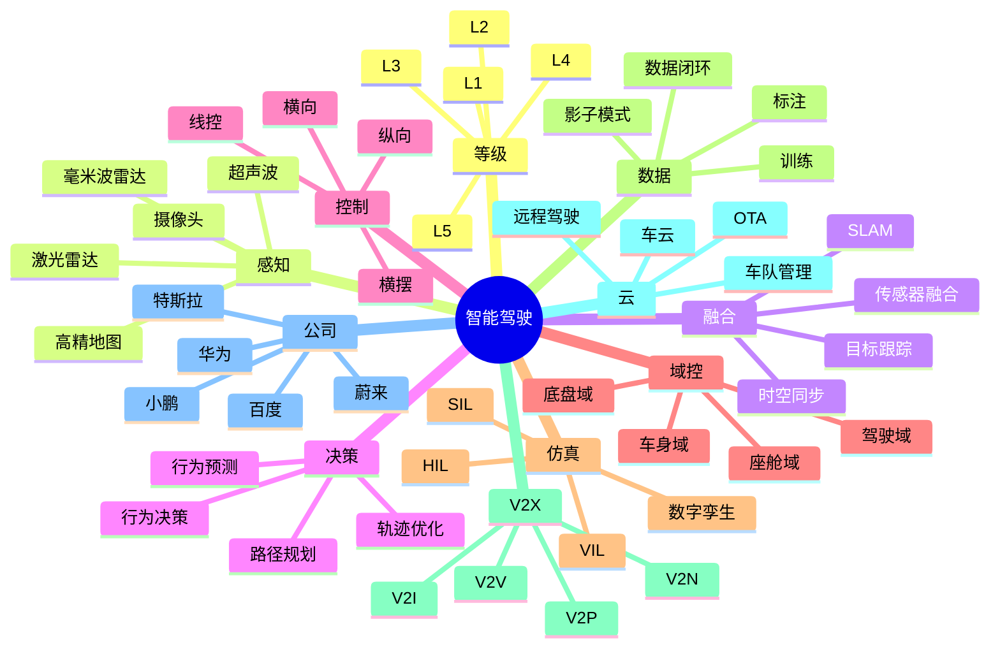

# 智能驾驶 深入剖析

## 一、前言

智能驾驶是 ADAS、自动驾驶、域控制器、传感器融合、V2X、高精地图的复合体。特斯拉、华为、小鹏、蔚来、理想、百度 Apollo、文远知行、小马智行是行业代表。从 L2 辅助驾驶到 L4 Robotaxi、智能座舱、车云一体，汽车正在被 AI 重新定义。本篇剖析智能驾驶平台架构。

## 二、架构思维导图



## 三、关键代码

### 3.1 传感器融合（目标跟踪）

```python
# sensor_fusion.py
import numpy as np
from filterpy.kalman import KalmanFilter

class SensorFusion:
    def __init__(self):
        self.tracks = {}  # track_id -> KalmanFilter
        self.next_id = 1
    
    def fuse(self, camera_objects, radar_objects, lidar_objects):
        # 1. 数据关联（匈牙利算法）
        candidates = []
        for cam_obj in camera_objects:
            for rad_obj in radar_objects:
                dist = self.distance(cam_obj, rad_obj)
                if dist < 2.0:  # 2 米内可能匹配
                    candidates.append((cam_obj, rad_obj, dist))
        
        # 2. 匹配
        matches = self.hungarian_match(candidates)
        
        # 3. 更新已有 track
        for cam_obj, rad_obj, _ in matches:
            track_id = self.find_track(cam_obj)
            if track_id:
                self.update_track(track_id, cam_obj, rad_obj, lidar_objects)
            else:
                # 新建 track
                track_id = self.create_track(cam_obj, rad_obj)
        
        # 4. 删除消失的 track
        self.remove_stale_tracks(max_age=30)
        
        return list(self.tracks.values())
    
    def update_track(self, track_id, cam_obj, rad_obj, lidar_objs):
        track = self.tracks[track_id]
        # 相机：精确的 2D 位置
        # 雷达：精确的速度和距离
        # 激光雷达：精确的 3D 轮廓
        # 融合：用卡尔曼滤波
        measurement = np.array([
            rad_obj.x, rad_obj.y, rad_obj.vx, rad_obj.vy
        ])
        track.update(measurement)
        track.class_name = cam_obj.class_name  # 用相机分类
        track.confidence = min(cam_obj.conf, rad_obj.conf)
```

### 3.2 行为预测（轨迹预测）

```python
# behavior_prediction.py
import torch

class BehaviorPredictor:
    def __init__(self):
        self.model = self.load_model('motion_forecaster_v3.pt')
    
    def predict(self, history, hdmap, intention='infer'):
        # 1. 编码历史轨迹
        hist_features = self.encode_history(history)  # [T, D]
        
        # 2. 编码高精地图
        map_features = self.encode_map(hdmap)
        
        # 3. 多模态预测
        with torch.no_grad():
            output = self.model(hist_features, map_features)
        
        # 4. 解析输出
        trajectories = output['trajectories']  # K=6 种可能轨迹
        probabilities = output['probabilities']  # 每种概率
        
        return [
            {
                'trajectory': traj.cpu().numpy(),
                'probability': prob.item()
            }
            for traj, prob in zip(trajectories, probabilities)
        ]
```

### 3.3 规划与控制

```python
# planning.py
class MotionPlanner:
    def __init__(self):
        self.cost_map = CostMap()
        self.optimizer = FrenetOptimizer()
    
    def plan(self, current_state, predicted_objects, goal):
        # 1. 构建 Frenet 坐标系
        sl = self.to_frenet(current_state, predicted_objects)
        
        # 2. 采样候选轨迹
        candidates = []
        for s_offset in np.linspace(-5, 5, 11):
            for v_target in np.linspace(0, 30, 16):
                traj = self.quintic_polynomial(sl, s_offset, v_target)
                cost = self.evaluate_cost(traj, predicted_objects)
                candidates.append((cost, traj))
        
        # 3. 选择最优轨迹
        candidates.sort(key=lambda x: x[0])
        best = candidates[0][1]
        
        # 4. 平滑输出
        return self.smooth_trajectory(best)
    
    def evaluate_cost(self, traj, objects):
        cost = 0
        # 舒适性：jerk 最小化
        cost += self.jerk_cost(traj) * 0.3
        # 安全性：与障碍物距离
        for obj in objects:
            min_dist = self.min_distance(traj, obj.predicted_trajectory)
            if min_dist < 2.0:
                cost += (2.0 - min_dist) * 100
        # 效率性：到达目标速度
        cost += abs(traj.end_v - self.target_v) * 0.5
        return cost
```

### 3.4 OTA 远程升级

```python
# vehicle_ota.py
class VehicleOTA:
    def __init__(self):
        self.fleet_db = PostgreSQL('vehicles')
        self.firmware_store = OSS('firmware')
    
    async def release(self, firmware, target_vins):
        # 1. 上传固件
        url = self.firmware_store.put(firmware.path, firmware.binary)
        
        # 2. 创建发布任务
        release = await self.fleet_db.create_release({
            'version': firmware.version,
            'url': url,
            'sha256': firmware.checksum,
            'size_mb': firmware.size / 1024 / 1024,
            'rollout_strategy': firmware.strategy,
            'min_battery': 50,
            'min_version': firmware.min_version,
        })
        
        # 3. 分批灰度
        for batch in self.batch_vins(target_vins, batch_size=100):
            await self.push_to_vehicles(batch, release)
            # 等待 24 小时观察
            await asyncio.sleep(86400)
            if not self.is_healthy(release):
                await self.emergency_rollback(batch, release)
                break
    
    async def push_to_vehicles(self, vins, release):
        for vin in vins:
            await self.kafka.send('vehicle-ota-cmd', {
                'vin': vin,
                'cmd': 'OTA_DOWNLOAD',
                'url': release.url,
                'sha256': release.sha256,
            })
```

## 行业纵深：行业纵深的产业链全景

行业纵深是对产业链、价值链、技术栈、商业模式的深度解构。从上游原材料、中游生产制造、下游分销消费，每个环节都存在数字化、智能化的机会窗口。

数据飞轮是 AI 时代的护城河。更多的用户产生更多的数据，更多的数据训练更好的模型，更好的模型吸引更多的用户，形成正向反馈。


## 关键场景：行业纵深的核心业务链路

产业链图谱是行业研究的入口。从原料、设备、技术、服务、应用五大维度梳理上下游关系，找出价值集中度高、议价能力强、技术壁垒厚的环节作为切入点。

数字化转型分为信息化、数字化、智能化三阶段。从 OA/ERP/CRM，到中台/低代码，到 AI 决策/智能体，每阶段都有对应的方法论与产品矩阵。


## 商业模式：行业纵深的盈利路径

垂直行业 Know-How 是行业纵深的护城河。金融、医疗、教育、制造、零售、农业各有独特的业务规则、监管要求、运营节奏，跨行业复制难度极高。

数字孪生是工业 4.0 的核心。ANSYS、Siemens Xcelerator、PTC ThingWorx、达索 3DEXPERIENCE、Bentley iTwin 让物理世界在数字世界有完整映射。


## 竞争格局：行业纵深的护城河

行业 SaaS 是数字化的核心载体。垂直 SaaS（Veeva、Toast、Procore）相比通用 SaaS（Salesforce、Workday）有更深的护城河和更高的 LTV/CAC 比率。

工业互联网（IIoT）是制造业的神经。Predix（GE）、MindSphere（西门子）、根云（树根）、飞鸿云（百度）、SupOS（蓝卓）连接设备、采集数据、上链算法。


## 政策环境：行业纵深的监管牌照

PaaS 化是行业 SaaS 的下一站。在 SaaS 基础上开放 API、SDK、Workflow、Rules Engine，让客户在平台上自建个性化应用，从工具升级为生态。

车联网（V2X）是汽车行业的下一个变量。C-V2X、5G-V2X、DSRC、LTE-V2X、NR-V2X 实现车与车、车与路、车与云、车与人的全连接。


## 技术架构：行业纵深的云原生落地

行业大模型是 AI 时代的新基础设施。BloombergGPT 之于金融、Med-PaLM 之于医疗、LawGPT 之于法律、FinGPT 之于投研，行业预训练 + 微调成为标配。

能源互联网是新型电力系统的核心。源网荷储一体化，多能互补协同，特高压、虚拟电厂、分布式储能、需求响应是技术底座。


## 数据要素：行业纵深的资产化

网络效应是平台型行业的核心壁垒。社交平台、电商平台、支付平台、交易所、招聘平台通过双边或多边市场形成飞轮，先行者优势明显。

智慧农业是农业的工业革命。极飞科技、大疆农业、托普云农、农信互联从种植、养殖、流通、销售全链路重塑农业生产力。


## AI 赋能：行业纵深的垂直模型

数据飞轮是 AI 时代的护城河。更多的用户产生更多的数据，更多的数据训练更好的模型，更好的模型吸引更多的用户，形成正向反馈。

金融科技（FinTech）正重塑金融业。支付（支付宝、微信支付）、信贷（蚂蚁、微众）、保险（众安、水滴）、财富（东方财富、雪球）、监管科技（RegTech）多线并进。


## 网络效应：行业纵深的平台双边

数字化转型分为信息化、数字化、智能化三阶段。从 OA/ERP/CRM，到中台/低代码，到 AI 决策/智能体，每阶段都有对应的方法论与产品矩阵。

保险科技（InsurTech）解决行业痛点。产品创新（UBI、按需）、渠道变革（互联网）、理赔优化（OCR、反欺诈）、精算升级（大数据 AI）、生态融合（场景化）


## 用户画像：行业纵深的人群分层

数字孪生是工业 4.0 的核心。ANSYS、Siemens Xcelerator、PTC ThingWorx、达索 3DEXPERIENCE、Bentley iTwin 让物理世界在数字世界有完整映射。

数字健康是医疗的新范式。互联网医院（微医、好大夫）、AI 辅助诊断（推想、数坤）、医药电商（京东健康、阿里健康）、基因测序（华大、燃石）、可穿戴（华为、小米）。


## 增长策略：行业纵深的AARRR 漏斗

工业互联网（IIoT）是制造业的神经。Predix（GE）、MindSphere（西门子）、根云（树根）、飞鸿云（百度）、SupOS（蓝卓）连接设备、采集数据、上链算法。

在线教育进入 AI 时代。大模型助教、AI 答疑、自适应学习、虚拟老师、智能批改让因材施教从理想走向现实。


## 留存运营：行业纵深的RFM 分层

车联网（V2X）是汽车行业的下一个变量。C-V2X、5G-V2X、DSRC、LTE-V2X、NR-V2X 实现车与车、车与路、车与云、车与人的全连接。

数字身份是数字世界的入口。OAuth 2.0、OIDC、SAML、FIDO2、WebAuthn、Passkey、DID（去中心化身份）、VC（可验证凭证）是技术底座。


## 商业化：行业纵深的订阅广告电商

能源互联网是新型电力系统的核心。源网荷储一体化，多能互补协同，特高压、虚拟电厂、分布式储能、需求响应是技术底座。

跨境支付与外汇是全球化的基础设施。SWIFT、CIPS、PIX、UPI、SEPA、FedNow、PIX、跨境清算、汇率对冲、稳定币（USDC、USDT）是技术热点。


## 风控合规：行业纵深的KYC 反欺诈

智慧农业是农业的工业革命。极飞科技、大疆农业、托普云农、农信互联从种植、养殖、流通、销售全链路重塑农业生产力。

物流科技从自动化走向智能化。京东物流、顺丰、菜鸟、达达、闪送、美团配送、Uber Freight、Flexport 在仓、干、配、关、汇各环节创新。


## 国际拓展：行业纵深的本地化

金融科技（FinTech）正重塑金融业。支付（支付宝、微信支付）、信贷（蚂蚁、微众）、保险（众安、水滴）、财富（东方财富、雪球）、监管科技（RegTech）多线并进。

餐饮零售化（SaaS + Supply + Service）。海底捞、九毛九、太二的数字化、美团/饿了么的本地生活、瑞幸/库迪的万店连锁、锅圈食汇的预制菜零售。


## 资本市场：行业纵深的估值逻辑

保险科技（InsurTech）解决行业痛点。产品创新（UBI、按需）、渠道变革（互联网）、理赔优化（OCR、反欺诈）、精算升级（大数据 AI）、生态融合（场景化）

酒店旅游的复苏与重塑。携程、Booking、Airbnb、Trip.com、Expedia、华住、锦江、首旅如家、亚朵在数字化与会员体系上深度竞争。


## 组织能力：行业纵深的团队梯队

数字健康是医疗的新范式。互联网医院（微医、好大夫）、AI 辅助诊断（推想、数坤）、医药电商（京东健康、阿里健康）、基因测序（华大、燃石）、可穿戴（华为、小米）。

智慧城市是新基建的集大成。城市大脑（阿里、华为、百度）、一网统管、一网通办、城市信息模型（CIM）、数字孪生城市是技术制高点。


## 上下游：行业纵深的供应商渠道

在线教育进入 AI 时代。大模型助教、AI 答疑、自适应学习、虚拟老师、智能批改让因材施教从理想走向现实。

智能交通让出行更高效。MaaS（出行即服务）、智慧公交、智慧地铁、智慧高铁、智慧机场、智慧港口、智慧物流园是技术蓝海。


## 客户成功：行业纵深的NPS CSAT

数字身份是数字世界的入口。OAuth 2.0、OIDC、SAML、FIDO2、WebAuthn、Passkey、DID（去中心化身份）、VC（可验证凭证）是技术底座。

ESG 与可持续发展是行业的必答题。碳达峰、碳中和、ESG 评级、ISSB 准则、绿色金融、转型金融、可持续供应链是核心议题。


## 产品方法论：行业纵深的MVP 迭代

跨境支付与外汇是全球化的基础设施。SWIFT、CIPS、PIX、UPI、SEPA、FedNow、PIX、跨境清算、汇率对冲、稳定币（USDC、USDT）是技术热点。

生物科技是 21 世纪的战略产业。基因编辑（CRISPR）、合成生物学、细胞治疗、mRNA 疫苗、AI 制药、脑机接口是前沿突破。


## 数字化转型：行业纵深的 IT/OT 融合

物流科技从自动化走向智能化。京东物流、顺丰、菜鸟、达达、闪送、美团配送、Uber Freight、Flexport 在仓、干、配、关、汇各环节创新。

新能源是能源革命的主战场。光伏（隆基、晶科）、风电（金风、明阳）、储能（宁德、比亚迪、亿纬）、氢能（隆基、阳光）、核电（中广核）是核心赛道。


## 行业 SaaS：行业纵深的 PaaS 化

餐饮零售化（SaaS + Supply + Service）。海底捞、九毛九、太二的数字化、美团/饿了么的本地生活、瑞幸/库迪的万店连锁、锅圈食汇的预制菜零售。

半导体是科技自主的基石。EDA（华大九天）、设备（北方华创、中微）、材料（沪硅、立昂微）、设计（华为海思、紫光展锐）、制造（中芯国际、华虹）、封测（长电、通富）是产业链各环节。


## 生态战略：行业纵深的开放 API

酒店旅游的复苏与重塑。携程、Booking、Airbnb、Trip.com、Expedia、华住、锦江、首旅如家、亚朵在数字化与会员体系上深度竞争。

机器人从工业走向通用。ABB、发那科、安川、库卡四大家族，特斯拉 Optimus、Figure 01、宇树 H1、稚晖君、智元、波士顿动力让通用人工智能有了物理载体。


## 行业大模型：行业纵深的预训练微调

智慧城市是新基建的集大成。城市大脑（阿里、华为、百度）、一网统管、一网通办、城市信息模型（CIM）、数字孪生城市是技术制高点。

行业纵深是对产业链、价值链、技术栈、商业模式的深度解构。从上游原材料、中游生产制造、下游分销消费，每个环节都存在数字化、智能化的机会窗口。


## 数字孪生：行业纵深的虚实融合

智能交通让出行更高效。MaaS（出行即服务）、智慧公交、智慧地铁、智慧高铁、智慧机场、智慧港口、智慧物流园是技术蓝海。

产业链图谱是行业研究的入口。从原料、设备、技术、服务、应用五大维度梳理上下游关系，找出价值集中度高、议价能力强、技术壁垒厚的环节作为切入点。


## ESG 实践：行业纵深的可持续

ESG 与可持续发展是行业的必答题。碳达峰、碳中和、ESG 评级、ISSB 准则、绿色金融、转型金融、可持续供应链是核心议题。

垂直行业 Know-How 是行业纵深的护城河。金融、医疗、教育、制造、零售、农业各有独特的业务规则、监管要求、运营节奏，跨行业复制难度极高。


## 隐私计算：行业纵深的数据流通

生物科技是 21 世纪的战略产业。基因编辑（CRISPR）、合成生物学、细胞治疗、mRNA 疫苗、AI 制药、脑机接口是前沿突破。

行业 SaaS 是数字化的核心载体。垂直 SaaS（Veeva、Toast、Procore）相比通用 SaaS（Salesforce、Workday）有更深的护城河和更高的 LTV/CAC 比率。


## 区块链落地：行业纵深的 RWA

新能源是能源革命的主战场。光伏（隆基、晶科）、风电（金风、明阳）、储能（宁德、比亚迪、亿纬）、氢能（隆基、阳光）、核电（中广核）是核心赛道。

PaaS 化是行业 SaaS 的下一站。在 SaaS 基础上开放 API、SDK、Workflow、Rules Engine，让客户在平台上自建个性化应用，从工具升级为生态。


## 卫星与空天：行业纵深的低空经济

半导体是科技自主的基石。EDA（华大九天）、设备（北方华创、中微）、材料（沪硅、立昂微）、设计（华为海思、紫光展锐）、制造（中芯国际、华虹）、封测（长电、通富）是产业链各环节。

行业大模型是 AI 时代的新基础设施。BloombergGPT 之于金融、Med-PaLM 之于医疗、LawGPT 之于法律、FinGPT 之于投研，行业预训练 + 微调成为标配。


## 未来展望：行业纵深的奇点临近

机器人从工业走向通用。ABB、发那科、安川、库卡四大家族，特斯拉 Optimus、Figure 01、宇树 H1、稚晖君、智元、波士顿动力让通用人工智能有了物理载体。

网络效应是平台型行业的核心壁垒。社交平台、电商平台、支付平台、交易所、招聘平台通过双边或多边市场形成飞轮，先行者优势明显。


## 行业纵深：行业纵深的产业链全景

行业纵深是对产业链、价值链、技术栈、商业模式的深度解构。从上游原材料、中游生产制造、下游分销消费，每个环节都存在数字化、智能化的机会窗口。

数据飞轮是 AI 时代的护城河。更多的用户产生更多的数据，更多的数据训练更好的模型，更好的模型吸引更多的用户，形成正向反馈。


## 关键场景：行业纵深的核心业务链路

产业链图谱是行业研究的入口。从原料、设备、技术、服务、应用五大维度梳理上下游关系，找出价值集中度高、议价能力强、技术壁垒厚的环节作为切入点。

数字化转型分为信息化、数字化、智能化三阶段。从 OA/ERP/CRM，到中台/低代码，到 AI 决策/智能体，每阶段都有对应的方法论与产品矩阵。


## 商业模式：行业纵深的盈利路径

垂直行业 Know-How 是行业纵深的护城河。金融、医疗、教育、制造、零售、农业各有独特的业务规则、监管要求、运营节奏，跨行业复制难度极高。

数字孪生是工业 4.0 的核心。ANSYS、Siemens Xcelerator、PTC ThingWorx、达索 3DEXPERIENCE、Bentley iTwin 让物理世界在数字世界有完整映射。


## 竞争格局：行业纵深的护城河

行业 SaaS 是数字化的核心载体。垂直 SaaS（Veeva、Toast、Procore）相比通用 SaaS（Salesforce、Workday）有更深的护城河和更高的 LTV/CAC 比率。

工业互联网（IIoT）是制造业的神经。Predix（GE）、MindSphere（西门子）、根云（树根）、飞鸿云（百度）、SupOS（蓝卓）连接设备、采集数据、上链算法。


## 政策环境：行业纵深的监管牌照

PaaS 化是行业 SaaS 的下一站。在 SaaS 基础上开放 API、SDK、Workflow、Rules Engine，让客户在平台上自建个性化应用，从工具升级为生态。

车联网（V2X）是汽车行业的下一个变量。C-V2X、5G-V2X、DSRC、LTE-V2X、NR-V2X 实现车与车、车与路、车与云、车与人的全连接。


## 技术架构：行业纵深的云原生落地

行业大模型是 AI 时代的新基础设施。BloombergGPT 之于金融、Med-PaLM 之于医疗、LawGPT 之于法律、FinGPT 之于投研，行业预训练 + 微调成为标配。

能源互联网是新型电力系统的核心。源网荷储一体化，多能互补协同，特高压、虚拟电厂、分布式储能、需求响应是技术底座。


## 数据要素：行业纵深的资产化

网络效应是平台型行业的核心壁垒。社交平台、电商平台、支付平台、交易所、招聘平台通过双边或多边市场形成飞轮，先行者优势明显。

智慧农业是农业的工业革命。极飞科技、大疆农业、托普云农、农信互联从种植、养殖、流通、销售全链路重塑农业生产力。


## AI 赋能：行业纵深的垂直模型

数据飞轮是 AI 时代的护城河。更多的用户产生更多的数据，更多的数据训练更好的模型，更好的模型吸引更多的用户，形成正向反馈。

金融科技（FinTech）正重塑金融业。支付（支付宝、微信支付）、信贷（蚂蚁、微众）、保险（众安、水滴）、财富（东方财富、雪球）、监管科技（RegTech）多线并进。


## 网络效应：行业纵深的平台双边

数字化转型分为信息化、数字化、智能化三阶段。从 OA/ERP/CRM，到中台/低代码，到 AI 决策/智能体，每阶段都有对应的方法论与产品矩阵。

保险科技（InsurTech）解决行业痛点。产品创新（UBI、按需）、渠道变革（互联网）、理赔优化（OCR、反欺诈）、精算升级（大数据 AI）、生态融合（场景化）


## 用户画像：行业纵深的人群分层

数字孪生是工业 4.0 的核心。ANSYS、Siemens Xcelerator、PTC ThingWorx、达索 3DEXPERIENCE、Bentley iTwin 让物理世界在数字世界有完整映射。

数字健康是医疗的新范式。互联网医院（微医、好大夫）、AI 辅助诊断（推想、数坤）、医药电商（京东健康、阿里健康）、基因测序（华大、燃石）、可穿戴（华为、小米）。


## 增长策略：行业纵深的AARRR 漏斗

工业互联网（IIoT）是制造业的神经。Predix（GE）、MindSphere（西门子）、根云（树根）、飞鸿云（百度）、SupOS（蓝卓）连接设备、采集数据、上链算法。

在线教育进入 AI 时代。大模型助教、AI 答疑、自适应学习、虚拟老师、智能批改让因材施教从理想走向现实。


## 留存运营：行业纵深的RFM 分层

车联网（V2X）是汽车行业的下一个变量。C-V2X、5G-V2X、DSRC、LTE-V2X、NR-V2X 实现车与车、车与路、车与云、车与人的全连接。

数字身份是数字世界的入口。OAuth 2.0、OIDC、SAML、FIDO2、WebAuthn、Passkey、DID（去中心化身份）、VC（可验证凭证）是技术底座。


## 商业化：行业纵深的订阅广告电商

能源互联网是新型电力系统的核心。源网荷储一体化，多能互补协同，特高压、虚拟电厂、分布式储能、需求响应是技术底座。

跨境支付与外汇是全球化的基础设施。SWIFT、CIPS、PIX、UPI、SEPA、FedNow、PIX、跨境清算、汇率对冲、稳定币（USDC、USDT）是技术热点。


## 风控合规：行业纵深的KYC 反欺诈

智慧农业是农业的工业革命。极飞科技、大疆农业、托普云农、农信互联从种植、养殖、流通、销售全链路重塑农业生产力。

物流科技从自动化走向智能化。京东物流、顺丰、菜鸟、达达、闪送、美团配送、Uber Freight、Flexport 在仓、干、配、关、汇各环节创新。


## 国际拓展：行业纵深的本地化

金融科技（FinTech）正重塑金融业。支付（支付宝、微信支付）、信贷（蚂蚁、微众）、保险（众安、水滴）、财富（东方财富、雪球）、监管科技（RegTech）多线并进。

餐饮零售化（SaaS + Supply + Service）。海底捞、九毛九、太二的数字化、美团/饿了么的本地生活、瑞幸/库迪的万店连锁、锅圈食汇的预制菜零售。


## 资本市场：行业纵深的估值逻辑

保险科技（InsurTech）解决行业痛点。产品创新（UBI、按需）、渠道变革（互联网）、理赔优化（OCR、反欺诈）、精算升级（大数据 AI）、生态融合（场景化）

酒店旅游的复苏与重塑。携程、Booking、Airbnb、Trip.com、Expedia、华住、锦江、首旅如家、亚朵在数字化与会员体系上深度竞争。


## 组织能力：行业纵深的团队梯队

数字健康是医疗的新范式。互联网医院（微医、好大夫）、AI 辅助诊断（推想、数坤）、医药电商（京东健康、阿里健康）、基因测序（华大、燃石）、可穿戴（华为、小米）。

智慧城市是新基建的集大成。城市大脑（阿里、华为、百度）、一网统管、一网通办、城市信息模型（CIM）、数字孪生城市是技术制高点。


## 上下游：行业纵深的供应商渠道

在线教育进入 AI 时代。大模型助教、AI 答疑、自适应学习、虚拟老师、智能批改让因材施教从理想走向现实。

智能交通让出行更高效。MaaS（出行即服务）、智慧公交、智慧地铁、智慧高铁、智慧机场、智慧港口、智慧物流园是技术蓝海。


## 客户成功：行业纵深的NPS CSAT

数字身份是数字世界的入口。OAuth 2.0、OIDC、SAML、FIDO2、WebAuthn、Passkey、DID（去中心化身份）、VC（可验证凭证）是技术底座。

ESG 与可持续发展是行业的必答题。碳达峰、碳中和、ESG 评级、ISSB 准则、绿色金融、转型金融、可持续供应链是核心议题。


## 产品方法论：行业纵深的MVP 迭代

跨境支付与外汇是全球化的基础设施。SWIFT、CIPS、PIX、UPI、SEPA、FedNow、PIX、跨境清算、汇率对冲、稳定币（USDC、USDT）是技术热点。

生物科技是 21 世纪的战略产业。基因编辑（CRISPR）、合成生物学、细胞治疗、mRNA 疫苗、AI 制药、脑机接口是前沿突破。


## 数字化转型：行业纵深的 IT/OT 融合

物流科技从自动化走向智能化。京东物流、顺丰、菜鸟、达达、闪送、美团配送、Uber Freight、Flexport 在仓、干、配、关、汇各环节创新。

新能源是能源革命的主战场。光伏（隆基、晶科）、风电（金风、明阳）、储能（宁德、比亚迪、亿纬）、氢能（隆基、阳光）、核电（中广核）是核心赛道。


## 行业 SaaS：行业纵深的 PaaS 化

餐饮零售化（SaaS + Supply + Service）。海底捞、九毛九、太二的数字化、美团/饿了么的本地生活、瑞幸/库迪的万店连锁、锅圈食汇的预制菜零售。

半导体是科技自主的基石。EDA（华大九天）、设备（北方华创、中微）、材料（沪硅、立昂微）、设计（华为海思、紫光展锐）、制造（中芯国际、华虹）、封测（长电、通富）是产业链各环节。


## 生态战略：行业纵深的开放 API

酒店旅游的复苏与重塑。携程、Booking、Airbnb、Trip.com、Expedia、华住、锦江、首旅如家、亚朵在数字化与会员体系上深度竞争。

机器人从工业走向通用。ABB、发那科、安川、库卡四大家族，特斯拉 Optimus、Figure 01、宇树 H1、稚晖君、智元、波士顿动力让通用人工智能有了物理载体。


## 行业大模型：行业纵深的预训练微调

智慧城市是新基建的集大成。城市大脑（阿里、华为、百度）、一网统管、一网通办、城市信息模型（CIM）、数字孪生城市是技术制高点。

行业纵深是对产业链、价值链、技术栈、商业模式的深度解构。从上游原材料、中游生产制造、下游分销消费，每个环节都存在数字化、智能化的机会窗口。


## 数字孪生：行业纵深的虚实融合

智能交通让出行更高效。MaaS（出行即服务）、智慧公交、智慧地铁、智慧高铁、智慧机场、智慧港口、智慧物流园是技术蓝海。

产业链图谱是行业研究的入口。从原料、设备、技术、服务、应用五大维度梳理上下游关系，找出价值集中度高、议价能力强、技术壁垒厚的环节作为切入点。


## ESG 实践：行业纵深的可持续

ESG 与可持续发展是行业的必答题。碳达峰、碳中和、ESG 评级、ISSB 准则、绿色金融、转型金融、可持续供应链是核心议题。

垂直行业 Know-How 是行业纵深的护城河。金融、医疗、教育、制造、零售、农业各有独特的业务规则、监管要求、运营节奏，跨行业复制难度极高。


## 隐私计算：行业纵深的数据流通

生物科技是 21 世纪的战略产业。基因编辑（CRISPR）、合成生物学、细胞治疗、mRNA 疫苗、AI 制药、脑机接口是前沿突破。

行业 SaaS 是数字化的核心载体。垂直 SaaS（Veeva、Toast、Procore）相比通用 SaaS（Salesforce、Workday）有更深的护城河和更高的 LTV/CAC 比率。


## 区块链落地：行业纵深的 RWA

新能源是能源革命的主战场。光伏（隆基、晶科）、风电（金风、明阳）、储能（宁德、比亚迪、亿纬）、氢能（隆基、阳光）、核电（中广核）是核心赛道。

PaaS 化是行业 SaaS 的下一站。在 SaaS 基础上开放 API、SDK、Workflow、Rules Engine，让客户在平台上自建个性化应用，从工具升级为生态。


## 卫星与空天：行业纵深的低空经济

半导体是科技自主的基石。EDA（华大九天）、设备（北方华创、中微）、材料（沪硅、立昂微）、设计（华为海思、紫光展锐）、制造（中芯国际、华虹）、封测（长电、通富）是产业链各环节。

行业大模型是 AI 时代的新基础设施。BloombergGPT 之于金融、Med-PaLM 之于医疗、LawGPT 之于法律、FinGPT 之于投研，行业预训练 + 微调成为标配。


## 未来展望：行业纵深的奇点临近

机器人从工业走向通用。ABB、发那科、安川、库卡四大家族，特斯拉 Optimus、Figure 01、宇树 H1、稚晖君、智元、波士顿动力让通用人工智能有了物理载体。

网络效应是平台型行业的核心壁垒。社交平台、电商平台、支付平台、交易所、招聘平台通过双边或多边市场形成飞轮，先行者优势明显。


## 行业纵深：行业纵深的产业链全景

行业纵深是对产业链、价值链、技术栈、商业模式的深度解构。从上游原材料、中游生产制造、下游分销消费，每个环节都存在数字化、智能化的机会窗口。

数据飞轮是 AI 时代的护城河。更多的用户产生更多的数据，更多的数据训练更好的模型，更好的模型吸引更多的用户，形成正向反馈。


## 关键场景：行业纵深的核心业务链路

产业链图谱是行业研究的入口。从原料、设备、技术、服务、应用五大维度梳理上下游关系，找出价值集中度高、议价能力强、技术壁垒厚的环节作为切入点。

数字化转型分为信息化、数字化、智能化三阶段。从 OA/ERP/CRM，到中台/低代码，到 AI 决策/智能体，每阶段都有对应的方法论与产品矩阵。


## 商业模式：行业纵深的盈利路径

垂直行业 Know-How 是行业纵深的护城河。金融、医疗、教育、制造、零售、农业各有独特的业务规则、监管要求、运营节奏，跨行业复制难度极高。

数字孪生是工业 4.0 的核心。ANSYS、Siemens Xcelerator、PTC ThingWorx、达索 3DEXPERIENCE、Bentley iTwin 让物理世界在数字世界有完整映射。


## 竞争格局：行业纵深的护城河

行业 SaaS 是数字化的核心载体。垂直 SaaS（Veeva、Toast、Procore）相比通用 SaaS（Salesforce、Workday）有更深的护城河和更高的 LTV/CAC 比率。

工业互联网（IIoT）是制造业的神经。Predix（GE）、MindSphere（西门子）、根云（树根）、飞鸿云（百度）、SupOS（蓝卓）连接设备、采集数据、上链算法。


## 政策环境：行业纵深的监管牌照

PaaS 化是行业 SaaS 的下一站。在 SaaS 基础上开放 API、SDK、Workflow、Rules Engine，让客户在平台上自建个性化应用，从工具升级为生态。

车联网（V2X）是汽车行业的下一个变量。C-V2X、5G-V2X、DSRC、LTE-V2X、NR-V2X 实现车与车、车与路、车与云、车与人的全连接。


## 技术架构：行业纵深的云原生落地

行业大模型是 AI 时代的新基础设施。BloombergGPT 之于金融、Med-PaLM 之于医疗、LawGPT 之于法律、FinGPT 之于投研，行业预训练 + 微调成为标配。

能源互联网是新型电力系统的核心。源网荷储一体化，多能互补协同，特高压、虚拟电厂、分布式储能、需求响应是技术底座。


## 数据要素：行业纵深的资产化

网络效应是平台型行业的核心壁垒。社交平台、电商平台、支付平台、交易所、招聘平台通过双边或多边市场形成飞轮，先行者优势明显。

智慧农业是农业的工业革命。极飞科技、大疆农业、托普云农、农信互联从种植、养殖、流通、销售全链路重塑农业生产力。


## AI 赋能：行业纵深的垂直模型

数据飞轮是 AI 时代的护城河。更多的用户产生更多的数据，更多的数据训练更好的模型，更好的模型吸引更多的用户，形成正向反馈。

金融科技（FinTech）正重塑金融业。支付（支付宝、微信支付）、信贷（蚂蚁、微众）、保险（众安、水滴）、财富（东方财富、雪球）、监管科技（RegTech）多线并进。


## 网络效应：行业纵深的平台双边

数字化转型分为信息化、数字化、智能化三阶段。从 OA/ERP/CRM，到中台/低代码，到 AI 决策/智能体，每阶段都有对应的方法论与产品矩阵。

保险科技（InsurTech）解决行业痛点。产品创新（UBI、按需）、渠道变革（互联网）、理赔优化（OCR、反欺诈）、精算升级（大数据 AI）、生态融合（场景化）


## 用户画像：行业纵深的人群分层

数字孪生是工业 4.0 的核心。ANSYS、Siemens Xcelerator、PTC ThingWorx、达索 3DEXPERIENCE、Bentley iTwin 让物理世界在数字世界有完整映射。

数字健康是医疗的新范式。互联网医院（微医、好大夫）、AI 辅助诊断（推想、数坤）、医药电商（京东健康、阿里健康）、基因测序（华大、燃石）、可穿戴（华为、小米）。


## 增长策略：行业纵深的AARRR 漏斗

工业互联网（IIoT）是制造业的神经。Predix（GE）、MindSphere（西门子）、根云（树根）、飞鸿云（百度）、SupOS（蓝卓）连接设备、采集数据、上链算法。

在线教育进入 AI 时代。大模型助教、AI 答疑、自适应学习、虚拟老师、智能批改让因材施教从理想走向现实。


## 留存运营：行业纵深的RFM 分层

车联网（V2X）是汽车行业的下一个变量。C-V2X、5G-V2X、DSRC、LTE-V2X、NR-V2X 实现车与车、车与路、车与云、车与人的全连接。

数字身份是数字世界的入口。OAuth 2.0、OIDC、SAML、FIDO2、WebAuthn、Passkey、DID（去中心化身份）、VC（可验证凭证）是技术底座。


## 商业化：行业纵深的订阅广告电商

能源互联网是新型电力系统的核心。源网荷储一体化，多能互补协同，特高压、虚拟电厂、分布式储能、需求响应是技术底座。

跨境支付与外汇是全球化的基础设施。SWIFT、CIPS、PIX、UPI、SEPA、FedNow、PIX、跨境清算、汇率对冲、稳定币（USDC、USDT）是技术热点。


## 风控合规：行业纵深的KYC 反欺诈

智慧农业是农业的工业革命。极飞科技、大疆农业、托普云农、农信互联从种植、养殖、流通、销售全链路重塑农业生产力。

物流科技从自动化走向智能化。京东物流、顺丰、菜鸟、达达、闪送、美团配送、Uber Freight、Flexport 在仓、干、配、关、汇各环节创新。


## 国际拓展：行业纵深的本地化

金融科技（FinTech）正重塑金融业。支付（支付宝、微信支付）、信贷（蚂蚁、微众）、保险（众安、水滴）、财富（东方财富、雪球）、监管科技（RegTech）多线并进。

餐饮零售化（SaaS + Supply + Service）。海底捞、九毛九、太二的数字化、美团/饿了么的本地生活、瑞幸/库迪的万店连锁、锅圈食汇的预制菜零售。


## 资本市场：行业纵深的估值逻辑

保险科技（InsurTech）解决行业痛点。产品创新（UBI、按需）、渠道变革（互联网）、理赔优化（OCR、反欺诈）、精算升级（大数据 AI）、生态融合（场景化）

酒店旅游的复苏与重塑。携程、Booking、Airbnb、Trip.com、Expedia、华住、锦江、首旅如家、亚朵在数字化与会员体系上深度竞争。


## 组织能力：行业纵深的团队梯队

数字健康是医疗的新范式。互联网医院（微医、好大夫）、AI 辅助诊断（推想、数坤）、医药电商（京东健康、阿里健康）、基因测序（华大、燃石）、可穿戴（华为、小米）。

智慧城市是新基建的集大成。城市大脑（阿里、华为、百度）、一网统管、一网通办、城市信息模型（CIM）、数字孪生城市是技术制高点。


## 上下游：行业纵深的供应商渠道

在线教育进入 AI 时代。大模型助教、AI 答疑、自适应学习、虚拟老师、智能批改让因材施教从理想走向现实。

智能交通让出行更高效。MaaS（出行即服务）、智慧公交、智慧地铁、智慧高铁、智慧机场、智慧港口、智慧物流园是技术蓝海。


## 客户成功：行业纵深的NPS CSAT

数字身份是数字世界的入口。OAuth 2.0、OIDC、SAML、FIDO2、WebAuthn、Passkey、DID（去中心化身份）、VC（可验证凭证）是技术底座。

ESG 与可持续发展是行业的必答题。碳达峰、碳中和、ESG 评级、ISSB 准则、绿色金融、转型金融、可持续供应链是核心议题。


## 产品方法论：行业纵深的MVP 迭代

跨境支付与外汇是全球化的基础设施。SWIFT、CIPS、PIX、UPI、SEPA、FedNow、PIX、跨境清算、汇率对冲、稳定币（USDC、USDT）是技术热点。

生物科技是 21 世纪的战略产业。基因编辑（CRISPR）、合成生物学、细胞治疗、mRNA 疫苗、AI 制药、脑机接口是前沿突破。


## 数字化转型：行业纵深的 IT/OT 融合

物流科技从自动化走向智能化。京东物流、顺丰、菜鸟、达达、闪送、美团配送、Uber Freight、Flexport 在仓、干、配、关、汇各环节创新。

新能源是能源革命的主战场。光伏（隆基、晶科）、风电（金风、明阳）、储能（宁德、比亚迪、亿纬）、氢能（隆基、阳光）、核电（中广核）是核心赛道。


## 行业 SaaS：行业纵深的 PaaS 化

餐饮零售化（SaaS + Supply + Service）。海底捞、九毛九、太二的数字化、美团/饿了么的本地生活、瑞幸/库迪的万店连锁、锅圈食汇的预制菜零售。

半导体是科技自主的基石。EDA（华大九天）、设备（北方华创、中微）、材料（沪硅、立昂微）、设计（华为海思、紫光展锐）、制造（中芯国际、华虹）、封测（长电、通富）是产业链各环节。


## 生态战略：行业纵深的开放 API

酒店旅游的复苏与重塑。携程、Booking、Airbnb、Trip.com、Expedia、华住、锦江、首旅如家、亚朵在数字化与会员体系上深度竞争。

机器人从工业走向通用。ABB、发那科、安川、库卡四大家族，特斯拉 Optimus、Figure 01、宇树 H1、稚晖君、智元、波士顿动力让通用人工智能有了物理载体。


## 行业大模型：行业纵深的预训练微调

智慧城市是新基建的集大成。城市大脑（阿里、华为、百度）、一网统管、一网通办、城市信息模型（CIM）、数字孪生城市是技术制高点。

行业纵深是对产业链、价值链、技术栈、商业模式的深度解构。从上游原材料、中游生产制造、下游分销消费，每个环节都存在数字化、智能化的机会窗口。


## 数字孪生：行业纵深的虚实融合

智能交通让出行更高效。MaaS（出行即服务）、智慧公交、智慧地铁、智慧高铁、智慧机场、智慧港口、智慧物流园是技术蓝海。

产业链图谱是行业研究的入口。从原料、设备、技术、服务、应用五大维度梳理上下游关系，找出价值集中度高、议价能力强、技术壁垒厚的环节作为切入点。


## ESG 实践：行业纵深的可持续

ESG 与可持续发展是行业的必答题。碳达峰、碳中和、ESG 评级、ISSB 准则、绿色金融、转型金融、可持续供应链是核心议题。

垂直行业 Know-How 是行业纵深的护城河。金融、医疗、教育、制造、零售、农业各有独特的业务规则、监管要求、运营节奏，跨行业复制难度极高。


## 隐私计算：行业纵深的数据流通

生物科技是 21 世纪的战略产业。基因编辑（CRISPR）、合成生物学、细胞治疗、mRNA 疫苗、AI 制药、脑机接口是前沿突破。

行业 SaaS 是数字化的核心载体。垂直 SaaS（Veeva、Toast、Procore）相比通用 SaaS（Salesforce、Workday）有更深的护城河和更高的 LTV/CAC 比率。


## 区块链落地：行业纵深的 RWA

新能源是能源革命的主战场。光伏（隆基、晶科）、风电（金风、明阳）、储能（宁德、比亚迪、亿纬）、氢能（隆基、阳光）、核电（中广核）是核心赛道。

PaaS 化是行业 SaaS 的下一站。在 SaaS 基础上开放 API、SDK、Workflow、Rules Engine，让客户在平台上自建个性化应用，从工具升级为生态。


## 卫星与空天：行业纵深的低空经济

半导体是科技自主的基石。EDA（华大九天）、设备（北方华创、中微）、材料（沪硅、立昂微）、设计（华为海思、紫光展锐）、制造（中芯国际、华虹）、封测（长电、通富）是产业链各环节。

行业大模型是 AI 时代的新基础设施。BloombergGPT 之于金融、Med-PaLM 之于医疗、LawGPT 之于法律、FinGPT 之于投研，行业预训练 + 微调成为标配。


## 未来展望：行业纵深的奇点临近

机器人从工业走向通用。ABB、发那科、安川、库卡四大家族，特斯拉 Optimus、Figure 01、宇树 H1、稚晖君、智元、波士顿动力让通用人工智能有了物理载体。

网络效应是平台型行业的核心壁垒。社交平台、电商平台、支付平台、交易所、招聘平台通过双边或多边市场形成飞轮，先行者优势明显。


## 行业纵深：行业纵深的产业链全景

行业纵深是对产业链、价值链、技术栈、商业模式的深度解构。从上游原材料、中游生产制造、下游分销消费，每个环节都存在数字化、智能化的机会窗口。

数据飞轮是 AI 时代的护城河。更多的用户产生更多的数据，更多的数据训练更好的模型，更好的模型吸引更多的用户，形成正向反馈。


## 关键场景：行业纵深的核心业务链路

产业链图谱是行业研究的入口。从原料、设备、技术、服务、应用五大维度梳理上下游关系，找出价值集中度高、议价能力强、技术壁垒厚的环节作为切入点。

数字化转型分为信息化、数字化、智能化三阶段。从 OA/ERP/CRM，到中台/低代码，到 AI 决策/智能体，每阶段都有对应的方法论与产品矩阵。


## 商业模式：行业纵深的盈利路径

垂直行业 Know-How 是行业纵深的护城河。金融、医疗、教育、制造、零售、农业各有独特的业务规则、监管要求、运营节奏，跨行业复制难度极高。

数字孪生是工业 4.0 的核心。ANSYS、Siemens Xcelerator、PTC ThingWorx、达索 3DEXPERIENCE、Bentley iTwin 让物理世界在数字世界有完整映射。


## 竞争格局：行业纵深的护城河

行业 SaaS 是数字化的核心载体。垂直 SaaS（Veeva、Toast、Procore）相比通用 SaaS（Salesforce、Workday）有更深的护城河和更高的 LTV/CAC 比率。

工业互联网（IIoT）是制造业的神经。Predix（GE）、MindSphere（西门子）、根云（树根）、飞鸿云（百度）、SupOS（蓝卓）连接设备、采集数据、上链算法。


## 政策环境：行业纵深的监管牌照

PaaS 化是行业 SaaS 的下一站。在 SaaS 基础上开放 API、SDK、Workflow、Rules Engine，让客户在平台上自建个性化应用，从工具升级为生态。

车联网（V2X）是汽车行业的下一个变量。C-V2X、5G-V2X、DSRC、LTE-V2X、NR-V2X 实现车与车、车与路、车与云、车与人的全连接。


## 技术架构：行业纵深的云原生落地

行业大模型是 AI 时代的新基础设施。BloombergGPT 之于金融、Med-PaLM 之于医疗、LawGPT 之于法律、FinGPT 之于投研，行业预训练 + 微调成为标配。

能源互联网是新型电力系统的核心。源网荷储一体化，多能互补协同，特高压、虚拟电厂、分布式储能、需求响应是技术底座。


## 数据要素：行业纵深的资产化

网络效应是平台型行业的核心壁垒。社交平台、电商平台、支付平台、交易所、招聘平台通过双边或多边市场形成飞轮，先行者优势明显。

智慧农业是农业的工业革命。极飞科技、大疆农业、托普云农、农信互联从种植、养殖、流通、销售全链路重塑农业生产力。


## AI 赋能：行业纵深的垂直模型

数据飞轮是 AI 时代的护城河。更多的用户产生更多的数据，更多的数据训练更好的模型，更好的模型吸引更多的用户，形成正向反馈。

金融科技（FinTech）正重塑金融业。支付（支付宝、微信支付）、信贷（蚂蚁、微众）、保险（众安、水滴）、财富（东方财富、雪球）、监管科技（RegTech）多线并进。


## 网络效应：行业纵深的平台双边

数字化转型分为信息化、数字化、智能化三阶段。从 OA/ERP/CRM，到中台/低代码，到 AI 决策/智能体，每阶段都有对应的方法论与产品矩阵。

保险科技（InsurTech）解决行业痛点。产品创新（UBI、按需）、渠道变革（互联网）、理赔优化（OCR、反欺诈）、精算升级（大数据 AI）、生态融合（场景化）


## 用户画像：行业纵深的人群分层

数字孪生是工业 4.0 的核心。ANSYS、Siemens Xcelerator、PTC ThingWorx、达索 3DEXPERIENCE、Bentley iTwin 让物理世界在数字世界有完整映射。

数字健康是医疗的新范式。互联网医院（微医、好大夫）、AI 辅助诊断（推想、数坤）、医药电商（京东健康、阿里健康）、基因测序（华大、燃石）、可穿戴（华为、小米）。


## 增长策略：行业纵深的AARRR 漏斗

工业互联网（IIoT）是制造业的神经。Predix（GE）、MindSphere（西门子）、根云（树根）、飞鸿云（百度）、SupOS（蓝卓）连接设备、采集数据、上链算法。

在线教育进入 AI 时代。大模型助教、AI 答疑、自适应学习、虚拟老师、智能批改让因材施教从理想走向现实。


## 留存运营：行业纵深的RFM 分层

车联网（V2X）是汽车行业的下一个变量。C-V2X、5G-V2X、DSRC、LTE-V2X、NR-V2X 实现车与车、车与路、车与云、车与人的全连接。

数字身份是数字世界的入口。OAuth 2.0、OIDC、SAML、FIDO2、WebAuthn、Passkey、DID（去中心化身份）、VC（可验证凭证）是技术底座。


## 商业化：行业纵深的订阅广告电商

能源互联网是新型电力系统的核心。源网荷储一体化，多能互补协同，特高压、虚拟电厂、分布式储能、需求响应是技术底座。

跨境支付与外汇是全球化的基础设施。SWIFT、CIPS、PIX、UPI、SEPA、FedNow、PIX、跨境清算、汇率对冲、稳定币（USDC、USDT）是技术热点。


## 风控合规：行业纵深的KYC 反欺诈

智慧农业是农业的工业革命。极飞科技、大疆农业、托普云农、农信互联从种植、养殖、流通、销售全链路重塑农业生产力。

物流科技从自动化走向智能化。京东物流、顺丰、菜鸟、达达、闪送、美团配送、Uber Freight、Flexport 在仓、干、配、关、汇各环节创新。


## 国际拓展：行业纵深的本地化

金融科技（FinTech）正重塑金融业。支付（支付宝、微信支付）、信贷（蚂蚁、微众）、保险（众安、水滴）、财富（东方财富、雪球）、监管科技（RegTech）多线并进。

餐饮零售化（SaaS + Supply + Service）。海底捞、九毛九、太二的数字化、美团/饿了么的本地生活、瑞幸/库迪的万店连锁、锅圈食汇的预制菜零售。


## 资本市场：行业纵深的估值逻辑

保险科技（InsurTech）解决行业痛点。产品创新（UBI、按需）、渠道变革（互联网）、理赔优化（OCR、反欺诈）、精算升级（大数据 AI）、生态融合（场景化）

酒店旅游的复苏与重塑。携程、Booking、Airbnb、Trip.com、Expedia、华住、锦江、首旅如家、亚朵在数字化与会员体系上深度竞争。


## 组织能力：行业纵深的团队梯队

数字健康是医疗的新范式。互联网医院（微医、好大夫）、AI 辅助诊断（推想、数坤）、医药电商（京东健康、阿里健康）、基因测序（华大、燃石）、可穿戴（华为、小米）。

智慧城市是新基建的集大成。城市大脑（阿里、华为、百度）、一网统管、一网通办、城市信息模型（CIM）、数字孪生城市是技术制高点。


## 上下游：行业纵深的供应商渠道

在线教育进入 AI 时代。大模型助教、AI 答疑、自适应学习、虚拟老师、智能批改让因材施教从理想走向现实。

智能交通让出行更高效。MaaS（出行即服务）、智慧公交、智慧地铁、智慧高铁、智慧机场、智慧港口、智慧物流园是技术蓝海。


## 客户成功：行业纵深的NPS CSAT

数字身份是数字世界的入口。OAuth 2.0、OIDC、SAML、FIDO2、WebAuthn、Passkey、DID（去中心化身份）、VC（可验证凭证）是技术底座。

ESG 与可持续发展是行业的必答题。碳达峰、碳中和、ESG 评级、ISSB 准则、绿色金融、转型金融、可持续供应链是核心议题。


## 产品方法论：行业纵深的MVP 迭代

跨境支付与外汇是全球化的基础设施。SWIFT、CIPS、PIX、UPI、SEPA、FedNow、PIX、跨境清算、汇率对冲、稳定币（USDC、USDT）是技术热点。

生物科技是 21 世纪的战略产业。基因编辑（CRISPR）、合成生物学、细胞治疗、mRNA 疫苗、AI 制药、脑机接口是前沿突破。


## 数字化转型：行业纵深的 IT/OT 融合

物流科技从自动化走向智能化。京东物流、顺丰、菜鸟、达达、闪送、美团配送、Uber Freight、Flexport 在仓、干、配、关、汇各环节创新。

新能源是能源革命的主战场。光伏（隆基、晶科）、风电（金风、明阳）、储能（宁德、比亚迪、亿纬）、氢能（隆基、阳光）、核电（中广核）是核心赛道。


## 行业 SaaS：行业纵深的 PaaS 化

餐饮零售化（SaaS + Supply + Service）。海底捞、九毛九、太二的数字化、美团/饿了么的本地生活、瑞幸/库迪的万店连锁、锅圈食汇的预制菜零售。

半导体是科技自主的基石。EDA（华大九天）、设备（北方华创、中微）、材料（沪硅、立昂微）、设计（华为海思、紫光展锐）、制造（中芯国际、华虹）、封测（长电、通富）是产业链各环节。


## 生态战略：行业纵深的开放 API

酒店旅游的复苏与重塑。携程、Booking、Airbnb、Trip.com、Expedia、华住、锦江、首旅如家、亚朵在数字化与会员体系上深度竞争。

机器人从工业走向通用。ABB、发那科、安川、库卡四大家族，特斯拉 Optimus、Figure 01、宇树 H1、稚晖君、智元、波士顿动力让通用人工智能有了物理载体。


## 行业大模型：行业纵深的预训练微调

智慧城市是新基建的集大成。城市大脑（阿里、华为、百度）、一网统管、一网通办、城市信息模型（CIM）、数字孪生城市是技术制高点。

行业纵深是对产业链、价值链、技术栈、商业模式的深度解构。从上游原材料、中游生产制造、下游分销消费，每个环节都存在数字化、智能化的机会窗口。


## 数字孪生：行业纵深的虚实融合

智能交通让出行更高效。MaaS（出行即服务）、智慧公交、智慧地铁、智慧高铁、智慧机场、智慧港口、智慧物流园是技术蓝海。

产业链图谱是行业研究的入口。从原料、设备、技术、服务、应用五大维度梳理上下游关系，找出价值集中度高、议价能力强、技术壁垒厚的环节作为切入点。


## ESG 实践：行业纵深的可持续

ESG 与可持续发展是行业的必答题。碳达峰、碳中和、ESG 评级、ISSB 准则、绿色金融、转型金融、可持续供应链是核心议题。

垂直行业 Know-How 是行业纵深的护城河。金融、医疗、教育、制造、零售、农业各有独特的业务规则、监管要求、运营节奏，跨行业复制难度极高。


## 隐私计算：行业纵深的数据流通

生物科技是 21 世纪的战略产业。基因编辑（CRISPR）、合成生物学、细胞治疗、mRNA 疫苗、AI 制药、脑机接口是前沿突破。

行业 SaaS 是数字化的核心载体。垂直 SaaS（Veeva、Toast、Procore）相比通用 SaaS（Salesforce、Workday）有更深的护城河和更高的 LTV/CAC 比率。


## 区块链落地：行业纵深的 RWA

新能源是能源革命的主战场。光伏（隆基、晶科）、风电（金风、明阳）、储能（宁德、比亚迪、亿纬）、氢能（隆基、阳光）、核电（中广核）是核心赛道。

PaaS 化是行业 SaaS 的下一站。在 SaaS 基础上开放 API、SDK、Workflow、Rules Engine，让客户在平台上自建个性化应用，从工具升级为生态。


## 卫星与空天：行业纵深的低空经济

半导体是科技自主的基石。EDA（华大九天）、设备（北方华创、中微）、材料（沪硅、立昂微）、设计（华为海思、紫光展锐）、制造（中芯国际、华虹）、封测（长电、通富）是产业链各环节。

行业大模型是 AI 时代的新基础设施。BloombergGPT 之于金融、Med-PaLM 之于医疗、LawGPT 之于法律、FinGPT 之于投研，行业预训练 + 微调成为标配。


## 未来展望：行业纵深的奇点临近

机器人从工业走向通用。ABB、发那科、安川、库卡四大家族，特斯拉 Optimus、Figure 01、宇树 H1、稚晖君、智元、波士顿动力让通用人工智能有了物理载体。

网络效应是平台型行业的核心壁垒。社交平台、电商平台、支付平台、交易所、招聘平台通过双边或多边市场形成飞轮，先行者优势明显。


## 行业纵深：行业纵深的产业链全景

行业纵深是对产业链、价值链、技术栈、商业模式的深度解构。从上游原材料、中游生产制造、下游分销消费，每个环节都存在数字化、智能化的机会窗口。

数据飞轮是 AI 时代的护城河。更多的用户产生更多的数据，更多的数据训练更好的模型，更好的模型吸引更多的用户，形成正向反馈。


## 关键场景：行业纵深的核心业务链路

产业链图谱是行业研究的入口。从原料、设备、技术、服务、应用五大维度梳理上下游关系，找出价值集中度高、议价能力强、技术壁垒厚的环节作为切入点。

数字化转型分为信息化、数字化、智能化三阶段。从 OA/ERP/CRM，到中台/低代码，到 AI 决策/智能体，每阶段都有对应的方法论与产品矩阵。


## 商业模式：行业纵深的盈利路径

垂直行业 Know-How 是行业纵深的护城河。金融、医疗、教育、制造、零售、农业各有独特的业务规则、监管要求、运营节奏，跨行业复制难度极高。

数字孪生是工业 4.0 的核心。ANSYS、Siemens Xcelerator、PTC ThingWorx、达索 3DEXPERIENCE、Bentley iTwin 让物理世界在数字世界有完整映射。


## 竞争格局：行业纵深的护城河

行业 SaaS 是数字化的核心载体。垂直 SaaS（Veeva、Toast、Procore）相比通用 SaaS（Salesforce、Workday）有更深的护城河和更高的 LTV/CAC 比率。

工业互联网（IIoT）是制造业的神经。Predix（GE）、MindSphere（西门子）、根云（树根）、飞鸿云（百度）、SupOS（蓝卓）连接设备、采集数据、上链算法。


## 政策环境：行业纵深的监管牌照

PaaS 化是行业 SaaS 的下一站。在 SaaS 基础上开放 API、SDK、Workflow、Rules Engine，让客户在平台上自建个性化应用，从工具升级为生态。

车联网（V2X）是汽车行业的下一个变量。C-V2X、5G-V2X、DSRC、LTE-V2X、NR-V2X 实现车与车、车与路、车与云、车与人的全连接。


## 技术架构：行业纵深的云原生落地

行业大模型是 AI 时代的新基础设施。BloombergGPT 之于金融、Med-PaLM 之于医疗、LawGPT 之于法律、FinGPT 之于投研，行业预训练 + 微调成为标配。

能源互联网是新型电力系统的核心。源网荷储一体化，多能互补协同，特高压、虚拟电厂、分布式储能、需求响应是技术底座。


## 数据要素：行业纵深的资产化

网络效应是平台型行业的核心壁垒。社交平台、电商平台、支付平台、交易所、招聘平台通过双边或多边市场形成飞轮，先行者优势明显。

智慧农业是农业的工业革命。极飞科技、大疆农业、托普云农、农信互联从种植、养殖、流通、销售全链路重塑农业生产力。


## AI 赋能：行业纵深的垂直模型

数据飞轮是 AI 时代的护城河。更多的用户产生更多的数据，更多的数据训练更好的模型，更好的模型吸引更多的用户，形成正向反馈。

金融科技（FinTech）正重塑金融业。支付（支付宝、微信支付）、信贷（蚂蚁、微众）、保险（众安、水滴）、财富（东方财富、雪球）、监管科技（RegTech）多线并进。


## 网络效应：行业纵深的平台双边

数字化转型分为信息化、数字化、智能化三阶段。从 OA/ERP/CRM，到中台/低代码，到 AI 决策/智能体，每阶段都有对应的方法论与产品矩阵。

保险科技（InsurTech）解决行业痛点。产品创新（UBI、按需）、渠道变革（互联网）、理赔优化（OCR、反欺诈）、精算升级（大数据 AI）、生态融合（场景化）


## 用户画像：行业纵深的人群分层

数字孪生是工业 4.0 的核心。ANSYS、Siemens Xcelerator、PTC ThingWorx、达索 3DEXPERIENCE、Bentley iTwin 让物理世界在数字世界有完整映射。

数字健康是医疗的新范式。互联网医院（微医、好大夫）、AI 辅助诊断（推想、数坤）、医药电商（京东健康、阿里健康）、基因测序（华大、燃石）、可穿戴（华为、小米）。


## 增长策略：行业纵深的AARRR 漏斗

工业互联网（IIoT）是制造业的神经。Predix（GE）、MindSphere（西门子）、根云（树根）、飞鸿云（百度）、SupOS（蓝卓）连接设备、采集数据、上链算法。

在线教育进入 AI 时代。大模型助教、AI 答疑、自适应学习、虚拟老师、智能批改让因材施教从理想走向现实。


## 留存运营：行业纵深的RFM 分层

车联网（V2X）是汽车行业的下一个变量。C-V2X、5G-V2X、DSRC、LTE-V2X、NR-V2X 实现车与车、车与路、车与云、车与人的全连接。

数字身份是数字世界的入口。OAuth 2.0、OIDC、SAML、FIDO2、WebAuthn、Passkey、DID（去中心化身份）、VC（可验证凭证）是技术底座。


## 商业化：行业纵深的订阅广告电商

能源互联网是新型电力系统的核心。源网荷储一体化，多能互补协同，特高压、虚拟电厂、分布式储能、需求响应是技术底座。

跨境支付与外汇是全球化的基础设施。SWIFT、CIPS、PIX、UPI、SEPA、FedNow、PIX、跨境清算、汇率对冲、稳定币（USDC、USDT）是技术热点。


## 风控合规：行业纵深的KYC 反欺诈

智慧农业是农业的工业革命。极飞科技、大疆农业、托普云农、农信互联从种植、养殖、流通、销售全链路重塑农业生产力。

物流科技从自动化走向智能化。京东物流、顺丰、菜鸟、达达、闪送、美团配送、Uber Freight、Flexport 在仓、干、配、关、汇各环节创新。


## 国际拓展：行业纵深的本地化

金融科技（FinTech）正重塑金融业。支付（支付宝、微信支付）、信贷（蚂蚁、微众）、保险（众安、水滴）、财富（东方财富、雪球）、监管科技（RegTech）多线并进。

餐饮零售化（SaaS + Supply + Service）。海底捞、九毛九、太二的数字化、美团/饿了么的本地生活、瑞幸/库迪的万店连锁、锅圈食汇的预制菜零售。


## 资本市场：行业纵深的估值逻辑

保险科技（InsurTech）解决行业痛点。产品创新（UBI、按需）、渠道变革（互联网）、理赔优化（OCR、反欺诈）、精算升级（大数据 AI）、生态融合（场景化）

酒店旅游的复苏与重塑。携程、Booking、Airbnb、Trip.com、Expedia、华住、锦江、首旅如家、亚朵在数字化与会员体系上深度竞争。


## 组织能力：行业纵深的团队梯队

数字健康是医疗的新范式。互联网医院（微医、好大夫）、AI 辅助诊断（推想、数坤）、医药电商（京东健康、阿里健康）、基因测序（华大、燃石）、可穿戴（华为、小米）。

智慧城市是新基建的集大成。城市大脑（阿里、华为、百度）、一网统管、一网通办、城市信息模型（CIM）、数字孪生城市是技术制高点。


## 上下游：行业纵深的供应商渠道

在线教育进入 AI 时代。大模型助教、AI 答疑、自适应学习、虚拟老师、智能批改让因材施教从理想走向现实。

智能交通让出行更高效。MaaS（出行即服务）、智慧公交、智慧地铁、智慧高铁、智慧机场、智慧港口、智慧物流园是技术蓝海。


## 客户成功：行业纵深的NPS CSAT

数字身份是数字世界的入口。OAuth 2.0、OIDC、SAML、FIDO2、WebAuthn、Passkey、DID（去中心化身份）、VC（可验证凭证）是技术底座。

ESG 与可持续发展是行业的必答题。碳达峰、碳中和、ESG 评级、ISSB 准则、绿色金融、转型金融、可持续供应链是核心议题。


## 产品方法论：行业纵深的MVP 迭代

跨境支付与外汇是全球化的基础设施。SWIFT、CIPS、PIX、UPI、SEPA、FedNow、PIX、跨境清算、汇率对冲、稳定币（USDC、USDT）是技术热点。

生物科技是 21 世纪的战略产业。基因编辑（CRISPR）、合成生物学、细胞治疗、mRNA 疫苗、AI 制药、脑机接口是前沿突破。


## 数字化转型：行业纵深的 IT/OT 融合

物流科技从自动化走向智能化。京东物流、顺丰、菜鸟、达达、闪送、美团配送、Uber Freight、Flexport 在仓、干、配、关、汇各环节创新。

新能源是能源革命的主战场。光伏（隆基、晶科）、风电（金风、明阳）、储能（宁德、比亚迪、亿纬）、氢能（隆基、阳光）、核电（中广核）是核心赛道。


## 行业 SaaS：行业纵深的 PaaS 化

餐饮零售化（SaaS + Supply + Service）。海底捞、九毛九、太二的数字化、美团/饿了么的本地生活、瑞幸/库迪的万店连锁、锅圈食汇的预制菜零售。

半导体是科技自主的基石。EDA（华大九天）、设备（北方华创、中微）、材料（沪硅、立昂微）、设计（华为海思、紫光展锐）、制造（中芯国际、华虹）、封测（长电、通富）是产业链各环节。


## 生态战略：行业纵深的开放 API

酒店旅游的复苏与重塑。携程、Booking、Airbnb、Trip.com、Expedia、华住、锦江、首旅如家、亚朵在数字化与会员体系上深度竞争。

机器人从工业走向通用。ABB、发那科、安川、库卡四大家族，特斯拉 Optimus、Figure 01、宇树 H1、稚晖君、智元、波士顿动力让通用人工智能有了物理载体。


## 行业大模型：行业纵深的预训练微调

智慧城市是新基建的集大成。城市大脑（阿里、华为、百度）、一网统管、一网通办、城市信息模型（CIM）、数字孪生城市是技术制高点。

行业纵深是对产业链、价值链、技术栈、商业模式的深度解构。从上游原材料、中游生产制造、下游分销消费，每个环节都存在数字化、智能化的机会窗口。


## 数字孪生：行业纵深的虚实融合

智能交通让出行更高效。MaaS（出行即服务）、智慧公交、智慧地铁、智慧高铁、智慧机场、智慧港口、智慧物流园是技术蓝海。

产业链图谱是行业研究的入口。从原料、设备、技术、服务、应用五大维度梳理上下游关系，找出价值集中度高、议价能力强、技术壁垒厚的环节作为切入点。


## ESG 实践：行业纵深的可持续

ESG 与可持续发展是行业的必答题。碳达峰、碳中和、ESG 评级、ISSB 准则、绿色金融、转型金融、可持续供应链是核心议题。

垂直行业 Know-How 是行业纵深的护城河。金融、医疗、教育、制造、零售、农业各有独特的业务规则、监管要求、运营节奏，跨行业复制难度极高。


## 隐私计算：行业纵深的数据流通

生物科技是 21 世纪的战略产业。基因编辑（CRISPR）、合成生物学、细胞治疗、mRNA 疫苗、AI 制药、脑机接口是前沿突破。

行业 SaaS 是数字化的核心载体。垂直 SaaS（Veeva、Toast、Procore）相比通用 SaaS（Salesforce、Workday）有更深的护城河和更高的 LTV/CAC 比率。


## 区块链落地：行业纵深的 RWA

新能源是能源革命的主战场。光伏（隆基、晶科）、风电（金风、明阳）、储能（宁德、比亚迪、亿纬）、氢能（隆基、阳光）、核电（中广核）是核心赛道。

PaaS 化是行业 SaaS 的下一站。在 SaaS 基础上开放 API、SDK、Workflow、Rules Engine，让客户在平台上自建个性化应用，从工具升级为生态。


## 卫星与空天：行业纵深的低空经济

半导体是科技自主的基石。EDA（华大九天）、设备（北方华创、中微）、材料（沪硅、立昂微）、设计（华为海思、紫光展锐）、制造（中芯国际、华虹）、封测（长电、通富）是产业链各环节。

行业大模型是 AI 时代的新基础设施。BloombergGPT 之于金融、Med-PaLM 之于医疗、LawGPT 之于法律、FinGPT 之于投研，行业预训练 + 微调成为标配。


## 未来展望：行业纵深的奇点临近

机器人从工业走向通用。ABB、发那科、安川、库卡四大家族，特斯拉 Optimus、Figure 01、宇树 H1、稚晖君、智元、波士顿动力让通用人工智能有了物理载体。

网络效应是平台型行业的核心壁垒。社交平台、电商平台、支付平台、交易所、招聘平台通过双边或多边市场形成飞轮，先行者优势明显。


## 行业纵深：行业纵深的产业链全景

行业纵深是对产业链、价值链、技术栈、商业模式的深度解构。从上游原材料、中游生产制造、下游分销消费，每个环节都存在数字化、智能化的机会窗口。

数据飞轮是 AI 时代的护城河。更多的用户产生更多的数据，更多的数据训练更好的模型，更好的模型吸引更多的用户，形成正向反馈。


## 关键场景：行业纵深的核心业务链路

产业链图谱是行业研究的入口。从原料、设备、技术、服务、应用五大维度梳理上下游关系，找出价值集中度高、议价能力强、技术壁垒厚的环节作为切入点。

数字化转型分为信息化、数字化、智能化三阶段。从 OA/ERP/CRM，到中台/低代码，到 AI 决策/智能体，每阶段都有对应的方法论与产品矩阵。


## 商业模式：行业纵深的盈利路径

垂直行业 Know-How 是行业纵深的护城河。金融、医疗、教育、制造、零售、农业各有独特的业务规则、监管要求、运营节奏，跨行业复制难度极高。

数字孪生是工业 4.0 的核心。ANSYS、Siemens Xcelerator、PTC ThingWorx、达索 3DEXPERIENCE、Bentley iTwin 让物理世界在数字世界有完整映射。


## 竞争格局：行业纵深的护城河

行业 SaaS 是数字化的核心载体。垂直 SaaS（Veeva、Toast、Procore）相比通用 SaaS（Salesforce、Workday）有更深的护城河和更高的 LTV/CAC 比率。

工业互联网（IIoT）是制造业的神经。Predix（GE）、MindSphere（西门子）、根云（树根）、飞鸿云（百度）、SupOS（蓝卓）连接设备、采集数据、上链算法。


## 政策环境：行业纵深的监管牌照

PaaS 化是行业 SaaS 的下一站。在 SaaS 基础上开放 API、SDK、Workflow、Rules Engine，让客户在平台上自建个性化应用，从工具升级为生态。

车联网（V2X）是汽车行业的下一个变量。C-V2X、5G-V2X、DSRC、LTE-V2X、NR-V2X 实现车与车、车与路、车与云、车与人的全连接。


## 技术架构：行业纵深的云原生落地

行业大模型是 AI 时代的新基础设施。BloombergGPT 之于金融、Med-PaLM 之于医疗、LawGPT 之于法律、FinGPT 之于投研，行业预训练 + 微调成为标配。

能源互联网是新型电力系统的核心。源网荷储一体化，多能互补协同，特高压、虚拟电厂、分布式储能、需求响应是技术底座。


## 数据要素：行业纵深的资产化

网络效应是平台型行业的核心壁垒。社交平台、电商平台、支付平台、交易所、招聘平台通过双边或多边市场形成飞轮，先行者优势明显。

智慧农业是农业的工业革命。极飞科技、大疆农业、托普云农、农信互联从种植、养殖、流通、销售全链路重塑农业生产力。


## AI 赋能：行业纵深的垂直模型

数据飞轮是 AI 时代的护城河。更多的用户产生更多的数据，更多的数据训练更好的模型，更好的模型吸引更多的用户，形成正向反馈。

金融科技（FinTech）正重塑金融业。支付（支付宝、微信支付）、信贷（蚂蚁、微众）、保险（众安、水滴）、财富（东方财富、雪球）、监管科技（RegTech）多线并进。


## 网络效应：行业纵深的平台双边

数字化转型分为信息化、数字化、智能化三阶段。从 OA/ERP/CRM，到中台/低代码，到 AI 决策/智能体，每阶段都有对应的方法论与产品矩阵。

保险科技（InsurTech）解决行业痛点。产品创新（UBI、按需）、渠道变革（互联网）、理赔优化（OCR、反欺诈）、精算升级（大数据 AI）、生态融合（场景化）


## 用户画像：行业纵深的人群分层

数字孪生是工业 4.0 的核心。ANSYS、Siemens Xcelerator、PTC ThingWorx、达索 3DEXPERIENCE、Bentley iTwin 让物理世界在数字世界有完整映射。

数字健康是医疗的新范式。互联网医院（微医、好大夫）、AI 辅助诊断（推想、数坤）、医药电商（京东健康、阿里健康）、基因测序（华大、燃石）、可穿戴（华为、小米）。


## 增长策略：行业纵深的AARRR 漏斗

工业互联网（IIoT）是制造业的神经。Predix（GE）、MindSphere（西门子）、根云（树根）、飞鸿云（百度）、SupOS（蓝卓）连接设备、采集数据、上链算法。

在线教育进入 AI 时代。大模型助教、AI 答疑、自适应学习、虚拟老师、智能批改让因材施教从理想走向现实。


## 留存运营：行业纵深的RFM 分层

车联网（V2X）是汽车行业的下一个变量。C-V2X、5G-V2X、DSRC、LTE-V2X、NR-V2X 实现车与车、车与路、车与云、车与人的全连接。

数字身份是数字世界的入口。OAuth 2.0、OIDC、SAML、FIDO2、WebAuthn、Passkey、DID（去中心化身份）、VC（可验证凭证）是技术底座。


## 商业化：行业纵深的订阅广告电商

能源互联网是新型电力系统的核心。源网荷储一体化，多能互补协同，特高压、虚拟电厂、分布式储能、需求响应是技术底座。

跨境支付与外汇是全球化的基础设施。SWIFT、CIPS、PIX、UPI、SEPA、FedNow、PIX、跨境清算、汇率对冲、稳定币（USDC、USDT）是技术热点。


## 风控合规：行业纵深的KYC 反欺诈

智慧农业是农业的工业革命。极飞科技、大疆农业、托普云农、农信互联从种植、养殖、流通、销售全链路重塑农业生产力。

物流科技从自动化走向智能化。京东物流、顺丰、菜鸟、达达、闪送、美团配送、Uber Freight、Flexport 在仓、干、配、关、汇各环节创新。


## 国际拓展：行业纵深的本地化

金融科技（FinTech）正重塑金融业。支付（支付宝、微信支付）、信贷（蚂蚁、微众）、保险（众安、水滴）、财富（东方财富、雪球）、监管科技（RegTech）多线并进。

餐饮零售化（SaaS + Supply + Service）。海底捞、九毛九、太二的数字化、美团/饿了么的本地生活、瑞幸/库迪的万店连锁、锅圈食汇的预制菜零售。


## 资本市场：行业纵深的估值逻辑

保险科技（InsurTech）解决行业痛点。产品创新（UBI、按需）、渠道变革（互联网）、理赔优化（OCR、反欺诈）、精算升级（大数据 AI）、生态融合（场景化）

酒店旅游的复苏与重塑。携程、Booking、Airbnb、Trip.com、Expedia、华住、锦江、首旅如家、亚朵在数字化与会员体系上深度竞争。


## 组织能力：行业纵深的团队梯队

数字健康是医疗的新范式。互联网医院（微医、好大夫）、AI 辅助诊断（推想、数坤）、医药电商（京东健康、阿里健康）、基因测序（华大、燃石）、可穿戴（华为、小米）。

智慧城市是新基建的集大成。城市大脑（阿里、华为、百度）、一网统管、一网通办、城市信息模型（CIM）、数字孪生城市是技术制高点。


## 上下游：行业纵深的供应商渠道

在线教育进入 AI 时代。大模型助教、AI 答疑、自适应学习、虚拟老师、智能批改让因材施教从理想走向现实。

智能交通让出行更高效。MaaS（出行即服务）、智慧公交、智慧地铁、智慧高铁、智慧机场、智慧港口、智慧物流园是技术蓝海。


## 客户成功：行业纵深的NPS CSAT

数字身份是数字世界的入口。OAuth 2.0、OIDC、SAML、FIDO2、WebAuthn、Passkey、DID（去中心化身份）、VC（可验证凭证）是技术底座。

ESG 与可持续发展是行业的必答题。碳达峰、碳中和、ESG 评级、ISSB 准则、绿色金融、转型金融、可持续供应链是核心议题。


## 产品方法论：行业纵深的MVP 迭代

跨境支付与外汇是全球化的基础设施。SWIFT、CIPS、PIX、UPI、SEPA、FedNow、PIX、跨境清算、汇率对冲、稳定币（USDC、USDT）是技术热点。

生物科技是 21 世纪的战略产业。基因编辑（CRISPR）、合成生物学、细胞治疗、mRNA 疫苗、AI 制药、脑机接口是前沿突破。


## 数字化转型：行业纵深的 IT/OT 融合

物流科技从自动化走向智能化。京东物流、顺丰、菜鸟、达达、闪送、美团配送、Uber Freight、Flexport 在仓、干、配、关、汇各环节创新。

新能源是能源革命的主战场。光伏（隆基、晶科）、风电（金风、明阳）、储能（宁德、比亚迪、亿纬）、氢能（隆基、阳光）、核电（中广核）是核心赛道。


## 行业 SaaS：行业纵深的 PaaS 化

餐饮零售化（SaaS + Supply + Service）。海底捞、九毛九、太二的数字化、美团/饿了么的本地生活、瑞幸/库迪的万店连锁、锅圈食汇的预制菜零售。

半导体是科技自主的基石。EDA（华大九天）、设备（北方华创、中微）、材料（沪硅、立昂微）、设计（华为海思、紫光展锐）、制造（中芯国际、华虹）、封测（长电、通富）是产业链各环节。


## 生态战略：行业纵深的开放 API

酒店旅游的复苏与重塑。携程、Booking、Airbnb、Trip.com、Expedia、华住、锦江、首旅如家、亚朵在数字化与会员体系上深度竞争。

机器人从工业走向通用。ABB、发那科、安川、库卡四大家族，特斯拉 Optimus、Figure 01、宇树 H1、稚晖君、智元、波士顿动力让通用人工智能有了物理载体。


## 行业大模型：行业纵深的预训练微调

智慧城市是新基建的集大成。城市大脑（阿里、华为、百度）、一网统管、一网通办、城市信息模型（CIM）、数字孪生城市是技术制高点。

行业纵深是对产业链、价值链、技术栈、商业模式的深度解构。从上游原材料、中游生产制造、下游分销消费，每个环节都存在数字化、智能化的机会窗口。


## 数字孪生：行业纵深的虚实融合

智能交通让出行更高效。MaaS（出行即服务）、智慧公交、智慧地铁、智慧高铁、智慧机场、智慧港口、智慧物流园是技术蓝海。

产业链图谱是行业研究的入口。从原料、设备、技术、服务、应用五大维度梳理上下游关系，找出价值集中度高、议价能力强、技术壁垒厚的环节作为切入点。


## ESG 实践：行业纵深的可持续

ESG 与可持续发展是行业的必答题。碳达峰、碳中和、ESG 评级、ISSB 准则、绿色金融、转型金融、可持续供应链是核心议题。

垂直行业 Know-How 是行业纵深的护城河。金融、医疗、教育、制造、零售、农业各有独特的业务规则、监管要求、运营节奏，跨行业复制难度极高。


## 隐私计算：行业纵深的数据流通

生物科技是 21 世纪的战略产业。基因编辑（CRISPR）、合成生物学、细胞治疗、mRNA 疫苗、AI 制药、脑机接口是前沿突破。

行业 SaaS 是数字化的核心载体。垂直 SaaS（Veeva、Toast、Procore）相比通用 SaaS（Salesforce、Workday）有更深的护城河和更高的 LTV/CAC 比率。


## 区块链落地：行业纵深的 RWA

新能源是能源革命的主战场。光伏（隆基、晶科）、风电（金风、明阳）、储能（宁德、比亚迪、亿纬）、氢能（隆基、阳光）、核电（中广核）是核心赛道。

PaaS 化是行业 SaaS 的下一站。在 SaaS 基础上开放 API、SDK、Workflow、Rules Engine，让客户在平台上自建个性化应用，从工具升级为生态。


## 卫星与空天：行业纵深的低空经济

半导体是科技自主的基石。EDA（华大九天）、设备（北方华创、中微）、材料（沪硅、立昂微）、设计（华为海思、紫光展锐）、制造（中芯国际、华虹）、封测（长电、通富）是产业链各环节。

行业大模型是 AI 时代的新基础设施。BloombergGPT 之于金融、Med-PaLM 之于医疗、LawGPT 之于法律、FinGPT 之于投研，行业预训练 + 微调成为标配。


## 未来展望：行业纵深的奇点临近

机器人从工业走向通用。ABB、发那科、安川、库卡四大家族，特斯拉 Optimus、Figure 01、宇树 H1、稚晖君、智元、波士顿动力让通用人工智能有了物理载体。

网络效应是平台型行业的核心壁垒。社交平台、电商平台、支付平台、交易所、招聘平台通过双边或多边市场形成飞轮，先行者优势明显。


## 行业纵深：行业纵深的产业链全景

行业纵深是对产业链、价值链、技术栈、商业模式的深度解构。从上游原材料、中游生产制造、下游分销消费，每个环节都存在数字化、智能化的机会窗口。

数据飞轮是 AI 时代的护城河。更多的用户产生更多的数据，更多的数据训练更好的模型，更好的模型吸引更多的用户，形成正向反馈。


## 关键场景：行业纵深的核心业务链路

产业链图谱是行业研究的入口。从原料、设备、技术、服务、应用五大维度梳理上下游关系，找出价值集中度高、议价能力强、技术壁垒厚的环节作为切入点。

数字化转型分为信息化、数字化、智能化三阶段。从 OA/ERP/CRM，到中台/低代码，到 AI 决策/智能体，每阶段都有对应的方法论与产品矩阵。


## 商业模式：行业纵深的盈利路径

垂直行业 Know-How 是行业纵深的护城河。金融、医疗、教育、制造、零售、农业各有独特的业务规则、监管要求、运营节奏，跨行业复制难度极高。

数字孪生是工业 4.0 的核心。ANSYS、Siemens Xcelerator、PTC ThingWorx、达索 3DEXPERIENCE、Bentley iTwin 让物理世界在数字世界有完整映射。


## 竞争格局：行业纵深的护城河

行业 SaaS 是数字化的核心载体。垂直 SaaS（Veeva、Toast、Procore）相比通用 SaaS（Salesforce、Workday）有更深的护城河和更高的 LTV/CAC 比率。

工业互联网（IIoT）是制造业的神经。Predix（GE）、MindSphere（西门子）、根云（树根）、飞鸿云（百度）、SupOS（蓝卓）连接设备、采集数据、上链算法。


## 政策环境：行业纵深的监管牌照

PaaS 化是行业 SaaS 的下一站。在 SaaS 基础上开放 API、SDK、Workflow、Rules Engine，让客户在平台上自建个性化应用，从工具升级为生态。

车联网（V2X）是汽车行业的下一个变量。C-V2X、5G-V2X、DSRC、LTE-V2X、NR-V2X 实现车与车、车与路、车与云、车与人的全连接。


## 技术架构：行业纵深的云原生落地

行业大模型是 AI 时代的新基础设施。BloombergGPT 之于金融、Med-PaLM 之于医疗、LawGPT 之于法律、FinGPT 之于投研，行业预训练 + 微调成为标配。

能源互联网是新型电力系统的核心。源网荷储一体化，多能互补协同，特高压、虚拟电厂、分布式储能、需求响应是技术底座。


## 数据要素：行业纵深的资产化

网络效应是平台型行业的核心壁垒。社交平台、电商平台、支付平台、交易所、招聘平台通过双边或多边市场形成飞轮，先行者优势明显。

智慧农业是农业的工业革命。极飞科技、大疆农业、托普云农、农信互联从种植、养殖、流通、销售全链路重塑农业生产力。


## AI 赋能：行业纵深的垂直模型

数据飞轮是 AI 时代的护城河。更多的用户产生更多的数据，更多的数据训练更好的模型，更好的模型吸引更多的用户，形成正向反馈。

金融科技（FinTech）正重塑金融业。支付（支付宝、微信支付）、信贷（蚂蚁、微众）、保险（众安、水滴）、财富（东方财富、雪球）、监管科技（RegTech）多线并进。


## 网络效应：行业纵深的平台双边

数字化转型分为信息化、数字化、智能化三阶段。从 OA/ERP/CRM，到中台/低代码，到 AI 决策/智能体，每阶段都有对应的方法论与产品矩阵。

保险科技（InsurTech）解决行业痛点。产品创新（UBI、按需）、渠道变革（互联网）、理赔优化（OCR、反欺诈）、精算升级（大数据 AI）、生态融合（场景化）


## 用户画像：行业纵深的人群分层

数字孪生是工业 4.0 的核心。ANSYS、Siemens Xcelerator、PTC ThingWorx、达索 3DEXPERIENCE、Bentley iTwin 让物理世界在数字世界有完整映射。

数字健康是医疗的新范式。互联网医院（微医、好大夫）、AI 辅助诊断（推想、数坤）、医药电商（京东健康、阿里健康）、基因测序（华大、燃石）、可穿戴（华为、小米）。


## 增长策略：行业纵深的AARRR 漏斗

工业互联网（IIoT）是制造业的神经。Predix（GE）、MindSphere（西门子）、根云（树根）、飞鸿云（百度）、SupOS（蓝卓）连接设备、采集数据、上链算法。

在线教育进入 AI 时代。大模型助教、AI 答疑、自适应学习、虚拟老师、智能批改让因材施教从理想走向现实。


## 留存运营：行业纵深的RFM 分层

车联网（V2X）是汽车行业的下一个变量。C-V2X、5G-V2X、DSRC、LTE-V2X、NR-V2X 实现车与车、车与路、车与云、车与人的全连接。

数字身份是数字世界的入口。OAuth 2.0、OIDC、SAML、FIDO2、WebAuthn、Passkey、DID（去中心化身份）、VC（可验证凭证）是技术底座。


## 商业化：行业纵深的订阅广告电商

能源互联网是新型电力系统的核心。源网荷储一体化，多能互补协同，特高压、虚拟电厂、分布式储能、需求响应是技术底座。

跨境支付与外汇是全球化的基础设施。SWIFT、CIPS、PIX、UPI、SEPA、FedNow、PIX、跨境清算、汇率对冲、稳定币（USDC、USDT）是技术热点。


## 风控合规：行业纵深的KYC 反欺诈

智慧农业是农业的工业革命。极飞科技、大疆农业、托普云农、农信互联从种植、养殖、流通、销售全链路重塑农业生产力。

物流科技从自动化走向智能化。京东物流、顺丰、菜鸟、达达、闪送、美团配送、Uber Freight、Flexport 在仓、干、配、关、汇各环节创新。


## 国际拓展：行业纵深的本地化

金融科技（FinTech）正重塑金融业。支付（支付宝、微信支付）、信贷（蚂蚁、微众）、保险（众安、水滴）、财富（东方财富、雪球）、监管科技（RegTech）多线并进。

餐饮零售化（SaaS + Supply + Service）。海底捞、九毛九、太二的数字化、美团/饿了么的本地生活、瑞幸/库迪的万店连锁、锅圈食汇的预制菜零售。


## 资本市场：行业纵深的估值逻辑

保险科技（InsurTech）解决行业痛点。产品创新（UBI、按需）、渠道变革（互联网）、理赔优化（OCR、反欺诈）、精算升级（大数据 AI）、生态融合（场景化）

酒店旅游的复苏与重塑。携程、Booking、Airbnb、Trip.com、Expedia、华住、锦江、首旅如家、亚朵在数字化与会员体系上深度竞争。


## 组织能力：行业纵深的团队梯队

数字健康是医疗的新范式。互联网医院（微医、好大夫）、AI 辅助诊断（推想、数坤）、医药电商（京东健康、阿里健康）、基因测序（华大、燃石）、可穿戴（华为、小米）。

智慧城市是新基建的集大成。城市大脑（阿里、华为、百度）、一网统管、一网通办、城市信息模型（CIM）、数字孪生城市是技术制高点。


## 上下游：行业纵深的供应商渠道

在线教育进入 AI 时代。大模型助教、AI 答疑、自适应学习、虚拟老师、智能批改让因材施教从理想走向现实。

智能交通让出行更高效。MaaS（出行即服务）、智慧公交、智慧地铁、智慧高铁、智慧机场、智慧港口、智慧物流园是技术蓝海。


## 客户成功：行业纵深的NPS CSAT

数字身份是数字世界的入口。OAuth 2.0、OIDC、SAML、FIDO2、WebAuthn、Passkey、DID（去中心化身份）、VC（可验证凭证）是技术底座。

ESG 与可持续发展是行业的必答题。碳达峰、碳中和、ESG 评级、ISSB 准则、绿色金融、转型金融、可持续供应链是核心议题。


## 产品方法论：行业纵深的MVP 迭代

跨境支付与外汇是全球化的基础设施。SWIFT、CIPS、PIX、UPI、SEPA、FedNow、PIX、跨境清算、汇率对冲、稳定币（USDC、USDT）是技术热点。

生物科技是 21 世纪的战略产业。基因编辑（CRISPR）、合成生物学、细胞治疗、mRNA 疫苗、AI 制药、脑机接口是前沿突破。


## 数字化转型：行业纵深的 IT/OT 融合

物流科技从自动化走向智能化。京东物流、顺丰、菜鸟、达达、闪送、美团配送、Uber Freight、Flexport 在仓、干、配、关、汇各环节创新。

新能源是能源革命的主战场。光伏（隆基、晶科）、风电（金风、明阳）、储能（宁德、比亚迪、亿纬）、氢能（隆基、阳光）、核电（中广核）是核心赛道。


## 行业 SaaS：行业纵深的 PaaS 化

餐饮零售化（SaaS + Supply + Service）。海底捞、九毛九、太二的数字化、美团/饿了么的本地生活、瑞幸/库迪的万店连锁、锅圈食汇的预制菜零售。

半导体是科技自主的基石。EDA（华大九天）、设备（北方华创、中微）、材料（沪硅、立昂微）、设计（华为海思、紫光展锐）、制造（中芯国际、华虹）、封测（长电、通富）是产业链各环节。


## 生态战略：行业纵深的开放 API

酒店旅游的复苏与重塑。携程、Booking、Airbnb、Trip.com、Expedia、华住、锦江、首旅如家、亚朵在数字化与会员体系上深度竞争。

机器人从工业走向通用。ABB、发那科、安川、库卡四大家族，特斯拉 Optimus、Figure 01、宇树 H1、稚晖君、智元、波士顿动力让通用人工智能有了物理载体。


## 行业大模型：行业纵深的预训练微调

智慧城市是新基建的集大成。城市大脑（阿里、华为、百度）、一网统管、一网通办、城市信息模型（CIM）、数字孪生城市是技术制高点。

行业纵深是对产业链、价值链、技术栈、商业模式的深度解构。从上游原材料、中游生产制造、下游分销消费，每个环节都存在数字化、智能化的机会窗口。


## 数字孪生：行业纵深的虚实融合

智能交通让出行更高效。MaaS（出行即服务）、智慧公交、智慧地铁、智慧高铁、智慧机场、智慧港口、智慧物流园是技术蓝海。

产业链图谱是行业研究的入口。从原料、设备、技术、服务、应用五大维度梳理上下游关系，找出价值集中度高、议价能力强、技术壁垒厚的环节作为切入点。


## ESG 实践：行业纵深的可持续

ESG 与可持续发展是行业的必答题。碳达峰、碳中和、ESG 评级、ISSB 准则、绿色金融、转型金融、可持续供应链是核心议题。

垂直行业 Know-How 是行业纵深的护城河。金融、医疗、教育、制造、零售、农业各有独特的业务规则、监管要求、运营节奏，跨行业复制难度极高。


## 隐私计算：行业纵深的数据流通

生物科技是 21 世纪的战略产业。基因编辑（CRISPR）、合成生物学、细胞治疗、mRNA 疫苗、AI 制药、脑机接口是前沿突破。

行业 SaaS 是数字化的核心载体。垂直 SaaS（Veeva、Toast、Procore）相比通用 SaaS（Salesforce、Workday）有更深的护城河和更高的 LTV/CAC 比率。


## 区块链落地：行业纵深的 RWA

新能源是能源革命的主战场。光伏（隆基、晶科）、风电（金风、明阳）、储能（宁德、比亚迪、亿纬）、氢能（隆基、阳光）、核电（中广核）是核心赛道。

PaaS 化是行业 SaaS 的下一站。在 SaaS 基础上开放 API、SDK、Workflow、Rules Engine，让客户在平台上自建个性化应用，从工具升级为生态。


## 卫星与空天：行业纵深的低空经济

半导体是科技自主的基石。EDA（华大九天）、设备（北方华创、中微）、材料（沪硅、立昂微）、设计（华为海思、紫光展锐）、制造（中芯国际、华虹）、封测（长电、通富）是产业链各环节。

行业大模型是 AI 时代的新基础设施。BloombergGPT 之于金融、Med-PaLM 之于医疗、LawGPT 之于法律、FinGPT 之于投研，行业预训练 + 微调成为标配。


## 未来展望：行业纵深的奇点临近

机器人从工业走向通用。ABB、发那科、安川、库卡四大家族，特斯拉 Optimus、Figure 01、宇树 H1、稚晖君、智元、波士顿动力让通用人工智能有了物理载体。

网络效应是平台型行业的核心壁垒。社交平台、电商平台、支付平台、交易所、招聘平台通过双边或多边市场形成飞轮，先行者优势明显。


## 行业纵深：行业纵深的产业链全景

行业纵深是对产业链、价值链、技术栈、商业模式的深度解构。从上游原材料、中游生产制造、下游分销消费，每个环节都存在数字化、智能化的机会窗口。

数据飞轮是 AI 时代的护城河。更多的用户产生更多的数据，更多的数据训练更好的模型，更好的模型吸引更多的用户，形成正向反馈。


## 关键场景：行业纵深的核心业务链路

产业链图谱是行业研究的入口。从原料、设备、技术、服务、应用五大维度梳理上下游关系，找出价值集中度高、议价能力强、技术壁垒厚的环节作为切入点。

数字化转型分为信息化、数字化、智能化三阶段。从 OA/ERP/CRM，到中台/低代码，到 AI 决策/智能体，每阶段都有对应的方法论与产品矩阵。


## 商业模式：行业纵深的盈利路径

垂直行业 Know-How 是行业纵深的护城河。金融、医疗、教育、制造、零售、农业各有独特的业务规则、监管要求、运营节奏，跨行业复制难度极高。

数字孪生是工业 4.0 的核心。ANSYS、Siemens Xcelerator、PTC ThingWorx、达索 3DEXPERIENCE、Bentley iTwin 让物理世界在数字世界有完整映射。


## 竞争格局：行业纵深的护城河

行业 SaaS 是数字化的核心载体。垂直 SaaS（Veeva、Toast、Procore）相比通用 SaaS（Salesforce、Workday）有更深的护城河和更高的 LTV/CAC 比率。

工业互联网（IIoT）是制造业的神经。Predix（GE）、MindSphere（西门子）、根云（树根）、飞鸿云（百度）、SupOS（蓝卓）连接设备、采集数据、上链算法。


## 政策环境：行业纵深的监管牌照

PaaS 化是行业 SaaS 的下一站。在 SaaS 基础上开放 API、SDK、Workflow、Rules Engine，让客户在平台上自建个性化应用，从工具升级为生态。

车联网（V2X）是汽车行业的下一个变量。C-V2X、5G-V2X、DSRC、LTE-V2X、NR-V2X 实现车与车、车与路、车与云、车与人的全连接。


## 技术架构：行业纵深的云原生落地

行业大模型是 AI 时代的新基础设施。BloombergGPT 之于金融、Med-PaLM 之于医疗、LawGPT 之于法律、FinGPT 之于投研，行业预训练 + 微调成为标配。

能源互联网是新型电力系统的核心。源网荷储一体化，多能互补协同，特高压、虚拟电厂、分布式储能、需求响应是技术底座。


## 数据要素：行业纵深的资产化

网络效应是平台型行业的核心壁垒。社交平台、电商平台、支付平台、交易所、招聘平台通过双边或多边市场形成飞轮，先行者优势明显。

智慧农业是农业的工业革命。极飞科技、大疆农业、托普云农、农信互联从种植、养殖、流通、销售全链路重塑农业生产力。


## AI 赋能：行业纵深的垂直模型

数据飞轮是 AI 时代的护城河。更多的用户产生更多的数据，更多的数据训练更好的模型，更好的模型吸引更多的用户，形成正向反馈。

金融科技（FinTech）正重塑金融业。支付（支付宝、微信支付）、信贷（蚂蚁、微众）、保险（众安、水滴）、财富（东方财富、雪球）、监管科技（RegTech）多线并进。


## 网络效应：行业纵深的平台双边

数字化转型分为信息化、数字化、智能化三阶段。从 OA/ERP/CRM，到中台/低代码，到 AI 决策/智能体，每阶段都有对应的方法论与产品矩阵。

保险科技（InsurTech）解决行业痛点。产品创新（UBI、按需）、渠道变革（互联网）、理赔优化（OCR、反欺诈）、精算升级（大数据 AI）、生态融合（场景化）


## 用户画像：行业纵深的人群分层

数字孪生是工业 4.0 的核心。ANSYS、Siemens Xcelerator、PTC ThingWorx、达索 3DEXPERIENCE、Bentley iTwin 让物理世界在数字世界有完整映射。

数字健康是医疗的新范式。互联网医院（微医、好大夫）、AI 辅助诊断（推想、数坤）、医药电商（京东健康、阿里健康）、基因测序（华大、燃石）、可穿戴（华为、小米）。


## 增长策略：行业纵深的AARRR 漏斗

工业互联网（IIoT）是制造业的神经。Predix（GE）、MindSphere（西门子）、根云（树根）、飞鸿云（百度）、SupOS（蓝卓）连接设备、采集数据、上链算法。

在线教育进入 AI 时代。大模型助教、AI 答疑、自适应学习、虚拟老师、智能批改让因材施教从理想走向现实。


## 留存运营：行业纵深的RFM 分层

车联网（V2X）是汽车行业的下一个变量。C-V2X、5G-V2X、DSRC、LTE-V2X、NR-V2X 实现车与车、车与路、车与云、车与人的全连接。

数字身份是数字世界的入口。OAuth 2.0、OIDC、SAML、FIDO2、WebAuthn、Passkey、DID（去中心化身份）、VC（可验证凭证）是技术底座。


## 商业化：行业纵深的订阅广告电商

能源互联网是新型电力系统的核心。源网荷储一体化，多能互补协同，特高压、虚拟电厂、分布式储能、需求响应是技术底座。

跨境支付与外汇是全球化的基础设施。SWIFT、CIPS、PIX、UPI、SEPA、FedNow、PIX、跨境清算、汇率对冲、稳定币（USDC、USDT）是技术热点。


## 风控合规：行业纵深的KYC 反欺诈

智慧农业是农业的工业革命。极飞科技、大疆农业、托普云农、农信互联从种植、养殖、流通、销售全链路重塑农业生产力。

物流科技从自动化走向智能化。京东物流、顺丰、菜鸟、达达、闪送、美团配送、Uber Freight、Flexport 在仓、干、配、关、汇各环节创新。


## 国际拓展：行业纵深的本地化

金融科技（FinTech）正重塑金融业。支付（支付宝、微信支付）、信贷（蚂蚁、微众）、保险（众安、水滴）、财富（东方财富、雪球）、监管科技（RegTech）多线并进。

餐饮零售化（SaaS + Supply + Service）。海底捞、九毛九、太二的数字化、美团/饿了么的本地生活、瑞幸/库迪的万店连锁、锅圈食汇的预制菜零售。


## 资本市场：行业纵深的估值逻辑

保险科技（InsurTech）解决行业痛点。产品创新（UBI、按需）、渠道变革（互联网）、理赔优化（OCR、反欺诈）、精算升级（大数据 AI）、生态融合（场景化）

酒店旅游的复苏与重塑。携程、Booking、Airbnb、Trip.com、Expedia、华住、锦江、首旅如家、亚朵在数字化与会员体系上深度竞争。


## 组织能力：行业纵深的团队梯队

数字健康是医疗的新范式。互联网医院（微医、好大夫）、AI 辅助诊断（推想、数坤）、医药电商（京东健康、阿里健康）、基因测序（华大、燃石）、可穿戴（华为、小米）。

智慧城市是新基建的集大成。城市大脑（阿里、华为、百度）、一网统管、一网通办、城市信息模型（CIM）、数字孪生城市是技术制高点。


## 上下游：行业纵深的供应商渠道

在线教育进入 AI 时代。大模型助教、AI 答疑、自适应学习、虚拟老师、智能批改让因材施教从理想走向现实。

智能交通让出行更高效。MaaS（出行即服务）、智慧公交、智慧地铁、智慧高铁、智慧机场、智慧港口、智慧物流园是技术蓝海。


## 客户成功：行业纵深的NPS CSAT

数字身份是数字世界的入口。OAuth 2.0、OIDC、SAML、FIDO2、WebAuthn、Passkey、DID（去中心化身份）、VC（可验证凭证）是技术底座。

ESG 与可持续发展是行业的必答题。碳达峰、碳中和、ESG 评级、ISSB 准则、绿色金融、转型金融、可持续供应链是核心议题。


## 产品方法论：行业纵深的MVP 迭代

跨境支付与外汇是全球化的基础设施。SWIFT、CIPS、PIX、UPI、SEPA、FedNow、PIX、跨境清算、汇率对冲、稳定币（USDC、USDT）是技术热点。

生物科技是 21 世纪的战略产业。基因编辑（CRISPR）、合成生物学、细胞治疗、mRNA 疫苗、AI 制药、脑机接口是前沿突破。


## 数字化转型：行业纵深的 IT/OT 融合

物流科技从自动化走向智能化。京东物流、顺丰、菜鸟、达达、闪送、美团配送、Uber Freight、Flexport 在仓、干、配、关、汇各环节创新。

新能源是能源革命的主战场。光伏（隆基、晶科）、风电（金风、明阳）、储能（宁德、比亚迪、亿纬）、氢能（隆基、阳光）、核电（中广核）是核心赛道。


## 行业 SaaS：行业纵深的 PaaS 化

餐饮零售化（SaaS + Supply + Service）。海底捞、九毛九、太二的数字化、美团/饿了么的本地生活、瑞幸/库迪的万店连锁、锅圈食汇的预制菜零售。

半导体是科技自主的基石。EDA（华大九天）、设备（北方华创、中微）、材料（沪硅、立昂微）、设计（华为海思、紫光展锐）、制造（中芯国际、华虹）、封测（长电、通富）是产业链各环节。


## 生态战略：行业纵深的开放 API

酒店旅游的复苏与重塑。携程、Booking、Airbnb、Trip.com、Expedia、华住、锦江、首旅如家、亚朵在数字化与会员体系上深度竞争。

机器人从工业走向通用。ABB、发那科、安川、库卡四大家族，特斯拉 Optimus、Figure 01、宇树 H1、稚晖君、智元、波士顿动力让通用人工智能有了物理载体。


## 行业大模型：行业纵深的预训练微调

智慧城市是新基建的集大成。城市大脑（阿里、华为、百度）、一网统管、一网通办、城市信息模型（CIM）、数字孪生城市是技术制高点。

行业纵深是对产业链、价值链、技术栈、商业模式的深度解构。从上游原材料、中游生产制造、下游分销消费，每个环节都存在数字化、智能化的机会窗口。


## 数字孪生：行业纵深的虚实融合

智能交通让出行更高效。MaaS（出行即服务）、智慧公交、智慧地铁、智慧高铁、智慧机场、智慧港口、智慧物流园是技术蓝海。

产业链图谱是行业研究的入口。从原料、设备、技术、服务、应用五大维度梳理上下游关系，找出价值集中度高、议价能力强、技术壁垒厚的环节作为切入点。


## ESG 实践：行业纵深的可持续

ESG 与可持续发展是行业的必答题。碳达峰、碳中和、ESG 评级、ISSB 准则、绿色金融、转型金融、可持续供应链是核心议题。

垂直行业 Know-How 是行业纵深的护城河。金融、医疗、教育、制造、零售、农业各有独特的业务规则、监管要求、运营节奏，跨行业复制难度极高。


## 隐私计算：行业纵深的数据流通

生物科技是 21 世纪的战略产业。基因编辑（CRISPR）、合成生物学、细胞治疗、mRNA 疫苗、AI 制药、脑机接口是前沿突破。

行业 SaaS 是数字化的核心载体。垂直 SaaS（Veeva、Toast、Procore）相比通用 SaaS（Salesforce、Workday）有更深的护城河和更高的 LTV/CAC 比率。


## 区块链落地：行业纵深的 RWA

新能源是能源革命的主战场。光伏（隆基、晶科）、风电（金风、明阳）、储能（宁德、比亚迪、亿纬）、氢能（隆基、阳光）、核电（中广核）是核心赛道。

PaaS 化是行业 SaaS 的下一站。在 SaaS 基础上开放 API、SDK、Workflow、Rules Engine，让客户在平台上自建个性化应用，从工具升级为生态。


## 卫星与空天：行业纵深的低空经济

半导体是科技自主的基石。EDA（华大九天）、设备（北方华创、中微）、材料（沪硅、立昂微）、设计（华为海思、紫光展锐）、制造（中芯国际、华虹）、封测（长电、通富）是产业链各环节。

行业大模型是 AI 时代的新基础设施。BloombergGPT 之于金融、Med-PaLM 之于医疗、LawGPT 之于法律、FinGPT 之于投研，行业预训练 + 微调成为标配。


## 未来展望：行业纵深的奇点临近

机器人从工业走向通用。ABB、发那科、安川、库卡四大家族，特斯拉 Optimus、Figure 01、宇树 H1、稚晖君、智元、波士顿动力让通用人工智能有了物理载体。

网络效应是平台型行业的核心壁垒。社交平台、电商平台、支付平台、交易所、招聘平台通过双边或多边市场形成飞轮，先行者优势明显。


## 行业纵深：行业纵深的产业链全景

行业纵深是对产业链、价值链、技术栈、商业模式的深度解构。从上游原材料、中游生产制造、下游分销消费，每个环节都存在数字化、智能化的机会窗口。

数据飞轮是 AI 时代的护城河。更多的用户产生更多的数据，更多的数据训练更好的模型，更好的模型吸引更多的用户，形成正向反馈。


## 关键场景：行业纵深的核心业务链路

产业链图谱是行业研究的入口。从原料、设备、技术、服务、应用五大维度梳理上下游关系，找出价值集中度高、议价能力强、技术壁垒厚的环节作为切入点。

数字化转型分为信息化、数字化、智能化三阶段。从 OA/ERP/CRM，到中台/低代码，到 AI 决策/智能体，每阶段都有对应的方法论与产品矩阵。


## 商业模式：行业纵深的盈利路径

垂直行业 Know-How 是行业纵深的护城河。金融、医疗、教育、制造、零售、农业各有独特的业务规则、监管要求、运营节奏，跨行业复制难度极高。

数字孪生是工业 4.0 的核心。ANSYS、Siemens Xcelerator、PTC ThingWorx、达索 3DEXPERIENCE、Bentley iTwin 让物理世界在数字世界有完整映射。


## 竞争格局：行业纵深的护城河

行业 SaaS 是数字化的核心载体。垂直 SaaS（Veeva、Toast、Procore）相比通用 SaaS（Salesforce、Workday）有更深的护城河和更高的 LTV/CAC 比率。

工业互联网（IIoT）是制造业的神经。Predix（GE）、MindSphere（西门子）、根云（树根）、飞鸿云（百度）、SupOS（蓝卓）连接设备、采集数据、上链算法。


## 政策环境：行业纵深的监管牌照

PaaS 化是行业 SaaS 的下一站。在 SaaS 基础上开放 API、SDK、Workflow、Rules Engine，让客户在平台上自建个性化应用，从工具升级为生态。

车联网（V2X）是汽车行业的下一个变量。C-V2X、5G-V2X、DSRC、LTE-V2X、NR-V2X 实现车与车、车与路、车与云、车与人的全连接。


## 技术架构：行业纵深的云原生落地

行业大模型是 AI 时代的新基础设施。BloombergGPT 之于金融、Med-PaLM 之于医疗、LawGPT 之于法律、FinGPT 之于投研，行业预训练 + 微调成为标配。

能源互联网是新型电力系统的核心。源网荷储一体化，多能互补协同，特高压、虚拟电厂、分布式储能、需求响应是技术底座。


## 数据要素：行业纵深的资产化

网络效应是平台型行业的核心壁垒。社交平台、电商平台、支付平台、交易所、招聘平台通过双边或多边市场形成飞轮，先行者优势明显。

智慧农业是农业的工业革命。极飞科技、大疆农业、托普云农、农信互联从种植、养殖、流通、销售全链路重塑农业生产力。


## AI 赋能：行业纵深的垂直模型

数据飞轮是 AI 时代的护城河。更多的用户产生更多的数据，更多的数据训练更好的模型，更好的模型吸引更多的用户，形成正向反馈。

金融科技（FinTech）正重塑金融业。支付（支付宝、微信支付）、信贷（蚂蚁、微众）、保险（众安、水滴）、财富（东方财富、雪球）、监管科技（RegTech）多线并进。


## 网络效应：行业纵深的平台双边

数字化转型分为信息化、数字化、智能化三阶段。从 OA/ERP/CRM，到中台/低代码，到 AI 决策/智能体，每阶段都有对应的方法论与产品矩阵。

保险科技（InsurTech）解决行业痛点。产品创新（UBI、按需）、渠道变革（互联网）、理赔优化（OCR、反欺诈）、精算升级（大数据 AI）、生态融合（场景化）


## 用户画像：行业纵深的人群分层

数字孪生是工业 4.0 的核心。ANSYS、Siemens Xcelerator、PTC ThingWorx、达索 3DEXPERIENCE、Bentley iTwin 让物理世界在数字世界有完整映射。

数字健康是医疗的新范式。互联网医院（微医、好大夫）、AI 辅助诊断（推想、数坤）、医药电商（京东健康、阿里健康）、基因测序（华大、燃石）、可穿戴（华为、小米）。


## 增长策略：行业纵深的AARRR 漏斗

工业互联网（IIoT）是制造业的神经。Predix（GE）、MindSphere（西门子）、根云（树根）、飞鸿云（百度）、SupOS（蓝卓）连接设备、采集数据、上链算法。

在线教育进入 AI 时代。大模型助教、AI 答疑、自适应学习、虚拟老师、智能批改让因材施教从理想走向现实。


## 留存运营：行业纵深的RFM 分层

车联网（V2X）是汽车行业的下一个变量。C-V2X、5G-V2X、DSRC、LTE-V2X、NR-V2X 实现车与车、车与路、车与云、车与人的全连接。

数字身份是数字世界的入口。OAuth 2.0、OIDC、SAML、FIDO2、WebAuthn、Passkey、DID（去中心化身份）、VC（可验证凭证）是技术底座。


## 商业化：行业纵深的订阅广告电商

能源互联网是新型电力系统的核心。源网荷储一体化，多能互补协同，特高压、虚拟电厂、分布式储能、需求响应是技术底座。

跨境支付与外汇是全球化的基础设施。SWIFT、CIPS、PIX、UPI、SEPA、FedNow、PIX、跨境清算、汇率对冲、稳定币（USDC、USDT）是技术热点。


## 风控合规：行业纵深的KYC 反欺诈

智慧农业是农业的工业革命。极飞科技、大疆农业、托普云农、农信互联从种植、养殖、流通、销售全链路重塑农业生产力。

物流科技从自动化走向智能化。京东物流、顺丰、菜鸟、达达、闪送、美团配送、Uber Freight、Flexport 在仓、干、配、关、汇各环节创新。


## 国际拓展：行业纵深的本地化

金融科技（FinTech）正重塑金融业。支付（支付宝、微信支付）、信贷（蚂蚁、微众）、保险（众安、水滴）、财富（东方财富、雪球）、监管科技（RegTech）多线并进。

餐饮零售化（SaaS + Supply + Service）。海底捞、九毛九、太二的数字化、美团/饿了么的本地生活、瑞幸/库迪的万店连锁、锅圈食汇的预制菜零售。


## 资本市场：行业纵深的估值逻辑

保险科技（InsurTech）解决行业痛点。产品创新（UBI、按需）、渠道变革（互联网）、理赔优化（OCR、反欺诈）、精算升级（大数据 AI）、生态融合（场景化）

酒店旅游的复苏与重塑。携程、Booking、Airbnb、Trip.com、Expedia、华住、锦江、首旅如家、亚朵在数字化与会员体系上深度竞争。


## 组织能力：行业纵深的团队梯队

数字健康是医疗的新范式。互联网医院（微医、好大夫）、AI 辅助诊断（推想、数坤）、医药电商（京东健康、阿里健康）、基因测序（华大、燃石）、可穿戴（华为、小米）。

智慧城市是新基建的集大成。城市大脑（阿里、华为、百度）、一网统管、一网通办、城市信息模型（CIM）、数字孪生城市是技术制高点。


## 上下游：行业纵深的供应商渠道

在线教育进入 AI 时代。大模型助教、AI 答疑、自适应学习、虚拟老师、智能批改让因材施教从理想走向现实。

智能交通让出行更高效。MaaS（出行即服务）、智慧公交、智慧地铁、智慧高铁、智慧机场、智慧港口、智慧物流园是技术蓝海。


## 客户成功：行业纵深的NPS CSAT

数字身份是数字世界的入口。OAuth 2.0、OIDC、SAML、FIDO2、WebAuthn、Passkey、DID（去中心化身份）、VC（可验证凭证）是技术底座。

ESG 与可持续发展是行业的必答题。碳达峰、碳中和、ESG 评级、ISSB 准则、绿色金融、转型金融、可持续供应链是核心议题。


## 产品方法论：行业纵深的MVP 迭代

跨境支付与外汇是全球化的基础设施。SWIFT、CIPS、PIX、UPI、SEPA、FedNow、PIX、跨境清算、汇率对冲、稳定币（USDC、USDT）是技术热点。

生物科技是 21 世纪的战略产业。基因编辑（CRISPR）、合成生物学、细胞治疗、mRNA 疫苗、AI 制药、脑机接口是前沿突破。


## 数字化转型：行业纵深的 IT/OT 融合

物流科技从自动化走向智能化。京东物流、顺丰、菜鸟、达达、闪送、美团配送、Uber Freight、Flexport 在仓、干、配、关、汇各环节创新。

新能源是能源革命的主战场。光伏（隆基、晶科）、风电（金风、明阳）、储能（宁德、比亚迪、亿纬）、氢能（隆基、阳光）、核电（中广核）是核心赛道。


## 行业 SaaS：行业纵深的 PaaS 化

餐饮零售化（SaaS + Supply + Service）。海底捞、九毛九、太二的数字化、美团/饿了么的本地生活、瑞幸/库迪的万店连锁、锅圈食汇的预制菜零售。

半导体是科技自主的基石。EDA（华大九天）、设备（北方华创、中微）、材料（沪硅、立昂微）、设计（华为海思、紫光展锐）、制造（中芯国际、华虹）、封测（长电、通富）是产业链各环节。


## 生态战略：行业纵深的开放 API

酒店旅游的复苏与重塑。携程、Booking、Airbnb、Trip.com、Expedia、华住、锦江、首旅如家、亚朵在数字化与会员体系上深度竞争。

机器人从工业走向通用。ABB、发那科、安川、库卡四大家族，特斯拉 Optimus、Figure 01、宇树 H1、稚晖君、智元、波士顿动力让通用人工智能有了物理载体。


## 行业大模型：行业纵深的预训练微调

智慧城市是新基建的集大成。城市大脑（阿里、华为、百度）、一网统管、一网通办、城市信息模型（CIM）、数字孪生城市是技术制高点。

行业纵深是对产业链、价值链、技术栈、商业模式的深度解构。从上游原材料、中游生产制造、下游分销消费，每个环节都存在数字化、智能化的机会窗口。


## 数字孪生：行业纵深的虚实融合

智能交通让出行更高效。MaaS（出行即服务）、智慧公交、智慧地铁、智慧高铁、智慧机场、智慧港口、智慧物流园是技术蓝海。

产业链图谱是行业研究的入口。从原料、设备、技术、服务、应用五大维度梳理上下游关系，找出价值集中度高、议价能力强、技术壁垒厚的环节作为切入点。


## ESG 实践：行业纵深的可持续

ESG 与可持续发展是行业的必答题。碳达峰、碳中和、ESG 评级、ISSB 准则、绿色金融、转型金融、可持续供应链是核心议题。

垂直行业 Know-How 是行业纵深的护城河。金融、医疗、教育、制造、零售、农业各有独特的业务规则、监管要求、运营节奏，跨行业复制难度极高。


## 隐私计算：行业纵深的数据流通

生物科技是 21 世纪的战略产业。基因编辑（CRISPR）、合成生物学、细胞治疗、mRNA 疫苗、AI 制药、脑机接口是前沿突破。

行业 SaaS 是数字化的核心载体。垂直 SaaS（Veeva、Toast、Procore）相比通用 SaaS（Salesforce、Workday）有更深的护城河和更高的 LTV/CAC 比率。


## 区块链落地：行业纵深的 RWA

新能源是能源革命的主战场。光伏（隆基、晶科）、风电（金风、明阳）、储能（宁德、比亚迪、亿纬）、氢能（隆基、阳光）、核电（中广核）是核心赛道。

PaaS 化是行业 SaaS 的下一站。在 SaaS 基础上开放 API、SDK、Workflow、Rules Engine，让客户在平台上自建个性化应用，从工具升级为生态。


## 卫星与空天：行业纵深的低空经济

半导体是科技自主的基石。EDA（华大九天）、设备（北方华创、中微）、材料（沪硅、立昂微）、设计（华为海思、紫光展锐）、制造（中芯国际、华虹）、封测（长电、通富）是产业链各环节。

行业大模型是 AI 时代的新基础设施。BloombergGPT 之于金融、Med-PaLM 之于医疗、LawGPT 之于法律、FinGPT 之于投研，行业预训练 + 微调成为标配。


## 未来展望：行业纵深的奇点临近

机器人从工业走向通用。ABB、发那科、安川、库卡四大家族，特斯拉 Optimus、Figure 01、宇树 H1、稚晖君、智元、波士顿动力让通用人工智能有了物理载体。

网络效应是平台型行业的核心壁垒。社交平台、电商平台、支付平台、交易所、招聘平台通过双边或多边市场形成飞轮，先行者优势明显。


## 行业纵深：行业纵深的产业链全景

行业纵深是对产业链、价值链、技术栈、商业模式的深度解构。从上游原材料、中游生产制造、下游分销消费，每个环节都存在数字化、智能化的机会窗口。

数据飞轮是 AI 时代的护城河。更多的用户产生更多的数据，更多的数据训练更好的模型，更好的模型吸引更多的用户，形成正向反馈。


## 关键场景：行业纵深的核心业务链路

产业链图谱是行业研究的入口。从原料、设备、技术、服务、应用五大维度梳理上下游关系，找出价值集中度高、议价能力强、技术壁垒厚的环节作为切入点。

数字化转型分为信息化、数字化、智能化三阶段。从 OA/ERP/CRM，到中台/低代码，到 AI 决策/智能体，每阶段都有对应的方法论与产品矩阵。


## 商业模式：行业纵深的盈利路径

垂直行业 Know-How 是行业纵深的护城河。金融、医疗、教育、制造、零售、农业各有独特的业务规则、监管要求、运营节奏，跨行业复制难度极高。

数字孪生是工业 4.0 的核心。ANSYS、Siemens Xcelerator、PTC ThingWorx、达索 3DEXPERIENCE、Bentley iTwin 让物理世界在数字世界有完整映射。


## 竞争格局：行业纵深的护城河

行业 SaaS 是数字化的核心载体。垂直 SaaS（Veeva、Toast、Procore）相比通用 SaaS（Salesforce、Workday）有更深的护城河和更高的 LTV/CAC 比率。

工业互联网（IIoT）是制造业的神经。Predix（GE）、MindSphere（西门子）、根云（树根）、飞鸿云（百度）、SupOS（蓝卓）连接设备、采集数据、上链算法。


## 政策环境：行业纵深的监管牌照

PaaS 化是行业 SaaS 的下一站。在 SaaS 基础上开放 API、SDK、Workflow、Rules Engine，让客户在平台上自建个性化应用，从工具升级为生态。

车联网（V2X）是汽车行业的下一个变量。C-V2X、5G-V2X、DSRC、LTE-V2X、NR-V2X 实现车与车、车与路、车与云、车与人的全连接。


## 技术架构：行业纵深的云原生落地

行业大模型是 AI 时代的新基础设施。BloombergGPT 之于金融、Med-PaLM 之于医疗、LawGPT 之于法律、FinGPT 之于投研，行业预训练 + 微调成为标配。

能源互联网是新型电力系统的核心。源网荷储一体化，多能互补协同，特高压、虚拟电厂、分布式储能、需求响应是技术底座。


## 数据要素：行业纵深的资产化

网络效应是平台型行业的核心壁垒。社交平台、电商平台、支付平台、交易所、招聘平台通过双边或多边市场形成飞轮，先行者优势明显。

智慧农业是农业的工业革命。极飞科技、大疆农业、托普云农、农信互联从种植、养殖、流通、销售全链路重塑农业生产力。


## AI 赋能：行业纵深的垂直模型

数据飞轮是 AI 时代的护城河。更多的用户产生更多的数据，更多的数据训练更好的模型，更好的模型吸引更多的用户，形成正向反馈。

金融科技（FinTech）正重塑金融业。支付（支付宝、微信支付）、信贷（蚂蚁、微众）、保险（众安、水滴）、财富（东方财富、雪球）、监管科技（RegTech）多线并进。


## 网络效应：行业纵深的平台双边

数字化转型分为信息化、数字化、智能化三阶段。从 OA/ERP/CRM，到中台/低代码，到 AI 决策/智能体，每阶段都有对应的方法论与产品矩阵。

保险科技（InsurTech）解决行业痛点。产品创新（UBI、按需）、渠道变革（互联网）、理赔优化（OCR、反欺诈）、精算升级（大数据 AI）、生态融合（场景化）


## 用户画像：行业纵深的人群分层

数字孪生是工业 4.0 的核心。ANSYS、Siemens Xcelerator、PTC ThingWorx、达索 3DEXPERIENCE、Bentley iTwin 让物理世界在数字世界有完整映射。

数字健康是医疗的新范式。互联网医院（微医、好大夫）、AI 辅助诊断（推想、数坤）、医药电商（京东健康、阿里健康）、基因测序（华大、燃石）、可穿戴（华为、小米）。


## 增长策略：行业纵深的AARRR 漏斗

工业互联网（IIoT）是制造业的神经。Predix（GE）、MindSphere（西门子）、根云（树根）、飞鸿云（百度）、SupOS（蓝卓）连接设备、采集数据、上链算法。

在线教育进入 AI 时代。大模型助教、AI 答疑、自适应学习、虚拟老师、智能批改让因材施教从理想走向现实。


## 留存运营：行业纵深的RFM 分层

车联网（V2X）是汽车行业的下一个变量。C-V2X、5G-V2X、DSRC、LTE-V2X、NR-V2X 实现车与车、车与路、车与云、车与人的全连接。

数字身份是数字世界的入口。OAuth 2.0、OIDC、SAML、FIDO2、WebAuthn、Passkey、DID（去中心化身份）、VC（可验证凭证）是技术底座。


## 商业化：行业纵深的订阅广告电商

能源互联网是新型电力系统的核心。源网荷储一体化，多能互补协同，特高压、虚拟电厂、分布式储能、需求响应是技术底座。

跨境支付与外汇是全球化的基础设施。SWIFT、CIPS、PIX、UPI、SEPA、FedNow、PIX、跨境清算、汇率对冲、稳定币（USDC、USDT）是技术热点。


## 风控合规：行业纵深的KYC 反欺诈

智慧农业是农业的工业革命。极飞科技、大疆农业、托普云农、农信互联从种植、养殖、流通、销售全链路重塑农业生产力。

物流科技从自动化走向智能化。京东物流、顺丰、菜鸟、达达、闪送、美团配送、Uber Freight、Flexport 在仓、干、配、关、汇各环节创新。


## 国际拓展：行业纵深的本地化

金融科技（FinTech）正重塑金融业。支付（支付宝、微信支付）、信贷（蚂蚁、微众）、保险（众安、水滴）、财富（东方财富、雪球）、监管科技（RegTech）多线并进。

餐饮零售化（SaaS + Supply + Service）。海底捞、九毛九、太二的数字化、美团/饿了么的本地生活、瑞幸/库迪的万店连锁、锅圈食汇的预制菜零售。


## 资本市场：行业纵深的估值逻辑

保险科技（InsurTech）解决行业痛点。产品创新（UBI、按需）、渠道变革（互联网）、理赔优化（OCR、反欺诈）、精算升级（大数据 AI）、生态融合（场景化）

酒店旅游的复苏与重塑。携程、Booking、Airbnb、Trip.com、Expedia、华住、锦江、首旅如家、亚朵在数字化与会员体系上深度竞争。


## 组织能力：行业纵深的团队梯队

数字健康是医疗的新范式。互联网医院（微医、好大夫）、AI 辅助诊断（推想、数坤）、医药电商（京东健康、阿里健康）、基因测序（华大、燃石）、可穿戴（华为、小米）。

智慧城市是新基建的集大成。城市大脑（阿里、华为、百度）、一网统管、一网通办、城市信息模型（CIM）、数字孪生城市是技术制高点。


## 上下游：行业纵深的供应商渠道

在线教育进入 AI 时代。大模型助教、AI 答疑、自适应学习、虚拟老师、智能批改让因材施教从理想走向现实。

智能交通让出行更高效。MaaS（出行即服务）、智慧公交、智慧地铁、智慧高铁、智慧机场、智慧港口、智慧物流园是技术蓝海。


## 客户成功：行业纵深的NPS CSAT

数字身份是数字世界的入口。OAuth 2.0、OIDC、SAML、FIDO2、WebAuthn、Passkey、DID（去中心化身份）、VC（可验证凭证）是技术底座。

ESG 与可持续发展是行业的必答题。碳达峰、碳中和、ESG 评级、ISSB 准则、绿色金融、转型金融、可持续供应链是核心议题。


## 产品方法论：行业纵深的MVP 迭代

跨境支付与外汇是全球化的基础设施。SWIFT、CIPS、PIX、UPI、SEPA、FedNow、PIX、跨境清算、汇率对冲、稳定币（USDC、USDT）是技术热点。

生物科技是 21 世纪的战略产业。基因编辑（CRISPR）、合成生物学、细胞治疗、mRNA 疫苗、AI 制药、脑机接口是前沿突破。


## 数字化转型：行业纵深的 IT/OT 融合

物流科技从自动化走向智能化。京东物流、顺丰、菜鸟、达达、闪送、美团配送、Uber Freight、Flexport 在仓、干、配、关、汇各环节创新。

新能源是能源革命的主战场。光伏（隆基、晶科）、风电（金风、明阳）、储能（宁德、比亚迪、亿纬）、氢能（隆基、阳光）、核电（中广核）是核心赛道。


## 行业 SaaS：行业纵深的 PaaS 化

餐饮零售化（SaaS + Supply + Service）。海底捞、九毛九、太二的数字化、美团/饿了么的本地生活、瑞幸/库迪的万店连锁、锅圈食汇的预制菜零售。

半导体是科技自主的基石。EDA（华大九天）、设备（北方华创、中微）、材料（沪硅、立昂微）、设计（华为海思、紫光展锐）、制造（中芯国际、华虹）、封测（长电、通富）是产业链各环节。


## 生态战略：行业纵深的开放 API

酒店旅游的复苏与重塑。携程、Booking、Airbnb、Trip.com、Expedia、华住、锦江、首旅如家、亚朵在数字化与会员体系上深度竞争。

机器人从工业走向通用。ABB、发那科、安川、库卡四大家族，特斯拉 Optimus、Figure 01、宇树 H1、稚晖君、智元、波士顿动力让通用人工智能有了物理载体。


## 行业大模型：行业纵深的预训练微调

智慧城市是新基建的集大成。城市大脑（阿里、华为、百度）、一网统管、一网通办、城市信息模型（CIM）、数字孪生城市是技术制高点。

行业纵深是对产业链、价值链、技术栈、商业模式的深度解构。从上游原材料、中游生产制造、下游分销消费，每个环节都存在数字化、智能化的机会窗口。


## 数字孪生：行业纵深的虚实融合

智能交通让出行更高效。MaaS（出行即服务）、智慧公交、智慧地铁、智慧高铁、智慧机场、智慧港口、智慧物流园是技术蓝海。

产业链图谱是行业研究的入口。从原料、设备、技术、服务、应用五大维度梳理上下游关系，找出价值集中度高、议价能力强、技术壁垒厚的环节作为切入点。


## ESG 实践：行业纵深的可持续

ESG 与可持续发展是行业的必答题。碳达峰、碳中和、ESG 评级、ISSB 准则、绿色金融、转型金融、可持续供应链是核心议题。

垂直行业 Know-How 是行业纵深的护城河。金融、医疗、教育、制造、零售、农业各有独特的业务规则、监管要求、运营节奏，跨行业复制难度极高。


## 隐私计算：行业纵深的数据流通

生物科技是 21 世纪的战略产业。基因编辑（CRISPR）、合成生物学、细胞治疗、mRNA 疫苗、AI 制药、脑机接口是前沿突破。

行业 SaaS 是数字化的核心载体。垂直 SaaS（Veeva、Toast、Procore）相比通用 SaaS（Salesforce、Workday）有更深的护城河和更高的 LTV/CAC 比率。


## 区块链落地：行业纵深的 RWA

新能源是能源革命的主战场。光伏（隆基、晶科）、风电（金风、明阳）、储能（宁德、比亚迪、亿纬）、氢能（隆基、阳光）、核电（中广核）是核心赛道。

PaaS 化是行业 SaaS 的下一站。在 SaaS 基础上开放 API、SDK、Workflow、Rules Engine，让客户在平台上自建个性化应用，从工具升级为生态。


## 卫星与空天：行业纵深的低空经济

半导体是科技自主的基石。EDA（华大九天）、设备（北方华创、中微）、材料（沪硅、立昂微）、设计（华为海思、紫光展锐）、制造（中芯国际、华虹）、封测（长电、通富）是产业链各环节。

行业大模型是 AI 时代的新基础设施。BloombergGPT 之于金融、Med-PaLM 之于医疗、LawGPT 之于法律、FinGPT 之于投研，行业预训练 + 微调成为标配。


## 未来展望：行业纵深的奇点临近

机器人从工业走向通用。ABB、发那科、安川、库卡四大家族，特斯拉 Optimus、Figure 01、宇树 H1、稚晖君、智元、波士顿动力让通用人工智能有了物理载体。

网络效应是平台型行业的核心壁垒。社交平台、电商平台、支付平台、交易所、招聘平台通过双边或多边市场形成飞轮，先行者优势明显。


## 行业纵深：行业纵深的产业链全景

行业纵深是对产业链、价值链、技术栈、商业模式的深度解构。从上游原材料、中游生产制造、下游分销消费，每个环节都存在数字化、智能化的机会窗口。

数据飞轮是 AI 时代的护城河。更多的用户产生更多的数据，更多的数据训练更好的模型，更好的模型吸引更多的用户，形成正向反馈。


## 关键场景：行业纵深的核心业务链路

产业链图谱是行业研究的入口。从原料、设备、技术、服务、应用五大维度梳理上下游关系，找出价值集中度高、议价能力强、技术壁垒厚的环节作为切入点。

数字化转型分为信息化、数字化、智能化三阶段。从 OA/ERP/CRM，到中台/低代码，到 AI 决策/智能体，每阶段都有对应的方法论与产品矩阵。


## 商业模式：行业纵深的盈利路径

垂直行业 Know-How 是行业纵深的护城河。金融、医疗、教育、制造、零售、农业各有独特的业务规则、监管要求、运营节奏，跨行业复制难度极高。

数字孪生是工业 4.0 的核心。ANSYS、Siemens Xcelerator、PTC ThingWorx、达索 3DEXPERIENCE、Bentley iTwin 让物理世界在数字世界有完整映射。


## 竞争格局：行业纵深的护城河

行业 SaaS 是数字化的核心载体。垂直 SaaS（Veeva、Toast、Procore）相比通用 SaaS（Salesforce、Workday）有更深的护城河和更高的 LTV/CAC 比率。

工业互联网（IIoT）是制造业的神经。Predix（GE）、MindSphere（西门子）、根云（树根）、飞鸿云（百度）、SupOS（蓝卓）连接设备、采集数据、上链算法。


## 政策环境：行业纵深的监管牌照

PaaS 化是行业 SaaS 的下一站。在 SaaS 基础上开放 API、SDK、Workflow、Rules Engine，让客户在平台上自建个性化应用，从工具升级为生态。

车联网（V2X）是汽车行业的下一个变量。C-V2X、5G-V2X、DSRC、LTE-V2X、NR-V2X 实现车与车、车与路、车与云、车与人的全连接。


## 技术架构：行业纵深的云原生落地

行业大模型是 AI 时代的新基础设施。BloombergGPT 之于金融、Med-PaLM 之于医疗、LawGPT 之于法律、FinGPT 之于投研，行业预训练 + 微调成为标配。

能源互联网是新型电力系统的核心。源网荷储一体化，多能互补协同，特高压、虚拟电厂、分布式储能、需求响应是技术底座。


## 数据要素：行业纵深的资产化

网络效应是平台型行业的核心壁垒。社交平台、电商平台、支付平台、交易所、招聘平台通过双边或多边市场形成飞轮，先行者优势明显。

智慧农业是农业的工业革命。极飞科技、大疆农业、托普云农、农信互联从种植、养殖、流通、销售全链路重塑农业生产力。


## AI 赋能：行业纵深的垂直模型

数据飞轮是 AI 时代的护城河。更多的用户产生更多的数据，更多的数据训练更好的模型，更好的模型吸引更多的用户，形成正向反馈。

金融科技（FinTech）正重塑金融业。支付（支付宝、微信支付）、信贷（蚂蚁、微众）、保险（众安、水滴）、财富（东方财富、雪球）、监管科技（RegTech）多线并进。


## 网络效应：行业纵深的平台双边

数字化转型分为信息化、数字化、智能化三阶段。从 OA/ERP/CRM，到中台/低代码，到 AI 决策/智能体，每阶段都有对应的方法论与产品矩阵。

保险科技（InsurTech）解决行业痛点。产品创新（UBI、按需）、渠道变革（互联网）、理赔优化（OCR、反欺诈）、精算升级（大数据 AI）、生态融合（场景化）


## 用户画像：行业纵深的人群分层

数字孪生是工业 4.0 的核心。ANSYS、Siemens Xcelerator、PTC ThingWorx、达索 3DEXPERIENCE、Bentley iTwin 让物理世界在数字世界有完整映射。

数字健康是医疗的新范式。互联网医院（微医、好大夫）、AI 辅助诊断（推想、数坤）、医药电商（京东健康、阿里健康）、基因测序（华大、燃石）、可穿戴（华为、小米）。


## 增长策略：行业纵深的AARRR 漏斗

工业互联网（IIoT）是制造业的神经。Predix（GE）、MindSphere（西门子）、根云（树根）、飞鸿云（百度）、SupOS（蓝卓）连接设备、采集数据、上链算法。

在线教育进入 AI 时代。大模型助教、AI 答疑、自适应学习、虚拟老师、智能批改让因材施教从理想走向现实。


## 留存运营：行业纵深的RFM 分层

车联网（V2X）是汽车行业的下一个变量。C-V2X、5G-V2X、DSRC、LTE-V2X、NR-V2X 实现车与车、车与路、车与云、车与人的全连接。

数字身份是数字世界的入口。OAuth 2.0、OIDC、SAML、FIDO2、WebAuthn、Passkey、DID（去中心化身份）、VC（可验证凭证）是技术底座。


## 商业化：行业纵深的订阅广告电商

能源互联网是新型电力系统的核心。源网荷储一体化，多能互补协同，特高压、虚拟电厂、分布式储能、需求响应是技术底座。

跨境支付与外汇是全球化的基础设施。SWIFT、CIPS、PIX、UPI、SEPA、FedNow、PIX、跨境清算、汇率对冲、稳定币（USDC、USDT）是技术热点。


## 风控合规：行业纵深的KYC 反欺诈

智慧农业是农业的工业革命。极飞科技、大疆农业、托普云农、农信互联从种植、养殖、流通、销售全链路重塑农业生产力。

物流科技从自动化走向智能化。京东物流、顺丰、菜鸟、达达、闪送、美团配送、Uber Freight、Flexport 在仓、干、配、关、汇各环节创新。


## 国际拓展：行业纵深的本地化

金融科技（FinTech）正重塑金融业。支付（支付宝、微信支付）、信贷（蚂蚁、微众）、保险（众安、水滴）、财富（东方财富、雪球）、监管科技（RegTech）多线并进。

餐饮零售化（SaaS + Supply + Service）。海底捞、九毛九、太二的数字化、美团/饿了么的本地生活、瑞幸/库迪的万店连锁、锅圈食汇的预制菜零售。


## 资本市场：行业纵深的估值逻辑

保险科技（InsurTech）解决行业痛点。产品创新（UBI、按需）、渠道变革（互联网）、理赔优化（OCR、反欺诈）、精算升级（大数据 AI）、生态融合（场景化）

酒店旅游的复苏与重塑。携程、Booking、Airbnb、Trip.com、Expedia、华住、锦江、首旅如家、亚朵在数字化与会员体系上深度竞争。


## 组织能力：行业纵深的团队梯队

数字健康是医疗的新范式。互联网医院（微医、好大夫）、AI 辅助诊断（推想、数坤）、医药电商（京东健康、阿里健康）、基因测序（华大、燃石）、可穿戴（华为、小米）。

智慧城市是新基建的集大成。城市大脑（阿里、华为、百度）、一网统管、一网通办、城市信息模型（CIM）、数字孪生城市是技术制高点。


## 上下游：行业纵深的供应商渠道

在线教育进入 AI 时代。大模型助教、AI 答疑、自适应学习、虚拟老师、智能批改让因材施教从理想走向现实。

智能交通让出行更高效。MaaS（出行即服务）、智慧公交、智慧地铁、智慧高铁、智慧机场、智慧港口、智慧物流园是技术蓝海。


## 客户成功：行业纵深的NPS CSAT

数字身份是数字世界的入口。OAuth 2.0、OIDC、SAML、FIDO2、WebAuthn、Passkey、DID（去中心化身份）、VC（可验证凭证）是技术底座。

ESG 与可持续发展是行业的必答题。碳达峰、碳中和、ESG 评级、ISSB 准则、绿色金融、转型金融、可持续供应链是核心议题。


## 产品方法论：行业纵深的MVP 迭代

跨境支付与外汇是全球化的基础设施。SWIFT、CIPS、PIX、UPI、SEPA、FedNow、PIX、跨境清算、汇率对冲、稳定币（USDC、USDT）是技术热点。

生物科技是 21 世纪的战略产业。基因编辑（CRISPR）、合成生物学、细胞治疗、mRNA 疫苗、AI 制药、脑机接口是前沿突破。


## 数字化转型：行业纵深的 IT/OT 融合

物流科技从自动化走向智能化。京东物流、顺丰、菜鸟、达达、闪送、美团配送、Uber Freight、Flexport 在仓、干、配、关、汇各环节创新。

新能源是能源革命的主战场。光伏（隆基、晶科）、风电（金风、明阳）、储能（宁德、比亚迪、亿纬）、氢能（隆基、阳光）、核电（中广核）是核心赛道。


## 行业 SaaS：行业纵深的 PaaS 化

餐饮零售化（SaaS + Supply + Service）。海底捞、九毛九、太二的数字化、美团/饿了么的本地生活、瑞幸/库迪的万店连锁、锅圈食汇的预制菜零售。

半导体是科技自主的基石。EDA（华大九天）、设备（北方华创、中微）、材料（沪硅、立昂微）、设计（华为海思、紫光展锐）、制造（中芯国际、华虹）、封测（长电、通富）是产业链各环节。


## 生态战略：行业纵深的开放 API

酒店旅游的复苏与重塑。携程、Booking、Airbnb、Trip.com、Expedia、华住、锦江、首旅如家、亚朵在数字化与会员体系上深度竞争。

机器人从工业走向通用。ABB、发那科、安川、库卡四大家族，特斯拉 Optimus、Figure 01、宇树 H1、稚晖君、智元、波士顿动力让通用人工智能有了物理载体。


## 行业大模型：行业纵深的预训练微调

智慧城市是新基建的集大成。城市大脑（阿里、华为、百度）、一网统管、一网通办、城市信息模型（CIM）、数字孪生城市是技术制高点。

行业纵深是对产业链、价值链、技术栈、商业模式的深度解构。从上游原材料、中游生产制造、下游分销消费，每个环节都存在数字化、智能化的机会窗口。


## 数字孪生：行业纵深的虚实融合

智能交通让出行更高效。MaaS（出行即服务）、智慧公交、智慧地铁、智慧高铁、智慧机场、智慧港口、智慧物流园是技术蓝海。

产业链图谱是行业研究的入口。从原料、设备、技术、服务、应用五大维度梳理上下游关系，找出价值集中度高、议价能力强、技术壁垒厚的环节作为切入点。


## ESG 实践：行业纵深的可持续

ESG 与可持续发展是行业的必答题。碳达峰、碳中和、ESG 评级、ISSB 准则、绿色金融、转型金融、可持续供应链是核心议题。

垂直行业 Know-How 是行业纵深的护城河。金融、医疗、教育、制造、零售、农业各有独特的业务规则、监管要求、运营节奏，跨行业复制难度极高。


## 隐私计算：行业纵深的数据流通

生物科技是 21 世纪的战略产业。基因编辑（CRISPR）、合成生物学、细胞治疗、mRNA 疫苗、AI 制药、脑机接口是前沿突破。

行业 SaaS 是数字化的核心载体。垂直 SaaS（Veeva、Toast、Procore）相比通用 SaaS（Salesforce、Workday）有更深的护城河和更高的 LTV/CAC 比率。


## 区块链落地：行业纵深的 RWA

新能源是能源革命的主战场。光伏（隆基、晶科）、风电（金风、明阳）、储能（宁德、比亚迪、亿纬）、氢能（隆基、阳光）、核电（中广核）是核心赛道。

PaaS 化是行业 SaaS 的下一站。在 SaaS 基础上开放 API、SDK、Workflow、Rules Engine，让客户在平台上自建个性化应用，从工具升级为生态。


## 卫星与空天：行业纵深的低空经济

半导体是科技自主的基石。EDA（华大九天）、设备（北方华创、中微）、材料（沪硅、立昂微）、设计（华为海思、紫光展锐）、制造（中芯国际、华虹）、封测（长电、通富）是产业链各环节。

行业大模型是 AI 时代的新基础设施。BloombergGPT 之于金融、Med-PaLM 之于医疗、LawGPT 之于法律、FinGPT 之于投研，行业预训练 + 微调成为标配。


## 未来展望：行业纵深的奇点临近

机器人从工业走向通用。ABB、发那科、安川、库卡四大家族，特斯拉 Optimus、Figure 01、宇树 H1、稚晖君、智元、波士顿动力让通用人工智能有了物理载体。

网络效应是平台型行业的核心壁垒。社交平台、电商平台、支付平台、交易所、招聘平台通过双边或多边市场形成飞轮，先行者优势明显。


## 行业纵深：行业纵深的产业链全景

行业纵深是对产业链、价值链、技术栈、商业模式的深度解构。从上游原材料、中游生产制造、下游分销消费，每个环节都存在数字化、智能化的机会窗口。

数据飞轮是 AI 时代的护城河。更多的用户产生更多的数据，更多的数据训练更好的模型，更好的模型吸引更多的用户，形成正向反馈。


## 关键场景：行业纵深的核心业务链路

产业链图谱是行业研究的入口。从原料、设备、技术、服务、应用五大维度梳理上下游关系，找出价值集中度高、议价能力强、技术壁垒厚的环节作为切入点。

数字化转型分为信息化、数字化、智能化三阶段。从 OA/ERP/CRM，到中台/低代码，到 AI 决策/智能体，每阶段都有对应的方法论与产品矩阵。


## 商业模式：行业纵深的盈利路径

垂直行业 Know-How 是行业纵深的护城河。金融、医疗、教育、制造、零售、农业各有独特的业务规则、监管要求、运营节奏，跨行业复制难度极高。

数字孪生是工业 4.0 的核心。ANSYS、Siemens Xcelerator、PTC ThingWorx、达索 3DEXPERIENCE、Bentley iTwin 让物理世界在数字世界有完整映射。


## 竞争格局：行业纵深的护城河

行业 SaaS 是数字化的核心载体。垂直 SaaS（Veeva、Toast、Procore）相比通用 SaaS（Salesforce、Workday）有更深的护城河和更高的 LTV/CAC 比率。

工业互联网（IIoT）是制造业的神经。Predix（GE）、MindSphere（西门子）、根云（树根）、飞鸿云（百度）、SupOS（蓝卓）连接设备、采集数据、上链算法。


## 政策环境：行业纵深的监管牌照

PaaS 化是行业 SaaS 的下一站。在 SaaS 基础上开放 API、SDK、Workflow、Rules Engine，让客户在平台上自建个性化应用，从工具升级为生态。

车联网（V2X）是汽车行业的下一个变量。C-V2X、5G-V2X、DSRC、LTE-V2X、NR-V2X 实现车与车、车与路、车与云、车与人的全连接。


## 技术架构：行业纵深的云原生落地

行业大模型是 AI 时代的新基础设施。BloombergGPT 之于金融、Med-PaLM 之于医疗、LawGPT 之于法律、FinGPT 之于投研，行业预训练 + 微调成为标配。

能源互联网是新型电力系统的核心。源网荷储一体化，多能互补协同，特高压、虚拟电厂、分布式储能、需求响应是技术底座。


## 数据要素：行业纵深的资产化

网络效应是平台型行业的核心壁垒。社交平台、电商平台、支付平台、交易所、招聘平台通过双边或多边市场形成飞轮，先行者优势明显。

智慧农业是农业的工业革命。极飞科技、大疆农业、托普云农、农信互联从种植、养殖、流通、销售全链路重塑农业生产力。


## AI 赋能：行业纵深的垂直模型

数据飞轮是 AI 时代的护城河。更多的用户产生更多的数据，更多的数据训练更好的模型，更好的模型吸引更多的用户，形成正向反馈。

金融科技（FinTech）正重塑金融业。支付（支付宝、微信支付）、信贷（蚂蚁、微众）、保险（众安、水滴）、财富（东方财富、雪球）、监管科技（RegTech）多线并进。


## 网络效应：行业纵深的平台双边

数字化转型分为信息化、数字化、智能化三阶段。从 OA/ERP/CRM，到中台/低代码，到 AI 决策/智能体，每阶段都有对应的方法论与产品矩阵。

保险科技（InsurTech）解决行业痛点。产品创新（UBI、按需）、渠道变革（互联网）、理赔优化（OCR、反欺诈）、精算升级（大数据 AI）、生态融合（场景化）


## 用户画像：行业纵深的人群分层

数字孪生是工业 4.0 的核心。ANSYS、Siemens Xcelerator、PTC ThingWorx、达索 3DEXPERIENCE、Bentley iTwin 让物理世界在数字世界有完整映射。

数字健康是医疗的新范式。互联网医院（微医、好大夫）、AI 辅助诊断（推想、数坤）、医药电商（京东健康、阿里健康）、基因测序（华大、燃石）、可穿戴（华为、小米）。


## 增长策略：行业纵深的AARRR 漏斗

工业互联网（IIoT）是制造业的神经。Predix（GE）、MindSphere（西门子）、根云（树根）、飞鸿云（百度）、SupOS（蓝卓）连接设备、采集数据、上链算法。

在线教育进入 AI 时代。大模型助教、AI 答疑、自适应学习、虚拟老师、智能批改让因材施教从理想走向现实。


## 留存运营：行业纵深的RFM 分层

车联网（V2X）是汽车行业的下一个变量。C-V2X、5G-V2X、DSRC、LTE-V2X、NR-V2X 实现车与车、车与路、车与云、车与人的全连接。

数字身份是数字世界的入口。OAuth 2.0、OIDC、SAML、FIDO2、WebAuthn、Passkey、DID（去中心化身份）、VC（可验证凭证）是技术底座。


## 商业化：行业纵深的订阅广告电商

能源互联网是新型电力系统的核心。源网荷储一体化，多能互补协同，特高压、虚拟电厂、分布式储能、需求响应是技术底座。

跨境支付与外汇是全球化的基础设施。SWIFT、CIPS、PIX、UPI、SEPA、FedNow、PIX、跨境清算、汇率对冲、稳定币（USDC、USDT）是技术热点。


## 风控合规：行业纵深的KYC 反欺诈

智慧农业是农业的工业革命。极飞科技、大疆农业、托普云农、农信互联从种植、养殖、流通、销售全链路重塑农业生产力。

物流科技从自动化走向智能化。京东物流、顺丰、菜鸟、达达、闪送、美团配送、Uber Freight、Flexport 在仓、干、配、关、汇各环节创新。


## 国际拓展：行业纵深的本地化

金融科技（FinTech）正重塑金融业。支付（支付宝、微信支付）、信贷（蚂蚁、微众）、保险（众安、水滴）、财富（东方财富、雪球）、监管科技（RegTech）多线并进。

餐饮零售化（SaaS + Supply + Service）。海底捞、九毛九、太二的数字化、美团/饿了么的本地生活、瑞幸/库迪的万店连锁、锅圈食汇的预制菜零售。


## 资本市场：行业纵深的估值逻辑

保险科技（InsurTech）解决行业痛点。产品创新（UBI、按需）、渠道变革（互联网）、理赔优化（OCR、反欺诈）、精算升级（大数据 AI）、生态融合（场景化）

酒店旅游的复苏与重塑。携程、Booking、Airbnb、Trip.com、Expedia、华住、锦江、首旅如家、亚朵在数字化与会员体系上深度竞争。


## 组织能力：行业纵深的团队梯队

数字健康是医疗的新范式。互联网医院（微医、好大夫）、AI 辅助诊断（推想、数坤）、医药电商（京东健康、阿里健康）、基因测序（华大、燃石）、可穿戴（华为、小米）。

智慧城市是新基建的集大成。城市大脑（阿里、华为、百度）、一网统管、一网通办、城市信息模型（CIM）、数字孪生城市是技术制高点。


## 上下游：行业纵深的供应商渠道

在线教育进入 AI 时代。大模型助教、AI 答疑、自适应学习、虚拟老师、智能批改让因材施教从理想走向现实。

智能交通让出行更高效。MaaS（出行即服务）、智慧公交、智慧地铁、智慧高铁、智慧机场、智慧港口、智慧物流园是技术蓝海。


## 客户成功：行业纵深的NPS CSAT

数字身份是数字世界的入口。OAuth 2.0、OIDC、SAML、FIDO2、WebAuthn、Passkey、DID（去中心化身份）、VC（可验证凭证）是技术底座。

ESG 与可持续发展是行业的必答题。碳达峰、碳中和、ESG 评级、ISSB 准则、绿色金融、转型金融、可持续供应链是核心议题。


## 产品方法论：行业纵深的MVP 迭代

跨境支付与外汇是全球化的基础设施。SWIFT、CIPS、PIX、UPI、SEPA、FedNow、PIX、跨境清算、汇率对冲、稳定币（USDC、USDT）是技术热点。

生物科技是 21 世纪的战略产业。基因编辑（CRISPR）、合成生物学、细胞治疗、mRNA 疫苗、AI 制药、脑机接口是前沿突破。


## 数字化转型：行业纵深的 IT/OT 融合

物流科技从自动化走向智能化。京东物流、顺丰、菜鸟、达达、闪送、美团配送、Uber Freight、Flexport 在仓、干、配、关、汇各环节创新。

新能源是能源革命的主战场。光伏（隆基、晶科）、风电（金风、明阳）、储能（宁德、比亚迪、亿纬）、氢能（隆基、阳光）、核电（中广核）是核心赛道。


## 行业 SaaS：行业纵深的 PaaS 化

餐饮零售化（SaaS + Supply + Service）。海底捞、九毛九、太二的数字化、美团/饿了么的本地生活、瑞幸/库迪的万店连锁、锅圈食汇的预制菜零售。

半导体是科技自主的基石。EDA（华大九天）、设备（北方华创、中微）、材料（沪硅、立昂微）、设计（华为海思、紫光展锐）、制造（中芯国际、华虹）、封测（长电、通富）是产业链各环节。


## 生态战略：行业纵深的开放 API

酒店旅游的复苏与重塑。携程、Booking、Airbnb、Trip.com、Expedia、华住、锦江、首旅如家、亚朵在数字化与会员体系上深度竞争。

机器人从工业走向通用。ABB、发那科、安川、库卡四大家族，特斯拉 Optimus、Figure 01、宇树 H1、稚晖君、智元、波士顿动力让通用人工智能有了物理载体。


## 行业大模型：行业纵深的预训练微调

智慧城市是新基建的集大成。城市大脑（阿里、华为、百度）、一网统管、一网通办、城市信息模型（CIM）、数字孪生城市是技术制高点。

行业纵深是对产业链、价值链、技术栈、商业模式的深度解构。从上游原材料、中游生产制造、下游分销消费，每个环节都存在数字化、智能化的机会窗口。


## 数字孪生：行业纵深的虚实融合

智能交通让出行更高效。MaaS（出行即服务）、智慧公交、智慧地铁、智慧高铁、智慧机场、智慧港口、智慧物流园是技术蓝海。

产业链图谱是行业研究的入口。从原料、设备、技术、服务、应用五大维度梳理上下游关系，找出价值集中度高、议价能力强、技术壁垒厚的环节作为切入点。


## ESG 实践：行业纵深的可持续

ESG 与可持续发展是行业的必答题。碳达峰、碳中和、ESG 评级、ISSB 准则、绿色金融、转型金融、可持续供应链是核心议题。

垂直行业 Know-How 是行业纵深的护城河。金融、医疗、教育、制造、零售、农业各有独特的业务规则、监管要求、运营节奏，跨行业复制难度极高。


## 隐私计算：行业纵深的数据流通

生物科技是 21 世纪的战略产业。基因编辑（CRISPR）、合成生物学、细胞治疗、mRNA 疫苗、AI 制药、脑机接口是前沿突破。

行业 SaaS 是数字化的核心载体。垂直 SaaS（Veeva、Toast、Procore）相比通用 SaaS（Salesforce、Workday）有更深的护城河和更高的 LTV/CAC 比率。


## 区块链落地：行业纵深的 RWA

新能源是能源革命的主战场。光伏（隆基、晶科）、风电（金风、明阳）、储能（宁德、比亚迪、亿纬）、氢能（隆基、阳光）、核电（中广核）是核心赛道。

PaaS 化是行业 SaaS 的下一站。在 SaaS 基础上开放 API、SDK、Workflow、Rules Engine，让客户在平台上自建个性化应用，从工具升级为生态。


## 卫星与空天：行业纵深的低空经济

半导体是科技自主的基石。EDA（华大九天）、设备（北方华创、中微）、材料（沪硅、立昂微）、设计（华为海思、紫光展锐）、制造（中芯国际、华虹）、封测（长电、通富）是产业链各环节。

行业大模型是 AI 时代的新基础设施。BloombergGPT 之于金融、Med-PaLM 之于医疗、LawGPT 之于法律、FinGPT 之于投研，行业预训练 + 微调成为标配。


## 未来展望：行业纵深的奇点临近

机器人从工业走向通用。ABB、发那科、安川、库卡四大家族，特斯拉 Optimus、Figure 01、宇树 H1、稚晖君、智元、波士顿动力让通用人工智能有了物理载体。

网络效应是平台型行业的核心壁垒。社交平台、电商平台、支付平台、交易所、招聘平台通过双边或多边市场形成飞轮，先行者优势明显。


## 行业纵深：行业纵深的产业链全景

行业纵深是对产业链、价值链、技术栈、商业模式的深度解构。从上游原材料、中游生产制造、下游分销消费，每个环节都存在数字化、智能化的机会窗口。

数据飞轮是 AI 时代的护城河。更多的用户产生更多的数据，更多的数据训练更好的模型，更好的模型吸引更多的用户，形成正向反馈。


## 关键场景：行业纵深的核心业务链路

产业链图谱是行业研究的入口。从原料、设备、技术、服务、应用五大维度梳理上下游关系，找出价值集中度高、议价能力强、技术壁垒厚的环节作为切入点。

数字化转型分为信息化、数字化、智能化三阶段。从 OA/ERP/CRM，到中台/低代码，到 AI 决策/智能体，每阶段都有对应的方法论与产品矩阵。


## 商业模式：行业纵深的盈利路径

垂直行业 Know-How 是行业纵深的护城河。金融、医疗、教育、制造、零售、农业各有独特的业务规则、监管要求、运营节奏，跨行业复制难度极高。

数字孪生是工业 4.0 的核心。ANSYS、Siemens Xcelerator、PTC ThingWorx、达索 3DEXPERIENCE、Bentley iTwin 让物理世界在数字世界有完整映射。


## 竞争格局：行业纵深的护城河

行业 SaaS 是数字化的核心载体。垂直 SaaS（Veeva、Toast、Procore）相比通用 SaaS（Salesforce、Workday）有更深的护城河和更高的 LTV/CAC 比率。

工业互联网（IIoT）是制造业的神经。Predix（GE）、MindSphere（西门子）、根云（树根）、飞鸿云（百度）、SupOS（蓝卓）连接设备、采集数据、上链算法。


## 政策环境：行业纵深的监管牌照

PaaS 化是行业 SaaS 的下一站。在 SaaS 基础上开放 API、SDK、Workflow、Rules Engine，让客户在平台上自建个性化应用，从工具升级为生态。

车联网（V2X）是汽车行业的下一个变量。C-V2X、5G-V2X、DSRC、LTE-V2X、NR-V2X 实现车与车、车与路、车与云、车与人的全连接。


## 技术架构：行业纵深的云原生落地

行业大模型是 AI 时代的新基础设施。BloombergGPT 之于金融、Med-PaLM 之于医疗、LawGPT 之于法律、FinGPT 之于投研，行业预训练 + 微调成为标配。

能源互联网是新型电力系统的核心。源网荷储一体化，多能互补协同，特高压、虚拟电厂、分布式储能、需求响应是技术底座。


## 数据要素：行业纵深的资产化

网络效应是平台型行业的核心壁垒。社交平台、电商平台、支付平台、交易所、招聘平台通过双边或多边市场形成飞轮，先行者优势明显。

智慧农业是农业的工业革命。极飞科技、大疆农业、托普云农、农信互联从种植、养殖、流通、销售全链路重塑农业生产力。


## AI 赋能：行业纵深的垂直模型

数据飞轮是 AI 时代的护城河。更多的用户产生更多的数据，更多的数据训练更好的模型，更好的模型吸引更多的用户，形成正向反馈。

金融科技（FinTech）正重塑金融业。支付（支付宝、微信支付）、信贷（蚂蚁、微众）、保险（众安、水滴）、财富（东方财富、雪球）、监管科技（RegTech）多线并进。


## 网络效应：行业纵深的平台双边

数字化转型分为信息化、数字化、智能化三阶段。从 OA/ERP/CRM，到中台/低代码，到 AI 决策/智能体，每阶段都有对应的方法论与产品矩阵。

保险科技（InsurTech）解决行业痛点。产品创新（UBI、按需）、渠道变革（互联网）、理赔优化（OCR、反欺诈）、精算升级（大数据 AI）、生态融合（场景化）


## 用户画像：行业纵深的人群分层

数字孪生是工业 4.0 的核心。ANSYS、Siemens Xcelerator、PTC ThingWorx、达索 3DEXPERIENCE、Bentley iTwin 让物理世界在数字世界有完整映射。

数字健康是医疗的新范式。互联网医院（微医、好大夫）、AI 辅助诊断（推想、数坤）、医药电商（京东健康、阿里健康）、基因测序（华大、燃石）、可穿戴（华为、小米）。


## 增长策略：行业纵深的AARRR 漏斗

工业互联网（IIoT）是制造业的神经。Predix（GE）、MindSphere（西门子）、根云（树根）、飞鸿云（百度）、SupOS（蓝卓）连接设备、采集数据、上链算法。

在线教育进入 AI 时代。大模型助教、AI 答疑、自适应学习、虚拟老师、智能批改让因材施教从理想走向现实。


## 留存运营：行业纵深的RFM 分层

车联网（V2X）是汽车行业的下一个变量。C-V2X、5G-V2X、DSRC、LTE-V2X、NR-V2X 实现车与车、车与路、车与云、车与人的全连接。

数字身份是数字世界的入口。OAuth 2.0、OIDC、SAML、FIDO2、WebAuthn、Passkey、DID（去中心化身份）、VC（可验证凭证）是技术底座。


## 商业化：行业纵深的订阅广告电商

能源互联网是新型电力系统的核心。源网荷储一体化，多能互补协同，特高压、虚拟电厂、分布式储能、需求响应是技术底座。

跨境支付与外汇是全球化的基础设施。SWIFT、CIPS、PIX、UPI、SEPA、FedNow、PIX、跨境清算、汇率对冲、稳定币（USDC、USDT）是技术热点。


## 风控合规：行业纵深的KYC 反欺诈

智慧农业是农业的工业革命。极飞科技、大疆农业、托普云农、农信互联从种植、养殖、流通、销售全链路重塑农业生产力。

物流科技从自动化走向智能化。京东物流、顺丰、菜鸟、达达、闪送、美团配送、Uber Freight、Flexport 在仓、干、配、关、汇各环节创新。


## 国际拓展：行业纵深的本地化

金融科技（FinTech）正重塑金融业。支付（支付宝、微信支付）、信贷（蚂蚁、微众）、保险（众安、水滴）、财富（东方财富、雪球）、监管科技（RegTech）多线并进。

餐饮零售化（SaaS + Supply + Service）。海底捞、九毛九、太二的数字化、美团/饿了么的本地生活、瑞幸/库迪的万店连锁、锅圈食汇的预制菜零售。


## 资本市场：行业纵深的估值逻辑

保险科技（InsurTech）解决行业痛点。产品创新（UBI、按需）、渠道变革（互联网）、理赔优化（OCR、反欺诈）、精算升级（大数据 AI）、生态融合（场景化）

酒店旅游的复苏与重塑。携程、Booking、Airbnb、Trip.com、Expedia、华住、锦江、首旅如家、亚朵在数字化与会员体系上深度竞争。


## 组织能力：行业纵深的团队梯队

数字健康是医疗的新范式。互联网医院（微医、好大夫）、AI 辅助诊断（推想、数坤）、医药电商（京东健康、阿里健康）、基因测序（华大、燃石）、可穿戴（华为、小米）。

智慧城市是新基建的集大成。城市大脑（阿里、华为、百度）、一网统管、一网通办、城市信息模型（CIM）、数字孪生城市是技术制高点。


## 上下游：行业纵深的供应商渠道

在线教育进入 AI 时代。大模型助教、AI 答疑、自适应学习、虚拟老师、智能批改让因材施教从理想走向现实。

智能交通让出行更高效。MaaS（出行即服务）、智慧公交、智慧地铁、智慧高铁、智慧机场、智慧港口、智慧物流园是技术蓝海。


## 客户成功：行业纵深的NPS CSAT

数字身份是数字世界的入口。OAuth 2.0、OIDC、SAML、FIDO2、WebAuthn、Passkey、DID（去中心化身份）、VC（可验证凭证）是技术底座。

ESG 与可持续发展是行业的必答题。碳达峰、碳中和、ESG 评级、ISSB 准则、绿色金融、转型金融、可持续供应链是核心议题。


## 产品方法论：行业纵深的MVP 迭代

跨境支付与外汇是全球化的基础设施。SWIFT、CIPS、PIX、UPI、SEPA、FedNow、PIX、跨境清算、汇率对冲、稳定币（USDC、USDT）是技术热点。

生物科技是 21 世纪的战略产业。基因编辑（CRISPR）、合成生物学、细胞治疗、mRNA 疫苗、AI 制药、脑机接口是前沿突破。


## 数字化转型：行业纵深的 IT/OT 融合

物流科技从自动化走向智能化。京东物流、顺丰、菜鸟、达达、闪送、美团配送、Uber Freight、Flexport 在仓、干、配、关、汇各环节创新。

新能源是能源革命的主战场。光伏（隆基、晶科）、风电（金风、明阳）、储能（宁德、比亚迪、亿纬）、氢能（隆基、阳光）、核电（中广核）是核心赛道。


## 行业 SaaS：行业纵深的 PaaS 化

餐饮零售化（SaaS + Supply + Service）。海底捞、九毛九、太二的数字化、美团/饿了么的本地生活、瑞幸/库迪的万店连锁、锅圈食汇的预制菜零售。

半导体是科技自主的基石。EDA（华大九天）、设备（北方华创、中微）、材料（沪硅、立昂微）、设计（华为海思、紫光展锐）、制造（中芯国际、华虹）、封测（长电、通富）是产业链各环节。


## 生态战略：行业纵深的开放 API

酒店旅游的复苏与重塑。携程、Booking、Airbnb、Trip.com、Expedia、华住、锦江、首旅如家、亚朵在数字化与会员体系上深度竞争。

机器人从工业走向通用。ABB、发那科、安川、库卡四大家族，特斯拉 Optimus、Figure 01、宇树 H1、稚晖君、智元、波士顿动力让通用人工智能有了物理载体。


## 行业大模型：行业纵深的预训练微调

智慧城市是新基建的集大成。城市大脑（阿里、华为、百度）、一网统管、一网通办、城市信息模型（CIM）、数字孪生城市是技术制高点。

行业纵深是对产业链、价值链、技术栈、商业模式的深度解构。从上游原材料、中游生产制造、下游分销消费，每个环节都存在数字化、智能化的机会窗口。


## 数字孪生：行业纵深的虚实融合

智能交通让出行更高效。MaaS（出行即服务）、智慧公交、智慧地铁、智慧高铁、智慧机场、智慧港口、智慧物流园是技术蓝海。

产业链图谱是行业研究的入口。从原料、设备、技术、服务、应用五大维度梳理上下游关系，找出价值集中度高、议价能力强、技术壁垒厚的环节作为切入点。


## ESG 实践：行业纵深的可持续

ESG 与可持续发展是行业的必答题。碳达峰、碳中和、ESG 评级、ISSB 准则、绿色金融、转型金融、可持续供应链是核心议题。

垂直行业 Know-How 是行业纵深的护城河。金融、医疗、教育、制造、零售、农业各有独特的业务规则、监管要求、运营节奏，跨行业复制难度极高。


## 隐私计算：行业纵深的数据流通

生物科技是 21 世纪的战略产业。基因编辑（CRISPR）、合成生物学、细胞治疗、mRNA 疫苗、AI 制药、脑机接口是前沿突破。

行业 SaaS 是数字化的核心载体。垂直 SaaS（Veeva、Toast、Procore）相比通用 SaaS（Salesforce、Workday）有更深的护城河和更高的 LTV/CAC 比率。


## 区块链落地：行业纵深的 RWA

新能源是能源革命的主战场。光伏（隆基、晶科）、风电（金风、明阳）、储能（宁德、比亚迪、亿纬）、氢能（隆基、阳光）、核电（中广核）是核心赛道。

PaaS 化是行业 SaaS 的下一站。在 SaaS 基础上开放 API、SDK、Workflow、Rules Engine，让客户在平台上自建个性化应用，从工具升级为生态。


## 卫星与空天：行业纵深的低空经济

半导体是科技自主的基石。EDA（华大九天）、设备（北方华创、中微）、材料（沪硅、立昂微）、设计（华为海思、紫光展锐）、制造（中芯国际、华虹）、封测（长电、通富）是产业链各环节。

行业大模型是 AI 时代的新基础设施。BloombergGPT 之于金融、Med-PaLM 之于医疗、LawGPT 之于法律、FinGPT 之于投研，行业预训练 + 微调成为标配。


## 未来展望：行业纵深的奇点临近

机器人从工业走向通用。ABB、发那科、安川、库卡四大家族，特斯拉 Optimus、Figure 01、宇树 H1、稚晖君、智元、波士顿动力让通用人工智能有了物理载体。

网络效应是平台型行业的核心壁垒。社交平台、电商平台、支付平台、交易所、招聘平台通过双边或多边市场形成飞轮，先行者优势明显。


## 行业纵深：行业纵深的产业链全景

行业纵深是对产业链、价值链、技术栈、商业模式的深度解构。从上游原材料、中游生产制造、下游分销消费，每个环节都存在数字化、智能化的机会窗口。

数据飞轮是 AI 时代的护城河。更多的用户产生更多的数据，更多的数据训练更好的模型，更好的模型吸引更多的用户，形成正向反馈。


## 关键场景：行业纵深的核心业务链路

产业链图谱是行业研究的入口。从原料、设备、技术、服务、应用五大维度梳理上下游关系，找出价值集中度高、议价能力强、技术壁垒厚的环节作为切入点。

数字化转型分为信息化、数字化、智能化三阶段。从 OA/ERP/CRM，到中台/低代码，到 AI 决策/智能体，每阶段都有对应的方法论与产品矩阵。


## 商业模式：行业纵深的盈利路径

垂直行业 Know-How 是行业纵深的护城河。金融、医疗、教育、制造、零售、农业各有独特的业务规则、监管要求、运营节奏，跨行业复制难度极高。

数字孪生是工业 4.0 的核心。ANSYS、Siemens Xcelerator、PTC ThingWorx、达索 3DEXPERIENCE、Bentley iTwin 让物理世界在数字世界有完整映射。


## 竞争格局：行业纵深的护城河

行业 SaaS 是数字化的核心载体。垂直 SaaS（Veeva、Toast、Procore）相比通用 SaaS（Salesforce、Workday）有更深的护城河和更高的 LTV/CAC 比率。

工业互联网（IIoT）是制造业的神经。Predix（GE）、MindSphere（西门子）、根云（树根）、飞鸿云（百度）、SupOS（蓝卓）连接设备、采集数据、上链算法。


## 政策环境：行业纵深的监管牌照

PaaS 化是行业 SaaS 的下一站。在 SaaS 基础上开放 API、SDK、Workflow、Rules Engine，让客户在平台上自建个性化应用，从工具升级为生态。

车联网（V2X）是汽车行业的下一个变量。C-V2X、5G-V2X、DSRC、LTE-V2X、NR-V2X 实现车与车、车与路、车与云、车与人的全连接。


## 技术架构：行业纵深的云原生落地

行业大模型是 AI 时代的新基础设施。BloombergGPT 之于金融、Med-PaLM 之于医疗、LawGPT 之于法律、FinGPT 之于投研，行业预训练 + 微调成为标配。

能源互联网是新型电力系统的核心。源网荷储一体化，多能互补协同，特高压、虚拟电厂、分布式储能、需求响应是技术底座。


## 数据要素：行业纵深的资产化

网络效应是平台型行业的核心壁垒。社交平台、电商平台、支付平台、交易所、招聘平台通过双边或多边市场形成飞轮，先行者优势明显。

智慧农业是农业的工业革命。极飞科技、大疆农业、托普云农、农信互联从种植、养殖、流通、销售全链路重塑农业生产力。


## AI 赋能：行业纵深的垂直模型

数据飞轮是 AI 时代的护城河。更多的用户产生更多的数据，更多的数据训练更好的模型，更好的模型吸引更多的用户，形成正向反馈。

金融科技（FinTech）正重塑金融业。支付（支付宝、微信支付）、信贷（蚂蚁、微众）、保险（众安、水滴）、财富（东方财富、雪球）、监管科技（RegTech）多线并进。


## 网络效应：行业纵深的平台双边

数字化转型分为信息化、数字化、智能化三阶段。从 OA/ERP/CRM，到中台/低代码，到 AI 决策/智能体，每阶段都有对应的方法论与产品矩阵。

保险科技（InsurTech）解决行业痛点。产品创新（UBI、按需）、渠道变革（互联网）、理赔优化（OCR、反欺诈）、精算升级（大数据 AI）、生态融合（场景化）


## 用户画像：行业纵深的人群分层

数字孪生是工业 4.0 的核心。ANSYS、Siemens Xcelerator、PTC ThingWorx、达索 3DEXPERIENCE、Bentley iTwin 让物理世界在数字世界有完整映射。

数字健康是医疗的新范式。互联网医院（微医、好大夫）、AI 辅助诊断（推想、数坤）、医药电商（京东健康、阿里健康）、基因测序（华大、燃石）、可穿戴（华为、小米）。


## 增长策略：行业纵深的AARRR 漏斗

工业互联网（IIoT）是制造业的神经。Predix（GE）、MindSphere（西门子）、根云（树根）、飞鸿云（百度）、SupOS（蓝卓）连接设备、采集数据、上链算法。

在线教育进入 AI 时代。大模型助教、AI 答疑、自适应学习、虚拟老师、智能批改让因材施教从理想走向现实。


## 留存运营：行业纵深的RFM 分层

车联网（V2X）是汽车行业的下一个变量。C-V2X、5G-V2X、DSRC、LTE-V2X、NR-V2X 实现车与车、车与路、车与云、车与人的全连接。

数字身份是数字世界的入口。OAuth 2.0、OIDC、SAML、FIDO2、WebAuthn、Passkey、DID（去中心化身份）、VC（可验证凭证）是技术底座。


## 商业化：行业纵深的订阅广告电商

能源互联网是新型电力系统的核心。源网荷储一体化，多能互补协同，特高压、虚拟电厂、分布式储能、需求响应是技术底座。

跨境支付与外汇是全球化的基础设施。SWIFT、CIPS、PIX、UPI、SEPA、FedNow、PIX、跨境清算、汇率对冲、稳定币（USDC、USDT）是技术热点。


## 风控合规：行业纵深的KYC 反欺诈

智慧农业是农业的工业革命。极飞科技、大疆农业、托普云农、农信互联从种植、养殖、流通、销售全链路重塑农业生产力。

物流科技从自动化走向智能化。京东物流、顺丰、菜鸟、达达、闪送、美团配送、Uber Freight、Flexport 在仓、干、配、关、汇各环节创新。


## 国际拓展：行业纵深的本地化

金融科技（FinTech）正重塑金融业。支付（支付宝、微信支付）、信贷（蚂蚁、微众）、保险（众安、水滴）、财富（东方财富、雪球）、监管科技（RegTech）多线并进。

餐饮零售化（SaaS + Supply + Service）。海底捞、九毛九、太二的数字化、美团/饿了么的本地生活、瑞幸/库迪的万店连锁、锅圈食汇的预制菜零售。


## 资本市场：行业纵深的估值逻辑

保险科技（InsurTech）解决行业痛点。产品创新（UBI、按需）、渠道变革（互联网）、理赔优化（OCR、反欺诈）、精算升级（大数据 AI）、生态融合（场景化）

酒店旅游的复苏与重塑。携程、Booking、Airbnb、Trip.com、Expedia、华住、锦江、首旅如家、亚朵在数字化与会员体系上深度竞争。


## 组织能力：行业纵深的团队梯队

数字健康是医疗的新范式。互联网医院（微医、好大夫）、AI 辅助诊断（推想、数坤）、医药电商（京东健康、阿里健康）、基因测序（华大、燃石）、可穿戴（华为、小米）。

智慧城市是新基建的集大成。城市大脑（阿里、华为、百度）、一网统管、一网通办、城市信息模型（CIM）、数字孪生城市是技术制高点。


## 上下游：行业纵深的供应商渠道

在线教育进入 AI 时代。大模型助教、AI 答疑、自适应学习、虚拟老师、智能批改让因材施教从理想走向现实。

智能交通让出行更高效。MaaS（出行即服务）、智慧公交、智慧地铁、智慧高铁、智慧机场、智慧港口、智慧物流园是技术蓝海。


## 客户成功：行业纵深的NPS CSAT

数字身份是数字世界的入口。OAuth 2.0、OIDC、SAML、FIDO2、WebAuthn、Passkey、DID（去中心化身份）、VC（可验证凭证）是技术底座。

ESG 与可持续发展是行业的必答题。碳达峰、碳中和、ESG 评级、ISSB 准则、绿色金融、转型金融、可持续供应链是核心议题。


## 产品方法论：行业纵深的MVP 迭代

跨境支付与外汇是全球化的基础设施。SWIFT、CIPS、PIX、UPI、SEPA、FedNow、PIX、跨境清算、汇率对冲、稳定币（USDC、USDT）是技术热点。

生物科技是 21 世纪的战略产业。基因编辑（CRISPR）、合成生物学、细胞治疗、mRNA 疫苗、AI 制药、脑机接口是前沿突破。


## 数字化转型：行业纵深的 IT/OT 融合

物流科技从自动化走向智能化。京东物流、顺丰、菜鸟、达达、闪送、美团配送、Uber Freight、Flexport 在仓、干、配、关、汇各环节创新。

新能源是能源革命的主战场。光伏（隆基、晶科）、风电（金风、明阳）、储能（宁德、比亚迪、亿纬）、氢能（隆基、阳光）、核电（中广核）是核心赛道。


## 行业 SaaS：行业纵深的 PaaS 化

餐饮零售化（SaaS + Supply + Service）。海底捞、九毛九、太二的数字化、美团/饿了么的本地生活、瑞幸/库迪的万店连锁、锅圈食汇的预制菜零售。

半导体是科技自主的基石。EDA（华大九天）、设备（北方华创、中微）、材料（沪硅、立昂微）、设计（华为海思、紫光展锐）、制造（中芯国际、华虹）、封测（长电、通富）是产业链各环节。


## 生态战略：行业纵深的开放 API

酒店旅游的复苏与重塑。携程、Booking、Airbnb、Trip.com、Expedia、华住、锦江、首旅如家、亚朵在数字化与会员体系上深度竞争。

机器人从工业走向通用。ABB、发那科、安川、库卡四大家族，特斯拉 Optimus、Figure 01、宇树 H1、稚晖君、智元、波士顿动力让通用人工智能有了物理载体。


## 行业大模型：行业纵深的预训练微调

智慧城市是新基建的集大成。城市大脑（阿里、华为、百度）、一网统管、一网通办、城市信息模型（CIM）、数字孪生城市是技术制高点。

行业纵深是对产业链、价值链、技术栈、商业模式的深度解构。从上游原材料、中游生产制造、下游分销消费，每个环节都存在数字化、智能化的机会窗口。


## 数字孪生：行业纵深的虚实融合

智能交通让出行更高效。MaaS（出行即服务）、智慧公交、智慧地铁、智慧高铁、智慧机场、智慧港口、智慧物流园是技术蓝海。

产业链图谱是行业研究的入口。从原料、设备、技术、服务、应用五大维度梳理上下游关系，找出价值集中度高、议价能力强、技术壁垒厚的环节作为切入点。


## ESG 实践：行业纵深的可持续

ESG 与可持续发展是行业的必答题。碳达峰、碳中和、ESG 评级、ISSB 准则、绿色金融、转型金融、可持续供应链是核心议题。

垂直行业 Know-How 是行业纵深的护城河。金融、医疗、教育、制造、零售、农业各有独特的业务规则、监管要求、运营节奏，跨行业复制难度极高。


## 隐私计算：行业纵深的数据流通

生物科技是 21 世纪的战略产业。基因编辑（CRISPR）、合成生物学、细胞治疗、mRNA 疫苗、AI 制药、脑机接口是前沿突破。

行业 SaaS 是数字化的核心载体。垂直 SaaS（Veeva、Toast、Procore）相比通用 SaaS（Salesforce、Workday）有更深的护城河和更高的 LTV/CAC 比率。


## 区块链落地：行业纵深的 RWA

新能源是能源革命的主战场。光伏（隆基、晶科）、风电（金风、明阳）、储能（宁德、比亚迪、亿纬）、氢能（隆基、阳光）、核电（中广核）是核心赛道。

PaaS 化是行业 SaaS 的下一站。在 SaaS 基础上开放 API、SDK、Workflow、Rules Engine，让客户在平台上自建个性化应用，从工具升级为生态。


## 卫星与空天：行业纵深的低空经济

半导体是科技自主的基石。EDA（华大九天）、设备（北方华创、中微）、材料（沪硅、立昂微）、设计（华为海思、紫光展锐）、制造（中芯国际、华虹）、封测（长电、通富）是产业链各环节。

行业大模型是 AI 时代的新基础设施。BloombergGPT 之于金融、Med-PaLM 之于医疗、LawGPT 之于法律、FinGPT 之于投研，行业预训练 + 微调成为标配。


## 未来展望：行业纵深的奇点临近

机器人从工业走向通用。ABB、发那科、安川、库卡四大家族，特斯拉 Optimus、Figure 01、宇树 H1、稚晖君、智元、波士顿动力让通用人工智能有了物理载体。

网络效应是平台型行业的核心壁垒。社交平台、电商平台、支付平台、交易所、招聘平台通过双边或多边市场形成飞轮，先行者优势明显。


## 行业纵深：行业纵深的产业链全景

行业纵深是对产业链、价值链、技术栈、商业模式的深度解构。从上游原材料、中游生产制造、下游分销消费，每个环节都存在数字化、智能化的机会窗口。

数据飞轮是 AI 时代的护城河。更多的用户产生更多的数据，更多的数据训练更好的模型，更好的模型吸引更多的用户，形成正向反馈。


## 关键场景：行业纵深的核心业务链路

产业链图谱是行业研究的入口。从原料、设备、技术、服务、应用五大维度梳理上下游关系，找出价值集中度高、议价能力强、技术壁垒厚的环节作为切入点。

数字化转型分为信息化、数字化、智能化三阶段。从 OA/ERP/CRM，到中台/低代码，到 AI 决策/智能体，每阶段都有对应的方法论与产品矩阵。


## 商业模式：行业纵深的盈利路径

垂直行业 Know-How 是行业纵深的护城河。金融、医疗、教育、制造、零售、农业各有独特的业务规则、监管要求、运营节奏，跨行业复制难度极高。

数字孪生是工业 4.0 的核心。ANSYS、Siemens Xcelerator、PTC ThingWorx、达索 3DEXPERIENCE、Bentley iTwin 让物理世界在数字世界有完整映射。


## 竞争格局：行业纵深的护城河

行业 SaaS 是数字化的核心载体。垂直 SaaS（Veeva、Toast、Procore）相比通用 SaaS（Salesforce、Workday）有更深的护城河和更高的 LTV/CAC 比率。

工业互联网（IIoT）是制造业的神经。Predix（GE）、MindSphere（西门子）、根云（树根）、飞鸿云（百度）、SupOS（蓝卓）连接设备、采集数据、上链算法。


## 政策环境：行业纵深的监管牌照

PaaS 化是行业 SaaS 的下一站。在 SaaS 基础上开放 API、SDK、Workflow、Rules Engine，让客户在平台上自建个性化应用，从工具升级为生态。

车联网（V2X）是汽车行业的下一个变量。C-V2X、5G-V2X、DSRC、LTE-V2X、NR-V2X 实现车与车、车与路、车与云、车与人的全连接。


## 技术架构：行业纵深的云原生落地

行业大模型是 AI 时代的新基础设施。BloombergGPT 之于金融、Med-PaLM 之于医疗、LawGPT 之于法律、FinGPT 之于投研，行业预训练 + 微调成为标配。

能源互联网是新型电力系统的核心。源网荷储一体化，多能互补协同，特高压、虚拟电厂、分布式储能、需求响应是技术底座。


## 数据要素：行业纵深的资产化

网络效应是平台型行业的核心壁垒。社交平台、电商平台、支付平台、交易所、招聘平台通过双边或多边市场形成飞轮，先行者优势明显。

智慧农业是农业的工业革命。极飞科技、大疆农业、托普云农、农信互联从种植、养殖、流通、销售全链路重塑农业生产力。


## AI 赋能：行业纵深的垂直模型

数据飞轮是 AI 时代的护城河。更多的用户产生更多的数据，更多的数据训练更好的模型，更好的模型吸引更多的用户，形成正向反馈。

金融科技（FinTech）正重塑金融业。支付（支付宝、微信支付）、信贷（蚂蚁、微众）、保险（众安、水滴）、财富（东方财富、雪球）、监管科技（RegTech）多线并进。


## 网络效应：行业纵深的平台双边

数字化转型分为信息化、数字化、智能化三阶段。从 OA/ERP/CRM，到中台/低代码，到 AI 决策/智能体，每阶段都有对应的方法论与产品矩阵。

保险科技（InsurTech）解决行业痛点。产品创新（UBI、按需）、渠道变革（互联网）、理赔优化（OCR、反欺诈）、精算升级（大数据 AI）、生态融合（场景化）


## 用户画像：行业纵深的人群分层

数字孪生是工业 4.0 的核心。ANSYS、Siemens Xcelerator、PTC ThingWorx、达索 3DEXPERIENCE、Bentley iTwin 让物理世界在数字世界有完整映射。

数字健康是医疗的新范式。互联网医院（微医、好大夫）、AI 辅助诊断（推想、数坤）、医药电商（京东健康、阿里健康）、基因测序（华大、燃石）、可穿戴（华为、小米）。


## 增长策略：行业纵深的AARRR 漏斗

工业互联网（IIoT）是制造业的神经。Predix（GE）、MindSphere（西门子）、根云（树根）、飞鸿云（百度）、SupOS（蓝卓）连接设备、采集数据、上链算法。

在线教育进入 AI 时代。大模型助教、AI 答疑、自适应学习、虚拟老师、智能批改让因材施教从理想走向现实。


## 留存运营：行业纵深的RFM 分层

车联网（V2X）是汽车行业的下一个变量。C-V2X、5G-V2X、DSRC、LTE-V2X、NR-V2X 实现车与车、车与路、车与云、车与人的全连接。

数字身份是数字世界的入口。OAuth 2.0、OIDC、SAML、FIDO2、WebAuthn、Passkey、DID（去中心化身份）、VC（可验证凭证）是技术底座。


## 商业化：行业纵深的订阅广告电商

能源互联网是新型电力系统的核心。源网荷储一体化，多能互补协同，特高压、虚拟电厂、分布式储能、需求响应是技术底座。

跨境支付与外汇是全球化的基础设施。SWIFT、CIPS、PIX、UPI、SEPA、FedNow、PIX、跨境清算、汇率对冲、稳定币（USDC、USDT）是技术热点。


## 风控合规：行业纵深的KYC 反欺诈

智慧农业是农业的工业革命。极飞科技、大疆农业、托普云农、农信互联从种植、养殖、流通、销售全链路重塑农业生产力。

物流科技从自动化走向智能化。京东物流、顺丰、菜鸟、达达、闪送、美团配送、Uber Freight、Flexport 在仓、干、配、关、汇各环节创新。


## 国际拓展：行业纵深的本地化

金融科技（FinTech）正重塑金融业。支付（支付宝、微信支付）、信贷（蚂蚁、微众）、保险（众安、水滴）、财富（东方财富、雪球）、监管科技（RegTech）多线并进。

餐饮零售化（SaaS + Supply + Service）。海底捞、九毛九、太二的数字化、美团/饿了么的本地生活、瑞幸/库迪的万店连锁、锅圈食汇的预制菜零售。


## 资本市场：行业纵深的估值逻辑

保险科技（InsurTech）解决行业痛点。产品创新（UBI、按需）、渠道变革（互联网）、理赔优化（OCR、反欺诈）、精算升级（大数据 AI）、生态融合（场景化）

酒店旅游的复苏与重塑。携程、Booking、Airbnb、Trip.com、Expedia、华住、锦江、首旅如家、亚朵在数字化与会员体系上深度竞争。


## 组织能力：行业纵深的团队梯队

数字健康是医疗的新范式。互联网医院（微医、好大夫）、AI 辅助诊断（推想、数坤）、医药电商（京东健康、阿里健康）、基因测序（华大、燃石）、可穿戴（华为、小米）。

智慧城市是新基建的集大成。城市大脑（阿里、华为、百度）、一网统管、一网通办、城市信息模型（CIM）、数字孪生城市是技术制高点。


## 上下游：行业纵深的供应商渠道

在线教育进入 AI 时代。大模型助教、AI 答疑、自适应学习、虚拟老师、智能批改让因材施教从理想走向现实。

智能交通让出行更高效。MaaS（出行即服务）、智慧公交、智慧地铁、智慧高铁、智慧机场、智慧港口、智慧物流园是技术蓝海。


## 客户成功：行业纵深的NPS CSAT

数字身份是数字世界的入口。OAuth 2.0、OIDC、SAML、FIDO2、WebAuthn、Passkey、DID（去中心化身份）、VC（可验证凭证）是技术底座。

ESG 与可持续发展是行业的必答题。碳达峰、碳中和、ESG 评级、ISSB 准则、绿色金融、转型金融、可持续供应链是核心议题。


## 产品方法论：行业纵深的MVP 迭代

跨境支付与外汇是全球化的基础设施。SWIFT、CIPS、PIX、UPI、SEPA、FedNow、PIX、跨境清算、汇率对冲、稳定币（USDC、USDT）是技术热点。

生物科技是 21 世纪的战略产业。基因编辑（CRISPR）、合成生物学、细胞治疗、mRNA 疫苗、AI 制药、脑机接口是前沿突破。


## 数字化转型：行业纵深的 IT/OT 融合

物流科技从自动化走向智能化。京东物流、顺丰、菜鸟、达达、闪送、美团配送、Uber Freight、Flexport 在仓、干、配、关、汇各环节创新。

新能源是能源革命的主战场。光伏（隆基、晶科）、风电（金风、明阳）、储能（宁德、比亚迪、亿纬）、氢能（隆基、阳光）、核电（中广核）是核心赛道。


## 行业 SaaS：行业纵深的 PaaS 化

餐饮零售化（SaaS + Supply + Service）。海底捞、九毛九、太二的数字化、美团/饿了么的本地生活、瑞幸/库迪的万店连锁、锅圈食汇的预制菜零售。

半导体是科技自主的基石。EDA（华大九天）、设备（北方华创、中微）、材料（沪硅、立昂微）、设计（华为海思、紫光展锐）、制造（中芯国际、华虹）、封测（长电、通富）是产业链各环节。


## 生态战略：行业纵深的开放 API

酒店旅游的复苏与重塑。携程、Booking、Airbnb、Trip.com、Expedia、华住、锦江、首旅如家、亚朵在数字化与会员体系上深度竞争。

机器人从工业走向通用。ABB、发那科、安川、库卡四大家族，特斯拉 Optimus、Figure 01、宇树 H1、稚晖君、智元、波士顿动力让通用人工智能有了物理载体。


## 行业大模型：行业纵深的预训练微调

智慧城市是新基建的集大成。城市大脑（阿里、华为、百度）、一网统管、一网通办、城市信息模型（CIM）、数字孪生城市是技术制高点。

行业纵深是对产业链、价值链、技术栈、商业模式的深度解构。从上游原材料、中游生产制造、下游分销消费，每个环节都存在数字化、智能化的机会窗口。


## 数字孪生：行业纵深的虚实融合

智能交通让出行更高效。MaaS（出行即服务）、智慧公交、智慧地铁、智慧高铁、智慧机场、智慧港口、智慧物流园是技术蓝海。

产业链图谱是行业研究的入口。从原料、设备、技术、服务、应用五大维度梳理上下游关系，找出价值集中度高、议价能力强、技术壁垒厚的环节作为切入点。


## ESG 实践：行业纵深的可持续

ESG 与可持续发展是行业的必答题。碳达峰、碳中和、ESG 评级、ISSB 准则、绿色金融、转型金融、可持续供应链是核心议题。

垂直行业 Know-How 是行业纵深的护城河。金融、医疗、教育、制造、零售、农业各有独特的业务规则、监管要求、运营节奏，跨行业复制难度极高。


## 隐私计算：行业纵深的数据流通

生物科技是 21 世纪的战略产业。基因编辑（CRISPR）、合成生物学、细胞治疗、mRNA 疫苗、AI 制药、脑机接口是前沿突破。

行业 SaaS 是数字化的核心载体。垂直 SaaS（Veeva、Toast、Procore）相比通用 SaaS（Salesforce、Workday）有更深的护城河和更高的 LTV/CAC 比率。


## 区块链落地：行业纵深的 RWA

新能源是能源革命的主战场。光伏（隆基、晶科）、风电（金风、明阳）、储能（宁德、比亚迪、亿纬）、氢能（隆基、阳光）、核电（中广核）是核心赛道。

PaaS 化是行业 SaaS 的下一站。在 SaaS 基础上开放 API、SDK、Workflow、Rules Engine，让客户在平台上自建个性化应用，从工具升级为生态。


## 卫星与空天：行业纵深的低空经济

半导体是科技自主的基石。EDA（华大九天）、设备（北方华创、中微）、材料（沪硅、立昂微）、设计（华为海思、紫光展锐）、制造（中芯国际、华虹）、封测（长电、通富）是产业链各环节。

行业大模型是 AI 时代的新基础设施。BloombergGPT 之于金融、Med-PaLM 之于医疗、LawGPT 之于法律、FinGPT 之于投研，行业预训练 + 微调成为标配。


## 未来展望：行业纵深的奇点临近

机器人从工业走向通用。ABB、发那科、安川、库卡四大家族，特斯拉 Optimus、Figure 01、宇树 H1、稚晖君、智元、波士顿动力让通用人工智能有了物理载体。

网络效应是平台型行业的核心壁垒。社交平台、电商平台、支付平台、交易所、招聘平台通过双边或多边市场形成飞轮，先行者优势明显。


## 行业纵深：行业纵深的产业链全景

行业纵深是对产业链、价值链、技术栈、商业模式的深度解构。从上游原材料、中游生产制造、下游分销消费，每个环节都存在数字化、智能化的机会窗口。

数据飞轮是 AI 时代的护城河。更多的用户产生更多的数据，更多的数据训练更好的模型，更好的模型吸引更多的用户，形成正向反馈。


## 关键场景：行业纵深的核心业务链路

产业链图谱是行业研究的入口。从原料、设备、技术、服务、应用五大维度梳理上下游关系，找出价值集中度高、议价能力强、技术壁垒厚的环节作为切入点。

数字化转型分为信息化、数字化、智能化三阶段。从 OA/ERP/CRM，到中台/低代码，到 AI 决策/智能体，每阶段都有对应的方法论与产品矩阵。


## 商业模式：行业纵深的盈利路径

垂直行业 Know-How 是行业纵深的护城河。金融、医疗、教育、制造、零售、农业各有独特的业务规则、监管要求、运营节奏，跨行业复制难度极高。

数字孪生是工业 4.0 的核心。ANSYS、Siemens Xcelerator、PTC ThingWorx、达索 3DEXPERIENCE、Bentley iTwin 让物理世界在数字世界有完整映射。


## 竞争格局：行业纵深的护城河

行业 SaaS 是数字化的核心载体。垂直 SaaS（Veeva、Toast、Procore）相比通用 SaaS（Salesforce、Workday）有更深的护城河和更高的 LTV/CAC 比率。

工业互联网（IIoT）是制造业的神经。Predix（GE）、MindSphere（西门子）、根云（树根）、飞鸿云（百度）、SupOS（蓝卓）连接设备、采集数据、上链算法。


## 政策环境：行业纵深的监管牌照

PaaS 化是行业 SaaS 的下一站。在 SaaS 基础上开放 API、SDK、Workflow、Rules Engine，让客户在平台上自建个性化应用，从工具升级为生态。

车联网（V2X）是汽车行业的下一个变量。C-V2X、5G-V2X、DSRC、LTE-V2X、NR-V2X 实现车与车、车与路、车与云、车与人的全连接。


## 技术架构：行业纵深的云原生落地

行业大模型是 AI 时代的新基础设施。BloombergGPT 之于金融、Med-PaLM 之于医疗、LawGPT 之于法律、FinGPT 之于投研，行业预训练 + 微调成为标配。

能源互联网是新型电力系统的核心。源网荷储一体化，多能互补协同，特高压、虚拟电厂、分布式储能、需求响应是技术底座。


## 数据要素：行业纵深的资产化

网络效应是平台型行业的核心壁垒。社交平台、电商平台、支付平台、交易所、招聘平台通过双边或多边市场形成飞轮，先行者优势明显。

智慧农业是农业的工业革命。极飞科技、大疆农业、托普云农、农信互联从种植、养殖、流通、销售全链路重塑农业生产力。


## AI 赋能：行业纵深的垂直模型

数据飞轮是 AI 时代的护城河。更多的用户产生更多的数据，更多的数据训练更好的模型，更好的模型吸引更多的用户，形成正向反馈。

金融科技（FinTech）正重塑金融业。支付（支付宝、微信支付）、信贷（蚂蚁、微众）、保险（众安、水滴）、财富（东方财富、雪球）、监管科技（RegTech）多线并进。


## 网络效应：行业纵深的平台双边

数字化转型分为信息化、数字化、智能化三阶段。从 OA/ERP/CRM，到中台/低代码，到 AI 决策/智能体，每阶段都有对应的方法论与产品矩阵。

保险科技（InsurTech）解决行业痛点。产品创新（UBI、按需）、渠道变革（互联网）、理赔优化（OCR、反欺诈）、精算升级（大数据 AI）、生态融合（场景化）


## 用户画像：行业纵深的人群分层

数字孪生是工业 4.0 的核心。ANSYS、Siemens Xcelerator、PTC ThingWorx、达索 3DEXPERIENCE、Bentley iTwin 让物理世界在数字世界有完整映射。

数字健康是医疗的新范式。互联网医院（微医、好大夫）、AI 辅助诊断（推想、数坤）、医药电商（京东健康、阿里健康）、基因测序（华大、燃石）、可穿戴（华为、小米）。


## 增长策略：行业纵深的AARRR 漏斗

工业互联网（IIoT）是制造业的神经。Predix（GE）、MindSphere（西门子）、根云（树根）、飞鸿云（百度）、SupOS（蓝卓）连接设备、采集数据、上链算法。

在线教育进入 AI 时代。大模型助教、AI 答疑、自适应学习、虚拟老师、智能批改让因材施教从理想走向现实。


## 留存运营：行业纵深的RFM 分层

车联网（V2X）是汽车行业的下一个变量。C-V2X、5G-V2X、DSRC、LTE-V2X、NR-V2X 实现车与车、车与路、车与云、车与人的全连接。

数字身份是数字世界的入口。OAuth 2.0、OIDC、SAML、FIDO2、WebAuthn、Passkey、DID（去中心化身份）、VC（可验证凭证）是技术底座。


## 商业化：行业纵深的订阅广告电商

能源互联网是新型电力系统的核心。源网荷储一体化，多能互补协同，特高压、虚拟电厂、分布式储能、需求响应是技术底座。

跨境支付与外汇是全球化的基础设施。SWIFT、CIPS、PIX、UPI、SEPA、FedNow、PIX、跨境清算、汇率对冲、稳定币（USDC、USDT）是技术热点。


## 风控合规：行业纵深的KYC 反欺诈

智慧农业是农业的工业革命。极飞科技、大疆农业、托普云农、农信互联从种植、养殖、流通、销售全链路重塑农业生产力。

物流科技从自动化走向智能化。京东物流、顺丰、菜鸟、达达、闪送、美团配送、Uber Freight、Flexport 在仓、干、配、关、汇各环节创新。


## 国际拓展：行业纵深的本地化

金融科技（FinTech）正重塑金融业。支付（支付宝、微信支付）、信贷（蚂蚁、微众）、保险（众安、水滴）、财富（东方财富、雪球）、监管科技（RegTech）多线并进。

餐饮零售化（SaaS + Supply + Service）。海底捞、九毛九、太二的数字化、美团/饿了么的本地生活、瑞幸/库迪的万店连锁、锅圈食汇的预制菜零售。


## 资本市场：行业纵深的估值逻辑

保险科技（InsurTech）解决行业痛点。产品创新（UBI、按需）、渠道变革（互联网）、理赔优化（OCR、反欺诈）、精算升级（大数据 AI）、生态融合（场景化）

酒店旅游的复苏与重塑。携程、Booking、Airbnb、Trip.com、Expedia、华住、锦江、首旅如家、亚朵在数字化与会员体系上深度竞争。


## 组织能力：行业纵深的团队梯队

数字健康是医疗的新范式。互联网医院（微医、好大夫）、AI 辅助诊断（推想、数坤）、医药电商（京东健康、阿里健康）、基因测序（华大、燃石）、可穿戴（华为、小米）。

智慧城市是新基建的集大成。城市大脑（阿里、华为、百度）、一网统管、一网通办、城市信息模型（CIM）、数字孪生城市是技术制高点。


## 上下游：行业纵深的供应商渠道

在线教育进入 AI 时代。大模型助教、AI 答疑、自适应学习、虚拟老师、智能批改让因材施教从理想走向现实。

智能交通让出行更高效。MaaS（出行即服务）、智慧公交、智慧地铁、智慧高铁、智慧机场、智慧港口、智慧物流园是技术蓝海。


## 客户成功：行业纵深的NPS CSAT

数字身份是数字世界的入口。OAuth 2.0、OIDC、SAML、FIDO2、WebAuthn、Passkey、DID（去中心化身份）、VC（可验证凭证）是技术底座。

ESG 与可持续发展是行业的必答题。碳达峰、碳中和、ESG 评级、ISSB 准则、绿色金融、转型金融、可持续供应链是核心议题。


## 产品方法论：行业纵深的MVP 迭代

跨境支付与外汇是全球化的基础设施。SWIFT、CIPS、PIX、UPI、SEPA、FedNow、PIX、跨境清算、汇率对冲、稳定币（USDC、USDT）是技术热点。

生物科技是 21 世纪的战略产业。基因编辑（CRISPR）、合成生物学、细胞治疗、mRNA 疫苗、AI 制药、脑机接口是前沿突破。


## 数字化转型：行业纵深的 IT/OT 融合

物流科技从自动化走向智能化。京东物流、顺丰、菜鸟、达达、闪送、美团配送、Uber Freight、Flexport 在仓、干、配、关、汇各环节创新。

新能源是能源革命的主战场。光伏（隆基、晶科）、风电（金风、明阳）、储能（宁德、比亚迪、亿纬）、氢能（隆基、阳光）、核电（中广核）是核心赛道。


## 行业 SaaS：行业纵深的 PaaS 化

餐饮零售化（SaaS + Supply + Service）。海底捞、九毛九、太二的数字化、美团/饿了么的本地生活、瑞幸/库迪的万店连锁、锅圈食汇的预制菜零售。

半导体是科技自主的基石。EDA（华大九天）、设备（北方华创、中微）、材料（沪硅、立昂微）、设计（华为海思、紫光展锐）、制造（中芯国际、华虹）、封测（长电、通富）是产业链各环节。


## 生态战略：行业纵深的开放 API

酒店旅游的复苏与重塑。携程、Booking、Airbnb、Trip.com、Expedia、华住、锦江、首旅如家、亚朵在数字化与会员体系上深度竞争。

机器人从工业走向通用。ABB、发那科、安川、库卡四大家族，特斯拉 Optimus、Figure 01、宇树 H1、稚晖君、智元、波士顿动力让通用人工智能有了物理载体。


## 行业大模型：行业纵深的预训练微调

智慧城市是新基建的集大成。城市大脑（阿里、华为、百度）、一网统管、一网通办、城市信息模型（CIM）、数字孪生城市是技术制高点。

行业纵深是对产业链、价值链、技术栈、商业模式的深度解构。从上游原材料、中游生产制造、下游分销消费，每个环节都存在数字化、智能化的机会窗口。


## 数字孪生：行业纵深的虚实融合

智能交通让出行更高效。MaaS（出行即服务）、智慧公交、智慧地铁、智慧高铁、智慧机场、智慧港口、智慧物流园是技术蓝海。

产业链图谱是行业研究的入口。从原料、设备、技术、服务、应用五大维度梳理上下游关系，找出价值集中度高、议价能力强、技术壁垒厚的环节作为切入点。


## ESG 实践：行业纵深的可持续

ESG 与可持续发展是行业的必答题。碳达峰、碳中和、ESG 评级、ISSB 准则、绿色金融、转型金融、可持续供应链是核心议题。

垂直行业 Know-How 是行业纵深的护城河。金融、医疗、教育、制造、零售、农业各有独特的业务规则、监管要求、运营节奏，跨行业复制难度极高。


## 隐私计算：行业纵深的数据流通

生物科技是 21 世纪的战略产业。基因编辑（CRISPR）、合成生物学、细胞治疗、mRNA 疫苗、AI 制药、脑机接口是前沿突破。

行业 SaaS 是数字化的核心载体。垂直 SaaS（Veeva、Toast、Procore）相比通用 SaaS（Salesforce、Workday）有更深的护城河和更高的 LTV/CAC 比率。


## 区块链落地：行业纵深的 RWA

新能源是能源革命的主战场。光伏（隆基、晶科）、风电（金风、明阳）、储能（宁德、比亚迪、亿纬）、氢能（隆基、阳光）、核电（中广核）是核心赛道。

PaaS 化是行业 SaaS 的下一站。在 SaaS 基础上开放 API、SDK、Workflow、Rules Engine，让客户在平台上自建个性化应用，从工具升级为生态。


## 卫星与空天：行业纵深的低空经济

半导体是科技自主的基石。EDA（华大九天）、设备（北方华创、中微）、材料（沪硅、立昂微）、设计（华为海思、紫光展锐）、制造（中芯国际、华虹）、封测（长电、通富）是产业链各环节。

行业大模型是 AI 时代的新基础设施。BloombergGPT 之于金融、Med-PaLM 之于医疗、LawGPT 之于法律、FinGPT 之于投研，行业预训练 + 微调成为标配。


## 未来展望：行业纵深的奇点临近

机器人从工业走向通用。ABB、发那科、安川、库卡四大家族，特斯拉 Optimus、Figure 01、宇树 H1、稚晖君、智元、波士顿动力让通用人工智能有了物理载体。

网络效应是平台型行业的核心壁垒。社交平台、电商平台、支付平台、交易所、招聘平台通过双边或多边市场形成飞轮，先行者优势明显。


## 行业纵深：行业纵深的产业链全景

行业纵深是对产业链、价值链、技术栈、商业模式的深度解构。从上游原材料、中游生产制造、下游分销消费，每个环节都存在数字化、智能化的机会窗口。

数据飞轮是 AI 时代的护城河。更多的用户产生更多的数据，更多的数据训练更好的模型，更好的模型吸引更多的用户，形成正向反馈。


## 关键场景：行业纵深的核心业务链路

产业链图谱是行业研究的入口。从原料、设备、技术、服务、应用五大维度梳理上下游关系，找出价值集中度高、议价能力强、技术壁垒厚的环节作为切入点。

数字化转型分为信息化、数字化、智能化三阶段。从 OA/ERP/CRM，到中台/低代码，到 AI 决策/智能体，每阶段都有对应的方法论与产品矩阵。


## 商业模式：行业纵深的盈利路径

垂直行业 Know-How 是行业纵深的护城河。金融、医疗、教育、制造、零售、农业各有独特的业务规则、监管要求、运营节奏，跨行业复制难度极高。

数字孪生是工业 4.0 的核心。ANSYS、Siemens Xcelerator、PTC ThingWorx、达索 3DEXPERIENCE、Bentley iTwin 让物理世界在数字世界有完整映射。


## 竞争格局：行业纵深的护城河

行业 SaaS 是数字化的核心载体。垂直 SaaS（Veeva、Toast、Procore）相比通用 SaaS（Salesforce、Workday）有更深的护城河和更高的 LTV/CAC 比率。

工业互联网（IIoT）是制造业的神经。Predix（GE）、MindSphere（西门子）、根云（树根）、飞鸿云（百度）、SupOS（蓝卓）连接设备、采集数据、上链算法。


## 政策环境：行业纵深的监管牌照

PaaS 化是行业 SaaS 的下一站。在 SaaS 基础上开放 API、SDK、Workflow、Rules Engine，让客户在平台上自建个性化应用，从工具升级为生态。

车联网（V2X）是汽车行业的下一个变量。C-V2X、5G-V2X、DSRC、LTE-V2X、NR-V2X 实现车与车、车与路、车与云、车与人的全连接。


## 技术架构：行业纵深的云原生落地

行业大模型是 AI 时代的新基础设施。BloombergGPT 之于金融、Med-PaLM 之于医疗、LawGPT 之于法律、FinGPT 之于投研，行业预训练 + 微调成为标配。

能源互联网是新型电力系统的核心。源网荷储一体化，多能互补协同，特高压、虚拟电厂、分布式储能、需求响应是技术底座。


## 数据要素：行业纵深的资产化

网络效应是平台型行业的核心壁垒。社交平台、电商平台、支付平台、交易所、招聘平台通过双边或多边市场形成飞轮，先行者优势明显。

智慧农业是农业的工业革命。极飞科技、大疆农业、托普云农、农信互联从种植、养殖、流通、销售全链路重塑农业生产力。


## AI 赋能：行业纵深的垂直模型

数据飞轮是 AI 时代的护城河。更多的用户产生更多的数据，更多的数据训练更好的模型，更好的模型吸引更多的用户，形成正向反馈。

金融科技（FinTech）正重塑金融业。支付（支付宝、微信支付）、信贷（蚂蚁、微众）、保险（众安、水滴）、财富（东方财富、雪球）、监管科技（RegTech）多线并进。


## 网络效应：行业纵深的平台双边

数字化转型分为信息化、数字化、智能化三阶段。从 OA/ERP/CRM，到中台/低代码，到 AI 决策/智能体，每阶段都有对应的方法论与产品矩阵。

保险科技（InsurTech）解决行业痛点。产品创新（UBI、按需）、渠道变革（互联网）、理赔优化（OCR、反欺诈）、精算升级（大数据 AI）、生态融合（场景化）


## 用户画像：行业纵深的人群分层

数字孪生是工业 4.0 的核心。ANSYS、Siemens Xcelerator、PTC ThingWorx、达索 3DEXPERIENCE、Bentley iTwin 让物理世界在数字世界有完整映射。

数字健康是医疗的新范式。互联网医院（微医、好大夫）、AI 辅助诊断（推想、数坤）、医药电商（京东健康、阿里健康）、基因测序（华大、燃石）、可穿戴（华为、小米）。


## 增长策略：行业纵深的AARRR 漏斗

工业互联网（IIoT）是制造业的神经。Predix（GE）、MindSphere（西门子）、根云（树根）、飞鸿云（百度）、SupOS（蓝卓）连接设备、采集数据、上链算法。

在线教育进入 AI 时代。大模型助教、AI 答疑、自适应学习、虚拟老师、智能批改让因材施教从理想走向现实。


## 留存运营：行业纵深的RFM 分层

车联网（V2X）是汽车行业的下一个变量。C-V2X、5G-V2X、DSRC、LTE-V2X、NR-V2X 实现车与车、车与路、车与云、车与人的全连接。

数字身份是数字世界的入口。OAuth 2.0、OIDC、SAML、FIDO2、WebAuthn、Passkey、DID（去中心化身份）、VC（可验证凭证）是技术底座。


## 商业化：行业纵深的订阅广告电商

能源互联网是新型电力系统的核心。源网荷储一体化，多能互补协同，特高压、虚拟电厂、分布式储能、需求响应是技术底座。

跨境支付与外汇是全球化的基础设施。SWIFT、CIPS、PIX、UPI、SEPA、FedNow、PIX、跨境清算、汇率对冲、稳定币（USDC、USDT）是技术热点。


## 风控合规：行业纵深的KYC 反欺诈

智慧农业是农业的工业革命。极飞科技、大疆农业、托普云农、农信互联从种植、养殖、流通、销售全链路重塑农业生产力。

物流科技从自动化走向智能化。京东物流、顺丰、菜鸟、达达、闪送、美团配送、Uber Freight、Flexport 在仓、干、配、关、汇各环节创新。


## 国际拓展：行业纵深的本地化

金融科技（FinTech）正重塑金融业。支付（支付宝、微信支付）、信贷（蚂蚁、微众）、保险（众安、水滴）、财富（东方财富、雪球）、监管科技（RegTech）多线并进。

餐饮零售化（SaaS + Supply + Service）。海底捞、九毛九、太二的数字化、美团/饿了么的本地生活、瑞幸/库迪的万店连锁、锅圈食汇的预制菜零售。


## 资本市场：行业纵深的估值逻辑

保险科技（InsurTech）解决行业痛点。产品创新（UBI、按需）、渠道变革（互联网）、理赔优化（OCR、反欺诈）、精算升级（大数据 AI）、生态融合（场景化）

酒店旅游的复苏与重塑。携程、Booking、Airbnb、Trip.com、Expedia、华住、锦江、首旅如家、亚朵在数字化与会员体系上深度竞争。


## 组织能力：行业纵深的团队梯队

数字健康是医疗的新范式。互联网医院（微医、好大夫）、AI 辅助诊断（推想、数坤）、医药电商（京东健康、阿里健康）、基因测序（华大、燃石）、可穿戴（华为、小米）。

智慧城市是新基建的集大成。城市大脑（阿里、华为、百度）、一网统管、一网通办、城市信息模型（CIM）、数字孪生城市是技术制高点。


## 上下游：行业纵深的供应商渠道

在线教育进入 AI 时代。大模型助教、AI 答疑、自适应学习、虚拟老师、智能批改让因材施教从理想走向现实。

智能交通让出行更高效。MaaS（出行即服务）、智慧公交、智慧地铁、智慧高铁、智慧机场、智慧港口、智慧物流园是技术蓝海。


## 客户成功：行业纵深的NPS CSAT

数字身份是数字世界的入口。OAuth 2.0、OIDC、SAML、FIDO2、WebAuthn、Passkey、DID（去中心化身份）、VC（可验证凭证）是技术底座。

ESG 与可持续发展是行业的必答题。碳达峰、碳中和、ESG 评级、ISSB 准则、绿色金融、转型金融、可持续供应链是核心议题。


## 产品方法论：行业纵深的MVP 迭代

跨境支付与外汇是全球化的基础设施。SWIFT、CIPS、PIX、UPI、SEPA、FedNow、PIX、跨境清算、汇率对冲、稳定币（USDC、USDT）是技术热点。

生物科技是 21 世纪的战略产业。基因编辑（CRISPR）、合成生物学、细胞治疗、mRNA 疫苗、AI 制药、脑机接口是前沿突破。


## 数字化转型：行业纵深的 IT/OT 融合

物流科技从自动化走向智能化。京东物流、顺丰、菜鸟、达达、闪送、美团配送、Uber Freight、Flexport 在仓、干、配、关、汇各环节创新。

新能源是能源革命的主战场。光伏（隆基、晶科）、风电（金风、明阳）、储能（宁德、比亚迪、亿纬）、氢能（隆基、阳光）、核电（中广核）是核心赛道。


## 行业 SaaS：行业纵深的 PaaS 化

餐饮零售化（SaaS + Supply + Service）。海底捞、九毛九、太二的数字化、美团/饿了么的本地生活、瑞幸/库迪的万店连锁、锅圈食汇的预制菜零售。

半导体是科技自主的基石。EDA（华大九天）、设备（北方华创、中微）、材料（沪硅、立昂微）、设计（华为海思、紫光展锐）、制造（中芯国际、华虹）、封测（长电、通富）是产业链各环节。


## 生态战略：行业纵深的开放 API

酒店旅游的复苏与重塑。携程、Booking、Airbnb、Trip.com、Expedia、华住、锦江、首旅如家、亚朵在数字化与会员体系上深度竞争。

机器人从工业走向通用。ABB、发那科、安川、库卡四大家族，特斯拉 Optimus、Figure 01、宇树 H1、稚晖君、智元、波士顿动力让通用人工智能有了物理载体。


## 行业大模型：行业纵深的预训练微调

智慧城市是新基建的集大成。城市大脑（阿里、华为、百度）、一网统管、一网通办、城市信息模型（CIM）、数字孪生城市是技术制高点。

行业纵深是对产业链、价值链、技术栈、商业模式的深度解构。从上游原材料、中游生产制造、下游分销消费，每个环节都存在数字化、智能化的机会窗口。


## 数字孪生：行业纵深的虚实融合

智能交通让出行更高效。MaaS（出行即服务）、智慧公交、智慧地铁、智慧高铁、智慧机场、智慧港口、智慧物流园是技术蓝海。

产业链图谱是行业研究的入口。从原料、设备、技术、服务、应用五大维度梳理上下游关系，找出价值集中度高、议价能力强、技术壁垒厚的环节作为切入点。


## ESG 实践：行业纵深的可持续

ESG 与可持续发展是行业的必答题。碳达峰、碳中和、ESG 评级、ISSB 准则、绿色金融、转型金融、可持续供应链是核心议题。

垂直行业 Know-How 是行业纵深的护城河。金融、医疗、教育、制造、零售、农业各有独特的业务规则、监管要求、运营节奏，跨行业复制难度极高。


## 隐私计算：行业纵深的数据流通

生物科技是 21 世纪的战略产业。基因编辑（CRISPR）、合成生物学、细胞治疗、mRNA 疫苗、AI 制药、脑机接口是前沿突破。

行业 SaaS 是数字化的核心载体。垂直 SaaS（Veeva、Toast、Procore）相比通用 SaaS（Salesforce、Workday）有更深的护城河和更高的 LTV/CAC 比率。


## 区块链落地：行业纵深的 RWA

新能源是能源革命的主战场。光伏（隆基、晶科）、风电（金风、明阳）、储能（宁德、比亚迪、亿纬）、氢能（隆基、阳光）、核电（中广核）是核心赛道。

PaaS 化是行业 SaaS 的下一站。在 SaaS 基础上开放 API、SDK、Workflow、Rules Engine，让客户在平台上自建个性化应用，从工具升级为生态。


## 卫星与空天：行业纵深的低空经济

半导体是科技自主的基石。EDA（华大九天）、设备（北方华创、中微）、材料（沪硅、立昂微）、设计（华为海思、紫光展锐）、制造（中芯国际、华虹）、封测（长电、通富）是产业链各环节。

行业大模型是 AI 时代的新基础设施。BloombergGPT 之于金融、Med-PaLM 之于医疗、LawGPT 之于法律、FinGPT 之于投研，行业预训练 + 微调成为标配。


## 未来展望：行业纵深的奇点临近

机器人从工业走向通用。ABB、发那科、安川、库卡四大家族，特斯拉 Optimus、Figure 01、宇树 H1、稚晖君、智元、波士顿动力让通用人工智能有了物理载体。

网络效应是平台型行业的核心壁垒。社交平台、电商平台、支付平台、交易所、招聘平台通过双边或多边市场形成飞轮，先行者优势明显。


## 行业纵深：行业纵深的产业链全景

行业纵深是对产业链、价值链、技术栈、商业模式的深度解构。从上游原材料、中游生产制造、下游分销消费，每个环节都存在数字化、智能化的机会窗口。

数据飞轮是 AI 时代的护城河。更多的用户产生更多的数据，更多的数据训练更好的模型，更好的模型吸引更多的用户，形成正向反馈。


## 关键场景：行业纵深的核心业务链路

产业链图谱是行业研究的入口。从原料、设备、技术、服务、应用五大维度梳理上下游关系，找出价值集中度高、议价能力强、技术壁垒厚的环节作为切入点。

数字化转型分为信息化、数字化、智能化三阶段。从 OA/ERP/CRM，到中台/低代码，到 AI 决策/智能体，每阶段都有对应的方法论与产品矩阵。


## 商业模式：行业纵深的盈利路径

垂直行业 Know-How 是行业纵深的护城河。金融、医疗、教育、制造、零售、农业各有独特的业务规则、监管要求、运营节奏，跨行业复制难度极高。

数字孪生是工业 4.0 的核心。ANSYS、Siemens Xcelerator、PTC ThingWorx、达索 3DEXPERIENCE、Bentley iTwin 让物理世界在数字世界有完整映射。


## 竞争格局：行业纵深的护城河

行业 SaaS 是数字化的核心载体。垂直 SaaS（Veeva、Toast、Procore）相比通用 SaaS（Salesforce、Workday）有更深的护城河和更高的 LTV/CAC 比率。

工业互联网（IIoT）是制造业的神经。Predix（GE）、MindSphere（西门子）、根云（树根）、飞鸿云（百度）、SupOS（蓝卓）连接设备、采集数据、上链算法。


## 政策环境：行业纵深的监管牌照

PaaS 化是行业 SaaS 的下一站。在 SaaS 基础上开放 API、SDK、Workflow、Rules Engine，让客户在平台上自建个性化应用，从工具升级为生态。

车联网（V2X）是汽车行业的下一个变量。C-V2X、5G-V2X、DSRC、LTE-V2X、NR-V2X 实现车与车、车与路、车与云、车与人的全连接。


## 技术架构：行业纵深的云原生落地

行业大模型是 AI 时代的新基础设施。BloombergGPT 之于金融、Med-PaLM 之于医疗、LawGPT 之于法律、FinGPT 之于投研，行业预训练 + 微调成为标配。

能源互联网是新型电力系统的核心。源网荷储一体化，多能互补协同，特高压、虚拟电厂、分布式储能、需求响应是技术底座。


## 数据要素：行业纵深的资产化

网络效应是平台型行业的核心壁垒。社交平台、电商平台、支付平台、交易所、招聘平台通过双边或多边市场形成飞轮，先行者优势明显。

智慧农业是农业的工业革命。极飞科技、大疆农业、托普云农、农信互联从种植、养殖、流通、销售全链路重塑农业生产力。


## AI 赋能：行业纵深的垂直模型

数据飞轮是 AI 时代的护城河。更多的用户产生更多的数据，更多的数据训练更好的模型，更好的模型吸引更多的用户，形成正向反馈。

金融科技（FinTech）正重塑金融业。支付（支付宝、微信支付）、信贷（蚂蚁、微众）、保险（众安、水滴）、财富（东方财富、雪球）、监管科技（RegTech）多线并进。


## 网络效应：行业纵深的平台双边

数字化转型分为信息化、数字化、智能化三阶段。从 OA/ERP/CRM，到中台/低代码，到 AI 决策/智能体，每阶段都有对应的方法论与产品矩阵。

保险科技（InsurTech）解决行业痛点。产品创新（UBI、按需）、渠道变革（互联网）、理赔优化（OCR、反欺诈）、精算升级（大数据 AI）、生态融合（场景化）


## 用户画像：行业纵深的人群分层

数字孪生是工业 4.0 的核心。ANSYS、Siemens Xcelerator、PTC ThingWorx、达索 3DEXPERIENCE、Bentley iTwin 让物理世界在数字世界有完整映射。

数字健康是医疗的新范式。互联网医院（微医、好大夫）、AI 辅助诊断（推想、数坤）、医药电商（京东健康、阿里健康）、基因测序（华大、燃石）、可穿戴（华为、小米）。


## 增长策略：行业纵深的AARRR 漏斗

工业互联网（IIoT）是制造业的神经。Predix（GE）、MindSphere（西门子）、根云（树根）、飞鸿云（百度）、SupOS（蓝卓）连接设备、采集数据、上链算法。

在线教育进入 AI 时代。大模型助教、AI 答疑、自适应学习、虚拟老师、智能批改让因材施教从理想走向现实。


## 留存运营：行业纵深的RFM 分层

车联网（V2X）是汽车行业的下一个变量。C-V2X、5G-V2X、DSRC、LTE-V2X、NR-V2X 实现车与车、车与路、车与云、车与人的全连接。

数字身份是数字世界的入口。OAuth 2.0、OIDC、SAML、FIDO2、WebAuthn、Passkey、DID（去中心化身份）、VC（可验证凭证）是技术底座。


## 商业化：行业纵深的订阅广告电商

能源互联网是新型电力系统的核心。源网荷储一体化，多能互补协同，特高压、虚拟电厂、分布式储能、需求响应是技术底座。

跨境支付与外汇是全球化的基础设施。SWIFT、CIPS、PIX、UPI、SEPA、FedNow、PIX、跨境清算、汇率对冲、稳定币（USDC、USDT）是技术热点。


## 风控合规：行业纵深的KYC 反欺诈

智慧农业是农业的工业革命。极飞科技、大疆农业、托普云农、农信互联从种植、养殖、流通、销售全链路重塑农业生产力。

物流科技从自动化走向智能化。京东物流、顺丰、菜鸟、达达、闪送、美团配送、Uber Freight、Flexport 在仓、干、配、关、汇各环节创新。


## 国际拓展：行业纵深的本地化

金融科技（FinTech）正重塑金融业。支付（支付宝、微信支付）、信贷（蚂蚁、微众）、保险（众安、水滴）、财富（东方财富、雪球）、监管科技（RegTech）多线并进。

餐饮零售化（SaaS + Supply + Service）。海底捞、九毛九、太二的数字化、美团/饿了么的本地生活、瑞幸/库迪的万店连锁、锅圈食汇的预制菜零售。


## 资本市场：行业纵深的估值逻辑

保险科技（InsurTech）解决行业痛点。产品创新（UBI、按需）、渠道变革（互联网）、理赔优化（OCR、反欺诈）、精算升级（大数据 AI）、生态融合（场景化）

酒店旅游的复苏与重塑。携程、Booking、Airbnb、Trip.com、Expedia、华住、锦江、首旅如家、亚朵在数字化与会员体系上深度竞争。


## 组织能力：行业纵深的团队梯队

数字健康是医疗的新范式。互联网医院（微医、好大夫）、AI 辅助诊断（推想、数坤）、医药电商（京东健康、阿里健康）、基因测序（华大、燃石）、可穿戴（华为、小米）。

智慧城市是新基建的集大成。城市大脑（阿里、华为、百度）、一网统管、一网通办、城市信息模型（CIM）、数字孪生城市是技术制高点。


## 上下游：行业纵深的供应商渠道

在线教育进入 AI 时代。大模型助教、AI 答疑、自适应学习、虚拟老师、智能批改让因材施教从理想走向现实。

智能交通让出行更高效。MaaS（出行即服务）、智慧公交、智慧地铁、智慧高铁、智慧机场、智慧港口、智慧物流园是技术蓝海。


## 客户成功：行业纵深的NPS CSAT

数字身份是数字世界的入口。OAuth 2.0、OIDC、SAML、FIDO2、WebAuthn、Passkey、DID（去中心化身份）、VC（可验证凭证）是技术底座。

ESG 与可持续发展是行业的必答题。碳达峰、碳中和、ESG 评级、ISSB 准则、绿色金融、转型金融、可持续供应链是核心议题。


## 产品方法论：行业纵深的MVP 迭代

跨境支付与外汇是全球化的基础设施。SWIFT、CIPS、PIX、UPI、SEPA、FedNow、PIX、跨境清算、汇率对冲、稳定币（USDC、USDT）是技术热点。

生物科技是 21 世纪的战略产业。基因编辑（CRISPR）、合成生物学、细胞治疗、mRNA 疫苗、AI 制药、脑机接口是前沿突破。


## 数字化转型：行业纵深的 IT/OT 融合

物流科技从自动化走向智能化。京东物流、顺丰、菜鸟、达达、闪送、美团配送、Uber Freight、Flexport 在仓、干、配、关、汇各环节创新。

新能源是能源革命的主战场。光伏（隆基、晶科）、风电（金风、明阳）、储能（宁德、比亚迪、亿纬）、氢能（隆基、阳光）、核电（中广核）是核心赛道。


## 行业 SaaS：行业纵深的 PaaS 化

餐饮零售化（SaaS + Supply + Service）。海底捞、九毛九、太二的数字化、美团/饿了么的本地生活、瑞幸/库迪的万店连锁、锅圈食汇的预制菜零售。

半导体是科技自主的基石。EDA（华大九天）、设备（北方华创、中微）、材料（沪硅、立昂微）、设计（华为海思、紫光展锐）、制造（中芯国际、华虹）、封测（长电、通富）是产业链各环节。


## 生态战略：行业纵深的开放 API

酒店旅游的复苏与重塑。携程、Booking、Airbnb、Trip.com、Expedia、华住、锦江、首旅如家、亚朵在数字化与会员体系上深度竞争。

机器人从工业走向通用。ABB、发那科、安川、库卡四大家族，特斯拉 Optimus、Figure 01、宇树 H1、稚晖君、智元、波士顿动力让通用人工智能有了物理载体。


## 行业大模型：行业纵深的预训练微调

智慧城市是新基建的集大成。城市大脑（阿里、华为、百度）、一网统管、一网通办、城市信息模型（CIM）、数字孪生城市是技术制高点。

行业纵深是对产业链、价值链、技术栈、商业模式的深度解构。从上游原材料、中游生产制造、下游分销消费，每个环节都存在数字化、智能化的机会窗口。


## 数字孪生：行业纵深的虚实融合

智能交通让出行更高效。MaaS（出行即服务）、智慧公交、智慧地铁、智慧高铁、智慧机场、智慧港口、智慧物流园是技术蓝海。

产业链图谱是行业研究的入口。从原料、设备、技术、服务、应用五大维度梳理上下游关系，找出价值集中度高、议价能力强、技术壁垒厚的环节作为切入点。


## ESG 实践：行业纵深的可持续

ESG 与可持续发展是行业的必答题。碳达峰、碳中和、ESG 评级、ISSB 准则、绿色金融、转型金融、可持续供应链是核心议题。

垂直行业 Know-How 是行业纵深的护城河。金融、医疗、教育、制造、零售、农业各有独特的业务规则、监管要求、运营节奏，跨行业复制难度极高。


## 隐私计算：行业纵深的数据流通

生物科技是 21 世纪的战略产业。基因编辑（CRISPR）、合成生物学、细胞治疗、mRNA 疫苗、AI 制药、脑机接口是前沿突破。

行业 SaaS 是数字化的核心载体。垂直 SaaS（Veeva、Toast、Procore）相比通用 SaaS（Salesforce、Workday）有更深的护城河和更高的 LTV/CAC 比率。


## 区块链落地：行业纵深的 RWA

新能源是能源革命的主战场。光伏（隆基、晶科）、风电（金风、明阳）、储能（宁德、比亚迪、亿纬）、氢能（隆基、阳光）、核电（中广核）是核心赛道。

PaaS 化是行业 SaaS 的下一站。在 SaaS 基础上开放 API、SDK、Workflow、Rules Engine，让客户在平台上自建个性化应用，从工具升级为生态。


## 卫星与空天：行业纵深的低空经济

半导体是科技自主的基石。EDA（华大九天）、设备（北方华创、中微）、材料（沪硅、立昂微）、设计（华为海思、紫光展锐）、制造（中芯国际、华虹）、封测（长电、通富）是产业链各环节。

行业大模型是 AI 时代的新基础设施。BloombergGPT 之于金融、Med-PaLM 之于医疗、LawGPT 之于法律、FinGPT 之于投研，行业预训练 + 微调成为标配。


## 未来展望：行业纵深的奇点临近

机器人从工业走向通用。ABB、发那科、安川、库卡四大家族，特斯拉 Optimus、Figure 01、宇树 H1、稚晖君、智元、波士顿动力让通用人工智能有了物理载体。

网络效应是平台型行业的核心壁垒。社交平台、电商平台、支付平台、交易所、招聘平台通过双边或多边市场形成飞轮，先行者优势明显。


## 行业纵深：行业纵深的产业链全景

行业纵深是对产业链、价值链、技术栈、商业模式的深度解构。从上游原材料、中游生产制造、下游分销消费，每个环节都存在数字化、智能化的机会窗口。

数据飞轮是 AI 时代的护城河。更多的用户产生更多的数据，更多的数据训练更好的模型，更好的模型吸引更多的用户，形成正向反馈。


## 关键场景：行业纵深的核心业务链路

产业链图谱是行业研究的入口。从原料、设备、技术、服务、应用五大维度梳理上下游关系，找出价值集中度高、议价能力强、技术壁垒厚的环节作为切入点。

数字化转型分为信息化、数字化、智能化三阶段。从 OA/ERP/CRM，到中台/低代码，到 AI 决策/智能体，每阶段都有对应的方法论与产品矩阵。


## 商业模式：行业纵深的盈利路径

垂直行业 Know-How 是行业纵深的护城河。金融、医疗、教育、制造、零售、农业各有独特的业务规则、监管要求、运营节奏，跨行业复制难度极高。

数字孪生是工业 4.0 的核心。ANSYS、Siemens Xcelerator、PTC ThingWorx、达索 3DEXPERIENCE、Bentley iTwin 让物理世界在数字世界有完整映射。


## 竞争格局：行业纵深的护城河

行业 SaaS 是数字化的核心载体。垂直 SaaS（Veeva、Toast、Procore）相比通用 SaaS（Salesforce、Workday）有更深的护城河和更高的 LTV/CAC 比率。

工业互联网（IIoT）是制造业的神经。Predix（GE）、MindSphere（西门子）、根云（树根）、飞鸿云（百度）、SupOS（蓝卓）连接设备、采集数据、上链算法。


## 政策环境：行业纵深的监管牌照

PaaS 化是行业 SaaS 的下一站。在 SaaS 基础上开放 API、SDK、Workflow、Rules Engine，让客户在平台上自建个性化应用，从工具升级为生态。

车联网（V2X）是汽车行业的下一个变量。C-V2X、5G-V2X、DSRC、LTE-V2X、NR-V2X 实现车与车、车与路、车与云、车与人的全连接。


## 技术架构：行业纵深的云原生落地

行业大模型是 AI 时代的新基础设施。BloombergGPT 之于金融、Med-PaLM 之于医疗、LawGPT 之于法律、FinGPT 之于投研，行业预训练 + 微调成为标配。

能源互联网是新型电力系统的核心。源网荷储一体化，多能互补协同，特高压、虚拟电厂、分布式储能、需求响应是技术底座。


## 数据要素：行业纵深的资产化

网络效应是平台型行业的核心壁垒。社交平台、电商平台、支付平台、交易所、招聘平台通过双边或多边市场形成飞轮，先行者优势明显。

智慧农业是农业的工业革命。极飞科技、大疆农业、托普云农、农信互联从种植、养殖、流通、销售全链路重塑农业生产力。


## AI 赋能：行业纵深的垂直模型

数据飞轮是 AI 时代的护城河。更多的用户产生更多的数据，更多的数据训练更好的模型，更好的模型吸引更多的用户，形成正向反馈。

金融科技（FinTech）正重塑金融业。支付（支付宝、微信支付）、信贷（蚂蚁、微众）、保险（众安、水滴）、财富（东方财富、雪球）、监管科技（RegTech）多线并进。


## 网络效应：行业纵深的平台双边

数字化转型分为信息化、数字化、智能化三阶段。从 OA/ERP/CRM，到中台/低代码，到 AI 决策/智能体，每阶段都有对应的方法论与产品矩阵。

保险科技（InsurTech）解决行业痛点。产品创新（UBI、按需）、渠道变革（互联网）、理赔优化（OCR、反欺诈）、精算升级（大数据 AI）、生态融合（场景化）


## 用户画像：行业纵深的人群分层

数字孪生是工业 4.0 的核心。ANSYS、Siemens Xcelerator、PTC ThingWorx、达索 3DEXPERIENCE、Bentley iTwin 让物理世界在数字世界有完整映射。

数字健康是医疗的新范式。互联网医院（微医、好大夫）、AI 辅助诊断（推想、数坤）、医药电商（京东健康、阿里健康）、基因测序（华大、燃石）、可穿戴（华为、小米）。


## 增长策略：行业纵深的AARRR 漏斗

工业互联网（IIoT）是制造业的神经。Predix（GE）、MindSphere（西门子）、根云（树根）、飞鸿云（百度）、SupOS（蓝卓）连接设备、采集数据、上链算法。

在线教育进入 AI 时代。大模型助教、AI 答疑、自适应学习、虚拟老师、智能批改让因材施教从理想走向现实。


## 留存运营：行业纵深的RFM 分层

车联网（V2X）是汽车行业的下一个变量。C-V2X、5G-V2X、DSRC、LTE-V2X、NR-V2X 实现车与车、车与路、车与云、车与人的全连接。

数字身份是数字世界的入口。OAuth 2.0、OIDC、SAML、FIDO2、WebAuthn、Passkey、DID（去中心化身份）、VC（可验证凭证）是技术底座。


## 商业化：行业纵深的订阅广告电商

能源互联网是新型电力系统的核心。源网荷储一体化，多能互补协同，特高压、虚拟电厂、分布式储能、需求响应是技术底座。

跨境支付与外汇是全球化的基础设施。SWIFT、CIPS、PIX、UPI、SEPA、FedNow、PIX、跨境清算、汇率对冲、稳定币（USDC、USDT）是技术热点。


## 风控合规：行业纵深的KYC 反欺诈

智慧农业是农业的工业革命。极飞科技、大疆农业、托普云农、农信互联从种植、养殖、流通、销售全链路重塑农业生产力。

物流科技从自动化走向智能化。京东物流、顺丰、菜鸟、达达、闪送、美团配送、Uber Freight、Flexport 在仓、干、配、关、汇各环节创新。


## 国际拓展：行业纵深的本地化

金融科技（FinTech）正重塑金融业。支付（支付宝、微信支付）、信贷（蚂蚁、微众）、保险（众安、水滴）、财富（东方财富、雪球）、监管科技（RegTech）多线并进。

餐饮零售化（SaaS + Supply + Service）。海底捞、九毛九、太二的数字化、美团/饿了么的本地生活、瑞幸/库迪的万店连锁、锅圈食汇的预制菜零售。


## 资本市场：行业纵深的估值逻辑

保险科技（InsurTech）解决行业痛点。产品创新（UBI、按需）、渠道变革（互联网）、理赔优化（OCR、反欺诈）、精算升级（大数据 AI）、生态融合（场景化）

酒店旅游的复苏与重塑。携程、Booking、Airbnb、Trip.com、Expedia、华住、锦江、首旅如家、亚朵在数字化与会员体系上深度竞争。


## 组织能力：行业纵深的团队梯队

数字健康是医疗的新范式。互联网医院（微医、好大夫）、AI 辅助诊断（推想、数坤）、医药电商（京东健康、阿里健康）、基因测序（华大、燃石）、可穿戴（华为、小米）。

智慧城市是新基建的集大成。城市大脑（阿里、华为、百度）、一网统管、一网通办、城市信息模型（CIM）、数字孪生城市是技术制高点。


## 上下游：行业纵深的供应商渠道

在线教育进入 AI 时代。大模型助教、AI 答疑、自适应学习、虚拟老师、智能批改让因材施教从理想走向现实。

智能交通让出行更高效。MaaS（出行即服务）、智慧公交、智慧地铁、智慧高铁、智慧机场、智慧港口、智慧物流园是技术蓝海。


## 客户成功：行业纵深的NPS CSAT

数字身份是数字世界的入口。OAuth 2.0、OIDC、SAML、FIDO2、WebAuthn、Passkey、DID（去中心化身份）、VC（可验证凭证）是技术底座。

ESG 与可持续发展是行业的必答题。碳达峰、碳中和、ESG 评级、ISSB 准则、绿色金融、转型金融、可持续供应链是核心议题。


## 产品方法论：行业纵深的MVP 迭代

跨境支付与外汇是全球化的基础设施。SWIFT、CIPS、PIX、UPI、SEPA、FedNow、PIX、跨境清算、汇率对冲、稳定币（USDC、USDT）是技术热点。

生物科技是 21 世纪的战略产业。基因编辑（CRISPR）、合成生物学、细胞治疗、mRNA 疫苗、AI 制药、脑机接口是前沿突破。


## 数字化转型：行业纵深的 IT/OT 融合

物流科技从自动化走向智能化。京东物流、顺丰、菜鸟、达达、闪送、美团配送、Uber Freight、Flexport 在仓、干、配、关、汇各环节创新。

新能源是能源革命的主战场。光伏（隆基、晶科）、风电（金风、明阳）、储能（宁德、比亚迪、亿纬）、氢能（隆基、阳光）、核电（中广核）是核心赛道。


## 行业 SaaS：行业纵深的 PaaS 化

餐饮零售化（SaaS + Supply + Service）。海底捞、九毛九、太二的数字化、美团/饿了么的本地生活、瑞幸/库迪的万店连锁、锅圈食汇的预制菜零售。

半导体是科技自主的基石。EDA（华大九天）、设备（北方华创、中微）、材料（沪硅、立昂微）、设计（华为海思、紫光展锐）、制造（中芯国际、华虹）、封测（长电、通富）是产业链各环节。


## 生态战略：行业纵深的开放 API

酒店旅游的复苏与重塑。携程、Booking、Airbnb、Trip.com、Expedia、华住、锦江、首旅如家、亚朵在数字化与会员体系上深度竞争。

机器人从工业走向通用。ABB、发那科、安川、库卡四大家族，特斯拉 Optimus、Figure 01、宇树 H1、稚晖君、智元、波士顿动力让通用人工智能有了物理载体。


## 行业大模型：行业纵深的预训练微调

智慧城市是新基建的集大成。城市大脑（阿里、华为、百度）、一网统管、一网通办、城市信息模型（CIM）、数字孪生城市是技术制高点。

行业纵深是对产业链、价值链、技术栈、商业模式的深度解构。从上游原材料、中游生产制造、下游分销消费，每个环节都存在数字化、智能化的机会窗口。


## 数字孪生：行业纵深的虚实融合

智能交通让出行更高效。MaaS（出行即服务）、智慧公交、智慧地铁、智慧高铁、智慧机场、智慧港口、智慧物流园是技术蓝海。

产业链图谱是行业研究的入口。从原料、设备、技术、服务、应用五大维度梳理上下游关系，找出价值集中度高、议价能力强、技术壁垒厚的环节作为切入点。


## ESG 实践：行业纵深的可持续

ESG 与可持续发展是行业的必答题。碳达峰、碳中和、ESG 评级、ISSB 准则、绿色金融、转型金融、可持续供应链是核心议题。

垂直行业 Know-How 是行业纵深的护城河。金融、医疗、教育、制造、零售、农业各有独特的业务规则、监管要求、运营节奏，跨行业复制难度极高。


## 隐私计算：行业纵深的数据流通

生物科技是 21 世纪的战略产业。基因编辑（CRISPR）、合成生物学、细胞治疗、mRNA 疫苗、AI 制药、脑机接口是前沿突破。

行业 SaaS 是数字化的核心载体。垂直 SaaS（Veeva、Toast、Procore）相比通用 SaaS（Salesforce、Workday）有更深的护城河和更高的 LTV/CAC 比率。


## 区块链落地：行业纵深的 RWA

新能源是能源革命的主战场。光伏（隆基、晶科）、风电（金风、明阳）、储能（宁德、比亚迪、亿纬）、氢能（隆基、阳光）、核电（中广核）是核心赛道。

PaaS 化是行业 SaaS 的下一站。在 SaaS 基础上开放 API、SDK、Workflow、Rules Engine，让客户在平台上自建个性化应用，从工具升级为生态。


## 卫星与空天：行业纵深的低空经济

半导体是科技自主的基石。EDA（华大九天）、设备（北方华创、中微）、材料（沪硅、立昂微）、设计（华为海思、紫光展锐）、制造（中芯国际、华虹）、封测（长电、通富）是产业链各环节。

行业大模型是 AI 时代的新基础设施。BloombergGPT 之于金融、Med-PaLM 之于医疗、LawGPT 之于法律、FinGPT 之于投研，行业预训练 + 微调成为标配。


## 未来展望：行业纵深的奇点临近

机器人从工业走向通用。ABB、发那科、安川、库卡四大家族，特斯拉 Optimus、Figure 01、宇树 H1、稚晖君、智元、波士顿动力让通用人工智能有了物理载体。

网络效应是平台型行业的核心壁垒。社交平台、电商平台、支付平台、交易所、招聘平台通过双边或多边市场形成飞轮，先行者优势明显。


## 行业纵深：行业纵深的产业链全景

行业纵深是对产业链、价值链、技术栈、商业模式的深度解构。从上游原材料、中游生产制造、下游分销消费，每个环节都存在数字化、智能化的机会窗口。

数据飞轮是 AI 时代的护城河。更多的用户产生更多的数据，更多的数据训练更好的模型，更好的模型吸引更多的用户，形成正向反馈。


## 关键场景：行业纵深的核心业务链路

产业链图谱是行业研究的入口。从原料、设备、技术、服务、应用五大维度梳理上下游关系，找出价值集中度高、议价能力强、技术壁垒厚的环节作为切入点。

数字化转型分为信息化、数字化、智能化三阶段。从 OA/ERP/CRM，到中台/低代码，到 AI 决策/智能体，每阶段都有对应的方法论与产品矩阵。


## 商业模式：行业纵深的盈利路径

垂直行业 Know-How 是行业纵深的护城河。金融、医疗、教育、制造、零售、农业各有独特的业务规则、监管要求、运营节奏，跨行业复制难度极高。

数字孪生是工业 4.0 的核心。ANSYS、Siemens Xcelerator、PTC ThingWorx、达索 3DEXPERIENCE、Bentley iTwin 让物理世界在数字世界有完整映射。


## 竞争格局：行业纵深的护城河

行业 SaaS 是数字化的核心载体。垂直 SaaS（Veeva、Toast、Procore）相比通用 SaaS（Salesforce、Workday）有更深的护城河和更高的 LTV/CAC 比率。

工业互联网（IIoT）是制造业的神经。Predix（GE）、MindSphere（西门子）、根云（树根）、飞鸿云（百度）、SupOS（蓝卓）连接设备、采集数据、上链算法。


## 政策环境：行业纵深的监管牌照

PaaS 化是行业 SaaS 的下一站。在 SaaS 基础上开放 API、SDK、Workflow、Rules Engine，让客户在平台上自建个性化应用，从工具升级为生态。

车联网（V2X）是汽车行业的下一个变量。C-V2X、5G-V2X、DSRC、LTE-V2X、NR-V2X 实现车与车、车与路、车与云、车与人的全连接。


## 技术架构：行业纵深的云原生落地

行业大模型是 AI 时代的新基础设施。BloombergGPT 之于金融、Med-PaLM 之于医疗、LawGPT 之于法律、FinGPT 之于投研，行业预训练 + 微调成为标配。

能源互联网是新型电力系统的核心。源网荷储一体化，多能互补协同，特高压、虚拟电厂、分布式储能、需求响应是技术底座。


## 数据要素：行业纵深的资产化

网络效应是平台型行业的核心壁垒。社交平台、电商平台、支付平台、交易所、招聘平台通过双边或多边市场形成飞轮，先行者优势明显。

智慧农业是农业的工业革命。极飞科技、大疆农业、托普云农、农信互联从种植、养殖、流通、销售全链路重塑农业生产力。


## AI 赋能：行业纵深的垂直模型

数据飞轮是 AI 时代的护城河。更多的用户产生更多的数据，更多的数据训练更好的模型，更好的模型吸引更多的用户，形成正向反馈。

金融科技（FinTech）正重塑金融业。支付（支付宝、微信支付）、信贷（蚂蚁、微众）、保险（众安、水滴）、财富（东方财富、雪球）、监管科技（RegTech）多线并进。


## 网络效应：行业纵深的平台双边

数字化转型分为信息化、数字化、智能化三阶段。从 OA/ERP/CRM，到中台/低代码，到 AI 决策/智能体，每阶段都有对应的方法论与产品矩阵。

保险科技（InsurTech）解决行业痛点。产品创新（UBI、按需）、渠道变革（互联网）、理赔优化（OCR、反欺诈）、精算升级（大数据 AI）、生态融合（场景化）


## 用户画像：行业纵深的人群分层

数字孪生是工业 4.0 的核心。ANSYS、Siemens Xcelerator、PTC ThingWorx、达索 3DEXPERIENCE、Bentley iTwin 让物理世界在数字世界有完整映射。

数字健康是医疗的新范式。互联网医院（微医、好大夫）、AI 辅助诊断（推想、数坤）、医药电商（京东健康、阿里健康）、基因测序（华大、燃石）、可穿戴（华为、小米）。


## 增长策略：行业纵深的AARRR 漏斗

工业互联网（IIoT）是制造业的神经。Predix（GE）、MindSphere（西门子）、根云（树根）、飞鸿云（百度）、SupOS（蓝卓）连接设备、采集数据、上链算法。

在线教育进入 AI 时代。大模型助教、AI 答疑、自适应学习、虚拟老师、智能批改让因材施教从理想走向现实。


## 留存运营：行业纵深的RFM 分层

车联网（V2X）是汽车行业的下一个变量。C-V2X、5G-V2X、DSRC、LTE-V2X、NR-V2X 实现车与车、车与路、车与云、车与人的全连接。

数字身份是数字世界的入口。OAuth 2.0、OIDC、SAML、FIDO2、WebAuthn、Passkey、DID（去中心化身份）、VC（可验证凭证）是技术底座。


## 商业化：行业纵深的订阅广告电商

能源互联网是新型电力系统的核心。源网荷储一体化，多能互补协同，特高压、虚拟电厂、分布式储能、需求响应是技术底座。

跨境支付与外汇是全球化的基础设施。SWIFT、CIPS、PIX、UPI、SEPA、FedNow、PIX、跨境清算、汇率对冲、稳定币（USDC、USDT）是技术热点。


## 风控合规：行业纵深的KYC 反欺诈

智慧农业是农业的工业革命。极飞科技、大疆农业、托普云农、农信互联从种植、养殖、流通、销售全链路重塑农业生产力。

物流科技从自动化走向智能化。京东物流、顺丰、菜鸟、达达、闪送、美团配送、Uber Freight、Flexport 在仓、干、配、关、汇各环节创新。


## 国际拓展：行业纵深的本地化

金融科技（FinTech）正重塑金融业。支付（支付宝、微信支付）、信贷（蚂蚁、微众）、保险（众安、水滴）、财富（东方财富、雪球）、监管科技（RegTech）多线并进。

餐饮零售化（SaaS + Supply + Service）。海底捞、九毛九、太二的数字化、美团/饿了么的本地生活、瑞幸/库迪的万店连锁、锅圈食汇的预制菜零售。


## 资本市场：行业纵深的估值逻辑

保险科技（InsurTech）解决行业痛点。产品创新（UBI、按需）、渠道变革（互联网）、理赔优化（OCR、反欺诈）、精算升级（大数据 AI）、生态融合（场景化）

酒店旅游的复苏与重塑。携程、Booking、Airbnb、Trip.com、Expedia、华住、锦江、首旅如家、亚朵在数字化与会员体系上深度竞争。


## 组织能力：行业纵深的团队梯队

数字健康是医疗的新范式。互联网医院（微医、好大夫）、AI 辅助诊断（推想、数坤）、医药电商（京东健康、阿里健康）、基因测序（华大、燃石）、可穿戴（华为、小米）。

智慧城市是新基建的集大成。城市大脑（阿里、华为、百度）、一网统管、一网通办、城市信息模型（CIM）、数字孪生城市是技术制高点。


## 上下游：行业纵深的供应商渠道

在线教育进入 AI 时代。大模型助教、AI 答疑、自适应学习、虚拟老师、智能批改让因材施教从理想走向现实。

智能交通让出行更高效。MaaS（出行即服务）、智慧公交、智慧地铁、智慧高铁、智慧机场、智慧港口、智慧物流园是技术蓝海。


## 客户成功：行业纵深的NPS CSAT

数字身份是数字世界的入口。OAuth 2.0、OIDC、SAML、FIDO2、WebAuthn、Passkey、DID（去中心化身份）、VC（可验证凭证）是技术底座。

ESG 与可持续发展是行业的必答题。碳达峰、碳中和、ESG 评级、ISSB 准则、绿色金融、转型金融、可持续供应链是核心议题。


## 产品方法论：行业纵深的MVP 迭代

跨境支付与外汇是全球化的基础设施。SWIFT、CIPS、PIX、UPI、SEPA、FedNow、PIX、跨境清算、汇率对冲、稳定币（USDC、USDT）是技术热点。

生物科技是 21 世纪的战略产业。基因编辑（CRISPR）、合成生物学、细胞治疗、mRNA 疫苗、AI 制药、脑机接口是前沿突破。


## 数字化转型：行业纵深的 IT/OT 融合

物流科技从自动化走向智能化。京东物流、顺丰、菜鸟、达达、闪送、美团配送、Uber Freight、Flexport 在仓、干、配、关、汇各环节创新。

新能源是能源革命的主战场。光伏（隆基、晶科）、风电（金风、明阳）、储能（宁德、比亚迪、亿纬）、氢能（隆基、阳光）、核电（中广核）是核心赛道。


## 行业 SaaS：行业纵深的 PaaS 化

餐饮零售化（SaaS + Supply + Service）。海底捞、九毛九、太二的数字化、美团/饿了么的本地生活、瑞幸/库迪的万店连锁、锅圈食汇的预制菜零售。

半导体是科技自主的基石。EDA（华大九天）、设备（北方华创、中微）、材料（沪硅、立昂微）、设计（华为海思、紫光展锐）、制造（中芯国际、华虹）、封测（长电、通富）是产业链各环节。


## 生态战略：行业纵深的开放 API

酒店旅游的复苏与重塑。携程、Booking、Airbnb、Trip.com、Expedia、华住、锦江、首旅如家、亚朵在数字化与会员体系上深度竞争。

机器人从工业走向通用。ABB、发那科、安川、库卡四大家族，特斯拉 Optimus、Figure 01、宇树 H1、稚晖君、智元、波士顿动力让通用人工智能有了物理载体。


## 行业大模型：行业纵深的预训练微调

智慧城市是新基建的集大成。城市大脑（阿里、华为、百度）、一网统管、一网通办、城市信息模型（CIM）、数字孪生城市是技术制高点。

行业纵深是对产业链、价值链、技术栈、商业模式的深度解构。从上游原材料、中游生产制造、下游分销消费，每个环节都存在数字化、智能化的机会窗口。


## 数字孪生：行业纵深的虚实融合

智能交通让出行更高效。MaaS（出行即服务）、智慧公交、智慧地铁、智慧高铁、智慧机场、智慧港口、智慧物流园是技术蓝海。

产业链图谱是行业研究的入口。从原料、设备、技术、服务、应用五大维度梳理上下游关系，找出价值集中度高、议价能力强、技术壁垒厚的环节作为切入点。


## ESG 实践：行业纵深的可持续

ESG 与可持续发展是行业的必答题。碳达峰、碳中和、ESG 评级、ISSB 准则、绿色金融、转型金融、可持续供应链是核心议题。

垂直行业 Know-How 是行业纵深的护城河。金融、医疗、教育、制造、零售、农业各有独特的业务规则、监管要求、运营节奏，跨行业复制难度极高。


## 隐私计算：行业纵深的数据流通

生物科技是 21 世纪的战略产业。基因编辑（CRISPR）、合成生物学、细胞治疗、mRNA 疫苗、AI 制药、脑机接口是前沿突破。

行业 SaaS 是数字化的核心载体。垂直 SaaS（Veeva、Toast、Procore）相比通用 SaaS（Salesforce、Workday）有更深的护城河和更高的 LTV/CAC 比率。


## 区块链落地：行业纵深的 RWA

新能源是能源革命的主战场。光伏（隆基、晶科）、风电（金风、明阳）、储能（宁德、比亚迪、亿纬）、氢能（隆基、阳光）、核电（中广核）是核心赛道。

PaaS 化是行业 SaaS 的下一站。在 SaaS 基础上开放 API、SDK、Workflow、Rules Engine，让客户在平台上自建个性化应用，从工具升级为生态。


## 卫星与空天：行业纵深的低空经济

半导体是科技自主的基石。EDA（华大九天）、设备（北方华创、中微）、材料（沪硅、立昂微）、设计（华为海思、紫光展锐）、制造（中芯国际、华虹）、封测（长电、通富）是产业链各环节。

行业大模型是 AI 时代的新基础设施。BloombergGPT 之于金融、Med-PaLM 之于医疗、LawGPT 之于法律、FinGPT 之于投研，行业预训练 + 微调成为标配。


## 未来展望：行业纵深的奇点临近

机器人从工业走向通用。ABB、发那科、安川、库卡四大家族，特斯拉 Optimus、Figure 01、宇树 H1、稚晖君、智元、波士顿动力让通用人工智能有了物理载体。

网络效应是平台型行业的核心壁垒。社交平台、电商平台、支付平台、交易所、招聘平台通过双边或多边市场形成飞轮，先行者优势明显。


## 行业纵深：行业纵深的产业链全景

行业纵深是对产业链、价值链、技术栈、商业模式的深度解构。从上游原材料、中游生产制造、下游分销消费，每个环节都存在数字化、智能化的机会窗口。

数据飞轮是 AI 时代的护城河。更多的用户产生更多的数据，更多的数据训练更好的模型，更好的模型吸引更多的用户，形成正向反馈。


## 关键场景：行业纵深的核心业务链路

产业链图谱是行业研究的入口。从原料、设备、技术、服务、应用五大维度梳理上下游关系，找出价值集中度高、议价能力强、技术壁垒厚的环节作为切入点。

数字化转型分为信息化、数字化、智能化三阶段。从 OA/ERP/CRM，到中台/低代码，到 AI 决策/智能体，每阶段都有对应的方法论与产品矩阵。


## 商业模式：行业纵深的盈利路径

垂直行业 Know-How 是行业纵深的护城河。金融、医疗、教育、制造、零售、农业各有独特的业务规则、监管要求、运营节奏，跨行业复制难度极高。

数字孪生是工业 4.0 的核心。ANSYS、Siemens Xcelerator、PTC ThingWorx、达索 3DEXPERIENCE、Bentley iTwin 让物理世界在数字世界有完整映射。


## 竞争格局：行业纵深的护城河

行业 SaaS 是数字化的核心载体。垂直 SaaS（Veeva、Toast、Procore）相比通用 SaaS（Salesforce、Workday）有更深的护城河和更高的 LTV/CAC 比率。

工业互联网（IIoT）是制造业的神经。Predix（GE）、MindSphere（西门子）、根云（树根）、飞鸿云（百度）、SupOS（蓝卓）连接设备、采集数据、上链算法。


## 政策环境：行业纵深的监管牌照

PaaS 化是行业 SaaS 的下一站。在 SaaS 基础上开放 API、SDK、Workflow、Rules Engine，让客户在平台上自建个性化应用，从工具升级为生态。

车联网（V2X）是汽车行业的下一个变量。C-V2X、5G-V2X、DSRC、LTE-V2X、NR-V2X 实现车与车、车与路、车与云、车与人的全连接。


## 技术架构：行业纵深的云原生落地

行业大模型是 AI 时代的新基础设施。BloombergGPT 之于金融、Med-PaLM 之于医疗、LawGPT 之于法律、FinGPT 之于投研，行业预训练 + 微调成为标配。

能源互联网是新型电力系统的核心。源网荷储一体化，多能互补协同，特高压、虚拟电厂、分布式储能、需求响应是技术底座。


## 数据要素：行业纵深的资产化

网络效应是平台型行业的核心壁垒。社交平台、电商平台、支付平台、交易所、招聘平台通过双边或多边市场形成飞轮，先行者优势明显。

智慧农业是农业的工业革命。极飞科技、大疆农业、托普云农、农信互联从种植、养殖、流通、销售全链路重塑农业生产力。


## AI 赋能：行业纵深的垂直模型

数据飞轮是 AI 时代的护城河。更多的用户产生更多的数据，更多的数据训练更好的模型，更好的模型吸引更多的用户，形成正向反馈。

金融科技（FinTech）正重塑金融业。支付（支付宝、微信支付）、信贷（蚂蚁、微众）、保险（众安、水滴）、财富（东方财富、雪球）、监管科技（RegTech）多线并进。


## 网络效应：行业纵深的平台双边

数字化转型分为信息化、数字化、智能化三阶段。从 OA/ERP/CRM，到中台/低代码，到 AI 决策/智能体，每阶段都有对应的方法论与产品矩阵。

保险科技（InsurTech）解决行业痛点。产品创新（UBI、按需）、渠道变革（互联网）、理赔优化（OCR、反欺诈）、精算升级（大数据 AI）、生态融合（场景化）


## 用户画像：行业纵深的人群分层

数字孪生是工业 4.0 的核心。ANSYS、Siemens Xcelerator、PTC ThingWorx、达索 3DEXPERIENCE、Bentley iTwin 让物理世界在数字世界有完整映射。

数字健康是医疗的新范式。互联网医院（微医、好大夫）、AI 辅助诊断（推想、数坤）、医药电商（京东健康、阿里健康）、基因测序（华大、燃石）、可穿戴（华为、小米）。


## 增长策略：行业纵深的AARRR 漏斗

工业互联网（IIoT）是制造业的神经。Predix（GE）、MindSphere（西门子）、根云（树根）、飞鸿云（百度）、SupOS（蓝卓）连接设备、采集数据、上链算法。

在线教育进入 AI 时代。大模型助教、AI 答疑、自适应学习、虚拟老师、智能批改让因材施教从理想走向现实。


## 留存运营：行业纵深的RFM 分层

车联网（V2X）是汽车行业的下一个变量。C-V2X、5G-V2X、DSRC、LTE-V2X、NR-V2X 实现车与车、车与路、车与云、车与人的全连接。

数字身份是数字世界的入口。OAuth 2.0、OIDC、SAML、FIDO2、WebAuthn、Passkey、DID（去中心化身份）、VC（可验证凭证）是技术底座。


## 商业化：行业纵深的订阅广告电商

能源互联网是新型电力系统的核心。源网荷储一体化，多能互补协同，特高压、虚拟电厂、分布式储能、需求响应是技术底座。

跨境支付与外汇是全球化的基础设施。SWIFT、CIPS、PIX、UPI、SEPA、FedNow、PIX、跨境清算、汇率对冲、稳定币（USDC、USDT）是技术热点。


## 风控合规：行业纵深的KYC 反欺诈

智慧农业是农业的工业革命。极飞科技、大疆农业、托普云农、农信互联从种植、养殖、流通、销售全链路重塑农业生产力。

物流科技从自动化走向智能化。京东物流、顺丰、菜鸟、达达、闪送、美团配送、Uber Freight、Flexport 在仓、干、配、关、汇各环节创新。


## 国际拓展：行业纵深的本地化

金融科技（FinTech）正重塑金融业。支付（支付宝、微信支付）、信贷（蚂蚁、微众）、保险（众安、水滴）、财富（东方财富、雪球）、监管科技（RegTech）多线并进。

餐饮零售化（SaaS + Supply + Service）。海底捞、九毛九、太二的数字化、美团/饿了么的本地生活、瑞幸/库迪的万店连锁、锅圈食汇的预制菜零售。


## 资本市场：行业纵深的估值逻辑

保险科技（InsurTech）解决行业痛点。产品创新（UBI、按需）、渠道变革（互联网）、理赔优化（OCR、反欺诈）、精算升级（大数据 AI）、生态融合（场景化）

酒店旅游的复苏与重塑。携程、Booking、Airbnb、Trip.com、Expedia、华住、锦江、首旅如家、亚朵在数字化与会员体系上深度竞争。


## 组织能力：行业纵深的团队梯队

数字健康是医疗的新范式。互联网医院（微医、好大夫）、AI 辅助诊断（推想、数坤）、医药电商（京东健康、阿里健康）、基因测序（华大、燃石）、可穿戴（华为、小米）。

智慧城市是新基建的集大成。城市大脑（阿里、华为、百度）、一网统管、一网通办、城市信息模型（CIM）、数字孪生城市是技术制高点。


## 上下游：行业纵深的供应商渠道

在线教育进入 AI 时代。大模型助教、AI 答疑、自适应学习、虚拟老师、智能批改让因材施教从理想走向现实。

智能交通让出行更高效。MaaS（出行即服务）、智慧公交、智慧地铁、智慧高铁、智慧机场、智慧港口、智慧物流园是技术蓝海。


## 客户成功：行业纵深的NPS CSAT

数字身份是数字世界的入口。OAuth 2.0、OIDC、SAML、FIDO2、WebAuthn、Passkey、DID（去中心化身份）、VC（可验证凭证）是技术底座。

ESG 与可持续发展是行业的必答题。碳达峰、碳中和、ESG 评级、ISSB 准则、绿色金融、转型金融、可持续供应链是核心议题。


## 产品方法论：行业纵深的MVP 迭代

跨境支付与外汇是全球化的基础设施。SWIFT、CIPS、PIX、UPI、SEPA、FedNow、PIX、跨境清算、汇率对冲、稳定币（USDC、USDT）是技术热点。

生物科技是 21 世纪的战略产业。基因编辑（CRISPR）、合成生物学、细胞治疗、mRNA 疫苗、AI 制药、脑机接口是前沿突破。


## 数字化转型：行业纵深的 IT/OT 融合

物流科技从自动化走向智能化。京东物流、顺丰、菜鸟、达达、闪送、美团配送、Uber Freight、Flexport 在仓、干、配、关、汇各环节创新。

新能源是能源革命的主战场。光伏（隆基、晶科）、风电（金风、明阳）、储能（宁德、比亚迪、亿纬）、氢能（隆基、阳光）、核电（中广核）是核心赛道。


## 行业 SaaS：行业纵深的 PaaS 化

餐饮零售化（SaaS + Supply + Service）。海底捞、九毛九、太二的数字化、美团/饿了么的本地生活、瑞幸/库迪的万店连锁、锅圈食汇的预制菜零售。

半导体是科技自主的基石。EDA（华大九天）、设备（北方华创、中微）、材料（沪硅、立昂微）、设计（华为海思、紫光展锐）、制造（中芯国际、华虹）、封测（长电、通富）是产业链各环节。


## 生态战略：行业纵深的开放 API

酒店旅游的复苏与重塑。携程、Booking、Airbnb、Trip.com、Expedia、华住、锦江、首旅如家、亚朵在数字化与会员体系上深度竞争。

机器人从工业走向通用。ABB、发那科、安川、库卡四大家族，特斯拉 Optimus、Figure 01、宇树 H1、稚晖君、智元、波士顿动力让通用人工智能有了物理载体。


## 行业大模型：行业纵深的预训练微调

智慧城市是新基建的集大成。城市大脑（阿里、华为、百度）、一网统管、一网通办、城市信息模型（CIM）、数字孪生城市是技术制高点。

行业纵深是对产业链、价值链、技术栈、商业模式的深度解构。从上游原材料、中游生产制造、下游分销消费，每个环节都存在数字化、智能化的机会窗口。


## 数字孪生：行业纵深的虚实融合

智能交通让出行更高效。MaaS（出行即服务）、智慧公交、智慧地铁、智慧高铁、智慧机场、智慧港口、智慧物流园是技术蓝海。

产业链图谱是行业研究的入口。从原料、设备、技术、服务、应用五大维度梳理上下游关系，找出价值集中度高、议价能力强、技术壁垒厚的环节作为切入点。


## ESG 实践：行业纵深的可持续

ESG 与可持续发展是行业的必答题。碳达峰、碳中和、ESG 评级、ISSB 准则、绿色金融、转型金融、可持续供应链是核心议题。

垂直行业 Know-How 是行业纵深的护城河。金融、医疗、教育、制造、零售、农业各有独特的业务规则、监管要求、运营节奏，跨行业复制难度极高。


## 隐私计算：行业纵深的数据流通

生物科技是 21 世纪的战略产业。基因编辑（CRISPR）、合成生物学、细胞治疗、mRNA 疫苗、AI 制药、脑机接口是前沿突破。

行业 SaaS 是数字化的核心载体。垂直 SaaS（Veeva、Toast、Procore）相比通用 SaaS（Salesforce、Workday）有更深的护城河和更高的 LTV/CAC 比率。


## 区块链落地：行业纵深的 RWA

新能源是能源革命的主战场。光伏（隆基、晶科）、风电（金风、明阳）、储能（宁德、比亚迪、亿纬）、氢能（隆基、阳光）、核电（中广核）是核心赛道。

PaaS 化是行业 SaaS 的下一站。在 SaaS 基础上开放 API、SDK、Workflow、Rules Engine，让客户在平台上自建个性化应用，从工具升级为生态。


## 卫星与空天：行业纵深的低空经济

半导体是科技自主的基石。EDA（华大九天）、设备（北方华创、中微）、材料（沪硅、立昂微）、设计（华为海思、紫光展锐）、制造（中芯国际、华虹）、封测（长电、通富）是产业链各环节。

行业大模型是 AI 时代的新基础设施。BloombergGPT 之于金融、Med-PaLM 之于医疗、LawGPT 之于法律、FinGPT 之于投研，行业预训练 + 微调成为标配。


## 未来展望：行业纵深的奇点临近

机器人从工业走向通用。ABB、发那科、安川、库卡四大家族，特斯拉 Optimus、Figure 01、宇树 H1、稚晖君、智元、波士顿动力让通用人工智能有了物理载体。

网络效应是平台型行业的核心壁垒。社交平台、电商平台、支付平台、交易所、招聘平台通过双边或多边市场形成飞轮，先行者优势明显。


## 行业纵深：行业纵深的产业链全景

行业纵深是对产业链、价值链、技术栈、商业模式的深度解构。从上游原材料、中游生产制造、下游分销消费，每个环节都存在数字化、智能化的机会窗口。

数据飞轮是 AI 时代的护城河。更多的用户产生更多的数据，更多的数据训练更好的模型，更好的模型吸引更多的用户，形成正向反馈。


## 关键场景：行业纵深的核心业务链路

产业链图谱是行业研究的入口。从原料、设备、技术、服务、应用五大维度梳理上下游关系，找出价值集中度高、议价能力强、技术壁垒厚的环节作为切入点。

数字化转型分为信息化、数字化、智能化三阶段。从 OA/ERP/CRM，到中台/低代码，到 AI 决策/智能体，每阶段都有对应的方法论与产品矩阵。


## 商业模式：行业纵深的盈利路径

垂直行业 Know-How 是行业纵深的护城河。金融、医疗、教育、制造、零售、农业各有独特的业务规则、监管要求、运营节奏，跨行业复制难度极高。

数字孪生是工业 4.0 的核心。ANSYS、Siemens Xcelerator、PTC ThingWorx、达索 3DEXPERIENCE、Bentley iTwin 让物理世界在数字世界有完整映射。


## 竞争格局：行业纵深的护城河

行业 SaaS 是数字化的核心载体。垂直 SaaS（Veeva、Toast、Procore）相比通用 SaaS（Salesforce、Workday）有更深的护城河和更高的 LTV/CAC 比率。

工业互联网（IIoT）是制造业的神经。Predix（GE）、MindSphere（西门子）、根云（树根）、飞鸿云（百度）、SupOS（蓝卓）连接设备、采集数据、上链算法。


## 政策环境：行业纵深的监管牌照

PaaS 化是行业 SaaS 的下一站。在 SaaS 基础上开放 API、SDK、Workflow、Rules Engine，让客户在平台上自建个性化应用，从工具升级为生态。

车联网（V2X）是汽车行业的下一个变量。C-V2X、5G-V2X、DSRC、LTE-V2X、NR-V2X 实现车与车、车与路、车与云、车与人的全连接。


## 技术架构：行业纵深的云原生落地

行业大模型是 AI 时代的新基础设施。BloombergGPT 之于金融、Med-PaLM 之于医疗、LawGPT 之于法律、FinGPT 之于投研，行业预训练 + 微调成为标配。

能源互联网是新型电力系统的核心。源网荷储一体化，多能互补协同，特高压、虚拟电厂、分布式储能、需求响应是技术底座。


## 数据要素：行业纵深的资产化

网络效应是平台型行业的核心壁垒。社交平台、电商平台、支付平台、交易所、招聘平台通过双边或多边市场形成飞轮，先行者优势明显。

智慧农业是农业的工业革命。极飞科技、大疆农业、托普云农、农信互联从种植、养殖、流通、销售全链路重塑农业生产力。


## AI 赋能：行业纵深的垂直模型

数据飞轮是 AI 时代的护城河。更多的用户产生更多的数据，更多的数据训练更好的模型，更好的模型吸引更多的用户，形成正向反馈。

金融科技（FinTech）正重塑金融业。支付（支付宝、微信支付）、信贷（蚂蚁、微众）、保险（众安、水滴）、财富（东方财富、雪球）、监管科技（RegTech）多线并进。


## 网络效应：行业纵深的平台双边

数字化转型分为信息化、数字化、智能化三阶段。从 OA/ERP/CRM，到中台/低代码，到 AI 决策/智能体，每阶段都有对应的方法论与产品矩阵。

保险科技（InsurTech）解决行业痛点。产品创新（UBI、按需）、渠道变革（互联网）、理赔优化（OCR、反欺诈）、精算升级（大数据 AI）、生态融合（场景化）


## 用户画像：行业纵深的人群分层

数字孪生是工业 4.0 的核心。ANSYS、Siemens Xcelerator、PTC ThingWorx、达索 3DEXPERIENCE、Bentley iTwin 让物理世界在数字世界有完整映射。

数字健康是医疗的新范式。互联网医院（微医、好大夫）、AI 辅助诊断（推想、数坤）、医药电商（京东健康、阿里健康）、基因测序（华大、燃石）、可穿戴（华为、小米）。


## 增长策略：行业纵深的AARRR 漏斗

工业互联网（IIoT）是制造业的神经。Predix（GE）、MindSphere（西门子）、根云（树根）、飞鸿云（百度）、SupOS（蓝卓）连接设备、采集数据、上链算法。

在线教育进入 AI 时代。大模型助教、AI 答疑、自适应学习、虚拟老师、智能批改让因材施教从理想走向现实。


## 留存运营：行业纵深的RFM 分层

车联网（V2X）是汽车行业的下一个变量。C-V2X、5G-V2X、DSRC、LTE-V2X、NR-V2X 实现车与车、车与路、车与云、车与人的全连接。

数字身份是数字世界的入口。OAuth 2.0、OIDC、SAML、FIDO2、WebAuthn、Passkey、DID（去中心化身份）、VC（可验证凭证）是技术底座。


## 商业化：行业纵深的订阅广告电商

能源互联网是新型电力系统的核心。源网荷储一体化，多能互补协同，特高压、虚拟电厂、分布式储能、需求响应是技术底座。

跨境支付与外汇是全球化的基础设施。SWIFT、CIPS、PIX、UPI、SEPA、FedNow、PIX、跨境清算、汇率对冲、稳定币（USDC、USDT）是技术热点。


## 风控合规：行业纵深的KYC 反欺诈

智慧农业是农业的工业革命。极飞科技、大疆农业、托普云农、农信互联从种植、养殖、流通、销售全链路重塑农业生产力。

物流科技从自动化走向智能化。京东物流、顺丰、菜鸟、达达、闪送、美团配送、Uber Freight、Flexport 在仓、干、配、关、汇各环节创新。


## 国际拓展：行业纵深的本地化

金融科技（FinTech）正重塑金融业。支付（支付宝、微信支付）、信贷（蚂蚁、微众）、保险（众安、水滴）、财富（东方财富、雪球）、监管科技（RegTech）多线并进。

餐饮零售化（SaaS + Supply + Service）。海底捞、九毛九、太二的数字化、美团/饿了么的本地生活、瑞幸/库迪的万店连锁、锅圈食汇的预制菜零售。


## 资本市场：行业纵深的估值逻辑

保险科技（InsurTech）解决行业痛点。产品创新（UBI、按需）、渠道变革（互联网）、理赔优化（OCR、反欺诈）、精算升级（大数据 AI）、生态融合（场景化）

酒店旅游的复苏与重塑。携程、Booking、Airbnb、Trip.com、Expedia、华住、锦江、首旅如家、亚朵在数字化与会员体系上深度竞争。


## 组织能力：行业纵深的团队梯队

数字健康是医疗的新范式。互联网医院（微医、好大夫）、AI 辅助诊断（推想、数坤）、医药电商（京东健康、阿里健康）、基因测序（华大、燃石）、可穿戴（华为、小米）。

智慧城市是新基建的集大成。城市大脑（阿里、华为、百度）、一网统管、一网通办、城市信息模型（CIM）、数字孪生城市是技术制高点。


## 上下游：行业纵深的供应商渠道

在线教育进入 AI 时代。大模型助教、AI 答疑、自适应学习、虚拟老师、智能批改让因材施教从理想走向现实。

智能交通让出行更高效。MaaS（出行即服务）、智慧公交、智慧地铁、智慧高铁、智慧机场、智慧港口、智慧物流园是技术蓝海。


## 客户成功：行业纵深的NPS CSAT

数字身份是数字世界的入口。OAuth 2.0、OIDC、SAML、FIDO2、WebAuthn、Passkey、DID（去中心化身份）、VC（可验证凭证）是技术底座。

ESG 与可持续发展是行业的必答题。碳达峰、碳中和、ESG 评级、ISSB 准则、绿色金融、转型金融、可持续供应链是核心议题。


## 产品方法论：行业纵深的MVP 迭代

跨境支付与外汇是全球化的基础设施。SWIFT、CIPS、PIX、UPI、SEPA、FedNow、PIX、跨境清算、汇率对冲、稳定币（USDC、USDT）是技术热点。

生物科技是 21 世纪的战略产业。基因编辑（CRISPR）、合成生物学、细胞治疗、mRNA 疫苗、AI 制药、脑机接口是前沿突破。


## 数字化转型：行业纵深的 IT/OT 融合

物流科技从自动化走向智能化。京东物流、顺丰、菜鸟、达达、闪送、美团配送、Uber Freight、Flexport 在仓、干、配、关、汇各环节创新。

新能源是能源革命的主战场。光伏（隆基、晶科）、风电（金风、明阳）、储能（宁德、比亚迪、亿纬）、氢能（隆基、阳光）、核电（中广核）是核心赛道。


## 行业 SaaS：行业纵深的 PaaS 化

餐饮零售化（SaaS + Supply + Service）。海底捞、九毛九、太二的数字化、美团/饿了么的本地生活、瑞幸/库迪的万店连锁、锅圈食汇的预制菜零售。

半导体是科技自主的基石。EDA（华大九天）、设备（北方华创、中微）、材料（沪硅、立昂微）、设计（华为海思、紫光展锐）、制造（中芯国际、华虹）、封测（长电、通富）是产业链各环节。


## 生态战略：行业纵深的开放 API

酒店旅游的复苏与重塑。携程、Booking、Airbnb、Trip.com、Expedia、华住、锦江、首旅如家、亚朵在数字化与会员体系上深度竞争。

机器人从工业走向通用。ABB、发那科、安川、库卡四大家族，特斯拉 Optimus、Figure 01、宇树 H1、稚晖君、智元、波士顿动力让通用人工智能有了物理载体。


## 行业大模型：行业纵深的预训练微调

智慧城市是新基建的集大成。城市大脑（阿里、华为、百度）、一网统管、一网通办、城市信息模型（CIM）、数字孪生城市是技术制高点。

行业纵深是对产业链、价值链、技术栈、商业模式的深度解构。从上游原材料、中游生产制造、下游分销消费，每个环节都存在数字化、智能化的机会窗口。


## 数字孪生：行业纵深的虚实融合

智能交通让出行更高效。MaaS（出行即服务）、智慧公交、智慧地铁、智慧高铁、智慧机场、智慧港口、智慧物流园是技术蓝海。

产业链图谱是行业研究的入口。从原料、设备、技术、服务、应用五大维度梳理上下游关系，找出价值集中度高、议价能力强、技术壁垒厚的环节作为切入点。


## ESG 实践：行业纵深的可持续

ESG 与可持续发展是行业的必答题。碳达峰、碳中和、ESG 评级、ISSB 准则、绿色金融、转型金融、可持续供应链是核心议题。

垂直行业 Know-How 是行业纵深的护城河。金融、医疗、教育、制造、零售、农业各有独特的业务规则、监管要求、运营节奏，跨行业复制难度极高。


## 隐私计算：行业纵深的数据流通

生物科技是 21 世纪的战略产业。基因编辑（CRISPR）、合成生物学、细胞治疗、mRNA 疫苗、AI 制药、脑机接口是前沿突破。

行业 SaaS 是数字化的核心载体。垂直 SaaS（Veeva、Toast、Procore）相比通用 SaaS（Salesforce、Workday）有更深的护城河和更高的 LTV/CAC 比率。


## 区块链落地：行业纵深的 RWA

新能源是能源革命的主战场。光伏（隆基、晶科）、风电（金风、明阳）、储能（宁德、比亚迪、亿纬）、氢能（隆基、阳光）、核电（中广核）是核心赛道。

PaaS 化是行业 SaaS 的下一站。在 SaaS 基础上开放 API、SDK、Workflow、Rules Engine，让客户在平台上自建个性化应用，从工具升级为生态。


## 卫星与空天：行业纵深的低空经济

半导体是科技自主的基石。EDA（华大九天）、设备（北方华创、中微）、材料（沪硅、立昂微）、设计（华为海思、紫光展锐）、制造（中芯国际、华虹）、封测（长电、通富）是产业链各环节。

行业大模型是 AI 时代的新基础设施。BloombergGPT 之于金融、Med-PaLM 之于医疗、LawGPT 之于法律、FinGPT 之于投研，行业预训练 + 微调成为标配。


## 未来展望：行业纵深的奇点临近

机器人从工业走向通用。ABB、发那科、安川、库卡四大家族，特斯拉 Optimus、Figure 01、宇树 H1、稚晖君、智元、波士顿动力让通用人工智能有了物理载体。

网络效应是平台型行业的核心壁垒。社交平台、电商平台、支付平台、交易所、招聘平台通过双边或多边市场形成飞轮，先行者优势明显。


## 行业纵深：行业纵深的产业链全景

行业纵深是对产业链、价值链、技术栈、商业模式的深度解构。从上游原材料、中游生产制造、下游分销消费，每个环节都存在数字化、智能化的机会窗口。

数据飞轮是 AI 时代的护城河。更多的用户产生更多的数据，更多的数据训练更好的模型，更好的模型吸引更多的用户，形成正向反馈。


## 关键场景：行业纵深的核心业务链路

产业链图谱是行业研究的入口。从原料、设备、技术、服务、应用五大维度梳理上下游关系，找出价值集中度高、议价能力强、技术壁垒厚的环节作为切入点。

数字化转型分为信息化、数字化、智能化三阶段。从 OA/ERP/CRM，到中台/低代码，到 AI 决策/智能体，每阶段都有对应的方法论与产品矩阵。


## 商业模式：行业纵深的盈利路径

垂直行业 Know-How 是行业纵深的护城河。金融、医疗、教育、制造、零售、农业各有独特的业务规则、监管要求、运营节奏，跨行业复制难度极高。

数字孪生是工业 4.0 的核心。ANSYS、Siemens Xcelerator、PTC ThingWorx、达索 3DEXPERIENCE、Bentley iTwin 让物理世界在数字世界有完整映射。


## 竞争格局：行业纵深的护城河

行业 SaaS 是数字化的核心载体。垂直 SaaS（Veeva、Toast、Procore）相比通用 SaaS（Salesforce、Workday）有更深的护城河和更高的 LTV/CAC 比率。

工业互联网（IIoT）是制造业的神经。Predix（GE）、MindSphere（西门子）、根云（树根）、飞鸿云（百度）、SupOS（蓝卓）连接设备、采集数据、上链算法。


## 政策环境：行业纵深的监管牌照

PaaS 化是行业 SaaS 的下一站。在 SaaS 基础上开放 API、SDK、Workflow、Rules Engine，让客户在平台上自建个性化应用，从工具升级为生态。

车联网（V2X）是汽车行业的下一个变量。C-V2X、5G-V2X、DSRC、LTE-V2X、NR-V2X 实现车与车、车与路、车与云、车与人的全连接。


## 技术架构：行业纵深的云原生落地

行业大模型是 AI 时代的新基础设施。BloombergGPT 之于金融、Med-PaLM 之于医疗、LawGPT 之于法律、FinGPT 之于投研，行业预训练 + 微调成为标配。

能源互联网是新型电力系统的核心。源网荷储一体化，多能互补协同，特高压、虚拟电厂、分布式储能、需求响应是技术底座。


## 数据要素：行业纵深的资产化

网络效应是平台型行业的核心壁垒。社交平台、电商平台、支付平台、交易所、招聘平台通过双边或多边市场形成飞轮，先行者优势明显。

智慧农业是农业的工业革命。极飞科技、大疆农业、托普云农、农信互联从种植、养殖、流通、销售全链路重塑农业生产力。


## AI 赋能：行业纵深的垂直模型

数据飞轮是 AI 时代的护城河。更多的用户产生更多的数据，更多的数据训练更好的模型，更好的模型吸引更多的用户，形成正向反馈。

金融科技（FinTech）正重塑金融业。支付（支付宝、微信支付）、信贷（蚂蚁、微众）、保险（众安、水滴）、财富（东方财富、雪球）、监管科技（RegTech）多线并进。


## 网络效应：行业纵深的平台双边

数字化转型分为信息化、数字化、智能化三阶段。从 OA/ERP/CRM，到中台/低代码，到 AI 决策/智能体，每阶段都有对应的方法论与产品矩阵。

保险科技（InsurTech）解决行业痛点。产品创新（UBI、按需）、渠道变革（互联网）、理赔优化（OCR、反欺诈）、精算升级（大数据 AI）、生态融合（场景化）


## 用户画像：行业纵深的人群分层

数字孪生是工业 4.0 的核心。ANSYS、Siemens Xcelerator、PTC ThingWorx、达索 3DEXPERIENCE、Bentley iTwin 让物理世界在数字世界有完整映射。

数字健康是医疗的新范式。互联网医院（微医、好大夫）、AI 辅助诊断（推想、数坤）、医药电商（京东健康、阿里健康）、基因测序（华大、燃石）、可穿戴（华为、小米）。


## 增长策略：行业纵深的AARRR 漏斗

工业互联网（IIoT）是制造业的神经。Predix（GE）、MindSphere（西门子）、根云（树根）、飞鸿云（百度）、SupOS（蓝卓）连接设备、采集数据、上链算法。

在线教育进入 AI 时代。大模型助教、AI 答疑、自适应学习、虚拟老师、智能批改让因材施教从理想走向现实。


## 留存运营：行业纵深的RFM 分层

车联网（V2X）是汽车行业的下一个变量。C-V2X、5G-V2X、DSRC、LTE-V2X、NR-V2X 实现车与车、车与路、车与云、车与人的全连接。

数字身份是数字世界的入口。OAuth 2.0、OIDC、SAML、FIDO2、WebAuthn、Passkey、DID（去中心化身份）、VC（可验证凭证）是技术底座。


## 商业化：行业纵深的订阅广告电商

能源互联网是新型电力系统的核心。源网荷储一体化，多能互补协同，特高压、虚拟电厂、分布式储能、需求响应是技术底座。

跨境支付与外汇是全球化的基础设施。SWIFT、CIPS、PIX、UPI、SEPA、FedNow、PIX、跨境清算、汇率对冲、稳定币（USDC、USDT）是技术热点。


## 风控合规：行业纵深的KYC 反欺诈

智慧农业是农业的工业革命。极飞科技、大疆农业、托普云农、农信互联从种植、养殖、流通、销售全链路重塑农业生产力。

物流科技从自动化走向智能化。京东物流、顺丰、菜鸟、达达、闪送、美团配送、Uber Freight、Flexport 在仓、干、配、关、汇各环节创新。


## 国际拓展：行业纵深的本地化

金融科技（FinTech）正重塑金融业。支付（支付宝、微信支付）、信贷（蚂蚁、微众）、保险（众安、水滴）、财富（东方财富、雪球）、监管科技（RegTech）多线并进。

餐饮零售化（SaaS + Supply + Service）。海底捞、九毛九、太二的数字化、美团/饿了么的本地生活、瑞幸/库迪的万店连锁、锅圈食汇的预制菜零售。


## 资本市场：行业纵深的估值逻辑

保险科技（InsurTech）解决行业痛点。产品创新（UBI、按需）、渠道变革（互联网）、理赔优化（OCR、反欺诈）、精算升级（大数据 AI）、生态融合（场景化）

酒店旅游的复苏与重塑。携程、Booking、Airbnb、Trip.com、Expedia、华住、锦江、首旅如家、亚朵在数字化与会员体系上深度竞争。


## 组织能力：行业纵深的团队梯队

数字健康是医疗的新范式。互联网医院（微医、好大夫）、AI 辅助诊断（推想、数坤）、医药电商（京东健康、阿里健康）、基因测序（华大、燃石）、可穿戴（华为、小米）。

智慧城市是新基建的集大成。城市大脑（阿里、华为、百度）、一网统管、一网通办、城市信息模型（CIM）、数字孪生城市是技术制高点。


## 上下游：行业纵深的供应商渠道

在线教育进入 AI 时代。大模型助教、AI 答疑、自适应学习、虚拟老师、智能批改让因材施教从理想走向现实。

智能交通让出行更高效。MaaS（出行即服务）、智慧公交、智慧地铁、智慧高铁、智慧机场、智慧港口、智慧物流园是技术蓝海。


## 客户成功：行业纵深的NPS CSAT

数字身份是数字世界的入口。OAuth 2.0、OIDC、SAML、FIDO2、WebAuthn、Passkey、DID（去中心化身份）、VC（可验证凭证）是技术底座。

ESG 与可持续发展是行业的必答题。碳达峰、碳中和、ESG 评级、ISSB 准则、绿色金融、转型金融、可持续供应链是核心议题。


## 产品方法论：行业纵深的MVP 迭代

跨境支付与外汇是全球化的基础设施。SWIFT、CIPS、PIX、UPI、SEPA、FedNow、PIX、跨境清算、汇率对冲、稳定币（USDC、USDT）是技术热点。

生物科技是 21 世纪的战略产业。基因编辑（CRISPR）、合成生物学、细胞治疗、mRNA 疫苗、AI 制药、脑机接口是前沿突破。


## 数字化转型：行业纵深的 IT/OT 融合

物流科技从自动化走向智能化。京东物流、顺丰、菜鸟、达达、闪送、美团配送、Uber Freight、Flexport 在仓、干、配、关、汇各环节创新。

新能源是能源革命的主战场。光伏（隆基、晶科）、风电（金风、明阳）、储能（宁德、比亚迪、亿纬）、氢能（隆基、阳光）、核电（中广核）是核心赛道。


## 行业 SaaS：行业纵深的 PaaS 化

餐饮零售化（SaaS + Supply + Service）。海底捞、九毛九、太二的数字化、美团/饿了么的本地生活、瑞幸/库迪的万店连锁、锅圈食汇的预制菜零售。

半导体是科技自主的基石。EDA（华大九天）、设备（北方华创、中微）、材料（沪硅、立昂微）、设计（华为海思、紫光展锐）、制造（中芯国际、华虹）、封测（长电、通富）是产业链各环节。


## 生态战略：行业纵深的开放 API

酒店旅游的复苏与重塑。携程、Booking、Airbnb、Trip.com、Expedia、华住、锦江、首旅如家、亚朵在数字化与会员体系上深度竞争。

机器人从工业走向通用。ABB、发那科、安川、库卡四大家族，特斯拉 Optimus、Figure 01、宇树 H1、稚晖君、智元、波士顿动力让通用人工智能有了物理载体。


## 行业大模型：行业纵深的预训练微调

智慧城市是新基建的集大成。城市大脑（阿里、华为、百度）、一网统管、一网通办、城市信息模型（CIM）、数字孪生城市是技术制高点。

行业纵深是对产业链、价值链、技术栈、商业模式的深度解构。从上游原材料、中游生产制造、下游分销消费，每个环节都存在数字化、智能化的机会窗口。


## 数字孪生：行业纵深的虚实融合

智能交通让出行更高效。MaaS（出行即服务）、智慧公交、智慧地铁、智慧高铁、智慧机场、智慧港口、智慧物流园是技术蓝海。

产业链图谱是行业研究的入口。从原料、设备、技术、服务、应用五大维度梳理上下游关系，找出价值集中度高、议价能力强、技术壁垒厚的环节作为切入点。


## ESG 实践：行业纵深的可持续

ESG 与可持续发展是行业的必答题。碳达峰、碳中和、ESG 评级、ISSB 准则、绿色金融、转型金融、可持续供应链是核心议题。

垂直行业 Know-How 是行业纵深的护城河。金融、医疗、教育、制造、零售、农业各有独特的业务规则、监管要求、运营节奏，跨行业复制难度极高。


## 隐私计算：行业纵深的数据流通

生物科技是 21 世纪的战略产业。基因编辑（CRISPR）、合成生物学、细胞治疗、mRNA 疫苗、AI 制药、脑机接口是前沿突破。

行业 SaaS 是数字化的核心载体。垂直 SaaS（Veeva、Toast、Procore）相比通用 SaaS（Salesforce、Workday）有更深的护城河和更高的 LTV/CAC 比率。


## 区块链落地：行业纵深的 RWA

新能源是能源革命的主战场。光伏（隆基、晶科）、风电（金风、明阳）、储能（宁德、比亚迪、亿纬）、氢能（隆基、阳光）、核电（中广核）是核心赛道。

PaaS 化是行业 SaaS 的下一站。在 SaaS 基础上开放 API、SDK、Workflow、Rules Engine，让客户在平台上自建个性化应用，从工具升级为生态。


## 卫星与空天：行业纵深的低空经济

半导体是科技自主的基石。EDA（华大九天）、设备（北方华创、中微）、材料（沪硅、立昂微）、设计（华为海思、紫光展锐）、制造（中芯国际、华虹）、封测（长电、通富）是产业链各环节。

行业大模型是 AI 时代的新基础设施。BloombergGPT 之于金融、Med-PaLM 之于医疗、LawGPT 之于法律、FinGPT 之于投研，行业预训练 + 微调成为标配。


## 未来展望：行业纵深的奇点临近

机器人从工业走向通用。ABB、发那科、安川、库卡四大家族，特斯拉 Optimus、Figure 01、宇树 H1、稚晖君、智元、波士顿动力让通用人工智能有了物理载体。

网络效应是平台型行业的核心壁垒。社交平台、电商平台、支付平台、交易所、招聘平台通过双边或多边市场形成飞轮，先行者优势明显。


## 行业纵深：行业纵深的产业链全景

行业纵深是对产业链、价值链、技术栈、商业模式的深度解构。从上游原材料、中游生产制造、下游分销消费，每个环节都存在数字化、智能化的机会窗口。

数据飞轮是 AI 时代的护城河。更多的用户产生更多的数据，更多的数据训练更好的模型，更好的模型吸引更多的用户，形成正向反馈。


## 关键场景：行业纵深的核心业务链路

产业链图谱是行业研究的入口。从原料、设备、技术、服务、应用五大维度梳理上下游关系，找出价值集中度高、议价能力强、技术壁垒厚的环节作为切入点。

数字化转型分为信息化、数字化、智能化三阶段。从 OA/ERP/CRM，到中台/低代码，到 AI 决策/智能体，每阶段都有对应的方法论与产品矩阵。


## 商业模式：行业纵深的盈利路径

垂直行业 Know-How 是行业纵深的护城河。金融、医疗、教育、制造、零售、农业各有独特的业务规则、监管要求、运营节奏，跨行业复制难度极高。

数字孪生是工业 4.0 的核心。ANSYS、Siemens Xcelerator、PTC ThingWorx、达索 3DEXPERIENCE、Bentley iTwin 让物理世界在数字世界有完整映射。


## 竞争格局：行业纵深的护城河

行业 SaaS 是数字化的核心载体。垂直 SaaS（Veeva、Toast、Procore）相比通用 SaaS（Salesforce、Workday）有更深的护城河和更高的 LTV/CAC 比率。

工业互联网（IIoT）是制造业的神经。Predix（GE）、MindSphere（西门子）、根云（树根）、飞鸿云（百度）、SupOS（蓝卓）连接设备、采集数据、上链算法。


## 政策环境：行业纵深的监管牌照

PaaS 化是行业 SaaS 的下一站。在 SaaS 基础上开放 API、SDK、Workflow、Rules Engine，让客户在平台上自建个性化应用，从工具升级为生态。

车联网（V2X）是汽车行业的下一个变量。C-V2X、5G-V2X、DSRC、LTE-V2X、NR-V2X 实现车与车、车与路、车与云、车与人的全连接。


## 技术架构：行业纵深的云原生落地

行业大模型是 AI 时代的新基础设施。BloombergGPT 之于金融、Med-PaLM 之于医疗、LawGPT 之于法律、FinGPT 之于投研，行业预训练 + 微调成为标配。

能源互联网是新型电力系统的核心。源网荷储一体化，多能互补协同，特高压、虚拟电厂、分布式储能、需求响应是技术底座。


## 数据要素：行业纵深的资产化

网络效应是平台型行业的核心壁垒。社交平台、电商平台、支付平台、交易所、招聘平台通过双边或多边市场形成飞轮，先行者优势明显。

智慧农业是农业的工业革命。极飞科技、大疆农业、托普云农、农信互联从种植、养殖、流通、销售全链路重塑农业生产力。


## AI 赋能：行业纵深的垂直模型

数据飞轮是 AI 时代的护城河。更多的用户产生更多的数据，更多的数据训练更好的模型，更好的模型吸引更多的用户，形成正向反馈。

金融科技（FinTech）正重塑金融业。支付（支付宝、微信支付）、信贷（蚂蚁、微众）、保险（众安、水滴）、财富（东方财富、雪球）、监管科技（RegTech）多线并进。


## 网络效应：行业纵深的平台双边

数字化转型分为信息化、数字化、智能化三阶段。从 OA/ERP/CRM，到中台/低代码，到 AI 决策/智能体，每阶段都有对应的方法论与产品矩阵。

保险科技（InsurTech）解决行业痛点。产品创新（UBI、按需）、渠道变革（互联网）、理赔优化（OCR、反欺诈）、精算升级（大数据 AI）、生态融合（场景化）


## 用户画像：行业纵深的人群分层

数字孪生是工业 4.0 的核心。ANSYS、Siemens Xcelerator、PTC ThingWorx、达索 3DEXPERIENCE、Bentley iTwin 让物理世界在数字世界有完整映射。

数字健康是医疗的新范式。互联网医院（微医、好大夫）、AI 辅助诊断（推想、数坤）、医药电商（京东健康、阿里健康）、基因测序（华大、燃石）、可穿戴（华为、小米）。


## 增长策略：行业纵深的AARRR 漏斗

工业互联网（IIoT）是制造业的神经。Predix（GE）、MindSphere（西门子）、根云（树根）、飞鸿云（百度）、SupOS（蓝卓）连接设备、采集数据、上链算法。

在线教育进入 AI 时代。大模型助教、AI 答疑、自适应学习、虚拟老师、智能批改让因材施教从理想走向现实。


## 留存运营：行业纵深的RFM 分层

车联网（V2X）是汽车行业的下一个变量。C-V2X、5G-V2X、DSRC、LTE-V2X、NR-V2X 实现车与车、车与路、车与云、车与人的全连接。

数字身份是数字世界的入口。OAuth 2.0、OIDC、SAML、FIDO2、WebAuthn、Passkey、DID（去中心化身份）、VC（可验证凭证）是技术底座。


## 商业化：行业纵深的订阅广告电商

能源互联网是新型电力系统的核心。源网荷储一体化，多能互补协同，特高压、虚拟电厂、分布式储能、需求响应是技术底座。

跨境支付与外汇是全球化的基础设施。SWIFT、CIPS、PIX、UPI、SEPA、FedNow、PIX、跨境清算、汇率对冲、稳定币（USDC、USDT）是技术热点。


## 风控合规：行业纵深的KYC 反欺诈

智慧农业是农业的工业革命。极飞科技、大疆农业、托普云农、农信互联从种植、养殖、流通、销售全链路重塑农业生产力。

物流科技从自动化走向智能化。京东物流、顺丰、菜鸟、达达、闪送、美团配送、Uber Freight、Flexport 在仓、干、配、关、汇各环节创新。


## 国际拓展：行业纵深的本地化

金融科技（FinTech）正重塑金融业。支付（支付宝、微信支付）、信贷（蚂蚁、微众）、保险（众安、水滴）、财富（东方财富、雪球）、监管科技（RegTech）多线并进。

餐饮零售化（SaaS + Supply + Service）。海底捞、九毛九、太二的数字化、美团/饿了么的本地生活、瑞幸/库迪的万店连锁、锅圈食汇的预制菜零售。


## 资本市场：行业纵深的估值逻辑

保险科技（InsurTech）解决行业痛点。产品创新（UBI、按需）、渠道变革（互联网）、理赔优化（OCR、反欺诈）、精算升级（大数据 AI）、生态融合（场景化）

酒店旅游的复苏与重塑。携程、Booking、Airbnb、Trip.com、Expedia、华住、锦江、首旅如家、亚朵在数字化与会员体系上深度竞争。


## 组织能力：行业纵深的团队梯队

数字健康是医疗的新范式。互联网医院（微医、好大夫）、AI 辅助诊断（推想、数坤）、医药电商（京东健康、阿里健康）、基因测序（华大、燃石）、可穿戴（华为、小米）。

智慧城市是新基建的集大成。城市大脑（阿里、华为、百度）、一网统管、一网通办、城市信息模型（CIM）、数字孪生城市是技术制高点。


## 上下游：行业纵深的供应商渠道

在线教育进入 AI 时代。大模型助教、AI 答疑、自适应学习、虚拟老师、智能批改让因材施教从理想走向现实。

智能交通让出行更高效。MaaS（出行即服务）、智慧公交、智慧地铁、智慧高铁、智慧机场、智慧港口、智慧物流园是技术蓝海。


## 客户成功：行业纵深的NPS CSAT

数字身份是数字世界的入口。OAuth 2.0、OIDC、SAML、FIDO2、WebAuthn、Passkey、DID（去中心化身份）、VC（可验证凭证）是技术底座。

ESG 与可持续发展是行业的必答题。碳达峰、碳中和、ESG 评级、ISSB 准则、绿色金融、转型金融、可持续供应链是核心议题。


## 产品方法论：行业纵深的MVP 迭代

跨境支付与外汇是全球化的基础设施。SWIFT、CIPS、PIX、UPI、SEPA、FedNow、PIX、跨境清算、汇率对冲、稳定币（USDC、USDT）是技术热点。

生物科技是 21 世纪的战略产业。基因编辑（CRISPR）、合成生物学、细胞治疗、mRNA 疫苗、AI 制药、脑机接口是前沿突破。


## 数字化转型：行业纵深的 IT/OT 融合

物流科技从自动化走向智能化。京东物流、顺丰、菜鸟、达达、闪送、美团配送、Uber Freight、Flexport 在仓、干、配、关、汇各环节创新。

新能源是能源革命的主战场。光伏（隆基、晶科）、风电（金风、明阳）、储能（宁德、比亚迪、亿纬）、氢能（隆基、阳光）、核电（中广核）是核心赛道。


## 行业 SaaS：行业纵深的 PaaS 化

餐饮零售化（SaaS + Supply + Service）。海底捞、九毛九、太二的数字化、美团/饿了么的本地生活、瑞幸/库迪的万店连锁、锅圈食汇的预制菜零售。

半导体是科技自主的基石。EDA（华大九天）、设备（北方华创、中微）、材料（沪硅、立昂微）、设计（华为海思、紫光展锐）、制造（中芯国际、华虹）、封测（长电、通富）是产业链各环节。


## 生态战略：行业纵深的开放 API

酒店旅游的复苏与重塑。携程、Booking、Airbnb、Trip.com、Expedia、华住、锦江、首旅如家、亚朵在数字化与会员体系上深度竞争。

机器人从工业走向通用。ABB、发那科、安川、库卡四大家族，特斯拉 Optimus、Figure 01、宇树 H1、稚晖君、智元、波士顿动力让通用人工智能有了物理载体。


## 行业大模型：行业纵深的预训练微调

智慧城市是新基建的集大成。城市大脑（阿里、华为、百度）、一网统管、一网通办、城市信息模型（CIM）、数字孪生城市是技术制高点。

行业纵深是对产业链、价值链、技术栈、商业模式的深度解构。从上游原材料、中游生产制造、下游分销消费，每个环节都存在数字化、智能化的机会窗口。


## 数字孪生：行业纵深的虚实融合

智能交通让出行更高效。MaaS（出行即服务）、智慧公交、智慧地铁、智慧高铁、智慧机场、智慧港口、智慧物流园是技术蓝海。

产业链图谱是行业研究的入口。从原料、设备、技术、服务、应用五大维度梳理上下游关系，找出价值集中度高、议价能力强、技术壁垒厚的环节作为切入点。


## ESG 实践：行业纵深的可持续

ESG 与可持续发展是行业的必答题。碳达峰、碳中和、ESG 评级、ISSB 准则、绿色金融、转型金融、可持续供应链是核心议题。

垂直行业 Know-How 是行业纵深的护城河。金融、医疗、教育、制造、零售、农业各有独特的业务规则、监管要求、运营节奏，跨行业复制难度极高。


## 隐私计算：行业纵深的数据流通

生物科技是 21 世纪的战略产业。基因编辑（CRISPR）、合成生物学、细胞治疗、mRNA 疫苗、AI 制药、脑机接口是前沿突破。

行业 SaaS 是数字化的核心载体。垂直 SaaS（Veeva、Toast、Procore）相比通用 SaaS（Salesforce、Workday）有更深的护城河和更高的 LTV/CAC 比率。


## 区块链落地：行业纵深的 RWA

新能源是能源革命的主战场。光伏（隆基、晶科）、风电（金风、明阳）、储能（宁德、比亚迪、亿纬）、氢能（隆基、阳光）、核电（中广核）是核心赛道。

PaaS 化是行业 SaaS 的下一站。在 SaaS 基础上开放 API、SDK、Workflow、Rules Engine，让客户在平台上自建个性化应用，从工具升级为生态。


## 卫星与空天：行业纵深的低空经济

半导体是科技自主的基石。EDA（华大九天）、设备（北方华创、中微）、材料（沪硅、立昂微）、设计（华为海思、紫光展锐）、制造（中芯国际、华虹）、封测（长电、通富）是产业链各环节。

行业大模型是 AI 时代的新基础设施。BloombergGPT 之于金融、Med-PaLM 之于医疗、LawGPT 之于法律、FinGPT 之于投研，行业预训练 + 微调成为标配。


## 未来展望：行业纵深的奇点临近

机器人从工业走向通用。ABB、发那科、安川、库卡四大家族，特斯拉 Optimus、Figure 01、宇树 H1、稚晖君、智元、波士顿动力让通用人工智能有了物理载体。

网络效应是平台型行业的核心壁垒。社交平台、电商平台、支付平台、交易所、招聘平台通过双边或多边市场形成飞轮，先行者优势明显。


## 行业纵深：行业纵深的产业链全景

行业纵深是对产业链、价值链、技术栈、商业模式的深度解构。从上游原材料、中游生产制造、下游分销消费，每个环节都存在数字化、智能化的机会窗口。

数据飞轮是 AI 时代的护城河。更多的用户产生更多的数据，更多的数据训练更好的模型，更好的模型吸引更多的用户，形成正向反馈。


## 关键场景：行业纵深的核心业务链路

产业链图谱是行业研究的入口。从原料、设备、技术、服务、应用五大维度梳理上下游关系，找出价值集中度高、议价能力强、技术壁垒厚的环节作为切入点。

数字化转型分为信息化、数字化、智能化三阶段。从 OA/ERP/CRM，到中台/低代码，到 AI 决策/智能体，每阶段都有对应的方法论与产品矩阵。


## 商业模式：行业纵深的盈利路径

垂直行业 Know-How 是行业纵深的护城河。金融、医疗、教育、制造、零售、农业各有独特的业务规则、监管要求、运营节奏，跨行业复制难度极高。

数字孪生是工业 4.0 的核心。ANSYS、Siemens Xcelerator、PTC ThingWorx、达索 3DEXPERIENCE、Bentley iTwin 让物理世界在数字世界有完整映射。


## 竞争格局：行业纵深的护城河

行业 SaaS 是数字化的核心载体。垂直 SaaS（Veeva、Toast、Procore）相比通用 SaaS（Salesforce、Workday）有更深的护城河和更高的 LTV/CAC 比率。

工业互联网（IIoT）是制造业的神经。Predix（GE）、MindSphere（西门子）、根云（树根）、飞鸿云（百度）、SupOS（蓝卓）连接设备、采集数据、上链算法。


## 政策环境：行业纵深的监管牌照

PaaS 化是行业 SaaS 的下一站。在 SaaS 基础上开放 API、SDK、Workflow、Rules Engine，让客户在平台上自建个性化应用，从工具升级为生态。

车联网（V2X）是汽车行业的下一个变量。C-V2X、5G-V2X、DSRC、LTE-V2X、NR-V2X 实现车与车、车与路、车与云、车与人的全连接。


## 技术架构：行业纵深的云原生落地

行业大模型是 AI 时代的新基础设施。BloombergGPT 之于金融、Med-PaLM 之于医疗、LawGPT 之于法律、FinGPT 之于投研，行业预训练 + 微调成为标配。

能源互联网是新型电力系统的核心。源网荷储一体化，多能互补协同，特高压、虚拟电厂、分布式储能、需求响应是技术底座。


## 数据要素：行业纵深的资产化

网络效应是平台型行业的核心壁垒。社交平台、电商平台、支付平台、交易所、招聘平台通过双边或多边市场形成飞轮，先行者优势明显。

智慧农业是农业的工业革命。极飞科技、大疆农业、托普云农、农信互联从种植、养殖、流通、销售全链路重塑农业生产力。


## AI 赋能：行业纵深的垂直模型

数据飞轮是 AI 时代的护城河。更多的用户产生更多的数据，更多的数据训练更好的模型，更好的模型吸引更多的用户，形成正向反馈。

金融科技（FinTech）正重塑金融业。支付（支付宝、微信支付）、信贷（蚂蚁、微众）、保险（众安、水滴）、财富（东方财富、雪球）、监管科技（RegTech）多线并进。


## 网络效应：行业纵深的平台双边

数字化转型分为信息化、数字化、智能化三阶段。从 OA/ERP/CRM，到中台/低代码，到 AI 决策/智能体，每阶段都有对应的方法论与产品矩阵。

保险科技（InsurTech）解决行业痛点。产品创新（UBI、按需）、渠道变革（互联网）、理赔优化（OCR、反欺诈）、精算升级（大数据 AI）、生态融合（场景化）


## 用户画像：行业纵深的人群分层

数字孪生是工业 4.0 的核心。ANSYS、Siemens Xcelerator、PTC ThingWorx、达索 3DEXPERIENCE、Bentley iTwin 让物理世界在数字世界有完整映射。

数字健康是医疗的新范式。互联网医院（微医、好大夫）、AI 辅助诊断（推想、数坤）、医药电商（京东健康、阿里健康）、基因测序（华大、燃石）、可穿戴（华为、小米）。


## 增长策略：行业纵深的AARRR 漏斗

工业互联网（IIoT）是制造业的神经。Predix（GE）、MindSphere（西门子）、根云（树根）、飞鸿云（百度）、SupOS（蓝卓）连接设备、采集数据、上链算法。

在线教育进入 AI 时代。大模型助教、AI 答疑、自适应学习、虚拟老师、智能批改让因材施教从理想走向现实。


## 留存运营：行业纵深的RFM 分层

车联网（V2X）是汽车行业的下一个变量。C-V2X、5G-V2X、DSRC、LTE-V2X、NR-V2X 实现车与车、车与路、车与云、车与人的全连接。

数字身份是数字世界的入口。OAuth 2.0、OIDC、SAML、FIDO2、WebAuthn、Passkey、DID（去中心化身份）、VC（可验证凭证）是技术底座。


## 商业化：行业纵深的订阅广告电商

能源互联网是新型电力系统的核心。源网荷储一体化，多能互补协同，特高压、虚拟电厂、分布式储能、需求响应是技术底座。

跨境支付与外汇是全球化的基础设施。SWIFT、CIPS、PIX、UPI、SEPA、FedNow、PIX、跨境清算、汇率对冲、稳定币（USDC、USDT）是技术热点。


## 风控合规：行业纵深的KYC 反欺诈

智慧农业是农业的工业革命。极飞科技、大疆农业、托普云农、农信互联从种植、养殖、流通、销售全链路重塑农业生产力。

物流科技从自动化走向智能化。京东物流、顺丰、菜鸟、达达、闪送、美团配送、Uber Freight、Flexport 在仓、干、配、关、汇各环节创新。


## 国际拓展：行业纵深的本地化

金融科技（FinTech）正重塑金融业。支付（支付宝、微信支付）、信贷（蚂蚁、微众）、保险（众安、水滴）、财富（东方财富、雪球）、监管科技（RegTech）多线并进。

餐饮零售化（SaaS + Supply + Service）。海底捞、九毛九、太二的数字化、美团/饿了么的本地生活、瑞幸/库迪的万店连锁、锅圈食汇的预制菜零售。


## 资本市场：行业纵深的估值逻辑

保险科技（InsurTech）解决行业痛点。产品创新（UBI、按需）、渠道变革（互联网）、理赔优化（OCR、反欺诈）、精算升级（大数据 AI）、生态融合（场景化）

酒店旅游的复苏与重塑。携程、Booking、Airbnb、Trip.com、Expedia、华住、锦江、首旅如家、亚朵在数字化与会员体系上深度竞争。


## 组织能力：行业纵深的团队梯队

数字健康是医疗的新范式。互联网医院（微医、好大夫）、AI 辅助诊断（推想、数坤）、医药电商（京东健康、阿里健康）、基因测序（华大、燃石）、可穿戴（华为、小米）。

智慧城市是新基建的集大成。城市大脑（阿里、华为、百度）、一网统管、一网通办、城市信息模型（CIM）、数字孪生城市是技术制高点。


## 上下游：行业纵深的供应商渠道

在线教育进入 AI 时代。大模型助教、AI 答疑、自适应学习、虚拟老师、智能批改让因材施教从理想走向现实。

智能交通让出行更高效。MaaS（出行即服务）、智慧公交、智慧地铁、智慧高铁、智慧机场、智慧港口、智慧物流园是技术蓝海。


## 客户成功：行业纵深的NPS CSAT

数字身份是数字世界的入口。OAuth 2.0、OIDC、SAML、FIDO2、WebAuthn、Passkey、DID（去中心化身份）、VC（可验证凭证）是技术底座。

ESG 与可持续发展是行业的必答题。碳达峰、碳中和、ESG 评级、ISSB 准则、绿色金融、转型金融、可持续供应链是核心议题。


## 产品方法论：行业纵深的MVP 迭代

跨境支付与外汇是全球化的基础设施。SWIFT、CIPS、PIX、UPI、SEPA、FedNow、PIX、跨境清算、汇率对冲、稳定币（USDC、USDT）是技术热点。

生物科技是 21 世纪的战略产业。基因编辑（CRISPR）、合成生物学、细胞治疗、mRNA 疫苗、AI 制药、脑机接口是前沿突破。


## 数字化转型：行业纵深的 IT/OT 融合

物流科技从自动化走向智能化。京东物流、顺丰、菜鸟、达达、闪送、美团配送、Uber Freight、Flexport 在仓、干、配、关、汇各环节创新。

新能源是能源革命的主战场。光伏（隆基、晶科）、风电（金风、明阳）、储能（宁德、比亚迪、亿纬）、氢能（隆基、阳光）、核电（中广核）是核心赛道。


## 行业 SaaS：行业纵深的 PaaS 化

餐饮零售化（SaaS + Supply + Service）。海底捞、九毛九、太二的数字化、美团/饿了么的本地生活、瑞幸/库迪的万店连锁、锅圈食汇的预制菜零售。

半导体是科技自主的基石。EDA（华大九天）、设备（北方华创、中微）、材料（沪硅、立昂微）、设计（华为海思、紫光展锐）、制造（中芯国际、华虹）、封测（长电、通富）是产业链各环节。


## 生态战略：行业纵深的开放 API

酒店旅游的复苏与重塑。携程、Booking、Airbnb、Trip.com、Expedia、华住、锦江、首旅如家、亚朵在数字化与会员体系上深度竞争。

机器人从工业走向通用。ABB、发那科、安川、库卡四大家族，特斯拉 Optimus、Figure 01、宇树 H1、稚晖君、智元、波士顿动力让通用人工智能有了物理载体。


## 行业大模型：行业纵深的预训练微调

智慧城市是新基建的集大成。城市大脑（阿里、华为、百度）、一网统管、一网通办、城市信息模型（CIM）、数字孪生城市是技术制高点。

行业纵深是对产业链、价值链、技术栈、商业模式的深度解构。从上游原材料、中游生产制造、下游分销消费，每个环节都存在数字化、智能化的机会窗口。


## 数字孪生：行业纵深的虚实融合

智能交通让出行更高效。MaaS（出行即服务）、智慧公交、智慧地铁、智慧高铁、智慧机场、智慧港口、智慧物流园是技术蓝海。

产业链图谱是行业研究的入口。从原料、设备、技术、服务、应用五大维度梳理上下游关系，找出价值集中度高、议价能力强、技术壁垒厚的环节作为切入点。


## ESG 实践：行业纵深的可持续

ESG 与可持续发展是行业的必答题。碳达峰、碳中和、ESG 评级、ISSB 准则、绿色金融、转型金融、可持续供应链是核心议题。

垂直行业 Know-How 是行业纵深的护城河。金融、医疗、教育、制造、零售、农业各有独特的业务规则、监管要求、运营节奏，跨行业复制难度极高。


## 隐私计算：行业纵深的数据流通

生物科技是 21 世纪的战略产业。基因编辑（CRISPR）、合成生物学、细胞治疗、mRNA 疫苗、AI 制药、脑机接口是前沿突破。

行业 SaaS 是数字化的核心载体。垂直 SaaS（Veeva、Toast、Procore）相比通用 SaaS（Salesforce、Workday）有更深的护城河和更高的 LTV/CAC 比率。


## 区块链落地：行业纵深的 RWA

新能源是能源革命的主战场。光伏（隆基、晶科）、风电（金风、明阳）、储能（宁德、比亚迪、亿纬）、氢能（隆基、阳光）、核电（中广核）是核心赛道。

PaaS 化是行业 SaaS 的下一站。在 SaaS 基础上开放 API、SDK、Workflow、Rules Engine，让客户在平台上自建个性化应用，从工具升级为生态。


## 卫星与空天：行业纵深的低空经济

半导体是科技自主的基石。EDA（华大九天）、设备（北方华创、中微）、材料（沪硅、立昂微）、设计（华为海思、紫光展锐）、制造（中芯国际、华虹）、封测（长电、通富）是产业链各环节。

行业大模型是 AI 时代的新基础设施。BloombergGPT 之于金融、Med-PaLM 之于医疗、LawGPT 之于法律、FinGPT 之于投研，行业预训练 + 微调成为标配。


## 未来展望：行业纵深的奇点临近

机器人从工业走向通用。ABB、发那科、安川、库卡四大家族，特斯拉 Optimus、Figure 01、宇树 H1、稚晖君、智元、波士顿动力让通用人工智能有了物理载体。

网络效应是平台型行业的核心壁垒。社交平台、电商平台、支付平台、交易所、招聘平台通过双边或多边市场形成飞轮，先行者优势明显。


## 行业纵深：行业纵深的产业链全景

行业纵深是对产业链、价值链、技术栈、商业模式的深度解构。从上游原材料、中游生产制造、下游分销消费，每个环节都存在数字化、智能化的机会窗口。

数据飞轮是 AI 时代的护城河。更多的用户产生更多的数据，更多的数据训练更好的模型，更好的模型吸引更多的用户，形成正向反馈。


## 关键场景：行业纵深的核心业务链路

产业链图谱是行业研究的入口。从原料、设备、技术、服务、应用五大维度梳理上下游关系，找出价值集中度高、议价能力强、技术壁垒厚的环节作为切入点。

数字化转型分为信息化、数字化、智能化三阶段。从 OA/ERP/CRM，到中台/低代码，到 AI 决策/智能体，每阶段都有对应的方法论与产品矩阵。


## 商业模式：行业纵深的盈利路径

垂直行业 Know-How 是行业纵深的护城河。金融、医疗、教育、制造、零售、农业各有独特的业务规则、监管要求、运营节奏，跨行业复制难度极高。

数字孪生是工业 4.0 的核心。ANSYS、Siemens Xcelerator、PTC ThingWorx、达索 3DEXPERIENCE、Bentley iTwin 让物理世界在数字世界有完整映射。


## 竞争格局：行业纵深的护城河

行业 SaaS 是数字化的核心载体。垂直 SaaS（Veeva、Toast、Procore）相比通用 SaaS（Salesforce、Workday）有更深的护城河和更高的 LTV/CAC 比率。

工业互联网（IIoT）是制造业的神经。Predix（GE）、MindSphere（西门子）、根云（树根）、飞鸿云（百度）、SupOS（蓝卓）连接设备、采集数据、上链算法。


## 政策环境：行业纵深的监管牌照

PaaS 化是行业 SaaS 的下一站。在 SaaS 基础上开放 API、SDK、Workflow、Rules Engine，让客户在平台上自建个性化应用，从工具升级为生态。

车联网（V2X）是汽车行业的下一个变量。C-V2X、5G-V2X、DSRC、LTE-V2X、NR-V2X 实现车与车、车与路、车与云、车与人的全连接。


## 技术架构：行业纵深的云原生落地

行业大模型是 AI 时代的新基础设施。BloombergGPT 之于金融、Med-PaLM 之于医疗、LawGPT 之于法律、FinGPT 之于投研，行业预训练 + 微调成为标配。

能源互联网是新型电力系统的核心。源网荷储一体化，多能互补协同，特高压、虚拟电厂、分布式储能、需求响应是技术底座。


## 数据要素：行业纵深的资产化

网络效应是平台型行业的核心壁垒。社交平台、电商平台、支付平台、交易所、招聘平台通过双边或多边市场形成飞轮，先行者优势明显。

智慧农业是农业的工业革命。极飞科技、大疆农业、托普云农、农信互联从种植、养殖、流通、销售全链路重塑农业生产力。


## AI 赋能：行业纵深的垂直模型

数据飞轮是 AI 时代的护城河。更多的用户产生更多的数据，更多的数据训练更好的模型，更好的模型吸引更多的用户，形成正向反馈。

金融科技（FinTech）正重塑金融业。支付（支付宝、微信支付）、信贷（蚂蚁、微众）、保险（众安、水滴）、财富（东方财富、雪球）、监管科技（RegTech）多线并进。


## 网络效应：行业纵深的平台双边

数字化转型分为信息化、数字化、智能化三阶段。从 OA/ERP/CRM，到中台/低代码，到 AI 决策/智能体，每阶段都有对应的方法论与产品矩阵。

保险科技（InsurTech）解决行业痛点。产品创新（UBI、按需）、渠道变革（互联网）、理赔优化（OCR、反欺诈）、精算升级（大数据 AI）、生态融合（场景化）


## 用户画像：行业纵深的人群分层

数字孪生是工业 4.0 的核心。ANSYS、Siemens Xcelerator、PTC ThingWorx、达索 3DEXPERIENCE、Bentley iTwin 让物理世界在数字世界有完整映射。

数字健康是医疗的新范式。互联网医院（微医、好大夫）、AI 辅助诊断（推想、数坤）、医药电商（京东健康、阿里健康）、基因测序（华大、燃石）、可穿戴（华为、小米）。


## 增长策略：行业纵深的AARRR 漏斗

工业互联网（IIoT）是制造业的神经。Predix（GE）、MindSphere（西门子）、根云（树根）、飞鸿云（百度）、SupOS（蓝卓）连接设备、采集数据、上链算法。

在线教育进入 AI 时代。大模型助教、AI 答疑、自适应学习、虚拟老师、智能批改让因材施教从理想走向现实。


## 留存运营：行业纵深的RFM 分层

车联网（V2X）是汽车行业的下一个变量。C-V2X、5G-V2X、DSRC、LTE-V2X、NR-V2X 实现车与车、车与路、车与云、车与人的全连接。

数字身份是数字世界的入口。OAuth 2.0、OIDC、SAML、FIDO2、WebAuthn、Passkey、DID（去中心化身份）、VC（可验证凭证）是技术底座。


## 商业化：行业纵深的订阅广告电商

能源互联网是新型电力系统的核心。源网荷储一体化，多能互补协同，特高压、虚拟电厂、分布式储能、需求响应是技术底座。

跨境支付与外汇是全球化的基础设施。SWIFT、CIPS、PIX、UPI、SEPA、FedNow、PIX、跨境清算、汇率对冲、稳定币（USDC、USDT）是技术热点。


## 风控合规：行业纵深的KYC 反欺诈

智慧农业是农业的工业革命。极飞科技、大疆农业、托普云农、农信互联从种植、养殖、流通、销售全链路重塑农业生产力。

物流科技从自动化走向智能化。京东物流、顺丰、菜鸟、达达、闪送、美团配送、Uber Freight、Flexport 在仓、干、配、关、汇各环节创新。


## 国际拓展：行业纵深的本地化

金融科技（FinTech）正重塑金融业。支付（支付宝、微信支付）、信贷（蚂蚁、微众）、保险（众安、水滴）、财富（东方财富、雪球）、监管科技（RegTech）多线并进。

餐饮零售化（SaaS + Supply + Service）。海底捞、九毛九、太二的数字化、美团/饿了么的本地生活、瑞幸/库迪的万店连锁、锅圈食汇的预制菜零售。


## 资本市场：行业纵深的估值逻辑

保险科技（InsurTech）解决行业痛点。产品创新（UBI、按需）、渠道变革（互联网）、理赔优化（OCR、反欺诈）、精算升级（大数据 AI）、生态融合（场景化）

酒店旅游的复苏与重塑。携程、Booking、Airbnb、Trip.com、Expedia、华住、锦江、首旅如家、亚朵在数字化与会员体系上深度竞争。


## 组织能力：行业纵深的团队梯队

数字健康是医疗的新范式。互联网医院（微医、好大夫）、AI 辅助诊断（推想、数坤）、医药电商（京东健康、阿里健康）、基因测序（华大、燃石）、可穿戴（华为、小米）。

智慧城市是新基建的集大成。城市大脑（阿里、华为、百度）、一网统管、一网通办、城市信息模型（CIM）、数字孪生城市是技术制高点。


## 上下游：行业纵深的供应商渠道

在线教育进入 AI 时代。大模型助教、AI 答疑、自适应学习、虚拟老师、智能批改让因材施教从理想走向现实。

智能交通让出行更高效。MaaS（出行即服务）、智慧公交、智慧地铁、智慧高铁、智慧机场、智慧港口、智慧物流园是技术蓝海。


## 客户成功：行业纵深的NPS CSAT

数字身份是数字世界的入口。OAuth 2.0、OIDC、SAML、FIDO2、WebAuthn、Passkey、DID（去中心化身份）、VC（可验证凭证）是技术底座。

ESG 与可持续发展是行业的必答题。碳达峰、碳中和、ESG 评级、ISSB 准则、绿色金融、转型金融、可持续供应链是核心议题。


## 产品方法论：行业纵深的MVP 迭代

跨境支付与外汇是全球化的基础设施。SWIFT、CIPS、PIX、UPI、SEPA、FedNow、PIX、跨境清算、汇率对冲、稳定币（USDC、USDT）是技术热点。

生物科技是 21 世纪的战略产业。基因编辑（CRISPR）、合成生物学、细胞治疗、mRNA 疫苗、AI 制药、脑机接口是前沿突破。


## 数字化转型：行业纵深的 IT/OT 融合

物流科技从自动化走向智能化。京东物流、顺丰、菜鸟、达达、闪送、美团配送、Uber Freight、Flexport 在仓、干、配、关、汇各环节创新。

新能源是能源革命的主战场。光伏（隆基、晶科）、风电（金风、明阳）、储能（宁德、比亚迪、亿纬）、氢能（隆基、阳光）、核电（中广核）是核心赛道。


## 行业 SaaS：行业纵深的 PaaS 化

餐饮零售化（SaaS + Supply + Service）。海底捞、九毛九、太二的数字化、美团/饿了么的本地生活、瑞幸/库迪的万店连锁、锅圈食汇的预制菜零售。

半导体是科技自主的基石。EDA（华大九天）、设备（北方华创、中微）、材料（沪硅、立昂微）、设计（华为海思、紫光展锐）、制造（中芯国际、华虹）、封测（长电、通富）是产业链各环节。


## 生态战略：行业纵深的开放 API

酒店旅游的复苏与重塑。携程、Booking、Airbnb、Trip.com、Expedia、华住、锦江、首旅如家、亚朵在数字化与会员体系上深度竞争。

机器人从工业走向通用。ABB、发那科、安川、库卡四大家族，特斯拉 Optimus、Figure 01、宇树 H1、稚晖君、智元、波士顿动力让通用人工智能有了物理载体。


## 行业大模型：行业纵深的预训练微调

智慧城市是新基建的集大成。城市大脑（阿里、华为、百度）、一网统管、一网通办、城市信息模型（CIM）、数字孪生城市是技术制高点。

行业纵深是对产业链、价值链、技术栈、商业模式的深度解构。从上游原材料、中游生产制造、下游分销消费，每个环节都存在数字化、智能化的机会窗口。


## 数字孪生：行业纵深的虚实融合

智能交通让出行更高效。MaaS（出行即服务）、智慧公交、智慧地铁、智慧高铁、智慧机场、智慧港口、智慧物流园是技术蓝海。

产业链图谱是行业研究的入口。从原料、设备、技术、服务、应用五大维度梳理上下游关系，找出价值集中度高、议价能力强、技术壁垒厚的环节作为切入点。


## ESG 实践：行业纵深的可持续

ESG 与可持续发展是行业的必答题。碳达峰、碳中和、ESG 评级、ISSB 准则、绿色金融、转型金融、可持续供应链是核心议题。

垂直行业 Know-How 是行业纵深的护城河。金融、医疗、教育、制造、零售、农业各有独特的业务规则、监管要求、运营节奏，跨行业复制难度极高。


## 隐私计算：行业纵深的数据流通

生物科技是 21 世纪的战略产业。基因编辑（CRISPR）、合成生物学、细胞治疗、mRNA 疫苗、AI 制药、脑机接口是前沿突破。

行业 SaaS 是数字化的核心载体。垂直 SaaS（Veeva、Toast、Procore）相比通用 SaaS（Salesforce、Workday）有更深的护城河和更高的 LTV/CAC 比率。


## 区块链落地：行业纵深的 RWA

新能源是能源革命的主战场。光伏（隆基、晶科）、风电（金风、明阳）、储能（宁德、比亚迪、亿纬）、氢能（隆基、阳光）、核电（中广核）是核心赛道。

PaaS 化是行业 SaaS 的下一站。在 SaaS 基础上开放 API、SDK、Workflow、Rules Engine，让客户在平台上自建个性化应用，从工具升级为生态。


## 卫星与空天：行业纵深的低空经济

半导体是科技自主的基石。EDA（华大九天）、设备（北方华创、中微）、材料（沪硅、立昂微）、设计（华为海思、紫光展锐）、制造（中芯国际、华虹）、封测（长电、通富）是产业链各环节。

行业大模型是 AI 时代的新基础设施。BloombergGPT 之于金融、Med-PaLM 之于医疗、LawGPT 之于法律、FinGPT 之于投研，行业预训练 + 微调成为标配。


## 未来展望：行业纵深的奇点临近

机器人从工业走向通用。ABB、发那科、安川、库卡四大家族，特斯拉 Optimus、Figure 01、宇树 H1、稚晖君、智元、波士顿动力让通用人工智能有了物理载体。

网络效应是平台型行业的核心壁垒。社交平台、电商平台、支付平台、交易所、招聘平台通过双边或多边市场形成飞轮，先行者优势明显。


## 行业纵深：行业纵深的产业链全景

行业纵深是对产业链、价值链、技术栈、商业模式的深度解构。从上游原材料、中游生产制造、下游分销消费，每个环节都存在数字化、智能化的机会窗口。

数据飞轮是 AI 时代的护城河。更多的用户产生更多的数据，更多的数据训练更好的模型，更好的模型吸引更多的用户，形成正向反馈。


## 关键场景：行业纵深的核心业务链路

产业链图谱是行业研究的入口。从原料、设备、技术、服务、应用五大维度梳理上下游关系，找出价值集中度高、议价能力强、技术壁垒厚的环节作为切入点。

数字化转型分为信息化、数字化、智能化三阶段。从 OA/ERP/CRM，到中台/低代码，到 AI 决策/智能体，每阶段都有对应的方法论与产品矩阵。


## 商业模式：行业纵深的盈利路径

垂直行业 Know-How 是行业纵深的护城河。金融、医疗、教育、制造、零售、农业各有独特的业务规则、监管要求、运营节奏，跨行业复制难度极高。

数字孪生是工业 4.0 的核心。ANSYS、Siemens Xcelerator、PTC ThingWorx、达索 3DEXPERIENCE、Bentley iTwin 让物理世界在数字世界有完整映射。


## 竞争格局：行业纵深的护城河

行业 SaaS 是数字化的核心载体。垂直 SaaS（Veeva、Toast、Procore）相比通用 SaaS（Salesforce、Workday）有更深的护城河和更高的 LTV/CAC 比率。

工业互联网（IIoT）是制造业的神经。Predix（GE）、MindSphere（西门子）、根云（树根）、飞鸿云（百度）、SupOS（蓝卓）连接设备、采集数据、上链算法。


## 政策环境：行业纵深的监管牌照

PaaS 化是行业 SaaS 的下一站。在 SaaS 基础上开放 API、SDK、Workflow、Rules Engine，让客户在平台上自建个性化应用，从工具升级为生态。

车联网（V2X）是汽车行业的下一个变量。C-V2X、5G-V2X、DSRC、LTE-V2X、NR-V2X 实现车与车、车与路、车与云、车与人的全连接。


## 技术架构：行业纵深的云原生落地

行业大模型是 AI 时代的新基础设施。BloombergGPT 之于金融、Med-PaLM 之于医疗、LawGPT 之于法律、FinGPT 之于投研，行业预训练 + 微调成为标配。

能源互联网是新型电力系统的核心。源网荷储一体化，多能互补协同，特高压、虚拟电厂、分布式储能、需求响应是技术底座。


## 数据要素：行业纵深的资产化

网络效应是平台型行业的核心壁垒。社交平台、电商平台、支付平台、交易所、招聘平台通过双边或多边市场形成飞轮，先行者优势明显。

智慧农业是农业的工业革命。极飞科技、大疆农业、托普云农、农信互联从种植、养殖、流通、销售全链路重塑农业生产力。


## AI 赋能：行业纵深的垂直模型

数据飞轮是 AI 时代的护城河。更多的用户产生更多的数据，更多的数据训练更好的模型，更好的模型吸引更多的用户，形成正向反馈。

金融科技（FinTech）正重塑金融业。支付（支付宝、微信支付）、信贷（蚂蚁、微众）、保险（众安、水滴）、财富（东方财富、雪球）、监管科技（RegTech）多线并进。


## 网络效应：行业纵深的平台双边

数字化转型分为信息化、数字化、智能化三阶段。从 OA/ERP/CRM，到中台/低代码，到 AI 决策/智能体，每阶段都有对应的方法论与产品矩阵。

保险科技（InsurTech）解决行业痛点。产品创新（UBI、按需）、渠道变革（互联网）、理赔优化（OCR、反欺诈）、精算升级（大数据 AI）、生态融合（场景化）


## 用户画像：行业纵深的人群分层

数字孪生是工业 4.0 的核心。ANSYS、Siemens Xcelerator、PTC ThingWorx、达索 3DEXPERIENCE、Bentley iTwin 让物理世界在数字世界有完整映射。

数字健康是医疗的新范式。互联网医院（微医、好大夫）、AI 辅助诊断（推想、数坤）、医药电商（京东健康、阿里健康）、基因测序（华大、燃石）、可穿戴（华为、小米）。


## 增长策略：行业纵深的AARRR 漏斗

工业互联网（IIoT）是制造业的神经。Predix（GE）、MindSphere（西门子）、根云（树根）、飞鸿云（百度）、SupOS（蓝卓）连接设备、采集数据、上链算法。

在线教育进入 AI 时代。大模型助教、AI 答疑、自适应学习、虚拟老师、智能批改让因材施教从理想走向现实。


## 留存运营：行业纵深的RFM 分层

车联网（V2X）是汽车行业的下一个变量。C-V2X、5G-V2X、DSRC、LTE-V2X、NR-V2X 实现车与车、车与路、车与云、车与人的全连接。

数字身份是数字世界的入口。OAuth 2.0、OIDC、SAML、FIDO2、WebAuthn、Passkey、DID（去中心化身份）、VC（可验证凭证）是技术底座。


## 商业化：行业纵深的订阅广告电商

能源互联网是新型电力系统的核心。源网荷储一体化，多能互补协同，特高压、虚拟电厂、分布式储能、需求响应是技术底座。

跨境支付与外汇是全球化的基础设施。SWIFT、CIPS、PIX、UPI、SEPA、FedNow、PIX、跨境清算、汇率对冲、稳定币（USDC、USDT）是技术热点。


## 风控合规：行业纵深的KYC 反欺诈

智慧农业是农业的工业革命。极飞科技、大疆农业、托普云农、农信互联从种植、养殖、流通、销售全链路重塑农业生产力。

物流科技从自动化走向智能化。京东物流、顺丰、菜鸟、达达、闪送、美团配送、Uber Freight、Flexport 在仓、干、配、关、汇各环节创新。


## 国际拓展：行业纵深的本地化

金融科技（FinTech）正重塑金融业。支付（支付宝、微信支付）、信贷（蚂蚁、微众）、保险（众安、水滴）、财富（东方财富、雪球）、监管科技（RegTech）多线并进。

餐饮零售化（SaaS + Supply + Service）。海底捞、九毛九、太二的数字化、美团/饿了么的本地生活、瑞幸/库迪的万店连锁、锅圈食汇的预制菜零售。


## 资本市场：行业纵深的估值逻辑

保险科技（InsurTech）解决行业痛点。产品创新（UBI、按需）、渠道变革（互联网）、理赔优化（OCR、反欺诈）、精算升级（大数据 AI）、生态融合（场景化）

酒店旅游的复苏与重塑。携程、Booking、Airbnb、Trip.com、Expedia、华住、锦江、首旅如家、亚朵在数字化与会员体系上深度竞争。


## 组织能力：行业纵深的团队梯队

数字健康是医疗的新范式。互联网医院（微医、好大夫）、AI 辅助诊断（推想、数坤）、医药电商（京东健康、阿里健康）、基因测序（华大、燃石）、可穿戴（华为、小米）。

智慧城市是新基建的集大成。城市大脑（阿里、华为、百度）、一网统管、一网通办、城市信息模型（CIM）、数字孪生城市是技术制高点。


## 上下游：行业纵深的供应商渠道

在线教育进入 AI 时代。大模型助教、AI 答疑、自适应学习、虚拟老师、智能批改让因材施教从理想走向现实。

智能交通让出行更高效。MaaS（出行即服务）、智慧公交、智慧地铁、智慧高铁、智慧机场、智慧港口、智慧物流园是技术蓝海。


## 客户成功：行业纵深的NPS CSAT

数字身份是数字世界的入口。OAuth 2.0、OIDC、SAML、FIDO2、WebAuthn、Passkey、DID（去中心化身份）、VC（可验证凭证）是技术底座。

ESG 与可持续发展是行业的必答题。碳达峰、碳中和、ESG 评级、ISSB 准则、绿色金融、转型金融、可持续供应链是核心议题。


## 产品方法论：行业纵深的MVP 迭代

跨境支付与外汇是全球化的基础设施。SWIFT、CIPS、PIX、UPI、SEPA、FedNow、PIX、跨境清算、汇率对冲、稳定币（USDC、USDT）是技术热点。

生物科技是 21 世纪的战略产业。基因编辑（CRISPR）、合成生物学、细胞治疗、mRNA 疫苗、AI 制药、脑机接口是前沿突破。


## 数字化转型：行业纵深的 IT/OT 融合

物流科技从自动化走向智能化。京东物流、顺丰、菜鸟、达达、闪送、美团配送、Uber Freight、Flexport 在仓、干、配、关、汇各环节创新。

新能源是能源革命的主战场。光伏（隆基、晶科）、风电（金风、明阳）、储能（宁德、比亚迪、亿纬）、氢能（隆基、阳光）、核电（中广核）是核心赛道。


## 行业 SaaS：行业纵深的 PaaS 化

餐饮零售化（SaaS + Supply + Service）。海底捞、九毛九、太二的数字化、美团/饿了么的本地生活、瑞幸/库迪的万店连锁、锅圈食汇的预制菜零售。

半导体是科技自主的基石。EDA（华大九天）、设备（北方华创、中微）、材料（沪硅、立昂微）、设计（华为海思、紫光展锐）、制造（中芯国际、华虹）、封测（长电、通富）是产业链各环节。


## 生态战略：行业纵深的开放 API

酒店旅游的复苏与重塑。携程、Booking、Airbnb、Trip.com、Expedia、华住、锦江、首旅如家、亚朵在数字化与会员体系上深度竞争。

机器人从工业走向通用。ABB、发那科、安川、库卡四大家族，特斯拉 Optimus、Figure 01、宇树 H1、稚晖君、智元、波士顿动力让通用人工智能有了物理载体。


## 行业大模型：行业纵深的预训练微调

智慧城市是新基建的集大成。城市大脑（阿里、华为、百度）、一网统管、一网通办、城市信息模型（CIM）、数字孪生城市是技术制高点。

行业纵深是对产业链、价值链、技术栈、商业模式的深度解构。从上游原材料、中游生产制造、下游分销消费，每个环节都存在数字化、智能化的机会窗口。


## 数字孪生：行业纵深的虚实融合

智能交通让出行更高效。MaaS（出行即服务）、智慧公交、智慧地铁、智慧高铁、智慧机场、智慧港口、智慧物流园是技术蓝海。

产业链图谱是行业研究的入口。从原料、设备、技术、服务、应用五大维度梳理上下游关系，找出价值集中度高、议价能力强、技术壁垒厚的环节作为切入点。


## ESG 实践：行业纵深的可持续

ESG 与可持续发展是行业的必答题。碳达峰、碳中和、ESG 评级、ISSB 准则、绿色金融、转型金融、可持续供应链是核心议题。

垂直行业 Know-How 是行业纵深的护城河。金融、医疗、教育、制造、零售、农业各有独特的业务规则、监管要求、运营节奏，跨行业复制难度极高。


## 隐私计算：行业纵深的数据流通

生物科技是 21 世纪的战略产业。基因编辑（CRISPR）、合成生物学、细胞治疗、mRNA 疫苗、AI 制药、脑机接口是前沿突破。

行业 SaaS 是数字化的核心载体。垂直 SaaS（Veeva、Toast、Procore）相比通用 SaaS（Salesforce、Workday）有更深的护城河和更高的 LTV/CAC 比率。


## 区块链落地：行业纵深的 RWA

新能源是能源革命的主战场。光伏（隆基、晶科）、风电（金风、明阳）、储能（宁德、比亚迪、亿纬）、氢能（隆基、阳光）、核电（中广核）是核心赛道。

PaaS 化是行业 SaaS 的下一站。在 SaaS 基础上开放 API、SDK、Workflow、Rules Engine，让客户在平台上自建个性化应用，从工具升级为生态。


## 卫星与空天：行业纵深的低空经济

半导体是科技自主的基石。EDA（华大九天）、设备（北方华创、中微）、材料（沪硅、立昂微）、设计（华为海思、紫光展锐）、制造（中芯国际、华虹）、封测（长电、通富）是产业链各环节。

行业大模型是 AI 时代的新基础设施。BloombergGPT 之于金融、Med-PaLM 之于医疗、LawGPT 之于法律、FinGPT 之于投研，行业预训练 + 微调成为标配。


## 未来展望：行业纵深的奇点临近

机器人从工业走向通用。ABB、发那科、安川、库卡四大家族，特斯拉 Optimus、Figure 01、宇树 H1、稚晖君、智元、波士顿动力让通用人工智能有了物理载体。

网络效应是平台型行业的核心壁垒。社交平台、电商平台、支付平台、交易所、招聘平台通过双边或多边市场形成飞轮，先行者优势明显。


## 行业纵深：行业纵深的产业链全景

数字孪生是工业 4.0 的核心。ANSYS、Siemens Xcelerator、PTC ThingWorx、达索 3DEXPERIENCE、Bentley iTwin 让物理世界在数字世界有完整映射。

数字健康是医疗的新范式。互联网医院（微医、好大夫）、AI 辅助诊断（推想、数坤）、医药电商（京东健康、阿里健康）、基因测序（华大、燃石）、可穿戴（华为、小米）。


## 关键场景：行业纵深的核心业务链路

工业互联网（IIoT）是制造业的神经。Predix（GE）、MindSphere（西门子）、根云（树根）、飞鸿云（百度）、SupOS（蓝卓）连接设备、采集数据、上链算法。

在线教育进入 AI 时代。大模型助教、AI 答疑、自适应学习、虚拟老师、智能批改让因材施教从理想走向现实。


## 商业模式：行业纵深的盈利路径

车联网（V2X）是汽车行业的下一个变量。C-V2X、5G-V2X、DSRC、LTE-V2X、NR-V2X 实现车与车、车与路、车与云、车与人的全连接。

数字身份是数字世界的入口。OAuth 2.0、OIDC、SAML、FIDO2、WebAuthn、Passkey、DID（去中心化身份）、VC（可验证凭证）是技术底座。


## 竞争格局：行业纵深的护城河

能源互联网是新型电力系统的核心。源网荷储一体化，多能互补协同，特高压、虚拟电厂、分布式储能、需求响应是技术底座。

跨境支付与外汇是全球化的基础设施。SWIFT、CIPS、PIX、UPI、SEPA、FedNow、PIX、跨境清算、汇率对冲、稳定币（USDC、USDT）是技术热点。


## 政策环境：行业纵深的监管牌照

智慧农业是农业的工业革命。极飞科技、大疆农业、托普云农、农信互联从种植、养殖、流通、销售全链路重塑农业生产力。

物流科技从自动化走向智能化。京东物流、顺丰、菜鸟、达达、闪送、美团配送、Uber Freight、Flexport 在仓、干、配、关、汇各环节创新。


## 技术架构：行业纵深的云原生落地

金融科技（FinTech）正重塑金融业。支付（支付宝、微信支付）、信贷（蚂蚁、微众）、保险（众安、水滴）、财富（东方财富、雪球）、监管科技（RegTech）多线并进。

餐饮零售化（SaaS + Supply + Service）。海底捞、九毛九、太二的数字化、美团/饿了么的本地生活、瑞幸/库迪的万店连锁、锅圈食汇的预制菜零售。


## 数据要素：行业纵深的资产化

保险科技（InsurTech）解决行业痛点。产品创新（UBI、按需）、渠道变革（互联网）、理赔优化（OCR、反欺诈）、精算升级（大数据 AI）、生态融合（场景化）

酒店旅游的复苏与重塑。携程、Booking、Airbnb、Trip.com、Expedia、华住、锦江、首旅如家、亚朵在数字化与会员体系上深度竞争。


## AI 赋能：行业纵深的垂直模型

数字健康是医疗的新范式。互联网医院（微医、好大夫）、AI 辅助诊断（推想、数坤）、医药电商（京东健康、阿里健康）、基因测序（华大、燃石）、可穿戴（华为、小米）。

智慧城市是新基建的集大成。城市大脑（阿里、华为、百度）、一网统管、一网通办、城市信息模型（CIM）、数字孪生城市是技术制高点。


## 网络效应：行业纵深的平台双边

在线教育进入 AI 时代。大模型助教、AI 答疑、自适应学习、虚拟老师、智能批改让因材施教从理想走向现实。

智能交通让出行更高效。MaaS（出行即服务）、智慧公交、智慧地铁、智慧高铁、智慧机场、智慧港口、智慧物流园是技术蓝海。


## 用户画像：行业纵深的人群分层

数字身份是数字世界的入口。OAuth 2.0、OIDC、SAML、FIDO2、WebAuthn、Passkey、DID（去中心化身份）、VC（可验证凭证）是技术底座。

ESG 与可持续发展是行业的必答题。碳达峰、碳中和、ESG 评级、ISSB 准则、绿色金融、转型金融、可持续供应链是核心议题。


## 增长策略：行业纵深的AARRR 漏斗

跨境支付与外汇是全球化的基础设施。SWIFT、CIPS、PIX、UPI、SEPA、FedNow、PIX、跨境清算、汇率对冲、稳定币（USDC、USDT）是技术热点。

生物科技是 21 世纪的战略产业。基因编辑（CRISPR）、合成生物学、细胞治疗、mRNA 疫苗、AI 制药、脑机接口是前沿突破。


## 留存运营：行业纵深的RFM 分层

物流科技从自动化走向智能化。京东物流、顺丰、菜鸟、达达、闪送、美团配送、Uber Freight、Flexport 在仓、干、配、关、汇各环节创新。

新能源是能源革命的主战场。光伏（隆基、晶科）、风电（金风、明阳）、储能（宁德、比亚迪、亿纬）、氢能（隆基、阳光）、核电（中广核）是核心赛道。


## 商业化：行业纵深的订阅广告电商

餐饮零售化（SaaS + Supply + Service）。海底捞、九毛九、太二的数字化、美团/饿了么的本地生活、瑞幸/库迪的万店连锁、锅圈食汇的预制菜零售。

半导体是科技自主的基石。EDA（华大九天）、设备（北方华创、中微）、材料（沪硅、立昂微）、设计（华为海思、紫光展锐）、制造（中芯国际、华虹）、封测（长电、通富）是产业链各环节。


## 风控合规：行业纵深的KYC 反欺诈

酒店旅游的复苏与重塑。携程、Booking、Airbnb、Trip.com、Expedia、华住、锦江、首旅如家、亚朵在数字化与会员体系上深度竞争。

机器人从工业走向通用。ABB、发那科、安川、库卡四大家族，特斯拉 Optimus、Figure 01、宇树 H1、稚晖君、智元、波士顿动力让通用人工智能有了物理载体。


## 国际拓展：行业纵深的本地化

智慧城市是新基建的集大成。城市大脑（阿里、华为、百度）、一网统管、一网通办、城市信息模型（CIM）、数字孪生城市是技术制高点。

行业纵深是对产业链、价值链、技术栈、商业模式的深度解构。从上游原材料、中游生产制造、下游分销消费，每个环节都存在数字化、智能化的机会窗口。


## 资本市场：行业纵深的估值逻辑

智能交通让出行更高效。MaaS（出行即服务）、智慧公交、智慧地铁、智慧高铁、智慧机场、智慧港口、智慧物流园是技术蓝海。

产业链图谱是行业研究的入口。从原料、设备、技术、服务、应用五大维度梳理上下游关系，找出价值集中度高、议价能力强、技术壁垒厚的环节作为切入点。


## 组织能力：行业纵深的团队梯队

ESG 与可持续发展是行业的必答题。碳达峰、碳中和、ESG 评级、ISSB 准则、绿色金融、转型金融、可持续供应链是核心议题。

垂直行业 Know-How 是行业纵深的护城河。金融、医疗、教育、制造、零售、农业各有独特的业务规则、监管要求、运营节奏，跨行业复制难度极高。


## 上下游：行业纵深的供应商渠道

生物科技是 21 世纪的战略产业。基因编辑（CRISPR）、合成生物学、细胞治疗、mRNA 疫苗、AI 制药、脑机接口是前沿突破。

行业 SaaS 是数字化的核心载体。垂直 SaaS（Veeva、Toast、Procore）相比通用 SaaS（Salesforce、Workday）有更深的护城河和更高的 LTV/CAC 比率。


## 客户成功：行业纵深的NPS CSAT

新能源是能源革命的主战场。光伏（隆基、晶科）、风电（金风、明阳）、储能（宁德、比亚迪、亿纬）、氢能（隆基、阳光）、核电（中广核）是核心赛道。

PaaS 化是行业 SaaS 的下一站。在 SaaS 基础上开放 API、SDK、Workflow、Rules Engine，让客户在平台上自建个性化应用，从工具升级为生态。


## 产品方法论：行业纵深的MVP 迭代

半导体是科技自主的基石。EDA（华大九天）、设备（北方华创、中微）、材料（沪硅、立昂微）、设计（华为海思、紫光展锐）、制造（中芯国际、华虹）、封测（长电、通富）是产业链各环节。

行业大模型是 AI 时代的新基础设施。BloombergGPT 之于金融、Med-PaLM 之于医疗、LawGPT 之于法律、FinGPT 之于投研，行业预训练 + 微调成为标配。


## 数字化转型：行业纵深的 IT/OT 融合

机器人从工业走向通用。ABB、发那科、安川、库卡四大家族，特斯拉 Optimus、Figure 01、宇树 H1、稚晖君、智元、波士顿动力让通用人工智能有了物理载体。

网络效应是平台型行业的核心壁垒。社交平台、电商平台、支付平台、交易所、招聘平台通过双边或多边市场形成飞轮，先行者优势明显。


## 行业 SaaS：行业纵深的 PaaS 化

行业纵深是对产业链、价值链、技术栈、商业模式的深度解构。从上游原材料、中游生产制造、下游分销消费，每个环节都存在数字化、智能化的机会窗口。

数据飞轮是 AI 时代的护城河。更多的用户产生更多的数据，更多的数据训练更好的模型，更好的模型吸引更多的用户，形成正向反馈。


## 生态战略：行业纵深的开放 API

产业链图谱是行业研究的入口。从原料、设备、技术、服务、应用五大维度梳理上下游关系，找出价值集中度高、议价能力强、技术壁垒厚的环节作为切入点。

数字化转型分为信息化、数字化、智能化三阶段。从 OA/ERP/CRM，到中台/低代码，到 AI 决策/智能体，每阶段都有对应的方法论与产品矩阵。


## 行业大模型：行业纵深的预训练微调

垂直行业 Know-How 是行业纵深的护城河。金融、医疗、教育、制造、零售、农业各有独特的业务规则、监管要求、运营节奏，跨行业复制难度极高。

数字孪生是工业 4.0 的核心。ANSYS、Siemens Xcelerator、PTC ThingWorx、达索 3DEXPERIENCE、Bentley iTwin 让物理世界在数字世界有完整映射。


## 数字孪生：行业纵深的虚实融合

行业 SaaS 是数字化的核心载体。垂直 SaaS（Veeva、Toast、Procore）相比通用 SaaS（Salesforce、Workday）有更深的护城河和更高的 LTV/CAC 比率。

工业互联网（IIoT）是制造业的神经。Predix（GE）、MindSphere（西门子）、根云（树根）、飞鸿云（百度）、SupOS（蓝卓）连接设备、采集数据、上链算法。


## ESG 实践：行业纵深的可持续

PaaS 化是行业 SaaS 的下一站。在 SaaS 基础上开放 API、SDK、Workflow、Rules Engine，让客户在平台上自建个性化应用，从工具升级为生态。

车联网（V2X）是汽车行业的下一个变量。C-V2X、5G-V2X、DSRC、LTE-V2X、NR-V2X 实现车与车、车与路、车与云、车与人的全连接。


## 隐私计算：行业纵深的数据流通

行业大模型是 AI 时代的新基础设施。BloombergGPT 之于金融、Med-PaLM 之于医疗、LawGPT 之于法律、FinGPT 之于投研，行业预训练 + 微调成为标配。

能源互联网是新型电力系统的核心。源网荷储一体化，多能互补协同，特高压、虚拟电厂、分布式储能、需求响应是技术底座。


## 区块链落地：行业纵深的 RWA

网络效应是平台型行业的核心壁垒。社交平台、电商平台、支付平台、交易所、招聘平台通过双边或多边市场形成飞轮，先行者优势明显。

智慧农业是农业的工业革命。极飞科技、大疆农业、托普云农、农信互联从种植、养殖、流通、销售全链路重塑农业生产力。


## 卫星与空天：行业纵深的低空经济

数据飞轮是 AI 时代的护城河。更多的用户产生更多的数据，更多的数据训练更好的模型，更好的模型吸引更多的用户，形成正向反馈。

金融科技（FinTech）正重塑金融业。支付（支付宝、微信支付）、信贷（蚂蚁、微众）、保险（众安、水滴）、财富（东方财富、雪球）、监管科技（RegTech）多线并进。


## 未来展望：行业纵深的奇点临近

数字化转型分为信息化、数字化、智能化三阶段。从 OA/ERP/CRM，到中台/低代码，到 AI 决策/智能体，每阶段都有对应的方法论与产品矩阵。

保险科技（InsurTech）解决行业痛点。产品创新（UBI、按需）、渠道变革（互联网）、理赔优化（OCR、反欺诈）、精算升级（大数据 AI）、生态融合（场景化）


## 行业纵深：行业纵深的产业链全景

工业互联网（IIoT）是制造业的神经。Predix（GE）、MindSphere（西门子）、根云（树根）、飞鸿云（百度）、SupOS（蓝卓）连接设备、采集数据、上链算法。

在线教育进入 AI 时代。大模型助教、AI 答疑、自适应学习、虚拟老师、智能批改让因材施教从理想走向现实。


## 关键场景：行业纵深的核心业务链路

车联网（V2X）是汽车行业的下一个变量。C-V2X、5G-V2X、DSRC、LTE-V2X、NR-V2X 实现车与车、车与路、车与云、车与人的全连接。

数字身份是数字世界的入口。OAuth 2.0、OIDC、SAML、FIDO2、WebAuthn、Passkey、DID（去中心化身份）、VC（可验证凭证）是技术底座。


## 商业模式：行业纵深的盈利路径

能源互联网是新型电力系统的核心。源网荷储一体化，多能互补协同，特高压、虚拟电厂、分布式储能、需求响应是技术底座。

跨境支付与外汇是全球化的基础设施。SWIFT、CIPS、PIX、UPI、SEPA、FedNow、PIX、跨境清算、汇率对冲、稳定币（USDC、USDT）是技术热点。


## 竞争格局：行业纵深的护城河

智慧农业是农业的工业革命。极飞科技、大疆农业、托普云农、农信互联从种植、养殖、流通、销售全链路重塑农业生产力。

物流科技从自动化走向智能化。京东物流、顺丰、菜鸟、达达、闪送、美团配送、Uber Freight、Flexport 在仓、干、配、关、汇各环节创新。


## 政策环境：行业纵深的监管牌照

金融科技（FinTech）正重塑金融业。支付（支付宝、微信支付）、信贷（蚂蚁、微众）、保险（众安、水滴）、财富（东方财富、雪球）、监管科技（RegTech）多线并进。

餐饮零售化（SaaS + Supply + Service）。海底捞、九毛九、太二的数字化、美团/饿了么的本地生活、瑞幸/库迪的万店连锁、锅圈食汇的预制菜零售。


## 技术架构：行业纵深的云原生落地

保险科技（InsurTech）解决行业痛点。产品创新（UBI、按需）、渠道变革（互联网）、理赔优化（OCR、反欺诈）、精算升级（大数据 AI）、生态融合（场景化）

酒店旅游的复苏与重塑。携程、Booking、Airbnb、Trip.com、Expedia、华住、锦江、首旅如家、亚朵在数字化与会员体系上深度竞争。


## 数据要素：行业纵深的资产化

数字健康是医疗的新范式。互联网医院（微医、好大夫）、AI 辅助诊断（推想、数坤）、医药电商（京东健康、阿里健康）、基因测序（华大、燃石）、可穿戴（华为、小米）。

智慧城市是新基建的集大成。城市大脑（阿里、华为、百度）、一网统管、一网通办、城市信息模型（CIM）、数字孪生城市是技术制高点。


## AI 赋能：行业纵深的垂直模型

在线教育进入 AI 时代。大模型助教、AI 答疑、自适应学习、虚拟老师、智能批改让因材施教从理想走向现实。

智能交通让出行更高效。MaaS（出行即服务）、智慧公交、智慧地铁、智慧高铁、智慧机场、智慧港口、智慧物流园是技术蓝海。


## 网络效应：行业纵深的平台双边

数字身份是数字世界的入口。OAuth 2.0、OIDC、SAML、FIDO2、WebAuthn、Passkey、DID（去中心化身份）、VC（可验证凭证）是技术底座。

ESG 与可持续发展是行业的必答题。碳达峰、碳中和、ESG 评级、ISSB 准则、绿色金融、转型金融、可持续供应链是核心议题。


## 用户画像：行业纵深的人群分层

跨境支付与外汇是全球化的基础设施。SWIFT、CIPS、PIX、UPI、SEPA、FedNow、PIX、跨境清算、汇率对冲、稳定币（USDC、USDT）是技术热点。

生物科技是 21 世纪的战略产业。基因编辑（CRISPR）、合成生物学、细胞治疗、mRNA 疫苗、AI 制药、脑机接口是前沿突破。


## 增长策略：行业纵深的AARRR 漏斗

物流科技从自动化走向智能化。京东物流、顺丰、菜鸟、达达、闪送、美团配送、Uber Freight、Flexport 在仓、干、配、关、汇各环节创新。

新能源是能源革命的主战场。光伏（隆基、晶科）、风电（金风、明阳）、储能（宁德、比亚迪、亿纬）、氢能（隆基、阳光）、核电（中广核）是核心赛道。


## 留存运营：行业纵深的RFM 分层

餐饮零售化（SaaS + Supply + Service）。海底捞、九毛九、太二的数字化、美团/饿了么的本地生活、瑞幸/库迪的万店连锁、锅圈食汇的预制菜零售。

半导体是科技自主的基石。EDA（华大九天）、设备（北方华创、中微）、材料（沪硅、立昂微）、设计（华为海思、紫光展锐）、制造（中芯国际、华虹）、封测（长电、通富）是产业链各环节。


## 商业化：行业纵深的订阅广告电商

酒店旅游的复苏与重塑。携程、Booking、Airbnb、Trip.com、Expedia、华住、锦江、首旅如家、亚朵在数字化与会员体系上深度竞争。

机器人从工业走向通用。ABB、发那科、安川、库卡四大家族，特斯拉 Optimus、Figure 01、宇树 H1、稚晖君、智元、波士顿动力让通用人工智能有了物理载体。


## 风控合规：行业纵深的KYC 反欺诈

智慧城市是新基建的集大成。城市大脑（阿里、华为、百度）、一网统管、一网通办、城市信息模型（CIM）、数字孪生城市是技术制高点。

行业纵深是对产业链、价值链、技术栈、商业模式的深度解构。从上游原材料、中游生产制造、下游分销消费，每个环节都存在数字化、智能化的机会窗口。


## 国际拓展：行业纵深的本地化

智能交通让出行更高效。MaaS（出行即服务）、智慧公交、智慧地铁、智慧高铁、智慧机场、智慧港口、智慧物流园是技术蓝海。

产业链图谱是行业研究的入口。从原料、设备、技术、服务、应用五大维度梳理上下游关系，找出价值集中度高、议价能力强、技术壁垒厚的环节作为切入点。


## 资本市场：行业纵深的估值逻辑

ESG 与可持续发展是行业的必答题。碳达峰、碳中和、ESG 评级、ISSB 准则、绿色金融、转型金融、可持续供应链是核心议题。

垂直行业 Know-How 是行业纵深的护城河。金融、医疗、教育、制造、零售、农业各有独特的业务规则、监管要求、运营节奏，跨行业复制难度极高。


## 组织能力：行业纵深的团队梯队

生物科技是 21 世纪的战略产业。基因编辑（CRISPR）、合成生物学、细胞治疗、mRNA 疫苗、AI 制药、脑机接口是前沿突破。

行业 SaaS 是数字化的核心载体。垂直 SaaS（Veeva、Toast、Procore）相比通用 SaaS（Salesforce、Workday）有更深的护城河和更高的 LTV/CAC 比率。


## 上下游：行业纵深的供应商渠道

新能源是能源革命的主战场。光伏（隆基、晶科）、风电（金风、明阳）、储能（宁德、比亚迪、亿纬）、氢能（隆基、阳光）、核电（中广核）是核心赛道。

PaaS 化是行业 SaaS 的下一站。在 SaaS 基础上开放 API、SDK、Workflow、Rules Engine，让客户在平台上自建个性化应用，从工具升级为生态。


## 客户成功：行业纵深的NPS CSAT

半导体是科技自主的基石。EDA（华大九天）、设备（北方华创、中微）、材料（沪硅、立昂微）、设计（华为海思、紫光展锐）、制造（中芯国际、华虹）、封测（长电、通富）是产业链各环节。

行业大模型是 AI 时代的新基础设施。BloombergGPT 之于金融、Med-PaLM 之于医疗、LawGPT 之于法律、FinGPT 之于投研，行业预训练 + 微调成为标配。


## 产品方法论：行业纵深的MVP 迭代

机器人从工业走向通用。ABB、发那科、安川、库卡四大家族，特斯拉 Optimus、Figure 01、宇树 H1、稚晖君、智元、波士顿动力让通用人工智能有了物理载体。

网络效应是平台型行业的核心壁垒。社交平台、电商平台、支付平台、交易所、招聘平台通过双边或多边市场形成飞轮，先行者优势明显。


## 数字化转型：行业纵深的 IT/OT 融合

行业纵深是对产业链、价值链、技术栈、商业模式的深度解构。从上游原材料、中游生产制造、下游分销消费，每个环节都存在数字化、智能化的机会窗口。

数据飞轮是 AI 时代的护城河。更多的用户产生更多的数据，更多的数据训练更好的模型，更好的模型吸引更多的用户，形成正向反馈。


## 行业 SaaS：行业纵深的 PaaS 化

产业链图谱是行业研究的入口。从原料、设备、技术、服务、应用五大维度梳理上下游关系，找出价值集中度高、议价能力强、技术壁垒厚的环节作为切入点。

数字化转型分为信息化、数字化、智能化三阶段。从 OA/ERP/CRM，到中台/低代码，到 AI 决策/智能体，每阶段都有对应的方法论与产品矩阵。


## 生态战略：行业纵深的开放 API

垂直行业 Know-How 是行业纵深的护城河。金融、医疗、教育、制造、零售、农业各有独特的业务规则、监管要求、运营节奏，跨行业复制难度极高。

数字孪生是工业 4.0 的核心。ANSYS、Siemens Xcelerator、PTC ThingWorx、达索 3DEXPERIENCE、Bentley iTwin 让物理世界在数字世界有完整映射。


## 行业大模型：行业纵深的预训练微调

行业 SaaS 是数字化的核心载体。垂直 SaaS（Veeva、Toast、Procore）相比通用 SaaS（Salesforce、Workday）有更深的护城河和更高的 LTV/CAC 比率。

工业互联网（IIoT）是制造业的神经。Predix（GE）、MindSphere（西门子）、根云（树根）、飞鸿云（百度）、SupOS（蓝卓）连接设备、采集数据、上链算法。


## 数字孪生：行业纵深的虚实融合

PaaS 化是行业 SaaS 的下一站。在 SaaS 基础上开放 API、SDK、Workflow、Rules Engine，让客户在平台上自建个性化应用，从工具升级为生态。

车联网（V2X）是汽车行业的下一个变量。C-V2X、5G-V2X、DSRC、LTE-V2X、NR-V2X 实现车与车、车与路、车与云、车与人的全连接。


## ESG 实践：行业纵深的可持续

行业大模型是 AI 时代的新基础设施。BloombergGPT 之于金融、Med-PaLM 之于医疗、LawGPT 之于法律、FinGPT 之于投研，行业预训练 + 微调成为标配。

能源互联网是新型电力系统的核心。源网荷储一体化，多能互补协同，特高压、虚拟电厂、分布式储能、需求响应是技术底座。


## 隐私计算：行业纵深的数据流通

网络效应是平台型行业的核心壁垒。社交平台、电商平台、支付平台、交易所、招聘平台通过双边或多边市场形成飞轮，先行者优势明显。

智慧农业是农业的工业革命。极飞科技、大疆农业、托普云农、农信互联从种植、养殖、流通、销售全链路重塑农业生产力。


## 区块链落地：行业纵深的 RWA

数据飞轮是 AI 时代的护城河。更多的用户产生更多的数据，更多的数据训练更好的模型，更好的模型吸引更多的用户，形成正向反馈。

金融科技（FinTech）正重塑金融业。支付（支付宝、微信支付）、信贷（蚂蚁、微众）、保险（众安、水滴）、财富（东方财富、雪球）、监管科技（RegTech）多线并进。


## 卫星与空天：行业纵深的低空经济

数字化转型分为信息化、数字化、智能化三阶段。从 OA/ERP/CRM，到中台/低代码，到 AI 决策/智能体，每阶段都有对应的方法论与产品矩阵。

保险科技（InsurTech）解决行业痛点。产品创新（UBI、按需）、渠道变革（互联网）、理赔优化（OCR、反欺诈）、精算升级（大数据 AI）、生态融合（场景化）


## 未来展望：行业纵深的奇点临近

数字孪生是工业 4.0 的核心。ANSYS、Siemens Xcelerator、PTC ThingWorx、达索 3DEXPERIENCE、Bentley iTwin 让物理世界在数字世界有完整映射。

数字健康是医疗的新范式。互联网医院（微医、好大夫）、AI 辅助诊断（推想、数坤）、医药电商（京东健康、阿里健康）、基因测序（华大、燃石）、可穿戴（华为、小米）。


## 行业纵深：行业纵深的产业链全景

车联网（V2X）是汽车行业的下一个变量。C-V2X、5G-V2X、DSRC、LTE-V2X、NR-V2X 实现车与车、车与路、车与云、车与人的全连接。

数字身份是数字世界的入口。OAuth 2.0、OIDC、SAML、FIDO2、WebAuthn、Passkey、DID（去中心化身份）、VC（可验证凭证）是技术底座。


## 关键场景：行业纵深的核心业务链路

能源互联网是新型电力系统的核心。源网荷储一体化，多能互补协同，特高压、虚拟电厂、分布式储能、需求响应是技术底座。

跨境支付与外汇是全球化的基础设施。SWIFT、CIPS、PIX、UPI、SEPA、FedNow、PIX、跨境清算、汇率对冲、稳定币（USDC、USDT）是技术热点。


## 商业模式：行业纵深的盈利路径

智慧农业是农业的工业革命。极飞科技、大疆农业、托普云农、农信互联从种植、养殖、流通、销售全链路重塑农业生产力。

物流科技从自动化走向智能化。京东物流、顺丰、菜鸟、达达、闪送、美团配送、Uber Freight、Flexport 在仓、干、配、关、汇各环节创新。


## 竞争格局：行业纵深的护城河

金融科技（FinTech）正重塑金融业。支付（支付宝、微信支付）、信贷（蚂蚁、微众）、保险（众安、水滴）、财富（东方财富、雪球）、监管科技（RegTech）多线并进。

餐饮零售化（SaaS + Supply + Service）。海底捞、九毛九、太二的数字化、美团/饿了么的本地生活、瑞幸/库迪的万店连锁、锅圈食汇的预制菜零售。


## 政策环境：行业纵深的监管牌照

保险科技（InsurTech）解决行业痛点。产品创新（UBI、按需）、渠道变革（互联网）、理赔优化（OCR、反欺诈）、精算升级（大数据 AI）、生态融合（场景化）

酒店旅游的复苏与重塑。携程、Booking、Airbnb、Trip.com、Expedia、华住、锦江、首旅如家、亚朵在数字化与会员体系上深度竞争。


## 技术架构：行业纵深的云原生落地

数字健康是医疗的新范式。互联网医院（微医、好大夫）、AI 辅助诊断（推想、数坤）、医药电商（京东健康、阿里健康）、基因测序（华大、燃石）、可穿戴（华为、小米）。

智慧城市是新基建的集大成。城市大脑（阿里、华为、百度）、一网统管、一网通办、城市信息模型（CIM）、数字孪生城市是技术制高点。


## 数据要素：行业纵深的资产化

在线教育进入 AI 时代。大模型助教、AI 答疑、自适应学习、虚拟老师、智能批改让因材施教从理想走向现实。

智能交通让出行更高效。MaaS（出行即服务）、智慧公交、智慧地铁、智慧高铁、智慧机场、智慧港口、智慧物流园是技术蓝海。


## AI 赋能：行业纵深的垂直模型

数字身份是数字世界的入口。OAuth 2.0、OIDC、SAML、FIDO2、WebAuthn、Passkey、DID（去中心化身份）、VC（可验证凭证）是技术底座。

ESG 与可持续发展是行业的必答题。碳达峰、碳中和、ESG 评级、ISSB 准则、绿色金融、转型金融、可持续供应链是核心议题。


## 网络效应：行业纵深的平台双边

跨境支付与外汇是全球化的基础设施。SWIFT、CIPS、PIX、UPI、SEPA、FedNow、PIX、跨境清算、汇率对冲、稳定币（USDC、USDT）是技术热点。

生物科技是 21 世纪的战略产业。基因编辑（CRISPR）、合成生物学、细胞治疗、mRNA 疫苗、AI 制药、脑机接口是前沿突破。


## 用户画像：行业纵深的人群分层

物流科技从自动化走向智能化。京东物流、顺丰、菜鸟、达达、闪送、美团配送、Uber Freight、Flexport 在仓、干、配、关、汇各环节创新。

新能源是能源革命的主战场。光伏（隆基、晶科）、风电（金风、明阳）、储能（宁德、比亚迪、亿纬）、氢能（隆基、阳光）、核电（中广核）是核心赛道。


## 增长策略：行业纵深的AARRR 漏斗

餐饮零售化（SaaS + Supply + Service）。海底捞、九毛九、太二的数字化、美团/饿了么的本地生活、瑞幸/库迪的万店连锁、锅圈食汇的预制菜零售。

半导体是科技自主的基石。EDA（华大九天）、设备（北方华创、中微）、材料（沪硅、立昂微）、设计（华为海思、紫光展锐）、制造（中芯国际、华虹）、封测（长电、通富）是产业链各环节。


## 留存运营：行业纵深的RFM 分层

酒店旅游的复苏与重塑。携程、Booking、Airbnb、Trip.com、Expedia、华住、锦江、首旅如家、亚朵在数字化与会员体系上深度竞争。

机器人从工业走向通用。ABB、发那科、安川、库卡四大家族，特斯拉 Optimus、Figure 01、宇树 H1、稚晖君、智元、波士顿动力让通用人工智能有了物理载体。


## 商业化：行业纵深的订阅广告电商

智慧城市是新基建的集大成。城市大脑（阿里、华为、百度）、一网统管、一网通办、城市信息模型（CIM）、数字孪生城市是技术制高点。

行业纵深是对产业链、价值链、技术栈、商业模式的深度解构。从上游原材料、中游生产制造、下游分销消费，每个环节都存在数字化、智能化的机会窗口。


## 风控合规：行业纵深的KYC 反欺诈

智能交通让出行更高效。MaaS（出行即服务）、智慧公交、智慧地铁、智慧高铁、智慧机场、智慧港口、智慧物流园是技术蓝海。

产业链图谱是行业研究的入口。从原料、设备、技术、服务、应用五大维度梳理上下游关系，找出价值集中度高、议价能力强、技术壁垒厚的环节作为切入点。


## 国际拓展：行业纵深的本地化

ESG 与可持续发展是行业的必答题。碳达峰、碳中和、ESG 评级、ISSB 准则、绿色金融、转型金融、可持续供应链是核心议题。

垂直行业 Know-How 是行业纵深的护城河。金融、医疗、教育、制造、零售、农业各有独特的业务规则、监管要求、运营节奏，跨行业复制难度极高。


## 资本市场：行业纵深的估值逻辑

生物科技是 21 世纪的战略产业。基因编辑（CRISPR）、合成生物学、细胞治疗、mRNA 疫苗、AI 制药、脑机接口是前沿突破。

行业 SaaS 是数字化的核心载体。垂直 SaaS（Veeva、Toast、Procore）相比通用 SaaS（Salesforce、Workday）有更深的护城河和更高的 LTV/CAC 比率。


## 组织能力：行业纵深的团队梯队

新能源是能源革命的主战场。光伏（隆基、晶科）、风电（金风、明阳）、储能（宁德、比亚迪、亿纬）、氢能（隆基、阳光）、核电（中广核）是核心赛道。

PaaS 化是行业 SaaS 的下一站。在 SaaS 基础上开放 API、SDK、Workflow、Rules Engine，让客户在平台上自建个性化应用，从工具升级为生态。


## 上下游：行业纵深的供应商渠道

半导体是科技自主的基石。EDA（华大九天）、设备（北方华创、中微）、材料（沪硅、立昂微）、设计（华为海思、紫光展锐）、制造（中芯国际、华虹）、封测（长电、通富）是产业链各环节。

行业大模型是 AI 时代的新基础设施。BloombergGPT 之于金融、Med-PaLM 之于医疗、LawGPT 之于法律、FinGPT 之于投研，行业预训练 + 微调成为标配。


## 客户成功：行业纵深的NPS CSAT

机器人从工业走向通用。ABB、发那科、安川、库卡四大家族，特斯拉 Optimus、Figure 01、宇树 H1、稚晖君、智元、波士顿动力让通用人工智能有了物理载体。

网络效应是平台型行业的核心壁垒。社交平台、电商平台、支付平台、交易所、招聘平台通过双边或多边市场形成飞轮，先行者优势明显。


## 产品方法论：行业纵深的MVP 迭代

行业纵深是对产业链、价值链、技术栈、商业模式的深度解构。从上游原材料、中游生产制造、下游分销消费，每个环节都存在数字化、智能化的机会窗口。

数据飞轮是 AI 时代的护城河。更多的用户产生更多的数据，更多的数据训练更好的模型，更好的模型吸引更多的用户，形成正向反馈。


## 数字化转型：行业纵深的 IT/OT 融合

产业链图谱是行业研究的入口。从原料、设备、技术、服务、应用五大维度梳理上下游关系，找出价值集中度高、议价能力强、技术壁垒厚的环节作为切入点。

数字化转型分为信息化、数字化、智能化三阶段。从 OA/ERP/CRM，到中台/低代码，到 AI 决策/智能体，每阶段都有对应的方法论与产品矩阵。


## 行业 SaaS：行业纵深的 PaaS 化

垂直行业 Know-How 是行业纵深的护城河。金融、医疗、教育、制造、零售、农业各有独特的业务规则、监管要求、运营节奏，跨行业复制难度极高。

数字孪生是工业 4.0 的核心。ANSYS、Siemens Xcelerator、PTC ThingWorx、达索 3DEXPERIENCE、Bentley iTwin 让物理世界在数字世界有完整映射。


## 生态战略：行业纵深的开放 API

行业 SaaS 是数字化的核心载体。垂直 SaaS（Veeva、Toast、Procore）相比通用 SaaS（Salesforce、Workday）有更深的护城河和更高的 LTV/CAC 比率。

工业互联网（IIoT）是制造业的神经。Predix（GE）、MindSphere（西门子）、根云（树根）、飞鸿云（百度）、SupOS（蓝卓）连接设备、采集数据、上链算法。


## 行业大模型：行业纵深的预训练微调

PaaS 化是行业 SaaS 的下一站。在 SaaS 基础上开放 API、SDK、Workflow、Rules Engine，让客户在平台上自建个性化应用，从工具升级为生态。

车联网（V2X）是汽车行业的下一个变量。C-V2X、5G-V2X、DSRC、LTE-V2X、NR-V2X 实现车与车、车与路、车与云、车与人的全连接。


## 数字孪生：行业纵深的虚实融合

行业大模型是 AI 时代的新基础设施。BloombergGPT 之于金融、Med-PaLM 之于医疗、LawGPT 之于法律、FinGPT 之于投研，行业预训练 + 微调成为标配。

能源互联网是新型电力系统的核心。源网荷储一体化，多能互补协同，特高压、虚拟电厂、分布式储能、需求响应是技术底座。


## ESG 实践：行业纵深的可持续

网络效应是平台型行业的核心壁垒。社交平台、电商平台、支付平台、交易所、招聘平台通过双边或多边市场形成飞轮，先行者优势明显。

智慧农业是农业的工业革命。极飞科技、大疆农业、托普云农、农信互联从种植、养殖、流通、销售全链路重塑农业生产力。


## 隐私计算：行业纵深的数据流通

数据飞轮是 AI 时代的护城河。更多的用户产生更多的数据，更多的数据训练更好的模型，更好的模型吸引更多的用户，形成正向反馈。

金融科技（FinTech）正重塑金融业。支付（支付宝、微信支付）、信贷（蚂蚁、微众）、保险（众安、水滴）、财富（东方财富、雪球）、监管科技（RegTech）多线并进。


## 区块链落地：行业纵深的 RWA

数字化转型分为信息化、数字化、智能化三阶段。从 OA/ERP/CRM，到中台/低代码，到 AI 决策/智能体，每阶段都有对应的方法论与产品矩阵。

保险科技（InsurTech）解决行业痛点。产品创新（UBI、按需）、渠道变革（互联网）、理赔优化（OCR、反欺诈）、精算升级（大数据 AI）、生态融合（场景化）


## 卫星与空天：行业纵深的低空经济

数字孪生是工业 4.0 的核心。ANSYS、Siemens Xcelerator、PTC ThingWorx、达索 3DEXPERIENCE、Bentley iTwin 让物理世界在数字世界有完整映射。

数字健康是医疗的新范式。互联网医院（微医、好大夫）、AI 辅助诊断（推想、数坤）、医药电商（京东健康、阿里健康）、基因测序（华大、燃石）、可穿戴（华为、小米）。


## 未来展望：行业纵深的奇点临近

工业互联网（IIoT）是制造业的神经。Predix（GE）、MindSphere（西门子）、根云（树根）、飞鸿云（百度）、SupOS（蓝卓）连接设备、采集数据、上链算法。

在线教育进入 AI 时代。大模型助教、AI 答疑、自适应学习、虚拟老师、智能批改让因材施教从理想走向现实。


## 行业纵深：行业纵深的产业链全景

能源互联网是新型电力系统的核心。源网荷储一体化，多能互补协同，特高压、虚拟电厂、分布式储能、需求响应是技术底座。

跨境支付与外汇是全球化的基础设施。SWIFT、CIPS、PIX、UPI、SEPA、FedNow、PIX、跨境清算、汇率对冲、稳定币（USDC、USDT）是技术热点。


## 关键场景：行业纵深的核心业务链路

智慧农业是农业的工业革命。极飞科技、大疆农业、托普云农、农信互联从种植、养殖、流通、销售全链路重塑农业生产力。

物流科技从自动化走向智能化。京东物流、顺丰、菜鸟、达达、闪送、美团配送、Uber Freight、Flexport 在仓、干、配、关、汇各环节创新。


## 商业模式：行业纵深的盈利路径

金融科技（FinTech）正重塑金融业。支付（支付宝、微信支付）、信贷（蚂蚁、微众）、保险（众安、水滴）、财富（东方财富、雪球）、监管科技（RegTech）多线并进。

餐饮零售化（SaaS + Supply + Service）。海底捞、九毛九、太二的数字化、美团/饿了么的本地生活、瑞幸/库迪的万店连锁、锅圈食汇的预制菜零售。


## 竞争格局：行业纵深的护城河

保险科技（InsurTech）解决行业痛点。产品创新（UBI、按需）、渠道变革（互联网）、理赔优化（OCR、反欺诈）、精算升级（大数据 AI）、生态融合（场景化）

酒店旅游的复苏与重塑。携程、Booking、Airbnb、Trip.com、Expedia、华住、锦江、首旅如家、亚朵在数字化与会员体系上深度竞争。


## 政策环境：行业纵深的监管牌照

数字健康是医疗的新范式。互联网医院（微医、好大夫）、AI 辅助诊断（推想、数坤）、医药电商（京东健康、阿里健康）、基因测序（华大、燃石）、可穿戴（华为、小米）。

智慧城市是新基建的集大成。城市大脑（阿里、华为、百度）、一网统管、一网通办、城市信息模型（CIM）、数字孪生城市是技术制高点。


## 技术架构：行业纵深的云原生落地

在线教育进入 AI 时代。大模型助教、AI 答疑、自适应学习、虚拟老师、智能批改让因材施教从理想走向现实。

智能交通让出行更高效。MaaS（出行即服务）、智慧公交、智慧地铁、智慧高铁、智慧机场、智慧港口、智慧物流园是技术蓝海。


## 数据要素：行业纵深的资产化

数字身份是数字世界的入口。OAuth 2.0、OIDC、SAML、FIDO2、WebAuthn、Passkey、DID（去中心化身份）、VC（可验证凭证）是技术底座。

ESG 与可持续发展是行业的必答题。碳达峰、碳中和、ESG 评级、ISSB 准则、绿色金融、转型金融、可持续供应链是核心议题。


## AI 赋能：行业纵深的垂直模型

跨境支付与外汇是全球化的基础设施。SWIFT、CIPS、PIX、UPI、SEPA、FedNow、PIX、跨境清算、汇率对冲、稳定币（USDC、USDT）是技术热点。

生物科技是 21 世纪的战略产业。基因编辑（CRISPR）、合成生物学、细胞治疗、mRNA 疫苗、AI 制药、脑机接口是前沿突破。


## 网络效应：行业纵深的平台双边

物流科技从自动化走向智能化。京东物流、顺丰、菜鸟、达达、闪送、美团配送、Uber Freight、Flexport 在仓、干、配、关、汇各环节创新。

新能源是能源革命的主战场。光伏（隆基、晶科）、风电（金风、明阳）、储能（宁德、比亚迪、亿纬）、氢能（隆基、阳光）、核电（中广核）是核心赛道。


## 用户画像：行业纵深的人群分层

餐饮零售化（SaaS + Supply + Service）。海底捞、九毛九、太二的数字化、美团/饿了么的本地生活、瑞幸/库迪的万店连锁、锅圈食汇的预制菜零售。

半导体是科技自主的基石。EDA（华大九天）、设备（北方华创、中微）、材料（沪硅、立昂微）、设计（华为海思、紫光展锐）、制造（中芯国际、华虹）、封测（长电、通富）是产业链各环节。


## 增长策略：行业纵深的AARRR 漏斗

酒店旅游的复苏与重塑。携程、Booking、Airbnb、Trip.com、Expedia、华住、锦江、首旅如家、亚朵在数字化与会员体系上深度竞争。

机器人从工业走向通用。ABB、发那科、安川、库卡四大家族，特斯拉 Optimus、Figure 01、宇树 H1、稚晖君、智元、波士顿动力让通用人工智能有了物理载体。


## 留存运营：行业纵深的RFM 分层

智慧城市是新基建的集大成。城市大脑（阿里、华为、百度）、一网统管、一网通办、城市信息模型（CIM）、数字孪生城市是技术制高点。

行业纵深是对产业链、价值链、技术栈、商业模式的深度解构。从上游原材料、中游生产制造、下游分销消费，每个环节都存在数字化、智能化的机会窗口。


## 商业化：行业纵深的订阅广告电商

智能交通让出行更高效。MaaS（出行即服务）、智慧公交、智慧地铁、智慧高铁、智慧机场、智慧港口、智慧物流园是技术蓝海。

产业链图谱是行业研究的入口。从原料、设备、技术、服务、应用五大维度梳理上下游关系，找出价值集中度高、议价能力强、技术壁垒厚的环节作为切入点。


## 风控合规：行业纵深的KYC 反欺诈

ESG 与可持续发展是行业的必答题。碳达峰、碳中和、ESG 评级、ISSB 准则、绿色金融、转型金融、可持续供应链是核心议题。

垂直行业 Know-How 是行业纵深的护城河。金融、医疗、教育、制造、零售、农业各有独特的业务规则、监管要求、运营节奏，跨行业复制难度极高。


## 国际拓展：行业纵深的本地化

生物科技是 21 世纪的战略产业。基因编辑（CRISPR）、合成生物学、细胞治疗、mRNA 疫苗、AI 制药、脑机接口是前沿突破。

行业 SaaS 是数字化的核心载体。垂直 SaaS（Veeva、Toast、Procore）相比通用 SaaS（Salesforce、Workday）有更深的护城河和更高的 LTV/CAC 比率。


## 资本市场：行业纵深的估值逻辑

新能源是能源革命的主战场。光伏（隆基、晶科）、风电（金风、明阳）、储能（宁德、比亚迪、亿纬）、氢能（隆基、阳光）、核电（中广核）是核心赛道。

PaaS 化是行业 SaaS 的下一站。在 SaaS 基础上开放 API、SDK、Workflow、Rules Engine，让客户在平台上自建个性化应用，从工具升级为生态。


## 组织能力：行业纵深的团队梯队

半导体是科技自主的基石。EDA（华大九天）、设备（北方华创、中微）、材料（沪硅、立昂微）、设计（华为海思、紫光展锐）、制造（中芯国际、华虹）、封测（长电、通富）是产业链各环节。

行业大模型是 AI 时代的新基础设施。BloombergGPT 之于金融、Med-PaLM 之于医疗、LawGPT 之于法律、FinGPT 之于投研，行业预训练 + 微调成为标配。


## 上下游：行业纵深的供应商渠道

机器人从工业走向通用。ABB、发那科、安川、库卡四大家族，特斯拉 Optimus、Figure 01、宇树 H1、稚晖君、智元、波士顿动力让通用人工智能有了物理载体。

网络效应是平台型行业的核心壁垒。社交平台、电商平台、支付平台、交易所、招聘平台通过双边或多边市场形成飞轮，先行者优势明显。


## 客户成功：行业纵深的NPS CSAT

行业纵深是对产业链、价值链、技术栈、商业模式的深度解构。从上游原材料、中游生产制造、下游分销消费，每个环节都存在数字化、智能化的机会窗口。

数据飞轮是 AI 时代的护城河。更多的用户产生更多的数据，更多的数据训练更好的模型，更好的模型吸引更多的用户，形成正向反馈。


## 产品方法论：行业纵深的MVP 迭代

产业链图谱是行业研究的入口。从原料、设备、技术、服务、应用五大维度梳理上下游关系，找出价值集中度高、议价能力强、技术壁垒厚的环节作为切入点。

数字化转型分为信息化、数字化、智能化三阶段。从 OA/ERP/CRM，到中台/低代码，到 AI 决策/智能体，每阶段都有对应的方法论与产品矩阵。


## 数字化转型：行业纵深的 IT/OT 融合

垂直行业 Know-How 是行业纵深的护城河。金融、医疗、教育、制造、零售、农业各有独特的业务规则、监管要求、运营节奏，跨行业复制难度极高。

数字孪生是工业 4.0 的核心。ANSYS、Siemens Xcelerator、PTC ThingWorx、达索 3DEXPERIENCE、Bentley iTwin 让物理世界在数字世界有完整映射。


## 行业 SaaS：行业纵深的 PaaS 化

行业 SaaS 是数字化的核心载体。垂直 SaaS（Veeva、Toast、Procore）相比通用 SaaS（Salesforce、Workday）有更深的护城河和更高的 LTV/CAC 比率。

工业互联网（IIoT）是制造业的神经。Predix（GE）、MindSphere（西门子）、根云（树根）、飞鸿云（百度）、SupOS（蓝卓）连接设备、采集数据、上链算法。


## 生态战略：行业纵深的开放 API

PaaS 化是行业 SaaS 的下一站。在 SaaS 基础上开放 API、SDK、Workflow、Rules Engine，让客户在平台上自建个性化应用，从工具升级为生态。

车联网（V2X）是汽车行业的下一个变量。C-V2X、5G-V2X、DSRC、LTE-V2X、NR-V2X 实现车与车、车与路、车与云、车与人的全连接。


## 行业大模型：行业纵深的预训练微调

行业大模型是 AI 时代的新基础设施。BloombergGPT 之于金融、Med-PaLM 之于医疗、LawGPT 之于法律、FinGPT 之于投研，行业预训练 + 微调成为标配。

能源互联网是新型电力系统的核心。源网荷储一体化，多能互补协同，特高压、虚拟电厂、分布式储能、需求响应是技术底座。


## 数字孪生：行业纵深的虚实融合

网络效应是平台型行业的核心壁垒。社交平台、电商平台、支付平台、交易所、招聘平台通过双边或多边市场形成飞轮，先行者优势明显。

智慧农业是农业的工业革命。极飞科技、大疆农业、托普云农、农信互联从种植、养殖、流通、销售全链路重塑农业生产力。


## ESG 实践：行业纵深的可持续

数据飞轮是 AI 时代的护城河。更多的用户产生更多的数据，更多的数据训练更好的模型，更好的模型吸引更多的用户，形成正向反馈。

金融科技（FinTech）正重塑金融业。支付（支付宝、微信支付）、信贷（蚂蚁、微众）、保险（众安、水滴）、财富（东方财富、雪球）、监管科技（RegTech）多线并进。


## 隐私计算：行业纵深的数据流通

数字化转型分为信息化、数字化、智能化三阶段。从 OA/ERP/CRM，到中台/低代码，到 AI 决策/智能体，每阶段都有对应的方法论与产品矩阵。

保险科技（InsurTech）解决行业痛点。产品创新（UBI、按需）、渠道变革（互联网）、理赔优化（OCR、反欺诈）、精算升级（大数据 AI）、生态融合（场景化）


## 区块链落地：行业纵深的 RWA

数字孪生是工业 4.0 的核心。ANSYS、Siemens Xcelerator、PTC ThingWorx、达索 3DEXPERIENCE、Bentley iTwin 让物理世界在数字世界有完整映射。

数字健康是医疗的新范式。互联网医院（微医、好大夫）、AI 辅助诊断（推想、数坤）、医药电商（京东健康、阿里健康）、基因测序（华大、燃石）、可穿戴（华为、小米）。


## 卫星与空天：行业纵深的低空经济

工业互联网（IIoT）是制造业的神经。Predix（GE）、MindSphere（西门子）、根云（树根）、飞鸿云（百度）、SupOS（蓝卓）连接设备、采集数据、上链算法。

在线教育进入 AI 时代。大模型助教、AI 答疑、自适应学习、虚拟老师、智能批改让因材施教从理想走向现实。


## 未来展望：行业纵深的奇点临近

车联网（V2X）是汽车行业的下一个变量。C-V2X、5G-V2X、DSRC、LTE-V2X、NR-V2X 实现车与车、车与路、车与云、车与人的全连接。

数字身份是数字世界的入口。OAuth 2.0、OIDC、SAML、FIDO2、WebAuthn、Passkey、DID（去中心化身份）、VC（可验证凭证）是技术底座。


## 行业纵深：行业纵深的产业链全景

智慧农业是农业的工业革命。极飞科技、大疆农业、托普云农、农信互联从种植、养殖、流通、销售全链路重塑农业生产力。

物流科技从自动化走向智能化。京东物流、顺丰、菜鸟、达达、闪送、美团配送、Uber Freight、Flexport 在仓、干、配、关、汇各环节创新。


## 关键场景：行业纵深的核心业务链路

金融科技（FinTech）正重塑金融业。支付（支付宝、微信支付）、信贷（蚂蚁、微众）、保险（众安、水滴）、财富（东方财富、雪球）、监管科技（RegTech）多线并进。

餐饮零售化（SaaS + Supply + Service）。海底捞、九毛九、太二的数字化、美团/饿了么的本地生活、瑞幸/库迪的万店连锁、锅圈食汇的预制菜零售。


## 商业模式：行业纵深的盈利路径

保险科技（InsurTech）解决行业痛点。产品创新（UBI、按需）、渠道变革（互联网）、理赔优化（OCR、反欺诈）、精算升级（大数据 AI）、生态融合（场景化）

酒店旅游的复苏与重塑。携程、Booking、Airbnb、Trip.com、Expedia、华住、锦江、首旅如家、亚朵在数字化与会员体系上深度竞争。


## 竞争格局：行业纵深的护城河

数字健康是医疗的新范式。互联网医院（微医、好大夫）、AI 辅助诊断（推想、数坤）、医药电商（京东健康、阿里健康）、基因测序（华大、燃石）、可穿戴（华为、小米）。

智慧城市是新基建的集大成。城市大脑（阿里、华为、百度）、一网统管、一网通办、城市信息模型（CIM）、数字孪生城市是技术制高点。


## 政策环境：行业纵深的监管牌照

在线教育进入 AI 时代。大模型助教、AI 答疑、自适应学习、虚拟老师、智能批改让因材施教从理想走向现实。

智能交通让出行更高效。MaaS（出行即服务）、智慧公交、智慧地铁、智慧高铁、智慧机场、智慧港口、智慧物流园是技术蓝海。


## 技术架构：行业纵深的云原生落地

数字身份是数字世界的入口。OAuth 2.0、OIDC、SAML、FIDO2、WebAuthn、Passkey、DID（去中心化身份）、VC（可验证凭证）是技术底座。

ESG 与可持续发展是行业的必答题。碳达峰、碳中和、ESG 评级、ISSB 准则、绿色金融、转型金融、可持续供应链是核心议题。


## 数据要素：行业纵深的资产化

跨境支付与外汇是全球化的基础设施。SWIFT、CIPS、PIX、UPI、SEPA、FedNow、PIX、跨境清算、汇率对冲、稳定币（USDC、USDT）是技术热点。

生物科技是 21 世纪的战略产业。基因编辑（CRISPR）、合成生物学、细胞治疗、mRNA 疫苗、AI 制药、脑机接口是前沿突破。


## AI 赋能：行业纵深的垂直模型

物流科技从自动化走向智能化。京东物流、顺丰、菜鸟、达达、闪送、美团配送、Uber Freight、Flexport 在仓、干、配、关、汇各环节创新。

新能源是能源革命的主战场。光伏（隆基、晶科）、风电（金风、明阳）、储能（宁德、比亚迪、亿纬）、氢能（隆基、阳光）、核电（中广核）是核心赛道。


## 网络效应：行业纵深的平台双边

餐饮零售化（SaaS + Supply + Service）。海底捞、九毛九、太二的数字化、美团/饿了么的本地生活、瑞幸/库迪的万店连锁、锅圈食汇的预制菜零售。

半导体是科技自主的基石。EDA（华大九天）、设备（北方华创、中微）、材料（沪硅、立昂微）、设计（华为海思、紫光展锐）、制造（中芯国际、华虹）、封测（长电、通富）是产业链各环节。


## 用户画像：行业纵深的人群分层

酒店旅游的复苏与重塑。携程、Booking、Airbnb、Trip.com、Expedia、华住、锦江、首旅如家、亚朵在数字化与会员体系上深度竞争。

机器人从工业走向通用。ABB、发那科、安川、库卡四大家族，特斯拉 Optimus、Figure 01、宇树 H1、稚晖君、智元、波士顿动力让通用人工智能有了物理载体。


## 增长策略：行业纵深的AARRR 漏斗

智慧城市是新基建的集大成。城市大脑（阿里、华为、百度）、一网统管、一网通办、城市信息模型（CIM）、数字孪生城市是技术制高点。

行业纵深是对产业链、价值链、技术栈、商业模式的深度解构。从上游原材料、中游生产制造、下游分销消费，每个环节都存在数字化、智能化的机会窗口。


## 留存运营：行业纵深的RFM 分层

智能交通让出行更高效。MaaS（出行即服务）、智慧公交、智慧地铁、智慧高铁、智慧机场、智慧港口、智慧物流园是技术蓝海。

产业链图谱是行业研究的入口。从原料、设备、技术、服务、应用五大维度梳理上下游关系，找出价值集中度高、议价能力强、技术壁垒厚的环节作为切入点。


## 商业化：行业纵深的订阅广告电商

ESG 与可持续发展是行业的必答题。碳达峰、碳中和、ESG 评级、ISSB 准则、绿色金融、转型金融、可持续供应链是核心议题。

垂直行业 Know-How 是行业纵深的护城河。金融、医疗、教育、制造、零售、农业各有独特的业务规则、监管要求、运营节奏，跨行业复制难度极高。


## 风控合规：行业纵深的KYC 反欺诈

生物科技是 21 世纪的战略产业。基因编辑（CRISPR）、合成生物学、细胞治疗、mRNA 疫苗、AI 制药、脑机接口是前沿突破。

行业 SaaS 是数字化的核心载体。垂直 SaaS（Veeva、Toast、Procore）相比通用 SaaS（Salesforce、Workday）有更深的护城河和更高的 LTV/CAC 比率。


## 国际拓展：行业纵深的本地化

新能源是能源革命的主战场。光伏（隆基、晶科）、风电（金风、明阳）、储能（宁德、比亚迪、亿纬）、氢能（隆基、阳光）、核电（中广核）是核心赛道。

PaaS 化是行业 SaaS 的下一站。在 SaaS 基础上开放 API、SDK、Workflow、Rules Engine，让客户在平台上自建个性化应用，从工具升级为生态。


## 资本市场：行业纵深的估值逻辑

半导体是科技自主的基石。EDA（华大九天）、设备（北方华创、中微）、材料（沪硅、立昂微）、设计（华为海思、紫光展锐）、制造（中芯国际、华虹）、封测（长电、通富）是产业链各环节。

行业大模型是 AI 时代的新基础设施。BloombergGPT 之于金融、Med-PaLM 之于医疗、LawGPT 之于法律、FinGPT 之于投研，行业预训练 + 微调成为标配。


## 组织能力：行业纵深的团队梯队

机器人从工业走向通用。ABB、发那科、安川、库卡四大家族，特斯拉 Optimus、Figure 01、宇树 H1、稚晖君、智元、波士顿动力让通用人工智能有了物理载体。

网络效应是平台型行业的核心壁垒。社交平台、电商平台、支付平台、交易所、招聘平台通过双边或多边市场形成飞轮，先行者优势明显。


## 上下游：行业纵深的供应商渠道

行业纵深是对产业链、价值链、技术栈、商业模式的深度解构。从上游原材料、中游生产制造、下游分销消费，每个环节都存在数字化、智能化的机会窗口。

数据飞轮是 AI 时代的护城河。更多的用户产生更多的数据，更多的数据训练更好的模型，更好的模型吸引更多的用户，形成正向反馈。


## 客户成功：行业纵深的NPS CSAT

产业链图谱是行业研究的入口。从原料、设备、技术、服务、应用五大维度梳理上下游关系，找出价值集中度高、议价能力强、技术壁垒厚的环节作为切入点。

数字化转型分为信息化、数字化、智能化三阶段。从 OA/ERP/CRM，到中台/低代码，到 AI 决策/智能体，每阶段都有对应的方法论与产品矩阵。


## 产品方法论：行业纵深的MVP 迭代

垂直行业 Know-How 是行业纵深的护城河。金融、医疗、教育、制造、零售、农业各有独特的业务规则、监管要求、运营节奏，跨行业复制难度极高。

数字孪生是工业 4.0 的核心。ANSYS、Siemens Xcelerator、PTC ThingWorx、达索 3DEXPERIENCE、Bentley iTwin 让物理世界在数字世界有完整映射。


## 数字化转型：行业纵深的 IT/OT 融合

行业 SaaS 是数字化的核心载体。垂直 SaaS（Veeva、Toast、Procore）相比通用 SaaS（Salesforce、Workday）有更深的护城河和更高的 LTV/CAC 比率。

工业互联网（IIoT）是制造业的神经。Predix（GE）、MindSphere（西门子）、根云（树根）、飞鸿云（百度）、SupOS（蓝卓）连接设备、采集数据、上链算法。


## 行业 SaaS：行业纵深的 PaaS 化

PaaS 化是行业 SaaS 的下一站。在 SaaS 基础上开放 API、SDK、Workflow、Rules Engine，让客户在平台上自建个性化应用，从工具升级为生态。

车联网（V2X）是汽车行业的下一个变量。C-V2X、5G-V2X、DSRC、LTE-V2X、NR-V2X 实现车与车、车与路、车与云、车与人的全连接。


## 生态战略：行业纵深的开放 API

行业大模型是 AI 时代的新基础设施。BloombergGPT 之于金融、Med-PaLM 之于医疗、LawGPT 之于法律、FinGPT 之于投研，行业预训练 + 微调成为标配。

能源互联网是新型电力系统的核心。源网荷储一体化，多能互补协同，特高压、虚拟电厂、分布式储能、需求响应是技术底座。


## 行业大模型：行业纵深的预训练微调

网络效应是平台型行业的核心壁垒。社交平台、电商平台、支付平台、交易所、招聘平台通过双边或多边市场形成飞轮，先行者优势明显。

智慧农业是农业的工业革命。极飞科技、大疆农业、托普云农、农信互联从种植、养殖、流通、销售全链路重塑农业生产力。


## 数字孪生：行业纵深的虚实融合

数据飞轮是 AI 时代的护城河。更多的用户产生更多的数据，更多的数据训练更好的模型，更好的模型吸引更多的用户，形成正向反馈。

金融科技（FinTech）正重塑金融业。支付（支付宝、微信支付）、信贷（蚂蚁、微众）、保险（众安、水滴）、财富（东方财富、雪球）、监管科技（RegTech）多线并进。


## ESG 实践：行业纵深的可持续

数字化转型分为信息化、数字化、智能化三阶段。从 OA/ERP/CRM，到中台/低代码，到 AI 决策/智能体，每阶段都有对应的方法论与产品矩阵。

保险科技（InsurTech）解决行业痛点。产品创新（UBI、按需）、渠道变革（互联网）、理赔优化（OCR、反欺诈）、精算升级（大数据 AI）、生态融合（场景化）


## 隐私计算：行业纵深的数据流通

数字孪生是工业 4.0 的核心。ANSYS、Siemens Xcelerator、PTC ThingWorx、达索 3DEXPERIENCE、Bentley iTwin 让物理世界在数字世界有完整映射。

数字健康是医疗的新范式。互联网医院（微医、好大夫）、AI 辅助诊断（推想、数坤）、医药电商（京东健康、阿里健康）、基因测序（华大、燃石）、可穿戴（华为、小米）。


## 区块链落地：行业纵深的 RWA

工业互联网（IIoT）是制造业的神经。Predix（GE）、MindSphere（西门子）、根云（树根）、飞鸿云（百度）、SupOS（蓝卓）连接设备、采集数据、上链算法。

在线教育进入 AI 时代。大模型助教、AI 答疑、自适应学习、虚拟老师、智能批改让因材施教从理想走向现实。


## 卫星与空天：行业纵深的低空经济

车联网（V2X）是汽车行业的下一个变量。C-V2X、5G-V2X、DSRC、LTE-V2X、NR-V2X 实现车与车、车与路、车与云、车与人的全连接。

数字身份是数字世界的入口。OAuth 2.0、OIDC、SAML、FIDO2、WebAuthn、Passkey、DID（去中心化身份）、VC（可验证凭证）是技术底座。


## 未来展望：行业纵深的奇点临近

能源互联网是新型电力系统的核心。源网荷储一体化，多能互补协同，特高压、虚拟电厂、分布式储能、需求响应是技术底座。

跨境支付与外汇是全球化的基础设施。SWIFT、CIPS、PIX、UPI、SEPA、FedNow、PIX、跨境清算、汇率对冲、稳定币（USDC、USDT）是技术热点。


## 行业纵深：行业纵深的产业链全景

金融科技（FinTech）正重塑金融业。支付（支付宝、微信支付）、信贷（蚂蚁、微众）、保险（众安、水滴）、财富（东方财富、雪球）、监管科技（RegTech）多线并进。

餐饮零售化（SaaS + Supply + Service）。海底捞、九毛九、太二的数字化、美团/饿了么的本地生活、瑞幸/库迪的万店连锁、锅圈食汇的预制菜零售。


## 关键场景：行业纵深的核心业务链路

保险科技（InsurTech）解决行业痛点。产品创新（UBI、按需）、渠道变革（互联网）、理赔优化（OCR、反欺诈）、精算升级（大数据 AI）、生态融合（场景化）

酒店旅游的复苏与重塑。携程、Booking、Airbnb、Trip.com、Expedia、华住、锦江、首旅如家、亚朵在数字化与会员体系上深度竞争。


## 商业模式：行业纵深的盈利路径

数字健康是医疗的新范式。互联网医院（微医、好大夫）、AI 辅助诊断（推想、数坤）、医药电商（京东健康、阿里健康）、基因测序（华大、燃石）、可穿戴（华为、小米）。

智慧城市是新基建的集大成。城市大脑（阿里、华为、百度）、一网统管、一网通办、城市信息模型（CIM）、数字孪生城市是技术制高点。


## 竞争格局：行业纵深的护城河

在线教育进入 AI 时代。大模型助教、AI 答疑、自适应学习、虚拟老师、智能批改让因材施教从理想走向现实。

智能交通让出行更高效。MaaS（出行即服务）、智慧公交、智慧地铁、智慧高铁、智慧机场、智慧港口、智慧物流园是技术蓝海。


## 政策环境：行业纵深的监管牌照

数字身份是数字世界的入口。OAuth 2.0、OIDC、SAML、FIDO2、WebAuthn、Passkey、DID（去中心化身份）、VC（可验证凭证）是技术底座。

ESG 与可持续发展是行业的必答题。碳达峰、碳中和、ESG 评级、ISSB 准则、绿色金融、转型金融、可持续供应链是核心议题。


## 技术架构：行业纵深的云原生落地

跨境支付与外汇是全球化的基础设施。SWIFT、CIPS、PIX、UPI、SEPA、FedNow、PIX、跨境清算、汇率对冲、稳定币（USDC、USDT）是技术热点。

生物科技是 21 世纪的战略产业。基因编辑（CRISPR）、合成生物学、细胞治疗、mRNA 疫苗、AI 制药、脑机接口是前沿突破。


## 数据要素：行业纵深的资产化

物流科技从自动化走向智能化。京东物流、顺丰、菜鸟、达达、闪送、美团配送、Uber Freight、Flexport 在仓、干、配、关、汇各环节创新。

新能源是能源革命的主战场。光伏（隆基、晶科）、风电（金风、明阳）、储能（宁德、比亚迪、亿纬）、氢能（隆基、阳光）、核电（中广核）是核心赛道。


## AI 赋能：行业纵深的垂直模型

餐饮零售化（SaaS + Supply + Service）。海底捞、九毛九、太二的数字化、美团/饿了么的本地生活、瑞幸/库迪的万店连锁、锅圈食汇的预制菜零售。

半导体是科技自主的基石。EDA（华大九天）、设备（北方华创、中微）、材料（沪硅、立昂微）、设计（华为海思、紫光展锐）、制造（中芯国际、华虹）、封测（长电、通富）是产业链各环节。


## 网络效应：行业纵深的平台双边

酒店旅游的复苏与重塑。携程、Booking、Airbnb、Trip.com、Expedia、华住、锦江、首旅如家、亚朵在数字化与会员体系上深度竞争。

机器人从工业走向通用。ABB、发那科、安川、库卡四大家族，特斯拉 Optimus、Figure 01、宇树 H1、稚晖君、智元、波士顿动力让通用人工智能有了物理载体。


## 用户画像：行业纵深的人群分层

智慧城市是新基建的集大成。城市大脑（阿里、华为、百度）、一网统管、一网通办、城市信息模型（CIM）、数字孪生城市是技术制高点。

行业纵深是对产业链、价值链、技术栈、商业模式的深度解构。从上游原材料、中游生产制造、下游分销消费，每个环节都存在数字化、智能化的机会窗口。


## 增长策略：行业纵深的AARRR 漏斗

智能交通让出行更高效。MaaS（出行即服务）、智慧公交、智慧地铁、智慧高铁、智慧机场、智慧港口、智慧物流园是技术蓝海。

产业链图谱是行业研究的入口。从原料、设备、技术、服务、应用五大维度梳理上下游关系，找出价值集中度高、议价能力强、技术壁垒厚的环节作为切入点。


## 留存运营：行业纵深的RFM 分层

ESG 与可持续发展是行业的必答题。碳达峰、碳中和、ESG 评级、ISSB 准则、绿色金融、转型金融、可持续供应链是核心议题。

垂直行业 Know-How 是行业纵深的护城河。金融、医疗、教育、制造、零售、农业各有独特的业务规则、监管要求、运营节奏，跨行业复制难度极高。


## 商业化：行业纵深的订阅广告电商

生物科技是 21 世纪的战略产业。基因编辑（CRISPR）、合成生物学、细胞治疗、mRNA 疫苗、AI 制药、脑机接口是前沿突破。

行业 SaaS 是数字化的核心载体。垂直 SaaS（Veeva、Toast、Procore）相比通用 SaaS（Salesforce、Workday）有更深的护城河和更高的 LTV/CAC 比率。


## 风控合规：行业纵深的KYC 反欺诈

新能源是能源革命的主战场。光伏（隆基、晶科）、风电（金风、明阳）、储能（宁德、比亚迪、亿纬）、氢能（隆基、阳光）、核电（中广核）是核心赛道。

PaaS 化是行业 SaaS 的下一站。在 SaaS 基础上开放 API、SDK、Workflow、Rules Engine，让客户在平台上自建个性化应用，从工具升级为生态。


## 国际拓展：行业纵深的本地化

半导体是科技自主的基石。EDA（华大九天）、设备（北方华创、中微）、材料（沪硅、立昂微）、设计（华为海思、紫光展锐）、制造（中芯国际、华虹）、封测（长电、通富）是产业链各环节。

行业大模型是 AI 时代的新基础设施。BloombergGPT 之于金融、Med-PaLM 之于医疗、LawGPT 之于法律、FinGPT 之于投研，行业预训练 + 微调成为标配。


## 资本市场：行业纵深的估值逻辑

机器人从工业走向通用。ABB、发那科、安川、库卡四大家族，特斯拉 Optimus、Figure 01、宇树 H1、稚晖君、智元、波士顿动力让通用人工智能有了物理载体。

网络效应是平台型行业的核心壁垒。社交平台、电商平台、支付平台、交易所、招聘平台通过双边或多边市场形成飞轮，先行者优势明显。


## 组织能力：行业纵深的团队梯队

行业纵深是对产业链、价值链、技术栈、商业模式的深度解构。从上游原材料、中游生产制造、下游分销消费，每个环节都存在数字化、智能化的机会窗口。

数据飞轮是 AI 时代的护城河。更多的用户产生更多的数据，更多的数据训练更好的模型，更好的模型吸引更多的用户，形成正向反馈。


## 上下游：行业纵深的供应商渠道

产业链图谱是行业研究的入口。从原料、设备、技术、服务、应用五大维度梳理上下游关系，找出价值集中度高、议价能力强、技术壁垒厚的环节作为切入点。

数字化转型分为信息化、数字化、智能化三阶段。从 OA/ERP/CRM，到中台/低代码，到 AI 决策/智能体，每阶段都有对应的方法论与产品矩阵。


## 客户成功：行业纵深的NPS CSAT

垂直行业 Know-How 是行业纵深的护城河。金融、医疗、教育、制造、零售、农业各有独特的业务规则、监管要求、运营节奏，跨行业复制难度极高。

数字孪生是工业 4.0 的核心。ANSYS、Siemens Xcelerator、PTC ThingWorx、达索 3DEXPERIENCE、Bentley iTwin 让物理世界在数字世界有完整映射。


## 产品方法论：行业纵深的MVP 迭代

行业 SaaS 是数字化的核心载体。垂直 SaaS（Veeva、Toast、Procore）相比通用 SaaS（Salesforce、Workday）有更深的护城河和更高的 LTV/CAC 比率。

工业互联网（IIoT）是制造业的神经。Predix（GE）、MindSphere（西门子）、根云（树根）、飞鸿云（百度）、SupOS（蓝卓）连接设备、采集数据、上链算法。


## 数字化转型：行业纵深的 IT/OT 融合

PaaS 化是行业 SaaS 的下一站。在 SaaS 基础上开放 API、SDK、Workflow、Rules Engine，让客户在平台上自建个性化应用，从工具升级为生态。

车联网（V2X）是汽车行业的下一个变量。C-V2X、5G-V2X、DSRC、LTE-V2X、NR-V2X 实现车与车、车与路、车与云、车与人的全连接。


## 行业 SaaS：行业纵深的 PaaS 化

行业大模型是 AI 时代的新基础设施。BloombergGPT 之于金融、Med-PaLM 之于医疗、LawGPT 之于法律、FinGPT 之于投研，行业预训练 + 微调成为标配。

能源互联网是新型电力系统的核心。源网荷储一体化，多能互补协同，特高压、虚拟电厂、分布式储能、需求响应是技术底座。


## 生态战略：行业纵深的开放 API

网络效应是平台型行业的核心壁垒。社交平台、电商平台、支付平台、交易所、招聘平台通过双边或多边市场形成飞轮，先行者优势明显。

智慧农业是农业的工业革命。极飞科技、大疆农业、托普云农、农信互联从种植、养殖、流通、销售全链路重塑农业生产力。


## 行业大模型：行业纵深的预训练微调

数据飞轮是 AI 时代的护城河。更多的用户产生更多的数据，更多的数据训练更好的模型，更好的模型吸引更多的用户，形成正向反馈。

金融科技（FinTech）正重塑金融业。支付（支付宝、微信支付）、信贷（蚂蚁、微众）、保险（众安、水滴）、财富（东方财富、雪球）、监管科技（RegTech）多线并进。


## 数字孪生：行业纵深的虚实融合

数字化转型分为信息化、数字化、智能化三阶段。从 OA/ERP/CRM，到中台/低代码，到 AI 决策/智能体，每阶段都有对应的方法论与产品矩阵。

保险科技（InsurTech）解决行业痛点。产品创新（UBI、按需）、渠道变革（互联网）、理赔优化（OCR、反欺诈）、精算升级（大数据 AI）、生态融合（场景化）


## ESG 实践：行业纵深的可持续

数字孪生是工业 4.0 的核心。ANSYS、Siemens Xcelerator、PTC ThingWorx、达索 3DEXPERIENCE、Bentley iTwin 让物理世界在数字世界有完整映射。

数字健康是医疗的新范式。互联网医院（微医、好大夫）、AI 辅助诊断（推想、数坤）、医药电商（京东健康、阿里健康）、基因测序（华大、燃石）、可穿戴（华为、小米）。


## 隐私计算：行业纵深的数据流通

工业互联网（IIoT）是制造业的神经。Predix（GE）、MindSphere（西门子）、根云（树根）、飞鸿云（百度）、SupOS（蓝卓）连接设备、采集数据、上链算法。

在线教育进入 AI 时代。大模型助教、AI 答疑、自适应学习、虚拟老师、智能批改让因材施教从理想走向现实。


## 区块链落地：行业纵深的 RWA

车联网（V2X）是汽车行业的下一个变量。C-V2X、5G-V2X、DSRC、LTE-V2X、NR-V2X 实现车与车、车与路、车与云、车与人的全连接。

数字身份是数字世界的入口。OAuth 2.0、OIDC、SAML、FIDO2、WebAuthn、Passkey、DID（去中心化身份）、VC（可验证凭证）是技术底座。


## 卫星与空天：行业纵深的低空经济

能源互联网是新型电力系统的核心。源网荷储一体化，多能互补协同，特高压、虚拟电厂、分布式储能、需求响应是技术底座。

跨境支付与外汇是全球化的基础设施。SWIFT、CIPS、PIX、UPI、SEPA、FedNow、PIX、跨境清算、汇率对冲、稳定币（USDC、USDT）是技术热点。


## 未来展望：行业纵深的奇点临近

智慧农业是农业的工业革命。极飞科技、大疆农业、托普云农、农信互联从种植、养殖、流通、销售全链路重塑农业生产力。

物流科技从自动化走向智能化。京东物流、顺丰、菜鸟、达达、闪送、美团配送、Uber Freight、Flexport 在仓、干、配、关、汇各环节创新。


## 行业纵深：行业纵深的产业链全景

保险科技（InsurTech）解决行业痛点。产品创新（UBI、按需）、渠道变革（互联网）、理赔优化（OCR、反欺诈）、精算升级（大数据 AI）、生态融合（场景化）

酒店旅游的复苏与重塑。携程、Booking、Airbnb、Trip.com、Expedia、华住、锦江、首旅如家、亚朵在数字化与会员体系上深度竞争。


## 关键场景：行业纵深的核心业务链路

数字健康是医疗的新范式。互联网医院（微医、好大夫）、AI 辅助诊断（推想、数坤）、医药电商（京东健康、阿里健康）、基因测序（华大、燃石）、可穿戴（华为、小米）。

智慧城市是新基建的集大成。城市大脑（阿里、华为、百度）、一网统管、一网通办、城市信息模型（CIM）、数字孪生城市是技术制高点。


## 商业模式：行业纵深的盈利路径

在线教育进入 AI 时代。大模型助教、AI 答疑、自适应学习、虚拟老师、智能批改让因材施教从理想走向现实。

智能交通让出行更高效。MaaS（出行即服务）、智慧公交、智慧地铁、智慧高铁、智慧机场、智慧港口、智慧物流园是技术蓝海。


## 竞争格局：行业纵深的护城河

数字身份是数字世界的入口。OAuth 2.0、OIDC、SAML、FIDO2、WebAuthn、Passkey、DID（去中心化身份）、VC（可验证凭证）是技术底座。

ESG 与可持续发展是行业的必答题。碳达峰、碳中和、ESG 评级、ISSB 准则、绿色金融、转型金融、可持续供应链是核心议题。


## 政策环境：行业纵深的监管牌照

跨境支付与外汇是全球化的基础设施。SWIFT、CIPS、PIX、UPI、SEPA、FedNow、PIX、跨境清算、汇率对冲、稳定币（USDC、USDT）是技术热点。

生物科技是 21 世纪的战略产业。基因编辑（CRISPR）、合成生物学、细胞治疗、mRNA 疫苗、AI 制药、脑机接口是前沿突破。


## 技术架构：行业纵深的云原生落地

物流科技从自动化走向智能化。京东物流、顺丰、菜鸟、达达、闪送、美团配送、Uber Freight、Flexport 在仓、干、配、关、汇各环节创新。

新能源是能源革命的主战场。光伏（隆基、晶科）、风电（金风、明阳）、储能（宁德、比亚迪、亿纬）、氢能（隆基、阳光）、核电（中广核）是核心赛道。


## 数据要素：行业纵深的资产化

餐饮零售化（SaaS + Supply + Service）。海底捞、九毛九、太二的数字化、美团/饿了么的本地生活、瑞幸/库迪的万店连锁、锅圈食汇的预制菜零售。

半导体是科技自主的基石。EDA（华大九天）、设备（北方华创、中微）、材料（沪硅、立昂微）、设计（华为海思、紫光展锐）、制造（中芯国际、华虹）、封测（长电、通富）是产业链各环节。


## AI 赋能：行业纵深的垂直模型

酒店旅游的复苏与重塑。携程、Booking、Airbnb、Trip.com、Expedia、华住、锦江、首旅如家、亚朵在数字化与会员体系上深度竞争。

机器人从工业走向通用。ABB、发那科、安川、库卡四大家族，特斯拉 Optimus、Figure 01、宇树 H1、稚晖君、智元、波士顿动力让通用人工智能有了物理载体。


## 网络效应：行业纵深的平台双边

智慧城市是新基建的集大成。城市大脑（阿里、华为、百度）、一网统管、一网通办、城市信息模型（CIM）、数字孪生城市是技术制高点。

行业纵深是对产业链、价值链、技术栈、商业模式的深度解构。从上游原材料、中游生产制造、下游分销消费，每个环节都存在数字化、智能化的机会窗口。


## 用户画像：行业纵深的人群分层

智能交通让出行更高效。MaaS（出行即服务）、智慧公交、智慧地铁、智慧高铁、智慧机场、智慧港口、智慧物流园是技术蓝海。

产业链图谱是行业研究的入口。从原料、设备、技术、服务、应用五大维度梳理上下游关系，找出价值集中度高、议价能力强、技术壁垒厚的环节作为切入点。


## 增长策略：行业纵深的AARRR 漏斗

ESG 与可持续发展是行业的必答题。碳达峰、碳中和、ESG 评级、ISSB 准则、绿色金融、转型金融、可持续供应链是核心议题。

垂直行业 Know-How 是行业纵深的护城河。金融、医疗、教育、制造、零售、农业各有独特的业务规则、监管要求、运营节奏，跨行业复制难度极高。


## 留存运营：行业纵深的RFM 分层

生物科技是 21 世纪的战略产业。基因编辑（CRISPR）、合成生物学、细胞治疗、mRNA 疫苗、AI 制药、脑机接口是前沿突破。

行业 SaaS 是数字化的核心载体。垂直 SaaS（Veeva、Toast、Procore）相比通用 SaaS（Salesforce、Workday）有更深的护城河和更高的 LTV/CAC 比率。


## 商业化：行业纵深的订阅广告电商

新能源是能源革命的主战场。光伏（隆基、晶科）、风电（金风、明阳）、储能（宁德、比亚迪、亿纬）、氢能（隆基、阳光）、核电（中广核）是核心赛道。

PaaS 化是行业 SaaS 的下一站。在 SaaS 基础上开放 API、SDK、Workflow、Rules Engine，让客户在平台上自建个性化应用，从工具升级为生态。


## 风控合规：行业纵深的KYC 反欺诈

半导体是科技自主的基石。EDA（华大九天）、设备（北方华创、中微）、材料（沪硅、立昂微）、设计（华为海思、紫光展锐）、制造（中芯国际、华虹）、封测（长电、通富）是产业链各环节。

行业大模型是 AI 时代的新基础设施。BloombergGPT 之于金融、Med-PaLM 之于医疗、LawGPT 之于法律、FinGPT 之于投研，行业预训练 + 微调成为标配。


## 国际拓展：行业纵深的本地化

机器人从工业走向通用。ABB、发那科、安川、库卡四大家族，特斯拉 Optimus、Figure 01、宇树 H1、稚晖君、智元、波士顿动力让通用人工智能有了物理载体。

网络效应是平台型行业的核心壁垒。社交平台、电商平台、支付平台、交易所、招聘平台通过双边或多边市场形成飞轮，先行者优势明显。


## 资本市场：行业纵深的估值逻辑

行业纵深是对产业链、价值链、技术栈、商业模式的深度解构。从上游原材料、中游生产制造、下游分销消费，每个环节都存在数字化、智能化的机会窗口。

数据飞轮是 AI 时代的护城河。更多的用户产生更多的数据，更多的数据训练更好的模型，更好的模型吸引更多的用户，形成正向反馈。


## 组织能力：行业纵深的团队梯队

产业链图谱是行业研究的入口。从原料、设备、技术、服务、应用五大维度梳理上下游关系，找出价值集中度高、议价能力强、技术壁垒厚的环节作为切入点。

数字化转型分为信息化、数字化、智能化三阶段。从 OA/ERP/CRM，到中台/低代码，到 AI 决策/智能体，每阶段都有对应的方法论与产品矩阵。


## 上下游：行业纵深的供应商渠道

垂直行业 Know-How 是行业纵深的护城河。金融、医疗、教育、制造、零售、农业各有独特的业务规则、监管要求、运营节奏，跨行业复制难度极高。

数字孪生是工业 4.0 的核心。ANSYS、Siemens Xcelerator、PTC ThingWorx、达索 3DEXPERIENCE、Bentley iTwin 让物理世界在数字世界有完整映射。


## 客户成功：行业纵深的NPS CSAT

行业 SaaS 是数字化的核心载体。垂直 SaaS（Veeva、Toast、Procore）相比通用 SaaS（Salesforce、Workday）有更深的护城河和更高的 LTV/CAC 比率。

工业互联网（IIoT）是制造业的神经。Predix（GE）、MindSphere（西门子）、根云（树根）、飞鸿云（百度）、SupOS（蓝卓）连接设备、采集数据、上链算法。


## 产品方法论：行业纵深的MVP 迭代

PaaS 化是行业 SaaS 的下一站。在 SaaS 基础上开放 API、SDK、Workflow、Rules Engine，让客户在平台上自建个性化应用，从工具升级为生态。

车联网（V2X）是汽车行业的下一个变量。C-V2X、5G-V2X、DSRC、LTE-V2X、NR-V2X 实现车与车、车与路、车与云、车与人的全连接。


## 数字化转型：行业纵深的 IT/OT 融合

行业大模型是 AI 时代的新基础设施。BloombergGPT 之于金融、Med-PaLM 之于医疗、LawGPT 之于法律、FinGPT 之于投研，行业预训练 + 微调成为标配。

能源互联网是新型电力系统的核心。源网荷储一体化，多能互补协同，特高压、虚拟电厂、分布式储能、需求响应是技术底座。


## 行业 SaaS：行业纵深的 PaaS 化

网络效应是平台型行业的核心壁垒。社交平台、电商平台、支付平台、交易所、招聘平台通过双边或多边市场形成飞轮，先行者优势明显。

智慧农业是农业的工业革命。极飞科技、大疆农业、托普云农、农信互联从种植、养殖、流通、销售全链路重塑农业生产力。


## 生态战略：行业纵深的开放 API

数据飞轮是 AI 时代的护城河。更多的用户产生更多的数据，更多的数据训练更好的模型，更好的模型吸引更多的用户，形成正向反馈。

金融科技（FinTech）正重塑金融业。支付（支付宝、微信支付）、信贷（蚂蚁、微众）、保险（众安、水滴）、财富（东方财富、雪球）、监管科技（RegTech）多线并进。


## 行业大模型：行业纵深的预训练微调

数字化转型分为信息化、数字化、智能化三阶段。从 OA/ERP/CRM，到中台/低代码，到 AI 决策/智能体，每阶段都有对应的方法论与产品矩阵。

保险科技（InsurTech）解决行业痛点。产品创新（UBI、按需）、渠道变革（互联网）、理赔优化（OCR、反欺诈）、精算升级（大数据 AI）、生态融合（场景化）


## 数字孪生：行业纵深的虚实融合

数字孪生是工业 4.0 的核心。ANSYS、Siemens Xcelerator、PTC ThingWorx、达索 3DEXPERIENCE、Bentley iTwin 让物理世界在数字世界有完整映射。

数字健康是医疗的新范式。互联网医院（微医、好大夫）、AI 辅助诊断（推想、数坤）、医药电商（京东健康、阿里健康）、基因测序（华大、燃石）、可穿戴（华为、小米）。


## ESG 实践：行业纵深的可持续

工业互联网（IIoT）是制造业的神经。Predix（GE）、MindSphere（西门子）、根云（树根）、飞鸿云（百度）、SupOS（蓝卓）连接设备、采集数据、上链算法。

在线教育进入 AI 时代。大模型助教、AI 答疑、自适应学习、虚拟老师、智能批改让因材施教从理想走向现实。


## 隐私计算：行业纵深的数据流通

车联网（V2X）是汽车行业的下一个变量。C-V2X、5G-V2X、DSRC、LTE-V2X、NR-V2X 实现车与车、车与路、车与云、车与人的全连接。

数字身份是数字世界的入口。OAuth 2.0、OIDC、SAML、FIDO2、WebAuthn、Passkey、DID（去中心化身份）、VC（可验证凭证）是技术底座。


## 区块链落地：行业纵深的 RWA

能源互联网是新型电力系统的核心。源网荷储一体化，多能互补协同，特高压、虚拟电厂、分布式储能、需求响应是技术底座。

跨境支付与外汇是全球化的基础设施。SWIFT、CIPS、PIX、UPI、SEPA、FedNow、PIX、跨境清算、汇率对冲、稳定币（USDC、USDT）是技术热点。


## 卫星与空天：行业纵深的低空经济

智慧农业是农业的工业革命。极飞科技、大疆农业、托普云农、农信互联从种植、养殖、流通、销售全链路重塑农业生产力。

物流科技从自动化走向智能化。京东物流、顺丰、菜鸟、达达、闪送、美团配送、Uber Freight、Flexport 在仓、干、配、关、汇各环节创新。


## 未来展望：行业纵深的奇点临近

金融科技（FinTech）正重塑金融业。支付（支付宝、微信支付）、信贷（蚂蚁、微众）、保险（众安、水滴）、财富（东方财富、雪球）、监管科技（RegTech）多线并进。

餐饮零售化（SaaS + Supply + Service）。海底捞、九毛九、太二的数字化、美团/饿了么的本地生活、瑞幸/库迪的万店连锁、锅圈食汇的预制菜零售。


## 行业纵深：行业纵深的产业链全景

数字健康是医疗的新范式。互联网医院（微医、好大夫）、AI 辅助诊断（推想、数坤）、医药电商（京东健康、阿里健康）、基因测序（华大、燃石）、可穿戴（华为、小米）。

智慧城市是新基建的集大成。城市大脑（阿里、华为、百度）、一网统管、一网通办、城市信息模型（CIM）、数字孪生城市是技术制高点。


## 关键场景：行业纵深的核心业务链路

在线教育进入 AI 时代。大模型助教、AI 答疑、自适应学习、虚拟老师、智能批改让因材施教从理想走向现实。

智能交通让出行更高效。MaaS（出行即服务）、智慧公交、智慧地铁、智慧高铁、智慧机场、智慧港口、智慧物流园是技术蓝海。


## 商业模式：行业纵深的盈利路径

数字身份是数字世界的入口。OAuth 2.0、OIDC、SAML、FIDO2、WebAuthn、Passkey、DID（去中心化身份）、VC（可验证凭证）是技术底座。

ESG 与可持续发展是行业的必答题。碳达峰、碳中和、ESG 评级、ISSB 准则、绿色金融、转型金融、可持续供应链是核心议题。


## 竞争格局：行业纵深的护城河

跨境支付与外汇是全球化的基础设施。SWIFT、CIPS、PIX、UPI、SEPA、FedNow、PIX、跨境清算、汇率对冲、稳定币（USDC、USDT）是技术热点。

生物科技是 21 世纪的战略产业。基因编辑（CRISPR）、合成生物学、细胞治疗、mRNA 疫苗、AI 制药、脑机接口是前沿突破。


## 政策环境：行业纵深的监管牌照

物流科技从自动化走向智能化。京东物流、顺丰、菜鸟、达达、闪送、美团配送、Uber Freight、Flexport 在仓、干、配、关、汇各环节创新。

新能源是能源革命的主战场。光伏（隆基、晶科）、风电（金风、明阳）、储能（宁德、比亚迪、亿纬）、氢能（隆基、阳光）、核电（中广核）是核心赛道。


## 技术架构：行业纵深的云原生落地

餐饮零售化（SaaS + Supply + Service）。海底捞、九毛九、太二的数字化、美团/饿了么的本地生活、瑞幸/库迪的万店连锁、锅圈食汇的预制菜零售。

半导体是科技自主的基石。EDA（华大九天）、设备（北方华创、中微）、材料（沪硅、立昂微）、设计（华为海思、紫光展锐）、制造（中芯国际、华虹）、封测（长电、通富）是产业链各环节。


## 数据要素：行业纵深的资产化

酒店旅游的复苏与重塑。携程、Booking、Airbnb、Trip.com、Expedia、华住、锦江、首旅如家、亚朵在数字化与会员体系上深度竞争。

机器人从工业走向通用。ABB、发那科、安川、库卡四大家族，特斯拉 Optimus、Figure 01、宇树 H1、稚晖君、智元、波士顿动力让通用人工智能有了物理载体。


## AI 赋能：行业纵深的垂直模型

智慧城市是新基建的集大成。城市大脑（阿里、华为、百度）、一网统管、一网通办、城市信息模型（CIM）、数字孪生城市是技术制高点。

行业纵深是对产业链、价值链、技术栈、商业模式的深度解构。从上游原材料、中游生产制造、下游分销消费，每个环节都存在数字化、智能化的机会窗口。


## 网络效应：行业纵深的平台双边

智能交通让出行更高效。MaaS（出行即服务）、智慧公交、智慧地铁、智慧高铁、智慧机场、智慧港口、智慧物流园是技术蓝海。

产业链图谱是行业研究的入口。从原料、设备、技术、服务、应用五大维度梳理上下游关系，找出价值集中度高、议价能力强、技术壁垒厚的环节作为切入点。


## 用户画像：行业纵深的人群分层

ESG 与可持续发展是行业的必答题。碳达峰、碳中和、ESG 评级、ISSB 准则、绿色金融、转型金融、可持续供应链是核心议题。

垂直行业 Know-How 是行业纵深的护城河。金融、医疗、教育、制造、零售、农业各有独特的业务规则、监管要求、运营节奏，跨行业复制难度极高。


## 增长策略：行业纵深的AARRR 漏斗

生物科技是 21 世纪的战略产业。基因编辑（CRISPR）、合成生物学、细胞治疗、mRNA 疫苗、AI 制药、脑机接口是前沿突破。

行业 SaaS 是数字化的核心载体。垂直 SaaS（Veeva、Toast、Procore）相比通用 SaaS（Salesforce、Workday）有更深的护城河和更高的 LTV/CAC 比率。


## 留存运营：行业纵深的RFM 分层

新能源是能源革命的主战场。光伏（隆基、晶科）、风电（金风、明阳）、储能（宁德、比亚迪、亿纬）、氢能（隆基、阳光）、核电（中广核）是核心赛道。

PaaS 化是行业 SaaS 的下一站。在 SaaS 基础上开放 API、SDK、Workflow、Rules Engine，让客户在平台上自建个性化应用，从工具升级为生态。


## 商业化：行业纵深的订阅广告电商

半导体是科技自主的基石。EDA（华大九天）、设备（北方华创、中微）、材料（沪硅、立昂微）、设计（华为海思、紫光展锐）、制造（中芯国际、华虹）、封测（长电、通富）是产业链各环节。

行业大模型是 AI 时代的新基础设施。BloombergGPT 之于金融、Med-PaLM 之于医疗、LawGPT 之于法律、FinGPT 之于投研，行业预训练 + 微调成为标配。


## 风控合规：行业纵深的KYC 反欺诈

机器人从工业走向通用。ABB、发那科、安川、库卡四大家族，特斯拉 Optimus、Figure 01、宇树 H1、稚晖君、智元、波士顿动力让通用人工智能有了物理载体。

网络效应是平台型行业的核心壁垒。社交平台、电商平台、支付平台、交易所、招聘平台通过双边或多边市场形成飞轮，先行者优势明显。


## 国际拓展：行业纵深的本地化

行业纵深是对产业链、价值链、技术栈、商业模式的深度解构。从上游原材料、中游生产制造、下游分销消费，每个环节都存在数字化、智能化的机会窗口。

数据飞轮是 AI 时代的护城河。更多的用户产生更多的数据，更多的数据训练更好的模型，更好的模型吸引更多的用户，形成正向反馈。


## 资本市场：行业纵深的估值逻辑

产业链图谱是行业研究的入口。从原料、设备、技术、服务、应用五大维度梳理上下游关系，找出价值集中度高、议价能力强、技术壁垒厚的环节作为切入点。

数字化转型分为信息化、数字化、智能化三阶段。从 OA/ERP/CRM，到中台/低代码，到 AI 决策/智能体，每阶段都有对应的方法论与产品矩阵。


## 组织能力：行业纵深的团队梯队

垂直行业 Know-How 是行业纵深的护城河。金融、医疗、教育、制造、零售、农业各有独特的业务规则、监管要求、运营节奏，跨行业复制难度极高。

数字孪生是工业 4.0 的核心。ANSYS、Siemens Xcelerator、PTC ThingWorx、达索 3DEXPERIENCE、Bentley iTwin 让物理世界在数字世界有完整映射。


## 上下游：行业纵深的供应商渠道

行业 SaaS 是数字化的核心载体。垂直 SaaS（Veeva、Toast、Procore）相比通用 SaaS（Salesforce、Workday）有更深的护城河和更高的 LTV/CAC 比率。

工业互联网（IIoT）是制造业的神经。Predix（GE）、MindSphere（西门子）、根云（树根）、飞鸿云（百度）、SupOS（蓝卓）连接设备、采集数据、上链算法。


## 客户成功：行业纵深的NPS CSAT

PaaS 化是行业 SaaS 的下一站。在 SaaS 基础上开放 API、SDK、Workflow、Rules Engine，让客户在平台上自建个性化应用，从工具升级为生态。

车联网（V2X）是汽车行业的下一个变量。C-V2X、5G-V2X、DSRC、LTE-V2X、NR-V2X 实现车与车、车与路、车与云、车与人的全连接。


## 产品方法论：行业纵深的MVP 迭代

行业大模型是 AI 时代的新基础设施。BloombergGPT 之于金融、Med-PaLM 之于医疗、LawGPT 之于法律、FinGPT 之于投研，行业预训练 + 微调成为标配。

能源互联网是新型电力系统的核心。源网荷储一体化，多能互补协同，特高压、虚拟电厂、分布式储能、需求响应是技术底座。


## 数字化转型：行业纵深的 IT/OT 融合

网络效应是平台型行业的核心壁垒。社交平台、电商平台、支付平台、交易所、招聘平台通过双边或多边市场形成飞轮，先行者优势明显。

智慧农业是农业的工业革命。极飞科技、大疆农业、托普云农、农信互联从种植、养殖、流通、销售全链路重塑农业生产力。


## 行业 SaaS：行业纵深的 PaaS 化

数据飞轮是 AI 时代的护城河。更多的用户产生更多的数据，更多的数据训练更好的模型，更好的模型吸引更多的用户，形成正向反馈。

金融科技（FinTech）正重塑金融业。支付（支付宝、微信支付）、信贷（蚂蚁、微众）、保险（众安、水滴）、财富（东方财富、雪球）、监管科技（RegTech）多线并进。


## 生态战略：行业纵深的开放 API

数字化转型分为信息化、数字化、智能化三阶段。从 OA/ERP/CRM，到中台/低代码，到 AI 决策/智能体，每阶段都有对应的方法论与产品矩阵。

保险科技（InsurTech）解决行业痛点。产品创新（UBI、按需）、渠道变革（互联网）、理赔优化（OCR、反欺诈）、精算升级（大数据 AI）、生态融合（场景化）


## 行业大模型：行业纵深的预训练微调

数字孪生是工业 4.0 的核心。ANSYS、Siemens Xcelerator、PTC ThingWorx、达索 3DEXPERIENCE、Bentley iTwin 让物理世界在数字世界有完整映射。

数字健康是医疗的新范式。互联网医院（微医、好大夫）、AI 辅助诊断（推想、数坤）、医药电商（京东健康、阿里健康）、基因测序（华大、燃石）、可穿戴（华为、小米）。


## 数字孪生：行业纵深的虚实融合

工业互联网（IIoT）是制造业的神经。Predix（GE）、MindSphere（西门子）、根云（树根）、飞鸿云（百度）、SupOS（蓝卓）连接设备、采集数据、上链算法。

在线教育进入 AI 时代。大模型助教、AI 答疑、自适应学习、虚拟老师、智能批改让因材施教从理想走向现实。


## ESG 实践：行业纵深的可持续

车联网（V2X）是汽车行业的下一个变量。C-V2X、5G-V2X、DSRC、LTE-V2X、NR-V2X 实现车与车、车与路、车与云、车与人的全连接。

数字身份是数字世界的入口。OAuth 2.0、OIDC、SAML、FIDO2、WebAuthn、Passkey、DID（去中心化身份）、VC（可验证凭证）是技术底座。


## 隐私计算：行业纵深的数据流通

能源互联网是新型电力系统的核心。源网荷储一体化，多能互补协同，特高压、虚拟电厂、分布式储能、需求响应是技术底座。

跨境支付与外汇是全球化的基础设施。SWIFT、CIPS、PIX、UPI、SEPA、FedNow、PIX、跨境清算、汇率对冲、稳定币（USDC、USDT）是技术热点。


## 区块链落地：行业纵深的 RWA

智慧农业是农业的工业革命。极飞科技、大疆农业、托普云农、农信互联从种植、养殖、流通、销售全链路重塑农业生产力。

物流科技从自动化走向智能化。京东物流、顺丰、菜鸟、达达、闪送、美团配送、Uber Freight、Flexport 在仓、干、配、关、汇各环节创新。


## 卫星与空天：行业纵深的低空经济

金融科技（FinTech）正重塑金融业。支付（支付宝、微信支付）、信贷（蚂蚁、微众）、保险（众安、水滴）、财富（东方财富、雪球）、监管科技（RegTech）多线并进。

餐饮零售化（SaaS + Supply + Service）。海底捞、九毛九、太二的数字化、美团/饿了么的本地生活、瑞幸/库迪的万店连锁、锅圈食汇的预制菜零售。


## 未来展望：行业纵深的奇点临近

保险科技（InsurTech）解决行业痛点。产品创新（UBI、按需）、渠道变革（互联网）、理赔优化（OCR、反欺诈）、精算升级（大数据 AI）、生态融合（场景化）

酒店旅游的复苏与重塑。携程、Booking、Airbnb、Trip.com、Expedia、华住、锦江、首旅如家、亚朵在数字化与会员体系上深度竞争。


## 行业纵深：行业纵深的产业链全景

在线教育进入 AI 时代。大模型助教、AI 答疑、自适应学习、虚拟老师、智能批改让因材施教从理想走向现实。

智能交通让出行更高效。MaaS（出行即服务）、智慧公交、智慧地铁、智慧高铁、智慧机场、智慧港口、智慧物流园是技术蓝海。


## 关键场景：行业纵深的核心业务链路

数字身份是数字世界的入口。OAuth 2.0、OIDC、SAML、FIDO2、WebAuthn、Passkey、DID（去中心化身份）、VC（可验证凭证）是技术底座。

ESG 与可持续发展是行业的必答题。碳达峰、碳中和、ESG 评级、ISSB 准则、绿色金融、转型金融、可持续供应链是核心议题。


## 商业模式：行业纵深的盈利路径

跨境支付与外汇是全球化的基础设施。SWIFT、CIPS、PIX、UPI、SEPA、FedNow、PIX、跨境清算、汇率对冲、稳定币（USDC、USDT）是技术热点。

生物科技是 21 世纪的战略产业。基因编辑（CRISPR）、合成生物学、细胞治疗、mRNA 疫苗、AI 制药、脑机接口是前沿突破。


## 竞争格局：行业纵深的护城河

物流科技从自动化走向智能化。京东物流、顺丰、菜鸟、达达、闪送、美团配送、Uber Freight、Flexport 在仓、干、配、关、汇各环节创新。

新能源是能源革命的主战场。光伏（隆基、晶科）、风电（金风、明阳）、储能（宁德、比亚迪、亿纬）、氢能（隆基、阳光）、核电（中广核）是核心赛道。


## 政策环境：行业纵深的监管牌照

餐饮零售化（SaaS + Supply + Service）。海底捞、九毛九、太二的数字化、美团/饿了么的本地生活、瑞幸/库迪的万店连锁、锅圈食汇的预制菜零售。

半导体是科技自主的基石。EDA（华大九天）、设备（北方华创、中微）、材料（沪硅、立昂微）、设计（华为海思、紫光展锐）、制造（中芯国际、华虹）、封测（长电、通富）是产业链各环节。


## 技术架构：行业纵深的云原生落地

酒店旅游的复苏与重塑。携程、Booking、Airbnb、Trip.com、Expedia、华住、锦江、首旅如家、亚朵在数字化与会员体系上深度竞争。

机器人从工业走向通用。ABB、发那科、安川、库卡四大家族，特斯拉 Optimus、Figure 01、宇树 H1、稚晖君、智元、波士顿动力让通用人工智能有了物理载体。


## 数据要素：行业纵深的资产化

智慧城市是新基建的集大成。城市大脑（阿里、华为、百度）、一网统管、一网通办、城市信息模型（CIM）、数字孪生城市是技术制高点。

行业纵深是对产业链、价值链、技术栈、商业模式的深度解构。从上游原材料、中游生产制造、下游分销消费，每个环节都存在数字化、智能化的机会窗口。


## AI 赋能：行业纵深的垂直模型

智能交通让出行更高效。MaaS（出行即服务）、智慧公交、智慧地铁、智慧高铁、智慧机场、智慧港口、智慧物流园是技术蓝海。

产业链图谱是行业研究的入口。从原料、设备、技术、服务、应用五大维度梳理上下游关系，找出价值集中度高、议价能力强、技术壁垒厚的环节作为切入点。


## 网络效应：行业纵深的平台双边

ESG 与可持续发展是行业的必答题。碳达峰、碳中和、ESG 评级、ISSB 准则、绿色金融、转型金融、可持续供应链是核心议题。

垂直行业 Know-How 是行业纵深的护城河。金融、医疗、教育、制造、零售、农业各有独特的业务规则、监管要求、运营节奏，跨行业复制难度极高。


## 用户画像：行业纵深的人群分层

生物科技是 21 世纪的战略产业。基因编辑（CRISPR）、合成生物学、细胞治疗、mRNA 疫苗、AI 制药、脑机接口是前沿突破。

行业 SaaS 是数字化的核心载体。垂直 SaaS（Veeva、Toast、Procore）相比通用 SaaS（Salesforce、Workday）有更深的护城河和更高的 LTV/CAC 比率。


## 增长策略：行业纵深的AARRR 漏斗

新能源是能源革命的主战场。光伏（隆基、晶科）、风电（金风、明阳）、储能（宁德、比亚迪、亿纬）、氢能（隆基、阳光）、核电（中广核）是核心赛道。

PaaS 化是行业 SaaS 的下一站。在 SaaS 基础上开放 API、SDK、Workflow、Rules Engine，让客户在平台上自建个性化应用，从工具升级为生态。


## 留存运营：行业纵深的RFM 分层

半导体是科技自主的基石。EDA（华大九天）、设备（北方华创、中微）、材料（沪硅、立昂微）、设计（华为海思、紫光展锐）、制造（中芯国际、华虹）、封测（长电、通富）是产业链各环节。

行业大模型是 AI 时代的新基础设施。BloombergGPT 之于金融、Med-PaLM 之于医疗、LawGPT 之于法律、FinGPT 之于投研，行业预训练 + 微调成为标配。


## 商业化：行业纵深的订阅广告电商

机器人从工业走向通用。ABB、发那科、安川、库卡四大家族，特斯拉 Optimus、Figure 01、宇树 H1、稚晖君、智元、波士顿动力让通用人工智能有了物理载体。

网络效应是平台型行业的核心壁垒。社交平台、电商平台、支付平台、交易所、招聘平台通过双边或多边市场形成飞轮，先行者优势明显。


## 风控合规：行业纵深的KYC 反欺诈

行业纵深是对产业链、价值链、技术栈、商业模式的深度解构。从上游原材料、中游生产制造、下游分销消费，每个环节都存在数字化、智能化的机会窗口。

数据飞轮是 AI 时代的护城河。更多的用户产生更多的数据，更多的数据训练更好的模型，更好的模型吸引更多的用户，形成正向反馈。


## 国际拓展：行业纵深的本地化

产业链图谱是行业研究的入口。从原料、设备、技术、服务、应用五大维度梳理上下游关系，找出价值集中度高、议价能力强、技术壁垒厚的环节作为切入点。

数字化转型分为信息化、数字化、智能化三阶段。从 OA/ERP/CRM，到中台/低代码，到 AI 决策/智能体，每阶段都有对应的方法论与产品矩阵。


## 资本市场：行业纵深的估值逻辑

垂直行业 Know-How 是行业纵深的护城河。金融、医疗、教育、制造、零售、农业各有独特的业务规则、监管要求、运营节奏，跨行业复制难度极高。

数字孪生是工业 4.0 的核心。ANSYS、Siemens Xcelerator、PTC ThingWorx、达索 3DEXPERIENCE、Bentley iTwin 让物理世界在数字世界有完整映射。


## 组织能力：行业纵深的团队梯队

行业 SaaS 是数字化的核心载体。垂直 SaaS（Veeva、Toast、Procore）相比通用 SaaS（Salesforce、Workday）有更深的护城河和更高的 LTV/CAC 比率。

工业互联网（IIoT）是制造业的神经。Predix（GE）、MindSphere（西门子）、根云（树根）、飞鸿云（百度）、SupOS（蓝卓）连接设备、采集数据、上链算法。


## 上下游：行业纵深的供应商渠道

PaaS 化是行业 SaaS 的下一站。在 SaaS 基础上开放 API、SDK、Workflow、Rules Engine，让客户在平台上自建个性化应用，从工具升级为生态。

车联网（V2X）是汽车行业的下一个变量。C-V2X、5G-V2X、DSRC、LTE-V2X、NR-V2X 实现车与车、车与路、车与云、车与人的全连接。


## 客户成功：行业纵深的NPS CSAT

行业大模型是 AI 时代的新基础设施。BloombergGPT 之于金融、Med-PaLM 之于医疗、LawGPT 之于法律、FinGPT 之于投研，行业预训练 + 微调成为标配。

能源互联网是新型电力系统的核心。源网荷储一体化，多能互补协同，特高压、虚拟电厂、分布式储能、需求响应是技术底座。


## 产品方法论：行业纵深的MVP 迭代

网络效应是平台型行业的核心壁垒。社交平台、电商平台、支付平台、交易所、招聘平台通过双边或多边市场形成飞轮，先行者优势明显。

智慧农业是农业的工业革命。极飞科技、大疆农业、托普云农、农信互联从种植、养殖、流通、销售全链路重塑农业生产力。


## 数字化转型：行业纵深的 IT/OT 融合

数据飞轮是 AI 时代的护城河。更多的用户产生更多的数据，更多的数据训练更好的模型，更好的模型吸引更多的用户，形成正向反馈。

金融科技（FinTech）正重塑金融业。支付（支付宝、微信支付）、信贷（蚂蚁、微众）、保险（众安、水滴）、财富（东方财富、雪球）、监管科技（RegTech）多线并进。


## 行业 SaaS：行业纵深的 PaaS 化

数字化转型分为信息化、数字化、智能化三阶段。从 OA/ERP/CRM，到中台/低代码，到 AI 决策/智能体，每阶段都有对应的方法论与产品矩阵。

保险科技（InsurTech）解决行业痛点。产品创新（UBI、按需）、渠道变革（互联网）、理赔优化（OCR、反欺诈）、精算升级（大数据 AI）、生态融合（场景化）


## 生态战略：行业纵深的开放 API

数字孪生是工业 4.0 的核心。ANSYS、Siemens Xcelerator、PTC ThingWorx、达索 3DEXPERIENCE、Bentley iTwin 让物理世界在数字世界有完整映射。

数字健康是医疗的新范式。互联网医院（微医、好大夫）、AI 辅助诊断（推想、数坤）、医药电商（京东健康、阿里健康）、基因测序（华大、燃石）、可穿戴（华为、小米）。


## 行业大模型：行业纵深的预训练微调

工业互联网（IIoT）是制造业的神经。Predix（GE）、MindSphere（西门子）、根云（树根）、飞鸿云（百度）、SupOS（蓝卓）连接设备、采集数据、上链算法。

在线教育进入 AI 时代。大模型助教、AI 答疑、自适应学习、虚拟老师、智能批改让因材施教从理想走向现实。


## 数字孪生：行业纵深的虚实融合

车联网（V2X）是汽车行业的下一个变量。C-V2X、5G-V2X、DSRC、LTE-V2X、NR-V2X 实现车与车、车与路、车与云、车与人的全连接。

数字身份是数字世界的入口。OAuth 2.0、OIDC、SAML、FIDO2、WebAuthn、Passkey、DID（去中心化身份）、VC（可验证凭证）是技术底座。


## ESG 实践：行业纵深的可持续

能源互联网是新型电力系统的核心。源网荷储一体化，多能互补协同，特高压、虚拟电厂、分布式储能、需求响应是技术底座。

跨境支付与外汇是全球化的基础设施。SWIFT、CIPS、PIX、UPI、SEPA、FedNow、PIX、跨境清算、汇率对冲、稳定币（USDC、USDT）是技术热点。


## 隐私计算：行业纵深的数据流通

智慧农业是农业的工业革命。极飞科技、大疆农业、托普云农、农信互联从种植、养殖、流通、销售全链路重塑农业生产力。

物流科技从自动化走向智能化。京东物流、顺丰、菜鸟、达达、闪送、美团配送、Uber Freight、Flexport 在仓、干、配、关、汇各环节创新。


## 区块链落地：行业纵深的 RWA

金融科技（FinTech）正重塑金融业。支付（支付宝、微信支付）、信贷（蚂蚁、微众）、保险（众安、水滴）、财富（东方财富、雪球）、监管科技（RegTech）多线并进。

餐饮零售化（SaaS + Supply + Service）。海底捞、九毛九、太二的数字化、美团/饿了么的本地生活、瑞幸/库迪的万店连锁、锅圈食汇的预制菜零售。


## 卫星与空天：行业纵深的低空经济

保险科技（InsurTech）解决行业痛点。产品创新（UBI、按需）、渠道变革（互联网）、理赔优化（OCR、反欺诈）、精算升级（大数据 AI）、生态融合（场景化）

酒店旅游的复苏与重塑。携程、Booking、Airbnb、Trip.com、Expedia、华住、锦江、首旅如家、亚朵在数字化与会员体系上深度竞争。


## 未来展望：行业纵深的奇点临近

数字健康是医疗的新范式。互联网医院（微医、好大夫）、AI 辅助诊断（推想、数坤）、医药电商（京东健康、阿里健康）、基因测序（华大、燃石）、可穿戴（华为、小米）。

智慧城市是新基建的集大成。城市大脑（阿里、华为、百度）、一网统管、一网通办、城市信息模型（CIM）、数字孪生城市是技术制高点。


## 行业纵深：行业纵深的产业链全景

数字身份是数字世界的入口。OAuth 2.0、OIDC、SAML、FIDO2、WebAuthn、Passkey、DID（去中心化身份）、VC（可验证凭证）是技术底座。

ESG 与可持续发展是行业的必答题。碳达峰、碳中和、ESG 评级、ISSB 准则、绿色金融、转型金融、可持续供应链是核心议题。


## 关键场景：行业纵深的核心业务链路

跨境支付与外汇是全球化的基础设施。SWIFT、CIPS、PIX、UPI、SEPA、FedNow、PIX、跨境清算、汇率对冲、稳定币（USDC、USDT）是技术热点。

生物科技是 21 世纪的战略产业。基因编辑（CRISPR）、合成生物学、细胞治疗、mRNA 疫苗、AI 制药、脑机接口是前沿突破。


## 商业模式：行业纵深的盈利路径

物流科技从自动化走向智能化。京东物流、顺丰、菜鸟、达达、闪送、美团配送、Uber Freight、Flexport 在仓、干、配、关、汇各环节创新。

新能源是能源革命的主战场。光伏（隆基、晶科）、风电（金风、明阳）、储能（宁德、比亚迪、亿纬）、氢能（隆基、阳光）、核电（中广核）是核心赛道。


## 竞争格局：行业纵深的护城河

餐饮零售化（SaaS + Supply + Service）。海底捞、九毛九、太二的数字化、美团/饿了么的本地生活、瑞幸/库迪的万店连锁、锅圈食汇的预制菜零售。

半导体是科技自主的基石。EDA（华大九天）、设备（北方华创、中微）、材料（沪硅、立昂微）、设计（华为海思、紫光展锐）、制造（中芯国际、华虹）、封测（长电、通富）是产业链各环节。


## 政策环境：行业纵深的监管牌照

酒店旅游的复苏与重塑。携程、Booking、Airbnb、Trip.com、Expedia、华住、锦江、首旅如家、亚朵在数字化与会员体系上深度竞争。

机器人从工业走向通用。ABB、发那科、安川、库卡四大家族，特斯拉 Optimus、Figure 01、宇树 H1、稚晖君、智元、波士顿动力让通用人工智能有了物理载体。


## 技术架构：行业纵深的云原生落地

智慧城市是新基建的集大成。城市大脑（阿里、华为、百度）、一网统管、一网通办、城市信息模型（CIM）、数字孪生城市是技术制高点。

行业纵深是对产业链、价值链、技术栈、商业模式的深度解构。从上游原材料、中游生产制造、下游分销消费，每个环节都存在数字化、智能化的机会窗口。


## 数据要素：行业纵深的资产化

智能交通让出行更高效。MaaS（出行即服务）、智慧公交、智慧地铁、智慧高铁、智慧机场、智慧港口、智慧物流园是技术蓝海。

产业链图谱是行业研究的入口。从原料、设备、技术、服务、应用五大维度梳理上下游关系，找出价值集中度高、议价能力强、技术壁垒厚的环节作为切入点。


## AI 赋能：行业纵深的垂直模型

ESG 与可持续发展是行业的必答题。碳达峰、碳中和、ESG 评级、ISSB 准则、绿色金融、转型金融、可持续供应链是核心议题。

垂直行业 Know-How 是行业纵深的护城河。金融、医疗、教育、制造、零售、农业各有独特的业务规则、监管要求、运营节奏，跨行业复制难度极高。


## 网络效应：行业纵深的平台双边

生物科技是 21 世纪的战略产业。基因编辑（CRISPR）、合成生物学、细胞治疗、mRNA 疫苗、AI 制药、脑机接口是前沿突破。

行业 SaaS 是数字化的核心载体。垂直 SaaS（Veeva、Toast、Procore）相比通用 SaaS（Salesforce、Workday）有更深的护城河和更高的 LTV/CAC 比率。


## 用户画像：行业纵深的人群分层

新能源是能源革命的主战场。光伏（隆基、晶科）、风电（金风、明阳）、储能（宁德、比亚迪、亿纬）、氢能（隆基、阳光）、核电（中广核）是核心赛道。

PaaS 化是行业 SaaS 的下一站。在 SaaS 基础上开放 API、SDK、Workflow、Rules Engine，让客户在平台上自建个性化应用，从工具升级为生态。


## 增长策略：行业纵深的AARRR 漏斗

半导体是科技自主的基石。EDA（华大九天）、设备（北方华创、中微）、材料（沪硅、立昂微）、设计（华为海思、紫光展锐）、制造（中芯国际、华虹）、封测（长电、通富）是产业链各环节。

行业大模型是 AI 时代的新基础设施。BloombergGPT 之于金融、Med-PaLM 之于医疗、LawGPT 之于法律、FinGPT 之于投研，行业预训练 + 微调成为标配。


## 留存运营：行业纵深的RFM 分层

机器人从工业走向通用。ABB、发那科、安川、库卡四大家族，特斯拉 Optimus、Figure 01、宇树 H1、稚晖君、智元、波士顿动力让通用人工智能有了物理载体。

网络效应是平台型行业的核心壁垒。社交平台、电商平台、支付平台、交易所、招聘平台通过双边或多边市场形成飞轮，先行者优势明显。


## 商业化：行业纵深的订阅广告电商

行业纵深是对产业链、价值链、技术栈、商业模式的深度解构。从上游原材料、中游生产制造、下游分销消费，每个环节都存在数字化、智能化的机会窗口。

数据飞轮是 AI 时代的护城河。更多的用户产生更多的数据，更多的数据训练更好的模型，更好的模型吸引更多的用户，形成正向反馈。


## 风控合规：行业纵深的KYC 反欺诈

产业链图谱是行业研究的入口。从原料、设备、技术、服务、应用五大维度梳理上下游关系，找出价值集中度高、议价能力强、技术壁垒厚的环节作为切入点。

数字化转型分为信息化、数字化、智能化三阶段。从 OA/ERP/CRM，到中台/低代码，到 AI 决策/智能体，每阶段都有对应的方法论与产品矩阵。


## 国际拓展：行业纵深的本地化

垂直行业 Know-How 是行业纵深的护城河。金融、医疗、教育、制造、零售、农业各有独特的业务规则、监管要求、运营节奏，跨行业复制难度极高。

数字孪生是工业 4.0 的核心。ANSYS、Siemens Xcelerator、PTC ThingWorx、达索 3DEXPERIENCE、Bentley iTwin 让物理世界在数字世界有完整映射。


## 资本市场：行业纵深的估值逻辑

行业 SaaS 是数字化的核心载体。垂直 SaaS（Veeva、Toast、Procore）相比通用 SaaS（Salesforce、Workday）有更深的护城河和更高的 LTV/CAC 比率。

工业互联网（IIoT）是制造业的神经。Predix（GE）、MindSphere（西门子）、根云（树根）、飞鸿云（百度）、SupOS（蓝卓）连接设备、采集数据、上链算法。


## 组织能力：行业纵深的团队梯队

PaaS 化是行业 SaaS 的下一站。在 SaaS 基础上开放 API、SDK、Workflow、Rules Engine，让客户在平台上自建个性化应用，从工具升级为生态。

车联网（V2X）是汽车行业的下一个变量。C-V2X、5G-V2X、DSRC、LTE-V2X、NR-V2X 实现车与车、车与路、车与云、车与人的全连接。


## 上下游：行业纵深的供应商渠道

行业大模型是 AI 时代的新基础设施。BloombergGPT 之于金融、Med-PaLM 之于医疗、LawGPT 之于法律、FinGPT 之于投研，行业预训练 + 微调成为标配。

能源互联网是新型电力系统的核心。源网荷储一体化，多能互补协同，特高压、虚拟电厂、分布式储能、需求响应是技术底座。


## 客户成功：行业纵深的NPS CSAT

网络效应是平台型行业的核心壁垒。社交平台、电商平台、支付平台、交易所、招聘平台通过双边或多边市场形成飞轮，先行者优势明显。

智慧农业是农业的工业革命。极飞科技、大疆农业、托普云农、农信互联从种植、养殖、流通、销售全链路重塑农业生产力。


## 产品方法论：行业纵深的MVP 迭代

数据飞轮是 AI 时代的护城河。更多的用户产生更多的数据，更多的数据训练更好的模型，更好的模型吸引更多的用户，形成正向反馈。

金融科技（FinTech）正重塑金融业。支付（支付宝、微信支付）、信贷（蚂蚁、微众）、保险（众安、水滴）、财富（东方财富、雪球）、监管科技（RegTech）多线并进。


## 数字化转型：行业纵深的 IT/OT 融合

数字化转型分为信息化、数字化、智能化三阶段。从 OA/ERP/CRM，到中台/低代码，到 AI 决策/智能体，每阶段都有对应的方法论与产品矩阵。

保险科技（InsurTech）解决行业痛点。产品创新（UBI、按需）、渠道变革（互联网）、理赔优化（OCR、反欺诈）、精算升级（大数据 AI）、生态融合（场景化）


## 行业 SaaS：行业纵深的 PaaS 化

数字孪生是工业 4.0 的核心。ANSYS、Siemens Xcelerator、PTC ThingWorx、达索 3DEXPERIENCE、Bentley iTwin 让物理世界在数字世界有完整映射。

数字健康是医疗的新范式。互联网医院（微医、好大夫）、AI 辅助诊断（推想、数坤）、医药电商（京东健康、阿里健康）、基因测序（华大、燃石）、可穿戴（华为、小米）。


## 生态战略：行业纵深的开放 API

工业互联网（IIoT）是制造业的神经。Predix（GE）、MindSphere（西门子）、根云（树根）、飞鸿云（百度）、SupOS（蓝卓）连接设备、采集数据、上链算法。

在线教育进入 AI 时代。大模型助教、AI 答疑、自适应学习、虚拟老师、智能批改让因材施教从理想走向现实。


## 行业大模型：行业纵深的预训练微调

车联网（V2X）是汽车行业的下一个变量。C-V2X、5G-V2X、DSRC、LTE-V2X、NR-V2X 实现车与车、车与路、车与云、车与人的全连接。

数字身份是数字世界的入口。OAuth 2.0、OIDC、SAML、FIDO2、WebAuthn、Passkey、DID（去中心化身份）、VC（可验证凭证）是技术底座。


## 数字孪生：行业纵深的虚实融合

能源互联网是新型电力系统的核心。源网荷储一体化，多能互补协同，特高压、虚拟电厂、分布式储能、需求响应是技术底座。

跨境支付与外汇是全球化的基础设施。SWIFT、CIPS、PIX、UPI、SEPA、FedNow、PIX、跨境清算、汇率对冲、稳定币（USDC、USDT）是技术热点。


## ESG 实践：行业纵深的可持续

智慧农业是农业的工业革命。极飞科技、大疆农业、托普云农、农信互联从种植、养殖、流通、销售全链路重塑农业生产力。

物流科技从自动化走向智能化。京东物流、顺丰、菜鸟、达达、闪送、美团配送、Uber Freight、Flexport 在仓、干、配、关、汇各环节创新。


## 隐私计算：行业纵深的数据流通

金融科技（FinTech）正重塑金融业。支付（支付宝、微信支付）、信贷（蚂蚁、微众）、保险（众安、水滴）、财富（东方财富、雪球）、监管科技（RegTech）多线并进。

餐饮零售化（SaaS + Supply + Service）。海底捞、九毛九、太二的数字化、美团/饿了么的本地生活、瑞幸/库迪的万店连锁、锅圈食汇的预制菜零售。


## 区块链落地：行业纵深的 RWA

保险科技（InsurTech）解决行业痛点。产品创新（UBI、按需）、渠道变革（互联网）、理赔优化（OCR、反欺诈）、精算升级（大数据 AI）、生态融合（场景化）

酒店旅游的复苏与重塑。携程、Booking、Airbnb、Trip.com、Expedia、华住、锦江、首旅如家、亚朵在数字化与会员体系上深度竞争。


## 卫星与空天：行业纵深的低空经济

数字健康是医疗的新范式。互联网医院（微医、好大夫）、AI 辅助诊断（推想、数坤）、医药电商（京东健康、阿里健康）、基因测序（华大、燃石）、可穿戴（华为、小米）。

智慧城市是新基建的集大成。城市大脑（阿里、华为、百度）、一网统管、一网通办、城市信息模型（CIM）、数字孪生城市是技术制高点。


## 未来展望：行业纵深的奇点临近

在线教育进入 AI 时代。大模型助教、AI 答疑、自适应学习、虚拟老师、智能批改让因材施教从理想走向现实。

智能交通让出行更高效。MaaS（出行即服务）、智慧公交、智慧地铁、智慧高铁、智慧机场、智慧港口、智慧物流园是技术蓝海。


## 行业纵深：行业纵深的产业链全景

跨境支付与外汇是全球化的基础设施。SWIFT、CIPS、PIX、UPI、SEPA、FedNow、PIX、跨境清算、汇率对冲、稳定币（USDC、USDT）是技术热点。

生物科技是 21 世纪的战略产业。基因编辑（CRISPR）、合成生物学、细胞治疗、mRNA 疫苗、AI 制药、脑机接口是前沿突破。


## 关键场景：行业纵深的核心业务链路

物流科技从自动化走向智能化。京东物流、顺丰、菜鸟、达达、闪送、美团配送、Uber Freight、Flexport 在仓、干、配、关、汇各环节创新。

新能源是能源革命的主战场。光伏（隆基、晶科）、风电（金风、明阳）、储能（宁德、比亚迪、亿纬）、氢能（隆基、阳光）、核电（中广核）是核心赛道。


## 商业模式：行业纵深的盈利路径

餐饮零售化（SaaS + Supply + Service）。海底捞、九毛九、太二的数字化、美团/饿了么的本地生活、瑞幸/库迪的万店连锁、锅圈食汇的预制菜零售。

半导体是科技自主的基石。EDA（华大九天）、设备（北方华创、中微）、材料（沪硅、立昂微）、设计（华为海思、紫光展锐）、制造（中芯国际、华虹）、封测（长电、通富）是产业链各环节。


## 竞争格局：行业纵深的护城河

酒店旅游的复苏与重塑。携程、Booking、Airbnb、Trip.com、Expedia、华住、锦江、首旅如家、亚朵在数字化与会员体系上深度竞争。

机器人从工业走向通用。ABB、发那科、安川、库卡四大家族，特斯拉 Optimus、Figure 01、宇树 H1、稚晖君、智元、波士顿动力让通用人工智能有了物理载体。


## 政策环境：行业纵深的监管牌照

智慧城市是新基建的集大成。城市大脑（阿里、华为、百度）、一网统管、一网通办、城市信息模型（CIM）、数字孪生城市是技术制高点。

行业纵深是对产业链、价值链、技术栈、商业模式的深度解构。从上游原材料、中游生产制造、下游分销消费，每个环节都存在数字化、智能化的机会窗口。


## 技术架构：行业纵深的云原生落地

智能交通让出行更高效。MaaS（出行即服务）、智慧公交、智慧地铁、智慧高铁、智慧机场、智慧港口、智慧物流园是技术蓝海。

产业链图谱是行业研究的入口。从原料、设备、技术、服务、应用五大维度梳理上下游关系，找出价值集中度高、议价能力强、技术壁垒厚的环节作为切入点。


## 数据要素：行业纵深的资产化

ESG 与可持续发展是行业的必答题。碳达峰、碳中和、ESG 评级、ISSB 准则、绿色金融、转型金融、可持续供应链是核心议题。

垂直行业 Know-How 是行业纵深的护城河。金融、医疗、教育、制造、零售、农业各有独特的业务规则、监管要求、运营节奏，跨行业复制难度极高。


## AI 赋能：行业纵深的垂直模型

生物科技是 21 世纪的战略产业。基因编辑（CRISPR）、合成生物学、细胞治疗、mRNA 疫苗、AI 制药、脑机接口是前沿突破。

行业 SaaS 是数字化的核心载体。垂直 SaaS（Veeva、Toast、Procore）相比通用 SaaS（Salesforce、Workday）有更深的护城河和更高的 LTV/CAC 比率。


## 网络效应：行业纵深的平台双边

新能源是能源革命的主战场。光伏（隆基、晶科）、风电（金风、明阳）、储能（宁德、比亚迪、亿纬）、氢能（隆基、阳光）、核电（中广核）是核心赛道。

PaaS 化是行业 SaaS 的下一站。在 SaaS 基础上开放 API、SDK、Workflow、Rules Engine，让客户在平台上自建个性化应用，从工具升级为生态。


## 用户画像：行业纵深的人群分层

半导体是科技自主的基石。EDA（华大九天）、设备（北方华创、中微）、材料（沪硅、立昂微）、设计（华为海思、紫光展锐）、制造（中芯国际、华虹）、封测（长电、通富）是产业链各环节。

行业大模型是 AI 时代的新基础设施。BloombergGPT 之于金融、Med-PaLM 之于医疗、LawGPT 之于法律、FinGPT 之于投研，行业预训练 + 微调成为标配。


## 增长策略：行业纵深的AARRR 漏斗

机器人从工业走向通用。ABB、发那科、安川、库卡四大家族，特斯拉 Optimus、Figure 01、宇树 H1、稚晖君、智元、波士顿动力让通用人工智能有了物理载体。

网络效应是平台型行业的核心壁垒。社交平台、电商平台、支付平台、交易所、招聘平台通过双边或多边市场形成飞轮，先行者优势明显。


## 留存运营：行业纵深的RFM 分层

行业纵深是对产业链、价值链、技术栈、商业模式的深度解构。从上游原材料、中游生产制造、下游分销消费，每个环节都存在数字化、智能化的机会窗口。

数据飞轮是 AI 时代的护城河。更多的用户产生更多的数据，更多的数据训练更好的模型，更好的模型吸引更多的用户，形成正向反馈。


## 商业化：行业纵深的订阅广告电商

产业链图谱是行业研究的入口。从原料、设备、技术、服务、应用五大维度梳理上下游关系，找出价值集中度高、议价能力强、技术壁垒厚的环节作为切入点。

数字化转型分为信息化、数字化、智能化三阶段。从 OA/ERP/CRM，到中台/低代码，到 AI 决策/智能体，每阶段都有对应的方法论与产品矩阵。


## 风控合规：行业纵深的KYC 反欺诈

垂直行业 Know-How 是行业纵深的护城河。金融、医疗、教育、制造、零售、农业各有独特的业务规则、监管要求、运营节奏，跨行业复制难度极高。

数字孪生是工业 4.0 的核心。ANSYS、Siemens Xcelerator、PTC ThingWorx、达索 3DEXPERIENCE、Bentley iTwin 让物理世界在数字世界有完整映射。


## 国际拓展：行业纵深的本地化

行业 SaaS 是数字化的核心载体。垂直 SaaS（Veeva、Toast、Procore）相比通用 SaaS（Salesforce、Workday）有更深的护城河和更高的 LTV/CAC 比率。

工业互联网（IIoT）是制造业的神经。Predix（GE）、MindSphere（西门子）、根云（树根）、飞鸿云（百度）、SupOS（蓝卓）连接设备、采集数据、上链算法。


## 资本市场：行业纵深的估值逻辑

PaaS 化是行业 SaaS 的下一站。在 SaaS 基础上开放 API、SDK、Workflow、Rules Engine，让客户在平台上自建个性化应用，从工具升级为生态。

车联网（V2X）是汽车行业的下一个变量。C-V2X、5G-V2X、DSRC、LTE-V2X、NR-V2X 实现车与车、车与路、车与云、车与人的全连接。


## 组织能力：行业纵深的团队梯队

行业大模型是 AI 时代的新基础设施。BloombergGPT 之于金融、Med-PaLM 之于医疗、LawGPT 之于法律、FinGPT 之于投研，行业预训练 + 微调成为标配。

能源互联网是新型电力系统的核心。源网荷储一体化，多能互补协同，特高压、虚拟电厂、分布式储能、需求响应是技术底座。


## 上下游：行业纵深的供应商渠道

网络效应是平台型行业的核心壁垒。社交平台、电商平台、支付平台、交易所、招聘平台通过双边或多边市场形成飞轮，先行者优势明显。

智慧农业是农业的工业革命。极飞科技、大疆农业、托普云农、农信互联从种植、养殖、流通、销售全链路重塑农业生产力。


## 客户成功：行业纵深的NPS CSAT

数据飞轮是 AI 时代的护城河。更多的用户产生更多的数据，更多的数据训练更好的模型，更好的模型吸引更多的用户，形成正向反馈。

金融科技（FinTech）正重塑金融业。支付（支付宝、微信支付）、信贷（蚂蚁、微众）、保险（众安、水滴）、财富（东方财富、雪球）、监管科技（RegTech）多线并进。


## 产品方法论：行业纵深的MVP 迭代

数字化转型分为信息化、数字化、智能化三阶段。从 OA/ERP/CRM，到中台/低代码，到 AI 决策/智能体，每阶段都有对应的方法论与产品矩阵。

保险科技（InsurTech）解决行业痛点。产品创新（UBI、按需）、渠道变革（互联网）、理赔优化（OCR、反欺诈）、精算升级（大数据 AI）、生态融合（场景化）


## 数字化转型：行业纵深的 IT/OT 融合

数字孪生是工业 4.0 的核心。ANSYS、Siemens Xcelerator、PTC ThingWorx、达索 3DEXPERIENCE、Bentley iTwin 让物理世界在数字世界有完整映射。

数字健康是医疗的新范式。互联网医院（微医、好大夫）、AI 辅助诊断（推想、数坤）、医药电商（京东健康、阿里健康）、基因测序（华大、燃石）、可穿戴（华为、小米）。


## 行业 SaaS：行业纵深的 PaaS 化

工业互联网（IIoT）是制造业的神经。Predix（GE）、MindSphere（西门子）、根云（树根）、飞鸿云（百度）、SupOS（蓝卓）连接设备、采集数据、上链算法。

在线教育进入 AI 时代。大模型助教、AI 答疑、自适应学习、虚拟老师、智能批改让因材施教从理想走向现实。


## 生态战略：行业纵深的开放 API

车联网（V2X）是汽车行业的下一个变量。C-V2X、5G-V2X、DSRC、LTE-V2X、NR-V2X 实现车与车、车与路、车与云、车与人的全连接。

数字身份是数字世界的入口。OAuth 2.0、OIDC、SAML、FIDO2、WebAuthn、Passkey、DID（去中心化身份）、VC（可验证凭证）是技术底座。


## 行业大模型：行业纵深的预训练微调

能源互联网是新型电力系统的核心。源网荷储一体化，多能互补协同，特高压、虚拟电厂、分布式储能、需求响应是技术底座。

跨境支付与外汇是全球化的基础设施。SWIFT、CIPS、PIX、UPI、SEPA、FedNow、PIX、跨境清算、汇率对冲、稳定币（USDC、USDT）是技术热点。


## 数字孪生：行业纵深的虚实融合

智慧农业是农业的工业革命。极飞科技、大疆农业、托普云农、农信互联从种植、养殖、流通、销售全链路重塑农业生产力。

物流科技从自动化走向智能化。京东物流、顺丰、菜鸟、达达、闪送、美团配送、Uber Freight、Flexport 在仓、干、配、关、汇各环节创新。


## ESG 实践：行业纵深的可持续

金融科技（FinTech）正重塑金融业。支付（支付宝、微信支付）、信贷（蚂蚁、微众）、保险（众安、水滴）、财富（东方财富、雪球）、监管科技（RegTech）多线并进。

餐饮零售化（SaaS + Supply + Service）。海底捞、九毛九、太二的数字化、美团/饿了么的本地生活、瑞幸/库迪的万店连锁、锅圈食汇的预制菜零售。


## 隐私计算：行业纵深的数据流通

保险科技（InsurTech）解决行业痛点。产品创新（UBI、按需）、渠道变革（互联网）、理赔优化（OCR、反欺诈）、精算升级（大数据 AI）、生态融合（场景化）

酒店旅游的复苏与重塑。携程、Booking、Airbnb、Trip.com、Expedia、华住、锦江、首旅如家、亚朵在数字化与会员体系上深度竞争。


## 区块链落地：行业纵深的 RWA

数字健康是医疗的新范式。互联网医院（微医、好大夫）、AI 辅助诊断（推想、数坤）、医药电商（京东健康、阿里健康）、基因测序（华大、燃石）、可穿戴（华为、小米）。

智慧城市是新基建的集大成。城市大脑（阿里、华为、百度）、一网统管、一网通办、城市信息模型（CIM）、数字孪生城市是技术制高点。


## 卫星与空天：行业纵深的低空经济

在线教育进入 AI 时代。大模型助教、AI 答疑、自适应学习、虚拟老师、智能批改让因材施教从理想走向现实。

智能交通让出行更高效。MaaS（出行即服务）、智慧公交、智慧地铁、智慧高铁、智慧机场、智慧港口、智慧物流园是技术蓝海。


## 未来展望：行业纵深的奇点临近

数字身份是数字世界的入口。OAuth 2.0、OIDC、SAML、FIDO2、WebAuthn、Passkey、DID（去中心化身份）、VC（可验证凭证）是技术底座。

ESG 与可持续发展是行业的必答题。碳达峰、碳中和、ESG 评级、ISSB 准则、绿色金融、转型金融、可持续供应链是核心议题。


## 行业纵深：行业纵深的产业链全景

物流科技从自动化走向智能化。京东物流、顺丰、菜鸟、达达、闪送、美团配送、Uber Freight、Flexport 在仓、干、配、关、汇各环节创新。

新能源是能源革命的主战场。光伏（隆基、晶科）、风电（金风、明阳）、储能（宁德、比亚迪、亿纬）、氢能（隆基、阳光）、核电（中广核）是核心赛道。


## 关键场景：行业纵深的核心业务链路

餐饮零售化（SaaS + Supply + Service）。海底捞、九毛九、太二的数字化、美团/饿了么的本地生活、瑞幸/库迪的万店连锁、锅圈食汇的预制菜零售。

半导体是科技自主的基石。EDA（华大九天）、设备（北方华创、中微）、材料（沪硅、立昂微）、设计（华为海思、紫光展锐）、制造（中芯国际、华虹）、封测（长电、通富）是产业链各环节。


## 商业模式：行业纵深的盈利路径

酒店旅游的复苏与重塑。携程、Booking、Airbnb、Trip.com、Expedia、华住、锦江、首旅如家、亚朵在数字化与会员体系上深度竞争。

机器人从工业走向通用。ABB、发那科、安川、库卡四大家族，特斯拉 Optimus、Figure 01、宇树 H1、稚晖君、智元、波士顿动力让通用人工智能有了物理载体。


## 竞争格局：行业纵深的护城河

智慧城市是新基建的集大成。城市大脑（阿里、华为、百度）、一网统管、一网通办、城市信息模型（CIM）、数字孪生城市是技术制高点。

行业纵深是对产业链、价值链、技术栈、商业模式的深度解构。从上游原材料、中游生产制造、下游分销消费，每个环节都存在数字化、智能化的机会窗口。


## 政策环境：行业纵深的监管牌照

智能交通让出行更高效。MaaS（出行即服务）、智慧公交、智慧地铁、智慧高铁、智慧机场、智慧港口、智慧物流园是技术蓝海。

产业链图谱是行业研究的入口。从原料、设备、技术、服务、应用五大维度梳理上下游关系，找出价值集中度高、议价能力强、技术壁垒厚的环节作为切入点。


## 技术架构：行业纵深的云原生落地

ESG 与可持续发展是行业的必答题。碳达峰、碳中和、ESG 评级、ISSB 准则、绿色金融、转型金融、可持续供应链是核心议题。

垂直行业 Know-How 是行业纵深的护城河。金融、医疗、教育、制造、零售、农业各有独特的业务规则、监管要求、运营节奏，跨行业复制难度极高。


## 数据要素：行业纵深的资产化

生物科技是 21 世纪的战略产业。基因编辑（CRISPR）、合成生物学、细胞治疗、mRNA 疫苗、AI 制药、脑机接口是前沿突破。

行业 SaaS 是数字化的核心载体。垂直 SaaS（Veeva、Toast、Procore）相比通用 SaaS（Salesforce、Workday）有更深的护城河和更高的 LTV/CAC 比率。


## AI 赋能：行业纵深的垂直模型

新能源是能源革命的主战场。光伏（隆基、晶科）、风电（金风、明阳）、储能（宁德、比亚迪、亿纬）、氢能（隆基、阳光）、核电（中广核）是核心赛道。

PaaS 化是行业 SaaS 的下一站。在 SaaS 基础上开放 API、SDK、Workflow、Rules Engine，让客户在平台上自建个性化应用，从工具升级为生态。


## 网络效应：行业纵深的平台双边

半导体是科技自主的基石。EDA（华大九天）、设备（北方华创、中微）、材料（沪硅、立昂微）、设计（华为海思、紫光展锐）、制造（中芯国际、华虹）、封测（长电、通富）是产业链各环节。

行业大模型是 AI 时代的新基础设施。BloombergGPT 之于金融、Med-PaLM 之于医疗、LawGPT 之于法律、FinGPT 之于投研，行业预训练 + 微调成为标配。


## 用户画像：行业纵深的人群分层

机器人从工业走向通用。ABB、发那科、安川、库卡四大家族，特斯拉 Optimus、Figure 01、宇树 H1、稚晖君、智元、波士顿动力让通用人工智能有了物理载体。

网络效应是平台型行业的核心壁垒。社交平台、电商平台、支付平台、交易所、招聘平台通过双边或多边市场形成飞轮，先行者优势明显。


## 增长策略：行业纵深的AARRR 漏斗

行业纵深是对产业链、价值链、技术栈、商业模式的深度解构。从上游原材料、中游生产制造、下游分销消费，每个环节都存在数字化、智能化的机会窗口。

数据飞轮是 AI 时代的护城河。更多的用户产生更多的数据，更多的数据训练更好的模型，更好的模型吸引更多的用户，形成正向反馈。


## 留存运营：行业纵深的RFM 分层

产业链图谱是行业研究的入口。从原料、设备、技术、服务、应用五大维度梳理上下游关系，找出价值集中度高、议价能力强、技术壁垒厚的环节作为切入点。

数字化转型分为信息化、数字化、智能化三阶段。从 OA/ERP/CRM，到中台/低代码，到 AI 决策/智能体，每阶段都有对应的方法论与产品矩阵。


## 商业化：行业纵深的订阅广告电商

垂直行业 Know-How 是行业纵深的护城河。金融、医疗、教育、制造、零售、农业各有独特的业务规则、监管要求、运营节奏，跨行业复制难度极高。

数字孪生是工业 4.0 的核心。ANSYS、Siemens Xcelerator、PTC ThingWorx、达索 3DEXPERIENCE、Bentley iTwin 让物理世界在数字世界有完整映射。


## 风控合规：行业纵深的KYC 反欺诈

行业 SaaS 是数字化的核心载体。垂直 SaaS（Veeva、Toast、Procore）相比通用 SaaS（Salesforce、Workday）有更深的护城河和更高的 LTV/CAC 比率。

工业互联网（IIoT）是制造业的神经。Predix（GE）、MindSphere（西门子）、根云（树根）、飞鸿云（百度）、SupOS（蓝卓）连接设备、采集数据、上链算法。


## 国际拓展：行业纵深的本地化

PaaS 化是行业 SaaS 的下一站。在 SaaS 基础上开放 API、SDK、Workflow、Rules Engine，让客户在平台上自建个性化应用，从工具升级为生态。

车联网（V2X）是汽车行业的下一个变量。C-V2X、5G-V2X、DSRC、LTE-V2X、NR-V2X 实现车与车、车与路、车与云、车与人的全连接。


## 资本市场：行业纵深的估值逻辑

行业大模型是 AI 时代的新基础设施。BloombergGPT 之于金融、Med-PaLM 之于医疗、LawGPT 之于法律、FinGPT 之于投研，行业预训练 + 微调成为标配。

能源互联网是新型电力系统的核心。源网荷储一体化，多能互补协同，特高压、虚拟电厂、分布式储能、需求响应是技术底座。


## 组织能力：行业纵深的团队梯队

网络效应是平台型行业的核心壁垒。社交平台、电商平台、支付平台、交易所、招聘平台通过双边或多边市场形成飞轮，先行者优势明显。

智慧农业是农业的工业革命。极飞科技、大疆农业、托普云农、农信互联从种植、养殖、流通、销售全链路重塑农业生产力。


## 上下游：行业纵深的供应商渠道

数据飞轮是 AI 时代的护城河。更多的用户产生更多的数据，更多的数据训练更好的模型，更好的模型吸引更多的用户，形成正向反馈。

金融科技（FinTech）正重塑金融业。支付（支付宝、微信支付）、信贷（蚂蚁、微众）、保险（众安、水滴）、财富（东方财富、雪球）、监管科技（RegTech）多线并进。


## 客户成功：行业纵深的NPS CSAT

数字化转型分为信息化、数字化、智能化三阶段。从 OA/ERP/CRM，到中台/低代码，到 AI 决策/智能体，每阶段都有对应的方法论与产品矩阵。

保险科技（InsurTech）解决行业痛点。产品创新（UBI、按需）、渠道变革（互联网）、理赔优化（OCR、反欺诈）、精算升级（大数据 AI）、生态融合（场景化）


## 产品方法论：行业纵深的MVP 迭代

数字孪生是工业 4.0 的核心。ANSYS、Siemens Xcelerator、PTC ThingWorx、达索 3DEXPERIENCE、Bentley iTwin 让物理世界在数字世界有完整映射。

数字健康是医疗的新范式。互联网医院（微医、好大夫）、AI 辅助诊断（推想、数坤）、医药电商（京东健康、阿里健康）、基因测序（华大、燃石）、可穿戴（华为、小米）。


## 数字化转型：行业纵深的 IT/OT 融合

工业互联网（IIoT）是制造业的神经。Predix（GE）、MindSphere（西门子）、根云（树根）、飞鸿云（百度）、SupOS（蓝卓）连接设备、采集数据、上链算法。

在线教育进入 AI 时代。大模型助教、AI 答疑、自适应学习、虚拟老师、智能批改让因材施教从理想走向现实。


## 行业 SaaS：行业纵深的 PaaS 化

车联网（V2X）是汽车行业的下一个变量。C-V2X、5G-V2X、DSRC、LTE-V2X、NR-V2X 实现车与车、车与路、车与云、车与人的全连接。

数字身份是数字世界的入口。OAuth 2.0、OIDC、SAML、FIDO2、WebAuthn、Passkey、DID（去中心化身份）、VC（可验证凭证）是技术底座。


## 生态战略：行业纵深的开放 API

能源互联网是新型电力系统的核心。源网荷储一体化，多能互补协同，特高压、虚拟电厂、分布式储能、需求响应是技术底座。

跨境支付与外汇是全球化的基础设施。SWIFT、CIPS、PIX、UPI、SEPA、FedNow、PIX、跨境清算、汇率对冲、稳定币（USDC、USDT）是技术热点。


## 行业大模型：行业纵深的预训练微调

智慧农业是农业的工业革命。极飞科技、大疆农业、托普云农、农信互联从种植、养殖、流通、销售全链路重塑农业生产力。

物流科技从自动化走向智能化。京东物流、顺丰、菜鸟、达达、闪送、美团配送、Uber Freight、Flexport 在仓、干、配、关、汇各环节创新。


## 数字孪生：行业纵深的虚实融合

金融科技（FinTech）正重塑金融业。支付（支付宝、微信支付）、信贷（蚂蚁、微众）、保险（众安、水滴）、财富（东方财富、雪球）、监管科技（RegTech）多线并进。

餐饮零售化（SaaS + Supply + Service）。海底捞、九毛九、太二的数字化、美团/饿了么的本地生活、瑞幸/库迪的万店连锁、锅圈食汇的预制菜零售。


## ESG 实践：行业纵深的可持续

保险科技（InsurTech）解决行业痛点。产品创新（UBI、按需）、渠道变革（互联网）、理赔优化（OCR、反欺诈）、精算升级（大数据 AI）、生态融合（场景化）

酒店旅游的复苏与重塑。携程、Booking、Airbnb、Trip.com、Expedia、华住、锦江、首旅如家、亚朵在数字化与会员体系上深度竞争。


## 隐私计算：行业纵深的数据流通

数字健康是医疗的新范式。互联网医院（微医、好大夫）、AI 辅助诊断（推想、数坤）、医药电商（京东健康、阿里健康）、基因测序（华大、燃石）、可穿戴（华为、小米）。

智慧城市是新基建的集大成。城市大脑（阿里、华为、百度）、一网统管、一网通办、城市信息模型（CIM）、数字孪生城市是技术制高点。


## 区块链落地：行业纵深的 RWA

在线教育进入 AI 时代。大模型助教、AI 答疑、自适应学习、虚拟老师、智能批改让因材施教从理想走向现实。

智能交通让出行更高效。MaaS（出行即服务）、智慧公交、智慧地铁、智慧高铁、智慧机场、智慧港口、智慧物流园是技术蓝海。


## 卫星与空天：行业纵深的低空经济

数字身份是数字世界的入口。OAuth 2.0、OIDC、SAML、FIDO2、WebAuthn、Passkey、DID（去中心化身份）、VC（可验证凭证）是技术底座。

ESG 与可持续发展是行业的必答题。碳达峰、碳中和、ESG 评级、ISSB 准则、绿色金融、转型金融、可持续供应链是核心议题。


## 未来展望：行业纵深的奇点临近

跨境支付与外汇是全球化的基础设施。SWIFT、CIPS、PIX、UPI、SEPA、FedNow、PIX、跨境清算、汇率对冲、稳定币（USDC、USDT）是技术热点。

生物科技是 21 世纪的战略产业。基因编辑（CRISPR）、合成生物学、细胞治疗、mRNA 疫苗、AI 制药、脑机接口是前沿突破。


## 行业纵深：行业纵深的产业链全景

餐饮零售化（SaaS + Supply + Service）。海底捞、九毛九、太二的数字化、美团/饿了么的本地生活、瑞幸/库迪的万店连锁、锅圈食汇的预制菜零售。

半导体是科技自主的基石。EDA（华大九天）、设备（北方华创、中微）、材料（沪硅、立昂微）、设计（华为海思、紫光展锐）、制造（中芯国际、华虹）、封测（长电、通富）是产业链各环节。


## 关键场景：行业纵深的核心业务链路

酒店旅游的复苏与重塑。携程、Booking、Airbnb、Trip.com、Expedia、华住、锦江、首旅如家、亚朵在数字化与会员体系上深度竞争。

机器人从工业走向通用。ABB、发那科、安川、库卡四大家族，特斯拉 Optimus、Figure 01、宇树 H1、稚晖君、智元、波士顿动力让通用人工智能有了物理载体。


## 商业模式：行业纵深的盈利路径

智慧城市是新基建的集大成。城市大脑（阿里、华为、百度）、一网统管、一网通办、城市信息模型（CIM）、数字孪生城市是技术制高点。

行业纵深是对产业链、价值链、技术栈、商业模式的深度解构。从上游原材料、中游生产制造、下游分销消费，每个环节都存在数字化、智能化的机会窗口。


## 竞争格局：行业纵深的护城河

智能交通让出行更高效。MaaS（出行即服务）、智慧公交、智慧地铁、智慧高铁、智慧机场、智慧港口、智慧物流园是技术蓝海。

产业链图谱是行业研究的入口。从原料、设备、技术、服务、应用五大维度梳理上下游关系，找出价值集中度高、议价能力强、技术壁垒厚的环节作为切入点。


## 政策环境：行业纵深的监管牌照

ESG 与可持续发展是行业的必答题。碳达峰、碳中和、ESG 评级、ISSB 准则、绿色金融、转型金融、可持续供应链是核心议题。

垂直行业 Know-How 是行业纵深的护城河。金融、医疗、教育、制造、零售、农业各有独特的业务规则、监管要求、运营节奏，跨行业复制难度极高。


## 技术架构：行业纵深的云原生落地

生物科技是 21 世纪的战略产业。基因编辑（CRISPR）、合成生物学、细胞治疗、mRNA 疫苗、AI 制药、脑机接口是前沿突破。

行业 SaaS 是数字化的核心载体。垂直 SaaS（Veeva、Toast、Procore）相比通用 SaaS（Salesforce、Workday）有更深的护城河和更高的 LTV/CAC 比率。


## 数据要素：行业纵深的资产化

新能源是能源革命的主战场。光伏（隆基、晶科）、风电（金风、明阳）、储能（宁德、比亚迪、亿纬）、氢能（隆基、阳光）、核电（中广核）是核心赛道。

PaaS 化是行业 SaaS 的下一站。在 SaaS 基础上开放 API、SDK、Workflow、Rules Engine，让客户在平台上自建个性化应用，从工具升级为生态。


## AI 赋能：行业纵深的垂直模型

半导体是科技自主的基石。EDA（华大九天）、设备（北方华创、中微）、材料（沪硅、立昂微）、设计（华为海思、紫光展锐）、制造（中芯国际、华虹）、封测（长电、通富）是产业链各环节。

行业大模型是 AI 时代的新基础设施。BloombergGPT 之于金融、Med-PaLM 之于医疗、LawGPT 之于法律、FinGPT 之于投研，行业预训练 + 微调成为标配。


## 网络效应：行业纵深的平台双边

机器人从工业走向通用。ABB、发那科、安川、库卡四大家族，特斯拉 Optimus、Figure 01、宇树 H1、稚晖君、智元、波士顿动力让通用人工智能有了物理载体。

网络效应是平台型行业的核心壁垒。社交平台、电商平台、支付平台、交易所、招聘平台通过双边或多边市场形成飞轮，先行者优势明显。


## 用户画像：行业纵深的人群分层

行业纵深是对产业链、价值链、技术栈、商业模式的深度解构。从上游原材料、中游生产制造、下游分销消费，每个环节都存在数字化、智能化的机会窗口。

数据飞轮是 AI 时代的护城河。更多的用户产生更多的数据，更多的数据训练更好的模型，更好的模型吸引更多的用户，形成正向反馈。


## 增长策略：行业纵深的AARRR 漏斗

产业链图谱是行业研究的入口。从原料、设备、技术、服务、应用五大维度梳理上下游关系，找出价值集中度高、议价能力强、技术壁垒厚的环节作为切入点。

数字化转型分为信息化、数字化、智能化三阶段。从 OA/ERP/CRM，到中台/低代码，到 AI 决策/智能体，每阶段都有对应的方法论与产品矩阵。


## 留存运营：行业纵深的RFM 分层

垂直行业 Know-How 是行业纵深的护城河。金融、医疗、教育、制造、零售、农业各有独特的业务规则、监管要求、运营节奏，跨行业复制难度极高。

数字孪生是工业 4.0 的核心。ANSYS、Siemens Xcelerator、PTC ThingWorx、达索 3DEXPERIENCE、Bentley iTwin 让物理世界在数字世界有完整映射。


## 商业化：行业纵深的订阅广告电商

行业 SaaS 是数字化的核心载体。垂直 SaaS（Veeva、Toast、Procore）相比通用 SaaS（Salesforce、Workday）有更深的护城河和更高的 LTV/CAC 比率。

工业互联网（IIoT）是制造业的神经。Predix（GE）、MindSphere（西门子）、根云（树根）、飞鸿云（百度）、SupOS（蓝卓）连接设备、采集数据、上链算法。


## 风控合规：行业纵深的KYC 反欺诈

PaaS 化是行业 SaaS 的下一站。在 SaaS 基础上开放 API、SDK、Workflow、Rules Engine，让客户在平台上自建个性化应用，从工具升级为生态。

车联网（V2X）是汽车行业的下一个变量。C-V2X、5G-V2X、DSRC、LTE-V2X、NR-V2X 实现车与车、车与路、车与云、车与人的全连接。


## 国际拓展：行业纵深的本地化

行业大模型是 AI 时代的新基础设施。BloombergGPT 之于金融、Med-PaLM 之于医疗、LawGPT 之于法律、FinGPT 之于投研，行业预训练 + 微调成为标配。

能源互联网是新型电力系统的核心。源网荷储一体化，多能互补协同，特高压、虚拟电厂、分布式储能、需求响应是技术底座。


## 资本市场：行业纵深的估值逻辑

网络效应是平台型行业的核心壁垒。社交平台、电商平台、支付平台、交易所、招聘平台通过双边或多边市场形成飞轮，先行者优势明显。

智慧农业是农业的工业革命。极飞科技、大疆农业、托普云农、农信互联从种植、养殖、流通、销售全链路重塑农业生产力。


## 组织能力：行业纵深的团队梯队

数据飞轮是 AI 时代的护城河。更多的用户产生更多的数据，更多的数据训练更好的模型，更好的模型吸引更多的用户，形成正向反馈。

金融科技（FinTech）正重塑金融业。支付（支付宝、微信支付）、信贷（蚂蚁、微众）、保险（众安、水滴）、财富（东方财富、雪球）、监管科技（RegTech）多线并进。


## 上下游：行业纵深的供应商渠道

数字化转型分为信息化、数字化、智能化三阶段。从 OA/ERP/CRM，到中台/低代码，到 AI 决策/智能体，每阶段都有对应的方法论与产品矩阵。

保险科技（InsurTech）解决行业痛点。产品创新（UBI、按需）、渠道变革（互联网）、理赔优化（OCR、反欺诈）、精算升级（大数据 AI）、生态融合（场景化）


## 客户成功：行业纵深的NPS CSAT

数字孪生是工业 4.0 的核心。ANSYS、Siemens Xcelerator、PTC ThingWorx、达索 3DEXPERIENCE、Bentley iTwin 让物理世界在数字世界有完整映射。

数字健康是医疗的新范式。互联网医院（微医、好大夫）、AI 辅助诊断（推想、数坤）、医药电商（京东健康、阿里健康）、基因测序（华大、燃石）、可穿戴（华为、小米）。


## 产品方法论：行业纵深的MVP 迭代

工业互联网（IIoT）是制造业的神经。Predix（GE）、MindSphere（西门子）、根云（树根）、飞鸿云（百度）、SupOS（蓝卓）连接设备、采集数据、上链算法。

在线教育进入 AI 时代。大模型助教、AI 答疑、自适应学习、虚拟老师、智能批改让因材施教从理想走向现实。


## 数字化转型：行业纵深的 IT/OT 融合

车联网（V2X）是汽车行业的下一个变量。C-V2X、5G-V2X、DSRC、LTE-V2X、NR-V2X 实现车与车、车与路、车与云、车与人的全连接。

数字身份是数字世界的入口。OAuth 2.0、OIDC、SAML、FIDO2、WebAuthn、Passkey、DID（去中心化身份）、VC（可验证凭证）是技术底座。


## 行业 SaaS：行业纵深的 PaaS 化

能源互联网是新型电力系统的核心。源网荷储一体化，多能互补协同，特高压、虚拟电厂、分布式储能、需求响应是技术底座。

跨境支付与外汇是全球化的基础设施。SWIFT、CIPS、PIX、UPI、SEPA、FedNow、PIX、跨境清算、汇率对冲、稳定币（USDC、USDT）是技术热点。


## 生态战略：行业纵深的开放 API

智慧农业是农业的工业革命。极飞科技、大疆农业、托普云农、农信互联从种植、养殖、流通、销售全链路重塑农业生产力。

物流科技从自动化走向智能化。京东物流、顺丰、菜鸟、达达、闪送、美团配送、Uber Freight、Flexport 在仓、干、配、关、汇各环节创新。


## 行业大模型：行业纵深的预训练微调

金融科技（FinTech）正重塑金融业。支付（支付宝、微信支付）、信贷（蚂蚁、微众）、保险（众安、水滴）、财富（东方财富、雪球）、监管科技（RegTech）多线并进。

餐饮零售化（SaaS + Supply + Service）。海底捞、九毛九、太二的数字化、美团/饿了么的本地生活、瑞幸/库迪的万店连锁、锅圈食汇的预制菜零售。


## 数字孪生：行业纵深的虚实融合

保险科技（InsurTech）解决行业痛点。产品创新（UBI、按需）、渠道变革（互联网）、理赔优化（OCR、反欺诈）、精算升级（大数据 AI）、生态融合（场景化）

酒店旅游的复苏与重塑。携程、Booking、Airbnb、Trip.com、Expedia、华住、锦江、首旅如家、亚朵在数字化与会员体系上深度竞争。


## ESG 实践：行业纵深的可持续

数字健康是医疗的新范式。互联网医院（微医、好大夫）、AI 辅助诊断（推想、数坤）、医药电商（京东健康、阿里健康）、基因测序（华大、燃石）、可穿戴（华为、小米）。

智慧城市是新基建的集大成。城市大脑（阿里、华为、百度）、一网统管、一网通办、城市信息模型（CIM）、数字孪生城市是技术制高点。


## 隐私计算：行业纵深的数据流通

在线教育进入 AI 时代。大模型助教、AI 答疑、自适应学习、虚拟老师、智能批改让因材施教从理想走向现实。

智能交通让出行更高效。MaaS（出行即服务）、智慧公交、智慧地铁、智慧高铁、智慧机场、智慧港口、智慧物流园是技术蓝海。


## 区块链落地：行业纵深的 RWA

数字身份是数字世界的入口。OAuth 2.0、OIDC、SAML、FIDO2、WebAuthn、Passkey、DID（去中心化身份）、VC（可验证凭证）是技术底座。

ESG 与可持续发展是行业的必答题。碳达峰、碳中和、ESG 评级、ISSB 准则、绿色金融、转型金融、可持续供应链是核心议题。


## 卫星与空天：行业纵深的低空经济

跨境支付与外汇是全球化的基础设施。SWIFT、CIPS、PIX、UPI、SEPA、FedNow、PIX、跨境清算、汇率对冲、稳定币（USDC、USDT）是技术热点。

生物科技是 21 世纪的战略产业。基因编辑（CRISPR）、合成生物学、细胞治疗、mRNA 疫苗、AI 制药、脑机接口是前沿突破。


## 未来展望：行业纵深的奇点临近

物流科技从自动化走向智能化。京东物流、顺丰、菜鸟、达达、闪送、美团配送、Uber Freight、Flexport 在仓、干、配、关、汇各环节创新。

新能源是能源革命的主战场。光伏（隆基、晶科）、风电（金风、明阳）、储能（宁德、比亚迪、亿纬）、氢能（隆基、阳光）、核电（中广核）是核心赛道。


## 行业纵深：行业纵深的产业链全景

酒店旅游的复苏与重塑。携程、Booking、Airbnb、Trip.com、Expedia、华住、锦江、首旅如家、亚朵在数字化与会员体系上深度竞争。

机器人从工业走向通用。ABB、发那科、安川、库卡四大家族，特斯拉 Optimus、Figure 01、宇树 H1、稚晖君、智元、波士顿动力让通用人工智能有了物理载体。


## 关键场景：行业纵深的核心业务链路

智慧城市是新基建的集大成。城市大脑（阿里、华为、百度）、一网统管、一网通办、城市信息模型（CIM）、数字孪生城市是技术制高点。

行业纵深是对产业链、价值链、技术栈、商业模式的深度解构。从上游原材料、中游生产制造、下游分销消费，每个环节都存在数字化、智能化的机会窗口。


## 商业模式：行业纵深的盈利路径

智能交通让出行更高效。MaaS（出行即服务）、智慧公交、智慧地铁、智慧高铁、智慧机场、智慧港口、智慧物流园是技术蓝海。

产业链图谱是行业研究的入口。从原料、设备、技术、服务、应用五大维度梳理上下游关系，找出价值集中度高、议价能力强、技术壁垒厚的环节作为切入点。


## 竞争格局：行业纵深的护城河

ESG 与可持续发展是行业的必答题。碳达峰、碳中和、ESG 评级、ISSB 准则、绿色金融、转型金融、可持续供应链是核心议题。

垂直行业 Know-How 是行业纵深的护城河。金融、医疗、教育、制造、零售、农业各有独特的业务规则、监管要求、运营节奏，跨行业复制难度极高。


## 政策环境：行业纵深的监管牌照

生物科技是 21 世纪的战略产业。基因编辑（CRISPR）、合成生物学、细胞治疗、mRNA 疫苗、AI 制药、脑机接口是前沿突破。

行业 SaaS 是数字化的核心载体。垂直 SaaS（Veeva、Toast、Procore）相比通用 SaaS（Salesforce、Workday）有更深的护城河和更高的 LTV/CAC 比率。


## 技术架构：行业纵深的云原生落地

新能源是能源革命的主战场。光伏（隆基、晶科）、风电（金风、明阳）、储能（宁德、比亚迪、亿纬）、氢能（隆基、阳光）、核电（中广核）是核心赛道。

PaaS 化是行业 SaaS 的下一站。在 SaaS 基础上开放 API、SDK、Workflow、Rules Engine，让客户在平台上自建个性化应用，从工具升级为生态。


## 数据要素：行业纵深的资产化

半导体是科技自主的基石。EDA（华大九天）、设备（北方华创、中微）、材料（沪硅、立昂微）、设计（华为海思、紫光展锐）、制造（中芯国际、华虹）、封测（长电、通富）是产业链各环节。

行业大模型是 AI 时代的新基础设施。BloombergGPT 之于金融、Med-PaLM 之于医疗、LawGPT 之于法律、FinGPT 之于投研，行业预训练 + 微调成为标配。


## AI 赋能：行业纵深的垂直模型

机器人从工业走向通用。ABB、发那科、安川、库卡四大家族，特斯拉 Optimus、Figure 01、宇树 H1、稚晖君、智元、波士顿动力让通用人工智能有了物理载体。

网络效应是平台型行业的核心壁垒。社交平台、电商平台、支付平台、交易所、招聘平台通过双边或多边市场形成飞轮，先行者优势明显。


## 网络效应：行业纵深的平台双边

行业纵深是对产业链、价值链、技术栈、商业模式的深度解构。从上游原材料、中游生产制造、下游分销消费，每个环节都存在数字化、智能化的机会窗口。

数据飞轮是 AI 时代的护城河。更多的用户产生更多的数据，更多的数据训练更好的模型，更好的模型吸引更多的用户，形成正向反馈。


## 用户画像：行业纵深的人群分层

产业链图谱是行业研究的入口。从原料、设备、技术、服务、应用五大维度梳理上下游关系，找出价值集中度高、议价能力强、技术壁垒厚的环节作为切入点。

数字化转型分为信息化、数字化、智能化三阶段。从 OA/ERP/CRM，到中台/低代码，到 AI 决策/智能体，每阶段都有对应的方法论与产品矩阵。


## 增长策略：行业纵深的AARRR 漏斗

垂直行业 Know-How 是行业纵深的护城河。金融、医疗、教育、制造、零售、农业各有独特的业务规则、监管要求、运营节奏，跨行业复制难度极高。

数字孪生是工业 4.0 的核心。ANSYS、Siemens Xcelerator、PTC ThingWorx、达索 3DEXPERIENCE、Bentley iTwin 让物理世界在数字世界有完整映射。


## 留存运营：行业纵深的RFM 分层

行业 SaaS 是数字化的核心载体。垂直 SaaS（Veeva、Toast、Procore）相比通用 SaaS（Salesforce、Workday）有更深的护城河和更高的 LTV/CAC 比率。

工业互联网（IIoT）是制造业的神经。Predix（GE）、MindSphere（西门子）、根云（树根）、飞鸿云（百度）、SupOS（蓝卓）连接设备、采集数据、上链算法。


## 商业化：行业纵深的订阅广告电商

PaaS 化是行业 SaaS 的下一站。在 SaaS 基础上开放 API、SDK、Workflow、Rules Engine，让客户在平台上自建个性化应用，从工具升级为生态。

车联网（V2X）是汽车行业的下一个变量。C-V2X、5G-V2X、DSRC、LTE-V2X、NR-V2X 实现车与车、车与路、车与云、车与人的全连接。


## 风控合规：行业纵深的KYC 反欺诈

行业大模型是 AI 时代的新基础设施。BloombergGPT 之于金融、Med-PaLM 之于医疗、LawGPT 之于法律、FinGPT 之于投研，行业预训练 + 微调成为标配。

能源互联网是新型电力系统的核心。源网荷储一体化，多能互补协同，特高压、虚拟电厂、分布式储能、需求响应是技术底座。


## 国际拓展：行业纵深的本地化

网络效应是平台型行业的核心壁垒。社交平台、电商平台、支付平台、交易所、招聘平台通过双边或多边市场形成飞轮，先行者优势明显。

智慧农业是农业的工业革命。极飞科技、大疆农业、托普云农、农信互联从种植、养殖、流通、销售全链路重塑农业生产力。


## 资本市场：行业纵深的估值逻辑

数据飞轮是 AI 时代的护城河。更多的用户产生更多的数据，更多的数据训练更好的模型，更好的模型吸引更多的用户，形成正向反馈。

金融科技（FinTech）正重塑金融业。支付（支付宝、微信支付）、信贷（蚂蚁、微众）、保险（众安、水滴）、财富（东方财富、雪球）、监管科技（RegTech）多线并进。


## 组织能力：行业纵深的团队梯队

数字化转型分为信息化、数字化、智能化三阶段。从 OA/ERP/CRM，到中台/低代码，到 AI 决策/智能体，每阶段都有对应的方法论与产品矩阵。

保险科技（InsurTech）解决行业痛点。产品创新（UBI、按需）、渠道变革（互联网）、理赔优化（OCR、反欺诈）、精算升级（大数据 AI）、生态融合（场景化）


## 上下游：行业纵深的供应商渠道

数字孪生是工业 4.0 的核心。ANSYS、Siemens Xcelerator、PTC ThingWorx、达索 3DEXPERIENCE、Bentley iTwin 让物理世界在数字世界有完整映射。

数字健康是医疗的新范式。互联网医院（微医、好大夫）、AI 辅助诊断（推想、数坤）、医药电商（京东健康、阿里健康）、基因测序（华大、燃石）、可穿戴（华为、小米）。


## 客户成功：行业纵深的NPS CSAT

工业互联网（IIoT）是制造业的神经。Predix（GE）、MindSphere（西门子）、根云（树根）、飞鸿云（百度）、SupOS（蓝卓）连接设备、采集数据、上链算法。

在线教育进入 AI 时代。大模型助教、AI 答疑、自适应学习、虚拟老师、智能批改让因材施教从理想走向现实。


## 产品方法论：行业纵深的MVP 迭代

车联网（V2X）是汽车行业的下一个变量。C-V2X、5G-V2X、DSRC、LTE-V2X、NR-V2X 实现车与车、车与路、车与云、车与人的全连接。

数字身份是数字世界的入口。OAuth 2.0、OIDC、SAML、FIDO2、WebAuthn、Passkey、DID（去中心化身份）、VC（可验证凭证）是技术底座。


## 数字化转型：行业纵深的 IT/OT 融合

能源互联网是新型电力系统的核心。源网荷储一体化，多能互补协同，特高压、虚拟电厂、分布式储能、需求响应是技术底座。

跨境支付与外汇是全球化的基础设施。SWIFT、CIPS、PIX、UPI、SEPA、FedNow、PIX、跨境清算、汇率对冲、稳定币（USDC、USDT）是技术热点。


## 行业 SaaS：行业纵深的 PaaS 化

智慧农业是农业的工业革命。极飞科技、大疆农业、托普云农、农信互联从种植、养殖、流通、销售全链路重塑农业生产力。

物流科技从自动化走向智能化。京东物流、顺丰、菜鸟、达达、闪送、美团配送、Uber Freight、Flexport 在仓、干、配、关、汇各环节创新。


## 生态战略：行业纵深的开放 API

金融科技（FinTech）正重塑金融业。支付（支付宝、微信支付）、信贷（蚂蚁、微众）、保险（众安、水滴）、财富（东方财富、雪球）、监管科技（RegTech）多线并进。

餐饮零售化（SaaS + Supply + Service）。海底捞、九毛九、太二的数字化、美团/饿了么的本地生活、瑞幸/库迪的万店连锁、锅圈食汇的预制菜零售。


## 行业大模型：行业纵深的预训练微调

保险科技（InsurTech）解决行业痛点。产品创新（UBI、按需）、渠道变革（互联网）、理赔优化（OCR、反欺诈）、精算升级（大数据 AI）、生态融合（场景化）

酒店旅游的复苏与重塑。携程、Booking、Airbnb、Trip.com、Expedia、华住、锦江、首旅如家、亚朵在数字化与会员体系上深度竞争。


## 数字孪生：行业纵深的虚实融合

数字健康是医疗的新范式。互联网医院（微医、好大夫）、AI 辅助诊断（推想、数坤）、医药电商（京东健康、阿里健康）、基因测序（华大、燃石）、可穿戴（华为、小米）。

智慧城市是新基建的集大成。城市大脑（阿里、华为、百度）、一网统管、一网通办、城市信息模型（CIM）、数字孪生城市是技术制高点。


## ESG 实践：行业纵深的可持续

在线教育进入 AI 时代。大模型助教、AI 答疑、自适应学习、虚拟老师、智能批改让因材施教从理想走向现实。

智能交通让出行更高效。MaaS（出行即服务）、智慧公交、智慧地铁、智慧高铁、智慧机场、智慧港口、智慧物流园是技术蓝海。


## 隐私计算：行业纵深的数据流通

数字身份是数字世界的入口。OAuth 2.0、OIDC、SAML、FIDO2、WebAuthn、Passkey、DID（去中心化身份）、VC（可验证凭证）是技术底座。

ESG 与可持续发展是行业的必答题。碳达峰、碳中和、ESG 评级、ISSB 准则、绿色金融、转型金融、可持续供应链是核心议题。


## 区块链落地：行业纵深的 RWA

跨境支付与外汇是全球化的基础设施。SWIFT、CIPS、PIX、UPI、SEPA、FedNow、PIX、跨境清算、汇率对冲、稳定币（USDC、USDT）是技术热点。

生物科技是 21 世纪的战略产业。基因编辑（CRISPR）、合成生物学、细胞治疗、mRNA 疫苗、AI 制药、脑机接口是前沿突破。


## 卫星与空天：行业纵深的低空经济

物流科技从自动化走向智能化。京东物流、顺丰、菜鸟、达达、闪送、美团配送、Uber Freight、Flexport 在仓、干、配、关、汇各环节创新。

新能源是能源革命的主战场。光伏（隆基、晶科）、风电（金风、明阳）、储能（宁德、比亚迪、亿纬）、氢能（隆基、阳光）、核电（中广核）是核心赛道。


## 未来展望：行业纵深的奇点临近

餐饮零售化（SaaS + Supply + Service）。海底捞、九毛九、太二的数字化、美团/饿了么的本地生活、瑞幸/库迪的万店连锁、锅圈食汇的预制菜零售。

半导体是科技自主的基石。EDA（华大九天）、设备（北方华创、中微）、材料（沪硅、立昂微）、设计（华为海思、紫光展锐）、制造（中芯国际、华虹）、封测（长电、通富）是产业链各环节。


## 行业纵深：行业纵深的产业链全景

智慧城市是新基建的集大成。城市大脑（阿里、华为、百度）、一网统管、一网通办、城市信息模型（CIM）、数字孪生城市是技术制高点。

行业纵深是对产业链、价值链、技术栈、商业模式的深度解构。从上游原材料、中游生产制造、下游分销消费，每个环节都存在数字化、智能化的机会窗口。


## 关键场景：行业纵深的核心业务链路

智能交通让出行更高效。MaaS（出行即服务）、智慧公交、智慧地铁、智慧高铁、智慧机场、智慧港口、智慧物流园是技术蓝海。

产业链图谱是行业研究的入口。从原料、设备、技术、服务、应用五大维度梳理上下游关系，找出价值集中度高、议价能力强、技术壁垒厚的环节作为切入点。


## 商业模式：行业纵深的盈利路径

ESG 与可持续发展是行业的必答题。碳达峰、碳中和、ESG 评级、ISSB 准则、绿色金融、转型金融、可持续供应链是核心议题。

垂直行业 Know-How 是行业纵深的护城河。金融、医疗、教育、制造、零售、农业各有独特的业务规则、监管要求、运营节奏，跨行业复制难度极高。


## 竞争格局：行业纵深的护城河

生物科技是 21 世纪的战略产业。基因编辑（CRISPR）、合成生物学、细胞治疗、mRNA 疫苗、AI 制药、脑机接口是前沿突破。

行业 SaaS 是数字化的核心载体。垂直 SaaS（Veeva、Toast、Procore）相比通用 SaaS（Salesforce、Workday）有更深的护城河和更高的 LTV/CAC 比率。


## 政策环境：行业纵深的监管牌照

新能源是能源革命的主战场。光伏（隆基、晶科）、风电（金风、明阳）、储能（宁德、比亚迪、亿纬）、氢能（隆基、阳光）、核电（中广核）是核心赛道。

PaaS 化是行业 SaaS 的下一站。在 SaaS 基础上开放 API、SDK、Workflow、Rules Engine，让客户在平台上自建个性化应用，从工具升级为生态。


## 技术架构：行业纵深的云原生落地

半导体是科技自主的基石。EDA（华大九天）、设备（北方华创、中微）、材料（沪硅、立昂微）、设计（华为海思、紫光展锐）、制造（中芯国际、华虹）、封测（长电、通富）是产业链各环节。

行业大模型是 AI 时代的新基础设施。BloombergGPT 之于金融、Med-PaLM 之于医疗、LawGPT 之于法律、FinGPT 之于投研，行业预训练 + 微调成为标配。


## 数据要素：行业纵深的资产化

机器人从工业走向通用。ABB、发那科、安川、库卡四大家族，特斯拉 Optimus、Figure 01、宇树 H1、稚晖君、智元、波士顿动力让通用人工智能有了物理载体。

网络效应是平台型行业的核心壁垒。社交平台、电商平台、支付平台、交易所、招聘平台通过双边或多边市场形成飞轮，先行者优势明显。


## AI 赋能：行业纵深的垂直模型

行业纵深是对产业链、价值链、技术栈、商业模式的深度解构。从上游原材料、中游生产制造、下游分销消费，每个环节都存在数字化、智能化的机会窗口。

数据飞轮是 AI 时代的护城河。更多的用户产生更多的数据，更多的数据训练更好的模型，更好的模型吸引更多的用户，形成正向反馈。


## 网络效应：行业纵深的平台双边

产业链图谱是行业研究的入口。从原料、设备、技术、服务、应用五大维度梳理上下游关系，找出价值集中度高、议价能力强、技术壁垒厚的环节作为切入点。

数字化转型分为信息化、数字化、智能化三阶段。从 OA/ERP/CRM，到中台/低代码，到 AI 决策/智能体，每阶段都有对应的方法论与产品矩阵。


## 用户画像：行业纵深的人群分层

垂直行业 Know-How 是行业纵深的护城河。金融、医疗、教育、制造、零售、农业各有独特的业务规则、监管要求、运营节奏，跨行业复制难度极高。

数字孪生是工业 4.0 的核心。ANSYS、Siemens Xcelerator、PTC ThingWorx、达索 3DEXPERIENCE、Bentley iTwin 让物理世界在数字世界有完整映射。


## 增长策略：行业纵深的AARRR 漏斗

行业 SaaS 是数字化的核心载体。垂直 SaaS（Veeva、Toast、Procore）相比通用 SaaS（Salesforce、Workday）有更深的护城河和更高的 LTV/CAC 比率。

工业互联网（IIoT）是制造业的神经。Predix（GE）、MindSphere（西门子）、根云（树根）、飞鸿云（百度）、SupOS（蓝卓）连接设备、采集数据、上链算法。


## 留存运营：行业纵深的RFM 分层

PaaS 化是行业 SaaS 的下一站。在 SaaS 基础上开放 API、SDK、Workflow、Rules Engine，让客户在平台上自建个性化应用，从工具升级为生态。

车联网（V2X）是汽车行业的下一个变量。C-V2X、5G-V2X、DSRC、LTE-V2X、NR-V2X 实现车与车、车与路、车与云、车与人的全连接。


## 商业化：行业纵深的订阅广告电商

行业大模型是 AI 时代的新基础设施。BloombergGPT 之于金融、Med-PaLM 之于医疗、LawGPT 之于法律、FinGPT 之于投研，行业预训练 + 微调成为标配。

能源互联网是新型电力系统的核心。源网荷储一体化，多能互补协同，特高压、虚拟电厂、分布式储能、需求响应是技术底座。


## 风控合规：行业纵深的KYC 反欺诈

网络效应是平台型行业的核心壁垒。社交平台、电商平台、支付平台、交易所、招聘平台通过双边或多边市场形成飞轮，先行者优势明显。

智慧农业是农业的工业革命。极飞科技、大疆农业、托普云农、农信互联从种植、养殖、流通、销售全链路重塑农业生产力。


## 国际拓展：行业纵深的本地化

数据飞轮是 AI 时代的护城河。更多的用户产生更多的数据，更多的数据训练更好的模型，更好的模型吸引更多的用户，形成正向反馈。

金融科技（FinTech）正重塑金融业。支付（支付宝、微信支付）、信贷（蚂蚁、微众）、保险（众安、水滴）、财富（东方财富、雪球）、监管科技（RegTech）多线并进。


## 资本市场：行业纵深的估值逻辑

数字化转型分为信息化、数字化、智能化三阶段。从 OA/ERP/CRM，到中台/低代码，到 AI 决策/智能体，每阶段都有对应的方法论与产品矩阵。

保险科技（InsurTech）解决行业痛点。产品创新（UBI、按需）、渠道变革（互联网）、理赔优化（OCR、反欺诈）、精算升级（大数据 AI）、生态融合（场景化）


## 组织能力：行业纵深的团队梯队

数字孪生是工业 4.0 的核心。ANSYS、Siemens Xcelerator、PTC ThingWorx、达索 3DEXPERIENCE、Bentley iTwin 让物理世界在数字世界有完整映射。

数字健康是医疗的新范式。互联网医院（微医、好大夫）、AI 辅助诊断（推想、数坤）、医药电商（京东健康、阿里健康）、基因测序（华大、燃石）、可穿戴（华为、小米）。


## 上下游：行业纵深的供应商渠道

工业互联网（IIoT）是制造业的神经。Predix（GE）、MindSphere（西门子）、根云（树根）、飞鸿云（百度）、SupOS（蓝卓）连接设备、采集数据、上链算法。

在线教育进入 AI 时代。大模型助教、AI 答疑、自适应学习、虚拟老师、智能批改让因材施教从理想走向现实。


## 客户成功：行业纵深的NPS CSAT

车联网（V2X）是汽车行业的下一个变量。C-V2X、5G-V2X、DSRC、LTE-V2X、NR-V2X 实现车与车、车与路、车与云、车与人的全连接。

数字身份是数字世界的入口。OAuth 2.0、OIDC、SAML、FIDO2、WebAuthn、Passkey、DID（去中心化身份）、VC（可验证凭证）是技术底座。


## 产品方法论：行业纵深的MVP 迭代

能源互联网是新型电力系统的核心。源网荷储一体化，多能互补协同，特高压、虚拟电厂、分布式储能、需求响应是技术底座。

跨境支付与外汇是全球化的基础设施。SWIFT、CIPS、PIX、UPI、SEPA、FedNow、PIX、跨境清算、汇率对冲、稳定币（USDC、USDT）是技术热点。


## 数字化转型：行业纵深的 IT/OT 融合

智慧农业是农业的工业革命。极飞科技、大疆农业、托普云农、农信互联从种植、养殖、流通、销售全链路重塑农业生产力。

物流科技从自动化走向智能化。京东物流、顺丰、菜鸟、达达、闪送、美团配送、Uber Freight、Flexport 在仓、干、配、关、汇各环节创新。


## 行业 SaaS：行业纵深的 PaaS 化

金融科技（FinTech）正重塑金融业。支付（支付宝、微信支付）、信贷（蚂蚁、微众）、保险（众安、水滴）、财富（东方财富、雪球）、监管科技（RegTech）多线并进。

餐饮零售化（SaaS + Supply + Service）。海底捞、九毛九、太二的数字化、美团/饿了么的本地生活、瑞幸/库迪的万店连锁、锅圈食汇的预制菜零售。


## 生态战略：行业纵深的开放 API

保险科技（InsurTech）解决行业痛点。产品创新（UBI、按需）、渠道变革（互联网）、理赔优化（OCR、反欺诈）、精算升级（大数据 AI）、生态融合（场景化）

酒店旅游的复苏与重塑。携程、Booking、Airbnb、Trip.com、Expedia、华住、锦江、首旅如家、亚朵在数字化与会员体系上深度竞争。


## 行业大模型：行业纵深的预训练微调

数字健康是医疗的新范式。互联网医院（微医、好大夫）、AI 辅助诊断（推想、数坤）、医药电商（京东健康、阿里健康）、基因测序（华大、燃石）、可穿戴（华为、小米）。

智慧城市是新基建的集大成。城市大脑（阿里、华为、百度）、一网统管、一网通办、城市信息模型（CIM）、数字孪生城市是技术制高点。


## 数字孪生：行业纵深的虚实融合

在线教育进入 AI 时代。大模型助教、AI 答疑、自适应学习、虚拟老师、智能批改让因材施教从理想走向现实。

智能交通让出行更高效。MaaS（出行即服务）、智慧公交、智慧地铁、智慧高铁、智慧机场、智慧港口、智慧物流园是技术蓝海。


## ESG 实践：行业纵深的可持续

数字身份是数字世界的入口。OAuth 2.0、OIDC、SAML、FIDO2、WebAuthn、Passkey、DID（去中心化身份）、VC（可验证凭证）是技术底座。

ESG 与可持续发展是行业的必答题。碳达峰、碳中和、ESG 评级、ISSB 准则、绿色金融、转型金融、可持续供应链是核心议题。


## 隐私计算：行业纵深的数据流通

跨境支付与外汇是全球化的基础设施。SWIFT、CIPS、PIX、UPI、SEPA、FedNow、PIX、跨境清算、汇率对冲、稳定币（USDC、USDT）是技术热点。

生物科技是 21 世纪的战略产业。基因编辑（CRISPR）、合成生物学、细胞治疗、mRNA 疫苗、AI 制药、脑机接口是前沿突破。


## 区块链落地：行业纵深的 RWA

物流科技从自动化走向智能化。京东物流、顺丰、菜鸟、达达、闪送、美团配送、Uber Freight、Flexport 在仓、干、配、关、汇各环节创新。

新能源是能源革命的主战场。光伏（隆基、晶科）、风电（金风、明阳）、储能（宁德、比亚迪、亿纬）、氢能（隆基、阳光）、核电（中广核）是核心赛道。


## 卫星与空天：行业纵深的低空经济

餐饮零售化（SaaS + Supply + Service）。海底捞、九毛九、太二的数字化、美团/饿了么的本地生活、瑞幸/库迪的万店连锁、锅圈食汇的预制菜零售。

半导体是科技自主的基石。EDA（华大九天）、设备（北方华创、中微）、材料（沪硅、立昂微）、设计（华为海思、紫光展锐）、制造（中芯国际、华虹）、封测（长电、通富）是产业链各环节。


## 未来展望：行业纵深的奇点临近

酒店旅游的复苏与重塑。携程、Booking、Airbnb、Trip.com、Expedia、华住、锦江、首旅如家、亚朵在数字化与会员体系上深度竞争。

机器人从工业走向通用。ABB、发那科、安川、库卡四大家族，特斯拉 Optimus、Figure 01、宇树 H1、稚晖君、智元、波士顿动力让通用人工智能有了物理载体。


## 行业纵深：行业纵深的产业链全景

智能交通让出行更高效。MaaS（出行即服务）、智慧公交、智慧地铁、智慧高铁、智慧机场、智慧港口、智慧物流园是技术蓝海。

产业链图谱是行业研究的入口。从原料、设备、技术、服务、应用五大维度梳理上下游关系，找出价值集中度高、议价能力强、技术壁垒厚的环节作为切入点。


## 关键场景：行业纵深的核心业务链路

ESG 与可持续发展是行业的必答题。碳达峰、碳中和、ESG 评级、ISSB 准则、绿色金融、转型金融、可持续供应链是核心议题。

垂直行业 Know-How 是行业纵深的护城河。金融、医疗、教育、制造、零售、农业各有独特的业务规则、监管要求、运营节奏，跨行业复制难度极高。


## 商业模式：行业纵深的盈利路径

生物科技是 21 世纪的战略产业。基因编辑（CRISPR）、合成生物学、细胞治疗、mRNA 疫苗、AI 制药、脑机接口是前沿突破。

行业 SaaS 是数字化的核心载体。垂直 SaaS（Veeva、Toast、Procore）相比通用 SaaS（Salesforce、Workday）有更深的护城河和更高的 LTV/CAC 比率。


## 竞争格局：行业纵深的护城河

新能源是能源革命的主战场。光伏（隆基、晶科）、风电（金风、明阳）、储能（宁德、比亚迪、亿纬）、氢能（隆基、阳光）、核电（中广核）是核心赛道。

PaaS 化是行业 SaaS 的下一站。在 SaaS 基础上开放 API、SDK、Workflow、Rules Engine，让客户在平台上自建个性化应用，从工具升级为生态。


## 政策环境：行业纵深的监管牌照

半导体是科技自主的基石。EDA（华大九天）、设备（北方华创、中微）、材料（沪硅、立昂微）、设计（华为海思、紫光展锐）、制造（中芯国际、华虹）、封测（长电、通富）是产业链各环节。

行业大模型是 AI 时代的新基础设施。BloombergGPT 之于金融、Med-PaLM 之于医疗、LawGPT 之于法律、FinGPT 之于投研，行业预训练 + 微调成为标配。


## 技术架构：行业纵深的云原生落地

机器人从工业走向通用。ABB、发那科、安川、库卡四大家族，特斯拉 Optimus、Figure 01、宇树 H1、稚晖君、智元、波士顿动力让通用人工智能有了物理载体。

网络效应是平台型行业的核心壁垒。社交平台、电商平台、支付平台、交易所、招聘平台通过双边或多边市场形成飞轮，先行者优势明显。


## 数据要素：行业纵深的资产化

行业纵深是对产业链、价值链、技术栈、商业模式的深度解构。从上游原材料、中游生产制造、下游分销消费，每个环节都存在数字化、智能化的机会窗口。

数据飞轮是 AI 时代的护城河。更多的用户产生更多的数据，更多的数据训练更好的模型，更好的模型吸引更多的用户，形成正向反馈。


## AI 赋能：行业纵深的垂直模型

产业链图谱是行业研究的入口。从原料、设备、技术、服务、应用五大维度梳理上下游关系，找出价值集中度高、议价能力强、技术壁垒厚的环节作为切入点。

数字化转型分为信息化、数字化、智能化三阶段。从 OA/ERP/CRM，到中台/低代码，到 AI 决策/智能体，每阶段都有对应的方法论与产品矩阵。


## 网络效应：行业纵深的平台双边

垂直行业 Know-How 是行业纵深的护城河。金融、医疗、教育、制造、零售、农业各有独特的业务规则、监管要求、运营节奏，跨行业复制难度极高。

数字孪生是工业 4.0 的核心。ANSYS、Siemens Xcelerator、PTC ThingWorx、达索 3DEXPERIENCE、Bentley iTwin 让物理世界在数字世界有完整映射。


## 用户画像：行业纵深的人群分层

行业 SaaS 是数字化的核心载体。垂直 SaaS（Veeva、Toast、Procore）相比通用 SaaS（Salesforce、Workday）有更深的护城河和更高的 LTV/CAC 比率。

工业互联网（IIoT）是制造业的神经。Predix（GE）、MindSphere（西门子）、根云（树根）、飞鸿云（百度）、SupOS（蓝卓）连接设备、采集数据、上链算法。


## 增长策略：行业纵深的AARRR 漏斗

PaaS 化是行业 SaaS 的下一站。在 SaaS 基础上开放 API、SDK、Workflow、Rules Engine，让客户在平台上自建个性化应用，从工具升级为生态。

车联网（V2X）是汽车行业的下一个变量。C-V2X、5G-V2X、DSRC、LTE-V2X、NR-V2X 实现车与车、车与路、车与云、车与人的全连接。


## 留存运营：行业纵深的RFM 分层

行业大模型是 AI 时代的新基础设施。BloombergGPT 之于金融、Med-PaLM 之于医疗、LawGPT 之于法律、FinGPT 之于投研，行业预训练 + 微调成为标配。

能源互联网是新型电力系统的核心。源网荷储一体化，多能互补协同，特高压、虚拟电厂、分布式储能、需求响应是技术底座。


## 商业化：行业纵深的订阅广告电商

网络效应是平台型行业的核心壁垒。社交平台、电商平台、支付平台、交易所、招聘平台通过双边或多边市场形成飞轮，先行者优势明显。

智慧农业是农业的工业革命。极飞科技、大疆农业、托普云农、农信互联从种植、养殖、流通、销售全链路重塑农业生产力。


## 风控合规：行业纵深的KYC 反欺诈

数据飞轮是 AI 时代的护城河。更多的用户产生更多的数据，更多的数据训练更好的模型，更好的模型吸引更多的用户，形成正向反馈。

金融科技（FinTech）正重塑金融业。支付（支付宝、微信支付）、信贷（蚂蚁、微众）、保险（众安、水滴）、财富（东方财富、雪球）、监管科技（RegTech）多线并进。


## 国际拓展：行业纵深的本地化

数字化转型分为信息化、数字化、智能化三阶段。从 OA/ERP/CRM，到中台/低代码，到 AI 决策/智能体，每阶段都有对应的方法论与产品矩阵。

保险科技（InsurTech）解决行业痛点。产品创新（UBI、按需）、渠道变革（互联网）、理赔优化（OCR、反欺诈）、精算升级（大数据 AI）、生态融合（场景化）


## 资本市场：行业纵深的估值逻辑

数字孪生是工业 4.0 的核心。ANSYS、Siemens Xcelerator、PTC ThingWorx、达索 3DEXPERIENCE、Bentley iTwin 让物理世界在数字世界有完整映射。

数字健康是医疗的新范式。互联网医院（微医、好大夫）、AI 辅助诊断（推想、数坤）、医药电商（京东健康、阿里健康）、基因测序（华大、燃石）、可穿戴（华为、小米）。


## 组织能力：行业纵深的团队梯队

工业互联网（IIoT）是制造业的神经。Predix（GE）、MindSphere（西门子）、根云（树根）、飞鸿云（百度）、SupOS（蓝卓）连接设备、采集数据、上链算法。

在线教育进入 AI 时代。大模型助教、AI 答疑、自适应学习、虚拟老师、智能批改让因材施教从理想走向现实。


## 上下游：行业纵深的供应商渠道

车联网（V2X）是汽车行业的下一个变量。C-V2X、5G-V2X、DSRC、LTE-V2X、NR-V2X 实现车与车、车与路、车与云、车与人的全连接。

数字身份是数字世界的入口。OAuth 2.0、OIDC、SAML、FIDO2、WebAuthn、Passkey、DID（去中心化身份）、VC（可验证凭证）是技术底座。


## 客户成功：行业纵深的NPS CSAT

能源互联网是新型电力系统的核心。源网荷储一体化，多能互补协同，特高压、虚拟电厂、分布式储能、需求响应是技术底座。

跨境支付与外汇是全球化的基础设施。SWIFT、CIPS、PIX、UPI、SEPA、FedNow、PIX、跨境清算、汇率对冲、稳定币（USDC、USDT）是技术热点。


## 产品方法论：行业纵深的MVP 迭代

智慧农业是农业的工业革命。极飞科技、大疆农业、托普云农、农信互联从种植、养殖、流通、销售全链路重塑农业生产力。

物流科技从自动化走向智能化。京东物流、顺丰、菜鸟、达达、闪送、美团配送、Uber Freight、Flexport 在仓、干、配、关、汇各环节创新。


## 数字化转型：行业纵深的 IT/OT 融合

金融科技（FinTech）正重塑金融业。支付（支付宝、微信支付）、信贷（蚂蚁、微众）、保险（众安、水滴）、财富（东方财富、雪球）、监管科技（RegTech）多线并进。

餐饮零售化（SaaS + Supply + Service）。海底捞、九毛九、太二的数字化、美团/饿了么的本地生活、瑞幸/库迪的万店连锁、锅圈食汇的预制菜零售。


## 行业 SaaS：行业纵深的 PaaS 化

保险科技（InsurTech）解决行业痛点。产品创新（UBI、按需）、渠道变革（互联网）、理赔优化（OCR、反欺诈）、精算升级（大数据 AI）、生态融合（场景化）

酒店旅游的复苏与重塑。携程、Booking、Airbnb、Trip.com、Expedia、华住、锦江、首旅如家、亚朵在数字化与会员体系上深度竞争。


## 生态战略：行业纵深的开放 API

数字健康是医疗的新范式。互联网医院（微医、好大夫）、AI 辅助诊断（推想、数坤）、医药电商（京东健康、阿里健康）、基因测序（华大、燃石）、可穿戴（华为、小米）。

智慧城市是新基建的集大成。城市大脑（阿里、华为、百度）、一网统管、一网通办、城市信息模型（CIM）、数字孪生城市是技术制高点。


## 行业大模型：行业纵深的预训练微调

在线教育进入 AI 时代。大模型助教、AI 答疑、自适应学习、虚拟老师、智能批改让因材施教从理想走向现实。

智能交通让出行更高效。MaaS（出行即服务）、智慧公交、智慧地铁、智慧高铁、智慧机场、智慧港口、智慧物流园是技术蓝海。


## 数字孪生：行业纵深的虚实融合

数字身份是数字世界的入口。OAuth 2.0、OIDC、SAML、FIDO2、WebAuthn、Passkey、DID（去中心化身份）、VC（可验证凭证）是技术底座。

ESG 与可持续发展是行业的必答题。碳达峰、碳中和、ESG 评级、ISSB 准则、绿色金融、转型金融、可持续供应链是核心议题。


## ESG 实践：行业纵深的可持续

跨境支付与外汇是全球化的基础设施。SWIFT、CIPS、PIX、UPI、SEPA、FedNow、PIX、跨境清算、汇率对冲、稳定币（USDC、USDT）是技术热点。

生物科技是 21 世纪的战略产业。基因编辑（CRISPR）、合成生物学、细胞治疗、mRNA 疫苗、AI 制药、脑机接口是前沿突破。


## 隐私计算：行业纵深的数据流通

物流科技从自动化走向智能化。京东物流、顺丰、菜鸟、达达、闪送、美团配送、Uber Freight、Flexport 在仓、干、配、关、汇各环节创新。

新能源是能源革命的主战场。光伏（隆基、晶科）、风电（金风、明阳）、储能（宁德、比亚迪、亿纬）、氢能（隆基、阳光）、核电（中广核）是核心赛道。


## 区块链落地：行业纵深的 RWA

餐饮零售化（SaaS + Supply + Service）。海底捞、九毛九、太二的数字化、美团/饿了么的本地生活、瑞幸/库迪的万店连锁、锅圈食汇的预制菜零售。

半导体是科技自主的基石。EDA（华大九天）、设备（北方华创、中微）、材料（沪硅、立昂微）、设计（华为海思、紫光展锐）、制造（中芯国际、华虹）、封测（长电、通富）是产业链各环节。


## 卫星与空天：行业纵深的低空经济

酒店旅游的复苏与重塑。携程、Booking、Airbnb、Trip.com、Expedia、华住、锦江、首旅如家、亚朵在数字化与会员体系上深度竞争。

机器人从工业走向通用。ABB、发那科、安川、库卡四大家族，特斯拉 Optimus、Figure 01、宇树 H1、稚晖君、智元、波士顿动力让通用人工智能有了物理载体。


## 未来展望：行业纵深的奇点临近

智慧城市是新基建的集大成。城市大脑（阿里、华为、百度）、一网统管、一网通办、城市信息模型（CIM）、数字孪生城市是技术制高点。

行业纵深是对产业链、价值链、技术栈、商业模式的深度解构。从上游原材料、中游生产制造、下游分销消费，每个环节都存在数字化、智能化的机会窗口。


## 行业纵深：行业纵深的产业链全景

ESG 与可持续发展是行业的必答题。碳达峰、碳中和、ESG 评级、ISSB 准则、绿色金融、转型金融、可持续供应链是核心议题。

垂直行业 Know-How 是行业纵深的护城河。金融、医疗、教育、制造、零售、农业各有独特的业务规则、监管要求、运营节奏，跨行业复制难度极高。


## 关键场景：行业纵深的核心业务链路

生物科技是 21 世纪的战略产业。基因编辑（CRISPR）、合成生物学、细胞治疗、mRNA 疫苗、AI 制药、脑机接口是前沿突破。

行业 SaaS 是数字化的核心载体。垂直 SaaS（Veeva、Toast、Procore）相比通用 SaaS（Salesforce、Workday）有更深的护城河和更高的 LTV/CAC 比率。


## 商业模式：行业纵深的盈利路径

新能源是能源革命的主战场。光伏（隆基、晶科）、风电（金风、明阳）、储能（宁德、比亚迪、亿纬）、氢能（隆基、阳光）、核电（中广核）是核心赛道。

PaaS 化是行业 SaaS 的下一站。在 SaaS 基础上开放 API、SDK、Workflow、Rules Engine，让客户在平台上自建个性化应用，从工具升级为生态。


## 竞争格局：行业纵深的护城河

半导体是科技自主的基石。EDA（华大九天）、设备（北方华创、中微）、材料（沪硅、立昂微）、设计（华为海思、紫光展锐）、制造（中芯国际、华虹）、封测（长电、通富）是产业链各环节。

行业大模型是 AI 时代的新基础设施。BloombergGPT 之于金融、Med-PaLM 之于医疗、LawGPT 之于法律、FinGPT 之于投研，行业预训练 + 微调成为标配。


## 政策环境：行业纵深的监管牌照

机器人从工业走向通用。ABB、发那科、安川、库卡四大家族，特斯拉 Optimus、Figure 01、宇树 H1、稚晖君、智元、波士顿动力让通用人工智能有了物理载体。

网络效应是平台型行业的核心壁垒。社交平台、电商平台、支付平台、交易所、招聘平台通过双边或多边市场形成飞轮，先行者优势明显。


## 技术架构：行业纵深的云原生落地

行业纵深是对产业链、价值链、技术栈、商业模式的深度解构。从上游原材料、中游生产制造、下游分销消费，每个环节都存在数字化、智能化的机会窗口。

数据飞轮是 AI 时代的护城河。更多的用户产生更多的数据，更多的数据训练更好的模型，更好的模型吸引更多的用户，形成正向反馈。


## 数据要素：行业纵深的资产化

产业链图谱是行业研究的入口。从原料、设备、技术、服务、应用五大维度梳理上下游关系，找出价值集中度高、议价能力强、技术壁垒厚的环节作为切入点。

数字化转型分为信息化、数字化、智能化三阶段。从 OA/ERP/CRM，到中台/低代码，到 AI 决策/智能体，每阶段都有对应的方法论与产品矩阵。


## AI 赋能：行业纵深的垂直模型

垂直行业 Know-How 是行业纵深的护城河。金融、医疗、教育、制造、零售、农业各有独特的业务规则、监管要求、运营节奏，跨行业复制难度极高。

数字孪生是工业 4.0 的核心。ANSYS、Siemens Xcelerator、PTC ThingWorx、达索 3DEXPERIENCE、Bentley iTwin 让物理世界在数字世界有完整映射。


## 网络效应：行业纵深的平台双边

行业 SaaS 是数字化的核心载体。垂直 SaaS（Veeva、Toast、Procore）相比通用 SaaS（Salesforce、Workday）有更深的护城河和更高的 LTV/CAC 比率。

工业互联网（IIoT）是制造业的神经。Predix（GE）、MindSphere（西门子）、根云（树根）、飞鸿云（百度）、SupOS（蓝卓）连接设备、采集数据、上链算法。


## 用户画像：行业纵深的人群分层

PaaS 化是行业 SaaS 的下一站。在 SaaS 基础上开放 API、SDK、Workflow、Rules Engine，让客户在平台上自建个性化应用，从工具升级为生态。

车联网（V2X）是汽车行业的下一个变量。C-V2X、5G-V2X、DSRC、LTE-V2X、NR-V2X 实现车与车、车与路、车与云、车与人的全连接。


## 增长策略：行业纵深的AARRR 漏斗

行业大模型是 AI 时代的新基础设施。BloombergGPT 之于金融、Med-PaLM 之于医疗、LawGPT 之于法律、FinGPT 之于投研，行业预训练 + 微调成为标配。

能源互联网是新型电力系统的核心。源网荷储一体化，多能互补协同，特高压、虚拟电厂、分布式储能、需求响应是技术底座。


## 留存运营：行业纵深的RFM 分层

网络效应是平台型行业的核心壁垒。社交平台、电商平台、支付平台、交易所、招聘平台通过双边或多边市场形成飞轮，先行者优势明显。

智慧农业是农业的工业革命。极飞科技、大疆农业、托普云农、农信互联从种植、养殖、流通、销售全链路重塑农业生产力。


## 商业化：行业纵深的订阅广告电商

数据飞轮是 AI 时代的护城河。更多的用户产生更多的数据，更多的数据训练更好的模型，更好的模型吸引更多的用户，形成正向反馈。

金融科技（FinTech）正重塑金融业。支付（支付宝、微信支付）、信贷（蚂蚁、微众）、保险（众安、水滴）、财富（东方财富、雪球）、监管科技（RegTech）多线并进。


## 风控合规：行业纵深的KYC 反欺诈

数字化转型分为信息化、数字化、智能化三阶段。从 OA/ERP/CRM，到中台/低代码，到 AI 决策/智能体，每阶段都有对应的方法论与产品矩阵。

保险科技（InsurTech）解决行业痛点。产品创新（UBI、按需）、渠道变革（互联网）、理赔优化（OCR、反欺诈）、精算升级（大数据 AI）、生态融合（场景化）


## 国际拓展：行业纵深的本地化

数字孪生是工业 4.0 的核心。ANSYS、Siemens Xcelerator、PTC ThingWorx、达索 3DEXPERIENCE、Bentley iTwin 让物理世界在数字世界有完整映射。

数字健康是医疗的新范式。互联网医院（微医、好大夫）、AI 辅助诊断（推想、数坤）、医药电商（京东健康、阿里健康）、基因测序（华大、燃石）、可穿戴（华为、小米）。


## 资本市场：行业纵深的估值逻辑

工业互联网（IIoT）是制造业的神经。Predix（GE）、MindSphere（西门子）、根云（树根）、飞鸿云（百度）、SupOS（蓝卓）连接设备、采集数据、上链算法。

在线教育进入 AI 时代。大模型助教、AI 答疑、自适应学习、虚拟老师、智能批改让因材施教从理想走向现实。


## 组织能力：行业纵深的团队梯队

车联网（V2X）是汽车行业的下一个变量。C-V2X、5G-V2X、DSRC、LTE-V2X、NR-V2X 实现车与车、车与路、车与云、车与人的全连接。

数字身份是数字世界的入口。OAuth 2.0、OIDC、SAML、FIDO2、WebAuthn、Passkey、DID（去中心化身份）、VC（可验证凭证）是技术底座。


## 上下游：行业纵深的供应商渠道

能源互联网是新型电力系统的核心。源网荷储一体化，多能互补协同，特高压、虚拟电厂、分布式储能、需求响应是技术底座。

跨境支付与外汇是全球化的基础设施。SWIFT、CIPS、PIX、UPI、SEPA、FedNow、PIX、跨境清算、汇率对冲、稳定币（USDC、USDT）是技术热点。


## 客户成功：行业纵深的NPS CSAT

智慧农业是农业的工业革命。极飞科技、大疆农业、托普云农、农信互联从种植、养殖、流通、销售全链路重塑农业生产力。

物流科技从自动化走向智能化。京东物流、顺丰、菜鸟、达达、闪送、美团配送、Uber Freight、Flexport 在仓、干、配、关、汇各环节创新。


## 产品方法论：行业纵深的MVP 迭代

金融科技（FinTech）正重塑金融业。支付（支付宝、微信支付）、信贷（蚂蚁、微众）、保险（众安、水滴）、财富（东方财富、雪球）、监管科技（RegTech）多线并进。

餐饮零售化（SaaS + Supply + Service）。海底捞、九毛九、太二的数字化、美团/饿了么的本地生活、瑞幸/库迪的万店连锁、锅圈食汇的预制菜零售。


## 数字化转型：行业纵深的 IT/OT 融合

保险科技（InsurTech）解决行业痛点。产品创新（UBI、按需）、渠道变革（互联网）、理赔优化（OCR、反欺诈）、精算升级（大数据 AI）、生态融合（场景化）

酒店旅游的复苏与重塑。携程、Booking、Airbnb、Trip.com、Expedia、华住、锦江、首旅如家、亚朵在数字化与会员体系上深度竞争。


## 行业 SaaS：行业纵深的 PaaS 化

数字健康是医疗的新范式。互联网医院（微医、好大夫）、AI 辅助诊断（推想、数坤）、医药电商（京东健康、阿里健康）、基因测序（华大、燃石）、可穿戴（华为、小米）。

智慧城市是新基建的集大成。城市大脑（阿里、华为、百度）、一网统管、一网通办、城市信息模型（CIM）、数字孪生城市是技术制高点。


## 生态战略：行业纵深的开放 API

在线教育进入 AI 时代。大模型助教、AI 答疑、自适应学习、虚拟老师、智能批改让因材施教从理想走向现实。

智能交通让出行更高效。MaaS（出行即服务）、智慧公交、智慧地铁、智慧高铁、智慧机场、智慧港口、智慧物流园是技术蓝海。


## 行业大模型：行业纵深的预训练微调

数字身份是数字世界的入口。OAuth 2.0、OIDC、SAML、FIDO2、WebAuthn、Passkey、DID（去中心化身份）、VC（可验证凭证）是技术底座。

ESG 与可持续发展是行业的必答题。碳达峰、碳中和、ESG 评级、ISSB 准则、绿色金融、转型金融、可持续供应链是核心议题。


## 数字孪生：行业纵深的虚实融合

跨境支付与外汇是全球化的基础设施。SWIFT、CIPS、PIX、UPI、SEPA、FedNow、PIX、跨境清算、汇率对冲、稳定币（USDC、USDT）是技术热点。

生物科技是 21 世纪的战略产业。基因编辑（CRISPR）、合成生物学、细胞治疗、mRNA 疫苗、AI 制药、脑机接口是前沿突破。


## ESG 实践：行业纵深的可持续

物流科技从自动化走向智能化。京东物流、顺丰、菜鸟、达达、闪送、美团配送、Uber Freight、Flexport 在仓、干、配、关、汇各环节创新。

新能源是能源革命的主战场。光伏（隆基、晶科）、风电（金风、明阳）、储能（宁德、比亚迪、亿纬）、氢能（隆基、阳光）、核电（中广核）是核心赛道。


## 隐私计算：行业纵深的数据流通

餐饮零售化（SaaS + Supply + Service）。海底捞、九毛九、太二的数字化、美团/饿了么的本地生活、瑞幸/库迪的万店连锁、锅圈食汇的预制菜零售。

半导体是科技自主的基石。EDA（华大九天）、设备（北方华创、中微）、材料（沪硅、立昂微）、设计（华为海思、紫光展锐）、制造（中芯国际、华虹）、封测（长电、通富）是产业链各环节。


## 区块链落地：行业纵深的 RWA

酒店旅游的复苏与重塑。携程、Booking、Airbnb、Trip.com、Expedia、华住、锦江、首旅如家、亚朵在数字化与会员体系上深度竞争。

机器人从工业走向通用。ABB、发那科、安川、库卡四大家族，特斯拉 Optimus、Figure 01、宇树 H1、稚晖君、智元、波士顿动力让通用人工智能有了物理载体。


## 卫星与空天：行业纵深的低空经济

智慧城市是新基建的集大成。城市大脑（阿里、华为、百度）、一网统管、一网通办、城市信息模型（CIM）、数字孪生城市是技术制高点。

行业纵深是对产业链、价值链、技术栈、商业模式的深度解构。从上游原材料、中游生产制造、下游分销消费，每个环节都存在数字化、智能化的机会窗口。


## 未来展望：行业纵深的奇点临近

智能交通让出行更高效。MaaS（出行即服务）、智慧公交、智慧地铁、智慧高铁、智慧机场、智慧港口、智慧物流园是技术蓝海。

产业链图谱是行业研究的入口。从原料、设备、技术、服务、应用五大维度梳理上下游关系，找出价值集中度高、议价能力强、技术壁垒厚的环节作为切入点。


## 行业纵深：行业纵深的产业链全景

生物科技是 21 世纪的战略产业。基因编辑（CRISPR）、合成生物学、细胞治疗、mRNA 疫苗、AI 制药、脑机接口是前沿突破。

行业 SaaS 是数字化的核心载体。垂直 SaaS（Veeva、Toast、Procore）相比通用 SaaS（Salesforce、Workday）有更深的护城河和更高的 LTV/CAC 比率。


## 关键场景：行业纵深的核心业务链路

新能源是能源革命的主战场。光伏（隆基、晶科）、风电（金风、明阳）、储能（宁德、比亚迪、亿纬）、氢能（隆基、阳光）、核电（中广核）是核心赛道。

PaaS 化是行业 SaaS 的下一站。在 SaaS 基础上开放 API、SDK、Workflow、Rules Engine，让客户在平台上自建个性化应用，从工具升级为生态。


## 商业模式：行业纵深的盈利路径

半导体是科技自主的基石。EDA（华大九天）、设备（北方华创、中微）、材料（沪硅、立昂微）、设计（华为海思、紫光展锐）、制造（中芯国际、华虹）、封测（长电、通富）是产业链各环节。

行业大模型是 AI 时代的新基础设施。BloombergGPT 之于金融、Med-PaLM 之于医疗、LawGPT 之于法律、FinGPT 之于投研，行业预训练 + 微调成为标配。


## 竞争格局：行业纵深的护城河

机器人从工业走向通用。ABB、发那科、安川、库卡四大家族，特斯拉 Optimus、Figure 01、宇树 H1、稚晖君、智元、波士顿动力让通用人工智能有了物理载体。

网络效应是平台型行业的核心壁垒。社交平台、电商平台、支付平台、交易所、招聘平台通过双边或多边市场形成飞轮，先行者优势明显。


## 政策环境：行业纵深的监管牌照

行业纵深是对产业链、价值链、技术栈、商业模式的深度解构。从上游原材料、中游生产制造、下游分销消费，每个环节都存在数字化、智能化的机会窗口。

数据飞轮是 AI 时代的护城河。更多的用户产生更多的数据，更多的数据训练更好的模型，更好的模型吸引更多的用户，形成正向反馈。


## 技术架构：行业纵深的云原生落地

产业链图谱是行业研究的入口。从原料、设备、技术、服务、应用五大维度梳理上下游关系，找出价值集中度高、议价能力强、技术壁垒厚的环节作为切入点。

数字化转型分为信息化、数字化、智能化三阶段。从 OA/ERP/CRM，到中台/低代码，到 AI 决策/智能体，每阶段都有对应的方法论与产品矩阵。


## 数据要素：行业纵深的资产化

垂直行业 Know-How 是行业纵深的护城河。金融、医疗、教育、制造、零售、农业各有独特的业务规则、监管要求、运营节奏，跨行业复制难度极高。

数字孪生是工业 4.0 的核心。ANSYS、Siemens Xcelerator、PTC ThingWorx、达索 3DEXPERIENCE、Bentley iTwin 让物理世界在数字世界有完整映射。


## AI 赋能：行业纵深的垂直模型

行业 SaaS 是数字化的核心载体。垂直 SaaS（Veeva、Toast、Procore）相比通用 SaaS（Salesforce、Workday）有更深的护城河和更高的 LTV/CAC 比率。

工业互联网（IIoT）是制造业的神经。Predix（GE）、MindSphere（西门子）、根云（树根）、飞鸿云（百度）、SupOS（蓝卓）连接设备、采集数据、上链算法。


## 网络效应：行业纵深的平台双边

PaaS 化是行业 SaaS 的下一站。在 SaaS 基础上开放 API、SDK、Workflow、Rules Engine，让客户在平台上自建个性化应用，从工具升级为生态。

车联网（V2X）是汽车行业的下一个变量。C-V2X、5G-V2X、DSRC、LTE-V2X、NR-V2X 实现车与车、车与路、车与云、车与人的全连接。


## 用户画像：行业纵深的人群分层

行业大模型是 AI 时代的新基础设施。BloombergGPT 之于金融、Med-PaLM 之于医疗、LawGPT 之于法律、FinGPT 之于投研，行业预训练 + 微调成为标配。

能源互联网是新型电力系统的核心。源网荷储一体化，多能互补协同，特高压、虚拟电厂、分布式储能、需求响应是技术底座。


## 增长策略：行业纵深的AARRR 漏斗

网络效应是平台型行业的核心壁垒。社交平台、电商平台、支付平台、交易所、招聘平台通过双边或多边市场形成飞轮，先行者优势明显。

智慧农业是农业的工业革命。极飞科技、大疆农业、托普云农、农信互联从种植、养殖、流通、销售全链路重塑农业生产力。


## 留存运营：行业纵深的RFM 分层

数据飞轮是 AI 时代的护城河。更多的用户产生更多的数据，更多的数据训练更好的模型，更好的模型吸引更多的用户，形成正向反馈。

金融科技（FinTech）正重塑金融业。支付（支付宝、微信支付）、信贷（蚂蚁、微众）、保险（众安、水滴）、财富（东方财富、雪球）、监管科技（RegTech）多线并进。


## 商业化：行业纵深的订阅广告电商

数字化转型分为信息化、数字化、智能化三阶段。从 OA/ERP/CRM，到中台/低代码，到 AI 决策/智能体，每阶段都有对应的方法论与产品矩阵。

保险科技（InsurTech）解决行业痛点。产品创新（UBI、按需）、渠道变革（互联网）、理赔优化（OCR、反欺诈）、精算升级（大数据 AI）、生态融合（场景化）


## 风控合规：行业纵深的KYC 反欺诈

数字孪生是工业 4.0 的核心。ANSYS、Siemens Xcelerator、PTC ThingWorx、达索 3DEXPERIENCE、Bentley iTwin 让物理世界在数字世界有完整映射。

数字健康是医疗的新范式。互联网医院（微医、好大夫）、AI 辅助诊断（推想、数坤）、医药电商（京东健康、阿里健康）、基因测序（华大、燃石）、可穿戴（华为、小米）。


## 国际拓展：行业纵深的本地化

工业互联网（IIoT）是制造业的神经。Predix（GE）、MindSphere（西门子）、根云（树根）、飞鸿云（百度）、SupOS（蓝卓）连接设备、采集数据、上链算法。

在线教育进入 AI 时代。大模型助教、AI 答疑、自适应学习、虚拟老师、智能批改让因材施教从理想走向现实。


## 资本市场：行业纵深的估值逻辑

车联网（V2X）是汽车行业的下一个变量。C-V2X、5G-V2X、DSRC、LTE-V2X、NR-V2X 实现车与车、车与路、车与云、车与人的全连接。

数字身份是数字世界的入口。OAuth 2.0、OIDC、SAML、FIDO2、WebAuthn、Passkey、DID（去中心化身份）、VC（可验证凭证）是技术底座。


## 组织能力：行业纵深的团队梯队

能源互联网是新型电力系统的核心。源网荷储一体化，多能互补协同，特高压、虚拟电厂、分布式储能、需求响应是技术底座。

跨境支付与外汇是全球化的基础设施。SWIFT、CIPS、PIX、UPI、SEPA、FedNow、PIX、跨境清算、汇率对冲、稳定币（USDC、USDT）是技术热点。


## 上下游：行业纵深的供应商渠道

智慧农业是农业的工业革命。极飞科技、大疆农业、托普云农、农信互联从种植、养殖、流通、销售全链路重塑农业生产力。

物流科技从自动化走向智能化。京东物流、顺丰、菜鸟、达达、闪送、美团配送、Uber Freight、Flexport 在仓、干、配、关、汇各环节创新。


## 客户成功：行业纵深的NPS CSAT

金融科技（FinTech）正重塑金融业。支付（支付宝、微信支付）、信贷（蚂蚁、微众）、保险（众安、水滴）、财富（东方财富、雪球）、监管科技（RegTech）多线并进。

餐饮零售化（SaaS + Supply + Service）。海底捞、九毛九、太二的数字化、美团/饿了么的本地生活、瑞幸/库迪的万店连锁、锅圈食汇的预制菜零售。


## 产品方法论：行业纵深的MVP 迭代

保险科技（InsurTech）解决行业痛点。产品创新（UBI、按需）、渠道变革（互联网）、理赔优化（OCR、反欺诈）、精算升级（大数据 AI）、生态融合（场景化）

酒店旅游的复苏与重塑。携程、Booking、Airbnb、Trip.com、Expedia、华住、锦江、首旅如家、亚朵在数字化与会员体系上深度竞争。


## 数字化转型：行业纵深的 IT/OT 融合

数字健康是医疗的新范式。互联网医院（微医、好大夫）、AI 辅助诊断（推想、数坤）、医药电商（京东健康、阿里健康）、基因测序（华大、燃石）、可穿戴（华为、小米）。

智慧城市是新基建的集大成。城市大脑（阿里、华为、百度）、一网统管、一网通办、城市信息模型（CIM）、数字孪生城市是技术制高点。


## 行业 SaaS：行业纵深的 PaaS 化

在线教育进入 AI 时代。大模型助教、AI 答疑、自适应学习、虚拟老师、智能批改让因材施教从理想走向现实。

智能交通让出行更高效。MaaS（出行即服务）、智慧公交、智慧地铁、智慧高铁、智慧机场、智慧港口、智慧物流园是技术蓝海。


## 生态战略：行业纵深的开放 API

数字身份是数字世界的入口。OAuth 2.0、OIDC、SAML、FIDO2、WebAuthn、Passkey、DID（去中心化身份）、VC（可验证凭证）是技术底座。

ESG 与可持续发展是行业的必答题。碳达峰、碳中和、ESG 评级、ISSB 准则、绿色金融、转型金融、可持续供应链是核心议题。


## 行业大模型：行业纵深的预训练微调

跨境支付与外汇是全球化的基础设施。SWIFT、CIPS、PIX、UPI、SEPA、FedNow、PIX、跨境清算、汇率对冲、稳定币（USDC、USDT）是技术热点。

生物科技是 21 世纪的战略产业。基因编辑（CRISPR）、合成生物学、细胞治疗、mRNA 疫苗、AI 制药、脑机接口是前沿突破。


## 数字孪生：行业纵深的虚实融合

物流科技从自动化走向智能化。京东物流、顺丰、菜鸟、达达、闪送、美团配送、Uber Freight、Flexport 在仓、干、配、关、汇各环节创新。

新能源是能源革命的主战场。光伏（隆基、晶科）、风电（金风、明阳）、储能（宁德、比亚迪、亿纬）、氢能（隆基、阳光）、核电（中广核）是核心赛道。


## ESG 实践：行业纵深的可持续

餐饮零售化（SaaS + Supply + Service）。海底捞、九毛九、太二的数字化、美团/饿了么的本地生活、瑞幸/库迪的万店连锁、锅圈食汇的预制菜零售。

半导体是科技自主的基石。EDA（华大九天）、设备（北方华创、中微）、材料（沪硅、立昂微）、设计（华为海思、紫光展锐）、制造（中芯国际、华虹）、封测（长电、通富）是产业链各环节。


## 隐私计算：行业纵深的数据流通

酒店旅游的复苏与重塑。携程、Booking、Airbnb、Trip.com、Expedia、华住、锦江、首旅如家、亚朵在数字化与会员体系上深度竞争。

机器人从工业走向通用。ABB、发那科、安川、库卡四大家族，特斯拉 Optimus、Figure 01、宇树 H1、稚晖君、智元、波士顿动力让通用人工智能有了物理载体。


## 区块链落地：行业纵深的 RWA

智慧城市是新基建的集大成。城市大脑（阿里、华为、百度）、一网统管、一网通办、城市信息模型（CIM）、数字孪生城市是技术制高点。

行业纵深是对产业链、价值链、技术栈、商业模式的深度解构。从上游原材料、中游生产制造、下游分销消费，每个环节都存在数字化、智能化的机会窗口。


## 卫星与空天：行业纵深的低空经济

智能交通让出行更高效。MaaS（出行即服务）、智慧公交、智慧地铁、智慧高铁、智慧机场、智慧港口、智慧物流园是技术蓝海。

产业链图谱是行业研究的入口。从原料、设备、技术、服务、应用五大维度梳理上下游关系，找出价值集中度高、议价能力强、技术壁垒厚的环节作为切入点。


## 未来展望：行业纵深的奇点临近

ESG 与可持续发展是行业的必答题。碳达峰、碳中和、ESG 评级、ISSB 准则、绿色金融、转型金融、可持续供应链是核心议题。

垂直行业 Know-How 是行业纵深的护城河。金融、医疗、教育、制造、零售、农业各有独特的业务规则、监管要求、运营节奏，跨行业复制难度极高。


## 行业纵深：行业纵深的产业链全景

新能源是能源革命的主战场。光伏（隆基、晶科）、风电（金风、明阳）、储能（宁德、比亚迪、亿纬）、氢能（隆基、阳光）、核电（中广核）是核心赛道。

PaaS 化是行业 SaaS 的下一站。在 SaaS 基础上开放 API、SDK、Workflow、Rules Engine，让客户在平台上自建个性化应用，从工具升级为生态。


## 关键场景：行业纵深的核心业务链路

半导体是科技自主的基石。EDA（华大九天）、设备（北方华创、中微）、材料（沪硅、立昂微）、设计（华为海思、紫光展锐）、制造（中芯国际、华虹）、封测（长电、通富）是产业链各环节。

行业大模型是 AI 时代的新基础设施。BloombergGPT 之于金融、Med-PaLM 之于医疗、LawGPT 之于法律、FinGPT 之于投研，行业预训练 + 微调成为标配。


## 商业模式：行业纵深的盈利路径

机器人从工业走向通用。ABB、发那科、安川、库卡四大家族，特斯拉 Optimus、Figure 01、宇树 H1、稚晖君、智元、波士顿动力让通用人工智能有了物理载体。

网络效应是平台型行业的核心壁垒。社交平台、电商平台、支付平台、交易所、招聘平台通过双边或多边市场形成飞轮，先行者优势明显。


## 竞争格局：行业纵深的护城河

行业纵深是对产业链、价值链、技术栈、商业模式的深度解构。从上游原材料、中游生产制造、下游分销消费，每个环节都存在数字化、智能化的机会窗口。

数据飞轮是 AI 时代的护城河。更多的用户产生更多的数据，更多的数据训练更好的模型，更好的模型吸引更多的用户，形成正向反馈。


## 政策环境：行业纵深的监管牌照

产业链图谱是行业研究的入口。从原料、设备、技术、服务、应用五大维度梳理上下游关系，找出价值集中度高、议价能力强、技术壁垒厚的环节作为切入点。

数字化转型分为信息化、数字化、智能化三阶段。从 OA/ERP/CRM，到中台/低代码，到 AI 决策/智能体，每阶段都有对应的方法论与产品矩阵。


## 技术架构：行业纵深的云原生落地

垂直行业 Know-How 是行业纵深的护城河。金融、医疗、教育、制造、零售、农业各有独特的业务规则、监管要求、运营节奏，跨行业复制难度极高。

数字孪生是工业 4.0 的核心。ANSYS、Siemens Xcelerator、PTC ThingWorx、达索 3DEXPERIENCE、Bentley iTwin 让物理世界在数字世界有完整映射。


## 数据要素：行业纵深的资产化

行业 SaaS 是数字化的核心载体。垂直 SaaS（Veeva、Toast、Procore）相比通用 SaaS（Salesforce、Workday）有更深的护城河和更高的 LTV/CAC 比率。

工业互联网（IIoT）是制造业的神经。Predix（GE）、MindSphere（西门子）、根云（树根）、飞鸿云（百度）、SupOS（蓝卓）连接设备、采集数据、上链算法。


## AI 赋能：行业纵深的垂直模型

PaaS 化是行业 SaaS 的下一站。在 SaaS 基础上开放 API、SDK、Workflow、Rules Engine，让客户在平台上自建个性化应用，从工具升级为生态。

车联网（V2X）是汽车行业的下一个变量。C-V2X、5G-V2X、DSRC、LTE-V2X、NR-V2X 实现车与车、车与路、车与云、车与人的全连接。


## 网络效应：行业纵深的平台双边

行业大模型是 AI 时代的新基础设施。BloombergGPT 之于金融、Med-PaLM 之于医疗、LawGPT 之于法律、FinGPT 之于投研，行业预训练 + 微调成为标配。

能源互联网是新型电力系统的核心。源网荷储一体化，多能互补协同，特高压、虚拟电厂、分布式储能、需求响应是技术底座。


## 用户画像：行业纵深的人群分层

网络效应是平台型行业的核心壁垒。社交平台、电商平台、支付平台、交易所、招聘平台通过双边或多边市场形成飞轮，先行者优势明显。

智慧农业是农业的工业革命。极飞科技、大疆农业、托普云农、农信互联从种植、养殖、流通、销售全链路重塑农业生产力。


## 增长策略：行业纵深的AARRR 漏斗

数据飞轮是 AI 时代的护城河。更多的用户产生更多的数据，更多的数据训练更好的模型，更好的模型吸引更多的用户，形成正向反馈。

金融科技（FinTech）正重塑金融业。支付（支付宝、微信支付）、信贷（蚂蚁、微众）、保险（众安、水滴）、财富（东方财富、雪球）、监管科技（RegTech）多线并进。


## 留存运营：行业纵深的RFM 分层

数字化转型分为信息化、数字化、智能化三阶段。从 OA/ERP/CRM，到中台/低代码，到 AI 决策/智能体，每阶段都有对应的方法论与产品矩阵。

保险科技（InsurTech）解决行业痛点。产品创新（UBI、按需）、渠道变革（互联网）、理赔优化（OCR、反欺诈）、精算升级（大数据 AI）、生态融合（场景化）


## 商业化：行业纵深的订阅广告电商

数字孪生是工业 4.0 的核心。ANSYS、Siemens Xcelerator、PTC ThingWorx、达索 3DEXPERIENCE、Bentley iTwin 让物理世界在数字世界有完整映射。

数字健康是医疗的新范式。互联网医院（微医、好大夫）、AI 辅助诊断（推想、数坤）、医药电商（京东健康、阿里健康）、基因测序（华大、燃石）、可穿戴（华为、小米）。


## 风控合规：行业纵深的KYC 反欺诈

工业互联网（IIoT）是制造业的神经。Predix（GE）、MindSphere（西门子）、根云（树根）、飞鸿云（百度）、SupOS（蓝卓）连接设备、采集数据、上链算法。

在线教育进入 AI 时代。大模型助教、AI 答疑、自适应学习、虚拟老师、智能批改让因材施教从理想走向现实。


## 国际拓展：行业纵深的本地化

车联网（V2X）是汽车行业的下一个变量。C-V2X、5G-V2X、DSRC、LTE-V2X、NR-V2X 实现车与车、车与路、车与云、车与人的全连接。

数字身份是数字世界的入口。OAuth 2.0、OIDC、SAML、FIDO2、WebAuthn、Passkey、DID（去中心化身份）、VC（可验证凭证）是技术底座。


## 资本市场：行业纵深的估值逻辑

能源互联网是新型电力系统的核心。源网荷储一体化，多能互补协同，特高压、虚拟电厂、分布式储能、需求响应是技术底座。

跨境支付与外汇是全球化的基础设施。SWIFT、CIPS、PIX、UPI、SEPA、FedNow、PIX、跨境清算、汇率对冲、稳定币（USDC、USDT）是技术热点。


## 组织能力：行业纵深的团队梯队

智慧农业是农业的工业革命。极飞科技、大疆农业、托普云农、农信互联从种植、养殖、流通、销售全链路重塑农业生产力。

物流科技从自动化走向智能化。京东物流、顺丰、菜鸟、达达、闪送、美团配送、Uber Freight、Flexport 在仓、干、配、关、汇各环节创新。


## 上下游：行业纵深的供应商渠道

金融科技（FinTech）正重塑金融业。支付（支付宝、微信支付）、信贷（蚂蚁、微众）、保险（众安、水滴）、财富（东方财富、雪球）、监管科技（RegTech）多线并进。

餐饮零售化（SaaS + Supply + Service）。海底捞、九毛九、太二的数字化、美团/饿了么的本地生活、瑞幸/库迪的万店连锁、锅圈食汇的预制菜零售。


## 客户成功：行业纵深的NPS CSAT

保险科技（InsurTech）解决行业痛点。产品创新（UBI、按需）、渠道变革（互联网）、理赔优化（OCR、反欺诈）、精算升级（大数据 AI）、生态融合（场景化）

酒店旅游的复苏与重塑。携程、Booking、Airbnb、Trip.com、Expedia、华住、锦江、首旅如家、亚朵在数字化与会员体系上深度竞争。


## 产品方法论：行业纵深的MVP 迭代

数字健康是医疗的新范式。互联网医院（微医、好大夫）、AI 辅助诊断（推想、数坤）、医药电商（京东健康、阿里健康）、基因测序（华大、燃石）、可穿戴（华为、小米）。

智慧城市是新基建的集大成。城市大脑（阿里、华为、百度）、一网统管、一网通办、城市信息模型（CIM）、数字孪生城市是技术制高点。


## 数字化转型：行业纵深的 IT/OT 融合

在线教育进入 AI 时代。大模型助教、AI 答疑、自适应学习、虚拟老师、智能批改让因材施教从理想走向现实。

智能交通让出行更高效。MaaS（出行即服务）、智慧公交、智慧地铁、智慧高铁、智慧机场、智慧港口、智慧物流园是技术蓝海。


## 行业 SaaS：行业纵深的 PaaS 化

数字身份是数字世界的入口。OAuth 2.0、OIDC、SAML、FIDO2、WebAuthn、Passkey、DID（去中心化身份）、VC（可验证凭证）是技术底座。

ESG 与可持续发展是行业的必答题。碳达峰、碳中和、ESG 评级、ISSB 准则、绿色金融、转型金融、可持续供应链是核心议题。


## 生态战略：行业纵深的开放 API

跨境支付与外汇是全球化的基础设施。SWIFT、CIPS、PIX、UPI、SEPA、FedNow、PIX、跨境清算、汇率对冲、稳定币（USDC、USDT）是技术热点。

生物科技是 21 世纪的战略产业。基因编辑（CRISPR）、合成生物学、细胞治疗、mRNA 疫苗、AI 制药、脑机接口是前沿突破。


## 行业大模型：行业纵深的预训练微调

物流科技从自动化走向智能化。京东物流、顺丰、菜鸟、达达、闪送、美团配送、Uber Freight、Flexport 在仓、干、配、关、汇各环节创新。

新能源是能源革命的主战场。光伏（隆基、晶科）、风电（金风、明阳）、储能（宁德、比亚迪、亿纬）、氢能（隆基、阳光）、核电（中广核）是核心赛道。


## 数字孪生：行业纵深的虚实融合

餐饮零售化（SaaS + Supply + Service）。海底捞、九毛九、太二的数字化、美团/饿了么的本地生活、瑞幸/库迪的万店连锁、锅圈食汇的预制菜零售。

半导体是科技自主的基石。EDA（华大九天）、设备（北方华创、中微）、材料（沪硅、立昂微）、设计（华为海思、紫光展锐）、制造（中芯国际、华虹）、封测（长电、通富）是产业链各环节。


## ESG 实践：行业纵深的可持续

酒店旅游的复苏与重塑。携程、Booking、Airbnb、Trip.com、Expedia、华住、锦江、首旅如家、亚朵在数字化与会员体系上深度竞争。

机器人从工业走向通用。ABB、发那科、安川、库卡四大家族，特斯拉 Optimus、Figure 01、宇树 H1、稚晖君、智元、波士顿动力让通用人工智能有了物理载体。


## 隐私计算：行业纵深的数据流通

智慧城市是新基建的集大成。城市大脑（阿里、华为、百度）、一网统管、一网通办、城市信息模型（CIM）、数字孪生城市是技术制高点。

行业纵深是对产业链、价值链、技术栈、商业模式的深度解构。从上游原材料、中游生产制造、下游分销消费，每个环节都存在数字化、智能化的机会窗口。


## 区块链落地：行业纵深的 RWA

智能交通让出行更高效。MaaS（出行即服务）、智慧公交、智慧地铁、智慧高铁、智慧机场、智慧港口、智慧物流园是技术蓝海。

产业链图谱是行业研究的入口。从原料、设备、技术、服务、应用五大维度梳理上下游关系，找出价值集中度高、议价能力强、技术壁垒厚的环节作为切入点。


## 卫星与空天：行业纵深的低空经济

ESG 与可持续发展是行业的必答题。碳达峰、碳中和、ESG 评级、ISSB 准则、绿色金融、转型金融、可持续供应链是核心议题。

垂直行业 Know-How 是行业纵深的护城河。金融、医疗、教育、制造、零售、农业各有独特的业务规则、监管要求、运营节奏，跨行业复制难度极高。


## 未来展望：行业纵深的奇点临近

生物科技是 21 世纪的战略产业。基因编辑（CRISPR）、合成生物学、细胞治疗、mRNA 疫苗、AI 制药、脑机接口是前沿突破。

行业 SaaS 是数字化的核心载体。垂直 SaaS（Veeva、Toast、Procore）相比通用 SaaS（Salesforce、Workday）有更深的护城河和更高的 LTV/CAC 比率。


## 行业纵深：行业纵深的产业链全景

半导体是科技自主的基石。EDA（华大九天）、设备（北方华创、中微）、材料（沪硅、立昂微）、设计（华为海思、紫光展锐）、制造（中芯国际、华虹）、封测（长电、通富）是产业链各环节。

行业大模型是 AI 时代的新基础设施。BloombergGPT 之于金融、Med-PaLM 之于医疗、LawGPT 之于法律、FinGPT 之于投研，行业预训练 + 微调成为标配。


## 关键场景：行业纵深的核心业务链路

机器人从工业走向通用。ABB、发那科、安川、库卡四大家族，特斯拉 Optimus、Figure 01、宇树 H1、稚晖君、智元、波士顿动力让通用人工智能有了物理载体。

网络效应是平台型行业的核心壁垒。社交平台、电商平台、支付平台、交易所、招聘平台通过双边或多边市场形成飞轮，先行者优势明显。


## 商业模式：行业纵深的盈利路径

行业纵深是对产业链、价值链、技术栈、商业模式的深度解构。从上游原材料、中游生产制造、下游分销消费，每个环节都存在数字化、智能化的机会窗口。

数据飞轮是 AI 时代的护城河。更多的用户产生更多的数据，更多的数据训练更好的模型，更好的模型吸引更多的用户，形成正向反馈。


## 竞争格局：行业纵深的护城河

产业链图谱是行业研究的入口。从原料、设备、技术、服务、应用五大维度梳理上下游关系，找出价值集中度高、议价能力强、技术壁垒厚的环节作为切入点。

数字化转型分为信息化、数字化、智能化三阶段。从 OA/ERP/CRM，到中台/低代码，到 AI 决策/智能体，每阶段都有对应的方法论与产品矩阵。


## 政策环境：行业纵深的监管牌照

垂直行业 Know-How 是行业纵深的护城河。金融、医疗、教育、制造、零售、农业各有独特的业务规则、监管要求、运营节奏，跨行业复制难度极高。

数字孪生是工业 4.0 的核心。ANSYS、Siemens Xcelerator、PTC ThingWorx、达索 3DEXPERIENCE、Bentley iTwin 让物理世界在数字世界有完整映射。


## 技术架构：行业纵深的云原生落地

行业 SaaS 是数字化的核心载体。垂直 SaaS（Veeva、Toast、Procore）相比通用 SaaS（Salesforce、Workday）有更深的护城河和更高的 LTV/CAC 比率。

工业互联网（IIoT）是制造业的神经。Predix（GE）、MindSphere（西门子）、根云（树根）、飞鸿云（百度）、SupOS（蓝卓）连接设备、采集数据、上链算法。


## 数据要素：行业纵深的资产化

PaaS 化是行业 SaaS 的下一站。在 SaaS 基础上开放 API、SDK、Workflow、Rules Engine，让客户在平台上自建个性化应用，从工具升级为生态。

车联网（V2X）是汽车行业的下一个变量。C-V2X、5G-V2X、DSRC、LTE-V2X、NR-V2X 实现车与车、车与路、车与云、车与人的全连接。


## AI 赋能：行业纵深的垂直模型

行业大模型是 AI 时代的新基础设施。BloombergGPT 之于金融、Med-PaLM 之于医疗、LawGPT 之于法律、FinGPT 之于投研，行业预训练 + 微调成为标配。

能源互联网是新型电力系统的核心。源网荷储一体化，多能互补协同，特高压、虚拟电厂、分布式储能、需求响应是技术底座。


## 网络效应：行业纵深的平台双边

网络效应是平台型行业的核心壁垒。社交平台、电商平台、支付平台、交易所、招聘平台通过双边或多边市场形成飞轮，先行者优势明显。

智慧农业是农业的工业革命。极飞科技、大疆农业、托普云农、农信互联从种植、养殖、流通、销售全链路重塑农业生产力。


## 用户画像：行业纵深的人群分层

数据飞轮是 AI 时代的护城河。更多的用户产生更多的数据，更多的数据训练更好的模型，更好的模型吸引更多的用户，形成正向反馈。

金融科技（FinTech）正重塑金融业。支付（支付宝、微信支付）、信贷（蚂蚁、微众）、保险（众安、水滴）、财富（东方财富、雪球）、监管科技（RegTech）多线并进。


## 增长策略：行业纵深的AARRR 漏斗

数字化转型分为信息化、数字化、智能化三阶段。从 OA/ERP/CRM，到中台/低代码，到 AI 决策/智能体，每阶段都有对应的方法论与产品矩阵。

保险科技（InsurTech）解决行业痛点。产品创新（UBI、按需）、渠道变革（互联网）、理赔优化（OCR、反欺诈）、精算升级（大数据 AI）、生态融合（场景化）


## 留存运营：行业纵深的RFM 分层

数字孪生是工业 4.0 的核心。ANSYS、Siemens Xcelerator、PTC ThingWorx、达索 3DEXPERIENCE、Bentley iTwin 让物理世界在数字世界有完整映射。

数字健康是医疗的新范式。互联网医院（微医、好大夫）、AI 辅助诊断（推想、数坤）、医药电商（京东健康、阿里健康）、基因测序（华大、燃石）、可穿戴（华为、小米）。


## 商业化：行业纵深的订阅广告电商

工业互联网（IIoT）是制造业的神经。Predix（GE）、MindSphere（西门子）、根云（树根）、飞鸿云（百度）、SupOS（蓝卓）连接设备、采集数据、上链算法。

在线教育进入 AI 时代。大模型助教、AI 答疑、自适应学习、虚拟老师、智能批改让因材施教从理想走向现实。


## 风控合规：行业纵深的KYC 反欺诈

车联网（V2X）是汽车行业的下一个变量。C-V2X、5G-V2X、DSRC、LTE-V2X、NR-V2X 实现车与车、车与路、车与云、车与人的全连接。

数字身份是数字世界的入口。OAuth 2.0、OIDC、SAML、FIDO2、WebAuthn、Passkey、DID（去中心化身份）、VC（可验证凭证）是技术底座。


## 国际拓展：行业纵深的本地化

能源互联网是新型电力系统的核心。源网荷储一体化，多能互补协同，特高压、虚拟电厂、分布式储能、需求响应是技术底座。

跨境支付与外汇是全球化的基础设施。SWIFT、CIPS、PIX、UPI、SEPA、FedNow、PIX、跨境清算、汇率对冲、稳定币（USDC、USDT）是技术热点。


## 资本市场：行业纵深的估值逻辑

智慧农业是农业的工业革命。极飞科技、大疆农业、托普云农、农信互联从种植、养殖、流通、销售全链路重塑农业生产力。

物流科技从自动化走向智能化。京东物流、顺丰、菜鸟、达达、闪送、美团配送、Uber Freight、Flexport 在仓、干、配、关、汇各环节创新。


## 组织能力：行业纵深的团队梯队

金融科技（FinTech）正重塑金融业。支付（支付宝、微信支付）、信贷（蚂蚁、微众）、保险（众安、水滴）、财富（东方财富、雪球）、监管科技（RegTech）多线并进。

餐饮零售化（SaaS + Supply + Service）。海底捞、九毛九、太二的数字化、美团/饿了么的本地生活、瑞幸/库迪的万店连锁、锅圈食汇的预制菜零售。


## 上下游：行业纵深的供应商渠道

保险科技（InsurTech）解决行业痛点。产品创新（UBI、按需）、渠道变革（互联网）、理赔优化（OCR、反欺诈）、精算升级（大数据 AI）、生态融合（场景化）

酒店旅游的复苏与重塑。携程、Booking、Airbnb、Trip.com、Expedia、华住、锦江、首旅如家、亚朵在数字化与会员体系上深度竞争。


## 客户成功：行业纵深的NPS CSAT

数字健康是医疗的新范式。互联网医院（微医、好大夫）、AI 辅助诊断（推想、数坤）、医药电商（京东健康、阿里健康）、基因测序（华大、燃石）、可穿戴（华为、小米）。

智慧城市是新基建的集大成。城市大脑（阿里、华为、百度）、一网统管、一网通办、城市信息模型（CIM）、数字孪生城市是技术制高点。


## 产品方法论：行业纵深的MVP 迭代

在线教育进入 AI 时代。大模型助教、AI 答疑、自适应学习、虚拟老师、智能批改让因材施教从理想走向现实。

智能交通让出行更高效。MaaS（出行即服务）、智慧公交、智慧地铁、智慧高铁、智慧机场、智慧港口、智慧物流园是技术蓝海。


## 数字化转型：行业纵深的 IT/OT 融合

数字身份是数字世界的入口。OAuth 2.0、OIDC、SAML、FIDO2、WebAuthn、Passkey、DID（去中心化身份）、VC（可验证凭证）是技术底座。

ESG 与可持续发展是行业的必答题。碳达峰、碳中和、ESG 评级、ISSB 准则、绿色金融、转型金融、可持续供应链是核心议题。


## 行业 SaaS：行业纵深的 PaaS 化

跨境支付与外汇是全球化的基础设施。SWIFT、CIPS、PIX、UPI、SEPA、FedNow、PIX、跨境清算、汇率对冲、稳定币（USDC、USDT）是技术热点。

生物科技是 21 世纪的战略产业。基因编辑（CRISPR）、合成生物学、细胞治疗、mRNA 疫苗、AI 制药、脑机接口是前沿突破。


## 生态战略：行业纵深的开放 API

物流科技从自动化走向智能化。京东物流、顺丰、菜鸟、达达、闪送、美团配送、Uber Freight、Flexport 在仓、干、配、关、汇各环节创新。

新能源是能源革命的主战场。光伏（隆基、晶科）、风电（金风、明阳）、储能（宁德、比亚迪、亿纬）、氢能（隆基、阳光）、核电（中广核）是核心赛道。


## 行业大模型：行业纵深的预训练微调

餐饮零售化（SaaS + Supply + Service）。海底捞、九毛九、太二的数字化、美团/饿了么的本地生活、瑞幸/库迪的万店连锁、锅圈食汇的预制菜零售。

半导体是科技自主的基石。EDA（华大九天）、设备（北方华创、中微）、材料（沪硅、立昂微）、设计（华为海思、紫光展锐）、制造（中芯国际、华虹）、封测（长电、通富）是产业链各环节。


## 数字孪生：行业纵深的虚实融合

酒店旅游的复苏与重塑。携程、Booking、Airbnb、Trip.com、Expedia、华住、锦江、首旅如家、亚朵在数字化与会员体系上深度竞争。

机器人从工业走向通用。ABB、发那科、安川、库卡四大家族，特斯拉 Optimus、Figure 01、宇树 H1、稚晖君、智元、波士顿动力让通用人工智能有了物理载体。


## ESG 实践：行业纵深的可持续

智慧城市是新基建的集大成。城市大脑（阿里、华为、百度）、一网统管、一网通办、城市信息模型（CIM）、数字孪生城市是技术制高点。

行业纵深是对产业链、价值链、技术栈、商业模式的深度解构。从上游原材料、中游生产制造、下游分销消费，每个环节都存在数字化、智能化的机会窗口。


## 隐私计算：行业纵深的数据流通

智能交通让出行更高效。MaaS（出行即服务）、智慧公交、智慧地铁、智慧高铁、智慧机场、智慧港口、智慧物流园是技术蓝海。

产业链图谱是行业研究的入口。从原料、设备、技术、服务、应用五大维度梳理上下游关系，找出价值集中度高、议价能力强、技术壁垒厚的环节作为切入点。


## 区块链落地：行业纵深的 RWA

ESG 与可持续发展是行业的必答题。碳达峰、碳中和、ESG 评级、ISSB 准则、绿色金融、转型金融、可持续供应链是核心议题。

垂直行业 Know-How 是行业纵深的护城河。金融、医疗、教育、制造、零售、农业各有独特的业务规则、监管要求、运营节奏，跨行业复制难度极高。


## 卫星与空天：行业纵深的低空经济

生物科技是 21 世纪的战略产业。基因编辑（CRISPR）、合成生物学、细胞治疗、mRNA 疫苗、AI 制药、脑机接口是前沿突破。

行业 SaaS 是数字化的核心载体。垂直 SaaS（Veeva、Toast、Procore）相比通用 SaaS（Salesforce、Workday）有更深的护城河和更高的 LTV/CAC 比率。


## 未来展望：行业纵深的奇点临近

新能源是能源革命的主战场。光伏（隆基、晶科）、风电（金风、明阳）、储能（宁德、比亚迪、亿纬）、氢能（隆基、阳光）、核电（中广核）是核心赛道。

PaaS 化是行业 SaaS 的下一站。在 SaaS 基础上开放 API、SDK、Workflow、Rules Engine，让客户在平台上自建个性化应用，从工具升级为生态。


## 行业纵深：行业纵深的产业链全景

机器人从工业走向通用。ABB、发那科、安川、库卡四大家族，特斯拉 Optimus、Figure 01、宇树 H1、稚晖君、智元、波士顿动力让通用人工智能有了物理载体。

网络效应是平台型行业的核心壁垒。社交平台、电商平台、支付平台、交易所、招聘平台通过双边或多边市场形成飞轮，先行者优势明显。


## 关键场景：行业纵深的核心业务链路

行业纵深是对产业链、价值链、技术栈、商业模式的深度解构。从上游原材料、中游生产制造、下游分销消费，每个环节都存在数字化、智能化的机会窗口。

数据飞轮是 AI 时代的护城河。更多的用户产生更多的数据，更多的数据训练更好的模型，更好的模型吸引更多的用户，形成正向反馈。


## 商业模式：行业纵深的盈利路径

产业链图谱是行业研究的入口。从原料、设备、技术、服务、应用五大维度梳理上下游关系，找出价值集中度高、议价能力强、技术壁垒厚的环节作为切入点。

数字化转型分为信息化、数字化、智能化三阶段。从 OA/ERP/CRM，到中台/低代码，到 AI 决策/智能体，每阶段都有对应的方法论与产品矩阵。


## 竞争格局：行业纵深的护城河

垂直行业 Know-How 是行业纵深的护城河。金融、医疗、教育、制造、零售、农业各有独特的业务规则、监管要求、运营节奏，跨行业复制难度极高。

数字孪生是工业 4.0 的核心。ANSYS、Siemens Xcelerator、PTC ThingWorx、达索 3DEXPERIENCE、Bentley iTwin 让物理世界在数字世界有完整映射。


## 政策环境：行业纵深的监管牌照

行业 SaaS 是数字化的核心载体。垂直 SaaS（Veeva、Toast、Procore）相比通用 SaaS（Salesforce、Workday）有更深的护城河和更高的 LTV/CAC 比率。

工业互联网（IIoT）是制造业的神经。Predix（GE）、MindSphere（西门子）、根云（树根）、飞鸿云（百度）、SupOS（蓝卓）连接设备、采集数据、上链算法。


## 技术架构：行业纵深的云原生落地

PaaS 化是行业 SaaS 的下一站。在 SaaS 基础上开放 API、SDK、Workflow、Rules Engine，让客户在平台上自建个性化应用，从工具升级为生态。

车联网（V2X）是汽车行业的下一个变量。C-V2X、5G-V2X、DSRC、LTE-V2X、NR-V2X 实现车与车、车与路、车与云、车与人的全连接。


## 数据要素：行业纵深的资产化

行业大模型是 AI 时代的新基础设施。BloombergGPT 之于金融、Med-PaLM 之于医疗、LawGPT 之于法律、FinGPT 之于投研，行业预训练 + 微调成为标配。

能源互联网是新型电力系统的核心。源网荷储一体化，多能互补协同，特高压、虚拟电厂、分布式储能、需求响应是技术底座。


## AI 赋能：行业纵深的垂直模型

网络效应是平台型行业的核心壁垒。社交平台、电商平台、支付平台、交易所、招聘平台通过双边或多边市场形成飞轮，先行者优势明显。

智慧农业是农业的工业革命。极飞科技、大疆农业、托普云农、农信互联从种植、养殖、流通、销售全链路重塑农业生产力。


## 网络效应：行业纵深的平台双边

数据飞轮是 AI 时代的护城河。更多的用户产生更多的数据，更多的数据训练更好的模型，更好的模型吸引更多的用户，形成正向反馈。

金融科技（FinTech）正重塑金融业。支付（支付宝、微信支付）、信贷（蚂蚁、微众）、保险（众安、水滴）、财富（东方财富、雪球）、监管科技（RegTech）多线并进。


## 用户画像：行业纵深的人群分层

数字化转型分为信息化、数字化、智能化三阶段。从 OA/ERP/CRM，到中台/低代码，到 AI 决策/智能体，每阶段都有对应的方法论与产品矩阵。

保险科技（InsurTech）解决行业痛点。产品创新（UBI、按需）、渠道变革（互联网）、理赔优化（OCR、反欺诈）、精算升级（大数据 AI）、生态融合（场景化）


## 增长策略：行业纵深的AARRR 漏斗

数字孪生是工业 4.0 的核心。ANSYS、Siemens Xcelerator、PTC ThingWorx、达索 3DEXPERIENCE、Bentley iTwin 让物理世界在数字世界有完整映射。

数字健康是医疗的新范式。互联网医院（微医、好大夫）、AI 辅助诊断（推想、数坤）、医药电商（京东健康、阿里健康）、基因测序（华大、燃石）、可穿戴（华为、小米）。


## 留存运营：行业纵深的RFM 分层

工业互联网（IIoT）是制造业的神经。Predix（GE）、MindSphere（西门子）、根云（树根）、飞鸿云（百度）、SupOS（蓝卓）连接设备、采集数据、上链算法。

在线教育进入 AI 时代。大模型助教、AI 答疑、自适应学习、虚拟老师、智能批改让因材施教从理想走向现实。


## 商业化：行业纵深的订阅广告电商

车联网（V2X）是汽车行业的下一个变量。C-V2X、5G-V2X、DSRC、LTE-V2X、NR-V2X 实现车与车、车与路、车与云、车与人的全连接。

数字身份是数字世界的入口。OAuth 2.0、OIDC、SAML、FIDO2、WebAuthn、Passkey、DID（去中心化身份）、VC（可验证凭证）是技术底座。


## 风控合规：行业纵深的KYC 反欺诈

能源互联网是新型电力系统的核心。源网荷储一体化，多能互补协同，特高压、虚拟电厂、分布式储能、需求响应是技术底座。

跨境支付与外汇是全球化的基础设施。SWIFT、CIPS、PIX、UPI、SEPA、FedNow、PIX、跨境清算、汇率对冲、稳定币（USDC、USDT）是技术热点。


## 国际拓展：行业纵深的本地化

智慧农业是农业的工业革命。极飞科技、大疆农业、托普云农、农信互联从种植、养殖、流通、销售全链路重塑农业生产力。

物流科技从自动化走向智能化。京东物流、顺丰、菜鸟、达达、闪送、美团配送、Uber Freight、Flexport 在仓、干、配、关、汇各环节创新。


## 资本市场：行业纵深的估值逻辑

金融科技（FinTech）正重塑金融业。支付（支付宝、微信支付）、信贷（蚂蚁、微众）、保险（众安、水滴）、财富（东方财富、雪球）、监管科技（RegTech）多线并进。

餐饮零售化（SaaS + Supply + Service）。海底捞、九毛九、太二的数字化、美团/饿了么的本地生活、瑞幸/库迪的万店连锁、锅圈食汇的预制菜零售。


## 组织能力：行业纵深的团队梯队

保险科技（InsurTech）解决行业痛点。产品创新（UBI、按需）、渠道变革（互联网）、理赔优化（OCR、反欺诈）、精算升级（大数据 AI）、生态融合（场景化）

酒店旅游的复苏与重塑。携程、Booking、Airbnb、Trip.com、Expedia、华住、锦江、首旅如家、亚朵在数字化与会员体系上深度竞争。


## 上下游：行业纵深的供应商渠道

数字健康是医疗的新范式。互联网医院（微医、好大夫）、AI 辅助诊断（推想、数坤）、医药电商（京东健康、阿里健康）、基因测序（华大、燃石）、可穿戴（华为、小米）。

智慧城市是新基建的集大成。城市大脑（阿里、华为、百度）、一网统管、一网通办、城市信息模型（CIM）、数字孪生城市是技术制高点。


## 客户成功：行业纵深的NPS CSAT

在线教育进入 AI 时代。大模型助教、AI 答疑、自适应学习、虚拟老师、智能批改让因材施教从理想走向现实。

智能交通让出行更高效。MaaS（出行即服务）、智慧公交、智慧地铁、智慧高铁、智慧机场、智慧港口、智慧物流园是技术蓝海。


## 产品方法论：行业纵深的MVP 迭代

数字身份是数字世界的入口。OAuth 2.0、OIDC、SAML、FIDO2、WebAuthn、Passkey、DID（去中心化身份）、VC（可验证凭证）是技术底座。

ESG 与可持续发展是行业的必答题。碳达峰、碳中和、ESG 评级、ISSB 准则、绿色金融、转型金融、可持续供应链是核心议题。


## 数字化转型：行业纵深的 IT/OT 融合

跨境支付与外汇是全球化的基础设施。SWIFT、CIPS、PIX、UPI、SEPA、FedNow、PIX、跨境清算、汇率对冲、稳定币（USDC、USDT）是技术热点。

生物科技是 21 世纪的战略产业。基因编辑（CRISPR）、合成生物学、细胞治疗、mRNA 疫苗、AI 制药、脑机接口是前沿突破。


## 行业 SaaS：行业纵深的 PaaS 化

物流科技从自动化走向智能化。京东物流、顺丰、菜鸟、达达、闪送、美团配送、Uber Freight、Flexport 在仓、干、配、关、汇各环节创新。

新能源是能源革命的主战场。光伏（隆基、晶科）、风电（金风、明阳）、储能（宁德、比亚迪、亿纬）、氢能（隆基、阳光）、核电（中广核）是核心赛道。


## 生态战略：行业纵深的开放 API

餐饮零售化（SaaS + Supply + Service）。海底捞、九毛九、太二的数字化、美团/饿了么的本地生活、瑞幸/库迪的万店连锁、锅圈食汇的预制菜零售。

半导体是科技自主的基石。EDA（华大九天）、设备（北方华创、中微）、材料（沪硅、立昂微）、设计（华为海思、紫光展锐）、制造（中芯国际、华虹）、封测（长电、通富）是产业链各环节。


## 行业大模型：行业纵深的预训练微调

酒店旅游的复苏与重塑。携程、Booking、Airbnb、Trip.com、Expedia、华住、锦江、首旅如家、亚朵在数字化与会员体系上深度竞争。

机器人从工业走向通用。ABB、发那科、安川、库卡四大家族，特斯拉 Optimus、Figure 01、宇树 H1、稚晖君、智元、波士顿动力让通用人工智能有了物理载体。


## 数字孪生：行业纵深的虚实融合

智慧城市是新基建的集大成。城市大脑（阿里、华为、百度）、一网统管、一网通办、城市信息模型（CIM）、数字孪生城市是技术制高点。

行业纵深是对产业链、价值链、技术栈、商业模式的深度解构。从上游原材料、中游生产制造、下游分销消费，每个环节都存在数字化、智能化的机会窗口。


## ESG 实践：行业纵深的可持续

智能交通让出行更高效。MaaS（出行即服务）、智慧公交、智慧地铁、智慧高铁、智慧机场、智慧港口、智慧物流园是技术蓝海。

产业链图谱是行业研究的入口。从原料、设备、技术、服务、应用五大维度梳理上下游关系，找出价值集中度高、议价能力强、技术壁垒厚的环节作为切入点。


## 隐私计算：行业纵深的数据流通

ESG 与可持续发展是行业的必答题。碳达峰、碳中和、ESG 评级、ISSB 准则、绿色金融、转型金融、可持续供应链是核心议题。

垂直行业 Know-How 是行业纵深的护城河。金融、医疗、教育、制造、零售、农业各有独特的业务规则、监管要求、运营节奏，跨行业复制难度极高。


## 区块链落地：行业纵深的 RWA

生物科技是 21 世纪的战略产业。基因编辑（CRISPR）、合成生物学、细胞治疗、mRNA 疫苗、AI 制药、脑机接口是前沿突破。

行业 SaaS 是数字化的核心载体。垂直 SaaS（Veeva、Toast、Procore）相比通用 SaaS（Salesforce、Workday）有更深的护城河和更高的 LTV/CAC 比率。


## 卫星与空天：行业纵深的低空经济

新能源是能源革命的主战场。光伏（隆基、晶科）、风电（金风、明阳）、储能（宁德、比亚迪、亿纬）、氢能（隆基、阳光）、核电（中广核）是核心赛道。

PaaS 化是行业 SaaS 的下一站。在 SaaS 基础上开放 API、SDK、Workflow、Rules Engine，让客户在平台上自建个性化应用，从工具升级为生态。


## 未来展望：行业纵深的奇点临近

半导体是科技自主的基石。EDA（华大九天）、设备（北方华创、中微）、材料（沪硅、立昂微）、设计（华为海思、紫光展锐）、制造（中芯国际、华虹）、封测（长电、通富）是产业链各环节。

行业大模型是 AI 时代的新基础设施。BloombergGPT 之于金融、Med-PaLM 之于医疗、LawGPT 之于法律、FinGPT 之于投研，行业预训练 + 微调成为标配。


## 行业纵深：行业纵深的产业链全景

行业纵深是对产业链、价值链、技术栈、商业模式的深度解构。从上游原材料、中游生产制造、下游分销消费，每个环节都存在数字化、智能化的机会窗口。

数据飞轮是 AI 时代的护城河。更多的用户产生更多的数据，更多的数据训练更好的模型，更好的模型吸引更多的用户，形成正向反馈。


## 关键场景：行业纵深的核心业务链路

产业链图谱是行业研究的入口。从原料、设备、技术、服务、应用五大维度梳理上下游关系，找出价值集中度高、议价能力强、技术壁垒厚的环节作为切入点。

数字化转型分为信息化、数字化、智能化三阶段。从 OA/ERP/CRM，到中台/低代码，到 AI 决策/智能体，每阶段都有对应的方法论与产品矩阵。


## 商业模式：行业纵深的盈利路径

垂直行业 Know-How 是行业纵深的护城河。金融、医疗、教育、制造、零售、农业各有独特的业务规则、监管要求、运营节奏，跨行业复制难度极高。

数字孪生是工业 4.0 的核心。ANSYS、Siemens Xcelerator、PTC ThingWorx、达索 3DEXPERIENCE、Bentley iTwin 让物理世界在数字世界有完整映射。


## 竞争格局：行业纵深的护城河

行业 SaaS 是数字化的核心载体。垂直 SaaS（Veeva、Toast、Procore）相比通用 SaaS（Salesforce、Workday）有更深的护城河和更高的 LTV/CAC 比率。

工业互联网（IIoT）是制造业的神经。Predix（GE）、MindSphere（西门子）、根云（树根）、飞鸿云（百度）、SupOS（蓝卓）连接设备、采集数据、上链算法。


## 政策环境：行业纵深的监管牌照

PaaS 化是行业 SaaS 的下一站。在 SaaS 基础上开放 API、SDK、Workflow、Rules Engine，让客户在平台上自建个性化应用，从工具升级为生态。

车联网（V2X）是汽车行业的下一个变量。C-V2X、5G-V2X、DSRC、LTE-V2X、NR-V2X 实现车与车、车与路、车与云、车与人的全连接。


## 技术架构：行业纵深的云原生落地

行业大模型是 AI 时代的新基础设施。BloombergGPT 之于金融、Med-PaLM 之于医疗、LawGPT 之于法律、FinGPT 之于投研，行业预训练 + 微调成为标配。

能源互联网是新型电力系统的核心。源网荷储一体化，多能互补协同，特高压、虚拟电厂、分布式储能、需求响应是技术底座。


## 数据要素：行业纵深的资产化

网络效应是平台型行业的核心壁垒。社交平台、电商平台、支付平台、交易所、招聘平台通过双边或多边市场形成飞轮，先行者优势明显。

智慧农业是农业的工业革命。极飞科技、大疆农业、托普云农、农信互联从种植、养殖、流通、销售全链路重塑农业生产力。


## AI 赋能：行业纵深的垂直模型

数据飞轮是 AI 时代的护城河。更多的用户产生更多的数据，更多的数据训练更好的模型，更好的模型吸引更多的用户，形成正向反馈。

金融科技（FinTech）正重塑金融业。支付（支付宝、微信支付）、信贷（蚂蚁、微众）、保险（众安、水滴）、财富（东方财富、雪球）、监管科技（RegTech）多线并进。


## 网络效应：行业纵深的平台双边

数字化转型分为信息化、数字化、智能化三阶段。从 OA/ERP/CRM，到中台/低代码，到 AI 决策/智能体，每阶段都有对应的方法论与产品矩阵。

保险科技（InsurTech）解决行业痛点。产品创新（UBI、按需）、渠道变革（互联网）、理赔优化（OCR、反欺诈）、精算升级（大数据 AI）、生态融合（场景化）


## 用户画像：行业纵深的人群分层

数字孪生是工业 4.0 的核心。ANSYS、Siemens Xcelerator、PTC ThingWorx、达索 3DEXPERIENCE、Bentley iTwin 让物理世界在数字世界有完整映射。

数字健康是医疗的新范式。互联网医院（微医、好大夫）、AI 辅助诊断（推想、数坤）、医药电商（京东健康、阿里健康）、基因测序（华大、燃石）、可穿戴（华为、小米）。


## 增长策略：行业纵深的AARRR 漏斗

工业互联网（IIoT）是制造业的神经。Predix（GE）、MindSphere（西门子）、根云（树根）、飞鸿云（百度）、SupOS（蓝卓）连接设备、采集数据、上链算法。

在线教育进入 AI 时代。大模型助教、AI 答疑、自适应学习、虚拟老师、智能批改让因材施教从理想走向现实。


## 留存运营：行业纵深的RFM 分层

车联网（V2X）是汽车行业的下一个变量。C-V2X、5G-V2X、DSRC、LTE-V2X、NR-V2X 实现车与车、车与路、车与云、车与人的全连接。

数字身份是数字世界的入口。OAuth 2.0、OIDC、SAML、FIDO2、WebAuthn、Passkey、DID（去中心化身份）、VC（可验证凭证）是技术底座。


## 商业化：行业纵深的订阅广告电商

能源互联网是新型电力系统的核心。源网荷储一体化，多能互补协同，特高压、虚拟电厂、分布式储能、需求响应是技术底座。

跨境支付与外汇是全球化的基础设施。SWIFT、CIPS、PIX、UPI、SEPA、FedNow、PIX、跨境清算、汇率对冲、稳定币（USDC、USDT）是技术热点。


## 风控合规：行业纵深的KYC 反欺诈

智慧农业是农业的工业革命。极飞科技、大疆农业、托普云农、农信互联从种植、养殖、流通、销售全链路重塑农业生产力。

物流科技从自动化走向智能化。京东物流、顺丰、菜鸟、达达、闪送、美团配送、Uber Freight、Flexport 在仓、干、配、关、汇各环节创新。


## 国际拓展：行业纵深的本地化

金融科技（FinTech）正重塑金融业。支付（支付宝、微信支付）、信贷（蚂蚁、微众）、保险（众安、水滴）、财富（东方财富、雪球）、监管科技（RegTech）多线并进。

餐饮零售化（SaaS + Supply + Service）。海底捞、九毛九、太二的数字化、美团/饿了么的本地生活、瑞幸/库迪的万店连锁、锅圈食汇的预制菜零售。


## 资本市场：行业纵深的估值逻辑

保险科技（InsurTech）解决行业痛点。产品创新（UBI、按需）、渠道变革（互联网）、理赔优化（OCR、反欺诈）、精算升级（大数据 AI）、生态融合（场景化）

酒店旅游的复苏与重塑。携程、Booking、Airbnb、Trip.com、Expedia、华住、锦江、首旅如家、亚朵在数字化与会员体系上深度竞争。


## 组织能力：行业纵深的团队梯队

数字健康是医疗的新范式。互联网医院（微医、好大夫）、AI 辅助诊断（推想、数坤）、医药电商（京东健康、阿里健康）、基因测序（华大、燃石）、可穿戴（华为、小米）。

智慧城市是新基建的集大成。城市大脑（阿里、华为、百度）、一网统管、一网通办、城市信息模型（CIM）、数字孪生城市是技术制高点。


## 上下游：行业纵深的供应商渠道

在线教育进入 AI 时代。大模型助教、AI 答疑、自适应学习、虚拟老师、智能批改让因材施教从理想走向现实。

智能交通让出行更高效。MaaS（出行即服务）、智慧公交、智慧地铁、智慧高铁、智慧机场、智慧港口、智慧物流园是技术蓝海。


## 客户成功：行业纵深的NPS CSAT

数字身份是数字世界的入口。OAuth 2.0、OIDC、SAML、FIDO2、WebAuthn、Passkey、DID（去中心化身份）、VC（可验证凭证）是技术底座。

ESG 与可持续发展是行业的必答题。碳达峰、碳中和、ESG 评级、ISSB 准则、绿色金融、转型金融、可持续供应链是核心议题。


## 产品方法论：行业纵深的MVP 迭代

跨境支付与外汇是全球化的基础设施。SWIFT、CIPS、PIX、UPI、SEPA、FedNow、PIX、跨境清算、汇率对冲、稳定币（USDC、USDT）是技术热点。

生物科技是 21 世纪的战略产业。基因编辑（CRISPR）、合成生物学、细胞治疗、mRNA 疫苗、AI 制药、脑机接口是前沿突破。


## 数字化转型：行业纵深的 IT/OT 融合

物流科技从自动化走向智能化。京东物流、顺丰、菜鸟、达达、闪送、美团配送、Uber Freight、Flexport 在仓、干、配、关、汇各环节创新。

新能源是能源革命的主战场。光伏（隆基、晶科）、风电（金风、明阳）、储能（宁德、比亚迪、亿纬）、氢能（隆基、阳光）、核电（中广核）是核心赛道。


## 行业 SaaS：行业纵深的 PaaS 化

餐饮零售化（SaaS + Supply + Service）。海底捞、九毛九、太二的数字化、美团/饿了么的本地生活、瑞幸/库迪的万店连锁、锅圈食汇的预制菜零售。

半导体是科技自主的基石。EDA（华大九天）、设备（北方华创、中微）、材料（沪硅、立昂微）、设计（华为海思、紫光展锐）、制造（中芯国际、华虹）、封测（长电、通富）是产业链各环节。


## 生态战略：行业纵深的开放 API

酒店旅游的复苏与重塑。携程、Booking、Airbnb、Trip.com、Expedia、华住、锦江、首旅如家、亚朵在数字化与会员体系上深度竞争。

机器人从工业走向通用。ABB、发那科、安川、库卡四大家族，特斯拉 Optimus、Figure 01、宇树 H1、稚晖君、智元、波士顿动力让通用人工智能有了物理载体。


## 行业大模型：行业纵深的预训练微调

智慧城市是新基建的集大成。城市大脑（阿里、华为、百度）、一网统管、一网通办、城市信息模型（CIM）、数字孪生城市是技术制高点。

行业纵深是对产业链、价值链、技术栈、商业模式的深度解构。从上游原材料、中游生产制造、下游分销消费，每个环节都存在数字化、智能化的机会窗口。


## 数字孪生：行业纵深的虚实融合

智能交通让出行更高效。MaaS（出行即服务）、智慧公交、智慧地铁、智慧高铁、智慧机场、智慧港口、智慧物流园是技术蓝海。

产业链图谱是行业研究的入口。从原料、设备、技术、服务、应用五大维度梳理上下游关系，找出价值集中度高、议价能力强、技术壁垒厚的环节作为切入点。


## ESG 实践：行业纵深的可持续

ESG 与可持续发展是行业的必答题。碳达峰、碳中和、ESG 评级、ISSB 准则、绿色金融、转型金融、可持续供应链是核心议题。

垂直行业 Know-How 是行业纵深的护城河。金融、医疗、教育、制造、零售、农业各有独特的业务规则、监管要求、运营节奏，跨行业复制难度极高。


## 隐私计算：行业纵深的数据流通

生物科技是 21 世纪的战略产业。基因编辑（CRISPR）、合成生物学、细胞治疗、mRNA 疫苗、AI 制药、脑机接口是前沿突破。

行业 SaaS 是数字化的核心载体。垂直 SaaS（Veeva、Toast、Procore）相比通用 SaaS（Salesforce、Workday）有更深的护城河和更高的 LTV/CAC 比率。


## 区块链落地：行业纵深的 RWA

新能源是能源革命的主战场。光伏（隆基、晶科）、风电（金风、明阳）、储能（宁德、比亚迪、亿纬）、氢能（隆基、阳光）、核电（中广核）是核心赛道。

PaaS 化是行业 SaaS 的下一站。在 SaaS 基础上开放 API、SDK、Workflow、Rules Engine，让客户在平台上自建个性化应用，从工具升级为生态。


## 卫星与空天：行业纵深的低空经济

半导体是科技自主的基石。EDA（华大九天）、设备（北方华创、中微）、材料（沪硅、立昂微）、设计（华为海思、紫光展锐）、制造（中芯国际、华虹）、封测（长电、通富）是产业链各环节。

行业大模型是 AI 时代的新基础设施。BloombergGPT 之于金融、Med-PaLM 之于医疗、LawGPT 之于法律、FinGPT 之于投研，行业预训练 + 微调成为标配。


## 未来展望：行业纵深的奇点临近

机器人从工业走向通用。ABB、发那科、安川、库卡四大家族，特斯拉 Optimus、Figure 01、宇树 H1、稚晖君、智元、波士顿动力让通用人工智能有了物理载体。

网络效应是平台型行业的核心壁垒。社交平台、电商平台、支付平台、交易所、招聘平台通过双边或多边市场形成飞轮，先行者优势明显。


## 行业纵深：行业纵深的产业链全景

产业链图谱是行业研究的入口。从原料、设备、技术、服务、应用五大维度梳理上下游关系，找出价值集中度高、议价能力强、技术壁垒厚的环节作为切入点。

数字化转型分为信息化、数字化、智能化三阶段。从 OA/ERP/CRM，到中台/低代码，到 AI 决策/智能体，每阶段都有对应的方法论与产品矩阵。


## 关键场景：行业纵深的核心业务链路

垂直行业 Know-How 是行业纵深的护城河。金融、医疗、教育、制造、零售、农业各有独特的业务规则、监管要求、运营节奏，跨行业复制难度极高。

数字孪生是工业 4.0 的核心。ANSYS、Siemens Xcelerator、PTC ThingWorx、达索 3DEXPERIENCE、Bentley iTwin 让物理世界在数字世界有完整映射。


## 商业模式：行业纵深的盈利路径

行业 SaaS 是数字化的核心载体。垂直 SaaS（Veeva、Toast、Procore）相比通用 SaaS（Salesforce、Workday）有更深的护城河和更高的 LTV/CAC 比率。

工业互联网（IIoT）是制造业的神经。Predix（GE）、MindSphere（西门子）、根云（树根）、飞鸿云（百度）、SupOS（蓝卓）连接设备、采集数据、上链算法。


## 竞争格局：行业纵深的护城河

PaaS 化是行业 SaaS 的下一站。在 SaaS 基础上开放 API、SDK、Workflow、Rules Engine，让客户在平台上自建个性化应用，从工具升级为生态。

车联网（V2X）是汽车行业的下一个变量。C-V2X、5G-V2X、DSRC、LTE-V2X、NR-V2X 实现车与车、车与路、车与云、车与人的全连接。


## 政策环境：行业纵深的监管牌照

行业大模型是 AI 时代的新基础设施。BloombergGPT 之于金融、Med-PaLM 之于医疗、LawGPT 之于法律、FinGPT 之于投研，行业预训练 + 微调成为标配。

能源互联网是新型电力系统的核心。源网荷储一体化，多能互补协同，特高压、虚拟电厂、分布式储能、需求响应是技术底座。


## 技术架构：行业纵深的云原生落地

网络效应是平台型行业的核心壁垒。社交平台、电商平台、支付平台、交易所、招聘平台通过双边或多边市场形成飞轮，先行者优势明显。

智慧农业是农业的工业革命。极飞科技、大疆农业、托普云农、农信互联从种植、养殖、流通、销售全链路重塑农业生产力。


## 数据要素：行业纵深的资产化

数据飞轮是 AI 时代的护城河。更多的用户产生更多的数据，更多的数据训练更好的模型，更好的模型吸引更多的用户，形成正向反馈。

金融科技（FinTech）正重塑金融业。支付（支付宝、微信支付）、信贷（蚂蚁、微众）、保险（众安、水滴）、财富（东方财富、雪球）、监管科技（RegTech）多线并进。


## AI 赋能：行业纵深的垂直模型

数字化转型分为信息化、数字化、智能化三阶段。从 OA/ERP/CRM，到中台/低代码，到 AI 决策/智能体，每阶段都有对应的方法论与产品矩阵。

保险科技（InsurTech）解决行业痛点。产品创新（UBI、按需）、渠道变革（互联网）、理赔优化（OCR、反欺诈）、精算升级（大数据 AI）、生态融合（场景化）


## 网络效应：行业纵深的平台双边

数字孪生是工业 4.0 的核心。ANSYS、Siemens Xcelerator、PTC ThingWorx、达索 3DEXPERIENCE、Bentley iTwin 让物理世界在数字世界有完整映射。

数字健康是医疗的新范式。互联网医院（微医、好大夫）、AI 辅助诊断（推想、数坤）、医药电商（京东健康、阿里健康）、基因测序（华大、燃石）、可穿戴（华为、小米）。


## 用户画像：行业纵深的人群分层

工业互联网（IIoT）是制造业的神经。Predix（GE）、MindSphere（西门子）、根云（树根）、飞鸿云（百度）、SupOS（蓝卓）连接设备、采集数据、上链算法。

在线教育进入 AI 时代。大模型助教、AI 答疑、自适应学习、虚拟老师、智能批改让因材施教从理想走向现实。


## 增长策略：行业纵深的AARRR 漏斗

车联网（V2X）是汽车行业的下一个变量。C-V2X、5G-V2X、DSRC、LTE-V2X、NR-V2X 实现车与车、车与路、车与云、车与人的全连接。

数字身份是数字世界的入口。OAuth 2.0、OIDC、SAML、FIDO2、WebAuthn、Passkey、DID（去中心化身份）、VC（可验证凭证）是技术底座。


## 留存运营：行业纵深的RFM 分层

能源互联网是新型电力系统的核心。源网荷储一体化，多能互补协同，特高压、虚拟电厂、分布式储能、需求响应是技术底座。

跨境支付与外汇是全球化的基础设施。SWIFT、CIPS、PIX、UPI、SEPA、FedNow、PIX、跨境清算、汇率对冲、稳定币（USDC、USDT）是技术热点。


## 商业化：行业纵深的订阅广告电商

智慧农业是农业的工业革命。极飞科技、大疆农业、托普云农、农信互联从种植、养殖、流通、销售全链路重塑农业生产力。

物流科技从自动化走向智能化。京东物流、顺丰、菜鸟、达达、闪送、美团配送、Uber Freight、Flexport 在仓、干、配、关、汇各环节创新。


## 风控合规：行业纵深的KYC 反欺诈

金融科技（FinTech）正重塑金融业。支付（支付宝、微信支付）、信贷（蚂蚁、微众）、保险（众安、水滴）、财富（东方财富、雪球）、监管科技（RegTech）多线并进。

餐饮零售化（SaaS + Supply + Service）。海底捞、九毛九、太二的数字化、美团/饿了么的本地生活、瑞幸/库迪的万店连锁、锅圈食汇的预制菜零售。


## 国际拓展：行业纵深的本地化

保险科技（InsurTech）解决行业痛点。产品创新（UBI、按需）、渠道变革（互联网）、理赔优化（OCR、反欺诈）、精算升级（大数据 AI）、生态融合（场景化）

酒店旅游的复苏与重塑。携程、Booking、Airbnb、Trip.com、Expedia、华住、锦江、首旅如家、亚朵在数字化与会员体系上深度竞争。


## 资本市场：行业纵深的估值逻辑

数字健康是医疗的新范式。互联网医院（微医、好大夫）、AI 辅助诊断（推想、数坤）、医药电商（京东健康、阿里健康）、基因测序（华大、燃石）、可穿戴（华为、小米）。

智慧城市是新基建的集大成。城市大脑（阿里、华为、百度）、一网统管、一网通办、城市信息模型（CIM）、数字孪生城市是技术制高点。


## 组织能力：行业纵深的团队梯队

在线教育进入 AI 时代。大模型助教、AI 答疑、自适应学习、虚拟老师、智能批改让因材施教从理想走向现实。

智能交通让出行更高效。MaaS（出行即服务）、智慧公交、智慧地铁、智慧高铁、智慧机场、智慧港口、智慧物流园是技术蓝海。


## 上下游：行业纵深的供应商渠道

数字身份是数字世界的入口。OAuth 2.0、OIDC、SAML、FIDO2、WebAuthn、Passkey、DID（去中心化身份）、VC（可验证凭证）是技术底座。

ESG 与可持续发展是行业的必答题。碳达峰、碳中和、ESG 评级、ISSB 准则、绿色金融、转型金融、可持续供应链是核心议题。


## 客户成功：行业纵深的NPS CSAT

跨境支付与外汇是全球化的基础设施。SWIFT、CIPS、PIX、UPI、SEPA、FedNow、PIX、跨境清算、汇率对冲、稳定币（USDC、USDT）是技术热点。

生物科技是 21 世纪的战略产业。基因编辑（CRISPR）、合成生物学、细胞治疗、mRNA 疫苗、AI 制药、脑机接口是前沿突破。


## 产品方法论：行业纵深的MVP 迭代

物流科技从自动化走向智能化。京东物流、顺丰、菜鸟、达达、闪送、美团配送、Uber Freight、Flexport 在仓、干、配、关、汇各环节创新。

新能源是能源革命的主战场。光伏（隆基、晶科）、风电（金风、明阳）、储能（宁德、比亚迪、亿纬）、氢能（隆基、阳光）、核电（中广核）是核心赛道。


## 数字化转型：行业纵深的 IT/OT 融合

餐饮零售化（SaaS + Supply + Service）。海底捞、九毛九、太二的数字化、美团/饿了么的本地生活、瑞幸/库迪的万店连锁、锅圈食汇的预制菜零售。

半导体是科技自主的基石。EDA（华大九天）、设备（北方华创、中微）、材料（沪硅、立昂微）、设计（华为海思、紫光展锐）、制造（中芯国际、华虹）、封测（长电、通富）是产业链各环节。


## 行业 SaaS：行业纵深的 PaaS 化

酒店旅游的复苏与重塑。携程、Booking、Airbnb、Trip.com、Expedia、华住、锦江、首旅如家、亚朵在数字化与会员体系上深度竞争。

机器人从工业走向通用。ABB、发那科、安川、库卡四大家族，特斯拉 Optimus、Figure 01、宇树 H1、稚晖君、智元、波士顿动力让通用人工智能有了物理载体。


## 生态战略：行业纵深的开放 API

智慧城市是新基建的集大成。城市大脑（阿里、华为、百度）、一网统管、一网通办、城市信息模型（CIM）、数字孪生城市是技术制高点。

行业纵深是对产业链、价值链、技术栈、商业模式的深度解构。从上游原材料、中游生产制造、下游分销消费，每个环节都存在数字化、智能化的机会窗口。


## 行业大模型：行业纵深的预训练微调

智能交通让出行更高效。MaaS（出行即服务）、智慧公交、智慧地铁、智慧高铁、智慧机场、智慧港口、智慧物流园是技术蓝海。

产业链图谱是行业研究的入口。从原料、设备、技术、服务、应用五大维度梳理上下游关系，找出价值集中度高、议价能力强、技术壁垒厚的环节作为切入点。


## 数字孪生：行业纵深的虚实融合

ESG 与可持续发展是行业的必答题。碳达峰、碳中和、ESG 评级、ISSB 准则、绿色金融、转型金融、可持续供应链是核心议题。

垂直行业 Know-How 是行业纵深的护城河。金融、医疗、教育、制造、零售、农业各有独特的业务规则、监管要求、运营节奏，跨行业复制难度极高。


## ESG 实践：行业纵深的可持续

生物科技是 21 世纪的战略产业。基因编辑（CRISPR）、合成生物学、细胞治疗、mRNA 疫苗、AI 制药、脑机接口是前沿突破。

行业 SaaS 是数字化的核心载体。垂直 SaaS（Veeva、Toast、Procore）相比通用 SaaS（Salesforce、Workday）有更深的护城河和更高的 LTV/CAC 比率。


## 隐私计算：行业纵深的数据流通

新能源是能源革命的主战场。光伏（隆基、晶科）、风电（金风、明阳）、储能（宁德、比亚迪、亿纬）、氢能（隆基、阳光）、核电（中广核）是核心赛道。

PaaS 化是行业 SaaS 的下一站。在 SaaS 基础上开放 API、SDK、Workflow、Rules Engine，让客户在平台上自建个性化应用，从工具升级为生态。


## 区块链落地：行业纵深的 RWA

半导体是科技自主的基石。EDA（华大九天）、设备（北方华创、中微）、材料（沪硅、立昂微）、设计（华为海思、紫光展锐）、制造（中芯国际、华虹）、封测（长电、通富）是产业链各环节。

行业大模型是 AI 时代的新基础设施。BloombergGPT 之于金融、Med-PaLM 之于医疗、LawGPT 之于法律、FinGPT 之于投研，行业预训练 + 微调成为标配。


## 卫星与空天：行业纵深的低空经济

机器人从工业走向通用。ABB、发那科、安川、库卡四大家族，特斯拉 Optimus、Figure 01、宇树 H1、稚晖君、智元、波士顿动力让通用人工智能有了物理载体。

网络效应是平台型行业的核心壁垒。社交平台、电商平台、支付平台、交易所、招聘平台通过双边或多边市场形成飞轮，先行者优势明显。


## 未来展望：行业纵深的奇点临近

行业纵深是对产业链、价值链、技术栈、商业模式的深度解构。从上游原材料、中游生产制造、下游分销消费，每个环节都存在数字化、智能化的机会窗口。

数据飞轮是 AI 时代的护城河。更多的用户产生更多的数据，更多的数据训练更好的模型，更好的模型吸引更多的用户，形成正向反馈。


## 行业纵深：行业纵深的产业链全景

垂直行业 Know-How 是行业纵深的护城河。金融、医疗、教育、制造、零售、农业各有独特的业务规则、监管要求、运营节奏，跨行业复制难度极高。

数字孪生是工业 4.0 的核心。ANSYS、Siemens Xcelerator、PTC ThingWorx、达索 3DEXPERIENCE、Bentley iTwin 让物理世界在数字世界有完整映射。


## 关键场景：行业纵深的核心业务链路

行业 SaaS 是数字化的核心载体。垂直 SaaS（Veeva、Toast、Procore）相比通用 SaaS（Salesforce、Workday）有更深的护城河和更高的 LTV/CAC 比率。

工业互联网（IIoT）是制造业的神经。Predix（GE）、MindSphere（西门子）、根云（树根）、飞鸿云（百度）、SupOS（蓝卓）连接设备、采集数据、上链算法。


## 商业模式：行业纵深的盈利路径

PaaS 化是行业 SaaS 的下一站。在 SaaS 基础上开放 API、SDK、Workflow、Rules Engine，让客户在平台上自建个性化应用，从工具升级为生态。

车联网（V2X）是汽车行业的下一个变量。C-V2X、5G-V2X、DSRC、LTE-V2X、NR-V2X 实现车与车、车与路、车与云、车与人的全连接。


## 竞争格局：行业纵深的护城河

行业大模型是 AI 时代的新基础设施。BloombergGPT 之于金融、Med-PaLM 之于医疗、LawGPT 之于法律、FinGPT 之于投研，行业预训练 + 微调成为标配。

能源互联网是新型电力系统的核心。源网荷储一体化，多能互补协同，特高压、虚拟电厂、分布式储能、需求响应是技术底座。


## 政策环境：行业纵深的监管牌照

网络效应是平台型行业的核心壁垒。社交平台、电商平台、支付平台、交易所、招聘平台通过双边或多边市场形成飞轮，先行者优势明显。

智慧农业是农业的工业革命。极飞科技、大疆农业、托普云农、农信互联从种植、养殖、流通、销售全链路重塑农业生产力。


## 技术架构：行业纵深的云原生落地

数据飞轮是 AI 时代的护城河。更多的用户产生更多的数据，更多的数据训练更好的模型，更好的模型吸引更多的用户，形成正向反馈。

金融科技（FinTech）正重塑金融业。支付（支付宝、微信支付）、信贷（蚂蚁、微众）、保险（众安、水滴）、财富（东方财富、雪球）、监管科技（RegTech）多线并进。


## 数据要素：行业纵深的资产化

数字化转型分为信息化、数字化、智能化三阶段。从 OA/ERP/CRM，到中台/低代码，到 AI 决策/智能体，每阶段都有对应的方法论与产品矩阵。

保险科技（InsurTech）解决行业痛点。产品创新（UBI、按需）、渠道变革（互联网）、理赔优化（OCR、反欺诈）、精算升级（大数据 AI）、生态融合（场景化）


## AI 赋能：行业纵深的垂直模型

数字孪生是工业 4.0 的核心。ANSYS、Siemens Xcelerator、PTC ThingWorx、达索 3DEXPERIENCE、Bentley iTwin 让物理世界在数字世界有完整映射。

数字健康是医疗的新范式。互联网医院（微医、好大夫）、AI 辅助诊断（推想、数坤）、医药电商（京东健康、阿里健康）、基因测序（华大、燃石）、可穿戴（华为、小米）。


## 网络效应：行业纵深的平台双边

工业互联网（IIoT）是制造业的神经。Predix（GE）、MindSphere（西门子）、根云（树根）、飞鸿云（百度）、SupOS（蓝卓）连接设备、采集数据、上链算法。

在线教育进入 AI 时代。大模型助教、AI 答疑、自适应学习、虚拟老师、智能批改让因材施教从理想走向现实。


## 用户画像：行业纵深的人群分层

车联网（V2X）是汽车行业的下一个变量。C-V2X、5G-V2X、DSRC、LTE-V2X、NR-V2X 实现车与车、车与路、车与云、车与人的全连接。

数字身份是数字世界的入口。OAuth 2.0、OIDC、SAML、FIDO2、WebAuthn、Passkey、DID（去中心化身份）、VC（可验证凭证）是技术底座。


## 增长策略：行业纵深的AARRR 漏斗

能源互联网是新型电力系统的核心。源网荷储一体化，多能互补协同，特高压、虚拟电厂、分布式储能、需求响应是技术底座。

跨境支付与外汇是全球化的基础设施。SWIFT、CIPS、PIX、UPI、SEPA、FedNow、PIX、跨境清算、汇率对冲、稳定币（USDC、USDT）是技术热点。


## 留存运营：行业纵深的RFM 分层

智慧农业是农业的工业革命。极飞科技、大疆农业、托普云农、农信互联从种植、养殖、流通、销售全链路重塑农业生产力。

物流科技从自动化走向智能化。京东物流、顺丰、菜鸟、达达、闪送、美团配送、Uber Freight、Flexport 在仓、干、配、关、汇各环节创新。


## 商业化：行业纵深的订阅广告电商

金融科技（FinTech）正重塑金融业。支付（支付宝、微信支付）、信贷（蚂蚁、微众）、保险（众安、水滴）、财富（东方财富、雪球）、监管科技（RegTech）多线并进。

餐饮零售化（SaaS + Supply + Service）。海底捞、九毛九、太二的数字化、美团/饿了么的本地生活、瑞幸/库迪的万店连锁、锅圈食汇的预制菜零售。


## 风控合规：行业纵深的KYC 反欺诈

保险科技（InsurTech）解决行业痛点。产品创新（UBI、按需）、渠道变革（互联网）、理赔优化（OCR、反欺诈）、精算升级（大数据 AI）、生态融合（场景化）

酒店旅游的复苏与重塑。携程、Booking、Airbnb、Trip.com、Expedia、华住、锦江、首旅如家、亚朵在数字化与会员体系上深度竞争。


## 国际拓展：行业纵深的本地化

数字健康是医疗的新范式。互联网医院（微医、好大夫）、AI 辅助诊断（推想、数坤）、医药电商（京东健康、阿里健康）、基因测序（华大、燃石）、可穿戴（华为、小米）。

智慧城市是新基建的集大成。城市大脑（阿里、华为、百度）、一网统管、一网通办、城市信息模型（CIM）、数字孪生城市是技术制高点。


## 资本市场：行业纵深的估值逻辑

在线教育进入 AI 时代。大模型助教、AI 答疑、自适应学习、虚拟老师、智能批改让因材施教从理想走向现实。

智能交通让出行更高效。MaaS（出行即服务）、智慧公交、智慧地铁、智慧高铁、智慧机场、智慧港口、智慧物流园是技术蓝海。


## 组织能力：行业纵深的团队梯队

数字身份是数字世界的入口。OAuth 2.0、OIDC、SAML、FIDO2、WebAuthn、Passkey、DID（去中心化身份）、VC（可验证凭证）是技术底座。

ESG 与可持续发展是行业的必答题。碳达峰、碳中和、ESG 评级、ISSB 准则、绿色金融、转型金融、可持续供应链是核心议题。


## 上下游：行业纵深的供应商渠道

跨境支付与外汇是全球化的基础设施。SWIFT、CIPS、PIX、UPI、SEPA、FedNow、PIX、跨境清算、汇率对冲、稳定币（USDC、USDT）是技术热点。

生物科技是 21 世纪的战略产业。基因编辑（CRISPR）、合成生物学、细胞治疗、mRNA 疫苗、AI 制药、脑机接口是前沿突破。


## 客户成功：行业纵深的NPS CSAT

物流科技从自动化走向智能化。京东物流、顺丰、菜鸟、达达、闪送、美团配送、Uber Freight、Flexport 在仓、干、配、关、汇各环节创新。

新能源是能源革命的主战场。光伏（隆基、晶科）、风电（金风、明阳）、储能（宁德、比亚迪、亿纬）、氢能（隆基、阳光）、核电（中广核）是核心赛道。


## 产品方法论：行业纵深的MVP 迭代

餐饮零售化（SaaS + Supply + Service）。海底捞、九毛九、太二的数字化、美团/饿了么的本地生活、瑞幸/库迪的万店连锁、锅圈食汇的预制菜零售。

半导体是科技自主的基石。EDA（华大九天）、设备（北方华创、中微）、材料（沪硅、立昂微）、设计（华为海思、紫光展锐）、制造（中芯国际、华虹）、封测（长电、通富）是产业链各环节。


## 数字化转型：行业纵深的 IT/OT 融合

酒店旅游的复苏与重塑。携程、Booking、Airbnb、Trip.com、Expedia、华住、锦江、首旅如家、亚朵在数字化与会员体系上深度竞争。

机器人从工业走向通用。ABB、发那科、安川、库卡四大家族，特斯拉 Optimus、Figure 01、宇树 H1、稚晖君、智元、波士顿动力让通用人工智能有了物理载体。


## 行业 SaaS：行业纵深的 PaaS 化

智慧城市是新基建的集大成。城市大脑（阿里、华为、百度）、一网统管、一网通办、城市信息模型（CIM）、数字孪生城市是技术制高点。

行业纵深是对产业链、价值链、技术栈、商业模式的深度解构。从上游原材料、中游生产制造、下游分销消费，每个环节都存在数字化、智能化的机会窗口。


## 生态战略：行业纵深的开放 API

智能交通让出行更高效。MaaS（出行即服务）、智慧公交、智慧地铁、智慧高铁、智慧机场、智慧港口、智慧物流园是技术蓝海。

产业链图谱是行业研究的入口。从原料、设备、技术、服务、应用五大维度梳理上下游关系，找出价值集中度高、议价能力强、技术壁垒厚的环节作为切入点。


## 行业大模型：行业纵深的预训练微调

ESG 与可持续发展是行业的必答题。碳达峰、碳中和、ESG 评级、ISSB 准则、绿色金融、转型金融、可持续供应链是核心议题。

垂直行业 Know-How 是行业纵深的护城河。金融、医疗、教育、制造、零售、农业各有独特的业务规则、监管要求、运营节奏，跨行业复制难度极高。


## 数字孪生：行业纵深的虚实融合

生物科技是 21 世纪的战略产业。基因编辑（CRISPR）、合成生物学、细胞治疗、mRNA 疫苗、AI 制药、脑机接口是前沿突破。

行业 SaaS 是数字化的核心载体。垂直 SaaS（Veeva、Toast、Procore）相比通用 SaaS（Salesforce、Workday）有更深的护城河和更高的 LTV/CAC 比率。


## ESG 实践：行业纵深的可持续

新能源是能源革命的主战场。光伏（隆基、晶科）、风电（金风、明阳）、储能（宁德、比亚迪、亿纬）、氢能（隆基、阳光）、核电（中广核）是核心赛道。

PaaS 化是行业 SaaS 的下一站。在 SaaS 基础上开放 API、SDK、Workflow、Rules Engine，让客户在平台上自建个性化应用，从工具升级为生态。


## 隐私计算：行业纵深的数据流通

半导体是科技自主的基石。EDA（华大九天）、设备（北方华创、中微）、材料（沪硅、立昂微）、设计（华为海思、紫光展锐）、制造（中芯国际、华虹）、封测（长电、通富）是产业链各环节。

行业大模型是 AI 时代的新基础设施。BloombergGPT 之于金融、Med-PaLM 之于医疗、LawGPT 之于法律、FinGPT 之于投研，行业预训练 + 微调成为标配。


## 区块链落地：行业纵深的 RWA

机器人从工业走向通用。ABB、发那科、安川、库卡四大家族，特斯拉 Optimus、Figure 01、宇树 H1、稚晖君、智元、波士顿动力让通用人工智能有了物理载体。

网络效应是平台型行业的核心壁垒。社交平台、电商平台、支付平台、交易所、招聘平台通过双边或多边市场形成飞轮，先行者优势明显。


## 卫星与空天：行业纵深的低空经济

行业纵深是对产业链、价值链、技术栈、商业模式的深度解构。从上游原材料、中游生产制造、下游分销消费，每个环节都存在数字化、智能化的机会窗口。

数据飞轮是 AI 时代的护城河。更多的用户产生更多的数据，更多的数据训练更好的模型，更好的模型吸引更多的用户，形成正向反馈。


## 未来展望：行业纵深的奇点临近

产业链图谱是行业研究的入口。从原料、设备、技术、服务、应用五大维度梳理上下游关系，找出价值集中度高、议价能力强、技术壁垒厚的环节作为切入点。

数字化转型分为信息化、数字化、智能化三阶段。从 OA/ERP/CRM，到中台/低代码，到 AI 决策/智能体，每阶段都有对应的方法论与产品矩阵。


## 行业纵深：行业纵深的产业链全景

行业 SaaS 是数字化的核心载体。垂直 SaaS（Veeva、Toast、Procore）相比通用 SaaS（Salesforce、Workday）有更深的护城河和更高的 LTV/CAC 比率。

工业互联网（IIoT）是制造业的神经。Predix（GE）、MindSphere（西门子）、根云（树根）、飞鸿云（百度）、SupOS（蓝卓）连接设备、采集数据、上链算法。


## 关键场景：行业纵深的核心业务链路

PaaS 化是行业 SaaS 的下一站。在 SaaS 基础上开放 API、SDK、Workflow、Rules Engine，让客户在平台上自建个性化应用，从工具升级为生态。

车联网（V2X）是汽车行业的下一个变量。C-V2X、5G-V2X、DSRC、LTE-V2X、NR-V2X 实现车与车、车与路、车与云、车与人的全连接。


## 商业模式：行业纵深的盈利路径

行业大模型是 AI 时代的新基础设施。BloombergGPT 之于金融、Med-PaLM 之于医疗、LawGPT 之于法律、FinGPT 之于投研，行业预训练 + 微调成为标配。

能源互联网是新型电力系统的核心。源网荷储一体化，多能互补协同，特高压、虚拟电厂、分布式储能、需求响应是技术底座。


## 竞争格局：行业纵深的护城河

网络效应是平台型行业的核心壁垒。社交平台、电商平台、支付平台、交易所、招聘平台通过双边或多边市场形成飞轮，先行者优势明显。

智慧农业是农业的工业革命。极飞科技、大疆农业、托普云农、农信互联从种植、养殖、流通、销售全链路重塑农业生产力。


## 政策环境：行业纵深的监管牌照

数据飞轮是 AI 时代的护城河。更多的用户产生更多的数据，更多的数据训练更好的模型，更好的模型吸引更多的用户，形成正向反馈。

金融科技（FinTech）正重塑金融业。支付（支付宝、微信支付）、信贷（蚂蚁、微众）、保险（众安、水滴）、财富（东方财富、雪球）、监管科技（RegTech）多线并进。


## 技术架构：行业纵深的云原生落地

数字化转型分为信息化、数字化、智能化三阶段。从 OA/ERP/CRM，到中台/低代码，到 AI 决策/智能体，每阶段都有对应的方法论与产品矩阵。

保险科技（InsurTech）解决行业痛点。产品创新（UBI、按需）、渠道变革（互联网）、理赔优化（OCR、反欺诈）、精算升级（大数据 AI）、生态融合（场景化）


## 数据要素：行业纵深的资产化

数字孪生是工业 4.0 的核心。ANSYS、Siemens Xcelerator、PTC ThingWorx、达索 3DEXPERIENCE、Bentley iTwin 让物理世界在数字世界有完整映射。

数字健康是医疗的新范式。互联网医院（微医、好大夫）、AI 辅助诊断（推想、数坤）、医药电商（京东健康、阿里健康）、基因测序（华大、燃石）、可穿戴（华为、小米）。


## AI 赋能：行业纵深的垂直模型

工业互联网（IIoT）是制造业的神经。Predix（GE）、MindSphere（西门子）、根云（树根）、飞鸿云（百度）、SupOS（蓝卓）连接设备、采集数据、上链算法。

在线教育进入 AI 时代。大模型助教、AI 答疑、自适应学习、虚拟老师、智能批改让因材施教从理想走向现实。


## 网络效应：行业纵深的平台双边

车联网（V2X）是汽车行业的下一个变量。C-V2X、5G-V2X、DSRC、LTE-V2X、NR-V2X 实现车与车、车与路、车与云、车与人的全连接。

数字身份是数字世界的入口。OAuth 2.0、OIDC、SAML、FIDO2、WebAuthn、Passkey、DID（去中心化身份）、VC（可验证凭证）是技术底座。


## 用户画像：行业纵深的人群分层

能源互联网是新型电力系统的核心。源网荷储一体化，多能互补协同，特高压、虚拟电厂、分布式储能、需求响应是技术底座。

跨境支付与外汇是全球化的基础设施。SWIFT、CIPS、PIX、UPI、SEPA、FedNow、PIX、跨境清算、汇率对冲、稳定币（USDC、USDT）是技术热点。


## 增长策略：行业纵深的AARRR 漏斗

智慧农业是农业的工业革命。极飞科技、大疆农业、托普云农、农信互联从种植、养殖、流通、销售全链路重塑农业生产力。

物流科技从自动化走向智能化。京东物流、顺丰、菜鸟、达达、闪送、美团配送、Uber Freight、Flexport 在仓、干、配、关、汇各环节创新。


## 留存运营：行业纵深的RFM 分层

金融科技（FinTech）正重塑金融业。支付（支付宝、微信支付）、信贷（蚂蚁、微众）、保险（众安、水滴）、财富（东方财富、雪球）、监管科技（RegTech）多线并进。

餐饮零售化（SaaS + Supply + Service）。海底捞、九毛九、太二的数字化、美团/饿了么的本地生活、瑞幸/库迪的万店连锁、锅圈食汇的预制菜零售。


## 商业化：行业纵深的订阅广告电商

保险科技（InsurTech）解决行业痛点。产品创新（UBI、按需）、渠道变革（互联网）、理赔优化（OCR、反欺诈）、精算升级（大数据 AI）、生态融合（场景化）

酒店旅游的复苏与重塑。携程、Booking、Airbnb、Trip.com、Expedia、华住、锦江、首旅如家、亚朵在数字化与会员体系上深度竞争。


## 风控合规：行业纵深的KYC 反欺诈

数字健康是医疗的新范式。互联网医院（微医、好大夫）、AI 辅助诊断（推想、数坤）、医药电商（京东健康、阿里健康）、基因测序（华大、燃石）、可穿戴（华为、小米）。

智慧城市是新基建的集大成。城市大脑（阿里、华为、百度）、一网统管、一网通办、城市信息模型（CIM）、数字孪生城市是技术制高点。


## 国际拓展：行业纵深的本地化

在线教育进入 AI 时代。大模型助教、AI 答疑、自适应学习、虚拟老师、智能批改让因材施教从理想走向现实。

智能交通让出行更高效。MaaS（出行即服务）、智慧公交、智慧地铁、智慧高铁、智慧机场、智慧港口、智慧物流园是技术蓝海。


## 资本市场：行业纵深的估值逻辑

数字身份是数字世界的入口。OAuth 2.0、OIDC、SAML、FIDO2、WebAuthn、Passkey、DID（去中心化身份）、VC（可验证凭证）是技术底座。

ESG 与可持续发展是行业的必答题。碳达峰、碳中和、ESG 评级、ISSB 准则、绿色金融、转型金融、可持续供应链是核心议题。


## 组织能力：行业纵深的团队梯队

跨境支付与外汇是全球化的基础设施。SWIFT、CIPS、PIX、UPI、SEPA、FedNow、PIX、跨境清算、汇率对冲、稳定币（USDC、USDT）是技术热点。

生物科技是 21 世纪的战略产业。基因编辑（CRISPR）、合成生物学、细胞治疗、mRNA 疫苗、AI 制药、脑机接口是前沿突破。


## 上下游：行业纵深的供应商渠道

物流科技从自动化走向智能化。京东物流、顺丰、菜鸟、达达、闪送、美团配送、Uber Freight、Flexport 在仓、干、配、关、汇各环节创新。

新能源是能源革命的主战场。光伏（隆基、晶科）、风电（金风、明阳）、储能（宁德、比亚迪、亿纬）、氢能（隆基、阳光）、核电（中广核）是核心赛道。


## 客户成功：行业纵深的NPS CSAT

餐饮零售化（SaaS + Supply + Service）。海底捞、九毛九、太二的数字化、美团/饿了么的本地生活、瑞幸/库迪的万店连锁、锅圈食汇的预制菜零售。

半导体是科技自主的基石。EDA（华大九天）、设备（北方华创、中微）、材料（沪硅、立昂微）、设计（华为海思、紫光展锐）、制造（中芯国际、华虹）、封测（长电、通富）是产业链各环节。


## 产品方法论：行业纵深的MVP 迭代

酒店旅游的复苏与重塑。携程、Booking、Airbnb、Trip.com、Expedia、华住、锦江、首旅如家、亚朵在数字化与会员体系上深度竞争。

机器人从工业走向通用。ABB、发那科、安川、库卡四大家族，特斯拉 Optimus、Figure 01、宇树 H1、稚晖君、智元、波士顿动力让通用人工智能有了物理载体。


## 数字化转型：行业纵深的 IT/OT 融合

智慧城市是新基建的集大成。城市大脑（阿里、华为、百度）、一网统管、一网通办、城市信息模型（CIM）、数字孪生城市是技术制高点。

行业纵深是对产业链、价值链、技术栈、商业模式的深度解构。从上游原材料、中游生产制造、下游分销消费，每个环节都存在数字化、智能化的机会窗口。


## 行业 SaaS：行业纵深的 PaaS 化

智能交通让出行更高效。MaaS（出行即服务）、智慧公交、智慧地铁、智慧高铁、智慧机场、智慧港口、智慧物流园是技术蓝海。

产业链图谱是行业研究的入口。从原料、设备、技术、服务、应用五大维度梳理上下游关系，找出价值集中度高、议价能力强、技术壁垒厚的环节作为切入点。


## 生态战略：行业纵深的开放 API

ESG 与可持续发展是行业的必答题。碳达峰、碳中和、ESG 评级、ISSB 准则、绿色金融、转型金融、可持续供应链是核心议题。

垂直行业 Know-How 是行业纵深的护城河。金融、医疗、教育、制造、零售、农业各有独特的业务规则、监管要求、运营节奏，跨行业复制难度极高。


## 行业大模型：行业纵深的预训练微调

生物科技是 21 世纪的战略产业。基因编辑（CRISPR）、合成生物学、细胞治疗、mRNA 疫苗、AI 制药、脑机接口是前沿突破。

行业 SaaS 是数字化的核心载体。垂直 SaaS（Veeva、Toast、Procore）相比通用 SaaS（Salesforce、Workday）有更深的护城河和更高的 LTV/CAC 比率。


## 数字孪生：行业纵深的虚实融合

新能源是能源革命的主战场。光伏（隆基、晶科）、风电（金风、明阳）、储能（宁德、比亚迪、亿纬）、氢能（隆基、阳光）、核电（中广核）是核心赛道。

PaaS 化是行业 SaaS 的下一站。在 SaaS 基础上开放 API、SDK、Workflow、Rules Engine，让客户在平台上自建个性化应用，从工具升级为生态。


## ESG 实践：行业纵深的可持续

半导体是科技自主的基石。EDA（华大九天）、设备（北方华创、中微）、材料（沪硅、立昂微）、设计（华为海思、紫光展锐）、制造（中芯国际、华虹）、封测（长电、通富）是产业链各环节。

行业大模型是 AI 时代的新基础设施。BloombergGPT 之于金融、Med-PaLM 之于医疗、LawGPT 之于法律、FinGPT 之于投研，行业预训练 + 微调成为标配。


## 隐私计算：行业纵深的数据流通

机器人从工业走向通用。ABB、发那科、安川、库卡四大家族，特斯拉 Optimus、Figure 01、宇树 H1、稚晖君、智元、波士顿动力让通用人工智能有了物理载体。

网络效应是平台型行业的核心壁垒。社交平台、电商平台、支付平台、交易所、招聘平台通过双边或多边市场形成飞轮，先行者优势明显。


## 区块链落地：行业纵深的 RWA

行业纵深是对产业链、价值链、技术栈、商业模式的深度解构。从上游原材料、中游生产制造、下游分销消费，每个环节都存在数字化、智能化的机会窗口。

数据飞轮是 AI 时代的护城河。更多的用户产生更多的数据，更多的数据训练更好的模型，更好的模型吸引更多的用户，形成正向反馈。


## 卫星与空天：行业纵深的低空经济

产业链图谱是行业研究的入口。从原料、设备、技术、服务、应用五大维度梳理上下游关系，找出价值集中度高、议价能力强、技术壁垒厚的环节作为切入点。

数字化转型分为信息化、数字化、智能化三阶段。从 OA/ERP/CRM，到中台/低代码，到 AI 决策/智能体，每阶段都有对应的方法论与产品矩阵。


## 未来展望：行业纵深的奇点临近

垂直行业 Know-How 是行业纵深的护城河。金融、医疗、教育、制造、零售、农业各有独特的业务规则、监管要求、运营节奏，跨行业复制难度极高。

数字孪生是工业 4.0 的核心。ANSYS、Siemens Xcelerator、PTC ThingWorx、达索 3DEXPERIENCE、Bentley iTwin 让物理世界在数字世界有完整映射。


## 行业纵深：行业纵深的产业链全景

PaaS 化是行业 SaaS 的下一站。在 SaaS 基础上开放 API、SDK、Workflow、Rules Engine，让客户在平台上自建个性化应用，从工具升级为生态。

车联网（V2X）是汽车行业的下一个变量。C-V2X、5G-V2X、DSRC、LTE-V2X、NR-V2X 实现车与车、车与路、车与云、车与人的全连接。


## 关键场景：行业纵深的核心业务链路

行业大模型是 AI 时代的新基础设施。BloombergGPT 之于金融、Med-PaLM 之于医疗、LawGPT 之于法律、FinGPT 之于投研，行业预训练 + 微调成为标配。

能源互联网是新型电力系统的核心。源网荷储一体化，多能互补协同，特高压、虚拟电厂、分布式储能、需求响应是技术底座。


## 商业模式：行业纵深的盈利路径

网络效应是平台型行业的核心壁垒。社交平台、电商平台、支付平台、交易所、招聘平台通过双边或多边市场形成飞轮，先行者优势明显。

智慧农业是农业的工业革命。极飞科技、大疆农业、托普云农、农信互联从种植、养殖、流通、销售全链路重塑农业生产力。


## 竞争格局：行业纵深的护城河

数据飞轮是 AI 时代的护城河。更多的用户产生更多的数据，更多的数据训练更好的模型，更好的模型吸引更多的用户，形成正向反馈。

金融科技（FinTech）正重塑金融业。支付（支付宝、微信支付）、信贷（蚂蚁、微众）、保险（众安、水滴）、财富（东方财富、雪球）、监管科技（RegTech）多线并进。


## 政策环境：行业纵深的监管牌照

数字化转型分为信息化、数字化、智能化三阶段。从 OA/ERP/CRM，到中台/低代码，到 AI 决策/智能体，每阶段都有对应的方法论与产品矩阵。

保险科技（InsurTech）解决行业痛点。产品创新（UBI、按需）、渠道变革（互联网）、理赔优化（OCR、反欺诈）、精算升级（大数据 AI）、生态融合（场景化）


## 技术架构：行业纵深的云原生落地

数字孪生是工业 4.0 的核心。ANSYS、Siemens Xcelerator、PTC ThingWorx、达索 3DEXPERIENCE、Bentley iTwin 让物理世界在数字世界有完整映射。

数字健康是医疗的新范式。互联网医院（微医、好大夫）、AI 辅助诊断（推想、数坤）、医药电商（京东健康、阿里健康）、基因测序（华大、燃石）、可穿戴（华为、小米）。


## 数据要素：行业纵深的资产化

工业互联网（IIoT）是制造业的神经。Predix（GE）、MindSphere（西门子）、根云（树根）、飞鸿云（百度）、SupOS（蓝卓）连接设备、采集数据、上链算法。

在线教育进入 AI 时代。大模型助教、AI 答疑、自适应学习、虚拟老师、智能批改让因材施教从理想走向现实。


## AI 赋能：行业纵深的垂直模型

车联网（V2X）是汽车行业的下一个变量。C-V2X、5G-V2X、DSRC、LTE-V2X、NR-V2X 实现车与车、车与路、车与云、车与人的全连接。

数字身份是数字世界的入口。OAuth 2.0、OIDC、SAML、FIDO2、WebAuthn、Passkey、DID（去中心化身份）、VC（可验证凭证）是技术底座。


## 网络效应：行业纵深的平台双边

能源互联网是新型电力系统的核心。源网荷储一体化，多能互补协同，特高压、虚拟电厂、分布式储能、需求响应是技术底座。

跨境支付与外汇是全球化的基础设施。SWIFT、CIPS、PIX、UPI、SEPA、FedNow、PIX、跨境清算、汇率对冲、稳定币（USDC、USDT）是技术热点。


## 用户画像：行业纵深的人群分层

智慧农业是农业的工业革命。极飞科技、大疆农业、托普云农、农信互联从种植、养殖、流通、销售全链路重塑农业生产力。

物流科技从自动化走向智能化。京东物流、顺丰、菜鸟、达达、闪送、美团配送、Uber Freight、Flexport 在仓、干、配、关、汇各环节创新。


## 增长策略：行业纵深的AARRR 漏斗

金融科技（FinTech）正重塑金融业。支付（支付宝、微信支付）、信贷（蚂蚁、微众）、保险（众安、水滴）、财富（东方财富、雪球）、监管科技（RegTech）多线并进。

餐饮零售化（SaaS + Supply + Service）。海底捞、九毛九、太二的数字化、美团/饿了么的本地生活、瑞幸/库迪的万店连锁、锅圈食汇的预制菜零售。


## 留存运营：行业纵深的RFM 分层

保险科技（InsurTech）解决行业痛点。产品创新（UBI、按需）、渠道变革（互联网）、理赔优化（OCR、反欺诈）、精算升级（大数据 AI）、生态融合（场景化）

酒店旅游的复苏与重塑。携程、Booking、Airbnb、Trip.com、Expedia、华住、锦江、首旅如家、亚朵在数字化与会员体系上深度竞争。


## 商业化：行业纵深的订阅广告电商

数字健康是医疗的新范式。互联网医院（微医、好大夫）、AI 辅助诊断（推想、数坤）、医药电商（京东健康、阿里健康）、基因测序（华大、燃石）、可穿戴（华为、小米）。

智慧城市是新基建的集大成。城市大脑（阿里、华为、百度）、一网统管、一网通办、城市信息模型（CIM）、数字孪生城市是技术制高点。


## 风控合规：行业纵深的KYC 反欺诈

在线教育进入 AI 时代。大模型助教、AI 答疑、自适应学习、虚拟老师、智能批改让因材施教从理想走向现实。

智能交通让出行更高效。MaaS（出行即服务）、智慧公交、智慧地铁、智慧高铁、智慧机场、智慧港口、智慧物流园是技术蓝海。


## 国际拓展：行业纵深的本地化

数字身份是数字世界的入口。OAuth 2.0、OIDC、SAML、FIDO2、WebAuthn、Passkey、DID（去中心化身份）、VC（可验证凭证）是技术底座。

ESG 与可持续发展是行业的必答题。碳达峰、碳中和、ESG 评级、ISSB 准则、绿色金融、转型金融、可持续供应链是核心议题。


## 资本市场：行业纵深的估值逻辑

跨境支付与外汇是全球化的基础设施。SWIFT、CIPS、PIX、UPI、SEPA、FedNow、PIX、跨境清算、汇率对冲、稳定币（USDC、USDT）是技术热点。

生物科技是 21 世纪的战略产业。基因编辑（CRISPR）、合成生物学、细胞治疗、mRNA 疫苗、AI 制药、脑机接口是前沿突破。


## 组织能力：行业纵深的团队梯队

物流科技从自动化走向智能化。京东物流、顺丰、菜鸟、达达、闪送、美团配送、Uber Freight、Flexport 在仓、干、配、关、汇各环节创新。

新能源是能源革命的主战场。光伏（隆基、晶科）、风电（金风、明阳）、储能（宁德、比亚迪、亿纬）、氢能（隆基、阳光）、核电（中广核）是核心赛道。


## 上下游：行业纵深的供应商渠道

餐饮零售化（SaaS + Supply + Service）。海底捞、九毛九、太二的数字化、美团/饿了么的本地生活、瑞幸/库迪的万店连锁、锅圈食汇的预制菜零售。

半导体是科技自主的基石。EDA（华大九天）、设备（北方华创、中微）、材料（沪硅、立昂微）、设计（华为海思、紫光展锐）、制造（中芯国际、华虹）、封测（长电、通富）是产业链各环节。


## 客户成功：行业纵深的NPS CSAT

酒店旅游的复苏与重塑。携程、Booking、Airbnb、Trip.com、Expedia、华住、锦江、首旅如家、亚朵在数字化与会员体系上深度竞争。

机器人从工业走向通用。ABB、发那科、安川、库卡四大家族，特斯拉 Optimus、Figure 01、宇树 H1、稚晖君、智元、波士顿动力让通用人工智能有了物理载体。


## 产品方法论：行业纵深的MVP 迭代

智慧城市是新基建的集大成。城市大脑（阿里、华为、百度）、一网统管、一网通办、城市信息模型（CIM）、数字孪生城市是技术制高点。

行业纵深是对产业链、价值链、技术栈、商业模式的深度解构。从上游原材料、中游生产制造、下游分销消费，每个环节都存在数字化、智能化的机会窗口。


## 数字化转型：行业纵深的 IT/OT 融合

智能交通让出行更高效。MaaS（出行即服务）、智慧公交、智慧地铁、智慧高铁、智慧机场、智慧港口、智慧物流园是技术蓝海。

产业链图谱是行业研究的入口。从原料、设备、技术、服务、应用五大维度梳理上下游关系，找出价值集中度高、议价能力强、技术壁垒厚的环节作为切入点。


## 行业 SaaS：行业纵深的 PaaS 化

ESG 与可持续发展是行业的必答题。碳达峰、碳中和、ESG 评级、ISSB 准则、绿色金融、转型金融、可持续供应链是核心议题。

垂直行业 Know-How 是行业纵深的护城河。金融、医疗、教育、制造、零售、农业各有独特的业务规则、监管要求、运营节奏，跨行业复制难度极高。


## 生态战略：行业纵深的开放 API

生物科技是 21 世纪的战略产业。基因编辑（CRISPR）、合成生物学、细胞治疗、mRNA 疫苗、AI 制药、脑机接口是前沿突破。

行业 SaaS 是数字化的核心载体。垂直 SaaS（Veeva、Toast、Procore）相比通用 SaaS（Salesforce、Workday）有更深的护城河和更高的 LTV/CAC 比率。


## 行业大模型：行业纵深的预训练微调

新能源是能源革命的主战场。光伏（隆基、晶科）、风电（金风、明阳）、储能（宁德、比亚迪、亿纬）、氢能（隆基、阳光）、核电（中广核）是核心赛道。

PaaS 化是行业 SaaS 的下一站。在 SaaS 基础上开放 API、SDK、Workflow、Rules Engine，让客户在平台上自建个性化应用，从工具升级为生态。


## 数字孪生：行业纵深的虚实融合

半导体是科技自主的基石。EDA（华大九天）、设备（北方华创、中微）、材料（沪硅、立昂微）、设计（华为海思、紫光展锐）、制造（中芯国际、华虹）、封测（长电、通富）是产业链各环节。

行业大模型是 AI 时代的新基础设施。BloombergGPT 之于金融、Med-PaLM 之于医疗、LawGPT 之于法律、FinGPT 之于投研，行业预训练 + 微调成为标配。


## ESG 实践：行业纵深的可持续

机器人从工业走向通用。ABB、发那科、安川、库卡四大家族，特斯拉 Optimus、Figure 01、宇树 H1、稚晖君、智元、波士顿动力让通用人工智能有了物理载体。

网络效应是平台型行业的核心壁垒。社交平台、电商平台、支付平台、交易所、招聘平台通过双边或多边市场形成飞轮，先行者优势明显。


## 隐私计算：行业纵深的数据流通

行业纵深是对产业链、价值链、技术栈、商业模式的深度解构。从上游原材料、中游生产制造、下游分销消费，每个环节都存在数字化、智能化的机会窗口。

数据飞轮是 AI 时代的护城河。更多的用户产生更多的数据，更多的数据训练更好的模型，更好的模型吸引更多的用户，形成正向反馈。


## 区块链落地：行业纵深的 RWA

产业链图谱是行业研究的入口。从原料、设备、技术、服务、应用五大维度梳理上下游关系，找出价值集中度高、议价能力强、技术壁垒厚的环节作为切入点。

数字化转型分为信息化、数字化、智能化三阶段。从 OA/ERP/CRM，到中台/低代码，到 AI 决策/智能体，每阶段都有对应的方法论与产品矩阵。


## 卫星与空天：行业纵深的低空经济

垂直行业 Know-How 是行业纵深的护城河。金融、医疗、教育、制造、零售、农业各有独特的业务规则、监管要求、运营节奏，跨行业复制难度极高。

数字孪生是工业 4.0 的核心。ANSYS、Siemens Xcelerator、PTC ThingWorx、达索 3DEXPERIENCE、Bentley iTwin 让物理世界在数字世界有完整映射。


## 未来展望：行业纵深的奇点临近

行业 SaaS 是数字化的核心载体。垂直 SaaS（Veeva、Toast、Procore）相比通用 SaaS（Salesforce、Workday）有更深的护城河和更高的 LTV/CAC 比率。

工业互联网（IIoT）是制造业的神经。Predix（GE）、MindSphere（西门子）、根云（树根）、飞鸿云（百度）、SupOS（蓝卓）连接设备、采集数据、上链算法。


## 行业纵深：行业纵深的产业链全景

行业大模型是 AI 时代的新基础设施。BloombergGPT 之于金融、Med-PaLM 之于医疗、LawGPT 之于法律、FinGPT 之于投研，行业预训练 + 微调成为标配。

能源互联网是新型电力系统的核心。源网荷储一体化，多能互补协同，特高压、虚拟电厂、分布式储能、需求响应是技术底座。


## 关键场景：行业纵深的核心业务链路

网络效应是平台型行业的核心壁垒。社交平台、电商平台、支付平台、交易所、招聘平台通过双边或多边市场形成飞轮，先行者优势明显。

智慧农业是农业的工业革命。极飞科技、大疆农业、托普云农、农信互联从种植、养殖、流通、销售全链路重塑农业生产力。


## 商业模式：行业纵深的盈利路径

数据飞轮是 AI 时代的护城河。更多的用户产生更多的数据，更多的数据训练更好的模型，更好的模型吸引更多的用户，形成正向反馈。

金融科技（FinTech）正重塑金融业。支付（支付宝、微信支付）、信贷（蚂蚁、微众）、保险（众安、水滴）、财富（东方财富、雪球）、监管科技（RegTech）多线并进。


## 竞争格局：行业纵深的护城河

数字化转型分为信息化、数字化、智能化三阶段。从 OA/ERP/CRM，到中台/低代码，到 AI 决策/智能体，每阶段都有对应的方法论与产品矩阵。

保险科技（InsurTech）解决行业痛点。产品创新（UBI、按需）、渠道变革（互联网）、理赔优化（OCR、反欺诈）、精算升级（大数据 AI）、生态融合（场景化）


## 政策环境：行业纵深的监管牌照

数字孪生是工业 4.0 的核心。ANSYS、Siemens Xcelerator、PTC ThingWorx、达索 3DEXPERIENCE、Bentley iTwin 让物理世界在数字世界有完整映射。

数字健康是医疗的新范式。互联网医院（微医、好大夫）、AI 辅助诊断（推想、数坤）、医药电商（京东健康、阿里健康）、基因测序（华大、燃石）、可穿戴（华为、小米）。


## 技术架构：行业纵深的云原生落地

工业互联网（IIoT）是制造业的神经。Predix（GE）、MindSphere（西门子）、根云（树根）、飞鸿云（百度）、SupOS（蓝卓）连接设备、采集数据、上链算法。

在线教育进入 AI 时代。大模型助教、AI 答疑、自适应学习、虚拟老师、智能批改让因材施教从理想走向现实。


## 数据要素：行业纵深的资产化

车联网（V2X）是汽车行业的下一个变量。C-V2X、5G-V2X、DSRC、LTE-V2X、NR-V2X 实现车与车、车与路、车与云、车与人的全连接。

数字身份是数字世界的入口。OAuth 2.0、OIDC、SAML、FIDO2、WebAuthn、Passkey、DID（去中心化身份）、VC（可验证凭证）是技术底座。


## AI 赋能：行业纵深的垂直模型

能源互联网是新型电力系统的核心。源网荷储一体化，多能互补协同，特高压、虚拟电厂、分布式储能、需求响应是技术底座。

跨境支付与外汇是全球化的基础设施。SWIFT、CIPS、PIX、UPI、SEPA、FedNow、PIX、跨境清算、汇率对冲、稳定币（USDC、USDT）是技术热点。


## 网络效应：行业纵深的平台双边

智慧农业是农业的工业革命。极飞科技、大疆农业、托普云农、农信互联从种植、养殖、流通、销售全链路重塑农业生产力。

物流科技从自动化走向智能化。京东物流、顺丰、菜鸟、达达、闪送、美团配送、Uber Freight、Flexport 在仓、干、配、关、汇各环节创新。


## 用户画像：行业纵深的人群分层

金融科技（FinTech）正重塑金融业。支付（支付宝、微信支付）、信贷（蚂蚁、微众）、保险（众安、水滴）、财富（东方财富、雪球）、监管科技（RegTech）多线并进。

餐饮零售化（SaaS + Supply + Service）。海底捞、九毛九、太二的数字化、美团/饿了么的本地生活、瑞幸/库迪的万店连锁、锅圈食汇的预制菜零售。


## 增长策略：行业纵深的AARRR 漏斗

保险科技（InsurTech）解决行业痛点。产品创新（UBI、按需）、渠道变革（互联网）、理赔优化（OCR、反欺诈）、精算升级（大数据 AI）、生态融合（场景化）

酒店旅游的复苏与重塑。携程、Booking、Airbnb、Trip.com、Expedia、华住、锦江、首旅如家、亚朵在数字化与会员体系上深度竞争。


## 留存运营：行业纵深的RFM 分层

数字健康是医疗的新范式。互联网医院（微医、好大夫）、AI 辅助诊断（推想、数坤）、医药电商（京东健康、阿里健康）、基因测序（华大、燃石）、可穿戴（华为、小米）。

智慧城市是新基建的集大成。城市大脑（阿里、华为、百度）、一网统管、一网通办、城市信息模型（CIM）、数字孪生城市是技术制高点。


## 商业化：行业纵深的订阅广告电商

在线教育进入 AI 时代。大模型助教、AI 答疑、自适应学习、虚拟老师、智能批改让因材施教从理想走向现实。

智能交通让出行更高效。MaaS（出行即服务）、智慧公交、智慧地铁、智慧高铁、智慧机场、智慧港口、智慧物流园是技术蓝海。


## 风控合规：行业纵深的KYC 反欺诈

数字身份是数字世界的入口。OAuth 2.0、OIDC、SAML、FIDO2、WebAuthn、Passkey、DID（去中心化身份）、VC（可验证凭证）是技术底座。

ESG 与可持续发展是行业的必答题。碳达峰、碳中和、ESG 评级、ISSB 准则、绿色金融、转型金融、可持续供应链是核心议题。


## 国际拓展：行业纵深的本地化

跨境支付与外汇是全球化的基础设施。SWIFT、CIPS、PIX、UPI、SEPA、FedNow、PIX、跨境清算、汇率对冲、稳定币（USDC、USDT）是技术热点。

生物科技是 21 世纪的战略产业。基因编辑（CRISPR）、合成生物学、细胞治疗、mRNA 疫苗、AI 制药、脑机接口是前沿突破。


## 资本市场：行业纵深的估值逻辑

物流科技从自动化走向智能化。京东物流、顺丰、菜鸟、达达、闪送、美团配送、Uber Freight、Flexport 在仓、干、配、关、汇各环节创新。

新能源是能源革命的主战场。光伏（隆基、晶科）、风电（金风、明阳）、储能（宁德、比亚迪、亿纬）、氢能（隆基、阳光）、核电（中广核）是核心赛道。


## 组织能力：行业纵深的团队梯队

餐饮零售化（SaaS + Supply + Service）。海底捞、九毛九、太二的数字化、美团/饿了么的本地生活、瑞幸/库迪的万店连锁、锅圈食汇的预制菜零售。

半导体是科技自主的基石。EDA（华大九天）、设备（北方华创、中微）、材料（沪硅、立昂微）、设计（华为海思、紫光展锐）、制造（中芯国际、华虹）、封测（长电、通富）是产业链各环节。


## 上下游：行业纵深的供应商渠道

酒店旅游的复苏与重塑。携程、Booking、Airbnb、Trip.com、Expedia、华住、锦江、首旅如家、亚朵在数字化与会员体系上深度竞争。

机器人从工业走向通用。ABB、发那科、安川、库卡四大家族，特斯拉 Optimus、Figure 01、宇树 H1、稚晖君、智元、波士顿动力让通用人工智能有了物理载体。


## 客户成功：行业纵深的NPS CSAT

智慧城市是新基建的集大成。城市大脑（阿里、华为、百度）、一网统管、一网通办、城市信息模型（CIM）、数字孪生城市是技术制高点。

行业纵深是对产业链、价值链、技术栈、商业模式的深度解构。从上游原材料、中游生产制造、下游分销消费，每个环节都存在数字化、智能化的机会窗口。


## 产品方法论：行业纵深的MVP 迭代

智能交通让出行更高效。MaaS（出行即服务）、智慧公交、智慧地铁、智慧高铁、智慧机场、智慧港口、智慧物流园是技术蓝海。

产业链图谱是行业研究的入口。从原料、设备、技术、服务、应用五大维度梳理上下游关系，找出价值集中度高、议价能力强、技术壁垒厚的环节作为切入点。


## 数字化转型：行业纵深的 IT/OT 融合

ESG 与可持续发展是行业的必答题。碳达峰、碳中和、ESG 评级、ISSB 准则、绿色金融、转型金融、可持续供应链是核心议题。

垂直行业 Know-How 是行业纵深的护城河。金融、医疗、教育、制造、零售、农业各有独特的业务规则、监管要求、运营节奏，跨行业复制难度极高。


## 行业 SaaS：行业纵深的 PaaS 化

生物科技是 21 世纪的战略产业。基因编辑（CRISPR）、合成生物学、细胞治疗、mRNA 疫苗、AI 制药、脑机接口是前沿突破。

行业 SaaS 是数字化的核心载体。垂直 SaaS（Veeva、Toast、Procore）相比通用 SaaS（Salesforce、Workday）有更深的护城河和更高的 LTV/CAC 比率。


## 生态战略：行业纵深的开放 API

新能源是能源革命的主战场。光伏（隆基、晶科）、风电（金风、明阳）、储能（宁德、比亚迪、亿纬）、氢能（隆基、阳光）、核电（中广核）是核心赛道。

PaaS 化是行业 SaaS 的下一站。在 SaaS 基础上开放 API、SDK、Workflow、Rules Engine，让客户在平台上自建个性化应用，从工具升级为生态。


## 行业大模型：行业纵深的预训练微调

半导体是科技自主的基石。EDA（华大九天）、设备（北方华创、中微）、材料（沪硅、立昂微）、设计（华为海思、紫光展锐）、制造（中芯国际、华虹）、封测（长电、通富）是产业链各环节。

行业大模型是 AI 时代的新基础设施。BloombergGPT 之于金融、Med-PaLM 之于医疗、LawGPT 之于法律、FinGPT 之于投研，行业预训练 + 微调成为标配。


## 数字孪生：行业纵深的虚实融合

机器人从工业走向通用。ABB、发那科、安川、库卡四大家族，特斯拉 Optimus、Figure 01、宇树 H1、稚晖君、智元、波士顿动力让通用人工智能有了物理载体。

网络效应是平台型行业的核心壁垒。社交平台、电商平台、支付平台、交易所、招聘平台通过双边或多边市场形成飞轮，先行者优势明显。


## ESG 实践：行业纵深的可持续

行业纵深是对产业链、价值链、技术栈、商业模式的深度解构。从上游原材料、中游生产制造、下游分销消费，每个环节都存在数字化、智能化的机会窗口。

数据飞轮是 AI 时代的护城河。更多的用户产生更多的数据，更多的数据训练更好的模型，更好的模型吸引更多的用户，形成正向反馈。


## 隐私计算：行业纵深的数据流通

产业链图谱是行业研究的入口。从原料、设备、技术、服务、应用五大维度梳理上下游关系，找出价值集中度高、议价能力强、技术壁垒厚的环节作为切入点。

数字化转型分为信息化、数字化、智能化三阶段。从 OA/ERP/CRM，到中台/低代码，到 AI 决策/智能体，每阶段都有对应的方法论与产品矩阵。


## 区块链落地：行业纵深的 RWA

垂直行业 Know-How 是行业纵深的护城河。金融、医疗、教育、制造、零售、农业各有独特的业务规则、监管要求、运营节奏，跨行业复制难度极高。

数字孪生是工业 4.0 的核心。ANSYS、Siemens Xcelerator、PTC ThingWorx、达索 3DEXPERIENCE、Bentley iTwin 让物理世界在数字世界有完整映射。


## 卫星与空天：行业纵深的低空经济

行业 SaaS 是数字化的核心载体。垂直 SaaS（Veeva、Toast、Procore）相比通用 SaaS（Salesforce、Workday）有更深的护城河和更高的 LTV/CAC 比率。

工业互联网（IIoT）是制造业的神经。Predix（GE）、MindSphere（西门子）、根云（树根）、飞鸿云（百度）、SupOS（蓝卓）连接设备、采集数据、上链算法。


## 未来展望：行业纵深的奇点临近

PaaS 化是行业 SaaS 的下一站。在 SaaS 基础上开放 API、SDK、Workflow、Rules Engine，让客户在平台上自建个性化应用，从工具升级为生态。

车联网（V2X）是汽车行业的下一个变量。C-V2X、5G-V2X、DSRC、LTE-V2X、NR-V2X 实现车与车、车与路、车与云、车与人的全连接。


## 行业纵深：行业纵深的产业链全景

网络效应是平台型行业的核心壁垒。社交平台、电商平台、支付平台、交易所、招聘平台通过双边或多边市场形成飞轮，先行者优势明显。

智慧农业是农业的工业革命。极飞科技、大疆农业、托普云农、农信互联从种植、养殖、流通、销售全链路重塑农业生产力。


## 关键场景：行业纵深的核心业务链路

数据飞轮是 AI 时代的护城河。更多的用户产生更多的数据，更多的数据训练更好的模型，更好的模型吸引更多的用户，形成正向反馈。

金融科技（FinTech）正重塑金融业。支付（支付宝、微信支付）、信贷（蚂蚁、微众）、保险（众安、水滴）、财富（东方财富、雪球）、监管科技（RegTech）多线并进。


## 商业模式：行业纵深的盈利路径

数字化转型分为信息化、数字化、智能化三阶段。从 OA/ERP/CRM，到中台/低代码，到 AI 决策/智能体，每阶段都有对应的方法论与产品矩阵。

保险科技（InsurTech）解决行业痛点。产品创新（UBI、按需）、渠道变革（互联网）、理赔优化（OCR、反欺诈）、精算升级（大数据 AI）、生态融合（场景化）


## 竞争格局：行业纵深的护城河

数字孪生是工业 4.0 的核心。ANSYS、Siemens Xcelerator、PTC ThingWorx、达索 3DEXPERIENCE、Bentley iTwin 让物理世界在数字世界有完整映射。

数字健康是医疗的新范式。互联网医院（微医、好大夫）、AI 辅助诊断（推想、数坤）、医药电商（京东健康、阿里健康）、基因测序（华大、燃石）、可穿戴（华为、小米）。


## 政策环境：行业纵深的监管牌照

工业互联网（IIoT）是制造业的神经。Predix（GE）、MindSphere（西门子）、根云（树根）、飞鸿云（百度）、SupOS（蓝卓）连接设备、采集数据、上链算法。

在线教育进入 AI 时代。大模型助教、AI 答疑、自适应学习、虚拟老师、智能批改让因材施教从理想走向现实。


## 技术架构：行业纵深的云原生落地

车联网（V2X）是汽车行业的下一个变量。C-V2X、5G-V2X、DSRC、LTE-V2X、NR-V2X 实现车与车、车与路、车与云、车与人的全连接。

数字身份是数字世界的入口。OAuth 2.0、OIDC、SAML、FIDO2、WebAuthn、Passkey、DID（去中心化身份）、VC（可验证凭证）是技术底座。


## 数据要素：行业纵深的资产化

能源互联网是新型电力系统的核心。源网荷储一体化，多能互补协同，特高压、虚拟电厂、分布式储能、需求响应是技术底座。

跨境支付与外汇是全球化的基础设施。SWIFT、CIPS、PIX、UPI、SEPA、FedNow、PIX、跨境清算、汇率对冲、稳定币（USDC、USDT）是技术热点。


## AI 赋能：行业纵深的垂直模型

智慧农业是农业的工业革命。极飞科技、大疆农业、托普云农、农信互联从种植、养殖、流通、销售全链路重塑农业生产力。

物流科技从自动化走向智能化。京东物流、顺丰、菜鸟、达达、闪送、美团配送、Uber Freight、Flexport 在仓、干、配、关、汇各环节创新。


## 网络效应：行业纵深的平台双边

金融科技（FinTech）正重塑金融业。支付（支付宝、微信支付）、信贷（蚂蚁、微众）、保险（众安、水滴）、财富（东方财富、雪球）、监管科技（RegTech）多线并进。

餐饮零售化（SaaS + Supply + Service）。海底捞、九毛九、太二的数字化、美团/饿了么的本地生活、瑞幸/库迪的万店连锁、锅圈食汇的预制菜零售。


## 用户画像：行业纵深的人群分层

保险科技（InsurTech）解决行业痛点。产品创新（UBI、按需）、渠道变革（互联网）、理赔优化（OCR、反欺诈）、精算升级（大数据 AI）、生态融合（场景化）

酒店旅游的复苏与重塑。携程、Booking、Airbnb、Trip.com、Expedia、华住、锦江、首旅如家、亚朵在数字化与会员体系上深度竞争。


## 增长策略：行业纵深的AARRR 漏斗

数字健康是医疗的新范式。互联网医院（微医、好大夫）、AI 辅助诊断（推想、数坤）、医药电商（京东健康、阿里健康）、基因测序（华大、燃石）、可穿戴（华为、小米）。

智慧城市是新基建的集大成。城市大脑（阿里、华为、百度）、一网统管、一网通办、城市信息模型（CIM）、数字孪生城市是技术制高点。


## 留存运营：行业纵深的RFM 分层

在线教育进入 AI 时代。大模型助教、AI 答疑、自适应学习、虚拟老师、智能批改让因材施教从理想走向现实。

智能交通让出行更高效。MaaS（出行即服务）、智慧公交、智慧地铁、智慧高铁、智慧机场、智慧港口、智慧物流园是技术蓝海。


## 商业化：行业纵深的订阅广告电商

数字身份是数字世界的入口。OAuth 2.0、OIDC、SAML、FIDO2、WebAuthn、Passkey、DID（去中心化身份）、VC（可验证凭证）是技术底座。

ESG 与可持续发展是行业的必答题。碳达峰、碳中和、ESG 评级、ISSB 准则、绿色金融、转型金融、可持续供应链是核心议题。


## 风控合规：行业纵深的KYC 反欺诈

跨境支付与外汇是全球化的基础设施。SWIFT、CIPS、PIX、UPI、SEPA、FedNow、PIX、跨境清算、汇率对冲、稳定币（USDC、USDT）是技术热点。

生物科技是 21 世纪的战略产业。基因编辑（CRISPR）、合成生物学、细胞治疗、mRNA 疫苗、AI 制药、脑机接口是前沿突破。


## 国际拓展：行业纵深的本地化

物流科技从自动化走向智能化。京东物流、顺丰、菜鸟、达达、闪送、美团配送、Uber Freight、Flexport 在仓、干、配、关、汇各环节创新。

新能源是能源革命的主战场。光伏（隆基、晶科）、风电（金风、明阳）、储能（宁德、比亚迪、亿纬）、氢能（隆基、阳光）、核电（中广核）是核心赛道。


## 资本市场：行业纵深的估值逻辑

餐饮零售化（SaaS + Supply + Service）。海底捞、九毛九、太二的数字化、美团/饿了么的本地生活、瑞幸/库迪的万店连锁、锅圈食汇的预制菜零售。

半导体是科技自主的基石。EDA（华大九天）、设备（北方华创、中微）、材料（沪硅、立昂微）、设计（华为海思、紫光展锐）、制造（中芯国际、华虹）、封测（长电、通富）是产业链各环节。


## 组织能力：行业纵深的团队梯队

酒店旅游的复苏与重塑。携程、Booking、Airbnb、Trip.com、Expedia、华住、锦江、首旅如家、亚朵在数字化与会员体系上深度竞争。

机器人从工业走向通用。ABB、发那科、安川、库卡四大家族，特斯拉 Optimus、Figure 01、宇树 H1、稚晖君、智元、波士顿动力让通用人工智能有了物理载体。


## 上下游：行业纵深的供应商渠道

智慧城市是新基建的集大成。城市大脑（阿里、华为、百度）、一网统管、一网通办、城市信息模型（CIM）、数字孪生城市是技术制高点。

行业纵深是对产业链、价值链、技术栈、商业模式的深度解构。从上游原材料、中游生产制造、下游分销消费，每个环节都存在数字化、智能化的机会窗口。


## 客户成功：行业纵深的NPS CSAT

智能交通让出行更高效。MaaS（出行即服务）、智慧公交、智慧地铁、智慧高铁、智慧机场、智慧港口、智慧物流园是技术蓝海。

产业链图谱是行业研究的入口。从原料、设备、技术、服务、应用五大维度梳理上下游关系，找出价值集中度高、议价能力强、技术壁垒厚的环节作为切入点。


## 产品方法论：行业纵深的MVP 迭代

ESG 与可持续发展是行业的必答题。碳达峰、碳中和、ESG 评级、ISSB 准则、绿色金融、转型金融、可持续供应链是核心议题。

垂直行业 Know-How 是行业纵深的护城河。金融、医疗、教育、制造、零售、农业各有独特的业务规则、监管要求、运营节奏，跨行业复制难度极高。


## 数字化转型：行业纵深的 IT/OT 融合

生物科技是 21 世纪的战略产业。基因编辑（CRISPR）、合成生物学、细胞治疗、mRNA 疫苗、AI 制药、脑机接口是前沿突破。

行业 SaaS 是数字化的核心载体。垂直 SaaS（Veeva、Toast、Procore）相比通用 SaaS（Salesforce、Workday）有更深的护城河和更高的 LTV/CAC 比率。


## 行业 SaaS：行业纵深的 PaaS 化

新能源是能源革命的主战场。光伏（隆基、晶科）、风电（金风、明阳）、储能（宁德、比亚迪、亿纬）、氢能（隆基、阳光）、核电（中广核）是核心赛道。

PaaS 化是行业 SaaS 的下一站。在 SaaS 基础上开放 API、SDK、Workflow、Rules Engine，让客户在平台上自建个性化应用，从工具升级为生态。


## 生态战略：行业纵深的开放 API

半导体是科技自主的基石。EDA（华大九天）、设备（北方华创、中微）、材料（沪硅、立昂微）、设计（华为海思、紫光展锐）、制造（中芯国际、华虹）、封测（长电、通富）是产业链各环节。

行业大模型是 AI 时代的新基础设施。BloombergGPT 之于金融、Med-PaLM 之于医疗、LawGPT 之于法律、FinGPT 之于投研，行业预训练 + 微调成为标配。


## 行业大模型：行业纵深的预训练微调

机器人从工业走向通用。ABB、发那科、安川、库卡四大家族，特斯拉 Optimus、Figure 01、宇树 H1、稚晖君、智元、波士顿动力让通用人工智能有了物理载体。

网络效应是平台型行业的核心壁垒。社交平台、电商平台、支付平台、交易所、招聘平台通过双边或多边市场形成飞轮，先行者优势明显。


## 数字孪生：行业纵深的虚实融合

行业纵深是对产业链、价值链、技术栈、商业模式的深度解构。从上游原材料、中游生产制造、下游分销消费，每个环节都存在数字化、智能化的机会窗口。

数据飞轮是 AI 时代的护城河。更多的用户产生更多的数据，更多的数据训练更好的模型，更好的模型吸引更多的用户，形成正向反馈。


## ESG 实践：行业纵深的可持续

产业链图谱是行业研究的入口。从原料、设备、技术、服务、应用五大维度梳理上下游关系，找出价值集中度高、议价能力强、技术壁垒厚的环节作为切入点。

数字化转型分为信息化、数字化、智能化三阶段。从 OA/ERP/CRM，到中台/低代码，到 AI 决策/智能体，每阶段都有对应的方法论与产品矩阵。


## 隐私计算：行业纵深的数据流通

垂直行业 Know-How 是行业纵深的护城河。金融、医疗、教育、制造、零售、农业各有独特的业务规则、监管要求、运营节奏，跨行业复制难度极高。

数字孪生是工业 4.0 的核心。ANSYS、Siemens Xcelerator、PTC ThingWorx、达索 3DEXPERIENCE、Bentley iTwin 让物理世界在数字世界有完整映射。


## 区块链落地：行业纵深的 RWA

行业 SaaS 是数字化的核心载体。垂直 SaaS（Veeva、Toast、Procore）相比通用 SaaS（Salesforce、Workday）有更深的护城河和更高的 LTV/CAC 比率。

工业互联网（IIoT）是制造业的神经。Predix（GE）、MindSphere（西门子）、根云（树根）、飞鸿云（百度）、SupOS（蓝卓）连接设备、采集数据、上链算法。


## 卫星与空天：行业纵深的低空经济

PaaS 化是行业 SaaS 的下一站。在 SaaS 基础上开放 API、SDK、Workflow、Rules Engine，让客户在平台上自建个性化应用，从工具升级为生态。

车联网（V2X）是汽车行业的下一个变量。C-V2X、5G-V2X、DSRC、LTE-V2X、NR-V2X 实现车与车、车与路、车与云、车与人的全连接。


## 未来展望：行业纵深的奇点临近

行业大模型是 AI 时代的新基础设施。BloombergGPT 之于金融、Med-PaLM 之于医疗、LawGPT 之于法律、FinGPT 之于投研，行业预训练 + 微调成为标配。

能源互联网是新型电力系统的核心。源网荷储一体化，多能互补协同，特高压、虚拟电厂、分布式储能、需求响应是技术底座。


## 行业纵深：行业纵深的产业链全景

数据飞轮是 AI 时代的护城河。更多的用户产生更多的数据，更多的数据训练更好的模型，更好的模型吸引更多的用户，形成正向反馈。

金融科技（FinTech）正重塑金融业。支付（支付宝、微信支付）、信贷（蚂蚁、微众）、保险（众安、水滴）、财富（东方财富、雪球）、监管科技（RegTech）多线并进。


## 关键场景：行业纵深的核心业务链路

数字化转型分为信息化、数字化、智能化三阶段。从 OA/ERP/CRM，到中台/低代码，到 AI 决策/智能体，每阶段都有对应的方法论与产品矩阵。

保险科技（InsurTech）解决行业痛点。产品创新（UBI、按需）、渠道变革（互联网）、理赔优化（OCR、反欺诈）、精算升级（大数据 AI）、生态融合（场景化）


## 商业模式：行业纵深的盈利路径

数字孪生是工业 4.0 的核心。ANSYS、Siemens Xcelerator、PTC ThingWorx、达索 3DEXPERIENCE、Bentley iTwin 让物理世界在数字世界有完整映射。

数字健康是医疗的新范式。互联网医院（微医、好大夫）、AI 辅助诊断（推想、数坤）、医药电商（京东健康、阿里健康）、基因测序（华大、燃石）、可穿戴（华为、小米）。


## 竞争格局：行业纵深的护城河

工业互联网（IIoT）是制造业的神经。Predix（GE）、MindSphere（西门子）、根云（树根）、飞鸿云（百度）、SupOS（蓝卓）连接设备、采集数据、上链算法。

在线教育进入 AI 时代。大模型助教、AI 答疑、自适应学习、虚拟老师、智能批改让因材施教从理想走向现实。


## 政策环境：行业纵深的监管牌照

车联网（V2X）是汽车行业的下一个变量。C-V2X、5G-V2X、DSRC、LTE-V2X、NR-V2X 实现车与车、车与路、车与云、车与人的全连接。

数字身份是数字世界的入口。OAuth 2.0、OIDC、SAML、FIDO2、WebAuthn、Passkey、DID（去中心化身份）、VC（可验证凭证）是技术底座。


## 技术架构：行业纵深的云原生落地

能源互联网是新型电力系统的核心。源网荷储一体化，多能互补协同，特高压、虚拟电厂、分布式储能、需求响应是技术底座。

跨境支付与外汇是全球化的基础设施。SWIFT、CIPS、PIX、UPI、SEPA、FedNow、PIX、跨境清算、汇率对冲、稳定币（USDC、USDT）是技术热点。


## 数据要素：行业纵深的资产化

智慧农业是农业的工业革命。极飞科技、大疆农业、托普云农、农信互联从种植、养殖、流通、销售全链路重塑农业生产力。

物流科技从自动化走向智能化。京东物流、顺丰、菜鸟、达达、闪送、美团配送、Uber Freight、Flexport 在仓、干、配、关、汇各环节创新。


## AI 赋能：行业纵深的垂直模型

金融科技（FinTech）正重塑金融业。支付（支付宝、微信支付）、信贷（蚂蚁、微众）、保险（众安、水滴）、财富（东方财富、雪球）、监管科技（RegTech）多线并进。

餐饮零售化（SaaS + Supply + Service）。海底捞、九毛九、太二的数字化、美团/饿了么的本地生活、瑞幸/库迪的万店连锁、锅圈食汇的预制菜零售。


## 网络效应：行业纵深的平台双边

保险科技（InsurTech）解决行业痛点。产品创新（UBI、按需）、渠道变革（互联网）、理赔优化（OCR、反欺诈）、精算升级（大数据 AI）、生态融合（场景化）

酒店旅游的复苏与重塑。携程、Booking、Airbnb、Trip.com、Expedia、华住、锦江、首旅如家、亚朵在数字化与会员体系上深度竞争。


## 用户画像：行业纵深的人群分层

数字健康是医疗的新范式。互联网医院（微医、好大夫）、AI 辅助诊断（推想、数坤）、医药电商（京东健康、阿里健康）、基因测序（华大、燃石）、可穿戴（华为、小米）。

智慧城市是新基建的集大成。城市大脑（阿里、华为、百度）、一网统管、一网通办、城市信息模型（CIM）、数字孪生城市是技术制高点。


## 增长策略：行业纵深的AARRR 漏斗

在线教育进入 AI 时代。大模型助教、AI 答疑、自适应学习、虚拟老师、智能批改让因材施教从理想走向现实。

智能交通让出行更高效。MaaS（出行即服务）、智慧公交、智慧地铁、智慧高铁、智慧机场、智慧港口、智慧物流园是技术蓝海。


## 留存运营：行业纵深的RFM 分层

数字身份是数字世界的入口。OAuth 2.0、OIDC、SAML、FIDO2、WebAuthn、Passkey、DID（去中心化身份）、VC（可验证凭证）是技术底座。

ESG 与可持续发展是行业的必答题。碳达峰、碳中和、ESG 评级、ISSB 准则、绿色金融、转型金融、可持续供应链是核心议题。


## 商业化：行业纵深的订阅广告电商

跨境支付与外汇是全球化的基础设施。SWIFT、CIPS、PIX、UPI、SEPA、FedNow、PIX、跨境清算、汇率对冲、稳定币（USDC、USDT）是技术热点。

生物科技是 21 世纪的战略产业。基因编辑（CRISPR）、合成生物学、细胞治疗、mRNA 疫苗、AI 制药、脑机接口是前沿突破。


## 风控合规：行业纵深的KYC 反欺诈

物流科技从自动化走向智能化。京东物流、顺丰、菜鸟、达达、闪送、美团配送、Uber Freight、Flexport 在仓、干、配、关、汇各环节创新。

新能源是能源革命的主战场。光伏（隆基、晶科）、风电（金风、明阳）、储能（宁德、比亚迪、亿纬）、氢能（隆基、阳光）、核电（中广核）是核心赛道。


## 国际拓展：行业纵深的本地化

餐饮零售化（SaaS + Supply + Service）。海底捞、九毛九、太二的数字化、美团/饿了么的本地生活、瑞幸/库迪的万店连锁、锅圈食汇的预制菜零售。

半导体是科技自主的基石。EDA（华大九天）、设备（北方华创、中微）、材料（沪硅、立昂微）、设计（华为海思、紫光展锐）、制造（中芯国际、华虹）、封测（长电、通富）是产业链各环节。


## 资本市场：行业纵深的估值逻辑

酒店旅游的复苏与重塑。携程、Booking、Airbnb、Trip.com、Expedia、华住、锦江、首旅如家、亚朵在数字化与会员体系上深度竞争。

机器人从工业走向通用。ABB、发那科、安川、库卡四大家族，特斯拉 Optimus、Figure 01、宇树 H1、稚晖君、智元、波士顿动力让通用人工智能有了物理载体。


## 组织能力：行业纵深的团队梯队

智慧城市是新基建的集大成。城市大脑（阿里、华为、百度）、一网统管、一网通办、城市信息模型（CIM）、数字孪生城市是技术制高点。

行业纵深是对产业链、价值链、技术栈、商业模式的深度解构。从上游原材料、中游生产制造、下游分销消费，每个环节都存在数字化、智能化的机会窗口。


## 上下游：行业纵深的供应商渠道

智能交通让出行更高效。MaaS（出行即服务）、智慧公交、智慧地铁、智慧高铁、智慧机场、智慧港口、智慧物流园是技术蓝海。

产业链图谱是行业研究的入口。从原料、设备、技术、服务、应用五大维度梳理上下游关系，找出价值集中度高、议价能力强、技术壁垒厚的环节作为切入点。


## 客户成功：行业纵深的NPS CSAT

ESG 与可持续发展是行业的必答题。碳达峰、碳中和、ESG 评级、ISSB 准则、绿色金融、转型金融、可持续供应链是核心议题。

垂直行业 Know-How 是行业纵深的护城河。金融、医疗、教育、制造、零售、农业各有独特的业务规则、监管要求、运营节奏，跨行业复制难度极高。


## 产品方法论：行业纵深的MVP 迭代

生物科技是 21 世纪的战略产业。基因编辑（CRISPR）、合成生物学、细胞治疗、mRNA 疫苗、AI 制药、脑机接口是前沿突破。

行业 SaaS 是数字化的核心载体。垂直 SaaS（Veeva、Toast、Procore）相比通用 SaaS（Salesforce、Workday）有更深的护城河和更高的 LTV/CAC 比率。


## 数字化转型：行业纵深的 IT/OT 融合

新能源是能源革命的主战场。光伏（隆基、晶科）、风电（金风、明阳）、储能（宁德、比亚迪、亿纬）、氢能（隆基、阳光）、核电（中广核）是核心赛道。

PaaS 化是行业 SaaS 的下一站。在 SaaS 基础上开放 API、SDK、Workflow、Rules Engine，让客户在平台上自建个性化应用，从工具升级为生态。


## 行业 SaaS：行业纵深的 PaaS 化

半导体是科技自主的基石。EDA（华大九天）、设备（北方华创、中微）、材料（沪硅、立昂微）、设计（华为海思、紫光展锐）、制造（中芯国际、华虹）、封测（长电、通富）是产业链各环节。

行业大模型是 AI 时代的新基础设施。BloombergGPT 之于金融、Med-PaLM 之于医疗、LawGPT 之于法律、FinGPT 之于投研，行业预训练 + 微调成为标配。


## 生态战略：行业纵深的开放 API

机器人从工业走向通用。ABB、发那科、安川、库卡四大家族，特斯拉 Optimus、Figure 01、宇树 H1、稚晖君、智元、波士顿动力让通用人工智能有了物理载体。

网络效应是平台型行业的核心壁垒。社交平台、电商平台、支付平台、交易所、招聘平台通过双边或多边市场形成飞轮，先行者优势明显。


## 行业大模型：行业纵深的预训练微调

行业纵深是对产业链、价值链、技术栈、商业模式的深度解构。从上游原材料、中游生产制造、下游分销消费，每个环节都存在数字化、智能化的机会窗口。

数据飞轮是 AI 时代的护城河。更多的用户产生更多的数据，更多的数据训练更好的模型，更好的模型吸引更多的用户，形成正向反馈。


## 数字孪生：行业纵深的虚实融合

产业链图谱是行业研究的入口。从原料、设备、技术、服务、应用五大维度梳理上下游关系，找出价值集中度高、议价能力强、技术壁垒厚的环节作为切入点。

数字化转型分为信息化、数字化、智能化三阶段。从 OA/ERP/CRM，到中台/低代码，到 AI 决策/智能体，每阶段都有对应的方法论与产品矩阵。


## ESG 实践：行业纵深的可持续

垂直行业 Know-How 是行业纵深的护城河。金融、医疗、教育、制造、零售、农业各有独特的业务规则、监管要求、运营节奏，跨行业复制难度极高。

数字孪生是工业 4.0 的核心。ANSYS、Siemens Xcelerator、PTC ThingWorx、达索 3DEXPERIENCE、Bentley iTwin 让物理世界在数字世界有完整映射。


## 隐私计算：行业纵深的数据流通

行业 SaaS 是数字化的核心载体。垂直 SaaS（Veeva、Toast、Procore）相比通用 SaaS（Salesforce、Workday）有更深的护城河和更高的 LTV/CAC 比率。

工业互联网（IIoT）是制造业的神经。Predix（GE）、MindSphere（西门子）、根云（树根）、飞鸿云（百度）、SupOS（蓝卓）连接设备、采集数据、上链算法。


## 区块链落地：行业纵深的 RWA

PaaS 化是行业 SaaS 的下一站。在 SaaS 基础上开放 API、SDK、Workflow、Rules Engine，让客户在平台上自建个性化应用，从工具升级为生态。

车联网（V2X）是汽车行业的下一个变量。C-V2X、5G-V2X、DSRC、LTE-V2X、NR-V2X 实现车与车、车与路、车与云、车与人的全连接。


## 卫星与空天：行业纵深的低空经济

行业大模型是 AI 时代的新基础设施。BloombergGPT 之于金融、Med-PaLM 之于医疗、LawGPT 之于法律、FinGPT 之于投研，行业预训练 + 微调成为标配。

能源互联网是新型电力系统的核心。源网荷储一体化，多能互补协同，特高压、虚拟电厂、分布式储能、需求响应是技术底座。


## 未来展望：行业纵深的奇点临近

网络效应是平台型行业的核心壁垒。社交平台、电商平台、支付平台、交易所、招聘平台通过双边或多边市场形成飞轮，先行者优势明显。

智慧农业是农业的工业革命。极飞科技、大疆农业、托普云农、农信互联从种植、养殖、流通、销售全链路重塑农业生产力。


## 行业纵深：行业纵深的产业链全景

数字化转型分为信息化、数字化、智能化三阶段。从 OA/ERP/CRM，到中台/低代码，到 AI 决策/智能体，每阶段都有对应的方法论与产品矩阵。

保险科技（InsurTech）解决行业痛点。产品创新（UBI、按需）、渠道变革（互联网）、理赔优化（OCR、反欺诈）、精算升级（大数据 AI）、生态融合（场景化）


## 关键场景：行业纵深的核心业务链路

数字孪生是工业 4.0 的核心。ANSYS、Siemens Xcelerator、PTC ThingWorx、达索 3DEXPERIENCE、Bentley iTwin 让物理世界在数字世界有完整映射。

数字健康是医疗的新范式。互联网医院（微医、好大夫）、AI 辅助诊断（推想、数坤）、医药电商（京东健康、阿里健康）、基因测序（华大、燃石）、可穿戴（华为、小米）。


## 商业模式：行业纵深的盈利路径

工业互联网（IIoT）是制造业的神经。Predix（GE）、MindSphere（西门子）、根云（树根）、飞鸿云（百度）、SupOS（蓝卓）连接设备、采集数据、上链算法。

在线教育进入 AI 时代。大模型助教、AI 答疑、自适应学习、虚拟老师、智能批改让因材施教从理想走向现实。


## 竞争格局：行业纵深的护城河

车联网（V2X）是汽车行业的下一个变量。C-V2X、5G-V2X、DSRC、LTE-V2X、NR-V2X 实现车与车、车与路、车与云、车与人的全连接。

数字身份是数字世界的入口。OAuth 2.0、OIDC、SAML、FIDO2、WebAuthn、Passkey、DID（去中心化身份）、VC（可验证凭证）是技术底座。


## 政策环境：行业纵深的监管牌照

能源互联网是新型电力系统的核心。源网荷储一体化，多能互补协同，特高压、虚拟电厂、分布式储能、需求响应是技术底座。

跨境支付与外汇是全球化的基础设施。SWIFT、CIPS、PIX、UPI、SEPA、FedNow、PIX、跨境清算、汇率对冲、稳定币（USDC、USDT）是技术热点。


## 技术架构：行业纵深的云原生落地

智慧农业是农业的工业革命。极飞科技、大疆农业、托普云农、农信互联从种植、养殖、流通、销售全链路重塑农业生产力。

物流科技从自动化走向智能化。京东物流、顺丰、菜鸟、达达、闪送、美团配送、Uber Freight、Flexport 在仓、干、配、关、汇各环节创新。


## 数据要素：行业纵深的资产化

金融科技（FinTech）正重塑金融业。支付（支付宝、微信支付）、信贷（蚂蚁、微众）、保险（众安、水滴）、财富（东方财富、雪球）、监管科技（RegTech）多线并进。

餐饮零售化（SaaS + Supply + Service）。海底捞、九毛九、太二的数字化、美团/饿了么的本地生活、瑞幸/库迪的万店连锁、锅圈食汇的预制菜零售。


## AI 赋能：行业纵深的垂直模型

保险科技（InsurTech）解决行业痛点。产品创新（UBI、按需）、渠道变革（互联网）、理赔优化（OCR、反欺诈）、精算升级（大数据 AI）、生态融合（场景化）

酒店旅游的复苏与重塑。携程、Booking、Airbnb、Trip.com、Expedia、华住、锦江、首旅如家、亚朵在数字化与会员体系上深度竞争。


## 网络效应：行业纵深的平台双边

数字健康是医疗的新范式。互联网医院（微医、好大夫）、AI 辅助诊断（推想、数坤）、医药电商（京东健康、阿里健康）、基因测序（华大、燃石）、可穿戴（华为、小米）。

智慧城市是新基建的集大成。城市大脑（阿里、华为、百度）、一网统管、一网通办、城市信息模型（CIM）、数字孪生城市是技术制高点。


## 用户画像：行业纵深的人群分层

在线教育进入 AI 时代。大模型助教、AI 答疑、自适应学习、虚拟老师、智能批改让因材施教从理想走向现实。

智能交通让出行更高效。MaaS（出行即服务）、智慧公交、智慧地铁、智慧高铁、智慧机场、智慧港口、智慧物流园是技术蓝海。


## 增长策略：行业纵深的AARRR 漏斗

数字身份是数字世界的入口。OAuth 2.0、OIDC、SAML、FIDO2、WebAuthn、Passkey、DID（去中心化身份）、VC（可验证凭证）是技术底座。

ESG 与可持续发展是行业的必答题。碳达峰、碳中和、ESG 评级、ISSB 准则、绿色金融、转型金融、可持续供应链是核心议题。


## 留存运营：行业纵深的RFM 分层

跨境支付与外汇是全球化的基础设施。SWIFT、CIPS、PIX、UPI、SEPA、FedNow、PIX、跨境清算、汇率对冲、稳定币（USDC、USDT）是技术热点。

生物科技是 21 世纪的战略产业。基因编辑（CRISPR）、合成生物学、细胞治疗、mRNA 疫苗、AI 制药、脑机接口是前沿突破。


## 商业化：行业纵深的订阅广告电商

物流科技从自动化走向智能化。京东物流、顺丰、菜鸟、达达、闪送、美团配送、Uber Freight、Flexport 在仓、干、配、关、汇各环节创新。

新能源是能源革命的主战场。光伏（隆基、晶科）、风电（金风、明阳）、储能（宁德、比亚迪、亿纬）、氢能（隆基、阳光）、核电（中广核）是核心赛道。


## 风控合规：行业纵深的KYC 反欺诈

餐饮零售化（SaaS + Supply + Service）。海底捞、九毛九、太二的数字化、美团/饿了么的本地生活、瑞幸/库迪的万店连锁、锅圈食汇的预制菜零售。

半导体是科技自主的基石。EDA（华大九天）、设备（北方华创、中微）、材料（沪硅、立昂微）、设计（华为海思、紫光展锐）、制造（中芯国际、华虹）、封测（长电、通富）是产业链各环节。


## 国际拓展：行业纵深的本地化

酒店旅游的复苏与重塑。携程、Booking、Airbnb、Trip.com、Expedia、华住、锦江、首旅如家、亚朵在数字化与会员体系上深度竞争。

机器人从工业走向通用。ABB、发那科、安川、库卡四大家族，特斯拉 Optimus、Figure 01、宇树 H1、稚晖君、智元、波士顿动力让通用人工智能有了物理载体。


## 资本市场：行业纵深的估值逻辑

智慧城市是新基建的集大成。城市大脑（阿里、华为、百度）、一网统管、一网通办、城市信息模型（CIM）、数字孪生城市是技术制高点。

行业纵深是对产业链、价值链、技术栈、商业模式的深度解构。从上游原材料、中游生产制造、下游分销消费，每个环节都存在数字化、智能化的机会窗口。


## 组织能力：行业纵深的团队梯队

智能交通让出行更高效。MaaS（出行即服务）、智慧公交、智慧地铁、智慧高铁、智慧机场、智慧港口、智慧物流园是技术蓝海。

产业链图谱是行业研究的入口。从原料、设备、技术、服务、应用五大维度梳理上下游关系，找出价值集中度高、议价能力强、技术壁垒厚的环节作为切入点。


## 上下游：行业纵深的供应商渠道

ESG 与可持续发展是行业的必答题。碳达峰、碳中和、ESG 评级、ISSB 准则、绿色金融、转型金融、可持续供应链是核心议题。

垂直行业 Know-How 是行业纵深的护城河。金融、医疗、教育、制造、零售、农业各有独特的业务规则、监管要求、运营节奏，跨行业复制难度极高。


## 客户成功：行业纵深的NPS CSAT

生物科技是 21 世纪的战略产业。基因编辑（CRISPR）、合成生物学、细胞治疗、mRNA 疫苗、AI 制药、脑机接口是前沿突破。

行业 SaaS 是数字化的核心载体。垂直 SaaS（Veeva、Toast、Procore）相比通用 SaaS（Salesforce、Workday）有更深的护城河和更高的 LTV/CAC 比率。


## 产品方法论：行业纵深的MVP 迭代

新能源是能源革命的主战场。光伏（隆基、晶科）、风电（金风、明阳）、储能（宁德、比亚迪、亿纬）、氢能（隆基、阳光）、核电（中广核）是核心赛道。

PaaS 化是行业 SaaS 的下一站。在 SaaS 基础上开放 API、SDK、Workflow、Rules Engine，让客户在平台上自建个性化应用，从工具升级为生态。


## 数字化转型：行业纵深的 IT/OT 融合

半导体是科技自主的基石。EDA（华大九天）、设备（北方华创、中微）、材料（沪硅、立昂微）、设计（华为海思、紫光展锐）、制造（中芯国际、华虹）、封测（长电、通富）是产业链各环节。

行业大模型是 AI 时代的新基础设施。BloombergGPT 之于金融、Med-PaLM 之于医疗、LawGPT 之于法律、FinGPT 之于投研，行业预训练 + 微调成为标配。


## 行业 SaaS：行业纵深的 PaaS 化

机器人从工业走向通用。ABB、发那科、安川、库卡四大家族，特斯拉 Optimus、Figure 01、宇树 H1、稚晖君、智元、波士顿动力让通用人工智能有了物理载体。

网络效应是平台型行业的核心壁垒。社交平台、电商平台、支付平台、交易所、招聘平台通过双边或多边市场形成飞轮，先行者优势明显。


## 生态战略：行业纵深的开放 API

行业纵深是对产业链、价值链、技术栈、商业模式的深度解构。从上游原材料、中游生产制造、下游分销消费，每个环节都存在数字化、智能化的机会窗口。

数据飞轮是 AI 时代的护城河。更多的用户产生更多的数据，更多的数据训练更好的模型，更好的模型吸引更多的用户，形成正向反馈。


## 行业大模型：行业纵深的预训练微调

产业链图谱是行业研究的入口。从原料、设备、技术、服务、应用五大维度梳理上下游关系，找出价值集中度高、议价能力强、技术壁垒厚的环节作为切入点。

数字化转型分为信息化、数字化、智能化三阶段。从 OA/ERP/CRM，到中台/低代码，到 AI 决策/智能体，每阶段都有对应的方法论与产品矩阵。


## 数字孪生：行业纵深的虚实融合

垂直行业 Know-How 是行业纵深的护城河。金融、医疗、教育、制造、零售、农业各有独特的业务规则、监管要求、运营节奏，跨行业复制难度极高。

数字孪生是工业 4.0 的核心。ANSYS、Siemens Xcelerator、PTC ThingWorx、达索 3DEXPERIENCE、Bentley iTwin 让物理世界在数字世界有完整映射。


## ESG 实践：行业纵深的可持续

行业 SaaS 是数字化的核心载体。垂直 SaaS（Veeva、Toast、Procore）相比通用 SaaS（Salesforce、Workday）有更深的护城河和更高的 LTV/CAC 比率。

工业互联网（IIoT）是制造业的神经。Predix（GE）、MindSphere（西门子）、根云（树根）、飞鸿云（百度）、SupOS（蓝卓）连接设备、采集数据、上链算法。


## 隐私计算：行业纵深的数据流通

PaaS 化是行业 SaaS 的下一站。在 SaaS 基础上开放 API、SDK、Workflow、Rules Engine，让客户在平台上自建个性化应用，从工具升级为生态。

车联网（V2X）是汽车行业的下一个变量。C-V2X、5G-V2X、DSRC、LTE-V2X、NR-V2X 实现车与车、车与路、车与云、车与人的全连接。


## 区块链落地：行业纵深的 RWA

行业大模型是 AI 时代的新基础设施。BloombergGPT 之于金融、Med-PaLM 之于医疗、LawGPT 之于法律、FinGPT 之于投研，行业预训练 + 微调成为标配。

能源互联网是新型电力系统的核心。源网荷储一体化，多能互补协同，特高压、虚拟电厂、分布式储能、需求响应是技术底座。


## 卫星与空天：行业纵深的低空经济

网络效应是平台型行业的核心壁垒。社交平台、电商平台、支付平台、交易所、招聘平台通过双边或多边市场形成飞轮，先行者优势明显。

智慧农业是农业的工业革命。极飞科技、大疆农业、托普云农、农信互联从种植、养殖、流通、销售全链路重塑农业生产力。


## 未来展望：行业纵深的奇点临近

数据飞轮是 AI 时代的护城河。更多的用户产生更多的数据，更多的数据训练更好的模型，更好的模型吸引更多的用户，形成正向反馈。

金融科技（FinTech）正重塑金融业。支付（支付宝、微信支付）、信贷（蚂蚁、微众）、保险（众安、水滴）、财富（东方财富、雪球）、监管科技（RegTech）多线并进。


## 行业纵深：行业纵深的产业链全景

数字孪生是工业 4.0 的核心。ANSYS、Siemens Xcelerator、PTC ThingWorx、达索 3DEXPERIENCE、Bentley iTwin 让物理世界在数字世界有完整映射。

数字健康是医疗的新范式。互联网医院（微医、好大夫）、AI 辅助诊断（推想、数坤）、医药电商（京东健康、阿里健康）、基因测序（华大、燃石）、可穿戴（华为、小米）。


## 关键场景：行业纵深的核心业务链路

工业互联网（IIoT）是制造业的神经。Predix（GE）、MindSphere（西门子）、根云（树根）、飞鸿云（百度）、SupOS（蓝卓）连接设备、采集数据、上链算法。

在线教育进入 AI 时代。大模型助教、AI 答疑、自适应学习、虚拟老师、智能批改让因材施教从理想走向现实。


## 商业模式：行业纵深的盈利路径

车联网（V2X）是汽车行业的下一个变量。C-V2X、5G-V2X、DSRC、LTE-V2X、NR-V2X 实现车与车、车与路、车与云、车与人的全连接。

数字身份是数字世界的入口。OAuth 2.0、OIDC、SAML、FIDO2、WebAuthn、Passkey、DID（去中心化身份）、VC（可验证凭证）是技术底座。


## 竞争格局：行业纵深的护城河

能源互联网是新型电力系统的核心。源网荷储一体化，多能互补协同，特高压、虚拟电厂、分布式储能、需求响应是技术底座。

跨境支付与外汇是全球化的基础设施。SWIFT、CIPS、PIX、UPI、SEPA、FedNow、PIX、跨境清算、汇率对冲、稳定币（USDC、USDT）是技术热点。


## 政策环境：行业纵深的监管牌照

智慧农业是农业的工业革命。极飞科技、大疆农业、托普云农、农信互联从种植、养殖、流通、销售全链路重塑农业生产力。

物流科技从自动化走向智能化。京东物流、顺丰、菜鸟、达达、闪送、美团配送、Uber Freight、Flexport 在仓、干、配、关、汇各环节创新。


## 技术架构：行业纵深的云原生落地

金融科技（FinTech）正重塑金融业。支付（支付宝、微信支付）、信贷（蚂蚁、微众）、保险（众安、水滴）、财富（东方财富、雪球）、监管科技（RegTech）多线并进。

餐饮零售化（SaaS + Supply + Service）。海底捞、九毛九、太二的数字化、美团/饿了么的本地生活、瑞幸/库迪的万店连锁、锅圈食汇的预制菜零售。


## 数据要素：行业纵深的资产化

保险科技（InsurTech）解决行业痛点。产品创新（UBI、按需）、渠道变革（互联网）、理赔优化（OCR、反欺诈）、精算升级（大数据 AI）、生态融合（场景化）

酒店旅游的复苏与重塑。携程、Booking、Airbnb、Trip.com、Expedia、华住、锦江、首旅如家、亚朵在数字化与会员体系上深度竞争。


## AI 赋能：行业纵深的垂直模型

数字健康是医疗的新范式。互联网医院（微医、好大夫）、AI 辅助诊断（推想、数坤）、医药电商（京东健康、阿里健康）、基因测序（华大、燃石）、可穿戴（华为、小米）。

智慧城市是新基建的集大成。城市大脑（阿里、华为、百度）、一网统管、一网通办、城市信息模型（CIM）、数字孪生城市是技术制高点。


## 网络效应：行业纵深的平台双边

在线教育进入 AI 时代。大模型助教、AI 答疑、自适应学习、虚拟老师、智能批改让因材施教从理想走向现实。

智能交通让出行更高效。MaaS（出行即服务）、智慧公交、智慧地铁、智慧高铁、智慧机场、智慧港口、智慧物流园是技术蓝海。


## 用户画像：行业纵深的人群分层

数字身份是数字世界的入口。OAuth 2.0、OIDC、SAML、FIDO2、WebAuthn、Passkey、DID（去中心化身份）、VC（可验证凭证）是技术底座。

ESG 与可持续发展是行业的必答题。碳达峰、碳中和、ESG 评级、ISSB 准则、绿色金融、转型金融、可持续供应链是核心议题。


## 增长策略：行业纵深的AARRR 漏斗

跨境支付与外汇是全球化的基础设施。SWIFT、CIPS、PIX、UPI、SEPA、FedNow、PIX、跨境清算、汇率对冲、稳定币（USDC、USDT）是技术热点。

生物科技是 21 世纪的战略产业。基因编辑（CRISPR）、合成生物学、细胞治疗、mRNA 疫苗、AI 制药、脑机接口是前沿突破。


## 留存运营：行业纵深的RFM 分层

物流科技从自动化走向智能化。京东物流、顺丰、菜鸟、达达、闪送、美团配送、Uber Freight、Flexport 在仓、干、配、关、汇各环节创新。

新能源是能源革命的主战场。光伏（隆基、晶科）、风电（金风、明阳）、储能（宁德、比亚迪、亿纬）、氢能（隆基、阳光）、核电（中广核）是核心赛道。


## 商业化：行业纵深的订阅广告电商

餐饮零售化（SaaS + Supply + Service）。海底捞、九毛九、太二的数字化、美团/饿了么的本地生活、瑞幸/库迪的万店连锁、锅圈食汇的预制菜零售。

半导体是科技自主的基石。EDA（华大九天）、设备（北方华创、中微）、材料（沪硅、立昂微）、设计（华为海思、紫光展锐）、制造（中芯国际、华虹）、封测（长电、通富）是产业链各环节。


## 风控合规：行业纵深的KYC 反欺诈

酒店旅游的复苏与重塑。携程、Booking、Airbnb、Trip.com、Expedia、华住、锦江、首旅如家、亚朵在数字化与会员体系上深度竞争。

机器人从工业走向通用。ABB、发那科、安川、库卡四大家族，特斯拉 Optimus、Figure 01、宇树 H1、稚晖君、智元、波士顿动力让通用人工智能有了物理载体。


## 国际拓展：行业纵深的本地化

智慧城市是新基建的集大成。城市大脑（阿里、华为、百度）、一网统管、一网通办、城市信息模型（CIM）、数字孪生城市是技术制高点。

行业纵深是对产业链、价值链、技术栈、商业模式的深度解构。从上游原材料、中游生产制造、下游分销消费，每个环节都存在数字化、智能化的机会窗口。


## 资本市场：行业纵深的估值逻辑

智能交通让出行更高效。MaaS（出行即服务）、智慧公交、智慧地铁、智慧高铁、智慧机场、智慧港口、智慧物流园是技术蓝海。

产业链图谱是行业研究的入口。从原料、设备、技术、服务、应用五大维度梳理上下游关系，找出价值集中度高、议价能力强、技术壁垒厚的环节作为切入点。


## 组织能力：行业纵深的团队梯队

ESG 与可持续发展是行业的必答题。碳达峰、碳中和、ESG 评级、ISSB 准则、绿色金融、转型金融、可持续供应链是核心议题。

垂直行业 Know-How 是行业纵深的护城河。金融、医疗、教育、制造、零售、农业各有独特的业务规则、监管要求、运营节奏，跨行业复制难度极高。


## 上下游：行业纵深的供应商渠道

生物科技是 21 世纪的战略产业。基因编辑（CRISPR）、合成生物学、细胞治疗、mRNA 疫苗、AI 制药、脑机接口是前沿突破。

行业 SaaS 是数字化的核心载体。垂直 SaaS（Veeva、Toast、Procore）相比通用 SaaS（Salesforce、Workday）有更深的护城河和更高的 LTV/CAC 比率。


## 客户成功：行业纵深的NPS CSAT

新能源是能源革命的主战场。光伏（隆基、晶科）、风电（金风、明阳）、储能（宁德、比亚迪、亿纬）、氢能（隆基、阳光）、核电（中广核）是核心赛道。

PaaS 化是行业 SaaS 的下一站。在 SaaS 基础上开放 API、SDK、Workflow、Rules Engine，让客户在平台上自建个性化应用，从工具升级为生态。


## 产品方法论：行业纵深的MVP 迭代

半导体是科技自主的基石。EDA（华大九天）、设备（北方华创、中微）、材料（沪硅、立昂微）、设计（华为海思、紫光展锐）、制造（中芯国际、华虹）、封测（长电、通富）是产业链各环节。

行业大模型是 AI 时代的新基础设施。BloombergGPT 之于金融、Med-PaLM 之于医疗、LawGPT 之于法律、FinGPT 之于投研，行业预训练 + 微调成为标配。


## 数字化转型：行业纵深的 IT/OT 融合

机器人从工业走向通用。ABB、发那科、安川、库卡四大家族，特斯拉 Optimus、Figure 01、宇树 H1、稚晖君、智元、波士顿动力让通用人工智能有了物理载体。

网络效应是平台型行业的核心壁垒。社交平台、电商平台、支付平台、交易所、招聘平台通过双边或多边市场形成飞轮，先行者优势明显。


## 行业 SaaS：行业纵深的 PaaS 化

行业纵深是对产业链、价值链、技术栈、商业模式的深度解构。从上游原材料、中游生产制造、下游分销消费，每个环节都存在数字化、智能化的机会窗口。

数据飞轮是 AI 时代的护城河。更多的用户产生更多的数据，更多的数据训练更好的模型，更好的模型吸引更多的用户，形成正向反馈。


## 生态战略：行业纵深的开放 API

产业链图谱是行业研究的入口。从原料、设备、技术、服务、应用五大维度梳理上下游关系，找出价值集中度高、议价能力强、技术壁垒厚的环节作为切入点。

数字化转型分为信息化、数字化、智能化三阶段。从 OA/ERP/CRM，到中台/低代码，到 AI 决策/智能体，每阶段都有对应的方法论与产品矩阵。


## 行业大模型：行业纵深的预训练微调

垂直行业 Know-How 是行业纵深的护城河。金融、医疗、教育、制造、零售、农业各有独特的业务规则、监管要求、运营节奏，跨行业复制难度极高。

数字孪生是工业 4.0 的核心。ANSYS、Siemens Xcelerator、PTC ThingWorx、达索 3DEXPERIENCE、Bentley iTwin 让物理世界在数字世界有完整映射。


## 数字孪生：行业纵深的虚实融合

行业 SaaS 是数字化的核心载体。垂直 SaaS（Veeva、Toast、Procore）相比通用 SaaS（Salesforce、Workday）有更深的护城河和更高的 LTV/CAC 比率。

工业互联网（IIoT）是制造业的神经。Predix（GE）、MindSphere（西门子）、根云（树根）、飞鸿云（百度）、SupOS（蓝卓）连接设备、采集数据、上链算法。


## ESG 实践：行业纵深的可持续

PaaS 化是行业 SaaS 的下一站。在 SaaS 基础上开放 API、SDK、Workflow、Rules Engine，让客户在平台上自建个性化应用，从工具升级为生态。

车联网（V2X）是汽车行业的下一个变量。C-V2X、5G-V2X、DSRC、LTE-V2X、NR-V2X 实现车与车、车与路、车与云、车与人的全连接。


## 隐私计算：行业纵深的数据流通

行业大模型是 AI 时代的新基础设施。BloombergGPT 之于金融、Med-PaLM 之于医疗、LawGPT 之于法律、FinGPT 之于投研，行业预训练 + 微调成为标配。

能源互联网是新型电力系统的核心。源网荷储一体化，多能互补协同，特高压、虚拟电厂、分布式储能、需求响应是技术底座。


## 区块链落地：行业纵深的 RWA

网络效应是平台型行业的核心壁垒。社交平台、电商平台、支付平台、交易所、招聘平台通过双边或多边市场形成飞轮，先行者优势明显。

智慧农业是农业的工业革命。极飞科技、大疆农业、托普云农、农信互联从种植、养殖、流通、销售全链路重塑农业生产力。


## 卫星与空天：行业纵深的低空经济

数据飞轮是 AI 时代的护城河。更多的用户产生更多的数据，更多的数据训练更好的模型，更好的模型吸引更多的用户，形成正向反馈。

金融科技（FinTech）正重塑金融业。支付（支付宝、微信支付）、信贷（蚂蚁、微众）、保险（众安、水滴）、财富（东方财富、雪球）、监管科技（RegTech）多线并进。


## 未来展望：行业纵深的奇点临近

数字化转型分为信息化、数字化、智能化三阶段。从 OA/ERP/CRM，到中台/低代码，到 AI 决策/智能体，每阶段都有对应的方法论与产品矩阵。

保险科技（InsurTech）解决行业痛点。产品创新（UBI、按需）、渠道变革（互联网）、理赔优化（OCR、反欺诈）、精算升级（大数据 AI）、生态融合（场景化）


## 行业纵深：行业纵深的产业链全景

工业互联网（IIoT）是制造业的神经。Predix（GE）、MindSphere（西门子）、根云（树根）、飞鸿云（百度）、SupOS（蓝卓）连接设备、采集数据、上链算法。

在线教育进入 AI 时代。大模型助教、AI 答疑、自适应学习、虚拟老师、智能批改让因材施教从理想走向现实。


## 关键场景：行业纵深的核心业务链路

车联网（V2X）是汽车行业的下一个变量。C-V2X、5G-V2X、DSRC、LTE-V2X、NR-V2X 实现车与车、车与路、车与云、车与人的全连接。

数字身份是数字世界的入口。OAuth 2.0、OIDC、SAML、FIDO2、WebAuthn、Passkey、DID（去中心化身份）、VC（可验证凭证）是技术底座。


## 商业模式：行业纵深的盈利路径

能源互联网是新型电力系统的核心。源网荷储一体化，多能互补协同，特高压、虚拟电厂、分布式储能、需求响应是技术底座。

跨境支付与外汇是全球化的基础设施。SWIFT、CIPS、PIX、UPI、SEPA、FedNow、PIX、跨境清算、汇率对冲、稳定币（USDC、USDT）是技术热点。


## 竞争格局：行业纵深的护城河

智慧农业是农业的工业革命。极飞科技、大疆农业、托普云农、农信互联从种植、养殖、流通、销售全链路重塑农业生产力。

物流科技从自动化走向智能化。京东物流、顺丰、菜鸟、达达、闪送、美团配送、Uber Freight、Flexport 在仓、干、配、关、汇各环节创新。


## 政策环境：行业纵深的监管牌照

金融科技（FinTech）正重塑金融业。支付（支付宝、微信支付）、信贷（蚂蚁、微众）、保险（众安、水滴）、财富（东方财富、雪球）、监管科技（RegTech）多线并进。

餐饮零售化（SaaS + Supply + Service）。海底捞、九毛九、太二的数字化、美团/饿了么的本地生活、瑞幸/库迪的万店连锁、锅圈食汇的预制菜零售。


## 技术架构：行业纵深的云原生落地

保险科技（InsurTech）解决行业痛点。产品创新（UBI、按需）、渠道变革（互联网）、理赔优化（OCR、反欺诈）、精算升级（大数据 AI）、生态融合（场景化）

酒店旅游的复苏与重塑。携程、Booking、Airbnb、Trip.com、Expedia、华住、锦江、首旅如家、亚朵在数字化与会员体系上深度竞争。


## 数据要素：行业纵深的资产化

数字健康是医疗的新范式。互联网医院（微医、好大夫）、AI 辅助诊断（推想、数坤）、医药电商（京东健康、阿里健康）、基因测序（华大、燃石）、可穿戴（华为、小米）。

智慧城市是新基建的集大成。城市大脑（阿里、华为、百度）、一网统管、一网通办、城市信息模型（CIM）、数字孪生城市是技术制高点。


## AI 赋能：行业纵深的垂直模型

在线教育进入 AI 时代。大模型助教、AI 答疑、自适应学习、虚拟老师、智能批改让因材施教从理想走向现实。

智能交通让出行更高效。MaaS（出行即服务）、智慧公交、智慧地铁、智慧高铁、智慧机场、智慧港口、智慧物流园是技术蓝海。


## 网络效应：行业纵深的平台双边

数字身份是数字世界的入口。OAuth 2.0、OIDC、SAML、FIDO2、WebAuthn、Passkey、DID（去中心化身份）、VC（可验证凭证）是技术底座。

ESG 与可持续发展是行业的必答题。碳达峰、碳中和、ESG 评级、ISSB 准则、绿色金融、转型金融、可持续供应链是核心议题。


## 用户画像：行业纵深的人群分层

跨境支付与外汇是全球化的基础设施。SWIFT、CIPS、PIX、UPI、SEPA、FedNow、PIX、跨境清算、汇率对冲、稳定币（USDC、USDT）是技术热点。

生物科技是 21 世纪的战略产业。基因编辑（CRISPR）、合成生物学、细胞治疗、mRNA 疫苗、AI 制药、脑机接口是前沿突破。


## 增长策略：行业纵深的AARRR 漏斗

物流科技从自动化走向智能化。京东物流、顺丰、菜鸟、达达、闪送、美团配送、Uber Freight、Flexport 在仓、干、配、关、汇各环节创新。

新能源是能源革命的主战场。光伏（隆基、晶科）、风电（金风、明阳）、储能（宁德、比亚迪、亿纬）、氢能（隆基、阳光）、核电（中广核）是核心赛道。


## 留存运营：行业纵深的RFM 分层

餐饮零售化（SaaS + Supply + Service）。海底捞、九毛九、太二的数字化、美团/饿了么的本地生活、瑞幸/库迪的万店连锁、锅圈食汇的预制菜零售。

半导体是科技自主的基石。EDA（华大九天）、设备（北方华创、中微）、材料（沪硅、立昂微）、设计（华为海思、紫光展锐）、制造（中芯国际、华虹）、封测（长电、通富）是产业链各环节。


## 商业化：行业纵深的订阅广告电商

酒店旅游的复苏与重塑。携程、Booking、Airbnb、Trip.com、Expedia、华住、锦江、首旅如家、亚朵在数字化与会员体系上深度竞争。

机器人从工业走向通用。ABB、发那科、安川、库卡四大家族，特斯拉 Optimus、Figure 01、宇树 H1、稚晖君、智元、波士顿动力让通用人工智能有了物理载体。


## 风控合规：行业纵深的KYC 反欺诈

智慧城市是新基建的集大成。城市大脑（阿里、华为、百度）、一网统管、一网通办、城市信息模型（CIM）、数字孪生城市是技术制高点。

行业纵深是对产业链、价值链、技术栈、商业模式的深度解构。从上游原材料、中游生产制造、下游分销消费，每个环节都存在数字化、智能化的机会窗口。


## 国际拓展：行业纵深的本地化

智能交通让出行更高效。MaaS（出行即服务）、智慧公交、智慧地铁、智慧高铁、智慧机场、智慧港口、智慧物流园是技术蓝海。

产业链图谱是行业研究的入口。从原料、设备、技术、服务、应用五大维度梳理上下游关系，找出价值集中度高、议价能力强、技术壁垒厚的环节作为切入点。


## 资本市场：行业纵深的估值逻辑

ESG 与可持续发展是行业的必答题。碳达峰、碳中和、ESG 评级、ISSB 准则、绿色金融、转型金融、可持续供应链是核心议题。

垂直行业 Know-How 是行业纵深的护城河。金融、医疗、教育、制造、零售、农业各有独特的业务规则、监管要求、运营节奏，跨行业复制难度极高。


## 组织能力：行业纵深的团队梯队

生物科技是 21 世纪的战略产业。基因编辑（CRISPR）、合成生物学、细胞治疗、mRNA 疫苗、AI 制药、脑机接口是前沿突破。

行业 SaaS 是数字化的核心载体。垂直 SaaS（Veeva、Toast、Procore）相比通用 SaaS（Salesforce、Workday）有更深的护城河和更高的 LTV/CAC 比率。


## 上下游：行业纵深的供应商渠道

新能源是能源革命的主战场。光伏（隆基、晶科）、风电（金风、明阳）、储能（宁德、比亚迪、亿纬）、氢能（隆基、阳光）、核电（中广核）是核心赛道。

PaaS 化是行业 SaaS 的下一站。在 SaaS 基础上开放 API、SDK、Workflow、Rules Engine，让客户在平台上自建个性化应用，从工具升级为生态。


## 客户成功：行业纵深的NPS CSAT

半导体是科技自主的基石。EDA（华大九天）、设备（北方华创、中微）、材料（沪硅、立昂微）、设计（华为海思、紫光展锐）、制造（中芯国际、华虹）、封测（长电、通富）是产业链各环节。

行业大模型是 AI 时代的新基础设施。BloombergGPT 之于金融、Med-PaLM 之于医疗、LawGPT 之于法律、FinGPT 之于投研，行业预训练 + 微调成为标配。


## 产品方法论：行业纵深的MVP 迭代

机器人从工业走向通用。ABB、发那科、安川、库卡四大家族，特斯拉 Optimus、Figure 01、宇树 H1、稚晖君、智元、波士顿动力让通用人工智能有了物理载体。

网络效应是平台型行业的核心壁垒。社交平台、电商平台、支付平台、交易所、招聘平台通过双边或多边市场形成飞轮，先行者优势明显。


## 数字化转型：行业纵深的 IT/OT 融合

行业纵深是对产业链、价值链、技术栈、商业模式的深度解构。从上游原材料、中游生产制造、下游分销消费，每个环节都存在数字化、智能化的机会窗口。

数据飞轮是 AI 时代的护城河。更多的用户产生更多的数据，更多的数据训练更好的模型，更好的模型吸引更多的用户，形成正向反馈。


## 行业 SaaS：行业纵深的 PaaS 化

产业链图谱是行业研究的入口。从原料、设备、技术、服务、应用五大维度梳理上下游关系，找出价值集中度高、议价能力强、技术壁垒厚的环节作为切入点。

数字化转型分为信息化、数字化、智能化三阶段。从 OA/ERP/CRM，到中台/低代码，到 AI 决策/智能体，每阶段都有对应的方法论与产品矩阵。


## 生态战略：行业纵深的开放 API

垂直行业 Know-How 是行业纵深的护城河。金融、医疗、教育、制造、零售、农业各有独特的业务规则、监管要求、运营节奏，跨行业复制难度极高。

数字孪生是工业 4.0 的核心。ANSYS、Siemens Xcelerator、PTC ThingWorx、达索 3DEXPERIENCE、Bentley iTwin 让物理世界在数字世界有完整映射。


## 行业大模型：行业纵深的预训练微调

行业 SaaS 是数字化的核心载体。垂直 SaaS（Veeva、Toast、Procore）相比通用 SaaS（Salesforce、Workday）有更深的护城河和更高的 LTV/CAC 比率。

工业互联网（IIoT）是制造业的神经。Predix（GE）、MindSphere（西门子）、根云（树根）、飞鸿云（百度）、SupOS（蓝卓）连接设备、采集数据、上链算法。


## 数字孪生：行业纵深的虚实融合

PaaS 化是行业 SaaS 的下一站。在 SaaS 基础上开放 API、SDK、Workflow、Rules Engine，让客户在平台上自建个性化应用，从工具升级为生态。

车联网（V2X）是汽车行业的下一个变量。C-V2X、5G-V2X、DSRC、LTE-V2X、NR-V2X 实现车与车、车与路、车与云、车与人的全连接。


## ESG 实践：行业纵深的可持续

行业大模型是 AI 时代的新基础设施。BloombergGPT 之于金融、Med-PaLM 之于医疗、LawGPT 之于法律、FinGPT 之于投研，行业预训练 + 微调成为标配。

能源互联网是新型电力系统的核心。源网荷储一体化，多能互补协同，特高压、虚拟电厂、分布式储能、需求响应是技术底座。


## 隐私计算：行业纵深的数据流通

网络效应是平台型行业的核心壁垒。社交平台、电商平台、支付平台、交易所、招聘平台通过双边或多边市场形成飞轮，先行者优势明显。

智慧农业是农业的工业革命。极飞科技、大疆农业、托普云农、农信互联从种植、养殖、流通、销售全链路重塑农业生产力。


## 区块链落地：行业纵深的 RWA

数据飞轮是 AI 时代的护城河。更多的用户产生更多的数据，更多的数据训练更好的模型，更好的模型吸引更多的用户，形成正向反馈。

金融科技（FinTech）正重塑金融业。支付（支付宝、微信支付）、信贷（蚂蚁、微众）、保险（众安、水滴）、财富（东方财富、雪球）、监管科技（RegTech）多线并进。


## 卫星与空天：行业纵深的低空经济

数字化转型分为信息化、数字化、智能化三阶段。从 OA/ERP/CRM，到中台/低代码，到 AI 决策/智能体，每阶段都有对应的方法论与产品矩阵。

保险科技（InsurTech）解决行业痛点。产品创新（UBI、按需）、渠道变革（互联网）、理赔优化（OCR、反欺诈）、精算升级（大数据 AI）、生态融合（场景化）


## 未来展望：行业纵深的奇点临近

数字孪生是工业 4.0 的核心。ANSYS、Siemens Xcelerator、PTC ThingWorx、达索 3DEXPERIENCE、Bentley iTwin 让物理世界在数字世界有完整映射。

数字健康是医疗的新范式。互联网医院（微医、好大夫）、AI 辅助诊断（推想、数坤）、医药电商（京东健康、阿里健康）、基因测序（华大、燃石）、可穿戴（华为、小米）。


## 行业纵深：行业纵深的产业链全景

车联网（V2X）是汽车行业的下一个变量。C-V2X、5G-V2X、DSRC、LTE-V2X、NR-V2X 实现车与车、车与路、车与云、车与人的全连接。

数字身份是数字世界的入口。OAuth 2.0、OIDC、SAML、FIDO2、WebAuthn、Passkey、DID（去中心化身份）、VC（可验证凭证）是技术底座。


## 关键场景：行业纵深的核心业务链路

能源互联网是新型电力系统的核心。源网荷储一体化，多能互补协同，特高压、虚拟电厂、分布式储能、需求响应是技术底座。

跨境支付与外汇是全球化的基础设施。SWIFT、CIPS、PIX、UPI、SEPA、FedNow、PIX、跨境清算、汇率对冲、稳定币（USDC、USDT）是技术热点。


## 商业模式：行业纵深的盈利路径

智慧农业是农业的工业革命。极飞科技、大疆农业、托普云农、农信互联从种植、养殖、流通、销售全链路重塑农业生产力。

物流科技从自动化走向智能化。京东物流、顺丰、菜鸟、达达、闪送、美团配送、Uber Freight、Flexport 在仓、干、配、关、汇各环节创新。


## 竞争格局：行业纵深的护城河

金融科技（FinTech）正重塑金融业。支付（支付宝、微信支付）、信贷（蚂蚁、微众）、保险（众安、水滴）、财富（东方财富、雪球）、监管科技（RegTech）多线并进。

餐饮零售化（SaaS + Supply + Service）。海底捞、九毛九、太二的数字化、美团/饿了么的本地生活、瑞幸/库迪的万店连锁、锅圈食汇的预制菜零售。


## 政策环境：行业纵深的监管牌照

保险科技（InsurTech）解决行业痛点。产品创新（UBI、按需）、渠道变革（互联网）、理赔优化（OCR、反欺诈）、精算升级（大数据 AI）、生态融合（场景化）

酒店旅游的复苏与重塑。携程、Booking、Airbnb、Trip.com、Expedia、华住、锦江、首旅如家、亚朵在数字化与会员体系上深度竞争。


## 技术架构：行业纵深的云原生落地

数字健康是医疗的新范式。互联网医院（微医、好大夫）、AI 辅助诊断（推想、数坤）、医药电商（京东健康、阿里健康）、基因测序（华大、燃石）、可穿戴（华为、小米）。

智慧城市是新基建的集大成。城市大脑（阿里、华为、百度）、一网统管、一网通办、城市信息模型（CIM）、数字孪生城市是技术制高点。


## 数据要素：行业纵深的资产化

在线教育进入 AI 时代。大模型助教、AI 答疑、自适应学习、虚拟老师、智能批改让因材施教从理想走向现实。

智能交通让出行更高效。MaaS（出行即服务）、智慧公交、智慧地铁、智慧高铁、智慧机场、智慧港口、智慧物流园是技术蓝海。


## AI 赋能：行业纵深的垂直模型

数字身份是数字世界的入口。OAuth 2.0、OIDC、SAML、FIDO2、WebAuthn、Passkey、DID（去中心化身份）、VC（可验证凭证）是技术底座。

ESG 与可持续发展是行业的必答题。碳达峰、碳中和、ESG 评级、ISSB 准则、绿色金融、转型金融、可持续供应链是核心议题。


## 网络效应：行业纵深的平台双边

跨境支付与外汇是全球化的基础设施。SWIFT、CIPS、PIX、UPI、SEPA、FedNow、PIX、跨境清算、汇率对冲、稳定币（USDC、USDT）是技术热点。

生物科技是 21 世纪的战略产业。基因编辑（CRISPR）、合成生物学、细胞治疗、mRNA 疫苗、AI 制药、脑机接口是前沿突破。


## 用户画像：行业纵深的人群分层

物流科技从自动化走向智能化。京东物流、顺丰、菜鸟、达达、闪送、美团配送、Uber Freight、Flexport 在仓、干、配、关、汇各环节创新。

新能源是能源革命的主战场。光伏（隆基、晶科）、风电（金风、明阳）、储能（宁德、比亚迪、亿纬）、氢能（隆基、阳光）、核电（中广核）是核心赛道。


## 增长策略：行业纵深的AARRR 漏斗

餐饮零售化（SaaS + Supply + Service）。海底捞、九毛九、太二的数字化、美团/饿了么的本地生活、瑞幸/库迪的万店连锁、锅圈食汇的预制菜零售。

半导体是科技自主的基石。EDA（华大九天）、设备（北方华创、中微）、材料（沪硅、立昂微）、设计（华为海思、紫光展锐）、制造（中芯国际、华虹）、封测（长电、通富）是产业链各环节。


## 留存运营：行业纵深的RFM 分层

酒店旅游的复苏与重塑。携程、Booking、Airbnb、Trip.com、Expedia、华住、锦江、首旅如家、亚朵在数字化与会员体系上深度竞争。

机器人从工业走向通用。ABB、发那科、安川、库卡四大家族，特斯拉 Optimus、Figure 01、宇树 H1、稚晖君、智元、波士顿动力让通用人工智能有了物理载体。


## 商业化：行业纵深的订阅广告电商

智慧城市是新基建的集大成。城市大脑（阿里、华为、百度）、一网统管、一网通办、城市信息模型（CIM）、数字孪生城市是技术制高点。

行业纵深是对产业链、价值链、技术栈、商业模式的深度解构。从上游原材料、中游生产制造、下游分销消费，每个环节都存在数字化、智能化的机会窗口。


## 风控合规：行业纵深的KYC 反欺诈

智能交通让出行更高效。MaaS（出行即服务）、智慧公交、智慧地铁、智慧高铁、智慧机场、智慧港口、智慧物流园是技术蓝海。

产业链图谱是行业研究的入口。从原料、设备、技术、服务、应用五大维度梳理上下游关系，找出价值集中度高、议价能力强、技术壁垒厚的环节作为切入点。


## 国际拓展：行业纵深的本地化

ESG 与可持续发展是行业的必答题。碳达峰、碳中和、ESG 评级、ISSB 准则、绿色金融、转型金融、可持续供应链是核心议题。

垂直行业 Know-How 是行业纵深的护城河。金融、医疗、教育、制造、零售、农业各有独特的业务规则、监管要求、运营节奏，跨行业复制难度极高。


## 资本市场：行业纵深的估值逻辑

生物科技是 21 世纪的战略产业。基因编辑（CRISPR）、合成生物学、细胞治疗、mRNA 疫苗、AI 制药、脑机接口是前沿突破。

行业 SaaS 是数字化的核心载体。垂直 SaaS（Veeva、Toast、Procore）相比通用 SaaS（Salesforce、Workday）有更深的护城河和更高的 LTV/CAC 比率。


## 组织能力：行业纵深的团队梯队

新能源是能源革命的主战场。光伏（隆基、晶科）、风电（金风、明阳）、储能（宁德、比亚迪、亿纬）、氢能（隆基、阳光）、核电（中广核）是核心赛道。

PaaS 化是行业 SaaS 的下一站。在 SaaS 基础上开放 API、SDK、Workflow、Rules Engine，让客户在平台上自建个性化应用，从工具升级为生态。


## 上下游：行业纵深的供应商渠道

半导体是科技自主的基石。EDA（华大九天）、设备（北方华创、中微）、材料（沪硅、立昂微）、设计（华为海思、紫光展锐）、制造（中芯国际、华虹）、封测（长电、通富）是产业链各环节。

行业大模型是 AI 时代的新基础设施。BloombergGPT 之于金融、Med-PaLM 之于医疗、LawGPT 之于法律、FinGPT 之于投研，行业预训练 + 微调成为标配。


## 客户成功：行业纵深的NPS CSAT

机器人从工业走向通用。ABB、发那科、安川、库卡四大家族，特斯拉 Optimus、Figure 01、宇树 H1、稚晖君、智元、波士顿动力让通用人工智能有了物理载体。

网络效应是平台型行业的核心壁垒。社交平台、电商平台、支付平台、交易所、招聘平台通过双边或多边市场形成飞轮，先行者优势明显。


## 产品方法论：行业纵深的MVP 迭代

行业纵深是对产业链、价值链、技术栈、商业模式的深度解构。从上游原材料、中游生产制造、下游分销消费，每个环节都存在数字化、智能化的机会窗口。

数据飞轮是 AI 时代的护城河。更多的用户产生更多的数据，更多的数据训练更好的模型，更好的模型吸引更多的用户，形成正向反馈。


## 数字化转型：行业纵深的 IT/OT 融合

产业链图谱是行业研究的入口。从原料、设备、技术、服务、应用五大维度梳理上下游关系，找出价值集中度高、议价能力强、技术壁垒厚的环节作为切入点。

数字化转型分为信息化、数字化、智能化三阶段。从 OA/ERP/CRM，到中台/低代码，到 AI 决策/智能体，每阶段都有对应的方法论与产品矩阵。


## 行业 SaaS：行业纵深的 PaaS 化

垂直行业 Know-How 是行业纵深的护城河。金融、医疗、教育、制造、零售、农业各有独特的业务规则、监管要求、运营节奏，跨行业复制难度极高。

数字孪生是工业 4.0 的核心。ANSYS、Siemens Xcelerator、PTC ThingWorx、达索 3DEXPERIENCE、Bentley iTwin 让物理世界在数字世界有完整映射。


## 生态战略：行业纵深的开放 API

行业 SaaS 是数字化的核心载体。垂直 SaaS（Veeva、Toast、Procore）相比通用 SaaS（Salesforce、Workday）有更深的护城河和更高的 LTV/CAC 比率。

工业互联网（IIoT）是制造业的神经。Predix（GE）、MindSphere（西门子）、根云（树根）、飞鸿云（百度）、SupOS（蓝卓）连接设备、采集数据、上链算法。


## 行业大模型：行业纵深的预训练微调

PaaS 化是行业 SaaS 的下一站。在 SaaS 基础上开放 API、SDK、Workflow、Rules Engine，让客户在平台上自建个性化应用，从工具升级为生态。

车联网（V2X）是汽车行业的下一个变量。C-V2X、5G-V2X、DSRC、LTE-V2X、NR-V2X 实现车与车、车与路、车与云、车与人的全连接。


## 数字孪生：行业纵深的虚实融合

行业大模型是 AI 时代的新基础设施。BloombergGPT 之于金融、Med-PaLM 之于医疗、LawGPT 之于法律、FinGPT 之于投研，行业预训练 + 微调成为标配。

能源互联网是新型电力系统的核心。源网荷储一体化，多能互补协同，特高压、虚拟电厂、分布式储能、需求响应是技术底座。


## ESG 实践：行业纵深的可持续

网络效应是平台型行业的核心壁垒。社交平台、电商平台、支付平台、交易所、招聘平台通过双边或多边市场形成飞轮，先行者优势明显。

智慧农业是农业的工业革命。极飞科技、大疆农业、托普云农、农信互联从种植、养殖、流通、销售全链路重塑农业生产力。


## 隐私计算：行业纵深的数据流通

数据飞轮是 AI 时代的护城河。更多的用户产生更多的数据，更多的数据训练更好的模型，更好的模型吸引更多的用户，形成正向反馈。

金融科技（FinTech）正重塑金融业。支付（支付宝、微信支付）、信贷（蚂蚁、微众）、保险（众安、水滴）、财富（东方财富、雪球）、监管科技（RegTech）多线并进。


## 区块链落地：行业纵深的 RWA

数字化转型分为信息化、数字化、智能化三阶段。从 OA/ERP/CRM，到中台/低代码，到 AI 决策/智能体，每阶段都有对应的方法论与产品矩阵。

保险科技（InsurTech）解决行业痛点。产品创新（UBI、按需）、渠道变革（互联网）、理赔优化（OCR、反欺诈）、精算升级（大数据 AI）、生态融合（场景化）


## 卫星与空天：行业纵深的低空经济

数字孪生是工业 4.0 的核心。ANSYS、Siemens Xcelerator、PTC ThingWorx、达索 3DEXPERIENCE、Bentley iTwin 让物理世界在数字世界有完整映射。

数字健康是医疗的新范式。互联网医院（微医、好大夫）、AI 辅助诊断（推想、数坤）、医药电商（京东健康、阿里健康）、基因测序（华大、燃石）、可穿戴（华为、小米）。


## 未来展望：行业纵深的奇点临近

工业互联网（IIoT）是制造业的神经。Predix（GE）、MindSphere（西门子）、根云（树根）、飞鸿云（百度）、SupOS（蓝卓）连接设备、采集数据、上链算法。

在线教育进入 AI 时代。大模型助教、AI 答疑、自适应学习、虚拟老师、智能批改让因材施教从理想走向现实。


## 行业纵深：行业纵深的产业链全景

能源互联网是新型电力系统的核心。源网荷储一体化，多能互补协同，特高压、虚拟电厂、分布式储能、需求响应是技术底座。

跨境支付与外汇是全球化的基础设施。SWIFT、CIPS、PIX、UPI、SEPA、FedNow、PIX、跨境清算、汇率对冲、稳定币（USDC、USDT）是技术热点。


## 关键场景：行业纵深的核心业务链路

智慧农业是农业的工业革命。极飞科技、大疆农业、托普云农、农信互联从种植、养殖、流通、销售全链路重塑农业生产力。

物流科技从自动化走向智能化。京东物流、顺丰、菜鸟、达达、闪送、美团配送、Uber Freight、Flexport 在仓、干、配、关、汇各环节创新。


## 商业模式：行业纵深的盈利路径

金融科技（FinTech）正重塑金融业。支付（支付宝、微信支付）、信贷（蚂蚁、微众）、保险（众安、水滴）、财富（东方财富、雪球）、监管科技（RegTech）多线并进。

餐饮零售化（SaaS + Supply + Service）。海底捞、九毛九、太二的数字化、美团/饿了么的本地生活、瑞幸/库迪的万店连锁、锅圈食汇的预制菜零售。


## 竞争格局：行业纵深的护城河

保险科技（InsurTech）解决行业痛点。产品创新（UBI、按需）、渠道变革（互联网）、理赔优化（OCR、反欺诈）、精算升级（大数据 AI）、生态融合（场景化）

酒店旅游的复苏与重塑。携程、Booking、Airbnb、Trip.com、Expedia、华住、锦江、首旅如家、亚朵在数字化与会员体系上深度竞争。


## 政策环境：行业纵深的监管牌照

数字健康是医疗的新范式。互联网医院（微医、好大夫）、AI 辅助诊断（推想、数坤）、医药电商（京东健康、阿里健康）、基因测序（华大、燃石）、可穿戴（华为、小米）。

智慧城市是新基建的集大成。城市大脑（阿里、华为、百度）、一网统管、一网通办、城市信息模型（CIM）、数字孪生城市是技术制高点。


## 技术架构：行业纵深的云原生落地

在线教育进入 AI 时代。大模型助教、AI 答疑、自适应学习、虚拟老师、智能批改让因材施教从理想走向现实。

智能交通让出行更高效。MaaS（出行即服务）、智慧公交、智慧地铁、智慧高铁、智慧机场、智慧港口、智慧物流园是技术蓝海。


## 数据要素：行业纵深的资产化

数字身份是数字世界的入口。OAuth 2.0、OIDC、SAML、FIDO2、WebAuthn、Passkey、DID（去中心化身份）、VC（可验证凭证）是技术底座。

ESG 与可持续发展是行业的必答题。碳达峰、碳中和、ESG 评级、ISSB 准则、绿色金融、转型金融、可持续供应链是核心议题。


## AI 赋能：行业纵深的垂直模型

跨境支付与外汇是全球化的基础设施。SWIFT、CIPS、PIX、UPI、SEPA、FedNow、PIX、跨境清算、汇率对冲、稳定币（USDC、USDT）是技术热点。

生物科技是 21 世纪的战略产业。基因编辑（CRISPR）、合成生物学、细胞治疗、mRNA 疫苗、AI 制药、脑机接口是前沿突破。


## 网络效应：行业纵深的平台双边

物流科技从自动化走向智能化。京东物流、顺丰、菜鸟、达达、闪送、美团配送、Uber Freight、Flexport 在仓、干、配、关、汇各环节创新。

新能源是能源革命的主战场。光伏（隆基、晶科）、风电（金风、明阳）、储能（宁德、比亚迪、亿纬）、氢能（隆基、阳光）、核电（中广核）是核心赛道。


## 用户画像：行业纵深的人群分层

餐饮零售化（SaaS + Supply + Service）。海底捞、九毛九、太二的数字化、美团/饿了么的本地生活、瑞幸/库迪的万店连锁、锅圈食汇的预制菜零售。

半导体是科技自主的基石。EDA（华大九天）、设备（北方华创、中微）、材料（沪硅、立昂微）、设计（华为海思、紫光展锐）、制造（中芯国际、华虹）、封测（长电、通富）是产业链各环节。


## 增长策略：行业纵深的AARRR 漏斗

酒店旅游的复苏与重塑。携程、Booking、Airbnb、Trip.com、Expedia、华住、锦江、首旅如家、亚朵在数字化与会员体系上深度竞争。

机器人从工业走向通用。ABB、发那科、安川、库卡四大家族，特斯拉 Optimus、Figure 01、宇树 H1、稚晖君、智元、波士顿动力让通用人工智能有了物理载体。


## 留存运营：行业纵深的RFM 分层

智慧城市是新基建的集大成。城市大脑（阿里、华为、百度）、一网统管、一网通办、城市信息模型（CIM）、数字孪生城市是技术制高点。

行业纵深是对产业链、价值链、技术栈、商业模式的深度解构。从上游原材料、中游生产制造、下游分销消费，每个环节都存在数字化、智能化的机会窗口。


## 商业化：行业纵深的订阅广告电商

智能交通让出行更高效。MaaS（出行即服务）、智慧公交、智慧地铁、智慧高铁、智慧机场、智慧港口、智慧物流园是技术蓝海。

产业链图谱是行业研究的入口。从原料、设备、技术、服务、应用五大维度梳理上下游关系，找出价值集中度高、议价能力强、技术壁垒厚的环节作为切入点。


## 风控合规：行业纵深的KYC 反欺诈

ESG 与可持续发展是行业的必答题。碳达峰、碳中和、ESG 评级、ISSB 准则、绿色金融、转型金融、可持续供应链是核心议题。

垂直行业 Know-How 是行业纵深的护城河。金融、医疗、教育、制造、零售、农业各有独特的业务规则、监管要求、运营节奏，跨行业复制难度极高。


## 国际拓展：行业纵深的本地化

生物科技是 21 世纪的战略产业。基因编辑（CRISPR）、合成生物学、细胞治疗、mRNA 疫苗、AI 制药、脑机接口是前沿突破。

行业 SaaS 是数字化的核心载体。垂直 SaaS（Veeva、Toast、Procore）相比通用 SaaS（Salesforce、Workday）有更深的护城河和更高的 LTV/CAC 比率。


## 资本市场：行业纵深的估值逻辑

新能源是能源革命的主战场。光伏（隆基、晶科）、风电（金风、明阳）、储能（宁德、比亚迪、亿纬）、氢能（隆基、阳光）、核电（中广核）是核心赛道。

PaaS 化是行业 SaaS 的下一站。在 SaaS 基础上开放 API、SDK、Workflow、Rules Engine，让客户在平台上自建个性化应用，从工具升级为生态。


## 组织能力：行业纵深的团队梯队

半导体是科技自主的基石。EDA（华大九天）、设备（北方华创、中微）、材料（沪硅、立昂微）、设计（华为海思、紫光展锐）、制造（中芯国际、华虹）、封测（长电、通富）是产业链各环节。

行业大模型是 AI 时代的新基础设施。BloombergGPT 之于金融、Med-PaLM 之于医疗、LawGPT 之于法律、FinGPT 之于投研，行业预训练 + 微调成为标配。


## 上下游：行业纵深的供应商渠道

机器人从工业走向通用。ABB、发那科、安川、库卡四大家族，特斯拉 Optimus、Figure 01、宇树 H1、稚晖君、智元、波士顿动力让通用人工智能有了物理载体。

网络效应是平台型行业的核心壁垒。社交平台、电商平台、支付平台、交易所、招聘平台通过双边或多边市场形成飞轮，先行者优势明显。


## 客户成功：行业纵深的NPS CSAT

行业纵深是对产业链、价值链、技术栈、商业模式的深度解构。从上游原材料、中游生产制造、下游分销消费，每个环节都存在数字化、智能化的机会窗口。

数据飞轮是 AI 时代的护城河。更多的用户产生更多的数据，更多的数据训练更好的模型，更好的模型吸引更多的用户，形成正向反馈。


## 产品方法论：行业纵深的MVP 迭代

产业链图谱是行业研究的入口。从原料、设备、技术、服务、应用五大维度梳理上下游关系，找出价值集中度高、议价能力强、技术壁垒厚的环节作为切入点。

数字化转型分为信息化、数字化、智能化三阶段。从 OA/ERP/CRM，到中台/低代码，到 AI 决策/智能体，每阶段都有对应的方法论与产品矩阵。


## 数字化转型：行业纵深的 IT/OT 融合

垂直行业 Know-How 是行业纵深的护城河。金融、医疗、教育、制造、零售、农业各有独特的业务规则、监管要求、运营节奏，跨行业复制难度极高。

数字孪生是工业 4.0 的核心。ANSYS、Siemens Xcelerator、PTC ThingWorx、达索 3DEXPERIENCE、Bentley iTwin 让物理世界在数字世界有完整映射。


## 行业 SaaS：行业纵深的 PaaS 化

行业 SaaS 是数字化的核心载体。垂直 SaaS（Veeva、Toast、Procore）相比通用 SaaS（Salesforce、Workday）有更深的护城河和更高的 LTV/CAC 比率。

工业互联网（IIoT）是制造业的神经。Predix（GE）、MindSphere（西门子）、根云（树根）、飞鸿云（百度）、SupOS（蓝卓）连接设备、采集数据、上链算法。


## 生态战略：行业纵深的开放 API

PaaS 化是行业 SaaS 的下一站。在 SaaS 基础上开放 API、SDK、Workflow、Rules Engine，让客户在平台上自建个性化应用，从工具升级为生态。

车联网（V2X）是汽车行业的下一个变量。C-V2X、5G-V2X、DSRC、LTE-V2X、NR-V2X 实现车与车、车与路、车与云、车与人的全连接。


## 行业大模型：行业纵深的预训练微调

行业大模型是 AI 时代的新基础设施。BloombergGPT 之于金融、Med-PaLM 之于医疗、LawGPT 之于法律、FinGPT 之于投研，行业预训练 + 微调成为标配。

能源互联网是新型电力系统的核心。源网荷储一体化，多能互补协同，特高压、虚拟电厂、分布式储能、需求响应是技术底座。


## 数字孪生：行业纵深的虚实融合

网络效应是平台型行业的核心壁垒。社交平台、电商平台、支付平台、交易所、招聘平台通过双边或多边市场形成飞轮，先行者优势明显。

智慧农业是农业的工业革命。极飞科技、大疆农业、托普云农、农信互联从种植、养殖、流通、销售全链路重塑农业生产力。


## ESG 实践：行业纵深的可持续

数据飞轮是 AI 时代的护城河。更多的用户产生更多的数据，更多的数据训练更好的模型，更好的模型吸引更多的用户，形成正向反馈。

金融科技（FinTech）正重塑金融业。支付（支付宝、微信支付）、信贷（蚂蚁、微众）、保险（众安、水滴）、财富（东方财富、雪球）、监管科技（RegTech）多线并进。


## 隐私计算：行业纵深的数据流通

数字化转型分为信息化、数字化、智能化三阶段。从 OA/ERP/CRM，到中台/低代码，到 AI 决策/智能体，每阶段都有对应的方法论与产品矩阵。

保险科技（InsurTech）解决行业痛点。产品创新（UBI、按需）、渠道变革（互联网）、理赔优化（OCR、反欺诈）、精算升级（大数据 AI）、生态融合（场景化）


## 区块链落地：行业纵深的 RWA

数字孪生是工业 4.0 的核心。ANSYS、Siemens Xcelerator、PTC ThingWorx、达索 3DEXPERIENCE、Bentley iTwin 让物理世界在数字世界有完整映射。

数字健康是医疗的新范式。互联网医院（微医、好大夫）、AI 辅助诊断（推想、数坤）、医药电商（京东健康、阿里健康）、基因测序（华大、燃石）、可穿戴（华为、小米）。


## 卫星与空天：行业纵深的低空经济

工业互联网（IIoT）是制造业的神经。Predix（GE）、MindSphere（西门子）、根云（树根）、飞鸿云（百度）、SupOS（蓝卓）连接设备、采集数据、上链算法。

在线教育进入 AI 时代。大模型助教、AI 答疑、自适应学习、虚拟老师、智能批改让因材施教从理想走向现实。


## 未来展望：行业纵深的奇点临近

车联网（V2X）是汽车行业的下一个变量。C-V2X、5G-V2X、DSRC、LTE-V2X、NR-V2X 实现车与车、车与路、车与云、车与人的全连接。

数字身份是数字世界的入口。OAuth 2.0、OIDC、SAML、FIDO2、WebAuthn、Passkey、DID（去中心化身份）、VC（可验证凭证）是技术底座。


## 行业纵深：行业纵深的产业链全景

智慧农业是农业的工业革命。极飞科技、大疆农业、托普云农、农信互联从种植、养殖、流通、销售全链路重塑农业生产力。

物流科技从自动化走向智能化。京东物流、顺丰、菜鸟、达达、闪送、美团配送、Uber Freight、Flexport 在仓、干、配、关、汇各环节创新。


## 关键场景：行业纵深的核心业务链路

金融科技（FinTech）正重塑金融业。支付（支付宝、微信支付）、信贷（蚂蚁、微众）、保险（众安、水滴）、财富（东方财富、雪球）、监管科技（RegTech）多线并进。

餐饮零售化（SaaS + Supply + Service）。海底捞、九毛九、太二的数字化、美团/饿了么的本地生活、瑞幸/库迪的万店连锁、锅圈食汇的预制菜零售。


## 商业模式：行业纵深的盈利路径

保险科技（InsurTech）解决行业痛点。产品创新（UBI、按需）、渠道变革（互联网）、理赔优化（OCR、反欺诈）、精算升级（大数据 AI）、生态融合（场景化）

酒店旅游的复苏与重塑。携程、Booking、Airbnb、Trip.com、Expedia、华住、锦江、首旅如家、亚朵在数字化与会员体系上深度竞争。


## 竞争格局：行业纵深的护城河

数字健康是医疗的新范式。互联网医院（微医、好大夫）、AI 辅助诊断（推想、数坤）、医药电商（京东健康、阿里健康）、基因测序（华大、燃石）、可穿戴（华为、小米）。

智慧城市是新基建的集大成。城市大脑（阿里、华为、百度）、一网统管、一网通办、城市信息模型（CIM）、数字孪生城市是技术制高点。


## 政策环境：行业纵深的监管牌照

在线教育进入 AI 时代。大模型助教、AI 答疑、自适应学习、虚拟老师、智能批改让因材施教从理想走向现实。

智能交通让出行更高效。MaaS（出行即服务）、智慧公交、智慧地铁、智慧高铁、智慧机场、智慧港口、智慧物流园是技术蓝海。


## 技术架构：行业纵深的云原生落地

数字身份是数字世界的入口。OAuth 2.0、OIDC、SAML、FIDO2、WebAuthn、Passkey、DID（去中心化身份）、VC（可验证凭证）是技术底座。

ESG 与可持续发展是行业的必答题。碳达峰、碳中和、ESG 评级、ISSB 准则、绿色金融、转型金融、可持续供应链是核心议题。


## 数据要素：行业纵深的资产化

跨境支付与外汇是全球化的基础设施。SWIFT、CIPS、PIX、UPI、SEPA、FedNow、PIX、跨境清算、汇率对冲、稳定币（USDC、USDT）是技术热点。

生物科技是 21 世纪的战略产业。基因编辑（CRISPR）、合成生物学、细胞治疗、mRNA 疫苗、AI 制药、脑机接口是前沿突破。


## AI 赋能：行业纵深的垂直模型

物流科技从自动化走向智能化。京东物流、顺丰、菜鸟、达达、闪送、美团配送、Uber Freight、Flexport 在仓、干、配、关、汇各环节创新。

新能源是能源革命的主战场。光伏（隆基、晶科）、风电（金风、明阳）、储能（宁德、比亚迪、亿纬）、氢能（隆基、阳光）、核电（中广核）是核心赛道。


## 网络效应：行业纵深的平台双边

餐饮零售化（SaaS + Supply + Service）。海底捞、九毛九、太二的数字化、美团/饿了么的本地生活、瑞幸/库迪的万店连锁、锅圈食汇的预制菜零售。

半导体是科技自主的基石。EDA（华大九天）、设备（北方华创、中微）、材料（沪硅、立昂微）、设计（华为海思、紫光展锐）、制造（中芯国际、华虹）、封测（长电、通富）是产业链各环节。


## 用户画像：行业纵深的人群分层

酒店旅游的复苏与重塑。携程、Booking、Airbnb、Trip.com、Expedia、华住、锦江、首旅如家、亚朵在数字化与会员体系上深度竞争。

机器人从工业走向通用。ABB、发那科、安川、库卡四大家族，特斯拉 Optimus、Figure 01、宇树 H1、稚晖君、智元、波士顿动力让通用人工智能有了物理载体。


## 增长策略：行业纵深的AARRR 漏斗

智慧城市是新基建的集大成。城市大脑（阿里、华为、百度）、一网统管、一网通办、城市信息模型（CIM）、数字孪生城市是技术制高点。

行业纵深是对产业链、价值链、技术栈、商业模式的深度解构。从上游原材料、中游生产制造、下游分销消费，每个环节都存在数字化、智能化的机会窗口。


## 留存运营：行业纵深的RFM 分层

智能交通让出行更高效。MaaS（出行即服务）、智慧公交、智慧地铁、智慧高铁、智慧机场、智慧港口、智慧物流园是技术蓝海。

产业链图谱是行业研究的入口。从原料、设备、技术、服务、应用五大维度梳理上下游关系，找出价值集中度高、议价能力强、技术壁垒厚的环节作为切入点。


## 商业化：行业纵深的订阅广告电商

ESG 与可持续发展是行业的必答题。碳达峰、碳中和、ESG 评级、ISSB 准则、绿色金融、转型金融、可持续供应链是核心议题。

垂直行业 Know-How 是行业纵深的护城河。金融、医疗、教育、制造、零售、农业各有独特的业务规则、监管要求、运营节奏，跨行业复制难度极高。


## 风控合规：行业纵深的KYC 反欺诈

生物科技是 21 世纪的战略产业。基因编辑（CRISPR）、合成生物学、细胞治疗、mRNA 疫苗、AI 制药、脑机接口是前沿突破。

行业 SaaS 是数字化的核心载体。垂直 SaaS（Veeva、Toast、Procore）相比通用 SaaS（Salesforce、Workday）有更深的护城河和更高的 LTV/CAC 比率。


## 国际拓展：行业纵深的本地化

新能源是能源革命的主战场。光伏（隆基、晶科）、风电（金风、明阳）、储能（宁德、比亚迪、亿纬）、氢能（隆基、阳光）、核电（中广核）是核心赛道。

PaaS 化是行业 SaaS 的下一站。在 SaaS 基础上开放 API、SDK、Workflow、Rules Engine，让客户在平台上自建个性化应用，从工具升级为生态。


## 资本市场：行业纵深的估值逻辑

半导体是科技自主的基石。EDA（华大九天）、设备（北方华创、中微）、材料（沪硅、立昂微）、设计（华为海思、紫光展锐）、制造（中芯国际、华虹）、封测（长电、通富）是产业链各环节。

行业大模型是 AI 时代的新基础设施。BloombergGPT 之于金融、Med-PaLM 之于医疗、LawGPT 之于法律、FinGPT 之于投研，行业预训练 + 微调成为标配。


## 组织能力：行业纵深的团队梯队

机器人从工业走向通用。ABB、发那科、安川、库卡四大家族，特斯拉 Optimus、Figure 01、宇树 H1、稚晖君、智元、波士顿动力让通用人工智能有了物理载体。

网络效应是平台型行业的核心壁垒。社交平台、电商平台、支付平台、交易所、招聘平台通过双边或多边市场形成飞轮，先行者优势明显。


## 上下游：行业纵深的供应商渠道

行业纵深是对产业链、价值链、技术栈、商业模式的深度解构。从上游原材料、中游生产制造、下游分销消费，每个环节都存在数字化、智能化的机会窗口。

数据飞轮是 AI 时代的护城河。更多的用户产生更多的数据，更多的数据训练更好的模型，更好的模型吸引更多的用户，形成正向反馈。


## 客户成功：行业纵深的NPS CSAT

产业链图谱是行业研究的入口。从原料、设备、技术、服务、应用五大维度梳理上下游关系，找出价值集中度高、议价能力强、技术壁垒厚的环节作为切入点。

数字化转型分为信息化、数字化、智能化三阶段。从 OA/ERP/CRM，到中台/低代码，到 AI 决策/智能体，每阶段都有对应的方法论与产品矩阵。


## 产品方法论：行业纵深的MVP 迭代

垂直行业 Know-How 是行业纵深的护城河。金融、医疗、教育、制造、零售、农业各有独特的业务规则、监管要求、运营节奏，跨行业复制难度极高。

数字孪生是工业 4.0 的核心。ANSYS、Siemens Xcelerator、PTC ThingWorx、达索 3DEXPERIENCE、Bentley iTwin 让物理世界在数字世界有完整映射。


## 数字化转型：行业纵深的 IT/OT 融合

行业 SaaS 是数字化的核心载体。垂直 SaaS（Veeva、Toast、Procore）相比通用 SaaS（Salesforce、Workday）有更深的护城河和更高的 LTV/CAC 比率。

工业互联网（IIoT）是制造业的神经。Predix（GE）、MindSphere（西门子）、根云（树根）、飞鸿云（百度）、SupOS（蓝卓）连接设备、采集数据、上链算法。


## 行业 SaaS：行业纵深的 PaaS 化

PaaS 化是行业 SaaS 的下一站。在 SaaS 基础上开放 API、SDK、Workflow、Rules Engine，让客户在平台上自建个性化应用，从工具升级为生态。

车联网（V2X）是汽车行业的下一个变量。C-V2X、5G-V2X、DSRC、LTE-V2X、NR-V2X 实现车与车、车与路、车与云、车与人的全连接。


## 生态战略：行业纵深的开放 API

行业大模型是 AI 时代的新基础设施。BloombergGPT 之于金融、Med-PaLM 之于医疗、LawGPT 之于法律、FinGPT 之于投研，行业预训练 + 微调成为标配。

能源互联网是新型电力系统的核心。源网荷储一体化，多能互补协同，特高压、虚拟电厂、分布式储能、需求响应是技术底座。


## 行业大模型：行业纵深的预训练微调

网络效应是平台型行业的核心壁垒。社交平台、电商平台、支付平台、交易所、招聘平台通过双边或多边市场形成飞轮，先行者优势明显。

智慧农业是农业的工业革命。极飞科技、大疆农业、托普云农、农信互联从种植、养殖、流通、销售全链路重塑农业生产力。


## 数字孪生：行业纵深的虚实融合

数据飞轮是 AI 时代的护城河。更多的用户产生更多的数据，更多的数据训练更好的模型，更好的模型吸引更多的用户，形成正向反馈。

金融科技（FinTech）正重塑金融业。支付（支付宝、微信支付）、信贷（蚂蚁、微众）、保险（众安、水滴）、财富（东方财富、雪球）、监管科技（RegTech）多线并进。


## ESG 实践：行业纵深的可持续

数字化转型分为信息化、数字化、智能化三阶段。从 OA/ERP/CRM，到中台/低代码，到 AI 决策/智能体，每阶段都有对应的方法论与产品矩阵。

保险科技（InsurTech）解决行业痛点。产品创新（UBI、按需）、渠道变革（互联网）、理赔优化（OCR、反欺诈）、精算升级（大数据 AI）、生态融合（场景化）


## 隐私计算：行业纵深的数据流通

数字孪生是工业 4.0 的核心。ANSYS、Siemens Xcelerator、PTC ThingWorx、达索 3DEXPERIENCE、Bentley iTwin 让物理世界在数字世界有完整映射。

数字健康是医疗的新范式。互联网医院（微医、好大夫）、AI 辅助诊断（推想、数坤）、医药电商（京东健康、阿里健康）、基因测序（华大、燃石）、可穿戴（华为、小米）。


## 区块链落地：行业纵深的 RWA

工业互联网（IIoT）是制造业的神经。Predix（GE）、MindSphere（西门子）、根云（树根）、飞鸿云（百度）、SupOS（蓝卓）连接设备、采集数据、上链算法。

在线教育进入 AI 时代。大模型助教、AI 答疑、自适应学习、虚拟老师、智能批改让因材施教从理想走向现实。


## 卫星与空天：行业纵深的低空经济

车联网（V2X）是汽车行业的下一个变量。C-V2X、5G-V2X、DSRC、LTE-V2X、NR-V2X 实现车与车、车与路、车与云、车与人的全连接。

数字身份是数字世界的入口。OAuth 2.0、OIDC、SAML、FIDO2、WebAuthn、Passkey、DID（去中心化身份）、VC（可验证凭证）是技术底座。


## 未来展望：行业纵深的奇点临近

能源互联网是新型电力系统的核心。源网荷储一体化，多能互补协同，特高压、虚拟电厂、分布式储能、需求响应是技术底座。

跨境支付与外汇是全球化的基础设施。SWIFT、CIPS、PIX、UPI、SEPA、FedNow、PIX、跨境清算、汇率对冲、稳定币（USDC、USDT）是技术热点。


## 行业纵深：行业纵深的产业链全景

金融科技（FinTech）正重塑金融业。支付（支付宝、微信支付）、信贷（蚂蚁、微众）、保险（众安、水滴）、财富（东方财富、雪球）、监管科技（RegTech）多线并进。

餐饮零售化（SaaS + Supply + Service）。海底捞、九毛九、太二的数字化、美团/饿了么的本地生活、瑞幸/库迪的万店连锁、锅圈食汇的预制菜零售。


## 关键场景：行业纵深的核心业务链路

保险科技（InsurTech）解决行业痛点。产品创新（UBI、按需）、渠道变革（互联网）、理赔优化（OCR、反欺诈）、精算升级（大数据 AI）、生态融合（场景化）

酒店旅游的复苏与重塑。携程、Booking、Airbnb、Trip.com、Expedia、华住、锦江、首旅如家、亚朵在数字化与会员体系上深度竞争。


## 商业模式：行业纵深的盈利路径

数字健康是医疗的新范式。互联网医院（微医、好大夫）、AI 辅助诊断（推想、数坤）、医药电商（京东健康、阿里健康）、基因测序（华大、燃石）、可穿戴（华为、小米）。

智慧城市是新基建的集大成。城市大脑（阿里、华为、百度）、一网统管、一网通办、城市信息模型（CIM）、数字孪生城市是技术制高点。


## 竞争格局：行业纵深的护城河

在线教育进入 AI 时代。大模型助教、AI 答疑、自适应学习、虚拟老师、智能批改让因材施教从理想走向现实。

智能交通让出行更高效。MaaS（出行即服务）、智慧公交、智慧地铁、智慧高铁、智慧机场、智慧港口、智慧物流园是技术蓝海。


## 政策环境：行业纵深的监管牌照

数字身份是数字世界的入口。OAuth 2.0、OIDC、SAML、FIDO2、WebAuthn、Passkey、DID（去中心化身份）、VC（可验证凭证）是技术底座。

ESG 与可持续发展是行业的必答题。碳达峰、碳中和、ESG 评级、ISSB 准则、绿色金融、转型金融、可持续供应链是核心议题。


## 技术架构：行业纵深的云原生落地

跨境支付与外汇是全球化的基础设施。SWIFT、CIPS、PIX、UPI、SEPA、FedNow、PIX、跨境清算、汇率对冲、稳定币（USDC、USDT）是技术热点。

生物科技是 21 世纪的战略产业。基因编辑（CRISPR）、合成生物学、细胞治疗、mRNA 疫苗、AI 制药、脑机接口是前沿突破。


## 数据要素：行业纵深的资产化

物流科技从自动化走向智能化。京东物流、顺丰、菜鸟、达达、闪送、美团配送、Uber Freight、Flexport 在仓、干、配、关、汇各环节创新。

新能源是能源革命的主战场。光伏（隆基、晶科）、风电（金风、明阳）、储能（宁德、比亚迪、亿纬）、氢能（隆基、阳光）、核电（中广核）是核心赛道。


## AI 赋能：行业纵深的垂直模型

餐饮零售化（SaaS + Supply + Service）。海底捞、九毛九、太二的数字化、美团/饿了么的本地生活、瑞幸/库迪的万店连锁、锅圈食汇的预制菜零售。

半导体是科技自主的基石。EDA（华大九天）、设备（北方华创、中微）、材料（沪硅、立昂微）、设计（华为海思、紫光展锐）、制造（中芯国际、华虹）、封测（长电、通富）是产业链各环节。


## 网络效应：行业纵深的平台双边

酒店旅游的复苏与重塑。携程、Booking、Airbnb、Trip.com、Expedia、华住、锦江、首旅如家、亚朵在数字化与会员体系上深度竞争。

机器人从工业走向通用。ABB、发那科、安川、库卡四大家族，特斯拉 Optimus、Figure 01、宇树 H1、稚晖君、智元、波士顿动力让通用人工智能有了物理载体。


## 用户画像：行业纵深的人群分层

智慧城市是新基建的集大成。城市大脑（阿里、华为、百度）、一网统管、一网通办、城市信息模型（CIM）、数字孪生城市是技术制高点。

行业纵深是对产业链、价值链、技术栈、商业模式的深度解构。从上游原材料、中游生产制造、下游分销消费，每个环节都存在数字化、智能化的机会窗口。


## 增长策略：行业纵深的AARRR 漏斗

智能交通让出行更高效。MaaS（出行即服务）、智慧公交、智慧地铁、智慧高铁、智慧机场、智慧港口、智慧物流园是技术蓝海。

产业链图谱是行业研究的入口。从原料、设备、技术、服务、应用五大维度梳理上下游关系，找出价值集中度高、议价能力强、技术壁垒厚的环节作为切入点。


## 留存运营：行业纵深的RFM 分层

ESG 与可持续发展是行业的必答题。碳达峰、碳中和、ESG 评级、ISSB 准则、绿色金融、转型金融、可持续供应链是核心议题。

垂直行业 Know-How 是行业纵深的护城河。金融、医疗、教育、制造、零售、农业各有独特的业务规则、监管要求、运营节奏，跨行业复制难度极高。


## 商业化：行业纵深的订阅广告电商

生物科技是 21 世纪的战略产业。基因编辑（CRISPR）、合成生物学、细胞治疗、mRNA 疫苗、AI 制药、脑机接口是前沿突破。

行业 SaaS 是数字化的核心载体。垂直 SaaS（Veeva、Toast、Procore）相比通用 SaaS（Salesforce、Workday）有更深的护城河和更高的 LTV/CAC 比率。


## 风控合规：行业纵深的KYC 反欺诈

新能源是能源革命的主战场。光伏（隆基、晶科）、风电（金风、明阳）、储能（宁德、比亚迪、亿纬）、氢能（隆基、阳光）、核电（中广核）是核心赛道。

PaaS 化是行业 SaaS 的下一站。在 SaaS 基础上开放 API、SDK、Workflow、Rules Engine，让客户在平台上自建个性化应用，从工具升级为生态。


## 国际拓展：行业纵深的本地化

半导体是科技自主的基石。EDA（华大九天）、设备（北方华创、中微）、材料（沪硅、立昂微）、设计（华为海思、紫光展锐）、制造（中芯国际、华虹）、封测（长电、通富）是产业链各环节。

行业大模型是 AI 时代的新基础设施。BloombergGPT 之于金融、Med-PaLM 之于医疗、LawGPT 之于法律、FinGPT 之于投研，行业预训练 + 微调成为标配。


## 资本市场：行业纵深的估值逻辑

机器人从工业走向通用。ABB、发那科、安川、库卡四大家族，特斯拉 Optimus、Figure 01、宇树 H1、稚晖君、智元、波士顿动力让通用人工智能有了物理载体。

网络效应是平台型行业的核心壁垒。社交平台、电商平台、支付平台、交易所、招聘平台通过双边或多边市场形成飞轮，先行者优势明显。


## 组织能力：行业纵深的团队梯队

行业纵深是对产业链、价值链、技术栈、商业模式的深度解构。从上游原材料、中游生产制造、下游分销消费，每个环节都存在数字化、智能化的机会窗口。

数据飞轮是 AI 时代的护城河。更多的用户产生更多的数据，更多的数据训练更好的模型，更好的模型吸引更多的用户，形成正向反馈。


## 上下游：行业纵深的供应商渠道

产业链图谱是行业研究的入口。从原料、设备、技术、服务、应用五大维度梳理上下游关系，找出价值集中度高、议价能力强、技术壁垒厚的环节作为切入点。

数字化转型分为信息化、数字化、智能化三阶段。从 OA/ERP/CRM，到中台/低代码，到 AI 决策/智能体，每阶段都有对应的方法论与产品矩阵。


## 客户成功：行业纵深的NPS CSAT

垂直行业 Know-How 是行业纵深的护城河。金融、医疗、教育、制造、零售、农业各有独特的业务规则、监管要求、运营节奏，跨行业复制难度极高。

数字孪生是工业 4.0 的核心。ANSYS、Siemens Xcelerator、PTC ThingWorx、达索 3DEXPERIENCE、Bentley iTwin 让物理世界在数字世界有完整映射。


## 产品方法论：行业纵深的MVP 迭代

行业 SaaS 是数字化的核心载体。垂直 SaaS（Veeva、Toast、Procore）相比通用 SaaS（Salesforce、Workday）有更深的护城河和更高的 LTV/CAC 比率。

工业互联网（IIoT）是制造业的神经。Predix（GE）、MindSphere（西门子）、根云（树根）、飞鸿云（百度）、SupOS（蓝卓）连接设备、采集数据、上链算法。


## 数字化转型：行业纵深的 IT/OT 融合

PaaS 化是行业 SaaS 的下一站。在 SaaS 基础上开放 API、SDK、Workflow、Rules Engine，让客户在平台上自建个性化应用，从工具升级为生态。

车联网（V2X）是汽车行业的下一个变量。C-V2X、5G-V2X、DSRC、LTE-V2X、NR-V2X 实现车与车、车与路、车与云、车与人的全连接。


## 行业 SaaS：行业纵深的 PaaS 化

行业大模型是 AI 时代的新基础设施。BloombergGPT 之于金融、Med-PaLM 之于医疗、LawGPT 之于法律、FinGPT 之于投研，行业预训练 + 微调成为标配。

能源互联网是新型电力系统的核心。源网荷储一体化，多能互补协同，特高压、虚拟电厂、分布式储能、需求响应是技术底座。


## 生态战略：行业纵深的开放 API

网络效应是平台型行业的核心壁垒。社交平台、电商平台、支付平台、交易所、招聘平台通过双边或多边市场形成飞轮，先行者优势明显。

智慧农业是农业的工业革命。极飞科技、大疆农业、托普云农、农信互联从种植、养殖、流通、销售全链路重塑农业生产力。


## 行业大模型：行业纵深的预训练微调

数据飞轮是 AI 时代的护城河。更多的用户产生更多的数据，更多的数据训练更好的模型，更好的模型吸引更多的用户，形成正向反馈。

金融科技（FinTech）正重塑金融业。支付（支付宝、微信支付）、信贷（蚂蚁、微众）、保险（众安、水滴）、财富（东方财富、雪球）、监管科技（RegTech）多线并进。


## 数字孪生：行业纵深的虚实融合

数字化转型分为信息化、数字化、智能化三阶段。从 OA/ERP/CRM，到中台/低代码，到 AI 决策/智能体，每阶段都有对应的方法论与产品矩阵。

保险科技（InsurTech）解决行业痛点。产品创新（UBI、按需）、渠道变革（互联网）、理赔优化（OCR、反欺诈）、精算升级（大数据 AI）、生态融合（场景化）


## ESG 实践：行业纵深的可持续

数字孪生是工业 4.0 的核心。ANSYS、Siemens Xcelerator、PTC ThingWorx、达索 3DEXPERIENCE、Bentley iTwin 让物理世界在数字世界有完整映射。

数字健康是医疗的新范式。互联网医院（微医、好大夫）、AI 辅助诊断（推想、数坤）、医药电商（京东健康、阿里健康）、基因测序（华大、燃石）、可穿戴（华为、小米）。


## 隐私计算：行业纵深的数据流通

工业互联网（IIoT）是制造业的神经。Predix（GE）、MindSphere（西门子）、根云（树根）、飞鸿云（百度）、SupOS（蓝卓）连接设备、采集数据、上链算法。

在线教育进入 AI 时代。大模型助教、AI 答疑、自适应学习、虚拟老师、智能批改让因材施教从理想走向现实。


## 区块链落地：行业纵深的 RWA

车联网（V2X）是汽车行业的下一个变量。C-V2X、5G-V2X、DSRC、LTE-V2X、NR-V2X 实现车与车、车与路、车与云、车与人的全连接。

数字身份是数字世界的入口。OAuth 2.0、OIDC、SAML、FIDO2、WebAuthn、Passkey、DID（去中心化身份）、VC（可验证凭证）是技术底座。


## 卫星与空天：行业纵深的低空经济

能源互联网是新型电力系统的核心。源网荷储一体化，多能互补协同，特高压、虚拟电厂、分布式储能、需求响应是技术底座。

跨境支付与外汇是全球化的基础设施。SWIFT、CIPS、PIX、UPI、SEPA、FedNow、PIX、跨境清算、汇率对冲、稳定币（USDC、USDT）是技术热点。


## 未来展望：行业纵深的奇点临近

智慧农业是农业的工业革命。极飞科技、大疆农业、托普云农、农信互联从种植、养殖、流通、销售全链路重塑农业生产力。

物流科技从自动化走向智能化。京东物流、顺丰、菜鸟、达达、闪送、美团配送、Uber Freight、Flexport 在仓、干、配、关、汇各环节创新。


## 行业纵深：行业纵深的产业链全景

保险科技（InsurTech）解决行业痛点。产品创新（UBI、按需）、渠道变革（互联网）、理赔优化（OCR、反欺诈）、精算升级（大数据 AI）、生态融合（场景化）

酒店旅游的复苏与重塑。携程、Booking、Airbnb、Trip.com、Expedia、华住、锦江、首旅如家、亚朵在数字化与会员体系上深度竞争。


## 关键场景：行业纵深的核心业务链路

数字健康是医疗的新范式。互联网医院（微医、好大夫）、AI 辅助诊断（推想、数坤）、医药电商（京东健康、阿里健康）、基因测序（华大、燃石）、可穿戴（华为、小米）。

智慧城市是新基建的集大成。城市大脑（阿里、华为、百度）、一网统管、一网通办、城市信息模型（CIM）、数字孪生城市是技术制高点。


## 商业模式：行业纵深的盈利路径

在线教育进入 AI 时代。大模型助教、AI 答疑、自适应学习、虚拟老师、智能批改让因材施教从理想走向现实。

智能交通让出行更高效。MaaS（出行即服务）、智慧公交、智慧地铁、智慧高铁、智慧机场、智慧港口、智慧物流园是技术蓝海。


## 竞争格局：行业纵深的护城河

数字身份是数字世界的入口。OAuth 2.0、OIDC、SAML、FIDO2、WebAuthn、Passkey、DID（去中心化身份）、VC（可验证凭证）是技术底座。

ESG 与可持续发展是行业的必答题。碳达峰、碳中和、ESG 评级、ISSB 准则、绿色金融、转型金融、可持续供应链是核心议题。


## 政策环境：行业纵深的监管牌照

跨境支付与外汇是全球化的基础设施。SWIFT、CIPS、PIX、UPI、SEPA、FedNow、PIX、跨境清算、汇率对冲、稳定币（USDC、USDT）是技术热点。

生物科技是 21 世纪的战略产业。基因编辑（CRISPR）、合成生物学、细胞治疗、mRNA 疫苗、AI 制药、脑机接口是前沿突破。


## 技术架构：行业纵深的云原生落地

物流科技从自动化走向智能化。京东物流、顺丰、菜鸟、达达、闪送、美团配送、Uber Freight、Flexport 在仓、干、配、关、汇各环节创新。

新能源是能源革命的主战场。光伏（隆基、晶科）、风电（金风、明阳）、储能（宁德、比亚迪、亿纬）、氢能（隆基、阳光）、核电（中广核）是核心赛道。


## 数据要素：行业纵深的资产化

餐饮零售化（SaaS + Supply + Service）。海底捞、九毛九、太二的数字化、美团/饿了么的本地生活、瑞幸/库迪的万店连锁、锅圈食汇的预制菜零售。

半导体是科技自主的基石。EDA（华大九天）、设备（北方华创、中微）、材料（沪硅、立昂微）、设计（华为海思、紫光展锐）、制造（中芯国际、华虹）、封测（长电、通富）是产业链各环节。


## AI 赋能：行业纵深的垂直模型

酒店旅游的复苏与重塑。携程、Booking、Airbnb、Trip.com、Expedia、华住、锦江、首旅如家、亚朵在数字化与会员体系上深度竞争。

机器人从工业走向通用。ABB、发那科、安川、库卡四大家族，特斯拉 Optimus、Figure 01、宇树 H1、稚晖君、智元、波士顿动力让通用人工智能有了物理载体。


## 网络效应：行业纵深的平台双边

智慧城市是新基建的集大成。城市大脑（阿里、华为、百度）、一网统管、一网通办、城市信息模型（CIM）、数字孪生城市是技术制高点。

行业纵深是对产业链、价值链、技术栈、商业模式的深度解构。从上游原材料、中游生产制造、下游分销消费，每个环节都存在数字化、智能化的机会窗口。


## 用户画像：行业纵深的人群分层

智能交通让出行更高效。MaaS（出行即服务）、智慧公交、智慧地铁、智慧高铁、智慧机场、智慧港口、智慧物流园是技术蓝海。

产业链图谱是行业研究的入口。从原料、设备、技术、服务、应用五大维度梳理上下游关系，找出价值集中度高、议价能力强、技术壁垒厚的环节作为切入点。


## 增长策略：行业纵深的AARRR 漏斗

ESG 与可持续发展是行业的必答题。碳达峰、碳中和、ESG 评级、ISSB 准则、绿色金融、转型金融、可持续供应链是核心议题。

垂直行业 Know-How 是行业纵深的护城河。金融、医疗、教育、制造、零售、农业各有独特的业务规则、监管要求、运营节奏，跨行业复制难度极高。


## 留存运营：行业纵深的RFM 分层

生物科技是 21 世纪的战略产业。基因编辑（CRISPR）、合成生物学、细胞治疗、mRNA 疫苗、AI 制药、脑机接口是前沿突破。

行业 SaaS 是数字化的核心载体。垂直 SaaS（Veeva、Toast、Procore）相比通用 SaaS（Salesforce、Workday）有更深的护城河和更高的 LTV/CAC 比率。


## 商业化：行业纵深的订阅广告电商

新能源是能源革命的主战场。光伏（隆基、晶科）、风电（金风、明阳）、储能（宁德、比亚迪、亿纬）、氢能（隆基、阳光）、核电（中广核）是核心赛道。

PaaS 化是行业 SaaS 的下一站。在 SaaS 基础上开放 API、SDK、Workflow、Rules Engine，让客户在平台上自建个性化应用，从工具升级为生态。


## 风控合规：行业纵深的KYC 反欺诈

半导体是科技自主的基石。EDA（华大九天）、设备（北方华创、中微）、材料（沪硅、立昂微）、设计（华为海思、紫光展锐）、制造（中芯国际、华虹）、封测（长电、通富）是产业链各环节。

行业大模型是 AI 时代的新基础设施。BloombergGPT 之于金融、Med-PaLM 之于医疗、LawGPT 之于法律、FinGPT 之于投研，行业预训练 + 微调成为标配。


## 国际拓展：行业纵深的本地化

机器人从工业走向通用。ABB、发那科、安川、库卡四大家族，特斯拉 Optimus、Figure 01、宇树 H1、稚晖君、智元、波士顿动力让通用人工智能有了物理载体。

网络效应是平台型行业的核心壁垒。社交平台、电商平台、支付平台、交易所、招聘平台通过双边或多边市场形成飞轮，先行者优势明显。


## 资本市场：行业纵深的估值逻辑

行业纵深是对产业链、价值链、技术栈、商业模式的深度解构。从上游原材料、中游生产制造、下游分销消费，每个环节都存在数字化、智能化的机会窗口。

数据飞轮是 AI 时代的护城河。更多的用户产生更多的数据，更多的数据训练更好的模型，更好的模型吸引更多的用户，形成正向反馈。


## 组织能力：行业纵深的团队梯队

产业链图谱是行业研究的入口。从原料、设备、技术、服务、应用五大维度梳理上下游关系，找出价值集中度高、议价能力强、技术壁垒厚的环节作为切入点。

数字化转型分为信息化、数字化、智能化三阶段。从 OA/ERP/CRM，到中台/低代码，到 AI 决策/智能体，每阶段都有对应的方法论与产品矩阵。


## 上下游：行业纵深的供应商渠道

垂直行业 Know-How 是行业纵深的护城河。金融、医疗、教育、制造、零售、农业各有独特的业务规则、监管要求、运营节奏，跨行业复制难度极高。

数字孪生是工业 4.0 的核心。ANSYS、Siemens Xcelerator、PTC ThingWorx、达索 3DEXPERIENCE、Bentley iTwin 让物理世界在数字世界有完整映射。


## 客户成功：行业纵深的NPS CSAT

行业 SaaS 是数字化的核心载体。垂直 SaaS（Veeva、Toast、Procore）相比通用 SaaS（Salesforce、Workday）有更深的护城河和更高的 LTV/CAC 比率。

工业互联网（IIoT）是制造业的神经。Predix（GE）、MindSphere（西门子）、根云（树根）、飞鸿云（百度）、SupOS（蓝卓）连接设备、采集数据、上链算法。


## 产品方法论：行业纵深的MVP 迭代

PaaS 化是行业 SaaS 的下一站。在 SaaS 基础上开放 API、SDK、Workflow、Rules Engine，让客户在平台上自建个性化应用，从工具升级为生态。

车联网（V2X）是汽车行业的下一个变量。C-V2X、5G-V2X、DSRC、LTE-V2X、NR-V2X 实现车与车、车与路、车与云、车与人的全连接。


## 数字化转型：行业纵深的 IT/OT 融合

行业大模型是 AI 时代的新基础设施。BloombergGPT 之于金融、Med-PaLM 之于医疗、LawGPT 之于法律、FinGPT 之于投研，行业预训练 + 微调成为标配。

能源互联网是新型电力系统的核心。源网荷储一体化，多能互补协同，特高压、虚拟电厂、分布式储能、需求响应是技术底座。


## 行业 SaaS：行业纵深的 PaaS 化

网络效应是平台型行业的核心壁垒。社交平台、电商平台、支付平台、交易所、招聘平台通过双边或多边市场形成飞轮，先行者优势明显。

智慧农业是农业的工业革命。极飞科技、大疆农业、托普云农、农信互联从种植、养殖、流通、销售全链路重塑农业生产力。


## 生态战略：行业纵深的开放 API

数据飞轮是 AI 时代的护城河。更多的用户产生更多的数据，更多的数据训练更好的模型，更好的模型吸引更多的用户，形成正向反馈。

金融科技（FinTech）正重塑金融业。支付（支付宝、微信支付）、信贷（蚂蚁、微众）、保险（众安、水滴）、财富（东方财富、雪球）、监管科技（RegTech）多线并进。


## 行业大模型：行业纵深的预训练微调

数字化转型分为信息化、数字化、智能化三阶段。从 OA/ERP/CRM，到中台/低代码，到 AI 决策/智能体，每阶段都有对应的方法论与产品矩阵。

保险科技（InsurTech）解决行业痛点。产品创新（UBI、按需）、渠道变革（互联网）、理赔优化（OCR、反欺诈）、精算升级（大数据 AI）、生态融合（场景化）


## 数字孪生：行业纵深的虚实融合

数字孪生是工业 4.0 的核心。ANSYS、Siemens Xcelerator、PTC ThingWorx、达索 3DEXPERIENCE、Bentley iTwin 让物理世界在数字世界有完整映射。

数字健康是医疗的新范式。互联网医院（微医、好大夫）、AI 辅助诊断（推想、数坤）、医药电商（京东健康、阿里健康）、基因测序（华大、燃石）、可穿戴（华为、小米）。


## ESG 实践：行业纵深的可持续

工业互联网（IIoT）是制造业的神经。Predix（GE）、MindSphere（西门子）、根云（树根）、飞鸿云（百度）、SupOS（蓝卓）连接设备、采集数据、上链算法。

在线教育进入 AI 时代。大模型助教、AI 答疑、自适应学习、虚拟老师、智能批改让因材施教从理想走向现实。


## 隐私计算：行业纵深的数据流通

车联网（V2X）是汽车行业的下一个变量。C-V2X、5G-V2X、DSRC、LTE-V2X、NR-V2X 实现车与车、车与路、车与云、车与人的全连接。

数字身份是数字世界的入口。OAuth 2.0、OIDC、SAML、FIDO2、WebAuthn、Passkey、DID（去中心化身份）、VC（可验证凭证）是技术底座。


## 区块链落地：行业纵深的 RWA

能源互联网是新型电力系统的核心。源网荷储一体化，多能互补协同，特高压、虚拟电厂、分布式储能、需求响应是技术底座。

跨境支付与外汇是全球化的基础设施。SWIFT、CIPS、PIX、UPI、SEPA、FedNow、PIX、跨境清算、汇率对冲、稳定币（USDC、USDT）是技术热点。


## 卫星与空天：行业纵深的低空经济

智慧农业是农业的工业革命。极飞科技、大疆农业、托普云农、农信互联从种植、养殖、流通、销售全链路重塑农业生产力。

物流科技从自动化走向智能化。京东物流、顺丰、菜鸟、达达、闪送、美团配送、Uber Freight、Flexport 在仓、干、配、关、汇各环节创新。


## 未来展望：行业纵深的奇点临近

金融科技（FinTech）正重塑金融业。支付（支付宝、微信支付）、信贷（蚂蚁、微众）、保险（众安、水滴）、财富（东方财富、雪球）、监管科技（RegTech）多线并进。

餐饮零售化（SaaS + Supply + Service）。海底捞、九毛九、太二的数字化、美团/饿了么的本地生活、瑞幸/库迪的万店连锁、锅圈食汇的预制菜零售。


## 行业纵深：行业纵深的产业链全景

数字健康是医疗的新范式。互联网医院（微医、好大夫）、AI 辅助诊断（推想、数坤）、医药电商（京东健康、阿里健康）、基因测序（华大、燃石）、可穿戴（华为、小米）。

智慧城市是新基建的集大成。城市大脑（阿里、华为、百度）、一网统管、一网通办、城市信息模型（CIM）、数字孪生城市是技术制高点。


## 关键场景：行业纵深的核心业务链路

在线教育进入 AI 时代。大模型助教、AI 答疑、自适应学习、虚拟老师、智能批改让因材施教从理想走向现实。

智能交通让出行更高效。MaaS（出行即服务）、智慧公交、智慧地铁、智慧高铁、智慧机场、智慧港口、智慧物流园是技术蓝海。


## 商业模式：行业纵深的盈利路径

数字身份是数字世界的入口。OAuth 2.0、OIDC、SAML、FIDO2、WebAuthn、Passkey、DID（去中心化身份）、VC（可验证凭证）是技术底座。

ESG 与可持续发展是行业的必答题。碳达峰、碳中和、ESG 评级、ISSB 准则、绿色金融、转型金融、可持续供应链是核心议题。


## 竞争格局：行业纵深的护城河

跨境支付与外汇是全球化的基础设施。SWIFT、CIPS、PIX、UPI、SEPA、FedNow、PIX、跨境清算、汇率对冲、稳定币（USDC、USDT）是技术热点。

生物科技是 21 世纪的战略产业。基因编辑（CRISPR）、合成生物学、细胞治疗、mRNA 疫苗、AI 制药、脑机接口是前沿突破。


## 政策环境：行业纵深的监管牌照

物流科技从自动化走向智能化。京东物流、顺丰、菜鸟、达达、闪送、美团配送、Uber Freight、Flexport 在仓、干、配、关、汇各环节创新。

新能源是能源革命的主战场。光伏（隆基、晶科）、风电（金风、明阳）、储能（宁德、比亚迪、亿纬）、氢能（隆基、阳光）、核电（中广核）是核心赛道。


## 技术架构：行业纵深的云原生落地

餐饮零售化（SaaS + Supply + Service）。海底捞、九毛九、太二的数字化、美团/饿了么的本地生活、瑞幸/库迪的万店连锁、锅圈食汇的预制菜零售。

半导体是科技自主的基石。EDA（华大九天）、设备（北方华创、中微）、材料（沪硅、立昂微）、设计（华为海思、紫光展锐）、制造（中芯国际、华虹）、封测（长电、通富）是产业链各环节。


## 数据要素：行业纵深的资产化

酒店旅游的复苏与重塑。携程、Booking、Airbnb、Trip.com、Expedia、华住、锦江、首旅如家、亚朵在数字化与会员体系上深度竞争。

机器人从工业走向通用。ABB、发那科、安川、库卡四大家族，特斯拉 Optimus、Figure 01、宇树 H1、稚晖君、智元、波士顿动力让通用人工智能有了物理载体。


## AI 赋能：行业纵深的垂直模型

智慧城市是新基建的集大成。城市大脑（阿里、华为、百度）、一网统管、一网通办、城市信息模型（CIM）、数字孪生城市是技术制高点。

行业纵深是对产业链、价值链、技术栈、商业模式的深度解构。从上游原材料、中游生产制造、下游分销消费，每个环节都存在数字化、智能化的机会窗口。


## 网络效应：行业纵深的平台双边

智能交通让出行更高效。MaaS（出行即服务）、智慧公交、智慧地铁、智慧高铁、智慧机场、智慧港口、智慧物流园是技术蓝海。

产业链图谱是行业研究的入口。从原料、设备、技术、服务、应用五大维度梳理上下游关系，找出价值集中度高、议价能力强、技术壁垒厚的环节作为切入点。


## 用户画像：行业纵深的人群分层

ESG 与可持续发展是行业的必答题。碳达峰、碳中和、ESG 评级、ISSB 准则、绿色金融、转型金融、可持续供应链是核心议题。

垂直行业 Know-How 是行业纵深的护城河。金融、医疗、教育、制造、零售、农业各有独特的业务规则、监管要求、运营节奏，跨行业复制难度极高。


## 增长策略：行业纵深的AARRR 漏斗

生物科技是 21 世纪的战略产业。基因编辑（CRISPR）、合成生物学、细胞治疗、mRNA 疫苗、AI 制药、脑机接口是前沿突破。

行业 SaaS 是数字化的核心载体。垂直 SaaS（Veeva、Toast、Procore）相比通用 SaaS（Salesforce、Workday）有更深的护城河和更高的 LTV/CAC 比率。


## 留存运营：行业纵深的RFM 分层

新能源是能源革命的主战场。光伏（隆基、晶科）、风电（金风、明阳）、储能（宁德、比亚迪、亿纬）、氢能（隆基、阳光）、核电（中广核）是核心赛道。

PaaS 化是行业 SaaS 的下一站。在 SaaS 基础上开放 API、SDK、Workflow、Rules Engine，让客户在平台上自建个性化应用，从工具升级为生态。


## 商业化：行业纵深的订阅广告电商

半导体是科技自主的基石。EDA（华大九天）、设备（北方华创、中微）、材料（沪硅、立昂微）、设计（华为海思、紫光展锐）、制造（中芯国际、华虹）、封测（长电、通富）是产业链各环节。

行业大模型是 AI 时代的新基础设施。BloombergGPT 之于金融、Med-PaLM 之于医疗、LawGPT 之于法律、FinGPT 之于投研，行业预训练 + 微调成为标配。


## 风控合规：行业纵深的KYC 反欺诈

机器人从工业走向通用。ABB、发那科、安川、库卡四大家族，特斯拉 Optimus、Figure 01、宇树 H1、稚晖君、智元、波士顿动力让通用人工智能有了物理载体。

网络效应是平台型行业的核心壁垒。社交平台、电商平台、支付平台、交易所、招聘平台通过双边或多边市场形成飞轮，先行者优势明显。


## 国际拓展：行业纵深的本地化

行业纵深是对产业链、价值链、技术栈、商业模式的深度解构。从上游原材料、中游生产制造、下游分销消费，每个环节都存在数字化、智能化的机会窗口。

数据飞轮是 AI 时代的护城河。更多的用户产生更多的数据，更多的数据训练更好的模型，更好的模型吸引更多的用户，形成正向反馈。


## 资本市场：行业纵深的估值逻辑

产业链图谱是行业研究的入口。从原料、设备、技术、服务、应用五大维度梳理上下游关系，找出价值集中度高、议价能力强、技术壁垒厚的环节作为切入点。

数字化转型分为信息化、数字化、智能化三阶段。从 OA/ERP/CRM，到中台/低代码，到 AI 决策/智能体，每阶段都有对应的方法论与产品矩阵。


## 组织能力：行业纵深的团队梯队

垂直行业 Know-How 是行业纵深的护城河。金融、医疗、教育、制造、零售、农业各有独特的业务规则、监管要求、运营节奏，跨行业复制难度极高。

数字孪生是工业 4.0 的核心。ANSYS、Siemens Xcelerator、PTC ThingWorx、达索 3DEXPERIENCE、Bentley iTwin 让物理世界在数字世界有完整映射。


## 上下游：行业纵深的供应商渠道

行业 SaaS 是数字化的核心载体。垂直 SaaS（Veeva、Toast、Procore）相比通用 SaaS（Salesforce、Workday）有更深的护城河和更高的 LTV/CAC 比率。

工业互联网（IIoT）是制造业的神经。Predix（GE）、MindSphere（西门子）、根云（树根）、飞鸿云（百度）、SupOS（蓝卓）连接设备、采集数据、上链算法。


## 客户成功：行业纵深的NPS CSAT

PaaS 化是行业 SaaS 的下一站。在 SaaS 基础上开放 API、SDK、Workflow、Rules Engine，让客户在平台上自建个性化应用，从工具升级为生态。

车联网（V2X）是汽车行业的下一个变量。C-V2X、5G-V2X、DSRC、LTE-V2X、NR-V2X 实现车与车、车与路、车与云、车与人的全连接。


## 产品方法论：行业纵深的MVP 迭代

行业大模型是 AI 时代的新基础设施。BloombergGPT 之于金融、Med-PaLM 之于医疗、LawGPT 之于法律、FinGPT 之于投研，行业预训练 + 微调成为标配。

能源互联网是新型电力系统的核心。源网荷储一体化，多能互补协同，特高压、虚拟电厂、分布式储能、需求响应是技术底座。


## 数字化转型：行业纵深的 IT/OT 融合

网络效应是平台型行业的核心壁垒。社交平台、电商平台、支付平台、交易所、招聘平台通过双边或多边市场形成飞轮，先行者优势明显。

智慧农业是农业的工业革命。极飞科技、大疆农业、托普云农、农信互联从种植、养殖、流通、销售全链路重塑农业生产力。


## 行业 SaaS：行业纵深的 PaaS 化

数据飞轮是 AI 时代的护城河。更多的用户产生更多的数据，更多的数据训练更好的模型，更好的模型吸引更多的用户，形成正向反馈。

金融科技（FinTech）正重塑金融业。支付（支付宝、微信支付）、信贷（蚂蚁、微众）、保险（众安、水滴）、财富（东方财富、雪球）、监管科技（RegTech）多线并进。


## 生态战略：行业纵深的开放 API

数字化转型分为信息化、数字化、智能化三阶段。从 OA/ERP/CRM，到中台/低代码，到 AI 决策/智能体，每阶段都有对应的方法论与产品矩阵。

保险科技（InsurTech）解决行业痛点。产品创新（UBI、按需）、渠道变革（互联网）、理赔优化（OCR、反欺诈）、精算升级（大数据 AI）、生态融合（场景化）


## 行业大模型：行业纵深的预训练微调

数字孪生是工业 4.0 的核心。ANSYS、Siemens Xcelerator、PTC ThingWorx、达索 3DEXPERIENCE、Bentley iTwin 让物理世界在数字世界有完整映射。

数字健康是医疗的新范式。互联网医院（微医、好大夫）、AI 辅助诊断（推想、数坤）、医药电商（京东健康、阿里健康）、基因测序（华大、燃石）、可穿戴（华为、小米）。


## 数字孪生：行业纵深的虚实融合

工业互联网（IIoT）是制造业的神经。Predix（GE）、MindSphere（西门子）、根云（树根）、飞鸿云（百度）、SupOS（蓝卓）连接设备、采集数据、上链算法。

在线教育进入 AI 时代。大模型助教、AI 答疑、自适应学习、虚拟老师、智能批改让因材施教从理想走向现实。


## ESG 实践：行业纵深的可持续

车联网（V2X）是汽车行业的下一个变量。C-V2X、5G-V2X、DSRC、LTE-V2X、NR-V2X 实现车与车、车与路、车与云、车与人的全连接。

数字身份是数字世界的入口。OAuth 2.0、OIDC、SAML、FIDO2、WebAuthn、Passkey、DID（去中心化身份）、VC（可验证凭证）是技术底座。


## 隐私计算：行业纵深的数据流通

能源互联网是新型电力系统的核心。源网荷储一体化，多能互补协同，特高压、虚拟电厂、分布式储能、需求响应是技术底座。

跨境支付与外汇是全球化的基础设施。SWIFT、CIPS、PIX、UPI、SEPA、FedNow、PIX、跨境清算、汇率对冲、稳定币（USDC、USDT）是技术热点。


## 区块链落地：行业纵深的 RWA

智慧农业是农业的工业革命。极飞科技、大疆农业、托普云农、农信互联从种植、养殖、流通、销售全链路重塑农业生产力。

物流科技从自动化走向智能化。京东物流、顺丰、菜鸟、达达、闪送、美团配送、Uber Freight、Flexport 在仓、干、配、关、汇各环节创新。


## 卫星与空天：行业纵深的低空经济

金融科技（FinTech）正重塑金融业。支付（支付宝、微信支付）、信贷（蚂蚁、微众）、保险（众安、水滴）、财富（东方财富、雪球）、监管科技（RegTech）多线并进。

餐饮零售化（SaaS + Supply + Service）。海底捞、九毛九、太二的数字化、美团/饿了么的本地生活、瑞幸/库迪的万店连锁、锅圈食汇的预制菜零售。


## 未来展望：行业纵深的奇点临近

保险科技（InsurTech）解决行业痛点。产品创新（UBI、按需）、渠道变革（互联网）、理赔优化（OCR、反欺诈）、精算升级（大数据 AI）、生态融合（场景化）

酒店旅游的复苏与重塑。携程、Booking、Airbnb、Trip.com、Expedia、华住、锦江、首旅如家、亚朵在数字化与会员体系上深度竞争。


## 行业纵深：行业纵深的产业链全景

在线教育进入 AI 时代。大模型助教、AI 答疑、自适应学习、虚拟老师、智能批改让因材施教从理想走向现实。

智能交通让出行更高效。MaaS（出行即服务）、智慧公交、智慧地铁、智慧高铁、智慧机场、智慧港口、智慧物流园是技术蓝海。


## 关键场景：行业纵深的核心业务链路

数字身份是数字世界的入口。OAuth 2.0、OIDC、SAML、FIDO2、WebAuthn、Passkey、DID（去中心化身份）、VC（可验证凭证）是技术底座。

ESG 与可持续发展是行业的必答题。碳达峰、碳中和、ESG 评级、ISSB 准则、绿色金融、转型金融、可持续供应链是核心议题。


## 商业模式：行业纵深的盈利路径

跨境支付与外汇是全球化的基础设施。SWIFT、CIPS、PIX、UPI、SEPA、FedNow、PIX、跨境清算、汇率对冲、稳定币（USDC、USDT）是技术热点。

生物科技是 21 世纪的战略产业。基因编辑（CRISPR）、合成生物学、细胞治疗、mRNA 疫苗、AI 制药、脑机接口是前沿突破。


## 竞争格局：行业纵深的护城河

物流科技从自动化走向智能化。京东物流、顺丰、菜鸟、达达、闪送、美团配送、Uber Freight、Flexport 在仓、干、配、关、汇各环节创新。

新能源是能源革命的主战场。光伏（隆基、晶科）、风电（金风、明阳）、储能（宁德、比亚迪、亿纬）、氢能（隆基、阳光）、核电（中广核）是核心赛道。


## 政策环境：行业纵深的监管牌照

餐饮零售化（SaaS + Supply + Service）。海底捞、九毛九、太二的数字化、美团/饿了么的本地生活、瑞幸/库迪的万店连锁、锅圈食汇的预制菜零售。

半导体是科技自主的基石。EDA（华大九天）、设备（北方华创、中微）、材料（沪硅、立昂微）、设计（华为海思、紫光展锐）、制造（中芯国际、华虹）、封测（长电、通富）是产业链各环节。


## 技术架构：行业纵深的云原生落地

酒店旅游的复苏与重塑。携程、Booking、Airbnb、Trip.com、Expedia、华住、锦江、首旅如家、亚朵在数字化与会员体系上深度竞争。

机器人从工业走向通用。ABB、发那科、安川、库卡四大家族，特斯拉 Optimus、Figure 01、宇树 H1、稚晖君、智元、波士顿动力让通用人工智能有了物理载体。


## 数据要素：行业纵深的资产化

智慧城市是新基建的集大成。城市大脑（阿里、华为、百度）、一网统管、一网通办、城市信息模型（CIM）、数字孪生城市是技术制高点。

行业纵深是对产业链、价值链、技术栈、商业模式的深度解构。从上游原材料、中游生产制造、下游分销消费，每个环节都存在数字化、智能化的机会窗口。


## AI 赋能：行业纵深的垂直模型

智能交通让出行更高效。MaaS（出行即服务）、智慧公交、智慧地铁、智慧高铁、智慧机场、智慧港口、智慧物流园是技术蓝海。

产业链图谱是行业研究的入口。从原料、设备、技术、服务、应用五大维度梳理上下游关系，找出价值集中度高、议价能力强、技术壁垒厚的环节作为切入点。


## 网络效应：行业纵深的平台双边

ESG 与可持续发展是行业的必答题。碳达峰、碳中和、ESG 评级、ISSB 准则、绿色金融、转型金融、可持续供应链是核心议题。

垂直行业 Know-How 是行业纵深的护城河。金融、医疗、教育、制造、零售、农业各有独特的业务规则、监管要求、运营节奏，跨行业复制难度极高。


## 用户画像：行业纵深的人群分层

生物科技是 21 世纪的战略产业。基因编辑（CRISPR）、合成生物学、细胞治疗、mRNA 疫苗、AI 制药、脑机接口是前沿突破。

行业 SaaS 是数字化的核心载体。垂直 SaaS（Veeva、Toast、Procore）相比通用 SaaS（Salesforce、Workday）有更深的护城河和更高的 LTV/CAC 比率。


## 增长策略：行业纵深的AARRR 漏斗

新能源是能源革命的主战场。光伏（隆基、晶科）、风电（金风、明阳）、储能（宁德、比亚迪、亿纬）、氢能（隆基、阳光）、核电（中广核）是核心赛道。

PaaS 化是行业 SaaS 的下一站。在 SaaS 基础上开放 API、SDK、Workflow、Rules Engine，让客户在平台上自建个性化应用，从工具升级为生态。


## 留存运营：行业纵深的RFM 分层

半导体是科技自主的基石。EDA（华大九天）、设备（北方华创、中微）、材料（沪硅、立昂微）、设计（华为海思、紫光展锐）、制造（中芯国际、华虹）、封测（长电、通富）是产业链各环节。

行业大模型是 AI 时代的新基础设施。BloombergGPT 之于金融、Med-PaLM 之于医疗、LawGPT 之于法律、FinGPT 之于投研，行业预训练 + 微调成为标配。


## 商业化：行业纵深的订阅广告电商

机器人从工业走向通用。ABB、发那科、安川、库卡四大家族，特斯拉 Optimus、Figure 01、宇树 H1、稚晖君、智元、波士顿动力让通用人工智能有了物理载体。

网络效应是平台型行业的核心壁垒。社交平台、电商平台、支付平台、交易所、招聘平台通过双边或多边市场形成飞轮，先行者优势明显。


## 风控合规：行业纵深的KYC 反欺诈

行业纵深是对产业链、价值链、技术栈、商业模式的深度解构。从上游原材料、中游生产制造、下游分销消费，每个环节都存在数字化、智能化的机会窗口。

数据飞轮是 AI 时代的护城河。更多的用户产生更多的数据，更多的数据训练更好的模型，更好的模型吸引更多的用户，形成正向反馈。


## 国际拓展：行业纵深的本地化

产业链图谱是行业研究的入口。从原料、设备、技术、服务、应用五大维度梳理上下游关系，找出价值集中度高、议价能力强、技术壁垒厚的环节作为切入点。

数字化转型分为信息化、数字化、智能化三阶段。从 OA/ERP/CRM，到中台/低代码，到 AI 决策/智能体，每阶段都有对应的方法论与产品矩阵。


## 资本市场：行业纵深的估值逻辑

垂直行业 Know-How 是行业纵深的护城河。金融、医疗、教育、制造、零售、农业各有独特的业务规则、监管要求、运营节奏，跨行业复制难度极高。

数字孪生是工业 4.0 的核心。ANSYS、Siemens Xcelerator、PTC ThingWorx、达索 3DEXPERIENCE、Bentley iTwin 让物理世界在数字世界有完整映射。


## 组织能力：行业纵深的团队梯队

行业 SaaS 是数字化的核心载体。垂直 SaaS（Veeva、Toast、Procore）相比通用 SaaS（Salesforce、Workday）有更深的护城河和更高的 LTV/CAC 比率。

工业互联网（IIoT）是制造业的神经。Predix（GE）、MindSphere（西门子）、根云（树根）、飞鸿云（百度）、SupOS（蓝卓）连接设备、采集数据、上链算法。


## 上下游：行业纵深的供应商渠道

PaaS 化是行业 SaaS 的下一站。在 SaaS 基础上开放 API、SDK、Workflow、Rules Engine，让客户在平台上自建个性化应用，从工具升级为生态。

车联网（V2X）是汽车行业的下一个变量。C-V2X、5G-V2X、DSRC、LTE-V2X、NR-V2X 实现车与车、车与路、车与云、车与人的全连接。


## 客户成功：行业纵深的NPS CSAT

行业大模型是 AI 时代的新基础设施。BloombergGPT 之于金融、Med-PaLM 之于医疗、LawGPT 之于法律、FinGPT 之于投研，行业预训练 + 微调成为标配。

能源互联网是新型电力系统的核心。源网荷储一体化，多能互补协同，特高压、虚拟电厂、分布式储能、需求响应是技术底座。


## 产品方法论：行业纵深的MVP 迭代

网络效应是平台型行业的核心壁垒。社交平台、电商平台、支付平台、交易所、招聘平台通过双边或多边市场形成飞轮，先行者优势明显。

智慧农业是农业的工业革命。极飞科技、大疆农业、托普云农、农信互联从种植、养殖、流通、销售全链路重塑农业生产力。


## 数字化转型：行业纵深的 IT/OT 融合

数据飞轮是 AI 时代的护城河。更多的用户产生更多的数据，更多的数据训练更好的模型，更好的模型吸引更多的用户，形成正向反馈。

金融科技（FinTech）正重塑金融业。支付（支付宝、微信支付）、信贷（蚂蚁、微众）、保险（众安、水滴）、财富（东方财富、雪球）、监管科技（RegTech）多线并进。


## 行业 SaaS：行业纵深的 PaaS 化

数字化转型分为信息化、数字化、智能化三阶段。从 OA/ERP/CRM，到中台/低代码，到 AI 决策/智能体，每阶段都有对应的方法论与产品矩阵。

保险科技（InsurTech）解决行业痛点。产品创新（UBI、按需）、渠道变革（互联网）、理赔优化（OCR、反欺诈）、精算升级（大数据 AI）、生态融合（场景化）


## 生态战略：行业纵深的开放 API

数字孪生是工业 4.0 的核心。ANSYS、Siemens Xcelerator、PTC ThingWorx、达索 3DEXPERIENCE、Bentley iTwin 让物理世界在数字世界有完整映射。

数字健康是医疗的新范式。互联网医院（微医、好大夫）、AI 辅助诊断（推想、数坤）、医药电商（京东健康、阿里健康）、基因测序（华大、燃石）、可穿戴（华为、小米）。


## 行业大模型：行业纵深的预训练微调

工业互联网（IIoT）是制造业的神经。Predix（GE）、MindSphere（西门子）、根云（树根）、飞鸿云（百度）、SupOS（蓝卓）连接设备、采集数据、上链算法。

在线教育进入 AI 时代。大模型助教、AI 答疑、自适应学习、虚拟老师、智能批改让因材施教从理想走向现实。


## 数字孪生：行业纵深的虚实融合

车联网（V2X）是汽车行业的下一个变量。C-V2X、5G-V2X、DSRC、LTE-V2X、NR-V2X 实现车与车、车与路、车与云、车与人的全连接。

数字身份是数字世界的入口。OAuth 2.0、OIDC、SAML、FIDO2、WebAuthn、Passkey、DID（去中心化身份）、VC（可验证凭证）是技术底座。


## ESG 实践：行业纵深的可持续

能源互联网是新型电力系统的核心。源网荷储一体化，多能互补协同，特高压、虚拟电厂、分布式储能、需求响应是技术底座。

跨境支付与外汇是全球化的基础设施。SWIFT、CIPS、PIX、UPI、SEPA、FedNow、PIX、跨境清算、汇率对冲、稳定币（USDC、USDT）是技术热点。


## 隐私计算：行业纵深的数据流通

智慧农业是农业的工业革命。极飞科技、大疆农业、托普云农、农信互联从种植、养殖、流通、销售全链路重塑农业生产力。

物流科技从自动化走向智能化。京东物流、顺丰、菜鸟、达达、闪送、美团配送、Uber Freight、Flexport 在仓、干、配、关、汇各环节创新。


## 区块链落地：行业纵深的 RWA

金融科技（FinTech）正重塑金融业。支付（支付宝、微信支付）、信贷（蚂蚁、微众）、保险（众安、水滴）、财富（东方财富、雪球）、监管科技（RegTech）多线并进。

餐饮零售化（SaaS + Supply + Service）。海底捞、九毛九、太二的数字化、美团/饿了么的本地生活、瑞幸/库迪的万店连锁、锅圈食汇的预制菜零售。


## 卫星与空天：行业纵深的低空经济

保险科技（InsurTech）解决行业痛点。产品创新（UBI、按需）、渠道变革（互联网）、理赔优化（OCR、反欺诈）、精算升级（大数据 AI）、生态融合（场景化）

酒店旅游的复苏与重塑。携程、Booking、Airbnb、Trip.com、Expedia、华住、锦江、首旅如家、亚朵在数字化与会员体系上深度竞争。


## 未来展望：行业纵深的奇点临近

数字健康是医疗的新范式。互联网医院（微医、好大夫）、AI 辅助诊断（推想、数坤）、医药电商（京东健康、阿里健康）、基因测序（华大、燃石）、可穿戴（华为、小米）。

智慧城市是新基建的集大成。城市大脑（阿里、华为、百度）、一网统管、一网通办、城市信息模型（CIM）、数字孪生城市是技术制高点。


## 行业纵深：行业纵深的产业链全景

数字身份是数字世界的入口。OAuth 2.0、OIDC、SAML、FIDO2、WebAuthn、Passkey、DID（去中心化身份）、VC（可验证凭证）是技术底座。

ESG 与可持续发展是行业的必答题。碳达峰、碳中和、ESG 评级、ISSB 准则、绿色金融、转型金融、可持续供应链是核心议题。


## 关键场景：行业纵深的核心业务链路

跨境支付与外汇是全球化的基础设施。SWIFT、CIPS、PIX、UPI、SEPA、FedNow、PIX、跨境清算、汇率对冲、稳定币（USDC、USDT）是技术热点。

生物科技是 21 世纪的战略产业。基因编辑（CRISPR）、合成生物学、细胞治疗、mRNA 疫苗、AI 制药、脑机接口是前沿突破。


## 商业模式：行业纵深的盈利路径

物流科技从自动化走向智能化。京东物流、顺丰、菜鸟、达达、闪送、美团配送、Uber Freight、Flexport 在仓、干、配、关、汇各环节创新。

新能源是能源革命的主战场。光伏（隆基、晶科）、风电（金风、明阳）、储能（宁德、比亚迪、亿纬）、氢能（隆基、阳光）、核电（中广核）是核心赛道。


## 竞争格局：行业纵深的护城河

餐饮零售化（SaaS + Supply + Service）。海底捞、九毛九、太二的数字化、美团/饿了么的本地生活、瑞幸/库迪的万店连锁、锅圈食汇的预制菜零售。

半导体是科技自主的基石。EDA（华大九天）、设备（北方华创、中微）、材料（沪硅、立昂微）、设计（华为海思、紫光展锐）、制造（中芯国际、华虹）、封测（长电、通富）是产业链各环节。


## 政策环境：行业纵深的监管牌照

酒店旅游的复苏与重塑。携程、Booking、Airbnb、Trip.com、Expedia、华住、锦江、首旅如家、亚朵在数字化与会员体系上深度竞争。

机器人从工业走向通用。ABB、发那科、安川、库卡四大家族，特斯拉 Optimus、Figure 01、宇树 H1、稚晖君、智元、波士顿动力让通用人工智能有了物理载体。


## 技术架构：行业纵深的云原生落地

智慧城市是新基建的集大成。城市大脑（阿里、华为、百度）、一网统管、一网通办、城市信息模型（CIM）、数字孪生城市是技术制高点。

行业纵深是对产业链、价值链、技术栈、商业模式的深度解构。从上游原材料、中游生产制造、下游分销消费，每个环节都存在数字化、智能化的机会窗口。


## 数据要素：行业纵深的资产化

智能交通让出行更高效。MaaS（出行即服务）、智慧公交、智慧地铁、智慧高铁、智慧机场、智慧港口、智慧物流园是技术蓝海。

产业链图谱是行业研究的入口。从原料、设备、技术、服务、应用五大维度梳理上下游关系，找出价值集中度高、议价能力强、技术壁垒厚的环节作为切入点。


## AI 赋能：行业纵深的垂直模型

ESG 与可持续发展是行业的必答题。碳达峰、碳中和、ESG 评级、ISSB 准则、绿色金融、转型金融、可持续供应链是核心议题。

垂直行业 Know-How 是行业纵深的护城河。金融、医疗、教育、制造、零售、农业各有独特的业务规则、监管要求、运营节奏，跨行业复制难度极高。


## 网络效应：行业纵深的平台双边

生物科技是 21 世纪的战略产业。基因编辑（CRISPR）、合成生物学、细胞治疗、mRNA 疫苗、AI 制药、脑机接口是前沿突破。

行业 SaaS 是数字化的核心载体。垂直 SaaS（Veeva、Toast、Procore）相比通用 SaaS（Salesforce、Workday）有更深的护城河和更高的 LTV/CAC 比率。


## 用户画像：行业纵深的人群分层

新能源是能源革命的主战场。光伏（隆基、晶科）、风电（金风、明阳）、储能（宁德、比亚迪、亿纬）、氢能（隆基、阳光）、核电（中广核）是核心赛道。

PaaS 化是行业 SaaS 的下一站。在 SaaS 基础上开放 API、SDK、Workflow、Rules Engine，让客户在平台上自建个性化应用，从工具升级为生态。


## 增长策略：行业纵深的AARRR 漏斗

半导体是科技自主的基石。EDA（华大九天）、设备（北方华创、中微）、材料（沪硅、立昂微）、设计（华为海思、紫光展锐）、制造（中芯国际、华虹）、封测（长电、通富）是产业链各环节。

行业大模型是 AI 时代的新基础设施。BloombergGPT 之于金融、Med-PaLM 之于医疗、LawGPT 之于法律、FinGPT 之于投研，行业预训练 + 微调成为标配。


## 留存运营：行业纵深的RFM 分层

机器人从工业走向通用。ABB、发那科、安川、库卡四大家族，特斯拉 Optimus、Figure 01、宇树 H1、稚晖君、智元、波士顿动力让通用人工智能有了物理载体。

网络效应是平台型行业的核心壁垒。社交平台、电商平台、支付平台、交易所、招聘平台通过双边或多边市场形成飞轮，先行者优势明显。


## 商业化：行业纵深的订阅广告电商

行业纵深是对产业链、价值链、技术栈、商业模式的深度解构。从上游原材料、中游生产制造、下游分销消费，每个环节都存在数字化、智能化的机会窗口。

数据飞轮是 AI 时代的护城河。更多的用户产生更多的数据，更多的数据训练更好的模型，更好的模型吸引更多的用户，形成正向反馈。


## 风控合规：行业纵深的KYC 反欺诈

产业链图谱是行业研究的入口。从原料、设备、技术、服务、应用五大维度梳理上下游关系，找出价值集中度高、议价能力强、技术壁垒厚的环节作为切入点。

数字化转型分为信息化、数字化、智能化三阶段。从 OA/ERP/CRM，到中台/低代码，到 AI 决策/智能体，每阶段都有对应的方法论与产品矩阵。


## 国际拓展：行业纵深的本地化

垂直行业 Know-How 是行业纵深的护城河。金融、医疗、教育、制造、零售、农业各有独特的业务规则、监管要求、运营节奏，跨行业复制难度极高。

数字孪生是工业 4.0 的核心。ANSYS、Siemens Xcelerator、PTC ThingWorx、达索 3DEXPERIENCE、Bentley iTwin 让物理世界在数字世界有完整映射。


## 资本市场：行业纵深的估值逻辑

行业 SaaS 是数字化的核心载体。垂直 SaaS（Veeva、Toast、Procore）相比通用 SaaS（Salesforce、Workday）有更深的护城河和更高的 LTV/CAC 比率。

工业互联网（IIoT）是制造业的神经。Predix（GE）、MindSphere（西门子）、根云（树根）、飞鸿云（百度）、SupOS（蓝卓）连接设备、采集数据、上链算法。


## 组织能力：行业纵深的团队梯队

PaaS 化是行业 SaaS 的下一站。在 SaaS 基础上开放 API、SDK、Workflow、Rules Engine，让客户在平台上自建个性化应用，从工具升级为生态。

车联网（V2X）是汽车行业的下一个变量。C-V2X、5G-V2X、DSRC、LTE-V2X、NR-V2X 实现车与车、车与路、车与云、车与人的全连接。


## 上下游：行业纵深的供应商渠道

行业大模型是 AI 时代的新基础设施。BloombergGPT 之于金融、Med-PaLM 之于医疗、LawGPT 之于法律、FinGPT 之于投研，行业预训练 + 微调成为标配。

能源互联网是新型电力系统的核心。源网荷储一体化，多能互补协同，特高压、虚拟电厂、分布式储能、需求响应是技术底座。


## 客户成功：行业纵深的NPS CSAT

网络效应是平台型行业的核心壁垒。社交平台、电商平台、支付平台、交易所、招聘平台通过双边或多边市场形成飞轮，先行者优势明显。

智慧农业是农业的工业革命。极飞科技、大疆农业、托普云农、农信互联从种植、养殖、流通、销售全链路重塑农业生产力。


## 产品方法论：行业纵深的MVP 迭代

数据飞轮是 AI 时代的护城河。更多的用户产生更多的数据，更多的数据训练更好的模型，更好的模型吸引更多的用户，形成正向反馈。

金融科技（FinTech）正重塑金融业。支付（支付宝、微信支付）、信贷（蚂蚁、微众）、保险（众安、水滴）、财富（东方财富、雪球）、监管科技（RegTech）多线并进。


## 数字化转型：行业纵深的 IT/OT 融合

数字化转型分为信息化、数字化、智能化三阶段。从 OA/ERP/CRM，到中台/低代码，到 AI 决策/智能体，每阶段都有对应的方法论与产品矩阵。

保险科技（InsurTech）解决行业痛点。产品创新（UBI、按需）、渠道变革（互联网）、理赔优化（OCR、反欺诈）、精算升级（大数据 AI）、生态融合（场景化）


## 行业 SaaS：行业纵深的 PaaS 化

数字孪生是工业 4.0 的核心。ANSYS、Siemens Xcelerator、PTC ThingWorx、达索 3DEXPERIENCE、Bentley iTwin 让物理世界在数字世界有完整映射。

数字健康是医疗的新范式。互联网医院（微医、好大夫）、AI 辅助诊断（推想、数坤）、医药电商（京东健康、阿里健康）、基因测序（华大、燃石）、可穿戴（华为、小米）。


## 生态战略：行业纵深的开放 API

工业互联网（IIoT）是制造业的神经。Predix（GE）、MindSphere（西门子）、根云（树根）、飞鸿云（百度）、SupOS（蓝卓）连接设备、采集数据、上链算法。

在线教育进入 AI 时代。大模型助教、AI 答疑、自适应学习、虚拟老师、智能批改让因材施教从理想走向现实。


## 行业大模型：行业纵深的预训练微调

车联网（V2X）是汽车行业的下一个变量。C-V2X、5G-V2X、DSRC、LTE-V2X、NR-V2X 实现车与车、车与路、车与云、车与人的全连接。

数字身份是数字世界的入口。OAuth 2.0、OIDC、SAML、FIDO2、WebAuthn、Passkey、DID（去中心化身份）、VC（可验证凭证）是技术底座。


## 数字孪生：行业纵深的虚实融合

能源互联网是新型电力系统的核心。源网荷储一体化，多能互补协同，特高压、虚拟电厂、分布式储能、需求响应是技术底座。

跨境支付与外汇是全球化的基础设施。SWIFT、CIPS、PIX、UPI、SEPA、FedNow、PIX、跨境清算、汇率对冲、稳定币（USDC、USDT）是技术热点。


## ESG 实践：行业纵深的可持续

智慧农业是农业的工业革命。极飞科技、大疆农业、托普云农、农信互联从种植、养殖、流通、销售全链路重塑农业生产力。

物流科技从自动化走向智能化。京东物流、顺丰、菜鸟、达达、闪送、美团配送、Uber Freight、Flexport 在仓、干、配、关、汇各环节创新。


## 隐私计算：行业纵深的数据流通

金融科技（FinTech）正重塑金融业。支付（支付宝、微信支付）、信贷（蚂蚁、微众）、保险（众安、水滴）、财富（东方财富、雪球）、监管科技（RegTech）多线并进。

餐饮零售化（SaaS + Supply + Service）。海底捞、九毛九、太二的数字化、美团/饿了么的本地生活、瑞幸/库迪的万店连锁、锅圈食汇的预制菜零售。


## 区块链落地：行业纵深的 RWA

保险科技（InsurTech）解决行业痛点。产品创新（UBI、按需）、渠道变革（互联网）、理赔优化（OCR、反欺诈）、精算升级（大数据 AI）、生态融合（场景化）

酒店旅游的复苏与重塑。携程、Booking、Airbnb、Trip.com、Expedia、华住、锦江、首旅如家、亚朵在数字化与会员体系上深度竞争。


## 卫星与空天：行业纵深的低空经济

数字健康是医疗的新范式。互联网医院（微医、好大夫）、AI 辅助诊断（推想、数坤）、医药电商（京东健康、阿里健康）、基因测序（华大、燃石）、可穿戴（华为、小米）。

智慧城市是新基建的集大成。城市大脑（阿里、华为、百度）、一网统管、一网通办、城市信息模型（CIM）、数字孪生城市是技术制高点。


## 未来展望：行业纵深的奇点临近

在线教育进入 AI 时代。大模型助教、AI 答疑、自适应学习、虚拟老师、智能批改让因材施教从理想走向现实。

智能交通让出行更高效。MaaS（出行即服务）、智慧公交、智慧地铁、智慧高铁、智慧机场、智慧港口、智慧物流园是技术蓝海。


## 行业纵深：行业纵深的产业链全景

跨境支付与外汇是全球化的基础设施。SWIFT、CIPS、PIX、UPI、SEPA、FedNow、PIX、跨境清算、汇率对冲、稳定币（USDC、USDT）是技术热点。

生物科技是 21 世纪的战略产业。基因编辑（CRISPR）、合成生物学、细胞治疗、mRNA 疫苗、AI 制药、脑机接口是前沿突破。


## 关键场景：行业纵深的核心业务链路

物流科技从自动化走向智能化。京东物流、顺丰、菜鸟、达达、闪送、美团配送、Uber Freight、Flexport 在仓、干、配、关、汇各环节创新。

新能源是能源革命的主战场。光伏（隆基、晶科）、风电（金风、明阳）、储能（宁德、比亚迪、亿纬）、氢能（隆基、阳光）、核电（中广核）是核心赛道。


## 商业模式：行业纵深的盈利路径

餐饮零售化（SaaS + Supply + Service）。海底捞、九毛九、太二的数字化、美团/饿了么的本地生活、瑞幸/库迪的万店连锁、锅圈食汇的预制菜零售。

半导体是科技自主的基石。EDA（华大九天）、设备（北方华创、中微）、材料（沪硅、立昂微）、设计（华为海思、紫光展锐）、制造（中芯国际、华虹）、封测（长电、通富）是产业链各环节。


## 竞争格局：行业纵深的护城河

酒店旅游的复苏与重塑。携程、Booking、Airbnb、Trip.com、Expedia、华住、锦江、首旅如家、亚朵在数字化与会员体系上深度竞争。

机器人从工业走向通用。ABB、发那科、安川、库卡四大家族，特斯拉 Optimus、Figure 01、宇树 H1、稚晖君、智元、波士顿动力让通用人工智能有了物理载体。


## 政策环境：行业纵深的监管牌照

智慧城市是新基建的集大成。城市大脑（阿里、华为、百度）、一网统管、一网通办、城市信息模型（CIM）、数字孪生城市是技术制高点。

行业纵深是对产业链、价值链、技术栈、商业模式的深度解构。从上游原材料、中游生产制造、下游分销消费，每个环节都存在数字化、智能化的机会窗口。


## 技术架构：行业纵深的云原生落地

智能交通让出行更高效。MaaS（出行即服务）、智慧公交、智慧地铁、智慧高铁、智慧机场、智慧港口、智慧物流园是技术蓝海。

产业链图谱是行业研究的入口。从原料、设备、技术、服务、应用五大维度梳理上下游关系，找出价值集中度高、议价能力强、技术壁垒厚的环节作为切入点。


## 数据要素：行业纵深的资产化

ESG 与可持续发展是行业的必答题。碳达峰、碳中和、ESG 评级、ISSB 准则、绿色金融、转型金融、可持续供应链是核心议题。

垂直行业 Know-How 是行业纵深的护城河。金融、医疗、教育、制造、零售、农业各有独特的业务规则、监管要求、运营节奏，跨行业复制难度极高。


## AI 赋能：行业纵深的垂直模型

生物科技是 21 世纪的战略产业。基因编辑（CRISPR）、合成生物学、细胞治疗、mRNA 疫苗、AI 制药、脑机接口是前沿突破。

行业 SaaS 是数字化的核心载体。垂直 SaaS（Veeva、Toast、Procore）相比通用 SaaS（Salesforce、Workday）有更深的护城河和更高的 LTV/CAC 比率。


## 网络效应：行业纵深的平台双边

新能源是能源革命的主战场。光伏（隆基、晶科）、风电（金风、明阳）、储能（宁德、比亚迪、亿纬）、氢能（隆基、阳光）、核电（中广核）是核心赛道。

PaaS 化是行业 SaaS 的下一站。在 SaaS 基础上开放 API、SDK、Workflow、Rules Engine，让客户在平台上自建个性化应用，从工具升级为生态。


## 用户画像：行业纵深的人群分层

半导体是科技自主的基石。EDA（华大九天）、设备（北方华创、中微）、材料（沪硅、立昂微）、设计（华为海思、紫光展锐）、制造（中芯国际、华虹）、封测（长电、通富）是产业链各环节。

行业大模型是 AI 时代的新基础设施。BloombergGPT 之于金融、Med-PaLM 之于医疗、LawGPT 之于法律、FinGPT 之于投研，行业预训练 + 微调成为标配。


## 增长策略：行业纵深的AARRR 漏斗

机器人从工业走向通用。ABB、发那科、安川、库卡四大家族，特斯拉 Optimus、Figure 01、宇树 H1、稚晖君、智元、波士顿动力让通用人工智能有了物理载体。

网络效应是平台型行业的核心壁垒。社交平台、电商平台、支付平台、交易所、招聘平台通过双边或多边市场形成飞轮，先行者优势明显。


## 留存运营：行业纵深的RFM 分层

行业纵深是对产业链、价值链、技术栈、商业模式的深度解构。从上游原材料、中游生产制造、下游分销消费，每个环节都存在数字化、智能化的机会窗口。

数据飞轮是 AI 时代的护城河。更多的用户产生更多的数据，更多的数据训练更好的模型，更好的模型吸引更多的用户，形成正向反馈。


## 商业化：行业纵深的订阅广告电商

产业链图谱是行业研究的入口。从原料、设备、技术、服务、应用五大维度梳理上下游关系，找出价值集中度高、议价能力强、技术壁垒厚的环节作为切入点。

数字化转型分为信息化、数字化、智能化三阶段。从 OA/ERP/CRM，到中台/低代码，到 AI 决策/智能体，每阶段都有对应的方法论与产品矩阵。


## 风控合规：行业纵深的KYC 反欺诈

垂直行业 Know-How 是行业纵深的护城河。金融、医疗、教育、制造、零售、农业各有独特的业务规则、监管要求、运营节奏，跨行业复制难度极高。

数字孪生是工业 4.0 的核心。ANSYS、Siemens Xcelerator、PTC ThingWorx、达索 3DEXPERIENCE、Bentley iTwin 让物理世界在数字世界有完整映射。


## 国际拓展：行业纵深的本地化

行业 SaaS 是数字化的核心载体。垂直 SaaS（Veeva、Toast、Procore）相比通用 SaaS（Salesforce、Workday）有更深的护城河和更高的 LTV/CAC 比率。

工业互联网（IIoT）是制造业的神经。Predix（GE）、MindSphere（西门子）、根云（树根）、飞鸿云（百度）、SupOS（蓝卓）连接设备、采集数据、上链算法。


## 资本市场：行业纵深的估值逻辑

PaaS 化是行业 SaaS 的下一站。在 SaaS 基础上开放 API、SDK、Workflow、Rules Engine，让客户在平台上自建个性化应用，从工具升级为生态。

车联网（V2X）是汽车行业的下一个变量。C-V2X、5G-V2X、DSRC、LTE-V2X、NR-V2X 实现车与车、车与路、车与云、车与人的全连接。


## 组织能力：行业纵深的团队梯队

行业大模型是 AI 时代的新基础设施。BloombergGPT 之于金融、Med-PaLM 之于医疗、LawGPT 之于法律、FinGPT 之于投研，行业预训练 + 微调成为标配。

能源互联网是新型电力系统的核心。源网荷储一体化，多能互补协同，特高压、虚拟电厂、分布式储能、需求响应是技术底座。


## 上下游：行业纵深的供应商渠道

网络效应是平台型行业的核心壁垒。社交平台、电商平台、支付平台、交易所、招聘平台通过双边或多边市场形成飞轮，先行者优势明显。

智慧农业是农业的工业革命。极飞科技、大疆农业、托普云农、农信互联从种植、养殖、流通、销售全链路重塑农业生产力。


## 客户成功：行业纵深的NPS CSAT

数据飞轮是 AI 时代的护城河。更多的用户产生更多的数据，更多的数据训练更好的模型，更好的模型吸引更多的用户，形成正向反馈。

金融科技（FinTech）正重塑金融业。支付（支付宝、微信支付）、信贷（蚂蚁、微众）、保险（众安、水滴）、财富（东方财富、雪球）、监管科技（RegTech）多线并进。


## 产品方法论：行业纵深的MVP 迭代

数字化转型分为信息化、数字化、智能化三阶段。从 OA/ERP/CRM，到中台/低代码，到 AI 决策/智能体，每阶段都有对应的方法论与产品矩阵。

保险科技（InsurTech）解决行业痛点。产品创新（UBI、按需）、渠道变革（互联网）、理赔优化（OCR、反欺诈）、精算升级（大数据 AI）、生态融合（场景化）


## 数字化转型：行业纵深的 IT/OT 融合

数字孪生是工业 4.0 的核心。ANSYS、Siemens Xcelerator、PTC ThingWorx、达索 3DEXPERIENCE、Bentley iTwin 让物理世界在数字世界有完整映射。

数字健康是医疗的新范式。互联网医院（微医、好大夫）、AI 辅助诊断（推想、数坤）、医药电商（京东健康、阿里健康）、基因测序（华大、燃石）、可穿戴（华为、小米）。


## 行业 SaaS：行业纵深的 PaaS 化

工业互联网（IIoT）是制造业的神经。Predix（GE）、MindSphere（西门子）、根云（树根）、飞鸿云（百度）、SupOS（蓝卓）连接设备、采集数据、上链算法。

在线教育进入 AI 时代。大模型助教、AI 答疑、自适应学习、虚拟老师、智能批改让因材施教从理想走向现实。


## 生态战略：行业纵深的开放 API

车联网（V2X）是汽车行业的下一个变量。C-V2X、5G-V2X、DSRC、LTE-V2X、NR-V2X 实现车与车、车与路、车与云、车与人的全连接。

数字身份是数字世界的入口。OAuth 2.0、OIDC、SAML、FIDO2、WebAuthn、Passkey、DID（去中心化身份）、VC（可验证凭证）是技术底座。


## 行业大模型：行业纵深的预训练微调

能源互联网是新型电力系统的核心。源网荷储一体化，多能互补协同，特高压、虚拟电厂、分布式储能、需求响应是技术底座。

跨境支付与外汇是全球化的基础设施。SWIFT、CIPS、PIX、UPI、SEPA、FedNow、PIX、跨境清算、汇率对冲、稳定币（USDC、USDT）是技术热点。


## 数字孪生：行业纵深的虚实融合

智慧农业是农业的工业革命。极飞科技、大疆农业、托普云农、农信互联从种植、养殖、流通、销售全链路重塑农业生产力。

物流科技从自动化走向智能化。京东物流、顺丰、菜鸟、达达、闪送、美团配送、Uber Freight、Flexport 在仓、干、配、关、汇各环节创新。


## ESG 实践：行业纵深的可持续

金融科技（FinTech）正重塑金融业。支付（支付宝、微信支付）、信贷（蚂蚁、微众）、保险（众安、水滴）、财富（东方财富、雪球）、监管科技（RegTech）多线并进。

餐饮零售化（SaaS + Supply + Service）。海底捞、九毛九、太二的数字化、美团/饿了么的本地生活、瑞幸/库迪的万店连锁、锅圈食汇的预制菜零售。


## 隐私计算：行业纵深的数据流通

保险科技（InsurTech）解决行业痛点。产品创新（UBI、按需）、渠道变革（互联网）、理赔优化（OCR、反欺诈）、精算升级（大数据 AI）、生态融合（场景化）

酒店旅游的复苏与重塑。携程、Booking、Airbnb、Trip.com、Expedia、华住、锦江、首旅如家、亚朵在数字化与会员体系上深度竞争。


## 区块链落地：行业纵深的 RWA

数字健康是医疗的新范式。互联网医院（微医、好大夫）、AI 辅助诊断（推想、数坤）、医药电商（京东健康、阿里健康）、基因测序（华大、燃石）、可穿戴（华为、小米）。

智慧城市是新基建的集大成。城市大脑（阿里、华为、百度）、一网统管、一网通办、城市信息模型（CIM）、数字孪生城市是技术制高点。


## 卫星与空天：行业纵深的低空经济

在线教育进入 AI 时代。大模型助教、AI 答疑、自适应学习、虚拟老师、智能批改让因材施教从理想走向现实。

智能交通让出行更高效。MaaS（出行即服务）、智慧公交、智慧地铁、智慧高铁、智慧机场、智慧港口、智慧物流园是技术蓝海。


## 未来展望：行业纵深的奇点临近

数字身份是数字世界的入口。OAuth 2.0、OIDC、SAML、FIDO2、WebAuthn、Passkey、DID（去中心化身份）、VC（可验证凭证）是技术底座。

ESG 与可持续发展是行业的必答题。碳达峰、碳中和、ESG 评级、ISSB 准则、绿色金融、转型金融、可持续供应链是核心议题。


## 行业纵深：行业纵深的产业链全景

物流科技从自动化走向智能化。京东物流、顺丰、菜鸟、达达、闪送、美团配送、Uber Freight、Flexport 在仓、干、配、关、汇各环节创新。

新能源是能源革命的主战场。光伏（隆基、晶科）、风电（金风、明阳）、储能（宁德、比亚迪、亿纬）、氢能（隆基、阳光）、核电（中广核）是核心赛道。


## 关键场景：行业纵深的核心业务链路

餐饮零售化（SaaS + Supply + Service）。海底捞、九毛九、太二的数字化、美团/饿了么的本地生活、瑞幸/库迪的万店连锁、锅圈食汇的预制菜零售。

半导体是科技自主的基石。EDA（华大九天）、设备（北方华创、中微）、材料（沪硅、立昂微）、设计（华为海思、紫光展锐）、制造（中芯国际、华虹）、封测（长电、通富）是产业链各环节。


## 商业模式：行业纵深的盈利路径

酒店旅游的复苏与重塑。携程、Booking、Airbnb、Trip.com、Expedia、华住、锦江、首旅如家、亚朵在数字化与会员体系上深度竞争。

机器人从工业走向通用。ABB、发那科、安川、库卡四大家族，特斯拉 Optimus、Figure 01、宇树 H1、稚晖君、智元、波士顿动力让通用人工智能有了物理载体。


## 竞争格局：行业纵深的护城河

智慧城市是新基建的集大成。城市大脑（阿里、华为、百度）、一网统管、一网通办、城市信息模型（CIM）、数字孪生城市是技术制高点。

行业纵深是对产业链、价值链、技术栈、商业模式的深度解构。从上游原材料、中游生产制造、下游分销消费，每个环节都存在数字化、智能化的机会窗口。


## 政策环境：行业纵深的监管牌照

智能交通让出行更高效。MaaS（出行即服务）、智慧公交、智慧地铁、智慧高铁、智慧机场、智慧港口、智慧物流园是技术蓝海。

产业链图谱是行业研究的入口。从原料、设备、技术、服务、应用五大维度梳理上下游关系，找出价值集中度高、议价能力强、技术壁垒厚的环节作为切入点。


## 技术架构：行业纵深的云原生落地

ESG 与可持续发展是行业的必答题。碳达峰、碳中和、ESG 评级、ISSB 准则、绿色金融、转型金融、可持续供应链是核心议题。

垂直行业 Know-How 是行业纵深的护城河。金融、医疗、教育、制造、零售、农业各有独特的业务规则、监管要求、运营节奏，跨行业复制难度极高。


## 数据要素：行业纵深的资产化

生物科技是 21 世纪的战略产业。基因编辑（CRISPR）、合成生物学、细胞治疗、mRNA 疫苗、AI 制药、脑机接口是前沿突破。

行业 SaaS 是数字化的核心载体。垂直 SaaS（Veeva、Toast、Procore）相比通用 SaaS（Salesforce、Workday）有更深的护城河和更高的 LTV/CAC 比率。


## AI 赋能：行业纵深的垂直模型

新能源是能源革命的主战场。光伏（隆基、晶科）、风电（金风、明阳）、储能（宁德、比亚迪、亿纬）、氢能（隆基、阳光）、核电（中广核）是核心赛道。

PaaS 化是行业 SaaS 的下一站。在 SaaS 基础上开放 API、SDK、Workflow、Rules Engine，让客户在平台上自建个性化应用，从工具升级为生态。


## 网络效应：行业纵深的平台双边

半导体是科技自主的基石。EDA（华大九天）、设备（北方华创、中微）、材料（沪硅、立昂微）、设计（华为海思、紫光展锐）、制造（中芯国际、华虹）、封测（长电、通富）是产业链各环节。

行业大模型是 AI 时代的新基础设施。BloombergGPT 之于金融、Med-PaLM 之于医疗、LawGPT 之于法律、FinGPT 之于投研，行业预训练 + 微调成为标配。


## 用户画像：行业纵深的人群分层

机器人从工业走向通用。ABB、发那科、安川、库卡四大家族，特斯拉 Optimus、Figure 01、宇树 H1、稚晖君、智元、波士顿动力让通用人工智能有了物理载体。

网络效应是平台型行业的核心壁垒。社交平台、电商平台、支付平台、交易所、招聘平台通过双边或多边市场形成飞轮，先行者优势明显。


## 增长策略：行业纵深的AARRR 漏斗

行业纵深是对产业链、价值链、技术栈、商业模式的深度解构。从上游原材料、中游生产制造、下游分销消费，每个环节都存在数字化、智能化的机会窗口。

数据飞轮是 AI 时代的护城河。更多的用户产生更多的数据，更多的数据训练更好的模型，更好的模型吸引更多的用户，形成正向反馈。


## 留存运营：行业纵深的RFM 分层

产业链图谱是行业研究的入口。从原料、设备、技术、服务、应用五大维度梳理上下游关系，找出价值集中度高、议价能力强、技术壁垒厚的环节作为切入点。

数字化转型分为信息化、数字化、智能化三阶段。从 OA/ERP/CRM，到中台/低代码，到 AI 决策/智能体，每阶段都有对应的方法论与产品矩阵。


## 商业化：行业纵深的订阅广告电商

垂直行业 Know-How 是行业纵深的护城河。金融、医疗、教育、制造、零售、农业各有独特的业务规则、监管要求、运营节奏，跨行业复制难度极高。

数字孪生是工业 4.0 的核心。ANSYS、Siemens Xcelerator、PTC ThingWorx、达索 3DEXPERIENCE、Bentley iTwin 让物理世界在数字世界有完整映射。


## 风控合规：行业纵深的KYC 反欺诈

行业 SaaS 是数字化的核心载体。垂直 SaaS（Veeva、Toast、Procore）相比通用 SaaS（Salesforce、Workday）有更深的护城河和更高的 LTV/CAC 比率。

工业互联网（IIoT）是制造业的神经。Predix（GE）、MindSphere（西门子）、根云（树根）、飞鸿云（百度）、SupOS（蓝卓）连接设备、采集数据、上链算法。


## 国际拓展：行业纵深的本地化

PaaS 化是行业 SaaS 的下一站。在 SaaS 基础上开放 API、SDK、Workflow、Rules Engine，让客户在平台上自建个性化应用，从工具升级为生态。

车联网（V2X）是汽车行业的下一个变量。C-V2X、5G-V2X、DSRC、LTE-V2X、NR-V2X 实现车与车、车与路、车与云、车与人的全连接。


## 资本市场：行业纵深的估值逻辑

行业大模型是 AI 时代的新基础设施。BloombergGPT 之于金融、Med-PaLM 之于医疗、LawGPT 之于法律、FinGPT 之于投研，行业预训练 + 微调成为标配。

能源互联网是新型电力系统的核心。源网荷储一体化，多能互补协同，特高压、虚拟电厂、分布式储能、需求响应是技术底座。


## 组织能力：行业纵深的团队梯队

网络效应是平台型行业的核心壁垒。社交平台、电商平台、支付平台、交易所、招聘平台通过双边或多边市场形成飞轮，先行者优势明显。

智慧农业是农业的工业革命。极飞科技、大疆农业、托普云农、农信互联从种植、养殖、流通、销售全链路重塑农业生产力。


## 上下游：行业纵深的供应商渠道

数据飞轮是 AI 时代的护城河。更多的用户产生更多的数据，更多的数据训练更好的模型，更好的模型吸引更多的用户，形成正向反馈。

金融科技（FinTech）正重塑金融业。支付（支付宝、微信支付）、信贷（蚂蚁、微众）、保险（众安、水滴）、财富（东方财富、雪球）、监管科技（RegTech）多线并进。


## 客户成功：行业纵深的NPS CSAT

数字化转型分为信息化、数字化、智能化三阶段。从 OA/ERP/CRM，到中台/低代码，到 AI 决策/智能体，每阶段都有对应的方法论与产品矩阵。

保险科技（InsurTech）解决行业痛点。产品创新（UBI、按需）、渠道变革（互联网）、理赔优化（OCR、反欺诈）、精算升级（大数据 AI）、生态融合（场景化）


## 产品方法论：行业纵深的MVP 迭代

数字孪生是工业 4.0 的核心。ANSYS、Siemens Xcelerator、PTC ThingWorx、达索 3DEXPERIENCE、Bentley iTwin 让物理世界在数字世界有完整映射。

数字健康是医疗的新范式。互联网医院（微医、好大夫）、AI 辅助诊断（推想、数坤）、医药电商（京东健康、阿里健康）、基因测序（华大、燃石）、可穿戴（华为、小米）。


## 数字化转型：行业纵深的 IT/OT 融合

工业互联网（IIoT）是制造业的神经。Predix（GE）、MindSphere（西门子）、根云（树根）、飞鸿云（百度）、SupOS（蓝卓）连接设备、采集数据、上链算法。

在线教育进入 AI 时代。大模型助教、AI 答疑、自适应学习、虚拟老师、智能批改让因材施教从理想走向现实。


## 行业 SaaS：行业纵深的 PaaS 化

车联网（V2X）是汽车行业的下一个变量。C-V2X、5G-V2X、DSRC、LTE-V2X、NR-V2X 实现车与车、车与路、车与云、车与人的全连接。

数字身份是数字世界的入口。OAuth 2.0、OIDC、SAML、FIDO2、WebAuthn、Passkey、DID（去中心化身份）、VC（可验证凭证）是技术底座。


## 生态战略：行业纵深的开放 API

能源互联网是新型电力系统的核心。源网荷储一体化，多能互补协同，特高压、虚拟电厂、分布式储能、需求响应是技术底座。

跨境支付与外汇是全球化的基础设施。SWIFT、CIPS、PIX、UPI、SEPA、FedNow、PIX、跨境清算、汇率对冲、稳定币（USDC、USDT）是技术热点。


## 行业大模型：行业纵深的预训练微调

智慧农业是农业的工业革命。极飞科技、大疆农业、托普云农、农信互联从种植、养殖、流通、销售全链路重塑农业生产力。

物流科技从自动化走向智能化。京东物流、顺丰、菜鸟、达达、闪送、美团配送、Uber Freight、Flexport 在仓、干、配、关、汇各环节创新。


## 数字孪生：行业纵深的虚实融合

金融科技（FinTech）正重塑金融业。支付（支付宝、微信支付）、信贷（蚂蚁、微众）、保险（众安、水滴）、财富（东方财富、雪球）、监管科技（RegTech）多线并进。

餐饮零售化（SaaS + Supply + Service）。海底捞、九毛九、太二的数字化、美团/饿了么的本地生活、瑞幸/库迪的万店连锁、锅圈食汇的预制菜零售。


## ESG 实践：行业纵深的可持续

保险科技（InsurTech）解决行业痛点。产品创新（UBI、按需）、渠道变革（互联网）、理赔优化（OCR、反欺诈）、精算升级（大数据 AI）、生态融合（场景化）

酒店旅游的复苏与重塑。携程、Booking、Airbnb、Trip.com、Expedia、华住、锦江、首旅如家、亚朵在数字化与会员体系上深度竞争。


## 隐私计算：行业纵深的数据流通

数字健康是医疗的新范式。互联网医院（微医、好大夫）、AI 辅助诊断（推想、数坤）、医药电商（京东健康、阿里健康）、基因测序（华大、燃石）、可穿戴（华为、小米）。

智慧城市是新基建的集大成。城市大脑（阿里、华为、百度）、一网统管、一网通办、城市信息模型（CIM）、数字孪生城市是技术制高点。


## 区块链落地：行业纵深的 RWA

在线教育进入 AI 时代。大模型助教、AI 答疑、自适应学习、虚拟老师、智能批改让因材施教从理想走向现实。

智能交通让出行更高效。MaaS（出行即服务）、智慧公交、智慧地铁、智慧高铁、智慧机场、智慧港口、智慧物流园是技术蓝海。


## 卫星与空天：行业纵深的低空经济

数字身份是数字世界的入口。OAuth 2.0、OIDC、SAML、FIDO2、WebAuthn、Passkey、DID（去中心化身份）、VC（可验证凭证）是技术底座。

ESG 与可持续发展是行业的必答题。碳达峰、碳中和、ESG 评级、ISSB 准则、绿色金融、转型金融、可持续供应链是核心议题。


## 未来展望：行业纵深的奇点临近

跨境支付与外汇是全球化的基础设施。SWIFT、CIPS、PIX、UPI、SEPA、FedNow、PIX、跨境清算、汇率对冲、稳定币（USDC、USDT）是技术热点。

生物科技是 21 世纪的战略产业。基因编辑（CRISPR）、合成生物学、细胞治疗、mRNA 疫苗、AI 制药、脑机接口是前沿突破。


## 行业纵深：行业纵深的产业链全景

餐饮零售化（SaaS + Supply + Service）。海底捞、九毛九、太二的数字化、美团/饿了么的本地生活、瑞幸/库迪的万店连锁、锅圈食汇的预制菜零售。

半导体是科技自主的基石。EDA（华大九天）、设备（北方华创、中微）、材料（沪硅、立昂微）、设计（华为海思、紫光展锐）、制造（中芯国际、华虹）、封测（长电、通富）是产业链各环节。


## 关键场景：行业纵深的核心业务链路

酒店旅游的复苏与重塑。携程、Booking、Airbnb、Trip.com、Expedia、华住、锦江、首旅如家、亚朵在数字化与会员体系上深度竞争。

机器人从工业走向通用。ABB、发那科、安川、库卡四大家族，特斯拉 Optimus、Figure 01、宇树 H1、稚晖君、智元、波士顿动力让通用人工智能有了物理载体。


## 商业模式：行业纵深的盈利路径

智慧城市是新基建的集大成。城市大脑（阿里、华为、百度）、一网统管、一网通办、城市信息模型（CIM）、数字孪生城市是技术制高点。

行业纵深是对产业链、价值链、技术栈、商业模式的深度解构。从上游原材料、中游生产制造、下游分销消费，每个环节都存在数字化、智能化的机会窗口。


## 竞争格局：行业纵深的护城河

智能交通让出行更高效。MaaS（出行即服务）、智慧公交、智慧地铁、智慧高铁、智慧机场、智慧港口、智慧物流园是技术蓝海。

产业链图谱是行业研究的入口。从原料、设备、技术、服务、应用五大维度梳理上下游关系，找出价值集中度高、议价能力强、技术壁垒厚的环节作为切入点。


## 政策环境：行业纵深的监管牌照

ESG 与可持续发展是行业的必答题。碳达峰、碳中和、ESG 评级、ISSB 准则、绿色金融、转型金融、可持续供应链是核心议题。

垂直行业 Know-How 是行业纵深的护城河。金融、医疗、教育、制造、零售、农业各有独特的业务规则、监管要求、运营节奏，跨行业复制难度极高。


## 技术架构：行业纵深的云原生落地

生物科技是 21 世纪的战略产业。基因编辑（CRISPR）、合成生物学、细胞治疗、mRNA 疫苗、AI 制药、脑机接口是前沿突破。

行业 SaaS 是数字化的核心载体。垂直 SaaS（Veeva、Toast、Procore）相比通用 SaaS（Salesforce、Workday）有更深的护城河和更高的 LTV/CAC 比率。


## 数据要素：行业纵深的资产化

新能源是能源革命的主战场。光伏（隆基、晶科）、风电（金风、明阳）、储能（宁德、比亚迪、亿纬）、氢能（隆基、阳光）、核电（中广核）是核心赛道。

PaaS 化是行业 SaaS 的下一站。在 SaaS 基础上开放 API、SDK、Workflow、Rules Engine，让客户在平台上自建个性化应用，从工具升级为生态。


## AI 赋能：行业纵深的垂直模型

半导体是科技自主的基石。EDA（华大九天）、设备（北方华创、中微）、材料（沪硅、立昂微）、设计（华为海思、紫光展锐）、制造（中芯国际、华虹）、封测（长电、通富）是产业链各环节。

行业大模型是 AI 时代的新基础设施。BloombergGPT 之于金融、Med-PaLM 之于医疗、LawGPT 之于法律、FinGPT 之于投研，行业预训练 + 微调成为标配。


## 网络效应：行业纵深的平台双边

机器人从工业走向通用。ABB、发那科、安川、库卡四大家族，特斯拉 Optimus、Figure 01、宇树 H1、稚晖君、智元、波士顿动力让通用人工智能有了物理载体。

网络效应是平台型行业的核心壁垒。社交平台、电商平台、支付平台、交易所、招聘平台通过双边或多边市场形成飞轮，先行者优势明显。


## 用户画像：行业纵深的人群分层

行业纵深是对产业链、价值链、技术栈、商业模式的深度解构。从上游原材料、中游生产制造、下游分销消费，每个环节都存在数字化、智能化的机会窗口。

数据飞轮是 AI 时代的护城河。更多的用户产生更多的数据，更多的数据训练更好的模型，更好的模型吸引更多的用户，形成正向反馈。


## 增长策略：行业纵深的AARRR 漏斗

产业链图谱是行业研究的入口。从原料、设备、技术、服务、应用五大维度梳理上下游关系，找出价值集中度高、议价能力强、技术壁垒厚的环节作为切入点。

数字化转型分为信息化、数字化、智能化三阶段。从 OA/ERP/CRM，到中台/低代码，到 AI 决策/智能体，每阶段都有对应的方法论与产品矩阵。


## 留存运营：行业纵深的RFM 分层

垂直行业 Know-How 是行业纵深的护城河。金融、医疗、教育、制造、零售、农业各有独特的业务规则、监管要求、运营节奏，跨行业复制难度极高。

数字孪生是工业 4.0 的核心。ANSYS、Siemens Xcelerator、PTC ThingWorx、达索 3DEXPERIENCE、Bentley iTwin 让物理世界在数字世界有完整映射。


## 商业化：行业纵深的订阅广告电商

行业 SaaS 是数字化的核心载体。垂直 SaaS（Veeva、Toast、Procore）相比通用 SaaS（Salesforce、Workday）有更深的护城河和更高的 LTV/CAC 比率。

工业互联网（IIoT）是制造业的神经。Predix（GE）、MindSphere（西门子）、根云（树根）、飞鸿云（百度）、SupOS（蓝卓）连接设备、采集数据、上链算法。


## 风控合规：行业纵深的KYC 反欺诈

PaaS 化是行业 SaaS 的下一站。在 SaaS 基础上开放 API、SDK、Workflow、Rules Engine，让客户在平台上自建个性化应用，从工具升级为生态。

车联网（V2X）是汽车行业的下一个变量。C-V2X、5G-V2X、DSRC、LTE-V2X、NR-V2X 实现车与车、车与路、车与云、车与人的全连接。


## 国际拓展：行业纵深的本地化

行业大模型是 AI 时代的新基础设施。BloombergGPT 之于金融、Med-PaLM 之于医疗、LawGPT 之于法律、FinGPT 之于投研，行业预训练 + 微调成为标配。

能源互联网是新型电力系统的核心。源网荷储一体化，多能互补协同，特高压、虚拟电厂、分布式储能、需求响应是技术底座。


## 资本市场：行业纵深的估值逻辑

网络效应是平台型行业的核心壁垒。社交平台、电商平台、支付平台、交易所、招聘平台通过双边或多边市场形成飞轮，先行者优势明显。

智慧农业是农业的工业革命。极飞科技、大疆农业、托普云农、农信互联从种植、养殖、流通、销售全链路重塑农业生产力。


## 组织能力：行业纵深的团队梯队

数据飞轮是 AI 时代的护城河。更多的用户产生更多的数据，更多的数据训练更好的模型，更好的模型吸引更多的用户，形成正向反馈。

金融科技（FinTech）正重塑金融业。支付（支付宝、微信支付）、信贷（蚂蚁、微众）、保险（众安、水滴）、财富（东方财富、雪球）、监管科技（RegTech）多线并进。


## 上下游：行业纵深的供应商渠道

数字化转型分为信息化、数字化、智能化三阶段。从 OA/ERP/CRM，到中台/低代码，到 AI 决策/智能体，每阶段都有对应的方法论与产品矩阵。

保险科技（InsurTech）解决行业痛点。产品创新（UBI、按需）、渠道变革（互联网）、理赔优化（OCR、反欺诈）、精算升级（大数据 AI）、生态融合（场景化）


## 客户成功：行业纵深的NPS CSAT

数字孪生是工业 4.0 的核心。ANSYS、Siemens Xcelerator、PTC ThingWorx、达索 3DEXPERIENCE、Bentley iTwin 让物理世界在数字世界有完整映射。

数字健康是医疗的新范式。互联网医院（微医、好大夫）、AI 辅助诊断（推想、数坤）、医药电商（京东健康、阿里健康）、基因测序（华大、燃石）、可穿戴（华为、小米）。


## 产品方法论：行业纵深的MVP 迭代

工业互联网（IIoT）是制造业的神经。Predix（GE）、MindSphere（西门子）、根云（树根）、飞鸿云（百度）、SupOS（蓝卓）连接设备、采集数据、上链算法。

在线教育进入 AI 时代。大模型助教、AI 答疑、自适应学习、虚拟老师、智能批改让因材施教从理想走向现实。


## 数字化转型：行业纵深的 IT/OT 融合

车联网（V2X）是汽车行业的下一个变量。C-V2X、5G-V2X、DSRC、LTE-V2X、NR-V2X 实现车与车、车与路、车与云、车与人的全连接。

数字身份是数字世界的入口。OAuth 2.0、OIDC、SAML、FIDO2、WebAuthn、Passkey、DID（去中心化身份）、VC（可验证凭证）是技术底座。


## 行业 SaaS：行业纵深的 PaaS 化

能源互联网是新型电力系统的核心。源网荷储一体化，多能互补协同，特高压、虚拟电厂、分布式储能、需求响应是技术底座。

跨境支付与外汇是全球化的基础设施。SWIFT、CIPS、PIX、UPI、SEPA、FedNow、PIX、跨境清算、汇率对冲、稳定币（USDC、USDT）是技术热点。


## 生态战略：行业纵深的开放 API

智慧农业是农业的工业革命。极飞科技、大疆农业、托普云农、农信互联从种植、养殖、流通、销售全链路重塑农业生产力。

物流科技从自动化走向智能化。京东物流、顺丰、菜鸟、达达、闪送、美团配送、Uber Freight、Flexport 在仓、干、配、关、汇各环节创新。


## 行业大模型：行业纵深的预训练微调

金融科技（FinTech）正重塑金融业。支付（支付宝、微信支付）、信贷（蚂蚁、微众）、保险（众安、水滴）、财富（东方财富、雪球）、监管科技（RegTech）多线并进。

餐饮零售化（SaaS + Supply + Service）。海底捞、九毛九、太二的数字化、美团/饿了么的本地生活、瑞幸/库迪的万店连锁、锅圈食汇的预制菜零售。


## 数字孪生：行业纵深的虚实融合

保险科技（InsurTech）解决行业痛点。产品创新（UBI、按需）、渠道变革（互联网）、理赔优化（OCR、反欺诈）、精算升级（大数据 AI）、生态融合（场景化）

酒店旅游的复苏与重塑。携程、Booking、Airbnb、Trip.com、Expedia、华住、锦江、首旅如家、亚朵在数字化与会员体系上深度竞争。


## ESG 实践：行业纵深的可持续

数字健康是医疗的新范式。互联网医院（微医、好大夫）、AI 辅助诊断（推想、数坤）、医药电商（京东健康、阿里健康）、基因测序（华大、燃石）、可穿戴（华为、小米）。

智慧城市是新基建的集大成。城市大脑（阿里、华为、百度）、一网统管、一网通办、城市信息模型（CIM）、数字孪生城市是技术制高点。


## 隐私计算：行业纵深的数据流通

在线教育进入 AI 时代。大模型助教、AI 答疑、自适应学习、虚拟老师、智能批改让因材施教从理想走向现实。

智能交通让出行更高效。MaaS（出行即服务）、智慧公交、智慧地铁、智慧高铁、智慧机场、智慧港口、智慧物流园是技术蓝海。


## 区块链落地：行业纵深的 RWA

数字身份是数字世界的入口。OAuth 2.0、OIDC、SAML、FIDO2、WebAuthn、Passkey、DID（去中心化身份）、VC（可验证凭证）是技术底座。

ESG 与可持续发展是行业的必答题。碳达峰、碳中和、ESG 评级、ISSB 准则、绿色金融、转型金融、可持续供应链是核心议题。


## 卫星与空天：行业纵深的低空经济

跨境支付与外汇是全球化的基础设施。SWIFT、CIPS、PIX、UPI、SEPA、FedNow、PIX、跨境清算、汇率对冲、稳定币（USDC、USDT）是技术热点。

生物科技是 21 世纪的战略产业。基因编辑（CRISPR）、合成生物学、细胞治疗、mRNA 疫苗、AI 制药、脑机接口是前沿突破。


## 未来展望：行业纵深的奇点临近

物流科技从自动化走向智能化。京东物流、顺丰、菜鸟、达达、闪送、美团配送、Uber Freight、Flexport 在仓、干、配、关、汇各环节创新。

新能源是能源革命的主战场。光伏（隆基、晶科）、风电（金风、明阳）、储能（宁德、比亚迪、亿纬）、氢能（隆基、阳光）、核电（中广核）是核心赛道。


## 行业纵深：行业纵深的产业链全景

酒店旅游的复苏与重塑。携程、Booking、Airbnb、Trip.com、Expedia、华住、锦江、首旅如家、亚朵在数字化与会员体系上深度竞争。

机器人从工业走向通用。ABB、发那科、安川、库卡四大家族，特斯拉 Optimus、Figure 01、宇树 H1、稚晖君、智元、波士顿动力让通用人工智能有了物理载体。


## 关键场景：行业纵深的核心业务链路

智慧城市是新基建的集大成。城市大脑（阿里、华为、百度）、一网统管、一网通办、城市信息模型（CIM）、数字孪生城市是技术制高点。

行业纵深是对产业链、价值链、技术栈、商业模式的深度解构。从上游原材料、中游生产制造、下游分销消费，每个环节都存在数字化、智能化的机会窗口。


## 商业模式：行业纵深的盈利路径

智能交通让出行更高效。MaaS（出行即服务）、智慧公交、智慧地铁、智慧高铁、智慧机场、智慧港口、智慧物流园是技术蓝海。

产业链图谱是行业研究的入口。从原料、设备、技术、服务、应用五大维度梳理上下游关系，找出价值集中度高、议价能力强、技术壁垒厚的环节作为切入点。


## 竞争格局：行业纵深的护城河

ESG 与可持续发展是行业的必答题。碳达峰、碳中和、ESG 评级、ISSB 准则、绿色金融、转型金融、可持续供应链是核心议题。

垂直行业 Know-How 是行业纵深的护城河。金融、医疗、教育、制造、零售、农业各有独特的业务规则、监管要求、运营节奏，跨行业复制难度极高。


## 政策环境：行业纵深的监管牌照

生物科技是 21 世纪的战略产业。基因编辑（CRISPR）、合成生物学、细胞治疗、mRNA 疫苗、AI 制药、脑机接口是前沿突破。

行业 SaaS 是数字化的核心载体。垂直 SaaS（Veeva、Toast、Procore）相比通用 SaaS（Salesforce、Workday）有更深的护城河和更高的 LTV/CAC 比率。


## 技术架构：行业纵深的云原生落地

新能源是能源革命的主战场。光伏（隆基、晶科）、风电（金风、明阳）、储能（宁德、比亚迪、亿纬）、氢能（隆基、阳光）、核电（中广核）是核心赛道。

PaaS 化是行业 SaaS 的下一站。在 SaaS 基础上开放 API、SDK、Workflow、Rules Engine，让客户在平台上自建个性化应用，从工具升级为生态。


## 数据要素：行业纵深的资产化

半导体是科技自主的基石。EDA（华大九天）、设备（北方华创、中微）、材料（沪硅、立昂微）、设计（华为海思、紫光展锐）、制造（中芯国际、华虹）、封测（长电、通富）是产业链各环节。

行业大模型是 AI 时代的新基础设施。BloombergGPT 之于金融、Med-PaLM 之于医疗、LawGPT 之于法律、FinGPT 之于投研，行业预训练 + 微调成为标配。


## AI 赋能：行业纵深的垂直模型

机器人从工业走向通用。ABB、发那科、安川、库卡四大家族，特斯拉 Optimus、Figure 01、宇树 H1、稚晖君、智元、波士顿动力让通用人工智能有了物理载体。

网络效应是平台型行业的核心壁垒。社交平台、电商平台、支付平台、交易所、招聘平台通过双边或多边市场形成飞轮，先行者优势明显。


## 网络效应：行业纵深的平台双边

行业纵深是对产业链、价值链、技术栈、商业模式的深度解构。从上游原材料、中游生产制造、下游分销消费，每个环节都存在数字化、智能化的机会窗口。

数据飞轮是 AI 时代的护城河。更多的用户产生更多的数据，更多的数据训练更好的模型，更好的模型吸引更多的用户，形成正向反馈。


## 用户画像：行业纵深的人群分层

产业链图谱是行业研究的入口。从原料、设备、技术、服务、应用五大维度梳理上下游关系，找出价值集中度高、议价能力强、技术壁垒厚的环节作为切入点。

数字化转型分为信息化、数字化、智能化三阶段。从 OA/ERP/CRM，到中台/低代码，到 AI 决策/智能体，每阶段都有对应的方法论与产品矩阵。


## 增长策略：行业纵深的AARRR 漏斗

垂直行业 Know-How 是行业纵深的护城河。金融、医疗、教育、制造、零售、农业各有独特的业务规则、监管要求、运营节奏，跨行业复制难度极高。

数字孪生是工业 4.0 的核心。ANSYS、Siemens Xcelerator、PTC ThingWorx、达索 3DEXPERIENCE、Bentley iTwin 让物理世界在数字世界有完整映射。


## 留存运营：行业纵深的RFM 分层

行业 SaaS 是数字化的核心载体。垂直 SaaS（Veeva、Toast、Procore）相比通用 SaaS（Salesforce、Workday）有更深的护城河和更高的 LTV/CAC 比率。

工业互联网（IIoT）是制造业的神经。Predix（GE）、MindSphere（西门子）、根云（树根）、飞鸿云（百度）、SupOS（蓝卓）连接设备、采集数据、上链算法。


## 商业化：行业纵深的订阅广告电商

PaaS 化是行业 SaaS 的下一站。在 SaaS 基础上开放 API、SDK、Workflow、Rules Engine，让客户在平台上自建个性化应用，从工具升级为生态。

车联网（V2X）是汽车行业的下一个变量。C-V2X、5G-V2X、DSRC、LTE-V2X、NR-V2X 实现车与车、车与路、车与云、车与人的全连接。


## 风控合规：行业纵深的KYC 反欺诈

行业大模型是 AI 时代的新基础设施。BloombergGPT 之于金融、Med-PaLM 之于医疗、LawGPT 之于法律、FinGPT 之于投研，行业预训练 + 微调成为标配。

能源互联网是新型电力系统的核心。源网荷储一体化，多能互补协同，特高压、虚拟电厂、分布式储能、需求响应是技术底座。


## 国际拓展：行业纵深的本地化

网络效应是平台型行业的核心壁垒。社交平台、电商平台、支付平台、交易所、招聘平台通过双边或多边市场形成飞轮，先行者优势明显。

智慧农业是农业的工业革命。极飞科技、大疆农业、托普云农、农信互联从种植、养殖、流通、销售全链路重塑农业生产力。


## 资本市场：行业纵深的估值逻辑

数据飞轮是 AI 时代的护城河。更多的用户产生更多的数据，更多的数据训练更好的模型，更好的模型吸引更多的用户，形成正向反馈。

金融科技（FinTech）正重塑金融业。支付（支付宝、微信支付）、信贷（蚂蚁、微众）、保险（众安、水滴）、财富（东方财富、雪球）、监管科技（RegTech）多线并进。


## 组织能力：行业纵深的团队梯队

数字化转型分为信息化、数字化、智能化三阶段。从 OA/ERP/CRM，到中台/低代码，到 AI 决策/智能体，每阶段都有对应的方法论与产品矩阵。

保险科技（InsurTech）解决行业痛点。产品创新（UBI、按需）、渠道变革（互联网）、理赔优化（OCR、反欺诈）、精算升级（大数据 AI）、生态融合（场景化）


## 上下游：行业纵深的供应商渠道

数字孪生是工业 4.0 的核心。ANSYS、Siemens Xcelerator、PTC ThingWorx、达索 3DEXPERIENCE、Bentley iTwin 让物理世界在数字世界有完整映射。

数字健康是医疗的新范式。互联网医院（微医、好大夫）、AI 辅助诊断（推想、数坤）、医药电商（京东健康、阿里健康）、基因测序（华大、燃石）、可穿戴（华为、小米）。


## 客户成功：行业纵深的NPS CSAT

工业互联网（IIoT）是制造业的神经。Predix（GE）、MindSphere（西门子）、根云（树根）、飞鸿云（百度）、SupOS（蓝卓）连接设备、采集数据、上链算法。

在线教育进入 AI 时代。大模型助教、AI 答疑、自适应学习、虚拟老师、智能批改让因材施教从理想走向现实。


## 产品方法论：行业纵深的MVP 迭代

车联网（V2X）是汽车行业的下一个变量。C-V2X、5G-V2X、DSRC、LTE-V2X、NR-V2X 实现车与车、车与路、车与云、车与人的全连接。

数字身份是数字世界的入口。OAuth 2.0、OIDC、SAML、FIDO2、WebAuthn、Passkey、DID（去中心化身份）、VC（可验证凭证）是技术底座。


## 数字化转型：行业纵深的 IT/OT 融合

能源互联网是新型电力系统的核心。源网荷储一体化，多能互补协同，特高压、虚拟电厂、分布式储能、需求响应是技术底座。

跨境支付与外汇是全球化的基础设施。SWIFT、CIPS、PIX、UPI、SEPA、FedNow、PIX、跨境清算、汇率对冲、稳定币（USDC、USDT）是技术热点。


## 行业 SaaS：行业纵深的 PaaS 化

智慧农业是农业的工业革命。极飞科技、大疆农业、托普云农、农信互联从种植、养殖、流通、销售全链路重塑农业生产力。

物流科技从自动化走向智能化。京东物流、顺丰、菜鸟、达达、闪送、美团配送、Uber Freight、Flexport 在仓、干、配、关、汇各环节创新。


## 生态战略：行业纵深的开放 API

金融科技（FinTech）正重塑金融业。支付（支付宝、微信支付）、信贷（蚂蚁、微众）、保险（众安、水滴）、财富（东方财富、雪球）、监管科技（RegTech）多线并进。

餐饮零售化（SaaS + Supply + Service）。海底捞、九毛九、太二的数字化、美团/饿了么的本地生活、瑞幸/库迪的万店连锁、锅圈食汇的预制菜零售。


## 行业大模型：行业纵深的预训练微调

保险科技（InsurTech）解决行业痛点。产品创新（UBI、按需）、渠道变革（互联网）、理赔优化（OCR、反欺诈）、精算升级（大数据 AI）、生态融合（场景化）

酒店旅游的复苏与重塑。携程、Booking、Airbnb、Trip.com、Expedia、华住、锦江、首旅如家、亚朵在数字化与会员体系上深度竞争。


## 数字孪生：行业纵深的虚实融合

数字健康是医疗的新范式。互联网医院（微医、好大夫）、AI 辅助诊断（推想、数坤）、医药电商（京东健康、阿里健康）、基因测序（华大、燃石）、可穿戴（华为、小米）。

智慧城市是新基建的集大成。城市大脑（阿里、华为、百度）、一网统管、一网通办、城市信息模型（CIM）、数字孪生城市是技术制高点。


## ESG 实践：行业纵深的可持续

在线教育进入 AI 时代。大模型助教、AI 答疑、自适应学习、虚拟老师、智能批改让因材施教从理想走向现实。

智能交通让出行更高效。MaaS（出行即服务）、智慧公交、智慧地铁、智慧高铁、智慧机场、智慧港口、智慧物流园是技术蓝海。


## 隐私计算：行业纵深的数据流通

数字身份是数字世界的入口。OAuth 2.0、OIDC、SAML、FIDO2、WebAuthn、Passkey、DID（去中心化身份）、VC（可验证凭证）是技术底座。

ESG 与可持续发展是行业的必答题。碳达峰、碳中和、ESG 评级、ISSB 准则、绿色金融、转型金融、可持续供应链是核心议题。


## 区块链落地：行业纵深的 RWA

跨境支付与外汇是全球化的基础设施。SWIFT、CIPS、PIX、UPI、SEPA、FedNow、PIX、跨境清算、汇率对冲、稳定币（USDC、USDT）是技术热点。

生物科技是 21 世纪的战略产业。基因编辑（CRISPR）、合成生物学、细胞治疗、mRNA 疫苗、AI 制药、脑机接口是前沿突破。


## 卫星与空天：行业纵深的低空经济

物流科技从自动化走向智能化。京东物流、顺丰、菜鸟、达达、闪送、美团配送、Uber Freight、Flexport 在仓、干、配、关、汇各环节创新。

新能源是能源革命的主战场。光伏（隆基、晶科）、风电（金风、明阳）、储能（宁德、比亚迪、亿纬）、氢能（隆基、阳光）、核电（中广核）是核心赛道。


## 未来展望：行业纵深的奇点临近

餐饮零售化（SaaS + Supply + Service）。海底捞、九毛九、太二的数字化、美团/饿了么的本地生活、瑞幸/库迪的万店连锁、锅圈食汇的预制菜零售。

半导体是科技自主的基石。EDA（华大九天）、设备（北方华创、中微）、材料（沪硅、立昂微）、设计（华为海思、紫光展锐）、制造（中芯国际、华虹）、封测（长电、通富）是产业链各环节。


## 行业纵深：行业纵深的产业链全景

智慧城市是新基建的集大成。城市大脑（阿里、华为、百度）、一网统管、一网通办、城市信息模型（CIM）、数字孪生城市是技术制高点。

行业纵深是对产业链、价值链、技术栈、商业模式的深度解构。从上游原材料、中游生产制造、下游分销消费，每个环节都存在数字化、智能化的机会窗口。


## 关键场景：行业纵深的核心业务链路

智能交通让出行更高效。MaaS（出行即服务）、智慧公交、智慧地铁、智慧高铁、智慧机场、智慧港口、智慧物流园是技术蓝海。

产业链图谱是行业研究的入口。从原料、设备、技术、服务、应用五大维度梳理上下游关系，找出价值集中度高、议价能力强、技术壁垒厚的环节作为切入点。


## 商业模式：行业纵深的盈利路径

ESG 与可持续发展是行业的必答题。碳达峰、碳中和、ESG 评级、ISSB 准则、绿色金融、转型金融、可持续供应链是核心议题。

垂直行业 Know-How 是行业纵深的护城河。金融、医疗、教育、制造、零售、农业各有独特的业务规则、监管要求、运营节奏，跨行业复制难度极高。


## 竞争格局：行业纵深的护城河

生物科技是 21 世纪的战略产业。基因编辑（CRISPR）、合成生物学、细胞治疗、mRNA 疫苗、AI 制药、脑机接口是前沿突破。

行业 SaaS 是数字化的核心载体。垂直 SaaS（Veeva、Toast、Procore）相比通用 SaaS（Salesforce、Workday）有更深的护城河和更高的 LTV/CAC 比率。


## 政策环境：行业纵深的监管牌照

新能源是能源革命的主战场。光伏（隆基、晶科）、风电（金风、明阳）、储能（宁德、比亚迪、亿纬）、氢能（隆基、阳光）、核电（中广核）是核心赛道。

PaaS 化是行业 SaaS 的下一站。在 SaaS 基础上开放 API、SDK、Workflow、Rules Engine，让客户在平台上自建个性化应用，从工具升级为生态。


## 技术架构：行业纵深的云原生落地

半导体是科技自主的基石。EDA（华大九天）、设备（北方华创、中微）、材料（沪硅、立昂微）、设计（华为海思、紫光展锐）、制造（中芯国际、华虹）、封测（长电、通富）是产业链各环节。

行业大模型是 AI 时代的新基础设施。BloombergGPT 之于金融、Med-PaLM 之于医疗、LawGPT 之于法律、FinGPT 之于投研，行业预训练 + 微调成为标配。


## 数据要素：行业纵深的资产化

机器人从工业走向通用。ABB、发那科、安川、库卡四大家族，特斯拉 Optimus、Figure 01、宇树 H1、稚晖君、智元、波士顿动力让通用人工智能有了物理载体。

网络效应是平台型行业的核心壁垒。社交平台、电商平台、支付平台、交易所、招聘平台通过双边或多边市场形成飞轮，先行者优势明显。


## AI 赋能：行业纵深的垂直模型

行业纵深是对产业链、价值链、技术栈、商业模式的深度解构。从上游原材料、中游生产制造、下游分销消费，每个环节都存在数字化、智能化的机会窗口。

数据飞轮是 AI 时代的护城河。更多的用户产生更多的数据，更多的数据训练更好的模型，更好的模型吸引更多的用户，形成正向反馈。


## 网络效应：行业纵深的平台双边

产业链图谱是行业研究的入口。从原料、设备、技术、服务、应用五大维度梳理上下游关系，找出价值集中度高、议价能力强、技术壁垒厚的环节作为切入点。

数字化转型分为信息化、数字化、智能化三阶段。从 OA/ERP/CRM，到中台/低代码，到 AI 决策/智能体，每阶段都有对应的方法论与产品矩阵。


## 用户画像：行业纵深的人群分层

垂直行业 Know-How 是行业纵深的护城河。金融、医疗、教育、制造、零售、农业各有独特的业务规则、监管要求、运营节奏，跨行业复制难度极高。

数字孪生是工业 4.0 的核心。ANSYS、Siemens Xcelerator、PTC ThingWorx、达索 3DEXPERIENCE、Bentley iTwin 让物理世界在数字世界有完整映射。


## 增长策略：行业纵深的AARRR 漏斗

行业 SaaS 是数字化的核心载体。垂直 SaaS（Veeva、Toast、Procore）相比通用 SaaS（Salesforce、Workday）有更深的护城河和更高的 LTV/CAC 比率。

工业互联网（IIoT）是制造业的神经。Predix（GE）、MindSphere（西门子）、根云（树根）、飞鸿云（百度）、SupOS（蓝卓）连接设备、采集数据、上链算法。


## 留存运营：行业纵深的RFM 分层

PaaS 化是行业 SaaS 的下一站。在 SaaS 基础上开放 API、SDK、Workflow、Rules Engine，让客户在平台上自建个性化应用，从工具升级为生态。

车联网（V2X）是汽车行业的下一个变量。C-V2X、5G-V2X、DSRC、LTE-V2X、NR-V2X 实现车与车、车与路、车与云、车与人的全连接。


## 商业化：行业纵深的订阅广告电商

行业大模型是 AI 时代的新基础设施。BloombergGPT 之于金融、Med-PaLM 之于医疗、LawGPT 之于法律、FinGPT 之于投研，行业预训练 + 微调成为标配。

能源互联网是新型电力系统的核心。源网荷储一体化，多能互补协同，特高压、虚拟电厂、分布式储能、需求响应是技术底座。


## 风控合规：行业纵深的KYC 反欺诈

网络效应是平台型行业的核心壁垒。社交平台、电商平台、支付平台、交易所、招聘平台通过双边或多边市场形成飞轮，先行者优势明显。

智慧农业是农业的工业革命。极飞科技、大疆农业、托普云农、农信互联从种植、养殖、流通、销售全链路重塑农业生产力。


## 国际拓展：行业纵深的本地化

数据飞轮是 AI 时代的护城河。更多的用户产生更多的数据，更多的数据训练更好的模型，更好的模型吸引更多的用户，形成正向反馈。

金融科技（FinTech）正重塑金融业。支付（支付宝、微信支付）、信贷（蚂蚁、微众）、保险（众安、水滴）、财富（东方财富、雪球）、监管科技（RegTech）多线并进。


## 资本市场：行业纵深的估值逻辑

数字化转型分为信息化、数字化、智能化三阶段。从 OA/ERP/CRM，到中台/低代码，到 AI 决策/智能体，每阶段都有对应的方法论与产品矩阵。

保险科技（InsurTech）解决行业痛点。产品创新（UBI、按需）、渠道变革（互联网）、理赔优化（OCR、反欺诈）、精算升级（大数据 AI）、生态融合（场景化）


## 组织能力：行业纵深的团队梯队

数字孪生是工业 4.0 的核心。ANSYS、Siemens Xcelerator、PTC ThingWorx、达索 3DEXPERIENCE、Bentley iTwin 让物理世界在数字世界有完整映射。

数字健康是医疗的新范式。互联网医院（微医、好大夫）、AI 辅助诊断（推想、数坤）、医药电商（京东健康、阿里健康）、基因测序（华大、燃石）、可穿戴（华为、小米）。


## 上下游：行业纵深的供应商渠道

工业互联网（IIoT）是制造业的神经。Predix（GE）、MindSphere（西门子）、根云（树根）、飞鸿云（百度）、SupOS（蓝卓）连接设备、采集数据、上链算法。

在线教育进入 AI 时代。大模型助教、AI 答疑、自适应学习、虚拟老师、智能批改让因材施教从理想走向现实。


## 客户成功：行业纵深的NPS CSAT

车联网（V2X）是汽车行业的下一个变量。C-V2X、5G-V2X、DSRC、LTE-V2X、NR-V2X 实现车与车、车与路、车与云、车与人的全连接。

数字身份是数字世界的入口。OAuth 2.0、OIDC、SAML、FIDO2、WebAuthn、Passkey、DID（去中心化身份）、VC（可验证凭证）是技术底座。


## 产品方法论：行业纵深的MVP 迭代

能源互联网是新型电力系统的核心。源网荷储一体化，多能互补协同，特高压、虚拟电厂、分布式储能、需求响应是技术底座。

跨境支付与外汇是全球化的基础设施。SWIFT、CIPS、PIX、UPI、SEPA、FedNow、PIX、跨境清算、汇率对冲、稳定币（USDC、USDT）是技术热点。


## 数字化转型：行业纵深的 IT/OT 融合

智慧农业是农业的工业革命。极飞科技、大疆农业、托普云农、农信互联从种植、养殖、流通、销售全链路重塑农业生产力。

物流科技从自动化走向智能化。京东物流、顺丰、菜鸟、达达、闪送、美团配送、Uber Freight、Flexport 在仓、干、配、关、汇各环节创新。


## 行业 SaaS：行业纵深的 PaaS 化

金融科技（FinTech）正重塑金融业。支付（支付宝、微信支付）、信贷（蚂蚁、微众）、保险（众安、水滴）、财富（东方财富、雪球）、监管科技（RegTech）多线并进。

餐饮零售化（SaaS + Supply + Service）。海底捞、九毛九、太二的数字化、美团/饿了么的本地生活、瑞幸/库迪的万店连锁、锅圈食汇的预制菜零售。


## 生态战略：行业纵深的开放 API

保险科技（InsurTech）解决行业痛点。产品创新（UBI、按需）、渠道变革（互联网）、理赔优化（OCR、反欺诈）、精算升级（大数据 AI）、生态融合（场景化）

酒店旅游的复苏与重塑。携程、Booking、Airbnb、Trip.com、Expedia、华住、锦江、首旅如家、亚朵在数字化与会员体系上深度竞争。


## 行业大模型：行业纵深的预训练微调

数字健康是医疗的新范式。互联网医院（微医、好大夫）、AI 辅助诊断（推想、数坤）、医药电商（京东健康、阿里健康）、基因测序（华大、燃石）、可穿戴（华为、小米）。

智慧城市是新基建的集大成。城市大脑（阿里、华为、百度）、一网统管、一网通办、城市信息模型（CIM）、数字孪生城市是技术制高点。


## 数字孪生：行业纵深的虚实融合

在线教育进入 AI 时代。大模型助教、AI 答疑、自适应学习、虚拟老师、智能批改让因材施教从理想走向现实。

智能交通让出行更高效。MaaS（出行即服务）、智慧公交、智慧地铁、智慧高铁、智慧机场、智慧港口、智慧物流园是技术蓝海。


## ESG 实践：行业纵深的可持续

数字身份是数字世界的入口。OAuth 2.0、OIDC、SAML、FIDO2、WebAuthn、Passkey、DID（去中心化身份）、VC（可验证凭证）是技术底座。

ESG 与可持续发展是行业的必答题。碳达峰、碳中和、ESG 评级、ISSB 准则、绿色金融、转型金融、可持续供应链是核心议题。


## 隐私计算：行业纵深的数据流通

跨境支付与外汇是全球化的基础设施。SWIFT、CIPS、PIX、UPI、SEPA、FedNow、PIX、跨境清算、汇率对冲、稳定币（USDC、USDT）是技术热点。

生物科技是 21 世纪的战略产业。基因编辑（CRISPR）、合成生物学、细胞治疗、mRNA 疫苗、AI 制药、脑机接口是前沿突破。


## 区块链落地：行业纵深的 RWA

物流科技从自动化走向智能化。京东物流、顺丰、菜鸟、达达、闪送、美团配送、Uber Freight、Flexport 在仓、干、配、关、汇各环节创新。

新能源是能源革命的主战场。光伏（隆基、晶科）、风电（金风、明阳）、储能（宁德、比亚迪、亿纬）、氢能（隆基、阳光）、核电（中广核）是核心赛道。


## 卫星与空天：行业纵深的低空经济

餐饮零售化（SaaS + Supply + Service）。海底捞、九毛九、太二的数字化、美团/饿了么的本地生活、瑞幸/库迪的万店连锁、锅圈食汇的预制菜零售。

半导体是科技自主的基石。EDA（华大九天）、设备（北方华创、中微）、材料（沪硅、立昂微）、设计（华为海思、紫光展锐）、制造（中芯国际、华虹）、封测（长电、通富）是产业链各环节。


## 未来展望：行业纵深的奇点临近

酒店旅游的复苏与重塑。携程、Booking、Airbnb、Trip.com、Expedia、华住、锦江、首旅如家、亚朵在数字化与会员体系上深度竞争。

机器人从工业走向通用。ABB、发那科、安川、库卡四大家族，特斯拉 Optimus、Figure 01、宇树 H1、稚晖君、智元、波士顿动力让通用人工智能有了物理载体。


## 行业纵深：行业纵深的产业链全景

智能交通让出行更高效。MaaS（出行即服务）、智慧公交、智慧地铁、智慧高铁、智慧机场、智慧港口、智慧物流园是技术蓝海。

产业链图谱是行业研究的入口。从原料、设备、技术、服务、应用五大维度梳理上下游关系，找出价值集中度高、议价能力强、技术壁垒厚的环节作为切入点。


## 关键场景：行业纵深的核心业务链路

ESG 与可持续发展是行业的必答题。碳达峰、碳中和、ESG 评级、ISSB 准则、绿色金融、转型金融、可持续供应链是核心议题。

垂直行业 Know-How 是行业纵深的护城河。金融、医疗、教育、制造、零售、农业各有独特的业务规则、监管要求、运营节奏，跨行业复制难度极高。


## 商业模式：行业纵深的盈利路径

生物科技是 21 世纪的战略产业。基因编辑（CRISPR）、合成生物学、细胞治疗、mRNA 疫苗、AI 制药、脑机接口是前沿突破。

行业 SaaS 是数字化的核心载体。垂直 SaaS（Veeva、Toast、Procore）相比通用 SaaS（Salesforce、Workday）有更深的护城河和更高的 LTV/CAC 比率。


## 竞争格局：行业纵深的护城河

新能源是能源革命的主战场。光伏（隆基、晶科）、风电（金风、明阳）、储能（宁德、比亚迪、亿纬）、氢能（隆基、阳光）、核电（中广核）是核心赛道。

PaaS 化是行业 SaaS 的下一站。在 SaaS 基础上开放 API、SDK、Workflow、Rules Engine，让客户在平台上自建个性化应用，从工具升级为生态。


## 政策环境：行业纵深的监管牌照

半导体是科技自主的基石。EDA（华大九天）、设备（北方华创、中微）、材料（沪硅、立昂微）、设计（华为海思、紫光展锐）、制造（中芯国际、华虹）、封测（长电、通富）是产业链各环节。

行业大模型是 AI 时代的新基础设施。BloombergGPT 之于金融、Med-PaLM 之于医疗、LawGPT 之于法律、FinGPT 之于投研，行业预训练 + 微调成为标配。


## 技术架构：行业纵深的云原生落地

机器人从工业走向通用。ABB、发那科、安川、库卡四大家族，特斯拉 Optimus、Figure 01、宇树 H1、稚晖君、智元、波士顿动力让通用人工智能有了物理载体。

网络效应是平台型行业的核心壁垒。社交平台、电商平台、支付平台、交易所、招聘平台通过双边或多边市场形成飞轮，先行者优势明显。


## 数据要素：行业纵深的资产化

行业纵深是对产业链、价值链、技术栈、商业模式的深度解构。从上游原材料、中游生产制造、下游分销消费，每个环节都存在数字化、智能化的机会窗口。

数据飞轮是 AI 时代的护城河。更多的用户产生更多的数据，更多的数据训练更好的模型，更好的模型吸引更多的用户，形成正向反馈。


## AI 赋能：行业纵深的垂直模型

产业链图谱是行业研究的入口。从原料、设备、技术、服务、应用五大维度梳理上下游关系，找出价值集中度高、议价能力强、技术壁垒厚的环节作为切入点。

数字化转型分为信息化、数字化、智能化三阶段。从 OA/ERP/CRM，到中台/低代码，到 AI 决策/智能体，每阶段都有对应的方法论与产品矩阵。


## 网络效应：行业纵深的平台双边

垂直行业 Know-How 是行业纵深的护城河。金融、医疗、教育、制造、零售、农业各有独特的业务规则、监管要求、运营节奏，跨行业复制难度极高。

数字孪生是工业 4.0 的核心。ANSYS、Siemens Xcelerator、PTC ThingWorx、达索 3DEXPERIENCE、Bentley iTwin 让物理世界在数字世界有完整映射。


## 用户画像：行业纵深的人群分层

行业 SaaS 是数字化的核心载体。垂直 SaaS（Veeva、Toast、Procore）相比通用 SaaS（Salesforce、Workday）有更深的护城河和更高的 LTV/CAC 比率。

工业互联网（IIoT）是制造业的神经。Predix（GE）、MindSphere（西门子）、根云（树根）、飞鸿云（百度）、SupOS（蓝卓）连接设备、采集数据、上链算法。


## 增长策略：行业纵深的AARRR 漏斗

PaaS 化是行业 SaaS 的下一站。在 SaaS 基础上开放 API、SDK、Workflow、Rules Engine，让客户在平台上自建个性化应用，从工具升级为生态。

车联网（V2X）是汽车行业的下一个变量。C-V2X、5G-V2X、DSRC、LTE-V2X、NR-V2X 实现车与车、车与路、车与云、车与人的全连接。


## 留存运营：行业纵深的RFM 分层

行业大模型是 AI 时代的新基础设施。BloombergGPT 之于金融、Med-PaLM 之于医疗、LawGPT 之于法律、FinGPT 之于投研，行业预训练 + 微调成为标配。

能源互联网是新型电力系统的核心。源网荷储一体化，多能互补协同，特高压、虚拟电厂、分布式储能、需求响应是技术底座。


## 商业化：行业纵深的订阅广告电商

网络效应是平台型行业的核心壁垒。社交平台、电商平台、支付平台、交易所、招聘平台通过双边或多边市场形成飞轮，先行者优势明显。

智慧农业是农业的工业革命。极飞科技、大疆农业、托普云农、农信互联从种植、养殖、流通、销售全链路重塑农业生产力。


## 风控合规：行业纵深的KYC 反欺诈

数据飞轮是 AI 时代的护城河。更多的用户产生更多的数据，更多的数据训练更好的模型，更好的模型吸引更多的用户，形成正向反馈。

金融科技（FinTech）正重塑金融业。支付（支付宝、微信支付）、信贷（蚂蚁、微众）、保险（众安、水滴）、财富（东方财富、雪球）、监管科技（RegTech）多线并进。


## 国际拓展：行业纵深的本地化

数字化转型分为信息化、数字化、智能化三阶段。从 OA/ERP/CRM，到中台/低代码，到 AI 决策/智能体，每阶段都有对应的方法论与产品矩阵。

保险科技（InsurTech）解决行业痛点。产品创新（UBI、按需）、渠道变革（互联网）、理赔优化（OCR、反欺诈）、精算升级（大数据 AI）、生态融合（场景化）


## 资本市场：行业纵深的估值逻辑

数字孪生是工业 4.0 的核心。ANSYS、Siemens Xcelerator、PTC ThingWorx、达索 3DEXPERIENCE、Bentley iTwin 让物理世界在数字世界有完整映射。

数字健康是医疗的新范式。互联网医院（微医、好大夫）、AI 辅助诊断（推想、数坤）、医药电商（京东健康、阿里健康）、基因测序（华大、燃石）、可穿戴（华为、小米）。


## 组织能力：行业纵深的团队梯队

工业互联网（IIoT）是制造业的神经。Predix（GE）、MindSphere（西门子）、根云（树根）、飞鸿云（百度）、SupOS（蓝卓）连接设备、采集数据、上链算法。

在线教育进入 AI 时代。大模型助教、AI 答疑、自适应学习、虚拟老师、智能批改让因材施教从理想走向现实。


## 上下游：行业纵深的供应商渠道

车联网（V2X）是汽车行业的下一个变量。C-V2X、5G-V2X、DSRC、LTE-V2X、NR-V2X 实现车与车、车与路、车与云、车与人的全连接。

数字身份是数字世界的入口。OAuth 2.0、OIDC、SAML、FIDO2、WebAuthn、Passkey、DID（去中心化身份）、VC（可验证凭证）是技术底座。


## 客户成功：行业纵深的NPS CSAT

能源互联网是新型电力系统的核心。源网荷储一体化，多能互补协同，特高压、虚拟电厂、分布式储能、需求响应是技术底座。

跨境支付与外汇是全球化的基础设施。SWIFT、CIPS、PIX、UPI、SEPA、FedNow、PIX、跨境清算、汇率对冲、稳定币（USDC、USDT）是技术热点。


## 产品方法论：行业纵深的MVP 迭代

智慧农业是农业的工业革命。极飞科技、大疆农业、托普云农、农信互联从种植、养殖、流通、销售全链路重塑农业生产力。

物流科技从自动化走向智能化。京东物流、顺丰、菜鸟、达达、闪送、美团配送、Uber Freight、Flexport 在仓、干、配、关、汇各环节创新。


## 数字化转型：行业纵深的 IT/OT 融合

金融科技（FinTech）正重塑金融业。支付（支付宝、微信支付）、信贷（蚂蚁、微众）、保险（众安、水滴）、财富（东方财富、雪球）、监管科技（RegTech）多线并进。

餐饮零售化（SaaS + Supply + Service）。海底捞、九毛九、太二的数字化、美团/饿了么的本地生活、瑞幸/库迪的万店连锁、锅圈食汇的预制菜零售。


## 行业 SaaS：行业纵深的 PaaS 化

保险科技（InsurTech）解决行业痛点。产品创新（UBI、按需）、渠道变革（互联网）、理赔优化（OCR、反欺诈）、精算升级（大数据 AI）、生态融合（场景化）

酒店旅游的复苏与重塑。携程、Booking、Airbnb、Trip.com、Expedia、华住、锦江、首旅如家、亚朵在数字化与会员体系上深度竞争。


## 生态战略：行业纵深的开放 API

数字健康是医疗的新范式。互联网医院（微医、好大夫）、AI 辅助诊断（推想、数坤）、医药电商（京东健康、阿里健康）、基因测序（华大、燃石）、可穿戴（华为、小米）。

智慧城市是新基建的集大成。城市大脑（阿里、华为、百度）、一网统管、一网通办、城市信息模型（CIM）、数字孪生城市是技术制高点。


## 行业大模型：行业纵深的预训练微调

在线教育进入 AI 时代。大模型助教、AI 答疑、自适应学习、虚拟老师、智能批改让因材施教从理想走向现实。

智能交通让出行更高效。MaaS（出行即服务）、智慧公交、智慧地铁、智慧高铁、智慧机场、智慧港口、智慧物流园是技术蓝海。


## 数字孪生：行业纵深的虚实融合

数字身份是数字世界的入口。OAuth 2.0、OIDC、SAML、FIDO2、WebAuthn、Passkey、DID（去中心化身份）、VC（可验证凭证）是技术底座。

ESG 与可持续发展是行业的必答题。碳达峰、碳中和、ESG 评级、ISSB 准则、绿色金融、转型金融、可持续供应链是核心议题。


## ESG 实践：行业纵深的可持续

跨境支付与外汇是全球化的基础设施。SWIFT、CIPS、PIX、UPI、SEPA、FedNow、PIX、跨境清算、汇率对冲、稳定币（USDC、USDT）是技术热点。

生物科技是 21 世纪的战略产业。基因编辑（CRISPR）、合成生物学、细胞治疗、mRNA 疫苗、AI 制药、脑机接口是前沿突破。


## 隐私计算：行业纵深的数据流通

物流科技从自动化走向智能化。京东物流、顺丰、菜鸟、达达、闪送、美团配送、Uber Freight、Flexport 在仓、干、配、关、汇各环节创新。

新能源是能源革命的主战场。光伏（隆基、晶科）、风电（金风、明阳）、储能（宁德、比亚迪、亿纬）、氢能（隆基、阳光）、核电（中广核）是核心赛道。


## 区块链落地：行业纵深的 RWA

餐饮零售化（SaaS + Supply + Service）。海底捞、九毛九、太二的数字化、美团/饿了么的本地生活、瑞幸/库迪的万店连锁、锅圈食汇的预制菜零售。

半导体是科技自主的基石。EDA（华大九天）、设备（北方华创、中微）、材料（沪硅、立昂微）、设计（华为海思、紫光展锐）、制造（中芯国际、华虹）、封测（长电、通富）是产业链各环节。


## 卫星与空天：行业纵深的低空经济

酒店旅游的复苏与重塑。携程、Booking、Airbnb、Trip.com、Expedia、华住、锦江、首旅如家、亚朵在数字化与会员体系上深度竞争。

机器人从工业走向通用。ABB、发那科、安川、库卡四大家族，特斯拉 Optimus、Figure 01、宇树 H1、稚晖君、智元、波士顿动力让通用人工智能有了物理载体。


## 未来展望：行业纵深的奇点临近

智慧城市是新基建的集大成。城市大脑（阿里、华为、百度）、一网统管、一网通办、城市信息模型（CIM）、数字孪生城市是技术制高点。

行业纵深是对产业链、价值链、技术栈、商业模式的深度解构。从上游原材料、中游生产制造、下游分销消费，每个环节都存在数字化、智能化的机会窗口。


## 行业纵深：行业纵深的产业链全景

ESG 与可持续发展是行业的必答题。碳达峰、碳中和、ESG 评级、ISSB 准则、绿色金融、转型金融、可持续供应链是核心议题。

垂直行业 Know-How 是行业纵深的护城河。金融、医疗、教育、制造、零售、农业各有独特的业务规则、监管要求、运营节奏，跨行业复制难度极高。


## 关键场景：行业纵深的核心业务链路

生物科技是 21 世纪的战略产业。基因编辑（CRISPR）、合成生物学、细胞治疗、mRNA 疫苗、AI 制药、脑机接口是前沿突破。

行业 SaaS 是数字化的核心载体。垂直 SaaS（Veeva、Toast、Procore）相比通用 SaaS（Salesforce、Workday）有更深的护城河和更高的 LTV/CAC 比率。


## 商业模式：行业纵深的盈利路径

新能源是能源革命的主战场。光伏（隆基、晶科）、风电（金风、明阳）、储能（宁德、比亚迪、亿纬）、氢能（隆基、阳光）、核电（中广核）是核心赛道。

PaaS 化是行业 SaaS 的下一站。在 SaaS 基础上开放 API、SDK、Workflow、Rules Engine，让客户在平台上自建个性化应用，从工具升级为生态。


## 竞争格局：行业纵深的护城河

半导体是科技自主的基石。EDA（华大九天）、设备（北方华创、中微）、材料（沪硅、立昂微）、设计（华为海思、紫光展锐）、制造（中芯国际、华虹）、封测（长电、通富）是产业链各环节。

行业大模型是 AI 时代的新基础设施。BloombergGPT 之于金融、Med-PaLM 之于医疗、LawGPT 之于法律、FinGPT 之于投研，行业预训练 + 微调成为标配。


## 政策环境：行业纵深的监管牌照

机器人从工业走向通用。ABB、发那科、安川、库卡四大家族，特斯拉 Optimus、Figure 01、宇树 H1、稚晖君、智元、波士顿动力让通用人工智能有了物理载体。

网络效应是平台型行业的核心壁垒。社交平台、电商平台、支付平台、交易所、招聘平台通过双边或多边市场形成飞轮，先行者优势明显。


## 技术架构：行业纵深的云原生落地

行业纵深是对产业链、价值链、技术栈、商业模式的深度解构。从上游原材料、中游生产制造、下游分销消费，每个环节都存在数字化、智能化的机会窗口。

数据飞轮是 AI 时代的护城河。更多的用户产生更多的数据，更多的数据训练更好的模型，更好的模型吸引更多的用户，形成正向反馈。


## 数据要素：行业纵深的资产化

产业链图谱是行业研究的入口。从原料、设备、技术、服务、应用五大维度梳理上下游关系，找出价值集中度高、议价能力强、技术壁垒厚的环节作为切入点。

数字化转型分为信息化、数字化、智能化三阶段。从 OA/ERP/CRM，到中台/低代码，到 AI 决策/智能体，每阶段都有对应的方法论与产品矩阵。


## AI 赋能：行业纵深的垂直模型

垂直行业 Know-How 是行业纵深的护城河。金融、医疗、教育、制造、零售、农业各有独特的业务规则、监管要求、运营节奏，跨行业复制难度极高。

数字孪生是工业 4.0 的核心。ANSYS、Siemens Xcelerator、PTC ThingWorx、达索 3DEXPERIENCE、Bentley iTwin 让物理世界在数字世界有完整映射。


## 网络效应：行业纵深的平台双边

行业 SaaS 是数字化的核心载体。垂直 SaaS（Veeva、Toast、Procore）相比通用 SaaS（Salesforce、Workday）有更深的护城河和更高的 LTV/CAC 比率。

工业互联网（IIoT）是制造业的神经。Predix（GE）、MindSphere（西门子）、根云（树根）、飞鸿云（百度）、SupOS（蓝卓）连接设备、采集数据、上链算法。


## 用户画像：行业纵深的人群分层

PaaS 化是行业 SaaS 的下一站。在 SaaS 基础上开放 API、SDK、Workflow、Rules Engine，让客户在平台上自建个性化应用，从工具升级为生态。

车联网（V2X）是汽车行业的下一个变量。C-V2X、5G-V2X、DSRC、LTE-V2X、NR-V2X 实现车与车、车与路、车与云、车与人的全连接。


## 增长策略：行业纵深的AARRR 漏斗

行业大模型是 AI 时代的新基础设施。BloombergGPT 之于金融、Med-PaLM 之于医疗、LawGPT 之于法律、FinGPT 之于投研，行业预训练 + 微调成为标配。

能源互联网是新型电力系统的核心。源网荷储一体化，多能互补协同，特高压、虚拟电厂、分布式储能、需求响应是技术底座。


## 留存运营：行业纵深的RFM 分层

网络效应是平台型行业的核心壁垒。社交平台、电商平台、支付平台、交易所、招聘平台通过双边或多边市场形成飞轮，先行者优势明显。

智慧农业是农业的工业革命。极飞科技、大疆农业、托普云农、农信互联从种植、养殖、流通、销售全链路重塑农业生产力。


## 商业化：行业纵深的订阅广告电商

数据飞轮是 AI 时代的护城河。更多的用户产生更多的数据，更多的数据训练更好的模型，更好的模型吸引更多的用户，形成正向反馈。

金融科技（FinTech）正重塑金融业。支付（支付宝、微信支付）、信贷（蚂蚁、微众）、保险（众安、水滴）、财富（东方财富、雪球）、监管科技（RegTech）多线并进。


## 风控合规：行业纵深的KYC 反欺诈

数字化转型分为信息化、数字化、智能化三阶段。从 OA/ERP/CRM，到中台/低代码，到 AI 决策/智能体，每阶段都有对应的方法论与产品矩阵。

保险科技（InsurTech）解决行业痛点。产品创新（UBI、按需）、渠道变革（互联网）、理赔优化（OCR、反欺诈）、精算升级（大数据 AI）、生态融合（场景化）


## 国际拓展：行业纵深的本地化

数字孪生是工业 4.0 的核心。ANSYS、Siemens Xcelerator、PTC ThingWorx、达索 3DEXPERIENCE、Bentley iTwin 让物理世界在数字世界有完整映射。

数字健康是医疗的新范式。互联网医院（微医、好大夫）、AI 辅助诊断（推想、数坤）、医药电商（京东健康、阿里健康）、基因测序（华大、燃石）、可穿戴（华为、小米）。


## 资本市场：行业纵深的估值逻辑

工业互联网（IIoT）是制造业的神经。Predix（GE）、MindSphere（西门子）、根云（树根）、飞鸿云（百度）、SupOS（蓝卓）连接设备、采集数据、上链算法。

在线教育进入 AI 时代。大模型助教、AI 答疑、自适应学习、虚拟老师、智能批改让因材施教从理想走向现实。


## 组织能力：行业纵深的团队梯队

车联网（V2X）是汽车行业的下一个变量。C-V2X、5G-V2X、DSRC、LTE-V2X、NR-V2X 实现车与车、车与路、车与云、车与人的全连接。

数字身份是数字世界的入口。OAuth 2.0、OIDC、SAML、FIDO2、WebAuthn、Passkey、DID（去中心化身份）、VC（可验证凭证）是技术底座。


## 上下游：行业纵深的供应商渠道

能源互联网是新型电力系统的核心。源网荷储一体化，多能互补协同，特高压、虚拟电厂、分布式储能、需求响应是技术底座。

跨境支付与外汇是全球化的基础设施。SWIFT、CIPS、PIX、UPI、SEPA、FedNow、PIX、跨境清算、汇率对冲、稳定币（USDC、USDT）是技术热点。


## 客户成功：行业纵深的NPS CSAT

智慧农业是农业的工业革命。极飞科技、大疆农业、托普云农、农信互联从种植、养殖、流通、销售全链路重塑农业生产力。

物流科技从自动化走向智能化。京东物流、顺丰、菜鸟、达达、闪送、美团配送、Uber Freight、Flexport 在仓、干、配、关、汇各环节创新。


## 产品方法论：行业纵深的MVP 迭代

金融科技（FinTech）正重塑金融业。支付（支付宝、微信支付）、信贷（蚂蚁、微众）、保险（众安、水滴）、财富（东方财富、雪球）、监管科技（RegTech）多线并进。

餐饮零售化（SaaS + Supply + Service）。海底捞、九毛九、太二的数字化、美团/饿了么的本地生活、瑞幸/库迪的万店连锁、锅圈食汇的预制菜零售。


## 数字化转型：行业纵深的 IT/OT 融合

保险科技（InsurTech）解决行业痛点。产品创新（UBI、按需）、渠道变革（互联网）、理赔优化（OCR、反欺诈）、精算升级（大数据 AI）、生态融合（场景化）

酒店旅游的复苏与重塑。携程、Booking、Airbnb、Trip.com、Expedia、华住、锦江、首旅如家、亚朵在数字化与会员体系上深度竞争。


## 行业 SaaS：行业纵深的 PaaS 化

数字健康是医疗的新范式。互联网医院（微医、好大夫）、AI 辅助诊断（推想、数坤）、医药电商（京东健康、阿里健康）、基因测序（华大、燃石）、可穿戴（华为、小米）。

智慧城市是新基建的集大成。城市大脑（阿里、华为、百度）、一网统管、一网通办、城市信息模型（CIM）、数字孪生城市是技术制高点。


## 生态战略：行业纵深的开放 API

在线教育进入 AI 时代。大模型助教、AI 答疑、自适应学习、虚拟老师、智能批改让因材施教从理想走向现实。

智能交通让出行更高效。MaaS（出行即服务）、智慧公交、智慧地铁、智慧高铁、智慧机场、智慧港口、智慧物流园是技术蓝海。


## 行业大模型：行业纵深的预训练微调

数字身份是数字世界的入口。OAuth 2.0、OIDC、SAML、FIDO2、WebAuthn、Passkey、DID（去中心化身份）、VC（可验证凭证）是技术底座。

ESG 与可持续发展是行业的必答题。碳达峰、碳中和、ESG 评级、ISSB 准则、绿色金融、转型金融、可持续供应链是核心议题。


## 数字孪生：行业纵深的虚实融合

跨境支付与外汇是全球化的基础设施。SWIFT、CIPS、PIX、UPI、SEPA、FedNow、PIX、跨境清算、汇率对冲、稳定币（USDC、USDT）是技术热点。

生物科技是 21 世纪的战略产业。基因编辑（CRISPR）、合成生物学、细胞治疗、mRNA 疫苗、AI 制药、脑机接口是前沿突破。


## ESG 实践：行业纵深的可持续

物流科技从自动化走向智能化。京东物流、顺丰、菜鸟、达达、闪送、美团配送、Uber Freight、Flexport 在仓、干、配、关、汇各环节创新。

新能源是能源革命的主战场。光伏（隆基、晶科）、风电（金风、明阳）、储能（宁德、比亚迪、亿纬）、氢能（隆基、阳光）、核电（中广核）是核心赛道。


## 隐私计算：行业纵深的数据流通

餐饮零售化（SaaS + Supply + Service）。海底捞、九毛九、太二的数字化、美团/饿了么的本地生活、瑞幸/库迪的万店连锁、锅圈食汇的预制菜零售。

半导体是科技自主的基石。EDA（华大九天）、设备（北方华创、中微）、材料（沪硅、立昂微）、设计（华为海思、紫光展锐）、制造（中芯国际、华虹）、封测（长电、通富）是产业链各环节。


## 区块链落地：行业纵深的 RWA

酒店旅游的复苏与重塑。携程、Booking、Airbnb、Trip.com、Expedia、华住、锦江、首旅如家、亚朵在数字化与会员体系上深度竞争。

机器人从工业走向通用。ABB、发那科、安川、库卡四大家族，特斯拉 Optimus、Figure 01、宇树 H1、稚晖君、智元、波士顿动力让通用人工智能有了物理载体。


## 卫星与空天：行业纵深的低空经济

智慧城市是新基建的集大成。城市大脑（阿里、华为、百度）、一网统管、一网通办、城市信息模型（CIM）、数字孪生城市是技术制高点。

行业纵深是对产业链、价值链、技术栈、商业模式的深度解构。从上游原材料、中游生产制造、下游分销消费，每个环节都存在数字化、智能化的机会窗口。


## 未来展望：行业纵深的奇点临近

智能交通让出行更高效。MaaS（出行即服务）、智慧公交、智慧地铁、智慧高铁、智慧机场、智慧港口、智慧物流园是技术蓝海。

产业链图谱是行业研究的入口。从原料、设备、技术、服务、应用五大维度梳理上下游关系，找出价值集中度高、议价能力强、技术壁垒厚的环节作为切入点。


## 行业纵深：行业纵深的产业链全景

生物科技是 21 世纪的战略产业。基因编辑（CRISPR）、合成生物学、细胞治疗、mRNA 疫苗、AI 制药、脑机接口是前沿突破。

行业 SaaS 是数字化的核心载体。垂直 SaaS（Veeva、Toast、Procore）相比通用 SaaS（Salesforce、Workday）有更深的护城河和更高的 LTV/CAC 比率。


## 关键场景：行业纵深的核心业务链路

新能源是能源革命的主战场。光伏（隆基、晶科）、风电（金风、明阳）、储能（宁德、比亚迪、亿纬）、氢能（隆基、阳光）、核电（中广核）是核心赛道。

PaaS 化是行业 SaaS 的下一站。在 SaaS 基础上开放 API、SDK、Workflow、Rules Engine，让客户在平台上自建个性化应用，从工具升级为生态。


## 商业模式：行业纵深的盈利路径

半导体是科技自主的基石。EDA（华大九天）、设备（北方华创、中微）、材料（沪硅、立昂微）、设计（华为海思、紫光展锐）、制造（中芯国际、华虹）、封测（长电、通富）是产业链各环节。

行业大模型是 AI 时代的新基础设施。BloombergGPT 之于金融、Med-PaLM 之于医疗、LawGPT 之于法律、FinGPT 之于投研，行业预训练 + 微调成为标配。


## 竞争格局：行业纵深的护城河

机器人从工业走向通用。ABB、发那科、安川、库卡四大家族，特斯拉 Optimus、Figure 01、宇树 H1、稚晖君、智元、波士顿动力让通用人工智能有了物理载体。

网络效应是平台型行业的核心壁垒。社交平台、电商平台、支付平台、交易所、招聘平台通过双边或多边市场形成飞轮，先行者优势明显。


## 政策环境：行业纵深的监管牌照

行业纵深是对产业链、价值链、技术栈、商业模式的深度解构。从上游原材料、中游生产制造、下游分销消费，每个环节都存在数字化、智能化的机会窗口。

数据飞轮是 AI 时代的护城河。更多的用户产生更多的数据，更多的数据训练更好的模型，更好的模型吸引更多的用户，形成正向反馈。


## 技术架构：行业纵深的云原生落地

产业链图谱是行业研究的入口。从原料、设备、技术、服务、应用五大维度梳理上下游关系，找出价值集中度高、议价能力强、技术壁垒厚的环节作为切入点。

数字化转型分为信息化、数字化、智能化三阶段。从 OA/ERP/CRM，到中台/低代码，到 AI 决策/智能体，每阶段都有对应的方法论与产品矩阵。


## 数据要素：行业纵深的资产化

垂直行业 Know-How 是行业纵深的护城河。金融、医疗、教育、制造、零售、农业各有独特的业务规则、监管要求、运营节奏，跨行业复制难度极高。

数字孪生是工业 4.0 的核心。ANSYS、Siemens Xcelerator、PTC ThingWorx、达索 3DEXPERIENCE、Bentley iTwin 让物理世界在数字世界有完整映射。


## AI 赋能：行业纵深的垂直模型

行业 SaaS 是数字化的核心载体。垂直 SaaS（Veeva、Toast、Procore）相比通用 SaaS（Salesforce、Workday）有更深的护城河和更高的 LTV/CAC 比率。

工业互联网（IIoT）是制造业的神经。Predix（GE）、MindSphere（西门子）、根云（树根）、飞鸿云（百度）、SupOS（蓝卓）连接设备、采集数据、上链算法。


## 网络效应：行业纵深的平台双边

PaaS 化是行业 SaaS 的下一站。在 SaaS 基础上开放 API、SDK、Workflow、Rules Engine，让客户在平台上自建个性化应用，从工具升级为生态。

车联网（V2X）是汽车行业的下一个变量。C-V2X、5G-V2X、DSRC、LTE-V2X、NR-V2X 实现车与车、车与路、车与云、车与人的全连接。


## 用户画像：行业纵深的人群分层

行业大模型是 AI 时代的新基础设施。BloombergGPT 之于金融、Med-PaLM 之于医疗、LawGPT 之于法律、FinGPT 之于投研，行业预训练 + 微调成为标配。

能源互联网是新型电力系统的核心。源网荷储一体化，多能互补协同，特高压、虚拟电厂、分布式储能、需求响应是技术底座。


## 增长策略：行业纵深的AARRR 漏斗

网络效应是平台型行业的核心壁垒。社交平台、电商平台、支付平台、交易所、招聘平台通过双边或多边市场形成飞轮，先行者优势明显。

智慧农业是农业的工业革命。极飞科技、大疆农业、托普云农、农信互联从种植、养殖、流通、销售全链路重塑农业生产力。


## 留存运营：行业纵深的RFM 分层

数据飞轮是 AI 时代的护城河。更多的用户产生更多的数据，更多的数据训练更好的模型，更好的模型吸引更多的用户，形成正向反馈。

金融科技（FinTech）正重塑金融业。支付（支付宝、微信支付）、信贷（蚂蚁、微众）、保险（众安、水滴）、财富（东方财富、雪球）、监管科技（RegTech）多线并进。


## 商业化：行业纵深的订阅广告电商

数字化转型分为信息化、数字化、智能化三阶段。从 OA/ERP/CRM，到中台/低代码，到 AI 决策/智能体，每阶段都有对应的方法论与产品矩阵。

保险科技（InsurTech）解决行业痛点。产品创新（UBI、按需）、渠道变革（互联网）、理赔优化（OCR、反欺诈）、精算升级（大数据 AI）、生态融合（场景化）


## 风控合规：行业纵深的KYC 反欺诈

数字孪生是工业 4.0 的核心。ANSYS、Siemens Xcelerator、PTC ThingWorx、达索 3DEXPERIENCE、Bentley iTwin 让物理世界在数字世界有完整映射。

数字健康是医疗的新范式。互联网医院（微医、好大夫）、AI 辅助诊断（推想、数坤）、医药电商（京东健康、阿里健康）、基因测序（华大、燃石）、可穿戴（华为、小米）。


## 国际拓展：行业纵深的本地化

工业互联网（IIoT）是制造业的神经。Predix（GE）、MindSphere（西门子）、根云（树根）、飞鸿云（百度）、SupOS（蓝卓）连接设备、采集数据、上链算法。

在线教育进入 AI 时代。大模型助教、AI 答疑、自适应学习、虚拟老师、智能批改让因材施教从理想走向现实。


## 资本市场：行业纵深的估值逻辑

车联网（V2X）是汽车行业的下一个变量。C-V2X、5G-V2X、DSRC、LTE-V2X、NR-V2X 实现车与车、车与路、车与云、车与人的全连接。

数字身份是数字世界的入口。OAuth 2.0、OIDC、SAML、FIDO2、WebAuthn、Passkey、DID（去中心化身份）、VC（可验证凭证）是技术底座。


## 组织能力：行业纵深的团队梯队

能源互联网是新型电力系统的核心。源网荷储一体化，多能互补协同，特高压、虚拟电厂、分布式储能、需求响应是技术底座。

跨境支付与外汇是全球化的基础设施。SWIFT、CIPS、PIX、UPI、SEPA、FedNow、PIX、跨境清算、汇率对冲、稳定币（USDC、USDT）是技术热点。


## 上下游：行业纵深的供应商渠道

智慧农业是农业的工业革命。极飞科技、大疆农业、托普云农、农信互联从种植、养殖、流通、销售全链路重塑农业生产力。

物流科技从自动化走向智能化。京东物流、顺丰、菜鸟、达达、闪送、美团配送、Uber Freight、Flexport 在仓、干、配、关、汇各环节创新。


## 客户成功：行业纵深的NPS CSAT

金融科技（FinTech）正重塑金融业。支付（支付宝、微信支付）、信贷（蚂蚁、微众）、保险（众安、水滴）、财富（东方财富、雪球）、监管科技（RegTech）多线并进。

餐饮零售化（SaaS + Supply + Service）。海底捞、九毛九、太二的数字化、美团/饿了么的本地生活、瑞幸/库迪的万店连锁、锅圈食汇的预制菜零售。


## 产品方法论：行业纵深的MVP 迭代

保险科技（InsurTech）解决行业痛点。产品创新（UBI、按需）、渠道变革（互联网）、理赔优化（OCR、反欺诈）、精算升级（大数据 AI）、生态融合（场景化）

酒店旅游的复苏与重塑。携程、Booking、Airbnb、Trip.com、Expedia、华住、锦江、首旅如家、亚朵在数字化与会员体系上深度竞争。


## 数字化转型：行业纵深的 IT/OT 融合

数字健康是医疗的新范式。互联网医院（微医、好大夫）、AI 辅助诊断（推想、数坤）、医药电商（京东健康、阿里健康）、基因测序（华大、燃石）、可穿戴（华为、小米）。

智慧城市是新基建的集大成。城市大脑（阿里、华为、百度）、一网统管、一网通办、城市信息模型（CIM）、数字孪生城市是技术制高点。


## 行业 SaaS：行业纵深的 PaaS 化

在线教育进入 AI 时代。大模型助教、AI 答疑、自适应学习、虚拟老师、智能批改让因材施教从理想走向现实。

智能交通让出行更高效。MaaS（出行即服务）、智慧公交、智慧地铁、智慧高铁、智慧机场、智慧港口、智慧物流园是技术蓝海。


## 生态战略：行业纵深的开放 API

数字身份是数字世界的入口。OAuth 2.0、OIDC、SAML、FIDO2、WebAuthn、Passkey、DID（去中心化身份）、VC（可验证凭证）是技术底座。

ESG 与可持续发展是行业的必答题。碳达峰、碳中和、ESG 评级、ISSB 准则、绿色金融、转型金融、可持续供应链是核心议题。


## 行业大模型：行业纵深的预训练微调

跨境支付与外汇是全球化的基础设施。SWIFT、CIPS、PIX、UPI、SEPA、FedNow、PIX、跨境清算、汇率对冲、稳定币（USDC、USDT）是技术热点。

生物科技是 21 世纪的战略产业。基因编辑（CRISPR）、合成生物学、细胞治疗、mRNA 疫苗、AI 制药、脑机接口是前沿突破。


## 数字孪生：行业纵深的虚实融合

物流科技从自动化走向智能化。京东物流、顺丰、菜鸟、达达、闪送、美团配送、Uber Freight、Flexport 在仓、干、配、关、汇各环节创新。

新能源是能源革命的主战场。光伏（隆基、晶科）、风电（金风、明阳）、储能（宁德、比亚迪、亿纬）、氢能（隆基、阳光）、核电（中广核）是核心赛道。


## ESG 实践：行业纵深的可持续

餐饮零售化（SaaS + Supply + Service）。海底捞、九毛九、太二的数字化、美团/饿了么的本地生活、瑞幸/库迪的万店连锁、锅圈食汇的预制菜零售。

半导体是科技自主的基石。EDA（华大九天）、设备（北方华创、中微）、材料（沪硅、立昂微）、设计（华为海思、紫光展锐）、制造（中芯国际、华虹）、封测（长电、通富）是产业链各环节。


## 隐私计算：行业纵深的数据流通

酒店旅游的复苏与重塑。携程、Booking、Airbnb、Trip.com、Expedia、华住、锦江、首旅如家、亚朵在数字化与会员体系上深度竞争。

机器人从工业走向通用。ABB、发那科、安川、库卡四大家族，特斯拉 Optimus、Figure 01、宇树 H1、稚晖君、智元、波士顿动力让通用人工智能有了物理载体。


## 区块链落地：行业纵深的 RWA

智慧城市是新基建的集大成。城市大脑（阿里、华为、百度）、一网统管、一网通办、城市信息模型（CIM）、数字孪生城市是技术制高点。

行业纵深是对产业链、价值链、技术栈、商业模式的深度解构。从上游原材料、中游生产制造、下游分销消费，每个环节都存在数字化、智能化的机会窗口。


## 卫星与空天：行业纵深的低空经济

智能交通让出行更高效。MaaS（出行即服务）、智慧公交、智慧地铁、智慧高铁、智慧机场、智慧港口、智慧物流园是技术蓝海。

产业链图谱是行业研究的入口。从原料、设备、技术、服务、应用五大维度梳理上下游关系，找出价值集中度高、议价能力强、技术壁垒厚的环节作为切入点。


## 未来展望：行业纵深的奇点临近

ESG 与可持续发展是行业的必答题。碳达峰、碳中和、ESG 评级、ISSB 准则、绿色金融、转型金融、可持续供应链是核心议题。

垂直行业 Know-How 是行业纵深的护城河。金融、医疗、教育、制造、零售、农业各有独特的业务规则、监管要求、运营节奏，跨行业复制难度极高。


## 行业纵深：行业纵深的产业链全景

新能源是能源革命的主战场。光伏（隆基、晶科）、风电（金风、明阳）、储能（宁德、比亚迪、亿纬）、氢能（隆基、阳光）、核电（中广核）是核心赛道。

PaaS 化是行业 SaaS 的下一站。在 SaaS 基础上开放 API、SDK、Workflow、Rules Engine，让客户在平台上自建个性化应用，从工具升级为生态。


## 关键场景：行业纵深的核心业务链路

半导体是科技自主的基石。EDA（华大九天）、设备（北方华创、中微）、材料（沪硅、立昂微）、设计（华为海思、紫光展锐）、制造（中芯国际、华虹）、封测（长电、通富）是产业链各环节。

行业大模型是 AI 时代的新基础设施。BloombergGPT 之于金融、Med-PaLM 之于医疗、LawGPT 之于法律、FinGPT 之于投研，行业预训练 + 微调成为标配。


## 商业模式：行业纵深的盈利路径

机器人从工业走向通用。ABB、发那科、安川、库卡四大家族，特斯拉 Optimus、Figure 01、宇树 H1、稚晖君、智元、波士顿动力让通用人工智能有了物理载体。

网络效应是平台型行业的核心壁垒。社交平台、电商平台、支付平台、交易所、招聘平台通过双边或多边市场形成飞轮，先行者优势明显。


## 竞争格局：行业纵深的护城河

行业纵深是对产业链、价值链、技术栈、商业模式的深度解构。从上游原材料、中游生产制造、下游分销消费，每个环节都存在数字化、智能化的机会窗口。

数据飞轮是 AI 时代的护城河。更多的用户产生更多的数据，更多的数据训练更好的模型，更好的模型吸引更多的用户，形成正向反馈。


## 政策环境：行业纵深的监管牌照

产业链图谱是行业研究的入口。从原料、设备、技术、服务、应用五大维度梳理上下游关系，找出价值集中度高、议价能力强、技术壁垒厚的环节作为切入点。

数字化转型分为信息化、数字化、智能化三阶段。从 OA/ERP/CRM，到中台/低代码，到 AI 决策/智能体，每阶段都有对应的方法论与产品矩阵。


## 技术架构：行业纵深的云原生落地

垂直行业 Know-How 是行业纵深的护城河。金融、医疗、教育、制造、零售、农业各有独特的业务规则、监管要求、运营节奏，跨行业复制难度极高。

数字孪生是工业 4.0 的核心。ANSYS、Siemens Xcelerator、PTC ThingWorx、达索 3DEXPERIENCE、Bentley iTwin 让物理世界在数字世界有完整映射。


## 数据要素：行业纵深的资产化

行业 SaaS 是数字化的核心载体。垂直 SaaS（Veeva、Toast、Procore）相比通用 SaaS（Salesforce、Workday）有更深的护城河和更高的 LTV/CAC 比率。

工业互联网（IIoT）是制造业的神经。Predix（GE）、MindSphere（西门子）、根云（树根）、飞鸿云（百度）、SupOS（蓝卓）连接设备、采集数据、上链算法。


## AI 赋能：行业纵深的垂直模型

PaaS 化是行业 SaaS 的下一站。在 SaaS 基础上开放 API、SDK、Workflow、Rules Engine，让客户在平台上自建个性化应用，从工具升级为生态。

车联网（V2X）是汽车行业的下一个变量。C-V2X、5G-V2X、DSRC、LTE-V2X、NR-V2X 实现车与车、车与路、车与云、车与人的全连接。


## 网络效应：行业纵深的平台双边

行业大模型是 AI 时代的新基础设施。BloombergGPT 之于金融、Med-PaLM 之于医疗、LawGPT 之于法律、FinGPT 之于投研，行业预训练 + 微调成为标配。

能源互联网是新型电力系统的核心。源网荷储一体化，多能互补协同，特高压、虚拟电厂、分布式储能、需求响应是技术底座。


## 用户画像：行业纵深的人群分层

网络效应是平台型行业的核心壁垒。社交平台、电商平台、支付平台、交易所、招聘平台通过双边或多边市场形成飞轮，先行者优势明显。

智慧农业是农业的工业革命。极飞科技、大疆农业、托普云农、农信互联从种植、养殖、流通、销售全链路重塑农业生产力。


## 增长策略：行业纵深的AARRR 漏斗

数据飞轮是 AI 时代的护城河。更多的用户产生更多的数据，更多的数据训练更好的模型，更好的模型吸引更多的用户，形成正向反馈。

金融科技（FinTech）正重塑金融业。支付（支付宝、微信支付）、信贷（蚂蚁、微众）、保险（众安、水滴）、财富（东方财富、雪球）、监管科技（RegTech）多线并进。


## 留存运营：行业纵深的RFM 分层

数字化转型分为信息化、数字化、智能化三阶段。从 OA/ERP/CRM，到中台/低代码，到 AI 决策/智能体，每阶段都有对应的方法论与产品矩阵。

保险科技（InsurTech）解决行业痛点。产品创新（UBI、按需）、渠道变革（互联网）、理赔优化（OCR、反欺诈）、精算升级（大数据 AI）、生态融合（场景化）


## 商业化：行业纵深的订阅广告电商

数字孪生是工业 4.0 的核心。ANSYS、Siemens Xcelerator、PTC ThingWorx、达索 3DEXPERIENCE、Bentley iTwin 让物理世界在数字世界有完整映射。

数字健康是医疗的新范式。互联网医院（微医、好大夫）、AI 辅助诊断（推想、数坤）、医药电商（京东健康、阿里健康）、基因测序（华大、燃石）、可穿戴（华为、小米）。


## 风控合规：行业纵深的KYC 反欺诈

工业互联网（IIoT）是制造业的神经。Predix（GE）、MindSphere（西门子）、根云（树根）、飞鸿云（百度）、SupOS（蓝卓）连接设备、采集数据、上链算法。

在线教育进入 AI 时代。大模型助教、AI 答疑、自适应学习、虚拟老师、智能批改让因材施教从理想走向现实。


## 国际拓展：行业纵深的本地化

车联网（V2X）是汽车行业的下一个变量。C-V2X、5G-V2X、DSRC、LTE-V2X、NR-V2X 实现车与车、车与路、车与云、车与人的全连接。

数字身份是数字世界的入口。OAuth 2.0、OIDC、SAML、FIDO2、WebAuthn、Passkey、DID（去中心化身份）、VC（可验证凭证）是技术底座。


## 资本市场：行业纵深的估值逻辑

能源互联网是新型电力系统的核心。源网荷储一体化，多能互补协同，特高压、虚拟电厂、分布式储能、需求响应是技术底座。

跨境支付与外汇是全球化的基础设施。SWIFT、CIPS、PIX、UPI、SEPA、FedNow、PIX、跨境清算、汇率对冲、稳定币（USDC、USDT）是技术热点。


## 组织能力：行业纵深的团队梯队

智慧农业是农业的工业革命。极飞科技、大疆农业、托普云农、农信互联从种植、养殖、流通、销售全链路重塑农业生产力。

物流科技从自动化走向智能化。京东物流、顺丰、菜鸟、达达、闪送、美团配送、Uber Freight、Flexport 在仓、干、配、关、汇各环节创新。


## 上下游：行业纵深的供应商渠道

金融科技（FinTech）正重塑金融业。支付（支付宝、微信支付）、信贷（蚂蚁、微众）、保险（众安、水滴）、财富（东方财富、雪球）、监管科技（RegTech）多线并进。

餐饮零售化（SaaS + Supply + Service）。海底捞、九毛九、太二的数字化、美团/饿了么的本地生活、瑞幸/库迪的万店连锁、锅圈食汇的预制菜零售。


## 客户成功：行业纵深的NPS CSAT

保险科技（InsurTech）解决行业痛点。产品创新（UBI、按需）、渠道变革（互联网）、理赔优化（OCR、反欺诈）、精算升级（大数据 AI）、生态融合（场景化）

酒店旅游的复苏与重塑。携程、Booking、Airbnb、Trip.com、Expedia、华住、锦江、首旅如家、亚朵在数字化与会员体系上深度竞争。


## 产品方法论：行业纵深的MVP 迭代

数字健康是医疗的新范式。互联网医院（微医、好大夫）、AI 辅助诊断（推想、数坤）、医药电商（京东健康、阿里健康）、基因测序（华大、燃石）、可穿戴（华为、小米）。

智慧城市是新基建的集大成。城市大脑（阿里、华为、百度）、一网统管、一网通办、城市信息模型（CIM）、数字孪生城市是技术制高点。


## 数字化转型：行业纵深的 IT/OT 融合

在线教育进入 AI 时代。大模型助教、AI 答疑、自适应学习、虚拟老师、智能批改让因材施教从理想走向现实。

智能交通让出行更高效。MaaS（出行即服务）、智慧公交、智慧地铁、智慧高铁、智慧机场、智慧港口、智慧物流园是技术蓝海。


## 行业 SaaS：行业纵深的 PaaS 化

数字身份是数字世界的入口。OAuth 2.0、OIDC、SAML、FIDO2、WebAuthn、Passkey、DID（去中心化身份）、VC（可验证凭证）是技术底座。

ESG 与可持续发展是行业的必答题。碳达峰、碳中和、ESG 评级、ISSB 准则、绿色金融、转型金融、可持续供应链是核心议题。


## 生态战略：行业纵深的开放 API

跨境支付与外汇是全球化的基础设施。SWIFT、CIPS、PIX、UPI、SEPA、FedNow、PIX、跨境清算、汇率对冲、稳定币（USDC、USDT）是技术热点。

生物科技是 21 世纪的战略产业。基因编辑（CRISPR）、合成生物学、细胞治疗、mRNA 疫苗、AI 制药、脑机接口是前沿突破。


## 行业大模型：行业纵深的预训练微调

物流科技从自动化走向智能化。京东物流、顺丰、菜鸟、达达、闪送、美团配送、Uber Freight、Flexport 在仓、干、配、关、汇各环节创新。

新能源是能源革命的主战场。光伏（隆基、晶科）、风电（金风、明阳）、储能（宁德、比亚迪、亿纬）、氢能（隆基、阳光）、核电（中广核）是核心赛道。


## 数字孪生：行业纵深的虚实融合

餐饮零售化（SaaS + Supply + Service）。海底捞、九毛九、太二的数字化、美团/饿了么的本地生活、瑞幸/库迪的万店连锁、锅圈食汇的预制菜零售。

半导体是科技自主的基石。EDA（华大九天）、设备（北方华创、中微）、材料（沪硅、立昂微）、设计（华为海思、紫光展锐）、制造（中芯国际、华虹）、封测（长电、通富）是产业链各环节。


## ESG 实践：行业纵深的可持续

酒店旅游的复苏与重塑。携程、Booking、Airbnb、Trip.com、Expedia、华住、锦江、首旅如家、亚朵在数字化与会员体系上深度竞争。

机器人从工业走向通用。ABB、发那科、安川、库卡四大家族，特斯拉 Optimus、Figure 01、宇树 H1、稚晖君、智元、波士顿动力让通用人工智能有了物理载体。


## 隐私计算：行业纵深的数据流通

智慧城市是新基建的集大成。城市大脑（阿里、华为、百度）、一网统管、一网通办、城市信息模型（CIM）、数字孪生城市是技术制高点。

行业纵深是对产业链、价值链、技术栈、商业模式的深度解构。从上游原材料、中游生产制造、下游分销消费，每个环节都存在数字化、智能化的机会窗口。


## 区块链落地：行业纵深的 RWA

智能交通让出行更高效。MaaS（出行即服务）、智慧公交、智慧地铁、智慧高铁、智慧机场、智慧港口、智慧物流园是技术蓝海。

产业链图谱是行业研究的入口。从原料、设备、技术、服务、应用五大维度梳理上下游关系，找出价值集中度高、议价能力强、技术壁垒厚的环节作为切入点。


## 卫星与空天：行业纵深的低空经济

ESG 与可持续发展是行业的必答题。碳达峰、碳中和、ESG 评级、ISSB 准则、绿色金融、转型金融、可持续供应链是核心议题。

垂直行业 Know-How 是行业纵深的护城河。金融、医疗、教育、制造、零售、农业各有独特的业务规则、监管要求、运营节奏，跨行业复制难度极高。


## 未来展望：行业纵深的奇点临近

生物科技是 21 世纪的战略产业。基因编辑（CRISPR）、合成生物学、细胞治疗、mRNA 疫苗、AI 制药、脑机接口是前沿突破。

行业 SaaS 是数字化的核心载体。垂直 SaaS（Veeva、Toast、Procore）相比通用 SaaS（Salesforce、Workday）有更深的护城河和更高的 LTV/CAC 比率。


## 行业纵深：行业纵深的产业链全景

半导体是科技自主的基石。EDA（华大九天）、设备（北方华创、中微）、材料（沪硅、立昂微）、设计（华为海思、紫光展锐）、制造（中芯国际、华虹）、封测（长电、通富）是产业链各环节。

行业大模型是 AI 时代的新基础设施。BloombergGPT 之于金融、Med-PaLM 之于医疗、LawGPT 之于法律、FinGPT 之于投研，行业预训练 + 微调成为标配。


## 关键场景：行业纵深的核心业务链路

机器人从工业走向通用。ABB、发那科、安川、库卡四大家族，特斯拉 Optimus、Figure 01、宇树 H1、稚晖君、智元、波士顿动力让通用人工智能有了物理载体。

网络效应是平台型行业的核心壁垒。社交平台、电商平台、支付平台、交易所、招聘平台通过双边或多边市场形成飞轮，先行者优势明显。


## 商业模式：行业纵深的盈利路径

行业纵深是对产业链、价值链、技术栈、商业模式的深度解构。从上游原材料、中游生产制造、下游分销消费，每个环节都存在数字化、智能化的机会窗口。

数据飞轮是 AI 时代的护城河。更多的用户产生更多的数据，更多的数据训练更好的模型，更好的模型吸引更多的用户，形成正向反馈。


## 竞争格局：行业纵深的护城河

产业链图谱是行业研究的入口。从原料、设备、技术、服务、应用五大维度梳理上下游关系，找出价值集中度高、议价能力强、技术壁垒厚的环节作为切入点。

数字化转型分为信息化、数字化、智能化三阶段。从 OA/ERP/CRM，到中台/低代码，到 AI 决策/智能体，每阶段都有对应的方法论与产品矩阵。


## 政策环境：行业纵深的监管牌照

垂直行业 Know-How 是行业纵深的护城河。金融、医疗、教育、制造、零售、农业各有独特的业务规则、监管要求、运营节奏，跨行业复制难度极高。

数字孪生是工业 4.0 的核心。ANSYS、Siemens Xcelerator、PTC ThingWorx、达索 3DEXPERIENCE、Bentley iTwin 让物理世界在数字世界有完整映射。


## 技术架构：行业纵深的云原生落地

行业 SaaS 是数字化的核心载体。垂直 SaaS（Veeva、Toast、Procore）相比通用 SaaS（Salesforce、Workday）有更深的护城河和更高的 LTV/CAC 比率。

工业互联网（IIoT）是制造业的神经。Predix（GE）、MindSphere（西门子）、根云（树根）、飞鸿云（百度）、SupOS（蓝卓）连接设备、采集数据、上链算法。


## 数据要素：行业纵深的资产化

PaaS 化是行业 SaaS 的下一站。在 SaaS 基础上开放 API、SDK、Workflow、Rules Engine，让客户在平台上自建个性化应用，从工具升级为生态。

车联网（V2X）是汽车行业的下一个变量。C-V2X、5G-V2X、DSRC、LTE-V2X、NR-V2X 实现车与车、车与路、车与云、车与人的全连接。


## AI 赋能：行业纵深的垂直模型

行业大模型是 AI 时代的新基础设施。BloombergGPT 之于金融、Med-PaLM 之于医疗、LawGPT 之于法律、FinGPT 之于投研，行业预训练 + 微调成为标配。

能源互联网是新型电力系统的核心。源网荷储一体化，多能互补协同，特高压、虚拟电厂、分布式储能、需求响应是技术底座。


## 网络效应：行业纵深的平台双边

网络效应是平台型行业的核心壁垒。社交平台、电商平台、支付平台、交易所、招聘平台通过双边或多边市场形成飞轮，先行者优势明显。

智慧农业是农业的工业革命。极飞科技、大疆农业、托普云农、农信互联从种植、养殖、流通、销售全链路重塑农业生产力。


## 用户画像：行业纵深的人群分层

数据飞轮是 AI 时代的护城河。更多的用户产生更多的数据，更多的数据训练更好的模型，更好的模型吸引更多的用户，形成正向反馈。

金融科技（FinTech）正重塑金融业。支付（支付宝、微信支付）、信贷（蚂蚁、微众）、保险（众安、水滴）、财富（东方财富、雪球）、监管科技（RegTech）多线并进。


## 增长策略：行业纵深的AARRR 漏斗

数字化转型分为信息化、数字化、智能化三阶段。从 OA/ERP/CRM，到中台/低代码，到 AI 决策/智能体，每阶段都有对应的方法论与产品矩阵。

保险科技（InsurTech）解决行业痛点。产品创新（UBI、按需）、渠道变革（互联网）、理赔优化（OCR、反欺诈）、精算升级（大数据 AI）、生态融合（场景化）


## 留存运营：行业纵深的RFM 分层

数字孪生是工业 4.0 的核心。ANSYS、Siemens Xcelerator、PTC ThingWorx、达索 3DEXPERIENCE、Bentley iTwin 让物理世界在数字世界有完整映射。

数字健康是医疗的新范式。互联网医院（微医、好大夫）、AI 辅助诊断（推想、数坤）、医药电商（京东健康、阿里健康）、基因测序（华大、燃石）、可穿戴（华为、小米）。


## 商业化：行业纵深的订阅广告电商

工业互联网（IIoT）是制造业的神经。Predix（GE）、MindSphere（西门子）、根云（树根）、飞鸿云（百度）、SupOS（蓝卓）连接设备、采集数据、上链算法。

在线教育进入 AI 时代。大模型助教、AI 答疑、自适应学习、虚拟老师、智能批改让因材施教从理想走向现实。


## 风控合规：行业纵深的KYC 反欺诈

车联网（V2X）是汽车行业的下一个变量。C-V2X、5G-V2X、DSRC、LTE-V2X、NR-V2X 实现车与车、车与路、车与云、车与人的全连接。

数字身份是数字世界的入口。OAuth 2.0、OIDC、SAML、FIDO2、WebAuthn、Passkey、DID（去中心化身份）、VC（可验证凭证）是技术底座。


## 国际拓展：行业纵深的本地化

能源互联网是新型电力系统的核心。源网荷储一体化，多能互补协同，特高压、虚拟电厂、分布式储能、需求响应是技术底座。

跨境支付与外汇是全球化的基础设施。SWIFT、CIPS、PIX、UPI、SEPA、FedNow、PIX、跨境清算、汇率对冲、稳定币（USDC、USDT）是技术热点。


## 资本市场：行业纵深的估值逻辑

智慧农业是农业的工业革命。极飞科技、大疆农业、托普云农、农信互联从种植、养殖、流通、销售全链路重塑农业生产力。

物流科技从自动化走向智能化。京东物流、顺丰、菜鸟、达达、闪送、美团配送、Uber Freight、Flexport 在仓、干、配、关、汇各环节创新。


## 组织能力：行业纵深的团队梯队

金融科技（FinTech）正重塑金融业。支付（支付宝、微信支付）、信贷（蚂蚁、微众）、保险（众安、水滴）、财富（东方财富、雪球）、监管科技（RegTech）多线并进。

餐饮零售化（SaaS + Supply + Service）。海底捞、九毛九、太二的数字化、美团/饿了么的本地生活、瑞幸/库迪的万店连锁、锅圈食汇的预制菜零售。


## 上下游：行业纵深的供应商渠道

保险科技（InsurTech）解决行业痛点。产品创新（UBI、按需）、渠道变革（互联网）、理赔优化（OCR、反欺诈）、精算升级（大数据 AI）、生态融合（场景化）

酒店旅游的复苏与重塑。携程、Booking、Airbnb、Trip.com、Expedia、华住、锦江、首旅如家、亚朵在数字化与会员体系上深度竞争。


## 客户成功：行业纵深的NPS CSAT

数字健康是医疗的新范式。互联网医院（微医、好大夫）、AI 辅助诊断（推想、数坤）、医药电商（京东健康、阿里健康）、基因测序（华大、燃石）、可穿戴（华为、小米）。

智慧城市是新基建的集大成。城市大脑（阿里、华为、百度）、一网统管、一网通办、城市信息模型（CIM）、数字孪生城市是技术制高点。


## 产品方法论：行业纵深的MVP 迭代

在线教育进入 AI 时代。大模型助教、AI 答疑、自适应学习、虚拟老师、智能批改让因材施教从理想走向现实。

智能交通让出行更高效。MaaS（出行即服务）、智慧公交、智慧地铁、智慧高铁、智慧机场、智慧港口、智慧物流园是技术蓝海。


## 数字化转型：行业纵深的 IT/OT 融合

数字身份是数字世界的入口。OAuth 2.0、OIDC、SAML、FIDO2、WebAuthn、Passkey、DID（去中心化身份）、VC（可验证凭证）是技术底座。

ESG 与可持续发展是行业的必答题。碳达峰、碳中和、ESG 评级、ISSB 准则、绿色金融、转型金融、可持续供应链是核心议题。


## 行业 SaaS：行业纵深的 PaaS 化

跨境支付与外汇是全球化的基础设施。SWIFT、CIPS、PIX、UPI、SEPA、FedNow、PIX、跨境清算、汇率对冲、稳定币（USDC、USDT）是技术热点。

生物科技是 21 世纪的战略产业。基因编辑（CRISPR）、合成生物学、细胞治疗、mRNA 疫苗、AI 制药、脑机接口是前沿突破。


## 生态战略：行业纵深的开放 API

物流科技从自动化走向智能化。京东物流、顺丰、菜鸟、达达、闪送、美团配送、Uber Freight、Flexport 在仓、干、配、关、汇各环节创新。

新能源是能源革命的主战场。光伏（隆基、晶科）、风电（金风、明阳）、储能（宁德、比亚迪、亿纬）、氢能（隆基、阳光）、核电（中广核）是核心赛道。


## 行业大模型：行业纵深的预训练微调

餐饮零售化（SaaS + Supply + Service）。海底捞、九毛九、太二的数字化、美团/饿了么的本地生活、瑞幸/库迪的万店连锁、锅圈食汇的预制菜零售。

半导体是科技自主的基石。EDA（华大九天）、设备（北方华创、中微）、材料（沪硅、立昂微）、设计（华为海思、紫光展锐）、制造（中芯国际、华虹）、封测（长电、通富）是产业链各环节。


## 数字孪生：行业纵深的虚实融合

酒店旅游的复苏与重塑。携程、Booking、Airbnb、Trip.com、Expedia、华住、锦江、首旅如家、亚朵在数字化与会员体系上深度竞争。

机器人从工业走向通用。ABB、发那科、安川、库卡四大家族，特斯拉 Optimus、Figure 01、宇树 H1、稚晖君、智元、波士顿动力让通用人工智能有了物理载体。


## ESG 实践：行业纵深的可持续

智慧城市是新基建的集大成。城市大脑（阿里、华为、百度）、一网统管、一网通办、城市信息模型（CIM）、数字孪生城市是技术制高点。

行业纵深是对产业链、价值链、技术栈、商业模式的深度解构。从上游原材料、中游生产制造、下游分销消费，每个环节都存在数字化、智能化的机会窗口。


## 隐私计算：行业纵深的数据流通

智能交通让出行更高效。MaaS（出行即服务）、智慧公交、智慧地铁、智慧高铁、智慧机场、智慧港口、智慧物流园是技术蓝海。

产业链图谱是行业研究的入口。从原料、设备、技术、服务、应用五大维度梳理上下游关系，找出价值集中度高、议价能力强、技术壁垒厚的环节作为切入点。


## 区块链落地：行业纵深的 RWA

ESG 与可持续发展是行业的必答题。碳达峰、碳中和、ESG 评级、ISSB 准则、绿色金融、转型金融、可持续供应链是核心议题。

垂直行业 Know-How 是行业纵深的护城河。金融、医疗、教育、制造、零售、农业各有独特的业务规则、监管要求、运营节奏，跨行业复制难度极高。


## 卫星与空天：行业纵深的低空经济

生物科技是 21 世纪的战略产业。基因编辑（CRISPR）、合成生物学、细胞治疗、mRNA 疫苗、AI 制药、脑机接口是前沿突破。

行业 SaaS 是数字化的核心载体。垂直 SaaS（Veeva、Toast、Procore）相比通用 SaaS（Salesforce、Workday）有更深的护城河和更高的 LTV/CAC 比率。


## 未来展望：行业纵深的奇点临近

新能源是能源革命的主战场。光伏（隆基、晶科）、风电（金风、明阳）、储能（宁德、比亚迪、亿纬）、氢能（隆基、阳光）、核电（中广核）是核心赛道。

PaaS 化是行业 SaaS 的下一站。在 SaaS 基础上开放 API、SDK、Workflow、Rules Engine，让客户在平台上自建个性化应用，从工具升级为生态。


## 行业纵深：行业纵深的产业链全景

机器人从工业走向通用。ABB、发那科、安川、库卡四大家族，特斯拉 Optimus、Figure 01、宇树 H1、稚晖君、智元、波士顿动力让通用人工智能有了物理载体。

网络效应是平台型行业的核心壁垒。社交平台、电商平台、支付平台、交易所、招聘平台通过双边或多边市场形成飞轮，先行者优势明显。


## 关键场景：行业纵深的核心业务链路

行业纵深是对产业链、价值链、技术栈、商业模式的深度解构。从上游原材料、中游生产制造、下游分销消费，每个环节都存在数字化、智能化的机会窗口。

数据飞轮是 AI 时代的护城河。更多的用户产生更多的数据，更多的数据训练更好的模型，更好的模型吸引更多的用户，形成正向反馈。


## 商业模式：行业纵深的盈利路径

产业链图谱是行业研究的入口。从原料、设备、技术、服务、应用五大维度梳理上下游关系，找出价值集中度高、议价能力强、技术壁垒厚的环节作为切入点。

数字化转型分为信息化、数字化、智能化三阶段。从 OA/ERP/CRM，到中台/低代码，到 AI 决策/智能体，每阶段都有对应的方法论与产品矩阵。


## 竞争格局：行业纵深的护城河

垂直行业 Know-How 是行业纵深的护城河。金融、医疗、教育、制造、零售、农业各有独特的业务规则、监管要求、运营节奏，跨行业复制难度极高。

数字孪生是工业 4.0 的核心。ANSYS、Siemens Xcelerator、PTC ThingWorx、达索 3DEXPERIENCE、Bentley iTwin 让物理世界在数字世界有完整映射。


## 政策环境：行业纵深的监管牌照

行业 SaaS 是数字化的核心载体。垂直 SaaS（Veeva、Toast、Procore）相比通用 SaaS（Salesforce、Workday）有更深的护城河和更高的 LTV/CAC 比率。

工业互联网（IIoT）是制造业的神经。Predix（GE）、MindSphere（西门子）、根云（树根）、飞鸿云（百度）、SupOS（蓝卓）连接设备、采集数据、上链算法。


## 技术架构：行业纵深的云原生落地

PaaS 化是行业 SaaS 的下一站。在 SaaS 基础上开放 API、SDK、Workflow、Rules Engine，让客户在平台上自建个性化应用，从工具升级为生态。

车联网（V2X）是汽车行业的下一个变量。C-V2X、5G-V2X、DSRC、LTE-V2X、NR-V2X 实现车与车、车与路、车与云、车与人的全连接。


## 数据要素：行业纵深的资产化

行业大模型是 AI 时代的新基础设施。BloombergGPT 之于金融、Med-PaLM 之于医疗、LawGPT 之于法律、FinGPT 之于投研，行业预训练 + 微调成为标配。

能源互联网是新型电力系统的核心。源网荷储一体化，多能互补协同，特高压、虚拟电厂、分布式储能、需求响应是技术底座。


## AI 赋能：行业纵深的垂直模型

网络效应是平台型行业的核心壁垒。社交平台、电商平台、支付平台、交易所、招聘平台通过双边或多边市场形成飞轮，先行者优势明显。

智慧农业是农业的工业革命。极飞科技、大疆农业、托普云农、农信互联从种植、养殖、流通、销售全链路重塑农业生产力。


## 网络效应：行业纵深的平台双边

数据飞轮是 AI 时代的护城河。更多的用户产生更多的数据，更多的数据训练更好的模型，更好的模型吸引更多的用户，形成正向反馈。

金融科技（FinTech）正重塑金融业。支付（支付宝、微信支付）、信贷（蚂蚁、微众）、保险（众安、水滴）、财富（东方财富、雪球）、监管科技（RegTech）多线并进。


## 用户画像：行业纵深的人群分层

数字化转型分为信息化、数字化、智能化三阶段。从 OA/ERP/CRM，到中台/低代码，到 AI 决策/智能体，每阶段都有对应的方法论与产品矩阵。

保险科技（InsurTech）解决行业痛点。产品创新（UBI、按需）、渠道变革（互联网）、理赔优化（OCR、反欺诈）、精算升级（大数据 AI）、生态融合（场景化）


## 增长策略：行业纵深的AARRR 漏斗

数字孪生是工业 4.0 的核心。ANSYS、Siemens Xcelerator、PTC ThingWorx、达索 3DEXPERIENCE、Bentley iTwin 让物理世界在数字世界有完整映射。

数字健康是医疗的新范式。互联网医院（微医、好大夫）、AI 辅助诊断（推想、数坤）、医药电商（京东健康、阿里健康）、基因测序（华大、燃石）、可穿戴（华为、小米）。


## 留存运营：行业纵深的RFM 分层

工业互联网（IIoT）是制造业的神经。Predix（GE）、MindSphere（西门子）、根云（树根）、飞鸿云（百度）、SupOS（蓝卓）连接设备、采集数据、上链算法。

在线教育进入 AI 时代。大模型助教、AI 答疑、自适应学习、虚拟老师、智能批改让因材施教从理想走向现实。


## 商业化：行业纵深的订阅广告电商

车联网（V2X）是汽车行业的下一个变量。C-V2X、5G-V2X、DSRC、LTE-V2X、NR-V2X 实现车与车、车与路、车与云、车与人的全连接。

数字身份是数字世界的入口。OAuth 2.0、OIDC、SAML、FIDO2、WebAuthn、Passkey、DID（去中心化身份）、VC（可验证凭证）是技术底座。


## 风控合规：行业纵深的KYC 反欺诈

能源互联网是新型电力系统的核心。源网荷储一体化，多能互补协同，特高压、虚拟电厂、分布式储能、需求响应是技术底座。

跨境支付与外汇是全球化的基础设施。SWIFT、CIPS、PIX、UPI、SEPA、FedNow、PIX、跨境清算、汇率对冲、稳定币（USDC、USDT）是技术热点。


## 国际拓展：行业纵深的本地化

智慧农业是农业的工业革命。极飞科技、大疆农业、托普云农、农信互联从种植、养殖、流通、销售全链路重塑农业生产力。

物流科技从自动化走向智能化。京东物流、顺丰、菜鸟、达达、闪送、美团配送、Uber Freight、Flexport 在仓、干、配、关、汇各环节创新。


## 资本市场：行业纵深的估值逻辑

金融科技（FinTech）正重塑金融业。支付（支付宝、微信支付）、信贷（蚂蚁、微众）、保险（众安、水滴）、财富（东方财富、雪球）、监管科技（RegTech）多线并进。

餐饮零售化（SaaS + Supply + Service）。海底捞、九毛九、太二的数字化、美团/饿了么的本地生活、瑞幸/库迪的万店连锁、锅圈食汇的预制菜零售。


## 组织能力：行业纵深的团队梯队

保险科技（InsurTech）解决行业痛点。产品创新（UBI、按需）、渠道变革（互联网）、理赔优化（OCR、反欺诈）、精算升级（大数据 AI）、生态融合（场景化）

酒店旅游的复苏与重塑。携程、Booking、Airbnb、Trip.com、Expedia、华住、锦江、首旅如家、亚朵在数字化与会员体系上深度竞争。


## 上下游：行业纵深的供应商渠道

数字健康是医疗的新范式。互联网医院（微医、好大夫）、AI 辅助诊断（推想、数坤）、医药电商（京东健康、阿里健康）、基因测序（华大、燃石）、可穿戴（华为、小米）。

智慧城市是新基建的集大成。城市大脑（阿里、华为、百度）、一网统管、一网通办、城市信息模型（CIM）、数字孪生城市是技术制高点。


## 客户成功：行业纵深的NPS CSAT

在线教育进入 AI 时代。大模型助教、AI 答疑、自适应学习、虚拟老师、智能批改让因材施教从理想走向现实。

智能交通让出行更高效。MaaS（出行即服务）、智慧公交、智慧地铁、智慧高铁、智慧机场、智慧港口、智慧物流园是技术蓝海。


## 产品方法论：行业纵深的MVP 迭代

数字身份是数字世界的入口。OAuth 2.0、OIDC、SAML、FIDO2、WebAuthn、Passkey、DID（去中心化身份）、VC（可验证凭证）是技术底座。

ESG 与可持续发展是行业的必答题。碳达峰、碳中和、ESG 评级、ISSB 准则、绿色金融、转型金融、可持续供应链是核心议题。


## 数字化转型：行业纵深的 IT/OT 融合

跨境支付与外汇是全球化的基础设施。SWIFT、CIPS、PIX、UPI、SEPA、FedNow、PIX、跨境清算、汇率对冲、稳定币（USDC、USDT）是技术热点。

生物科技是 21 世纪的战略产业。基因编辑（CRISPR）、合成生物学、细胞治疗、mRNA 疫苗、AI 制药、脑机接口是前沿突破。


## 行业 SaaS：行业纵深的 PaaS 化

物流科技从自动化走向智能化。京东物流、顺丰、菜鸟、达达、闪送、美团配送、Uber Freight、Flexport 在仓、干、配、关、汇各环节创新。

新能源是能源革命的主战场。光伏（隆基、晶科）、风电（金风、明阳）、储能（宁德、比亚迪、亿纬）、氢能（隆基、阳光）、核电（中广核）是核心赛道。


## 生态战略：行业纵深的开放 API

餐饮零售化（SaaS + Supply + Service）。海底捞、九毛九、太二的数字化、美团/饿了么的本地生活、瑞幸/库迪的万店连锁、锅圈食汇的预制菜零售。

半导体是科技自主的基石。EDA（华大九天）、设备（北方华创、中微）、材料（沪硅、立昂微）、设计（华为海思、紫光展锐）、制造（中芯国际、华虹）、封测（长电、通富）是产业链各环节。


## 行业大模型：行业纵深的预训练微调

酒店旅游的复苏与重塑。携程、Booking、Airbnb、Trip.com、Expedia、华住、锦江、首旅如家、亚朵在数字化与会员体系上深度竞争。

机器人从工业走向通用。ABB、发那科、安川、库卡四大家族，特斯拉 Optimus、Figure 01、宇树 H1、稚晖君、智元、波士顿动力让通用人工智能有了物理载体。


## 数字孪生：行业纵深的虚实融合

智慧城市是新基建的集大成。城市大脑（阿里、华为、百度）、一网统管、一网通办、城市信息模型（CIM）、数字孪生城市是技术制高点。

行业纵深是对产业链、价值链、技术栈、商业模式的深度解构。从上游原材料、中游生产制造、下游分销消费，每个环节都存在数字化、智能化的机会窗口。


## ESG 实践：行业纵深的可持续

智能交通让出行更高效。MaaS（出行即服务）、智慧公交、智慧地铁、智慧高铁、智慧机场、智慧港口、智慧物流园是技术蓝海。

产业链图谱是行业研究的入口。从原料、设备、技术、服务、应用五大维度梳理上下游关系，找出价值集中度高、议价能力强、技术壁垒厚的环节作为切入点。


## 隐私计算：行业纵深的数据流通

ESG 与可持续发展是行业的必答题。碳达峰、碳中和、ESG 评级、ISSB 准则、绿色金融、转型金融、可持续供应链是核心议题。

垂直行业 Know-How 是行业纵深的护城河。金融、医疗、教育、制造、零售、农业各有独特的业务规则、监管要求、运营节奏，跨行业复制难度极高。


## 区块链落地：行业纵深的 RWA

生物科技是 21 世纪的战略产业。基因编辑（CRISPR）、合成生物学、细胞治疗、mRNA 疫苗、AI 制药、脑机接口是前沿突破。

行业 SaaS 是数字化的核心载体。垂直 SaaS（Veeva、Toast、Procore）相比通用 SaaS（Salesforce、Workday）有更深的护城河和更高的 LTV/CAC 比率。


## 卫星与空天：行业纵深的低空经济

新能源是能源革命的主战场。光伏（隆基、晶科）、风电（金风、明阳）、储能（宁德、比亚迪、亿纬）、氢能（隆基、阳光）、核电（中广核）是核心赛道。

PaaS 化是行业 SaaS 的下一站。在 SaaS 基础上开放 API、SDK、Workflow、Rules Engine，让客户在平台上自建个性化应用，从工具升级为生态。


## 未来展望：行业纵深的奇点临近

半导体是科技自主的基石。EDA（华大九天）、设备（北方华创、中微）、材料（沪硅、立昂微）、设计（华为海思、紫光展锐）、制造（中芯国际、华虹）、封测（长电、通富）是产业链各环节。

行业大模型是 AI 时代的新基础设施。BloombergGPT 之于金融、Med-PaLM 之于医疗、LawGPT 之于法律、FinGPT 之于投研，行业预训练 + 微调成为标配。


## 行业纵深：行业纵深的产业链全景

数字孪生是工业 4.0 的核心。ANSYS、Siemens Xcelerator、PTC ThingWorx、达索 3DEXPERIENCE、Bentley iTwin 让物理世界在数字世界有完整映射。

数字健康是医疗的新范式。互联网医院（微医、好大夫）、AI 辅助诊断（推想、数坤）、医药电商（京东健康、阿里健康）、基因测序（华大、燃石）、可穿戴（华为、小米）。


## 关键场景：行业纵深的核心业务链路

工业互联网（IIoT）是制造业的神经。Predix（GE）、MindSphere（西门子）、根云（树根）、飞鸿云（百度）、SupOS（蓝卓）连接设备、采集数据、上链算法。

在线教育进入 AI 时代。大模型助教、AI 答疑、自适应学习、虚拟老师、智能批改让因材施教从理想走向现实。


## 商业模式：行业纵深的盈利路径

车联网（V2X）是汽车行业的下一个变量。C-V2X、5G-V2X、DSRC、LTE-V2X、NR-V2X 实现车与车、车与路、车与云、车与人的全连接。

数字身份是数字世界的入口。OAuth 2.0、OIDC、SAML、FIDO2、WebAuthn、Passkey、DID（去中心化身份）、VC（可验证凭证）是技术底座。


## 竞争格局：行业纵深的护城河

能源互联网是新型电力系统的核心。源网荷储一体化，多能互补协同，特高压、虚拟电厂、分布式储能、需求响应是技术底座。

跨境支付与外汇是全球化的基础设施。SWIFT、CIPS、PIX、UPI、SEPA、FedNow、PIX、跨境清算、汇率对冲、稳定币（USDC、USDT）是技术热点。


## 政策环境：行业纵深的监管牌照

智慧农业是农业的工业革命。极飞科技、大疆农业、托普云农、农信互联从种植、养殖、流通、销售全链路重塑农业生产力。

物流科技从自动化走向智能化。京东物流、顺丰、菜鸟、达达、闪送、美团配送、Uber Freight、Flexport 在仓、干、配、关、汇各环节创新。


## 技术架构：行业纵深的云原生落地

金融科技（FinTech）正重塑金融业。支付（支付宝、微信支付）、信贷（蚂蚁、微众）、保险（众安、水滴）、财富（东方财富、雪球）、监管科技（RegTech）多线并进。

餐饮零售化（SaaS + Supply + Service）。海底捞、九毛九、太二的数字化、美团/饿了么的本地生活、瑞幸/库迪的万店连锁、锅圈食汇的预制菜零售。


## 数据要素：行业纵深的资产化

保险科技（InsurTech）解决行业痛点。产品创新（UBI、按需）、渠道变革（互联网）、理赔优化（OCR、反欺诈）、精算升级（大数据 AI）、生态融合（场景化）

酒店旅游的复苏与重塑。携程、Booking、Airbnb、Trip.com、Expedia、华住、锦江、首旅如家、亚朵在数字化与会员体系上深度竞争。


## AI 赋能：行业纵深的垂直模型

数字健康是医疗的新范式。互联网医院（微医、好大夫）、AI 辅助诊断（推想、数坤）、医药电商（京东健康、阿里健康）、基因测序（华大、燃石）、可穿戴（华为、小米）。

智慧城市是新基建的集大成。城市大脑（阿里、华为、百度）、一网统管、一网通办、城市信息模型（CIM）、数字孪生城市是技术制高点。


## 网络效应：行业纵深的平台双边

在线教育进入 AI 时代。大模型助教、AI 答疑、自适应学习、虚拟老师、智能批改让因材施教从理想走向现实。

智能交通让出行更高效。MaaS（出行即服务）、智慧公交、智慧地铁、智慧高铁、智慧机场、智慧港口、智慧物流园是技术蓝海。


## 用户画像：行业纵深的人群分层

数字身份是数字世界的入口。OAuth 2.0、OIDC、SAML、FIDO2、WebAuthn、Passkey、DID（去中心化身份）、VC（可验证凭证）是技术底座。

ESG 与可持续发展是行业的必答题。碳达峰、碳中和、ESG 评级、ISSB 准则、绿色金融、转型金融、可持续供应链是核心议题。


## 增长策略：行业纵深的AARRR 漏斗

跨境支付与外汇是全球化的基础设施。SWIFT、CIPS、PIX、UPI、SEPA、FedNow、PIX、跨境清算、汇率对冲、稳定币（USDC、USDT）是技术热点。

生物科技是 21 世纪的战略产业。基因编辑（CRISPR）、合成生物学、细胞治疗、mRNA 疫苗、AI 制药、脑机接口是前沿突破。


## 留存运营：行业纵深的RFM 分层

物流科技从自动化走向智能化。京东物流、顺丰、菜鸟、达达、闪送、美团配送、Uber Freight、Flexport 在仓、干、配、关、汇各环节创新。

新能源是能源革命的主战场。光伏（隆基、晶科）、风电（金风、明阳）、储能（宁德、比亚迪、亿纬）、氢能（隆基、阳光）、核电（中广核）是核心赛道。


## 商业化：行业纵深的订阅广告电商

餐饮零售化（SaaS + Supply + Service）。海底捞、九毛九、太二的数字化、美团/饿了么的本地生活、瑞幸/库迪的万店连锁、锅圈食汇的预制菜零售。

半导体是科技自主的基石。EDA（华大九天）、设备（北方华创、中微）、材料（沪硅、立昂微）、设计（华为海思、紫光展锐）、制造（中芯国际、华虹）、封测（长电、通富）是产业链各环节。


## 风控合规：行业纵深的KYC 反欺诈

酒店旅游的复苏与重塑。携程、Booking、Airbnb、Trip.com、Expedia、华住、锦江、首旅如家、亚朵在数字化与会员体系上深度竞争。

机器人从工业走向通用。ABB、发那科、安川、库卡四大家族，特斯拉 Optimus、Figure 01、宇树 H1、稚晖君、智元、波士顿动力让通用人工智能有了物理载体。


## 国际拓展：行业纵深的本地化

智慧城市是新基建的集大成。城市大脑（阿里、华为、百度）、一网统管、一网通办、城市信息模型（CIM）、数字孪生城市是技术制高点。

行业纵深是对产业链、价值链、技术栈、商业模式的深度解构。从上游原材料、中游生产制造、下游分销消费，每个环节都存在数字化、智能化的机会窗口。


## 资本市场：行业纵深的估值逻辑

智能交通让出行更高效。MaaS（出行即服务）、智慧公交、智慧地铁、智慧高铁、智慧机场、智慧港口、智慧物流园是技术蓝海。

产业链图谱是行业研究的入口。从原料、设备、技术、服务、应用五大维度梳理上下游关系，找出价值集中度高、议价能力强、技术壁垒厚的环节作为切入点。


## 组织能力：行业纵深的团队梯队

ESG 与可持续发展是行业的必答题。碳达峰、碳中和、ESG 评级、ISSB 准则、绿色金融、转型金融、可持续供应链是核心议题。

垂直行业 Know-How 是行业纵深的护城河。金融、医疗、教育、制造、零售、农业各有独特的业务规则、监管要求、运营节奏，跨行业复制难度极高。


## 上下游：行业纵深的供应商渠道

生物科技是 21 世纪的战略产业。基因编辑（CRISPR）、合成生物学、细胞治疗、mRNA 疫苗、AI 制药、脑机接口是前沿突破。

行业 SaaS 是数字化的核心载体。垂直 SaaS（Veeva、Toast、Procore）相比通用 SaaS（Salesforce、Workday）有更深的护城河和更高的 LTV/CAC 比率。


## 客户成功：行业纵深的NPS CSAT

新能源是能源革命的主战场。光伏（隆基、晶科）、风电（金风、明阳）、储能（宁德、比亚迪、亿纬）、氢能（隆基、阳光）、核电（中广核）是核心赛道。

PaaS 化是行业 SaaS 的下一站。在 SaaS 基础上开放 API、SDK、Workflow、Rules Engine，让客户在平台上自建个性化应用，从工具升级为生态。


## 产品方法论：行业纵深的MVP 迭代

半导体是科技自主的基石。EDA（华大九天）、设备（北方华创、中微）、材料（沪硅、立昂微）、设计（华为海思、紫光展锐）、制造（中芯国际、华虹）、封测（长电、通富）是产业链各环节。

行业大模型是 AI 时代的新基础设施。BloombergGPT 之于金融、Med-PaLM 之于医疗、LawGPT 之于法律、FinGPT 之于投研，行业预训练 + 微调成为标配。


## 数字化转型：行业纵深的 IT/OT 融合

机器人从工业走向通用。ABB、发那科、安川、库卡四大家族，特斯拉 Optimus、Figure 01、宇树 H1、稚晖君、智元、波士顿动力让通用人工智能有了物理载体。

网络效应是平台型行业的核心壁垒。社交平台、电商平台、支付平台、交易所、招聘平台通过双边或多边市场形成飞轮，先行者优势明显。


## 行业 SaaS：行业纵深的 PaaS 化

行业纵深是对产业链、价值链、技术栈、商业模式的深度解构。从上游原材料、中游生产制造、下游分销消费，每个环节都存在数字化、智能化的机会窗口。

数据飞轮是 AI 时代的护城河。更多的用户产生更多的数据，更多的数据训练更好的模型，更好的模型吸引更多的用户，形成正向反馈。


## 生态战略：行业纵深的开放 API

产业链图谱是行业研究的入口。从原料、设备、技术、服务、应用五大维度梳理上下游关系，找出价值集中度高、议价能力强、技术壁垒厚的环节作为切入点。

数字化转型分为信息化、数字化、智能化三阶段。从 OA/ERP/CRM，到中台/低代码，到 AI 决策/智能体，每阶段都有对应的方法论与产品矩阵。


## 行业大模型：行业纵深的预训练微调

垂直行业 Know-How 是行业纵深的护城河。金融、医疗、教育、制造、零售、农业各有独特的业务规则、监管要求、运营节奏，跨行业复制难度极高。

数字孪生是工业 4.0 的核心。ANSYS、Siemens Xcelerator、PTC ThingWorx、达索 3DEXPERIENCE、Bentley iTwin 让物理世界在数字世界有完整映射。


## 数字孪生：行业纵深的虚实融合

行业 SaaS 是数字化的核心载体。垂直 SaaS（Veeva、Toast、Procore）相比通用 SaaS（Salesforce、Workday）有更深的护城河和更高的 LTV/CAC 比率。

工业互联网（IIoT）是制造业的神经。Predix（GE）、MindSphere（西门子）、根云（树根）、飞鸿云（百度）、SupOS（蓝卓）连接设备、采集数据、上链算法。


## ESG 实践：行业纵深的可持续

PaaS 化是行业 SaaS 的下一站。在 SaaS 基础上开放 API、SDK、Workflow、Rules Engine，让客户在平台上自建个性化应用，从工具升级为生态。

车联网（V2X）是汽车行业的下一个变量。C-V2X、5G-V2X、DSRC、LTE-V2X、NR-V2X 实现车与车、车与路、车与云、车与人的全连接。


## 隐私计算：行业纵深的数据流通

行业大模型是 AI 时代的新基础设施。BloombergGPT 之于金融、Med-PaLM 之于医疗、LawGPT 之于法律、FinGPT 之于投研，行业预训练 + 微调成为标配。

能源互联网是新型电力系统的核心。源网荷储一体化，多能互补协同，特高压、虚拟电厂、分布式储能、需求响应是技术底座。


## 区块链落地：行业纵深的 RWA

网络效应是平台型行业的核心壁垒。社交平台、电商平台、支付平台、交易所、招聘平台通过双边或多边市场形成飞轮，先行者优势明显。

智慧农业是农业的工业革命。极飞科技、大疆农业、托普云农、农信互联从种植、养殖、流通、销售全链路重塑农业生产力。


## 卫星与空天：行业纵深的低空经济

数据飞轮是 AI 时代的护城河。更多的用户产生更多的数据，更多的数据训练更好的模型，更好的模型吸引更多的用户，形成正向反馈。

金融科技（FinTech）正重塑金融业。支付（支付宝、微信支付）、信贷（蚂蚁、微众）、保险（众安、水滴）、财富（东方财富、雪球）、监管科技（RegTech）多线并进。


## 未来展望：行业纵深的奇点临近

数字化转型分为信息化、数字化、智能化三阶段。从 OA/ERP/CRM，到中台/低代码，到 AI 决策/智能体，每阶段都有对应的方法论与产品矩阵。

保险科技（InsurTech）解决行业痛点。产品创新（UBI、按需）、渠道变革（互联网）、理赔优化（OCR、反欺诈）、精算升级（大数据 AI）、生态融合（场景化）


## 行业纵深：行业纵深的产业链全景

工业互联网（IIoT）是制造业的神经。Predix（GE）、MindSphere（西门子）、根云（树根）、飞鸿云（百度）、SupOS（蓝卓）连接设备、采集数据、上链算法。

在线教育进入 AI 时代。大模型助教、AI 答疑、自适应学习、虚拟老师、智能批改让因材施教从理想走向现实。


## 关键场景：行业纵深的核心业务链路

车联网（V2X）是汽车行业的下一个变量。C-V2X、5G-V2X、DSRC、LTE-V2X、NR-V2X 实现车与车、车与路、车与云、车与人的全连接。

数字身份是数字世界的入口。OAuth 2.0、OIDC、SAML、FIDO2、WebAuthn、Passkey、DID（去中心化身份）、VC（可验证凭证）是技术底座。


## 商业模式：行业纵深的盈利路径

能源互联网是新型电力系统的核心。源网荷储一体化，多能互补协同，特高压、虚拟电厂、分布式储能、需求响应是技术底座。

跨境支付与外汇是全球化的基础设施。SWIFT、CIPS、PIX、UPI、SEPA、FedNow、PIX、跨境清算、汇率对冲、稳定币（USDC、USDT）是技术热点。


## 竞争格局：行业纵深的护城河

智慧农业是农业的工业革命。极飞科技、大疆农业、托普云农、农信互联从种植、养殖、流通、销售全链路重塑农业生产力。

物流科技从自动化走向智能化。京东物流、顺丰、菜鸟、达达、闪送、美团配送、Uber Freight、Flexport 在仓、干、配、关、汇各环节创新。


## 政策环境：行业纵深的监管牌照

金融科技（FinTech）正重塑金融业。支付（支付宝、微信支付）、信贷（蚂蚁、微众）、保险（众安、水滴）、财富（东方财富、雪球）、监管科技（RegTech）多线并进。

餐饮零售化（SaaS + Supply + Service）。海底捞、九毛九、太二的数字化、美团/饿了么的本地生活、瑞幸/库迪的万店连锁、锅圈食汇的预制菜零售。


## 技术架构：行业纵深的云原生落地

保险科技（InsurTech）解决行业痛点。产品创新（UBI、按需）、渠道变革（互联网）、理赔优化（OCR、反欺诈）、精算升级（大数据 AI）、生态融合（场景化）

酒店旅游的复苏与重塑。携程、Booking、Airbnb、Trip.com、Expedia、华住、锦江、首旅如家、亚朵在数字化与会员体系上深度竞争。


## 数据要素：行业纵深的资产化

数字健康是医疗的新范式。互联网医院（微医、好大夫）、AI 辅助诊断（推想、数坤）、医药电商（京东健康、阿里健康）、基因测序（华大、燃石）、可穿戴（华为、小米）。

智慧城市是新基建的集大成。城市大脑（阿里、华为、百度）、一网统管、一网通办、城市信息模型（CIM）、数字孪生城市是技术制高点。


## AI 赋能：行业纵深的垂直模型

在线教育进入 AI 时代。大模型助教、AI 答疑、自适应学习、虚拟老师、智能批改让因材施教从理想走向现实。

智能交通让出行更高效。MaaS（出行即服务）、智慧公交、智慧地铁、智慧高铁、智慧机场、智慧港口、智慧物流园是技术蓝海。


## 网络效应：行业纵深的平台双边

数字身份是数字世界的入口。OAuth 2.0、OIDC、SAML、FIDO2、WebAuthn、Passkey、DID（去中心化身份）、VC（可验证凭证）是技术底座。

ESG 与可持续发展是行业的必答题。碳达峰、碳中和、ESG 评级、ISSB 准则、绿色金融、转型金融、可持续供应链是核心议题。


## 用户画像：行业纵深的人群分层

跨境支付与外汇是全球化的基础设施。SWIFT、CIPS、PIX、UPI、SEPA、FedNow、PIX、跨境清算、汇率对冲、稳定币（USDC、USDT）是技术热点。

生物科技是 21 世纪的战略产业。基因编辑（CRISPR）、合成生物学、细胞治疗、mRNA 疫苗、AI 制药、脑机接口是前沿突破。


## 增长策略：行业纵深的AARRR 漏斗

物流科技从自动化走向智能化。京东物流、顺丰、菜鸟、达达、闪送、美团配送、Uber Freight、Flexport 在仓、干、配、关、汇各环节创新。

新能源是能源革命的主战场。光伏（隆基、晶科）、风电（金风、明阳）、储能（宁德、比亚迪、亿纬）、氢能（隆基、阳光）、核电（中广核）是核心赛道。


## 留存运营：行业纵深的RFM 分层

餐饮零售化（SaaS + Supply + Service）。海底捞、九毛九、太二的数字化、美团/饿了么的本地生活、瑞幸/库迪的万店连锁、锅圈食汇的预制菜零售。

半导体是科技自主的基石。EDA（华大九天）、设备（北方华创、中微）、材料（沪硅、立昂微）、设计（华为海思、紫光展锐）、制造（中芯国际、华虹）、封测（长电、通富）是产业链各环节。


## 商业化：行业纵深的订阅广告电商

酒店旅游的复苏与重塑。携程、Booking、Airbnb、Trip.com、Expedia、华住、锦江、首旅如家、亚朵在数字化与会员体系上深度竞争。

机器人从工业走向通用。ABB、发那科、安川、库卡四大家族，特斯拉 Optimus、Figure 01、宇树 H1、稚晖君、智元、波士顿动力让通用人工智能有了物理载体。


## 风控合规：行业纵深的KYC 反欺诈

智慧城市是新基建的集大成。城市大脑（阿里、华为、百度）、一网统管、一网通办、城市信息模型（CIM）、数字孪生城市是技术制高点。

行业纵深是对产业链、价值链、技术栈、商业模式的深度解构。从上游原材料、中游生产制造、下游分销消费，每个环节都存在数字化、智能化的机会窗口。


## 国际拓展：行业纵深的本地化

智能交通让出行更高效。MaaS（出行即服务）、智慧公交、智慧地铁、智慧高铁、智慧机场、智慧港口、智慧物流园是技术蓝海。

产业链图谱是行业研究的入口。从原料、设备、技术、服务、应用五大维度梳理上下游关系，找出价值集中度高、议价能力强、技术壁垒厚的环节作为切入点。


## 资本市场：行业纵深的估值逻辑

ESG 与可持续发展是行业的必答题。碳达峰、碳中和、ESG 评级、ISSB 准则、绿色金融、转型金融、可持续供应链是核心议题。

垂直行业 Know-How 是行业纵深的护城河。金融、医疗、教育、制造、零售、农业各有独特的业务规则、监管要求、运营节奏，跨行业复制难度极高。


## 组织能力：行业纵深的团队梯队

生物科技是 21 世纪的战略产业。基因编辑（CRISPR）、合成生物学、细胞治疗、mRNA 疫苗、AI 制药、脑机接口是前沿突破。

行业 SaaS 是数字化的核心载体。垂直 SaaS（Veeva、Toast、Procore）相比通用 SaaS（Salesforce、Workday）有更深的护城河和更高的 LTV/CAC 比率。


## 上下游：行业纵深的供应商渠道

新能源是能源革命的主战场。光伏（隆基、晶科）、风电（金风、明阳）、储能（宁德、比亚迪、亿纬）、氢能（隆基、阳光）、核电（中广核）是核心赛道。

PaaS 化是行业 SaaS 的下一站。在 SaaS 基础上开放 API、SDK、Workflow、Rules Engine，让客户在平台上自建个性化应用，从工具升级为生态。


## 客户成功：行业纵深的NPS CSAT

半导体是科技自主的基石。EDA（华大九天）、设备（北方华创、中微）、材料（沪硅、立昂微）、设计（华为海思、紫光展锐）、制造（中芯国际、华虹）、封测（长电、通富）是产业链各环节。

行业大模型是 AI 时代的新基础设施。BloombergGPT 之于金融、Med-PaLM 之于医疗、LawGPT 之于法律、FinGPT 之于投研，行业预训练 + 微调成为标配。


## 产品方法论：行业纵深的MVP 迭代

机器人从工业走向通用。ABB、发那科、安川、库卡四大家族，特斯拉 Optimus、Figure 01、宇树 H1、稚晖君、智元、波士顿动力让通用人工智能有了物理载体。

网络效应是平台型行业的核心壁垒。社交平台、电商平台、支付平台、交易所、招聘平台通过双边或多边市场形成飞轮，先行者优势明显。


## 数字化转型：行业纵深的 IT/OT 融合

行业纵深是对产业链、价值链、技术栈、商业模式的深度解构。从上游原材料、中游生产制造、下游分销消费，每个环节都存在数字化、智能化的机会窗口。

数据飞轮是 AI 时代的护城河。更多的用户产生更多的数据，更多的数据训练更好的模型，更好的模型吸引更多的用户，形成正向反馈。


## 行业 SaaS：行业纵深的 PaaS 化

产业链图谱是行业研究的入口。从原料、设备、技术、服务、应用五大维度梳理上下游关系，找出价值集中度高、议价能力强、技术壁垒厚的环节作为切入点。

数字化转型分为信息化、数字化、智能化三阶段。从 OA/ERP/CRM，到中台/低代码，到 AI 决策/智能体，每阶段都有对应的方法论与产品矩阵。


## 生态战略：行业纵深的开放 API

垂直行业 Know-How 是行业纵深的护城河。金融、医疗、教育、制造、零售、农业各有独特的业务规则、监管要求、运营节奏，跨行业复制难度极高。

数字孪生是工业 4.0 的核心。ANSYS、Siemens Xcelerator、PTC ThingWorx、达索 3DEXPERIENCE、Bentley iTwin 让物理世界在数字世界有完整映射。


## 行业大模型：行业纵深的预训练微调

行业 SaaS 是数字化的核心载体。垂直 SaaS（Veeva、Toast、Procore）相比通用 SaaS（Salesforce、Workday）有更深的护城河和更高的 LTV/CAC 比率。

工业互联网（IIoT）是制造业的神经。Predix（GE）、MindSphere（西门子）、根云（树根）、飞鸿云（百度）、SupOS（蓝卓）连接设备、采集数据、上链算法。


## 数字孪生：行业纵深的虚实融合

PaaS 化是行业 SaaS 的下一站。在 SaaS 基础上开放 API、SDK、Workflow、Rules Engine，让客户在平台上自建个性化应用，从工具升级为生态。

车联网（V2X）是汽车行业的下一个变量。C-V2X、5G-V2X、DSRC、LTE-V2X、NR-V2X 实现车与车、车与路、车与云、车与人的全连接。


## ESG 实践：行业纵深的可持续

行业大模型是 AI 时代的新基础设施。BloombergGPT 之于金融、Med-PaLM 之于医疗、LawGPT 之于法律、FinGPT 之于投研，行业预训练 + 微调成为标配。

能源互联网是新型电力系统的核心。源网荷储一体化，多能互补协同，特高压、虚拟电厂、分布式储能、需求响应是技术底座。


## 隐私计算：行业纵深的数据流通

网络效应是平台型行业的核心壁垒。社交平台、电商平台、支付平台、交易所、招聘平台通过双边或多边市场形成飞轮，先行者优势明显。

智慧农业是农业的工业革命。极飞科技、大疆农业、托普云农、农信互联从种植、养殖、流通、销售全链路重塑农业生产力。


## 区块链落地：行业纵深的 RWA

数据飞轮是 AI 时代的护城河。更多的用户产生更多的数据，更多的数据训练更好的模型，更好的模型吸引更多的用户，形成正向反馈。

金融科技（FinTech）正重塑金融业。支付（支付宝、微信支付）、信贷（蚂蚁、微众）、保险（众安、水滴）、财富（东方财富、雪球）、监管科技（RegTech）多线并进。


## 卫星与空天：行业纵深的低空经济

数字化转型分为信息化、数字化、智能化三阶段。从 OA/ERP/CRM，到中台/低代码，到 AI 决策/智能体，每阶段都有对应的方法论与产品矩阵。

保险科技（InsurTech）解决行业痛点。产品创新（UBI、按需）、渠道变革（互联网）、理赔优化（OCR、反欺诈）、精算升级（大数据 AI）、生态融合（场景化）


## 未来展望：行业纵深的奇点临近

数字孪生是工业 4.0 的核心。ANSYS、Siemens Xcelerator、PTC ThingWorx、达索 3DEXPERIENCE、Bentley iTwin 让物理世界在数字世界有完整映射。

数字健康是医疗的新范式。互联网医院（微医、好大夫）、AI 辅助诊断（推想、数坤）、医药电商（京东健康、阿里健康）、基因测序（华大、燃石）、可穿戴（华为、小米）。


## 行业纵深：行业纵深的产业链全景

车联网（V2X）是汽车行业的下一个变量。C-V2X、5G-V2X、DSRC、LTE-V2X、NR-V2X 实现车与车、车与路、车与云、车与人的全连接。

数字身份是数字世界的入口。OAuth 2.0、OIDC、SAML、FIDO2、WebAuthn、Passkey、DID（去中心化身份）、VC（可验证凭证）是技术底座。


## 关键场景：行业纵深的核心业务链路

能源互联网是新型电力系统的核心。源网荷储一体化，多能互补协同，特高压、虚拟电厂、分布式储能、需求响应是技术底座。

跨境支付与外汇是全球化的基础设施。SWIFT、CIPS、PIX、UPI、SEPA、FedNow、PIX、跨境清算、汇率对冲、稳定币（USDC、USDT）是技术热点。


## 商业模式：行业纵深的盈利路径

智慧农业是农业的工业革命。极飞科技、大疆农业、托普云农、农信互联从种植、养殖、流通、销售全链路重塑农业生产力。

物流科技从自动化走向智能化。京东物流、顺丰、菜鸟、达达、闪送、美团配送、Uber Freight、Flexport 在仓、干、配、关、汇各环节创新。


## 竞争格局：行业纵深的护城河

金融科技（FinTech）正重塑金融业。支付（支付宝、微信支付）、信贷（蚂蚁、微众）、保险（众安、水滴）、财富（东方财富、雪球）、监管科技（RegTech）多线并进。

餐饮零售化（SaaS + Supply + Service）。海底捞、九毛九、太二的数字化、美团/饿了么的本地生活、瑞幸/库迪的万店连锁、锅圈食汇的预制菜零售。


## 政策环境：行业纵深的监管牌照

保险科技（InsurTech）解决行业痛点。产品创新（UBI、按需）、渠道变革（互联网）、理赔优化（OCR、反欺诈）、精算升级（大数据 AI）、生态融合（场景化）

酒店旅游的复苏与重塑。携程、Booking、Airbnb、Trip.com、Expedia、华住、锦江、首旅如家、亚朵在数字化与会员体系上深度竞争。


## 技术架构：行业纵深的云原生落地

数字健康是医疗的新范式。互联网医院（微医、好大夫）、AI 辅助诊断（推想、数坤）、医药电商（京东健康、阿里健康）、基因测序（华大、燃石）、可穿戴（华为、小米）。

智慧城市是新基建的集大成。城市大脑（阿里、华为、百度）、一网统管、一网通办、城市信息模型（CIM）、数字孪生城市是技术制高点。


## 数据要素：行业纵深的资产化

在线教育进入 AI 时代。大模型助教、AI 答疑、自适应学习、虚拟老师、智能批改让因材施教从理想走向现实。

智能交通让出行更高效。MaaS（出行即服务）、智慧公交、智慧地铁、智慧高铁、智慧机场、智慧港口、智慧物流园是技术蓝海。


## AI 赋能：行业纵深的垂直模型

数字身份是数字世界的入口。OAuth 2.0、OIDC、SAML、FIDO2、WebAuthn、Passkey、DID（去中心化身份）、VC（可验证凭证）是技术底座。

ESG 与可持续发展是行业的必答题。碳达峰、碳中和、ESG 评级、ISSB 准则、绿色金融、转型金融、可持续供应链是核心议题。


## 网络效应：行业纵深的平台双边

跨境支付与外汇是全球化的基础设施。SWIFT、CIPS、PIX、UPI、SEPA、FedNow、PIX、跨境清算、汇率对冲、稳定币（USDC、USDT）是技术热点。

生物科技是 21 世纪的战略产业。基因编辑（CRISPR）、合成生物学、细胞治疗、mRNA 疫苗、AI 制药、脑机接口是前沿突破。


## 用户画像：行业纵深的人群分层

物流科技从自动化走向智能化。京东物流、顺丰、菜鸟、达达、闪送、美团配送、Uber Freight、Flexport 在仓、干、配、关、汇各环节创新。

新能源是能源革命的主战场。光伏（隆基、晶科）、风电（金风、明阳）、储能（宁德、比亚迪、亿纬）、氢能（隆基、阳光）、核电（中广核）是核心赛道。


## 增长策略：行业纵深的AARRR 漏斗

餐饮零售化（SaaS + Supply + Service）。海底捞、九毛九、太二的数字化、美团/饿了么的本地生活、瑞幸/库迪的万店连锁、锅圈食汇的预制菜零售。

半导体是科技自主的基石。EDA（华大九天）、设备（北方华创、中微）、材料（沪硅、立昂微）、设计（华为海思、紫光展锐）、制造（中芯国际、华虹）、封测（长电、通富）是产业链各环节。


## 留存运营：行业纵深的RFM 分层

酒店旅游的复苏与重塑。携程、Booking、Airbnb、Trip.com、Expedia、华住、锦江、首旅如家、亚朵在数字化与会员体系上深度竞争。

机器人从工业走向通用。ABB、发那科、安川、库卡四大家族，特斯拉 Optimus、Figure 01、宇树 H1、稚晖君、智元、波士顿动力让通用人工智能有了物理载体。


## 商业化：行业纵深的订阅广告电商

智慧城市是新基建的集大成。城市大脑（阿里、华为、百度）、一网统管、一网通办、城市信息模型（CIM）、数字孪生城市是技术制高点。

行业纵深是对产业链、价值链、技术栈、商业模式的深度解构。从上游原材料、中游生产制造、下游分销消费，每个环节都存在数字化、智能化的机会窗口。


## 风控合规：行业纵深的KYC 反欺诈

智能交通让出行更高效。MaaS（出行即服务）、智慧公交、智慧地铁、智慧高铁、智慧机场、智慧港口、智慧物流园是技术蓝海。

产业链图谱是行业研究的入口。从原料、设备、技术、服务、应用五大维度梳理上下游关系，找出价值集中度高、议价能力强、技术壁垒厚的环节作为切入点。


## 国际拓展：行业纵深的本地化

ESG 与可持续发展是行业的必答题。碳达峰、碳中和、ESG 评级、ISSB 准则、绿色金融、转型金融、可持续供应链是核心议题。

垂直行业 Know-How 是行业纵深的护城河。金融、医疗、教育、制造、零售、农业各有独特的业务规则、监管要求、运营节奏，跨行业复制难度极高。


## 资本市场：行业纵深的估值逻辑

生物科技是 21 世纪的战略产业。基因编辑（CRISPR）、合成生物学、细胞治疗、mRNA 疫苗、AI 制药、脑机接口是前沿突破。

行业 SaaS 是数字化的核心载体。垂直 SaaS（Veeva、Toast、Procore）相比通用 SaaS（Salesforce、Workday）有更深的护城河和更高的 LTV/CAC 比率。


## 组织能力：行业纵深的团队梯队

新能源是能源革命的主战场。光伏（隆基、晶科）、风电（金风、明阳）、储能（宁德、比亚迪、亿纬）、氢能（隆基、阳光）、核电（中广核）是核心赛道。

PaaS 化是行业 SaaS 的下一站。在 SaaS 基础上开放 API、SDK、Workflow、Rules Engine，让客户在平台上自建个性化应用，从工具升级为生态。


## 上下游：行业纵深的供应商渠道

半导体是科技自主的基石。EDA（华大九天）、设备（北方华创、中微）、材料（沪硅、立昂微）、设计（华为海思、紫光展锐）、制造（中芯国际、华虹）、封测（长电、通富）是产业链各环节。

行业大模型是 AI 时代的新基础设施。BloombergGPT 之于金融、Med-PaLM 之于医疗、LawGPT 之于法律、FinGPT 之于投研，行业预训练 + 微调成为标配。


## 客户成功：行业纵深的NPS CSAT

机器人从工业走向通用。ABB、发那科、安川、库卡四大家族，特斯拉 Optimus、Figure 01、宇树 H1、稚晖君、智元、波士顿动力让通用人工智能有了物理载体。

网络效应是平台型行业的核心壁垒。社交平台、电商平台、支付平台、交易所、招聘平台通过双边或多边市场形成飞轮，先行者优势明显。


## 产品方法论：行业纵深的MVP 迭代

行业纵深是对产业链、价值链、技术栈、商业模式的深度解构。从上游原材料、中游生产制造、下游分销消费，每个环节都存在数字化、智能化的机会窗口。

数据飞轮是 AI 时代的护城河。更多的用户产生更多的数据，更多的数据训练更好的模型，更好的模型吸引更多的用户，形成正向反馈。


## 数字化转型：行业纵深的 IT/OT 融合

产业链图谱是行业研究的入口。从原料、设备、技术、服务、应用五大维度梳理上下游关系，找出价值集中度高、议价能力强、技术壁垒厚的环节作为切入点。

数字化转型分为信息化、数字化、智能化三阶段。从 OA/ERP/CRM，到中台/低代码，到 AI 决策/智能体，每阶段都有对应的方法论与产品矩阵。


## 行业 SaaS：行业纵深的 PaaS 化

垂直行业 Know-How 是行业纵深的护城河。金融、医疗、教育、制造、零售、农业各有独特的业务规则、监管要求、运营节奏，跨行业复制难度极高。

数字孪生是工业 4.0 的核心。ANSYS、Siemens Xcelerator、PTC ThingWorx、达索 3DEXPERIENCE、Bentley iTwin 让物理世界在数字世界有完整映射。


## 生态战略：行业纵深的开放 API

行业 SaaS 是数字化的核心载体。垂直 SaaS（Veeva、Toast、Procore）相比通用 SaaS（Salesforce、Workday）有更深的护城河和更高的 LTV/CAC 比率。

工业互联网（IIoT）是制造业的神经。Predix（GE）、MindSphere（西门子）、根云（树根）、飞鸿云（百度）、SupOS（蓝卓）连接设备、采集数据、上链算法。


## 行业大模型：行业纵深的预训练微调

PaaS 化是行业 SaaS 的下一站。在 SaaS 基础上开放 API、SDK、Workflow、Rules Engine，让客户在平台上自建个性化应用，从工具升级为生态。

车联网（V2X）是汽车行业的下一个变量。C-V2X、5G-V2X、DSRC、LTE-V2X、NR-V2X 实现车与车、车与路、车与云、车与人的全连接。


## 数字孪生：行业纵深的虚实融合

行业大模型是 AI 时代的新基础设施。BloombergGPT 之于金融、Med-PaLM 之于医疗、LawGPT 之于法律、FinGPT 之于投研，行业预训练 + 微调成为标配。

能源互联网是新型电力系统的核心。源网荷储一体化，多能互补协同，特高压、虚拟电厂、分布式储能、需求响应是技术底座。


## ESG 实践：行业纵深的可持续

网络效应是平台型行业的核心壁垒。社交平台、电商平台、支付平台、交易所、招聘平台通过双边或多边市场形成飞轮，先行者优势明显。

智慧农业是农业的工业革命。极飞科技、大疆农业、托普云农、农信互联从种植、养殖、流通、销售全链路重塑农业生产力。


## 隐私计算：行业纵深的数据流通

数据飞轮是 AI 时代的护城河。更多的用户产生更多的数据，更多的数据训练更好的模型，更好的模型吸引更多的用户，形成正向反馈。

金融科技（FinTech）正重塑金融业。支付（支付宝、微信支付）、信贷（蚂蚁、微众）、保险（众安、水滴）、财富（东方财富、雪球）、监管科技（RegTech）多线并进。


## 区块链落地：行业纵深的 RWA

数字化转型分为信息化、数字化、智能化三阶段。从 OA/ERP/CRM，到中台/低代码，到 AI 决策/智能体，每阶段都有对应的方法论与产品矩阵。

保险科技（InsurTech）解决行业痛点。产品创新（UBI、按需）、渠道变革（互联网）、理赔优化（OCR、反欺诈）、精算升级（大数据 AI）、生态融合（场景化）


## 卫星与空天：行业纵深的低空经济

数字孪生是工业 4.0 的核心。ANSYS、Siemens Xcelerator、PTC ThingWorx、达索 3DEXPERIENCE、Bentley iTwin 让物理世界在数字世界有完整映射。

数字健康是医疗的新范式。互联网医院（微医、好大夫）、AI 辅助诊断（推想、数坤）、医药电商（京东健康、阿里健康）、基因测序（华大、燃石）、可穿戴（华为、小米）。


## 未来展望：行业纵深的奇点临近

工业互联网（IIoT）是制造业的神经。Predix（GE）、MindSphere（西门子）、根云（树根）、飞鸿云（百度）、SupOS（蓝卓）连接设备、采集数据、上链算法。

在线教育进入 AI 时代。大模型助教、AI 答疑、自适应学习、虚拟老师、智能批改让因材施教从理想走向现实。


## 行业纵深：行业纵深的产业链全景

能源互联网是新型电力系统的核心。源网荷储一体化，多能互补协同，特高压、虚拟电厂、分布式储能、需求响应是技术底座。

跨境支付与外汇是全球化的基础设施。SWIFT、CIPS、PIX、UPI、SEPA、FedNow、PIX、跨境清算、汇率对冲、稳定币（USDC、USDT）是技术热点。


## 关键场景：行业纵深的核心业务链路

智慧农业是农业的工业革命。极飞科技、大疆农业、托普云农、农信互联从种植、养殖、流通、销售全链路重塑农业生产力。

物流科技从自动化走向智能化。京东物流、顺丰、菜鸟、达达、闪送、美团配送、Uber Freight、Flexport 在仓、干、配、关、汇各环节创新。


## 商业模式：行业纵深的盈利路径

金融科技（FinTech）正重塑金融业。支付（支付宝、微信支付）、信贷（蚂蚁、微众）、保险（众安、水滴）、财富（东方财富、雪球）、监管科技（RegTech）多线并进。

餐饮零售化（SaaS + Supply + Service）。海底捞、九毛九、太二的数字化、美团/饿了么的本地生活、瑞幸/库迪的万店连锁、锅圈食汇的预制菜零售。


## 竞争格局：行业纵深的护城河

保险科技（InsurTech）解决行业痛点。产品创新（UBI、按需）、渠道变革（互联网）、理赔优化（OCR、反欺诈）、精算升级（大数据 AI）、生态融合（场景化）

酒店旅游的复苏与重塑。携程、Booking、Airbnb、Trip.com、Expedia、华住、锦江、首旅如家、亚朵在数字化与会员体系上深度竞争。


## 政策环境：行业纵深的监管牌照

数字健康是医疗的新范式。互联网医院（微医、好大夫）、AI 辅助诊断（推想、数坤）、医药电商（京东健康、阿里健康）、基因测序（华大、燃石）、可穿戴（华为、小米）。

智慧城市是新基建的集大成。城市大脑（阿里、华为、百度）、一网统管、一网通办、城市信息模型（CIM）、数字孪生城市是技术制高点。


## 技术架构：行业纵深的云原生落地

在线教育进入 AI 时代。大模型助教、AI 答疑、自适应学习、虚拟老师、智能批改让因材施教从理想走向现实。

智能交通让出行更高效。MaaS（出行即服务）、智慧公交、智慧地铁、智慧高铁、智慧机场、智慧港口、智慧物流园是技术蓝海。


## 数据要素：行业纵深的资产化

数字身份是数字世界的入口。OAuth 2.0、OIDC、SAML、FIDO2、WebAuthn、Passkey、DID（去中心化身份）、VC（可验证凭证）是技术底座。

ESG 与可持续发展是行业的必答题。碳达峰、碳中和、ESG 评级、ISSB 准则、绿色金融、转型金融、可持续供应链是核心议题。


## AI 赋能：行业纵深的垂直模型

跨境支付与外汇是全球化的基础设施。SWIFT、CIPS、PIX、UPI、SEPA、FedNow、PIX、跨境清算、汇率对冲、稳定币（USDC、USDT）是技术热点。

生物科技是 21 世纪的战略产业。基因编辑（CRISPR）、合成生物学、细胞治疗、mRNA 疫苗、AI 制药、脑机接口是前沿突破。


## 网络效应：行业纵深的平台双边

物流科技从自动化走向智能化。京东物流、顺丰、菜鸟、达达、闪送、美团配送、Uber Freight、Flexport 在仓、干、配、关、汇各环节创新。

新能源是能源革命的主战场。光伏（隆基、晶科）、风电（金风、明阳）、储能（宁德、比亚迪、亿纬）、氢能（隆基、阳光）、核电（中广核）是核心赛道。


## 用户画像：行业纵深的人群分层

餐饮零售化（SaaS + Supply + Service）。海底捞、九毛九、太二的数字化、美团/饿了么的本地生活、瑞幸/库迪的万店连锁、锅圈食汇的预制菜零售。

半导体是科技自主的基石。EDA（华大九天）、设备（北方华创、中微）、材料（沪硅、立昂微）、设计（华为海思、紫光展锐）、制造（中芯国际、华虹）、封测（长电、通富）是产业链各环节。


## 增长策略：行业纵深的AARRR 漏斗

酒店旅游的复苏与重塑。携程、Booking、Airbnb、Trip.com、Expedia、华住、锦江、首旅如家、亚朵在数字化与会员体系上深度竞争。

机器人从工业走向通用。ABB、发那科、安川、库卡四大家族，特斯拉 Optimus、Figure 01、宇树 H1、稚晖君、智元、波士顿动力让通用人工智能有了物理载体。


## 留存运营：行业纵深的RFM 分层

智慧城市是新基建的集大成。城市大脑（阿里、华为、百度）、一网统管、一网通办、城市信息模型（CIM）、数字孪生城市是技术制高点。

行业纵深是对产业链、价值链、技术栈、商业模式的深度解构。从上游原材料、中游生产制造、下游分销消费，每个环节都存在数字化、智能化的机会窗口。


## 商业化：行业纵深的订阅广告电商

智能交通让出行更高效。MaaS（出行即服务）、智慧公交、智慧地铁、智慧高铁、智慧机场、智慧港口、智慧物流园是技术蓝海。

产业链图谱是行业研究的入口。从原料、设备、技术、服务、应用五大维度梳理上下游关系，找出价值集中度高、议价能力强、技术壁垒厚的环节作为切入点。


## 风控合规：行业纵深的KYC 反欺诈

ESG 与可持续发展是行业的必答题。碳达峰、碳中和、ESG 评级、ISSB 准则、绿色金融、转型金融、可持续供应链是核心议题。

垂直行业 Know-How 是行业纵深的护城河。金融、医疗、教育、制造、零售、农业各有独特的业务规则、监管要求、运营节奏，跨行业复制难度极高。


## 国际拓展：行业纵深的本地化

生物科技是 21 世纪的战略产业。基因编辑（CRISPR）、合成生物学、细胞治疗、mRNA 疫苗、AI 制药、脑机接口是前沿突破。

行业 SaaS 是数字化的核心载体。垂直 SaaS（Veeva、Toast、Procore）相比通用 SaaS（Salesforce、Workday）有更深的护城河和更高的 LTV/CAC 比率。


## 资本市场：行业纵深的估值逻辑

新能源是能源革命的主战场。光伏（隆基、晶科）、风电（金风、明阳）、储能（宁德、比亚迪、亿纬）、氢能（隆基、阳光）、核电（中广核）是核心赛道。

PaaS 化是行业 SaaS 的下一站。在 SaaS 基础上开放 API、SDK、Workflow、Rules Engine，让客户在平台上自建个性化应用，从工具升级为生态。


## 组织能力：行业纵深的团队梯队

半导体是科技自主的基石。EDA（华大九天）、设备（北方华创、中微）、材料（沪硅、立昂微）、设计（华为海思、紫光展锐）、制造（中芯国际、华虹）、封测（长电、通富）是产业链各环节。

行业大模型是 AI 时代的新基础设施。BloombergGPT 之于金融、Med-PaLM 之于医疗、LawGPT 之于法律、FinGPT 之于投研，行业预训练 + 微调成为标配。


## 上下游：行业纵深的供应商渠道

机器人从工业走向通用。ABB、发那科、安川、库卡四大家族，特斯拉 Optimus、Figure 01、宇树 H1、稚晖君、智元、波士顿动力让通用人工智能有了物理载体。

网络效应是平台型行业的核心壁垒。社交平台、电商平台、支付平台、交易所、招聘平台通过双边或多边市场形成飞轮，先行者优势明显。


## 客户成功：行业纵深的NPS CSAT

行业纵深是对产业链、价值链、技术栈、商业模式的深度解构。从上游原材料、中游生产制造、下游分销消费，每个环节都存在数字化、智能化的机会窗口。

数据飞轮是 AI 时代的护城河。更多的用户产生更多的数据，更多的数据训练更好的模型，更好的模型吸引更多的用户，形成正向反馈。


## 产品方法论：行业纵深的MVP 迭代

产业链图谱是行业研究的入口。从原料、设备、技术、服务、应用五大维度梳理上下游关系，找出价值集中度高、议价能力强、技术壁垒厚的环节作为切入点。

数字化转型分为信息化、数字化、智能化三阶段。从 OA/ERP/CRM，到中台/低代码，到 AI 决策/智能体，每阶段都有对应的方法论与产品矩阵。


## 数字化转型：行业纵深的 IT/OT 融合

垂直行业 Know-How 是行业纵深的护城河。金融、医疗、教育、制造、零售、农业各有独特的业务规则、监管要求、运营节奏，跨行业复制难度极高。

数字孪生是工业 4.0 的核心。ANSYS、Siemens Xcelerator、PTC ThingWorx、达索 3DEXPERIENCE、Bentley iTwin 让物理世界在数字世界有完整映射。


## 行业 SaaS：行业纵深的 PaaS 化

行业 SaaS 是数字化的核心载体。垂直 SaaS（Veeva、Toast、Procore）相比通用 SaaS（Salesforce、Workday）有更深的护城河和更高的 LTV/CAC 比率。

工业互联网（IIoT）是制造业的神经。Predix（GE）、MindSphere（西门子）、根云（树根）、飞鸿云（百度）、SupOS（蓝卓）连接设备、采集数据、上链算法。


## 生态战略：行业纵深的开放 API

PaaS 化是行业 SaaS 的下一站。在 SaaS 基础上开放 API、SDK、Workflow、Rules Engine，让客户在平台上自建个性化应用，从工具升级为生态。

车联网（V2X）是汽车行业的下一个变量。C-V2X、5G-V2X、DSRC、LTE-V2X、NR-V2X 实现车与车、车与路、车与云、车与人的全连接。


## 行业大模型：行业纵深的预训练微调

行业大模型是 AI 时代的新基础设施。BloombergGPT 之于金融、Med-PaLM 之于医疗、LawGPT 之于法律、FinGPT 之于投研，行业预训练 + 微调成为标配。

能源互联网是新型电力系统的核心。源网荷储一体化，多能互补协同，特高压、虚拟电厂、分布式储能、需求响应是技术底座。


## 数字孪生：行业纵深的虚实融合

网络效应是平台型行业的核心壁垒。社交平台、电商平台、支付平台、交易所、招聘平台通过双边或多边市场形成飞轮，先行者优势明显。

智慧农业是农业的工业革命。极飞科技、大疆农业、托普云农、农信互联从种植、养殖、流通、销售全链路重塑农业生产力。


## ESG 实践：行业纵深的可持续

数据飞轮是 AI 时代的护城河。更多的用户产生更多的数据，更多的数据训练更好的模型，更好的模型吸引更多的用户，形成正向反馈。

金融科技（FinTech）正重塑金融业。支付（支付宝、微信支付）、信贷（蚂蚁、微众）、保险（众安、水滴）、财富（东方财富、雪球）、监管科技（RegTech）多线并进。


## 隐私计算：行业纵深的数据流通

数字化转型分为信息化、数字化、智能化三阶段。从 OA/ERP/CRM，到中台/低代码，到 AI 决策/智能体，每阶段都有对应的方法论与产品矩阵。

保险科技（InsurTech）解决行业痛点。产品创新（UBI、按需）、渠道变革（互联网）、理赔优化（OCR、反欺诈）、精算升级（大数据 AI）、生态融合（场景化）


## 区块链落地：行业纵深的 RWA

数字孪生是工业 4.0 的核心。ANSYS、Siemens Xcelerator、PTC ThingWorx、达索 3DEXPERIENCE、Bentley iTwin 让物理世界在数字世界有完整映射。

数字健康是医疗的新范式。互联网医院（微医、好大夫）、AI 辅助诊断（推想、数坤）、医药电商（京东健康、阿里健康）、基因测序（华大、燃石）、可穿戴（华为、小米）。


## 卫星与空天：行业纵深的低空经济

工业互联网（IIoT）是制造业的神经。Predix（GE）、MindSphere（西门子）、根云（树根）、飞鸿云（百度）、SupOS（蓝卓）连接设备、采集数据、上链算法。

在线教育进入 AI 时代。大模型助教、AI 答疑、自适应学习、虚拟老师、智能批改让因材施教从理想走向现实。


## 未来展望：行业纵深的奇点临近

车联网（V2X）是汽车行业的下一个变量。C-V2X、5G-V2X、DSRC、LTE-V2X、NR-V2X 实现车与车、车与路、车与云、车与人的全连接。

数字身份是数字世界的入口。OAuth 2.0、OIDC、SAML、FIDO2、WebAuthn、Passkey、DID（去中心化身份）、VC（可验证凭证）是技术底座。


## 行业纵深：行业纵深的产业链全景

智慧农业是农业的工业革命。极飞科技、大疆农业、托普云农、农信互联从种植、养殖、流通、销售全链路重塑农业生产力。

物流科技从自动化走向智能化。京东物流、顺丰、菜鸟、达达、闪送、美团配送、Uber Freight、Flexport 在仓、干、配、关、汇各环节创新。


## 关键场景：行业纵深的核心业务链路

金融科技（FinTech）正重塑金融业。支付（支付宝、微信支付）、信贷（蚂蚁、微众）、保险（众安、水滴）、财富（东方财富、雪球）、监管科技（RegTech）多线并进。

餐饮零售化（SaaS + Supply + Service）。海底捞、九毛九、太二的数字化、美团/饿了么的本地生活、瑞幸/库迪的万店连锁、锅圈食汇的预制菜零售。


## 商业模式：行业纵深的盈利路径

保险科技（InsurTech）解决行业痛点。产品创新（UBI、按需）、渠道变革（互联网）、理赔优化（OCR、反欺诈）、精算升级（大数据 AI）、生态融合（场景化）

酒店旅游的复苏与重塑。携程、Booking、Airbnb、Trip.com、Expedia、华住、锦江、首旅如家、亚朵在数字化与会员体系上深度竞争。


## 竞争格局：行业纵深的护城河

数字健康是医疗的新范式。互联网医院（微医、好大夫）、AI 辅助诊断（推想、数坤）、医药电商（京东健康、阿里健康）、基因测序（华大、燃石）、可穿戴（华为、小米）。

智慧城市是新基建的集大成。城市大脑（阿里、华为、百度）、一网统管、一网通办、城市信息模型（CIM）、数字孪生城市是技术制高点。


## 政策环境：行业纵深的监管牌照

在线教育进入 AI 时代。大模型助教、AI 答疑、自适应学习、虚拟老师、智能批改让因材施教从理想走向现实。

智能交通让出行更高效。MaaS（出行即服务）、智慧公交、智慧地铁、智慧高铁、智慧机场、智慧港口、智慧物流园是技术蓝海。


## 技术架构：行业纵深的云原生落地

数字身份是数字世界的入口。OAuth 2.0、OIDC、SAML、FIDO2、WebAuthn、Passkey、DID（去中心化身份）、VC（可验证凭证）是技术底座。

ESG 与可持续发展是行业的必答题。碳达峰、碳中和、ESG 评级、ISSB 准则、绿色金融、转型金融、可持续供应链是核心议题。


## 数据要素：行业纵深的资产化

跨境支付与外汇是全球化的基础设施。SWIFT、CIPS、PIX、UPI、SEPA、FedNow、PIX、跨境清算、汇率对冲、稳定币（USDC、USDT）是技术热点。

生物科技是 21 世纪的战略产业。基因编辑（CRISPR）、合成生物学、细胞治疗、mRNA 疫苗、AI 制药、脑机接口是前沿突破。


## AI 赋能：行业纵深的垂直模型

物流科技从自动化走向智能化。京东物流、顺丰、菜鸟、达达、闪送、美团配送、Uber Freight、Flexport 在仓、干、配、关、汇各环节创新。

新能源是能源革命的主战场。光伏（隆基、晶科）、风电（金风、明阳）、储能（宁德、比亚迪、亿纬）、氢能（隆基、阳光）、核电（中广核）是核心赛道。


## 网络效应：行业纵深的平台双边

餐饮零售化（SaaS + Supply + Service）。海底捞、九毛九、太二的数字化、美团/饿了么的本地生活、瑞幸/库迪的万店连锁、锅圈食汇的预制菜零售。

半导体是科技自主的基石。EDA（华大九天）、设备（北方华创、中微）、材料（沪硅、立昂微）、设计（华为海思、紫光展锐）、制造（中芯国际、华虹）、封测（长电、通富）是产业链各环节。


## 用户画像：行业纵深的人群分层

酒店旅游的复苏与重塑。携程、Booking、Airbnb、Trip.com、Expedia、华住、锦江、首旅如家、亚朵在数字化与会员体系上深度竞争。

机器人从工业走向通用。ABB、发那科、安川、库卡四大家族，特斯拉 Optimus、Figure 01、宇树 H1、稚晖君、智元、波士顿动力让通用人工智能有了物理载体。


## 增长策略：行业纵深的AARRR 漏斗

智慧城市是新基建的集大成。城市大脑（阿里、华为、百度）、一网统管、一网通办、城市信息模型（CIM）、数字孪生城市是技术制高点。

行业纵深是对产业链、价值链、技术栈、商业模式的深度解构。从上游原材料、中游生产制造、下游分销消费，每个环节都存在数字化、智能化的机会窗口。


## 留存运营：行业纵深的RFM 分层

智能交通让出行更高效。MaaS（出行即服务）、智慧公交、智慧地铁、智慧高铁、智慧机场、智慧港口、智慧物流园是技术蓝海。

产业链图谱是行业研究的入口。从原料、设备、技术、服务、应用五大维度梳理上下游关系，找出价值集中度高、议价能力强、技术壁垒厚的环节作为切入点。


## 商业化：行业纵深的订阅广告电商

ESG 与可持续发展是行业的必答题。碳达峰、碳中和、ESG 评级、ISSB 准则、绿色金融、转型金融、可持续供应链是核心议题。

垂直行业 Know-How 是行业纵深的护城河。金融、医疗、教育、制造、零售、农业各有独特的业务规则、监管要求、运营节奏，跨行业复制难度极高。


## 风控合规：行业纵深的KYC 反欺诈

生物科技是 21 世纪的战略产业。基因编辑（CRISPR）、合成生物学、细胞治疗、mRNA 疫苗、AI 制药、脑机接口是前沿突破。

行业 SaaS 是数字化的核心载体。垂直 SaaS（Veeva、Toast、Procore）相比通用 SaaS（Salesforce、Workday）有更深的护城河和更高的 LTV/CAC 比率。


## 国际拓展：行业纵深的本地化

新能源是能源革命的主战场。光伏（隆基、晶科）、风电（金风、明阳）、储能（宁德、比亚迪、亿纬）、氢能（隆基、阳光）、核电（中广核）是核心赛道。

PaaS 化是行业 SaaS 的下一站。在 SaaS 基础上开放 API、SDK、Workflow、Rules Engine，让客户在平台上自建个性化应用，从工具升级为生态。


## 资本市场：行业纵深的估值逻辑

半导体是科技自主的基石。EDA（华大九天）、设备（北方华创、中微）、材料（沪硅、立昂微）、设计（华为海思、紫光展锐）、制造（中芯国际、华虹）、封测（长电、通富）是产业链各环节。

行业大模型是 AI 时代的新基础设施。BloombergGPT 之于金融、Med-PaLM 之于医疗、LawGPT 之于法律、FinGPT 之于投研，行业预训练 + 微调成为标配。


## 组织能力：行业纵深的团队梯队

机器人从工业走向通用。ABB、发那科、安川、库卡四大家族，特斯拉 Optimus、Figure 01、宇树 H1、稚晖君、智元、波士顿动力让通用人工智能有了物理载体。

网络效应是平台型行业的核心壁垒。社交平台、电商平台、支付平台、交易所、招聘平台通过双边或多边市场形成飞轮，先行者优势明显。


## 上下游：行业纵深的供应商渠道

行业纵深是对产业链、价值链、技术栈、商业模式的深度解构。从上游原材料、中游生产制造、下游分销消费，每个环节都存在数字化、智能化的机会窗口。

数据飞轮是 AI 时代的护城河。更多的用户产生更多的数据，更多的数据训练更好的模型，更好的模型吸引更多的用户，形成正向反馈。


## 客户成功：行业纵深的NPS CSAT

产业链图谱是行业研究的入口。从原料、设备、技术、服务、应用五大维度梳理上下游关系，找出价值集中度高、议价能力强、技术壁垒厚的环节作为切入点。

数字化转型分为信息化、数字化、智能化三阶段。从 OA/ERP/CRM，到中台/低代码，到 AI 决策/智能体，每阶段都有对应的方法论与产品矩阵。


## 产品方法论：行业纵深的MVP 迭代

垂直行业 Know-How 是行业纵深的护城河。金融、医疗、教育、制造、零售、农业各有独特的业务规则、监管要求、运营节奏，跨行业复制难度极高。

数字孪生是工业 4.0 的核心。ANSYS、Siemens Xcelerator、PTC ThingWorx、达索 3DEXPERIENCE、Bentley iTwin 让物理世界在数字世界有完整映射。


## 数字化转型：行业纵深的 IT/OT 融合

行业 SaaS 是数字化的核心载体。垂直 SaaS（Veeva、Toast、Procore）相比通用 SaaS（Salesforce、Workday）有更深的护城河和更高的 LTV/CAC 比率。

工业互联网（IIoT）是制造业的神经。Predix（GE）、MindSphere（西门子）、根云（树根）、飞鸿云（百度）、SupOS（蓝卓）连接设备、采集数据、上链算法。


## 行业 SaaS：行业纵深的 PaaS 化

PaaS 化是行业 SaaS 的下一站。在 SaaS 基础上开放 API、SDK、Workflow、Rules Engine，让客户在平台上自建个性化应用，从工具升级为生态。

车联网（V2X）是汽车行业的下一个变量。C-V2X、5G-V2X、DSRC、LTE-V2X、NR-V2X 实现车与车、车与路、车与云、车与人的全连接。


## 生态战略：行业纵深的开放 API

行业大模型是 AI 时代的新基础设施。BloombergGPT 之于金融、Med-PaLM 之于医疗、LawGPT 之于法律、FinGPT 之于投研，行业预训练 + 微调成为标配。

能源互联网是新型电力系统的核心。源网荷储一体化，多能互补协同，特高压、虚拟电厂、分布式储能、需求响应是技术底座。


## 行业大模型：行业纵深的预训练微调

网络效应是平台型行业的核心壁垒。社交平台、电商平台、支付平台、交易所、招聘平台通过双边或多边市场形成飞轮，先行者优势明显。

智慧农业是农业的工业革命。极飞科技、大疆农业、托普云农、农信互联从种植、养殖、流通、销售全链路重塑农业生产力。


## 数字孪生：行业纵深的虚实融合

数据飞轮是 AI 时代的护城河。更多的用户产生更多的数据，更多的数据训练更好的模型，更好的模型吸引更多的用户，形成正向反馈。

金融科技（FinTech）正重塑金融业。支付（支付宝、微信支付）、信贷（蚂蚁、微众）、保险（众安、水滴）、财富（东方财富、雪球）、监管科技（RegTech）多线并进。


## ESG 实践：行业纵深的可持续

数字化转型分为信息化、数字化、智能化三阶段。从 OA/ERP/CRM，到中台/低代码，到 AI 决策/智能体，每阶段都有对应的方法论与产品矩阵。

保险科技（InsurTech）解决行业痛点。产品创新（UBI、按需）、渠道变革（互联网）、理赔优化（OCR、反欺诈）、精算升级（大数据 AI）、生态融合（场景化）


## 隐私计算：行业纵深的数据流通

数字孪生是工业 4.0 的核心。ANSYS、Siemens Xcelerator、PTC ThingWorx、达索 3DEXPERIENCE、Bentley iTwin 让物理世界在数字世界有完整映射。

数字健康是医疗的新范式。互联网医院（微医、好大夫）、AI 辅助诊断（推想、数坤）、医药电商（京东健康、阿里健康）、基因测序（华大、燃石）、可穿戴（华为、小米）。


## 区块链落地：行业纵深的 RWA

工业互联网（IIoT）是制造业的神经。Predix（GE）、MindSphere（西门子）、根云（树根）、飞鸿云（百度）、SupOS（蓝卓）连接设备、采集数据、上链算法。

在线教育进入 AI 时代。大模型助教、AI 答疑、自适应学习、虚拟老师、智能批改让因材施教从理想走向现实。


## 卫星与空天：行业纵深的低空经济

车联网（V2X）是汽车行业的下一个变量。C-V2X、5G-V2X、DSRC、LTE-V2X、NR-V2X 实现车与车、车与路、车与云、车与人的全连接。

数字身份是数字世界的入口。OAuth 2.0、OIDC、SAML、FIDO2、WebAuthn、Passkey、DID（去中心化身份）、VC（可验证凭证）是技术底座。


## 未来展望：行业纵深的奇点临近

能源互联网是新型电力系统的核心。源网荷储一体化，多能互补协同，特高压、虚拟电厂、分布式储能、需求响应是技术底座。

跨境支付与外汇是全球化的基础设施。SWIFT、CIPS、PIX、UPI、SEPA、FedNow、PIX、跨境清算、汇率对冲、稳定币（USDC、USDT）是技术热点。


## 行业纵深：行业纵深的产业链全景

金融科技（FinTech）正重塑金融业。支付（支付宝、微信支付）、信贷（蚂蚁、微众）、保险（众安、水滴）、财富（东方财富、雪球）、监管科技（RegTech）多线并进。

餐饮零售化（SaaS + Supply + Service）。海底捞、九毛九、太二的数字化、美团/饿了么的本地生活、瑞幸/库迪的万店连锁、锅圈食汇的预制菜零售。


## 关键场景：行业纵深的核心业务链路

保险科技（InsurTech）解决行业痛点。产品创新（UBI、按需）、渠道变革（互联网）、理赔优化（OCR、反欺诈）、精算升级（大数据 AI）、生态融合（场景化）

酒店旅游的复苏与重塑。携程、Booking、Airbnb、Trip.com、Expedia、华住、锦江、首旅如家、亚朵在数字化与会员体系上深度竞争。


## 商业模式：行业纵深的盈利路径

数字健康是医疗的新范式。互联网医院（微医、好大夫）、AI 辅助诊断（推想、数坤）、医药电商（京东健康、阿里健康）、基因测序（华大、燃石）、可穿戴（华为、小米）。

智慧城市是新基建的集大成。城市大脑（阿里、华为、百度）、一网统管、一网通办、城市信息模型（CIM）、数字孪生城市是技术制高点。


## 竞争格局：行业纵深的护城河

在线教育进入 AI 时代。大模型助教、AI 答疑、自适应学习、虚拟老师、智能批改让因材施教从理想走向现实。

智能交通让出行更高效。MaaS（出行即服务）、智慧公交、智慧地铁、智慧高铁、智慧机场、智慧港口、智慧物流园是技术蓝海。


## 政策环境：行业纵深的监管牌照

数字身份是数字世界的入口。OAuth 2.0、OIDC、SAML、FIDO2、WebAuthn、Passkey、DID（去中心化身份）、VC（可验证凭证）是技术底座。

ESG 与可持续发展是行业的必答题。碳达峰、碳中和、ESG 评级、ISSB 准则、绿色金融、转型金融、可持续供应链是核心议题。


## 技术架构：行业纵深的云原生落地

跨境支付与外汇是全球化的基础设施。SWIFT、CIPS、PIX、UPI、SEPA、FedNow、PIX、跨境清算、汇率对冲、稳定币（USDC、USDT）是技术热点。

生物科技是 21 世纪的战略产业。基因编辑（CRISPR）、合成生物学、细胞治疗、mRNA 疫苗、AI 制药、脑机接口是前沿突破。


## 数据要素：行业纵深的资产化

物流科技从自动化走向智能化。京东物流、顺丰、菜鸟、达达、闪送、美团配送、Uber Freight、Flexport 在仓、干、配、关、汇各环节创新。

新能源是能源革命的主战场。光伏（隆基、晶科）、风电（金风、明阳）、储能（宁德、比亚迪、亿纬）、氢能（隆基、阳光）、核电（中广核）是核心赛道。


## AI 赋能：行业纵深的垂直模型

餐饮零售化（SaaS + Supply + Service）。海底捞、九毛九、太二的数字化、美团/饿了么的本地生活、瑞幸/库迪的万店连锁、锅圈食汇的预制菜零售。

半导体是科技自主的基石。EDA（华大九天）、设备（北方华创、中微）、材料（沪硅、立昂微）、设计（华为海思、紫光展锐）、制造（中芯国际、华虹）、封测（长电、通富）是产业链各环节。


## 网络效应：行业纵深的平台双边

酒店旅游的复苏与重塑。携程、Booking、Airbnb、Trip.com、Expedia、华住、锦江、首旅如家、亚朵在数字化与会员体系上深度竞争。

机器人从工业走向通用。ABB、发那科、安川、库卡四大家族，特斯拉 Optimus、Figure 01、宇树 H1、稚晖君、智元、波士顿动力让通用人工智能有了物理载体。


## 用户画像：行业纵深的人群分层

智慧城市是新基建的集大成。城市大脑（阿里、华为、百度）、一网统管、一网通办、城市信息模型（CIM）、数字孪生城市是技术制高点。

行业纵深是对产业链、价值链、技术栈、商业模式的深度解构。从上游原材料、中游生产制造、下游分销消费，每个环节都存在数字化、智能化的机会窗口。


## 增长策略：行业纵深的AARRR 漏斗

智能交通让出行更高效。MaaS（出行即服务）、智慧公交、智慧地铁、智慧高铁、智慧机场、智慧港口、智慧物流园是技术蓝海。

产业链图谱是行业研究的入口。从原料、设备、技术、服务、应用五大维度梳理上下游关系，找出价值集中度高、议价能力强、技术壁垒厚的环节作为切入点。


## 留存运营：行业纵深的RFM 分层

ESG 与可持续发展是行业的必答题。碳达峰、碳中和、ESG 评级、ISSB 准则、绿色金融、转型金融、可持续供应链是核心议题。

垂直行业 Know-How 是行业纵深的护城河。金融、医疗、教育、制造、零售、农业各有独特的业务规则、监管要求、运营节奏，跨行业复制难度极高。


## 商业化：行业纵深的订阅广告电商

生物科技是 21 世纪的战略产业。基因编辑（CRISPR）、合成生物学、细胞治疗、mRNA 疫苗、AI 制药、脑机接口是前沿突破。

行业 SaaS 是数字化的核心载体。垂直 SaaS（Veeva、Toast、Procore）相比通用 SaaS（Salesforce、Workday）有更深的护城河和更高的 LTV/CAC 比率。


## 风控合规：行业纵深的KYC 反欺诈

新能源是能源革命的主战场。光伏（隆基、晶科）、风电（金风、明阳）、储能（宁德、比亚迪、亿纬）、氢能（隆基、阳光）、核电（中广核）是核心赛道。

PaaS 化是行业 SaaS 的下一站。在 SaaS 基础上开放 API、SDK、Workflow、Rules Engine，让客户在平台上自建个性化应用，从工具升级为生态。


## 国际拓展：行业纵深的本地化

半导体是科技自主的基石。EDA（华大九天）、设备（北方华创、中微）、材料（沪硅、立昂微）、设计（华为海思、紫光展锐）、制造（中芯国际、华虹）、封测（长电、通富）是产业链各环节。

行业大模型是 AI 时代的新基础设施。BloombergGPT 之于金融、Med-PaLM 之于医疗、LawGPT 之于法律、FinGPT 之于投研，行业预训练 + 微调成为标配。


## 资本市场：行业纵深的估值逻辑

机器人从工业走向通用。ABB、发那科、安川、库卡四大家族，特斯拉 Optimus、Figure 01、宇树 H1、稚晖君、智元、波士顿动力让通用人工智能有了物理载体。

网络效应是平台型行业的核心壁垒。社交平台、电商平台、支付平台、交易所、招聘平台通过双边或多边市场形成飞轮，先行者优势明显。


## 组织能力：行业纵深的团队梯队

行业纵深是对产业链、价值链、技术栈、商业模式的深度解构。从上游原材料、中游生产制造、下游分销消费，每个环节都存在数字化、智能化的机会窗口。

数据飞轮是 AI 时代的护城河。更多的用户产生更多的数据，更多的数据训练更好的模型，更好的模型吸引更多的用户，形成正向反馈。


## 上下游：行业纵深的供应商渠道

产业链图谱是行业研究的入口。从原料、设备、技术、服务、应用五大维度梳理上下游关系，找出价值集中度高、议价能力强、技术壁垒厚的环节作为切入点。

数字化转型分为信息化、数字化、智能化三阶段。从 OA/ERP/CRM，到中台/低代码，到 AI 决策/智能体，每阶段都有对应的方法论与产品矩阵。


## 客户成功：行业纵深的NPS CSAT

垂直行业 Know-How 是行业纵深的护城河。金融、医疗、教育、制造、零售、农业各有独特的业务规则、监管要求、运营节奏，跨行业复制难度极高。

数字孪生是工业 4.0 的核心。ANSYS、Siemens Xcelerator、PTC ThingWorx、达索 3DEXPERIENCE、Bentley iTwin 让物理世界在数字世界有完整映射。


## 产品方法论：行业纵深的MVP 迭代

行业 SaaS 是数字化的核心载体。垂直 SaaS（Veeva、Toast、Procore）相比通用 SaaS（Salesforce、Workday）有更深的护城河和更高的 LTV/CAC 比率。

工业互联网（IIoT）是制造业的神经。Predix（GE）、MindSphere（西门子）、根云（树根）、飞鸿云（百度）、SupOS（蓝卓）连接设备、采集数据、上链算法。


## 数字化转型：行业纵深的 IT/OT 融合

PaaS 化是行业 SaaS 的下一站。在 SaaS 基础上开放 API、SDK、Workflow、Rules Engine，让客户在平台上自建个性化应用，从工具升级为生态。

车联网（V2X）是汽车行业的下一个变量。C-V2X、5G-V2X、DSRC、LTE-V2X、NR-V2X 实现车与车、车与路、车与云、车与人的全连接。


## 行业 SaaS：行业纵深的 PaaS 化

行业大模型是 AI 时代的新基础设施。BloombergGPT 之于金融、Med-PaLM 之于医疗、LawGPT 之于法律、FinGPT 之于投研，行业预训练 + 微调成为标配。

能源互联网是新型电力系统的核心。源网荷储一体化，多能互补协同，特高压、虚拟电厂、分布式储能、需求响应是技术底座。


## 生态战略：行业纵深的开放 API

网络效应是平台型行业的核心壁垒。社交平台、电商平台、支付平台、交易所、招聘平台通过双边或多边市场形成飞轮，先行者优势明显。

智慧农业是农业的工业革命。极飞科技、大疆农业、托普云农、农信互联从种植、养殖、流通、销售全链路重塑农业生产力。


## 行业大模型：行业纵深的预训练微调

数据飞轮是 AI 时代的护城河。更多的用户产生更多的数据，更多的数据训练更好的模型，更好的模型吸引更多的用户，形成正向反馈。

金融科技（FinTech）正重塑金融业。支付（支付宝、微信支付）、信贷（蚂蚁、微众）、保险（众安、水滴）、财富（东方财富、雪球）、监管科技（RegTech）多线并进。


## 数字孪生：行业纵深的虚实融合

数字化转型分为信息化、数字化、智能化三阶段。从 OA/ERP/CRM，到中台/低代码，到 AI 决策/智能体，每阶段都有对应的方法论与产品矩阵。

保险科技（InsurTech）解决行业痛点。产品创新（UBI、按需）、渠道变革（互联网）、理赔优化（OCR、反欺诈）、精算升级（大数据 AI）、生态融合（场景化）


## ESG 实践：行业纵深的可持续

数字孪生是工业 4.0 的核心。ANSYS、Siemens Xcelerator、PTC ThingWorx、达索 3DEXPERIENCE、Bentley iTwin 让物理世界在数字世界有完整映射。

数字健康是医疗的新范式。互联网医院（微医、好大夫）、AI 辅助诊断（推想、数坤）、医药电商（京东健康、阿里健康）、基因测序（华大、燃石）、可穿戴（华为、小米）。


## 隐私计算：行业纵深的数据流通

工业互联网（IIoT）是制造业的神经。Predix（GE）、MindSphere（西门子）、根云（树根）、飞鸿云（百度）、SupOS（蓝卓）连接设备、采集数据、上链算法。

在线教育进入 AI 时代。大模型助教、AI 答疑、自适应学习、虚拟老师、智能批改让因材施教从理想走向现实。


## 区块链落地：行业纵深的 RWA

车联网（V2X）是汽车行业的下一个变量。C-V2X、5G-V2X、DSRC、LTE-V2X、NR-V2X 实现车与车、车与路、车与云、车与人的全连接。

数字身份是数字世界的入口。OAuth 2.0、OIDC、SAML、FIDO2、WebAuthn、Passkey、DID（去中心化身份）、VC（可验证凭证）是技术底座。


## 卫星与空天：行业纵深的低空经济

能源互联网是新型电力系统的核心。源网荷储一体化，多能互补协同，特高压、虚拟电厂、分布式储能、需求响应是技术底座。

跨境支付与外汇是全球化的基础设施。SWIFT、CIPS、PIX、UPI、SEPA、FedNow、PIX、跨境清算、汇率对冲、稳定币（USDC、USDT）是技术热点。


## 未来展望：行业纵深的奇点临近

智慧农业是农业的工业革命。极飞科技、大疆农业、托普云农、农信互联从种植、养殖、流通、销售全链路重塑农业生产力。

物流科技从自动化走向智能化。京东物流、顺丰、菜鸟、达达、闪送、美团配送、Uber Freight、Flexport 在仓、干、配、关、汇各环节创新。


## 行业纵深：行业纵深的产业链全景

保险科技（InsurTech）解决行业痛点。产品创新（UBI、按需）、渠道变革（互联网）、理赔优化（OCR、反欺诈）、精算升级（大数据 AI）、生态融合（场景化）

酒店旅游的复苏与重塑。携程、Booking、Airbnb、Trip.com、Expedia、华住、锦江、首旅如家、亚朵在数字化与会员体系上深度竞争。


## 关键场景：行业纵深的核心业务链路

数字健康是医疗的新范式。互联网医院（微医、好大夫）、AI 辅助诊断（推想、数坤）、医药电商（京东健康、阿里健康）、基因测序（华大、燃石）、可穿戴（华为、小米）。

智慧城市是新基建的集大成。城市大脑（阿里、华为、百度）、一网统管、一网通办、城市信息模型（CIM）、数字孪生城市是技术制高点。


## 商业模式：行业纵深的盈利路径

在线教育进入 AI 时代。大模型助教、AI 答疑、自适应学习、虚拟老师、智能批改让因材施教从理想走向现实。

智能交通让出行更高效。MaaS（出行即服务）、智慧公交、智慧地铁、智慧高铁、智慧机场、智慧港口、智慧物流园是技术蓝海。


## 竞争格局：行业纵深的护城河

数字身份是数字世界的入口。OAuth 2.0、OIDC、SAML、FIDO2、WebAuthn、Passkey、DID（去中心化身份）、VC（可验证凭证）是技术底座。

ESG 与可持续发展是行业的必答题。碳达峰、碳中和、ESG 评级、ISSB 准则、绿色金融、转型金融、可持续供应链是核心议题。


## 政策环境：行业纵深的监管牌照

跨境支付与外汇是全球化的基础设施。SWIFT、CIPS、PIX、UPI、SEPA、FedNow、PIX、跨境清算、汇率对冲、稳定币（USDC、USDT）是技术热点。

生物科技是 21 世纪的战略产业。基因编辑（CRISPR）、合成生物学、细胞治疗、mRNA 疫苗、AI 制药、脑机接口是前沿突破。


## 技术架构：行业纵深的云原生落地

物流科技从自动化走向智能化。京东物流、顺丰、菜鸟、达达、闪送、美团配送、Uber Freight、Flexport 在仓、干、配、关、汇各环节创新。

新能源是能源革命的主战场。光伏（隆基、晶科）、风电（金风、明阳）、储能（宁德、比亚迪、亿纬）、氢能（隆基、阳光）、核电（中广核）是核心赛道。


## 数据要素：行业纵深的资产化

餐饮零售化（SaaS + Supply + Service）。海底捞、九毛九、太二的数字化、美团/饿了么的本地生活、瑞幸/库迪的万店连锁、锅圈食汇的预制菜零售。

半导体是科技自主的基石。EDA（华大九天）、设备（北方华创、中微）、材料（沪硅、立昂微）、设计（华为海思、紫光展锐）、制造（中芯国际、华虹）、封测（长电、通富）是产业链各环节。


## AI 赋能：行业纵深的垂直模型

酒店旅游的复苏与重塑。携程、Booking、Airbnb、Trip.com、Expedia、华住、锦江、首旅如家、亚朵在数字化与会员体系上深度竞争。

机器人从工业走向通用。ABB、发那科、安川、库卡四大家族，特斯拉 Optimus、Figure 01、宇树 H1、稚晖君、智元、波士顿动力让通用人工智能有了物理载体。


## 网络效应：行业纵深的平台双边

智慧城市是新基建的集大成。城市大脑（阿里、华为、百度）、一网统管、一网通办、城市信息模型（CIM）、数字孪生城市是技术制高点。

行业纵深是对产业链、价值链、技术栈、商业模式的深度解构。从上游原材料、中游生产制造、下游分销消费，每个环节都存在数字化、智能化的机会窗口。


## 用户画像：行业纵深的人群分层

智能交通让出行更高效。MaaS（出行即服务）、智慧公交、智慧地铁、智慧高铁、智慧机场、智慧港口、智慧物流园是技术蓝海。

产业链图谱是行业研究的入口。从原料、设备、技术、服务、应用五大维度梳理上下游关系，找出价值集中度高、议价能力强、技术壁垒厚的环节作为切入点。


## 增长策略：行业纵深的AARRR 漏斗

ESG 与可持续发展是行业的必答题。碳达峰、碳中和、ESG 评级、ISSB 准则、绿色金融、转型金融、可持续供应链是核心议题。

垂直行业 Know-How 是行业纵深的护城河。金融、医疗、教育、制造、零售、农业各有独特的业务规则、监管要求、运营节奏，跨行业复制难度极高。


## 留存运营：行业纵深的RFM 分层

生物科技是 21 世纪的战略产业。基因编辑（CRISPR）、合成生物学、细胞治疗、mRNA 疫苗、AI 制药、脑机接口是前沿突破。

行业 SaaS 是数字化的核心载体。垂直 SaaS（Veeva、Toast、Procore）相比通用 SaaS（Salesforce、Workday）有更深的护城河和更高的 LTV/CAC 比率。


## 商业化：行业纵深的订阅广告电商

新能源是能源革命的主战场。光伏（隆基、晶科）、风电（金风、明阳）、储能（宁德、比亚迪、亿纬）、氢能（隆基、阳光）、核电（中广核）是核心赛道。

PaaS 化是行业 SaaS 的下一站。在 SaaS 基础上开放 API、SDK、Workflow、Rules Engine，让客户在平台上自建个性化应用，从工具升级为生态。


## 风控合规：行业纵深的KYC 反欺诈

半导体是科技自主的基石。EDA（华大九天）、设备（北方华创、中微）、材料（沪硅、立昂微）、设计（华为海思、紫光展锐）、制造（中芯国际、华虹）、封测（长电、通富）是产业链各环节。

行业大模型是 AI 时代的新基础设施。BloombergGPT 之于金融、Med-PaLM 之于医疗、LawGPT 之于法律、FinGPT 之于投研，行业预训练 + 微调成为标配。


## 国际拓展：行业纵深的本地化

机器人从工业走向通用。ABB、发那科、安川、库卡四大家族，特斯拉 Optimus、Figure 01、宇树 H1、稚晖君、智元、波士顿动力让通用人工智能有了物理载体。

网络效应是平台型行业的核心壁垒。社交平台、电商平台、支付平台、交易所、招聘平台通过双边或多边市场形成飞轮，先行者优势明显。


## 资本市场：行业纵深的估值逻辑

行业纵深是对产业链、价值链、技术栈、商业模式的深度解构。从上游原材料、中游生产制造、下游分销消费，每个环节都存在数字化、智能化的机会窗口。

数据飞轮是 AI 时代的护城河。更多的用户产生更多的数据，更多的数据训练更好的模型，更好的模型吸引更多的用户，形成正向反馈。


## 组织能力：行业纵深的团队梯队

产业链图谱是行业研究的入口。从原料、设备、技术、服务、应用五大维度梳理上下游关系，找出价值集中度高、议价能力强、技术壁垒厚的环节作为切入点。

数字化转型分为信息化、数字化、智能化三阶段。从 OA/ERP/CRM，到中台/低代码，到 AI 决策/智能体，每阶段都有对应的方法论与产品矩阵。


## 上下游：行业纵深的供应商渠道

垂直行业 Know-How 是行业纵深的护城河。金融、医疗、教育、制造、零售、农业各有独特的业务规则、监管要求、运营节奏，跨行业复制难度极高。

数字孪生是工业 4.0 的核心。ANSYS、Siemens Xcelerator、PTC ThingWorx、达索 3DEXPERIENCE、Bentley iTwin 让物理世界在数字世界有完整映射。


## 客户成功：行业纵深的NPS CSAT

行业 SaaS 是数字化的核心载体。垂直 SaaS（Veeva、Toast、Procore）相比通用 SaaS（Salesforce、Workday）有更深的护城河和更高的 LTV/CAC 比率。

工业互联网（IIoT）是制造业的神经。Predix（GE）、MindSphere（西门子）、根云（树根）、飞鸿云（百度）、SupOS（蓝卓）连接设备、采集数据、上链算法。


## 产品方法论：行业纵深的MVP 迭代

PaaS 化是行业 SaaS 的下一站。在 SaaS 基础上开放 API、SDK、Workflow、Rules Engine，让客户在平台上自建个性化应用，从工具升级为生态。

车联网（V2X）是汽车行业的下一个变量。C-V2X、5G-V2X、DSRC、LTE-V2X、NR-V2X 实现车与车、车与路、车与云、车与人的全连接。


## 数字化转型：行业纵深的 IT/OT 融合

行业大模型是 AI 时代的新基础设施。BloombergGPT 之于金融、Med-PaLM 之于医疗、LawGPT 之于法律、FinGPT 之于投研，行业预训练 + 微调成为标配。

能源互联网是新型电力系统的核心。源网荷储一体化，多能互补协同，特高压、虚拟电厂、分布式储能、需求响应是技术底座。


## 行业 SaaS：行业纵深的 PaaS 化

网络效应是平台型行业的核心壁垒。社交平台、电商平台、支付平台、交易所、招聘平台通过双边或多边市场形成飞轮，先行者优势明显。

智慧农业是农业的工业革命。极飞科技、大疆农业、托普云农、农信互联从种植、养殖、流通、销售全链路重塑农业生产力。


## 生态战略：行业纵深的开放 API

数据飞轮是 AI 时代的护城河。更多的用户产生更多的数据，更多的数据训练更好的模型，更好的模型吸引更多的用户，形成正向反馈。

金融科技（FinTech）正重塑金融业。支付（支付宝、微信支付）、信贷（蚂蚁、微众）、保险（众安、水滴）、财富（东方财富、雪球）、监管科技（RegTech）多线并进。


## 行业大模型：行业纵深的预训练微调

数字化转型分为信息化、数字化、智能化三阶段。从 OA/ERP/CRM，到中台/低代码，到 AI 决策/智能体，每阶段都有对应的方法论与产品矩阵。

保险科技（InsurTech）解决行业痛点。产品创新（UBI、按需）、渠道变革（互联网）、理赔优化（OCR、反欺诈）、精算升级（大数据 AI）、生态融合（场景化）


## 数字孪生：行业纵深的虚实融合

数字孪生是工业 4.0 的核心。ANSYS、Siemens Xcelerator、PTC ThingWorx、达索 3DEXPERIENCE、Bentley iTwin 让物理世界在数字世界有完整映射。

数字健康是医疗的新范式。互联网医院（微医、好大夫）、AI 辅助诊断（推想、数坤）、医药电商（京东健康、阿里健康）、基因测序（华大、燃石）、可穿戴（华为、小米）。


## ESG 实践：行业纵深的可持续

工业互联网（IIoT）是制造业的神经。Predix（GE）、MindSphere（西门子）、根云（树根）、飞鸿云（百度）、SupOS（蓝卓）连接设备、采集数据、上链算法。

在线教育进入 AI 时代。大模型助教、AI 答疑、自适应学习、虚拟老师、智能批改让因材施教从理想走向现实。


## 隐私计算：行业纵深的数据流通

车联网（V2X）是汽车行业的下一个变量。C-V2X、5G-V2X、DSRC、LTE-V2X、NR-V2X 实现车与车、车与路、车与云、车与人的全连接。

数字身份是数字世界的入口。OAuth 2.0、OIDC、SAML、FIDO2、WebAuthn、Passkey、DID（去中心化身份）、VC（可验证凭证）是技术底座。


## 区块链落地：行业纵深的 RWA

能源互联网是新型电力系统的核心。源网荷储一体化，多能互补协同，特高压、虚拟电厂、分布式储能、需求响应是技术底座。

跨境支付与外汇是全球化的基础设施。SWIFT、CIPS、PIX、UPI、SEPA、FedNow、PIX、跨境清算、汇率对冲、稳定币（USDC、USDT）是技术热点。


## 卫星与空天：行业纵深的低空经济

智慧农业是农业的工业革命。极飞科技、大疆农业、托普云农、农信互联从种植、养殖、流通、销售全链路重塑农业生产力。

物流科技从自动化走向智能化。京东物流、顺丰、菜鸟、达达、闪送、美团配送、Uber Freight、Flexport 在仓、干、配、关、汇各环节创新。


## 未来展望：行业纵深的奇点临近

金融科技（FinTech）正重塑金融业。支付（支付宝、微信支付）、信贷（蚂蚁、微众）、保险（众安、水滴）、财富（东方财富、雪球）、监管科技（RegTech）多线并进。

餐饮零售化（SaaS + Supply + Service）。海底捞、九毛九、太二的数字化、美团/饿了么的本地生活、瑞幸/库迪的万店连锁、锅圈食汇的预制菜零售。


## 行业纵深：行业纵深的产业链全景

数字健康是医疗的新范式。互联网医院（微医、好大夫）、AI 辅助诊断（推想、数坤）、医药电商（京东健康、阿里健康）、基因测序（华大、燃石）、可穿戴（华为、小米）。

智慧城市是新基建的集大成。城市大脑（阿里、华为、百度）、一网统管、一网通办、城市信息模型（CIM）、数字孪生城市是技术制高点。


## 关键场景：行业纵深的核心业务链路

在线教育进入 AI 时代。大模型助教、AI 答疑、自适应学习、虚拟老师、智能批改让因材施教从理想走向现实。

智能交通让出行更高效。MaaS（出行即服务）、智慧公交、智慧地铁、智慧高铁、智慧机场、智慧港口、智慧物流园是技术蓝海。


## 商业模式：行业纵深的盈利路径

数字身份是数字世界的入口。OAuth 2.0、OIDC、SAML、FIDO2、WebAuthn、Passkey、DID（去中心化身份）、VC（可验证凭证）是技术底座。

ESG 与可持续发展是行业的必答题。碳达峰、碳中和、ESG 评级、ISSB 准则、绿色金融、转型金融、可持续供应链是核心议题。


## 竞争格局：行业纵深的护城河

跨境支付与外汇是全球化的基础设施。SWIFT、CIPS、PIX、UPI、SEPA、FedNow、PIX、跨境清算、汇率对冲、稳定币（USDC、USDT）是技术热点。

生物科技是 21 世纪的战略产业。基因编辑（CRISPR）、合成生物学、细胞治疗、mRNA 疫苗、AI 制药、脑机接口是前沿突破。


## 政策环境：行业纵深的监管牌照

物流科技从自动化走向智能化。京东物流、顺丰、菜鸟、达达、闪送、美团配送、Uber Freight、Flexport 在仓、干、配、关、汇各环节创新。

新能源是能源革命的主战场。光伏（隆基、晶科）、风电（金风、明阳）、储能（宁德、比亚迪、亿纬）、氢能（隆基、阳光）、核电（中广核）是核心赛道。


## 技术架构：行业纵深的云原生落地

餐饮零售化（SaaS + Supply + Service）。海底捞、九毛九、太二的数字化、美团/饿了么的本地生活、瑞幸/库迪的万店连锁、锅圈食汇的预制菜零售。

半导体是科技自主的基石。EDA（华大九天）、设备（北方华创、中微）、材料（沪硅、立昂微）、设计（华为海思、紫光展锐）、制造（中芯国际、华虹）、封测（长电、通富）是产业链各环节。


## 数据要素：行业纵深的资产化

酒店旅游的复苏与重塑。携程、Booking、Airbnb、Trip.com、Expedia、华住、锦江、首旅如家、亚朵在数字化与会员体系上深度竞争。

机器人从工业走向通用。ABB、发那科、安川、库卡四大家族，特斯拉 Optimus、Figure 01、宇树 H1、稚晖君、智元、波士顿动力让通用人工智能有了物理载体。


## AI 赋能：行业纵深的垂直模型

智慧城市是新基建的集大成。城市大脑（阿里、华为、百度）、一网统管、一网通办、城市信息模型（CIM）、数字孪生城市是技术制高点。

行业纵深是对产业链、价值链、技术栈、商业模式的深度解构。从上游原材料、中游生产制造、下游分销消费，每个环节都存在数字化、智能化的机会窗口。


## 网络效应：行业纵深的平台双边

智能交通让出行更高效。MaaS（出行即服务）、智慧公交、智慧地铁、智慧高铁、智慧机场、智慧港口、智慧物流园是技术蓝海。

产业链图谱是行业研究的入口。从原料、设备、技术、服务、应用五大维度梳理上下游关系，找出价值集中度高、议价能力强、技术壁垒厚的环节作为切入点。


## 用户画像：行业纵深的人群分层

ESG 与可持续发展是行业的必答题。碳达峰、碳中和、ESG 评级、ISSB 准则、绿色金融、转型金融、可持续供应链是核心议题。

垂直行业 Know-How 是行业纵深的护城河。金融、医疗、教育、制造、零售、农业各有独特的业务规则、监管要求、运营节奏，跨行业复制难度极高。


## 增长策略：行业纵深的AARRR 漏斗

生物科技是 21 世纪的战略产业。基因编辑（CRISPR）、合成生物学、细胞治疗、mRNA 疫苗、AI 制药、脑机接口是前沿突破。

行业 SaaS 是数字化的核心载体。垂直 SaaS（Veeva、Toast、Procore）相比通用 SaaS（Salesforce、Workday）有更深的护城河和更高的 LTV/CAC 比率。


## 留存运营：行业纵深的RFM 分层

新能源是能源革命的主战场。光伏（隆基、晶科）、风电（金风、明阳）、储能（宁德、比亚迪、亿纬）、氢能（隆基、阳光）、核电（中广核）是核心赛道。

PaaS 化是行业 SaaS 的下一站。在 SaaS 基础上开放 API、SDK、Workflow、Rules Engine，让客户在平台上自建个性化应用，从工具升级为生态。


## 商业化：行业纵深的订阅广告电商

半导体是科技自主的基石。EDA（华大九天）、设备（北方华创、中微）、材料（沪硅、立昂微）、设计（华为海思、紫光展锐）、制造（中芯国际、华虹）、封测（长电、通富）是产业链各环节。

行业大模型是 AI 时代的新基础设施。BloombergGPT 之于金融、Med-PaLM 之于医疗、LawGPT 之于法律、FinGPT 之于投研，行业预训练 + 微调成为标配。


## 风控合规：行业纵深的KYC 反欺诈

机器人从工业走向通用。ABB、发那科、安川、库卡四大家族，特斯拉 Optimus、Figure 01、宇树 H1、稚晖君、智元、波士顿动力让通用人工智能有了物理载体。

网络效应是平台型行业的核心壁垒。社交平台、电商平台、支付平台、交易所、招聘平台通过双边或多边市场形成飞轮，先行者优势明显。


## 国际拓展：行业纵深的本地化

行业纵深是对产业链、价值链、技术栈、商业模式的深度解构。从上游原材料、中游生产制造、下游分销消费，每个环节都存在数字化、智能化的机会窗口。

数据飞轮是 AI 时代的护城河。更多的用户产生更多的数据，更多的数据训练更好的模型，更好的模型吸引更多的用户，形成正向反馈。


## 资本市场：行业纵深的估值逻辑

产业链图谱是行业研究的入口。从原料、设备、技术、服务、应用五大维度梳理上下游关系，找出价值集中度高、议价能力强、技术壁垒厚的环节作为切入点。

数字化转型分为信息化、数字化、智能化三阶段。从 OA/ERP/CRM，到中台/低代码，到 AI 决策/智能体，每阶段都有对应的方法论与产品矩阵。


## 组织能力：行业纵深的团队梯队

垂直行业 Know-How 是行业纵深的护城河。金融、医疗、教育、制造、零售、农业各有独特的业务规则、监管要求、运营节奏，跨行业复制难度极高。

数字孪生是工业 4.0 的核心。ANSYS、Siemens Xcelerator、PTC ThingWorx、达索 3DEXPERIENCE、Bentley iTwin 让物理世界在数字世界有完整映射。


## 上下游：行业纵深的供应商渠道

行业 SaaS 是数字化的核心载体。垂直 SaaS（Veeva、Toast、Procore）相比通用 SaaS（Salesforce、Workday）有更深的护城河和更高的 LTV/CAC 比率。

工业互联网（IIoT）是制造业的神经。Predix（GE）、MindSphere（西门子）、根云（树根）、飞鸿云（百度）、SupOS（蓝卓）连接设备、采集数据、上链算法。


## 客户成功：行业纵深的NPS CSAT

PaaS 化是行业 SaaS 的下一站。在 SaaS 基础上开放 API、SDK、Workflow、Rules Engine，让客户在平台上自建个性化应用，从工具升级为生态。

车联网（V2X）是汽车行业的下一个变量。C-V2X、5G-V2X、DSRC、LTE-V2X、NR-V2X 实现车与车、车与路、车与云、车与人的全连接。


## 产品方法论：行业纵深的MVP 迭代

行业大模型是 AI 时代的新基础设施。BloombergGPT 之于金融、Med-PaLM 之于医疗、LawGPT 之于法律、FinGPT 之于投研，行业预训练 + 微调成为标配。

能源互联网是新型电力系统的核心。源网荷储一体化，多能互补协同，特高压、虚拟电厂、分布式储能、需求响应是技术底座。


## 数字化转型：行业纵深的 IT/OT 融合

网络效应是平台型行业的核心壁垒。社交平台、电商平台、支付平台、交易所、招聘平台通过双边或多边市场形成飞轮，先行者优势明显。

智慧农业是农业的工业革命。极飞科技、大疆农业、托普云农、农信互联从种植、养殖、流通、销售全链路重塑农业生产力。


## 行业 SaaS：行业纵深的 PaaS 化

数据飞轮是 AI 时代的护城河。更多的用户产生更多的数据，更多的数据训练更好的模型，更好的模型吸引更多的用户，形成正向反馈。

金融科技（FinTech）正重塑金融业。支付（支付宝、微信支付）、信贷（蚂蚁、微众）、保险（众安、水滴）、财富（东方财富、雪球）、监管科技（RegTech）多线并进。


## 生态战略：行业纵深的开放 API

数字化转型分为信息化、数字化、智能化三阶段。从 OA/ERP/CRM，到中台/低代码，到 AI 决策/智能体，每阶段都有对应的方法论与产品矩阵。

保险科技（InsurTech）解决行业痛点。产品创新（UBI、按需）、渠道变革（互联网）、理赔优化（OCR、反欺诈）、精算升级（大数据 AI）、生态融合（场景化）


## 行业大模型：行业纵深的预训练微调

数字孪生是工业 4.0 的核心。ANSYS、Siemens Xcelerator、PTC ThingWorx、达索 3DEXPERIENCE、Bentley iTwin 让物理世界在数字世界有完整映射。

数字健康是医疗的新范式。互联网医院（微医、好大夫）、AI 辅助诊断（推想、数坤）、医药电商（京东健康、阿里健康）、基因测序（华大、燃石）、可穿戴（华为、小米）。


## 数字孪生：行业纵深的虚实融合

工业互联网（IIoT）是制造业的神经。Predix（GE）、MindSphere（西门子）、根云（树根）、飞鸿云（百度）、SupOS（蓝卓）连接设备、采集数据、上链算法。

在线教育进入 AI 时代。大模型助教、AI 答疑、自适应学习、虚拟老师、智能批改让因材施教从理想走向现实。


## ESG 实践：行业纵深的可持续

车联网（V2X）是汽车行业的下一个变量。C-V2X、5G-V2X、DSRC、LTE-V2X、NR-V2X 实现车与车、车与路、车与云、车与人的全连接。

数字身份是数字世界的入口。OAuth 2.0、OIDC、SAML、FIDO2、WebAuthn、Passkey、DID（去中心化身份）、VC（可验证凭证）是技术底座。


## 隐私计算：行业纵深的数据流通

能源互联网是新型电力系统的核心。源网荷储一体化，多能互补协同，特高压、虚拟电厂、分布式储能、需求响应是技术底座。

跨境支付与外汇是全球化的基础设施。SWIFT、CIPS、PIX、UPI、SEPA、FedNow、PIX、跨境清算、汇率对冲、稳定币（USDC、USDT）是技术热点。


## 区块链落地：行业纵深的 RWA

智慧农业是农业的工业革命。极飞科技、大疆农业、托普云农、农信互联从种植、养殖、流通、销售全链路重塑农业生产力。

物流科技从自动化走向智能化。京东物流、顺丰、菜鸟、达达、闪送、美团配送、Uber Freight、Flexport 在仓、干、配、关、汇各环节创新。


## 卫星与空天：行业纵深的低空经济

金融科技（FinTech）正重塑金融业。支付（支付宝、微信支付）、信贷（蚂蚁、微众）、保险（众安、水滴）、财富（东方财富、雪球）、监管科技（RegTech）多线并进。

餐饮零售化（SaaS + Supply + Service）。海底捞、九毛九、太二的数字化、美团/饿了么的本地生活、瑞幸/库迪的万店连锁、锅圈食汇的预制菜零售。


## 未来展望：行业纵深的奇点临近

保险科技（InsurTech）解决行业痛点。产品创新（UBI、按需）、渠道变革（互联网）、理赔优化（OCR、反欺诈）、精算升级（大数据 AI）、生态融合（场景化）

酒店旅游的复苏与重塑。携程、Booking、Airbnb、Trip.com、Expedia、华住、锦江、首旅如家、亚朵在数字化与会员体系上深度竞争。


## 行业纵深：行业纵深的产业链全景

在线教育进入 AI 时代。大模型助教、AI 答疑、自适应学习、虚拟老师、智能批改让因材施教从理想走向现实。

智能交通让出行更高效。MaaS（出行即服务）、智慧公交、智慧地铁、智慧高铁、智慧机场、智慧港口、智慧物流园是技术蓝海。


## 关键场景：行业纵深的核心业务链路

数字身份是数字世界的入口。OAuth 2.0、OIDC、SAML、FIDO2、WebAuthn、Passkey、DID（去中心化身份）、VC（可验证凭证）是技术底座。

ESG 与可持续发展是行业的必答题。碳达峰、碳中和、ESG 评级、ISSB 准则、绿色金融、转型金融、可持续供应链是核心议题。


## 商业模式：行业纵深的盈利路径

跨境支付与外汇是全球化的基础设施。SWIFT、CIPS、PIX、UPI、SEPA、FedNow、PIX、跨境清算、汇率对冲、稳定币（USDC、USDT）是技术热点。

生物科技是 21 世纪的战略产业。基因编辑（CRISPR）、合成生物学、细胞治疗、mRNA 疫苗、AI 制药、脑机接口是前沿突破。


## 竞争格局：行业纵深的护城河

物流科技从自动化走向智能化。京东物流、顺丰、菜鸟、达达、闪送、美团配送、Uber Freight、Flexport 在仓、干、配、关、汇各环节创新。

新能源是能源革命的主战场。光伏（隆基、晶科）、风电（金风、明阳）、储能（宁德、比亚迪、亿纬）、氢能（隆基、阳光）、核电（中广核）是核心赛道。


## 政策环境：行业纵深的监管牌照

餐饮零售化（SaaS + Supply + Service）。海底捞、九毛九、太二的数字化、美团/饿了么的本地生活、瑞幸/库迪的万店连锁、锅圈食汇的预制菜零售。

半导体是科技自主的基石。EDA（华大九天）、设备（北方华创、中微）、材料（沪硅、立昂微）、设计（华为海思、紫光展锐）、制造（中芯国际、华虹）、封测（长电、通富）是产业链各环节。


## 技术架构：行业纵深的云原生落地

酒店旅游的复苏与重塑。携程、Booking、Airbnb、Trip.com、Expedia、华住、锦江、首旅如家、亚朵在数字化与会员体系上深度竞争。

机器人从工业走向通用。ABB、发那科、安川、库卡四大家族，特斯拉 Optimus、Figure 01、宇树 H1、稚晖君、智元、波士顿动力让通用人工智能有了物理载体。


## 数据要素：行业纵深的资产化

智慧城市是新基建的集大成。城市大脑（阿里、华为、百度）、一网统管、一网通办、城市信息模型（CIM）、数字孪生城市是技术制高点。

行业纵深是对产业链、价值链、技术栈、商业模式的深度解构。从上游原材料、中游生产制造、下游分销消费，每个环节都存在数字化、智能化的机会窗口。


## AI 赋能：行业纵深的垂直模型

智能交通让出行更高效。MaaS（出行即服务）、智慧公交、智慧地铁、智慧高铁、智慧机场、智慧港口、智慧物流园是技术蓝海。

产业链图谱是行业研究的入口。从原料、设备、技术、服务、应用五大维度梳理上下游关系，找出价值集中度高、议价能力强、技术壁垒厚的环节作为切入点。


## 网络效应：行业纵深的平台双边

ESG 与可持续发展是行业的必答题。碳达峰、碳中和、ESG 评级、ISSB 准则、绿色金融、转型金融、可持续供应链是核心议题。

垂直行业 Know-How 是行业纵深的护城河。金融、医疗、教育、制造、零售、农业各有独特的业务规则、监管要求、运营节奏，跨行业复制难度极高。


## 用户画像：行业纵深的人群分层

生物科技是 21 世纪的战略产业。基因编辑（CRISPR）、合成生物学、细胞治疗、mRNA 疫苗、AI 制药、脑机接口是前沿突破。

行业 SaaS 是数字化的核心载体。垂直 SaaS（Veeva、Toast、Procore）相比通用 SaaS（Salesforce、Workday）有更深的护城河和更高的 LTV/CAC 比率。


## 增长策略：行业纵深的AARRR 漏斗

新能源是能源革命的主战场。光伏（隆基、晶科）、风电（金风、明阳）、储能（宁德、比亚迪、亿纬）、氢能（隆基、阳光）、核电（中广核）是核心赛道。

PaaS 化是行业 SaaS 的下一站。在 SaaS 基础上开放 API、SDK、Workflow、Rules Engine，让客户在平台上自建个性化应用，从工具升级为生态。


## 留存运营：行业纵深的RFM 分层

半导体是科技自主的基石。EDA（华大九天）、设备（北方华创、中微）、材料（沪硅、立昂微）、设计（华为海思、紫光展锐）、制造（中芯国际、华虹）、封测（长电、通富）是产业链各环节。

行业大模型是 AI 时代的新基础设施。BloombergGPT 之于金融、Med-PaLM 之于医疗、LawGPT 之于法律、FinGPT 之于投研，行业预训练 + 微调成为标配。


## 商业化：行业纵深的订阅广告电商

机器人从工业走向通用。ABB、发那科、安川、库卡四大家族，特斯拉 Optimus、Figure 01、宇树 H1、稚晖君、智元、波士顿动力让通用人工智能有了物理载体。

网络效应是平台型行业的核心壁垒。社交平台、电商平台、支付平台、交易所、招聘平台通过双边或多边市场形成飞轮，先行者优势明显。


## 风控合规：行业纵深的KYC 反欺诈

行业纵深是对产业链、价值链、技术栈、商业模式的深度解构。从上游原材料、中游生产制造、下游分销消费，每个环节都存在数字化、智能化的机会窗口。

数据飞轮是 AI 时代的护城河。更多的用户产生更多的数据，更多的数据训练更好的模型，更好的模型吸引更多的用户，形成正向反馈。


## 国际拓展：行业纵深的本地化

产业链图谱是行业研究的入口。从原料、设备、技术、服务、应用五大维度梳理上下游关系，找出价值集中度高、议价能力强、技术壁垒厚的环节作为切入点。

数字化转型分为信息化、数字化、智能化三阶段。从 OA/ERP/CRM，到中台/低代码，到 AI 决策/智能体，每阶段都有对应的方法论与产品矩阵。


## 资本市场：行业纵深的估值逻辑

垂直行业 Know-How 是行业纵深的护城河。金融、医疗、教育、制造、零售、农业各有独特的业务规则、监管要求、运营节奏，跨行业复制难度极高。

数字孪生是工业 4.0 的核心。ANSYS、Siemens Xcelerator、PTC ThingWorx、达索 3DEXPERIENCE、Bentley iTwin 让物理世界在数字世界有完整映射。


## 组织能力：行业纵深的团队梯队

行业 SaaS 是数字化的核心载体。垂直 SaaS（Veeva、Toast、Procore）相比通用 SaaS（Salesforce、Workday）有更深的护城河和更高的 LTV/CAC 比率。

工业互联网（IIoT）是制造业的神经。Predix（GE）、MindSphere（西门子）、根云（树根）、飞鸿云（百度）、SupOS（蓝卓）连接设备、采集数据、上链算法。


## 上下游：行业纵深的供应商渠道

PaaS 化是行业 SaaS 的下一站。在 SaaS 基础上开放 API、SDK、Workflow、Rules Engine，让客户在平台上自建个性化应用，从工具升级为生态。

车联网（V2X）是汽车行业的下一个变量。C-V2X、5G-V2X、DSRC、LTE-V2X、NR-V2X 实现车与车、车与路、车与云、车与人的全连接。


## 客户成功：行业纵深的NPS CSAT

行业大模型是 AI 时代的新基础设施。BloombergGPT 之于金融、Med-PaLM 之于医疗、LawGPT 之于法律、FinGPT 之于投研，行业预训练 + 微调成为标配。

能源互联网是新型电力系统的核心。源网荷储一体化，多能互补协同，特高压、虚拟电厂、分布式储能、需求响应是技术底座。


## 产品方法论：行业纵深的MVP 迭代

网络效应是平台型行业的核心壁垒。社交平台、电商平台、支付平台、交易所、招聘平台通过双边或多边市场形成飞轮，先行者优势明显。

智慧农业是农业的工业革命。极飞科技、大疆农业、托普云农、农信互联从种植、养殖、流通、销售全链路重塑农业生产力。


## 数字化转型：行业纵深的 IT/OT 融合

数据飞轮是 AI 时代的护城河。更多的用户产生更多的数据，更多的数据训练更好的模型，更好的模型吸引更多的用户，形成正向反馈。

金融科技（FinTech）正重塑金融业。支付（支付宝、微信支付）、信贷（蚂蚁、微众）、保险（众安、水滴）、财富（东方财富、雪球）、监管科技（RegTech）多线并进。


## 行业 SaaS：行业纵深的 PaaS 化

数字化转型分为信息化、数字化、智能化三阶段。从 OA/ERP/CRM，到中台/低代码，到 AI 决策/智能体，每阶段都有对应的方法论与产品矩阵。

保险科技（InsurTech）解决行业痛点。产品创新（UBI、按需）、渠道变革（互联网）、理赔优化（OCR、反欺诈）、精算升级（大数据 AI）、生态融合（场景化）


## 生态战略：行业纵深的开放 API

数字孪生是工业 4.0 的核心。ANSYS、Siemens Xcelerator、PTC ThingWorx、达索 3DEXPERIENCE、Bentley iTwin 让物理世界在数字世界有完整映射。

数字健康是医疗的新范式。互联网医院（微医、好大夫）、AI 辅助诊断（推想、数坤）、医药电商（京东健康、阿里健康）、基因测序（华大、燃石）、可穿戴（华为、小米）。


## 行业大模型：行业纵深的预训练微调

工业互联网（IIoT）是制造业的神经。Predix（GE）、MindSphere（西门子）、根云（树根）、飞鸿云（百度）、SupOS（蓝卓）连接设备、采集数据、上链算法。

在线教育进入 AI 时代。大模型助教、AI 答疑、自适应学习、虚拟老师、智能批改让因材施教从理想走向现实。


## 数字孪生：行业纵深的虚实融合

车联网（V2X）是汽车行业的下一个变量。C-V2X、5G-V2X、DSRC、LTE-V2X、NR-V2X 实现车与车、车与路、车与云、车与人的全连接。

数字身份是数字世界的入口。OAuth 2.0、OIDC、SAML、FIDO2、WebAuthn、Passkey、DID（去中心化身份）、VC（可验证凭证）是技术底座。


## ESG 实践：行业纵深的可持续

能源互联网是新型电力系统的核心。源网荷储一体化，多能互补协同，特高压、虚拟电厂、分布式储能、需求响应是技术底座。

跨境支付与外汇是全球化的基础设施。SWIFT、CIPS、PIX、UPI、SEPA、FedNow、PIX、跨境清算、汇率对冲、稳定币（USDC、USDT）是技术热点。


## 隐私计算：行业纵深的数据流通

智慧农业是农业的工业革命。极飞科技、大疆农业、托普云农、农信互联从种植、养殖、流通、销售全链路重塑农业生产力。

物流科技从自动化走向智能化。京东物流、顺丰、菜鸟、达达、闪送、美团配送、Uber Freight、Flexport 在仓、干、配、关、汇各环节创新。


## 区块链落地：行业纵深的 RWA

金融科技（FinTech）正重塑金融业。支付（支付宝、微信支付）、信贷（蚂蚁、微众）、保险（众安、水滴）、财富（东方财富、雪球）、监管科技（RegTech）多线并进。

餐饮零售化（SaaS + Supply + Service）。海底捞、九毛九、太二的数字化、美团/饿了么的本地生活、瑞幸/库迪的万店连锁、锅圈食汇的预制菜零售。


## 卫星与空天：行业纵深的低空经济

保险科技（InsurTech）解决行业痛点。产品创新（UBI、按需）、渠道变革（互联网）、理赔优化（OCR、反欺诈）、精算升级（大数据 AI）、生态融合（场景化）

酒店旅游的复苏与重塑。携程、Booking、Airbnb、Trip.com、Expedia、华住、锦江、首旅如家、亚朵在数字化与会员体系上深度竞争。


## 未来展望：行业纵深的奇点临近

数字健康是医疗的新范式。互联网医院（微医、好大夫）、AI 辅助诊断（推想、数坤）、医药电商（京东健康、阿里健康）、基因测序（华大、燃石）、可穿戴（华为、小米）。

智慧城市是新基建的集大成。城市大脑（阿里、华为、百度）、一网统管、一网通办、城市信息模型（CIM）、数字孪生城市是技术制高点。


## 行业纵深：行业纵深的产业链全景

数字身份是数字世界的入口。OAuth 2.0、OIDC、SAML、FIDO2、WebAuthn、Passkey、DID（去中心化身份）、VC（可验证凭证）是技术底座。

ESG 与可持续发展是行业的必答题。碳达峰、碳中和、ESG 评级、ISSB 准则、绿色金融、转型金融、可持续供应链是核心议题。


## 关键场景：行业纵深的核心业务链路

跨境支付与外汇是全球化的基础设施。SWIFT、CIPS、PIX、UPI、SEPA、FedNow、PIX、跨境清算、汇率对冲、稳定币（USDC、USDT）是技术热点。

生物科技是 21 世纪的战略产业。基因编辑（CRISPR）、合成生物学、细胞治疗、mRNA 疫苗、AI 制药、脑机接口是前沿突破。


## 商业模式：行业纵深的盈利路径

物流科技从自动化走向智能化。京东物流、顺丰、菜鸟、达达、闪送、美团配送、Uber Freight、Flexport 在仓、干、配、关、汇各环节创新。

新能源是能源革命的主战场。光伏（隆基、晶科）、风电（金风、明阳）、储能（宁德、比亚迪、亿纬）、氢能（隆基、阳光）、核电（中广核）是核心赛道。


## 竞争格局：行业纵深的护城河

餐饮零售化（SaaS + Supply + Service）。海底捞、九毛九、太二的数字化、美团/饿了么的本地生活、瑞幸/库迪的万店连锁、锅圈食汇的预制菜零售。

半导体是科技自主的基石。EDA（华大九天）、设备（北方华创、中微）、材料（沪硅、立昂微）、设计（华为海思、紫光展锐）、制造（中芯国际、华虹）、封测（长电、通富）是产业链各环节。


## 政策环境：行业纵深的监管牌照

酒店旅游的复苏与重塑。携程、Booking、Airbnb、Trip.com、Expedia、华住、锦江、首旅如家、亚朵在数字化与会员体系上深度竞争。

机器人从工业走向通用。ABB、发那科、安川、库卡四大家族，特斯拉 Optimus、Figure 01、宇树 H1、稚晖君、智元、波士顿动力让通用人工智能有了物理载体。


## 技术架构：行业纵深的云原生落地

智慧城市是新基建的集大成。城市大脑（阿里、华为、百度）、一网统管、一网通办、城市信息模型（CIM）、数字孪生城市是技术制高点。

行业纵深是对产业链、价值链、技术栈、商业模式的深度解构。从上游原材料、中游生产制造、下游分销消费，每个环节都存在数字化、智能化的机会窗口。


## 数据要素：行业纵深的资产化

智能交通让出行更高效。MaaS（出行即服务）、智慧公交、智慧地铁、智慧高铁、智慧机场、智慧港口、智慧物流园是技术蓝海。

产业链图谱是行业研究的入口。从原料、设备、技术、服务、应用五大维度梳理上下游关系，找出价值集中度高、议价能力强、技术壁垒厚的环节作为切入点。


## AI 赋能：行业纵深的垂直模型

ESG 与可持续发展是行业的必答题。碳达峰、碳中和、ESG 评级、ISSB 准则、绿色金融、转型金融、可持续供应链是核心议题。

垂直行业 Know-How 是行业纵深的护城河。金融、医疗、教育、制造、零售、农业各有独特的业务规则、监管要求、运营节奏，跨行业复制难度极高。


## 网络效应：行业纵深的平台双边

生物科技是 21 世纪的战略产业。基因编辑（CRISPR）、合成生物学、细胞治疗、mRNA 疫苗、AI 制药、脑机接口是前沿突破。

行业 SaaS 是数字化的核心载体。垂直 SaaS（Veeva、Toast、Procore）相比通用 SaaS（Salesforce、Workday）有更深的护城河和更高的 LTV/CAC 比率。


## 用户画像：行业纵深的人群分层

新能源是能源革命的主战场。光伏（隆基、晶科）、风电（金风、明阳）、储能（宁德、比亚迪、亿纬）、氢能（隆基、阳光）、核电（中广核）是核心赛道。

PaaS 化是行业 SaaS 的下一站。在 SaaS 基础上开放 API、SDK、Workflow、Rules Engine，让客户在平台上自建个性化应用，从工具升级为生态。


## 增长策略：行业纵深的AARRR 漏斗

半导体是科技自主的基石。EDA（华大九天）、设备（北方华创、中微）、材料（沪硅、立昂微）、设计（华为海思、紫光展锐）、制造（中芯国际、华虹）、封测（长电、通富）是产业链各环节。

行业大模型是 AI 时代的新基础设施。BloombergGPT 之于金融、Med-PaLM 之于医疗、LawGPT 之于法律、FinGPT 之于投研，行业预训练 + 微调成为标配。


## 留存运营：行业纵深的RFM 分层

机器人从工业走向通用。ABB、发那科、安川、库卡四大家族，特斯拉 Optimus、Figure 01、宇树 H1、稚晖君、智元、波士顿动力让通用人工智能有了物理载体。

网络效应是平台型行业的核心壁垒。社交平台、电商平台、支付平台、交易所、招聘平台通过双边或多边市场形成飞轮，先行者优势明显。


## 商业化：行业纵深的订阅广告电商

行业纵深是对产业链、价值链、技术栈、商业模式的深度解构。从上游原材料、中游生产制造、下游分销消费，每个环节都存在数字化、智能化的机会窗口。

数据飞轮是 AI 时代的护城河。更多的用户产生更多的数据，更多的数据训练更好的模型，更好的模型吸引更多的用户，形成正向反馈。


## 风控合规：行业纵深的KYC 反欺诈

产业链图谱是行业研究的入口。从原料、设备、技术、服务、应用五大维度梳理上下游关系，找出价值集中度高、议价能力强、技术壁垒厚的环节作为切入点。

数字化转型分为信息化、数字化、智能化三阶段。从 OA/ERP/CRM，到中台/低代码，到 AI 决策/智能体，每阶段都有对应的方法论与产品矩阵。


## 国际拓展：行业纵深的本地化

垂直行业 Know-How 是行业纵深的护城河。金融、医疗、教育、制造、零售、农业各有独特的业务规则、监管要求、运营节奏，跨行业复制难度极高。

数字孪生是工业 4.0 的核心。ANSYS、Siemens Xcelerator、PTC ThingWorx、达索 3DEXPERIENCE、Bentley iTwin 让物理世界在数字世界有完整映射。


## 资本市场：行业纵深的估值逻辑

行业 SaaS 是数字化的核心载体。垂直 SaaS（Veeva、Toast、Procore）相比通用 SaaS（Salesforce、Workday）有更深的护城河和更高的 LTV/CAC 比率。

工业互联网（IIoT）是制造业的神经。Predix（GE）、MindSphere（西门子）、根云（树根）、飞鸿云（百度）、SupOS（蓝卓）连接设备、采集数据、上链算法。


## 组织能力：行业纵深的团队梯队

PaaS 化是行业 SaaS 的下一站。在 SaaS 基础上开放 API、SDK、Workflow、Rules Engine，让客户在平台上自建个性化应用，从工具升级为生态。

车联网（V2X）是汽车行业的下一个变量。C-V2X、5G-V2X、DSRC、LTE-V2X、NR-V2X 实现车与车、车与路、车与云、车与人的全连接。


## 上下游：行业纵深的供应商渠道

行业大模型是 AI 时代的新基础设施。BloombergGPT 之于金融、Med-PaLM 之于医疗、LawGPT 之于法律、FinGPT 之于投研，行业预训练 + 微调成为标配。

能源互联网是新型电力系统的核心。源网荷储一体化，多能互补协同，特高压、虚拟电厂、分布式储能、需求响应是技术底座。


## 客户成功：行业纵深的NPS CSAT

网络效应是平台型行业的核心壁垒。社交平台、电商平台、支付平台、交易所、招聘平台通过双边或多边市场形成飞轮，先行者优势明显。

智慧农业是农业的工业革命。极飞科技、大疆农业、托普云农、农信互联从种植、养殖、流通、销售全链路重塑农业生产力。


## 产品方法论：行业纵深的MVP 迭代

数据飞轮是 AI 时代的护城河。更多的用户产生更多的数据，更多的数据训练更好的模型，更好的模型吸引更多的用户，形成正向反馈。

金融科技（FinTech）正重塑金融业。支付（支付宝、微信支付）、信贷（蚂蚁、微众）、保险（众安、水滴）、财富（东方财富、雪球）、监管科技（RegTech）多线并进。


## 数字化转型：行业纵深的 IT/OT 融合

数字化转型分为信息化、数字化、智能化三阶段。从 OA/ERP/CRM，到中台/低代码，到 AI 决策/智能体，每阶段都有对应的方法论与产品矩阵。

保险科技（InsurTech）解决行业痛点。产品创新（UBI、按需）、渠道变革（互联网）、理赔优化（OCR、反欺诈）、精算升级（大数据 AI）、生态融合（场景化）


## 行业 SaaS：行业纵深的 PaaS 化

数字孪生是工业 4.0 的核心。ANSYS、Siemens Xcelerator、PTC ThingWorx、达索 3DEXPERIENCE、Bentley iTwin 让物理世界在数字世界有完整映射。

数字健康是医疗的新范式。互联网医院（微医、好大夫）、AI 辅助诊断（推想、数坤）、医药电商（京东健康、阿里健康）、基因测序（华大、燃石）、可穿戴（华为、小米）。


## 生态战略：行业纵深的开放 API

工业互联网（IIoT）是制造业的神经。Predix（GE）、MindSphere（西门子）、根云（树根）、飞鸿云（百度）、SupOS（蓝卓）连接设备、采集数据、上链算法。

在线教育进入 AI 时代。大模型助教、AI 答疑、自适应学习、虚拟老师、智能批改让因材施教从理想走向现实。


## 行业大模型：行业纵深的预训练微调

车联网（V2X）是汽车行业的下一个变量。C-V2X、5G-V2X、DSRC、LTE-V2X、NR-V2X 实现车与车、车与路、车与云、车与人的全连接。

数字身份是数字世界的入口。OAuth 2.0、OIDC、SAML、FIDO2、WebAuthn、Passkey、DID（去中心化身份）、VC（可验证凭证）是技术底座。


## 数字孪生：行业纵深的虚实融合

能源互联网是新型电力系统的核心。源网荷储一体化，多能互补协同，特高压、虚拟电厂、分布式储能、需求响应是技术底座。

跨境支付与外汇是全球化的基础设施。SWIFT、CIPS、PIX、UPI、SEPA、FedNow、PIX、跨境清算、汇率对冲、稳定币（USDC、USDT）是技术热点。


## ESG 实践：行业纵深的可持续

智慧农业是农业的工业革命。极飞科技、大疆农业、托普云农、农信互联从种植、养殖、流通、销售全链路重塑农业生产力。

物流科技从自动化走向智能化。京东物流、顺丰、菜鸟、达达、闪送、美团配送、Uber Freight、Flexport 在仓、干、配、关、汇各环节创新。


## 隐私计算：行业纵深的数据流通

金融科技（FinTech）正重塑金融业。支付（支付宝、微信支付）、信贷（蚂蚁、微众）、保险（众安、水滴）、财富（东方财富、雪球）、监管科技（RegTech）多线并进。

餐饮零售化（SaaS + Supply + Service）。海底捞、九毛九、太二的数字化、美团/饿了么的本地生活、瑞幸/库迪的万店连锁、锅圈食汇的预制菜零售。


## 区块链落地：行业纵深的 RWA

保险科技（InsurTech）解决行业痛点。产品创新（UBI、按需）、渠道变革（互联网）、理赔优化（OCR、反欺诈）、精算升级（大数据 AI）、生态融合（场景化）

酒店旅游的复苏与重塑。携程、Booking、Airbnb、Trip.com、Expedia、华住、锦江、首旅如家、亚朵在数字化与会员体系上深度竞争。


## 卫星与空天：行业纵深的低空经济

数字健康是医疗的新范式。互联网医院（微医、好大夫）、AI 辅助诊断（推想、数坤）、医药电商（京东健康、阿里健康）、基因测序（华大、燃石）、可穿戴（华为、小米）。

智慧城市是新基建的集大成。城市大脑（阿里、华为、百度）、一网统管、一网通办、城市信息模型（CIM）、数字孪生城市是技术制高点。


## 未来展望：行业纵深的奇点临近

在线教育进入 AI 时代。大模型助教、AI 答疑、自适应学习、虚拟老师、智能批改让因材施教从理想走向现实。

智能交通让出行更高效。MaaS（出行即服务）、智慧公交、智慧地铁、智慧高铁、智慧机场、智慧港口、智慧物流园是技术蓝海。


## 行业纵深：行业纵深的产业链全景

跨境支付与外汇是全球化的基础设施。SWIFT、CIPS、PIX、UPI、SEPA、FedNow、PIX、跨境清算、汇率对冲、稳定币（USDC、USDT）是技术热点。

生物科技是 21 世纪的战略产业。基因编辑（CRISPR）、合成生物学、细胞治疗、mRNA 疫苗、AI 制药、脑机接口是前沿突破。


## 关键场景：行业纵深的核心业务链路

物流科技从自动化走向智能化。京东物流、顺丰、菜鸟、达达、闪送、美团配送、Uber Freight、Flexport 在仓、干、配、关、汇各环节创新。

新能源是能源革命的主战场。光伏（隆基、晶科）、风电（金风、明阳）、储能（宁德、比亚迪、亿纬）、氢能（隆基、阳光）、核电（中广核）是核心赛道。


## 商业模式：行业纵深的盈利路径

餐饮零售化（SaaS + Supply + Service）。海底捞、九毛九、太二的数字化、美团/饿了么的本地生活、瑞幸/库迪的万店连锁、锅圈食汇的预制菜零售。

半导体是科技自主的基石。EDA（华大九天）、设备（北方华创、中微）、材料（沪硅、立昂微）、设计（华为海思、紫光展锐）、制造（中芯国际、华虹）、封测（长电、通富）是产业链各环节。


## 竞争格局：行业纵深的护城河

酒店旅游的复苏与重塑。携程、Booking、Airbnb、Trip.com、Expedia、华住、锦江、首旅如家、亚朵在数字化与会员体系上深度竞争。

机器人从工业走向通用。ABB、发那科、安川、库卡四大家族，特斯拉 Optimus、Figure 01、宇树 H1、稚晖君、智元、波士顿动力让通用人工智能有了物理载体。


## 政策环境：行业纵深的监管牌照

智慧城市是新基建的集大成。城市大脑（阿里、华为、百度）、一网统管、一网通办、城市信息模型（CIM）、数字孪生城市是技术制高点。

行业纵深是对产业链、价值链、技术栈、商业模式的深度解构。从上游原材料、中游生产制造、下游分销消费，每个环节都存在数字化、智能化的机会窗口。


## 技术架构：行业纵深的云原生落地

智能交通让出行更高效。MaaS（出行即服务）、智慧公交、智慧地铁、智慧高铁、智慧机场、智慧港口、智慧物流园是技术蓝海。

产业链图谱是行业研究的入口。从原料、设备、技术、服务、应用五大维度梳理上下游关系，找出价值集中度高、议价能力强、技术壁垒厚的环节作为切入点。


## 数据要素：行业纵深的资产化

ESG 与可持续发展是行业的必答题。碳达峰、碳中和、ESG 评级、ISSB 准则、绿色金融、转型金融、可持续供应链是核心议题。

垂直行业 Know-How 是行业纵深的护城河。金融、医疗、教育、制造、零售、农业各有独特的业务规则、监管要求、运营节奏，跨行业复制难度极高。


## AI 赋能：行业纵深的垂直模型

生物科技是 21 世纪的战略产业。基因编辑（CRISPR）、合成生物学、细胞治疗、mRNA 疫苗、AI 制药、脑机接口是前沿突破。

行业 SaaS 是数字化的核心载体。垂直 SaaS（Veeva、Toast、Procore）相比通用 SaaS（Salesforce、Workday）有更深的护城河和更高的 LTV/CAC 比率。


## 网络效应：行业纵深的平台双边

新能源是能源革命的主战场。光伏（隆基、晶科）、风电（金风、明阳）、储能（宁德、比亚迪、亿纬）、氢能（隆基、阳光）、核电（中广核）是核心赛道。

PaaS 化是行业 SaaS 的下一站。在 SaaS 基础上开放 API、SDK、Workflow、Rules Engine，让客户在平台上自建个性化应用，从工具升级为生态。


## 用户画像：行业纵深的人群分层

半导体是科技自主的基石。EDA（华大九天）、设备（北方华创、中微）、材料（沪硅、立昂微）、设计（华为海思、紫光展锐）、制造（中芯国际、华虹）、封测（长电、通富）是产业链各环节。

行业大模型是 AI 时代的新基础设施。BloombergGPT 之于金融、Med-PaLM 之于医疗、LawGPT 之于法律、FinGPT 之于投研，行业预训练 + 微调成为标配。


## 增长策略：行业纵深的AARRR 漏斗

机器人从工业走向通用。ABB、发那科、安川、库卡四大家族，特斯拉 Optimus、Figure 01、宇树 H1、稚晖君、智元、波士顿动力让通用人工智能有了物理载体。

网络效应是平台型行业的核心壁垒。社交平台、电商平台、支付平台、交易所、招聘平台通过双边或多边市场形成飞轮，先行者优势明显。


## 留存运营：行业纵深的RFM 分层

行业纵深是对产业链、价值链、技术栈、商业模式的深度解构。从上游原材料、中游生产制造、下游分销消费，每个环节都存在数字化、智能化的机会窗口。

数据飞轮是 AI 时代的护城河。更多的用户产生更多的数据，更多的数据训练更好的模型，更好的模型吸引更多的用户，形成正向反馈。


## 商业化：行业纵深的订阅广告电商

产业链图谱是行业研究的入口。从原料、设备、技术、服务、应用五大维度梳理上下游关系，找出价值集中度高、议价能力强、技术壁垒厚的环节作为切入点。

数字化转型分为信息化、数字化、智能化三阶段。从 OA/ERP/CRM，到中台/低代码，到 AI 决策/智能体，每阶段都有对应的方法论与产品矩阵。


## 风控合规：行业纵深的KYC 反欺诈

垂直行业 Know-How 是行业纵深的护城河。金融、医疗、教育、制造、零售、农业各有独特的业务规则、监管要求、运营节奏，跨行业复制难度极高。

数字孪生是工业 4.0 的核心。ANSYS、Siemens Xcelerator、PTC ThingWorx、达索 3DEXPERIENCE、Bentley iTwin 让物理世界在数字世界有完整映射。


## 国际拓展：行业纵深的本地化

行业 SaaS 是数字化的核心载体。垂直 SaaS（Veeva、Toast、Procore）相比通用 SaaS（Salesforce、Workday）有更深的护城河和更高的 LTV/CAC 比率。

工业互联网（IIoT）是制造业的神经。Predix（GE）、MindSphere（西门子）、根云（树根）、飞鸿云（百度）、SupOS（蓝卓）连接设备、采集数据、上链算法。


## 资本市场：行业纵深的估值逻辑

PaaS 化是行业 SaaS 的下一站。在 SaaS 基础上开放 API、SDK、Workflow、Rules Engine，让客户在平台上自建个性化应用，从工具升级为生态。

车联网（V2X）是汽车行业的下一个变量。C-V2X、5G-V2X、DSRC、LTE-V2X、NR-V2X 实现车与车、车与路、车与云、车与人的全连接。


## 组织能力：行业纵深的团队梯队

行业大模型是 AI 时代的新基础设施。BloombergGPT 之于金融、Med-PaLM 之于医疗、LawGPT 之于法律、FinGPT 之于投研，行业预训练 + 微调成为标配。

能源互联网是新型电力系统的核心。源网荷储一体化，多能互补协同，特高压、虚拟电厂、分布式储能、需求响应是技术底座。


## 上下游：行业纵深的供应商渠道

网络效应是平台型行业的核心壁垒。社交平台、电商平台、支付平台、交易所、招聘平台通过双边或多边市场形成飞轮，先行者优势明显。

智慧农业是农业的工业革命。极飞科技、大疆农业、托普云农、农信互联从种植、养殖、流通、销售全链路重塑农业生产力。


## 客户成功：行业纵深的NPS CSAT

数据飞轮是 AI 时代的护城河。更多的用户产生更多的数据，更多的数据训练更好的模型，更好的模型吸引更多的用户，形成正向反馈。

金融科技（FinTech）正重塑金融业。支付（支付宝、微信支付）、信贷（蚂蚁、微众）、保险（众安、水滴）、财富（东方财富、雪球）、监管科技（RegTech）多线并进。


## 产品方法论：行业纵深的MVP 迭代

数字化转型分为信息化、数字化、智能化三阶段。从 OA/ERP/CRM，到中台/低代码，到 AI 决策/智能体，每阶段都有对应的方法论与产品矩阵。

保险科技（InsurTech）解决行业痛点。产品创新（UBI、按需）、渠道变革（互联网）、理赔优化（OCR、反欺诈）、精算升级（大数据 AI）、生态融合（场景化）


## 数字化转型：行业纵深的 IT/OT 融合

数字孪生是工业 4.0 的核心。ANSYS、Siemens Xcelerator、PTC ThingWorx、达索 3DEXPERIENCE、Bentley iTwin 让物理世界在数字世界有完整映射。

数字健康是医疗的新范式。互联网医院（微医、好大夫）、AI 辅助诊断（推想、数坤）、医药电商（京东健康、阿里健康）、基因测序（华大、燃石）、可穿戴（华为、小米）。


## 行业 SaaS：行业纵深的 PaaS 化

工业互联网（IIoT）是制造业的神经。Predix（GE）、MindSphere（西门子）、根云（树根）、飞鸿云（百度）、SupOS（蓝卓）连接设备、采集数据、上链算法。

在线教育进入 AI 时代。大模型助教、AI 答疑、自适应学习、虚拟老师、智能批改让因材施教从理想走向现实。


## 生态战略：行业纵深的开放 API

车联网（V2X）是汽车行业的下一个变量。C-V2X、5G-V2X、DSRC、LTE-V2X、NR-V2X 实现车与车、车与路、车与云、车与人的全连接。

数字身份是数字世界的入口。OAuth 2.0、OIDC、SAML、FIDO2、WebAuthn、Passkey、DID（去中心化身份）、VC（可验证凭证）是技术底座。


## 行业大模型：行业纵深的预训练微调

能源互联网是新型电力系统的核心。源网荷储一体化，多能互补协同，特高压、虚拟电厂、分布式储能、需求响应是技术底座。

跨境支付与外汇是全球化的基础设施。SWIFT、CIPS、PIX、UPI、SEPA、FedNow、PIX、跨境清算、汇率对冲、稳定币（USDC、USDT）是技术热点。


## 数字孪生：行业纵深的虚实融合

智慧农业是农业的工业革命。极飞科技、大疆农业、托普云农、农信互联从种植、养殖、流通、销售全链路重塑农业生产力。

物流科技从自动化走向智能化。京东物流、顺丰、菜鸟、达达、闪送、美团配送、Uber Freight、Flexport 在仓、干、配、关、汇各环节创新。


## ESG 实践：行业纵深的可持续

金融科技（FinTech）正重塑金融业。支付（支付宝、微信支付）、信贷（蚂蚁、微众）、保险（众安、水滴）、财富（东方财富、雪球）、监管科技（RegTech）多线并进。

餐饮零售化（SaaS + Supply + Service）。海底捞、九毛九、太二的数字化、美团/饿了么的本地生活、瑞幸/库迪的万店连锁、锅圈食汇的预制菜零售。


## 隐私计算：行业纵深的数据流通

保险科技（InsurTech）解决行业痛点。产品创新（UBI、按需）、渠道变革（互联网）、理赔优化（OCR、反欺诈）、精算升级（大数据 AI）、生态融合（场景化）

酒店旅游的复苏与重塑。携程、Booking、Airbnb、Trip.com、Expedia、华住、锦江、首旅如家、亚朵在数字化与会员体系上深度竞争。


## 区块链落地：行业纵深的 RWA

数字健康是医疗的新范式。互联网医院（微医、好大夫）、AI 辅助诊断（推想、数坤）、医药电商（京东健康、阿里健康）、基因测序（华大、燃石）、可穿戴（华为、小米）。

智慧城市是新基建的集大成。城市大脑（阿里、华为、百度）、一网统管、一网通办、城市信息模型（CIM）、数字孪生城市是技术制高点。


## 卫星与空天：行业纵深的低空经济

在线教育进入 AI 时代。大模型助教、AI 答疑、自适应学习、虚拟老师、智能批改让因材施教从理想走向现实。

智能交通让出行更高效。MaaS（出行即服务）、智慧公交、智慧地铁、智慧高铁、智慧机场、智慧港口、智慧物流园是技术蓝海。


## 未来展望：行业纵深的奇点临近

数字身份是数字世界的入口。OAuth 2.0、OIDC、SAML、FIDO2、WebAuthn、Passkey、DID（去中心化身份）、VC（可验证凭证）是技术底座。

ESG 与可持续发展是行业的必答题。碳达峰、碳中和、ESG 评级、ISSB 准则、绿色金融、转型金融、可持续供应链是核心议题。


## 行业纵深：行业纵深的产业链全景

物流科技从自动化走向智能化。京东物流、顺丰、菜鸟、达达、闪送、美团配送、Uber Freight、Flexport 在仓、干、配、关、汇各环节创新。

新能源是能源革命的主战场。光伏（隆基、晶科）、风电（金风、明阳）、储能（宁德、比亚迪、亿纬）、氢能（隆基、阳光）、核电（中广核）是核心赛道。


## 关键场景：行业纵深的核心业务链路

餐饮零售化（SaaS + Supply + Service）。海底捞、九毛九、太二的数字化、美团/饿了么的本地生活、瑞幸/库迪的万店连锁、锅圈食汇的预制菜零售。

半导体是科技自主的基石。EDA（华大九天）、设备（北方华创、中微）、材料（沪硅、立昂微）、设计（华为海思、紫光展锐）、制造（中芯国际、华虹）、封测（长电、通富）是产业链各环节。


## 商业模式：行业纵深的盈利路径

酒店旅游的复苏与重塑。携程、Booking、Airbnb、Trip.com、Expedia、华住、锦江、首旅如家、亚朵在数字化与会员体系上深度竞争。

机器人从工业走向通用。ABB、发那科、安川、库卡四大家族，特斯拉 Optimus、Figure 01、宇树 H1、稚晖君、智元、波士顿动力让通用人工智能有了物理载体。


## 竞争格局：行业纵深的护城河

智慧城市是新基建的集大成。城市大脑（阿里、华为、百度）、一网统管、一网通办、城市信息模型（CIM）、数字孪生城市是技术制高点。

行业纵深是对产业链、价值链、技术栈、商业模式的深度解构。从上游原材料、中游生产制造、下游分销消费，每个环节都存在数字化、智能化的机会窗口。


## 政策环境：行业纵深的监管牌照

智能交通让出行更高效。MaaS（出行即服务）、智慧公交、智慧地铁、智慧高铁、智慧机场、智慧港口、智慧物流园是技术蓝海。

产业链图谱是行业研究的入口。从原料、设备、技术、服务、应用五大维度梳理上下游关系，找出价值集中度高、议价能力强、技术壁垒厚的环节作为切入点。


## 技术架构：行业纵深的云原生落地

ESG 与可持续发展是行业的必答题。碳达峰、碳中和、ESG 评级、ISSB 准则、绿色金融、转型金融、可持续供应链是核心议题。

垂直行业 Know-How 是行业纵深的护城河。金融、医疗、教育、制造、零售、农业各有独特的业务规则、监管要求、运营节奏，跨行业复制难度极高。


## 数据要素：行业纵深的资产化

生物科技是 21 世纪的战略产业。基因编辑（CRISPR）、合成生物学、细胞治疗、mRNA 疫苗、AI 制药、脑机接口是前沿突破。

行业 SaaS 是数字化的核心载体。垂直 SaaS（Veeva、Toast、Procore）相比通用 SaaS（Salesforce、Workday）有更深的护城河和更高的 LTV/CAC 比率。


## AI 赋能：行业纵深的垂直模型

新能源是能源革命的主战场。光伏（隆基、晶科）、风电（金风、明阳）、储能（宁德、比亚迪、亿纬）、氢能（隆基、阳光）、核电（中广核）是核心赛道。

PaaS 化是行业 SaaS 的下一站。在 SaaS 基础上开放 API、SDK、Workflow、Rules Engine，让客户在平台上自建个性化应用，从工具升级为生态。


## 网络效应：行业纵深的平台双边

半导体是科技自主的基石。EDA（华大九天）、设备（北方华创、中微）、材料（沪硅、立昂微）、设计（华为海思、紫光展锐）、制造（中芯国际、华虹）、封测（长电、通富）是产业链各环节。

行业大模型是 AI 时代的新基础设施。BloombergGPT 之于金融、Med-PaLM 之于医疗、LawGPT 之于法律、FinGPT 之于投研，行业预训练 + 微调成为标配。


## 用户画像：行业纵深的人群分层

机器人从工业走向通用。ABB、发那科、安川、库卡四大家族，特斯拉 Optimus、Figure 01、宇树 H1、稚晖君、智元、波士顿动力让通用人工智能有了物理载体。

网络效应是平台型行业的核心壁垒。社交平台、电商平台、支付平台、交易所、招聘平台通过双边或多边市场形成飞轮，先行者优势明显。


## 增长策略：行业纵深的AARRR 漏斗

行业纵深是对产业链、价值链、技术栈、商业模式的深度解构。从上游原材料、中游生产制造、下游分销消费，每个环节都存在数字化、智能化的机会窗口。

数据飞轮是 AI 时代的护城河。更多的用户产生更多的数据，更多的数据训练更好的模型，更好的模型吸引更多的用户，形成正向反馈。


## 留存运营：行业纵深的RFM 分层

产业链图谱是行业研究的入口。从原料、设备、技术、服务、应用五大维度梳理上下游关系，找出价值集中度高、议价能力强、技术壁垒厚的环节作为切入点。

数字化转型分为信息化、数字化、智能化三阶段。从 OA/ERP/CRM，到中台/低代码，到 AI 决策/智能体，每阶段都有对应的方法论与产品矩阵。


## 商业化：行业纵深的订阅广告电商

垂直行业 Know-How 是行业纵深的护城河。金融、医疗、教育、制造、零售、农业各有独特的业务规则、监管要求、运营节奏，跨行业复制难度极高。

数字孪生是工业 4.0 的核心。ANSYS、Siemens Xcelerator、PTC ThingWorx、达索 3DEXPERIENCE、Bentley iTwin 让物理世界在数字世界有完整映射。


## 风控合规：行业纵深的KYC 反欺诈

行业 SaaS 是数字化的核心载体。垂直 SaaS（Veeva、Toast、Procore）相比通用 SaaS（Salesforce、Workday）有更深的护城河和更高的 LTV/CAC 比率。

工业互联网（IIoT）是制造业的神经。Predix（GE）、MindSphere（西门子）、根云（树根）、飞鸿云（百度）、SupOS（蓝卓）连接设备、采集数据、上链算法。


## 国际拓展：行业纵深的本地化

PaaS 化是行业 SaaS 的下一站。在 SaaS 基础上开放 API、SDK、Workflow、Rules Engine，让客户在平台上自建个性化应用，从工具升级为生态。

车联网（V2X）是汽车行业的下一个变量。C-V2X、5G-V2X、DSRC、LTE-V2X、NR-V2X 实现车与车、车与路、车与云、车与人的全连接。


## 资本市场：行业纵深的估值逻辑

行业大模型是 AI 时代的新基础设施。BloombergGPT 之于金融、Med-PaLM 之于医疗、LawGPT 之于法律、FinGPT 之于投研，行业预训练 + 微调成为标配。

能源互联网是新型电力系统的核心。源网荷储一体化，多能互补协同，特高压、虚拟电厂、分布式储能、需求响应是技术底座。


## 组织能力：行业纵深的团队梯队

网络效应是平台型行业的核心壁垒。社交平台、电商平台、支付平台、交易所、招聘平台通过双边或多边市场形成飞轮，先行者优势明显。

智慧农业是农业的工业革命。极飞科技、大疆农业、托普云农、农信互联从种植、养殖、流通、销售全链路重塑农业生产力。


## 上下游：行业纵深的供应商渠道

数据飞轮是 AI 时代的护城河。更多的用户产生更多的数据，更多的数据训练更好的模型，更好的模型吸引更多的用户，形成正向反馈。

金融科技（FinTech）正重塑金融业。支付（支付宝、微信支付）、信贷（蚂蚁、微众）、保险（众安、水滴）、财富（东方财富、雪球）、监管科技（RegTech）多线并进。


## 客户成功：行业纵深的NPS CSAT

数字化转型分为信息化、数字化、智能化三阶段。从 OA/ERP/CRM，到中台/低代码，到 AI 决策/智能体，每阶段都有对应的方法论与产品矩阵。

保险科技（InsurTech）解决行业痛点。产品创新（UBI、按需）、渠道变革（互联网）、理赔优化（OCR、反欺诈）、精算升级（大数据 AI）、生态融合（场景化）


## 产品方法论：行业纵深的MVP 迭代

数字孪生是工业 4.0 的核心。ANSYS、Siemens Xcelerator、PTC ThingWorx、达索 3DEXPERIENCE、Bentley iTwin 让物理世界在数字世界有完整映射。

数字健康是医疗的新范式。互联网医院（微医、好大夫）、AI 辅助诊断（推想、数坤）、医药电商（京东健康、阿里健康）、基因测序（华大、燃石）、可穿戴（华为、小米）。


## 数字化转型：行业纵深的 IT/OT 融合

工业互联网（IIoT）是制造业的神经。Predix（GE）、MindSphere（西门子）、根云（树根）、飞鸿云（百度）、SupOS（蓝卓）连接设备、采集数据、上链算法。

在线教育进入 AI 时代。大模型助教、AI 答疑、自适应学习、虚拟老师、智能批改让因材施教从理想走向现实。


## 行业 SaaS：行业纵深的 PaaS 化

车联网（V2X）是汽车行业的下一个变量。C-V2X、5G-V2X、DSRC、LTE-V2X、NR-V2X 实现车与车、车与路、车与云、车与人的全连接。

数字身份是数字世界的入口。OAuth 2.0、OIDC、SAML、FIDO2、WebAuthn、Passkey、DID（去中心化身份）、VC（可验证凭证）是技术底座。


## 生态战略：行业纵深的开放 API

能源互联网是新型电力系统的核心。源网荷储一体化，多能互补协同，特高压、虚拟电厂、分布式储能、需求响应是技术底座。

跨境支付与外汇是全球化的基础设施。SWIFT、CIPS、PIX、UPI、SEPA、FedNow、PIX、跨境清算、汇率对冲、稳定币（USDC、USDT）是技术热点。


## 行业大模型：行业纵深的预训练微调

智慧农业是农业的工业革命。极飞科技、大疆农业、托普云农、农信互联从种植、养殖、流通、销售全链路重塑农业生产力。

物流科技从自动化走向智能化。京东物流、顺丰、菜鸟、达达、闪送、美团配送、Uber Freight、Flexport 在仓、干、配、关、汇各环节创新。


## 数字孪生：行业纵深的虚实融合

金融科技（FinTech）正重塑金融业。支付（支付宝、微信支付）、信贷（蚂蚁、微众）、保险（众安、水滴）、财富（东方财富、雪球）、监管科技（RegTech）多线并进。

餐饮零售化（SaaS + Supply + Service）。海底捞、九毛九、太二的数字化、美团/饿了么的本地生活、瑞幸/库迪的万店连锁、锅圈食汇的预制菜零售。


## ESG 实践：行业纵深的可持续

保险科技（InsurTech）解决行业痛点。产品创新（UBI、按需）、渠道变革（互联网）、理赔优化（OCR、反欺诈）、精算升级（大数据 AI）、生态融合（场景化）

酒店旅游的复苏与重塑。携程、Booking、Airbnb、Trip.com、Expedia、华住、锦江、首旅如家、亚朵在数字化与会员体系上深度竞争。


## 隐私计算：行业纵深的数据流通

数字健康是医疗的新范式。互联网医院（微医、好大夫）、AI 辅助诊断（推想、数坤）、医药电商（京东健康、阿里健康）、基因测序（华大、燃石）、可穿戴（华为、小米）。

智慧城市是新基建的集大成。城市大脑（阿里、华为、百度）、一网统管、一网通办、城市信息模型（CIM）、数字孪生城市是技术制高点。


## 区块链落地：行业纵深的 RWA

在线教育进入 AI 时代。大模型助教、AI 答疑、自适应学习、虚拟老师、智能批改让因材施教从理想走向现实。

智能交通让出行更高效。MaaS（出行即服务）、智慧公交、智慧地铁、智慧高铁、智慧机场、智慧港口、智慧物流园是技术蓝海。


## 卫星与空天：行业纵深的低空经济

数字身份是数字世界的入口。OAuth 2.0、OIDC、SAML、FIDO2、WebAuthn、Passkey、DID（去中心化身份）、VC（可验证凭证）是技术底座。

ESG 与可持续发展是行业的必答题。碳达峰、碳中和、ESG 评级、ISSB 准则、绿色金融、转型金融、可持续供应链是核心议题。


## 未来展望：行业纵深的奇点临近

跨境支付与外汇是全球化的基础设施。SWIFT、CIPS、PIX、UPI、SEPA、FedNow、PIX、跨境清算、汇率对冲、稳定币（USDC、USDT）是技术热点。

生物科技是 21 世纪的战略产业。基因编辑（CRISPR）、合成生物学、细胞治疗、mRNA 疫苗、AI 制药、脑机接口是前沿突破。


## 行业纵深：行业纵深的产业链全景

餐饮零售化（SaaS + Supply + Service）。海底捞、九毛九、太二的数字化、美团/饿了么的本地生活、瑞幸/库迪的万店连锁、锅圈食汇的预制菜零售。

半导体是科技自主的基石。EDA（华大九天）、设备（北方华创、中微）、材料（沪硅、立昂微）、设计（华为海思、紫光展锐）、制造（中芯国际、华虹）、封测（长电、通富）是产业链各环节。


## 关键场景：行业纵深的核心业务链路

酒店旅游的复苏与重塑。携程、Booking、Airbnb、Trip.com、Expedia、华住、锦江、首旅如家、亚朵在数字化与会员体系上深度竞争。

机器人从工业走向通用。ABB、发那科、安川、库卡四大家族，特斯拉 Optimus、Figure 01、宇树 H1、稚晖君、智元、波士顿动力让通用人工智能有了物理载体。


## 商业模式：行业纵深的盈利路径

智慧城市是新基建的集大成。城市大脑（阿里、华为、百度）、一网统管、一网通办、城市信息模型（CIM）、数字孪生城市是技术制高点。

行业纵深是对产业链、价值链、技术栈、商业模式的深度解构。从上游原材料、中游生产制造、下游分销消费，每个环节都存在数字化、智能化的机会窗口。


## 竞争格局：行业纵深的护城河

智能交通让出行更高效。MaaS（出行即服务）、智慧公交、智慧地铁、智慧高铁、智慧机场、智慧港口、智慧物流园是技术蓝海。

产业链图谱是行业研究的入口。从原料、设备、技术、服务、应用五大维度梳理上下游关系，找出价值集中度高、议价能力强、技术壁垒厚的环节作为切入点。


## 政策环境：行业纵深的监管牌照

ESG 与可持续发展是行业的必答题。碳达峰、碳中和、ESG 评级、ISSB 准则、绿色金融、转型金融、可持续供应链是核心议题。

垂直行业 Know-How 是行业纵深的护城河。金融、医疗、教育、制造、零售、农业各有独特的业务规则、监管要求、运营节奏，跨行业复制难度极高。


## 技术架构：行业纵深的云原生落地

生物科技是 21 世纪的战略产业。基因编辑（CRISPR）、合成生物学、细胞治疗、mRNA 疫苗、AI 制药、脑机接口是前沿突破。

行业 SaaS 是数字化的核心载体。垂直 SaaS（Veeva、Toast、Procore）相比通用 SaaS（Salesforce、Workday）有更深的护城河和更高的 LTV/CAC 比率。


## 数据要素：行业纵深的资产化

新能源是能源革命的主战场。光伏（隆基、晶科）、风电（金风、明阳）、储能（宁德、比亚迪、亿纬）、氢能（隆基、阳光）、核电（中广核）是核心赛道。

PaaS 化是行业 SaaS 的下一站。在 SaaS 基础上开放 API、SDK、Workflow、Rules Engine，让客户在平台上自建个性化应用，从工具升级为生态。


## AI 赋能：行业纵深的垂直模型

半导体是科技自主的基石。EDA（华大九天）、设备（北方华创、中微）、材料（沪硅、立昂微）、设计（华为海思、紫光展锐）、制造（中芯国际、华虹）、封测（长电、通富）是产业链各环节。

行业大模型是 AI 时代的新基础设施。BloombergGPT 之于金融、Med-PaLM 之于医疗、LawGPT 之于法律、FinGPT 之于投研，行业预训练 + 微调成为标配。


## 网络效应：行业纵深的平台双边

机器人从工业走向通用。ABB、发那科、安川、库卡四大家族，特斯拉 Optimus、Figure 01、宇树 H1、稚晖君、智元、波士顿动力让通用人工智能有了物理载体。

网络效应是平台型行业的核心壁垒。社交平台、电商平台、支付平台、交易所、招聘平台通过双边或多边市场形成飞轮，先行者优势明显。


## 用户画像：行业纵深的人群分层

行业纵深是对产业链、价值链、技术栈、商业模式的深度解构。从上游原材料、中游生产制造、下游分销消费，每个环节都存在数字化、智能化的机会窗口。

数据飞轮是 AI 时代的护城河。更多的用户产生更多的数据，更多的数据训练更好的模型，更好的模型吸引更多的用户，形成正向反馈。


## 增长策略：行业纵深的AARRR 漏斗

产业链图谱是行业研究的入口。从原料、设备、技术、服务、应用五大维度梳理上下游关系，找出价值集中度高、议价能力强、技术壁垒厚的环节作为切入点。

数字化转型分为信息化、数字化、智能化三阶段。从 OA/ERP/CRM，到中台/低代码，到 AI 决策/智能体，每阶段都有对应的方法论与产品矩阵。


## 留存运营：行业纵深的RFM 分层

垂直行业 Know-How 是行业纵深的护城河。金融、医疗、教育、制造、零售、农业各有独特的业务规则、监管要求、运营节奏，跨行业复制难度极高。

数字孪生是工业 4.0 的核心。ANSYS、Siemens Xcelerator、PTC ThingWorx、达索 3DEXPERIENCE、Bentley iTwin 让物理世界在数字世界有完整映射。


## 商业化：行业纵深的订阅广告电商

行业 SaaS 是数字化的核心载体。垂直 SaaS（Veeva、Toast、Procore）相比通用 SaaS（Salesforce、Workday）有更深的护城河和更高的 LTV/CAC 比率。

工业互联网（IIoT）是制造业的神经。Predix（GE）、MindSphere（西门子）、根云（树根）、飞鸿云（百度）、SupOS（蓝卓）连接设备、采集数据、上链算法。


## 风控合规：行业纵深的KYC 反欺诈

PaaS 化是行业 SaaS 的下一站。在 SaaS 基础上开放 API、SDK、Workflow、Rules Engine，让客户在平台上自建个性化应用，从工具升级为生态。

车联网（V2X）是汽车行业的下一个变量。C-V2X、5G-V2X、DSRC、LTE-V2X、NR-V2X 实现车与车、车与路、车与云、车与人的全连接。


## 国际拓展：行业纵深的本地化

行业大模型是 AI 时代的新基础设施。BloombergGPT 之于金融、Med-PaLM 之于医疗、LawGPT 之于法律、FinGPT 之于投研，行业预训练 + 微调成为标配。

能源互联网是新型电力系统的核心。源网荷储一体化，多能互补协同，特高压、虚拟电厂、分布式储能、需求响应是技术底座。


## 资本市场：行业纵深的估值逻辑

网络效应是平台型行业的核心壁垒。社交平台、电商平台、支付平台、交易所、招聘平台通过双边或多边市场形成飞轮，先行者优势明显。

智慧农业是农业的工业革命。极飞科技、大疆农业、托普云农、农信互联从种植、养殖、流通、销售全链路重塑农业生产力。


## 组织能力：行业纵深的团队梯队

数据飞轮是 AI 时代的护城河。更多的用户产生更多的数据，更多的数据训练更好的模型，更好的模型吸引更多的用户，形成正向反馈。

金融科技（FinTech）正重塑金融业。支付（支付宝、微信支付）、信贷（蚂蚁、微众）、保险（众安、水滴）、财富（东方财富、雪球）、监管科技（RegTech）多线并进。


## 上下游：行业纵深的供应商渠道

数字化转型分为信息化、数字化、智能化三阶段。从 OA/ERP/CRM，到中台/低代码，到 AI 决策/智能体，每阶段都有对应的方法论与产品矩阵。

保险科技（InsurTech）解决行业痛点。产品创新（UBI、按需）、渠道变革（互联网）、理赔优化（OCR、反欺诈）、精算升级（大数据 AI）、生态融合（场景化）


## 客户成功：行业纵深的NPS CSAT

数字孪生是工业 4.0 的核心。ANSYS、Siemens Xcelerator、PTC ThingWorx、达索 3DEXPERIENCE、Bentley iTwin 让物理世界在数字世界有完整映射。

数字健康是医疗的新范式。互联网医院（微医、好大夫）、AI 辅助诊断（推想、数坤）、医药电商（京东健康、阿里健康）、基因测序（华大、燃石）、可穿戴（华为、小米）。


## 产品方法论：行业纵深的MVP 迭代

工业互联网（IIoT）是制造业的神经。Predix（GE）、MindSphere（西门子）、根云（树根）、飞鸿云（百度）、SupOS（蓝卓）连接设备、采集数据、上链算法。

在线教育进入 AI 时代。大模型助教、AI 答疑、自适应学习、虚拟老师、智能批改让因材施教从理想走向现实。


## 数字化转型：行业纵深的 IT/OT 融合

车联网（V2X）是汽车行业的下一个变量。C-V2X、5G-V2X、DSRC、LTE-V2X、NR-V2X 实现车与车、车与路、车与云、车与人的全连接。

数字身份是数字世界的入口。OAuth 2.0、OIDC、SAML、FIDO2、WebAuthn、Passkey、DID（去中心化身份）、VC（可验证凭证）是技术底座。


## 行业 SaaS：行业纵深的 PaaS 化

能源互联网是新型电力系统的核心。源网荷储一体化，多能互补协同，特高压、虚拟电厂、分布式储能、需求响应是技术底座。

跨境支付与外汇是全球化的基础设施。SWIFT、CIPS、PIX、UPI、SEPA、FedNow、PIX、跨境清算、汇率对冲、稳定币（USDC、USDT）是技术热点。


## 生态战略：行业纵深的开放 API

智慧农业是农业的工业革命。极飞科技、大疆农业、托普云农、农信互联从种植、养殖、流通、销售全链路重塑农业生产力。

物流科技从自动化走向智能化。京东物流、顺丰、菜鸟、达达、闪送、美团配送、Uber Freight、Flexport 在仓、干、配、关、汇各环节创新。


## 行业大模型：行业纵深的预训练微调

金融科技（FinTech）正重塑金融业。支付（支付宝、微信支付）、信贷（蚂蚁、微众）、保险（众安、水滴）、财富（东方财富、雪球）、监管科技（RegTech）多线并进。

餐饮零售化（SaaS + Supply + Service）。海底捞、九毛九、太二的数字化、美团/饿了么的本地生活、瑞幸/库迪的万店连锁、锅圈食汇的预制菜零售。


## 数字孪生：行业纵深的虚实融合

保险科技（InsurTech）解决行业痛点。产品创新（UBI、按需）、渠道变革（互联网）、理赔优化（OCR、反欺诈）、精算升级（大数据 AI）、生态融合（场景化）

酒店旅游的复苏与重塑。携程、Booking、Airbnb、Trip.com、Expedia、华住、锦江、首旅如家、亚朵在数字化与会员体系上深度竞争。


## ESG 实践：行业纵深的可持续

数字健康是医疗的新范式。互联网医院（微医、好大夫）、AI 辅助诊断（推想、数坤）、医药电商（京东健康、阿里健康）、基因测序（华大、燃石）、可穿戴（华为、小米）。

智慧城市是新基建的集大成。城市大脑（阿里、华为、百度）、一网统管、一网通办、城市信息模型（CIM）、数字孪生城市是技术制高点。


## 隐私计算：行业纵深的数据流通

在线教育进入 AI 时代。大模型助教、AI 答疑、自适应学习、虚拟老师、智能批改让因材施教从理想走向现实。

智能交通让出行更高效。MaaS（出行即服务）、智慧公交、智慧地铁、智慧高铁、智慧机场、智慧港口、智慧物流园是技术蓝海。


## 区块链落地：行业纵深的 RWA

数字身份是数字世界的入口。OAuth 2.0、OIDC、SAML、FIDO2、WebAuthn、Passkey、DID（去中心化身份）、VC（可验证凭证）是技术底座。

ESG 与可持续发展是行业的必答题。碳达峰、碳中和、ESG 评级、ISSB 准则、绿色金融、转型金融、可持续供应链是核心议题。


## 卫星与空天：行业纵深的低空经济

跨境支付与外汇是全球化的基础设施。SWIFT、CIPS、PIX、UPI、SEPA、FedNow、PIX、跨境清算、汇率对冲、稳定币（USDC、USDT）是技术热点。

生物科技是 21 世纪的战略产业。基因编辑（CRISPR）、合成生物学、细胞治疗、mRNA 疫苗、AI 制药、脑机接口是前沿突破。


## 未来展望：行业纵深的奇点临近

物流科技从自动化走向智能化。京东物流、顺丰、菜鸟、达达、闪送、美团配送、Uber Freight、Flexport 在仓、干、配、关、汇各环节创新。

新能源是能源革命的主战场。光伏（隆基、晶科）、风电（金风、明阳）、储能（宁德、比亚迪、亿纬）、氢能（隆基、阳光）、核电（中广核）是核心赛道。


## 行业纵深：行业纵深的产业链全景

酒店旅游的复苏与重塑。携程、Booking、Airbnb、Trip.com、Expedia、华住、锦江、首旅如家、亚朵在数字化与会员体系上深度竞争。

机器人从工业走向通用。ABB、发那科、安川、库卡四大家族，特斯拉 Optimus、Figure 01、宇树 H1、稚晖君、智元、波士顿动力让通用人工智能有了物理载体。


## 关键场景：行业纵深的核心业务链路

智慧城市是新基建的集大成。城市大脑（阿里、华为、百度）、一网统管、一网通办、城市信息模型（CIM）、数字孪生城市是技术制高点。

行业纵深是对产业链、价值链、技术栈、商业模式的深度解构。从上游原材料、中游生产制造、下游分销消费，每个环节都存在数字化、智能化的机会窗口。


## 商业模式：行业纵深的盈利路径

智能交通让出行更高效。MaaS（出行即服务）、智慧公交、智慧地铁、智慧高铁、智慧机场、智慧港口、智慧物流园是技术蓝海。

产业链图谱是行业研究的入口。从原料、设备、技术、服务、应用五大维度梳理上下游关系，找出价值集中度高、议价能力强、技术壁垒厚的环节作为切入点。


## 竞争格局：行业纵深的护城河

ESG 与可持续发展是行业的必答题。碳达峰、碳中和、ESG 评级、ISSB 准则、绿色金融、转型金融、可持续供应链是核心议题。

垂直行业 Know-How 是行业纵深的护城河。金融、医疗、教育、制造、零售、农业各有独特的业务规则、监管要求、运营节奏，跨行业复制难度极高。


## 政策环境：行业纵深的监管牌照

生物科技是 21 世纪的战略产业。基因编辑（CRISPR）、合成生物学、细胞治疗、mRNA 疫苗、AI 制药、脑机接口是前沿突破。

行业 SaaS 是数字化的核心载体。垂直 SaaS（Veeva、Toast、Procore）相比通用 SaaS（Salesforce、Workday）有更深的护城河和更高的 LTV/CAC 比率。


## 技术架构：行业纵深的云原生落地

新能源是能源革命的主战场。光伏（隆基、晶科）、风电（金风、明阳）、储能（宁德、比亚迪、亿纬）、氢能（隆基、阳光）、核电（中广核）是核心赛道。

PaaS 化是行业 SaaS 的下一站。在 SaaS 基础上开放 API、SDK、Workflow、Rules Engine，让客户在平台上自建个性化应用，从工具升级为生态。


## 数据要素：行业纵深的资产化

半导体是科技自主的基石。EDA（华大九天）、设备（北方华创、中微）、材料（沪硅、立昂微）、设计（华为海思、紫光展锐）、制造（中芯国际、华虹）、封测（长电、通富）是产业链各环节。

行业大模型是 AI 时代的新基础设施。BloombergGPT 之于金融、Med-PaLM 之于医疗、LawGPT 之于法律、FinGPT 之于投研，行业预训练 + 微调成为标配。


## AI 赋能：行业纵深的垂直模型

机器人从工业走向通用。ABB、发那科、安川、库卡四大家族，特斯拉 Optimus、Figure 01、宇树 H1、稚晖君、智元、波士顿动力让通用人工智能有了物理载体。

网络效应是平台型行业的核心壁垒。社交平台、电商平台、支付平台、交易所、招聘平台通过双边或多边市场形成飞轮，先行者优势明显。


## 网络效应：行业纵深的平台双边

行业纵深是对产业链、价值链、技术栈、商业模式的深度解构。从上游原材料、中游生产制造、下游分销消费，每个环节都存在数字化、智能化的机会窗口。

数据飞轮是 AI 时代的护城河。更多的用户产生更多的数据，更多的数据训练更好的模型，更好的模型吸引更多的用户，形成正向反馈。


## 用户画像：行业纵深的人群分层

产业链图谱是行业研究的入口。从原料、设备、技术、服务、应用五大维度梳理上下游关系，找出价值集中度高、议价能力强、技术壁垒厚的环节作为切入点。

数字化转型分为信息化、数字化、智能化三阶段。从 OA/ERP/CRM，到中台/低代码，到 AI 决策/智能体，每阶段都有对应的方法论与产品矩阵。


## 增长策略：行业纵深的AARRR 漏斗

垂直行业 Know-How 是行业纵深的护城河。金融、医疗、教育、制造、零售、农业各有独特的业务规则、监管要求、运营节奏，跨行业复制难度极高。

数字孪生是工业 4.0 的核心。ANSYS、Siemens Xcelerator、PTC ThingWorx、达索 3DEXPERIENCE、Bentley iTwin 让物理世界在数字世界有完整映射。


## 留存运营：行业纵深的RFM 分层

行业 SaaS 是数字化的核心载体。垂直 SaaS（Veeva、Toast、Procore）相比通用 SaaS（Salesforce、Workday）有更深的护城河和更高的 LTV/CAC 比率。

工业互联网（IIoT）是制造业的神经。Predix（GE）、MindSphere（西门子）、根云（树根）、飞鸿云（百度）、SupOS（蓝卓）连接设备、采集数据、上链算法。


## 商业化：行业纵深的订阅广告电商

PaaS 化是行业 SaaS 的下一站。在 SaaS 基础上开放 API、SDK、Workflow、Rules Engine，让客户在平台上自建个性化应用，从工具升级为生态。

车联网（V2X）是汽车行业的下一个变量。C-V2X、5G-V2X、DSRC、LTE-V2X、NR-V2X 实现车与车、车与路、车与云、车与人的全连接。


## 风控合规：行业纵深的KYC 反欺诈

行业大模型是 AI 时代的新基础设施。BloombergGPT 之于金融、Med-PaLM 之于医疗、LawGPT 之于法律、FinGPT 之于投研，行业预训练 + 微调成为标配。

能源互联网是新型电力系统的核心。源网荷储一体化，多能互补协同，特高压、虚拟电厂、分布式储能、需求响应是技术底座。


## 国际拓展：行业纵深的本地化

网络效应是平台型行业的核心壁垒。社交平台、电商平台、支付平台、交易所、招聘平台通过双边或多边市场形成飞轮，先行者优势明显。

智慧农业是农业的工业革命。极飞科技、大疆农业、托普云农、农信互联从种植、养殖、流通、销售全链路重塑农业生产力。


## 资本市场：行业纵深的估值逻辑

数据飞轮是 AI 时代的护城河。更多的用户产生更多的数据，更多的数据训练更好的模型，更好的模型吸引更多的用户，形成正向反馈。

金融科技（FinTech）正重塑金融业。支付（支付宝、微信支付）、信贷（蚂蚁、微众）、保险（众安、水滴）、财富（东方财富、雪球）、监管科技（RegTech）多线并进。


## 组织能力：行业纵深的团队梯队

数字化转型分为信息化、数字化、智能化三阶段。从 OA/ERP/CRM，到中台/低代码，到 AI 决策/智能体，每阶段都有对应的方法论与产品矩阵。

保险科技（InsurTech）解决行业痛点。产品创新（UBI、按需）、渠道变革（互联网）、理赔优化（OCR、反欺诈）、精算升级（大数据 AI）、生态融合（场景化）


## 上下游：行业纵深的供应商渠道

数字孪生是工业 4.0 的核心。ANSYS、Siemens Xcelerator、PTC ThingWorx、达索 3DEXPERIENCE、Bentley iTwin 让物理世界在数字世界有完整映射。

数字健康是医疗的新范式。互联网医院（微医、好大夫）、AI 辅助诊断（推想、数坤）、医药电商（京东健康、阿里健康）、基因测序（华大、燃石）、可穿戴（华为、小米）。


## 客户成功：行业纵深的NPS CSAT

工业互联网（IIoT）是制造业的神经。Predix（GE）、MindSphere（西门子）、根云（树根）、飞鸿云（百度）、SupOS（蓝卓）连接设备、采集数据、上链算法。

在线教育进入 AI 时代。大模型助教、AI 答疑、自适应学习、虚拟老师、智能批改让因材施教从理想走向现实。


## 产品方法论：行业纵深的MVP 迭代

车联网（V2X）是汽车行业的下一个变量。C-V2X、5G-V2X、DSRC、LTE-V2X、NR-V2X 实现车与车、车与路、车与云、车与人的全连接。

数字身份是数字世界的入口。OAuth 2.0、OIDC、SAML、FIDO2、WebAuthn、Passkey、DID（去中心化身份）、VC（可验证凭证）是技术底座。


## 数字化转型：行业纵深的 IT/OT 融合

能源互联网是新型电力系统的核心。源网荷储一体化，多能互补协同，特高压、虚拟电厂、分布式储能、需求响应是技术底座。

跨境支付与外汇是全球化的基础设施。SWIFT、CIPS、PIX、UPI、SEPA、FedNow、PIX、跨境清算、汇率对冲、稳定币（USDC、USDT）是技术热点。


## 行业 SaaS：行业纵深的 PaaS 化

智慧农业是农业的工业革命。极飞科技、大疆农业、托普云农、农信互联从种植、养殖、流通、销售全链路重塑农业生产力。

物流科技从自动化走向智能化。京东物流、顺丰、菜鸟、达达、闪送、美团配送、Uber Freight、Flexport 在仓、干、配、关、汇各环节创新。


## 生态战略：行业纵深的开放 API

金融科技（FinTech）正重塑金融业。支付（支付宝、微信支付）、信贷（蚂蚁、微众）、保险（众安、水滴）、财富（东方财富、雪球）、监管科技（RegTech）多线并进。

餐饮零售化（SaaS + Supply + Service）。海底捞、九毛九、太二的数字化、美团/饿了么的本地生活、瑞幸/库迪的万店连锁、锅圈食汇的预制菜零售。


## 行业大模型：行业纵深的预训练微调

保险科技（InsurTech）解决行业痛点。产品创新（UBI、按需）、渠道变革（互联网）、理赔优化（OCR、反欺诈）、精算升级（大数据 AI）、生态融合（场景化）

酒店旅游的复苏与重塑。携程、Booking、Airbnb、Trip.com、Expedia、华住、锦江、首旅如家、亚朵在数字化与会员体系上深度竞争。


## 数字孪生：行业纵深的虚实融合

数字健康是医疗的新范式。互联网医院（微医、好大夫）、AI 辅助诊断（推想、数坤）、医药电商（京东健康、阿里健康）、基因测序（华大、燃石）、可穿戴（华为、小米）。

智慧城市是新基建的集大成。城市大脑（阿里、华为、百度）、一网统管、一网通办、城市信息模型（CIM）、数字孪生城市是技术制高点。


## ESG 实践：行业纵深的可持续

在线教育进入 AI 时代。大模型助教、AI 答疑、自适应学习、虚拟老师、智能批改让因材施教从理想走向现实。

智能交通让出行更高效。MaaS（出行即服务）、智慧公交、智慧地铁、智慧高铁、智慧机场、智慧港口、智慧物流园是技术蓝海。


## 隐私计算：行业纵深的数据流通

数字身份是数字世界的入口。OAuth 2.0、OIDC、SAML、FIDO2、WebAuthn、Passkey、DID（去中心化身份）、VC（可验证凭证）是技术底座。

ESG 与可持续发展是行业的必答题。碳达峰、碳中和、ESG 评级、ISSB 准则、绿色金融、转型金融、可持续供应链是核心议题。


## 区块链落地：行业纵深的 RWA

跨境支付与外汇是全球化的基础设施。SWIFT、CIPS、PIX、UPI、SEPA、FedNow、PIX、跨境清算、汇率对冲、稳定币（USDC、USDT）是技术热点。

生物科技是 21 世纪的战略产业。基因编辑（CRISPR）、合成生物学、细胞治疗、mRNA 疫苗、AI 制药、脑机接口是前沿突破。


## 卫星与空天：行业纵深的低空经济

物流科技从自动化走向智能化。京东物流、顺丰、菜鸟、达达、闪送、美团配送、Uber Freight、Flexport 在仓、干、配、关、汇各环节创新。

新能源是能源革命的主战场。光伏（隆基、晶科）、风电（金风、明阳）、储能（宁德、比亚迪、亿纬）、氢能（隆基、阳光）、核电（中广核）是核心赛道。


## 未来展望：行业纵深的奇点临近

餐饮零售化（SaaS + Supply + Service）。海底捞、九毛九、太二的数字化、美团/饿了么的本地生活、瑞幸/库迪的万店连锁、锅圈食汇的预制菜零售。

半导体是科技自主的基石。EDA（华大九天）、设备（北方华创、中微）、材料（沪硅、立昂微）、设计（华为海思、紫光展锐）、制造（中芯国际、华虹）、封测（长电、通富）是产业链各环节。


## 行业纵深：行业纵深的产业链全景

智慧城市是新基建的集大成。城市大脑（阿里、华为、百度）、一网统管、一网通办、城市信息模型（CIM）、数字孪生城市是技术制高点。

行业纵深是对产业链、价值链、技术栈、商业模式的深度解构。从上游原材料、中游生产制造、下游分销消费，每个环节都存在数字化、智能化的机会窗口。


## 关键场景：行业纵深的核心业务链路

智能交通让出行更高效。MaaS（出行即服务）、智慧公交、智慧地铁、智慧高铁、智慧机场、智慧港口、智慧物流园是技术蓝海。

产业链图谱是行业研究的入口。从原料、设备、技术、服务、应用五大维度梳理上下游关系，找出价值集中度高、议价能力强、技术壁垒厚的环节作为切入点。


## 商业模式：行业纵深的盈利路径

ESG 与可持续发展是行业的必答题。碳达峰、碳中和、ESG 评级、ISSB 准则、绿色金融、转型金融、可持续供应链是核心议题。

垂直行业 Know-How 是行业纵深的护城河。金融、医疗、教育、制造、零售、农业各有独特的业务规则、监管要求、运营节奏，跨行业复制难度极高。


## 竞争格局：行业纵深的护城河

生物科技是 21 世纪的战略产业。基因编辑（CRISPR）、合成生物学、细胞治疗、mRNA 疫苗、AI 制药、脑机接口是前沿突破。

行业 SaaS 是数字化的核心载体。垂直 SaaS（Veeva、Toast、Procore）相比通用 SaaS（Salesforce、Workday）有更深的护城河和更高的 LTV/CAC 比率。


## 政策环境：行业纵深的监管牌照

新能源是能源革命的主战场。光伏（隆基、晶科）、风电（金风、明阳）、储能（宁德、比亚迪、亿纬）、氢能（隆基、阳光）、核电（中广核）是核心赛道。

PaaS 化是行业 SaaS 的下一站。在 SaaS 基础上开放 API、SDK、Workflow、Rules Engine，让客户在平台上自建个性化应用，从工具升级为生态。


## 技术架构：行业纵深的云原生落地

半导体是科技自主的基石。EDA（华大九天）、设备（北方华创、中微）、材料（沪硅、立昂微）、设计（华为海思、紫光展锐）、制造（中芯国际、华虹）、封测（长电、通富）是产业链各环节。

行业大模型是 AI 时代的新基础设施。BloombergGPT 之于金融、Med-PaLM 之于医疗、LawGPT 之于法律、FinGPT 之于投研，行业预训练 + 微调成为标配。


## 数据要素：行业纵深的资产化

机器人从工业走向通用。ABB、发那科、安川、库卡四大家族，特斯拉 Optimus、Figure 01、宇树 H1、稚晖君、智元、波士顿动力让通用人工智能有了物理载体。

网络效应是平台型行业的核心壁垒。社交平台、电商平台、支付平台、交易所、招聘平台通过双边或多边市场形成飞轮，先行者优势明显。


## AI 赋能：行业纵深的垂直模型

行业纵深是对产业链、价值链、技术栈、商业模式的深度解构。从上游原材料、中游生产制造、下游分销消费，每个环节都存在数字化、智能化的机会窗口。

数据飞轮是 AI 时代的护城河。更多的用户产生更多的数据，更多的数据训练更好的模型，更好的模型吸引更多的用户，形成正向反馈。


## 网络效应：行业纵深的平台双边

产业链图谱是行业研究的入口。从原料、设备、技术、服务、应用五大维度梳理上下游关系，找出价值集中度高、议价能力强、技术壁垒厚的环节作为切入点。

数字化转型分为信息化、数字化、智能化三阶段。从 OA/ERP/CRM，到中台/低代码，到 AI 决策/智能体，每阶段都有对应的方法论与产品矩阵。


## 用户画像：行业纵深的人群分层

垂直行业 Know-How 是行业纵深的护城河。金融、医疗、教育、制造、零售、农业各有独特的业务规则、监管要求、运营节奏，跨行业复制难度极高。

数字孪生是工业 4.0 的核心。ANSYS、Siemens Xcelerator、PTC ThingWorx、达索 3DEXPERIENCE、Bentley iTwin 让物理世界在数字世界有完整映射。


## 增长策略：行业纵深的AARRR 漏斗

行业 SaaS 是数字化的核心载体。垂直 SaaS（Veeva、Toast、Procore）相比通用 SaaS（Salesforce、Workday）有更深的护城河和更高的 LTV/CAC 比率。

工业互联网（IIoT）是制造业的神经。Predix（GE）、MindSphere（西门子）、根云（树根）、飞鸿云（百度）、SupOS（蓝卓）连接设备、采集数据、上链算法。


## 留存运营：行业纵深的RFM 分层

PaaS 化是行业 SaaS 的下一站。在 SaaS 基础上开放 API、SDK、Workflow、Rules Engine，让客户在平台上自建个性化应用，从工具升级为生态。

车联网（V2X）是汽车行业的下一个变量。C-V2X、5G-V2X、DSRC、LTE-V2X、NR-V2X 实现车与车、车与路、车与云、车与人的全连接。


## 商业化：行业纵深的订阅广告电商

行业大模型是 AI 时代的新基础设施。BloombergGPT 之于金融、Med-PaLM 之于医疗、LawGPT 之于法律、FinGPT 之于投研，行业预训练 + 微调成为标配。

能源互联网是新型电力系统的核心。源网荷储一体化，多能互补协同，特高压、虚拟电厂、分布式储能、需求响应是技术底座。


## 风控合规：行业纵深的KYC 反欺诈

网络效应是平台型行业的核心壁垒。社交平台、电商平台、支付平台、交易所、招聘平台通过双边或多边市场形成飞轮，先行者优势明显。

智慧农业是农业的工业革命。极飞科技、大疆农业、托普云农、农信互联从种植、养殖、流通、销售全链路重塑农业生产力。


## 国际拓展：行业纵深的本地化

数据飞轮是 AI 时代的护城河。更多的用户产生更多的数据，更多的数据训练更好的模型，更好的模型吸引更多的用户，形成正向反馈。

金融科技（FinTech）正重塑金融业。支付（支付宝、微信支付）、信贷（蚂蚁、微众）、保险（众安、水滴）、财富（东方财富、雪球）、监管科技（RegTech）多线并进。


## 资本市场：行业纵深的估值逻辑

数字化转型分为信息化、数字化、智能化三阶段。从 OA/ERP/CRM，到中台/低代码，到 AI 决策/智能体，每阶段都有对应的方法论与产品矩阵。

保险科技（InsurTech）解决行业痛点。产品创新（UBI、按需）、渠道变革（互联网）、理赔优化（OCR、反欺诈）、精算升级（大数据 AI）、生态融合（场景化）


## 组织能力：行业纵深的团队梯队

数字孪生是工业 4.0 的核心。ANSYS、Siemens Xcelerator、PTC ThingWorx、达索 3DEXPERIENCE、Bentley iTwin 让物理世界在数字世界有完整映射。

数字健康是医疗的新范式。互联网医院（微医、好大夫）、AI 辅助诊断（推想、数坤）、医药电商（京东健康、阿里健康）、基因测序（华大、燃石）、可穿戴（华为、小米）。


## 上下游：行业纵深的供应商渠道

工业互联网（IIoT）是制造业的神经。Predix（GE）、MindSphere（西门子）、根云（树根）、飞鸿云（百度）、SupOS（蓝卓）连接设备、采集数据、上链算法。

在线教育进入 AI 时代。大模型助教、AI 答疑、自适应学习、虚拟老师、智能批改让因材施教从理想走向现实。


## 客户成功：行业纵深的NPS CSAT

车联网（V2X）是汽车行业的下一个变量。C-V2X、5G-V2X、DSRC、LTE-V2X、NR-V2X 实现车与车、车与路、车与云、车与人的全连接。

数字身份是数字世界的入口。OAuth 2.0、OIDC、SAML、FIDO2、WebAuthn、Passkey、DID（去中心化身份）、VC（可验证凭证）是技术底座。


## 产品方法论：行业纵深的MVP 迭代

能源互联网是新型电力系统的核心。源网荷储一体化，多能互补协同，特高压、虚拟电厂、分布式储能、需求响应是技术底座。

跨境支付与外汇是全球化的基础设施。SWIFT、CIPS、PIX、UPI、SEPA、FedNow、PIX、跨境清算、汇率对冲、稳定币（USDC、USDT）是技术热点。


## 数字化转型：行业纵深的 IT/OT 融合

智慧农业是农业的工业革命。极飞科技、大疆农业、托普云农、农信互联从种植、养殖、流通、销售全链路重塑农业生产力。

物流科技从自动化走向智能化。京东物流、顺丰、菜鸟、达达、闪送、美团配送、Uber Freight、Flexport 在仓、干、配、关、汇各环节创新。


## 行业 SaaS：行业纵深的 PaaS 化

金融科技（FinTech）正重塑金融业。支付（支付宝、微信支付）、信贷（蚂蚁、微众）、保险（众安、水滴）、财富（东方财富、雪球）、监管科技（RegTech）多线并进。

餐饮零售化（SaaS + Supply + Service）。海底捞、九毛九、太二的数字化、美团/饿了么的本地生活、瑞幸/库迪的万店连锁、锅圈食汇的预制菜零售。


## 生态战略：行业纵深的开放 API

保险科技（InsurTech）解决行业痛点。产品创新（UBI、按需）、渠道变革（互联网）、理赔优化（OCR、反欺诈）、精算升级（大数据 AI）、生态融合（场景化）

酒店旅游的复苏与重塑。携程、Booking、Airbnb、Trip.com、Expedia、华住、锦江、首旅如家、亚朵在数字化与会员体系上深度竞争。


## 行业大模型：行业纵深的预训练微调

数字健康是医疗的新范式。互联网医院（微医、好大夫）、AI 辅助诊断（推想、数坤）、医药电商（京东健康、阿里健康）、基因测序（华大、燃石）、可穿戴（华为、小米）。

智慧城市是新基建的集大成。城市大脑（阿里、华为、百度）、一网统管、一网通办、城市信息模型（CIM）、数字孪生城市是技术制高点。


## 数字孪生：行业纵深的虚实融合

在线教育进入 AI 时代。大模型助教、AI 答疑、自适应学习、虚拟老师、智能批改让因材施教从理想走向现实。

智能交通让出行更高效。MaaS（出行即服务）、智慧公交、智慧地铁、智慧高铁、智慧机场、智慧港口、智慧物流园是技术蓝海。


## ESG 实践：行业纵深的可持续

数字身份是数字世界的入口。OAuth 2.0、OIDC、SAML、FIDO2、WebAuthn、Passkey、DID（去中心化身份）、VC（可验证凭证）是技术底座。

ESG 与可持续发展是行业的必答题。碳达峰、碳中和、ESG 评级、ISSB 准则、绿色金融、转型金融、可持续供应链是核心议题。


## 隐私计算：行业纵深的数据流通

跨境支付与外汇是全球化的基础设施。SWIFT、CIPS、PIX、UPI、SEPA、FedNow、PIX、跨境清算、汇率对冲、稳定币（USDC、USDT）是技术热点。

生物科技是 21 世纪的战略产业。基因编辑（CRISPR）、合成生物学、细胞治疗、mRNA 疫苗、AI 制药、脑机接口是前沿突破。


## 区块链落地：行业纵深的 RWA

物流科技从自动化走向智能化。京东物流、顺丰、菜鸟、达达、闪送、美团配送、Uber Freight、Flexport 在仓、干、配、关、汇各环节创新。

新能源是能源革命的主战场。光伏（隆基、晶科）、风电（金风、明阳）、储能（宁德、比亚迪、亿纬）、氢能（隆基、阳光）、核电（中广核）是核心赛道。


## 卫星与空天：行业纵深的低空经济

餐饮零售化（SaaS + Supply + Service）。海底捞、九毛九、太二的数字化、美团/饿了么的本地生活、瑞幸/库迪的万店连锁、锅圈食汇的预制菜零售。

半导体是科技自主的基石。EDA（华大九天）、设备（北方华创、中微）、材料（沪硅、立昂微）、设计（华为海思、紫光展锐）、制造（中芯国际、华虹）、封测（长电、通富）是产业链各环节。


## 未来展望：行业纵深的奇点临近

酒店旅游的复苏与重塑。携程、Booking、Airbnb、Trip.com、Expedia、华住、锦江、首旅如家、亚朵在数字化与会员体系上深度竞争。

机器人从工业走向通用。ABB、发那科、安川、库卡四大家族，特斯拉 Optimus、Figure 01、宇树 H1、稚晖君、智元、波士顿动力让通用人工智能有了物理载体。


## 行业纵深：行业纵深的产业链全景

智能交通让出行更高效。MaaS（出行即服务）、智慧公交、智慧地铁、智慧高铁、智慧机场、智慧港口、智慧物流园是技术蓝海。

产业链图谱是行业研究的入口。从原料、设备、技术、服务、应用五大维度梳理上下游关系，找出价值集中度高、议价能力强、技术壁垒厚的环节作为切入点。


## 关键场景：行业纵深的核心业务链路

ESG 与可持续发展是行业的必答题。碳达峰、碳中和、ESG 评级、ISSB 准则、绿色金融、转型金融、可持续供应链是核心议题。

垂直行业 Know-How 是行业纵深的护城河。金融、医疗、教育、制造、零售、农业各有独特的业务规则、监管要求、运营节奏，跨行业复制难度极高。


## 商业模式：行业纵深的盈利路径

生物科技是 21 世纪的战略产业。基因编辑（CRISPR）、合成生物学、细胞治疗、mRNA 疫苗、AI 制药、脑机接口是前沿突破。

行业 SaaS 是数字化的核心载体。垂直 SaaS（Veeva、Toast、Procore）相比通用 SaaS（Salesforce、Workday）有更深的护城河和更高的 LTV/CAC 比率。


## 竞争格局：行业纵深的护城河

新能源是能源革命的主战场。光伏（隆基、晶科）、风电（金风、明阳）、储能（宁德、比亚迪、亿纬）、氢能（隆基、阳光）、核电（中广核）是核心赛道。

PaaS 化是行业 SaaS 的下一站。在 SaaS 基础上开放 API、SDK、Workflow、Rules Engine，让客户在平台上自建个性化应用，从工具升级为生态。


## 政策环境：行业纵深的监管牌照

半导体是科技自主的基石。EDA（华大九天）、设备（北方华创、中微）、材料（沪硅、立昂微）、设计（华为海思、紫光展锐）、制造（中芯国际、华虹）、封测（长电、通富）是产业链各环节。

行业大模型是 AI 时代的新基础设施。BloombergGPT 之于金融、Med-PaLM 之于医疗、LawGPT 之于法律、FinGPT 之于投研，行业预训练 + 微调成为标配。


## 技术架构：行业纵深的云原生落地

机器人从工业走向通用。ABB、发那科、安川、库卡四大家族，特斯拉 Optimus、Figure 01、宇树 H1、稚晖君、智元、波士顿动力让通用人工智能有了物理载体。

网络效应是平台型行业的核心壁垒。社交平台、电商平台、支付平台、交易所、招聘平台通过双边或多边市场形成飞轮，先行者优势明显。


## 数据要素：行业纵深的资产化

行业纵深是对产业链、价值链、技术栈、商业模式的深度解构。从上游原材料、中游生产制造、下游分销消费，每个环节都存在数字化、智能化的机会窗口。

数据飞轮是 AI 时代的护城河。更多的用户产生更多的数据，更多的数据训练更好的模型，更好的模型吸引更多的用户，形成正向反馈。


## AI 赋能：行业纵深的垂直模型

产业链图谱是行业研究的入口。从原料、设备、技术、服务、应用五大维度梳理上下游关系，找出价值集中度高、议价能力强、技术壁垒厚的环节作为切入点。

数字化转型分为信息化、数字化、智能化三阶段。从 OA/ERP/CRM，到中台/低代码，到 AI 决策/智能体，每阶段都有对应的方法论与产品矩阵。


## 网络效应：行业纵深的平台双边

垂直行业 Know-How 是行业纵深的护城河。金融、医疗、教育、制造、零售、农业各有独特的业务规则、监管要求、运营节奏，跨行业复制难度极高。

数字孪生是工业 4.0 的核心。ANSYS、Siemens Xcelerator、PTC ThingWorx、达索 3DEXPERIENCE、Bentley iTwin 让物理世界在数字世界有完整映射。


## 用户画像：行业纵深的人群分层

行业 SaaS 是数字化的核心载体。垂直 SaaS（Veeva、Toast、Procore）相比通用 SaaS（Salesforce、Workday）有更深的护城河和更高的 LTV/CAC 比率。

工业互联网（IIoT）是制造业的神经。Predix（GE）、MindSphere（西门子）、根云（树根）、飞鸿云（百度）、SupOS（蓝卓）连接设备、采集数据、上链算法。


## 增长策略：行业纵深的AARRR 漏斗

PaaS 化是行业 SaaS 的下一站。在 SaaS 基础上开放 API、SDK、Workflow、Rules Engine，让客户在平台上自建个性化应用，从工具升级为生态。

车联网（V2X）是汽车行业的下一个变量。C-V2X、5G-V2X、DSRC、LTE-V2X、NR-V2X 实现车与车、车与路、车与云、车与人的全连接。


## 留存运营：行业纵深的RFM 分层

行业大模型是 AI 时代的新基础设施。BloombergGPT 之于金融、Med-PaLM 之于医疗、LawGPT 之于法律、FinGPT 之于投研，行业预训练 + 微调成为标配。

能源互联网是新型电力系统的核心。源网荷储一体化，多能互补协同，特高压、虚拟电厂、分布式储能、需求响应是技术底座。


## 商业化：行业纵深的订阅广告电商

网络效应是平台型行业的核心壁垒。社交平台、电商平台、支付平台、交易所、招聘平台通过双边或多边市场形成飞轮，先行者优势明显。

智慧农业是农业的工业革命。极飞科技、大疆农业、托普云农、农信互联从种植、养殖、流通、销售全链路重塑农业生产力。


## 风控合规：行业纵深的KYC 反欺诈

数据飞轮是 AI 时代的护城河。更多的用户产生更多的数据，更多的数据训练更好的模型，更好的模型吸引更多的用户，形成正向反馈。

金融科技（FinTech）正重塑金融业。支付（支付宝、微信支付）、信贷（蚂蚁、微众）、保险（众安、水滴）、财富（东方财富、雪球）、监管科技（RegTech）多线并进。


## 国际拓展：行业纵深的本地化

数字化转型分为信息化、数字化、智能化三阶段。从 OA/ERP/CRM，到中台/低代码，到 AI 决策/智能体，每阶段都有对应的方法论与产品矩阵。

保险科技（InsurTech）解决行业痛点。产品创新（UBI、按需）、渠道变革（互联网）、理赔优化（OCR、反欺诈）、精算升级（大数据 AI）、生态融合（场景化）


## 资本市场：行业纵深的估值逻辑

数字孪生是工业 4.0 的核心。ANSYS、Siemens Xcelerator、PTC ThingWorx、达索 3DEXPERIENCE、Bentley iTwin 让物理世界在数字世界有完整映射。

数字健康是医疗的新范式。互联网医院（微医、好大夫）、AI 辅助诊断（推想、数坤）、医药电商（京东健康、阿里健康）、基因测序（华大、燃石）、可穿戴（华为、小米）。


## 组织能力：行业纵深的团队梯队

工业互联网（IIoT）是制造业的神经。Predix（GE）、MindSphere（西门子）、根云（树根）、飞鸿云（百度）、SupOS（蓝卓）连接设备、采集数据、上链算法。

在线教育进入 AI 时代。大模型助教、AI 答疑、自适应学习、虚拟老师、智能批改让因材施教从理想走向现实。


## 上下游：行业纵深的供应商渠道

车联网（V2X）是汽车行业的下一个变量。C-V2X、5G-V2X、DSRC、LTE-V2X、NR-V2X 实现车与车、车与路、车与云、车与人的全连接。

数字身份是数字世界的入口。OAuth 2.0、OIDC、SAML、FIDO2、WebAuthn、Passkey、DID（去中心化身份）、VC（可验证凭证）是技术底座。


## 客户成功：行业纵深的NPS CSAT

能源互联网是新型电力系统的核心。源网荷储一体化，多能互补协同，特高压、虚拟电厂、分布式储能、需求响应是技术底座。

跨境支付与外汇是全球化的基础设施。SWIFT、CIPS、PIX、UPI、SEPA、FedNow、PIX、跨境清算、汇率对冲、稳定币（USDC、USDT）是技术热点。


## 产品方法论：行业纵深的MVP 迭代

智慧农业是农业的工业革命。极飞科技、大疆农业、托普云农、农信互联从种植、养殖、流通、销售全链路重塑农业生产力。

物流科技从自动化走向智能化。京东物流、顺丰、菜鸟、达达、闪送、美团配送、Uber Freight、Flexport 在仓、干、配、关、汇各环节创新。


## 数字化转型：行业纵深的 IT/OT 融合

金融科技（FinTech）正重塑金融业。支付（支付宝、微信支付）、信贷（蚂蚁、微众）、保险（众安、水滴）、财富（东方财富、雪球）、监管科技（RegTech）多线并进。

餐饮零售化（SaaS + Supply + Service）。海底捞、九毛九、太二的数字化、美团/饿了么的本地生活、瑞幸/库迪的万店连锁、锅圈食汇的预制菜零售。


## 行业 SaaS：行业纵深的 PaaS 化

保险科技（InsurTech）解决行业痛点。产品创新（UBI、按需）、渠道变革（互联网）、理赔优化（OCR、反欺诈）、精算升级（大数据 AI）、生态融合（场景化）

酒店旅游的复苏与重塑。携程、Booking、Airbnb、Trip.com、Expedia、华住、锦江、首旅如家、亚朵在数字化与会员体系上深度竞争。


## 生态战略：行业纵深的开放 API

数字健康是医疗的新范式。互联网医院（微医、好大夫）、AI 辅助诊断（推想、数坤）、医药电商（京东健康、阿里健康）、基因测序（华大、燃石）、可穿戴（华为、小米）。

智慧城市是新基建的集大成。城市大脑（阿里、华为、百度）、一网统管、一网通办、城市信息模型（CIM）、数字孪生城市是技术制高点。


## 行业大模型：行业纵深的预训练微调

在线教育进入 AI 时代。大模型助教、AI 答疑、自适应学习、虚拟老师、智能批改让因材施教从理想走向现实。

智能交通让出行更高效。MaaS（出行即服务）、智慧公交、智慧地铁、智慧高铁、智慧机场、智慧港口、智慧物流园是技术蓝海。


## 数字孪生：行业纵深的虚实融合

数字身份是数字世界的入口。OAuth 2.0、OIDC、SAML、FIDO2、WebAuthn、Passkey、DID（去中心化身份）、VC（可验证凭证）是技术底座。

ESG 与可持续发展是行业的必答题。碳达峰、碳中和、ESG 评级、ISSB 准则、绿色金融、转型金融、可持续供应链是核心议题。


## ESG 实践：行业纵深的可持续

跨境支付与外汇是全球化的基础设施。SWIFT、CIPS、PIX、UPI、SEPA、FedNow、PIX、跨境清算、汇率对冲、稳定币（USDC、USDT）是技术热点。

生物科技是 21 世纪的战略产业。基因编辑（CRISPR）、合成生物学、细胞治疗、mRNA 疫苗、AI 制药、脑机接口是前沿突破。


## 隐私计算：行业纵深的数据流通

物流科技从自动化走向智能化。京东物流、顺丰、菜鸟、达达、闪送、美团配送、Uber Freight、Flexport 在仓、干、配、关、汇各环节创新。

新能源是能源革命的主战场。光伏（隆基、晶科）、风电（金风、明阳）、储能（宁德、比亚迪、亿纬）、氢能（隆基、阳光）、核电（中广核）是核心赛道。


## 区块链落地：行业纵深的 RWA

餐饮零售化（SaaS + Supply + Service）。海底捞、九毛九、太二的数字化、美团/饿了么的本地生活、瑞幸/库迪的万店连锁、锅圈食汇的预制菜零售。

半导体是科技自主的基石。EDA（华大九天）、设备（北方华创、中微）、材料（沪硅、立昂微）、设计（华为海思、紫光展锐）、制造（中芯国际、华虹）、封测（长电、通富）是产业链各环节。


## 卫星与空天：行业纵深的低空经济

酒店旅游的复苏与重塑。携程、Booking、Airbnb、Trip.com、Expedia、华住、锦江、首旅如家、亚朵在数字化与会员体系上深度竞争。

机器人从工业走向通用。ABB、发那科、安川、库卡四大家族，特斯拉 Optimus、Figure 01、宇树 H1、稚晖君、智元、波士顿动力让通用人工智能有了物理载体。


## 未来展望：行业纵深的奇点临近

智慧城市是新基建的集大成。城市大脑（阿里、华为、百度）、一网统管、一网通办、城市信息模型（CIM）、数字孪生城市是技术制高点。

行业纵深是对产业链、价值链、技术栈、商业模式的深度解构。从上游原材料、中游生产制造、下游分销消费，每个环节都存在数字化、智能化的机会窗口。


## 行业纵深：行业纵深的产业链全景

ESG 与可持续发展是行业的必答题。碳达峰、碳中和、ESG 评级、ISSB 准则、绿色金融、转型金融、可持续供应链是核心议题。

垂直行业 Know-How 是行业纵深的护城河。金融、医疗、教育、制造、零售、农业各有独特的业务规则、监管要求、运营节奏，跨行业复制难度极高。


## 关键场景：行业纵深的核心业务链路

生物科技是 21 世纪的战略产业。基因编辑（CRISPR）、合成生物学、细胞治疗、mRNA 疫苗、AI 制药、脑机接口是前沿突破。

行业 SaaS 是数字化的核心载体。垂直 SaaS（Veeva、Toast、Procore）相比通用 SaaS（Salesforce、Workday）有更深的护城河和更高的 LTV/CAC 比率。


## 商业模式：行业纵深的盈利路径

新能源是能源革命的主战场。光伏（隆基、晶科）、风电（金风、明阳）、储能（宁德、比亚迪、亿纬）、氢能（隆基、阳光）、核电（中广核）是核心赛道。

PaaS 化是行业 SaaS 的下一站。在 SaaS 基础上开放 API、SDK、Workflow、Rules Engine，让客户在平台上自建个性化应用，从工具升级为生态。


## 竞争格局：行业纵深的护城河

半导体是科技自主的基石。EDA（华大九天）、设备（北方华创、中微）、材料（沪硅、立昂微）、设计（华为海思、紫光展锐）、制造（中芯国际、华虹）、封测（长电、通富）是产业链各环节。

行业大模型是 AI 时代的新基础设施。BloombergGPT 之于金融、Med-PaLM 之于医疗、LawGPT 之于法律、FinGPT 之于投研，行业预训练 + 微调成为标配。


## 政策环境：行业纵深的监管牌照

机器人从工业走向通用。ABB、发那科、安川、库卡四大家族，特斯拉 Optimus、Figure 01、宇树 H1、稚晖君、智元、波士顿动力让通用人工智能有了物理载体。

网络效应是平台型行业的核心壁垒。社交平台、电商平台、支付平台、交易所、招聘平台通过双边或多边市场形成飞轮，先行者优势明显。


## 技术架构：行业纵深的云原生落地

行业纵深是对产业链、价值链、技术栈、商业模式的深度解构。从上游原材料、中游生产制造、下游分销消费，每个环节都存在数字化、智能化的机会窗口。

数据飞轮是 AI 时代的护城河。更多的用户产生更多的数据，更多的数据训练更好的模型，更好的模型吸引更多的用户，形成正向反馈。


## 数据要素：行业纵深的资产化

产业链图谱是行业研究的入口。从原料、设备、技术、服务、应用五大维度梳理上下游关系，找出价值集中度高、议价能力强、技术壁垒厚的环节作为切入点。

数字化转型分为信息化、数字化、智能化三阶段。从 OA/ERP/CRM，到中台/低代码，到 AI 决策/智能体，每阶段都有对应的方法论与产品矩阵。


## AI 赋能：行业纵深的垂直模型

垂直行业 Know-How 是行业纵深的护城河。金融、医疗、教育、制造、零售、农业各有独特的业务规则、监管要求、运营节奏，跨行业复制难度极高。

数字孪生是工业 4.0 的核心。ANSYS、Siemens Xcelerator、PTC ThingWorx、达索 3DEXPERIENCE、Bentley iTwin 让物理世界在数字世界有完整映射。


## 网络效应：行业纵深的平台双边

行业 SaaS 是数字化的核心载体。垂直 SaaS（Veeva、Toast、Procore）相比通用 SaaS（Salesforce、Workday）有更深的护城河和更高的 LTV/CAC 比率。

工业互联网（IIoT）是制造业的神经。Predix（GE）、MindSphere（西门子）、根云（树根）、飞鸿云（百度）、SupOS（蓝卓）连接设备、采集数据、上链算法。


## 用户画像：行业纵深的人群分层

PaaS 化是行业 SaaS 的下一站。在 SaaS 基础上开放 API、SDK、Workflow、Rules Engine，让客户在平台上自建个性化应用，从工具升级为生态。

车联网（V2X）是汽车行业的下一个变量。C-V2X、5G-V2X、DSRC、LTE-V2X、NR-V2X 实现车与车、车与路、车与云、车与人的全连接。


## 增长策略：行业纵深的AARRR 漏斗

行业大模型是 AI 时代的新基础设施。BloombergGPT 之于金融、Med-PaLM 之于医疗、LawGPT 之于法律、FinGPT 之于投研，行业预训练 + 微调成为标配。

能源互联网是新型电力系统的核心。源网荷储一体化，多能互补协同，特高压、虚拟电厂、分布式储能、需求响应是技术底座。


## 留存运营：行业纵深的RFM 分层

网络效应是平台型行业的核心壁垒。社交平台、电商平台、支付平台、交易所、招聘平台通过双边或多边市场形成飞轮，先行者优势明显。

智慧农业是农业的工业革命。极飞科技、大疆农业、托普云农、农信互联从种植、养殖、流通、销售全链路重塑农业生产力。


## 商业化：行业纵深的订阅广告电商

数据飞轮是 AI 时代的护城河。更多的用户产生更多的数据，更多的数据训练更好的模型，更好的模型吸引更多的用户，形成正向反馈。

金融科技（FinTech）正重塑金融业。支付（支付宝、微信支付）、信贷（蚂蚁、微众）、保险（众安、水滴）、财富（东方财富、雪球）、监管科技（RegTech）多线并进。


## 风控合规：行业纵深的KYC 反欺诈

数字化转型分为信息化、数字化、智能化三阶段。从 OA/ERP/CRM，到中台/低代码，到 AI 决策/智能体，每阶段都有对应的方法论与产品矩阵。

保险科技（InsurTech）解决行业痛点。产品创新（UBI、按需）、渠道变革（互联网）、理赔优化（OCR、反欺诈）、精算升级（大数据 AI）、生态融合（场景化）


## 国际拓展：行业纵深的本地化

数字孪生是工业 4.0 的核心。ANSYS、Siemens Xcelerator、PTC ThingWorx、达索 3DEXPERIENCE、Bentley iTwin 让物理世界在数字世界有完整映射。

数字健康是医疗的新范式。互联网医院（微医、好大夫）、AI 辅助诊断（推想、数坤）、医药电商（京东健康、阿里健康）、基因测序（华大、燃石）、可穿戴（华为、小米）。


## 资本市场：行业纵深的估值逻辑

工业互联网（IIoT）是制造业的神经。Predix（GE）、MindSphere（西门子）、根云（树根）、飞鸿云（百度）、SupOS（蓝卓）连接设备、采集数据、上链算法。

在线教育进入 AI 时代。大模型助教、AI 答疑、自适应学习、虚拟老师、智能批改让因材施教从理想走向现实。


## 组织能力：行业纵深的团队梯队

车联网（V2X）是汽车行业的下一个变量。C-V2X、5G-V2X、DSRC、LTE-V2X、NR-V2X 实现车与车、车与路、车与云、车与人的全连接。

数字身份是数字世界的入口。OAuth 2.0、OIDC、SAML、FIDO2、WebAuthn、Passkey、DID（去中心化身份）、VC（可验证凭证）是技术底座。


## 上下游：行业纵深的供应商渠道

能源互联网是新型电力系统的核心。源网荷储一体化，多能互补协同，特高压、虚拟电厂、分布式储能、需求响应是技术底座。

跨境支付与外汇是全球化的基础设施。SWIFT、CIPS、PIX、UPI、SEPA、FedNow、PIX、跨境清算、汇率对冲、稳定币（USDC、USDT）是技术热点。


## 客户成功：行业纵深的NPS CSAT

智慧农业是农业的工业革命。极飞科技、大疆农业、托普云农、农信互联从种植、养殖、流通、销售全链路重塑农业生产力。

物流科技从自动化走向智能化。京东物流、顺丰、菜鸟、达达、闪送、美团配送、Uber Freight、Flexport 在仓、干、配、关、汇各环节创新。


## 产品方法论：行业纵深的MVP 迭代

金融科技（FinTech）正重塑金融业。支付（支付宝、微信支付）、信贷（蚂蚁、微众）、保险（众安、水滴）、财富（东方财富、雪球）、监管科技（RegTech）多线并进。

餐饮零售化（SaaS + Supply + Service）。海底捞、九毛九、太二的数字化、美团/饿了么的本地生活、瑞幸/库迪的万店连锁、锅圈食汇的预制菜零售。


## 数字化转型：行业纵深的 IT/OT 融合

保险科技（InsurTech）解决行业痛点。产品创新（UBI、按需）、渠道变革（互联网）、理赔优化（OCR、反欺诈）、精算升级（大数据 AI）、生态融合（场景化）

酒店旅游的复苏与重塑。携程、Booking、Airbnb、Trip.com、Expedia、华住、锦江、首旅如家、亚朵在数字化与会员体系上深度竞争。


## 行业 SaaS：行业纵深的 PaaS 化

数字健康是医疗的新范式。互联网医院（微医、好大夫）、AI 辅助诊断（推想、数坤）、医药电商（京东健康、阿里健康）、基因测序（华大、燃石）、可穿戴（华为、小米）。

智慧城市是新基建的集大成。城市大脑（阿里、华为、百度）、一网统管、一网通办、城市信息模型（CIM）、数字孪生城市是技术制高点。


## 生态战略：行业纵深的开放 API

在线教育进入 AI 时代。大模型助教、AI 答疑、自适应学习、虚拟老师、智能批改让因材施教从理想走向现实。

智能交通让出行更高效。MaaS（出行即服务）、智慧公交、智慧地铁、智慧高铁、智慧机场、智慧港口、智慧物流园是技术蓝海。


## 行业大模型：行业纵深的预训练微调

数字身份是数字世界的入口。OAuth 2.0、OIDC、SAML、FIDO2、WebAuthn、Passkey、DID（去中心化身份）、VC（可验证凭证）是技术底座。

ESG 与可持续发展是行业的必答题。碳达峰、碳中和、ESG 评级、ISSB 准则、绿色金融、转型金融、可持续供应链是核心议题。


## 数字孪生：行业纵深的虚实融合

跨境支付与外汇是全球化的基础设施。SWIFT、CIPS、PIX、UPI、SEPA、FedNow、PIX、跨境清算、汇率对冲、稳定币（USDC、USDT）是技术热点。

生物科技是 21 世纪的战略产业。基因编辑（CRISPR）、合成生物学、细胞治疗、mRNA 疫苗、AI 制药、脑机接口是前沿突破。


## ESG 实践：行业纵深的可持续

物流科技从自动化走向智能化。京东物流、顺丰、菜鸟、达达、闪送、美团配送、Uber Freight、Flexport 在仓、干、配、关、汇各环节创新。

新能源是能源革命的主战场。光伏（隆基、晶科）、风电（金风、明阳）、储能（宁德、比亚迪、亿纬）、氢能（隆基、阳光）、核电（中广核）是核心赛道。


## 隐私计算：行业纵深的数据流通

餐饮零售化（SaaS + Supply + Service）。海底捞、九毛九、太二的数字化、美团/饿了么的本地生活、瑞幸/库迪的万店连锁、锅圈食汇的预制菜零售。

半导体是科技自主的基石。EDA（华大九天）、设备（北方华创、中微）、材料（沪硅、立昂微）、设计（华为海思、紫光展锐）、制造（中芯国际、华虹）、封测（长电、通富）是产业链各环节。


## 区块链落地：行业纵深的 RWA

酒店旅游的复苏与重塑。携程、Booking、Airbnb、Trip.com、Expedia、华住、锦江、首旅如家、亚朵在数字化与会员体系上深度竞争。

机器人从工业走向通用。ABB、发那科、安川、库卡四大家族，特斯拉 Optimus、Figure 01、宇树 H1、稚晖君、智元、波士顿动力让通用人工智能有了物理载体。


## 卫星与空天：行业纵深的低空经济

智慧城市是新基建的集大成。城市大脑（阿里、华为、百度）、一网统管、一网通办、城市信息模型（CIM）、数字孪生城市是技术制高点。

行业纵深是对产业链、价值链、技术栈、商业模式的深度解构。从上游原材料、中游生产制造、下游分销消费，每个环节都存在数字化、智能化的机会窗口。


## 未来展望：行业纵深的奇点临近

智能交通让出行更高效。MaaS（出行即服务）、智慧公交、智慧地铁、智慧高铁、智慧机场、智慧港口、智慧物流园是技术蓝海。

产业链图谱是行业研究的入口。从原料、设备、技术、服务、应用五大维度梳理上下游关系，找出价值集中度高、议价能力强、技术壁垒厚的环节作为切入点。


## 行业纵深：行业纵深的产业链全景

生物科技是 21 世纪的战略产业。基因编辑（CRISPR）、合成生物学、细胞治疗、mRNA 疫苗、AI 制药、脑机接口是前沿突破。

行业 SaaS 是数字化的核心载体。垂直 SaaS（Veeva、Toast、Procore）相比通用 SaaS（Salesforce、Workday）有更深的护城河和更高的 LTV/CAC 比率。


## 关键场景：行业纵深的核心业务链路

新能源是能源革命的主战场。光伏（隆基、晶科）、风电（金风、明阳）、储能（宁德、比亚迪、亿纬）、氢能（隆基、阳光）、核电（中广核）是核心赛道。

PaaS 化是行业 SaaS 的下一站。在 SaaS 基础上开放 API、SDK、Workflow、Rules Engine，让客户在平台上自建个性化应用，从工具升级为生态。


## 商业模式：行业纵深的盈利路径

半导体是科技自主的基石。EDA（华大九天）、设备（北方华创、中微）、材料（沪硅、立昂微）、设计（华为海思、紫光展锐）、制造（中芯国际、华虹）、封测（长电、通富）是产业链各环节。

行业大模型是 AI 时代的新基础设施。BloombergGPT 之于金融、Med-PaLM 之于医疗、LawGPT 之于法律、FinGPT 之于投研，行业预训练 + 微调成为标配。


## 竞争格局：行业纵深的护城河

机器人从工业走向通用。ABB、发那科、安川、库卡四大家族，特斯拉 Optimus、Figure 01、宇树 H1、稚晖君、智元、波士顿动力让通用人工智能有了物理载体。

网络效应是平台型行业的核心壁垒。社交平台、电商平台、支付平台、交易所、招聘平台通过双边或多边市场形成飞轮，先行者优势明显。


## 政策环境：行业纵深的监管牌照

行业纵深是对产业链、价值链、技术栈、商业模式的深度解构。从上游原材料、中游生产制造、下游分销消费，每个环节都存在数字化、智能化的机会窗口。

数据飞轮是 AI 时代的护城河。更多的用户产生更多的数据，更多的数据训练更好的模型，更好的模型吸引更多的用户，形成正向反馈。


## 技术架构：行业纵深的云原生落地

产业链图谱是行业研究的入口。从原料、设备、技术、服务、应用五大维度梳理上下游关系，找出价值集中度高、议价能力强、技术壁垒厚的环节作为切入点。

数字化转型分为信息化、数字化、智能化三阶段。从 OA/ERP/CRM，到中台/低代码，到 AI 决策/智能体，每阶段都有对应的方法论与产品矩阵。


## 数据要素：行业纵深的资产化

垂直行业 Know-How 是行业纵深的护城河。金融、医疗、教育、制造、零售、农业各有独特的业务规则、监管要求、运营节奏，跨行业复制难度极高。

数字孪生是工业 4.0 的核心。ANSYS、Siemens Xcelerator、PTC ThingWorx、达索 3DEXPERIENCE、Bentley iTwin 让物理世界在数字世界有完整映射。


## AI 赋能：行业纵深的垂直模型

行业 SaaS 是数字化的核心载体。垂直 SaaS（Veeva、Toast、Procore）相比通用 SaaS（Salesforce、Workday）有更深的护城河和更高的 LTV/CAC 比率。

工业互联网（IIoT）是制造业的神经。Predix（GE）、MindSphere（西门子）、根云（树根）、飞鸿云（百度）、SupOS（蓝卓）连接设备、采集数据、上链算法。


## 网络效应：行业纵深的平台双边

PaaS 化是行业 SaaS 的下一站。在 SaaS 基础上开放 API、SDK、Workflow、Rules Engine，让客户在平台上自建个性化应用，从工具升级为生态。

车联网（V2X）是汽车行业的下一个变量。C-V2X、5G-V2X、DSRC、LTE-V2X、NR-V2X 实现车与车、车与路、车与云、车与人的全连接。


## 用户画像：行业纵深的人群分层

行业大模型是 AI 时代的新基础设施。BloombergGPT 之于金融、Med-PaLM 之于医疗、LawGPT 之于法律、FinGPT 之于投研，行业预训练 + 微调成为标配。

能源互联网是新型电力系统的核心。源网荷储一体化，多能互补协同，特高压、虚拟电厂、分布式储能、需求响应是技术底座。


## 增长策略：行业纵深的AARRR 漏斗

网络效应是平台型行业的核心壁垒。社交平台、电商平台、支付平台、交易所、招聘平台通过双边或多边市场形成飞轮，先行者优势明显。

智慧农业是农业的工业革命。极飞科技、大疆农业、托普云农、农信互联从种植、养殖、流通、销售全链路重塑农业生产力。


## 留存运营：行业纵深的RFM 分层

数据飞轮是 AI 时代的护城河。更多的用户产生更多的数据，更多的数据训练更好的模型，更好的模型吸引更多的用户，形成正向反馈。

金融科技（FinTech）正重塑金融业。支付（支付宝、微信支付）、信贷（蚂蚁、微众）、保险（众安、水滴）、财富（东方财富、雪球）、监管科技（RegTech）多线并进。


## 商业化：行业纵深的订阅广告电商

数字化转型分为信息化、数字化、智能化三阶段。从 OA/ERP/CRM，到中台/低代码，到 AI 决策/智能体，每阶段都有对应的方法论与产品矩阵。

保险科技（InsurTech）解决行业痛点。产品创新（UBI、按需）、渠道变革（互联网）、理赔优化（OCR、反欺诈）、精算升级（大数据 AI）、生态融合（场景化）


## 风控合规：行业纵深的KYC 反欺诈

数字孪生是工业 4.0 的核心。ANSYS、Siemens Xcelerator、PTC ThingWorx、达索 3DEXPERIENCE、Bentley iTwin 让物理世界在数字世界有完整映射。

数字健康是医疗的新范式。互联网医院（微医、好大夫）、AI 辅助诊断（推想、数坤）、医药电商（京东健康、阿里健康）、基因测序（华大、燃石）、可穿戴（华为、小米）。


## 国际拓展：行业纵深的本地化

工业互联网（IIoT）是制造业的神经。Predix（GE）、MindSphere（西门子）、根云（树根）、飞鸿云（百度）、SupOS（蓝卓）连接设备、采集数据、上链算法。

在线教育进入 AI 时代。大模型助教、AI 答疑、自适应学习、虚拟老师、智能批改让因材施教从理想走向现实。


## 资本市场：行业纵深的估值逻辑

车联网（V2X）是汽车行业的下一个变量。C-V2X、5G-V2X、DSRC、LTE-V2X、NR-V2X 实现车与车、车与路、车与云、车与人的全连接。

数字身份是数字世界的入口。OAuth 2.0、OIDC、SAML、FIDO2、WebAuthn、Passkey、DID（去中心化身份）、VC（可验证凭证）是技术底座。


## 组织能力：行业纵深的团队梯队

能源互联网是新型电力系统的核心。源网荷储一体化，多能互补协同，特高压、虚拟电厂、分布式储能、需求响应是技术底座。

跨境支付与外汇是全球化的基础设施。SWIFT、CIPS、PIX、UPI、SEPA、FedNow、PIX、跨境清算、汇率对冲、稳定币（USDC、USDT）是技术热点。


## 上下游：行业纵深的供应商渠道

智慧农业是农业的工业革命。极飞科技、大疆农业、托普云农、农信互联从种植、养殖、流通、销售全链路重塑农业生产力。

物流科技从自动化走向智能化。京东物流、顺丰、菜鸟、达达、闪送、美团配送、Uber Freight、Flexport 在仓、干、配、关、汇各环节创新。


## 客户成功：行业纵深的NPS CSAT

金融科技（FinTech）正重塑金融业。支付（支付宝、微信支付）、信贷（蚂蚁、微众）、保险（众安、水滴）、财富（东方财富、雪球）、监管科技（RegTech）多线并进。

餐饮零售化（SaaS + Supply + Service）。海底捞、九毛九、太二的数字化、美团/饿了么的本地生活、瑞幸/库迪的万店连锁、锅圈食汇的预制菜零售。


## 产品方法论：行业纵深的MVP 迭代

保险科技（InsurTech）解决行业痛点。产品创新（UBI、按需）、渠道变革（互联网）、理赔优化（OCR、反欺诈）、精算升级（大数据 AI）、生态融合（场景化）

酒店旅游的复苏与重塑。携程、Booking、Airbnb、Trip.com、Expedia、华住、锦江、首旅如家、亚朵在数字化与会员体系上深度竞争。


## 数字化转型：行业纵深的 IT/OT 融合

数字健康是医疗的新范式。互联网医院（微医、好大夫）、AI 辅助诊断（推想、数坤）、医药电商（京东健康、阿里健康）、基因测序（华大、燃石）、可穿戴（华为、小米）。

智慧城市是新基建的集大成。城市大脑（阿里、华为、百度）、一网统管、一网通办、城市信息模型（CIM）、数字孪生城市是技术制高点。


## 行业 SaaS：行业纵深的 PaaS 化

在线教育进入 AI 时代。大模型助教、AI 答疑、自适应学习、虚拟老师、智能批改让因材施教从理想走向现实。

智能交通让出行更高效。MaaS（出行即服务）、智慧公交、智慧地铁、智慧高铁、智慧机场、智慧港口、智慧物流园是技术蓝海。


## 生态战略：行业纵深的开放 API

数字身份是数字世界的入口。OAuth 2.0、OIDC、SAML、FIDO2、WebAuthn、Passkey、DID（去中心化身份）、VC（可验证凭证）是技术底座。

ESG 与可持续发展是行业的必答题。碳达峰、碳中和、ESG 评级、ISSB 准则、绿色金融、转型金融、可持续供应链是核心议题。


## 行业大模型：行业纵深的预训练微调

跨境支付与外汇是全球化的基础设施。SWIFT、CIPS、PIX、UPI、SEPA、FedNow、PIX、跨境清算、汇率对冲、稳定币（USDC、USDT）是技术热点。

生物科技是 21 世纪的战略产业。基因编辑（CRISPR）、合成生物学、细胞治疗、mRNA 疫苗、AI 制药、脑机接口是前沿突破。


## 数字孪生：行业纵深的虚实融合

物流科技从自动化走向智能化。京东物流、顺丰、菜鸟、达达、闪送、美团配送、Uber Freight、Flexport 在仓、干、配、关、汇各环节创新。

新能源是能源革命的主战场。光伏（隆基、晶科）、风电（金风、明阳）、储能（宁德、比亚迪、亿纬）、氢能（隆基、阳光）、核电（中广核）是核心赛道。


## ESG 实践：行业纵深的可持续

餐饮零售化（SaaS + Supply + Service）。海底捞、九毛九、太二的数字化、美团/饿了么的本地生活、瑞幸/库迪的万店连锁、锅圈食汇的预制菜零售。

半导体是科技自主的基石。EDA（华大九天）、设备（北方华创、中微）、材料（沪硅、立昂微）、设计（华为海思、紫光展锐）、制造（中芯国际、华虹）、封测（长电、通富）是产业链各环节。


## 隐私计算：行业纵深的数据流通

酒店旅游的复苏与重塑。携程、Booking、Airbnb、Trip.com、Expedia、华住、锦江、首旅如家、亚朵在数字化与会员体系上深度竞争。

机器人从工业走向通用。ABB、发那科、安川、库卡四大家族，特斯拉 Optimus、Figure 01、宇树 H1、稚晖君、智元、波士顿动力让通用人工智能有了物理载体。


## 区块链落地：行业纵深的 RWA

智慧城市是新基建的集大成。城市大脑（阿里、华为、百度）、一网统管、一网通办、城市信息模型（CIM）、数字孪生城市是技术制高点。

行业纵深是对产业链、价值链、技术栈、商业模式的深度解构。从上游原材料、中游生产制造、下游分销消费，每个环节都存在数字化、智能化的机会窗口。


## 卫星与空天：行业纵深的低空经济

智能交通让出行更高效。MaaS（出行即服务）、智慧公交、智慧地铁、智慧高铁、智慧机场、智慧港口、智慧物流园是技术蓝海。

产业链图谱是行业研究的入口。从原料、设备、技术、服务、应用五大维度梳理上下游关系，找出价值集中度高、议价能力强、技术壁垒厚的环节作为切入点。


## 未来展望：行业纵深的奇点临近

ESG 与可持续发展是行业的必答题。碳达峰、碳中和、ESG 评级、ISSB 准则、绿色金融、转型金融、可持续供应链是核心议题。

垂直行业 Know-How 是行业纵深的护城河。金融、医疗、教育、制造、零售、农业各有独特的业务规则、监管要求、运营节奏，跨行业复制难度极高。


## 行业纵深：行业纵深的产业链全景

新能源是能源革命的主战场。光伏（隆基、晶科）、风电（金风、明阳）、储能（宁德、比亚迪、亿纬）、氢能（隆基、阳光）、核电（中广核）是核心赛道。

PaaS 化是行业 SaaS 的下一站。在 SaaS 基础上开放 API、SDK、Workflow、Rules Engine，让客户在平台上自建个性化应用，从工具升级为生态。


## 关键场景：行业纵深的核心业务链路

半导体是科技自主的基石。EDA（华大九天）、设备（北方华创、中微）、材料（沪硅、立昂微）、设计（华为海思、紫光展锐）、制造（中芯国际、华虹）、封测（长电、通富）是产业链各环节。

行业大模型是 AI 时代的新基础设施。BloombergGPT 之于金融、Med-PaLM 之于医疗、LawGPT 之于法律、FinGPT 之于投研，行业预训练 + 微调成为标配。


## 商业模式：行业纵深的盈利路径

机器人从工业走向通用。ABB、发那科、安川、库卡四大家族，特斯拉 Optimus、Figure 01、宇树 H1、稚晖君、智元、波士顿动力让通用人工智能有了物理载体。

网络效应是平台型行业的核心壁垒。社交平台、电商平台、支付平台、交易所、招聘平台通过双边或多边市场形成飞轮，先行者优势明显。


## 竞争格局：行业纵深的护城河

行业纵深是对产业链、价值链、技术栈、商业模式的深度解构。从上游原材料、中游生产制造、下游分销消费，每个环节都存在数字化、智能化的机会窗口。

数据飞轮是 AI 时代的护城河。更多的用户产生更多的数据，更多的数据训练更好的模型，更好的模型吸引更多的用户，形成正向反馈。


## 政策环境：行业纵深的监管牌照

产业链图谱是行业研究的入口。从原料、设备、技术、服务、应用五大维度梳理上下游关系，找出价值集中度高、议价能力强、技术壁垒厚的环节作为切入点。

数字化转型分为信息化、数字化、智能化三阶段。从 OA/ERP/CRM，到中台/低代码，到 AI 决策/智能体，每阶段都有对应的方法论与产品矩阵。


## 技术架构：行业纵深的云原生落地

垂直行业 Know-How 是行业纵深的护城河。金融、医疗、教育、制造、零售、农业各有独特的业务规则、监管要求、运营节奏，跨行业复制难度极高。

数字孪生是工业 4.0 的核心。ANSYS、Siemens Xcelerator、PTC ThingWorx、达索 3DEXPERIENCE、Bentley iTwin 让物理世界在数字世界有完整映射。


## 数据要素：行业纵深的资产化

行业 SaaS 是数字化的核心载体。垂直 SaaS（Veeva、Toast、Procore）相比通用 SaaS（Salesforce、Workday）有更深的护城河和更高的 LTV/CAC 比率。

工业互联网（IIoT）是制造业的神经。Predix（GE）、MindSphere（西门子）、根云（树根）、飞鸿云（百度）、SupOS（蓝卓）连接设备、采集数据、上链算法。


## AI 赋能：行业纵深的垂直模型

PaaS 化是行业 SaaS 的下一站。在 SaaS 基础上开放 API、SDK、Workflow、Rules Engine，让客户在平台上自建个性化应用，从工具升级为生态。

车联网（V2X）是汽车行业的下一个变量。C-V2X、5G-V2X、DSRC、LTE-V2X、NR-V2X 实现车与车、车与路、车与云、车与人的全连接。


## 网络效应：行业纵深的平台双边

行业大模型是 AI 时代的新基础设施。BloombergGPT 之于金融、Med-PaLM 之于医疗、LawGPT 之于法律、FinGPT 之于投研，行业预训练 + 微调成为标配。

能源互联网是新型电力系统的核心。源网荷储一体化，多能互补协同，特高压、虚拟电厂、分布式储能、需求响应是技术底座。


## 用户画像：行业纵深的人群分层

网络效应是平台型行业的核心壁垒。社交平台、电商平台、支付平台、交易所、招聘平台通过双边或多边市场形成飞轮，先行者优势明显。

智慧农业是农业的工业革命。极飞科技、大疆农业、托普云农、农信互联从种植、养殖、流通、销售全链路重塑农业生产力。


## 增长策略：行业纵深的AARRR 漏斗

数据飞轮是 AI 时代的护城河。更多的用户产生更多的数据，更多的数据训练更好的模型，更好的模型吸引更多的用户，形成正向反馈。

金融科技（FinTech）正重塑金融业。支付（支付宝、微信支付）、信贷（蚂蚁、微众）、保险（众安、水滴）、财富（东方财富、雪球）、监管科技（RegTech）多线并进。


## 留存运营：行业纵深的RFM 分层

数字化转型分为信息化、数字化、智能化三阶段。从 OA/ERP/CRM，到中台/低代码，到 AI 决策/智能体，每阶段都有对应的方法论与产品矩阵。

保险科技（InsurTech）解决行业痛点。产品创新（UBI、按需）、渠道变革（互联网）、理赔优化（OCR、反欺诈）、精算升级（大数据 AI）、生态融合（场景化）


## 商业化：行业纵深的订阅广告电商

数字孪生是工业 4.0 的核心。ANSYS、Siemens Xcelerator、PTC ThingWorx、达索 3DEXPERIENCE、Bentley iTwin 让物理世界在数字世界有完整映射。

数字健康是医疗的新范式。互联网医院（微医、好大夫）、AI 辅助诊断（推想、数坤）、医药电商（京东健康、阿里健康）、基因测序（华大、燃石）、可穿戴（华为、小米）。


## 风控合规：行业纵深的KYC 反欺诈

工业互联网（IIoT）是制造业的神经。Predix（GE）、MindSphere（西门子）、根云（树根）、飞鸿云（百度）、SupOS（蓝卓）连接设备、采集数据、上链算法。

在线教育进入 AI 时代。大模型助教、AI 答疑、自适应学习、虚拟老师、智能批改让因材施教从理想走向现实。


## 国际拓展：行业纵深的本地化

车联网（V2X）是汽车行业的下一个变量。C-V2X、5G-V2X、DSRC、LTE-V2X、NR-V2X 实现车与车、车与路、车与云、车与人的全连接。

数字身份是数字世界的入口。OAuth 2.0、OIDC、SAML、FIDO2、WebAuthn、Passkey、DID（去中心化身份）、VC（可验证凭证）是技术底座。


## 资本市场：行业纵深的估值逻辑

能源互联网是新型电力系统的核心。源网荷储一体化，多能互补协同，特高压、虚拟电厂、分布式储能、需求响应是技术底座。

跨境支付与外汇是全球化的基础设施。SWIFT、CIPS、PIX、UPI、SEPA、FedNow、PIX、跨境清算、汇率对冲、稳定币（USDC、USDT）是技术热点。


## 组织能力：行业纵深的团队梯队

智慧农业是农业的工业革命。极飞科技、大疆农业、托普云农、农信互联从种植、养殖、流通、销售全链路重塑农业生产力。

物流科技从自动化走向智能化。京东物流、顺丰、菜鸟、达达、闪送、美团配送、Uber Freight、Flexport 在仓、干、配、关、汇各环节创新。


## 上下游：行业纵深的供应商渠道

金融科技（FinTech）正重塑金融业。支付（支付宝、微信支付）、信贷（蚂蚁、微众）、保险（众安、水滴）、财富（东方财富、雪球）、监管科技（RegTech）多线并进。

餐饮零售化（SaaS + Supply + Service）。海底捞、九毛九、太二的数字化、美团/饿了么的本地生活、瑞幸/库迪的万店连锁、锅圈食汇的预制菜零售。


## 客户成功：行业纵深的NPS CSAT

保险科技（InsurTech）解决行业痛点。产品创新（UBI、按需）、渠道变革（互联网）、理赔优化（OCR、反欺诈）、精算升级（大数据 AI）、生态融合（场景化）

酒店旅游的复苏与重塑。携程、Booking、Airbnb、Trip.com、Expedia、华住、锦江、首旅如家、亚朵在数字化与会员体系上深度竞争。


## 产品方法论：行业纵深的MVP 迭代

数字健康是医疗的新范式。互联网医院（微医、好大夫）、AI 辅助诊断（推想、数坤）、医药电商（京东健康、阿里健康）、基因测序（华大、燃石）、可穿戴（华为、小米）。

智慧城市是新基建的集大成。城市大脑（阿里、华为、百度）、一网统管、一网通办、城市信息模型（CIM）、数字孪生城市是技术制高点。


## 数字化转型：行业纵深的 IT/OT 融合

在线教育进入 AI 时代。大模型助教、AI 答疑、自适应学习、虚拟老师、智能批改让因材施教从理想走向现实。

智能交通让出行更高效。MaaS（出行即服务）、智慧公交、智慧地铁、智慧高铁、智慧机场、智慧港口、智慧物流园是技术蓝海。


## 行业 SaaS：行业纵深的 PaaS 化

数字身份是数字世界的入口。OAuth 2.0、OIDC、SAML、FIDO2、WebAuthn、Passkey、DID（去中心化身份）、VC（可验证凭证）是技术底座。

ESG 与可持续发展是行业的必答题。碳达峰、碳中和、ESG 评级、ISSB 准则、绿色金融、转型金融、可持续供应链是核心议题。


## 生态战略：行业纵深的开放 API

跨境支付与外汇是全球化的基础设施。SWIFT、CIPS、PIX、UPI、SEPA、FedNow、PIX、跨境清算、汇率对冲、稳定币（USDC、USDT）是技术热点。

生物科技是 21 世纪的战略产业。基因编辑（CRISPR）、合成生物学、细胞治疗、mRNA 疫苗、AI 制药、脑机接口是前沿突破。


## 行业大模型：行业纵深的预训练微调

物流科技从自动化走向智能化。京东物流、顺丰、菜鸟、达达、闪送、美团配送、Uber Freight、Flexport 在仓、干、配、关、汇各环节创新。

新能源是能源革命的主战场。光伏（隆基、晶科）、风电（金风、明阳）、储能（宁德、比亚迪、亿纬）、氢能（隆基、阳光）、核电（中广核）是核心赛道。


## 数字孪生：行业纵深的虚实融合

餐饮零售化（SaaS + Supply + Service）。海底捞、九毛九、太二的数字化、美团/饿了么的本地生活、瑞幸/库迪的万店连锁、锅圈食汇的预制菜零售。

半导体是科技自主的基石。EDA（华大九天）、设备（北方华创、中微）、材料（沪硅、立昂微）、设计（华为海思、紫光展锐）、制造（中芯国际、华虹）、封测（长电、通富）是产业链各环节。


## ESG 实践：行业纵深的可持续

酒店旅游的复苏与重塑。携程、Booking、Airbnb、Trip.com、Expedia、华住、锦江、首旅如家、亚朵在数字化与会员体系上深度竞争。

机器人从工业走向通用。ABB、发那科、安川、库卡四大家族，特斯拉 Optimus、Figure 01、宇树 H1、稚晖君、智元、波士顿动力让通用人工智能有了物理载体。


## 隐私计算：行业纵深的数据流通

智慧城市是新基建的集大成。城市大脑（阿里、华为、百度）、一网统管、一网通办、城市信息模型（CIM）、数字孪生城市是技术制高点。

行业纵深是对产业链、价值链、技术栈、商业模式的深度解构。从上游原材料、中游生产制造、下游分销消费，每个环节都存在数字化、智能化的机会窗口。


## 区块链落地：行业纵深的 RWA

智能交通让出行更高效。MaaS（出行即服务）、智慧公交、智慧地铁、智慧高铁、智慧机场、智慧港口、智慧物流园是技术蓝海。

产业链图谱是行业研究的入口。从原料、设备、技术、服务、应用五大维度梳理上下游关系，找出价值集中度高、议价能力强、技术壁垒厚的环节作为切入点。


## 卫星与空天：行业纵深的低空经济

ESG 与可持续发展是行业的必答题。碳达峰、碳中和、ESG 评级、ISSB 准则、绿色金融、转型金融、可持续供应链是核心议题。

垂直行业 Know-How 是行业纵深的护城河。金融、医疗、教育、制造、零售、农业各有独特的业务规则、监管要求、运营节奏，跨行业复制难度极高。


## 未来展望：行业纵深的奇点临近

生物科技是 21 世纪的战略产业。基因编辑（CRISPR）、合成生物学、细胞治疗、mRNA 疫苗、AI 制药、脑机接口是前沿突破。

行业 SaaS 是数字化的核心载体。垂直 SaaS（Veeva、Toast、Procore）相比通用 SaaS（Salesforce、Workday）有更深的护城河和更高的 LTV/CAC 比率。


## 行业纵深：行业纵深的产业链全景

半导体是科技自主的基石。EDA（华大九天）、设备（北方华创、中微）、材料（沪硅、立昂微）、设计（华为海思、紫光展锐）、制造（中芯国际、华虹）、封测（长电、通富）是产业链各环节。

行业大模型是 AI 时代的新基础设施。BloombergGPT 之于金融、Med-PaLM 之于医疗、LawGPT 之于法律、FinGPT 之于投研，行业预训练 + 微调成为标配。


## 关键场景：行业纵深的核心业务链路

机器人从工业走向通用。ABB、发那科、安川、库卡四大家族，特斯拉 Optimus、Figure 01、宇树 H1、稚晖君、智元、波士顿动力让通用人工智能有了物理载体。

网络效应是平台型行业的核心壁垒。社交平台、电商平台、支付平台、交易所、招聘平台通过双边或多边市场形成飞轮，先行者优势明显。


## 商业模式：行业纵深的盈利路径

行业纵深是对产业链、价值链、技术栈、商业模式的深度解构。从上游原材料、中游生产制造、下游分销消费，每个环节都存在数字化、智能化的机会窗口。

数据飞轮是 AI 时代的护城河。更多的用户产生更多的数据，更多的数据训练更好的模型，更好的模型吸引更多的用户，形成正向反馈。


## 竞争格局：行业纵深的护城河

产业链图谱是行业研究的入口。从原料、设备、技术、服务、应用五大维度梳理上下游关系，找出价值集中度高、议价能力强、技术壁垒厚的环节作为切入点。

数字化转型分为信息化、数字化、智能化三阶段。从 OA/ERP/CRM，到中台/低代码，到 AI 决策/智能体，每阶段都有对应的方法论与产品矩阵。


## 政策环境：行业纵深的监管牌照

垂直行业 Know-How 是行业纵深的护城河。金融、医疗、教育、制造、零售、农业各有独特的业务规则、监管要求、运营节奏，跨行业复制难度极高。

数字孪生是工业 4.0 的核心。ANSYS、Siemens Xcelerator、PTC ThingWorx、达索 3DEXPERIENCE、Bentley iTwin 让物理世界在数字世界有完整映射。


## 技术架构：行业纵深的云原生落地

行业 SaaS 是数字化的核心载体。垂直 SaaS（Veeva、Toast、Procore）相比通用 SaaS（Salesforce、Workday）有更深的护城河和更高的 LTV/CAC 比率。

工业互联网（IIoT）是制造业的神经。Predix（GE）、MindSphere（西门子）、根云（树根）、飞鸿云（百度）、SupOS（蓝卓）连接设备、采集数据、上链算法。


## 数据要素：行业纵深的资产化

PaaS 化是行业 SaaS 的下一站。在 SaaS 基础上开放 API、SDK、Workflow、Rules Engine，让客户在平台上自建个性化应用，从工具升级为生态。

车联网（V2X）是汽车行业的下一个变量。C-V2X、5G-V2X、DSRC、LTE-V2X、NR-V2X 实现车与车、车与路、车与云、车与人的全连接。


## AI 赋能：行业纵深的垂直模型

行业大模型是 AI 时代的新基础设施。BloombergGPT 之于金融、Med-PaLM 之于医疗、LawGPT 之于法律、FinGPT 之于投研，行业预训练 + 微调成为标配。

能源互联网是新型电力系统的核心。源网荷储一体化，多能互补协同，特高压、虚拟电厂、分布式储能、需求响应是技术底座。


## 网络效应：行业纵深的平台双边

网络效应是平台型行业的核心壁垒。社交平台、电商平台、支付平台、交易所、招聘平台通过双边或多边市场形成飞轮，先行者优势明显。

智慧农业是农业的工业革命。极飞科技、大疆农业、托普云农、农信互联从种植、养殖、流通、销售全链路重塑农业生产力。


## 用户画像：行业纵深的人群分层

数据飞轮是 AI 时代的护城河。更多的用户产生更多的数据，更多的数据训练更好的模型，更好的模型吸引更多的用户，形成正向反馈。

金融科技（FinTech）正重塑金融业。支付（支付宝、微信支付）、信贷（蚂蚁、微众）、保险（众安、水滴）、财富（东方财富、雪球）、监管科技（RegTech）多线并进。


## 增长策略：行业纵深的AARRR 漏斗

数字化转型分为信息化、数字化、智能化三阶段。从 OA/ERP/CRM，到中台/低代码，到 AI 决策/智能体，每阶段都有对应的方法论与产品矩阵。

保险科技（InsurTech）解决行业痛点。产品创新（UBI、按需）、渠道变革（互联网）、理赔优化（OCR、反欺诈）、精算升级（大数据 AI）、生态融合（场景化）


## 留存运营：行业纵深的RFM 分层

数字孪生是工业 4.0 的核心。ANSYS、Siemens Xcelerator、PTC ThingWorx、达索 3DEXPERIENCE、Bentley iTwin 让物理世界在数字世界有完整映射。

数字健康是医疗的新范式。互联网医院（微医、好大夫）、AI 辅助诊断（推想、数坤）、医药电商（京东健康、阿里健康）、基因测序（华大、燃石）、可穿戴（华为、小米）。


## 商业化：行业纵深的订阅广告电商

工业互联网（IIoT）是制造业的神经。Predix（GE）、MindSphere（西门子）、根云（树根）、飞鸿云（百度）、SupOS（蓝卓）连接设备、采集数据、上链算法。

在线教育进入 AI 时代。大模型助教、AI 答疑、自适应学习、虚拟老师、智能批改让因材施教从理想走向现实。


## 风控合规：行业纵深的KYC 反欺诈

车联网（V2X）是汽车行业的下一个变量。C-V2X、5G-V2X、DSRC、LTE-V2X、NR-V2X 实现车与车、车与路、车与云、车与人的全连接。

数字身份是数字世界的入口。OAuth 2.0、OIDC、SAML、FIDO2、WebAuthn、Passkey、DID（去中心化身份）、VC（可验证凭证）是技术底座。


## 国际拓展：行业纵深的本地化

能源互联网是新型电力系统的核心。源网荷储一体化，多能互补协同，特高压、虚拟电厂、分布式储能、需求响应是技术底座。

跨境支付与外汇是全球化的基础设施。SWIFT、CIPS、PIX、UPI、SEPA、FedNow、PIX、跨境清算、汇率对冲、稳定币（USDC、USDT）是技术热点。


## 资本市场：行业纵深的估值逻辑

智慧农业是农业的工业革命。极飞科技、大疆农业、托普云农、农信互联从种植、养殖、流通、销售全链路重塑农业生产力。

物流科技从自动化走向智能化。京东物流、顺丰、菜鸟、达达、闪送、美团配送、Uber Freight、Flexport 在仓、干、配、关、汇各环节创新。


## 组织能力：行业纵深的团队梯队

金融科技（FinTech）正重塑金融业。支付（支付宝、微信支付）、信贷（蚂蚁、微众）、保险（众安、水滴）、财富（东方财富、雪球）、监管科技（RegTech）多线并进。

餐饮零售化（SaaS + Supply + Service）。海底捞、九毛九、太二的数字化、美团/饿了么的本地生活、瑞幸/库迪的万店连锁、锅圈食汇的预制菜零售。


## 上下游：行业纵深的供应商渠道

保险科技（InsurTech）解决行业痛点。产品创新（UBI、按需）、渠道变革（互联网）、理赔优化（OCR、反欺诈）、精算升级（大数据 AI）、生态融合（场景化）

酒店旅游的复苏与重塑。携程、Booking、Airbnb、Trip.com、Expedia、华住、锦江、首旅如家、亚朵在数字化与会员体系上深度竞争。


## 客户成功：行业纵深的NPS CSAT

数字健康是医疗的新范式。互联网医院（微医、好大夫）、AI 辅助诊断（推想、数坤）、医药电商（京东健康、阿里健康）、基因测序（华大、燃石）、可穿戴（华为、小米）。

智慧城市是新基建的集大成。城市大脑（阿里、华为、百度）、一网统管、一网通办、城市信息模型（CIM）、数字孪生城市是技术制高点。


## 产品方法论：行业纵深的MVP 迭代

在线教育进入 AI 时代。大模型助教、AI 答疑、自适应学习、虚拟老师、智能批改让因材施教从理想走向现实。

智能交通让出行更高效。MaaS（出行即服务）、智慧公交、智慧地铁、智慧高铁、智慧机场、智慧港口、智慧物流园是技术蓝海。


## 数字化转型：行业纵深的 IT/OT 融合

数字身份是数字世界的入口。OAuth 2.0、OIDC、SAML、FIDO2、WebAuthn、Passkey、DID（去中心化身份）、VC（可验证凭证）是技术底座。

ESG 与可持续发展是行业的必答题。碳达峰、碳中和、ESG 评级、ISSB 准则、绿色金融、转型金融、可持续供应链是核心议题。


## 行业 SaaS：行业纵深的 PaaS 化

跨境支付与外汇是全球化的基础设施。SWIFT、CIPS、PIX、UPI、SEPA、FedNow、PIX、跨境清算、汇率对冲、稳定币（USDC、USDT）是技术热点。

生物科技是 21 世纪的战略产业。基因编辑（CRISPR）、合成生物学、细胞治疗、mRNA 疫苗、AI 制药、脑机接口是前沿突破。


## 生态战略：行业纵深的开放 API

物流科技从自动化走向智能化。京东物流、顺丰、菜鸟、达达、闪送、美团配送、Uber Freight、Flexport 在仓、干、配、关、汇各环节创新。

新能源是能源革命的主战场。光伏（隆基、晶科）、风电（金风、明阳）、储能（宁德、比亚迪、亿纬）、氢能（隆基、阳光）、核电（中广核）是核心赛道。


## 行业大模型：行业纵深的预训练微调

餐饮零售化（SaaS + Supply + Service）。海底捞、九毛九、太二的数字化、美团/饿了么的本地生活、瑞幸/库迪的万店连锁、锅圈食汇的预制菜零售。

半导体是科技自主的基石。EDA（华大九天）、设备（北方华创、中微）、材料（沪硅、立昂微）、设计（华为海思、紫光展锐）、制造（中芯国际、华虹）、封测（长电、通富）是产业链各环节。


## 数字孪生：行业纵深的虚实融合

酒店旅游的复苏与重塑。携程、Booking、Airbnb、Trip.com、Expedia、华住、锦江、首旅如家、亚朵在数字化与会员体系上深度竞争。

机器人从工业走向通用。ABB、发那科、安川、库卡四大家族，特斯拉 Optimus、Figure 01、宇树 H1、稚晖君、智元、波士顿动力让通用人工智能有了物理载体。


## ESG 实践：行业纵深的可持续

智慧城市是新基建的集大成。城市大脑（阿里、华为、百度）、一网统管、一网通办、城市信息模型（CIM）、数字孪生城市是技术制高点。

行业纵深是对产业链、价值链、技术栈、商业模式的深度解构。从上游原材料、中游生产制造、下游分销消费，每个环节都存在数字化、智能化的机会窗口。


## 隐私计算：行业纵深的数据流通

智能交通让出行更高效。MaaS（出行即服务）、智慧公交、智慧地铁、智慧高铁、智慧机场、智慧港口、智慧物流园是技术蓝海。

产业链图谱是行业研究的入口。从原料、设备、技术、服务、应用五大维度梳理上下游关系，找出价值集中度高、议价能力强、技术壁垒厚的环节作为切入点。


## 区块链落地：行业纵深的 RWA

ESG 与可持续发展是行业的必答题。碳达峰、碳中和、ESG 评级、ISSB 准则、绿色金融、转型金融、可持续供应链是核心议题。

垂直行业 Know-How 是行业纵深的护城河。金融、医疗、教育、制造、零售、农业各有独特的业务规则、监管要求、运营节奏，跨行业复制难度极高。


## 卫星与空天：行业纵深的低空经济

生物科技是 21 世纪的战略产业。基因编辑（CRISPR）、合成生物学、细胞治疗、mRNA 疫苗、AI 制药、脑机接口是前沿突破。

行业 SaaS 是数字化的核心载体。垂直 SaaS（Veeva、Toast、Procore）相比通用 SaaS（Salesforce、Workday）有更深的护城河和更高的 LTV/CAC 比率。


## 未来展望：行业纵深的奇点临近

新能源是能源革命的主战场。光伏（隆基、晶科）、风电（金风、明阳）、储能（宁德、比亚迪、亿纬）、氢能（隆基、阳光）、核电（中广核）是核心赛道。

PaaS 化是行业 SaaS 的下一站。在 SaaS 基础上开放 API、SDK、Workflow、Rules Engine，让客户在平台上自建个性化应用，从工具升级为生态。


## 行业纵深：行业纵深的产业链全景

机器人从工业走向通用。ABB、发那科、安川、库卡四大家族，特斯拉 Optimus、Figure 01、宇树 H1、稚晖君、智元、波士顿动力让通用人工智能有了物理载体。

网络效应是平台型行业的核心壁垒。社交平台、电商平台、支付平台、交易所、招聘平台通过双边或多边市场形成飞轮，先行者优势明显。


## 关键场景：行业纵深的核心业务链路

行业纵深是对产业链、价值链、技术栈、商业模式的深度解构。从上游原材料、中游生产制造、下游分销消费，每个环节都存在数字化、智能化的机会窗口。

数据飞轮是 AI 时代的护城河。更多的用户产生更多的数据，更多的数据训练更好的模型，更好的模型吸引更多的用户，形成正向反馈。


## 商业模式：行业纵深的盈利路径

产业链图谱是行业研究的入口。从原料、设备、技术、服务、应用五大维度梳理上下游关系，找出价值集中度高、议价能力强、技术壁垒厚的环节作为切入点。

数字化转型分为信息化、数字化、智能化三阶段。从 OA/ERP/CRM，到中台/低代码，到 AI 决策/智能体，每阶段都有对应的方法论与产品矩阵。


## 竞争格局：行业纵深的护城河

垂直行业 Know-How 是行业纵深的护城河。金融、医疗、教育、制造、零售、农业各有独特的业务规则、监管要求、运营节奏，跨行业复制难度极高。

数字孪生是工业 4.0 的核心。ANSYS、Siemens Xcelerator、PTC ThingWorx、达索 3DEXPERIENCE、Bentley iTwin 让物理世界在数字世界有完整映射。


## 政策环境：行业纵深的监管牌照

行业 SaaS 是数字化的核心载体。垂直 SaaS（Veeva、Toast、Procore）相比通用 SaaS（Salesforce、Workday）有更深的护城河和更高的 LTV/CAC 比率。

工业互联网（IIoT）是制造业的神经。Predix（GE）、MindSphere（西门子）、根云（树根）、飞鸿云（百度）、SupOS（蓝卓）连接设备、采集数据、上链算法。


## 技术架构：行业纵深的云原生落地

PaaS 化是行业 SaaS 的下一站。在 SaaS 基础上开放 API、SDK、Workflow、Rules Engine，让客户在平台上自建个性化应用，从工具升级为生态。

车联网（V2X）是汽车行业的下一个变量。C-V2X、5G-V2X、DSRC、LTE-V2X、NR-V2X 实现车与车、车与路、车与云、车与人的全连接。


## 数据要素：行业纵深的资产化

行业大模型是 AI 时代的新基础设施。BloombergGPT 之于金融、Med-PaLM 之于医疗、LawGPT 之于法律、FinGPT 之于投研，行业预训练 + 微调成为标配。

能源互联网是新型电力系统的核心。源网荷储一体化，多能互补协同，特高压、虚拟电厂、分布式储能、需求响应是技术底座。


## AI 赋能：行业纵深的垂直模型

网络效应是平台型行业的核心壁垒。社交平台、电商平台、支付平台、交易所、招聘平台通过双边或多边市场形成飞轮，先行者优势明显。

智慧农业是农业的工业革命。极飞科技、大疆农业、托普云农、农信互联从种植、养殖、流通、销售全链路重塑农业生产力。


## 网络效应：行业纵深的平台双边

数据飞轮是 AI 时代的护城河。更多的用户产生更多的数据，更多的数据训练更好的模型，更好的模型吸引更多的用户，形成正向反馈。

金融科技（FinTech）正重塑金融业。支付（支付宝、微信支付）、信贷（蚂蚁、微众）、保险（众安、水滴）、财富（东方财富、雪球）、监管科技（RegTech）多线并进。


## 用户画像：行业纵深的人群分层

数字化转型分为信息化、数字化、智能化三阶段。从 OA/ERP/CRM，到中台/低代码，到 AI 决策/智能体，每阶段都有对应的方法论与产品矩阵。

保险科技（InsurTech）解决行业痛点。产品创新（UBI、按需）、渠道变革（互联网）、理赔优化（OCR、反欺诈）、精算升级（大数据 AI）、生态融合（场景化）


## 增长策略：行业纵深的AARRR 漏斗

数字孪生是工业 4.0 的核心。ANSYS、Siemens Xcelerator、PTC ThingWorx、达索 3DEXPERIENCE、Bentley iTwin 让物理世界在数字世界有完整映射。

数字健康是医疗的新范式。互联网医院（微医、好大夫）、AI 辅助诊断（推想、数坤）、医药电商（京东健康、阿里健康）、基因测序（华大、燃石）、可穿戴（华为、小米）。


## 留存运营：行业纵深的RFM 分层

工业互联网（IIoT）是制造业的神经。Predix（GE）、MindSphere（西门子）、根云（树根）、飞鸿云（百度）、SupOS（蓝卓）连接设备、采集数据、上链算法。

在线教育进入 AI 时代。大模型助教、AI 答疑、自适应学习、虚拟老师、智能批改让因材施教从理想走向现实。


## 商业化：行业纵深的订阅广告电商

车联网（V2X）是汽车行业的下一个变量。C-V2X、5G-V2X、DSRC、LTE-V2X、NR-V2X 实现车与车、车与路、车与云、车与人的全连接。

数字身份是数字世界的入口。OAuth 2.0、OIDC、SAML、FIDO2、WebAuthn、Passkey、DID（去中心化身份）、VC（可验证凭证）是技术底座。


## 风控合规：行业纵深的KYC 反欺诈

能源互联网是新型电力系统的核心。源网荷储一体化，多能互补协同，特高压、虚拟电厂、分布式储能、需求响应是技术底座。

跨境支付与外汇是全球化的基础设施。SWIFT、CIPS、PIX、UPI、SEPA、FedNow、PIX、跨境清算、汇率对冲、稳定币（USDC、USDT）是技术热点。


## 国际拓展：行业纵深的本地化

智慧农业是农业的工业革命。极飞科技、大疆农业、托普云农、农信互联从种植、养殖、流通、销售全链路重塑农业生产力。

物流科技从自动化走向智能化。京东物流、顺丰、菜鸟、达达、闪送、美团配送、Uber Freight、Flexport 在仓、干、配、关、汇各环节创新。


## 资本市场：行业纵深的估值逻辑

金融科技（FinTech）正重塑金融业。支付（支付宝、微信支付）、信贷（蚂蚁、微众）、保险（众安、水滴）、财富（东方财富、雪球）、监管科技（RegTech）多线并进。

餐饮零售化（SaaS + Supply + Service）。海底捞、九毛九、太二的数字化、美团/饿了么的本地生活、瑞幸/库迪的万店连锁、锅圈食汇的预制菜零售。


## 组织能力：行业纵深的团队梯队

保险科技（InsurTech）解决行业痛点。产品创新（UBI、按需）、渠道变革（互联网）、理赔优化（OCR、反欺诈）、精算升级（大数据 AI）、生态融合（场景化）

酒店旅游的复苏与重塑。携程、Booking、Airbnb、Trip.com、Expedia、华住、锦江、首旅如家、亚朵在数字化与会员体系上深度竞争。


## 上下游：行业纵深的供应商渠道

数字健康是医疗的新范式。互联网医院（微医、好大夫）、AI 辅助诊断（推想、数坤）、医药电商（京东健康、阿里健康）、基因测序（华大、燃石）、可穿戴（华为、小米）。

智慧城市是新基建的集大成。城市大脑（阿里、华为、百度）、一网统管、一网通办、城市信息模型（CIM）、数字孪生城市是技术制高点。


## 客户成功：行业纵深的NPS CSAT

在线教育进入 AI 时代。大模型助教、AI 答疑、自适应学习、虚拟老师、智能批改让因材施教从理想走向现实。

智能交通让出行更高效。MaaS（出行即服务）、智慧公交、智慧地铁、智慧高铁、智慧机场、智慧港口、智慧物流园是技术蓝海。


## 产品方法论：行业纵深的MVP 迭代

数字身份是数字世界的入口。OAuth 2.0、OIDC、SAML、FIDO2、WebAuthn、Passkey、DID（去中心化身份）、VC（可验证凭证）是技术底座。

ESG 与可持续发展是行业的必答题。碳达峰、碳中和、ESG 评级、ISSB 准则、绿色金融、转型金融、可持续供应链是核心议题。


## 数字化转型：行业纵深的 IT/OT 融合

跨境支付与外汇是全球化的基础设施。SWIFT、CIPS、PIX、UPI、SEPA、FedNow、PIX、跨境清算、汇率对冲、稳定币（USDC、USDT）是技术热点。

生物科技是 21 世纪的战略产业。基因编辑（CRISPR）、合成生物学、细胞治疗、mRNA 疫苗、AI 制药、脑机接口是前沿突破。


## 行业 SaaS：行业纵深的 PaaS 化

物流科技从自动化走向智能化。京东物流、顺丰、菜鸟、达达、闪送、美团配送、Uber Freight、Flexport 在仓、干、配、关、汇各环节创新。

新能源是能源革命的主战场。光伏（隆基、晶科）、风电（金风、明阳）、储能（宁德、比亚迪、亿纬）、氢能（隆基、阳光）、核电（中广核）是核心赛道。


## 生态战略：行业纵深的开放 API

餐饮零售化（SaaS + Supply + Service）。海底捞、九毛九、太二的数字化、美团/饿了么的本地生活、瑞幸/库迪的万店连锁、锅圈食汇的预制菜零售。

半导体是科技自主的基石。EDA（华大九天）、设备（北方华创、中微）、材料（沪硅、立昂微）、设计（华为海思、紫光展锐）、制造（中芯国际、华虹）、封测（长电、通富）是产业链各环节。


## 行业大模型：行业纵深的预训练微调

酒店旅游的复苏与重塑。携程、Booking、Airbnb、Trip.com、Expedia、华住、锦江、首旅如家、亚朵在数字化与会员体系上深度竞争。

机器人从工业走向通用。ABB、发那科、安川、库卡四大家族，特斯拉 Optimus、Figure 01、宇树 H1、稚晖君、智元、波士顿动力让通用人工智能有了物理载体。


## 数字孪生：行业纵深的虚实融合

智慧城市是新基建的集大成。城市大脑（阿里、华为、百度）、一网统管、一网通办、城市信息模型（CIM）、数字孪生城市是技术制高点。

行业纵深是对产业链、价值链、技术栈、商业模式的深度解构。从上游原材料、中游生产制造、下游分销消费，每个环节都存在数字化、智能化的机会窗口。


## ESG 实践：行业纵深的可持续

智能交通让出行更高效。MaaS（出行即服务）、智慧公交、智慧地铁、智慧高铁、智慧机场、智慧港口、智慧物流园是技术蓝海。

产业链图谱是行业研究的入口。从原料、设备、技术、服务、应用五大维度梳理上下游关系，找出价值集中度高、议价能力强、技术壁垒厚的环节作为切入点。


## 隐私计算：行业纵深的数据流通

ESG 与可持续发展是行业的必答题。碳达峰、碳中和、ESG 评级、ISSB 准则、绿色金融、转型金融、可持续供应链是核心议题。

垂直行业 Know-How 是行业纵深的护城河。金融、医疗、教育、制造、零售、农业各有独特的业务规则、监管要求、运营节奏，跨行业复制难度极高。


## 区块链落地：行业纵深的 RWA

生物科技是 21 世纪的战略产业。基因编辑（CRISPR）、合成生物学、细胞治疗、mRNA 疫苗、AI 制药、脑机接口是前沿突破。

行业 SaaS 是数字化的核心载体。垂直 SaaS（Veeva、Toast、Procore）相比通用 SaaS（Salesforce、Workday）有更深的护城河和更高的 LTV/CAC 比率。


## 卫星与空天：行业纵深的低空经济

新能源是能源革命的主战场。光伏（隆基、晶科）、风电（金风、明阳）、储能（宁德、比亚迪、亿纬）、氢能（隆基、阳光）、核电（中广核）是核心赛道。

PaaS 化是行业 SaaS 的下一站。在 SaaS 基础上开放 API、SDK、Workflow、Rules Engine，让客户在平台上自建个性化应用，从工具升级为生态。


## 未来展望：行业纵深的奇点临近

半导体是科技自主的基石。EDA（华大九天）、设备（北方华创、中微）、材料（沪硅、立昂微）、设计（华为海思、紫光展锐）、制造（中芯国际、华虹）、封测（长电、通富）是产业链各环节。

行业大模型是 AI 时代的新基础设施。BloombergGPT 之于金融、Med-PaLM 之于医疗、LawGPT 之于法律、FinGPT 之于投研，行业预训练 + 微调成为标配。


## 行业纵深：行业纵深的产业链全景

行业纵深是对产业链、价值链、技术栈、商业模式的深度解构。从上游原材料、中游生产制造、下游分销消费，每个环节都存在数字化、智能化的机会窗口。

数据飞轮是 AI 时代的护城河。更多的用户产生更多的数据，更多的数据训练更好的模型，更好的模型吸引更多的用户，形成正向反馈。


## 关键场景：行业纵深的核心业务链路

产业链图谱是行业研究的入口。从原料、设备、技术、服务、应用五大维度梳理上下游关系，找出价值集中度高、议价能力强、技术壁垒厚的环节作为切入点。

数字化转型分为信息化、数字化、智能化三阶段。从 OA/ERP/CRM，到中台/低代码，到 AI 决策/智能体，每阶段都有对应的方法论与产品矩阵。


## 商业模式：行业纵深的盈利路径

垂直行业 Know-How 是行业纵深的护城河。金融、医疗、教育、制造、零售、农业各有独特的业务规则、监管要求、运营节奏，跨行业复制难度极高。

数字孪生是工业 4.0 的核心。ANSYS、Siemens Xcelerator、PTC ThingWorx、达索 3DEXPERIENCE、Bentley iTwin 让物理世界在数字世界有完整映射。


## 竞争格局：行业纵深的护城河

行业 SaaS 是数字化的核心载体。垂直 SaaS（Veeva、Toast、Procore）相比通用 SaaS（Salesforce、Workday）有更深的护城河和更高的 LTV/CAC 比率。

工业互联网（IIoT）是制造业的神经。Predix（GE）、MindSphere（西门子）、根云（树根）、飞鸿云（百度）、SupOS（蓝卓）连接设备、采集数据、上链算法。


## 政策环境：行业纵深的监管牌照

PaaS 化是行业 SaaS 的下一站。在 SaaS 基础上开放 API、SDK、Workflow、Rules Engine，让客户在平台上自建个性化应用，从工具升级为生态。

车联网（V2X）是汽车行业的下一个变量。C-V2X、5G-V2X、DSRC、LTE-V2X、NR-V2X 实现车与车、车与路、车与云、车与人的全连接。


## 技术架构：行业纵深的云原生落地

行业大模型是 AI 时代的新基础设施。BloombergGPT 之于金融、Med-PaLM 之于医疗、LawGPT 之于法律、FinGPT 之于投研，行业预训练 + 微调成为标配。

能源互联网是新型电力系统的核心。源网荷储一体化，多能互补协同，特高压、虚拟电厂、分布式储能、需求响应是技术底座。


## 数据要素：行业纵深的资产化

网络效应是平台型行业的核心壁垒。社交平台、电商平台、支付平台、交易所、招聘平台通过双边或多边市场形成飞轮，先行者优势明显。

智慧农业是农业的工业革命。极飞科技、大疆农业、托普云农、农信互联从种植、养殖、流通、销售全链路重塑农业生产力。


## AI 赋能：行业纵深的垂直模型

数据飞轮是 AI 时代的护城河。更多的用户产生更多的数据，更多的数据训练更好的模型，更好的模型吸引更多的用户，形成正向反馈。

金融科技（FinTech）正重塑金融业。支付（支付宝、微信支付）、信贷（蚂蚁、微众）、保险（众安、水滴）、财富（东方财富、雪球）、监管科技（RegTech）多线并进。


## 网络效应：行业纵深的平台双边

数字化转型分为信息化、数字化、智能化三阶段。从 OA/ERP/CRM，到中台/低代码，到 AI 决策/智能体，每阶段都有对应的方法论与产品矩阵。

保险科技（InsurTech）解决行业痛点。产品创新（UBI、按需）、渠道变革（互联网）、理赔优化（OCR、反欺诈）、精算升级（大数据 AI）、生态融合（场景化）


## 用户画像：行业纵深的人群分层

数字孪生是工业 4.0 的核心。ANSYS、Siemens Xcelerator、PTC ThingWorx、达索 3DEXPERIENCE、Bentley iTwin 让物理世界在数字世界有完整映射。

数字健康是医疗的新范式。互联网医院（微医、好大夫）、AI 辅助诊断（推想、数坤）、医药电商（京东健康、阿里健康）、基因测序（华大、燃石）、可穿戴（华为、小米）。


## 增长策略：行业纵深的AARRR 漏斗

工业互联网（IIoT）是制造业的神经。Predix（GE）、MindSphere（西门子）、根云（树根）、飞鸿云（百度）、SupOS（蓝卓）连接设备、采集数据、上链算法。

在线教育进入 AI 时代。大模型助教、AI 答疑、自适应学习、虚拟老师、智能批改让因材施教从理想走向现实。


## 留存运营：行业纵深的RFM 分层

车联网（V2X）是汽车行业的下一个变量。C-V2X、5G-V2X、DSRC、LTE-V2X、NR-V2X 实现车与车、车与路、车与云、车与人的全连接。

数字身份是数字世界的入口。OAuth 2.0、OIDC、SAML、FIDO2、WebAuthn、Passkey、DID（去中心化身份）、VC（可验证凭证）是技术底座。


## 商业化：行业纵深的订阅广告电商

能源互联网是新型电力系统的核心。源网荷储一体化，多能互补协同，特高压、虚拟电厂、分布式储能、需求响应是技术底座。

跨境支付与外汇是全球化的基础设施。SWIFT、CIPS、PIX、UPI、SEPA、FedNow、PIX、跨境清算、汇率对冲、稳定币（USDC、USDT）是技术热点。


## 风控合规：行业纵深的KYC 反欺诈

智慧农业是农业的工业革命。极飞科技、大疆农业、托普云农、农信互联从种植、养殖、流通、销售全链路重塑农业生产力。

物流科技从自动化走向智能化。京东物流、顺丰、菜鸟、达达、闪送、美团配送、Uber Freight、Flexport 在仓、干、配、关、汇各环节创新。


## 国际拓展：行业纵深的本地化

金融科技（FinTech）正重塑金融业。支付（支付宝、微信支付）、信贷（蚂蚁、微众）、保险（众安、水滴）、财富（东方财富、雪球）、监管科技（RegTech）多线并进。

餐饮零售化（SaaS + Supply + Service）。海底捞、九毛九、太二的数字化、美团/饿了么的本地生活、瑞幸/库迪的万店连锁、锅圈食汇的预制菜零售。


## 资本市场：行业纵深的估值逻辑

保险科技（InsurTech）解决行业痛点。产品创新（UBI、按需）、渠道变革（互联网）、理赔优化（OCR、反欺诈）、精算升级（大数据 AI）、生态融合（场景化）

酒店旅游的复苏与重塑。携程、Booking、Airbnb、Trip.com、Expedia、华住、锦江、首旅如家、亚朵在数字化与会员体系上深度竞争。


## 组织能力：行业纵深的团队梯队

数字健康是医疗的新范式。互联网医院（微医、好大夫）、AI 辅助诊断（推想、数坤）、医药电商（京东健康、阿里健康）、基因测序（华大、燃石）、可穿戴（华为、小米）。

智慧城市是新基建的集大成。城市大脑（阿里、华为、百度）、一网统管、一网通办、城市信息模型（CIM）、数字孪生城市是技术制高点。


## 上下游：行业纵深的供应商渠道

在线教育进入 AI 时代。大模型助教、AI 答疑、自适应学习、虚拟老师、智能批改让因材施教从理想走向现实。

智能交通让出行更高效。MaaS（出行即服务）、智慧公交、智慧地铁、智慧高铁、智慧机场、智慧港口、智慧物流园是技术蓝海。


## 客户成功：行业纵深的NPS CSAT

数字身份是数字世界的入口。OAuth 2.0、OIDC、SAML、FIDO2、WebAuthn、Passkey、DID（去中心化身份）、VC（可验证凭证）是技术底座。

ESG 与可持续发展是行业的必答题。碳达峰、碳中和、ESG 评级、ISSB 准则、绿色金融、转型金融、可持续供应链是核心议题。


## 产品方法论：行业纵深的MVP 迭代

跨境支付与外汇是全球化的基础设施。SWIFT、CIPS、PIX、UPI、SEPA、FedNow、PIX、跨境清算、汇率对冲、稳定币（USDC、USDT）是技术热点。

生物科技是 21 世纪的战略产业。基因编辑（CRISPR）、合成生物学、细胞治疗、mRNA 疫苗、AI 制药、脑机接口是前沿突破。


## 数字化转型：行业纵深的 IT/OT 融合

物流科技从自动化走向智能化。京东物流、顺丰、菜鸟、达达、闪送、美团配送、Uber Freight、Flexport 在仓、干、配、关、汇各环节创新。

新能源是能源革命的主战场。光伏（隆基、晶科）、风电（金风、明阳）、储能（宁德、比亚迪、亿纬）、氢能（隆基、阳光）、核电（中广核）是核心赛道。


## 行业 SaaS：行业纵深的 PaaS 化

餐饮零售化（SaaS + Supply + Service）。海底捞、九毛九、太二的数字化、美团/饿了么的本地生活、瑞幸/库迪的万店连锁、锅圈食汇的预制菜零售。

半导体是科技自主的基石。EDA（华大九天）、设备（北方华创、中微）、材料（沪硅、立昂微）、设计（华为海思、紫光展锐）、制造（中芯国际、华虹）、封测（长电、通富）是产业链各环节。


## 生态战略：行业纵深的开放 API

酒店旅游的复苏与重塑。携程、Booking、Airbnb、Trip.com、Expedia、华住、锦江、首旅如家、亚朵在数字化与会员体系上深度竞争。

机器人从工业走向通用。ABB、发那科、安川、库卡四大家族，特斯拉 Optimus、Figure 01、宇树 H1、稚晖君、智元、波士顿动力让通用人工智能有了物理载体。


## 行业大模型：行业纵深的预训练微调

智慧城市是新基建的集大成。城市大脑（阿里、华为、百度）、一网统管、一网通办、城市信息模型（CIM）、数字孪生城市是技术制高点。

行业纵深是对产业链、价值链、技术栈、商业模式的深度解构。从上游原材料、中游生产制造、下游分销消费，每个环节都存在数字化、智能化的机会窗口。


## 数字孪生：行业纵深的虚实融合

智能交通让出行更高效。MaaS（出行即服务）、智慧公交、智慧地铁、智慧高铁、智慧机场、智慧港口、智慧物流园是技术蓝海。

产业链图谱是行业研究的入口。从原料、设备、技术、服务、应用五大维度梳理上下游关系，找出价值集中度高、议价能力强、技术壁垒厚的环节作为切入点。


## ESG 实践：行业纵深的可持续

ESG 与可持续发展是行业的必答题。碳达峰、碳中和、ESG 评级、ISSB 准则、绿色金融、转型金融、可持续供应链是核心议题。

垂直行业 Know-How 是行业纵深的护城河。金融、医疗、教育、制造、零售、农业各有独特的业务规则、监管要求、运营节奏，跨行业复制难度极高。


## 隐私计算：行业纵深的数据流通

生物科技是 21 世纪的战略产业。基因编辑（CRISPR）、合成生物学、细胞治疗、mRNA 疫苗、AI 制药、脑机接口是前沿突破。

行业 SaaS 是数字化的核心载体。垂直 SaaS（Veeva、Toast、Procore）相比通用 SaaS（Salesforce、Workday）有更深的护城河和更高的 LTV/CAC 比率。


## 区块链落地：行业纵深的 RWA

新能源是能源革命的主战场。光伏（隆基、晶科）、风电（金风、明阳）、储能（宁德、比亚迪、亿纬）、氢能（隆基、阳光）、核电（中广核）是核心赛道。

PaaS 化是行业 SaaS 的下一站。在 SaaS 基础上开放 API、SDK、Workflow、Rules Engine，让客户在平台上自建个性化应用，从工具升级为生态。


## 卫星与空天：行业纵深的低空经济

半导体是科技自主的基石。EDA（华大九天）、设备（北方华创、中微）、材料（沪硅、立昂微）、设计（华为海思、紫光展锐）、制造（中芯国际、华虹）、封测（长电、通富）是产业链各环节。

行业大模型是 AI 时代的新基础设施。BloombergGPT 之于金融、Med-PaLM 之于医疗、LawGPT 之于法律、FinGPT 之于投研，行业预训练 + 微调成为标配。


## 未来展望：行业纵深的奇点临近

机器人从工业走向通用。ABB、发那科、安川、库卡四大家族，特斯拉 Optimus、Figure 01、宇树 H1、稚晖君、智元、波士顿动力让通用人工智能有了物理载体。

网络效应是平台型行业的核心壁垒。社交平台、电商平台、支付平台、交易所、招聘平台通过双边或多边市场形成飞轮，先行者优势明显。


## 行业纵深：行业纵深的产业链全景

产业链图谱是行业研究的入口。从原料、设备、技术、服务、应用五大维度梳理上下游关系，找出价值集中度高、议价能力强、技术壁垒厚的环节作为切入点。

数字化转型分为信息化、数字化、智能化三阶段。从 OA/ERP/CRM，到中台/低代码，到 AI 决策/智能体，每阶段都有对应的方法论与产品矩阵。


## 关键场景：行业纵深的核心业务链路

垂直行业 Know-How 是行业纵深的护城河。金融、医疗、教育、制造、零售、农业各有独特的业务规则、监管要求、运营节奏，跨行业复制难度极高。

数字孪生是工业 4.0 的核心。ANSYS、Siemens Xcelerator、PTC ThingWorx、达索 3DEXPERIENCE、Bentley iTwin 让物理世界在数字世界有完整映射。


## 商业模式：行业纵深的盈利路径

行业 SaaS 是数字化的核心载体。垂直 SaaS（Veeva、Toast、Procore）相比通用 SaaS（Salesforce、Workday）有更深的护城河和更高的 LTV/CAC 比率。

工业互联网（IIoT）是制造业的神经。Predix（GE）、MindSphere（西门子）、根云（树根）、飞鸿云（百度）、SupOS（蓝卓）连接设备、采集数据、上链算法。


## 竞争格局：行业纵深的护城河

PaaS 化是行业 SaaS 的下一站。在 SaaS 基础上开放 API、SDK、Workflow、Rules Engine，让客户在平台上自建个性化应用，从工具升级为生态。

车联网（V2X）是汽车行业的下一个变量。C-V2X、5G-V2X、DSRC、LTE-V2X、NR-V2X 实现车与车、车与路、车与云、车与人的全连接。


## 政策环境：行业纵深的监管牌照

行业大模型是 AI 时代的新基础设施。BloombergGPT 之于金融、Med-PaLM 之于医疗、LawGPT 之于法律、FinGPT 之于投研，行业预训练 + 微调成为标配。

能源互联网是新型电力系统的核心。源网荷储一体化，多能互补协同，特高压、虚拟电厂、分布式储能、需求响应是技术底座。


## 技术架构：行业纵深的云原生落地

网络效应是平台型行业的核心壁垒。社交平台、电商平台、支付平台、交易所、招聘平台通过双边或多边市场形成飞轮，先行者优势明显。

智慧农业是农业的工业革命。极飞科技、大疆农业、托普云农、农信互联从种植、养殖、流通、销售全链路重塑农业生产力。


## 数据要素：行业纵深的资产化

数据飞轮是 AI 时代的护城河。更多的用户产生更多的数据，更多的数据训练更好的模型，更好的模型吸引更多的用户，形成正向反馈。

金融科技（FinTech）正重塑金融业。支付（支付宝、微信支付）、信贷（蚂蚁、微众）、保险（众安、水滴）、财富（东方财富、雪球）、监管科技（RegTech）多线并进。


## AI 赋能：行业纵深的垂直模型

数字化转型分为信息化、数字化、智能化三阶段。从 OA/ERP/CRM，到中台/低代码，到 AI 决策/智能体，每阶段都有对应的方法论与产品矩阵。

保险科技（InsurTech）解决行业痛点。产品创新（UBI、按需）、渠道变革（互联网）、理赔优化（OCR、反欺诈）、精算升级（大数据 AI）、生态融合（场景化）


## 网络效应：行业纵深的平台双边

数字孪生是工业 4.0 的核心。ANSYS、Siemens Xcelerator、PTC ThingWorx、达索 3DEXPERIENCE、Bentley iTwin 让物理世界在数字世界有完整映射。

数字健康是医疗的新范式。互联网医院（微医、好大夫）、AI 辅助诊断（推想、数坤）、医药电商（京东健康、阿里健康）、基因测序（华大、燃石）、可穿戴（华为、小米）。


## 用户画像：行业纵深的人群分层

工业互联网（IIoT）是制造业的神经。Predix（GE）、MindSphere（西门子）、根云（树根）、飞鸿云（百度）、SupOS（蓝卓）连接设备、采集数据、上链算法。

在线教育进入 AI 时代。大模型助教、AI 答疑、自适应学习、虚拟老师、智能批改让因材施教从理想走向现实。


## 增长策略：行业纵深的AARRR 漏斗

车联网（V2X）是汽车行业的下一个变量。C-V2X、5G-V2X、DSRC、LTE-V2X、NR-V2X 实现车与车、车与路、车与云、车与人的全连接。

数字身份是数字世界的入口。OAuth 2.0、OIDC、SAML、FIDO2、WebAuthn、Passkey、DID（去中心化身份）、VC（可验证凭证）是技术底座。


## 留存运营：行业纵深的RFM 分层

能源互联网是新型电力系统的核心。源网荷储一体化，多能互补协同，特高压、虚拟电厂、分布式储能、需求响应是技术底座。

跨境支付与外汇是全球化的基础设施。SWIFT、CIPS、PIX、UPI、SEPA、FedNow、PIX、跨境清算、汇率对冲、稳定币（USDC、USDT）是技术热点。


## 商业化：行业纵深的订阅广告电商

智慧农业是农业的工业革命。极飞科技、大疆农业、托普云农、农信互联从种植、养殖、流通、销售全链路重塑农业生产力。

物流科技从自动化走向智能化。京东物流、顺丰、菜鸟、达达、闪送、美团配送、Uber Freight、Flexport 在仓、干、配、关、汇各环节创新。


## 风控合规：行业纵深的KYC 反欺诈

金融科技（FinTech）正重塑金融业。支付（支付宝、微信支付）、信贷（蚂蚁、微众）、保险（众安、水滴）、财富（东方财富、雪球）、监管科技（RegTech）多线并进。

餐饮零售化（SaaS + Supply + Service）。海底捞、九毛九、太二的数字化、美团/饿了么的本地生活、瑞幸/库迪的万店连锁、锅圈食汇的预制菜零售。


## 国际拓展：行业纵深的本地化

保险科技（InsurTech）解决行业痛点。产品创新（UBI、按需）、渠道变革（互联网）、理赔优化（OCR、反欺诈）、精算升级（大数据 AI）、生态融合（场景化）

酒店旅游的复苏与重塑。携程、Booking、Airbnb、Trip.com、Expedia、华住、锦江、首旅如家、亚朵在数字化与会员体系上深度竞争。


## 资本市场：行业纵深的估值逻辑

数字健康是医疗的新范式。互联网医院（微医、好大夫）、AI 辅助诊断（推想、数坤）、医药电商（京东健康、阿里健康）、基因测序（华大、燃石）、可穿戴（华为、小米）。

智慧城市是新基建的集大成。城市大脑（阿里、华为、百度）、一网统管、一网通办、城市信息模型（CIM）、数字孪生城市是技术制高点。


## 组织能力：行业纵深的团队梯队

在线教育进入 AI 时代。大模型助教、AI 答疑、自适应学习、虚拟老师、智能批改让因材施教从理想走向现实。

智能交通让出行更高效。MaaS（出行即服务）、智慧公交、智慧地铁、智慧高铁、智慧机场、智慧港口、智慧物流园是技术蓝海。


## 上下游：行业纵深的供应商渠道

数字身份是数字世界的入口。OAuth 2.0、OIDC、SAML、FIDO2、WebAuthn、Passkey、DID（去中心化身份）、VC（可验证凭证）是技术底座。

ESG 与可持续发展是行业的必答题。碳达峰、碳中和、ESG 评级、ISSB 准则、绿色金融、转型金融、可持续供应链是核心议题。


## 客户成功：行业纵深的NPS CSAT

跨境支付与外汇是全球化的基础设施。SWIFT、CIPS、PIX、UPI、SEPA、FedNow、PIX、跨境清算、汇率对冲、稳定币（USDC、USDT）是技术热点。

生物科技是 21 世纪的战略产业。基因编辑（CRISPR）、合成生物学、细胞治疗、mRNA 疫苗、AI 制药、脑机接口是前沿突破。


## 产品方法论：行业纵深的MVP 迭代

物流科技从自动化走向智能化。京东物流、顺丰、菜鸟、达达、闪送、美团配送、Uber Freight、Flexport 在仓、干、配、关、汇各环节创新。

新能源是能源革命的主战场。光伏（隆基、晶科）、风电（金风、明阳）、储能（宁德、比亚迪、亿纬）、氢能（隆基、阳光）、核电（中广核）是核心赛道。


## 数字化转型：行业纵深的 IT/OT 融合

餐饮零售化（SaaS + Supply + Service）。海底捞、九毛九、太二的数字化、美团/饿了么的本地生活、瑞幸/库迪的万店连锁、锅圈食汇的预制菜零售。

半导体是科技自主的基石。EDA（华大九天）、设备（北方华创、中微）、材料（沪硅、立昂微）、设计（华为海思、紫光展锐）、制造（中芯国际、华虹）、封测（长电、通富）是产业链各环节。


## 行业 SaaS：行业纵深的 PaaS 化

酒店旅游的复苏与重塑。携程、Booking、Airbnb、Trip.com、Expedia、华住、锦江、首旅如家、亚朵在数字化与会员体系上深度竞争。

机器人从工业走向通用。ABB、发那科、安川、库卡四大家族，特斯拉 Optimus、Figure 01、宇树 H1、稚晖君、智元、波士顿动力让通用人工智能有了物理载体。


## 生态战略：行业纵深的开放 API

智慧城市是新基建的集大成。城市大脑（阿里、华为、百度）、一网统管、一网通办、城市信息模型（CIM）、数字孪生城市是技术制高点。

行业纵深是对产业链、价值链、技术栈、商业模式的深度解构。从上游原材料、中游生产制造、下游分销消费，每个环节都存在数字化、智能化的机会窗口。


## 行业大模型：行业纵深的预训练微调

智能交通让出行更高效。MaaS（出行即服务）、智慧公交、智慧地铁、智慧高铁、智慧机场、智慧港口、智慧物流园是技术蓝海。

产业链图谱是行业研究的入口。从原料、设备、技术、服务、应用五大维度梳理上下游关系，找出价值集中度高、议价能力强、技术壁垒厚的环节作为切入点。


## 数字孪生：行业纵深的虚实融合

ESG 与可持续发展是行业的必答题。碳达峰、碳中和、ESG 评级、ISSB 准则、绿色金融、转型金融、可持续供应链是核心议题。

垂直行业 Know-How 是行业纵深的护城河。金融、医疗、教育、制造、零售、农业各有独特的业务规则、监管要求、运营节奏，跨行业复制难度极高。


## ESG 实践：行业纵深的可持续

生物科技是 21 世纪的战略产业。基因编辑（CRISPR）、合成生物学、细胞治疗、mRNA 疫苗、AI 制药、脑机接口是前沿突破。

行业 SaaS 是数字化的核心载体。垂直 SaaS（Veeva、Toast、Procore）相比通用 SaaS（Salesforce、Workday）有更深的护城河和更高的 LTV/CAC 比率。


## 隐私计算：行业纵深的数据流通

新能源是能源革命的主战场。光伏（隆基、晶科）、风电（金风、明阳）、储能（宁德、比亚迪、亿纬）、氢能（隆基、阳光）、核电（中广核）是核心赛道。

PaaS 化是行业 SaaS 的下一站。在 SaaS 基础上开放 API、SDK、Workflow、Rules Engine，让客户在平台上自建个性化应用，从工具升级为生态。


## 区块链落地：行业纵深的 RWA

半导体是科技自主的基石。EDA（华大九天）、设备（北方华创、中微）、材料（沪硅、立昂微）、设计（华为海思、紫光展锐）、制造（中芯国际、华虹）、封测（长电、通富）是产业链各环节。

行业大模型是 AI 时代的新基础设施。BloombergGPT 之于金融、Med-PaLM 之于医疗、LawGPT 之于法律、FinGPT 之于投研，行业预训练 + 微调成为标配。


## 卫星与空天：行业纵深的低空经济

机器人从工业走向通用。ABB、发那科、安川、库卡四大家族，特斯拉 Optimus、Figure 01、宇树 H1、稚晖君、智元、波士顿动力让通用人工智能有了物理载体。

网络效应是平台型行业的核心壁垒。社交平台、电商平台、支付平台、交易所、招聘平台通过双边或多边市场形成飞轮，先行者优势明显。


## 未来展望：行业纵深的奇点临近

行业纵深是对产业链、价值链、技术栈、商业模式的深度解构。从上游原材料、中游生产制造、下游分销消费，每个环节都存在数字化、智能化的机会窗口。

数据飞轮是 AI 时代的护城河。更多的用户产生更多的数据，更多的数据训练更好的模型，更好的模型吸引更多的用户，形成正向反馈。


## 行业纵深：行业纵深的产业链全景

垂直行业 Know-How 是行业纵深的护城河。金融、医疗、教育、制造、零售、农业各有独特的业务规则、监管要求、运营节奏，跨行业复制难度极高。

数字孪生是工业 4.0 的核心。ANSYS、Siemens Xcelerator、PTC ThingWorx、达索 3DEXPERIENCE、Bentley iTwin 让物理世界在数字世界有完整映射。


## 关键场景：行业纵深的核心业务链路

行业 SaaS 是数字化的核心载体。垂直 SaaS（Veeva、Toast、Procore）相比通用 SaaS（Salesforce、Workday）有更深的护城河和更高的 LTV/CAC 比率。

工业互联网（IIoT）是制造业的神经。Predix（GE）、MindSphere（西门子）、根云（树根）、飞鸿云（百度）、SupOS（蓝卓）连接设备、采集数据、上链算法。


## 商业模式：行业纵深的盈利路径

PaaS 化是行业 SaaS 的下一站。在 SaaS 基础上开放 API、SDK、Workflow、Rules Engine，让客户在平台上自建个性化应用，从工具升级为生态。

车联网（V2X）是汽车行业的下一个变量。C-V2X、5G-V2X、DSRC、LTE-V2X、NR-V2X 实现车与车、车与路、车与云、车与人的全连接。


## 竞争格局：行业纵深的护城河

行业大模型是 AI 时代的新基础设施。BloombergGPT 之于金融、Med-PaLM 之于医疗、LawGPT 之于法律、FinGPT 之于投研，行业预训练 + 微调成为标配。

能源互联网是新型电力系统的核心。源网荷储一体化，多能互补协同，特高压、虚拟电厂、分布式储能、需求响应是技术底座。


## 政策环境：行业纵深的监管牌照

网络效应是平台型行业的核心壁垒。社交平台、电商平台、支付平台、交易所、招聘平台通过双边或多边市场形成飞轮，先行者优势明显。

智慧农业是农业的工业革命。极飞科技、大疆农业、托普云农、农信互联从种植、养殖、流通、销售全链路重塑农业生产力。


## 技术架构：行业纵深的云原生落地

数据飞轮是 AI 时代的护城河。更多的用户产生更多的数据，更多的数据训练更好的模型，更好的模型吸引更多的用户，形成正向反馈。

金融科技（FinTech）正重塑金融业。支付（支付宝、微信支付）、信贷（蚂蚁、微众）、保险（众安、水滴）、财富（东方财富、雪球）、监管科技（RegTech）多线并进。


## 数据要素：行业纵深的资产化

数字化转型分为信息化、数字化、智能化三阶段。从 OA/ERP/CRM，到中台/低代码，到 AI 决策/智能体，每阶段都有对应的方法论与产品矩阵。

保险科技（InsurTech）解决行业痛点。产品创新（UBI、按需）、渠道变革（互联网）、理赔优化（OCR、反欺诈）、精算升级（大数据 AI）、生态融合（场景化）


## AI 赋能：行业纵深的垂直模型

数字孪生是工业 4.0 的核心。ANSYS、Siemens Xcelerator、PTC ThingWorx、达索 3DEXPERIENCE、Bentley iTwin 让物理世界在数字世界有完整映射。

数字健康是医疗的新范式。互联网医院（微医、好大夫）、AI 辅助诊断（推想、数坤）、医药电商（京东健康、阿里健康）、基因测序（华大、燃石）、可穿戴（华为、小米）。


## 网络效应：行业纵深的平台双边

工业互联网（IIoT）是制造业的神经。Predix（GE）、MindSphere（西门子）、根云（树根）、飞鸿云（百度）、SupOS（蓝卓）连接设备、采集数据、上链算法。

在线教育进入 AI 时代。大模型助教、AI 答疑、自适应学习、虚拟老师、智能批改让因材施教从理想走向现实。


## 用户画像：行业纵深的人群分层

车联网（V2X）是汽车行业的下一个变量。C-V2X、5G-V2X、DSRC、LTE-V2X、NR-V2X 实现车与车、车与路、车与云、车与人的全连接。

数字身份是数字世界的入口。OAuth 2.0、OIDC、SAML、FIDO2、WebAuthn、Passkey、DID（去中心化身份）、VC（可验证凭证）是技术底座。


## 增长策略：行业纵深的AARRR 漏斗

能源互联网是新型电力系统的核心。源网荷储一体化，多能互补协同，特高压、虚拟电厂、分布式储能、需求响应是技术底座。

跨境支付与外汇是全球化的基础设施。SWIFT、CIPS、PIX、UPI、SEPA、FedNow、PIX、跨境清算、汇率对冲、稳定币（USDC、USDT）是技术热点。


## 留存运营：行业纵深的RFM 分层

智慧农业是农业的工业革命。极飞科技、大疆农业、托普云农、农信互联从种植、养殖、流通、销售全链路重塑农业生产力。

物流科技从自动化走向智能化。京东物流、顺丰、菜鸟、达达、闪送、美团配送、Uber Freight、Flexport 在仓、干、配、关、汇各环节创新。


## 商业化：行业纵深的订阅广告电商

金融科技（FinTech）正重塑金融业。支付（支付宝、微信支付）、信贷（蚂蚁、微众）、保险（众安、水滴）、财富（东方财富、雪球）、监管科技（RegTech）多线并进。

餐饮零售化（SaaS + Supply + Service）。海底捞、九毛九、太二的数字化、美团/饿了么的本地生活、瑞幸/库迪的万店连锁、锅圈食汇的预制菜零售。


## 风控合规：行业纵深的KYC 反欺诈

保险科技（InsurTech）解决行业痛点。产品创新（UBI、按需）、渠道变革（互联网）、理赔优化（OCR、反欺诈）、精算升级（大数据 AI）、生态融合（场景化）

酒店旅游的复苏与重塑。携程、Booking、Airbnb、Trip.com、Expedia、华住、锦江、首旅如家、亚朵在数字化与会员体系上深度竞争。


## 国际拓展：行业纵深的本地化

数字健康是医疗的新范式。互联网医院（微医、好大夫）、AI 辅助诊断（推想、数坤）、医药电商（京东健康、阿里健康）、基因测序（华大、燃石）、可穿戴（华为、小米）。

智慧城市是新基建的集大成。城市大脑（阿里、华为、百度）、一网统管、一网通办、城市信息模型（CIM）、数字孪生城市是技术制高点。


## 资本市场：行业纵深的估值逻辑

在线教育进入 AI 时代。大模型助教、AI 答疑、自适应学习、虚拟老师、智能批改让因材施教从理想走向现实。

智能交通让出行更高效。MaaS（出行即服务）、智慧公交、智慧地铁、智慧高铁、智慧机场、智慧港口、智慧物流园是技术蓝海。


## 组织能力：行业纵深的团队梯队

数字身份是数字世界的入口。OAuth 2.0、OIDC、SAML、FIDO2、WebAuthn、Passkey、DID（去中心化身份）、VC（可验证凭证）是技术底座。

ESG 与可持续发展是行业的必答题。碳达峰、碳中和、ESG 评级、ISSB 准则、绿色金融、转型金融、可持续供应链是核心议题。


## 上下游：行业纵深的供应商渠道

跨境支付与外汇是全球化的基础设施。SWIFT、CIPS、PIX、UPI、SEPA、FedNow、PIX、跨境清算、汇率对冲、稳定币（USDC、USDT）是技术热点。

生物科技是 21 世纪的战略产业。基因编辑（CRISPR）、合成生物学、细胞治疗、mRNA 疫苗、AI 制药、脑机接口是前沿突破。


## 客户成功：行业纵深的NPS CSAT

物流科技从自动化走向智能化。京东物流、顺丰、菜鸟、达达、闪送、美团配送、Uber Freight、Flexport 在仓、干、配、关、汇各环节创新。

新能源是能源革命的主战场。光伏（隆基、晶科）、风电（金风、明阳）、储能（宁德、比亚迪、亿纬）、氢能（隆基、阳光）、核电（中广核）是核心赛道。


## 产品方法论：行业纵深的MVP 迭代

餐饮零售化（SaaS + Supply + Service）。海底捞、九毛九、太二的数字化、美团/饿了么的本地生活、瑞幸/库迪的万店连锁、锅圈食汇的预制菜零售。

半导体是科技自主的基石。EDA（华大九天）、设备（北方华创、中微）、材料（沪硅、立昂微）、设计（华为海思、紫光展锐）、制造（中芯国际、华虹）、封测（长电、通富）是产业链各环节。


## 数字化转型：行业纵深的 IT/OT 融合

酒店旅游的复苏与重塑。携程、Booking、Airbnb、Trip.com、Expedia、华住、锦江、首旅如家、亚朵在数字化与会员体系上深度竞争。

机器人从工业走向通用。ABB、发那科、安川、库卡四大家族，特斯拉 Optimus、Figure 01、宇树 H1、稚晖君、智元、波士顿动力让通用人工智能有了物理载体。


## 行业 SaaS：行业纵深的 PaaS 化

智慧城市是新基建的集大成。城市大脑（阿里、华为、百度）、一网统管、一网通办、城市信息模型（CIM）、数字孪生城市是技术制高点。

行业纵深是对产业链、价值链、技术栈、商业模式的深度解构。从上游原材料、中游生产制造、下游分销消费，每个环节都存在数字化、智能化的机会窗口。


## 生态战略：行业纵深的开放 API

智能交通让出行更高效。MaaS（出行即服务）、智慧公交、智慧地铁、智慧高铁、智慧机场、智慧港口、智慧物流园是技术蓝海。

产业链图谱是行业研究的入口。从原料、设备、技术、服务、应用五大维度梳理上下游关系，找出价值集中度高、议价能力强、技术壁垒厚的环节作为切入点。


## 行业大模型：行业纵深的预训练微调

ESG 与可持续发展是行业的必答题。碳达峰、碳中和、ESG 评级、ISSB 准则、绿色金融、转型金融、可持续供应链是核心议题。

垂直行业 Know-How 是行业纵深的护城河。金融、医疗、教育、制造、零售、农业各有独特的业务规则、监管要求、运营节奏，跨行业复制难度极高。


## 数字孪生：行业纵深的虚实融合

生物科技是 21 世纪的战略产业。基因编辑（CRISPR）、合成生物学、细胞治疗、mRNA 疫苗、AI 制药、脑机接口是前沿突破。

行业 SaaS 是数字化的核心载体。垂直 SaaS（Veeva、Toast、Procore）相比通用 SaaS（Salesforce、Workday）有更深的护城河和更高的 LTV/CAC 比率。


## ESG 实践：行业纵深的可持续

新能源是能源革命的主战场。光伏（隆基、晶科）、风电（金风、明阳）、储能（宁德、比亚迪、亿纬）、氢能（隆基、阳光）、核电（中广核）是核心赛道。

PaaS 化是行业 SaaS 的下一站。在 SaaS 基础上开放 API、SDK、Workflow、Rules Engine，让客户在平台上自建个性化应用，从工具升级为生态。


## 隐私计算：行业纵深的数据流通

半导体是科技自主的基石。EDA（华大九天）、设备（北方华创、中微）、材料（沪硅、立昂微）、设计（华为海思、紫光展锐）、制造（中芯国际、华虹）、封测（长电、通富）是产业链各环节。

行业大模型是 AI 时代的新基础设施。BloombergGPT 之于金融、Med-PaLM 之于医疗、LawGPT 之于法律、FinGPT 之于投研，行业预训练 + 微调成为标配。


## 区块链落地：行业纵深的 RWA

机器人从工业走向通用。ABB、发那科、安川、库卡四大家族，特斯拉 Optimus、Figure 01、宇树 H1、稚晖君、智元、波士顿动力让通用人工智能有了物理载体。

网络效应是平台型行业的核心壁垒。社交平台、电商平台、支付平台、交易所、招聘平台通过双边或多边市场形成飞轮，先行者优势明显。


## 卫星与空天：行业纵深的低空经济

行业纵深是对产业链、价值链、技术栈、商业模式的深度解构。从上游原材料、中游生产制造、下游分销消费，每个环节都存在数字化、智能化的机会窗口。

数据飞轮是 AI 时代的护城河。更多的用户产生更多的数据，更多的数据训练更好的模型，更好的模型吸引更多的用户，形成正向反馈。


## 未来展望：行业纵深的奇点临近

产业链图谱是行业研究的入口。从原料、设备、技术、服务、应用五大维度梳理上下游关系，找出价值集中度高、议价能力强、技术壁垒厚的环节作为切入点。

数字化转型分为信息化、数字化、智能化三阶段。从 OA/ERP/CRM，到中台/低代码，到 AI 决策/智能体，每阶段都有对应的方法论与产品矩阵。


## 行业纵深：行业纵深的产业链全景

行业 SaaS 是数字化的核心载体。垂直 SaaS（Veeva、Toast、Procore）相比通用 SaaS（Salesforce、Workday）有更深的护城河和更高的 LTV/CAC 比率。

工业互联网（IIoT）是制造业的神经。Predix（GE）、MindSphere（西门子）、根云（树根）、飞鸿云（百度）、SupOS（蓝卓）连接设备、采集数据、上链算法。


## 关键场景：行业纵深的核心业务链路

PaaS 化是行业 SaaS 的下一站。在 SaaS 基础上开放 API、SDK、Workflow、Rules Engine，让客户在平台上自建个性化应用，从工具升级为生态。

车联网（V2X）是汽车行业的下一个变量。C-V2X、5G-V2X、DSRC、LTE-V2X、NR-V2X 实现车与车、车与路、车与云、车与人的全连接。


## 商业模式：行业纵深的盈利路径

行业大模型是 AI 时代的新基础设施。BloombergGPT 之于金融、Med-PaLM 之于医疗、LawGPT 之于法律、FinGPT 之于投研，行业预训练 + 微调成为标配。

能源互联网是新型电力系统的核心。源网荷储一体化，多能互补协同，特高压、虚拟电厂、分布式储能、需求响应是技术底座。


## 竞争格局：行业纵深的护城河

网络效应是平台型行业的核心壁垒。社交平台、电商平台、支付平台、交易所、招聘平台通过双边或多边市场形成飞轮，先行者优势明显。

智慧农业是农业的工业革命。极飞科技、大疆农业、托普云农、农信互联从种植、养殖、流通、销售全链路重塑农业生产力。


## 政策环境：行业纵深的监管牌照

数据飞轮是 AI 时代的护城河。更多的用户产生更多的数据，更多的数据训练更好的模型，更好的模型吸引更多的用户，形成正向反馈。

金融科技（FinTech）正重塑金融业。支付（支付宝、微信支付）、信贷（蚂蚁、微众）、保险（众安、水滴）、财富（东方财富、雪球）、监管科技（RegTech）多线并进。


## 技术架构：行业纵深的云原生落地

数字化转型分为信息化、数字化、智能化三阶段。从 OA/ERP/CRM，到中台/低代码，到 AI 决策/智能体，每阶段都有对应的方法论与产品矩阵。

保险科技（InsurTech）解决行业痛点。产品创新（UBI、按需）、渠道变革（互联网）、理赔优化（OCR、反欺诈）、精算升级（大数据 AI）、生态融合（场景化）


## 数据要素：行业纵深的资产化

数字孪生是工业 4.0 的核心。ANSYS、Siemens Xcelerator、PTC ThingWorx、达索 3DEXPERIENCE、Bentley iTwin 让物理世界在数字世界有完整映射。

数字健康是医疗的新范式。互联网医院（微医、好大夫）、AI 辅助诊断（推想、数坤）、医药电商（京东健康、阿里健康）、基因测序（华大、燃石）、可穿戴（华为、小米）。


## AI 赋能：行业纵深的垂直模型

工业互联网（IIoT）是制造业的神经。Predix（GE）、MindSphere（西门子）、根云（树根）、飞鸿云（百度）、SupOS（蓝卓）连接设备、采集数据、上链算法。

在线教育进入 AI 时代。大模型助教、AI 答疑、自适应学习、虚拟老师、智能批改让因材施教从理想走向现实。


## 网络效应：行业纵深的平台双边

车联网（V2X）是汽车行业的下一个变量。C-V2X、5G-V2X、DSRC、LTE-V2X、NR-V2X 实现车与车、车与路、车与云、车与人的全连接。

数字身份是数字世界的入口。OAuth 2.0、OIDC、SAML、FIDO2、WebAuthn、Passkey、DID（去中心化身份）、VC（可验证凭证）是技术底座。


## 用户画像：行业纵深的人群分层

能源互联网是新型电力系统的核心。源网荷储一体化，多能互补协同，特高压、虚拟电厂、分布式储能、需求响应是技术底座。

跨境支付与外汇是全球化的基础设施。SWIFT、CIPS、PIX、UPI、SEPA、FedNow、PIX、跨境清算、汇率对冲、稳定币（USDC、USDT）是技术热点。


## 增长策略：行业纵深的AARRR 漏斗

智慧农业是农业的工业革命。极飞科技、大疆农业、托普云农、农信互联从种植、养殖、流通、销售全链路重塑农业生产力。

物流科技从自动化走向智能化。京东物流、顺丰、菜鸟、达达、闪送、美团配送、Uber Freight、Flexport 在仓、干、配、关、汇各环节创新。


## 留存运营：行业纵深的RFM 分层

金融科技（FinTech）正重塑金融业。支付（支付宝、微信支付）、信贷（蚂蚁、微众）、保险（众安、水滴）、财富（东方财富、雪球）、监管科技（RegTech）多线并进。

餐饮零售化（SaaS + Supply + Service）。海底捞、九毛九、太二的数字化、美团/饿了么的本地生活、瑞幸/库迪的万店连锁、锅圈食汇的预制菜零售。


## 商业化：行业纵深的订阅广告电商

保险科技（InsurTech）解决行业痛点。产品创新（UBI、按需）、渠道变革（互联网）、理赔优化（OCR、反欺诈）、精算升级（大数据 AI）、生态融合（场景化）

酒店旅游的复苏与重塑。携程、Booking、Airbnb、Trip.com、Expedia、华住、锦江、首旅如家、亚朵在数字化与会员体系上深度竞争。


## 风控合规：行业纵深的KYC 反欺诈

数字健康是医疗的新范式。互联网医院（微医、好大夫）、AI 辅助诊断（推想、数坤）、医药电商（京东健康、阿里健康）、基因测序（华大、燃石）、可穿戴（华为、小米）。

智慧城市是新基建的集大成。城市大脑（阿里、华为、百度）、一网统管、一网通办、城市信息模型（CIM）、数字孪生城市是技术制高点。


## 国际拓展：行业纵深的本地化

在线教育进入 AI 时代。大模型助教、AI 答疑、自适应学习、虚拟老师、智能批改让因材施教从理想走向现实。

智能交通让出行更高效。MaaS（出行即服务）、智慧公交、智慧地铁、智慧高铁、智慧机场、智慧港口、智慧物流园是技术蓝海。


## 资本市场：行业纵深的估值逻辑

数字身份是数字世界的入口。OAuth 2.0、OIDC、SAML、FIDO2、WebAuthn、Passkey、DID（去中心化身份）、VC（可验证凭证）是技术底座。

ESG 与可持续发展是行业的必答题。碳达峰、碳中和、ESG 评级、ISSB 准则、绿色金融、转型金融、可持续供应链是核心议题。


## 组织能力：行业纵深的团队梯队

跨境支付与外汇是全球化的基础设施。SWIFT、CIPS、PIX、UPI、SEPA、FedNow、PIX、跨境清算、汇率对冲、稳定币（USDC、USDT）是技术热点。

生物科技是 21 世纪的战略产业。基因编辑（CRISPR）、合成生物学、细胞治疗、mRNA 疫苗、AI 制药、脑机接口是前沿突破。


## 上下游：行业纵深的供应商渠道

物流科技从自动化走向智能化。京东物流、顺丰、菜鸟、达达、闪送、美团配送、Uber Freight、Flexport 在仓、干、配、关、汇各环节创新。

新能源是能源革命的主战场。光伏（隆基、晶科）、风电（金风、明阳）、储能（宁德、比亚迪、亿纬）、氢能（隆基、阳光）、核电（中广核）是核心赛道。


## 客户成功：行业纵深的NPS CSAT

餐饮零售化（SaaS + Supply + Service）。海底捞、九毛九、太二的数字化、美团/饿了么的本地生活、瑞幸/库迪的万店连锁、锅圈食汇的预制菜零售。

半导体是科技自主的基石。EDA（华大九天）、设备（北方华创、中微）、材料（沪硅、立昂微）、设计（华为海思、紫光展锐）、制造（中芯国际、华虹）、封测（长电、通富）是产业链各环节。


## 产品方法论：行业纵深的MVP 迭代

酒店旅游的复苏与重塑。携程、Booking、Airbnb、Trip.com、Expedia、华住、锦江、首旅如家、亚朵在数字化与会员体系上深度竞争。

机器人从工业走向通用。ABB、发那科、安川、库卡四大家族，特斯拉 Optimus、Figure 01、宇树 H1、稚晖君、智元、波士顿动力让通用人工智能有了物理载体。


## 数字化转型：行业纵深的 IT/OT 融合

智慧城市是新基建的集大成。城市大脑（阿里、华为、百度）、一网统管、一网通办、城市信息模型（CIM）、数字孪生城市是技术制高点。

行业纵深是对产业链、价值链、技术栈、商业模式的深度解构。从上游原材料、中游生产制造、下游分销消费，每个环节都存在数字化、智能化的机会窗口。


## 行业 SaaS：行业纵深的 PaaS 化

智能交通让出行更高效。MaaS（出行即服务）、智慧公交、智慧地铁、智慧高铁、智慧机场、智慧港口、智慧物流园是技术蓝海。

产业链图谱是行业研究的入口。从原料、设备、技术、服务、应用五大维度梳理上下游关系，找出价值集中度高、议价能力强、技术壁垒厚的环节作为切入点。


## 生态战略：行业纵深的开放 API

ESG 与可持续发展是行业的必答题。碳达峰、碳中和、ESG 评级、ISSB 准则、绿色金融、转型金融、可持续供应链是核心议题。

垂直行业 Know-How 是行业纵深的护城河。金融、医疗、教育、制造、零售、农业各有独特的业务规则、监管要求、运营节奏，跨行业复制难度极高。


## 行业大模型：行业纵深的预训练微调

生物科技是 21 世纪的战略产业。基因编辑（CRISPR）、合成生物学、细胞治疗、mRNA 疫苗、AI 制药、脑机接口是前沿突破。

行业 SaaS 是数字化的核心载体。垂直 SaaS（Veeva、Toast、Procore）相比通用 SaaS（Salesforce、Workday）有更深的护城河和更高的 LTV/CAC 比率。


## 数字孪生：行业纵深的虚实融合

新能源是能源革命的主战场。光伏（隆基、晶科）、风电（金风、明阳）、储能（宁德、比亚迪、亿纬）、氢能（隆基、阳光）、核电（中广核）是核心赛道。

PaaS 化是行业 SaaS 的下一站。在 SaaS 基础上开放 API、SDK、Workflow、Rules Engine，让客户在平台上自建个性化应用，从工具升级为生态。


## ESG 实践：行业纵深的可持续

半导体是科技自主的基石。EDA（华大九天）、设备（北方华创、中微）、材料（沪硅、立昂微）、设计（华为海思、紫光展锐）、制造（中芯国际、华虹）、封测（长电、通富）是产业链各环节。

行业大模型是 AI 时代的新基础设施。BloombergGPT 之于金融、Med-PaLM 之于医疗、LawGPT 之于法律、FinGPT 之于投研，行业预训练 + 微调成为标配。


## 隐私计算：行业纵深的数据流通

机器人从工业走向通用。ABB、发那科、安川、库卡四大家族，特斯拉 Optimus、Figure 01、宇树 H1、稚晖君、智元、波士顿动力让通用人工智能有了物理载体。

网络效应是平台型行业的核心壁垒。社交平台、电商平台、支付平台、交易所、招聘平台通过双边或多边市场形成飞轮，先行者优势明显。


## 区块链落地：行业纵深的 RWA

行业纵深是对产业链、价值链、技术栈、商业模式的深度解构。从上游原材料、中游生产制造、下游分销消费，每个环节都存在数字化、智能化的机会窗口。

数据飞轮是 AI 时代的护城河。更多的用户产生更多的数据，更多的数据训练更好的模型，更好的模型吸引更多的用户，形成正向反馈。


## 卫星与空天：行业纵深的低空经济

产业链图谱是行业研究的入口。从原料、设备、技术、服务、应用五大维度梳理上下游关系，找出价值集中度高、议价能力强、技术壁垒厚的环节作为切入点。

数字化转型分为信息化、数字化、智能化三阶段。从 OA/ERP/CRM，到中台/低代码，到 AI 决策/智能体，每阶段都有对应的方法论与产品矩阵。


## 未来展望：行业纵深的奇点临近

垂直行业 Know-How 是行业纵深的护城河。金融、医疗、教育、制造、零售、农业各有独特的业务规则、监管要求、运营节奏，跨行业复制难度极高。

数字孪生是工业 4.0 的核心。ANSYS、Siemens Xcelerator、PTC ThingWorx、达索 3DEXPERIENCE、Bentley iTwin 让物理世界在数字世界有完整映射。


## 行业纵深：行业纵深的产业链全景

PaaS 化是行业 SaaS 的下一站。在 SaaS 基础上开放 API、SDK、Workflow、Rules Engine，让客户在平台上自建个性化应用，从工具升级为生态。

车联网（V2X）是汽车行业的下一个变量。C-V2X、5G-V2X、DSRC、LTE-V2X、NR-V2X 实现车与车、车与路、车与云、车与人的全连接。


## 关键场景：行业纵深的核心业务链路

行业大模型是 AI 时代的新基础设施。BloombergGPT 之于金融、Med-PaLM 之于医疗、LawGPT 之于法律、FinGPT 之于投研，行业预训练 + 微调成为标配。

能源互联网是新型电力系统的核心。源网荷储一体化，多能互补协同，特高压、虚拟电厂、分布式储能、需求响应是技术底座。


## 商业模式：行业纵深的盈利路径

网络效应是平台型行业的核心壁垒。社交平台、电商平台、支付平台、交易所、招聘平台通过双边或多边市场形成飞轮，先行者优势明显。

智慧农业是农业的工业革命。极飞科技、大疆农业、托普云农、农信互联从种植、养殖、流通、销售全链路重塑农业生产力。


## 竞争格局：行业纵深的护城河

数据飞轮是 AI 时代的护城河。更多的用户产生更多的数据，更多的数据训练更好的模型，更好的模型吸引更多的用户，形成正向反馈。

金融科技（FinTech）正重塑金融业。支付（支付宝、微信支付）、信贷（蚂蚁、微众）、保险（众安、水滴）、财富（东方财富、雪球）、监管科技（RegTech）多线并进。


## 政策环境：行业纵深的监管牌照

数字化转型分为信息化、数字化、智能化三阶段。从 OA/ERP/CRM，到中台/低代码，到 AI 决策/智能体，每阶段都有对应的方法论与产品矩阵。

保险科技（InsurTech）解决行业痛点。产品创新（UBI、按需）、渠道变革（互联网）、理赔优化（OCR、反欺诈）、精算升级（大数据 AI）、生态融合（场景化）


## 技术架构：行业纵深的云原生落地

数字孪生是工业 4.0 的核心。ANSYS、Siemens Xcelerator、PTC ThingWorx、达索 3DEXPERIENCE、Bentley iTwin 让物理世界在数字世界有完整映射。

数字健康是医疗的新范式。互联网医院（微医、好大夫）、AI 辅助诊断（推想、数坤）、医药电商（京东健康、阿里健康）、基因测序（华大、燃石）、可穿戴（华为、小米）。


## 数据要素：行业纵深的资产化

工业互联网（IIoT）是制造业的神经。Predix（GE）、MindSphere（西门子）、根云（树根）、飞鸿云（百度）、SupOS（蓝卓）连接设备、采集数据、上链算法。

在线教育进入 AI 时代。大模型助教、AI 答疑、自适应学习、虚拟老师、智能批改让因材施教从理想走向现实。


## AI 赋能：行业纵深的垂直模型

车联网（V2X）是汽车行业的下一个变量。C-V2X、5G-V2X、DSRC、LTE-V2X、NR-V2X 实现车与车、车与路、车与云、车与人的全连接。

数字身份是数字世界的入口。OAuth 2.0、OIDC、SAML、FIDO2、WebAuthn、Passkey、DID（去中心化身份）、VC（可验证凭证）是技术底座。


## 网络效应：行业纵深的平台双边

能源互联网是新型电力系统的核心。源网荷储一体化，多能互补协同，特高压、虚拟电厂、分布式储能、需求响应是技术底座。

跨境支付与外汇是全球化的基础设施。SWIFT、CIPS、PIX、UPI、SEPA、FedNow、PIX、跨境清算、汇率对冲、稳定币（USDC、USDT）是技术热点。


## 用户画像：行业纵深的人群分层

智慧农业是农业的工业革命。极飞科技、大疆农业、托普云农、农信互联从种植、养殖、流通、销售全链路重塑农业生产力。

物流科技从自动化走向智能化。京东物流、顺丰、菜鸟、达达、闪送、美团配送、Uber Freight、Flexport 在仓、干、配、关、汇各环节创新。


## 增长策略：行业纵深的AARRR 漏斗

金融科技（FinTech）正重塑金融业。支付（支付宝、微信支付）、信贷（蚂蚁、微众）、保险（众安、水滴）、财富（东方财富、雪球）、监管科技（RegTech）多线并进。

餐饮零售化（SaaS + Supply + Service）。海底捞、九毛九、太二的数字化、美团/饿了么的本地生活、瑞幸/库迪的万店连锁、锅圈食汇的预制菜零售。


## 留存运营：行业纵深的RFM 分层

保险科技（InsurTech）解决行业痛点。产品创新（UBI、按需）、渠道变革（互联网）、理赔优化（OCR、反欺诈）、精算升级（大数据 AI）、生态融合（场景化）

酒店旅游的复苏与重塑。携程、Booking、Airbnb、Trip.com、Expedia、华住、锦江、首旅如家、亚朵在数字化与会员体系上深度竞争。


## 商业化：行业纵深的订阅广告电商

数字健康是医疗的新范式。互联网医院（微医、好大夫）、AI 辅助诊断（推想、数坤）、医药电商（京东健康、阿里健康）、基因测序（华大、燃石）、可穿戴（华为、小米）。

智慧城市是新基建的集大成。城市大脑（阿里、华为、百度）、一网统管、一网通办、城市信息模型（CIM）、数字孪生城市是技术制高点。


## 风控合规：行业纵深的KYC 反欺诈

在线教育进入 AI 时代。大模型助教、AI 答疑、自适应学习、虚拟老师、智能批改让因材施教从理想走向现实。

智能交通让出行更高效。MaaS（出行即服务）、智慧公交、智慧地铁、智慧高铁、智慧机场、智慧港口、智慧物流园是技术蓝海。


## 国际拓展：行业纵深的本地化

数字身份是数字世界的入口。OAuth 2.0、OIDC、SAML、FIDO2、WebAuthn、Passkey、DID（去中心化身份）、VC（可验证凭证）是技术底座。

ESG 与可持续发展是行业的必答题。碳达峰、碳中和、ESG 评级、ISSB 准则、绿色金融、转型金融、可持续供应链是核心议题。


## 资本市场：行业纵深的估值逻辑

跨境支付与外汇是全球化的基础设施。SWIFT、CIPS、PIX、UPI、SEPA、FedNow、PIX、跨境清算、汇率对冲、稳定币（USDC、USDT）是技术热点。

生物科技是 21 世纪的战略产业。基因编辑（CRISPR）、合成生物学、细胞治疗、mRNA 疫苗、AI 制药、脑机接口是前沿突破。


## 组织能力：行业纵深的团队梯队

物流科技从自动化走向智能化。京东物流、顺丰、菜鸟、达达、闪送、美团配送、Uber Freight、Flexport 在仓、干、配、关、汇各环节创新。

新能源是能源革命的主战场。光伏（隆基、晶科）、风电（金风、明阳）、储能（宁德、比亚迪、亿纬）、氢能（隆基、阳光）、核电（中广核）是核心赛道。


## 上下游：行业纵深的供应商渠道

餐饮零售化（SaaS + Supply + Service）。海底捞、九毛九、太二的数字化、美团/饿了么的本地生活、瑞幸/库迪的万店连锁、锅圈食汇的预制菜零售。

半导体是科技自主的基石。EDA（华大九天）、设备（北方华创、中微）、材料（沪硅、立昂微）、设计（华为海思、紫光展锐）、制造（中芯国际、华虹）、封测（长电、通富）是产业链各环节。


## 客户成功：行业纵深的NPS CSAT

酒店旅游的复苏与重塑。携程、Booking、Airbnb、Trip.com、Expedia、华住、锦江、首旅如家、亚朵在数字化与会员体系上深度竞争。

机器人从工业走向通用。ABB、发那科、安川、库卡四大家族，特斯拉 Optimus、Figure 01、宇树 H1、稚晖君、智元、波士顿动力让通用人工智能有了物理载体。


## 产品方法论：行业纵深的MVP 迭代

智慧城市是新基建的集大成。城市大脑（阿里、华为、百度）、一网统管、一网通办、城市信息模型（CIM）、数字孪生城市是技术制高点。

行业纵深是对产业链、价值链、技术栈、商业模式的深度解构。从上游原材料、中游生产制造、下游分销消费，每个环节都存在数字化、智能化的机会窗口。


## 数字化转型：行业纵深的 IT/OT 融合

智能交通让出行更高效。MaaS（出行即服务）、智慧公交、智慧地铁、智慧高铁、智慧机场、智慧港口、智慧物流园是技术蓝海。

产业链图谱是行业研究的入口。从原料、设备、技术、服务、应用五大维度梳理上下游关系，找出价值集中度高、议价能力强、技术壁垒厚的环节作为切入点。


## 行业 SaaS：行业纵深的 PaaS 化

ESG 与可持续发展是行业的必答题。碳达峰、碳中和、ESG 评级、ISSB 准则、绿色金融、转型金融、可持续供应链是核心议题。

垂直行业 Know-How 是行业纵深的护城河。金融、医疗、教育、制造、零售、农业各有独特的业务规则、监管要求、运营节奏，跨行业复制难度极高。


## 生态战略：行业纵深的开放 API

生物科技是 21 世纪的战略产业。基因编辑（CRISPR）、合成生物学、细胞治疗、mRNA 疫苗、AI 制药、脑机接口是前沿突破。

行业 SaaS 是数字化的核心载体。垂直 SaaS（Veeva、Toast、Procore）相比通用 SaaS（Salesforce、Workday）有更深的护城河和更高的 LTV/CAC 比率。


## 行业大模型：行业纵深的预训练微调

新能源是能源革命的主战场。光伏（隆基、晶科）、风电（金风、明阳）、储能（宁德、比亚迪、亿纬）、氢能（隆基、阳光）、核电（中广核）是核心赛道。

PaaS 化是行业 SaaS 的下一站。在 SaaS 基础上开放 API、SDK、Workflow、Rules Engine，让客户在平台上自建个性化应用，从工具升级为生态。


## 数字孪生：行业纵深的虚实融合

半导体是科技自主的基石。EDA（华大九天）、设备（北方华创、中微）、材料（沪硅、立昂微）、设计（华为海思、紫光展锐）、制造（中芯国际、华虹）、封测（长电、通富）是产业链各环节。

行业大模型是 AI 时代的新基础设施。BloombergGPT 之于金融、Med-PaLM 之于医疗、LawGPT 之于法律、FinGPT 之于投研，行业预训练 + 微调成为标配。


## ESG 实践：行业纵深的可持续

机器人从工业走向通用。ABB、发那科、安川、库卡四大家族，特斯拉 Optimus、Figure 01、宇树 H1、稚晖君、智元、波士顿动力让通用人工智能有了物理载体。

网络效应是平台型行业的核心壁垒。社交平台、电商平台、支付平台、交易所、招聘平台通过双边或多边市场形成飞轮，先行者优势明显。


## 隐私计算：行业纵深的数据流通

行业纵深是对产业链、价值链、技术栈、商业模式的深度解构。从上游原材料、中游生产制造、下游分销消费，每个环节都存在数字化、智能化的机会窗口。

数据飞轮是 AI 时代的护城河。更多的用户产生更多的数据，更多的数据训练更好的模型，更好的模型吸引更多的用户，形成正向反馈。


## 区块链落地：行业纵深的 RWA

产业链图谱是行业研究的入口。从原料、设备、技术、服务、应用五大维度梳理上下游关系，找出价值集中度高、议价能力强、技术壁垒厚的环节作为切入点。

数字化转型分为信息化、数字化、智能化三阶段。从 OA/ERP/CRM，到中台/低代码，到 AI 决策/智能体，每阶段都有对应的方法论与产品矩阵。


## 卫星与空天：行业纵深的低空经济

垂直行业 Know-How 是行业纵深的护城河。金融、医疗、教育、制造、零售、农业各有独特的业务规则、监管要求、运营节奏，跨行业复制难度极高。

数字孪生是工业 4.0 的核心。ANSYS、Siemens Xcelerator、PTC ThingWorx、达索 3DEXPERIENCE、Bentley iTwin 让物理世界在数字世界有完整映射。


## 未来展望：行业纵深的奇点临近

行业 SaaS 是数字化的核心载体。垂直 SaaS（Veeva、Toast、Procore）相比通用 SaaS（Salesforce、Workday）有更深的护城河和更高的 LTV/CAC 比率。

工业互联网（IIoT）是制造业的神经。Predix（GE）、MindSphere（西门子）、根云（树根）、飞鸿云（百度）、SupOS（蓝卓）连接设备、采集数据、上链算法。


## 行业纵深：行业纵深的产业链全景

行业大模型是 AI 时代的新基础设施。BloombergGPT 之于金融、Med-PaLM 之于医疗、LawGPT 之于法律、FinGPT 之于投研，行业预训练 + 微调成为标配。

能源互联网是新型电力系统的核心。源网荷储一体化，多能互补协同，特高压、虚拟电厂、分布式储能、需求响应是技术底座。


## 关键场景：行业纵深的核心业务链路

网络效应是平台型行业的核心壁垒。社交平台、电商平台、支付平台、交易所、招聘平台通过双边或多边市场形成飞轮，先行者优势明显。

智慧农业是农业的工业革命。极飞科技、大疆农业、托普云农、农信互联从种植、养殖、流通、销售全链路重塑农业生产力。


## 商业模式：行业纵深的盈利路径

数据飞轮是 AI 时代的护城河。更多的用户产生更多的数据，更多的数据训练更好的模型，更好的模型吸引更多的用户，形成正向反馈。

金融科技（FinTech）正重塑金融业。支付（支付宝、微信支付）、信贷（蚂蚁、微众）、保险（众安、水滴）、财富（东方财富、雪球）、监管科技（RegTech）多线并进。


## 竞争格局：行业纵深的护城河

数字化转型分为信息化、数字化、智能化三阶段。从 OA/ERP/CRM，到中台/低代码，到 AI 决策/智能体，每阶段都有对应的方法论与产品矩阵。

保险科技（InsurTech）解决行业痛点。产品创新（UBI、按需）、渠道变革（互联网）、理赔优化（OCR、反欺诈）、精算升级（大数据 AI）、生态融合（场景化）


## 政策环境：行业纵深的监管牌照

数字孪生是工业 4.0 的核心。ANSYS、Siemens Xcelerator、PTC ThingWorx、达索 3DEXPERIENCE、Bentley iTwin 让物理世界在数字世界有完整映射。

数字健康是医疗的新范式。互联网医院（微医、好大夫）、AI 辅助诊断（推想、数坤）、医药电商（京东健康、阿里健康）、基因测序（华大、燃石）、可穿戴（华为、小米）。


## 技术架构：行业纵深的云原生落地

工业互联网（IIoT）是制造业的神经。Predix（GE）、MindSphere（西门子）、根云（树根）、飞鸿云（百度）、SupOS（蓝卓）连接设备、采集数据、上链算法。

在线教育进入 AI 时代。大模型助教、AI 答疑、自适应学习、虚拟老师、智能批改让因材施教从理想走向现实。


## 数据要素：行业纵深的资产化

车联网（V2X）是汽车行业的下一个变量。C-V2X、5G-V2X、DSRC、LTE-V2X、NR-V2X 实现车与车、车与路、车与云、车与人的全连接。

数字身份是数字世界的入口。OAuth 2.0、OIDC、SAML、FIDO2、WebAuthn、Passkey、DID（去中心化身份）、VC（可验证凭证）是技术底座。


## AI 赋能：行业纵深的垂直模型

能源互联网是新型电力系统的核心。源网荷储一体化，多能互补协同，特高压、虚拟电厂、分布式储能、需求响应是技术底座。

跨境支付与外汇是全球化的基础设施。SWIFT、CIPS、PIX、UPI、SEPA、FedNow、PIX、跨境清算、汇率对冲、稳定币（USDC、USDT）是技术热点。


## 网络效应：行业纵深的平台双边

智慧农业是农业的工业革命。极飞科技、大疆农业、托普云农、农信互联从种植、养殖、流通、销售全链路重塑农业生产力。

物流科技从自动化走向智能化。京东物流、顺丰、菜鸟、达达、闪送、美团配送、Uber Freight、Flexport 在仓、干、配、关、汇各环节创新。


## 用户画像：行业纵深的人群分层

金融科技（FinTech）正重塑金融业。支付（支付宝、微信支付）、信贷（蚂蚁、微众）、保险（众安、水滴）、财富（东方财富、雪球）、监管科技（RegTech）多线并进。

餐饮零售化（SaaS + Supply + Service）。海底捞、九毛九、太二的数字化、美团/饿了么的本地生活、瑞幸/库迪的万店连锁、锅圈食汇的预制菜零售。


## 增长策略：行业纵深的AARRR 漏斗

保险科技（InsurTech）解决行业痛点。产品创新（UBI、按需）、渠道变革（互联网）、理赔优化（OCR、反欺诈）、精算升级（大数据 AI）、生态融合（场景化）

酒店旅游的复苏与重塑。携程、Booking、Airbnb、Trip.com、Expedia、华住、锦江、首旅如家、亚朵在数字化与会员体系上深度竞争。


## 留存运营：行业纵深的RFM 分层

数字健康是医疗的新范式。互联网医院（微医、好大夫）、AI 辅助诊断（推想、数坤）、医药电商（京东健康、阿里健康）、基因测序（华大、燃石）、可穿戴（华为、小米）。

智慧城市是新基建的集大成。城市大脑（阿里、华为、百度）、一网统管、一网通办、城市信息模型（CIM）、数字孪生城市是技术制高点。


## 商业化：行业纵深的订阅广告电商

在线教育进入 AI 时代。大模型助教、AI 答疑、自适应学习、虚拟老师、智能批改让因材施教从理想走向现实。

智能交通让出行更高效。MaaS（出行即服务）、智慧公交、智慧地铁、智慧高铁、智慧机场、智慧港口、智慧物流园是技术蓝海。


## 风控合规：行业纵深的KYC 反欺诈

数字身份是数字世界的入口。OAuth 2.0、OIDC、SAML、FIDO2、WebAuthn、Passkey、DID（去中心化身份）、VC（可验证凭证）是技术底座。

ESG 与可持续发展是行业的必答题。碳达峰、碳中和、ESG 评级、ISSB 准则、绿色金融、转型金融、可持续供应链是核心议题。


## 国际拓展：行业纵深的本地化

跨境支付与外汇是全球化的基础设施。SWIFT、CIPS、PIX、UPI、SEPA、FedNow、PIX、跨境清算、汇率对冲、稳定币（USDC、USDT）是技术热点。

生物科技是 21 世纪的战略产业。基因编辑（CRISPR）、合成生物学、细胞治疗、mRNA 疫苗、AI 制药、脑机接口是前沿突破。


## 资本市场：行业纵深的估值逻辑

物流科技从自动化走向智能化。京东物流、顺丰、菜鸟、达达、闪送、美团配送、Uber Freight、Flexport 在仓、干、配、关、汇各环节创新。

新能源是能源革命的主战场。光伏（隆基、晶科）、风电（金风、明阳）、储能（宁德、比亚迪、亿纬）、氢能（隆基、阳光）、核电（中广核）是核心赛道。


## 组织能力：行业纵深的团队梯队

餐饮零售化（SaaS + Supply + Service）。海底捞、九毛九、太二的数字化、美团/饿了么的本地生活、瑞幸/库迪的万店连锁、锅圈食汇的预制菜零售。

半导体是科技自主的基石。EDA（华大九天）、设备（北方华创、中微）、材料（沪硅、立昂微）、设计（华为海思、紫光展锐）、制造（中芯国际、华虹）、封测（长电、通富）是产业链各环节。


## 上下游：行业纵深的供应商渠道

酒店旅游的复苏与重塑。携程、Booking、Airbnb、Trip.com、Expedia、华住、锦江、首旅如家、亚朵在数字化与会员体系上深度竞争。

机器人从工业走向通用。ABB、发那科、安川、库卡四大家族，特斯拉 Optimus、Figure 01、宇树 H1、稚晖君、智元、波士顿动力让通用人工智能有了物理载体。


## 客户成功：行业纵深的NPS CSAT

智慧城市是新基建的集大成。城市大脑（阿里、华为、百度）、一网统管、一网通办、城市信息模型（CIM）、数字孪生城市是技术制高点。

行业纵深是对产业链、价值链、技术栈、商业模式的深度解构。从上游原材料、中游生产制造、下游分销消费，每个环节都存在数字化、智能化的机会窗口。


## 产品方法论：行业纵深的MVP 迭代

智能交通让出行更高效。MaaS（出行即服务）、智慧公交、智慧地铁、智慧高铁、智慧机场、智慧港口、智慧物流园是技术蓝海。

产业链图谱是行业研究的入口。从原料、设备、技术、服务、应用五大维度梳理上下游关系，找出价值集中度高、议价能力强、技术壁垒厚的环节作为切入点。


## 数字化转型：行业纵深的 IT/OT 融合

ESG 与可持续发展是行业的必答题。碳达峰、碳中和、ESG 评级、ISSB 准则、绿色金融、转型金融、可持续供应链是核心议题。

垂直行业 Know-How 是行业纵深的护城河。金融、医疗、教育、制造、零售、农业各有独特的业务规则、监管要求、运营节奏，跨行业复制难度极高。


## 行业 SaaS：行业纵深的 PaaS 化

生物科技是 21 世纪的战略产业。基因编辑（CRISPR）、合成生物学、细胞治疗、mRNA 疫苗、AI 制药、脑机接口是前沿突破。

行业 SaaS 是数字化的核心载体。垂直 SaaS（Veeva、Toast、Procore）相比通用 SaaS（Salesforce、Workday）有更深的护城河和更高的 LTV/CAC 比率。


## 生态战略：行业纵深的开放 API

新能源是能源革命的主战场。光伏（隆基、晶科）、风电（金风、明阳）、储能（宁德、比亚迪、亿纬）、氢能（隆基、阳光）、核电（中广核）是核心赛道。

PaaS 化是行业 SaaS 的下一站。在 SaaS 基础上开放 API、SDK、Workflow、Rules Engine，让客户在平台上自建个性化应用，从工具升级为生态。


## 行业大模型：行业纵深的预训练微调

半导体是科技自主的基石。EDA（华大九天）、设备（北方华创、中微）、材料（沪硅、立昂微）、设计（华为海思、紫光展锐）、制造（中芯国际、华虹）、封测（长电、通富）是产业链各环节。

行业大模型是 AI 时代的新基础设施。BloombergGPT 之于金融、Med-PaLM 之于医疗、LawGPT 之于法律、FinGPT 之于投研，行业预训练 + 微调成为标配。


## 数字孪生：行业纵深的虚实融合

机器人从工业走向通用。ABB、发那科、安川、库卡四大家族，特斯拉 Optimus、Figure 01、宇树 H1、稚晖君、智元、波士顿动力让通用人工智能有了物理载体。

网络效应是平台型行业的核心壁垒。社交平台、电商平台、支付平台、交易所、招聘平台通过双边或多边市场形成飞轮，先行者优势明显。


## ESG 实践：行业纵深的可持续

行业纵深是对产业链、价值链、技术栈、商业模式的深度解构。从上游原材料、中游生产制造、下游分销消费，每个环节都存在数字化、智能化的机会窗口。

数据飞轮是 AI 时代的护城河。更多的用户产生更多的数据，更多的数据训练更好的模型，更好的模型吸引更多的用户，形成正向反馈。


## 隐私计算：行业纵深的数据流通

产业链图谱是行业研究的入口。从原料、设备、技术、服务、应用五大维度梳理上下游关系，找出价值集中度高、议价能力强、技术壁垒厚的环节作为切入点。

数字化转型分为信息化、数字化、智能化三阶段。从 OA/ERP/CRM，到中台/低代码，到 AI 决策/智能体，每阶段都有对应的方法论与产品矩阵。


## 区块链落地：行业纵深的 RWA

垂直行业 Know-How 是行业纵深的护城河。金融、医疗、教育、制造、零售、农业各有独特的业务规则、监管要求、运营节奏，跨行业复制难度极高。

数字孪生是工业 4.0 的核心。ANSYS、Siemens Xcelerator、PTC ThingWorx、达索 3DEXPERIENCE、Bentley iTwin 让物理世界在数字世界有完整映射。


## 卫星与空天：行业纵深的低空经济

行业 SaaS 是数字化的核心载体。垂直 SaaS（Veeva、Toast、Procore）相比通用 SaaS（Salesforce、Workday）有更深的护城河和更高的 LTV/CAC 比率。

工业互联网（IIoT）是制造业的神经。Predix（GE）、MindSphere（西门子）、根云（树根）、飞鸿云（百度）、SupOS（蓝卓）连接设备、采集数据、上链算法。


## 未来展望：行业纵深的奇点临近

PaaS 化是行业 SaaS 的下一站。在 SaaS 基础上开放 API、SDK、Workflow、Rules Engine，让客户在平台上自建个性化应用，从工具升级为生态。

车联网（V2X）是汽车行业的下一个变量。C-V2X、5G-V2X、DSRC、LTE-V2X、NR-V2X 实现车与车、车与路、车与云、车与人的全连接。


## 行业纵深：行业纵深的产业链全景

网络效应是平台型行业的核心壁垒。社交平台、电商平台、支付平台、交易所、招聘平台通过双边或多边市场形成飞轮，先行者优势明显。

智慧农业是农业的工业革命。极飞科技、大疆农业、托普云农、农信互联从种植、养殖、流通、销售全链路重塑农业生产力。


## 关键场景：行业纵深的核心业务链路

数据飞轮是 AI 时代的护城河。更多的用户产生更多的数据，更多的数据训练更好的模型，更好的模型吸引更多的用户，形成正向反馈。

金融科技（FinTech）正重塑金融业。支付（支付宝、微信支付）、信贷（蚂蚁、微众）、保险（众安、水滴）、财富（东方财富、雪球）、监管科技（RegTech）多线并进。


## 商业模式：行业纵深的盈利路径

数字化转型分为信息化、数字化、智能化三阶段。从 OA/ERP/CRM，到中台/低代码，到 AI 决策/智能体，每阶段都有对应的方法论与产品矩阵。

保险科技（InsurTech）解决行业痛点。产品创新（UBI、按需）、渠道变革（互联网）、理赔优化（OCR、反欺诈）、精算升级（大数据 AI）、生态融合（场景化）


## 竞争格局：行业纵深的护城河

数字孪生是工业 4.0 的核心。ANSYS、Siemens Xcelerator、PTC ThingWorx、达索 3DEXPERIENCE、Bentley iTwin 让物理世界在数字世界有完整映射。

数字健康是医疗的新范式。互联网医院（微医、好大夫）、AI 辅助诊断（推想、数坤）、医药电商（京东健康、阿里健康）、基因测序（华大、燃石）、可穿戴（华为、小米）。


## 政策环境：行业纵深的监管牌照

工业互联网（IIoT）是制造业的神经。Predix（GE）、MindSphere（西门子）、根云（树根）、飞鸿云（百度）、SupOS（蓝卓）连接设备、采集数据、上链算法。

在线教育进入 AI 时代。大模型助教、AI 答疑、自适应学习、虚拟老师、智能批改让因材施教从理想走向现实。


## 技术架构：行业纵深的云原生落地

车联网（V2X）是汽车行业的下一个变量。C-V2X、5G-V2X、DSRC、LTE-V2X、NR-V2X 实现车与车、车与路、车与云、车与人的全连接。

数字身份是数字世界的入口。OAuth 2.0、OIDC、SAML、FIDO2、WebAuthn、Passkey、DID（去中心化身份）、VC（可验证凭证）是技术底座。


## 数据要素：行业纵深的资产化

能源互联网是新型电力系统的核心。源网荷储一体化，多能互补协同，特高压、虚拟电厂、分布式储能、需求响应是技术底座。

跨境支付与外汇是全球化的基础设施。SWIFT、CIPS、PIX、UPI、SEPA、FedNow、PIX、跨境清算、汇率对冲、稳定币（USDC、USDT）是技术热点。


## AI 赋能：行业纵深的垂直模型

智慧农业是农业的工业革命。极飞科技、大疆农业、托普云农、农信互联从种植、养殖、流通、销售全链路重塑农业生产力。

物流科技从自动化走向智能化。京东物流、顺丰、菜鸟、达达、闪送、美团配送、Uber Freight、Flexport 在仓、干、配、关、汇各环节创新。


## 网络效应：行业纵深的平台双边

金融科技（FinTech）正重塑金融业。支付（支付宝、微信支付）、信贷（蚂蚁、微众）、保险（众安、水滴）、财富（东方财富、雪球）、监管科技（RegTech）多线并进。

餐饮零售化（SaaS + Supply + Service）。海底捞、九毛九、太二的数字化、美团/饿了么的本地生活、瑞幸/库迪的万店连锁、锅圈食汇的预制菜零售。


## 用户画像：行业纵深的人群分层

保险科技（InsurTech）解决行业痛点。产品创新（UBI、按需）、渠道变革（互联网）、理赔优化（OCR、反欺诈）、精算升级（大数据 AI）、生态融合（场景化）

酒店旅游的复苏与重塑。携程、Booking、Airbnb、Trip.com、Expedia、华住、锦江、首旅如家、亚朵在数字化与会员体系上深度竞争。


## 增长策略：行业纵深的AARRR 漏斗

数字健康是医疗的新范式。互联网医院（微医、好大夫）、AI 辅助诊断（推想、数坤）、医药电商（京东健康、阿里健康）、基因测序（华大、燃石）、可穿戴（华为、小米）。

智慧城市是新基建的集大成。城市大脑（阿里、华为、百度）、一网统管、一网通办、城市信息模型（CIM）、数字孪生城市是技术制高点。


## 留存运营：行业纵深的RFM 分层

在线教育进入 AI 时代。大模型助教、AI 答疑、自适应学习、虚拟老师、智能批改让因材施教从理想走向现实。

智能交通让出行更高效。MaaS（出行即服务）、智慧公交、智慧地铁、智慧高铁、智慧机场、智慧港口、智慧物流园是技术蓝海。


## 商业化：行业纵深的订阅广告电商

数字身份是数字世界的入口。OAuth 2.0、OIDC、SAML、FIDO2、WebAuthn、Passkey、DID（去中心化身份）、VC（可验证凭证）是技术底座。

ESG 与可持续发展是行业的必答题。碳达峰、碳中和、ESG 评级、ISSB 准则、绿色金融、转型金融、可持续供应链是核心议题。


## 风控合规：行业纵深的KYC 反欺诈

跨境支付与外汇是全球化的基础设施。SWIFT、CIPS、PIX、UPI、SEPA、FedNow、PIX、跨境清算、汇率对冲、稳定币（USDC、USDT）是技术热点。

生物科技是 21 世纪的战略产业。基因编辑（CRISPR）、合成生物学、细胞治疗、mRNA 疫苗、AI 制药、脑机接口是前沿突破。


## 国际拓展：行业纵深的本地化

物流科技从自动化走向智能化。京东物流、顺丰、菜鸟、达达、闪送、美团配送、Uber Freight、Flexport 在仓、干、配、关、汇各环节创新。

新能源是能源革命的主战场。光伏（隆基、晶科）、风电（金风、明阳）、储能（宁德、比亚迪、亿纬）、氢能（隆基、阳光）、核电（中广核）是核心赛道。


## 资本市场：行业纵深的估值逻辑

餐饮零售化（SaaS + Supply + Service）。海底捞、九毛九、太二的数字化、美团/饿了么的本地生活、瑞幸/库迪的万店连锁、锅圈食汇的预制菜零售。

半导体是科技自主的基石。EDA（华大九天）、设备（北方华创、中微）、材料（沪硅、立昂微）、设计（华为海思、紫光展锐）、制造（中芯国际、华虹）、封测（长电、通富）是产业链各环节。


## 组织能力：行业纵深的团队梯队

酒店旅游的复苏与重塑。携程、Booking、Airbnb、Trip.com、Expedia、华住、锦江、首旅如家、亚朵在数字化与会员体系上深度竞争。

机器人从工业走向通用。ABB、发那科、安川、库卡四大家族，特斯拉 Optimus、Figure 01、宇树 H1、稚晖君、智元、波士顿动力让通用人工智能有了物理载体。


## 上下游：行业纵深的供应商渠道

智慧城市是新基建的集大成。城市大脑（阿里、华为、百度）、一网统管、一网通办、城市信息模型（CIM）、数字孪生城市是技术制高点。

行业纵深是对产业链、价值链、技术栈、商业模式的深度解构。从上游原材料、中游生产制造、下游分销消费，每个环节都存在数字化、智能化的机会窗口。


## 客户成功：行业纵深的NPS CSAT

智能交通让出行更高效。MaaS（出行即服务）、智慧公交、智慧地铁、智慧高铁、智慧机场、智慧港口、智慧物流园是技术蓝海。

产业链图谱是行业研究的入口。从原料、设备、技术、服务、应用五大维度梳理上下游关系，找出价值集中度高、议价能力强、技术壁垒厚的环节作为切入点。


## 产品方法论：行业纵深的MVP 迭代

ESG 与可持续发展是行业的必答题。碳达峰、碳中和、ESG 评级、ISSB 准则、绿色金融、转型金融、可持续供应链是核心议题。

垂直行业 Know-How 是行业纵深的护城河。金融、医疗、教育、制造、零售、农业各有独特的业务规则、监管要求、运营节奏，跨行业复制难度极高。


## 数字化转型：行业纵深的 IT/OT 融合

生物科技是 21 世纪的战略产业。基因编辑（CRISPR）、合成生物学、细胞治疗、mRNA 疫苗、AI 制药、脑机接口是前沿突破。

行业 SaaS 是数字化的核心载体。垂直 SaaS（Veeva、Toast、Procore）相比通用 SaaS（Salesforce、Workday）有更深的护城河和更高的 LTV/CAC 比率。


## 行业 SaaS：行业纵深的 PaaS 化

新能源是能源革命的主战场。光伏（隆基、晶科）、风电（金风、明阳）、储能（宁德、比亚迪、亿纬）、氢能（隆基、阳光）、核电（中广核）是核心赛道。

PaaS 化是行业 SaaS 的下一站。在 SaaS 基础上开放 API、SDK、Workflow、Rules Engine，让客户在平台上自建个性化应用，从工具升级为生态。


## 生态战略：行业纵深的开放 API

半导体是科技自主的基石。EDA（华大九天）、设备（北方华创、中微）、材料（沪硅、立昂微）、设计（华为海思、紫光展锐）、制造（中芯国际、华虹）、封测（长电、通富）是产业链各环节。

行业大模型是 AI 时代的新基础设施。BloombergGPT 之于金融、Med-PaLM 之于医疗、LawGPT 之于法律、FinGPT 之于投研，行业预训练 + 微调成为标配。


## 行业大模型：行业纵深的预训练微调

机器人从工业走向通用。ABB、发那科、安川、库卡四大家族，特斯拉 Optimus、Figure 01、宇树 H1、稚晖君、智元、波士顿动力让通用人工智能有了物理载体。

网络效应是平台型行业的核心壁垒。社交平台、电商平台、支付平台、交易所、招聘平台通过双边或多边市场形成飞轮，先行者优势明显。


## 数字孪生：行业纵深的虚实融合

行业纵深是对产业链、价值链、技术栈、商业模式的深度解构。从上游原材料、中游生产制造、下游分销消费，每个环节都存在数字化、智能化的机会窗口。

数据飞轮是 AI 时代的护城河。更多的用户产生更多的数据，更多的数据训练更好的模型，更好的模型吸引更多的用户，形成正向反馈。


## ESG 实践：行业纵深的可持续

产业链图谱是行业研究的入口。从原料、设备、技术、服务、应用五大维度梳理上下游关系，找出价值集中度高、议价能力强、技术壁垒厚的环节作为切入点。

数字化转型分为信息化、数字化、智能化三阶段。从 OA/ERP/CRM，到中台/低代码，到 AI 决策/智能体，每阶段都有对应的方法论与产品矩阵。


## 隐私计算：行业纵深的数据流通

垂直行业 Know-How 是行业纵深的护城河。金融、医疗、教育、制造、零售、农业各有独特的业务规则、监管要求、运营节奏，跨行业复制难度极高。

数字孪生是工业 4.0 的核心。ANSYS、Siemens Xcelerator、PTC ThingWorx、达索 3DEXPERIENCE、Bentley iTwin 让物理世界在数字世界有完整映射。


## 区块链落地：行业纵深的 RWA

行业 SaaS 是数字化的核心载体。垂直 SaaS（Veeva、Toast、Procore）相比通用 SaaS（Salesforce、Workday）有更深的护城河和更高的 LTV/CAC 比率。

工业互联网（IIoT）是制造业的神经。Predix（GE）、MindSphere（西门子）、根云（树根）、飞鸿云（百度）、SupOS（蓝卓）连接设备、采集数据、上链算法。


## 卫星与空天：行业纵深的低空经济

PaaS 化是行业 SaaS 的下一站。在 SaaS 基础上开放 API、SDK、Workflow、Rules Engine，让客户在平台上自建个性化应用，从工具升级为生态。

车联网（V2X）是汽车行业的下一个变量。C-V2X、5G-V2X、DSRC、LTE-V2X、NR-V2X 实现车与车、车与路、车与云、车与人的全连接。


## 未来展望：行业纵深的奇点临近

行业大模型是 AI 时代的新基础设施。BloombergGPT 之于金融、Med-PaLM 之于医疗、LawGPT 之于法律、FinGPT 之于投研，行业预训练 + 微调成为标配。

能源互联网是新型电力系统的核心。源网荷储一体化，多能互补协同，特高压、虚拟电厂、分布式储能、需求响应是技术底座。


## 行业纵深：行业纵深的产业链全景

数据飞轮是 AI 时代的护城河。更多的用户产生更多的数据，更多的数据训练更好的模型，更好的模型吸引更多的用户，形成正向反馈。

金融科技（FinTech）正重塑金融业。支付（支付宝、微信支付）、信贷（蚂蚁、微众）、保险（众安、水滴）、财富（东方财富、雪球）、监管科技（RegTech）多线并进。


## 关键场景：行业纵深的核心业务链路

数字化转型分为信息化、数字化、智能化三阶段。从 OA/ERP/CRM，到中台/低代码，到 AI 决策/智能体，每阶段都有对应的方法论与产品矩阵。

保险科技（InsurTech）解决行业痛点。产品创新（UBI、按需）、渠道变革（互联网）、理赔优化（OCR、反欺诈）、精算升级（大数据 AI）、生态融合（场景化）


## 商业模式：行业纵深的盈利路径

数字孪生是工业 4.0 的核心。ANSYS、Siemens Xcelerator、PTC ThingWorx、达索 3DEXPERIENCE、Bentley iTwin 让物理世界在数字世界有完整映射。

数字健康是医疗的新范式。互联网医院（微医、好大夫）、AI 辅助诊断（推想、数坤）、医药电商（京东健康、阿里健康）、基因测序（华大、燃石）、可穿戴（华为、小米）。


## 竞争格局：行业纵深的护城河

工业互联网（IIoT）是制造业的神经。Predix（GE）、MindSphere（西门子）、根云（树根）、飞鸿云（百度）、SupOS（蓝卓）连接设备、采集数据、上链算法。

在线教育进入 AI 时代。大模型助教、AI 答疑、自适应学习、虚拟老师、智能批改让因材施教从理想走向现实。


## 政策环境：行业纵深的监管牌照

车联网（V2X）是汽车行业的下一个变量。C-V2X、5G-V2X、DSRC、LTE-V2X、NR-V2X 实现车与车、车与路、车与云、车与人的全连接。

数字身份是数字世界的入口。OAuth 2.0、OIDC、SAML、FIDO2、WebAuthn、Passkey、DID（去中心化身份）、VC（可验证凭证）是技术底座。


## 技术架构：行业纵深的云原生落地

能源互联网是新型电力系统的核心。源网荷储一体化，多能互补协同，特高压、虚拟电厂、分布式储能、需求响应是技术底座。

跨境支付与外汇是全球化的基础设施。SWIFT、CIPS、PIX、UPI、SEPA、FedNow、PIX、跨境清算、汇率对冲、稳定币（USDC、USDT）是技术热点。


## 数据要素：行业纵深的资产化

智慧农业是农业的工业革命。极飞科技、大疆农业、托普云农、农信互联从种植、养殖、流通、销售全链路重塑农业生产力。

物流科技从自动化走向智能化。京东物流、顺丰、菜鸟、达达、闪送、美团配送、Uber Freight、Flexport 在仓、干、配、关、汇各环节创新。


## AI 赋能：行业纵深的垂直模型

金融科技（FinTech）正重塑金融业。支付（支付宝、微信支付）、信贷（蚂蚁、微众）、保险（众安、水滴）、财富（东方财富、雪球）、监管科技（RegTech）多线并进。

餐饮零售化（SaaS + Supply + Service）。海底捞、九毛九、太二的数字化、美团/饿了么的本地生活、瑞幸/库迪的万店连锁、锅圈食汇的预制菜零售。


## 网络效应：行业纵深的平台双边

保险科技（InsurTech）解决行业痛点。产品创新（UBI、按需）、渠道变革（互联网）、理赔优化（OCR、反欺诈）、精算升级（大数据 AI）、生态融合（场景化）

酒店旅游的复苏与重塑。携程、Booking、Airbnb、Trip.com、Expedia、华住、锦江、首旅如家、亚朵在数字化与会员体系上深度竞争。


## 用户画像：行业纵深的人群分层

数字健康是医疗的新范式。互联网医院（微医、好大夫）、AI 辅助诊断（推想、数坤）、医药电商（京东健康、阿里健康）、基因测序（华大、燃石）、可穿戴（华为、小米）。

智慧城市是新基建的集大成。城市大脑（阿里、华为、百度）、一网统管、一网通办、城市信息模型（CIM）、数字孪生城市是技术制高点。


## 增长策略：行业纵深的AARRR 漏斗

在线教育进入 AI 时代。大模型助教、AI 答疑、自适应学习、虚拟老师、智能批改让因材施教从理想走向现实。

智能交通让出行更高效。MaaS（出行即服务）、智慧公交、智慧地铁、智慧高铁、智慧机场、智慧港口、智慧物流园是技术蓝海。


## 留存运营：行业纵深的RFM 分层

数字身份是数字世界的入口。OAuth 2.0、OIDC、SAML、FIDO2、WebAuthn、Passkey、DID（去中心化身份）、VC（可验证凭证）是技术底座。

ESG 与可持续发展是行业的必答题。碳达峰、碳中和、ESG 评级、ISSB 准则、绿色金融、转型金融、可持续供应链是核心议题。


## 商业化：行业纵深的订阅广告电商

跨境支付与外汇是全球化的基础设施。SWIFT、CIPS、PIX、UPI、SEPA、FedNow、PIX、跨境清算、汇率对冲、稳定币（USDC、USDT）是技术热点。

生物科技是 21 世纪的战略产业。基因编辑（CRISPR）、合成生物学、细胞治疗、mRNA 疫苗、AI 制药、脑机接口是前沿突破。


## 风控合规：行业纵深的KYC 反欺诈

物流科技从自动化走向智能化。京东物流、顺丰、菜鸟、达达、闪送、美团配送、Uber Freight、Flexport 在仓、干、配、关、汇各环节创新。

新能源是能源革命的主战场。光伏（隆基、晶科）、风电（金风、明阳）、储能（宁德、比亚迪、亿纬）、氢能（隆基、阳光）、核电（中广核）是核心赛道。


## 国际拓展：行业纵深的本地化

餐饮零售化（SaaS + Supply + Service）。海底捞、九毛九、太二的数字化、美团/饿了么的本地生活、瑞幸/库迪的万店连锁、锅圈食汇的预制菜零售。

半导体是科技自主的基石。EDA（华大九天）、设备（北方华创、中微）、材料（沪硅、立昂微）、设计（华为海思、紫光展锐）、制造（中芯国际、华虹）、封测（长电、通富）是产业链各环节。


## 资本市场：行业纵深的估值逻辑

酒店旅游的复苏与重塑。携程、Booking、Airbnb、Trip.com、Expedia、华住、锦江、首旅如家、亚朵在数字化与会员体系上深度竞争。

机器人从工业走向通用。ABB、发那科、安川、库卡四大家族，特斯拉 Optimus、Figure 01、宇树 H1、稚晖君、智元、波士顿动力让通用人工智能有了物理载体。


## 组织能力：行业纵深的团队梯队

智慧城市是新基建的集大成。城市大脑（阿里、华为、百度）、一网统管、一网通办、城市信息模型（CIM）、数字孪生城市是技术制高点。

行业纵深是对产业链、价值链、技术栈、商业模式的深度解构。从上游原材料、中游生产制造、下游分销消费，每个环节都存在数字化、智能化的机会窗口。


## 上下游：行业纵深的供应商渠道

智能交通让出行更高效。MaaS（出行即服务）、智慧公交、智慧地铁、智慧高铁、智慧机场、智慧港口、智慧物流园是技术蓝海。

产业链图谱是行业研究的入口。从原料、设备、技术、服务、应用五大维度梳理上下游关系，找出价值集中度高、议价能力强、技术壁垒厚的环节作为切入点。


## 客户成功：行业纵深的NPS CSAT

ESG 与可持续发展是行业的必答题。碳达峰、碳中和、ESG 评级、ISSB 准则、绿色金融、转型金融、可持续供应链是核心议题。

垂直行业 Know-How 是行业纵深的护城河。金融、医疗、教育、制造、零售、农业各有独特的业务规则、监管要求、运营节奏，跨行业复制难度极高。


## 产品方法论：行业纵深的MVP 迭代

生物科技是 21 世纪的战略产业。基因编辑（CRISPR）、合成生物学、细胞治疗、mRNA 疫苗、AI 制药、脑机接口是前沿突破。

行业 SaaS 是数字化的核心载体。垂直 SaaS（Veeva、Toast、Procore）相比通用 SaaS（Salesforce、Workday）有更深的护城河和更高的 LTV/CAC 比率。


## 数字化转型：行业纵深的 IT/OT 融合

新能源是能源革命的主战场。光伏（隆基、晶科）、风电（金风、明阳）、储能（宁德、比亚迪、亿纬）、氢能（隆基、阳光）、核电（中广核）是核心赛道。

PaaS 化是行业 SaaS 的下一站。在 SaaS 基础上开放 API、SDK、Workflow、Rules Engine，让客户在平台上自建个性化应用，从工具升级为生态。


## 行业 SaaS：行业纵深的 PaaS 化

半导体是科技自主的基石。EDA（华大九天）、设备（北方华创、中微）、材料（沪硅、立昂微）、设计（华为海思、紫光展锐）、制造（中芯国际、华虹）、封测（长电、通富）是产业链各环节。

行业大模型是 AI 时代的新基础设施。BloombergGPT 之于金融、Med-PaLM 之于医疗、LawGPT 之于法律、FinGPT 之于投研，行业预训练 + 微调成为标配。


## 生态战略：行业纵深的开放 API

机器人从工业走向通用。ABB、发那科、安川、库卡四大家族，特斯拉 Optimus、Figure 01、宇树 H1、稚晖君、智元、波士顿动力让通用人工智能有了物理载体。

网络效应是平台型行业的核心壁垒。社交平台、电商平台、支付平台、交易所、招聘平台通过双边或多边市场形成飞轮，先行者优势明显。


## 行业大模型：行业纵深的预训练微调

行业纵深是对产业链、价值链、技术栈、商业模式的深度解构。从上游原材料、中游生产制造、下游分销消费，每个环节都存在数字化、智能化的机会窗口。

数据飞轮是 AI 时代的护城河。更多的用户产生更多的数据，更多的数据训练更好的模型，更好的模型吸引更多的用户，形成正向反馈。


## 数字孪生：行业纵深的虚实融合

产业链图谱是行业研究的入口。从原料、设备、技术、服务、应用五大维度梳理上下游关系，找出价值集中度高、议价能力强、技术壁垒厚的环节作为切入点。

数字化转型分为信息化、数字化、智能化三阶段。从 OA/ERP/CRM，到中台/低代码，到 AI 决策/智能体，每阶段都有对应的方法论与产品矩阵。


## ESG 实践：行业纵深的可持续

垂直行业 Know-How 是行业纵深的护城河。金融、医疗、教育、制造、零售、农业各有独特的业务规则、监管要求、运营节奏，跨行业复制难度极高。

数字孪生是工业 4.0 的核心。ANSYS、Siemens Xcelerator、PTC ThingWorx、达索 3DEXPERIENCE、Bentley iTwin 让物理世界在数字世界有完整映射。


## 隐私计算：行业纵深的数据流通

行业 SaaS 是数字化的核心载体。垂直 SaaS（Veeva、Toast、Procore）相比通用 SaaS（Salesforce、Workday）有更深的护城河和更高的 LTV/CAC 比率。

工业互联网（IIoT）是制造业的神经。Predix（GE）、MindSphere（西门子）、根云（树根）、飞鸿云（百度）、SupOS（蓝卓）连接设备、采集数据、上链算法。


## 区块链落地：行业纵深的 RWA

PaaS 化是行业 SaaS 的下一站。在 SaaS 基础上开放 API、SDK、Workflow、Rules Engine，让客户在平台上自建个性化应用，从工具升级为生态。

车联网（V2X）是汽车行业的下一个变量。C-V2X、5G-V2X、DSRC、LTE-V2X、NR-V2X 实现车与车、车与路、车与云、车与人的全连接。


## 卫星与空天：行业纵深的低空经济

行业大模型是 AI 时代的新基础设施。BloombergGPT 之于金融、Med-PaLM 之于医疗、LawGPT 之于法律、FinGPT 之于投研，行业预训练 + 微调成为标配。

能源互联网是新型电力系统的核心。源网荷储一体化，多能互补协同，特高压、虚拟电厂、分布式储能、需求响应是技术底座。


## 未来展望：行业纵深的奇点临近

网络效应是平台型行业的核心壁垒。社交平台、电商平台、支付平台、交易所、招聘平台通过双边或多边市场形成飞轮，先行者优势明显。

智慧农业是农业的工业革命。极飞科技、大疆农业、托普云农、农信互联从种植、养殖、流通、销售全链路重塑农业生产力。


## 行业纵深：行业纵深的产业链全景

数字化转型分为信息化、数字化、智能化三阶段。从 OA/ERP/CRM，到中台/低代码，到 AI 决策/智能体，每阶段都有对应的方法论与产品矩阵。

保险科技（InsurTech）解决行业痛点。产品创新（UBI、按需）、渠道变革（互联网）、理赔优化（OCR、反欺诈）、精算升级（大数据 AI）、生态融合（场景化）


## 关键场景：行业纵深的核心业务链路

数字孪生是工业 4.0 的核心。ANSYS、Siemens Xcelerator、PTC ThingWorx、达索 3DEXPERIENCE、Bentley iTwin 让物理世界在数字世界有完整映射。

数字健康是医疗的新范式。互联网医院（微医、好大夫）、AI 辅助诊断（推想、数坤）、医药电商（京东健康、阿里健康）、基因测序（华大、燃石）、可穿戴（华为、小米）。


## 商业模式：行业纵深的盈利路径

工业互联网（IIoT）是制造业的神经。Predix（GE）、MindSphere（西门子）、根云（树根）、飞鸿云（百度）、SupOS（蓝卓）连接设备、采集数据、上链算法。

在线教育进入 AI 时代。大模型助教、AI 答疑、自适应学习、虚拟老师、智能批改让因材施教从理想走向现实。


## 竞争格局：行业纵深的护城河

车联网（V2X）是汽车行业的下一个变量。C-V2X、5G-V2X、DSRC、LTE-V2X、NR-V2X 实现车与车、车与路、车与云、车与人的全连接。

数字身份是数字世界的入口。OAuth 2.0、OIDC、SAML、FIDO2、WebAuthn、Passkey、DID（去中心化身份）、VC（可验证凭证）是技术底座。


## 政策环境：行业纵深的监管牌照

能源互联网是新型电力系统的核心。源网荷储一体化，多能互补协同，特高压、虚拟电厂、分布式储能、需求响应是技术底座。

跨境支付与外汇是全球化的基础设施。SWIFT、CIPS、PIX、UPI、SEPA、FedNow、PIX、跨境清算、汇率对冲、稳定币（USDC、USDT）是技术热点。


## 技术架构：行业纵深的云原生落地

智慧农业是农业的工业革命。极飞科技、大疆农业、托普云农、农信互联从种植、养殖、流通、销售全链路重塑农业生产力。

物流科技从自动化走向智能化。京东物流、顺丰、菜鸟、达达、闪送、美团配送、Uber Freight、Flexport 在仓、干、配、关、汇各环节创新。


## 数据要素：行业纵深的资产化

金融科技（FinTech）正重塑金融业。支付（支付宝、微信支付）、信贷（蚂蚁、微众）、保险（众安、水滴）、财富（东方财富、雪球）、监管科技（RegTech）多线并进。

餐饮零售化（SaaS + Supply + Service）。海底捞、九毛九、太二的数字化、美团/饿了么的本地生活、瑞幸/库迪的万店连锁、锅圈食汇的预制菜零售。


## AI 赋能：行业纵深的垂直模型

保险科技（InsurTech）解决行业痛点。产品创新（UBI、按需）、渠道变革（互联网）、理赔优化（OCR、反欺诈）、精算升级（大数据 AI）、生态融合（场景化）

酒店旅游的复苏与重塑。携程、Booking、Airbnb、Trip.com、Expedia、华住、锦江、首旅如家、亚朵在数字化与会员体系上深度竞争。


## 网络效应：行业纵深的平台双边

数字健康是医疗的新范式。互联网医院（微医、好大夫）、AI 辅助诊断（推想、数坤）、医药电商（京东健康、阿里健康）、基因测序（华大、燃石）、可穿戴（华为、小米）。

智慧城市是新基建的集大成。城市大脑（阿里、华为、百度）、一网统管、一网通办、城市信息模型（CIM）、数字孪生城市是技术制高点。


## 用户画像：行业纵深的人群分层

在线教育进入 AI 时代。大模型助教、AI 答疑、自适应学习、虚拟老师、智能批改让因材施教从理想走向现实。

智能交通让出行更高效。MaaS（出行即服务）、智慧公交、智慧地铁、智慧高铁、智慧机场、智慧港口、智慧物流园是技术蓝海。


## 增长策略：行业纵深的AARRR 漏斗

数字身份是数字世界的入口。OAuth 2.0、OIDC、SAML、FIDO2、WebAuthn、Passkey、DID（去中心化身份）、VC（可验证凭证）是技术底座。

ESG 与可持续发展是行业的必答题。碳达峰、碳中和、ESG 评级、ISSB 准则、绿色金融、转型金融、可持续供应链是核心议题。


## 留存运营：行业纵深的RFM 分层

跨境支付与外汇是全球化的基础设施。SWIFT、CIPS、PIX、UPI、SEPA、FedNow、PIX、跨境清算、汇率对冲、稳定币（USDC、USDT）是技术热点。

生物科技是 21 世纪的战略产业。基因编辑（CRISPR）、合成生物学、细胞治疗、mRNA 疫苗、AI 制药、脑机接口是前沿突破。


## 商业化：行业纵深的订阅广告电商

物流科技从自动化走向智能化。京东物流、顺丰、菜鸟、达达、闪送、美团配送、Uber Freight、Flexport 在仓、干、配、关、汇各环节创新。

新能源是能源革命的主战场。光伏（隆基、晶科）、风电（金风、明阳）、储能（宁德、比亚迪、亿纬）、氢能（隆基、阳光）、核电（中广核）是核心赛道。


## 风控合规：行业纵深的KYC 反欺诈

餐饮零售化（SaaS + Supply + Service）。海底捞、九毛九、太二的数字化、美团/饿了么的本地生活、瑞幸/库迪的万店连锁、锅圈食汇的预制菜零售。

半导体是科技自主的基石。EDA（华大九天）、设备（北方华创、中微）、材料（沪硅、立昂微）、设计（华为海思、紫光展锐）、制造（中芯国际、华虹）、封测（长电、通富）是产业链各环节。


## 国际拓展：行业纵深的本地化

酒店旅游的复苏与重塑。携程、Booking、Airbnb、Trip.com、Expedia、华住、锦江、首旅如家、亚朵在数字化与会员体系上深度竞争。

机器人从工业走向通用。ABB、发那科、安川、库卡四大家族，特斯拉 Optimus、Figure 01、宇树 H1、稚晖君、智元、波士顿动力让通用人工智能有了物理载体。


## 资本市场：行业纵深的估值逻辑

智慧城市是新基建的集大成。城市大脑（阿里、华为、百度）、一网统管、一网通办、城市信息模型（CIM）、数字孪生城市是技术制高点。

行业纵深是对产业链、价值链、技术栈、商业模式的深度解构。从上游原材料、中游生产制造、下游分销消费，每个环节都存在数字化、智能化的机会窗口。


## 组织能力：行业纵深的团队梯队

智能交通让出行更高效。MaaS（出行即服务）、智慧公交、智慧地铁、智慧高铁、智慧机场、智慧港口、智慧物流园是技术蓝海。

产业链图谱是行业研究的入口。从原料、设备、技术、服务、应用五大维度梳理上下游关系，找出价值集中度高、议价能力强、技术壁垒厚的环节作为切入点。


## 上下游：行业纵深的供应商渠道

ESG 与可持续发展是行业的必答题。碳达峰、碳中和、ESG 评级、ISSB 准则、绿色金融、转型金融、可持续供应链是核心议题。

垂直行业 Know-How 是行业纵深的护城河。金融、医疗、教育、制造、零售、农业各有独特的业务规则、监管要求、运营节奏，跨行业复制难度极高。


## 客户成功：行业纵深的NPS CSAT

生物科技是 21 世纪的战略产业。基因编辑（CRISPR）、合成生物学、细胞治疗、mRNA 疫苗、AI 制药、脑机接口是前沿突破。

行业 SaaS 是数字化的核心载体。垂直 SaaS（Veeva、Toast、Procore）相比通用 SaaS（Salesforce、Workday）有更深的护城河和更高的 LTV/CAC 比率。


## 产品方法论：行业纵深的MVP 迭代

新能源是能源革命的主战场。光伏（隆基、晶科）、风电（金风、明阳）、储能（宁德、比亚迪、亿纬）、氢能（隆基、阳光）、核电（中广核）是核心赛道。

PaaS 化是行业 SaaS 的下一站。在 SaaS 基础上开放 API、SDK、Workflow、Rules Engine，让客户在平台上自建个性化应用，从工具升级为生态。


## 数字化转型：行业纵深的 IT/OT 融合

半导体是科技自主的基石。EDA（华大九天）、设备（北方华创、中微）、材料（沪硅、立昂微）、设计（华为海思、紫光展锐）、制造（中芯国际、华虹）、封测（长电、通富）是产业链各环节。

行业大模型是 AI 时代的新基础设施。BloombergGPT 之于金融、Med-PaLM 之于医疗、LawGPT 之于法律、FinGPT 之于投研，行业预训练 + 微调成为标配。


## 行业 SaaS：行业纵深的 PaaS 化

机器人从工业走向通用。ABB、发那科、安川、库卡四大家族，特斯拉 Optimus、Figure 01、宇树 H1、稚晖君、智元、波士顿动力让通用人工智能有了物理载体。

网络效应是平台型行业的核心壁垒。社交平台、电商平台、支付平台、交易所、招聘平台通过双边或多边市场形成飞轮，先行者优势明显。


## 生态战略：行业纵深的开放 API

行业纵深是对产业链、价值链、技术栈、商业模式的深度解构。从上游原材料、中游生产制造、下游分销消费，每个环节都存在数字化、智能化的机会窗口。

数据飞轮是 AI 时代的护城河。更多的用户产生更多的数据，更多的数据训练更好的模型，更好的模型吸引更多的用户，形成正向反馈。


## 行业大模型：行业纵深的预训练微调

产业链图谱是行业研究的入口。从原料、设备、技术、服务、应用五大维度梳理上下游关系，找出价值集中度高、议价能力强、技术壁垒厚的环节作为切入点。

数字化转型分为信息化、数字化、智能化三阶段。从 OA/ERP/CRM，到中台/低代码，到 AI 决策/智能体，每阶段都有对应的方法论与产品矩阵。


## 数字孪生：行业纵深的虚实融合

垂直行业 Know-How 是行业纵深的护城河。金融、医疗、教育、制造、零售、农业各有独特的业务规则、监管要求、运营节奏，跨行业复制难度极高。

数字孪生是工业 4.0 的核心。ANSYS、Siemens Xcelerator、PTC ThingWorx、达索 3DEXPERIENCE、Bentley iTwin 让物理世界在数字世界有完整映射。


## ESG 实践：行业纵深的可持续

行业 SaaS 是数字化的核心载体。垂直 SaaS（Veeva、Toast、Procore）相比通用 SaaS（Salesforce、Workday）有更深的护城河和更高的 LTV/CAC 比率。

工业互联网（IIoT）是制造业的神经。Predix（GE）、MindSphere（西门子）、根云（树根）、飞鸿云（百度）、SupOS（蓝卓）连接设备、采集数据、上链算法。


## 隐私计算：行业纵深的数据流通

PaaS 化是行业 SaaS 的下一站。在 SaaS 基础上开放 API、SDK、Workflow、Rules Engine，让客户在平台上自建个性化应用，从工具升级为生态。

车联网（V2X）是汽车行业的下一个变量。C-V2X、5G-V2X、DSRC、LTE-V2X、NR-V2X 实现车与车、车与路、车与云、车与人的全连接。


## 区块链落地：行业纵深的 RWA

行业大模型是 AI 时代的新基础设施。BloombergGPT 之于金融、Med-PaLM 之于医疗、LawGPT 之于法律、FinGPT 之于投研，行业预训练 + 微调成为标配。

能源互联网是新型电力系统的核心。源网荷储一体化，多能互补协同，特高压、虚拟电厂、分布式储能、需求响应是技术底座。


## 卫星与空天：行业纵深的低空经济

网络效应是平台型行业的核心壁垒。社交平台、电商平台、支付平台、交易所、招聘平台通过双边或多边市场形成飞轮，先行者优势明显。

智慧农业是农业的工业革命。极飞科技、大疆农业、托普云农、农信互联从种植、养殖、流通、销售全链路重塑农业生产力。


## 未来展望：行业纵深的奇点临近

数据飞轮是 AI 时代的护城河。更多的用户产生更多的数据，更多的数据训练更好的模型，更好的模型吸引更多的用户，形成正向反馈。

金融科技（FinTech）正重塑金融业。支付（支付宝、微信支付）、信贷（蚂蚁、微众）、保险（众安、水滴）、财富（东方财富、雪球）、监管科技（RegTech）多线并进。


## 行业纵深：行业纵深的产业链全景

数字孪生是工业 4.0 的核心。ANSYS、Siemens Xcelerator、PTC ThingWorx、达索 3DEXPERIENCE、Bentley iTwin 让物理世界在数字世界有完整映射。

数字健康是医疗的新范式。互联网医院（微医、好大夫）、AI 辅助诊断（推想、数坤）、医药电商（京东健康、阿里健康）、基因测序（华大、燃石）、可穿戴（华为、小米）。


## 关键场景：行业纵深的核心业务链路

工业互联网（IIoT）是制造业的神经。Predix（GE）、MindSphere（西门子）、根云（树根）、飞鸿云（百度）、SupOS（蓝卓）连接设备、采集数据、上链算法。

在线教育进入 AI 时代。大模型助教、AI 答疑、自适应学习、虚拟老师、智能批改让因材施教从理想走向现实。


## 商业模式：行业纵深的盈利路径

车联网（V2X）是汽车行业的下一个变量。C-V2X、5G-V2X、DSRC、LTE-V2X、NR-V2X 实现车与车、车与路、车与云、车与人的全连接。

数字身份是数字世界的入口。OAuth 2.0、OIDC、SAML、FIDO2、WebAuthn、Passkey、DID（去中心化身份）、VC（可验证凭证）是技术底座。


## 竞争格局：行业纵深的护城河

能源互联网是新型电力系统的核心。源网荷储一体化，多能互补协同，特高压、虚拟电厂、分布式储能、需求响应是技术底座。

跨境支付与外汇是全球化的基础设施。SWIFT、CIPS、PIX、UPI、SEPA、FedNow、PIX、跨境清算、汇率对冲、稳定币（USDC、USDT）是技术热点。


## 政策环境：行业纵深的监管牌照

智慧农业是农业的工业革命。极飞科技、大疆农业、托普云农、农信互联从种植、养殖、流通、销售全链路重塑农业生产力。

物流科技从自动化走向智能化。京东物流、顺丰、菜鸟、达达、闪送、美团配送、Uber Freight、Flexport 在仓、干、配、关、汇各环节创新。


## 技术架构：行业纵深的云原生落地

金融科技（FinTech）正重塑金融业。支付（支付宝、微信支付）、信贷（蚂蚁、微众）、保险（众安、水滴）、财富（东方财富、雪球）、监管科技（RegTech）多线并进。

餐饮零售化（SaaS + Supply + Service）。海底捞、九毛九、太二的数字化、美团/饿了么的本地生活、瑞幸/库迪的万店连锁、锅圈食汇的预制菜零售。


## 数据要素：行业纵深的资产化

保险科技（InsurTech）解决行业痛点。产品创新（UBI、按需）、渠道变革（互联网）、理赔优化（OCR、反欺诈）、精算升级（大数据 AI）、生态融合（场景化）

酒店旅游的复苏与重塑。携程、Booking、Airbnb、Trip.com、Expedia、华住、锦江、首旅如家、亚朵在数字化与会员体系上深度竞争。


## AI 赋能：行业纵深的垂直模型

数字健康是医疗的新范式。互联网医院（微医、好大夫）、AI 辅助诊断（推想、数坤）、医药电商（京东健康、阿里健康）、基因测序（华大、燃石）、可穿戴（华为、小米）。

智慧城市是新基建的集大成。城市大脑（阿里、华为、百度）、一网统管、一网通办、城市信息模型（CIM）、数字孪生城市是技术制高点。


## 网络效应：行业纵深的平台双边

在线教育进入 AI 时代。大模型助教、AI 答疑、自适应学习、虚拟老师、智能批改让因材施教从理想走向现实。

智能交通让出行更高效。MaaS（出行即服务）、智慧公交、智慧地铁、智慧高铁、智慧机场、智慧港口、智慧物流园是技术蓝海。


## 用户画像：行业纵深的人群分层

数字身份是数字世界的入口。OAuth 2.0、OIDC、SAML、FIDO2、WebAuthn、Passkey、DID（去中心化身份）、VC（可验证凭证）是技术底座。

ESG 与可持续发展是行业的必答题。碳达峰、碳中和、ESG 评级、ISSB 准则、绿色金融、转型金融、可持续供应链是核心议题。


## 增长策略：行业纵深的AARRR 漏斗

跨境支付与外汇是全球化的基础设施。SWIFT、CIPS、PIX、UPI、SEPA、FedNow、PIX、跨境清算、汇率对冲、稳定币（USDC、USDT）是技术热点。

生物科技是 21 世纪的战略产业。基因编辑（CRISPR）、合成生物学、细胞治疗、mRNA 疫苗、AI 制药、脑机接口是前沿突破。


## 留存运营：行业纵深的RFM 分层

物流科技从自动化走向智能化。京东物流、顺丰、菜鸟、达达、闪送、美团配送、Uber Freight、Flexport 在仓、干、配、关、汇各环节创新。

新能源是能源革命的主战场。光伏（隆基、晶科）、风电（金风、明阳）、储能（宁德、比亚迪、亿纬）、氢能（隆基、阳光）、核电（中广核）是核心赛道。


## 商业化：行业纵深的订阅广告电商

餐饮零售化（SaaS + Supply + Service）。海底捞、九毛九、太二的数字化、美团/饿了么的本地生活、瑞幸/库迪的万店连锁、锅圈食汇的预制菜零售。

半导体是科技自主的基石。EDA（华大九天）、设备（北方华创、中微）、材料（沪硅、立昂微）、设计（华为海思、紫光展锐）、制造（中芯国际、华虹）、封测（长电、通富）是产业链各环节。


## 风控合规：行业纵深的KYC 反欺诈

酒店旅游的复苏与重塑。携程、Booking、Airbnb、Trip.com、Expedia、华住、锦江、首旅如家、亚朵在数字化与会员体系上深度竞争。

机器人从工业走向通用。ABB、发那科、安川、库卡四大家族，特斯拉 Optimus、Figure 01、宇树 H1、稚晖君、智元、波士顿动力让通用人工智能有了物理载体。


## 国际拓展：行业纵深的本地化

智慧城市是新基建的集大成。城市大脑（阿里、华为、百度）、一网统管、一网通办、城市信息模型（CIM）、数字孪生城市是技术制高点。

行业纵深是对产业链、价值链、技术栈、商业模式的深度解构。从上游原材料、中游生产制造、下游分销消费，每个环节都存在数字化、智能化的机会窗口。


## 资本市场：行业纵深的估值逻辑

智能交通让出行更高效。MaaS（出行即服务）、智慧公交、智慧地铁、智慧高铁、智慧机场、智慧港口、智慧物流园是技术蓝海。

产业链图谱是行业研究的入口。从原料、设备、技术、服务、应用五大维度梳理上下游关系，找出价值集中度高、议价能力强、技术壁垒厚的环节作为切入点。


## 组织能力：行业纵深的团队梯队

ESG 与可持续发展是行业的必答题。碳达峰、碳中和、ESG 评级、ISSB 准则、绿色金融、转型金融、可持续供应链是核心议题。

垂直行业 Know-How 是行业纵深的护城河。金融、医疗、教育、制造、零售、农业各有独特的业务规则、监管要求、运营节奏，跨行业复制难度极高。


## 上下游：行业纵深的供应商渠道

生物科技是 21 世纪的战略产业。基因编辑（CRISPR）、合成生物学、细胞治疗、mRNA 疫苗、AI 制药、脑机接口是前沿突破。

行业 SaaS 是数字化的核心载体。垂直 SaaS（Veeva、Toast、Procore）相比通用 SaaS（Salesforce、Workday）有更深的护城河和更高的 LTV/CAC 比率。


## 客户成功：行业纵深的NPS CSAT

新能源是能源革命的主战场。光伏（隆基、晶科）、风电（金风、明阳）、储能（宁德、比亚迪、亿纬）、氢能（隆基、阳光）、核电（中广核）是核心赛道。

PaaS 化是行业 SaaS 的下一站。在 SaaS 基础上开放 API、SDK、Workflow、Rules Engine，让客户在平台上自建个性化应用，从工具升级为生态。


## 产品方法论：行业纵深的MVP 迭代

半导体是科技自主的基石。EDA（华大九天）、设备（北方华创、中微）、材料（沪硅、立昂微）、设计（华为海思、紫光展锐）、制造（中芯国际、华虹）、封测（长电、通富）是产业链各环节。

行业大模型是 AI 时代的新基础设施。BloombergGPT 之于金融、Med-PaLM 之于医疗、LawGPT 之于法律、FinGPT 之于投研，行业预训练 + 微调成为标配。


## 数字化转型：行业纵深的 IT/OT 融合

机器人从工业走向通用。ABB、发那科、安川、库卡四大家族，特斯拉 Optimus、Figure 01、宇树 H1、稚晖君、智元、波士顿动力让通用人工智能有了物理载体。

网络效应是平台型行业的核心壁垒。社交平台、电商平台、支付平台、交易所、招聘平台通过双边或多边市场形成飞轮，先行者优势明显。


## 行业 SaaS：行业纵深的 PaaS 化

行业纵深是对产业链、价值链、技术栈、商业模式的深度解构。从上游原材料、中游生产制造、下游分销消费，每个环节都存在数字化、智能化的机会窗口。

数据飞轮是 AI 时代的护城河。更多的用户产生更多的数据，更多的数据训练更好的模型，更好的模型吸引更多的用户，形成正向反馈。


## 生态战略：行业纵深的开放 API

产业链图谱是行业研究的入口。从原料、设备、技术、服务、应用五大维度梳理上下游关系，找出价值集中度高、议价能力强、技术壁垒厚的环节作为切入点。

数字化转型分为信息化、数字化、智能化三阶段。从 OA/ERP/CRM，到中台/低代码，到 AI 决策/智能体，每阶段都有对应的方法论与产品矩阵。


## 行业大模型：行业纵深的预训练微调

垂直行业 Know-How 是行业纵深的护城河。金融、医疗、教育、制造、零售、农业各有独特的业务规则、监管要求、运营节奏，跨行业复制难度极高。

数字孪生是工业 4.0 的核心。ANSYS、Siemens Xcelerator、PTC ThingWorx、达索 3DEXPERIENCE、Bentley iTwin 让物理世界在数字世界有完整映射。


## 数字孪生：行业纵深的虚实融合

行业 SaaS 是数字化的核心载体。垂直 SaaS（Veeva、Toast、Procore）相比通用 SaaS（Salesforce、Workday）有更深的护城河和更高的 LTV/CAC 比率。

工业互联网（IIoT）是制造业的神经。Predix（GE）、MindSphere（西门子）、根云（树根）、飞鸿云（百度）、SupOS（蓝卓）连接设备、采集数据、上链算法。


## ESG 实践：行业纵深的可持续

PaaS 化是行业 SaaS 的下一站。在 SaaS 基础上开放 API、SDK、Workflow、Rules Engine，让客户在平台上自建个性化应用，从工具升级为生态。

车联网（V2X）是汽车行业的下一个变量。C-V2X、5G-V2X、DSRC、LTE-V2X、NR-V2X 实现车与车、车与路、车与云、车与人的全连接。


## 隐私计算：行业纵深的数据流通

行业大模型是 AI 时代的新基础设施。BloombergGPT 之于金融、Med-PaLM 之于医疗、LawGPT 之于法律、FinGPT 之于投研，行业预训练 + 微调成为标配。

能源互联网是新型电力系统的核心。源网荷储一体化，多能互补协同，特高压、虚拟电厂、分布式储能、需求响应是技术底座。


## 区块链落地：行业纵深的 RWA

网络效应是平台型行业的核心壁垒。社交平台、电商平台、支付平台、交易所、招聘平台通过双边或多边市场形成飞轮，先行者优势明显。

智慧农业是农业的工业革命。极飞科技、大疆农业、托普云农、农信互联从种植、养殖、流通、销售全链路重塑农业生产力。


## 卫星与空天：行业纵深的低空经济

数据飞轮是 AI 时代的护城河。更多的用户产生更多的数据，更多的数据训练更好的模型，更好的模型吸引更多的用户，形成正向反馈。

金融科技（FinTech）正重塑金融业。支付（支付宝、微信支付）、信贷（蚂蚁、微众）、保险（众安、水滴）、财富（东方财富、雪球）、监管科技（RegTech）多线并进。


## 未来展望：行业纵深的奇点临近

数字化转型分为信息化、数字化、智能化三阶段。从 OA/ERP/CRM，到中台/低代码，到 AI 决策/智能体，每阶段都有对应的方法论与产品矩阵。

保险科技（InsurTech）解决行业痛点。产品创新（UBI、按需）、渠道变革（互联网）、理赔优化（OCR、反欺诈）、精算升级（大数据 AI）、生态融合（场景化）


## 行业纵深：行业纵深的产业链全景

工业互联网（IIoT）是制造业的神经。Predix（GE）、MindSphere（西门子）、根云（树根）、飞鸿云（百度）、SupOS（蓝卓）连接设备、采集数据、上链算法。

在线教育进入 AI 时代。大模型助教、AI 答疑、自适应学习、虚拟老师、智能批改让因材施教从理想走向现实。


## 关键场景：行业纵深的核心业务链路

车联网（V2X）是汽车行业的下一个变量。C-V2X、5G-V2X、DSRC、LTE-V2X、NR-V2X 实现车与车、车与路、车与云、车与人的全连接。

数字身份是数字世界的入口。OAuth 2.0、OIDC、SAML、FIDO2、WebAuthn、Passkey、DID（去中心化身份）、VC（可验证凭证）是技术底座。


## 商业模式：行业纵深的盈利路径

能源互联网是新型电力系统的核心。源网荷储一体化，多能互补协同，特高压、虚拟电厂、分布式储能、需求响应是技术底座。

跨境支付与外汇是全球化的基础设施。SWIFT、CIPS、PIX、UPI、SEPA、FedNow、PIX、跨境清算、汇率对冲、稳定币（USDC、USDT）是技术热点。


## 竞争格局：行业纵深的护城河

智慧农业是农业的工业革命。极飞科技、大疆农业、托普云农、农信互联从种植、养殖、流通、销售全链路重塑农业生产力。

物流科技从自动化走向智能化。京东物流、顺丰、菜鸟、达达、闪送、美团配送、Uber Freight、Flexport 在仓、干、配、关、汇各环节创新。


## 政策环境：行业纵深的监管牌照

金融科技（FinTech）正重塑金融业。支付（支付宝、微信支付）、信贷（蚂蚁、微众）、保险（众安、水滴）、财富（东方财富、雪球）、监管科技（RegTech）多线并进。

餐饮零售化（SaaS + Supply + Service）。海底捞、九毛九、太二的数字化、美团/饿了么的本地生活、瑞幸/库迪的万店连锁、锅圈食汇的预制菜零售。


## 技术架构：行业纵深的云原生落地

保险科技（InsurTech）解决行业痛点。产品创新（UBI、按需）、渠道变革（互联网）、理赔优化（OCR、反欺诈）、精算升级（大数据 AI）、生态融合（场景化）

酒店旅游的复苏与重塑。携程、Booking、Airbnb、Trip.com、Expedia、华住、锦江、首旅如家、亚朵在数字化与会员体系上深度竞争。


## 数据要素：行业纵深的资产化

数字健康是医疗的新范式。互联网医院（微医、好大夫）、AI 辅助诊断（推想、数坤）、医药电商（京东健康、阿里健康）、基因测序（华大、燃石）、可穿戴（华为、小米）。

智慧城市是新基建的集大成。城市大脑（阿里、华为、百度）、一网统管、一网通办、城市信息模型（CIM）、数字孪生城市是技术制高点。


## AI 赋能：行业纵深的垂直模型

在线教育进入 AI 时代。大模型助教、AI 答疑、自适应学习、虚拟老师、智能批改让因材施教从理想走向现实。

智能交通让出行更高效。MaaS（出行即服务）、智慧公交、智慧地铁、智慧高铁、智慧机场、智慧港口、智慧物流园是技术蓝海。


## 网络效应：行业纵深的平台双边

数字身份是数字世界的入口。OAuth 2.0、OIDC、SAML、FIDO2、WebAuthn、Passkey、DID（去中心化身份）、VC（可验证凭证）是技术底座。

ESG 与可持续发展是行业的必答题。碳达峰、碳中和、ESG 评级、ISSB 准则、绿色金融、转型金融、可持续供应链是核心议题。


## 用户画像：行业纵深的人群分层

跨境支付与外汇是全球化的基础设施。SWIFT、CIPS、PIX、UPI、SEPA、FedNow、PIX、跨境清算、汇率对冲、稳定币（USDC、USDT）是技术热点。

生物科技是 21 世纪的战略产业。基因编辑（CRISPR）、合成生物学、细胞治疗、mRNA 疫苗、AI 制药、脑机接口是前沿突破。


## 增长策略：行业纵深的AARRR 漏斗

物流科技从自动化走向智能化。京东物流、顺丰、菜鸟、达达、闪送、美团配送、Uber Freight、Flexport 在仓、干、配、关、汇各环节创新。

新能源是能源革命的主战场。光伏（隆基、晶科）、风电（金风、明阳）、储能（宁德、比亚迪、亿纬）、氢能（隆基、阳光）、核电（中广核）是核心赛道。


## 留存运营：行业纵深的RFM 分层

餐饮零售化（SaaS + Supply + Service）。海底捞、九毛九、太二的数字化、美团/饿了么的本地生活、瑞幸/库迪的万店连锁、锅圈食汇的预制菜零售。

半导体是科技自主的基石。EDA（华大九天）、设备（北方华创、中微）、材料（沪硅、立昂微）、设计（华为海思、紫光展锐）、制造（中芯国际、华虹）、封测（长电、通富）是产业链各环节。


## 商业化：行业纵深的订阅广告电商

酒店旅游的复苏与重塑。携程、Booking、Airbnb、Trip.com、Expedia、华住、锦江、首旅如家、亚朵在数字化与会员体系上深度竞争。

机器人从工业走向通用。ABB、发那科、安川、库卡四大家族，特斯拉 Optimus、Figure 01、宇树 H1、稚晖君、智元、波士顿动力让通用人工智能有了物理载体。


## 风控合规：行业纵深的KYC 反欺诈

智慧城市是新基建的集大成。城市大脑（阿里、华为、百度）、一网统管、一网通办、城市信息模型（CIM）、数字孪生城市是技术制高点。

行业纵深是对产业链、价值链、技术栈、商业模式的深度解构。从上游原材料、中游生产制造、下游分销消费，每个环节都存在数字化、智能化的机会窗口。


## 国际拓展：行业纵深的本地化

智能交通让出行更高效。MaaS（出行即服务）、智慧公交、智慧地铁、智慧高铁、智慧机场、智慧港口、智慧物流园是技术蓝海。

产业链图谱是行业研究的入口。从原料、设备、技术、服务、应用五大维度梳理上下游关系，找出价值集中度高、议价能力强、技术壁垒厚的环节作为切入点。


## 资本市场：行业纵深的估值逻辑

ESG 与可持续发展是行业的必答题。碳达峰、碳中和、ESG 评级、ISSB 准则、绿色金融、转型金融、可持续供应链是核心议题。

垂直行业 Know-How 是行业纵深的护城河。金融、医疗、教育、制造、零售、农业各有独特的业务规则、监管要求、运营节奏，跨行业复制难度极高。


## 组织能力：行业纵深的团队梯队

生物科技是 21 世纪的战略产业。基因编辑（CRISPR）、合成生物学、细胞治疗、mRNA 疫苗、AI 制药、脑机接口是前沿突破。

行业 SaaS 是数字化的核心载体。垂直 SaaS（Veeva、Toast、Procore）相比通用 SaaS（Salesforce、Workday）有更深的护城河和更高的 LTV/CAC 比率。


## 上下游：行业纵深的供应商渠道

新能源是能源革命的主战场。光伏（隆基、晶科）、风电（金风、明阳）、储能（宁德、比亚迪、亿纬）、氢能（隆基、阳光）、核电（中广核）是核心赛道。

PaaS 化是行业 SaaS 的下一站。在 SaaS 基础上开放 API、SDK、Workflow、Rules Engine，让客户在平台上自建个性化应用，从工具升级为生态。


## 客户成功：行业纵深的NPS CSAT

半导体是科技自主的基石。EDA（华大九天）、设备（北方华创、中微）、材料（沪硅、立昂微）、设计（华为海思、紫光展锐）、制造（中芯国际、华虹）、封测（长电、通富）是产业链各环节。

行业大模型是 AI 时代的新基础设施。BloombergGPT 之于金融、Med-PaLM 之于医疗、LawGPT 之于法律、FinGPT 之于投研，行业预训练 + 微调成为标配。


## 产品方法论：行业纵深的MVP 迭代

机器人从工业走向通用。ABB、发那科、安川、库卡四大家族，特斯拉 Optimus、Figure 01、宇树 H1、稚晖君、智元、波士顿动力让通用人工智能有了物理载体。

网络效应是平台型行业的核心壁垒。社交平台、电商平台、支付平台、交易所、招聘平台通过双边或多边市场形成飞轮，先行者优势明显。


## 数字化转型：行业纵深的 IT/OT 融合

行业纵深是对产业链、价值链、技术栈、商业模式的深度解构。从上游原材料、中游生产制造、下游分销消费，每个环节都存在数字化、智能化的机会窗口。

数据飞轮是 AI 时代的护城河。更多的用户产生更多的数据，更多的数据训练更好的模型，更好的模型吸引更多的用户，形成正向反馈。


## 行业 SaaS：行业纵深的 PaaS 化

产业链图谱是行业研究的入口。从原料、设备、技术、服务、应用五大维度梳理上下游关系，找出价值集中度高、议价能力强、技术壁垒厚的环节作为切入点。

数字化转型分为信息化、数字化、智能化三阶段。从 OA/ERP/CRM，到中台/低代码，到 AI 决策/智能体，每阶段都有对应的方法论与产品矩阵。


## 生态战略：行业纵深的开放 API

垂直行业 Know-How 是行业纵深的护城河。金融、医疗、教育、制造、零售、农业各有独特的业务规则、监管要求、运营节奏，跨行业复制难度极高。

数字孪生是工业 4.0 的核心。ANSYS、Siemens Xcelerator、PTC ThingWorx、达索 3DEXPERIENCE、Bentley iTwin 让物理世界在数字世界有完整映射。


## 行业大模型：行业纵深的预训练微调

行业 SaaS 是数字化的核心载体。垂直 SaaS（Veeva、Toast、Procore）相比通用 SaaS（Salesforce、Workday）有更深的护城河和更高的 LTV/CAC 比率。

工业互联网（IIoT）是制造业的神经。Predix（GE）、MindSphere（西门子）、根云（树根）、飞鸿云（百度）、SupOS（蓝卓）连接设备、采集数据、上链算法。


## 数字孪生：行业纵深的虚实融合

PaaS 化是行业 SaaS 的下一站。在 SaaS 基础上开放 API、SDK、Workflow、Rules Engine，让客户在平台上自建个性化应用，从工具升级为生态。

车联网（V2X）是汽车行业的下一个变量。C-V2X、5G-V2X、DSRC、LTE-V2X、NR-V2X 实现车与车、车与路、车与云、车与人的全连接。


## ESG 实践：行业纵深的可持续

行业大模型是 AI 时代的新基础设施。BloombergGPT 之于金融、Med-PaLM 之于医疗、LawGPT 之于法律、FinGPT 之于投研，行业预训练 + 微调成为标配。

能源互联网是新型电力系统的核心。源网荷储一体化，多能互补协同，特高压、虚拟电厂、分布式储能、需求响应是技术底座。


## 隐私计算：行业纵深的数据流通

网络效应是平台型行业的核心壁垒。社交平台、电商平台、支付平台、交易所、招聘平台通过双边或多边市场形成飞轮，先行者优势明显。

智慧农业是农业的工业革命。极飞科技、大疆农业、托普云农、农信互联从种植、养殖、流通、销售全链路重塑农业生产力。


## 区块链落地：行业纵深的 RWA

数据飞轮是 AI 时代的护城河。更多的用户产生更多的数据，更多的数据训练更好的模型，更好的模型吸引更多的用户，形成正向反馈。

金融科技（FinTech）正重塑金融业。支付（支付宝、微信支付）、信贷（蚂蚁、微众）、保险（众安、水滴）、财富（东方财富、雪球）、监管科技（RegTech）多线并进。


## 卫星与空天：行业纵深的低空经济

数字化转型分为信息化、数字化、智能化三阶段。从 OA/ERP/CRM，到中台/低代码，到 AI 决策/智能体，每阶段都有对应的方法论与产品矩阵。

保险科技（InsurTech）解决行业痛点。产品创新（UBI、按需）、渠道变革（互联网）、理赔优化（OCR、反欺诈）、精算升级（大数据 AI）、生态融合（场景化）


## 未来展望：行业纵深的奇点临近

数字孪生是工业 4.0 的核心。ANSYS、Siemens Xcelerator、PTC ThingWorx、达索 3DEXPERIENCE、Bentley iTwin 让物理世界在数字世界有完整映射。

数字健康是医疗的新范式。互联网医院（微医、好大夫）、AI 辅助诊断（推想、数坤）、医药电商（京东健康、阿里健康）、基因测序（华大、燃石）、可穿戴（华为、小米）。


## 行业纵深：行业纵深的产业链全景

车联网（V2X）是汽车行业的下一个变量。C-V2X、5G-V2X、DSRC、LTE-V2X、NR-V2X 实现车与车、车与路、车与云、车与人的全连接。

数字身份是数字世界的入口。OAuth 2.0、OIDC、SAML、FIDO2、WebAuthn、Passkey、DID（去中心化身份）、VC（可验证凭证）是技术底座。


## 关键场景：行业纵深的核心业务链路

能源互联网是新型电力系统的核心。源网荷储一体化，多能互补协同，特高压、虚拟电厂、分布式储能、需求响应是技术底座。

跨境支付与外汇是全球化的基础设施。SWIFT、CIPS、PIX、UPI、SEPA、FedNow、PIX、跨境清算、汇率对冲、稳定币（USDC、USDT）是技术热点。


## 商业模式：行业纵深的盈利路径

智慧农业是农业的工业革命。极飞科技、大疆农业、托普云农、农信互联从种植、养殖、流通、销售全链路重塑农业生产力。

物流科技从自动化走向智能化。京东物流、顺丰、菜鸟、达达、闪送、美团配送、Uber Freight、Flexport 在仓、干、配、关、汇各环节创新。


## 竞争格局：行业纵深的护城河

金融科技（FinTech）正重塑金融业。支付（支付宝、微信支付）、信贷（蚂蚁、微众）、保险（众安、水滴）、财富（东方财富、雪球）、监管科技（RegTech）多线并进。

餐饮零售化（SaaS + Supply + Service）。海底捞、九毛九、太二的数字化、美团/饿了么的本地生活、瑞幸/库迪的万店连锁、锅圈食汇的预制菜零售。


## 政策环境：行业纵深的监管牌照

保险科技（InsurTech）解决行业痛点。产品创新（UBI、按需）、渠道变革（互联网）、理赔优化（OCR、反欺诈）、精算升级（大数据 AI）、生态融合（场景化）

酒店旅游的复苏与重塑。携程、Booking、Airbnb、Trip.com、Expedia、华住、锦江、首旅如家、亚朵在数字化与会员体系上深度竞争。


## 技术架构：行业纵深的云原生落地

数字健康是医疗的新范式。互联网医院（微医、好大夫）、AI 辅助诊断（推想、数坤）、医药电商（京东健康、阿里健康）、基因测序（华大、燃石）、可穿戴（华为、小米）。

智慧城市是新基建的集大成。城市大脑（阿里、华为、百度）、一网统管、一网通办、城市信息模型（CIM）、数字孪生城市是技术制高点。


## 数据要素：行业纵深的资产化

在线教育进入 AI 时代。大模型助教、AI 答疑、自适应学习、虚拟老师、智能批改让因材施教从理想走向现实。

智能交通让出行更高效。MaaS（出行即服务）、智慧公交、智慧地铁、智慧高铁、智慧机场、智慧港口、智慧物流园是技术蓝海。


## AI 赋能：行业纵深的垂直模型

数字身份是数字世界的入口。OAuth 2.0、OIDC、SAML、FIDO2、WebAuthn、Passkey、DID（去中心化身份）、VC（可验证凭证）是技术底座。

ESG 与可持续发展是行业的必答题。碳达峰、碳中和、ESG 评级、ISSB 准则、绿色金融、转型金融、可持续供应链是核心议题。


## 网络效应：行业纵深的平台双边

跨境支付与外汇是全球化的基础设施。SWIFT、CIPS、PIX、UPI、SEPA、FedNow、PIX、跨境清算、汇率对冲、稳定币（USDC、USDT）是技术热点。

生物科技是 21 世纪的战略产业。基因编辑（CRISPR）、合成生物学、细胞治疗、mRNA 疫苗、AI 制药、脑机接口是前沿突破。


## 用户画像：行业纵深的人群分层

物流科技从自动化走向智能化。京东物流、顺丰、菜鸟、达达、闪送、美团配送、Uber Freight、Flexport 在仓、干、配、关、汇各环节创新。

新能源是能源革命的主战场。光伏（隆基、晶科）、风电（金风、明阳）、储能（宁德、比亚迪、亿纬）、氢能（隆基、阳光）、核电（中广核）是核心赛道。


## 增长策略：行业纵深的AARRR 漏斗

餐饮零售化（SaaS + Supply + Service）。海底捞、九毛九、太二的数字化、美团/饿了么的本地生活、瑞幸/库迪的万店连锁、锅圈食汇的预制菜零售。

半导体是科技自主的基石。EDA（华大九天）、设备（北方华创、中微）、材料（沪硅、立昂微）、设计（华为海思、紫光展锐）、制造（中芯国际、华虹）、封测（长电、通富）是产业链各环节。


## 留存运营：行业纵深的RFM 分层

酒店旅游的复苏与重塑。携程、Booking、Airbnb、Trip.com、Expedia、华住、锦江、首旅如家、亚朵在数字化与会员体系上深度竞争。

机器人从工业走向通用。ABB、发那科、安川、库卡四大家族，特斯拉 Optimus、Figure 01、宇树 H1、稚晖君、智元、波士顿动力让通用人工智能有了物理载体。


## 商业化：行业纵深的订阅广告电商

智慧城市是新基建的集大成。城市大脑（阿里、华为、百度）、一网统管、一网通办、城市信息模型（CIM）、数字孪生城市是技术制高点。

行业纵深是对产业链、价值链、技术栈、商业模式的深度解构。从上游原材料、中游生产制造、下游分销消费，每个环节都存在数字化、智能化的机会窗口。


## 风控合规：行业纵深的KYC 反欺诈

智能交通让出行更高效。MaaS（出行即服务）、智慧公交、智慧地铁、智慧高铁、智慧机场、智慧港口、智慧物流园是技术蓝海。

产业链图谱是行业研究的入口。从原料、设备、技术、服务、应用五大维度梳理上下游关系，找出价值集中度高、议价能力强、技术壁垒厚的环节作为切入点。


## 国际拓展：行业纵深的本地化

ESG 与可持续发展是行业的必答题。碳达峰、碳中和、ESG 评级、ISSB 准则、绿色金融、转型金融、可持续供应链是核心议题。

垂直行业 Know-How 是行业纵深的护城河。金融、医疗、教育、制造、零售、农业各有独特的业务规则、监管要求、运营节奏，跨行业复制难度极高。


## 资本市场：行业纵深的估值逻辑

生物科技是 21 世纪的战略产业。基因编辑（CRISPR）、合成生物学、细胞治疗、mRNA 疫苗、AI 制药、脑机接口是前沿突破。

行业 SaaS 是数字化的核心载体。垂直 SaaS（Veeva、Toast、Procore）相比通用 SaaS（Salesforce、Workday）有更深的护城河和更高的 LTV/CAC 比率。


## 组织能力：行业纵深的团队梯队

新能源是能源革命的主战场。光伏（隆基、晶科）、风电（金风、明阳）、储能（宁德、比亚迪、亿纬）、氢能（隆基、阳光）、核电（中广核）是核心赛道。

PaaS 化是行业 SaaS 的下一站。在 SaaS 基础上开放 API、SDK、Workflow、Rules Engine，让客户在平台上自建个性化应用，从工具升级为生态。


## 上下游：行业纵深的供应商渠道

半导体是科技自主的基石。EDA（华大九天）、设备（北方华创、中微）、材料（沪硅、立昂微）、设计（华为海思、紫光展锐）、制造（中芯国际、华虹）、封测（长电、通富）是产业链各环节。

行业大模型是 AI 时代的新基础设施。BloombergGPT 之于金融、Med-PaLM 之于医疗、LawGPT 之于法律、FinGPT 之于投研，行业预训练 + 微调成为标配。


## 客户成功：行业纵深的NPS CSAT

机器人从工业走向通用。ABB、发那科、安川、库卡四大家族，特斯拉 Optimus、Figure 01、宇树 H1、稚晖君、智元、波士顿动力让通用人工智能有了物理载体。

网络效应是平台型行业的核心壁垒。社交平台、电商平台、支付平台、交易所、招聘平台通过双边或多边市场形成飞轮，先行者优势明显。


## 产品方法论：行业纵深的MVP 迭代

行业纵深是对产业链、价值链、技术栈、商业模式的深度解构。从上游原材料、中游生产制造、下游分销消费，每个环节都存在数字化、智能化的机会窗口。

数据飞轮是 AI 时代的护城河。更多的用户产生更多的数据，更多的数据训练更好的模型，更好的模型吸引更多的用户，形成正向反馈。


## 数字化转型：行业纵深的 IT/OT 融合

产业链图谱是行业研究的入口。从原料、设备、技术、服务、应用五大维度梳理上下游关系，找出价值集中度高、议价能力强、技术壁垒厚的环节作为切入点。

数字化转型分为信息化、数字化、智能化三阶段。从 OA/ERP/CRM，到中台/低代码，到 AI 决策/智能体，每阶段都有对应的方法论与产品矩阵。


## 行业 SaaS：行业纵深的 PaaS 化

垂直行业 Know-How 是行业纵深的护城河。金融、医疗、教育、制造、零售、农业各有独特的业务规则、监管要求、运营节奏，跨行业复制难度极高。

数字孪生是工业 4.0 的核心。ANSYS、Siemens Xcelerator、PTC ThingWorx、达索 3DEXPERIENCE、Bentley iTwin 让物理世界在数字世界有完整映射。


## 生态战略：行业纵深的开放 API

行业 SaaS 是数字化的核心载体。垂直 SaaS（Veeva、Toast、Procore）相比通用 SaaS（Salesforce、Workday）有更深的护城河和更高的 LTV/CAC 比率。

工业互联网（IIoT）是制造业的神经。Predix（GE）、MindSphere（西门子）、根云（树根）、飞鸿云（百度）、SupOS（蓝卓）连接设备、采集数据、上链算法。


## 行业大模型：行业纵深的预训练微调

PaaS 化是行业 SaaS 的下一站。在 SaaS 基础上开放 API、SDK、Workflow、Rules Engine，让客户在平台上自建个性化应用，从工具升级为生态。

车联网（V2X）是汽车行业的下一个变量。C-V2X、5G-V2X、DSRC、LTE-V2X、NR-V2X 实现车与车、车与路、车与云、车与人的全连接。


## 数字孪生：行业纵深的虚实融合

行业大模型是 AI 时代的新基础设施。BloombergGPT 之于金融、Med-PaLM 之于医疗、LawGPT 之于法律、FinGPT 之于投研，行业预训练 + 微调成为标配。

能源互联网是新型电力系统的核心。源网荷储一体化，多能互补协同，特高压、虚拟电厂、分布式储能、需求响应是技术底座。


## ESG 实践：行业纵深的可持续

网络效应是平台型行业的核心壁垒。社交平台、电商平台、支付平台、交易所、招聘平台通过双边或多边市场形成飞轮，先行者优势明显。

智慧农业是农业的工业革命。极飞科技、大疆农业、托普云农、农信互联从种植、养殖、流通、销售全链路重塑农业生产力。


## 隐私计算：行业纵深的数据流通

数据飞轮是 AI 时代的护城河。更多的用户产生更多的数据，更多的数据训练更好的模型，更好的模型吸引更多的用户，形成正向反馈。

金融科技（FinTech）正重塑金融业。支付（支付宝、微信支付）、信贷（蚂蚁、微众）、保险（众安、水滴）、财富（东方财富、雪球）、监管科技（RegTech）多线并进。


## 区块链落地：行业纵深的 RWA

数字化转型分为信息化、数字化、智能化三阶段。从 OA/ERP/CRM，到中台/低代码，到 AI 决策/智能体，每阶段都有对应的方法论与产品矩阵。

保险科技（InsurTech）解决行业痛点。产品创新（UBI、按需）、渠道变革（互联网）、理赔优化（OCR、反欺诈）、精算升级（大数据 AI）、生态融合（场景化）


## 卫星与空天：行业纵深的低空经济

数字孪生是工业 4.0 的核心。ANSYS、Siemens Xcelerator、PTC ThingWorx、达索 3DEXPERIENCE、Bentley iTwin 让物理世界在数字世界有完整映射。

数字健康是医疗的新范式。互联网医院（微医、好大夫）、AI 辅助诊断（推想、数坤）、医药电商（京东健康、阿里健康）、基因测序（华大、燃石）、可穿戴（华为、小米）。


## 未来展望：行业纵深的奇点临近

工业互联网（IIoT）是制造业的神经。Predix（GE）、MindSphere（西门子）、根云（树根）、飞鸿云（百度）、SupOS（蓝卓）连接设备、采集数据、上链算法。

在线教育进入 AI 时代。大模型助教、AI 答疑、自适应学习、虚拟老师、智能批改让因材施教从理想走向现实。


## 行业纵深：行业纵深的产业链全景

能源互联网是新型电力系统的核心。源网荷储一体化，多能互补协同，特高压、虚拟电厂、分布式储能、需求响应是技术底座。

跨境支付与外汇是全球化的基础设施。SWIFT、CIPS、PIX、UPI、SEPA、FedNow、PIX、跨境清算、汇率对冲、稳定币（USDC、USDT）是技术热点。


## 关键场景：行业纵深的核心业务链路

智慧农业是农业的工业革命。极飞科技、大疆农业、托普云农、农信互联从种植、养殖、流通、销售全链路重塑农业生产力。

物流科技从自动化走向智能化。京东物流、顺丰、菜鸟、达达、闪送、美团配送、Uber Freight、Flexport 在仓、干、配、关、汇各环节创新。


## 商业模式：行业纵深的盈利路径

金融科技（FinTech）正重塑金融业。支付（支付宝、微信支付）、信贷（蚂蚁、微众）、保险（众安、水滴）、财富（东方财富、雪球）、监管科技（RegTech）多线并进。

餐饮零售化（SaaS + Supply + Service）。海底捞、九毛九、太二的数字化、美团/饿了么的本地生活、瑞幸/库迪的万店连锁、锅圈食汇的预制菜零售。


## 竞争格局：行业纵深的护城河

保险科技（InsurTech）解决行业痛点。产品创新（UBI、按需）、渠道变革（互联网）、理赔优化（OCR、反欺诈）、精算升级（大数据 AI）、生态融合（场景化）

酒店旅游的复苏与重塑。携程、Booking、Airbnb、Trip.com、Expedia、华住、锦江、首旅如家、亚朵在数字化与会员体系上深度竞争。


## 政策环境：行业纵深的监管牌照

数字健康是医疗的新范式。互联网医院（微医、好大夫）、AI 辅助诊断（推想、数坤）、医药电商（京东健康、阿里健康）、基因测序（华大、燃石）、可穿戴（华为、小米）。

智慧城市是新基建的集大成。城市大脑（阿里、华为、百度）、一网统管、一网通办、城市信息模型（CIM）、数字孪生城市是技术制高点。


## 技术架构：行业纵深的云原生落地

在线教育进入 AI 时代。大模型助教、AI 答疑、自适应学习、虚拟老师、智能批改让因材施教从理想走向现实。

智能交通让出行更高效。MaaS（出行即服务）、智慧公交、智慧地铁、智慧高铁、智慧机场、智慧港口、智慧物流园是技术蓝海。


## 数据要素：行业纵深的资产化

数字身份是数字世界的入口。OAuth 2.0、OIDC、SAML、FIDO2、WebAuthn、Passkey、DID（去中心化身份）、VC（可验证凭证）是技术底座。

ESG 与可持续发展是行业的必答题。碳达峰、碳中和、ESG 评级、ISSB 准则、绿色金融、转型金融、可持续供应链是核心议题。


## AI 赋能：行业纵深的垂直模型

跨境支付与外汇是全球化的基础设施。SWIFT、CIPS、PIX、UPI、SEPA、FedNow、PIX、跨境清算、汇率对冲、稳定币（USDC、USDT）是技术热点。

生物科技是 21 世纪的战略产业。基因编辑（CRISPR）、合成生物学、细胞治疗、mRNA 疫苗、AI 制药、脑机接口是前沿突破。


## 网络效应：行业纵深的平台双边

物流科技从自动化走向智能化。京东物流、顺丰、菜鸟、达达、闪送、美团配送、Uber Freight、Flexport 在仓、干、配、关、汇各环节创新。

新能源是能源革命的主战场。光伏（隆基、晶科）、风电（金风、明阳）、储能（宁德、比亚迪、亿纬）、氢能（隆基、阳光）、核电（中广核）是核心赛道。


## 用户画像：行业纵深的人群分层

餐饮零售化（SaaS + Supply + Service）。海底捞、九毛九、太二的数字化、美团/饿了么的本地生活、瑞幸/库迪的万店连锁、锅圈食汇的预制菜零售。

半导体是科技自主的基石。EDA（华大九天）、设备（北方华创、中微）、材料（沪硅、立昂微）、设计（华为海思、紫光展锐）、制造（中芯国际、华虹）、封测（长电、通富）是产业链各环节。


## 增长策略：行业纵深的AARRR 漏斗

酒店旅游的复苏与重塑。携程、Booking、Airbnb、Trip.com、Expedia、华住、锦江、首旅如家、亚朵在数字化与会员体系上深度竞争。

机器人从工业走向通用。ABB、发那科、安川、库卡四大家族，特斯拉 Optimus、Figure 01、宇树 H1、稚晖君、智元、波士顿动力让通用人工智能有了物理载体。


## 留存运营：行业纵深的RFM 分层

智慧城市是新基建的集大成。城市大脑（阿里、华为、百度）、一网统管、一网通办、城市信息模型（CIM）、数字孪生城市是技术制高点。

行业纵深是对产业链、价值链、技术栈、商业模式的深度解构。从上游原材料、中游生产制造、下游分销消费，每个环节都存在数字化、智能化的机会窗口。


## 商业化：行业纵深的订阅广告电商

智能交通让出行更高效。MaaS（出行即服务）、智慧公交、智慧地铁、智慧高铁、智慧机场、智慧港口、智慧物流园是技术蓝海。

产业链图谱是行业研究的入口。从原料、设备、技术、服务、应用五大维度梳理上下游关系，找出价值集中度高、议价能力强、技术壁垒厚的环节作为切入点。


## 风控合规：行业纵深的KYC 反欺诈

ESG 与可持续发展是行业的必答题。碳达峰、碳中和、ESG 评级、ISSB 准则、绿色金融、转型金融、可持续供应链是核心议题。

垂直行业 Know-How 是行业纵深的护城河。金融、医疗、教育、制造、零售、农业各有独特的业务规则、监管要求、运营节奏，跨行业复制难度极高。


## 国际拓展：行业纵深的本地化

生物科技是 21 世纪的战略产业。基因编辑（CRISPR）、合成生物学、细胞治疗、mRNA 疫苗、AI 制药、脑机接口是前沿突破。

行业 SaaS 是数字化的核心载体。垂直 SaaS（Veeva、Toast、Procore）相比通用 SaaS（Salesforce、Workday）有更深的护城河和更高的 LTV/CAC 比率。


## 资本市场：行业纵深的估值逻辑

新能源是能源革命的主战场。光伏（隆基、晶科）、风电（金风、明阳）、储能（宁德、比亚迪、亿纬）、氢能（隆基、阳光）、核电（中广核）是核心赛道。

PaaS 化是行业 SaaS 的下一站。在 SaaS 基础上开放 API、SDK、Workflow、Rules Engine，让客户在平台上自建个性化应用，从工具升级为生态。


## 组织能力：行业纵深的团队梯队

半导体是科技自主的基石。EDA（华大九天）、设备（北方华创、中微）、材料（沪硅、立昂微）、设计（华为海思、紫光展锐）、制造（中芯国际、华虹）、封测（长电、通富）是产业链各环节。

行业大模型是 AI 时代的新基础设施。BloombergGPT 之于金融、Med-PaLM 之于医疗、LawGPT 之于法律、FinGPT 之于投研，行业预训练 + 微调成为标配。


## 上下游：行业纵深的供应商渠道

机器人从工业走向通用。ABB、发那科、安川、库卡四大家族，特斯拉 Optimus、Figure 01、宇树 H1、稚晖君、智元、波士顿动力让通用人工智能有了物理载体。

网络效应是平台型行业的核心壁垒。社交平台、电商平台、支付平台、交易所、招聘平台通过双边或多边市场形成飞轮，先行者优势明显。


## 客户成功：行业纵深的NPS CSAT

行业纵深是对产业链、价值链、技术栈、商业模式的深度解构。从上游原材料、中游生产制造、下游分销消费，每个环节都存在数字化、智能化的机会窗口。

数据飞轮是 AI 时代的护城河。更多的用户产生更多的数据，更多的数据训练更好的模型，更好的模型吸引更多的用户，形成正向反馈。


## 产品方法论：行业纵深的MVP 迭代

产业链图谱是行业研究的入口。从原料、设备、技术、服务、应用五大维度梳理上下游关系，找出价值集中度高、议价能力强、技术壁垒厚的环节作为切入点。

数字化转型分为信息化、数字化、智能化三阶段。从 OA/ERP/CRM，到中台/低代码，到 AI 决策/智能体，每阶段都有对应的方法论与产品矩阵。


## 数字化转型：行业纵深的 IT/OT 融合

垂直行业 Know-How 是行业纵深的护城河。金融、医疗、教育、制造、零售、农业各有独特的业务规则、监管要求、运营节奏，跨行业复制难度极高。

数字孪生是工业 4.0 的核心。ANSYS、Siemens Xcelerator、PTC ThingWorx、达索 3DEXPERIENCE、Bentley iTwin 让物理世界在数字世界有完整映射。


## 行业 SaaS：行业纵深的 PaaS 化

行业 SaaS 是数字化的核心载体。垂直 SaaS（Veeva、Toast、Procore）相比通用 SaaS（Salesforce、Workday）有更深的护城河和更高的 LTV/CAC 比率。

工业互联网（IIoT）是制造业的神经。Predix（GE）、MindSphere（西门子）、根云（树根）、飞鸿云（百度）、SupOS（蓝卓）连接设备、采集数据、上链算法。


## 生态战略：行业纵深的开放 API

PaaS 化是行业 SaaS 的下一站。在 SaaS 基础上开放 API、SDK、Workflow、Rules Engine，让客户在平台上自建个性化应用，从工具升级为生态。

车联网（V2X）是汽车行业的下一个变量。C-V2X、5G-V2X、DSRC、LTE-V2X、NR-V2X 实现车与车、车与路、车与云、车与人的全连接。


## 行业大模型：行业纵深的预训练微调

行业大模型是 AI 时代的新基础设施。BloombergGPT 之于金融、Med-PaLM 之于医疗、LawGPT 之于法律、FinGPT 之于投研，行业预训练 + 微调成为标配。

能源互联网是新型电力系统的核心。源网荷储一体化，多能互补协同，特高压、虚拟电厂、分布式储能、需求响应是技术底座。


## 数字孪生：行业纵深的虚实融合

网络效应是平台型行业的核心壁垒。社交平台、电商平台、支付平台、交易所、招聘平台通过双边或多边市场形成飞轮，先行者优势明显。

智慧农业是农业的工业革命。极飞科技、大疆农业、托普云农、农信互联从种植、养殖、流通、销售全链路重塑农业生产力。


## ESG 实践：行业纵深的可持续

数据飞轮是 AI 时代的护城河。更多的用户产生更多的数据，更多的数据训练更好的模型，更好的模型吸引更多的用户，形成正向反馈。

金融科技（FinTech）正重塑金融业。支付（支付宝、微信支付）、信贷（蚂蚁、微众）、保险（众安、水滴）、财富（东方财富、雪球）、监管科技（RegTech）多线并进。


## 隐私计算：行业纵深的数据流通

数字化转型分为信息化、数字化、智能化三阶段。从 OA/ERP/CRM，到中台/低代码，到 AI 决策/智能体，每阶段都有对应的方法论与产品矩阵。

保险科技（InsurTech）解决行业痛点。产品创新（UBI、按需）、渠道变革（互联网）、理赔优化（OCR、反欺诈）、精算升级（大数据 AI）、生态融合（场景化）


## 区块链落地：行业纵深的 RWA

数字孪生是工业 4.0 的核心。ANSYS、Siemens Xcelerator、PTC ThingWorx、达索 3DEXPERIENCE、Bentley iTwin 让物理世界在数字世界有完整映射。

数字健康是医疗的新范式。互联网医院（微医、好大夫）、AI 辅助诊断（推想、数坤）、医药电商（京东健康、阿里健康）、基因测序（华大、燃石）、可穿戴（华为、小米）。


## 卫星与空天：行业纵深的低空经济

工业互联网（IIoT）是制造业的神经。Predix（GE）、MindSphere（西门子）、根云（树根）、飞鸿云（百度）、SupOS（蓝卓）连接设备、采集数据、上链算法。

在线教育进入 AI 时代。大模型助教、AI 答疑、自适应学习、虚拟老师、智能批改让因材施教从理想走向现实。


## 未来展望：行业纵深的奇点临近

车联网（V2X）是汽车行业的下一个变量。C-V2X、5G-V2X、DSRC、LTE-V2X、NR-V2X 实现车与车、车与路、车与云、车与人的全连接。

数字身份是数字世界的入口。OAuth 2.0、OIDC、SAML、FIDO2、WebAuthn、Passkey、DID（去中心化身份）、VC（可验证凭证）是技术底座。


## 行业纵深：行业纵深的产业链全景

智慧农业是农业的工业革命。极飞科技、大疆农业、托普云农、农信互联从种植、养殖、流通、销售全链路重塑农业生产力。

物流科技从自动化走向智能化。京东物流、顺丰、菜鸟、达达、闪送、美团配送、Uber Freight、Flexport 在仓、干、配、关、汇各环节创新。


## 关键场景：行业纵深的核心业务链路

金融科技（FinTech）正重塑金融业。支付（支付宝、微信支付）、信贷（蚂蚁、微众）、保险（众安、水滴）、财富（东方财富、雪球）、监管科技（RegTech）多线并进。

餐饮零售化（SaaS + Supply + Service）。海底捞、九毛九、太二的数字化、美团/饿了么的本地生活、瑞幸/库迪的万店连锁、锅圈食汇的预制菜零售。


## 商业模式：行业纵深的盈利路径

保险科技（InsurTech）解决行业痛点。产品创新（UBI、按需）、渠道变革（互联网）、理赔优化（OCR、反欺诈）、精算升级（大数据 AI）、生态融合（场景化）

酒店旅游的复苏与重塑。携程、Booking、Airbnb、Trip.com、Expedia、华住、锦江、首旅如家、亚朵在数字化与会员体系上深度竞争。


## 竞争格局：行业纵深的护城河

数字健康是医疗的新范式。互联网医院（微医、好大夫）、AI 辅助诊断（推想、数坤）、医药电商（京东健康、阿里健康）、基因测序（华大、燃石）、可穿戴（华为、小米）。

智慧城市是新基建的集大成。城市大脑（阿里、华为、百度）、一网统管、一网通办、城市信息模型（CIM）、数字孪生城市是技术制高点。


## 政策环境：行业纵深的监管牌照

在线教育进入 AI 时代。大模型助教、AI 答疑、自适应学习、虚拟老师、智能批改让因材施教从理想走向现实。

智能交通让出行更高效。MaaS（出行即服务）、智慧公交、智慧地铁、智慧高铁、智慧机场、智慧港口、智慧物流园是技术蓝海。


## 技术架构：行业纵深的云原生落地

数字身份是数字世界的入口。OAuth 2.0、OIDC、SAML、FIDO2、WebAuthn、Passkey、DID（去中心化身份）、VC（可验证凭证）是技术底座。

ESG 与可持续发展是行业的必答题。碳达峰、碳中和、ESG 评级、ISSB 准则、绿色金融、转型金融、可持续供应链是核心议题。


## 数据要素：行业纵深的资产化

跨境支付与外汇是全球化的基础设施。SWIFT、CIPS、PIX、UPI、SEPA、FedNow、PIX、跨境清算、汇率对冲、稳定币（USDC、USDT）是技术热点。

生物科技是 21 世纪的战略产业。基因编辑（CRISPR）、合成生物学、细胞治疗、mRNA 疫苗、AI 制药、脑机接口是前沿突破。


## AI 赋能：行业纵深的垂直模型

物流科技从自动化走向智能化。京东物流、顺丰、菜鸟、达达、闪送、美团配送、Uber Freight、Flexport 在仓、干、配、关、汇各环节创新。

新能源是能源革命的主战场。光伏（隆基、晶科）、风电（金风、明阳）、储能（宁德、比亚迪、亿纬）、氢能（隆基、阳光）、核电（中广核）是核心赛道。


## 网络效应：行业纵深的平台双边

餐饮零售化（SaaS + Supply + Service）。海底捞、九毛九、太二的数字化、美团/饿了么的本地生活、瑞幸/库迪的万店连锁、锅圈食汇的预制菜零售。

半导体是科技自主的基石。EDA（华大九天）、设备（北方华创、中微）、材料（沪硅、立昂微）、设计（华为海思、紫光展锐）、制造（中芯国际、华虹）、封测（长电、通富）是产业链各环节。


## 用户画像：行业纵深的人群分层

酒店旅游的复苏与重塑。携程、Booking、Airbnb、Trip.com、Expedia、华住、锦江、首旅如家、亚朵在数字化与会员体系上深度竞争。

机器人从工业走向通用。ABB、发那科、安川、库卡四大家族，特斯拉 Optimus、Figure 01、宇树 H1、稚晖君、智元、波士顿动力让通用人工智能有了物理载体。


## 增长策略：行业纵深的AARRR 漏斗

智慧城市是新基建的集大成。城市大脑（阿里、华为、百度）、一网统管、一网通办、城市信息模型（CIM）、数字孪生城市是技术制高点。

行业纵深是对产业链、价值链、技术栈、商业模式的深度解构。从上游原材料、中游生产制造、下游分销消费，每个环节都存在数字化、智能化的机会窗口。


## 留存运营：行业纵深的RFM 分层

智能交通让出行更高效。MaaS（出行即服务）、智慧公交、智慧地铁、智慧高铁、智慧机场、智慧港口、智慧物流园是技术蓝海。

产业链图谱是行业研究的入口。从原料、设备、技术、服务、应用五大维度梳理上下游关系，找出价值集中度高、议价能力强、技术壁垒厚的环节作为切入点。


## 商业化：行业纵深的订阅广告电商

ESG 与可持续发展是行业的必答题。碳达峰、碳中和、ESG 评级、ISSB 准则、绿色金融、转型金融、可持续供应链是核心议题。

垂直行业 Know-How 是行业纵深的护城河。金融、医疗、教育、制造、零售、农业各有独特的业务规则、监管要求、运营节奏，跨行业复制难度极高。


## 风控合规：行业纵深的KYC 反欺诈

生物科技是 21 世纪的战略产业。基因编辑（CRISPR）、合成生物学、细胞治疗、mRNA 疫苗、AI 制药、脑机接口是前沿突破。

行业 SaaS 是数字化的核心载体。垂直 SaaS（Veeva、Toast、Procore）相比通用 SaaS（Salesforce、Workday）有更深的护城河和更高的 LTV/CAC 比率。


## 国际拓展：行业纵深的本地化

新能源是能源革命的主战场。光伏（隆基、晶科）、风电（金风、明阳）、储能（宁德、比亚迪、亿纬）、氢能（隆基、阳光）、核电（中广核）是核心赛道。

PaaS 化是行业 SaaS 的下一站。在 SaaS 基础上开放 API、SDK、Workflow、Rules Engine，让客户在平台上自建个性化应用，从工具升级为生态。


## 资本市场：行业纵深的估值逻辑

半导体是科技自主的基石。EDA（华大九天）、设备（北方华创、中微）、材料（沪硅、立昂微）、设计（华为海思、紫光展锐）、制造（中芯国际、华虹）、封测（长电、通富）是产业链各环节。

行业大模型是 AI 时代的新基础设施。BloombergGPT 之于金融、Med-PaLM 之于医疗、LawGPT 之于法律、FinGPT 之于投研，行业预训练 + 微调成为标配。


## 组织能力：行业纵深的团队梯队

机器人从工业走向通用。ABB、发那科、安川、库卡四大家族，特斯拉 Optimus、Figure 01、宇树 H1、稚晖君、智元、波士顿动力让通用人工智能有了物理载体。

网络效应是平台型行业的核心壁垒。社交平台、电商平台、支付平台、交易所、招聘平台通过双边或多边市场形成飞轮，先行者优势明显。


## 上下游：行业纵深的供应商渠道

行业纵深是对产业链、价值链、技术栈、商业模式的深度解构。从上游原材料、中游生产制造、下游分销消费，每个环节都存在数字化、智能化的机会窗口。

数据飞轮是 AI 时代的护城河。更多的用户产生更多的数据，更多的数据训练更好的模型，更好的模型吸引更多的用户，形成正向反馈。


## 客户成功：行业纵深的NPS CSAT

产业链图谱是行业研究的入口。从原料、设备、技术、服务、应用五大维度梳理上下游关系，找出价值集中度高、议价能力强、技术壁垒厚的环节作为切入点。

数字化转型分为信息化、数字化、智能化三阶段。从 OA/ERP/CRM，到中台/低代码，到 AI 决策/智能体，每阶段都有对应的方法论与产品矩阵。


## 产品方法论：行业纵深的MVP 迭代

垂直行业 Know-How 是行业纵深的护城河。金融、医疗、教育、制造、零售、农业各有独特的业务规则、监管要求、运营节奏，跨行业复制难度极高。

数字孪生是工业 4.0 的核心。ANSYS、Siemens Xcelerator、PTC ThingWorx、达索 3DEXPERIENCE、Bentley iTwin 让物理世界在数字世界有完整映射。


## 数字化转型：行业纵深的 IT/OT 融合

行业 SaaS 是数字化的核心载体。垂直 SaaS（Veeva、Toast、Procore）相比通用 SaaS（Salesforce、Workday）有更深的护城河和更高的 LTV/CAC 比率。

工业互联网（IIoT）是制造业的神经。Predix（GE）、MindSphere（西门子）、根云（树根）、飞鸿云（百度）、SupOS（蓝卓）连接设备、采集数据、上链算法。


## 行业 SaaS：行业纵深的 PaaS 化

PaaS 化是行业 SaaS 的下一站。在 SaaS 基础上开放 API、SDK、Workflow、Rules Engine，让客户在平台上自建个性化应用，从工具升级为生态。

车联网（V2X）是汽车行业的下一个变量。C-V2X、5G-V2X、DSRC、LTE-V2X、NR-V2X 实现车与车、车与路、车与云、车与人的全连接。


## 生态战略：行业纵深的开放 API

行业大模型是 AI 时代的新基础设施。BloombergGPT 之于金融、Med-PaLM 之于医疗、LawGPT 之于法律、FinGPT 之于投研，行业预训练 + 微调成为标配。

能源互联网是新型电力系统的核心。源网荷储一体化，多能互补协同，特高压、虚拟电厂、分布式储能、需求响应是技术底座。


## 行业大模型：行业纵深的预训练微调

网络效应是平台型行业的核心壁垒。社交平台、电商平台、支付平台、交易所、招聘平台通过双边或多边市场形成飞轮，先行者优势明显。

智慧农业是农业的工业革命。极飞科技、大疆农业、托普云农、农信互联从种植、养殖、流通、销售全链路重塑农业生产力。


## 数字孪生：行业纵深的虚实融合

数据飞轮是 AI 时代的护城河。更多的用户产生更多的数据，更多的数据训练更好的模型，更好的模型吸引更多的用户，形成正向反馈。

金融科技（FinTech）正重塑金融业。支付（支付宝、微信支付）、信贷（蚂蚁、微众）、保险（众安、水滴）、财富（东方财富、雪球）、监管科技（RegTech）多线并进。


## ESG 实践：行业纵深的可持续

数字化转型分为信息化、数字化、智能化三阶段。从 OA/ERP/CRM，到中台/低代码，到 AI 决策/智能体，每阶段都有对应的方法论与产品矩阵。

保险科技（InsurTech）解决行业痛点。产品创新（UBI、按需）、渠道变革（互联网）、理赔优化（OCR、反欺诈）、精算升级（大数据 AI）、生态融合（场景化）


## 隐私计算：行业纵深的数据流通

数字孪生是工业 4.0 的核心。ANSYS、Siemens Xcelerator、PTC ThingWorx、达索 3DEXPERIENCE、Bentley iTwin 让物理世界在数字世界有完整映射。

数字健康是医疗的新范式。互联网医院（微医、好大夫）、AI 辅助诊断（推想、数坤）、医药电商（京东健康、阿里健康）、基因测序（华大、燃石）、可穿戴（华为、小米）。


## 区块链落地：行业纵深的 RWA

工业互联网（IIoT）是制造业的神经。Predix（GE）、MindSphere（西门子）、根云（树根）、飞鸿云（百度）、SupOS（蓝卓）连接设备、采集数据、上链算法。

在线教育进入 AI 时代。大模型助教、AI 答疑、自适应学习、虚拟老师、智能批改让因材施教从理想走向现实。


## 卫星与空天：行业纵深的低空经济

车联网（V2X）是汽车行业的下一个变量。C-V2X、5G-V2X、DSRC、LTE-V2X、NR-V2X 实现车与车、车与路、车与云、车与人的全连接。

数字身份是数字世界的入口。OAuth 2.0、OIDC、SAML、FIDO2、WebAuthn、Passkey、DID（去中心化身份）、VC（可验证凭证）是技术底座。


## 未来展望：行业纵深的奇点临近

能源互联网是新型电力系统的核心。源网荷储一体化，多能互补协同，特高压、虚拟电厂、分布式储能、需求响应是技术底座。

跨境支付与外汇是全球化的基础设施。SWIFT、CIPS、PIX、UPI、SEPA、FedNow、PIX、跨境清算、汇率对冲、稳定币（USDC、USDT）是技术热点。


## 行业纵深：行业纵深的产业链全景

金融科技（FinTech）正重塑金融业。支付（支付宝、微信支付）、信贷（蚂蚁、微众）、保险（众安、水滴）、财富（东方财富、雪球）、监管科技（RegTech）多线并进。

餐饮零售化（SaaS + Supply + Service）。海底捞、九毛九、太二的数字化、美团/饿了么的本地生活、瑞幸/库迪的万店连锁、锅圈食汇的预制菜零售。


## 关键场景：行业纵深的核心业务链路

保险科技（InsurTech）解决行业痛点。产品创新（UBI、按需）、渠道变革（互联网）、理赔优化（OCR、反欺诈）、精算升级（大数据 AI）、生态融合（场景化）

酒店旅游的复苏与重塑。携程、Booking、Airbnb、Trip.com、Expedia、华住、锦江、首旅如家、亚朵在数字化与会员体系上深度竞争。


## 商业模式：行业纵深的盈利路径

数字健康是医疗的新范式。互联网医院（微医、好大夫）、AI 辅助诊断（推想、数坤）、医药电商（京东健康、阿里健康）、基因测序（华大、燃石）、可穿戴（华为、小米）。

智慧城市是新基建的集大成。城市大脑（阿里、华为、百度）、一网统管、一网通办、城市信息模型（CIM）、数字孪生城市是技术制高点。


## 竞争格局：行业纵深的护城河

在线教育进入 AI 时代。大模型助教、AI 答疑、自适应学习、虚拟老师、智能批改让因材施教从理想走向现实。

智能交通让出行更高效。MaaS（出行即服务）、智慧公交、智慧地铁、智慧高铁、智慧机场、智慧港口、智慧物流园是技术蓝海。


## 政策环境：行业纵深的监管牌照

数字身份是数字世界的入口。OAuth 2.0、OIDC、SAML、FIDO2、WebAuthn、Passkey、DID（去中心化身份）、VC（可验证凭证）是技术底座。

ESG 与可持续发展是行业的必答题。碳达峰、碳中和、ESG 评级、ISSB 准则、绿色金融、转型金融、可持续供应链是核心议题。


## 技术架构：行业纵深的云原生落地

跨境支付与外汇是全球化的基础设施。SWIFT、CIPS、PIX、UPI、SEPA、FedNow、PIX、跨境清算、汇率对冲、稳定币（USDC、USDT）是技术热点。

生物科技是 21 世纪的战略产业。基因编辑（CRISPR）、合成生物学、细胞治疗、mRNA 疫苗、AI 制药、脑机接口是前沿突破。


## 数据要素：行业纵深的资产化

物流科技从自动化走向智能化。京东物流、顺丰、菜鸟、达达、闪送、美团配送、Uber Freight、Flexport 在仓、干、配、关、汇各环节创新。

新能源是能源革命的主战场。光伏（隆基、晶科）、风电（金风、明阳）、储能（宁德、比亚迪、亿纬）、氢能（隆基、阳光）、核电（中广核）是核心赛道。


## AI 赋能：行业纵深的垂直模型

餐饮零售化（SaaS + Supply + Service）。海底捞、九毛九、太二的数字化、美团/饿了么的本地生活、瑞幸/库迪的万店连锁、锅圈食汇的预制菜零售。

半导体是科技自主的基石。EDA（华大九天）、设备（北方华创、中微）、材料（沪硅、立昂微）、设计（华为海思、紫光展锐）、制造（中芯国际、华虹）、封测（长电、通富）是产业链各环节。


## 网络效应：行业纵深的平台双边

酒店旅游的复苏与重塑。携程、Booking、Airbnb、Trip.com、Expedia、华住、锦江、首旅如家、亚朵在数字化与会员体系上深度竞争。

机器人从工业走向通用。ABB、发那科、安川、库卡四大家族，特斯拉 Optimus、Figure 01、宇树 H1、稚晖君、智元、波士顿动力让通用人工智能有了物理载体。


## 用户画像：行业纵深的人群分层

智慧城市是新基建的集大成。城市大脑（阿里、华为、百度）、一网统管、一网通办、城市信息模型（CIM）、数字孪生城市是技术制高点。

行业纵深是对产业链、价值链、技术栈、商业模式的深度解构。从上游原材料、中游生产制造、下游分销消费，每个环节都存在数字化、智能化的机会窗口。


## 增长策略：行业纵深的AARRR 漏斗

智能交通让出行更高效。MaaS（出行即服务）、智慧公交、智慧地铁、智慧高铁、智慧机场、智慧港口、智慧物流园是技术蓝海。

产业链图谱是行业研究的入口。从原料、设备、技术、服务、应用五大维度梳理上下游关系，找出价值集中度高、议价能力强、技术壁垒厚的环节作为切入点。


## 留存运营：行业纵深的RFM 分层

ESG 与可持续发展是行业的必答题。碳达峰、碳中和、ESG 评级、ISSB 准则、绿色金融、转型金融、可持续供应链是核心议题。

垂直行业 Know-How 是行业纵深的护城河。金融、医疗、教育、制造、零售、农业各有独特的业务规则、监管要求、运营节奏，跨行业复制难度极高。


## 商业化：行业纵深的订阅广告电商

生物科技是 21 世纪的战略产业。基因编辑（CRISPR）、合成生物学、细胞治疗、mRNA 疫苗、AI 制药、脑机接口是前沿突破。

行业 SaaS 是数字化的核心载体。垂直 SaaS（Veeva、Toast、Procore）相比通用 SaaS（Salesforce、Workday）有更深的护城河和更高的 LTV/CAC 比率。


## 风控合规：行业纵深的KYC 反欺诈

新能源是能源革命的主战场。光伏（隆基、晶科）、风电（金风、明阳）、储能（宁德、比亚迪、亿纬）、氢能（隆基、阳光）、核电（中广核）是核心赛道。

PaaS 化是行业 SaaS 的下一站。在 SaaS 基础上开放 API、SDK、Workflow、Rules Engine，让客户在平台上自建个性化应用，从工具升级为生态。


## 国际拓展：行业纵深的本地化

半导体是科技自主的基石。EDA（华大九天）、设备（北方华创、中微）、材料（沪硅、立昂微）、设计（华为海思、紫光展锐）、制造（中芯国际、华虹）、封测（长电、通富）是产业链各环节。

行业大模型是 AI 时代的新基础设施。BloombergGPT 之于金融、Med-PaLM 之于医疗、LawGPT 之于法律、FinGPT 之于投研，行业预训练 + 微调成为标配。


## 资本市场：行业纵深的估值逻辑

机器人从工业走向通用。ABB、发那科、安川、库卡四大家族，特斯拉 Optimus、Figure 01、宇树 H1、稚晖君、智元、波士顿动力让通用人工智能有了物理载体。

网络效应是平台型行业的核心壁垒。社交平台、电商平台、支付平台、交易所、招聘平台通过双边或多边市场形成飞轮，先行者优势明显。


## 组织能力：行业纵深的团队梯队

行业纵深是对产业链、价值链、技术栈、商业模式的深度解构。从上游原材料、中游生产制造、下游分销消费，每个环节都存在数字化、智能化的机会窗口。

数据飞轮是 AI 时代的护城河。更多的用户产生更多的数据，更多的数据训练更好的模型，更好的模型吸引更多的用户，形成正向反馈。


## 上下游：行业纵深的供应商渠道

产业链图谱是行业研究的入口。从原料、设备、技术、服务、应用五大维度梳理上下游关系，找出价值集中度高、议价能力强、技术壁垒厚的环节作为切入点。

数字化转型分为信息化、数字化、智能化三阶段。从 OA/ERP/CRM，到中台/低代码，到 AI 决策/智能体，每阶段都有对应的方法论与产品矩阵。


## 客户成功：行业纵深的NPS CSAT

垂直行业 Know-How 是行业纵深的护城河。金融、医疗、教育、制造、零售、农业各有独特的业务规则、监管要求、运营节奏，跨行业复制难度极高。

数字孪生是工业 4.0 的核心。ANSYS、Siemens Xcelerator、PTC ThingWorx、达索 3DEXPERIENCE、Bentley iTwin 让物理世界在数字世界有完整映射。


## 产品方法论：行业纵深的MVP 迭代

行业 SaaS 是数字化的核心载体。垂直 SaaS（Veeva、Toast、Procore）相比通用 SaaS（Salesforce、Workday）有更深的护城河和更高的 LTV/CAC 比率。

工业互联网（IIoT）是制造业的神经。Predix（GE）、MindSphere（西门子）、根云（树根）、飞鸿云（百度）、SupOS（蓝卓）连接设备、采集数据、上链算法。


## 数字化转型：行业纵深的 IT/OT 融合

PaaS 化是行业 SaaS 的下一站。在 SaaS 基础上开放 API、SDK、Workflow、Rules Engine，让客户在平台上自建个性化应用，从工具升级为生态。

车联网（V2X）是汽车行业的下一个变量。C-V2X、5G-V2X、DSRC、LTE-V2X、NR-V2X 实现车与车、车与路、车与云、车与人的全连接。


## 行业 SaaS：行业纵深的 PaaS 化

行业大模型是 AI 时代的新基础设施。BloombergGPT 之于金融、Med-PaLM 之于医疗、LawGPT 之于法律、FinGPT 之于投研，行业预训练 + 微调成为标配。

能源互联网是新型电力系统的核心。源网荷储一体化，多能互补协同，特高压、虚拟电厂、分布式储能、需求响应是技术底座。


## 生态战略：行业纵深的开放 API

网络效应是平台型行业的核心壁垒。社交平台、电商平台、支付平台、交易所、招聘平台通过双边或多边市场形成飞轮，先行者优势明显。

智慧农业是农业的工业革命。极飞科技、大疆农业、托普云农、农信互联从种植、养殖、流通、销售全链路重塑农业生产力。


## 行业大模型：行业纵深的预训练微调

数据飞轮是 AI 时代的护城河。更多的用户产生更多的数据，更多的数据训练更好的模型，更好的模型吸引更多的用户，形成正向反馈。

金融科技（FinTech）正重塑金融业。支付（支付宝、微信支付）、信贷（蚂蚁、微众）、保险（众安、水滴）、财富（东方财富、雪球）、监管科技（RegTech）多线并进。


## 数字孪生：行业纵深的虚实融合

数字化转型分为信息化、数字化、智能化三阶段。从 OA/ERP/CRM，到中台/低代码，到 AI 决策/智能体，每阶段都有对应的方法论与产品矩阵。

保险科技（InsurTech）解决行业痛点。产品创新（UBI、按需）、渠道变革（互联网）、理赔优化（OCR、反欺诈）、精算升级（大数据 AI）、生态融合（场景化）


## ESG 实践：行业纵深的可持续

数字孪生是工业 4.0 的核心。ANSYS、Siemens Xcelerator、PTC ThingWorx、达索 3DEXPERIENCE、Bentley iTwin 让物理世界在数字世界有完整映射。

数字健康是医疗的新范式。互联网医院（微医、好大夫）、AI 辅助诊断（推想、数坤）、医药电商（京东健康、阿里健康）、基因测序（华大、燃石）、可穿戴（华为、小米）。


## 隐私计算：行业纵深的数据流通

工业互联网（IIoT）是制造业的神经。Predix（GE）、MindSphere（西门子）、根云（树根）、飞鸿云（百度）、SupOS（蓝卓）连接设备、采集数据、上链算法。

在线教育进入 AI 时代。大模型助教、AI 答疑、自适应学习、虚拟老师、智能批改让因材施教从理想走向现实。


## 区块链落地：行业纵深的 RWA

车联网（V2X）是汽车行业的下一个变量。C-V2X、5G-V2X、DSRC、LTE-V2X、NR-V2X 实现车与车、车与路、车与云、车与人的全连接。

数字身份是数字世界的入口。OAuth 2.0、OIDC、SAML、FIDO2、WebAuthn、Passkey、DID（去中心化身份）、VC（可验证凭证）是技术底座。


## 卫星与空天：行业纵深的低空经济

能源互联网是新型电力系统的核心。源网荷储一体化，多能互补协同，特高压、虚拟电厂、分布式储能、需求响应是技术底座。

跨境支付与外汇是全球化的基础设施。SWIFT、CIPS、PIX、UPI、SEPA、FedNow、PIX、跨境清算、汇率对冲、稳定币（USDC、USDT）是技术热点。


## 未来展望：行业纵深的奇点临近

智慧农业是农业的工业革命。极飞科技、大疆农业、托普云农、农信互联从种植、养殖、流通、销售全链路重塑农业生产力。

物流科技从自动化走向智能化。京东物流、顺丰、菜鸟、达达、闪送、美团配送、Uber Freight、Flexport 在仓、干、配、关、汇各环节创新。


## 行业纵深：行业纵深的产业链全景

保险科技（InsurTech）解决行业痛点。产品创新（UBI、按需）、渠道变革（互联网）、理赔优化（OCR、反欺诈）、精算升级（大数据 AI）、生态融合（场景化）

酒店旅游的复苏与重塑。携程、Booking、Airbnb、Trip.com、Expedia、华住、锦江、首旅如家、亚朵在数字化与会员体系上深度竞争。


## 关键场景：行业纵深的核心业务链路

数字健康是医疗的新范式。互联网医院（微医、好大夫）、AI 辅助诊断（推想、数坤）、医药电商（京东健康、阿里健康）、基因测序（华大、燃石）、可穿戴（华为、小米）。

智慧城市是新基建的集大成。城市大脑（阿里、华为、百度）、一网统管、一网通办、城市信息模型（CIM）、数字孪生城市是技术制高点。


## 商业模式：行业纵深的盈利路径

在线教育进入 AI 时代。大模型助教、AI 答疑、自适应学习、虚拟老师、智能批改让因材施教从理想走向现实。

智能交通让出行更高效。MaaS（出行即服务）、智慧公交、智慧地铁、智慧高铁、智慧机场、智慧港口、智慧物流园是技术蓝海。


## 竞争格局：行业纵深的护城河

数字身份是数字世界的入口。OAuth 2.0、OIDC、SAML、FIDO2、WebAuthn、Passkey、DID（去中心化身份）、VC（可验证凭证）是技术底座。

ESG 与可持续发展是行业的必答题。碳达峰、碳中和、ESG 评级、ISSB 准则、绿色金融、转型金融、可持续供应链是核心议题。


## 政策环境：行业纵深的监管牌照

跨境支付与外汇是全球化的基础设施。SWIFT、CIPS、PIX、UPI、SEPA、FedNow、PIX、跨境清算、汇率对冲、稳定币（USDC、USDT）是技术热点。

生物科技是 21 世纪的战略产业。基因编辑（CRISPR）、合成生物学、细胞治疗、mRNA 疫苗、AI 制药、脑机接口是前沿突破。


## 技术架构：行业纵深的云原生落地

物流科技从自动化走向智能化。京东物流、顺丰、菜鸟、达达、闪送、美团配送、Uber Freight、Flexport 在仓、干、配、关、汇各环节创新。

新能源是能源革命的主战场。光伏（隆基、晶科）、风电（金风、明阳）、储能（宁德、比亚迪、亿纬）、氢能（隆基、阳光）、核电（中广核）是核心赛道。


## 数据要素：行业纵深的资产化

餐饮零售化（SaaS + Supply + Service）。海底捞、九毛九、太二的数字化、美团/饿了么的本地生活、瑞幸/库迪的万店连锁、锅圈食汇的预制菜零售。

半导体是科技自主的基石。EDA（华大九天）、设备（北方华创、中微）、材料（沪硅、立昂微）、设计（华为海思、紫光展锐）、制造（中芯国际、华虹）、封测（长电、通富）是产业链各环节。


## AI 赋能：行业纵深的垂直模型

酒店旅游的复苏与重塑。携程、Booking、Airbnb、Trip.com、Expedia、华住、锦江、首旅如家、亚朵在数字化与会员体系上深度竞争。

机器人从工业走向通用。ABB、发那科、安川、库卡四大家族，特斯拉 Optimus、Figure 01、宇树 H1、稚晖君、智元、波士顿动力让通用人工智能有了物理载体。


## 网络效应：行业纵深的平台双边

智慧城市是新基建的集大成。城市大脑（阿里、华为、百度）、一网统管、一网通办、城市信息模型（CIM）、数字孪生城市是技术制高点。

行业纵深是对产业链、价值链、技术栈、商业模式的深度解构。从上游原材料、中游生产制造、下游分销消费，每个环节都存在数字化、智能化的机会窗口。


## 用户画像：行业纵深的人群分层

智能交通让出行更高效。MaaS（出行即服务）、智慧公交、智慧地铁、智慧高铁、智慧机场、智慧港口、智慧物流园是技术蓝海。

产业链图谱是行业研究的入口。从原料、设备、技术、服务、应用五大维度梳理上下游关系，找出价值集中度高、议价能力强、技术壁垒厚的环节作为切入点。


## 增长策略：行业纵深的AARRR 漏斗

ESG 与可持续发展是行业的必答题。碳达峰、碳中和、ESG 评级、ISSB 准则、绿色金融、转型金融、可持续供应链是核心议题。

垂直行业 Know-How 是行业纵深的护城河。金融、医疗、教育、制造、零售、农业各有独特的业务规则、监管要求、运营节奏，跨行业复制难度极高。


## 留存运营：行业纵深的RFM 分层

生物科技是 21 世纪的战略产业。基因编辑（CRISPR）、合成生物学、细胞治疗、mRNA 疫苗、AI 制药、脑机接口是前沿突破。

行业 SaaS 是数字化的核心载体。垂直 SaaS（Veeva、Toast、Procore）相比通用 SaaS（Salesforce、Workday）有更深的护城河和更高的 LTV/CAC 比率。


## 商业化：行业纵深的订阅广告电商

新能源是能源革命的主战场。光伏（隆基、晶科）、风电（金风、明阳）、储能（宁德、比亚迪、亿纬）、氢能（隆基、阳光）、核电（中广核）是核心赛道。

PaaS 化是行业 SaaS 的下一站。在 SaaS 基础上开放 API、SDK、Workflow、Rules Engine，让客户在平台上自建个性化应用，从工具升级为生态。


## 风控合规：行业纵深的KYC 反欺诈

半导体是科技自主的基石。EDA（华大九天）、设备（北方华创、中微）、材料（沪硅、立昂微）、设计（华为海思、紫光展锐）、制造（中芯国际、华虹）、封测（长电、通富）是产业链各环节。

行业大模型是 AI 时代的新基础设施。BloombergGPT 之于金融、Med-PaLM 之于医疗、LawGPT 之于法律、FinGPT 之于投研，行业预训练 + 微调成为标配。


## 国际拓展：行业纵深的本地化

机器人从工业走向通用。ABB、发那科、安川、库卡四大家族，特斯拉 Optimus、Figure 01、宇树 H1、稚晖君、智元、波士顿动力让通用人工智能有了物理载体。

网络效应是平台型行业的核心壁垒。社交平台、电商平台、支付平台、交易所、招聘平台通过双边或多边市场形成飞轮，先行者优势明显。


## 资本市场：行业纵深的估值逻辑

行业纵深是对产业链、价值链、技术栈、商业模式的深度解构。从上游原材料、中游生产制造、下游分销消费，每个环节都存在数字化、智能化的机会窗口。

数据飞轮是 AI 时代的护城河。更多的用户产生更多的数据，更多的数据训练更好的模型，更好的模型吸引更多的用户，形成正向反馈。


## 组织能力：行业纵深的团队梯队

产业链图谱是行业研究的入口。从原料、设备、技术、服务、应用五大维度梳理上下游关系，找出价值集中度高、议价能力强、技术壁垒厚的环节作为切入点。

数字化转型分为信息化、数字化、智能化三阶段。从 OA/ERP/CRM，到中台/低代码，到 AI 决策/智能体，每阶段都有对应的方法论与产品矩阵。


## 上下游：行业纵深的供应商渠道

垂直行业 Know-How 是行业纵深的护城河。金融、医疗、教育、制造、零售、农业各有独特的业务规则、监管要求、运营节奏，跨行业复制难度极高。

数字孪生是工业 4.0 的核心。ANSYS、Siemens Xcelerator、PTC ThingWorx、达索 3DEXPERIENCE、Bentley iTwin 让物理世界在数字世界有完整映射。


## 客户成功：行业纵深的NPS CSAT

行业 SaaS 是数字化的核心载体。垂直 SaaS（Veeva、Toast、Procore）相比通用 SaaS（Salesforce、Workday）有更深的护城河和更高的 LTV/CAC 比率。

工业互联网（IIoT）是制造业的神经。Predix（GE）、MindSphere（西门子）、根云（树根）、飞鸿云（百度）、SupOS（蓝卓）连接设备、采集数据、上链算法。


## 产品方法论：行业纵深的MVP 迭代

PaaS 化是行业 SaaS 的下一站。在 SaaS 基础上开放 API、SDK、Workflow、Rules Engine，让客户在平台上自建个性化应用，从工具升级为生态。

车联网（V2X）是汽车行业的下一个变量。C-V2X、5G-V2X、DSRC、LTE-V2X、NR-V2X 实现车与车、车与路、车与云、车与人的全连接。


## 数字化转型：行业纵深的 IT/OT 融合

行业大模型是 AI 时代的新基础设施。BloombergGPT 之于金融、Med-PaLM 之于医疗、LawGPT 之于法律、FinGPT 之于投研，行业预训练 + 微调成为标配。

能源互联网是新型电力系统的核心。源网荷储一体化，多能互补协同，特高压、虚拟电厂、分布式储能、需求响应是技术底座。


## 行业 SaaS：行业纵深的 PaaS 化

网络效应是平台型行业的核心壁垒。社交平台、电商平台、支付平台、交易所、招聘平台通过双边或多边市场形成飞轮，先行者优势明显。

智慧农业是农业的工业革命。极飞科技、大疆农业、托普云农、农信互联从种植、养殖、流通、销售全链路重塑农业生产力。


## 生态战略：行业纵深的开放 API

数据飞轮是 AI 时代的护城河。更多的用户产生更多的数据，更多的数据训练更好的模型，更好的模型吸引更多的用户，形成正向反馈。

金融科技（FinTech）正重塑金融业。支付（支付宝、微信支付）、信贷（蚂蚁、微众）、保险（众安、水滴）、财富（东方财富、雪球）、监管科技（RegTech）多线并进。


## 行业大模型：行业纵深的预训练微调

数字化转型分为信息化、数字化、智能化三阶段。从 OA/ERP/CRM，到中台/低代码，到 AI 决策/智能体，每阶段都有对应的方法论与产品矩阵。

保险科技（InsurTech）解决行业痛点。产品创新（UBI、按需）、渠道变革（互联网）、理赔优化（OCR、反欺诈）、精算升级（大数据 AI）、生态融合（场景化）


## 数字孪生：行业纵深的虚实融合

数字孪生是工业 4.0 的核心。ANSYS、Siemens Xcelerator、PTC ThingWorx、达索 3DEXPERIENCE、Bentley iTwin 让物理世界在数字世界有完整映射。

数字健康是医疗的新范式。互联网医院（微医、好大夫）、AI 辅助诊断（推想、数坤）、医药电商（京东健康、阿里健康）、基因测序（华大、燃石）、可穿戴（华为、小米）。


## ESG 实践：行业纵深的可持续

工业互联网（IIoT）是制造业的神经。Predix（GE）、MindSphere（西门子）、根云（树根）、飞鸿云（百度）、SupOS（蓝卓）连接设备、采集数据、上链算法。

在线教育进入 AI 时代。大模型助教、AI 答疑、自适应学习、虚拟老师、智能批改让因材施教从理想走向现实。


## 隐私计算：行业纵深的数据流通

车联网（V2X）是汽车行业的下一个变量。C-V2X、5G-V2X、DSRC、LTE-V2X、NR-V2X 实现车与车、车与路、车与云、车与人的全连接。

数字身份是数字世界的入口。OAuth 2.0、OIDC、SAML、FIDO2、WebAuthn、Passkey、DID（去中心化身份）、VC（可验证凭证）是技术底座。


## 区块链落地：行业纵深的 RWA

能源互联网是新型电力系统的核心。源网荷储一体化，多能互补协同，特高压、虚拟电厂、分布式储能、需求响应是技术底座。

跨境支付与外汇是全球化的基础设施。SWIFT、CIPS、PIX、UPI、SEPA、FedNow、PIX、跨境清算、汇率对冲、稳定币（USDC、USDT）是技术热点。


## 卫星与空天：行业纵深的低空经济

智慧农业是农业的工业革命。极飞科技、大疆农业、托普云农、农信互联从种植、养殖、流通、销售全链路重塑农业生产力。

物流科技从自动化走向智能化。京东物流、顺丰、菜鸟、达达、闪送、美团配送、Uber Freight、Flexport 在仓、干、配、关、汇各环节创新。


## 未来展望：行业纵深的奇点临近

金融科技（FinTech）正重塑金融业。支付（支付宝、微信支付）、信贷（蚂蚁、微众）、保险（众安、水滴）、财富（东方财富、雪球）、监管科技（RegTech）多线并进。

餐饮零售化（SaaS + Supply + Service）。海底捞、九毛九、太二的数字化、美团/饿了么的本地生活、瑞幸/库迪的万店连锁、锅圈食汇的预制菜零售。


## 行业纵深：行业纵深的产业链全景

数字健康是医疗的新范式。互联网医院（微医、好大夫）、AI 辅助诊断（推想、数坤）、医药电商（京东健康、阿里健康）、基因测序（华大、燃石）、可穿戴（华为、小米）。

智慧城市是新基建的集大成。城市大脑（阿里、华为、百度）、一网统管、一网通办、城市信息模型（CIM）、数字孪生城市是技术制高点。


## 关键场景：行业纵深的核心业务链路

在线教育进入 AI 时代。大模型助教、AI 答疑、自适应学习、虚拟老师、智能批改让因材施教从理想走向现实。

智能交通让出行更高效。MaaS（出行即服务）、智慧公交、智慧地铁、智慧高铁、智慧机场、智慧港口、智慧物流园是技术蓝海。


## 商业模式：行业纵深的盈利路径

数字身份是数字世界的入口。OAuth 2.0、OIDC、SAML、FIDO2、WebAuthn、Passkey、DID（去中心化身份）、VC（可验证凭证）是技术底座。

ESG 与可持续发展是行业的必答题。碳达峰、碳中和、ESG 评级、ISSB 准则、绿色金融、转型金融、可持续供应链是核心议题。


## 竞争格局：行业纵深的护城河

跨境支付与外汇是全球化的基础设施。SWIFT、CIPS、PIX、UPI、SEPA、FedNow、PIX、跨境清算、汇率对冲、稳定币（USDC、USDT）是技术热点。

生物科技是 21 世纪的战略产业。基因编辑（CRISPR）、合成生物学、细胞治疗、mRNA 疫苗、AI 制药、脑机接口是前沿突破。


## 政策环境：行业纵深的监管牌照

物流科技从自动化走向智能化。京东物流、顺丰、菜鸟、达达、闪送、美团配送、Uber Freight、Flexport 在仓、干、配、关、汇各环节创新。

新能源是能源革命的主战场。光伏（隆基、晶科）、风电（金风、明阳）、储能（宁德、比亚迪、亿纬）、氢能（隆基、阳光）、核电（中广核）是核心赛道。


## 技术架构：行业纵深的云原生落地

餐饮零售化（SaaS + Supply + Service）。海底捞、九毛九、太二的数字化、美团/饿了么的本地生活、瑞幸/库迪的万店连锁、锅圈食汇的预制菜零售。

半导体是科技自主的基石。EDA（华大九天）、设备（北方华创、中微）、材料（沪硅、立昂微）、设计（华为海思、紫光展锐）、制造（中芯国际、华虹）、封测（长电、通富）是产业链各环节。


## 数据要素：行业纵深的资产化

酒店旅游的复苏与重塑。携程、Booking、Airbnb、Trip.com、Expedia、华住、锦江、首旅如家、亚朵在数字化与会员体系上深度竞争。

机器人从工业走向通用。ABB、发那科、安川、库卡四大家族，特斯拉 Optimus、Figure 01、宇树 H1、稚晖君、智元、波士顿动力让通用人工智能有了物理载体。


## AI 赋能：行业纵深的垂直模型

智慧城市是新基建的集大成。城市大脑（阿里、华为、百度）、一网统管、一网通办、城市信息模型（CIM）、数字孪生城市是技术制高点。

行业纵深是对产业链、价值链、技术栈、商业模式的深度解构。从上游原材料、中游生产制造、下游分销消费，每个环节都存在数字化、智能化的机会窗口。


## 网络效应：行业纵深的平台双边

智能交通让出行更高效。MaaS（出行即服务）、智慧公交、智慧地铁、智慧高铁、智慧机场、智慧港口、智慧物流园是技术蓝海。

产业链图谱是行业研究的入口。从原料、设备、技术、服务、应用五大维度梳理上下游关系，找出价值集中度高、议价能力强、技术壁垒厚的环节作为切入点。


## 用户画像：行业纵深的人群分层

ESG 与可持续发展是行业的必答题。碳达峰、碳中和、ESG 评级、ISSB 准则、绿色金融、转型金融、可持续供应链是核心议题。

垂直行业 Know-How 是行业纵深的护城河。金融、医疗、教育、制造、零售、农业各有独特的业务规则、监管要求、运营节奏，跨行业复制难度极高。


## 增长策略：行业纵深的AARRR 漏斗

生物科技是 21 世纪的战略产业。基因编辑（CRISPR）、合成生物学、细胞治疗、mRNA 疫苗、AI 制药、脑机接口是前沿突破。

行业 SaaS 是数字化的核心载体。垂直 SaaS（Veeva、Toast、Procore）相比通用 SaaS（Salesforce、Workday）有更深的护城河和更高的 LTV/CAC 比率。


## 留存运营：行业纵深的RFM 分层

新能源是能源革命的主战场。光伏（隆基、晶科）、风电（金风、明阳）、储能（宁德、比亚迪、亿纬）、氢能（隆基、阳光）、核电（中广核）是核心赛道。

PaaS 化是行业 SaaS 的下一站。在 SaaS 基础上开放 API、SDK、Workflow、Rules Engine，让客户在平台上自建个性化应用，从工具升级为生态。


## 商业化：行业纵深的订阅广告电商

半导体是科技自主的基石。EDA（华大九天）、设备（北方华创、中微）、材料（沪硅、立昂微）、设计（华为海思、紫光展锐）、制造（中芯国际、华虹）、封测（长电、通富）是产业链各环节。

行业大模型是 AI 时代的新基础设施。BloombergGPT 之于金融、Med-PaLM 之于医疗、LawGPT 之于法律、FinGPT 之于投研，行业预训练 + 微调成为标配。


## 风控合规：行业纵深的KYC 反欺诈

机器人从工业走向通用。ABB、发那科、安川、库卡四大家族，特斯拉 Optimus、Figure 01、宇树 H1、稚晖君、智元、波士顿动力让通用人工智能有了物理载体。

网络效应是平台型行业的核心壁垒。社交平台、电商平台、支付平台、交易所、招聘平台通过双边或多边市场形成飞轮，先行者优势明显。


## 国际拓展：行业纵深的本地化

行业纵深是对产业链、价值链、技术栈、商业模式的深度解构。从上游原材料、中游生产制造、下游分销消费，每个环节都存在数字化、智能化的机会窗口。

数据飞轮是 AI 时代的护城河。更多的用户产生更多的数据，更多的数据训练更好的模型，更好的模型吸引更多的用户，形成正向反馈。


## 资本市场：行业纵深的估值逻辑

产业链图谱是行业研究的入口。从原料、设备、技术、服务、应用五大维度梳理上下游关系，找出价值集中度高、议价能力强、技术壁垒厚的环节作为切入点。

数字化转型分为信息化、数字化、智能化三阶段。从 OA/ERP/CRM，到中台/低代码，到 AI 决策/智能体，每阶段都有对应的方法论与产品矩阵。


## 组织能力：行业纵深的团队梯队

垂直行业 Know-How 是行业纵深的护城河。金融、医疗、教育、制造、零售、农业各有独特的业务规则、监管要求、运营节奏，跨行业复制难度极高。

数字孪生是工业 4.0 的核心。ANSYS、Siemens Xcelerator、PTC ThingWorx、达索 3DEXPERIENCE、Bentley iTwin 让物理世界在数字世界有完整映射。


## 上下游：行业纵深的供应商渠道

行业 SaaS 是数字化的核心载体。垂直 SaaS（Veeva、Toast、Procore）相比通用 SaaS（Salesforce、Workday）有更深的护城河和更高的 LTV/CAC 比率。

工业互联网（IIoT）是制造业的神经。Predix（GE）、MindSphere（西门子）、根云（树根）、飞鸿云（百度）、SupOS（蓝卓）连接设备、采集数据、上链算法。


## 客户成功：行业纵深的NPS CSAT

PaaS 化是行业 SaaS 的下一站。在 SaaS 基础上开放 API、SDK、Workflow、Rules Engine，让客户在平台上自建个性化应用，从工具升级为生态。

车联网（V2X）是汽车行业的下一个变量。C-V2X、5G-V2X、DSRC、LTE-V2X、NR-V2X 实现车与车、车与路、车与云、车与人的全连接。


## 产品方法论：行业纵深的MVP 迭代

行业大模型是 AI 时代的新基础设施。BloombergGPT 之于金融、Med-PaLM 之于医疗、LawGPT 之于法律、FinGPT 之于投研，行业预训练 + 微调成为标配。

能源互联网是新型电力系统的核心。源网荷储一体化，多能互补协同，特高压、虚拟电厂、分布式储能、需求响应是技术底座。


## 数字化转型：行业纵深的 IT/OT 融合

网络效应是平台型行业的核心壁垒。社交平台、电商平台、支付平台、交易所、招聘平台通过双边或多边市场形成飞轮，先行者优势明显。

智慧农业是农业的工业革命。极飞科技、大疆农业、托普云农、农信互联从种植、养殖、流通、销售全链路重塑农业生产力。


## 行业 SaaS：行业纵深的 PaaS 化

数据飞轮是 AI 时代的护城河。更多的用户产生更多的数据，更多的数据训练更好的模型，更好的模型吸引更多的用户，形成正向反馈。

金融科技（FinTech）正重塑金融业。支付（支付宝、微信支付）、信贷（蚂蚁、微众）、保险（众安、水滴）、财富（东方财富、雪球）、监管科技（RegTech）多线并进。


## 生态战略：行业纵深的开放 API

数字化转型分为信息化、数字化、智能化三阶段。从 OA/ERP/CRM，到中台/低代码，到 AI 决策/智能体，每阶段都有对应的方法论与产品矩阵。

保险科技（InsurTech）解决行业痛点。产品创新（UBI、按需）、渠道变革（互联网）、理赔优化（OCR、反欺诈）、精算升级（大数据 AI）、生态融合（场景化）


## 行业大模型：行业纵深的预训练微调

数字孪生是工业 4.0 的核心。ANSYS、Siemens Xcelerator、PTC ThingWorx、达索 3DEXPERIENCE、Bentley iTwin 让物理世界在数字世界有完整映射。

数字健康是医疗的新范式。互联网医院（微医、好大夫）、AI 辅助诊断（推想、数坤）、医药电商（京东健康、阿里健康）、基因测序（华大、燃石）、可穿戴（华为、小米）。


## 数字孪生：行业纵深的虚实融合

工业互联网（IIoT）是制造业的神经。Predix（GE）、MindSphere（西门子）、根云（树根）、飞鸿云（百度）、SupOS（蓝卓）连接设备、采集数据、上链算法。

在线教育进入 AI 时代。大模型助教、AI 答疑、自适应学习、虚拟老师、智能批改让因材施教从理想走向现实。


## ESG 实践：行业纵深的可持续

车联网（V2X）是汽车行业的下一个变量。C-V2X、5G-V2X、DSRC、LTE-V2X、NR-V2X 实现车与车、车与路、车与云、车与人的全连接。

数字身份是数字世界的入口。OAuth 2.0、OIDC、SAML、FIDO2、WebAuthn、Passkey、DID（去中心化身份）、VC（可验证凭证）是技术底座。


## 隐私计算：行业纵深的数据流通

能源互联网是新型电力系统的核心。源网荷储一体化，多能互补协同，特高压、虚拟电厂、分布式储能、需求响应是技术底座。

跨境支付与外汇是全球化的基础设施。SWIFT、CIPS、PIX、UPI、SEPA、FedNow、PIX、跨境清算、汇率对冲、稳定币（USDC、USDT）是技术热点。


## 区块链落地：行业纵深的 RWA

智慧农业是农业的工业革命。极飞科技、大疆农业、托普云农、农信互联从种植、养殖、流通、销售全链路重塑农业生产力。

物流科技从自动化走向智能化。京东物流、顺丰、菜鸟、达达、闪送、美团配送、Uber Freight、Flexport 在仓、干、配、关、汇各环节创新。


## 卫星与空天：行业纵深的低空经济

金融科技（FinTech）正重塑金融业。支付（支付宝、微信支付）、信贷（蚂蚁、微众）、保险（众安、水滴）、财富（东方财富、雪球）、监管科技（RegTech）多线并进。

餐饮零售化（SaaS + Supply + Service）。海底捞、九毛九、太二的数字化、美团/饿了么的本地生活、瑞幸/库迪的万店连锁、锅圈食汇的预制菜零售。


## 未来展望：行业纵深的奇点临近

保险科技（InsurTech）解决行业痛点。产品创新（UBI、按需）、渠道变革（互联网）、理赔优化（OCR、反欺诈）、精算升级（大数据 AI）、生态融合（场景化）

酒店旅游的复苏与重塑。携程、Booking、Airbnb、Trip.com、Expedia、华住、锦江、首旅如家、亚朵在数字化与会员体系上深度竞争。


## 行业纵深：行业纵深的产业链全景

在线教育进入 AI 时代。大模型助教、AI 答疑、自适应学习、虚拟老师、智能批改让因材施教从理想走向现实。

智能交通让出行更高效。MaaS（出行即服务）、智慧公交、智慧地铁、智慧高铁、智慧机场、智慧港口、智慧物流园是技术蓝海。


## 关键场景：行业纵深的核心业务链路

数字身份是数字世界的入口。OAuth 2.0、OIDC、SAML、FIDO2、WebAuthn、Passkey、DID（去中心化身份）、VC（可验证凭证）是技术底座。

ESG 与可持续发展是行业的必答题。碳达峰、碳中和、ESG 评级、ISSB 准则、绿色金融、转型金融、可持续供应链是核心议题。


## 商业模式：行业纵深的盈利路径

跨境支付与外汇是全球化的基础设施。SWIFT、CIPS、PIX、UPI、SEPA、FedNow、PIX、跨境清算、汇率对冲、稳定币（USDC、USDT）是技术热点。

生物科技是 21 世纪的战略产业。基因编辑（CRISPR）、合成生物学、细胞治疗、mRNA 疫苗、AI 制药、脑机接口是前沿突破。


## 竞争格局：行业纵深的护城河

物流科技从自动化走向智能化。京东物流、顺丰、菜鸟、达达、闪送、美团配送、Uber Freight、Flexport 在仓、干、配、关、汇各环节创新。

新能源是能源革命的主战场。光伏（隆基、晶科）、风电（金风、明阳）、储能（宁德、比亚迪、亿纬）、氢能（隆基、阳光）、核电（中广核）是核心赛道。


## 政策环境：行业纵深的监管牌照

餐饮零售化（SaaS + Supply + Service）。海底捞、九毛九、太二的数字化、美团/饿了么的本地生活、瑞幸/库迪的万店连锁、锅圈食汇的预制菜零售。

半导体是科技自主的基石。EDA（华大九天）、设备（北方华创、中微）、材料（沪硅、立昂微）、设计（华为海思、紫光展锐）、制造（中芯国际、华虹）、封测（长电、通富）是产业链各环节。


## 技术架构：行业纵深的云原生落地

酒店旅游的复苏与重塑。携程、Booking、Airbnb、Trip.com、Expedia、华住、锦江、首旅如家、亚朵在数字化与会员体系上深度竞争。

机器人从工业走向通用。ABB、发那科、安川、库卡四大家族，特斯拉 Optimus、Figure 01、宇树 H1、稚晖君、智元、波士顿动力让通用人工智能有了物理载体。


## 数据要素：行业纵深的资产化

智慧城市是新基建的集大成。城市大脑（阿里、华为、百度）、一网统管、一网通办、城市信息模型（CIM）、数字孪生城市是技术制高点。

行业纵深是对产业链、价值链、技术栈、商业模式的深度解构。从上游原材料、中游生产制造、下游分销消费，每个环节都存在数字化、智能化的机会窗口。


## AI 赋能：行业纵深的垂直模型

智能交通让出行更高效。MaaS（出行即服务）、智慧公交、智慧地铁、智慧高铁、智慧机场、智慧港口、智慧物流园是技术蓝海。

产业链图谱是行业研究的入口。从原料、设备、技术、服务、应用五大维度梳理上下游关系，找出价值集中度高、议价能力强、技术壁垒厚的环节作为切入点。


## 网络效应：行业纵深的平台双边

ESG 与可持续发展是行业的必答题。碳达峰、碳中和、ESG 评级、ISSB 准则、绿色金融、转型金融、可持续供应链是核心议题。

垂直行业 Know-How 是行业纵深的护城河。金融、医疗、教育、制造、零售、农业各有独特的业务规则、监管要求、运营节奏，跨行业复制难度极高。


## 用户画像：行业纵深的人群分层

生物科技是 21 世纪的战略产业。基因编辑（CRISPR）、合成生物学、细胞治疗、mRNA 疫苗、AI 制药、脑机接口是前沿突破。

行业 SaaS 是数字化的核心载体。垂直 SaaS（Veeva、Toast、Procore）相比通用 SaaS（Salesforce、Workday）有更深的护城河和更高的 LTV/CAC 比率。


## 增长策略：行业纵深的AARRR 漏斗

新能源是能源革命的主战场。光伏（隆基、晶科）、风电（金风、明阳）、储能（宁德、比亚迪、亿纬）、氢能（隆基、阳光）、核电（中广核）是核心赛道。

PaaS 化是行业 SaaS 的下一站。在 SaaS 基础上开放 API、SDK、Workflow、Rules Engine，让客户在平台上自建个性化应用，从工具升级为生态。


## 留存运营：行业纵深的RFM 分层

半导体是科技自主的基石。EDA（华大九天）、设备（北方华创、中微）、材料（沪硅、立昂微）、设计（华为海思、紫光展锐）、制造（中芯国际、华虹）、封测（长电、通富）是产业链各环节。

行业大模型是 AI 时代的新基础设施。BloombergGPT 之于金融、Med-PaLM 之于医疗、LawGPT 之于法律、FinGPT 之于投研，行业预训练 + 微调成为标配。


## 商业化：行业纵深的订阅广告电商

机器人从工业走向通用。ABB、发那科、安川、库卡四大家族，特斯拉 Optimus、Figure 01、宇树 H1、稚晖君、智元、波士顿动力让通用人工智能有了物理载体。

网络效应是平台型行业的核心壁垒。社交平台、电商平台、支付平台、交易所、招聘平台通过双边或多边市场形成飞轮，先行者优势明显。


## 风控合规：行业纵深的KYC 反欺诈

行业纵深是对产业链、价值链、技术栈、商业模式的深度解构。从上游原材料、中游生产制造、下游分销消费，每个环节都存在数字化、智能化的机会窗口。

数据飞轮是 AI 时代的护城河。更多的用户产生更多的数据，更多的数据训练更好的模型，更好的模型吸引更多的用户，形成正向反馈。


## 国际拓展：行业纵深的本地化

产业链图谱是行业研究的入口。从原料、设备、技术、服务、应用五大维度梳理上下游关系，找出价值集中度高、议价能力强、技术壁垒厚的环节作为切入点。

数字化转型分为信息化、数字化、智能化三阶段。从 OA/ERP/CRM，到中台/低代码，到 AI 决策/智能体，每阶段都有对应的方法论与产品矩阵。


## 资本市场：行业纵深的估值逻辑

垂直行业 Know-How 是行业纵深的护城河。金融、医疗、教育、制造、零售、农业各有独特的业务规则、监管要求、运营节奏，跨行业复制难度极高。

数字孪生是工业 4.0 的核心。ANSYS、Siemens Xcelerator、PTC ThingWorx、达索 3DEXPERIENCE、Bentley iTwin 让物理世界在数字世界有完整映射。


## 组织能力：行业纵深的团队梯队

行业 SaaS 是数字化的核心载体。垂直 SaaS（Veeva、Toast、Procore）相比通用 SaaS（Salesforce、Workday）有更深的护城河和更高的 LTV/CAC 比率。

工业互联网（IIoT）是制造业的神经。Predix（GE）、MindSphere（西门子）、根云（树根）、飞鸿云（百度）、SupOS（蓝卓）连接设备、采集数据、上链算法。


## 上下游：行业纵深的供应商渠道

PaaS 化是行业 SaaS 的下一站。在 SaaS 基础上开放 API、SDK、Workflow、Rules Engine，让客户在平台上自建个性化应用，从工具升级为生态。

车联网（V2X）是汽车行业的下一个变量。C-V2X、5G-V2X、DSRC、LTE-V2X、NR-V2X 实现车与车、车与路、车与云、车与人的全连接。


## 客户成功：行业纵深的NPS CSAT

行业大模型是 AI 时代的新基础设施。BloombergGPT 之于金融、Med-PaLM 之于医疗、LawGPT 之于法律、FinGPT 之于投研，行业预训练 + 微调成为标配。

能源互联网是新型电力系统的核心。源网荷储一体化，多能互补协同，特高压、虚拟电厂、分布式储能、需求响应是技术底座。


## 产品方法论：行业纵深的MVP 迭代

网络效应是平台型行业的核心壁垒。社交平台、电商平台、支付平台、交易所、招聘平台通过双边或多边市场形成飞轮，先行者优势明显。

智慧农业是农业的工业革命。极飞科技、大疆农业、托普云农、农信互联从种植、养殖、流通、销售全链路重塑农业生产力。


## 数字化转型：行业纵深的 IT/OT 融合

数据飞轮是 AI 时代的护城河。更多的用户产生更多的数据，更多的数据训练更好的模型，更好的模型吸引更多的用户，形成正向反馈。

金融科技（FinTech）正重塑金融业。支付（支付宝、微信支付）、信贷（蚂蚁、微众）、保险（众安、水滴）、财富（东方财富、雪球）、监管科技（RegTech）多线并进。


## 行业 SaaS：行业纵深的 PaaS 化

数字化转型分为信息化、数字化、智能化三阶段。从 OA/ERP/CRM，到中台/低代码，到 AI 决策/智能体，每阶段都有对应的方法论与产品矩阵。

保险科技（InsurTech）解决行业痛点。产品创新（UBI、按需）、渠道变革（互联网）、理赔优化（OCR、反欺诈）、精算升级（大数据 AI）、生态融合（场景化）


## 生态战略：行业纵深的开放 API

数字孪生是工业 4.0 的核心。ANSYS、Siemens Xcelerator、PTC ThingWorx、达索 3DEXPERIENCE、Bentley iTwin 让物理世界在数字世界有完整映射。

数字健康是医疗的新范式。互联网医院（微医、好大夫）、AI 辅助诊断（推想、数坤）、医药电商（京东健康、阿里健康）、基因测序（华大、燃石）、可穿戴（华为、小米）。


## 行业大模型：行业纵深的预训练微调

工业互联网（IIoT）是制造业的神经。Predix（GE）、MindSphere（西门子）、根云（树根）、飞鸿云（百度）、SupOS（蓝卓）连接设备、采集数据、上链算法。

在线教育进入 AI 时代。大模型助教、AI 答疑、自适应学习、虚拟老师、智能批改让因材施教从理想走向现实。


## 数字孪生：行业纵深的虚实融合

车联网（V2X）是汽车行业的下一个变量。C-V2X、5G-V2X、DSRC、LTE-V2X、NR-V2X 实现车与车、车与路、车与云、车与人的全连接。

数字身份是数字世界的入口。OAuth 2.0、OIDC、SAML、FIDO2、WebAuthn、Passkey、DID（去中心化身份）、VC（可验证凭证）是技术底座。


## ESG 实践：行业纵深的可持续

能源互联网是新型电力系统的核心。源网荷储一体化，多能互补协同，特高压、虚拟电厂、分布式储能、需求响应是技术底座。

跨境支付与外汇是全球化的基础设施。SWIFT、CIPS、PIX、UPI、SEPA、FedNow、PIX、跨境清算、汇率对冲、稳定币（USDC、USDT）是技术热点。


## 隐私计算：行业纵深的数据流通

智慧农业是农业的工业革命。极飞科技、大疆农业、托普云农、农信互联从种植、养殖、流通、销售全链路重塑农业生产力。

物流科技从自动化走向智能化。京东物流、顺丰、菜鸟、达达、闪送、美团配送、Uber Freight、Flexport 在仓、干、配、关、汇各环节创新。


## 区块链落地：行业纵深的 RWA

金融科技（FinTech）正重塑金融业。支付（支付宝、微信支付）、信贷（蚂蚁、微众）、保险（众安、水滴）、财富（东方财富、雪球）、监管科技（RegTech）多线并进。

餐饮零售化（SaaS + Supply + Service）。海底捞、九毛九、太二的数字化、美团/饿了么的本地生活、瑞幸/库迪的万店连锁、锅圈食汇的预制菜零售。


## 卫星与空天：行业纵深的低空经济

保险科技（InsurTech）解决行业痛点。产品创新（UBI、按需）、渠道变革（互联网）、理赔优化（OCR、反欺诈）、精算升级（大数据 AI）、生态融合（场景化）

酒店旅游的复苏与重塑。携程、Booking、Airbnb、Trip.com、Expedia、华住、锦江、首旅如家、亚朵在数字化与会员体系上深度竞争。


## 未来展望：行业纵深的奇点临近

数字健康是医疗的新范式。互联网医院（微医、好大夫）、AI 辅助诊断（推想、数坤）、医药电商（京东健康、阿里健康）、基因测序（华大、燃石）、可穿戴（华为、小米）。

智慧城市是新基建的集大成。城市大脑（阿里、华为、百度）、一网统管、一网通办、城市信息模型（CIM）、数字孪生城市是技术制高点。


## 行业纵深：行业纵深的产业链全景

数字身份是数字世界的入口。OAuth 2.0、OIDC、SAML、FIDO2、WebAuthn、Passkey、DID（去中心化身份）、VC（可验证凭证）是技术底座。

ESG 与可持续发展是行业的必答题。碳达峰、碳中和、ESG 评级、ISSB 准则、绿色金融、转型金融、可持续供应链是核心议题。


## 关键场景：行业纵深的核心业务链路

跨境支付与外汇是全球化的基础设施。SWIFT、CIPS、PIX、UPI、SEPA、FedNow、PIX、跨境清算、汇率对冲、稳定币（USDC、USDT）是技术热点。

生物科技是 21 世纪的战略产业。基因编辑（CRISPR）、合成生物学、细胞治疗、mRNA 疫苗、AI 制药、脑机接口是前沿突破。


## 商业模式：行业纵深的盈利路径

物流科技从自动化走向智能化。京东物流、顺丰、菜鸟、达达、闪送、美团配送、Uber Freight、Flexport 在仓、干、配、关、汇各环节创新。

新能源是能源革命的主战场。光伏（隆基、晶科）、风电（金风、明阳）、储能（宁德、比亚迪、亿纬）、氢能（隆基、阳光）、核电（中广核）是核心赛道。


## 竞争格局：行业纵深的护城河

餐饮零售化（SaaS + Supply + Service）。海底捞、九毛九、太二的数字化、美团/饿了么的本地生活、瑞幸/库迪的万店连锁、锅圈食汇的预制菜零售。

半导体是科技自主的基石。EDA（华大九天）、设备（北方华创、中微）、材料（沪硅、立昂微）、设计（华为海思、紫光展锐）、制造（中芯国际、华虹）、封测（长电、通富）是产业链各环节。


## 政策环境：行业纵深的监管牌照

酒店旅游的复苏与重塑。携程、Booking、Airbnb、Trip.com、Expedia、华住、锦江、首旅如家、亚朵在数字化与会员体系上深度竞争。

机器人从工业走向通用。ABB、发那科、安川、库卡四大家族，特斯拉 Optimus、Figure 01、宇树 H1、稚晖君、智元、波士顿动力让通用人工智能有了物理载体。


## 技术架构：行业纵深的云原生落地

智慧城市是新基建的集大成。城市大脑（阿里、华为、百度）、一网统管、一网通办、城市信息模型（CIM）、数字孪生城市是技术制高点。

行业纵深是对产业链、价值链、技术栈、商业模式的深度解构。从上游原材料、中游生产制造、下游分销消费，每个环节都存在数字化、智能化的机会窗口。


## 数据要素：行业纵深的资产化

智能交通让出行更高效。MaaS（出行即服务）、智慧公交、智慧地铁、智慧高铁、智慧机场、智慧港口、智慧物流园是技术蓝海。

产业链图谱是行业研究的入口。从原料、设备、技术、服务、应用五大维度梳理上下游关系，找出价值集中度高、议价能力强、技术壁垒厚的环节作为切入点。


## AI 赋能：行业纵深的垂直模型

ESG 与可持续发展是行业的必答题。碳达峰、碳中和、ESG 评级、ISSB 准则、绿色金融、转型金融、可持续供应链是核心议题。

垂直行业 Know-How 是行业纵深的护城河。金融、医疗、教育、制造、零售、农业各有独特的业务规则、监管要求、运营节奏，跨行业复制难度极高。


## 网络效应：行业纵深的平台双边

生物科技是 21 世纪的战略产业。基因编辑（CRISPR）、合成生物学、细胞治疗、mRNA 疫苗、AI 制药、脑机接口是前沿突破。

行业 SaaS 是数字化的核心载体。垂直 SaaS（Veeva、Toast、Procore）相比通用 SaaS（Salesforce、Workday）有更深的护城河和更高的 LTV/CAC 比率。


## 用户画像：行业纵深的人群分层

新能源是能源革命的主战场。光伏（隆基、晶科）、风电（金风、明阳）、储能（宁德、比亚迪、亿纬）、氢能（隆基、阳光）、核电（中广核）是核心赛道。

PaaS 化是行业 SaaS 的下一站。在 SaaS 基础上开放 API、SDK、Workflow、Rules Engine，让客户在平台上自建个性化应用，从工具升级为生态。


## 增长策略：行业纵深的AARRR 漏斗

半导体是科技自主的基石。EDA（华大九天）、设备（北方华创、中微）、材料（沪硅、立昂微）、设计（华为海思、紫光展锐）、制造（中芯国际、华虹）、封测（长电、通富）是产业链各环节。

行业大模型是 AI 时代的新基础设施。BloombergGPT 之于金融、Med-PaLM 之于医疗、LawGPT 之于法律、FinGPT 之于投研，行业预训练 + 微调成为标配。


## 留存运营：行业纵深的RFM 分层

机器人从工业走向通用。ABB、发那科、安川、库卡四大家族，特斯拉 Optimus、Figure 01、宇树 H1、稚晖君、智元、波士顿动力让通用人工智能有了物理载体。

网络效应是平台型行业的核心壁垒。社交平台、电商平台、支付平台、交易所、招聘平台通过双边或多边市场形成飞轮，先行者优势明显。


## 商业化：行业纵深的订阅广告电商

行业纵深是对产业链、价值链、技术栈、商业模式的深度解构。从上游原材料、中游生产制造、下游分销消费，每个环节都存在数字化、智能化的机会窗口。

数据飞轮是 AI 时代的护城河。更多的用户产生更多的数据，更多的数据训练更好的模型，更好的模型吸引更多的用户，形成正向反馈。


## 风控合规：行业纵深的KYC 反欺诈

产业链图谱是行业研究的入口。从原料、设备、技术、服务、应用五大维度梳理上下游关系，找出价值集中度高、议价能力强、技术壁垒厚的环节作为切入点。

数字化转型分为信息化、数字化、智能化三阶段。从 OA/ERP/CRM，到中台/低代码，到 AI 决策/智能体，每阶段都有对应的方法论与产品矩阵。


## 国际拓展：行业纵深的本地化

垂直行业 Know-How 是行业纵深的护城河。金融、医疗、教育、制造、零售、农业各有独特的业务规则、监管要求、运营节奏，跨行业复制难度极高。

数字孪生是工业 4.0 的核心。ANSYS、Siemens Xcelerator、PTC ThingWorx、达索 3DEXPERIENCE、Bentley iTwin 让物理世界在数字世界有完整映射。


## 资本市场：行业纵深的估值逻辑

行业 SaaS 是数字化的核心载体。垂直 SaaS（Veeva、Toast、Procore）相比通用 SaaS（Salesforce、Workday）有更深的护城河和更高的 LTV/CAC 比率。

工业互联网（IIoT）是制造业的神经。Predix（GE）、MindSphere（西门子）、根云（树根）、飞鸿云（百度）、SupOS（蓝卓）连接设备、采集数据、上链算法。


## 组织能力：行业纵深的团队梯队

PaaS 化是行业 SaaS 的下一站。在 SaaS 基础上开放 API、SDK、Workflow、Rules Engine，让客户在平台上自建个性化应用，从工具升级为生态。

车联网（V2X）是汽车行业的下一个变量。C-V2X、5G-V2X、DSRC、LTE-V2X、NR-V2X 实现车与车、车与路、车与云、车与人的全连接。


## 上下游：行业纵深的供应商渠道

行业大模型是 AI 时代的新基础设施。BloombergGPT 之于金融、Med-PaLM 之于医疗、LawGPT 之于法律、FinGPT 之于投研，行业预训练 + 微调成为标配。

能源互联网是新型电力系统的核心。源网荷储一体化，多能互补协同，特高压、虚拟电厂、分布式储能、需求响应是技术底座。


## 客户成功：行业纵深的NPS CSAT

网络效应是平台型行业的核心壁垒。社交平台、电商平台、支付平台、交易所、招聘平台通过双边或多边市场形成飞轮，先行者优势明显。

智慧农业是农业的工业革命。极飞科技、大疆农业、托普云农、农信互联从种植、养殖、流通、销售全链路重塑农业生产力。


## 产品方法论：行业纵深的MVP 迭代

数据飞轮是 AI 时代的护城河。更多的用户产生更多的数据，更多的数据训练更好的模型，更好的模型吸引更多的用户，形成正向反馈。

金融科技（FinTech）正重塑金融业。支付（支付宝、微信支付）、信贷（蚂蚁、微众）、保险（众安、水滴）、财富（东方财富、雪球）、监管科技（RegTech）多线并进。


## 数字化转型：行业纵深的 IT/OT 融合

数字化转型分为信息化、数字化、智能化三阶段。从 OA/ERP/CRM，到中台/低代码，到 AI 决策/智能体，每阶段都有对应的方法论与产品矩阵。

保险科技（InsurTech）解决行业痛点。产品创新（UBI、按需）、渠道变革（互联网）、理赔优化（OCR、反欺诈）、精算升级（大数据 AI）、生态融合（场景化）


## 行业 SaaS：行业纵深的 PaaS 化

数字孪生是工业 4.0 的核心。ANSYS、Siemens Xcelerator、PTC ThingWorx、达索 3DEXPERIENCE、Bentley iTwin 让物理世界在数字世界有完整映射。

数字健康是医疗的新范式。互联网医院（微医、好大夫）、AI 辅助诊断（推想、数坤）、医药电商（京东健康、阿里健康）、基因测序（华大、燃石）、可穿戴（华为、小米）。


## 生态战略：行业纵深的开放 API

工业互联网（IIoT）是制造业的神经。Predix（GE）、MindSphere（西门子）、根云（树根）、飞鸿云（百度）、SupOS（蓝卓）连接设备、采集数据、上链算法。

在线教育进入 AI 时代。大模型助教、AI 答疑、自适应学习、虚拟老师、智能批改让因材施教从理想走向现实。


## 行业大模型：行业纵深的预训练微调

车联网（V2X）是汽车行业的下一个变量。C-V2X、5G-V2X、DSRC、LTE-V2X、NR-V2X 实现车与车、车与路、车与云、车与人的全连接。

数字身份是数字世界的入口。OAuth 2.0、OIDC、SAML、FIDO2、WebAuthn、Passkey、DID（去中心化身份）、VC（可验证凭证）是技术底座。


## 数字孪生：行业纵深的虚实融合

能源互联网是新型电力系统的核心。源网荷储一体化，多能互补协同，特高压、虚拟电厂、分布式储能、需求响应是技术底座。

跨境支付与外汇是全球化的基础设施。SWIFT、CIPS、PIX、UPI、SEPA、FedNow、PIX、跨境清算、汇率对冲、稳定币（USDC、USDT）是技术热点。


## ESG 实践：行业纵深的可持续

智慧农业是农业的工业革命。极飞科技、大疆农业、托普云农、农信互联从种植、养殖、流通、销售全链路重塑农业生产力。

物流科技从自动化走向智能化。京东物流、顺丰、菜鸟、达达、闪送、美团配送、Uber Freight、Flexport 在仓、干、配、关、汇各环节创新。


## 隐私计算：行业纵深的数据流通

金融科技（FinTech）正重塑金融业。支付（支付宝、微信支付）、信贷（蚂蚁、微众）、保险（众安、水滴）、财富（东方财富、雪球）、监管科技（RegTech）多线并进。

餐饮零售化（SaaS + Supply + Service）。海底捞、九毛九、太二的数字化、美团/饿了么的本地生活、瑞幸/库迪的万店连锁、锅圈食汇的预制菜零售。


## 区块链落地：行业纵深的 RWA

保险科技（InsurTech）解决行业痛点。产品创新（UBI、按需）、渠道变革（互联网）、理赔优化（OCR、反欺诈）、精算升级（大数据 AI）、生态融合（场景化）

酒店旅游的复苏与重塑。携程、Booking、Airbnb、Trip.com、Expedia、华住、锦江、首旅如家、亚朵在数字化与会员体系上深度竞争。


## 卫星与空天：行业纵深的低空经济

数字健康是医疗的新范式。互联网医院（微医、好大夫）、AI 辅助诊断（推想、数坤）、医药电商（京东健康、阿里健康）、基因测序（华大、燃石）、可穿戴（华为、小米）。

智慧城市是新基建的集大成。城市大脑（阿里、华为、百度）、一网统管、一网通办、城市信息模型（CIM）、数字孪生城市是技术制高点。


## 未来展望：行业纵深的奇点临近

在线教育进入 AI 时代。大模型助教、AI 答疑、自适应学习、虚拟老师、智能批改让因材施教从理想走向现实。

智能交通让出行更高效。MaaS（出行即服务）、智慧公交、智慧地铁、智慧高铁、智慧机场、智慧港口、智慧物流园是技术蓝海。


## 行业纵深：行业纵深的产业链全景

跨境支付与外汇是全球化的基础设施。SWIFT、CIPS、PIX、UPI、SEPA、FedNow、PIX、跨境清算、汇率对冲、稳定币（USDC、USDT）是技术热点。

生物科技是 21 世纪的战略产业。基因编辑（CRISPR）、合成生物学、细胞治疗、mRNA 疫苗、AI 制药、脑机接口是前沿突破。


## 关键场景：行业纵深的核心业务链路

物流科技从自动化走向智能化。京东物流、顺丰、菜鸟、达达、闪送、美团配送、Uber Freight、Flexport 在仓、干、配、关、汇各环节创新。

新能源是能源革命的主战场。光伏（隆基、晶科）、风电（金风、明阳）、储能（宁德、比亚迪、亿纬）、氢能（隆基、阳光）、核电（中广核）是核心赛道。


## 商业模式：行业纵深的盈利路径

餐饮零售化（SaaS + Supply + Service）。海底捞、九毛九、太二的数字化、美团/饿了么的本地生活、瑞幸/库迪的万店连锁、锅圈食汇的预制菜零售。

半导体是科技自主的基石。EDA（华大九天）、设备（北方华创、中微）、材料（沪硅、立昂微）、设计（华为海思、紫光展锐）、制造（中芯国际、华虹）、封测（长电、通富）是产业链各环节。


## 竞争格局：行业纵深的护城河

酒店旅游的复苏与重塑。携程、Booking、Airbnb、Trip.com、Expedia、华住、锦江、首旅如家、亚朵在数字化与会员体系上深度竞争。

机器人从工业走向通用。ABB、发那科、安川、库卡四大家族，特斯拉 Optimus、Figure 01、宇树 H1、稚晖君、智元、波士顿动力让通用人工智能有了物理载体。


## 政策环境：行业纵深的监管牌照

智慧城市是新基建的集大成。城市大脑（阿里、华为、百度）、一网统管、一网通办、城市信息模型（CIM）、数字孪生城市是技术制高点。

行业纵深是对产业链、价值链、技术栈、商业模式的深度解构。从上游原材料、中游生产制造、下游分销消费，每个环节都存在数字化、智能化的机会窗口。


## 技术架构：行业纵深的云原生落地

智能交通让出行更高效。MaaS（出行即服务）、智慧公交、智慧地铁、智慧高铁、智慧机场、智慧港口、智慧物流园是技术蓝海。

产业链图谱是行业研究的入口。从原料、设备、技术、服务、应用五大维度梳理上下游关系，找出价值集中度高、议价能力强、技术壁垒厚的环节作为切入点。


## 数据要素：行业纵深的资产化

ESG 与可持续发展是行业的必答题。碳达峰、碳中和、ESG 评级、ISSB 准则、绿色金融、转型金融、可持续供应链是核心议题。

垂直行业 Know-How 是行业纵深的护城河。金融、医疗、教育、制造、零售、农业各有独特的业务规则、监管要求、运营节奏，跨行业复制难度极高。


## AI 赋能：行业纵深的垂直模型

生物科技是 21 世纪的战略产业。基因编辑（CRISPR）、合成生物学、细胞治疗、mRNA 疫苗、AI 制药、脑机接口是前沿突破。

行业 SaaS 是数字化的核心载体。垂直 SaaS（Veeva、Toast、Procore）相比通用 SaaS（Salesforce、Workday）有更深的护城河和更高的 LTV/CAC 比率。


## 网络效应：行业纵深的平台双边

新能源是能源革命的主战场。光伏（隆基、晶科）、风电（金风、明阳）、储能（宁德、比亚迪、亿纬）、氢能（隆基、阳光）、核电（中广核）是核心赛道。

PaaS 化是行业 SaaS 的下一站。在 SaaS 基础上开放 API、SDK、Workflow、Rules Engine，让客户在平台上自建个性化应用，从工具升级为生态。


## 用户画像：行业纵深的人群分层

半导体是科技自主的基石。EDA（华大九天）、设备（北方华创、中微）、材料（沪硅、立昂微）、设计（华为海思、紫光展锐）、制造（中芯国际、华虹）、封测（长电、通富）是产业链各环节。

行业大模型是 AI 时代的新基础设施。BloombergGPT 之于金融、Med-PaLM 之于医疗、LawGPT 之于法律、FinGPT 之于投研，行业预训练 + 微调成为标配。


## 增长策略：行业纵深的AARRR 漏斗

机器人从工业走向通用。ABB、发那科、安川、库卡四大家族，特斯拉 Optimus、Figure 01、宇树 H1、稚晖君、智元、波士顿动力让通用人工智能有了物理载体。

网络效应是平台型行业的核心壁垒。社交平台、电商平台、支付平台、交易所、招聘平台通过双边或多边市场形成飞轮，先行者优势明显。


## 留存运营：行业纵深的RFM 分层

行业纵深是对产业链、价值链、技术栈、商业模式的深度解构。从上游原材料、中游生产制造、下游分销消费，每个环节都存在数字化、智能化的机会窗口。

数据飞轮是 AI 时代的护城河。更多的用户产生更多的数据，更多的数据训练更好的模型，更好的模型吸引更多的用户，形成正向反馈。


## 商业化：行业纵深的订阅广告电商

产业链图谱是行业研究的入口。从原料、设备、技术、服务、应用五大维度梳理上下游关系，找出价值集中度高、议价能力强、技术壁垒厚的环节作为切入点。

数字化转型分为信息化、数字化、智能化三阶段。从 OA/ERP/CRM，到中台/低代码，到 AI 决策/智能体，每阶段都有对应的方法论与产品矩阵。


## 风控合规：行业纵深的KYC 反欺诈

垂直行业 Know-How 是行业纵深的护城河。金融、医疗、教育、制造、零售、农业各有独特的业务规则、监管要求、运营节奏，跨行业复制难度极高。

数字孪生是工业 4.0 的核心。ANSYS、Siemens Xcelerator、PTC ThingWorx、达索 3DEXPERIENCE、Bentley iTwin 让物理世界在数字世界有完整映射。


## 国际拓展：行业纵深的本地化

行业 SaaS 是数字化的核心载体。垂直 SaaS（Veeva、Toast、Procore）相比通用 SaaS（Salesforce、Workday）有更深的护城河和更高的 LTV/CAC 比率。

工业互联网（IIoT）是制造业的神经。Predix（GE）、MindSphere（西门子）、根云（树根）、飞鸿云（百度）、SupOS（蓝卓）连接设备、采集数据、上链算法。


## 资本市场：行业纵深的估值逻辑

PaaS 化是行业 SaaS 的下一站。在 SaaS 基础上开放 API、SDK、Workflow、Rules Engine，让客户在平台上自建个性化应用，从工具升级为生态。

车联网（V2X）是汽车行业的下一个变量。C-V2X、5G-V2X、DSRC、LTE-V2X、NR-V2X 实现车与车、车与路、车与云、车与人的全连接。


## 组织能力：行业纵深的团队梯队

行业大模型是 AI 时代的新基础设施。BloombergGPT 之于金融、Med-PaLM 之于医疗、LawGPT 之于法律、FinGPT 之于投研，行业预训练 + 微调成为标配。

能源互联网是新型电力系统的核心。源网荷储一体化，多能互补协同，特高压、虚拟电厂、分布式储能、需求响应是技术底座。


## 上下游：行业纵深的供应商渠道

网络效应是平台型行业的核心壁垒。社交平台、电商平台、支付平台、交易所、招聘平台通过双边或多边市场形成飞轮，先行者优势明显。

智慧农业是农业的工业革命。极飞科技、大疆农业、托普云农、农信互联从种植、养殖、流通、销售全链路重塑农业生产力。


## 客户成功：行业纵深的NPS CSAT

数据飞轮是 AI 时代的护城河。更多的用户产生更多的数据，更多的数据训练更好的模型，更好的模型吸引更多的用户，形成正向反馈。

金融科技（FinTech）正重塑金融业。支付（支付宝、微信支付）、信贷（蚂蚁、微众）、保险（众安、水滴）、财富（东方财富、雪球）、监管科技（RegTech）多线并进。


## 产品方法论：行业纵深的MVP 迭代

数字化转型分为信息化、数字化、智能化三阶段。从 OA/ERP/CRM，到中台/低代码，到 AI 决策/智能体，每阶段都有对应的方法论与产品矩阵。

保险科技（InsurTech）解决行业痛点。产品创新（UBI、按需）、渠道变革（互联网）、理赔优化（OCR、反欺诈）、精算升级（大数据 AI）、生态融合（场景化）


## 数字化转型：行业纵深的 IT/OT 融合

数字孪生是工业 4.0 的核心。ANSYS、Siemens Xcelerator、PTC ThingWorx、达索 3DEXPERIENCE、Bentley iTwin 让物理世界在数字世界有完整映射。

数字健康是医疗的新范式。互联网医院（微医、好大夫）、AI 辅助诊断（推想、数坤）、医药电商（京东健康、阿里健康）、基因测序（华大、燃石）、可穿戴（华为、小米）。


## 行业 SaaS：行业纵深的 PaaS 化

工业互联网（IIoT）是制造业的神经。Predix（GE）、MindSphere（西门子）、根云（树根）、飞鸿云（百度）、SupOS（蓝卓）连接设备、采集数据、上链算法。

在线教育进入 AI 时代。大模型助教、AI 答疑、自适应学习、虚拟老师、智能批改让因材施教从理想走向现实。


## 生态战略：行业纵深的开放 API

车联网（V2X）是汽车行业的下一个变量。C-V2X、5G-V2X、DSRC、LTE-V2X、NR-V2X 实现车与车、车与路、车与云、车与人的全连接。

数字身份是数字世界的入口。OAuth 2.0、OIDC、SAML、FIDO2、WebAuthn、Passkey、DID（去中心化身份）、VC（可验证凭证）是技术底座。


## 行业大模型：行业纵深的预训练微调

能源互联网是新型电力系统的核心。源网荷储一体化，多能互补协同，特高压、虚拟电厂、分布式储能、需求响应是技术底座。

跨境支付与外汇是全球化的基础设施。SWIFT、CIPS、PIX、UPI、SEPA、FedNow、PIX、跨境清算、汇率对冲、稳定币（USDC、USDT）是技术热点。


## 数字孪生：行业纵深的虚实融合

智慧农业是农业的工业革命。极飞科技、大疆农业、托普云农、农信互联从种植、养殖、流通、销售全链路重塑农业生产力。

物流科技从自动化走向智能化。京东物流、顺丰、菜鸟、达达、闪送、美团配送、Uber Freight、Flexport 在仓、干、配、关、汇各环节创新。


## ESG 实践：行业纵深的可持续

金融科技（FinTech）正重塑金融业。支付（支付宝、微信支付）、信贷（蚂蚁、微众）、保险（众安、水滴）、财富（东方财富、雪球）、监管科技（RegTech）多线并进。

餐饮零售化（SaaS + Supply + Service）。海底捞、九毛九、太二的数字化、美团/饿了么的本地生活、瑞幸/库迪的万店连锁、锅圈食汇的预制菜零售。


## 隐私计算：行业纵深的数据流通

保险科技（InsurTech）解决行业痛点。产品创新（UBI、按需）、渠道变革（互联网）、理赔优化（OCR、反欺诈）、精算升级（大数据 AI）、生态融合（场景化）

酒店旅游的复苏与重塑。携程、Booking、Airbnb、Trip.com、Expedia、华住、锦江、首旅如家、亚朵在数字化与会员体系上深度竞争。


## 区块链落地：行业纵深的 RWA

数字健康是医疗的新范式。互联网医院（微医、好大夫）、AI 辅助诊断（推想、数坤）、医药电商（京东健康、阿里健康）、基因测序（华大、燃石）、可穿戴（华为、小米）。

智慧城市是新基建的集大成。城市大脑（阿里、华为、百度）、一网统管、一网通办、城市信息模型（CIM）、数字孪生城市是技术制高点。


## 卫星与空天：行业纵深的低空经济

在线教育进入 AI 时代。大模型助教、AI 答疑、自适应学习、虚拟老师、智能批改让因材施教从理想走向现实。

智能交通让出行更高效。MaaS（出行即服务）、智慧公交、智慧地铁、智慧高铁、智慧机场、智慧港口、智慧物流园是技术蓝海。


## 未来展望：行业纵深的奇点临近

数字身份是数字世界的入口。OAuth 2.0、OIDC、SAML、FIDO2、WebAuthn、Passkey、DID（去中心化身份）、VC（可验证凭证）是技术底座。

ESG 与可持续发展是行业的必答题。碳达峰、碳中和、ESG 评级、ISSB 准则、绿色金融、转型金融、可持续供应链是核心议题。


## 行业纵深：行业纵深的产业链全景

物流科技从自动化走向智能化。京东物流、顺丰、菜鸟、达达、闪送、美团配送、Uber Freight、Flexport 在仓、干、配、关、汇各环节创新。

新能源是能源革命的主战场。光伏（隆基、晶科）、风电（金风、明阳）、储能（宁德、比亚迪、亿纬）、氢能（隆基、阳光）、核电（中广核）是核心赛道。


## 关键场景：行业纵深的核心业务链路

餐饮零售化（SaaS + Supply + Service）。海底捞、九毛九、太二的数字化、美团/饿了么的本地生活、瑞幸/库迪的万店连锁、锅圈食汇的预制菜零售。

半导体是科技自主的基石。EDA（华大九天）、设备（北方华创、中微）、材料（沪硅、立昂微）、设计（华为海思、紫光展锐）、制造（中芯国际、华虹）、封测（长电、通富）是产业链各环节。


## 商业模式：行业纵深的盈利路径

酒店旅游的复苏与重塑。携程、Booking、Airbnb、Trip.com、Expedia、华住、锦江、首旅如家、亚朵在数字化与会员体系上深度竞争。

机器人从工业走向通用。ABB、发那科、安川、库卡四大家族，特斯拉 Optimus、Figure 01、宇树 H1、稚晖君、智元、波士顿动力让通用人工智能有了物理载体。


## 竞争格局：行业纵深的护城河

智慧城市是新基建的集大成。城市大脑（阿里、华为、百度）、一网统管、一网通办、城市信息模型（CIM）、数字孪生城市是技术制高点。

行业纵深是对产业链、价值链、技术栈、商业模式的深度解构。从上游原材料、中游生产制造、下游分销消费，每个环节都存在数字化、智能化的机会窗口。


## 政策环境：行业纵深的监管牌照

智能交通让出行更高效。MaaS（出行即服务）、智慧公交、智慧地铁、智慧高铁、智慧机场、智慧港口、智慧物流园是技术蓝海。

产业链图谱是行业研究的入口。从原料、设备、技术、服务、应用五大维度梳理上下游关系，找出价值集中度高、议价能力强、技术壁垒厚的环节作为切入点。


## 技术架构：行业纵深的云原生落地

ESG 与可持续发展是行业的必答题。碳达峰、碳中和、ESG 评级、ISSB 准则、绿色金融、转型金融、可持续供应链是核心议题。

垂直行业 Know-How 是行业纵深的护城河。金融、医疗、教育、制造、零售、农业各有独特的业务规则、监管要求、运营节奏，跨行业复制难度极高。


## 数据要素：行业纵深的资产化

生物科技是 21 世纪的战略产业。基因编辑（CRISPR）、合成生物学、细胞治疗、mRNA 疫苗、AI 制药、脑机接口是前沿突破。

行业 SaaS 是数字化的核心载体。垂直 SaaS（Veeva、Toast、Procore）相比通用 SaaS（Salesforce、Workday）有更深的护城河和更高的 LTV/CAC 比率。


## AI 赋能：行业纵深的垂直模型

新能源是能源革命的主战场。光伏（隆基、晶科）、风电（金风、明阳）、储能（宁德、比亚迪、亿纬）、氢能（隆基、阳光）、核电（中广核）是核心赛道。

PaaS 化是行业 SaaS 的下一站。在 SaaS 基础上开放 API、SDK、Workflow、Rules Engine，让客户在平台上自建个性化应用，从工具升级为生态。


## 网络效应：行业纵深的平台双边

半导体是科技自主的基石。EDA（华大九天）、设备（北方华创、中微）、材料（沪硅、立昂微）、设计（华为海思、紫光展锐）、制造（中芯国际、华虹）、封测（长电、通富）是产业链各环节。

行业大模型是 AI 时代的新基础设施。BloombergGPT 之于金融、Med-PaLM 之于医疗、LawGPT 之于法律、FinGPT 之于投研，行业预训练 + 微调成为标配。


## 用户画像：行业纵深的人群分层

机器人从工业走向通用。ABB、发那科、安川、库卡四大家族，特斯拉 Optimus、Figure 01、宇树 H1、稚晖君、智元、波士顿动力让通用人工智能有了物理载体。

网络效应是平台型行业的核心壁垒。社交平台、电商平台、支付平台、交易所、招聘平台通过双边或多边市场形成飞轮，先行者优势明显。


## 增长策略：行业纵深的AARRR 漏斗

行业纵深是对产业链、价值链、技术栈、商业模式的深度解构。从上游原材料、中游生产制造、下游分销消费，每个环节都存在数字化、智能化的机会窗口。

数据飞轮是 AI 时代的护城河。更多的用户产生更多的数据，更多的数据训练更好的模型，更好的模型吸引更多的用户，形成正向反馈。


## 留存运营：行业纵深的RFM 分层

产业链图谱是行业研究的入口。从原料、设备、技术、服务、应用五大维度梳理上下游关系，找出价值集中度高、议价能力强、技术壁垒厚的环节作为切入点。

数字化转型分为信息化、数字化、智能化三阶段。从 OA/ERP/CRM，到中台/低代码，到 AI 决策/智能体，每阶段都有对应的方法论与产品矩阵。


## 商业化：行业纵深的订阅广告电商

垂直行业 Know-How 是行业纵深的护城河。金融、医疗、教育、制造、零售、农业各有独特的业务规则、监管要求、运营节奏，跨行业复制难度极高。

数字孪生是工业 4.0 的核心。ANSYS、Siemens Xcelerator、PTC ThingWorx、达索 3DEXPERIENCE、Bentley iTwin 让物理世界在数字世界有完整映射。


## 风控合规：行业纵深的KYC 反欺诈

行业 SaaS 是数字化的核心载体。垂直 SaaS（Veeva、Toast、Procore）相比通用 SaaS（Salesforce、Workday）有更深的护城河和更高的 LTV/CAC 比率。

工业互联网（IIoT）是制造业的神经。Predix（GE）、MindSphere（西门子）、根云（树根）、飞鸿云（百度）、SupOS（蓝卓）连接设备、采集数据、上链算法。


## 国际拓展：行业纵深的本地化

PaaS 化是行业 SaaS 的下一站。在 SaaS 基础上开放 API、SDK、Workflow、Rules Engine，让客户在平台上自建个性化应用，从工具升级为生态。

车联网（V2X）是汽车行业的下一个变量。C-V2X、5G-V2X、DSRC、LTE-V2X、NR-V2X 实现车与车、车与路、车与云、车与人的全连接。


## 资本市场：行业纵深的估值逻辑

行业大模型是 AI 时代的新基础设施。BloombergGPT 之于金融、Med-PaLM 之于医疗、LawGPT 之于法律、FinGPT 之于投研，行业预训练 + 微调成为标配。

能源互联网是新型电力系统的核心。源网荷储一体化，多能互补协同，特高压、虚拟电厂、分布式储能、需求响应是技术底座。


## 组织能力：行业纵深的团队梯队

网络效应是平台型行业的核心壁垒。社交平台、电商平台、支付平台、交易所、招聘平台通过双边或多边市场形成飞轮，先行者优势明显。

智慧农业是农业的工业革命。极飞科技、大疆农业、托普云农、农信互联从种植、养殖、流通、销售全链路重塑农业生产力。


## 上下游：行业纵深的供应商渠道

数据飞轮是 AI 时代的护城河。更多的用户产生更多的数据，更多的数据训练更好的模型，更好的模型吸引更多的用户，形成正向反馈。

金融科技（FinTech）正重塑金融业。支付（支付宝、微信支付）、信贷（蚂蚁、微众）、保险（众安、水滴）、财富（东方财富、雪球）、监管科技（RegTech）多线并进。


## 客户成功：行业纵深的NPS CSAT

数字化转型分为信息化、数字化、智能化三阶段。从 OA/ERP/CRM，到中台/低代码，到 AI 决策/智能体，每阶段都有对应的方法论与产品矩阵。

保险科技（InsurTech）解决行业痛点。产品创新（UBI、按需）、渠道变革（互联网）、理赔优化（OCR、反欺诈）、精算升级（大数据 AI）、生态融合（场景化）


## 产品方法论：行业纵深的MVP 迭代

数字孪生是工业 4.0 的核心。ANSYS、Siemens Xcelerator、PTC ThingWorx、达索 3DEXPERIENCE、Bentley iTwin 让物理世界在数字世界有完整映射。

数字健康是医疗的新范式。互联网医院（微医、好大夫）、AI 辅助诊断（推想、数坤）、医药电商（京东健康、阿里健康）、基因测序（华大、燃石）、可穿戴（华为、小米）。


## 数字化转型：行业纵深的 IT/OT 融合

工业互联网（IIoT）是制造业的神经。Predix（GE）、MindSphere（西门子）、根云（树根）、飞鸿云（百度）、SupOS（蓝卓）连接设备、采集数据、上链算法。

在线教育进入 AI 时代。大模型助教、AI 答疑、自适应学习、虚拟老师、智能批改让因材施教从理想走向现实。


## 行业 SaaS：行业纵深的 PaaS 化

车联网（V2X）是汽车行业的下一个变量。C-V2X、5G-V2X、DSRC、LTE-V2X、NR-V2X 实现车与车、车与路、车与云、车与人的全连接。

数字身份是数字世界的入口。OAuth 2.0、OIDC、SAML、FIDO2、WebAuthn、Passkey、DID（去中心化身份）、VC（可验证凭证）是技术底座。


## 生态战略：行业纵深的开放 API

能源互联网是新型电力系统的核心。源网荷储一体化，多能互补协同，特高压、虚拟电厂、分布式储能、需求响应是技术底座。

跨境支付与外汇是全球化的基础设施。SWIFT、CIPS、PIX、UPI、SEPA、FedNow、PIX、跨境清算、汇率对冲、稳定币（USDC、USDT）是技术热点。


## 行业大模型：行业纵深的预训练微调

智慧农业是农业的工业革命。极飞科技、大疆农业、托普云农、农信互联从种植、养殖、流通、销售全链路重塑农业生产力。

物流科技从自动化走向智能化。京东物流、顺丰、菜鸟、达达、闪送、美团配送、Uber Freight、Flexport 在仓、干、配、关、汇各环节创新。


## 数字孪生：行业纵深的虚实融合

金融科技（FinTech）正重塑金融业。支付（支付宝、微信支付）、信贷（蚂蚁、微众）、保险（众安、水滴）、财富（东方财富、雪球）、监管科技（RegTech）多线并进。

餐饮零售化（SaaS + Supply + Service）。海底捞、九毛九、太二的数字化、美团/饿了么的本地生活、瑞幸/库迪的万店连锁、锅圈食汇的预制菜零售。


## ESG 实践：行业纵深的可持续

保险科技（InsurTech）解决行业痛点。产品创新（UBI、按需）、渠道变革（互联网）、理赔优化（OCR、反欺诈）、精算升级（大数据 AI）、生态融合（场景化）

酒店旅游的复苏与重塑。携程、Booking、Airbnb、Trip.com、Expedia、华住、锦江、首旅如家、亚朵在数字化与会员体系上深度竞争。


## 隐私计算：行业纵深的数据流通

数字健康是医疗的新范式。互联网医院（微医、好大夫）、AI 辅助诊断（推想、数坤）、医药电商（京东健康、阿里健康）、基因测序（华大、燃石）、可穿戴（华为、小米）。

智慧城市是新基建的集大成。城市大脑（阿里、华为、百度）、一网统管、一网通办、城市信息模型（CIM）、数字孪生城市是技术制高点。


## 区块链落地：行业纵深的 RWA

在线教育进入 AI 时代。大模型助教、AI 答疑、自适应学习、虚拟老师、智能批改让因材施教从理想走向现实。

智能交通让出行更高效。MaaS（出行即服务）、智慧公交、智慧地铁、智慧高铁、智慧机场、智慧港口、智慧物流园是技术蓝海。


## 卫星与空天：行业纵深的低空经济

数字身份是数字世界的入口。OAuth 2.0、OIDC、SAML、FIDO2、WebAuthn、Passkey、DID（去中心化身份）、VC（可验证凭证）是技术底座。

ESG 与可持续发展是行业的必答题。碳达峰、碳中和、ESG 评级、ISSB 准则、绿色金融、转型金融、可持续供应链是核心议题。


## 未来展望：行业纵深的奇点临近

跨境支付与外汇是全球化的基础设施。SWIFT、CIPS、PIX、UPI、SEPA、FedNow、PIX、跨境清算、汇率对冲、稳定币（USDC、USDT）是技术热点。

生物科技是 21 世纪的战略产业。基因编辑（CRISPR）、合成生物学、细胞治疗、mRNA 疫苗、AI 制药、脑机接口是前沿突破。


## 行业纵深：行业纵深的产业链全景

餐饮零售化（SaaS + Supply + Service）。海底捞、九毛九、太二的数字化、美团/饿了么的本地生活、瑞幸/库迪的万店连锁、锅圈食汇的预制菜零售。

半导体是科技自主的基石。EDA（华大九天）、设备（北方华创、中微）、材料（沪硅、立昂微）、设计（华为海思、紫光展锐）、制造（中芯国际、华虹）、封测（长电、通富）是产业链各环节。


## 关键场景：行业纵深的核心业务链路

酒店旅游的复苏与重塑。携程、Booking、Airbnb、Trip.com、Expedia、华住、锦江、首旅如家、亚朵在数字化与会员体系上深度竞争。

机器人从工业走向通用。ABB、发那科、安川、库卡四大家族，特斯拉 Optimus、Figure 01、宇树 H1、稚晖君、智元、波士顿动力让通用人工智能有了物理载体。


## 商业模式：行业纵深的盈利路径

智慧城市是新基建的集大成。城市大脑（阿里、华为、百度）、一网统管、一网通办、城市信息模型（CIM）、数字孪生城市是技术制高点。

行业纵深是对产业链、价值链、技术栈、商业模式的深度解构。从上游原材料、中游生产制造、下游分销消费，每个环节都存在数字化、智能化的机会窗口。


## 竞争格局：行业纵深的护城河

智能交通让出行更高效。MaaS（出行即服务）、智慧公交、智慧地铁、智慧高铁、智慧机场、智慧港口、智慧物流园是技术蓝海。

产业链图谱是行业研究的入口。从原料、设备、技术、服务、应用五大维度梳理上下游关系，找出价值集中度高、议价能力强、技术壁垒厚的环节作为切入点。


## 政策环境：行业纵深的监管牌照

ESG 与可持续发展是行业的必答题。碳达峰、碳中和、ESG 评级、ISSB 准则、绿色金融、转型金融、可持续供应链是核心议题。

垂直行业 Know-How 是行业纵深的护城河。金融、医疗、教育、制造、零售、农业各有独特的业务规则、监管要求、运营节奏，跨行业复制难度极高。


## 技术架构：行业纵深的云原生落地

生物科技是 21 世纪的战略产业。基因编辑（CRISPR）、合成生物学、细胞治疗、mRNA 疫苗、AI 制药、脑机接口是前沿突破。

行业 SaaS 是数字化的核心载体。垂直 SaaS（Veeva、Toast、Procore）相比通用 SaaS（Salesforce、Workday）有更深的护城河和更高的 LTV/CAC 比率。


## 数据要素：行业纵深的资产化

新能源是能源革命的主战场。光伏（隆基、晶科）、风电（金风、明阳）、储能（宁德、比亚迪、亿纬）、氢能（隆基、阳光）、核电（中广核）是核心赛道。

PaaS 化是行业 SaaS 的下一站。在 SaaS 基础上开放 API、SDK、Workflow、Rules Engine，让客户在平台上自建个性化应用，从工具升级为生态。


## AI 赋能：行业纵深的垂直模型

半导体是科技自主的基石。EDA（华大九天）、设备（北方华创、中微）、材料（沪硅、立昂微）、设计（华为海思、紫光展锐）、制造（中芯国际、华虹）、封测（长电、通富）是产业链各环节。

行业大模型是 AI 时代的新基础设施。BloombergGPT 之于金融、Med-PaLM 之于医疗、LawGPT 之于法律、FinGPT 之于投研，行业预训练 + 微调成为标配。


## 网络效应：行业纵深的平台双边

机器人从工业走向通用。ABB、发那科、安川、库卡四大家族，特斯拉 Optimus、Figure 01、宇树 H1、稚晖君、智元、波士顿动力让通用人工智能有了物理载体。

网络效应是平台型行业的核心壁垒。社交平台、电商平台、支付平台、交易所、招聘平台通过双边或多边市场形成飞轮，先行者优势明显。


## 用户画像：行业纵深的人群分层

行业纵深是对产业链、价值链、技术栈、商业模式的深度解构。从上游原材料、中游生产制造、下游分销消费，每个环节都存在数字化、智能化的机会窗口。

数据飞轮是 AI 时代的护城河。更多的用户产生更多的数据，更多的数据训练更好的模型，更好的模型吸引更多的用户，形成正向反馈。


## 增长策略：行业纵深的AARRR 漏斗

产业链图谱是行业研究的入口。从原料、设备、技术、服务、应用五大维度梳理上下游关系，找出价值集中度高、议价能力强、技术壁垒厚的环节作为切入点。

数字化转型分为信息化、数字化、智能化三阶段。从 OA/ERP/CRM，到中台/低代码，到 AI 决策/智能体，每阶段都有对应的方法论与产品矩阵。


## 留存运营：行业纵深的RFM 分层

垂直行业 Know-How 是行业纵深的护城河。金融、医疗、教育、制造、零售、农业各有独特的业务规则、监管要求、运营节奏，跨行业复制难度极高。

数字孪生是工业 4.0 的核心。ANSYS、Siemens Xcelerator、PTC ThingWorx、达索 3DEXPERIENCE、Bentley iTwin 让物理世界在数字世界有完整映射。


## 商业化：行业纵深的订阅广告电商

行业 SaaS 是数字化的核心载体。垂直 SaaS（Veeva、Toast、Procore）相比通用 SaaS（Salesforce、Workday）有更深的护城河和更高的 LTV/CAC 比率。

工业互联网（IIoT）是制造业的神经。Predix（GE）、MindSphere（西门子）、根云（树根）、飞鸿云（百度）、SupOS（蓝卓）连接设备、采集数据、上链算法。


## 风控合规：行业纵深的KYC 反欺诈

PaaS 化是行业 SaaS 的下一站。在 SaaS 基础上开放 API、SDK、Workflow、Rules Engine，让客户在平台上自建个性化应用，从工具升级为生态。

车联网（V2X）是汽车行业的下一个变量。C-V2X、5G-V2X、DSRC、LTE-V2X、NR-V2X 实现车与车、车与路、车与云、车与人的全连接。


## 国际拓展：行业纵深的本地化

行业大模型是 AI 时代的新基础设施。BloombergGPT 之于金融、Med-PaLM 之于医疗、LawGPT 之于法律、FinGPT 之于投研，行业预训练 + 微调成为标配。

能源互联网是新型电力系统的核心。源网荷储一体化，多能互补协同，特高压、虚拟电厂、分布式储能、需求响应是技术底座。


## 资本市场：行业纵深的估值逻辑

网络效应是平台型行业的核心壁垒。社交平台、电商平台、支付平台、交易所、招聘平台通过双边或多边市场形成飞轮，先行者优势明显。

智慧农业是农业的工业革命。极飞科技、大疆农业、托普云农、农信互联从种植、养殖、流通、销售全链路重塑农业生产力。


## 组织能力：行业纵深的团队梯队

数据飞轮是 AI 时代的护城河。更多的用户产生更多的数据，更多的数据训练更好的模型，更好的模型吸引更多的用户，形成正向反馈。

金融科技（FinTech）正重塑金融业。支付（支付宝、微信支付）、信贷（蚂蚁、微众）、保险（众安、水滴）、财富（东方财富、雪球）、监管科技（RegTech）多线并进。


## 上下游：行业纵深的供应商渠道

数字化转型分为信息化、数字化、智能化三阶段。从 OA/ERP/CRM，到中台/低代码，到 AI 决策/智能体，每阶段都有对应的方法论与产品矩阵。

保险科技（InsurTech）解决行业痛点。产品创新（UBI、按需）、渠道变革（互联网）、理赔优化（OCR、反欺诈）、精算升级（大数据 AI）、生态融合（场景化）


## 客户成功：行业纵深的NPS CSAT

数字孪生是工业 4.0 的核心。ANSYS、Siemens Xcelerator、PTC ThingWorx、达索 3DEXPERIENCE、Bentley iTwin 让物理世界在数字世界有完整映射。

数字健康是医疗的新范式。互联网医院（微医、好大夫）、AI 辅助诊断（推想、数坤）、医药电商（京东健康、阿里健康）、基因测序（华大、燃石）、可穿戴（华为、小米）。


## 产品方法论：行业纵深的MVP 迭代

工业互联网（IIoT）是制造业的神经。Predix（GE）、MindSphere（西门子）、根云（树根）、飞鸿云（百度）、SupOS（蓝卓）连接设备、采集数据、上链算法。

在线教育进入 AI 时代。大模型助教、AI 答疑、自适应学习、虚拟老师、智能批改让因材施教从理想走向现实。


## 数字化转型：行业纵深的 IT/OT 融合

车联网（V2X）是汽车行业的下一个变量。C-V2X、5G-V2X、DSRC、LTE-V2X、NR-V2X 实现车与车、车与路、车与云、车与人的全连接。

数字身份是数字世界的入口。OAuth 2.0、OIDC、SAML、FIDO2、WebAuthn、Passkey、DID（去中心化身份）、VC（可验证凭证）是技术底座。


## 行业 SaaS：行业纵深的 PaaS 化

能源互联网是新型电力系统的核心。源网荷储一体化，多能互补协同，特高压、虚拟电厂、分布式储能、需求响应是技术底座。

跨境支付与外汇是全球化的基础设施。SWIFT、CIPS、PIX、UPI、SEPA、FedNow、PIX、跨境清算、汇率对冲、稳定币（USDC、USDT）是技术热点。


## 生态战略：行业纵深的开放 API

智慧农业是农业的工业革命。极飞科技、大疆农业、托普云农、农信互联从种植、养殖、流通、销售全链路重塑农业生产力。

物流科技从自动化走向智能化。京东物流、顺丰、菜鸟、达达、闪送、美团配送、Uber Freight、Flexport 在仓、干、配、关、汇各环节创新。


## 行业大模型：行业纵深的预训练微调

金融科技（FinTech）正重塑金融业。支付（支付宝、微信支付）、信贷（蚂蚁、微众）、保险（众安、水滴）、财富（东方财富、雪球）、监管科技（RegTech）多线并进。

餐饮零售化（SaaS + Supply + Service）。海底捞、九毛九、太二的数字化、美团/饿了么的本地生活、瑞幸/库迪的万店连锁、锅圈食汇的预制菜零售。


## 数字孪生：行业纵深的虚实融合

保险科技（InsurTech）解决行业痛点。产品创新（UBI、按需）、渠道变革（互联网）、理赔优化（OCR、反欺诈）、精算升级（大数据 AI）、生态融合（场景化）

酒店旅游的复苏与重塑。携程、Booking、Airbnb、Trip.com、Expedia、华住、锦江、首旅如家、亚朵在数字化与会员体系上深度竞争。


## ESG 实践：行业纵深的可持续

数字健康是医疗的新范式。互联网医院（微医、好大夫）、AI 辅助诊断（推想、数坤）、医药电商（京东健康、阿里健康）、基因测序（华大、燃石）、可穿戴（华为、小米）。

智慧城市是新基建的集大成。城市大脑（阿里、华为、百度）、一网统管、一网通办、城市信息模型（CIM）、数字孪生城市是技术制高点。


## 隐私计算：行业纵深的数据流通

在线教育进入 AI 时代。大模型助教、AI 答疑、自适应学习、虚拟老师、智能批改让因材施教从理想走向现实。

智能交通让出行更高效。MaaS（出行即服务）、智慧公交、智慧地铁、智慧高铁、智慧机场、智慧港口、智慧物流园是技术蓝海。


## 区块链落地：行业纵深的 RWA

数字身份是数字世界的入口。OAuth 2.0、OIDC、SAML、FIDO2、WebAuthn、Passkey、DID（去中心化身份）、VC（可验证凭证）是技术底座。

ESG 与可持续发展是行业的必答题。碳达峰、碳中和、ESG 评级、ISSB 准则、绿色金融、转型金融、可持续供应链是核心议题。


## 卫星与空天：行业纵深的低空经济

跨境支付与外汇是全球化的基础设施。SWIFT、CIPS、PIX、UPI、SEPA、FedNow、PIX、跨境清算、汇率对冲、稳定币（USDC、USDT）是技术热点。

生物科技是 21 世纪的战略产业。基因编辑（CRISPR）、合成生物学、细胞治疗、mRNA 疫苗、AI 制药、脑机接口是前沿突破。


## 未来展望：行业纵深的奇点临近

物流科技从自动化走向智能化。京东物流、顺丰、菜鸟、达达、闪送、美团配送、Uber Freight、Flexport 在仓、干、配、关、汇各环节创新。

新能源是能源革命的主战场。光伏（隆基、晶科）、风电（金风、明阳）、储能（宁德、比亚迪、亿纬）、氢能（隆基、阳光）、核电（中广核）是核心赛道。


## 行业纵深：行业纵深的产业链全景

酒店旅游的复苏与重塑。携程、Booking、Airbnb、Trip.com、Expedia、华住、锦江、首旅如家、亚朵在数字化与会员体系上深度竞争。

机器人从工业走向通用。ABB、发那科、安川、库卡四大家族，特斯拉 Optimus、Figure 01、宇树 H1、稚晖君、智元、波士顿动力让通用人工智能有了物理载体。


## 关键场景：行业纵深的核心业务链路

智慧城市是新基建的集大成。城市大脑（阿里、华为、百度）、一网统管、一网通办、城市信息模型（CIM）、数字孪生城市是技术制高点。

行业纵深是对产业链、价值链、技术栈、商业模式的深度解构。从上游原材料、中游生产制造、下游分销消费，每个环节都存在数字化、智能化的机会窗口。


## 商业模式：行业纵深的盈利路径

智能交通让出行更高效。MaaS（出行即服务）、智慧公交、智慧地铁、智慧高铁、智慧机场、智慧港口、智慧物流园是技术蓝海。

产业链图谱是行业研究的入口。从原料、设备、技术、服务、应用五大维度梳理上下游关系，找出价值集中度高、议价能力强、技术壁垒厚的环节作为切入点。


## 竞争格局：行业纵深的护城河

ESG 与可持续发展是行业的必答题。碳达峰、碳中和、ESG 评级、ISSB 准则、绿色金融、转型金融、可持续供应链是核心议题。

垂直行业 Know-How 是行业纵深的护城河。金融、医疗、教育、制造、零售、农业各有独特的业务规则、监管要求、运营节奏，跨行业复制难度极高。


## 政策环境：行业纵深的监管牌照

生物科技是 21 世纪的战略产业。基因编辑（CRISPR）、合成生物学、细胞治疗、mRNA 疫苗、AI 制药、脑机接口是前沿突破。

行业 SaaS 是数字化的核心载体。垂直 SaaS（Veeva、Toast、Procore）相比通用 SaaS（Salesforce、Workday）有更深的护城河和更高的 LTV/CAC 比率。


## 技术架构：行业纵深的云原生落地

新能源是能源革命的主战场。光伏（隆基、晶科）、风电（金风、明阳）、储能（宁德、比亚迪、亿纬）、氢能（隆基、阳光）、核电（中广核）是核心赛道。

PaaS 化是行业 SaaS 的下一站。在 SaaS 基础上开放 API、SDK、Workflow、Rules Engine，让客户在平台上自建个性化应用，从工具升级为生态。


## 数据要素：行业纵深的资产化

半导体是科技自主的基石。EDA（华大九天）、设备（北方华创、中微）、材料（沪硅、立昂微）、设计（华为海思、紫光展锐）、制造（中芯国际、华虹）、封测（长电、通富）是产业链各环节。

行业大模型是 AI 时代的新基础设施。BloombergGPT 之于金融、Med-PaLM 之于医疗、LawGPT 之于法律、FinGPT 之于投研，行业预训练 + 微调成为标配。


## AI 赋能：行业纵深的垂直模型

机器人从工业走向通用。ABB、发那科、安川、库卡四大家族，特斯拉 Optimus、Figure 01、宇树 H1、稚晖君、智元、波士顿动力让通用人工智能有了物理载体。

网络效应是平台型行业的核心壁垒。社交平台、电商平台、支付平台、交易所、招聘平台通过双边或多边市场形成飞轮，先行者优势明显。


## 网络效应：行业纵深的平台双边

行业纵深是对产业链、价值链、技术栈、商业模式的深度解构。从上游原材料、中游生产制造、下游分销消费，每个环节都存在数字化、智能化的机会窗口。

数据飞轮是 AI 时代的护城河。更多的用户产生更多的数据，更多的数据训练更好的模型，更好的模型吸引更多的用户，形成正向反馈。


## 用户画像：行业纵深的人群分层

产业链图谱是行业研究的入口。从原料、设备、技术、服务、应用五大维度梳理上下游关系，找出价值集中度高、议价能力强、技术壁垒厚的环节作为切入点。

数字化转型分为信息化、数字化、智能化三阶段。从 OA/ERP/CRM，到中台/低代码，到 AI 决策/智能体，每阶段都有对应的方法论与产品矩阵。


## 增长策略：行业纵深的AARRR 漏斗

垂直行业 Know-How 是行业纵深的护城河。金融、医疗、教育、制造、零售、农业各有独特的业务规则、监管要求、运营节奏，跨行业复制难度极高。

数字孪生是工业 4.0 的核心。ANSYS、Siemens Xcelerator、PTC ThingWorx、达索 3DEXPERIENCE、Bentley iTwin 让物理世界在数字世界有完整映射。


## 留存运营：行业纵深的RFM 分层

行业 SaaS 是数字化的核心载体。垂直 SaaS（Veeva、Toast、Procore）相比通用 SaaS（Salesforce、Workday）有更深的护城河和更高的 LTV/CAC 比率。

工业互联网（IIoT）是制造业的神经。Predix（GE）、MindSphere（西门子）、根云（树根）、飞鸿云（百度）、SupOS（蓝卓）连接设备、采集数据、上链算法。


## 商业化：行业纵深的订阅广告电商

PaaS 化是行业 SaaS 的下一站。在 SaaS 基础上开放 API、SDK、Workflow、Rules Engine，让客户在平台上自建个性化应用，从工具升级为生态。

车联网（V2X）是汽车行业的下一个变量。C-V2X、5G-V2X、DSRC、LTE-V2X、NR-V2X 实现车与车、车与路、车与云、车与人的全连接。


## 风控合规：行业纵深的KYC 反欺诈

行业大模型是 AI 时代的新基础设施。BloombergGPT 之于金融、Med-PaLM 之于医疗、LawGPT 之于法律、FinGPT 之于投研，行业预训练 + 微调成为标配。

能源互联网是新型电力系统的核心。源网荷储一体化，多能互补协同，特高压、虚拟电厂、分布式储能、需求响应是技术底座。


## 国际拓展：行业纵深的本地化

网络效应是平台型行业的核心壁垒。社交平台、电商平台、支付平台、交易所、招聘平台通过双边或多边市场形成飞轮，先行者优势明显。

智慧农业是农业的工业革命。极飞科技、大疆农业、托普云农、农信互联从种植、养殖、流通、销售全链路重塑农业生产力。


## 资本市场：行业纵深的估值逻辑

数据飞轮是 AI 时代的护城河。更多的用户产生更多的数据，更多的数据训练更好的模型，更好的模型吸引更多的用户，形成正向反馈。

金融科技（FinTech）正重塑金融业。支付（支付宝、微信支付）、信贷（蚂蚁、微众）、保险（众安、水滴）、财富（东方财富、雪球）、监管科技（RegTech）多线并进。


## 组织能力：行业纵深的团队梯队

数字化转型分为信息化、数字化、智能化三阶段。从 OA/ERP/CRM，到中台/低代码，到 AI 决策/智能体，每阶段都有对应的方法论与产品矩阵。

保险科技（InsurTech）解决行业痛点。产品创新（UBI、按需）、渠道变革（互联网）、理赔优化（OCR、反欺诈）、精算升级（大数据 AI）、生态融合（场景化）


## 上下游：行业纵深的供应商渠道

数字孪生是工业 4.0 的核心。ANSYS、Siemens Xcelerator、PTC ThingWorx、达索 3DEXPERIENCE、Bentley iTwin 让物理世界在数字世界有完整映射。

数字健康是医疗的新范式。互联网医院（微医、好大夫）、AI 辅助诊断（推想、数坤）、医药电商（京东健康、阿里健康）、基因测序（华大、燃石）、可穿戴（华为、小米）。


## 客户成功：行业纵深的NPS CSAT

工业互联网（IIoT）是制造业的神经。Predix（GE）、MindSphere（西门子）、根云（树根）、飞鸿云（百度）、SupOS（蓝卓）连接设备、采集数据、上链算法。

在线教育进入 AI 时代。大模型助教、AI 答疑、自适应学习、虚拟老师、智能批改让因材施教从理想走向现实。


## 产品方法论：行业纵深的MVP 迭代

车联网（V2X）是汽车行业的下一个变量。C-V2X、5G-V2X、DSRC、LTE-V2X、NR-V2X 实现车与车、车与路、车与云、车与人的全连接。

数字身份是数字世界的入口。OAuth 2.0、OIDC、SAML、FIDO2、WebAuthn、Passkey、DID（去中心化身份）、VC（可验证凭证）是技术底座。


## 数字化转型：行业纵深的 IT/OT 融合

能源互联网是新型电力系统的核心。源网荷储一体化，多能互补协同，特高压、虚拟电厂、分布式储能、需求响应是技术底座。

跨境支付与外汇是全球化的基础设施。SWIFT、CIPS、PIX、UPI、SEPA、FedNow、PIX、跨境清算、汇率对冲、稳定币（USDC、USDT）是技术热点。


## 行业 SaaS：行业纵深的 PaaS 化

智慧农业是农业的工业革命。极飞科技、大疆农业、托普云农、农信互联从种植、养殖、流通、销售全链路重塑农业生产力。

物流科技从自动化走向智能化。京东物流、顺丰、菜鸟、达达、闪送、美团配送、Uber Freight、Flexport 在仓、干、配、关、汇各环节创新。


## 生态战略：行业纵深的开放 API

金融科技（FinTech）正重塑金融业。支付（支付宝、微信支付）、信贷（蚂蚁、微众）、保险（众安、水滴）、财富（东方财富、雪球）、监管科技（RegTech）多线并进。

餐饮零售化（SaaS + Supply + Service）。海底捞、九毛九、太二的数字化、美团/饿了么的本地生活、瑞幸/库迪的万店连锁、锅圈食汇的预制菜零售。


## 行业大模型：行业纵深的预训练微调

保险科技（InsurTech）解决行业痛点。产品创新（UBI、按需）、渠道变革（互联网）、理赔优化（OCR、反欺诈）、精算升级（大数据 AI）、生态融合（场景化）

酒店旅游的复苏与重塑。携程、Booking、Airbnb、Trip.com、Expedia、华住、锦江、首旅如家、亚朵在数字化与会员体系上深度竞争。


## 数字孪生：行业纵深的虚实融合

数字健康是医疗的新范式。互联网医院（微医、好大夫）、AI 辅助诊断（推想、数坤）、医药电商（京东健康、阿里健康）、基因测序（华大、燃石）、可穿戴（华为、小米）。

智慧城市是新基建的集大成。城市大脑（阿里、华为、百度）、一网统管、一网通办、城市信息模型（CIM）、数字孪生城市是技术制高点。


## ESG 实践：行业纵深的可持续

在线教育进入 AI 时代。大模型助教、AI 答疑、自适应学习、虚拟老师、智能批改让因材施教从理想走向现实。

智能交通让出行更高效。MaaS（出行即服务）、智慧公交、智慧地铁、智慧高铁、智慧机场、智慧港口、智慧物流园是技术蓝海。


## 隐私计算：行业纵深的数据流通

数字身份是数字世界的入口。OAuth 2.0、OIDC、SAML、FIDO2、WebAuthn、Passkey、DID（去中心化身份）、VC（可验证凭证）是技术底座。

ESG 与可持续发展是行业的必答题。碳达峰、碳中和、ESG 评级、ISSB 准则、绿色金融、转型金融、可持续供应链是核心议题。


## 区块链落地：行业纵深的 RWA

跨境支付与外汇是全球化的基础设施。SWIFT、CIPS、PIX、UPI、SEPA、FedNow、PIX、跨境清算、汇率对冲、稳定币（USDC、USDT）是技术热点。

生物科技是 21 世纪的战略产业。基因编辑（CRISPR）、合成生物学、细胞治疗、mRNA 疫苗、AI 制药、脑机接口是前沿突破。


## 卫星与空天：行业纵深的低空经济

物流科技从自动化走向智能化。京东物流、顺丰、菜鸟、达达、闪送、美团配送、Uber Freight、Flexport 在仓、干、配、关、汇各环节创新。

新能源是能源革命的主战场。光伏（隆基、晶科）、风电（金风、明阳）、储能（宁德、比亚迪、亿纬）、氢能（隆基、阳光）、核电（中广核）是核心赛道。


## 未来展望：行业纵深的奇点临近

餐饮零售化（SaaS + Supply + Service）。海底捞、九毛九、太二的数字化、美团/饿了么的本地生活、瑞幸/库迪的万店连锁、锅圈食汇的预制菜零售。

半导体是科技自主的基石。EDA（华大九天）、设备（北方华创、中微）、材料（沪硅、立昂微）、设计（华为海思、紫光展锐）、制造（中芯国际、华虹）、封测（长电、通富）是产业链各环节。


## 行业纵深：行业纵深的产业链全景

智慧城市是新基建的集大成。城市大脑（阿里、华为、百度）、一网统管、一网通办、城市信息模型（CIM）、数字孪生城市是技术制高点。

行业纵深是对产业链、价值链、技术栈、商业模式的深度解构。从上游原材料、中游生产制造、下游分销消费，每个环节都存在数字化、智能化的机会窗口。


## 关键场景：行业纵深的核心业务链路

智能交通让出行更高效。MaaS（出行即服务）、智慧公交、智慧地铁、智慧高铁、智慧机场、智慧港口、智慧物流园是技术蓝海。

产业链图谱是行业研究的入口。从原料、设备、技术、服务、应用五大维度梳理上下游关系，找出价值集中度高、议价能力强、技术壁垒厚的环节作为切入点。


## 商业模式：行业纵深的盈利路径

ESG 与可持续发展是行业的必答题。碳达峰、碳中和、ESG 评级、ISSB 准则、绿色金融、转型金融、可持续供应链是核心议题。

垂直行业 Know-How 是行业纵深的护城河。金融、医疗、教育、制造、零售、农业各有独特的业务规则、监管要求、运营节奏，跨行业复制难度极高。


## 竞争格局：行业纵深的护城河

生物科技是 21 世纪的战略产业。基因编辑（CRISPR）、合成生物学、细胞治疗、mRNA 疫苗、AI 制药、脑机接口是前沿突破。

行业 SaaS 是数字化的核心载体。垂直 SaaS（Veeva、Toast、Procore）相比通用 SaaS（Salesforce、Workday）有更深的护城河和更高的 LTV/CAC 比率。


## 政策环境：行业纵深的监管牌照

新能源是能源革命的主战场。光伏（隆基、晶科）、风电（金风、明阳）、储能（宁德、比亚迪、亿纬）、氢能（隆基、阳光）、核电（中广核）是核心赛道。

PaaS 化是行业 SaaS 的下一站。在 SaaS 基础上开放 API、SDK、Workflow、Rules Engine，让客户在平台上自建个性化应用，从工具升级为生态。


## 技术架构：行业纵深的云原生落地

半导体是科技自主的基石。EDA（华大九天）、设备（北方华创、中微）、材料（沪硅、立昂微）、设计（华为海思、紫光展锐）、制造（中芯国际、华虹）、封测（长电、通富）是产业链各环节。

行业大模型是 AI 时代的新基础设施。BloombergGPT 之于金融、Med-PaLM 之于医疗、LawGPT 之于法律、FinGPT 之于投研，行业预训练 + 微调成为标配。


## 数据要素：行业纵深的资产化

机器人从工业走向通用。ABB、发那科、安川、库卡四大家族，特斯拉 Optimus、Figure 01、宇树 H1、稚晖君、智元、波士顿动力让通用人工智能有了物理载体。

网络效应是平台型行业的核心壁垒。社交平台、电商平台、支付平台、交易所、招聘平台通过双边或多边市场形成飞轮，先行者优势明显。


## AI 赋能：行业纵深的垂直模型

行业纵深是对产业链、价值链、技术栈、商业模式的深度解构。从上游原材料、中游生产制造、下游分销消费，每个环节都存在数字化、智能化的机会窗口。

数据飞轮是 AI 时代的护城河。更多的用户产生更多的数据，更多的数据训练更好的模型，更好的模型吸引更多的用户，形成正向反馈。


## 网络效应：行业纵深的平台双边

产业链图谱是行业研究的入口。从原料、设备、技术、服务、应用五大维度梳理上下游关系，找出价值集中度高、议价能力强、技术壁垒厚的环节作为切入点。

数字化转型分为信息化、数字化、智能化三阶段。从 OA/ERP/CRM，到中台/低代码，到 AI 决策/智能体，每阶段都有对应的方法论与产品矩阵。


## 用户画像：行业纵深的人群分层

垂直行业 Know-How 是行业纵深的护城河。金融、医疗、教育、制造、零售、农业各有独特的业务规则、监管要求、运营节奏，跨行业复制难度极高。

数字孪生是工业 4.0 的核心。ANSYS、Siemens Xcelerator、PTC ThingWorx、达索 3DEXPERIENCE、Bentley iTwin 让物理世界在数字世界有完整映射。


## 增长策略：行业纵深的AARRR 漏斗

行业 SaaS 是数字化的核心载体。垂直 SaaS（Veeva、Toast、Procore）相比通用 SaaS（Salesforce、Workday）有更深的护城河和更高的 LTV/CAC 比率。

工业互联网（IIoT）是制造业的神经。Predix（GE）、MindSphere（西门子）、根云（树根）、飞鸿云（百度）、SupOS（蓝卓）连接设备、采集数据、上链算法。


## 留存运营：行业纵深的RFM 分层

PaaS 化是行业 SaaS 的下一站。在 SaaS 基础上开放 API、SDK、Workflow、Rules Engine，让客户在平台上自建个性化应用，从工具升级为生态。

车联网（V2X）是汽车行业的下一个变量。C-V2X、5G-V2X、DSRC、LTE-V2X、NR-V2X 实现车与车、车与路、车与云、车与人的全连接。


## 商业化：行业纵深的订阅广告电商

行业大模型是 AI 时代的新基础设施。BloombergGPT 之于金融、Med-PaLM 之于医疗、LawGPT 之于法律、FinGPT 之于投研，行业预训练 + 微调成为标配。

能源互联网是新型电力系统的核心。源网荷储一体化，多能互补协同，特高压、虚拟电厂、分布式储能、需求响应是技术底座。


## 风控合规：行业纵深的KYC 反欺诈

网络效应是平台型行业的核心壁垒。社交平台、电商平台、支付平台、交易所、招聘平台通过双边或多边市场形成飞轮，先行者优势明显。

智慧农业是农业的工业革命。极飞科技、大疆农业、托普云农、农信互联从种植、养殖、流通、销售全链路重塑农业生产力。


## 国际拓展：行业纵深的本地化

数据飞轮是 AI 时代的护城河。更多的用户产生更多的数据，更多的数据训练更好的模型，更好的模型吸引更多的用户，形成正向反馈。

金融科技（FinTech）正重塑金融业。支付（支付宝、微信支付）、信贷（蚂蚁、微众）、保险（众安、水滴）、财富（东方财富、雪球）、监管科技（RegTech）多线并进。


## 资本市场：行业纵深的估值逻辑

数字化转型分为信息化、数字化、智能化三阶段。从 OA/ERP/CRM，到中台/低代码，到 AI 决策/智能体，每阶段都有对应的方法论与产品矩阵。

保险科技（InsurTech）解决行业痛点。产品创新（UBI、按需）、渠道变革（互联网）、理赔优化（OCR、反欺诈）、精算升级（大数据 AI）、生态融合（场景化）


## 组织能力：行业纵深的团队梯队

数字孪生是工业 4.0 的核心。ANSYS、Siemens Xcelerator、PTC ThingWorx、达索 3DEXPERIENCE、Bentley iTwin 让物理世界在数字世界有完整映射。

数字健康是医疗的新范式。互联网医院（微医、好大夫）、AI 辅助诊断（推想、数坤）、医药电商（京东健康、阿里健康）、基因测序（华大、燃石）、可穿戴（华为、小米）。


## 上下游：行业纵深的供应商渠道

工业互联网（IIoT）是制造业的神经。Predix（GE）、MindSphere（西门子）、根云（树根）、飞鸿云（百度）、SupOS（蓝卓）连接设备、采集数据、上链算法。

在线教育进入 AI 时代。大模型助教、AI 答疑、自适应学习、虚拟老师、智能批改让因材施教从理想走向现实。


## 客户成功：行业纵深的NPS CSAT

车联网（V2X）是汽车行业的下一个变量。C-V2X、5G-V2X、DSRC、LTE-V2X、NR-V2X 实现车与车、车与路、车与云、车与人的全连接。

数字身份是数字世界的入口。OAuth 2.0、OIDC、SAML、FIDO2、WebAuthn、Passkey、DID（去中心化身份）、VC（可验证凭证）是技术底座。


## 产品方法论：行业纵深的MVP 迭代

能源互联网是新型电力系统的核心。源网荷储一体化，多能互补协同，特高压、虚拟电厂、分布式储能、需求响应是技术底座。

跨境支付与外汇是全球化的基础设施。SWIFT、CIPS、PIX、UPI、SEPA、FedNow、PIX、跨境清算、汇率对冲、稳定币（USDC、USDT）是技术热点。


## 数字化转型：行业纵深的 IT/OT 融合

智慧农业是农业的工业革命。极飞科技、大疆农业、托普云农、农信互联从种植、养殖、流通、销售全链路重塑农业生产力。

物流科技从自动化走向智能化。京东物流、顺丰、菜鸟、达达、闪送、美团配送、Uber Freight、Flexport 在仓、干、配、关、汇各环节创新。


## 行业 SaaS：行业纵深的 PaaS 化

金融科技（FinTech）正重塑金融业。支付（支付宝、微信支付）、信贷（蚂蚁、微众）、保险（众安、水滴）、财富（东方财富、雪球）、监管科技（RegTech）多线并进。

餐饮零售化（SaaS + Supply + Service）。海底捞、九毛九、太二的数字化、美团/饿了么的本地生活、瑞幸/库迪的万店连锁、锅圈食汇的预制菜零售。


## 生态战略：行业纵深的开放 API

保险科技（InsurTech）解决行业痛点。产品创新（UBI、按需）、渠道变革（互联网）、理赔优化（OCR、反欺诈）、精算升级（大数据 AI）、生态融合（场景化）

酒店旅游的复苏与重塑。携程、Booking、Airbnb、Trip.com、Expedia、华住、锦江、首旅如家、亚朵在数字化与会员体系上深度竞争。


## 行业大模型：行业纵深的预训练微调

数字健康是医疗的新范式。互联网医院（微医、好大夫）、AI 辅助诊断（推想、数坤）、医药电商（京东健康、阿里健康）、基因测序（华大、燃石）、可穿戴（华为、小米）。

智慧城市是新基建的集大成。城市大脑（阿里、华为、百度）、一网统管、一网通办、城市信息模型（CIM）、数字孪生城市是技术制高点。


## 数字孪生：行业纵深的虚实融合

在线教育进入 AI 时代。大模型助教、AI 答疑、自适应学习、虚拟老师、智能批改让因材施教从理想走向现实。

智能交通让出行更高效。MaaS（出行即服务）、智慧公交、智慧地铁、智慧高铁、智慧机场、智慧港口、智慧物流园是技术蓝海。


## ESG 实践：行业纵深的可持续

数字身份是数字世界的入口。OAuth 2.0、OIDC、SAML、FIDO2、WebAuthn、Passkey、DID（去中心化身份）、VC（可验证凭证）是技术底座。

ESG 与可持续发展是行业的必答题。碳达峰、碳中和、ESG 评级、ISSB 准则、绿色金融、转型金融、可持续供应链是核心议题。


## 隐私计算：行业纵深的数据流通

跨境支付与外汇是全球化的基础设施。SWIFT、CIPS、PIX、UPI、SEPA、FedNow、PIX、跨境清算、汇率对冲、稳定币（USDC、USDT）是技术热点。

生物科技是 21 世纪的战略产业。基因编辑（CRISPR）、合成生物学、细胞治疗、mRNA 疫苗、AI 制药、脑机接口是前沿突破。


## 区块链落地：行业纵深的 RWA

物流科技从自动化走向智能化。京东物流、顺丰、菜鸟、达达、闪送、美团配送、Uber Freight、Flexport 在仓、干、配、关、汇各环节创新。

新能源是能源革命的主战场。光伏（隆基、晶科）、风电（金风、明阳）、储能（宁德、比亚迪、亿纬）、氢能（隆基、阳光）、核电（中广核）是核心赛道。


## 卫星与空天：行业纵深的低空经济

餐饮零售化（SaaS + Supply + Service）。海底捞、九毛九、太二的数字化、美团/饿了么的本地生活、瑞幸/库迪的万店连锁、锅圈食汇的预制菜零售。

半导体是科技自主的基石。EDA（华大九天）、设备（北方华创、中微）、材料（沪硅、立昂微）、设计（华为海思、紫光展锐）、制造（中芯国际、华虹）、封测（长电、通富）是产业链各环节。


## 未来展望：行业纵深的奇点临近

酒店旅游的复苏与重塑。携程、Booking、Airbnb、Trip.com、Expedia、华住、锦江、首旅如家、亚朵在数字化与会员体系上深度竞争。

机器人从工业走向通用。ABB、发那科、安川、库卡四大家族，特斯拉 Optimus、Figure 01、宇树 H1、稚晖君、智元、波士顿动力让通用人工智能有了物理载体。


## 行业纵深：行业纵深的产业链全景

智能交通让出行更高效。MaaS（出行即服务）、智慧公交、智慧地铁、智慧高铁、智慧机场、智慧港口、智慧物流园是技术蓝海。

产业链图谱是行业研究的入口。从原料、设备、技术、服务、应用五大维度梳理上下游关系，找出价值集中度高、议价能力强、技术壁垒厚的环节作为切入点。


## 关键场景：行业纵深的核心业务链路

ESG 与可持续发展是行业的必答题。碳达峰、碳中和、ESG 评级、ISSB 准则、绿色金融、转型金融、可持续供应链是核心议题。

垂直行业 Know-How 是行业纵深的护城河。金融、医疗、教育、制造、零售、农业各有独特的业务规则、监管要求、运营节奏，跨行业复制难度极高。


## 商业模式：行业纵深的盈利路径

生物科技是 21 世纪的战略产业。基因编辑（CRISPR）、合成生物学、细胞治疗、mRNA 疫苗、AI 制药、脑机接口是前沿突破。

行业 SaaS 是数字化的核心载体。垂直 SaaS（Veeva、Toast、Procore）相比通用 SaaS（Salesforce、Workday）有更深的护城河和更高的 LTV/CAC 比率。


## 竞争格局：行业纵深的护城河

新能源是能源革命的主战场。光伏（隆基、晶科）、风电（金风、明阳）、储能（宁德、比亚迪、亿纬）、氢能（隆基、阳光）、核电（中广核）是核心赛道。

PaaS 化是行业 SaaS 的下一站。在 SaaS 基础上开放 API、SDK、Workflow、Rules Engine，让客户在平台上自建个性化应用，从工具升级为生态。


## 政策环境：行业纵深的监管牌照

半导体是科技自主的基石。EDA（华大九天）、设备（北方华创、中微）、材料（沪硅、立昂微）、设计（华为海思、紫光展锐）、制造（中芯国际、华虹）、封测（长电、通富）是产业链各环节。

行业大模型是 AI 时代的新基础设施。BloombergGPT 之于金融、Med-PaLM 之于医疗、LawGPT 之于法律、FinGPT 之于投研，行业预训练 + 微调成为标配。


## 技术架构：行业纵深的云原生落地

机器人从工业走向通用。ABB、发那科、安川、库卡四大家族，特斯拉 Optimus、Figure 01、宇树 H1、稚晖君、智元、波士顿动力让通用人工智能有了物理载体。

网络效应是平台型行业的核心壁垒。社交平台、电商平台、支付平台、交易所、招聘平台通过双边或多边市场形成飞轮，先行者优势明显。


## 数据要素：行业纵深的资产化

行业纵深是对产业链、价值链、技术栈、商业模式的深度解构。从上游原材料、中游生产制造、下游分销消费，每个环节都存在数字化、智能化的机会窗口。

数据飞轮是 AI 时代的护城河。更多的用户产生更多的数据，更多的数据训练更好的模型，更好的模型吸引更多的用户，形成正向反馈。


## AI 赋能：行业纵深的垂直模型

产业链图谱是行业研究的入口。从原料、设备、技术、服务、应用五大维度梳理上下游关系，找出价值集中度高、议价能力强、技术壁垒厚的环节作为切入点。

数字化转型分为信息化、数字化、智能化三阶段。从 OA/ERP/CRM，到中台/低代码，到 AI 决策/智能体，每阶段都有对应的方法论与产品矩阵。


## 网络效应：行业纵深的平台双边

垂直行业 Know-How 是行业纵深的护城河。金融、医疗、教育、制造、零售、农业各有独特的业务规则、监管要求、运营节奏，跨行业复制难度极高。

数字孪生是工业 4.0 的核心。ANSYS、Siemens Xcelerator、PTC ThingWorx、达索 3DEXPERIENCE、Bentley iTwin 让物理世界在数字世界有完整映射。


## 用户画像：行业纵深的人群分层

行业 SaaS 是数字化的核心载体。垂直 SaaS（Veeva、Toast、Procore）相比通用 SaaS（Salesforce、Workday）有更深的护城河和更高的 LTV/CAC 比率。

工业互联网（IIoT）是制造业的神经。Predix（GE）、MindSphere（西门子）、根云（树根）、飞鸿云（百度）、SupOS（蓝卓）连接设备、采集数据、上链算法。


## 增长策略：行业纵深的AARRR 漏斗

PaaS 化是行业 SaaS 的下一站。在 SaaS 基础上开放 API、SDK、Workflow、Rules Engine，让客户在平台上自建个性化应用，从工具升级为生态。

车联网（V2X）是汽车行业的下一个变量。C-V2X、5G-V2X、DSRC、LTE-V2X、NR-V2X 实现车与车、车与路、车与云、车与人的全连接。


## 留存运营：行业纵深的RFM 分层

行业大模型是 AI 时代的新基础设施。BloombergGPT 之于金融、Med-PaLM 之于医疗、LawGPT 之于法律、FinGPT 之于投研，行业预训练 + 微调成为标配。

能源互联网是新型电力系统的核心。源网荷储一体化，多能互补协同，特高压、虚拟电厂、分布式储能、需求响应是技术底座。


## 商业化：行业纵深的订阅广告电商

网络效应是平台型行业的核心壁垒。社交平台、电商平台、支付平台、交易所、招聘平台通过双边或多边市场形成飞轮，先行者优势明显。

智慧农业是农业的工业革命。极飞科技、大疆农业、托普云农、农信互联从种植、养殖、流通、销售全链路重塑农业生产力。


## 风控合规：行业纵深的KYC 反欺诈

数据飞轮是 AI 时代的护城河。更多的用户产生更多的数据，更多的数据训练更好的模型，更好的模型吸引更多的用户，形成正向反馈。

金融科技（FinTech）正重塑金融业。支付（支付宝、微信支付）、信贷（蚂蚁、微众）、保险（众安、水滴）、财富（东方财富、雪球）、监管科技（RegTech）多线并进。


## 国际拓展：行业纵深的本地化

数字化转型分为信息化、数字化、智能化三阶段。从 OA/ERP/CRM，到中台/低代码，到 AI 决策/智能体，每阶段都有对应的方法论与产品矩阵。

保险科技（InsurTech）解决行业痛点。产品创新（UBI、按需）、渠道变革（互联网）、理赔优化（OCR、反欺诈）、精算升级（大数据 AI）、生态融合（场景化）


## 资本市场：行业纵深的估值逻辑

数字孪生是工业 4.0 的核心。ANSYS、Siemens Xcelerator、PTC ThingWorx、达索 3DEXPERIENCE、Bentley iTwin 让物理世界在数字世界有完整映射。

数字健康是医疗的新范式。互联网医院（微医、好大夫）、AI 辅助诊断（推想、数坤）、医药电商（京东健康、阿里健康）、基因测序（华大、燃石）、可穿戴（华为、小米）。


## 组织能力：行业纵深的团队梯队

工业互联网（IIoT）是制造业的神经。Predix（GE）、MindSphere（西门子）、根云（树根）、飞鸿云（百度）、SupOS（蓝卓）连接设备、采集数据、上链算法。

在线教育进入 AI 时代。大模型助教、AI 答疑、自适应学习、虚拟老师、智能批改让因材施教从理想走向现实。


## 上下游：行业纵深的供应商渠道

车联网（V2X）是汽车行业的下一个变量。C-V2X、5G-V2X、DSRC、LTE-V2X、NR-V2X 实现车与车、车与路、车与云、车与人的全连接。

数字身份是数字世界的入口。OAuth 2.0、OIDC、SAML、FIDO2、WebAuthn、Passkey、DID（去中心化身份）、VC（可验证凭证）是技术底座。


## 客户成功：行业纵深的NPS CSAT

能源互联网是新型电力系统的核心。源网荷储一体化，多能互补协同，特高压、虚拟电厂、分布式储能、需求响应是技术底座。

跨境支付与外汇是全球化的基础设施。SWIFT、CIPS、PIX、UPI、SEPA、FedNow、PIX、跨境清算、汇率对冲、稳定币（USDC、USDT）是技术热点。


## 产品方法论：行业纵深的MVP 迭代

智慧农业是农业的工业革命。极飞科技、大疆农业、托普云农、农信互联从种植、养殖、流通、销售全链路重塑农业生产力。

物流科技从自动化走向智能化。京东物流、顺丰、菜鸟、达达、闪送、美团配送、Uber Freight、Flexport 在仓、干、配、关、汇各环节创新。


## 数字化转型：行业纵深的 IT/OT 融合

金融科技（FinTech）正重塑金融业。支付（支付宝、微信支付）、信贷（蚂蚁、微众）、保险（众安、水滴）、财富（东方财富、雪球）、监管科技（RegTech）多线并进。

餐饮零售化（SaaS + Supply + Service）。海底捞、九毛九、太二的数字化、美团/饿了么的本地生活、瑞幸/库迪的万店连锁、锅圈食汇的预制菜零售。


## 行业 SaaS：行业纵深的 PaaS 化

保险科技（InsurTech）解决行业痛点。产品创新（UBI、按需）、渠道变革（互联网）、理赔优化（OCR、反欺诈）、精算升级（大数据 AI）、生态融合（场景化）

酒店旅游的复苏与重塑。携程、Booking、Airbnb、Trip.com、Expedia、华住、锦江、首旅如家、亚朵在数字化与会员体系上深度竞争。


## 生态战略：行业纵深的开放 API

数字健康是医疗的新范式。互联网医院（微医、好大夫）、AI 辅助诊断（推想、数坤）、医药电商（京东健康、阿里健康）、基因测序（华大、燃石）、可穿戴（华为、小米）。

智慧城市是新基建的集大成。城市大脑（阿里、华为、百度）、一网统管、一网通办、城市信息模型（CIM）、数字孪生城市是技术制高点。


## 行业大模型：行业纵深的预训练微调

在线教育进入 AI 时代。大模型助教、AI 答疑、自适应学习、虚拟老师、智能批改让因材施教从理想走向现实。

智能交通让出行更高效。MaaS（出行即服务）、智慧公交、智慧地铁、智慧高铁、智慧机场、智慧港口、智慧物流园是技术蓝海。


## 数字孪生：行业纵深的虚实融合

数字身份是数字世界的入口。OAuth 2.0、OIDC、SAML、FIDO2、WebAuthn、Passkey、DID（去中心化身份）、VC（可验证凭证）是技术底座。

ESG 与可持续发展是行业的必答题。碳达峰、碳中和、ESG 评级、ISSB 准则、绿色金融、转型金融、可持续供应链是核心议题。


## ESG 实践：行业纵深的可持续

跨境支付与外汇是全球化的基础设施。SWIFT、CIPS、PIX、UPI、SEPA、FedNow、PIX、跨境清算、汇率对冲、稳定币（USDC、USDT）是技术热点。

生物科技是 21 世纪的战略产业。基因编辑（CRISPR）、合成生物学、细胞治疗、mRNA 疫苗、AI 制药、脑机接口是前沿突破。


## 隐私计算：行业纵深的数据流通

物流科技从自动化走向智能化。京东物流、顺丰、菜鸟、达达、闪送、美团配送、Uber Freight、Flexport 在仓、干、配、关、汇各环节创新。

新能源是能源革命的主战场。光伏（隆基、晶科）、风电（金风、明阳）、储能（宁德、比亚迪、亿纬）、氢能（隆基、阳光）、核电（中广核）是核心赛道。


## 区块链落地：行业纵深的 RWA

餐饮零售化（SaaS + Supply + Service）。海底捞、九毛九、太二的数字化、美团/饿了么的本地生活、瑞幸/库迪的万店连锁、锅圈食汇的预制菜零售。

半导体是科技自主的基石。EDA（华大九天）、设备（北方华创、中微）、材料（沪硅、立昂微）、设计（华为海思、紫光展锐）、制造（中芯国际、华虹）、封测（长电、通富）是产业链各环节。


## 卫星与空天：行业纵深的低空经济

酒店旅游的复苏与重塑。携程、Booking、Airbnb、Trip.com、Expedia、华住、锦江、首旅如家、亚朵在数字化与会员体系上深度竞争。

机器人从工业走向通用。ABB、发那科、安川、库卡四大家族，特斯拉 Optimus、Figure 01、宇树 H1、稚晖君、智元、波士顿动力让通用人工智能有了物理载体。


## 未来展望：行业纵深的奇点临近

智慧城市是新基建的集大成。城市大脑（阿里、华为、百度）、一网统管、一网通办、城市信息模型（CIM）、数字孪生城市是技术制高点。

行业纵深是对产业链、价值链、技术栈、商业模式的深度解构。从上游原材料、中游生产制造、下游分销消费，每个环节都存在数字化、智能化的机会窗口。


## 行业纵深：行业纵深的产业链全景

ESG 与可持续发展是行业的必答题。碳达峰、碳中和、ESG 评级、ISSB 准则、绿色金融、转型金融、可持续供应链是核心议题。

垂直行业 Know-How 是行业纵深的护城河。金融、医疗、教育、制造、零售、农业各有独特的业务规则、监管要求、运营节奏，跨行业复制难度极高。


## 关键场景：行业纵深的核心业务链路

生物科技是 21 世纪的战略产业。基因编辑（CRISPR）、合成生物学、细胞治疗、mRNA 疫苗、AI 制药、脑机接口是前沿突破。

行业 SaaS 是数字化的核心载体。垂直 SaaS（Veeva、Toast、Procore）相比通用 SaaS（Salesforce、Workday）有更深的护城河和更高的 LTV/CAC 比率。


## 商业模式：行业纵深的盈利路径

新能源是能源革命的主战场。光伏（隆基、晶科）、风电（金风、明阳）、储能（宁德、比亚迪、亿纬）、氢能（隆基、阳光）、核电（中广核）是核心赛道。

PaaS 化是行业 SaaS 的下一站。在 SaaS 基础上开放 API、SDK、Workflow、Rules Engine，让客户在平台上自建个性化应用，从工具升级为生态。


## 竞争格局：行业纵深的护城河

半导体是科技自主的基石。EDA（华大九天）、设备（北方华创、中微）、材料（沪硅、立昂微）、设计（华为海思、紫光展锐）、制造（中芯国际、华虹）、封测（长电、通富）是产业链各环节。

行业大模型是 AI 时代的新基础设施。BloombergGPT 之于金融、Med-PaLM 之于医疗、LawGPT 之于法律、FinGPT 之于投研，行业预训练 + 微调成为标配。


## 政策环境：行业纵深的监管牌照

机器人从工业走向通用。ABB、发那科、安川、库卡四大家族，特斯拉 Optimus、Figure 01、宇树 H1、稚晖君、智元、波士顿动力让通用人工智能有了物理载体。

网络效应是平台型行业的核心壁垒。社交平台、电商平台、支付平台、交易所、招聘平台通过双边或多边市场形成飞轮，先行者优势明显。


## 技术架构：行业纵深的云原生落地

行业纵深是对产业链、价值链、技术栈、商业模式的深度解构。从上游原材料、中游生产制造、下游分销消费，每个环节都存在数字化、智能化的机会窗口。

数据飞轮是 AI 时代的护城河。更多的用户产生更多的数据，更多的数据训练更好的模型，更好的模型吸引更多的用户，形成正向反馈。


## 数据要素：行业纵深的资产化

产业链图谱是行业研究的入口。从原料、设备、技术、服务、应用五大维度梳理上下游关系，找出价值集中度高、议价能力强、技术壁垒厚的环节作为切入点。

数字化转型分为信息化、数字化、智能化三阶段。从 OA/ERP/CRM，到中台/低代码，到 AI 决策/智能体，每阶段都有对应的方法论与产品矩阵。


## AI 赋能：行业纵深的垂直模型

垂直行业 Know-How 是行业纵深的护城河。金融、医疗、教育、制造、零售、农业各有独特的业务规则、监管要求、运营节奏，跨行业复制难度极高。

数字孪生是工业 4.0 的核心。ANSYS、Siemens Xcelerator、PTC ThingWorx、达索 3DEXPERIENCE、Bentley iTwin 让物理世界在数字世界有完整映射。


## 网络效应：行业纵深的平台双边

行业 SaaS 是数字化的核心载体。垂直 SaaS（Veeva、Toast、Procore）相比通用 SaaS（Salesforce、Workday）有更深的护城河和更高的 LTV/CAC 比率。

工业互联网（IIoT）是制造业的神经。Predix（GE）、MindSphere（西门子）、根云（树根）、飞鸿云（百度）、SupOS（蓝卓）连接设备、采集数据、上链算法。


## 用户画像：行业纵深的人群分层

PaaS 化是行业 SaaS 的下一站。在 SaaS 基础上开放 API、SDK、Workflow、Rules Engine，让客户在平台上自建个性化应用，从工具升级为生态。

车联网（V2X）是汽车行业的下一个变量。C-V2X、5G-V2X、DSRC、LTE-V2X、NR-V2X 实现车与车、车与路、车与云、车与人的全连接。


## 增长策略：行业纵深的AARRR 漏斗

行业大模型是 AI 时代的新基础设施。BloombergGPT 之于金融、Med-PaLM 之于医疗、LawGPT 之于法律、FinGPT 之于投研，行业预训练 + 微调成为标配。

能源互联网是新型电力系统的核心。源网荷储一体化，多能互补协同，特高压、虚拟电厂、分布式储能、需求响应是技术底座。


## 留存运营：行业纵深的RFM 分层

网络效应是平台型行业的核心壁垒。社交平台、电商平台、支付平台、交易所、招聘平台通过双边或多边市场形成飞轮，先行者优势明显。

智慧农业是农业的工业革命。极飞科技、大疆农业、托普云农、农信互联从种植、养殖、流通、销售全链路重塑农业生产力。


## 商业化：行业纵深的订阅广告电商

数据飞轮是 AI 时代的护城河。更多的用户产生更多的数据，更多的数据训练更好的模型，更好的模型吸引更多的用户，形成正向反馈。

金融科技（FinTech）正重塑金融业。支付（支付宝、微信支付）、信贷（蚂蚁、微众）、保险（众安、水滴）、财富（东方财富、雪球）、监管科技（RegTech）多线并进。


## 风控合规：行业纵深的KYC 反欺诈

数字化转型分为信息化、数字化、智能化三阶段。从 OA/ERP/CRM，到中台/低代码，到 AI 决策/智能体，每阶段都有对应的方法论与产品矩阵。

保险科技（InsurTech）解决行业痛点。产品创新（UBI、按需）、渠道变革（互联网）、理赔优化（OCR、反欺诈）、精算升级（大数据 AI）、生态融合（场景化）


## 国际拓展：行业纵深的本地化

数字孪生是工业 4.0 的核心。ANSYS、Siemens Xcelerator、PTC ThingWorx、达索 3DEXPERIENCE、Bentley iTwin 让物理世界在数字世界有完整映射。

数字健康是医疗的新范式。互联网医院（微医、好大夫）、AI 辅助诊断（推想、数坤）、医药电商（京东健康、阿里健康）、基因测序（华大、燃石）、可穿戴（华为、小米）。


## 资本市场：行业纵深的估值逻辑

工业互联网（IIoT）是制造业的神经。Predix（GE）、MindSphere（西门子）、根云（树根）、飞鸿云（百度）、SupOS（蓝卓）连接设备、采集数据、上链算法。

在线教育进入 AI 时代。大模型助教、AI 答疑、自适应学习、虚拟老师、智能批改让因材施教从理想走向现实。


## 组织能力：行业纵深的团队梯队

车联网（V2X）是汽车行业的下一个变量。C-V2X、5G-V2X、DSRC、LTE-V2X、NR-V2X 实现车与车、车与路、车与云、车与人的全连接。

数字身份是数字世界的入口。OAuth 2.0、OIDC、SAML、FIDO2、WebAuthn、Passkey、DID（去中心化身份）、VC（可验证凭证）是技术底座。


## 上下游：行业纵深的供应商渠道

能源互联网是新型电力系统的核心。源网荷储一体化，多能互补协同，特高压、虚拟电厂、分布式储能、需求响应是技术底座。

跨境支付与外汇是全球化的基础设施。SWIFT、CIPS、PIX、UPI、SEPA、FedNow、PIX、跨境清算、汇率对冲、稳定币（USDC、USDT）是技术热点。


## 客户成功：行业纵深的NPS CSAT

智慧农业是农业的工业革命。极飞科技、大疆农业、托普云农、农信互联从种植、养殖、流通、销售全链路重塑农业生产力。

物流科技从自动化走向智能化。京东物流、顺丰、菜鸟、达达、闪送、美团配送、Uber Freight、Flexport 在仓、干、配、关、汇各环节创新。


## 产品方法论：行业纵深的MVP 迭代

金融科技（FinTech）正重塑金融业。支付（支付宝、微信支付）、信贷（蚂蚁、微众）、保险（众安、水滴）、财富（东方财富、雪球）、监管科技（RegTech）多线并进。

餐饮零售化（SaaS + Supply + Service）。海底捞、九毛九、太二的数字化、美团/饿了么的本地生活、瑞幸/库迪的万店连锁、锅圈食汇的预制菜零售。


## 数字化转型：行业纵深的 IT/OT 融合

保险科技（InsurTech）解决行业痛点。产品创新（UBI、按需）、渠道变革（互联网）、理赔优化（OCR、反欺诈）、精算升级（大数据 AI）、生态融合（场景化）

酒店旅游的复苏与重塑。携程、Booking、Airbnb、Trip.com、Expedia、华住、锦江、首旅如家、亚朵在数字化与会员体系上深度竞争。


## 行业 SaaS：行业纵深的 PaaS 化

数字健康是医疗的新范式。互联网医院（微医、好大夫）、AI 辅助诊断（推想、数坤）、医药电商（京东健康、阿里健康）、基因测序（华大、燃石）、可穿戴（华为、小米）。

智慧城市是新基建的集大成。城市大脑（阿里、华为、百度）、一网统管、一网通办、城市信息模型（CIM）、数字孪生城市是技术制高点。


## 生态战略：行业纵深的开放 API

在线教育进入 AI 时代。大模型助教、AI 答疑、自适应学习、虚拟老师、智能批改让因材施教从理想走向现实。

智能交通让出行更高效。MaaS（出行即服务）、智慧公交、智慧地铁、智慧高铁、智慧机场、智慧港口、智慧物流园是技术蓝海。


## 行业大模型：行业纵深的预训练微调

数字身份是数字世界的入口。OAuth 2.0、OIDC、SAML、FIDO2、WebAuthn、Passkey、DID（去中心化身份）、VC（可验证凭证）是技术底座。

ESG 与可持续发展是行业的必答题。碳达峰、碳中和、ESG 评级、ISSB 准则、绿色金融、转型金融、可持续供应链是核心议题。


## 数字孪生：行业纵深的虚实融合

跨境支付与外汇是全球化的基础设施。SWIFT、CIPS、PIX、UPI、SEPA、FedNow、PIX、跨境清算、汇率对冲、稳定币（USDC、USDT）是技术热点。

生物科技是 21 世纪的战略产业。基因编辑（CRISPR）、合成生物学、细胞治疗、mRNA 疫苗、AI 制药、脑机接口是前沿突破。


## ESG 实践：行业纵深的可持续

物流科技从自动化走向智能化。京东物流、顺丰、菜鸟、达达、闪送、美团配送、Uber Freight、Flexport 在仓、干、配、关、汇各环节创新。

新能源是能源革命的主战场。光伏（隆基、晶科）、风电（金风、明阳）、储能（宁德、比亚迪、亿纬）、氢能（隆基、阳光）、核电（中广核）是核心赛道。


## 隐私计算：行业纵深的数据流通

餐饮零售化（SaaS + Supply + Service）。海底捞、九毛九、太二的数字化、美团/饿了么的本地生活、瑞幸/库迪的万店连锁、锅圈食汇的预制菜零售。

半导体是科技自主的基石。EDA（华大九天）、设备（北方华创、中微）、材料（沪硅、立昂微）、设计（华为海思、紫光展锐）、制造（中芯国际、华虹）、封测（长电、通富）是产业链各环节。


## 区块链落地：行业纵深的 RWA

酒店旅游的复苏与重塑。携程、Booking、Airbnb、Trip.com、Expedia、华住、锦江、首旅如家、亚朵在数字化与会员体系上深度竞争。

机器人从工业走向通用。ABB、发那科、安川、库卡四大家族，特斯拉 Optimus、Figure 01、宇树 H1、稚晖君、智元、波士顿动力让通用人工智能有了物理载体。


## 卫星与空天：行业纵深的低空经济

智慧城市是新基建的集大成。城市大脑（阿里、华为、百度）、一网统管、一网通办、城市信息模型（CIM）、数字孪生城市是技术制高点。

行业纵深是对产业链、价值链、技术栈、商业模式的深度解构。从上游原材料、中游生产制造、下游分销消费，每个环节都存在数字化、智能化的机会窗口。


## 未来展望：行业纵深的奇点临近

智能交通让出行更高效。MaaS（出行即服务）、智慧公交、智慧地铁、智慧高铁、智慧机场、智慧港口、智慧物流园是技术蓝海。

产业链图谱是行业研究的入口。从原料、设备、技术、服务、应用五大维度梳理上下游关系，找出价值集中度高、议价能力强、技术壁垒厚的环节作为切入点。


## 行业纵深：行业纵深的产业链全景

生物科技是 21 世纪的战略产业。基因编辑（CRISPR）、合成生物学、细胞治疗、mRNA 疫苗、AI 制药、脑机接口是前沿突破。

行业 SaaS 是数字化的核心载体。垂直 SaaS（Veeva、Toast、Procore）相比通用 SaaS（Salesforce、Workday）有更深的护城河和更高的 LTV/CAC 比率。


## 关键场景：行业纵深的核心业务链路

新能源是能源革命的主战场。光伏（隆基、晶科）、风电（金风、明阳）、储能（宁德、比亚迪、亿纬）、氢能（隆基、阳光）、核电（中广核）是核心赛道。

PaaS 化是行业 SaaS 的下一站。在 SaaS 基础上开放 API、SDK、Workflow、Rules Engine，让客户在平台上自建个性化应用，从工具升级为生态。


## 商业模式：行业纵深的盈利路径

半导体是科技自主的基石。EDA（华大九天）、设备（北方华创、中微）、材料（沪硅、立昂微）、设计（华为海思、紫光展锐）、制造（中芯国际、华虹）、封测（长电、通富）是产业链各环节。

行业大模型是 AI 时代的新基础设施。BloombergGPT 之于金融、Med-PaLM 之于医疗、LawGPT 之于法律、FinGPT 之于投研，行业预训练 + 微调成为标配。


## 竞争格局：行业纵深的护城河

机器人从工业走向通用。ABB、发那科、安川、库卡四大家族，特斯拉 Optimus、Figure 01、宇树 H1、稚晖君、智元、波士顿动力让通用人工智能有了物理载体。

网络效应是平台型行业的核心壁垒。社交平台、电商平台、支付平台、交易所、招聘平台通过双边或多边市场形成飞轮，先行者优势明显。


## 政策环境：行业纵深的监管牌照

行业纵深是对产业链、价值链、技术栈、商业模式的深度解构。从上游原材料、中游生产制造、下游分销消费，每个环节都存在数字化、智能化的机会窗口。

数据飞轮是 AI 时代的护城河。更多的用户产生更多的数据，更多的数据训练更好的模型，更好的模型吸引更多的用户，形成正向反馈。


## 技术架构：行业纵深的云原生落地

产业链图谱是行业研究的入口。从原料、设备、技术、服务、应用五大维度梳理上下游关系，找出价值集中度高、议价能力强、技术壁垒厚的环节作为切入点。

数字化转型分为信息化、数字化、智能化三阶段。从 OA/ERP/CRM，到中台/低代码，到 AI 决策/智能体，每阶段都有对应的方法论与产品矩阵。


## 数据要素：行业纵深的资产化

垂直行业 Know-How 是行业纵深的护城河。金融、医疗、教育、制造、零售、农业各有独特的业务规则、监管要求、运营节奏，跨行业复制难度极高。

数字孪生是工业 4.0 的核心。ANSYS、Siemens Xcelerator、PTC ThingWorx、达索 3DEXPERIENCE、Bentley iTwin 让物理世界在数字世界有完整映射。


## AI 赋能：行业纵深的垂直模型

行业 SaaS 是数字化的核心载体。垂直 SaaS（Veeva、Toast、Procore）相比通用 SaaS（Salesforce、Workday）有更深的护城河和更高的 LTV/CAC 比率。

工业互联网（IIoT）是制造业的神经。Predix（GE）、MindSphere（西门子）、根云（树根）、飞鸿云（百度）、SupOS（蓝卓）连接设备、采集数据、上链算法。


## 网络效应：行业纵深的平台双边

PaaS 化是行业 SaaS 的下一站。在 SaaS 基础上开放 API、SDK、Workflow、Rules Engine，让客户在平台上自建个性化应用，从工具升级为生态。

车联网（V2X）是汽车行业的下一个变量。C-V2X、5G-V2X、DSRC、LTE-V2X、NR-V2X 实现车与车、车与路、车与云、车与人的全连接。


## 用户画像：行业纵深的人群分层

行业大模型是 AI 时代的新基础设施。BloombergGPT 之于金融、Med-PaLM 之于医疗、LawGPT 之于法律、FinGPT 之于投研，行业预训练 + 微调成为标配。

能源互联网是新型电力系统的核心。源网荷储一体化，多能互补协同，特高压、虚拟电厂、分布式储能、需求响应是技术底座。


## 增长策略：行业纵深的AARRR 漏斗

网络效应是平台型行业的核心壁垒。社交平台、电商平台、支付平台、交易所、招聘平台通过双边或多边市场形成飞轮，先行者优势明显。

智慧农业是农业的工业革命。极飞科技、大疆农业、托普云农、农信互联从种植、养殖、流通、销售全链路重塑农业生产力。


## 留存运营：行业纵深的RFM 分层

数据飞轮是 AI 时代的护城河。更多的用户产生更多的数据，更多的数据训练更好的模型，更好的模型吸引更多的用户，形成正向反馈。

金融科技（FinTech）正重塑金融业。支付（支付宝、微信支付）、信贷（蚂蚁、微众）、保险（众安、水滴）、财富（东方财富、雪球）、监管科技（RegTech）多线并进。


## 商业化：行业纵深的订阅广告电商

数字化转型分为信息化、数字化、智能化三阶段。从 OA/ERP/CRM，到中台/低代码，到 AI 决策/智能体，每阶段都有对应的方法论与产品矩阵。

保险科技（InsurTech）解决行业痛点。产品创新（UBI、按需）、渠道变革（互联网）、理赔优化（OCR、反欺诈）、精算升级（大数据 AI）、生态融合（场景化）


## 风控合规：行业纵深的KYC 反欺诈

数字孪生是工业 4.0 的核心。ANSYS、Siemens Xcelerator、PTC ThingWorx、达索 3DEXPERIENCE、Bentley iTwin 让物理世界在数字世界有完整映射。

数字健康是医疗的新范式。互联网医院（微医、好大夫）、AI 辅助诊断（推想、数坤）、医药电商（京东健康、阿里健康）、基因测序（华大、燃石）、可穿戴（华为、小米）。


## 国际拓展：行业纵深的本地化

工业互联网（IIoT）是制造业的神经。Predix（GE）、MindSphere（西门子）、根云（树根）、飞鸿云（百度）、SupOS（蓝卓）连接设备、采集数据、上链算法。

在线教育进入 AI 时代。大模型助教、AI 答疑、自适应学习、虚拟老师、智能批改让因材施教从理想走向现实。


## 资本市场：行业纵深的估值逻辑

车联网（V2X）是汽车行业的下一个变量。C-V2X、5G-V2X、DSRC、LTE-V2X、NR-V2X 实现车与车、车与路、车与云、车与人的全连接。

数字身份是数字世界的入口。OAuth 2.0、OIDC、SAML、FIDO2、WebAuthn、Passkey、DID（去中心化身份）、VC（可验证凭证）是技术底座。


## 组织能力：行业纵深的团队梯队

能源互联网是新型电力系统的核心。源网荷储一体化，多能互补协同，特高压、虚拟电厂、分布式储能、需求响应是技术底座。

跨境支付与外汇是全球化的基础设施。SWIFT、CIPS、PIX、UPI、SEPA、FedNow、PIX、跨境清算、汇率对冲、稳定币（USDC、USDT）是技术热点。


## 上下游：行业纵深的供应商渠道

智慧农业是农业的工业革命。极飞科技、大疆农业、托普云农、农信互联从种植、养殖、流通、销售全链路重塑农业生产力。

物流科技从自动化走向智能化。京东物流、顺丰、菜鸟、达达、闪送、美团配送、Uber Freight、Flexport 在仓、干、配、关、汇各环节创新。


## 客户成功：行业纵深的NPS CSAT

金融科技（FinTech）正重塑金融业。支付（支付宝、微信支付）、信贷（蚂蚁、微众）、保险（众安、水滴）、财富（东方财富、雪球）、监管科技（RegTech）多线并进。

餐饮零售化（SaaS + Supply + Service）。海底捞、九毛九、太二的数字化、美团/饿了么的本地生活、瑞幸/库迪的万店连锁、锅圈食汇的预制菜零售。


## 产品方法论：行业纵深的MVP 迭代

保险科技（InsurTech）解决行业痛点。产品创新（UBI、按需）、渠道变革（互联网）、理赔优化（OCR、反欺诈）、精算升级（大数据 AI）、生态融合（场景化）

酒店旅游的复苏与重塑。携程、Booking、Airbnb、Trip.com、Expedia、华住、锦江、首旅如家、亚朵在数字化与会员体系上深度竞争。


## 数字化转型：行业纵深的 IT/OT 融合

数字健康是医疗的新范式。互联网医院（微医、好大夫）、AI 辅助诊断（推想、数坤）、医药电商（京东健康、阿里健康）、基因测序（华大、燃石）、可穿戴（华为、小米）。

智慧城市是新基建的集大成。城市大脑（阿里、华为、百度）、一网统管、一网通办、城市信息模型（CIM）、数字孪生城市是技术制高点。


## 行业 SaaS：行业纵深的 PaaS 化

在线教育进入 AI 时代。大模型助教、AI 答疑、自适应学习、虚拟老师、智能批改让因材施教从理想走向现实。

智能交通让出行更高效。MaaS（出行即服务）、智慧公交、智慧地铁、智慧高铁、智慧机场、智慧港口、智慧物流园是技术蓝海。


## 生态战略：行业纵深的开放 API

数字身份是数字世界的入口。OAuth 2.0、OIDC、SAML、FIDO2、WebAuthn、Passkey、DID（去中心化身份）、VC（可验证凭证）是技术底座。

ESG 与可持续发展是行业的必答题。碳达峰、碳中和、ESG 评级、ISSB 准则、绿色金融、转型金融、可持续供应链是核心议题。


## 行业大模型：行业纵深的预训练微调

跨境支付与外汇是全球化的基础设施。SWIFT、CIPS、PIX、UPI、SEPA、FedNow、PIX、跨境清算、汇率对冲、稳定币（USDC、USDT）是技术热点。

生物科技是 21 世纪的战略产业。基因编辑（CRISPR）、合成生物学、细胞治疗、mRNA 疫苗、AI 制药、脑机接口是前沿突破。


## 数字孪生：行业纵深的虚实融合

物流科技从自动化走向智能化。京东物流、顺丰、菜鸟、达达、闪送、美团配送、Uber Freight、Flexport 在仓、干、配、关、汇各环节创新。

新能源是能源革命的主战场。光伏（隆基、晶科）、风电（金风、明阳）、储能（宁德、比亚迪、亿纬）、氢能（隆基、阳光）、核电（中广核）是核心赛道。


## ESG 实践：行业纵深的可持续

餐饮零售化（SaaS + Supply + Service）。海底捞、九毛九、太二的数字化、美团/饿了么的本地生活、瑞幸/库迪的万店连锁、锅圈食汇的预制菜零售。

半导体是科技自主的基石。EDA（华大九天）、设备（北方华创、中微）、材料（沪硅、立昂微）、设计（华为海思、紫光展锐）、制造（中芯国际、华虹）、封测（长电、通富）是产业链各环节。


## 隐私计算：行业纵深的数据流通

酒店旅游的复苏与重塑。携程、Booking、Airbnb、Trip.com、Expedia、华住、锦江、首旅如家、亚朵在数字化与会员体系上深度竞争。

机器人从工业走向通用。ABB、发那科、安川、库卡四大家族，特斯拉 Optimus、Figure 01、宇树 H1、稚晖君、智元、波士顿动力让通用人工智能有了物理载体。


## 区块链落地：行业纵深的 RWA

智慧城市是新基建的集大成。城市大脑（阿里、华为、百度）、一网统管、一网通办、城市信息模型（CIM）、数字孪生城市是技术制高点。

行业纵深是对产业链、价值链、技术栈、商业模式的深度解构。从上游原材料、中游生产制造、下游分销消费，每个环节都存在数字化、智能化的机会窗口。


## 卫星与空天：行业纵深的低空经济

智能交通让出行更高效。MaaS（出行即服务）、智慧公交、智慧地铁、智慧高铁、智慧机场、智慧港口、智慧物流园是技术蓝海。

产业链图谱是行业研究的入口。从原料、设备、技术、服务、应用五大维度梳理上下游关系，找出价值集中度高、议价能力强、技术壁垒厚的环节作为切入点。


## 未来展望：行业纵深的奇点临近

ESG 与可持续发展是行业的必答题。碳达峰、碳中和、ESG 评级、ISSB 准则、绿色金融、转型金融、可持续供应链是核心议题。

垂直行业 Know-How 是行业纵深的护城河。金融、医疗、教育、制造、零售、农业各有独特的业务规则、监管要求、运营节奏，跨行业复制难度极高。


## 行业纵深：行业纵深的产业链全景

新能源是能源革命的主战场。光伏（隆基、晶科）、风电（金风、明阳）、储能（宁德、比亚迪、亿纬）、氢能（隆基、阳光）、核电（中广核）是核心赛道。

PaaS 化是行业 SaaS 的下一站。在 SaaS 基础上开放 API、SDK、Workflow、Rules Engine，让客户在平台上自建个性化应用，从工具升级为生态。


## 关键场景：行业纵深的核心业务链路

半导体是科技自主的基石。EDA（华大九天）、设备（北方华创、中微）、材料（沪硅、立昂微）、设计（华为海思、紫光展锐）、制造（中芯国际、华虹）、封测（长电、通富）是产业链各环节。

行业大模型是 AI 时代的新基础设施。BloombergGPT 之于金融、Med-PaLM 之于医疗、LawGPT 之于法律、FinGPT 之于投研，行业预训练 + 微调成为标配。


## 商业模式：行业纵深的盈利路径

机器人从工业走向通用。ABB、发那科、安川、库卡四大家族，特斯拉 Optimus、Figure 01、宇树 H1、稚晖君、智元、波士顿动力让通用人工智能有了物理载体。

网络效应是平台型行业的核心壁垒。社交平台、电商平台、支付平台、交易所、招聘平台通过双边或多边市场形成飞轮，先行者优势明显。


## 竞争格局：行业纵深的护城河

行业纵深是对产业链、价值链、技术栈、商业模式的深度解构。从上游原材料、中游生产制造、下游分销消费，每个环节都存在数字化、智能化的机会窗口。

数据飞轮是 AI 时代的护城河。更多的用户产生更多的数据，更多的数据训练更好的模型，更好的模型吸引更多的用户，形成正向反馈。


## 政策环境：行业纵深的监管牌照

产业链图谱是行业研究的入口。从原料、设备、技术、服务、应用五大维度梳理上下游关系，找出价值集中度高、议价能力强、技术壁垒厚的环节作为切入点。

数字化转型分为信息化、数字化、智能化三阶段。从 OA/ERP/CRM，到中台/低代码，到 AI 决策/智能体，每阶段都有对应的方法论与产品矩阵。


## 技术架构：行业纵深的云原生落地

垂直行业 Know-How 是行业纵深的护城河。金融、医疗、教育、制造、零售、农业各有独特的业务规则、监管要求、运营节奏，跨行业复制难度极高。

数字孪生是工业 4.0 的核心。ANSYS、Siemens Xcelerator、PTC ThingWorx、达索 3DEXPERIENCE、Bentley iTwin 让物理世界在数字世界有完整映射。


## 数据要素：行业纵深的资产化

行业 SaaS 是数字化的核心载体。垂直 SaaS（Veeva、Toast、Procore）相比通用 SaaS（Salesforce、Workday）有更深的护城河和更高的 LTV/CAC 比率。

工业互联网（IIoT）是制造业的神经。Predix（GE）、MindSphere（西门子）、根云（树根）、飞鸿云（百度）、SupOS（蓝卓）连接设备、采集数据、上链算法。


## AI 赋能：行业纵深的垂直模型

PaaS 化是行业 SaaS 的下一站。在 SaaS 基础上开放 API、SDK、Workflow、Rules Engine，让客户在平台上自建个性化应用，从工具升级为生态。

车联网（V2X）是汽车行业的下一个变量。C-V2X、5G-V2X、DSRC、LTE-V2X、NR-V2X 实现车与车、车与路、车与云、车与人的全连接。


## 网络效应：行业纵深的平台双边

行业大模型是 AI 时代的新基础设施。BloombergGPT 之于金融、Med-PaLM 之于医疗、LawGPT 之于法律、FinGPT 之于投研，行业预训练 + 微调成为标配。

能源互联网是新型电力系统的核心。源网荷储一体化，多能互补协同，特高压、虚拟电厂、分布式储能、需求响应是技术底座。


## 用户画像：行业纵深的人群分层

网络效应是平台型行业的核心壁垒。社交平台、电商平台、支付平台、交易所、招聘平台通过双边或多边市场形成飞轮，先行者优势明显。

智慧农业是农业的工业革命。极飞科技、大疆农业、托普云农、农信互联从种植、养殖、流通、销售全链路重塑农业生产力。


## 增长策略：行业纵深的AARRR 漏斗

数据飞轮是 AI 时代的护城河。更多的用户产生更多的数据，更多的数据训练更好的模型，更好的模型吸引更多的用户，形成正向反馈。

金融科技（FinTech）正重塑金融业。支付（支付宝、微信支付）、信贷（蚂蚁、微众）、保险（众安、水滴）、财富（东方财富、雪球）、监管科技（RegTech）多线并进。


## 留存运营：行业纵深的RFM 分层

数字化转型分为信息化、数字化、智能化三阶段。从 OA/ERP/CRM，到中台/低代码，到 AI 决策/智能体，每阶段都有对应的方法论与产品矩阵。

保险科技（InsurTech）解决行业痛点。产品创新（UBI、按需）、渠道变革（互联网）、理赔优化（OCR、反欺诈）、精算升级（大数据 AI）、生态融合（场景化）


## 商业化：行业纵深的订阅广告电商

数字孪生是工业 4.0 的核心。ANSYS、Siemens Xcelerator、PTC ThingWorx、达索 3DEXPERIENCE、Bentley iTwin 让物理世界在数字世界有完整映射。

数字健康是医疗的新范式。互联网医院（微医、好大夫）、AI 辅助诊断（推想、数坤）、医药电商（京东健康、阿里健康）、基因测序（华大、燃石）、可穿戴（华为、小米）。


## 风控合规：行业纵深的KYC 反欺诈

工业互联网（IIoT）是制造业的神经。Predix（GE）、MindSphere（西门子）、根云（树根）、飞鸿云（百度）、SupOS（蓝卓）连接设备、采集数据、上链算法。

在线教育进入 AI 时代。大模型助教、AI 答疑、自适应学习、虚拟老师、智能批改让因材施教从理想走向现实。


## 国际拓展：行业纵深的本地化

车联网（V2X）是汽车行业的下一个变量。C-V2X、5G-V2X、DSRC、LTE-V2X、NR-V2X 实现车与车、车与路、车与云、车与人的全连接。

数字身份是数字世界的入口。OAuth 2.0、OIDC、SAML、FIDO2、WebAuthn、Passkey、DID（去中心化身份）、VC（可验证凭证）是技术底座。


## 资本市场：行业纵深的估值逻辑

能源互联网是新型电力系统的核心。源网荷储一体化，多能互补协同，特高压、虚拟电厂、分布式储能、需求响应是技术底座。

跨境支付与外汇是全球化的基础设施。SWIFT、CIPS、PIX、UPI、SEPA、FedNow、PIX、跨境清算、汇率对冲、稳定币（USDC、USDT）是技术热点。


## 组织能力：行业纵深的团队梯队

智慧农业是农业的工业革命。极飞科技、大疆农业、托普云农、农信互联从种植、养殖、流通、销售全链路重塑农业生产力。

物流科技从自动化走向智能化。京东物流、顺丰、菜鸟、达达、闪送、美团配送、Uber Freight、Flexport 在仓、干、配、关、汇各环节创新。


## 上下游：行业纵深的供应商渠道

金融科技（FinTech）正重塑金融业。支付（支付宝、微信支付）、信贷（蚂蚁、微众）、保险（众安、水滴）、财富（东方财富、雪球）、监管科技（RegTech）多线并进。

餐饮零售化（SaaS + Supply + Service）。海底捞、九毛九、太二的数字化、美团/饿了么的本地生活、瑞幸/库迪的万店连锁、锅圈食汇的预制菜零售。


## 客户成功：行业纵深的NPS CSAT

保险科技（InsurTech）解决行业痛点。产品创新（UBI、按需）、渠道变革（互联网）、理赔优化（OCR、反欺诈）、精算升级（大数据 AI）、生态融合（场景化）

酒店旅游的复苏与重塑。携程、Booking、Airbnb、Trip.com、Expedia、华住、锦江、首旅如家、亚朵在数字化与会员体系上深度竞争。


## 产品方法论：行业纵深的MVP 迭代

数字健康是医疗的新范式。互联网医院（微医、好大夫）、AI 辅助诊断（推想、数坤）、医药电商（京东健康、阿里健康）、基因测序（华大、燃石）、可穿戴（华为、小米）。

智慧城市是新基建的集大成。城市大脑（阿里、华为、百度）、一网统管、一网通办、城市信息模型（CIM）、数字孪生城市是技术制高点。


## 数字化转型：行业纵深的 IT/OT 融合

在线教育进入 AI 时代。大模型助教、AI 答疑、自适应学习、虚拟老师、智能批改让因材施教从理想走向现实。

智能交通让出行更高效。MaaS（出行即服务）、智慧公交、智慧地铁、智慧高铁、智慧机场、智慧港口、智慧物流园是技术蓝海。


## 行业 SaaS：行业纵深的 PaaS 化

数字身份是数字世界的入口。OAuth 2.0、OIDC、SAML、FIDO2、WebAuthn、Passkey、DID（去中心化身份）、VC（可验证凭证）是技术底座。

ESG 与可持续发展是行业的必答题。碳达峰、碳中和、ESG 评级、ISSB 准则、绿色金融、转型金融、可持续供应链是核心议题。


## 生态战略：行业纵深的开放 API

跨境支付与外汇是全球化的基础设施。SWIFT、CIPS、PIX、UPI、SEPA、FedNow、PIX、跨境清算、汇率对冲、稳定币（USDC、USDT）是技术热点。

生物科技是 21 世纪的战略产业。基因编辑（CRISPR）、合成生物学、细胞治疗、mRNA 疫苗、AI 制药、脑机接口是前沿突破。


## 行业大模型：行业纵深的预训练微调

物流科技从自动化走向智能化。京东物流、顺丰、菜鸟、达达、闪送、美团配送、Uber Freight、Flexport 在仓、干、配、关、汇各环节创新。

新能源是能源革命的主战场。光伏（隆基、晶科）、风电（金风、明阳）、储能（宁德、比亚迪、亿纬）、氢能（隆基、阳光）、核电（中广核）是核心赛道。


## 数字孪生：行业纵深的虚实融合

餐饮零售化（SaaS + Supply + Service）。海底捞、九毛九、太二的数字化、美团/饿了么的本地生活、瑞幸/库迪的万店连锁、锅圈食汇的预制菜零售。

半导体是科技自主的基石。EDA（华大九天）、设备（北方华创、中微）、材料（沪硅、立昂微）、设计（华为海思、紫光展锐）、制造（中芯国际、华虹）、封测（长电、通富）是产业链各环节。


## ESG 实践：行业纵深的可持续

酒店旅游的复苏与重塑。携程、Booking、Airbnb、Trip.com、Expedia、华住、锦江、首旅如家、亚朵在数字化与会员体系上深度竞争。

机器人从工业走向通用。ABB、发那科、安川、库卡四大家族，特斯拉 Optimus、Figure 01、宇树 H1、稚晖君、智元、波士顿动力让通用人工智能有了物理载体。


## 隐私计算：行业纵深的数据流通

智慧城市是新基建的集大成。城市大脑（阿里、华为、百度）、一网统管、一网通办、城市信息模型（CIM）、数字孪生城市是技术制高点。

行业纵深是对产业链、价值链、技术栈、商业模式的深度解构。从上游原材料、中游生产制造、下游分销消费，每个环节都存在数字化、智能化的机会窗口。


## 区块链落地：行业纵深的 RWA

智能交通让出行更高效。MaaS（出行即服务）、智慧公交、智慧地铁、智慧高铁、智慧机场、智慧港口、智慧物流园是技术蓝海。

产业链图谱是行业研究的入口。从原料、设备、技术、服务、应用五大维度梳理上下游关系，找出价值集中度高、议价能力强、技术壁垒厚的环节作为切入点。


## 卫星与空天：行业纵深的低空经济

ESG 与可持续发展是行业的必答题。碳达峰、碳中和、ESG 评级、ISSB 准则、绿色金融、转型金融、可持续供应链是核心议题。

垂直行业 Know-How 是行业纵深的护城河。金融、医疗、教育、制造、零售、农业各有独特的业务规则、监管要求、运营节奏，跨行业复制难度极高。


## 未来展望：行业纵深的奇点临近

生物科技是 21 世纪的战略产业。基因编辑（CRISPR）、合成生物学、细胞治疗、mRNA 疫苗、AI 制药、脑机接口是前沿突破。

行业 SaaS 是数字化的核心载体。垂直 SaaS（Veeva、Toast、Procore）相比通用 SaaS（Salesforce、Workday）有更深的护城河和更高的 LTV/CAC 比率。


## 行业纵深：行业纵深的产业链全景

半导体是科技自主的基石。EDA（华大九天）、设备（北方华创、中微）、材料（沪硅、立昂微）、设计（华为海思、紫光展锐）、制造（中芯国际、华虹）、封测（长电、通富）是产业链各环节。

行业大模型是 AI 时代的新基础设施。BloombergGPT 之于金融、Med-PaLM 之于医疗、LawGPT 之于法律、FinGPT 之于投研，行业预训练 + 微调成为标配。


## 关键场景：行业纵深的核心业务链路

机器人从工业走向通用。ABB、发那科、安川、库卡四大家族，特斯拉 Optimus、Figure 01、宇树 H1、稚晖君、智元、波士顿动力让通用人工智能有了物理载体。

网络效应是平台型行业的核心壁垒。社交平台、电商平台、支付平台、交易所、招聘平台通过双边或多边市场形成飞轮，先行者优势明显。


## 商业模式：行业纵深的盈利路径

行业纵深是对产业链、价值链、技术栈、商业模式的深度解构。从上游原材料、中游生产制造、下游分销消费，每个环节都存在数字化、智能化的机会窗口。

数据飞轮是 AI 时代的护城河。更多的用户产生更多的数据，更多的数据训练更好的模型，更好的模型吸引更多的用户，形成正向反馈。


## 竞争格局：行业纵深的护城河

产业链图谱是行业研究的入口。从原料、设备、技术、服务、应用五大维度梳理上下游关系，找出价值集中度高、议价能力强、技术壁垒厚的环节作为切入点。

数字化转型分为信息化、数字化、智能化三阶段。从 OA/ERP/CRM，到中台/低代码，到 AI 决策/智能体，每阶段都有对应的方法论与产品矩阵。


## 政策环境：行业纵深的监管牌照

垂直行业 Know-How 是行业纵深的护城河。金融、医疗、教育、制造、零售、农业各有独特的业务规则、监管要求、运营节奏，跨行业复制难度极高。

数字孪生是工业 4.0 的核心。ANSYS、Siemens Xcelerator、PTC ThingWorx、达索 3DEXPERIENCE、Bentley iTwin 让物理世界在数字世界有完整映射。


## 技术架构：行业纵深的云原生落地

行业 SaaS 是数字化的核心载体。垂直 SaaS（Veeva、Toast、Procore）相比通用 SaaS（Salesforce、Workday）有更深的护城河和更高的 LTV/CAC 比率。

工业互联网（IIoT）是制造业的神经。Predix（GE）、MindSphere（西门子）、根云（树根）、飞鸿云（百度）、SupOS（蓝卓）连接设备、采集数据、上链算法。


## 数据要素：行业纵深的资产化

PaaS 化是行业 SaaS 的下一站。在 SaaS 基础上开放 API、SDK、Workflow、Rules Engine，让客户在平台上自建个性化应用，从工具升级为生态。

车联网（V2X）是汽车行业的下一个变量。C-V2X、5G-V2X、DSRC、LTE-V2X、NR-V2X 实现车与车、车与路、车与云、车与人的全连接。


## AI 赋能：行业纵深的垂直模型

行业大模型是 AI 时代的新基础设施。BloombergGPT 之于金融、Med-PaLM 之于医疗、LawGPT 之于法律、FinGPT 之于投研，行业预训练 + 微调成为标配。

能源互联网是新型电力系统的核心。源网荷储一体化，多能互补协同，特高压、虚拟电厂、分布式储能、需求响应是技术底座。


## 网络效应：行业纵深的平台双边

网络效应是平台型行业的核心壁垒。社交平台、电商平台、支付平台、交易所、招聘平台通过双边或多边市场形成飞轮，先行者优势明显。

智慧农业是农业的工业革命。极飞科技、大疆农业、托普云农、农信互联从种植、养殖、流通、销售全链路重塑农业生产力。


## 用户画像：行业纵深的人群分层

数据飞轮是 AI 时代的护城河。更多的用户产生更多的数据，更多的数据训练更好的模型，更好的模型吸引更多的用户，形成正向反馈。

金融科技（FinTech）正重塑金融业。支付（支付宝、微信支付）、信贷（蚂蚁、微众）、保险（众安、水滴）、财富（东方财富、雪球）、监管科技（RegTech）多线并进。


## 增长策略：行业纵深的AARRR 漏斗

数字化转型分为信息化、数字化、智能化三阶段。从 OA/ERP/CRM，到中台/低代码，到 AI 决策/智能体，每阶段都有对应的方法论与产品矩阵。

保险科技（InsurTech）解决行业痛点。产品创新（UBI、按需）、渠道变革（互联网）、理赔优化（OCR、反欺诈）、精算升级（大数据 AI）、生态融合（场景化）


## 留存运营：行业纵深的RFM 分层

数字孪生是工业 4.0 的核心。ANSYS、Siemens Xcelerator、PTC ThingWorx、达索 3DEXPERIENCE、Bentley iTwin 让物理世界在数字世界有完整映射。

数字健康是医疗的新范式。互联网医院（微医、好大夫）、AI 辅助诊断（推想、数坤）、医药电商（京东健康、阿里健康）、基因测序（华大、燃石）、可穿戴（华为、小米）。


## 商业化：行业纵深的订阅广告电商

工业互联网（IIoT）是制造业的神经。Predix（GE）、MindSphere（西门子）、根云（树根）、飞鸿云（百度）、SupOS（蓝卓）连接设备、采集数据、上链算法。

在线教育进入 AI 时代。大模型助教、AI 答疑、自适应学习、虚拟老师、智能批改让因材施教从理想走向现实。


## 风控合规：行业纵深的KYC 反欺诈

车联网（V2X）是汽车行业的下一个变量。C-V2X、5G-V2X、DSRC、LTE-V2X、NR-V2X 实现车与车、车与路、车与云、车与人的全连接。

数字身份是数字世界的入口。OAuth 2.0、OIDC、SAML、FIDO2、WebAuthn、Passkey、DID（去中心化身份）、VC（可验证凭证）是技术底座。


## 国际拓展：行业纵深的本地化

能源互联网是新型电力系统的核心。源网荷储一体化，多能互补协同，特高压、虚拟电厂、分布式储能、需求响应是技术底座。

跨境支付与外汇是全球化的基础设施。SWIFT、CIPS、PIX、UPI、SEPA、FedNow、PIX、跨境清算、汇率对冲、稳定币（USDC、USDT）是技术热点。


## 资本市场：行业纵深的估值逻辑

智慧农业是农业的工业革命。极飞科技、大疆农业、托普云农、农信互联从种植、养殖、流通、销售全链路重塑农业生产力。

物流科技从自动化走向智能化。京东物流、顺丰、菜鸟、达达、闪送、美团配送、Uber Freight、Flexport 在仓、干、配、关、汇各环节创新。


## 组织能力：行业纵深的团队梯队

金融科技（FinTech）正重塑金融业。支付（支付宝、微信支付）、信贷（蚂蚁、微众）、保险（众安、水滴）、财富（东方财富、雪球）、监管科技（RegTech）多线并进。

餐饮零售化（SaaS + Supply + Service）。海底捞、九毛九、太二的数字化、美团/饿了么的本地生活、瑞幸/库迪的万店连锁、锅圈食汇的预制菜零售。


## 上下游：行业纵深的供应商渠道

保险科技（InsurTech）解决行业痛点。产品创新（UBI、按需）、渠道变革（互联网）、理赔优化（OCR、反欺诈）、精算升级（大数据 AI）、生态融合（场景化）

酒店旅游的复苏与重塑。携程、Booking、Airbnb、Trip.com、Expedia、华住、锦江、首旅如家、亚朵在数字化与会员体系上深度竞争。


## 客户成功：行业纵深的NPS CSAT

数字健康是医疗的新范式。互联网医院（微医、好大夫）、AI 辅助诊断（推想、数坤）、医药电商（京东健康、阿里健康）、基因测序（华大、燃石）、可穿戴（华为、小米）。

智慧城市是新基建的集大成。城市大脑（阿里、华为、百度）、一网统管、一网通办、城市信息模型（CIM）、数字孪生城市是技术制高点。


## 产品方法论：行业纵深的MVP 迭代

在线教育进入 AI 时代。大模型助教、AI 答疑、自适应学习、虚拟老师、智能批改让因材施教从理想走向现实。

智能交通让出行更高效。MaaS（出行即服务）、智慧公交、智慧地铁、智慧高铁、智慧机场、智慧港口、智慧物流园是技术蓝海。


## 数字化转型：行业纵深的 IT/OT 融合

数字身份是数字世界的入口。OAuth 2.0、OIDC、SAML、FIDO2、WebAuthn、Passkey、DID（去中心化身份）、VC（可验证凭证）是技术底座。

ESG 与可持续发展是行业的必答题。碳达峰、碳中和、ESG 评级、ISSB 准则、绿色金融、转型金融、可持续供应链是核心议题。


## 行业 SaaS：行业纵深的 PaaS 化

跨境支付与外汇是全球化的基础设施。SWIFT、CIPS、PIX、UPI、SEPA、FedNow、PIX、跨境清算、汇率对冲、稳定币（USDC、USDT）是技术热点。

生物科技是 21 世纪的战略产业。基因编辑（CRISPR）、合成生物学、细胞治疗、mRNA 疫苗、AI 制药、脑机接口是前沿突破。


## 生态战略：行业纵深的开放 API

物流科技从自动化走向智能化。京东物流、顺丰、菜鸟、达达、闪送、美团配送、Uber Freight、Flexport 在仓、干、配、关、汇各环节创新。

新能源是能源革命的主战场。光伏（隆基、晶科）、风电（金风、明阳）、储能（宁德、比亚迪、亿纬）、氢能（隆基、阳光）、核电（中广核）是核心赛道。


## 行业大模型：行业纵深的预训练微调

餐饮零售化（SaaS + Supply + Service）。海底捞、九毛九、太二的数字化、美团/饿了么的本地生活、瑞幸/库迪的万店连锁、锅圈食汇的预制菜零售。

半导体是科技自主的基石。EDA（华大九天）、设备（北方华创、中微）、材料（沪硅、立昂微）、设计（华为海思、紫光展锐）、制造（中芯国际、华虹）、封测（长电、通富）是产业链各环节。


## 数字孪生：行业纵深的虚实融合

酒店旅游的复苏与重塑。携程、Booking、Airbnb、Trip.com、Expedia、华住、锦江、首旅如家、亚朵在数字化与会员体系上深度竞争。

机器人从工业走向通用。ABB、发那科、安川、库卡四大家族，特斯拉 Optimus、Figure 01、宇树 H1、稚晖君、智元、波士顿动力让通用人工智能有了物理载体。


## ESG 实践：行业纵深的可持续

智慧城市是新基建的集大成。城市大脑（阿里、华为、百度）、一网统管、一网通办、城市信息模型（CIM）、数字孪生城市是技术制高点。

行业纵深是对产业链、价值链、技术栈、商业模式的深度解构。从上游原材料、中游生产制造、下游分销消费，每个环节都存在数字化、智能化的机会窗口。


## 隐私计算：行业纵深的数据流通

智能交通让出行更高效。MaaS（出行即服务）、智慧公交、智慧地铁、智慧高铁、智慧机场、智慧港口、智慧物流园是技术蓝海。

产业链图谱是行业研究的入口。从原料、设备、技术、服务、应用五大维度梳理上下游关系，找出价值集中度高、议价能力强、技术壁垒厚的环节作为切入点。


## 区块链落地：行业纵深的 RWA

ESG 与可持续发展是行业的必答题。碳达峰、碳中和、ESG 评级、ISSB 准则、绿色金融、转型金融、可持续供应链是核心议题。

垂直行业 Know-How 是行业纵深的护城河。金融、医疗、教育、制造、零售、农业各有独特的业务规则、监管要求、运营节奏，跨行业复制难度极高。


## 卫星与空天：行业纵深的低空经济

生物科技是 21 世纪的战略产业。基因编辑（CRISPR）、合成生物学、细胞治疗、mRNA 疫苗、AI 制药、脑机接口是前沿突破。

行业 SaaS 是数字化的核心载体。垂直 SaaS（Veeva、Toast、Procore）相比通用 SaaS（Salesforce、Workday）有更深的护城河和更高的 LTV/CAC 比率。


## 未来展望：行业纵深的奇点临近

新能源是能源革命的主战场。光伏（隆基、晶科）、风电（金风、明阳）、储能（宁德、比亚迪、亿纬）、氢能（隆基、阳光）、核电（中广核）是核心赛道。

PaaS 化是行业 SaaS 的下一站。在 SaaS 基础上开放 API、SDK、Workflow、Rules Engine，让客户在平台上自建个性化应用，从工具升级为生态。


## 行业纵深：行业纵深的产业链全景

机器人从工业走向通用。ABB、发那科、安川、库卡四大家族，特斯拉 Optimus、Figure 01、宇树 H1、稚晖君、智元、波士顿动力让通用人工智能有了物理载体。

网络效应是平台型行业的核心壁垒。社交平台、电商平台、支付平台、交易所、招聘平台通过双边或多边市场形成飞轮，先行者优势明显。


## 关键场景：行业纵深的核心业务链路

行业纵深是对产业链、价值链、技术栈、商业模式的深度解构。从上游原材料、中游生产制造、下游分销消费，每个环节都存在数字化、智能化的机会窗口。

数据飞轮是 AI 时代的护城河。更多的用户产生更多的数据，更多的数据训练更好的模型，更好的模型吸引更多的用户，形成正向反馈。


## 商业模式：行业纵深的盈利路径

产业链图谱是行业研究的入口。从原料、设备、技术、服务、应用五大维度梳理上下游关系，找出价值集中度高、议价能力强、技术壁垒厚的环节作为切入点。

数字化转型分为信息化、数字化、智能化三阶段。从 OA/ERP/CRM，到中台/低代码，到 AI 决策/智能体，每阶段都有对应的方法论与产品矩阵。


## 竞争格局：行业纵深的护城河

垂直行业 Know-How 是行业纵深的护城河。金融、医疗、教育、制造、零售、农业各有独特的业务规则、监管要求、运营节奏，跨行业复制难度极高。

数字孪生是工业 4.0 的核心。ANSYS、Siemens Xcelerator、PTC ThingWorx、达索 3DEXPERIENCE、Bentley iTwin 让物理世界在数字世界有完整映射。


## 政策环境：行业纵深的监管牌照

行业 SaaS 是数字化的核心载体。垂直 SaaS（Veeva、Toast、Procore）相比通用 SaaS（Salesforce、Workday）有更深的护城河和更高的 LTV/CAC 比率。

工业互联网（IIoT）是制造业的神经。Predix（GE）、MindSphere（西门子）、根云（树根）、飞鸿云（百度）、SupOS（蓝卓）连接设备、采集数据、上链算法。


## 技术架构：行业纵深的云原生落地

PaaS 化是行业 SaaS 的下一站。在 SaaS 基础上开放 API、SDK、Workflow、Rules Engine，让客户在平台上自建个性化应用，从工具升级为生态。

车联网（V2X）是汽车行业的下一个变量。C-V2X、5G-V2X、DSRC、LTE-V2X、NR-V2X 实现车与车、车与路、车与云、车与人的全连接。


## 数据要素：行业纵深的资产化

行业大模型是 AI 时代的新基础设施。BloombergGPT 之于金融、Med-PaLM 之于医疗、LawGPT 之于法律、FinGPT 之于投研，行业预训练 + 微调成为标配。

能源互联网是新型电力系统的核心。源网荷储一体化，多能互补协同，特高压、虚拟电厂、分布式储能、需求响应是技术底座。


## AI 赋能：行业纵深的垂直模型

网络效应是平台型行业的核心壁垒。社交平台、电商平台、支付平台、交易所、招聘平台通过双边或多边市场形成飞轮，先行者优势明显。

智慧农业是农业的工业革命。极飞科技、大疆农业、托普云农、农信互联从种植、养殖、流通、销售全链路重塑农业生产力。


## 网络效应：行业纵深的平台双边

数据飞轮是 AI 时代的护城河。更多的用户产生更多的数据，更多的数据训练更好的模型，更好的模型吸引更多的用户，形成正向反馈。

金融科技（FinTech）正重塑金融业。支付（支付宝、微信支付）、信贷（蚂蚁、微众）、保险（众安、水滴）、财富（东方财富、雪球）、监管科技（RegTech）多线并进。


## 用户画像：行业纵深的人群分层

数字化转型分为信息化、数字化、智能化三阶段。从 OA/ERP/CRM，到中台/低代码，到 AI 决策/智能体，每阶段都有对应的方法论与产品矩阵。

保险科技（InsurTech）解决行业痛点。产品创新（UBI、按需）、渠道变革（互联网）、理赔优化（OCR、反欺诈）、精算升级（大数据 AI）、生态融合（场景化）


## 增长策略：行业纵深的AARRR 漏斗

数字孪生是工业 4.0 的核心。ANSYS、Siemens Xcelerator、PTC ThingWorx、达索 3DEXPERIENCE、Bentley iTwin 让物理世界在数字世界有完整映射。

数字健康是医疗的新范式。互联网医院（微医、好大夫）、AI 辅助诊断（推想、数坤）、医药电商（京东健康、阿里健康）、基因测序（华大、燃石）、可穿戴（华为、小米）。


## 留存运营：行业纵深的RFM 分层

工业互联网（IIoT）是制造业的神经。Predix（GE）、MindSphere（西门子）、根云（树根）、飞鸿云（百度）、SupOS（蓝卓）连接设备、采集数据、上链算法。

在线教育进入 AI 时代。大模型助教、AI 答疑、自适应学习、虚拟老师、智能批改让因材施教从理想走向现实。


## 商业化：行业纵深的订阅广告电商

车联网（V2X）是汽车行业的下一个变量。C-V2X、5G-V2X、DSRC、LTE-V2X、NR-V2X 实现车与车、车与路、车与云、车与人的全连接。

数字身份是数字世界的入口。OAuth 2.0、OIDC、SAML、FIDO2、WebAuthn、Passkey、DID（去中心化身份）、VC（可验证凭证）是技术底座。


## 风控合规：行业纵深的KYC 反欺诈

能源互联网是新型电力系统的核心。源网荷储一体化，多能互补协同，特高压、虚拟电厂、分布式储能、需求响应是技术底座。

跨境支付与外汇是全球化的基础设施。SWIFT、CIPS、PIX、UPI、SEPA、FedNow、PIX、跨境清算、汇率对冲、稳定币（USDC、USDT）是技术热点。


## 国际拓展：行业纵深的本地化

智慧农业是农业的工业革命。极飞科技、大疆农业、托普云农、农信互联从种植、养殖、流通、销售全链路重塑农业生产力。

物流科技从自动化走向智能化。京东物流、顺丰、菜鸟、达达、闪送、美团配送、Uber Freight、Flexport 在仓、干、配、关、汇各环节创新。


## 资本市场：行业纵深的估值逻辑

金融科技（FinTech）正重塑金融业。支付（支付宝、微信支付）、信贷（蚂蚁、微众）、保险（众安、水滴）、财富（东方财富、雪球）、监管科技（RegTech）多线并进。

餐饮零售化（SaaS + Supply + Service）。海底捞、九毛九、太二的数字化、美团/饿了么的本地生活、瑞幸/库迪的万店连锁、锅圈食汇的预制菜零售。


## 组织能力：行业纵深的团队梯队

保险科技（InsurTech）解决行业痛点。产品创新（UBI、按需）、渠道变革（互联网）、理赔优化（OCR、反欺诈）、精算升级（大数据 AI）、生态融合（场景化）

酒店旅游的复苏与重塑。携程、Booking、Airbnb、Trip.com、Expedia、华住、锦江、首旅如家、亚朵在数字化与会员体系上深度竞争。


## 上下游：行业纵深的供应商渠道

数字健康是医疗的新范式。互联网医院（微医、好大夫）、AI 辅助诊断（推想、数坤）、医药电商（京东健康、阿里健康）、基因测序（华大、燃石）、可穿戴（华为、小米）。

智慧城市是新基建的集大成。城市大脑（阿里、华为、百度）、一网统管、一网通办、城市信息模型（CIM）、数字孪生城市是技术制高点。


## 客户成功：行业纵深的NPS CSAT

在线教育进入 AI 时代。大模型助教、AI 答疑、自适应学习、虚拟老师、智能批改让因材施教从理想走向现实。

智能交通让出行更高效。MaaS（出行即服务）、智慧公交、智慧地铁、智慧高铁、智慧机场、智慧港口、智慧物流园是技术蓝海。


## 产品方法论：行业纵深的MVP 迭代

数字身份是数字世界的入口。OAuth 2.0、OIDC、SAML、FIDO2、WebAuthn、Passkey、DID（去中心化身份）、VC（可验证凭证）是技术底座。

ESG 与可持续发展是行业的必答题。碳达峰、碳中和、ESG 评级、ISSB 准则、绿色金融、转型金融、可持续供应链是核心议题。


## 数字化转型：行业纵深的 IT/OT 融合

跨境支付与外汇是全球化的基础设施。SWIFT、CIPS、PIX、UPI、SEPA、FedNow、PIX、跨境清算、汇率对冲、稳定币（USDC、USDT）是技术热点。

生物科技是 21 世纪的战略产业。基因编辑（CRISPR）、合成生物学、细胞治疗、mRNA 疫苗、AI 制药、脑机接口是前沿突破。


## 行业 SaaS：行业纵深的 PaaS 化

物流科技从自动化走向智能化。京东物流、顺丰、菜鸟、达达、闪送、美团配送、Uber Freight、Flexport 在仓、干、配、关、汇各环节创新。

新能源是能源革命的主战场。光伏（隆基、晶科）、风电（金风、明阳）、储能（宁德、比亚迪、亿纬）、氢能（隆基、阳光）、核电（中广核）是核心赛道。


## 生态战略：行业纵深的开放 API

餐饮零售化（SaaS + Supply + Service）。海底捞、九毛九、太二的数字化、美团/饿了么的本地生活、瑞幸/库迪的万店连锁、锅圈食汇的预制菜零售。

半导体是科技自主的基石。EDA（华大九天）、设备（北方华创、中微）、材料（沪硅、立昂微）、设计（华为海思、紫光展锐）、制造（中芯国际、华虹）、封测（长电、通富）是产业链各环节。


## 行业大模型：行业纵深的预训练微调

酒店旅游的复苏与重塑。携程、Booking、Airbnb、Trip.com、Expedia、华住、锦江、首旅如家、亚朵在数字化与会员体系上深度竞争。

机器人从工业走向通用。ABB、发那科、安川、库卡四大家族，特斯拉 Optimus、Figure 01、宇树 H1、稚晖君、智元、波士顿动力让通用人工智能有了物理载体。


## 数字孪生：行业纵深的虚实融合

智慧城市是新基建的集大成。城市大脑（阿里、华为、百度）、一网统管、一网通办、城市信息模型（CIM）、数字孪生城市是技术制高点。

行业纵深是对产业链、价值链、技术栈、商业模式的深度解构。从上游原材料、中游生产制造、下游分销消费，每个环节都存在数字化、智能化的机会窗口。


## ESG 实践：行业纵深的可持续

智能交通让出行更高效。MaaS（出行即服务）、智慧公交、智慧地铁、智慧高铁、智慧机场、智慧港口、智慧物流园是技术蓝海。

产业链图谱是行业研究的入口。从原料、设备、技术、服务、应用五大维度梳理上下游关系，找出价值集中度高、议价能力强、技术壁垒厚的环节作为切入点。


## 隐私计算：行业纵深的数据流通

ESG 与可持续发展是行业的必答题。碳达峰、碳中和、ESG 评级、ISSB 准则、绿色金融、转型金融、可持续供应链是核心议题。

垂直行业 Know-How 是行业纵深的护城河。金融、医疗、教育、制造、零售、农业各有独特的业务规则、监管要求、运营节奏，跨行业复制难度极高。


## 区块链落地：行业纵深的 RWA

生物科技是 21 世纪的战略产业。基因编辑（CRISPR）、合成生物学、细胞治疗、mRNA 疫苗、AI 制药、脑机接口是前沿突破。

行业 SaaS 是数字化的核心载体。垂直 SaaS（Veeva、Toast、Procore）相比通用 SaaS（Salesforce、Workday）有更深的护城河和更高的 LTV/CAC 比率。


## 卫星与空天：行业纵深的低空经济

新能源是能源革命的主战场。光伏（隆基、晶科）、风电（金风、明阳）、储能（宁德、比亚迪、亿纬）、氢能（隆基、阳光）、核电（中广核）是核心赛道。

PaaS 化是行业 SaaS 的下一站。在 SaaS 基础上开放 API、SDK、Workflow、Rules Engine，让客户在平台上自建个性化应用，从工具升级为生态。


## 未来展望：行业纵深的奇点临近

半导体是科技自主的基石。EDA（华大九天）、设备（北方华创、中微）、材料（沪硅、立昂微）、设计（华为海思、紫光展锐）、制造（中芯国际、华虹）、封测（长电、通富）是产业链各环节。

行业大模型是 AI 时代的新基础设施。BloombergGPT 之于金融、Med-PaLM 之于医疗、LawGPT 之于法律、FinGPT 之于投研，行业预训练 + 微调成为标配。


## 行业纵深：行业纵深的产业链全景

数字孪生是工业 4.0 的核心。ANSYS、Siemens Xcelerator、PTC ThingWorx、达索 3DEXPERIENCE、Bentley iTwin 让物理世界在数字世界有完整映射。

数字健康是医疗的新范式。互联网医院（微医、好大夫）、AI 辅助诊断（推想、数坤）、医药电商（京东健康、阿里健康）、基因测序（华大、燃石）、可穿戴（华为、小米）。


## 关键场景：行业纵深的核心业务链路

工业互联网（IIoT）是制造业的神经。Predix（GE）、MindSphere（西门子）、根云（树根）、飞鸿云（百度）、SupOS（蓝卓）连接设备、采集数据、上链算法。

在线教育进入 AI 时代。大模型助教、AI 答疑、自适应学习、虚拟老师、智能批改让因材施教从理想走向现实。


## 商业模式：行业纵深的盈利路径

车联网（V2X）是汽车行业的下一个变量。C-V2X、5G-V2X、DSRC、LTE-V2X、NR-V2X 实现车与车、车与路、车与云、车与人的全连接。

数字身份是数字世界的入口。OAuth 2.0、OIDC、SAML、FIDO2、WebAuthn、Passkey、DID（去中心化身份）、VC（可验证凭证）是技术底座。


## 竞争格局：行业纵深的护城河

能源互联网是新型电力系统的核心。源网荷储一体化，多能互补协同，特高压、虚拟电厂、分布式储能、需求响应是技术底座。

跨境支付与外汇是全球化的基础设施。SWIFT、CIPS、PIX、UPI、SEPA、FedNow、PIX、跨境清算、汇率对冲、稳定币（USDC、USDT）是技术热点。


## 政策环境：行业纵深的监管牌照

智慧农业是农业的工业革命。极飞科技、大疆农业、托普云农、农信互联从种植、养殖、流通、销售全链路重塑农业生产力。

物流科技从自动化走向智能化。京东物流、顺丰、菜鸟、达达、闪送、美团配送、Uber Freight、Flexport 在仓、干、配、关、汇各环节创新。


## 技术架构：行业纵深的云原生落地

金融科技（FinTech）正重塑金融业。支付（支付宝、微信支付）、信贷（蚂蚁、微众）、保险（众安、水滴）、财富（东方财富、雪球）、监管科技（RegTech）多线并进。

餐饮零售化（SaaS + Supply + Service）。海底捞、九毛九、太二的数字化、美团/饿了么的本地生活、瑞幸/库迪的万店连锁、锅圈食汇的预制菜零售。


## 数据要素：行业纵深的资产化

保险科技（InsurTech）解决行业痛点。产品创新（UBI、按需）、渠道变革（互联网）、理赔优化（OCR、反欺诈）、精算升级（大数据 AI）、生态融合（场景化）

酒店旅游的复苏与重塑。携程、Booking、Airbnb、Trip.com、Expedia、华住、锦江、首旅如家、亚朵在数字化与会员体系上深度竞争。


## AI 赋能：行业纵深的垂直模型

数字健康是医疗的新范式。互联网医院（微医、好大夫）、AI 辅助诊断（推想、数坤）、医药电商（京东健康、阿里健康）、基因测序（华大、燃石）、可穿戴（华为、小米）。

智慧城市是新基建的集大成。城市大脑（阿里、华为、百度）、一网统管、一网通办、城市信息模型（CIM）、数字孪生城市是技术制高点。


## 网络效应：行业纵深的平台双边

在线教育进入 AI 时代。大模型助教、AI 答疑、自适应学习、虚拟老师、智能批改让因材施教从理想走向现实。

智能交通让出行更高效。MaaS（出行即服务）、智慧公交、智慧地铁、智慧高铁、智慧机场、智慧港口、智慧物流园是技术蓝海。


## 用户画像：行业纵深的人群分层

数字身份是数字世界的入口。OAuth 2.0、OIDC、SAML、FIDO2、WebAuthn、Passkey、DID（去中心化身份）、VC（可验证凭证）是技术底座。

ESG 与可持续发展是行业的必答题。碳达峰、碳中和、ESG 评级、ISSB 准则、绿色金融、转型金融、可持续供应链是核心议题。


## 增长策略：行业纵深的AARRR 漏斗

跨境支付与外汇是全球化的基础设施。SWIFT、CIPS、PIX、UPI、SEPA、FedNow、PIX、跨境清算、汇率对冲、稳定币（USDC、USDT）是技术热点。

生物科技是 21 世纪的战略产业。基因编辑（CRISPR）、合成生物学、细胞治疗、mRNA 疫苗、AI 制药、脑机接口是前沿突破。


## 留存运营：行业纵深的RFM 分层

物流科技从自动化走向智能化。京东物流、顺丰、菜鸟、达达、闪送、美团配送、Uber Freight、Flexport 在仓、干、配、关、汇各环节创新。

新能源是能源革命的主战场。光伏（隆基、晶科）、风电（金风、明阳）、储能（宁德、比亚迪、亿纬）、氢能（隆基、阳光）、核电（中广核）是核心赛道。


## 商业化：行业纵深的订阅广告电商

餐饮零售化（SaaS + Supply + Service）。海底捞、九毛九、太二的数字化、美团/饿了么的本地生活、瑞幸/库迪的万店连锁、锅圈食汇的预制菜零售。

半导体是科技自主的基石。EDA（华大九天）、设备（北方华创、中微）、材料（沪硅、立昂微）、设计（华为海思、紫光展锐）、制造（中芯国际、华虹）、封测（长电、通富）是产业链各环节。


## 风控合规：行业纵深的KYC 反欺诈

酒店旅游的复苏与重塑。携程、Booking、Airbnb、Trip.com、Expedia、华住、锦江、首旅如家、亚朵在数字化与会员体系上深度竞争。

机器人从工业走向通用。ABB、发那科、安川、库卡四大家族，特斯拉 Optimus、Figure 01、宇树 H1、稚晖君、智元、波士顿动力让通用人工智能有了物理载体。


## 国际拓展：行业纵深的本地化

智慧城市是新基建的集大成。城市大脑（阿里、华为、百度）、一网统管、一网通办、城市信息模型（CIM）、数字孪生城市是技术制高点。

行业纵深是对产业链、价值链、技术栈、商业模式的深度解构。从上游原材料、中游生产制造、下游分销消费，每个环节都存在数字化、智能化的机会窗口。


## 资本市场：行业纵深的估值逻辑

智能交通让出行更高效。MaaS（出行即服务）、智慧公交、智慧地铁、智慧高铁、智慧机场、智慧港口、智慧物流园是技术蓝海。

产业链图谱是行业研究的入口。从原料、设备、技术、服务、应用五大维度梳理上下游关系，找出价值集中度高、议价能力强、技术壁垒厚的环节作为切入点。


## 组织能力：行业纵深的团队梯队

ESG 与可持续发展是行业的必答题。碳达峰、碳中和、ESG 评级、ISSB 准则、绿色金融、转型金融、可持续供应链是核心议题。

垂直行业 Know-How 是行业纵深的护城河。金融、医疗、教育、制造、零售、农业各有独特的业务规则、监管要求、运营节奏，跨行业复制难度极高。


## 上下游：行业纵深的供应商渠道

生物科技是 21 世纪的战略产业。基因编辑（CRISPR）、合成生物学、细胞治疗、mRNA 疫苗、AI 制药、脑机接口是前沿突破。

行业 SaaS 是数字化的核心载体。垂直 SaaS（Veeva、Toast、Procore）相比通用 SaaS（Salesforce、Workday）有更深的护城河和更高的 LTV/CAC 比率。


## 客户成功：行业纵深的NPS CSAT

新能源是能源革命的主战场。光伏（隆基、晶科）、风电（金风、明阳）、储能（宁德、比亚迪、亿纬）、氢能（隆基、阳光）、核电（中广核）是核心赛道。

PaaS 化是行业 SaaS 的下一站。在 SaaS 基础上开放 API、SDK、Workflow、Rules Engine，让客户在平台上自建个性化应用，从工具升级为生态。


## 产品方法论：行业纵深的MVP 迭代

半导体是科技自主的基石。EDA（华大九天）、设备（北方华创、中微）、材料（沪硅、立昂微）、设计（华为海思、紫光展锐）、制造（中芯国际、华虹）、封测（长电、通富）是产业链各环节。

行业大模型是 AI 时代的新基础设施。BloombergGPT 之于金融、Med-PaLM 之于医疗、LawGPT 之于法律、FinGPT 之于投研，行业预训练 + 微调成为标配。


## 数字化转型：行业纵深的 IT/OT 融合

机器人从工业走向通用。ABB、发那科、安川、库卡四大家族，特斯拉 Optimus、Figure 01、宇树 H1、稚晖君、智元、波士顿动力让通用人工智能有了物理载体。

网络效应是平台型行业的核心壁垒。社交平台、电商平台、支付平台、交易所、招聘平台通过双边或多边市场形成飞轮，先行者优势明显。


## 行业 SaaS：行业纵深的 PaaS 化

行业纵深是对产业链、价值链、技术栈、商业模式的深度解构。从上游原材料、中游生产制造、下游分销消费，每个环节都存在数字化、智能化的机会窗口。

数据飞轮是 AI 时代的护城河。更多的用户产生更多的数据，更多的数据训练更好的模型，更好的模型吸引更多的用户，形成正向反馈。


## 生态战略：行业纵深的开放 API

产业链图谱是行业研究的入口。从原料、设备、技术、服务、应用五大维度梳理上下游关系，找出价值集中度高、议价能力强、技术壁垒厚的环节作为切入点。

数字化转型分为信息化、数字化、智能化三阶段。从 OA/ERP/CRM，到中台/低代码，到 AI 决策/智能体，每阶段都有对应的方法论与产品矩阵。


## 行业大模型：行业纵深的预训练微调

垂直行业 Know-How 是行业纵深的护城河。金融、医疗、教育、制造、零售、农业各有独特的业务规则、监管要求、运营节奏，跨行业复制难度极高。

数字孪生是工业 4.0 的核心。ANSYS、Siemens Xcelerator、PTC ThingWorx、达索 3DEXPERIENCE、Bentley iTwin 让物理世界在数字世界有完整映射。


## 数字孪生：行业纵深的虚实融合

行业 SaaS 是数字化的核心载体。垂直 SaaS（Veeva、Toast、Procore）相比通用 SaaS（Salesforce、Workday）有更深的护城河和更高的 LTV/CAC 比率。

工业互联网（IIoT）是制造业的神经。Predix（GE）、MindSphere（西门子）、根云（树根）、飞鸿云（百度）、SupOS（蓝卓）连接设备、采集数据、上链算法。


## ESG 实践：行业纵深的可持续

PaaS 化是行业 SaaS 的下一站。在 SaaS 基础上开放 API、SDK、Workflow、Rules Engine，让客户在平台上自建个性化应用，从工具升级为生态。

车联网（V2X）是汽车行业的下一个变量。C-V2X、5G-V2X、DSRC、LTE-V2X、NR-V2X 实现车与车、车与路、车与云、车与人的全连接。


## 隐私计算：行业纵深的数据流通

行业大模型是 AI 时代的新基础设施。BloombergGPT 之于金融、Med-PaLM 之于医疗、LawGPT 之于法律、FinGPT 之于投研，行业预训练 + 微调成为标配。

能源互联网是新型电力系统的核心。源网荷储一体化，多能互补协同，特高压、虚拟电厂、分布式储能、需求响应是技术底座。


## 区块链落地：行业纵深的 RWA

网络效应是平台型行业的核心壁垒。社交平台、电商平台、支付平台、交易所、招聘平台通过双边或多边市场形成飞轮，先行者优势明显。

智慧农业是农业的工业革命。极飞科技、大疆农业、托普云农、农信互联从种植、养殖、流通、销售全链路重塑农业生产力。


## 卫星与空天：行业纵深的低空经济

数据飞轮是 AI 时代的护城河。更多的用户产生更多的数据，更多的数据训练更好的模型，更好的模型吸引更多的用户，形成正向反馈。

金融科技（FinTech）正重塑金融业。支付（支付宝、微信支付）、信贷（蚂蚁、微众）、保险（众安、水滴）、财富（东方财富、雪球）、监管科技（RegTech）多线并进。


## 未来展望：行业纵深的奇点临近

数字化转型分为信息化、数字化、智能化三阶段。从 OA/ERP/CRM，到中台/低代码，到 AI 决策/智能体，每阶段都有对应的方法论与产品矩阵。

保险科技（InsurTech）解决行业痛点。产品创新（UBI、按需）、渠道变革（互联网）、理赔优化（OCR、反欺诈）、精算升级（大数据 AI）、生态融合（场景化）


## 行业纵深：行业纵深的产业链全景

工业互联网（IIoT）是制造业的神经。Predix（GE）、MindSphere（西门子）、根云（树根）、飞鸿云（百度）、SupOS（蓝卓）连接设备、采集数据、上链算法。

在线教育进入 AI 时代。大模型助教、AI 答疑、自适应学习、虚拟老师、智能批改让因材施教从理想走向现实。


## 关键场景：行业纵深的核心业务链路

车联网（V2X）是汽车行业的下一个变量。C-V2X、5G-V2X、DSRC、LTE-V2X、NR-V2X 实现车与车、车与路、车与云、车与人的全连接。

数字身份是数字世界的入口。OAuth 2.0、OIDC、SAML、FIDO2、WebAuthn、Passkey、DID（去中心化身份）、VC（可验证凭证）是技术底座。


## 商业模式：行业纵深的盈利路径

能源互联网是新型电力系统的核心。源网荷储一体化，多能互补协同，特高压、虚拟电厂、分布式储能、需求响应是技术底座。

跨境支付与外汇是全球化的基础设施。SWIFT、CIPS、PIX、UPI、SEPA、FedNow、PIX、跨境清算、汇率对冲、稳定币（USDC、USDT）是技术热点。


## 竞争格局：行业纵深的护城河

智慧农业是农业的工业革命。极飞科技、大疆农业、托普云农、农信互联从种植、养殖、流通、销售全链路重塑农业生产力。

物流科技从自动化走向智能化。京东物流、顺丰、菜鸟、达达、闪送、美团配送、Uber Freight、Flexport 在仓、干、配、关、汇各环节创新。


## 政策环境：行业纵深的监管牌照

金融科技（FinTech）正重塑金融业。支付（支付宝、微信支付）、信贷（蚂蚁、微众）、保险（众安、水滴）、财富（东方财富、雪球）、监管科技（RegTech）多线并进。

餐饮零售化（SaaS + Supply + Service）。海底捞、九毛九、太二的数字化、美团/饿了么的本地生活、瑞幸/库迪的万店连锁、锅圈食汇的预制菜零售。


## 技术架构：行业纵深的云原生落地

保险科技（InsurTech）解决行业痛点。产品创新（UBI、按需）、渠道变革（互联网）、理赔优化（OCR、反欺诈）、精算升级（大数据 AI）、生态融合（场景化）

酒店旅游的复苏与重塑。携程、Booking、Airbnb、Trip.com、Expedia、华住、锦江、首旅如家、亚朵在数字化与会员体系上深度竞争。


## 数据要素：行业纵深的资产化

数字健康是医疗的新范式。互联网医院（微医、好大夫）、AI 辅助诊断（推想、数坤）、医药电商（京东健康、阿里健康）、基因测序（华大、燃石）、可穿戴（华为、小米）。

智慧城市是新基建的集大成。城市大脑（阿里、华为、百度）、一网统管、一网通办、城市信息模型（CIM）、数字孪生城市是技术制高点。


## AI 赋能：行业纵深的垂直模型

在线教育进入 AI 时代。大模型助教、AI 答疑、自适应学习、虚拟老师、智能批改让因材施教从理想走向现实。

智能交通让出行更高效。MaaS（出行即服务）、智慧公交、智慧地铁、智慧高铁、智慧机场、智慧港口、智慧物流园是技术蓝海。


## 网络效应：行业纵深的平台双边

数字身份是数字世界的入口。OAuth 2.0、OIDC、SAML、FIDO2、WebAuthn、Passkey、DID（去中心化身份）、VC（可验证凭证）是技术底座。

ESG 与可持续发展是行业的必答题。碳达峰、碳中和、ESG 评级、ISSB 准则、绿色金融、转型金融、可持续供应链是核心议题。


## 用户画像：行业纵深的人群分层

跨境支付与外汇是全球化的基础设施。SWIFT、CIPS、PIX、UPI、SEPA、FedNow、PIX、跨境清算、汇率对冲、稳定币（USDC、USDT）是技术热点。

生物科技是 21 世纪的战略产业。基因编辑（CRISPR）、合成生物学、细胞治疗、mRNA 疫苗、AI 制药、脑机接口是前沿突破。


## 增长策略：行业纵深的AARRR 漏斗

物流科技从自动化走向智能化。京东物流、顺丰、菜鸟、达达、闪送、美团配送、Uber Freight、Flexport 在仓、干、配、关、汇各环节创新。

新能源是能源革命的主战场。光伏（隆基、晶科）、风电（金风、明阳）、储能（宁德、比亚迪、亿纬）、氢能（隆基、阳光）、核电（中广核）是核心赛道。


## 留存运营：行业纵深的RFM 分层

餐饮零售化（SaaS + Supply + Service）。海底捞、九毛九、太二的数字化、美团/饿了么的本地生活、瑞幸/库迪的万店连锁、锅圈食汇的预制菜零售。

半导体是科技自主的基石。EDA（华大九天）、设备（北方华创、中微）、材料（沪硅、立昂微）、设计（华为海思、紫光展锐）、制造（中芯国际、华虹）、封测（长电、通富）是产业链各环节。


## 商业化：行业纵深的订阅广告电商

酒店旅游的复苏与重塑。携程、Booking、Airbnb、Trip.com、Expedia、华住、锦江、首旅如家、亚朵在数字化与会员体系上深度竞争。

机器人从工业走向通用。ABB、发那科、安川、库卡四大家族，特斯拉 Optimus、Figure 01、宇树 H1、稚晖君、智元、波士顿动力让通用人工智能有了物理载体。


## 风控合规：行业纵深的KYC 反欺诈

智慧城市是新基建的集大成。城市大脑（阿里、华为、百度）、一网统管、一网通办、城市信息模型（CIM）、数字孪生城市是技术制高点。

行业纵深是对产业链、价值链、技术栈、商业模式的深度解构。从上游原材料、中游生产制造、下游分销消费，每个环节都存在数字化、智能化的机会窗口。


## 国际拓展：行业纵深的本地化

智能交通让出行更高效。MaaS（出行即服务）、智慧公交、智慧地铁、智慧高铁、智慧机场、智慧港口、智慧物流园是技术蓝海。

产业链图谱是行业研究的入口。从原料、设备、技术、服务、应用五大维度梳理上下游关系，找出价值集中度高、议价能力强、技术壁垒厚的环节作为切入点。


## 资本市场：行业纵深的估值逻辑

ESG 与可持续发展是行业的必答题。碳达峰、碳中和、ESG 评级、ISSB 准则、绿色金融、转型金融、可持续供应链是核心议题。

垂直行业 Know-How 是行业纵深的护城河。金融、医疗、教育、制造、零售、农业各有独特的业务规则、监管要求、运营节奏，跨行业复制难度极高。


## 组织能力：行业纵深的团队梯队

生物科技是 21 世纪的战略产业。基因编辑（CRISPR）、合成生物学、细胞治疗、mRNA 疫苗、AI 制药、脑机接口是前沿突破。

行业 SaaS 是数字化的核心载体。垂直 SaaS（Veeva、Toast、Procore）相比通用 SaaS（Salesforce、Workday）有更深的护城河和更高的 LTV/CAC 比率。


## 上下游：行业纵深的供应商渠道

新能源是能源革命的主战场。光伏（隆基、晶科）、风电（金风、明阳）、储能（宁德、比亚迪、亿纬）、氢能（隆基、阳光）、核电（中广核）是核心赛道。

PaaS 化是行业 SaaS 的下一站。在 SaaS 基础上开放 API、SDK、Workflow、Rules Engine，让客户在平台上自建个性化应用，从工具升级为生态。


## 客户成功：行业纵深的NPS CSAT

半导体是科技自主的基石。EDA（华大九天）、设备（北方华创、中微）、材料（沪硅、立昂微）、设计（华为海思、紫光展锐）、制造（中芯国际、华虹）、封测（长电、通富）是产业链各环节。

行业大模型是 AI 时代的新基础设施。BloombergGPT 之于金融、Med-PaLM 之于医疗、LawGPT 之于法律、FinGPT 之于投研，行业预训练 + 微调成为标配。


## 产品方法论：行业纵深的MVP 迭代

机器人从工业走向通用。ABB、发那科、安川、库卡四大家族，特斯拉 Optimus、Figure 01、宇树 H1、稚晖君、智元、波士顿动力让通用人工智能有了物理载体。

网络效应是平台型行业的核心壁垒。社交平台、电商平台、支付平台、交易所、招聘平台通过双边或多边市场形成飞轮，先行者优势明显。


## 数字化转型：行业纵深的 IT/OT 融合

行业纵深是对产业链、价值链、技术栈、商业模式的深度解构。从上游原材料、中游生产制造、下游分销消费，每个环节都存在数字化、智能化的机会窗口。

数据飞轮是 AI 时代的护城河。更多的用户产生更多的数据，更多的数据训练更好的模型，更好的模型吸引更多的用户，形成正向反馈。


## 行业 SaaS：行业纵深的 PaaS 化

产业链图谱是行业研究的入口。从原料、设备、技术、服务、应用五大维度梳理上下游关系，找出价值集中度高、议价能力强、技术壁垒厚的环节作为切入点。

数字化转型分为信息化、数字化、智能化三阶段。从 OA/ERP/CRM，到中台/低代码，到 AI 决策/智能体，每阶段都有对应的方法论与产品矩阵。


## 生态战略：行业纵深的开放 API

垂直行业 Know-How 是行业纵深的护城河。金融、医疗、教育、制造、零售、农业各有独特的业务规则、监管要求、运营节奏，跨行业复制难度极高。

数字孪生是工业 4.0 的核心。ANSYS、Siemens Xcelerator、PTC ThingWorx、达索 3DEXPERIENCE、Bentley iTwin 让物理世界在数字世界有完整映射。


## 行业大模型：行业纵深的预训练微调

行业 SaaS 是数字化的核心载体。垂直 SaaS（Veeva、Toast、Procore）相比通用 SaaS（Salesforce、Workday）有更深的护城河和更高的 LTV/CAC 比率。

工业互联网（IIoT）是制造业的神经。Predix（GE）、MindSphere（西门子）、根云（树根）、飞鸿云（百度）、SupOS（蓝卓）连接设备、采集数据、上链算法。


## 数字孪生：行业纵深的虚实融合

PaaS 化是行业 SaaS 的下一站。在 SaaS 基础上开放 API、SDK、Workflow、Rules Engine，让客户在平台上自建个性化应用，从工具升级为生态。

车联网（V2X）是汽车行业的下一个变量。C-V2X、5G-V2X、DSRC、LTE-V2X、NR-V2X 实现车与车、车与路、车与云、车与人的全连接。


## ESG 实践：行业纵深的可持续

行业大模型是 AI 时代的新基础设施。BloombergGPT 之于金融、Med-PaLM 之于医疗、LawGPT 之于法律、FinGPT 之于投研，行业预训练 + 微调成为标配。

能源互联网是新型电力系统的核心。源网荷储一体化，多能互补协同，特高压、虚拟电厂、分布式储能、需求响应是技术底座。


## 隐私计算：行业纵深的数据流通

网络效应是平台型行业的核心壁垒。社交平台、电商平台、支付平台、交易所、招聘平台通过双边或多边市场形成飞轮，先行者优势明显。

智慧农业是农业的工业革命。极飞科技、大疆农业、托普云农、农信互联从种植、养殖、流通、销售全链路重塑农业生产力。


## 区块链落地：行业纵深的 RWA

数据飞轮是 AI 时代的护城河。更多的用户产生更多的数据，更多的数据训练更好的模型，更好的模型吸引更多的用户，形成正向反馈。

金融科技（FinTech）正重塑金融业。支付（支付宝、微信支付）、信贷（蚂蚁、微众）、保险（众安、水滴）、财富（东方财富、雪球）、监管科技（RegTech）多线并进。


## 卫星与空天：行业纵深的低空经济

数字化转型分为信息化、数字化、智能化三阶段。从 OA/ERP/CRM，到中台/低代码，到 AI 决策/智能体，每阶段都有对应的方法论与产品矩阵。

保险科技（InsurTech）解决行业痛点。产品创新（UBI、按需）、渠道变革（互联网）、理赔优化（OCR、反欺诈）、精算升级（大数据 AI）、生态融合（场景化）


## 未来展望：行业纵深的奇点临近

数字孪生是工业 4.0 的核心。ANSYS、Siemens Xcelerator、PTC ThingWorx、达索 3DEXPERIENCE、Bentley iTwin 让物理世界在数字世界有完整映射。

数字健康是医疗的新范式。互联网医院（微医、好大夫）、AI 辅助诊断（推想、数坤）、医药电商（京东健康、阿里健康）、基因测序（华大、燃石）、可穿戴（华为、小米）。


## 行业纵深：行业纵深的产业链全景

车联网（V2X）是汽车行业的下一个变量。C-V2X、5G-V2X、DSRC、LTE-V2X、NR-V2X 实现车与车、车与路、车与云、车与人的全连接。

数字身份是数字世界的入口。OAuth 2.0、OIDC、SAML、FIDO2、WebAuthn、Passkey、DID（去中心化身份）、VC（可验证凭证）是技术底座。


## 关键场景：行业纵深的核心业务链路

能源互联网是新型电力系统的核心。源网荷储一体化，多能互补协同，特高压、虚拟电厂、分布式储能、需求响应是技术底座。

跨境支付与外汇是全球化的基础设施。SWIFT、CIPS、PIX、UPI、SEPA、FedNow、PIX、跨境清算、汇率对冲、稳定币（USDC、USDT）是技术热点。


## 商业模式：行业纵深的盈利路径

智慧农业是农业的工业革命。极飞科技、大疆农业、托普云农、农信互联从种植、养殖、流通、销售全链路重塑农业生产力。

物流科技从自动化走向智能化。京东物流、顺丰、菜鸟、达达、闪送、美团配送、Uber Freight、Flexport 在仓、干、配、关、汇各环节创新。


## 竞争格局：行业纵深的护城河

金融科技（FinTech）正重塑金融业。支付（支付宝、微信支付）、信贷（蚂蚁、微众）、保险（众安、水滴）、财富（东方财富、雪球）、监管科技（RegTech）多线并进。

餐饮零售化（SaaS + Supply + Service）。海底捞、九毛九、太二的数字化、美团/饿了么的本地生活、瑞幸/库迪的万店连锁、锅圈食汇的预制菜零售。


## 政策环境：行业纵深的监管牌照

保险科技（InsurTech）解决行业痛点。产品创新（UBI、按需）、渠道变革（互联网）、理赔优化（OCR、反欺诈）、精算升级（大数据 AI）、生态融合（场景化）

酒店旅游的复苏与重塑。携程、Booking、Airbnb、Trip.com、Expedia、华住、锦江、首旅如家、亚朵在数字化与会员体系上深度竞争。


## 技术架构：行业纵深的云原生落地

数字健康是医疗的新范式。互联网医院（微医、好大夫）、AI 辅助诊断（推想、数坤）、医药电商（京东健康、阿里健康）、基因测序（华大、燃石）、可穿戴（华为、小米）。

智慧城市是新基建的集大成。城市大脑（阿里、华为、百度）、一网统管、一网通办、城市信息模型（CIM）、数字孪生城市是技术制高点。


## 数据要素：行业纵深的资产化

在线教育进入 AI 时代。大模型助教、AI 答疑、自适应学习、虚拟老师、智能批改让因材施教从理想走向现实。

智能交通让出行更高效。MaaS（出行即服务）、智慧公交、智慧地铁、智慧高铁、智慧机场、智慧港口、智慧物流园是技术蓝海。


## AI 赋能：行业纵深的垂直模型

数字身份是数字世界的入口。OAuth 2.0、OIDC、SAML、FIDO2、WebAuthn、Passkey、DID（去中心化身份）、VC（可验证凭证）是技术底座。

ESG 与可持续发展是行业的必答题。碳达峰、碳中和、ESG 评级、ISSB 准则、绿色金融、转型金融、可持续供应链是核心议题。


## 网络效应：行业纵深的平台双边

跨境支付与外汇是全球化的基础设施。SWIFT、CIPS、PIX、UPI、SEPA、FedNow、PIX、跨境清算、汇率对冲、稳定币（USDC、USDT）是技术热点。

生物科技是 21 世纪的战略产业。基因编辑（CRISPR）、合成生物学、细胞治疗、mRNA 疫苗、AI 制药、脑机接口是前沿突破。


## 用户画像：行业纵深的人群分层

物流科技从自动化走向智能化。京东物流、顺丰、菜鸟、达达、闪送、美团配送、Uber Freight、Flexport 在仓、干、配、关、汇各环节创新。

新能源是能源革命的主战场。光伏（隆基、晶科）、风电（金风、明阳）、储能（宁德、比亚迪、亿纬）、氢能（隆基、阳光）、核电（中广核）是核心赛道。


## 增长策略：行业纵深的AARRR 漏斗

餐饮零售化（SaaS + Supply + Service）。海底捞、九毛九、太二的数字化、美团/饿了么的本地生活、瑞幸/库迪的万店连锁、锅圈食汇的预制菜零售。

半导体是科技自主的基石。EDA（华大九天）、设备（北方华创、中微）、材料（沪硅、立昂微）、设计（华为海思、紫光展锐）、制造（中芯国际、华虹）、封测（长电、通富）是产业链各环节。


## 留存运营：行业纵深的RFM 分层

酒店旅游的复苏与重塑。携程、Booking、Airbnb、Trip.com、Expedia、华住、锦江、首旅如家、亚朵在数字化与会员体系上深度竞争。

机器人从工业走向通用。ABB、发那科、安川、库卡四大家族，特斯拉 Optimus、Figure 01、宇树 H1、稚晖君、智元、波士顿动力让通用人工智能有了物理载体。


## 商业化：行业纵深的订阅广告电商

智慧城市是新基建的集大成。城市大脑（阿里、华为、百度）、一网统管、一网通办、城市信息模型（CIM）、数字孪生城市是技术制高点。

行业纵深是对产业链、价值链、技术栈、商业模式的深度解构。从上游原材料、中游生产制造、下游分销消费，每个环节都存在数字化、智能化的机会窗口。


## 风控合规：行业纵深的KYC 反欺诈

智能交通让出行更高效。MaaS（出行即服务）、智慧公交、智慧地铁、智慧高铁、智慧机场、智慧港口、智慧物流园是技术蓝海。

产业链图谱是行业研究的入口。从原料、设备、技术、服务、应用五大维度梳理上下游关系，找出价值集中度高、议价能力强、技术壁垒厚的环节作为切入点。


## 国际拓展：行业纵深的本地化

ESG 与可持续发展是行业的必答题。碳达峰、碳中和、ESG 评级、ISSB 准则、绿色金融、转型金融、可持续供应链是核心议题。

垂直行业 Know-How 是行业纵深的护城河。金融、医疗、教育、制造、零售、农业各有独特的业务规则、监管要求、运营节奏，跨行业复制难度极高。


## 资本市场：行业纵深的估值逻辑

生物科技是 21 世纪的战略产业。基因编辑（CRISPR）、合成生物学、细胞治疗、mRNA 疫苗、AI 制药、脑机接口是前沿突破。

行业 SaaS 是数字化的核心载体。垂直 SaaS（Veeva、Toast、Procore）相比通用 SaaS（Salesforce、Workday）有更深的护城河和更高的 LTV/CAC 比率。


## 组织能力：行业纵深的团队梯队

新能源是能源革命的主战场。光伏（隆基、晶科）、风电（金风、明阳）、储能（宁德、比亚迪、亿纬）、氢能（隆基、阳光）、核电（中广核）是核心赛道。

PaaS 化是行业 SaaS 的下一站。在 SaaS 基础上开放 API、SDK、Workflow、Rules Engine，让客户在平台上自建个性化应用，从工具升级为生态。


## 上下游：行业纵深的供应商渠道

半导体是科技自主的基石。EDA（华大九天）、设备（北方华创、中微）、材料（沪硅、立昂微）、设计（华为海思、紫光展锐）、制造（中芯国际、华虹）、封测（长电、通富）是产业链各环节。

行业大模型是 AI 时代的新基础设施。BloombergGPT 之于金融、Med-PaLM 之于医疗、LawGPT 之于法律、FinGPT 之于投研，行业预训练 + 微调成为标配。


## 客户成功：行业纵深的NPS CSAT

机器人从工业走向通用。ABB、发那科、安川、库卡四大家族，特斯拉 Optimus、Figure 01、宇树 H1、稚晖君、智元、波士顿动力让通用人工智能有了物理载体。

网络效应是平台型行业的核心壁垒。社交平台、电商平台、支付平台、交易所、招聘平台通过双边或多边市场形成飞轮，先行者优势明显。


## 产品方法论：行业纵深的MVP 迭代

行业纵深是对产业链、价值链、技术栈、商业模式的深度解构。从上游原材料、中游生产制造、下游分销消费，每个环节都存在数字化、智能化的机会窗口。

数据飞轮是 AI 时代的护城河。更多的用户产生更多的数据，更多的数据训练更好的模型，更好的模型吸引更多的用户，形成正向反馈。


## 数字化转型：行业纵深的 IT/OT 融合

产业链图谱是行业研究的入口。从原料、设备、技术、服务、应用五大维度梳理上下游关系，找出价值集中度高、议价能力强、技术壁垒厚的环节作为切入点。

数字化转型分为信息化、数字化、智能化三阶段。从 OA/ERP/CRM，到中台/低代码，到 AI 决策/智能体，每阶段都有对应的方法论与产品矩阵。


## 行业 SaaS：行业纵深的 PaaS 化

垂直行业 Know-How 是行业纵深的护城河。金融、医疗、教育、制造、零售、农业各有独特的业务规则、监管要求、运营节奏，跨行业复制难度极高。

数字孪生是工业 4.0 的核心。ANSYS、Siemens Xcelerator、PTC ThingWorx、达索 3DEXPERIENCE、Bentley iTwin 让物理世界在数字世界有完整映射。


## 生态战略：行业纵深的开放 API

行业 SaaS 是数字化的核心载体。垂直 SaaS（Veeva、Toast、Procore）相比通用 SaaS（Salesforce、Workday）有更深的护城河和更高的 LTV/CAC 比率。

工业互联网（IIoT）是制造业的神经。Predix（GE）、MindSphere（西门子）、根云（树根）、飞鸿云（百度）、SupOS（蓝卓）连接设备、采集数据、上链算法。


## 行业大模型：行业纵深的预训练微调

PaaS 化是行业 SaaS 的下一站。在 SaaS 基础上开放 API、SDK、Workflow、Rules Engine，让客户在平台上自建个性化应用，从工具升级为生态。

车联网（V2X）是汽车行业的下一个变量。C-V2X、5G-V2X、DSRC、LTE-V2X、NR-V2X 实现车与车、车与路、车与云、车与人的全连接。


## 数字孪生：行业纵深的虚实融合

行业大模型是 AI 时代的新基础设施。BloombergGPT 之于金融、Med-PaLM 之于医疗、LawGPT 之于法律、FinGPT 之于投研，行业预训练 + 微调成为标配。

能源互联网是新型电力系统的核心。源网荷储一体化，多能互补协同，特高压、虚拟电厂、分布式储能、需求响应是技术底座。


## ESG 实践：行业纵深的可持续

网络效应是平台型行业的核心壁垒。社交平台、电商平台、支付平台、交易所、招聘平台通过双边或多边市场形成飞轮，先行者优势明显。

智慧农业是农业的工业革命。极飞科技、大疆农业、托普云农、农信互联从种植、养殖、流通、销售全链路重塑农业生产力。


## 隐私计算：行业纵深的数据流通

数据飞轮是 AI 时代的护城河。更多的用户产生更多的数据，更多的数据训练更好的模型，更好的模型吸引更多的用户，形成正向反馈。

金融科技（FinTech）正重塑金融业。支付（支付宝、微信支付）、信贷（蚂蚁、微众）、保险（众安、水滴）、财富（东方财富、雪球）、监管科技（RegTech）多线并进。


## 区块链落地：行业纵深的 RWA

数字化转型分为信息化、数字化、智能化三阶段。从 OA/ERP/CRM，到中台/低代码，到 AI 决策/智能体，每阶段都有对应的方法论与产品矩阵。

保险科技（InsurTech）解决行业痛点。产品创新（UBI、按需）、渠道变革（互联网）、理赔优化（OCR、反欺诈）、精算升级（大数据 AI）、生态融合（场景化）


## 卫星与空天：行业纵深的低空经济

数字孪生是工业 4.0 的核心。ANSYS、Siemens Xcelerator、PTC ThingWorx、达索 3DEXPERIENCE、Bentley iTwin 让物理世界在数字世界有完整映射。

数字健康是医疗的新范式。互联网医院（微医、好大夫）、AI 辅助诊断（推想、数坤）、医药电商（京东健康、阿里健康）、基因测序（华大、燃石）、可穿戴（华为、小米）。


## 未来展望：行业纵深的奇点临近

工业互联网（IIoT）是制造业的神经。Predix（GE）、MindSphere（西门子）、根云（树根）、飞鸿云（百度）、SupOS（蓝卓）连接设备、采集数据、上链算法。

在线教育进入 AI 时代。大模型助教、AI 答疑、自适应学习、虚拟老师、智能批改让因材施教从理想走向现实。


## 行业纵深：行业纵深的产业链全景

能源互联网是新型电力系统的核心。源网荷储一体化，多能互补协同，特高压、虚拟电厂、分布式储能、需求响应是技术底座。

跨境支付与外汇是全球化的基础设施。SWIFT、CIPS、PIX、UPI、SEPA、FedNow、PIX、跨境清算、汇率对冲、稳定币（USDC、USDT）是技术热点。


## 关键场景：行业纵深的核心业务链路

智慧农业是农业的工业革命。极飞科技、大疆农业、托普云农、农信互联从种植、养殖、流通、销售全链路重塑农业生产力。

物流科技从自动化走向智能化。京东物流、顺丰、菜鸟、达达、闪送、美团配送、Uber Freight、Flexport 在仓、干、配、关、汇各环节创新。


## 商业模式：行业纵深的盈利路径

金融科技（FinTech）正重塑金融业。支付（支付宝、微信支付）、信贷（蚂蚁、微众）、保险（众安、水滴）、财富（东方财富、雪球）、监管科技（RegTech）多线并进。

餐饮零售化（SaaS + Supply + Service）。海底捞、九毛九、太二的数字化、美团/饿了么的本地生活、瑞幸/库迪的万店连锁、锅圈食汇的预制菜零售。


## 竞争格局：行业纵深的护城河

保险科技（InsurTech）解决行业痛点。产品创新（UBI、按需）、渠道变革（互联网）、理赔优化（OCR、反欺诈）、精算升级（大数据 AI）、生态融合（场景化）

酒店旅游的复苏与重塑。携程、Booking、Airbnb、Trip.com、Expedia、华住、锦江、首旅如家、亚朵在数字化与会员体系上深度竞争。


## 政策环境：行业纵深的监管牌照

数字健康是医疗的新范式。互联网医院（微医、好大夫）、AI 辅助诊断（推想、数坤）、医药电商（京东健康、阿里健康）、基因测序（华大、燃石）、可穿戴（华为、小米）。

智慧城市是新基建的集大成。城市大脑（阿里、华为、百度）、一网统管、一网通办、城市信息模型（CIM）、数字孪生城市是技术制高点。


## 技术架构：行业纵深的云原生落地

在线教育进入 AI 时代。大模型助教、AI 答疑、自适应学习、虚拟老师、智能批改让因材施教从理想走向现实。

智能交通让出行更高效。MaaS（出行即服务）、智慧公交、智慧地铁、智慧高铁、智慧机场、智慧港口、智慧物流园是技术蓝海。


## 数据要素：行业纵深的资产化

数字身份是数字世界的入口。OAuth 2.0、OIDC、SAML、FIDO2、WebAuthn、Passkey、DID（去中心化身份）、VC（可验证凭证）是技术底座。

ESG 与可持续发展是行业的必答题。碳达峰、碳中和、ESG 评级、ISSB 准则、绿色金融、转型金融、可持续供应链是核心议题。


## AI 赋能：行业纵深的垂直模型

跨境支付与外汇是全球化的基础设施。SWIFT、CIPS、PIX、UPI、SEPA、FedNow、PIX、跨境清算、汇率对冲、稳定币（USDC、USDT）是技术热点。

生物科技是 21 世纪的战略产业。基因编辑（CRISPR）、合成生物学、细胞治疗、mRNA 疫苗、AI 制药、脑机接口是前沿突破。


## 网络效应：行业纵深的平台双边

物流科技从自动化走向智能化。京东物流、顺丰、菜鸟、达达、闪送、美团配送、Uber Freight、Flexport 在仓、干、配、关、汇各环节创新。

新能源是能源革命的主战场。光伏（隆基、晶科）、风电（金风、明阳）、储能（宁德、比亚迪、亿纬）、氢能（隆基、阳光）、核电（中广核）是核心赛道。


## 用户画像：行业纵深的人群分层

餐饮零售化（SaaS + Supply + Service）。海底捞、九毛九、太二的数字化、美团/饿了么的本地生活、瑞幸/库迪的万店连锁、锅圈食汇的预制菜零售。

半导体是科技自主的基石。EDA（华大九天）、设备（北方华创、中微）、材料（沪硅、立昂微）、设计（华为海思、紫光展锐）、制造（中芯国际、华虹）、封测（长电、通富）是产业链各环节。


## 增长策略：行业纵深的AARRR 漏斗

酒店旅游的复苏与重塑。携程、Booking、Airbnb、Trip.com、Expedia、华住、锦江、首旅如家、亚朵在数字化与会员体系上深度竞争。

机器人从工业走向通用。ABB、发那科、安川、库卡四大家族，特斯拉 Optimus、Figure 01、宇树 H1、稚晖君、智元、波士顿动力让通用人工智能有了物理载体。


## 留存运营：行业纵深的RFM 分层

智慧城市是新基建的集大成。城市大脑（阿里、华为、百度）、一网统管、一网通办、城市信息模型（CIM）、数字孪生城市是技术制高点。

行业纵深是对产业链、价值链、技术栈、商业模式的深度解构。从上游原材料、中游生产制造、下游分销消费，每个环节都存在数字化、智能化的机会窗口。


## 商业化：行业纵深的订阅广告电商

智能交通让出行更高效。MaaS（出行即服务）、智慧公交、智慧地铁、智慧高铁、智慧机场、智慧港口、智慧物流园是技术蓝海。

产业链图谱是行业研究的入口。从原料、设备、技术、服务、应用五大维度梳理上下游关系，找出价值集中度高、议价能力强、技术壁垒厚的环节作为切入点。


## 风控合规：行业纵深的KYC 反欺诈

ESG 与可持续发展是行业的必答题。碳达峰、碳中和、ESG 评级、ISSB 准则、绿色金融、转型金融、可持续供应链是核心议题。

垂直行业 Know-How 是行业纵深的护城河。金融、医疗、教育、制造、零售、农业各有独特的业务规则、监管要求、运营节奏，跨行业复制难度极高。


## 国际拓展：行业纵深的本地化

生物科技是 21 世纪的战略产业。基因编辑（CRISPR）、合成生物学、细胞治疗、mRNA 疫苗、AI 制药、脑机接口是前沿突破。

行业 SaaS 是数字化的核心载体。垂直 SaaS（Veeva、Toast、Procore）相比通用 SaaS（Salesforce、Workday）有更深的护城河和更高的 LTV/CAC 比率。


## 资本市场：行业纵深的估值逻辑

新能源是能源革命的主战场。光伏（隆基、晶科）、风电（金风、明阳）、储能（宁德、比亚迪、亿纬）、氢能（隆基、阳光）、核电（中广核）是核心赛道。

PaaS 化是行业 SaaS 的下一站。在 SaaS 基础上开放 API、SDK、Workflow、Rules Engine，让客户在平台上自建个性化应用，从工具升级为生态。


## 组织能力：行业纵深的团队梯队

半导体是科技自主的基石。EDA（华大九天）、设备（北方华创、中微）、材料（沪硅、立昂微）、设计（华为海思、紫光展锐）、制造（中芯国际、华虹）、封测（长电、通富）是产业链各环节。

行业大模型是 AI 时代的新基础设施。BloombergGPT 之于金融、Med-PaLM 之于医疗、LawGPT 之于法律、FinGPT 之于投研，行业预训练 + 微调成为标配。


## 上下游：行业纵深的供应商渠道

机器人从工业走向通用。ABB、发那科、安川、库卡四大家族，特斯拉 Optimus、Figure 01、宇树 H1、稚晖君、智元、波士顿动力让通用人工智能有了物理载体。

网络效应是平台型行业的核心壁垒。社交平台、电商平台、支付平台、交易所、招聘平台通过双边或多边市场形成飞轮，先行者优势明显。


## 客户成功：行业纵深的NPS CSAT

行业纵深是对产业链、价值链、技术栈、商业模式的深度解构。从上游原材料、中游生产制造、下游分销消费，每个环节都存在数字化、智能化的机会窗口。

数据飞轮是 AI 时代的护城河。更多的用户产生更多的数据，更多的数据训练更好的模型，更好的模型吸引更多的用户，形成正向反馈。


## 产品方法论：行业纵深的MVP 迭代

产业链图谱是行业研究的入口。从原料、设备、技术、服务、应用五大维度梳理上下游关系，找出价值集中度高、议价能力强、技术壁垒厚的环节作为切入点。

数字化转型分为信息化、数字化、智能化三阶段。从 OA/ERP/CRM，到中台/低代码，到 AI 决策/智能体，每阶段都有对应的方法论与产品矩阵。


## 数字化转型：行业纵深的 IT/OT 融合

垂直行业 Know-How 是行业纵深的护城河。金融、医疗、教育、制造、零售、农业各有独特的业务规则、监管要求、运营节奏，跨行业复制难度极高。

数字孪生是工业 4.0 的核心。ANSYS、Siemens Xcelerator、PTC ThingWorx、达索 3DEXPERIENCE、Bentley iTwin 让物理世界在数字世界有完整映射。


## 行业 SaaS：行业纵深的 PaaS 化

行业 SaaS 是数字化的核心载体。垂直 SaaS（Veeva、Toast、Procore）相比通用 SaaS（Salesforce、Workday）有更深的护城河和更高的 LTV/CAC 比率。

工业互联网（IIoT）是制造业的神经。Predix（GE）、MindSphere（西门子）、根云（树根）、飞鸿云（百度）、SupOS（蓝卓）连接设备、采集数据、上链算法。


## 生态战略：行业纵深的开放 API

PaaS 化是行业 SaaS 的下一站。在 SaaS 基础上开放 API、SDK、Workflow、Rules Engine，让客户在平台上自建个性化应用，从工具升级为生态。

车联网（V2X）是汽车行业的下一个变量。C-V2X、5G-V2X、DSRC、LTE-V2X、NR-V2X 实现车与车、车与路、车与云、车与人的全连接。


## 行业大模型：行业纵深的预训练微调

行业大模型是 AI 时代的新基础设施。BloombergGPT 之于金融、Med-PaLM 之于医疗、LawGPT 之于法律、FinGPT 之于投研，行业预训练 + 微调成为标配。

能源互联网是新型电力系统的核心。源网荷储一体化，多能互补协同，特高压、虚拟电厂、分布式储能、需求响应是技术底座。


## 数字孪生：行业纵深的虚实融合

网络效应是平台型行业的核心壁垒。社交平台、电商平台、支付平台、交易所、招聘平台通过双边或多边市场形成飞轮，先行者优势明显。

智慧农业是农业的工业革命。极飞科技、大疆农业、托普云农、农信互联从种植、养殖、流通、销售全链路重塑农业生产力。


## ESG 实践：行业纵深的可持续

数据飞轮是 AI 时代的护城河。更多的用户产生更多的数据，更多的数据训练更好的模型，更好的模型吸引更多的用户，形成正向反馈。

金融科技（FinTech）正重塑金融业。支付（支付宝、微信支付）、信贷（蚂蚁、微众）、保险（众安、水滴）、财富（东方财富、雪球）、监管科技（RegTech）多线并进。


## 隐私计算：行业纵深的数据流通

数字化转型分为信息化、数字化、智能化三阶段。从 OA/ERP/CRM，到中台/低代码，到 AI 决策/智能体，每阶段都有对应的方法论与产品矩阵。

保险科技（InsurTech）解决行业痛点。产品创新（UBI、按需）、渠道变革（互联网）、理赔优化（OCR、反欺诈）、精算升级（大数据 AI）、生态融合（场景化）


## 区块链落地：行业纵深的 RWA

数字孪生是工业 4.0 的核心。ANSYS、Siemens Xcelerator、PTC ThingWorx、达索 3DEXPERIENCE、Bentley iTwin 让物理世界在数字世界有完整映射。

数字健康是医疗的新范式。互联网医院（微医、好大夫）、AI 辅助诊断（推想、数坤）、医药电商（京东健康、阿里健康）、基因测序（华大、燃石）、可穿戴（华为、小米）。


## 卫星与空天：行业纵深的低空经济

工业互联网（IIoT）是制造业的神经。Predix（GE）、MindSphere（西门子）、根云（树根）、飞鸿云（百度）、SupOS（蓝卓）连接设备、采集数据、上链算法。

在线教育进入 AI 时代。大模型助教、AI 答疑、自适应学习、虚拟老师、智能批改让因材施教从理想走向现实。


## 未来展望：行业纵深的奇点临近

车联网（V2X）是汽车行业的下一个变量。C-V2X、5G-V2X、DSRC、LTE-V2X、NR-V2X 实现车与车、车与路、车与云、车与人的全连接。

数字身份是数字世界的入口。OAuth 2.0、OIDC、SAML、FIDO2、WebAuthn、Passkey、DID（去中心化身份）、VC（可验证凭证）是技术底座。


## 行业纵深：行业纵深的产业链全景

智慧农业是农业的工业革命。极飞科技、大疆农业、托普云农、农信互联从种植、养殖、流通、销售全链路重塑农业生产力。

物流科技从自动化走向智能化。京东物流、顺丰、菜鸟、达达、闪送、美团配送、Uber Freight、Flexport 在仓、干、配、关、汇各环节创新。


## 关键场景：行业纵深的核心业务链路

金融科技（FinTech）正重塑金融业。支付（支付宝、微信支付）、信贷（蚂蚁、微众）、保险（众安、水滴）、财富（东方财富、雪球）、监管科技（RegTech）多线并进。

餐饮零售化（SaaS + Supply + Service）。海底捞、九毛九、太二的数字化、美团/饿了么的本地生活、瑞幸/库迪的万店连锁、锅圈食汇的预制菜零售。


## 商业模式：行业纵深的盈利路径

保险科技（InsurTech）解决行业痛点。产品创新（UBI、按需）、渠道变革（互联网）、理赔优化（OCR、反欺诈）、精算升级（大数据 AI）、生态融合（场景化）

酒店旅游的复苏与重塑。携程、Booking、Airbnb、Trip.com、Expedia、华住、锦江、首旅如家、亚朵在数字化与会员体系上深度竞争。


## 竞争格局：行业纵深的护城河

数字健康是医疗的新范式。互联网医院（微医、好大夫）、AI 辅助诊断（推想、数坤）、医药电商（京东健康、阿里健康）、基因测序（华大、燃石）、可穿戴（华为、小米）。

智慧城市是新基建的集大成。城市大脑（阿里、华为、百度）、一网统管、一网通办、城市信息模型（CIM）、数字孪生城市是技术制高点。


## 政策环境：行业纵深的监管牌照

在线教育进入 AI 时代。大模型助教、AI 答疑、自适应学习、虚拟老师、智能批改让因材施教从理想走向现实。

智能交通让出行更高效。MaaS（出行即服务）、智慧公交、智慧地铁、智慧高铁、智慧机场、智慧港口、智慧物流园是技术蓝海。


## 技术架构：行业纵深的云原生落地

数字身份是数字世界的入口。OAuth 2.0、OIDC、SAML、FIDO2、WebAuthn、Passkey、DID（去中心化身份）、VC（可验证凭证）是技术底座。

ESG 与可持续发展是行业的必答题。碳达峰、碳中和、ESG 评级、ISSB 准则、绿色金融、转型金融、可持续供应链是核心议题。


## 数据要素：行业纵深的资产化

跨境支付与外汇是全球化的基础设施。SWIFT、CIPS、PIX、UPI、SEPA、FedNow、PIX、跨境清算、汇率对冲、稳定币（USDC、USDT）是技术热点。

生物科技是 21 世纪的战略产业。基因编辑（CRISPR）、合成生物学、细胞治疗、mRNA 疫苗、AI 制药、脑机接口是前沿突破。


## AI 赋能：行业纵深的垂直模型

物流科技从自动化走向智能化。京东物流、顺丰、菜鸟、达达、闪送、美团配送、Uber Freight、Flexport 在仓、干、配、关、汇各环节创新。

新能源是能源革命的主战场。光伏（隆基、晶科）、风电（金风、明阳）、储能（宁德、比亚迪、亿纬）、氢能（隆基、阳光）、核电（中广核）是核心赛道。


## 网络效应：行业纵深的平台双边

餐饮零售化（SaaS + Supply + Service）。海底捞、九毛九、太二的数字化、美团/饿了么的本地生活、瑞幸/库迪的万店连锁、锅圈食汇的预制菜零售。

半导体是科技自主的基石。EDA（华大九天）、设备（北方华创、中微）、材料（沪硅、立昂微）、设计（华为海思、紫光展锐）、制造（中芯国际、华虹）、封测（长电、通富）是产业链各环节。


## 用户画像：行业纵深的人群分层

酒店旅游的复苏与重塑。携程、Booking、Airbnb、Trip.com、Expedia、华住、锦江、首旅如家、亚朵在数字化与会员体系上深度竞争。

机器人从工业走向通用。ABB、发那科、安川、库卡四大家族，特斯拉 Optimus、Figure 01、宇树 H1、稚晖君、智元、波士顿动力让通用人工智能有了物理载体。


## 增长策略：行业纵深的AARRR 漏斗

智慧城市是新基建的集大成。城市大脑（阿里、华为、百度）、一网统管、一网通办、城市信息模型（CIM）、数字孪生城市是技术制高点。

行业纵深是对产业链、价值链、技术栈、商业模式的深度解构。从上游原材料、中游生产制造、下游分销消费，每个环节都存在数字化、智能化的机会窗口。


## 留存运营：行业纵深的RFM 分层

智能交通让出行更高效。MaaS（出行即服务）、智慧公交、智慧地铁、智慧高铁、智慧机场、智慧港口、智慧物流园是技术蓝海。

产业链图谱是行业研究的入口。从原料、设备、技术、服务、应用五大维度梳理上下游关系，找出价值集中度高、议价能力强、技术壁垒厚的环节作为切入点。


## 商业化：行业纵深的订阅广告电商

ESG 与可持续发展是行业的必答题。碳达峰、碳中和、ESG 评级、ISSB 准则、绿色金融、转型金融、可持续供应链是核心议题。

垂直行业 Know-How 是行业纵深的护城河。金融、医疗、教育、制造、零售、农业各有独特的业务规则、监管要求、运营节奏，跨行业复制难度极高。


## 风控合规：行业纵深的KYC 反欺诈

生物科技是 21 世纪的战略产业。基因编辑（CRISPR）、合成生物学、细胞治疗、mRNA 疫苗、AI 制药、脑机接口是前沿突破。

行业 SaaS 是数字化的核心载体。垂直 SaaS（Veeva、Toast、Procore）相比通用 SaaS（Salesforce、Workday）有更深的护城河和更高的 LTV/CAC 比率。


## 国际拓展：行业纵深的本地化

新能源是能源革命的主战场。光伏（隆基、晶科）、风电（金风、明阳）、储能（宁德、比亚迪、亿纬）、氢能（隆基、阳光）、核电（中广核）是核心赛道。

PaaS 化是行业 SaaS 的下一站。在 SaaS 基础上开放 API、SDK、Workflow、Rules Engine，让客户在平台上自建个性化应用，从工具升级为生态。


## 资本市场：行业纵深的估值逻辑

半导体是科技自主的基石。EDA（华大九天）、设备（北方华创、中微）、材料（沪硅、立昂微）、设计（华为海思、紫光展锐）、制造（中芯国际、华虹）、封测（长电、通富）是产业链各环节。

行业大模型是 AI 时代的新基础设施。BloombergGPT 之于金融、Med-PaLM 之于医疗、LawGPT 之于法律、FinGPT 之于投研，行业预训练 + 微调成为标配。


## 组织能力：行业纵深的团队梯队

机器人从工业走向通用。ABB、发那科、安川、库卡四大家族，特斯拉 Optimus、Figure 01、宇树 H1、稚晖君、智元、波士顿动力让通用人工智能有了物理载体。

网络效应是平台型行业的核心壁垒。社交平台、电商平台、支付平台、交易所、招聘平台通过双边或多边市场形成飞轮，先行者优势明显。


## 上下游：行业纵深的供应商渠道

行业纵深是对产业链、价值链、技术栈、商业模式的深度解构。从上游原材料、中游生产制造、下游分销消费，每个环节都存在数字化、智能化的机会窗口。

数据飞轮是 AI 时代的护城河。更多的用户产生更多的数据，更多的数据训练更好的模型，更好的模型吸引更多的用户，形成正向反馈。


## 客户成功：行业纵深的NPS CSAT

产业链图谱是行业研究的入口。从原料、设备、技术、服务、应用五大维度梳理上下游关系，找出价值集中度高、议价能力强、技术壁垒厚的环节作为切入点。

数字化转型分为信息化、数字化、智能化三阶段。从 OA/ERP/CRM，到中台/低代码，到 AI 决策/智能体，每阶段都有对应的方法论与产品矩阵。


## 产品方法论：行业纵深的MVP 迭代

垂直行业 Know-How 是行业纵深的护城河。金融、医疗、教育、制造、零售、农业各有独特的业务规则、监管要求、运营节奏，跨行业复制难度极高。

数字孪生是工业 4.0 的核心。ANSYS、Siemens Xcelerator、PTC ThingWorx、达索 3DEXPERIENCE、Bentley iTwin 让物理世界在数字世界有完整映射。


## 数字化转型：行业纵深的 IT/OT 融合

行业 SaaS 是数字化的核心载体。垂直 SaaS（Veeva、Toast、Procore）相比通用 SaaS（Salesforce、Workday）有更深的护城河和更高的 LTV/CAC 比率。

工业互联网（IIoT）是制造业的神经。Predix（GE）、MindSphere（西门子）、根云（树根）、飞鸿云（百度）、SupOS（蓝卓）连接设备、采集数据、上链算法。


## 行业 SaaS：行业纵深的 PaaS 化

PaaS 化是行业 SaaS 的下一站。在 SaaS 基础上开放 API、SDK、Workflow、Rules Engine，让客户在平台上自建个性化应用，从工具升级为生态。

车联网（V2X）是汽车行业的下一个变量。C-V2X、5G-V2X、DSRC、LTE-V2X、NR-V2X 实现车与车、车与路、车与云、车与人的全连接。


## 生态战略：行业纵深的开放 API

行业大模型是 AI 时代的新基础设施。BloombergGPT 之于金融、Med-PaLM 之于医疗、LawGPT 之于法律、FinGPT 之于投研，行业预训练 + 微调成为标配。

能源互联网是新型电力系统的核心。源网荷储一体化，多能互补协同，特高压、虚拟电厂、分布式储能、需求响应是技术底座。


## 行业大模型：行业纵深的预训练微调

网络效应是平台型行业的核心壁垒。社交平台、电商平台、支付平台、交易所、招聘平台通过双边或多边市场形成飞轮，先行者优势明显。

智慧农业是农业的工业革命。极飞科技、大疆农业、托普云农、农信互联从种植、养殖、流通、销售全链路重塑农业生产力。


## 数字孪生：行业纵深的虚实融合

数据飞轮是 AI 时代的护城河。更多的用户产生更多的数据，更多的数据训练更好的模型，更好的模型吸引更多的用户，形成正向反馈。

金融科技（FinTech）正重塑金融业。支付（支付宝、微信支付）、信贷（蚂蚁、微众）、保险（众安、水滴）、财富（东方财富、雪球）、监管科技（RegTech）多线并进。


## ESG 实践：行业纵深的可持续

数字化转型分为信息化、数字化、智能化三阶段。从 OA/ERP/CRM，到中台/低代码，到 AI 决策/智能体，每阶段都有对应的方法论与产品矩阵。

保险科技（InsurTech）解决行业痛点。产品创新（UBI、按需）、渠道变革（互联网）、理赔优化（OCR、反欺诈）、精算升级（大数据 AI）、生态融合（场景化）


## 隐私计算：行业纵深的数据流通

数字孪生是工业 4.0 的核心。ANSYS、Siemens Xcelerator、PTC ThingWorx、达索 3DEXPERIENCE、Bentley iTwin 让物理世界在数字世界有完整映射。

数字健康是医疗的新范式。互联网医院（微医、好大夫）、AI 辅助诊断（推想、数坤）、医药电商（京东健康、阿里健康）、基因测序（华大、燃石）、可穿戴（华为、小米）。


## 区块链落地：行业纵深的 RWA

工业互联网（IIoT）是制造业的神经。Predix（GE）、MindSphere（西门子）、根云（树根）、飞鸿云（百度）、SupOS（蓝卓）连接设备、采集数据、上链算法。

在线教育进入 AI 时代。大模型助教、AI 答疑、自适应学习、虚拟老师、智能批改让因材施教从理想走向现实。


## 卫星与空天：行业纵深的低空经济

车联网（V2X）是汽车行业的下一个变量。C-V2X、5G-V2X、DSRC、LTE-V2X、NR-V2X 实现车与车、车与路、车与云、车与人的全连接。

数字身份是数字世界的入口。OAuth 2.0、OIDC、SAML、FIDO2、WebAuthn、Passkey、DID（去中心化身份）、VC（可验证凭证）是技术底座。


## 未来展望：行业纵深的奇点临近

能源互联网是新型电力系统的核心。源网荷储一体化，多能互补协同，特高压、虚拟电厂、分布式储能、需求响应是技术底座。

跨境支付与外汇是全球化的基础设施。SWIFT、CIPS、PIX、UPI、SEPA、FedNow、PIX、跨境清算、汇率对冲、稳定币（USDC、USDT）是技术热点。


## 行业纵深：行业纵深的产业链全景

金融科技（FinTech）正重塑金融业。支付（支付宝、微信支付）、信贷（蚂蚁、微众）、保险（众安、水滴）、财富（东方财富、雪球）、监管科技（RegTech）多线并进。

餐饮零售化（SaaS + Supply + Service）。海底捞、九毛九、太二的数字化、美团/饿了么的本地生活、瑞幸/库迪的万店连锁、锅圈食汇的预制菜零售。


## 关键场景：行业纵深的核心业务链路

保险科技（InsurTech）解决行业痛点。产品创新（UBI、按需）、渠道变革（互联网）、理赔优化（OCR、反欺诈）、精算升级（大数据 AI）、生态融合（场景化）

酒店旅游的复苏与重塑。携程、Booking、Airbnb、Trip.com、Expedia、华住、锦江、首旅如家、亚朵在数字化与会员体系上深度竞争。


## 商业模式：行业纵深的盈利路径

数字健康是医疗的新范式。互联网医院（微医、好大夫）、AI 辅助诊断（推想、数坤）、医药电商（京东健康、阿里健康）、基因测序（华大、燃石）、可穿戴（华为、小米）。

智慧城市是新基建的集大成。城市大脑（阿里、华为、百度）、一网统管、一网通办、城市信息模型（CIM）、数字孪生城市是技术制高点。


## 竞争格局：行业纵深的护城河

在线教育进入 AI 时代。大模型助教、AI 答疑、自适应学习、虚拟老师、智能批改让因材施教从理想走向现实。

智能交通让出行更高效。MaaS（出行即服务）、智慧公交、智慧地铁、智慧高铁、智慧机场、智慧港口、智慧物流园是技术蓝海。


## 政策环境：行业纵深的监管牌照

数字身份是数字世界的入口。OAuth 2.0、OIDC、SAML、FIDO2、WebAuthn、Passkey、DID（去中心化身份）、VC（可验证凭证）是技术底座。

ESG 与可持续发展是行业的必答题。碳达峰、碳中和、ESG 评级、ISSB 准则、绿色金融、转型金融、可持续供应链是核心议题。


## 技术架构：行业纵深的云原生落地

跨境支付与外汇是全球化的基础设施。SWIFT、CIPS、PIX、UPI、SEPA、FedNow、PIX、跨境清算、汇率对冲、稳定币（USDC、USDT）是技术热点。

生物科技是 21 世纪的战略产业。基因编辑（CRISPR）、合成生物学、细胞治疗、mRNA 疫苗、AI 制药、脑机接口是前沿突破。


## 数据要素：行业纵深的资产化

物流科技从自动化走向智能化。京东物流、顺丰、菜鸟、达达、闪送、美团配送、Uber Freight、Flexport 在仓、干、配、关、汇各环节创新。

新能源是能源革命的主战场。光伏（隆基、晶科）、风电（金风、明阳）、储能（宁德、比亚迪、亿纬）、氢能（隆基、阳光）、核电（中广核）是核心赛道。


## AI 赋能：行业纵深的垂直模型

餐饮零售化（SaaS + Supply + Service）。海底捞、九毛九、太二的数字化、美团/饿了么的本地生活、瑞幸/库迪的万店连锁、锅圈食汇的预制菜零售。

半导体是科技自主的基石。EDA（华大九天）、设备（北方华创、中微）、材料（沪硅、立昂微）、设计（华为海思、紫光展锐）、制造（中芯国际、华虹）、封测（长电、通富）是产业链各环节。


## 网络效应：行业纵深的平台双边

酒店旅游的复苏与重塑。携程、Booking、Airbnb、Trip.com、Expedia、华住、锦江、首旅如家、亚朵在数字化与会员体系上深度竞争。

机器人从工业走向通用。ABB、发那科、安川、库卡四大家族，特斯拉 Optimus、Figure 01、宇树 H1、稚晖君、智元、波士顿动力让通用人工智能有了物理载体。


## 用户画像：行业纵深的人群分层

智慧城市是新基建的集大成。城市大脑（阿里、华为、百度）、一网统管、一网通办、城市信息模型（CIM）、数字孪生城市是技术制高点。

行业纵深是对产业链、价值链、技术栈、商业模式的深度解构。从上游原材料、中游生产制造、下游分销消费，每个环节都存在数字化、智能化的机会窗口。


## 增长策略：行业纵深的AARRR 漏斗

智能交通让出行更高效。MaaS（出行即服务）、智慧公交、智慧地铁、智慧高铁、智慧机场、智慧港口、智慧物流园是技术蓝海。

产业链图谱是行业研究的入口。从原料、设备、技术、服务、应用五大维度梳理上下游关系，找出价值集中度高、议价能力强、技术壁垒厚的环节作为切入点。


## 留存运营：行业纵深的RFM 分层

ESG 与可持续发展是行业的必答题。碳达峰、碳中和、ESG 评级、ISSB 准则、绿色金融、转型金融、可持续供应链是核心议题。

垂直行业 Know-How 是行业纵深的护城河。金融、医疗、教育、制造、零售、农业各有独特的业务规则、监管要求、运营节奏，跨行业复制难度极高。


## 商业化：行业纵深的订阅广告电商

生物科技是 21 世纪的战略产业。基因编辑（CRISPR）、合成生物学、细胞治疗、mRNA 疫苗、AI 制药、脑机接口是前沿突破。

行业 SaaS 是数字化的核心载体。垂直 SaaS（Veeva、Toast、Procore）相比通用 SaaS（Salesforce、Workday）有更深的护城河和更高的 LTV/CAC 比率。


## 风控合规：行业纵深的KYC 反欺诈

新能源是能源革命的主战场。光伏（隆基、晶科）、风电（金风、明阳）、储能（宁德、比亚迪、亿纬）、氢能（隆基、阳光）、核电（中广核）是核心赛道。

PaaS 化是行业 SaaS 的下一站。在 SaaS 基础上开放 API、SDK、Workflow、Rules Engine，让客户在平台上自建个性化应用，从工具升级为生态。


## 国际拓展：行业纵深的本地化

半导体是科技自主的基石。EDA（华大九天）、设备（北方华创、中微）、材料（沪硅、立昂微）、设计（华为海思、紫光展锐）、制造（中芯国际、华虹）、封测（长电、通富）是产业链各环节。

行业大模型是 AI 时代的新基础设施。BloombergGPT 之于金融、Med-PaLM 之于医疗、LawGPT 之于法律、FinGPT 之于投研，行业预训练 + 微调成为标配。


## 资本市场：行业纵深的估值逻辑

机器人从工业走向通用。ABB、发那科、安川、库卡四大家族，特斯拉 Optimus、Figure 01、宇树 H1、稚晖君、智元、波士顿动力让通用人工智能有了物理载体。

网络效应是平台型行业的核心壁垒。社交平台、电商平台、支付平台、交易所、招聘平台通过双边或多边市场形成飞轮，先行者优势明显。


## 组织能力：行业纵深的团队梯队

行业纵深是对产业链、价值链、技术栈、商业模式的深度解构。从上游原材料、中游生产制造、下游分销消费，每个环节都存在数字化、智能化的机会窗口。

数据飞轮是 AI 时代的护城河。更多的用户产生更多的数据，更多的数据训练更好的模型，更好的模型吸引更多的用户，形成正向反馈。


## 上下游：行业纵深的供应商渠道

产业链图谱是行业研究的入口。从原料、设备、技术、服务、应用五大维度梳理上下游关系，找出价值集中度高、议价能力强、技术壁垒厚的环节作为切入点。

数字化转型分为信息化、数字化、智能化三阶段。从 OA/ERP/CRM，到中台/低代码，到 AI 决策/智能体，每阶段都有对应的方法论与产品矩阵。


## 客户成功：行业纵深的NPS CSAT

垂直行业 Know-How 是行业纵深的护城河。金融、医疗、教育、制造、零售、农业各有独特的业务规则、监管要求、运营节奏，跨行业复制难度极高。

数字孪生是工业 4.0 的核心。ANSYS、Siemens Xcelerator、PTC ThingWorx、达索 3DEXPERIENCE、Bentley iTwin 让物理世界在数字世界有完整映射。


## 产品方法论：行业纵深的MVP 迭代

行业 SaaS 是数字化的核心载体。垂直 SaaS（Veeva、Toast、Procore）相比通用 SaaS（Salesforce、Workday）有更深的护城河和更高的 LTV/CAC 比率。

工业互联网（IIoT）是制造业的神经。Predix（GE）、MindSphere（西门子）、根云（树根）、飞鸿云（百度）、SupOS（蓝卓）连接设备、采集数据、上链算法。


## 数字化转型：行业纵深的 IT/OT 融合

PaaS 化是行业 SaaS 的下一站。在 SaaS 基础上开放 API、SDK、Workflow、Rules Engine，让客户在平台上自建个性化应用，从工具升级为生态。

车联网（V2X）是汽车行业的下一个变量。C-V2X、5G-V2X、DSRC、LTE-V2X、NR-V2X 实现车与车、车与路、车与云、车与人的全连接。


## 行业 SaaS：行业纵深的 PaaS 化

行业大模型是 AI 时代的新基础设施。BloombergGPT 之于金融、Med-PaLM 之于医疗、LawGPT 之于法律、FinGPT 之于投研，行业预训练 + 微调成为标配。

能源互联网是新型电力系统的核心。源网荷储一体化，多能互补协同，特高压、虚拟电厂、分布式储能、需求响应是技术底座。


## 生态战略：行业纵深的开放 API

网络效应是平台型行业的核心壁垒。社交平台、电商平台、支付平台、交易所、招聘平台通过双边或多边市场形成飞轮，先行者优势明显。

智慧农业是农业的工业革命。极飞科技、大疆农业、托普云农、农信互联从种植、养殖、流通、销售全链路重塑农业生产力。


## 行业大模型：行业纵深的预训练微调

数据飞轮是 AI 时代的护城河。更多的用户产生更多的数据，更多的数据训练更好的模型，更好的模型吸引更多的用户，形成正向反馈。

金融科技（FinTech）正重塑金融业。支付（支付宝、微信支付）、信贷（蚂蚁、微众）、保险（众安、水滴）、财富（东方财富、雪球）、监管科技（RegTech）多线并进。


## 数字孪生：行业纵深的虚实融合

数字化转型分为信息化、数字化、智能化三阶段。从 OA/ERP/CRM，到中台/低代码，到 AI 决策/智能体，每阶段都有对应的方法论与产品矩阵。

保险科技（InsurTech）解决行业痛点。产品创新（UBI、按需）、渠道变革（互联网）、理赔优化（OCR、反欺诈）、精算升级（大数据 AI）、生态融合（场景化）


## ESG 实践：行业纵深的可持续

数字孪生是工业 4.0 的核心。ANSYS、Siemens Xcelerator、PTC ThingWorx、达索 3DEXPERIENCE、Bentley iTwin 让物理世界在数字世界有完整映射。

数字健康是医疗的新范式。互联网医院（微医、好大夫）、AI 辅助诊断（推想、数坤）、医药电商（京东健康、阿里健康）、基因测序（华大、燃石）、可穿戴（华为、小米）。


## 隐私计算：行业纵深的数据流通

工业互联网（IIoT）是制造业的神经。Predix（GE）、MindSphere（西门子）、根云（树根）、飞鸿云（百度）、SupOS（蓝卓）连接设备、采集数据、上链算法。

在线教育进入 AI 时代。大模型助教、AI 答疑、自适应学习、虚拟老师、智能批改让因材施教从理想走向现实。


## 区块链落地：行业纵深的 RWA

车联网（V2X）是汽车行业的下一个变量。C-V2X、5G-V2X、DSRC、LTE-V2X、NR-V2X 实现车与车、车与路、车与云、车与人的全连接。

数字身份是数字世界的入口。OAuth 2.0、OIDC、SAML、FIDO2、WebAuthn、Passkey、DID（去中心化身份）、VC（可验证凭证）是技术底座。


## 卫星与空天：行业纵深的低空经济

能源互联网是新型电力系统的核心。源网荷储一体化，多能互补协同，特高压、虚拟电厂、分布式储能、需求响应是技术底座。

跨境支付与外汇是全球化的基础设施。SWIFT、CIPS、PIX、UPI、SEPA、FedNow、PIX、跨境清算、汇率对冲、稳定币（USDC、USDT）是技术热点。


## 未来展望：行业纵深的奇点临近

智慧农业是农业的工业革命。极飞科技、大疆农业、托普云农、农信互联从种植、养殖、流通、销售全链路重塑农业生产力。

物流科技从自动化走向智能化。京东物流、顺丰、菜鸟、达达、闪送、美团配送、Uber Freight、Flexport 在仓、干、配、关、汇各环节创新。


## 行业纵深：行业纵深的产业链全景

保险科技（InsurTech）解决行业痛点。产品创新（UBI、按需）、渠道变革（互联网）、理赔优化（OCR、反欺诈）、精算升级（大数据 AI）、生态融合（场景化）

酒店旅游的复苏与重塑。携程、Booking、Airbnb、Trip.com、Expedia、华住、锦江、首旅如家、亚朵在数字化与会员体系上深度竞争。


## 关键场景：行业纵深的核心业务链路

数字健康是医疗的新范式。互联网医院（微医、好大夫）、AI 辅助诊断（推想、数坤）、医药电商（京东健康、阿里健康）、基因测序（华大、燃石）、可穿戴（华为、小米）。

智慧城市是新基建的集大成。城市大脑（阿里、华为、百度）、一网统管、一网通办、城市信息模型（CIM）、数字孪生城市是技术制高点。


## 商业模式：行业纵深的盈利路径

在线教育进入 AI 时代。大模型助教、AI 答疑、自适应学习、虚拟老师、智能批改让因材施教从理想走向现实。

智能交通让出行更高效。MaaS（出行即服务）、智慧公交、智慧地铁、智慧高铁、智慧机场、智慧港口、智慧物流园是技术蓝海。


## 竞争格局：行业纵深的护城河

数字身份是数字世界的入口。OAuth 2.0、OIDC、SAML、FIDO2、WebAuthn、Passkey、DID（去中心化身份）、VC（可验证凭证）是技术底座。

ESG 与可持续发展是行业的必答题。碳达峰、碳中和、ESG 评级、ISSB 准则、绿色金融、转型金融、可持续供应链是核心议题。


## 政策环境：行业纵深的监管牌照

跨境支付与外汇是全球化的基础设施。SWIFT、CIPS、PIX、UPI、SEPA、FedNow、PIX、跨境清算、汇率对冲、稳定币（USDC、USDT）是技术热点。

生物科技是 21 世纪的战略产业。基因编辑（CRISPR）、合成生物学、细胞治疗、mRNA 疫苗、AI 制药、脑机接口是前沿突破。


## 技术架构：行业纵深的云原生落地

物流科技从自动化走向智能化。京东物流、顺丰、菜鸟、达达、闪送、美团配送、Uber Freight、Flexport 在仓、干、配、关、汇各环节创新。

新能源是能源革命的主战场。光伏（隆基、晶科）、风电（金风、明阳）、储能（宁德、比亚迪、亿纬）、氢能（隆基、阳光）、核电（中广核）是核心赛道。


## 数据要素：行业纵深的资产化

餐饮零售化（SaaS + Supply + Service）。海底捞、九毛九、太二的数字化、美团/饿了么的本地生活、瑞幸/库迪的万店连锁、锅圈食汇的预制菜零售。

半导体是科技自主的基石。EDA（华大九天）、设备（北方华创、中微）、材料（沪硅、立昂微）、设计（华为海思、紫光展锐）、制造（中芯国际、华虹）、封测（长电、通富）是产业链各环节。


## AI 赋能：行业纵深的垂直模型

酒店旅游的复苏与重塑。携程、Booking、Airbnb、Trip.com、Expedia、华住、锦江、首旅如家、亚朵在数字化与会员体系上深度竞争。

机器人从工业走向通用。ABB、发那科、安川、库卡四大家族，特斯拉 Optimus、Figure 01、宇树 H1、稚晖君、智元、波士顿动力让通用人工智能有了物理载体。


## 网络效应：行业纵深的平台双边

智慧城市是新基建的集大成。城市大脑（阿里、华为、百度）、一网统管、一网通办、城市信息模型（CIM）、数字孪生城市是技术制高点。

行业纵深是对产业链、价值链、技术栈、商业模式的深度解构。从上游原材料、中游生产制造、下游分销消费，每个环节都存在数字化、智能化的机会窗口。


## 用户画像：行业纵深的人群分层

智能交通让出行更高效。MaaS（出行即服务）、智慧公交、智慧地铁、智慧高铁、智慧机场、智慧港口、智慧物流园是技术蓝海。

产业链图谱是行业研究的入口。从原料、设备、技术、服务、应用五大维度梳理上下游关系，找出价值集中度高、议价能力强、技术壁垒厚的环节作为切入点。


## 增长策略：行业纵深的AARRR 漏斗

ESG 与可持续发展是行业的必答题。碳达峰、碳中和、ESG 评级、ISSB 准则、绿色金融、转型金融、可持续供应链是核心议题。

垂直行业 Know-How 是行业纵深的护城河。金融、医疗、教育、制造、零售、农业各有独特的业务规则、监管要求、运营节奏，跨行业复制难度极高。


## 留存运营：行业纵深的RFM 分层

生物科技是 21 世纪的战略产业。基因编辑（CRISPR）、合成生物学、细胞治疗、mRNA 疫苗、AI 制药、脑机接口是前沿突破。

行业 SaaS 是数字化的核心载体。垂直 SaaS（Veeva、Toast、Procore）相比通用 SaaS（Salesforce、Workday）有更深的护城河和更高的 LTV/CAC 比率。


## 商业化：行业纵深的订阅广告电商

新能源是能源革命的主战场。光伏（隆基、晶科）、风电（金风、明阳）、储能（宁德、比亚迪、亿纬）、氢能（隆基、阳光）、核电（中广核）是核心赛道。

PaaS 化是行业 SaaS 的下一站。在 SaaS 基础上开放 API、SDK、Workflow、Rules Engine，让客户在平台上自建个性化应用，从工具升级为生态。


## 风控合规：行业纵深的KYC 反欺诈

半导体是科技自主的基石。EDA（华大九天）、设备（北方华创、中微）、材料（沪硅、立昂微）、设计（华为海思、紫光展锐）、制造（中芯国际、华虹）、封测（长电、通富）是产业链各环节。

行业大模型是 AI 时代的新基础设施。BloombergGPT 之于金融、Med-PaLM 之于医疗、LawGPT 之于法律、FinGPT 之于投研，行业预训练 + 微调成为标配。


## 国际拓展：行业纵深的本地化

机器人从工业走向通用。ABB、发那科、安川、库卡四大家族，特斯拉 Optimus、Figure 01、宇树 H1、稚晖君、智元、波士顿动力让通用人工智能有了物理载体。

网络效应是平台型行业的核心壁垒。社交平台、电商平台、支付平台、交易所、招聘平台通过双边或多边市场形成飞轮，先行者优势明显。


## 资本市场：行业纵深的估值逻辑

行业纵深是对产业链、价值链、技术栈、商业模式的深度解构。从上游原材料、中游生产制造、下游分销消费，每个环节都存在数字化、智能化的机会窗口。

数据飞轮是 AI 时代的护城河。更多的用户产生更多的数据，更多的数据训练更好的模型，更好的模型吸引更多的用户，形成正向反馈。


## 组织能力：行业纵深的团队梯队

产业链图谱是行业研究的入口。从原料、设备、技术、服务、应用五大维度梳理上下游关系，找出价值集中度高、议价能力强、技术壁垒厚的环节作为切入点。

数字化转型分为信息化、数字化、智能化三阶段。从 OA/ERP/CRM，到中台/低代码，到 AI 决策/智能体，每阶段都有对应的方法论与产品矩阵。


## 上下游：行业纵深的供应商渠道

垂直行业 Know-How 是行业纵深的护城河。金融、医疗、教育、制造、零售、农业各有独特的业务规则、监管要求、运营节奏，跨行业复制难度极高。

数字孪生是工业 4.0 的核心。ANSYS、Siemens Xcelerator、PTC ThingWorx、达索 3DEXPERIENCE、Bentley iTwin 让物理世界在数字世界有完整映射。


## 客户成功：行业纵深的NPS CSAT

行业 SaaS 是数字化的核心载体。垂直 SaaS（Veeva、Toast、Procore）相比通用 SaaS（Salesforce、Workday）有更深的护城河和更高的 LTV/CAC 比率。

工业互联网（IIoT）是制造业的神经。Predix（GE）、MindSphere（西门子）、根云（树根）、飞鸿云（百度）、SupOS（蓝卓）连接设备、采集数据、上链算法。


## 产品方法论：行业纵深的MVP 迭代

PaaS 化是行业 SaaS 的下一站。在 SaaS 基础上开放 API、SDK、Workflow、Rules Engine，让客户在平台上自建个性化应用，从工具升级为生态。

车联网（V2X）是汽车行业的下一个变量。C-V2X、5G-V2X、DSRC、LTE-V2X、NR-V2X 实现车与车、车与路、车与云、车与人的全连接。


## 数字化转型：行业纵深的 IT/OT 融合

行业大模型是 AI 时代的新基础设施。BloombergGPT 之于金融、Med-PaLM 之于医疗、LawGPT 之于法律、FinGPT 之于投研，行业预训练 + 微调成为标配。

能源互联网是新型电力系统的核心。源网荷储一体化，多能互补协同，特高压、虚拟电厂、分布式储能、需求响应是技术底座。


## 行业 SaaS：行业纵深的 PaaS 化

网络效应是平台型行业的核心壁垒。社交平台、电商平台、支付平台、交易所、招聘平台通过双边或多边市场形成飞轮，先行者优势明显。

智慧农业是农业的工业革命。极飞科技、大疆农业、托普云农、农信互联从种植、养殖、流通、销售全链路重塑农业生产力。


## 生态战略：行业纵深的开放 API

数据飞轮是 AI 时代的护城河。更多的用户产生更多的数据，更多的数据训练更好的模型，更好的模型吸引更多的用户，形成正向反馈。

金融科技（FinTech）正重塑金融业。支付（支付宝、微信支付）、信贷（蚂蚁、微众）、保险（众安、水滴）、财富（东方财富、雪球）、监管科技（RegTech）多线并进。


## 行业大模型：行业纵深的预训练微调

数字化转型分为信息化、数字化、智能化三阶段。从 OA/ERP/CRM，到中台/低代码，到 AI 决策/智能体，每阶段都有对应的方法论与产品矩阵。

保险科技（InsurTech）解决行业痛点。产品创新（UBI、按需）、渠道变革（互联网）、理赔优化（OCR、反欺诈）、精算升级（大数据 AI）、生态融合（场景化）


## 数字孪生：行业纵深的虚实融合

数字孪生是工业 4.0 的核心。ANSYS、Siemens Xcelerator、PTC ThingWorx、达索 3DEXPERIENCE、Bentley iTwin 让物理世界在数字世界有完整映射。

数字健康是医疗的新范式。互联网医院（微医、好大夫）、AI 辅助诊断（推想、数坤）、医药电商（京东健康、阿里健康）、基因测序（华大、燃石）、可穿戴（华为、小米）。


## ESG 实践：行业纵深的可持续

工业互联网（IIoT）是制造业的神经。Predix（GE）、MindSphere（西门子）、根云（树根）、飞鸿云（百度）、SupOS（蓝卓）连接设备、采集数据、上链算法。

在线教育进入 AI 时代。大模型助教、AI 答疑、自适应学习、虚拟老师、智能批改让因材施教从理想走向现实。


## 隐私计算：行业纵深的数据流通

车联网（V2X）是汽车行业的下一个变量。C-V2X、5G-V2X、DSRC、LTE-V2X、NR-V2X 实现车与车、车与路、车与云、车与人的全连接。

数字身份是数字世界的入口。OAuth 2.0、OIDC、SAML、FIDO2、WebAuthn、Passkey、DID（去中心化身份）、VC（可验证凭证）是技术底座。


## 区块链落地：行业纵深的 RWA

能源互联网是新型电力系统的核心。源网荷储一体化，多能互补协同，特高压、虚拟电厂、分布式储能、需求响应是技术底座。

跨境支付与外汇是全球化的基础设施。SWIFT、CIPS、PIX、UPI、SEPA、FedNow、PIX、跨境清算、汇率对冲、稳定币（USDC、USDT）是技术热点。


## 卫星与空天：行业纵深的低空经济

智慧农业是农业的工业革命。极飞科技、大疆农业、托普云农、农信互联从种植、养殖、流通、销售全链路重塑农业生产力。

物流科技从自动化走向智能化。京东物流、顺丰、菜鸟、达达、闪送、美团配送、Uber Freight、Flexport 在仓、干、配、关、汇各环节创新。


## 未来展望：行业纵深的奇点临近

金融科技（FinTech）正重塑金融业。支付（支付宝、微信支付）、信贷（蚂蚁、微众）、保险（众安、水滴）、财富（东方财富、雪球）、监管科技（RegTech）多线并进。

餐饮零售化（SaaS + Supply + Service）。海底捞、九毛九、太二的数字化、美团/饿了么的本地生活、瑞幸/库迪的万店连锁、锅圈食汇的预制菜零售。


## 行业纵深：行业纵深的产业链全景

数字健康是医疗的新范式。互联网医院（微医、好大夫）、AI 辅助诊断（推想、数坤）、医药电商（京东健康、阿里健康）、基因测序（华大、燃石）、可穿戴（华为、小米）。

智慧城市是新基建的集大成。城市大脑（阿里、华为、百度）、一网统管、一网通办、城市信息模型（CIM）、数字孪生城市是技术制高点。


## 关键场景：行业纵深的核心业务链路

在线教育进入 AI 时代。大模型助教、AI 答疑、自适应学习、虚拟老师、智能批改让因材施教从理想走向现实。

智能交通让出行更高效。MaaS（出行即服务）、智慧公交、智慧地铁、智慧高铁、智慧机场、智慧港口、智慧物流园是技术蓝海。


## 商业模式：行业纵深的盈利路径

数字身份是数字世界的入口。OAuth 2.0、OIDC、SAML、FIDO2、WebAuthn、Passkey、DID（去中心化身份）、VC（可验证凭证）是技术底座。

ESG 与可持续发展是行业的必答题。碳达峰、碳中和、ESG 评级、ISSB 准则、绿色金融、转型金融、可持续供应链是核心议题。


## 竞争格局：行业纵深的护城河

跨境支付与外汇是全球化的基础设施。SWIFT、CIPS、PIX、UPI、SEPA、FedNow、PIX、跨境清算、汇率对冲、稳定币（USDC、USDT）是技术热点。

生物科技是 21 世纪的战略产业。基因编辑（CRISPR）、合成生物学、细胞治疗、mRNA 疫苗、AI 制药、脑机接口是前沿突破。


## 政策环境：行业纵深的监管牌照

物流科技从自动化走向智能化。京东物流、顺丰、菜鸟、达达、闪送、美团配送、Uber Freight、Flexport 在仓、干、配、关、汇各环节创新。

新能源是能源革命的主战场。光伏（隆基、晶科）、风电（金风、明阳）、储能（宁德、比亚迪、亿纬）、氢能（隆基、阳光）、核电（中广核）是核心赛道。


## 技术架构：行业纵深的云原生落地

餐饮零售化（SaaS + Supply + Service）。海底捞、九毛九、太二的数字化、美团/饿了么的本地生活、瑞幸/库迪的万店连锁、锅圈食汇的预制菜零售。

半导体是科技自主的基石。EDA（华大九天）、设备（北方华创、中微）、材料（沪硅、立昂微）、设计（华为海思、紫光展锐）、制造（中芯国际、华虹）、封测（长电、通富）是产业链各环节。


## 数据要素：行业纵深的资产化

酒店旅游的复苏与重塑。携程、Booking、Airbnb、Trip.com、Expedia、华住、锦江、首旅如家、亚朵在数字化与会员体系上深度竞争。

机器人从工业走向通用。ABB、发那科、安川、库卡四大家族，特斯拉 Optimus、Figure 01、宇树 H1、稚晖君、智元、波士顿动力让通用人工智能有了物理载体。


## AI 赋能：行业纵深的垂直模型

智慧城市是新基建的集大成。城市大脑（阿里、华为、百度）、一网统管、一网通办、城市信息模型（CIM）、数字孪生城市是技术制高点。

行业纵深是对产业链、价值链、技术栈、商业模式的深度解构。从上游原材料、中游生产制造、下游分销消费，每个环节都存在数字化、智能化的机会窗口。


## 网络效应：行业纵深的平台双边

智能交通让出行更高效。MaaS（出行即服务）、智慧公交、智慧地铁、智慧高铁、智慧机场、智慧港口、智慧物流园是技术蓝海。

产业链图谱是行业研究的入口。从原料、设备、技术、服务、应用五大维度梳理上下游关系，找出价值集中度高、议价能力强、技术壁垒厚的环节作为切入点。


## 用户画像：行业纵深的人群分层

ESG 与可持续发展是行业的必答题。碳达峰、碳中和、ESG 评级、ISSB 准则、绿色金融、转型金融、可持续供应链是核心议题。

垂直行业 Know-How 是行业纵深的护城河。金融、医疗、教育、制造、零售、农业各有独特的业务规则、监管要求、运营节奏，跨行业复制难度极高。


## 增长策略：行业纵深的AARRR 漏斗

生物科技是 21 世纪的战略产业。基因编辑（CRISPR）、合成生物学、细胞治疗、mRNA 疫苗、AI 制药、脑机接口是前沿突破。

行业 SaaS 是数字化的核心载体。垂直 SaaS（Veeva、Toast、Procore）相比通用 SaaS（Salesforce、Workday）有更深的护城河和更高的 LTV/CAC 比率。


## 留存运营：行业纵深的RFM 分层

新能源是能源革命的主战场。光伏（隆基、晶科）、风电（金风、明阳）、储能（宁德、比亚迪、亿纬）、氢能（隆基、阳光）、核电（中广核）是核心赛道。

PaaS 化是行业 SaaS 的下一站。在 SaaS 基础上开放 API、SDK、Workflow、Rules Engine，让客户在平台上自建个性化应用，从工具升级为生态。


## 商业化：行业纵深的订阅广告电商

半导体是科技自主的基石。EDA（华大九天）、设备（北方华创、中微）、材料（沪硅、立昂微）、设计（华为海思、紫光展锐）、制造（中芯国际、华虹）、封测（长电、通富）是产业链各环节。

行业大模型是 AI 时代的新基础设施。BloombergGPT 之于金融、Med-PaLM 之于医疗、LawGPT 之于法律、FinGPT 之于投研，行业预训练 + 微调成为标配。


## 风控合规：行业纵深的KYC 反欺诈

机器人从工业走向通用。ABB、发那科、安川、库卡四大家族，特斯拉 Optimus、Figure 01、宇树 H1、稚晖君、智元、波士顿动力让通用人工智能有了物理载体。

网络效应是平台型行业的核心壁垒。社交平台、电商平台、支付平台、交易所、招聘平台通过双边或多边市场形成飞轮，先行者优势明显。


## 国际拓展：行业纵深的本地化

行业纵深是对产业链、价值链、技术栈、商业模式的深度解构。从上游原材料、中游生产制造、下游分销消费，每个环节都存在数字化、智能化的机会窗口。

数据飞轮是 AI 时代的护城河。更多的用户产生更多的数据，更多的数据训练更好的模型，更好的模型吸引更多的用户，形成正向反馈。


## 资本市场：行业纵深的估值逻辑

产业链图谱是行业研究的入口。从原料、设备、技术、服务、应用五大维度梳理上下游关系，找出价值集中度高、议价能力强、技术壁垒厚的环节作为切入点。

数字化转型分为信息化、数字化、智能化三阶段。从 OA/ERP/CRM，到中台/低代码，到 AI 决策/智能体，每阶段都有对应的方法论与产品矩阵。


## 组织能力：行业纵深的团队梯队

垂直行业 Know-How 是行业纵深的护城河。金融、医疗、教育、制造、零售、农业各有独特的业务规则、监管要求、运营节奏，跨行业复制难度极高。

数字孪生是工业 4.0 的核心。ANSYS、Siemens Xcelerator、PTC ThingWorx、达索 3DEXPERIENCE、Bentley iTwin 让物理世界在数字世界有完整映射。


## 上下游：行业纵深的供应商渠道

行业 SaaS 是数字化的核心载体。垂直 SaaS（Veeva、Toast、Procore）相比通用 SaaS（Salesforce、Workday）有更深的护城河和更高的 LTV/CAC 比率。

工业互联网（IIoT）是制造业的神经。Predix（GE）、MindSphere（西门子）、根云（树根）、飞鸿云（百度）、SupOS（蓝卓）连接设备、采集数据、上链算法。


## 客户成功：行业纵深的NPS CSAT

PaaS 化是行业 SaaS 的下一站。在 SaaS 基础上开放 API、SDK、Workflow、Rules Engine，让客户在平台上自建个性化应用，从工具升级为生态。

车联网（V2X）是汽车行业的下一个变量。C-V2X、5G-V2X、DSRC、LTE-V2X、NR-V2X 实现车与车、车与路、车与云、车与人的全连接。


## 产品方法论：行业纵深的MVP 迭代

行业大模型是 AI 时代的新基础设施。BloombergGPT 之于金融、Med-PaLM 之于医疗、LawGPT 之于法律、FinGPT 之于投研，行业预训练 + 微调成为标配。

能源互联网是新型电力系统的核心。源网荷储一体化，多能互补协同，特高压、虚拟电厂、分布式储能、需求响应是技术底座。


## 数字化转型：行业纵深的 IT/OT 融合

网络效应是平台型行业的核心壁垒。社交平台、电商平台、支付平台、交易所、招聘平台通过双边或多边市场形成飞轮，先行者优势明显。

智慧农业是农业的工业革命。极飞科技、大疆农业、托普云农、农信互联从种植、养殖、流通、销售全链路重塑农业生产力。


## 行业 SaaS：行业纵深的 PaaS 化

数据飞轮是 AI 时代的护城河。更多的用户产生更多的数据，更多的数据训练更好的模型，更好的模型吸引更多的用户，形成正向反馈。

金融科技（FinTech）正重塑金融业。支付（支付宝、微信支付）、信贷（蚂蚁、微众）、保险（众安、水滴）、财富（东方财富、雪球）、监管科技（RegTech）多线并进。


## 生态战略：行业纵深的开放 API

数字化转型分为信息化、数字化、智能化三阶段。从 OA/ERP/CRM，到中台/低代码，到 AI 决策/智能体，每阶段都有对应的方法论与产品矩阵。

保险科技（InsurTech）解决行业痛点。产品创新（UBI、按需）、渠道变革（互联网）、理赔优化（OCR、反欺诈）、精算升级（大数据 AI）、生态融合（场景化）


## 行业大模型：行业纵深的预训练微调

数字孪生是工业 4.0 的核心。ANSYS、Siemens Xcelerator、PTC ThingWorx、达索 3DEXPERIENCE、Bentley iTwin 让物理世界在数字世界有完整映射。

数字健康是医疗的新范式。互联网医院（微医、好大夫）、AI 辅助诊断（推想、数坤）、医药电商（京东健康、阿里健康）、基因测序（华大、燃石）、可穿戴（华为、小米）。


## 数字孪生：行业纵深的虚实融合

工业互联网（IIoT）是制造业的神经。Predix（GE）、MindSphere（西门子）、根云（树根）、飞鸿云（百度）、SupOS（蓝卓）连接设备、采集数据、上链算法。

在线教育进入 AI 时代。大模型助教、AI 答疑、自适应学习、虚拟老师、智能批改让因材施教从理想走向现实。


## ESG 实践：行业纵深的可持续

车联网（V2X）是汽车行业的下一个变量。C-V2X、5G-V2X、DSRC、LTE-V2X、NR-V2X 实现车与车、车与路、车与云、车与人的全连接。

数字身份是数字世界的入口。OAuth 2.0、OIDC、SAML、FIDO2、WebAuthn、Passkey、DID（去中心化身份）、VC（可验证凭证）是技术底座。


## 隐私计算：行业纵深的数据流通

能源互联网是新型电力系统的核心。源网荷储一体化，多能互补协同，特高压、虚拟电厂、分布式储能、需求响应是技术底座。

跨境支付与外汇是全球化的基础设施。SWIFT、CIPS、PIX、UPI、SEPA、FedNow、PIX、跨境清算、汇率对冲、稳定币（USDC、USDT）是技术热点。


## 区块链落地：行业纵深的 RWA

智慧农业是农业的工业革命。极飞科技、大疆农业、托普云农、农信互联从种植、养殖、流通、销售全链路重塑农业生产力。

物流科技从自动化走向智能化。京东物流、顺丰、菜鸟、达达、闪送、美团配送、Uber Freight、Flexport 在仓、干、配、关、汇各环节创新。


## 卫星与空天：行业纵深的低空经济

金融科技（FinTech）正重塑金融业。支付（支付宝、微信支付）、信贷（蚂蚁、微众）、保险（众安、水滴）、财富（东方财富、雪球）、监管科技（RegTech）多线并进。

餐饮零售化（SaaS + Supply + Service）。海底捞、九毛九、太二的数字化、美团/饿了么的本地生活、瑞幸/库迪的万店连锁、锅圈食汇的预制菜零售。


## 未来展望：行业纵深的奇点临近

保险科技（InsurTech）解决行业痛点。产品创新（UBI、按需）、渠道变革（互联网）、理赔优化（OCR、反欺诈）、精算升级（大数据 AI）、生态融合（场景化）

酒店旅游的复苏与重塑。携程、Booking、Airbnb、Trip.com、Expedia、华住、锦江、首旅如家、亚朵在数字化与会员体系上深度竞争。


## 行业纵深：行业纵深的产业链全景

在线教育进入 AI 时代。大模型助教、AI 答疑、自适应学习、虚拟老师、智能批改让因材施教从理想走向现实。

智能交通让出行更高效。MaaS（出行即服务）、智慧公交、智慧地铁、智慧高铁、智慧机场、智慧港口、智慧物流园是技术蓝海。


## 关键场景：行业纵深的核心业务链路

数字身份是数字世界的入口。OAuth 2.0、OIDC、SAML、FIDO2、WebAuthn、Passkey、DID（去中心化身份）、VC（可验证凭证）是技术底座。

ESG 与可持续发展是行业的必答题。碳达峰、碳中和、ESG 评级、ISSB 准则、绿色金融、转型金融、可持续供应链是核心议题。


## 商业模式：行业纵深的盈利路径

跨境支付与外汇是全球化的基础设施。SWIFT、CIPS、PIX、UPI、SEPA、FedNow、PIX、跨境清算、汇率对冲、稳定币（USDC、USDT）是技术热点。

生物科技是 21 世纪的战略产业。基因编辑（CRISPR）、合成生物学、细胞治疗、mRNA 疫苗、AI 制药、脑机接口是前沿突破。


## 竞争格局：行业纵深的护城河

物流科技从自动化走向智能化。京东物流、顺丰、菜鸟、达达、闪送、美团配送、Uber Freight、Flexport 在仓、干、配、关、汇各环节创新。

新能源是能源革命的主战场。光伏（隆基、晶科）、风电（金风、明阳）、储能（宁德、比亚迪、亿纬）、氢能（隆基、阳光）、核电（中广核）是核心赛道。


## 政策环境：行业纵深的监管牌照

餐饮零售化（SaaS + Supply + Service）。海底捞、九毛九、太二的数字化、美团/饿了么的本地生活、瑞幸/库迪的万店连锁、锅圈食汇的预制菜零售。

半导体是科技自主的基石。EDA（华大九天）、设备（北方华创、中微）、材料（沪硅、立昂微）、设计（华为海思、紫光展锐）、制造（中芯国际、华虹）、封测（长电、通富）是产业链各环节。


## 技术架构：行业纵深的云原生落地

酒店旅游的复苏与重塑。携程、Booking、Airbnb、Trip.com、Expedia、华住、锦江、首旅如家、亚朵在数字化与会员体系上深度竞争。

机器人从工业走向通用。ABB、发那科、安川、库卡四大家族，特斯拉 Optimus、Figure 01、宇树 H1、稚晖君、智元、波士顿动力让通用人工智能有了物理载体。


## 数据要素：行业纵深的资产化

智慧城市是新基建的集大成。城市大脑（阿里、华为、百度）、一网统管、一网通办、城市信息模型（CIM）、数字孪生城市是技术制高点。

行业纵深是对产业链、价值链、技术栈、商业模式的深度解构。从上游原材料、中游生产制造、下游分销消费，每个环节都存在数字化、智能化的机会窗口。


## AI 赋能：行业纵深的垂直模型

智能交通让出行更高效。MaaS（出行即服务）、智慧公交、智慧地铁、智慧高铁、智慧机场、智慧港口、智慧物流园是技术蓝海。

产业链图谱是行业研究的入口。从原料、设备、技术、服务、应用五大维度梳理上下游关系，找出价值集中度高、议价能力强、技术壁垒厚的环节作为切入点。


## 网络效应：行业纵深的平台双边

ESG 与可持续发展是行业的必答题。碳达峰、碳中和、ESG 评级、ISSB 准则、绿色金融、转型金融、可持续供应链是核心议题。

垂直行业 Know-How 是行业纵深的护城河。金融、医疗、教育、制造、零售、农业各有独特的业务规则、监管要求、运营节奏，跨行业复制难度极高。


## 用户画像：行业纵深的人群分层

生物科技是 21 世纪的战略产业。基因编辑（CRISPR）、合成生物学、细胞治疗、mRNA 疫苗、AI 制药、脑机接口是前沿突破。

行业 SaaS 是数字化的核心载体。垂直 SaaS（Veeva、Toast、Procore）相比通用 SaaS（Salesforce、Workday）有更深的护城河和更高的 LTV/CAC 比率。


## 增长策略：行业纵深的AARRR 漏斗

新能源是能源革命的主战场。光伏（隆基、晶科）、风电（金风、明阳）、储能（宁德、比亚迪、亿纬）、氢能（隆基、阳光）、核电（中广核）是核心赛道。

PaaS 化是行业 SaaS 的下一站。在 SaaS 基础上开放 API、SDK、Workflow、Rules Engine，让客户在平台上自建个性化应用，从工具升级为生态。


## 留存运营：行业纵深的RFM 分层

半导体是科技自主的基石。EDA（华大九天）、设备（北方华创、中微）、材料（沪硅、立昂微）、设计（华为海思、紫光展锐）、制造（中芯国际、华虹）、封测（长电、通富）是产业链各环节。

行业大模型是 AI 时代的新基础设施。BloombergGPT 之于金融、Med-PaLM 之于医疗、LawGPT 之于法律、FinGPT 之于投研，行业预训练 + 微调成为标配。


## 商业化：行业纵深的订阅广告电商

机器人从工业走向通用。ABB、发那科、安川、库卡四大家族，特斯拉 Optimus、Figure 01、宇树 H1、稚晖君、智元、波士顿动力让通用人工智能有了物理载体。

网络效应是平台型行业的核心壁垒。社交平台、电商平台、支付平台、交易所、招聘平台通过双边或多边市场形成飞轮，先行者优势明显。


## 风控合规：行业纵深的KYC 反欺诈

行业纵深是对产业链、价值链、技术栈、商业模式的深度解构。从上游原材料、中游生产制造、下游分销消费，每个环节都存在数字化、智能化的机会窗口。

数据飞轮是 AI 时代的护城河。更多的用户产生更多的数据，更多的数据训练更好的模型，更好的模型吸引更多的用户，形成正向反馈。


## 国际拓展：行业纵深的本地化

产业链图谱是行业研究的入口。从原料、设备、技术、服务、应用五大维度梳理上下游关系，找出价值集中度高、议价能力强、技术壁垒厚的环节作为切入点。

数字化转型分为信息化、数字化、智能化三阶段。从 OA/ERP/CRM，到中台/低代码，到 AI 决策/智能体，每阶段都有对应的方法论与产品矩阵。


## 资本市场：行业纵深的估值逻辑

垂直行业 Know-How 是行业纵深的护城河。金融、医疗、教育、制造、零售、农业各有独特的业务规则、监管要求、运营节奏，跨行业复制难度极高。

数字孪生是工业 4.0 的核心。ANSYS、Siemens Xcelerator、PTC ThingWorx、达索 3DEXPERIENCE、Bentley iTwin 让物理世界在数字世界有完整映射。


## 组织能力：行业纵深的团队梯队

行业 SaaS 是数字化的核心载体。垂直 SaaS（Veeva、Toast、Procore）相比通用 SaaS（Salesforce、Workday）有更深的护城河和更高的 LTV/CAC 比率。

工业互联网（IIoT）是制造业的神经。Predix（GE）、MindSphere（西门子）、根云（树根）、飞鸿云（百度）、SupOS（蓝卓）连接设备、采集数据、上链算法。


## 上下游：行业纵深的供应商渠道

PaaS 化是行业 SaaS 的下一站。在 SaaS 基础上开放 API、SDK、Workflow、Rules Engine，让客户在平台上自建个性化应用，从工具升级为生态。

车联网（V2X）是汽车行业的下一个变量。C-V2X、5G-V2X、DSRC、LTE-V2X、NR-V2X 实现车与车、车与路、车与云、车与人的全连接。


## 客户成功：行业纵深的NPS CSAT

行业大模型是 AI 时代的新基础设施。BloombergGPT 之于金融、Med-PaLM 之于医疗、LawGPT 之于法律、FinGPT 之于投研，行业预训练 + 微调成为标配。

能源互联网是新型电力系统的核心。源网荷储一体化，多能互补协同，特高压、虚拟电厂、分布式储能、需求响应是技术底座。


## 产品方法论：行业纵深的MVP 迭代

网络效应是平台型行业的核心壁垒。社交平台、电商平台、支付平台、交易所、招聘平台通过双边或多边市场形成飞轮，先行者优势明显。

智慧农业是农业的工业革命。极飞科技、大疆农业、托普云农、农信互联从种植、养殖、流通、销售全链路重塑农业生产力。


## 数字化转型：行业纵深的 IT/OT 融合

数据飞轮是 AI 时代的护城河。更多的用户产生更多的数据，更多的数据训练更好的模型，更好的模型吸引更多的用户，形成正向反馈。

金融科技（FinTech）正重塑金融业。支付（支付宝、微信支付）、信贷（蚂蚁、微众）、保险（众安、水滴）、财富（东方财富、雪球）、监管科技（RegTech）多线并进。


## 行业 SaaS：行业纵深的 PaaS 化

数字化转型分为信息化、数字化、智能化三阶段。从 OA/ERP/CRM，到中台/低代码，到 AI 决策/智能体，每阶段都有对应的方法论与产品矩阵。

保险科技（InsurTech）解决行业痛点。产品创新（UBI、按需）、渠道变革（互联网）、理赔优化（OCR、反欺诈）、精算升级（大数据 AI）、生态融合（场景化）


## 生态战略：行业纵深的开放 API

数字孪生是工业 4.0 的核心。ANSYS、Siemens Xcelerator、PTC ThingWorx、达索 3DEXPERIENCE、Bentley iTwin 让物理世界在数字世界有完整映射。

数字健康是医疗的新范式。互联网医院（微医、好大夫）、AI 辅助诊断（推想、数坤）、医药电商（京东健康、阿里健康）、基因测序（华大、燃石）、可穿戴（华为、小米）。


## 行业大模型：行业纵深的预训练微调

工业互联网（IIoT）是制造业的神经。Predix（GE）、MindSphere（西门子）、根云（树根）、飞鸿云（百度）、SupOS（蓝卓）连接设备、采集数据、上链算法。

在线教育进入 AI 时代。大模型助教、AI 答疑、自适应学习、虚拟老师、智能批改让因材施教从理想走向现实。


## 数字孪生：行业纵深的虚实融合

车联网（V2X）是汽车行业的下一个变量。C-V2X、5G-V2X、DSRC、LTE-V2X、NR-V2X 实现车与车、车与路、车与云、车与人的全连接。

数字身份是数字世界的入口。OAuth 2.0、OIDC、SAML、FIDO2、WebAuthn、Passkey、DID（去中心化身份）、VC（可验证凭证）是技术底座。


## ESG 实践：行业纵深的可持续

能源互联网是新型电力系统的核心。源网荷储一体化，多能互补协同，特高压、虚拟电厂、分布式储能、需求响应是技术底座。

跨境支付与外汇是全球化的基础设施。SWIFT、CIPS、PIX、UPI、SEPA、FedNow、PIX、跨境清算、汇率对冲、稳定币（USDC、USDT）是技术热点。


## 隐私计算：行业纵深的数据流通

智慧农业是农业的工业革命。极飞科技、大疆农业、托普云农、农信互联从种植、养殖、流通、销售全链路重塑农业生产力。

物流科技从自动化走向智能化。京东物流、顺丰、菜鸟、达达、闪送、美团配送、Uber Freight、Flexport 在仓、干、配、关、汇各环节创新。


## 区块链落地：行业纵深的 RWA

金融科技（FinTech）正重塑金融业。支付（支付宝、微信支付）、信贷（蚂蚁、微众）、保险（众安、水滴）、财富（东方财富、雪球）、监管科技（RegTech）多线并进。

餐饮零售化（SaaS + Supply + Service）。海底捞、九毛九、太二的数字化、美团/饿了么的本地生活、瑞幸/库迪的万店连锁、锅圈食汇的预制菜零售。


## 卫星与空天：行业纵深的低空经济

保险科技（InsurTech）解决行业痛点。产品创新（UBI、按需）、渠道变革（互联网）、理赔优化（OCR、反欺诈）、精算升级（大数据 AI）、生态融合（场景化）

酒店旅游的复苏与重塑。携程、Booking、Airbnb、Trip.com、Expedia、华住、锦江、首旅如家、亚朵在数字化与会员体系上深度竞争。


## 未来展望：行业纵深的奇点临近

数字健康是医疗的新范式。互联网医院（微医、好大夫）、AI 辅助诊断（推想、数坤）、医药电商（京东健康、阿里健康）、基因测序（华大、燃石）、可穿戴（华为、小米）。

智慧城市是新基建的集大成。城市大脑（阿里、华为、百度）、一网统管、一网通办、城市信息模型（CIM）、数字孪生城市是技术制高点。


## 行业纵深：行业纵深的产业链全景

数字身份是数字世界的入口。OAuth 2.0、OIDC、SAML、FIDO2、WebAuthn、Passkey、DID（去中心化身份）、VC（可验证凭证）是技术底座。

ESG 与可持续发展是行业的必答题。碳达峰、碳中和、ESG 评级、ISSB 准则、绿色金融、转型金融、可持续供应链是核心议题。


## 关键场景：行业纵深的核心业务链路

跨境支付与外汇是全球化的基础设施。SWIFT、CIPS、PIX、UPI、SEPA、FedNow、PIX、跨境清算、汇率对冲、稳定币（USDC、USDT）是技术热点。

生物科技是 21 世纪的战略产业。基因编辑（CRISPR）、合成生物学、细胞治疗、mRNA 疫苗、AI 制药、脑机接口是前沿突破。


## 商业模式：行业纵深的盈利路径

物流科技从自动化走向智能化。京东物流、顺丰、菜鸟、达达、闪送、美团配送、Uber Freight、Flexport 在仓、干、配、关、汇各环节创新。

新能源是能源革命的主战场。光伏（隆基、晶科）、风电（金风、明阳）、储能（宁德、比亚迪、亿纬）、氢能（隆基、阳光）、核电（中广核）是核心赛道。


## 竞争格局：行业纵深的护城河

餐饮零售化（SaaS + Supply + Service）。海底捞、九毛九、太二的数字化、美团/饿了么的本地生活、瑞幸/库迪的万店连锁、锅圈食汇的预制菜零售。

半导体是科技自主的基石。EDA（华大九天）、设备（北方华创、中微）、材料（沪硅、立昂微）、设计（华为海思、紫光展锐）、制造（中芯国际、华虹）、封测（长电、通富）是产业链各环节。


## 政策环境：行业纵深的监管牌照

酒店旅游的复苏与重塑。携程、Booking、Airbnb、Trip.com、Expedia、华住、锦江、首旅如家、亚朵在数字化与会员体系上深度竞争。

机器人从工业走向通用。ABB、发那科、安川、库卡四大家族，特斯拉 Optimus、Figure 01、宇树 H1、稚晖君、智元、波士顿动力让通用人工智能有了物理载体。


## 技术架构：行业纵深的云原生落地

智慧城市是新基建的集大成。城市大脑（阿里、华为、百度）、一网统管、一网通办、城市信息模型（CIM）、数字孪生城市是技术制高点。

行业纵深是对产业链、价值链、技术栈、商业模式的深度解构。从上游原材料、中游生产制造、下游分销消费，每个环节都存在数字化、智能化的机会窗口。


## 数据要素：行业纵深的资产化

智能交通让出行更高效。MaaS（出行即服务）、智慧公交、智慧地铁、智慧高铁、智慧机场、智慧港口、智慧物流园是技术蓝海。

产业链图谱是行业研究的入口。从原料、设备、技术、服务、应用五大维度梳理上下游关系，找出价值集中度高、议价能力强、技术壁垒厚的环节作为切入点。


## AI 赋能：行业纵深的垂直模型

ESG 与可持续发展是行业的必答题。碳达峰、碳中和、ESG 评级、ISSB 准则、绿色金融、转型金融、可持续供应链是核心议题。

垂直行业 Know-How 是行业纵深的护城河。金融、医疗、教育、制造、零售、农业各有独特的业务规则、监管要求、运营节奏，跨行业复制难度极高。


## 网络效应：行业纵深的平台双边

生物科技是 21 世纪的战略产业。基因编辑（CRISPR）、合成生物学、细胞治疗、mRNA 疫苗、AI 制药、脑机接口是前沿突破。

行业 SaaS 是数字化的核心载体。垂直 SaaS（Veeva、Toast、Procore）相比通用 SaaS（Salesforce、Workday）有更深的护城河和更高的 LTV/CAC 比率。


## 用户画像：行业纵深的人群分层

新能源是能源革命的主战场。光伏（隆基、晶科）、风电（金风、明阳）、储能（宁德、比亚迪、亿纬）、氢能（隆基、阳光）、核电（中广核）是核心赛道。

PaaS 化是行业 SaaS 的下一站。在 SaaS 基础上开放 API、SDK、Workflow、Rules Engine，让客户在平台上自建个性化应用，从工具升级为生态。


## 增长策略：行业纵深的AARRR 漏斗

半导体是科技自主的基石。EDA（华大九天）、设备（北方华创、中微）、材料（沪硅、立昂微）、设计（华为海思、紫光展锐）、制造（中芯国际、华虹）、封测（长电、通富）是产业链各环节。

行业大模型是 AI 时代的新基础设施。BloombergGPT 之于金融、Med-PaLM 之于医疗、LawGPT 之于法律、FinGPT 之于投研，行业预训练 + 微调成为标配。


## 留存运营：行业纵深的RFM 分层

机器人从工业走向通用。ABB、发那科、安川、库卡四大家族，特斯拉 Optimus、Figure 01、宇树 H1、稚晖君、智元、波士顿动力让通用人工智能有了物理载体。

网络效应是平台型行业的核心壁垒。社交平台、电商平台、支付平台、交易所、招聘平台通过双边或多边市场形成飞轮，先行者优势明显。


## 商业化：行业纵深的订阅广告电商

行业纵深是对产业链、价值链、技术栈、商业模式的深度解构。从上游原材料、中游生产制造、下游分销消费，每个环节都存在数字化、智能化的机会窗口。

数据飞轮是 AI 时代的护城河。更多的用户产生更多的数据，更多的数据训练更好的模型，更好的模型吸引更多的用户，形成正向反馈。


## 风控合规：行业纵深的KYC 反欺诈

产业链图谱是行业研究的入口。从原料、设备、技术、服务、应用五大维度梳理上下游关系，找出价值集中度高、议价能力强、技术壁垒厚的环节作为切入点。

数字化转型分为信息化、数字化、智能化三阶段。从 OA/ERP/CRM，到中台/低代码，到 AI 决策/智能体，每阶段都有对应的方法论与产品矩阵。


## 国际拓展：行业纵深的本地化

垂直行业 Know-How 是行业纵深的护城河。金融、医疗、教育、制造、零售、农业各有独特的业务规则、监管要求、运营节奏，跨行业复制难度极高。

数字孪生是工业 4.0 的核心。ANSYS、Siemens Xcelerator、PTC ThingWorx、达索 3DEXPERIENCE、Bentley iTwin 让物理世界在数字世界有完整映射。


## 资本市场：行业纵深的估值逻辑

行业 SaaS 是数字化的核心载体。垂直 SaaS（Veeva、Toast、Procore）相比通用 SaaS（Salesforce、Workday）有更深的护城河和更高的 LTV/CAC 比率。

工业互联网（IIoT）是制造业的神经。Predix（GE）、MindSphere（西门子）、根云（树根）、飞鸿云（百度）、SupOS（蓝卓）连接设备、采集数据、上链算法。


## 组织能力：行业纵深的团队梯队

PaaS 化是行业 SaaS 的下一站。在 SaaS 基础上开放 API、SDK、Workflow、Rules Engine，让客户在平台上自建个性化应用，从工具升级为生态。

车联网（V2X）是汽车行业的下一个变量。C-V2X、5G-V2X、DSRC、LTE-V2X、NR-V2X 实现车与车、车与路、车与云、车与人的全连接。


## 上下游：行业纵深的供应商渠道

行业大模型是 AI 时代的新基础设施。BloombergGPT 之于金融、Med-PaLM 之于医疗、LawGPT 之于法律、FinGPT 之于投研，行业预训练 + 微调成为标配。

能源互联网是新型电力系统的核心。源网荷储一体化，多能互补协同，特高压、虚拟电厂、分布式储能、需求响应是技术底座。


## 客户成功：行业纵深的NPS CSAT

网络效应是平台型行业的核心壁垒。社交平台、电商平台、支付平台、交易所、招聘平台通过双边或多边市场形成飞轮，先行者优势明显。

智慧农业是农业的工业革命。极飞科技、大疆农业、托普云农、农信互联从种植、养殖、流通、销售全链路重塑农业生产力。


## 产品方法论：行业纵深的MVP 迭代

数据飞轮是 AI 时代的护城河。更多的用户产生更多的数据，更多的数据训练更好的模型，更好的模型吸引更多的用户，形成正向反馈。

金融科技（FinTech）正重塑金融业。支付（支付宝、微信支付）、信贷（蚂蚁、微众）、保险（众安、水滴）、财富（东方财富、雪球）、监管科技（RegTech）多线并进。


## 数字化转型：行业纵深的 IT/OT 融合

数字化转型分为信息化、数字化、智能化三阶段。从 OA/ERP/CRM，到中台/低代码，到 AI 决策/智能体，每阶段都有对应的方法论与产品矩阵。

保险科技（InsurTech）解决行业痛点。产品创新（UBI、按需）、渠道变革（互联网）、理赔优化（OCR、反欺诈）、精算升级（大数据 AI）、生态融合（场景化）


## 行业 SaaS：行业纵深的 PaaS 化

数字孪生是工业 4.0 的核心。ANSYS、Siemens Xcelerator、PTC ThingWorx、达索 3DEXPERIENCE、Bentley iTwin 让物理世界在数字世界有完整映射。

数字健康是医疗的新范式。互联网医院（微医、好大夫）、AI 辅助诊断（推想、数坤）、医药电商（京东健康、阿里健康）、基因测序（华大、燃石）、可穿戴（华为、小米）。


## 生态战略：行业纵深的开放 API

工业互联网（IIoT）是制造业的神经。Predix（GE）、MindSphere（西门子）、根云（树根）、飞鸿云（百度）、SupOS（蓝卓）连接设备、采集数据、上链算法。

在线教育进入 AI 时代。大模型助教、AI 答疑、自适应学习、虚拟老师、智能批改让因材施教从理想走向现实。


## 行业大模型：行业纵深的预训练微调

车联网（V2X）是汽车行业的下一个变量。C-V2X、5G-V2X、DSRC、LTE-V2X、NR-V2X 实现车与车、车与路、车与云、车与人的全连接。

数字身份是数字世界的入口。OAuth 2.0、OIDC、SAML、FIDO2、WebAuthn、Passkey、DID（去中心化身份）、VC（可验证凭证）是技术底座。


## 数字孪生：行业纵深的虚实融合

能源互联网是新型电力系统的核心。源网荷储一体化，多能互补协同，特高压、虚拟电厂、分布式储能、需求响应是技术底座。

跨境支付与外汇是全球化的基础设施。SWIFT、CIPS、PIX、UPI、SEPA、FedNow、PIX、跨境清算、汇率对冲、稳定币（USDC、USDT）是技术热点。


## ESG 实践：行业纵深的可持续

智慧农业是农业的工业革命。极飞科技、大疆农业、托普云农、农信互联从种植、养殖、流通、销售全链路重塑农业生产力。

物流科技从自动化走向智能化。京东物流、顺丰、菜鸟、达达、闪送、美团配送、Uber Freight、Flexport 在仓、干、配、关、汇各环节创新。


## 隐私计算：行业纵深的数据流通

金融科技（FinTech）正重塑金融业。支付（支付宝、微信支付）、信贷（蚂蚁、微众）、保险（众安、水滴）、财富（东方财富、雪球）、监管科技（RegTech）多线并进。

餐饮零售化（SaaS + Supply + Service）。海底捞、九毛九、太二的数字化、美团/饿了么的本地生活、瑞幸/库迪的万店连锁、锅圈食汇的预制菜零售。


## 区块链落地：行业纵深的 RWA

保险科技（InsurTech）解决行业痛点。产品创新（UBI、按需）、渠道变革（互联网）、理赔优化（OCR、反欺诈）、精算升级（大数据 AI）、生态融合（场景化）

酒店旅游的复苏与重塑。携程、Booking、Airbnb、Trip.com、Expedia、华住、锦江、首旅如家、亚朵在数字化与会员体系上深度竞争。


## 卫星与空天：行业纵深的低空经济

数字健康是医疗的新范式。互联网医院（微医、好大夫）、AI 辅助诊断（推想、数坤）、医药电商（京东健康、阿里健康）、基因测序（华大、燃石）、可穿戴（华为、小米）。

智慧城市是新基建的集大成。城市大脑（阿里、华为、百度）、一网统管、一网通办、城市信息模型（CIM）、数字孪生城市是技术制高点。


## 未来展望：行业纵深的奇点临近

在线教育进入 AI 时代。大模型助教、AI 答疑、自适应学习、虚拟老师、智能批改让因材施教从理想走向现实。

智能交通让出行更高效。MaaS（出行即服务）、智慧公交、智慧地铁、智慧高铁、智慧机场、智慧港口、智慧物流园是技术蓝海。


## 行业纵深：行业纵深的产业链全景

跨境支付与外汇是全球化的基础设施。SWIFT、CIPS、PIX、UPI、SEPA、FedNow、PIX、跨境清算、汇率对冲、稳定币（USDC、USDT）是技术热点。

生物科技是 21 世纪的战略产业。基因编辑（CRISPR）、合成生物学、细胞治疗、mRNA 疫苗、AI 制药、脑机接口是前沿突破。


## 关键场景：行业纵深的核心业务链路

物流科技从自动化走向智能化。京东物流、顺丰、菜鸟、达达、闪送、美团配送、Uber Freight、Flexport 在仓、干、配、关、汇各环节创新。

新能源是能源革命的主战场。光伏（隆基、晶科）、风电（金风、明阳）、储能（宁德、比亚迪、亿纬）、氢能（隆基、阳光）、核电（中广核）是核心赛道。


## 商业模式：行业纵深的盈利路径

餐饮零售化（SaaS + Supply + Service）。海底捞、九毛九、太二的数字化、美团/饿了么的本地生活、瑞幸/库迪的万店连锁、锅圈食汇的预制菜零售。

半导体是科技自主的基石。EDA（华大九天）、设备（北方华创、中微）、材料（沪硅、立昂微）、设计（华为海思、紫光展锐）、制造（中芯国际、华虹）、封测（长电、通富）是产业链各环节。


## 竞争格局：行业纵深的护城河

酒店旅游的复苏与重塑。携程、Booking、Airbnb、Trip.com、Expedia、华住、锦江、首旅如家、亚朵在数字化与会员体系上深度竞争。

机器人从工业走向通用。ABB、发那科、安川、库卡四大家族，特斯拉 Optimus、Figure 01、宇树 H1、稚晖君、智元、波士顿动力让通用人工智能有了物理载体。


## 政策环境：行业纵深的监管牌照

智慧城市是新基建的集大成。城市大脑（阿里、华为、百度）、一网统管、一网通办、城市信息模型（CIM）、数字孪生城市是技术制高点。

行业纵深是对产业链、价值链、技术栈、商业模式的深度解构。从上游原材料、中游生产制造、下游分销消费，每个环节都存在数字化、智能化的机会窗口。


## 技术架构：行业纵深的云原生落地

智能交通让出行更高效。MaaS（出行即服务）、智慧公交、智慧地铁、智慧高铁、智慧机场、智慧港口、智慧物流园是技术蓝海。

产业链图谱是行业研究的入口。从原料、设备、技术、服务、应用五大维度梳理上下游关系，找出价值集中度高、议价能力强、技术壁垒厚的环节作为切入点。


## 数据要素：行业纵深的资产化

ESG 与可持续发展是行业的必答题。碳达峰、碳中和、ESG 评级、ISSB 准则、绿色金融、转型金融、可持续供应链是核心议题。

垂直行业 Know-How 是行业纵深的护城河。金融、医疗、教育、制造、零售、农业各有独特的业务规则、监管要求、运营节奏，跨行业复制难度极高。


## AI 赋能：行业纵深的垂直模型

生物科技是 21 世纪的战略产业。基因编辑（CRISPR）、合成生物学、细胞治疗、mRNA 疫苗、AI 制药、脑机接口是前沿突破。

行业 SaaS 是数字化的核心载体。垂直 SaaS（Veeva、Toast、Procore）相比通用 SaaS（Salesforce、Workday）有更深的护城河和更高的 LTV/CAC 比率。


## 网络效应：行业纵深的平台双边

新能源是能源革命的主战场。光伏（隆基、晶科）、风电（金风、明阳）、储能（宁德、比亚迪、亿纬）、氢能（隆基、阳光）、核电（中广核）是核心赛道。

PaaS 化是行业 SaaS 的下一站。在 SaaS 基础上开放 API、SDK、Workflow、Rules Engine，让客户在平台上自建个性化应用，从工具升级为生态。


## 用户画像：行业纵深的人群分层

半导体是科技自主的基石。EDA（华大九天）、设备（北方华创、中微）、材料（沪硅、立昂微）、设计（华为海思、紫光展锐）、制造（中芯国际、华虹）、封测（长电、通富）是产业链各环节。

行业大模型是 AI 时代的新基础设施。BloombergGPT 之于金融、Med-PaLM 之于医疗、LawGPT 之于法律、FinGPT 之于投研，行业预训练 + 微调成为标配。


## 增长策略：行业纵深的AARRR 漏斗

机器人从工业走向通用。ABB、发那科、安川、库卡四大家族，特斯拉 Optimus、Figure 01、宇树 H1、稚晖君、智元、波士顿动力让通用人工智能有了物理载体。

网络效应是平台型行业的核心壁垒。社交平台、电商平台、支付平台、交易所、招聘平台通过双边或多边市场形成飞轮，先行者优势明显。


## 留存运营：行业纵深的RFM 分层

行业纵深是对产业链、价值链、技术栈、商业模式的深度解构。从上游原材料、中游生产制造、下游分销消费，每个环节都存在数字化、智能化的机会窗口。

数据飞轮是 AI 时代的护城河。更多的用户产生更多的数据，更多的数据训练更好的模型，更好的模型吸引更多的用户，形成正向反馈。


## 商业化：行业纵深的订阅广告电商

产业链图谱是行业研究的入口。从原料、设备、技术、服务、应用五大维度梳理上下游关系，找出价值集中度高、议价能力强、技术壁垒厚的环节作为切入点。

数字化转型分为信息化、数字化、智能化三阶段。从 OA/ERP/CRM，到中台/低代码，到 AI 决策/智能体，每阶段都有对应的方法论与产品矩阵。


## 风控合规：行业纵深的KYC 反欺诈

垂直行业 Know-How 是行业纵深的护城河。金融、医疗、教育、制造、零售、农业各有独特的业务规则、监管要求、运营节奏，跨行业复制难度极高。

数字孪生是工业 4.0 的核心。ANSYS、Siemens Xcelerator、PTC ThingWorx、达索 3DEXPERIENCE、Bentley iTwin 让物理世界在数字世界有完整映射。


## 国际拓展：行业纵深的本地化

行业 SaaS 是数字化的核心载体。垂直 SaaS（Veeva、Toast、Procore）相比通用 SaaS（Salesforce、Workday）有更深的护城河和更高的 LTV/CAC 比率。

工业互联网（IIoT）是制造业的神经。Predix（GE）、MindSphere（西门子）、根云（树根）、飞鸿云（百度）、SupOS（蓝卓）连接设备、采集数据、上链算法。


## 资本市场：行业纵深的估值逻辑

PaaS 化是行业 SaaS 的下一站。在 SaaS 基础上开放 API、SDK、Workflow、Rules Engine，让客户在平台上自建个性化应用，从工具升级为生态。

车联网（V2X）是汽车行业的下一个变量。C-V2X、5G-V2X、DSRC、LTE-V2X、NR-V2X 实现车与车、车与路、车与云、车与人的全连接。


## 组织能力：行业纵深的团队梯队

行业大模型是 AI 时代的新基础设施。BloombergGPT 之于金融、Med-PaLM 之于医疗、LawGPT 之于法律、FinGPT 之于投研，行业预训练 + 微调成为标配。

能源互联网是新型电力系统的核心。源网荷储一体化，多能互补协同，特高压、虚拟电厂、分布式储能、需求响应是技术底座。


## 上下游：行业纵深的供应商渠道

网络效应是平台型行业的核心壁垒。社交平台、电商平台、支付平台、交易所、招聘平台通过双边或多边市场形成飞轮，先行者优势明显。

智慧农业是农业的工业革命。极飞科技、大疆农业、托普云农、农信互联从种植、养殖、流通、销售全链路重塑农业生产力。


## 客户成功：行业纵深的NPS CSAT

数据飞轮是 AI 时代的护城河。更多的用户产生更多的数据，更多的数据训练更好的模型，更好的模型吸引更多的用户，形成正向反馈。

金融科技（FinTech）正重塑金融业。支付（支付宝、微信支付）、信贷（蚂蚁、微众）、保险（众安、水滴）、财富（东方财富、雪球）、监管科技（RegTech）多线并进。


## 产品方法论：行业纵深的MVP 迭代

数字化转型分为信息化、数字化、智能化三阶段。从 OA/ERP/CRM，到中台/低代码，到 AI 决策/智能体，每阶段都有对应的方法论与产品矩阵。

保险科技（InsurTech）解决行业痛点。产品创新（UBI、按需）、渠道变革（互联网）、理赔优化（OCR、反欺诈）、精算升级（大数据 AI）、生态融合（场景化）


## 数字化转型：行业纵深的 IT/OT 融合

数字孪生是工业 4.0 的核心。ANSYS、Siemens Xcelerator、PTC ThingWorx、达索 3DEXPERIENCE、Bentley iTwin 让物理世界在数字世界有完整映射。

数字健康是医疗的新范式。互联网医院（微医、好大夫）、AI 辅助诊断（推想、数坤）、医药电商（京东健康、阿里健康）、基因测序（华大、燃石）、可穿戴（华为、小米）。


## 行业 SaaS：行业纵深的 PaaS 化

工业互联网（IIoT）是制造业的神经。Predix（GE）、MindSphere（西门子）、根云（树根）、飞鸿云（百度）、SupOS（蓝卓）连接设备、采集数据、上链算法。

在线教育进入 AI 时代。大模型助教、AI 答疑、自适应学习、虚拟老师、智能批改让因材施教从理想走向现实。


## 生态战略：行业纵深的开放 API

车联网（V2X）是汽车行业的下一个变量。C-V2X、5G-V2X、DSRC、LTE-V2X、NR-V2X 实现车与车、车与路、车与云、车与人的全连接。

数字身份是数字世界的入口。OAuth 2.0、OIDC、SAML、FIDO2、WebAuthn、Passkey、DID（去中心化身份）、VC（可验证凭证）是技术底座。


## 行业大模型：行业纵深的预训练微调

能源互联网是新型电力系统的核心。源网荷储一体化，多能互补协同，特高压、虚拟电厂、分布式储能、需求响应是技术底座。

跨境支付与外汇是全球化的基础设施。SWIFT、CIPS、PIX、UPI、SEPA、FedNow、PIX、跨境清算、汇率对冲、稳定币（USDC、USDT）是技术热点。


## 数字孪生：行业纵深的虚实融合

智慧农业是农业的工业革命。极飞科技、大疆农业、托普云农、农信互联从种植、养殖、流通、销售全链路重塑农业生产力。

物流科技从自动化走向智能化。京东物流、顺丰、菜鸟、达达、闪送、美团配送、Uber Freight、Flexport 在仓、干、配、关、汇各环节创新。


## ESG 实践：行业纵深的可持续

金融科技（FinTech）正重塑金融业。支付（支付宝、微信支付）、信贷（蚂蚁、微众）、保险（众安、水滴）、财富（东方财富、雪球）、监管科技（RegTech）多线并进。

餐饮零售化（SaaS + Supply + Service）。海底捞、九毛九、太二的数字化、美团/饿了么的本地生活、瑞幸/库迪的万店连锁、锅圈食汇的预制菜零售。


## 隐私计算：行业纵深的数据流通

保险科技（InsurTech）解决行业痛点。产品创新（UBI、按需）、渠道变革（互联网）、理赔优化（OCR、反欺诈）、精算升级（大数据 AI）、生态融合（场景化）

酒店旅游的复苏与重塑。携程、Booking、Airbnb、Trip.com、Expedia、华住、锦江、首旅如家、亚朵在数字化与会员体系上深度竞争。


## 区块链落地：行业纵深的 RWA

数字健康是医疗的新范式。互联网医院（微医、好大夫）、AI 辅助诊断（推想、数坤）、医药电商（京东健康、阿里健康）、基因测序（华大、燃石）、可穿戴（华为、小米）。

智慧城市是新基建的集大成。城市大脑（阿里、华为、百度）、一网统管、一网通办、城市信息模型（CIM）、数字孪生城市是技术制高点。


## 卫星与空天：行业纵深的低空经济

在线教育进入 AI 时代。大模型助教、AI 答疑、自适应学习、虚拟老师、智能批改让因材施教从理想走向现实。

智能交通让出行更高效。MaaS（出行即服务）、智慧公交、智慧地铁、智慧高铁、智慧机场、智慧港口、智慧物流园是技术蓝海。


## 未来展望：行业纵深的奇点临近

数字身份是数字世界的入口。OAuth 2.0、OIDC、SAML、FIDO2、WebAuthn、Passkey、DID（去中心化身份）、VC（可验证凭证）是技术底座。

ESG 与可持续发展是行业的必答题。碳达峰、碳中和、ESG 评级、ISSB 准则、绿色金融、转型金融、可持续供应链是核心议题。


## 行业纵深：行业纵深的产业链全景

物流科技从自动化走向智能化。京东物流、顺丰、菜鸟、达达、闪送、美团配送、Uber Freight、Flexport 在仓、干、配、关、汇各环节创新。

新能源是能源革命的主战场。光伏（隆基、晶科）、风电（金风、明阳）、储能（宁德、比亚迪、亿纬）、氢能（隆基、阳光）、核电（中广核）是核心赛道。


## 关键场景：行业纵深的核心业务链路

餐饮零售化（SaaS + Supply + Service）。海底捞、九毛九、太二的数字化、美团/饿了么的本地生活、瑞幸/库迪的万店连锁、锅圈食汇的预制菜零售。

半导体是科技自主的基石。EDA（华大九天）、设备（北方华创、中微）、材料（沪硅、立昂微）、设计（华为海思、紫光展锐）、制造（中芯国际、华虹）、封测（长电、通富）是产业链各环节。


## 商业模式：行业纵深的盈利路径

酒店旅游的复苏与重塑。携程、Booking、Airbnb、Trip.com、Expedia、华住、锦江、首旅如家、亚朵在数字化与会员体系上深度竞争。

机器人从工业走向通用。ABB、发那科、安川、库卡四大家族，特斯拉 Optimus、Figure 01、宇树 H1、稚晖君、智元、波士顿动力让通用人工智能有了物理载体。


## 竞争格局：行业纵深的护城河

智慧城市是新基建的集大成。城市大脑（阿里、华为、百度）、一网统管、一网通办、城市信息模型（CIM）、数字孪生城市是技术制高点。

行业纵深是对产业链、价值链、技术栈、商业模式的深度解构。从上游原材料、中游生产制造、下游分销消费，每个环节都存在数字化、智能化的机会窗口。


## 政策环境：行业纵深的监管牌照

智能交通让出行更高效。MaaS（出行即服务）、智慧公交、智慧地铁、智慧高铁、智慧机场、智慧港口、智慧物流园是技术蓝海。

产业链图谱是行业研究的入口。从原料、设备、技术、服务、应用五大维度梳理上下游关系，找出价值集中度高、议价能力强、技术壁垒厚的环节作为切入点。


## 技术架构：行业纵深的云原生落地

ESG 与可持续发展是行业的必答题。碳达峰、碳中和、ESG 评级、ISSB 准则、绿色金融、转型金融、可持续供应链是核心议题。

垂直行业 Know-How 是行业纵深的护城河。金融、医疗、教育、制造、零售、农业各有独特的业务规则、监管要求、运营节奏，跨行业复制难度极高。


## 数据要素：行业纵深的资产化

生物科技是 21 世纪的战略产业。基因编辑（CRISPR）、合成生物学、细胞治疗、mRNA 疫苗、AI 制药、脑机接口是前沿突破。

行业 SaaS 是数字化的核心载体。垂直 SaaS（Veeva、Toast、Procore）相比通用 SaaS（Salesforce、Workday）有更深的护城河和更高的 LTV/CAC 比率。


## AI 赋能：行业纵深的垂直模型

新能源是能源革命的主战场。光伏（隆基、晶科）、风电（金风、明阳）、储能（宁德、比亚迪、亿纬）、氢能（隆基、阳光）、核电（中广核）是核心赛道。

PaaS 化是行业 SaaS 的下一站。在 SaaS 基础上开放 API、SDK、Workflow、Rules Engine，让客户在平台上自建个性化应用，从工具升级为生态。


## 网络效应：行业纵深的平台双边

半导体是科技自主的基石。EDA（华大九天）、设备（北方华创、中微）、材料（沪硅、立昂微）、设计（华为海思、紫光展锐）、制造（中芯国际、华虹）、封测（长电、通富）是产业链各环节。

行业大模型是 AI 时代的新基础设施。BloombergGPT 之于金融、Med-PaLM 之于医疗、LawGPT 之于法律、FinGPT 之于投研，行业预训练 + 微调成为标配。


## 用户画像：行业纵深的人群分层

机器人从工业走向通用。ABB、发那科、安川、库卡四大家族，特斯拉 Optimus、Figure 01、宇树 H1、稚晖君、智元、波士顿动力让通用人工智能有了物理载体。

网络效应是平台型行业的核心壁垒。社交平台、电商平台、支付平台、交易所、招聘平台通过双边或多边市场形成飞轮，先行者优势明显。


## 增长策略：行业纵深的AARRR 漏斗

行业纵深是对产业链、价值链、技术栈、商业模式的深度解构。从上游原材料、中游生产制造、下游分销消费，每个环节都存在数字化、智能化的机会窗口。

数据飞轮是 AI 时代的护城河。更多的用户产生更多的数据，更多的数据训练更好的模型，更好的模型吸引更多的用户，形成正向反馈。


## 留存运营：行业纵深的RFM 分层

产业链图谱是行业研究的入口。从原料、设备、技术、服务、应用五大维度梳理上下游关系，找出价值集中度高、议价能力强、技术壁垒厚的环节作为切入点。

数字化转型分为信息化、数字化、智能化三阶段。从 OA/ERP/CRM，到中台/低代码，到 AI 决策/智能体，每阶段都有对应的方法论与产品矩阵。


## 商业化：行业纵深的订阅广告电商

垂直行业 Know-How 是行业纵深的护城河。金融、医疗、教育、制造、零售、农业各有独特的业务规则、监管要求、运营节奏，跨行业复制难度极高。

数字孪生是工业 4.0 的核心。ANSYS、Siemens Xcelerator、PTC ThingWorx、达索 3DEXPERIENCE、Bentley iTwin 让物理世界在数字世界有完整映射。


## 风控合规：行业纵深的KYC 反欺诈

行业 SaaS 是数字化的核心载体。垂直 SaaS（Veeva、Toast、Procore）相比通用 SaaS（Salesforce、Workday）有更深的护城河和更高的 LTV/CAC 比率。

工业互联网（IIoT）是制造业的神经。Predix（GE）、MindSphere（西门子）、根云（树根）、飞鸿云（百度）、SupOS（蓝卓）连接设备、采集数据、上链算法。


## 国际拓展：行业纵深的本地化

PaaS 化是行业 SaaS 的下一站。在 SaaS 基础上开放 API、SDK、Workflow、Rules Engine，让客户在平台上自建个性化应用，从工具升级为生态。

车联网（V2X）是汽车行业的下一个变量。C-V2X、5G-V2X、DSRC、LTE-V2X、NR-V2X 实现车与车、车与路、车与云、车与人的全连接。


## 资本市场：行业纵深的估值逻辑

行业大模型是 AI 时代的新基础设施。BloombergGPT 之于金融、Med-PaLM 之于医疗、LawGPT 之于法律、FinGPT 之于投研，行业预训练 + 微调成为标配。

能源互联网是新型电力系统的核心。源网荷储一体化，多能互补协同，特高压、虚拟电厂、分布式储能、需求响应是技术底座。


## 组织能力：行业纵深的团队梯队

网络效应是平台型行业的核心壁垒。社交平台、电商平台、支付平台、交易所、招聘平台通过双边或多边市场形成飞轮，先行者优势明显。

智慧农业是农业的工业革命。极飞科技、大疆农业、托普云农、农信互联从种植、养殖、流通、销售全链路重塑农业生产力。


## 上下游：行业纵深的供应商渠道

数据飞轮是 AI 时代的护城河。更多的用户产生更多的数据，更多的数据训练更好的模型，更好的模型吸引更多的用户，形成正向反馈。

金融科技（FinTech）正重塑金融业。支付（支付宝、微信支付）、信贷（蚂蚁、微众）、保险（众安、水滴）、财富（东方财富、雪球）、监管科技（RegTech）多线并进。


## 客户成功：行业纵深的NPS CSAT

数字化转型分为信息化、数字化、智能化三阶段。从 OA/ERP/CRM，到中台/低代码，到 AI 决策/智能体，每阶段都有对应的方法论与产品矩阵。

保险科技（InsurTech）解决行业痛点。产品创新（UBI、按需）、渠道变革（互联网）、理赔优化（OCR、反欺诈）、精算升级（大数据 AI）、生态融合（场景化）


## 产品方法论：行业纵深的MVP 迭代

数字孪生是工业 4.0 的核心。ANSYS、Siemens Xcelerator、PTC ThingWorx、达索 3DEXPERIENCE、Bentley iTwin 让物理世界在数字世界有完整映射。

数字健康是医疗的新范式。互联网医院（微医、好大夫）、AI 辅助诊断（推想、数坤）、医药电商（京东健康、阿里健康）、基因测序（华大、燃石）、可穿戴（华为、小米）。


## 数字化转型：行业纵深的 IT/OT 融合

工业互联网（IIoT）是制造业的神经。Predix（GE）、MindSphere（西门子）、根云（树根）、飞鸿云（百度）、SupOS（蓝卓）连接设备、采集数据、上链算法。

在线教育进入 AI 时代。大模型助教、AI 答疑、自适应学习、虚拟老师、智能批改让因材施教从理想走向现实。


## 行业 SaaS：行业纵深的 PaaS 化

车联网（V2X）是汽车行业的下一个变量。C-V2X、5G-V2X、DSRC、LTE-V2X、NR-V2X 实现车与车、车与路、车与云、车与人的全连接。

数字身份是数字世界的入口。OAuth 2.0、OIDC、SAML、FIDO2、WebAuthn、Passkey、DID（去中心化身份）、VC（可验证凭证）是技术底座。


## 生态战略：行业纵深的开放 API

能源互联网是新型电力系统的核心。源网荷储一体化，多能互补协同，特高压、虚拟电厂、分布式储能、需求响应是技术底座。

跨境支付与外汇是全球化的基础设施。SWIFT、CIPS、PIX、UPI、SEPA、FedNow、PIX、跨境清算、汇率对冲、稳定币（USDC、USDT）是技术热点。


## 行业大模型：行业纵深的预训练微调

智慧农业是农业的工业革命。极飞科技、大疆农业、托普云农、农信互联从种植、养殖、流通、销售全链路重塑农业生产力。

物流科技从自动化走向智能化。京东物流、顺丰、菜鸟、达达、闪送、美团配送、Uber Freight、Flexport 在仓、干、配、关、汇各环节创新。


## 数字孪生：行业纵深的虚实融合

金融科技（FinTech）正重塑金融业。支付（支付宝、微信支付）、信贷（蚂蚁、微众）、保险（众安、水滴）、财富（东方财富、雪球）、监管科技（RegTech）多线并进。

餐饮零售化（SaaS + Supply + Service）。海底捞、九毛九、太二的数字化、美团/饿了么的本地生活、瑞幸/库迪的万店连锁、锅圈食汇的预制菜零售。


## ESG 实践：行业纵深的可持续

保险科技（InsurTech）解决行业痛点。产品创新（UBI、按需）、渠道变革（互联网）、理赔优化（OCR、反欺诈）、精算升级（大数据 AI）、生态融合（场景化）

酒店旅游的复苏与重塑。携程、Booking、Airbnb、Trip.com、Expedia、华住、锦江、首旅如家、亚朵在数字化与会员体系上深度竞争。


## 隐私计算：行业纵深的数据流通

数字健康是医疗的新范式。互联网医院（微医、好大夫）、AI 辅助诊断（推想、数坤）、医药电商（京东健康、阿里健康）、基因测序（华大、燃石）、可穿戴（华为、小米）。

智慧城市是新基建的集大成。城市大脑（阿里、华为、百度）、一网统管、一网通办、城市信息模型（CIM）、数字孪生城市是技术制高点。


## 区块链落地：行业纵深的 RWA

在线教育进入 AI 时代。大模型助教、AI 答疑、自适应学习、虚拟老师、智能批改让因材施教从理想走向现实。

智能交通让出行更高效。MaaS（出行即服务）、智慧公交、智慧地铁、智慧高铁、智慧机场、智慧港口、智慧物流园是技术蓝海。


## 卫星与空天：行业纵深的低空经济

数字身份是数字世界的入口。OAuth 2.0、OIDC、SAML、FIDO2、WebAuthn、Passkey、DID（去中心化身份）、VC（可验证凭证）是技术底座。

ESG 与可持续发展是行业的必答题。碳达峰、碳中和、ESG 评级、ISSB 准则、绿色金融、转型金融、可持续供应链是核心议题。


## 未来展望：行业纵深的奇点临近

跨境支付与外汇是全球化的基础设施。SWIFT、CIPS、PIX、UPI、SEPA、FedNow、PIX、跨境清算、汇率对冲、稳定币（USDC、USDT）是技术热点。

生物科技是 21 世纪的战略产业。基因编辑（CRISPR）、合成生物学、细胞治疗、mRNA 疫苗、AI 制药、脑机接口是前沿突破。


## 行业纵深：行业纵深的产业链全景

餐饮零售化（SaaS + Supply + Service）。海底捞、九毛九、太二的数字化、美团/饿了么的本地生活、瑞幸/库迪的万店连锁、锅圈食汇的预制菜零售。

半导体是科技自主的基石。EDA（华大九天）、设备（北方华创、中微）、材料（沪硅、立昂微）、设计（华为海思、紫光展锐）、制造（中芯国际、华虹）、封测（长电、通富）是产业链各环节。


## 关键场景：行业纵深的核心业务链路

酒店旅游的复苏与重塑。携程、Booking、Airbnb、Trip.com、Expedia、华住、锦江、首旅如家、亚朵在数字化与会员体系上深度竞争。

机器人从工业走向通用。ABB、发那科、安川、库卡四大家族，特斯拉 Optimus、Figure 01、宇树 H1、稚晖君、智元、波士顿动力让通用人工智能有了物理载体。


## 商业模式：行业纵深的盈利路径

智慧城市是新基建的集大成。城市大脑（阿里、华为、百度）、一网统管、一网通办、城市信息模型（CIM）、数字孪生城市是技术制高点。

行业纵深是对产业链、价值链、技术栈、商业模式的深度解构。从上游原材料、中游生产制造、下游分销消费，每个环节都存在数字化、智能化的机会窗口。


## 竞争格局：行业纵深的护城河

智能交通让出行更高效。MaaS（出行即服务）、智慧公交、智慧地铁、智慧高铁、智慧机场、智慧港口、智慧物流园是技术蓝海。

产业链图谱是行业研究的入口。从原料、设备、技术、服务、应用五大维度梳理上下游关系，找出价值集中度高、议价能力强、技术壁垒厚的环节作为切入点。


## 政策环境：行业纵深的监管牌照

ESG 与可持续发展是行业的必答题。碳达峰、碳中和、ESG 评级、ISSB 准则、绿色金融、转型金融、可持续供应链是核心议题。

垂直行业 Know-How 是行业纵深的护城河。金融、医疗、教育、制造、零售、农业各有独特的业务规则、监管要求、运营节奏，跨行业复制难度极高。


## 技术架构：行业纵深的云原生落地

生物科技是 21 世纪的战略产业。基因编辑（CRISPR）、合成生物学、细胞治疗、mRNA 疫苗、AI 制药、脑机接口是前沿突破。

行业 SaaS 是数字化的核心载体。垂直 SaaS（Veeva、Toast、Procore）相比通用 SaaS（Salesforce、Workday）有更深的护城河和更高的 LTV/CAC 比率。


## 数据要素：行业纵深的资产化

新能源是能源革命的主战场。光伏（隆基、晶科）、风电（金风、明阳）、储能（宁德、比亚迪、亿纬）、氢能（隆基、阳光）、核电（中广核）是核心赛道。

PaaS 化是行业 SaaS 的下一站。在 SaaS 基础上开放 API、SDK、Workflow、Rules Engine，让客户在平台上自建个性化应用，从工具升级为生态。


## AI 赋能：行业纵深的垂直模型

半导体是科技自主的基石。EDA（华大九天）、设备（北方华创、中微）、材料（沪硅、立昂微）、设计（华为海思、紫光展锐）、制造（中芯国际、华虹）、封测（长电、通富）是产业链各环节。

行业大模型是 AI 时代的新基础设施。BloombergGPT 之于金融、Med-PaLM 之于医疗、LawGPT 之于法律、FinGPT 之于投研，行业预训练 + 微调成为标配。


## 网络效应：行业纵深的平台双边

机器人从工业走向通用。ABB、发那科、安川、库卡四大家族，特斯拉 Optimus、Figure 01、宇树 H1、稚晖君、智元、波士顿动力让通用人工智能有了物理载体。

网络效应是平台型行业的核心壁垒。社交平台、电商平台、支付平台、交易所、招聘平台通过双边或多边市场形成飞轮，先行者优势明显。


## 用户画像：行业纵深的人群分层

行业纵深是对产业链、价值链、技术栈、商业模式的深度解构。从上游原材料、中游生产制造、下游分销消费，每个环节都存在数字化、智能化的机会窗口。

数据飞轮是 AI 时代的护城河。更多的用户产生更多的数据，更多的数据训练更好的模型，更好的模型吸引更多的用户，形成正向反馈。


## 增长策略：行业纵深的AARRR 漏斗

产业链图谱是行业研究的入口。从原料、设备、技术、服务、应用五大维度梳理上下游关系，找出价值集中度高、议价能力强、技术壁垒厚的环节作为切入点。

数字化转型分为信息化、数字化、智能化三阶段。从 OA/ERP/CRM，到中台/低代码，到 AI 决策/智能体，每阶段都有对应的方法论与产品矩阵。


## 留存运营：行业纵深的RFM 分层

垂直行业 Know-How 是行业纵深的护城河。金融、医疗、教育、制造、零售、农业各有独特的业务规则、监管要求、运营节奏，跨行业复制难度极高。

数字孪生是工业 4.0 的核心。ANSYS、Siemens Xcelerator、PTC ThingWorx、达索 3DEXPERIENCE、Bentley iTwin 让物理世界在数字世界有完整映射。


## 商业化：行业纵深的订阅广告电商

行业 SaaS 是数字化的核心载体。垂直 SaaS（Veeva、Toast、Procore）相比通用 SaaS（Salesforce、Workday）有更深的护城河和更高的 LTV/CAC 比率。

工业互联网（IIoT）是制造业的神经。Predix（GE）、MindSphere（西门子）、根云（树根）、飞鸿云（百度）、SupOS（蓝卓）连接设备、采集数据、上链算法。


## 风控合规：行业纵深的KYC 反欺诈

PaaS 化是行业 SaaS 的下一站。在 SaaS 基础上开放 API、SDK、Workflow、Rules Engine，让客户在平台上自建个性化应用，从工具升级为生态。

车联网（V2X）是汽车行业的下一个变量。C-V2X、5G-V2X、DSRC、LTE-V2X、NR-V2X 实现车与车、车与路、车与云、车与人的全连接。


## 国际拓展：行业纵深的本地化

行业大模型是 AI 时代的新基础设施。BloombergGPT 之于金融、Med-PaLM 之于医疗、LawGPT 之于法律、FinGPT 之于投研，行业预训练 + 微调成为标配。

能源互联网是新型电力系统的核心。源网荷储一体化，多能互补协同，特高压、虚拟电厂、分布式储能、需求响应是技术底座。


## 资本市场：行业纵深的估值逻辑

网络效应是平台型行业的核心壁垒。社交平台、电商平台、支付平台、交易所、招聘平台通过双边或多边市场形成飞轮，先行者优势明显。

智慧农业是农业的工业革命。极飞科技、大疆农业、托普云农、农信互联从种植、养殖、流通、销售全链路重塑农业生产力。


## 组织能力：行业纵深的团队梯队

数据飞轮是 AI 时代的护城河。更多的用户产生更多的数据，更多的数据训练更好的模型，更好的模型吸引更多的用户，形成正向反馈。

金融科技（FinTech）正重塑金融业。支付（支付宝、微信支付）、信贷（蚂蚁、微众）、保险（众安、水滴）、财富（东方财富、雪球）、监管科技（RegTech）多线并进。


## 上下游：行业纵深的供应商渠道

数字化转型分为信息化、数字化、智能化三阶段。从 OA/ERP/CRM，到中台/低代码，到 AI 决策/智能体，每阶段都有对应的方法论与产品矩阵。

保险科技（InsurTech）解决行业痛点。产品创新（UBI、按需）、渠道变革（互联网）、理赔优化（OCR、反欺诈）、精算升级（大数据 AI）、生态融合（场景化）


## 客户成功：行业纵深的NPS CSAT

数字孪生是工业 4.0 的核心。ANSYS、Siemens Xcelerator、PTC ThingWorx、达索 3DEXPERIENCE、Bentley iTwin 让物理世界在数字世界有完整映射。

数字健康是医疗的新范式。互联网医院（微医、好大夫）、AI 辅助诊断（推想、数坤）、医药电商（京东健康、阿里健康）、基因测序（华大、燃石）、可穿戴（华为、小米）。


## 产品方法论：行业纵深的MVP 迭代

工业互联网（IIoT）是制造业的神经。Predix（GE）、MindSphere（西门子）、根云（树根）、飞鸿云（百度）、SupOS（蓝卓）连接设备、采集数据、上链算法。

在线教育进入 AI 时代。大模型助教、AI 答疑、自适应学习、虚拟老师、智能批改让因材施教从理想走向现实。


## 数字化转型：行业纵深的 IT/OT 融合

车联网（V2X）是汽车行业的下一个变量。C-V2X、5G-V2X、DSRC、LTE-V2X、NR-V2X 实现车与车、车与路、车与云、车与人的全连接。

数字身份是数字世界的入口。OAuth 2.0、OIDC、SAML、FIDO2、WebAuthn、Passkey、DID（去中心化身份）、VC（可验证凭证）是技术底座。


## 行业 SaaS：行业纵深的 PaaS 化

能源互联网是新型电力系统的核心。源网荷储一体化，多能互补协同，特高压、虚拟电厂、分布式储能、需求响应是技术底座。

跨境支付与外汇是全球化的基础设施。SWIFT、CIPS、PIX、UPI、SEPA、FedNow、PIX、跨境清算、汇率对冲、稳定币（USDC、USDT）是技术热点。


## 生态战略：行业纵深的开放 API

智慧农业是农业的工业革命。极飞科技、大疆农业、托普云农、农信互联从种植、养殖、流通、销售全链路重塑农业生产力。

物流科技从自动化走向智能化。京东物流、顺丰、菜鸟、达达、闪送、美团配送、Uber Freight、Flexport 在仓、干、配、关、汇各环节创新。


## 行业大模型：行业纵深的预训练微调

金融科技（FinTech）正重塑金融业。支付（支付宝、微信支付）、信贷（蚂蚁、微众）、保险（众安、水滴）、财富（东方财富、雪球）、监管科技（RegTech）多线并进。

餐饮零售化（SaaS + Supply + Service）。海底捞、九毛九、太二的数字化、美团/饿了么的本地生活、瑞幸/库迪的万店连锁、锅圈食汇的预制菜零售。


## 数字孪生：行业纵深的虚实融合

保险科技（InsurTech）解决行业痛点。产品创新（UBI、按需）、渠道变革（互联网）、理赔优化（OCR、反欺诈）、精算升级（大数据 AI）、生态融合（场景化）

酒店旅游的复苏与重塑。携程、Booking、Airbnb、Trip.com、Expedia、华住、锦江、首旅如家、亚朵在数字化与会员体系上深度竞争。


## ESG 实践：行业纵深的可持续

数字健康是医疗的新范式。互联网医院（微医、好大夫）、AI 辅助诊断（推想、数坤）、医药电商（京东健康、阿里健康）、基因测序（华大、燃石）、可穿戴（华为、小米）。

智慧城市是新基建的集大成。城市大脑（阿里、华为、百度）、一网统管、一网通办、城市信息模型（CIM）、数字孪生城市是技术制高点。


## 隐私计算：行业纵深的数据流通

在线教育进入 AI 时代。大模型助教、AI 答疑、自适应学习、虚拟老师、智能批改让因材施教从理想走向现实。

智能交通让出行更高效。MaaS（出行即服务）、智慧公交、智慧地铁、智慧高铁、智慧机场、智慧港口、智慧物流园是技术蓝海。


## 区块链落地：行业纵深的 RWA

数字身份是数字世界的入口。OAuth 2.0、OIDC、SAML、FIDO2、WebAuthn、Passkey、DID（去中心化身份）、VC（可验证凭证）是技术底座。

ESG 与可持续发展是行业的必答题。碳达峰、碳中和、ESG 评级、ISSB 准则、绿色金融、转型金融、可持续供应链是核心议题。


## 卫星与空天：行业纵深的低空经济

跨境支付与外汇是全球化的基础设施。SWIFT、CIPS、PIX、UPI、SEPA、FedNow、PIX、跨境清算、汇率对冲、稳定币（USDC、USDT）是技术热点。

生物科技是 21 世纪的战略产业。基因编辑（CRISPR）、合成生物学、细胞治疗、mRNA 疫苗、AI 制药、脑机接口是前沿突破。


## 未来展望：行业纵深的奇点临近

物流科技从自动化走向智能化。京东物流、顺丰、菜鸟、达达、闪送、美团配送、Uber Freight、Flexport 在仓、干、配、关、汇各环节创新。

新能源是能源革命的主战场。光伏（隆基、晶科）、风电（金风、明阳）、储能（宁德、比亚迪、亿纬）、氢能（隆基、阳光）、核电（中广核）是核心赛道。


## 行业纵深：行业纵深的产业链全景

酒店旅游的复苏与重塑。携程、Booking、Airbnb、Trip.com、Expedia、华住、锦江、首旅如家、亚朵在数字化与会员体系上深度竞争。

机器人从工业走向通用。ABB、发那科、安川、库卡四大家族，特斯拉 Optimus、Figure 01、宇树 H1、稚晖君、智元、波士顿动力让通用人工智能有了物理载体。


## 关键场景：行业纵深的核心业务链路

智慧城市是新基建的集大成。城市大脑（阿里、华为、百度）、一网统管、一网通办、城市信息模型（CIM）、数字孪生城市是技术制高点。

行业纵深是对产业链、价值链、技术栈、商业模式的深度解构。从上游原材料、中游生产制造、下游分销消费，每个环节都存在数字化、智能化的机会窗口。


## 商业模式：行业纵深的盈利路径

智能交通让出行更高效。MaaS（出行即服务）、智慧公交、智慧地铁、智慧高铁、智慧机场、智慧港口、智慧物流园是技术蓝海。

产业链图谱是行业研究的入口。从原料、设备、技术、服务、应用五大维度梳理上下游关系，找出价值集中度高、议价能力强、技术壁垒厚的环节作为切入点。


## 竞争格局：行业纵深的护城河

ESG 与可持续发展是行业的必答题。碳达峰、碳中和、ESG 评级、ISSB 准则、绿色金融、转型金融、可持续供应链是核心议题。

垂直行业 Know-How 是行业纵深的护城河。金融、医疗、教育、制造、零售、农业各有独特的业务规则、监管要求、运营节奏，跨行业复制难度极高。


## 政策环境：行业纵深的监管牌照

生物科技是 21 世纪的战略产业。基因编辑（CRISPR）、合成生物学、细胞治疗、mRNA 疫苗、AI 制药、脑机接口是前沿突破。

行业 SaaS 是数字化的核心载体。垂直 SaaS（Veeva、Toast、Procore）相比通用 SaaS（Salesforce、Workday）有更深的护城河和更高的 LTV/CAC 比率。


## 技术架构：行业纵深的云原生落地

新能源是能源革命的主战场。光伏（隆基、晶科）、风电（金风、明阳）、储能（宁德、比亚迪、亿纬）、氢能（隆基、阳光）、核电（中广核）是核心赛道。

PaaS 化是行业 SaaS 的下一站。在 SaaS 基础上开放 API、SDK、Workflow、Rules Engine，让客户在平台上自建个性化应用，从工具升级为生态。


## 数据要素：行业纵深的资产化

半导体是科技自主的基石。EDA（华大九天）、设备（北方华创、中微）、材料（沪硅、立昂微）、设计（华为海思、紫光展锐）、制造（中芯国际、华虹）、封测（长电、通富）是产业链各环节。

行业大模型是 AI 时代的新基础设施。BloombergGPT 之于金融、Med-PaLM 之于医疗、LawGPT 之于法律、FinGPT 之于投研，行业预训练 + 微调成为标配。


## AI 赋能：行业纵深的垂直模型

机器人从工业走向通用。ABB、发那科、安川、库卡四大家族，特斯拉 Optimus、Figure 01、宇树 H1、稚晖君、智元、波士顿动力让通用人工智能有了物理载体。

网络效应是平台型行业的核心壁垒。社交平台、电商平台、支付平台、交易所、招聘平台通过双边或多边市场形成飞轮，先行者优势明显。


## 网络效应：行业纵深的平台双边

行业纵深是对产业链、价值链、技术栈、商业模式的深度解构。从上游原材料、中游生产制造、下游分销消费，每个环节都存在数字化、智能化的机会窗口。

数据飞轮是 AI 时代的护城河。更多的用户产生更多的数据，更多的数据训练更好的模型，更好的模型吸引更多的用户，形成正向反馈。


## 用户画像：行业纵深的人群分层

产业链图谱是行业研究的入口。从原料、设备、技术、服务、应用五大维度梳理上下游关系，找出价值集中度高、议价能力强、技术壁垒厚的环节作为切入点。

数字化转型分为信息化、数字化、智能化三阶段。从 OA/ERP/CRM，到中台/低代码，到 AI 决策/智能体，每阶段都有对应的方法论与产品矩阵。


## 增长策略：行业纵深的AARRR 漏斗

垂直行业 Know-How 是行业纵深的护城河。金融、医疗、教育、制造、零售、农业各有独特的业务规则、监管要求、运营节奏，跨行业复制难度极高。

数字孪生是工业 4.0 的核心。ANSYS、Siemens Xcelerator、PTC ThingWorx、达索 3DEXPERIENCE、Bentley iTwin 让物理世界在数字世界有完整映射。


## 留存运营：行业纵深的RFM 分层

行业 SaaS 是数字化的核心载体。垂直 SaaS（Veeva、Toast、Procore）相比通用 SaaS（Salesforce、Workday）有更深的护城河和更高的 LTV/CAC 比率。

工业互联网（IIoT）是制造业的神经。Predix（GE）、MindSphere（西门子）、根云（树根）、飞鸿云（百度）、SupOS（蓝卓）连接设备、采集数据、上链算法。


## 商业化：行业纵深的订阅广告电商

PaaS 化是行业 SaaS 的下一站。在 SaaS 基础上开放 API、SDK、Workflow、Rules Engine，让客户在平台上自建个性化应用，从工具升级为生态。

车联网（V2X）是汽车行业的下一个变量。C-V2X、5G-V2X、DSRC、LTE-V2X、NR-V2X 实现车与车、车与路、车与云、车与人的全连接。


## 风控合规：行业纵深的KYC 反欺诈

行业大模型是 AI 时代的新基础设施。BloombergGPT 之于金融、Med-PaLM 之于医疗、LawGPT 之于法律、FinGPT 之于投研，行业预训练 + 微调成为标配。

能源互联网是新型电力系统的核心。源网荷储一体化，多能互补协同，特高压、虚拟电厂、分布式储能、需求响应是技术底座。


## 国际拓展：行业纵深的本地化

网络效应是平台型行业的核心壁垒。社交平台、电商平台、支付平台、交易所、招聘平台通过双边或多边市场形成飞轮，先行者优势明显。

智慧农业是农业的工业革命。极飞科技、大疆农业、托普云农、农信互联从种植、养殖、流通、销售全链路重塑农业生产力。


## 资本市场：行业纵深的估值逻辑

数据飞轮是 AI 时代的护城河。更多的用户产生更多的数据，更多的数据训练更好的模型，更好的模型吸引更多的用户，形成正向反馈。

金融科技（FinTech）正重塑金融业。支付（支付宝、微信支付）、信贷（蚂蚁、微众）、保险（众安、水滴）、财富（东方财富、雪球）、监管科技（RegTech）多线并进。


## 组织能力：行业纵深的团队梯队

数字化转型分为信息化、数字化、智能化三阶段。从 OA/ERP/CRM，到中台/低代码，到 AI 决策/智能体，每阶段都有对应的方法论与产品矩阵。

保险科技（InsurTech）解决行业痛点。产品创新（UBI、按需）、渠道变革（互联网）、理赔优化（OCR、反欺诈）、精算升级（大数据 AI）、生态融合（场景化）


## 上下游：行业纵深的供应商渠道

数字孪生是工业 4.0 的核心。ANSYS、Siemens Xcelerator、PTC ThingWorx、达索 3DEXPERIENCE、Bentley iTwin 让物理世界在数字世界有完整映射。

数字健康是医疗的新范式。互联网医院（微医、好大夫）、AI 辅助诊断（推想、数坤）、医药电商（京东健康、阿里健康）、基因测序（华大、燃石）、可穿戴（华为、小米）。


## 客户成功：行业纵深的NPS CSAT

工业互联网（IIoT）是制造业的神经。Predix（GE）、MindSphere（西门子）、根云（树根）、飞鸿云（百度）、SupOS（蓝卓）连接设备、采集数据、上链算法。

在线教育进入 AI 时代。大模型助教、AI 答疑、自适应学习、虚拟老师、智能批改让因材施教从理想走向现实。


## 产品方法论：行业纵深的MVP 迭代

车联网（V2X）是汽车行业的下一个变量。C-V2X、5G-V2X、DSRC、LTE-V2X、NR-V2X 实现车与车、车与路、车与云、车与人的全连接。

数字身份是数字世界的入口。OAuth 2.0、OIDC、SAML、FIDO2、WebAuthn、Passkey、DID（去中心化身份）、VC（可验证凭证）是技术底座。


## 数字化转型：行业纵深的 IT/OT 融合

能源互联网是新型电力系统的核心。源网荷储一体化，多能互补协同，特高压、虚拟电厂、分布式储能、需求响应是技术底座。

跨境支付与外汇是全球化的基础设施。SWIFT、CIPS、PIX、UPI、SEPA、FedNow、PIX、跨境清算、汇率对冲、稳定币（USDC、USDT）是技术热点。


## 行业 SaaS：行业纵深的 PaaS 化

智慧农业是农业的工业革命。极飞科技、大疆农业、托普云农、农信互联从种植、养殖、流通、销售全链路重塑农业生产力。

物流科技从自动化走向智能化。京东物流、顺丰、菜鸟、达达、闪送、美团配送、Uber Freight、Flexport 在仓、干、配、关、汇各环节创新。


## 生态战略：行业纵深的开放 API

金融科技（FinTech）正重塑金融业。支付（支付宝、微信支付）、信贷（蚂蚁、微众）、保险（众安、水滴）、财富（东方财富、雪球）、监管科技（RegTech）多线并进。

餐饮零售化（SaaS + Supply + Service）。海底捞、九毛九、太二的数字化、美团/饿了么的本地生活、瑞幸/库迪的万店连锁、锅圈食汇的预制菜零售。


## 行业大模型：行业纵深的预训练微调

保险科技（InsurTech）解决行业痛点。产品创新（UBI、按需）、渠道变革（互联网）、理赔优化（OCR、反欺诈）、精算升级（大数据 AI）、生态融合（场景化）

酒店旅游的复苏与重塑。携程、Booking、Airbnb、Trip.com、Expedia、华住、锦江、首旅如家、亚朵在数字化与会员体系上深度竞争。


## 数字孪生：行业纵深的虚实融合

数字健康是医疗的新范式。互联网医院（微医、好大夫）、AI 辅助诊断（推想、数坤）、医药电商（京东健康、阿里健康）、基因测序（华大、燃石）、可穿戴（华为、小米）。

智慧城市是新基建的集大成。城市大脑（阿里、华为、百度）、一网统管、一网通办、城市信息模型（CIM）、数字孪生城市是技术制高点。


## ESG 实践：行业纵深的可持续

在线教育进入 AI 时代。大模型助教、AI 答疑、自适应学习、虚拟老师、智能批改让因材施教从理想走向现实。

智能交通让出行更高效。MaaS（出行即服务）、智慧公交、智慧地铁、智慧高铁、智慧机场、智慧港口、智慧物流园是技术蓝海。


## 隐私计算：行业纵深的数据流通

数字身份是数字世界的入口。OAuth 2.0、OIDC、SAML、FIDO2、WebAuthn、Passkey、DID（去中心化身份）、VC（可验证凭证）是技术底座。

ESG 与可持续发展是行业的必答题。碳达峰、碳中和、ESG 评级、ISSB 准则、绿色金融、转型金融、可持续供应链是核心议题。


## 区块链落地：行业纵深的 RWA

跨境支付与外汇是全球化的基础设施。SWIFT、CIPS、PIX、UPI、SEPA、FedNow、PIX、跨境清算、汇率对冲、稳定币（USDC、USDT）是技术热点。

生物科技是 21 世纪的战略产业。基因编辑（CRISPR）、合成生物学、细胞治疗、mRNA 疫苗、AI 制药、脑机接口是前沿突破。


## 卫星与空天：行业纵深的低空经济

物流科技从自动化走向智能化。京东物流、顺丰、菜鸟、达达、闪送、美团配送、Uber Freight、Flexport 在仓、干、配、关、汇各环节创新。

新能源是能源革命的主战场。光伏（隆基、晶科）、风电（金风、明阳）、储能（宁德、比亚迪、亿纬）、氢能（隆基、阳光）、核电（中广核）是核心赛道。


## 未来展望：行业纵深的奇点临近

餐饮零售化（SaaS + Supply + Service）。海底捞、九毛九、太二的数字化、美团/饿了么的本地生活、瑞幸/库迪的万店连锁、锅圈食汇的预制菜零售。

半导体是科技自主的基石。EDA（华大九天）、设备（北方华创、中微）、材料（沪硅、立昂微）、设计（华为海思、紫光展锐）、制造（中芯国际、华虹）、封测（长电、通富）是产业链各环节。


## 行业纵深：行业纵深的产业链全景

智慧城市是新基建的集大成。城市大脑（阿里、华为、百度）、一网统管、一网通办、城市信息模型（CIM）、数字孪生城市是技术制高点。

行业纵深是对产业链、价值链、技术栈、商业模式的深度解构。从上游原材料、中游生产制造、下游分销消费，每个环节都存在数字化、智能化的机会窗口。


## 关键场景：行业纵深的核心业务链路

智能交通让出行更高效。MaaS（出行即服务）、智慧公交、智慧地铁、智慧高铁、智慧机场、智慧港口、智慧物流园是技术蓝海。

产业链图谱是行业研究的入口。从原料、设备、技术、服务、应用五大维度梳理上下游关系，找出价值集中度高、议价能力强、技术壁垒厚的环节作为切入点。


## 商业模式：行业纵深的盈利路径

ESG 与可持续发展是行业的必答题。碳达峰、碳中和、ESG 评级、ISSB 准则、绿色金融、转型金融、可持续供应链是核心议题。

垂直行业 Know-How 是行业纵深的护城河。金融、医疗、教育、制造、零售、农业各有独特的业务规则、监管要求、运营节奏，跨行业复制难度极高。


## 竞争格局：行业纵深的护城河

生物科技是 21 世纪的战略产业。基因编辑（CRISPR）、合成生物学、细胞治疗、mRNA 疫苗、AI 制药、脑机接口是前沿突破。

行业 SaaS 是数字化的核心载体。垂直 SaaS（Veeva、Toast、Procore）相比通用 SaaS（Salesforce、Workday）有更深的护城河和更高的 LTV/CAC 比率。


## 政策环境：行业纵深的监管牌照

新能源是能源革命的主战场。光伏（隆基、晶科）、风电（金风、明阳）、储能（宁德、比亚迪、亿纬）、氢能（隆基、阳光）、核电（中广核）是核心赛道。

PaaS 化是行业 SaaS 的下一站。在 SaaS 基础上开放 API、SDK、Workflow、Rules Engine，让客户在平台上自建个性化应用，从工具升级为生态。


## 技术架构：行业纵深的云原生落地

半导体是科技自主的基石。EDA（华大九天）、设备（北方华创、中微）、材料（沪硅、立昂微）、设计（华为海思、紫光展锐）、制造（中芯国际、华虹）、封测（长电、通富）是产业链各环节。

行业大模型是 AI 时代的新基础设施。BloombergGPT 之于金融、Med-PaLM 之于医疗、LawGPT 之于法律、FinGPT 之于投研，行业预训练 + 微调成为标配。


## 数据要素：行业纵深的资产化

机器人从工业走向通用。ABB、发那科、安川、库卡四大家族，特斯拉 Optimus、Figure 01、宇树 H1、稚晖君、智元、波士顿动力让通用人工智能有了物理载体。

网络效应是平台型行业的核心壁垒。社交平台、电商平台、支付平台、交易所、招聘平台通过双边或多边市场形成飞轮，先行者优势明显。


## AI 赋能：行业纵深的垂直模型

行业纵深是对产业链、价值链、技术栈、商业模式的深度解构。从上游原材料、中游生产制造、下游分销消费，每个环节都存在数字化、智能化的机会窗口。

数据飞轮是 AI 时代的护城河。更多的用户产生更多的数据，更多的数据训练更好的模型，更好的模型吸引更多的用户，形成正向反馈。


## 网络效应：行业纵深的平台双边

产业链图谱是行业研究的入口。从原料、设备、技术、服务、应用五大维度梳理上下游关系，找出价值集中度高、议价能力强、技术壁垒厚的环节作为切入点。

数字化转型分为信息化、数字化、智能化三阶段。从 OA/ERP/CRM，到中台/低代码，到 AI 决策/智能体，每阶段都有对应的方法论与产品矩阵。


## 用户画像：行业纵深的人群分层

垂直行业 Know-How 是行业纵深的护城河。金融、医疗、教育、制造、零售、农业各有独特的业务规则、监管要求、运营节奏，跨行业复制难度极高。

数字孪生是工业 4.0 的核心。ANSYS、Siemens Xcelerator、PTC ThingWorx、达索 3DEXPERIENCE、Bentley iTwin 让物理世界在数字世界有完整映射。


## 增长策略：行业纵深的AARRR 漏斗

行业 SaaS 是数字化的核心载体。垂直 SaaS（Veeva、Toast、Procore）相比通用 SaaS（Salesforce、Workday）有更深的护城河和更高的 LTV/CAC 比率。

工业互联网（IIoT）是制造业的神经。Predix（GE）、MindSphere（西门子）、根云（树根）、飞鸿云（百度）、SupOS（蓝卓）连接设备、采集数据、上链算法。


## 留存运营：行业纵深的RFM 分层

PaaS 化是行业 SaaS 的下一站。在 SaaS 基础上开放 API、SDK、Workflow、Rules Engine，让客户在平台上自建个性化应用，从工具升级为生态。

车联网（V2X）是汽车行业的下一个变量。C-V2X、5G-V2X、DSRC、LTE-V2X、NR-V2X 实现车与车、车与路、车与云、车与人的全连接。


## 商业化：行业纵深的订阅广告电商

行业大模型是 AI 时代的新基础设施。BloombergGPT 之于金融、Med-PaLM 之于医疗、LawGPT 之于法律、FinGPT 之于投研，行业预训练 + 微调成为标配。

能源互联网是新型电力系统的核心。源网荷储一体化，多能互补协同，特高压、虚拟电厂、分布式储能、需求响应是技术底座。


## 风控合规：行业纵深的KYC 反欺诈

网络效应是平台型行业的核心壁垒。社交平台、电商平台、支付平台、交易所、招聘平台通过双边或多边市场形成飞轮，先行者优势明显。

智慧农业是农业的工业革命。极飞科技、大疆农业、托普云农、农信互联从种植、养殖、流通、销售全链路重塑农业生产力。


## 国际拓展：行业纵深的本地化

数据飞轮是 AI 时代的护城河。更多的用户产生更多的数据，更多的数据训练更好的模型，更好的模型吸引更多的用户，形成正向反馈。

金融科技（FinTech）正重塑金融业。支付（支付宝、微信支付）、信贷（蚂蚁、微众）、保险（众安、水滴）、财富（东方财富、雪球）、监管科技（RegTech）多线并进。


## 资本市场：行业纵深的估值逻辑

数字化转型分为信息化、数字化、智能化三阶段。从 OA/ERP/CRM，到中台/低代码，到 AI 决策/智能体，每阶段都有对应的方法论与产品矩阵。

保险科技（InsurTech）解决行业痛点。产品创新（UBI、按需）、渠道变革（互联网）、理赔优化（OCR、反欺诈）、精算升级（大数据 AI）、生态融合（场景化）


## 组织能力：行业纵深的团队梯队

数字孪生是工业 4.0 的核心。ANSYS、Siemens Xcelerator、PTC ThingWorx、达索 3DEXPERIENCE、Bentley iTwin 让物理世界在数字世界有完整映射。

数字健康是医疗的新范式。互联网医院（微医、好大夫）、AI 辅助诊断（推想、数坤）、医药电商（京东健康、阿里健康）、基因测序（华大、燃石）、可穿戴（华为、小米）。


## 上下游：行业纵深的供应商渠道

工业互联网（IIoT）是制造业的神经。Predix（GE）、MindSphere（西门子）、根云（树根）、飞鸿云（百度）、SupOS（蓝卓）连接设备、采集数据、上链算法。

在线教育进入 AI 时代。大模型助教、AI 答疑、自适应学习、虚拟老师、智能批改让因材施教从理想走向现实。


## 客户成功：行业纵深的NPS CSAT

车联网（V2X）是汽车行业的下一个变量。C-V2X、5G-V2X、DSRC、LTE-V2X、NR-V2X 实现车与车、车与路、车与云、车与人的全连接。

数字身份是数字世界的入口。OAuth 2.0、OIDC、SAML、FIDO2、WebAuthn、Passkey、DID（去中心化身份）、VC（可验证凭证）是技术底座。


## 产品方法论：行业纵深的MVP 迭代

能源互联网是新型电力系统的核心。源网荷储一体化，多能互补协同，特高压、虚拟电厂、分布式储能、需求响应是技术底座。

跨境支付与外汇是全球化的基础设施。SWIFT、CIPS、PIX、UPI、SEPA、FedNow、PIX、跨境清算、汇率对冲、稳定币（USDC、USDT）是技术热点。


## 数字化转型：行业纵深的 IT/OT 融合

智慧农业是农业的工业革命。极飞科技、大疆农业、托普云农、农信互联从种植、养殖、流通、销售全链路重塑农业生产力。

物流科技从自动化走向智能化。京东物流、顺丰、菜鸟、达达、闪送、美团配送、Uber Freight、Flexport 在仓、干、配、关、汇各环节创新。


## 行业 SaaS：行业纵深的 PaaS 化

金融科技（FinTech）正重塑金融业。支付（支付宝、微信支付）、信贷（蚂蚁、微众）、保险（众安、水滴）、财富（东方财富、雪球）、监管科技（RegTech）多线并进。

餐饮零售化（SaaS + Supply + Service）。海底捞、九毛九、太二的数字化、美团/饿了么的本地生活、瑞幸/库迪的万店连锁、锅圈食汇的预制菜零售。


## 生态战略：行业纵深的开放 API

保险科技（InsurTech）解决行业痛点。产品创新（UBI、按需）、渠道变革（互联网）、理赔优化（OCR、反欺诈）、精算升级（大数据 AI）、生态融合（场景化）

酒店旅游的复苏与重塑。携程、Booking、Airbnb、Trip.com、Expedia、华住、锦江、首旅如家、亚朵在数字化与会员体系上深度竞争。


## 行业大模型：行业纵深的预训练微调

数字健康是医疗的新范式。互联网医院（微医、好大夫）、AI 辅助诊断（推想、数坤）、医药电商（京东健康、阿里健康）、基因测序（华大、燃石）、可穿戴（华为、小米）。

智慧城市是新基建的集大成。城市大脑（阿里、华为、百度）、一网统管、一网通办、城市信息模型（CIM）、数字孪生城市是技术制高点。


## 数字孪生：行业纵深的虚实融合

在线教育进入 AI 时代。大模型助教、AI 答疑、自适应学习、虚拟老师、智能批改让因材施教从理想走向现实。

智能交通让出行更高效。MaaS（出行即服务）、智慧公交、智慧地铁、智慧高铁、智慧机场、智慧港口、智慧物流园是技术蓝海。


## ESG 实践：行业纵深的可持续

数字身份是数字世界的入口。OAuth 2.0、OIDC、SAML、FIDO2、WebAuthn、Passkey、DID（去中心化身份）、VC（可验证凭证）是技术底座。

ESG 与可持续发展是行业的必答题。碳达峰、碳中和、ESG 评级、ISSB 准则、绿色金融、转型金融、可持续供应链是核心议题。


## 隐私计算：行业纵深的数据流通

跨境支付与外汇是全球化的基础设施。SWIFT、CIPS、PIX、UPI、SEPA、FedNow、PIX、跨境清算、汇率对冲、稳定币（USDC、USDT）是技术热点。

生物科技是 21 世纪的战略产业。基因编辑（CRISPR）、合成生物学、细胞治疗、mRNA 疫苗、AI 制药、脑机接口是前沿突破。


## 区块链落地：行业纵深的 RWA

物流科技从自动化走向智能化。京东物流、顺丰、菜鸟、达达、闪送、美团配送、Uber Freight、Flexport 在仓、干、配、关、汇各环节创新。

新能源是能源革命的主战场。光伏（隆基、晶科）、风电（金风、明阳）、储能（宁德、比亚迪、亿纬）、氢能（隆基、阳光）、核电（中广核）是核心赛道。


## 卫星与空天：行业纵深的低空经济

餐饮零售化（SaaS + Supply + Service）。海底捞、九毛九、太二的数字化、美团/饿了么的本地生活、瑞幸/库迪的万店连锁、锅圈食汇的预制菜零售。

半导体是科技自主的基石。EDA（华大九天）、设备（北方华创、中微）、材料（沪硅、立昂微）、设计（华为海思、紫光展锐）、制造（中芯国际、华虹）、封测（长电、通富）是产业链各环节。


## 未来展望：行业纵深的奇点临近

酒店旅游的复苏与重塑。携程、Booking、Airbnb、Trip.com、Expedia、华住、锦江、首旅如家、亚朵在数字化与会员体系上深度竞争。

机器人从工业走向通用。ABB、发那科、安川、库卡四大家族，特斯拉 Optimus、Figure 01、宇树 H1、稚晖君、智元、波士顿动力让通用人工智能有了物理载体。


## 行业纵深：行业纵深的产业链全景

智能交通让出行更高效。MaaS（出行即服务）、智慧公交、智慧地铁、智慧高铁、智慧机场、智慧港口、智慧物流园是技术蓝海。

产业链图谱是行业研究的入口。从原料、设备、技术、服务、应用五大维度梳理上下游关系，找出价值集中度高、议价能力强、技术壁垒厚的环节作为切入点。


## 关键场景：行业纵深的核心业务链路

ESG 与可持续发展是行业的必答题。碳达峰、碳中和、ESG 评级、ISSB 准则、绿色金融、转型金融、可持续供应链是核心议题。

垂直行业 Know-How 是行业纵深的护城河。金融、医疗、教育、制造、零售、农业各有独特的业务规则、监管要求、运营节奏，跨行业复制难度极高。


## 商业模式：行业纵深的盈利路径

生物科技是 21 世纪的战略产业。基因编辑（CRISPR）、合成生物学、细胞治疗、mRNA 疫苗、AI 制药、脑机接口是前沿突破。

行业 SaaS 是数字化的核心载体。垂直 SaaS（Veeva、Toast、Procore）相比通用 SaaS（Salesforce、Workday）有更深的护城河和更高的 LTV/CAC 比率。


## 竞争格局：行业纵深的护城河

新能源是能源革命的主战场。光伏（隆基、晶科）、风电（金风、明阳）、储能（宁德、比亚迪、亿纬）、氢能（隆基、阳光）、核电（中广核）是核心赛道。

PaaS 化是行业 SaaS 的下一站。在 SaaS 基础上开放 API、SDK、Workflow、Rules Engine，让客户在平台上自建个性化应用，从工具升级为生态。


## 政策环境：行业纵深的监管牌照

半导体是科技自主的基石。EDA（华大九天）、设备（北方华创、中微）、材料（沪硅、立昂微）、设计（华为海思、紫光展锐）、制造（中芯国际、华虹）、封测（长电、通富）是产业链各环节。

行业大模型是 AI 时代的新基础设施。BloombergGPT 之于金融、Med-PaLM 之于医疗、LawGPT 之于法律、FinGPT 之于投研，行业预训练 + 微调成为标配。


## 技术架构：行业纵深的云原生落地

机器人从工业走向通用。ABB、发那科、安川、库卡四大家族，特斯拉 Optimus、Figure 01、宇树 H1、稚晖君、智元、波士顿动力让通用人工智能有了物理载体。

网络效应是平台型行业的核心壁垒。社交平台、电商平台、支付平台、交易所、招聘平台通过双边或多边市场形成飞轮，先行者优势明显。


## 数据要素：行业纵深的资产化

行业纵深是对产业链、价值链、技术栈、商业模式的深度解构。从上游原材料、中游生产制造、下游分销消费，每个环节都存在数字化、智能化的机会窗口。

数据飞轮是 AI 时代的护城河。更多的用户产生更多的数据，更多的数据训练更好的模型，更好的模型吸引更多的用户，形成正向反馈。


## AI 赋能：行业纵深的垂直模型

产业链图谱是行业研究的入口。从原料、设备、技术、服务、应用五大维度梳理上下游关系，找出价值集中度高、议价能力强、技术壁垒厚的环节作为切入点。

数字化转型分为信息化、数字化、智能化三阶段。从 OA/ERP/CRM，到中台/低代码，到 AI 决策/智能体，每阶段都有对应的方法论与产品矩阵。


## 网络效应：行业纵深的平台双边

垂直行业 Know-How 是行业纵深的护城河。金融、医疗、教育、制造、零售、农业各有独特的业务规则、监管要求、运营节奏，跨行业复制难度极高。

数字孪生是工业 4.0 的核心。ANSYS、Siemens Xcelerator、PTC ThingWorx、达索 3DEXPERIENCE、Bentley iTwin 让物理世界在数字世界有完整映射。


## 用户画像：行业纵深的人群分层

行业 SaaS 是数字化的核心载体。垂直 SaaS（Veeva、Toast、Procore）相比通用 SaaS（Salesforce、Workday）有更深的护城河和更高的 LTV/CAC 比率。

工业互联网（IIoT）是制造业的神经。Predix（GE）、MindSphere（西门子）、根云（树根）、飞鸿云（百度）、SupOS（蓝卓）连接设备、采集数据、上链算法。


## 增长策略：行业纵深的AARRR 漏斗

PaaS 化是行业 SaaS 的下一站。在 SaaS 基础上开放 API、SDK、Workflow、Rules Engine，让客户在平台上自建个性化应用，从工具升级为生态。

车联网（V2X）是汽车行业的下一个变量。C-V2X、5G-V2X、DSRC、LTE-V2X、NR-V2X 实现车与车、车与路、车与云、车与人的全连接。


## 留存运营：行业纵深的RFM 分层

行业大模型是 AI 时代的新基础设施。BloombergGPT 之于金融、Med-PaLM 之于医疗、LawGPT 之于法律、FinGPT 之于投研，行业预训练 + 微调成为标配。

能源互联网是新型电力系统的核心。源网荷储一体化，多能互补协同，特高压、虚拟电厂、分布式储能、需求响应是技术底座。


## 商业化：行业纵深的订阅广告电商

网络效应是平台型行业的核心壁垒。社交平台、电商平台、支付平台、交易所、招聘平台通过双边或多边市场形成飞轮，先行者优势明显。

智慧农业是农业的工业革命。极飞科技、大疆农业、托普云农、农信互联从种植、养殖、流通、销售全链路重塑农业生产力。


## 风控合规：行业纵深的KYC 反欺诈

数据飞轮是 AI 时代的护城河。更多的用户产生更多的数据，更多的数据训练更好的模型，更好的模型吸引更多的用户，形成正向反馈。

金融科技（FinTech）正重塑金融业。支付（支付宝、微信支付）、信贷（蚂蚁、微众）、保险（众安、水滴）、财富（东方财富、雪球）、监管科技（RegTech）多线并进。


## 国际拓展：行业纵深的本地化

数字化转型分为信息化、数字化、智能化三阶段。从 OA/ERP/CRM，到中台/低代码，到 AI 决策/智能体，每阶段都有对应的方法论与产品矩阵。

保险科技（InsurTech）解决行业痛点。产品创新（UBI、按需）、渠道变革（互联网）、理赔优化（OCR、反欺诈）、精算升级（大数据 AI）、生态融合（场景化）


## 资本市场：行业纵深的估值逻辑

数字孪生是工业 4.0 的核心。ANSYS、Siemens Xcelerator、PTC ThingWorx、达索 3DEXPERIENCE、Bentley iTwin 让物理世界在数字世界有完整映射。

数字健康是医疗的新范式。互联网医院（微医、好大夫）、AI 辅助诊断（推想、数坤）、医药电商（京东健康、阿里健康）、基因测序（华大、燃石）、可穿戴（华为、小米）。


## 组织能力：行业纵深的团队梯队

工业互联网（IIoT）是制造业的神经。Predix（GE）、MindSphere（西门子）、根云（树根）、飞鸿云（百度）、SupOS（蓝卓）连接设备、采集数据、上链算法。

在线教育进入 AI 时代。大模型助教、AI 答疑、自适应学习、虚拟老师、智能批改让因材施教从理想走向现实。


## 上下游：行业纵深的供应商渠道

车联网（V2X）是汽车行业的下一个变量。C-V2X、5G-V2X、DSRC、LTE-V2X、NR-V2X 实现车与车、车与路、车与云、车与人的全连接。

数字身份是数字世界的入口。OAuth 2.0、OIDC、SAML、FIDO2、WebAuthn、Passkey、DID（去中心化身份）、VC（可验证凭证）是技术底座。


## 客户成功：行业纵深的NPS CSAT

能源互联网是新型电力系统的核心。源网荷储一体化，多能互补协同，特高压、虚拟电厂、分布式储能、需求响应是技术底座。

跨境支付与外汇是全球化的基础设施。SWIFT、CIPS、PIX、UPI、SEPA、FedNow、PIX、跨境清算、汇率对冲、稳定币（USDC、USDT）是技术热点。


## 产品方法论：行业纵深的MVP 迭代

智慧农业是农业的工业革命。极飞科技、大疆农业、托普云农、农信互联从种植、养殖、流通、销售全链路重塑农业生产力。

物流科技从自动化走向智能化。京东物流、顺丰、菜鸟、达达、闪送、美团配送、Uber Freight、Flexport 在仓、干、配、关、汇各环节创新。


## 数字化转型：行业纵深的 IT/OT 融合

金融科技（FinTech）正重塑金融业。支付（支付宝、微信支付）、信贷（蚂蚁、微众）、保险（众安、水滴）、财富（东方财富、雪球）、监管科技（RegTech）多线并进。

餐饮零售化（SaaS + Supply + Service）。海底捞、九毛九、太二的数字化、美团/饿了么的本地生活、瑞幸/库迪的万店连锁、锅圈食汇的预制菜零售。


## 行业 SaaS：行业纵深的 PaaS 化

保险科技（InsurTech）解决行业痛点。产品创新（UBI、按需）、渠道变革（互联网）、理赔优化（OCR、反欺诈）、精算升级（大数据 AI）、生态融合（场景化）

酒店旅游的复苏与重塑。携程、Booking、Airbnb、Trip.com、Expedia、华住、锦江、首旅如家、亚朵在数字化与会员体系上深度竞争。


## 生态战略：行业纵深的开放 API

数字健康是医疗的新范式。互联网医院（微医、好大夫）、AI 辅助诊断（推想、数坤）、医药电商（京东健康、阿里健康）、基因测序（华大、燃石）、可穿戴（华为、小米）。

智慧城市是新基建的集大成。城市大脑（阿里、华为、百度）、一网统管、一网通办、城市信息模型（CIM）、数字孪生城市是技术制高点。


## 行业大模型：行业纵深的预训练微调

在线教育进入 AI 时代。大模型助教、AI 答疑、自适应学习、虚拟老师、智能批改让因材施教从理想走向现实。

智能交通让出行更高效。MaaS（出行即服务）、智慧公交、智慧地铁、智慧高铁、智慧机场、智慧港口、智慧物流园是技术蓝海。


## 数字孪生：行业纵深的虚实融合

数字身份是数字世界的入口。OAuth 2.0、OIDC、SAML、FIDO2、WebAuthn、Passkey、DID（去中心化身份）、VC（可验证凭证）是技术底座。

ESG 与可持续发展是行业的必答题。碳达峰、碳中和、ESG 评级、ISSB 准则、绿色金融、转型金融、可持续供应链是核心议题。


## ESG 实践：行业纵深的可持续

跨境支付与外汇是全球化的基础设施。SWIFT、CIPS、PIX、UPI、SEPA、FedNow、PIX、跨境清算、汇率对冲、稳定币（USDC、USDT）是技术热点。

生物科技是 21 世纪的战略产业。基因编辑（CRISPR）、合成生物学、细胞治疗、mRNA 疫苗、AI 制药、脑机接口是前沿突破。


## 隐私计算：行业纵深的数据流通

物流科技从自动化走向智能化。京东物流、顺丰、菜鸟、达达、闪送、美团配送、Uber Freight、Flexport 在仓、干、配、关、汇各环节创新。

新能源是能源革命的主战场。光伏（隆基、晶科）、风电（金风、明阳）、储能（宁德、比亚迪、亿纬）、氢能（隆基、阳光）、核电（中广核）是核心赛道。


## 区块链落地：行业纵深的 RWA

餐饮零售化（SaaS + Supply + Service）。海底捞、九毛九、太二的数字化、美团/饿了么的本地生活、瑞幸/库迪的万店连锁、锅圈食汇的预制菜零售。

半导体是科技自主的基石。EDA（华大九天）、设备（北方华创、中微）、材料（沪硅、立昂微）、设计（华为海思、紫光展锐）、制造（中芯国际、华虹）、封测（长电、通富）是产业链各环节。


## 卫星与空天：行业纵深的低空经济

酒店旅游的复苏与重塑。携程、Booking、Airbnb、Trip.com、Expedia、华住、锦江、首旅如家、亚朵在数字化与会员体系上深度竞争。

机器人从工业走向通用。ABB、发那科、安川、库卡四大家族，特斯拉 Optimus、Figure 01、宇树 H1、稚晖君、智元、波士顿动力让通用人工智能有了物理载体。


## 未来展望：行业纵深的奇点临近

智慧城市是新基建的集大成。城市大脑（阿里、华为、百度）、一网统管、一网通办、城市信息模型（CIM）、数字孪生城市是技术制高点。

行业纵深是对产业链、价值链、技术栈、商业模式的深度解构。从上游原材料、中游生产制造、下游分销消费，每个环节都存在数字化、智能化的机会窗口。


## 行业纵深：行业纵深的产业链全景

ESG 与可持续发展是行业的必答题。碳达峰、碳中和、ESG 评级、ISSB 准则、绿色金融、转型金融、可持续供应链是核心议题。

垂直行业 Know-How 是行业纵深的护城河。金融、医疗、教育、制造、零售、农业各有独特的业务规则、监管要求、运营节奏，跨行业复制难度极高。


## 关键场景：行业纵深的核心业务链路

生物科技是 21 世纪的战略产业。基因编辑（CRISPR）、合成生物学、细胞治疗、mRNA 疫苗、AI 制药、脑机接口是前沿突破。

行业 SaaS 是数字化的核心载体。垂直 SaaS（Veeva、Toast、Procore）相比通用 SaaS（Salesforce、Workday）有更深的护城河和更高的 LTV/CAC 比率。


## 商业模式：行业纵深的盈利路径

新能源是能源革命的主战场。光伏（隆基、晶科）、风电（金风、明阳）、储能（宁德、比亚迪、亿纬）、氢能（隆基、阳光）、核电（中广核）是核心赛道。

PaaS 化是行业 SaaS 的下一站。在 SaaS 基础上开放 API、SDK、Workflow、Rules Engine，让客户在平台上自建个性化应用，从工具升级为生态。


## 竞争格局：行业纵深的护城河

半导体是科技自主的基石。EDA（华大九天）、设备（北方华创、中微）、材料（沪硅、立昂微）、设计（华为海思、紫光展锐）、制造（中芯国际、华虹）、封测（长电、通富）是产业链各环节。

行业大模型是 AI 时代的新基础设施。BloombergGPT 之于金融、Med-PaLM 之于医疗、LawGPT 之于法律、FinGPT 之于投研，行业预训练 + 微调成为标配。


## 政策环境：行业纵深的监管牌照

机器人从工业走向通用。ABB、发那科、安川、库卡四大家族，特斯拉 Optimus、Figure 01、宇树 H1、稚晖君、智元、波士顿动力让通用人工智能有了物理载体。

网络效应是平台型行业的核心壁垒。社交平台、电商平台、支付平台、交易所、招聘平台通过双边或多边市场形成飞轮，先行者优势明显。


## 技术架构：行业纵深的云原生落地

行业纵深是对产业链、价值链、技术栈、商业模式的深度解构。从上游原材料、中游生产制造、下游分销消费，每个环节都存在数字化、智能化的机会窗口。

数据飞轮是 AI 时代的护城河。更多的用户产生更多的数据，更多的数据训练更好的模型，更好的模型吸引更多的用户，形成正向反馈。


## 数据要素：行业纵深的资产化

产业链图谱是行业研究的入口。从原料、设备、技术、服务、应用五大维度梳理上下游关系，找出价值集中度高、议价能力强、技术壁垒厚的环节作为切入点。

数字化转型分为信息化、数字化、智能化三阶段。从 OA/ERP/CRM，到中台/低代码，到 AI 决策/智能体，每阶段都有对应的方法论与产品矩阵。


## AI 赋能：行业纵深的垂直模型

垂直行业 Know-How 是行业纵深的护城河。金融、医疗、教育、制造、零售、农业各有独特的业务规则、监管要求、运营节奏，跨行业复制难度极高。

数字孪生是工业 4.0 的核心。ANSYS、Siemens Xcelerator、PTC ThingWorx、达索 3DEXPERIENCE、Bentley iTwin 让物理世界在数字世界有完整映射。


## 网络效应：行业纵深的平台双边

行业 SaaS 是数字化的核心载体。垂直 SaaS（Veeva、Toast、Procore）相比通用 SaaS（Salesforce、Workday）有更深的护城河和更高的 LTV/CAC 比率。

工业互联网（IIoT）是制造业的神经。Predix（GE）、MindSphere（西门子）、根云（树根）、飞鸿云（百度）、SupOS（蓝卓）连接设备、采集数据、上链算法。


## 用户画像：行业纵深的人群分层

PaaS 化是行业 SaaS 的下一站。在 SaaS 基础上开放 API、SDK、Workflow、Rules Engine，让客户在平台上自建个性化应用，从工具升级为生态。

车联网（V2X）是汽车行业的下一个变量。C-V2X、5G-V2X、DSRC、LTE-V2X、NR-V2X 实现车与车、车与路、车与云、车与人的全连接。


## 增长策略：行业纵深的AARRR 漏斗

行业大模型是 AI 时代的新基础设施。BloombergGPT 之于金融、Med-PaLM 之于医疗、LawGPT 之于法律、FinGPT 之于投研，行业预训练 + 微调成为标配。

能源互联网是新型电力系统的核心。源网荷储一体化，多能互补协同，特高压、虚拟电厂、分布式储能、需求响应是技术底座。


## 留存运营：行业纵深的RFM 分层

网络效应是平台型行业的核心壁垒。社交平台、电商平台、支付平台、交易所、招聘平台通过双边或多边市场形成飞轮，先行者优势明显。

智慧农业是农业的工业革命。极飞科技、大疆农业、托普云农、农信互联从种植、养殖、流通、销售全链路重塑农业生产力。


## 商业化：行业纵深的订阅广告电商

数据飞轮是 AI 时代的护城河。更多的用户产生更多的数据，更多的数据训练更好的模型，更好的模型吸引更多的用户，形成正向反馈。

金融科技（FinTech）正重塑金融业。支付（支付宝、微信支付）、信贷（蚂蚁、微众）、保险（众安、水滴）、财富（东方财富、雪球）、监管科技（RegTech）多线并进。


## 风控合规：行业纵深的KYC 反欺诈

数字化转型分为信息化、数字化、智能化三阶段。从 OA/ERP/CRM，到中台/低代码，到 AI 决策/智能体，每阶段都有对应的方法论与产品矩阵。

保险科技（InsurTech）解决行业痛点。产品创新（UBI、按需）、渠道变革（互联网）、理赔优化（OCR、反欺诈）、精算升级（大数据 AI）、生态融合（场景化）


## 国际拓展：行业纵深的本地化

数字孪生是工业 4.0 的核心。ANSYS、Siemens Xcelerator、PTC ThingWorx、达索 3DEXPERIENCE、Bentley iTwin 让物理世界在数字世界有完整映射。

数字健康是医疗的新范式。互联网医院（微医、好大夫）、AI 辅助诊断（推想、数坤）、医药电商（京东健康、阿里健康）、基因测序（华大、燃石）、可穿戴（华为、小米）。


## 资本市场：行业纵深的估值逻辑

工业互联网（IIoT）是制造业的神经。Predix（GE）、MindSphere（西门子）、根云（树根）、飞鸿云（百度）、SupOS（蓝卓）连接设备、采集数据、上链算法。

在线教育进入 AI 时代。大模型助教、AI 答疑、自适应学习、虚拟老师、智能批改让因材施教从理想走向现实。


## 组织能力：行业纵深的团队梯队

车联网（V2X）是汽车行业的下一个变量。C-V2X、5G-V2X、DSRC、LTE-V2X、NR-V2X 实现车与车、车与路、车与云、车与人的全连接。

数字身份是数字世界的入口。OAuth 2.0、OIDC、SAML、FIDO2、WebAuthn、Passkey、DID（去中心化身份）、VC（可验证凭证）是技术底座。


## 上下游：行业纵深的供应商渠道

能源互联网是新型电力系统的核心。源网荷储一体化，多能互补协同，特高压、虚拟电厂、分布式储能、需求响应是技术底座。

跨境支付与外汇是全球化的基础设施。SWIFT、CIPS、PIX、UPI、SEPA、FedNow、PIX、跨境清算、汇率对冲、稳定币（USDC、USDT）是技术热点。


## 客户成功：行业纵深的NPS CSAT

智慧农业是农业的工业革命。极飞科技、大疆农业、托普云农、农信互联从种植、养殖、流通、销售全链路重塑农业生产力。

物流科技从自动化走向智能化。京东物流、顺丰、菜鸟、达达、闪送、美团配送、Uber Freight、Flexport 在仓、干、配、关、汇各环节创新。


## 产品方法论：行业纵深的MVP 迭代

金融科技（FinTech）正重塑金融业。支付（支付宝、微信支付）、信贷（蚂蚁、微众）、保险（众安、水滴）、财富（东方财富、雪球）、监管科技（RegTech）多线并进。

餐饮零售化（SaaS + Supply + Service）。海底捞、九毛九、太二的数字化、美团/饿了么的本地生活、瑞幸/库迪的万店连锁、锅圈食汇的预制菜零售。


## 数字化转型：行业纵深的 IT/OT 融合

保险科技（InsurTech）解决行业痛点。产品创新（UBI、按需）、渠道变革（互联网）、理赔优化（OCR、反欺诈）、精算升级（大数据 AI）、生态融合（场景化）

酒店旅游的复苏与重塑。携程、Booking、Airbnb、Trip.com、Expedia、华住、锦江、首旅如家、亚朵在数字化与会员体系上深度竞争。


## 行业 SaaS：行业纵深的 PaaS 化

数字健康是医疗的新范式。互联网医院（微医、好大夫）、AI 辅助诊断（推想、数坤）、医药电商（京东健康、阿里健康）、基因测序（华大、燃石）、可穿戴（华为、小米）。

智慧城市是新基建的集大成。城市大脑（阿里、华为、百度）、一网统管、一网通办、城市信息模型（CIM）、数字孪生城市是技术制高点。


## 生态战略：行业纵深的开放 API

在线教育进入 AI 时代。大模型助教、AI 答疑、自适应学习、虚拟老师、智能批改让因材施教从理想走向现实。

智能交通让出行更高效。MaaS（出行即服务）、智慧公交、智慧地铁、智慧高铁、智慧机场、智慧港口、智慧物流园是技术蓝海。


## 行业大模型：行业纵深的预训练微调

数字身份是数字世界的入口。OAuth 2.0、OIDC、SAML、FIDO2、WebAuthn、Passkey、DID（去中心化身份）、VC（可验证凭证）是技术底座。

ESG 与可持续发展是行业的必答题。碳达峰、碳中和、ESG 评级、ISSB 准则、绿色金融、转型金融、可持续供应链是核心议题。


## 数字孪生：行业纵深的虚实融合

跨境支付与外汇是全球化的基础设施。SWIFT、CIPS、PIX、UPI、SEPA、FedNow、PIX、跨境清算、汇率对冲、稳定币（USDC、USDT）是技术热点。

生物科技是 21 世纪的战略产业。基因编辑（CRISPR）、合成生物学、细胞治疗、mRNA 疫苗、AI 制药、脑机接口是前沿突破。


## ESG 实践：行业纵深的可持续

物流科技从自动化走向智能化。京东物流、顺丰、菜鸟、达达、闪送、美团配送、Uber Freight、Flexport 在仓、干、配、关、汇各环节创新。

新能源是能源革命的主战场。光伏（隆基、晶科）、风电（金风、明阳）、储能（宁德、比亚迪、亿纬）、氢能（隆基、阳光）、核电（中广核）是核心赛道。


## 隐私计算：行业纵深的数据流通

餐饮零售化（SaaS + Supply + Service）。海底捞、九毛九、太二的数字化、美团/饿了么的本地生活、瑞幸/库迪的万店连锁、锅圈食汇的预制菜零售。

半导体是科技自主的基石。EDA（华大九天）、设备（北方华创、中微）、材料（沪硅、立昂微）、设计（华为海思、紫光展锐）、制造（中芯国际、华虹）、封测（长电、通富）是产业链各环节。


## 区块链落地：行业纵深的 RWA

酒店旅游的复苏与重塑。携程、Booking、Airbnb、Trip.com、Expedia、华住、锦江、首旅如家、亚朵在数字化与会员体系上深度竞争。

机器人从工业走向通用。ABB、发那科、安川、库卡四大家族，特斯拉 Optimus、Figure 01、宇树 H1、稚晖君、智元、波士顿动力让通用人工智能有了物理载体。


## 卫星与空天：行业纵深的低空经济

智慧城市是新基建的集大成。城市大脑（阿里、华为、百度）、一网统管、一网通办、城市信息模型（CIM）、数字孪生城市是技术制高点。

行业纵深是对产业链、价值链、技术栈、商业模式的深度解构。从上游原材料、中游生产制造、下游分销消费，每个环节都存在数字化、智能化的机会窗口。


## 未来展望：行业纵深的奇点临近

智能交通让出行更高效。MaaS（出行即服务）、智慧公交、智慧地铁、智慧高铁、智慧机场、智慧港口、智慧物流园是技术蓝海。

产业链图谱是行业研究的入口。从原料、设备、技术、服务、应用五大维度梳理上下游关系，找出价值集中度高、议价能力强、技术壁垒厚的环节作为切入点。


## 行业纵深：行业纵深的产业链全景

生物科技是 21 世纪的战略产业。基因编辑（CRISPR）、合成生物学、细胞治疗、mRNA 疫苗、AI 制药、脑机接口是前沿突破。

行业 SaaS 是数字化的核心载体。垂直 SaaS（Veeva、Toast、Procore）相比通用 SaaS（Salesforce、Workday）有更深的护城河和更高的 LTV/CAC 比率。


## 关键场景：行业纵深的核心业务链路

新能源是能源革命的主战场。光伏（隆基、晶科）、风电（金风、明阳）、储能（宁德、比亚迪、亿纬）、氢能（隆基、阳光）、核电（中广核）是核心赛道。

PaaS 化是行业 SaaS 的下一站。在 SaaS 基础上开放 API、SDK、Workflow、Rules Engine，让客户在平台上自建个性化应用，从工具升级为生态。


## 商业模式：行业纵深的盈利路径

半导体是科技自主的基石。EDA（华大九天）、设备（北方华创、中微）、材料（沪硅、立昂微）、设计（华为海思、紫光展锐）、制造（中芯国际、华虹）、封测（长电、通富）是产业链各环节。

行业大模型是 AI 时代的新基础设施。BloombergGPT 之于金融、Med-PaLM 之于医疗、LawGPT 之于法律、FinGPT 之于投研，行业预训练 + 微调成为标配。


## 竞争格局：行业纵深的护城河

机器人从工业走向通用。ABB、发那科、安川、库卡四大家族，特斯拉 Optimus、Figure 01、宇树 H1、稚晖君、智元、波士顿动力让通用人工智能有了物理载体。

网络效应是平台型行业的核心壁垒。社交平台、电商平台、支付平台、交易所、招聘平台通过双边或多边市场形成飞轮，先行者优势明显。


## 政策环境：行业纵深的监管牌照

行业纵深是对产业链、价值链、技术栈、商业模式的深度解构。从上游原材料、中游生产制造、下游分销消费，每个环节都存在数字化、智能化的机会窗口。

数据飞轮是 AI 时代的护城河。更多的用户产生更多的数据，更多的数据训练更好的模型，更好的模型吸引更多的用户，形成正向反馈。


## 技术架构：行业纵深的云原生落地

产业链图谱是行业研究的入口。从原料、设备、技术、服务、应用五大维度梳理上下游关系，找出价值集中度高、议价能力强、技术壁垒厚的环节作为切入点。

数字化转型分为信息化、数字化、智能化三阶段。从 OA/ERP/CRM，到中台/低代码，到 AI 决策/智能体，每阶段都有对应的方法论与产品矩阵。


## 数据要素：行业纵深的资产化

垂直行业 Know-How 是行业纵深的护城河。金融、医疗、教育、制造、零售、农业各有独特的业务规则、监管要求、运营节奏，跨行业复制难度极高。

数字孪生是工业 4.0 的核心。ANSYS、Siemens Xcelerator、PTC ThingWorx、达索 3DEXPERIENCE、Bentley iTwin 让物理世界在数字世界有完整映射。


## AI 赋能：行业纵深的垂直模型

行业 SaaS 是数字化的核心载体。垂直 SaaS（Veeva、Toast、Procore）相比通用 SaaS（Salesforce、Workday）有更深的护城河和更高的 LTV/CAC 比率。

工业互联网（IIoT）是制造业的神经。Predix（GE）、MindSphere（西门子）、根云（树根）、飞鸿云（百度）、SupOS（蓝卓）连接设备、采集数据、上链算法。


## 网络效应：行业纵深的平台双边

PaaS 化是行业 SaaS 的下一站。在 SaaS 基础上开放 API、SDK、Workflow、Rules Engine，让客户在平台上自建个性化应用，从工具升级为生态。

车联网（V2X）是汽车行业的下一个变量。C-V2X、5G-V2X、DSRC、LTE-V2X、NR-V2X 实现车与车、车与路、车与云、车与人的全连接。


## 用户画像：行业纵深的人群分层

行业大模型是 AI 时代的新基础设施。BloombergGPT 之于金融、Med-PaLM 之于医疗、LawGPT 之于法律、FinGPT 之于投研，行业预训练 + 微调成为标配。

能源互联网是新型电力系统的核心。源网荷储一体化，多能互补协同，特高压、虚拟电厂、分布式储能、需求响应是技术底座。


## 增长策略：行业纵深的AARRR 漏斗

网络效应是平台型行业的核心壁垒。社交平台、电商平台、支付平台、交易所、招聘平台通过双边或多边市场形成飞轮，先行者优势明显。

智慧农业是农业的工业革命。极飞科技、大疆农业、托普云农、农信互联从种植、养殖、流通、销售全链路重塑农业生产力。


## 留存运营：行业纵深的RFM 分层

数据飞轮是 AI 时代的护城河。更多的用户产生更多的数据，更多的数据训练更好的模型，更好的模型吸引更多的用户，形成正向反馈。

金融科技（FinTech）正重塑金融业。支付（支付宝、微信支付）、信贷（蚂蚁、微众）、保险（众安、水滴）、财富（东方财富、雪球）、监管科技（RegTech）多线并进。


## 商业化：行业纵深的订阅广告电商

数字化转型分为信息化、数字化、智能化三阶段。从 OA/ERP/CRM，到中台/低代码，到 AI 决策/智能体，每阶段都有对应的方法论与产品矩阵。

保险科技（InsurTech）解决行业痛点。产品创新（UBI、按需）、渠道变革（互联网）、理赔优化（OCR、反欺诈）、精算升级（大数据 AI）、生态融合（场景化）


## 风控合规：行业纵深的KYC 反欺诈

数字孪生是工业 4.0 的核心。ANSYS、Siemens Xcelerator、PTC ThingWorx、达索 3DEXPERIENCE、Bentley iTwin 让物理世界在数字世界有完整映射。

数字健康是医疗的新范式。互联网医院（微医、好大夫）、AI 辅助诊断（推想、数坤）、医药电商（京东健康、阿里健康）、基因测序（华大、燃石）、可穿戴（华为、小米）。


## 国际拓展：行业纵深的本地化

工业互联网（IIoT）是制造业的神经。Predix（GE）、MindSphere（西门子）、根云（树根）、飞鸿云（百度）、SupOS（蓝卓）连接设备、采集数据、上链算法。

在线教育进入 AI 时代。大模型助教、AI 答疑、自适应学习、虚拟老师、智能批改让因材施教从理想走向现实。


## 资本市场：行业纵深的估值逻辑

车联网（V2X）是汽车行业的下一个变量。C-V2X、5G-V2X、DSRC、LTE-V2X、NR-V2X 实现车与车、车与路、车与云、车与人的全连接。

数字身份是数字世界的入口。OAuth 2.0、OIDC、SAML、FIDO2、WebAuthn、Passkey、DID（去中心化身份）、VC（可验证凭证）是技术底座。


## 组织能力：行业纵深的团队梯队

能源互联网是新型电力系统的核心。源网荷储一体化，多能互补协同，特高压、虚拟电厂、分布式储能、需求响应是技术底座。

跨境支付与外汇是全球化的基础设施。SWIFT、CIPS、PIX、UPI、SEPA、FedNow、PIX、跨境清算、汇率对冲、稳定币（USDC、USDT）是技术热点。


## 上下游：行业纵深的供应商渠道

智慧农业是农业的工业革命。极飞科技、大疆农业、托普云农、农信互联从种植、养殖、流通、销售全链路重塑农业生产力。

物流科技从自动化走向智能化。京东物流、顺丰、菜鸟、达达、闪送、美团配送、Uber Freight、Flexport 在仓、干、配、关、汇各环节创新。


## 客户成功：行业纵深的NPS CSAT

金融科技（FinTech）正重塑金融业。支付（支付宝、微信支付）、信贷（蚂蚁、微众）、保险（众安、水滴）、财富（东方财富、雪球）、监管科技（RegTech）多线并进。

餐饮零售化（SaaS + Supply + Service）。海底捞、九毛九、太二的数字化、美团/饿了么的本地生活、瑞幸/库迪的万店连锁、锅圈食汇的预制菜零售。


## 产品方法论：行业纵深的MVP 迭代

保险科技（InsurTech）解决行业痛点。产品创新（UBI、按需）、渠道变革（互联网）、理赔优化（OCR、反欺诈）、精算升级（大数据 AI）、生态融合（场景化）

酒店旅游的复苏与重塑。携程、Booking、Airbnb、Trip.com、Expedia、华住、锦江、首旅如家、亚朵在数字化与会员体系上深度竞争。


## 数字化转型：行业纵深的 IT/OT 融合

数字健康是医疗的新范式。互联网医院（微医、好大夫）、AI 辅助诊断（推想、数坤）、医药电商（京东健康、阿里健康）、基因测序（华大、燃石）、可穿戴（华为、小米）。

智慧城市是新基建的集大成。城市大脑（阿里、华为、百度）、一网统管、一网通办、城市信息模型（CIM）、数字孪生城市是技术制高点。


## 行业 SaaS：行业纵深的 PaaS 化

在线教育进入 AI 时代。大模型助教、AI 答疑、自适应学习、虚拟老师、智能批改让因材施教从理想走向现实。

智能交通让出行更高效。MaaS（出行即服务）、智慧公交、智慧地铁、智慧高铁、智慧机场、智慧港口、智慧物流园是技术蓝海。


## 生态战略：行业纵深的开放 API

数字身份是数字世界的入口。OAuth 2.0、OIDC、SAML、FIDO2、WebAuthn、Passkey、DID（去中心化身份）、VC（可验证凭证）是技术底座。

ESG 与可持续发展是行业的必答题。碳达峰、碳中和、ESG 评级、ISSB 准则、绿色金融、转型金融、可持续供应链是核心议题。


## 行业大模型：行业纵深的预训练微调

跨境支付与外汇是全球化的基础设施。SWIFT、CIPS、PIX、UPI、SEPA、FedNow、PIX、跨境清算、汇率对冲、稳定币（USDC、USDT）是技术热点。

生物科技是 21 世纪的战略产业。基因编辑（CRISPR）、合成生物学、细胞治疗、mRNA 疫苗、AI 制药、脑机接口是前沿突破。


## 数字孪生：行业纵深的虚实融合

物流科技从自动化走向智能化。京东物流、顺丰、菜鸟、达达、闪送、美团配送、Uber Freight、Flexport 在仓、干、配、关、汇各环节创新。

新能源是能源革命的主战场。光伏（隆基、晶科）、风电（金风、明阳）、储能（宁德、比亚迪、亿纬）、氢能（隆基、阳光）、核电（中广核）是核心赛道。


## ESG 实践：行业纵深的可持续

餐饮零售化（SaaS + Supply + Service）。海底捞、九毛九、太二的数字化、美团/饿了么的本地生活、瑞幸/库迪的万店连锁、锅圈食汇的预制菜零售。

半导体是科技自主的基石。EDA（华大九天）、设备（北方华创、中微）、材料（沪硅、立昂微）、设计（华为海思、紫光展锐）、制造（中芯国际、华虹）、封测（长电、通富）是产业链各环节。


## 隐私计算：行业纵深的数据流通

酒店旅游的复苏与重塑。携程、Booking、Airbnb、Trip.com、Expedia、华住、锦江、首旅如家、亚朵在数字化与会员体系上深度竞争。

机器人从工业走向通用。ABB、发那科、安川、库卡四大家族，特斯拉 Optimus、Figure 01、宇树 H1、稚晖君、智元、波士顿动力让通用人工智能有了物理载体。


## 区块链落地：行业纵深的 RWA

智慧城市是新基建的集大成。城市大脑（阿里、华为、百度）、一网统管、一网通办、城市信息模型（CIM）、数字孪生城市是技术制高点。

行业纵深是对产业链、价值链、技术栈、商业模式的深度解构。从上游原材料、中游生产制造、下游分销消费，每个环节都存在数字化、智能化的机会窗口。


## 卫星与空天：行业纵深的低空经济

智能交通让出行更高效。MaaS（出行即服务）、智慧公交、智慧地铁、智慧高铁、智慧机场、智慧港口、智慧物流园是技术蓝海。

产业链图谱是行业研究的入口。从原料、设备、技术、服务、应用五大维度梳理上下游关系，找出价值集中度高、议价能力强、技术壁垒厚的环节作为切入点。


## 未来展望：行业纵深的奇点临近

ESG 与可持续发展是行业的必答题。碳达峰、碳中和、ESG 评级、ISSB 准则、绿色金融、转型金融、可持续供应链是核心议题。

垂直行业 Know-How 是行业纵深的护城河。金融、医疗、教育、制造、零售、农业各有独特的业务规则、监管要求、运营节奏，跨行业复制难度极高。


## 行业纵深：行业纵深的产业链全景

新能源是能源革命的主战场。光伏（隆基、晶科）、风电（金风、明阳）、储能（宁德、比亚迪、亿纬）、氢能（隆基、阳光）、核电（中广核）是核心赛道。

PaaS 化是行业 SaaS 的下一站。在 SaaS 基础上开放 API、SDK、Workflow、Rules Engine，让客户在平台上自建个性化应用，从工具升级为生态。


## 关键场景：行业纵深的核心业务链路

半导体是科技自主的基石。EDA（华大九天）、设备（北方华创、中微）、材料（沪硅、立昂微）、设计（华为海思、紫光展锐）、制造（中芯国际、华虹）、封测（长电、通富）是产业链各环节。

行业大模型是 AI 时代的新基础设施。BloombergGPT 之于金融、Med-PaLM 之于医疗、LawGPT 之于法律、FinGPT 之于投研，行业预训练 + 微调成为标配。


## 商业模式：行业纵深的盈利路径

机器人从工业走向通用。ABB、发那科、安川、库卡四大家族，特斯拉 Optimus、Figure 01、宇树 H1、稚晖君、智元、波士顿动力让通用人工智能有了物理载体。

网络效应是平台型行业的核心壁垒。社交平台、电商平台、支付平台、交易所、招聘平台通过双边或多边市场形成飞轮，先行者优势明显。


## 竞争格局：行业纵深的护城河

行业纵深是对产业链、价值链、技术栈、商业模式的深度解构。从上游原材料、中游生产制造、下游分销消费，每个环节都存在数字化、智能化的机会窗口。

数据飞轮是 AI 时代的护城河。更多的用户产生更多的数据，更多的数据训练更好的模型，更好的模型吸引更多的用户，形成正向反馈。


## 政策环境：行业纵深的监管牌照

产业链图谱是行业研究的入口。从原料、设备、技术、服务、应用五大维度梳理上下游关系，找出价值集中度高、议价能力强、技术壁垒厚的环节作为切入点。

数字化转型分为信息化、数字化、智能化三阶段。从 OA/ERP/CRM，到中台/低代码，到 AI 决策/智能体，每阶段都有对应的方法论与产品矩阵。


## 技术架构：行业纵深的云原生落地

垂直行业 Know-How 是行业纵深的护城河。金融、医疗、教育、制造、零售、农业各有独特的业务规则、监管要求、运营节奏，跨行业复制难度极高。

数字孪生是工业 4.0 的核心。ANSYS、Siemens Xcelerator、PTC ThingWorx、达索 3DEXPERIENCE、Bentley iTwin 让物理世界在数字世界有完整映射。


## 数据要素：行业纵深的资产化

行业 SaaS 是数字化的核心载体。垂直 SaaS（Veeva、Toast、Procore）相比通用 SaaS（Salesforce、Workday）有更深的护城河和更高的 LTV/CAC 比率。

工业互联网（IIoT）是制造业的神经。Predix（GE）、MindSphere（西门子）、根云（树根）、飞鸿云（百度）、SupOS（蓝卓）连接设备、采集数据、上链算法。


## AI 赋能：行业纵深的垂直模型

PaaS 化是行业 SaaS 的下一站。在 SaaS 基础上开放 API、SDK、Workflow、Rules Engine，让客户在平台上自建个性化应用，从工具升级为生态。

车联网（V2X）是汽车行业的下一个变量。C-V2X、5G-V2X、DSRC、LTE-V2X、NR-V2X 实现车与车、车与路、车与云、车与人的全连接。


## 网络效应：行业纵深的平台双边

行业大模型是 AI 时代的新基础设施。BloombergGPT 之于金融、Med-PaLM 之于医疗、LawGPT 之于法律、FinGPT 之于投研，行业预训练 + 微调成为标配。

能源互联网是新型电力系统的核心。源网荷储一体化，多能互补协同，特高压、虚拟电厂、分布式储能、需求响应是技术底座。


## 用户画像：行业纵深的人群分层

网络效应是平台型行业的核心壁垒。社交平台、电商平台、支付平台、交易所、招聘平台通过双边或多边市场形成飞轮，先行者优势明显。

智慧农业是农业的工业革命。极飞科技、大疆农业、托普云农、农信互联从种植、养殖、流通、销售全链路重塑农业生产力。


## 增长策略：行业纵深的AARRR 漏斗

数据飞轮是 AI 时代的护城河。更多的用户产生更多的数据，更多的数据训练更好的模型，更好的模型吸引更多的用户，形成正向反馈。

金融科技（FinTech）正重塑金融业。支付（支付宝、微信支付）、信贷（蚂蚁、微众）、保险（众安、水滴）、财富（东方财富、雪球）、监管科技（RegTech）多线并进。


## 留存运营：行业纵深的RFM 分层

数字化转型分为信息化、数字化、智能化三阶段。从 OA/ERP/CRM，到中台/低代码，到 AI 决策/智能体，每阶段都有对应的方法论与产品矩阵。

保险科技（InsurTech）解决行业痛点。产品创新（UBI、按需）、渠道变革（互联网）、理赔优化（OCR、反欺诈）、精算升级（大数据 AI）、生态融合（场景化）


## 商业化：行业纵深的订阅广告电商

数字孪生是工业 4.0 的核心。ANSYS、Siemens Xcelerator、PTC ThingWorx、达索 3DEXPERIENCE、Bentley iTwin 让物理世界在数字世界有完整映射。

数字健康是医疗的新范式。互联网医院（微医、好大夫）、AI 辅助诊断（推想、数坤）、医药电商（京东健康、阿里健康）、基因测序（华大、燃石）、可穿戴（华为、小米）。


## 风控合规：行业纵深的KYC 反欺诈

工业互联网（IIoT）是制造业的神经。Predix（GE）、MindSphere（西门子）、根云（树根）、飞鸿云（百度）、SupOS（蓝卓）连接设备、采集数据、上链算法。

在线教育进入 AI 时代。大模型助教、AI 答疑、自适应学习、虚拟老师、智能批改让因材施教从理想走向现实。


## 国际拓展：行业纵深的本地化

车联网（V2X）是汽车行业的下一个变量。C-V2X、5G-V2X、DSRC、LTE-V2X、NR-V2X 实现车与车、车与路、车与云、车与人的全连接。

数字身份是数字世界的入口。OAuth 2.0、OIDC、SAML、FIDO2、WebAuthn、Passkey、DID（去中心化身份）、VC（可验证凭证）是技术底座。


## 资本市场：行业纵深的估值逻辑

能源互联网是新型电力系统的核心。源网荷储一体化，多能互补协同，特高压、虚拟电厂、分布式储能、需求响应是技术底座。

跨境支付与外汇是全球化的基础设施。SWIFT、CIPS、PIX、UPI、SEPA、FedNow、PIX、跨境清算、汇率对冲、稳定币（USDC、USDT）是技术热点。


## 组织能力：行业纵深的团队梯队

智慧农业是农业的工业革命。极飞科技、大疆农业、托普云农、农信互联从种植、养殖、流通、销售全链路重塑农业生产力。

物流科技从自动化走向智能化。京东物流、顺丰、菜鸟、达达、闪送、美团配送、Uber Freight、Flexport 在仓、干、配、关、汇各环节创新。


## 上下游：行业纵深的供应商渠道

金融科技（FinTech）正重塑金融业。支付（支付宝、微信支付）、信贷（蚂蚁、微众）、保险（众安、水滴）、财富（东方财富、雪球）、监管科技（RegTech）多线并进。

餐饮零售化（SaaS + Supply + Service）。海底捞、九毛九、太二的数字化、美团/饿了么的本地生活、瑞幸/库迪的万店连锁、锅圈食汇的预制菜零售。


## 客户成功：行业纵深的NPS CSAT

保险科技（InsurTech）解决行业痛点。产品创新（UBI、按需）、渠道变革（互联网）、理赔优化（OCR、反欺诈）、精算升级（大数据 AI）、生态融合（场景化）

酒店旅游的复苏与重塑。携程、Booking、Airbnb、Trip.com、Expedia、华住、锦江、首旅如家、亚朵在数字化与会员体系上深度竞争。


## 产品方法论：行业纵深的MVP 迭代

数字健康是医疗的新范式。互联网医院（微医、好大夫）、AI 辅助诊断（推想、数坤）、医药电商（京东健康、阿里健康）、基因测序（华大、燃石）、可穿戴（华为、小米）。

智慧城市是新基建的集大成。城市大脑（阿里、华为、百度）、一网统管、一网通办、城市信息模型（CIM）、数字孪生城市是技术制高点。


## 数字化转型：行业纵深的 IT/OT 融合

在线教育进入 AI 时代。大模型助教、AI 答疑、自适应学习、虚拟老师、智能批改让因材施教从理想走向现实。

智能交通让出行更高效。MaaS（出行即服务）、智慧公交、智慧地铁、智慧高铁、智慧机场、智慧港口、智慧物流园是技术蓝海。


## 行业 SaaS：行业纵深的 PaaS 化

数字身份是数字世界的入口。OAuth 2.0、OIDC、SAML、FIDO2、WebAuthn、Passkey、DID（去中心化身份）、VC（可验证凭证）是技术底座。

ESG 与可持续发展是行业的必答题。碳达峰、碳中和、ESG 评级、ISSB 准则、绿色金融、转型金融、可持续供应链是核心议题。


## 生态战略：行业纵深的开放 API

跨境支付与外汇是全球化的基础设施。SWIFT、CIPS、PIX、UPI、SEPA、FedNow、PIX、跨境清算、汇率对冲、稳定币（USDC、USDT）是技术热点。

生物科技是 21 世纪的战略产业。基因编辑（CRISPR）、合成生物学、细胞治疗、mRNA 疫苗、AI 制药、脑机接口是前沿突破。


## 行业大模型：行业纵深的预训练微调

物流科技从自动化走向智能化。京东物流、顺丰、菜鸟、达达、闪送、美团配送、Uber Freight、Flexport 在仓、干、配、关、汇各环节创新。

新能源是能源革命的主战场。光伏（隆基、晶科）、风电（金风、明阳）、储能（宁德、比亚迪、亿纬）、氢能（隆基、阳光）、核电（中广核）是核心赛道。


## 数字孪生：行业纵深的虚实融合

餐饮零售化（SaaS + Supply + Service）。海底捞、九毛九、太二的数字化、美团/饿了么的本地生活、瑞幸/库迪的万店连锁、锅圈食汇的预制菜零售。

半导体是科技自主的基石。EDA（华大九天）、设备（北方华创、中微）、材料（沪硅、立昂微）、设计（华为海思、紫光展锐）、制造（中芯国际、华虹）、封测（长电、通富）是产业链各环节。


## ESG 实践：行业纵深的可持续

酒店旅游的复苏与重塑。携程、Booking、Airbnb、Trip.com、Expedia、华住、锦江、首旅如家、亚朵在数字化与会员体系上深度竞争。

机器人从工业走向通用。ABB、发那科、安川、库卡四大家族，特斯拉 Optimus、Figure 01、宇树 H1、稚晖君、智元、波士顿动力让通用人工智能有了物理载体。


## 隐私计算：行业纵深的数据流通

智慧城市是新基建的集大成。城市大脑（阿里、华为、百度）、一网统管、一网通办、城市信息模型（CIM）、数字孪生城市是技术制高点。

行业纵深是对产业链、价值链、技术栈、商业模式的深度解构。从上游原材料、中游生产制造、下游分销消费，每个环节都存在数字化、智能化的机会窗口。


## 区块链落地：行业纵深的 RWA

智能交通让出行更高效。MaaS（出行即服务）、智慧公交、智慧地铁、智慧高铁、智慧机场、智慧港口、智慧物流园是技术蓝海。

产业链图谱是行业研究的入口。从原料、设备、技术、服务、应用五大维度梳理上下游关系，找出价值集中度高、议价能力强、技术壁垒厚的环节作为切入点。


## 卫星与空天：行业纵深的低空经济

ESG 与可持续发展是行业的必答题。碳达峰、碳中和、ESG 评级、ISSB 准则、绿色金融、转型金融、可持续供应链是核心议题。

垂直行业 Know-How 是行业纵深的护城河。金融、医疗、教育、制造、零售、农业各有独特的业务规则、监管要求、运营节奏，跨行业复制难度极高。


## 未来展望：行业纵深的奇点临近

生物科技是 21 世纪的战略产业。基因编辑（CRISPR）、合成生物学、细胞治疗、mRNA 疫苗、AI 制药、脑机接口是前沿突破。

行业 SaaS 是数字化的核心载体。垂直 SaaS（Veeva、Toast、Procore）相比通用 SaaS（Salesforce、Workday）有更深的护城河和更高的 LTV/CAC 比率。


## 行业纵深：行业纵深的产业链全景

半导体是科技自主的基石。EDA（华大九天）、设备（北方华创、中微）、材料（沪硅、立昂微）、设计（华为海思、紫光展锐）、制造（中芯国际、华虹）、封测（长电、通富）是产业链各环节。

行业大模型是 AI 时代的新基础设施。BloombergGPT 之于金融、Med-PaLM 之于医疗、LawGPT 之于法律、FinGPT 之于投研，行业预训练 + 微调成为标配。


## 关键场景：行业纵深的核心业务链路

机器人从工业走向通用。ABB、发那科、安川、库卡四大家族，特斯拉 Optimus、Figure 01、宇树 H1、稚晖君、智元、波士顿动力让通用人工智能有了物理载体。

网络效应是平台型行业的核心壁垒。社交平台、电商平台、支付平台、交易所、招聘平台通过双边或多边市场形成飞轮，先行者优势明显。


## 商业模式：行业纵深的盈利路径

行业纵深是对产业链、价值链、技术栈、商业模式的深度解构。从上游原材料、中游生产制造、下游分销消费，每个环节都存在数字化、智能化的机会窗口。

数据飞轮是 AI 时代的护城河。更多的用户产生更多的数据，更多的数据训练更好的模型，更好的模型吸引更多的用户，形成正向反馈。


## 竞争格局：行业纵深的护城河

产业链图谱是行业研究的入口。从原料、设备、技术、服务、应用五大维度梳理上下游关系，找出价值集中度高、议价能力强、技术壁垒厚的环节作为切入点。

数字化转型分为信息化、数字化、智能化三阶段。从 OA/ERP/CRM，到中台/低代码，到 AI 决策/智能体，每阶段都有对应的方法论与产品矩阵。


## 政策环境：行业纵深的监管牌照

垂直行业 Know-How 是行业纵深的护城河。金融、医疗、教育、制造、零售、农业各有独特的业务规则、监管要求、运营节奏，跨行业复制难度极高。

数字孪生是工业 4.0 的核心。ANSYS、Siemens Xcelerator、PTC ThingWorx、达索 3DEXPERIENCE、Bentley iTwin 让物理世界在数字世界有完整映射。


## 技术架构：行业纵深的云原生落地

行业 SaaS 是数字化的核心载体。垂直 SaaS（Veeva、Toast、Procore）相比通用 SaaS（Salesforce、Workday）有更深的护城河和更高的 LTV/CAC 比率。

工业互联网（IIoT）是制造业的神经。Predix（GE）、MindSphere（西门子）、根云（树根）、飞鸿云（百度）、SupOS（蓝卓）连接设备、采集数据、上链算法。


## 数据要素：行业纵深的资产化

PaaS 化是行业 SaaS 的下一站。在 SaaS 基础上开放 API、SDK、Workflow、Rules Engine，让客户在平台上自建个性化应用，从工具升级为生态。

车联网（V2X）是汽车行业的下一个变量。C-V2X、5G-V2X、DSRC、LTE-V2X、NR-V2X 实现车与车、车与路、车与云、车与人的全连接。


## AI 赋能：行业纵深的垂直模型

行业大模型是 AI 时代的新基础设施。BloombergGPT 之于金融、Med-PaLM 之于医疗、LawGPT 之于法律、FinGPT 之于投研，行业预训练 + 微调成为标配。

能源互联网是新型电力系统的核心。源网荷储一体化，多能互补协同，特高压、虚拟电厂、分布式储能、需求响应是技术底座。


## 网络效应：行业纵深的平台双边

网络效应是平台型行业的核心壁垒。社交平台、电商平台、支付平台、交易所、招聘平台通过双边或多边市场形成飞轮，先行者优势明显。

智慧农业是农业的工业革命。极飞科技、大疆农业、托普云农、农信互联从种植、养殖、流通、销售全链路重塑农业生产力。


## 用户画像：行业纵深的人群分层

数据飞轮是 AI 时代的护城河。更多的用户产生更多的数据，更多的数据训练更好的模型，更好的模型吸引更多的用户，形成正向反馈。

金融科技（FinTech）正重塑金融业。支付（支付宝、微信支付）、信贷（蚂蚁、微众）、保险（众安、水滴）、财富（东方财富、雪球）、监管科技（RegTech）多线并进。


## 增长策略：行业纵深的AARRR 漏斗

数字化转型分为信息化、数字化、智能化三阶段。从 OA/ERP/CRM，到中台/低代码，到 AI 决策/智能体，每阶段都有对应的方法论与产品矩阵。

保险科技（InsurTech）解决行业痛点。产品创新（UBI、按需）、渠道变革（互联网）、理赔优化（OCR、反欺诈）、精算升级（大数据 AI）、生态融合（场景化）


## 留存运营：行业纵深的RFM 分层

数字孪生是工业 4.0 的核心。ANSYS、Siemens Xcelerator、PTC ThingWorx、达索 3DEXPERIENCE、Bentley iTwin 让物理世界在数字世界有完整映射。

数字健康是医疗的新范式。互联网医院（微医、好大夫）、AI 辅助诊断（推想、数坤）、医药电商（京东健康、阿里健康）、基因测序（华大、燃石）、可穿戴（华为、小米）。


## 商业化：行业纵深的订阅广告电商

工业互联网（IIoT）是制造业的神经。Predix（GE）、MindSphere（西门子）、根云（树根）、飞鸿云（百度）、SupOS（蓝卓）连接设备、采集数据、上链算法。

在线教育进入 AI 时代。大模型助教、AI 答疑、自适应学习、虚拟老师、智能批改让因材施教从理想走向现实。


## 风控合规：行业纵深的KYC 反欺诈

车联网（V2X）是汽车行业的下一个变量。C-V2X、5G-V2X、DSRC、LTE-V2X、NR-V2X 实现车与车、车与路、车与云、车与人的全连接。

数字身份是数字世界的入口。OAuth 2.0、OIDC、SAML、FIDO2、WebAuthn、Passkey、DID（去中心化身份）、VC（可验证凭证）是技术底座。


## 国际拓展：行业纵深的本地化

能源互联网是新型电力系统的核心。源网荷储一体化，多能互补协同，特高压、虚拟电厂、分布式储能、需求响应是技术底座。

跨境支付与外汇是全球化的基础设施。SWIFT、CIPS、PIX、UPI、SEPA、FedNow、PIX、跨境清算、汇率对冲、稳定币（USDC、USDT）是技术热点。


## 资本市场：行业纵深的估值逻辑

智慧农业是农业的工业革命。极飞科技、大疆农业、托普云农、农信互联从种植、养殖、流通、销售全链路重塑农业生产力。

物流科技从自动化走向智能化。京东物流、顺丰、菜鸟、达达、闪送、美团配送、Uber Freight、Flexport 在仓、干、配、关、汇各环节创新。


## 组织能力：行业纵深的团队梯队

金融科技（FinTech）正重塑金融业。支付（支付宝、微信支付）、信贷（蚂蚁、微众）、保险（众安、水滴）、财富（东方财富、雪球）、监管科技（RegTech）多线并进。

餐饮零售化（SaaS + Supply + Service）。海底捞、九毛九、太二的数字化、美团/饿了么的本地生活、瑞幸/库迪的万店连锁、锅圈食汇的预制菜零售。


## 上下游：行业纵深的供应商渠道

保险科技（InsurTech）解决行业痛点。产品创新（UBI、按需）、渠道变革（互联网）、理赔优化（OCR、反欺诈）、精算升级（大数据 AI）、生态融合（场景化）

酒店旅游的复苏与重塑。携程、Booking、Airbnb、Trip.com、Expedia、华住、锦江、首旅如家、亚朵在数字化与会员体系上深度竞争。


## 客户成功：行业纵深的NPS CSAT

数字健康是医疗的新范式。互联网医院（微医、好大夫）、AI 辅助诊断（推想、数坤）、医药电商（京东健康、阿里健康）、基因测序（华大、燃石）、可穿戴（华为、小米）。

智慧城市是新基建的集大成。城市大脑（阿里、华为、百度）、一网统管、一网通办、城市信息模型（CIM）、数字孪生城市是技术制高点。


## 产品方法论：行业纵深的MVP 迭代

在线教育进入 AI 时代。大模型助教、AI 答疑、自适应学习、虚拟老师、智能批改让因材施教从理想走向现实。

智能交通让出行更高效。MaaS（出行即服务）、智慧公交、智慧地铁、智慧高铁、智慧机场、智慧港口、智慧物流园是技术蓝海。


## 数字化转型：行业纵深的 IT/OT 融合

数字身份是数字世界的入口。OAuth 2.0、OIDC、SAML、FIDO2、WebAuthn、Passkey、DID（去中心化身份）、VC（可验证凭证）是技术底座。

ESG 与可持续发展是行业的必答题。碳达峰、碳中和、ESG 评级、ISSB 准则、绿色金融、转型金融、可持续供应链是核心议题。


## 行业 SaaS：行业纵深的 PaaS 化

跨境支付与外汇是全球化的基础设施。SWIFT、CIPS、PIX、UPI、SEPA、FedNow、PIX、跨境清算、汇率对冲、稳定币（USDC、USDT）是技术热点。

生物科技是 21 世纪的战略产业。基因编辑（CRISPR）、合成生物学、细胞治疗、mRNA 疫苗、AI 制药、脑机接口是前沿突破。


## 生态战略：行业纵深的开放 API

物流科技从自动化走向智能化。京东物流、顺丰、菜鸟、达达、闪送、美团配送、Uber Freight、Flexport 在仓、干、配、关、汇各环节创新。

新能源是能源革命的主战场。光伏（隆基、晶科）、风电（金风、明阳）、储能（宁德、比亚迪、亿纬）、氢能（隆基、阳光）、核电（中广核）是核心赛道。


## 行业大模型：行业纵深的预训练微调

餐饮零售化（SaaS + Supply + Service）。海底捞、九毛九、太二的数字化、美团/饿了么的本地生活、瑞幸/库迪的万店连锁、锅圈食汇的预制菜零售。

半导体是科技自主的基石。EDA（华大九天）、设备（北方华创、中微）、材料（沪硅、立昂微）、设计（华为海思、紫光展锐）、制造（中芯国际、华虹）、封测（长电、通富）是产业链各环节。


## 数字孪生：行业纵深的虚实融合

酒店旅游的复苏与重塑。携程、Booking、Airbnb、Trip.com、Expedia、华住、锦江、首旅如家、亚朵在数字化与会员体系上深度竞争。

机器人从工业走向通用。ABB、发那科、安川、库卡四大家族，特斯拉 Optimus、Figure 01、宇树 H1、稚晖君、智元、波士顿动力让通用人工智能有了物理载体。


## ESG 实践：行业纵深的可持续

智慧城市是新基建的集大成。城市大脑（阿里、华为、百度）、一网统管、一网通办、城市信息模型（CIM）、数字孪生城市是技术制高点。

行业纵深是对产业链、价值链、技术栈、商业模式的深度解构。从上游原材料、中游生产制造、下游分销消费，每个环节都存在数字化、智能化的机会窗口。


## 隐私计算：行业纵深的数据流通

智能交通让出行更高效。MaaS（出行即服务）、智慧公交、智慧地铁、智慧高铁、智慧机场、智慧港口、智慧物流园是技术蓝海。

产业链图谱是行业研究的入口。从原料、设备、技术、服务、应用五大维度梳理上下游关系，找出价值集中度高、议价能力强、技术壁垒厚的环节作为切入点。


## 区块链落地：行业纵深的 RWA

ESG 与可持续发展是行业的必答题。碳达峰、碳中和、ESG 评级、ISSB 准则、绿色金融、转型金融、可持续供应链是核心议题。

垂直行业 Know-How 是行业纵深的护城河。金融、医疗、教育、制造、零售、农业各有独特的业务规则、监管要求、运营节奏，跨行业复制难度极高。


## 卫星与空天：行业纵深的低空经济

生物科技是 21 世纪的战略产业。基因编辑（CRISPR）、合成生物学、细胞治疗、mRNA 疫苗、AI 制药、脑机接口是前沿突破。

行业 SaaS 是数字化的核心载体。垂直 SaaS（Veeva、Toast、Procore）相比通用 SaaS（Salesforce、Workday）有更深的护城河和更高的 LTV/CAC 比率。


## 未来展望：行业纵深的奇点临近

新能源是能源革命的主战场。光伏（隆基、晶科）、风电（金风、明阳）、储能（宁德、比亚迪、亿纬）、氢能（隆基、阳光）、核电（中广核）是核心赛道。

PaaS 化是行业 SaaS 的下一站。在 SaaS 基础上开放 API、SDK、Workflow、Rules Engine，让客户在平台上自建个性化应用，从工具升级为生态。


## 行业纵深：行业纵深的产业链全景

机器人从工业走向通用。ABB、发那科、安川、库卡四大家族，特斯拉 Optimus、Figure 01、宇树 H1、稚晖君、智元、波士顿动力让通用人工智能有了物理载体。

网络效应是平台型行业的核心壁垒。社交平台、电商平台、支付平台、交易所、招聘平台通过双边或多边市场形成飞轮，先行者优势明显。


## 关键场景：行业纵深的核心业务链路

行业纵深是对产业链、价值链、技术栈、商业模式的深度解构。从上游原材料、中游生产制造、下游分销消费，每个环节都存在数字化、智能化的机会窗口。

数据飞轮是 AI 时代的护城河。更多的用户产生更多的数据，更多的数据训练更好的模型，更好的模型吸引更多的用户，形成正向反馈。


## 商业模式：行业纵深的盈利路径

产业链图谱是行业研究的入口。从原料、设备、技术、服务、应用五大维度梳理上下游关系，找出价值集中度高、议价能力强、技术壁垒厚的环节作为切入点。

数字化转型分为信息化、数字化、智能化三阶段。从 OA/ERP/CRM，到中台/低代码，到 AI 决策/智能体，每阶段都有对应的方法论与产品矩阵。


## 竞争格局：行业纵深的护城河

垂直行业 Know-How 是行业纵深的护城河。金融、医疗、教育、制造、零售、农业各有独特的业务规则、监管要求、运营节奏，跨行业复制难度极高。

数字孪生是工业 4.0 的核心。ANSYS、Siemens Xcelerator、PTC ThingWorx、达索 3DEXPERIENCE、Bentley iTwin 让物理世界在数字世界有完整映射。


## 政策环境：行业纵深的监管牌照

行业 SaaS 是数字化的核心载体。垂直 SaaS（Veeva、Toast、Procore）相比通用 SaaS（Salesforce、Workday）有更深的护城河和更高的 LTV/CAC 比率。

工业互联网（IIoT）是制造业的神经。Predix（GE）、MindSphere（西门子）、根云（树根）、飞鸿云（百度）、SupOS（蓝卓）连接设备、采集数据、上链算法。


## 技术架构：行业纵深的云原生落地

PaaS 化是行业 SaaS 的下一站。在 SaaS 基础上开放 API、SDK、Workflow、Rules Engine，让客户在平台上自建个性化应用，从工具升级为生态。

车联网（V2X）是汽车行业的下一个变量。C-V2X、5G-V2X、DSRC、LTE-V2X、NR-V2X 实现车与车、车与路、车与云、车与人的全连接。


## 数据要素：行业纵深的资产化

行业大模型是 AI 时代的新基础设施。BloombergGPT 之于金融、Med-PaLM 之于医疗、LawGPT 之于法律、FinGPT 之于投研，行业预训练 + 微调成为标配。

能源互联网是新型电力系统的核心。源网荷储一体化，多能互补协同，特高压、虚拟电厂、分布式储能、需求响应是技术底座。


## AI 赋能：行业纵深的垂直模型

网络效应是平台型行业的核心壁垒。社交平台、电商平台、支付平台、交易所、招聘平台通过双边或多边市场形成飞轮，先行者优势明显。

智慧农业是农业的工业革命。极飞科技、大疆农业、托普云农、农信互联从种植、养殖、流通、销售全链路重塑农业生产力。


## 网络效应：行业纵深的平台双边

数据飞轮是 AI 时代的护城河。更多的用户产生更多的数据，更多的数据训练更好的模型，更好的模型吸引更多的用户，形成正向反馈。

金融科技（FinTech）正重塑金融业。支付（支付宝、微信支付）、信贷（蚂蚁、微众）、保险（众安、水滴）、财富（东方财富、雪球）、监管科技（RegTech）多线并进。


## 用户画像：行业纵深的人群分层

数字化转型分为信息化、数字化、智能化三阶段。从 OA/ERP/CRM，到中台/低代码，到 AI 决策/智能体，每阶段都有对应的方法论与产品矩阵。

保险科技（InsurTech）解决行业痛点。产品创新（UBI、按需）、渠道变革（互联网）、理赔优化（OCR、反欺诈）、精算升级（大数据 AI）、生态融合（场景化）


## 增长策略：行业纵深的AARRR 漏斗

数字孪生是工业 4.0 的核心。ANSYS、Siemens Xcelerator、PTC ThingWorx、达索 3DEXPERIENCE、Bentley iTwin 让物理世界在数字世界有完整映射。

数字健康是医疗的新范式。互联网医院（微医、好大夫）、AI 辅助诊断（推想、数坤）、医药电商（京东健康、阿里健康）、基因测序（华大、燃石）、可穿戴（华为、小米）。


## 留存运营：行业纵深的RFM 分层

工业互联网（IIoT）是制造业的神经。Predix（GE）、MindSphere（西门子）、根云（树根）、飞鸿云（百度）、SupOS（蓝卓）连接设备、采集数据、上链算法。

在线教育进入 AI 时代。大模型助教、AI 答疑、自适应学习、虚拟老师、智能批改让因材施教从理想走向现实。


## 商业化：行业纵深的订阅广告电商

车联网（V2X）是汽车行业的下一个变量。C-V2X、5G-V2X、DSRC、LTE-V2X、NR-V2X 实现车与车、车与路、车与云、车与人的全连接。

数字身份是数字世界的入口。OAuth 2.0、OIDC、SAML、FIDO2、WebAuthn、Passkey、DID（去中心化身份）、VC（可验证凭证）是技术底座。


## 风控合规：行业纵深的KYC 反欺诈

能源互联网是新型电力系统的核心。源网荷储一体化，多能互补协同，特高压、虚拟电厂、分布式储能、需求响应是技术底座。

跨境支付与外汇是全球化的基础设施。SWIFT、CIPS、PIX、UPI、SEPA、FedNow、PIX、跨境清算、汇率对冲、稳定币（USDC、USDT）是技术热点。


## 国际拓展：行业纵深的本地化

智慧农业是农业的工业革命。极飞科技、大疆农业、托普云农、农信互联从种植、养殖、流通、销售全链路重塑农业生产力。

物流科技从自动化走向智能化。京东物流、顺丰、菜鸟、达达、闪送、美团配送、Uber Freight、Flexport 在仓、干、配、关、汇各环节创新。


## 资本市场：行业纵深的估值逻辑

金融科技（FinTech）正重塑金融业。支付（支付宝、微信支付）、信贷（蚂蚁、微众）、保险（众安、水滴）、财富（东方财富、雪球）、监管科技（RegTech）多线并进。

餐饮零售化（SaaS + Supply + Service）。海底捞、九毛九、太二的数字化、美团/饿了么的本地生活、瑞幸/库迪的万店连锁、锅圈食汇的预制菜零售。


## 组织能力：行业纵深的团队梯队

保险科技（InsurTech）解决行业痛点。产品创新（UBI、按需）、渠道变革（互联网）、理赔优化（OCR、反欺诈）、精算升级（大数据 AI）、生态融合（场景化）

酒店旅游的复苏与重塑。携程、Booking、Airbnb、Trip.com、Expedia、华住、锦江、首旅如家、亚朵在数字化与会员体系上深度竞争。


## 上下游：行业纵深的供应商渠道

数字健康是医疗的新范式。互联网医院（微医、好大夫）、AI 辅助诊断（推想、数坤）、医药电商（京东健康、阿里健康）、基因测序（华大、燃石）、可穿戴（华为、小米）。

智慧城市是新基建的集大成。城市大脑（阿里、华为、百度）、一网统管、一网通办、城市信息模型（CIM）、数字孪生城市是技术制高点。


## 客户成功：行业纵深的NPS CSAT

在线教育进入 AI 时代。大模型助教、AI 答疑、自适应学习、虚拟老师、智能批改让因材施教从理想走向现实。

智能交通让出行更高效。MaaS（出行即服务）、智慧公交、智慧地铁、智慧高铁、智慧机场、智慧港口、智慧物流园是技术蓝海。


## 产品方法论：行业纵深的MVP 迭代

数字身份是数字世界的入口。OAuth 2.0、OIDC、SAML、FIDO2、WebAuthn、Passkey、DID（去中心化身份）、VC（可验证凭证）是技术底座。

ESG 与可持续发展是行业的必答题。碳达峰、碳中和、ESG 评级、ISSB 准则、绿色金融、转型金融、可持续供应链是核心议题。


## 数字化转型：行业纵深的 IT/OT 融合

跨境支付与外汇是全球化的基础设施。SWIFT、CIPS、PIX、UPI、SEPA、FedNow、PIX、跨境清算、汇率对冲、稳定币（USDC、USDT）是技术热点。

生物科技是 21 世纪的战略产业。基因编辑（CRISPR）、合成生物学、细胞治疗、mRNA 疫苗、AI 制药、脑机接口是前沿突破。


## 行业 SaaS：行业纵深的 PaaS 化

物流科技从自动化走向智能化。京东物流、顺丰、菜鸟、达达、闪送、美团配送、Uber Freight、Flexport 在仓、干、配、关、汇各环节创新。

新能源是能源革命的主战场。光伏（隆基、晶科）、风电（金风、明阳）、储能（宁德、比亚迪、亿纬）、氢能（隆基、阳光）、核电（中广核）是核心赛道。


## 生态战略：行业纵深的开放 API

餐饮零售化（SaaS + Supply + Service）。海底捞、九毛九、太二的数字化、美团/饿了么的本地生活、瑞幸/库迪的万店连锁、锅圈食汇的预制菜零售。

半导体是科技自主的基石。EDA（华大九天）、设备（北方华创、中微）、材料（沪硅、立昂微）、设计（华为海思、紫光展锐）、制造（中芯国际、华虹）、封测（长电、通富）是产业链各环节。


## 行业大模型：行业纵深的预训练微调

酒店旅游的复苏与重塑。携程、Booking、Airbnb、Trip.com、Expedia、华住、锦江、首旅如家、亚朵在数字化与会员体系上深度竞争。

机器人从工业走向通用。ABB、发那科、安川、库卡四大家族，特斯拉 Optimus、Figure 01、宇树 H1、稚晖君、智元、波士顿动力让通用人工智能有了物理载体。


## 数字孪生：行业纵深的虚实融合

智慧城市是新基建的集大成。城市大脑（阿里、华为、百度）、一网统管、一网通办、城市信息模型（CIM）、数字孪生城市是技术制高点。

行业纵深是对产业链、价值链、技术栈、商业模式的深度解构。从上游原材料、中游生产制造、下游分销消费，每个环节都存在数字化、智能化的机会窗口。


## ESG 实践：行业纵深的可持续

智能交通让出行更高效。MaaS（出行即服务）、智慧公交、智慧地铁、智慧高铁、智慧机场、智慧港口、智慧物流园是技术蓝海。

产业链图谱是行业研究的入口。从原料、设备、技术、服务、应用五大维度梳理上下游关系，找出价值集中度高、议价能力强、技术壁垒厚的环节作为切入点。


## 隐私计算：行业纵深的数据流通

ESG 与可持续发展是行业的必答题。碳达峰、碳中和、ESG 评级、ISSB 准则、绿色金融、转型金融、可持续供应链是核心议题。

垂直行业 Know-How 是行业纵深的护城河。金融、医疗、教育、制造、零售、农业各有独特的业务规则、监管要求、运营节奏，跨行业复制难度极高。


## 区块链落地：行业纵深的 RWA

生物科技是 21 世纪的战略产业。基因编辑（CRISPR）、合成生物学、细胞治疗、mRNA 疫苗、AI 制药、脑机接口是前沿突破。

行业 SaaS 是数字化的核心载体。垂直 SaaS（Veeva、Toast、Procore）相比通用 SaaS（Salesforce、Workday）有更深的护城河和更高的 LTV/CAC 比率。


## 卫星与空天：行业纵深的低空经济

新能源是能源革命的主战场。光伏（隆基、晶科）、风电（金风、明阳）、储能（宁德、比亚迪、亿纬）、氢能（隆基、阳光）、核电（中广核）是核心赛道。

PaaS 化是行业 SaaS 的下一站。在 SaaS 基础上开放 API、SDK、Workflow、Rules Engine，让客户在平台上自建个性化应用，从工具升级为生态。


## 未来展望：行业纵深的奇点临近

半导体是科技自主的基石。EDA（华大九天）、设备（北方华创、中微）、材料（沪硅、立昂微）、设计（华为海思、紫光展锐）、制造（中芯国际、华虹）、封测（长电、通富）是产业链各环节。

行业大模型是 AI 时代的新基础设施。BloombergGPT 之于金融、Med-PaLM 之于医疗、LawGPT 之于法律、FinGPT 之于投研，行业预训练 + 微调成为标配。


## 行业纵深：行业纵深的产业链全景

行业纵深是对产业链、价值链、技术栈、商业模式的深度解构。从上游原材料、中游生产制造、下游分销消费，每个环节都存在数字化、智能化的机会窗口。

数据飞轮是 AI 时代的护城河。更多的用户产生更多的数据，更多的数据训练更好的模型，更好的模型吸引更多的用户，形成正向反馈。


## 关键场景：行业纵深的核心业务链路

产业链图谱是行业研究的入口。从原料、设备、技术、服务、应用五大维度梳理上下游关系，找出价值集中度高、议价能力强、技术壁垒厚的环节作为切入点。

数字化转型分为信息化、数字化、智能化三阶段。从 OA/ERP/CRM，到中台/低代码，到 AI 决策/智能体，每阶段都有对应的方法论与产品矩阵。


## 商业模式：行业纵深的盈利路径

垂直行业 Know-How 是行业纵深的护城河。金融、医疗、教育、制造、零售、农业各有独特的业务规则、监管要求、运营节奏，跨行业复制难度极高。

数字孪生是工业 4.0 的核心。ANSYS、Siemens Xcelerator、PTC ThingWorx、达索 3DEXPERIENCE、Bentley iTwin 让物理世界在数字世界有完整映射。


## 竞争格局：行业纵深的护城河

行业 SaaS 是数字化的核心载体。垂直 SaaS（Veeva、Toast、Procore）相比通用 SaaS（Salesforce、Workday）有更深的护城河和更高的 LTV/CAC 比率。

工业互联网（IIoT）是制造业的神经。Predix（GE）、MindSphere（西门子）、根云（树根）、飞鸿云（百度）、SupOS（蓝卓）连接设备、采集数据、上链算法。


## 政策环境：行业纵深的监管牌照

PaaS 化是行业 SaaS 的下一站。在 SaaS 基础上开放 API、SDK、Workflow、Rules Engine，让客户在平台上自建个性化应用，从工具升级为生态。

车联网（V2X）是汽车行业的下一个变量。C-V2X、5G-V2X、DSRC、LTE-V2X、NR-V2X 实现车与车、车与路、车与云、车与人的全连接。


## 技术架构：行业纵深的云原生落地

行业大模型是 AI 时代的新基础设施。BloombergGPT 之于金融、Med-PaLM 之于医疗、LawGPT 之于法律、FinGPT 之于投研，行业预训练 + 微调成为标配。

能源互联网是新型电力系统的核心。源网荷储一体化，多能互补协同，特高压、虚拟电厂、分布式储能、需求响应是技术底座。


## 数据要素：行业纵深的资产化

网络效应是平台型行业的核心壁垒。社交平台、电商平台、支付平台、交易所、招聘平台通过双边或多边市场形成飞轮，先行者优势明显。

智慧农业是农业的工业革命。极飞科技、大疆农业、托普云农、农信互联从种植、养殖、流通、销售全链路重塑农业生产力。


## AI 赋能：行业纵深的垂直模型

数据飞轮是 AI 时代的护城河。更多的用户产生更多的数据，更多的数据训练更好的模型，更好的模型吸引更多的用户，形成正向反馈。

金融科技（FinTech）正重塑金融业。支付（支付宝、微信支付）、信贷（蚂蚁、微众）、保险（众安、水滴）、财富（东方财富、雪球）、监管科技（RegTech）多线并进。


## 网络效应：行业纵深的平台双边

数字化转型分为信息化、数字化、智能化三阶段。从 OA/ERP/CRM，到中台/低代码，到 AI 决策/智能体，每阶段都有对应的方法论与产品矩阵。

保险科技（InsurTech）解决行业痛点。产品创新（UBI、按需）、渠道变革（互联网）、理赔优化（OCR、反欺诈）、精算升级（大数据 AI）、生态融合（场景化）


## 用户画像：行业纵深的人群分层

数字孪生是工业 4.0 的核心。ANSYS、Siemens Xcelerator、PTC ThingWorx、达索 3DEXPERIENCE、Bentley iTwin 让物理世界在数字世界有完整映射。

数字健康是医疗的新范式。互联网医院（微医、好大夫）、AI 辅助诊断（推想、数坤）、医药电商（京东健康、阿里健康）、基因测序（华大、燃石）、可穿戴（华为、小米）。


## 增长策略：行业纵深的AARRR 漏斗

工业互联网（IIoT）是制造业的神经。Predix（GE）、MindSphere（西门子）、根云（树根）、飞鸿云（百度）、SupOS（蓝卓）连接设备、采集数据、上链算法。

在线教育进入 AI 时代。大模型助教、AI 答疑、自适应学习、虚拟老师、智能批改让因材施教从理想走向现实。


## 留存运营：行业纵深的RFM 分层

车联网（V2X）是汽车行业的下一个变量。C-V2X、5G-V2X、DSRC、LTE-V2X、NR-V2X 实现车与车、车与路、车与云、车与人的全连接。

数字身份是数字世界的入口。OAuth 2.0、OIDC、SAML、FIDO2、WebAuthn、Passkey、DID（去中心化身份）、VC（可验证凭证）是技术底座。


## 商业化：行业纵深的订阅广告电商

能源互联网是新型电力系统的核心。源网荷储一体化，多能互补协同，特高压、虚拟电厂、分布式储能、需求响应是技术底座。

跨境支付与外汇是全球化的基础设施。SWIFT、CIPS、PIX、UPI、SEPA、FedNow、PIX、跨境清算、汇率对冲、稳定币（USDC、USDT）是技术热点。


## 风控合规：行业纵深的KYC 反欺诈

智慧农业是农业的工业革命。极飞科技、大疆农业、托普云农、农信互联从种植、养殖、流通、销售全链路重塑农业生产力。

物流科技从自动化走向智能化。京东物流、顺丰、菜鸟、达达、闪送、美团配送、Uber Freight、Flexport 在仓、干、配、关、汇各环节创新。


## 国际拓展：行业纵深的本地化

金融科技（FinTech）正重塑金融业。支付（支付宝、微信支付）、信贷（蚂蚁、微众）、保险（众安、水滴）、财富（东方财富、雪球）、监管科技（RegTech）多线并进。

餐饮零售化（SaaS + Supply + Service）。海底捞、九毛九、太二的数字化、美团/饿了么的本地生活、瑞幸/库迪的万店连锁、锅圈食汇的预制菜零售。


## 资本市场：行业纵深的估值逻辑

保险科技（InsurTech）解决行业痛点。产品创新（UBI、按需）、渠道变革（互联网）、理赔优化（OCR、反欺诈）、精算升级（大数据 AI）、生态融合（场景化）

酒店旅游的复苏与重塑。携程、Booking、Airbnb、Trip.com、Expedia、华住、锦江、首旅如家、亚朵在数字化与会员体系上深度竞争。


## 组织能力：行业纵深的团队梯队

数字健康是医疗的新范式。互联网医院（微医、好大夫）、AI 辅助诊断（推想、数坤）、医药电商（京东健康、阿里健康）、基因测序（华大、燃石）、可穿戴（华为、小米）。

智慧城市是新基建的集大成。城市大脑（阿里、华为、百度）、一网统管、一网通办、城市信息模型（CIM）、数字孪生城市是技术制高点。


## 上下游：行业纵深的供应商渠道

在线教育进入 AI 时代。大模型助教、AI 答疑、自适应学习、虚拟老师、智能批改让因材施教从理想走向现实。

智能交通让出行更高效。MaaS（出行即服务）、智慧公交、智慧地铁、智慧高铁、智慧机场、智慧港口、智慧物流园是技术蓝海。


## 客户成功：行业纵深的NPS CSAT

数字身份是数字世界的入口。OAuth 2.0、OIDC、SAML、FIDO2、WebAuthn、Passkey、DID（去中心化身份）、VC（可验证凭证）是技术底座。

ESG 与可持续发展是行业的必答题。碳达峰、碳中和、ESG 评级、ISSB 准则、绿色金融、转型金融、可持续供应链是核心议题。


## 产品方法论：行业纵深的MVP 迭代

跨境支付与外汇是全球化的基础设施。SWIFT、CIPS、PIX、UPI、SEPA、FedNow、PIX、跨境清算、汇率对冲、稳定币（USDC、USDT）是技术热点。

生物科技是 21 世纪的战略产业。基因编辑（CRISPR）、合成生物学、细胞治疗、mRNA 疫苗、AI 制药、脑机接口是前沿突破。


## 数字化转型：行业纵深的 IT/OT 融合

物流科技从自动化走向智能化。京东物流、顺丰、菜鸟、达达、闪送、美团配送、Uber Freight、Flexport 在仓、干、配、关、汇各环节创新。

新能源是能源革命的主战场。光伏（隆基、晶科）、风电（金风、明阳）、储能（宁德、比亚迪、亿纬）、氢能（隆基、阳光）、核电（中广核）是核心赛道。


## 行业 SaaS：行业纵深的 PaaS 化

餐饮零售化（SaaS + Supply + Service）。海底捞、九毛九、太二的数字化、美团/饿了么的本地生活、瑞幸/库迪的万店连锁、锅圈食汇的预制菜零售。

半导体是科技自主的基石。EDA（华大九天）、设备（北方华创、中微）、材料（沪硅、立昂微）、设计（华为海思、紫光展锐）、制造（中芯国际、华虹）、封测（长电、通富）是产业链各环节。


## 生态战略：行业纵深的开放 API

酒店旅游的复苏与重塑。携程、Booking、Airbnb、Trip.com、Expedia、华住、锦江、首旅如家、亚朵在数字化与会员体系上深度竞争。

机器人从工业走向通用。ABB、发那科、安川、库卡四大家族，特斯拉 Optimus、Figure 01、宇树 H1、稚晖君、智元、波士顿动力让通用人工智能有了物理载体。


## 行业大模型：行业纵深的预训练微调

智慧城市是新基建的集大成。城市大脑（阿里、华为、百度）、一网统管、一网通办、城市信息模型（CIM）、数字孪生城市是技术制高点。

行业纵深是对产业链、价值链、技术栈、商业模式的深度解构。从上游原材料、中游生产制造、下游分销消费，每个环节都存在数字化、智能化的机会窗口。


## 数字孪生：行业纵深的虚实融合

智能交通让出行更高效。MaaS（出行即服务）、智慧公交、智慧地铁、智慧高铁、智慧机场、智慧港口、智慧物流园是技术蓝海。

产业链图谱是行业研究的入口。从原料、设备、技术、服务、应用五大维度梳理上下游关系，找出价值集中度高、议价能力强、技术壁垒厚的环节作为切入点。


## ESG 实践：行业纵深的可持续

ESG 与可持续发展是行业的必答题。碳达峰、碳中和、ESG 评级、ISSB 准则、绿色金融、转型金融、可持续供应链是核心议题。

垂直行业 Know-How 是行业纵深的护城河。金融、医疗、教育、制造、零售、农业各有独特的业务规则、监管要求、运营节奏，跨行业复制难度极高。


## 隐私计算：行业纵深的数据流通

生物科技是 21 世纪的战略产业。基因编辑（CRISPR）、合成生物学、细胞治疗、mRNA 疫苗、AI 制药、脑机接口是前沿突破。

行业 SaaS 是数字化的核心载体。垂直 SaaS（Veeva、Toast、Procore）相比通用 SaaS（Salesforce、Workday）有更深的护城河和更高的 LTV/CAC 比率。


## 区块链落地：行业纵深的 RWA

新能源是能源革命的主战场。光伏（隆基、晶科）、风电（金风、明阳）、储能（宁德、比亚迪、亿纬）、氢能（隆基、阳光）、核电（中广核）是核心赛道。

PaaS 化是行业 SaaS 的下一站。在 SaaS 基础上开放 API、SDK、Workflow、Rules Engine，让客户在平台上自建个性化应用，从工具升级为生态。


## 卫星与空天：行业纵深的低空经济

半导体是科技自主的基石。EDA（华大九天）、设备（北方华创、中微）、材料（沪硅、立昂微）、设计（华为海思、紫光展锐）、制造（中芯国际、华虹）、封测（长电、通富）是产业链各环节。

行业大模型是 AI 时代的新基础设施。BloombergGPT 之于金融、Med-PaLM 之于医疗、LawGPT 之于法律、FinGPT 之于投研，行业预训练 + 微调成为标配。


## 未来展望：行业纵深的奇点临近

机器人从工业走向通用。ABB、发那科、安川、库卡四大家族，特斯拉 Optimus、Figure 01、宇树 H1、稚晖君、智元、波士顿动力让通用人工智能有了物理载体。

网络效应是平台型行业的核心壁垒。社交平台、电商平台、支付平台、交易所、招聘平台通过双边或多边市场形成飞轮，先行者优势明显。


## 行业纵深：行业纵深的产业链全景

产业链图谱是行业研究的入口。从原料、设备、技术、服务、应用五大维度梳理上下游关系，找出价值集中度高、议价能力强、技术壁垒厚的环节作为切入点。

数字化转型分为信息化、数字化、智能化三阶段。从 OA/ERP/CRM，到中台/低代码，到 AI 决策/智能体，每阶段都有对应的方法论与产品矩阵。


## 关键场景：行业纵深的核心业务链路

垂直行业 Know-How 是行业纵深的护城河。金融、医疗、教育、制造、零售、农业各有独特的业务规则、监管要求、运营节奏，跨行业复制难度极高。

数字孪生是工业 4.0 的核心。ANSYS、Siemens Xcelerator、PTC ThingWorx、达索 3DEXPERIENCE、Bentley iTwin 让物理世界在数字世界有完整映射。


## 商业模式：行业纵深的盈利路径

行业 SaaS 是数字化的核心载体。垂直 SaaS（Veeva、Toast、Procore）相比通用 SaaS（Salesforce、Workday）有更深的护城河和更高的 LTV/CAC 比率。

工业互联网（IIoT）是制造业的神经。Predix（GE）、MindSphere（西门子）、根云（树根）、飞鸿云（百度）、SupOS（蓝卓）连接设备、采集数据、上链算法。


## 竞争格局：行业纵深的护城河

PaaS 化是行业 SaaS 的下一站。在 SaaS 基础上开放 API、SDK、Workflow、Rules Engine，让客户在平台上自建个性化应用，从工具升级为生态。

车联网（V2X）是汽车行业的下一个变量。C-V2X、5G-V2X、DSRC、LTE-V2X、NR-V2X 实现车与车、车与路、车与云、车与人的全连接。


## 政策环境：行业纵深的监管牌照

行业大模型是 AI 时代的新基础设施。BloombergGPT 之于金融、Med-PaLM 之于医疗、LawGPT 之于法律、FinGPT 之于投研，行业预训练 + 微调成为标配。

能源互联网是新型电力系统的核心。源网荷储一体化，多能互补协同，特高压、虚拟电厂、分布式储能、需求响应是技术底座。


## 技术架构：行业纵深的云原生落地

网络效应是平台型行业的核心壁垒。社交平台、电商平台、支付平台、交易所、招聘平台通过双边或多边市场形成飞轮，先行者优势明显。

智慧农业是农业的工业革命。极飞科技、大疆农业、托普云农、农信互联从种植、养殖、流通、销售全链路重塑农业生产力。


## 数据要素：行业纵深的资产化

数据飞轮是 AI 时代的护城河。更多的用户产生更多的数据，更多的数据训练更好的模型，更好的模型吸引更多的用户，形成正向反馈。

金融科技（FinTech）正重塑金融业。支付（支付宝、微信支付）、信贷（蚂蚁、微众）、保险（众安、水滴）、财富（东方财富、雪球）、监管科技（RegTech）多线并进。


## AI 赋能：行业纵深的垂直模型

数字化转型分为信息化、数字化、智能化三阶段。从 OA/ERP/CRM，到中台/低代码，到 AI 决策/智能体，每阶段都有对应的方法论与产品矩阵。

保险科技（InsurTech）解决行业痛点。产品创新（UBI、按需）、渠道变革（互联网）、理赔优化（OCR、反欺诈）、精算升级（大数据 AI）、生态融合（场景化）


## 网络效应：行业纵深的平台双边

数字孪生是工业 4.0 的核心。ANSYS、Siemens Xcelerator、PTC ThingWorx、达索 3DEXPERIENCE、Bentley iTwin 让物理世界在数字世界有完整映射。

数字健康是医疗的新范式。互联网医院（微医、好大夫）、AI 辅助诊断（推想、数坤）、医药电商（京东健康、阿里健康）、基因测序（华大、燃石）、可穿戴（华为、小米）。


## 用户画像：行业纵深的人群分层

工业互联网（IIoT）是制造业的神经。Predix（GE）、MindSphere（西门子）、根云（树根）、飞鸿云（百度）、SupOS（蓝卓）连接设备、采集数据、上链算法。

在线教育进入 AI 时代。大模型助教、AI 答疑、自适应学习、虚拟老师、智能批改让因材施教从理想走向现实。


## 增长策略：行业纵深的AARRR 漏斗

车联网（V2X）是汽车行业的下一个变量。C-V2X、5G-V2X、DSRC、LTE-V2X、NR-V2X 实现车与车、车与路、车与云、车与人的全连接。

数字身份是数字世界的入口。OAuth 2.0、OIDC、SAML、FIDO2、WebAuthn、Passkey、DID（去中心化身份）、VC（可验证凭证）是技术底座。


## 留存运营：行业纵深的RFM 分层

能源互联网是新型电力系统的核心。源网荷储一体化，多能互补协同，特高压、虚拟电厂、分布式储能、需求响应是技术底座。

跨境支付与外汇是全球化的基础设施。SWIFT、CIPS、PIX、UPI、SEPA、FedNow、PIX、跨境清算、汇率对冲、稳定币（USDC、USDT）是技术热点。


## 商业化：行业纵深的订阅广告电商

智慧农业是农业的工业革命。极飞科技、大疆农业、托普云农、农信互联从种植、养殖、流通、销售全链路重塑农业生产力。

物流科技从自动化走向智能化。京东物流、顺丰、菜鸟、达达、闪送、美团配送、Uber Freight、Flexport 在仓、干、配、关、汇各环节创新。


## 风控合规：行业纵深的KYC 反欺诈

金融科技（FinTech）正重塑金融业。支付（支付宝、微信支付）、信贷（蚂蚁、微众）、保险（众安、水滴）、财富（东方财富、雪球）、监管科技（RegTech）多线并进。

餐饮零售化（SaaS + Supply + Service）。海底捞、九毛九、太二的数字化、美团/饿了么的本地生活、瑞幸/库迪的万店连锁、锅圈食汇的预制菜零售。


## 国际拓展：行业纵深的本地化

保险科技（InsurTech）解决行业痛点。产品创新（UBI、按需）、渠道变革（互联网）、理赔优化（OCR、反欺诈）、精算升级（大数据 AI）、生态融合（场景化）

酒店旅游的复苏与重塑。携程、Booking、Airbnb、Trip.com、Expedia、华住、锦江、首旅如家、亚朵在数字化与会员体系上深度竞争。


## 资本市场：行业纵深的估值逻辑

数字健康是医疗的新范式。互联网医院（微医、好大夫）、AI 辅助诊断（推想、数坤）、医药电商（京东健康、阿里健康）、基因测序（华大、燃石）、可穿戴（华为、小米）。

智慧城市是新基建的集大成。城市大脑（阿里、华为、百度）、一网统管、一网通办、城市信息模型（CIM）、数字孪生城市是技术制高点。


## 组织能力：行业纵深的团队梯队

在线教育进入 AI 时代。大模型助教、AI 答疑、自适应学习、虚拟老师、智能批改让因材施教从理想走向现实。

智能交通让出行更高效。MaaS（出行即服务）、智慧公交、智慧地铁、智慧高铁、智慧机场、智慧港口、智慧物流园是技术蓝海。


## 上下游：行业纵深的供应商渠道

数字身份是数字世界的入口。OAuth 2.0、OIDC、SAML、FIDO2、WebAuthn、Passkey、DID（去中心化身份）、VC（可验证凭证）是技术底座。

ESG 与可持续发展是行业的必答题。碳达峰、碳中和、ESG 评级、ISSB 准则、绿色金融、转型金融、可持续供应链是核心议题。


## 客户成功：行业纵深的NPS CSAT

跨境支付与外汇是全球化的基础设施。SWIFT、CIPS、PIX、UPI、SEPA、FedNow、PIX、跨境清算、汇率对冲、稳定币（USDC、USDT）是技术热点。

生物科技是 21 世纪的战略产业。基因编辑（CRISPR）、合成生物学、细胞治疗、mRNA 疫苗、AI 制药、脑机接口是前沿突破。


## 产品方法论：行业纵深的MVP 迭代

物流科技从自动化走向智能化。京东物流、顺丰、菜鸟、达达、闪送、美团配送、Uber Freight、Flexport 在仓、干、配、关、汇各环节创新。

新能源是能源革命的主战场。光伏（隆基、晶科）、风电（金风、明阳）、储能（宁德、比亚迪、亿纬）、氢能（隆基、阳光）、核电（中广核）是核心赛道。


## 数字化转型：行业纵深的 IT/OT 融合

餐饮零售化（SaaS + Supply + Service）。海底捞、九毛九、太二的数字化、美团/饿了么的本地生活、瑞幸/库迪的万店连锁、锅圈食汇的预制菜零售。

半导体是科技自主的基石。EDA（华大九天）、设备（北方华创、中微）、材料（沪硅、立昂微）、设计（华为海思、紫光展锐）、制造（中芯国际、华虹）、封测（长电、通富）是产业链各环节。


## 行业 SaaS：行业纵深的 PaaS 化

酒店旅游的复苏与重塑。携程、Booking、Airbnb、Trip.com、Expedia、华住、锦江、首旅如家、亚朵在数字化与会员体系上深度竞争。

机器人从工业走向通用。ABB、发那科、安川、库卡四大家族，特斯拉 Optimus、Figure 01、宇树 H1、稚晖君、智元、波士顿动力让通用人工智能有了物理载体。


## 生态战略：行业纵深的开放 API

智慧城市是新基建的集大成。城市大脑（阿里、华为、百度）、一网统管、一网通办、城市信息模型（CIM）、数字孪生城市是技术制高点。

行业纵深是对产业链、价值链、技术栈、商业模式的深度解构。从上游原材料、中游生产制造、下游分销消费，每个环节都存在数字化、智能化的机会窗口。


## 行业大模型：行业纵深的预训练微调

智能交通让出行更高效。MaaS（出行即服务）、智慧公交、智慧地铁、智慧高铁、智慧机场、智慧港口、智慧物流园是技术蓝海。

产业链图谱是行业研究的入口。从原料、设备、技术、服务、应用五大维度梳理上下游关系，找出价值集中度高、议价能力强、技术壁垒厚的环节作为切入点。


## 数字孪生：行业纵深的虚实融合

ESG 与可持续发展是行业的必答题。碳达峰、碳中和、ESG 评级、ISSB 准则、绿色金融、转型金融、可持续供应链是核心议题。

垂直行业 Know-How 是行业纵深的护城河。金融、医疗、教育、制造、零售、农业各有独特的业务规则、监管要求、运营节奏，跨行业复制难度极高。


## ESG 实践：行业纵深的可持续

生物科技是 21 世纪的战略产业。基因编辑（CRISPR）、合成生物学、细胞治疗、mRNA 疫苗、AI 制药、脑机接口是前沿突破。

行业 SaaS 是数字化的核心载体。垂直 SaaS（Veeva、Toast、Procore）相比通用 SaaS（Salesforce、Workday）有更深的护城河和更高的 LTV/CAC 比率。


## 隐私计算：行业纵深的数据流通

新能源是能源革命的主战场。光伏（隆基、晶科）、风电（金风、明阳）、储能（宁德、比亚迪、亿纬）、氢能（隆基、阳光）、核电（中广核）是核心赛道。

PaaS 化是行业 SaaS 的下一站。在 SaaS 基础上开放 API、SDK、Workflow、Rules Engine，让客户在平台上自建个性化应用，从工具升级为生态。


## 区块链落地：行业纵深的 RWA

半导体是科技自主的基石。EDA（华大九天）、设备（北方华创、中微）、材料（沪硅、立昂微）、设计（华为海思、紫光展锐）、制造（中芯国际、华虹）、封测（长电、通富）是产业链各环节。

行业大模型是 AI 时代的新基础设施。BloombergGPT 之于金融、Med-PaLM 之于医疗、LawGPT 之于法律、FinGPT 之于投研，行业预训练 + 微调成为标配。


## 卫星与空天：行业纵深的低空经济

机器人从工业走向通用。ABB、发那科、安川、库卡四大家族，特斯拉 Optimus、Figure 01、宇树 H1、稚晖君、智元、波士顿动力让通用人工智能有了物理载体。

网络效应是平台型行业的核心壁垒。社交平台、电商平台、支付平台、交易所、招聘平台通过双边或多边市场形成飞轮，先行者优势明显。


## 未来展望：行业纵深的奇点临近

行业纵深是对产业链、价值链、技术栈、商业模式的深度解构。从上游原材料、中游生产制造、下游分销消费，每个环节都存在数字化、智能化的机会窗口。

数据飞轮是 AI 时代的护城河。更多的用户产生更多的数据，更多的数据训练更好的模型，更好的模型吸引更多的用户，形成正向反馈。


## 行业纵深：行业纵深的产业链全景

垂直行业 Know-How 是行业纵深的护城河。金融、医疗、教育、制造、零售、农业各有独特的业务规则、监管要求、运营节奏，跨行业复制难度极高。

数字孪生是工业 4.0 的核心。ANSYS、Siemens Xcelerator、PTC ThingWorx、达索 3DEXPERIENCE、Bentley iTwin 让物理世界在数字世界有完整映射。


## 关键场景：行业纵深的核心业务链路

行业 SaaS 是数字化的核心载体。垂直 SaaS（Veeva、Toast、Procore）相比通用 SaaS（Salesforce、Workday）有更深的护城河和更高的 LTV/CAC 比率。

工业互联网（IIoT）是制造业的神经。Predix（GE）、MindSphere（西门子）、根云（树根）、飞鸿云（百度）、SupOS（蓝卓）连接设备、采集数据、上链算法。


## 商业模式：行业纵深的盈利路径

PaaS 化是行业 SaaS 的下一站。在 SaaS 基础上开放 API、SDK、Workflow、Rules Engine，让客户在平台上自建个性化应用，从工具升级为生态。

车联网（V2X）是汽车行业的下一个变量。C-V2X、5G-V2X、DSRC、LTE-V2X、NR-V2X 实现车与车、车与路、车与云、车与人的全连接。


## 竞争格局：行业纵深的护城河

行业大模型是 AI 时代的新基础设施。BloombergGPT 之于金融、Med-PaLM 之于医疗、LawGPT 之于法律、FinGPT 之于投研，行业预训练 + 微调成为标配。

能源互联网是新型电力系统的核心。源网荷储一体化，多能互补协同，特高压、虚拟电厂、分布式储能、需求响应是技术底座。


## 政策环境：行业纵深的监管牌照

网络效应是平台型行业的核心壁垒。社交平台、电商平台、支付平台、交易所、招聘平台通过双边或多边市场形成飞轮，先行者优势明显。

智慧农业是农业的工业革命。极飞科技、大疆农业、托普云农、农信互联从种植、养殖、流通、销售全链路重塑农业生产力。


## 技术架构：行业纵深的云原生落地

数据飞轮是 AI 时代的护城河。更多的用户产生更多的数据，更多的数据训练更好的模型，更好的模型吸引更多的用户，形成正向反馈。

金融科技（FinTech）正重塑金融业。支付（支付宝、微信支付）、信贷（蚂蚁、微众）、保险（众安、水滴）、财富（东方财富、雪球）、监管科技（RegTech）多线并进。


## 数据要素：行业纵深的资产化

数字化转型分为信息化、数字化、智能化三阶段。从 OA/ERP/CRM，到中台/低代码，到 AI 决策/智能体，每阶段都有对应的方法论与产品矩阵。

保险科技（InsurTech）解决行业痛点。产品创新（UBI、按需）、渠道变革（互联网）、理赔优化（OCR、反欺诈）、精算升级（大数据 AI）、生态融合（场景化）


## AI 赋能：行业纵深的垂直模型

数字孪生是工业 4.0 的核心。ANSYS、Siemens Xcelerator、PTC ThingWorx、达索 3DEXPERIENCE、Bentley iTwin 让物理世界在数字世界有完整映射。

数字健康是医疗的新范式。互联网医院（微医、好大夫）、AI 辅助诊断（推想、数坤）、医药电商（京东健康、阿里健康）、基因测序（华大、燃石）、可穿戴（华为、小米）。


## 网络效应：行业纵深的平台双边

工业互联网（IIoT）是制造业的神经。Predix（GE）、MindSphere（西门子）、根云（树根）、飞鸿云（百度）、SupOS（蓝卓）连接设备、采集数据、上链算法。

在线教育进入 AI 时代。大模型助教、AI 答疑、自适应学习、虚拟老师、智能批改让因材施教从理想走向现实。


## 用户画像：行业纵深的人群分层

车联网（V2X）是汽车行业的下一个变量。C-V2X、5G-V2X、DSRC、LTE-V2X、NR-V2X 实现车与车、车与路、车与云、车与人的全连接。

数字身份是数字世界的入口。OAuth 2.0、OIDC、SAML、FIDO2、WebAuthn、Passkey、DID（去中心化身份）、VC（可验证凭证）是技术底座。


## 增长策略：行业纵深的AARRR 漏斗

能源互联网是新型电力系统的核心。源网荷储一体化，多能互补协同，特高压、虚拟电厂、分布式储能、需求响应是技术底座。

跨境支付与外汇是全球化的基础设施。SWIFT、CIPS、PIX、UPI、SEPA、FedNow、PIX、跨境清算、汇率对冲、稳定币（USDC、USDT）是技术热点。


## 留存运营：行业纵深的RFM 分层

智慧农业是农业的工业革命。极飞科技、大疆农业、托普云农、农信互联从种植、养殖、流通、销售全链路重塑农业生产力。

物流科技从自动化走向智能化。京东物流、顺丰、菜鸟、达达、闪送、美团配送、Uber Freight、Flexport 在仓、干、配、关、汇各环节创新。


## 商业化：行业纵深的订阅广告电商

金融科技（FinTech）正重塑金融业。支付（支付宝、微信支付）、信贷（蚂蚁、微众）、保险（众安、水滴）、财富（东方财富、雪球）、监管科技（RegTech）多线并进。

餐饮零售化（SaaS + Supply + Service）。海底捞、九毛九、太二的数字化、美团/饿了么的本地生活、瑞幸/库迪的万店连锁、锅圈食汇的预制菜零售。


## 风控合规：行业纵深的KYC 反欺诈

保险科技（InsurTech）解决行业痛点。产品创新（UBI、按需）、渠道变革（互联网）、理赔优化（OCR、反欺诈）、精算升级（大数据 AI）、生态融合（场景化）

酒店旅游的复苏与重塑。携程、Booking、Airbnb、Trip.com、Expedia、华住、锦江、首旅如家、亚朵在数字化与会员体系上深度竞争。


## 国际拓展：行业纵深的本地化

数字健康是医疗的新范式。互联网医院（微医、好大夫）、AI 辅助诊断（推想、数坤）、医药电商（京东健康、阿里健康）、基因测序（华大、燃石）、可穿戴（华为、小米）。

智慧城市是新基建的集大成。城市大脑（阿里、华为、百度）、一网统管、一网通办、城市信息模型（CIM）、数字孪生城市是技术制高点。


## 资本市场：行业纵深的估值逻辑

在线教育进入 AI 时代。大模型助教、AI 答疑、自适应学习、虚拟老师、智能批改让因材施教从理想走向现实。

智能交通让出行更高效。MaaS（出行即服务）、智慧公交、智慧地铁、智慧高铁、智慧机场、智慧港口、智慧物流园是技术蓝海。


## 组织能力：行业纵深的团队梯队

数字身份是数字世界的入口。OAuth 2.0、OIDC、SAML、FIDO2、WebAuthn、Passkey、DID（去中心化身份）、VC（可验证凭证）是技术底座。

ESG 与可持续发展是行业的必答题。碳达峰、碳中和、ESG 评级、ISSB 准则、绿色金融、转型金融、可持续供应链是核心议题。


## 上下游：行业纵深的供应商渠道

跨境支付与外汇是全球化的基础设施。SWIFT、CIPS、PIX、UPI、SEPA、FedNow、PIX、跨境清算、汇率对冲、稳定币（USDC、USDT）是技术热点。

生物科技是 21 世纪的战略产业。基因编辑（CRISPR）、合成生物学、细胞治疗、mRNA 疫苗、AI 制药、脑机接口是前沿突破。


## 客户成功：行业纵深的NPS CSAT

物流科技从自动化走向智能化。京东物流、顺丰、菜鸟、达达、闪送、美团配送、Uber Freight、Flexport 在仓、干、配、关、汇各环节创新。

新能源是能源革命的主战场。光伏（隆基、晶科）、风电（金风、明阳）、储能（宁德、比亚迪、亿纬）、氢能（隆基、阳光）、核电（中广核）是核心赛道。


## 产品方法论：行业纵深的MVP 迭代

餐饮零售化（SaaS + Supply + Service）。海底捞、九毛九、太二的数字化、美团/饿了么的本地生活、瑞幸/库迪的万店连锁、锅圈食汇的预制菜零售。

半导体是科技自主的基石。EDA（华大九天）、设备（北方华创、中微）、材料（沪硅、立昂微）、设计（华为海思、紫光展锐）、制造（中芯国际、华虹）、封测（长电、通富）是产业链各环节。


## 数字化转型：行业纵深的 IT/OT 融合

酒店旅游的复苏与重塑。携程、Booking、Airbnb、Trip.com、Expedia、华住、锦江、首旅如家、亚朵在数字化与会员体系上深度竞争。

机器人从工业走向通用。ABB、发那科、安川、库卡四大家族，特斯拉 Optimus、Figure 01、宇树 H1、稚晖君、智元、波士顿动力让通用人工智能有了物理载体。


## 行业 SaaS：行业纵深的 PaaS 化

智慧城市是新基建的集大成。城市大脑（阿里、华为、百度）、一网统管、一网通办、城市信息模型（CIM）、数字孪生城市是技术制高点。

行业纵深是对产业链、价值链、技术栈、商业模式的深度解构。从上游原材料、中游生产制造、下游分销消费，每个环节都存在数字化、智能化的机会窗口。


## 生态战略：行业纵深的开放 API

智能交通让出行更高效。MaaS（出行即服务）、智慧公交、智慧地铁、智慧高铁、智慧机场、智慧港口、智慧物流园是技术蓝海。

产业链图谱是行业研究的入口。从原料、设备、技术、服务、应用五大维度梳理上下游关系，找出价值集中度高、议价能力强、技术壁垒厚的环节作为切入点。


## 行业大模型：行业纵深的预训练微调

ESG 与可持续发展是行业的必答题。碳达峰、碳中和、ESG 评级、ISSB 准则、绿色金融、转型金融、可持续供应链是核心议题。

垂直行业 Know-How 是行业纵深的护城河。金融、医疗、教育、制造、零售、农业各有独特的业务规则、监管要求、运营节奏，跨行业复制难度极高。


## 数字孪生：行业纵深的虚实融合

生物科技是 21 世纪的战略产业。基因编辑（CRISPR）、合成生物学、细胞治疗、mRNA 疫苗、AI 制药、脑机接口是前沿突破。

行业 SaaS 是数字化的核心载体。垂直 SaaS（Veeva、Toast、Procore）相比通用 SaaS（Salesforce、Workday）有更深的护城河和更高的 LTV/CAC 比率。


## ESG 实践：行业纵深的可持续

新能源是能源革命的主战场。光伏（隆基、晶科）、风电（金风、明阳）、储能（宁德、比亚迪、亿纬）、氢能（隆基、阳光）、核电（中广核）是核心赛道。

PaaS 化是行业 SaaS 的下一站。在 SaaS 基础上开放 API、SDK、Workflow、Rules Engine，让客户在平台上自建个性化应用，从工具升级为生态。


## 隐私计算：行业纵深的数据流通

半导体是科技自主的基石。EDA（华大九天）、设备（北方华创、中微）、材料（沪硅、立昂微）、设计（华为海思、紫光展锐）、制造（中芯国际、华虹）、封测（长电、通富）是产业链各环节。

行业大模型是 AI 时代的新基础设施。BloombergGPT 之于金融、Med-PaLM 之于医疗、LawGPT 之于法律、FinGPT 之于投研，行业预训练 + 微调成为标配。


## 区块链落地：行业纵深的 RWA

机器人从工业走向通用。ABB、发那科、安川、库卡四大家族，特斯拉 Optimus、Figure 01、宇树 H1、稚晖君、智元、波士顿动力让通用人工智能有了物理载体。

网络效应是平台型行业的核心壁垒。社交平台、电商平台、支付平台、交易所、招聘平台通过双边或多边市场形成飞轮，先行者优势明显。


## 卫星与空天：行业纵深的低空经济

行业纵深是对产业链、价值链、技术栈、商业模式的深度解构。从上游原材料、中游生产制造、下游分销消费，每个环节都存在数字化、智能化的机会窗口。

数据飞轮是 AI 时代的护城河。更多的用户产生更多的数据，更多的数据训练更好的模型，更好的模型吸引更多的用户，形成正向反馈。


## 未来展望：行业纵深的奇点临近

产业链图谱是行业研究的入口。从原料、设备、技术、服务、应用五大维度梳理上下游关系，找出价值集中度高、议价能力强、技术壁垒厚的环节作为切入点。

数字化转型分为信息化、数字化、智能化三阶段。从 OA/ERP/CRM，到中台/低代码，到 AI 决策/智能体，每阶段都有对应的方法论与产品矩阵。


## 行业纵深：行业纵深的产业链全景

行业 SaaS 是数字化的核心载体。垂直 SaaS（Veeva、Toast、Procore）相比通用 SaaS（Salesforce、Workday）有更深的护城河和更高的 LTV/CAC 比率。

工业互联网（IIoT）是制造业的神经。Predix（GE）、MindSphere（西门子）、根云（树根）、飞鸿云（百度）、SupOS（蓝卓）连接设备、采集数据、上链算法。


## 关键场景：行业纵深的核心业务链路

PaaS 化是行业 SaaS 的下一站。在 SaaS 基础上开放 API、SDK、Workflow、Rules Engine，让客户在平台上自建个性化应用，从工具升级为生态。

车联网（V2X）是汽车行业的下一个变量。C-V2X、5G-V2X、DSRC、LTE-V2X、NR-V2X 实现车与车、车与路、车与云、车与人的全连接。


## 商业模式：行业纵深的盈利路径

行业大模型是 AI 时代的新基础设施。BloombergGPT 之于金融、Med-PaLM 之于医疗、LawGPT 之于法律、FinGPT 之于投研，行业预训练 + 微调成为标配。

能源互联网是新型电力系统的核心。源网荷储一体化，多能互补协同，特高压、虚拟电厂、分布式储能、需求响应是技术底座。


## 竞争格局：行业纵深的护城河

网络效应是平台型行业的核心壁垒。社交平台、电商平台、支付平台、交易所、招聘平台通过双边或多边市场形成飞轮，先行者优势明显。

智慧农业是农业的工业革命。极飞科技、大疆农业、托普云农、农信互联从种植、养殖、流通、销售全链路重塑农业生产力。


## 政策环境：行业纵深的监管牌照

数据飞轮是 AI 时代的护城河。更多的用户产生更多的数据，更多的数据训练更好的模型，更好的模型吸引更多的用户，形成正向反馈。

金融科技（FinTech）正重塑金融业。支付（支付宝、微信支付）、信贷（蚂蚁、微众）、保险（众安、水滴）、财富（东方财富、雪球）、监管科技（RegTech）多线并进。


## 技术架构：行业纵深的云原生落地

数字化转型分为信息化、数字化、智能化三阶段。从 OA/ERP/CRM，到中台/低代码，到 AI 决策/智能体，每阶段都有对应的方法论与产品矩阵。

保险科技（InsurTech）解决行业痛点。产品创新（UBI、按需）、渠道变革（互联网）、理赔优化（OCR、反欺诈）、精算升级（大数据 AI）、生态融合（场景化）


## 数据要素：行业纵深的资产化

数字孪生是工业 4.0 的核心。ANSYS、Siemens Xcelerator、PTC ThingWorx、达索 3DEXPERIENCE、Bentley iTwin 让物理世界在数字世界有完整映射。

数字健康是医疗的新范式。互联网医院（微医、好大夫）、AI 辅助诊断（推想、数坤）、医药电商（京东健康、阿里健康）、基因测序（华大、燃石）、可穿戴（华为、小米）。


## AI 赋能：行业纵深的垂直模型

工业互联网（IIoT）是制造业的神经。Predix（GE）、MindSphere（西门子）、根云（树根）、飞鸿云（百度）、SupOS（蓝卓）连接设备、采集数据、上链算法。

在线教育进入 AI 时代。大模型助教、AI 答疑、自适应学习、虚拟老师、智能批改让因材施教从理想走向现实。


## 网络效应：行业纵深的平台双边

车联网（V2X）是汽车行业的下一个变量。C-V2X、5G-V2X、DSRC、LTE-V2X、NR-V2X 实现车与车、车与路、车与云、车与人的全连接。

数字身份是数字世界的入口。OAuth 2.0、OIDC、SAML、FIDO2、WebAuthn、Passkey、DID（去中心化身份）、VC（可验证凭证）是技术底座。


## 用户画像：行业纵深的人群分层

能源互联网是新型电力系统的核心。源网荷储一体化，多能互补协同，特高压、虚拟电厂、分布式储能、需求响应是技术底座。

跨境支付与外汇是全球化的基础设施。SWIFT、CIPS、PIX、UPI、SEPA、FedNow、PIX、跨境清算、汇率对冲、稳定币（USDC、USDT）是技术热点。


## 增长策略：行业纵深的AARRR 漏斗

智慧农业是农业的工业革命。极飞科技、大疆农业、托普云农、农信互联从种植、养殖、流通、销售全链路重塑农业生产力。

物流科技从自动化走向智能化。京东物流、顺丰、菜鸟、达达、闪送、美团配送、Uber Freight、Flexport 在仓、干、配、关、汇各环节创新。


## 留存运营：行业纵深的RFM 分层

金融科技（FinTech）正重塑金融业。支付（支付宝、微信支付）、信贷（蚂蚁、微众）、保险（众安、水滴）、财富（东方财富、雪球）、监管科技（RegTech）多线并进。

餐饮零售化（SaaS + Supply + Service）。海底捞、九毛九、太二的数字化、美团/饿了么的本地生活、瑞幸/库迪的万店连锁、锅圈食汇的预制菜零售。


## 商业化：行业纵深的订阅广告电商

保险科技（InsurTech）解决行业痛点。产品创新（UBI、按需）、渠道变革（互联网）、理赔优化（OCR、反欺诈）、精算升级（大数据 AI）、生态融合（场景化）

酒店旅游的复苏与重塑。携程、Booking、Airbnb、Trip.com、Expedia、华住、锦江、首旅如家、亚朵在数字化与会员体系上深度竞争。


## 风控合规：行业纵深的KYC 反欺诈

数字健康是医疗的新范式。互联网医院（微医、好大夫）、AI 辅助诊断（推想、数坤）、医药电商（京东健康、阿里健康）、基因测序（华大、燃石）、可穿戴（华为、小米）。

智慧城市是新基建的集大成。城市大脑（阿里、华为、百度）、一网统管、一网通办、城市信息模型（CIM）、数字孪生城市是技术制高点。


## 国际拓展：行业纵深的本地化

在线教育进入 AI 时代。大模型助教、AI 答疑、自适应学习、虚拟老师、智能批改让因材施教从理想走向现实。

智能交通让出行更高效。MaaS（出行即服务）、智慧公交、智慧地铁、智慧高铁、智慧机场、智慧港口、智慧物流园是技术蓝海。


## 资本市场：行业纵深的估值逻辑

数字身份是数字世界的入口。OAuth 2.0、OIDC、SAML、FIDO2、WebAuthn、Passkey、DID（去中心化身份）、VC（可验证凭证）是技术底座。

ESG 与可持续发展是行业的必答题。碳达峰、碳中和、ESG 评级、ISSB 准则、绿色金融、转型金融、可持续供应链是核心议题。


## 组织能力：行业纵深的团队梯队

跨境支付与外汇是全球化的基础设施。SWIFT、CIPS、PIX、UPI、SEPA、FedNow、PIX、跨境清算、汇率对冲、稳定币（USDC、USDT）是技术热点。

生物科技是 21 世纪的战略产业。基因编辑（CRISPR）、合成生物学、细胞治疗、mRNA 疫苗、AI 制药、脑机接口是前沿突破。


## 上下游：行业纵深的供应商渠道

物流科技从自动化走向智能化。京东物流、顺丰、菜鸟、达达、闪送、美团配送、Uber Freight、Flexport 在仓、干、配、关、汇各环节创新。

新能源是能源革命的主战场。光伏（隆基、晶科）、风电（金风、明阳）、储能（宁德、比亚迪、亿纬）、氢能（隆基、阳光）、核电（中广核）是核心赛道。


## 客户成功：行业纵深的NPS CSAT

餐饮零售化（SaaS + Supply + Service）。海底捞、九毛九、太二的数字化、美团/饿了么的本地生活、瑞幸/库迪的万店连锁、锅圈食汇的预制菜零售。

半导体是科技自主的基石。EDA（华大九天）、设备（北方华创、中微）、材料（沪硅、立昂微）、设计（华为海思、紫光展锐）、制造（中芯国际、华虹）、封测（长电、通富）是产业链各环节。


## 产品方法论：行业纵深的MVP 迭代

酒店旅游的复苏与重塑。携程、Booking、Airbnb、Trip.com、Expedia、华住、锦江、首旅如家、亚朵在数字化与会员体系上深度竞争。

机器人从工业走向通用。ABB、发那科、安川、库卡四大家族，特斯拉 Optimus、Figure 01、宇树 H1、稚晖君、智元、波士顿动力让通用人工智能有了物理载体。


## 数字化转型：行业纵深的 IT/OT 融合

智慧城市是新基建的集大成。城市大脑（阿里、华为、百度）、一网统管、一网通办、城市信息模型（CIM）、数字孪生城市是技术制高点。

行业纵深是对产业链、价值链、技术栈、商业模式的深度解构。从上游原材料、中游生产制造、下游分销消费，每个环节都存在数字化、智能化的机会窗口。


## 行业 SaaS：行业纵深的 PaaS 化

智能交通让出行更高效。MaaS（出行即服务）、智慧公交、智慧地铁、智慧高铁、智慧机场、智慧港口、智慧物流园是技术蓝海。

产业链图谱是行业研究的入口。从原料、设备、技术、服务、应用五大维度梳理上下游关系，找出价值集中度高、议价能力强、技术壁垒厚的环节作为切入点。


## 生态战略：行业纵深的开放 API

ESG 与可持续发展是行业的必答题。碳达峰、碳中和、ESG 评级、ISSB 准则、绿色金融、转型金融、可持续供应链是核心议题。

垂直行业 Know-How 是行业纵深的护城河。金融、医疗、教育、制造、零售、农业各有独特的业务规则、监管要求、运营节奏，跨行业复制难度极高。


## 行业大模型：行业纵深的预训练微调

生物科技是 21 世纪的战略产业。基因编辑（CRISPR）、合成生物学、细胞治疗、mRNA 疫苗、AI 制药、脑机接口是前沿突破。

行业 SaaS 是数字化的核心载体。垂直 SaaS（Veeva、Toast、Procore）相比通用 SaaS（Salesforce、Workday）有更深的护城河和更高的 LTV/CAC 比率。


## 数字孪生：行业纵深的虚实融合

新能源是能源革命的主战场。光伏（隆基、晶科）、风电（金风、明阳）、储能（宁德、比亚迪、亿纬）、氢能（隆基、阳光）、核电（中广核）是核心赛道。

PaaS 化是行业 SaaS 的下一站。在 SaaS 基础上开放 API、SDK、Workflow、Rules Engine，让客户在平台上自建个性化应用，从工具升级为生态。


## ESG 实践：行业纵深的可持续

半导体是科技自主的基石。EDA（华大九天）、设备（北方华创、中微）、材料（沪硅、立昂微）、设计（华为海思、紫光展锐）、制造（中芯国际、华虹）、封测（长电、通富）是产业链各环节。

行业大模型是 AI 时代的新基础设施。BloombergGPT 之于金融、Med-PaLM 之于医疗、LawGPT 之于法律、FinGPT 之于投研，行业预训练 + 微调成为标配。


## 隐私计算：行业纵深的数据流通

机器人从工业走向通用。ABB、发那科、安川、库卡四大家族，特斯拉 Optimus、Figure 01、宇树 H1、稚晖君、智元、波士顿动力让通用人工智能有了物理载体。

网络效应是平台型行业的核心壁垒。社交平台、电商平台、支付平台、交易所、招聘平台通过双边或多边市场形成飞轮，先行者优势明显。


## 区块链落地：行业纵深的 RWA

行业纵深是对产业链、价值链、技术栈、商业模式的深度解构。从上游原材料、中游生产制造、下游分销消费，每个环节都存在数字化、智能化的机会窗口。

数据飞轮是 AI 时代的护城河。更多的用户产生更多的数据，更多的数据训练更好的模型，更好的模型吸引更多的用户，形成正向反馈。


## 卫星与空天：行业纵深的低空经济

产业链图谱是行业研究的入口。从原料、设备、技术、服务、应用五大维度梳理上下游关系，找出价值集中度高、议价能力强、技术壁垒厚的环节作为切入点。

数字化转型分为信息化、数字化、智能化三阶段。从 OA/ERP/CRM，到中台/低代码，到 AI 决策/智能体，每阶段都有对应的方法论与产品矩阵。


## 未来展望：行业纵深的奇点临近

垂直行业 Know-How 是行业纵深的护城河。金融、医疗、教育、制造、零售、农业各有独特的业务规则、监管要求、运营节奏，跨行业复制难度极高。

数字孪生是工业 4.0 的核心。ANSYS、Siemens Xcelerator、PTC ThingWorx、达索 3DEXPERIENCE、Bentley iTwin 让物理世界在数字世界有完整映射。


## 行业纵深：行业纵深的产业链全景

PaaS 化是行业 SaaS 的下一站。在 SaaS 基础上开放 API、SDK、Workflow、Rules Engine，让客户在平台上自建个性化应用，从工具升级为生态。

车联网（V2X）是汽车行业的下一个变量。C-V2X、5G-V2X、DSRC、LTE-V2X、NR-V2X 实现车与车、车与路、车与云、车与人的全连接。


## 关键场景：行业纵深的核心业务链路

行业大模型是 AI 时代的新基础设施。BloombergGPT 之于金融、Med-PaLM 之于医疗、LawGPT 之于法律、FinGPT 之于投研，行业预训练 + 微调成为标配。

能源互联网是新型电力系统的核心。源网荷储一体化，多能互补协同，特高压、虚拟电厂、分布式储能、需求响应是技术底座。


## 商业模式：行业纵深的盈利路径

网络效应是平台型行业的核心壁垒。社交平台、电商平台、支付平台、交易所、招聘平台通过双边或多边市场形成飞轮，先行者优势明显。

智慧农业是农业的工业革命。极飞科技、大疆农业、托普云农、农信互联从种植、养殖、流通、销售全链路重塑农业生产力。


## 竞争格局：行业纵深的护城河

数据飞轮是 AI 时代的护城河。更多的用户产生更多的数据，更多的数据训练更好的模型，更好的模型吸引更多的用户，形成正向反馈。

金融科技（FinTech）正重塑金融业。支付（支付宝、微信支付）、信贷（蚂蚁、微众）、保险（众安、水滴）、财富（东方财富、雪球）、监管科技（RegTech）多线并进。


## 政策环境：行业纵深的监管牌照

数字化转型分为信息化、数字化、智能化三阶段。从 OA/ERP/CRM，到中台/低代码，到 AI 决策/智能体，每阶段都有对应的方法论与产品矩阵。

保险科技（InsurTech）解决行业痛点。产品创新（UBI、按需）、渠道变革（互联网）、理赔优化（OCR、反欺诈）、精算升级（大数据 AI）、生态融合（场景化）


## 技术架构：行业纵深的云原生落地

数字孪生是工业 4.0 的核心。ANSYS、Siemens Xcelerator、PTC ThingWorx、达索 3DEXPERIENCE、Bentley iTwin 让物理世界在数字世界有完整映射。

数字健康是医疗的新范式。互联网医院（微医、好大夫）、AI 辅助诊断（推想、数坤）、医药电商（京东健康、阿里健康）、基因测序（华大、燃石）、可穿戴（华为、小米）。


## 数据要素：行业纵深的资产化

工业互联网（IIoT）是制造业的神经。Predix（GE）、MindSphere（西门子）、根云（树根）、飞鸿云（百度）、SupOS（蓝卓）连接设备、采集数据、上链算法。

在线教育进入 AI 时代。大模型助教、AI 答疑、自适应学习、虚拟老师、智能批改让因材施教从理想走向现实。


## AI 赋能：行业纵深的垂直模型

车联网（V2X）是汽车行业的下一个变量。C-V2X、5G-V2X、DSRC、LTE-V2X、NR-V2X 实现车与车、车与路、车与云、车与人的全连接。

数字身份是数字世界的入口。OAuth 2.0、OIDC、SAML、FIDO2、WebAuthn、Passkey、DID（去中心化身份）、VC（可验证凭证）是技术底座。


## 网络效应：行业纵深的平台双边

能源互联网是新型电力系统的核心。源网荷储一体化，多能互补协同，特高压、虚拟电厂、分布式储能、需求响应是技术底座。

跨境支付与外汇是全球化的基础设施。SWIFT、CIPS、PIX、UPI、SEPA、FedNow、PIX、跨境清算、汇率对冲、稳定币（USDC、USDT）是技术热点。


## 用户画像：行业纵深的人群分层

智慧农业是农业的工业革命。极飞科技、大疆农业、托普云农、农信互联从种植、养殖、流通、销售全链路重塑农业生产力。

物流科技从自动化走向智能化。京东物流、顺丰、菜鸟、达达、闪送、美团配送、Uber Freight、Flexport 在仓、干、配、关、汇各环节创新。


## 增长策略：行业纵深的AARRR 漏斗

金融科技（FinTech）正重塑金融业。支付（支付宝、微信支付）、信贷（蚂蚁、微众）、保险（众安、水滴）、财富（东方财富、雪球）、监管科技（RegTech）多线并进。

餐饮零售化（SaaS + Supply + Service）。海底捞、九毛九、太二的数字化、美团/饿了么的本地生活、瑞幸/库迪的万店连锁、锅圈食汇的预制菜零售。


## 留存运营：行业纵深的RFM 分层

保险科技（InsurTech）解决行业痛点。产品创新（UBI、按需）、渠道变革（互联网）、理赔优化（OCR、反欺诈）、精算升级（大数据 AI）、生态融合（场景化）

酒店旅游的复苏与重塑。携程、Booking、Airbnb、Trip.com、Expedia、华住、锦江、首旅如家、亚朵在数字化与会员体系上深度竞争。


## 商业化：行业纵深的订阅广告电商

数字健康是医疗的新范式。互联网医院（微医、好大夫）、AI 辅助诊断（推想、数坤）、医药电商（京东健康、阿里健康）、基因测序（华大、燃石）、可穿戴（华为、小米）。

智慧城市是新基建的集大成。城市大脑（阿里、华为、百度）、一网统管、一网通办、城市信息模型（CIM）、数字孪生城市是技术制高点。


## 风控合规：行业纵深的KYC 反欺诈

在线教育进入 AI 时代。大模型助教、AI 答疑、自适应学习、虚拟老师、智能批改让因材施教从理想走向现实。

智能交通让出行更高效。MaaS（出行即服务）、智慧公交、智慧地铁、智慧高铁、智慧机场、智慧港口、智慧物流园是技术蓝海。


## 国际拓展：行业纵深的本地化

数字身份是数字世界的入口。OAuth 2.0、OIDC、SAML、FIDO2、WebAuthn、Passkey、DID（去中心化身份）、VC（可验证凭证）是技术底座。

ESG 与可持续发展是行业的必答题。碳达峰、碳中和、ESG 评级、ISSB 准则、绿色金融、转型金融、可持续供应链是核心议题。


## 资本市场：行业纵深的估值逻辑

跨境支付与外汇是全球化的基础设施。SWIFT、CIPS、PIX、UPI、SEPA、FedNow、PIX、跨境清算、汇率对冲、稳定币（USDC、USDT）是技术热点。

生物科技是 21 世纪的战略产业。基因编辑（CRISPR）、合成生物学、细胞治疗、mRNA 疫苗、AI 制药、脑机接口是前沿突破。


## 组织能力：行业纵深的团队梯队

物流科技从自动化走向智能化。京东物流、顺丰、菜鸟、达达、闪送、美团配送、Uber Freight、Flexport 在仓、干、配、关、汇各环节创新。

新能源是能源革命的主战场。光伏（隆基、晶科）、风电（金风、明阳）、储能（宁德、比亚迪、亿纬）、氢能（隆基、阳光）、核电（中广核）是核心赛道。


## 上下游：行业纵深的供应商渠道

餐饮零售化（SaaS + Supply + Service）。海底捞、九毛九、太二的数字化、美团/饿了么的本地生活、瑞幸/库迪的万店连锁、锅圈食汇的预制菜零售。

半导体是科技自主的基石。EDA（华大九天）、设备（北方华创、中微）、材料（沪硅、立昂微）、设计（华为海思、紫光展锐）、制造（中芯国际、华虹）、封测（长电、通富）是产业链各环节。


## 客户成功：行业纵深的NPS CSAT

酒店旅游的复苏与重塑。携程、Booking、Airbnb、Trip.com、Expedia、华住、锦江、首旅如家、亚朵在数字化与会员体系上深度竞争。

机器人从工业走向通用。ABB、发那科、安川、库卡四大家族，特斯拉 Optimus、Figure 01、宇树 H1、稚晖君、智元、波士顿动力让通用人工智能有了物理载体。


## 产品方法论：行业纵深的MVP 迭代

智慧城市是新基建的集大成。城市大脑（阿里、华为、百度）、一网统管、一网通办、城市信息模型（CIM）、数字孪生城市是技术制高点。

行业纵深是对产业链、价值链、技术栈、商业模式的深度解构。从上游原材料、中游生产制造、下游分销消费，每个环节都存在数字化、智能化的机会窗口。


## 数字化转型：行业纵深的 IT/OT 融合

智能交通让出行更高效。MaaS（出行即服务）、智慧公交、智慧地铁、智慧高铁、智慧机场、智慧港口、智慧物流园是技术蓝海。

产业链图谱是行业研究的入口。从原料、设备、技术、服务、应用五大维度梳理上下游关系，找出价值集中度高、议价能力强、技术壁垒厚的环节作为切入点。


## 行业 SaaS：行业纵深的 PaaS 化

ESG 与可持续发展是行业的必答题。碳达峰、碳中和、ESG 评级、ISSB 准则、绿色金融、转型金融、可持续供应链是核心议题。

垂直行业 Know-How 是行业纵深的护城河。金融、医疗、教育、制造、零售、农业各有独特的业务规则、监管要求、运营节奏，跨行业复制难度极高。


## 生态战略：行业纵深的开放 API

生物科技是 21 世纪的战略产业。基因编辑（CRISPR）、合成生物学、细胞治疗、mRNA 疫苗、AI 制药、脑机接口是前沿突破。

行业 SaaS 是数字化的核心载体。垂直 SaaS（Veeva、Toast、Procore）相比通用 SaaS（Salesforce、Workday）有更深的护城河和更高的 LTV/CAC 比率。


## 行业大模型：行业纵深的预训练微调

新能源是能源革命的主战场。光伏（隆基、晶科）、风电（金风、明阳）、储能（宁德、比亚迪、亿纬）、氢能（隆基、阳光）、核电（中广核）是核心赛道。

PaaS 化是行业 SaaS 的下一站。在 SaaS 基础上开放 API、SDK、Workflow、Rules Engine，让客户在平台上自建个性化应用，从工具升级为生态。


## 数字孪生：行业纵深的虚实融合

半导体是科技自主的基石。EDA（华大九天）、设备（北方华创、中微）、材料（沪硅、立昂微）、设计（华为海思、紫光展锐）、制造（中芯国际、华虹）、封测（长电、通富）是产业链各环节。

行业大模型是 AI 时代的新基础设施。BloombergGPT 之于金融、Med-PaLM 之于医疗、LawGPT 之于法律、FinGPT 之于投研，行业预训练 + 微调成为标配。


## ESG 实践：行业纵深的可持续

机器人从工业走向通用。ABB、发那科、安川、库卡四大家族，特斯拉 Optimus、Figure 01、宇树 H1、稚晖君、智元、波士顿动力让通用人工智能有了物理载体。

网络效应是平台型行业的核心壁垒。社交平台、电商平台、支付平台、交易所、招聘平台通过双边或多边市场形成飞轮，先行者优势明显。


## 隐私计算：行业纵深的数据流通

行业纵深是对产业链、价值链、技术栈、商业模式的深度解构。从上游原材料、中游生产制造、下游分销消费，每个环节都存在数字化、智能化的机会窗口。

数据飞轮是 AI 时代的护城河。更多的用户产生更多的数据，更多的数据训练更好的模型，更好的模型吸引更多的用户，形成正向反馈。


## 区块链落地：行业纵深的 RWA

产业链图谱是行业研究的入口。从原料、设备、技术、服务、应用五大维度梳理上下游关系，找出价值集中度高、议价能力强、技术壁垒厚的环节作为切入点。

数字化转型分为信息化、数字化、智能化三阶段。从 OA/ERP/CRM，到中台/低代码，到 AI 决策/智能体，每阶段都有对应的方法论与产品矩阵。


## 卫星与空天：行业纵深的低空经济

垂直行业 Know-How 是行业纵深的护城河。金融、医疗、教育、制造、零售、农业各有独特的业务规则、监管要求、运营节奏，跨行业复制难度极高。

数字孪生是工业 4.0 的核心。ANSYS、Siemens Xcelerator、PTC ThingWorx、达索 3DEXPERIENCE、Bentley iTwin 让物理世界在数字世界有完整映射。


## 未来展望：行业纵深的奇点临近

行业 SaaS 是数字化的核心载体。垂直 SaaS（Veeva、Toast、Procore）相比通用 SaaS（Salesforce、Workday）有更深的护城河和更高的 LTV/CAC 比率。

工业互联网（IIoT）是制造业的神经。Predix（GE）、MindSphere（西门子）、根云（树根）、飞鸿云（百度）、SupOS（蓝卓）连接设备、采集数据、上链算法。


## 行业纵深：行业纵深的产业链全景

行业大模型是 AI 时代的新基础设施。BloombergGPT 之于金融、Med-PaLM 之于医疗、LawGPT 之于法律、FinGPT 之于投研，行业预训练 + 微调成为标配。

能源互联网是新型电力系统的核心。源网荷储一体化，多能互补协同，特高压、虚拟电厂、分布式储能、需求响应是技术底座。


## 关键场景：行业纵深的核心业务链路

网络效应是平台型行业的核心壁垒。社交平台、电商平台、支付平台、交易所、招聘平台通过双边或多边市场形成飞轮，先行者优势明显。

智慧农业是农业的工业革命。极飞科技、大疆农业、托普云农、农信互联从种植、养殖、流通、销售全链路重塑农业生产力。


## 商业模式：行业纵深的盈利路径

数据飞轮是 AI 时代的护城河。更多的用户产生更多的数据，更多的数据训练更好的模型，更好的模型吸引更多的用户，形成正向反馈。

金融科技（FinTech）正重塑金融业。支付（支付宝、微信支付）、信贷（蚂蚁、微众）、保险（众安、水滴）、财富（东方财富、雪球）、监管科技（RegTech）多线并进。


## 竞争格局：行业纵深的护城河

数字化转型分为信息化、数字化、智能化三阶段。从 OA/ERP/CRM，到中台/低代码，到 AI 决策/智能体，每阶段都有对应的方法论与产品矩阵。

保险科技（InsurTech）解决行业痛点。产品创新（UBI、按需）、渠道变革（互联网）、理赔优化（OCR、反欺诈）、精算升级（大数据 AI）、生态融合（场景化）


## 政策环境：行业纵深的监管牌照

数字孪生是工业 4.0 的核心。ANSYS、Siemens Xcelerator、PTC ThingWorx、达索 3DEXPERIENCE、Bentley iTwin 让物理世界在数字世界有完整映射。

数字健康是医疗的新范式。互联网医院（微医、好大夫）、AI 辅助诊断（推想、数坤）、医药电商（京东健康、阿里健康）、基因测序（华大、燃石）、可穿戴（华为、小米）。


## 技术架构：行业纵深的云原生落地

工业互联网（IIoT）是制造业的神经。Predix（GE）、MindSphere（西门子）、根云（树根）、飞鸿云（百度）、SupOS（蓝卓）连接设备、采集数据、上链算法。

在线教育进入 AI 时代。大模型助教、AI 答疑、自适应学习、虚拟老师、智能批改让因材施教从理想走向现实。


## 数据要素：行业纵深的资产化

车联网（V2X）是汽车行业的下一个变量。C-V2X、5G-V2X、DSRC、LTE-V2X、NR-V2X 实现车与车、车与路、车与云、车与人的全连接。

数字身份是数字世界的入口。OAuth 2.0、OIDC、SAML、FIDO2、WebAuthn、Passkey、DID（去中心化身份）、VC（可验证凭证）是技术底座。


## AI 赋能：行业纵深的垂直模型

能源互联网是新型电力系统的核心。源网荷储一体化，多能互补协同，特高压、虚拟电厂、分布式储能、需求响应是技术底座。

跨境支付与外汇是全球化的基础设施。SWIFT、CIPS、PIX、UPI、SEPA、FedNow、PIX、跨境清算、汇率对冲、稳定币（USDC、USDT）是技术热点。


## 网络效应：行业纵深的平台双边

智慧农业是农业的工业革命。极飞科技、大疆农业、托普云农、农信互联从种植、养殖、流通、销售全链路重塑农业生产力。

物流科技从自动化走向智能化。京东物流、顺丰、菜鸟、达达、闪送、美团配送、Uber Freight、Flexport 在仓、干、配、关、汇各环节创新。


## 用户画像：行业纵深的人群分层

金融科技（FinTech）正重塑金融业。支付（支付宝、微信支付）、信贷（蚂蚁、微众）、保险（众安、水滴）、财富（东方财富、雪球）、监管科技（RegTech）多线并进。

餐饮零售化（SaaS + Supply + Service）。海底捞、九毛九、太二的数字化、美团/饿了么的本地生活、瑞幸/库迪的万店连锁、锅圈食汇的预制菜零售。


## 增长策略：行业纵深的AARRR 漏斗

保险科技（InsurTech）解决行业痛点。产品创新（UBI、按需）、渠道变革（互联网）、理赔优化（OCR、反欺诈）、精算升级（大数据 AI）、生态融合（场景化）

酒店旅游的复苏与重塑。携程、Booking、Airbnb、Trip.com、Expedia、华住、锦江、首旅如家、亚朵在数字化与会员体系上深度竞争。


## 留存运营：行业纵深的RFM 分层

数字健康是医疗的新范式。互联网医院（微医、好大夫）、AI 辅助诊断（推想、数坤）、医药电商（京东健康、阿里健康）、基因测序（华大、燃石）、可穿戴（华为、小米）。

智慧城市是新基建的集大成。城市大脑（阿里、华为、百度）、一网统管、一网通办、城市信息模型（CIM）、数字孪生城市是技术制高点。


## 商业化：行业纵深的订阅广告电商

在线教育进入 AI 时代。大模型助教、AI 答疑、自适应学习、虚拟老师、智能批改让因材施教从理想走向现实。

智能交通让出行更高效。MaaS（出行即服务）、智慧公交、智慧地铁、智慧高铁、智慧机场、智慧港口、智慧物流园是技术蓝海。


## 风控合规：行业纵深的KYC 反欺诈

数字身份是数字世界的入口。OAuth 2.0、OIDC、SAML、FIDO2、WebAuthn、Passkey、DID（去中心化身份）、VC（可验证凭证）是技术底座。

ESG 与可持续发展是行业的必答题。碳达峰、碳中和、ESG 评级、ISSB 准则、绿色金融、转型金融、可持续供应链是核心议题。


## 国际拓展：行业纵深的本地化

跨境支付与外汇是全球化的基础设施。SWIFT、CIPS、PIX、UPI、SEPA、FedNow、PIX、跨境清算、汇率对冲、稳定币（USDC、USDT）是技术热点。

生物科技是 21 世纪的战略产业。基因编辑（CRISPR）、合成生物学、细胞治疗、mRNA 疫苗、AI 制药、脑机接口是前沿突破。


## 资本市场：行业纵深的估值逻辑

物流科技从自动化走向智能化。京东物流、顺丰、菜鸟、达达、闪送、美团配送、Uber Freight、Flexport 在仓、干、配、关、汇各环节创新。

新能源是能源革命的主战场。光伏（隆基、晶科）、风电（金风、明阳）、储能（宁德、比亚迪、亿纬）、氢能（隆基、阳光）、核电（中广核）是核心赛道。


## 组织能力：行业纵深的团队梯队

餐饮零售化（SaaS + Supply + Service）。海底捞、九毛九、太二的数字化、美团/饿了么的本地生活、瑞幸/库迪的万店连锁、锅圈食汇的预制菜零售。

半导体是科技自主的基石。EDA（华大九天）、设备（北方华创、中微）、材料（沪硅、立昂微）、设计（华为海思、紫光展锐）、制造（中芯国际、华虹）、封测（长电、通富）是产业链各环节。


## 上下游：行业纵深的供应商渠道

酒店旅游的复苏与重塑。携程、Booking、Airbnb、Trip.com、Expedia、华住、锦江、首旅如家、亚朵在数字化与会员体系上深度竞争。

机器人从工业走向通用。ABB、发那科、安川、库卡四大家族，特斯拉 Optimus、Figure 01、宇树 H1、稚晖君、智元、波士顿动力让通用人工智能有了物理载体。


## 客户成功：行业纵深的NPS CSAT

智慧城市是新基建的集大成。城市大脑（阿里、华为、百度）、一网统管、一网通办、城市信息模型（CIM）、数字孪生城市是技术制高点。

行业纵深是对产业链、价值链、技术栈、商业模式的深度解构。从上游原材料、中游生产制造、下游分销消费，每个环节都存在数字化、智能化的机会窗口。


## 产品方法论：行业纵深的MVP 迭代

智能交通让出行更高效。MaaS（出行即服务）、智慧公交、智慧地铁、智慧高铁、智慧机场、智慧港口、智慧物流园是技术蓝海。

产业链图谱是行业研究的入口。从原料、设备、技术、服务、应用五大维度梳理上下游关系，找出价值集中度高、议价能力强、技术壁垒厚的环节作为切入点。


## 数字化转型：行业纵深的 IT/OT 融合

ESG 与可持续发展是行业的必答题。碳达峰、碳中和、ESG 评级、ISSB 准则、绿色金融、转型金融、可持续供应链是核心议题。

垂直行业 Know-How 是行业纵深的护城河。金融、医疗、教育、制造、零售、农业各有独特的业务规则、监管要求、运营节奏，跨行业复制难度极高。


## 行业 SaaS：行业纵深的 PaaS 化

生物科技是 21 世纪的战略产业。基因编辑（CRISPR）、合成生物学、细胞治疗、mRNA 疫苗、AI 制药、脑机接口是前沿突破。

行业 SaaS 是数字化的核心载体。垂直 SaaS（Veeva、Toast、Procore）相比通用 SaaS（Salesforce、Workday）有更深的护城河和更高的 LTV/CAC 比率。


## 生态战略：行业纵深的开放 API

新能源是能源革命的主战场。光伏（隆基、晶科）、风电（金风、明阳）、储能（宁德、比亚迪、亿纬）、氢能（隆基、阳光）、核电（中广核）是核心赛道。

PaaS 化是行业 SaaS 的下一站。在 SaaS 基础上开放 API、SDK、Workflow、Rules Engine，让客户在平台上自建个性化应用，从工具升级为生态。


## 行业大模型：行业纵深的预训练微调

半导体是科技自主的基石。EDA（华大九天）、设备（北方华创、中微）、材料（沪硅、立昂微）、设计（华为海思、紫光展锐）、制造（中芯国际、华虹）、封测（长电、通富）是产业链各环节。

行业大模型是 AI 时代的新基础设施。BloombergGPT 之于金融、Med-PaLM 之于医疗、LawGPT 之于法律、FinGPT 之于投研，行业预训练 + 微调成为标配。


## 数字孪生：行业纵深的虚实融合

机器人从工业走向通用。ABB、发那科、安川、库卡四大家族，特斯拉 Optimus、Figure 01、宇树 H1、稚晖君、智元、波士顿动力让通用人工智能有了物理载体。

网络效应是平台型行业的核心壁垒。社交平台、电商平台、支付平台、交易所、招聘平台通过双边或多边市场形成飞轮，先行者优势明显。


## ESG 实践：行业纵深的可持续

行业纵深是对产业链、价值链、技术栈、商业模式的深度解构。从上游原材料、中游生产制造、下游分销消费，每个环节都存在数字化、智能化的机会窗口。

数据飞轮是 AI 时代的护城河。更多的用户产生更多的数据，更多的数据训练更好的模型，更好的模型吸引更多的用户，形成正向反馈。


## 隐私计算：行业纵深的数据流通

产业链图谱是行业研究的入口。从原料、设备、技术、服务、应用五大维度梳理上下游关系，找出价值集中度高、议价能力强、技术壁垒厚的环节作为切入点。

数字化转型分为信息化、数字化、智能化三阶段。从 OA/ERP/CRM，到中台/低代码，到 AI 决策/智能体，每阶段都有对应的方法论与产品矩阵。


## 区块链落地：行业纵深的 RWA

垂直行业 Know-How 是行业纵深的护城河。金融、医疗、教育、制造、零售、农业各有独特的业务规则、监管要求、运营节奏，跨行业复制难度极高。

数字孪生是工业 4.0 的核心。ANSYS、Siemens Xcelerator、PTC ThingWorx、达索 3DEXPERIENCE、Bentley iTwin 让物理世界在数字世界有完整映射。


## 卫星与空天：行业纵深的低空经济

行业 SaaS 是数字化的核心载体。垂直 SaaS（Veeva、Toast、Procore）相比通用 SaaS（Salesforce、Workday）有更深的护城河和更高的 LTV/CAC 比率。

工业互联网（IIoT）是制造业的神经。Predix（GE）、MindSphere（西门子）、根云（树根）、飞鸿云（百度）、SupOS（蓝卓）连接设备、采集数据、上链算法。


## 未来展望：行业纵深的奇点临近

PaaS 化是行业 SaaS 的下一站。在 SaaS 基础上开放 API、SDK、Workflow、Rules Engine，让客户在平台上自建个性化应用，从工具升级为生态。

车联网（V2X）是汽车行业的下一个变量。C-V2X、5G-V2X、DSRC、LTE-V2X、NR-V2X 实现车与车、车与路、车与云、车与人的全连接。


## 行业纵深：行业纵深的产业链全景

网络效应是平台型行业的核心壁垒。社交平台、电商平台、支付平台、交易所、招聘平台通过双边或多边市场形成飞轮，先行者优势明显。

智慧农业是农业的工业革命。极飞科技、大疆农业、托普云农、农信互联从种植、养殖、流通、销售全链路重塑农业生产力。


## 关键场景：行业纵深的核心业务链路

数据飞轮是 AI 时代的护城河。更多的用户产生更多的数据，更多的数据训练更好的模型，更好的模型吸引更多的用户，形成正向反馈。

金融科技（FinTech）正重塑金融业。支付（支付宝、微信支付）、信贷（蚂蚁、微众）、保险（众安、水滴）、财富（东方财富、雪球）、监管科技（RegTech）多线并进。


## 商业模式：行业纵深的盈利路径

数字化转型分为信息化、数字化、智能化三阶段。从 OA/ERP/CRM，到中台/低代码，到 AI 决策/智能体，每阶段都有对应的方法论与产品矩阵。

保险科技（InsurTech）解决行业痛点。产品创新（UBI、按需）、渠道变革（互联网）、理赔优化（OCR、反欺诈）、精算升级（大数据 AI）、生态融合（场景化）


## 竞争格局：行业纵深的护城河

数字孪生是工业 4.0 的核心。ANSYS、Siemens Xcelerator、PTC ThingWorx、达索 3DEXPERIENCE、Bentley iTwin 让物理世界在数字世界有完整映射。

数字健康是医疗的新范式。互联网医院（微医、好大夫）、AI 辅助诊断（推想、数坤）、医药电商（京东健康、阿里健康）、基因测序（华大、燃石）、可穿戴（华为、小米）。


## 政策环境：行业纵深的监管牌照

工业互联网（IIoT）是制造业的神经。Predix（GE）、MindSphere（西门子）、根云（树根）、飞鸿云（百度）、SupOS（蓝卓）连接设备、采集数据、上链算法。

在线教育进入 AI 时代。大模型助教、AI 答疑、自适应学习、虚拟老师、智能批改让因材施教从理想走向现实。


## 技术架构：行业纵深的云原生落地

车联网（V2X）是汽车行业的下一个变量。C-V2X、5G-V2X、DSRC、LTE-V2X、NR-V2X 实现车与车、车与路、车与云、车与人的全连接。

数字身份是数字世界的入口。OAuth 2.0、OIDC、SAML、FIDO2、WebAuthn、Passkey、DID（去中心化身份）、VC（可验证凭证）是技术底座。


## 数据要素：行业纵深的资产化

能源互联网是新型电力系统的核心。源网荷储一体化，多能互补协同，特高压、虚拟电厂、分布式储能、需求响应是技术底座。

跨境支付与外汇是全球化的基础设施。SWIFT、CIPS、PIX、UPI、SEPA、FedNow、PIX、跨境清算、汇率对冲、稳定币（USDC、USDT）是技术热点。


## AI 赋能：行业纵深的垂直模型

智慧农业是农业的工业革命。极飞科技、大疆农业、托普云农、农信互联从种植、养殖、流通、销售全链路重塑农业生产力。

物流科技从自动化走向智能化。京东物流、顺丰、菜鸟、达达、闪送、美团配送、Uber Freight、Flexport 在仓、干、配、关、汇各环节创新。


## 网络效应：行业纵深的平台双边

金融科技（FinTech）正重塑金融业。支付（支付宝、微信支付）、信贷（蚂蚁、微众）、保险（众安、水滴）、财富（东方财富、雪球）、监管科技（RegTech）多线并进。

餐饮零售化（SaaS + Supply + Service）。海底捞、九毛九、太二的数字化、美团/饿了么的本地生活、瑞幸/库迪的万店连锁、锅圈食汇的预制菜零售。


## 用户画像：行业纵深的人群分层

保险科技（InsurTech）解决行业痛点。产品创新（UBI、按需）、渠道变革（互联网）、理赔优化（OCR、反欺诈）、精算升级（大数据 AI）、生态融合（场景化）

酒店旅游的复苏与重塑。携程、Booking、Airbnb、Trip.com、Expedia、华住、锦江、首旅如家、亚朵在数字化与会员体系上深度竞争。


## 增长策略：行业纵深的AARRR 漏斗

数字健康是医疗的新范式。互联网医院（微医、好大夫）、AI 辅助诊断（推想、数坤）、医药电商（京东健康、阿里健康）、基因测序（华大、燃石）、可穿戴（华为、小米）。

智慧城市是新基建的集大成。城市大脑（阿里、华为、百度）、一网统管、一网通办、城市信息模型（CIM）、数字孪生城市是技术制高点。


## 留存运营：行业纵深的RFM 分层

在线教育进入 AI 时代。大模型助教、AI 答疑、自适应学习、虚拟老师、智能批改让因材施教从理想走向现实。

智能交通让出行更高效。MaaS（出行即服务）、智慧公交、智慧地铁、智慧高铁、智慧机场、智慧港口、智慧物流园是技术蓝海。


## 商业化：行业纵深的订阅广告电商

数字身份是数字世界的入口。OAuth 2.0、OIDC、SAML、FIDO2、WebAuthn、Passkey、DID（去中心化身份）、VC（可验证凭证）是技术底座。

ESG 与可持续发展是行业的必答题。碳达峰、碳中和、ESG 评级、ISSB 准则、绿色金融、转型金融、可持续供应链是核心议题。


## 风控合规：行业纵深的KYC 反欺诈

跨境支付与外汇是全球化的基础设施。SWIFT、CIPS、PIX、UPI、SEPA、FedNow、PIX、跨境清算、汇率对冲、稳定币（USDC、USDT）是技术热点。

生物科技是 21 世纪的战略产业。基因编辑（CRISPR）、合成生物学、细胞治疗、mRNA 疫苗、AI 制药、脑机接口是前沿突破。


## 国际拓展：行业纵深的本地化

物流科技从自动化走向智能化。京东物流、顺丰、菜鸟、达达、闪送、美团配送、Uber Freight、Flexport 在仓、干、配、关、汇各环节创新。

新能源是能源革命的主战场。光伏（隆基、晶科）、风电（金风、明阳）、储能（宁德、比亚迪、亿纬）、氢能（隆基、阳光）、核电（中广核）是核心赛道。


## 资本市场：行业纵深的估值逻辑

餐饮零售化（SaaS + Supply + Service）。海底捞、九毛九、太二的数字化、美团/饿了么的本地生活、瑞幸/库迪的万店连锁、锅圈食汇的预制菜零售。

半导体是科技自主的基石。EDA（华大九天）、设备（北方华创、中微）、材料（沪硅、立昂微）、设计（华为海思、紫光展锐）、制造（中芯国际、华虹）、封测（长电、通富）是产业链各环节。


## 组织能力：行业纵深的团队梯队

酒店旅游的复苏与重塑。携程、Booking、Airbnb、Trip.com、Expedia、华住、锦江、首旅如家、亚朵在数字化与会员体系上深度竞争。

机器人从工业走向通用。ABB、发那科、安川、库卡四大家族，特斯拉 Optimus、Figure 01、宇树 H1、稚晖君、智元、波士顿动力让通用人工智能有了物理载体。


## 上下游：行业纵深的供应商渠道

智慧城市是新基建的集大成。城市大脑（阿里、华为、百度）、一网统管、一网通办、城市信息模型（CIM）、数字孪生城市是技术制高点。

行业纵深是对产业链、价值链、技术栈、商业模式的深度解构。从上游原材料、中游生产制造、下游分销消费，每个环节都存在数字化、智能化的机会窗口。


## 客户成功：行业纵深的NPS CSAT

智能交通让出行更高效。MaaS（出行即服务）、智慧公交、智慧地铁、智慧高铁、智慧机场、智慧港口、智慧物流园是技术蓝海。

产业链图谱是行业研究的入口。从原料、设备、技术、服务、应用五大维度梳理上下游关系，找出价值集中度高、议价能力强、技术壁垒厚的环节作为切入点。


## 产品方法论：行业纵深的MVP 迭代

ESG 与可持续发展是行业的必答题。碳达峰、碳中和、ESG 评级、ISSB 准则、绿色金融、转型金融、可持续供应链是核心议题。

垂直行业 Know-How 是行业纵深的护城河。金融、医疗、教育、制造、零售、农业各有独特的业务规则、监管要求、运营节奏，跨行业复制难度极高。


## 数字化转型：行业纵深的 IT/OT 融合

生物科技是 21 世纪的战略产业。基因编辑（CRISPR）、合成生物学、细胞治疗、mRNA 疫苗、AI 制药、脑机接口是前沿突破。

行业 SaaS 是数字化的核心载体。垂直 SaaS（Veeva、Toast、Procore）相比通用 SaaS（Salesforce、Workday）有更深的护城河和更高的 LTV/CAC 比率。


## 行业 SaaS：行业纵深的 PaaS 化

新能源是能源革命的主战场。光伏（隆基、晶科）、风电（金风、明阳）、储能（宁德、比亚迪、亿纬）、氢能（隆基、阳光）、核电（中广核）是核心赛道。

PaaS 化是行业 SaaS 的下一站。在 SaaS 基础上开放 API、SDK、Workflow、Rules Engine，让客户在平台上自建个性化应用，从工具升级为生态。


## 生态战略：行业纵深的开放 API

半导体是科技自主的基石。EDA（华大九天）、设备（北方华创、中微）、材料（沪硅、立昂微）、设计（华为海思、紫光展锐）、制造（中芯国际、华虹）、封测（长电、通富）是产业链各环节。

行业大模型是 AI 时代的新基础设施。BloombergGPT 之于金融、Med-PaLM 之于医疗、LawGPT 之于法律、FinGPT 之于投研，行业预训练 + 微调成为标配。


## 行业大模型：行业纵深的预训练微调

机器人从工业走向通用。ABB、发那科、安川、库卡四大家族，特斯拉 Optimus、Figure 01、宇树 H1、稚晖君、智元、波士顿动力让通用人工智能有了物理载体。

网络效应是平台型行业的核心壁垒。社交平台、电商平台、支付平台、交易所、招聘平台通过双边或多边市场形成飞轮，先行者优势明显。


## 数字孪生：行业纵深的虚实融合

行业纵深是对产业链、价值链、技术栈、商业模式的深度解构。从上游原材料、中游生产制造、下游分销消费，每个环节都存在数字化、智能化的机会窗口。

数据飞轮是 AI 时代的护城河。更多的用户产生更多的数据，更多的数据训练更好的模型，更好的模型吸引更多的用户，形成正向反馈。


## ESG 实践：行业纵深的可持续

产业链图谱是行业研究的入口。从原料、设备、技术、服务、应用五大维度梳理上下游关系，找出价值集中度高、议价能力强、技术壁垒厚的环节作为切入点。

数字化转型分为信息化、数字化、智能化三阶段。从 OA/ERP/CRM，到中台/低代码，到 AI 决策/智能体，每阶段都有对应的方法论与产品矩阵。


## 隐私计算：行业纵深的数据流通

垂直行业 Know-How 是行业纵深的护城河。金融、医疗、教育、制造、零售、农业各有独特的业务规则、监管要求、运营节奏，跨行业复制难度极高。

数字孪生是工业 4.0 的核心。ANSYS、Siemens Xcelerator、PTC ThingWorx、达索 3DEXPERIENCE、Bentley iTwin 让物理世界在数字世界有完整映射。


## 区块链落地：行业纵深的 RWA

行业 SaaS 是数字化的核心载体。垂直 SaaS（Veeva、Toast、Procore）相比通用 SaaS（Salesforce、Workday）有更深的护城河和更高的 LTV/CAC 比率。

工业互联网（IIoT）是制造业的神经。Predix（GE）、MindSphere（西门子）、根云（树根）、飞鸿云（百度）、SupOS（蓝卓）连接设备、采集数据、上链算法。


## 卫星与空天：行业纵深的低空经济

PaaS 化是行业 SaaS 的下一站。在 SaaS 基础上开放 API、SDK、Workflow、Rules Engine，让客户在平台上自建个性化应用，从工具升级为生态。

车联网（V2X）是汽车行业的下一个变量。C-V2X、5G-V2X、DSRC、LTE-V2X、NR-V2X 实现车与车、车与路、车与云、车与人的全连接。


## 未来展望：行业纵深的奇点临近

行业大模型是 AI 时代的新基础设施。BloombergGPT 之于金融、Med-PaLM 之于医疗、LawGPT 之于法律、FinGPT 之于投研，行业预训练 + 微调成为标配。

能源互联网是新型电力系统的核心。源网荷储一体化，多能互补协同，特高压、虚拟电厂、分布式储能、需求响应是技术底座。


## 行业纵深：行业纵深的产业链全景

数据飞轮是 AI 时代的护城河。更多的用户产生更多的数据，更多的数据训练更好的模型，更好的模型吸引更多的用户，形成正向反馈。

金融科技（FinTech）正重塑金融业。支付（支付宝、微信支付）、信贷（蚂蚁、微众）、保险（众安、水滴）、财富（东方财富、雪球）、监管科技（RegTech）多线并进。


## 关键场景：行业纵深的核心业务链路

数字化转型分为信息化、数字化、智能化三阶段。从 OA/ERP/CRM，到中台/低代码，到 AI 决策/智能体，每阶段都有对应的方法论与产品矩阵。

保险科技（InsurTech）解决行业痛点。产品创新（UBI、按需）、渠道变革（互联网）、理赔优化（OCR、反欺诈）、精算升级（大数据 AI）、生态融合（场景化）


## 商业模式：行业纵深的盈利路径

数字孪生是工业 4.0 的核心。ANSYS、Siemens Xcelerator、PTC ThingWorx、达索 3DEXPERIENCE、Bentley iTwin 让物理世界在数字世界有完整映射。

数字健康是医疗的新范式。互联网医院（微医、好大夫）、AI 辅助诊断（推想、数坤）、医药电商（京东健康、阿里健康）、基因测序（华大、燃石）、可穿戴（华为、小米）。


## 竞争格局：行业纵深的护城河

工业互联网（IIoT）是制造业的神经。Predix（GE）、MindSphere（西门子）、根云（树根）、飞鸿云（百度）、SupOS（蓝卓）连接设备、采集数据、上链算法。

在线教育进入 AI 时代。大模型助教、AI 答疑、自适应学习、虚拟老师、智能批改让因材施教从理想走向现实。


## 政策环境：行业纵深的监管牌照

车联网（V2X）是汽车行业的下一个变量。C-V2X、5G-V2X、DSRC、LTE-V2X、NR-V2X 实现车与车、车与路、车与云、车与人的全连接。

数字身份是数字世界的入口。OAuth 2.0、OIDC、SAML、FIDO2、WebAuthn、Passkey、DID（去中心化身份）、VC（可验证凭证）是技术底座。


## 技术架构：行业纵深的云原生落地

能源互联网是新型电力系统的核心。源网荷储一体化，多能互补协同，特高压、虚拟电厂、分布式储能、需求响应是技术底座。

跨境支付与外汇是全球化的基础设施。SWIFT、CIPS、PIX、UPI、SEPA、FedNow、PIX、跨境清算、汇率对冲、稳定币（USDC、USDT）是技术热点。


## 数据要素：行业纵深的资产化

智慧农业是农业的工业革命。极飞科技、大疆农业、托普云农、农信互联从种植、养殖、流通、销售全链路重塑农业生产力。

物流科技从自动化走向智能化。京东物流、顺丰、菜鸟、达达、闪送、美团配送、Uber Freight、Flexport 在仓、干、配、关、汇各环节创新。


## AI 赋能：行业纵深的垂直模型

金融科技（FinTech）正重塑金融业。支付（支付宝、微信支付）、信贷（蚂蚁、微众）、保险（众安、水滴）、财富（东方财富、雪球）、监管科技（RegTech）多线并进。

餐饮零售化（SaaS + Supply + Service）。海底捞、九毛九、太二的数字化、美团/饿了么的本地生活、瑞幸/库迪的万店连锁、锅圈食汇的预制菜零售。


## 网络效应：行业纵深的平台双边

保险科技（InsurTech）解决行业痛点。产品创新（UBI、按需）、渠道变革（互联网）、理赔优化（OCR、反欺诈）、精算升级（大数据 AI）、生态融合（场景化）

酒店旅游的复苏与重塑。携程、Booking、Airbnb、Trip.com、Expedia、华住、锦江、首旅如家、亚朵在数字化与会员体系上深度竞争。


## 用户画像：行业纵深的人群分层

数字健康是医疗的新范式。互联网医院（微医、好大夫）、AI 辅助诊断（推想、数坤）、医药电商（京东健康、阿里健康）、基因测序（华大、燃石）、可穿戴（华为、小米）。

智慧城市是新基建的集大成。城市大脑（阿里、华为、百度）、一网统管、一网通办、城市信息模型（CIM）、数字孪生城市是技术制高点。


## 增长策略：行业纵深的AARRR 漏斗

在线教育进入 AI 时代。大模型助教、AI 答疑、自适应学习、虚拟老师、智能批改让因材施教从理想走向现实。

智能交通让出行更高效。MaaS（出行即服务）、智慧公交、智慧地铁、智慧高铁、智慧机场、智慧港口、智慧物流园是技术蓝海。


## 留存运营：行业纵深的RFM 分层

数字身份是数字世界的入口。OAuth 2.0、OIDC、SAML、FIDO2、WebAuthn、Passkey、DID（去中心化身份）、VC（可验证凭证）是技术底座。

ESG 与可持续发展是行业的必答题。碳达峰、碳中和、ESG 评级、ISSB 准则、绿色金融、转型金融、可持续供应链是核心议题。


## 商业化：行业纵深的订阅广告电商

跨境支付与外汇是全球化的基础设施。SWIFT、CIPS、PIX、UPI、SEPA、FedNow、PIX、跨境清算、汇率对冲、稳定币（USDC、USDT）是技术热点。

生物科技是 21 世纪的战略产业。基因编辑（CRISPR）、合成生物学、细胞治疗、mRNA 疫苗、AI 制药、脑机接口是前沿突破。


## 风控合规：行业纵深的KYC 反欺诈

物流科技从自动化走向智能化。京东物流、顺丰、菜鸟、达达、闪送、美团配送、Uber Freight、Flexport 在仓、干、配、关、汇各环节创新。

新能源是能源革命的主战场。光伏（隆基、晶科）、风电（金风、明阳）、储能（宁德、比亚迪、亿纬）、氢能（隆基、阳光）、核电（中广核）是核心赛道。


## 国际拓展：行业纵深的本地化

餐饮零售化（SaaS + Supply + Service）。海底捞、九毛九、太二的数字化、美团/饿了么的本地生活、瑞幸/库迪的万店连锁、锅圈食汇的预制菜零售。

半导体是科技自主的基石。EDA（华大九天）、设备（北方华创、中微）、材料（沪硅、立昂微）、设计（华为海思、紫光展锐）、制造（中芯国际、华虹）、封测（长电、通富）是产业链各环节。


## 资本市场：行业纵深的估值逻辑

酒店旅游的复苏与重塑。携程、Booking、Airbnb、Trip.com、Expedia、华住、锦江、首旅如家、亚朵在数字化与会员体系上深度竞争。

机器人从工业走向通用。ABB、发那科、安川、库卡四大家族，特斯拉 Optimus、Figure 01、宇树 H1、稚晖君、智元、波士顿动力让通用人工智能有了物理载体。


## 组织能力：行业纵深的团队梯队

智慧城市是新基建的集大成。城市大脑（阿里、华为、百度）、一网统管、一网通办、城市信息模型（CIM）、数字孪生城市是技术制高点。

行业纵深是对产业链、价值链、技术栈、商业模式的深度解构。从上游原材料、中游生产制造、下游分销消费，每个环节都存在数字化、智能化的机会窗口。


## 上下游：行业纵深的供应商渠道

智能交通让出行更高效。MaaS（出行即服务）、智慧公交、智慧地铁、智慧高铁、智慧机场、智慧港口、智慧物流园是技术蓝海。

产业链图谱是行业研究的入口。从原料、设备、技术、服务、应用五大维度梳理上下游关系，找出价值集中度高、议价能力强、技术壁垒厚的环节作为切入点。


## 客户成功：行业纵深的NPS CSAT

ESG 与可持续发展是行业的必答题。碳达峰、碳中和、ESG 评级、ISSB 准则、绿色金融、转型金融、可持续供应链是核心议题。

垂直行业 Know-How 是行业纵深的护城河。金融、医疗、教育、制造、零售、农业各有独特的业务规则、监管要求、运营节奏，跨行业复制难度极高。


## 产品方法论：行业纵深的MVP 迭代

生物科技是 21 世纪的战略产业。基因编辑（CRISPR）、合成生物学、细胞治疗、mRNA 疫苗、AI 制药、脑机接口是前沿突破。

行业 SaaS 是数字化的核心载体。垂直 SaaS（Veeva、Toast、Procore）相比通用 SaaS（Salesforce、Workday）有更深的护城河和更高的 LTV/CAC 比率。


## 数字化转型：行业纵深的 IT/OT 融合

新能源是能源革命的主战场。光伏（隆基、晶科）、风电（金风、明阳）、储能（宁德、比亚迪、亿纬）、氢能（隆基、阳光）、核电（中广核）是核心赛道。

PaaS 化是行业 SaaS 的下一站。在 SaaS 基础上开放 API、SDK、Workflow、Rules Engine，让客户在平台上自建个性化应用，从工具升级为生态。


## 行业 SaaS：行业纵深的 PaaS 化

半导体是科技自主的基石。EDA（华大九天）、设备（北方华创、中微）、材料（沪硅、立昂微）、设计（华为海思、紫光展锐）、制造（中芯国际、华虹）、封测（长电、通富）是产业链各环节。

行业大模型是 AI 时代的新基础设施。BloombergGPT 之于金融、Med-PaLM 之于医疗、LawGPT 之于法律、FinGPT 之于投研，行业预训练 + 微调成为标配。


## 生态战略：行业纵深的开放 API

机器人从工业走向通用。ABB、发那科、安川、库卡四大家族，特斯拉 Optimus、Figure 01、宇树 H1、稚晖君、智元、波士顿动力让通用人工智能有了物理载体。

网络效应是平台型行业的核心壁垒。社交平台、电商平台、支付平台、交易所、招聘平台通过双边或多边市场形成飞轮，先行者优势明显。


## 行业大模型：行业纵深的预训练微调

行业纵深是对产业链、价值链、技术栈、商业模式的深度解构。从上游原材料、中游生产制造、下游分销消费，每个环节都存在数字化、智能化的机会窗口。

数据飞轮是 AI 时代的护城河。更多的用户产生更多的数据，更多的数据训练更好的模型，更好的模型吸引更多的用户，形成正向反馈。


## 数字孪生：行业纵深的虚实融合

产业链图谱是行业研究的入口。从原料、设备、技术、服务、应用五大维度梳理上下游关系，找出价值集中度高、议价能力强、技术壁垒厚的环节作为切入点。

数字化转型分为信息化、数字化、智能化三阶段。从 OA/ERP/CRM，到中台/低代码，到 AI 决策/智能体，每阶段都有对应的方法论与产品矩阵。


## ESG 实践：行业纵深的可持续

垂直行业 Know-How 是行业纵深的护城河。金融、医疗、教育、制造、零售、农业各有独特的业务规则、监管要求、运营节奏，跨行业复制难度极高。

数字孪生是工业 4.0 的核心。ANSYS、Siemens Xcelerator、PTC ThingWorx、达索 3DEXPERIENCE、Bentley iTwin 让物理世界在数字世界有完整映射。


## 隐私计算：行业纵深的数据流通

行业 SaaS 是数字化的核心载体。垂直 SaaS（Veeva、Toast、Procore）相比通用 SaaS（Salesforce、Workday）有更深的护城河和更高的 LTV/CAC 比率。

工业互联网（IIoT）是制造业的神经。Predix（GE）、MindSphere（西门子）、根云（树根）、飞鸿云（百度）、SupOS（蓝卓）连接设备、采集数据、上链算法。


## 区块链落地：行业纵深的 RWA

PaaS 化是行业 SaaS 的下一站。在 SaaS 基础上开放 API、SDK、Workflow、Rules Engine，让客户在平台上自建个性化应用，从工具升级为生态。

车联网（V2X）是汽车行业的下一个变量。C-V2X、5G-V2X、DSRC、LTE-V2X、NR-V2X 实现车与车、车与路、车与云、车与人的全连接。


## 卫星与空天：行业纵深的低空经济

行业大模型是 AI 时代的新基础设施。BloombergGPT 之于金融、Med-PaLM 之于医疗、LawGPT 之于法律、FinGPT 之于投研，行业预训练 + 微调成为标配。

能源互联网是新型电力系统的核心。源网荷储一体化，多能互补协同，特高压、虚拟电厂、分布式储能、需求响应是技术底座。


## 未来展望：行业纵深的奇点临近

网络效应是平台型行业的核心壁垒。社交平台、电商平台、支付平台、交易所、招聘平台通过双边或多边市场形成飞轮，先行者优势明显。

智慧农业是农业的工业革命。极飞科技、大疆农业、托普云农、农信互联从种植、养殖、流通、销售全链路重塑农业生产力。


## 行业纵深：行业纵深的产业链全景

数字化转型分为信息化、数字化、智能化三阶段。从 OA/ERP/CRM，到中台/低代码，到 AI 决策/智能体，每阶段都有对应的方法论与产品矩阵。

保险科技（InsurTech）解决行业痛点。产品创新（UBI、按需）、渠道变革（互联网）、理赔优化（OCR、反欺诈）、精算升级（大数据 AI）、生态融合（场景化）


## 关键场景：行业纵深的核心业务链路

数字孪生是工业 4.0 的核心。ANSYS、Siemens Xcelerator、PTC ThingWorx、达索 3DEXPERIENCE、Bentley iTwin 让物理世界在数字世界有完整映射。

数字健康是医疗的新范式。互联网医院（微医、好大夫）、AI 辅助诊断（推想、数坤）、医药电商（京东健康、阿里健康）、基因测序（华大、燃石）、可穿戴（华为、小米）。


## 商业模式：行业纵深的盈利路径

工业互联网（IIoT）是制造业的神经。Predix（GE）、MindSphere（西门子）、根云（树根）、飞鸿云（百度）、SupOS（蓝卓）连接设备、采集数据、上链算法。

在线教育进入 AI 时代。大模型助教、AI 答疑、自适应学习、虚拟老师、智能批改让因材施教从理想走向现实。


## 竞争格局：行业纵深的护城河

车联网（V2X）是汽车行业的下一个变量。C-V2X、5G-V2X、DSRC、LTE-V2X、NR-V2X 实现车与车、车与路、车与云、车与人的全连接。

数字身份是数字世界的入口。OAuth 2.0、OIDC、SAML、FIDO2、WebAuthn、Passkey、DID（去中心化身份）、VC（可验证凭证）是技术底座。


## 政策环境：行业纵深的监管牌照

能源互联网是新型电力系统的核心。源网荷储一体化，多能互补协同，特高压、虚拟电厂、分布式储能、需求响应是技术底座。

跨境支付与外汇是全球化的基础设施。SWIFT、CIPS、PIX、UPI、SEPA、FedNow、PIX、跨境清算、汇率对冲、稳定币（USDC、USDT）是技术热点。


## 技术架构：行业纵深的云原生落地

智慧农业是农业的工业革命。极飞科技、大疆农业、托普云农、农信互联从种植、养殖、流通、销售全链路重塑农业生产力。

物流科技从自动化走向智能化。京东物流、顺丰、菜鸟、达达、闪送、美团配送、Uber Freight、Flexport 在仓、干、配、关、汇各环节创新。


## 数据要素：行业纵深的资产化

金融科技（FinTech）正重塑金融业。支付（支付宝、微信支付）、信贷（蚂蚁、微众）、保险（众安、水滴）、财富（东方财富、雪球）、监管科技（RegTech）多线并进。

餐饮零售化（SaaS + Supply + Service）。海底捞、九毛九、太二的数字化、美团/饿了么的本地生活、瑞幸/库迪的万店连锁、锅圈食汇的预制菜零售。


## AI 赋能：行业纵深的垂直模型

保险科技（InsurTech）解决行业痛点。产品创新（UBI、按需）、渠道变革（互联网）、理赔优化（OCR、反欺诈）、精算升级（大数据 AI）、生态融合（场景化）

酒店旅游的复苏与重塑。携程、Booking、Airbnb、Trip.com、Expedia、华住、锦江、首旅如家、亚朵在数字化与会员体系上深度竞争。


## 网络效应：行业纵深的平台双边

数字健康是医疗的新范式。互联网医院（微医、好大夫）、AI 辅助诊断（推想、数坤）、医药电商（京东健康、阿里健康）、基因测序（华大、燃石）、可穿戴（华为、小米）。

智慧城市是新基建的集大成。城市大脑（阿里、华为、百度）、一网统管、一网通办、城市信息模型（CIM）、数字孪生城市是技术制高点。


## 用户画像：行业纵深的人群分层

在线教育进入 AI 时代。大模型助教、AI 答疑、自适应学习、虚拟老师、智能批改让因材施教从理想走向现实。

智能交通让出行更高效。MaaS（出行即服务）、智慧公交、智慧地铁、智慧高铁、智慧机场、智慧港口、智慧物流园是技术蓝海。


## 增长策略：行业纵深的AARRR 漏斗

数字身份是数字世界的入口。OAuth 2.0、OIDC、SAML、FIDO2、WebAuthn、Passkey、DID（去中心化身份）、VC（可验证凭证）是技术底座。

ESG 与可持续发展是行业的必答题。碳达峰、碳中和、ESG 评级、ISSB 准则、绿色金融、转型金融、可持续供应链是核心议题。


## 留存运营：行业纵深的RFM 分层

跨境支付与外汇是全球化的基础设施。SWIFT、CIPS、PIX、UPI、SEPA、FedNow、PIX、跨境清算、汇率对冲、稳定币（USDC、USDT）是技术热点。

生物科技是 21 世纪的战略产业。基因编辑（CRISPR）、合成生物学、细胞治疗、mRNA 疫苗、AI 制药、脑机接口是前沿突破。


## 商业化：行业纵深的订阅广告电商

物流科技从自动化走向智能化。京东物流、顺丰、菜鸟、达达、闪送、美团配送、Uber Freight、Flexport 在仓、干、配、关、汇各环节创新。

新能源是能源革命的主战场。光伏（隆基、晶科）、风电（金风、明阳）、储能（宁德、比亚迪、亿纬）、氢能（隆基、阳光）、核电（中广核）是核心赛道。


## 风控合规：行业纵深的KYC 反欺诈

餐饮零售化（SaaS + Supply + Service）。海底捞、九毛九、太二的数字化、美团/饿了么的本地生活、瑞幸/库迪的万店连锁、锅圈食汇的预制菜零售。

半导体是科技自主的基石。EDA（华大九天）、设备（北方华创、中微）、材料（沪硅、立昂微）、设计（华为海思、紫光展锐）、制造（中芯国际、华虹）、封测（长电、通富）是产业链各环节。


## 国际拓展：行业纵深的本地化

酒店旅游的复苏与重塑。携程、Booking、Airbnb、Trip.com、Expedia、华住、锦江、首旅如家、亚朵在数字化与会员体系上深度竞争。

机器人从工业走向通用。ABB、发那科、安川、库卡四大家族，特斯拉 Optimus、Figure 01、宇树 H1、稚晖君、智元、波士顿动力让通用人工智能有了物理载体。


## 资本市场：行业纵深的估值逻辑

智慧城市是新基建的集大成。城市大脑（阿里、华为、百度）、一网统管、一网通办、城市信息模型（CIM）、数字孪生城市是技术制高点。

行业纵深是对产业链、价值链、技术栈、商业模式的深度解构。从上游原材料、中游生产制造、下游分销消费，每个环节都存在数字化、智能化的机会窗口。


## 组织能力：行业纵深的团队梯队

智能交通让出行更高效。MaaS（出行即服务）、智慧公交、智慧地铁、智慧高铁、智慧机场、智慧港口、智慧物流园是技术蓝海。

产业链图谱是行业研究的入口。从原料、设备、技术、服务、应用五大维度梳理上下游关系，找出价值集中度高、议价能力强、技术壁垒厚的环节作为切入点。


## 上下游：行业纵深的供应商渠道

ESG 与可持续发展是行业的必答题。碳达峰、碳中和、ESG 评级、ISSB 准则、绿色金融、转型金融、可持续供应链是核心议题。

垂直行业 Know-How 是行业纵深的护城河。金融、医疗、教育、制造、零售、农业各有独特的业务规则、监管要求、运营节奏，跨行业复制难度极高。


## 客户成功：行业纵深的NPS CSAT

生物科技是 21 世纪的战略产业。基因编辑（CRISPR）、合成生物学、细胞治疗、mRNA 疫苗、AI 制药、脑机接口是前沿突破。

行业 SaaS 是数字化的核心载体。垂直 SaaS（Veeva、Toast、Procore）相比通用 SaaS（Salesforce、Workday）有更深的护城河和更高的 LTV/CAC 比率。


## 产品方法论：行业纵深的MVP 迭代

新能源是能源革命的主战场。光伏（隆基、晶科）、风电（金风、明阳）、储能（宁德、比亚迪、亿纬）、氢能（隆基、阳光）、核电（中广核）是核心赛道。

PaaS 化是行业 SaaS 的下一站。在 SaaS 基础上开放 API、SDK、Workflow、Rules Engine，让客户在平台上自建个性化应用，从工具升级为生态。


## 数字化转型：行业纵深的 IT/OT 融合

半导体是科技自主的基石。EDA（华大九天）、设备（北方华创、中微）、材料（沪硅、立昂微）、设计（华为海思、紫光展锐）、制造（中芯国际、华虹）、封测（长电、通富）是产业链各环节。

行业大模型是 AI 时代的新基础设施。BloombergGPT 之于金融、Med-PaLM 之于医疗、LawGPT 之于法律、FinGPT 之于投研，行业预训练 + 微调成为标配。


## 行业 SaaS：行业纵深的 PaaS 化

机器人从工业走向通用。ABB、发那科、安川、库卡四大家族，特斯拉 Optimus、Figure 01、宇树 H1、稚晖君、智元、波士顿动力让通用人工智能有了物理载体。

网络效应是平台型行业的核心壁垒。社交平台、电商平台、支付平台、交易所、招聘平台通过双边或多边市场形成飞轮，先行者优势明显。


## 生态战略：行业纵深的开放 API

行业纵深是对产业链、价值链、技术栈、商业模式的深度解构。从上游原材料、中游生产制造、下游分销消费，每个环节都存在数字化、智能化的机会窗口。

数据飞轮是 AI 时代的护城河。更多的用户产生更多的数据，更多的数据训练更好的模型，更好的模型吸引更多的用户，形成正向反馈。


## 行业大模型：行业纵深的预训练微调

产业链图谱是行业研究的入口。从原料、设备、技术、服务、应用五大维度梳理上下游关系，找出价值集中度高、议价能力强、技术壁垒厚的环节作为切入点。

数字化转型分为信息化、数字化、智能化三阶段。从 OA/ERP/CRM，到中台/低代码，到 AI 决策/智能体，每阶段都有对应的方法论与产品矩阵。


## 数字孪生：行业纵深的虚实融合

垂直行业 Know-How 是行业纵深的护城河。金融、医疗、教育、制造、零售、农业各有独特的业务规则、监管要求、运营节奏，跨行业复制难度极高。

数字孪生是工业 4.0 的核心。ANSYS、Siemens Xcelerator、PTC ThingWorx、达索 3DEXPERIENCE、Bentley iTwin 让物理世界在数字世界有完整映射。


## ESG 实践：行业纵深的可持续

行业 SaaS 是数字化的核心载体。垂直 SaaS（Veeva、Toast、Procore）相比通用 SaaS（Salesforce、Workday）有更深的护城河和更高的 LTV/CAC 比率。

工业互联网（IIoT）是制造业的神经。Predix（GE）、MindSphere（西门子）、根云（树根）、飞鸿云（百度）、SupOS（蓝卓）连接设备、采集数据、上链算法。


## 隐私计算：行业纵深的数据流通

PaaS 化是行业 SaaS 的下一站。在 SaaS 基础上开放 API、SDK、Workflow、Rules Engine，让客户在平台上自建个性化应用，从工具升级为生态。

车联网（V2X）是汽车行业的下一个变量。C-V2X、5G-V2X、DSRC、LTE-V2X、NR-V2X 实现车与车、车与路、车与云、车与人的全连接。


## 区块链落地：行业纵深的 RWA

行业大模型是 AI 时代的新基础设施。BloombergGPT 之于金融、Med-PaLM 之于医疗、LawGPT 之于法律、FinGPT 之于投研，行业预训练 + 微调成为标配。

能源互联网是新型电力系统的核心。源网荷储一体化，多能互补协同，特高压、虚拟电厂、分布式储能、需求响应是技术底座。


## 卫星与空天：行业纵深的低空经济

网络效应是平台型行业的核心壁垒。社交平台、电商平台、支付平台、交易所、招聘平台通过双边或多边市场形成飞轮，先行者优势明显。

智慧农业是农业的工业革命。极飞科技、大疆农业、托普云农、农信互联从种植、养殖、流通、销售全链路重塑农业生产力。


## 未来展望：行业纵深的奇点临近

数据飞轮是 AI 时代的护城河。更多的用户产生更多的数据，更多的数据训练更好的模型，更好的模型吸引更多的用户，形成正向反馈。

金融科技（FinTech）正重塑金融业。支付（支付宝、微信支付）、信贷（蚂蚁、微众）、保险（众安、水滴）、财富（东方财富、雪球）、监管科技（RegTech）多线并进。


## 行业纵深：行业纵深的产业链全景

数字孪生是工业 4.0 的核心。ANSYS、Siemens Xcelerator、PTC ThingWorx、达索 3DEXPERIENCE、Bentley iTwin 让物理世界在数字世界有完整映射。

数字健康是医疗的新范式。互联网医院（微医、好大夫）、AI 辅助诊断（推想、数坤）、医药电商（京东健康、阿里健康）、基因测序（华大、燃石）、可穿戴（华为、小米）。


## 关键场景：行业纵深的核心业务链路

工业互联网（IIoT）是制造业的神经。Predix（GE）、MindSphere（西门子）、根云（树根）、飞鸿云（百度）、SupOS（蓝卓）连接设备、采集数据、上链算法。

在线教育进入 AI 时代。大模型助教、AI 答疑、自适应学习、虚拟老师、智能批改让因材施教从理想走向现实。


## 商业模式：行业纵深的盈利路径

车联网（V2X）是汽车行业的下一个变量。C-V2X、5G-V2X、DSRC、LTE-V2X、NR-V2X 实现车与车、车与路、车与云、车与人的全连接。

数字身份是数字世界的入口。OAuth 2.0、OIDC、SAML、FIDO2、WebAuthn、Passkey、DID（去中心化身份）、VC（可验证凭证）是技术底座。


## 竞争格局：行业纵深的护城河

能源互联网是新型电力系统的核心。源网荷储一体化，多能互补协同，特高压、虚拟电厂、分布式储能、需求响应是技术底座。

跨境支付与外汇是全球化的基础设施。SWIFT、CIPS、PIX、UPI、SEPA、FedNow、PIX、跨境清算、汇率对冲、稳定币（USDC、USDT）是技术热点。


## 政策环境：行业纵深的监管牌照

智慧农业是农业的工业革命。极飞科技、大疆农业、托普云农、农信互联从种植、养殖、流通、销售全链路重塑农业生产力。

物流科技从自动化走向智能化。京东物流、顺丰、菜鸟、达达、闪送、美团配送、Uber Freight、Flexport 在仓、干、配、关、汇各环节创新。


## 技术架构：行业纵深的云原生落地

金融科技（FinTech）正重塑金融业。支付（支付宝、微信支付）、信贷（蚂蚁、微众）、保险（众安、水滴）、财富（东方财富、雪球）、监管科技（RegTech）多线并进。

餐饮零售化（SaaS + Supply + Service）。海底捞、九毛九、太二的数字化、美团/饿了么的本地生活、瑞幸/库迪的万店连锁、锅圈食汇的预制菜零售。


## 数据要素：行业纵深的资产化

保险科技（InsurTech）解决行业痛点。产品创新（UBI、按需）、渠道变革（互联网）、理赔优化（OCR、反欺诈）、精算升级（大数据 AI）、生态融合（场景化）

酒店旅游的复苏与重塑。携程、Booking、Airbnb、Trip.com、Expedia、华住、锦江、首旅如家、亚朵在数字化与会员体系上深度竞争。


## AI 赋能：行业纵深的垂直模型

数字健康是医疗的新范式。互联网医院（微医、好大夫）、AI 辅助诊断（推想、数坤）、医药电商（京东健康、阿里健康）、基因测序（华大、燃石）、可穿戴（华为、小米）。

智慧城市是新基建的集大成。城市大脑（阿里、华为、百度）、一网统管、一网通办、城市信息模型（CIM）、数字孪生城市是技术制高点。


## 网络效应：行业纵深的平台双边

在线教育进入 AI 时代。大模型助教、AI 答疑、自适应学习、虚拟老师、智能批改让因材施教从理想走向现实。

智能交通让出行更高效。MaaS（出行即服务）、智慧公交、智慧地铁、智慧高铁、智慧机场、智慧港口、智慧物流园是技术蓝海。


## 用户画像：行业纵深的人群分层

数字身份是数字世界的入口。OAuth 2.0、OIDC、SAML、FIDO2、WebAuthn、Passkey、DID（去中心化身份）、VC（可验证凭证）是技术底座。

ESG 与可持续发展是行业的必答题。碳达峰、碳中和、ESG 评级、ISSB 准则、绿色金融、转型金融、可持续供应链是核心议题。


## 增长策略：行业纵深的AARRR 漏斗

跨境支付与外汇是全球化的基础设施。SWIFT、CIPS、PIX、UPI、SEPA、FedNow、PIX、跨境清算、汇率对冲、稳定币（USDC、USDT）是技术热点。

生物科技是 21 世纪的战略产业。基因编辑（CRISPR）、合成生物学、细胞治疗、mRNA 疫苗、AI 制药、脑机接口是前沿突破。


## 留存运营：行业纵深的RFM 分层

物流科技从自动化走向智能化。京东物流、顺丰、菜鸟、达达、闪送、美团配送、Uber Freight、Flexport 在仓、干、配、关、汇各环节创新。

新能源是能源革命的主战场。光伏（隆基、晶科）、风电（金风、明阳）、储能（宁德、比亚迪、亿纬）、氢能（隆基、阳光）、核电（中广核）是核心赛道。


## 商业化：行业纵深的订阅广告电商

餐饮零售化（SaaS + Supply + Service）。海底捞、九毛九、太二的数字化、美团/饿了么的本地生活、瑞幸/库迪的万店连锁、锅圈食汇的预制菜零售。

半导体是科技自主的基石。EDA（华大九天）、设备（北方华创、中微）、材料（沪硅、立昂微）、设计（华为海思、紫光展锐）、制造（中芯国际、华虹）、封测（长电、通富）是产业链各环节。


## 风控合规：行业纵深的KYC 反欺诈

酒店旅游的复苏与重塑。携程、Booking、Airbnb、Trip.com、Expedia、华住、锦江、首旅如家、亚朵在数字化与会员体系上深度竞争。

机器人从工业走向通用。ABB、发那科、安川、库卡四大家族，特斯拉 Optimus、Figure 01、宇树 H1、稚晖君、智元、波士顿动力让通用人工智能有了物理载体。


## 国际拓展：行业纵深的本地化

智慧城市是新基建的集大成。城市大脑（阿里、华为、百度）、一网统管、一网通办、城市信息模型（CIM）、数字孪生城市是技术制高点。

行业纵深是对产业链、价值链、技术栈、商业模式的深度解构。从上游原材料、中游生产制造、下游分销消费，每个环节都存在数字化、智能化的机会窗口。


## 资本市场：行业纵深的估值逻辑

智能交通让出行更高效。MaaS（出行即服务）、智慧公交、智慧地铁、智慧高铁、智慧机场、智慧港口、智慧物流园是技术蓝海。

产业链图谱是行业研究的入口。从原料、设备、技术、服务、应用五大维度梳理上下游关系，找出价值集中度高、议价能力强、技术壁垒厚的环节作为切入点。


## 组织能力：行业纵深的团队梯队

ESG 与可持续发展是行业的必答题。碳达峰、碳中和、ESG 评级、ISSB 准则、绿色金融、转型金融、可持续供应链是核心议题。

垂直行业 Know-How 是行业纵深的护城河。金融、医疗、教育、制造、零售、农业各有独特的业务规则、监管要求、运营节奏，跨行业复制难度极高。


## 上下游：行业纵深的供应商渠道

生物科技是 21 世纪的战略产业。基因编辑（CRISPR）、合成生物学、细胞治疗、mRNA 疫苗、AI 制药、脑机接口是前沿突破。

行业 SaaS 是数字化的核心载体。垂直 SaaS（Veeva、Toast、Procore）相比通用 SaaS（Salesforce、Workday）有更深的护城河和更高的 LTV/CAC 比率。


## 客户成功：行业纵深的NPS CSAT

新能源是能源革命的主战场。光伏（隆基、晶科）、风电（金风、明阳）、储能（宁德、比亚迪、亿纬）、氢能（隆基、阳光）、核电（中广核）是核心赛道。

PaaS 化是行业 SaaS 的下一站。在 SaaS 基础上开放 API、SDK、Workflow、Rules Engine，让客户在平台上自建个性化应用，从工具升级为生态。


## 产品方法论：行业纵深的MVP 迭代

半导体是科技自主的基石。EDA（华大九天）、设备（北方华创、中微）、材料（沪硅、立昂微）、设计（华为海思、紫光展锐）、制造（中芯国际、华虹）、封测（长电、通富）是产业链各环节。

行业大模型是 AI 时代的新基础设施。BloombergGPT 之于金融、Med-PaLM 之于医疗、LawGPT 之于法律、FinGPT 之于投研，行业预训练 + 微调成为标配。


## 数字化转型：行业纵深的 IT/OT 融合

机器人从工业走向通用。ABB、发那科、安川、库卡四大家族，特斯拉 Optimus、Figure 01、宇树 H1、稚晖君、智元、波士顿动力让通用人工智能有了物理载体。

网络效应是平台型行业的核心壁垒。社交平台、电商平台、支付平台、交易所、招聘平台通过双边或多边市场形成飞轮，先行者优势明显。


## 行业 SaaS：行业纵深的 PaaS 化

行业纵深是对产业链、价值链、技术栈、商业模式的深度解构。从上游原材料、中游生产制造、下游分销消费，每个环节都存在数字化、智能化的机会窗口。

数据飞轮是 AI 时代的护城河。更多的用户产生更多的数据，更多的数据训练更好的模型，更好的模型吸引更多的用户，形成正向反馈。


## 生态战略：行业纵深的开放 API

产业链图谱是行业研究的入口。从原料、设备、技术、服务、应用五大维度梳理上下游关系，找出价值集中度高、议价能力强、技术壁垒厚的环节作为切入点。

数字化转型分为信息化、数字化、智能化三阶段。从 OA/ERP/CRM，到中台/低代码，到 AI 决策/智能体，每阶段都有对应的方法论与产品矩阵。


## 行业大模型：行业纵深的预训练微调

垂直行业 Know-How 是行业纵深的护城河。金融、医疗、教育、制造、零售、农业各有独特的业务规则、监管要求、运营节奏，跨行业复制难度极高。

数字孪生是工业 4.0 的核心。ANSYS、Siemens Xcelerator、PTC ThingWorx、达索 3DEXPERIENCE、Bentley iTwin 让物理世界在数字世界有完整映射。


## 数字孪生：行业纵深的虚实融合

行业 SaaS 是数字化的核心载体。垂直 SaaS（Veeva、Toast、Procore）相比通用 SaaS（Salesforce、Workday）有更深的护城河和更高的 LTV/CAC 比率。

工业互联网（IIoT）是制造业的神经。Predix（GE）、MindSphere（西门子）、根云（树根）、飞鸿云（百度）、SupOS（蓝卓）连接设备、采集数据、上链算法。


## ESG 实践：行业纵深的可持续

PaaS 化是行业 SaaS 的下一站。在 SaaS 基础上开放 API、SDK、Workflow、Rules Engine，让客户在平台上自建个性化应用，从工具升级为生态。

车联网（V2X）是汽车行业的下一个变量。C-V2X、5G-V2X、DSRC、LTE-V2X、NR-V2X 实现车与车、车与路、车与云、车与人的全连接。


## 隐私计算：行业纵深的数据流通

行业大模型是 AI 时代的新基础设施。BloombergGPT 之于金融、Med-PaLM 之于医疗、LawGPT 之于法律、FinGPT 之于投研，行业预训练 + 微调成为标配。

能源互联网是新型电力系统的核心。源网荷储一体化，多能互补协同，特高压、虚拟电厂、分布式储能、需求响应是技术底座。


## 区块链落地：行业纵深的 RWA

网络效应是平台型行业的核心壁垒。社交平台、电商平台、支付平台、交易所、招聘平台通过双边或多边市场形成飞轮，先行者优势明显。

智慧农业是农业的工业革命。极飞科技、大疆农业、托普云农、农信互联从种植、养殖、流通、销售全链路重塑农业生产力。


## 卫星与空天：行业纵深的低空经济

数据飞轮是 AI 时代的护城河。更多的用户产生更多的数据，更多的数据训练更好的模型，更好的模型吸引更多的用户，形成正向反馈。

金融科技（FinTech）正重塑金融业。支付（支付宝、微信支付）、信贷（蚂蚁、微众）、保险（众安、水滴）、财富（东方财富、雪球）、监管科技（RegTech）多线并进。


## 未来展望：行业纵深的奇点临近

数字化转型分为信息化、数字化、智能化三阶段。从 OA/ERP/CRM，到中台/低代码，到 AI 决策/智能体，每阶段都有对应的方法论与产品矩阵。

保险科技（InsurTech）解决行业痛点。产品创新（UBI、按需）、渠道变革（互联网）、理赔优化（OCR、反欺诈）、精算升级（大数据 AI）、生态融合（场景化）


## 行业纵深：行业纵深的产业链全景

工业互联网（IIoT）是制造业的神经。Predix（GE）、MindSphere（西门子）、根云（树根）、飞鸿云（百度）、SupOS（蓝卓）连接设备、采集数据、上链算法。

在线教育进入 AI 时代。大模型助教、AI 答疑、自适应学习、虚拟老师、智能批改让因材施教从理想走向现实。


## 关键场景：行业纵深的核心业务链路

车联网（V2X）是汽车行业的下一个变量。C-V2X、5G-V2X、DSRC、LTE-V2X、NR-V2X 实现车与车、车与路、车与云、车与人的全连接。

数字身份是数字世界的入口。OAuth 2.0、OIDC、SAML、FIDO2、WebAuthn、Passkey、DID（去中心化身份）、VC（可验证凭证）是技术底座。


## 商业模式：行业纵深的盈利路径

能源互联网是新型电力系统的核心。源网荷储一体化，多能互补协同，特高压、虚拟电厂、分布式储能、需求响应是技术底座。

跨境支付与外汇是全球化的基础设施。SWIFT、CIPS、PIX、UPI、SEPA、FedNow、PIX、跨境清算、汇率对冲、稳定币（USDC、USDT）是技术热点。


## 竞争格局：行业纵深的护城河

智慧农业是农业的工业革命。极飞科技、大疆农业、托普云农、农信互联从种植、养殖、流通、销售全链路重塑农业生产力。

物流科技从自动化走向智能化。京东物流、顺丰、菜鸟、达达、闪送、美团配送、Uber Freight、Flexport 在仓、干、配、关、汇各环节创新。


## 政策环境：行业纵深的监管牌照

金融科技（FinTech）正重塑金融业。支付（支付宝、微信支付）、信贷（蚂蚁、微众）、保险（众安、水滴）、财富（东方财富、雪球）、监管科技（RegTech）多线并进。

餐饮零售化（SaaS + Supply + Service）。海底捞、九毛九、太二的数字化、美团/饿了么的本地生活、瑞幸/库迪的万店连锁、锅圈食汇的预制菜零售。


## 技术架构：行业纵深的云原生落地

保险科技（InsurTech）解决行业痛点。产品创新（UBI、按需）、渠道变革（互联网）、理赔优化（OCR、反欺诈）、精算升级（大数据 AI）、生态融合（场景化）

酒店旅游的复苏与重塑。携程、Booking、Airbnb、Trip.com、Expedia、华住、锦江、首旅如家、亚朵在数字化与会员体系上深度竞争。


## 数据要素：行业纵深的资产化

数字健康是医疗的新范式。互联网医院（微医、好大夫）、AI 辅助诊断（推想、数坤）、医药电商（京东健康、阿里健康）、基因测序（华大、燃石）、可穿戴（华为、小米）。

智慧城市是新基建的集大成。城市大脑（阿里、华为、百度）、一网统管、一网通办、城市信息模型（CIM）、数字孪生城市是技术制高点。


## AI 赋能：行业纵深的垂直模型

在线教育进入 AI 时代。大模型助教、AI 答疑、自适应学习、虚拟老师、智能批改让因材施教从理想走向现实。

智能交通让出行更高效。MaaS（出行即服务）、智慧公交、智慧地铁、智慧高铁、智慧机场、智慧港口、智慧物流园是技术蓝海。


## 网络效应：行业纵深的平台双边

数字身份是数字世界的入口。OAuth 2.0、OIDC、SAML、FIDO2、WebAuthn、Passkey、DID（去中心化身份）、VC（可验证凭证）是技术底座。

ESG 与可持续发展是行业的必答题。碳达峰、碳中和、ESG 评级、ISSB 准则、绿色金融、转型金融、可持续供应链是核心议题。


## 用户画像：行业纵深的人群分层

跨境支付与外汇是全球化的基础设施。SWIFT、CIPS、PIX、UPI、SEPA、FedNow、PIX、跨境清算、汇率对冲、稳定币（USDC、USDT）是技术热点。

生物科技是 21 世纪的战略产业。基因编辑（CRISPR）、合成生物学、细胞治疗、mRNA 疫苗、AI 制药、脑机接口是前沿突破。


## 增长策略：行业纵深的AARRR 漏斗

物流科技从自动化走向智能化。京东物流、顺丰、菜鸟、达达、闪送、美团配送、Uber Freight、Flexport 在仓、干、配、关、汇各环节创新。

新能源是能源革命的主战场。光伏（隆基、晶科）、风电（金风、明阳）、储能（宁德、比亚迪、亿纬）、氢能（隆基、阳光）、核电（中广核）是核心赛道。


## 留存运营：行业纵深的RFM 分层

餐饮零售化（SaaS + Supply + Service）。海底捞、九毛九、太二的数字化、美团/饿了么的本地生活、瑞幸/库迪的万店连锁、锅圈食汇的预制菜零售。

半导体是科技自主的基石。EDA（华大九天）、设备（北方华创、中微）、材料（沪硅、立昂微）、设计（华为海思、紫光展锐）、制造（中芯国际、华虹）、封测（长电、通富）是产业链各环节。


## 商业化：行业纵深的订阅广告电商

酒店旅游的复苏与重塑。携程、Booking、Airbnb、Trip.com、Expedia、华住、锦江、首旅如家、亚朵在数字化与会员体系上深度竞争。

机器人从工业走向通用。ABB、发那科、安川、库卡四大家族，特斯拉 Optimus、Figure 01、宇树 H1、稚晖君、智元、波士顿动力让通用人工智能有了物理载体。


## 风控合规：行业纵深的KYC 反欺诈

智慧城市是新基建的集大成。城市大脑（阿里、华为、百度）、一网统管、一网通办、城市信息模型（CIM）、数字孪生城市是技术制高点。

行业纵深是对产业链、价值链、技术栈、商业模式的深度解构。从上游原材料、中游生产制造、下游分销消费，每个环节都存在数字化、智能化的机会窗口。


## 国际拓展：行业纵深的本地化

智能交通让出行更高效。MaaS（出行即服务）、智慧公交、智慧地铁、智慧高铁、智慧机场、智慧港口、智慧物流园是技术蓝海。

产业链图谱是行业研究的入口。从原料、设备、技术、服务、应用五大维度梳理上下游关系，找出价值集中度高、议价能力强、技术壁垒厚的环节作为切入点。


## 资本市场：行业纵深的估值逻辑

ESG 与可持续发展是行业的必答题。碳达峰、碳中和、ESG 评级、ISSB 准则、绿色金融、转型金融、可持续供应链是核心议题。

垂直行业 Know-How 是行业纵深的护城河。金融、医疗、教育、制造、零售、农业各有独特的业务规则、监管要求、运营节奏，跨行业复制难度极高。


## 组织能力：行业纵深的团队梯队

生物科技是 21 世纪的战略产业。基因编辑（CRISPR）、合成生物学、细胞治疗、mRNA 疫苗、AI 制药、脑机接口是前沿突破。

行业 SaaS 是数字化的核心载体。垂直 SaaS（Veeva、Toast、Procore）相比通用 SaaS（Salesforce、Workday）有更深的护城河和更高的 LTV/CAC 比率。


## 上下游：行业纵深的供应商渠道

新能源是能源革命的主战场。光伏（隆基、晶科）、风电（金风、明阳）、储能（宁德、比亚迪、亿纬）、氢能（隆基、阳光）、核电（中广核）是核心赛道。

PaaS 化是行业 SaaS 的下一站。在 SaaS 基础上开放 API、SDK、Workflow、Rules Engine，让客户在平台上自建个性化应用，从工具升级为生态。


## 客户成功：行业纵深的NPS CSAT

半导体是科技自主的基石。EDA（华大九天）、设备（北方华创、中微）、材料（沪硅、立昂微）、设计（华为海思、紫光展锐）、制造（中芯国际、华虹）、封测（长电、通富）是产业链各环节。

行业大模型是 AI 时代的新基础设施。BloombergGPT 之于金融、Med-PaLM 之于医疗、LawGPT 之于法律、FinGPT 之于投研，行业预训练 + 微调成为标配。


## 产品方法论：行业纵深的MVP 迭代

机器人从工业走向通用。ABB、发那科、安川、库卡四大家族，特斯拉 Optimus、Figure 01、宇树 H1、稚晖君、智元、波士顿动力让通用人工智能有了物理载体。

网络效应是平台型行业的核心壁垒。社交平台、电商平台、支付平台、交易所、招聘平台通过双边或多边市场形成飞轮，先行者优势明显。


## 数字化转型：行业纵深的 IT/OT 融合

行业纵深是对产业链、价值链、技术栈、商业模式的深度解构。从上游原材料、中游生产制造、下游分销消费，每个环节都存在数字化、智能化的机会窗口。

数据飞轮是 AI 时代的护城河。更多的用户产生更多的数据，更多的数据训练更好的模型，更好的模型吸引更多的用户，形成正向反馈。


## 行业 SaaS：行业纵深的 PaaS 化

产业链图谱是行业研究的入口。从原料、设备、技术、服务、应用五大维度梳理上下游关系，找出价值集中度高、议价能力强、技术壁垒厚的环节作为切入点。

数字化转型分为信息化、数字化、智能化三阶段。从 OA/ERP/CRM，到中台/低代码，到 AI 决策/智能体，每阶段都有对应的方法论与产品矩阵。


## 生态战略：行业纵深的开放 API

垂直行业 Know-How 是行业纵深的护城河。金融、医疗、教育、制造、零售、农业各有独特的业务规则、监管要求、运营节奏，跨行业复制难度极高。

数字孪生是工业 4.0 的核心。ANSYS、Siemens Xcelerator、PTC ThingWorx、达索 3DEXPERIENCE、Bentley iTwin 让物理世界在数字世界有完整映射。


## 行业大模型：行业纵深的预训练微调

行业 SaaS 是数字化的核心载体。垂直 SaaS（Veeva、Toast、Procore）相比通用 SaaS（Salesforce、Workday）有更深的护城河和更高的 LTV/CAC 比率。

工业互联网（IIoT）是制造业的神经。Predix（GE）、MindSphere（西门子）、根云（树根）、飞鸿云（百度）、SupOS（蓝卓）连接设备、采集数据、上链算法。


## 数字孪生：行业纵深的虚实融合

PaaS 化是行业 SaaS 的下一站。在 SaaS 基础上开放 API、SDK、Workflow、Rules Engine，让客户在平台上自建个性化应用，从工具升级为生态。

车联网（V2X）是汽车行业的下一个变量。C-V2X、5G-V2X、DSRC、LTE-V2X、NR-V2X 实现车与车、车与路、车与云、车与人的全连接。


## ESG 实践：行业纵深的可持续

行业大模型是 AI 时代的新基础设施。BloombergGPT 之于金融、Med-PaLM 之于医疗、LawGPT 之于法律、FinGPT 之于投研，行业预训练 + 微调成为标配。

能源互联网是新型电力系统的核心。源网荷储一体化，多能互补协同，特高压、虚拟电厂、分布式储能、需求响应是技术底座。


## 隐私计算：行业纵深的数据流通

网络效应是平台型行业的核心壁垒。社交平台、电商平台、支付平台、交易所、招聘平台通过双边或多边市场形成飞轮，先行者优势明显。

智慧农业是农业的工业革命。极飞科技、大疆农业、托普云农、农信互联从种植、养殖、流通、销售全链路重塑农业生产力。


## 区块链落地：行业纵深的 RWA

数据飞轮是 AI 时代的护城河。更多的用户产生更多的数据，更多的数据训练更好的模型，更好的模型吸引更多的用户，形成正向反馈。

金融科技（FinTech）正重塑金融业。支付（支付宝、微信支付）、信贷（蚂蚁、微众）、保险（众安、水滴）、财富（东方财富、雪球）、监管科技（RegTech）多线并进。


## 卫星与空天：行业纵深的低空经济

数字化转型分为信息化、数字化、智能化三阶段。从 OA/ERP/CRM，到中台/低代码，到 AI 决策/智能体，每阶段都有对应的方法论与产品矩阵。

保险科技（InsurTech）解决行业痛点。产品创新（UBI、按需）、渠道变革（互联网）、理赔优化（OCR、反欺诈）、精算升级（大数据 AI）、生态融合（场景化）


## 未来展望：行业纵深的奇点临近

数字孪生是工业 4.0 的核心。ANSYS、Siemens Xcelerator、PTC ThingWorx、达索 3DEXPERIENCE、Bentley iTwin 让物理世界在数字世界有完整映射。

数字健康是医疗的新范式。互联网医院（微医、好大夫）、AI 辅助诊断（推想、数坤）、医药电商（京东健康、阿里健康）、基因测序（华大、燃石）、可穿戴（华为、小米）。


## 行业纵深：行业纵深的产业链全景

车联网（V2X）是汽车行业的下一个变量。C-V2X、5G-V2X、DSRC、LTE-V2X、NR-V2X 实现车与车、车与路、车与云、车与人的全连接。

数字身份是数字世界的入口。OAuth 2.0、OIDC、SAML、FIDO2、WebAuthn、Passkey、DID（去中心化身份）、VC（可验证凭证）是技术底座。


## 关键场景：行业纵深的核心业务链路

能源互联网是新型电力系统的核心。源网荷储一体化，多能互补协同，特高压、虚拟电厂、分布式储能、需求响应是技术底座。

跨境支付与外汇是全球化的基础设施。SWIFT、CIPS、PIX、UPI、SEPA、FedNow、PIX、跨境清算、汇率对冲、稳定币（USDC、USDT）是技术热点。


## 商业模式：行业纵深的盈利路径

智慧农业是农业的工业革命。极飞科技、大疆农业、托普云农、农信互联从种植、养殖、流通、销售全链路重塑农业生产力。

物流科技从自动化走向智能化。京东物流、顺丰、菜鸟、达达、闪送、美团配送、Uber Freight、Flexport 在仓、干、配、关、汇各环节创新。


## 竞争格局：行业纵深的护城河

金融科技（FinTech）正重塑金融业。支付（支付宝、微信支付）、信贷（蚂蚁、微众）、保险（众安、水滴）、财富（东方财富、雪球）、监管科技（RegTech）多线并进。

餐饮零售化（SaaS + Supply + Service）。海底捞、九毛九、太二的数字化、美团/饿了么的本地生活、瑞幸/库迪的万店连锁、锅圈食汇的预制菜零售。


## 政策环境：行业纵深的监管牌照

保险科技（InsurTech）解决行业痛点。产品创新（UBI、按需）、渠道变革（互联网）、理赔优化（OCR、反欺诈）、精算升级（大数据 AI）、生态融合（场景化）

酒店旅游的复苏与重塑。携程、Booking、Airbnb、Trip.com、Expedia、华住、锦江、首旅如家、亚朵在数字化与会员体系上深度竞争。


## 技术架构：行业纵深的云原生落地

数字健康是医疗的新范式。互联网医院（微医、好大夫）、AI 辅助诊断（推想、数坤）、医药电商（京东健康、阿里健康）、基因测序（华大、燃石）、可穿戴（华为、小米）。

智慧城市是新基建的集大成。城市大脑（阿里、华为、百度）、一网统管、一网通办、城市信息模型（CIM）、数字孪生城市是技术制高点。


## 数据要素：行业纵深的资产化

在线教育进入 AI 时代。大模型助教、AI 答疑、自适应学习、虚拟老师、智能批改让因材施教从理想走向现实。

智能交通让出行更高效。MaaS（出行即服务）、智慧公交、智慧地铁、智慧高铁、智慧机场、智慧港口、智慧物流园是技术蓝海。


## AI 赋能：行业纵深的垂直模型

数字身份是数字世界的入口。OAuth 2.0、OIDC、SAML、FIDO2、WebAuthn、Passkey、DID（去中心化身份）、VC（可验证凭证）是技术底座。

ESG 与可持续发展是行业的必答题。碳达峰、碳中和、ESG 评级、ISSB 准则、绿色金融、转型金融、可持续供应链是核心议题。


## 网络效应：行业纵深的平台双边

跨境支付与外汇是全球化的基础设施。SWIFT、CIPS、PIX、UPI、SEPA、FedNow、PIX、跨境清算、汇率对冲、稳定币（USDC、USDT）是技术热点。

生物科技是 21 世纪的战略产业。基因编辑（CRISPR）、合成生物学、细胞治疗、mRNA 疫苗、AI 制药、脑机接口是前沿突破。


## 用户画像：行业纵深的人群分层

物流科技从自动化走向智能化。京东物流、顺丰、菜鸟、达达、闪送、美团配送、Uber Freight、Flexport 在仓、干、配、关、汇各环节创新。

新能源是能源革命的主战场。光伏（隆基、晶科）、风电（金风、明阳）、储能（宁德、比亚迪、亿纬）、氢能（隆基、阳光）、核电（中广核）是核心赛道。


## 增长策略：行业纵深的AARRR 漏斗

餐饮零售化（SaaS + Supply + Service）。海底捞、九毛九、太二的数字化、美团/饿了么的本地生活、瑞幸/库迪的万店连锁、锅圈食汇的预制菜零售。

半导体是科技自主的基石。EDA（华大九天）、设备（北方华创、中微）、材料（沪硅、立昂微）、设计（华为海思、紫光展锐）、制造（中芯国际、华虹）、封测（长电、通富）是产业链各环节。


## 留存运营：行业纵深的RFM 分层

酒店旅游的复苏与重塑。携程、Booking、Airbnb、Trip.com、Expedia、华住、锦江、首旅如家、亚朵在数字化与会员体系上深度竞争。

机器人从工业走向通用。ABB、发那科、安川、库卡四大家族，特斯拉 Optimus、Figure 01、宇树 H1、稚晖君、智元、波士顿动力让通用人工智能有了物理载体。


## 商业化：行业纵深的订阅广告电商

智慧城市是新基建的集大成。城市大脑（阿里、华为、百度）、一网统管、一网通办、城市信息模型（CIM）、数字孪生城市是技术制高点。

行业纵深是对产业链、价值链、技术栈、商业模式的深度解构。从上游原材料、中游生产制造、下游分销消费，每个环节都存在数字化、智能化的机会窗口。


## 风控合规：行业纵深的KYC 反欺诈

智能交通让出行更高效。MaaS（出行即服务）、智慧公交、智慧地铁、智慧高铁、智慧机场、智慧港口、智慧物流园是技术蓝海。

产业链图谱是行业研究的入口。从原料、设备、技术、服务、应用五大维度梳理上下游关系，找出价值集中度高、议价能力强、技术壁垒厚的环节作为切入点。


## 国际拓展：行业纵深的本地化

ESG 与可持续发展是行业的必答题。碳达峰、碳中和、ESG 评级、ISSB 准则、绿色金融、转型金融、可持续供应链是核心议题。

垂直行业 Know-How 是行业纵深的护城河。金融、医疗、教育、制造、零售、农业各有独特的业务规则、监管要求、运营节奏，跨行业复制难度极高。


## 资本市场：行业纵深的估值逻辑

生物科技是 21 世纪的战略产业。基因编辑（CRISPR）、合成生物学、细胞治疗、mRNA 疫苗、AI 制药、脑机接口是前沿突破。

行业 SaaS 是数字化的核心载体。垂直 SaaS（Veeva、Toast、Procore）相比通用 SaaS（Salesforce、Workday）有更深的护城河和更高的 LTV/CAC 比率。


## 组织能力：行业纵深的团队梯队

新能源是能源革命的主战场。光伏（隆基、晶科）、风电（金风、明阳）、储能（宁德、比亚迪、亿纬）、氢能（隆基、阳光）、核电（中广核）是核心赛道。

PaaS 化是行业 SaaS 的下一站。在 SaaS 基础上开放 API、SDK、Workflow、Rules Engine，让客户在平台上自建个性化应用，从工具升级为生态。


## 上下游：行业纵深的供应商渠道

半导体是科技自主的基石。EDA（华大九天）、设备（北方华创、中微）、材料（沪硅、立昂微）、设计（华为海思、紫光展锐）、制造（中芯国际、华虹）、封测（长电、通富）是产业链各环节。

行业大模型是 AI 时代的新基础设施。BloombergGPT 之于金融、Med-PaLM 之于医疗、LawGPT 之于法律、FinGPT 之于投研，行业预训练 + 微调成为标配。


## 客户成功：行业纵深的NPS CSAT

机器人从工业走向通用。ABB、发那科、安川、库卡四大家族，特斯拉 Optimus、Figure 01、宇树 H1、稚晖君、智元、波士顿动力让通用人工智能有了物理载体。

网络效应是平台型行业的核心壁垒。社交平台、电商平台、支付平台、交易所、招聘平台通过双边或多边市场形成飞轮，先行者优势明显。


## 产品方法论：行业纵深的MVP 迭代

行业纵深是对产业链、价值链、技术栈、商业模式的深度解构。从上游原材料、中游生产制造、下游分销消费，每个环节都存在数字化、智能化的机会窗口。

数据飞轮是 AI 时代的护城河。更多的用户产生更多的数据，更多的数据训练更好的模型，更好的模型吸引更多的用户，形成正向反馈。


## 数字化转型：行业纵深的 IT/OT 融合

产业链图谱是行业研究的入口。从原料、设备、技术、服务、应用五大维度梳理上下游关系，找出价值集中度高、议价能力强、技术壁垒厚的环节作为切入点。

数字化转型分为信息化、数字化、智能化三阶段。从 OA/ERP/CRM，到中台/低代码，到 AI 决策/智能体，每阶段都有对应的方法论与产品矩阵。


## 行业 SaaS：行业纵深的 PaaS 化

垂直行业 Know-How 是行业纵深的护城河。金融、医疗、教育、制造、零售、农业各有独特的业务规则、监管要求、运营节奏，跨行业复制难度极高。

数字孪生是工业 4.0 的核心。ANSYS、Siemens Xcelerator、PTC ThingWorx、达索 3DEXPERIENCE、Bentley iTwin 让物理世界在数字世界有完整映射。


## 生态战略：行业纵深的开放 API

行业 SaaS 是数字化的核心载体。垂直 SaaS（Veeva、Toast、Procore）相比通用 SaaS（Salesforce、Workday）有更深的护城河和更高的 LTV/CAC 比率。

工业互联网（IIoT）是制造业的神经。Predix（GE）、MindSphere（西门子）、根云（树根）、飞鸿云（百度）、SupOS（蓝卓）连接设备、采集数据、上链算法。


## 行业大模型：行业纵深的预训练微调

PaaS 化是行业 SaaS 的下一站。在 SaaS 基础上开放 API、SDK、Workflow、Rules Engine，让客户在平台上自建个性化应用，从工具升级为生态。

车联网（V2X）是汽车行业的下一个变量。C-V2X、5G-V2X、DSRC、LTE-V2X、NR-V2X 实现车与车、车与路、车与云、车与人的全连接。


## 数字孪生：行业纵深的虚实融合

行业大模型是 AI 时代的新基础设施。BloombergGPT 之于金融、Med-PaLM 之于医疗、LawGPT 之于法律、FinGPT 之于投研，行业预训练 + 微调成为标配。

能源互联网是新型电力系统的核心。源网荷储一体化，多能互补协同，特高压、虚拟电厂、分布式储能、需求响应是技术底座。


## ESG 实践：行业纵深的可持续

网络效应是平台型行业的核心壁垒。社交平台、电商平台、支付平台、交易所、招聘平台通过双边或多边市场形成飞轮，先行者优势明显。

智慧农业是农业的工业革命。极飞科技、大疆农业、托普云农、农信互联从种植、养殖、流通、销售全链路重塑农业生产力。


## 隐私计算：行业纵深的数据流通

数据飞轮是 AI 时代的护城河。更多的用户产生更多的数据，更多的数据训练更好的模型，更好的模型吸引更多的用户，形成正向反馈。

金融科技（FinTech）正重塑金融业。支付（支付宝、微信支付）、信贷（蚂蚁、微众）、保险（众安、水滴）、财富（东方财富、雪球）、监管科技（RegTech）多线并进。


## 区块链落地：行业纵深的 RWA

数字化转型分为信息化、数字化、智能化三阶段。从 OA/ERP/CRM，到中台/低代码，到 AI 决策/智能体，每阶段都有对应的方法论与产品矩阵。

保险科技（InsurTech）解决行业痛点。产品创新（UBI、按需）、渠道变革（互联网）、理赔优化（OCR、反欺诈）、精算升级（大数据 AI）、生态融合（场景化）


## 卫星与空天：行业纵深的低空经济

数字孪生是工业 4.0 的核心。ANSYS、Siemens Xcelerator、PTC ThingWorx、达索 3DEXPERIENCE、Bentley iTwin 让物理世界在数字世界有完整映射。

数字健康是医疗的新范式。互联网医院（微医、好大夫）、AI 辅助诊断（推想、数坤）、医药电商（京东健康、阿里健康）、基因测序（华大、燃石）、可穿戴（华为、小米）。


## 未来展望：行业纵深的奇点临近

工业互联网（IIoT）是制造业的神经。Predix（GE）、MindSphere（西门子）、根云（树根）、飞鸿云（百度）、SupOS（蓝卓）连接设备、采集数据、上链算法。

在线教育进入 AI 时代。大模型助教、AI 答疑、自适应学习、虚拟老师、智能批改让因材施教从理想走向现实。


## 行业纵深：行业纵深的产业链全景

能源互联网是新型电力系统的核心。源网荷储一体化，多能互补协同，特高压、虚拟电厂、分布式储能、需求响应是技术底座。

跨境支付与外汇是全球化的基础设施。SWIFT、CIPS、PIX、UPI、SEPA、FedNow、PIX、跨境清算、汇率对冲、稳定币（USDC、USDT）是技术热点。


## 关键场景：行业纵深的核心业务链路

智慧农业是农业的工业革命。极飞科技、大疆农业、托普云农、农信互联从种植、养殖、流通、销售全链路重塑农业生产力。

物流科技从自动化走向智能化。京东物流、顺丰、菜鸟、达达、闪送、美团配送、Uber Freight、Flexport 在仓、干、配、关、汇各环节创新。


## 商业模式：行业纵深的盈利路径

金融科技（FinTech）正重塑金融业。支付（支付宝、微信支付）、信贷（蚂蚁、微众）、保险（众安、水滴）、财富（东方财富、雪球）、监管科技（RegTech）多线并进。

餐饮零售化（SaaS + Supply + Service）。海底捞、九毛九、太二的数字化、美团/饿了么的本地生活、瑞幸/库迪的万店连锁、锅圈食汇的预制菜零售。


## 竞争格局：行业纵深的护城河

保险科技（InsurTech）解决行业痛点。产品创新（UBI、按需）、渠道变革（互联网）、理赔优化（OCR、反欺诈）、精算升级（大数据 AI）、生态融合（场景化）

酒店旅游的复苏与重塑。携程、Booking、Airbnb、Trip.com、Expedia、华住、锦江、首旅如家、亚朵在数字化与会员体系上深度竞争。


## 政策环境：行业纵深的监管牌照

数字健康是医疗的新范式。互联网医院（微医、好大夫）、AI 辅助诊断（推想、数坤）、医药电商（京东健康、阿里健康）、基因测序（华大、燃石）、可穿戴（华为、小米）。

智慧城市是新基建的集大成。城市大脑（阿里、华为、百度）、一网统管、一网通办、城市信息模型（CIM）、数字孪生城市是技术制高点。


## 技术架构：行业纵深的云原生落地

在线教育进入 AI 时代。大模型助教、AI 答疑、自适应学习、虚拟老师、智能批改让因材施教从理想走向现实。

智能交通让出行更高效。MaaS（出行即服务）、智慧公交、智慧地铁、智慧高铁、智慧机场、智慧港口、智慧物流园是技术蓝海。


## 数据要素：行业纵深的资产化

数字身份是数字世界的入口。OAuth 2.0、OIDC、SAML、FIDO2、WebAuthn、Passkey、DID（去中心化身份）、VC（可验证凭证）是技术底座。

ESG 与可持续发展是行业的必答题。碳达峰、碳中和、ESG 评级、ISSB 准则、绿色金融、转型金融、可持续供应链是核心议题。


## AI 赋能：行业纵深的垂直模型

跨境支付与外汇是全球化的基础设施。SWIFT、CIPS、PIX、UPI、SEPA、FedNow、PIX、跨境清算、汇率对冲、稳定币（USDC、USDT）是技术热点。

生物科技是 21 世纪的战略产业。基因编辑（CRISPR）、合成生物学、细胞治疗、mRNA 疫苗、AI 制药、脑机接口是前沿突破。


## 网络效应：行业纵深的平台双边

物流科技从自动化走向智能化。京东物流、顺丰、菜鸟、达达、闪送、美团配送、Uber Freight、Flexport 在仓、干、配、关、汇各环节创新。

新能源是能源革命的主战场。光伏（隆基、晶科）、风电（金风、明阳）、储能（宁德、比亚迪、亿纬）、氢能（隆基、阳光）、核电（中广核）是核心赛道。


## 用户画像：行业纵深的人群分层

餐饮零售化（SaaS + Supply + Service）。海底捞、九毛九、太二的数字化、美团/饿了么的本地生活、瑞幸/库迪的万店连锁、锅圈食汇的预制菜零售。

半导体是科技自主的基石。EDA（华大九天）、设备（北方华创、中微）、材料（沪硅、立昂微）、设计（华为海思、紫光展锐）、制造（中芯国际、华虹）、封测（长电、通富）是产业链各环节。


## 增长策略：行业纵深的AARRR 漏斗

酒店旅游的复苏与重塑。携程、Booking、Airbnb、Trip.com、Expedia、华住、锦江、首旅如家、亚朵在数字化与会员体系上深度竞争。

机器人从工业走向通用。ABB、发那科、安川、库卡四大家族，特斯拉 Optimus、Figure 01、宇树 H1、稚晖君、智元、波士顿动力让通用人工智能有了物理载体。


## 留存运营：行业纵深的RFM 分层

智慧城市是新基建的集大成。城市大脑（阿里、华为、百度）、一网统管、一网通办、城市信息模型（CIM）、数字孪生城市是技术制高点。

行业纵深是对产业链、价值链、技术栈、商业模式的深度解构。从上游原材料、中游生产制造、下游分销消费，每个环节都存在数字化、智能化的机会窗口。


## 商业化：行业纵深的订阅广告电商

智能交通让出行更高效。MaaS（出行即服务）、智慧公交、智慧地铁、智慧高铁、智慧机场、智慧港口、智慧物流园是技术蓝海。

产业链图谱是行业研究的入口。从原料、设备、技术、服务、应用五大维度梳理上下游关系，找出价值集中度高、议价能力强、技术壁垒厚的环节作为切入点。


## 风控合规：行业纵深的KYC 反欺诈

ESG 与可持续发展是行业的必答题。碳达峰、碳中和、ESG 评级、ISSB 准则、绿色金融、转型金融、可持续供应链是核心议题。

垂直行业 Know-How 是行业纵深的护城河。金融、医疗、教育、制造、零售、农业各有独特的业务规则、监管要求、运营节奏，跨行业复制难度极高。


## 国际拓展：行业纵深的本地化

生物科技是 21 世纪的战略产业。基因编辑（CRISPR）、合成生物学、细胞治疗、mRNA 疫苗、AI 制药、脑机接口是前沿突破。

行业 SaaS 是数字化的核心载体。垂直 SaaS（Veeva、Toast、Procore）相比通用 SaaS（Salesforce、Workday）有更深的护城河和更高的 LTV/CAC 比率。


## 资本市场：行业纵深的估值逻辑

新能源是能源革命的主战场。光伏（隆基、晶科）、风电（金风、明阳）、储能（宁德、比亚迪、亿纬）、氢能（隆基、阳光）、核电（中广核）是核心赛道。

PaaS 化是行业 SaaS 的下一站。在 SaaS 基础上开放 API、SDK、Workflow、Rules Engine，让客户在平台上自建个性化应用，从工具升级为生态。


## 组织能力：行业纵深的团队梯队

半导体是科技自主的基石。EDA（华大九天）、设备（北方华创、中微）、材料（沪硅、立昂微）、设计（华为海思、紫光展锐）、制造（中芯国际、华虹）、封测（长电、通富）是产业链各环节。

行业大模型是 AI 时代的新基础设施。BloombergGPT 之于金融、Med-PaLM 之于医疗、LawGPT 之于法律、FinGPT 之于投研，行业预训练 + 微调成为标配。


## 上下游：行业纵深的供应商渠道

机器人从工业走向通用。ABB、发那科、安川、库卡四大家族，特斯拉 Optimus、Figure 01、宇树 H1、稚晖君、智元、波士顿动力让通用人工智能有了物理载体。

网络效应是平台型行业的核心壁垒。社交平台、电商平台、支付平台、交易所、招聘平台通过双边或多边市场形成飞轮，先行者优势明显。


## 客户成功：行业纵深的NPS CSAT

行业纵深是对产业链、价值链、技术栈、商业模式的深度解构。从上游原材料、中游生产制造、下游分销消费，每个环节都存在数字化、智能化的机会窗口。

数据飞轮是 AI 时代的护城河。更多的用户产生更多的数据，更多的数据训练更好的模型，更好的模型吸引更多的用户，形成正向反馈。


## 产品方法论：行业纵深的MVP 迭代

产业链图谱是行业研究的入口。从原料、设备、技术、服务、应用五大维度梳理上下游关系，找出价值集中度高、议价能力强、技术壁垒厚的环节作为切入点。

数字化转型分为信息化、数字化、智能化三阶段。从 OA/ERP/CRM，到中台/低代码，到 AI 决策/智能体，每阶段都有对应的方法论与产品矩阵。


## 数字化转型：行业纵深的 IT/OT 融合

垂直行业 Know-How 是行业纵深的护城河。金融、医疗、教育、制造、零售、农业各有独特的业务规则、监管要求、运营节奏，跨行业复制难度极高。

数字孪生是工业 4.0 的核心。ANSYS、Siemens Xcelerator、PTC ThingWorx、达索 3DEXPERIENCE、Bentley iTwin 让物理世界在数字世界有完整映射。


## 行业 SaaS：行业纵深的 PaaS 化

行业 SaaS 是数字化的核心载体。垂直 SaaS（Veeva、Toast、Procore）相比通用 SaaS（Salesforce、Workday）有更深的护城河和更高的 LTV/CAC 比率。

工业互联网（IIoT）是制造业的神经。Predix（GE）、MindSphere（西门子）、根云（树根）、飞鸿云（百度）、SupOS（蓝卓）连接设备、采集数据、上链算法。


## 生态战略：行业纵深的开放 API

PaaS 化是行业 SaaS 的下一站。在 SaaS 基础上开放 API、SDK、Workflow、Rules Engine，让客户在平台上自建个性化应用，从工具升级为生态。

车联网（V2X）是汽车行业的下一个变量。C-V2X、5G-V2X、DSRC、LTE-V2X、NR-V2X 实现车与车、车与路、车与云、车与人的全连接。


## 行业大模型：行业纵深的预训练微调

行业大模型是 AI 时代的新基础设施。BloombergGPT 之于金融、Med-PaLM 之于医疗、LawGPT 之于法律、FinGPT 之于投研，行业预训练 + 微调成为标配。

能源互联网是新型电力系统的核心。源网荷储一体化，多能互补协同，特高压、虚拟电厂、分布式储能、需求响应是技术底座。


## 数字孪生：行业纵深的虚实融合

网络效应是平台型行业的核心壁垒。社交平台、电商平台、支付平台、交易所、招聘平台通过双边或多边市场形成飞轮，先行者优势明显。

智慧农业是农业的工业革命。极飞科技、大疆农业、托普云农、农信互联从种植、养殖、流通、销售全链路重塑农业生产力。


## ESG 实践：行业纵深的可持续

数据飞轮是 AI 时代的护城河。更多的用户产生更多的数据，更多的数据训练更好的模型，更好的模型吸引更多的用户，形成正向反馈。

金融科技（FinTech）正重塑金融业。支付（支付宝、微信支付）、信贷（蚂蚁、微众）、保险（众安、水滴）、财富（东方财富、雪球）、监管科技（RegTech）多线并进。


## 隐私计算：行业纵深的数据流通

数字化转型分为信息化、数字化、智能化三阶段。从 OA/ERP/CRM，到中台/低代码，到 AI 决策/智能体，每阶段都有对应的方法论与产品矩阵。

保险科技（InsurTech）解决行业痛点。产品创新（UBI、按需）、渠道变革（互联网）、理赔优化（OCR、反欺诈）、精算升级（大数据 AI）、生态融合（场景化）


## 区块链落地：行业纵深的 RWA

数字孪生是工业 4.0 的核心。ANSYS、Siemens Xcelerator、PTC ThingWorx、达索 3DEXPERIENCE、Bentley iTwin 让物理世界在数字世界有完整映射。

数字健康是医疗的新范式。互联网医院（微医、好大夫）、AI 辅助诊断（推想、数坤）、医药电商（京东健康、阿里健康）、基因测序（华大、燃石）、可穿戴（华为、小米）。


## 卫星与空天：行业纵深的低空经济

工业互联网（IIoT）是制造业的神经。Predix（GE）、MindSphere（西门子）、根云（树根）、飞鸿云（百度）、SupOS（蓝卓）连接设备、采集数据、上链算法。

在线教育进入 AI 时代。大模型助教、AI 答疑、自适应学习、虚拟老师、智能批改让因材施教从理想走向现实。


## 未来展望：行业纵深的奇点临近

车联网（V2X）是汽车行业的下一个变量。C-V2X、5G-V2X、DSRC、LTE-V2X、NR-V2X 实现车与车、车与路、车与云、车与人的全连接。

数字身份是数字世界的入口。OAuth 2.0、OIDC、SAML、FIDO2、WebAuthn、Passkey、DID（去中心化身份）、VC（可验证凭证）是技术底座。


## 行业纵深：行业纵深的产业链全景

智慧农业是农业的工业革命。极飞科技、大疆农业、托普云农、农信互联从种植、养殖、流通、销售全链路重塑农业生产力。

物流科技从自动化走向智能化。京东物流、顺丰、菜鸟、达达、闪送、美团配送、Uber Freight、Flexport 在仓、干、配、关、汇各环节创新。


## 关键场景：行业纵深的核心业务链路

金融科技（FinTech）正重塑金融业。支付（支付宝、微信支付）、信贷（蚂蚁、微众）、保险（众安、水滴）、财富（东方财富、雪球）、监管科技（RegTech）多线并进。

餐饮零售化（SaaS + Supply + Service）。海底捞、九毛九、太二的数字化、美团/饿了么的本地生活、瑞幸/库迪的万店连锁、锅圈食汇的预制菜零售。


## 商业模式：行业纵深的盈利路径

保险科技（InsurTech）解决行业痛点。产品创新（UBI、按需）、渠道变革（互联网）、理赔优化（OCR、反欺诈）、精算升级（大数据 AI）、生态融合（场景化）

酒店旅游的复苏与重塑。携程、Booking、Airbnb、Trip.com、Expedia、华住、锦江、首旅如家、亚朵在数字化与会员体系上深度竞争。


## 竞争格局：行业纵深的护城河

数字健康是医疗的新范式。互联网医院（微医、好大夫）、AI 辅助诊断（推想、数坤）、医药电商（京东健康、阿里健康）、基因测序（华大、燃石）、可穿戴（华为、小米）。

智慧城市是新基建的集大成。城市大脑（阿里、华为、百度）、一网统管、一网通办、城市信息模型（CIM）、数字孪生城市是技术制高点。


## 政策环境：行业纵深的监管牌照

在线教育进入 AI 时代。大模型助教、AI 答疑、自适应学习、虚拟老师、智能批改让因材施教从理想走向现实。

智能交通让出行更高效。MaaS（出行即服务）、智慧公交、智慧地铁、智慧高铁、智慧机场、智慧港口、智慧物流园是技术蓝海。


## 技术架构：行业纵深的云原生落地

数字身份是数字世界的入口。OAuth 2.0、OIDC、SAML、FIDO2、WebAuthn、Passkey、DID（去中心化身份）、VC（可验证凭证）是技术底座。

ESG 与可持续发展是行业的必答题。碳达峰、碳中和、ESG 评级、ISSB 准则、绿色金融、转型金融、可持续供应链是核心议题。


## 数据要素：行业纵深的资产化

跨境支付与外汇是全球化的基础设施。SWIFT、CIPS、PIX、UPI、SEPA、FedNow、PIX、跨境清算、汇率对冲、稳定币（USDC、USDT）是技术热点。

生物科技是 21 世纪的战略产业。基因编辑（CRISPR）、合成生物学、细胞治疗、mRNA 疫苗、AI 制药、脑机接口是前沿突破。


## AI 赋能：行业纵深的垂直模型

物流科技从自动化走向智能化。京东物流、顺丰、菜鸟、达达、闪送、美团配送、Uber Freight、Flexport 在仓、干、配、关、汇各环节创新。

新能源是能源革命的主战场。光伏（隆基、晶科）、风电（金风、明阳）、储能（宁德、比亚迪、亿纬）、氢能（隆基、阳光）、核电（中广核）是核心赛道。


## 网络效应：行业纵深的平台双边

餐饮零售化（SaaS + Supply + Service）。海底捞、九毛九、太二的数字化、美团/饿了么的本地生活、瑞幸/库迪的万店连锁、锅圈食汇的预制菜零售。

半导体是科技自主的基石。EDA（华大九天）、设备（北方华创、中微）、材料（沪硅、立昂微）、设计（华为海思、紫光展锐）、制造（中芯国际、华虹）、封测（长电、通富）是产业链各环节。


## 用户画像：行业纵深的人群分层

酒店旅游的复苏与重塑。携程、Booking、Airbnb、Trip.com、Expedia、华住、锦江、首旅如家、亚朵在数字化与会员体系上深度竞争。

机器人从工业走向通用。ABB、发那科、安川、库卡四大家族，特斯拉 Optimus、Figure 01、宇树 H1、稚晖君、智元、波士顿动力让通用人工智能有了物理载体。


## 增长策略：行业纵深的AARRR 漏斗

智慧城市是新基建的集大成。城市大脑（阿里、华为、百度）、一网统管、一网通办、城市信息模型（CIM）、数字孪生城市是技术制高点。

行业纵深是对产业链、价值链、技术栈、商业模式的深度解构。从上游原材料、中游生产制造、下游分销消费，每个环节都存在数字化、智能化的机会窗口。


## 留存运营：行业纵深的RFM 分层

智能交通让出行更高效。MaaS（出行即服务）、智慧公交、智慧地铁、智慧高铁、智慧机场、智慧港口、智慧物流园是技术蓝海。

产业链图谱是行业研究的入口。从原料、设备、技术、服务、应用五大维度梳理上下游关系，找出价值集中度高、议价能力强、技术壁垒厚的环节作为切入点。


## 商业化：行业纵深的订阅广告电商

ESG 与可持续发展是行业的必答题。碳达峰、碳中和、ESG 评级、ISSB 准则、绿色金融、转型金融、可持续供应链是核心议题。

垂直行业 Know-How 是行业纵深的护城河。金融、医疗、教育、制造、零售、农业各有独特的业务规则、监管要求、运营节奏，跨行业复制难度极高。


## 风控合规：行业纵深的KYC 反欺诈

生物科技是 21 世纪的战略产业。基因编辑（CRISPR）、合成生物学、细胞治疗、mRNA 疫苗、AI 制药、脑机接口是前沿突破。

行业 SaaS 是数字化的核心载体。垂直 SaaS（Veeva、Toast、Procore）相比通用 SaaS（Salesforce、Workday）有更深的护城河和更高的 LTV/CAC 比率。


## 国际拓展：行业纵深的本地化

新能源是能源革命的主战场。光伏（隆基、晶科）、风电（金风、明阳）、储能（宁德、比亚迪、亿纬）、氢能（隆基、阳光）、核电（中广核）是核心赛道。

PaaS 化是行业 SaaS 的下一站。在 SaaS 基础上开放 API、SDK、Workflow、Rules Engine，让客户在平台上自建个性化应用，从工具升级为生态。


## 资本市场：行业纵深的估值逻辑

半导体是科技自主的基石。EDA（华大九天）、设备（北方华创、中微）、材料（沪硅、立昂微）、设计（华为海思、紫光展锐）、制造（中芯国际、华虹）、封测（长电、通富）是产业链各环节。

行业大模型是 AI 时代的新基础设施。BloombergGPT 之于金融、Med-PaLM 之于医疗、LawGPT 之于法律、FinGPT 之于投研，行业预训练 + 微调成为标配。


## 组织能力：行业纵深的团队梯队

机器人从工业走向通用。ABB、发那科、安川、库卡四大家族，特斯拉 Optimus、Figure 01、宇树 H1、稚晖君、智元、波士顿动力让通用人工智能有了物理载体。

网络效应是平台型行业的核心壁垒。社交平台、电商平台、支付平台、交易所、招聘平台通过双边或多边市场形成飞轮，先行者优势明显。


## 上下游：行业纵深的供应商渠道

行业纵深是对产业链、价值链、技术栈、商业模式的深度解构。从上游原材料、中游生产制造、下游分销消费，每个环节都存在数字化、智能化的机会窗口。

数据飞轮是 AI 时代的护城河。更多的用户产生更多的数据，更多的数据训练更好的模型，更好的模型吸引更多的用户，形成正向反馈。


## 客户成功：行业纵深的NPS CSAT

产业链图谱是行业研究的入口。从原料、设备、技术、服务、应用五大维度梳理上下游关系，找出价值集中度高、议价能力强、技术壁垒厚的环节作为切入点。

数字化转型分为信息化、数字化、智能化三阶段。从 OA/ERP/CRM，到中台/低代码，到 AI 决策/智能体，每阶段都有对应的方法论与产品矩阵。


## 产品方法论：行业纵深的MVP 迭代

垂直行业 Know-How 是行业纵深的护城河。金融、医疗、教育、制造、零售、农业各有独特的业务规则、监管要求、运营节奏，跨行业复制难度极高。

数字孪生是工业 4.0 的核心。ANSYS、Siemens Xcelerator、PTC ThingWorx、达索 3DEXPERIENCE、Bentley iTwin 让物理世界在数字世界有完整映射。


## 数字化转型：行业纵深的 IT/OT 融合

行业 SaaS 是数字化的核心载体。垂直 SaaS（Veeva、Toast、Procore）相比通用 SaaS（Salesforce、Workday）有更深的护城河和更高的 LTV/CAC 比率。

工业互联网（IIoT）是制造业的神经。Predix（GE）、MindSphere（西门子）、根云（树根）、飞鸿云（百度）、SupOS（蓝卓）连接设备、采集数据、上链算法。


## 行业 SaaS：行业纵深的 PaaS 化

PaaS 化是行业 SaaS 的下一站。在 SaaS 基础上开放 API、SDK、Workflow、Rules Engine，让客户在平台上自建个性化应用，从工具升级为生态。

车联网（V2X）是汽车行业的下一个变量。C-V2X、5G-V2X、DSRC、LTE-V2X、NR-V2X 实现车与车、车与路、车与云、车与人的全连接。


## 生态战略：行业纵深的开放 API

行业大模型是 AI 时代的新基础设施。BloombergGPT 之于金融、Med-PaLM 之于医疗、LawGPT 之于法律、FinGPT 之于投研，行业预训练 + 微调成为标配。

能源互联网是新型电力系统的核心。源网荷储一体化，多能互补协同，特高压、虚拟电厂、分布式储能、需求响应是技术底座。


## 行业大模型：行业纵深的预训练微调

网络效应是平台型行业的核心壁垒。社交平台、电商平台、支付平台、交易所、招聘平台通过双边或多边市场形成飞轮，先行者优势明显。

智慧农业是农业的工业革命。极飞科技、大疆农业、托普云农、农信互联从种植、养殖、流通、销售全链路重塑农业生产力。


## 数字孪生：行业纵深的虚实融合

数据飞轮是 AI 时代的护城河。更多的用户产生更多的数据，更多的数据训练更好的模型，更好的模型吸引更多的用户，形成正向反馈。

金融科技（FinTech）正重塑金融业。支付（支付宝、微信支付）、信贷（蚂蚁、微众）、保险（众安、水滴）、财富（东方财富、雪球）、监管科技（RegTech）多线并进。


## ESG 实践：行业纵深的可持续

数字化转型分为信息化、数字化、智能化三阶段。从 OA/ERP/CRM，到中台/低代码，到 AI 决策/智能体，每阶段都有对应的方法论与产品矩阵。

保险科技（InsurTech）解决行业痛点。产品创新（UBI、按需）、渠道变革（互联网）、理赔优化（OCR、反欺诈）、精算升级（大数据 AI）、生态融合（场景化）


## 隐私计算：行业纵深的数据流通

数字孪生是工业 4.0 的核心。ANSYS、Siemens Xcelerator、PTC ThingWorx、达索 3DEXPERIENCE、Bentley iTwin 让物理世界在数字世界有完整映射。

数字健康是医疗的新范式。互联网医院（微医、好大夫）、AI 辅助诊断（推想、数坤）、医药电商（京东健康、阿里健康）、基因测序（华大、燃石）、可穿戴（华为、小米）。


## 区块链落地：行业纵深的 RWA

工业互联网（IIoT）是制造业的神经。Predix（GE）、MindSphere（西门子）、根云（树根）、飞鸿云（百度）、SupOS（蓝卓）连接设备、采集数据、上链算法。

在线教育进入 AI 时代。大模型助教、AI 答疑、自适应学习、虚拟老师、智能批改让因材施教从理想走向现实。


## 卫星与空天：行业纵深的低空经济

车联网（V2X）是汽车行业的下一个变量。C-V2X、5G-V2X、DSRC、LTE-V2X、NR-V2X 实现车与车、车与路、车与云、车与人的全连接。

数字身份是数字世界的入口。OAuth 2.0、OIDC、SAML、FIDO2、WebAuthn、Passkey、DID（去中心化身份）、VC（可验证凭证）是技术底座。


## 未来展望：行业纵深的奇点临近

能源互联网是新型电力系统的核心。源网荷储一体化，多能互补协同，特高压、虚拟电厂、分布式储能、需求响应是技术底座。

跨境支付与外汇是全球化的基础设施。SWIFT、CIPS、PIX、UPI、SEPA、FedNow、PIX、跨境清算、汇率对冲、稳定币（USDC、USDT）是技术热点。


## 行业纵深：行业纵深的产业链全景

金融科技（FinTech）正重塑金融业。支付（支付宝、微信支付）、信贷（蚂蚁、微众）、保险（众安、水滴）、财富（东方财富、雪球）、监管科技（RegTech）多线并进。

餐饮零售化（SaaS + Supply + Service）。海底捞、九毛九、太二的数字化、美团/饿了么的本地生活、瑞幸/库迪的万店连锁、锅圈食汇的预制菜零售。


## 关键场景：行业纵深的核心业务链路

保险科技（InsurTech）解决行业痛点。产品创新（UBI、按需）、渠道变革（互联网）、理赔优化（OCR、反欺诈）、精算升级（大数据 AI）、生态融合（场景化）

酒店旅游的复苏与重塑。携程、Booking、Airbnb、Trip.com、Expedia、华住、锦江、首旅如家、亚朵在数字化与会员体系上深度竞争。


## 商业模式：行业纵深的盈利路径

数字健康是医疗的新范式。互联网医院（微医、好大夫）、AI 辅助诊断（推想、数坤）、医药电商（京东健康、阿里健康）、基因测序（华大、燃石）、可穿戴（华为、小米）。

智慧城市是新基建的集大成。城市大脑（阿里、华为、百度）、一网统管、一网通办、城市信息模型（CIM）、数字孪生城市是技术制高点。


## 竞争格局：行业纵深的护城河

在线教育进入 AI 时代。大模型助教、AI 答疑、自适应学习、虚拟老师、智能批改让因材施教从理想走向现实。

智能交通让出行更高效。MaaS（出行即服务）、智慧公交、智慧地铁、智慧高铁、智慧机场、智慧港口、智慧物流园是技术蓝海。


## 政策环境：行业纵深的监管牌照

数字身份是数字世界的入口。OAuth 2.0、OIDC、SAML、FIDO2、WebAuthn、Passkey、DID（去中心化身份）、VC（可验证凭证）是技术底座。

ESG 与可持续发展是行业的必答题。碳达峰、碳中和、ESG 评级、ISSB 准则、绿色金融、转型金融、可持续供应链是核心议题。


## 技术架构：行业纵深的云原生落地

跨境支付与外汇是全球化的基础设施。SWIFT、CIPS、PIX、UPI、SEPA、FedNow、PIX、跨境清算、汇率对冲、稳定币（USDC、USDT）是技术热点。

生物科技是 21 世纪的战略产业。基因编辑（CRISPR）、合成生物学、细胞治疗、mRNA 疫苗、AI 制药、脑机接口是前沿突破。


## 数据要素：行业纵深的资产化

物流科技从自动化走向智能化。京东物流、顺丰、菜鸟、达达、闪送、美团配送、Uber Freight、Flexport 在仓、干、配、关、汇各环节创新。

新能源是能源革命的主战场。光伏（隆基、晶科）、风电（金风、明阳）、储能（宁德、比亚迪、亿纬）、氢能（隆基、阳光）、核电（中广核）是核心赛道。


## AI 赋能：行业纵深的垂直模型

餐饮零售化（SaaS + Supply + Service）。海底捞、九毛九、太二的数字化、美团/饿了么的本地生活、瑞幸/库迪的万店连锁、锅圈食汇的预制菜零售。

半导体是科技自主的基石。EDA（华大九天）、设备（北方华创、中微）、材料（沪硅、立昂微）、设计（华为海思、紫光展锐）、制造（中芯国际、华虹）、封测（长电、通富）是产业链各环节。


## 网络效应：行业纵深的平台双边

酒店旅游的复苏与重塑。携程、Booking、Airbnb、Trip.com、Expedia、华住、锦江、首旅如家、亚朵在数字化与会员体系上深度竞争。

机器人从工业走向通用。ABB、发那科、安川、库卡四大家族，特斯拉 Optimus、Figure 01、宇树 H1、稚晖君、智元、波士顿动力让通用人工智能有了物理载体。


## 用户画像：行业纵深的人群分层

智慧城市是新基建的集大成。城市大脑（阿里、华为、百度）、一网统管、一网通办、城市信息模型（CIM）、数字孪生城市是技术制高点。

行业纵深是对产业链、价值链、技术栈、商业模式的深度解构。从上游原材料、中游生产制造、下游分销消费，每个环节都存在数字化、智能化的机会窗口。


## 增长策略：行业纵深的AARRR 漏斗

智能交通让出行更高效。MaaS（出行即服务）、智慧公交、智慧地铁、智慧高铁、智慧机场、智慧港口、智慧物流园是技术蓝海。

产业链图谱是行业研究的入口。从原料、设备、技术、服务、应用五大维度梳理上下游关系，找出价值集中度高、议价能力强、技术壁垒厚的环节作为切入点。


## 留存运营：行业纵深的RFM 分层

ESG 与可持续发展是行业的必答题。碳达峰、碳中和、ESG 评级、ISSB 准则、绿色金融、转型金融、可持续供应链是核心议题。

垂直行业 Know-How 是行业纵深的护城河。金融、医疗、教育、制造、零售、农业各有独特的业务规则、监管要求、运营节奏，跨行业复制难度极高。


## 商业化：行业纵深的订阅广告电商

生物科技是 21 世纪的战略产业。基因编辑（CRISPR）、合成生物学、细胞治疗、mRNA 疫苗、AI 制药、脑机接口是前沿突破。

行业 SaaS 是数字化的核心载体。垂直 SaaS（Veeva、Toast、Procore）相比通用 SaaS（Salesforce、Workday）有更深的护城河和更高的 LTV/CAC 比率。


## 风控合规：行业纵深的KYC 反欺诈

新能源是能源革命的主战场。光伏（隆基、晶科）、风电（金风、明阳）、储能（宁德、比亚迪、亿纬）、氢能（隆基、阳光）、核电（中广核）是核心赛道。

PaaS 化是行业 SaaS 的下一站。在 SaaS 基础上开放 API、SDK、Workflow、Rules Engine，让客户在平台上自建个性化应用，从工具升级为生态。


## 国际拓展：行业纵深的本地化

半导体是科技自主的基石。EDA（华大九天）、设备（北方华创、中微）、材料（沪硅、立昂微）、设计（华为海思、紫光展锐）、制造（中芯国际、华虹）、封测（长电、通富）是产业链各环节。

行业大模型是 AI 时代的新基础设施。BloombergGPT 之于金融、Med-PaLM 之于医疗、LawGPT 之于法律、FinGPT 之于投研，行业预训练 + 微调成为标配。


## 资本市场：行业纵深的估值逻辑

机器人从工业走向通用。ABB、发那科、安川、库卡四大家族，特斯拉 Optimus、Figure 01、宇树 H1、稚晖君、智元、波士顿动力让通用人工智能有了物理载体。

网络效应是平台型行业的核心壁垒。社交平台、电商平台、支付平台、交易所、招聘平台通过双边或多边市场形成飞轮，先行者优势明显。


## 组织能力：行业纵深的团队梯队

行业纵深是对产业链、价值链、技术栈、商业模式的深度解构。从上游原材料、中游生产制造、下游分销消费，每个环节都存在数字化、智能化的机会窗口。

数据飞轮是 AI 时代的护城河。更多的用户产生更多的数据，更多的数据训练更好的模型，更好的模型吸引更多的用户，形成正向反馈。


## 上下游：行业纵深的供应商渠道

产业链图谱是行业研究的入口。从原料、设备、技术、服务、应用五大维度梳理上下游关系，找出价值集中度高、议价能力强、技术壁垒厚的环节作为切入点。

数字化转型分为信息化、数字化、智能化三阶段。从 OA/ERP/CRM，到中台/低代码，到 AI 决策/智能体，每阶段都有对应的方法论与产品矩阵。


## 客户成功：行业纵深的NPS CSAT

垂直行业 Know-How 是行业纵深的护城河。金融、医疗、教育、制造、零售、农业各有独特的业务规则、监管要求、运营节奏，跨行业复制难度极高。

数字孪生是工业 4.0 的核心。ANSYS、Siemens Xcelerator、PTC ThingWorx、达索 3DEXPERIENCE、Bentley iTwin 让物理世界在数字世界有完整映射。


## 产品方法论：行业纵深的MVP 迭代

行业 SaaS 是数字化的核心载体。垂直 SaaS（Veeva、Toast、Procore）相比通用 SaaS（Salesforce、Workday）有更深的护城河和更高的 LTV/CAC 比率。

工业互联网（IIoT）是制造业的神经。Predix（GE）、MindSphere（西门子）、根云（树根）、飞鸿云（百度）、SupOS（蓝卓）连接设备、采集数据、上链算法。


## 数字化转型：行业纵深的 IT/OT 融合

PaaS 化是行业 SaaS 的下一站。在 SaaS 基础上开放 API、SDK、Workflow、Rules Engine，让客户在平台上自建个性化应用，从工具升级为生态。

车联网（V2X）是汽车行业的下一个变量。C-V2X、5G-V2X、DSRC、LTE-V2X、NR-V2X 实现车与车、车与路、车与云、车与人的全连接。


## 行业 SaaS：行业纵深的 PaaS 化

行业大模型是 AI 时代的新基础设施。BloombergGPT 之于金融、Med-PaLM 之于医疗、LawGPT 之于法律、FinGPT 之于投研，行业预训练 + 微调成为标配。

能源互联网是新型电力系统的核心。源网荷储一体化，多能互补协同，特高压、虚拟电厂、分布式储能、需求响应是技术底座。


## 生态战略：行业纵深的开放 API

网络效应是平台型行业的核心壁垒。社交平台、电商平台、支付平台、交易所、招聘平台通过双边或多边市场形成飞轮，先行者优势明显。

智慧农业是农业的工业革命。极飞科技、大疆农业、托普云农、农信互联从种植、养殖、流通、销售全链路重塑农业生产力。


## 行业大模型：行业纵深的预训练微调

数据飞轮是 AI 时代的护城河。更多的用户产生更多的数据，更多的数据训练更好的模型，更好的模型吸引更多的用户，形成正向反馈。

金融科技（FinTech）正重塑金融业。支付（支付宝、微信支付）、信贷（蚂蚁、微众）、保险（众安、水滴）、财富（东方财富、雪球）、监管科技（RegTech）多线并进。


## 数字孪生：行业纵深的虚实融合

数字化转型分为信息化、数字化、智能化三阶段。从 OA/ERP/CRM，到中台/低代码，到 AI 决策/智能体，每阶段都有对应的方法论与产品矩阵。

保险科技（InsurTech）解决行业痛点。产品创新（UBI、按需）、渠道变革（互联网）、理赔优化（OCR、反欺诈）、精算升级（大数据 AI）、生态融合（场景化）


## ESG 实践：行业纵深的可持续

数字孪生是工业 4.0 的核心。ANSYS、Siemens Xcelerator、PTC ThingWorx、达索 3DEXPERIENCE、Bentley iTwin 让物理世界在数字世界有完整映射。

数字健康是医疗的新范式。互联网医院（微医、好大夫）、AI 辅助诊断（推想、数坤）、医药电商（京东健康、阿里健康）、基因测序（华大、燃石）、可穿戴（华为、小米）。


## 隐私计算：行业纵深的数据流通

工业互联网（IIoT）是制造业的神经。Predix（GE）、MindSphere（西门子）、根云（树根）、飞鸿云（百度）、SupOS（蓝卓）连接设备、采集数据、上链算法。

在线教育进入 AI 时代。大模型助教、AI 答疑、自适应学习、虚拟老师、智能批改让因材施教从理想走向现实。


## 区块链落地：行业纵深的 RWA

车联网（V2X）是汽车行业的下一个变量。C-V2X、5G-V2X、DSRC、LTE-V2X、NR-V2X 实现车与车、车与路、车与云、车与人的全连接。

数字身份是数字世界的入口。OAuth 2.0、OIDC、SAML、FIDO2、WebAuthn、Passkey、DID（去中心化身份）、VC（可验证凭证）是技术底座。


## 卫星与空天：行业纵深的低空经济

能源互联网是新型电力系统的核心。源网荷储一体化，多能互补协同，特高压、虚拟电厂、分布式储能、需求响应是技术底座。

跨境支付与外汇是全球化的基础设施。SWIFT、CIPS、PIX、UPI、SEPA、FedNow、PIX、跨境清算、汇率对冲、稳定币（USDC、USDT）是技术热点。


## 未来展望：行业纵深的奇点临近

智慧农业是农业的工业革命。极飞科技、大疆农业、托普云农、农信互联从种植、养殖、流通、销售全链路重塑农业生产力。

物流科技从自动化走向智能化。京东物流、顺丰、菜鸟、达达、闪送、美团配送、Uber Freight、Flexport 在仓、干、配、关、汇各环节创新。


## 行业纵深：行业纵深的产业链全景

保险科技（InsurTech）解决行业痛点。产品创新（UBI、按需）、渠道变革（互联网）、理赔优化（OCR、反欺诈）、精算升级（大数据 AI）、生态融合（场景化）

酒店旅游的复苏与重塑。携程、Booking、Airbnb、Trip.com、Expedia、华住、锦江、首旅如家、亚朵在数字化与会员体系上深度竞争。


## 关键场景：行业纵深的核心业务链路

数字健康是医疗的新范式。互联网医院（微医、好大夫）、AI 辅助诊断（推想、数坤）、医药电商（京东健康、阿里健康）、基因测序（华大、燃石）、可穿戴（华为、小米）。

智慧城市是新基建的集大成。城市大脑（阿里、华为、百度）、一网统管、一网通办、城市信息模型（CIM）、数字孪生城市是技术制高点。


## 商业模式：行业纵深的盈利路径

在线教育进入 AI 时代。大模型助教、AI 答疑、自适应学习、虚拟老师、智能批改让因材施教从理想走向现实。

智能交通让出行更高效。MaaS（出行即服务）、智慧公交、智慧地铁、智慧高铁、智慧机场、智慧港口、智慧物流园是技术蓝海。


## 竞争格局：行业纵深的护城河

数字身份是数字世界的入口。OAuth 2.0、OIDC、SAML、FIDO2、WebAuthn、Passkey、DID（去中心化身份）、VC（可验证凭证）是技术底座。

ESG 与可持续发展是行业的必答题。碳达峰、碳中和、ESG 评级、ISSB 准则、绿色金融、转型金融、可持续供应链是核心议题。


## 政策环境：行业纵深的监管牌照

跨境支付与外汇是全球化的基础设施。SWIFT、CIPS、PIX、UPI、SEPA、FedNow、PIX、跨境清算、汇率对冲、稳定币（USDC、USDT）是技术热点。

生物科技是 21 世纪的战略产业。基因编辑（CRISPR）、合成生物学、细胞治疗、mRNA 疫苗、AI 制药、脑机接口是前沿突破。


## 技术架构：行业纵深的云原生落地

物流科技从自动化走向智能化。京东物流、顺丰、菜鸟、达达、闪送、美团配送、Uber Freight、Flexport 在仓、干、配、关、汇各环节创新。

新能源是能源革命的主战场。光伏（隆基、晶科）、风电（金风、明阳）、储能（宁德、比亚迪、亿纬）、氢能（隆基、阳光）、核电（中广核）是核心赛道。


## 数据要素：行业纵深的资产化

餐饮零售化（SaaS + Supply + Service）。海底捞、九毛九、太二的数字化、美团/饿了么的本地生活、瑞幸/库迪的万店连锁、锅圈食汇的预制菜零售。

半导体是科技自主的基石。EDA（华大九天）、设备（北方华创、中微）、材料（沪硅、立昂微）、设计（华为海思、紫光展锐）、制造（中芯国际、华虹）、封测（长电、通富）是产业链各环节。


## AI 赋能：行业纵深的垂直模型

酒店旅游的复苏与重塑。携程、Booking、Airbnb、Trip.com、Expedia、华住、锦江、首旅如家、亚朵在数字化与会员体系上深度竞争。

机器人从工业走向通用。ABB、发那科、安川、库卡四大家族，特斯拉 Optimus、Figure 01、宇树 H1、稚晖君、智元、波士顿动力让通用人工智能有了物理载体。


## 网络效应：行业纵深的平台双边

智慧城市是新基建的集大成。城市大脑（阿里、华为、百度）、一网统管、一网通办、城市信息模型（CIM）、数字孪生城市是技术制高点。

行业纵深是对产业链、价值链、技术栈、商业模式的深度解构。从上游原材料、中游生产制造、下游分销消费，每个环节都存在数字化、智能化的机会窗口。


## 用户画像：行业纵深的人群分层

智能交通让出行更高效。MaaS（出行即服务）、智慧公交、智慧地铁、智慧高铁、智慧机场、智慧港口、智慧物流园是技术蓝海。

产业链图谱是行业研究的入口。从原料、设备、技术、服务、应用五大维度梳理上下游关系，找出价值集中度高、议价能力强、技术壁垒厚的环节作为切入点。


## 增长策略：行业纵深的AARRR 漏斗

ESG 与可持续发展是行业的必答题。碳达峰、碳中和、ESG 评级、ISSB 准则、绿色金融、转型金融、可持续供应链是核心议题。

垂直行业 Know-How 是行业纵深的护城河。金融、医疗、教育、制造、零售、农业各有独特的业务规则、监管要求、运营节奏，跨行业复制难度极高。


## 留存运营：行业纵深的RFM 分层

生物科技是 21 世纪的战略产业。基因编辑（CRISPR）、合成生物学、细胞治疗、mRNA 疫苗、AI 制药、脑机接口是前沿突破。

行业 SaaS 是数字化的核心载体。垂直 SaaS（Veeva、Toast、Procore）相比通用 SaaS（Salesforce、Workday）有更深的护城河和更高的 LTV/CAC 比率。


## 商业化：行业纵深的订阅广告电商

新能源是能源革命的主战场。光伏（隆基、晶科）、风电（金风、明阳）、储能（宁德、比亚迪、亿纬）、氢能（隆基、阳光）、核电（中广核）是核心赛道。

PaaS 化是行业 SaaS 的下一站。在 SaaS 基础上开放 API、SDK、Workflow、Rules Engine，让客户在平台上自建个性化应用，从工具升级为生态。


## 风控合规：行业纵深的KYC 反欺诈

半导体是科技自主的基石。EDA（华大九天）、设备（北方华创、中微）、材料（沪硅、立昂微）、设计（华为海思、紫光展锐）、制造（中芯国际、华虹）、封测（长电、通富）是产业链各环节。

行业大模型是 AI 时代的新基础设施。BloombergGPT 之于金融、Med-PaLM 之于医疗、LawGPT 之于法律、FinGPT 之于投研，行业预训练 + 微调成为标配。


## 国际拓展：行业纵深的本地化

机器人从工业走向通用。ABB、发那科、安川、库卡四大家族，特斯拉 Optimus、Figure 01、宇树 H1、稚晖君、智元、波士顿动力让通用人工智能有了物理载体。

网络效应是平台型行业的核心壁垒。社交平台、电商平台、支付平台、交易所、招聘平台通过双边或多边市场形成飞轮，先行者优势明显。


## 资本市场：行业纵深的估值逻辑

行业纵深是对产业链、价值链、技术栈、商业模式的深度解构。从上游原材料、中游生产制造、下游分销消费，每个环节都存在数字化、智能化的机会窗口。

数据飞轮是 AI 时代的护城河。更多的用户产生更多的数据，更多的数据训练更好的模型，更好的模型吸引更多的用户，形成正向反馈。


## 组织能力：行业纵深的团队梯队

产业链图谱是行业研究的入口。从原料、设备、技术、服务、应用五大维度梳理上下游关系，找出价值集中度高、议价能力强、技术壁垒厚的环节作为切入点。

数字化转型分为信息化、数字化、智能化三阶段。从 OA/ERP/CRM，到中台/低代码，到 AI 决策/智能体，每阶段都有对应的方法论与产品矩阵。


## 上下游：行业纵深的供应商渠道

垂直行业 Know-How 是行业纵深的护城河。金融、医疗、教育、制造、零售、农业各有独特的业务规则、监管要求、运营节奏，跨行业复制难度极高。

数字孪生是工业 4.0 的核心。ANSYS、Siemens Xcelerator、PTC ThingWorx、达索 3DEXPERIENCE、Bentley iTwin 让物理世界在数字世界有完整映射。


## 客户成功：行业纵深的NPS CSAT

行业 SaaS 是数字化的核心载体。垂直 SaaS（Veeva、Toast、Procore）相比通用 SaaS（Salesforce、Workday）有更深的护城河和更高的 LTV/CAC 比率。

工业互联网（IIoT）是制造业的神经。Predix（GE）、MindSphere（西门子）、根云（树根）、飞鸿云（百度）、SupOS（蓝卓）连接设备、采集数据、上链算法。


## 产品方法论：行业纵深的MVP 迭代

PaaS 化是行业 SaaS 的下一站。在 SaaS 基础上开放 API、SDK、Workflow、Rules Engine，让客户在平台上自建个性化应用，从工具升级为生态。

车联网（V2X）是汽车行业的下一个变量。C-V2X、5G-V2X、DSRC、LTE-V2X、NR-V2X 实现车与车、车与路、车与云、车与人的全连接。


## 数字化转型：行业纵深的 IT/OT 融合

行业大模型是 AI 时代的新基础设施。BloombergGPT 之于金融、Med-PaLM 之于医疗、LawGPT 之于法律、FinGPT 之于投研，行业预训练 + 微调成为标配。

能源互联网是新型电力系统的核心。源网荷储一体化，多能互补协同，特高压、虚拟电厂、分布式储能、需求响应是技术底座。


## 行业 SaaS：行业纵深的 PaaS 化

网络效应是平台型行业的核心壁垒。社交平台、电商平台、支付平台、交易所、招聘平台通过双边或多边市场形成飞轮，先行者优势明显。

智慧农业是农业的工业革命。极飞科技、大疆农业、托普云农、农信互联从种植、养殖、流通、销售全链路重塑农业生产力。


## 生态战略：行业纵深的开放 API

数据飞轮是 AI 时代的护城河。更多的用户产生更多的数据，更多的数据训练更好的模型，更好的模型吸引更多的用户，形成正向反馈。

金融科技（FinTech）正重塑金融业。支付（支付宝、微信支付）、信贷（蚂蚁、微众）、保险（众安、水滴）、财富（东方财富、雪球）、监管科技（RegTech）多线并进。


## 行业大模型：行业纵深的预训练微调

数字化转型分为信息化、数字化、智能化三阶段。从 OA/ERP/CRM，到中台/低代码，到 AI 决策/智能体，每阶段都有对应的方法论与产品矩阵。

保险科技（InsurTech）解决行业痛点。产品创新（UBI、按需）、渠道变革（互联网）、理赔优化（OCR、反欺诈）、精算升级（大数据 AI）、生态融合（场景化）


## 数字孪生：行业纵深的虚实融合

数字孪生是工业 4.0 的核心。ANSYS、Siemens Xcelerator、PTC ThingWorx、达索 3DEXPERIENCE、Bentley iTwin 让物理世界在数字世界有完整映射。

数字健康是医疗的新范式。互联网医院（微医、好大夫）、AI 辅助诊断（推想、数坤）、医药电商（京东健康、阿里健康）、基因测序（华大、燃石）、可穿戴（华为、小米）。


## ESG 实践：行业纵深的可持续

工业互联网（IIoT）是制造业的神经。Predix（GE）、MindSphere（西门子）、根云（树根）、飞鸿云（百度）、SupOS（蓝卓）连接设备、采集数据、上链算法。

在线教育进入 AI 时代。大模型助教、AI 答疑、自适应学习、虚拟老师、智能批改让因材施教从理想走向现实。


## 隐私计算：行业纵深的数据流通

车联网（V2X）是汽车行业的下一个变量。C-V2X、5G-V2X、DSRC、LTE-V2X、NR-V2X 实现车与车、车与路、车与云、车与人的全连接。

数字身份是数字世界的入口。OAuth 2.0、OIDC、SAML、FIDO2、WebAuthn、Passkey、DID（去中心化身份）、VC（可验证凭证）是技术底座。


## 区块链落地：行业纵深的 RWA

能源互联网是新型电力系统的核心。源网荷储一体化，多能互补协同，特高压、虚拟电厂、分布式储能、需求响应是技术底座。

跨境支付与外汇是全球化的基础设施。SWIFT、CIPS、PIX、UPI、SEPA、FedNow、PIX、跨境清算、汇率对冲、稳定币（USDC、USDT）是技术热点。


## 卫星与空天：行业纵深的低空经济

智慧农业是农业的工业革命。极飞科技、大疆农业、托普云农、农信互联从种植、养殖、流通、销售全链路重塑农业生产力。

物流科技从自动化走向智能化。京东物流、顺丰、菜鸟、达达、闪送、美团配送、Uber Freight、Flexport 在仓、干、配、关、汇各环节创新。


## 未来展望：行业纵深的奇点临近

金融科技（FinTech）正重塑金融业。支付（支付宝、微信支付）、信贷（蚂蚁、微众）、保险（众安、水滴）、财富（东方财富、雪球）、监管科技（RegTech）多线并进。

餐饮零售化（SaaS + Supply + Service）。海底捞、九毛九、太二的数字化、美团/饿了么的本地生活、瑞幸/库迪的万店连锁、锅圈食汇的预制菜零售。


## 行业纵深：行业纵深的产业链全景

数字健康是医疗的新范式。互联网医院（微医、好大夫）、AI 辅助诊断（推想、数坤）、医药电商（京东健康、阿里健康）、基因测序（华大、燃石）、可穿戴（华为、小米）。

智慧城市是新基建的集大成。城市大脑（阿里、华为、百度）、一网统管、一网通办、城市信息模型（CIM）、数字孪生城市是技术制高点。


## 关键场景：行业纵深的核心业务链路

在线教育进入 AI 时代。大模型助教、AI 答疑、自适应学习、虚拟老师、智能批改让因材施教从理想走向现实。

智能交通让出行更高效。MaaS（出行即服务）、智慧公交、智慧地铁、智慧高铁、智慧机场、智慧港口、智慧物流园是技术蓝海。


## 商业模式：行业纵深的盈利路径

数字身份是数字世界的入口。OAuth 2.0、OIDC、SAML、FIDO2、WebAuthn、Passkey、DID（去中心化身份）、VC（可验证凭证）是技术底座。

ESG 与可持续发展是行业的必答题。碳达峰、碳中和、ESG 评级、ISSB 准则、绿色金融、转型金融、可持续供应链是核心议题。


## 竞争格局：行业纵深的护城河

跨境支付与外汇是全球化的基础设施。SWIFT、CIPS、PIX、UPI、SEPA、FedNow、PIX、跨境清算、汇率对冲、稳定币（USDC、USDT）是技术热点。

生物科技是 21 世纪的战略产业。基因编辑（CRISPR）、合成生物学、细胞治疗、mRNA 疫苗、AI 制药、脑机接口是前沿突破。


## 政策环境：行业纵深的监管牌照

物流科技从自动化走向智能化。京东物流、顺丰、菜鸟、达达、闪送、美团配送、Uber Freight、Flexport 在仓、干、配、关、汇各环节创新。

新能源是能源革命的主战场。光伏（隆基、晶科）、风电（金风、明阳）、储能（宁德、比亚迪、亿纬）、氢能（隆基、阳光）、核电（中广核）是核心赛道。


## 技术架构：行业纵深的云原生落地

餐饮零售化（SaaS + Supply + Service）。海底捞、九毛九、太二的数字化、美团/饿了么的本地生活、瑞幸/库迪的万店连锁、锅圈食汇的预制菜零售。

半导体是科技自主的基石。EDA（华大九天）、设备（北方华创、中微）、材料（沪硅、立昂微）、设计（华为海思、紫光展锐）、制造（中芯国际、华虹）、封测（长电、通富）是产业链各环节。


## 数据要素：行业纵深的资产化

酒店旅游的复苏与重塑。携程、Booking、Airbnb、Trip.com、Expedia、华住、锦江、首旅如家、亚朵在数字化与会员体系上深度竞争。

机器人从工业走向通用。ABB、发那科、安川、库卡四大家族，特斯拉 Optimus、Figure 01、宇树 H1、稚晖君、智元、波士顿动力让通用人工智能有了物理载体。


## AI 赋能：行业纵深的垂直模型

智慧城市是新基建的集大成。城市大脑（阿里、华为、百度）、一网统管、一网通办、城市信息模型（CIM）、数字孪生城市是技术制高点。

行业纵深是对产业链、价值链、技术栈、商业模式的深度解构。从上游原材料、中游生产制造、下游分销消费，每个环节都存在数字化、智能化的机会窗口。


## 网络效应：行业纵深的平台双边

智能交通让出行更高效。MaaS（出行即服务）、智慧公交、智慧地铁、智慧高铁、智慧机场、智慧港口、智慧物流园是技术蓝海。

产业链图谱是行业研究的入口。从原料、设备、技术、服务、应用五大维度梳理上下游关系，找出价值集中度高、议价能力强、技术壁垒厚的环节作为切入点。


## 用户画像：行业纵深的人群分层

ESG 与可持续发展是行业的必答题。碳达峰、碳中和、ESG 评级、ISSB 准则、绿色金融、转型金融、可持续供应链是核心议题。

垂直行业 Know-How 是行业纵深的护城河。金融、医疗、教育、制造、零售、农业各有独特的业务规则、监管要求、运营节奏，跨行业复制难度极高。


## 增长策略：行业纵深的AARRR 漏斗

生物科技是 21 世纪的战略产业。基因编辑（CRISPR）、合成生物学、细胞治疗、mRNA 疫苗、AI 制药、脑机接口是前沿突破。

行业 SaaS 是数字化的核心载体。垂直 SaaS（Veeva、Toast、Procore）相比通用 SaaS（Salesforce、Workday）有更深的护城河和更高的 LTV/CAC 比率。


## 留存运营：行业纵深的RFM 分层

新能源是能源革命的主战场。光伏（隆基、晶科）、风电（金风、明阳）、储能（宁德、比亚迪、亿纬）、氢能（隆基、阳光）、核电（中广核）是核心赛道。

PaaS 化是行业 SaaS 的下一站。在 SaaS 基础上开放 API、SDK、Workflow、Rules Engine，让客户在平台上自建个性化应用，从工具升级为生态。


## 商业化：行业纵深的订阅广告电商

半导体是科技自主的基石。EDA（华大九天）、设备（北方华创、中微）、材料（沪硅、立昂微）、设计（华为海思、紫光展锐）、制造（中芯国际、华虹）、封测（长电、通富）是产业链各环节。

行业大模型是 AI 时代的新基础设施。BloombergGPT 之于金融、Med-PaLM 之于医疗、LawGPT 之于法律、FinGPT 之于投研，行业预训练 + 微调成为标配。


## 风控合规：行业纵深的KYC 反欺诈

机器人从工业走向通用。ABB、发那科、安川、库卡四大家族，特斯拉 Optimus、Figure 01、宇树 H1、稚晖君、智元、波士顿动力让通用人工智能有了物理载体。

网络效应是平台型行业的核心壁垒。社交平台、电商平台、支付平台、交易所、招聘平台通过双边或多边市场形成飞轮，先行者优势明显。


## 国际拓展：行业纵深的本地化

行业纵深是对产业链、价值链、技术栈、商业模式的深度解构。从上游原材料、中游生产制造、下游分销消费，每个环节都存在数字化、智能化的机会窗口。

数据飞轮是 AI 时代的护城河。更多的用户产生更多的数据，更多的数据训练更好的模型，更好的模型吸引更多的用户，形成正向反馈。


## 资本市场：行业纵深的估值逻辑

产业链图谱是行业研究的入口。从原料、设备、技术、服务、应用五大维度梳理上下游关系，找出价值集中度高、议价能力强、技术壁垒厚的环节作为切入点。

数字化转型分为信息化、数字化、智能化三阶段。从 OA/ERP/CRM，到中台/低代码，到 AI 决策/智能体，每阶段都有对应的方法论与产品矩阵。


## 组织能力：行业纵深的团队梯队

垂直行业 Know-How 是行业纵深的护城河。金融、医疗、教育、制造、零售、农业各有独特的业务规则、监管要求、运营节奏，跨行业复制难度极高。

数字孪生是工业 4.0 的核心。ANSYS、Siemens Xcelerator、PTC ThingWorx、达索 3DEXPERIENCE、Bentley iTwin 让物理世界在数字世界有完整映射。


## 上下游：行业纵深的供应商渠道

行业 SaaS 是数字化的核心载体。垂直 SaaS（Veeva、Toast、Procore）相比通用 SaaS（Salesforce、Workday）有更深的护城河和更高的 LTV/CAC 比率。

工业互联网（IIoT）是制造业的神经。Predix（GE）、MindSphere（西门子）、根云（树根）、飞鸿云（百度）、SupOS（蓝卓）连接设备、采集数据、上链算法。


## 客户成功：行业纵深的NPS CSAT

PaaS 化是行业 SaaS 的下一站。在 SaaS 基础上开放 API、SDK、Workflow、Rules Engine，让客户在平台上自建个性化应用，从工具升级为生态。

车联网（V2X）是汽车行业的下一个变量。C-V2X、5G-V2X、DSRC、LTE-V2X、NR-V2X 实现车与车、车与路、车与云、车与人的全连接。


## 产品方法论：行业纵深的MVP 迭代

行业大模型是 AI 时代的新基础设施。BloombergGPT 之于金融、Med-PaLM 之于医疗、LawGPT 之于法律、FinGPT 之于投研，行业预训练 + 微调成为标配。

能源互联网是新型电力系统的核心。源网荷储一体化，多能互补协同，特高压、虚拟电厂、分布式储能、需求响应是技术底座。


## 数字化转型：行业纵深的 IT/OT 融合

网络效应是平台型行业的核心壁垒。社交平台、电商平台、支付平台、交易所、招聘平台通过双边或多边市场形成飞轮，先行者优势明显。

智慧农业是农业的工业革命。极飞科技、大疆农业、托普云农、农信互联从种植、养殖、流通、销售全链路重塑农业生产力。


## 行业 SaaS：行业纵深的 PaaS 化

数据飞轮是 AI 时代的护城河。更多的用户产生更多的数据，更多的数据训练更好的模型，更好的模型吸引更多的用户，形成正向反馈。

金融科技（FinTech）正重塑金融业。支付（支付宝、微信支付）、信贷（蚂蚁、微众）、保险（众安、水滴）、财富（东方财富、雪球）、监管科技（RegTech）多线并进。


## 生态战略：行业纵深的开放 API

数字化转型分为信息化、数字化、智能化三阶段。从 OA/ERP/CRM，到中台/低代码，到 AI 决策/智能体，每阶段都有对应的方法论与产品矩阵。

保险科技（InsurTech）解决行业痛点。产品创新（UBI、按需）、渠道变革（互联网）、理赔优化（OCR、反欺诈）、精算升级（大数据 AI）、生态融合（场景化）


## 行业大模型：行业纵深的预训练微调

数字孪生是工业 4.0 的核心。ANSYS、Siemens Xcelerator、PTC ThingWorx、达索 3DEXPERIENCE、Bentley iTwin 让物理世界在数字世界有完整映射。

数字健康是医疗的新范式。互联网医院（微医、好大夫）、AI 辅助诊断（推想、数坤）、医药电商（京东健康、阿里健康）、基因测序（华大、燃石）、可穿戴（华为、小米）。


## 数字孪生：行业纵深的虚实融合

工业互联网（IIoT）是制造业的神经。Predix（GE）、MindSphere（西门子）、根云（树根）、飞鸿云（百度）、SupOS（蓝卓）连接设备、采集数据、上链算法。

在线教育进入 AI 时代。大模型助教、AI 答疑、自适应学习、虚拟老师、智能批改让因材施教从理想走向现实。


## ESG 实践：行业纵深的可持续

车联网（V2X）是汽车行业的下一个变量。C-V2X、5G-V2X、DSRC、LTE-V2X、NR-V2X 实现车与车、车与路、车与云、车与人的全连接。

数字身份是数字世界的入口。OAuth 2.0、OIDC、SAML、FIDO2、WebAuthn、Passkey、DID（去中心化身份）、VC（可验证凭证）是技术底座。


## 隐私计算：行业纵深的数据流通

能源互联网是新型电力系统的核心。源网荷储一体化，多能互补协同，特高压、虚拟电厂、分布式储能、需求响应是技术底座。

跨境支付与外汇是全球化的基础设施。SWIFT、CIPS、PIX、UPI、SEPA、FedNow、PIX、跨境清算、汇率对冲、稳定币（USDC、USDT）是技术热点。


## 区块链落地：行业纵深的 RWA

智慧农业是农业的工业革命。极飞科技、大疆农业、托普云农、农信互联从种植、养殖、流通、销售全链路重塑农业生产力。

物流科技从自动化走向智能化。京东物流、顺丰、菜鸟、达达、闪送、美团配送、Uber Freight、Flexport 在仓、干、配、关、汇各环节创新。


## 卫星与空天：行业纵深的低空经济

金融科技（FinTech）正重塑金融业。支付（支付宝、微信支付）、信贷（蚂蚁、微众）、保险（众安、水滴）、财富（东方财富、雪球）、监管科技（RegTech）多线并进。

餐饮零售化（SaaS + Supply + Service）。海底捞、九毛九、太二的数字化、美团/饿了么的本地生活、瑞幸/库迪的万店连锁、锅圈食汇的预制菜零售。


## 未来展望：行业纵深的奇点临近

保险科技（InsurTech）解决行业痛点。产品创新（UBI、按需）、渠道变革（互联网）、理赔优化（OCR、反欺诈）、精算升级（大数据 AI）、生态融合（场景化）

酒店旅游的复苏与重塑。携程、Booking、Airbnb、Trip.com、Expedia、华住、锦江、首旅如家、亚朵在数字化与会员体系上深度竞争。


## 行业纵深：行业纵深的产业链全景

在线教育进入 AI 时代。大模型助教、AI 答疑、自适应学习、虚拟老师、智能批改让因材施教从理想走向现实。

智能交通让出行更高效。MaaS（出行即服务）、智慧公交、智慧地铁、智慧高铁、智慧机场、智慧港口、智慧物流园是技术蓝海。


## 关键场景：行业纵深的核心业务链路

数字身份是数字世界的入口。OAuth 2.0、OIDC、SAML、FIDO2、WebAuthn、Passkey、DID（去中心化身份）、VC（可验证凭证）是技术底座。

ESG 与可持续发展是行业的必答题。碳达峰、碳中和、ESG 评级、ISSB 准则、绿色金融、转型金融、可持续供应链是核心议题。


## 商业模式：行业纵深的盈利路径

跨境支付与外汇是全球化的基础设施。SWIFT、CIPS、PIX、UPI、SEPA、FedNow、PIX、跨境清算、汇率对冲、稳定币（USDC、USDT）是技术热点。

生物科技是 21 世纪的战略产业。基因编辑（CRISPR）、合成生物学、细胞治疗、mRNA 疫苗、AI 制药、脑机接口是前沿突破。


## 竞争格局：行业纵深的护城河

物流科技从自动化走向智能化。京东物流、顺丰、菜鸟、达达、闪送、美团配送、Uber Freight、Flexport 在仓、干、配、关、汇各环节创新。

新能源是能源革命的主战场。光伏（隆基、晶科）、风电（金风、明阳）、储能（宁德、比亚迪、亿纬）、氢能（隆基、阳光）、核电（中广核）是核心赛道。


## 政策环境：行业纵深的监管牌照

餐饮零售化（SaaS + Supply + Service）。海底捞、九毛九、太二的数字化、美团/饿了么的本地生活、瑞幸/库迪的万店连锁、锅圈食汇的预制菜零售。

半导体是科技自主的基石。EDA（华大九天）、设备（北方华创、中微）、材料（沪硅、立昂微）、设计（华为海思、紫光展锐）、制造（中芯国际、华虹）、封测（长电、通富）是产业链各环节。


## 技术架构：行业纵深的云原生落地

酒店旅游的复苏与重塑。携程、Booking、Airbnb、Trip.com、Expedia、华住、锦江、首旅如家、亚朵在数字化与会员体系上深度竞争。

机器人从工业走向通用。ABB、发那科、安川、库卡四大家族，特斯拉 Optimus、Figure 01、宇树 H1、稚晖君、智元、波士顿动力让通用人工智能有了物理载体。


## 数据要素：行业纵深的资产化

智慧城市是新基建的集大成。城市大脑（阿里、华为、百度）、一网统管、一网通办、城市信息模型（CIM）、数字孪生城市是技术制高点。

行业纵深是对产业链、价值链、技术栈、商业模式的深度解构。从上游原材料、中游生产制造、下游分销消费，每个环节都存在数字化、智能化的机会窗口。


## AI 赋能：行业纵深的垂直模型

智能交通让出行更高效。MaaS（出行即服务）、智慧公交、智慧地铁、智慧高铁、智慧机场、智慧港口、智慧物流园是技术蓝海。

产业链图谱是行业研究的入口。从原料、设备、技术、服务、应用五大维度梳理上下游关系，找出价值集中度高、议价能力强、技术壁垒厚的环节作为切入点。


## 网络效应：行业纵深的平台双边

ESG 与可持续发展是行业的必答题。碳达峰、碳中和、ESG 评级、ISSB 准则、绿色金融、转型金融、可持续供应链是核心议题。

垂直行业 Know-How 是行业纵深的护城河。金融、医疗、教育、制造、零售、农业各有独特的业务规则、监管要求、运营节奏，跨行业复制难度极高。


## 用户画像：行业纵深的人群分层

生物科技是 21 世纪的战略产业。基因编辑（CRISPR）、合成生物学、细胞治疗、mRNA 疫苗、AI 制药、脑机接口是前沿突破。

行业 SaaS 是数字化的核心载体。垂直 SaaS（Veeva、Toast、Procore）相比通用 SaaS（Salesforce、Workday）有更深的护城河和更高的 LTV/CAC 比率。


## 增长策略：行业纵深的AARRR 漏斗

新能源是能源革命的主战场。光伏（隆基、晶科）、风电（金风、明阳）、储能（宁德、比亚迪、亿纬）、氢能（隆基、阳光）、核电（中广核）是核心赛道。

PaaS 化是行业 SaaS 的下一站。在 SaaS 基础上开放 API、SDK、Workflow、Rules Engine，让客户在平台上自建个性化应用，从工具升级为生态。


## 留存运营：行业纵深的RFM 分层

半导体是科技自主的基石。EDA（华大九天）、设备（北方华创、中微）、材料（沪硅、立昂微）、设计（华为海思、紫光展锐）、制造（中芯国际、华虹）、封测（长电、通富）是产业链各环节。

行业大模型是 AI 时代的新基础设施。BloombergGPT 之于金融、Med-PaLM 之于医疗、LawGPT 之于法律、FinGPT 之于投研，行业预训练 + 微调成为标配。


## 商业化：行业纵深的订阅广告电商

机器人从工业走向通用。ABB、发那科、安川、库卡四大家族，特斯拉 Optimus、Figure 01、宇树 H1、稚晖君、智元、波士顿动力让通用人工智能有了物理载体。

网络效应是平台型行业的核心壁垒。社交平台、电商平台、支付平台、交易所、招聘平台通过双边或多边市场形成飞轮，先行者优势明显。


## 风控合规：行业纵深的KYC 反欺诈

行业纵深是对产业链、价值链、技术栈、商业模式的深度解构。从上游原材料、中游生产制造、下游分销消费，每个环节都存在数字化、智能化的机会窗口。

数据飞轮是 AI 时代的护城河。更多的用户产生更多的数据，更多的数据训练更好的模型，更好的模型吸引更多的用户，形成正向反馈。


## 国际拓展：行业纵深的本地化

产业链图谱是行业研究的入口。从原料、设备、技术、服务、应用五大维度梳理上下游关系，找出价值集中度高、议价能力强、技术壁垒厚的环节作为切入点。

数字化转型分为信息化、数字化、智能化三阶段。从 OA/ERP/CRM，到中台/低代码，到 AI 决策/智能体，每阶段都有对应的方法论与产品矩阵。


## 资本市场：行业纵深的估值逻辑

垂直行业 Know-How 是行业纵深的护城河。金融、医疗、教育、制造、零售、农业各有独特的业务规则、监管要求、运营节奏，跨行业复制难度极高。

数字孪生是工业 4.0 的核心。ANSYS、Siemens Xcelerator、PTC ThingWorx、达索 3DEXPERIENCE、Bentley iTwin 让物理世界在数字世界有完整映射。


## 组织能力：行业纵深的团队梯队

行业 SaaS 是数字化的核心载体。垂直 SaaS（Veeva、Toast、Procore）相比通用 SaaS（Salesforce、Workday）有更深的护城河和更高的 LTV/CAC 比率。

工业互联网（IIoT）是制造业的神经。Predix（GE）、MindSphere（西门子）、根云（树根）、飞鸿云（百度）、SupOS（蓝卓）连接设备、采集数据、上链算法。


## 上下游：行业纵深的供应商渠道

PaaS 化是行业 SaaS 的下一站。在 SaaS 基础上开放 API、SDK、Workflow、Rules Engine，让客户在平台上自建个性化应用，从工具升级为生态。

车联网（V2X）是汽车行业的下一个变量。C-V2X、5G-V2X、DSRC、LTE-V2X、NR-V2X 实现车与车、车与路、车与云、车与人的全连接。


## 客户成功：行业纵深的NPS CSAT

行业大模型是 AI 时代的新基础设施。BloombergGPT 之于金融、Med-PaLM 之于医疗、LawGPT 之于法律、FinGPT 之于投研，行业预训练 + 微调成为标配。

能源互联网是新型电力系统的核心。源网荷储一体化，多能互补协同，特高压、虚拟电厂、分布式储能、需求响应是技术底座。


## 产品方法论：行业纵深的MVP 迭代

网络效应是平台型行业的核心壁垒。社交平台、电商平台、支付平台、交易所、招聘平台通过双边或多边市场形成飞轮，先行者优势明显。

智慧农业是农业的工业革命。极飞科技、大疆农业、托普云农、农信互联从种植、养殖、流通、销售全链路重塑农业生产力。


## 数字化转型：行业纵深的 IT/OT 融合

数据飞轮是 AI 时代的护城河。更多的用户产生更多的数据，更多的数据训练更好的模型，更好的模型吸引更多的用户，形成正向反馈。

金融科技（FinTech）正重塑金融业。支付（支付宝、微信支付）、信贷（蚂蚁、微众）、保险（众安、水滴）、财富（东方财富、雪球）、监管科技（RegTech）多线并进。


## 行业 SaaS：行业纵深的 PaaS 化

数字化转型分为信息化、数字化、智能化三阶段。从 OA/ERP/CRM，到中台/低代码，到 AI 决策/智能体，每阶段都有对应的方法论与产品矩阵。

保险科技（InsurTech）解决行业痛点。产品创新（UBI、按需）、渠道变革（互联网）、理赔优化（OCR、反欺诈）、精算升级（大数据 AI）、生态融合（场景化）


## 生态战略：行业纵深的开放 API

数字孪生是工业 4.0 的核心。ANSYS、Siemens Xcelerator、PTC ThingWorx、达索 3DEXPERIENCE、Bentley iTwin 让物理世界在数字世界有完整映射。

数字健康是医疗的新范式。互联网医院（微医、好大夫）、AI 辅助诊断（推想、数坤）、医药电商（京东健康、阿里健康）、基因测序（华大、燃石）、可穿戴（华为、小米）。


## 行业大模型：行业纵深的预训练微调

工业互联网（IIoT）是制造业的神经。Predix（GE）、MindSphere（西门子）、根云（树根）、飞鸿云（百度）、SupOS（蓝卓）连接设备、采集数据、上链算法。

在线教育进入 AI 时代。大模型助教、AI 答疑、自适应学习、虚拟老师、智能批改让因材施教从理想走向现实。


## 数字孪生：行业纵深的虚实融合

车联网（V2X）是汽车行业的下一个变量。C-V2X、5G-V2X、DSRC、LTE-V2X、NR-V2X 实现车与车、车与路、车与云、车与人的全连接。

数字身份是数字世界的入口。OAuth 2.0、OIDC、SAML、FIDO2、WebAuthn、Passkey、DID（去中心化身份）、VC（可验证凭证）是技术底座。


## ESG 实践：行业纵深的可持续

能源互联网是新型电力系统的核心。源网荷储一体化，多能互补协同，特高压、虚拟电厂、分布式储能、需求响应是技术底座。

跨境支付与外汇是全球化的基础设施。SWIFT、CIPS、PIX、UPI、SEPA、FedNow、PIX、跨境清算、汇率对冲、稳定币（USDC、USDT）是技术热点。


## 隐私计算：行业纵深的数据流通

智慧农业是农业的工业革命。极飞科技、大疆农业、托普云农、农信互联从种植、养殖、流通、销售全链路重塑农业生产力。

物流科技从自动化走向智能化。京东物流、顺丰、菜鸟、达达、闪送、美团配送、Uber Freight、Flexport 在仓、干、配、关、汇各环节创新。


## 区块链落地：行业纵深的 RWA

金融科技（FinTech）正重塑金融业。支付（支付宝、微信支付）、信贷（蚂蚁、微众）、保险（众安、水滴）、财富（东方财富、雪球）、监管科技（RegTech）多线并进。

餐饮零售化（SaaS + Supply + Service）。海底捞、九毛九、太二的数字化、美团/饿了么的本地生活、瑞幸/库迪的万店连锁、锅圈食汇的预制菜零售。


## 卫星与空天：行业纵深的低空经济

保险科技（InsurTech）解决行业痛点。产品创新（UBI、按需）、渠道变革（互联网）、理赔优化（OCR、反欺诈）、精算升级（大数据 AI）、生态融合（场景化）

酒店旅游的复苏与重塑。携程、Booking、Airbnb、Trip.com、Expedia、华住、锦江、首旅如家、亚朵在数字化与会员体系上深度竞争。


## 未来展望：行业纵深的奇点临近

数字健康是医疗的新范式。互联网医院（微医、好大夫）、AI 辅助诊断（推想、数坤）、医药电商（京东健康、阿里健康）、基因测序（华大、燃石）、可穿戴（华为、小米）。

智慧城市是新基建的集大成。城市大脑（阿里、华为、百度）、一网统管、一网通办、城市信息模型（CIM）、数字孪生城市是技术制高点。


## 行业纵深：行业纵深的产业链全景

数字身份是数字世界的入口。OAuth 2.0、OIDC、SAML、FIDO2、WebAuthn、Passkey、DID（去中心化身份）、VC（可验证凭证）是技术底座。

ESG 与可持续发展是行业的必答题。碳达峰、碳中和、ESG 评级、ISSB 准则、绿色金融、转型金融、可持续供应链是核心议题。


## 关键场景：行业纵深的核心业务链路

跨境支付与外汇是全球化的基础设施。SWIFT、CIPS、PIX、UPI、SEPA、FedNow、PIX、跨境清算、汇率对冲、稳定币（USDC、USDT）是技术热点。

生物科技是 21 世纪的战略产业。基因编辑（CRISPR）、合成生物学、细胞治疗、mRNA 疫苗、AI 制药、脑机接口是前沿突破。


## 商业模式：行业纵深的盈利路径

物流科技从自动化走向智能化。京东物流、顺丰、菜鸟、达达、闪送、美团配送、Uber Freight、Flexport 在仓、干、配、关、汇各环节创新。

新能源是能源革命的主战场。光伏（隆基、晶科）、风电（金风、明阳）、储能（宁德、比亚迪、亿纬）、氢能（隆基、阳光）、核电（中广核）是核心赛道。


## 竞争格局：行业纵深的护城河

餐饮零售化（SaaS + Supply + Service）。海底捞、九毛九、太二的数字化、美团/饿了么的本地生活、瑞幸/库迪的万店连锁、锅圈食汇的预制菜零售。

半导体是科技自主的基石。EDA（华大九天）、设备（北方华创、中微）、材料（沪硅、立昂微）、设计（华为海思、紫光展锐）、制造（中芯国际、华虹）、封测（长电、通富）是产业链各环节。


## 政策环境：行业纵深的监管牌照

酒店旅游的复苏与重塑。携程、Booking、Airbnb、Trip.com、Expedia、华住、锦江、首旅如家、亚朵在数字化与会员体系上深度竞争。

机器人从工业走向通用。ABB、发那科、安川、库卡四大家族，特斯拉 Optimus、Figure 01、宇树 H1、稚晖君、智元、波士顿动力让通用人工智能有了物理载体。


## 技术架构：行业纵深的云原生落地

智慧城市是新基建的集大成。城市大脑（阿里、华为、百度）、一网统管、一网通办、城市信息模型（CIM）、数字孪生城市是技术制高点。

行业纵深是对产业链、价值链、技术栈、商业模式的深度解构。从上游原材料、中游生产制造、下游分销消费，每个环节都存在数字化、智能化的机会窗口。


## 数据要素：行业纵深的资产化

智能交通让出行更高效。MaaS（出行即服务）、智慧公交、智慧地铁、智慧高铁、智慧机场、智慧港口、智慧物流园是技术蓝海。

产业链图谱是行业研究的入口。从原料、设备、技术、服务、应用五大维度梳理上下游关系，找出价值集中度高、议价能力强、技术壁垒厚的环节作为切入点。


## AI 赋能：行业纵深的垂直模型

ESG 与可持续发展是行业的必答题。碳达峰、碳中和、ESG 评级、ISSB 准则、绿色金融、转型金融、可持续供应链是核心议题。

垂直行业 Know-How 是行业纵深的护城河。金融、医疗、教育、制造、零售、农业各有独特的业务规则、监管要求、运营节奏，跨行业复制难度极高。


## 网络效应：行业纵深的平台双边

生物科技是 21 世纪的战略产业。基因编辑（CRISPR）、合成生物学、细胞治疗、mRNA 疫苗、AI 制药、脑机接口是前沿突破。

行业 SaaS 是数字化的核心载体。垂直 SaaS（Veeva、Toast、Procore）相比通用 SaaS（Salesforce、Workday）有更深的护城河和更高的 LTV/CAC 比率。


## 用户画像：行业纵深的人群分层

新能源是能源革命的主战场。光伏（隆基、晶科）、风电（金风、明阳）、储能（宁德、比亚迪、亿纬）、氢能（隆基、阳光）、核电（中广核）是核心赛道。

PaaS 化是行业 SaaS 的下一站。在 SaaS 基础上开放 API、SDK、Workflow、Rules Engine，让客户在平台上自建个性化应用，从工具升级为生态。


## 增长策略：行业纵深的AARRR 漏斗

半导体是科技自主的基石。EDA（华大九天）、设备（北方华创、中微）、材料（沪硅、立昂微）、设计（华为海思、紫光展锐）、制造（中芯国际、华虹）、封测（长电、通富）是产业链各环节。

行业大模型是 AI 时代的新基础设施。BloombergGPT 之于金融、Med-PaLM 之于医疗、LawGPT 之于法律、FinGPT 之于投研，行业预训练 + 微调成为标配。


## 留存运营：行业纵深的RFM 分层

机器人从工业走向通用。ABB、发那科、安川、库卡四大家族，特斯拉 Optimus、Figure 01、宇树 H1、稚晖君、智元、波士顿动力让通用人工智能有了物理载体。

网络效应是平台型行业的核心壁垒。社交平台、电商平台、支付平台、交易所、招聘平台通过双边或多边市场形成飞轮，先行者优势明显。


## 商业化：行业纵深的订阅广告电商

行业纵深是对产业链、价值链、技术栈、商业模式的深度解构。从上游原材料、中游生产制造、下游分销消费，每个环节都存在数字化、智能化的机会窗口。

数据飞轮是 AI 时代的护城河。更多的用户产生更多的数据，更多的数据训练更好的模型，更好的模型吸引更多的用户，形成正向反馈。


## 风控合规：行业纵深的KYC 反欺诈

产业链图谱是行业研究的入口。从原料、设备、技术、服务、应用五大维度梳理上下游关系，找出价值集中度高、议价能力强、技术壁垒厚的环节作为切入点。

数字化转型分为信息化、数字化、智能化三阶段。从 OA/ERP/CRM，到中台/低代码，到 AI 决策/智能体，每阶段都有对应的方法论与产品矩阵。


## 国际拓展：行业纵深的本地化

垂直行业 Know-How 是行业纵深的护城河。金融、医疗、教育、制造、零售、农业各有独特的业务规则、监管要求、运营节奏，跨行业复制难度极高。

数字孪生是工业 4.0 的核心。ANSYS、Siemens Xcelerator、PTC ThingWorx、达索 3DEXPERIENCE、Bentley iTwin 让物理世界在数字世界有完整映射。


## 资本市场：行业纵深的估值逻辑

行业 SaaS 是数字化的核心载体。垂直 SaaS（Veeva、Toast、Procore）相比通用 SaaS（Salesforce、Workday）有更深的护城河和更高的 LTV/CAC 比率。

工业互联网（IIoT）是制造业的神经。Predix（GE）、MindSphere（西门子）、根云（树根）、飞鸿云（百度）、SupOS（蓝卓）连接设备、采集数据、上链算法。


## 组织能力：行业纵深的团队梯队

PaaS 化是行业 SaaS 的下一站。在 SaaS 基础上开放 API、SDK、Workflow、Rules Engine，让客户在平台上自建个性化应用，从工具升级为生态。

车联网（V2X）是汽车行业的下一个变量。C-V2X、5G-V2X、DSRC、LTE-V2X、NR-V2X 实现车与车、车与路、车与云、车与人的全连接。


## 上下游：行业纵深的供应商渠道

行业大模型是 AI 时代的新基础设施。BloombergGPT 之于金融、Med-PaLM 之于医疗、LawGPT 之于法律、FinGPT 之于投研，行业预训练 + 微调成为标配。

能源互联网是新型电力系统的核心。源网荷储一体化，多能互补协同，特高压、虚拟电厂、分布式储能、需求响应是技术底座。


## 客户成功：行业纵深的NPS CSAT

网络效应是平台型行业的核心壁垒。社交平台、电商平台、支付平台、交易所、招聘平台通过双边或多边市场形成飞轮，先行者优势明显。

智慧农业是农业的工业革命。极飞科技、大疆农业、托普云农、农信互联从种植、养殖、流通、销售全链路重塑农业生产力。


## 产品方法论：行业纵深的MVP 迭代

数据飞轮是 AI 时代的护城河。更多的用户产生更多的数据，更多的数据训练更好的模型，更好的模型吸引更多的用户，形成正向反馈。

金融科技（FinTech）正重塑金融业。支付（支付宝、微信支付）、信贷（蚂蚁、微众）、保险（众安、水滴）、财富（东方财富、雪球）、监管科技（RegTech）多线并进。


## 数字化转型：行业纵深的 IT/OT 融合

数字化转型分为信息化、数字化、智能化三阶段。从 OA/ERP/CRM，到中台/低代码，到 AI 决策/智能体，每阶段都有对应的方法论与产品矩阵。

保险科技（InsurTech）解决行业痛点。产品创新（UBI、按需）、渠道变革（互联网）、理赔优化（OCR、反欺诈）、精算升级（大数据 AI）、生态融合（场景化）


## 行业 SaaS：行业纵深的 PaaS 化

数字孪生是工业 4.0 的核心。ANSYS、Siemens Xcelerator、PTC ThingWorx、达索 3DEXPERIENCE、Bentley iTwin 让物理世界在数字世界有完整映射。

数字健康是医疗的新范式。互联网医院（微医、好大夫）、AI 辅助诊断（推想、数坤）、医药电商（京东健康、阿里健康）、基因测序（华大、燃石）、可穿戴（华为、小米）。


## 生态战略：行业纵深的开放 API

工业互联网（IIoT）是制造业的神经。Predix（GE）、MindSphere（西门子）、根云（树根）、飞鸿云（百度）、SupOS（蓝卓）连接设备、采集数据、上链算法。

在线教育进入 AI 时代。大模型助教、AI 答疑、自适应学习、虚拟老师、智能批改让因材施教从理想走向现实。


## 行业大模型：行业纵深的预训练微调

车联网（V2X）是汽车行业的下一个变量。C-V2X、5G-V2X、DSRC、LTE-V2X、NR-V2X 实现车与车、车与路、车与云、车与人的全连接。

数字身份是数字世界的入口。OAuth 2.0、OIDC、SAML、FIDO2、WebAuthn、Passkey、DID（去中心化身份）、VC（可验证凭证）是技术底座。


## 数字孪生：行业纵深的虚实融合

能源互联网是新型电力系统的核心。源网荷储一体化，多能互补协同，特高压、虚拟电厂、分布式储能、需求响应是技术底座。

跨境支付与外汇是全球化的基础设施。SWIFT、CIPS、PIX、UPI、SEPA、FedNow、PIX、跨境清算、汇率对冲、稳定币（USDC、USDT）是技术热点。


## ESG 实践：行业纵深的可持续

智慧农业是农业的工业革命。极飞科技、大疆农业、托普云农、农信互联从种植、养殖、流通、销售全链路重塑农业生产力。

物流科技从自动化走向智能化。京东物流、顺丰、菜鸟、达达、闪送、美团配送、Uber Freight、Flexport 在仓、干、配、关、汇各环节创新。


## 隐私计算：行业纵深的数据流通

金融科技（FinTech）正重塑金融业。支付（支付宝、微信支付）、信贷（蚂蚁、微众）、保险（众安、水滴）、财富（东方财富、雪球）、监管科技（RegTech）多线并进。

餐饮零售化（SaaS + Supply + Service）。海底捞、九毛九、太二的数字化、美团/饿了么的本地生活、瑞幸/库迪的万店连锁、锅圈食汇的预制菜零售。


## 区块链落地：行业纵深的 RWA

保险科技（InsurTech）解决行业痛点。产品创新（UBI、按需）、渠道变革（互联网）、理赔优化（OCR、反欺诈）、精算升级（大数据 AI）、生态融合（场景化）

酒店旅游的复苏与重塑。携程、Booking、Airbnb、Trip.com、Expedia、华住、锦江、首旅如家、亚朵在数字化与会员体系上深度竞争。


## 卫星与空天：行业纵深的低空经济

数字健康是医疗的新范式。互联网医院（微医、好大夫）、AI 辅助诊断（推想、数坤）、医药电商（京东健康、阿里健康）、基因测序（华大、燃石）、可穿戴（华为、小米）。

智慧城市是新基建的集大成。城市大脑（阿里、华为、百度）、一网统管、一网通办、城市信息模型（CIM）、数字孪生城市是技术制高点。


## 未来展望：行业纵深的奇点临近

在线教育进入 AI 时代。大模型助教、AI 答疑、自适应学习、虚拟老师、智能批改让因材施教从理想走向现实。

智能交通让出行更高效。MaaS（出行即服务）、智慧公交、智慧地铁、智慧高铁、智慧机场、智慧港口、智慧物流园是技术蓝海。


## 行业纵深：行业纵深的产业链全景

跨境支付与外汇是全球化的基础设施。SWIFT、CIPS、PIX、UPI、SEPA、FedNow、PIX、跨境清算、汇率对冲、稳定币（USDC、USDT）是技术热点。

生物科技是 21 世纪的战略产业。基因编辑（CRISPR）、合成生物学、细胞治疗、mRNA 疫苗、AI 制药、脑机接口是前沿突破。


## 关键场景：行业纵深的核心业务链路

物流科技从自动化走向智能化。京东物流、顺丰、菜鸟、达达、闪送、美团配送、Uber Freight、Flexport 在仓、干、配、关、汇各环节创新。

新能源是能源革命的主战场。光伏（隆基、晶科）、风电（金风、明阳）、储能（宁德、比亚迪、亿纬）、氢能（隆基、阳光）、核电（中广核）是核心赛道。


## 商业模式：行业纵深的盈利路径

餐饮零售化（SaaS + Supply + Service）。海底捞、九毛九、太二的数字化、美团/饿了么的本地生活、瑞幸/库迪的万店连锁、锅圈食汇的预制菜零售。

半导体是科技自主的基石。EDA（华大九天）、设备（北方华创、中微）、材料（沪硅、立昂微）、设计（华为海思、紫光展锐）、制造（中芯国际、华虹）、封测（长电、通富）是产业链各环节。


## 竞争格局：行业纵深的护城河

酒店旅游的复苏与重塑。携程、Booking、Airbnb、Trip.com、Expedia、华住、锦江、首旅如家、亚朵在数字化与会员体系上深度竞争。

机器人从工业走向通用。ABB、发那科、安川、库卡四大家族，特斯拉 Optimus、Figure 01、宇树 H1、稚晖君、智元、波士顿动力让通用人工智能有了物理载体。


## 政策环境：行业纵深的监管牌照

智慧城市是新基建的集大成。城市大脑（阿里、华为、百度）、一网统管、一网通办、城市信息模型（CIM）、数字孪生城市是技术制高点。

行业纵深是对产业链、价值链、技术栈、商业模式的深度解构。从上游原材料、中游生产制造、下游分销消费，每个环节都存在数字化、智能化的机会窗口。


## 技术架构：行业纵深的云原生落地

智能交通让出行更高效。MaaS（出行即服务）、智慧公交、智慧地铁、智慧高铁、智慧机场、智慧港口、智慧物流园是技术蓝海。

产业链图谱是行业研究的入口。从原料、设备、技术、服务、应用五大维度梳理上下游关系，找出价值集中度高、议价能力强、技术壁垒厚的环节作为切入点。


## 数据要素：行业纵深的资产化

ESG 与可持续发展是行业的必答题。碳达峰、碳中和、ESG 评级、ISSB 准则、绿色金融、转型金融、可持续供应链是核心议题。

垂直行业 Know-How 是行业纵深的护城河。金融、医疗、教育、制造、零售、农业各有独特的业务规则、监管要求、运营节奏，跨行业复制难度极高。


## AI 赋能：行业纵深的垂直模型

生物科技是 21 世纪的战略产业。基因编辑（CRISPR）、合成生物学、细胞治疗、mRNA 疫苗、AI 制药、脑机接口是前沿突破。

行业 SaaS 是数字化的核心载体。垂直 SaaS（Veeva、Toast、Procore）相比通用 SaaS（Salesforce、Workday）有更深的护城河和更高的 LTV/CAC 比率。


## 网络效应：行业纵深的平台双边

新能源是能源革命的主战场。光伏（隆基、晶科）、风电（金风、明阳）、储能（宁德、比亚迪、亿纬）、氢能（隆基、阳光）、核电（中广核）是核心赛道。

PaaS 化是行业 SaaS 的下一站。在 SaaS 基础上开放 API、SDK、Workflow、Rules Engine，让客户在平台上自建个性化应用，从工具升级为生态。


## 用户画像：行业纵深的人群分层

半导体是科技自主的基石。EDA（华大九天）、设备（北方华创、中微）、材料（沪硅、立昂微）、设计（华为海思、紫光展锐）、制造（中芯国际、华虹）、封测（长电、通富）是产业链各环节。

行业大模型是 AI 时代的新基础设施。BloombergGPT 之于金融、Med-PaLM 之于医疗、LawGPT 之于法律、FinGPT 之于投研，行业预训练 + 微调成为标配。


## 增长策略：行业纵深的AARRR 漏斗

机器人从工业走向通用。ABB、发那科、安川、库卡四大家族，特斯拉 Optimus、Figure 01、宇树 H1、稚晖君、智元、波士顿动力让通用人工智能有了物理载体。

网络效应是平台型行业的核心壁垒。社交平台、电商平台、支付平台、交易所、招聘平台通过双边或多边市场形成飞轮，先行者优势明显。


## 留存运营：行业纵深的RFM 分层

行业纵深是对产业链、价值链、技术栈、商业模式的深度解构。从上游原材料、中游生产制造、下游分销消费，每个环节都存在数字化、智能化的机会窗口。

数据飞轮是 AI 时代的护城河。更多的用户产生更多的数据，更多的数据训练更好的模型，更好的模型吸引更多的用户，形成正向反馈。


## 商业化：行业纵深的订阅广告电商

产业链图谱是行业研究的入口。从原料、设备、技术、服务、应用五大维度梳理上下游关系，找出价值集中度高、议价能力强、技术壁垒厚的环节作为切入点。

数字化转型分为信息化、数字化、智能化三阶段。从 OA/ERP/CRM，到中台/低代码，到 AI 决策/智能体，每阶段都有对应的方法论与产品矩阵。


## 风控合规：行业纵深的KYC 反欺诈

垂直行业 Know-How 是行业纵深的护城河。金融、医疗、教育、制造、零售、农业各有独特的业务规则、监管要求、运营节奏，跨行业复制难度极高。

数字孪生是工业 4.0 的核心。ANSYS、Siemens Xcelerator、PTC ThingWorx、达索 3DEXPERIENCE、Bentley iTwin 让物理世界在数字世界有完整映射。


## 国际拓展：行业纵深的本地化

行业 SaaS 是数字化的核心载体。垂直 SaaS（Veeva、Toast、Procore）相比通用 SaaS（Salesforce、Workday）有更深的护城河和更高的 LTV/CAC 比率。

工业互联网（IIoT）是制造业的神经。Predix（GE）、MindSphere（西门子）、根云（树根）、飞鸿云（百度）、SupOS（蓝卓）连接设备、采集数据、上链算法。


## 资本市场：行业纵深的估值逻辑

PaaS 化是行业 SaaS 的下一站。在 SaaS 基础上开放 API、SDK、Workflow、Rules Engine，让客户在平台上自建个性化应用，从工具升级为生态。

车联网（V2X）是汽车行业的下一个变量。C-V2X、5G-V2X、DSRC、LTE-V2X、NR-V2X 实现车与车、车与路、车与云、车与人的全连接。


## 组织能力：行业纵深的团队梯队

行业大模型是 AI 时代的新基础设施。BloombergGPT 之于金融、Med-PaLM 之于医疗、LawGPT 之于法律、FinGPT 之于投研，行业预训练 + 微调成为标配。

能源互联网是新型电力系统的核心。源网荷储一体化，多能互补协同，特高压、虚拟电厂、分布式储能、需求响应是技术底座。


## 上下游：行业纵深的供应商渠道

网络效应是平台型行业的核心壁垒。社交平台、电商平台、支付平台、交易所、招聘平台通过双边或多边市场形成飞轮，先行者优势明显。

智慧农业是农业的工业革命。极飞科技、大疆农业、托普云农、农信互联从种植、养殖、流通、销售全链路重塑农业生产力。


## 客户成功：行业纵深的NPS CSAT

数据飞轮是 AI 时代的护城河。更多的用户产生更多的数据，更多的数据训练更好的模型，更好的模型吸引更多的用户，形成正向反馈。

金融科技（FinTech）正重塑金融业。支付（支付宝、微信支付）、信贷（蚂蚁、微众）、保险（众安、水滴）、财富（东方财富、雪球）、监管科技（RegTech）多线并进。


## 产品方法论：行业纵深的MVP 迭代

数字化转型分为信息化、数字化、智能化三阶段。从 OA/ERP/CRM，到中台/低代码，到 AI 决策/智能体，每阶段都有对应的方法论与产品矩阵。

保险科技（InsurTech）解决行业痛点。产品创新（UBI、按需）、渠道变革（互联网）、理赔优化（OCR、反欺诈）、精算升级（大数据 AI）、生态融合（场景化）


## 数字化转型：行业纵深的 IT/OT 融合

数字孪生是工业 4.0 的核心。ANSYS、Siemens Xcelerator、PTC ThingWorx、达索 3DEXPERIENCE、Bentley iTwin 让物理世界在数字世界有完整映射。

数字健康是医疗的新范式。互联网医院（微医、好大夫）、AI 辅助诊断（推想、数坤）、医药电商（京东健康、阿里健康）、基因测序（华大、燃石）、可穿戴（华为、小米）。


## 行业 SaaS：行业纵深的 PaaS 化

工业互联网（IIoT）是制造业的神经。Predix（GE）、MindSphere（西门子）、根云（树根）、飞鸿云（百度）、SupOS（蓝卓）连接设备、采集数据、上链算法。

在线教育进入 AI 时代。大模型助教、AI 答疑、自适应学习、虚拟老师、智能批改让因材施教从理想走向现实。


## 生态战略：行业纵深的开放 API

车联网（V2X）是汽车行业的下一个变量。C-V2X、5G-V2X、DSRC、LTE-V2X、NR-V2X 实现车与车、车与路、车与云、车与人的全连接。

数字身份是数字世界的入口。OAuth 2.0、OIDC、SAML、FIDO2、WebAuthn、Passkey、DID（去中心化身份）、VC（可验证凭证）是技术底座。


## 行业大模型：行业纵深的预训练微调

能源互联网是新型电力系统的核心。源网荷储一体化，多能互补协同，特高压、虚拟电厂、分布式储能、需求响应是技术底座。

跨境支付与外汇是全球化的基础设施。SWIFT、CIPS、PIX、UPI、SEPA、FedNow、PIX、跨境清算、汇率对冲、稳定币（USDC、USDT）是技术热点。


## 数字孪生：行业纵深的虚实融合

智慧农业是农业的工业革命。极飞科技、大疆农业、托普云农、农信互联从种植、养殖、流通、销售全链路重塑农业生产力。

物流科技从自动化走向智能化。京东物流、顺丰、菜鸟、达达、闪送、美团配送、Uber Freight、Flexport 在仓、干、配、关、汇各环节创新。


## ESG 实践：行业纵深的可持续

金融科技（FinTech）正重塑金融业。支付（支付宝、微信支付）、信贷（蚂蚁、微众）、保险（众安、水滴）、财富（东方财富、雪球）、监管科技（RegTech）多线并进。

餐饮零售化（SaaS + Supply + Service）。海底捞、九毛九、太二的数字化、美团/饿了么的本地生活、瑞幸/库迪的万店连锁、锅圈食汇的预制菜零售。


## 隐私计算：行业纵深的数据流通

保险科技（InsurTech）解决行业痛点。产品创新（UBI、按需）、渠道变革（互联网）、理赔优化（OCR、反欺诈）、精算升级（大数据 AI）、生态融合（场景化）

酒店旅游的复苏与重塑。携程、Booking、Airbnb、Trip.com、Expedia、华住、锦江、首旅如家、亚朵在数字化与会员体系上深度竞争。


## 区块链落地：行业纵深的 RWA

数字健康是医疗的新范式。互联网医院（微医、好大夫）、AI 辅助诊断（推想、数坤）、医药电商（京东健康、阿里健康）、基因测序（华大、燃石）、可穿戴（华为、小米）。

智慧城市是新基建的集大成。城市大脑（阿里、华为、百度）、一网统管、一网通办、城市信息模型（CIM）、数字孪生城市是技术制高点。


## 卫星与空天：行业纵深的低空经济

在线教育进入 AI 时代。大模型助教、AI 答疑、自适应学习、虚拟老师、智能批改让因材施教从理想走向现实。

智能交通让出行更高效。MaaS（出行即服务）、智慧公交、智慧地铁、智慧高铁、智慧机场、智慧港口、智慧物流园是技术蓝海。


## 未来展望：行业纵深的奇点临近

数字身份是数字世界的入口。OAuth 2.0、OIDC、SAML、FIDO2、WebAuthn、Passkey、DID（去中心化身份）、VC（可验证凭证）是技术底座。

ESG 与可持续发展是行业的必答题。碳达峰、碳中和、ESG 评级、ISSB 准则、绿色金融、转型金融、可持续供应链是核心议题。


## 行业纵深：行业纵深的产业链全景

物流科技从自动化走向智能化。京东物流、顺丰、菜鸟、达达、闪送、美团配送、Uber Freight、Flexport 在仓、干、配、关、汇各环节创新。

新能源是能源革命的主战场。光伏（隆基、晶科）、风电（金风、明阳）、储能（宁德、比亚迪、亿纬）、氢能（隆基、阳光）、核电（中广核）是核心赛道。


## 关键场景：行业纵深的核心业务链路

餐饮零售化（SaaS + Supply + Service）。海底捞、九毛九、太二的数字化、美团/饿了么的本地生活、瑞幸/库迪的万店连锁、锅圈食汇的预制菜零售。

半导体是科技自主的基石。EDA（华大九天）、设备（北方华创、中微）、材料（沪硅、立昂微）、设计（华为海思、紫光展锐）、制造（中芯国际、华虹）、封测（长电、通富）是产业链各环节。


## 商业模式：行业纵深的盈利路径

酒店旅游的复苏与重塑。携程、Booking、Airbnb、Trip.com、Expedia、华住、锦江、首旅如家、亚朵在数字化与会员体系上深度竞争。

机器人从工业走向通用。ABB、发那科、安川、库卡四大家族，特斯拉 Optimus、Figure 01、宇树 H1、稚晖君、智元、波士顿动力让通用人工智能有了物理载体。


## 竞争格局：行业纵深的护城河

智慧城市是新基建的集大成。城市大脑（阿里、华为、百度）、一网统管、一网通办、城市信息模型（CIM）、数字孪生城市是技术制高点。

行业纵深是对产业链、价值链、技术栈、商业模式的深度解构。从上游原材料、中游生产制造、下游分销消费，每个环节都存在数字化、智能化的机会窗口。


## 政策环境：行业纵深的监管牌照

智能交通让出行更高效。MaaS（出行即服务）、智慧公交、智慧地铁、智慧高铁、智慧机场、智慧港口、智慧物流园是技术蓝海。

产业链图谱是行业研究的入口。从原料、设备、技术、服务、应用五大维度梳理上下游关系，找出价值集中度高、议价能力强、技术壁垒厚的环节作为切入点。


## 技术架构：行业纵深的云原生落地

ESG 与可持续发展是行业的必答题。碳达峰、碳中和、ESG 评级、ISSB 准则、绿色金融、转型金融、可持续供应链是核心议题。

垂直行业 Know-How 是行业纵深的护城河。金融、医疗、教育、制造、零售、农业各有独特的业务规则、监管要求、运营节奏，跨行业复制难度极高。


## 数据要素：行业纵深的资产化

生物科技是 21 世纪的战略产业。基因编辑（CRISPR）、合成生物学、细胞治疗、mRNA 疫苗、AI 制药、脑机接口是前沿突破。

行业 SaaS 是数字化的核心载体。垂直 SaaS（Veeva、Toast、Procore）相比通用 SaaS（Salesforce、Workday）有更深的护城河和更高的 LTV/CAC 比率。


## AI 赋能：行业纵深的垂直模型

新能源是能源革命的主战场。光伏（隆基、晶科）、风电（金风、明阳）、储能（宁德、比亚迪、亿纬）、氢能（隆基、阳光）、核电（中广核）是核心赛道。

PaaS 化是行业 SaaS 的下一站。在 SaaS 基础上开放 API、SDK、Workflow、Rules Engine，让客户在平台上自建个性化应用，从工具升级为生态。


## 网络效应：行业纵深的平台双边

半导体是科技自主的基石。EDA（华大九天）、设备（北方华创、中微）、材料（沪硅、立昂微）、设计（华为海思、紫光展锐）、制造（中芯国际、华虹）、封测（长电、通富）是产业链各环节。

行业大模型是 AI 时代的新基础设施。BloombergGPT 之于金融、Med-PaLM 之于医疗、LawGPT 之于法律、FinGPT 之于投研，行业预训练 + 微调成为标配。


## 用户画像：行业纵深的人群分层

机器人从工业走向通用。ABB、发那科、安川、库卡四大家族，特斯拉 Optimus、Figure 01、宇树 H1、稚晖君、智元、波士顿动力让通用人工智能有了物理载体。

网络效应是平台型行业的核心壁垒。社交平台、电商平台、支付平台、交易所、招聘平台通过双边或多边市场形成飞轮，先行者优势明显。


## 增长策略：行业纵深的AARRR 漏斗

行业纵深是对产业链、价值链、技术栈、商业模式的深度解构。从上游原材料、中游生产制造、下游分销消费，每个环节都存在数字化、智能化的机会窗口。

数据飞轮是 AI 时代的护城河。更多的用户产生更多的数据，更多的数据训练更好的模型，更好的模型吸引更多的用户，形成正向反馈。


## 留存运营：行业纵深的RFM 分层

产业链图谱是行业研究的入口。从原料、设备、技术、服务、应用五大维度梳理上下游关系，找出价值集中度高、议价能力强、技术壁垒厚的环节作为切入点。

数字化转型分为信息化、数字化、智能化三阶段。从 OA/ERP/CRM，到中台/低代码，到 AI 决策/智能体，每阶段都有对应的方法论与产品矩阵。


## 商业化：行业纵深的订阅广告电商

垂直行业 Know-How 是行业纵深的护城河。金融、医疗、教育、制造、零售、农业各有独特的业务规则、监管要求、运营节奏，跨行业复制难度极高。

数字孪生是工业 4.0 的核心。ANSYS、Siemens Xcelerator、PTC ThingWorx、达索 3DEXPERIENCE、Bentley iTwin 让物理世界在数字世界有完整映射。


## 风控合规：行业纵深的KYC 反欺诈

行业 SaaS 是数字化的核心载体。垂直 SaaS（Veeva、Toast、Procore）相比通用 SaaS（Salesforce、Workday）有更深的护城河和更高的 LTV/CAC 比率。

工业互联网（IIoT）是制造业的神经。Predix（GE）、MindSphere（西门子）、根云（树根）、飞鸿云（百度）、SupOS（蓝卓）连接设备、采集数据、上链算法。


## 国际拓展：行业纵深的本地化

PaaS 化是行业 SaaS 的下一站。在 SaaS 基础上开放 API、SDK、Workflow、Rules Engine，让客户在平台上自建个性化应用，从工具升级为生态。

车联网（V2X）是汽车行业的下一个变量。C-V2X、5G-V2X、DSRC、LTE-V2X、NR-V2X 实现车与车、车与路、车与云、车与人的全连接。


## 资本市场：行业纵深的估值逻辑

行业大模型是 AI 时代的新基础设施。BloombergGPT 之于金融、Med-PaLM 之于医疗、LawGPT 之于法律、FinGPT 之于投研，行业预训练 + 微调成为标配。

能源互联网是新型电力系统的核心。源网荷储一体化，多能互补协同，特高压、虚拟电厂、分布式储能、需求响应是技术底座。


## 组织能力：行业纵深的团队梯队

网络效应是平台型行业的核心壁垒。社交平台、电商平台、支付平台、交易所、招聘平台通过双边或多边市场形成飞轮，先行者优势明显。

智慧农业是农业的工业革命。极飞科技、大疆农业、托普云农、农信互联从种植、养殖、流通、销售全链路重塑农业生产力。


## 上下游：行业纵深的供应商渠道

数据飞轮是 AI 时代的护城河。更多的用户产生更多的数据，更多的数据训练更好的模型，更好的模型吸引更多的用户，形成正向反馈。

金融科技（FinTech）正重塑金融业。支付（支付宝、微信支付）、信贷（蚂蚁、微众）、保险（众安、水滴）、财富（东方财富、雪球）、监管科技（RegTech）多线并进。


## 客户成功：行业纵深的NPS CSAT

数字化转型分为信息化、数字化、智能化三阶段。从 OA/ERP/CRM，到中台/低代码，到 AI 决策/智能体，每阶段都有对应的方法论与产品矩阵。

保险科技（InsurTech）解决行业痛点。产品创新（UBI、按需）、渠道变革（互联网）、理赔优化（OCR、反欺诈）、精算升级（大数据 AI）、生态融合（场景化）


## 产品方法论：行业纵深的MVP 迭代

数字孪生是工业 4.0 的核心。ANSYS、Siemens Xcelerator、PTC ThingWorx、达索 3DEXPERIENCE、Bentley iTwin 让物理世界在数字世界有完整映射。

数字健康是医疗的新范式。互联网医院（微医、好大夫）、AI 辅助诊断（推想、数坤）、医药电商（京东健康、阿里健康）、基因测序（华大、燃石）、可穿戴（华为、小米）。


## 数字化转型：行业纵深的 IT/OT 融合

工业互联网（IIoT）是制造业的神经。Predix（GE）、MindSphere（西门子）、根云（树根）、飞鸿云（百度）、SupOS（蓝卓）连接设备、采集数据、上链算法。

在线教育进入 AI 时代。大模型助教、AI 答疑、自适应学习、虚拟老师、智能批改让因材施教从理想走向现实。


## 行业 SaaS：行业纵深的 PaaS 化

车联网（V2X）是汽车行业的下一个变量。C-V2X、5G-V2X、DSRC、LTE-V2X、NR-V2X 实现车与车、车与路、车与云、车与人的全连接。

数字身份是数字世界的入口。OAuth 2.0、OIDC、SAML、FIDO2、WebAuthn、Passkey、DID（去中心化身份）、VC（可验证凭证）是技术底座。


## 生态战略：行业纵深的开放 API

能源互联网是新型电力系统的核心。源网荷储一体化，多能互补协同，特高压、虚拟电厂、分布式储能、需求响应是技术底座。

跨境支付与外汇是全球化的基础设施。SWIFT、CIPS、PIX、UPI、SEPA、FedNow、PIX、跨境清算、汇率对冲、稳定币（USDC、USDT）是技术热点。


## 行业大模型：行业纵深的预训练微调

智慧农业是农业的工业革命。极飞科技、大疆农业、托普云农、农信互联从种植、养殖、流通、销售全链路重塑农业生产力。

物流科技从自动化走向智能化。京东物流、顺丰、菜鸟、达达、闪送、美团配送、Uber Freight、Flexport 在仓、干、配、关、汇各环节创新。


## 数字孪生：行业纵深的虚实融合

金融科技（FinTech）正重塑金融业。支付（支付宝、微信支付）、信贷（蚂蚁、微众）、保险（众安、水滴）、财富（东方财富、雪球）、监管科技（RegTech）多线并进。

餐饮零售化（SaaS + Supply + Service）。海底捞、九毛九、太二的数字化、美团/饿了么的本地生活、瑞幸/库迪的万店连锁、锅圈食汇的预制菜零售。


## ESG 实践：行业纵深的可持续

保险科技（InsurTech）解决行业痛点。产品创新（UBI、按需）、渠道变革（互联网）、理赔优化（OCR、反欺诈）、精算升级（大数据 AI）、生态融合（场景化）

酒店旅游的复苏与重塑。携程、Booking、Airbnb、Trip.com、Expedia、华住、锦江、首旅如家、亚朵在数字化与会员体系上深度竞争。


## 隐私计算：行业纵深的数据流通

数字健康是医疗的新范式。互联网医院（微医、好大夫）、AI 辅助诊断（推想、数坤）、医药电商（京东健康、阿里健康）、基因测序（华大、燃石）、可穿戴（华为、小米）。

智慧城市是新基建的集大成。城市大脑（阿里、华为、百度）、一网统管、一网通办、城市信息模型（CIM）、数字孪生城市是技术制高点。


## 区块链落地：行业纵深的 RWA

在线教育进入 AI 时代。大模型助教、AI 答疑、自适应学习、虚拟老师、智能批改让因材施教从理想走向现实。

智能交通让出行更高效。MaaS（出行即服务）、智慧公交、智慧地铁、智慧高铁、智慧机场、智慧港口、智慧物流园是技术蓝海。


## 卫星与空天：行业纵深的低空经济

数字身份是数字世界的入口。OAuth 2.0、OIDC、SAML、FIDO2、WebAuthn、Passkey、DID（去中心化身份）、VC（可验证凭证）是技术底座。

ESG 与可持续发展是行业的必答题。碳达峰、碳中和、ESG 评级、ISSB 准则、绿色金融、转型金融、可持续供应链是核心议题。


## 未来展望：行业纵深的奇点临近

跨境支付与外汇是全球化的基础设施。SWIFT、CIPS、PIX、UPI、SEPA、FedNow、PIX、跨境清算、汇率对冲、稳定币（USDC、USDT）是技术热点。

生物科技是 21 世纪的战略产业。基因编辑（CRISPR）、合成生物学、细胞治疗、mRNA 疫苗、AI 制药、脑机接口是前沿突破。


## 行业纵深：行业纵深的产业链全景

餐饮零售化（SaaS + Supply + Service）。海底捞、九毛九、太二的数字化、美团/饿了么的本地生活、瑞幸/库迪的万店连锁、锅圈食汇的预制菜零售。

半导体是科技自主的基石。EDA（华大九天）、设备（北方华创、中微）、材料（沪硅、立昂微）、设计（华为海思、紫光展锐）、制造（中芯国际、华虹）、封测（长电、通富）是产业链各环节。


## 关键场景：行业纵深的核心业务链路

酒店旅游的复苏与重塑。携程、Booking、Airbnb、Trip.com、Expedia、华住、锦江、首旅如家、亚朵在数字化与会员体系上深度竞争。

机器人从工业走向通用。ABB、发那科、安川、库卡四大家族，特斯拉 Optimus、Figure 01、宇树 H1、稚晖君、智元、波士顿动力让通用人工智能有了物理载体。


## 商业模式：行业纵深的盈利路径

智慧城市是新基建的集大成。城市大脑（阿里、华为、百度）、一网统管、一网通办、城市信息模型（CIM）、数字孪生城市是技术制高点。

行业纵深是对产业链、价值链、技术栈、商业模式的深度解构。从上游原材料、中游生产制造、下游分销消费，每个环节都存在数字化、智能化的机会窗口。


## 竞争格局：行业纵深的护城河

智能交通让出行更高效。MaaS（出行即服务）、智慧公交、智慧地铁、智慧高铁、智慧机场、智慧港口、智慧物流园是技术蓝海。

产业链图谱是行业研究的入口。从原料、设备、技术、服务、应用五大维度梳理上下游关系，找出价值集中度高、议价能力强、技术壁垒厚的环节作为切入点。


## 政策环境：行业纵深的监管牌照

ESG 与可持续发展是行业的必答题。碳达峰、碳中和、ESG 评级、ISSB 准则、绿色金融、转型金融、可持续供应链是核心议题。

垂直行业 Know-How 是行业纵深的护城河。金融、医疗、教育、制造、零售、农业各有独特的业务规则、监管要求、运营节奏，跨行业复制难度极高。


## 技术架构：行业纵深的云原生落地

生物科技是 21 世纪的战略产业。基因编辑（CRISPR）、合成生物学、细胞治疗、mRNA 疫苗、AI 制药、脑机接口是前沿突破。

行业 SaaS 是数字化的核心载体。垂直 SaaS（Veeva、Toast、Procore）相比通用 SaaS（Salesforce、Workday）有更深的护城河和更高的 LTV/CAC 比率。


## 数据要素：行业纵深的资产化

新能源是能源革命的主战场。光伏（隆基、晶科）、风电（金风、明阳）、储能（宁德、比亚迪、亿纬）、氢能（隆基、阳光）、核电（中广核）是核心赛道。

PaaS 化是行业 SaaS 的下一站。在 SaaS 基础上开放 API、SDK、Workflow、Rules Engine，让客户在平台上自建个性化应用，从工具升级为生态。


## AI 赋能：行业纵深的垂直模型

半导体是科技自主的基石。EDA（华大九天）、设备（北方华创、中微）、材料（沪硅、立昂微）、设计（华为海思、紫光展锐）、制造（中芯国际、华虹）、封测（长电、通富）是产业链各环节。

行业大模型是 AI 时代的新基础设施。BloombergGPT 之于金融、Med-PaLM 之于医疗、LawGPT 之于法律、FinGPT 之于投研，行业预训练 + 微调成为标配。


## 网络效应：行业纵深的平台双边

机器人从工业走向通用。ABB、发那科、安川、库卡四大家族，特斯拉 Optimus、Figure 01、宇树 H1、稚晖君、智元、波士顿动力让通用人工智能有了物理载体。

网络效应是平台型行业的核心壁垒。社交平台、电商平台、支付平台、交易所、招聘平台通过双边或多边市场形成飞轮，先行者优势明显。


## 用户画像：行业纵深的人群分层

行业纵深是对产业链、价值链、技术栈、商业模式的深度解构。从上游原材料、中游生产制造、下游分销消费，每个环节都存在数字化、智能化的机会窗口。

数据飞轮是 AI 时代的护城河。更多的用户产生更多的数据，更多的数据训练更好的模型，更好的模型吸引更多的用户，形成正向反馈。


## 增长策略：行业纵深的AARRR 漏斗

产业链图谱是行业研究的入口。从原料、设备、技术、服务、应用五大维度梳理上下游关系，找出价值集中度高、议价能力强、技术壁垒厚的环节作为切入点。

数字化转型分为信息化、数字化、智能化三阶段。从 OA/ERP/CRM，到中台/低代码，到 AI 决策/智能体，每阶段都有对应的方法论与产品矩阵。


## 留存运营：行业纵深的RFM 分层

垂直行业 Know-How 是行业纵深的护城河。金融、医疗、教育、制造、零售、农业各有独特的业务规则、监管要求、运营节奏，跨行业复制难度极高。

数字孪生是工业 4.0 的核心。ANSYS、Siemens Xcelerator、PTC ThingWorx、达索 3DEXPERIENCE、Bentley iTwin 让物理世界在数字世界有完整映射。


## 商业化：行业纵深的订阅广告电商

行业 SaaS 是数字化的核心载体。垂直 SaaS（Veeva、Toast、Procore）相比通用 SaaS（Salesforce、Workday）有更深的护城河和更高的 LTV/CAC 比率。

工业互联网（IIoT）是制造业的神经。Predix（GE）、MindSphere（西门子）、根云（树根）、飞鸿云（百度）、SupOS（蓝卓）连接设备、采集数据、上链算法。


## 风控合规：行业纵深的KYC 反欺诈

PaaS 化是行业 SaaS 的下一站。在 SaaS 基础上开放 API、SDK、Workflow、Rules Engine，让客户在平台上自建个性化应用，从工具升级为生态。

车联网（V2X）是汽车行业的下一个变量。C-V2X、5G-V2X、DSRC、LTE-V2X、NR-V2X 实现车与车、车与路、车与云、车与人的全连接。


## 国际拓展：行业纵深的本地化

行业大模型是 AI 时代的新基础设施。BloombergGPT 之于金融、Med-PaLM 之于医疗、LawGPT 之于法律、FinGPT 之于投研，行业预训练 + 微调成为标配。

能源互联网是新型电力系统的核心。源网荷储一体化，多能互补协同，特高压、虚拟电厂、分布式储能、需求响应是技术底座。


## 资本市场：行业纵深的估值逻辑

网络效应是平台型行业的核心壁垒。社交平台、电商平台、支付平台、交易所、招聘平台通过双边或多边市场形成飞轮，先行者优势明显。

智慧农业是农业的工业革命。极飞科技、大疆农业、托普云农、农信互联从种植、养殖、流通、销售全链路重塑农业生产力。


## 组织能力：行业纵深的团队梯队

数据飞轮是 AI 时代的护城河。更多的用户产生更多的数据，更多的数据训练更好的模型，更好的模型吸引更多的用户，形成正向反馈。

金融科技（FinTech）正重塑金融业。支付（支付宝、微信支付）、信贷（蚂蚁、微众）、保险（众安、水滴）、财富（东方财富、雪球）、监管科技（RegTech）多线并进。


## 上下游：行业纵深的供应商渠道

数字化转型分为信息化、数字化、智能化三阶段。从 OA/ERP/CRM，到中台/低代码，到 AI 决策/智能体，每阶段都有对应的方法论与产品矩阵。

保险科技（InsurTech）解决行业痛点。产品创新（UBI、按需）、渠道变革（互联网）、理赔优化（OCR、反欺诈）、精算升级（大数据 AI）、生态融合（场景化）


## 客户成功：行业纵深的NPS CSAT

数字孪生是工业 4.0 的核心。ANSYS、Siemens Xcelerator、PTC ThingWorx、达索 3DEXPERIENCE、Bentley iTwin 让物理世界在数字世界有完整映射。

数字健康是医疗的新范式。互联网医院（微医、好大夫）、AI 辅助诊断（推想、数坤）、医药电商（京东健康、阿里健康）、基因测序（华大、燃石）、可穿戴（华为、小米）。


## 产品方法论：行业纵深的MVP 迭代

工业互联网（IIoT）是制造业的神经。Predix（GE）、MindSphere（西门子）、根云（树根）、飞鸿云（百度）、SupOS（蓝卓）连接设备、采集数据、上链算法。

在线教育进入 AI 时代。大模型助教、AI 答疑、自适应学习、虚拟老师、智能批改让因材施教从理想走向现实。


## 数字化转型：行业纵深的 IT/OT 融合

车联网（V2X）是汽车行业的下一个变量。C-V2X、5G-V2X、DSRC、LTE-V2X、NR-V2X 实现车与车、车与路、车与云、车与人的全连接。

数字身份是数字世界的入口。OAuth 2.0、OIDC、SAML、FIDO2、WebAuthn、Passkey、DID（去中心化身份）、VC（可验证凭证）是技术底座。


## 行业 SaaS：行业纵深的 PaaS 化

能源互联网是新型电力系统的核心。源网荷储一体化，多能互补协同，特高压、虚拟电厂、分布式储能、需求响应是技术底座。

跨境支付与外汇是全球化的基础设施。SWIFT、CIPS、PIX、UPI、SEPA、FedNow、PIX、跨境清算、汇率对冲、稳定币（USDC、USDT）是技术热点。


## 生态战略：行业纵深的开放 API

智慧农业是农业的工业革命。极飞科技、大疆农业、托普云农、农信互联从种植、养殖、流通、销售全链路重塑农业生产力。

物流科技从自动化走向智能化。京东物流、顺丰、菜鸟、达达、闪送、美团配送、Uber Freight、Flexport 在仓、干、配、关、汇各环节创新。


## 行业大模型：行业纵深的预训练微调

金融科技（FinTech）正重塑金融业。支付（支付宝、微信支付）、信贷（蚂蚁、微众）、保险（众安、水滴）、财富（东方财富、雪球）、监管科技（RegTech）多线并进。

餐饮零售化（SaaS + Supply + Service）。海底捞、九毛九、太二的数字化、美团/饿了么的本地生活、瑞幸/库迪的万店连锁、锅圈食汇的预制菜零售。


## 数字孪生：行业纵深的虚实融合

保险科技（InsurTech）解决行业痛点。产品创新（UBI、按需）、渠道变革（互联网）、理赔优化（OCR、反欺诈）、精算升级（大数据 AI）、生态融合（场景化）

酒店旅游的复苏与重塑。携程、Booking、Airbnb、Trip.com、Expedia、华住、锦江、首旅如家、亚朵在数字化与会员体系上深度竞争。


## ESG 实践：行业纵深的可持续

数字健康是医疗的新范式。互联网医院（微医、好大夫）、AI 辅助诊断（推想、数坤）、医药电商（京东健康、阿里健康）、基因测序（华大、燃石）、可穿戴（华为、小米）。

智慧城市是新基建的集大成。城市大脑（阿里、华为、百度）、一网统管、一网通办、城市信息模型（CIM）、数字孪生城市是技术制高点。


## 隐私计算：行业纵深的数据流通

在线教育进入 AI 时代。大模型助教、AI 答疑、自适应学习、虚拟老师、智能批改让因材施教从理想走向现实。

智能交通让出行更高效。MaaS（出行即服务）、智慧公交、智慧地铁、智慧高铁、智慧机场、智慧港口、智慧物流园是技术蓝海。


## 区块链落地：行业纵深的 RWA

数字身份是数字世界的入口。OAuth 2.0、OIDC、SAML、FIDO2、WebAuthn、Passkey、DID（去中心化身份）、VC（可验证凭证）是技术底座。

ESG 与可持续发展是行业的必答题。碳达峰、碳中和、ESG 评级、ISSB 准则、绿色金融、转型金融、可持续供应链是核心议题。


## 卫星与空天：行业纵深的低空经济

跨境支付与外汇是全球化的基础设施。SWIFT、CIPS、PIX、UPI、SEPA、FedNow、PIX、跨境清算、汇率对冲、稳定币（USDC、USDT）是技术热点。

生物科技是 21 世纪的战略产业。基因编辑（CRISPR）、合成生物学、细胞治疗、mRNA 疫苗、AI 制药、脑机接口是前沿突破。


## 未来展望：行业纵深的奇点临近

物流科技从自动化走向智能化。京东物流、顺丰、菜鸟、达达、闪送、美团配送、Uber Freight、Flexport 在仓、干、配、关、汇各环节创新。

新能源是能源革命的主战场。光伏（隆基、晶科）、风电（金风、明阳）、储能（宁德、比亚迪、亿纬）、氢能（隆基、阳光）、核电（中广核）是核心赛道。


## 行业纵深：行业纵深的产业链全景

酒店旅游的复苏与重塑。携程、Booking、Airbnb、Trip.com、Expedia、华住、锦江、首旅如家、亚朵在数字化与会员体系上深度竞争。

机器人从工业走向通用。ABB、发那科、安川、库卡四大家族，特斯拉 Optimus、Figure 01、宇树 H1、稚晖君、智元、波士顿动力让通用人工智能有了物理载体。


## 关键场景：行业纵深的核心业务链路

智慧城市是新基建的集大成。城市大脑（阿里、华为、百度）、一网统管、一网通办、城市信息模型（CIM）、数字孪生城市是技术制高点。

行业纵深是对产业链、价值链、技术栈、商业模式的深度解构。从上游原材料、中游生产制造、下游分销消费，每个环节都存在数字化、智能化的机会窗口。


## 商业模式：行业纵深的盈利路径

智能交通让出行更高效。MaaS（出行即服务）、智慧公交、智慧地铁、智慧高铁、智慧机场、智慧港口、智慧物流园是技术蓝海。

产业链图谱是行业研究的入口。从原料、设备、技术、服务、应用五大维度梳理上下游关系，找出价值集中度高、议价能力强、技术壁垒厚的环节作为切入点。


## 竞争格局：行业纵深的护城河

ESG 与可持续发展是行业的必答题。碳达峰、碳中和、ESG 评级、ISSB 准则、绿色金融、转型金融、可持续供应链是核心议题。

垂直行业 Know-How 是行业纵深的护城河。金融、医疗、教育、制造、零售、农业各有独特的业务规则、监管要求、运营节奏，跨行业复制难度极高。


## 政策环境：行业纵深的监管牌照

生物科技是 21 世纪的战略产业。基因编辑（CRISPR）、合成生物学、细胞治疗、mRNA 疫苗、AI 制药、脑机接口是前沿突破。

行业 SaaS 是数字化的核心载体。垂直 SaaS（Veeva、Toast、Procore）相比通用 SaaS（Salesforce、Workday）有更深的护城河和更高的 LTV/CAC 比率。


## 技术架构：行业纵深的云原生落地

新能源是能源革命的主战场。光伏（隆基、晶科）、风电（金风、明阳）、储能（宁德、比亚迪、亿纬）、氢能（隆基、阳光）、核电（中广核）是核心赛道。

PaaS 化是行业 SaaS 的下一站。在 SaaS 基础上开放 API、SDK、Workflow、Rules Engine，让客户在平台上自建个性化应用，从工具升级为生态。


## 数据要素：行业纵深的资产化

半导体是科技自主的基石。EDA（华大九天）、设备（北方华创、中微）、材料（沪硅、立昂微）、设计（华为海思、紫光展锐）、制造（中芯国际、华虹）、封测（长电、通富）是产业链各环节。

行业大模型是 AI 时代的新基础设施。BloombergGPT 之于金融、Med-PaLM 之于医疗、LawGPT 之于法律、FinGPT 之于投研，行业预训练 + 微调成为标配。


## AI 赋能：行业纵深的垂直模型

机器人从工业走向通用。ABB、发那科、安川、库卡四大家族，特斯拉 Optimus、Figure 01、宇树 H1、稚晖君、智元、波士顿动力让通用人工智能有了物理载体。

网络效应是平台型行业的核心壁垒。社交平台、电商平台、支付平台、交易所、招聘平台通过双边或多边市场形成飞轮，先行者优势明显。


## 网络效应：行业纵深的平台双边

行业纵深是对产业链、价值链、技术栈、商业模式的深度解构。从上游原材料、中游生产制造、下游分销消费，每个环节都存在数字化、智能化的机会窗口。

数据飞轮是 AI 时代的护城河。更多的用户产生更多的数据，更多的数据训练更好的模型，更好的模型吸引更多的用户，形成正向反馈。


## 用户画像：行业纵深的人群分层

产业链图谱是行业研究的入口。从原料、设备、技术、服务、应用五大维度梳理上下游关系，找出价值集中度高、议价能力强、技术壁垒厚的环节作为切入点。

数字化转型分为信息化、数字化、智能化三阶段。从 OA/ERP/CRM，到中台/低代码，到 AI 决策/智能体，每阶段都有对应的方法论与产品矩阵。


## 增长策略：行业纵深的AARRR 漏斗

垂直行业 Know-How 是行业纵深的护城河。金融、医疗、教育、制造、零售、农业各有独特的业务规则、监管要求、运营节奏，跨行业复制难度极高。

数字孪生是工业 4.0 的核心。ANSYS、Siemens Xcelerator、PTC ThingWorx、达索 3DEXPERIENCE、Bentley iTwin 让物理世界在数字世界有完整映射。


## 留存运营：行业纵深的RFM 分层

行业 SaaS 是数字化的核心载体。垂直 SaaS（Veeva、Toast、Procore）相比通用 SaaS（Salesforce、Workday）有更深的护城河和更高的 LTV/CAC 比率。

工业互联网（IIoT）是制造业的神经。Predix（GE）、MindSphere（西门子）、根云（树根）、飞鸿云（百度）、SupOS（蓝卓）连接设备、采集数据、上链算法。


## 商业化：行业纵深的订阅广告电商

PaaS 化是行业 SaaS 的下一站。在 SaaS 基础上开放 API、SDK、Workflow、Rules Engine，让客户在平台上自建个性化应用，从工具升级为生态。

车联网（V2X）是汽车行业的下一个变量。C-V2X、5G-V2X、DSRC、LTE-V2X、NR-V2X 实现车与车、车与路、车与云、车与人的全连接。


## 风控合规：行业纵深的KYC 反欺诈

行业大模型是 AI 时代的新基础设施。BloombergGPT 之于金融、Med-PaLM 之于医疗、LawGPT 之于法律、FinGPT 之于投研，行业预训练 + 微调成为标配。

能源互联网是新型电力系统的核心。源网荷储一体化，多能互补协同，特高压、虚拟电厂、分布式储能、需求响应是技术底座。


## 国际拓展：行业纵深的本地化

网络效应是平台型行业的核心壁垒。社交平台、电商平台、支付平台、交易所、招聘平台通过双边或多边市场形成飞轮，先行者优势明显。

智慧农业是农业的工业革命。极飞科技、大疆农业、托普云农、农信互联从种植、养殖、流通、销售全链路重塑农业生产力。


## 资本市场：行业纵深的估值逻辑

数据飞轮是 AI 时代的护城河。更多的用户产生更多的数据，更多的数据训练更好的模型，更好的模型吸引更多的用户，形成正向反馈。

金融科技（FinTech）正重塑金融业。支付（支付宝、微信支付）、信贷（蚂蚁、微众）、保险（众安、水滴）、财富（东方财富、雪球）、监管科技（RegTech）多线并进。


## 组织能力：行业纵深的团队梯队

数字化转型分为信息化、数字化、智能化三阶段。从 OA/ERP/CRM，到中台/低代码，到 AI 决策/智能体，每阶段都有对应的方法论与产品矩阵。

保险科技（InsurTech）解决行业痛点。产品创新（UBI、按需）、渠道变革（互联网）、理赔优化（OCR、反欺诈）、精算升级（大数据 AI）、生态融合（场景化）


## 上下游：行业纵深的供应商渠道

数字孪生是工业 4.0 的核心。ANSYS、Siemens Xcelerator、PTC ThingWorx、达索 3DEXPERIENCE、Bentley iTwin 让物理世界在数字世界有完整映射。

数字健康是医疗的新范式。互联网医院（微医、好大夫）、AI 辅助诊断（推想、数坤）、医药电商（京东健康、阿里健康）、基因测序（华大、燃石）、可穿戴（华为、小米）。


## 客户成功：行业纵深的NPS CSAT

工业互联网（IIoT）是制造业的神经。Predix（GE）、MindSphere（西门子）、根云（树根）、飞鸿云（百度）、SupOS（蓝卓）连接设备、采集数据、上链算法。

在线教育进入 AI 时代。大模型助教、AI 答疑、自适应学习、虚拟老师、智能批改让因材施教从理想走向现实。


## 产品方法论：行业纵深的MVP 迭代

车联网（V2X）是汽车行业的下一个变量。C-V2X、5G-V2X、DSRC、LTE-V2X、NR-V2X 实现车与车、车与路、车与云、车与人的全连接。

数字身份是数字世界的入口。OAuth 2.0、OIDC、SAML、FIDO2、WebAuthn、Passkey、DID（去中心化身份）、VC（可验证凭证）是技术底座。


## 数字化转型：行业纵深的 IT/OT 融合

能源互联网是新型电力系统的核心。源网荷储一体化，多能互补协同，特高压、虚拟电厂、分布式储能、需求响应是技术底座。

跨境支付与外汇是全球化的基础设施。SWIFT、CIPS、PIX、UPI、SEPA、FedNow、PIX、跨境清算、汇率对冲、稳定币（USDC、USDT）是技术热点。


## 行业 SaaS：行业纵深的 PaaS 化

智慧农业是农业的工业革命。极飞科技、大疆农业、托普云农、农信互联从种植、养殖、流通、销售全链路重塑农业生产力。

物流科技从自动化走向智能化。京东物流、顺丰、菜鸟、达达、闪送、美团配送、Uber Freight、Flexport 在仓、干、配、关、汇各环节创新。


## 生态战略：行业纵深的开放 API

金融科技（FinTech）正重塑金融业。支付（支付宝、微信支付）、信贷（蚂蚁、微众）、保险（众安、水滴）、财富（东方财富、雪球）、监管科技（RegTech）多线并进。

餐饮零售化（SaaS + Supply + Service）。海底捞、九毛九、太二的数字化、美团/饿了么的本地生活、瑞幸/库迪的万店连锁、锅圈食汇的预制菜零售。


## 行业大模型：行业纵深的预训练微调

保险科技（InsurTech）解决行业痛点。产品创新（UBI、按需）、渠道变革（互联网）、理赔优化（OCR、反欺诈）、精算升级（大数据 AI）、生态融合（场景化）

酒店旅游的复苏与重塑。携程、Booking、Airbnb、Trip.com、Expedia、华住、锦江、首旅如家、亚朵在数字化与会员体系上深度竞争。


## 数字孪生：行业纵深的虚实融合

数字健康是医疗的新范式。互联网医院（微医、好大夫）、AI 辅助诊断（推想、数坤）、医药电商（京东健康、阿里健康）、基因测序（华大、燃石）、可穿戴（华为、小米）。

智慧城市是新基建的集大成。城市大脑（阿里、华为、百度）、一网统管、一网通办、城市信息模型（CIM）、数字孪生城市是技术制高点。


## ESG 实践：行业纵深的可持续

在线教育进入 AI 时代。大模型助教、AI 答疑、自适应学习、虚拟老师、智能批改让因材施教从理想走向现实。

智能交通让出行更高效。MaaS（出行即服务）、智慧公交、智慧地铁、智慧高铁、智慧机场、智慧港口、智慧物流园是技术蓝海。


## 隐私计算：行业纵深的数据流通

数字身份是数字世界的入口。OAuth 2.0、OIDC、SAML、FIDO2、WebAuthn、Passkey、DID（去中心化身份）、VC（可验证凭证）是技术底座。

ESG 与可持续发展是行业的必答题。碳达峰、碳中和、ESG 评级、ISSB 准则、绿色金融、转型金融、可持续供应链是核心议题。


## 区块链落地：行业纵深的 RWA

跨境支付与外汇是全球化的基础设施。SWIFT、CIPS、PIX、UPI、SEPA、FedNow、PIX、跨境清算、汇率对冲、稳定币（USDC、USDT）是技术热点。

生物科技是 21 世纪的战略产业。基因编辑（CRISPR）、合成生物学、细胞治疗、mRNA 疫苗、AI 制药、脑机接口是前沿突破。


## 卫星与空天：行业纵深的低空经济

物流科技从自动化走向智能化。京东物流、顺丰、菜鸟、达达、闪送、美团配送、Uber Freight、Flexport 在仓、干、配、关、汇各环节创新。

新能源是能源革命的主战场。光伏（隆基、晶科）、风电（金风、明阳）、储能（宁德、比亚迪、亿纬）、氢能（隆基、阳光）、核电（中广核）是核心赛道。


## 未来展望：行业纵深的奇点临近

餐饮零售化（SaaS + Supply + Service）。海底捞、九毛九、太二的数字化、美团/饿了么的本地生活、瑞幸/库迪的万店连锁、锅圈食汇的预制菜零售。

半导体是科技自主的基石。EDA（华大九天）、设备（北方华创、中微）、材料（沪硅、立昂微）、设计（华为海思、紫光展锐）、制造（中芯国际、华虹）、封测（长电、通富）是产业链各环节。


## 行业纵深：行业纵深的产业链全景

智慧城市是新基建的集大成。城市大脑（阿里、华为、百度）、一网统管、一网通办、城市信息模型（CIM）、数字孪生城市是技术制高点。

行业纵深是对产业链、价值链、技术栈、商业模式的深度解构。从上游原材料、中游生产制造、下游分销消费，每个环节都存在数字化、智能化的机会窗口。


## 关键场景：行业纵深的核心业务链路

智能交通让出行更高效。MaaS（出行即服务）、智慧公交、智慧地铁、智慧高铁、智慧机场、智慧港口、智慧物流园是技术蓝海。

产业链图谱是行业研究的入口。从原料、设备、技术、服务、应用五大维度梳理上下游关系，找出价值集中度高、议价能力强、技术壁垒厚的环节作为切入点。


## 商业模式：行业纵深的盈利路径

ESG 与可持续发展是行业的必答题。碳达峰、碳中和、ESG 评级、ISSB 准则、绿色金融、转型金融、可持续供应链是核心议题。

垂直行业 Know-How 是行业纵深的护城河。金融、医疗、教育、制造、零售、农业各有独特的业务规则、监管要求、运营节奏，跨行业复制难度极高。


## 竞争格局：行业纵深的护城河

生物科技是 21 世纪的战略产业。基因编辑（CRISPR）、合成生物学、细胞治疗、mRNA 疫苗、AI 制药、脑机接口是前沿突破。

行业 SaaS 是数字化的核心载体。垂直 SaaS（Veeva、Toast、Procore）相比通用 SaaS（Salesforce、Workday）有更深的护城河和更高的 LTV/CAC 比率。


## 政策环境：行业纵深的监管牌照

新能源是能源革命的主战场。光伏（隆基、晶科）、风电（金风、明阳）、储能（宁德、比亚迪、亿纬）、氢能（隆基、阳光）、核电（中广核）是核心赛道。

PaaS 化是行业 SaaS 的下一站。在 SaaS 基础上开放 API、SDK、Workflow、Rules Engine，让客户在平台上自建个性化应用，从工具升级为生态。


## 技术架构：行业纵深的云原生落地

半导体是科技自主的基石。EDA（华大九天）、设备（北方华创、中微）、材料（沪硅、立昂微）、设计（华为海思、紫光展锐）、制造（中芯国际、华虹）、封测（长电、通富）是产业链各环节。

行业大模型是 AI 时代的新基础设施。BloombergGPT 之于金融、Med-PaLM 之于医疗、LawGPT 之于法律、FinGPT 之于投研，行业预训练 + 微调成为标配。


## 数据要素：行业纵深的资产化

机器人从工业走向通用。ABB、发那科、安川、库卡四大家族，特斯拉 Optimus、Figure 01、宇树 H1、稚晖君、智元、波士顿动力让通用人工智能有了物理载体。

网络效应是平台型行业的核心壁垒。社交平台、电商平台、支付平台、交易所、招聘平台通过双边或多边市场形成飞轮，先行者优势明显。


## AI 赋能：行业纵深的垂直模型

行业纵深是对产业链、价值链、技术栈、商业模式的深度解构。从上游原材料、中游生产制造、下游分销消费，每个环节都存在数字化、智能化的机会窗口。

数据飞轮是 AI 时代的护城河。更多的用户产生更多的数据，更多的数据训练更好的模型，更好的模型吸引更多的用户，形成正向反馈。


## 网络效应：行业纵深的平台双边

产业链图谱是行业研究的入口。从原料、设备、技术、服务、应用五大维度梳理上下游关系，找出价值集中度高、议价能力强、技术壁垒厚的环节作为切入点。

数字化转型分为信息化、数字化、智能化三阶段。从 OA/ERP/CRM，到中台/低代码，到 AI 决策/智能体，每阶段都有对应的方法论与产品矩阵。


## 用户画像：行业纵深的人群分层

垂直行业 Know-How 是行业纵深的护城河。金融、医疗、教育、制造、零售、农业各有独特的业务规则、监管要求、运营节奏，跨行业复制难度极高。

数字孪生是工业 4.0 的核心。ANSYS、Siemens Xcelerator、PTC ThingWorx、达索 3DEXPERIENCE、Bentley iTwin 让物理世界在数字世界有完整映射。


## 增长策略：行业纵深的AARRR 漏斗

行业 SaaS 是数字化的核心载体。垂直 SaaS（Veeva、Toast、Procore）相比通用 SaaS（Salesforce、Workday）有更深的护城河和更高的 LTV/CAC 比率。

工业互联网（IIoT）是制造业的神经。Predix（GE）、MindSphere（西门子）、根云（树根）、飞鸿云（百度）、SupOS（蓝卓）连接设备、采集数据、上链算法。


## 留存运营：行业纵深的RFM 分层

PaaS 化是行业 SaaS 的下一站。在 SaaS 基础上开放 API、SDK、Workflow、Rules Engine，让客户在平台上自建个性化应用，从工具升级为生态。

车联网（V2X）是汽车行业的下一个变量。C-V2X、5G-V2X、DSRC、LTE-V2X、NR-V2X 实现车与车、车与路、车与云、车与人的全连接。


## 商业化：行业纵深的订阅广告电商

行业大模型是 AI 时代的新基础设施。BloombergGPT 之于金融、Med-PaLM 之于医疗、LawGPT 之于法律、FinGPT 之于投研，行业预训练 + 微调成为标配。

能源互联网是新型电力系统的核心。源网荷储一体化，多能互补协同，特高压、虚拟电厂、分布式储能、需求响应是技术底座。


## 风控合规：行业纵深的KYC 反欺诈

网络效应是平台型行业的核心壁垒。社交平台、电商平台、支付平台、交易所、招聘平台通过双边或多边市场形成飞轮，先行者优势明显。

智慧农业是农业的工业革命。极飞科技、大疆农业、托普云农、农信互联从种植、养殖、流通、销售全链路重塑农业生产力。


## 国际拓展：行业纵深的本地化

数据飞轮是 AI 时代的护城河。更多的用户产生更多的数据，更多的数据训练更好的模型，更好的模型吸引更多的用户，形成正向反馈。

金融科技（FinTech）正重塑金融业。支付（支付宝、微信支付）、信贷（蚂蚁、微众）、保险（众安、水滴）、财富（东方财富、雪球）、监管科技（RegTech）多线并进。


## 资本市场：行业纵深的估值逻辑

数字化转型分为信息化、数字化、智能化三阶段。从 OA/ERP/CRM，到中台/低代码，到 AI 决策/智能体，每阶段都有对应的方法论与产品矩阵。

保险科技（InsurTech）解决行业痛点。产品创新（UBI、按需）、渠道变革（互联网）、理赔优化（OCR、反欺诈）、精算升级（大数据 AI）、生态融合（场景化）


## 组织能力：行业纵深的团队梯队

数字孪生是工业 4.0 的核心。ANSYS、Siemens Xcelerator、PTC ThingWorx、达索 3DEXPERIENCE、Bentley iTwin 让物理世界在数字世界有完整映射。

数字健康是医疗的新范式。互联网医院（微医、好大夫）、AI 辅助诊断（推想、数坤）、医药电商（京东健康、阿里健康）、基因测序（华大、燃石）、可穿戴（华为、小米）。


## 上下游：行业纵深的供应商渠道

工业互联网（IIoT）是制造业的神经。Predix（GE）、MindSphere（西门子）、根云（树根）、飞鸿云（百度）、SupOS（蓝卓）连接设备、采集数据、上链算法。

在线教育进入 AI 时代。大模型助教、AI 答疑、自适应学习、虚拟老师、智能批改让因材施教从理想走向现实。


## 客户成功：行业纵深的NPS CSAT

车联网（V2X）是汽车行业的下一个变量。C-V2X、5G-V2X、DSRC、LTE-V2X、NR-V2X 实现车与车、车与路、车与云、车与人的全连接。

数字身份是数字世界的入口。OAuth 2.0、OIDC、SAML、FIDO2、WebAuthn、Passkey、DID（去中心化身份）、VC（可验证凭证）是技术底座。


## 产品方法论：行业纵深的MVP 迭代

能源互联网是新型电力系统的核心。源网荷储一体化，多能互补协同，特高压、虚拟电厂、分布式储能、需求响应是技术底座。

跨境支付与外汇是全球化的基础设施。SWIFT、CIPS、PIX、UPI、SEPA、FedNow、PIX、跨境清算、汇率对冲、稳定币（USDC、USDT）是技术热点。


## 数字化转型：行业纵深的 IT/OT 融合

智慧农业是农业的工业革命。极飞科技、大疆农业、托普云农、农信互联从种植、养殖、流通、销售全链路重塑农业生产力。

物流科技从自动化走向智能化。京东物流、顺丰、菜鸟、达达、闪送、美团配送、Uber Freight、Flexport 在仓、干、配、关、汇各环节创新。


## 行业 SaaS：行业纵深的 PaaS 化

金融科技（FinTech）正重塑金融业。支付（支付宝、微信支付）、信贷（蚂蚁、微众）、保险（众安、水滴）、财富（东方财富、雪球）、监管科技（RegTech）多线并进。

餐饮零售化（SaaS + Supply + Service）。海底捞、九毛九、太二的数字化、美团/饿了么的本地生活、瑞幸/库迪的万店连锁、锅圈食汇的预制菜零售。


## 生态战略：行业纵深的开放 API

保险科技（InsurTech）解决行业痛点。产品创新（UBI、按需）、渠道变革（互联网）、理赔优化（OCR、反欺诈）、精算升级（大数据 AI）、生态融合（场景化）

酒店旅游的复苏与重塑。携程、Booking、Airbnb、Trip.com、Expedia、华住、锦江、首旅如家、亚朵在数字化与会员体系上深度竞争。


## 行业大模型：行业纵深的预训练微调

数字健康是医疗的新范式。互联网医院（微医、好大夫）、AI 辅助诊断（推想、数坤）、医药电商（京东健康、阿里健康）、基因测序（华大、燃石）、可穿戴（华为、小米）。

智慧城市是新基建的集大成。城市大脑（阿里、华为、百度）、一网统管、一网通办、城市信息模型（CIM）、数字孪生城市是技术制高点。


## 数字孪生：行业纵深的虚实融合

在线教育进入 AI 时代。大模型助教、AI 答疑、自适应学习、虚拟老师、智能批改让因材施教从理想走向现实。

智能交通让出行更高效。MaaS（出行即服务）、智慧公交、智慧地铁、智慧高铁、智慧机场、智慧港口、智慧物流园是技术蓝海。


## ESG 实践：行业纵深的可持续

数字身份是数字世界的入口。OAuth 2.0、OIDC、SAML、FIDO2、WebAuthn、Passkey、DID（去中心化身份）、VC（可验证凭证）是技术底座。

ESG 与可持续发展是行业的必答题。碳达峰、碳中和、ESG 评级、ISSB 准则、绿色金融、转型金融、可持续供应链是核心议题。


## 隐私计算：行业纵深的数据流通

跨境支付与外汇是全球化的基础设施。SWIFT、CIPS、PIX、UPI、SEPA、FedNow、PIX、跨境清算、汇率对冲、稳定币（USDC、USDT）是技术热点。

生物科技是 21 世纪的战略产业。基因编辑（CRISPR）、合成生物学、细胞治疗、mRNA 疫苗、AI 制药、脑机接口是前沿突破。


## 区块链落地：行业纵深的 RWA

物流科技从自动化走向智能化。京东物流、顺丰、菜鸟、达达、闪送、美团配送、Uber Freight、Flexport 在仓、干、配、关、汇各环节创新。

新能源是能源革命的主战场。光伏（隆基、晶科）、风电（金风、明阳）、储能（宁德、比亚迪、亿纬）、氢能（隆基、阳光）、核电（中广核）是核心赛道。


## 卫星与空天：行业纵深的低空经济

餐饮零售化（SaaS + Supply + Service）。海底捞、九毛九、太二的数字化、美团/饿了么的本地生活、瑞幸/库迪的万店连锁、锅圈食汇的预制菜零售。

半导体是科技自主的基石。EDA（华大九天）、设备（北方华创、中微）、材料（沪硅、立昂微）、设计（华为海思、紫光展锐）、制造（中芯国际、华虹）、封测（长电、通富）是产业链各环节。


## 未来展望：行业纵深的奇点临近

酒店旅游的复苏与重塑。携程、Booking、Airbnb、Trip.com、Expedia、华住、锦江、首旅如家、亚朵在数字化与会员体系上深度竞争。

机器人从工业走向通用。ABB、发那科、安川、库卡四大家族，特斯拉 Optimus、Figure 01、宇树 H1、稚晖君、智元、波士顿动力让通用人工智能有了物理载体。


## 行业纵深：行业纵深的产业链全景

智能交通让出行更高效。MaaS（出行即服务）、智慧公交、智慧地铁、智慧高铁、智慧机场、智慧港口、智慧物流园是技术蓝海。

产业链图谱是行业研究的入口。从原料、设备、技术、服务、应用五大维度梳理上下游关系，找出价值集中度高、议价能力强、技术壁垒厚的环节作为切入点。


## 关键场景：行业纵深的核心业务链路

ESG 与可持续发展是行业的必答题。碳达峰、碳中和、ESG 评级、ISSB 准则、绿色金融、转型金融、可持续供应链是核心议题。

垂直行业 Know-How 是行业纵深的护城河。金融、医疗、教育、制造、零售、农业各有独特的业务规则、监管要求、运营节奏，跨行业复制难度极高。


## 商业模式：行业纵深的盈利路径

生物科技是 21 世纪的战略产业。基因编辑（CRISPR）、合成生物学、细胞治疗、mRNA 疫苗、AI 制药、脑机接口是前沿突破。

行业 SaaS 是数字化的核心载体。垂直 SaaS（Veeva、Toast、Procore）相比通用 SaaS（Salesforce、Workday）有更深的护城河和更高的 LTV/CAC 比率。


## 竞争格局：行业纵深的护城河

新能源是能源革命的主战场。光伏（隆基、晶科）、风电（金风、明阳）、储能（宁德、比亚迪、亿纬）、氢能（隆基、阳光）、核电（中广核）是核心赛道。

PaaS 化是行业 SaaS 的下一站。在 SaaS 基础上开放 API、SDK、Workflow、Rules Engine，让客户在平台上自建个性化应用，从工具升级为生态。


## 政策环境：行业纵深的监管牌照

半导体是科技自主的基石。EDA（华大九天）、设备（北方华创、中微）、材料（沪硅、立昂微）、设计（华为海思、紫光展锐）、制造（中芯国际、华虹）、封测（长电、通富）是产业链各环节。

行业大模型是 AI 时代的新基础设施。BloombergGPT 之于金融、Med-PaLM 之于医疗、LawGPT 之于法律、FinGPT 之于投研，行业预训练 + 微调成为标配。


## 技术架构：行业纵深的云原生落地

机器人从工业走向通用。ABB、发那科、安川、库卡四大家族，特斯拉 Optimus、Figure 01、宇树 H1、稚晖君、智元、波士顿动力让通用人工智能有了物理载体。

网络效应是平台型行业的核心壁垒。社交平台、电商平台、支付平台、交易所、招聘平台通过双边或多边市场形成飞轮，先行者优势明显。


## 数据要素：行业纵深的资产化

行业纵深是对产业链、价值链、技术栈、商业模式的深度解构。从上游原材料、中游生产制造、下游分销消费，每个环节都存在数字化、智能化的机会窗口。

数据飞轮是 AI 时代的护城河。更多的用户产生更多的数据，更多的数据训练更好的模型，更好的模型吸引更多的用户，形成正向反馈。


## AI 赋能：行业纵深的垂直模型

产业链图谱是行业研究的入口。从原料、设备、技术、服务、应用五大维度梳理上下游关系，找出价值集中度高、议价能力强、技术壁垒厚的环节作为切入点。

数字化转型分为信息化、数字化、智能化三阶段。从 OA/ERP/CRM，到中台/低代码，到 AI 决策/智能体，每阶段都有对应的方法论与产品矩阵。


## 网络效应：行业纵深的平台双边

垂直行业 Know-How 是行业纵深的护城河。金融、医疗、教育、制造、零售、农业各有独特的业务规则、监管要求、运营节奏，跨行业复制难度极高。

数字孪生是工业 4.0 的核心。ANSYS、Siemens Xcelerator、PTC ThingWorx、达索 3DEXPERIENCE、Bentley iTwin 让物理世界在数字世界有完整映射。


## 用户画像：行业纵深的人群分层

行业 SaaS 是数字化的核心载体。垂直 SaaS（Veeva、Toast、Procore）相比通用 SaaS（Salesforce、Workday）有更深的护城河和更高的 LTV/CAC 比率。

工业互联网（IIoT）是制造业的神经。Predix（GE）、MindSphere（西门子）、根云（树根）、飞鸿云（百度）、SupOS（蓝卓）连接设备、采集数据、上链算法。


## 增长策略：行业纵深的AARRR 漏斗

PaaS 化是行业 SaaS 的下一站。在 SaaS 基础上开放 API、SDK、Workflow、Rules Engine，让客户在平台上自建个性化应用，从工具升级为生态。

车联网（V2X）是汽车行业的下一个变量。C-V2X、5G-V2X、DSRC、LTE-V2X、NR-V2X 实现车与车、车与路、车与云、车与人的全连接。


## 留存运营：行业纵深的RFM 分层

行业大模型是 AI 时代的新基础设施。BloombergGPT 之于金融、Med-PaLM 之于医疗、LawGPT 之于法律、FinGPT 之于投研，行业预训练 + 微调成为标配。

能源互联网是新型电力系统的核心。源网荷储一体化，多能互补协同，特高压、虚拟电厂、分布式储能、需求响应是技术底座。


## 商业化：行业纵深的订阅广告电商

网络效应是平台型行业的核心壁垒。社交平台、电商平台、支付平台、交易所、招聘平台通过双边或多边市场形成飞轮，先行者优势明显。

智慧农业是农业的工业革命。极飞科技、大疆农业、托普云农、农信互联从种植、养殖、流通、销售全链路重塑农业生产力。


## 风控合规：行业纵深的KYC 反欺诈

数据飞轮是 AI 时代的护城河。更多的用户产生更多的数据，更多的数据训练更好的模型，更好的模型吸引更多的用户，形成正向反馈。

金融科技（FinTech）正重塑金融业。支付（支付宝、微信支付）、信贷（蚂蚁、微众）、保险（众安、水滴）、财富（东方财富、雪球）、监管科技（RegTech）多线并进。


## 国际拓展：行业纵深的本地化

数字化转型分为信息化、数字化、智能化三阶段。从 OA/ERP/CRM，到中台/低代码，到 AI 决策/智能体，每阶段都有对应的方法论与产品矩阵。

保险科技（InsurTech）解决行业痛点。产品创新（UBI、按需）、渠道变革（互联网）、理赔优化（OCR、反欺诈）、精算升级（大数据 AI）、生态融合（场景化）


## 资本市场：行业纵深的估值逻辑

数字孪生是工业 4.0 的核心。ANSYS、Siemens Xcelerator、PTC ThingWorx、达索 3DEXPERIENCE、Bentley iTwin 让物理世界在数字世界有完整映射。

数字健康是医疗的新范式。互联网医院（微医、好大夫）、AI 辅助诊断（推想、数坤）、医药电商（京东健康、阿里健康）、基因测序（华大、燃石）、可穿戴（华为、小米）。


## 组织能力：行业纵深的团队梯队

工业互联网（IIoT）是制造业的神经。Predix（GE）、MindSphere（西门子）、根云（树根）、飞鸿云（百度）、SupOS（蓝卓）连接设备、采集数据、上链算法。

在线教育进入 AI 时代。大模型助教、AI 答疑、自适应学习、虚拟老师、智能批改让因材施教从理想走向现实。


## 上下游：行业纵深的供应商渠道

车联网（V2X）是汽车行业的下一个变量。C-V2X、5G-V2X、DSRC、LTE-V2X、NR-V2X 实现车与车、车与路、车与云、车与人的全连接。

数字身份是数字世界的入口。OAuth 2.0、OIDC、SAML、FIDO2、WebAuthn、Passkey、DID（去中心化身份）、VC（可验证凭证）是技术底座。


## 客户成功：行业纵深的NPS CSAT

能源互联网是新型电力系统的核心。源网荷储一体化，多能互补协同，特高压、虚拟电厂、分布式储能、需求响应是技术底座。

跨境支付与外汇是全球化的基础设施。SWIFT、CIPS、PIX、UPI、SEPA、FedNow、PIX、跨境清算、汇率对冲、稳定币（USDC、USDT）是技术热点。


## 产品方法论：行业纵深的MVP 迭代

智慧农业是农业的工业革命。极飞科技、大疆农业、托普云农、农信互联从种植、养殖、流通、销售全链路重塑农业生产力。

物流科技从自动化走向智能化。京东物流、顺丰、菜鸟、达达、闪送、美团配送、Uber Freight、Flexport 在仓、干、配、关、汇各环节创新。


## 数字化转型：行业纵深的 IT/OT 融合

金融科技（FinTech）正重塑金融业。支付（支付宝、微信支付）、信贷（蚂蚁、微众）、保险（众安、水滴）、财富（东方财富、雪球）、监管科技（RegTech）多线并进。

餐饮零售化（SaaS + Supply + Service）。海底捞、九毛九、太二的数字化、美团/饿了么的本地生活、瑞幸/库迪的万店连锁、锅圈食汇的预制菜零售。


## 行业 SaaS：行业纵深的 PaaS 化

保险科技（InsurTech）解决行业痛点。产品创新（UBI、按需）、渠道变革（互联网）、理赔优化（OCR、反欺诈）、精算升级（大数据 AI）、生态融合（场景化）

酒店旅游的复苏与重塑。携程、Booking、Airbnb、Trip.com、Expedia、华住、锦江、首旅如家、亚朵在数字化与会员体系上深度竞争。


## 生态战略：行业纵深的开放 API

数字健康是医疗的新范式。互联网医院（微医、好大夫）、AI 辅助诊断（推想、数坤）、医药电商（京东健康、阿里健康）、基因测序（华大、燃石）、可穿戴（华为、小米）。

智慧城市是新基建的集大成。城市大脑（阿里、华为、百度）、一网统管、一网通办、城市信息模型（CIM）、数字孪生城市是技术制高点。


## 行业大模型：行业纵深的预训练微调

在线教育进入 AI 时代。大模型助教、AI 答疑、自适应学习、虚拟老师、智能批改让因材施教从理想走向现实。

智能交通让出行更高效。MaaS（出行即服务）、智慧公交、智慧地铁、智慧高铁、智慧机场、智慧港口、智慧物流园是技术蓝海。


## 数字孪生：行业纵深的虚实融合

数字身份是数字世界的入口。OAuth 2.0、OIDC、SAML、FIDO2、WebAuthn、Passkey、DID（去中心化身份）、VC（可验证凭证）是技术底座。

ESG 与可持续发展是行业的必答题。碳达峰、碳中和、ESG 评级、ISSB 准则、绿色金融、转型金融、可持续供应链是核心议题。


## ESG 实践：行业纵深的可持续

跨境支付与外汇是全球化的基础设施。SWIFT、CIPS、PIX、UPI、SEPA、FedNow、PIX、跨境清算、汇率对冲、稳定币（USDC、USDT）是技术热点。

生物科技是 21 世纪的战略产业。基因编辑（CRISPR）、合成生物学、细胞治疗、mRNA 疫苗、AI 制药、脑机接口是前沿突破。


## 隐私计算：行业纵深的数据流通

物流科技从自动化走向智能化。京东物流、顺丰、菜鸟、达达、闪送、美团配送、Uber Freight、Flexport 在仓、干、配、关、汇各环节创新。

新能源是能源革命的主战场。光伏（隆基、晶科）、风电（金风、明阳）、储能（宁德、比亚迪、亿纬）、氢能（隆基、阳光）、核电（中广核）是核心赛道。


## 区块链落地：行业纵深的 RWA

餐饮零售化（SaaS + Supply + Service）。海底捞、九毛九、太二的数字化、美团/饿了么的本地生活、瑞幸/库迪的万店连锁、锅圈食汇的预制菜零售。

半导体是科技自主的基石。EDA（华大九天）、设备（北方华创、中微）、材料（沪硅、立昂微）、设计（华为海思、紫光展锐）、制造（中芯国际、华虹）、封测（长电、通富）是产业链各环节。


## 卫星与空天：行业纵深的低空经济

酒店旅游的复苏与重塑。携程、Booking、Airbnb、Trip.com、Expedia、华住、锦江、首旅如家、亚朵在数字化与会员体系上深度竞争。

机器人从工业走向通用。ABB、发那科、安川、库卡四大家族，特斯拉 Optimus、Figure 01、宇树 H1、稚晖君、智元、波士顿动力让通用人工智能有了物理载体。


## 未来展望：行业纵深的奇点临近

智慧城市是新基建的集大成。城市大脑（阿里、华为、百度）、一网统管、一网通办、城市信息模型（CIM）、数字孪生城市是技术制高点。

行业纵深是对产业链、价值链、技术栈、商业模式的深度解构。从上游原材料、中游生产制造、下游分销消费，每个环节都存在数字化、智能化的机会窗口。


## 行业纵深：行业纵深的产业链全景

ESG 与可持续发展是行业的必答题。碳达峰、碳中和、ESG 评级、ISSB 准则、绿色金融、转型金融、可持续供应链是核心议题。

垂直行业 Know-How 是行业纵深的护城河。金融、医疗、教育、制造、零售、农业各有独特的业务规则、监管要求、运营节奏，跨行业复制难度极高。


## 关键场景：行业纵深的核心业务链路

生物科技是 21 世纪的战略产业。基因编辑（CRISPR）、合成生物学、细胞治疗、mRNA 疫苗、AI 制药、脑机接口是前沿突破。

行业 SaaS 是数字化的核心载体。垂直 SaaS（Veeva、Toast、Procore）相比通用 SaaS（Salesforce、Workday）有更深的护城河和更高的 LTV/CAC 比率。


## 商业模式：行业纵深的盈利路径

新能源是能源革命的主战场。光伏（隆基、晶科）、风电（金风、明阳）、储能（宁德、比亚迪、亿纬）、氢能（隆基、阳光）、核电（中广核）是核心赛道。

PaaS 化是行业 SaaS 的下一站。在 SaaS 基础上开放 API、SDK、Workflow、Rules Engine，让客户在平台上自建个性化应用，从工具升级为生态。


## 竞争格局：行业纵深的护城河

半导体是科技自主的基石。EDA（华大九天）、设备（北方华创、中微）、材料（沪硅、立昂微）、设计（华为海思、紫光展锐）、制造（中芯国际、华虹）、封测（长电、通富）是产业链各环节。

行业大模型是 AI 时代的新基础设施。BloombergGPT 之于金融、Med-PaLM 之于医疗、LawGPT 之于法律、FinGPT 之于投研，行业预训练 + 微调成为标配。


## 政策环境：行业纵深的监管牌照

机器人从工业走向通用。ABB、发那科、安川、库卡四大家族，特斯拉 Optimus、Figure 01、宇树 H1、稚晖君、智元、波士顿动力让通用人工智能有了物理载体。

网络效应是平台型行业的核心壁垒。社交平台、电商平台、支付平台、交易所、招聘平台通过双边或多边市场形成飞轮，先行者优势明显。


## 技术架构：行业纵深的云原生落地

行业纵深是对产业链、价值链、技术栈、商业模式的深度解构。从上游原材料、中游生产制造、下游分销消费，每个环节都存在数字化、智能化的机会窗口。

数据飞轮是 AI 时代的护城河。更多的用户产生更多的数据，更多的数据训练更好的模型，更好的模型吸引更多的用户，形成正向反馈。


## 数据要素：行业纵深的资产化

产业链图谱是行业研究的入口。从原料、设备、技术、服务、应用五大维度梳理上下游关系，找出价值集中度高、议价能力强、技术壁垒厚的环节作为切入点。

数字化转型分为信息化、数字化、智能化三阶段。从 OA/ERP/CRM，到中台/低代码，到 AI 决策/智能体，每阶段都有对应的方法论与产品矩阵。


## AI 赋能：行业纵深的垂直模型

垂直行业 Know-How 是行业纵深的护城河。金融、医疗、教育、制造、零售、农业各有独特的业务规则、监管要求、运营节奏，跨行业复制难度极高。

数字孪生是工业 4.0 的核心。ANSYS、Siemens Xcelerator、PTC ThingWorx、达索 3DEXPERIENCE、Bentley iTwin 让物理世界在数字世界有完整映射。


## 网络效应：行业纵深的平台双边

行业 SaaS 是数字化的核心载体。垂直 SaaS（Veeva、Toast、Procore）相比通用 SaaS（Salesforce、Workday）有更深的护城河和更高的 LTV/CAC 比率。

工业互联网（IIoT）是制造业的神经。Predix（GE）、MindSphere（西门子）、根云（树根）、飞鸿云（百度）、SupOS（蓝卓）连接设备、采集数据、上链算法。


## 用户画像：行业纵深的人群分层

PaaS 化是行业 SaaS 的下一站。在 SaaS 基础上开放 API、SDK、Workflow、Rules Engine，让客户在平台上自建个性化应用，从工具升级为生态。

车联网（V2X）是汽车行业的下一个变量。C-V2X、5G-V2X、DSRC、LTE-V2X、NR-V2X 实现车与车、车与路、车与云、车与人的全连接。


## 增长策略：行业纵深的AARRR 漏斗

行业大模型是 AI 时代的新基础设施。BloombergGPT 之于金融、Med-PaLM 之于医疗、LawGPT 之于法律、FinGPT 之于投研，行业预训练 + 微调成为标配。

能源互联网是新型电力系统的核心。源网荷储一体化，多能互补协同，特高压、虚拟电厂、分布式储能、需求响应是技术底座。


## 留存运营：行业纵深的RFM 分层

网络效应是平台型行业的核心壁垒。社交平台、电商平台、支付平台、交易所、招聘平台通过双边或多边市场形成飞轮，先行者优势明显。

智慧农业是农业的工业革命。极飞科技、大疆农业、托普云农、农信互联从种植、养殖、流通、销售全链路重塑农业生产力。


## 商业化：行业纵深的订阅广告电商

数据飞轮是 AI 时代的护城河。更多的用户产生更多的数据，更多的数据训练更好的模型，更好的模型吸引更多的用户，形成正向反馈。

金融科技（FinTech）正重塑金融业。支付（支付宝、微信支付）、信贷（蚂蚁、微众）、保险（众安、水滴）、财富（东方财富、雪球）、监管科技（RegTech）多线并进。


## 风控合规：行业纵深的KYC 反欺诈

数字化转型分为信息化、数字化、智能化三阶段。从 OA/ERP/CRM，到中台/低代码，到 AI 决策/智能体，每阶段都有对应的方法论与产品矩阵。

保险科技（InsurTech）解决行业痛点。产品创新（UBI、按需）、渠道变革（互联网）、理赔优化（OCR、反欺诈）、精算升级（大数据 AI）、生态融合（场景化）


## 国际拓展：行业纵深的本地化

数字孪生是工业 4.0 的核心。ANSYS、Siemens Xcelerator、PTC ThingWorx、达索 3DEXPERIENCE、Bentley iTwin 让物理世界在数字世界有完整映射。

数字健康是医疗的新范式。互联网医院（微医、好大夫）、AI 辅助诊断（推想、数坤）、医药电商（京东健康、阿里健康）、基因测序（华大、燃石）、可穿戴（华为、小米）。


## 资本市场：行业纵深的估值逻辑

工业互联网（IIoT）是制造业的神经。Predix（GE）、MindSphere（西门子）、根云（树根）、飞鸿云（百度）、SupOS（蓝卓）连接设备、采集数据、上链算法。

在线教育进入 AI 时代。大模型助教、AI 答疑、自适应学习、虚拟老师、智能批改让因材施教从理想走向现实。


## 组织能力：行业纵深的团队梯队

车联网（V2X）是汽车行业的下一个变量。C-V2X、5G-V2X、DSRC、LTE-V2X、NR-V2X 实现车与车、车与路、车与云、车与人的全连接。

数字身份是数字世界的入口。OAuth 2.0、OIDC、SAML、FIDO2、WebAuthn、Passkey、DID（去中心化身份）、VC（可验证凭证）是技术底座。


## 上下游：行业纵深的供应商渠道

能源互联网是新型电力系统的核心。源网荷储一体化，多能互补协同，特高压、虚拟电厂、分布式储能、需求响应是技术底座。

跨境支付与外汇是全球化的基础设施。SWIFT、CIPS、PIX、UPI、SEPA、FedNow、PIX、跨境清算、汇率对冲、稳定币（USDC、USDT）是技术热点。


## 客户成功：行业纵深的NPS CSAT

智慧农业是农业的工业革命。极飞科技、大疆农业、托普云农、农信互联从种植、养殖、流通、销售全链路重塑农业生产力。

物流科技从自动化走向智能化。京东物流、顺丰、菜鸟、达达、闪送、美团配送、Uber Freight、Flexport 在仓、干、配、关、汇各环节创新。


## 产品方法论：行业纵深的MVP 迭代

金融科技（FinTech）正重塑金融业。支付（支付宝、微信支付）、信贷（蚂蚁、微众）、保险（众安、水滴）、财富（东方财富、雪球）、监管科技（RegTech）多线并进。

餐饮零售化（SaaS + Supply + Service）。海底捞、九毛九、太二的数字化、美团/饿了么的本地生活、瑞幸/库迪的万店连锁、锅圈食汇的预制菜零售。


## 数字化转型：行业纵深的 IT/OT 融合

保险科技（InsurTech）解决行业痛点。产品创新（UBI、按需）、渠道变革（互联网）、理赔优化（OCR、反欺诈）、精算升级（大数据 AI）、生态融合（场景化）

酒店旅游的复苏与重塑。携程、Booking、Airbnb、Trip.com、Expedia、华住、锦江、首旅如家、亚朵在数字化与会员体系上深度竞争。


## 行业 SaaS：行业纵深的 PaaS 化

数字健康是医疗的新范式。互联网医院（微医、好大夫）、AI 辅助诊断（推想、数坤）、医药电商（京东健康、阿里健康）、基因测序（华大、燃石）、可穿戴（华为、小米）。

智慧城市是新基建的集大成。城市大脑（阿里、华为、百度）、一网统管、一网通办、城市信息模型（CIM）、数字孪生城市是技术制高点。


## 生态战略：行业纵深的开放 API

在线教育进入 AI 时代。大模型助教、AI 答疑、自适应学习、虚拟老师、智能批改让因材施教从理想走向现实。

智能交通让出行更高效。MaaS（出行即服务）、智慧公交、智慧地铁、智慧高铁、智慧机场、智慧港口、智慧物流园是技术蓝海。


## 行业大模型：行业纵深的预训练微调

数字身份是数字世界的入口。OAuth 2.0、OIDC、SAML、FIDO2、WebAuthn、Passkey、DID（去中心化身份）、VC（可验证凭证）是技术底座。

ESG 与可持续发展是行业的必答题。碳达峰、碳中和、ESG 评级、ISSB 准则、绿色金融、转型金融、可持续供应链是核心议题。


## 数字孪生：行业纵深的虚实融合

跨境支付与外汇是全球化的基础设施。SWIFT、CIPS、PIX、UPI、SEPA、FedNow、PIX、跨境清算、汇率对冲、稳定币（USDC、USDT）是技术热点。

生物科技是 21 世纪的战略产业。基因编辑（CRISPR）、合成生物学、细胞治疗、mRNA 疫苗、AI 制药、脑机接口是前沿突破。


## ESG 实践：行业纵深的可持续

物流科技从自动化走向智能化。京东物流、顺丰、菜鸟、达达、闪送、美团配送、Uber Freight、Flexport 在仓、干、配、关、汇各环节创新。

新能源是能源革命的主战场。光伏（隆基、晶科）、风电（金风、明阳）、储能（宁德、比亚迪、亿纬）、氢能（隆基、阳光）、核电（中广核）是核心赛道。


## 隐私计算：行业纵深的数据流通

餐饮零售化（SaaS + Supply + Service）。海底捞、九毛九、太二的数字化、美团/饿了么的本地生活、瑞幸/库迪的万店连锁、锅圈食汇的预制菜零售。

半导体是科技自主的基石。EDA（华大九天）、设备（北方华创、中微）、材料（沪硅、立昂微）、设计（华为海思、紫光展锐）、制造（中芯国际、华虹）、封测（长电、通富）是产业链各环节。


## 区块链落地：行业纵深的 RWA

酒店旅游的复苏与重塑。携程、Booking、Airbnb、Trip.com、Expedia、华住、锦江、首旅如家、亚朵在数字化与会员体系上深度竞争。

机器人从工业走向通用。ABB、发那科、安川、库卡四大家族，特斯拉 Optimus、Figure 01、宇树 H1、稚晖君、智元、波士顿动力让通用人工智能有了物理载体。


## 卫星与空天：行业纵深的低空经济

智慧城市是新基建的集大成。城市大脑（阿里、华为、百度）、一网统管、一网通办、城市信息模型（CIM）、数字孪生城市是技术制高点。

行业纵深是对产业链、价值链、技术栈、商业模式的深度解构。从上游原材料、中游生产制造、下游分销消费，每个环节都存在数字化、智能化的机会窗口。


## 未来展望：行业纵深的奇点临近

智能交通让出行更高效。MaaS（出行即服务）、智慧公交、智慧地铁、智慧高铁、智慧机场、智慧港口、智慧物流园是技术蓝海。

产业链图谱是行业研究的入口。从原料、设备、技术、服务、应用五大维度梳理上下游关系，找出价值集中度高、议价能力强、技术壁垒厚的环节作为切入点。


## 行业纵深：行业纵深的产业链全景

生物科技是 21 世纪的战略产业。基因编辑（CRISPR）、合成生物学、细胞治疗、mRNA 疫苗、AI 制药、脑机接口是前沿突破。

行业 SaaS 是数字化的核心载体。垂直 SaaS（Veeva、Toast、Procore）相比通用 SaaS（Salesforce、Workday）有更深的护城河和更高的 LTV/CAC 比率。


## 关键场景：行业纵深的核心业务链路

新能源是能源革命的主战场。光伏（隆基、晶科）、风电（金风、明阳）、储能（宁德、比亚迪、亿纬）、氢能（隆基、阳光）、核电（中广核）是核心赛道。

PaaS 化是行业 SaaS 的下一站。在 SaaS 基础上开放 API、SDK、Workflow、Rules Engine，让客户在平台上自建个性化应用，从工具升级为生态。


## 商业模式：行业纵深的盈利路径

半导体是科技自主的基石。EDA（华大九天）、设备（北方华创、中微）、材料（沪硅、立昂微）、设计（华为海思、紫光展锐）、制造（中芯国际、华虹）、封测（长电、通富）是产业链各环节。

行业大模型是 AI 时代的新基础设施。BloombergGPT 之于金融、Med-PaLM 之于医疗、LawGPT 之于法律、FinGPT 之于投研，行业预训练 + 微调成为标配。


## 竞争格局：行业纵深的护城河

机器人从工业走向通用。ABB、发那科、安川、库卡四大家族，特斯拉 Optimus、Figure 01、宇树 H1、稚晖君、智元、波士顿动力让通用人工智能有了物理载体。

网络效应是平台型行业的核心壁垒。社交平台、电商平台、支付平台、交易所、招聘平台通过双边或多边市场形成飞轮，先行者优势明显。


## 政策环境：行业纵深的监管牌照

行业纵深是对产业链、价值链、技术栈、商业模式的深度解构。从上游原材料、中游生产制造、下游分销消费，每个环节都存在数字化、智能化的机会窗口。

数据飞轮是 AI 时代的护城河。更多的用户产生更多的数据，更多的数据训练更好的模型，更好的模型吸引更多的用户，形成正向反馈。


## 技术架构：行业纵深的云原生落地

产业链图谱是行业研究的入口。从原料、设备、技术、服务、应用五大维度梳理上下游关系，找出价值集中度高、议价能力强、技术壁垒厚的环节作为切入点。

数字化转型分为信息化、数字化、智能化三阶段。从 OA/ERP/CRM，到中台/低代码，到 AI 决策/智能体，每阶段都有对应的方法论与产品矩阵。


## 数据要素：行业纵深的资产化

垂直行业 Know-How 是行业纵深的护城河。金融、医疗、教育、制造、零售、农业各有独特的业务规则、监管要求、运营节奏，跨行业复制难度极高。

数字孪生是工业 4.0 的核心。ANSYS、Siemens Xcelerator、PTC ThingWorx、达索 3DEXPERIENCE、Bentley iTwin 让物理世界在数字世界有完整映射。


## AI 赋能：行业纵深的垂直模型

行业 SaaS 是数字化的核心载体。垂直 SaaS（Veeva、Toast、Procore）相比通用 SaaS（Salesforce、Workday）有更深的护城河和更高的 LTV/CAC 比率。

工业互联网（IIoT）是制造业的神经。Predix（GE）、MindSphere（西门子）、根云（树根）、飞鸿云（百度）、SupOS（蓝卓）连接设备、采集数据、上链算法。


## 网络效应：行业纵深的平台双边

PaaS 化是行业 SaaS 的下一站。在 SaaS 基础上开放 API、SDK、Workflow、Rules Engine，让客户在平台上自建个性化应用，从工具升级为生态。

车联网（V2X）是汽车行业的下一个变量。C-V2X、5G-V2X、DSRC、LTE-V2X、NR-V2X 实现车与车、车与路、车与云、车与人的全连接。


## 用户画像：行业纵深的人群分层

行业大模型是 AI 时代的新基础设施。BloombergGPT 之于金融、Med-PaLM 之于医疗、LawGPT 之于法律、FinGPT 之于投研，行业预训练 + 微调成为标配。

能源互联网是新型电力系统的核心。源网荷储一体化，多能互补协同，特高压、虚拟电厂、分布式储能、需求响应是技术底座。


## 增长策略：行业纵深的AARRR 漏斗

网络效应是平台型行业的核心壁垒。社交平台、电商平台、支付平台、交易所、招聘平台通过双边或多边市场形成飞轮，先行者优势明显。

智慧农业是农业的工业革命。极飞科技、大疆农业、托普云农、农信互联从种植、养殖、流通、销售全链路重塑农业生产力。


## 留存运营：行业纵深的RFM 分层

数据飞轮是 AI 时代的护城河。更多的用户产生更多的数据，更多的数据训练更好的模型，更好的模型吸引更多的用户，形成正向反馈。

金融科技（FinTech）正重塑金融业。支付（支付宝、微信支付）、信贷（蚂蚁、微众）、保险（众安、水滴）、财富（东方财富、雪球）、监管科技（RegTech）多线并进。


## 商业化：行业纵深的订阅广告电商

数字化转型分为信息化、数字化、智能化三阶段。从 OA/ERP/CRM，到中台/低代码，到 AI 决策/智能体，每阶段都有对应的方法论与产品矩阵。

保险科技（InsurTech）解决行业痛点。产品创新（UBI、按需）、渠道变革（互联网）、理赔优化（OCR、反欺诈）、精算升级（大数据 AI）、生态融合（场景化）


## 风控合规：行业纵深的KYC 反欺诈

数字孪生是工业 4.0 的核心。ANSYS、Siemens Xcelerator、PTC ThingWorx、达索 3DEXPERIENCE、Bentley iTwin 让物理世界在数字世界有完整映射。

数字健康是医疗的新范式。互联网医院（微医、好大夫）、AI 辅助诊断（推想、数坤）、医药电商（京东健康、阿里健康）、基因测序（华大、燃石）、可穿戴（华为、小米）。


## 国际拓展：行业纵深的本地化

工业互联网（IIoT）是制造业的神经。Predix（GE）、MindSphere（西门子）、根云（树根）、飞鸿云（百度）、SupOS（蓝卓）连接设备、采集数据、上链算法。

在线教育进入 AI 时代。大模型助教、AI 答疑、自适应学习、虚拟老师、智能批改让因材施教从理想走向现实。


## 资本市场：行业纵深的估值逻辑

车联网（V2X）是汽车行业的下一个变量。C-V2X、5G-V2X、DSRC、LTE-V2X、NR-V2X 实现车与车、车与路、车与云、车与人的全连接。

数字身份是数字世界的入口。OAuth 2.0、OIDC、SAML、FIDO2、WebAuthn、Passkey、DID（去中心化身份）、VC（可验证凭证）是技术底座。


## 组织能力：行业纵深的团队梯队

能源互联网是新型电力系统的核心。源网荷储一体化，多能互补协同，特高压、虚拟电厂、分布式储能、需求响应是技术底座。

跨境支付与外汇是全球化的基础设施。SWIFT、CIPS、PIX、UPI、SEPA、FedNow、PIX、跨境清算、汇率对冲、稳定币（USDC、USDT）是技术热点。


## 上下游：行业纵深的供应商渠道

智慧农业是农业的工业革命。极飞科技、大疆农业、托普云农、农信互联从种植、养殖、流通、销售全链路重塑农业生产力。

物流科技从自动化走向智能化。京东物流、顺丰、菜鸟、达达、闪送、美团配送、Uber Freight、Flexport 在仓、干、配、关、汇各环节创新。


## 客户成功：行业纵深的NPS CSAT

金融科技（FinTech）正重塑金融业。支付（支付宝、微信支付）、信贷（蚂蚁、微众）、保险（众安、水滴）、财富（东方财富、雪球）、监管科技（RegTech）多线并进。

餐饮零售化（SaaS + Supply + Service）。海底捞、九毛九、太二的数字化、美团/饿了么的本地生活、瑞幸/库迪的万店连锁、锅圈食汇的预制菜零售。


## 产品方法论：行业纵深的MVP 迭代

保险科技（InsurTech）解决行业痛点。产品创新（UBI、按需）、渠道变革（互联网）、理赔优化（OCR、反欺诈）、精算升级（大数据 AI）、生态融合（场景化）

酒店旅游的复苏与重塑。携程、Booking、Airbnb、Trip.com、Expedia、华住、锦江、首旅如家、亚朵在数字化与会员体系上深度竞争。


## 数字化转型：行业纵深的 IT/OT 融合

数字健康是医疗的新范式。互联网医院（微医、好大夫）、AI 辅助诊断（推想、数坤）、医药电商（京东健康、阿里健康）、基因测序（华大、燃石）、可穿戴（华为、小米）。

智慧城市是新基建的集大成。城市大脑（阿里、华为、百度）、一网统管、一网通办、城市信息模型（CIM）、数字孪生城市是技术制高点。


## 行业 SaaS：行业纵深的 PaaS 化

在线教育进入 AI 时代。大模型助教、AI 答疑、自适应学习、虚拟老师、智能批改让因材施教从理想走向现实。

智能交通让出行更高效。MaaS（出行即服务）、智慧公交、智慧地铁、智慧高铁、智慧机场、智慧港口、智慧物流园是技术蓝海。


## 生态战略：行业纵深的开放 API

数字身份是数字世界的入口。OAuth 2.0、OIDC、SAML、FIDO2、WebAuthn、Passkey、DID（去中心化身份）、VC（可验证凭证）是技术底座。

ESG 与可持续发展是行业的必答题。碳达峰、碳中和、ESG 评级、ISSB 准则、绿色金融、转型金融、可持续供应链是核心议题。


## 行业大模型：行业纵深的预训练微调

跨境支付与外汇是全球化的基础设施。SWIFT、CIPS、PIX、UPI、SEPA、FedNow、PIX、跨境清算、汇率对冲、稳定币（USDC、USDT）是技术热点。

生物科技是 21 世纪的战略产业。基因编辑（CRISPR）、合成生物学、细胞治疗、mRNA 疫苗、AI 制药、脑机接口是前沿突破。


## 数字孪生：行业纵深的虚实融合

物流科技从自动化走向智能化。京东物流、顺丰、菜鸟、达达、闪送、美团配送、Uber Freight、Flexport 在仓、干、配、关、汇各环节创新。

新能源是能源革命的主战场。光伏（隆基、晶科）、风电（金风、明阳）、储能（宁德、比亚迪、亿纬）、氢能（隆基、阳光）、核电（中广核）是核心赛道。


## ESG 实践：行业纵深的可持续

餐饮零售化（SaaS + Supply + Service）。海底捞、九毛九、太二的数字化、美团/饿了么的本地生活、瑞幸/库迪的万店连锁、锅圈食汇的预制菜零售。

半导体是科技自主的基石。EDA（华大九天）、设备（北方华创、中微）、材料（沪硅、立昂微）、设计（华为海思、紫光展锐）、制造（中芯国际、华虹）、封测（长电、通富）是产业链各环节。


## 隐私计算：行业纵深的数据流通

酒店旅游的复苏与重塑。携程、Booking、Airbnb、Trip.com、Expedia、华住、锦江、首旅如家、亚朵在数字化与会员体系上深度竞争。

机器人从工业走向通用。ABB、发那科、安川、库卡四大家族，特斯拉 Optimus、Figure 01、宇树 H1、稚晖君、智元、波士顿动力让通用人工智能有了物理载体。


## 区块链落地：行业纵深的 RWA

智慧城市是新基建的集大成。城市大脑（阿里、华为、百度）、一网统管、一网通办、城市信息模型（CIM）、数字孪生城市是技术制高点。

行业纵深是对产业链、价值链、技术栈、商业模式的深度解构。从上游原材料、中游生产制造、下游分销消费，每个环节都存在数字化、智能化的机会窗口。


## 卫星与空天：行业纵深的低空经济

智能交通让出行更高效。MaaS（出行即服务）、智慧公交、智慧地铁、智慧高铁、智慧机场、智慧港口、智慧物流园是技术蓝海。

产业链图谱是行业研究的入口。从原料、设备、技术、服务、应用五大维度梳理上下游关系，找出价值集中度高、议价能力强、技术壁垒厚的环节作为切入点。


## 未来展望：行业纵深的奇点临近

ESG 与可持续发展是行业的必答题。碳达峰、碳中和、ESG 评级、ISSB 准则、绿色金融、转型金融、可持续供应链是核心议题。

垂直行业 Know-How 是行业纵深的护城河。金融、医疗、教育、制造、零售、农业各有独特的业务规则、监管要求、运营节奏，跨行业复制难度极高。


## 行业纵深：行业纵深的产业链全景

新能源是能源革命的主战场。光伏（隆基、晶科）、风电（金风、明阳）、储能（宁德、比亚迪、亿纬）、氢能（隆基、阳光）、核电（中广核）是核心赛道。

PaaS 化是行业 SaaS 的下一站。在 SaaS 基础上开放 API、SDK、Workflow、Rules Engine，让客户在平台上自建个性化应用，从工具升级为生态。


## 关键场景：行业纵深的核心业务链路

半导体是科技自主的基石。EDA（华大九天）、设备（北方华创、中微）、材料（沪硅、立昂微）、设计（华为海思、紫光展锐）、制造（中芯国际、华虹）、封测（长电、通富）是产业链各环节。

行业大模型是 AI 时代的新基础设施。BloombergGPT 之于金融、Med-PaLM 之于医疗、LawGPT 之于法律、FinGPT 之于投研，行业预训练 + 微调成为标配。


## 商业模式：行业纵深的盈利路径

机器人从工业走向通用。ABB、发那科、安川、库卡四大家族，特斯拉 Optimus、Figure 01、宇树 H1、稚晖君、智元、波士顿动力让通用人工智能有了物理载体。

网络效应是平台型行业的核心壁垒。社交平台、电商平台、支付平台、交易所、招聘平台通过双边或多边市场形成飞轮，先行者优势明显。


## 竞争格局：行业纵深的护城河

行业纵深是对产业链、价值链、技术栈、商业模式的深度解构。从上游原材料、中游生产制造、下游分销消费，每个环节都存在数字化、智能化的机会窗口。

数据飞轮是 AI 时代的护城河。更多的用户产生更多的数据，更多的数据训练更好的模型，更好的模型吸引更多的用户，形成正向反馈。


## 政策环境：行业纵深的监管牌照

产业链图谱是行业研究的入口。从原料、设备、技术、服务、应用五大维度梳理上下游关系，找出价值集中度高、议价能力强、技术壁垒厚的环节作为切入点。

数字化转型分为信息化、数字化、智能化三阶段。从 OA/ERP/CRM，到中台/低代码，到 AI 决策/智能体，每阶段都有对应的方法论与产品矩阵。


## 技术架构：行业纵深的云原生落地

垂直行业 Know-How 是行业纵深的护城河。金融、医疗、教育、制造、零售、农业各有独特的业务规则、监管要求、运营节奏，跨行业复制难度极高。

数字孪生是工业 4.0 的核心。ANSYS、Siemens Xcelerator、PTC ThingWorx、达索 3DEXPERIENCE、Bentley iTwin 让物理世界在数字世界有完整映射。


## 数据要素：行业纵深的资产化

行业 SaaS 是数字化的核心载体。垂直 SaaS（Veeva、Toast、Procore）相比通用 SaaS（Salesforce、Workday）有更深的护城河和更高的 LTV/CAC 比率。

工业互联网（IIoT）是制造业的神经。Predix（GE）、MindSphere（西门子）、根云（树根）、飞鸿云（百度）、SupOS（蓝卓）连接设备、采集数据、上链算法。


## AI 赋能：行业纵深的垂直模型

PaaS 化是行业 SaaS 的下一站。在 SaaS 基础上开放 API、SDK、Workflow、Rules Engine，让客户在平台上自建个性化应用，从工具升级为生态。

车联网（V2X）是汽车行业的下一个变量。C-V2X、5G-V2X、DSRC、LTE-V2X、NR-V2X 实现车与车、车与路、车与云、车与人的全连接。


## 网络效应：行业纵深的平台双边

行业大模型是 AI 时代的新基础设施。BloombergGPT 之于金融、Med-PaLM 之于医疗、LawGPT 之于法律、FinGPT 之于投研，行业预训练 + 微调成为标配。

能源互联网是新型电力系统的核心。源网荷储一体化，多能互补协同，特高压、虚拟电厂、分布式储能、需求响应是技术底座。


## 用户画像：行业纵深的人群分层

网络效应是平台型行业的核心壁垒。社交平台、电商平台、支付平台、交易所、招聘平台通过双边或多边市场形成飞轮，先行者优势明显。

智慧农业是农业的工业革命。极飞科技、大疆农业、托普云农、农信互联从种植、养殖、流通、销售全链路重塑农业生产力。


## 增长策略：行业纵深的AARRR 漏斗

数据飞轮是 AI 时代的护城河。更多的用户产生更多的数据，更多的数据训练更好的模型，更好的模型吸引更多的用户，形成正向反馈。

金融科技（FinTech）正重塑金融业。支付（支付宝、微信支付）、信贷（蚂蚁、微众）、保险（众安、水滴）、财富（东方财富、雪球）、监管科技（RegTech）多线并进。


## 留存运营：行业纵深的RFM 分层

数字化转型分为信息化、数字化、智能化三阶段。从 OA/ERP/CRM，到中台/低代码，到 AI 决策/智能体，每阶段都有对应的方法论与产品矩阵。

保险科技（InsurTech）解决行业痛点。产品创新（UBI、按需）、渠道变革（互联网）、理赔优化（OCR、反欺诈）、精算升级（大数据 AI）、生态融合（场景化）


## 商业化：行业纵深的订阅广告电商

数字孪生是工业 4.0 的核心。ANSYS、Siemens Xcelerator、PTC ThingWorx、达索 3DEXPERIENCE、Bentley iTwin 让物理世界在数字世界有完整映射。

数字健康是医疗的新范式。互联网医院（微医、好大夫）、AI 辅助诊断（推想、数坤）、医药电商（京东健康、阿里健康）、基因测序（华大、燃石）、可穿戴（华为、小米）。


## 风控合规：行业纵深的KYC 反欺诈

工业互联网（IIoT）是制造业的神经。Predix（GE）、MindSphere（西门子）、根云（树根）、飞鸿云（百度）、SupOS（蓝卓）连接设备、采集数据、上链算法。

在线教育进入 AI 时代。大模型助教、AI 答疑、自适应学习、虚拟老师、智能批改让因材施教从理想走向现实。


## 国际拓展：行业纵深的本地化

车联网（V2X）是汽车行业的下一个变量。C-V2X、5G-V2X、DSRC、LTE-V2X、NR-V2X 实现车与车、车与路、车与云、车与人的全连接。

数字身份是数字世界的入口。OAuth 2.0、OIDC、SAML、FIDO2、WebAuthn、Passkey、DID（去中心化身份）、VC（可验证凭证）是技术底座。


## 资本市场：行业纵深的估值逻辑

能源互联网是新型电力系统的核心。源网荷储一体化，多能互补协同，特高压、虚拟电厂、分布式储能、需求响应是技术底座。

跨境支付与外汇是全球化的基础设施。SWIFT、CIPS、PIX、UPI、SEPA、FedNow、PIX、跨境清算、汇率对冲、稳定币（USDC、USDT）是技术热点。


## 组织能力：行业纵深的团队梯队

智慧农业是农业的工业革命。极飞科技、大疆农业、托普云农、农信互联从种植、养殖、流通、销售全链路重塑农业生产力。

物流科技从自动化走向智能化。京东物流、顺丰、菜鸟、达达、闪送、美团配送、Uber Freight、Flexport 在仓、干、配、关、汇各环节创新。


## 上下游：行业纵深的供应商渠道

金融科技（FinTech）正重塑金融业。支付（支付宝、微信支付）、信贷（蚂蚁、微众）、保险（众安、水滴）、财富（东方财富、雪球）、监管科技（RegTech）多线并进。

餐饮零售化（SaaS + Supply + Service）。海底捞、九毛九、太二的数字化、美团/饿了么的本地生活、瑞幸/库迪的万店连锁、锅圈食汇的预制菜零售。


## 客户成功：行业纵深的NPS CSAT

保险科技（InsurTech）解决行业痛点。产品创新（UBI、按需）、渠道变革（互联网）、理赔优化（OCR、反欺诈）、精算升级（大数据 AI）、生态融合（场景化）

酒店旅游的复苏与重塑。携程、Booking、Airbnb、Trip.com、Expedia、华住、锦江、首旅如家、亚朵在数字化与会员体系上深度竞争。


## 产品方法论：行业纵深的MVP 迭代

数字健康是医疗的新范式。互联网医院（微医、好大夫）、AI 辅助诊断（推想、数坤）、医药电商（京东健康、阿里健康）、基因测序（华大、燃石）、可穿戴（华为、小米）。

智慧城市是新基建的集大成。城市大脑（阿里、华为、百度）、一网统管、一网通办、城市信息模型（CIM）、数字孪生城市是技术制高点。


## 数字化转型：行业纵深的 IT/OT 融合

在线教育进入 AI 时代。大模型助教、AI 答疑、自适应学习、虚拟老师、智能批改让因材施教从理想走向现实。

智能交通让出行更高效。MaaS（出行即服务）、智慧公交、智慧地铁、智慧高铁、智慧机场、智慧港口、智慧物流园是技术蓝海。


## 行业 SaaS：行业纵深的 PaaS 化

数字身份是数字世界的入口。OAuth 2.0、OIDC、SAML、FIDO2、WebAuthn、Passkey、DID（去中心化身份）、VC（可验证凭证）是技术底座。

ESG 与可持续发展是行业的必答题。碳达峰、碳中和、ESG 评级、ISSB 准则、绿色金融、转型金融、可持续供应链是核心议题。


## 生态战略：行业纵深的开放 API

跨境支付与外汇是全球化的基础设施。SWIFT、CIPS、PIX、UPI、SEPA、FedNow、PIX、跨境清算、汇率对冲、稳定币（USDC、USDT）是技术热点。

生物科技是 21 世纪的战略产业。基因编辑（CRISPR）、合成生物学、细胞治疗、mRNA 疫苗、AI 制药、脑机接口是前沿突破。


## 行业大模型：行业纵深的预训练微调

物流科技从自动化走向智能化。京东物流、顺丰、菜鸟、达达、闪送、美团配送、Uber Freight、Flexport 在仓、干、配、关、汇各环节创新。

新能源是能源革命的主战场。光伏（隆基、晶科）、风电（金风、明阳）、储能（宁德、比亚迪、亿纬）、氢能（隆基、阳光）、核电（中广核）是核心赛道。


## 数字孪生：行业纵深的虚实融合

餐饮零售化（SaaS + Supply + Service）。海底捞、九毛九、太二的数字化、美团/饿了么的本地生活、瑞幸/库迪的万店连锁、锅圈食汇的预制菜零售。

半导体是科技自主的基石。EDA（华大九天）、设备（北方华创、中微）、材料（沪硅、立昂微）、设计（华为海思、紫光展锐）、制造（中芯国际、华虹）、封测（长电、通富）是产业链各环节。


## ESG 实践：行业纵深的可持续

酒店旅游的复苏与重塑。携程、Booking、Airbnb、Trip.com、Expedia、华住、锦江、首旅如家、亚朵在数字化与会员体系上深度竞争。

机器人从工业走向通用。ABB、发那科、安川、库卡四大家族，特斯拉 Optimus、Figure 01、宇树 H1、稚晖君、智元、波士顿动力让通用人工智能有了物理载体。


## 隐私计算：行业纵深的数据流通

智慧城市是新基建的集大成。城市大脑（阿里、华为、百度）、一网统管、一网通办、城市信息模型（CIM）、数字孪生城市是技术制高点。

行业纵深是对产业链、价值链、技术栈、商业模式的深度解构。从上游原材料、中游生产制造、下游分销消费，每个环节都存在数字化、智能化的机会窗口。


## 区块链落地：行业纵深的 RWA

智能交通让出行更高效。MaaS（出行即服务）、智慧公交、智慧地铁、智慧高铁、智慧机场、智慧港口、智慧物流园是技术蓝海。

产业链图谱是行业研究的入口。从原料、设备、技术、服务、应用五大维度梳理上下游关系，找出价值集中度高、议价能力强、技术壁垒厚的环节作为切入点。


## 卫星与空天：行业纵深的低空经济

ESG 与可持续发展是行业的必答题。碳达峰、碳中和、ESG 评级、ISSB 准则、绿色金融、转型金融、可持续供应链是核心议题。

垂直行业 Know-How 是行业纵深的护城河。金融、医疗、教育、制造、零售、农业各有独特的业务规则、监管要求、运营节奏，跨行业复制难度极高。


## 未来展望：行业纵深的奇点临近

生物科技是 21 世纪的战略产业。基因编辑（CRISPR）、合成生物学、细胞治疗、mRNA 疫苗、AI 制药、脑机接口是前沿突破。

行业 SaaS 是数字化的核心载体。垂直 SaaS（Veeva、Toast、Procore）相比通用 SaaS（Salesforce、Workday）有更深的护城河和更高的 LTV/CAC 比率。


## 行业纵深：行业纵深的产业链全景

半导体是科技自主的基石。EDA（华大九天）、设备（北方华创、中微）、材料（沪硅、立昂微）、设计（华为海思、紫光展锐）、制造（中芯国际、华虹）、封测（长电、通富）是产业链各环节。

行业大模型是 AI 时代的新基础设施。BloombergGPT 之于金融、Med-PaLM 之于医疗、LawGPT 之于法律、FinGPT 之于投研，行业预训练 + 微调成为标配。


## 关键场景：行业纵深的核心业务链路

机器人从工业走向通用。ABB、发那科、安川、库卡四大家族，特斯拉 Optimus、Figure 01、宇树 H1、稚晖君、智元、波士顿动力让通用人工智能有了物理载体。

网络效应是平台型行业的核心壁垒。社交平台、电商平台、支付平台、交易所、招聘平台通过双边或多边市场形成飞轮，先行者优势明显。


## 商业模式：行业纵深的盈利路径

行业纵深是对产业链、价值链、技术栈、商业模式的深度解构。从上游原材料、中游生产制造、下游分销消费，每个环节都存在数字化、智能化的机会窗口。

数据飞轮是 AI 时代的护城河。更多的用户产生更多的数据，更多的数据训练更好的模型，更好的模型吸引更多的用户，形成正向反馈。


## 竞争格局：行业纵深的护城河

产业链图谱是行业研究的入口。从原料、设备、技术、服务、应用五大维度梳理上下游关系，找出价值集中度高、议价能力强、技术壁垒厚的环节作为切入点。

数字化转型分为信息化、数字化、智能化三阶段。从 OA/ERP/CRM，到中台/低代码，到 AI 决策/智能体，每阶段都有对应的方法论与产品矩阵。


## 政策环境：行业纵深的监管牌照

垂直行业 Know-How 是行业纵深的护城河。金融、医疗、教育、制造、零售、农业各有独特的业务规则、监管要求、运营节奏，跨行业复制难度极高。

数字孪生是工业 4.0 的核心。ANSYS、Siemens Xcelerator、PTC ThingWorx、达索 3DEXPERIENCE、Bentley iTwin 让物理世界在数字世界有完整映射。


## 技术架构：行业纵深的云原生落地

行业 SaaS 是数字化的核心载体。垂直 SaaS（Veeva、Toast、Procore）相比通用 SaaS（Salesforce、Workday）有更深的护城河和更高的 LTV/CAC 比率。

工业互联网（IIoT）是制造业的神经。Predix（GE）、MindSphere（西门子）、根云（树根）、飞鸿云（百度）、SupOS（蓝卓）连接设备、采集数据、上链算法。


## 数据要素：行业纵深的资产化

PaaS 化是行业 SaaS 的下一站。在 SaaS 基础上开放 API、SDK、Workflow、Rules Engine，让客户在平台上自建个性化应用，从工具升级为生态。

车联网（V2X）是汽车行业的下一个变量。C-V2X、5G-V2X、DSRC、LTE-V2X、NR-V2X 实现车与车、车与路、车与云、车与人的全连接。


## AI 赋能：行业纵深的垂直模型

行业大模型是 AI 时代的新基础设施。BloombergGPT 之于金融、Med-PaLM 之于医疗、LawGPT 之于法律、FinGPT 之于投研，行业预训练 + 微调成为标配。

能源互联网是新型电力系统的核心。源网荷储一体化，多能互补协同，特高压、虚拟电厂、分布式储能、需求响应是技术底座。


## 网络效应：行业纵深的平台双边

网络效应是平台型行业的核心壁垒。社交平台、电商平台、支付平台、交易所、招聘平台通过双边或多边市场形成飞轮，先行者优势明显。

智慧农业是农业的工业革命。极飞科技、大疆农业、托普云农、农信互联从种植、养殖、流通、销售全链路重塑农业生产力。


## 用户画像：行业纵深的人群分层

数据飞轮是 AI 时代的护城河。更多的用户产生更多的数据，更多的数据训练更好的模型，更好的模型吸引更多的用户，形成正向反馈。

金融科技（FinTech）正重塑金融业。支付（支付宝、微信支付）、信贷（蚂蚁、微众）、保险（众安、水滴）、财富（东方财富、雪球）、监管科技（RegTech）多线并进。


## 增长策略：行业纵深的AARRR 漏斗

数字化转型分为信息化、数字化、智能化三阶段。从 OA/ERP/CRM，到中台/低代码，到 AI 决策/智能体，每阶段都有对应的方法论与产品矩阵。

保险科技（InsurTech）解决行业痛点。产品创新（UBI、按需）、渠道变革（互联网）、理赔优化（OCR、反欺诈）、精算升级（大数据 AI）、生态融合（场景化）


## 留存运营：行业纵深的RFM 分层

数字孪生是工业 4.0 的核心。ANSYS、Siemens Xcelerator、PTC ThingWorx、达索 3DEXPERIENCE、Bentley iTwin 让物理世界在数字世界有完整映射。

数字健康是医疗的新范式。互联网医院（微医、好大夫）、AI 辅助诊断（推想、数坤）、医药电商（京东健康、阿里健康）、基因测序（华大、燃石）、可穿戴（华为、小米）。


## 商业化：行业纵深的订阅广告电商

工业互联网（IIoT）是制造业的神经。Predix（GE）、MindSphere（西门子）、根云（树根）、飞鸿云（百度）、SupOS（蓝卓）连接设备、采集数据、上链算法。

在线教育进入 AI 时代。大模型助教、AI 答疑、自适应学习、虚拟老师、智能批改让因材施教从理想走向现实。


## 风控合规：行业纵深的KYC 反欺诈

车联网（V2X）是汽车行业的下一个变量。C-V2X、5G-V2X、DSRC、LTE-V2X、NR-V2X 实现车与车、车与路、车与云、车与人的全连接。

数字身份是数字世界的入口。OAuth 2.0、OIDC、SAML、FIDO2、WebAuthn、Passkey、DID（去中心化身份）、VC（可验证凭证）是技术底座。


## 国际拓展：行业纵深的本地化

能源互联网是新型电力系统的核心。源网荷储一体化，多能互补协同，特高压、虚拟电厂、分布式储能、需求响应是技术底座。

跨境支付与外汇是全球化的基础设施。SWIFT、CIPS、PIX、UPI、SEPA、FedNow、PIX、跨境清算、汇率对冲、稳定币（USDC、USDT）是技术热点。


## 资本市场：行业纵深的估值逻辑

智慧农业是农业的工业革命。极飞科技、大疆农业、托普云农、农信互联从种植、养殖、流通、销售全链路重塑农业生产力。

物流科技从自动化走向智能化。京东物流、顺丰、菜鸟、达达、闪送、美团配送、Uber Freight、Flexport 在仓、干、配、关、汇各环节创新。


## 组织能力：行业纵深的团队梯队

金融科技（FinTech）正重塑金融业。支付（支付宝、微信支付）、信贷（蚂蚁、微众）、保险（众安、水滴）、财富（东方财富、雪球）、监管科技（RegTech）多线并进。

餐饮零售化（SaaS + Supply + Service）。海底捞、九毛九、太二的数字化、美团/饿了么的本地生活、瑞幸/库迪的万店连锁、锅圈食汇的预制菜零售。


## 上下游：行业纵深的供应商渠道

保险科技（InsurTech）解决行业痛点。产品创新（UBI、按需）、渠道变革（互联网）、理赔优化（OCR、反欺诈）、精算升级（大数据 AI）、生态融合（场景化）

酒店旅游的复苏与重塑。携程、Booking、Airbnb、Trip.com、Expedia、华住、锦江、首旅如家、亚朵在数字化与会员体系上深度竞争。


## 客户成功：行业纵深的NPS CSAT

数字健康是医疗的新范式。互联网医院（微医、好大夫）、AI 辅助诊断（推想、数坤）、医药电商（京东健康、阿里健康）、基因测序（华大、燃石）、可穿戴（华为、小米）。

智慧城市是新基建的集大成。城市大脑（阿里、华为、百度）、一网统管、一网通办、城市信息模型（CIM）、数字孪生城市是技术制高点。


## 产品方法论：行业纵深的MVP 迭代

在线教育进入 AI 时代。大模型助教、AI 答疑、自适应学习、虚拟老师、智能批改让因材施教从理想走向现实。

智能交通让出行更高效。MaaS（出行即服务）、智慧公交、智慧地铁、智慧高铁、智慧机场、智慧港口、智慧物流园是技术蓝海。


## 数字化转型：行业纵深的 IT/OT 融合

数字身份是数字世界的入口。OAuth 2.0、OIDC、SAML、FIDO2、WebAuthn、Passkey、DID（去中心化身份）、VC（可验证凭证）是技术底座。

ESG 与可持续发展是行业的必答题。碳达峰、碳中和、ESG 评级、ISSB 准则、绿色金融、转型金融、可持续供应链是核心议题。


## 行业 SaaS：行业纵深的 PaaS 化

跨境支付与外汇是全球化的基础设施。SWIFT、CIPS、PIX、UPI、SEPA、FedNow、PIX、跨境清算、汇率对冲、稳定币（USDC、USDT）是技术热点。

生物科技是 21 世纪的战略产业。基因编辑（CRISPR）、合成生物学、细胞治疗、mRNA 疫苗、AI 制药、脑机接口是前沿突破。


## 生态战略：行业纵深的开放 API

物流科技从自动化走向智能化。京东物流、顺丰、菜鸟、达达、闪送、美团配送、Uber Freight、Flexport 在仓、干、配、关、汇各环节创新。

新能源是能源革命的主战场。光伏（隆基、晶科）、风电（金风、明阳）、储能（宁德、比亚迪、亿纬）、氢能（隆基、阳光）、核电（中广核）是核心赛道。


## 行业大模型：行业纵深的预训练微调

餐饮零售化（SaaS + Supply + Service）。海底捞、九毛九、太二的数字化、美团/饿了么的本地生活、瑞幸/库迪的万店连锁、锅圈食汇的预制菜零售。

半导体是科技自主的基石。EDA（华大九天）、设备（北方华创、中微）、材料（沪硅、立昂微）、设计（华为海思、紫光展锐）、制造（中芯国际、华虹）、封测（长电、通富）是产业链各环节。


## 数字孪生：行业纵深的虚实融合

酒店旅游的复苏与重塑。携程、Booking、Airbnb、Trip.com、Expedia、华住、锦江、首旅如家、亚朵在数字化与会员体系上深度竞争。

机器人从工业走向通用。ABB、发那科、安川、库卡四大家族，特斯拉 Optimus、Figure 01、宇树 H1、稚晖君、智元、波士顿动力让通用人工智能有了物理载体。


## ESG 实践：行业纵深的可持续

智慧城市是新基建的集大成。城市大脑（阿里、华为、百度）、一网统管、一网通办、城市信息模型（CIM）、数字孪生城市是技术制高点。

行业纵深是对产业链、价值链、技术栈、商业模式的深度解构。从上游原材料、中游生产制造、下游分销消费，每个环节都存在数字化、智能化的机会窗口。


## 隐私计算：行业纵深的数据流通

智能交通让出行更高效。MaaS（出行即服务）、智慧公交、智慧地铁、智慧高铁、智慧机场、智慧港口、智慧物流园是技术蓝海。

产业链图谱是行业研究的入口。从原料、设备、技术、服务、应用五大维度梳理上下游关系，找出价值集中度高、议价能力强、技术壁垒厚的环节作为切入点。


## 区块链落地：行业纵深的 RWA

ESG 与可持续发展是行业的必答题。碳达峰、碳中和、ESG 评级、ISSB 准则、绿色金融、转型金融、可持续供应链是核心议题。

垂直行业 Know-How 是行业纵深的护城河。金融、医疗、教育、制造、零售、农业各有独特的业务规则、监管要求、运营节奏，跨行业复制难度极高。


## 卫星与空天：行业纵深的低空经济

生物科技是 21 世纪的战略产业。基因编辑（CRISPR）、合成生物学、细胞治疗、mRNA 疫苗、AI 制药、脑机接口是前沿突破。

行业 SaaS 是数字化的核心载体。垂直 SaaS（Veeva、Toast、Procore）相比通用 SaaS（Salesforce、Workday）有更深的护城河和更高的 LTV/CAC 比率。


## 未来展望：行业纵深的奇点临近

新能源是能源革命的主战场。光伏（隆基、晶科）、风电（金风、明阳）、储能（宁德、比亚迪、亿纬）、氢能（隆基、阳光）、核电（中广核）是核心赛道。

PaaS 化是行业 SaaS 的下一站。在 SaaS 基础上开放 API、SDK、Workflow、Rules Engine，让客户在平台上自建个性化应用，从工具升级为生态。


## 行业纵深：行业纵深的产业链全景

机器人从工业走向通用。ABB、发那科、安川、库卡四大家族，特斯拉 Optimus、Figure 01、宇树 H1、稚晖君、智元、波士顿动力让通用人工智能有了物理载体。

网络效应是平台型行业的核心壁垒。社交平台、电商平台、支付平台、交易所、招聘平台通过双边或多边市场形成飞轮，先行者优势明显。


## 关键场景：行业纵深的核心业务链路

行业纵深是对产业链、价值链、技术栈、商业模式的深度解构。从上游原材料、中游生产制造、下游分销消费，每个环节都存在数字化、智能化的机会窗口。

数据飞轮是 AI 时代的护城河。更多的用户产生更多的数据，更多的数据训练更好的模型，更好的模型吸引更多的用户，形成正向反馈。


## 商业模式：行业纵深的盈利路径

产业链图谱是行业研究的入口。从原料、设备、技术、服务、应用五大维度梳理上下游关系，找出价值集中度高、议价能力强、技术壁垒厚的环节作为切入点。

数字化转型分为信息化、数字化、智能化三阶段。从 OA/ERP/CRM，到中台/低代码，到 AI 决策/智能体，每阶段都有对应的方法论与产品矩阵。


## 竞争格局：行业纵深的护城河

垂直行业 Know-How 是行业纵深的护城河。金融、医疗、教育、制造、零售、农业各有独特的业务规则、监管要求、运营节奏，跨行业复制难度极高。

数字孪生是工业 4.0 的核心。ANSYS、Siemens Xcelerator、PTC ThingWorx、达索 3DEXPERIENCE、Bentley iTwin 让物理世界在数字世界有完整映射。


## 政策环境：行业纵深的监管牌照

行业 SaaS 是数字化的核心载体。垂直 SaaS（Veeva、Toast、Procore）相比通用 SaaS（Salesforce、Workday）有更深的护城河和更高的 LTV/CAC 比率。

工业互联网（IIoT）是制造业的神经。Predix（GE）、MindSphere（西门子）、根云（树根）、飞鸿云（百度）、SupOS（蓝卓）连接设备、采集数据、上链算法。


## 技术架构：行业纵深的云原生落地

PaaS 化是行业 SaaS 的下一站。在 SaaS 基础上开放 API、SDK、Workflow、Rules Engine，让客户在平台上自建个性化应用，从工具升级为生态。

车联网（V2X）是汽车行业的下一个变量。C-V2X、5G-V2X、DSRC、LTE-V2X、NR-V2X 实现车与车、车与路、车与云、车与人的全连接。


## 数据要素：行业纵深的资产化

行业大模型是 AI 时代的新基础设施。BloombergGPT 之于金融、Med-PaLM 之于医疗、LawGPT 之于法律、FinGPT 之于投研，行业预训练 + 微调成为标配。

能源互联网是新型电力系统的核心。源网荷储一体化，多能互补协同，特高压、虚拟电厂、分布式储能、需求响应是技术底座。


## AI 赋能：行业纵深的垂直模型

网络效应是平台型行业的核心壁垒。社交平台、电商平台、支付平台、交易所、招聘平台通过双边或多边市场形成飞轮，先行者优势明显。

智慧农业是农业的工业革命。极飞科技、大疆农业、托普云农、农信互联从种植、养殖、流通、销售全链路重塑农业生产力。


## 网络效应：行业纵深的平台双边

数据飞轮是 AI 时代的护城河。更多的用户产生更多的数据，更多的数据训练更好的模型，更好的模型吸引更多的用户，形成正向反馈。

金融科技（FinTech）正重塑金融业。支付（支付宝、微信支付）、信贷（蚂蚁、微众）、保险（众安、水滴）、财富（东方财富、雪球）、监管科技（RegTech）多线并进。


## 用户画像：行业纵深的人群分层

数字化转型分为信息化、数字化、智能化三阶段。从 OA/ERP/CRM，到中台/低代码，到 AI 决策/智能体，每阶段都有对应的方法论与产品矩阵。

保险科技（InsurTech）解决行业痛点。产品创新（UBI、按需）、渠道变革（互联网）、理赔优化（OCR、反欺诈）、精算升级（大数据 AI）、生态融合（场景化）


## 增长策略：行业纵深的AARRR 漏斗

数字孪生是工业 4.0 的核心。ANSYS、Siemens Xcelerator、PTC ThingWorx、达索 3DEXPERIENCE、Bentley iTwin 让物理世界在数字世界有完整映射。

数字健康是医疗的新范式。互联网医院（微医、好大夫）、AI 辅助诊断（推想、数坤）、医药电商（京东健康、阿里健康）、基因测序（华大、燃石）、可穿戴（华为、小米）。


## 留存运营：行业纵深的RFM 分层

工业互联网（IIoT）是制造业的神经。Predix（GE）、MindSphere（西门子）、根云（树根）、飞鸿云（百度）、SupOS（蓝卓）连接设备、采集数据、上链算法。

在线教育进入 AI 时代。大模型助教、AI 答疑、自适应学习、虚拟老师、智能批改让因材施教从理想走向现实。


## 商业化：行业纵深的订阅广告电商

车联网（V2X）是汽车行业的下一个变量。C-V2X、5G-V2X、DSRC、LTE-V2X、NR-V2X 实现车与车、车与路、车与云、车与人的全连接。

数字身份是数字世界的入口。OAuth 2.0、OIDC、SAML、FIDO2、WebAuthn、Passkey、DID（去中心化身份）、VC（可验证凭证）是技术底座。


## 风控合规：行业纵深的KYC 反欺诈

能源互联网是新型电力系统的核心。源网荷储一体化，多能互补协同，特高压、虚拟电厂、分布式储能、需求响应是技术底座。

跨境支付与外汇是全球化的基础设施。SWIFT、CIPS、PIX、UPI、SEPA、FedNow、PIX、跨境清算、汇率对冲、稳定币（USDC、USDT）是技术热点。


## 国际拓展：行业纵深的本地化

智慧农业是农业的工业革命。极飞科技、大疆农业、托普云农、农信互联从种植、养殖、流通、销售全链路重塑农业生产力。

物流科技从自动化走向智能化。京东物流、顺丰、菜鸟、达达、闪送、美团配送、Uber Freight、Flexport 在仓、干、配、关、汇各环节创新。


## 资本市场：行业纵深的估值逻辑

金融科技（FinTech）正重塑金融业。支付（支付宝、微信支付）、信贷（蚂蚁、微众）、保险（众安、水滴）、财富（东方财富、雪球）、监管科技（RegTech）多线并进。

餐饮零售化（SaaS + Supply + Service）。海底捞、九毛九、太二的数字化、美团/饿了么的本地生活、瑞幸/库迪的万店连锁、锅圈食汇的预制菜零售。


## 组织能力：行业纵深的团队梯队

保险科技（InsurTech）解决行业痛点。产品创新（UBI、按需）、渠道变革（互联网）、理赔优化（OCR、反欺诈）、精算升级（大数据 AI）、生态融合（场景化）

酒店旅游的复苏与重塑。携程、Booking、Airbnb、Trip.com、Expedia、华住、锦江、首旅如家、亚朵在数字化与会员体系上深度竞争。


## 上下游：行业纵深的供应商渠道

数字健康是医疗的新范式。互联网医院（微医、好大夫）、AI 辅助诊断（推想、数坤）、医药电商（京东健康、阿里健康）、基因测序（华大、燃石）、可穿戴（华为、小米）。

智慧城市是新基建的集大成。城市大脑（阿里、华为、百度）、一网统管、一网通办、城市信息模型（CIM）、数字孪生城市是技术制高点。


## 客户成功：行业纵深的NPS CSAT

在线教育进入 AI 时代。大模型助教、AI 答疑、自适应学习、虚拟老师、智能批改让因材施教从理想走向现实。

智能交通让出行更高效。MaaS（出行即服务）、智慧公交、智慧地铁、智慧高铁、智慧机场、智慧港口、智慧物流园是技术蓝海。


## 产品方法论：行业纵深的MVP 迭代

数字身份是数字世界的入口。OAuth 2.0、OIDC、SAML、FIDO2、WebAuthn、Passkey、DID（去中心化身份）、VC（可验证凭证）是技术底座。

ESG 与可持续发展是行业的必答题。碳达峰、碳中和、ESG 评级、ISSB 准则、绿色金融、转型金融、可持续供应链是核心议题。


## 数字化转型：行业纵深的 IT/OT 融合

跨境支付与外汇是全球化的基础设施。SWIFT、CIPS、PIX、UPI、SEPA、FedNow、PIX、跨境清算、汇率对冲、稳定币（USDC、USDT）是技术热点。

生物科技是 21 世纪的战略产业。基因编辑（CRISPR）、合成生物学、细胞治疗、mRNA 疫苗、AI 制药、脑机接口是前沿突破。


## 行业 SaaS：行业纵深的 PaaS 化

物流科技从自动化走向智能化。京东物流、顺丰、菜鸟、达达、闪送、美团配送、Uber Freight、Flexport 在仓、干、配、关、汇各环节创新。

新能源是能源革命的主战场。光伏（隆基、晶科）、风电（金风、明阳）、储能（宁德、比亚迪、亿纬）、氢能（隆基、阳光）、核电（中广核）是核心赛道。


## 生态战略：行业纵深的开放 API

餐饮零售化（SaaS + Supply + Service）。海底捞、九毛九、太二的数字化、美团/饿了么的本地生活、瑞幸/库迪的万店连锁、锅圈食汇的预制菜零售。

半导体是科技自主的基石。EDA（华大九天）、设备（北方华创、中微）、材料（沪硅、立昂微）、设计（华为海思、紫光展锐）、制造（中芯国际、华虹）、封测（长电、通富）是产业链各环节。


## 行业大模型：行业纵深的预训练微调

酒店旅游的复苏与重塑。携程、Booking、Airbnb、Trip.com、Expedia、华住、锦江、首旅如家、亚朵在数字化与会员体系上深度竞争。

机器人从工业走向通用。ABB、发那科、安川、库卡四大家族，特斯拉 Optimus、Figure 01、宇树 H1、稚晖君、智元、波士顿动力让通用人工智能有了物理载体。


## 数字孪生：行业纵深的虚实融合

智慧城市是新基建的集大成。城市大脑（阿里、华为、百度）、一网统管、一网通办、城市信息模型（CIM）、数字孪生城市是技术制高点。

行业纵深是对产业链、价值链、技术栈、商业模式的深度解构。从上游原材料、中游生产制造、下游分销消费，每个环节都存在数字化、智能化的机会窗口。


## ESG 实践：行业纵深的可持续

智能交通让出行更高效。MaaS（出行即服务）、智慧公交、智慧地铁、智慧高铁、智慧机场、智慧港口、智慧物流园是技术蓝海。

产业链图谱是行业研究的入口。从原料、设备、技术、服务、应用五大维度梳理上下游关系，找出价值集中度高、议价能力强、技术壁垒厚的环节作为切入点。


## 隐私计算：行业纵深的数据流通

ESG 与可持续发展是行业的必答题。碳达峰、碳中和、ESG 评级、ISSB 准则、绿色金融、转型金融、可持续供应链是核心议题。

垂直行业 Know-How 是行业纵深的护城河。金融、医疗、教育、制造、零售、农业各有独特的业务规则、监管要求、运营节奏，跨行业复制难度极高。


## 区块链落地：行业纵深的 RWA

生物科技是 21 世纪的战略产业。基因编辑（CRISPR）、合成生物学、细胞治疗、mRNA 疫苗、AI 制药、脑机接口是前沿突破。

行业 SaaS 是数字化的核心载体。垂直 SaaS（Veeva、Toast、Procore）相比通用 SaaS（Salesforce、Workday）有更深的护城河和更高的 LTV/CAC 比率。


## 卫星与空天：行业纵深的低空经济

新能源是能源革命的主战场。光伏（隆基、晶科）、风电（金风、明阳）、储能（宁德、比亚迪、亿纬）、氢能（隆基、阳光）、核电（中广核）是核心赛道。

PaaS 化是行业 SaaS 的下一站。在 SaaS 基础上开放 API、SDK、Workflow、Rules Engine，让客户在平台上自建个性化应用，从工具升级为生态。


## 未来展望：行业纵深的奇点临近

半导体是科技自主的基石。EDA（华大九天）、设备（北方华创、中微）、材料（沪硅、立昂微）、设计（华为海思、紫光展锐）、制造（中芯国际、华虹）、封测（长电、通富）是产业链各环节。

行业大模型是 AI 时代的新基础设施。BloombergGPT 之于金融、Med-PaLM 之于医疗、LawGPT 之于法律、FinGPT 之于投研，行业预训练 + 微调成为标配。


## 行业纵深：行业纵深的产业链全景

数字孪生是工业 4.0 的核心。ANSYS、Siemens Xcelerator、PTC ThingWorx、达索 3DEXPERIENCE、Bentley iTwin 让物理世界在数字世界有完整映射。

数字健康是医疗的新范式。互联网医院（微医、好大夫）、AI 辅助诊断（推想、数坤）、医药电商（京东健康、阿里健康）、基因测序（华大、燃石）、可穿戴（华为、小米）。


## 关键场景：行业纵深的核心业务链路

工业互联网（IIoT）是制造业的神经。Predix（GE）、MindSphere（西门子）、根云（树根）、飞鸿云（百度）、SupOS（蓝卓）连接设备、采集数据、上链算法。

在线教育进入 AI 时代。大模型助教、AI 答疑、自适应学习、虚拟老师、智能批改让因材施教从理想走向现实。


## 商业模式：行业纵深的盈利路径

车联网（V2X）是汽车行业的下一个变量。C-V2X、5G-V2X、DSRC、LTE-V2X、NR-V2X 实现车与车、车与路、车与云、车与人的全连接。

数字身份是数字世界的入口。OAuth 2.0、OIDC、SAML、FIDO2、WebAuthn、Passkey、DID（去中心化身份）、VC（可验证凭证）是技术底座。


## 竞争格局：行业纵深的护城河

能源互联网是新型电力系统的核心。源网荷储一体化，多能互补协同，特高压、虚拟电厂、分布式储能、需求响应是技术底座。

跨境支付与外汇是全球化的基础设施。SWIFT、CIPS、PIX、UPI、SEPA、FedNow、PIX、跨境清算、汇率对冲、稳定币（USDC、USDT）是技术热点。


## 政策环境：行业纵深的监管牌照

智慧农业是农业的工业革命。极飞科技、大疆农业、托普云农、农信互联从种植、养殖、流通、销售全链路重塑农业生产力。

物流科技从自动化走向智能化。京东物流、顺丰、菜鸟、达达、闪送、美团配送、Uber Freight、Flexport 在仓、干、配、关、汇各环节创新。


## 技术架构：行业纵深的云原生落地

金融科技（FinTech）正重塑金融业。支付（支付宝、微信支付）、信贷（蚂蚁、微众）、保险（众安、水滴）、财富（东方财富、雪球）、监管科技（RegTech）多线并进。

餐饮零售化（SaaS + Supply + Service）。海底捞、九毛九、太二的数字化、美团/饿了么的本地生活、瑞幸/库迪的万店连锁、锅圈食汇的预制菜零售。


## 数据要素：行业纵深的资产化

保险科技（InsurTech）解决行业痛点。产品创新（UBI、按需）、渠道变革（互联网）、理赔优化（OCR、反欺诈）、精算升级（大数据 AI）、生态融合（场景化）

酒店旅游的复苏与重塑。携程、Booking、Airbnb、Trip.com、Expedia、华住、锦江、首旅如家、亚朵在数字化与会员体系上深度竞争。


## AI 赋能：行业纵深的垂直模型

数字健康是医疗的新范式。互联网医院（微医、好大夫）、AI 辅助诊断（推想、数坤）、医药电商（京东健康、阿里健康）、基因测序（华大、燃石）、可穿戴（华为、小米）。

智慧城市是新基建的集大成。城市大脑（阿里、华为、百度）、一网统管、一网通办、城市信息模型（CIM）、数字孪生城市是技术制高点。


## 网络效应：行业纵深的平台双边

在线教育进入 AI 时代。大模型助教、AI 答疑、自适应学习、虚拟老师、智能批改让因材施教从理想走向现实。

智能交通让出行更高效。MaaS（出行即服务）、智慧公交、智慧地铁、智慧高铁、智慧机场、智慧港口、智慧物流园是技术蓝海。


## 用户画像：行业纵深的人群分层

数字身份是数字世界的入口。OAuth 2.0、OIDC、SAML、FIDO2、WebAuthn、Passkey、DID（去中心化身份）、VC（可验证凭证）是技术底座。

ESG 与可持续发展是行业的必答题。碳达峰、碳中和、ESG 评级、ISSB 准则、绿色金融、转型金融、可持续供应链是核心议题。


## 增长策略：行业纵深的AARRR 漏斗

跨境支付与外汇是全球化的基础设施。SWIFT、CIPS、PIX、UPI、SEPA、FedNow、PIX、跨境清算、汇率对冲、稳定币（USDC、USDT）是技术热点。

生物科技是 21 世纪的战略产业。基因编辑（CRISPR）、合成生物学、细胞治疗、mRNA 疫苗、AI 制药、脑机接口是前沿突破。


## 留存运营：行业纵深的RFM 分层

物流科技从自动化走向智能化。京东物流、顺丰、菜鸟、达达、闪送、美团配送、Uber Freight、Flexport 在仓、干、配、关、汇各环节创新。

新能源是能源革命的主战场。光伏（隆基、晶科）、风电（金风、明阳）、储能（宁德、比亚迪、亿纬）、氢能（隆基、阳光）、核电（中广核）是核心赛道。


## 商业化：行业纵深的订阅广告电商

餐饮零售化（SaaS + Supply + Service）。海底捞、九毛九、太二的数字化、美团/饿了么的本地生活、瑞幸/库迪的万店连锁、锅圈食汇的预制菜零售。

半导体是科技自主的基石。EDA（华大九天）、设备（北方华创、中微）、材料（沪硅、立昂微）、设计（华为海思、紫光展锐）、制造（中芯国际、华虹）、封测（长电、通富）是产业链各环节。


## 风控合规：行业纵深的KYC 反欺诈

酒店旅游的复苏与重塑。携程、Booking、Airbnb、Trip.com、Expedia、华住、锦江、首旅如家、亚朵在数字化与会员体系上深度竞争。

机器人从工业走向通用。ABB、发那科、安川、库卡四大家族，特斯拉 Optimus、Figure 01、宇树 H1、稚晖君、智元、波士顿动力让通用人工智能有了物理载体。


## 国际拓展：行业纵深的本地化

智慧城市是新基建的集大成。城市大脑（阿里、华为、百度）、一网统管、一网通办、城市信息模型（CIM）、数字孪生城市是技术制高点。

行业纵深是对产业链、价值链、技术栈、商业模式的深度解构。从上游原材料、中游生产制造、下游分销消费，每个环节都存在数字化、智能化的机会窗口。


## 资本市场：行业纵深的估值逻辑

智能交通让出行更高效。MaaS（出行即服务）、智慧公交、智慧地铁、智慧高铁、智慧机场、智慧港口、智慧物流园是技术蓝海。

产业链图谱是行业研究的入口。从原料、设备、技术、服务、应用五大维度梳理上下游关系，找出价值集中度高、议价能力强、技术壁垒厚的环节作为切入点。


## 组织能力：行业纵深的团队梯队

ESG 与可持续发展是行业的必答题。碳达峰、碳中和、ESG 评级、ISSB 准则、绿色金融、转型金融、可持续供应链是核心议题。

垂直行业 Know-How 是行业纵深的护城河。金融、医疗、教育、制造、零售、农业各有独特的业务规则、监管要求、运营节奏，跨行业复制难度极高。


## 上下游：行业纵深的供应商渠道

生物科技是 21 世纪的战略产业。基因编辑（CRISPR）、合成生物学、细胞治疗、mRNA 疫苗、AI 制药、脑机接口是前沿突破。

行业 SaaS 是数字化的核心载体。垂直 SaaS（Veeva、Toast、Procore）相比通用 SaaS（Salesforce、Workday）有更深的护城河和更高的 LTV/CAC 比率。


## 客户成功：行业纵深的NPS CSAT

新能源是能源革命的主战场。光伏（隆基、晶科）、风电（金风、明阳）、储能（宁德、比亚迪、亿纬）、氢能（隆基、阳光）、核电（中广核）是核心赛道。

PaaS 化是行业 SaaS 的下一站。在 SaaS 基础上开放 API、SDK、Workflow、Rules Engine，让客户在平台上自建个性化应用，从工具升级为生态。


## 产品方法论：行业纵深的MVP 迭代

半导体是科技自主的基石。EDA（华大九天）、设备（北方华创、中微）、材料（沪硅、立昂微）、设计（华为海思、紫光展锐）、制造（中芯国际、华虹）、封测（长电、通富）是产业链各环节。

行业大模型是 AI 时代的新基础设施。BloombergGPT 之于金融、Med-PaLM 之于医疗、LawGPT 之于法律、FinGPT 之于投研，行业预训练 + 微调成为标配。


## 数字化转型：行业纵深的 IT/OT 融合

机器人从工业走向通用。ABB、发那科、安川、库卡四大家族，特斯拉 Optimus、Figure 01、宇树 H1、稚晖君、智元、波士顿动力让通用人工智能有了物理载体。

网络效应是平台型行业的核心壁垒。社交平台、电商平台、支付平台、交易所、招聘平台通过双边或多边市场形成飞轮，先行者优势明显。


## 行业 SaaS：行业纵深的 PaaS 化

行业纵深是对产业链、价值链、技术栈、商业模式的深度解构。从上游原材料、中游生产制造、下游分销消费，每个环节都存在数字化、智能化的机会窗口。

数据飞轮是 AI 时代的护城河。更多的用户产生更多的数据，更多的数据训练更好的模型，更好的模型吸引更多的用户，形成正向反馈。


## 生态战略：行业纵深的开放 API

产业链图谱是行业研究的入口。从原料、设备、技术、服务、应用五大维度梳理上下游关系，找出价值集中度高、议价能力强、技术壁垒厚的环节作为切入点。

数字化转型分为信息化、数字化、智能化三阶段。从 OA/ERP/CRM，到中台/低代码，到 AI 决策/智能体，每阶段都有对应的方法论与产品矩阵。


## 行业大模型：行业纵深的预训练微调

垂直行业 Know-How 是行业纵深的护城河。金融、医疗、教育、制造、零售、农业各有独特的业务规则、监管要求、运营节奏，跨行业复制难度极高。

数字孪生是工业 4.0 的核心。ANSYS、Siemens Xcelerator、PTC ThingWorx、达索 3DEXPERIENCE、Bentley iTwin 让物理世界在数字世界有完整映射。


## 数字孪生：行业纵深的虚实融合

行业 SaaS 是数字化的核心载体。垂直 SaaS（Veeva、Toast、Procore）相比通用 SaaS（Salesforce、Workday）有更深的护城河和更高的 LTV/CAC 比率。

工业互联网（IIoT）是制造业的神经。Predix（GE）、MindSphere（西门子）、根云（树根）、飞鸿云（百度）、SupOS（蓝卓）连接设备、采集数据、上链算法。


## ESG 实践：行业纵深的可持续

PaaS 化是行业 SaaS 的下一站。在 SaaS 基础上开放 API、SDK、Workflow、Rules Engine，让客户在平台上自建个性化应用，从工具升级为生态。

车联网（V2X）是汽车行业的下一个变量。C-V2X、5G-V2X、DSRC、LTE-V2X、NR-V2X 实现车与车、车与路、车与云、车与人的全连接。


## 隐私计算：行业纵深的数据流通

行业大模型是 AI 时代的新基础设施。BloombergGPT 之于金融、Med-PaLM 之于医疗、LawGPT 之于法律、FinGPT 之于投研，行业预训练 + 微调成为标配。

能源互联网是新型电力系统的核心。源网荷储一体化，多能互补协同，特高压、虚拟电厂、分布式储能、需求响应是技术底座。


## 区块链落地：行业纵深的 RWA

网络效应是平台型行业的核心壁垒。社交平台、电商平台、支付平台、交易所、招聘平台通过双边或多边市场形成飞轮，先行者优势明显。

智慧农业是农业的工业革命。极飞科技、大疆农业、托普云农、农信互联从种植、养殖、流通、销售全链路重塑农业生产力。


## 卫星与空天：行业纵深的低空经济

数据飞轮是 AI 时代的护城河。更多的用户产生更多的数据，更多的数据训练更好的模型，更好的模型吸引更多的用户，形成正向反馈。

金融科技（FinTech）正重塑金融业。支付（支付宝、微信支付）、信贷（蚂蚁、微众）、保险（众安、水滴）、财富（东方财富、雪球）、监管科技（RegTech）多线并进。


## 未来展望：行业纵深的奇点临近

数字化转型分为信息化、数字化、智能化三阶段。从 OA/ERP/CRM，到中台/低代码，到 AI 决策/智能体，每阶段都有对应的方法论与产品矩阵。

保险科技（InsurTech）解决行业痛点。产品创新（UBI、按需）、渠道变革（互联网）、理赔优化（OCR、反欺诈）、精算升级（大数据 AI）、生态融合（场景化）


## 行业纵深：行业纵深的产业链全景

工业互联网（IIoT）是制造业的神经。Predix（GE）、MindSphere（西门子）、根云（树根）、飞鸿云（百度）、SupOS（蓝卓）连接设备、采集数据、上链算法。

在线教育进入 AI 时代。大模型助教、AI 答疑、自适应学习、虚拟老师、智能批改让因材施教从理想走向现实。


## 关键场景：行业纵深的核心业务链路

车联网（V2X）是汽车行业的下一个变量。C-V2X、5G-V2X、DSRC、LTE-V2X、NR-V2X 实现车与车、车与路、车与云、车与人的全连接。

数字身份是数字世界的入口。OAuth 2.0、OIDC、SAML、FIDO2、WebAuthn、Passkey、DID（去中心化身份）、VC（可验证凭证）是技术底座。


## 商业模式：行业纵深的盈利路径

能源互联网是新型电力系统的核心。源网荷储一体化，多能互补协同，特高压、虚拟电厂、分布式储能、需求响应是技术底座。

跨境支付与外汇是全球化的基础设施。SWIFT、CIPS、PIX、UPI、SEPA、FedNow、PIX、跨境清算、汇率对冲、稳定币（USDC、USDT）是技术热点。


## 竞争格局：行业纵深的护城河

智慧农业是农业的工业革命。极飞科技、大疆农业、托普云农、农信互联从种植、养殖、流通、销售全链路重塑农业生产力。

物流科技从自动化走向智能化。京东物流、顺丰、菜鸟、达达、闪送、美团配送、Uber Freight、Flexport 在仓、干、配、关、汇各环节创新。


## 政策环境：行业纵深的监管牌照

金融科技（FinTech）正重塑金融业。支付（支付宝、微信支付）、信贷（蚂蚁、微众）、保险（众安、水滴）、财富（东方财富、雪球）、监管科技（RegTech）多线并进。

餐饮零售化（SaaS + Supply + Service）。海底捞、九毛九、太二的数字化、美团/饿了么的本地生活、瑞幸/库迪的万店连锁、锅圈食汇的预制菜零售。


## 技术架构：行业纵深的云原生落地

保险科技（InsurTech）解决行业痛点。产品创新（UBI、按需）、渠道变革（互联网）、理赔优化（OCR、反欺诈）、精算升级（大数据 AI）、生态融合（场景化）

酒店旅游的复苏与重塑。携程、Booking、Airbnb、Trip.com、Expedia、华住、锦江、首旅如家、亚朵在数字化与会员体系上深度竞争。


## 数据要素：行业纵深的资产化

数字健康是医疗的新范式。互联网医院（微医、好大夫）、AI 辅助诊断（推想、数坤）、医药电商（京东健康、阿里健康）、基因测序（华大、燃石）、可穿戴（华为、小米）。

智慧城市是新基建的集大成。城市大脑（阿里、华为、百度）、一网统管、一网通办、城市信息模型（CIM）、数字孪生城市是技术制高点。


## AI 赋能：行业纵深的垂直模型

在线教育进入 AI 时代。大模型助教、AI 答疑、自适应学习、虚拟老师、智能批改让因材施教从理想走向现实。

智能交通让出行更高效。MaaS（出行即服务）、智慧公交、智慧地铁、智慧高铁、智慧机场、智慧港口、智慧物流园是技术蓝海。


## 网络效应：行业纵深的平台双边

数字身份是数字世界的入口。OAuth 2.0、OIDC、SAML、FIDO2、WebAuthn、Passkey、DID（去中心化身份）、VC（可验证凭证）是技术底座。

ESG 与可持续发展是行业的必答题。碳达峰、碳中和、ESG 评级、ISSB 准则、绿色金融、转型金融、可持续供应链是核心议题。


## 用户画像：行业纵深的人群分层

跨境支付与外汇是全球化的基础设施。SWIFT、CIPS、PIX、UPI、SEPA、FedNow、PIX、跨境清算、汇率对冲、稳定币（USDC、USDT）是技术热点。

生物科技是 21 世纪的战略产业。基因编辑（CRISPR）、合成生物学、细胞治疗、mRNA 疫苗、AI 制药、脑机接口是前沿突破。


## 增长策略：行业纵深的AARRR 漏斗

物流科技从自动化走向智能化。京东物流、顺丰、菜鸟、达达、闪送、美团配送、Uber Freight、Flexport 在仓、干、配、关、汇各环节创新。

新能源是能源革命的主战场。光伏（隆基、晶科）、风电（金风、明阳）、储能（宁德、比亚迪、亿纬）、氢能（隆基、阳光）、核电（中广核）是核心赛道。


## 留存运营：行业纵深的RFM 分层

餐饮零售化（SaaS + Supply + Service）。海底捞、九毛九、太二的数字化、美团/饿了么的本地生活、瑞幸/库迪的万店连锁、锅圈食汇的预制菜零售。

半导体是科技自主的基石。EDA（华大九天）、设备（北方华创、中微）、材料（沪硅、立昂微）、设计（华为海思、紫光展锐）、制造（中芯国际、华虹）、封测（长电、通富）是产业链各环节。


## 商业化：行业纵深的订阅广告电商

酒店旅游的复苏与重塑。携程、Booking、Airbnb、Trip.com、Expedia、华住、锦江、首旅如家、亚朵在数字化与会员体系上深度竞争。

机器人从工业走向通用。ABB、发那科、安川、库卡四大家族，特斯拉 Optimus、Figure 01、宇树 H1、稚晖君、智元、波士顿动力让通用人工智能有了物理载体。


## 风控合规：行业纵深的KYC 反欺诈

智慧城市是新基建的集大成。城市大脑（阿里、华为、百度）、一网统管、一网通办、城市信息模型（CIM）、数字孪生城市是技术制高点。

行业纵深是对产业链、价值链、技术栈、商业模式的深度解构。从上游原材料、中游生产制造、下游分销消费，每个环节都存在数字化、智能化的机会窗口。


## 国际拓展：行业纵深的本地化

智能交通让出行更高效。MaaS（出行即服务）、智慧公交、智慧地铁、智慧高铁、智慧机场、智慧港口、智慧物流园是技术蓝海。

产业链图谱是行业研究的入口。从原料、设备、技术、服务、应用五大维度梳理上下游关系，找出价值集中度高、议价能力强、技术壁垒厚的环节作为切入点。


## 资本市场：行业纵深的估值逻辑

ESG 与可持续发展是行业的必答题。碳达峰、碳中和、ESG 评级、ISSB 准则、绿色金融、转型金融、可持续供应链是核心议题。

垂直行业 Know-How 是行业纵深的护城河。金融、医疗、教育、制造、零售、农业各有独特的业务规则、监管要求、运营节奏，跨行业复制难度极高。


## 组织能力：行业纵深的团队梯队

生物科技是 21 世纪的战略产业。基因编辑（CRISPR）、合成生物学、细胞治疗、mRNA 疫苗、AI 制药、脑机接口是前沿突破。

行业 SaaS 是数字化的核心载体。垂直 SaaS（Veeva、Toast、Procore）相比通用 SaaS（Salesforce、Workday）有更深的护城河和更高的 LTV/CAC 比率。


## 上下游：行业纵深的供应商渠道

新能源是能源革命的主战场。光伏（隆基、晶科）、风电（金风、明阳）、储能（宁德、比亚迪、亿纬）、氢能（隆基、阳光）、核电（中广核）是核心赛道。

PaaS 化是行业 SaaS 的下一站。在 SaaS 基础上开放 API、SDK、Workflow、Rules Engine，让客户在平台上自建个性化应用，从工具升级为生态。


## 客户成功：行业纵深的NPS CSAT

半导体是科技自主的基石。EDA（华大九天）、设备（北方华创、中微）、材料（沪硅、立昂微）、设计（华为海思、紫光展锐）、制造（中芯国际、华虹）、封测（长电、通富）是产业链各环节。

行业大模型是 AI 时代的新基础设施。BloombergGPT 之于金融、Med-PaLM 之于医疗、LawGPT 之于法律、FinGPT 之于投研，行业预训练 + 微调成为标配。


## 产品方法论：行业纵深的MVP 迭代

机器人从工业走向通用。ABB、发那科、安川、库卡四大家族，特斯拉 Optimus、Figure 01、宇树 H1、稚晖君、智元、波士顿动力让通用人工智能有了物理载体。

网络效应是平台型行业的核心壁垒。社交平台、电商平台、支付平台、交易所、招聘平台通过双边或多边市场形成飞轮，先行者优势明显。


## 数字化转型：行业纵深的 IT/OT 融合

行业纵深是对产业链、价值链、技术栈、商业模式的深度解构。从上游原材料、中游生产制造、下游分销消费，每个环节都存在数字化、智能化的机会窗口。

数据飞轮是 AI 时代的护城河。更多的用户产生更多的数据，更多的数据训练更好的模型，更好的模型吸引更多的用户，形成正向反馈。


## 行业 SaaS：行业纵深的 PaaS 化

产业链图谱是行业研究的入口。从原料、设备、技术、服务、应用五大维度梳理上下游关系，找出价值集中度高、议价能力强、技术壁垒厚的环节作为切入点。

数字化转型分为信息化、数字化、智能化三阶段。从 OA/ERP/CRM，到中台/低代码，到 AI 决策/智能体，每阶段都有对应的方法论与产品矩阵。


## 生态战略：行业纵深的开放 API

垂直行业 Know-How 是行业纵深的护城河。金融、医疗、教育、制造、零售、农业各有独特的业务规则、监管要求、运营节奏，跨行业复制难度极高。

数字孪生是工业 4.0 的核心。ANSYS、Siemens Xcelerator、PTC ThingWorx、达索 3DEXPERIENCE、Bentley iTwin 让物理世界在数字世界有完整映射。


## 行业大模型：行业纵深的预训练微调

行业 SaaS 是数字化的核心载体。垂直 SaaS（Veeva、Toast、Procore）相比通用 SaaS（Salesforce、Workday）有更深的护城河和更高的 LTV/CAC 比率。

工业互联网（IIoT）是制造业的神经。Predix（GE）、MindSphere（西门子）、根云（树根）、飞鸿云（百度）、SupOS（蓝卓）连接设备、采集数据、上链算法。


## 数字孪生：行业纵深的虚实融合

PaaS 化是行业 SaaS 的下一站。在 SaaS 基础上开放 API、SDK、Workflow、Rules Engine，让客户在平台上自建个性化应用，从工具升级为生态。

车联网（V2X）是汽车行业的下一个变量。C-V2X、5G-V2X、DSRC、LTE-V2X、NR-V2X 实现车与车、车与路、车与云、车与人的全连接。


## ESG 实践：行业纵深的可持续

行业大模型是 AI 时代的新基础设施。BloombergGPT 之于金融、Med-PaLM 之于医疗、LawGPT 之于法律、FinGPT 之于投研，行业预训练 + 微调成为标配。

能源互联网是新型电力系统的核心。源网荷储一体化，多能互补协同，特高压、虚拟电厂、分布式储能、需求响应是技术底座。


## 隐私计算：行业纵深的数据流通

网络效应是平台型行业的核心壁垒。社交平台、电商平台、支付平台、交易所、招聘平台通过双边或多边市场形成飞轮，先行者优势明显。

智慧农业是农业的工业革命。极飞科技、大疆农业、托普云农、农信互联从种植、养殖、流通、销售全链路重塑农业生产力。


## 区块链落地：行业纵深的 RWA

数据飞轮是 AI 时代的护城河。更多的用户产生更多的数据，更多的数据训练更好的模型，更好的模型吸引更多的用户，形成正向反馈。

金融科技（FinTech）正重塑金融业。支付（支付宝、微信支付）、信贷（蚂蚁、微众）、保险（众安、水滴）、财富（东方财富、雪球）、监管科技（RegTech）多线并进。


## 卫星与空天：行业纵深的低空经济

数字化转型分为信息化、数字化、智能化三阶段。从 OA/ERP/CRM，到中台/低代码，到 AI 决策/智能体，每阶段都有对应的方法论与产品矩阵。

保险科技（InsurTech）解决行业痛点。产品创新（UBI、按需）、渠道变革（互联网）、理赔优化（OCR、反欺诈）、精算升级（大数据 AI）、生态融合（场景化）


## 未来展望：行业纵深的奇点临近

数字孪生是工业 4.0 的核心。ANSYS、Siemens Xcelerator、PTC ThingWorx、达索 3DEXPERIENCE、Bentley iTwin 让物理世界在数字世界有完整映射。

数字健康是医疗的新范式。互联网医院（微医、好大夫）、AI 辅助诊断（推想、数坤）、医药电商（京东健康、阿里健康）、基因测序（华大、燃石）、可穿戴（华为、小米）。


## 行业纵深：行业纵深的产业链全景

车联网（V2X）是汽车行业的下一个变量。C-V2X、5G-V2X、DSRC、LTE-V2X、NR-V2X 实现车与车、车与路、车与云、车与人的全连接。

数字身份是数字世界的入口。OAuth 2.0、OIDC、SAML、FIDO2、WebAuthn、Passkey、DID（去中心化身份）、VC（可验证凭证）是技术底座。


## 关键场景：行业纵深的核心业务链路

能源互联网是新型电力系统的核心。源网荷储一体化，多能互补协同，特高压、虚拟电厂、分布式储能、需求响应是技术底座。

跨境支付与外汇是全球化的基础设施。SWIFT、CIPS、PIX、UPI、SEPA、FedNow、PIX、跨境清算、汇率对冲、稳定币（USDC、USDT）是技术热点。


## 商业模式：行业纵深的盈利路径

智慧农业是农业的工业革命。极飞科技、大疆农业、托普云农、农信互联从种植、养殖、流通、销售全链路重塑农业生产力。

物流科技从自动化走向智能化。京东物流、顺丰、菜鸟、达达、闪送、美团配送、Uber Freight、Flexport 在仓、干、配、关、汇各环节创新。


## 竞争格局：行业纵深的护城河

金融科技（FinTech）正重塑金融业。支付（支付宝、微信支付）、信贷（蚂蚁、微众）、保险（众安、水滴）、财富（东方财富、雪球）、监管科技（RegTech）多线并进。

餐饮零售化（SaaS + Supply + Service）。海底捞、九毛九、太二的数字化、美团/饿了么的本地生活、瑞幸/库迪的万店连锁、锅圈食汇的预制菜零售。


## 政策环境：行业纵深的监管牌照

保险科技（InsurTech）解决行业痛点。产品创新（UBI、按需）、渠道变革（互联网）、理赔优化（OCR、反欺诈）、精算升级（大数据 AI）、生态融合（场景化）

酒店旅游的复苏与重塑。携程、Booking、Airbnb、Trip.com、Expedia、华住、锦江、首旅如家、亚朵在数字化与会员体系上深度竞争。


## 技术架构：行业纵深的云原生落地

数字健康是医疗的新范式。互联网医院（微医、好大夫）、AI 辅助诊断（推想、数坤）、医药电商（京东健康、阿里健康）、基因测序（华大、燃石）、可穿戴（华为、小米）。

智慧城市是新基建的集大成。城市大脑（阿里、华为、百度）、一网统管、一网通办、城市信息模型（CIM）、数字孪生城市是技术制高点。


## 数据要素：行业纵深的资产化

在线教育进入 AI 时代。大模型助教、AI 答疑、自适应学习、虚拟老师、智能批改让因材施教从理想走向现实。

智能交通让出行更高效。MaaS（出行即服务）、智慧公交、智慧地铁、智慧高铁、智慧机场、智慧港口、智慧物流园是技术蓝海。


## AI 赋能：行业纵深的垂直模型

数字身份是数字世界的入口。OAuth 2.0、OIDC、SAML、FIDO2、WebAuthn、Passkey、DID（去中心化身份）、VC（可验证凭证）是技术底座。

ESG 与可持续发展是行业的必答题。碳达峰、碳中和、ESG 评级、ISSB 准则、绿色金融、转型金融、可持续供应链是核心议题。


## 网络效应：行业纵深的平台双边

跨境支付与外汇是全球化的基础设施。SWIFT、CIPS、PIX、UPI、SEPA、FedNow、PIX、跨境清算、汇率对冲、稳定币（USDC、USDT）是技术热点。

生物科技是 21 世纪的战略产业。基因编辑（CRISPR）、合成生物学、细胞治疗、mRNA 疫苗、AI 制药、脑机接口是前沿突破。


## 用户画像：行业纵深的人群分层

物流科技从自动化走向智能化。京东物流、顺丰、菜鸟、达达、闪送、美团配送、Uber Freight、Flexport 在仓、干、配、关、汇各环节创新。

新能源是能源革命的主战场。光伏（隆基、晶科）、风电（金风、明阳）、储能（宁德、比亚迪、亿纬）、氢能（隆基、阳光）、核电（中广核）是核心赛道。


## 增长策略：行业纵深的AARRR 漏斗

餐饮零售化（SaaS + Supply + Service）。海底捞、九毛九、太二的数字化、美团/饿了么的本地生活、瑞幸/库迪的万店连锁、锅圈食汇的预制菜零售。

半导体是科技自主的基石。EDA（华大九天）、设备（北方华创、中微）、材料（沪硅、立昂微）、设计（华为海思、紫光展锐）、制造（中芯国际、华虹）、封测（长电、通富）是产业链各环节。


## 留存运营：行业纵深的RFM 分层

酒店旅游的复苏与重塑。携程、Booking、Airbnb、Trip.com、Expedia、华住、锦江、首旅如家、亚朵在数字化与会员体系上深度竞争。

机器人从工业走向通用。ABB、发那科、安川、库卡四大家族，特斯拉 Optimus、Figure 01、宇树 H1、稚晖君、智元、波士顿动力让通用人工智能有了物理载体。


## 商业化：行业纵深的订阅广告电商

智慧城市是新基建的集大成。城市大脑（阿里、华为、百度）、一网统管、一网通办、城市信息模型（CIM）、数字孪生城市是技术制高点。

行业纵深是对产业链、价值链、技术栈、商业模式的深度解构。从上游原材料、中游生产制造、下游分销消费，每个环节都存在数字化、智能化的机会窗口。


## 风控合规：行业纵深的KYC 反欺诈

智能交通让出行更高效。MaaS（出行即服务）、智慧公交、智慧地铁、智慧高铁、智慧机场、智慧港口、智慧物流园是技术蓝海。

产业链图谱是行业研究的入口。从原料、设备、技术、服务、应用五大维度梳理上下游关系，找出价值集中度高、议价能力强、技术壁垒厚的环节作为切入点。


## 国际拓展：行业纵深的本地化

ESG 与可持续发展是行业的必答题。碳达峰、碳中和、ESG 评级、ISSB 准则、绿色金融、转型金融、可持续供应链是核心议题。

垂直行业 Know-How 是行业纵深的护城河。金融、医疗、教育、制造、零售、农业各有独特的业务规则、监管要求、运营节奏，跨行业复制难度极高。


## 资本市场：行业纵深的估值逻辑

生物科技是 21 世纪的战略产业。基因编辑（CRISPR）、合成生物学、细胞治疗、mRNA 疫苗、AI 制药、脑机接口是前沿突破。

行业 SaaS 是数字化的核心载体。垂直 SaaS（Veeva、Toast、Procore）相比通用 SaaS（Salesforce、Workday）有更深的护城河和更高的 LTV/CAC 比率。


## 组织能力：行业纵深的团队梯队

新能源是能源革命的主战场。光伏（隆基、晶科）、风电（金风、明阳）、储能（宁德、比亚迪、亿纬）、氢能（隆基、阳光）、核电（中广核）是核心赛道。

PaaS 化是行业 SaaS 的下一站。在 SaaS 基础上开放 API、SDK、Workflow、Rules Engine，让客户在平台上自建个性化应用，从工具升级为生态。


## 上下游：行业纵深的供应商渠道

半导体是科技自主的基石。EDA（华大九天）、设备（北方华创、中微）、材料（沪硅、立昂微）、设计（华为海思、紫光展锐）、制造（中芯国际、华虹）、封测（长电、通富）是产业链各环节。

行业大模型是 AI 时代的新基础设施。BloombergGPT 之于金融、Med-PaLM 之于医疗、LawGPT 之于法律、FinGPT 之于投研，行业预训练 + 微调成为标配。


## 客户成功：行业纵深的NPS CSAT

机器人从工业走向通用。ABB、发那科、安川、库卡四大家族，特斯拉 Optimus、Figure 01、宇树 H1、稚晖君、智元、波士顿动力让通用人工智能有了物理载体。

网络效应是平台型行业的核心壁垒。社交平台、电商平台、支付平台、交易所、招聘平台通过双边或多边市场形成飞轮，先行者优势明显。


## 产品方法论：行业纵深的MVP 迭代

行业纵深是对产业链、价值链、技术栈、商业模式的深度解构。从上游原材料、中游生产制造、下游分销消费，每个环节都存在数字化、智能化的机会窗口。

数据飞轮是 AI 时代的护城河。更多的用户产生更多的数据，更多的数据训练更好的模型，更好的模型吸引更多的用户，形成正向反馈。


## 数字化转型：行业纵深的 IT/OT 融合

产业链图谱是行业研究的入口。从原料、设备、技术、服务、应用五大维度梳理上下游关系，找出价值集中度高、议价能力强、技术壁垒厚的环节作为切入点。

数字化转型分为信息化、数字化、智能化三阶段。从 OA/ERP/CRM，到中台/低代码，到 AI 决策/智能体，每阶段都有对应的方法论与产品矩阵。


## 行业 SaaS：行业纵深的 PaaS 化

垂直行业 Know-How 是行业纵深的护城河。金融、医疗、教育、制造、零售、农业各有独特的业务规则、监管要求、运营节奏，跨行业复制难度极高。

数字孪生是工业 4.0 的核心。ANSYS、Siemens Xcelerator、PTC ThingWorx、达索 3DEXPERIENCE、Bentley iTwin 让物理世界在数字世界有完整映射。


## 生态战略：行业纵深的开放 API

行业 SaaS 是数字化的核心载体。垂直 SaaS（Veeva、Toast、Procore）相比通用 SaaS（Salesforce、Workday）有更深的护城河和更高的 LTV/CAC 比率。

工业互联网（IIoT）是制造业的神经。Predix（GE）、MindSphere（西门子）、根云（树根）、飞鸿云（百度）、SupOS（蓝卓）连接设备、采集数据、上链算法。


## 行业大模型：行业纵深的预训练微调

PaaS 化是行业 SaaS 的下一站。在 SaaS 基础上开放 API、SDK、Workflow、Rules Engine，让客户在平台上自建个性化应用，从工具升级为生态。

车联网（V2X）是汽车行业的下一个变量。C-V2X、5G-V2X、DSRC、LTE-V2X、NR-V2X 实现车与车、车与路、车与云、车与人的全连接。


## 数字孪生：行业纵深的虚实融合

行业大模型是 AI 时代的新基础设施。BloombergGPT 之于金融、Med-PaLM 之于医疗、LawGPT 之于法律、FinGPT 之于投研，行业预训练 + 微调成为标配。

能源互联网是新型电力系统的核心。源网荷储一体化，多能互补协同，特高压、虚拟电厂、分布式储能、需求响应是技术底座。


## ESG 实践：行业纵深的可持续

网络效应是平台型行业的核心壁垒。社交平台、电商平台、支付平台、交易所、招聘平台通过双边或多边市场形成飞轮，先行者优势明显。

智慧农业是农业的工业革命。极飞科技、大疆农业、托普云农、农信互联从种植、养殖、流通、销售全链路重塑农业生产力。


## 隐私计算：行业纵深的数据流通

数据飞轮是 AI 时代的护城河。更多的用户产生更多的数据，更多的数据训练更好的模型，更好的模型吸引更多的用户，形成正向反馈。

金融科技（FinTech）正重塑金融业。支付（支付宝、微信支付）、信贷（蚂蚁、微众）、保险（众安、水滴）、财富（东方财富、雪球）、监管科技（RegTech）多线并进。


## 区块链落地：行业纵深的 RWA

数字化转型分为信息化、数字化、智能化三阶段。从 OA/ERP/CRM，到中台/低代码，到 AI 决策/智能体，每阶段都有对应的方法论与产品矩阵。

保险科技（InsurTech）解决行业痛点。产品创新（UBI、按需）、渠道变革（互联网）、理赔优化（OCR、反欺诈）、精算升级（大数据 AI）、生态融合（场景化）


## 卫星与空天：行业纵深的低空经济

数字孪生是工业 4.0 的核心。ANSYS、Siemens Xcelerator、PTC ThingWorx、达索 3DEXPERIENCE、Bentley iTwin 让物理世界在数字世界有完整映射。

数字健康是医疗的新范式。互联网医院（微医、好大夫）、AI 辅助诊断（推想、数坤）、医药电商（京东健康、阿里健康）、基因测序（华大、燃石）、可穿戴（华为、小米）。


## 未来展望：行业纵深的奇点临近

工业互联网（IIoT）是制造业的神经。Predix（GE）、MindSphere（西门子）、根云（树根）、飞鸿云（百度）、SupOS（蓝卓）连接设备、采集数据、上链算法。

在线教育进入 AI 时代。大模型助教、AI 答疑、自适应学习、虚拟老师、智能批改让因材施教从理想走向现实。


## 行业纵深：行业纵深的产业链全景

能源互联网是新型电力系统的核心。源网荷储一体化，多能互补协同，特高压、虚拟电厂、分布式储能、需求响应是技术底座。

跨境支付与外汇是全球化的基础设施。SWIFT、CIPS、PIX、UPI、SEPA、FedNow、PIX、跨境清算、汇率对冲、稳定币（USDC、USDT）是技术热点。


## 关键场景：行业纵深的核心业务链路

智慧农业是农业的工业革命。极飞科技、大疆农业、托普云农、农信互联从种植、养殖、流通、销售全链路重塑农业生产力。

物流科技从自动化走向智能化。京东物流、顺丰、菜鸟、达达、闪送、美团配送、Uber Freight、Flexport 在仓、干、配、关、汇各环节创新。


## 商业模式：行业纵深的盈利路径

金融科技（FinTech）正重塑金融业。支付（支付宝、微信支付）、信贷（蚂蚁、微众）、保险（众安、水滴）、财富（东方财富、雪球）、监管科技（RegTech）多线并进。

餐饮零售化（SaaS + Supply + Service）。海底捞、九毛九、太二的数字化、美团/饿了么的本地生活、瑞幸/库迪的万店连锁、锅圈食汇的预制菜零售。


## 竞争格局：行业纵深的护城河

保险科技（InsurTech）解决行业痛点。产品创新（UBI、按需）、渠道变革（互联网）、理赔优化（OCR、反欺诈）、精算升级（大数据 AI）、生态融合（场景化）

酒店旅游的复苏与重塑。携程、Booking、Airbnb、Trip.com、Expedia、华住、锦江、首旅如家、亚朵在数字化与会员体系上深度竞争。


## 政策环境：行业纵深的监管牌照

数字健康是医疗的新范式。互联网医院（微医、好大夫）、AI 辅助诊断（推想、数坤）、医药电商（京东健康、阿里健康）、基因测序（华大、燃石）、可穿戴（华为、小米）。

智慧城市是新基建的集大成。城市大脑（阿里、华为、百度）、一网统管、一网通办、城市信息模型（CIM）、数字孪生城市是技术制高点。


## 技术架构：行业纵深的云原生落地

在线教育进入 AI 时代。大模型助教、AI 答疑、自适应学习、虚拟老师、智能批改让因材施教从理想走向现实。

智能交通让出行更高效。MaaS（出行即服务）、智慧公交、智慧地铁、智慧高铁、智慧机场、智慧港口、智慧物流园是技术蓝海。


## 数据要素：行业纵深的资产化

数字身份是数字世界的入口。OAuth 2.0、OIDC、SAML、FIDO2、WebAuthn、Passkey、DID（去中心化身份）、VC（可验证凭证）是技术底座。

ESG 与可持续发展是行业的必答题。碳达峰、碳中和、ESG 评级、ISSB 准则、绿色金融、转型金融、可持续供应链是核心议题。


## AI 赋能：行业纵深的垂直模型

跨境支付与外汇是全球化的基础设施。SWIFT、CIPS、PIX、UPI、SEPA、FedNow、PIX、跨境清算、汇率对冲、稳定币（USDC、USDT）是技术热点。

生物科技是 21 世纪的战略产业。基因编辑（CRISPR）、合成生物学、细胞治疗、mRNA 疫苗、AI 制药、脑机接口是前沿突破。


## 网络效应：行业纵深的平台双边

物流科技从自动化走向智能化。京东物流、顺丰、菜鸟、达达、闪送、美团配送、Uber Freight、Flexport 在仓、干、配、关、汇各环节创新。

新能源是能源革命的主战场。光伏（隆基、晶科）、风电（金风、明阳）、储能（宁德、比亚迪、亿纬）、氢能（隆基、阳光）、核电（中广核）是核心赛道。


## 用户画像：行业纵深的人群分层

餐饮零售化（SaaS + Supply + Service）。海底捞、九毛九、太二的数字化、美团/饿了么的本地生活、瑞幸/库迪的万店连锁、锅圈食汇的预制菜零售。

半导体是科技自主的基石。EDA（华大九天）、设备（北方华创、中微）、材料（沪硅、立昂微）、设计（华为海思、紫光展锐）、制造（中芯国际、华虹）、封测（长电、通富）是产业链各环节。


## 增长策略：行业纵深的AARRR 漏斗

酒店旅游的复苏与重塑。携程、Booking、Airbnb、Trip.com、Expedia、华住、锦江、首旅如家、亚朵在数字化与会员体系上深度竞争。

机器人从工业走向通用。ABB、发那科、安川、库卡四大家族，特斯拉 Optimus、Figure 01、宇树 H1、稚晖君、智元、波士顿动力让通用人工智能有了物理载体。


## 留存运营：行业纵深的RFM 分层

智慧城市是新基建的集大成。城市大脑（阿里、华为、百度）、一网统管、一网通办、城市信息模型（CIM）、数字孪生城市是技术制高点。

行业纵深是对产业链、价值链、技术栈、商业模式的深度解构。从上游原材料、中游生产制造、下游分销消费，每个环节都存在数字化、智能化的机会窗口。


## 商业化：行业纵深的订阅广告电商

智能交通让出行更高效。MaaS（出行即服务）、智慧公交、智慧地铁、智慧高铁、智慧机场、智慧港口、智慧物流园是技术蓝海。

产业链图谱是行业研究的入口。从原料、设备、技术、服务、应用五大维度梳理上下游关系，找出价值集中度高、议价能力强、技术壁垒厚的环节作为切入点。


## 风控合规：行业纵深的KYC 反欺诈

ESG 与可持续发展是行业的必答题。碳达峰、碳中和、ESG 评级、ISSB 准则、绿色金融、转型金融、可持续供应链是核心议题。

垂直行业 Know-How 是行业纵深的护城河。金融、医疗、教育、制造、零售、农业各有独特的业务规则、监管要求、运营节奏，跨行业复制难度极高。


## 国际拓展：行业纵深的本地化

生物科技是 21 世纪的战略产业。基因编辑（CRISPR）、合成生物学、细胞治疗、mRNA 疫苗、AI 制药、脑机接口是前沿突破。

行业 SaaS 是数字化的核心载体。垂直 SaaS（Veeva、Toast、Procore）相比通用 SaaS（Salesforce、Workday）有更深的护城河和更高的 LTV/CAC 比率。


## 资本市场：行业纵深的估值逻辑

新能源是能源革命的主战场。光伏（隆基、晶科）、风电（金风、明阳）、储能（宁德、比亚迪、亿纬）、氢能（隆基、阳光）、核电（中广核）是核心赛道。

PaaS 化是行业 SaaS 的下一站。在 SaaS 基础上开放 API、SDK、Workflow、Rules Engine，让客户在平台上自建个性化应用，从工具升级为生态。


## 组织能力：行业纵深的团队梯队

半导体是科技自主的基石。EDA（华大九天）、设备（北方华创、中微）、材料（沪硅、立昂微）、设计（华为海思、紫光展锐）、制造（中芯国际、华虹）、封测（长电、通富）是产业链各环节。

行业大模型是 AI 时代的新基础设施。BloombergGPT 之于金融、Med-PaLM 之于医疗、LawGPT 之于法律、FinGPT 之于投研，行业预训练 + 微调成为标配。


## 上下游：行业纵深的供应商渠道

机器人从工业走向通用。ABB、发那科、安川、库卡四大家族，特斯拉 Optimus、Figure 01、宇树 H1、稚晖君、智元、波士顿动力让通用人工智能有了物理载体。

网络效应是平台型行业的核心壁垒。社交平台、电商平台、支付平台、交易所、招聘平台通过双边或多边市场形成飞轮，先行者优势明显。


## 客户成功：行业纵深的NPS CSAT

行业纵深是对产业链、价值链、技术栈、商业模式的深度解构。从上游原材料、中游生产制造、下游分销消费，每个环节都存在数字化、智能化的机会窗口。

数据飞轮是 AI 时代的护城河。更多的用户产生更多的数据，更多的数据训练更好的模型，更好的模型吸引更多的用户，形成正向反馈。


## 产品方法论：行业纵深的MVP 迭代

产业链图谱是行业研究的入口。从原料、设备、技术、服务、应用五大维度梳理上下游关系，找出价值集中度高、议价能力强、技术壁垒厚的环节作为切入点。

数字化转型分为信息化、数字化、智能化三阶段。从 OA/ERP/CRM，到中台/低代码，到 AI 决策/智能体，每阶段都有对应的方法论与产品矩阵。


## 数字化转型：行业纵深的 IT/OT 融合

垂直行业 Know-How 是行业纵深的护城河。金融、医疗、教育、制造、零售、农业各有独特的业务规则、监管要求、运营节奏，跨行业复制难度极高。

数字孪生是工业 4.0 的核心。ANSYS、Siemens Xcelerator、PTC ThingWorx、达索 3DEXPERIENCE、Bentley iTwin 让物理世界在数字世界有完整映射。


## 行业 SaaS：行业纵深的 PaaS 化

行业 SaaS 是数字化的核心载体。垂直 SaaS（Veeva、Toast、Procore）相比通用 SaaS（Salesforce、Workday）有更深的护城河和更高的 LTV/CAC 比率。

工业互联网（IIoT）是制造业的神经。Predix（GE）、MindSphere（西门子）、根云（树根）、飞鸿云（百度）、SupOS（蓝卓）连接设备、采集数据、上链算法。


## 生态战略：行业纵深的开放 API

PaaS 化是行业 SaaS 的下一站。在 SaaS 基础上开放 API、SDK、Workflow、Rules Engine，让客户在平台上自建个性化应用，从工具升级为生态。

车联网（V2X）是汽车行业的下一个变量。C-V2X、5G-V2X、DSRC、LTE-V2X、NR-V2X 实现车与车、车与路、车与云、车与人的全连接。


## 行业大模型：行业纵深的预训练微调

行业大模型是 AI 时代的新基础设施。BloombergGPT 之于金融、Med-PaLM 之于医疗、LawGPT 之于法律、FinGPT 之于投研，行业预训练 + 微调成为标配。

能源互联网是新型电力系统的核心。源网荷储一体化，多能互补协同，特高压、虚拟电厂、分布式储能、需求响应是技术底座。


## 数字孪生：行业纵深的虚实融合

网络效应是平台型行业的核心壁垒。社交平台、电商平台、支付平台、交易所、招聘平台通过双边或多边市场形成飞轮，先行者优势明显。

智慧农业是农业的工业革命。极飞科技、大疆农业、托普云农、农信互联从种植、养殖、流通、销售全链路重塑农业生产力。


## ESG 实践：行业纵深的可持续

数据飞轮是 AI 时代的护城河。更多的用户产生更多的数据，更多的数据训练更好的模型，更好的模型吸引更多的用户，形成正向反馈。

金融科技（FinTech）正重塑金融业。支付（支付宝、微信支付）、信贷（蚂蚁、微众）、保险（众安、水滴）、财富（东方财富、雪球）、监管科技（RegTech）多线并进。


## 隐私计算：行业纵深的数据流通

数字化转型分为信息化、数字化、智能化三阶段。从 OA/ERP/CRM，到中台/低代码，到 AI 决策/智能体，每阶段都有对应的方法论与产品矩阵。

保险科技（InsurTech）解决行业痛点。产品创新（UBI、按需）、渠道变革（互联网）、理赔优化（OCR、反欺诈）、精算升级（大数据 AI）、生态融合（场景化）


## 区块链落地：行业纵深的 RWA

数字孪生是工业 4.0 的核心。ANSYS、Siemens Xcelerator、PTC ThingWorx、达索 3DEXPERIENCE、Bentley iTwin 让物理世界在数字世界有完整映射。

数字健康是医疗的新范式。互联网医院（微医、好大夫）、AI 辅助诊断（推想、数坤）、医药电商（京东健康、阿里健康）、基因测序（华大、燃石）、可穿戴（华为、小米）。


## 卫星与空天：行业纵深的低空经济

工业互联网（IIoT）是制造业的神经。Predix（GE）、MindSphere（西门子）、根云（树根）、飞鸿云（百度）、SupOS（蓝卓）连接设备、采集数据、上链算法。

在线教育进入 AI 时代。大模型助教、AI 答疑、自适应学习、虚拟老师、智能批改让因材施教从理想走向现实。


## 未来展望：行业纵深的奇点临近

车联网（V2X）是汽车行业的下一个变量。C-V2X、5G-V2X、DSRC、LTE-V2X、NR-V2X 实现车与车、车与路、车与云、车与人的全连接。

数字身份是数字世界的入口。OAuth 2.0、OIDC、SAML、FIDO2、WebAuthn、Passkey、DID（去中心化身份）、VC（可验证凭证）是技术底座。


## 行业纵深：行业纵深的产业链全景

智慧农业是农业的工业革命。极飞科技、大疆农业、托普云农、农信互联从种植、养殖、流通、销售全链路重塑农业生产力。

物流科技从自动化走向智能化。京东物流、顺丰、菜鸟、达达、闪送、美团配送、Uber Freight、Flexport 在仓、干、配、关、汇各环节创新。


## 关键场景：行业纵深的核心业务链路

金融科技（FinTech）正重塑金融业。支付（支付宝、微信支付）、信贷（蚂蚁、微众）、保险（众安、水滴）、财富（东方财富、雪球）、监管科技（RegTech）多线并进。

餐饮零售化（SaaS + Supply + Service）。海底捞、九毛九、太二的数字化、美团/饿了么的本地生活、瑞幸/库迪的万店连锁、锅圈食汇的预制菜零售。


## 商业模式：行业纵深的盈利路径

保险科技（InsurTech）解决行业痛点。产品创新（UBI、按需）、渠道变革（互联网）、理赔优化（OCR、反欺诈）、精算升级（大数据 AI）、生态融合（场景化）

酒店旅游的复苏与重塑。携程、Booking、Airbnb、Trip.com、Expedia、华住、锦江、首旅如家、亚朵在数字化与会员体系上深度竞争。


## 竞争格局：行业纵深的护城河

数字健康是医疗的新范式。互联网医院（微医、好大夫）、AI 辅助诊断（推想、数坤）、医药电商（京东健康、阿里健康）、基因测序（华大、燃石）、可穿戴（华为、小米）。

智慧城市是新基建的集大成。城市大脑（阿里、华为、百度）、一网统管、一网通办、城市信息模型（CIM）、数字孪生城市是技术制高点。


## 政策环境：行业纵深的监管牌照

在线教育进入 AI 时代。大模型助教、AI 答疑、自适应学习、虚拟老师、智能批改让因材施教从理想走向现实。

智能交通让出行更高效。MaaS（出行即服务）、智慧公交、智慧地铁、智慧高铁、智慧机场、智慧港口、智慧物流园是技术蓝海。


## 技术架构：行业纵深的云原生落地

数字身份是数字世界的入口。OAuth 2.0、OIDC、SAML、FIDO2、WebAuthn、Passkey、DID（去中心化身份）、VC（可验证凭证）是技术底座。

ESG 与可持续发展是行业的必答题。碳达峰、碳中和、ESG 评级、ISSB 准则、绿色金融、转型金融、可持续供应链是核心议题。


## 数据要素：行业纵深的资产化

跨境支付与外汇是全球化的基础设施。SWIFT、CIPS、PIX、UPI、SEPA、FedNow、PIX、跨境清算、汇率对冲、稳定币（USDC、USDT）是技术热点。

生物科技是 21 世纪的战略产业。基因编辑（CRISPR）、合成生物学、细胞治疗、mRNA 疫苗、AI 制药、脑机接口是前沿突破。


## AI 赋能：行业纵深的垂直模型

物流科技从自动化走向智能化。京东物流、顺丰、菜鸟、达达、闪送、美团配送、Uber Freight、Flexport 在仓、干、配、关、汇各环节创新。

新能源是能源革命的主战场。光伏（隆基、晶科）、风电（金风、明阳）、储能（宁德、比亚迪、亿纬）、氢能（隆基、阳光）、核电（中广核）是核心赛道。


## 网络效应：行业纵深的平台双边

餐饮零售化（SaaS + Supply + Service）。海底捞、九毛九、太二的数字化、美团/饿了么的本地生活、瑞幸/库迪的万店连锁、锅圈食汇的预制菜零售。

半导体是科技自主的基石。EDA（华大九天）、设备（北方华创、中微）、材料（沪硅、立昂微）、设计（华为海思、紫光展锐）、制造（中芯国际、华虹）、封测（长电、通富）是产业链各环节。


## 用户画像：行业纵深的人群分层

酒店旅游的复苏与重塑。携程、Booking、Airbnb、Trip.com、Expedia、华住、锦江、首旅如家、亚朵在数字化与会员体系上深度竞争。

机器人从工业走向通用。ABB、发那科、安川、库卡四大家族，特斯拉 Optimus、Figure 01、宇树 H1、稚晖君、智元、波士顿动力让通用人工智能有了物理载体。


## 增长策略：行业纵深的AARRR 漏斗

智慧城市是新基建的集大成。城市大脑（阿里、华为、百度）、一网统管、一网通办、城市信息模型（CIM）、数字孪生城市是技术制高点。

行业纵深是对产业链、价值链、技术栈、商业模式的深度解构。从上游原材料、中游生产制造、下游分销消费，每个环节都存在数字化、智能化的机会窗口。


## 留存运营：行业纵深的RFM 分层

智能交通让出行更高效。MaaS（出行即服务）、智慧公交、智慧地铁、智慧高铁、智慧机场、智慧港口、智慧物流园是技术蓝海。

产业链图谱是行业研究的入口。从原料、设备、技术、服务、应用五大维度梳理上下游关系，找出价值集中度高、议价能力强、技术壁垒厚的环节作为切入点。


## 商业化：行业纵深的订阅广告电商

ESG 与可持续发展是行业的必答题。碳达峰、碳中和、ESG 评级、ISSB 准则、绿色金融、转型金融、可持续供应链是核心议题。

垂直行业 Know-How 是行业纵深的护城河。金融、医疗、教育、制造、零售、农业各有独特的业务规则、监管要求、运营节奏，跨行业复制难度极高。


## 风控合规：行业纵深的KYC 反欺诈

生物科技是 21 世纪的战略产业。基因编辑（CRISPR）、合成生物学、细胞治疗、mRNA 疫苗、AI 制药、脑机接口是前沿突破。

行业 SaaS 是数字化的核心载体。垂直 SaaS（Veeva、Toast、Procore）相比通用 SaaS（Salesforce、Workday）有更深的护城河和更高的 LTV/CAC 比率。


## 国际拓展：行业纵深的本地化

新能源是能源革命的主战场。光伏（隆基、晶科）、风电（金风、明阳）、储能（宁德、比亚迪、亿纬）、氢能（隆基、阳光）、核电（中广核）是核心赛道。

PaaS 化是行业 SaaS 的下一站。在 SaaS 基础上开放 API、SDK、Workflow、Rules Engine，让客户在平台上自建个性化应用，从工具升级为生态。


## 资本市场：行业纵深的估值逻辑

半导体是科技自主的基石。EDA（华大九天）、设备（北方华创、中微）、材料（沪硅、立昂微）、设计（华为海思、紫光展锐）、制造（中芯国际、华虹）、封测（长电、通富）是产业链各环节。

行业大模型是 AI 时代的新基础设施。BloombergGPT 之于金融、Med-PaLM 之于医疗、LawGPT 之于法律、FinGPT 之于投研，行业预训练 + 微调成为标配。


## 组织能力：行业纵深的团队梯队

机器人从工业走向通用。ABB、发那科、安川、库卡四大家族，特斯拉 Optimus、Figure 01、宇树 H1、稚晖君、智元、波士顿动力让通用人工智能有了物理载体。

网络效应是平台型行业的核心壁垒。社交平台、电商平台、支付平台、交易所、招聘平台通过双边或多边市场形成飞轮，先行者优势明显。


## 上下游：行业纵深的供应商渠道

行业纵深是对产业链、价值链、技术栈、商业模式的深度解构。从上游原材料、中游生产制造、下游分销消费，每个环节都存在数字化、智能化的机会窗口。

数据飞轮是 AI 时代的护城河。更多的用户产生更多的数据，更多的数据训练更好的模型，更好的模型吸引更多的用户，形成正向反馈。


## 客户成功：行业纵深的NPS CSAT

产业链图谱是行业研究的入口。从原料、设备、技术、服务、应用五大维度梳理上下游关系，找出价值集中度高、议价能力强、技术壁垒厚的环节作为切入点。

数字化转型分为信息化、数字化、智能化三阶段。从 OA/ERP/CRM，到中台/低代码，到 AI 决策/智能体，每阶段都有对应的方法论与产品矩阵。


## 产品方法论：行业纵深的MVP 迭代

垂直行业 Know-How 是行业纵深的护城河。金融、医疗、教育、制造、零售、农业各有独特的业务规则、监管要求、运营节奏，跨行业复制难度极高。

数字孪生是工业 4.0 的核心。ANSYS、Siemens Xcelerator、PTC ThingWorx、达索 3DEXPERIENCE、Bentley iTwin 让物理世界在数字世界有完整映射。


## 数字化转型：行业纵深的 IT/OT 融合

行业 SaaS 是数字化的核心载体。垂直 SaaS（Veeva、Toast、Procore）相比通用 SaaS（Salesforce、Workday）有更深的护城河和更高的 LTV/CAC 比率。

工业互联网（IIoT）是制造业的神经。Predix（GE）、MindSphere（西门子）、根云（树根）、飞鸿云（百度）、SupOS（蓝卓）连接设备、采集数据、上链算法。


## 行业 SaaS：行业纵深的 PaaS 化

PaaS 化是行业 SaaS 的下一站。在 SaaS 基础上开放 API、SDK、Workflow、Rules Engine，让客户在平台上自建个性化应用，从工具升级为生态。

车联网（V2X）是汽车行业的下一个变量。C-V2X、5G-V2X、DSRC、LTE-V2X、NR-V2X 实现车与车、车与路、车与云、车与人的全连接。


## 生态战略：行业纵深的开放 API

行业大模型是 AI 时代的新基础设施。BloombergGPT 之于金融、Med-PaLM 之于医疗、LawGPT 之于法律、FinGPT 之于投研，行业预训练 + 微调成为标配。

能源互联网是新型电力系统的核心。源网荷储一体化，多能互补协同，特高压、虚拟电厂、分布式储能、需求响应是技术底座。


## 行业大模型：行业纵深的预训练微调

网络效应是平台型行业的核心壁垒。社交平台、电商平台、支付平台、交易所、招聘平台通过双边或多边市场形成飞轮，先行者优势明显。

智慧农业是农业的工业革命。极飞科技、大疆农业、托普云农、农信互联从种植、养殖、流通、销售全链路重塑农业生产力。


## 数字孪生：行业纵深的虚实融合

数据飞轮是 AI 时代的护城河。更多的用户产生更多的数据，更多的数据训练更好的模型，更好的模型吸引更多的用户，形成正向反馈。

金融科技（FinTech）正重塑金融业。支付（支付宝、微信支付）、信贷（蚂蚁、微众）、保险（众安、水滴）、财富（东方财富、雪球）、监管科技（RegTech）多线并进。


## ESG 实践：行业纵深的可持续

数字化转型分为信息化、数字化、智能化三阶段。从 OA/ERP/CRM，到中台/低代码，到 AI 决策/智能体，每阶段都有对应的方法论与产品矩阵。

保险科技（InsurTech）解决行业痛点。产品创新（UBI、按需）、渠道变革（互联网）、理赔优化（OCR、反欺诈）、精算升级（大数据 AI）、生态融合（场景化）


## 隐私计算：行业纵深的数据流通

数字孪生是工业 4.0 的核心。ANSYS、Siemens Xcelerator、PTC ThingWorx、达索 3DEXPERIENCE、Bentley iTwin 让物理世界在数字世界有完整映射。

数字健康是医疗的新范式。互联网医院（微医、好大夫）、AI 辅助诊断（推想、数坤）、医药电商（京东健康、阿里健康）、基因测序（华大、燃石）、可穿戴（华为、小米）。


## 区块链落地：行业纵深的 RWA

工业互联网（IIoT）是制造业的神经。Predix（GE）、MindSphere（西门子）、根云（树根）、飞鸿云（百度）、SupOS（蓝卓）连接设备、采集数据、上链算法。

在线教育进入 AI 时代。大模型助教、AI 答疑、自适应学习、虚拟老师、智能批改让因材施教从理想走向现实。


## 卫星与空天：行业纵深的低空经济

车联网（V2X）是汽车行业的下一个变量。C-V2X、5G-V2X、DSRC、LTE-V2X、NR-V2X 实现车与车、车与路、车与云、车与人的全连接。

数字身份是数字世界的入口。OAuth 2.0、OIDC、SAML、FIDO2、WebAuthn、Passkey、DID（去中心化身份）、VC（可验证凭证）是技术底座。


## 未来展望：行业纵深的奇点临近

能源互联网是新型电力系统的核心。源网荷储一体化，多能互补协同，特高压、虚拟电厂、分布式储能、需求响应是技术底座。

跨境支付与外汇是全球化的基础设施。SWIFT、CIPS、PIX、UPI、SEPA、FedNow、PIX、跨境清算、汇率对冲、稳定币（USDC、USDT）是技术热点。


## 行业纵深：行业纵深的产业链全景

金融科技（FinTech）正重塑金融业。支付（支付宝、微信支付）、信贷（蚂蚁、微众）、保险（众安、水滴）、财富（东方财富、雪球）、监管科技（RegTech）多线并进。

餐饮零售化（SaaS + Supply + Service）。海底捞、九毛九、太二的数字化、美团/饿了么的本地生活、瑞幸/库迪的万店连锁、锅圈食汇的预制菜零售。


## 关键场景：行业纵深的核心业务链路

保险科技（InsurTech）解决行业痛点。产品创新（UBI、按需）、渠道变革（互联网）、理赔优化（OCR、反欺诈）、精算升级（大数据 AI）、生态融合（场景化）

酒店旅游的复苏与重塑。携程、Booking、Airbnb、Trip.com、Expedia、华住、锦江、首旅如家、亚朵在数字化与会员体系上深度竞争。


## 商业模式：行业纵深的盈利路径

数字健康是医疗的新范式。互联网医院（微医、好大夫）、AI 辅助诊断（推想、数坤）、医药电商（京东健康、阿里健康）、基因测序（华大、燃石）、可穿戴（华为、小米）。

智慧城市是新基建的集大成。城市大脑（阿里、华为、百度）、一网统管、一网通办、城市信息模型（CIM）、数字孪生城市是技术制高点。


## 竞争格局：行业纵深的护城河

在线教育进入 AI 时代。大模型助教、AI 答疑、自适应学习、虚拟老师、智能批改让因材施教从理想走向现实。

智能交通让出行更高效。MaaS（出行即服务）、智慧公交、智慧地铁、智慧高铁、智慧机场、智慧港口、智慧物流园是技术蓝海。


## 政策环境：行业纵深的监管牌照

数字身份是数字世界的入口。OAuth 2.0、OIDC、SAML、FIDO2、WebAuthn、Passkey、DID（去中心化身份）、VC（可验证凭证）是技术底座。

ESG 与可持续发展是行业的必答题。碳达峰、碳中和、ESG 评级、ISSB 准则、绿色金融、转型金融、可持续供应链是核心议题。


## 技术架构：行业纵深的云原生落地

跨境支付与外汇是全球化的基础设施。SWIFT、CIPS、PIX、UPI、SEPA、FedNow、PIX、跨境清算、汇率对冲、稳定币（USDC、USDT）是技术热点。

生物科技是 21 世纪的战略产业。基因编辑（CRISPR）、合成生物学、细胞治疗、mRNA 疫苗、AI 制药、脑机接口是前沿突破。


## 数据要素：行业纵深的资产化

物流科技从自动化走向智能化。京东物流、顺丰、菜鸟、达达、闪送、美团配送、Uber Freight、Flexport 在仓、干、配、关、汇各环节创新。

新能源是能源革命的主战场。光伏（隆基、晶科）、风电（金风、明阳）、储能（宁德、比亚迪、亿纬）、氢能（隆基、阳光）、核电（中广核）是核心赛道。


## AI 赋能：行业纵深的垂直模型

餐饮零售化（SaaS + Supply + Service）。海底捞、九毛九、太二的数字化、美团/饿了么的本地生活、瑞幸/库迪的万店连锁、锅圈食汇的预制菜零售。

半导体是科技自主的基石。EDA（华大九天）、设备（北方华创、中微）、材料（沪硅、立昂微）、设计（华为海思、紫光展锐）、制造（中芯国际、华虹）、封测（长电、通富）是产业链各环节。


## 网络效应：行业纵深的平台双边

酒店旅游的复苏与重塑。携程、Booking、Airbnb、Trip.com、Expedia、华住、锦江、首旅如家、亚朵在数字化与会员体系上深度竞争。

机器人从工业走向通用。ABB、发那科、安川、库卡四大家族，特斯拉 Optimus、Figure 01、宇树 H1、稚晖君、智元、波士顿动力让通用人工智能有了物理载体。


## 用户画像：行业纵深的人群分层

智慧城市是新基建的集大成。城市大脑（阿里、华为、百度）、一网统管、一网通办、城市信息模型（CIM）、数字孪生城市是技术制高点。

行业纵深是对产业链、价值链、技术栈、商业模式的深度解构。从上游原材料、中游生产制造、下游分销消费，每个环节都存在数字化、智能化的机会窗口。


## 增长策略：行业纵深的AARRR 漏斗

智能交通让出行更高效。MaaS（出行即服务）、智慧公交、智慧地铁、智慧高铁、智慧机场、智慧港口、智慧物流园是技术蓝海。

产业链图谱是行业研究的入口。从原料、设备、技术、服务、应用五大维度梳理上下游关系，找出价值集中度高、议价能力强、技术壁垒厚的环节作为切入点。


## 留存运营：行业纵深的RFM 分层

ESG 与可持续发展是行业的必答题。碳达峰、碳中和、ESG 评级、ISSB 准则、绿色金融、转型金融、可持续供应链是核心议题。

垂直行业 Know-How 是行业纵深的护城河。金融、医疗、教育、制造、零售、农业各有独特的业务规则、监管要求、运营节奏，跨行业复制难度极高。


## 商业化：行业纵深的订阅广告电商

生物科技是 21 世纪的战略产业。基因编辑（CRISPR）、合成生物学、细胞治疗、mRNA 疫苗、AI 制药、脑机接口是前沿突破。

行业 SaaS 是数字化的核心载体。垂直 SaaS（Veeva、Toast、Procore）相比通用 SaaS（Salesforce、Workday）有更深的护城河和更高的 LTV/CAC 比率。


## 风控合规：行业纵深的KYC 反欺诈

新能源是能源革命的主战场。光伏（隆基、晶科）、风电（金风、明阳）、储能（宁德、比亚迪、亿纬）、氢能（隆基、阳光）、核电（中广核）是核心赛道。

PaaS 化是行业 SaaS 的下一站。在 SaaS 基础上开放 API、SDK、Workflow、Rules Engine，让客户在平台上自建个性化应用，从工具升级为生态。


## 国际拓展：行业纵深的本地化

半导体是科技自主的基石。EDA（华大九天）、设备（北方华创、中微）、材料（沪硅、立昂微）、设计（华为海思、紫光展锐）、制造（中芯国际、华虹）、封测（长电、通富）是产业链各环节。

行业大模型是 AI 时代的新基础设施。BloombergGPT 之于金融、Med-PaLM 之于医疗、LawGPT 之于法律、FinGPT 之于投研，行业预训练 + 微调成为标配。


## 资本市场：行业纵深的估值逻辑

机器人从工业走向通用。ABB、发那科、安川、库卡四大家族，特斯拉 Optimus、Figure 01、宇树 H1、稚晖君、智元、波士顿动力让通用人工智能有了物理载体。

网络效应是平台型行业的核心壁垒。社交平台、电商平台、支付平台、交易所、招聘平台通过双边或多边市场形成飞轮，先行者优势明显。


## 组织能力：行业纵深的团队梯队

行业纵深是对产业链、价值链、技术栈、商业模式的深度解构。从上游原材料、中游生产制造、下游分销消费，每个环节都存在数字化、智能化的机会窗口。

数据飞轮是 AI 时代的护城河。更多的用户产生更多的数据，更多的数据训练更好的模型，更好的模型吸引更多的用户，形成正向反馈。


## 上下游：行业纵深的供应商渠道

产业链图谱是行业研究的入口。从原料、设备、技术、服务、应用五大维度梳理上下游关系，找出价值集中度高、议价能力强、技术壁垒厚的环节作为切入点。

数字化转型分为信息化、数字化、智能化三阶段。从 OA/ERP/CRM，到中台/低代码，到 AI 决策/智能体，每阶段都有对应的方法论与产品矩阵。


## 客户成功：行业纵深的NPS CSAT

垂直行业 Know-How 是行业纵深的护城河。金融、医疗、教育、制造、零售、农业各有独特的业务规则、监管要求、运营节奏，跨行业复制难度极高。

数字孪生是工业 4.0 的核心。ANSYS、Siemens Xcelerator、PTC ThingWorx、达索 3DEXPERIENCE、Bentley iTwin 让物理世界在数字世界有完整映射。


## 产品方法论：行业纵深的MVP 迭代

行业 SaaS 是数字化的核心载体。垂直 SaaS（Veeva、Toast、Procore）相比通用 SaaS（Salesforce、Workday）有更深的护城河和更高的 LTV/CAC 比率。

工业互联网（IIoT）是制造业的神经。Predix（GE）、MindSphere（西门子）、根云（树根）、飞鸿云（百度）、SupOS（蓝卓）连接设备、采集数据、上链算法。


## 数字化转型：行业纵深的 IT/OT 融合

PaaS 化是行业 SaaS 的下一站。在 SaaS 基础上开放 API、SDK、Workflow、Rules Engine，让客户在平台上自建个性化应用，从工具升级为生态。

车联网（V2X）是汽车行业的下一个变量。C-V2X、5G-V2X、DSRC、LTE-V2X、NR-V2X 实现车与车、车与路、车与云、车与人的全连接。


## 行业 SaaS：行业纵深的 PaaS 化

行业大模型是 AI 时代的新基础设施。BloombergGPT 之于金融、Med-PaLM 之于医疗、LawGPT 之于法律、FinGPT 之于投研，行业预训练 + 微调成为标配。

能源互联网是新型电力系统的核心。源网荷储一体化，多能互补协同，特高压、虚拟电厂、分布式储能、需求响应是技术底座。


## 生态战略：行业纵深的开放 API

网络效应是平台型行业的核心壁垒。社交平台、电商平台、支付平台、交易所、招聘平台通过双边或多边市场形成飞轮，先行者优势明显。

智慧农业是农业的工业革命。极飞科技、大疆农业、托普云农、农信互联从种植、养殖、流通、销售全链路重塑农业生产力。


## 行业大模型：行业纵深的预训练微调

数据飞轮是 AI 时代的护城河。更多的用户产生更多的数据，更多的数据训练更好的模型，更好的模型吸引更多的用户，形成正向反馈。

金融科技（FinTech）正重塑金融业。支付（支付宝、微信支付）、信贷（蚂蚁、微众）、保险（众安、水滴）、财富（东方财富、雪球）、监管科技（RegTech）多线并进。


## 数字孪生：行业纵深的虚实融合

数字化转型分为信息化、数字化、智能化三阶段。从 OA/ERP/CRM，到中台/低代码，到 AI 决策/智能体，每阶段都有对应的方法论与产品矩阵。

保险科技（InsurTech）解决行业痛点。产品创新（UBI、按需）、渠道变革（互联网）、理赔优化（OCR、反欺诈）、精算升级（大数据 AI）、生态融合（场景化）


## ESG 实践：行业纵深的可持续

数字孪生是工业 4.0 的核心。ANSYS、Siemens Xcelerator、PTC ThingWorx、达索 3DEXPERIENCE、Bentley iTwin 让物理世界在数字世界有完整映射。

数字健康是医疗的新范式。互联网医院（微医、好大夫）、AI 辅助诊断（推想、数坤）、医药电商（京东健康、阿里健康）、基因测序（华大、燃石）、可穿戴（华为、小米）。


## 隐私计算：行业纵深的数据流通

工业互联网（IIoT）是制造业的神经。Predix（GE）、MindSphere（西门子）、根云（树根）、飞鸿云（百度）、SupOS（蓝卓）连接设备、采集数据、上链算法。

在线教育进入 AI 时代。大模型助教、AI 答疑、自适应学习、虚拟老师、智能批改让因材施教从理想走向现实。


## 区块链落地：行业纵深的 RWA

车联网（V2X）是汽车行业的下一个变量。C-V2X、5G-V2X、DSRC、LTE-V2X、NR-V2X 实现车与车、车与路、车与云、车与人的全连接。

数字身份是数字世界的入口。OAuth 2.0、OIDC、SAML、FIDO2、WebAuthn、Passkey、DID（去中心化身份）、VC（可验证凭证）是技术底座。


## 卫星与空天：行业纵深的低空经济

能源互联网是新型电力系统的核心。源网荷储一体化，多能互补协同，特高压、虚拟电厂、分布式储能、需求响应是技术底座。

跨境支付与外汇是全球化的基础设施。SWIFT、CIPS、PIX、UPI、SEPA、FedNow、PIX、跨境清算、汇率对冲、稳定币（USDC、USDT）是技术热点。


## 未来展望：行业纵深的奇点临近

智慧农业是农业的工业革命。极飞科技、大疆农业、托普云农、农信互联从种植、养殖、流通、销售全链路重塑农业生产力。

物流科技从自动化走向智能化。京东物流、顺丰、菜鸟、达达、闪送、美团配送、Uber Freight、Flexport 在仓、干、配、关、汇各环节创新。


## 行业纵深：行业纵深的产业链全景

保险科技（InsurTech）解决行业痛点。产品创新（UBI、按需）、渠道变革（互联网）、理赔优化（OCR、反欺诈）、精算升级（大数据 AI）、生态融合（场景化）

酒店旅游的复苏与重塑。携程、Booking、Airbnb、Trip.com、Expedia、华住、锦江、首旅如家、亚朵在数字化与会员体系上深度竞争。


## 关键场景：行业纵深的核心业务链路

数字健康是医疗的新范式。互联网医院（微医、好大夫）、AI 辅助诊断（推想、数坤）、医药电商（京东健康、阿里健康）、基因测序（华大、燃石）、可穿戴（华为、小米）。

智慧城市是新基建的集大成。城市大脑（阿里、华为、百度）、一网统管、一网通办、城市信息模型（CIM）、数字孪生城市是技术制高点。


## 商业模式：行业纵深的盈利路径

在线教育进入 AI 时代。大模型助教、AI 答疑、自适应学习、虚拟老师、智能批改让因材施教从理想走向现实。

智能交通让出行更高效。MaaS（出行即服务）、智慧公交、智慧地铁、智慧高铁、智慧机场、智慧港口、智慧物流园是技术蓝海。


## 竞争格局：行业纵深的护城河

数字身份是数字世界的入口。OAuth 2.0、OIDC、SAML、FIDO2、WebAuthn、Passkey、DID（去中心化身份）、VC（可验证凭证）是技术底座。

ESG 与可持续发展是行业的必答题。碳达峰、碳中和、ESG 评级、ISSB 准则、绿色金融、转型金融、可持续供应链是核心议题。


## 政策环境：行业纵深的监管牌照

跨境支付与外汇是全球化的基础设施。SWIFT、CIPS、PIX、UPI、SEPA、FedNow、PIX、跨境清算、汇率对冲、稳定币（USDC、USDT）是技术热点。

生物科技是 21 世纪的战略产业。基因编辑（CRISPR）、合成生物学、细胞治疗、mRNA 疫苗、AI 制药、脑机接口是前沿突破。


## 技术架构：行业纵深的云原生落地

物流科技从自动化走向智能化。京东物流、顺丰、菜鸟、达达、闪送、美团配送、Uber Freight、Flexport 在仓、干、配、关、汇各环节创新。

新能源是能源革命的主战场。光伏（隆基、晶科）、风电（金风、明阳）、储能（宁德、比亚迪、亿纬）、氢能（隆基、阳光）、核电（中广核）是核心赛道。


## 数据要素：行业纵深的资产化

餐饮零售化（SaaS + Supply + Service）。海底捞、九毛九、太二的数字化、美团/饿了么的本地生活、瑞幸/库迪的万店连锁、锅圈食汇的预制菜零售。

半导体是科技自主的基石。EDA（华大九天）、设备（北方华创、中微）、材料（沪硅、立昂微）、设计（华为海思、紫光展锐）、制造（中芯国际、华虹）、封测（长电、通富）是产业链各环节。


## AI 赋能：行业纵深的垂直模型

酒店旅游的复苏与重塑。携程、Booking、Airbnb、Trip.com、Expedia、华住、锦江、首旅如家、亚朵在数字化与会员体系上深度竞争。

机器人从工业走向通用。ABB、发那科、安川、库卡四大家族，特斯拉 Optimus、Figure 01、宇树 H1、稚晖君、智元、波士顿动力让通用人工智能有了物理载体。


## 网络效应：行业纵深的平台双边

智慧城市是新基建的集大成。城市大脑（阿里、华为、百度）、一网统管、一网通办、城市信息模型（CIM）、数字孪生城市是技术制高点。

行业纵深是对产业链、价值链、技术栈、商业模式的深度解构。从上游原材料、中游生产制造、下游分销消费，每个环节都存在数字化、智能化的机会窗口。


## 用户画像：行业纵深的人群分层

智能交通让出行更高效。MaaS（出行即服务）、智慧公交、智慧地铁、智慧高铁、智慧机场、智慧港口、智慧物流园是技术蓝海。

产业链图谱是行业研究的入口。从原料、设备、技术、服务、应用五大维度梳理上下游关系，找出价值集中度高、议价能力强、技术壁垒厚的环节作为切入点。


## 增长策略：行业纵深的AARRR 漏斗

ESG 与可持续发展是行业的必答题。碳达峰、碳中和、ESG 评级、ISSB 准则、绿色金融、转型金融、可持续供应链是核心议题。

垂直行业 Know-How 是行业纵深的护城河。金融、医疗、教育、制造、零售、农业各有独特的业务规则、监管要求、运营节奏，跨行业复制难度极高。


## 留存运营：行业纵深的RFM 分层

生物科技是 21 世纪的战略产业。基因编辑（CRISPR）、合成生物学、细胞治疗、mRNA 疫苗、AI 制药、脑机接口是前沿突破。

行业 SaaS 是数字化的核心载体。垂直 SaaS（Veeva、Toast、Procore）相比通用 SaaS（Salesforce、Workday）有更深的护城河和更高的 LTV/CAC 比率。


## 商业化：行业纵深的订阅广告电商

新能源是能源革命的主战场。光伏（隆基、晶科）、风电（金风、明阳）、储能（宁德、比亚迪、亿纬）、氢能（隆基、阳光）、核电（中广核）是核心赛道。

PaaS 化是行业 SaaS 的下一站。在 SaaS 基础上开放 API、SDK、Workflow、Rules Engine，让客户在平台上自建个性化应用，从工具升级为生态。


## 风控合规：行业纵深的KYC 反欺诈

半导体是科技自主的基石。EDA（华大九天）、设备（北方华创、中微）、材料（沪硅、立昂微）、设计（华为海思、紫光展锐）、制造（中芯国际、华虹）、封测（长电、通富）是产业链各环节。

行业大模型是 AI 时代的新基础设施。BloombergGPT 之于金融、Med-PaLM 之于医疗、LawGPT 之于法律、FinGPT 之于投研，行业预训练 + 微调成为标配。


## 国际拓展：行业纵深的本地化

机器人从工业走向通用。ABB、发那科、安川、库卡四大家族，特斯拉 Optimus、Figure 01、宇树 H1、稚晖君、智元、波士顿动力让通用人工智能有了物理载体。

网络效应是平台型行业的核心壁垒。社交平台、电商平台、支付平台、交易所、招聘平台通过双边或多边市场形成飞轮，先行者优势明显。


## 资本市场：行业纵深的估值逻辑

行业纵深是对产业链、价值链、技术栈、商业模式的深度解构。从上游原材料、中游生产制造、下游分销消费，每个环节都存在数字化、智能化的机会窗口。

数据飞轮是 AI 时代的护城河。更多的用户产生更多的数据，更多的数据训练更好的模型，更好的模型吸引更多的用户，形成正向反馈。


## 组织能力：行业纵深的团队梯队

产业链图谱是行业研究的入口。从原料、设备、技术、服务、应用五大维度梳理上下游关系，找出价值集中度高、议价能力强、技术壁垒厚的环节作为切入点。

数字化转型分为信息化、数字化、智能化三阶段。从 OA/ERP/CRM，到中台/低代码，到 AI 决策/智能体，每阶段都有对应的方法论与产品矩阵。


## 上下游：行业纵深的供应商渠道

垂直行业 Know-How 是行业纵深的护城河。金融、医疗、教育、制造、零售、农业各有独特的业务规则、监管要求、运营节奏，跨行业复制难度极高。

数字孪生是工业 4.0 的核心。ANSYS、Siemens Xcelerator、PTC ThingWorx、达索 3DEXPERIENCE、Bentley iTwin 让物理世界在数字世界有完整映射。


## 客户成功：行业纵深的NPS CSAT

行业 SaaS 是数字化的核心载体。垂直 SaaS（Veeva、Toast、Procore）相比通用 SaaS（Salesforce、Workday）有更深的护城河和更高的 LTV/CAC 比率。

工业互联网（IIoT）是制造业的神经。Predix（GE）、MindSphere（西门子）、根云（树根）、飞鸿云（百度）、SupOS（蓝卓）连接设备、采集数据、上链算法。


## 产品方法论：行业纵深的MVP 迭代

PaaS 化是行业 SaaS 的下一站。在 SaaS 基础上开放 API、SDK、Workflow、Rules Engine，让客户在平台上自建个性化应用，从工具升级为生态。

车联网（V2X）是汽车行业的下一个变量。C-V2X、5G-V2X、DSRC、LTE-V2X、NR-V2X 实现车与车、车与路、车与云、车与人的全连接。


## 数字化转型：行业纵深的 IT/OT 融合

行业大模型是 AI 时代的新基础设施。BloombergGPT 之于金融、Med-PaLM 之于医疗、LawGPT 之于法律、FinGPT 之于投研，行业预训练 + 微调成为标配。

能源互联网是新型电力系统的核心。源网荷储一体化，多能互补协同，特高压、虚拟电厂、分布式储能、需求响应是技术底座。


## 行业 SaaS：行业纵深的 PaaS 化

网络效应是平台型行业的核心壁垒。社交平台、电商平台、支付平台、交易所、招聘平台通过双边或多边市场形成飞轮，先行者优势明显。

智慧农业是农业的工业革命。极飞科技、大疆农业、托普云农、农信互联从种植、养殖、流通、销售全链路重塑农业生产力。


## 生态战略：行业纵深的开放 API

数据飞轮是 AI 时代的护城河。更多的用户产生更多的数据，更多的数据训练更好的模型，更好的模型吸引更多的用户，形成正向反馈。

金融科技（FinTech）正重塑金融业。支付（支付宝、微信支付）、信贷（蚂蚁、微众）、保险（众安、水滴）、财富（东方财富、雪球）、监管科技（RegTech）多线并进。


## 行业大模型：行业纵深的预训练微调

数字化转型分为信息化、数字化、智能化三阶段。从 OA/ERP/CRM，到中台/低代码，到 AI 决策/智能体，每阶段都有对应的方法论与产品矩阵。

保险科技（InsurTech）解决行业痛点。产品创新（UBI、按需）、渠道变革（互联网）、理赔优化（OCR、反欺诈）、精算升级（大数据 AI）、生态融合（场景化）


## 数字孪生：行业纵深的虚实融合

数字孪生是工业 4.0 的核心。ANSYS、Siemens Xcelerator、PTC ThingWorx、达索 3DEXPERIENCE、Bentley iTwin 让物理世界在数字世界有完整映射。

数字健康是医疗的新范式。互联网医院（微医、好大夫）、AI 辅助诊断（推想、数坤）、医药电商（京东健康、阿里健康）、基因测序（华大、燃石）、可穿戴（华为、小米）。


## ESG 实践：行业纵深的可持续

工业互联网（IIoT）是制造业的神经。Predix（GE）、MindSphere（西门子）、根云（树根）、飞鸿云（百度）、SupOS（蓝卓）连接设备、采集数据、上链算法。

在线教育进入 AI 时代。大模型助教、AI 答疑、自适应学习、虚拟老师、智能批改让因材施教从理想走向现实。


## 隐私计算：行业纵深的数据流通

车联网（V2X）是汽车行业的下一个变量。C-V2X、5G-V2X、DSRC、LTE-V2X、NR-V2X 实现车与车、车与路、车与云、车与人的全连接。

数字身份是数字世界的入口。OAuth 2.0、OIDC、SAML、FIDO2、WebAuthn、Passkey、DID（去中心化身份）、VC（可验证凭证）是技术底座。


## 区块链落地：行业纵深的 RWA

能源互联网是新型电力系统的核心。源网荷储一体化，多能互补协同，特高压、虚拟电厂、分布式储能、需求响应是技术底座。

跨境支付与外汇是全球化的基础设施。SWIFT、CIPS、PIX、UPI、SEPA、FedNow、PIX、跨境清算、汇率对冲、稳定币（USDC、USDT）是技术热点。


## 卫星与空天：行业纵深的低空经济

智慧农业是农业的工业革命。极飞科技、大疆农业、托普云农、农信互联从种植、养殖、流通、销售全链路重塑农业生产力。

物流科技从自动化走向智能化。京东物流、顺丰、菜鸟、达达、闪送、美团配送、Uber Freight、Flexport 在仓、干、配、关、汇各环节创新。


## 未来展望：行业纵深的奇点临近

金融科技（FinTech）正重塑金融业。支付（支付宝、微信支付）、信贷（蚂蚁、微众）、保险（众安、水滴）、财富（东方财富、雪球）、监管科技（RegTech）多线并进。

餐饮零售化（SaaS + Supply + Service）。海底捞、九毛九、太二的数字化、美团/饿了么的本地生活、瑞幸/库迪的万店连锁、锅圈食汇的预制菜零售。


## 行业纵深：行业纵深的产业链全景

数字健康是医疗的新范式。互联网医院（微医、好大夫）、AI 辅助诊断（推想、数坤）、医药电商（京东健康、阿里健康）、基因测序（华大、燃石）、可穿戴（华为、小米）。

智慧城市是新基建的集大成。城市大脑（阿里、华为、百度）、一网统管、一网通办、城市信息模型（CIM）、数字孪生城市是技术制高点。


## 关键场景：行业纵深的核心业务链路

在线教育进入 AI 时代。大模型助教、AI 答疑、自适应学习、虚拟老师、智能批改让因材施教从理想走向现实。

智能交通让出行更高效。MaaS（出行即服务）、智慧公交、智慧地铁、智慧高铁、智慧机场、智慧港口、智慧物流园是技术蓝海。


## 商业模式：行业纵深的盈利路径

数字身份是数字世界的入口。OAuth 2.0、OIDC、SAML、FIDO2、WebAuthn、Passkey、DID（去中心化身份）、VC（可验证凭证）是技术底座。

ESG 与可持续发展是行业的必答题。碳达峰、碳中和、ESG 评级、ISSB 准则、绿色金融、转型金融、可持续供应链是核心议题。


## 竞争格局：行业纵深的护城河

跨境支付与外汇是全球化的基础设施。SWIFT、CIPS、PIX、UPI、SEPA、FedNow、PIX、跨境清算、汇率对冲、稳定币（USDC、USDT）是技术热点。

生物科技是 21 世纪的战略产业。基因编辑（CRISPR）、合成生物学、细胞治疗、mRNA 疫苗、AI 制药、脑机接口是前沿突破。


## 政策环境：行业纵深的监管牌照

物流科技从自动化走向智能化。京东物流、顺丰、菜鸟、达达、闪送、美团配送、Uber Freight、Flexport 在仓、干、配、关、汇各环节创新。

新能源是能源革命的主战场。光伏（隆基、晶科）、风电（金风、明阳）、储能（宁德、比亚迪、亿纬）、氢能（隆基、阳光）、核电（中广核）是核心赛道。


## 技术架构：行业纵深的云原生落地

餐饮零售化（SaaS + Supply + Service）。海底捞、九毛九、太二的数字化、美团/饿了么的本地生活、瑞幸/库迪的万店连锁、锅圈食汇的预制菜零售。

半导体是科技自主的基石。EDA（华大九天）、设备（北方华创、中微）、材料（沪硅、立昂微）、设计（华为海思、紫光展锐）、制造（中芯国际、华虹）、封测（长电、通富）是产业链各环节。


## 数据要素：行业纵深的资产化

酒店旅游的复苏与重塑。携程、Booking、Airbnb、Trip.com、Expedia、华住、锦江、首旅如家、亚朵在数字化与会员体系上深度竞争。

机器人从工业走向通用。ABB、发那科、安川、库卡四大家族，特斯拉 Optimus、Figure 01、宇树 H1、稚晖君、智元、波士顿动力让通用人工智能有了物理载体。


## AI 赋能：行业纵深的垂直模型

智慧城市是新基建的集大成。城市大脑（阿里、华为、百度）、一网统管、一网通办、城市信息模型（CIM）、数字孪生城市是技术制高点。

行业纵深是对产业链、价值链、技术栈、商业模式的深度解构。从上游原材料、中游生产制造、下游分销消费，每个环节都存在数字化、智能化的机会窗口。


## 网络效应：行业纵深的平台双边

智能交通让出行更高效。MaaS（出行即服务）、智慧公交、智慧地铁、智慧高铁、智慧机场、智慧港口、智慧物流园是技术蓝海。

产业链图谱是行业研究的入口。从原料、设备、技术、服务、应用五大维度梳理上下游关系，找出价值集中度高、议价能力强、技术壁垒厚的环节作为切入点。


## 用户画像：行业纵深的人群分层

ESG 与可持续发展是行业的必答题。碳达峰、碳中和、ESG 评级、ISSB 准则、绿色金融、转型金融、可持续供应链是核心议题。

垂直行业 Know-How 是行业纵深的护城河。金融、医疗、教育、制造、零售、农业各有独特的业务规则、监管要求、运营节奏，跨行业复制难度极高。


## 增长策略：行业纵深的AARRR 漏斗

生物科技是 21 世纪的战略产业。基因编辑（CRISPR）、合成生物学、细胞治疗、mRNA 疫苗、AI 制药、脑机接口是前沿突破。

行业 SaaS 是数字化的核心载体。垂直 SaaS（Veeva、Toast、Procore）相比通用 SaaS（Salesforce、Workday）有更深的护城河和更高的 LTV/CAC 比率。


## 留存运营：行业纵深的RFM 分层

新能源是能源革命的主战场。光伏（隆基、晶科）、风电（金风、明阳）、储能（宁德、比亚迪、亿纬）、氢能（隆基、阳光）、核电（中广核）是核心赛道。

PaaS 化是行业 SaaS 的下一站。在 SaaS 基础上开放 API、SDK、Workflow、Rules Engine，让客户在平台上自建个性化应用，从工具升级为生态。


## 商业化：行业纵深的订阅广告电商

半导体是科技自主的基石。EDA（华大九天）、设备（北方华创、中微）、材料（沪硅、立昂微）、设计（华为海思、紫光展锐）、制造（中芯国际、华虹）、封测（长电、通富）是产业链各环节。

行业大模型是 AI 时代的新基础设施。BloombergGPT 之于金融、Med-PaLM 之于医疗、LawGPT 之于法律、FinGPT 之于投研，行业预训练 + 微调成为标配。


## 风控合规：行业纵深的KYC 反欺诈

机器人从工业走向通用。ABB、发那科、安川、库卡四大家族，特斯拉 Optimus、Figure 01、宇树 H1、稚晖君、智元、波士顿动力让通用人工智能有了物理载体。

网络效应是平台型行业的核心壁垒。社交平台、电商平台、支付平台、交易所、招聘平台通过双边或多边市场形成飞轮，先行者优势明显。


## 国际拓展：行业纵深的本地化

行业纵深是对产业链、价值链、技术栈、商业模式的深度解构。从上游原材料、中游生产制造、下游分销消费，每个环节都存在数字化、智能化的机会窗口。

数据飞轮是 AI 时代的护城河。更多的用户产生更多的数据，更多的数据训练更好的模型，更好的模型吸引更多的用户，形成正向反馈。


## 资本市场：行业纵深的估值逻辑

产业链图谱是行业研究的入口。从原料、设备、技术、服务、应用五大维度梳理上下游关系，找出价值集中度高、议价能力强、技术壁垒厚的环节作为切入点。

数字化转型分为信息化、数字化、智能化三阶段。从 OA/ERP/CRM，到中台/低代码，到 AI 决策/智能体，每阶段都有对应的方法论与产品矩阵。


## 组织能力：行业纵深的团队梯队

垂直行业 Know-How 是行业纵深的护城河。金融、医疗、教育、制造、零售、农业各有独特的业务规则、监管要求、运营节奏，跨行业复制难度极高。

数字孪生是工业 4.0 的核心。ANSYS、Siemens Xcelerator、PTC ThingWorx、达索 3DEXPERIENCE、Bentley iTwin 让物理世界在数字世界有完整映射。


## 上下游：行业纵深的供应商渠道

行业 SaaS 是数字化的核心载体。垂直 SaaS（Veeva、Toast、Procore）相比通用 SaaS（Salesforce、Workday）有更深的护城河和更高的 LTV/CAC 比率。

工业互联网（IIoT）是制造业的神经。Predix（GE）、MindSphere（西门子）、根云（树根）、飞鸿云（百度）、SupOS（蓝卓）连接设备、采集数据、上链算法。


## 客户成功：行业纵深的NPS CSAT

PaaS 化是行业 SaaS 的下一站。在 SaaS 基础上开放 API、SDK、Workflow、Rules Engine，让客户在平台上自建个性化应用，从工具升级为生态。

车联网（V2X）是汽车行业的下一个变量。C-V2X、5G-V2X、DSRC、LTE-V2X、NR-V2X 实现车与车、车与路、车与云、车与人的全连接。


## 产品方法论：行业纵深的MVP 迭代

行业大模型是 AI 时代的新基础设施。BloombergGPT 之于金融、Med-PaLM 之于医疗、LawGPT 之于法律、FinGPT 之于投研，行业预训练 + 微调成为标配。

能源互联网是新型电力系统的核心。源网荷储一体化，多能互补协同，特高压、虚拟电厂、分布式储能、需求响应是技术底座。


## 数字化转型：行业纵深的 IT/OT 融合

网络效应是平台型行业的核心壁垒。社交平台、电商平台、支付平台、交易所、招聘平台通过双边或多边市场形成飞轮，先行者优势明显。

智慧农业是农业的工业革命。极飞科技、大疆农业、托普云农、农信互联从种植、养殖、流通、销售全链路重塑农业生产力。


## 行业 SaaS：行业纵深的 PaaS 化

数据飞轮是 AI 时代的护城河。更多的用户产生更多的数据，更多的数据训练更好的模型，更好的模型吸引更多的用户，形成正向反馈。

金融科技（FinTech）正重塑金融业。支付（支付宝、微信支付）、信贷（蚂蚁、微众）、保险（众安、水滴）、财富（东方财富、雪球）、监管科技（RegTech）多线并进。


## 生态战略：行业纵深的开放 API

数字化转型分为信息化、数字化、智能化三阶段。从 OA/ERP/CRM，到中台/低代码，到 AI 决策/智能体，每阶段都有对应的方法论与产品矩阵。

保险科技（InsurTech）解决行业痛点。产品创新（UBI、按需）、渠道变革（互联网）、理赔优化（OCR、反欺诈）、精算升级（大数据 AI）、生态融合（场景化）


## 行业大模型：行业纵深的预训练微调

数字孪生是工业 4.0 的核心。ANSYS、Siemens Xcelerator、PTC ThingWorx、达索 3DEXPERIENCE、Bentley iTwin 让物理世界在数字世界有完整映射。

数字健康是医疗的新范式。互联网医院（微医、好大夫）、AI 辅助诊断（推想、数坤）、医药电商（京东健康、阿里健康）、基因测序（华大、燃石）、可穿戴（华为、小米）。


## 数字孪生：行业纵深的虚实融合

工业互联网（IIoT）是制造业的神经。Predix（GE）、MindSphere（西门子）、根云（树根）、飞鸿云（百度）、SupOS（蓝卓）连接设备、采集数据、上链算法。

在线教育进入 AI 时代。大模型助教、AI 答疑、自适应学习、虚拟老师、智能批改让因材施教从理想走向现实。


## ESG 实践：行业纵深的可持续

车联网（V2X）是汽车行业的下一个变量。C-V2X、5G-V2X、DSRC、LTE-V2X、NR-V2X 实现车与车、车与路、车与云、车与人的全连接。

数字身份是数字世界的入口。OAuth 2.0、OIDC、SAML、FIDO2、WebAuthn、Passkey、DID（去中心化身份）、VC（可验证凭证）是技术底座。


## 隐私计算：行业纵深的数据流通

能源互联网是新型电力系统的核心。源网荷储一体化，多能互补协同，特高压、虚拟电厂、分布式储能、需求响应是技术底座。

跨境支付与外汇是全球化的基础设施。SWIFT、CIPS、PIX、UPI、SEPA、FedNow、PIX、跨境清算、汇率对冲、稳定币（USDC、USDT）是技术热点。


## 区块链落地：行业纵深的 RWA

智慧农业是农业的工业革命。极飞科技、大疆农业、托普云农、农信互联从种植、养殖、流通、销售全链路重塑农业生产力。

物流科技从自动化走向智能化。京东物流、顺丰、菜鸟、达达、闪送、美团配送、Uber Freight、Flexport 在仓、干、配、关、汇各环节创新。


## 卫星与空天：行业纵深的低空经济

金融科技（FinTech）正重塑金融业。支付（支付宝、微信支付）、信贷（蚂蚁、微众）、保险（众安、水滴）、财富（东方财富、雪球）、监管科技（RegTech）多线并进。

餐饮零售化（SaaS + Supply + Service）。海底捞、九毛九、太二的数字化、美团/饿了么的本地生活、瑞幸/库迪的万店连锁、锅圈食汇的预制菜零售。


## 未来展望：行业纵深的奇点临近

保险科技（InsurTech）解决行业痛点。产品创新（UBI、按需）、渠道变革（互联网）、理赔优化（OCR、反欺诈）、精算升级（大数据 AI）、生态融合（场景化）

酒店旅游的复苏与重塑。携程、Booking、Airbnb、Trip.com、Expedia、华住、锦江、首旅如家、亚朵在数字化与会员体系上深度竞争。


## 行业纵深：行业纵深的产业链全景

在线教育进入 AI 时代。大模型助教、AI 答疑、自适应学习、虚拟老师、智能批改让因材施教从理想走向现实。

智能交通让出行更高效。MaaS（出行即服务）、智慧公交、智慧地铁、智慧高铁、智慧机场、智慧港口、智慧物流园是技术蓝海。


## 关键场景：行业纵深的核心业务链路

数字身份是数字世界的入口。OAuth 2.0、OIDC、SAML、FIDO2、WebAuthn、Passkey、DID（去中心化身份）、VC（可验证凭证）是技术底座。

ESG 与可持续发展是行业的必答题。碳达峰、碳中和、ESG 评级、ISSB 准则、绿色金融、转型金融、可持续供应链是核心议题。


## 商业模式：行业纵深的盈利路径

跨境支付与外汇是全球化的基础设施。SWIFT、CIPS、PIX、UPI、SEPA、FedNow、PIX、跨境清算、汇率对冲、稳定币（USDC、USDT）是技术热点。

生物科技是 21 世纪的战略产业。基因编辑（CRISPR）、合成生物学、细胞治疗、mRNA 疫苗、AI 制药、脑机接口是前沿突破。


## 竞争格局：行业纵深的护城河

物流科技从自动化走向智能化。京东物流、顺丰、菜鸟、达达、闪送、美团配送、Uber Freight、Flexport 在仓、干、配、关、汇各环节创新。

新能源是能源革命的主战场。光伏（隆基、晶科）、风电（金风、明阳）、储能（宁德、比亚迪、亿纬）、氢能（隆基、阳光）、核电（中广核）是核心赛道。


## 政策环境：行业纵深的监管牌照

餐饮零售化（SaaS + Supply + Service）。海底捞、九毛九、太二的数字化、美团/饿了么的本地生活、瑞幸/库迪的万店连锁、锅圈食汇的预制菜零售。

半导体是科技自主的基石。EDA（华大九天）、设备（北方华创、中微）、材料（沪硅、立昂微）、设计（华为海思、紫光展锐）、制造（中芯国际、华虹）、封测（长电、通富）是产业链各环节。


## 技术架构：行业纵深的云原生落地

酒店旅游的复苏与重塑。携程、Booking、Airbnb、Trip.com、Expedia、华住、锦江、首旅如家、亚朵在数字化与会员体系上深度竞争。

机器人从工业走向通用。ABB、发那科、安川、库卡四大家族，特斯拉 Optimus、Figure 01、宇树 H1、稚晖君、智元、波士顿动力让通用人工智能有了物理载体。


## 数据要素：行业纵深的资产化

智慧城市是新基建的集大成。城市大脑（阿里、华为、百度）、一网统管、一网通办、城市信息模型（CIM）、数字孪生城市是技术制高点。

行业纵深是对产业链、价值链、技术栈、商业模式的深度解构。从上游原材料、中游生产制造、下游分销消费，每个环节都存在数字化、智能化的机会窗口。


## AI 赋能：行业纵深的垂直模型

智能交通让出行更高效。MaaS（出行即服务）、智慧公交、智慧地铁、智慧高铁、智慧机场、智慧港口、智慧物流园是技术蓝海。

产业链图谱是行业研究的入口。从原料、设备、技术、服务、应用五大维度梳理上下游关系，找出价值集中度高、议价能力强、技术壁垒厚的环节作为切入点。


## 网络效应：行业纵深的平台双边

ESG 与可持续发展是行业的必答题。碳达峰、碳中和、ESG 评级、ISSB 准则、绿色金融、转型金融、可持续供应链是核心议题。

垂直行业 Know-How 是行业纵深的护城河。金融、医疗、教育、制造、零售、农业各有独特的业务规则、监管要求、运营节奏，跨行业复制难度极高。


## 用户画像：行业纵深的人群分层

生物科技是 21 世纪的战略产业。基因编辑（CRISPR）、合成生物学、细胞治疗、mRNA 疫苗、AI 制药、脑机接口是前沿突破。

行业 SaaS 是数字化的核心载体。垂直 SaaS（Veeva、Toast、Procore）相比通用 SaaS（Salesforce、Workday）有更深的护城河和更高的 LTV/CAC 比率。


## 增长策略：行业纵深的AARRR 漏斗

新能源是能源革命的主战场。光伏（隆基、晶科）、风电（金风、明阳）、储能（宁德、比亚迪、亿纬）、氢能（隆基、阳光）、核电（中广核）是核心赛道。

PaaS 化是行业 SaaS 的下一站。在 SaaS 基础上开放 API、SDK、Workflow、Rules Engine，让客户在平台上自建个性化应用，从工具升级为生态。


## 留存运营：行业纵深的RFM 分层

半导体是科技自主的基石。EDA（华大九天）、设备（北方华创、中微）、材料（沪硅、立昂微）、设计（华为海思、紫光展锐）、制造（中芯国际、华虹）、封测（长电、通富）是产业链各环节。

行业大模型是 AI 时代的新基础设施。BloombergGPT 之于金融、Med-PaLM 之于医疗、LawGPT 之于法律、FinGPT 之于投研，行业预训练 + 微调成为标配。


## 商业化：行业纵深的订阅广告电商

机器人从工业走向通用。ABB、发那科、安川、库卡四大家族，特斯拉 Optimus、Figure 01、宇树 H1、稚晖君、智元、波士顿动力让通用人工智能有了物理载体。

网络效应是平台型行业的核心壁垒。社交平台、电商平台、支付平台、交易所、招聘平台通过双边或多边市场形成飞轮，先行者优势明显。


## 风控合规：行业纵深的KYC 反欺诈

行业纵深是对产业链、价值链、技术栈、商业模式的深度解构。从上游原材料、中游生产制造、下游分销消费，每个环节都存在数字化、智能化的机会窗口。

数据飞轮是 AI 时代的护城河。更多的用户产生更多的数据，更多的数据训练更好的模型，更好的模型吸引更多的用户，形成正向反馈。


## 国际拓展：行业纵深的本地化

产业链图谱是行业研究的入口。从原料、设备、技术、服务、应用五大维度梳理上下游关系，找出价值集中度高、议价能力强、技术壁垒厚的环节作为切入点。

数字化转型分为信息化、数字化、智能化三阶段。从 OA/ERP/CRM，到中台/低代码，到 AI 决策/智能体，每阶段都有对应的方法论与产品矩阵。


## 资本市场：行业纵深的估值逻辑

垂直行业 Know-How 是行业纵深的护城河。金融、医疗、教育、制造、零售、农业各有独特的业务规则、监管要求、运营节奏，跨行业复制难度极高。

数字孪生是工业 4.0 的核心。ANSYS、Siemens Xcelerator、PTC ThingWorx、达索 3DEXPERIENCE、Bentley iTwin 让物理世界在数字世界有完整映射。


## 组织能力：行业纵深的团队梯队

行业 SaaS 是数字化的核心载体。垂直 SaaS（Veeva、Toast、Procore）相比通用 SaaS（Salesforce、Workday）有更深的护城河和更高的 LTV/CAC 比率。

工业互联网（IIoT）是制造业的神经。Predix（GE）、MindSphere（西门子）、根云（树根）、飞鸿云（百度）、SupOS（蓝卓）连接设备、采集数据、上链算法。


## 上下游：行业纵深的供应商渠道

PaaS 化是行业 SaaS 的下一站。在 SaaS 基础上开放 API、SDK、Workflow、Rules Engine，让客户在平台上自建个性化应用，从工具升级为生态。

车联网（V2X）是汽车行业的下一个变量。C-V2X、5G-V2X、DSRC、LTE-V2X、NR-V2X 实现车与车、车与路、车与云、车与人的全连接。


## 客户成功：行业纵深的NPS CSAT

行业大模型是 AI 时代的新基础设施。BloombergGPT 之于金融、Med-PaLM 之于医疗、LawGPT 之于法律、FinGPT 之于投研，行业预训练 + 微调成为标配。

能源互联网是新型电力系统的核心。源网荷储一体化，多能互补协同，特高压、虚拟电厂、分布式储能、需求响应是技术底座。


## 产品方法论：行业纵深的MVP 迭代

网络效应是平台型行业的核心壁垒。社交平台、电商平台、支付平台、交易所、招聘平台通过双边或多边市场形成飞轮，先行者优势明显。

智慧农业是农业的工业革命。极飞科技、大疆农业、托普云农、农信互联从种植、养殖、流通、销售全链路重塑农业生产力。


## 数字化转型：行业纵深的 IT/OT 融合

数据飞轮是 AI 时代的护城河。更多的用户产生更多的数据，更多的数据训练更好的模型，更好的模型吸引更多的用户，形成正向反馈。

金融科技（FinTech）正重塑金融业。支付（支付宝、微信支付）、信贷（蚂蚁、微众）、保险（众安、水滴）、财富（东方财富、雪球）、监管科技（RegTech）多线并进。


## 行业 SaaS：行业纵深的 PaaS 化

数字化转型分为信息化、数字化、智能化三阶段。从 OA/ERP/CRM，到中台/低代码，到 AI 决策/智能体，每阶段都有对应的方法论与产品矩阵。

保险科技（InsurTech）解决行业痛点。产品创新（UBI、按需）、渠道变革（互联网）、理赔优化（OCR、反欺诈）、精算升级（大数据 AI）、生态融合（场景化）


## 生态战略：行业纵深的开放 API

数字孪生是工业 4.0 的核心。ANSYS、Siemens Xcelerator、PTC ThingWorx、达索 3DEXPERIENCE、Bentley iTwin 让物理世界在数字世界有完整映射。

数字健康是医疗的新范式。互联网医院（微医、好大夫）、AI 辅助诊断（推想、数坤）、医药电商（京东健康、阿里健康）、基因测序（华大、燃石）、可穿戴（华为、小米）。


## 行业大模型：行业纵深的预训练微调

工业互联网（IIoT）是制造业的神经。Predix（GE）、MindSphere（西门子）、根云（树根）、飞鸿云（百度）、SupOS（蓝卓）连接设备、采集数据、上链算法。

在线教育进入 AI 时代。大模型助教、AI 答疑、自适应学习、虚拟老师、智能批改让因材施教从理想走向现实。


## 数字孪生：行业纵深的虚实融合

车联网（V2X）是汽车行业的下一个变量。C-V2X、5G-V2X、DSRC、LTE-V2X、NR-V2X 实现车与车、车与路、车与云、车与人的全连接。

数字身份是数字世界的入口。OAuth 2.0、OIDC、SAML、FIDO2、WebAuthn、Passkey、DID（去中心化身份）、VC（可验证凭证）是技术底座。


## ESG 实践：行业纵深的可持续

能源互联网是新型电力系统的核心。源网荷储一体化，多能互补协同，特高压、虚拟电厂、分布式储能、需求响应是技术底座。

跨境支付与外汇是全球化的基础设施。SWIFT、CIPS、PIX、UPI、SEPA、FedNow、PIX、跨境清算、汇率对冲、稳定币（USDC、USDT）是技术热点。


## 隐私计算：行业纵深的数据流通

智慧农业是农业的工业革命。极飞科技、大疆农业、托普云农、农信互联从种植、养殖、流通、销售全链路重塑农业生产力。

物流科技从自动化走向智能化。京东物流、顺丰、菜鸟、达达、闪送、美团配送、Uber Freight、Flexport 在仓、干、配、关、汇各环节创新。


## 区块链落地：行业纵深的 RWA

金融科技（FinTech）正重塑金融业。支付（支付宝、微信支付）、信贷（蚂蚁、微众）、保险（众安、水滴）、财富（东方财富、雪球）、监管科技（RegTech）多线并进。

餐饮零售化（SaaS + Supply + Service）。海底捞、九毛九、太二的数字化、美团/饿了么的本地生活、瑞幸/库迪的万店连锁、锅圈食汇的预制菜零售。


## 卫星与空天：行业纵深的低空经济

保险科技（InsurTech）解决行业痛点。产品创新（UBI、按需）、渠道变革（互联网）、理赔优化（OCR、反欺诈）、精算升级（大数据 AI）、生态融合（场景化）

酒店旅游的复苏与重塑。携程、Booking、Airbnb、Trip.com、Expedia、华住、锦江、首旅如家、亚朵在数字化与会员体系上深度竞争。


## 未来展望：行业纵深的奇点临近

数字健康是医疗的新范式。互联网医院（微医、好大夫）、AI 辅助诊断（推想、数坤）、医药电商（京东健康、阿里健康）、基因测序（华大、燃石）、可穿戴（华为、小米）。

智慧城市是新基建的集大成。城市大脑（阿里、华为、百度）、一网统管、一网通办、城市信息模型（CIM）、数字孪生城市是技术制高点。


## 行业纵深：行业纵深的产业链全景

数字身份是数字世界的入口。OAuth 2.0、OIDC、SAML、FIDO2、WebAuthn、Passkey、DID（去中心化身份）、VC（可验证凭证）是技术底座。

ESG 与可持续发展是行业的必答题。碳达峰、碳中和、ESG 评级、ISSB 准则、绿色金融、转型金融、可持续供应链是核心议题。


## 关键场景：行业纵深的核心业务链路

跨境支付与外汇是全球化的基础设施。SWIFT、CIPS、PIX、UPI、SEPA、FedNow、PIX、跨境清算、汇率对冲、稳定币（USDC、USDT）是技术热点。

生物科技是 21 世纪的战略产业。基因编辑（CRISPR）、合成生物学、细胞治疗、mRNA 疫苗、AI 制药、脑机接口是前沿突破。


## 商业模式：行业纵深的盈利路径

物流科技从自动化走向智能化。京东物流、顺丰、菜鸟、达达、闪送、美团配送、Uber Freight、Flexport 在仓、干、配、关、汇各环节创新。

新能源是能源革命的主战场。光伏（隆基、晶科）、风电（金风、明阳）、储能（宁德、比亚迪、亿纬）、氢能（隆基、阳光）、核电（中广核）是核心赛道。


## 竞争格局：行业纵深的护城河

餐饮零售化（SaaS + Supply + Service）。海底捞、九毛九、太二的数字化、美团/饿了么的本地生活、瑞幸/库迪的万店连锁、锅圈食汇的预制菜零售。

半导体是科技自主的基石。EDA（华大九天）、设备（北方华创、中微）、材料（沪硅、立昂微）、设计（华为海思、紫光展锐）、制造（中芯国际、华虹）、封测（长电、通富）是产业链各环节。


## 政策环境：行业纵深的监管牌照

酒店旅游的复苏与重塑。携程、Booking、Airbnb、Trip.com、Expedia、华住、锦江、首旅如家、亚朵在数字化与会员体系上深度竞争。

机器人从工业走向通用。ABB、发那科、安川、库卡四大家族，特斯拉 Optimus、Figure 01、宇树 H1、稚晖君、智元、波士顿动力让通用人工智能有了物理载体。


## 技术架构：行业纵深的云原生落地

智慧城市是新基建的集大成。城市大脑（阿里、华为、百度）、一网统管、一网通办、城市信息模型（CIM）、数字孪生城市是技术制高点。

行业纵深是对产业链、价值链、技术栈、商业模式的深度解构。从上游原材料、中游生产制造、下游分销消费，每个环节都存在数字化、智能化的机会窗口。


## 数据要素：行业纵深的资产化

智能交通让出行更高效。MaaS（出行即服务）、智慧公交、智慧地铁、智慧高铁、智慧机场、智慧港口、智慧物流园是技术蓝海。

产业链图谱是行业研究的入口。从原料、设备、技术、服务、应用五大维度梳理上下游关系，找出价值集中度高、议价能力强、技术壁垒厚的环节作为切入点。


## AI 赋能：行业纵深的垂直模型

ESG 与可持续发展是行业的必答题。碳达峰、碳中和、ESG 评级、ISSB 准则、绿色金融、转型金融、可持续供应链是核心议题。

垂直行业 Know-How 是行业纵深的护城河。金融、医疗、教育、制造、零售、农业各有独特的业务规则、监管要求、运营节奏，跨行业复制难度极高。


## 网络效应：行业纵深的平台双边

生物科技是 21 世纪的战略产业。基因编辑（CRISPR）、合成生物学、细胞治疗、mRNA 疫苗、AI 制药、脑机接口是前沿突破。

行业 SaaS 是数字化的核心载体。垂直 SaaS（Veeva、Toast、Procore）相比通用 SaaS（Salesforce、Workday）有更深的护城河和更高的 LTV/CAC 比率。


## 用户画像：行业纵深的人群分层

新能源是能源革命的主战场。光伏（隆基、晶科）、风电（金风、明阳）、储能（宁德、比亚迪、亿纬）、氢能（隆基、阳光）、核电（中广核）是核心赛道。

PaaS 化是行业 SaaS 的下一站。在 SaaS 基础上开放 API、SDK、Workflow、Rules Engine，让客户在平台上自建个性化应用，从工具升级为生态。


## 增长策略：行业纵深的AARRR 漏斗

半导体是科技自主的基石。EDA（华大九天）、设备（北方华创、中微）、材料（沪硅、立昂微）、设计（华为海思、紫光展锐）、制造（中芯国际、华虹）、封测（长电、通富）是产业链各环节。

行业大模型是 AI 时代的新基础设施。BloombergGPT 之于金融、Med-PaLM 之于医疗、LawGPT 之于法律、FinGPT 之于投研，行业预训练 + 微调成为标配。


## 留存运营：行业纵深的RFM 分层

机器人从工业走向通用。ABB、发那科、安川、库卡四大家族，特斯拉 Optimus、Figure 01、宇树 H1、稚晖君、智元、波士顿动力让通用人工智能有了物理载体。

网络效应是平台型行业的核心壁垒。社交平台、电商平台、支付平台、交易所、招聘平台通过双边或多边市场形成飞轮，先行者优势明显。


## 商业化：行业纵深的订阅广告电商

行业纵深是对产业链、价值链、技术栈、商业模式的深度解构。从上游原材料、中游生产制造、下游分销消费，每个环节都存在数字化、智能化的机会窗口。

数据飞轮是 AI 时代的护城河。更多的用户产生更多的数据，更多的数据训练更好的模型，更好的模型吸引更多的用户，形成正向反馈。


## 风控合规：行业纵深的KYC 反欺诈

产业链图谱是行业研究的入口。从原料、设备、技术、服务、应用五大维度梳理上下游关系，找出价值集中度高、议价能力强、技术壁垒厚的环节作为切入点。

数字化转型分为信息化、数字化、智能化三阶段。从 OA/ERP/CRM，到中台/低代码，到 AI 决策/智能体，每阶段都有对应的方法论与产品矩阵。


## 国际拓展：行业纵深的本地化

垂直行业 Know-How 是行业纵深的护城河。金融、医疗、教育、制造、零售、农业各有独特的业务规则、监管要求、运营节奏，跨行业复制难度极高。

数字孪生是工业 4.0 的核心。ANSYS、Siemens Xcelerator、PTC ThingWorx、达索 3DEXPERIENCE、Bentley iTwin 让物理世界在数字世界有完整映射。


## 资本市场：行业纵深的估值逻辑

行业 SaaS 是数字化的核心载体。垂直 SaaS（Veeva、Toast、Procore）相比通用 SaaS（Salesforce、Workday）有更深的护城河和更高的 LTV/CAC 比率。

工业互联网（IIoT）是制造业的神经。Predix（GE）、MindSphere（西门子）、根云（树根）、飞鸿云（百度）、SupOS（蓝卓）连接设备、采集数据、上链算法。


## 组织能力：行业纵深的团队梯队

PaaS 化是行业 SaaS 的下一站。在 SaaS 基础上开放 API、SDK、Workflow、Rules Engine，让客户在平台上自建个性化应用，从工具升级为生态。

车联网（V2X）是汽车行业的下一个变量。C-V2X、5G-V2X、DSRC、LTE-V2X、NR-V2X 实现车与车、车与路、车与云、车与人的全连接。


## 上下游：行业纵深的供应商渠道

行业大模型是 AI 时代的新基础设施。BloombergGPT 之于金融、Med-PaLM 之于医疗、LawGPT 之于法律、FinGPT 之于投研，行业预训练 + 微调成为标配。

能源互联网是新型电力系统的核心。源网荷储一体化，多能互补协同，特高压、虚拟电厂、分布式储能、需求响应是技术底座。


## 客户成功：行业纵深的NPS CSAT

网络效应是平台型行业的核心壁垒。社交平台、电商平台、支付平台、交易所、招聘平台通过双边或多边市场形成飞轮，先行者优势明显。

智慧农业是农业的工业革命。极飞科技、大疆农业、托普云农、农信互联从种植、养殖、流通、销售全链路重塑农业生产力。


## 产品方法论：行业纵深的MVP 迭代

数据飞轮是 AI 时代的护城河。更多的用户产生更多的数据，更多的数据训练更好的模型，更好的模型吸引更多的用户，形成正向反馈。

金融科技（FinTech）正重塑金融业。支付（支付宝、微信支付）、信贷（蚂蚁、微众）、保险（众安、水滴）、财富（东方财富、雪球）、监管科技（RegTech）多线并进。


## 数字化转型：行业纵深的 IT/OT 融合

数字化转型分为信息化、数字化、智能化三阶段。从 OA/ERP/CRM，到中台/低代码，到 AI 决策/智能体，每阶段都有对应的方法论与产品矩阵。

保险科技（InsurTech）解决行业痛点。产品创新（UBI、按需）、渠道变革（互联网）、理赔优化（OCR、反欺诈）、精算升级（大数据 AI）、生态融合（场景化）


## 行业 SaaS：行业纵深的 PaaS 化

数字孪生是工业 4.0 的核心。ANSYS、Siemens Xcelerator、PTC ThingWorx、达索 3DEXPERIENCE、Bentley iTwin 让物理世界在数字世界有完整映射。

数字健康是医疗的新范式。互联网医院（微医、好大夫）、AI 辅助诊断（推想、数坤）、医药电商（京东健康、阿里健康）、基因测序（华大、燃石）、可穿戴（华为、小米）。


## 生态战略：行业纵深的开放 API

工业互联网（IIoT）是制造业的神经。Predix（GE）、MindSphere（西门子）、根云（树根）、飞鸿云（百度）、SupOS（蓝卓）连接设备、采集数据、上链算法。

在线教育进入 AI 时代。大模型助教、AI 答疑、自适应学习、虚拟老师、智能批改让因材施教从理想走向现实。


## 行业大模型：行业纵深的预训练微调

车联网（V2X）是汽车行业的下一个变量。C-V2X、5G-V2X、DSRC、LTE-V2X、NR-V2X 实现车与车、车与路、车与云、车与人的全连接。

数字身份是数字世界的入口。OAuth 2.0、OIDC、SAML、FIDO2、WebAuthn、Passkey、DID（去中心化身份）、VC（可验证凭证）是技术底座。


## 数字孪生：行业纵深的虚实融合

能源互联网是新型电力系统的核心。源网荷储一体化，多能互补协同，特高压、虚拟电厂、分布式储能、需求响应是技术底座。

跨境支付与外汇是全球化的基础设施。SWIFT、CIPS、PIX、UPI、SEPA、FedNow、PIX、跨境清算、汇率对冲、稳定币（USDC、USDT）是技术热点。


## ESG 实践：行业纵深的可持续

智慧农业是农业的工业革命。极飞科技、大疆农业、托普云农、农信互联从种植、养殖、流通、销售全链路重塑农业生产力。

物流科技从自动化走向智能化。京东物流、顺丰、菜鸟、达达、闪送、美团配送、Uber Freight、Flexport 在仓、干、配、关、汇各环节创新。


## 隐私计算：行业纵深的数据流通

金融科技（FinTech）正重塑金融业。支付（支付宝、微信支付）、信贷（蚂蚁、微众）、保险（众安、水滴）、财富（东方财富、雪球）、监管科技（RegTech）多线并进。

餐饮零售化（SaaS + Supply + Service）。海底捞、九毛九、太二的数字化、美团/饿了么的本地生活、瑞幸/库迪的万店连锁、锅圈食汇的预制菜零售。


## 区块链落地：行业纵深的 RWA

保险科技（InsurTech）解决行业痛点。产品创新（UBI、按需）、渠道变革（互联网）、理赔优化（OCR、反欺诈）、精算升级（大数据 AI）、生态融合（场景化）

酒店旅游的复苏与重塑。携程、Booking、Airbnb、Trip.com、Expedia、华住、锦江、首旅如家、亚朵在数字化与会员体系上深度竞争。


## 卫星与空天：行业纵深的低空经济

数字健康是医疗的新范式。互联网医院（微医、好大夫）、AI 辅助诊断（推想、数坤）、医药电商（京东健康、阿里健康）、基因测序（华大、燃石）、可穿戴（华为、小米）。

智慧城市是新基建的集大成。城市大脑（阿里、华为、百度）、一网统管、一网通办、城市信息模型（CIM）、数字孪生城市是技术制高点。


## 未来展望：行业纵深的奇点临近

在线教育进入 AI 时代。大模型助教、AI 答疑、自适应学习、虚拟老师、智能批改让因材施教从理想走向现实。

智能交通让出行更高效。MaaS（出行即服务）、智慧公交、智慧地铁、智慧高铁、智慧机场、智慧港口、智慧物流园是技术蓝海。


## 行业纵深：行业纵深的产业链全景

跨境支付与外汇是全球化的基础设施。SWIFT、CIPS、PIX、UPI、SEPA、FedNow、PIX、跨境清算、汇率对冲、稳定币（USDC、USDT）是技术热点。

生物科技是 21 世纪的战略产业。基因编辑（CRISPR）、合成生物学、细胞治疗、mRNA 疫苗、AI 制药、脑机接口是前沿突破。


## 关键场景：行业纵深的核心业务链路

物流科技从自动化走向智能化。京东物流、顺丰、菜鸟、达达、闪送、美团配送、Uber Freight、Flexport 在仓、干、配、关、汇各环节创新。

新能源是能源革命的主战场。光伏（隆基、晶科）、风电（金风、明阳）、储能（宁德、比亚迪、亿纬）、氢能（隆基、阳光）、核电（中广核）是核心赛道。


## 商业模式：行业纵深的盈利路径

餐饮零售化（SaaS + Supply + Service）。海底捞、九毛九、太二的数字化、美团/饿了么的本地生活、瑞幸/库迪的万店连锁、锅圈食汇的预制菜零售。

半导体是科技自主的基石。EDA（华大九天）、设备（北方华创、中微）、材料（沪硅、立昂微）、设计（华为海思、紫光展锐）、制造（中芯国际、华虹）、封测（长电、通富）是产业链各环节。


## 竞争格局：行业纵深的护城河

酒店旅游的复苏与重塑。携程、Booking、Airbnb、Trip.com、Expedia、华住、锦江、首旅如家、亚朵在数字化与会员体系上深度竞争。

机器人从工业走向通用。ABB、发那科、安川、库卡四大家族，特斯拉 Optimus、Figure 01、宇树 H1、稚晖君、智元、波士顿动力让通用人工智能有了物理载体。


## 政策环境：行业纵深的监管牌照

智慧城市是新基建的集大成。城市大脑（阿里、华为、百度）、一网统管、一网通办、城市信息模型（CIM）、数字孪生城市是技术制高点。

行业纵深是对产业链、价值链、技术栈、商业模式的深度解构。从上游原材料、中游生产制造、下游分销消费，每个环节都存在数字化、智能化的机会窗口。


## 技术架构：行业纵深的云原生落地

智能交通让出行更高效。MaaS（出行即服务）、智慧公交、智慧地铁、智慧高铁、智慧机场、智慧港口、智慧物流园是技术蓝海。

产业链图谱是行业研究的入口。从原料、设备、技术、服务、应用五大维度梳理上下游关系，找出价值集中度高、议价能力强、技术壁垒厚的环节作为切入点。


## 数据要素：行业纵深的资产化

ESG 与可持续发展是行业的必答题。碳达峰、碳中和、ESG 评级、ISSB 准则、绿色金融、转型金融、可持续供应链是核心议题。

垂直行业 Know-How 是行业纵深的护城河。金融、医疗、教育、制造、零售、农业各有独特的业务规则、监管要求、运营节奏，跨行业复制难度极高。


## AI 赋能：行业纵深的垂直模型

生物科技是 21 世纪的战略产业。基因编辑（CRISPR）、合成生物学、细胞治疗、mRNA 疫苗、AI 制药、脑机接口是前沿突破。

行业 SaaS 是数字化的核心载体。垂直 SaaS（Veeva、Toast、Procore）相比通用 SaaS（Salesforce、Workday）有更深的护城河和更高的 LTV/CAC 比率。


## 网络效应：行业纵深的平台双边

新能源是能源革命的主战场。光伏（隆基、晶科）、风电（金风、明阳）、储能（宁德、比亚迪、亿纬）、氢能（隆基、阳光）、核电（中广核）是核心赛道。

PaaS 化是行业 SaaS 的下一站。在 SaaS 基础上开放 API、SDK、Workflow、Rules Engine，让客户在平台上自建个性化应用，从工具升级为生态。


## 用户画像：行业纵深的人群分层

半导体是科技自主的基石。EDA（华大九天）、设备（北方华创、中微）、材料（沪硅、立昂微）、设计（华为海思、紫光展锐）、制造（中芯国际、华虹）、封测（长电、通富）是产业链各环节。

行业大模型是 AI 时代的新基础设施。BloombergGPT 之于金融、Med-PaLM 之于医疗、LawGPT 之于法律、FinGPT 之于投研，行业预训练 + 微调成为标配。


## 增长策略：行业纵深的AARRR 漏斗

机器人从工业走向通用。ABB、发那科、安川、库卡四大家族，特斯拉 Optimus、Figure 01、宇树 H1、稚晖君、智元、波士顿动力让通用人工智能有了物理载体。

网络效应是平台型行业的核心壁垒。社交平台、电商平台、支付平台、交易所、招聘平台通过双边或多边市场形成飞轮，先行者优势明显。


## 留存运营：行业纵深的RFM 分层

行业纵深是对产业链、价值链、技术栈、商业模式的深度解构。从上游原材料、中游生产制造、下游分销消费，每个环节都存在数字化、智能化的机会窗口。

数据飞轮是 AI 时代的护城河。更多的用户产生更多的数据，更多的数据训练更好的模型，更好的模型吸引更多的用户，形成正向反馈。


## 商业化：行业纵深的订阅广告电商

产业链图谱是行业研究的入口。从原料、设备、技术、服务、应用五大维度梳理上下游关系，找出价值集中度高、议价能力强、技术壁垒厚的环节作为切入点。

数字化转型分为信息化、数字化、智能化三阶段。从 OA/ERP/CRM，到中台/低代码，到 AI 决策/智能体，每阶段都有对应的方法论与产品矩阵。


## 风控合规：行业纵深的KYC 反欺诈

垂直行业 Know-How 是行业纵深的护城河。金融、医疗、教育、制造、零售、农业各有独特的业务规则、监管要求、运营节奏，跨行业复制难度极高。

数字孪生是工业 4.0 的核心。ANSYS、Siemens Xcelerator、PTC ThingWorx、达索 3DEXPERIENCE、Bentley iTwin 让物理世界在数字世界有完整映射。


## 国际拓展：行业纵深的本地化

行业 SaaS 是数字化的核心载体。垂直 SaaS（Veeva、Toast、Procore）相比通用 SaaS（Salesforce、Workday）有更深的护城河和更高的 LTV/CAC 比率。

工业互联网（IIoT）是制造业的神经。Predix（GE）、MindSphere（西门子）、根云（树根）、飞鸿云（百度）、SupOS（蓝卓）连接设备、采集数据、上链算法。


## 资本市场：行业纵深的估值逻辑

PaaS 化是行业 SaaS 的下一站。在 SaaS 基础上开放 API、SDK、Workflow、Rules Engine，让客户在平台上自建个性化应用，从工具升级为生态。

车联网（V2X）是汽车行业的下一个变量。C-V2X、5G-V2X、DSRC、LTE-V2X、NR-V2X 实现车与车、车与路、车与云、车与人的全连接。


## 组织能力：行业纵深的团队梯队

行业大模型是 AI 时代的新基础设施。BloombergGPT 之于金融、Med-PaLM 之于医疗、LawGPT 之于法律、FinGPT 之于投研，行业预训练 + 微调成为标配。

能源互联网是新型电力系统的核心。源网荷储一体化，多能互补协同，特高压、虚拟电厂、分布式储能、需求响应是技术底座。


## 上下游：行业纵深的供应商渠道

网络效应是平台型行业的核心壁垒。社交平台、电商平台、支付平台、交易所、招聘平台通过双边或多边市场形成飞轮，先行者优势明显。

智慧农业是农业的工业革命。极飞科技、大疆农业、托普云农、农信互联从种植、养殖、流通、销售全链路重塑农业生产力。


## 客户成功：行业纵深的NPS CSAT

数据飞轮是 AI 时代的护城河。更多的用户产生更多的数据，更多的数据训练更好的模型，更好的模型吸引更多的用户，形成正向反馈。

金融科技（FinTech）正重塑金融业。支付（支付宝、微信支付）、信贷（蚂蚁、微众）、保险（众安、水滴）、财富（东方财富、雪球）、监管科技（RegTech）多线并进。


## 产品方法论：行业纵深的MVP 迭代

数字化转型分为信息化、数字化、智能化三阶段。从 OA/ERP/CRM，到中台/低代码，到 AI 决策/智能体，每阶段都有对应的方法论与产品矩阵。

保险科技（InsurTech）解决行业痛点。产品创新（UBI、按需）、渠道变革（互联网）、理赔优化（OCR、反欺诈）、精算升级（大数据 AI）、生态融合（场景化）


## 数字化转型：行业纵深的 IT/OT 融合

数字孪生是工业 4.0 的核心。ANSYS、Siemens Xcelerator、PTC ThingWorx、达索 3DEXPERIENCE、Bentley iTwin 让物理世界在数字世界有完整映射。

数字健康是医疗的新范式。互联网医院（微医、好大夫）、AI 辅助诊断（推想、数坤）、医药电商（京东健康、阿里健康）、基因测序（华大、燃石）、可穿戴（华为、小米）。


## 行业 SaaS：行业纵深的 PaaS 化

工业互联网（IIoT）是制造业的神经。Predix（GE）、MindSphere（西门子）、根云（树根）、飞鸿云（百度）、SupOS（蓝卓）连接设备、采集数据、上链算法。

在线教育进入 AI 时代。大模型助教、AI 答疑、自适应学习、虚拟老师、智能批改让因材施教从理想走向现实。


## 生态战略：行业纵深的开放 API

车联网（V2X）是汽车行业的下一个变量。C-V2X、5G-V2X、DSRC、LTE-V2X、NR-V2X 实现车与车、车与路、车与云、车与人的全连接。

数字身份是数字世界的入口。OAuth 2.0、OIDC、SAML、FIDO2、WebAuthn、Passkey、DID（去中心化身份）、VC（可验证凭证）是技术底座。


## 行业大模型：行业纵深的预训练微调

能源互联网是新型电力系统的核心。源网荷储一体化，多能互补协同，特高压、虚拟电厂、分布式储能、需求响应是技术底座。

跨境支付与外汇是全球化的基础设施。SWIFT、CIPS、PIX、UPI、SEPA、FedNow、PIX、跨境清算、汇率对冲、稳定币（USDC、USDT）是技术热点。


## 数字孪生：行业纵深的虚实融合

智慧农业是农业的工业革命。极飞科技、大疆农业、托普云农、农信互联从种植、养殖、流通、销售全链路重塑农业生产力。

物流科技从自动化走向智能化。京东物流、顺丰、菜鸟、达达、闪送、美团配送、Uber Freight、Flexport 在仓、干、配、关、汇各环节创新。


## ESG 实践：行业纵深的可持续

金融科技（FinTech）正重塑金融业。支付（支付宝、微信支付）、信贷（蚂蚁、微众）、保险（众安、水滴）、财富（东方财富、雪球）、监管科技（RegTech）多线并进。

餐饮零售化（SaaS + Supply + Service）。海底捞、九毛九、太二的数字化、美团/饿了么的本地生活、瑞幸/库迪的万店连锁、锅圈食汇的预制菜零售。


## 隐私计算：行业纵深的数据流通

保险科技（InsurTech）解决行业痛点。产品创新（UBI、按需）、渠道变革（互联网）、理赔优化（OCR、反欺诈）、精算升级（大数据 AI）、生态融合（场景化）

酒店旅游的复苏与重塑。携程、Booking、Airbnb、Trip.com、Expedia、华住、锦江、首旅如家、亚朵在数字化与会员体系上深度竞争。


## 区块链落地：行业纵深的 RWA

数字健康是医疗的新范式。互联网医院（微医、好大夫）、AI 辅助诊断（推想、数坤）、医药电商（京东健康、阿里健康）、基因测序（华大、燃石）、可穿戴（华为、小米）。

智慧城市是新基建的集大成。城市大脑（阿里、华为、百度）、一网统管、一网通办、城市信息模型（CIM）、数字孪生城市是技术制高点。


## 卫星与空天：行业纵深的低空经济

在线教育进入 AI 时代。大模型助教、AI 答疑、自适应学习、虚拟老师、智能批改让因材施教从理想走向现实。

智能交通让出行更高效。MaaS（出行即服务）、智慧公交、智慧地铁、智慧高铁、智慧机场、智慧港口、智慧物流园是技术蓝海。


## 未来展望：行业纵深的奇点临近

数字身份是数字世界的入口。OAuth 2.0、OIDC、SAML、FIDO2、WebAuthn、Passkey、DID（去中心化身份）、VC（可验证凭证）是技术底座。

ESG 与可持续发展是行业的必答题。碳达峰、碳中和、ESG 评级、ISSB 准则、绿色金融、转型金融、可持续供应链是核心议题。


## 行业纵深：行业纵深的产业链全景

物流科技从自动化走向智能化。京东物流、顺丰、菜鸟、达达、闪送、美团配送、Uber Freight、Flexport 在仓、干、配、关、汇各环节创新。

新能源是能源革命的主战场。光伏（隆基、晶科）、风电（金风、明阳）、储能（宁德、比亚迪、亿纬）、氢能（隆基、阳光）、核电（中广核）是核心赛道。


## 关键场景：行业纵深的核心业务链路

餐饮零售化（SaaS + Supply + Service）。海底捞、九毛九、太二的数字化、美团/饿了么的本地生活、瑞幸/库迪的万店连锁、锅圈食汇的预制菜零售。

半导体是科技自主的基石。EDA（华大九天）、设备（北方华创、中微）、材料（沪硅、立昂微）、设计（华为海思、紫光展锐）、制造（中芯国际、华虹）、封测（长电、通富）是产业链各环节。


## 商业模式：行业纵深的盈利路径

酒店旅游的复苏与重塑。携程、Booking、Airbnb、Trip.com、Expedia、华住、锦江、首旅如家、亚朵在数字化与会员体系上深度竞争。

机器人从工业走向通用。ABB、发那科、安川、库卡四大家族，特斯拉 Optimus、Figure 01、宇树 H1、稚晖君、智元、波士顿动力让通用人工智能有了物理载体。


## 竞争格局：行业纵深的护城河

智慧城市是新基建的集大成。城市大脑（阿里、华为、百度）、一网统管、一网通办、城市信息模型（CIM）、数字孪生城市是技术制高点。

行业纵深是对产业链、价值链、技术栈、商业模式的深度解构。从上游原材料、中游生产制造、下游分销消费，每个环节都存在数字化、智能化的机会窗口。


## 政策环境：行业纵深的监管牌照

智能交通让出行更高效。MaaS（出行即服务）、智慧公交、智慧地铁、智慧高铁、智慧机场、智慧港口、智慧物流园是技术蓝海。

产业链图谱是行业研究的入口。从原料、设备、技术、服务、应用五大维度梳理上下游关系，找出价值集中度高、议价能力强、技术壁垒厚的环节作为切入点。


## 技术架构：行业纵深的云原生落地

ESG 与可持续发展是行业的必答题。碳达峰、碳中和、ESG 评级、ISSB 准则、绿色金融、转型金融、可持续供应链是核心议题。

垂直行业 Know-How 是行业纵深的护城河。金融、医疗、教育、制造、零售、农业各有独特的业务规则、监管要求、运营节奏，跨行业复制难度极高。


## 数据要素：行业纵深的资产化

生物科技是 21 世纪的战略产业。基因编辑（CRISPR）、合成生物学、细胞治疗、mRNA 疫苗、AI 制药、脑机接口是前沿突破。

行业 SaaS 是数字化的核心载体。垂直 SaaS（Veeva、Toast、Procore）相比通用 SaaS（Salesforce、Workday）有更深的护城河和更高的 LTV/CAC 比率。


## AI 赋能：行业纵深的垂直模型

新能源是能源革命的主战场。光伏（隆基、晶科）、风电（金风、明阳）、储能（宁德、比亚迪、亿纬）、氢能（隆基、阳光）、核电（中广核）是核心赛道。

PaaS 化是行业 SaaS 的下一站。在 SaaS 基础上开放 API、SDK、Workflow、Rules Engine，让客户在平台上自建个性化应用，从工具升级为生态。


## 网络效应：行业纵深的平台双边

半导体是科技自主的基石。EDA（华大九天）、设备（北方华创、中微）、材料（沪硅、立昂微）、设计（华为海思、紫光展锐）、制造（中芯国际、华虹）、封测（长电、通富）是产业链各环节。

行业大模型是 AI 时代的新基础设施。BloombergGPT 之于金融、Med-PaLM 之于医疗、LawGPT 之于法律、FinGPT 之于投研，行业预训练 + 微调成为标配。


## 用户画像：行业纵深的人群分层

机器人从工业走向通用。ABB、发那科、安川、库卡四大家族，特斯拉 Optimus、Figure 01、宇树 H1、稚晖君、智元、波士顿动力让通用人工智能有了物理载体。

网络效应是平台型行业的核心壁垒。社交平台、电商平台、支付平台、交易所、招聘平台通过双边或多边市场形成飞轮，先行者优势明显。


## 增长策略：行业纵深的AARRR 漏斗

行业纵深是对产业链、价值链、技术栈、商业模式的深度解构。从上游原材料、中游生产制造、下游分销消费，每个环节都存在数字化、智能化的机会窗口。

数据飞轮是 AI 时代的护城河。更多的用户产生更多的数据，更多的数据训练更好的模型，更好的模型吸引更多的用户，形成正向反馈。


## 留存运营：行业纵深的RFM 分层

产业链图谱是行业研究的入口。从原料、设备、技术、服务、应用五大维度梳理上下游关系，找出价值集中度高、议价能力强、技术壁垒厚的环节作为切入点。

数字化转型分为信息化、数字化、智能化三阶段。从 OA/ERP/CRM，到中台/低代码，到 AI 决策/智能体，每阶段都有对应的方法论与产品矩阵。


## 商业化：行业纵深的订阅广告电商

垂直行业 Know-How 是行业纵深的护城河。金融、医疗、教育、制造、零售、农业各有独特的业务规则、监管要求、运营节奏，跨行业复制难度极高。

数字孪生是工业 4.0 的核心。ANSYS、Siemens Xcelerator、PTC ThingWorx、达索 3DEXPERIENCE、Bentley iTwin 让物理世界在数字世界有完整映射。


## 风控合规：行业纵深的KYC 反欺诈

行业 SaaS 是数字化的核心载体。垂直 SaaS（Veeva、Toast、Procore）相比通用 SaaS（Salesforce、Workday）有更深的护城河和更高的 LTV/CAC 比率。

工业互联网（IIoT）是制造业的神经。Predix（GE）、MindSphere（西门子）、根云（树根）、飞鸿云（百度）、SupOS（蓝卓）连接设备、采集数据、上链算法。


## 国际拓展：行业纵深的本地化

PaaS 化是行业 SaaS 的下一站。在 SaaS 基础上开放 API、SDK、Workflow、Rules Engine，让客户在平台上自建个性化应用，从工具升级为生态。

车联网（V2X）是汽车行业的下一个变量。C-V2X、5G-V2X、DSRC、LTE-V2X、NR-V2X 实现车与车、车与路、车与云、车与人的全连接。


## 资本市场：行业纵深的估值逻辑

行业大模型是 AI 时代的新基础设施。BloombergGPT 之于金融、Med-PaLM 之于医疗、LawGPT 之于法律、FinGPT 之于投研，行业预训练 + 微调成为标配。

能源互联网是新型电力系统的核心。源网荷储一体化，多能互补协同，特高压、虚拟电厂、分布式储能、需求响应是技术底座。


## 组织能力：行业纵深的团队梯队

网络效应是平台型行业的核心壁垒。社交平台、电商平台、支付平台、交易所、招聘平台通过双边或多边市场形成飞轮，先行者优势明显。

智慧农业是农业的工业革命。极飞科技、大疆农业、托普云农、农信互联从种植、养殖、流通、销售全链路重塑农业生产力。


## 上下游：行业纵深的供应商渠道

数据飞轮是 AI 时代的护城河。更多的用户产生更多的数据，更多的数据训练更好的模型，更好的模型吸引更多的用户，形成正向反馈。

金融科技（FinTech）正重塑金融业。支付（支付宝、微信支付）、信贷（蚂蚁、微众）、保险（众安、水滴）、财富（东方财富、雪球）、监管科技（RegTech）多线并进。


## 客户成功：行业纵深的NPS CSAT

数字化转型分为信息化、数字化、智能化三阶段。从 OA/ERP/CRM，到中台/低代码，到 AI 决策/智能体，每阶段都有对应的方法论与产品矩阵。

保险科技（InsurTech）解决行业痛点。产品创新（UBI、按需）、渠道变革（互联网）、理赔优化（OCR、反欺诈）、精算升级（大数据 AI）、生态融合（场景化）


## 产品方法论：行业纵深的MVP 迭代

数字孪生是工业 4.0 的核心。ANSYS、Siemens Xcelerator、PTC ThingWorx、达索 3DEXPERIENCE、Bentley iTwin 让物理世界在数字世界有完整映射。

数字健康是医疗的新范式。互联网医院（微医、好大夫）、AI 辅助诊断（推想、数坤）、医药电商（京东健康、阿里健康）、基因测序（华大、燃石）、可穿戴（华为、小米）。


## 数字化转型：行业纵深的 IT/OT 融合

工业互联网（IIoT）是制造业的神经。Predix（GE）、MindSphere（西门子）、根云（树根）、飞鸿云（百度）、SupOS（蓝卓）连接设备、采集数据、上链算法。

在线教育进入 AI 时代。大模型助教、AI 答疑、自适应学习、虚拟老师、智能批改让因材施教从理想走向现实。


## 行业 SaaS：行业纵深的 PaaS 化

车联网（V2X）是汽车行业的下一个变量。C-V2X、5G-V2X、DSRC、LTE-V2X、NR-V2X 实现车与车、车与路、车与云、车与人的全连接。

数字身份是数字世界的入口。OAuth 2.0、OIDC、SAML、FIDO2、WebAuthn、Passkey、DID（去中心化身份）、VC（可验证凭证）是技术底座。


## 生态战略：行业纵深的开放 API

能源互联网是新型电力系统的核心。源网荷储一体化，多能互补协同，特高压、虚拟电厂、分布式储能、需求响应是技术底座。

跨境支付与外汇是全球化的基础设施。SWIFT、CIPS、PIX、UPI、SEPA、FedNow、PIX、跨境清算、汇率对冲、稳定币（USDC、USDT）是技术热点。


## 行业大模型：行业纵深的预训练微调

智慧农业是农业的工业革命。极飞科技、大疆农业、托普云农、农信互联从种植、养殖、流通、销售全链路重塑农业生产力。

物流科技从自动化走向智能化。京东物流、顺丰、菜鸟、达达、闪送、美团配送、Uber Freight、Flexport 在仓、干、配、关、汇各环节创新。


## 数字孪生：行业纵深的虚实融合

金融科技（FinTech）正重塑金融业。支付（支付宝、微信支付）、信贷（蚂蚁、微众）、保险（众安、水滴）、财富（东方财富、雪球）、监管科技（RegTech）多线并进。

餐饮零售化（SaaS + Supply + Service）。海底捞、九毛九、太二的数字化、美团/饿了么的本地生活、瑞幸/库迪的万店连锁、锅圈食汇的预制菜零售。


## ESG 实践：行业纵深的可持续

保险科技（InsurTech）解决行业痛点。产品创新（UBI、按需）、渠道变革（互联网）、理赔优化（OCR、反欺诈）、精算升级（大数据 AI）、生态融合（场景化）

酒店旅游的复苏与重塑。携程、Booking、Airbnb、Trip.com、Expedia、华住、锦江、首旅如家、亚朵在数字化与会员体系上深度竞争。


## 隐私计算：行业纵深的数据流通

数字健康是医疗的新范式。互联网医院（微医、好大夫）、AI 辅助诊断（推想、数坤）、医药电商（京东健康、阿里健康）、基因测序（华大、燃石）、可穿戴（华为、小米）。

智慧城市是新基建的集大成。城市大脑（阿里、华为、百度）、一网统管、一网通办、城市信息模型（CIM）、数字孪生城市是技术制高点。


## 区块链落地：行业纵深的 RWA

在线教育进入 AI 时代。大模型助教、AI 答疑、自适应学习、虚拟老师、智能批改让因材施教从理想走向现实。

智能交通让出行更高效。MaaS（出行即服务）、智慧公交、智慧地铁、智慧高铁、智慧机场、智慧港口、智慧物流园是技术蓝海。


## 卫星与空天：行业纵深的低空经济

数字身份是数字世界的入口。OAuth 2.0、OIDC、SAML、FIDO2、WebAuthn、Passkey、DID（去中心化身份）、VC（可验证凭证）是技术底座。

ESG 与可持续发展是行业的必答题。碳达峰、碳中和、ESG 评级、ISSB 准则、绿色金融、转型金融、可持续供应链是核心议题。


## 未来展望：行业纵深的奇点临近

跨境支付与外汇是全球化的基础设施。SWIFT、CIPS、PIX、UPI、SEPA、FedNow、PIX、跨境清算、汇率对冲、稳定币（USDC、USDT）是技术热点。

生物科技是 21 世纪的战略产业。基因编辑（CRISPR）、合成生物学、细胞治疗、mRNA 疫苗、AI 制药、脑机接口是前沿突破。


## 行业纵深：行业纵深的产业链全景

餐饮零售化（SaaS + Supply + Service）。海底捞、九毛九、太二的数字化、美团/饿了么的本地生活、瑞幸/库迪的万店连锁、锅圈食汇的预制菜零售。

半导体是科技自主的基石。EDA（华大九天）、设备（北方华创、中微）、材料（沪硅、立昂微）、设计（华为海思、紫光展锐）、制造（中芯国际、华虹）、封测（长电、通富）是产业链各环节。


## 关键场景：行业纵深的核心业务链路

酒店旅游的复苏与重塑。携程、Booking、Airbnb、Trip.com、Expedia、华住、锦江、首旅如家、亚朵在数字化与会员体系上深度竞争。

机器人从工业走向通用。ABB、发那科、安川、库卡四大家族，特斯拉 Optimus、Figure 01、宇树 H1、稚晖君、智元、波士顿动力让通用人工智能有了物理载体。


## 商业模式：行业纵深的盈利路径

智慧城市是新基建的集大成。城市大脑（阿里、华为、百度）、一网统管、一网通办、城市信息模型（CIM）、数字孪生城市是技术制高点。

行业纵深是对产业链、价值链、技术栈、商业模式的深度解构。从上游原材料、中游生产制造、下游分销消费，每个环节都存在数字化、智能化的机会窗口。


## 竞争格局：行业纵深的护城河

智能交通让出行更高效。MaaS（出行即服务）、智慧公交、智慧地铁、智慧高铁、智慧机场、智慧港口、智慧物流园是技术蓝海。

产业链图谱是行业研究的入口。从原料、设备、技术、服务、应用五大维度梳理上下游关系，找出价值集中度高、议价能力强、技术壁垒厚的环节作为切入点。


## 政策环境：行业纵深的监管牌照

ESG 与可持续发展是行业的必答题。碳达峰、碳中和、ESG 评级、ISSB 准则、绿色金融、转型金融、可持续供应链是核心议题。

垂直行业 Know-How 是行业纵深的护城河。金融、医疗、教育、制造、零售、农业各有独特的业务规则、监管要求、运营节奏，跨行业复制难度极高。


## 技术架构：行业纵深的云原生落地

生物科技是 21 世纪的战略产业。基因编辑（CRISPR）、合成生物学、细胞治疗、mRNA 疫苗、AI 制药、脑机接口是前沿突破。

行业 SaaS 是数字化的核心载体。垂直 SaaS（Veeva、Toast、Procore）相比通用 SaaS（Salesforce、Workday）有更深的护城河和更高的 LTV/CAC 比率。


## 数据要素：行业纵深的资产化

新能源是能源革命的主战场。光伏（隆基、晶科）、风电（金风、明阳）、储能（宁德、比亚迪、亿纬）、氢能（隆基、阳光）、核电（中广核）是核心赛道。

PaaS 化是行业 SaaS 的下一站。在 SaaS 基础上开放 API、SDK、Workflow、Rules Engine，让客户在平台上自建个性化应用，从工具升级为生态。


## AI 赋能：行业纵深的垂直模型

半导体是科技自主的基石。EDA（华大九天）、设备（北方华创、中微）、材料（沪硅、立昂微）、设计（华为海思、紫光展锐）、制造（中芯国际、华虹）、封测（长电、通富）是产业链各环节。

行业大模型是 AI 时代的新基础设施。BloombergGPT 之于金融、Med-PaLM 之于医疗、LawGPT 之于法律、FinGPT 之于投研，行业预训练 + 微调成为标配。


## 网络效应：行业纵深的平台双边

机器人从工业走向通用。ABB、发那科、安川、库卡四大家族，特斯拉 Optimus、Figure 01、宇树 H1、稚晖君、智元、波士顿动力让通用人工智能有了物理载体。

网络效应是平台型行业的核心壁垒。社交平台、电商平台、支付平台、交易所、招聘平台通过双边或多边市场形成飞轮，先行者优势明显。


## 用户画像：行业纵深的人群分层

行业纵深是对产业链、价值链、技术栈、商业模式的深度解构。从上游原材料、中游生产制造、下游分销消费，每个环节都存在数字化、智能化的机会窗口。

数据飞轮是 AI 时代的护城河。更多的用户产生更多的数据，更多的数据训练更好的模型，更好的模型吸引更多的用户，形成正向反馈。


## 增长策略：行业纵深的AARRR 漏斗

产业链图谱是行业研究的入口。从原料、设备、技术、服务、应用五大维度梳理上下游关系，找出价值集中度高、议价能力强、技术壁垒厚的环节作为切入点。

数字化转型分为信息化、数字化、智能化三阶段。从 OA/ERP/CRM，到中台/低代码，到 AI 决策/智能体，每阶段都有对应的方法论与产品矩阵。


## 留存运营：行业纵深的RFM 分层

垂直行业 Know-How 是行业纵深的护城河。金融、医疗、教育、制造、零售、农业各有独特的业务规则、监管要求、运营节奏，跨行业复制难度极高。

数字孪生是工业 4.0 的核心。ANSYS、Siemens Xcelerator、PTC ThingWorx、达索 3DEXPERIENCE、Bentley iTwin 让物理世界在数字世界有完整映射。


## 商业化：行业纵深的订阅广告电商

行业 SaaS 是数字化的核心载体。垂直 SaaS（Veeva、Toast、Procore）相比通用 SaaS（Salesforce、Workday）有更深的护城河和更高的 LTV/CAC 比率。

工业互联网（IIoT）是制造业的神经。Predix（GE）、MindSphere（西门子）、根云（树根）、飞鸿云（百度）、SupOS（蓝卓）连接设备、采集数据、上链算法。


## 风控合规：行业纵深的KYC 反欺诈

PaaS 化是行业 SaaS 的下一站。在 SaaS 基础上开放 API、SDK、Workflow、Rules Engine，让客户在平台上自建个性化应用，从工具升级为生态。

车联网（V2X）是汽车行业的下一个变量。C-V2X、5G-V2X、DSRC、LTE-V2X、NR-V2X 实现车与车、车与路、车与云、车与人的全连接。


## 国际拓展：行业纵深的本地化

行业大模型是 AI 时代的新基础设施。BloombergGPT 之于金融、Med-PaLM 之于医疗、LawGPT 之于法律、FinGPT 之于投研，行业预训练 + 微调成为标配。

能源互联网是新型电力系统的核心。源网荷储一体化，多能互补协同，特高压、虚拟电厂、分布式储能、需求响应是技术底座。


## 资本市场：行业纵深的估值逻辑

网络效应是平台型行业的核心壁垒。社交平台、电商平台、支付平台、交易所、招聘平台通过双边或多边市场形成飞轮，先行者优势明显。

智慧农业是农业的工业革命。极飞科技、大疆农业、托普云农、农信互联从种植、养殖、流通、销售全链路重塑农业生产力。


## 组织能力：行业纵深的团队梯队

数据飞轮是 AI 时代的护城河。更多的用户产生更多的数据，更多的数据训练更好的模型，更好的模型吸引更多的用户，形成正向反馈。

金融科技（FinTech）正重塑金融业。支付（支付宝、微信支付）、信贷（蚂蚁、微众）、保险（众安、水滴）、财富（东方财富、雪球）、监管科技（RegTech）多线并进。


## 上下游：行业纵深的供应商渠道

数字化转型分为信息化、数字化、智能化三阶段。从 OA/ERP/CRM，到中台/低代码，到 AI 决策/智能体，每阶段都有对应的方法论与产品矩阵。

保险科技（InsurTech）解决行业痛点。产品创新（UBI、按需）、渠道变革（互联网）、理赔优化（OCR、反欺诈）、精算升级（大数据 AI）、生态融合（场景化）


## 客户成功：行业纵深的NPS CSAT

数字孪生是工业 4.0 的核心。ANSYS、Siemens Xcelerator、PTC ThingWorx、达索 3DEXPERIENCE、Bentley iTwin 让物理世界在数字世界有完整映射。

数字健康是医疗的新范式。互联网医院（微医、好大夫）、AI 辅助诊断（推想、数坤）、医药电商（京东健康、阿里健康）、基因测序（华大、燃石）、可穿戴（华为、小米）。


## 产品方法论：行业纵深的MVP 迭代

工业互联网（IIoT）是制造业的神经。Predix（GE）、MindSphere（西门子）、根云（树根）、飞鸿云（百度）、SupOS（蓝卓）连接设备、采集数据、上链算法。

在线教育进入 AI 时代。大模型助教、AI 答疑、自适应学习、虚拟老师、智能批改让因材施教从理想走向现实。


## 数字化转型：行业纵深的 IT/OT 融合

车联网（V2X）是汽车行业的下一个变量。C-V2X、5G-V2X、DSRC、LTE-V2X、NR-V2X 实现车与车、车与路、车与云、车与人的全连接。

数字身份是数字世界的入口。OAuth 2.0、OIDC、SAML、FIDO2、WebAuthn、Passkey、DID（去中心化身份）、VC（可验证凭证）是技术底座。


## 行业 SaaS：行业纵深的 PaaS 化

能源互联网是新型电力系统的核心。源网荷储一体化，多能互补协同，特高压、虚拟电厂、分布式储能、需求响应是技术底座。

跨境支付与外汇是全球化的基础设施。SWIFT、CIPS、PIX、UPI、SEPA、FedNow、PIX、跨境清算、汇率对冲、稳定币（USDC、USDT）是技术热点。


## 生态战略：行业纵深的开放 API

智慧农业是农业的工业革命。极飞科技、大疆农业、托普云农、农信互联从种植、养殖、流通、销售全链路重塑农业生产力。

物流科技从自动化走向智能化。京东物流、顺丰、菜鸟、达达、闪送、美团配送、Uber Freight、Flexport 在仓、干、配、关、汇各环节创新。


## 行业大模型：行业纵深的预训练微调

金融科技（FinTech）正重塑金融业。支付（支付宝、微信支付）、信贷（蚂蚁、微众）、保险（众安、水滴）、财富（东方财富、雪球）、监管科技（RegTech）多线并进。

餐饮零售化（SaaS + Supply + Service）。海底捞、九毛九、太二的数字化、美团/饿了么的本地生活、瑞幸/库迪的万店连锁、锅圈食汇的预制菜零售。


## 数字孪生：行业纵深的虚实融合

保险科技（InsurTech）解决行业痛点。产品创新（UBI、按需）、渠道变革（互联网）、理赔优化（OCR、反欺诈）、精算升级（大数据 AI）、生态融合（场景化）

酒店旅游的复苏与重塑。携程、Booking、Airbnb、Trip.com、Expedia、华住、锦江、首旅如家、亚朵在数字化与会员体系上深度竞争。


## ESG 实践：行业纵深的可持续

数字健康是医疗的新范式。互联网医院（微医、好大夫）、AI 辅助诊断（推想、数坤）、医药电商（京东健康、阿里健康）、基因测序（华大、燃石）、可穿戴（华为、小米）。

智慧城市是新基建的集大成。城市大脑（阿里、华为、百度）、一网统管、一网通办、城市信息模型（CIM）、数字孪生城市是技术制高点。


## 隐私计算：行业纵深的数据流通

在线教育进入 AI 时代。大模型助教、AI 答疑、自适应学习、虚拟老师、智能批改让因材施教从理想走向现实。

智能交通让出行更高效。MaaS（出行即服务）、智慧公交、智慧地铁、智慧高铁、智慧机场、智慧港口、智慧物流园是技术蓝海。


## 区块链落地：行业纵深的 RWA

数字身份是数字世界的入口。OAuth 2.0、OIDC、SAML、FIDO2、WebAuthn、Passkey、DID（去中心化身份）、VC（可验证凭证）是技术底座。

ESG 与可持续发展是行业的必答题。碳达峰、碳中和、ESG 评级、ISSB 准则、绿色金融、转型金融、可持续供应链是核心议题。


## 卫星与空天：行业纵深的低空经济

跨境支付与外汇是全球化的基础设施。SWIFT、CIPS、PIX、UPI、SEPA、FedNow、PIX、跨境清算、汇率对冲、稳定币（USDC、USDT）是技术热点。

生物科技是 21 世纪的战略产业。基因编辑（CRISPR）、合成生物学、细胞治疗、mRNA 疫苗、AI 制药、脑机接口是前沿突破。


## 未来展望：行业纵深的奇点临近

物流科技从自动化走向智能化。京东物流、顺丰、菜鸟、达达、闪送、美团配送、Uber Freight、Flexport 在仓、干、配、关、汇各环节创新。

新能源是能源革命的主战场。光伏（隆基、晶科）、风电（金风、明阳）、储能（宁德、比亚迪、亿纬）、氢能（隆基、阳光）、核电（中广核）是核心赛道。


## 行业纵深：行业纵深的产业链全景

酒店旅游的复苏与重塑。携程、Booking、Airbnb、Trip.com、Expedia、华住、锦江、首旅如家、亚朵在数字化与会员体系上深度竞争。

机器人从工业走向通用。ABB、发那科、安川、库卡四大家族，特斯拉 Optimus、Figure 01、宇树 H1、稚晖君、智元、波士顿动力让通用人工智能有了物理载体。


## 关键场景：行业纵深的核心业务链路

智慧城市是新基建的集大成。城市大脑（阿里、华为、百度）、一网统管、一网通办、城市信息模型（CIM）、数字孪生城市是技术制高点。

行业纵深是对产业链、价值链、技术栈、商业模式的深度解构。从上游原材料、中游生产制造、下游分销消费，每个环节都存在数字化、智能化的机会窗口。


## 商业模式：行业纵深的盈利路径

智能交通让出行更高效。MaaS（出行即服务）、智慧公交、智慧地铁、智慧高铁、智慧机场、智慧港口、智慧物流园是技术蓝海。

产业链图谱是行业研究的入口。从原料、设备、技术、服务、应用五大维度梳理上下游关系，找出价值集中度高、议价能力强、技术壁垒厚的环节作为切入点。


## 竞争格局：行业纵深的护城河

ESG 与可持续发展是行业的必答题。碳达峰、碳中和、ESG 评级、ISSB 准则、绿色金融、转型金融、可持续供应链是核心议题。

垂直行业 Know-How 是行业纵深的护城河。金融、医疗、教育、制造、零售、农业各有独特的业务规则、监管要求、运营节奏，跨行业复制难度极高。


## 政策环境：行业纵深的监管牌照

生物科技是 21 世纪的战略产业。基因编辑（CRISPR）、合成生物学、细胞治疗、mRNA 疫苗、AI 制药、脑机接口是前沿突破。

行业 SaaS 是数字化的核心载体。垂直 SaaS（Veeva、Toast、Procore）相比通用 SaaS（Salesforce、Workday）有更深的护城河和更高的 LTV/CAC 比率。


## 技术架构：行业纵深的云原生落地

新能源是能源革命的主战场。光伏（隆基、晶科）、风电（金风、明阳）、储能（宁德、比亚迪、亿纬）、氢能（隆基、阳光）、核电（中广核）是核心赛道。

PaaS 化是行业 SaaS 的下一站。在 SaaS 基础上开放 API、SDK、Workflow、Rules Engine，让客户在平台上自建个性化应用，从工具升级为生态。


## 数据要素：行业纵深的资产化

半导体是科技自主的基石。EDA（华大九天）、设备（北方华创、中微）、材料（沪硅、立昂微）、设计（华为海思、紫光展锐）、制造（中芯国际、华虹）、封测（长电、通富）是产业链各环节。

行业大模型是 AI 时代的新基础设施。BloombergGPT 之于金融、Med-PaLM 之于医疗、LawGPT 之于法律、FinGPT 之于投研，行业预训练 + 微调成为标配。


## AI 赋能：行业纵深的垂直模型

机器人从工业走向通用。ABB、发那科、安川、库卡四大家族，特斯拉 Optimus、Figure 01、宇树 H1、稚晖君、智元、波士顿动力让通用人工智能有了物理载体。

网络效应是平台型行业的核心壁垒。社交平台、电商平台、支付平台、交易所、招聘平台通过双边或多边市场形成飞轮，先行者优势明显。


## 网络效应：行业纵深的平台双边

行业纵深是对产业链、价值链、技术栈、商业模式的深度解构。从上游原材料、中游生产制造、下游分销消费，每个环节都存在数字化、智能化的机会窗口。

数据飞轮是 AI 时代的护城河。更多的用户产生更多的数据，更多的数据训练更好的模型，更好的模型吸引更多的用户，形成正向反馈。


## 用户画像：行业纵深的人群分层

产业链图谱是行业研究的入口。从原料、设备、技术、服务、应用五大维度梳理上下游关系，找出价值集中度高、议价能力强、技术壁垒厚的环节作为切入点。

数字化转型分为信息化、数字化、智能化三阶段。从 OA/ERP/CRM，到中台/低代码，到 AI 决策/智能体，每阶段都有对应的方法论与产品矩阵。


## 增长策略：行业纵深的AARRR 漏斗

垂直行业 Know-How 是行业纵深的护城河。金融、医疗、教育、制造、零售、农业各有独特的业务规则、监管要求、运营节奏，跨行业复制难度极高。

数字孪生是工业 4.0 的核心。ANSYS、Siemens Xcelerator、PTC ThingWorx、达索 3DEXPERIENCE、Bentley iTwin 让物理世界在数字世界有完整映射。


## 留存运营：行业纵深的RFM 分层

行业 SaaS 是数字化的核心载体。垂直 SaaS（Veeva、Toast、Procore）相比通用 SaaS（Salesforce、Workday）有更深的护城河和更高的 LTV/CAC 比率。

工业互联网（IIoT）是制造业的神经。Predix（GE）、MindSphere（西门子）、根云（树根）、飞鸿云（百度）、SupOS（蓝卓）连接设备、采集数据、上链算法。


## 商业化：行业纵深的订阅广告电商

PaaS 化是行业 SaaS 的下一站。在 SaaS 基础上开放 API、SDK、Workflow、Rules Engine，让客户在平台上自建个性化应用，从工具升级为生态。

车联网（V2X）是汽车行业的下一个变量。C-V2X、5G-V2X、DSRC、LTE-V2X、NR-V2X 实现车与车、车与路、车与云、车与人的全连接。


## 风控合规：行业纵深的KYC 反欺诈

行业大模型是 AI 时代的新基础设施。BloombergGPT 之于金融、Med-PaLM 之于医疗、LawGPT 之于法律、FinGPT 之于投研，行业预训练 + 微调成为标配。

能源互联网是新型电力系统的核心。源网荷储一体化，多能互补协同，特高压、虚拟电厂、分布式储能、需求响应是技术底座。


## 国际拓展：行业纵深的本地化

网络效应是平台型行业的核心壁垒。社交平台、电商平台、支付平台、交易所、招聘平台通过双边或多边市场形成飞轮，先行者优势明显。

智慧农业是农业的工业革命。极飞科技、大疆农业、托普云农、农信互联从种植、养殖、流通、销售全链路重塑农业生产力。


## 资本市场：行业纵深的估值逻辑

数据飞轮是 AI 时代的护城河。更多的用户产生更多的数据，更多的数据训练更好的模型，更好的模型吸引更多的用户，形成正向反馈。

金融科技（FinTech）正重塑金融业。支付（支付宝、微信支付）、信贷（蚂蚁、微众）、保险（众安、水滴）、财富（东方财富、雪球）、监管科技（RegTech）多线并进。


## 组织能力：行业纵深的团队梯队

数字化转型分为信息化、数字化、智能化三阶段。从 OA/ERP/CRM，到中台/低代码，到 AI 决策/智能体，每阶段都有对应的方法论与产品矩阵。

保险科技（InsurTech）解决行业痛点。产品创新（UBI、按需）、渠道变革（互联网）、理赔优化（OCR、反欺诈）、精算升级（大数据 AI）、生态融合（场景化）


## 上下游：行业纵深的供应商渠道

数字孪生是工业 4.0 的核心。ANSYS、Siemens Xcelerator、PTC ThingWorx、达索 3DEXPERIENCE、Bentley iTwin 让物理世界在数字世界有完整映射。

数字健康是医疗的新范式。互联网医院（微医、好大夫）、AI 辅助诊断（推想、数坤）、医药电商（京东健康、阿里健康）、基因测序（华大、燃石）、可穿戴（华为、小米）。


## 客户成功：行业纵深的NPS CSAT

工业互联网（IIoT）是制造业的神经。Predix（GE）、MindSphere（西门子）、根云（树根）、飞鸿云（百度）、SupOS（蓝卓）连接设备、采集数据、上链算法。

在线教育进入 AI 时代。大模型助教、AI 答疑、自适应学习、虚拟老师、智能批改让因材施教从理想走向现实。


## 产品方法论：行业纵深的MVP 迭代

车联网（V2X）是汽车行业的下一个变量。C-V2X、5G-V2X、DSRC、LTE-V2X、NR-V2X 实现车与车、车与路、车与云、车与人的全连接。

数字身份是数字世界的入口。OAuth 2.0、OIDC、SAML、FIDO2、WebAuthn、Passkey、DID（去中心化身份）、VC（可验证凭证）是技术底座。


## 数字化转型：行业纵深的 IT/OT 融合

能源互联网是新型电力系统的核心。源网荷储一体化，多能互补协同，特高压、虚拟电厂、分布式储能、需求响应是技术底座。

跨境支付与外汇是全球化的基础设施。SWIFT、CIPS、PIX、UPI、SEPA、FedNow、PIX、跨境清算、汇率对冲、稳定币（USDC、USDT）是技术热点。


## 行业 SaaS：行业纵深的 PaaS 化

智慧农业是农业的工业革命。极飞科技、大疆农业、托普云农、农信互联从种植、养殖、流通、销售全链路重塑农业生产力。

物流科技从自动化走向智能化。京东物流、顺丰、菜鸟、达达、闪送、美团配送、Uber Freight、Flexport 在仓、干、配、关、汇各环节创新。


## 生态战略：行业纵深的开放 API

金融科技（FinTech）正重塑金融业。支付（支付宝、微信支付）、信贷（蚂蚁、微众）、保险（众安、水滴）、财富（东方财富、雪球）、监管科技（RegTech）多线并进。

餐饮零售化（SaaS + Supply + Service）。海底捞、九毛九、太二的数字化、美团/饿了么的本地生活、瑞幸/库迪的万店连锁、锅圈食汇的预制菜零售。


## 行业大模型：行业纵深的预训练微调

保险科技（InsurTech）解决行业痛点。产品创新（UBI、按需）、渠道变革（互联网）、理赔优化（OCR、反欺诈）、精算升级（大数据 AI）、生态融合（场景化）

酒店旅游的复苏与重塑。携程、Booking、Airbnb、Trip.com、Expedia、华住、锦江、首旅如家、亚朵在数字化与会员体系上深度竞争。


## 数字孪生：行业纵深的虚实融合

数字健康是医疗的新范式。互联网医院（微医、好大夫）、AI 辅助诊断（推想、数坤）、医药电商（京东健康、阿里健康）、基因测序（华大、燃石）、可穿戴（华为、小米）。

智慧城市是新基建的集大成。城市大脑（阿里、华为、百度）、一网统管、一网通办、城市信息模型（CIM）、数字孪生城市是技术制高点。


## ESG 实践：行业纵深的可持续

在线教育进入 AI 时代。大模型助教、AI 答疑、自适应学习、虚拟老师、智能批改让因材施教从理想走向现实。

智能交通让出行更高效。MaaS（出行即服务）、智慧公交、智慧地铁、智慧高铁、智慧机场、智慧港口、智慧物流园是技术蓝海。


## 隐私计算：行业纵深的数据流通

数字身份是数字世界的入口。OAuth 2.0、OIDC、SAML、FIDO2、WebAuthn、Passkey、DID（去中心化身份）、VC（可验证凭证）是技术底座。

ESG 与可持续发展是行业的必答题。碳达峰、碳中和、ESG 评级、ISSB 准则、绿色金融、转型金融、可持续供应链是核心议题。


## 区块链落地：行业纵深的 RWA

跨境支付与外汇是全球化的基础设施。SWIFT、CIPS、PIX、UPI、SEPA、FedNow、PIX、跨境清算、汇率对冲、稳定币（USDC、USDT）是技术热点。

生物科技是 21 世纪的战略产业。基因编辑（CRISPR）、合成生物学、细胞治疗、mRNA 疫苗、AI 制药、脑机接口是前沿突破。


## 卫星与空天：行业纵深的低空经济

物流科技从自动化走向智能化。京东物流、顺丰、菜鸟、达达、闪送、美团配送、Uber Freight、Flexport 在仓、干、配、关、汇各环节创新。

新能源是能源革命的主战场。光伏（隆基、晶科）、风电（金风、明阳）、储能（宁德、比亚迪、亿纬）、氢能（隆基、阳光）、核电（中广核）是核心赛道。


## 未来展望：行业纵深的奇点临近

餐饮零售化（SaaS + Supply + Service）。海底捞、九毛九、太二的数字化、美团/饿了么的本地生活、瑞幸/库迪的万店连锁、锅圈食汇的预制菜零售。

半导体是科技自主的基石。EDA（华大九天）、设备（北方华创、中微）、材料（沪硅、立昂微）、设计（华为海思、紫光展锐）、制造（中芯国际、华虹）、封测（长电、通富）是产业链各环节。


## 行业纵深：行业纵深的产业链全景

智慧城市是新基建的集大成。城市大脑（阿里、华为、百度）、一网统管、一网通办、城市信息模型（CIM）、数字孪生城市是技术制高点。

行业纵深是对产业链、价值链、技术栈、商业模式的深度解构。从上游原材料、中游生产制造、下游分销消费，每个环节都存在数字化、智能化的机会窗口。


## 关键场景：行业纵深的核心业务链路

智能交通让出行更高效。MaaS（出行即服务）、智慧公交、智慧地铁、智慧高铁、智慧机场、智慧港口、智慧物流园是技术蓝海。

产业链图谱是行业研究的入口。从原料、设备、技术、服务、应用五大维度梳理上下游关系，找出价值集中度高、议价能力强、技术壁垒厚的环节作为切入点。


## 商业模式：行业纵深的盈利路径

ESG 与可持续发展是行业的必答题。碳达峰、碳中和、ESG 评级、ISSB 准则、绿色金融、转型金融、可持续供应链是核心议题。

垂直行业 Know-How 是行业纵深的护城河。金融、医疗、教育、制造、零售、农业各有独特的业务规则、监管要求、运营节奏，跨行业复制难度极高。


## 竞争格局：行业纵深的护城河

生物科技是 21 世纪的战略产业。基因编辑（CRISPR）、合成生物学、细胞治疗、mRNA 疫苗、AI 制药、脑机接口是前沿突破。

行业 SaaS 是数字化的核心载体。垂直 SaaS（Veeva、Toast、Procore）相比通用 SaaS（Salesforce、Workday）有更深的护城河和更高的 LTV/CAC 比率。


## 政策环境：行业纵深的监管牌照

新能源是能源革命的主战场。光伏（隆基、晶科）、风电（金风、明阳）、储能（宁德、比亚迪、亿纬）、氢能（隆基、阳光）、核电（中广核）是核心赛道。

PaaS 化是行业 SaaS 的下一站。在 SaaS 基础上开放 API、SDK、Workflow、Rules Engine，让客户在平台上自建个性化应用，从工具升级为生态。


## 技术架构：行业纵深的云原生落地

半导体是科技自主的基石。EDA（华大九天）、设备（北方华创、中微）、材料（沪硅、立昂微）、设计（华为海思、紫光展锐）、制造（中芯国际、华虹）、封测（长电、通富）是产业链各环节。

行业大模型是 AI 时代的新基础设施。BloombergGPT 之于金融、Med-PaLM 之于医疗、LawGPT 之于法律、FinGPT 之于投研，行业预训练 + 微调成为标配。


## 数据要素：行业纵深的资产化

机器人从工业走向通用。ABB、发那科、安川、库卡四大家族，特斯拉 Optimus、Figure 01、宇树 H1、稚晖君、智元、波士顿动力让通用人工智能有了物理载体。

网络效应是平台型行业的核心壁垒。社交平台、电商平台、支付平台、交易所、招聘平台通过双边或多边市场形成飞轮，先行者优势明显。


## AI 赋能：行业纵深的垂直模型

行业纵深是对产业链、价值链、技术栈、商业模式的深度解构。从上游原材料、中游生产制造、下游分销消费，每个环节都存在数字化、智能化的机会窗口。

数据飞轮是 AI 时代的护城河。更多的用户产生更多的数据，更多的数据训练更好的模型，更好的模型吸引更多的用户，形成正向反馈。


## 网络效应：行业纵深的平台双边

产业链图谱是行业研究的入口。从原料、设备、技术、服务、应用五大维度梳理上下游关系，找出价值集中度高、议价能力强、技术壁垒厚的环节作为切入点。

数字化转型分为信息化、数字化、智能化三阶段。从 OA/ERP/CRM，到中台/低代码，到 AI 决策/智能体，每阶段都有对应的方法论与产品矩阵。


## 用户画像：行业纵深的人群分层

垂直行业 Know-How 是行业纵深的护城河。金融、医疗、教育、制造、零售、农业各有独特的业务规则、监管要求、运营节奏，跨行业复制难度极高。

数字孪生是工业 4.0 的核心。ANSYS、Siemens Xcelerator、PTC ThingWorx、达索 3DEXPERIENCE、Bentley iTwin 让物理世界在数字世界有完整映射。


## 增长策略：行业纵深的AARRR 漏斗

行业 SaaS 是数字化的核心载体。垂直 SaaS（Veeva、Toast、Procore）相比通用 SaaS（Salesforce、Workday）有更深的护城河和更高的 LTV/CAC 比率。

工业互联网（IIoT）是制造业的神经。Predix（GE）、MindSphere（西门子）、根云（树根）、飞鸿云（百度）、SupOS（蓝卓）连接设备、采集数据、上链算法。


## 留存运营：行业纵深的RFM 分层

PaaS 化是行业 SaaS 的下一站。在 SaaS 基础上开放 API、SDK、Workflow、Rules Engine，让客户在平台上自建个性化应用，从工具升级为生态。

车联网（V2X）是汽车行业的下一个变量。C-V2X、5G-V2X、DSRC、LTE-V2X、NR-V2X 实现车与车、车与路、车与云、车与人的全连接。


## 商业化：行业纵深的订阅广告电商

行业大模型是 AI 时代的新基础设施。BloombergGPT 之于金融、Med-PaLM 之于医疗、LawGPT 之于法律、FinGPT 之于投研，行业预训练 + 微调成为标配。

能源互联网是新型电力系统的核心。源网荷储一体化，多能互补协同，特高压、虚拟电厂、分布式储能、需求响应是技术底座。


## 风控合规：行业纵深的KYC 反欺诈

网络效应是平台型行业的核心壁垒。社交平台、电商平台、支付平台、交易所、招聘平台通过双边或多边市场形成飞轮，先行者优势明显。

智慧农业是农业的工业革命。极飞科技、大疆农业、托普云农、农信互联从种植、养殖、流通、销售全链路重塑农业生产力。


## 国际拓展：行业纵深的本地化

数据飞轮是 AI 时代的护城河。更多的用户产生更多的数据，更多的数据训练更好的模型，更好的模型吸引更多的用户，形成正向反馈。

金融科技（FinTech）正重塑金融业。支付（支付宝、微信支付）、信贷（蚂蚁、微众）、保险（众安、水滴）、财富（东方财富、雪球）、监管科技（RegTech）多线并进。


## 资本市场：行业纵深的估值逻辑

数字化转型分为信息化、数字化、智能化三阶段。从 OA/ERP/CRM，到中台/低代码，到 AI 决策/智能体，每阶段都有对应的方法论与产品矩阵。

保险科技（InsurTech）解决行业痛点。产品创新（UBI、按需）、渠道变革（互联网）、理赔优化（OCR、反欺诈）、精算升级（大数据 AI）、生态融合（场景化）


## 组织能力：行业纵深的团队梯队

数字孪生是工业 4.0 的核心。ANSYS、Siemens Xcelerator、PTC ThingWorx、达索 3DEXPERIENCE、Bentley iTwin 让物理世界在数字世界有完整映射。

数字健康是医疗的新范式。互联网医院（微医、好大夫）、AI 辅助诊断（推想、数坤）、医药电商（京东健康、阿里健康）、基因测序（华大、燃石）、可穿戴（华为、小米）。


## 上下游：行业纵深的供应商渠道

工业互联网（IIoT）是制造业的神经。Predix（GE）、MindSphere（西门子）、根云（树根）、飞鸿云（百度）、SupOS（蓝卓）连接设备、采集数据、上链算法。

在线教育进入 AI 时代。大模型助教、AI 答疑、自适应学习、虚拟老师、智能批改让因材施教从理想走向现实。


## 客户成功：行业纵深的NPS CSAT

车联网（V2X）是汽车行业的下一个变量。C-V2X、5G-V2X、DSRC、LTE-V2X、NR-V2X 实现车与车、车与路、车与云、车与人的全连接。

数字身份是数字世界的入口。OAuth 2.0、OIDC、SAML、FIDO2、WebAuthn、Passkey、DID（去中心化身份）、VC（可验证凭证）是技术底座。


## 产品方法论：行业纵深的MVP 迭代

能源互联网是新型电力系统的核心。源网荷储一体化，多能互补协同，特高压、虚拟电厂、分布式储能、需求响应是技术底座。

跨境支付与外汇是全球化的基础设施。SWIFT、CIPS、PIX、UPI、SEPA、FedNow、PIX、跨境清算、汇率对冲、稳定币（USDC、USDT）是技术热点。


## 数字化转型：行业纵深的 IT/OT 融合

智慧农业是农业的工业革命。极飞科技、大疆农业、托普云农、农信互联从种植、养殖、流通、销售全链路重塑农业生产力。

物流科技从自动化走向智能化。京东物流、顺丰、菜鸟、达达、闪送、美团配送、Uber Freight、Flexport 在仓、干、配、关、汇各环节创新。


## 行业 SaaS：行业纵深的 PaaS 化

金融科技（FinTech）正重塑金融业。支付（支付宝、微信支付）、信贷（蚂蚁、微众）、保险（众安、水滴）、财富（东方财富、雪球）、监管科技（RegTech）多线并进。

餐饮零售化（SaaS + Supply + Service）。海底捞、九毛九、太二的数字化、美团/饿了么的本地生活、瑞幸/库迪的万店连锁、锅圈食汇的预制菜零售。


## 生态战略：行业纵深的开放 API

保险科技（InsurTech）解决行业痛点。产品创新（UBI、按需）、渠道变革（互联网）、理赔优化（OCR、反欺诈）、精算升级（大数据 AI）、生态融合（场景化）

酒店旅游的复苏与重塑。携程、Booking、Airbnb、Trip.com、Expedia、华住、锦江、首旅如家、亚朵在数字化与会员体系上深度竞争。


## 行业大模型：行业纵深的预训练微调

数字健康是医疗的新范式。互联网医院（微医、好大夫）、AI 辅助诊断（推想、数坤）、医药电商（京东健康、阿里健康）、基因测序（华大、燃石）、可穿戴（华为、小米）。

智慧城市是新基建的集大成。城市大脑（阿里、华为、百度）、一网统管、一网通办、城市信息模型（CIM）、数字孪生城市是技术制高点。


## 数字孪生：行业纵深的虚实融合

在线教育进入 AI 时代。大模型助教、AI 答疑、自适应学习、虚拟老师、智能批改让因材施教从理想走向现实。

智能交通让出行更高效。MaaS（出行即服务）、智慧公交、智慧地铁、智慧高铁、智慧机场、智慧港口、智慧物流园是技术蓝海。


## ESG 实践：行业纵深的可持续

数字身份是数字世界的入口。OAuth 2.0、OIDC、SAML、FIDO2、WebAuthn、Passkey、DID（去中心化身份）、VC（可验证凭证）是技术底座。

ESG 与可持续发展是行业的必答题。碳达峰、碳中和、ESG 评级、ISSB 准则、绿色金融、转型金融、可持续供应链是核心议题。


## 隐私计算：行业纵深的数据流通

跨境支付与外汇是全球化的基础设施。SWIFT、CIPS、PIX、UPI、SEPA、FedNow、PIX、跨境清算、汇率对冲、稳定币（USDC、USDT）是技术热点。

生物科技是 21 世纪的战略产业。基因编辑（CRISPR）、合成生物学、细胞治疗、mRNA 疫苗、AI 制药、脑机接口是前沿突破。


## 区块链落地：行业纵深的 RWA

物流科技从自动化走向智能化。京东物流、顺丰、菜鸟、达达、闪送、美团配送、Uber Freight、Flexport 在仓、干、配、关、汇各环节创新。

新能源是能源革命的主战场。光伏（隆基、晶科）、风电（金风、明阳）、储能（宁德、比亚迪、亿纬）、氢能（隆基、阳光）、核电（中广核）是核心赛道。


## 卫星与空天：行业纵深的低空经济

餐饮零售化（SaaS + Supply + Service）。海底捞、九毛九、太二的数字化、美团/饿了么的本地生活、瑞幸/库迪的万店连锁、锅圈食汇的预制菜零售。

半导体是科技自主的基石。EDA（华大九天）、设备（北方华创、中微）、材料（沪硅、立昂微）、设计（华为海思、紫光展锐）、制造（中芯国际、华虹）、封测（长电、通富）是产业链各环节。


## 未来展望：行业纵深的奇点临近

酒店旅游的复苏与重塑。携程、Booking、Airbnb、Trip.com、Expedia、华住、锦江、首旅如家、亚朵在数字化与会员体系上深度竞争。

机器人从工业走向通用。ABB、发那科、安川、库卡四大家族，特斯拉 Optimus、Figure 01、宇树 H1、稚晖君、智元、波士顿动力让通用人工智能有了物理载体。


## 行业纵深：行业纵深的产业链全景

智能交通让出行更高效。MaaS（出行即服务）、智慧公交、智慧地铁、智慧高铁、智慧机场、智慧港口、智慧物流园是技术蓝海。

产业链图谱是行业研究的入口。从原料、设备、技术、服务、应用五大维度梳理上下游关系，找出价值集中度高、议价能力强、技术壁垒厚的环节作为切入点。


## 关键场景：行业纵深的核心业务链路

ESG 与可持续发展是行业的必答题。碳达峰、碳中和、ESG 评级、ISSB 准则、绿色金融、转型金融、可持续供应链是核心议题。

垂直行业 Know-How 是行业纵深的护城河。金融、医疗、教育、制造、零售、农业各有独特的业务规则、监管要求、运营节奏，跨行业复制难度极高。


## 商业模式：行业纵深的盈利路径

生物科技是 21 世纪的战略产业。基因编辑（CRISPR）、合成生物学、细胞治疗、mRNA 疫苗、AI 制药、脑机接口是前沿突破。

行业 SaaS 是数字化的核心载体。垂直 SaaS（Veeva、Toast、Procore）相比通用 SaaS（Salesforce、Workday）有更深的护城河和更高的 LTV/CAC 比率。


## 竞争格局：行业纵深的护城河

新能源是能源革命的主战场。光伏（隆基、晶科）、风电（金风、明阳）、储能（宁德、比亚迪、亿纬）、氢能（隆基、阳光）、核电（中广核）是核心赛道。

PaaS 化是行业 SaaS 的下一站。在 SaaS 基础上开放 API、SDK、Workflow、Rules Engine，让客户在平台上自建个性化应用，从工具升级为生态。


## 政策环境：行业纵深的监管牌照

半导体是科技自主的基石。EDA（华大九天）、设备（北方华创、中微）、材料（沪硅、立昂微）、设计（华为海思、紫光展锐）、制造（中芯国际、华虹）、封测（长电、通富）是产业链各环节。

行业大模型是 AI 时代的新基础设施。BloombergGPT 之于金融、Med-PaLM 之于医疗、LawGPT 之于法律、FinGPT 之于投研，行业预训练 + 微调成为标配。


## 技术架构：行业纵深的云原生落地

机器人从工业走向通用。ABB、发那科、安川、库卡四大家族，特斯拉 Optimus、Figure 01、宇树 H1、稚晖君、智元、波士顿动力让通用人工智能有了物理载体。

网络效应是平台型行业的核心壁垒。社交平台、电商平台、支付平台、交易所、招聘平台通过双边或多边市场形成飞轮，先行者优势明显。


## 数据要素：行业纵深的资产化

行业纵深是对产业链、价值链、技术栈、商业模式的深度解构。从上游原材料、中游生产制造、下游分销消费，每个环节都存在数字化、智能化的机会窗口。

数据飞轮是 AI 时代的护城河。更多的用户产生更多的数据，更多的数据训练更好的模型，更好的模型吸引更多的用户，形成正向反馈。


## AI 赋能：行业纵深的垂直模型

产业链图谱是行业研究的入口。从原料、设备、技术、服务、应用五大维度梳理上下游关系，找出价值集中度高、议价能力强、技术壁垒厚的环节作为切入点。

数字化转型分为信息化、数字化、智能化三阶段。从 OA/ERP/CRM，到中台/低代码，到 AI 决策/智能体，每阶段都有对应的方法论与产品矩阵。


## 网络效应：行业纵深的平台双边

垂直行业 Know-How 是行业纵深的护城河。金融、医疗、教育、制造、零售、农业各有独特的业务规则、监管要求、运营节奏，跨行业复制难度极高。

数字孪生是工业 4.0 的核心。ANSYS、Siemens Xcelerator、PTC ThingWorx、达索 3DEXPERIENCE、Bentley iTwin 让物理世界在数字世界有完整映射。


## 用户画像：行业纵深的人群分层

行业 SaaS 是数字化的核心载体。垂直 SaaS（Veeva、Toast、Procore）相比通用 SaaS（Salesforce、Workday）有更深的护城河和更高的 LTV/CAC 比率。

工业互联网（IIoT）是制造业的神经。Predix（GE）、MindSphere（西门子）、根云（树根）、飞鸿云（百度）、SupOS（蓝卓）连接设备、采集数据、上链算法。


## 增长策略：行业纵深的AARRR 漏斗

PaaS 化是行业 SaaS 的下一站。在 SaaS 基础上开放 API、SDK、Workflow、Rules Engine，让客户在平台上自建个性化应用，从工具升级为生态。

车联网（V2X）是汽车行业的下一个变量。C-V2X、5G-V2X、DSRC、LTE-V2X、NR-V2X 实现车与车、车与路、车与云、车与人的全连接。


## 留存运营：行业纵深的RFM 分层

行业大模型是 AI 时代的新基础设施。BloombergGPT 之于金融、Med-PaLM 之于医疗、LawGPT 之于法律、FinGPT 之于投研，行业预训练 + 微调成为标配。

能源互联网是新型电力系统的核心。源网荷储一体化，多能互补协同，特高压、虚拟电厂、分布式储能、需求响应是技术底座。


## 商业化：行业纵深的订阅广告电商

网络效应是平台型行业的核心壁垒。社交平台、电商平台、支付平台、交易所、招聘平台通过双边或多边市场形成飞轮，先行者优势明显。

智慧农业是农业的工业革命。极飞科技、大疆农业、托普云农、农信互联从种植、养殖、流通、销售全链路重塑农业生产力。


## 风控合规：行业纵深的KYC 反欺诈

数据飞轮是 AI 时代的护城河。更多的用户产生更多的数据，更多的数据训练更好的模型，更好的模型吸引更多的用户，形成正向反馈。

金融科技（FinTech）正重塑金融业。支付（支付宝、微信支付）、信贷（蚂蚁、微众）、保险（众安、水滴）、财富（东方财富、雪球）、监管科技（RegTech）多线并进。


## 国际拓展：行业纵深的本地化

数字化转型分为信息化、数字化、智能化三阶段。从 OA/ERP/CRM，到中台/低代码，到 AI 决策/智能体，每阶段都有对应的方法论与产品矩阵。

保险科技（InsurTech）解决行业痛点。产品创新（UBI、按需）、渠道变革（互联网）、理赔优化（OCR、反欺诈）、精算升级（大数据 AI）、生态融合（场景化）


## 资本市场：行业纵深的估值逻辑

数字孪生是工业 4.0 的核心。ANSYS、Siemens Xcelerator、PTC ThingWorx、达索 3DEXPERIENCE、Bentley iTwin 让物理世界在数字世界有完整映射。

数字健康是医疗的新范式。互联网医院（微医、好大夫）、AI 辅助诊断（推想、数坤）、医药电商（京东健康、阿里健康）、基因测序（华大、燃石）、可穿戴（华为、小米）。


## 组织能力：行业纵深的团队梯队

工业互联网（IIoT）是制造业的神经。Predix（GE）、MindSphere（西门子）、根云（树根）、飞鸿云（百度）、SupOS（蓝卓）连接设备、采集数据、上链算法。

在线教育进入 AI 时代。大模型助教、AI 答疑、自适应学习、虚拟老师、智能批改让因材施教从理想走向现实。


## 上下游：行业纵深的供应商渠道

车联网（V2X）是汽车行业的下一个变量。C-V2X、5G-V2X、DSRC、LTE-V2X、NR-V2X 实现车与车、车与路、车与云、车与人的全连接。

数字身份是数字世界的入口。OAuth 2.0、OIDC、SAML、FIDO2、WebAuthn、Passkey、DID（去中心化身份）、VC（可验证凭证）是技术底座。


## 客户成功：行业纵深的NPS CSAT

能源互联网是新型电力系统的核心。源网荷储一体化，多能互补协同，特高压、虚拟电厂、分布式储能、需求响应是技术底座。

跨境支付与外汇是全球化的基础设施。SWIFT、CIPS、PIX、UPI、SEPA、FedNow、PIX、跨境清算、汇率对冲、稳定币（USDC、USDT）是技术热点。


## 产品方法论：行业纵深的MVP 迭代

智慧农业是农业的工业革命。极飞科技、大疆农业、托普云农、农信互联从种植、养殖、流通、销售全链路重塑农业生产力。

物流科技从自动化走向智能化。京东物流、顺丰、菜鸟、达达、闪送、美团配送、Uber Freight、Flexport 在仓、干、配、关、汇各环节创新。


## 数字化转型：行业纵深的 IT/OT 融合

金融科技（FinTech）正重塑金融业。支付（支付宝、微信支付）、信贷（蚂蚁、微众）、保险（众安、水滴）、财富（东方财富、雪球）、监管科技（RegTech）多线并进。

餐饮零售化（SaaS + Supply + Service）。海底捞、九毛九、太二的数字化、美团/饿了么的本地生活、瑞幸/库迪的万店连锁、锅圈食汇的预制菜零售。


## 行业 SaaS：行业纵深的 PaaS 化

保险科技（InsurTech）解决行业痛点。产品创新（UBI、按需）、渠道变革（互联网）、理赔优化（OCR、反欺诈）、精算升级（大数据 AI）、生态融合（场景化）

酒店旅游的复苏与重塑。携程、Booking、Airbnb、Trip.com、Expedia、华住、锦江、首旅如家、亚朵在数字化与会员体系上深度竞争。


## 生态战略：行业纵深的开放 API

数字健康是医疗的新范式。互联网医院（微医、好大夫）、AI 辅助诊断（推想、数坤）、医药电商（京东健康、阿里健康）、基因测序（华大、燃石）、可穿戴（华为、小米）。

智慧城市是新基建的集大成。城市大脑（阿里、华为、百度）、一网统管、一网通办、城市信息模型（CIM）、数字孪生城市是技术制高点。


## 行业大模型：行业纵深的预训练微调

在线教育进入 AI 时代。大模型助教、AI 答疑、自适应学习、虚拟老师、智能批改让因材施教从理想走向现实。

智能交通让出行更高效。MaaS（出行即服务）、智慧公交、智慧地铁、智慧高铁、智慧机场、智慧港口、智慧物流园是技术蓝海。


## 数字孪生：行业纵深的虚实融合

数字身份是数字世界的入口。OAuth 2.0、OIDC、SAML、FIDO2、WebAuthn、Passkey、DID（去中心化身份）、VC（可验证凭证）是技术底座。

ESG 与可持续发展是行业的必答题。碳达峰、碳中和、ESG 评级、ISSB 准则、绿色金融、转型金融、可持续供应链是核心议题。


## ESG 实践：行业纵深的可持续

跨境支付与外汇是全球化的基础设施。SWIFT、CIPS、PIX、UPI、SEPA、FedNow、PIX、跨境清算、汇率对冲、稳定币（USDC、USDT）是技术热点。

生物科技是 21 世纪的战略产业。基因编辑（CRISPR）、合成生物学、细胞治疗、mRNA 疫苗、AI 制药、脑机接口是前沿突破。


## 隐私计算：行业纵深的数据流通

物流科技从自动化走向智能化。京东物流、顺丰、菜鸟、达达、闪送、美团配送、Uber Freight、Flexport 在仓、干、配、关、汇各环节创新。

新能源是能源革命的主战场。光伏（隆基、晶科）、风电（金风、明阳）、储能（宁德、比亚迪、亿纬）、氢能（隆基、阳光）、核电（中广核）是核心赛道。


## 区块链落地：行业纵深的 RWA

餐饮零售化（SaaS + Supply + Service）。海底捞、九毛九、太二的数字化、美团/饿了么的本地生活、瑞幸/库迪的万店连锁、锅圈食汇的预制菜零售。

半导体是科技自主的基石。EDA（华大九天）、设备（北方华创、中微）、材料（沪硅、立昂微）、设计（华为海思、紫光展锐）、制造（中芯国际、华虹）、封测（长电、通富）是产业链各环节。


## 卫星与空天：行业纵深的低空经济

酒店旅游的复苏与重塑。携程、Booking、Airbnb、Trip.com、Expedia、华住、锦江、首旅如家、亚朵在数字化与会员体系上深度竞争。

机器人从工业走向通用。ABB、发那科、安川、库卡四大家族，特斯拉 Optimus、Figure 01、宇树 H1、稚晖君、智元、波士顿动力让通用人工智能有了物理载体。


## 未来展望：行业纵深的奇点临近

智慧城市是新基建的集大成。城市大脑（阿里、华为、百度）、一网统管、一网通办、城市信息模型（CIM）、数字孪生城市是技术制高点。

行业纵深是对产业链、价值链、技术栈、商业模式的深度解构。从上游原材料、中游生产制造、下游分销消费，每个环节都存在数字化、智能化的机会窗口。


## 行业纵深：行业纵深的产业链全景

ESG 与可持续发展是行业的必答题。碳达峰、碳中和、ESG 评级、ISSB 准则、绿色金融、转型金融、可持续供应链是核心议题。

垂直行业 Know-How 是行业纵深的护城河。金融、医疗、教育、制造、零售、农业各有独特的业务规则、监管要求、运营节奏，跨行业复制难度极高。


## 关键场景：行业纵深的核心业务链路

生物科技是 21 世纪的战略产业。基因编辑（CRISPR）、合成生物学、细胞治疗、mRNA 疫苗、AI 制药、脑机接口是前沿突破。

行业 SaaS 是数字化的核心载体。垂直 SaaS（Veeva、Toast、Procore）相比通用 SaaS（Salesforce、Workday）有更深的护城河和更高的 LTV/CAC 比率。


## 商业模式：行业纵深的盈利路径

新能源是能源革命的主战场。光伏（隆基、晶科）、风电（金风、明阳）、储能（宁德、比亚迪、亿纬）、氢能（隆基、阳光）、核电（中广核）是核心赛道。

PaaS 化是行业 SaaS 的下一站。在 SaaS 基础上开放 API、SDK、Workflow、Rules Engine，让客户在平台上自建个性化应用，从工具升级为生态。


## 竞争格局：行业纵深的护城河

半导体是科技自主的基石。EDA（华大九天）、设备（北方华创、中微）、材料（沪硅、立昂微）、设计（华为海思、紫光展锐）、制造（中芯国际、华虹）、封测（长电、通富）是产业链各环节。

行业大模型是 AI 时代的新基础设施。BloombergGPT 之于金融、Med-PaLM 之于医疗、LawGPT 之于法律、FinGPT 之于投研，行业预训练 + 微调成为标配。


## 政策环境：行业纵深的监管牌照

机器人从工业走向通用。ABB、发那科、安川、库卡四大家族，特斯拉 Optimus、Figure 01、宇树 H1、稚晖君、智元、波士顿动力让通用人工智能有了物理载体。

网络效应是平台型行业的核心壁垒。社交平台、电商平台、支付平台、交易所、招聘平台通过双边或多边市场形成飞轮，先行者优势明显。


## 技术架构：行业纵深的云原生落地

行业纵深是对产业链、价值链、技术栈、商业模式的深度解构。从上游原材料、中游生产制造、下游分销消费，每个环节都存在数字化、智能化的机会窗口。

数据飞轮是 AI 时代的护城河。更多的用户产生更多的数据，更多的数据训练更好的模型，更好的模型吸引更多的用户，形成正向反馈。


## 数据要素：行业纵深的资产化

产业链图谱是行业研究的入口。从原料、设备、技术、服务、应用五大维度梳理上下游关系，找出价值集中度高、议价能力强、技术壁垒厚的环节作为切入点。

数字化转型分为信息化、数字化、智能化三阶段。从 OA/ERP/CRM，到中台/低代码，到 AI 决策/智能体，每阶段都有对应的方法论与产品矩阵。


## AI 赋能：行业纵深的垂直模型

垂直行业 Know-How 是行业纵深的护城河。金融、医疗、教育、制造、零售、农业各有独特的业务规则、监管要求、运营节奏，跨行业复制难度极高。

数字孪生是工业 4.0 的核心。ANSYS、Siemens Xcelerator、PTC ThingWorx、达索 3DEXPERIENCE、Bentley iTwin 让物理世界在数字世界有完整映射。


## 网络效应：行业纵深的平台双边

行业 SaaS 是数字化的核心载体。垂直 SaaS（Veeva、Toast、Procore）相比通用 SaaS（Salesforce、Workday）有更深的护城河和更高的 LTV/CAC 比率。

工业互联网（IIoT）是制造业的神经。Predix（GE）、MindSphere（西门子）、根云（树根）、飞鸿云（百度）、SupOS（蓝卓）连接设备、采集数据、上链算法。


## 用户画像：行业纵深的人群分层

PaaS 化是行业 SaaS 的下一站。在 SaaS 基础上开放 API、SDK、Workflow、Rules Engine，让客户在平台上自建个性化应用，从工具升级为生态。

车联网（V2X）是汽车行业的下一个变量。C-V2X、5G-V2X、DSRC、LTE-V2X、NR-V2X 实现车与车、车与路、车与云、车与人的全连接。


## 增长策略：行业纵深的AARRR 漏斗

行业大模型是 AI 时代的新基础设施。BloombergGPT 之于金融、Med-PaLM 之于医疗、LawGPT 之于法律、FinGPT 之于投研，行业预训练 + 微调成为标配。

能源互联网是新型电力系统的核心。源网荷储一体化，多能互补协同，特高压、虚拟电厂、分布式储能、需求响应是技术底座。


## 留存运营：行业纵深的RFM 分层

网络效应是平台型行业的核心壁垒。社交平台、电商平台、支付平台、交易所、招聘平台通过双边或多边市场形成飞轮，先行者优势明显。

智慧农业是农业的工业革命。极飞科技、大疆农业、托普云农、农信互联从种植、养殖、流通、销售全链路重塑农业生产力。


## 商业化：行业纵深的订阅广告电商

数据飞轮是 AI 时代的护城河。更多的用户产生更多的数据，更多的数据训练更好的模型，更好的模型吸引更多的用户，形成正向反馈。

金融科技（FinTech）正重塑金融业。支付（支付宝、微信支付）、信贷（蚂蚁、微众）、保险（众安、水滴）、财富（东方财富、雪球）、监管科技（RegTech）多线并进。


## 风控合规：行业纵深的KYC 反欺诈

数字化转型分为信息化、数字化、智能化三阶段。从 OA/ERP/CRM，到中台/低代码，到 AI 决策/智能体，每阶段都有对应的方法论与产品矩阵。

保险科技（InsurTech）解决行业痛点。产品创新（UBI、按需）、渠道变革（互联网）、理赔优化（OCR、反欺诈）、精算升级（大数据 AI）、生态融合（场景化）


## 国际拓展：行业纵深的本地化

数字孪生是工业 4.0 的核心。ANSYS、Siemens Xcelerator、PTC ThingWorx、达索 3DEXPERIENCE、Bentley iTwin 让物理世界在数字世界有完整映射。

数字健康是医疗的新范式。互联网医院（微医、好大夫）、AI 辅助诊断（推想、数坤）、医药电商（京东健康、阿里健康）、基因测序（华大、燃石）、可穿戴（华为、小米）。


## 资本市场：行业纵深的估值逻辑

工业互联网（IIoT）是制造业的神经。Predix（GE）、MindSphere（西门子）、根云（树根）、飞鸿云（百度）、SupOS（蓝卓）连接设备、采集数据、上链算法。

在线教育进入 AI 时代。大模型助教、AI 答疑、自适应学习、虚拟老师、智能批改让因材施教从理想走向现实。


## 组织能力：行业纵深的团队梯队

车联网（V2X）是汽车行业的下一个变量。C-V2X、5G-V2X、DSRC、LTE-V2X、NR-V2X 实现车与车、车与路、车与云、车与人的全连接。

数字身份是数字世界的入口。OAuth 2.0、OIDC、SAML、FIDO2、WebAuthn、Passkey、DID（去中心化身份）、VC（可验证凭证）是技术底座。


## 上下游：行业纵深的供应商渠道

能源互联网是新型电力系统的核心。源网荷储一体化，多能互补协同，特高压、虚拟电厂、分布式储能、需求响应是技术底座。

跨境支付与外汇是全球化的基础设施。SWIFT、CIPS、PIX、UPI、SEPA、FedNow、PIX、跨境清算、汇率对冲、稳定币（USDC、USDT）是技术热点。


## 客户成功：行业纵深的NPS CSAT

智慧农业是农业的工业革命。极飞科技、大疆农业、托普云农、农信互联从种植、养殖、流通、销售全链路重塑农业生产力。

物流科技从自动化走向智能化。京东物流、顺丰、菜鸟、达达、闪送、美团配送、Uber Freight、Flexport 在仓、干、配、关、汇各环节创新。


## 产品方法论：行业纵深的MVP 迭代

金融科技（FinTech）正重塑金融业。支付（支付宝、微信支付）、信贷（蚂蚁、微众）、保险（众安、水滴）、财富（东方财富、雪球）、监管科技（RegTech）多线并进。

餐饮零售化（SaaS + Supply + Service）。海底捞、九毛九、太二的数字化、美团/饿了么的本地生活、瑞幸/库迪的万店连锁、锅圈食汇的预制菜零售。


## 数字化转型：行业纵深的 IT/OT 融合

保险科技（InsurTech）解决行业痛点。产品创新（UBI、按需）、渠道变革（互联网）、理赔优化（OCR、反欺诈）、精算升级（大数据 AI）、生态融合（场景化）

酒店旅游的复苏与重塑。携程、Booking、Airbnb、Trip.com、Expedia、华住、锦江、首旅如家、亚朵在数字化与会员体系上深度竞争。


## 行业 SaaS：行业纵深的 PaaS 化

数字健康是医疗的新范式。互联网医院（微医、好大夫）、AI 辅助诊断（推想、数坤）、医药电商（京东健康、阿里健康）、基因测序（华大、燃石）、可穿戴（华为、小米）。

智慧城市是新基建的集大成。城市大脑（阿里、华为、百度）、一网统管、一网通办、城市信息模型（CIM）、数字孪生城市是技术制高点。


## 生态战略：行业纵深的开放 API

在线教育进入 AI 时代。大模型助教、AI 答疑、自适应学习、虚拟老师、智能批改让因材施教从理想走向现实。

智能交通让出行更高效。MaaS（出行即服务）、智慧公交、智慧地铁、智慧高铁、智慧机场、智慧港口、智慧物流园是技术蓝海。


## 行业大模型：行业纵深的预训练微调

数字身份是数字世界的入口。OAuth 2.0、OIDC、SAML、FIDO2、WebAuthn、Passkey、DID（去中心化身份）、VC（可验证凭证）是技术底座。

ESG 与可持续发展是行业的必答题。碳达峰、碳中和、ESG 评级、ISSB 准则、绿色金融、转型金融、可持续供应链是核心议题。


## 数字孪生：行业纵深的虚实融合

跨境支付与外汇是全球化的基础设施。SWIFT、CIPS、PIX、UPI、SEPA、FedNow、PIX、跨境清算、汇率对冲、稳定币（USDC、USDT）是技术热点。

生物科技是 21 世纪的战略产业。基因编辑（CRISPR）、合成生物学、细胞治疗、mRNA 疫苗、AI 制药、脑机接口是前沿突破。


## ESG 实践：行业纵深的可持续

物流科技从自动化走向智能化。京东物流、顺丰、菜鸟、达达、闪送、美团配送、Uber Freight、Flexport 在仓、干、配、关、汇各环节创新。

新能源是能源革命的主战场。光伏（隆基、晶科）、风电（金风、明阳）、储能（宁德、比亚迪、亿纬）、氢能（隆基、阳光）、核电（中广核）是核心赛道。


## 隐私计算：行业纵深的数据流通

餐饮零售化（SaaS + Supply + Service）。海底捞、九毛九、太二的数字化、美团/饿了么的本地生活、瑞幸/库迪的万店连锁、锅圈食汇的预制菜零售。

半导体是科技自主的基石。EDA（华大九天）、设备（北方华创、中微）、材料（沪硅、立昂微）、设计（华为海思、紫光展锐）、制造（中芯国际、华虹）、封测（长电、通富）是产业链各环节。


## 区块链落地：行业纵深的 RWA

酒店旅游的复苏与重塑。携程、Booking、Airbnb、Trip.com、Expedia、华住、锦江、首旅如家、亚朵在数字化与会员体系上深度竞争。

机器人从工业走向通用。ABB、发那科、安川、库卡四大家族，特斯拉 Optimus、Figure 01、宇树 H1、稚晖君、智元、波士顿动力让通用人工智能有了物理载体。


## 卫星与空天：行业纵深的低空经济

智慧城市是新基建的集大成。城市大脑（阿里、华为、百度）、一网统管、一网通办、城市信息模型（CIM）、数字孪生城市是技术制高点。

行业纵深是对产业链、价值链、技术栈、商业模式的深度解构。从上游原材料、中游生产制造、下游分销消费，每个环节都存在数字化、智能化的机会窗口。


## 未来展望：行业纵深的奇点临近

智能交通让出行更高效。MaaS（出行即服务）、智慧公交、智慧地铁、智慧高铁、智慧机场、智慧港口、智慧物流园是技术蓝海。

产业链图谱是行业研究的入口。从原料、设备、技术、服务、应用五大维度梳理上下游关系，找出价值集中度高、议价能力强、技术壁垒厚的环节作为切入点。


## 行业纵深：行业纵深的产业链全景

生物科技是 21 世纪的战略产业。基因编辑（CRISPR）、合成生物学、细胞治疗、mRNA 疫苗、AI 制药、脑机接口是前沿突破。

行业 SaaS 是数字化的核心载体。垂直 SaaS（Veeva、Toast、Procore）相比通用 SaaS（Salesforce、Workday）有更深的护城河和更高的 LTV/CAC 比率。


## 关键场景：行业纵深的核心业务链路

新能源是能源革命的主战场。光伏（隆基、晶科）、风电（金风、明阳）、储能（宁德、比亚迪、亿纬）、氢能（隆基、阳光）、核电（中广核）是核心赛道。

PaaS 化是行业 SaaS 的下一站。在 SaaS 基础上开放 API、SDK、Workflow、Rules Engine，让客户在平台上自建个性化应用，从工具升级为生态。


## 商业模式：行业纵深的盈利路径

半导体是科技自主的基石。EDA（华大九天）、设备（北方华创、中微）、材料（沪硅、立昂微）、设计（华为海思、紫光展锐）、制造（中芯国际、华虹）、封测（长电、通富）是产业链各环节。

行业大模型是 AI 时代的新基础设施。BloombergGPT 之于金融、Med-PaLM 之于医疗、LawGPT 之于法律、FinGPT 之于投研，行业预训练 + 微调成为标配。


## 竞争格局：行业纵深的护城河

机器人从工业走向通用。ABB、发那科、安川、库卡四大家族，特斯拉 Optimus、Figure 01、宇树 H1、稚晖君、智元、波士顿动力让通用人工智能有了物理载体。

网络效应是平台型行业的核心壁垒。社交平台、电商平台、支付平台、交易所、招聘平台通过双边或多边市场形成飞轮，先行者优势明显。


## 政策环境：行业纵深的监管牌照

行业纵深是对产业链、价值链、技术栈、商业模式的深度解构。从上游原材料、中游生产制造、下游分销消费，每个环节都存在数字化、智能化的机会窗口。

数据飞轮是 AI 时代的护城河。更多的用户产生更多的数据，更多的数据训练更好的模型，更好的模型吸引更多的用户，形成正向反馈。


## 技术架构：行业纵深的云原生落地

产业链图谱是行业研究的入口。从原料、设备、技术、服务、应用五大维度梳理上下游关系，找出价值集中度高、议价能力强、技术壁垒厚的环节作为切入点。

数字化转型分为信息化、数字化、智能化三阶段。从 OA/ERP/CRM，到中台/低代码，到 AI 决策/智能体，每阶段都有对应的方法论与产品矩阵。


## 数据要素：行业纵深的资产化

垂直行业 Know-How 是行业纵深的护城河。金融、医疗、教育、制造、零售、农业各有独特的业务规则、监管要求、运营节奏，跨行业复制难度极高。

数字孪生是工业 4.0 的核心。ANSYS、Siemens Xcelerator、PTC ThingWorx、达索 3DEXPERIENCE、Bentley iTwin 让物理世界在数字世界有完整映射。


## AI 赋能：行业纵深的垂直模型

行业 SaaS 是数字化的核心载体。垂直 SaaS（Veeva、Toast、Procore）相比通用 SaaS（Salesforce、Workday）有更深的护城河和更高的 LTV/CAC 比率。

工业互联网（IIoT）是制造业的神经。Predix（GE）、MindSphere（西门子）、根云（树根）、飞鸿云（百度）、SupOS（蓝卓）连接设备、采集数据、上链算法。


## 网络效应：行业纵深的平台双边

PaaS 化是行业 SaaS 的下一站。在 SaaS 基础上开放 API、SDK、Workflow、Rules Engine，让客户在平台上自建个性化应用，从工具升级为生态。

车联网（V2X）是汽车行业的下一个变量。C-V2X、5G-V2X、DSRC、LTE-V2X、NR-V2X 实现车与车、车与路、车与云、车与人的全连接。


## 用户画像：行业纵深的人群分层

行业大模型是 AI 时代的新基础设施。BloombergGPT 之于金融、Med-PaLM 之于医疗、LawGPT 之于法律、FinGPT 之于投研，行业预训练 + 微调成为标配。

能源互联网是新型电力系统的核心。源网荷储一体化，多能互补协同，特高压、虚拟电厂、分布式储能、需求响应是技术底座。


## 增长策略：行业纵深的AARRR 漏斗

网络效应是平台型行业的核心壁垒。社交平台、电商平台、支付平台、交易所、招聘平台通过双边或多边市场形成飞轮，先行者优势明显。

智慧农业是农业的工业革命。极飞科技、大疆农业、托普云农、农信互联从种植、养殖、流通、销售全链路重塑农业生产力。


## 留存运营：行业纵深的RFM 分层

数据飞轮是 AI 时代的护城河。更多的用户产生更多的数据，更多的数据训练更好的模型，更好的模型吸引更多的用户，形成正向反馈。

金融科技（FinTech）正重塑金融业。支付（支付宝、微信支付）、信贷（蚂蚁、微众）、保险（众安、水滴）、财富（东方财富、雪球）、监管科技（RegTech）多线并进。


## 商业化：行业纵深的订阅广告电商

数字化转型分为信息化、数字化、智能化三阶段。从 OA/ERP/CRM，到中台/低代码，到 AI 决策/智能体，每阶段都有对应的方法论与产品矩阵。

保险科技（InsurTech）解决行业痛点。产品创新（UBI、按需）、渠道变革（互联网）、理赔优化（OCR、反欺诈）、精算升级（大数据 AI）、生态融合（场景化）


## 风控合规：行业纵深的KYC 反欺诈

数字孪生是工业 4.0 的核心。ANSYS、Siemens Xcelerator、PTC ThingWorx、达索 3DEXPERIENCE、Bentley iTwin 让物理世界在数字世界有完整映射。

数字健康是医疗的新范式。互联网医院（微医、好大夫）、AI 辅助诊断（推想、数坤）、医药电商（京东健康、阿里健康）、基因测序（华大、燃石）、可穿戴（华为、小米）。


## 国际拓展：行业纵深的本地化

工业互联网（IIoT）是制造业的神经。Predix（GE）、MindSphere（西门子）、根云（树根）、飞鸿云（百度）、SupOS（蓝卓）连接设备、采集数据、上链算法。

在线教育进入 AI 时代。大模型助教、AI 答疑、自适应学习、虚拟老师、智能批改让因材施教从理想走向现实。


## 资本市场：行业纵深的估值逻辑

车联网（V2X）是汽车行业的下一个变量。C-V2X、5G-V2X、DSRC、LTE-V2X、NR-V2X 实现车与车、车与路、车与云、车与人的全连接。

数字身份是数字世界的入口。OAuth 2.0、OIDC、SAML、FIDO2、WebAuthn、Passkey、DID（去中心化身份）、VC（可验证凭证）是技术底座。


## 组织能力：行业纵深的团队梯队

能源互联网是新型电力系统的核心。源网荷储一体化，多能互补协同，特高压、虚拟电厂、分布式储能、需求响应是技术底座。

跨境支付与外汇是全球化的基础设施。SWIFT、CIPS、PIX、UPI、SEPA、FedNow、PIX、跨境清算、汇率对冲、稳定币（USDC、USDT）是技术热点。


## 上下游：行业纵深的供应商渠道

智慧农业是农业的工业革命。极飞科技、大疆农业、托普云农、农信互联从种植、养殖、流通、销售全链路重塑农业生产力。

物流科技从自动化走向智能化。京东物流、顺丰、菜鸟、达达、闪送、美团配送、Uber Freight、Flexport 在仓、干、配、关、汇各环节创新。


## 客户成功：行业纵深的NPS CSAT

金融科技（FinTech）正重塑金融业。支付（支付宝、微信支付）、信贷（蚂蚁、微众）、保险（众安、水滴）、财富（东方财富、雪球）、监管科技（RegTech）多线并进。

餐饮零售化（SaaS + Supply + Service）。海底捞、九毛九、太二的数字化、美团/饿了么的本地生活、瑞幸/库迪的万店连锁、锅圈食汇的预制菜零售。


## 产品方法论：行业纵深的MVP 迭代

保险科技（InsurTech）解决行业痛点。产品创新（UBI、按需）、渠道变革（互联网）、理赔优化（OCR、反欺诈）、精算升级（大数据 AI）、生态融合（场景化）

酒店旅游的复苏与重塑。携程、Booking、Airbnb、Trip.com、Expedia、华住、锦江、首旅如家、亚朵在数字化与会员体系上深度竞争。


## 数字化转型：行业纵深的 IT/OT 融合

数字健康是医疗的新范式。互联网医院（微医、好大夫）、AI 辅助诊断（推想、数坤）、医药电商（京东健康、阿里健康）、基因测序（华大、燃石）、可穿戴（华为、小米）。

智慧城市是新基建的集大成。城市大脑（阿里、华为、百度）、一网统管、一网通办、城市信息模型（CIM）、数字孪生城市是技术制高点。


## 行业 SaaS：行业纵深的 PaaS 化

在线教育进入 AI 时代。大模型助教、AI 答疑、自适应学习、虚拟老师、智能批改让因材施教从理想走向现实。

智能交通让出行更高效。MaaS（出行即服务）、智慧公交、智慧地铁、智慧高铁、智慧机场、智慧港口、智慧物流园是技术蓝海。


## 生态战略：行业纵深的开放 API

数字身份是数字世界的入口。OAuth 2.0、OIDC、SAML、FIDO2、WebAuthn、Passkey、DID（去中心化身份）、VC（可验证凭证）是技术底座。

ESG 与可持续发展是行业的必答题。碳达峰、碳中和、ESG 评级、ISSB 准则、绿色金融、转型金融、可持续供应链是核心议题。


## 行业大模型：行业纵深的预训练微调

跨境支付与外汇是全球化的基础设施。SWIFT、CIPS、PIX、UPI、SEPA、FedNow、PIX、跨境清算、汇率对冲、稳定币（USDC、USDT）是技术热点。

生物科技是 21 世纪的战略产业。基因编辑（CRISPR）、合成生物学、细胞治疗、mRNA 疫苗、AI 制药、脑机接口是前沿突破。


## 数字孪生：行业纵深的虚实融合

物流科技从自动化走向智能化。京东物流、顺丰、菜鸟、达达、闪送、美团配送、Uber Freight、Flexport 在仓、干、配、关、汇各环节创新。

新能源是能源革命的主战场。光伏（隆基、晶科）、风电（金风、明阳）、储能（宁德、比亚迪、亿纬）、氢能（隆基、阳光）、核电（中广核）是核心赛道。


## ESG 实践：行业纵深的可持续

餐饮零售化（SaaS + Supply + Service）。海底捞、九毛九、太二的数字化、美团/饿了么的本地生活、瑞幸/库迪的万店连锁、锅圈食汇的预制菜零售。

半导体是科技自主的基石。EDA（华大九天）、设备（北方华创、中微）、材料（沪硅、立昂微）、设计（华为海思、紫光展锐）、制造（中芯国际、华虹）、封测（长电、通富）是产业链各环节。


## 隐私计算：行业纵深的数据流通

酒店旅游的复苏与重塑。携程、Booking、Airbnb、Trip.com、Expedia、华住、锦江、首旅如家、亚朵在数字化与会员体系上深度竞争。

机器人从工业走向通用。ABB、发那科、安川、库卡四大家族，特斯拉 Optimus、Figure 01、宇树 H1、稚晖君、智元、波士顿动力让通用人工智能有了物理载体。


## 区块链落地：行业纵深的 RWA

智慧城市是新基建的集大成。城市大脑（阿里、华为、百度）、一网统管、一网通办、城市信息模型（CIM）、数字孪生城市是技术制高点。

行业纵深是对产业链、价值链、技术栈、商业模式的深度解构。从上游原材料、中游生产制造、下游分销消费，每个环节都存在数字化、智能化的机会窗口。


## 卫星与空天：行业纵深的低空经济

智能交通让出行更高效。MaaS（出行即服务）、智慧公交、智慧地铁、智慧高铁、智慧机场、智慧港口、智慧物流园是技术蓝海。

产业链图谱是行业研究的入口。从原料、设备、技术、服务、应用五大维度梳理上下游关系，找出价值集中度高、议价能力强、技术壁垒厚的环节作为切入点。


## 未来展望：行业纵深的奇点临近

ESG 与可持续发展是行业的必答题。碳达峰、碳中和、ESG 评级、ISSB 准则、绿色金融、转型金融、可持续供应链是核心议题。

垂直行业 Know-How 是行业纵深的护城河。金融、医疗、教育、制造、零售、农业各有独特的业务规则、监管要求、运营节奏，跨行业复制难度极高。


## 行业纵深：行业纵深的产业链全景

新能源是能源革命的主战场。光伏（隆基、晶科）、风电（金风、明阳）、储能（宁德、比亚迪、亿纬）、氢能（隆基、阳光）、核电（中广核）是核心赛道。

PaaS 化是行业 SaaS 的下一站。在 SaaS 基础上开放 API、SDK、Workflow、Rules Engine，让客户在平台上自建个性化应用，从工具升级为生态。


## 关键场景：行业纵深的核心业务链路

半导体是科技自主的基石。EDA（华大九天）、设备（北方华创、中微）、材料（沪硅、立昂微）、设计（华为海思、紫光展锐）、制造（中芯国际、华虹）、封测（长电、通富）是产业链各环节。

行业大模型是 AI 时代的新基础设施。BloombergGPT 之于金融、Med-PaLM 之于医疗、LawGPT 之于法律、FinGPT 之于投研，行业预训练 + 微调成为标配。


## 商业模式：行业纵深的盈利路径

机器人从工业走向通用。ABB、发那科、安川、库卡四大家族，特斯拉 Optimus、Figure 01、宇树 H1、稚晖君、智元、波士顿动力让通用人工智能有了物理载体。

网络效应是平台型行业的核心壁垒。社交平台、电商平台、支付平台、交易所、招聘平台通过双边或多边市场形成飞轮，先行者优势明显。


## 竞争格局：行业纵深的护城河

行业纵深是对产业链、价值链、技术栈、商业模式的深度解构。从上游原材料、中游生产制造、下游分销消费，每个环节都存在数字化、智能化的机会窗口。

数据飞轮是 AI 时代的护城河。更多的用户产生更多的数据，更多的数据训练更好的模型，更好的模型吸引更多的用户，形成正向反馈。


## 政策环境：行业纵深的监管牌照

产业链图谱是行业研究的入口。从原料、设备、技术、服务、应用五大维度梳理上下游关系，找出价值集中度高、议价能力强、技术壁垒厚的环节作为切入点。

数字化转型分为信息化、数字化、智能化三阶段。从 OA/ERP/CRM，到中台/低代码，到 AI 决策/智能体，每阶段都有对应的方法论与产品矩阵。


## 技术架构：行业纵深的云原生落地

垂直行业 Know-How 是行业纵深的护城河。金融、医疗、教育、制造、零售、农业各有独特的业务规则、监管要求、运营节奏，跨行业复制难度极高。

数字孪生是工业 4.0 的核心。ANSYS、Siemens Xcelerator、PTC ThingWorx、达索 3DEXPERIENCE、Bentley iTwin 让物理世界在数字世界有完整映射。


## 数据要素：行业纵深的资产化

行业 SaaS 是数字化的核心载体。垂直 SaaS（Veeva、Toast、Procore）相比通用 SaaS（Salesforce、Workday）有更深的护城河和更高的 LTV/CAC 比率。

工业互联网（IIoT）是制造业的神经。Predix（GE）、MindSphere（西门子）、根云（树根）、飞鸿云（百度）、SupOS（蓝卓）连接设备、采集数据、上链算法。


## AI 赋能：行业纵深的垂直模型

PaaS 化是行业 SaaS 的下一站。在 SaaS 基础上开放 API、SDK、Workflow、Rules Engine，让客户在平台上自建个性化应用，从工具升级为生态。

车联网（V2X）是汽车行业的下一个变量。C-V2X、5G-V2X、DSRC、LTE-V2X、NR-V2X 实现车与车、车与路、车与云、车与人的全连接。


## 网络效应：行业纵深的平台双边

行业大模型是 AI 时代的新基础设施。BloombergGPT 之于金融、Med-PaLM 之于医疗、LawGPT 之于法律、FinGPT 之于投研，行业预训练 + 微调成为标配。

能源互联网是新型电力系统的核心。源网荷储一体化，多能互补协同，特高压、虚拟电厂、分布式储能、需求响应是技术底座。


## 用户画像：行业纵深的人群分层

网络效应是平台型行业的核心壁垒。社交平台、电商平台、支付平台、交易所、招聘平台通过双边或多边市场形成飞轮，先行者优势明显。

智慧农业是农业的工业革命。极飞科技、大疆农业、托普云农、农信互联从种植、养殖、流通、销售全链路重塑农业生产力。


## 增长策略：行业纵深的AARRR 漏斗

数据飞轮是 AI 时代的护城河。更多的用户产生更多的数据，更多的数据训练更好的模型，更好的模型吸引更多的用户，形成正向反馈。

金融科技（FinTech）正重塑金融业。支付（支付宝、微信支付）、信贷（蚂蚁、微众）、保险（众安、水滴）、财富（东方财富、雪球）、监管科技（RegTech）多线并进。


## 留存运营：行业纵深的RFM 分层

数字化转型分为信息化、数字化、智能化三阶段。从 OA/ERP/CRM，到中台/低代码，到 AI 决策/智能体，每阶段都有对应的方法论与产品矩阵。

保险科技（InsurTech）解决行业痛点。产品创新（UBI、按需）、渠道变革（互联网）、理赔优化（OCR、反欺诈）、精算升级（大数据 AI）、生态融合（场景化）


## 商业化：行业纵深的订阅广告电商

数字孪生是工业 4.0 的核心。ANSYS、Siemens Xcelerator、PTC ThingWorx、达索 3DEXPERIENCE、Bentley iTwin 让物理世界在数字世界有完整映射。

数字健康是医疗的新范式。互联网医院（微医、好大夫）、AI 辅助诊断（推想、数坤）、医药电商（京东健康、阿里健康）、基因测序（华大、燃石）、可穿戴（华为、小米）。


## 风控合规：行业纵深的KYC 反欺诈

工业互联网（IIoT）是制造业的神经。Predix（GE）、MindSphere（西门子）、根云（树根）、飞鸿云（百度）、SupOS（蓝卓）连接设备、采集数据、上链算法。

在线教育进入 AI 时代。大模型助教、AI 答疑、自适应学习、虚拟老师、智能批改让因材施教从理想走向现实。


## 国际拓展：行业纵深的本地化

车联网（V2X）是汽车行业的下一个变量。C-V2X、5G-V2X、DSRC、LTE-V2X、NR-V2X 实现车与车、车与路、车与云、车与人的全连接。

数字身份是数字世界的入口。OAuth 2.0、OIDC、SAML、FIDO2、WebAuthn、Passkey、DID（去中心化身份）、VC（可验证凭证）是技术底座。


## 资本市场：行业纵深的估值逻辑

能源互联网是新型电力系统的核心。源网荷储一体化，多能互补协同，特高压、虚拟电厂、分布式储能、需求响应是技术底座。

跨境支付与外汇是全球化的基础设施。SWIFT、CIPS、PIX、UPI、SEPA、FedNow、PIX、跨境清算、汇率对冲、稳定币（USDC、USDT）是技术热点。


## 组织能力：行业纵深的团队梯队

智慧农业是农业的工业革命。极飞科技、大疆农业、托普云农、农信互联从种植、养殖、流通、销售全链路重塑农业生产力。

物流科技从自动化走向智能化。京东物流、顺丰、菜鸟、达达、闪送、美团配送、Uber Freight、Flexport 在仓、干、配、关、汇各环节创新。


## 上下游：行业纵深的供应商渠道

金融科技（FinTech）正重塑金融业。支付（支付宝、微信支付）、信贷（蚂蚁、微众）、保险（众安、水滴）、财富（东方财富、雪球）、监管科技（RegTech）多线并进。

餐饮零售化（SaaS + Supply + Service）。海底捞、九毛九、太二的数字化、美团/饿了么的本地生活、瑞幸/库迪的万店连锁、锅圈食汇的预制菜零售。


## 客户成功：行业纵深的NPS CSAT

保险科技（InsurTech）解决行业痛点。产品创新（UBI、按需）、渠道变革（互联网）、理赔优化（OCR、反欺诈）、精算升级（大数据 AI）、生态融合（场景化）

酒店旅游的复苏与重塑。携程、Booking、Airbnb、Trip.com、Expedia、华住、锦江、首旅如家、亚朵在数字化与会员体系上深度竞争。


## 产品方法论：行业纵深的MVP 迭代

数字健康是医疗的新范式。互联网医院（微医、好大夫）、AI 辅助诊断（推想、数坤）、医药电商（京东健康、阿里健康）、基因测序（华大、燃石）、可穿戴（华为、小米）。

智慧城市是新基建的集大成。城市大脑（阿里、华为、百度）、一网统管、一网通办、城市信息模型（CIM）、数字孪生城市是技术制高点。


## 数字化转型：行业纵深的 IT/OT 融合

在线教育进入 AI 时代。大模型助教、AI 答疑、自适应学习、虚拟老师、智能批改让因材施教从理想走向现实。

智能交通让出行更高效。MaaS（出行即服务）、智慧公交、智慧地铁、智慧高铁、智慧机场、智慧港口、智慧物流园是技术蓝海。


## 行业 SaaS：行业纵深的 PaaS 化

数字身份是数字世界的入口。OAuth 2.0、OIDC、SAML、FIDO2、WebAuthn、Passkey、DID（去中心化身份）、VC（可验证凭证）是技术底座。

ESG 与可持续发展是行业的必答题。碳达峰、碳中和、ESG 评级、ISSB 准则、绿色金融、转型金融、可持续供应链是核心议题。


## 生态战略：行业纵深的开放 API

跨境支付与外汇是全球化的基础设施。SWIFT、CIPS、PIX、UPI、SEPA、FedNow、PIX、跨境清算、汇率对冲、稳定币（USDC、USDT）是技术热点。

生物科技是 21 世纪的战略产业。基因编辑（CRISPR）、合成生物学、细胞治疗、mRNA 疫苗、AI 制药、脑机接口是前沿突破。


## 行业大模型：行业纵深的预训练微调

物流科技从自动化走向智能化。京东物流、顺丰、菜鸟、达达、闪送、美团配送、Uber Freight、Flexport 在仓、干、配、关、汇各环节创新。

新能源是能源革命的主战场。光伏（隆基、晶科）、风电（金风、明阳）、储能（宁德、比亚迪、亿纬）、氢能（隆基、阳光）、核电（中广核）是核心赛道。


## 数字孪生：行业纵深的虚实融合

餐饮零售化（SaaS + Supply + Service）。海底捞、九毛九、太二的数字化、美团/饿了么的本地生活、瑞幸/库迪的万店连锁、锅圈食汇的预制菜零售。

半导体是科技自主的基石。EDA（华大九天）、设备（北方华创、中微）、材料（沪硅、立昂微）、设计（华为海思、紫光展锐）、制造（中芯国际、华虹）、封测（长电、通富）是产业链各环节。


## ESG 实践：行业纵深的可持续

酒店旅游的复苏与重塑。携程、Booking、Airbnb、Trip.com、Expedia、华住、锦江、首旅如家、亚朵在数字化与会员体系上深度竞争。

机器人从工业走向通用。ABB、发那科、安川、库卡四大家族，特斯拉 Optimus、Figure 01、宇树 H1、稚晖君、智元、波士顿动力让通用人工智能有了物理载体。


## 隐私计算：行业纵深的数据流通

智慧城市是新基建的集大成。城市大脑（阿里、华为、百度）、一网统管、一网通办、城市信息模型（CIM）、数字孪生城市是技术制高点。

行业纵深是对产业链、价值链、技术栈、商业模式的深度解构。从上游原材料、中游生产制造、下游分销消费，每个环节都存在数字化、智能化的机会窗口。


## 区块链落地：行业纵深的 RWA

智能交通让出行更高效。MaaS（出行即服务）、智慧公交、智慧地铁、智慧高铁、智慧机场、智慧港口、智慧物流园是技术蓝海。

产业链图谱是行业研究的入口。从原料、设备、技术、服务、应用五大维度梳理上下游关系，找出价值集中度高、议价能力强、技术壁垒厚的环节作为切入点。


## 卫星与空天：行业纵深的低空经济

ESG 与可持续发展是行业的必答题。碳达峰、碳中和、ESG 评级、ISSB 准则、绿色金融、转型金融、可持续供应链是核心议题。

垂直行业 Know-How 是行业纵深的护城河。金融、医疗、教育、制造、零售、农业各有独特的业务规则、监管要求、运营节奏，跨行业复制难度极高。


## 未来展望：行业纵深的奇点临近

生物科技是 21 世纪的战略产业。基因编辑（CRISPR）、合成生物学、细胞治疗、mRNA 疫苗、AI 制药、脑机接口是前沿突破。

行业 SaaS 是数字化的核心载体。垂直 SaaS（Veeva、Toast、Procore）相比通用 SaaS（Salesforce、Workday）有更深的护城河和更高的 LTV/CAC 比率。


## 行业纵深：行业纵深的产业链全景

半导体是科技自主的基石。EDA（华大九天）、设备（北方华创、中微）、材料（沪硅、立昂微）、设计（华为海思、紫光展锐）、制造（中芯国际、华虹）、封测（长电、通富）是产业链各环节。

行业大模型是 AI 时代的新基础设施。BloombergGPT 之于金融、Med-PaLM 之于医疗、LawGPT 之于法律、FinGPT 之于投研，行业预训练 + 微调成为标配。


## 关键场景：行业纵深的核心业务链路

机器人从工业走向通用。ABB、发那科、安川、库卡四大家族，特斯拉 Optimus、Figure 01、宇树 H1、稚晖君、智元、波士顿动力让通用人工智能有了物理载体。

网络效应是平台型行业的核心壁垒。社交平台、电商平台、支付平台、交易所、招聘平台通过双边或多边市场形成飞轮，先行者优势明显。


## 商业模式：行业纵深的盈利路径

行业纵深是对产业链、价值链、技术栈、商业模式的深度解构。从上游原材料、中游生产制造、下游分销消费，每个环节都存在数字化、智能化的机会窗口。

数据飞轮是 AI 时代的护城河。更多的用户产生更多的数据，更多的数据训练更好的模型，更好的模型吸引更多的用户，形成正向反馈。


## 竞争格局：行业纵深的护城河

产业链图谱是行业研究的入口。从原料、设备、技术、服务、应用五大维度梳理上下游关系，找出价值集中度高、议价能力强、技术壁垒厚的环节作为切入点。

数字化转型分为信息化、数字化、智能化三阶段。从 OA/ERP/CRM，到中台/低代码，到 AI 决策/智能体，每阶段都有对应的方法论与产品矩阵。


## 政策环境：行业纵深的监管牌照

垂直行业 Know-How 是行业纵深的护城河。金融、医疗、教育、制造、零售、农业各有独特的业务规则、监管要求、运营节奏，跨行业复制难度极高。

数字孪生是工业 4.0 的核心。ANSYS、Siemens Xcelerator、PTC ThingWorx、达索 3DEXPERIENCE、Bentley iTwin 让物理世界在数字世界有完整映射。


## 技术架构：行业纵深的云原生落地

行业 SaaS 是数字化的核心载体。垂直 SaaS（Veeva、Toast、Procore）相比通用 SaaS（Salesforce、Workday）有更深的护城河和更高的 LTV/CAC 比率。

工业互联网（IIoT）是制造业的神经。Predix（GE）、MindSphere（西门子）、根云（树根）、飞鸿云（百度）、SupOS（蓝卓）连接设备、采集数据、上链算法。


## 数据要素：行业纵深的资产化

PaaS 化是行业 SaaS 的下一站。在 SaaS 基础上开放 API、SDK、Workflow、Rules Engine，让客户在平台上自建个性化应用，从工具升级为生态。

车联网（V2X）是汽车行业的下一个变量。C-V2X、5G-V2X、DSRC、LTE-V2X、NR-V2X 实现车与车、车与路、车与云、车与人的全连接。


## AI 赋能：行业纵深的垂直模型

行业大模型是 AI 时代的新基础设施。BloombergGPT 之于金融、Med-PaLM 之于医疗、LawGPT 之于法律、FinGPT 之于投研，行业预训练 + 微调成为标配。

能源互联网是新型电力系统的核心。源网荷储一体化，多能互补协同，特高压、虚拟电厂、分布式储能、需求响应是技术底座。


## 网络效应：行业纵深的平台双边

网络效应是平台型行业的核心壁垒。社交平台、电商平台、支付平台、交易所、招聘平台通过双边或多边市场形成飞轮，先行者优势明显。

智慧农业是农业的工业革命。极飞科技、大疆农业、托普云农、农信互联从种植、养殖、流通、销售全链路重塑农业生产力。


## 用户画像：行业纵深的人群分层

数据飞轮是 AI 时代的护城河。更多的用户产生更多的数据，更多的数据训练更好的模型，更好的模型吸引更多的用户，形成正向反馈。

金融科技（FinTech）正重塑金融业。支付（支付宝、微信支付）、信贷（蚂蚁、微众）、保险（众安、水滴）、财富（东方财富、雪球）、监管科技（RegTech）多线并进。


## 增长策略：行业纵深的AARRR 漏斗

数字化转型分为信息化、数字化、智能化三阶段。从 OA/ERP/CRM，到中台/低代码，到 AI 决策/智能体，每阶段都有对应的方法论与产品矩阵。

保险科技（InsurTech）解决行业痛点。产品创新（UBI、按需）、渠道变革（互联网）、理赔优化（OCR、反欺诈）、精算升级（大数据 AI）、生态融合（场景化）


## 留存运营：行业纵深的RFM 分层

数字孪生是工业 4.0 的核心。ANSYS、Siemens Xcelerator、PTC ThingWorx、达索 3DEXPERIENCE、Bentley iTwin 让物理世界在数字世界有完整映射。

数字健康是医疗的新范式。互联网医院（微医、好大夫）、AI 辅助诊断（推想、数坤）、医药电商（京东健康、阿里健康）、基因测序（华大、燃石）、可穿戴（华为、小米）。


## 商业化：行业纵深的订阅广告电商

工业互联网（IIoT）是制造业的神经。Predix（GE）、MindSphere（西门子）、根云（树根）、飞鸿云（百度）、SupOS（蓝卓）连接设备、采集数据、上链算法。

在线教育进入 AI 时代。大模型助教、AI 答疑、自适应学习、虚拟老师、智能批改让因材施教从理想走向现实。


## 风控合规：行业纵深的KYC 反欺诈

车联网（V2X）是汽车行业的下一个变量。C-V2X、5G-V2X、DSRC、LTE-V2X、NR-V2X 实现车与车、车与路、车与云、车与人的全连接。

数字身份是数字世界的入口。OAuth 2.0、OIDC、SAML、FIDO2、WebAuthn、Passkey、DID（去中心化身份）、VC（可验证凭证）是技术底座。


## 国际拓展：行业纵深的本地化

能源互联网是新型电力系统的核心。源网荷储一体化，多能互补协同，特高压、虚拟电厂、分布式储能、需求响应是技术底座。

跨境支付与外汇是全球化的基础设施。SWIFT、CIPS、PIX、UPI、SEPA、FedNow、PIX、跨境清算、汇率对冲、稳定币（USDC、USDT）是技术热点。


## 资本市场：行业纵深的估值逻辑

智慧农业是农业的工业革命。极飞科技、大疆农业、托普云农、农信互联从种植、养殖、流通、销售全链路重塑农业生产力。

物流科技从自动化走向智能化。京东物流、顺丰、菜鸟、达达、闪送、美团配送、Uber Freight、Flexport 在仓、干、配、关、汇各环节创新。


## 组织能力：行业纵深的团队梯队

金融科技（FinTech）正重塑金融业。支付（支付宝、微信支付）、信贷（蚂蚁、微众）、保险（众安、水滴）、财富（东方财富、雪球）、监管科技（RegTech）多线并进。

餐饮零售化（SaaS + Supply + Service）。海底捞、九毛九、太二的数字化、美团/饿了么的本地生活、瑞幸/库迪的万店连锁、锅圈食汇的预制菜零售。


## 上下游：行业纵深的供应商渠道

保险科技（InsurTech）解决行业痛点。产品创新（UBI、按需）、渠道变革（互联网）、理赔优化（OCR、反欺诈）、精算升级（大数据 AI）、生态融合（场景化）

酒店旅游的复苏与重塑。携程、Booking、Airbnb、Trip.com、Expedia、华住、锦江、首旅如家、亚朵在数字化与会员体系上深度竞争。


## 客户成功：行业纵深的NPS CSAT

数字健康是医疗的新范式。互联网医院（微医、好大夫）、AI 辅助诊断（推想、数坤）、医药电商（京东健康、阿里健康）、基因测序（华大、燃石）、可穿戴（华为、小米）。

智慧城市是新基建的集大成。城市大脑（阿里、华为、百度）、一网统管、一网通办、城市信息模型（CIM）、数字孪生城市是技术制高点。


## 产品方法论：行业纵深的MVP 迭代

在线教育进入 AI 时代。大模型助教、AI 答疑、自适应学习、虚拟老师、智能批改让因材施教从理想走向现实。

智能交通让出行更高效。MaaS（出行即服务）、智慧公交、智慧地铁、智慧高铁、智慧机场、智慧港口、智慧物流园是技术蓝海。


## 数字化转型：行业纵深的 IT/OT 融合

数字身份是数字世界的入口。OAuth 2.0、OIDC、SAML、FIDO2、WebAuthn、Passkey、DID（去中心化身份）、VC（可验证凭证）是技术底座。

ESG 与可持续发展是行业的必答题。碳达峰、碳中和、ESG 评级、ISSB 准则、绿色金融、转型金融、可持续供应链是核心议题。


## 行业 SaaS：行业纵深的 PaaS 化

跨境支付与外汇是全球化的基础设施。SWIFT、CIPS、PIX、UPI、SEPA、FedNow、PIX、跨境清算、汇率对冲、稳定币（USDC、USDT）是技术热点。

生物科技是 21 世纪的战略产业。基因编辑（CRISPR）、合成生物学、细胞治疗、mRNA 疫苗、AI 制药、脑机接口是前沿突破。


## 生态战略：行业纵深的开放 API

物流科技从自动化走向智能化。京东物流、顺丰、菜鸟、达达、闪送、美团配送、Uber Freight、Flexport 在仓、干、配、关、汇各环节创新。

新能源是能源革命的主战场。光伏（隆基、晶科）、风电（金风、明阳）、储能（宁德、比亚迪、亿纬）、氢能（隆基、阳光）、核电（中广核）是核心赛道。


## 行业大模型：行业纵深的预训练微调

餐饮零售化（SaaS + Supply + Service）。海底捞、九毛九、太二的数字化、美团/饿了么的本地生活、瑞幸/库迪的万店连锁、锅圈食汇的预制菜零售。

半导体是科技自主的基石。EDA（华大九天）、设备（北方华创、中微）、材料（沪硅、立昂微）、设计（华为海思、紫光展锐）、制造（中芯国际、华虹）、封测（长电、通富）是产业链各环节。


## 数字孪生：行业纵深的虚实融合

酒店旅游的复苏与重塑。携程、Booking、Airbnb、Trip.com、Expedia、华住、锦江、首旅如家、亚朵在数字化与会员体系上深度竞争。

机器人从工业走向通用。ABB、发那科、安川、库卡四大家族，特斯拉 Optimus、Figure 01、宇树 H1、稚晖君、智元、波士顿动力让通用人工智能有了物理载体。


## ESG 实践：行业纵深的可持续

智慧城市是新基建的集大成。城市大脑（阿里、华为、百度）、一网统管、一网通办、城市信息模型（CIM）、数字孪生城市是技术制高点。

行业纵深是对产业链、价值链、技术栈、商业模式的深度解构。从上游原材料、中游生产制造、下游分销消费，每个环节都存在数字化、智能化的机会窗口。


## 隐私计算：行业纵深的数据流通

智能交通让出行更高效。MaaS（出行即服务）、智慧公交、智慧地铁、智慧高铁、智慧机场、智慧港口、智慧物流园是技术蓝海。

产业链图谱是行业研究的入口。从原料、设备、技术、服务、应用五大维度梳理上下游关系，找出价值集中度高、议价能力强、技术壁垒厚的环节作为切入点。


## 区块链落地：行业纵深的 RWA

ESG 与可持续发展是行业的必答题。碳达峰、碳中和、ESG 评级、ISSB 准则、绿色金融、转型金融、可持续供应链是核心议题。

垂直行业 Know-How 是行业纵深的护城河。金融、医疗、教育、制造、零售、农业各有独特的业务规则、监管要求、运营节奏，跨行业复制难度极高。


## 卫星与空天：行业纵深的低空经济

生物科技是 21 世纪的战略产业。基因编辑（CRISPR）、合成生物学、细胞治疗、mRNA 疫苗、AI 制药、脑机接口是前沿突破。

行业 SaaS 是数字化的核心载体。垂直 SaaS（Veeva、Toast、Procore）相比通用 SaaS（Salesforce、Workday）有更深的护城河和更高的 LTV/CAC 比率。


## 未来展望：行业纵深的奇点临近

新能源是能源革命的主战场。光伏（隆基、晶科）、风电（金风、明阳）、储能（宁德、比亚迪、亿纬）、氢能（隆基、阳光）、核电（中广核）是核心赛道。

PaaS 化是行业 SaaS 的下一站。在 SaaS 基础上开放 API、SDK、Workflow、Rules Engine，让客户在平台上自建个性化应用，从工具升级为生态。


## 行业纵深：行业纵深的产业链全景

机器人从工业走向通用。ABB、发那科、安川、库卡四大家族，特斯拉 Optimus、Figure 01、宇树 H1、稚晖君、智元、波士顿动力让通用人工智能有了物理载体。

网络效应是平台型行业的核心壁垒。社交平台、电商平台、支付平台、交易所、招聘平台通过双边或多边市场形成飞轮，先行者优势明显。


## 关键场景：行业纵深的核心业务链路

行业纵深是对产业链、价值链、技术栈、商业模式的深度解构。从上游原材料、中游生产制造、下游分销消费，每个环节都存在数字化、智能化的机会窗口。

数据飞轮是 AI 时代的护城河。更多的用户产生更多的数据，更多的数据训练更好的模型，更好的模型吸引更多的用户，形成正向反馈。


## 商业模式：行业纵深的盈利路径

产业链图谱是行业研究的入口。从原料、设备、技术、服务、应用五大维度梳理上下游关系，找出价值集中度高、议价能力强、技术壁垒厚的环节作为切入点。

数字化转型分为信息化、数字化、智能化三阶段。从 OA/ERP/CRM，到中台/低代码，到 AI 决策/智能体，每阶段都有对应的方法论与产品矩阵。


## 竞争格局：行业纵深的护城河

垂直行业 Know-How 是行业纵深的护城河。金融、医疗、教育、制造、零售、农业各有独特的业务规则、监管要求、运营节奏，跨行业复制难度极高。

数字孪生是工业 4.0 的核心。ANSYS、Siemens Xcelerator、PTC ThingWorx、达索 3DEXPERIENCE、Bentley iTwin 让物理世界在数字世界有完整映射。


## 政策环境：行业纵深的监管牌照

行业 SaaS 是数字化的核心载体。垂直 SaaS（Veeva、Toast、Procore）相比通用 SaaS（Salesforce、Workday）有更深的护城河和更高的 LTV/CAC 比率。

工业互联网（IIoT）是制造业的神经。Predix（GE）、MindSphere（西门子）、根云（树根）、飞鸿云（百度）、SupOS（蓝卓）连接设备、采集数据、上链算法。


## 技术架构：行业纵深的云原生落地

PaaS 化是行业 SaaS 的下一站。在 SaaS 基础上开放 API、SDK、Workflow、Rules Engine，让客户在平台上自建个性化应用，从工具升级为生态。

车联网（V2X）是汽车行业的下一个变量。C-V2X、5G-V2X、DSRC、LTE-V2X、NR-V2X 实现车与车、车与路、车与云、车与人的全连接。


## 数据要素：行业纵深的资产化

行业大模型是 AI 时代的新基础设施。BloombergGPT 之于金融、Med-PaLM 之于医疗、LawGPT 之于法律、FinGPT 之于投研，行业预训练 + 微调成为标配。

能源互联网是新型电力系统的核心。源网荷储一体化，多能互补协同，特高压、虚拟电厂、分布式储能、需求响应是技术底座。


## AI 赋能：行业纵深的垂直模型

网络效应是平台型行业的核心壁垒。社交平台、电商平台、支付平台、交易所、招聘平台通过双边或多边市场形成飞轮，先行者优势明显。

智慧农业是农业的工业革命。极飞科技、大疆农业、托普云农、农信互联从种植、养殖、流通、销售全链路重塑农业生产力。


## 网络效应：行业纵深的平台双边

数据飞轮是 AI 时代的护城河。更多的用户产生更多的数据，更多的数据训练更好的模型，更好的模型吸引更多的用户，形成正向反馈。

金融科技（FinTech）正重塑金融业。支付（支付宝、微信支付）、信贷（蚂蚁、微众）、保险（众安、水滴）、财富（东方财富、雪球）、监管科技（RegTech）多线并进。


## 用户画像：行业纵深的人群分层

数字化转型分为信息化、数字化、智能化三阶段。从 OA/ERP/CRM，到中台/低代码，到 AI 决策/智能体，每阶段都有对应的方法论与产品矩阵。

保险科技（InsurTech）解决行业痛点。产品创新（UBI、按需）、渠道变革（互联网）、理赔优化（OCR、反欺诈）、精算升级（大数据 AI）、生态融合（场景化）


## 增长策略：行业纵深的AARRR 漏斗

数字孪生是工业 4.0 的核心。ANSYS、Siemens Xcelerator、PTC ThingWorx、达索 3DEXPERIENCE、Bentley iTwin 让物理世界在数字世界有完整映射。

数字健康是医疗的新范式。互联网医院（微医、好大夫）、AI 辅助诊断（推想、数坤）、医药电商（京东健康、阿里健康）、基因测序（华大、燃石）、可穿戴（华为、小米）。


## 留存运营：行业纵深的RFM 分层

工业互联网（IIoT）是制造业的神经。Predix（GE）、MindSphere（西门子）、根云（树根）、飞鸿云（百度）、SupOS（蓝卓）连接设备、采集数据、上链算法。

在线教育进入 AI 时代。大模型助教、AI 答疑、自适应学习、虚拟老师、智能批改让因材施教从理想走向现实。


## 商业化：行业纵深的订阅广告电商

车联网（V2X）是汽车行业的下一个变量。C-V2X、5G-V2X、DSRC、LTE-V2X、NR-V2X 实现车与车、车与路、车与云、车与人的全连接。

数字身份是数字世界的入口。OAuth 2.0、OIDC、SAML、FIDO2、WebAuthn、Passkey、DID（去中心化身份）、VC（可验证凭证）是技术底座。


## 风控合规：行业纵深的KYC 反欺诈

能源互联网是新型电力系统的核心。源网荷储一体化，多能互补协同，特高压、虚拟电厂、分布式储能、需求响应是技术底座。

跨境支付与外汇是全球化的基础设施。SWIFT、CIPS、PIX、UPI、SEPA、FedNow、PIX、跨境清算、汇率对冲、稳定币（USDC、USDT）是技术热点。


## 国际拓展：行业纵深的本地化

智慧农业是农业的工业革命。极飞科技、大疆农业、托普云农、农信互联从种植、养殖、流通、销售全链路重塑农业生产力。

物流科技从自动化走向智能化。京东物流、顺丰、菜鸟、达达、闪送、美团配送、Uber Freight、Flexport 在仓、干、配、关、汇各环节创新。


## 资本市场：行业纵深的估值逻辑

金融科技（FinTech）正重塑金融业。支付（支付宝、微信支付）、信贷（蚂蚁、微众）、保险（众安、水滴）、财富（东方财富、雪球）、监管科技（RegTech）多线并进。

餐饮零售化（SaaS + Supply + Service）。海底捞、九毛九、太二的数字化、美团/饿了么的本地生活、瑞幸/库迪的万店连锁、锅圈食汇的预制菜零售。


## 组织能力：行业纵深的团队梯队

保险科技（InsurTech）解决行业痛点。产品创新（UBI、按需）、渠道变革（互联网）、理赔优化（OCR、反欺诈）、精算升级（大数据 AI）、生态融合（场景化）

酒店旅游的复苏与重塑。携程、Booking、Airbnb、Trip.com、Expedia、华住、锦江、首旅如家、亚朵在数字化与会员体系上深度竞争。


## 上下游：行业纵深的供应商渠道

数字健康是医疗的新范式。互联网医院（微医、好大夫）、AI 辅助诊断（推想、数坤）、医药电商（京东健康、阿里健康）、基因测序（华大、燃石）、可穿戴（华为、小米）。

智慧城市是新基建的集大成。城市大脑（阿里、华为、百度）、一网统管、一网通办、城市信息模型（CIM）、数字孪生城市是技术制高点。


## 客户成功：行业纵深的NPS CSAT

在线教育进入 AI 时代。大模型助教、AI 答疑、自适应学习、虚拟老师、智能批改让因材施教从理想走向现实。

智能交通让出行更高效。MaaS（出行即服务）、智慧公交、智慧地铁、智慧高铁、智慧机场、智慧港口、智慧物流园是技术蓝海。


## 产品方法论：行业纵深的MVP 迭代

数字身份是数字世界的入口。OAuth 2.0、OIDC、SAML、FIDO2、WebAuthn、Passkey、DID（去中心化身份）、VC（可验证凭证）是技术底座。

ESG 与可持续发展是行业的必答题。碳达峰、碳中和、ESG 评级、ISSB 准则、绿色金融、转型金融、可持续供应链是核心议题。


## 数字化转型：行业纵深的 IT/OT 融合

跨境支付与外汇是全球化的基础设施。SWIFT、CIPS、PIX、UPI、SEPA、FedNow、PIX、跨境清算、汇率对冲、稳定币（USDC、USDT）是技术热点。

生物科技是 21 世纪的战略产业。基因编辑（CRISPR）、合成生物学、细胞治疗、mRNA 疫苗、AI 制药、脑机接口是前沿突破。


## 行业 SaaS：行业纵深的 PaaS 化

物流科技从自动化走向智能化。京东物流、顺丰、菜鸟、达达、闪送、美团配送、Uber Freight、Flexport 在仓、干、配、关、汇各环节创新。

新能源是能源革命的主战场。光伏（隆基、晶科）、风电（金风、明阳）、储能（宁德、比亚迪、亿纬）、氢能（隆基、阳光）、核电（中广核）是核心赛道。


## 生态战略：行业纵深的开放 API

餐饮零售化（SaaS + Supply + Service）。海底捞、九毛九、太二的数字化、美团/饿了么的本地生活、瑞幸/库迪的万店连锁、锅圈食汇的预制菜零售。

半导体是科技自主的基石。EDA（华大九天）、设备（北方华创、中微）、材料（沪硅、立昂微）、设计（华为海思、紫光展锐）、制造（中芯国际、华虹）、封测（长电、通富）是产业链各环节。


## 行业大模型：行业纵深的预训练微调

酒店旅游的复苏与重塑。携程、Booking、Airbnb、Trip.com、Expedia、华住、锦江、首旅如家、亚朵在数字化与会员体系上深度竞争。

机器人从工业走向通用。ABB、发那科、安川、库卡四大家族，特斯拉 Optimus、Figure 01、宇树 H1、稚晖君、智元、波士顿动力让通用人工智能有了物理载体。


## 数字孪生：行业纵深的虚实融合

智慧城市是新基建的集大成。城市大脑（阿里、华为、百度）、一网统管、一网通办、城市信息模型（CIM）、数字孪生城市是技术制高点。

行业纵深是对产业链、价值链、技术栈、商业模式的深度解构。从上游原材料、中游生产制造、下游分销消费，每个环节都存在数字化、智能化的机会窗口。


## ESG 实践：行业纵深的可持续

智能交通让出行更高效。MaaS（出行即服务）、智慧公交、智慧地铁、智慧高铁、智慧机场、智慧港口、智慧物流园是技术蓝海。

产业链图谱是行业研究的入口。从原料、设备、技术、服务、应用五大维度梳理上下游关系，找出价值集中度高、议价能力强、技术壁垒厚的环节作为切入点。


## 隐私计算：行业纵深的数据流通

ESG 与可持续发展是行业的必答题。碳达峰、碳中和、ESG 评级、ISSB 准则、绿色金融、转型金融、可持续供应链是核心议题。

垂直行业 Know-How 是行业纵深的护城河。金融、医疗、教育、制造、零售、农业各有独特的业务规则、监管要求、运营节奏，跨行业复制难度极高。


## 区块链落地：行业纵深的 RWA

生物科技是 21 世纪的战略产业。基因编辑（CRISPR）、合成生物学、细胞治疗、mRNA 疫苗、AI 制药、脑机接口是前沿突破。

行业 SaaS 是数字化的核心载体。垂直 SaaS（Veeva、Toast、Procore）相比通用 SaaS（Salesforce、Workday）有更深的护城河和更高的 LTV/CAC 比率。


## 卫星与空天：行业纵深的低空经济

新能源是能源革命的主战场。光伏（隆基、晶科）、风电（金风、明阳）、储能（宁德、比亚迪、亿纬）、氢能（隆基、阳光）、核电（中广核）是核心赛道。

PaaS 化是行业 SaaS 的下一站。在 SaaS 基础上开放 API、SDK、Workflow、Rules Engine，让客户在平台上自建个性化应用，从工具升级为生态。


## 未来展望：行业纵深的奇点临近

半导体是科技自主的基石。EDA（华大九天）、设备（北方华创、中微）、材料（沪硅、立昂微）、设计（华为海思、紫光展锐）、制造（中芯国际、华虹）、封测（长电、通富）是产业链各环节。

行业大模型是 AI 时代的新基础设施。BloombergGPT 之于金融、Med-PaLM 之于医疗、LawGPT 之于法律、FinGPT 之于投研，行业预训练 + 微调成为标配。


## 行业纵深：行业纵深的产业链全景

行业纵深是对产业链、价值链、技术栈、商业模式的深度解构。从上游原材料、中游生产制造、下游分销消费，每个环节都存在数字化、智能化的机会窗口。

数据飞轮是 AI 时代的护城河。更多的用户产生更多的数据，更多的数据训练更好的模型，更好的模型吸引更多的用户，形成正向反馈。


## 关键场景：行业纵深的核心业务链路

产业链图谱是行业研究的入口。从原料、设备、技术、服务、应用五大维度梳理上下游关系，找出价值集中度高、议价能力强、技术壁垒厚的环节作为切入点。

数字化转型分为信息化、数字化、智能化三阶段。从 OA/ERP/CRM，到中台/低代码，到 AI 决策/智能体，每阶段都有对应的方法论与产品矩阵。


## 商业模式：行业纵深的盈利路径

垂直行业 Know-How 是行业纵深的护城河。金融、医疗、教育、制造、零售、农业各有独特的业务规则、监管要求、运营节奏，跨行业复制难度极高。

数字孪生是工业 4.0 的核心。ANSYS、Siemens Xcelerator、PTC ThingWorx、达索 3DEXPERIENCE、Bentley iTwin 让物理世界在数字世界有完整映射。


## 竞争格局：行业纵深的护城河

行业 SaaS 是数字化的核心载体。垂直 SaaS（Veeva、Toast、Procore）相比通用 SaaS（Salesforce、Workday）有更深的护城河和更高的 LTV/CAC 比率。

工业互联网（IIoT）是制造业的神经。Predix（GE）、MindSphere（西门子）、根云（树根）、飞鸿云（百度）、SupOS（蓝卓）连接设备、采集数据、上链算法。


## 政策环境：行业纵深的监管牌照

PaaS 化是行业 SaaS 的下一站。在 SaaS 基础上开放 API、SDK、Workflow、Rules Engine，让客户在平台上自建个性化应用，从工具升级为生态。

车联网（V2X）是汽车行业的下一个变量。C-V2X、5G-V2X、DSRC、LTE-V2X、NR-V2X 实现车与车、车与路、车与云、车与人的全连接。


## 技术架构：行业纵深的云原生落地

行业大模型是 AI 时代的新基础设施。BloombergGPT 之于金融、Med-PaLM 之于医疗、LawGPT 之于法律、FinGPT 之于投研，行业预训练 + 微调成为标配。

能源互联网是新型电力系统的核心。源网荷储一体化，多能互补协同，特高压、虚拟电厂、分布式储能、需求响应是技术底座。


## 数据要素：行业纵深的资产化

网络效应是平台型行业的核心壁垒。社交平台、电商平台、支付平台、交易所、招聘平台通过双边或多边市场形成飞轮，先行者优势明显。

智慧农业是农业的工业革命。极飞科技、大疆农业、托普云农、农信互联从种植、养殖、流通、销售全链路重塑农业生产力。


## AI 赋能：行业纵深的垂直模型

数据飞轮是 AI 时代的护城河。更多的用户产生更多的数据，更多的数据训练更好的模型，更好的模型吸引更多的用户，形成正向反馈。

金融科技（FinTech）正重塑金融业。支付（支付宝、微信支付）、信贷（蚂蚁、微众）、保险（众安、水滴）、财富（东方财富、雪球）、监管科技（RegTech）多线并进。


## 网络效应：行业纵深的平台双边

数字化转型分为信息化、数字化、智能化三阶段。从 OA/ERP/CRM，到中台/低代码，到 AI 决策/智能体，每阶段都有对应的方法论与产品矩阵。

保险科技（InsurTech）解决行业痛点。产品创新（UBI、按需）、渠道变革（互联网）、理赔优化（OCR、反欺诈）、精算升级（大数据 AI）、生态融合（场景化）


## 用户画像：行业纵深的人群分层

数字孪生是工业 4.0 的核心。ANSYS、Siemens Xcelerator、PTC ThingWorx、达索 3DEXPERIENCE、Bentley iTwin 让物理世界在数字世界有完整映射。

数字健康是医疗的新范式。互联网医院（微医、好大夫）、AI 辅助诊断（推想、数坤）、医药电商（京东健康、阿里健康）、基因测序（华大、燃石）、可穿戴（华为、小米）。


## 增长策略：行业纵深的AARRR 漏斗

工业互联网（IIoT）是制造业的神经。Predix（GE）、MindSphere（西门子）、根云（树根）、飞鸿云（百度）、SupOS（蓝卓）连接设备、采集数据、上链算法。

在线教育进入 AI 时代。大模型助教、AI 答疑、自适应学习、虚拟老师、智能批改让因材施教从理想走向现实。


## 留存运营：行业纵深的RFM 分层

车联网（V2X）是汽车行业的下一个变量。C-V2X、5G-V2X、DSRC、LTE-V2X、NR-V2X 实现车与车、车与路、车与云、车与人的全连接。

数字身份是数字世界的入口。OAuth 2.0、OIDC、SAML、FIDO2、WebAuthn、Passkey、DID（去中心化身份）、VC（可验证凭证）是技术底座。


## 商业化：行业纵深的订阅广告电商

能源互联网是新型电力系统的核心。源网荷储一体化，多能互补协同，特高压、虚拟电厂、分布式储能、需求响应是技术底座。

跨境支付与外汇是全球化的基础设施。SWIFT、CIPS、PIX、UPI、SEPA、FedNow、PIX、跨境清算、汇率对冲、稳定币（USDC、USDT）是技术热点。


## 风控合规：行业纵深的KYC 反欺诈

智慧农业是农业的工业革命。极飞科技、大疆农业、托普云农、农信互联从种植、养殖、流通、销售全链路重塑农业生产力。

物流科技从自动化走向智能化。京东物流、顺丰、菜鸟、达达、闪送、美团配送、Uber Freight、Flexport 在仓、干、配、关、汇各环节创新。


## 国际拓展：行业纵深的本地化

金融科技（FinTech）正重塑金融业。支付（支付宝、微信支付）、信贷（蚂蚁、微众）、保险（众安、水滴）、财富（东方财富、雪球）、监管科技（RegTech）多线并进。

餐饮零售化（SaaS + Supply + Service）。海底捞、九毛九、太二的数字化、美团/饿了么的本地生活、瑞幸/库迪的万店连锁、锅圈食汇的预制菜零售。


## 资本市场：行业纵深的估值逻辑

保险科技（InsurTech）解决行业痛点。产品创新（UBI、按需）、渠道变革（互联网）、理赔优化（OCR、反欺诈）、精算升级（大数据 AI）、生态融合（场景化）

酒店旅游的复苏与重塑。携程、Booking、Airbnb、Trip.com、Expedia、华住、锦江、首旅如家、亚朵在数字化与会员体系上深度竞争。


## 组织能力：行业纵深的团队梯队

数字健康是医疗的新范式。互联网医院（微医、好大夫）、AI 辅助诊断（推想、数坤）、医药电商（京东健康、阿里健康）、基因测序（华大、燃石）、可穿戴（华为、小米）。

智慧城市是新基建的集大成。城市大脑（阿里、华为、百度）、一网统管、一网通办、城市信息模型（CIM）、数字孪生城市是技术制高点。


## 上下游：行业纵深的供应商渠道

在线教育进入 AI 时代。大模型助教、AI 答疑、自适应学习、虚拟老师、智能批改让因材施教从理想走向现实。

智能交通让出行更高效。MaaS（出行即服务）、智慧公交、智慧地铁、智慧高铁、智慧机场、智慧港口、智慧物流园是技术蓝海。


## 客户成功：行业纵深的NPS CSAT

数字身份是数字世界的入口。OAuth 2.0、OIDC、SAML、FIDO2、WebAuthn、Passkey、DID（去中心化身份）、VC（可验证凭证）是技术底座。

ESG 与可持续发展是行业的必答题。碳达峰、碳中和、ESG 评级、ISSB 准则、绿色金融、转型金融、可持续供应链是核心议题。


## 产品方法论：行业纵深的MVP 迭代

跨境支付与外汇是全球化的基础设施。SWIFT、CIPS、PIX、UPI、SEPA、FedNow、PIX、跨境清算、汇率对冲、稳定币（USDC、USDT）是技术热点。

生物科技是 21 世纪的战略产业。基因编辑（CRISPR）、合成生物学、细胞治疗、mRNA 疫苗、AI 制药、脑机接口是前沿突破。


## 数字化转型：行业纵深的 IT/OT 融合

物流科技从自动化走向智能化。京东物流、顺丰、菜鸟、达达、闪送、美团配送、Uber Freight、Flexport 在仓、干、配、关、汇各环节创新。

新能源是能源革命的主战场。光伏（隆基、晶科）、风电（金风、明阳）、储能（宁德、比亚迪、亿纬）、氢能（隆基、阳光）、核电（中广核）是核心赛道。


## 行业 SaaS：行业纵深的 PaaS 化

餐饮零售化（SaaS + Supply + Service）。海底捞、九毛九、太二的数字化、美团/饿了么的本地生活、瑞幸/库迪的万店连锁、锅圈食汇的预制菜零售。

半导体是科技自主的基石。EDA（华大九天）、设备（北方华创、中微）、材料（沪硅、立昂微）、设计（华为海思、紫光展锐）、制造（中芯国际、华虹）、封测（长电、通富）是产业链各环节。


## 生态战略：行业纵深的开放 API

酒店旅游的复苏与重塑。携程、Booking、Airbnb、Trip.com、Expedia、华住、锦江、首旅如家、亚朵在数字化与会员体系上深度竞争。

机器人从工业走向通用。ABB、发那科、安川、库卡四大家族，特斯拉 Optimus、Figure 01、宇树 H1、稚晖君、智元、波士顿动力让通用人工智能有了物理载体。


## 行业大模型：行业纵深的预训练微调

智慧城市是新基建的集大成。城市大脑（阿里、华为、百度）、一网统管、一网通办、城市信息模型（CIM）、数字孪生城市是技术制高点。

行业纵深是对产业链、价值链、技术栈、商业模式的深度解构。从上游原材料、中游生产制造、下游分销消费，每个环节都存在数字化、智能化的机会窗口。


## 数字孪生：行业纵深的虚实融合

智能交通让出行更高效。MaaS（出行即服务）、智慧公交、智慧地铁、智慧高铁、智慧机场、智慧港口、智慧物流园是技术蓝海。

产业链图谱是行业研究的入口。从原料、设备、技术、服务、应用五大维度梳理上下游关系，找出价值集中度高、议价能力强、技术壁垒厚的环节作为切入点。


## ESG 实践：行业纵深的可持续

ESG 与可持续发展是行业的必答题。碳达峰、碳中和、ESG 评级、ISSB 准则、绿色金融、转型金融、可持续供应链是核心议题。

垂直行业 Know-How 是行业纵深的护城河。金融、医疗、教育、制造、零售、农业各有独特的业务规则、监管要求、运营节奏，跨行业复制难度极高。


## 隐私计算：行业纵深的数据流通

生物科技是 21 世纪的战略产业。基因编辑（CRISPR）、合成生物学、细胞治疗、mRNA 疫苗、AI 制药、脑机接口是前沿突破。

行业 SaaS 是数字化的核心载体。垂直 SaaS（Veeva、Toast、Procore）相比通用 SaaS（Salesforce、Workday）有更深的护城河和更高的 LTV/CAC 比率。


## 区块链落地：行业纵深的 RWA

新能源是能源革命的主战场。光伏（隆基、晶科）、风电（金风、明阳）、储能（宁德、比亚迪、亿纬）、氢能（隆基、阳光）、核电（中广核）是核心赛道。

PaaS 化是行业 SaaS 的下一站。在 SaaS 基础上开放 API、SDK、Workflow、Rules Engine，让客户在平台上自建个性化应用，从工具升级为生态。


## 卫星与空天：行业纵深的低空经济

半导体是科技自主的基石。EDA（华大九天）、设备（北方华创、中微）、材料（沪硅、立昂微）、设计（华为海思、紫光展锐）、制造（中芯国际、华虹）、封测（长电、通富）是产业链各环节。

行业大模型是 AI 时代的新基础设施。BloombergGPT 之于金融、Med-PaLM 之于医疗、LawGPT 之于法律、FinGPT 之于投研，行业预训练 + 微调成为标配。


## 未来展望：行业纵深的奇点临近

机器人从工业走向通用。ABB、发那科、安川、库卡四大家族，特斯拉 Optimus、Figure 01、宇树 H1、稚晖君、智元、波士顿动力让通用人工智能有了物理载体。

网络效应是平台型行业的核心壁垒。社交平台、电商平台、支付平台、交易所、招聘平台通过双边或多边市场形成飞轮，先行者优势明显。


## 行业纵深：行业纵深的产业链全景

产业链图谱是行业研究的入口。从原料、设备、技术、服务、应用五大维度梳理上下游关系，找出价值集中度高、议价能力强、技术壁垒厚的环节作为切入点。

数字化转型分为信息化、数字化、智能化三阶段。从 OA/ERP/CRM，到中台/低代码，到 AI 决策/智能体，每阶段都有对应的方法论与产品矩阵。


## 关键场景：行业纵深的核心业务链路

垂直行业 Know-How 是行业纵深的护城河。金融、医疗、教育、制造、零售、农业各有独特的业务规则、监管要求、运营节奏，跨行业复制难度极高。

数字孪生是工业 4.0 的核心。ANSYS、Siemens Xcelerator、PTC ThingWorx、达索 3DEXPERIENCE、Bentley iTwin 让物理世界在数字世界有完整映射。


## 商业模式：行业纵深的盈利路径

行业 SaaS 是数字化的核心载体。垂直 SaaS（Veeva、Toast、Procore）相比通用 SaaS（Salesforce、Workday）有更深的护城河和更高的 LTV/CAC 比率。

工业互联网（IIoT）是制造业的神经。Predix（GE）、MindSphere（西门子）、根云（树根）、飞鸿云（百度）、SupOS（蓝卓）连接设备、采集数据、上链算法。


## 竞争格局：行业纵深的护城河

PaaS 化是行业 SaaS 的下一站。在 SaaS 基础上开放 API、SDK、Workflow、Rules Engine，让客户在平台上自建个性化应用，从工具升级为生态。

车联网（V2X）是汽车行业的下一个变量。C-V2X、5G-V2X、DSRC、LTE-V2X、NR-V2X 实现车与车、车与路、车与云、车与人的全连接。


## 政策环境：行业纵深的监管牌照

行业大模型是 AI 时代的新基础设施。BloombergGPT 之于金融、Med-PaLM 之于医疗、LawGPT 之于法律、FinGPT 之于投研，行业预训练 + 微调成为标配。

能源互联网是新型电力系统的核心。源网荷储一体化，多能互补协同，特高压、虚拟电厂、分布式储能、需求响应是技术底座。


## 技术架构：行业纵深的云原生落地

网络效应是平台型行业的核心壁垒。社交平台、电商平台、支付平台、交易所、招聘平台通过双边或多边市场形成飞轮，先行者优势明显。

智慧农业是农业的工业革命。极飞科技、大疆农业、托普云农、农信互联从种植、养殖、流通、销售全链路重塑农业生产力。


## 数据要素：行业纵深的资产化

数据飞轮是 AI 时代的护城河。更多的用户产生更多的数据，更多的数据训练更好的模型，更好的模型吸引更多的用户，形成正向反馈。

金融科技（FinTech）正重塑金融业。支付（支付宝、微信支付）、信贷（蚂蚁、微众）、保险（众安、水滴）、财富（东方财富、雪球）、监管科技（RegTech）多线并进。


## AI 赋能：行业纵深的垂直模型

数字化转型分为信息化、数字化、智能化三阶段。从 OA/ERP/CRM，到中台/低代码，到 AI 决策/智能体，每阶段都有对应的方法论与产品矩阵。

保险科技（InsurTech）解决行业痛点。产品创新（UBI、按需）、渠道变革（互联网）、理赔优化（OCR、反欺诈）、精算升级（大数据 AI）、生态融合（场景化）


## 网络效应：行业纵深的平台双边

数字孪生是工业 4.0 的核心。ANSYS、Siemens Xcelerator、PTC ThingWorx、达索 3DEXPERIENCE、Bentley iTwin 让物理世界在数字世界有完整映射。

数字健康是医疗的新范式。互联网医院（微医、好大夫）、AI 辅助诊断（推想、数坤）、医药电商（京东健康、阿里健康）、基因测序（华大、燃石）、可穿戴（华为、小米）。


## 用户画像：行业纵深的人群分层

工业互联网（IIoT）是制造业的神经。Predix（GE）、MindSphere（西门子）、根云（树根）、飞鸿云（百度）、SupOS（蓝卓）连接设备、采集数据、上链算法。

在线教育进入 AI 时代。大模型助教、AI 答疑、自适应学习、虚拟老师、智能批改让因材施教从理想走向现实。


## 增长策略：行业纵深的AARRR 漏斗

车联网（V2X）是汽车行业的下一个变量。C-V2X、5G-V2X、DSRC、LTE-V2X、NR-V2X 实现车与车、车与路、车与云、车与人的全连接。

数字身份是数字世界的入口。OAuth 2.0、OIDC、SAML、FIDO2、WebAuthn、Passkey、DID（去中心化身份）、VC（可验证凭证）是技术底座。


## 留存运营：行业纵深的RFM 分层

能源互联网是新型电力系统的核心。源网荷储一体化，多能互补协同，特高压、虚拟电厂、分布式储能、需求响应是技术底座。

跨境支付与外汇是全球化的基础设施。SWIFT、CIPS、PIX、UPI、SEPA、FedNow、PIX、跨境清算、汇率对冲、稳定币（USDC、USDT）是技术热点。


## 商业化：行业纵深的订阅广告电商

智慧农业是农业的工业革命。极飞科技、大疆农业、托普云农、农信互联从种植、养殖、流通、销售全链路重塑农业生产力。

物流科技从自动化走向智能化。京东物流、顺丰、菜鸟、达达、闪送、美团配送、Uber Freight、Flexport 在仓、干、配、关、汇各环节创新。


## 风控合规：行业纵深的KYC 反欺诈

金融科技（FinTech）正重塑金融业。支付（支付宝、微信支付）、信贷（蚂蚁、微众）、保险（众安、水滴）、财富（东方财富、雪球）、监管科技（RegTech）多线并进。

餐饮零售化（SaaS + Supply + Service）。海底捞、九毛九、太二的数字化、美团/饿了么的本地生活、瑞幸/库迪的万店连锁、锅圈食汇的预制菜零售。


## 国际拓展：行业纵深的本地化

保险科技（InsurTech）解决行业痛点。产品创新（UBI、按需）、渠道变革（互联网）、理赔优化（OCR、反欺诈）、精算升级（大数据 AI）、生态融合（场景化）

酒店旅游的复苏与重塑。携程、Booking、Airbnb、Trip.com、Expedia、华住、锦江、首旅如家、亚朵在数字化与会员体系上深度竞争。


## 资本市场：行业纵深的估值逻辑

数字健康是医疗的新范式。互联网医院（微医、好大夫）、AI 辅助诊断（推想、数坤）、医药电商（京东健康、阿里健康）、基因测序（华大、燃石）、可穿戴（华为、小米）。

智慧城市是新基建的集大成。城市大脑（阿里、华为、百度）、一网统管、一网通办、城市信息模型（CIM）、数字孪生城市是技术制高点。


## 组织能力：行业纵深的团队梯队

在线教育进入 AI 时代。大模型助教、AI 答疑、自适应学习、虚拟老师、智能批改让因材施教从理想走向现实。

智能交通让出行更高效。MaaS（出行即服务）、智慧公交、智慧地铁、智慧高铁、智慧机场、智慧港口、智慧物流园是技术蓝海。


## 上下游：行业纵深的供应商渠道

数字身份是数字世界的入口。OAuth 2.0、OIDC、SAML、FIDO2、WebAuthn、Passkey、DID（去中心化身份）、VC（可验证凭证）是技术底座。

ESG 与可持续发展是行业的必答题。碳达峰、碳中和、ESG 评级、ISSB 准则、绿色金融、转型金融、可持续供应链是核心议题。


## 客户成功：行业纵深的NPS CSAT

跨境支付与外汇是全球化的基础设施。SWIFT、CIPS、PIX、UPI、SEPA、FedNow、PIX、跨境清算、汇率对冲、稳定币（USDC、USDT）是技术热点。

生物科技是 21 世纪的战略产业。基因编辑（CRISPR）、合成生物学、细胞治疗、mRNA 疫苗、AI 制药、脑机接口是前沿突破。


## 产品方法论：行业纵深的MVP 迭代

物流科技从自动化走向智能化。京东物流、顺丰、菜鸟、达达、闪送、美团配送、Uber Freight、Flexport 在仓、干、配、关、汇各环节创新。

新能源是能源革命的主战场。光伏（隆基、晶科）、风电（金风、明阳）、储能（宁德、比亚迪、亿纬）、氢能（隆基、阳光）、核电（中广核）是核心赛道。


## 数字化转型：行业纵深的 IT/OT 融合

餐饮零售化（SaaS + Supply + Service）。海底捞、九毛九、太二的数字化、美团/饿了么的本地生活、瑞幸/库迪的万店连锁、锅圈食汇的预制菜零售。

半导体是科技自主的基石。EDA（华大九天）、设备（北方华创、中微）、材料（沪硅、立昂微）、设计（华为海思、紫光展锐）、制造（中芯国际、华虹）、封测（长电、通富）是产业链各环节。


## 行业 SaaS：行业纵深的 PaaS 化

酒店旅游的复苏与重塑。携程、Booking、Airbnb、Trip.com、Expedia、华住、锦江、首旅如家、亚朵在数字化与会员体系上深度竞争。

机器人从工业走向通用。ABB、发那科、安川、库卡四大家族，特斯拉 Optimus、Figure 01、宇树 H1、稚晖君、智元、波士顿动力让通用人工智能有了物理载体。


## 生态战略：行业纵深的开放 API

智慧城市是新基建的集大成。城市大脑（阿里、华为、百度）、一网统管、一网通办、城市信息模型（CIM）、数字孪生城市是技术制高点。

行业纵深是对产业链、价值链、技术栈、商业模式的深度解构。从上游原材料、中游生产制造、下游分销消费，每个环节都存在数字化、智能化的机会窗口。


## 行业大模型：行业纵深的预训练微调

智能交通让出行更高效。MaaS（出行即服务）、智慧公交、智慧地铁、智慧高铁、智慧机场、智慧港口、智慧物流园是技术蓝海。

产业链图谱是行业研究的入口。从原料、设备、技术、服务、应用五大维度梳理上下游关系，找出价值集中度高、议价能力强、技术壁垒厚的环节作为切入点。


## 数字孪生：行业纵深的虚实融合

ESG 与可持续发展是行业的必答题。碳达峰、碳中和、ESG 评级、ISSB 准则、绿色金融、转型金融、可持续供应链是核心议题。

垂直行业 Know-How 是行业纵深的护城河。金融、医疗、教育、制造、零售、农业各有独特的业务规则、监管要求、运营节奏，跨行业复制难度极高。


## ESG 实践：行业纵深的可持续

生物科技是 21 世纪的战略产业。基因编辑（CRISPR）、合成生物学、细胞治疗、mRNA 疫苗、AI 制药、脑机接口是前沿突破。

行业 SaaS 是数字化的核心载体。垂直 SaaS（Veeva、Toast、Procore）相比通用 SaaS（Salesforce、Workday）有更深的护城河和更高的 LTV/CAC 比率。


## 隐私计算：行业纵深的数据流通

新能源是能源革命的主战场。光伏（隆基、晶科）、风电（金风、明阳）、储能（宁德、比亚迪、亿纬）、氢能（隆基、阳光）、核电（中广核）是核心赛道。

PaaS 化是行业 SaaS 的下一站。在 SaaS 基础上开放 API、SDK、Workflow、Rules Engine，让客户在平台上自建个性化应用，从工具升级为生态。


## 区块链落地：行业纵深的 RWA

半导体是科技自主的基石。EDA（华大九天）、设备（北方华创、中微）、材料（沪硅、立昂微）、设计（华为海思、紫光展锐）、制造（中芯国际、华虹）、封测（长电、通富）是产业链各环节。

行业大模型是 AI 时代的新基础设施。BloombergGPT 之于金融、Med-PaLM 之于医疗、LawGPT 之于法律、FinGPT 之于投研，行业预训练 + 微调成为标配。


## 卫星与空天：行业纵深的低空经济

机器人从工业走向通用。ABB、发那科、安川、库卡四大家族，特斯拉 Optimus、Figure 01、宇树 H1、稚晖君、智元、波士顿动力让通用人工智能有了物理载体。

网络效应是平台型行业的核心壁垒。社交平台、电商平台、支付平台、交易所、招聘平台通过双边或多边市场形成飞轮，先行者优势明显。


## 未来展望：行业纵深的奇点临近

行业纵深是对产业链、价值链、技术栈、商业模式的深度解构。从上游原材料、中游生产制造、下游分销消费，每个环节都存在数字化、智能化的机会窗口。

数据飞轮是 AI 时代的护城河。更多的用户产生更多的数据，更多的数据训练更好的模型，更好的模型吸引更多的用户，形成正向反馈。


## 行业纵深：行业纵深的产业链全景

垂直行业 Know-How 是行业纵深的护城河。金融、医疗、教育、制造、零售、农业各有独特的业务规则、监管要求、运营节奏，跨行业复制难度极高。

数字孪生是工业 4.0 的核心。ANSYS、Siemens Xcelerator、PTC ThingWorx、达索 3DEXPERIENCE、Bentley iTwin 让物理世界在数字世界有完整映射。


## 关键场景：行业纵深的核心业务链路

行业 SaaS 是数字化的核心载体。垂直 SaaS（Veeva、Toast、Procore）相比通用 SaaS（Salesforce、Workday）有更深的护城河和更高的 LTV/CAC 比率。

工业互联网（IIoT）是制造业的神经。Predix（GE）、MindSphere（西门子）、根云（树根）、飞鸿云（百度）、SupOS（蓝卓）连接设备、采集数据、上链算法。


## 商业模式：行业纵深的盈利路径

PaaS 化是行业 SaaS 的下一站。在 SaaS 基础上开放 API、SDK、Workflow、Rules Engine，让客户在平台上自建个性化应用，从工具升级为生态。

车联网（V2X）是汽车行业的下一个变量。C-V2X、5G-V2X、DSRC、LTE-V2X、NR-V2X 实现车与车、车与路、车与云、车与人的全连接。


## 竞争格局：行业纵深的护城河

行业大模型是 AI 时代的新基础设施。BloombergGPT 之于金融、Med-PaLM 之于医疗、LawGPT 之于法律、FinGPT 之于投研，行业预训练 + 微调成为标配。

能源互联网是新型电力系统的核心。源网荷储一体化，多能互补协同，特高压、虚拟电厂、分布式储能、需求响应是技术底座。


## 政策环境：行业纵深的监管牌照

网络效应是平台型行业的核心壁垒。社交平台、电商平台、支付平台、交易所、招聘平台通过双边或多边市场形成飞轮，先行者优势明显。

智慧农业是农业的工业革命。极飞科技、大疆农业、托普云农、农信互联从种植、养殖、流通、销售全链路重塑农业生产力。


## 技术架构：行业纵深的云原生落地

数据飞轮是 AI 时代的护城河。更多的用户产生更多的数据，更多的数据训练更好的模型，更好的模型吸引更多的用户，形成正向反馈。

金融科技（FinTech）正重塑金融业。支付（支付宝、微信支付）、信贷（蚂蚁、微众）、保险（众安、水滴）、财富（东方财富、雪球）、监管科技（RegTech）多线并进。


## 数据要素：行业纵深的资产化

数字化转型分为信息化、数字化、智能化三阶段。从 OA/ERP/CRM，到中台/低代码，到 AI 决策/智能体，每阶段都有对应的方法论与产品矩阵。

保险科技（InsurTech）解决行业痛点。产品创新（UBI、按需）、渠道变革（互联网）、理赔优化（OCR、反欺诈）、精算升级（大数据 AI）、生态融合（场景化）


## AI 赋能：行业纵深的垂直模型

数字孪生是工业 4.0 的核心。ANSYS、Siemens Xcelerator、PTC ThingWorx、达索 3DEXPERIENCE、Bentley iTwin 让物理世界在数字世界有完整映射。

数字健康是医疗的新范式。互联网医院（微医、好大夫）、AI 辅助诊断（推想、数坤）、医药电商（京东健康、阿里健康）、基因测序（华大、燃石）、可穿戴（华为、小米）。


## 网络效应：行业纵深的平台双边

工业互联网（IIoT）是制造业的神经。Predix（GE）、MindSphere（西门子）、根云（树根）、飞鸿云（百度）、SupOS（蓝卓）连接设备、采集数据、上链算法。

在线教育进入 AI 时代。大模型助教、AI 答疑、自适应学习、虚拟老师、智能批改让因材施教从理想走向现实。


## 用户画像：行业纵深的人群分层

车联网（V2X）是汽车行业的下一个变量。C-V2X、5G-V2X、DSRC、LTE-V2X、NR-V2X 实现车与车、车与路、车与云、车与人的全连接。

数字身份是数字世界的入口。OAuth 2.0、OIDC、SAML、FIDO2、WebAuthn、Passkey、DID（去中心化身份）、VC（可验证凭证）是技术底座。


## 增长策略：行业纵深的AARRR 漏斗

能源互联网是新型电力系统的核心。源网荷储一体化，多能互补协同，特高压、虚拟电厂、分布式储能、需求响应是技术底座。

跨境支付与外汇是全球化的基础设施。SWIFT、CIPS、PIX、UPI、SEPA、FedNow、PIX、跨境清算、汇率对冲、稳定币（USDC、USDT）是技术热点。


## 留存运营：行业纵深的RFM 分层

智慧农业是农业的工业革命。极飞科技、大疆农业、托普云农、农信互联从种植、养殖、流通、销售全链路重塑农业生产力。

物流科技从自动化走向智能化。京东物流、顺丰、菜鸟、达达、闪送、美团配送、Uber Freight、Flexport 在仓、干、配、关、汇各环节创新。


## 商业化：行业纵深的订阅广告电商

金融科技（FinTech）正重塑金融业。支付（支付宝、微信支付）、信贷（蚂蚁、微众）、保险（众安、水滴）、财富（东方财富、雪球）、监管科技（RegTech）多线并进。

餐饮零售化（SaaS + Supply + Service）。海底捞、九毛九、太二的数字化、美团/饿了么的本地生活、瑞幸/库迪的万店连锁、锅圈食汇的预制菜零售。


## 风控合规：行业纵深的KYC 反欺诈

保险科技（InsurTech）解决行业痛点。产品创新（UBI、按需）、渠道变革（互联网）、理赔优化（OCR、反欺诈）、精算升级（大数据 AI）、生态融合（场景化）

酒店旅游的复苏与重塑。携程、Booking、Airbnb、Trip.com、Expedia、华住、锦江、首旅如家、亚朵在数字化与会员体系上深度竞争。


## 国际拓展：行业纵深的本地化

数字健康是医疗的新范式。互联网医院（微医、好大夫）、AI 辅助诊断（推想、数坤）、医药电商（京东健康、阿里健康）、基因测序（华大、燃石）、可穿戴（华为、小米）。

智慧城市是新基建的集大成。城市大脑（阿里、华为、百度）、一网统管、一网通办、城市信息模型（CIM）、数字孪生城市是技术制高点。


## 资本市场：行业纵深的估值逻辑

在线教育进入 AI 时代。大模型助教、AI 答疑、自适应学习、虚拟老师、智能批改让因材施教从理想走向现实。

智能交通让出行更高效。MaaS（出行即服务）、智慧公交、智慧地铁、智慧高铁、智慧机场、智慧港口、智慧物流园是技术蓝海。


## 组织能力：行业纵深的团队梯队

数字身份是数字世界的入口。OAuth 2.0、OIDC、SAML、FIDO2、WebAuthn、Passkey、DID（去中心化身份）、VC（可验证凭证）是技术底座。

ESG 与可持续发展是行业的必答题。碳达峰、碳中和、ESG 评级、ISSB 准则、绿色金融、转型金融、可持续供应链是核心议题。


## 上下游：行业纵深的供应商渠道

跨境支付与外汇是全球化的基础设施。SWIFT、CIPS、PIX、UPI、SEPA、FedNow、PIX、跨境清算、汇率对冲、稳定币（USDC、USDT）是技术热点。

生物科技是 21 世纪的战略产业。基因编辑（CRISPR）、合成生物学、细胞治疗、mRNA 疫苗、AI 制药、脑机接口是前沿突破。


## 客户成功：行业纵深的NPS CSAT

物流科技从自动化走向智能化。京东物流、顺丰、菜鸟、达达、闪送、美团配送、Uber Freight、Flexport 在仓、干、配、关、汇各环节创新。

新能源是能源革命的主战场。光伏（隆基、晶科）、风电（金风、明阳）、储能（宁德、比亚迪、亿纬）、氢能（隆基、阳光）、核电（中广核）是核心赛道。


## 产品方法论：行业纵深的MVP 迭代

餐饮零售化（SaaS + Supply + Service）。海底捞、九毛九、太二的数字化、美团/饿了么的本地生活、瑞幸/库迪的万店连锁、锅圈食汇的预制菜零售。

半导体是科技自主的基石。EDA（华大九天）、设备（北方华创、中微）、材料（沪硅、立昂微）、设计（华为海思、紫光展锐）、制造（中芯国际、华虹）、封测（长电、通富）是产业链各环节。


## 数字化转型：行业纵深的 IT/OT 融合

酒店旅游的复苏与重塑。携程、Booking、Airbnb、Trip.com、Expedia、华住、锦江、首旅如家、亚朵在数字化与会员体系上深度竞争。

机器人从工业走向通用。ABB、发那科、安川、库卡四大家族，特斯拉 Optimus、Figure 01、宇树 H1、稚晖君、智元、波士顿动力让通用人工智能有了物理载体。


## 行业 SaaS：行业纵深的 PaaS 化

智慧城市是新基建的集大成。城市大脑（阿里、华为、百度）、一网统管、一网通办、城市信息模型（CIM）、数字孪生城市是技术制高点。

行业纵深是对产业链、价值链、技术栈、商业模式的深度解构。从上游原材料、中游生产制造、下游分销消费，每个环节都存在数字化、智能化的机会窗口。


## 生态战略：行业纵深的开放 API

智能交通让出行更高效。MaaS（出行即服务）、智慧公交、智慧地铁、智慧高铁、智慧机场、智慧港口、智慧物流园是技术蓝海。

产业链图谱是行业研究的入口。从原料、设备、技术、服务、应用五大维度梳理上下游关系，找出价值集中度高、议价能力强、技术壁垒厚的环节作为切入点。


## 行业大模型：行业纵深的预训练微调

ESG 与可持续发展是行业的必答题。碳达峰、碳中和、ESG 评级、ISSB 准则、绿色金融、转型金融、可持续供应链是核心议题。

垂直行业 Know-How 是行业纵深的护城河。金融、医疗、教育、制造、零售、农业各有独特的业务规则、监管要求、运营节奏，跨行业复制难度极高。


## 数字孪生：行业纵深的虚实融合

生物科技是 21 世纪的战略产业。基因编辑（CRISPR）、合成生物学、细胞治疗、mRNA 疫苗、AI 制药、脑机接口是前沿突破。

行业 SaaS 是数字化的核心载体。垂直 SaaS（Veeva、Toast、Procore）相比通用 SaaS（Salesforce、Workday）有更深的护城河和更高的 LTV/CAC 比率。


## ESG 实践：行业纵深的可持续

新能源是能源革命的主战场。光伏（隆基、晶科）、风电（金风、明阳）、储能（宁德、比亚迪、亿纬）、氢能（隆基、阳光）、核电（中广核）是核心赛道。

PaaS 化是行业 SaaS 的下一站。在 SaaS 基础上开放 API、SDK、Workflow、Rules Engine，让客户在平台上自建个性化应用，从工具升级为生态。


## 隐私计算：行业纵深的数据流通

半导体是科技自主的基石。EDA（华大九天）、设备（北方华创、中微）、材料（沪硅、立昂微）、设计（华为海思、紫光展锐）、制造（中芯国际、华虹）、封测（长电、通富）是产业链各环节。

行业大模型是 AI 时代的新基础设施。BloombergGPT 之于金融、Med-PaLM 之于医疗、LawGPT 之于法律、FinGPT 之于投研，行业预训练 + 微调成为标配。


## 区块链落地：行业纵深的 RWA

机器人从工业走向通用。ABB、发那科、安川、库卡四大家族，特斯拉 Optimus、Figure 01、宇树 H1、稚晖君、智元、波士顿动力让通用人工智能有了物理载体。

网络效应是平台型行业的核心壁垒。社交平台、电商平台、支付平台、交易所、招聘平台通过双边或多边市场形成飞轮，先行者优势明显。


## 卫星与空天：行业纵深的低空经济

行业纵深是对产业链、价值链、技术栈、商业模式的深度解构。从上游原材料、中游生产制造、下游分销消费，每个环节都存在数字化、智能化的机会窗口。

数据飞轮是 AI 时代的护城河。更多的用户产生更多的数据，更多的数据训练更好的模型，更好的模型吸引更多的用户，形成正向反馈。


## 未来展望：行业纵深的奇点临近

产业链图谱是行业研究的入口。从原料、设备、技术、服务、应用五大维度梳理上下游关系，找出价值集中度高、议价能力强、技术壁垒厚的环节作为切入点。

数字化转型分为信息化、数字化、智能化三阶段。从 OA/ERP/CRM，到中台/低代码，到 AI 决策/智能体，每阶段都有对应的方法论与产品矩阵。


## 行业纵深：行业纵深的产业链全景

行业 SaaS 是数字化的核心载体。垂直 SaaS（Veeva、Toast、Procore）相比通用 SaaS（Salesforce、Workday）有更深的护城河和更高的 LTV/CAC 比率。

工业互联网（IIoT）是制造业的神经。Predix（GE）、MindSphere（西门子）、根云（树根）、飞鸿云（百度）、SupOS（蓝卓）连接设备、采集数据、上链算法。


## 关键场景：行业纵深的核心业务链路

PaaS 化是行业 SaaS 的下一站。在 SaaS 基础上开放 API、SDK、Workflow、Rules Engine，让客户在平台上自建个性化应用，从工具升级为生态。

车联网（V2X）是汽车行业的下一个变量。C-V2X、5G-V2X、DSRC、LTE-V2X、NR-V2X 实现车与车、车与路、车与云、车与人的全连接。


## 商业模式：行业纵深的盈利路径

行业大模型是 AI 时代的新基础设施。BloombergGPT 之于金融、Med-PaLM 之于医疗、LawGPT 之于法律、FinGPT 之于投研，行业预训练 + 微调成为标配。

能源互联网是新型电力系统的核心。源网荷储一体化，多能互补协同，特高压、虚拟电厂、分布式储能、需求响应是技术底座。


## 竞争格局：行业纵深的护城河

网络效应是平台型行业的核心壁垒。社交平台、电商平台、支付平台、交易所、招聘平台通过双边或多边市场形成飞轮，先行者优势明显。

智慧农业是农业的工业革命。极飞科技、大疆农业、托普云农、农信互联从种植、养殖、流通、销售全链路重塑农业生产力。


## 政策环境：行业纵深的监管牌照

数据飞轮是 AI 时代的护城河。更多的用户产生更多的数据，更多的数据训练更好的模型，更好的模型吸引更多的用户，形成正向反馈。

金融科技（FinTech）正重塑金融业。支付（支付宝、微信支付）、信贷（蚂蚁、微众）、保险（众安、水滴）、财富（东方财富、雪球）、监管科技（RegTech）多线并进。


## 技术架构：行业纵深的云原生落地

数字化转型分为信息化、数字化、智能化三阶段。从 OA/ERP/CRM，到中台/低代码，到 AI 决策/智能体，每阶段都有对应的方法论与产品矩阵。

保险科技（InsurTech）解决行业痛点。产品创新（UBI、按需）、渠道变革（互联网）、理赔优化（OCR、反欺诈）、精算升级（大数据 AI）、生态融合（场景化）


## 数据要素：行业纵深的资产化

数字孪生是工业 4.0 的核心。ANSYS、Siemens Xcelerator、PTC ThingWorx、达索 3DEXPERIENCE、Bentley iTwin 让物理世界在数字世界有完整映射。

数字健康是医疗的新范式。互联网医院（微医、好大夫）、AI 辅助诊断（推想、数坤）、医药电商（京东健康、阿里健康）、基因测序（华大、燃石）、可穿戴（华为、小米）。


## AI 赋能：行业纵深的垂直模型

工业互联网（IIoT）是制造业的神经。Predix（GE）、MindSphere（西门子）、根云（树根）、飞鸿云（百度）、SupOS（蓝卓）连接设备、采集数据、上链算法。

在线教育进入 AI 时代。大模型助教、AI 答疑、自适应学习、虚拟老师、智能批改让因材施教从理想走向现实。


## 网络效应：行业纵深的平台双边

车联网（V2X）是汽车行业的下一个变量。C-V2X、5G-V2X、DSRC、LTE-V2X、NR-V2X 实现车与车、车与路、车与云、车与人的全连接。

数字身份是数字世界的入口。OAuth 2.0、OIDC、SAML、FIDO2、WebAuthn、Passkey、DID（去中心化身份）、VC（可验证凭证）是技术底座。


## 用户画像：行业纵深的人群分层

能源互联网是新型电力系统的核心。源网荷储一体化，多能互补协同，特高压、虚拟电厂、分布式储能、需求响应是技术底座。

跨境支付与外汇是全球化的基础设施。SWIFT、CIPS、PIX、UPI、SEPA、FedNow、PIX、跨境清算、汇率对冲、稳定币（USDC、USDT）是技术热点。


## 增长策略：行业纵深的AARRR 漏斗

智慧农业是农业的工业革命。极飞科技、大疆农业、托普云农、农信互联从种植、养殖、流通、销售全链路重塑农业生产力。

物流科技从自动化走向智能化。京东物流、顺丰、菜鸟、达达、闪送、美团配送、Uber Freight、Flexport 在仓、干、配、关、汇各环节创新。


## 留存运营：行业纵深的RFM 分层

金融科技（FinTech）正重塑金融业。支付（支付宝、微信支付）、信贷（蚂蚁、微众）、保险（众安、水滴）、财富（东方财富、雪球）、监管科技（RegTech）多线并进。

餐饮零售化（SaaS + Supply + Service）。海底捞、九毛九、太二的数字化、美团/饿了么的本地生活、瑞幸/库迪的万店连锁、锅圈食汇的预制菜零售。


## 商业化：行业纵深的订阅广告电商

保险科技（InsurTech）解决行业痛点。产品创新（UBI、按需）、渠道变革（互联网）、理赔优化（OCR、反欺诈）、精算升级（大数据 AI）、生态融合（场景化）

酒店旅游的复苏与重塑。携程、Booking、Airbnb、Trip.com、Expedia、华住、锦江、首旅如家、亚朵在数字化与会员体系上深度竞争。


## 风控合规：行业纵深的KYC 反欺诈

数字健康是医疗的新范式。互联网医院（微医、好大夫）、AI 辅助诊断（推想、数坤）、医药电商（京东健康、阿里健康）、基因测序（华大、燃石）、可穿戴（华为、小米）。

智慧城市是新基建的集大成。城市大脑（阿里、华为、百度）、一网统管、一网通办、城市信息模型（CIM）、数字孪生城市是技术制高点。


## 国际拓展：行业纵深的本地化

在线教育进入 AI 时代。大模型助教、AI 答疑、自适应学习、虚拟老师、智能批改让因材施教从理想走向现实。

智能交通让出行更高效。MaaS（出行即服务）、智慧公交、智慧地铁、智慧高铁、智慧机场、智慧港口、智慧物流园是技术蓝海。


## 资本市场：行业纵深的估值逻辑

数字身份是数字世界的入口。OAuth 2.0、OIDC、SAML、FIDO2、WebAuthn、Passkey、DID（去中心化身份）、VC（可验证凭证）是技术底座。

ESG 与可持续发展是行业的必答题。碳达峰、碳中和、ESG 评级、ISSB 准则、绿色金融、转型金融、可持续供应链是核心议题。


## 组织能力：行业纵深的团队梯队

跨境支付与外汇是全球化的基础设施。SWIFT、CIPS、PIX、UPI、SEPA、FedNow、PIX、跨境清算、汇率对冲、稳定币（USDC、USDT）是技术热点。

生物科技是 21 世纪的战略产业。基因编辑（CRISPR）、合成生物学、细胞治疗、mRNA 疫苗、AI 制药、脑机接口是前沿突破。


## 上下游：行业纵深的供应商渠道

物流科技从自动化走向智能化。京东物流、顺丰、菜鸟、达达、闪送、美团配送、Uber Freight、Flexport 在仓、干、配、关、汇各环节创新。

新能源是能源革命的主战场。光伏（隆基、晶科）、风电（金风、明阳）、储能（宁德、比亚迪、亿纬）、氢能（隆基、阳光）、核电（中广核）是核心赛道。


## 客户成功：行业纵深的NPS CSAT

餐饮零售化（SaaS + Supply + Service）。海底捞、九毛九、太二的数字化、美团/饿了么的本地生活、瑞幸/库迪的万店连锁、锅圈食汇的预制菜零售。

半导体是科技自主的基石。EDA（华大九天）、设备（北方华创、中微）、材料（沪硅、立昂微）、设计（华为海思、紫光展锐）、制造（中芯国际、华虹）、封测（长电、通富）是产业链各环节。


## 产品方法论：行业纵深的MVP 迭代

酒店旅游的复苏与重塑。携程、Booking、Airbnb、Trip.com、Expedia、华住、锦江、首旅如家、亚朵在数字化与会员体系上深度竞争。

机器人从工业走向通用。ABB、发那科、安川、库卡四大家族，特斯拉 Optimus、Figure 01、宇树 H1、稚晖君、智元、波士顿动力让通用人工智能有了物理载体。


## 数字化转型：行业纵深的 IT/OT 融合

智慧城市是新基建的集大成。城市大脑（阿里、华为、百度）、一网统管、一网通办、城市信息模型（CIM）、数字孪生城市是技术制高点。

行业纵深是对产业链、价值链、技术栈、商业模式的深度解构。从上游原材料、中游生产制造、下游分销消费，每个环节都存在数字化、智能化的机会窗口。


## 行业 SaaS：行业纵深的 PaaS 化

智能交通让出行更高效。MaaS（出行即服务）、智慧公交、智慧地铁、智慧高铁、智慧机场、智慧港口、智慧物流园是技术蓝海。

产业链图谱是行业研究的入口。从原料、设备、技术、服务、应用五大维度梳理上下游关系，找出价值集中度高、议价能力强、技术壁垒厚的环节作为切入点。


## 生态战略：行业纵深的开放 API

ESG 与可持续发展是行业的必答题。碳达峰、碳中和、ESG 评级、ISSB 准则、绿色金融、转型金融、可持续供应链是核心议题。

垂直行业 Know-How 是行业纵深的护城河。金融、医疗、教育、制造、零售、农业各有独特的业务规则、监管要求、运营节奏，跨行业复制难度极高。


## 行业大模型：行业纵深的预训练微调

生物科技是 21 世纪的战略产业。基因编辑（CRISPR）、合成生物学、细胞治疗、mRNA 疫苗、AI 制药、脑机接口是前沿突破。

行业 SaaS 是数字化的核心载体。垂直 SaaS（Veeva、Toast、Procore）相比通用 SaaS（Salesforce、Workday）有更深的护城河和更高的 LTV/CAC 比率。


## 数字孪生：行业纵深的虚实融合

新能源是能源革命的主战场。光伏（隆基、晶科）、风电（金风、明阳）、储能（宁德、比亚迪、亿纬）、氢能（隆基、阳光）、核电（中广核）是核心赛道。

PaaS 化是行业 SaaS 的下一站。在 SaaS 基础上开放 API、SDK、Workflow、Rules Engine，让客户在平台上自建个性化应用，从工具升级为生态。


## ESG 实践：行业纵深的可持续

半导体是科技自主的基石。EDA（华大九天）、设备（北方华创、中微）、材料（沪硅、立昂微）、设计（华为海思、紫光展锐）、制造（中芯国际、华虹）、封测（长电、通富）是产业链各环节。

行业大模型是 AI 时代的新基础设施。BloombergGPT 之于金融、Med-PaLM 之于医疗、LawGPT 之于法律、FinGPT 之于投研，行业预训练 + 微调成为标配。


## 隐私计算：行业纵深的数据流通

机器人从工业走向通用。ABB、发那科、安川、库卡四大家族，特斯拉 Optimus、Figure 01、宇树 H1、稚晖君、智元、波士顿动力让通用人工智能有了物理载体。

网络效应是平台型行业的核心壁垒。社交平台、电商平台、支付平台、交易所、招聘平台通过双边或多边市场形成飞轮，先行者优势明显。


## 区块链落地：行业纵深的 RWA

行业纵深是对产业链、价值链、技术栈、商业模式的深度解构。从上游原材料、中游生产制造、下游分销消费，每个环节都存在数字化、智能化的机会窗口。

数据飞轮是 AI 时代的护城河。更多的用户产生更多的数据，更多的数据训练更好的模型，更好的模型吸引更多的用户，形成正向反馈。


## 卫星与空天：行业纵深的低空经济

产业链图谱是行业研究的入口。从原料、设备、技术、服务、应用五大维度梳理上下游关系，找出价值集中度高、议价能力强、技术壁垒厚的环节作为切入点。

数字化转型分为信息化、数字化、智能化三阶段。从 OA/ERP/CRM，到中台/低代码，到 AI 决策/智能体，每阶段都有对应的方法论与产品矩阵。


## 未来展望：行业纵深的奇点临近

垂直行业 Know-How 是行业纵深的护城河。金融、医疗、教育、制造、零售、农业各有独特的业务规则、监管要求、运营节奏，跨行业复制难度极高。

数字孪生是工业 4.0 的核心。ANSYS、Siemens Xcelerator、PTC ThingWorx、达索 3DEXPERIENCE、Bentley iTwin 让物理世界在数字世界有完整映射。


## 行业纵深：行业纵深的产业链全景

PaaS 化是行业 SaaS 的下一站。在 SaaS 基础上开放 API、SDK、Workflow、Rules Engine，让客户在平台上自建个性化应用，从工具升级为生态。

车联网（V2X）是汽车行业的下一个变量。C-V2X、5G-V2X、DSRC、LTE-V2X、NR-V2X 实现车与车、车与路、车与云、车与人的全连接。


## 关键场景：行业纵深的核心业务链路

行业大模型是 AI 时代的新基础设施。BloombergGPT 之于金融、Med-PaLM 之于医疗、LawGPT 之于法律、FinGPT 之于投研，行业预训练 + 微调成为标配。

能源互联网是新型电力系统的核心。源网荷储一体化，多能互补协同，特高压、虚拟电厂、分布式储能、需求响应是技术底座。


## 商业模式：行业纵深的盈利路径

网络效应是平台型行业的核心壁垒。社交平台、电商平台、支付平台、交易所、招聘平台通过双边或多边市场形成飞轮，先行者优势明显。

智慧农业是农业的工业革命。极飞科技、大疆农业、托普云农、农信互联从种植、养殖、流通、销售全链路重塑农业生产力。


## 竞争格局：行业纵深的护城河

数据飞轮是 AI 时代的护城河。更多的用户产生更多的数据，更多的数据训练更好的模型，更好的模型吸引更多的用户，形成正向反馈。

金融科技（FinTech）正重塑金融业。支付（支付宝、微信支付）、信贷（蚂蚁、微众）、保险（众安、水滴）、财富（东方财富、雪球）、监管科技（RegTech）多线并进。


## 政策环境：行业纵深的监管牌照

数字化转型分为信息化、数字化、智能化三阶段。从 OA/ERP/CRM，到中台/低代码，到 AI 决策/智能体，每阶段都有对应的方法论与产品矩阵。

保险科技（InsurTech）解决行业痛点。产品创新（UBI、按需）、渠道变革（互联网）、理赔优化（OCR、反欺诈）、精算升级（大数据 AI）、生态融合（场景化）


## 技术架构：行业纵深的云原生落地

数字孪生是工业 4.0 的核心。ANSYS、Siemens Xcelerator、PTC ThingWorx、达索 3DEXPERIENCE、Bentley iTwin 让物理世界在数字世界有完整映射。

数字健康是医疗的新范式。互联网医院（微医、好大夫）、AI 辅助诊断（推想、数坤）、医药电商（京东健康、阿里健康）、基因测序（华大、燃石）、可穿戴（华为、小米）。


## 数据要素：行业纵深的资产化

工业互联网（IIoT）是制造业的神经。Predix（GE）、MindSphere（西门子）、根云（树根）、飞鸿云（百度）、SupOS（蓝卓）连接设备、采集数据、上链算法。

在线教育进入 AI 时代。大模型助教、AI 答疑、自适应学习、虚拟老师、智能批改让因材施教从理想走向现实。


## AI 赋能：行业纵深的垂直模型

车联网（V2X）是汽车行业的下一个变量。C-V2X、5G-V2X、DSRC、LTE-V2X、NR-V2X 实现车与车、车与路、车与云、车与人的全连接。

数字身份是数字世界的入口。OAuth 2.0、OIDC、SAML、FIDO2、WebAuthn、Passkey、DID（去中心化身份）、VC（可验证凭证）是技术底座。


## 网络效应：行业纵深的平台双边

能源互联网是新型电力系统的核心。源网荷储一体化，多能互补协同，特高压、虚拟电厂、分布式储能、需求响应是技术底座。

跨境支付与外汇是全球化的基础设施。SWIFT、CIPS、PIX、UPI、SEPA、FedNow、PIX、跨境清算、汇率对冲、稳定币（USDC、USDT）是技术热点。


## 用户画像：行业纵深的人群分层

智慧农业是农业的工业革命。极飞科技、大疆农业、托普云农、农信互联从种植、养殖、流通、销售全链路重塑农业生产力。

物流科技从自动化走向智能化。京东物流、顺丰、菜鸟、达达、闪送、美团配送、Uber Freight、Flexport 在仓、干、配、关、汇各环节创新。


## 增长策略：行业纵深的AARRR 漏斗

金融科技（FinTech）正重塑金融业。支付（支付宝、微信支付）、信贷（蚂蚁、微众）、保险（众安、水滴）、财富（东方财富、雪球）、监管科技（RegTech）多线并进。

餐饮零售化（SaaS + Supply + Service）。海底捞、九毛九、太二的数字化、美团/饿了么的本地生活、瑞幸/库迪的万店连锁、锅圈食汇的预制菜零售。


## 留存运营：行业纵深的RFM 分层

保险科技（InsurTech）解决行业痛点。产品创新（UBI、按需）、渠道变革（互联网）、理赔优化（OCR、反欺诈）、精算升级（大数据 AI）、生态融合（场景化）

酒店旅游的复苏与重塑。携程、Booking、Airbnb、Trip.com、Expedia、华住、锦江、首旅如家、亚朵在数字化与会员体系上深度竞争。


## 商业化：行业纵深的订阅广告电商

数字健康是医疗的新范式。互联网医院（微医、好大夫）、AI 辅助诊断（推想、数坤）、医药电商（京东健康、阿里健康）、基因测序（华大、燃石）、可穿戴（华为、小米）。

智慧城市是新基建的集大成。城市大脑（阿里、华为、百度）、一网统管、一网通办、城市信息模型（CIM）、数字孪生城市是技术制高点。


## 风控合规：行业纵深的KYC 反欺诈

在线教育进入 AI 时代。大模型助教、AI 答疑、自适应学习、虚拟老师、智能批改让因材施教从理想走向现实。

智能交通让出行更高效。MaaS（出行即服务）、智慧公交、智慧地铁、智慧高铁、智慧机场、智慧港口、智慧物流园是技术蓝海。


## 国际拓展：行业纵深的本地化

数字身份是数字世界的入口。OAuth 2.0、OIDC、SAML、FIDO2、WebAuthn、Passkey、DID（去中心化身份）、VC（可验证凭证）是技术底座。

ESG 与可持续发展是行业的必答题。碳达峰、碳中和、ESG 评级、ISSB 准则、绿色金融、转型金融、可持续供应链是核心议题。


## 资本市场：行业纵深的估值逻辑

跨境支付与外汇是全球化的基础设施。SWIFT、CIPS、PIX、UPI、SEPA、FedNow、PIX、跨境清算、汇率对冲、稳定币（USDC、USDT）是技术热点。

生物科技是 21 世纪的战略产业。基因编辑（CRISPR）、合成生物学、细胞治疗、mRNA 疫苗、AI 制药、脑机接口是前沿突破。


## 组织能力：行业纵深的团队梯队

物流科技从自动化走向智能化。京东物流、顺丰、菜鸟、达达、闪送、美团配送、Uber Freight、Flexport 在仓、干、配、关、汇各环节创新。

新能源是能源革命的主战场。光伏（隆基、晶科）、风电（金风、明阳）、储能（宁德、比亚迪、亿纬）、氢能（隆基、阳光）、核电（中广核）是核心赛道。


## 上下游：行业纵深的供应商渠道

餐饮零售化（SaaS + Supply + Service）。海底捞、九毛九、太二的数字化、美团/饿了么的本地生活、瑞幸/库迪的万店连锁、锅圈食汇的预制菜零售。

半导体是科技自主的基石。EDA（华大九天）、设备（北方华创、中微）、材料（沪硅、立昂微）、设计（华为海思、紫光展锐）、制造（中芯国际、华虹）、封测（长电、通富）是产业链各环节。


## 客户成功：行业纵深的NPS CSAT

酒店旅游的复苏与重塑。携程、Booking、Airbnb、Trip.com、Expedia、华住、锦江、首旅如家、亚朵在数字化与会员体系上深度竞争。

机器人从工业走向通用。ABB、发那科、安川、库卡四大家族，特斯拉 Optimus、Figure 01、宇树 H1、稚晖君、智元、波士顿动力让通用人工智能有了物理载体。


## 产品方法论：行业纵深的MVP 迭代

智慧城市是新基建的集大成。城市大脑（阿里、华为、百度）、一网统管、一网通办、城市信息模型（CIM）、数字孪生城市是技术制高点。

行业纵深是对产业链、价值链、技术栈、商业模式的深度解构。从上游原材料、中游生产制造、下游分销消费，每个环节都存在数字化、智能化的机会窗口。


## 数字化转型：行业纵深的 IT/OT 融合

智能交通让出行更高效。MaaS（出行即服务）、智慧公交、智慧地铁、智慧高铁、智慧机场、智慧港口、智慧物流园是技术蓝海。

产业链图谱是行业研究的入口。从原料、设备、技术、服务、应用五大维度梳理上下游关系，找出价值集中度高、议价能力强、技术壁垒厚的环节作为切入点。


## 行业 SaaS：行业纵深的 PaaS 化

ESG 与可持续发展是行业的必答题。碳达峰、碳中和、ESG 评级、ISSB 准则、绿色金融、转型金融、可持续供应链是核心议题。

垂直行业 Know-How 是行业纵深的护城河。金融、医疗、教育、制造、零售、农业各有独特的业务规则、监管要求、运营节奏，跨行业复制难度极高。


## 生态战略：行业纵深的开放 API

生物科技是 21 世纪的战略产业。基因编辑（CRISPR）、合成生物学、细胞治疗、mRNA 疫苗、AI 制药、脑机接口是前沿突破。

行业 SaaS 是数字化的核心载体。垂直 SaaS（Veeva、Toast、Procore）相比通用 SaaS（Salesforce、Workday）有更深的护城河和更高的 LTV/CAC 比率。


## 行业大模型：行业纵深的预训练微调

新能源是能源革命的主战场。光伏（隆基、晶科）、风电（金风、明阳）、储能（宁德、比亚迪、亿纬）、氢能（隆基、阳光）、核电（中广核）是核心赛道。

PaaS 化是行业 SaaS 的下一站。在 SaaS 基础上开放 API、SDK、Workflow、Rules Engine，让客户在平台上自建个性化应用，从工具升级为生态。


## 数字孪生：行业纵深的虚实融合

半导体是科技自主的基石。EDA（华大九天）、设备（北方华创、中微）、材料（沪硅、立昂微）、设计（华为海思、紫光展锐）、制造（中芯国际、华虹）、封测（长电、通富）是产业链各环节。

行业大模型是 AI 时代的新基础设施。BloombergGPT 之于金融、Med-PaLM 之于医疗、LawGPT 之于法律、FinGPT 之于投研，行业预训练 + 微调成为标配。


## ESG 实践：行业纵深的可持续

机器人从工业走向通用。ABB、发那科、安川、库卡四大家族，特斯拉 Optimus、Figure 01、宇树 H1、稚晖君、智元、波士顿动力让通用人工智能有了物理载体。

网络效应是平台型行业的核心壁垒。社交平台、电商平台、支付平台、交易所、招聘平台通过双边或多边市场形成飞轮，先行者优势明显。


## 隐私计算：行业纵深的数据流通

行业纵深是对产业链、价值链、技术栈、商业模式的深度解构。从上游原材料、中游生产制造、下游分销消费，每个环节都存在数字化、智能化的机会窗口。

数据飞轮是 AI 时代的护城河。更多的用户产生更多的数据，更多的数据训练更好的模型，更好的模型吸引更多的用户，形成正向反馈。


## 区块链落地：行业纵深的 RWA

产业链图谱是行业研究的入口。从原料、设备、技术、服务、应用五大维度梳理上下游关系，找出价值集中度高、议价能力强、技术壁垒厚的环节作为切入点。

数字化转型分为信息化、数字化、智能化三阶段。从 OA/ERP/CRM，到中台/低代码，到 AI 决策/智能体，每阶段都有对应的方法论与产品矩阵。


## 卫星与空天：行业纵深的低空经济

垂直行业 Know-How 是行业纵深的护城河。金融、医疗、教育、制造、零售、农业各有独特的业务规则、监管要求、运营节奏，跨行业复制难度极高。

数字孪生是工业 4.0 的核心。ANSYS、Siemens Xcelerator、PTC ThingWorx、达索 3DEXPERIENCE、Bentley iTwin 让物理世界在数字世界有完整映射。


## 未来展望：行业纵深的奇点临近

行业 SaaS 是数字化的核心载体。垂直 SaaS（Veeva、Toast、Procore）相比通用 SaaS（Salesforce、Workday）有更深的护城河和更高的 LTV/CAC 比率。

工业互联网（IIoT）是制造业的神经。Predix（GE）、MindSphere（西门子）、根云（树根）、飞鸿云（百度）、SupOS（蓝卓）连接设备、采集数据、上链算法。


## 行业纵深：行业纵深的产业链全景

行业大模型是 AI 时代的新基础设施。BloombergGPT 之于金融、Med-PaLM 之于医疗、LawGPT 之于法律、FinGPT 之于投研，行业预训练 + 微调成为标配。

能源互联网是新型电力系统的核心。源网荷储一体化，多能互补协同，特高压、虚拟电厂、分布式储能、需求响应是技术底座。


## 关键场景：行业纵深的核心业务链路

网络效应是平台型行业的核心壁垒。社交平台、电商平台、支付平台、交易所、招聘平台通过双边或多边市场形成飞轮，先行者优势明显。

智慧农业是农业的工业革命。极飞科技、大疆农业、托普云农、农信互联从种植、养殖、流通、销售全链路重塑农业生产力。


## 商业模式：行业纵深的盈利路径

数据飞轮是 AI 时代的护城河。更多的用户产生更多的数据，更多的数据训练更好的模型，更好的模型吸引更多的用户，形成正向反馈。

金融科技（FinTech）正重塑金融业。支付（支付宝、微信支付）、信贷（蚂蚁、微众）、保险（众安、水滴）、财富（东方财富、雪球）、监管科技（RegTech）多线并进。


## 竞争格局：行业纵深的护城河

数字化转型分为信息化、数字化、智能化三阶段。从 OA/ERP/CRM，到中台/低代码，到 AI 决策/智能体，每阶段都有对应的方法论与产品矩阵。

保险科技（InsurTech）解决行业痛点。产品创新（UBI、按需）、渠道变革（互联网）、理赔优化（OCR、反欺诈）、精算升级（大数据 AI）、生态融合（场景化）


## 政策环境：行业纵深的监管牌照

数字孪生是工业 4.0 的核心。ANSYS、Siemens Xcelerator、PTC ThingWorx、达索 3DEXPERIENCE、Bentley iTwin 让物理世界在数字世界有完整映射。

数字健康是医疗的新范式。互联网医院（微医、好大夫）、AI 辅助诊断（推想、数坤）、医药电商（京东健康、阿里健康）、基因测序（华大、燃石）、可穿戴（华为、小米）。


## 技术架构：行业纵深的云原生落地

工业互联网（IIoT）是制造业的神经。Predix（GE）、MindSphere（西门子）、根云（树根）、飞鸿云（百度）、SupOS（蓝卓）连接设备、采集数据、上链算法。

在线教育进入 AI 时代。大模型助教、AI 答疑、自适应学习、虚拟老师、智能批改让因材施教从理想走向现实。


## 数据要素：行业纵深的资产化

车联网（V2X）是汽车行业的下一个变量。C-V2X、5G-V2X、DSRC、LTE-V2X、NR-V2X 实现车与车、车与路、车与云、车与人的全连接。

数字身份是数字世界的入口。OAuth 2.0、OIDC、SAML、FIDO2、WebAuthn、Passkey、DID（去中心化身份）、VC（可验证凭证）是技术底座。


## AI 赋能：行业纵深的垂直模型

能源互联网是新型电力系统的核心。源网荷储一体化，多能互补协同，特高压、虚拟电厂、分布式储能、需求响应是技术底座。

跨境支付与外汇是全球化的基础设施。SWIFT、CIPS、PIX、UPI、SEPA、FedNow、PIX、跨境清算、汇率对冲、稳定币（USDC、USDT）是技术热点。


## 网络效应：行业纵深的平台双边

智慧农业是农业的工业革命。极飞科技、大疆农业、托普云农、农信互联从种植、养殖、流通、销售全链路重塑农业生产力。

物流科技从自动化走向智能化。京东物流、顺丰、菜鸟、达达、闪送、美团配送、Uber Freight、Flexport 在仓、干、配、关、汇各环节创新。


## 用户画像：行业纵深的人群分层

金融科技（FinTech）正重塑金融业。支付（支付宝、微信支付）、信贷（蚂蚁、微众）、保险（众安、水滴）、财富（东方财富、雪球）、监管科技（RegTech）多线并进。

餐饮零售化（SaaS + Supply + Service）。海底捞、九毛九、太二的数字化、美团/饿了么的本地生活、瑞幸/库迪的万店连锁、锅圈食汇的预制菜零售。


## 增长策略：行业纵深的AARRR 漏斗

保险科技（InsurTech）解决行业痛点。产品创新（UBI、按需）、渠道变革（互联网）、理赔优化（OCR、反欺诈）、精算升级（大数据 AI）、生态融合（场景化）

酒店旅游的复苏与重塑。携程、Booking、Airbnb、Trip.com、Expedia、华住、锦江、首旅如家、亚朵在数字化与会员体系上深度竞争。


## 留存运营：行业纵深的RFM 分层

数字健康是医疗的新范式。互联网医院（微医、好大夫）、AI 辅助诊断（推想、数坤）、医药电商（京东健康、阿里健康）、基因测序（华大、燃石）、可穿戴（华为、小米）。

智慧城市是新基建的集大成。城市大脑（阿里、华为、百度）、一网统管、一网通办、城市信息模型（CIM）、数字孪生城市是技术制高点。


## 商业化：行业纵深的订阅广告电商

在线教育进入 AI 时代。大模型助教、AI 答疑、自适应学习、虚拟老师、智能批改让因材施教从理想走向现实。

智能交通让出行更高效。MaaS（出行即服务）、智慧公交、智慧地铁、智慧高铁、智慧机场、智慧港口、智慧物流园是技术蓝海。


## 风控合规：行业纵深的KYC 反欺诈

数字身份是数字世界的入口。OAuth 2.0、OIDC、SAML、FIDO2、WebAuthn、Passkey、DID（去中心化身份）、VC（可验证凭证）是技术底座。

ESG 与可持续发展是行业的必答题。碳达峰、碳中和、ESG 评级、ISSB 准则、绿色金融、转型金融、可持续供应链是核心议题。


## 国际拓展：行业纵深的本地化

跨境支付与外汇是全球化的基础设施。SWIFT、CIPS、PIX、UPI、SEPA、FedNow、PIX、跨境清算、汇率对冲、稳定币（USDC、USDT）是技术热点。

生物科技是 21 世纪的战略产业。基因编辑（CRISPR）、合成生物学、细胞治疗、mRNA 疫苗、AI 制药、脑机接口是前沿突破。


## 资本市场：行业纵深的估值逻辑

物流科技从自动化走向智能化。京东物流、顺丰、菜鸟、达达、闪送、美团配送、Uber Freight、Flexport 在仓、干、配、关、汇各环节创新。

新能源是能源革命的主战场。光伏（隆基、晶科）、风电（金风、明阳）、储能（宁德、比亚迪、亿纬）、氢能（隆基、阳光）、核电（中广核）是核心赛道。


## 组织能力：行业纵深的团队梯队

餐饮零售化（SaaS + Supply + Service）。海底捞、九毛九、太二的数字化、美团/饿了么的本地生活、瑞幸/库迪的万店连锁、锅圈食汇的预制菜零售。

半导体是科技自主的基石。EDA（华大九天）、设备（北方华创、中微）、材料（沪硅、立昂微）、设计（华为海思、紫光展锐）、制造（中芯国际、华虹）、封测（长电、通富）是产业链各环节。


## 上下游：行业纵深的供应商渠道

酒店旅游的复苏与重塑。携程、Booking、Airbnb、Trip.com、Expedia、华住、锦江、首旅如家、亚朵在数字化与会员体系上深度竞争。

机器人从工业走向通用。ABB、发那科、安川、库卡四大家族，特斯拉 Optimus、Figure 01、宇树 H1、稚晖君、智元、波士顿动力让通用人工智能有了物理载体。


## 客户成功：行业纵深的NPS CSAT

智慧城市是新基建的集大成。城市大脑（阿里、华为、百度）、一网统管、一网通办、城市信息模型（CIM）、数字孪生城市是技术制高点。

行业纵深是对产业链、价值链、技术栈、商业模式的深度解构。从上游原材料、中游生产制造、下游分销消费，每个环节都存在数字化、智能化的机会窗口。


## 产品方法论：行业纵深的MVP 迭代

智能交通让出行更高效。MaaS（出行即服务）、智慧公交、智慧地铁、智慧高铁、智慧机场、智慧港口、智慧物流园是技术蓝海。

产业链图谱是行业研究的入口。从原料、设备、技术、服务、应用五大维度梳理上下游关系，找出价值集中度高、议价能力强、技术壁垒厚的环节作为切入点。


## 数字化转型：行业纵深的 IT/OT 融合

ESG 与可持续发展是行业的必答题。碳达峰、碳中和、ESG 评级、ISSB 准则、绿色金融、转型金融、可持续供应链是核心议题。

垂直行业 Know-How 是行业纵深的护城河。金融、医疗、教育、制造、零售、农业各有独特的业务规则、监管要求、运营节奏，跨行业复制难度极高。


## 行业 SaaS：行业纵深的 PaaS 化

生物科技是 21 世纪的战略产业。基因编辑（CRISPR）、合成生物学、细胞治疗、mRNA 疫苗、AI 制药、脑机接口是前沿突破。

行业 SaaS 是数字化的核心载体。垂直 SaaS（Veeva、Toast、Procore）相比通用 SaaS（Salesforce、Workday）有更深的护城河和更高的 LTV/CAC 比率。


## 生态战略：行业纵深的开放 API

新能源是能源革命的主战场。光伏（隆基、晶科）、风电（金风、明阳）、储能（宁德、比亚迪、亿纬）、氢能（隆基、阳光）、核电（中广核）是核心赛道。

PaaS 化是行业 SaaS 的下一站。在 SaaS 基础上开放 API、SDK、Workflow、Rules Engine，让客户在平台上自建个性化应用，从工具升级为生态。


## 行业大模型：行业纵深的预训练微调

半导体是科技自主的基石。EDA（华大九天）、设备（北方华创、中微）、材料（沪硅、立昂微）、设计（华为海思、紫光展锐）、制造（中芯国际、华虹）、封测（长电、通富）是产业链各环节。

行业大模型是 AI 时代的新基础设施。BloombergGPT 之于金融、Med-PaLM 之于医疗、LawGPT 之于法律、FinGPT 之于投研，行业预训练 + 微调成为标配。


## 数字孪生：行业纵深的虚实融合

机器人从工业走向通用。ABB、发那科、安川、库卡四大家族，特斯拉 Optimus、Figure 01、宇树 H1、稚晖君、智元、波士顿动力让通用人工智能有了物理载体。

网络效应是平台型行业的核心壁垒。社交平台、电商平台、支付平台、交易所、招聘平台通过双边或多边市场形成飞轮，先行者优势明显。


## ESG 实践：行业纵深的可持续

行业纵深是对产业链、价值链、技术栈、商业模式的深度解构。从上游原材料、中游生产制造、下游分销消费，每个环节都存在数字化、智能化的机会窗口。

数据飞轮是 AI 时代的护城河。更多的用户产生更多的数据，更多的数据训练更好的模型，更好的模型吸引更多的用户，形成正向反馈。


## 隐私计算：行业纵深的数据流通

产业链图谱是行业研究的入口。从原料、设备、技术、服务、应用五大维度梳理上下游关系，找出价值集中度高、议价能力强、技术壁垒厚的环节作为切入点。

数字化转型分为信息化、数字化、智能化三阶段。从 OA/ERP/CRM，到中台/低代码，到 AI 决策/智能体，每阶段都有对应的方法论与产品矩阵。


## 区块链落地：行业纵深的 RWA

垂直行业 Know-How 是行业纵深的护城河。金融、医疗、教育、制造、零售、农业各有独特的业务规则、监管要求、运营节奏，跨行业复制难度极高。

数字孪生是工业 4.0 的核心。ANSYS、Siemens Xcelerator、PTC ThingWorx、达索 3DEXPERIENCE、Bentley iTwin 让物理世界在数字世界有完整映射。


## 卫星与空天：行业纵深的低空经济

行业 SaaS 是数字化的核心载体。垂直 SaaS（Veeva、Toast、Procore）相比通用 SaaS（Salesforce、Workday）有更深的护城河和更高的 LTV/CAC 比率。

工业互联网（IIoT）是制造业的神经。Predix（GE）、MindSphere（西门子）、根云（树根）、飞鸿云（百度）、SupOS（蓝卓）连接设备、采集数据、上链算法。


## 未来展望：行业纵深的奇点临近

PaaS 化是行业 SaaS 的下一站。在 SaaS 基础上开放 API、SDK、Workflow、Rules Engine，让客户在平台上自建个性化应用，从工具升级为生态。

车联网（V2X）是汽车行业的下一个变量。C-V2X、5G-V2X、DSRC、LTE-V2X、NR-V2X 实现车与车、车与路、车与云、车与人的全连接。


## 行业纵深：行业纵深的产业链全景

网络效应是平台型行业的核心壁垒。社交平台、电商平台、支付平台、交易所、招聘平台通过双边或多边市场形成飞轮，先行者优势明显。

智慧农业是农业的工业革命。极飞科技、大疆农业、托普云农、农信互联从种植、养殖、流通、销售全链路重塑农业生产力。


## 关键场景：行业纵深的核心业务链路

数据飞轮是 AI 时代的护城河。更多的用户产生更多的数据，更多的数据训练更好的模型，更好的模型吸引更多的用户，形成正向反馈。

金融科技（FinTech）正重塑金融业。支付（支付宝、微信支付）、信贷（蚂蚁、微众）、保险（众安、水滴）、财富（东方财富、雪球）、监管科技（RegTech）多线并进。


## 商业模式：行业纵深的盈利路径

数字化转型分为信息化、数字化、智能化三阶段。从 OA/ERP/CRM，到中台/低代码，到 AI 决策/智能体，每阶段都有对应的方法论与产品矩阵。

保险科技（InsurTech）解决行业痛点。产品创新（UBI、按需）、渠道变革（互联网）、理赔优化（OCR、反欺诈）、精算升级（大数据 AI）、生态融合（场景化）


## 竞争格局：行业纵深的护城河

数字孪生是工业 4.0 的核心。ANSYS、Siemens Xcelerator、PTC ThingWorx、达索 3DEXPERIENCE、Bentley iTwin 让物理世界在数字世界有完整映射。

数字健康是医疗的新范式。互联网医院（微医、好大夫）、AI 辅助诊断（推想、数坤）、医药电商（京东健康、阿里健康）、基因测序（华大、燃石）、可穿戴（华为、小米）。


## 政策环境：行业纵深的监管牌照

工业互联网（IIoT）是制造业的神经。Predix（GE）、MindSphere（西门子）、根云（树根）、飞鸿云（百度）、SupOS（蓝卓）连接设备、采集数据、上链算法。

在线教育进入 AI 时代。大模型助教、AI 答疑、自适应学习、虚拟老师、智能批改让因材施教从理想走向现实。


## 技术架构：行业纵深的云原生落地

车联网（V2X）是汽车行业的下一个变量。C-V2X、5G-V2X、DSRC、LTE-V2X、NR-V2X 实现车与车、车与路、车与云、车与人的全连接。

数字身份是数字世界的入口。OAuth 2.0、OIDC、SAML、FIDO2、WebAuthn、Passkey、DID（去中心化身份）、VC（可验证凭证）是技术底座。


## 数据要素：行业纵深的资产化

能源互联网是新型电力系统的核心。源网荷储一体化，多能互补协同，特高压、虚拟电厂、分布式储能、需求响应是技术底座。

跨境支付与外汇是全球化的基础设施。SWIFT、CIPS、PIX、UPI、SEPA、FedNow、PIX、跨境清算、汇率对冲、稳定币（USDC、USDT）是技术热点。


## AI 赋能：行业纵深的垂直模型

智慧农业是农业的工业革命。极飞科技、大疆农业、托普云农、农信互联从种植、养殖、流通、销售全链路重塑农业生产力。

物流科技从自动化走向智能化。京东物流、顺丰、菜鸟、达达、闪送、美团配送、Uber Freight、Flexport 在仓、干、配、关、汇各环节创新。


## 网络效应：行业纵深的平台双边

金融科技（FinTech）正重塑金融业。支付（支付宝、微信支付）、信贷（蚂蚁、微众）、保险（众安、水滴）、财富（东方财富、雪球）、监管科技（RegTech）多线并进。

餐饮零售化（SaaS + Supply + Service）。海底捞、九毛九、太二的数字化、美团/饿了么的本地生活、瑞幸/库迪的万店连锁、锅圈食汇的预制菜零售。


## 用户画像：行业纵深的人群分层

保险科技（InsurTech）解决行业痛点。产品创新（UBI、按需）、渠道变革（互联网）、理赔优化（OCR、反欺诈）、精算升级（大数据 AI）、生态融合（场景化）

酒店旅游的复苏与重塑。携程、Booking、Airbnb、Trip.com、Expedia、华住、锦江、首旅如家、亚朵在数字化与会员体系上深度竞争。


## 增长策略：行业纵深的AARRR 漏斗

数字健康是医疗的新范式。互联网医院（微医、好大夫）、AI 辅助诊断（推想、数坤）、医药电商（京东健康、阿里健康）、基因测序（华大、燃石）、可穿戴（华为、小米）。

智慧城市是新基建的集大成。城市大脑（阿里、华为、百度）、一网统管、一网通办、城市信息模型（CIM）、数字孪生城市是技术制高点。


## 留存运营：行业纵深的RFM 分层

在线教育进入 AI 时代。大模型助教、AI 答疑、自适应学习、虚拟老师、智能批改让因材施教从理想走向现实。

智能交通让出行更高效。MaaS（出行即服务）、智慧公交、智慧地铁、智慧高铁、智慧机场、智慧港口、智慧物流园是技术蓝海。


## 商业化：行业纵深的订阅广告电商

数字身份是数字世界的入口。OAuth 2.0、OIDC、SAML、FIDO2、WebAuthn、Passkey、DID（去中心化身份）、VC（可验证凭证）是技术底座。

ESG 与可持续发展是行业的必答题。碳达峰、碳中和、ESG 评级、ISSB 准则、绿色金融、转型金融、可持续供应链是核心议题。


## 风控合规：行业纵深的KYC 反欺诈

跨境支付与外汇是全球化的基础设施。SWIFT、CIPS、PIX、UPI、SEPA、FedNow、PIX、跨境清算、汇率对冲、稳定币（USDC、USDT）是技术热点。

生物科技是 21 世纪的战略产业。基因编辑（CRISPR）、合成生物学、细胞治疗、mRNA 疫苗、AI 制药、脑机接口是前沿突破。


## 国际拓展：行业纵深的本地化

物流科技从自动化走向智能化。京东物流、顺丰、菜鸟、达达、闪送、美团配送、Uber Freight、Flexport 在仓、干、配、关、汇各环节创新。

新能源是能源革命的主战场。光伏（隆基、晶科）、风电（金风、明阳）、储能（宁德、比亚迪、亿纬）、氢能（隆基、阳光）、核电（中广核）是核心赛道。


## 资本市场：行业纵深的估值逻辑

餐饮零售化（SaaS + Supply + Service）。海底捞、九毛九、太二的数字化、美团/饿了么的本地生活、瑞幸/库迪的万店连锁、锅圈食汇的预制菜零售。

半导体是科技自主的基石。EDA（华大九天）、设备（北方华创、中微）、材料（沪硅、立昂微）、设计（华为海思、紫光展锐）、制造（中芯国际、华虹）、封测（长电、通富）是产业链各环节。


## 组织能力：行业纵深的团队梯队

酒店旅游的复苏与重塑。携程、Booking、Airbnb、Trip.com、Expedia、华住、锦江、首旅如家、亚朵在数字化与会员体系上深度竞争。

机器人从工业走向通用。ABB、发那科、安川、库卡四大家族，特斯拉 Optimus、Figure 01、宇树 H1、稚晖君、智元、波士顿动力让通用人工智能有了物理载体。


## 上下游：行业纵深的供应商渠道

智慧城市是新基建的集大成。城市大脑（阿里、华为、百度）、一网统管、一网通办、城市信息模型（CIM）、数字孪生城市是技术制高点。

行业纵深是对产业链、价值链、技术栈、商业模式的深度解构。从上游原材料、中游生产制造、下游分销消费，每个环节都存在数字化、智能化的机会窗口。


## 客户成功：行业纵深的NPS CSAT

智能交通让出行更高效。MaaS（出行即服务）、智慧公交、智慧地铁、智慧高铁、智慧机场、智慧港口、智慧物流园是技术蓝海。

产业链图谱是行业研究的入口。从原料、设备、技术、服务、应用五大维度梳理上下游关系，找出价值集中度高、议价能力强、技术壁垒厚的环节作为切入点。


## 产品方法论：行业纵深的MVP 迭代

ESG 与可持续发展是行业的必答题。碳达峰、碳中和、ESG 评级、ISSB 准则、绿色金融、转型金融、可持续供应链是核心议题。

垂直行业 Know-How 是行业纵深的护城河。金融、医疗、教育、制造、零售、农业各有独特的业务规则、监管要求、运营节奏，跨行业复制难度极高。


## 数字化转型：行业纵深的 IT/OT 融合

生物科技是 21 世纪的战略产业。基因编辑（CRISPR）、合成生物学、细胞治疗、mRNA 疫苗、AI 制药、脑机接口是前沿突破。

行业 SaaS 是数字化的核心载体。垂直 SaaS（Veeva、Toast、Procore）相比通用 SaaS（Salesforce、Workday）有更深的护城河和更高的 LTV/CAC 比率。


## 行业 SaaS：行业纵深的 PaaS 化

新能源是能源革命的主战场。光伏（隆基、晶科）、风电（金风、明阳）、储能（宁德、比亚迪、亿纬）、氢能（隆基、阳光）、核电（中广核）是核心赛道。

PaaS 化是行业 SaaS 的下一站。在 SaaS 基础上开放 API、SDK、Workflow、Rules Engine，让客户在平台上自建个性化应用，从工具升级为生态。


## 生态战略：行业纵深的开放 API

半导体是科技自主的基石。EDA（华大九天）、设备（北方华创、中微）、材料（沪硅、立昂微）、设计（华为海思、紫光展锐）、制造（中芯国际、华虹）、封测（长电、通富）是产业链各环节。

行业大模型是 AI 时代的新基础设施。BloombergGPT 之于金融、Med-PaLM 之于医疗、LawGPT 之于法律、FinGPT 之于投研，行业预训练 + 微调成为标配。


## 行业大模型：行业纵深的预训练微调

机器人从工业走向通用。ABB、发那科、安川、库卡四大家族，特斯拉 Optimus、Figure 01、宇树 H1、稚晖君、智元、波士顿动力让通用人工智能有了物理载体。

网络效应是平台型行业的核心壁垒。社交平台、电商平台、支付平台、交易所、招聘平台通过双边或多边市场形成飞轮，先行者优势明显。


## 数字孪生：行业纵深的虚实融合

行业纵深是对产业链、价值链、技术栈、商业模式的深度解构。从上游原材料、中游生产制造、下游分销消费，每个环节都存在数字化、智能化的机会窗口。

数据飞轮是 AI 时代的护城河。更多的用户产生更多的数据，更多的数据训练更好的模型，更好的模型吸引更多的用户，形成正向反馈。


## ESG 实践：行业纵深的可持续

产业链图谱是行业研究的入口。从原料、设备、技术、服务、应用五大维度梳理上下游关系，找出价值集中度高、议价能力强、技术壁垒厚的环节作为切入点。

数字化转型分为信息化、数字化、智能化三阶段。从 OA/ERP/CRM，到中台/低代码，到 AI 决策/智能体，每阶段都有对应的方法论与产品矩阵。


## 隐私计算：行业纵深的数据流通

垂直行业 Know-How 是行业纵深的护城河。金融、医疗、教育、制造、零售、农业各有独特的业务规则、监管要求、运营节奏，跨行业复制难度极高。

数字孪生是工业 4.0 的核心。ANSYS、Siemens Xcelerator、PTC ThingWorx、达索 3DEXPERIENCE、Bentley iTwin 让物理世界在数字世界有完整映射。


## 区块链落地：行业纵深的 RWA

行业 SaaS 是数字化的核心载体。垂直 SaaS（Veeva、Toast、Procore）相比通用 SaaS（Salesforce、Workday）有更深的护城河和更高的 LTV/CAC 比率。

工业互联网（IIoT）是制造业的神经。Predix（GE）、MindSphere（西门子）、根云（树根）、飞鸿云（百度）、SupOS（蓝卓）连接设备、采集数据、上链算法。


## 卫星与空天：行业纵深的低空经济

PaaS 化是行业 SaaS 的下一站。在 SaaS 基础上开放 API、SDK、Workflow、Rules Engine，让客户在平台上自建个性化应用，从工具升级为生态。

车联网（V2X）是汽车行业的下一个变量。C-V2X、5G-V2X、DSRC、LTE-V2X、NR-V2X 实现车与车、车与路、车与云、车与人的全连接。


## 未来展望：行业纵深的奇点临近

行业大模型是 AI 时代的新基础设施。BloombergGPT 之于金融、Med-PaLM 之于医疗、LawGPT 之于法律、FinGPT 之于投研，行业预训练 + 微调成为标配。

能源互联网是新型电力系统的核心。源网荷储一体化，多能互补协同，特高压、虚拟电厂、分布式储能、需求响应是技术底座。


## 行业纵深：行业纵深的产业链全景

数据飞轮是 AI 时代的护城河。更多的用户产生更多的数据，更多的数据训练更好的模型，更好的模型吸引更多的用户，形成正向反馈。

金融科技（FinTech）正重塑金融业。支付（支付宝、微信支付）、信贷（蚂蚁、微众）、保险（众安、水滴）、财富（东方财富、雪球）、监管科技（RegTech）多线并进。


## 关键场景：行业纵深的核心业务链路

数字化转型分为信息化、数字化、智能化三阶段。从 OA/ERP/CRM，到中台/低代码，到 AI 决策/智能体，每阶段都有对应的方法论与产品矩阵。

保险科技（InsurTech）解决行业痛点。产品创新（UBI、按需）、渠道变革（互联网）、理赔优化（OCR、反欺诈）、精算升级（大数据 AI）、生态融合（场景化）


## 商业模式：行业纵深的盈利路径

数字孪生是工业 4.0 的核心。ANSYS、Siemens Xcelerator、PTC ThingWorx、达索 3DEXPERIENCE、Bentley iTwin 让物理世界在数字世界有完整映射。

数字健康是医疗的新范式。互联网医院（微医、好大夫）、AI 辅助诊断（推想、数坤）、医药电商（京东健康、阿里健康）、基因测序（华大、燃石）、可穿戴（华为、小米）。


## 竞争格局：行业纵深的护城河

工业互联网（IIoT）是制造业的神经。Predix（GE）、MindSphere（西门子）、根云（树根）、飞鸿云（百度）、SupOS（蓝卓）连接设备、采集数据、上链算法。

在线教育进入 AI 时代。大模型助教、AI 答疑、自适应学习、虚拟老师、智能批改让因材施教从理想走向现实。


## 政策环境：行业纵深的监管牌照

车联网（V2X）是汽车行业的下一个变量。C-V2X、5G-V2X、DSRC、LTE-V2X、NR-V2X 实现车与车、车与路、车与云、车与人的全连接。

数字身份是数字世界的入口。OAuth 2.0、OIDC、SAML、FIDO2、WebAuthn、Passkey、DID（去中心化身份）、VC（可验证凭证）是技术底座。


## 技术架构：行业纵深的云原生落地

能源互联网是新型电力系统的核心。源网荷储一体化，多能互补协同，特高压、虚拟电厂、分布式储能、需求响应是技术底座。

跨境支付与外汇是全球化的基础设施。SWIFT、CIPS、PIX、UPI、SEPA、FedNow、PIX、跨境清算、汇率对冲、稳定币（USDC、USDT）是技术热点。


## 数据要素：行业纵深的资产化

智慧农业是农业的工业革命。极飞科技、大疆农业、托普云农、农信互联从种植、养殖、流通、销售全链路重塑农业生产力。

物流科技从自动化走向智能化。京东物流、顺丰、菜鸟、达达、闪送、美团配送、Uber Freight、Flexport 在仓、干、配、关、汇各环节创新。


## AI 赋能：行业纵深的垂直模型

金融科技（FinTech）正重塑金融业。支付（支付宝、微信支付）、信贷（蚂蚁、微众）、保险（众安、水滴）、财富（东方财富、雪球）、监管科技（RegTech）多线并进。

餐饮零售化（SaaS + Supply + Service）。海底捞、九毛九、太二的数字化、美团/饿了么的本地生活、瑞幸/库迪的万店连锁、锅圈食汇的预制菜零售。


## 网络效应：行业纵深的平台双边

保险科技（InsurTech）解决行业痛点。产品创新（UBI、按需）、渠道变革（互联网）、理赔优化（OCR、反欺诈）、精算升级（大数据 AI）、生态融合（场景化）

酒店旅游的复苏与重塑。携程、Booking、Airbnb、Trip.com、Expedia、华住、锦江、首旅如家、亚朵在数字化与会员体系上深度竞争。


## 用户画像：行业纵深的人群分层

数字健康是医疗的新范式。互联网医院（微医、好大夫）、AI 辅助诊断（推想、数坤）、医药电商（京东健康、阿里健康）、基因测序（华大、燃石）、可穿戴（华为、小米）。

智慧城市是新基建的集大成。城市大脑（阿里、华为、百度）、一网统管、一网通办、城市信息模型（CIM）、数字孪生城市是技术制高点。


## 增长策略：行业纵深的AARRR 漏斗

在线教育进入 AI 时代。大模型助教、AI 答疑、自适应学习、虚拟老师、智能批改让因材施教从理想走向现实。

智能交通让出行更高效。MaaS（出行即服务）、智慧公交、智慧地铁、智慧高铁、智慧机场、智慧港口、智慧物流园是技术蓝海。


## 留存运营：行业纵深的RFM 分层

数字身份是数字世界的入口。OAuth 2.0、OIDC、SAML、FIDO2、WebAuthn、Passkey、DID（去中心化身份）、VC（可验证凭证）是技术底座。

ESG 与可持续发展是行业的必答题。碳达峰、碳中和、ESG 评级、ISSB 准则、绿色金融、转型金融、可持续供应链是核心议题。


## 商业化：行业纵深的订阅广告电商

跨境支付与外汇是全球化的基础设施。SWIFT、CIPS、PIX、UPI、SEPA、FedNow、PIX、跨境清算、汇率对冲、稳定币（USDC、USDT）是技术热点。

生物科技是 21 世纪的战略产业。基因编辑（CRISPR）、合成生物学、细胞治疗、mRNA 疫苗、AI 制药、脑机接口是前沿突破。


## 风控合规：行业纵深的KYC 反欺诈

物流科技从自动化走向智能化。京东物流、顺丰、菜鸟、达达、闪送、美团配送、Uber Freight、Flexport 在仓、干、配、关、汇各环节创新。

新能源是能源革命的主战场。光伏（隆基、晶科）、风电（金风、明阳）、储能（宁德、比亚迪、亿纬）、氢能（隆基、阳光）、核电（中广核）是核心赛道。


## 国际拓展：行业纵深的本地化

餐饮零售化（SaaS + Supply + Service）。海底捞、九毛九、太二的数字化、美团/饿了么的本地生活、瑞幸/库迪的万店连锁、锅圈食汇的预制菜零售。

半导体是科技自主的基石。EDA（华大九天）、设备（北方华创、中微）、材料（沪硅、立昂微）、设计（华为海思、紫光展锐）、制造（中芯国际、华虹）、封测（长电、通富）是产业链各环节。


## 资本市场：行业纵深的估值逻辑

酒店旅游的复苏与重塑。携程、Booking、Airbnb、Trip.com、Expedia、华住、锦江、首旅如家、亚朵在数字化与会员体系上深度竞争。

机器人从工业走向通用。ABB、发那科、安川、库卡四大家族，特斯拉 Optimus、Figure 01、宇树 H1、稚晖君、智元、波士顿动力让通用人工智能有了物理载体。


## 组织能力：行业纵深的团队梯队

智慧城市是新基建的集大成。城市大脑（阿里、华为、百度）、一网统管、一网通办、城市信息模型（CIM）、数字孪生城市是技术制高点。

行业纵深是对产业链、价值链、技术栈、商业模式的深度解构。从上游原材料、中游生产制造、下游分销消费，每个环节都存在数字化、智能化的机会窗口。


## 上下游：行业纵深的供应商渠道

智能交通让出行更高效。MaaS（出行即服务）、智慧公交、智慧地铁、智慧高铁、智慧机场、智慧港口、智慧物流园是技术蓝海。

产业链图谱是行业研究的入口。从原料、设备、技术、服务、应用五大维度梳理上下游关系，找出价值集中度高、议价能力强、技术壁垒厚的环节作为切入点。


## 客户成功：行业纵深的NPS CSAT

ESG 与可持续发展是行业的必答题。碳达峰、碳中和、ESG 评级、ISSB 准则、绿色金融、转型金融、可持续供应链是核心议题。

垂直行业 Know-How 是行业纵深的护城河。金融、医疗、教育、制造、零售、农业各有独特的业务规则、监管要求、运营节奏，跨行业复制难度极高。


## 产品方法论：行业纵深的MVP 迭代

生物科技是 21 世纪的战略产业。基因编辑（CRISPR）、合成生物学、细胞治疗、mRNA 疫苗、AI 制药、脑机接口是前沿突破。

行业 SaaS 是数字化的核心载体。垂直 SaaS（Veeva、Toast、Procore）相比通用 SaaS（Salesforce、Workday）有更深的护城河和更高的 LTV/CAC 比率。


## 数字化转型：行业纵深的 IT/OT 融合

新能源是能源革命的主战场。光伏（隆基、晶科）、风电（金风、明阳）、储能（宁德、比亚迪、亿纬）、氢能（隆基、阳光）、核电（中广核）是核心赛道。

PaaS 化是行业 SaaS 的下一站。在 SaaS 基础上开放 API、SDK、Workflow、Rules Engine，让客户在平台上自建个性化应用，从工具升级为生态。


## 行业 SaaS：行业纵深的 PaaS 化

半导体是科技自主的基石。EDA（华大九天）、设备（北方华创、中微）、材料（沪硅、立昂微）、设计（华为海思、紫光展锐）、制造（中芯国际、华虹）、封测（长电、通富）是产业链各环节。

行业大模型是 AI 时代的新基础设施。BloombergGPT 之于金融、Med-PaLM 之于医疗、LawGPT 之于法律、FinGPT 之于投研，行业预训练 + 微调成为标配。


## 生态战略：行业纵深的开放 API

机器人从工业走向通用。ABB、发那科、安川、库卡四大家族，特斯拉 Optimus、Figure 01、宇树 H1、稚晖君、智元、波士顿动力让通用人工智能有了物理载体。

网络效应是平台型行业的核心壁垒。社交平台、电商平台、支付平台、交易所、招聘平台通过双边或多边市场形成飞轮，先行者优势明显。


## 行业大模型：行业纵深的预训练微调

行业纵深是对产业链、价值链、技术栈、商业模式的深度解构。从上游原材料、中游生产制造、下游分销消费，每个环节都存在数字化、智能化的机会窗口。

数据飞轮是 AI 时代的护城河。更多的用户产生更多的数据，更多的数据训练更好的模型，更好的模型吸引更多的用户，形成正向反馈。


## 数字孪生：行业纵深的虚实融合

产业链图谱是行业研究的入口。从原料、设备、技术、服务、应用五大维度梳理上下游关系，找出价值集中度高、议价能力强、技术壁垒厚的环节作为切入点。

数字化转型分为信息化、数字化、智能化三阶段。从 OA/ERP/CRM，到中台/低代码，到 AI 决策/智能体，每阶段都有对应的方法论与产品矩阵。


## ESG 实践：行业纵深的可持续

垂直行业 Know-How 是行业纵深的护城河。金融、医疗、教育、制造、零售、农业各有独特的业务规则、监管要求、运营节奏，跨行业复制难度极高。

数字孪生是工业 4.0 的核心。ANSYS、Siemens Xcelerator、PTC ThingWorx、达索 3DEXPERIENCE、Bentley iTwin 让物理世界在数字世界有完整映射。


## 隐私计算：行业纵深的数据流通

行业 SaaS 是数字化的核心载体。垂直 SaaS（Veeva、Toast、Procore）相比通用 SaaS（Salesforce、Workday）有更深的护城河和更高的 LTV/CAC 比率。

工业互联网（IIoT）是制造业的神经。Predix（GE）、MindSphere（西门子）、根云（树根）、飞鸿云（百度）、SupOS（蓝卓）连接设备、采集数据、上链算法。


## 区块链落地：行业纵深的 RWA

PaaS 化是行业 SaaS 的下一站。在 SaaS 基础上开放 API、SDK、Workflow、Rules Engine，让客户在平台上自建个性化应用，从工具升级为生态。

车联网（V2X）是汽车行业的下一个变量。C-V2X、5G-V2X、DSRC、LTE-V2X、NR-V2X 实现车与车、车与路、车与云、车与人的全连接。


## 卫星与空天：行业纵深的低空经济

行业大模型是 AI 时代的新基础设施。BloombergGPT 之于金融、Med-PaLM 之于医疗、LawGPT 之于法律、FinGPT 之于投研，行业预训练 + 微调成为标配。

能源互联网是新型电力系统的核心。源网荷储一体化，多能互补协同，特高压、虚拟电厂、分布式储能、需求响应是技术底座。


## 未来展望：行业纵深的奇点临近

网络效应是平台型行业的核心壁垒。社交平台、电商平台、支付平台、交易所、招聘平台通过双边或多边市场形成飞轮，先行者优势明显。

智慧农业是农业的工业革命。极飞科技、大疆农业、托普云农、农信互联从种植、养殖、流通、销售全链路重塑农业生产力。


## 行业纵深：行业纵深的产业链全景

数字化转型分为信息化、数字化、智能化三阶段。从 OA/ERP/CRM，到中台/低代码，到 AI 决策/智能体，每阶段都有对应的方法论与产品矩阵。

保险科技（InsurTech）解决行业痛点。产品创新（UBI、按需）、渠道变革（互联网）、理赔优化（OCR、反欺诈）、精算升级（大数据 AI）、生态融合（场景化）


## 关键场景：行业纵深的核心业务链路

数字孪生是工业 4.0 的核心。ANSYS、Siemens Xcelerator、PTC ThingWorx、达索 3DEXPERIENCE、Bentley iTwin 让物理世界在数字世界有完整映射。

数字健康是医疗的新范式。互联网医院（微医、好大夫）、AI 辅助诊断（推想、数坤）、医药电商（京东健康、阿里健康）、基因测序（华大、燃石）、可穿戴（华为、小米）。


## 商业模式：行业纵深的盈利路径

工业互联网（IIoT）是制造业的神经。Predix（GE）、MindSphere（西门子）、根云（树根）、飞鸿云（百度）、SupOS（蓝卓）连接设备、采集数据、上链算法。

在线教育进入 AI 时代。大模型助教、AI 答疑、自适应学习、虚拟老师、智能批改让因材施教从理想走向现实。


## 竞争格局：行业纵深的护城河

车联网（V2X）是汽车行业的下一个变量。C-V2X、5G-V2X、DSRC、LTE-V2X、NR-V2X 实现车与车、车与路、车与云、车与人的全连接。

数字身份是数字世界的入口。OAuth 2.0、OIDC、SAML、FIDO2、WebAuthn、Passkey、DID（去中心化身份）、VC（可验证凭证）是技术底座。


## 政策环境：行业纵深的监管牌照

能源互联网是新型电力系统的核心。源网荷储一体化，多能互补协同，特高压、虚拟电厂、分布式储能、需求响应是技术底座。

跨境支付与外汇是全球化的基础设施。SWIFT、CIPS、PIX、UPI、SEPA、FedNow、PIX、跨境清算、汇率对冲、稳定币（USDC、USDT）是技术热点。


## 技术架构：行业纵深的云原生落地

智慧农业是农业的工业革命。极飞科技、大疆农业、托普云农、农信互联从种植、养殖、流通、销售全链路重塑农业生产力。

物流科技从自动化走向智能化。京东物流、顺丰、菜鸟、达达、闪送、美团配送、Uber Freight、Flexport 在仓、干、配、关、汇各环节创新。


## 数据要素：行业纵深的资产化

金融科技（FinTech）正重塑金融业。支付（支付宝、微信支付）、信贷（蚂蚁、微众）、保险（众安、水滴）、财富（东方财富、雪球）、监管科技（RegTech）多线并进。

餐饮零售化（SaaS + Supply + Service）。海底捞、九毛九、太二的数字化、美团/饿了么的本地生活、瑞幸/库迪的万店连锁、锅圈食汇的预制菜零售。


## AI 赋能：行业纵深的垂直模型

保险科技（InsurTech）解决行业痛点。产品创新（UBI、按需）、渠道变革（互联网）、理赔优化（OCR、反欺诈）、精算升级（大数据 AI）、生态融合（场景化）

酒店旅游的复苏与重塑。携程、Booking、Airbnb、Trip.com、Expedia、华住、锦江、首旅如家、亚朵在数字化与会员体系上深度竞争。


## 网络效应：行业纵深的平台双边

数字健康是医疗的新范式。互联网医院（微医、好大夫）、AI 辅助诊断（推想、数坤）、医药电商（京东健康、阿里健康）、基因测序（华大、燃石）、可穿戴（华为、小米）。

智慧城市是新基建的集大成。城市大脑（阿里、华为、百度）、一网统管、一网通办、城市信息模型（CIM）、数字孪生城市是技术制高点。


## 用户画像：行业纵深的人群分层

在线教育进入 AI 时代。大模型助教、AI 答疑、自适应学习、虚拟老师、智能批改让因材施教从理想走向现实。

智能交通让出行更高效。MaaS（出行即服务）、智慧公交、智慧地铁、智慧高铁、智慧机场、智慧港口、智慧物流园是技术蓝海。


## 增长策略：行业纵深的AARRR 漏斗

数字身份是数字世界的入口。OAuth 2.0、OIDC、SAML、FIDO2、WebAuthn、Passkey、DID（去中心化身份）、VC（可验证凭证）是技术底座。

ESG 与可持续发展是行业的必答题。碳达峰、碳中和、ESG 评级、ISSB 准则、绿色金融、转型金融、可持续供应链是核心议题。


## 留存运营：行业纵深的RFM 分层

跨境支付与外汇是全球化的基础设施。SWIFT、CIPS、PIX、UPI、SEPA、FedNow、PIX、跨境清算、汇率对冲、稳定币（USDC、USDT）是技术热点。

生物科技是 21 世纪的战略产业。基因编辑（CRISPR）、合成生物学、细胞治疗、mRNA 疫苗、AI 制药、脑机接口是前沿突破。


## 商业化：行业纵深的订阅广告电商

物流科技从自动化走向智能化。京东物流、顺丰、菜鸟、达达、闪送、美团配送、Uber Freight、Flexport 在仓、干、配、关、汇各环节创新。

新能源是能源革命的主战场。光伏（隆基、晶科）、风电（金风、明阳）、储能（宁德、比亚迪、亿纬）、氢能（隆基、阳光）、核电（中广核）是核心赛道。


## 风控合规：行业纵深的KYC 反欺诈

餐饮零售化（SaaS + Supply + Service）。海底捞、九毛九、太二的数字化、美团/饿了么的本地生活、瑞幸/库迪的万店连锁、锅圈食汇的预制菜零售。

半导体是科技自主的基石。EDA（华大九天）、设备（北方华创、中微）、材料（沪硅、立昂微）、设计（华为海思、紫光展锐）、制造（中芯国际、华虹）、封测（长电、通富）是产业链各环节。


## 国际拓展：行业纵深的本地化

酒店旅游的复苏与重塑。携程、Booking、Airbnb、Trip.com、Expedia、华住、锦江、首旅如家、亚朵在数字化与会员体系上深度竞争。

机器人从工业走向通用。ABB、发那科、安川、库卡四大家族，特斯拉 Optimus、Figure 01、宇树 H1、稚晖君、智元、波士顿动力让通用人工智能有了物理载体。


## 资本市场：行业纵深的估值逻辑

智慧城市是新基建的集大成。城市大脑（阿里、华为、百度）、一网统管、一网通办、城市信息模型（CIM）、数字孪生城市是技术制高点。

行业纵深是对产业链、价值链、技术栈、商业模式的深度解构。从上游原材料、中游生产制造、下游分销消费，每个环节都存在数字化、智能化的机会窗口。


## 组织能力：行业纵深的团队梯队

智能交通让出行更高效。MaaS（出行即服务）、智慧公交、智慧地铁、智慧高铁、智慧机场、智慧港口、智慧物流园是技术蓝海。

产业链图谱是行业研究的入口。从原料、设备、技术、服务、应用五大维度梳理上下游关系，找出价值集中度高、议价能力强、技术壁垒厚的环节作为切入点。


## 上下游：行业纵深的供应商渠道

ESG 与可持续发展是行业的必答题。碳达峰、碳中和、ESG 评级、ISSB 准则、绿色金融、转型金融、可持续供应链是核心议题。

垂直行业 Know-How 是行业纵深的护城河。金融、医疗、教育、制造、零售、农业各有独特的业务规则、监管要求、运营节奏，跨行业复制难度极高。


## 客户成功：行业纵深的NPS CSAT

生物科技是 21 世纪的战略产业。基因编辑（CRISPR）、合成生物学、细胞治疗、mRNA 疫苗、AI 制药、脑机接口是前沿突破。

行业 SaaS 是数字化的核心载体。垂直 SaaS（Veeva、Toast、Procore）相比通用 SaaS（Salesforce、Workday）有更深的护城河和更高的 LTV/CAC 比率。


## 产品方法论：行业纵深的MVP 迭代

新能源是能源革命的主战场。光伏（隆基、晶科）、风电（金风、明阳）、储能（宁德、比亚迪、亿纬）、氢能（隆基、阳光）、核电（中广核）是核心赛道。

PaaS 化是行业 SaaS 的下一站。在 SaaS 基础上开放 API、SDK、Workflow、Rules Engine，让客户在平台上自建个性化应用，从工具升级为生态。


## 数字化转型：行业纵深的 IT/OT 融合

半导体是科技自主的基石。EDA（华大九天）、设备（北方华创、中微）、材料（沪硅、立昂微）、设计（华为海思、紫光展锐）、制造（中芯国际、华虹）、封测（长电、通富）是产业链各环节。

行业大模型是 AI 时代的新基础设施。BloombergGPT 之于金融、Med-PaLM 之于医疗、LawGPT 之于法律、FinGPT 之于投研，行业预训练 + 微调成为标配。


## 行业 SaaS：行业纵深的 PaaS 化

机器人从工业走向通用。ABB、发那科、安川、库卡四大家族，特斯拉 Optimus、Figure 01、宇树 H1、稚晖君、智元、波士顿动力让通用人工智能有了物理载体。

网络效应是平台型行业的核心壁垒。社交平台、电商平台、支付平台、交易所、招聘平台通过双边或多边市场形成飞轮，先行者优势明显。


## 生态战略：行业纵深的开放 API

行业纵深是对产业链、价值链、技术栈、商业模式的深度解构。从上游原材料、中游生产制造、下游分销消费，每个环节都存在数字化、智能化的机会窗口。

数据飞轮是 AI 时代的护城河。更多的用户产生更多的数据，更多的数据训练更好的模型，更好的模型吸引更多的用户，形成正向反馈。


## 行业大模型：行业纵深的预训练微调

产业链图谱是行业研究的入口。从原料、设备、技术、服务、应用五大维度梳理上下游关系，找出价值集中度高、议价能力强、技术壁垒厚的环节作为切入点。

数字化转型分为信息化、数字化、智能化三阶段。从 OA/ERP/CRM，到中台/低代码，到 AI 决策/智能体，每阶段都有对应的方法论与产品矩阵。


## 数字孪生：行业纵深的虚实融合

垂直行业 Know-How 是行业纵深的护城河。金融、医疗、教育、制造、零售、农业各有独特的业务规则、监管要求、运营节奏，跨行业复制难度极高。

数字孪生是工业 4.0 的核心。ANSYS、Siemens Xcelerator、PTC ThingWorx、达索 3DEXPERIENCE、Bentley iTwin 让物理世界在数字世界有完整映射。


## ESG 实践：行业纵深的可持续

行业 SaaS 是数字化的核心载体。垂直 SaaS（Veeva、Toast、Procore）相比通用 SaaS（Salesforce、Workday）有更深的护城河和更高的 LTV/CAC 比率。

工业互联网（IIoT）是制造业的神经。Predix（GE）、MindSphere（西门子）、根云（树根）、飞鸿云（百度）、SupOS（蓝卓）连接设备、采集数据、上链算法。


## 隐私计算：行业纵深的数据流通

PaaS 化是行业 SaaS 的下一站。在 SaaS 基础上开放 API、SDK、Workflow、Rules Engine，让客户在平台上自建个性化应用，从工具升级为生态。

车联网（V2X）是汽车行业的下一个变量。C-V2X、5G-V2X、DSRC、LTE-V2X、NR-V2X 实现车与车、车与路、车与云、车与人的全连接。


## 区块链落地：行业纵深的 RWA

行业大模型是 AI 时代的新基础设施。BloombergGPT 之于金融、Med-PaLM 之于医疗、LawGPT 之于法律、FinGPT 之于投研，行业预训练 + 微调成为标配。

能源互联网是新型电力系统的核心。源网荷储一体化，多能互补协同，特高压、虚拟电厂、分布式储能、需求响应是技术底座。


## 卫星与空天：行业纵深的低空经济

网络效应是平台型行业的核心壁垒。社交平台、电商平台、支付平台、交易所、招聘平台通过双边或多边市场形成飞轮，先行者优势明显。

智慧农业是农业的工业革命。极飞科技、大疆农业、托普云农、农信互联从种植、养殖、流通、销售全链路重塑农业生产力。


## 未来展望：行业纵深的奇点临近

数据飞轮是 AI 时代的护城河。更多的用户产生更多的数据，更多的数据训练更好的模型，更好的模型吸引更多的用户，形成正向反馈。

金融科技（FinTech）正重塑金融业。支付（支付宝、微信支付）、信贷（蚂蚁、微众）、保险（众安、水滴）、财富（东方财富、雪球）、监管科技（RegTech）多线并进。


## 行业纵深：行业纵深的产业链全景

数字孪生是工业 4.0 的核心。ANSYS、Siemens Xcelerator、PTC ThingWorx、达索 3DEXPERIENCE、Bentley iTwin 让物理世界在数字世界有完整映射。

数字健康是医疗的新范式。互联网医院（微医、好大夫）、AI 辅助诊断（推想、数坤）、医药电商（京东健康、阿里健康）、基因测序（华大、燃石）、可穿戴（华为、小米）。


## 关键场景：行业纵深的核心业务链路

工业互联网（IIoT）是制造业的神经。Predix（GE）、MindSphere（西门子）、根云（树根）、飞鸿云（百度）、SupOS（蓝卓）连接设备、采集数据、上链算法。

在线教育进入 AI 时代。大模型助教、AI 答疑、自适应学习、虚拟老师、智能批改让因材施教从理想走向现实。


## 商业模式：行业纵深的盈利路径

车联网（V2X）是汽车行业的下一个变量。C-V2X、5G-V2X、DSRC、LTE-V2X、NR-V2X 实现车与车、车与路、车与云、车与人的全连接。

数字身份是数字世界的入口。OAuth 2.0、OIDC、SAML、FIDO2、WebAuthn、Passkey、DID（去中心化身份）、VC（可验证凭证）是技术底座。


## 竞争格局：行业纵深的护城河

能源互联网是新型电力系统的核心。源网荷储一体化，多能互补协同，特高压、虚拟电厂、分布式储能、需求响应是技术底座。

跨境支付与外汇是全球化的基础设施。SWIFT、CIPS、PIX、UPI、SEPA、FedNow、PIX、跨境清算、汇率对冲、稳定币（USDC、USDT）是技术热点。


## 政策环境：行业纵深的监管牌照

智慧农业是农业的工业革命。极飞科技、大疆农业、托普云农、农信互联从种植、养殖、流通、销售全链路重塑农业生产力。

物流科技从自动化走向智能化。京东物流、顺丰、菜鸟、达达、闪送、美团配送、Uber Freight、Flexport 在仓、干、配、关、汇各环节创新。


## 技术架构：行业纵深的云原生落地

金融科技（FinTech）正重塑金融业。支付（支付宝、微信支付）、信贷（蚂蚁、微众）、保险（众安、水滴）、财富（东方财富、雪球）、监管科技（RegTech）多线并进。

餐饮零售化（SaaS + Supply + Service）。海底捞、九毛九、太二的数字化、美团/饿了么的本地生活、瑞幸/库迪的万店连锁、锅圈食汇的预制菜零售。


## 数据要素：行业纵深的资产化

保险科技（InsurTech）解决行业痛点。产品创新（UBI、按需）、渠道变革（互联网）、理赔优化（OCR、反欺诈）、精算升级（大数据 AI）、生态融合（场景化）

酒店旅游的复苏与重塑。携程、Booking、Airbnb、Trip.com、Expedia、华住、锦江、首旅如家、亚朵在数字化与会员体系上深度竞争。


## AI 赋能：行业纵深的垂直模型

数字健康是医疗的新范式。互联网医院（微医、好大夫）、AI 辅助诊断（推想、数坤）、医药电商（京东健康、阿里健康）、基因测序（华大、燃石）、可穿戴（华为、小米）。

智慧城市是新基建的集大成。城市大脑（阿里、华为、百度）、一网统管、一网通办、城市信息模型（CIM）、数字孪生城市是技术制高点。


## 网络效应：行业纵深的平台双边

在线教育进入 AI 时代。大模型助教、AI 答疑、自适应学习、虚拟老师、智能批改让因材施教从理想走向现实。

智能交通让出行更高效。MaaS（出行即服务）、智慧公交、智慧地铁、智慧高铁、智慧机场、智慧港口、智慧物流园是技术蓝海。


## 用户画像：行业纵深的人群分层

数字身份是数字世界的入口。OAuth 2.0、OIDC、SAML、FIDO2、WebAuthn、Passkey、DID（去中心化身份）、VC（可验证凭证）是技术底座。

ESG 与可持续发展是行业的必答题。碳达峰、碳中和、ESG 评级、ISSB 准则、绿色金融、转型金融、可持续供应链是核心议题。


## 增长策略：行业纵深的AARRR 漏斗

跨境支付与外汇是全球化的基础设施。SWIFT、CIPS、PIX、UPI、SEPA、FedNow、PIX、跨境清算、汇率对冲、稳定币（USDC、USDT）是技术热点。

生物科技是 21 世纪的战略产业。基因编辑（CRISPR）、合成生物学、细胞治疗、mRNA 疫苗、AI 制药、脑机接口是前沿突破。


## 留存运营：行业纵深的RFM 分层

物流科技从自动化走向智能化。京东物流、顺丰、菜鸟、达达、闪送、美团配送、Uber Freight、Flexport 在仓、干、配、关、汇各环节创新。

新能源是能源革命的主战场。光伏（隆基、晶科）、风电（金风、明阳）、储能（宁德、比亚迪、亿纬）、氢能（隆基、阳光）、核电（中广核）是核心赛道。


## 商业化：行业纵深的订阅广告电商

餐饮零售化（SaaS + Supply + Service）。海底捞、九毛九、太二的数字化、美团/饿了么的本地生活、瑞幸/库迪的万店连锁、锅圈食汇的预制菜零售。

半导体是科技自主的基石。EDA（华大九天）、设备（北方华创、中微）、材料（沪硅、立昂微）、设计（华为海思、紫光展锐）、制造（中芯国际、华虹）、封测（长电、通富）是产业链各环节。


## 风控合规：行业纵深的KYC 反欺诈

酒店旅游的复苏与重塑。携程、Booking、Airbnb、Trip.com、Expedia、华住、锦江、首旅如家、亚朵在数字化与会员体系上深度竞争。

机器人从工业走向通用。ABB、发那科、安川、库卡四大家族，特斯拉 Optimus、Figure 01、宇树 H1、稚晖君、智元、波士顿动力让通用人工智能有了物理载体。


## 国际拓展：行业纵深的本地化

智慧城市是新基建的集大成。城市大脑（阿里、华为、百度）、一网统管、一网通办、城市信息模型（CIM）、数字孪生城市是技术制高点。

行业纵深是对产业链、价值链、技术栈、商业模式的深度解构。从上游原材料、中游生产制造、下游分销消费，每个环节都存在数字化、智能化的机会窗口。


## 资本市场：行业纵深的估值逻辑

智能交通让出行更高效。MaaS（出行即服务）、智慧公交、智慧地铁、智慧高铁、智慧机场、智慧港口、智慧物流园是技术蓝海。

产业链图谱是行业研究的入口。从原料、设备、技术、服务、应用五大维度梳理上下游关系，找出价值集中度高、议价能力强、技术壁垒厚的环节作为切入点。


## 组织能力：行业纵深的团队梯队

ESG 与可持续发展是行业的必答题。碳达峰、碳中和、ESG 评级、ISSB 准则、绿色金融、转型金融、可持续供应链是核心议题。

垂直行业 Know-How 是行业纵深的护城河。金融、医疗、教育、制造、零售、农业各有独特的业务规则、监管要求、运营节奏，跨行业复制难度极高。


## 上下游：行业纵深的供应商渠道

生物科技是 21 世纪的战略产业。基因编辑（CRISPR）、合成生物学、细胞治疗、mRNA 疫苗、AI 制药、脑机接口是前沿突破。

行业 SaaS 是数字化的核心载体。垂直 SaaS（Veeva、Toast、Procore）相比通用 SaaS（Salesforce、Workday）有更深的护城河和更高的 LTV/CAC 比率。


## 客户成功：行业纵深的NPS CSAT

新能源是能源革命的主战场。光伏（隆基、晶科）、风电（金风、明阳）、储能（宁德、比亚迪、亿纬）、氢能（隆基、阳光）、核电（中广核）是核心赛道。

PaaS 化是行业 SaaS 的下一站。在 SaaS 基础上开放 API、SDK、Workflow、Rules Engine，让客户在平台上自建个性化应用，从工具升级为生态。


## 产品方法论：行业纵深的MVP 迭代

半导体是科技自主的基石。EDA（华大九天）、设备（北方华创、中微）、材料（沪硅、立昂微）、设计（华为海思、紫光展锐）、制造（中芯国际、华虹）、封测（长电、通富）是产业链各环节。

行业大模型是 AI 时代的新基础设施。BloombergGPT 之于金融、Med-PaLM 之于医疗、LawGPT 之于法律、FinGPT 之于投研，行业预训练 + 微调成为标配。


## 数字化转型：行业纵深的 IT/OT 融合

机器人从工业走向通用。ABB、发那科、安川、库卡四大家族，特斯拉 Optimus、Figure 01、宇树 H1、稚晖君、智元、波士顿动力让通用人工智能有了物理载体。

网络效应是平台型行业的核心壁垒。社交平台、电商平台、支付平台、交易所、招聘平台通过双边或多边市场形成飞轮，先行者优势明显。


## 行业 SaaS：行业纵深的 PaaS 化

行业纵深是对产业链、价值链、技术栈、商业模式的深度解构。从上游原材料、中游生产制造、下游分销消费，每个环节都存在数字化、智能化的机会窗口。

数据飞轮是 AI 时代的护城河。更多的用户产生更多的数据，更多的数据训练更好的模型，更好的模型吸引更多的用户，形成正向反馈。


## 生态战略：行业纵深的开放 API

产业链图谱是行业研究的入口。从原料、设备、技术、服务、应用五大维度梳理上下游关系，找出价值集中度高、议价能力强、技术壁垒厚的环节作为切入点。

数字化转型分为信息化、数字化、智能化三阶段。从 OA/ERP/CRM，到中台/低代码，到 AI 决策/智能体，每阶段都有对应的方法论与产品矩阵。


## 行业大模型：行业纵深的预训练微调

垂直行业 Know-How 是行业纵深的护城河。金融、医疗、教育、制造、零售、农业各有独特的业务规则、监管要求、运营节奏，跨行业复制难度极高。

数字孪生是工业 4.0 的核心。ANSYS、Siemens Xcelerator、PTC ThingWorx、达索 3DEXPERIENCE、Bentley iTwin 让物理世界在数字世界有完整映射。


## 数字孪生：行业纵深的虚实融合

行业 SaaS 是数字化的核心载体。垂直 SaaS（Veeva、Toast、Procore）相比通用 SaaS（Salesforce、Workday）有更深的护城河和更高的 LTV/CAC 比率。

工业互联网（IIoT）是制造业的神经。Predix（GE）、MindSphere（西门子）、根云（树根）、飞鸿云（百度）、SupOS（蓝卓）连接设备、采集数据、上链算法。


## ESG 实践：行业纵深的可持续

PaaS 化是行业 SaaS 的下一站。在 SaaS 基础上开放 API、SDK、Workflow、Rules Engine，让客户在平台上自建个性化应用，从工具升级为生态。

车联网（V2X）是汽车行业的下一个变量。C-V2X、5G-V2X、DSRC、LTE-V2X、NR-V2X 实现车与车、车与路、车与云、车与人的全连接。


## 隐私计算：行业纵深的数据流通

行业大模型是 AI 时代的新基础设施。BloombergGPT 之于金融、Med-PaLM 之于医疗、LawGPT 之于法律、FinGPT 之于投研，行业预训练 + 微调成为标配。

能源互联网是新型电力系统的核心。源网荷储一体化，多能互补协同，特高压、虚拟电厂、分布式储能、需求响应是技术底座。


## 区块链落地：行业纵深的 RWA

网络效应是平台型行业的核心壁垒。社交平台、电商平台、支付平台、交易所、招聘平台通过双边或多边市场形成飞轮，先行者优势明显。

智慧农业是农业的工业革命。极飞科技、大疆农业、托普云农、农信互联从种植、养殖、流通、销售全链路重塑农业生产力。


## 卫星与空天：行业纵深的低空经济

数据飞轮是 AI 时代的护城河。更多的用户产生更多的数据，更多的数据训练更好的模型，更好的模型吸引更多的用户，形成正向反馈。

金融科技（FinTech）正重塑金融业。支付（支付宝、微信支付）、信贷（蚂蚁、微众）、保险（众安、水滴）、财富（东方财富、雪球）、监管科技（RegTech）多线并进。


## 未来展望：行业纵深的奇点临近

数字化转型分为信息化、数字化、智能化三阶段。从 OA/ERP/CRM，到中台/低代码，到 AI 决策/智能体，每阶段都有对应的方法论与产品矩阵。

保险科技（InsurTech）解决行业痛点。产品创新（UBI、按需）、渠道变革（互联网）、理赔优化（OCR、反欺诈）、精算升级（大数据 AI）、生态融合（场景化）


## 行业纵深：行业纵深的产业链全景

工业互联网（IIoT）是制造业的神经。Predix（GE）、MindSphere（西门子）、根云（树根）、飞鸿云（百度）、SupOS（蓝卓）连接设备、采集数据、上链算法。

在线教育进入 AI 时代。大模型助教、AI 答疑、自适应学习、虚拟老师、智能批改让因材施教从理想走向现实。


## 关键场景：行业纵深的核心业务链路

车联网（V2X）是汽车行业的下一个变量。C-V2X、5G-V2X、DSRC、LTE-V2X、NR-V2X 实现车与车、车与路、车与云、车与人的全连接。

数字身份是数字世界的入口。OAuth 2.0、OIDC、SAML、FIDO2、WebAuthn、Passkey、DID（去中心化身份）、VC（可验证凭证）是技术底座。


## 商业模式：行业纵深的盈利路径

能源互联网是新型电力系统的核心。源网荷储一体化，多能互补协同，特高压、虚拟电厂、分布式储能、需求响应是技术底座。

跨境支付与外汇是全球化的基础设施。SWIFT、CIPS、PIX、UPI、SEPA、FedNow、PIX、跨境清算、汇率对冲、稳定币（USDC、USDT）是技术热点。


## 竞争格局：行业纵深的护城河

智慧农业是农业的工业革命。极飞科技、大疆农业、托普云农、农信互联从种植、养殖、流通、销售全链路重塑农业生产力。

物流科技从自动化走向智能化。京东物流、顺丰、菜鸟、达达、闪送、美团配送、Uber Freight、Flexport 在仓、干、配、关、汇各环节创新。


## 政策环境：行业纵深的监管牌照

金融科技（FinTech）正重塑金融业。支付（支付宝、微信支付）、信贷（蚂蚁、微众）、保险（众安、水滴）、财富（东方财富、雪球）、监管科技（RegTech）多线并进。

餐饮零售化（SaaS + Supply + Service）。海底捞、九毛九、太二的数字化、美团/饿了么的本地生活、瑞幸/库迪的万店连锁、锅圈食汇的预制菜零售。


## 技术架构：行业纵深的云原生落地

保险科技（InsurTech）解决行业痛点。产品创新（UBI、按需）、渠道变革（互联网）、理赔优化（OCR、反欺诈）、精算升级（大数据 AI）、生态融合（场景化）

酒店旅游的复苏与重塑。携程、Booking、Airbnb、Trip.com、Expedia、华住、锦江、首旅如家、亚朵在数字化与会员体系上深度竞争。


## 数据要素：行业纵深的资产化

数字健康是医疗的新范式。互联网医院（微医、好大夫）、AI 辅助诊断（推想、数坤）、医药电商（京东健康、阿里健康）、基因测序（华大、燃石）、可穿戴（华为、小米）。

智慧城市是新基建的集大成。城市大脑（阿里、华为、百度）、一网统管、一网通办、城市信息模型（CIM）、数字孪生城市是技术制高点。


## AI 赋能：行业纵深的垂直模型

在线教育进入 AI 时代。大模型助教、AI 答疑、自适应学习、虚拟老师、智能批改让因材施教从理想走向现实。

智能交通让出行更高效。MaaS（出行即服务）、智慧公交、智慧地铁、智慧高铁、智慧机场、智慧港口、智慧物流园是技术蓝海。


## 网络效应：行业纵深的平台双边

数字身份是数字世界的入口。OAuth 2.0、OIDC、SAML、FIDO2、WebAuthn、Passkey、DID（去中心化身份）、VC（可验证凭证）是技术底座。

ESG 与可持续发展是行业的必答题。碳达峰、碳中和、ESG 评级、ISSB 准则、绿色金融、转型金融、可持续供应链是核心议题。


## 用户画像：行业纵深的人群分层

跨境支付与外汇是全球化的基础设施。SWIFT、CIPS、PIX、UPI、SEPA、FedNow、PIX、跨境清算、汇率对冲、稳定币（USDC、USDT）是技术热点。

生物科技是 21 世纪的战略产业。基因编辑（CRISPR）、合成生物学、细胞治疗、mRNA 疫苗、AI 制药、脑机接口是前沿突破。


## 增长策略：行业纵深的AARRR 漏斗

物流科技从自动化走向智能化。京东物流、顺丰、菜鸟、达达、闪送、美团配送、Uber Freight、Flexport 在仓、干、配、关、汇各环节创新。

新能源是能源革命的主战场。光伏（隆基、晶科）、风电（金风、明阳）、储能（宁德、比亚迪、亿纬）、氢能（隆基、阳光）、核电（中广核）是核心赛道。


## 留存运营：行业纵深的RFM 分层

餐饮零售化（SaaS + Supply + Service）。海底捞、九毛九、太二的数字化、美团/饿了么的本地生活、瑞幸/库迪的万店连锁、锅圈食汇的预制菜零售。

半导体是科技自主的基石。EDA（华大九天）、设备（北方华创、中微）、材料（沪硅、立昂微）、设计（华为海思、紫光展锐）、制造（中芯国际、华虹）、封测（长电、通富）是产业链各环节。


## 商业化：行业纵深的订阅广告电商

酒店旅游的复苏与重塑。携程、Booking、Airbnb、Trip.com、Expedia、华住、锦江、首旅如家、亚朵在数字化与会员体系上深度竞争。

机器人从工业走向通用。ABB、发那科、安川、库卡四大家族，特斯拉 Optimus、Figure 01、宇树 H1、稚晖君、智元、波士顿动力让通用人工智能有了物理载体。


## 风控合规：行业纵深的KYC 反欺诈

智慧城市是新基建的集大成。城市大脑（阿里、华为、百度）、一网统管、一网通办、城市信息模型（CIM）、数字孪生城市是技术制高点。

行业纵深是对产业链、价值链、技术栈、商业模式的深度解构。从上游原材料、中游生产制造、下游分销消费，每个环节都存在数字化、智能化的机会窗口。


## 国际拓展：行业纵深的本地化

智能交通让出行更高效。MaaS（出行即服务）、智慧公交、智慧地铁、智慧高铁、智慧机场、智慧港口、智慧物流园是技术蓝海。

产业链图谱是行业研究的入口。从原料、设备、技术、服务、应用五大维度梳理上下游关系，找出价值集中度高、议价能力强、技术壁垒厚的环节作为切入点。


## 资本市场：行业纵深的估值逻辑

ESG 与可持续发展是行业的必答题。碳达峰、碳中和、ESG 评级、ISSB 准则、绿色金融、转型金融、可持续供应链是核心议题。

垂直行业 Know-How 是行业纵深的护城河。金融、医疗、教育、制造、零售、农业各有独特的业务规则、监管要求、运营节奏，跨行业复制难度极高。


## 组织能力：行业纵深的团队梯队

生物科技是 21 世纪的战略产业。基因编辑（CRISPR）、合成生物学、细胞治疗、mRNA 疫苗、AI 制药、脑机接口是前沿突破。

行业 SaaS 是数字化的核心载体。垂直 SaaS（Veeva、Toast、Procore）相比通用 SaaS（Salesforce、Workday）有更深的护城河和更高的 LTV/CAC 比率。


## 上下游：行业纵深的供应商渠道

新能源是能源革命的主战场。光伏（隆基、晶科）、风电（金风、明阳）、储能（宁德、比亚迪、亿纬）、氢能（隆基、阳光）、核电（中广核）是核心赛道。

PaaS 化是行业 SaaS 的下一站。在 SaaS 基础上开放 API、SDK、Workflow、Rules Engine，让客户在平台上自建个性化应用，从工具升级为生态。


## 客户成功：行业纵深的NPS CSAT

半导体是科技自主的基石。EDA（华大九天）、设备（北方华创、中微）、材料（沪硅、立昂微）、设计（华为海思、紫光展锐）、制造（中芯国际、华虹）、封测（长电、通富）是产业链各环节。

行业大模型是 AI 时代的新基础设施。BloombergGPT 之于金融、Med-PaLM 之于医疗、LawGPT 之于法律、FinGPT 之于投研，行业预训练 + 微调成为标配。


## 产品方法论：行业纵深的MVP 迭代

机器人从工业走向通用。ABB、发那科、安川、库卡四大家族，特斯拉 Optimus、Figure 01、宇树 H1、稚晖君、智元、波士顿动力让通用人工智能有了物理载体。

网络效应是平台型行业的核心壁垒。社交平台、电商平台、支付平台、交易所、招聘平台通过双边或多边市场形成飞轮，先行者优势明显。


## 数字化转型：行业纵深的 IT/OT 融合

行业纵深是对产业链、价值链、技术栈、商业模式的深度解构。从上游原材料、中游生产制造、下游分销消费，每个环节都存在数字化、智能化的机会窗口。

数据飞轮是 AI 时代的护城河。更多的用户产生更多的数据，更多的数据训练更好的模型，更好的模型吸引更多的用户，形成正向反馈。


## 行业 SaaS：行业纵深的 PaaS 化

产业链图谱是行业研究的入口。从原料、设备、技术、服务、应用五大维度梳理上下游关系，找出价值集中度高、议价能力强、技术壁垒厚的环节作为切入点。

数字化转型分为信息化、数字化、智能化三阶段。从 OA/ERP/CRM，到中台/低代码，到 AI 决策/智能体，每阶段都有对应的方法论与产品矩阵。


## 生态战略：行业纵深的开放 API

垂直行业 Know-How 是行业纵深的护城河。金融、医疗、教育、制造、零售、农业各有独特的业务规则、监管要求、运营节奏，跨行业复制难度极高。

数字孪生是工业 4.0 的核心。ANSYS、Siemens Xcelerator、PTC ThingWorx、达索 3DEXPERIENCE、Bentley iTwin 让物理世界在数字世界有完整映射。


## 行业大模型：行业纵深的预训练微调

行业 SaaS 是数字化的核心载体。垂直 SaaS（Veeva、Toast、Procore）相比通用 SaaS（Salesforce、Workday）有更深的护城河和更高的 LTV/CAC 比率。

工业互联网（IIoT）是制造业的神经。Predix（GE）、MindSphere（西门子）、根云（树根）、飞鸿云（百度）、SupOS（蓝卓）连接设备、采集数据、上链算法。


## 数字孪生：行业纵深的虚实融合

PaaS 化是行业 SaaS 的下一站。在 SaaS 基础上开放 API、SDK、Workflow、Rules Engine，让客户在平台上自建个性化应用，从工具升级为生态。

车联网（V2X）是汽车行业的下一个变量。C-V2X、5G-V2X、DSRC、LTE-V2X、NR-V2X 实现车与车、车与路、车与云、车与人的全连接。


## ESG 实践：行业纵深的可持续

行业大模型是 AI 时代的新基础设施。BloombergGPT 之于金融、Med-PaLM 之于医疗、LawGPT 之于法律、FinGPT 之于投研，行业预训练 + 微调成为标配。

能源互联网是新型电力系统的核心。源网荷储一体化，多能互补协同，特高压、虚拟电厂、分布式储能、需求响应是技术底座。


## 隐私计算：行业纵深的数据流通

网络效应是平台型行业的核心壁垒。社交平台、电商平台、支付平台、交易所、招聘平台通过双边或多边市场形成飞轮，先行者优势明显。

智慧农业是农业的工业革命。极飞科技、大疆农业、托普云农、农信互联从种植、养殖、流通、销售全链路重塑农业生产力。


## 区块链落地：行业纵深的 RWA

数据飞轮是 AI 时代的护城河。更多的用户产生更多的数据，更多的数据训练更好的模型，更好的模型吸引更多的用户，形成正向反馈。

金融科技（FinTech）正重塑金融业。支付（支付宝、微信支付）、信贷（蚂蚁、微众）、保险（众安、水滴）、财富（东方财富、雪球）、监管科技（RegTech）多线并进。


## 卫星与空天：行业纵深的低空经济

数字化转型分为信息化、数字化、智能化三阶段。从 OA/ERP/CRM，到中台/低代码，到 AI 决策/智能体，每阶段都有对应的方法论与产品矩阵。

保险科技（InsurTech）解决行业痛点。产品创新（UBI、按需）、渠道变革（互联网）、理赔优化（OCR、反欺诈）、精算升级（大数据 AI）、生态融合（场景化）


## 未来展望：行业纵深的奇点临近

数字孪生是工业 4.0 的核心。ANSYS、Siemens Xcelerator、PTC ThingWorx、达索 3DEXPERIENCE、Bentley iTwin 让物理世界在数字世界有完整映射。

数字健康是医疗的新范式。互联网医院（微医、好大夫）、AI 辅助诊断（推想、数坤）、医药电商（京东健康、阿里健康）、基因测序（华大、燃石）、可穿戴（华为、小米）。


## 行业纵深：行业纵深的产业链全景

车联网（V2X）是汽车行业的下一个变量。C-V2X、5G-V2X、DSRC、LTE-V2X、NR-V2X 实现车与车、车与路、车与云、车与人的全连接。

数字身份是数字世界的入口。OAuth 2.0、OIDC、SAML、FIDO2、WebAuthn、Passkey、DID（去中心化身份）、VC（可验证凭证）是技术底座。


## 关键场景：行业纵深的核心业务链路

能源互联网是新型电力系统的核心。源网荷储一体化，多能互补协同，特高压、虚拟电厂、分布式储能、需求响应是技术底座。

跨境支付与外汇是全球化的基础设施。SWIFT、CIPS、PIX、UPI、SEPA、FedNow、PIX、跨境清算、汇率对冲、稳定币（USDC、USDT）是技术热点。


## 商业模式：行业纵深的盈利路径

智慧农业是农业的工业革命。极飞科技、大疆农业、托普云农、农信互联从种植、养殖、流通、销售全链路重塑农业生产力。

物流科技从自动化走向智能化。京东物流、顺丰、菜鸟、达达、闪送、美团配送、Uber Freight、Flexport 在仓、干、配、关、汇各环节创新。


## 竞争格局：行业纵深的护城河

金融科技（FinTech）正重塑金融业。支付（支付宝、微信支付）、信贷（蚂蚁、微众）、保险（众安、水滴）、财富（东方财富、雪球）、监管科技（RegTech）多线并进。

餐饮零售化（SaaS + Supply + Service）。海底捞、九毛九、太二的数字化、美团/饿了么的本地生活、瑞幸/库迪的万店连锁、锅圈食汇的预制菜零售。


## 政策环境：行业纵深的监管牌照

保险科技（InsurTech）解决行业痛点。产品创新（UBI、按需）、渠道变革（互联网）、理赔优化（OCR、反欺诈）、精算升级（大数据 AI）、生态融合（场景化）

酒店旅游的复苏与重塑。携程、Booking、Airbnb、Trip.com、Expedia、华住、锦江、首旅如家、亚朵在数字化与会员体系上深度竞争。


## 技术架构：行业纵深的云原生落地

数字健康是医疗的新范式。互联网医院（微医、好大夫）、AI 辅助诊断（推想、数坤）、医药电商（京东健康、阿里健康）、基因测序（华大、燃石）、可穿戴（华为、小米）。

智慧城市是新基建的集大成。城市大脑（阿里、华为、百度）、一网统管、一网通办、城市信息模型（CIM）、数字孪生城市是技术制高点。


## 数据要素：行业纵深的资产化

在线教育进入 AI 时代。大模型助教、AI 答疑、自适应学习、虚拟老师、智能批改让因材施教从理想走向现实。

智能交通让出行更高效。MaaS（出行即服务）、智慧公交、智慧地铁、智慧高铁、智慧机场、智慧港口、智慧物流园是技术蓝海。


## AI 赋能：行业纵深的垂直模型

数字身份是数字世界的入口。OAuth 2.0、OIDC、SAML、FIDO2、WebAuthn、Passkey、DID（去中心化身份）、VC（可验证凭证）是技术底座。

ESG 与可持续发展是行业的必答题。碳达峰、碳中和、ESG 评级、ISSB 准则、绿色金融、转型金融、可持续供应链是核心议题。


## 网络效应：行业纵深的平台双边

跨境支付与外汇是全球化的基础设施。SWIFT、CIPS、PIX、UPI、SEPA、FedNow、PIX、跨境清算、汇率对冲、稳定币（USDC、USDT）是技术热点。

生物科技是 21 世纪的战略产业。基因编辑（CRISPR）、合成生物学、细胞治疗、mRNA 疫苗、AI 制药、脑机接口是前沿突破。


## 用户画像：行业纵深的人群分层

物流科技从自动化走向智能化。京东物流、顺丰、菜鸟、达达、闪送、美团配送、Uber Freight、Flexport 在仓、干、配、关、汇各环节创新。

新能源是能源革命的主战场。光伏（隆基、晶科）、风电（金风、明阳）、储能（宁德、比亚迪、亿纬）、氢能（隆基、阳光）、核电（中广核）是核心赛道。


## 增长策略：行业纵深的AARRR 漏斗

餐饮零售化（SaaS + Supply + Service）。海底捞、九毛九、太二的数字化、美团/饿了么的本地生活、瑞幸/库迪的万店连锁、锅圈食汇的预制菜零售。

半导体是科技自主的基石。EDA（华大九天）、设备（北方华创、中微）、材料（沪硅、立昂微）、设计（华为海思、紫光展锐）、制造（中芯国际、华虹）、封测（长电、通富）是产业链各环节。


## 留存运营：行业纵深的RFM 分层

酒店旅游的复苏与重塑。携程、Booking、Airbnb、Trip.com、Expedia、华住、锦江、首旅如家、亚朵在数字化与会员体系上深度竞争。

机器人从工业走向通用。ABB、发那科、安川、库卡四大家族，特斯拉 Optimus、Figure 01、宇树 H1、稚晖君、智元、波士顿动力让通用人工智能有了物理载体。


## 商业化：行业纵深的订阅广告电商

智慧城市是新基建的集大成。城市大脑（阿里、华为、百度）、一网统管、一网通办、城市信息模型（CIM）、数字孪生城市是技术制高点。

行业纵深是对产业链、价值链、技术栈、商业模式的深度解构。从上游原材料、中游生产制造、下游分销消费，每个环节都存在数字化、智能化的机会窗口。


## 风控合规：行业纵深的KYC 反欺诈

智能交通让出行更高效。MaaS（出行即服务）、智慧公交、智慧地铁、智慧高铁、智慧机场、智慧港口、智慧物流园是技术蓝海。

产业链图谱是行业研究的入口。从原料、设备、技术、服务、应用五大维度梳理上下游关系，找出价值集中度高、议价能力强、技术壁垒厚的环节作为切入点。


## 国际拓展：行业纵深的本地化

ESG 与可持续发展是行业的必答题。碳达峰、碳中和、ESG 评级、ISSB 准则、绿色金融、转型金融、可持续供应链是核心议题。

垂直行业 Know-How 是行业纵深的护城河。金融、医疗、教育、制造、零售、农业各有独特的业务规则、监管要求、运营节奏，跨行业复制难度极高。


## 资本市场：行业纵深的估值逻辑

生物科技是 21 世纪的战略产业。基因编辑（CRISPR）、合成生物学、细胞治疗、mRNA 疫苗、AI 制药、脑机接口是前沿突破。

行业 SaaS 是数字化的核心载体。垂直 SaaS（Veeva、Toast、Procore）相比通用 SaaS（Salesforce、Workday）有更深的护城河和更高的 LTV/CAC 比率。


## 组织能力：行业纵深的团队梯队

新能源是能源革命的主战场。光伏（隆基、晶科）、风电（金风、明阳）、储能（宁德、比亚迪、亿纬）、氢能（隆基、阳光）、核电（中广核）是核心赛道。

PaaS 化是行业 SaaS 的下一站。在 SaaS 基础上开放 API、SDK、Workflow、Rules Engine，让客户在平台上自建个性化应用，从工具升级为生态。


## 上下游：行业纵深的供应商渠道

半导体是科技自主的基石。EDA（华大九天）、设备（北方华创、中微）、材料（沪硅、立昂微）、设计（华为海思、紫光展锐）、制造（中芯国际、华虹）、封测（长电、通富）是产业链各环节。

行业大模型是 AI 时代的新基础设施。BloombergGPT 之于金融、Med-PaLM 之于医疗、LawGPT 之于法律、FinGPT 之于投研，行业预训练 + 微调成为标配。


## 客户成功：行业纵深的NPS CSAT

机器人从工业走向通用。ABB、发那科、安川、库卡四大家族，特斯拉 Optimus、Figure 01、宇树 H1、稚晖君、智元、波士顿动力让通用人工智能有了物理载体。

网络效应是平台型行业的核心壁垒。社交平台、电商平台、支付平台、交易所、招聘平台通过双边或多边市场形成飞轮，先行者优势明显。


## 产品方法论：行业纵深的MVP 迭代

行业纵深是对产业链、价值链、技术栈、商业模式的深度解构。从上游原材料、中游生产制造、下游分销消费，每个环节都存在数字化、智能化的机会窗口。

数据飞轮是 AI 时代的护城河。更多的用户产生更多的数据，更多的数据训练更好的模型，更好的模型吸引更多的用户，形成正向反馈。


## 数字化转型：行业纵深的 IT/OT 融合

产业链图谱是行业研究的入口。从原料、设备、技术、服务、应用五大维度梳理上下游关系，找出价值集中度高、议价能力强、技术壁垒厚的环节作为切入点。

数字化转型分为信息化、数字化、智能化三阶段。从 OA/ERP/CRM，到中台/低代码，到 AI 决策/智能体，每阶段都有对应的方法论与产品矩阵。


## 行业 SaaS：行业纵深的 PaaS 化

垂直行业 Know-How 是行业纵深的护城河。金融、医疗、教育、制造、零售、农业各有独特的业务规则、监管要求、运营节奏，跨行业复制难度极高。

数字孪生是工业 4.0 的核心。ANSYS、Siemens Xcelerator、PTC ThingWorx、达索 3DEXPERIENCE、Bentley iTwin 让物理世界在数字世界有完整映射。


## 生态战略：行业纵深的开放 API

行业 SaaS 是数字化的核心载体。垂直 SaaS（Veeva、Toast、Procore）相比通用 SaaS（Salesforce、Workday）有更深的护城河和更高的 LTV/CAC 比率。

工业互联网（IIoT）是制造业的神经。Predix（GE）、MindSphere（西门子）、根云（树根）、飞鸿云（百度）、SupOS（蓝卓）连接设备、采集数据、上链算法。


## 行业大模型：行业纵深的预训练微调

PaaS 化是行业 SaaS 的下一站。在 SaaS 基础上开放 API、SDK、Workflow、Rules Engine，让客户在平台上自建个性化应用，从工具升级为生态。

车联网（V2X）是汽车行业的下一个变量。C-V2X、5G-V2X、DSRC、LTE-V2X、NR-V2X 实现车与车、车与路、车与云、车与人的全连接。


## 数字孪生：行业纵深的虚实融合

行业大模型是 AI 时代的新基础设施。BloombergGPT 之于金融、Med-PaLM 之于医疗、LawGPT 之于法律、FinGPT 之于投研，行业预训练 + 微调成为标配。

能源互联网是新型电力系统的核心。源网荷储一体化，多能互补协同，特高压、虚拟电厂、分布式储能、需求响应是技术底座。


## ESG 实践：行业纵深的可持续

网络效应是平台型行业的核心壁垒。社交平台、电商平台、支付平台、交易所、招聘平台通过双边或多边市场形成飞轮，先行者优势明显。

智慧农业是农业的工业革命。极飞科技、大疆农业、托普云农、农信互联从种植、养殖、流通、销售全链路重塑农业生产力。


## 隐私计算：行业纵深的数据流通

数据飞轮是 AI 时代的护城河。更多的用户产生更多的数据，更多的数据训练更好的模型，更好的模型吸引更多的用户，形成正向反馈。

金融科技（FinTech）正重塑金融业。支付（支付宝、微信支付）、信贷（蚂蚁、微众）、保险（众安、水滴）、财富（东方财富、雪球）、监管科技（RegTech）多线并进。


## 区块链落地：行业纵深的 RWA

数字化转型分为信息化、数字化、智能化三阶段。从 OA/ERP/CRM，到中台/低代码，到 AI 决策/智能体，每阶段都有对应的方法论与产品矩阵。

保险科技（InsurTech）解决行业痛点。产品创新（UBI、按需）、渠道变革（互联网）、理赔优化（OCR、反欺诈）、精算升级（大数据 AI）、生态融合（场景化）


## 卫星与空天：行业纵深的低空经济

数字孪生是工业 4.0 的核心。ANSYS、Siemens Xcelerator、PTC ThingWorx、达索 3DEXPERIENCE、Bentley iTwin 让物理世界在数字世界有完整映射。

数字健康是医疗的新范式。互联网医院（微医、好大夫）、AI 辅助诊断（推想、数坤）、医药电商（京东健康、阿里健康）、基因测序（华大、燃石）、可穿戴（华为、小米）。


## 未来展望：行业纵深的奇点临近

工业互联网（IIoT）是制造业的神经。Predix（GE）、MindSphere（西门子）、根云（树根）、飞鸿云（百度）、SupOS（蓝卓）连接设备、采集数据、上链算法。

在线教育进入 AI 时代。大模型助教、AI 答疑、自适应学习、虚拟老师、智能批改让因材施教从理想走向现实。


## 行业纵深：行业纵深的产业链全景

能源互联网是新型电力系统的核心。源网荷储一体化，多能互补协同，特高压、虚拟电厂、分布式储能、需求响应是技术底座。

跨境支付与外汇是全球化的基础设施。SWIFT、CIPS、PIX、UPI、SEPA、FedNow、PIX、跨境清算、汇率对冲、稳定币（USDC、USDT）是技术热点。


## 关键场景：行业纵深的核心业务链路

智慧农业是农业的工业革命。极飞科技、大疆农业、托普云农、农信互联从种植、养殖、流通、销售全链路重塑农业生产力。

物流科技从自动化走向智能化。京东物流、顺丰、菜鸟、达达、闪送、美团配送、Uber Freight、Flexport 在仓、干、配、关、汇各环节创新。


## 商业模式：行业纵深的盈利路径

金融科技（FinTech）正重塑金融业。支付（支付宝、微信支付）、信贷（蚂蚁、微众）、保险（众安、水滴）、财富（东方财富、雪球）、监管科技（RegTech）多线并进。

餐饮零售化（SaaS + Supply + Service）。海底捞、九毛九、太二的数字化、美团/饿了么的本地生活、瑞幸/库迪的万店连锁、锅圈食汇的预制菜零售。


## 竞争格局：行业纵深的护城河

保险科技（InsurTech）解决行业痛点。产品创新（UBI、按需）、渠道变革（互联网）、理赔优化（OCR、反欺诈）、精算升级（大数据 AI）、生态融合（场景化）

酒店旅游的复苏与重塑。携程、Booking、Airbnb、Trip.com、Expedia、华住、锦江、首旅如家、亚朵在数字化与会员体系上深度竞争。


## 政策环境：行业纵深的监管牌照

数字健康是医疗的新范式。互联网医院（微医、好大夫）、AI 辅助诊断（推想、数坤）、医药电商（京东健康、阿里健康）、基因测序（华大、燃石）、可穿戴（华为、小米）。

智慧城市是新基建的集大成。城市大脑（阿里、华为、百度）、一网统管、一网通办、城市信息模型（CIM）、数字孪生城市是技术制高点。


## 技术架构：行业纵深的云原生落地

在线教育进入 AI 时代。大模型助教、AI 答疑、自适应学习、虚拟老师、智能批改让因材施教从理想走向现实。

智能交通让出行更高效。MaaS（出行即服务）、智慧公交、智慧地铁、智慧高铁、智慧机场、智慧港口、智慧物流园是技术蓝海。


## 数据要素：行业纵深的资产化

数字身份是数字世界的入口。OAuth 2.0、OIDC、SAML、FIDO2、WebAuthn、Passkey、DID（去中心化身份）、VC（可验证凭证）是技术底座。

ESG 与可持续发展是行业的必答题。碳达峰、碳中和、ESG 评级、ISSB 准则、绿色金融、转型金融、可持续供应链是核心议题。


## AI 赋能：行业纵深的垂直模型

跨境支付与外汇是全球化的基础设施。SWIFT、CIPS、PIX、UPI、SEPA、FedNow、PIX、跨境清算、汇率对冲、稳定币（USDC、USDT）是技术热点。

生物科技是 21 世纪的战略产业。基因编辑（CRISPR）、合成生物学、细胞治疗、mRNA 疫苗、AI 制药、脑机接口是前沿突破。


## 网络效应：行业纵深的平台双边

物流科技从自动化走向智能化。京东物流、顺丰、菜鸟、达达、闪送、美团配送、Uber Freight、Flexport 在仓、干、配、关、汇各环节创新。

新能源是能源革命的主战场。光伏（隆基、晶科）、风电（金风、明阳）、储能（宁德、比亚迪、亿纬）、氢能（隆基、阳光）、核电（中广核）是核心赛道。


## 用户画像：行业纵深的人群分层

餐饮零售化（SaaS + Supply + Service）。海底捞、九毛九、太二的数字化、美团/饿了么的本地生活、瑞幸/库迪的万店连锁、锅圈食汇的预制菜零售。

半导体是科技自主的基石。EDA（华大九天）、设备（北方华创、中微）、材料（沪硅、立昂微）、设计（华为海思、紫光展锐）、制造（中芯国际、华虹）、封测（长电、通富）是产业链各环节。


## 增长策略：行业纵深的AARRR 漏斗

酒店旅游的复苏与重塑。携程、Booking、Airbnb、Trip.com、Expedia、华住、锦江、首旅如家、亚朵在数字化与会员体系上深度竞争。

机器人从工业走向通用。ABB、发那科、安川、库卡四大家族，特斯拉 Optimus、Figure 01、宇树 H1、稚晖君、智元、波士顿动力让通用人工智能有了物理载体。


## 留存运营：行业纵深的RFM 分层

智慧城市是新基建的集大成。城市大脑（阿里、华为、百度）、一网统管、一网通办、城市信息模型（CIM）、数字孪生城市是技术制高点。

行业纵深是对产业链、价值链、技术栈、商业模式的深度解构。从上游原材料、中游生产制造、下游分销消费，每个环节都存在数字化、智能化的机会窗口。


## 商业化：行业纵深的订阅广告电商

智能交通让出行更高效。MaaS（出行即服务）、智慧公交、智慧地铁、智慧高铁、智慧机场、智慧港口、智慧物流园是技术蓝海。

产业链图谱是行业研究的入口。从原料、设备、技术、服务、应用五大维度梳理上下游关系，找出价值集中度高、议价能力强、技术壁垒厚的环节作为切入点。


## 风控合规：行业纵深的KYC 反欺诈

ESG 与可持续发展是行业的必答题。碳达峰、碳中和、ESG 评级、ISSB 准则、绿色金融、转型金融、可持续供应链是核心议题。

垂直行业 Know-How 是行业纵深的护城河。金融、医疗、教育、制造、零售、农业各有独特的业务规则、监管要求、运营节奏，跨行业复制难度极高。


## 国际拓展：行业纵深的本地化

生物科技是 21 世纪的战略产业。基因编辑（CRISPR）、合成生物学、细胞治疗、mRNA 疫苗、AI 制药、脑机接口是前沿突破。

行业 SaaS 是数字化的核心载体。垂直 SaaS（Veeva、Toast、Procore）相比通用 SaaS（Salesforce、Workday）有更深的护城河和更高的 LTV/CAC 比率。


## 资本市场：行业纵深的估值逻辑

新能源是能源革命的主战场。光伏（隆基、晶科）、风电（金风、明阳）、储能（宁德、比亚迪、亿纬）、氢能（隆基、阳光）、核电（中广核）是核心赛道。

PaaS 化是行业 SaaS 的下一站。在 SaaS 基础上开放 API、SDK、Workflow、Rules Engine，让客户在平台上自建个性化应用，从工具升级为生态。


## 组织能力：行业纵深的团队梯队

半导体是科技自主的基石。EDA（华大九天）、设备（北方华创、中微）、材料（沪硅、立昂微）、设计（华为海思、紫光展锐）、制造（中芯国际、华虹）、封测（长电、通富）是产业链各环节。

行业大模型是 AI 时代的新基础设施。BloombergGPT 之于金融、Med-PaLM 之于医疗、LawGPT 之于法律、FinGPT 之于投研，行业预训练 + 微调成为标配。


## 上下游：行业纵深的供应商渠道

机器人从工业走向通用。ABB、发那科、安川、库卡四大家族，特斯拉 Optimus、Figure 01、宇树 H1、稚晖君、智元、波士顿动力让通用人工智能有了物理载体。

网络效应是平台型行业的核心壁垒。社交平台、电商平台、支付平台、交易所、招聘平台通过双边或多边市场形成飞轮，先行者优势明显。


## 客户成功：行业纵深的NPS CSAT

行业纵深是对产业链、价值链、技术栈、商业模式的深度解构。从上游原材料、中游生产制造、下游分销消费，每个环节都存在数字化、智能化的机会窗口。

数据飞轮是 AI 时代的护城河。更多的用户产生更多的数据，更多的数据训练更好的模型，更好的模型吸引更多的用户，形成正向反馈。


## 产品方法论：行业纵深的MVP 迭代

产业链图谱是行业研究的入口。从原料、设备、技术、服务、应用五大维度梳理上下游关系，找出价值集中度高、议价能力强、技术壁垒厚的环节作为切入点。

数字化转型分为信息化、数字化、智能化三阶段。从 OA/ERP/CRM，到中台/低代码，到 AI 决策/智能体，每阶段都有对应的方法论与产品矩阵。


## 数字化转型：行业纵深的 IT/OT 融合

垂直行业 Know-How 是行业纵深的护城河。金融、医疗、教育、制造、零售、农业各有独特的业务规则、监管要求、运营节奏，跨行业复制难度极高。

数字孪生是工业 4.0 的核心。ANSYS、Siemens Xcelerator、PTC ThingWorx、达索 3DEXPERIENCE、Bentley iTwin 让物理世界在数字世界有完整映射。


## 行业 SaaS：行业纵深的 PaaS 化

行业 SaaS 是数字化的核心载体。垂直 SaaS（Veeva、Toast、Procore）相比通用 SaaS（Salesforce、Workday）有更深的护城河和更高的 LTV/CAC 比率。

工业互联网（IIoT）是制造业的神经。Predix（GE）、MindSphere（西门子）、根云（树根）、飞鸿云（百度）、SupOS（蓝卓）连接设备、采集数据、上链算法。


## 生态战略：行业纵深的开放 API

PaaS 化是行业 SaaS 的下一站。在 SaaS 基础上开放 API、SDK、Workflow、Rules Engine，让客户在平台上自建个性化应用，从工具升级为生态。

车联网（V2X）是汽车行业的下一个变量。C-V2X、5G-V2X、DSRC、LTE-V2X、NR-V2X 实现车与车、车与路、车与云、车与人的全连接。


## 行业大模型：行业纵深的预训练微调

行业大模型是 AI 时代的新基础设施。BloombergGPT 之于金融、Med-PaLM 之于医疗、LawGPT 之于法律、FinGPT 之于投研，行业预训练 + 微调成为标配。

能源互联网是新型电力系统的核心。源网荷储一体化，多能互补协同，特高压、虚拟电厂、分布式储能、需求响应是技术底座。


## 数字孪生：行业纵深的虚实融合

网络效应是平台型行业的核心壁垒。社交平台、电商平台、支付平台、交易所、招聘平台通过双边或多边市场形成飞轮，先行者优势明显。

智慧农业是农业的工业革命。极飞科技、大疆农业、托普云农、农信互联从种植、养殖、流通、销售全链路重塑农业生产力。


## ESG 实践：行业纵深的可持续

数据飞轮是 AI 时代的护城河。更多的用户产生更多的数据，更多的数据训练更好的模型，更好的模型吸引更多的用户，形成正向反馈。

金融科技（FinTech）正重塑金融业。支付（支付宝、微信支付）、信贷（蚂蚁、微众）、保险（众安、水滴）、财富（东方财富、雪球）、监管科技（RegTech）多线并进。


## 隐私计算：行业纵深的数据流通

数字化转型分为信息化、数字化、智能化三阶段。从 OA/ERP/CRM，到中台/低代码，到 AI 决策/智能体，每阶段都有对应的方法论与产品矩阵。

保险科技（InsurTech）解决行业痛点。产品创新（UBI、按需）、渠道变革（互联网）、理赔优化（OCR、反欺诈）、精算升级（大数据 AI）、生态融合（场景化）


## 区块链落地：行业纵深的 RWA

数字孪生是工业 4.0 的核心。ANSYS、Siemens Xcelerator、PTC ThingWorx、达索 3DEXPERIENCE、Bentley iTwin 让物理世界在数字世界有完整映射。

数字健康是医疗的新范式。互联网医院（微医、好大夫）、AI 辅助诊断（推想、数坤）、医药电商（京东健康、阿里健康）、基因测序（华大、燃石）、可穿戴（华为、小米）。


## 卫星与空天：行业纵深的低空经济

工业互联网（IIoT）是制造业的神经。Predix（GE）、MindSphere（西门子）、根云（树根）、飞鸿云（百度）、SupOS（蓝卓）连接设备、采集数据、上链算法。

在线教育进入 AI 时代。大模型助教、AI 答疑、自适应学习、虚拟老师、智能批改让因材施教从理想走向现实。


## 未来展望：行业纵深的奇点临近

车联网（V2X）是汽车行业的下一个变量。C-V2X、5G-V2X、DSRC、LTE-V2X、NR-V2X 实现车与车、车与路、车与云、车与人的全连接。

数字身份是数字世界的入口。OAuth 2.0、OIDC、SAML、FIDO2、WebAuthn、Passkey、DID（去中心化身份）、VC（可验证凭证）是技术底座。


## 行业纵深：行业纵深的产业链全景

智慧农业是农业的工业革命。极飞科技、大疆农业、托普云农、农信互联从种植、养殖、流通、销售全链路重塑农业生产力。

物流科技从自动化走向智能化。京东物流、顺丰、菜鸟、达达、闪送、美团配送、Uber Freight、Flexport 在仓、干、配、关、汇各环节创新。


## 关键场景：行业纵深的核心业务链路

金融科技（FinTech）正重塑金融业。支付（支付宝、微信支付）、信贷（蚂蚁、微众）、保险（众安、水滴）、财富（东方财富、雪球）、监管科技（RegTech）多线并进。

餐饮零售化（SaaS + Supply + Service）。海底捞、九毛九、太二的数字化、美团/饿了么的本地生活、瑞幸/库迪的万店连锁、锅圈食汇的预制菜零售。


## 商业模式：行业纵深的盈利路径

保险科技（InsurTech）解决行业痛点。产品创新（UBI、按需）、渠道变革（互联网）、理赔优化（OCR、反欺诈）、精算升级（大数据 AI）、生态融合（场景化）

酒店旅游的复苏与重塑。携程、Booking、Airbnb、Trip.com、Expedia、华住、锦江、首旅如家、亚朵在数字化与会员体系上深度竞争。


## 竞争格局：行业纵深的护城河

数字健康是医疗的新范式。互联网医院（微医、好大夫）、AI 辅助诊断（推想、数坤）、医药电商（京东健康、阿里健康）、基因测序（华大、燃石）、可穿戴（华为、小米）。

智慧城市是新基建的集大成。城市大脑（阿里、华为、百度）、一网统管、一网通办、城市信息模型（CIM）、数字孪生城市是技术制高点。


## 政策环境：行业纵深的监管牌照

在线教育进入 AI 时代。大模型助教、AI 答疑、自适应学习、虚拟老师、智能批改让因材施教从理想走向现实。

智能交通让出行更高效。MaaS（出行即服务）、智慧公交、智慧地铁、智慧高铁、智慧机场、智慧港口、智慧物流园是技术蓝海。


## 技术架构：行业纵深的云原生落地

数字身份是数字世界的入口。OAuth 2.0、OIDC、SAML、FIDO2、WebAuthn、Passkey、DID（去中心化身份）、VC（可验证凭证）是技术底座。

ESG 与可持续发展是行业的必答题。碳达峰、碳中和、ESG 评级、ISSB 准则、绿色金融、转型金融、可持续供应链是核心议题。


## 数据要素：行业纵深的资产化

跨境支付与外汇是全球化的基础设施。SWIFT、CIPS、PIX、UPI、SEPA、FedNow、PIX、跨境清算、汇率对冲、稳定币（USDC、USDT）是技术热点。

生物科技是 21 世纪的战略产业。基因编辑（CRISPR）、合成生物学、细胞治疗、mRNA 疫苗、AI 制药、脑机接口是前沿突破。


## AI 赋能：行业纵深的垂直模型

物流科技从自动化走向智能化。京东物流、顺丰、菜鸟、达达、闪送、美团配送、Uber Freight、Flexport 在仓、干、配、关、汇各环节创新。

新能源是能源革命的主战场。光伏（隆基、晶科）、风电（金风、明阳）、储能（宁德、比亚迪、亿纬）、氢能（隆基、阳光）、核电（中广核）是核心赛道。


## 网络效应：行业纵深的平台双边

餐饮零售化（SaaS + Supply + Service）。海底捞、九毛九、太二的数字化、美团/饿了么的本地生活、瑞幸/库迪的万店连锁、锅圈食汇的预制菜零售。

半导体是科技自主的基石。EDA（华大九天）、设备（北方华创、中微）、材料（沪硅、立昂微）、设计（华为海思、紫光展锐）、制造（中芯国际、华虹）、封测（长电、通富）是产业链各环节。


## 用户画像：行业纵深的人群分层

酒店旅游的复苏与重塑。携程、Booking、Airbnb、Trip.com、Expedia、华住、锦江、首旅如家、亚朵在数字化与会员体系上深度竞争。

机器人从工业走向通用。ABB、发那科、安川、库卡四大家族，特斯拉 Optimus、Figure 01、宇树 H1、稚晖君、智元、波士顿动力让通用人工智能有了物理载体。


## 增长策略：行业纵深的AARRR 漏斗

智慧城市是新基建的集大成。城市大脑（阿里、华为、百度）、一网统管、一网通办、城市信息模型（CIM）、数字孪生城市是技术制高点。

行业纵深是对产业链、价值链、技术栈、商业模式的深度解构。从上游原材料、中游生产制造、下游分销消费，每个环节都存在数字化、智能化的机会窗口。


## 留存运营：行业纵深的RFM 分层

智能交通让出行更高效。MaaS（出行即服务）、智慧公交、智慧地铁、智慧高铁、智慧机场、智慧港口、智慧物流园是技术蓝海。

产业链图谱是行业研究的入口。从原料、设备、技术、服务、应用五大维度梳理上下游关系，找出价值集中度高、议价能力强、技术壁垒厚的环节作为切入点。


## 商业化：行业纵深的订阅广告电商

ESG 与可持续发展是行业的必答题。碳达峰、碳中和、ESG 评级、ISSB 准则、绿色金融、转型金融、可持续供应链是核心议题。

垂直行业 Know-How 是行业纵深的护城河。金融、医疗、教育、制造、零售、农业各有独特的业务规则、监管要求、运营节奏，跨行业复制难度极高。


## 风控合规：行业纵深的KYC 反欺诈

生物科技是 21 世纪的战略产业。基因编辑（CRISPR）、合成生物学、细胞治疗、mRNA 疫苗、AI 制药、脑机接口是前沿突破。

行业 SaaS 是数字化的核心载体。垂直 SaaS（Veeva、Toast、Procore）相比通用 SaaS（Salesforce、Workday）有更深的护城河和更高的 LTV/CAC 比率。


## 国际拓展：行业纵深的本地化

新能源是能源革命的主战场。光伏（隆基、晶科）、风电（金风、明阳）、储能（宁德、比亚迪、亿纬）、氢能（隆基、阳光）、核电（中广核）是核心赛道。

PaaS 化是行业 SaaS 的下一站。在 SaaS 基础上开放 API、SDK、Workflow、Rules Engine，让客户在平台上自建个性化应用，从工具升级为生态。


## 资本市场：行业纵深的估值逻辑

半导体是科技自主的基石。EDA（华大九天）、设备（北方华创、中微）、材料（沪硅、立昂微）、设计（华为海思、紫光展锐）、制造（中芯国际、华虹）、封测（长电、通富）是产业链各环节。

行业大模型是 AI 时代的新基础设施。BloombergGPT 之于金融、Med-PaLM 之于医疗、LawGPT 之于法律、FinGPT 之于投研，行业预训练 + 微调成为标配。


## 组织能力：行业纵深的团队梯队

机器人从工业走向通用。ABB、发那科、安川、库卡四大家族，特斯拉 Optimus、Figure 01、宇树 H1、稚晖君、智元、波士顿动力让通用人工智能有了物理载体。

网络效应是平台型行业的核心壁垒。社交平台、电商平台、支付平台、交易所、招聘平台通过双边或多边市场形成飞轮，先行者优势明显。


## 上下游：行业纵深的供应商渠道

行业纵深是对产业链、价值链、技术栈、商业模式的深度解构。从上游原材料、中游生产制造、下游分销消费，每个环节都存在数字化、智能化的机会窗口。

数据飞轮是 AI 时代的护城河。更多的用户产生更多的数据，更多的数据训练更好的模型，更好的模型吸引更多的用户，形成正向反馈。


## 客户成功：行业纵深的NPS CSAT

产业链图谱是行业研究的入口。从原料、设备、技术、服务、应用五大维度梳理上下游关系，找出价值集中度高、议价能力强、技术壁垒厚的环节作为切入点。

数字化转型分为信息化、数字化、智能化三阶段。从 OA/ERP/CRM，到中台/低代码，到 AI 决策/智能体，每阶段都有对应的方法论与产品矩阵。


## 产品方法论：行业纵深的MVP 迭代

垂直行业 Know-How 是行业纵深的护城河。金融、医疗、教育、制造、零售、农业各有独特的业务规则、监管要求、运营节奏，跨行业复制难度极高。

数字孪生是工业 4.0 的核心。ANSYS、Siemens Xcelerator、PTC ThingWorx、达索 3DEXPERIENCE、Bentley iTwin 让物理世界在数字世界有完整映射。


## 数字化转型：行业纵深的 IT/OT 融合

行业 SaaS 是数字化的核心载体。垂直 SaaS（Veeva、Toast、Procore）相比通用 SaaS（Salesforce、Workday）有更深的护城河和更高的 LTV/CAC 比率。

工业互联网（IIoT）是制造业的神经。Predix（GE）、MindSphere（西门子）、根云（树根）、飞鸿云（百度）、SupOS（蓝卓）连接设备、采集数据、上链算法。


## 行业 SaaS：行业纵深的 PaaS 化

PaaS 化是行业 SaaS 的下一站。在 SaaS 基础上开放 API、SDK、Workflow、Rules Engine，让客户在平台上自建个性化应用，从工具升级为生态。

车联网（V2X）是汽车行业的下一个变量。C-V2X、5G-V2X、DSRC、LTE-V2X、NR-V2X 实现车与车、车与路、车与云、车与人的全连接。


## 生态战略：行业纵深的开放 API

行业大模型是 AI 时代的新基础设施。BloombergGPT 之于金融、Med-PaLM 之于医疗、LawGPT 之于法律、FinGPT 之于投研，行业预训练 + 微调成为标配。

能源互联网是新型电力系统的核心。源网荷储一体化，多能互补协同，特高压、虚拟电厂、分布式储能、需求响应是技术底座。


## 行业大模型：行业纵深的预训练微调

网络效应是平台型行业的核心壁垒。社交平台、电商平台、支付平台、交易所、招聘平台通过双边或多边市场形成飞轮，先行者优势明显。

智慧农业是农业的工业革命。极飞科技、大疆农业、托普云农、农信互联从种植、养殖、流通、销售全链路重塑农业生产力。


## 数字孪生：行业纵深的虚实融合

数据飞轮是 AI 时代的护城河。更多的用户产生更多的数据，更多的数据训练更好的模型，更好的模型吸引更多的用户，形成正向反馈。

金融科技（FinTech）正重塑金融业。支付（支付宝、微信支付）、信贷（蚂蚁、微众）、保险（众安、水滴）、财富（东方财富、雪球）、监管科技（RegTech）多线并进。


## ESG 实践：行业纵深的可持续

数字化转型分为信息化、数字化、智能化三阶段。从 OA/ERP/CRM，到中台/低代码，到 AI 决策/智能体，每阶段都有对应的方法论与产品矩阵。

保险科技（InsurTech）解决行业痛点。产品创新（UBI、按需）、渠道变革（互联网）、理赔优化（OCR、反欺诈）、精算升级（大数据 AI）、生态融合（场景化）


## 隐私计算：行业纵深的数据流通

数字孪生是工业 4.0 的核心。ANSYS、Siemens Xcelerator、PTC ThingWorx、达索 3DEXPERIENCE、Bentley iTwin 让物理世界在数字世界有完整映射。

数字健康是医疗的新范式。互联网医院（微医、好大夫）、AI 辅助诊断（推想、数坤）、医药电商（京东健康、阿里健康）、基因测序（华大、燃石）、可穿戴（华为、小米）。


## 区块链落地：行业纵深的 RWA

工业互联网（IIoT）是制造业的神经。Predix（GE）、MindSphere（西门子）、根云（树根）、飞鸿云（百度）、SupOS（蓝卓）连接设备、采集数据、上链算法。

在线教育进入 AI 时代。大模型助教、AI 答疑、自适应学习、虚拟老师、智能批改让因材施教从理想走向现实。


## 卫星与空天：行业纵深的低空经济

车联网（V2X）是汽车行业的下一个变量。C-V2X、5G-V2X、DSRC、LTE-V2X、NR-V2X 实现车与车、车与路、车与云、车与人的全连接。

数字身份是数字世界的入口。OAuth 2.0、OIDC、SAML、FIDO2、WebAuthn、Passkey、DID（去中心化身份）、VC（可验证凭证）是技术底座。


## 未来展望：行业纵深的奇点临近

能源互联网是新型电力系统的核心。源网荷储一体化，多能互补协同，特高压、虚拟电厂、分布式储能、需求响应是技术底座。

跨境支付与外汇是全球化的基础设施。SWIFT、CIPS、PIX、UPI、SEPA、FedNow、PIX、跨境清算、汇率对冲、稳定币（USDC、USDT）是技术热点。


## 行业纵深：行业纵深的产业链全景

金融科技（FinTech）正重塑金融业。支付（支付宝、微信支付）、信贷（蚂蚁、微众）、保险（众安、水滴）、财富（东方财富、雪球）、监管科技（RegTech）多线并进。

餐饮零售化（SaaS + Supply + Service）。海底捞、九毛九、太二的数字化、美团/饿了么的本地生活、瑞幸/库迪的万店连锁、锅圈食汇的预制菜零售。


## 关键场景：行业纵深的核心业务链路

保险科技（InsurTech）解决行业痛点。产品创新（UBI、按需）、渠道变革（互联网）、理赔优化（OCR、反欺诈）、精算升级（大数据 AI）、生态融合（场景化）

酒店旅游的复苏与重塑。携程、Booking、Airbnb、Trip.com、Expedia、华住、锦江、首旅如家、亚朵在数字化与会员体系上深度竞争。


## 商业模式：行业纵深的盈利路径

数字健康是医疗的新范式。互联网医院（微医、好大夫）、AI 辅助诊断（推想、数坤）、医药电商（京东健康、阿里健康）、基因测序（华大、燃石）、可穿戴（华为、小米）。

智慧城市是新基建的集大成。城市大脑（阿里、华为、百度）、一网统管、一网通办、城市信息模型（CIM）、数字孪生城市是技术制高点。


## 竞争格局：行业纵深的护城河

在线教育进入 AI 时代。大模型助教、AI 答疑、自适应学习、虚拟老师、智能批改让因材施教从理想走向现实。

智能交通让出行更高效。MaaS（出行即服务）、智慧公交、智慧地铁、智慧高铁、智慧机场、智慧港口、智慧物流园是技术蓝海。


## 政策环境：行业纵深的监管牌照

数字身份是数字世界的入口。OAuth 2.0、OIDC、SAML、FIDO2、WebAuthn、Passkey、DID（去中心化身份）、VC（可验证凭证）是技术底座。

ESG 与可持续发展是行业的必答题。碳达峰、碳中和、ESG 评级、ISSB 准则、绿色金融、转型金融、可持续供应链是核心议题。


## 技术架构：行业纵深的云原生落地

跨境支付与外汇是全球化的基础设施。SWIFT、CIPS、PIX、UPI、SEPA、FedNow、PIX、跨境清算、汇率对冲、稳定币（USDC、USDT）是技术热点。

生物科技是 21 世纪的战略产业。基因编辑（CRISPR）、合成生物学、细胞治疗、mRNA 疫苗、AI 制药、脑机接口是前沿突破。


## 数据要素：行业纵深的资产化

物流科技从自动化走向智能化。京东物流、顺丰、菜鸟、达达、闪送、美团配送、Uber Freight、Flexport 在仓、干、配、关、汇各环节创新。

新能源是能源革命的主战场。光伏（隆基、晶科）、风电（金风、明阳）、储能（宁德、比亚迪、亿纬）、氢能（隆基、阳光）、核电（中广核）是核心赛道。


## AI 赋能：行业纵深的垂直模型

餐饮零售化（SaaS + Supply + Service）。海底捞、九毛九、太二的数字化、美团/饿了么的本地生活、瑞幸/库迪的万店连锁、锅圈食汇的预制菜零售。

半导体是科技自主的基石。EDA（华大九天）、设备（北方华创、中微）、材料（沪硅、立昂微）、设计（华为海思、紫光展锐）、制造（中芯国际、华虹）、封测（长电、通富）是产业链各环节。


## 网络效应：行业纵深的平台双边

酒店旅游的复苏与重塑。携程、Booking、Airbnb、Trip.com、Expedia、华住、锦江、首旅如家、亚朵在数字化与会员体系上深度竞争。

机器人从工业走向通用。ABB、发那科、安川、库卡四大家族，特斯拉 Optimus、Figure 01、宇树 H1、稚晖君、智元、波士顿动力让通用人工智能有了物理载体。


## 用户画像：行业纵深的人群分层

智慧城市是新基建的集大成。城市大脑（阿里、华为、百度）、一网统管、一网通办、城市信息模型（CIM）、数字孪生城市是技术制高点。

行业纵深是对产业链、价值链、技术栈、商业模式的深度解构。从上游原材料、中游生产制造、下游分销消费，每个环节都存在数字化、智能化的机会窗口。


## 增长策略：行业纵深的AARRR 漏斗

智能交通让出行更高效。MaaS（出行即服务）、智慧公交、智慧地铁、智慧高铁、智慧机场、智慧港口、智慧物流园是技术蓝海。

产业链图谱是行业研究的入口。从原料、设备、技术、服务、应用五大维度梳理上下游关系，找出价值集中度高、议价能力强、技术壁垒厚的环节作为切入点。


## 留存运营：行业纵深的RFM 分层

ESG 与可持续发展是行业的必答题。碳达峰、碳中和、ESG 评级、ISSB 准则、绿色金融、转型金融、可持续供应链是核心议题。

垂直行业 Know-How 是行业纵深的护城河。金融、医疗、教育、制造、零售、农业各有独特的业务规则、监管要求、运营节奏，跨行业复制难度极高。


## 商业化：行业纵深的订阅广告电商

生物科技是 21 世纪的战略产业。基因编辑（CRISPR）、合成生物学、细胞治疗、mRNA 疫苗、AI 制药、脑机接口是前沿突破。

行业 SaaS 是数字化的核心载体。垂直 SaaS（Veeva、Toast、Procore）相比通用 SaaS（Salesforce、Workday）有更深的护城河和更高的 LTV/CAC 比率。


## 风控合规：行业纵深的KYC 反欺诈

新能源是能源革命的主战场。光伏（隆基、晶科）、风电（金风、明阳）、储能（宁德、比亚迪、亿纬）、氢能（隆基、阳光）、核电（中广核）是核心赛道。

PaaS 化是行业 SaaS 的下一站。在 SaaS 基础上开放 API、SDK、Workflow、Rules Engine，让客户在平台上自建个性化应用，从工具升级为生态。


## 国际拓展：行业纵深的本地化

半导体是科技自主的基石。EDA（华大九天）、设备（北方华创、中微）、材料（沪硅、立昂微）、设计（华为海思、紫光展锐）、制造（中芯国际、华虹）、封测（长电、通富）是产业链各环节。

行业大模型是 AI 时代的新基础设施。BloombergGPT 之于金融、Med-PaLM 之于医疗、LawGPT 之于法律、FinGPT 之于投研，行业预训练 + 微调成为标配。


## 资本市场：行业纵深的估值逻辑

机器人从工业走向通用。ABB、发那科、安川、库卡四大家族，特斯拉 Optimus、Figure 01、宇树 H1、稚晖君、智元、波士顿动力让通用人工智能有了物理载体。

网络效应是平台型行业的核心壁垒。社交平台、电商平台、支付平台、交易所、招聘平台通过双边或多边市场形成飞轮，先行者优势明显。


## 组织能力：行业纵深的团队梯队

行业纵深是对产业链、价值链、技术栈、商业模式的深度解构。从上游原材料、中游生产制造、下游分销消费，每个环节都存在数字化、智能化的机会窗口。

数据飞轮是 AI 时代的护城河。更多的用户产生更多的数据，更多的数据训练更好的模型，更好的模型吸引更多的用户，形成正向反馈。


## 上下游：行业纵深的供应商渠道

产业链图谱是行业研究的入口。从原料、设备、技术、服务、应用五大维度梳理上下游关系，找出价值集中度高、议价能力强、技术壁垒厚的环节作为切入点。

数字化转型分为信息化、数字化、智能化三阶段。从 OA/ERP/CRM，到中台/低代码，到 AI 决策/智能体，每阶段都有对应的方法论与产品矩阵。


## 客户成功：行业纵深的NPS CSAT

垂直行业 Know-How 是行业纵深的护城河。金融、医疗、教育、制造、零售、农业各有独特的业务规则、监管要求、运营节奏，跨行业复制难度极高。

数字孪生是工业 4.0 的核心。ANSYS、Siemens Xcelerator、PTC ThingWorx、达索 3DEXPERIENCE、Bentley iTwin 让物理世界在数字世界有完整映射。


## 产品方法论：行业纵深的MVP 迭代

行业 SaaS 是数字化的核心载体。垂直 SaaS（Veeva、Toast、Procore）相比通用 SaaS（Salesforce、Workday）有更深的护城河和更高的 LTV/CAC 比率。

工业互联网（IIoT）是制造业的神经。Predix（GE）、MindSphere（西门子）、根云（树根）、飞鸿云（百度）、SupOS（蓝卓）连接设备、采集数据、上链算法。


## 数字化转型：行业纵深的 IT/OT 融合

PaaS 化是行业 SaaS 的下一站。在 SaaS 基础上开放 API、SDK、Workflow、Rules Engine，让客户在平台上自建个性化应用，从工具升级为生态。

车联网（V2X）是汽车行业的下一个变量。C-V2X、5G-V2X、DSRC、LTE-V2X、NR-V2X 实现车与车、车与路、车与云、车与人的全连接。


## 行业 SaaS：行业纵深的 PaaS 化

行业大模型是 AI 时代的新基础设施。BloombergGPT 之于金融、Med-PaLM 之于医疗、LawGPT 之于法律、FinGPT 之于投研，行业预训练 + 微调成为标配。

能源互联网是新型电力系统的核心。源网荷储一体化，多能互补协同，特高压、虚拟电厂、分布式储能、需求响应是技术底座。


## 生态战略：行业纵深的开放 API

网络效应是平台型行业的核心壁垒。社交平台、电商平台、支付平台、交易所、招聘平台通过双边或多边市场形成飞轮，先行者优势明显。

智慧农业是农业的工业革命。极飞科技、大疆农业、托普云农、农信互联从种植、养殖、流通、销售全链路重塑农业生产力。


## 行业大模型：行业纵深的预训练微调

数据飞轮是 AI 时代的护城河。更多的用户产生更多的数据，更多的数据训练更好的模型，更好的模型吸引更多的用户，形成正向反馈。

金融科技（FinTech）正重塑金融业。支付（支付宝、微信支付）、信贷（蚂蚁、微众）、保险（众安、水滴）、财富（东方财富、雪球）、监管科技（RegTech）多线并进。


## 数字孪生：行业纵深的虚实融合

数字化转型分为信息化、数字化、智能化三阶段。从 OA/ERP/CRM，到中台/低代码，到 AI 决策/智能体，每阶段都有对应的方法论与产品矩阵。

保险科技（InsurTech）解决行业痛点。产品创新（UBI、按需）、渠道变革（互联网）、理赔优化（OCR、反欺诈）、精算升级（大数据 AI）、生态融合（场景化）


## ESG 实践：行业纵深的可持续

数字孪生是工业 4.0 的核心。ANSYS、Siemens Xcelerator、PTC ThingWorx、达索 3DEXPERIENCE、Bentley iTwin 让物理世界在数字世界有完整映射。

数字健康是医疗的新范式。互联网医院（微医、好大夫）、AI 辅助诊断（推想、数坤）、医药电商（京东健康、阿里健康）、基因测序（华大、燃石）、可穿戴（华为、小米）。


## 隐私计算：行业纵深的数据流通

工业互联网（IIoT）是制造业的神经。Predix（GE）、MindSphere（西门子）、根云（树根）、飞鸿云（百度）、SupOS（蓝卓）连接设备、采集数据、上链算法。

在线教育进入 AI 时代。大模型助教、AI 答疑、自适应学习、虚拟老师、智能批改让因材施教从理想走向现实。


## 区块链落地：行业纵深的 RWA

车联网（V2X）是汽车行业的下一个变量。C-V2X、5G-V2X、DSRC、LTE-V2X、NR-V2X 实现车与车、车与路、车与云、车与人的全连接。

数字身份是数字世界的入口。OAuth 2.0、OIDC、SAML、FIDO2、WebAuthn、Passkey、DID（去中心化身份）、VC（可验证凭证）是技术底座。


## 卫星与空天：行业纵深的低空经济

能源互联网是新型电力系统的核心。源网荷储一体化，多能互补协同，特高压、虚拟电厂、分布式储能、需求响应是技术底座。

跨境支付与外汇是全球化的基础设施。SWIFT、CIPS、PIX、UPI、SEPA、FedNow、PIX、跨境清算、汇率对冲、稳定币（USDC、USDT）是技术热点。


## 未来展望：行业纵深的奇点临近

智慧农业是农业的工业革命。极飞科技、大疆农业、托普云农、农信互联从种植、养殖、流通、销售全链路重塑农业生产力。

物流科技从自动化走向智能化。京东物流、顺丰、菜鸟、达达、闪送、美团配送、Uber Freight、Flexport 在仓、干、配、关、汇各环节创新。


## 行业纵深：行业纵深的产业链全景

保险科技（InsurTech）解决行业痛点。产品创新（UBI、按需）、渠道变革（互联网）、理赔优化（OCR、反欺诈）、精算升级（大数据 AI）、生态融合（场景化）

酒店旅游的复苏与重塑。携程、Booking、Airbnb、Trip.com、Expedia、华住、锦江、首旅如家、亚朵在数字化与会员体系上深度竞争。


## 关键场景：行业纵深的核心业务链路

数字健康是医疗的新范式。互联网医院（微医、好大夫）、AI 辅助诊断（推想、数坤）、医药电商（京东健康、阿里健康）、基因测序（华大、燃石）、可穿戴（华为、小米）。

智慧城市是新基建的集大成。城市大脑（阿里、华为、百度）、一网统管、一网通办、城市信息模型（CIM）、数字孪生城市是技术制高点。


## 商业模式：行业纵深的盈利路径

在线教育进入 AI 时代。大模型助教、AI 答疑、自适应学习、虚拟老师、智能批改让因材施教从理想走向现实。

智能交通让出行更高效。MaaS（出行即服务）、智慧公交、智慧地铁、智慧高铁、智慧机场、智慧港口、智慧物流园是技术蓝海。


## 竞争格局：行业纵深的护城河

数字身份是数字世界的入口。OAuth 2.0、OIDC、SAML、FIDO2、WebAuthn、Passkey、DID（去中心化身份）、VC（可验证凭证）是技术底座。

ESG 与可持续发展是行业的必答题。碳达峰、碳中和、ESG 评级、ISSB 准则、绿色金融、转型金融、可持续供应链是核心议题。


## 政策环境：行业纵深的监管牌照

跨境支付与外汇是全球化的基础设施。SWIFT、CIPS、PIX、UPI、SEPA、FedNow、PIX、跨境清算、汇率对冲、稳定币（USDC、USDT）是技术热点。

生物科技是 21 世纪的战略产业。基因编辑（CRISPR）、合成生物学、细胞治疗、mRNA 疫苗、AI 制药、脑机接口是前沿突破。


## 技术架构：行业纵深的云原生落地

物流科技从自动化走向智能化。京东物流、顺丰、菜鸟、达达、闪送、美团配送、Uber Freight、Flexport 在仓、干、配、关、汇各环节创新。

新能源是能源革命的主战场。光伏（隆基、晶科）、风电（金风、明阳）、储能（宁德、比亚迪、亿纬）、氢能（隆基、阳光）、核电（中广核）是核心赛道。


## 数据要素：行业纵深的资产化

餐饮零售化（SaaS + Supply + Service）。海底捞、九毛九、太二的数字化、美团/饿了么的本地生活、瑞幸/库迪的万店连锁、锅圈食汇的预制菜零售。

半导体是科技自主的基石。EDA（华大九天）、设备（北方华创、中微）、材料（沪硅、立昂微）、设计（华为海思、紫光展锐）、制造（中芯国际、华虹）、封测（长电、通富）是产业链各环节。


## AI 赋能：行业纵深的垂直模型

酒店旅游的复苏与重塑。携程、Booking、Airbnb、Trip.com、Expedia、华住、锦江、首旅如家、亚朵在数字化与会员体系上深度竞争。

机器人从工业走向通用。ABB、发那科、安川、库卡四大家族，特斯拉 Optimus、Figure 01、宇树 H1、稚晖君、智元、波士顿动力让通用人工智能有了物理载体。


## 网络效应：行业纵深的平台双边

智慧城市是新基建的集大成。城市大脑（阿里、华为、百度）、一网统管、一网通办、城市信息模型（CIM）、数字孪生城市是技术制高点。

行业纵深是对产业链、价值链、技术栈、商业模式的深度解构。从上游原材料、中游生产制造、下游分销消费，每个环节都存在数字化、智能化的机会窗口。


## 用户画像：行业纵深的人群分层

智能交通让出行更高效。MaaS（出行即服务）、智慧公交、智慧地铁、智慧高铁、智慧机场、智慧港口、智慧物流园是技术蓝海。

产业链图谱是行业研究的入口。从原料、设备、技术、服务、应用五大维度梳理上下游关系，找出价值集中度高、议价能力强、技术壁垒厚的环节作为切入点。


## 增长策略：行业纵深的AARRR 漏斗

ESG 与可持续发展是行业的必答题。碳达峰、碳中和、ESG 评级、ISSB 准则、绿色金融、转型金融、可持续供应链是核心议题。

垂直行业 Know-How 是行业纵深的护城河。金融、医疗、教育、制造、零售、农业各有独特的业务规则、监管要求、运营节奏，跨行业复制难度极高。


## 留存运营：行业纵深的RFM 分层

生物科技是 21 世纪的战略产业。基因编辑（CRISPR）、合成生物学、细胞治疗、mRNA 疫苗、AI 制药、脑机接口是前沿突破。

行业 SaaS 是数字化的核心载体。垂直 SaaS（Veeva、Toast、Procore）相比通用 SaaS（Salesforce、Workday）有更深的护城河和更高的 LTV/CAC 比率。


## 商业化：行业纵深的订阅广告电商

新能源是能源革命的主战场。光伏（隆基、晶科）、风电（金风、明阳）、储能（宁德、比亚迪、亿纬）、氢能（隆基、阳光）、核电（中广核）是核心赛道。

PaaS 化是行业 SaaS 的下一站。在 SaaS 基础上开放 API、SDK、Workflow、Rules Engine，让客户在平台上自建个性化应用，从工具升级为生态。


## 风控合规：行业纵深的KYC 反欺诈

半导体是科技自主的基石。EDA（华大九天）、设备（北方华创、中微）、材料（沪硅、立昂微）、设计（华为海思、紫光展锐）、制造（中芯国际、华虹）、封测（长电、通富）是产业链各环节。

行业大模型是 AI 时代的新基础设施。BloombergGPT 之于金融、Med-PaLM 之于医疗、LawGPT 之于法律、FinGPT 之于投研，行业预训练 + 微调成为标配。


## 国际拓展：行业纵深的本地化

机器人从工业走向通用。ABB、发那科、安川、库卡四大家族，特斯拉 Optimus、Figure 01、宇树 H1、稚晖君、智元、波士顿动力让通用人工智能有了物理载体。

网络效应是平台型行业的核心壁垒。社交平台、电商平台、支付平台、交易所、招聘平台通过双边或多边市场形成飞轮，先行者优势明显。


## 资本市场：行业纵深的估值逻辑

行业纵深是对产业链、价值链、技术栈、商业模式的深度解构。从上游原材料、中游生产制造、下游分销消费，每个环节都存在数字化、智能化的机会窗口。

数据飞轮是 AI 时代的护城河。更多的用户产生更多的数据，更多的数据训练更好的模型，更好的模型吸引更多的用户，形成正向反馈。


## 组织能力：行业纵深的团队梯队

产业链图谱是行业研究的入口。从原料、设备、技术、服务、应用五大维度梳理上下游关系，找出价值集中度高、议价能力强、技术壁垒厚的环节作为切入点。

数字化转型分为信息化、数字化、智能化三阶段。从 OA/ERP/CRM，到中台/低代码，到 AI 决策/智能体，每阶段都有对应的方法论与产品矩阵。


## 上下游：行业纵深的供应商渠道

垂直行业 Know-How 是行业纵深的护城河。金融、医疗、教育、制造、零售、农业各有独特的业务规则、监管要求、运营节奏，跨行业复制难度极高。

数字孪生是工业 4.0 的核心。ANSYS、Siemens Xcelerator、PTC ThingWorx、达索 3DEXPERIENCE、Bentley iTwin 让物理世界在数字世界有完整映射。


## 客户成功：行业纵深的NPS CSAT

行业 SaaS 是数字化的核心载体。垂直 SaaS（Veeva、Toast、Procore）相比通用 SaaS（Salesforce、Workday）有更深的护城河和更高的 LTV/CAC 比率。

工业互联网（IIoT）是制造业的神经。Predix（GE）、MindSphere（西门子）、根云（树根）、飞鸿云（百度）、SupOS（蓝卓）连接设备、采集数据、上链算法。


## 产品方法论：行业纵深的MVP 迭代

PaaS 化是行业 SaaS 的下一站。在 SaaS 基础上开放 API、SDK、Workflow、Rules Engine，让客户在平台上自建个性化应用，从工具升级为生态。

车联网（V2X）是汽车行业的下一个变量。C-V2X、5G-V2X、DSRC、LTE-V2X、NR-V2X 实现车与车、车与路、车与云、车与人的全连接。


## 数字化转型：行业纵深的 IT/OT 融合

行业大模型是 AI 时代的新基础设施。BloombergGPT 之于金融、Med-PaLM 之于医疗、LawGPT 之于法律、FinGPT 之于投研，行业预训练 + 微调成为标配。

能源互联网是新型电力系统的核心。源网荷储一体化，多能互补协同，特高压、虚拟电厂、分布式储能、需求响应是技术底座。


## 行业 SaaS：行业纵深的 PaaS 化

网络效应是平台型行业的核心壁垒。社交平台、电商平台、支付平台、交易所、招聘平台通过双边或多边市场形成飞轮，先行者优势明显。

智慧农业是农业的工业革命。极飞科技、大疆农业、托普云农、农信互联从种植、养殖、流通、销售全链路重塑农业生产力。


## 生态战略：行业纵深的开放 API

数据飞轮是 AI 时代的护城河。更多的用户产生更多的数据，更多的数据训练更好的模型，更好的模型吸引更多的用户，形成正向反馈。

金融科技（FinTech）正重塑金融业。支付（支付宝、微信支付）、信贷（蚂蚁、微众）、保险（众安、水滴）、财富（东方财富、雪球）、监管科技（RegTech）多线并进。


## 行业大模型：行业纵深的预训练微调

数字化转型分为信息化、数字化、智能化三阶段。从 OA/ERP/CRM，到中台/低代码，到 AI 决策/智能体，每阶段都有对应的方法论与产品矩阵。

保险科技（InsurTech）解决行业痛点。产品创新（UBI、按需）、渠道变革（互联网）、理赔优化（OCR、反欺诈）、精算升级（大数据 AI）、生态融合（场景化）


## 数字孪生：行业纵深的虚实融合

数字孪生是工业 4.0 的核心。ANSYS、Siemens Xcelerator、PTC ThingWorx、达索 3DEXPERIENCE、Bentley iTwin 让物理世界在数字世界有完整映射。

数字健康是医疗的新范式。互联网医院（微医、好大夫）、AI 辅助诊断（推想、数坤）、医药电商（京东健康、阿里健康）、基因测序（华大、燃石）、可穿戴（华为、小米）。


## ESG 实践：行业纵深的可持续

工业互联网（IIoT）是制造业的神经。Predix（GE）、MindSphere（西门子）、根云（树根）、飞鸿云（百度）、SupOS（蓝卓）连接设备、采集数据、上链算法。

在线教育进入 AI 时代。大模型助教、AI 答疑、自适应学习、虚拟老师、智能批改让因材施教从理想走向现实。


## 隐私计算：行业纵深的数据流通

车联网（V2X）是汽车行业的下一个变量。C-V2X、5G-V2X、DSRC、LTE-V2X、NR-V2X 实现车与车、车与路、车与云、车与人的全连接。

数字身份是数字世界的入口。OAuth 2.0、OIDC、SAML、FIDO2、WebAuthn、Passkey、DID（去中心化身份）、VC（可验证凭证）是技术底座。


## 区块链落地：行业纵深的 RWA

能源互联网是新型电力系统的核心。源网荷储一体化，多能互补协同，特高压、虚拟电厂、分布式储能、需求响应是技术底座。

跨境支付与外汇是全球化的基础设施。SWIFT、CIPS、PIX、UPI、SEPA、FedNow、PIX、跨境清算、汇率对冲、稳定币（USDC、USDT）是技术热点。


## 卫星与空天：行业纵深的低空经济

智慧农业是农业的工业革命。极飞科技、大疆农业、托普云农、农信互联从种植、养殖、流通、销售全链路重塑农业生产力。

物流科技从自动化走向智能化。京东物流、顺丰、菜鸟、达达、闪送、美团配送、Uber Freight、Flexport 在仓、干、配、关、汇各环节创新。


## 未来展望：行业纵深的奇点临近

金融科技（FinTech）正重塑金融业。支付（支付宝、微信支付）、信贷（蚂蚁、微众）、保险（众安、水滴）、财富（东方财富、雪球）、监管科技（RegTech）多线并进。

餐饮零售化（SaaS + Supply + Service）。海底捞、九毛九、太二的数字化、美团/饿了么的本地生活、瑞幸/库迪的万店连锁、锅圈食汇的预制菜零售。


## 行业纵深：行业纵深的产业链全景

数字健康是医疗的新范式。互联网医院（微医、好大夫）、AI 辅助诊断（推想、数坤）、医药电商（京东健康、阿里健康）、基因测序（华大、燃石）、可穿戴（华为、小米）。

智慧城市是新基建的集大成。城市大脑（阿里、华为、百度）、一网统管、一网通办、城市信息模型（CIM）、数字孪生城市是技术制高点。


## 关键场景：行业纵深的核心业务链路

在线教育进入 AI 时代。大模型助教、AI 答疑、自适应学习、虚拟老师、智能批改让因材施教从理想走向现实。

智能交通让出行更高效。MaaS（出行即服务）、智慧公交、智慧地铁、智慧高铁、智慧机场、智慧港口、智慧物流园是技术蓝海。


## 商业模式：行业纵深的盈利路径

数字身份是数字世界的入口。OAuth 2.0、OIDC、SAML、FIDO2、WebAuthn、Passkey、DID（去中心化身份）、VC（可验证凭证）是技术底座。

ESG 与可持续发展是行业的必答题。碳达峰、碳中和、ESG 评级、ISSB 准则、绿色金融、转型金融、可持续供应链是核心议题。


## 竞争格局：行业纵深的护城河

跨境支付与外汇是全球化的基础设施。SWIFT、CIPS、PIX、UPI、SEPA、FedNow、PIX、跨境清算、汇率对冲、稳定币（USDC、USDT）是技术热点。

生物科技是 21 世纪的战略产业。基因编辑（CRISPR）、合成生物学、细胞治疗、mRNA 疫苗、AI 制药、脑机接口是前沿突破。


## 政策环境：行业纵深的监管牌照

物流科技从自动化走向智能化。京东物流、顺丰、菜鸟、达达、闪送、美团配送、Uber Freight、Flexport 在仓、干、配、关、汇各环节创新。

新能源是能源革命的主战场。光伏（隆基、晶科）、风电（金风、明阳）、储能（宁德、比亚迪、亿纬）、氢能（隆基、阳光）、核电（中广核）是核心赛道。


## 技术架构：行业纵深的云原生落地

餐饮零售化（SaaS + Supply + Service）。海底捞、九毛九、太二的数字化、美团/饿了么的本地生活、瑞幸/库迪的万店连锁、锅圈食汇的预制菜零售。

半导体是科技自主的基石。EDA（华大九天）、设备（北方华创、中微）、材料（沪硅、立昂微）、设计（华为海思、紫光展锐）、制造（中芯国际、华虹）、封测（长电、通富）是产业链各环节。


## 数据要素：行业纵深的资产化

酒店旅游的复苏与重塑。携程、Booking、Airbnb、Trip.com、Expedia、华住、锦江、首旅如家、亚朵在数字化与会员体系上深度竞争。

机器人从工业走向通用。ABB、发那科、安川、库卡四大家族，特斯拉 Optimus、Figure 01、宇树 H1、稚晖君、智元、波士顿动力让通用人工智能有了物理载体。


## AI 赋能：行业纵深的垂直模型

智慧城市是新基建的集大成。城市大脑（阿里、华为、百度）、一网统管、一网通办、城市信息模型（CIM）、数字孪生城市是技术制高点。

行业纵深是对产业链、价值链、技术栈、商业模式的深度解构。从上游原材料、中游生产制造、下游分销消费，每个环节都存在数字化、智能化的机会窗口。


## 网络效应：行业纵深的平台双边

智能交通让出行更高效。MaaS（出行即服务）、智慧公交、智慧地铁、智慧高铁、智慧机场、智慧港口、智慧物流园是技术蓝海。

产业链图谱是行业研究的入口。从原料、设备、技术、服务、应用五大维度梳理上下游关系，找出价值集中度高、议价能力强、技术壁垒厚的环节作为切入点。


## 用户画像：行业纵深的人群分层

ESG 与可持续发展是行业的必答题。碳达峰、碳中和、ESG 评级、ISSB 准则、绿色金融、转型金融、可持续供应链是核心议题。

垂直行业 Know-How 是行业纵深的护城河。金融、医疗、教育、制造、零售、农业各有独特的业务规则、监管要求、运营节奏，跨行业复制难度极高。


## 增长策略：行业纵深的AARRR 漏斗

生物科技是 21 世纪的战略产业。基因编辑（CRISPR）、合成生物学、细胞治疗、mRNA 疫苗、AI 制药、脑机接口是前沿突破。

行业 SaaS 是数字化的核心载体。垂直 SaaS（Veeva、Toast、Procore）相比通用 SaaS（Salesforce、Workday）有更深的护城河和更高的 LTV/CAC 比率。


## 留存运营：行业纵深的RFM 分层

新能源是能源革命的主战场。光伏（隆基、晶科）、风电（金风、明阳）、储能（宁德、比亚迪、亿纬）、氢能（隆基、阳光）、核电（中广核）是核心赛道。

PaaS 化是行业 SaaS 的下一站。在 SaaS 基础上开放 API、SDK、Workflow、Rules Engine，让客户在平台上自建个性化应用，从工具升级为生态。


## 商业化：行业纵深的订阅广告电商

半导体是科技自主的基石。EDA（华大九天）、设备（北方华创、中微）、材料（沪硅、立昂微）、设计（华为海思、紫光展锐）、制造（中芯国际、华虹）、封测（长电、通富）是产业链各环节。

行业大模型是 AI 时代的新基础设施。BloombergGPT 之于金融、Med-PaLM 之于医疗、LawGPT 之于法律、FinGPT 之于投研，行业预训练 + 微调成为标配。


## 风控合规：行业纵深的KYC 反欺诈

机器人从工业走向通用。ABB、发那科、安川、库卡四大家族，特斯拉 Optimus、Figure 01、宇树 H1、稚晖君、智元、波士顿动力让通用人工智能有了物理载体。

网络效应是平台型行业的核心壁垒。社交平台、电商平台、支付平台、交易所、招聘平台通过双边或多边市场形成飞轮，先行者优势明显。


## 国际拓展：行业纵深的本地化

行业纵深是对产业链、价值链、技术栈、商业模式的深度解构。从上游原材料、中游生产制造、下游分销消费，每个环节都存在数字化、智能化的机会窗口。

数据飞轮是 AI 时代的护城河。更多的用户产生更多的数据，更多的数据训练更好的模型，更好的模型吸引更多的用户，形成正向反馈。


## 资本市场：行业纵深的估值逻辑

产业链图谱是行业研究的入口。从原料、设备、技术、服务、应用五大维度梳理上下游关系，找出价值集中度高、议价能力强、技术壁垒厚的环节作为切入点。

数字化转型分为信息化、数字化、智能化三阶段。从 OA/ERP/CRM，到中台/低代码，到 AI 决策/智能体，每阶段都有对应的方法论与产品矩阵。


## 组织能力：行业纵深的团队梯队

垂直行业 Know-How 是行业纵深的护城河。金融、医疗、教育、制造、零售、农业各有独特的业务规则、监管要求、运营节奏，跨行业复制难度极高。

数字孪生是工业 4.0 的核心。ANSYS、Siemens Xcelerator、PTC ThingWorx、达索 3DEXPERIENCE、Bentley iTwin 让物理世界在数字世界有完整映射。


## 上下游：行业纵深的供应商渠道

行业 SaaS 是数字化的核心载体。垂直 SaaS（Veeva、Toast、Procore）相比通用 SaaS（Salesforce、Workday）有更深的护城河和更高的 LTV/CAC 比率。

工业互联网（IIoT）是制造业的神经。Predix（GE）、MindSphere（西门子）、根云（树根）、飞鸿云（百度）、SupOS（蓝卓）连接设备、采集数据、上链算法。


## 客户成功：行业纵深的NPS CSAT

PaaS 化是行业 SaaS 的下一站。在 SaaS 基础上开放 API、SDK、Workflow、Rules Engine，让客户在平台上自建个性化应用，从工具升级为生态。

车联网（V2X）是汽车行业的下一个变量。C-V2X、5G-V2X、DSRC、LTE-V2X、NR-V2X 实现车与车、车与路、车与云、车与人的全连接。


## 产品方法论：行业纵深的MVP 迭代

行业大模型是 AI 时代的新基础设施。BloombergGPT 之于金融、Med-PaLM 之于医疗、LawGPT 之于法律、FinGPT 之于投研，行业预训练 + 微调成为标配。

能源互联网是新型电力系统的核心。源网荷储一体化，多能互补协同，特高压、虚拟电厂、分布式储能、需求响应是技术底座。


## 数字化转型：行业纵深的 IT/OT 融合

网络效应是平台型行业的核心壁垒。社交平台、电商平台、支付平台、交易所、招聘平台通过双边或多边市场形成飞轮，先行者优势明显。

智慧农业是农业的工业革命。极飞科技、大疆农业、托普云农、农信互联从种植、养殖、流通、销售全链路重塑农业生产力。


## 行业 SaaS：行业纵深的 PaaS 化

数据飞轮是 AI 时代的护城河。更多的用户产生更多的数据，更多的数据训练更好的模型，更好的模型吸引更多的用户，形成正向反馈。

金融科技（FinTech）正重塑金融业。支付（支付宝、微信支付）、信贷（蚂蚁、微众）、保险（众安、水滴）、财富（东方财富、雪球）、监管科技（RegTech）多线并进。


## 生态战略：行业纵深的开放 API

数字化转型分为信息化、数字化、智能化三阶段。从 OA/ERP/CRM，到中台/低代码，到 AI 决策/智能体，每阶段都有对应的方法论与产品矩阵。

保险科技（InsurTech）解决行业痛点。产品创新（UBI、按需）、渠道变革（互联网）、理赔优化（OCR、反欺诈）、精算升级（大数据 AI）、生态融合（场景化）


## 行业大模型：行业纵深的预训练微调

数字孪生是工业 4.0 的核心。ANSYS、Siemens Xcelerator、PTC ThingWorx、达索 3DEXPERIENCE、Bentley iTwin 让物理世界在数字世界有完整映射。

数字健康是医疗的新范式。互联网医院（微医、好大夫）、AI 辅助诊断（推想、数坤）、医药电商（京东健康、阿里健康）、基因测序（华大、燃石）、可穿戴（华为、小米）。


## 数字孪生：行业纵深的虚实融合

工业互联网（IIoT）是制造业的神经。Predix（GE）、MindSphere（西门子）、根云（树根）、飞鸿云（百度）、SupOS（蓝卓）连接设备、采集数据、上链算法。

在线教育进入 AI 时代。大模型助教、AI 答疑、自适应学习、虚拟老师、智能批改让因材施教从理想走向现实。


## ESG 实践：行业纵深的可持续

车联网（V2X）是汽车行业的下一个变量。C-V2X、5G-V2X、DSRC、LTE-V2X、NR-V2X 实现车与车、车与路、车与云、车与人的全连接。

数字身份是数字世界的入口。OAuth 2.0、OIDC、SAML、FIDO2、WebAuthn、Passkey、DID（去中心化身份）、VC（可验证凭证）是技术底座。


## 隐私计算：行业纵深的数据流通

能源互联网是新型电力系统的核心。源网荷储一体化，多能互补协同，特高压、虚拟电厂、分布式储能、需求响应是技术底座。

跨境支付与外汇是全球化的基础设施。SWIFT、CIPS、PIX、UPI、SEPA、FedNow、PIX、跨境清算、汇率对冲、稳定币（USDC、USDT）是技术热点。


## 区块链落地：行业纵深的 RWA

智慧农业是农业的工业革命。极飞科技、大疆农业、托普云农、农信互联从种植、养殖、流通、销售全链路重塑农业生产力。

物流科技从自动化走向智能化。京东物流、顺丰、菜鸟、达达、闪送、美团配送、Uber Freight、Flexport 在仓、干、配、关、汇各环节创新。


## 卫星与空天：行业纵深的低空经济

金融科技（FinTech）正重塑金融业。支付（支付宝、微信支付）、信贷（蚂蚁、微众）、保险（众安、水滴）、财富（东方财富、雪球）、监管科技（RegTech）多线并进。

餐饮零售化（SaaS + Supply + Service）。海底捞、九毛九、太二的数字化、美团/饿了么的本地生活、瑞幸/库迪的万店连锁、锅圈食汇的预制菜零售。


## 未来展望：行业纵深的奇点临近

保险科技（InsurTech）解决行业痛点。产品创新（UBI、按需）、渠道变革（互联网）、理赔优化（OCR、反欺诈）、精算升级（大数据 AI）、生态融合（场景化）

酒店旅游的复苏与重塑。携程、Booking、Airbnb、Trip.com、Expedia、华住、锦江、首旅如家、亚朵在数字化与会员体系上深度竞争。


## 行业纵深：行业纵深的产业链全景

在线教育进入 AI 时代。大模型助教、AI 答疑、自适应学习、虚拟老师、智能批改让因材施教从理想走向现实。

智能交通让出行更高效。MaaS（出行即服务）、智慧公交、智慧地铁、智慧高铁、智慧机场、智慧港口、智慧物流园是技术蓝海。


## 关键场景：行业纵深的核心业务链路

数字身份是数字世界的入口。OAuth 2.0、OIDC、SAML、FIDO2、WebAuthn、Passkey、DID（去中心化身份）、VC（可验证凭证）是技术底座。

ESG 与可持续发展是行业的必答题。碳达峰、碳中和、ESG 评级、ISSB 准则、绿色金融、转型金融、可持续供应链是核心议题。


## 商业模式：行业纵深的盈利路径

跨境支付与外汇是全球化的基础设施。SWIFT、CIPS、PIX、UPI、SEPA、FedNow、PIX、跨境清算、汇率对冲、稳定币（USDC、USDT）是技术热点。

生物科技是 21 世纪的战略产业。基因编辑（CRISPR）、合成生物学、细胞治疗、mRNA 疫苗、AI 制药、脑机接口是前沿突破。


## 竞争格局：行业纵深的护城河

物流科技从自动化走向智能化。京东物流、顺丰、菜鸟、达达、闪送、美团配送、Uber Freight、Flexport 在仓、干、配、关、汇各环节创新。

新能源是能源革命的主战场。光伏（隆基、晶科）、风电（金风、明阳）、储能（宁德、比亚迪、亿纬）、氢能（隆基、阳光）、核电（中广核）是核心赛道。


## 政策环境：行业纵深的监管牌照

餐饮零售化（SaaS + Supply + Service）。海底捞、九毛九、太二的数字化、美团/饿了么的本地生活、瑞幸/库迪的万店连锁、锅圈食汇的预制菜零售。

半导体是科技自主的基石。EDA（华大九天）、设备（北方华创、中微）、材料（沪硅、立昂微）、设计（华为海思、紫光展锐）、制造（中芯国际、华虹）、封测（长电、通富）是产业链各环节。


## 技术架构：行业纵深的云原生落地

酒店旅游的复苏与重塑。携程、Booking、Airbnb、Trip.com、Expedia、华住、锦江、首旅如家、亚朵在数字化与会员体系上深度竞争。

机器人从工业走向通用。ABB、发那科、安川、库卡四大家族，特斯拉 Optimus、Figure 01、宇树 H1、稚晖君、智元、波士顿动力让通用人工智能有了物理载体。


## 数据要素：行业纵深的资产化

智慧城市是新基建的集大成。城市大脑（阿里、华为、百度）、一网统管、一网通办、城市信息模型（CIM）、数字孪生城市是技术制高点。

行业纵深是对产业链、价值链、技术栈、商业模式的深度解构。从上游原材料、中游生产制造、下游分销消费，每个环节都存在数字化、智能化的机会窗口。


## AI 赋能：行业纵深的垂直模型

智能交通让出行更高效。MaaS（出行即服务）、智慧公交、智慧地铁、智慧高铁、智慧机场、智慧港口、智慧物流园是技术蓝海。

产业链图谱是行业研究的入口。从原料、设备、技术、服务、应用五大维度梳理上下游关系，找出价值集中度高、议价能力强、技术壁垒厚的环节作为切入点。


## 网络效应：行业纵深的平台双边

ESG 与可持续发展是行业的必答题。碳达峰、碳中和、ESG 评级、ISSB 准则、绿色金融、转型金融、可持续供应链是核心议题。

垂直行业 Know-How 是行业纵深的护城河。金融、医疗、教育、制造、零售、农业各有独特的业务规则、监管要求、运营节奏，跨行业复制难度极高。


## 用户画像：行业纵深的人群分层

生物科技是 21 世纪的战略产业。基因编辑（CRISPR）、合成生物学、细胞治疗、mRNA 疫苗、AI 制药、脑机接口是前沿突破。

行业 SaaS 是数字化的核心载体。垂直 SaaS（Veeva、Toast、Procore）相比通用 SaaS（Salesforce、Workday）有更深的护城河和更高的 LTV/CAC 比率。


## 增长策略：行业纵深的AARRR 漏斗

新能源是能源革命的主战场。光伏（隆基、晶科）、风电（金风、明阳）、储能（宁德、比亚迪、亿纬）、氢能（隆基、阳光）、核电（中广核）是核心赛道。

PaaS 化是行业 SaaS 的下一站。在 SaaS 基础上开放 API、SDK、Workflow、Rules Engine，让客户在平台上自建个性化应用，从工具升级为生态。


## 留存运营：行业纵深的RFM 分层

半导体是科技自主的基石。EDA（华大九天）、设备（北方华创、中微）、材料（沪硅、立昂微）、设计（华为海思、紫光展锐）、制造（中芯国际、华虹）、封测（长电、通富）是产业链各环节。

行业大模型是 AI 时代的新基础设施。BloombergGPT 之于金融、Med-PaLM 之于医疗、LawGPT 之于法律、FinGPT 之于投研，行业预训练 + 微调成为标配。


## 商业化：行业纵深的订阅广告电商

机器人从工业走向通用。ABB、发那科、安川、库卡四大家族，特斯拉 Optimus、Figure 01、宇树 H1、稚晖君、智元、波士顿动力让通用人工智能有了物理载体。

网络效应是平台型行业的核心壁垒。社交平台、电商平台、支付平台、交易所、招聘平台通过双边或多边市场形成飞轮，先行者优势明显。


## 风控合规：行业纵深的KYC 反欺诈

行业纵深是对产业链、价值链、技术栈、商业模式的深度解构。从上游原材料、中游生产制造、下游分销消费，每个环节都存在数字化、智能化的机会窗口。

数据飞轮是 AI 时代的护城河。更多的用户产生更多的数据，更多的数据训练更好的模型，更好的模型吸引更多的用户，形成正向反馈。


## 国际拓展：行业纵深的本地化

产业链图谱是行业研究的入口。从原料、设备、技术、服务、应用五大维度梳理上下游关系，找出价值集中度高、议价能力强、技术壁垒厚的环节作为切入点。

数字化转型分为信息化、数字化、智能化三阶段。从 OA/ERP/CRM，到中台/低代码，到 AI 决策/智能体，每阶段都有对应的方法论与产品矩阵。


## 资本市场：行业纵深的估值逻辑

垂直行业 Know-How 是行业纵深的护城河。金融、医疗、教育、制造、零售、农业各有独特的业务规则、监管要求、运营节奏，跨行业复制难度极高。

数字孪生是工业 4.0 的核心。ANSYS、Siemens Xcelerator、PTC ThingWorx、达索 3DEXPERIENCE、Bentley iTwin 让物理世界在数字世界有完整映射。


## 组织能力：行业纵深的团队梯队

行业 SaaS 是数字化的核心载体。垂直 SaaS（Veeva、Toast、Procore）相比通用 SaaS（Salesforce、Workday）有更深的护城河和更高的 LTV/CAC 比率。

工业互联网（IIoT）是制造业的神经。Predix（GE）、MindSphere（西门子）、根云（树根）、飞鸿云（百度）、SupOS（蓝卓）连接设备、采集数据、上链算法。


## 上下游：行业纵深的供应商渠道

PaaS 化是行业 SaaS 的下一站。在 SaaS 基础上开放 API、SDK、Workflow、Rules Engine，让客户在平台上自建个性化应用，从工具升级为生态。

车联网（V2X）是汽车行业的下一个变量。C-V2X、5G-V2X、DSRC、LTE-V2X、NR-V2X 实现车与车、车与路、车与云、车与人的全连接。


## 客户成功：行业纵深的NPS CSAT

行业大模型是 AI 时代的新基础设施。BloombergGPT 之于金融、Med-PaLM 之于医疗、LawGPT 之于法律、FinGPT 之于投研，行业预训练 + 微调成为标配。

能源互联网是新型电力系统的核心。源网荷储一体化，多能互补协同，特高压、虚拟电厂、分布式储能、需求响应是技术底座。


## 产品方法论：行业纵深的MVP 迭代

网络效应是平台型行业的核心壁垒。社交平台、电商平台、支付平台、交易所、招聘平台通过双边或多边市场形成飞轮，先行者优势明显。

智慧农业是农业的工业革命。极飞科技、大疆农业、托普云农、农信互联从种植、养殖、流通、销售全链路重塑农业生产力。


## 数字化转型：行业纵深的 IT/OT 融合

数据飞轮是 AI 时代的护城河。更多的用户产生更多的数据，更多的数据训练更好的模型，更好的模型吸引更多的用户，形成正向反馈。

金融科技（FinTech）正重塑金融业。支付（支付宝、微信支付）、信贷（蚂蚁、微众）、保险（众安、水滴）、财富（东方财富、雪球）、监管科技（RegTech）多线并进。


## 行业 SaaS：行业纵深的 PaaS 化

数字化转型分为信息化、数字化、智能化三阶段。从 OA/ERP/CRM，到中台/低代码，到 AI 决策/智能体，每阶段都有对应的方法论与产品矩阵。

保险科技（InsurTech）解决行业痛点。产品创新（UBI、按需）、渠道变革（互联网）、理赔优化（OCR、反欺诈）、精算升级（大数据 AI）、生态融合（场景化）


## 生态战略：行业纵深的开放 API

数字孪生是工业 4.0 的核心。ANSYS、Siemens Xcelerator、PTC ThingWorx、达索 3DEXPERIENCE、Bentley iTwin 让物理世界在数字世界有完整映射。

数字健康是医疗的新范式。互联网医院（微医、好大夫）、AI 辅助诊断（推想、数坤）、医药电商（京东健康、阿里健康）、基因测序（华大、燃石）、可穿戴（华为、小米）。


## 行业大模型：行业纵深的预训练微调

工业互联网（IIoT）是制造业的神经。Predix（GE）、MindSphere（西门子）、根云（树根）、飞鸿云（百度）、SupOS（蓝卓）连接设备、采集数据、上链算法。

在线教育进入 AI 时代。大模型助教、AI 答疑、自适应学习、虚拟老师、智能批改让因材施教从理想走向现实。


## 数字孪生：行业纵深的虚实融合

车联网（V2X）是汽车行业的下一个变量。C-V2X、5G-V2X、DSRC、LTE-V2X、NR-V2X 实现车与车、车与路、车与云、车与人的全连接。

数字身份是数字世界的入口。OAuth 2.0、OIDC、SAML、FIDO2、WebAuthn、Passkey、DID（去中心化身份）、VC（可验证凭证）是技术底座。


## ESG 实践：行业纵深的可持续

能源互联网是新型电力系统的核心。源网荷储一体化，多能互补协同，特高压、虚拟电厂、分布式储能、需求响应是技术底座。

跨境支付与外汇是全球化的基础设施。SWIFT、CIPS、PIX、UPI、SEPA、FedNow、PIX、跨境清算、汇率对冲、稳定币（USDC、USDT）是技术热点。


## 隐私计算：行业纵深的数据流通

智慧农业是农业的工业革命。极飞科技、大疆农业、托普云农、农信互联从种植、养殖、流通、销售全链路重塑农业生产力。

物流科技从自动化走向智能化。京东物流、顺丰、菜鸟、达达、闪送、美团配送、Uber Freight、Flexport 在仓、干、配、关、汇各环节创新。


## 区块链落地：行业纵深的 RWA

金融科技（FinTech）正重塑金融业。支付（支付宝、微信支付）、信贷（蚂蚁、微众）、保险（众安、水滴）、财富（东方财富、雪球）、监管科技（RegTech）多线并进。

餐饮零售化（SaaS + Supply + Service）。海底捞、九毛九、太二的数字化、美团/饿了么的本地生活、瑞幸/库迪的万店连锁、锅圈食汇的预制菜零售。


## 卫星与空天：行业纵深的低空经济

保险科技（InsurTech）解决行业痛点。产品创新（UBI、按需）、渠道变革（互联网）、理赔优化（OCR、反欺诈）、精算升级（大数据 AI）、生态融合（场景化）

酒店旅游的复苏与重塑。携程、Booking、Airbnb、Trip.com、Expedia、华住、锦江、首旅如家、亚朵在数字化与会员体系上深度竞争。


## 未来展望：行业纵深的奇点临近

数字健康是医疗的新范式。互联网医院（微医、好大夫）、AI 辅助诊断（推想、数坤）、医药电商（京东健康、阿里健康）、基因测序（华大、燃石）、可穿戴（华为、小米）。

智慧城市是新基建的集大成。城市大脑（阿里、华为、百度）、一网统管、一网通办、城市信息模型（CIM）、数字孪生城市是技术制高点。


## 行业纵深：行业纵深的产业链全景

数字身份是数字世界的入口。OAuth 2.0、OIDC、SAML、FIDO2、WebAuthn、Passkey、DID（去中心化身份）、VC（可验证凭证）是技术底座。

ESG 与可持续发展是行业的必答题。碳达峰、碳中和、ESG 评级、ISSB 准则、绿色金融、转型金融、可持续供应链是核心议题。


## 关键场景：行业纵深的核心业务链路

跨境支付与外汇是全球化的基础设施。SWIFT、CIPS、PIX、UPI、SEPA、FedNow、PIX、跨境清算、汇率对冲、稳定币（USDC、USDT）是技术热点。

生物科技是 21 世纪的战略产业。基因编辑（CRISPR）、合成生物学、细胞治疗、mRNA 疫苗、AI 制药、脑机接口是前沿突破。


## 商业模式：行业纵深的盈利路径

物流科技从自动化走向智能化。京东物流、顺丰、菜鸟、达达、闪送、美团配送、Uber Freight、Flexport 在仓、干、配、关、汇各环节创新。

新能源是能源革命的主战场。光伏（隆基、晶科）、风电（金风、明阳）、储能（宁德、比亚迪、亿纬）、氢能（隆基、阳光）、核电（中广核）是核心赛道。


## 竞争格局：行业纵深的护城河

餐饮零售化（SaaS + Supply + Service）。海底捞、九毛九、太二的数字化、美团/饿了么的本地生活、瑞幸/库迪的万店连锁、锅圈食汇的预制菜零售。

半导体是科技自主的基石。EDA（华大九天）、设备（北方华创、中微）、材料（沪硅、立昂微）、设计（华为海思、紫光展锐）、制造（中芯国际、华虹）、封测（长电、通富）是产业链各环节。


## 政策环境：行业纵深的监管牌照

酒店旅游的复苏与重塑。携程、Booking、Airbnb、Trip.com、Expedia、华住、锦江、首旅如家、亚朵在数字化与会员体系上深度竞争。

机器人从工业走向通用。ABB、发那科、安川、库卡四大家族，特斯拉 Optimus、Figure 01、宇树 H1、稚晖君、智元、波士顿动力让通用人工智能有了物理载体。


## 技术架构：行业纵深的云原生落地

智慧城市是新基建的集大成。城市大脑（阿里、华为、百度）、一网统管、一网通办、城市信息模型（CIM）、数字孪生城市是技术制高点。

行业纵深是对产业链、价值链、技术栈、商业模式的深度解构。从上游原材料、中游生产制造、下游分销消费，每个环节都存在数字化、智能化的机会窗口。


## 数据要素：行业纵深的资产化

智能交通让出行更高效。MaaS（出行即服务）、智慧公交、智慧地铁、智慧高铁、智慧机场、智慧港口、智慧物流园是技术蓝海。

产业链图谱是行业研究的入口。从原料、设备、技术、服务、应用五大维度梳理上下游关系，找出价值集中度高、议价能力强、技术壁垒厚的环节作为切入点。


## AI 赋能：行业纵深的垂直模型

ESG 与可持续发展是行业的必答题。碳达峰、碳中和、ESG 评级、ISSB 准则、绿色金融、转型金融、可持续供应链是核心议题。

垂直行业 Know-How 是行业纵深的护城河。金融、医疗、教育、制造、零售、农业各有独特的业务规则、监管要求、运营节奏，跨行业复制难度极高。


## 网络效应：行业纵深的平台双边

生物科技是 21 世纪的战略产业。基因编辑（CRISPR）、合成生物学、细胞治疗、mRNA 疫苗、AI 制药、脑机接口是前沿突破。

行业 SaaS 是数字化的核心载体。垂直 SaaS（Veeva、Toast、Procore）相比通用 SaaS（Salesforce、Workday）有更深的护城河和更高的 LTV/CAC 比率。


## 用户画像：行业纵深的人群分层

新能源是能源革命的主战场。光伏（隆基、晶科）、风电（金风、明阳）、储能（宁德、比亚迪、亿纬）、氢能（隆基、阳光）、核电（中广核）是核心赛道。

PaaS 化是行业 SaaS 的下一站。在 SaaS 基础上开放 API、SDK、Workflow、Rules Engine，让客户在平台上自建个性化应用，从工具升级为生态。


## 增长策略：行业纵深的AARRR 漏斗

半导体是科技自主的基石。EDA（华大九天）、设备（北方华创、中微）、材料（沪硅、立昂微）、设计（华为海思、紫光展锐）、制造（中芯国际、华虹）、封测（长电、通富）是产业链各环节。

行业大模型是 AI 时代的新基础设施。BloombergGPT 之于金融、Med-PaLM 之于医疗、LawGPT 之于法律、FinGPT 之于投研，行业预训练 + 微调成为标配。


## 留存运营：行业纵深的RFM 分层

机器人从工业走向通用。ABB、发那科、安川、库卡四大家族，特斯拉 Optimus、Figure 01、宇树 H1、稚晖君、智元、波士顿动力让通用人工智能有了物理载体。

网络效应是平台型行业的核心壁垒。社交平台、电商平台、支付平台、交易所、招聘平台通过双边或多边市场形成飞轮，先行者优势明显。


## 商业化：行业纵深的订阅广告电商

行业纵深是对产业链、价值链、技术栈、商业模式的深度解构。从上游原材料、中游生产制造、下游分销消费，每个环节都存在数字化、智能化的机会窗口。

数据飞轮是 AI 时代的护城河。更多的用户产生更多的数据，更多的数据训练更好的模型，更好的模型吸引更多的用户，形成正向反馈。


## 风控合规：行业纵深的KYC 反欺诈

产业链图谱是行业研究的入口。从原料、设备、技术、服务、应用五大维度梳理上下游关系，找出价值集中度高、议价能力强、技术壁垒厚的环节作为切入点。

数字化转型分为信息化、数字化、智能化三阶段。从 OA/ERP/CRM，到中台/低代码，到 AI 决策/智能体，每阶段都有对应的方法论与产品矩阵。


## 国际拓展：行业纵深的本地化

垂直行业 Know-How 是行业纵深的护城河。金融、医疗、教育、制造、零售、农业各有独特的业务规则、监管要求、运营节奏，跨行业复制难度极高。

数字孪生是工业 4.0 的核心。ANSYS、Siemens Xcelerator、PTC ThingWorx、达索 3DEXPERIENCE、Bentley iTwin 让物理世界在数字世界有完整映射。


## 资本市场：行业纵深的估值逻辑

行业 SaaS 是数字化的核心载体。垂直 SaaS（Veeva、Toast、Procore）相比通用 SaaS（Salesforce、Workday）有更深的护城河和更高的 LTV/CAC 比率。

工业互联网（IIoT）是制造业的神经。Predix（GE）、MindSphere（西门子）、根云（树根）、飞鸿云（百度）、SupOS（蓝卓）连接设备、采集数据、上链算法。


## 组织能力：行业纵深的团队梯队

PaaS 化是行业 SaaS 的下一站。在 SaaS 基础上开放 API、SDK、Workflow、Rules Engine，让客户在平台上自建个性化应用，从工具升级为生态。

车联网（V2X）是汽车行业的下一个变量。C-V2X、5G-V2X、DSRC、LTE-V2X、NR-V2X 实现车与车、车与路、车与云、车与人的全连接。


## 上下游：行业纵深的供应商渠道

行业大模型是 AI 时代的新基础设施。BloombergGPT 之于金融、Med-PaLM 之于医疗、LawGPT 之于法律、FinGPT 之于投研，行业预训练 + 微调成为标配。

能源互联网是新型电力系统的核心。源网荷储一体化，多能互补协同，特高压、虚拟电厂、分布式储能、需求响应是技术底座。


## 客户成功：行业纵深的NPS CSAT

网络效应是平台型行业的核心壁垒。社交平台、电商平台、支付平台、交易所、招聘平台通过双边或多边市场形成飞轮，先行者优势明显。

智慧农业是农业的工业革命。极飞科技、大疆农业、托普云农、农信互联从种植、养殖、流通、销售全链路重塑农业生产力。


## 产品方法论：行业纵深的MVP 迭代

数据飞轮是 AI 时代的护城河。更多的用户产生更多的数据，更多的数据训练更好的模型，更好的模型吸引更多的用户，形成正向反馈。

金融科技（FinTech）正重塑金融业。支付（支付宝、微信支付）、信贷（蚂蚁、微众）、保险（众安、水滴）、财富（东方财富、雪球）、监管科技（RegTech）多线并进。


## 数字化转型：行业纵深的 IT/OT 融合

数字化转型分为信息化、数字化、智能化三阶段。从 OA/ERP/CRM，到中台/低代码，到 AI 决策/智能体，每阶段都有对应的方法论与产品矩阵。

保险科技（InsurTech）解决行业痛点。产品创新（UBI、按需）、渠道变革（互联网）、理赔优化（OCR、反欺诈）、精算升级（大数据 AI）、生态融合（场景化）


## 行业 SaaS：行业纵深的 PaaS 化

数字孪生是工业 4.0 的核心。ANSYS、Siemens Xcelerator、PTC ThingWorx、达索 3DEXPERIENCE、Bentley iTwin 让物理世界在数字世界有完整映射。

数字健康是医疗的新范式。互联网医院（微医、好大夫）、AI 辅助诊断（推想、数坤）、医药电商（京东健康、阿里健康）、基因测序（华大、燃石）、可穿戴（华为、小米）。


## 生态战略：行业纵深的开放 API

工业互联网（IIoT）是制造业的神经。Predix（GE）、MindSphere（西门子）、根云（树根）、飞鸿云（百度）、SupOS（蓝卓）连接设备、采集数据、上链算法。

在线教育进入 AI 时代。大模型助教、AI 答疑、自适应学习、虚拟老师、智能批改让因材施教从理想走向现实。


## 行业大模型：行业纵深的预训练微调

车联网（V2X）是汽车行业的下一个变量。C-V2X、5G-V2X、DSRC、LTE-V2X、NR-V2X 实现车与车、车与路、车与云、车与人的全连接。

数字身份是数字世界的入口。OAuth 2.0、OIDC、SAML、FIDO2、WebAuthn、Passkey、DID（去中心化身份）、VC（可验证凭证）是技术底座。


## 数字孪生：行业纵深的虚实融合

能源互联网是新型电力系统的核心。源网荷储一体化，多能互补协同，特高压、虚拟电厂、分布式储能、需求响应是技术底座。

跨境支付与外汇是全球化的基础设施。SWIFT、CIPS、PIX、UPI、SEPA、FedNow、PIX、跨境清算、汇率对冲、稳定币（USDC、USDT）是技术热点。


## ESG 实践：行业纵深的可持续

智慧农业是农业的工业革命。极飞科技、大疆农业、托普云农、农信互联从种植、养殖、流通、销售全链路重塑农业生产力。

物流科技从自动化走向智能化。京东物流、顺丰、菜鸟、达达、闪送、美团配送、Uber Freight、Flexport 在仓、干、配、关、汇各环节创新。


## 隐私计算：行业纵深的数据流通

金融科技（FinTech）正重塑金融业。支付（支付宝、微信支付）、信贷（蚂蚁、微众）、保险（众安、水滴）、财富（东方财富、雪球）、监管科技（RegTech）多线并进。

餐饮零售化（SaaS + Supply + Service）。海底捞、九毛九、太二的数字化、美团/饿了么的本地生活、瑞幸/库迪的万店连锁、锅圈食汇的预制菜零售。


## 区块链落地：行业纵深的 RWA

保险科技（InsurTech）解决行业痛点。产品创新（UBI、按需）、渠道变革（互联网）、理赔优化（OCR、反欺诈）、精算升级（大数据 AI）、生态融合（场景化）

酒店旅游的复苏与重塑。携程、Booking、Airbnb、Trip.com、Expedia、华住、锦江、首旅如家、亚朵在数字化与会员体系上深度竞争。


## 卫星与空天：行业纵深的低空经济

数字健康是医疗的新范式。互联网医院（微医、好大夫）、AI 辅助诊断（推想、数坤）、医药电商（京东健康、阿里健康）、基因测序（华大、燃石）、可穿戴（华为、小米）。

智慧城市是新基建的集大成。城市大脑（阿里、华为、百度）、一网统管、一网通办、城市信息模型（CIM）、数字孪生城市是技术制高点。


## 未来展望：行业纵深的奇点临近

在线教育进入 AI 时代。大模型助教、AI 答疑、自适应学习、虚拟老师、智能批改让因材施教从理想走向现实。

智能交通让出行更高效。MaaS（出行即服务）、智慧公交、智慧地铁、智慧高铁、智慧机场、智慧港口、智慧物流园是技术蓝海。


## 行业纵深：行业纵深的产业链全景

跨境支付与外汇是全球化的基础设施。SWIFT、CIPS、PIX、UPI、SEPA、FedNow、PIX、跨境清算、汇率对冲、稳定币（USDC、USDT）是技术热点。

生物科技是 21 世纪的战略产业。基因编辑（CRISPR）、合成生物学、细胞治疗、mRNA 疫苗、AI 制药、脑机接口是前沿突破。


## 关键场景：行业纵深的核心业务链路

物流科技从自动化走向智能化。京东物流、顺丰、菜鸟、达达、闪送、美团配送、Uber Freight、Flexport 在仓、干、配、关、汇各环节创新。

新能源是能源革命的主战场。光伏（隆基、晶科）、风电（金风、明阳）、储能（宁德、比亚迪、亿纬）、氢能（隆基、阳光）、核电（中广核）是核心赛道。


## 商业模式：行业纵深的盈利路径

餐饮零售化（SaaS + Supply + Service）。海底捞、九毛九、太二的数字化、美团/饿了么的本地生活、瑞幸/库迪的万店连锁、锅圈食汇的预制菜零售。

半导体是科技自主的基石。EDA（华大九天）、设备（北方华创、中微）、材料（沪硅、立昂微）、设计（华为海思、紫光展锐）、制造（中芯国际、华虹）、封测（长电、通富）是产业链各环节。


## 竞争格局：行业纵深的护城河

酒店旅游的复苏与重塑。携程、Booking、Airbnb、Trip.com、Expedia、华住、锦江、首旅如家、亚朵在数字化与会员体系上深度竞争。

机器人从工业走向通用。ABB、发那科、安川、库卡四大家族，特斯拉 Optimus、Figure 01、宇树 H1、稚晖君、智元、波士顿动力让通用人工智能有了物理载体。


## 政策环境：行业纵深的监管牌照

智慧城市是新基建的集大成。城市大脑（阿里、华为、百度）、一网统管、一网通办、城市信息模型（CIM）、数字孪生城市是技术制高点。

行业纵深是对产业链、价值链、技术栈、商业模式的深度解构。从上游原材料、中游生产制造、下游分销消费，每个环节都存在数字化、智能化的机会窗口。


## 技术架构：行业纵深的云原生落地

智能交通让出行更高效。MaaS（出行即服务）、智慧公交、智慧地铁、智慧高铁、智慧机场、智慧港口、智慧物流园是技术蓝海。

产业链图谱是行业研究的入口。从原料、设备、技术、服务、应用五大维度梳理上下游关系，找出价值集中度高、议价能力强、技术壁垒厚的环节作为切入点。


## 数据要素：行业纵深的资产化

ESG 与可持续发展是行业的必答题。碳达峰、碳中和、ESG 评级、ISSB 准则、绿色金融、转型金融、可持续供应链是核心议题。

垂直行业 Know-How 是行业纵深的护城河。金融、医疗、教育、制造、零售、农业各有独特的业务规则、监管要求、运营节奏，跨行业复制难度极高。


## AI 赋能：行业纵深的垂直模型

生物科技是 21 世纪的战略产业。基因编辑（CRISPR）、合成生物学、细胞治疗、mRNA 疫苗、AI 制药、脑机接口是前沿突破。

行业 SaaS 是数字化的核心载体。垂直 SaaS（Veeva、Toast、Procore）相比通用 SaaS（Salesforce、Workday）有更深的护城河和更高的 LTV/CAC 比率。


## 网络效应：行业纵深的平台双边

新能源是能源革命的主战场。光伏（隆基、晶科）、风电（金风、明阳）、储能（宁德、比亚迪、亿纬）、氢能（隆基、阳光）、核电（中广核）是核心赛道。

PaaS 化是行业 SaaS 的下一站。在 SaaS 基础上开放 API、SDK、Workflow、Rules Engine，让客户在平台上自建个性化应用，从工具升级为生态。


## 用户画像：行业纵深的人群分层

半导体是科技自主的基石。EDA（华大九天）、设备（北方华创、中微）、材料（沪硅、立昂微）、设计（华为海思、紫光展锐）、制造（中芯国际、华虹）、封测（长电、通富）是产业链各环节。

行业大模型是 AI 时代的新基础设施。BloombergGPT 之于金融、Med-PaLM 之于医疗、LawGPT 之于法律、FinGPT 之于投研，行业预训练 + 微调成为标配。


## 增长策略：行业纵深的AARRR 漏斗

机器人从工业走向通用。ABB、发那科、安川、库卡四大家族，特斯拉 Optimus、Figure 01、宇树 H1、稚晖君、智元、波士顿动力让通用人工智能有了物理载体。

网络效应是平台型行业的核心壁垒。社交平台、电商平台、支付平台、交易所、招聘平台通过双边或多边市场形成飞轮，先行者优势明显。


## 留存运营：行业纵深的RFM 分层

行业纵深是对产业链、价值链、技术栈、商业模式的深度解构。从上游原材料、中游生产制造、下游分销消费，每个环节都存在数字化、智能化的机会窗口。

数据飞轮是 AI 时代的护城河。更多的用户产生更多的数据，更多的数据训练更好的模型，更好的模型吸引更多的用户，形成正向反馈。


## 商业化：行业纵深的订阅广告电商

产业链图谱是行业研究的入口。从原料、设备、技术、服务、应用五大维度梳理上下游关系，找出价值集中度高、议价能力强、技术壁垒厚的环节作为切入点。

数字化转型分为信息化、数字化、智能化三阶段。从 OA/ERP/CRM，到中台/低代码，到 AI 决策/智能体，每阶段都有对应的方法论与产品矩阵。


## 风控合规：行业纵深的KYC 反欺诈

垂直行业 Know-How 是行业纵深的护城河。金融、医疗、教育、制造、零售、农业各有独特的业务规则、监管要求、运营节奏，跨行业复制难度极高。

数字孪生是工业 4.0 的核心。ANSYS、Siemens Xcelerator、PTC ThingWorx、达索 3DEXPERIENCE、Bentley iTwin 让物理世界在数字世界有完整映射。


## 国际拓展：行业纵深的本地化

行业 SaaS 是数字化的核心载体。垂直 SaaS（Veeva、Toast、Procore）相比通用 SaaS（Salesforce、Workday）有更深的护城河和更高的 LTV/CAC 比率。

工业互联网（IIoT）是制造业的神经。Predix（GE）、MindSphere（西门子）、根云（树根）、飞鸿云（百度）、SupOS（蓝卓）连接设备、采集数据、上链算法。


## 资本市场：行业纵深的估值逻辑

PaaS 化是行业 SaaS 的下一站。在 SaaS 基础上开放 API、SDK、Workflow、Rules Engine，让客户在平台上自建个性化应用，从工具升级为生态。

车联网（V2X）是汽车行业的下一个变量。C-V2X、5G-V2X、DSRC、LTE-V2X、NR-V2X 实现车与车、车与路、车与云、车与人的全连接。


## 组织能力：行业纵深的团队梯队

行业大模型是 AI 时代的新基础设施。BloombergGPT 之于金融、Med-PaLM 之于医疗、LawGPT 之于法律、FinGPT 之于投研，行业预训练 + 微调成为标配。

能源互联网是新型电力系统的核心。源网荷储一体化，多能互补协同，特高压、虚拟电厂、分布式储能、需求响应是技术底座。


## 上下游：行业纵深的供应商渠道

网络效应是平台型行业的核心壁垒。社交平台、电商平台、支付平台、交易所、招聘平台通过双边或多边市场形成飞轮，先行者优势明显。

智慧农业是农业的工业革命。极飞科技、大疆农业、托普云农、农信互联从种植、养殖、流通、销售全链路重塑农业生产力。


## 客户成功：行业纵深的NPS CSAT

数据飞轮是 AI 时代的护城河。更多的用户产生更多的数据，更多的数据训练更好的模型，更好的模型吸引更多的用户，形成正向反馈。

金融科技（FinTech）正重塑金融业。支付（支付宝、微信支付）、信贷（蚂蚁、微众）、保险（众安、水滴）、财富（东方财富、雪球）、监管科技（RegTech）多线并进。


## 产品方法论：行业纵深的MVP 迭代

数字化转型分为信息化、数字化、智能化三阶段。从 OA/ERP/CRM，到中台/低代码，到 AI 决策/智能体，每阶段都有对应的方法论与产品矩阵。

保险科技（InsurTech）解决行业痛点。产品创新（UBI、按需）、渠道变革（互联网）、理赔优化（OCR、反欺诈）、精算升级（大数据 AI）、生态融合（场景化）


## 数字化转型：行业纵深的 IT/OT 融合

数字孪生是工业 4.0 的核心。ANSYS、Siemens Xcelerator、PTC ThingWorx、达索 3DEXPERIENCE、Bentley iTwin 让物理世界在数字世界有完整映射。

数字健康是医疗的新范式。互联网医院（微医、好大夫）、AI 辅助诊断（推想、数坤）、医药电商（京东健康、阿里健康）、基因测序（华大、燃石）、可穿戴（华为、小米）。


## 行业 SaaS：行业纵深的 PaaS 化

工业互联网（IIoT）是制造业的神经。Predix（GE）、MindSphere（西门子）、根云（树根）、飞鸿云（百度）、SupOS（蓝卓）连接设备、采集数据、上链算法。

在线教育进入 AI 时代。大模型助教、AI 答疑、自适应学习、虚拟老师、智能批改让因材施教从理想走向现实。


## 生态战略：行业纵深的开放 API

车联网（V2X）是汽车行业的下一个变量。C-V2X、5G-V2X、DSRC、LTE-V2X、NR-V2X 实现车与车、车与路、车与云、车与人的全连接。

数字身份是数字世界的入口。OAuth 2.0、OIDC、SAML、FIDO2、WebAuthn、Passkey、DID（去中心化身份）、VC（可验证凭证）是技术底座。


## 行业大模型：行业纵深的预训练微调

能源互联网是新型电力系统的核心。源网荷储一体化，多能互补协同，特高压、虚拟电厂、分布式储能、需求响应是技术底座。

跨境支付与外汇是全球化的基础设施。SWIFT、CIPS、PIX、UPI、SEPA、FedNow、PIX、跨境清算、汇率对冲、稳定币（USDC、USDT）是技术热点。


## 数字孪生：行业纵深的虚实融合

智慧农业是农业的工业革命。极飞科技、大疆农业、托普云农、农信互联从种植、养殖、流通、销售全链路重塑农业生产力。

物流科技从自动化走向智能化。京东物流、顺丰、菜鸟、达达、闪送、美团配送、Uber Freight、Flexport 在仓、干、配、关、汇各环节创新。


## ESG 实践：行业纵深的可持续

金融科技（FinTech）正重塑金融业。支付（支付宝、微信支付）、信贷（蚂蚁、微众）、保险（众安、水滴）、财富（东方财富、雪球）、监管科技（RegTech）多线并进。

餐饮零售化（SaaS + Supply + Service）。海底捞、九毛九、太二的数字化、美团/饿了么的本地生活、瑞幸/库迪的万店连锁、锅圈食汇的预制菜零售。


## 隐私计算：行业纵深的数据流通

保险科技（InsurTech）解决行业痛点。产品创新（UBI、按需）、渠道变革（互联网）、理赔优化（OCR、反欺诈）、精算升级（大数据 AI）、生态融合（场景化）

酒店旅游的复苏与重塑。携程、Booking、Airbnb、Trip.com、Expedia、华住、锦江、首旅如家、亚朵在数字化与会员体系上深度竞争。


## 区块链落地：行业纵深的 RWA

数字健康是医疗的新范式。互联网医院（微医、好大夫）、AI 辅助诊断（推想、数坤）、医药电商（京东健康、阿里健康）、基因测序（华大、燃石）、可穿戴（华为、小米）。

智慧城市是新基建的集大成。城市大脑（阿里、华为、百度）、一网统管、一网通办、城市信息模型（CIM）、数字孪生城市是技术制高点。


## 卫星与空天：行业纵深的低空经济

在线教育进入 AI 时代。大模型助教、AI 答疑、自适应学习、虚拟老师、智能批改让因材施教从理想走向现实。

智能交通让出行更高效。MaaS（出行即服务）、智慧公交、智慧地铁、智慧高铁、智慧机场、智慧港口、智慧物流园是技术蓝海。


## 未来展望：行业纵深的奇点临近

数字身份是数字世界的入口。OAuth 2.0、OIDC、SAML、FIDO2、WebAuthn、Passkey、DID（去中心化身份）、VC（可验证凭证）是技术底座。

ESG 与可持续发展是行业的必答题。碳达峰、碳中和、ESG 评级、ISSB 准则、绿色金融、转型金融、可持续供应链是核心议题。


## 行业纵深：行业纵深的产业链全景

物流科技从自动化走向智能化。京东物流、顺丰、菜鸟、达达、闪送、美团配送、Uber Freight、Flexport 在仓、干、配、关、汇各环节创新。

新能源是能源革命的主战场。光伏（隆基、晶科）、风电（金风、明阳）、储能（宁德、比亚迪、亿纬）、氢能（隆基、阳光）、核电（中广核）是核心赛道。


## 关键场景：行业纵深的核心业务链路

餐饮零售化（SaaS + Supply + Service）。海底捞、九毛九、太二的数字化、美团/饿了么的本地生活、瑞幸/库迪的万店连锁、锅圈食汇的预制菜零售。

半导体是科技自主的基石。EDA（华大九天）、设备（北方华创、中微）、材料（沪硅、立昂微）、设计（华为海思、紫光展锐）、制造（中芯国际、华虹）、封测（长电、通富）是产业链各环节。


## 商业模式：行业纵深的盈利路径

酒店旅游的复苏与重塑。携程、Booking、Airbnb、Trip.com、Expedia、华住、锦江、首旅如家、亚朵在数字化与会员体系上深度竞争。

机器人从工业走向通用。ABB、发那科、安川、库卡四大家族，特斯拉 Optimus、Figure 01、宇树 H1、稚晖君、智元、波士顿动力让通用人工智能有了物理载体。


## 竞争格局：行业纵深的护城河

智慧城市是新基建的集大成。城市大脑（阿里、华为、百度）、一网统管、一网通办、城市信息模型（CIM）、数字孪生城市是技术制高点。

行业纵深是对产业链、价值链、技术栈、商业模式的深度解构。从上游原材料、中游生产制造、下游分销消费，每个环节都存在数字化、智能化的机会窗口。


## 政策环境：行业纵深的监管牌照

智能交通让出行更高效。MaaS（出行即服务）、智慧公交、智慧地铁、智慧高铁、智慧机场、智慧港口、智慧物流园是技术蓝海。

产业链图谱是行业研究的入口。从原料、设备、技术、服务、应用五大维度梳理上下游关系，找出价值集中度高、议价能力强、技术壁垒厚的环节作为切入点。


## 技术架构：行业纵深的云原生落地

ESG 与可持续发展是行业的必答题。碳达峰、碳中和、ESG 评级、ISSB 准则、绿色金融、转型金融、可持续供应链是核心议题。

垂直行业 Know-How 是行业纵深的护城河。金融、医疗、教育、制造、零售、农业各有独特的业务规则、监管要求、运营节奏，跨行业复制难度极高。


## 数据要素：行业纵深的资产化

生物科技是 21 世纪的战略产业。基因编辑（CRISPR）、合成生物学、细胞治疗、mRNA 疫苗、AI 制药、脑机接口是前沿突破。

行业 SaaS 是数字化的核心载体。垂直 SaaS（Veeva、Toast、Procore）相比通用 SaaS（Salesforce、Workday）有更深的护城河和更高的 LTV/CAC 比率。


## AI 赋能：行业纵深的垂直模型

新能源是能源革命的主战场。光伏（隆基、晶科）、风电（金风、明阳）、储能（宁德、比亚迪、亿纬）、氢能（隆基、阳光）、核电（中广核）是核心赛道。

PaaS 化是行业 SaaS 的下一站。在 SaaS 基础上开放 API、SDK、Workflow、Rules Engine，让客户在平台上自建个性化应用，从工具升级为生态。


## 网络效应：行业纵深的平台双边

半导体是科技自主的基石。EDA（华大九天）、设备（北方华创、中微）、材料（沪硅、立昂微）、设计（华为海思、紫光展锐）、制造（中芯国际、华虹）、封测（长电、通富）是产业链各环节。

行业大模型是 AI 时代的新基础设施。BloombergGPT 之于金融、Med-PaLM 之于医疗、LawGPT 之于法律、FinGPT 之于投研，行业预训练 + 微调成为标配。


## 用户画像：行业纵深的人群分层

机器人从工业走向通用。ABB、发那科、安川、库卡四大家族，特斯拉 Optimus、Figure 01、宇树 H1、稚晖君、智元、波士顿动力让通用人工智能有了物理载体。

网络效应是平台型行业的核心壁垒。社交平台、电商平台、支付平台、交易所、招聘平台通过双边或多边市场形成飞轮，先行者优势明显。


## 增长策略：行业纵深的AARRR 漏斗

行业纵深是对产业链、价值链、技术栈、商业模式的深度解构。从上游原材料、中游生产制造、下游分销消费，每个环节都存在数字化、智能化的机会窗口。

数据飞轮是 AI 时代的护城河。更多的用户产生更多的数据，更多的数据训练更好的模型，更好的模型吸引更多的用户，形成正向反馈。


## 留存运营：行业纵深的RFM 分层

产业链图谱是行业研究的入口。从原料、设备、技术、服务、应用五大维度梳理上下游关系，找出价值集中度高、议价能力强、技术壁垒厚的环节作为切入点。

数字化转型分为信息化、数字化、智能化三阶段。从 OA/ERP/CRM，到中台/低代码，到 AI 决策/智能体，每阶段都有对应的方法论与产品矩阵。


## 商业化：行业纵深的订阅广告电商

垂直行业 Know-How 是行业纵深的护城河。金融、医疗、教育、制造、零售、农业各有独特的业务规则、监管要求、运营节奏，跨行业复制难度极高。

数字孪生是工业 4.0 的核心。ANSYS、Siemens Xcelerator、PTC ThingWorx、达索 3DEXPERIENCE、Bentley iTwin 让物理世界在数字世界有完整映射。


## 风控合规：行业纵深的KYC 反欺诈

行业 SaaS 是数字化的核心载体。垂直 SaaS（Veeva、Toast、Procore）相比通用 SaaS（Salesforce、Workday）有更深的护城河和更高的 LTV/CAC 比率。

工业互联网（IIoT）是制造业的神经。Predix（GE）、MindSphere（西门子）、根云（树根）、飞鸿云（百度）、SupOS（蓝卓）连接设备、采集数据、上链算法。


## 国际拓展：行业纵深的本地化

PaaS 化是行业 SaaS 的下一站。在 SaaS 基础上开放 API、SDK、Workflow、Rules Engine，让客户在平台上自建个性化应用，从工具升级为生态。

车联网（V2X）是汽车行业的下一个变量。C-V2X、5G-V2X、DSRC、LTE-V2X、NR-V2X 实现车与车、车与路、车与云、车与人的全连接。


## 资本市场：行业纵深的估值逻辑

行业大模型是 AI 时代的新基础设施。BloombergGPT 之于金融、Med-PaLM 之于医疗、LawGPT 之于法律、FinGPT 之于投研，行业预训练 + 微调成为标配。

能源互联网是新型电力系统的核心。源网荷储一体化，多能互补协同，特高压、虚拟电厂、分布式储能、需求响应是技术底座。


## 组织能力：行业纵深的团队梯队

网络效应是平台型行业的核心壁垒。社交平台、电商平台、支付平台、交易所、招聘平台通过双边或多边市场形成飞轮，先行者优势明显。

智慧农业是农业的工业革命。极飞科技、大疆农业、托普云农、农信互联从种植、养殖、流通、销售全链路重塑农业生产力。


## 上下游：行业纵深的供应商渠道

数据飞轮是 AI 时代的护城河。更多的用户产生更多的数据，更多的数据训练更好的模型，更好的模型吸引更多的用户，形成正向反馈。

金融科技（FinTech）正重塑金融业。支付（支付宝、微信支付）、信贷（蚂蚁、微众）、保险（众安、水滴）、财富（东方财富、雪球）、监管科技（RegTech）多线并进。


## 客户成功：行业纵深的NPS CSAT

数字化转型分为信息化、数字化、智能化三阶段。从 OA/ERP/CRM，到中台/低代码，到 AI 决策/智能体，每阶段都有对应的方法论与产品矩阵。

保险科技（InsurTech）解决行业痛点。产品创新（UBI、按需）、渠道变革（互联网）、理赔优化（OCR、反欺诈）、精算升级（大数据 AI）、生态融合（场景化）


## 产品方法论：行业纵深的MVP 迭代

数字孪生是工业 4.0 的核心。ANSYS、Siemens Xcelerator、PTC ThingWorx、达索 3DEXPERIENCE、Bentley iTwin 让物理世界在数字世界有完整映射。

数字健康是医疗的新范式。互联网医院（微医、好大夫）、AI 辅助诊断（推想、数坤）、医药电商（京东健康、阿里健康）、基因测序（华大、燃石）、可穿戴（华为、小米）。


## 数字化转型：行业纵深的 IT/OT 融合

工业互联网（IIoT）是制造业的神经。Predix（GE）、MindSphere（西门子）、根云（树根）、飞鸿云（百度）、SupOS（蓝卓）连接设备、采集数据、上链算法。

在线教育进入 AI 时代。大模型助教、AI 答疑、自适应学习、虚拟老师、智能批改让因材施教从理想走向现实。


## 行业 SaaS：行业纵深的 PaaS 化

车联网（V2X）是汽车行业的下一个变量。C-V2X、5G-V2X、DSRC、LTE-V2X、NR-V2X 实现车与车、车与路、车与云、车与人的全连接。

数字身份是数字世界的入口。OAuth 2.0、OIDC、SAML、FIDO2、WebAuthn、Passkey、DID（去中心化身份）、VC（可验证凭证）是技术底座。


## 生态战略：行业纵深的开放 API

能源互联网是新型电力系统的核心。源网荷储一体化，多能互补协同，特高压、虚拟电厂、分布式储能、需求响应是技术底座。

跨境支付与外汇是全球化的基础设施。SWIFT、CIPS、PIX、UPI、SEPA、FedNow、PIX、跨境清算、汇率对冲、稳定币（USDC、USDT）是技术热点。


## 行业大模型：行业纵深的预训练微调

智慧农业是农业的工业革命。极飞科技、大疆农业、托普云农、农信互联从种植、养殖、流通、销售全链路重塑农业生产力。

物流科技从自动化走向智能化。京东物流、顺丰、菜鸟、达达、闪送、美团配送、Uber Freight、Flexport 在仓、干、配、关、汇各环节创新。


## 数字孪生：行业纵深的虚实融合

金融科技（FinTech）正重塑金融业。支付（支付宝、微信支付）、信贷（蚂蚁、微众）、保险（众安、水滴）、财富（东方财富、雪球）、监管科技（RegTech）多线并进。

餐饮零售化（SaaS + Supply + Service）。海底捞、九毛九、太二的数字化、美团/饿了么的本地生活、瑞幸/库迪的万店连锁、锅圈食汇的预制菜零售。


## ESG 实践：行业纵深的可持续

保险科技（InsurTech）解决行业痛点。产品创新（UBI、按需）、渠道变革（互联网）、理赔优化（OCR、反欺诈）、精算升级（大数据 AI）、生态融合（场景化）

酒店旅游的复苏与重塑。携程、Booking、Airbnb、Trip.com、Expedia、华住、锦江、首旅如家、亚朵在数字化与会员体系上深度竞争。


## 隐私计算：行业纵深的数据流通

数字健康是医疗的新范式。互联网医院（微医、好大夫）、AI 辅助诊断（推想、数坤）、医药电商（京东健康、阿里健康）、基因测序（华大、燃石）、可穿戴（华为、小米）。

智慧城市是新基建的集大成。城市大脑（阿里、华为、百度）、一网统管、一网通办、城市信息模型（CIM）、数字孪生城市是技术制高点。


## 区块链落地：行业纵深的 RWA

在线教育进入 AI 时代。大模型助教、AI 答疑、自适应学习、虚拟老师、智能批改让因材施教从理想走向现实。

智能交通让出行更高效。MaaS（出行即服务）、智慧公交、智慧地铁、智慧高铁、智慧机场、智慧港口、智慧物流园是技术蓝海。


## 卫星与空天：行业纵深的低空经济

数字身份是数字世界的入口。OAuth 2.0、OIDC、SAML、FIDO2、WebAuthn、Passkey、DID（去中心化身份）、VC（可验证凭证）是技术底座。

ESG 与可持续发展是行业的必答题。碳达峰、碳中和、ESG 评级、ISSB 准则、绿色金融、转型金融、可持续供应链是核心议题。


## 未来展望：行业纵深的奇点临近

跨境支付与外汇是全球化的基础设施。SWIFT、CIPS、PIX、UPI、SEPA、FedNow、PIX、跨境清算、汇率对冲、稳定币（USDC、USDT）是技术热点。

生物科技是 21 世纪的战略产业。基因编辑（CRISPR）、合成生物学、细胞治疗、mRNA 疫苗、AI 制药、脑机接口是前沿突破。


## 行业纵深：行业纵深的产业链全景

餐饮零售化（SaaS + Supply + Service）。海底捞、九毛九、太二的数字化、美团/饿了么的本地生活、瑞幸/库迪的万店连锁、锅圈食汇的预制菜零售。

半导体是科技自主的基石。EDA（华大九天）、设备（北方华创、中微）、材料（沪硅、立昂微）、设计（华为海思、紫光展锐）、制造（中芯国际、华虹）、封测（长电、通富）是产业链各环节。


## 关键场景：行业纵深的核心业务链路

酒店旅游的复苏与重塑。携程、Booking、Airbnb、Trip.com、Expedia、华住、锦江、首旅如家、亚朵在数字化与会员体系上深度竞争。

机器人从工业走向通用。ABB、发那科、安川、库卡四大家族，特斯拉 Optimus、Figure 01、宇树 H1、稚晖君、智元、波士顿动力让通用人工智能有了物理载体。


## 商业模式：行业纵深的盈利路径

智慧城市是新基建的集大成。城市大脑（阿里、华为、百度）、一网统管、一网通办、城市信息模型（CIM）、数字孪生城市是技术制高点。

行业纵深是对产业链、价值链、技术栈、商业模式的深度解构。从上游原材料、中游生产制造、下游分销消费，每个环节都存在数字化、智能化的机会窗口。


## 竞争格局：行业纵深的护城河

智能交通让出行更高效。MaaS（出行即服务）、智慧公交、智慧地铁、智慧高铁、智慧机场、智慧港口、智慧物流园是技术蓝海。

产业链图谱是行业研究的入口。从原料、设备、技术、服务、应用五大维度梳理上下游关系，找出价值集中度高、议价能力强、技术壁垒厚的环节作为切入点。


## 政策环境：行业纵深的监管牌照

ESG 与可持续发展是行业的必答题。碳达峰、碳中和、ESG 评级、ISSB 准则、绿色金融、转型金融、可持续供应链是核心议题。

垂直行业 Know-How 是行业纵深的护城河。金融、医疗、教育、制造、零售、农业各有独特的业务规则、监管要求、运营节奏，跨行业复制难度极高。


## 技术架构：行业纵深的云原生落地

生物科技是 21 世纪的战略产业。基因编辑（CRISPR）、合成生物学、细胞治疗、mRNA 疫苗、AI 制药、脑机接口是前沿突破。

行业 SaaS 是数字化的核心载体。垂直 SaaS（Veeva、Toast、Procore）相比通用 SaaS（Salesforce、Workday）有更深的护城河和更高的 LTV/CAC 比率。


## 数据要素：行业纵深的资产化

新能源是能源革命的主战场。光伏（隆基、晶科）、风电（金风、明阳）、储能（宁德、比亚迪、亿纬）、氢能（隆基、阳光）、核电（中广核）是核心赛道。

PaaS 化是行业 SaaS 的下一站。在 SaaS 基础上开放 API、SDK、Workflow、Rules Engine，让客户在平台上自建个性化应用，从工具升级为生态。


## AI 赋能：行业纵深的垂直模型

半导体是科技自主的基石。EDA（华大九天）、设备（北方华创、中微）、材料（沪硅、立昂微）、设计（华为海思、紫光展锐）、制造（中芯国际、华虹）、封测（长电、通富）是产业链各环节。

行业大模型是 AI 时代的新基础设施。BloombergGPT 之于金融、Med-PaLM 之于医疗、LawGPT 之于法律、FinGPT 之于投研，行业预训练 + 微调成为标配。


## 网络效应：行业纵深的平台双边

机器人从工业走向通用。ABB、发那科、安川、库卡四大家族，特斯拉 Optimus、Figure 01、宇树 H1、稚晖君、智元、波士顿动力让通用人工智能有了物理载体。

网络效应是平台型行业的核心壁垒。社交平台、电商平台、支付平台、交易所、招聘平台通过双边或多边市场形成飞轮，先行者优势明显。


## 用户画像：行业纵深的人群分层

行业纵深是对产业链、价值链、技术栈、商业模式的深度解构。从上游原材料、中游生产制造、下游分销消费，每个环节都存在数字化、智能化的机会窗口。

数据飞轮是 AI 时代的护城河。更多的用户产生更多的数据，更多的数据训练更好的模型，更好的模型吸引更多的用户，形成正向反馈。


## 增长策略：行业纵深的AARRR 漏斗

产业链图谱是行业研究的入口。从原料、设备、技术、服务、应用五大维度梳理上下游关系，找出价值集中度高、议价能力强、技术壁垒厚的环节作为切入点。

数字化转型分为信息化、数字化、智能化三阶段。从 OA/ERP/CRM，到中台/低代码，到 AI 决策/智能体，每阶段都有对应的方法论与产品矩阵。


## 留存运营：行业纵深的RFM 分层

垂直行业 Know-How 是行业纵深的护城河。金融、医疗、教育、制造、零售、农业各有独特的业务规则、监管要求、运营节奏，跨行业复制难度极高。

数字孪生是工业 4.0 的核心。ANSYS、Siemens Xcelerator、PTC ThingWorx、达索 3DEXPERIENCE、Bentley iTwin 让物理世界在数字世界有完整映射。


## 商业化：行业纵深的订阅广告电商

行业 SaaS 是数字化的核心载体。垂直 SaaS（Veeva、Toast、Procore）相比通用 SaaS（Salesforce、Workday）有更深的护城河和更高的 LTV/CAC 比率。

工业互联网（IIoT）是制造业的神经。Predix（GE）、MindSphere（西门子）、根云（树根）、飞鸿云（百度）、SupOS（蓝卓）连接设备、采集数据、上链算法。


## 风控合规：行业纵深的KYC 反欺诈

PaaS 化是行业 SaaS 的下一站。在 SaaS 基础上开放 API、SDK、Workflow、Rules Engine，让客户在平台上自建个性化应用，从工具升级为生态。

车联网（V2X）是汽车行业的下一个变量。C-V2X、5G-V2X、DSRC、LTE-V2X、NR-V2X 实现车与车、车与路、车与云、车与人的全连接。


## 国际拓展：行业纵深的本地化

行业大模型是 AI 时代的新基础设施。BloombergGPT 之于金融、Med-PaLM 之于医疗、LawGPT 之于法律、FinGPT 之于投研，行业预训练 + 微调成为标配。

能源互联网是新型电力系统的核心。源网荷储一体化，多能互补协同，特高压、虚拟电厂、分布式储能、需求响应是技术底座。


## 资本市场：行业纵深的估值逻辑

网络效应是平台型行业的核心壁垒。社交平台、电商平台、支付平台、交易所、招聘平台通过双边或多边市场形成飞轮，先行者优势明显。

智慧农业是农业的工业革命。极飞科技、大疆农业、托普云农、农信互联从种植、养殖、流通、销售全链路重塑农业生产力。


## 组织能力：行业纵深的团队梯队

数据飞轮是 AI 时代的护城河。更多的用户产生更多的数据，更多的数据训练更好的模型，更好的模型吸引更多的用户，形成正向反馈。

金融科技（FinTech）正重塑金融业。支付（支付宝、微信支付）、信贷（蚂蚁、微众）、保险（众安、水滴）、财富（东方财富、雪球）、监管科技（RegTech）多线并进。


## 上下游：行业纵深的供应商渠道

数字化转型分为信息化、数字化、智能化三阶段。从 OA/ERP/CRM，到中台/低代码，到 AI 决策/智能体，每阶段都有对应的方法论与产品矩阵。

保险科技（InsurTech）解决行业痛点。产品创新（UBI、按需）、渠道变革（互联网）、理赔优化（OCR、反欺诈）、精算升级（大数据 AI）、生态融合（场景化）


## 客户成功：行业纵深的NPS CSAT

数字孪生是工业 4.0 的核心。ANSYS、Siemens Xcelerator、PTC ThingWorx、达索 3DEXPERIENCE、Bentley iTwin 让物理世界在数字世界有完整映射。

数字健康是医疗的新范式。互联网医院（微医、好大夫）、AI 辅助诊断（推想、数坤）、医药电商（京东健康、阿里健康）、基因测序（华大、燃石）、可穿戴（华为、小米）。


## 产品方法论：行业纵深的MVP 迭代

工业互联网（IIoT）是制造业的神经。Predix（GE）、MindSphere（西门子）、根云（树根）、飞鸿云（百度）、SupOS（蓝卓）连接设备、采集数据、上链算法。

在线教育进入 AI 时代。大模型助教、AI 答疑、自适应学习、虚拟老师、智能批改让因材施教从理想走向现实。


## 数字化转型：行业纵深的 IT/OT 融合

车联网（V2X）是汽车行业的下一个变量。C-V2X、5G-V2X、DSRC、LTE-V2X、NR-V2X 实现车与车、车与路、车与云、车与人的全连接。

数字身份是数字世界的入口。OAuth 2.0、OIDC、SAML、FIDO2、WebAuthn、Passkey、DID（去中心化身份）、VC（可验证凭证）是技术底座。


## 行业 SaaS：行业纵深的 PaaS 化

能源互联网是新型电力系统的核心。源网荷储一体化，多能互补协同，特高压、虚拟电厂、分布式储能、需求响应是技术底座。

跨境支付与外汇是全球化的基础设施。SWIFT、CIPS、PIX、UPI、SEPA、FedNow、PIX、跨境清算、汇率对冲、稳定币（USDC、USDT）是技术热点。


## 生态战略：行业纵深的开放 API

智慧农业是农业的工业革命。极飞科技、大疆农业、托普云农、农信互联从种植、养殖、流通、销售全链路重塑农业生产力。

物流科技从自动化走向智能化。京东物流、顺丰、菜鸟、达达、闪送、美团配送、Uber Freight、Flexport 在仓、干、配、关、汇各环节创新。


## 行业大模型：行业纵深的预训练微调

金融科技（FinTech）正重塑金融业。支付（支付宝、微信支付）、信贷（蚂蚁、微众）、保险（众安、水滴）、财富（东方财富、雪球）、监管科技（RegTech）多线并进。

餐饮零售化（SaaS + Supply + Service）。海底捞、九毛九、太二的数字化、美团/饿了么的本地生活、瑞幸/库迪的万店连锁、锅圈食汇的预制菜零售。


## 数字孪生：行业纵深的虚实融合

保险科技（InsurTech）解决行业痛点。产品创新（UBI、按需）、渠道变革（互联网）、理赔优化（OCR、反欺诈）、精算升级（大数据 AI）、生态融合（场景化）

酒店旅游的复苏与重塑。携程、Booking、Airbnb、Trip.com、Expedia、华住、锦江、首旅如家、亚朵在数字化与会员体系上深度竞争。


## ESG 实践：行业纵深的可持续

数字健康是医疗的新范式。互联网医院（微医、好大夫）、AI 辅助诊断（推想、数坤）、医药电商（京东健康、阿里健康）、基因测序（华大、燃石）、可穿戴（华为、小米）。

智慧城市是新基建的集大成。城市大脑（阿里、华为、百度）、一网统管、一网通办、城市信息模型（CIM）、数字孪生城市是技术制高点。


## 隐私计算：行业纵深的数据流通

在线教育进入 AI 时代。大模型助教、AI 答疑、自适应学习、虚拟老师、智能批改让因材施教从理想走向现实。

智能交通让出行更高效。MaaS（出行即服务）、智慧公交、智慧地铁、智慧高铁、智慧机场、智慧港口、智慧物流园是技术蓝海。


## 区块链落地：行业纵深的 RWA

数字身份是数字世界的入口。OAuth 2.0、OIDC、SAML、FIDO2、WebAuthn、Passkey、DID（去中心化身份）、VC（可验证凭证）是技术底座。

ESG 与可持续发展是行业的必答题。碳达峰、碳中和、ESG 评级、ISSB 准则、绿色金融、转型金融、可持续供应链是核心议题。


## 卫星与空天：行业纵深的低空经济

跨境支付与外汇是全球化的基础设施。SWIFT、CIPS、PIX、UPI、SEPA、FedNow、PIX、跨境清算、汇率对冲、稳定币（USDC、USDT）是技术热点。

生物科技是 21 世纪的战略产业。基因编辑（CRISPR）、合成生物学、细胞治疗、mRNA 疫苗、AI 制药、脑机接口是前沿突破。


## 未来展望：行业纵深的奇点临近

物流科技从自动化走向智能化。京东物流、顺丰、菜鸟、达达、闪送、美团配送、Uber Freight、Flexport 在仓、干、配、关、汇各环节创新。

新能源是能源革命的主战场。光伏（隆基、晶科）、风电（金风、明阳）、储能（宁德、比亚迪、亿纬）、氢能（隆基、阳光）、核电（中广核）是核心赛道。


## 行业纵深：行业纵深的产业链全景

酒店旅游的复苏与重塑。携程、Booking、Airbnb、Trip.com、Expedia、华住、锦江、首旅如家、亚朵在数字化与会员体系上深度竞争。

机器人从工业走向通用。ABB、发那科、安川、库卡四大家族，特斯拉 Optimus、Figure 01、宇树 H1、稚晖君、智元、波士顿动力让通用人工智能有了物理载体。


## 关键场景：行业纵深的核心业务链路

智慧城市是新基建的集大成。城市大脑（阿里、华为、百度）、一网统管、一网通办、城市信息模型（CIM）、数字孪生城市是技术制高点。

行业纵深是对产业链、价值链、技术栈、商业模式的深度解构。从上游原材料、中游生产制造、下游分销消费，每个环节都存在数字化、智能化的机会窗口。


## 商业模式：行业纵深的盈利路径

智能交通让出行更高效。MaaS（出行即服务）、智慧公交、智慧地铁、智慧高铁、智慧机场、智慧港口、智慧物流园是技术蓝海。

产业链图谱是行业研究的入口。从原料、设备、技术、服务、应用五大维度梳理上下游关系，找出价值集中度高、议价能力强、技术壁垒厚的环节作为切入点。


## 竞争格局：行业纵深的护城河

ESG 与可持续发展是行业的必答题。碳达峰、碳中和、ESG 评级、ISSB 准则、绿色金融、转型金融、可持续供应链是核心议题。

垂直行业 Know-How 是行业纵深的护城河。金融、医疗、教育、制造、零售、农业各有独特的业务规则、监管要求、运营节奏，跨行业复制难度极高。


## 政策环境：行业纵深的监管牌照

生物科技是 21 世纪的战略产业。基因编辑（CRISPR）、合成生物学、细胞治疗、mRNA 疫苗、AI 制药、脑机接口是前沿突破。

行业 SaaS 是数字化的核心载体。垂直 SaaS（Veeva、Toast、Procore）相比通用 SaaS（Salesforce、Workday）有更深的护城河和更高的 LTV/CAC 比率。


## 技术架构：行业纵深的云原生落地

新能源是能源革命的主战场。光伏（隆基、晶科）、风电（金风、明阳）、储能（宁德、比亚迪、亿纬）、氢能（隆基、阳光）、核电（中广核）是核心赛道。

PaaS 化是行业 SaaS 的下一站。在 SaaS 基础上开放 API、SDK、Workflow、Rules Engine，让客户在平台上自建个性化应用，从工具升级为生态。


## 数据要素：行业纵深的资产化

半导体是科技自主的基石。EDA（华大九天）、设备（北方华创、中微）、材料（沪硅、立昂微）、设计（华为海思、紫光展锐）、制造（中芯国际、华虹）、封测（长电、通富）是产业链各环节。

行业大模型是 AI 时代的新基础设施。BloombergGPT 之于金融、Med-PaLM 之于医疗、LawGPT 之于法律、FinGPT 之于投研，行业预训练 + 微调成为标配。


## AI 赋能：行业纵深的垂直模型

机器人从工业走向通用。ABB、发那科、安川、库卡四大家族，特斯拉 Optimus、Figure 01、宇树 H1、稚晖君、智元、波士顿动力让通用人工智能有了物理载体。

网络效应是平台型行业的核心壁垒。社交平台、电商平台、支付平台、交易所、招聘平台通过双边或多边市场形成飞轮，先行者优势明显。


## 网络效应：行业纵深的平台双边

行业纵深是对产业链、价值链、技术栈、商业模式的深度解构。从上游原材料、中游生产制造、下游分销消费，每个环节都存在数字化、智能化的机会窗口。

数据飞轮是 AI 时代的护城河。更多的用户产生更多的数据，更多的数据训练更好的模型，更好的模型吸引更多的用户，形成正向反馈。


## 用户画像：行业纵深的人群分层

产业链图谱是行业研究的入口。从原料、设备、技术、服务、应用五大维度梳理上下游关系，找出价值集中度高、议价能力强、技术壁垒厚的环节作为切入点。

数字化转型分为信息化、数字化、智能化三阶段。从 OA/ERP/CRM，到中台/低代码，到 AI 决策/智能体，每阶段都有对应的方法论与产品矩阵。


## 增长策略：行业纵深的AARRR 漏斗

垂直行业 Know-How 是行业纵深的护城河。金融、医疗、教育、制造、零售、农业各有独特的业务规则、监管要求、运营节奏，跨行业复制难度极高。

数字孪生是工业 4.0 的核心。ANSYS、Siemens Xcelerator、PTC ThingWorx、达索 3DEXPERIENCE、Bentley iTwin 让物理世界在数字世界有完整映射。


## 留存运营：行业纵深的RFM 分层

行业 SaaS 是数字化的核心载体。垂直 SaaS（Veeva、Toast、Procore）相比通用 SaaS（Salesforce、Workday）有更深的护城河和更高的 LTV/CAC 比率。

工业互联网（IIoT）是制造业的神经。Predix（GE）、MindSphere（西门子）、根云（树根）、飞鸿云（百度）、SupOS（蓝卓）连接设备、采集数据、上链算法。


## 商业化：行业纵深的订阅广告电商

PaaS 化是行业 SaaS 的下一站。在 SaaS 基础上开放 API、SDK、Workflow、Rules Engine，让客户在平台上自建个性化应用，从工具升级为生态。

车联网（V2X）是汽车行业的下一个变量。C-V2X、5G-V2X、DSRC、LTE-V2X、NR-V2X 实现车与车、车与路、车与云、车与人的全连接。


## 风控合规：行业纵深的KYC 反欺诈

行业大模型是 AI 时代的新基础设施。BloombergGPT 之于金融、Med-PaLM 之于医疗、LawGPT 之于法律、FinGPT 之于投研，行业预训练 + 微调成为标配。

能源互联网是新型电力系统的核心。源网荷储一体化，多能互补协同，特高压、虚拟电厂、分布式储能、需求响应是技术底座。


## 国际拓展：行业纵深的本地化

网络效应是平台型行业的核心壁垒。社交平台、电商平台、支付平台、交易所、招聘平台通过双边或多边市场形成飞轮，先行者优势明显。

智慧农业是农业的工业革命。极飞科技、大疆农业、托普云农、农信互联从种植、养殖、流通、销售全链路重塑农业生产力。


## 资本市场：行业纵深的估值逻辑

数据飞轮是 AI 时代的护城河。更多的用户产生更多的数据，更多的数据训练更好的模型，更好的模型吸引更多的用户，形成正向反馈。

金融科技（FinTech）正重塑金融业。支付（支付宝、微信支付）、信贷（蚂蚁、微众）、保险（众安、水滴）、财富（东方财富、雪球）、监管科技（RegTech）多线并进。


## 组织能力：行业纵深的团队梯队

数字化转型分为信息化、数字化、智能化三阶段。从 OA/ERP/CRM，到中台/低代码，到 AI 决策/智能体，每阶段都有对应的方法论与产品矩阵。

保险科技（InsurTech）解决行业痛点。产品创新（UBI、按需）、渠道变革（互联网）、理赔优化（OCR、反欺诈）、精算升级（大数据 AI）、生态融合（场景化）


## 上下游：行业纵深的供应商渠道

数字孪生是工业 4.0 的核心。ANSYS、Siemens Xcelerator、PTC ThingWorx、达索 3DEXPERIENCE、Bentley iTwin 让物理世界在数字世界有完整映射。

数字健康是医疗的新范式。互联网医院（微医、好大夫）、AI 辅助诊断（推想、数坤）、医药电商（京东健康、阿里健康）、基因测序（华大、燃石）、可穿戴（华为、小米）。


## 客户成功：行业纵深的NPS CSAT

工业互联网（IIoT）是制造业的神经。Predix（GE）、MindSphere（西门子）、根云（树根）、飞鸿云（百度）、SupOS（蓝卓）连接设备、采集数据、上链算法。

在线教育进入 AI 时代。大模型助教、AI 答疑、自适应学习、虚拟老师、智能批改让因材施教从理想走向现实。


## 产品方法论：行业纵深的MVP 迭代

车联网（V2X）是汽车行业的下一个变量。C-V2X、5G-V2X、DSRC、LTE-V2X、NR-V2X 实现车与车、车与路、车与云、车与人的全连接。

数字身份是数字世界的入口。OAuth 2.0、OIDC、SAML、FIDO2、WebAuthn、Passkey、DID（去中心化身份）、VC（可验证凭证）是技术底座。


## 数字化转型：行业纵深的 IT/OT 融合

能源互联网是新型电力系统的核心。源网荷储一体化，多能互补协同，特高压、虚拟电厂、分布式储能、需求响应是技术底座。

跨境支付与外汇是全球化的基础设施。SWIFT、CIPS、PIX、UPI、SEPA、FedNow、PIX、跨境清算、汇率对冲、稳定币（USDC、USDT）是技术热点。


## 行业 SaaS：行业纵深的 PaaS 化

智慧农业是农业的工业革命。极飞科技、大疆农业、托普云农、农信互联从种植、养殖、流通、销售全链路重塑农业生产力。

物流科技从自动化走向智能化。京东物流、顺丰、菜鸟、达达、闪送、美团配送、Uber Freight、Flexport 在仓、干、配、关、汇各环节创新。


## 生态战略：行业纵深的开放 API

金融科技（FinTech）正重塑金融业。支付（支付宝、微信支付）、信贷（蚂蚁、微众）、保险（众安、水滴）、财富（东方财富、雪球）、监管科技（RegTech）多线并进。

餐饮零售化（SaaS + Supply + Service）。海底捞、九毛九、太二的数字化、美团/饿了么的本地生活、瑞幸/库迪的万店连锁、锅圈食汇的预制菜零售。


## 行业大模型：行业纵深的预训练微调

保险科技（InsurTech）解决行业痛点。产品创新（UBI、按需）、渠道变革（互联网）、理赔优化（OCR、反欺诈）、精算升级（大数据 AI）、生态融合（场景化）

酒店旅游的复苏与重塑。携程、Booking、Airbnb、Trip.com、Expedia、华住、锦江、首旅如家、亚朵在数字化与会员体系上深度竞争。


## 数字孪生：行业纵深的虚实融合

数字健康是医疗的新范式。互联网医院（微医、好大夫）、AI 辅助诊断（推想、数坤）、医药电商（京东健康、阿里健康）、基因测序（华大、燃石）、可穿戴（华为、小米）。

智慧城市是新基建的集大成。城市大脑（阿里、华为、百度）、一网统管、一网通办、城市信息模型（CIM）、数字孪生城市是技术制高点。


## ESG 实践：行业纵深的可持续

在线教育进入 AI 时代。大模型助教、AI 答疑、自适应学习、虚拟老师、智能批改让因材施教从理想走向现实。

智能交通让出行更高效。MaaS（出行即服务）、智慧公交、智慧地铁、智慧高铁、智慧机场、智慧港口、智慧物流园是技术蓝海。


## 隐私计算：行业纵深的数据流通

数字身份是数字世界的入口。OAuth 2.0、OIDC、SAML、FIDO2、WebAuthn、Passkey、DID（去中心化身份）、VC（可验证凭证）是技术底座。

ESG 与可持续发展是行业的必答题。碳达峰、碳中和、ESG 评级、ISSB 准则、绿色金融、转型金融、可持续供应链是核心议题。


## 区块链落地：行业纵深的 RWA

跨境支付与外汇是全球化的基础设施。SWIFT、CIPS、PIX、UPI、SEPA、FedNow、PIX、跨境清算、汇率对冲、稳定币（USDC、USDT）是技术热点。

生物科技是 21 世纪的战略产业。基因编辑（CRISPR）、合成生物学、细胞治疗、mRNA 疫苗、AI 制药、脑机接口是前沿突破。


## 卫星与空天：行业纵深的低空经济

物流科技从自动化走向智能化。京东物流、顺丰、菜鸟、达达、闪送、美团配送、Uber Freight、Flexport 在仓、干、配、关、汇各环节创新。

新能源是能源革命的主战场。光伏（隆基、晶科）、风电（金风、明阳）、储能（宁德、比亚迪、亿纬）、氢能（隆基、阳光）、核电（中广核）是核心赛道。


## 未来展望：行业纵深的奇点临近

餐饮零售化（SaaS + Supply + Service）。海底捞、九毛九、太二的数字化、美团/饿了么的本地生活、瑞幸/库迪的万店连锁、锅圈食汇的预制菜零售。

半导体是科技自主的基石。EDA（华大九天）、设备（北方华创、中微）、材料（沪硅、立昂微）、设计（华为海思、紫光展锐）、制造（中芯国际、华虹）、封测（长电、通富）是产业链各环节。


## 行业纵深：行业纵深的产业链全景

智慧城市是新基建的集大成。城市大脑（阿里、华为、百度）、一网统管、一网通办、城市信息模型（CIM）、数字孪生城市是技术制高点。

行业纵深是对产业链、价值链、技术栈、商业模式的深度解构。从上游原材料、中游生产制造、下游分销消费，每个环节都存在数字化、智能化的机会窗口。


## 关键场景：行业纵深的核心业务链路

智能交通让出行更高效。MaaS（出行即服务）、智慧公交、智慧地铁、智慧高铁、智慧机场、智慧港口、智慧物流园是技术蓝海。

产业链图谱是行业研究的入口。从原料、设备、技术、服务、应用五大维度梳理上下游关系，找出价值集中度高、议价能力强、技术壁垒厚的环节作为切入点。


## 商业模式：行业纵深的盈利路径

ESG 与可持续发展是行业的必答题。碳达峰、碳中和、ESG 评级、ISSB 准则、绿色金融、转型金融、可持续供应链是核心议题。

垂直行业 Know-How 是行业纵深的护城河。金融、医疗、教育、制造、零售、农业各有独特的业务规则、监管要求、运营节奏，跨行业复制难度极高。


## 竞争格局：行业纵深的护城河

生物科技是 21 世纪的战略产业。基因编辑（CRISPR）、合成生物学、细胞治疗、mRNA 疫苗、AI 制药、脑机接口是前沿突破。

行业 SaaS 是数字化的核心载体。垂直 SaaS（Veeva、Toast、Procore）相比通用 SaaS（Salesforce、Workday）有更深的护城河和更高的 LTV/CAC 比率。


## 政策环境：行业纵深的监管牌照

新能源是能源革命的主战场。光伏（隆基、晶科）、风电（金风、明阳）、储能（宁德、比亚迪、亿纬）、氢能（隆基、阳光）、核电（中广核）是核心赛道。

PaaS 化是行业 SaaS 的下一站。在 SaaS 基础上开放 API、SDK、Workflow、Rules Engine，让客户在平台上自建个性化应用，从工具升级为生态。


## 技术架构：行业纵深的云原生落地

半导体是科技自主的基石。EDA（华大九天）、设备（北方华创、中微）、材料（沪硅、立昂微）、设计（华为海思、紫光展锐）、制造（中芯国际、华虹）、封测（长电、通富）是产业链各环节。

行业大模型是 AI 时代的新基础设施。BloombergGPT 之于金融、Med-PaLM 之于医疗、LawGPT 之于法律、FinGPT 之于投研，行业预训练 + 微调成为标配。


## 数据要素：行业纵深的资产化

机器人从工业走向通用。ABB、发那科、安川、库卡四大家族，特斯拉 Optimus、Figure 01、宇树 H1、稚晖君、智元、波士顿动力让通用人工智能有了物理载体。

网络效应是平台型行业的核心壁垒。社交平台、电商平台、支付平台、交易所、招聘平台通过双边或多边市场形成飞轮，先行者优势明显。


## AI 赋能：行业纵深的垂直模型

行业纵深是对产业链、价值链、技术栈、商业模式的深度解构。从上游原材料、中游生产制造、下游分销消费，每个环节都存在数字化、智能化的机会窗口。

数据飞轮是 AI 时代的护城河。更多的用户产生更多的数据，更多的数据训练更好的模型，更好的模型吸引更多的用户，形成正向反馈。


## 网络效应：行业纵深的平台双边

产业链图谱是行业研究的入口。从原料、设备、技术、服务、应用五大维度梳理上下游关系，找出价值集中度高、议价能力强、技术壁垒厚的环节作为切入点。

数字化转型分为信息化、数字化、智能化三阶段。从 OA/ERP/CRM，到中台/低代码，到 AI 决策/智能体，每阶段都有对应的方法论与产品矩阵。


## 用户画像：行业纵深的人群分层

垂直行业 Know-How 是行业纵深的护城河。金融、医疗、教育、制造、零售、农业各有独特的业务规则、监管要求、运营节奏，跨行业复制难度极高。

数字孪生是工业 4.0 的核心。ANSYS、Siemens Xcelerator、PTC ThingWorx、达索 3DEXPERIENCE、Bentley iTwin 让物理世界在数字世界有完整映射。


## 增长策略：行业纵深的AARRR 漏斗

行业 SaaS 是数字化的核心载体。垂直 SaaS（Veeva、Toast、Procore）相比通用 SaaS（Salesforce、Workday）有更深的护城河和更高的 LTV/CAC 比率。

工业互联网（IIoT）是制造业的神经。Predix（GE）、MindSphere（西门子）、根云（树根）、飞鸿云（百度）、SupOS（蓝卓）连接设备、采集数据、上链算法。


## 留存运营：行业纵深的RFM 分层

PaaS 化是行业 SaaS 的下一站。在 SaaS 基础上开放 API、SDK、Workflow、Rules Engine，让客户在平台上自建个性化应用，从工具升级为生态。

车联网（V2X）是汽车行业的下一个变量。C-V2X、5G-V2X、DSRC、LTE-V2X、NR-V2X 实现车与车、车与路、车与云、车与人的全连接。


## 商业化：行业纵深的订阅广告电商

行业大模型是 AI 时代的新基础设施。BloombergGPT 之于金融、Med-PaLM 之于医疗、LawGPT 之于法律、FinGPT 之于投研，行业预训练 + 微调成为标配。

能源互联网是新型电力系统的核心。源网荷储一体化，多能互补协同，特高压、虚拟电厂、分布式储能、需求响应是技术底座。


## 风控合规：行业纵深的KYC 反欺诈

网络效应是平台型行业的核心壁垒。社交平台、电商平台、支付平台、交易所、招聘平台通过双边或多边市场形成飞轮，先行者优势明显。

智慧农业是农业的工业革命。极飞科技、大疆农业、托普云农、农信互联从种植、养殖、流通、销售全链路重塑农业生产力。


## 国际拓展：行业纵深的本地化

数据飞轮是 AI 时代的护城河。更多的用户产生更多的数据，更多的数据训练更好的模型，更好的模型吸引更多的用户，形成正向反馈。

金融科技（FinTech）正重塑金融业。支付（支付宝、微信支付）、信贷（蚂蚁、微众）、保险（众安、水滴）、财富（东方财富、雪球）、监管科技（RegTech）多线并进。


## 资本市场：行业纵深的估值逻辑

数字化转型分为信息化、数字化、智能化三阶段。从 OA/ERP/CRM，到中台/低代码，到 AI 决策/智能体，每阶段都有对应的方法论与产品矩阵。

保险科技（InsurTech）解决行业痛点。产品创新（UBI、按需）、渠道变革（互联网）、理赔优化（OCR、反欺诈）、精算升级（大数据 AI）、生态融合（场景化）


## 组织能力：行业纵深的团队梯队

数字孪生是工业 4.0 的核心。ANSYS、Siemens Xcelerator、PTC ThingWorx、达索 3DEXPERIENCE、Bentley iTwin 让物理世界在数字世界有完整映射。

数字健康是医疗的新范式。互联网医院（微医、好大夫）、AI 辅助诊断（推想、数坤）、医药电商（京东健康、阿里健康）、基因测序（华大、燃石）、可穿戴（华为、小米）。


## 上下游：行业纵深的供应商渠道

工业互联网（IIoT）是制造业的神经。Predix（GE）、MindSphere（西门子）、根云（树根）、飞鸿云（百度）、SupOS（蓝卓）连接设备、采集数据、上链算法。

在线教育进入 AI 时代。大模型助教、AI 答疑、自适应学习、虚拟老师、智能批改让因材施教从理想走向现实。


## 客户成功：行业纵深的NPS CSAT

车联网（V2X）是汽车行业的下一个变量。C-V2X、5G-V2X、DSRC、LTE-V2X、NR-V2X 实现车与车、车与路、车与云、车与人的全连接。

数字身份是数字世界的入口。OAuth 2.0、OIDC、SAML、FIDO2、WebAuthn、Passkey、DID（去中心化身份）、VC（可验证凭证）是技术底座。


## 产品方法论：行业纵深的MVP 迭代

能源互联网是新型电力系统的核心。源网荷储一体化，多能互补协同，特高压、虚拟电厂、分布式储能、需求响应是技术底座。

跨境支付与外汇是全球化的基础设施。SWIFT、CIPS、PIX、UPI、SEPA、FedNow、PIX、跨境清算、汇率对冲、稳定币（USDC、USDT）是技术热点。


## 数字化转型：行业纵深的 IT/OT 融合

智慧农业是农业的工业革命。极飞科技、大疆农业、托普云农、农信互联从种植、养殖、流通、销售全链路重塑农业生产力。

物流科技从自动化走向智能化。京东物流、顺丰、菜鸟、达达、闪送、美团配送、Uber Freight、Flexport 在仓、干、配、关、汇各环节创新。


## 行业 SaaS：行业纵深的 PaaS 化

金融科技（FinTech）正重塑金融业。支付（支付宝、微信支付）、信贷（蚂蚁、微众）、保险（众安、水滴）、财富（东方财富、雪球）、监管科技（RegTech）多线并进。

餐饮零售化（SaaS + Supply + Service）。海底捞、九毛九、太二的数字化、美团/饿了么的本地生活、瑞幸/库迪的万店连锁、锅圈食汇的预制菜零售。


## 生态战略：行业纵深的开放 API

保险科技（InsurTech）解决行业痛点。产品创新（UBI、按需）、渠道变革（互联网）、理赔优化（OCR、反欺诈）、精算升级（大数据 AI）、生态融合（场景化）

酒店旅游的复苏与重塑。携程、Booking、Airbnb、Trip.com、Expedia、华住、锦江、首旅如家、亚朵在数字化与会员体系上深度竞争。


## 行业大模型：行业纵深的预训练微调

数字健康是医疗的新范式。互联网医院（微医、好大夫）、AI 辅助诊断（推想、数坤）、医药电商（京东健康、阿里健康）、基因测序（华大、燃石）、可穿戴（华为、小米）。

智慧城市是新基建的集大成。城市大脑（阿里、华为、百度）、一网统管、一网通办、城市信息模型（CIM）、数字孪生城市是技术制高点。


## 数字孪生：行业纵深的虚实融合

在线教育进入 AI 时代。大模型助教、AI 答疑、自适应学习、虚拟老师、智能批改让因材施教从理想走向现实。

智能交通让出行更高效。MaaS（出行即服务）、智慧公交、智慧地铁、智慧高铁、智慧机场、智慧港口、智慧物流园是技术蓝海。


## ESG 实践：行业纵深的可持续

数字身份是数字世界的入口。OAuth 2.0、OIDC、SAML、FIDO2、WebAuthn、Passkey、DID（去中心化身份）、VC（可验证凭证）是技术底座。

ESG 与可持续发展是行业的必答题。碳达峰、碳中和、ESG 评级、ISSB 准则、绿色金融、转型金融、可持续供应链是核心议题。


## 隐私计算：行业纵深的数据流通

跨境支付与外汇是全球化的基础设施。SWIFT、CIPS、PIX、UPI、SEPA、FedNow、PIX、跨境清算、汇率对冲、稳定币（USDC、USDT）是技术热点。

生物科技是 21 世纪的战略产业。基因编辑（CRISPR）、合成生物学、细胞治疗、mRNA 疫苗、AI 制药、脑机接口是前沿突破。


## 区块链落地：行业纵深的 RWA

物流科技从自动化走向智能化。京东物流、顺丰、菜鸟、达达、闪送、美团配送、Uber Freight、Flexport 在仓、干、配、关、汇各环节创新。

新能源是能源革命的主战场。光伏（隆基、晶科）、风电（金风、明阳）、储能（宁德、比亚迪、亿纬）、氢能（隆基、阳光）、核电（中广核）是核心赛道。


## 卫星与空天：行业纵深的低空经济

餐饮零售化（SaaS + Supply + Service）。海底捞、九毛九、太二的数字化、美团/饿了么的本地生活、瑞幸/库迪的万店连锁、锅圈食汇的预制菜零售。

半导体是科技自主的基石。EDA（华大九天）、设备（北方华创、中微）、材料（沪硅、立昂微）、设计（华为海思、紫光展锐）、制造（中芯国际、华虹）、封测（长电、通富）是产业链各环节。


## 未来展望：行业纵深的奇点临近

酒店旅游的复苏与重塑。携程、Booking、Airbnb、Trip.com、Expedia、华住、锦江、首旅如家、亚朵在数字化与会员体系上深度竞争。

机器人从工业走向通用。ABB、发那科、安川、库卡四大家族，特斯拉 Optimus、Figure 01、宇树 H1、稚晖君、智元、波士顿动力让通用人工智能有了物理载体。


## 行业纵深：行业纵深的产业链全景

智能交通让出行更高效。MaaS（出行即服务）、智慧公交、智慧地铁、智慧高铁、智慧机场、智慧港口、智慧物流园是技术蓝海。

产业链图谱是行业研究的入口。从原料、设备、技术、服务、应用五大维度梳理上下游关系，找出价值集中度高、议价能力强、技术壁垒厚的环节作为切入点。


## 关键场景：行业纵深的核心业务链路

ESG 与可持续发展是行业的必答题。碳达峰、碳中和、ESG 评级、ISSB 准则、绿色金融、转型金融、可持续供应链是核心议题。

垂直行业 Know-How 是行业纵深的护城河。金融、医疗、教育、制造、零售、农业各有独特的业务规则、监管要求、运营节奏，跨行业复制难度极高。


## 商业模式：行业纵深的盈利路径

生物科技是 21 世纪的战略产业。基因编辑（CRISPR）、合成生物学、细胞治疗、mRNA 疫苗、AI 制药、脑机接口是前沿突破。

行业 SaaS 是数字化的核心载体。垂直 SaaS（Veeva、Toast、Procore）相比通用 SaaS（Salesforce、Workday）有更深的护城河和更高的 LTV/CAC 比率。


## 竞争格局：行业纵深的护城河

新能源是能源革命的主战场。光伏（隆基、晶科）、风电（金风、明阳）、储能（宁德、比亚迪、亿纬）、氢能（隆基、阳光）、核电（中广核）是核心赛道。

PaaS 化是行业 SaaS 的下一站。在 SaaS 基础上开放 API、SDK、Workflow、Rules Engine，让客户在平台上自建个性化应用，从工具升级为生态。


## 政策环境：行业纵深的监管牌照

半导体是科技自主的基石。EDA（华大九天）、设备（北方华创、中微）、材料（沪硅、立昂微）、设计（华为海思、紫光展锐）、制造（中芯国际、华虹）、封测（长电、通富）是产业链各环节。

行业大模型是 AI 时代的新基础设施。BloombergGPT 之于金融、Med-PaLM 之于医疗、LawGPT 之于法律、FinGPT 之于投研，行业预训练 + 微调成为标配。


## 技术架构：行业纵深的云原生落地

机器人从工业走向通用。ABB、发那科、安川、库卡四大家族，特斯拉 Optimus、Figure 01、宇树 H1、稚晖君、智元、波士顿动力让通用人工智能有了物理载体。

网络效应是平台型行业的核心壁垒。社交平台、电商平台、支付平台、交易所、招聘平台通过双边或多边市场形成飞轮，先行者优势明显。


## 数据要素：行业纵深的资产化

行业纵深是对产业链、价值链、技术栈、商业模式的深度解构。从上游原材料、中游生产制造、下游分销消费，每个环节都存在数字化、智能化的机会窗口。

数据飞轮是 AI 时代的护城河。更多的用户产生更多的数据，更多的数据训练更好的模型，更好的模型吸引更多的用户，形成正向反馈。


## AI 赋能：行业纵深的垂直模型

产业链图谱是行业研究的入口。从原料、设备、技术、服务、应用五大维度梳理上下游关系，找出价值集中度高、议价能力强、技术壁垒厚的环节作为切入点。

数字化转型分为信息化、数字化、智能化三阶段。从 OA/ERP/CRM，到中台/低代码，到 AI 决策/智能体，每阶段都有对应的方法论与产品矩阵。


## 网络效应：行业纵深的平台双边

垂直行业 Know-How 是行业纵深的护城河。金融、医疗、教育、制造、零售、农业各有独特的业务规则、监管要求、运营节奏，跨行业复制难度极高。

数字孪生是工业 4.0 的核心。ANSYS、Siemens Xcelerator、PTC ThingWorx、达索 3DEXPERIENCE、Bentley iTwin 让物理世界在数字世界有完整映射。


## 用户画像：行业纵深的人群分层

行业 SaaS 是数字化的核心载体。垂直 SaaS（Veeva、Toast、Procore）相比通用 SaaS（Salesforce、Workday）有更深的护城河和更高的 LTV/CAC 比率。

工业互联网（IIoT）是制造业的神经。Predix（GE）、MindSphere（西门子）、根云（树根）、飞鸿云（百度）、SupOS（蓝卓）连接设备、采集数据、上链算法。


## 增长策略：行业纵深的AARRR 漏斗

PaaS 化是行业 SaaS 的下一站。在 SaaS 基础上开放 API、SDK、Workflow、Rules Engine，让客户在平台上自建个性化应用，从工具升级为生态。

车联网（V2X）是汽车行业的下一个变量。C-V2X、5G-V2X、DSRC、LTE-V2X、NR-V2X 实现车与车、车与路、车与云、车与人的全连接。


## 留存运营：行业纵深的RFM 分层

行业大模型是 AI 时代的新基础设施。BloombergGPT 之于金融、Med-PaLM 之于医疗、LawGPT 之于法律、FinGPT 之于投研，行业预训练 + 微调成为标配。

能源互联网是新型电力系统的核心。源网荷储一体化，多能互补协同，特高压、虚拟电厂、分布式储能、需求响应是技术底座。


## 商业化：行业纵深的订阅广告电商

网络效应是平台型行业的核心壁垒。社交平台、电商平台、支付平台、交易所、招聘平台通过双边或多边市场形成飞轮，先行者优势明显。

智慧农业是农业的工业革命。极飞科技、大疆农业、托普云农、农信互联从种植、养殖、流通、销售全链路重塑农业生产力。


## 风控合规：行业纵深的KYC 反欺诈

数据飞轮是 AI 时代的护城河。更多的用户产生更多的数据，更多的数据训练更好的模型，更好的模型吸引更多的用户，形成正向反馈。

金融科技（FinTech）正重塑金融业。支付（支付宝、微信支付）、信贷（蚂蚁、微众）、保险（众安、水滴）、财富（东方财富、雪球）、监管科技（RegTech）多线并进。


## 国际拓展：行业纵深的本地化

数字化转型分为信息化、数字化、智能化三阶段。从 OA/ERP/CRM，到中台/低代码，到 AI 决策/智能体，每阶段都有对应的方法论与产品矩阵。

保险科技（InsurTech）解决行业痛点。产品创新（UBI、按需）、渠道变革（互联网）、理赔优化（OCR、反欺诈）、精算升级（大数据 AI）、生态融合（场景化）


## 资本市场：行业纵深的估值逻辑

数字孪生是工业 4.0 的核心。ANSYS、Siemens Xcelerator、PTC ThingWorx、达索 3DEXPERIENCE、Bentley iTwin 让物理世界在数字世界有完整映射。

数字健康是医疗的新范式。互联网医院（微医、好大夫）、AI 辅助诊断（推想、数坤）、医药电商（京东健康、阿里健康）、基因测序（华大、燃石）、可穿戴（华为、小米）。


## 组织能力：行业纵深的团队梯队

工业互联网（IIoT）是制造业的神经。Predix（GE）、MindSphere（西门子）、根云（树根）、飞鸿云（百度）、SupOS（蓝卓）连接设备、采集数据、上链算法。

在线教育进入 AI 时代。大模型助教、AI 答疑、自适应学习、虚拟老师、智能批改让因材施教从理想走向现实。


## 上下游：行业纵深的供应商渠道

车联网（V2X）是汽车行业的下一个变量。C-V2X、5G-V2X、DSRC、LTE-V2X、NR-V2X 实现车与车、车与路、车与云、车与人的全连接。

数字身份是数字世界的入口。OAuth 2.0、OIDC、SAML、FIDO2、WebAuthn、Passkey、DID（去中心化身份）、VC（可验证凭证）是技术底座。


## 客户成功：行业纵深的NPS CSAT

能源互联网是新型电力系统的核心。源网荷储一体化，多能互补协同，特高压、虚拟电厂、分布式储能、需求响应是技术底座。

跨境支付与外汇是全球化的基础设施。SWIFT、CIPS、PIX、UPI、SEPA、FedNow、PIX、跨境清算、汇率对冲、稳定币（USDC、USDT）是技术热点。


## 产品方法论：行业纵深的MVP 迭代

智慧农业是农业的工业革命。极飞科技、大疆农业、托普云农、农信互联从种植、养殖、流通、销售全链路重塑农业生产力。

物流科技从自动化走向智能化。京东物流、顺丰、菜鸟、达达、闪送、美团配送、Uber Freight、Flexport 在仓、干、配、关、汇各环节创新。


## 数字化转型：行业纵深的 IT/OT 融合

金融科技（FinTech）正重塑金融业。支付（支付宝、微信支付）、信贷（蚂蚁、微众）、保险（众安、水滴）、财富（东方财富、雪球）、监管科技（RegTech）多线并进。

餐饮零售化（SaaS + Supply + Service）。海底捞、九毛九、太二的数字化、美团/饿了么的本地生活、瑞幸/库迪的万店连锁、锅圈食汇的预制菜零售。


## 行业 SaaS：行业纵深的 PaaS 化

保险科技（InsurTech）解决行业痛点。产品创新（UBI、按需）、渠道变革（互联网）、理赔优化（OCR、反欺诈）、精算升级（大数据 AI）、生态融合（场景化）

酒店旅游的复苏与重塑。携程、Booking、Airbnb、Trip.com、Expedia、华住、锦江、首旅如家、亚朵在数字化与会员体系上深度竞争。


## 生态战略：行业纵深的开放 API

数字健康是医疗的新范式。互联网医院（微医、好大夫）、AI 辅助诊断（推想、数坤）、医药电商（京东健康、阿里健康）、基因测序（华大、燃石）、可穿戴（华为、小米）。

智慧城市是新基建的集大成。城市大脑（阿里、华为、百度）、一网统管、一网通办、城市信息模型（CIM）、数字孪生城市是技术制高点。


## 行业大模型：行业纵深的预训练微调

在线教育进入 AI 时代。大模型助教、AI 答疑、自适应学习、虚拟老师、智能批改让因材施教从理想走向现实。

智能交通让出行更高效。MaaS（出行即服务）、智慧公交、智慧地铁、智慧高铁、智慧机场、智慧港口、智慧物流园是技术蓝海。


## 数字孪生：行业纵深的虚实融合

数字身份是数字世界的入口。OAuth 2.0、OIDC、SAML、FIDO2、WebAuthn、Passkey、DID（去中心化身份）、VC（可验证凭证）是技术底座。

ESG 与可持续发展是行业的必答题。碳达峰、碳中和、ESG 评级、ISSB 准则、绿色金融、转型金融、可持续供应链是核心议题。


## ESG 实践：行业纵深的可持续

跨境支付与外汇是全球化的基础设施。SWIFT、CIPS、PIX、UPI、SEPA、FedNow、PIX、跨境清算、汇率对冲、稳定币（USDC、USDT）是技术热点。

生物科技是 21 世纪的战略产业。基因编辑（CRISPR）、合成生物学、细胞治疗、mRNA 疫苗、AI 制药、脑机接口是前沿突破。


## 隐私计算：行业纵深的数据流通

物流科技从自动化走向智能化。京东物流、顺丰、菜鸟、达达、闪送、美团配送、Uber Freight、Flexport 在仓、干、配、关、汇各环节创新。

新能源是能源革命的主战场。光伏（隆基、晶科）、风电（金风、明阳）、储能（宁德、比亚迪、亿纬）、氢能（隆基、阳光）、核电（中广核）是核心赛道。


## 区块链落地：行业纵深的 RWA

餐饮零售化（SaaS + Supply + Service）。海底捞、九毛九、太二的数字化、美团/饿了么的本地生活、瑞幸/库迪的万店连锁、锅圈食汇的预制菜零售。

半导体是科技自主的基石。EDA（华大九天）、设备（北方华创、中微）、材料（沪硅、立昂微）、设计（华为海思、紫光展锐）、制造（中芯国际、华虹）、封测（长电、通富）是产业链各环节。


## 卫星与空天：行业纵深的低空经济

酒店旅游的复苏与重塑。携程、Booking、Airbnb、Trip.com、Expedia、华住、锦江、首旅如家、亚朵在数字化与会员体系上深度竞争。

机器人从工业走向通用。ABB、发那科、安川、库卡四大家族，特斯拉 Optimus、Figure 01、宇树 H1、稚晖君、智元、波士顿动力让通用人工智能有了物理载体。


## 未来展望：行业纵深的奇点临近

智慧城市是新基建的集大成。城市大脑（阿里、华为、百度）、一网统管、一网通办、城市信息模型（CIM）、数字孪生城市是技术制高点。

行业纵深是对产业链、价值链、技术栈、商业模式的深度解构。从上游原材料、中游生产制造、下游分销消费，每个环节都存在数字化、智能化的机会窗口。


## 行业纵深：行业纵深的产业链全景

ESG 与可持续发展是行业的必答题。碳达峰、碳中和、ESG 评级、ISSB 准则、绿色金融、转型金融、可持续供应链是核心议题。

垂直行业 Know-How 是行业纵深的护城河。金融、医疗、教育、制造、零售、农业各有独特的业务规则、监管要求、运营节奏，跨行业复制难度极高。


## 关键场景：行业纵深的核心业务链路

生物科技是 21 世纪的战略产业。基因编辑（CRISPR）、合成生物学、细胞治疗、mRNA 疫苗、AI 制药、脑机接口是前沿突破。

行业 SaaS 是数字化的核心载体。垂直 SaaS（Veeva、Toast、Procore）相比通用 SaaS（Salesforce、Workday）有更深的护城河和更高的 LTV/CAC 比率。


## 商业模式：行业纵深的盈利路径

新能源是能源革命的主战场。光伏（隆基、晶科）、风电（金风、明阳）、储能（宁德、比亚迪、亿纬）、氢能（隆基、阳光）、核电（中广核）是核心赛道。

PaaS 化是行业 SaaS 的下一站。在 SaaS 基础上开放 API、SDK、Workflow、Rules Engine，让客户在平台上自建个性化应用，从工具升级为生态。


## 竞争格局：行业纵深的护城河

半导体是科技自主的基石。EDA（华大九天）、设备（北方华创、中微）、材料（沪硅、立昂微）、设计（华为海思、紫光展锐）、制造（中芯国际、华虹）、封测（长电、通富）是产业链各环节。

行业大模型是 AI 时代的新基础设施。BloombergGPT 之于金融、Med-PaLM 之于医疗、LawGPT 之于法律、FinGPT 之于投研，行业预训练 + 微调成为标配。


## 政策环境：行业纵深的监管牌照

机器人从工业走向通用。ABB、发那科、安川、库卡四大家族，特斯拉 Optimus、Figure 01、宇树 H1、稚晖君、智元、波士顿动力让通用人工智能有了物理载体。

网络效应是平台型行业的核心壁垒。社交平台、电商平台、支付平台、交易所、招聘平台通过双边或多边市场形成飞轮，先行者优势明显。


## 技术架构：行业纵深的云原生落地

行业纵深是对产业链、价值链、技术栈、商业模式的深度解构。从上游原材料、中游生产制造、下游分销消费，每个环节都存在数字化、智能化的机会窗口。

数据飞轮是 AI 时代的护城河。更多的用户产生更多的数据，更多的数据训练更好的模型，更好的模型吸引更多的用户，形成正向反馈。


## 数据要素：行业纵深的资产化

产业链图谱是行业研究的入口。从原料、设备、技术、服务、应用五大维度梳理上下游关系，找出价值集中度高、议价能力强、技术壁垒厚的环节作为切入点。

数字化转型分为信息化、数字化、智能化三阶段。从 OA/ERP/CRM，到中台/低代码，到 AI 决策/智能体，每阶段都有对应的方法论与产品矩阵。


## AI 赋能：行业纵深的垂直模型

垂直行业 Know-How 是行业纵深的护城河。金融、医疗、教育、制造、零售、农业各有独特的业务规则、监管要求、运营节奏，跨行业复制难度极高。

数字孪生是工业 4.0 的核心。ANSYS、Siemens Xcelerator、PTC ThingWorx、达索 3DEXPERIENCE、Bentley iTwin 让物理世界在数字世界有完整映射。


## 网络效应：行业纵深的平台双边

行业 SaaS 是数字化的核心载体。垂直 SaaS（Veeva、Toast、Procore）相比通用 SaaS（Salesforce、Workday）有更深的护城河和更高的 LTV/CAC 比率。

工业互联网（IIoT）是制造业的神经。Predix（GE）、MindSphere（西门子）、根云（树根）、飞鸿云（百度）、SupOS（蓝卓）连接设备、采集数据、上链算法。


## 用户画像：行业纵深的人群分层

PaaS 化是行业 SaaS 的下一站。在 SaaS 基础上开放 API、SDK、Workflow、Rules Engine，让客户在平台上自建个性化应用，从工具升级为生态。

车联网（V2X）是汽车行业的下一个变量。C-V2X、5G-V2X、DSRC、LTE-V2X、NR-V2X 实现车与车、车与路、车与云、车与人的全连接。


## 增长策略：行业纵深的AARRR 漏斗

行业大模型是 AI 时代的新基础设施。BloombergGPT 之于金融、Med-PaLM 之于医疗、LawGPT 之于法律、FinGPT 之于投研，行业预训练 + 微调成为标配。

能源互联网是新型电力系统的核心。源网荷储一体化，多能互补协同，特高压、虚拟电厂、分布式储能、需求响应是技术底座。


## 留存运营：行业纵深的RFM 分层

网络效应是平台型行业的核心壁垒。社交平台、电商平台、支付平台、交易所、招聘平台通过双边或多边市场形成飞轮，先行者优势明显。

智慧农业是农业的工业革命。极飞科技、大疆农业、托普云农、农信互联从种植、养殖、流通、销售全链路重塑农业生产力。


## 商业化：行业纵深的订阅广告电商

数据飞轮是 AI 时代的护城河。更多的用户产生更多的数据，更多的数据训练更好的模型，更好的模型吸引更多的用户，形成正向反馈。

金融科技（FinTech）正重塑金融业。支付（支付宝、微信支付）、信贷（蚂蚁、微众）、保险（众安、水滴）、财富（东方财富、雪球）、监管科技（RegTech）多线并进。


## 风控合规：行业纵深的KYC 反欺诈

数字化转型分为信息化、数字化、智能化三阶段。从 OA/ERP/CRM，到中台/低代码，到 AI 决策/智能体，每阶段都有对应的方法论与产品矩阵。

保险科技（InsurTech）解决行业痛点。产品创新（UBI、按需）、渠道变革（互联网）、理赔优化（OCR、反欺诈）、精算升级（大数据 AI）、生态融合（场景化）


## 国际拓展：行业纵深的本地化

数字孪生是工业 4.0 的核心。ANSYS、Siemens Xcelerator、PTC ThingWorx、达索 3DEXPERIENCE、Bentley iTwin 让物理世界在数字世界有完整映射。

数字健康是医疗的新范式。互联网医院（微医、好大夫）、AI 辅助诊断（推想、数坤）、医药电商（京东健康、阿里健康）、基因测序（华大、燃石）、可穿戴（华为、小米）。


## 资本市场：行业纵深的估值逻辑

工业互联网（IIoT）是制造业的神经。Predix（GE）、MindSphere（西门子）、根云（树根）、飞鸿云（百度）、SupOS（蓝卓）连接设备、采集数据、上链算法。

在线教育进入 AI 时代。大模型助教、AI 答疑、自适应学习、虚拟老师、智能批改让因材施教从理想走向现实。


## 组织能力：行业纵深的团队梯队

车联网（V2X）是汽车行业的下一个变量。C-V2X、5G-V2X、DSRC、LTE-V2X、NR-V2X 实现车与车、车与路、车与云、车与人的全连接。

数字身份是数字世界的入口。OAuth 2.0、OIDC、SAML、FIDO2、WebAuthn、Passkey、DID（去中心化身份）、VC（可验证凭证）是技术底座。


## 上下游：行业纵深的供应商渠道

能源互联网是新型电力系统的核心。源网荷储一体化，多能互补协同，特高压、虚拟电厂、分布式储能、需求响应是技术底座。

跨境支付与外汇是全球化的基础设施。SWIFT、CIPS、PIX、UPI、SEPA、FedNow、PIX、跨境清算、汇率对冲、稳定币（USDC、USDT）是技术热点。


## 客户成功：行业纵深的NPS CSAT

智慧农业是农业的工业革命。极飞科技、大疆农业、托普云农、农信互联从种植、养殖、流通、销售全链路重塑农业生产力。

物流科技从自动化走向智能化。京东物流、顺丰、菜鸟、达达、闪送、美团配送、Uber Freight、Flexport 在仓、干、配、关、汇各环节创新。


## 产品方法论：行业纵深的MVP 迭代

金融科技（FinTech）正重塑金融业。支付（支付宝、微信支付）、信贷（蚂蚁、微众）、保险（众安、水滴）、财富（东方财富、雪球）、监管科技（RegTech）多线并进。

餐饮零售化（SaaS + Supply + Service）。海底捞、九毛九、太二的数字化、美团/饿了么的本地生活、瑞幸/库迪的万店连锁、锅圈食汇的预制菜零售。


## 数字化转型：行业纵深的 IT/OT 融合

保险科技（InsurTech）解决行业痛点。产品创新（UBI、按需）、渠道变革（互联网）、理赔优化（OCR、反欺诈）、精算升级（大数据 AI）、生态融合（场景化）

酒店旅游的复苏与重塑。携程、Booking、Airbnb、Trip.com、Expedia、华住、锦江、首旅如家、亚朵在数字化与会员体系上深度竞争。


## 行业 SaaS：行业纵深的 PaaS 化

数字健康是医疗的新范式。互联网医院（微医、好大夫）、AI 辅助诊断（推想、数坤）、医药电商（京东健康、阿里健康）、基因测序（华大、燃石）、可穿戴（华为、小米）。

智慧城市是新基建的集大成。城市大脑（阿里、华为、百度）、一网统管、一网通办、城市信息模型（CIM）、数字孪生城市是技术制高点。


## 生态战略：行业纵深的开放 API

在线教育进入 AI 时代。大模型助教、AI 答疑、自适应学习、虚拟老师、智能批改让因材施教从理想走向现实。

智能交通让出行更高效。MaaS（出行即服务）、智慧公交、智慧地铁、智慧高铁、智慧机场、智慧港口、智慧物流园是技术蓝海。


## 行业大模型：行业纵深的预训练微调

数字身份是数字世界的入口。OAuth 2.0、OIDC、SAML、FIDO2、WebAuthn、Passkey、DID（去中心化身份）、VC（可验证凭证）是技术底座。

ESG 与可持续发展是行业的必答题。碳达峰、碳中和、ESG 评级、ISSB 准则、绿色金融、转型金融、可持续供应链是核心议题。


## 数字孪生：行业纵深的虚实融合

跨境支付与外汇是全球化的基础设施。SWIFT、CIPS、PIX、UPI、SEPA、FedNow、PIX、跨境清算、汇率对冲、稳定币（USDC、USDT）是技术热点。

生物科技是 21 世纪的战略产业。基因编辑（CRISPR）、合成生物学、细胞治疗、mRNA 疫苗、AI 制药、脑机接口是前沿突破。


## ESG 实践：行业纵深的可持续

物流科技从自动化走向智能化。京东物流、顺丰、菜鸟、达达、闪送、美团配送、Uber Freight、Flexport 在仓、干、配、关、汇各环节创新。

新能源是能源革命的主战场。光伏（隆基、晶科）、风电（金风、明阳）、储能（宁德、比亚迪、亿纬）、氢能（隆基、阳光）、核电（中广核）是核心赛道。


## 隐私计算：行业纵深的数据流通

餐饮零售化（SaaS + Supply + Service）。海底捞、九毛九、太二的数字化、美团/饿了么的本地生活、瑞幸/库迪的万店连锁、锅圈食汇的预制菜零售。

半导体是科技自主的基石。EDA（华大九天）、设备（北方华创、中微）、材料（沪硅、立昂微）、设计（华为海思、紫光展锐）、制造（中芯国际、华虹）、封测（长电、通富）是产业链各环节。


## 区块链落地：行业纵深的 RWA

酒店旅游的复苏与重塑。携程、Booking、Airbnb、Trip.com、Expedia、华住、锦江、首旅如家、亚朵在数字化与会员体系上深度竞争。

机器人从工业走向通用。ABB、发那科、安川、库卡四大家族，特斯拉 Optimus、Figure 01、宇树 H1、稚晖君、智元、波士顿动力让通用人工智能有了物理载体。


## 卫星与空天：行业纵深的低空经济

智慧城市是新基建的集大成。城市大脑（阿里、华为、百度）、一网统管、一网通办、城市信息模型（CIM）、数字孪生城市是技术制高点。

行业纵深是对产业链、价值链、技术栈、商业模式的深度解构。从上游原材料、中游生产制造、下游分销消费，每个环节都存在数字化、智能化的机会窗口。


## 未来展望：行业纵深的奇点临近

智能交通让出行更高效。MaaS（出行即服务）、智慧公交、智慧地铁、智慧高铁、智慧机场、智慧港口、智慧物流园是技术蓝海。

产业链图谱是行业研究的入口。从原料、设备、技术、服务、应用五大维度梳理上下游关系，找出价值集中度高、议价能力强、技术壁垒厚的环节作为切入点。


## 行业纵深：行业纵深的产业链全景

生物科技是 21 世纪的战略产业。基因编辑（CRISPR）、合成生物学、细胞治疗、mRNA 疫苗、AI 制药、脑机接口是前沿突破。

行业 SaaS 是数字化的核心载体。垂直 SaaS（Veeva、Toast、Procore）相比通用 SaaS（Salesforce、Workday）有更深的护城河和更高的 LTV/CAC 比率。


## 关键场景：行业纵深的核心业务链路

新能源是能源革命的主战场。光伏（隆基、晶科）、风电（金风、明阳）、储能（宁德、比亚迪、亿纬）、氢能（隆基、阳光）、核电（中广核）是核心赛道。

PaaS 化是行业 SaaS 的下一站。在 SaaS 基础上开放 API、SDK、Workflow、Rules Engine，让客户在平台上自建个性化应用，从工具升级为生态。


## 商业模式：行业纵深的盈利路径

半导体是科技自主的基石。EDA（华大九天）、设备（北方华创、中微）、材料（沪硅、立昂微）、设计（华为海思、紫光展锐）、制造（中芯国际、华虹）、封测（长电、通富）是产业链各环节。

行业大模型是 AI 时代的新基础设施。BloombergGPT 之于金融、Med-PaLM 之于医疗、LawGPT 之于法律、FinGPT 之于投研，行业预训练 + 微调成为标配。


## 竞争格局：行业纵深的护城河

机器人从工业走向通用。ABB、发那科、安川、库卡四大家族，特斯拉 Optimus、Figure 01、宇树 H1、稚晖君、智元、波士顿动力让通用人工智能有了物理载体。

网络效应是平台型行业的核心壁垒。社交平台、电商平台、支付平台、交易所、招聘平台通过双边或多边市场形成飞轮，先行者优势明显。


## 政策环境：行业纵深的监管牌照

行业纵深是对产业链、价值链、技术栈、商业模式的深度解构。从上游原材料、中游生产制造、下游分销消费，每个环节都存在数字化、智能化的机会窗口。

数据飞轮是 AI 时代的护城河。更多的用户产生更多的数据，更多的数据训练更好的模型，更好的模型吸引更多的用户，形成正向反馈。


## 技术架构：行业纵深的云原生落地

产业链图谱是行业研究的入口。从原料、设备、技术、服务、应用五大维度梳理上下游关系，找出价值集中度高、议价能力强、技术壁垒厚的环节作为切入点。

数字化转型分为信息化、数字化、智能化三阶段。从 OA/ERP/CRM，到中台/低代码，到 AI 决策/智能体，每阶段都有对应的方法论与产品矩阵。


## 数据要素：行业纵深的资产化

垂直行业 Know-How 是行业纵深的护城河。金融、医疗、教育、制造、零售、农业各有独特的业务规则、监管要求、运营节奏，跨行业复制难度极高。

数字孪生是工业 4.0 的核心。ANSYS、Siemens Xcelerator、PTC ThingWorx、达索 3DEXPERIENCE、Bentley iTwin 让物理世界在数字世界有完整映射。


## AI 赋能：行业纵深的垂直模型

行业 SaaS 是数字化的核心载体。垂直 SaaS（Veeva、Toast、Procore）相比通用 SaaS（Salesforce、Workday）有更深的护城河和更高的 LTV/CAC 比率。

工业互联网（IIoT）是制造业的神经。Predix（GE）、MindSphere（西门子）、根云（树根）、飞鸿云（百度）、SupOS（蓝卓）连接设备、采集数据、上链算法。


## 网络效应：行业纵深的平台双边

PaaS 化是行业 SaaS 的下一站。在 SaaS 基础上开放 API、SDK、Workflow、Rules Engine，让客户在平台上自建个性化应用，从工具升级为生态。

车联网（V2X）是汽车行业的下一个变量。C-V2X、5G-V2X、DSRC、LTE-V2X、NR-V2X 实现车与车、车与路、车与云、车与人的全连接。


## 用户画像：行业纵深的人群分层

行业大模型是 AI 时代的新基础设施。BloombergGPT 之于金融、Med-PaLM 之于医疗、LawGPT 之于法律、FinGPT 之于投研，行业预训练 + 微调成为标配。

能源互联网是新型电力系统的核心。源网荷储一体化，多能互补协同，特高压、虚拟电厂、分布式储能、需求响应是技术底座。


## 增长策略：行业纵深的AARRR 漏斗

网络效应是平台型行业的核心壁垒。社交平台、电商平台、支付平台、交易所、招聘平台通过双边或多边市场形成飞轮，先行者优势明显。

智慧农业是农业的工业革命。极飞科技、大疆农业、托普云农、农信互联从种植、养殖、流通、销售全链路重塑农业生产力。


## 留存运营：行业纵深的RFM 分层

数据飞轮是 AI 时代的护城河。更多的用户产生更多的数据，更多的数据训练更好的模型，更好的模型吸引更多的用户，形成正向反馈。

金融科技（FinTech）正重塑金融业。支付（支付宝、微信支付）、信贷（蚂蚁、微众）、保险（众安、水滴）、财富（东方财富、雪球）、监管科技（RegTech）多线并进。


## 商业化：行业纵深的订阅广告电商

数字化转型分为信息化、数字化、智能化三阶段。从 OA/ERP/CRM，到中台/低代码，到 AI 决策/智能体，每阶段都有对应的方法论与产品矩阵。

保险科技（InsurTech）解决行业痛点。产品创新（UBI、按需）、渠道变革（互联网）、理赔优化（OCR、反欺诈）、精算升级（大数据 AI）、生态融合（场景化）


## 风控合规：行业纵深的KYC 反欺诈

数字孪生是工业 4.0 的核心。ANSYS、Siemens Xcelerator、PTC ThingWorx、达索 3DEXPERIENCE、Bentley iTwin 让物理世界在数字世界有完整映射。

数字健康是医疗的新范式。互联网医院（微医、好大夫）、AI 辅助诊断（推想、数坤）、医药电商（京东健康、阿里健康）、基因测序（华大、燃石）、可穿戴（华为、小米）。


## 国际拓展：行业纵深的本地化

工业互联网（IIoT）是制造业的神经。Predix（GE）、MindSphere（西门子）、根云（树根）、飞鸿云（百度）、SupOS（蓝卓）连接设备、采集数据、上链算法。

在线教育进入 AI 时代。大模型助教、AI 答疑、自适应学习、虚拟老师、智能批改让因材施教从理想走向现实。


## 资本市场：行业纵深的估值逻辑

车联网（V2X）是汽车行业的下一个变量。C-V2X、5G-V2X、DSRC、LTE-V2X、NR-V2X 实现车与车、车与路、车与云、车与人的全连接。

数字身份是数字世界的入口。OAuth 2.0、OIDC、SAML、FIDO2、WebAuthn、Passkey、DID（去中心化身份）、VC（可验证凭证）是技术底座。


## 组织能力：行业纵深的团队梯队

能源互联网是新型电力系统的核心。源网荷储一体化，多能互补协同，特高压、虚拟电厂、分布式储能、需求响应是技术底座。

跨境支付与外汇是全球化的基础设施。SWIFT、CIPS、PIX、UPI、SEPA、FedNow、PIX、跨境清算、汇率对冲、稳定币（USDC、USDT）是技术热点。


## 上下游：行业纵深的供应商渠道

智慧农业是农业的工业革命。极飞科技、大疆农业、托普云农、农信互联从种植、养殖、流通、销售全链路重塑农业生产力。

物流科技从自动化走向智能化。京东物流、顺丰、菜鸟、达达、闪送、美团配送、Uber Freight、Flexport 在仓、干、配、关、汇各环节创新。


## 客户成功：行业纵深的NPS CSAT

金融科技（FinTech）正重塑金融业。支付（支付宝、微信支付）、信贷（蚂蚁、微众）、保险（众安、水滴）、财富（东方财富、雪球）、监管科技（RegTech）多线并进。

餐饮零售化（SaaS + Supply + Service）。海底捞、九毛九、太二的数字化、美团/饿了么的本地生活、瑞幸/库迪的万店连锁、锅圈食汇的预制菜零售。


## 产品方法论：行业纵深的MVP 迭代

保险科技（InsurTech）解决行业痛点。产品创新（UBI、按需）、渠道变革（互联网）、理赔优化（OCR、反欺诈）、精算升级（大数据 AI）、生态融合（场景化）

酒店旅游的复苏与重塑。携程、Booking、Airbnb、Trip.com、Expedia、华住、锦江、首旅如家、亚朵在数字化与会员体系上深度竞争。


## 数字化转型：行业纵深的 IT/OT 融合

数字健康是医疗的新范式。互联网医院（微医、好大夫）、AI 辅助诊断（推想、数坤）、医药电商（京东健康、阿里健康）、基因测序（华大、燃石）、可穿戴（华为、小米）。

智慧城市是新基建的集大成。城市大脑（阿里、华为、百度）、一网统管、一网通办、城市信息模型（CIM）、数字孪生城市是技术制高点。


## 行业 SaaS：行业纵深的 PaaS 化

在线教育进入 AI 时代。大模型助教、AI 答疑、自适应学习、虚拟老师、智能批改让因材施教从理想走向现实。

智能交通让出行更高效。MaaS（出行即服务）、智慧公交、智慧地铁、智慧高铁、智慧机场、智慧港口、智慧物流园是技术蓝海。


## 生态战略：行业纵深的开放 API

数字身份是数字世界的入口。OAuth 2.0、OIDC、SAML、FIDO2、WebAuthn、Passkey、DID（去中心化身份）、VC（可验证凭证）是技术底座。

ESG 与可持续发展是行业的必答题。碳达峰、碳中和、ESG 评级、ISSB 准则、绿色金融、转型金融、可持续供应链是核心议题。


## 行业大模型：行业纵深的预训练微调

跨境支付与外汇是全球化的基础设施。SWIFT、CIPS、PIX、UPI、SEPA、FedNow、PIX、跨境清算、汇率对冲、稳定币（USDC、USDT）是技术热点。

生物科技是 21 世纪的战略产业。基因编辑（CRISPR）、合成生物学、细胞治疗、mRNA 疫苗、AI 制药、脑机接口是前沿突破。


## 数字孪生：行业纵深的虚实融合

物流科技从自动化走向智能化。京东物流、顺丰、菜鸟、达达、闪送、美团配送、Uber Freight、Flexport 在仓、干、配、关、汇各环节创新。

新能源是能源革命的主战场。光伏（隆基、晶科）、风电（金风、明阳）、储能（宁德、比亚迪、亿纬）、氢能（隆基、阳光）、核电（中广核）是核心赛道。


## ESG 实践：行业纵深的可持续

餐饮零售化（SaaS + Supply + Service）。海底捞、九毛九、太二的数字化、美团/饿了么的本地生活、瑞幸/库迪的万店连锁、锅圈食汇的预制菜零售。

半导体是科技自主的基石。EDA（华大九天）、设备（北方华创、中微）、材料（沪硅、立昂微）、设计（华为海思、紫光展锐）、制造（中芯国际、华虹）、封测（长电、通富）是产业链各环节。


## 隐私计算：行业纵深的数据流通

酒店旅游的复苏与重塑。携程、Booking、Airbnb、Trip.com、Expedia、华住、锦江、首旅如家、亚朵在数字化与会员体系上深度竞争。

机器人从工业走向通用。ABB、发那科、安川、库卡四大家族，特斯拉 Optimus、Figure 01、宇树 H1、稚晖君、智元、波士顿动力让通用人工智能有了物理载体。


## 区块链落地：行业纵深的 RWA

智慧城市是新基建的集大成。城市大脑（阿里、华为、百度）、一网统管、一网通办、城市信息模型（CIM）、数字孪生城市是技术制高点。

行业纵深是对产业链、价值链、技术栈、商业模式的深度解构。从上游原材料、中游生产制造、下游分销消费，每个环节都存在数字化、智能化的机会窗口。


## 卫星与空天：行业纵深的低空经济

智能交通让出行更高效。MaaS（出行即服务）、智慧公交、智慧地铁、智慧高铁、智慧机场、智慧港口、智慧物流园是技术蓝海。

产业链图谱是行业研究的入口。从原料、设备、技术、服务、应用五大维度梳理上下游关系，找出价值集中度高、议价能力强、技术壁垒厚的环节作为切入点。


## 未来展望：行业纵深的奇点临近

ESG 与可持续发展是行业的必答题。碳达峰、碳中和、ESG 评级、ISSB 准则、绿色金融、转型金融、可持续供应链是核心议题。

垂直行业 Know-How 是行业纵深的护城河。金融、医疗、教育、制造、零售、农业各有独特的业务规则、监管要求、运营节奏，跨行业复制难度极高。


## 行业纵深：行业纵深的产业链全景

新能源是能源革命的主战场。光伏（隆基、晶科）、风电（金风、明阳）、储能（宁德、比亚迪、亿纬）、氢能（隆基、阳光）、核电（中广核）是核心赛道。

PaaS 化是行业 SaaS 的下一站。在 SaaS 基础上开放 API、SDK、Workflow、Rules Engine，让客户在平台上自建个性化应用，从工具升级为生态。


## 关键场景：行业纵深的核心业务链路

半导体是科技自主的基石。EDA（华大九天）、设备（北方华创、中微）、材料（沪硅、立昂微）、设计（华为海思、紫光展锐）、制造（中芯国际、华虹）、封测（长电、通富）是产业链各环节。

行业大模型是 AI 时代的新基础设施。BloombergGPT 之于金融、Med-PaLM 之于医疗、LawGPT 之于法律、FinGPT 之于投研，行业预训练 + 微调成为标配。


## 商业模式：行业纵深的盈利路径

机器人从工业走向通用。ABB、发那科、安川、库卡四大家族，特斯拉 Optimus、Figure 01、宇树 H1、稚晖君、智元、波士顿动力让通用人工智能有了物理载体。

网络效应是平台型行业的核心壁垒。社交平台、电商平台、支付平台、交易所、招聘平台通过双边或多边市场形成飞轮，先行者优势明显。


## 竞争格局：行业纵深的护城河

行业纵深是对产业链、价值链、技术栈、商业模式的深度解构。从上游原材料、中游生产制造、下游分销消费，每个环节都存在数字化、智能化的机会窗口。

数据飞轮是 AI 时代的护城河。更多的用户产生更多的数据，更多的数据训练更好的模型，更好的模型吸引更多的用户，形成正向反馈。


## 政策环境：行业纵深的监管牌照

产业链图谱是行业研究的入口。从原料、设备、技术、服务、应用五大维度梳理上下游关系，找出价值集中度高、议价能力强、技术壁垒厚的环节作为切入点。

数字化转型分为信息化、数字化、智能化三阶段。从 OA/ERP/CRM，到中台/低代码，到 AI 决策/智能体，每阶段都有对应的方法论与产品矩阵。


## 技术架构：行业纵深的云原生落地

垂直行业 Know-How 是行业纵深的护城河。金融、医疗、教育、制造、零售、农业各有独特的业务规则、监管要求、运营节奏，跨行业复制难度极高。

数字孪生是工业 4.0 的核心。ANSYS、Siemens Xcelerator、PTC ThingWorx、达索 3DEXPERIENCE、Bentley iTwin 让物理世界在数字世界有完整映射。


## 数据要素：行业纵深的资产化

行业 SaaS 是数字化的核心载体。垂直 SaaS（Veeva、Toast、Procore）相比通用 SaaS（Salesforce、Workday）有更深的护城河和更高的 LTV/CAC 比率。

工业互联网（IIoT）是制造业的神经。Predix（GE）、MindSphere（西门子）、根云（树根）、飞鸿云（百度）、SupOS（蓝卓）连接设备、采集数据、上链算法。


## AI 赋能：行业纵深的垂直模型

PaaS 化是行业 SaaS 的下一站。在 SaaS 基础上开放 API、SDK、Workflow、Rules Engine，让客户在平台上自建个性化应用，从工具升级为生态。

车联网（V2X）是汽车行业的下一个变量。C-V2X、5G-V2X、DSRC、LTE-V2X、NR-V2X 实现车与车、车与路、车与云、车与人的全连接。


## 网络效应：行业纵深的平台双边

行业大模型是 AI 时代的新基础设施。BloombergGPT 之于金融、Med-PaLM 之于医疗、LawGPT 之于法律、FinGPT 之于投研，行业预训练 + 微调成为标配。

能源互联网是新型电力系统的核心。源网荷储一体化，多能互补协同，特高压、虚拟电厂、分布式储能、需求响应是技术底座。


## 用户画像：行业纵深的人群分层

网络效应是平台型行业的核心壁垒。社交平台、电商平台、支付平台、交易所、招聘平台通过双边或多边市场形成飞轮，先行者优势明显。

智慧农业是农业的工业革命。极飞科技、大疆农业、托普云农、农信互联从种植、养殖、流通、销售全链路重塑农业生产力。


## 增长策略：行业纵深的AARRR 漏斗

数据飞轮是 AI 时代的护城河。更多的用户产生更多的数据，更多的数据训练更好的模型，更好的模型吸引更多的用户，形成正向反馈。

金融科技（FinTech）正重塑金融业。支付（支付宝、微信支付）、信贷（蚂蚁、微众）、保险（众安、水滴）、财富（东方财富、雪球）、监管科技（RegTech）多线并进。


## 留存运营：行业纵深的RFM 分层

数字化转型分为信息化、数字化、智能化三阶段。从 OA/ERP/CRM，到中台/低代码，到 AI 决策/智能体，每阶段都有对应的方法论与产品矩阵。

保险科技（InsurTech）解决行业痛点。产品创新（UBI、按需）、渠道变革（互联网）、理赔优化（OCR、反欺诈）、精算升级（大数据 AI）、生态融合（场景化）


## 商业化：行业纵深的订阅广告电商

数字孪生是工业 4.0 的核心。ANSYS、Siemens Xcelerator、PTC ThingWorx、达索 3DEXPERIENCE、Bentley iTwin 让物理世界在数字世界有完整映射。

数字健康是医疗的新范式。互联网医院（微医、好大夫）、AI 辅助诊断（推想、数坤）、医药电商（京东健康、阿里健康）、基因测序（华大、燃石）、可穿戴（华为、小米）。


## 风控合规：行业纵深的KYC 反欺诈

工业互联网（IIoT）是制造业的神经。Predix（GE）、MindSphere（西门子）、根云（树根）、飞鸿云（百度）、SupOS（蓝卓）连接设备、采集数据、上链算法。

在线教育进入 AI 时代。大模型助教、AI 答疑、自适应学习、虚拟老师、智能批改让因材施教从理想走向现实。


## 国际拓展：行业纵深的本地化

车联网（V2X）是汽车行业的下一个变量。C-V2X、5G-V2X、DSRC、LTE-V2X、NR-V2X 实现车与车、车与路、车与云、车与人的全连接。

数字身份是数字世界的入口。OAuth 2.0、OIDC、SAML、FIDO2、WebAuthn、Passkey、DID（去中心化身份）、VC（可验证凭证）是技术底座。


## 资本市场：行业纵深的估值逻辑

能源互联网是新型电力系统的核心。源网荷储一体化，多能互补协同，特高压、虚拟电厂、分布式储能、需求响应是技术底座。

跨境支付与外汇是全球化的基础设施。SWIFT、CIPS、PIX、UPI、SEPA、FedNow、PIX、跨境清算、汇率对冲、稳定币（USDC、USDT）是技术热点。


## 组织能力：行业纵深的团队梯队

智慧农业是农业的工业革命。极飞科技、大疆农业、托普云农、农信互联从种植、养殖、流通、销售全链路重塑农业生产力。

物流科技从自动化走向智能化。京东物流、顺丰、菜鸟、达达、闪送、美团配送、Uber Freight、Flexport 在仓、干、配、关、汇各环节创新。


## 上下游：行业纵深的供应商渠道

金融科技（FinTech）正重塑金融业。支付（支付宝、微信支付）、信贷（蚂蚁、微众）、保险（众安、水滴）、财富（东方财富、雪球）、监管科技（RegTech）多线并进。

餐饮零售化（SaaS + Supply + Service）。海底捞、九毛九、太二的数字化、美团/饿了么的本地生活、瑞幸/库迪的万店连锁、锅圈食汇的预制菜零售。


## 客户成功：行业纵深的NPS CSAT

保险科技（InsurTech）解决行业痛点。产品创新（UBI、按需）、渠道变革（互联网）、理赔优化（OCR、反欺诈）、精算升级（大数据 AI）、生态融合（场景化）

酒店旅游的复苏与重塑。携程、Booking、Airbnb、Trip.com、Expedia、华住、锦江、首旅如家、亚朵在数字化与会员体系上深度竞争。


## 产品方法论：行业纵深的MVP 迭代

数字健康是医疗的新范式。互联网医院（微医、好大夫）、AI 辅助诊断（推想、数坤）、医药电商（京东健康、阿里健康）、基因测序（华大、燃石）、可穿戴（华为、小米）。

智慧城市是新基建的集大成。城市大脑（阿里、华为、百度）、一网统管、一网通办、城市信息模型（CIM）、数字孪生城市是技术制高点。


## 数字化转型：行业纵深的 IT/OT 融合

在线教育进入 AI 时代。大模型助教、AI 答疑、自适应学习、虚拟老师、智能批改让因材施教从理想走向现实。

智能交通让出行更高效。MaaS（出行即服务）、智慧公交、智慧地铁、智慧高铁、智慧机场、智慧港口、智慧物流园是技术蓝海。


## 行业 SaaS：行业纵深的 PaaS 化

数字身份是数字世界的入口。OAuth 2.0、OIDC、SAML、FIDO2、WebAuthn、Passkey、DID（去中心化身份）、VC（可验证凭证）是技术底座。

ESG 与可持续发展是行业的必答题。碳达峰、碳中和、ESG 评级、ISSB 准则、绿色金融、转型金融、可持续供应链是核心议题。


## 生态战略：行业纵深的开放 API

跨境支付与外汇是全球化的基础设施。SWIFT、CIPS、PIX、UPI、SEPA、FedNow、PIX、跨境清算、汇率对冲、稳定币（USDC、USDT）是技术热点。

生物科技是 21 世纪的战略产业。基因编辑（CRISPR）、合成生物学、细胞治疗、mRNA 疫苗、AI 制药、脑机接口是前沿突破。


## 行业大模型：行业纵深的预训练微调

物流科技从自动化走向智能化。京东物流、顺丰、菜鸟、达达、闪送、美团配送、Uber Freight、Flexport 在仓、干、配、关、汇各环节创新。

新能源是能源革命的主战场。光伏（隆基、晶科）、风电（金风、明阳）、储能（宁德、比亚迪、亿纬）、氢能（隆基、阳光）、核电（中广核）是核心赛道。


## 数字孪生：行业纵深的虚实融合

餐饮零售化（SaaS + Supply + Service）。海底捞、九毛九、太二的数字化、美团/饿了么的本地生活、瑞幸/库迪的万店连锁、锅圈食汇的预制菜零售。

半导体是科技自主的基石。EDA（华大九天）、设备（北方华创、中微）、材料（沪硅、立昂微）、设计（华为海思、紫光展锐）、制造（中芯国际、华虹）、封测（长电、通富）是产业链各环节。


## ESG 实践：行业纵深的可持续

酒店旅游的复苏与重塑。携程、Booking、Airbnb、Trip.com、Expedia、华住、锦江、首旅如家、亚朵在数字化与会员体系上深度竞争。

机器人从工业走向通用。ABB、发那科、安川、库卡四大家族，特斯拉 Optimus、Figure 01、宇树 H1、稚晖君、智元、波士顿动力让通用人工智能有了物理载体。


## 隐私计算：行业纵深的数据流通

智慧城市是新基建的集大成。城市大脑（阿里、华为、百度）、一网统管、一网通办、城市信息模型（CIM）、数字孪生城市是技术制高点。

行业纵深是对产业链、价值链、技术栈、商业模式的深度解构。从上游原材料、中游生产制造、下游分销消费，每个环节都存在数字化、智能化的机会窗口。


## 区块链落地：行业纵深的 RWA

智能交通让出行更高效。MaaS（出行即服务）、智慧公交、智慧地铁、智慧高铁、智慧机场、智慧港口、智慧物流园是技术蓝海。

产业链图谱是行业研究的入口。从原料、设备、技术、服务、应用五大维度梳理上下游关系，找出价值集中度高、议价能力强、技术壁垒厚的环节作为切入点。


## 卫星与空天：行业纵深的低空经济

ESG 与可持续发展是行业的必答题。碳达峰、碳中和、ESG 评级、ISSB 准则、绿色金融、转型金融、可持续供应链是核心议题。

垂直行业 Know-How 是行业纵深的护城河。金融、医疗、教育、制造、零售、农业各有独特的业务规则、监管要求、运营节奏，跨行业复制难度极高。


## 未来展望：行业纵深的奇点临近

生物科技是 21 世纪的战略产业。基因编辑（CRISPR）、合成生物学、细胞治疗、mRNA 疫苗、AI 制药、脑机接口是前沿突破。

行业 SaaS 是数字化的核心载体。垂直 SaaS（Veeva、Toast、Procore）相比通用 SaaS（Salesforce、Workday）有更深的护城河和更高的 LTV/CAC 比率。


## 行业纵深：行业纵深的产业链全景

半导体是科技自主的基石。EDA（华大九天）、设备（北方华创、中微）、材料（沪硅、立昂微）、设计（华为海思、紫光展锐）、制造（中芯国际、华虹）、封测（长电、通富）是产业链各环节。

行业大模型是 AI 时代的新基础设施。BloombergGPT 之于金融、Med-PaLM 之于医疗、LawGPT 之于法律、FinGPT 之于投研，行业预训练 + 微调成为标配。


## 关键场景：行业纵深的核心业务链路

机器人从工业走向通用。ABB、发那科、安川、库卡四大家族，特斯拉 Optimus、Figure 01、宇树 H1、稚晖君、智元、波士顿动力让通用人工智能有了物理载体。

网络效应是平台型行业的核心壁垒。社交平台、电商平台、支付平台、交易所、招聘平台通过双边或多边市场形成飞轮，先行者优势明显。


## 商业模式：行业纵深的盈利路径

行业纵深是对产业链、价值链、技术栈、商业模式的深度解构。从上游原材料、中游生产制造、下游分销消费，每个环节都存在数字化、智能化的机会窗口。

数据飞轮是 AI 时代的护城河。更多的用户产生更多的数据，更多的数据训练更好的模型，更好的模型吸引更多的用户，形成正向反馈。


## 竞争格局：行业纵深的护城河

产业链图谱是行业研究的入口。从原料、设备、技术、服务、应用五大维度梳理上下游关系，找出价值集中度高、议价能力强、技术壁垒厚的环节作为切入点。

数字化转型分为信息化、数字化、智能化三阶段。从 OA/ERP/CRM，到中台/低代码，到 AI 决策/智能体，每阶段都有对应的方法论与产品矩阵。


## 政策环境：行业纵深的监管牌照

垂直行业 Know-How 是行业纵深的护城河。金融、医疗、教育、制造、零售、农业各有独特的业务规则、监管要求、运营节奏，跨行业复制难度极高。

数字孪生是工业 4.0 的核心。ANSYS、Siemens Xcelerator、PTC ThingWorx、达索 3DEXPERIENCE、Bentley iTwin 让物理世界在数字世界有完整映射。


## 技术架构：行业纵深的云原生落地

行业 SaaS 是数字化的核心载体。垂直 SaaS（Veeva、Toast、Procore）相比通用 SaaS（Salesforce、Workday）有更深的护城河和更高的 LTV/CAC 比率。

工业互联网（IIoT）是制造业的神经。Predix（GE）、MindSphere（西门子）、根云（树根）、飞鸿云（百度）、SupOS（蓝卓）连接设备、采集数据、上链算法。


## 数据要素：行业纵深的资产化

PaaS 化是行业 SaaS 的下一站。在 SaaS 基础上开放 API、SDK、Workflow、Rules Engine，让客户在平台上自建个性化应用，从工具升级为生态。

车联网（V2X）是汽车行业的下一个变量。C-V2X、5G-V2X、DSRC、LTE-V2X、NR-V2X 实现车与车、车与路、车与云、车与人的全连接。


## AI 赋能：行业纵深的垂直模型

行业大模型是 AI 时代的新基础设施。BloombergGPT 之于金融、Med-PaLM 之于医疗、LawGPT 之于法律、FinGPT 之于投研，行业预训练 + 微调成为标配。

能源互联网是新型电力系统的核心。源网荷储一体化，多能互补协同，特高压、虚拟电厂、分布式储能、需求响应是技术底座。


## 网络效应：行业纵深的平台双边

网络效应是平台型行业的核心壁垒。社交平台、电商平台、支付平台、交易所、招聘平台通过双边或多边市场形成飞轮，先行者优势明显。

智慧农业是农业的工业革命。极飞科技、大疆农业、托普云农、农信互联从种植、养殖、流通、销售全链路重塑农业生产力。


## 用户画像：行业纵深的人群分层

数据飞轮是 AI 时代的护城河。更多的用户产生更多的数据，更多的数据训练更好的模型，更好的模型吸引更多的用户，形成正向反馈。

金融科技（FinTech）正重塑金融业。支付（支付宝、微信支付）、信贷（蚂蚁、微众）、保险（众安、水滴）、财富（东方财富、雪球）、监管科技（RegTech）多线并进。


## 增长策略：行业纵深的AARRR 漏斗

数字化转型分为信息化、数字化、智能化三阶段。从 OA/ERP/CRM，到中台/低代码，到 AI 决策/智能体，每阶段都有对应的方法论与产品矩阵。

保险科技（InsurTech）解决行业痛点。产品创新（UBI、按需）、渠道变革（互联网）、理赔优化（OCR、反欺诈）、精算升级（大数据 AI）、生态融合（场景化）


## 留存运营：行业纵深的RFM 分层

数字孪生是工业 4.0 的核心。ANSYS、Siemens Xcelerator、PTC ThingWorx、达索 3DEXPERIENCE、Bentley iTwin 让物理世界在数字世界有完整映射。

数字健康是医疗的新范式。互联网医院（微医、好大夫）、AI 辅助诊断（推想、数坤）、医药电商（京东健康、阿里健康）、基因测序（华大、燃石）、可穿戴（华为、小米）。


## 商业化：行业纵深的订阅广告电商

工业互联网（IIoT）是制造业的神经。Predix（GE）、MindSphere（西门子）、根云（树根）、飞鸿云（百度）、SupOS（蓝卓）连接设备、采集数据、上链算法。

在线教育进入 AI 时代。大模型助教、AI 答疑、自适应学习、虚拟老师、智能批改让因材施教从理想走向现实。


## 风控合规：行业纵深的KYC 反欺诈

车联网（V2X）是汽车行业的下一个变量。C-V2X、5G-V2X、DSRC、LTE-V2X、NR-V2X 实现车与车、车与路、车与云、车与人的全连接。

数字身份是数字世界的入口。OAuth 2.0、OIDC、SAML、FIDO2、WebAuthn、Passkey、DID（去中心化身份）、VC（可验证凭证）是技术底座。


## 国际拓展：行业纵深的本地化

能源互联网是新型电力系统的核心。源网荷储一体化，多能互补协同，特高压、虚拟电厂、分布式储能、需求响应是技术底座。

跨境支付与外汇是全球化的基础设施。SWIFT、CIPS、PIX、UPI、SEPA、FedNow、PIX、跨境清算、汇率对冲、稳定币（USDC、USDT）是技术热点。


## 资本市场：行业纵深的估值逻辑

智慧农业是农业的工业革命。极飞科技、大疆农业、托普云农、农信互联从种植、养殖、流通、销售全链路重塑农业生产力。

物流科技从自动化走向智能化。京东物流、顺丰、菜鸟、达达、闪送、美团配送、Uber Freight、Flexport 在仓、干、配、关、汇各环节创新。


## 组织能力：行业纵深的团队梯队

金融科技（FinTech）正重塑金融业。支付（支付宝、微信支付）、信贷（蚂蚁、微众）、保险（众安、水滴）、财富（东方财富、雪球）、监管科技（RegTech）多线并进。

餐饮零售化（SaaS + Supply + Service）。海底捞、九毛九、太二的数字化、美团/饿了么的本地生活、瑞幸/库迪的万店连锁、锅圈食汇的预制菜零售。


## 上下游：行业纵深的供应商渠道

保险科技（InsurTech）解决行业痛点。产品创新（UBI、按需）、渠道变革（互联网）、理赔优化（OCR、反欺诈）、精算升级（大数据 AI）、生态融合（场景化）

酒店旅游的复苏与重塑。携程、Booking、Airbnb、Trip.com、Expedia、华住、锦江、首旅如家、亚朵在数字化与会员体系上深度竞争。


## 客户成功：行业纵深的NPS CSAT

数字健康是医疗的新范式。互联网医院（微医、好大夫）、AI 辅助诊断（推想、数坤）、医药电商（京东健康、阿里健康）、基因测序（华大、燃石）、可穿戴（华为、小米）。

智慧城市是新基建的集大成。城市大脑（阿里、华为、百度）、一网统管、一网通办、城市信息模型（CIM）、数字孪生城市是技术制高点。


## 产品方法论：行业纵深的MVP 迭代

在线教育进入 AI 时代。大模型助教、AI 答疑、自适应学习、虚拟老师、智能批改让因材施教从理想走向现实。

智能交通让出行更高效。MaaS（出行即服务）、智慧公交、智慧地铁、智慧高铁、智慧机场、智慧港口、智慧物流园是技术蓝海。


## 数字化转型：行业纵深的 IT/OT 融合

数字身份是数字世界的入口。OAuth 2.0、OIDC、SAML、FIDO2、WebAuthn、Passkey、DID（去中心化身份）、VC（可验证凭证）是技术底座。

ESG 与可持续发展是行业的必答题。碳达峰、碳中和、ESG 评级、ISSB 准则、绿色金融、转型金融、可持续供应链是核心议题。


## 行业 SaaS：行业纵深的 PaaS 化

跨境支付与外汇是全球化的基础设施。SWIFT、CIPS、PIX、UPI、SEPA、FedNow、PIX、跨境清算、汇率对冲、稳定币（USDC、USDT）是技术热点。

生物科技是 21 世纪的战略产业。基因编辑（CRISPR）、合成生物学、细胞治疗、mRNA 疫苗、AI 制药、脑机接口是前沿突破。


## 生态战略：行业纵深的开放 API

物流科技从自动化走向智能化。京东物流、顺丰、菜鸟、达达、闪送、美团配送、Uber Freight、Flexport 在仓、干、配、关、汇各环节创新。

新能源是能源革命的主战场。光伏（隆基、晶科）、风电（金风、明阳）、储能（宁德、比亚迪、亿纬）、氢能（隆基、阳光）、核电（中广核）是核心赛道。


## 行业大模型：行业纵深的预训练微调

餐饮零售化（SaaS + Supply + Service）。海底捞、九毛九、太二的数字化、美团/饿了么的本地生活、瑞幸/库迪的万店连锁、锅圈食汇的预制菜零售。

半导体是科技自主的基石。EDA（华大九天）、设备（北方华创、中微）、材料（沪硅、立昂微）、设计（华为海思、紫光展锐）、制造（中芯国际、华虹）、封测（长电、通富）是产业链各环节。


## 数字孪生：行业纵深的虚实融合

酒店旅游的复苏与重塑。携程、Booking、Airbnb、Trip.com、Expedia、华住、锦江、首旅如家、亚朵在数字化与会员体系上深度竞争。

机器人从工业走向通用。ABB、发那科、安川、库卡四大家族，特斯拉 Optimus、Figure 01、宇树 H1、稚晖君、智元、波士顿动力让通用人工智能有了物理载体。


## ESG 实践：行业纵深的可持续

智慧城市是新基建的集大成。城市大脑（阿里、华为、百度）、一网统管、一网通办、城市信息模型（CIM）、数字孪生城市是技术制高点。

行业纵深是对产业链、价值链、技术栈、商业模式的深度解构。从上游原材料、中游生产制造、下游分销消费，每个环节都存在数字化、智能化的机会窗口。


## 隐私计算：行业纵深的数据流通

智能交通让出行更高效。MaaS（出行即服务）、智慧公交、智慧地铁、智慧高铁、智慧机场、智慧港口、智慧物流园是技术蓝海。

产业链图谱是行业研究的入口。从原料、设备、技术、服务、应用五大维度梳理上下游关系，找出价值集中度高、议价能力强、技术壁垒厚的环节作为切入点。


## 区块链落地：行业纵深的 RWA

ESG 与可持续发展是行业的必答题。碳达峰、碳中和、ESG 评级、ISSB 准则、绿色金融、转型金融、可持续供应链是核心议题。

垂直行业 Know-How 是行业纵深的护城河。金融、医疗、教育、制造、零售、农业各有独特的业务规则、监管要求、运营节奏，跨行业复制难度极高。


## 卫星与空天：行业纵深的低空经济

生物科技是 21 世纪的战略产业。基因编辑（CRISPR）、合成生物学、细胞治疗、mRNA 疫苗、AI 制药、脑机接口是前沿突破。

行业 SaaS 是数字化的核心载体。垂直 SaaS（Veeva、Toast、Procore）相比通用 SaaS（Salesforce、Workday）有更深的护城河和更高的 LTV/CAC 比率。


## 未来展望：行业纵深的奇点临近

新能源是能源革命的主战场。光伏（隆基、晶科）、风电（金风、明阳）、储能（宁德、比亚迪、亿纬）、氢能（隆基、阳光）、核电（中广核）是核心赛道。

PaaS 化是行业 SaaS 的下一站。在 SaaS 基础上开放 API、SDK、Workflow、Rules Engine，让客户在平台上自建个性化应用，从工具升级为生态。


## 行业纵深：行业纵深的产业链全景

机器人从工业走向通用。ABB、发那科、安川、库卡四大家族，特斯拉 Optimus、Figure 01、宇树 H1、稚晖君、智元、波士顿动力让通用人工智能有了物理载体。

网络效应是平台型行业的核心壁垒。社交平台、电商平台、支付平台、交易所、招聘平台通过双边或多边市场形成飞轮，先行者优势明显。


## 关键场景：行业纵深的核心业务链路

行业纵深是对产业链、价值链、技术栈、商业模式的深度解构。从上游原材料、中游生产制造、下游分销消费，每个环节都存在数字化、智能化的机会窗口。

数据飞轮是 AI 时代的护城河。更多的用户产生更多的数据，更多的数据训练更好的模型，更好的模型吸引更多的用户，形成正向反馈。


## 商业模式：行业纵深的盈利路径

产业链图谱是行业研究的入口。从原料、设备、技术、服务、应用五大维度梳理上下游关系，找出价值集中度高、议价能力强、技术壁垒厚的环节作为切入点。

数字化转型分为信息化、数字化、智能化三阶段。从 OA/ERP/CRM，到中台/低代码，到 AI 决策/智能体，每阶段都有对应的方法论与产品矩阵。


## 竞争格局：行业纵深的护城河

垂直行业 Know-How 是行业纵深的护城河。金融、医疗、教育、制造、零售、农业各有独特的业务规则、监管要求、运营节奏，跨行业复制难度极高。

数字孪生是工业 4.0 的核心。ANSYS、Siemens Xcelerator、PTC ThingWorx、达索 3DEXPERIENCE、Bentley iTwin 让物理世界在数字世界有完整映射。


## 政策环境：行业纵深的监管牌照

行业 SaaS 是数字化的核心载体。垂直 SaaS（Veeva、Toast、Procore）相比通用 SaaS（Salesforce、Workday）有更深的护城河和更高的 LTV/CAC 比率。

工业互联网（IIoT）是制造业的神经。Predix（GE）、MindSphere（西门子）、根云（树根）、飞鸿云（百度）、SupOS（蓝卓）连接设备、采集数据、上链算法。


## 技术架构：行业纵深的云原生落地

PaaS 化是行业 SaaS 的下一站。在 SaaS 基础上开放 API、SDK、Workflow、Rules Engine，让客户在平台上自建个性化应用，从工具升级为生态。

车联网（V2X）是汽车行业的下一个变量。C-V2X、5G-V2X、DSRC、LTE-V2X、NR-V2X 实现车与车、车与路、车与云、车与人的全连接。


## 数据要素：行业纵深的资产化

行业大模型是 AI 时代的新基础设施。BloombergGPT 之于金融、Med-PaLM 之于医疗、LawGPT 之于法律、FinGPT 之于投研，行业预训练 + 微调成为标配。

能源互联网是新型电力系统的核心。源网荷储一体化，多能互补协同，特高压、虚拟电厂、分布式储能、需求响应是技术底座。


## AI 赋能：行业纵深的垂直模型

网络效应是平台型行业的核心壁垒。社交平台、电商平台、支付平台、交易所、招聘平台通过双边或多边市场形成飞轮，先行者优势明显。

智慧农业是农业的工业革命。极飞科技、大疆农业、托普云农、农信互联从种植、养殖、流通、销售全链路重塑农业生产力。


## 网络效应：行业纵深的平台双边

数据飞轮是 AI 时代的护城河。更多的用户产生更多的数据，更多的数据训练更好的模型，更好的模型吸引更多的用户，形成正向反馈。

金融科技（FinTech）正重塑金融业。支付（支付宝、微信支付）、信贷（蚂蚁、微众）、保险（众安、水滴）、财富（东方财富、雪球）、监管科技（RegTech）多线并进。


## 用户画像：行业纵深的人群分层

数字化转型分为信息化、数字化、智能化三阶段。从 OA/ERP/CRM，到中台/低代码，到 AI 决策/智能体，每阶段都有对应的方法论与产品矩阵。

保险科技（InsurTech）解决行业痛点。产品创新（UBI、按需）、渠道变革（互联网）、理赔优化（OCR、反欺诈）、精算升级（大数据 AI）、生态融合（场景化）


## 增长策略：行业纵深的AARRR 漏斗

数字孪生是工业 4.0 的核心。ANSYS、Siemens Xcelerator、PTC ThingWorx、达索 3DEXPERIENCE、Bentley iTwin 让物理世界在数字世界有完整映射。

数字健康是医疗的新范式。互联网医院（微医、好大夫）、AI 辅助诊断（推想、数坤）、医药电商（京东健康、阿里健康）、基因测序（华大、燃石）、可穿戴（华为、小米）。


## 留存运营：行业纵深的RFM 分层

工业互联网（IIoT）是制造业的神经。Predix（GE）、MindSphere（西门子）、根云（树根）、飞鸿云（百度）、SupOS（蓝卓）连接设备、采集数据、上链算法。

在线教育进入 AI 时代。大模型助教、AI 答疑、自适应学习、虚拟老师、智能批改让因材施教从理想走向现实。


## 商业化：行业纵深的订阅广告电商

车联网（V2X）是汽车行业的下一个变量。C-V2X、5G-V2X、DSRC、LTE-V2X、NR-V2X 实现车与车、车与路、车与云、车与人的全连接。

数字身份是数字世界的入口。OAuth 2.0、OIDC、SAML、FIDO2、WebAuthn、Passkey、DID（去中心化身份）、VC（可验证凭证）是技术底座。


## 风控合规：行业纵深的KYC 反欺诈

能源互联网是新型电力系统的核心。源网荷储一体化，多能互补协同，特高压、虚拟电厂、分布式储能、需求响应是技术底座。

跨境支付与外汇是全球化的基础设施。SWIFT、CIPS、PIX、UPI、SEPA、FedNow、PIX、跨境清算、汇率对冲、稳定币（USDC、USDT）是技术热点。


## 国际拓展：行业纵深的本地化

智慧农业是农业的工业革命。极飞科技、大疆农业、托普云农、农信互联从种植、养殖、流通、销售全链路重塑农业生产力。

物流科技从自动化走向智能化。京东物流、顺丰、菜鸟、达达、闪送、美团配送、Uber Freight、Flexport 在仓、干、配、关、汇各环节创新。


## 资本市场：行业纵深的估值逻辑

金融科技（FinTech）正重塑金融业。支付（支付宝、微信支付）、信贷（蚂蚁、微众）、保险（众安、水滴）、财富（东方财富、雪球）、监管科技（RegTech）多线并进。

餐饮零售化（SaaS + Supply + Service）。海底捞、九毛九、太二的数字化、美团/饿了么的本地生活、瑞幸/库迪的万店连锁、锅圈食汇的预制菜零售。


## 组织能力：行业纵深的团队梯队

保险科技（InsurTech）解决行业痛点。产品创新（UBI、按需）、渠道变革（互联网）、理赔优化（OCR、反欺诈）、精算升级（大数据 AI）、生态融合（场景化）

酒店旅游的复苏与重塑。携程、Booking、Airbnb、Trip.com、Expedia、华住、锦江、首旅如家、亚朵在数字化与会员体系上深度竞争。


## 上下游：行业纵深的供应商渠道

数字健康是医疗的新范式。互联网医院（微医、好大夫）、AI 辅助诊断（推想、数坤）、医药电商（京东健康、阿里健康）、基因测序（华大、燃石）、可穿戴（华为、小米）。

智慧城市是新基建的集大成。城市大脑（阿里、华为、百度）、一网统管、一网通办、城市信息模型（CIM）、数字孪生城市是技术制高点。


## 客户成功：行业纵深的NPS CSAT

在线教育进入 AI 时代。大模型助教、AI 答疑、自适应学习、虚拟老师、智能批改让因材施教从理想走向现实。

智能交通让出行更高效。MaaS（出行即服务）、智慧公交、智慧地铁、智慧高铁、智慧机场、智慧港口、智慧物流园是技术蓝海。


## 产品方法论：行业纵深的MVP 迭代

数字身份是数字世界的入口。OAuth 2.0、OIDC、SAML、FIDO2、WebAuthn、Passkey、DID（去中心化身份）、VC（可验证凭证）是技术底座。

ESG 与可持续发展是行业的必答题。碳达峰、碳中和、ESG 评级、ISSB 准则、绿色金融、转型金融、可持续供应链是核心议题。


## 数字化转型：行业纵深的 IT/OT 融合

跨境支付与外汇是全球化的基础设施。SWIFT、CIPS、PIX、UPI、SEPA、FedNow、PIX、跨境清算、汇率对冲、稳定币（USDC、USDT）是技术热点。

生物科技是 21 世纪的战略产业。基因编辑（CRISPR）、合成生物学、细胞治疗、mRNA 疫苗、AI 制药、脑机接口是前沿突破。


## 行业 SaaS：行业纵深的 PaaS 化

物流科技从自动化走向智能化。京东物流、顺丰、菜鸟、达达、闪送、美团配送、Uber Freight、Flexport 在仓、干、配、关、汇各环节创新。

新能源是能源革命的主战场。光伏（隆基、晶科）、风电（金风、明阳）、储能（宁德、比亚迪、亿纬）、氢能（隆基、阳光）、核电（中广核）是核心赛道。


## 生态战略：行业纵深的开放 API

餐饮零售化（SaaS + Supply + Service）。海底捞、九毛九、太二的数字化、美团/饿了么的本地生活、瑞幸/库迪的万店连锁、锅圈食汇的预制菜零售。

半导体是科技自主的基石。EDA（华大九天）、设备（北方华创、中微）、材料（沪硅、立昂微）、设计（华为海思、紫光展锐）、制造（中芯国际、华虹）、封测（长电、通富）是产业链各环节。


## 行业大模型：行业纵深的预训练微调

酒店旅游的复苏与重塑。携程、Booking、Airbnb、Trip.com、Expedia、华住、锦江、首旅如家、亚朵在数字化与会员体系上深度竞争。

机器人从工业走向通用。ABB、发那科、安川、库卡四大家族，特斯拉 Optimus、Figure 01、宇树 H1、稚晖君、智元、波士顿动力让通用人工智能有了物理载体。


## 数字孪生：行业纵深的虚实融合

智慧城市是新基建的集大成。城市大脑（阿里、华为、百度）、一网统管、一网通办、城市信息模型（CIM）、数字孪生城市是技术制高点。

行业纵深是对产业链、价值链、技术栈、商业模式的深度解构。从上游原材料、中游生产制造、下游分销消费，每个环节都存在数字化、智能化的机会窗口。


## ESG 实践：行业纵深的可持续

智能交通让出行更高效。MaaS（出行即服务）、智慧公交、智慧地铁、智慧高铁、智慧机场、智慧港口、智慧物流园是技术蓝海。

产业链图谱是行业研究的入口。从原料、设备、技术、服务、应用五大维度梳理上下游关系，找出价值集中度高、议价能力强、技术壁垒厚的环节作为切入点。


## 隐私计算：行业纵深的数据流通

ESG 与可持续发展是行业的必答题。碳达峰、碳中和、ESG 评级、ISSB 准则、绿色金融、转型金融、可持续供应链是核心议题。

垂直行业 Know-How 是行业纵深的护城河。金融、医疗、教育、制造、零售、农业各有独特的业务规则、监管要求、运营节奏，跨行业复制难度极高。


## 区块链落地：行业纵深的 RWA

生物科技是 21 世纪的战略产业。基因编辑（CRISPR）、合成生物学、细胞治疗、mRNA 疫苗、AI 制药、脑机接口是前沿突破。

行业 SaaS 是数字化的核心载体。垂直 SaaS（Veeva、Toast、Procore）相比通用 SaaS（Salesforce、Workday）有更深的护城河和更高的 LTV/CAC 比率。


## 卫星与空天：行业纵深的低空经济

新能源是能源革命的主战场。光伏（隆基、晶科）、风电（金风、明阳）、储能（宁德、比亚迪、亿纬）、氢能（隆基、阳光）、核电（中广核）是核心赛道。

PaaS 化是行业 SaaS 的下一站。在 SaaS 基础上开放 API、SDK、Workflow、Rules Engine，让客户在平台上自建个性化应用，从工具升级为生态。


## 未来展望：行业纵深的奇点临近

半导体是科技自主的基石。EDA（华大九天）、设备（北方华创、中微）、材料（沪硅、立昂微）、设计（华为海思、紫光展锐）、制造（中芯国际、华虹）、封测（长电、通富）是产业链各环节。

行业大模型是 AI 时代的新基础设施。BloombergGPT 之于金融、Med-PaLM 之于医疗、LawGPT 之于法律、FinGPT 之于投研，行业预训练 + 微调成为标配。


## 行业纵深：行业纵深的产业链全景

行业纵深是对产业链、价值链、技术栈、商业模式的深度解构。从上游原材料、中游生产制造、下游分销消费，每个环节都存在数字化、智能化的机会窗口。

数据飞轮是 AI 时代的护城河。更多的用户产生更多的数据，更多的数据训练更好的模型，更好的模型吸引更多的用户，形成正向反馈。


## 关键场景：行业纵深的核心业务链路

产业链图谱是行业研究的入口。从原料、设备、技术、服务、应用五大维度梳理上下游关系，找出价值集中度高、议价能力强、技术壁垒厚的环节作为切入点。

数字化转型分为信息化、数字化、智能化三阶段。从 OA/ERP/CRM，到中台/低代码，到 AI 决策/智能体，每阶段都有对应的方法论与产品矩阵。


## 商业模式：行业纵深的盈利路径

垂直行业 Know-How 是行业纵深的护城河。金融、医疗、教育、制造、零售、农业各有独特的业务规则、监管要求、运营节奏，跨行业复制难度极高。

数字孪生是工业 4.0 的核心。ANSYS、Siemens Xcelerator、PTC ThingWorx、达索 3DEXPERIENCE、Bentley iTwin 让物理世界在数字世界有完整映射。


## 竞争格局：行业纵深的护城河

行业 SaaS 是数字化的核心载体。垂直 SaaS（Veeva、Toast、Procore）相比通用 SaaS（Salesforce、Workday）有更深的护城河和更高的 LTV/CAC 比率。

工业互联网（IIoT）是制造业的神经。Predix（GE）、MindSphere（西门子）、根云（树根）、飞鸿云（百度）、SupOS（蓝卓）连接设备、采集数据、上链算法。


## 政策环境：行业纵深的监管牌照

PaaS 化是行业 SaaS 的下一站。在 SaaS 基础上开放 API、SDK、Workflow、Rules Engine，让客户在平台上自建个性化应用，从工具升级为生态。

车联网（V2X）是汽车行业的下一个变量。C-V2X、5G-V2X、DSRC、LTE-V2X、NR-V2X 实现车与车、车与路、车与云、车与人的全连接。


## 技术架构：行业纵深的云原生落地

行业大模型是 AI 时代的新基础设施。BloombergGPT 之于金融、Med-PaLM 之于医疗、LawGPT 之于法律、FinGPT 之于投研，行业预训练 + 微调成为标配。

能源互联网是新型电力系统的核心。源网荷储一体化，多能互补协同，特高压、虚拟电厂、分布式储能、需求响应是技术底座。


## 数据要素：行业纵深的资产化

网络效应是平台型行业的核心壁垒。社交平台、电商平台、支付平台、交易所、招聘平台通过双边或多边市场形成飞轮，先行者优势明显。

智慧农业是农业的工业革命。极飞科技、大疆农业、托普云农、农信互联从种植、养殖、流通、销售全链路重塑农业生产力。


## AI 赋能：行业纵深的垂直模型

数据飞轮是 AI 时代的护城河。更多的用户产生更多的数据，更多的数据训练更好的模型，更好的模型吸引更多的用户，形成正向反馈。

金融科技（FinTech）正重塑金融业。支付（支付宝、微信支付）、信贷（蚂蚁、微众）、保险（众安、水滴）、财富（东方财富、雪球）、监管科技（RegTech）多线并进。


## 网络效应：行业纵深的平台双边

数字化转型分为信息化、数字化、智能化三阶段。从 OA/ERP/CRM，到中台/低代码，到 AI 决策/智能体，每阶段都有对应的方法论与产品矩阵。

保险科技（InsurTech）解决行业痛点。产品创新（UBI、按需）、渠道变革（互联网）、理赔优化（OCR、反欺诈）、精算升级（大数据 AI）、生态融合（场景化）


## 用户画像：行业纵深的人群分层

数字孪生是工业 4.0 的核心。ANSYS、Siemens Xcelerator、PTC ThingWorx、达索 3DEXPERIENCE、Bentley iTwin 让物理世界在数字世界有完整映射。

数字健康是医疗的新范式。互联网医院（微医、好大夫）、AI 辅助诊断（推想、数坤）、医药电商（京东健康、阿里健康）、基因测序（华大、燃石）、可穿戴（华为、小米）。


## 增长策略：行业纵深的AARRR 漏斗

工业互联网（IIoT）是制造业的神经。Predix（GE）、MindSphere（西门子）、根云（树根）、飞鸿云（百度）、SupOS（蓝卓）连接设备、采集数据、上链算法。

在线教育进入 AI 时代。大模型助教、AI 答疑、自适应学习、虚拟老师、智能批改让因材施教从理想走向现实。


## 留存运营：行业纵深的RFM 分层

车联网（V2X）是汽车行业的下一个变量。C-V2X、5G-V2X、DSRC、LTE-V2X、NR-V2X 实现车与车、车与路、车与云、车与人的全连接。

数字身份是数字世界的入口。OAuth 2.0、OIDC、SAML、FIDO2、WebAuthn、Passkey、DID（去中心化身份）、VC（可验证凭证）是技术底座。


## 商业化：行业纵深的订阅广告电商

能源互联网是新型电力系统的核心。源网荷储一体化，多能互补协同，特高压、虚拟电厂、分布式储能、需求响应是技术底座。

跨境支付与外汇是全球化的基础设施。SWIFT、CIPS、PIX、UPI、SEPA、FedNow、PIX、跨境清算、汇率对冲、稳定币（USDC、USDT）是技术热点。


## 风控合规：行业纵深的KYC 反欺诈

智慧农业是农业的工业革命。极飞科技、大疆农业、托普云农、农信互联从种植、养殖、流通、销售全链路重塑农业生产力。

物流科技从自动化走向智能化。京东物流、顺丰、菜鸟、达达、闪送、美团配送、Uber Freight、Flexport 在仓、干、配、关、汇各环节创新。


## 国际拓展：行业纵深的本地化

金融科技（FinTech）正重塑金融业。支付（支付宝、微信支付）、信贷（蚂蚁、微众）、保险（众安、水滴）、财富（东方财富、雪球）、监管科技（RegTech）多线并进。

餐饮零售化（SaaS + Supply + Service）。海底捞、九毛九、太二的数字化、美团/饿了么的本地生活、瑞幸/库迪的万店连锁、锅圈食汇的预制菜零售。


## 资本市场：行业纵深的估值逻辑

保险科技（InsurTech）解决行业痛点。产品创新（UBI、按需）、渠道变革（互联网）、理赔优化（OCR、反欺诈）、精算升级（大数据 AI）、生态融合（场景化）

酒店旅游的复苏与重塑。携程、Booking、Airbnb、Trip.com、Expedia、华住、锦江、首旅如家、亚朵在数字化与会员体系上深度竞争。


## 组织能力：行业纵深的团队梯队

数字健康是医疗的新范式。互联网医院（微医、好大夫）、AI 辅助诊断（推想、数坤）、医药电商（京东健康、阿里健康）、基因测序（华大、燃石）、可穿戴（华为、小米）。

智慧城市是新基建的集大成。城市大脑（阿里、华为、百度）、一网统管、一网通办、城市信息模型（CIM）、数字孪生城市是技术制高点。


## 上下游：行业纵深的供应商渠道

在线教育进入 AI 时代。大模型助教、AI 答疑、自适应学习、虚拟老师、智能批改让因材施教从理想走向现实。

智能交通让出行更高效。MaaS（出行即服务）、智慧公交、智慧地铁、智慧高铁、智慧机场、智慧港口、智慧物流园是技术蓝海。


## 客户成功：行业纵深的NPS CSAT

数字身份是数字世界的入口。OAuth 2.0、OIDC、SAML、FIDO2、WebAuthn、Passkey、DID（去中心化身份）、VC（可验证凭证）是技术底座。

ESG 与可持续发展是行业的必答题。碳达峰、碳中和、ESG 评级、ISSB 准则、绿色金融、转型金融、可持续供应链是核心议题。


## 产品方法论：行业纵深的MVP 迭代

跨境支付与外汇是全球化的基础设施。SWIFT、CIPS、PIX、UPI、SEPA、FedNow、PIX、跨境清算、汇率对冲、稳定币（USDC、USDT）是技术热点。

生物科技是 21 世纪的战略产业。基因编辑（CRISPR）、合成生物学、细胞治疗、mRNA 疫苗、AI 制药、脑机接口是前沿突破。


## 数字化转型：行业纵深的 IT/OT 融合

物流科技从自动化走向智能化。京东物流、顺丰、菜鸟、达达、闪送、美团配送、Uber Freight、Flexport 在仓、干、配、关、汇各环节创新。

新能源是能源革命的主战场。光伏（隆基、晶科）、风电（金风、明阳）、储能（宁德、比亚迪、亿纬）、氢能（隆基、阳光）、核电（中广核）是核心赛道。


## 行业 SaaS：行业纵深的 PaaS 化

餐饮零售化（SaaS + Supply + Service）。海底捞、九毛九、太二的数字化、美团/饿了么的本地生活、瑞幸/库迪的万店连锁、锅圈食汇的预制菜零售。

半导体是科技自主的基石。EDA（华大九天）、设备（北方华创、中微）、材料（沪硅、立昂微）、设计（华为海思、紫光展锐）、制造（中芯国际、华虹）、封测（长电、通富）是产业链各环节。


## 生态战略：行业纵深的开放 API

酒店旅游的复苏与重塑。携程、Booking、Airbnb、Trip.com、Expedia、华住、锦江、首旅如家、亚朵在数字化与会员体系上深度竞争。

机器人从工业走向通用。ABB、发那科、安川、库卡四大家族，特斯拉 Optimus、Figure 01、宇树 H1、稚晖君、智元、波士顿动力让通用人工智能有了物理载体。


## 行业大模型：行业纵深的预训练微调

智慧城市是新基建的集大成。城市大脑（阿里、华为、百度）、一网统管、一网通办、城市信息模型（CIM）、数字孪生城市是技术制高点。

行业纵深是对产业链、价值链、技术栈、商业模式的深度解构。从上游原材料、中游生产制造、下游分销消费，每个环节都存在数字化、智能化的机会窗口。


## 数字孪生：行业纵深的虚实融合

智能交通让出行更高效。MaaS（出行即服务）、智慧公交、智慧地铁、智慧高铁、智慧机场、智慧港口、智慧物流园是技术蓝海。

产业链图谱是行业研究的入口。从原料、设备、技术、服务、应用五大维度梳理上下游关系，找出价值集中度高、议价能力强、技术壁垒厚的环节作为切入点。


## ESG 实践：行业纵深的可持续

ESG 与可持续发展是行业的必答题。碳达峰、碳中和、ESG 评级、ISSB 准则、绿色金融、转型金融、可持续供应链是核心议题。

垂直行业 Know-How 是行业纵深的护城河。金融、医疗、教育、制造、零售、农业各有独特的业务规则、监管要求、运营节奏，跨行业复制难度极高。


## 隐私计算：行业纵深的数据流通

生物科技是 21 世纪的战略产业。基因编辑（CRISPR）、合成生物学、细胞治疗、mRNA 疫苗、AI 制药、脑机接口是前沿突破。

行业 SaaS 是数字化的核心载体。垂直 SaaS（Veeva、Toast、Procore）相比通用 SaaS（Salesforce、Workday）有更深的护城河和更高的 LTV/CAC 比率。


## 区块链落地：行业纵深的 RWA

新能源是能源革命的主战场。光伏（隆基、晶科）、风电（金风、明阳）、储能（宁德、比亚迪、亿纬）、氢能（隆基、阳光）、核电（中广核）是核心赛道。

PaaS 化是行业 SaaS 的下一站。在 SaaS 基础上开放 API、SDK、Workflow、Rules Engine，让客户在平台上自建个性化应用，从工具升级为生态。


## 卫星与空天：行业纵深的低空经济

半导体是科技自主的基石。EDA（华大九天）、设备（北方华创、中微）、材料（沪硅、立昂微）、设计（华为海思、紫光展锐）、制造（中芯国际、华虹）、封测（长电、通富）是产业链各环节。

行业大模型是 AI 时代的新基础设施。BloombergGPT 之于金融、Med-PaLM 之于医疗、LawGPT 之于法律、FinGPT 之于投研，行业预训练 + 微调成为标配。


## 未来展望：行业纵深的奇点临近

机器人从工业走向通用。ABB、发那科、安川、库卡四大家族，特斯拉 Optimus、Figure 01、宇树 H1、稚晖君、智元、波士顿动力让通用人工智能有了物理载体。

网络效应是平台型行业的核心壁垒。社交平台、电商平台、支付平台、交易所、招聘平台通过双边或多边市场形成飞轮，先行者优势明显。


## 行业纵深：行业纵深的产业链全景

产业链图谱是行业研究的入口。从原料、设备、技术、服务、应用五大维度梳理上下游关系，找出价值集中度高、议价能力强、技术壁垒厚的环节作为切入点。

数字化转型分为信息化、数字化、智能化三阶段。从 OA/ERP/CRM，到中台/低代码，到 AI 决策/智能体，每阶段都有对应的方法论与产品矩阵。


## 关键场景：行业纵深的核心业务链路

垂直行业 Know-How 是行业纵深的护城河。金融、医疗、教育、制造、零售、农业各有独特的业务规则、监管要求、运营节奏，跨行业复制难度极高。

数字孪生是工业 4.0 的核心。ANSYS、Siemens Xcelerator、PTC ThingWorx、达索 3DEXPERIENCE、Bentley iTwin 让物理世界在数字世界有完整映射。


## 商业模式：行业纵深的盈利路径

行业 SaaS 是数字化的核心载体。垂直 SaaS（Veeva、Toast、Procore）相比通用 SaaS（Salesforce、Workday）有更深的护城河和更高的 LTV/CAC 比率。

工业互联网（IIoT）是制造业的神经。Predix（GE）、MindSphere（西门子）、根云（树根）、飞鸿云（百度）、SupOS（蓝卓）连接设备、采集数据、上链算法。


## 竞争格局：行业纵深的护城河

PaaS 化是行业 SaaS 的下一站。在 SaaS 基础上开放 API、SDK、Workflow、Rules Engine，让客户在平台上自建个性化应用，从工具升级为生态。

车联网（V2X）是汽车行业的下一个变量。C-V2X、5G-V2X、DSRC、LTE-V2X、NR-V2X 实现车与车、车与路、车与云、车与人的全连接。


## 政策环境：行业纵深的监管牌照

行业大模型是 AI 时代的新基础设施。BloombergGPT 之于金融、Med-PaLM 之于医疗、LawGPT 之于法律、FinGPT 之于投研，行业预训练 + 微调成为标配。

能源互联网是新型电力系统的核心。源网荷储一体化，多能互补协同，特高压、虚拟电厂、分布式储能、需求响应是技术底座。


## 技术架构：行业纵深的云原生落地

网络效应是平台型行业的核心壁垒。社交平台、电商平台、支付平台、交易所、招聘平台通过双边或多边市场形成飞轮，先行者优势明显。

智慧农业是农业的工业革命。极飞科技、大疆农业、托普云农、农信互联从种植、养殖、流通、销售全链路重塑农业生产力。


## 数据要素：行业纵深的资产化

数据飞轮是 AI 时代的护城河。更多的用户产生更多的数据，更多的数据训练更好的模型，更好的模型吸引更多的用户，形成正向反馈。

金融科技（FinTech）正重塑金融业。支付（支付宝、微信支付）、信贷（蚂蚁、微众）、保险（众安、水滴）、财富（东方财富、雪球）、监管科技（RegTech）多线并进。


## AI 赋能：行业纵深的垂直模型

数字化转型分为信息化、数字化、智能化三阶段。从 OA/ERP/CRM，到中台/低代码，到 AI 决策/智能体，每阶段都有对应的方法论与产品矩阵。

保险科技（InsurTech）解决行业痛点。产品创新（UBI、按需）、渠道变革（互联网）、理赔优化（OCR、反欺诈）、精算升级（大数据 AI）、生态融合（场景化）


## 网络效应：行业纵深的平台双边

数字孪生是工业 4.0 的核心。ANSYS、Siemens Xcelerator、PTC ThingWorx、达索 3DEXPERIENCE、Bentley iTwin 让物理世界在数字世界有完整映射。

数字健康是医疗的新范式。互联网医院（微医、好大夫）、AI 辅助诊断（推想、数坤）、医药电商（京东健康、阿里健康）、基因测序（华大、燃石）、可穿戴（华为、小米）。


## 用户画像：行业纵深的人群分层

工业互联网（IIoT）是制造业的神经。Predix（GE）、MindSphere（西门子）、根云（树根）、飞鸿云（百度）、SupOS（蓝卓）连接设备、采集数据、上链算法。

在线教育进入 AI 时代。大模型助教、AI 答疑、自适应学习、虚拟老师、智能批改让因材施教从理想走向现实。


## 增长策略：行业纵深的AARRR 漏斗

车联网（V2X）是汽车行业的下一个变量。C-V2X、5G-V2X、DSRC、LTE-V2X、NR-V2X 实现车与车、车与路、车与云、车与人的全连接。

数字身份是数字世界的入口。OAuth 2.0、OIDC、SAML、FIDO2、WebAuthn、Passkey、DID（去中心化身份）、VC（可验证凭证）是技术底座。


## 留存运营：行业纵深的RFM 分层

能源互联网是新型电力系统的核心。源网荷储一体化，多能互补协同，特高压、虚拟电厂、分布式储能、需求响应是技术底座。

跨境支付与外汇是全球化的基础设施。SWIFT、CIPS、PIX、UPI、SEPA、FedNow、PIX、跨境清算、汇率对冲、稳定币（USDC、USDT）是技术热点。


## 商业化：行业纵深的订阅广告电商

智慧农业是农业的工业革命。极飞科技、大疆农业、托普云农、农信互联从种植、养殖、流通、销售全链路重塑农业生产力。

物流科技从自动化走向智能化。京东物流、顺丰、菜鸟、达达、闪送、美团配送、Uber Freight、Flexport 在仓、干、配、关、汇各环节创新。


## 风控合规：行业纵深的KYC 反欺诈

金融科技（FinTech）正重塑金融业。支付（支付宝、微信支付）、信贷（蚂蚁、微众）、保险（众安、水滴）、财富（东方财富、雪球）、监管科技（RegTech）多线并进。

餐饮零售化（SaaS + Supply + Service）。海底捞、九毛九、太二的数字化、美团/饿了么的本地生活、瑞幸/库迪的万店连锁、锅圈食汇的预制菜零售。


## 国际拓展：行业纵深的本地化

保险科技（InsurTech）解决行业痛点。产品创新（UBI、按需）、渠道变革（互联网）、理赔优化（OCR、反欺诈）、精算升级（大数据 AI）、生态融合（场景化）

酒店旅游的复苏与重塑。携程、Booking、Airbnb、Trip.com、Expedia、华住、锦江、首旅如家、亚朵在数字化与会员体系上深度竞争。


## 资本市场：行业纵深的估值逻辑

数字健康是医疗的新范式。互联网医院（微医、好大夫）、AI 辅助诊断（推想、数坤）、医药电商（京东健康、阿里健康）、基因测序（华大、燃石）、可穿戴（华为、小米）。

智慧城市是新基建的集大成。城市大脑（阿里、华为、百度）、一网统管、一网通办、城市信息模型（CIM）、数字孪生城市是技术制高点。


## 组织能力：行业纵深的团队梯队

在线教育进入 AI 时代。大模型助教、AI 答疑、自适应学习、虚拟老师、智能批改让因材施教从理想走向现实。

智能交通让出行更高效。MaaS（出行即服务）、智慧公交、智慧地铁、智慧高铁、智慧机场、智慧港口、智慧物流园是技术蓝海。


## 上下游：行业纵深的供应商渠道

数字身份是数字世界的入口。OAuth 2.0、OIDC、SAML、FIDO2、WebAuthn、Passkey、DID（去中心化身份）、VC（可验证凭证）是技术底座。

ESG 与可持续发展是行业的必答题。碳达峰、碳中和、ESG 评级、ISSB 准则、绿色金融、转型金融、可持续供应链是核心议题。


## 客户成功：行业纵深的NPS CSAT

跨境支付与外汇是全球化的基础设施。SWIFT、CIPS、PIX、UPI、SEPA、FedNow、PIX、跨境清算、汇率对冲、稳定币（USDC、USDT）是技术热点。

生物科技是 21 世纪的战略产业。基因编辑（CRISPR）、合成生物学、细胞治疗、mRNA 疫苗、AI 制药、脑机接口是前沿突破。


## 产品方法论：行业纵深的MVP 迭代

物流科技从自动化走向智能化。京东物流、顺丰、菜鸟、达达、闪送、美团配送、Uber Freight、Flexport 在仓、干、配、关、汇各环节创新。

新能源是能源革命的主战场。光伏（隆基、晶科）、风电（金风、明阳）、储能（宁德、比亚迪、亿纬）、氢能（隆基、阳光）、核电（中广核）是核心赛道。


## 数字化转型：行业纵深的 IT/OT 融合

餐饮零售化（SaaS + Supply + Service）。海底捞、九毛九、太二的数字化、美团/饿了么的本地生活、瑞幸/库迪的万店连锁、锅圈食汇的预制菜零售。

半导体是科技自主的基石。EDA（华大九天）、设备（北方华创、中微）、材料（沪硅、立昂微）、设计（华为海思、紫光展锐）、制造（中芯国际、华虹）、封测（长电、通富）是产业链各环节。


## 行业 SaaS：行业纵深的 PaaS 化

酒店旅游的复苏与重塑。携程、Booking、Airbnb、Trip.com、Expedia、华住、锦江、首旅如家、亚朵在数字化与会员体系上深度竞争。

机器人从工业走向通用。ABB、发那科、安川、库卡四大家族，特斯拉 Optimus、Figure 01、宇树 H1、稚晖君、智元、波士顿动力让通用人工智能有了物理载体。


## 生态战略：行业纵深的开放 API

智慧城市是新基建的集大成。城市大脑（阿里、华为、百度）、一网统管、一网通办、城市信息模型（CIM）、数字孪生城市是技术制高点。

行业纵深是对产业链、价值链、技术栈、商业模式的深度解构。从上游原材料、中游生产制造、下游分销消费，每个环节都存在数字化、智能化的机会窗口。


## 行业大模型：行业纵深的预训练微调

智能交通让出行更高效。MaaS（出行即服务）、智慧公交、智慧地铁、智慧高铁、智慧机场、智慧港口、智慧物流园是技术蓝海。

产业链图谱是行业研究的入口。从原料、设备、技术、服务、应用五大维度梳理上下游关系，找出价值集中度高、议价能力强、技术壁垒厚的环节作为切入点。


## 数字孪生：行业纵深的虚实融合

ESG 与可持续发展是行业的必答题。碳达峰、碳中和、ESG 评级、ISSB 准则、绿色金融、转型金融、可持续供应链是核心议题。

垂直行业 Know-How 是行业纵深的护城河。金融、医疗、教育、制造、零售、农业各有独特的业务规则、监管要求、运营节奏，跨行业复制难度极高。


## ESG 实践：行业纵深的可持续

生物科技是 21 世纪的战略产业。基因编辑（CRISPR）、合成生物学、细胞治疗、mRNA 疫苗、AI 制药、脑机接口是前沿突破。

行业 SaaS 是数字化的核心载体。垂直 SaaS（Veeva、Toast、Procore）相比通用 SaaS（Salesforce、Workday）有更深的护城河和更高的 LTV/CAC 比率。


## 隐私计算：行业纵深的数据流通

新能源是能源革命的主战场。光伏（隆基、晶科）、风电（金风、明阳）、储能（宁德、比亚迪、亿纬）、氢能（隆基、阳光）、核电（中广核）是核心赛道。

PaaS 化是行业 SaaS 的下一站。在 SaaS 基础上开放 API、SDK、Workflow、Rules Engine，让客户在平台上自建个性化应用，从工具升级为生态。


## 区块链落地：行业纵深的 RWA

半导体是科技自主的基石。EDA（华大九天）、设备（北方华创、中微）、材料（沪硅、立昂微）、设计（华为海思、紫光展锐）、制造（中芯国际、华虹）、封测（长电、通富）是产业链各环节。

行业大模型是 AI 时代的新基础设施。BloombergGPT 之于金融、Med-PaLM 之于医疗、LawGPT 之于法律、FinGPT 之于投研，行业预训练 + 微调成为标配。


## 卫星与空天：行业纵深的低空经济

机器人从工业走向通用。ABB、发那科、安川、库卡四大家族，特斯拉 Optimus、Figure 01、宇树 H1、稚晖君、智元、波士顿动力让通用人工智能有了物理载体。

网络效应是平台型行业的核心壁垒。社交平台、电商平台、支付平台、交易所、招聘平台通过双边或多边市场形成飞轮，先行者优势明显。


## 未来展望：行业纵深的奇点临近

行业纵深是对产业链、价值链、技术栈、商业模式的深度解构。从上游原材料、中游生产制造、下游分销消费，每个环节都存在数字化、智能化的机会窗口。

数据飞轮是 AI 时代的护城河。更多的用户产生更多的数据，更多的数据训练更好的模型，更好的模型吸引更多的用户，形成正向反馈。


## 行业纵深：行业纵深的产业链全景

垂直行业 Know-How 是行业纵深的护城河。金融、医疗、教育、制造、零售、农业各有独特的业务规则、监管要求、运营节奏，跨行业复制难度极高。

数字孪生是工业 4.0 的核心。ANSYS、Siemens Xcelerator、PTC ThingWorx、达索 3DEXPERIENCE、Bentley iTwin 让物理世界在数字世界有完整映射。


## 关键场景：行业纵深的核心业务链路

行业 SaaS 是数字化的核心载体。垂直 SaaS（Veeva、Toast、Procore）相比通用 SaaS（Salesforce、Workday）有更深的护城河和更高的 LTV/CAC 比率。

工业互联网（IIoT）是制造业的神经。Predix（GE）、MindSphere（西门子）、根云（树根）、飞鸿云（百度）、SupOS（蓝卓）连接设备、采集数据、上链算法。


## 商业模式：行业纵深的盈利路径

PaaS 化是行业 SaaS 的下一站。在 SaaS 基础上开放 API、SDK、Workflow、Rules Engine，让客户在平台上自建个性化应用，从工具升级为生态。

车联网（V2X）是汽车行业的下一个变量。C-V2X、5G-V2X、DSRC、LTE-V2X、NR-V2X 实现车与车、车与路、车与云、车与人的全连接。


## 竞争格局：行业纵深的护城河

行业大模型是 AI 时代的新基础设施。BloombergGPT 之于金融、Med-PaLM 之于医疗、LawGPT 之于法律、FinGPT 之于投研，行业预训练 + 微调成为标配。

能源互联网是新型电力系统的核心。源网荷储一体化，多能互补协同，特高压、虚拟电厂、分布式储能、需求响应是技术底座。


## 政策环境：行业纵深的监管牌照

网络效应是平台型行业的核心壁垒。社交平台、电商平台、支付平台、交易所、招聘平台通过双边或多边市场形成飞轮，先行者优势明显。

智慧农业是农业的工业革命。极飞科技、大疆农业、托普云农、农信互联从种植、养殖、流通、销售全链路重塑农业生产力。


## 技术架构：行业纵深的云原生落地

数据飞轮是 AI 时代的护城河。更多的用户产生更多的数据，更多的数据训练更好的模型，更好的模型吸引更多的用户，形成正向反馈。

金融科技（FinTech）正重塑金融业。支付（支付宝、微信支付）、信贷（蚂蚁、微众）、保险（众安、水滴）、财富（东方财富、雪球）、监管科技（RegTech）多线并进。


## 数据要素：行业纵深的资产化

数字化转型分为信息化、数字化、智能化三阶段。从 OA/ERP/CRM，到中台/低代码，到 AI 决策/智能体，每阶段都有对应的方法论与产品矩阵。

保险科技（InsurTech）解决行业痛点。产品创新（UBI、按需）、渠道变革（互联网）、理赔优化（OCR、反欺诈）、精算升级（大数据 AI）、生态融合（场景化）


## AI 赋能：行业纵深的垂直模型

数字孪生是工业 4.0 的核心。ANSYS、Siemens Xcelerator、PTC ThingWorx、达索 3DEXPERIENCE、Bentley iTwin 让物理世界在数字世界有完整映射。

数字健康是医疗的新范式。互联网医院（微医、好大夫）、AI 辅助诊断（推想、数坤）、医药电商（京东健康、阿里健康）、基因测序（华大、燃石）、可穿戴（华为、小米）。


## 网络效应：行业纵深的平台双边

工业互联网（IIoT）是制造业的神经。Predix（GE）、MindSphere（西门子）、根云（树根）、飞鸿云（百度）、SupOS（蓝卓）连接设备、采集数据、上链算法。

在线教育进入 AI 时代。大模型助教、AI 答疑、自适应学习、虚拟老师、智能批改让因材施教从理想走向现实。


## 用户画像：行业纵深的人群分层

车联网（V2X）是汽车行业的下一个变量。C-V2X、5G-V2X、DSRC、LTE-V2X、NR-V2X 实现车与车、车与路、车与云、车与人的全连接。

数字身份是数字世界的入口。OAuth 2.0、OIDC、SAML、FIDO2、WebAuthn、Passkey、DID（去中心化身份）、VC（可验证凭证）是技术底座。


## 增长策略：行业纵深的AARRR 漏斗

能源互联网是新型电力系统的核心。源网荷储一体化，多能互补协同，特高压、虚拟电厂、分布式储能、需求响应是技术底座。

跨境支付与外汇是全球化的基础设施。SWIFT、CIPS、PIX、UPI、SEPA、FedNow、PIX、跨境清算、汇率对冲、稳定币（USDC、USDT）是技术热点。


## 留存运营：行业纵深的RFM 分层

智慧农业是农业的工业革命。极飞科技、大疆农业、托普云农、农信互联从种植、养殖、流通、销售全链路重塑农业生产力。

物流科技从自动化走向智能化。京东物流、顺丰、菜鸟、达达、闪送、美团配送、Uber Freight、Flexport 在仓、干、配、关、汇各环节创新。


## 商业化：行业纵深的订阅广告电商

金融科技（FinTech）正重塑金融业。支付（支付宝、微信支付）、信贷（蚂蚁、微众）、保险（众安、水滴）、财富（东方财富、雪球）、监管科技（RegTech）多线并进。

餐饮零售化（SaaS + Supply + Service）。海底捞、九毛九、太二的数字化、美团/饿了么的本地生活、瑞幸/库迪的万店连锁、锅圈食汇的预制菜零售。


## 风控合规：行业纵深的KYC 反欺诈

保险科技（InsurTech）解决行业痛点。产品创新（UBI、按需）、渠道变革（互联网）、理赔优化（OCR、反欺诈）、精算升级（大数据 AI）、生态融合（场景化）

酒店旅游的复苏与重塑。携程、Booking、Airbnb、Trip.com、Expedia、华住、锦江、首旅如家、亚朵在数字化与会员体系上深度竞争。


## 国际拓展：行业纵深的本地化

数字健康是医疗的新范式。互联网医院（微医、好大夫）、AI 辅助诊断（推想、数坤）、医药电商（京东健康、阿里健康）、基因测序（华大、燃石）、可穿戴（华为、小米）。

智慧城市是新基建的集大成。城市大脑（阿里、华为、百度）、一网统管、一网通办、城市信息模型（CIM）、数字孪生城市是技术制高点。


## 资本市场：行业纵深的估值逻辑

在线教育进入 AI 时代。大模型助教、AI 答疑、自适应学习、虚拟老师、智能批改让因材施教从理想走向现实。

智能交通让出行更高效。MaaS（出行即服务）、智慧公交、智慧地铁、智慧高铁、智慧机场、智慧港口、智慧物流园是技术蓝海。


## 组织能力：行业纵深的团队梯队

数字身份是数字世界的入口。OAuth 2.0、OIDC、SAML、FIDO2、WebAuthn、Passkey、DID（去中心化身份）、VC（可验证凭证）是技术底座。

ESG 与可持续发展是行业的必答题。碳达峰、碳中和、ESG 评级、ISSB 准则、绿色金融、转型金融、可持续供应链是核心议题。


## 上下游：行业纵深的供应商渠道

跨境支付与外汇是全球化的基础设施。SWIFT、CIPS、PIX、UPI、SEPA、FedNow、PIX、跨境清算、汇率对冲、稳定币（USDC、USDT）是技术热点。

生物科技是 21 世纪的战略产业。基因编辑（CRISPR）、合成生物学、细胞治疗、mRNA 疫苗、AI 制药、脑机接口是前沿突破。


## 客户成功：行业纵深的NPS CSAT

物流科技从自动化走向智能化。京东物流、顺丰、菜鸟、达达、闪送、美团配送、Uber Freight、Flexport 在仓、干、配、关、汇各环节创新。

新能源是能源革命的主战场。光伏（隆基、晶科）、风电（金风、明阳）、储能（宁德、比亚迪、亿纬）、氢能（隆基、阳光）、核电（中广核）是核心赛道。


## 产品方法论：行业纵深的MVP 迭代

餐饮零售化（SaaS + Supply + Service）。海底捞、九毛九、太二的数字化、美团/饿了么的本地生活、瑞幸/库迪的万店连锁、锅圈食汇的预制菜零售。

半导体是科技自主的基石。EDA（华大九天）、设备（北方华创、中微）、材料（沪硅、立昂微）、设计（华为海思、紫光展锐）、制造（中芯国际、华虹）、封测（长电、通富）是产业链各环节。


## 数字化转型：行业纵深的 IT/OT 融合

酒店旅游的复苏与重塑。携程、Booking、Airbnb、Trip.com、Expedia、华住、锦江、首旅如家、亚朵在数字化与会员体系上深度竞争。

机器人从工业走向通用。ABB、发那科、安川、库卡四大家族，特斯拉 Optimus、Figure 01、宇树 H1、稚晖君、智元、波士顿动力让通用人工智能有了物理载体。


## 行业 SaaS：行业纵深的 PaaS 化

智慧城市是新基建的集大成。城市大脑（阿里、华为、百度）、一网统管、一网通办、城市信息模型（CIM）、数字孪生城市是技术制高点。

行业纵深是对产业链、价值链、技术栈、商业模式的深度解构。从上游原材料、中游生产制造、下游分销消费，每个环节都存在数字化、智能化的机会窗口。


## 生态战略：行业纵深的开放 API

智能交通让出行更高效。MaaS（出行即服务）、智慧公交、智慧地铁、智慧高铁、智慧机场、智慧港口、智慧物流园是技术蓝海。

产业链图谱是行业研究的入口。从原料、设备、技术、服务、应用五大维度梳理上下游关系，找出价值集中度高、议价能力强、技术壁垒厚的环节作为切入点。


## 行业大模型：行业纵深的预训练微调

ESG 与可持续发展是行业的必答题。碳达峰、碳中和、ESG 评级、ISSB 准则、绿色金融、转型金融、可持续供应链是核心议题。

垂直行业 Know-How 是行业纵深的护城河。金融、医疗、教育、制造、零售、农业各有独特的业务规则、监管要求、运营节奏，跨行业复制难度极高。


## 数字孪生：行业纵深的虚实融合

生物科技是 21 世纪的战略产业。基因编辑（CRISPR）、合成生物学、细胞治疗、mRNA 疫苗、AI 制药、脑机接口是前沿突破。

行业 SaaS 是数字化的核心载体。垂直 SaaS（Veeva、Toast、Procore）相比通用 SaaS（Salesforce、Workday）有更深的护城河和更高的 LTV/CAC 比率。


## ESG 实践：行业纵深的可持续

新能源是能源革命的主战场。光伏（隆基、晶科）、风电（金风、明阳）、储能（宁德、比亚迪、亿纬）、氢能（隆基、阳光）、核电（中广核）是核心赛道。

PaaS 化是行业 SaaS 的下一站。在 SaaS 基础上开放 API、SDK、Workflow、Rules Engine，让客户在平台上自建个性化应用，从工具升级为生态。


## 隐私计算：行业纵深的数据流通

半导体是科技自主的基石。EDA（华大九天）、设备（北方华创、中微）、材料（沪硅、立昂微）、设计（华为海思、紫光展锐）、制造（中芯国际、华虹）、封测（长电、通富）是产业链各环节。

行业大模型是 AI 时代的新基础设施。BloombergGPT 之于金融、Med-PaLM 之于医疗、LawGPT 之于法律、FinGPT 之于投研，行业预训练 + 微调成为标配。


## 区块链落地：行业纵深的 RWA

机器人从工业走向通用。ABB、发那科、安川、库卡四大家族，特斯拉 Optimus、Figure 01、宇树 H1、稚晖君、智元、波士顿动力让通用人工智能有了物理载体。

网络效应是平台型行业的核心壁垒。社交平台、电商平台、支付平台、交易所、招聘平台通过双边或多边市场形成飞轮，先行者优势明显。


## 卫星与空天：行业纵深的低空经济

行业纵深是对产业链、价值链、技术栈、商业模式的深度解构。从上游原材料、中游生产制造、下游分销消费，每个环节都存在数字化、智能化的机会窗口。

数据飞轮是 AI 时代的护城河。更多的用户产生更多的数据，更多的数据训练更好的模型，更好的模型吸引更多的用户，形成正向反馈。


## 未来展望：行业纵深的奇点临近

产业链图谱是行业研究的入口。从原料、设备、技术、服务、应用五大维度梳理上下游关系，找出价值集中度高、议价能力强、技术壁垒厚的环节作为切入点。

数字化转型分为信息化、数字化、智能化三阶段。从 OA/ERP/CRM，到中台/低代码，到 AI 决策/智能体，每阶段都有对应的方法论与产品矩阵。


## 行业纵深：行业纵深的产业链全景

行业 SaaS 是数字化的核心载体。垂直 SaaS（Veeva、Toast、Procore）相比通用 SaaS（Salesforce、Workday）有更深的护城河和更高的 LTV/CAC 比率。

工业互联网（IIoT）是制造业的神经。Predix（GE）、MindSphere（西门子）、根云（树根）、飞鸿云（百度）、SupOS（蓝卓）连接设备、采集数据、上链算法。


## 关键场景：行业纵深的核心业务链路

PaaS 化是行业 SaaS 的下一站。在 SaaS 基础上开放 API、SDK、Workflow、Rules Engine，让客户在平台上自建个性化应用，从工具升级为生态。

车联网（V2X）是汽车行业的下一个变量。C-V2X、5G-V2X、DSRC、LTE-V2X、NR-V2X 实现车与车、车与路、车与云、车与人的全连接。


## 商业模式：行业纵深的盈利路径

行业大模型是 AI 时代的新基础设施。BloombergGPT 之于金融、Med-PaLM 之于医疗、LawGPT 之于法律、FinGPT 之于投研，行业预训练 + 微调成为标配。

能源互联网是新型电力系统的核心。源网荷储一体化，多能互补协同，特高压、虚拟电厂、分布式储能、需求响应是技术底座。


## 竞争格局：行业纵深的护城河

网络效应是平台型行业的核心壁垒。社交平台、电商平台、支付平台、交易所、招聘平台通过双边或多边市场形成飞轮，先行者优势明显。

智慧农业是农业的工业革命。极飞科技、大疆农业、托普云农、农信互联从种植、养殖、流通、销售全链路重塑农业生产力。


## 政策环境：行业纵深的监管牌照

数据飞轮是 AI 时代的护城河。更多的用户产生更多的数据，更多的数据训练更好的模型，更好的模型吸引更多的用户，形成正向反馈。

金融科技（FinTech）正重塑金融业。支付（支付宝、微信支付）、信贷（蚂蚁、微众）、保险（众安、水滴）、财富（东方财富、雪球）、监管科技（RegTech）多线并进。


## 技术架构：行业纵深的云原生落地

数字化转型分为信息化、数字化、智能化三阶段。从 OA/ERP/CRM，到中台/低代码，到 AI 决策/智能体，每阶段都有对应的方法论与产品矩阵。

保险科技（InsurTech）解决行业痛点。产品创新（UBI、按需）、渠道变革（互联网）、理赔优化（OCR、反欺诈）、精算升级（大数据 AI）、生态融合（场景化）


## 数据要素：行业纵深的资产化

数字孪生是工业 4.0 的核心。ANSYS、Siemens Xcelerator、PTC ThingWorx、达索 3DEXPERIENCE、Bentley iTwin 让物理世界在数字世界有完整映射。

数字健康是医疗的新范式。互联网医院（微医、好大夫）、AI 辅助诊断（推想、数坤）、医药电商（京东健康、阿里健康）、基因测序（华大、燃石）、可穿戴（华为、小米）。


## AI 赋能：行业纵深的垂直模型

工业互联网（IIoT）是制造业的神经。Predix（GE）、MindSphere（西门子）、根云（树根）、飞鸿云（百度）、SupOS（蓝卓）连接设备、采集数据、上链算法。

在线教育进入 AI 时代。大模型助教、AI 答疑、自适应学习、虚拟老师、智能批改让因材施教从理想走向现实。


## 网络效应：行业纵深的平台双边

车联网（V2X）是汽车行业的下一个变量。C-V2X、5G-V2X、DSRC、LTE-V2X、NR-V2X 实现车与车、车与路、车与云、车与人的全连接。

数字身份是数字世界的入口。OAuth 2.0、OIDC、SAML、FIDO2、WebAuthn、Passkey、DID（去中心化身份）、VC（可验证凭证）是技术底座。


## 用户画像：行业纵深的人群分层

能源互联网是新型电力系统的核心。源网荷储一体化，多能互补协同，特高压、虚拟电厂、分布式储能、需求响应是技术底座。

跨境支付与外汇是全球化的基础设施。SWIFT、CIPS、PIX、UPI、SEPA、FedNow、PIX、跨境清算、汇率对冲、稳定币（USDC、USDT）是技术热点。


## 增长策略：行业纵深的AARRR 漏斗

智慧农业是农业的工业革命。极飞科技、大疆农业、托普云农、农信互联从种植、养殖、流通、销售全链路重塑农业生产力。

物流科技从自动化走向智能化。京东物流、顺丰、菜鸟、达达、闪送、美团配送、Uber Freight、Flexport 在仓、干、配、关、汇各环节创新。


## 留存运营：行业纵深的RFM 分层

金融科技（FinTech）正重塑金融业。支付（支付宝、微信支付）、信贷（蚂蚁、微众）、保险（众安、水滴）、财富（东方财富、雪球）、监管科技（RegTech）多线并进。

餐饮零售化（SaaS + Supply + Service）。海底捞、九毛九、太二的数字化、美团/饿了么的本地生活、瑞幸/库迪的万店连锁、锅圈食汇的预制菜零售。


## 商业化：行业纵深的订阅广告电商

保险科技（InsurTech）解决行业痛点。产品创新（UBI、按需）、渠道变革（互联网）、理赔优化（OCR、反欺诈）、精算升级（大数据 AI）、生态融合（场景化）

酒店旅游的复苏与重塑。携程、Booking、Airbnb、Trip.com、Expedia、华住、锦江、首旅如家、亚朵在数字化与会员体系上深度竞争。


## 风控合规：行业纵深的KYC 反欺诈

数字健康是医疗的新范式。互联网医院（微医、好大夫）、AI 辅助诊断（推想、数坤）、医药电商（京东健康、阿里健康）、基因测序（华大、燃石）、可穿戴（华为、小米）。

智慧城市是新基建的集大成。城市大脑（阿里、华为、百度）、一网统管、一网通办、城市信息模型（CIM）、数字孪生城市是技术制高点。


## 国际拓展：行业纵深的本地化

在线教育进入 AI 时代。大模型助教、AI 答疑、自适应学习、虚拟老师、智能批改让因材施教从理想走向现实。

智能交通让出行更高效。MaaS（出行即服务）、智慧公交、智慧地铁、智慧高铁、智慧机场、智慧港口、智慧物流园是技术蓝海。


## 资本市场：行业纵深的估值逻辑

数字身份是数字世界的入口。OAuth 2.0、OIDC、SAML、FIDO2、WebAuthn、Passkey、DID（去中心化身份）、VC（可验证凭证）是技术底座。

ESG 与可持续发展是行业的必答题。碳达峰、碳中和、ESG 评级、ISSB 准则、绿色金融、转型金融、可持续供应链是核心议题。


## 组织能力：行业纵深的团队梯队

跨境支付与外汇是全球化的基础设施。SWIFT、CIPS、PIX、UPI、SEPA、FedNow、PIX、跨境清算、汇率对冲、稳定币（USDC、USDT）是技术热点。

生物科技是 21 世纪的战略产业。基因编辑（CRISPR）、合成生物学、细胞治疗、mRNA 疫苗、AI 制药、脑机接口是前沿突破。


## 上下游：行业纵深的供应商渠道

物流科技从自动化走向智能化。京东物流、顺丰、菜鸟、达达、闪送、美团配送、Uber Freight、Flexport 在仓、干、配、关、汇各环节创新。

新能源是能源革命的主战场。光伏（隆基、晶科）、风电（金风、明阳）、储能（宁德、比亚迪、亿纬）、氢能（隆基、阳光）、核电（中广核）是核心赛道。


## 客户成功：行业纵深的NPS CSAT

餐饮零售化（SaaS + Supply + Service）。海底捞、九毛九、太二的数字化、美团/饿了么的本地生活、瑞幸/库迪的万店连锁、锅圈食汇的预制菜零售。

半导体是科技自主的基石。EDA（华大九天）、设备（北方华创、中微）、材料（沪硅、立昂微）、设计（华为海思、紫光展锐）、制造（中芯国际、华虹）、封测（长电、通富）是产业链各环节。


## 产品方法论：行业纵深的MVP 迭代

酒店旅游的复苏与重塑。携程、Booking、Airbnb、Trip.com、Expedia、华住、锦江、首旅如家、亚朵在数字化与会员体系上深度竞争。

机器人从工业走向通用。ABB、发那科、安川、库卡四大家族，特斯拉 Optimus、Figure 01、宇树 H1、稚晖君、智元、波士顿动力让通用人工智能有了物理载体。


## 数字化转型：行业纵深的 IT/OT 融合

智慧城市是新基建的集大成。城市大脑（阿里、华为、百度）、一网统管、一网通办、城市信息模型（CIM）、数字孪生城市是技术制高点。

行业纵深是对产业链、价值链、技术栈、商业模式的深度解构。从上游原材料、中游生产制造、下游分销消费，每个环节都存在数字化、智能化的机会窗口。


## 行业 SaaS：行业纵深的 PaaS 化

智能交通让出行更高效。MaaS（出行即服务）、智慧公交、智慧地铁、智慧高铁、智慧机场、智慧港口、智慧物流园是技术蓝海。

产业链图谱是行业研究的入口。从原料、设备、技术、服务、应用五大维度梳理上下游关系，找出价值集中度高、议价能力强、技术壁垒厚的环节作为切入点。


## 生态战略：行业纵深的开放 API

ESG 与可持续发展是行业的必答题。碳达峰、碳中和、ESG 评级、ISSB 准则、绿色金融、转型金融、可持续供应链是核心议题。

垂直行业 Know-How 是行业纵深的护城河。金融、医疗、教育、制造、零售、农业各有独特的业务规则、监管要求、运营节奏，跨行业复制难度极高。


## 行业大模型：行业纵深的预训练微调

生物科技是 21 世纪的战略产业。基因编辑（CRISPR）、合成生物学、细胞治疗、mRNA 疫苗、AI 制药、脑机接口是前沿突破。

行业 SaaS 是数字化的核心载体。垂直 SaaS（Veeva、Toast、Procore）相比通用 SaaS（Salesforce、Workday）有更深的护城河和更高的 LTV/CAC 比率。


## 数字孪生：行业纵深的虚实融合

新能源是能源革命的主战场。光伏（隆基、晶科）、风电（金风、明阳）、储能（宁德、比亚迪、亿纬）、氢能（隆基、阳光）、核电（中广核）是核心赛道。

PaaS 化是行业 SaaS 的下一站。在 SaaS 基础上开放 API、SDK、Workflow、Rules Engine，让客户在平台上自建个性化应用，从工具升级为生态。


## ESG 实践：行业纵深的可持续

半导体是科技自主的基石。EDA（华大九天）、设备（北方华创、中微）、材料（沪硅、立昂微）、设计（华为海思、紫光展锐）、制造（中芯国际、华虹）、封测（长电、通富）是产业链各环节。

行业大模型是 AI 时代的新基础设施。BloombergGPT 之于金融、Med-PaLM 之于医疗、LawGPT 之于法律、FinGPT 之于投研，行业预训练 + 微调成为标配。


## 隐私计算：行业纵深的数据流通

机器人从工业走向通用。ABB、发那科、安川、库卡四大家族，特斯拉 Optimus、Figure 01、宇树 H1、稚晖君、智元、波士顿动力让通用人工智能有了物理载体。

网络效应是平台型行业的核心壁垒。社交平台、电商平台、支付平台、交易所、招聘平台通过双边或多边市场形成飞轮，先行者优势明显。


## 区块链落地：行业纵深的 RWA

行业纵深是对产业链、价值链、技术栈、商业模式的深度解构。从上游原材料、中游生产制造、下游分销消费，每个环节都存在数字化、智能化的机会窗口。

数据飞轮是 AI 时代的护城河。更多的用户产生更多的数据，更多的数据训练更好的模型，更好的模型吸引更多的用户，形成正向反馈。


## 卫星与空天：行业纵深的低空经济

产业链图谱是行业研究的入口。从原料、设备、技术、服务、应用五大维度梳理上下游关系，找出价值集中度高、议价能力强、技术壁垒厚的环节作为切入点。

数字化转型分为信息化、数字化、智能化三阶段。从 OA/ERP/CRM，到中台/低代码，到 AI 决策/智能体，每阶段都有对应的方法论与产品矩阵。


## 未来展望：行业纵深的奇点临近

垂直行业 Know-How 是行业纵深的护城河。金融、医疗、教育、制造、零售、农业各有独特的业务规则、监管要求、运营节奏，跨行业复制难度极高。

数字孪生是工业 4.0 的核心。ANSYS、Siemens Xcelerator、PTC ThingWorx、达索 3DEXPERIENCE、Bentley iTwin 让物理世界在数字世界有完整映射。


## 行业纵深：行业纵深的产业链全景

PaaS 化是行业 SaaS 的下一站。在 SaaS 基础上开放 API、SDK、Workflow、Rules Engine，让客户在平台上自建个性化应用，从工具升级为生态。

车联网（V2X）是汽车行业的下一个变量。C-V2X、5G-V2X、DSRC、LTE-V2X、NR-V2X 实现车与车、车与路、车与云、车与人的全连接。


## 关键场景：行业纵深的核心业务链路

行业大模型是 AI 时代的新基础设施。BloombergGPT 之于金融、Med-PaLM 之于医疗、LawGPT 之于法律、FinGPT 之于投研，行业预训练 + 微调成为标配。

能源互联网是新型电力系统的核心。源网荷储一体化，多能互补协同，特高压、虚拟电厂、分布式储能、需求响应是技术底座。


## 商业模式：行业纵深的盈利路径

网络效应是平台型行业的核心壁垒。社交平台、电商平台、支付平台、交易所、招聘平台通过双边或多边市场形成飞轮，先行者优势明显。

智慧农业是农业的工业革命。极飞科技、大疆农业、托普云农、农信互联从种植、养殖、流通、销售全链路重塑农业生产力。


## 竞争格局：行业纵深的护城河

数据飞轮是 AI 时代的护城河。更多的用户产生更多的数据，更多的数据训练更好的模型，更好的模型吸引更多的用户，形成正向反馈。

金融科技（FinTech）正重塑金融业。支付（支付宝、微信支付）、信贷（蚂蚁、微众）、保险（众安、水滴）、财富（东方财富、雪球）、监管科技（RegTech）多线并进。


## 政策环境：行业纵深的监管牌照

数字化转型分为信息化、数字化、智能化三阶段。从 OA/ERP/CRM，到中台/低代码，到 AI 决策/智能体，每阶段都有对应的方法论与产品矩阵。

保险科技（InsurTech）解决行业痛点。产品创新（UBI、按需）、渠道变革（互联网）、理赔优化（OCR、反欺诈）、精算升级（大数据 AI）、生态融合（场景化）


## 技术架构：行业纵深的云原生落地

数字孪生是工业 4.0 的核心。ANSYS、Siemens Xcelerator、PTC ThingWorx、达索 3DEXPERIENCE、Bentley iTwin 让物理世界在数字世界有完整映射。

数字健康是医疗的新范式。互联网医院（微医、好大夫）、AI 辅助诊断（推想、数坤）、医药电商（京东健康、阿里健康）、基因测序（华大、燃石）、可穿戴（华为、小米）。


## 数据要素：行业纵深的资产化

工业互联网（IIoT）是制造业的神经。Predix（GE）、MindSphere（西门子）、根云（树根）、飞鸿云（百度）、SupOS（蓝卓）连接设备、采集数据、上链算法。

在线教育进入 AI 时代。大模型助教、AI 答疑、自适应学习、虚拟老师、智能批改让因材施教从理想走向现实。


## AI 赋能：行业纵深的垂直模型

车联网（V2X）是汽车行业的下一个变量。C-V2X、5G-V2X、DSRC、LTE-V2X、NR-V2X 实现车与车、车与路、车与云、车与人的全连接。

数字身份是数字世界的入口。OAuth 2.0、OIDC、SAML、FIDO2、WebAuthn、Passkey、DID（去中心化身份）、VC（可验证凭证）是技术底座。


## 网络效应：行业纵深的平台双边

能源互联网是新型电力系统的核心。源网荷储一体化，多能互补协同，特高压、虚拟电厂、分布式储能、需求响应是技术底座。

跨境支付与外汇是全球化的基础设施。SWIFT、CIPS、PIX、UPI、SEPA、FedNow、PIX、跨境清算、汇率对冲、稳定币（USDC、USDT）是技术热点。


## 用户画像：行业纵深的人群分层

智慧农业是农业的工业革命。极飞科技、大疆农业、托普云农、农信互联从种植、养殖、流通、销售全链路重塑农业生产力。

物流科技从自动化走向智能化。京东物流、顺丰、菜鸟、达达、闪送、美团配送、Uber Freight、Flexport 在仓、干、配、关、汇各环节创新。


## 增长策略：行业纵深的AARRR 漏斗

金融科技（FinTech）正重塑金融业。支付（支付宝、微信支付）、信贷（蚂蚁、微众）、保险（众安、水滴）、财富（东方财富、雪球）、监管科技（RegTech）多线并进。

餐饮零售化（SaaS + Supply + Service）。海底捞、九毛九、太二的数字化、美团/饿了么的本地生活、瑞幸/库迪的万店连锁、锅圈食汇的预制菜零售。


## 留存运营：行业纵深的RFM 分层

保险科技（InsurTech）解决行业痛点。产品创新（UBI、按需）、渠道变革（互联网）、理赔优化（OCR、反欺诈）、精算升级（大数据 AI）、生态融合（场景化）

酒店旅游的复苏与重塑。携程、Booking、Airbnb、Trip.com、Expedia、华住、锦江、首旅如家、亚朵在数字化与会员体系上深度竞争。


## 商业化：行业纵深的订阅广告电商

数字健康是医疗的新范式。互联网医院（微医、好大夫）、AI 辅助诊断（推想、数坤）、医药电商（京东健康、阿里健康）、基因测序（华大、燃石）、可穿戴（华为、小米）。

智慧城市是新基建的集大成。城市大脑（阿里、华为、百度）、一网统管、一网通办、城市信息模型（CIM）、数字孪生城市是技术制高点。


## 风控合规：行业纵深的KYC 反欺诈

在线教育进入 AI 时代。大模型助教、AI 答疑、自适应学习、虚拟老师、智能批改让因材施教从理想走向现实。

智能交通让出行更高效。MaaS（出行即服务）、智慧公交、智慧地铁、智慧高铁、智慧机场、智慧港口、智慧物流园是技术蓝海。


## 国际拓展：行业纵深的本地化

数字身份是数字世界的入口。OAuth 2.0、OIDC、SAML、FIDO2、WebAuthn、Passkey、DID（去中心化身份）、VC（可验证凭证）是技术底座。

ESG 与可持续发展是行业的必答题。碳达峰、碳中和、ESG 评级、ISSB 准则、绿色金融、转型金融、可持续供应链是核心议题。


## 资本市场：行业纵深的估值逻辑

跨境支付与外汇是全球化的基础设施。SWIFT、CIPS、PIX、UPI、SEPA、FedNow、PIX、跨境清算、汇率对冲、稳定币（USDC、USDT）是技术热点。

生物科技是 21 世纪的战略产业。基因编辑（CRISPR）、合成生物学、细胞治疗、mRNA 疫苗、AI 制药、脑机接口是前沿突破。


## 组织能力：行业纵深的团队梯队

物流科技从自动化走向智能化。京东物流、顺丰、菜鸟、达达、闪送、美团配送、Uber Freight、Flexport 在仓、干、配、关、汇各环节创新。

新能源是能源革命的主战场。光伏（隆基、晶科）、风电（金风、明阳）、储能（宁德、比亚迪、亿纬）、氢能（隆基、阳光）、核电（中广核）是核心赛道。


## 上下游：行业纵深的供应商渠道

餐饮零售化（SaaS + Supply + Service）。海底捞、九毛九、太二的数字化、美团/饿了么的本地生活、瑞幸/库迪的万店连锁、锅圈食汇的预制菜零售。

半导体是科技自主的基石。EDA（华大九天）、设备（北方华创、中微）、材料（沪硅、立昂微）、设计（华为海思、紫光展锐）、制造（中芯国际、华虹）、封测（长电、通富）是产业链各环节。


## 客户成功：行业纵深的NPS CSAT

酒店旅游的复苏与重塑。携程、Booking、Airbnb、Trip.com、Expedia、华住、锦江、首旅如家、亚朵在数字化与会员体系上深度竞争。

机器人从工业走向通用。ABB、发那科、安川、库卡四大家族，特斯拉 Optimus、Figure 01、宇树 H1、稚晖君、智元、波士顿动力让通用人工智能有了物理载体。


## 产品方法论：行业纵深的MVP 迭代

智慧城市是新基建的集大成。城市大脑（阿里、华为、百度）、一网统管、一网通办、城市信息模型（CIM）、数字孪生城市是技术制高点。

行业纵深是对产业链、价值链、技术栈、商业模式的深度解构。从上游原材料、中游生产制造、下游分销消费，每个环节都存在数字化、智能化的机会窗口。


## 数字化转型：行业纵深的 IT/OT 融合

智能交通让出行更高效。MaaS（出行即服务）、智慧公交、智慧地铁、智慧高铁、智慧机场、智慧港口、智慧物流园是技术蓝海。

产业链图谱是行业研究的入口。从原料、设备、技术、服务、应用五大维度梳理上下游关系，找出价值集中度高、议价能力强、技术壁垒厚的环节作为切入点。


## 行业 SaaS：行业纵深的 PaaS 化

ESG 与可持续发展是行业的必答题。碳达峰、碳中和、ESG 评级、ISSB 准则、绿色金融、转型金融、可持续供应链是核心议题。

垂直行业 Know-How 是行业纵深的护城河。金融、医疗、教育、制造、零售、农业各有独特的业务规则、监管要求、运营节奏，跨行业复制难度极高。


## 生态战略：行业纵深的开放 API

生物科技是 21 世纪的战略产业。基因编辑（CRISPR）、合成生物学、细胞治疗、mRNA 疫苗、AI 制药、脑机接口是前沿突破。

行业 SaaS 是数字化的核心载体。垂直 SaaS（Veeva、Toast、Procore）相比通用 SaaS（Salesforce、Workday）有更深的护城河和更高的 LTV/CAC 比率。


## 行业大模型：行业纵深的预训练微调

新能源是能源革命的主战场。光伏（隆基、晶科）、风电（金风、明阳）、储能（宁德、比亚迪、亿纬）、氢能（隆基、阳光）、核电（中广核）是核心赛道。

PaaS 化是行业 SaaS 的下一站。在 SaaS 基础上开放 API、SDK、Workflow、Rules Engine，让客户在平台上自建个性化应用，从工具升级为生态。


## 数字孪生：行业纵深的虚实融合

半导体是科技自主的基石。EDA（华大九天）、设备（北方华创、中微）、材料（沪硅、立昂微）、设计（华为海思、紫光展锐）、制造（中芯国际、华虹）、封测（长电、通富）是产业链各环节。

行业大模型是 AI 时代的新基础设施。BloombergGPT 之于金融、Med-PaLM 之于医疗、LawGPT 之于法律、FinGPT 之于投研，行业预训练 + 微调成为标配。


## ESG 实践：行业纵深的可持续

机器人从工业走向通用。ABB、发那科、安川、库卡四大家族，特斯拉 Optimus、Figure 01、宇树 H1、稚晖君、智元、波士顿动力让通用人工智能有了物理载体。

网络效应是平台型行业的核心壁垒。社交平台、电商平台、支付平台、交易所、招聘平台通过双边或多边市场形成飞轮，先行者优势明显。


## 隐私计算：行业纵深的数据流通

行业纵深是对产业链、价值链、技术栈、商业模式的深度解构。从上游原材料、中游生产制造、下游分销消费，每个环节都存在数字化、智能化的机会窗口。

数据飞轮是 AI 时代的护城河。更多的用户产生更多的数据，更多的数据训练更好的模型，更好的模型吸引更多的用户，形成正向反馈。


## 区块链落地：行业纵深的 RWA

产业链图谱是行业研究的入口。从原料、设备、技术、服务、应用五大维度梳理上下游关系，找出价值集中度高、议价能力强、技术壁垒厚的环节作为切入点。

数字化转型分为信息化、数字化、智能化三阶段。从 OA/ERP/CRM，到中台/低代码，到 AI 决策/智能体，每阶段都有对应的方法论与产品矩阵。


## 卫星与空天：行业纵深的低空经济

垂直行业 Know-How 是行业纵深的护城河。金融、医疗、教育、制造、零售、农业各有独特的业务规则、监管要求、运营节奏，跨行业复制难度极高。

数字孪生是工业 4.0 的核心。ANSYS、Siemens Xcelerator、PTC ThingWorx、达索 3DEXPERIENCE、Bentley iTwin 让物理世界在数字世界有完整映射。


## 未来展望：行业纵深的奇点临近

行业 SaaS 是数字化的核心载体。垂直 SaaS（Veeva、Toast、Procore）相比通用 SaaS（Salesforce、Workday）有更深的护城河和更高的 LTV/CAC 比率。

工业互联网（IIoT）是制造业的神经。Predix（GE）、MindSphere（西门子）、根云（树根）、飞鸿云（百度）、SupOS（蓝卓）连接设备、采集数据、上链算法。


## 行业纵深：行业纵深的产业链全景

行业大模型是 AI 时代的新基础设施。BloombergGPT 之于金融、Med-PaLM 之于医疗、LawGPT 之于法律、FinGPT 之于投研，行业预训练 + 微调成为标配。

能源互联网是新型电力系统的核心。源网荷储一体化，多能互补协同，特高压、虚拟电厂、分布式储能、需求响应是技术底座。


## 关键场景：行业纵深的核心业务链路

网络效应是平台型行业的核心壁垒。社交平台、电商平台、支付平台、交易所、招聘平台通过双边或多边市场形成飞轮，先行者优势明显。

智慧农业是农业的工业革命。极飞科技、大疆农业、托普云农、农信互联从种植、养殖、流通、销售全链路重塑农业生产力。


## 商业模式：行业纵深的盈利路径

数据飞轮是 AI 时代的护城河。更多的用户产生更多的数据，更多的数据训练更好的模型，更好的模型吸引更多的用户，形成正向反馈。

金融科技（FinTech）正重塑金融业。支付（支付宝、微信支付）、信贷（蚂蚁、微众）、保险（众安、水滴）、财富（东方财富、雪球）、监管科技（RegTech）多线并进。


## 竞争格局：行业纵深的护城河

数字化转型分为信息化、数字化、智能化三阶段。从 OA/ERP/CRM，到中台/低代码，到 AI 决策/智能体，每阶段都有对应的方法论与产品矩阵。

保险科技（InsurTech）解决行业痛点。产品创新（UBI、按需）、渠道变革（互联网）、理赔优化（OCR、反欺诈）、精算升级（大数据 AI）、生态融合（场景化）


## 政策环境：行业纵深的监管牌照

数字孪生是工业 4.0 的核心。ANSYS、Siemens Xcelerator、PTC ThingWorx、达索 3DEXPERIENCE、Bentley iTwin 让物理世界在数字世界有完整映射。

数字健康是医疗的新范式。互联网医院（微医、好大夫）、AI 辅助诊断（推想、数坤）、医药电商（京东健康、阿里健康）、基因测序（华大、燃石）、可穿戴（华为、小米）。


## 技术架构：行业纵深的云原生落地

工业互联网（IIoT）是制造业的神经。Predix（GE）、MindSphere（西门子）、根云（树根）、飞鸿云（百度）、SupOS（蓝卓）连接设备、采集数据、上链算法。

在线教育进入 AI 时代。大模型助教、AI 答疑、自适应学习、虚拟老师、智能批改让因材施教从理想走向现实。


## 数据要素：行业纵深的资产化

车联网（V2X）是汽车行业的下一个变量。C-V2X、5G-V2X、DSRC、LTE-V2X、NR-V2X 实现车与车、车与路、车与云、车与人的全连接。

数字身份是数字世界的入口。OAuth 2.0、OIDC、SAML、FIDO2、WebAuthn、Passkey、DID（去中心化身份）、VC（可验证凭证）是技术底座。


## AI 赋能：行业纵深的垂直模型

能源互联网是新型电力系统的核心。源网荷储一体化，多能互补协同，特高压、虚拟电厂、分布式储能、需求响应是技术底座。

跨境支付与外汇是全球化的基础设施。SWIFT、CIPS、PIX、UPI、SEPA、FedNow、PIX、跨境清算、汇率对冲、稳定币（USDC、USDT）是技术热点。


## 网络效应：行业纵深的平台双边

智慧农业是农业的工业革命。极飞科技、大疆农业、托普云农、农信互联从种植、养殖、流通、销售全链路重塑农业生产力。

物流科技从自动化走向智能化。京东物流、顺丰、菜鸟、达达、闪送、美团配送、Uber Freight、Flexport 在仓、干、配、关、汇各环节创新。


## 用户画像：行业纵深的人群分层

金融科技（FinTech）正重塑金融业。支付（支付宝、微信支付）、信贷（蚂蚁、微众）、保险（众安、水滴）、财富（东方财富、雪球）、监管科技（RegTech）多线并进。

餐饮零售化（SaaS + Supply + Service）。海底捞、九毛九、太二的数字化、美团/饿了么的本地生活、瑞幸/库迪的万店连锁、锅圈食汇的预制菜零售。


## 增长策略：行业纵深的AARRR 漏斗

保险科技（InsurTech）解决行业痛点。产品创新（UBI、按需）、渠道变革（互联网）、理赔优化（OCR、反欺诈）、精算升级（大数据 AI）、生态融合（场景化）

酒店旅游的复苏与重塑。携程、Booking、Airbnb、Trip.com、Expedia、华住、锦江、首旅如家、亚朵在数字化与会员体系上深度竞争。


## 留存运营：行业纵深的RFM 分层

数字健康是医疗的新范式。互联网医院（微医、好大夫）、AI 辅助诊断（推想、数坤）、医药电商（京东健康、阿里健康）、基因测序（华大、燃石）、可穿戴（华为、小米）。

智慧城市是新基建的集大成。城市大脑（阿里、华为、百度）、一网统管、一网通办、城市信息模型（CIM）、数字孪生城市是技术制高点。


## 商业化：行业纵深的订阅广告电商

在线教育进入 AI 时代。大模型助教、AI 答疑、自适应学习、虚拟老师、智能批改让因材施教从理想走向现实。

智能交通让出行更高效。MaaS（出行即服务）、智慧公交、智慧地铁、智慧高铁、智慧机场、智慧港口、智慧物流园是技术蓝海。


## 风控合规：行业纵深的KYC 反欺诈

数字身份是数字世界的入口。OAuth 2.0、OIDC、SAML、FIDO2、WebAuthn、Passkey、DID（去中心化身份）、VC（可验证凭证）是技术底座。

ESG 与可持续发展是行业的必答题。碳达峰、碳中和、ESG 评级、ISSB 准则、绿色金融、转型金融、可持续供应链是核心议题。


## 国际拓展：行业纵深的本地化

跨境支付与外汇是全球化的基础设施。SWIFT、CIPS、PIX、UPI、SEPA、FedNow、PIX、跨境清算、汇率对冲、稳定币（USDC、USDT）是技术热点。

生物科技是 21 世纪的战略产业。基因编辑（CRISPR）、合成生物学、细胞治疗、mRNA 疫苗、AI 制药、脑机接口是前沿突破。


## 资本市场：行业纵深的估值逻辑

物流科技从自动化走向智能化。京东物流、顺丰、菜鸟、达达、闪送、美团配送、Uber Freight、Flexport 在仓、干、配、关、汇各环节创新。

新能源是能源革命的主战场。光伏（隆基、晶科）、风电（金风、明阳）、储能（宁德、比亚迪、亿纬）、氢能（隆基、阳光）、核电（中广核）是核心赛道。


## 组织能力：行业纵深的团队梯队

餐饮零售化（SaaS + Supply + Service）。海底捞、九毛九、太二的数字化、美团/饿了么的本地生活、瑞幸/库迪的万店连锁、锅圈食汇的预制菜零售。

半导体是科技自主的基石。EDA（华大九天）、设备（北方华创、中微）、材料（沪硅、立昂微）、设计（华为海思、紫光展锐）、制造（中芯国际、华虹）、封测（长电、通富）是产业链各环节。


## 上下游：行业纵深的供应商渠道

酒店旅游的复苏与重塑。携程、Booking、Airbnb、Trip.com、Expedia、华住、锦江、首旅如家、亚朵在数字化与会员体系上深度竞争。

机器人从工业走向通用。ABB、发那科、安川、库卡四大家族，特斯拉 Optimus、Figure 01、宇树 H1、稚晖君、智元、波士顿动力让通用人工智能有了物理载体。


## 客户成功：行业纵深的NPS CSAT

智慧城市是新基建的集大成。城市大脑（阿里、华为、百度）、一网统管、一网通办、城市信息模型（CIM）、数字孪生城市是技术制高点。

行业纵深是对产业链、价值链、技术栈、商业模式的深度解构。从上游原材料、中游生产制造、下游分销消费，每个环节都存在数字化、智能化的机会窗口。


## 产品方法论：行业纵深的MVP 迭代

智能交通让出行更高效。MaaS（出行即服务）、智慧公交、智慧地铁、智慧高铁、智慧机场、智慧港口、智慧物流园是技术蓝海。

产业链图谱是行业研究的入口。从原料、设备、技术、服务、应用五大维度梳理上下游关系，找出价值集中度高、议价能力强、技术壁垒厚的环节作为切入点。


## 数字化转型：行业纵深的 IT/OT 融合

ESG 与可持续发展是行业的必答题。碳达峰、碳中和、ESG 评级、ISSB 准则、绿色金融、转型金融、可持续供应链是核心议题。

垂直行业 Know-How 是行业纵深的护城河。金融、医疗、教育、制造、零售、农业各有独特的业务规则、监管要求、运营节奏，跨行业复制难度极高。


## 行业 SaaS：行业纵深的 PaaS 化

生物科技是 21 世纪的战略产业。基因编辑（CRISPR）、合成生物学、细胞治疗、mRNA 疫苗、AI 制药、脑机接口是前沿突破。

行业 SaaS 是数字化的核心载体。垂直 SaaS（Veeva、Toast、Procore）相比通用 SaaS（Salesforce、Workday）有更深的护城河和更高的 LTV/CAC 比率。


## 生态战略：行业纵深的开放 API

新能源是能源革命的主战场。光伏（隆基、晶科）、风电（金风、明阳）、储能（宁德、比亚迪、亿纬）、氢能（隆基、阳光）、核电（中广核）是核心赛道。

PaaS 化是行业 SaaS 的下一站。在 SaaS 基础上开放 API、SDK、Workflow、Rules Engine，让客户在平台上自建个性化应用，从工具升级为生态。


## 行业大模型：行业纵深的预训练微调

半导体是科技自主的基石。EDA（华大九天）、设备（北方华创、中微）、材料（沪硅、立昂微）、设计（华为海思、紫光展锐）、制造（中芯国际、华虹）、封测（长电、通富）是产业链各环节。

行业大模型是 AI 时代的新基础设施。BloombergGPT 之于金融、Med-PaLM 之于医疗、LawGPT 之于法律、FinGPT 之于投研，行业预训练 + 微调成为标配。


## 数字孪生：行业纵深的虚实融合

机器人从工业走向通用。ABB、发那科、安川、库卡四大家族，特斯拉 Optimus、Figure 01、宇树 H1、稚晖君、智元、波士顿动力让通用人工智能有了物理载体。

网络效应是平台型行业的核心壁垒。社交平台、电商平台、支付平台、交易所、招聘平台通过双边或多边市场形成飞轮，先行者优势明显。


## ESG 实践：行业纵深的可持续

行业纵深是对产业链、价值链、技术栈、商业模式的深度解构。从上游原材料、中游生产制造、下游分销消费，每个环节都存在数字化、智能化的机会窗口。

数据飞轮是 AI 时代的护城河。更多的用户产生更多的数据，更多的数据训练更好的模型，更好的模型吸引更多的用户，形成正向反馈。


## 隐私计算：行业纵深的数据流通

产业链图谱是行业研究的入口。从原料、设备、技术、服务、应用五大维度梳理上下游关系，找出价值集中度高、议价能力强、技术壁垒厚的环节作为切入点。

数字化转型分为信息化、数字化、智能化三阶段。从 OA/ERP/CRM，到中台/低代码，到 AI 决策/智能体，每阶段都有对应的方法论与产品矩阵。


## 区块链落地：行业纵深的 RWA

垂直行业 Know-How 是行业纵深的护城河。金融、医疗、教育、制造、零售、农业各有独特的业务规则、监管要求、运营节奏，跨行业复制难度极高。

数字孪生是工业 4.0 的核心。ANSYS、Siemens Xcelerator、PTC ThingWorx、达索 3DEXPERIENCE、Bentley iTwin 让物理世界在数字世界有完整映射。


## 卫星与空天：行业纵深的低空经济

行业 SaaS 是数字化的核心载体。垂直 SaaS（Veeva、Toast、Procore）相比通用 SaaS（Salesforce、Workday）有更深的护城河和更高的 LTV/CAC 比率。

工业互联网（IIoT）是制造业的神经。Predix（GE）、MindSphere（西门子）、根云（树根）、飞鸿云（百度）、SupOS（蓝卓）连接设备、采集数据、上链算法。


## 未来展望：行业纵深的奇点临近

PaaS 化是行业 SaaS 的下一站。在 SaaS 基础上开放 API、SDK、Workflow、Rules Engine，让客户在平台上自建个性化应用，从工具升级为生态。

车联网（V2X）是汽车行业的下一个变量。C-V2X、5G-V2X、DSRC、LTE-V2X、NR-V2X 实现车与车、车与路、车与云、车与人的全连接。


## 行业纵深：行业纵深的产业链全景

网络效应是平台型行业的核心壁垒。社交平台、电商平台、支付平台、交易所、招聘平台通过双边或多边市场形成飞轮，先行者优势明显。

智慧农业是农业的工业革命。极飞科技、大疆农业、托普云农、农信互联从种植、养殖、流通、销售全链路重塑农业生产力。


## 关键场景：行业纵深的核心业务链路

数据飞轮是 AI 时代的护城河。更多的用户产生更多的数据，更多的数据训练更好的模型，更好的模型吸引更多的用户，形成正向反馈。

金融科技（FinTech）正重塑金融业。支付（支付宝、微信支付）、信贷（蚂蚁、微众）、保险（众安、水滴）、财富（东方财富、雪球）、监管科技（RegTech）多线并进。


## 商业模式：行业纵深的盈利路径

数字化转型分为信息化、数字化、智能化三阶段。从 OA/ERP/CRM，到中台/低代码，到 AI 决策/智能体，每阶段都有对应的方法论与产品矩阵。

保险科技（InsurTech）解决行业痛点。产品创新（UBI、按需）、渠道变革（互联网）、理赔优化（OCR、反欺诈）、精算升级（大数据 AI）、生态融合（场景化）


## 竞争格局：行业纵深的护城河

数字孪生是工业 4.0 的核心。ANSYS、Siemens Xcelerator、PTC ThingWorx、达索 3DEXPERIENCE、Bentley iTwin 让物理世界在数字世界有完整映射。

数字健康是医疗的新范式。互联网医院（微医、好大夫）、AI 辅助诊断（推想、数坤）、医药电商（京东健康、阿里健康）、基因测序（华大、燃石）、可穿戴（华为、小米）。


## 政策环境：行业纵深的监管牌照

工业互联网（IIoT）是制造业的神经。Predix（GE）、MindSphere（西门子）、根云（树根）、飞鸿云（百度）、SupOS（蓝卓）连接设备、采集数据、上链算法。

在线教育进入 AI 时代。大模型助教、AI 答疑、自适应学习、虚拟老师、智能批改让因材施教从理想走向现实。


## 技术架构：行业纵深的云原生落地

车联网（V2X）是汽车行业的下一个变量。C-V2X、5G-V2X、DSRC、LTE-V2X、NR-V2X 实现车与车、车与路、车与云、车与人的全连接。

数字身份是数字世界的入口。OAuth 2.0、OIDC、SAML、FIDO2、WebAuthn、Passkey、DID（去中心化身份）、VC（可验证凭证）是技术底座。


## 数据要素：行业纵深的资产化

能源互联网是新型电力系统的核心。源网荷储一体化，多能互补协同，特高压、虚拟电厂、分布式储能、需求响应是技术底座。

跨境支付与外汇是全球化的基础设施。SWIFT、CIPS、PIX、UPI、SEPA、FedNow、PIX、跨境清算、汇率对冲、稳定币（USDC、USDT）是技术热点。


## AI 赋能：行业纵深的垂直模型

智慧农业是农业的工业革命。极飞科技、大疆农业、托普云农、农信互联从种植、养殖、流通、销售全链路重塑农业生产力。

物流科技从自动化走向智能化。京东物流、顺丰、菜鸟、达达、闪送、美团配送、Uber Freight、Flexport 在仓、干、配、关、汇各环节创新。


## 网络效应：行业纵深的平台双边

金融科技（FinTech）正重塑金融业。支付（支付宝、微信支付）、信贷（蚂蚁、微众）、保险（众安、水滴）、财富（东方财富、雪球）、监管科技（RegTech）多线并进。

餐饮零售化（SaaS + Supply + Service）。海底捞、九毛九、太二的数字化、美团/饿了么的本地生活、瑞幸/库迪的万店连锁、锅圈食汇的预制菜零售。


## 用户画像：行业纵深的人群分层

保险科技（InsurTech）解决行业痛点。产品创新（UBI、按需）、渠道变革（互联网）、理赔优化（OCR、反欺诈）、精算升级（大数据 AI）、生态融合（场景化）

酒店旅游的复苏与重塑。携程、Booking、Airbnb、Trip.com、Expedia、华住、锦江、首旅如家、亚朵在数字化与会员体系上深度竞争。


## 增长策略：行业纵深的AARRR 漏斗

数字健康是医疗的新范式。互联网医院（微医、好大夫）、AI 辅助诊断（推想、数坤）、医药电商（京东健康、阿里健康）、基因测序（华大、燃石）、可穿戴（华为、小米）。

智慧城市是新基建的集大成。城市大脑（阿里、华为、百度）、一网统管、一网通办、城市信息模型（CIM）、数字孪生城市是技术制高点。


## 留存运营：行业纵深的RFM 分层

在线教育进入 AI 时代。大模型助教、AI 答疑、自适应学习、虚拟老师、智能批改让因材施教从理想走向现实。

智能交通让出行更高效。MaaS（出行即服务）、智慧公交、智慧地铁、智慧高铁、智慧机场、智慧港口、智慧物流园是技术蓝海。


## 商业化：行业纵深的订阅广告电商

数字身份是数字世界的入口。OAuth 2.0、OIDC、SAML、FIDO2、WebAuthn、Passkey、DID（去中心化身份）、VC（可验证凭证）是技术底座。

ESG 与可持续发展是行业的必答题。碳达峰、碳中和、ESG 评级、ISSB 准则、绿色金融、转型金融、可持续供应链是核心议题。


## 风控合规：行业纵深的KYC 反欺诈

跨境支付与外汇是全球化的基础设施。SWIFT、CIPS、PIX、UPI、SEPA、FedNow、PIX、跨境清算、汇率对冲、稳定币（USDC、USDT）是技术热点。

生物科技是 21 世纪的战略产业。基因编辑（CRISPR）、合成生物学、细胞治疗、mRNA 疫苗、AI 制药、脑机接口是前沿突破。


## 国际拓展：行业纵深的本地化

物流科技从自动化走向智能化。京东物流、顺丰、菜鸟、达达、闪送、美团配送、Uber Freight、Flexport 在仓、干、配、关、汇各环节创新。

新能源是能源革命的主战场。光伏（隆基、晶科）、风电（金风、明阳）、储能（宁德、比亚迪、亿纬）、氢能（隆基、阳光）、核电（中广核）是核心赛道。


## 资本市场：行业纵深的估值逻辑

餐饮零售化（SaaS + Supply + Service）。海底捞、九毛九、太二的数字化、美团/饿了么的本地生活、瑞幸/库迪的万店连锁、锅圈食汇的预制菜零售。

半导体是科技自主的基石。EDA（华大九天）、设备（北方华创、中微）、材料（沪硅、立昂微）、设计（华为海思、紫光展锐）、制造（中芯国际、华虹）、封测（长电、通富）是产业链各环节。


## 组织能力：行业纵深的团队梯队

酒店旅游的复苏与重塑。携程、Booking、Airbnb、Trip.com、Expedia、华住、锦江、首旅如家、亚朵在数字化与会员体系上深度竞争。

机器人从工业走向通用。ABB、发那科、安川、库卡四大家族，特斯拉 Optimus、Figure 01、宇树 H1、稚晖君、智元、波士顿动力让通用人工智能有了物理载体。


## 上下游：行业纵深的供应商渠道

智慧城市是新基建的集大成。城市大脑（阿里、华为、百度）、一网统管、一网通办、城市信息模型（CIM）、数字孪生城市是技术制高点。

行业纵深是对产业链、价值链、技术栈、商业模式的深度解构。从上游原材料、中游生产制造、下游分销消费，每个环节都存在数字化、智能化的机会窗口。


## 客户成功：行业纵深的NPS CSAT

智能交通让出行更高效。MaaS（出行即服务）、智慧公交、智慧地铁、智慧高铁、智慧机场、智慧港口、智慧物流园是技术蓝海。

产业链图谱是行业研究的入口。从原料、设备、技术、服务、应用五大维度梳理上下游关系，找出价值集中度高、议价能力强、技术壁垒厚的环节作为切入点。


## 产品方法论：行业纵深的MVP 迭代

ESG 与可持续发展是行业的必答题。碳达峰、碳中和、ESG 评级、ISSB 准则、绿色金融、转型金融、可持续供应链是核心议题。

垂直行业 Know-How 是行业纵深的护城河。金融、医疗、教育、制造、零售、农业各有独特的业务规则、监管要求、运营节奏，跨行业复制难度极高。


## 数字化转型：行业纵深的 IT/OT 融合

生物科技是 21 世纪的战略产业。基因编辑（CRISPR）、合成生物学、细胞治疗、mRNA 疫苗、AI 制药、脑机接口是前沿突破。

行业 SaaS 是数字化的核心载体。垂直 SaaS（Veeva、Toast、Procore）相比通用 SaaS（Salesforce、Workday）有更深的护城河和更高的 LTV/CAC 比率。


## 行业 SaaS：行业纵深的 PaaS 化

新能源是能源革命的主战场。光伏（隆基、晶科）、风电（金风、明阳）、储能（宁德、比亚迪、亿纬）、氢能（隆基、阳光）、核电（中广核）是核心赛道。

PaaS 化是行业 SaaS 的下一站。在 SaaS 基础上开放 API、SDK、Workflow、Rules Engine，让客户在平台上自建个性化应用，从工具升级为生态。


## 生态战略：行业纵深的开放 API

半导体是科技自主的基石。EDA（华大九天）、设备（北方华创、中微）、材料（沪硅、立昂微）、设计（华为海思、紫光展锐）、制造（中芯国际、华虹）、封测（长电、通富）是产业链各环节。

行业大模型是 AI 时代的新基础设施。BloombergGPT 之于金融、Med-PaLM 之于医疗、LawGPT 之于法律、FinGPT 之于投研，行业预训练 + 微调成为标配。


## 行业大模型：行业纵深的预训练微调

机器人从工业走向通用。ABB、发那科、安川、库卡四大家族，特斯拉 Optimus、Figure 01、宇树 H1、稚晖君、智元、波士顿动力让通用人工智能有了物理载体。

网络效应是平台型行业的核心壁垒。社交平台、电商平台、支付平台、交易所、招聘平台通过双边或多边市场形成飞轮，先行者优势明显。


## 数字孪生：行业纵深的虚实融合

行业纵深是对产业链、价值链、技术栈、商业模式的深度解构。从上游原材料、中游生产制造、下游分销消费，每个环节都存在数字化、智能化的机会窗口。

数据飞轮是 AI 时代的护城河。更多的用户产生更多的数据，更多的数据训练更好的模型，更好的模型吸引更多的用户，形成正向反馈。


## ESG 实践：行业纵深的可持续

产业链图谱是行业研究的入口。从原料、设备、技术、服务、应用五大维度梳理上下游关系，找出价值集中度高、议价能力强、技术壁垒厚的环节作为切入点。

数字化转型分为信息化、数字化、智能化三阶段。从 OA/ERP/CRM，到中台/低代码，到 AI 决策/智能体，每阶段都有对应的方法论与产品矩阵。


## 隐私计算：行业纵深的数据流通

垂直行业 Know-How 是行业纵深的护城河。金融、医疗、教育、制造、零售、农业各有独特的业务规则、监管要求、运营节奏，跨行业复制难度极高。

数字孪生是工业 4.0 的核心。ANSYS、Siemens Xcelerator、PTC ThingWorx、达索 3DEXPERIENCE、Bentley iTwin 让物理世界在数字世界有完整映射。


## 区块链落地：行业纵深的 RWA

行业 SaaS 是数字化的核心载体。垂直 SaaS（Veeva、Toast、Procore）相比通用 SaaS（Salesforce、Workday）有更深的护城河和更高的 LTV/CAC 比率。

工业互联网（IIoT）是制造业的神经。Predix（GE）、MindSphere（西门子）、根云（树根）、飞鸿云（百度）、SupOS（蓝卓）连接设备、采集数据、上链算法。


## 卫星与空天：行业纵深的低空经济

PaaS 化是行业 SaaS 的下一站。在 SaaS 基础上开放 API、SDK、Workflow、Rules Engine，让客户在平台上自建个性化应用，从工具升级为生态。

车联网（V2X）是汽车行业的下一个变量。C-V2X、5G-V2X、DSRC、LTE-V2X、NR-V2X 实现车与车、车与路、车与云、车与人的全连接。


## 未来展望：行业纵深的奇点临近

行业大模型是 AI 时代的新基础设施。BloombergGPT 之于金融、Med-PaLM 之于医疗、LawGPT 之于法律、FinGPT 之于投研，行业预训练 + 微调成为标配。

能源互联网是新型电力系统的核心。源网荷储一体化，多能互补协同，特高压、虚拟电厂、分布式储能、需求响应是技术底座。


## 行业纵深：行业纵深的产业链全景

数据飞轮是 AI 时代的护城河。更多的用户产生更多的数据，更多的数据训练更好的模型，更好的模型吸引更多的用户，形成正向反馈。

金融科技（FinTech）正重塑金融业。支付（支付宝、微信支付）、信贷（蚂蚁、微众）、保险（众安、水滴）、财富（东方财富、雪球）、监管科技（RegTech）多线并进。


## 关键场景：行业纵深的核心业务链路

数字化转型分为信息化、数字化、智能化三阶段。从 OA/ERP/CRM，到中台/低代码，到 AI 决策/智能体，每阶段都有对应的方法论与产品矩阵。

保险科技（InsurTech）解决行业痛点。产品创新（UBI、按需）、渠道变革（互联网）、理赔优化（OCR、反欺诈）、精算升级（大数据 AI）、生态融合（场景化）


## 商业模式：行业纵深的盈利路径

数字孪生是工业 4.0 的核心。ANSYS、Siemens Xcelerator、PTC ThingWorx、达索 3DEXPERIENCE、Bentley iTwin 让物理世界在数字世界有完整映射。

数字健康是医疗的新范式。互联网医院（微医、好大夫）、AI 辅助诊断（推想、数坤）、医药电商（京东健康、阿里健康）、基因测序（华大、燃石）、可穿戴（华为、小米）。


## 竞争格局：行业纵深的护城河

工业互联网（IIoT）是制造业的神经。Predix（GE）、MindSphere（西门子）、根云（树根）、飞鸿云（百度）、SupOS（蓝卓）连接设备、采集数据、上链算法。

在线教育进入 AI 时代。大模型助教、AI 答疑、自适应学习、虚拟老师、智能批改让因材施教从理想走向现实。


## 政策环境：行业纵深的监管牌照

车联网（V2X）是汽车行业的下一个变量。C-V2X、5G-V2X、DSRC、LTE-V2X、NR-V2X 实现车与车、车与路、车与云、车与人的全连接。

数字身份是数字世界的入口。OAuth 2.0、OIDC、SAML、FIDO2、WebAuthn、Passkey、DID（去中心化身份）、VC（可验证凭证）是技术底座。


## 技术架构：行业纵深的云原生落地

能源互联网是新型电力系统的核心。源网荷储一体化，多能互补协同，特高压、虚拟电厂、分布式储能、需求响应是技术底座。

跨境支付与外汇是全球化的基础设施。SWIFT、CIPS、PIX、UPI、SEPA、FedNow、PIX、跨境清算、汇率对冲、稳定币（USDC、USDT）是技术热点。


## 数据要素：行业纵深的资产化

智慧农业是农业的工业革命。极飞科技、大疆农业、托普云农、农信互联从种植、养殖、流通、销售全链路重塑农业生产力。

物流科技从自动化走向智能化。京东物流、顺丰、菜鸟、达达、闪送、美团配送、Uber Freight、Flexport 在仓、干、配、关、汇各环节创新。


## AI 赋能：行业纵深的垂直模型

金融科技（FinTech）正重塑金融业。支付（支付宝、微信支付）、信贷（蚂蚁、微众）、保险（众安、水滴）、财富（东方财富、雪球）、监管科技（RegTech）多线并进。

餐饮零售化（SaaS + Supply + Service）。海底捞、九毛九、太二的数字化、美团/饿了么的本地生活、瑞幸/库迪的万店连锁、锅圈食汇的预制菜零售。


## 网络效应：行业纵深的平台双边

保险科技（InsurTech）解决行业痛点。产品创新（UBI、按需）、渠道变革（互联网）、理赔优化（OCR、反欺诈）、精算升级（大数据 AI）、生态融合（场景化）

酒店旅游的复苏与重塑。携程、Booking、Airbnb、Trip.com、Expedia、华住、锦江、首旅如家、亚朵在数字化与会员体系上深度竞争。


## 用户画像：行业纵深的人群分层

数字健康是医疗的新范式。互联网医院（微医、好大夫）、AI 辅助诊断（推想、数坤）、医药电商（京东健康、阿里健康）、基因测序（华大、燃石）、可穿戴（华为、小米）。

智慧城市是新基建的集大成。城市大脑（阿里、华为、百度）、一网统管、一网通办、城市信息模型（CIM）、数字孪生城市是技术制高点。


## 增长策略：行业纵深的AARRR 漏斗

在线教育进入 AI 时代。大模型助教、AI 答疑、自适应学习、虚拟老师、智能批改让因材施教从理想走向现实。

智能交通让出行更高效。MaaS（出行即服务）、智慧公交、智慧地铁、智慧高铁、智慧机场、智慧港口、智慧物流园是技术蓝海。


## 留存运营：行业纵深的RFM 分层

数字身份是数字世界的入口。OAuth 2.0、OIDC、SAML、FIDO2、WebAuthn、Passkey、DID（去中心化身份）、VC（可验证凭证）是技术底座。

ESG 与可持续发展是行业的必答题。碳达峰、碳中和、ESG 评级、ISSB 准则、绿色金融、转型金融、可持续供应链是核心议题。


## 商业化：行业纵深的订阅广告电商

跨境支付与外汇是全球化的基础设施。SWIFT、CIPS、PIX、UPI、SEPA、FedNow、PIX、跨境清算、汇率对冲、稳定币（USDC、USDT）是技术热点。

生物科技是 21 世纪的战略产业。基因编辑（CRISPR）、合成生物学、细胞治疗、mRNA 疫苗、AI 制药、脑机接口是前沿突破。


## 风控合规：行业纵深的KYC 反欺诈

物流科技从自动化走向智能化。京东物流、顺丰、菜鸟、达达、闪送、美团配送、Uber Freight、Flexport 在仓、干、配、关、汇各环节创新。

新能源是能源革命的主战场。光伏（隆基、晶科）、风电（金风、明阳）、储能（宁德、比亚迪、亿纬）、氢能（隆基、阳光）、核电（中广核）是核心赛道。


## 国际拓展：行业纵深的本地化

餐饮零售化（SaaS + Supply + Service）。海底捞、九毛九、太二的数字化、美团/饿了么的本地生活、瑞幸/库迪的万店连锁、锅圈食汇的预制菜零售。

半导体是科技自主的基石。EDA（华大九天）、设备（北方华创、中微）、材料（沪硅、立昂微）、设计（华为海思、紫光展锐）、制造（中芯国际、华虹）、封测（长电、通富）是产业链各环节。


## 资本市场：行业纵深的估值逻辑

酒店旅游的复苏与重塑。携程、Booking、Airbnb、Trip.com、Expedia、华住、锦江、首旅如家、亚朵在数字化与会员体系上深度竞争。

机器人从工业走向通用。ABB、发那科、安川、库卡四大家族，特斯拉 Optimus、Figure 01、宇树 H1、稚晖君、智元、波士顿动力让通用人工智能有了物理载体。


## 组织能力：行业纵深的团队梯队

智慧城市是新基建的集大成。城市大脑（阿里、华为、百度）、一网统管、一网通办、城市信息模型（CIM）、数字孪生城市是技术制高点。

行业纵深是对产业链、价值链、技术栈、商业模式的深度解构。从上游原材料、中游生产制造、下游分销消费，每个环节都存在数字化、智能化的机会窗口。


## 上下游：行业纵深的供应商渠道

智能交通让出行更高效。MaaS（出行即服务）、智慧公交、智慧地铁、智慧高铁、智慧机场、智慧港口、智慧物流园是技术蓝海。

产业链图谱是行业研究的入口。从原料、设备、技术、服务、应用五大维度梳理上下游关系，找出价值集中度高、议价能力强、技术壁垒厚的环节作为切入点。


## 客户成功：行业纵深的NPS CSAT

ESG 与可持续发展是行业的必答题。碳达峰、碳中和、ESG 评级、ISSB 准则、绿色金融、转型金融、可持续供应链是核心议题。

垂直行业 Know-How 是行业纵深的护城河。金融、医疗、教育、制造、零售、农业各有独特的业务规则、监管要求、运营节奏，跨行业复制难度极高。


## 产品方法论：行业纵深的MVP 迭代

生物科技是 21 世纪的战略产业。基因编辑（CRISPR）、合成生物学、细胞治疗、mRNA 疫苗、AI 制药、脑机接口是前沿突破。

行业 SaaS 是数字化的核心载体。垂直 SaaS（Veeva、Toast、Procore）相比通用 SaaS（Salesforce、Workday）有更深的护城河和更高的 LTV/CAC 比率。


## 数字化转型：行业纵深的 IT/OT 融合

新能源是能源革命的主战场。光伏（隆基、晶科）、风电（金风、明阳）、储能（宁德、比亚迪、亿纬）、氢能（隆基、阳光）、核电（中广核）是核心赛道。

PaaS 化是行业 SaaS 的下一站。在 SaaS 基础上开放 API、SDK、Workflow、Rules Engine，让客户在平台上自建个性化应用，从工具升级为生态。


## 行业 SaaS：行业纵深的 PaaS 化

半导体是科技自主的基石。EDA（华大九天）、设备（北方华创、中微）、材料（沪硅、立昂微）、设计（华为海思、紫光展锐）、制造（中芯国际、华虹）、封测（长电、通富）是产业链各环节。

行业大模型是 AI 时代的新基础设施。BloombergGPT 之于金融、Med-PaLM 之于医疗、LawGPT 之于法律、FinGPT 之于投研，行业预训练 + 微调成为标配。


## 生态战略：行业纵深的开放 API

机器人从工业走向通用。ABB、发那科、安川、库卡四大家族，特斯拉 Optimus、Figure 01、宇树 H1、稚晖君、智元、波士顿动力让通用人工智能有了物理载体。

网络效应是平台型行业的核心壁垒。社交平台、电商平台、支付平台、交易所、招聘平台通过双边或多边市场形成飞轮，先行者优势明显。


## 行业大模型：行业纵深的预训练微调

行业纵深是对产业链、价值链、技术栈、商业模式的深度解构。从上游原材料、中游生产制造、下游分销消费，每个环节都存在数字化、智能化的机会窗口。

数据飞轮是 AI 时代的护城河。更多的用户产生更多的数据，更多的数据训练更好的模型，更好的模型吸引更多的用户，形成正向反馈。


## 数字孪生：行业纵深的虚实融合

产业链图谱是行业研究的入口。从原料、设备、技术、服务、应用五大维度梳理上下游关系，找出价值集中度高、议价能力强、技术壁垒厚的环节作为切入点。

数字化转型分为信息化、数字化、智能化三阶段。从 OA/ERP/CRM，到中台/低代码，到 AI 决策/智能体，每阶段都有对应的方法论与产品矩阵。


## ESG 实践：行业纵深的可持续

垂直行业 Know-How 是行业纵深的护城河。金融、医疗、教育、制造、零售、农业各有独特的业务规则、监管要求、运营节奏，跨行业复制难度极高。

数字孪生是工业 4.0 的核心。ANSYS、Siemens Xcelerator、PTC ThingWorx、达索 3DEXPERIENCE、Bentley iTwin 让物理世界在数字世界有完整映射。


## 隐私计算：行业纵深的数据流通

行业 SaaS 是数字化的核心载体。垂直 SaaS（Veeva、Toast、Procore）相比通用 SaaS（Salesforce、Workday）有更深的护城河和更高的 LTV/CAC 比率。

工业互联网（IIoT）是制造业的神经。Predix（GE）、MindSphere（西门子）、根云（树根）、飞鸿云（百度）、SupOS（蓝卓）连接设备、采集数据、上链算法。


## 区块链落地：行业纵深的 RWA

PaaS 化是行业 SaaS 的下一站。在 SaaS 基础上开放 API、SDK、Workflow、Rules Engine，让客户在平台上自建个性化应用，从工具升级为生态。

车联网（V2X）是汽车行业的下一个变量。C-V2X、5G-V2X、DSRC、LTE-V2X、NR-V2X 实现车与车、车与路、车与云、车与人的全连接。


## 卫星与空天：行业纵深的低空经济

行业大模型是 AI 时代的新基础设施。BloombergGPT 之于金融、Med-PaLM 之于医疗、LawGPT 之于法律、FinGPT 之于投研，行业预训练 + 微调成为标配。

能源互联网是新型电力系统的核心。源网荷储一体化，多能互补协同，特高压、虚拟电厂、分布式储能、需求响应是技术底座。


## 未来展望：行业纵深的奇点临近

网络效应是平台型行业的核心壁垒。社交平台、电商平台、支付平台、交易所、招聘平台通过双边或多边市场形成飞轮，先行者优势明显。

智慧农业是农业的工业革命。极飞科技、大疆农业、托普云农、农信互联从种植、养殖、流通、销售全链路重塑农业生产力。


## 行业纵深：行业纵深的产业链全景

数字化转型分为信息化、数字化、智能化三阶段。从 OA/ERP/CRM，到中台/低代码，到 AI 决策/智能体，每阶段都有对应的方法论与产品矩阵。

保险科技（InsurTech）解决行业痛点。产品创新（UBI、按需）、渠道变革（互联网）、理赔优化（OCR、反欺诈）、精算升级（大数据 AI）、生态融合（场景化）


## 关键场景：行业纵深的核心业务链路

数字孪生是工业 4.0 的核心。ANSYS、Siemens Xcelerator、PTC ThingWorx、达索 3DEXPERIENCE、Bentley iTwin 让物理世界在数字世界有完整映射。

数字健康是医疗的新范式。互联网医院（微医、好大夫）、AI 辅助诊断（推想、数坤）、医药电商（京东健康、阿里健康）、基因测序（华大、燃石）、可穿戴（华为、小米）。


## 商业模式：行业纵深的盈利路径

工业互联网（IIoT）是制造业的神经。Predix（GE）、MindSphere（西门子）、根云（树根）、飞鸿云（百度）、SupOS（蓝卓）连接设备、采集数据、上链算法。

在线教育进入 AI 时代。大模型助教、AI 答疑、自适应学习、虚拟老师、智能批改让因材施教从理想走向现实。


## 竞争格局：行业纵深的护城河

车联网（V2X）是汽车行业的下一个变量。C-V2X、5G-V2X、DSRC、LTE-V2X、NR-V2X 实现车与车、车与路、车与云、车与人的全连接。

数字身份是数字世界的入口。OAuth 2.0、OIDC、SAML、FIDO2、WebAuthn、Passkey、DID（去中心化身份）、VC（可验证凭证）是技术底座。


## 政策环境：行业纵深的监管牌照

能源互联网是新型电力系统的核心。源网荷储一体化，多能互补协同，特高压、虚拟电厂、分布式储能、需求响应是技术底座。

跨境支付与外汇是全球化的基础设施。SWIFT、CIPS、PIX、UPI、SEPA、FedNow、PIX、跨境清算、汇率对冲、稳定币（USDC、USDT）是技术热点。


## 技术架构：行业纵深的云原生落地

智慧农业是农业的工业革命。极飞科技、大疆农业、托普云农、农信互联从种植、养殖、流通、销售全链路重塑农业生产力。

物流科技从自动化走向智能化。京东物流、顺丰、菜鸟、达达、闪送、美团配送、Uber Freight、Flexport 在仓、干、配、关、汇各环节创新。


## 数据要素：行业纵深的资产化

金融科技（FinTech）正重塑金融业。支付（支付宝、微信支付）、信贷（蚂蚁、微众）、保险（众安、水滴）、财富（东方财富、雪球）、监管科技（RegTech）多线并进。

餐饮零售化（SaaS + Supply + Service）。海底捞、九毛九、太二的数字化、美团/饿了么的本地生活、瑞幸/库迪的万店连锁、锅圈食汇的预制菜零售。


## AI 赋能：行业纵深的垂直模型

保险科技（InsurTech）解决行业痛点。产品创新（UBI、按需）、渠道变革（互联网）、理赔优化（OCR、反欺诈）、精算升级（大数据 AI）、生态融合（场景化）

酒店旅游的复苏与重塑。携程、Booking、Airbnb、Trip.com、Expedia、华住、锦江、首旅如家、亚朵在数字化与会员体系上深度竞争。


## 网络效应：行业纵深的平台双边

数字健康是医疗的新范式。互联网医院（微医、好大夫）、AI 辅助诊断（推想、数坤）、医药电商（京东健康、阿里健康）、基因测序（华大、燃石）、可穿戴（华为、小米）。

智慧城市是新基建的集大成。城市大脑（阿里、华为、百度）、一网统管、一网通办、城市信息模型（CIM）、数字孪生城市是技术制高点。


## 用户画像：行业纵深的人群分层

在线教育进入 AI 时代。大模型助教、AI 答疑、自适应学习、虚拟老师、智能批改让因材施教从理想走向现实。

智能交通让出行更高效。MaaS（出行即服务）、智慧公交、智慧地铁、智慧高铁、智慧机场、智慧港口、智慧物流园是技术蓝海。


## 增长策略：行业纵深的AARRR 漏斗

数字身份是数字世界的入口。OAuth 2.0、OIDC、SAML、FIDO2、WebAuthn、Passkey、DID（去中心化身份）、VC（可验证凭证）是技术底座。

ESG 与可持续发展是行业的必答题。碳达峰、碳中和、ESG 评级、ISSB 准则、绿色金融、转型金融、可持续供应链是核心议题。


## 留存运营：行业纵深的RFM 分层

跨境支付与外汇是全球化的基础设施。SWIFT、CIPS、PIX、UPI、SEPA、FedNow、PIX、跨境清算、汇率对冲、稳定币（USDC、USDT）是技术热点。

生物科技是 21 世纪的战略产业。基因编辑（CRISPR）、合成生物学、细胞治疗、mRNA 疫苗、AI 制药、脑机接口是前沿突破。


## 商业化：行业纵深的订阅广告电商

物流科技从自动化走向智能化。京东物流、顺丰、菜鸟、达达、闪送、美团配送、Uber Freight、Flexport 在仓、干、配、关、汇各环节创新。

新能源是能源革命的主战场。光伏（隆基、晶科）、风电（金风、明阳）、储能（宁德、比亚迪、亿纬）、氢能（隆基、阳光）、核电（中广核）是核心赛道。


## 风控合规：行业纵深的KYC 反欺诈

餐饮零售化（SaaS + Supply + Service）。海底捞、九毛九、太二的数字化、美团/饿了么的本地生活、瑞幸/库迪的万店连锁、锅圈食汇的预制菜零售。

半导体是科技自主的基石。EDA（华大九天）、设备（北方华创、中微）、材料（沪硅、立昂微）、设计（华为海思、紫光展锐）、制造（中芯国际、华虹）、封测（长电、通富）是产业链各环节。


## 国际拓展：行业纵深的本地化

酒店旅游的复苏与重塑。携程、Booking、Airbnb、Trip.com、Expedia、华住、锦江、首旅如家、亚朵在数字化与会员体系上深度竞争。

机器人从工业走向通用。ABB、发那科、安川、库卡四大家族，特斯拉 Optimus、Figure 01、宇树 H1、稚晖君、智元、波士顿动力让通用人工智能有了物理载体。


## 资本市场：行业纵深的估值逻辑

智慧城市是新基建的集大成。城市大脑（阿里、华为、百度）、一网统管、一网通办、城市信息模型（CIM）、数字孪生城市是技术制高点。

行业纵深是对产业链、价值链、技术栈、商业模式的深度解构。从上游原材料、中游生产制造、下游分销消费，每个环节都存在数字化、智能化的机会窗口。


## 组织能力：行业纵深的团队梯队

智能交通让出行更高效。MaaS（出行即服务）、智慧公交、智慧地铁、智慧高铁、智慧机场、智慧港口、智慧物流园是技术蓝海。

产业链图谱是行业研究的入口。从原料、设备、技术、服务、应用五大维度梳理上下游关系，找出价值集中度高、议价能力强、技术壁垒厚的环节作为切入点。


## 上下游：行业纵深的供应商渠道

ESG 与可持续发展是行业的必答题。碳达峰、碳中和、ESG 评级、ISSB 准则、绿色金融、转型金融、可持续供应链是核心议题。

垂直行业 Know-How 是行业纵深的护城河。金融、医疗、教育、制造、零售、农业各有独特的业务规则、监管要求、运营节奏，跨行业复制难度极高。


## 客户成功：行业纵深的NPS CSAT

生物科技是 21 世纪的战略产业。基因编辑（CRISPR）、合成生物学、细胞治疗、mRNA 疫苗、AI 制药、脑机接口是前沿突破。

行业 SaaS 是数字化的核心载体。垂直 SaaS（Veeva、Toast、Procore）相比通用 SaaS（Salesforce、Workday）有更深的护城河和更高的 LTV/CAC 比率。


## 产品方法论：行业纵深的MVP 迭代

新能源是能源革命的主战场。光伏（隆基、晶科）、风电（金风、明阳）、储能（宁德、比亚迪、亿纬）、氢能（隆基、阳光）、核电（中广核）是核心赛道。

PaaS 化是行业 SaaS 的下一站。在 SaaS 基础上开放 API、SDK、Workflow、Rules Engine，让客户在平台上自建个性化应用，从工具升级为生态。


## 数字化转型：行业纵深的 IT/OT 融合

半导体是科技自主的基石。EDA（华大九天）、设备（北方华创、中微）、材料（沪硅、立昂微）、设计（华为海思、紫光展锐）、制造（中芯国际、华虹）、封测（长电、通富）是产业链各环节。

行业大模型是 AI 时代的新基础设施。BloombergGPT 之于金融、Med-PaLM 之于医疗、LawGPT 之于法律、FinGPT 之于投研，行业预训练 + 微调成为标配。


## 行业 SaaS：行业纵深的 PaaS 化

机器人从工业走向通用。ABB、发那科、安川、库卡四大家族，特斯拉 Optimus、Figure 01、宇树 H1、稚晖君、智元、波士顿动力让通用人工智能有了物理载体。

网络效应是平台型行业的核心壁垒。社交平台、电商平台、支付平台、交易所、招聘平台通过双边或多边市场形成飞轮，先行者优势明显。


## 生态战略：行业纵深的开放 API

行业纵深是对产业链、价值链、技术栈、商业模式的深度解构。从上游原材料、中游生产制造、下游分销消费，每个环节都存在数字化、智能化的机会窗口。

数据飞轮是 AI 时代的护城河。更多的用户产生更多的数据，更多的数据训练更好的模型，更好的模型吸引更多的用户，形成正向反馈。


## 行业大模型：行业纵深的预训练微调

产业链图谱是行业研究的入口。从原料、设备、技术、服务、应用五大维度梳理上下游关系，找出价值集中度高、议价能力强、技术壁垒厚的环节作为切入点。

数字化转型分为信息化、数字化、智能化三阶段。从 OA/ERP/CRM，到中台/低代码，到 AI 决策/智能体，每阶段都有对应的方法论与产品矩阵。


## 数字孪生：行业纵深的虚实融合

垂直行业 Know-How 是行业纵深的护城河。金融、医疗、教育、制造、零售、农业各有独特的业务规则、监管要求、运营节奏，跨行业复制难度极高。

数字孪生是工业 4.0 的核心。ANSYS、Siemens Xcelerator、PTC ThingWorx、达索 3DEXPERIENCE、Bentley iTwin 让物理世界在数字世界有完整映射。


## ESG 实践：行业纵深的可持续

行业 SaaS 是数字化的核心载体。垂直 SaaS（Veeva、Toast、Procore）相比通用 SaaS（Salesforce、Workday）有更深的护城河和更高的 LTV/CAC 比率。

工业互联网（IIoT）是制造业的神经。Predix（GE）、MindSphere（西门子）、根云（树根）、飞鸿云（百度）、SupOS（蓝卓）连接设备、采集数据、上链算法。


## 隐私计算：行业纵深的数据流通

PaaS 化是行业 SaaS 的下一站。在 SaaS 基础上开放 API、SDK、Workflow、Rules Engine，让客户在平台上自建个性化应用，从工具升级为生态。

车联网（V2X）是汽车行业的下一个变量。C-V2X、5G-V2X、DSRC、LTE-V2X、NR-V2X 实现车与车、车与路、车与云、车与人的全连接。


## 区块链落地：行业纵深的 RWA

行业大模型是 AI 时代的新基础设施。BloombergGPT 之于金融、Med-PaLM 之于医疗、LawGPT 之于法律、FinGPT 之于投研，行业预训练 + 微调成为标配。

能源互联网是新型电力系统的核心。源网荷储一体化，多能互补协同，特高压、虚拟电厂、分布式储能、需求响应是技术底座。


## 卫星与空天：行业纵深的低空经济

网络效应是平台型行业的核心壁垒。社交平台、电商平台、支付平台、交易所、招聘平台通过双边或多边市场形成飞轮，先行者优势明显。

智慧农业是农业的工业革命。极飞科技、大疆农业、托普云农、农信互联从种植、养殖、流通、销售全链路重塑农业生产力。


## 未来展望：行业纵深的奇点临近

数据飞轮是 AI 时代的护城河。更多的用户产生更多的数据，更多的数据训练更好的模型，更好的模型吸引更多的用户，形成正向反馈。

金融科技（FinTech）正重塑金融业。支付（支付宝、微信支付）、信贷（蚂蚁、微众）、保险（众安、水滴）、财富（东方财富、雪球）、监管科技（RegTech）多线并进。


## 行业纵深：行业纵深的产业链全景

数字孪生是工业 4.0 的核心。ANSYS、Siemens Xcelerator、PTC ThingWorx、达索 3DEXPERIENCE、Bentley iTwin 让物理世界在数字世界有完整映射。

数字健康是医疗的新范式。互联网医院（微医、好大夫）、AI 辅助诊断（推想、数坤）、医药电商（京东健康、阿里健康）、基因测序（华大、燃石）、可穿戴（华为、小米）。


## 关键场景：行业纵深的核心业务链路

工业互联网（IIoT）是制造业的神经。Predix（GE）、MindSphere（西门子）、根云（树根）、飞鸿云（百度）、SupOS（蓝卓）连接设备、采集数据、上链算法。

在线教育进入 AI 时代。大模型助教、AI 答疑、自适应学习、虚拟老师、智能批改让因材施教从理想走向现实。


## 商业模式：行业纵深的盈利路径

车联网（V2X）是汽车行业的下一个变量。C-V2X、5G-V2X、DSRC、LTE-V2X、NR-V2X 实现车与车、车与路、车与云、车与人的全连接。

数字身份是数字世界的入口。OAuth 2.0、OIDC、SAML、FIDO2、WebAuthn、Passkey、DID（去中心化身份）、VC（可验证凭证）是技术底座。


## 竞争格局：行业纵深的护城河

能源互联网是新型电力系统的核心。源网荷储一体化，多能互补协同，特高压、虚拟电厂、分布式储能、需求响应是技术底座。

跨境支付与外汇是全球化的基础设施。SWIFT、CIPS、PIX、UPI、SEPA、FedNow、PIX、跨境清算、汇率对冲、稳定币（USDC、USDT）是技术热点。


## 政策环境：行业纵深的监管牌照

智慧农业是农业的工业革命。极飞科技、大疆农业、托普云农、农信互联从种植、养殖、流通、销售全链路重塑农业生产力。

物流科技从自动化走向智能化。京东物流、顺丰、菜鸟、达达、闪送、美团配送、Uber Freight、Flexport 在仓、干、配、关、汇各环节创新。


## 技术架构：行业纵深的云原生落地

金融科技（FinTech）正重塑金融业。支付（支付宝、微信支付）、信贷（蚂蚁、微众）、保险（众安、水滴）、财富（东方财富、雪球）、监管科技（RegTech）多线并进。

餐饮零售化（SaaS + Supply + Service）。海底捞、九毛九、太二的数字化、美团/饿了么的本地生活、瑞幸/库迪的万店连锁、锅圈食汇的预制菜零售。


## 数据要素：行业纵深的资产化

保险科技（InsurTech）解决行业痛点。产品创新（UBI、按需）、渠道变革（互联网）、理赔优化（OCR、反欺诈）、精算升级（大数据 AI）、生态融合（场景化）

酒店旅游的复苏与重塑。携程、Booking、Airbnb、Trip.com、Expedia、华住、锦江、首旅如家、亚朵在数字化与会员体系上深度竞争。


## AI 赋能：行业纵深的垂直模型

数字健康是医疗的新范式。互联网医院（微医、好大夫）、AI 辅助诊断（推想、数坤）、医药电商（京东健康、阿里健康）、基因测序（华大、燃石）、可穿戴（华为、小米）。

智慧城市是新基建的集大成。城市大脑（阿里、华为、百度）、一网统管、一网通办、城市信息模型（CIM）、数字孪生城市是技术制高点。


## 网络效应：行业纵深的平台双边

在线教育进入 AI 时代。大模型助教、AI 答疑、自适应学习、虚拟老师、智能批改让因材施教从理想走向现实。

智能交通让出行更高效。MaaS（出行即服务）、智慧公交、智慧地铁、智慧高铁、智慧机场、智慧港口、智慧物流园是技术蓝海。


## 用户画像：行业纵深的人群分层

数字身份是数字世界的入口。OAuth 2.0、OIDC、SAML、FIDO2、WebAuthn、Passkey、DID（去中心化身份）、VC（可验证凭证）是技术底座。

ESG 与可持续发展是行业的必答题。碳达峰、碳中和、ESG 评级、ISSB 准则、绿色金融、转型金融、可持续供应链是核心议题。


## 增长策略：行业纵深的AARRR 漏斗

跨境支付与外汇是全球化的基础设施。SWIFT、CIPS、PIX、UPI、SEPA、FedNow、PIX、跨境清算、汇率对冲、稳定币（USDC、USDT）是技术热点。

生物科技是 21 世纪的战略产业。基因编辑（CRISPR）、合成生物学、细胞治疗、mRNA 疫苗、AI 制药、脑机接口是前沿突破。


## 留存运营：行业纵深的RFM 分层

物流科技从自动化走向智能化。京东物流、顺丰、菜鸟、达达、闪送、美团配送、Uber Freight、Flexport 在仓、干、配、关、汇各环节创新。

新能源是能源革命的主战场。光伏（隆基、晶科）、风电（金风、明阳）、储能（宁德、比亚迪、亿纬）、氢能（隆基、阳光）、核电（中广核）是核心赛道。


## 商业化：行业纵深的订阅广告电商

餐饮零售化（SaaS + Supply + Service）。海底捞、九毛九、太二的数字化、美团/饿了么的本地生活、瑞幸/库迪的万店连锁、锅圈食汇的预制菜零售。

半导体是科技自主的基石。EDA（华大九天）、设备（北方华创、中微）、材料（沪硅、立昂微）、设计（华为海思、紫光展锐）、制造（中芯国际、华虹）、封测（长电、通富）是产业链各环节。


## 风控合规：行业纵深的KYC 反欺诈

酒店旅游的复苏与重塑。携程、Booking、Airbnb、Trip.com、Expedia、华住、锦江、首旅如家、亚朵在数字化与会员体系上深度竞争。

机器人从工业走向通用。ABB、发那科、安川、库卡四大家族，特斯拉 Optimus、Figure 01、宇树 H1、稚晖君、智元、波士顿动力让通用人工智能有了物理载体。


## 国际拓展：行业纵深的本地化

智慧城市是新基建的集大成。城市大脑（阿里、华为、百度）、一网统管、一网通办、城市信息模型（CIM）、数字孪生城市是技术制高点。

行业纵深是对产业链、价值链、技术栈、商业模式的深度解构。从上游原材料、中游生产制造、下游分销消费，每个环节都存在数字化、智能化的机会窗口。


## 资本市场：行业纵深的估值逻辑

智能交通让出行更高效。MaaS（出行即服务）、智慧公交、智慧地铁、智慧高铁、智慧机场、智慧港口、智慧物流园是技术蓝海。

产业链图谱是行业研究的入口。从原料、设备、技术、服务、应用五大维度梳理上下游关系，找出价值集中度高、议价能力强、技术壁垒厚的环节作为切入点。


## 组织能力：行业纵深的团队梯队

ESG 与可持续发展是行业的必答题。碳达峰、碳中和、ESG 评级、ISSB 准则、绿色金融、转型金融、可持续供应链是核心议题。

垂直行业 Know-How 是行业纵深的护城河。金融、医疗、教育、制造、零售、农业各有独特的业务规则、监管要求、运营节奏，跨行业复制难度极高。


## 上下游：行业纵深的供应商渠道

生物科技是 21 世纪的战略产业。基因编辑（CRISPR）、合成生物学、细胞治疗、mRNA 疫苗、AI 制药、脑机接口是前沿突破。

行业 SaaS 是数字化的核心载体。垂直 SaaS（Veeva、Toast、Procore）相比通用 SaaS（Salesforce、Workday）有更深的护城河和更高的 LTV/CAC 比率。


## 客户成功：行业纵深的NPS CSAT

新能源是能源革命的主战场。光伏（隆基、晶科）、风电（金风、明阳）、储能（宁德、比亚迪、亿纬）、氢能（隆基、阳光）、核电（中广核）是核心赛道。

PaaS 化是行业 SaaS 的下一站。在 SaaS 基础上开放 API、SDK、Workflow、Rules Engine，让客户在平台上自建个性化应用，从工具升级为生态。


## 产品方法论：行业纵深的MVP 迭代

半导体是科技自主的基石。EDA（华大九天）、设备（北方华创、中微）、材料（沪硅、立昂微）、设计（华为海思、紫光展锐）、制造（中芯国际、华虹）、封测（长电、通富）是产业链各环节。

行业大模型是 AI 时代的新基础设施。BloombergGPT 之于金融、Med-PaLM 之于医疗、LawGPT 之于法律、FinGPT 之于投研，行业预训练 + 微调成为标配。


## 数字化转型：行业纵深的 IT/OT 融合

机器人从工业走向通用。ABB、发那科、安川、库卡四大家族，特斯拉 Optimus、Figure 01、宇树 H1、稚晖君、智元、波士顿动力让通用人工智能有了物理载体。

网络效应是平台型行业的核心壁垒。社交平台、电商平台、支付平台、交易所、招聘平台通过双边或多边市场形成飞轮，先行者优势明显。


## 行业 SaaS：行业纵深的 PaaS 化

行业纵深是对产业链、价值链、技术栈、商业模式的深度解构。从上游原材料、中游生产制造、下游分销消费，每个环节都存在数字化、智能化的机会窗口。

数据飞轮是 AI 时代的护城河。更多的用户产生更多的数据，更多的数据训练更好的模型，更好的模型吸引更多的用户，形成正向反馈。


## 生态战略：行业纵深的开放 API

产业链图谱是行业研究的入口。从原料、设备、技术、服务、应用五大维度梳理上下游关系，找出价值集中度高、议价能力强、技术壁垒厚的环节作为切入点。

数字化转型分为信息化、数字化、智能化三阶段。从 OA/ERP/CRM，到中台/低代码，到 AI 决策/智能体，每阶段都有对应的方法论与产品矩阵。


## 行业大模型：行业纵深的预训练微调

垂直行业 Know-How 是行业纵深的护城河。金融、医疗、教育、制造、零售、农业各有独特的业务规则、监管要求、运营节奏，跨行业复制难度极高。

数字孪生是工业 4.0 的核心。ANSYS、Siemens Xcelerator、PTC ThingWorx、达索 3DEXPERIENCE、Bentley iTwin 让物理世界在数字世界有完整映射。


## 数字孪生：行业纵深的虚实融合

行业 SaaS 是数字化的核心载体。垂直 SaaS（Veeva、Toast、Procore）相比通用 SaaS（Salesforce、Workday）有更深的护城河和更高的 LTV/CAC 比率。

工业互联网（IIoT）是制造业的神经。Predix（GE）、MindSphere（西门子）、根云（树根）、飞鸿云（百度）、SupOS（蓝卓）连接设备、采集数据、上链算法。


## ESG 实践：行业纵深的可持续

PaaS 化是行业 SaaS 的下一站。在 SaaS 基础上开放 API、SDK、Workflow、Rules Engine，让客户在平台上自建个性化应用，从工具升级为生态。

车联网（V2X）是汽车行业的下一个变量。C-V2X、5G-V2X、DSRC、LTE-V2X、NR-V2X 实现车与车、车与路、车与云、车与人的全连接。


## 隐私计算：行业纵深的数据流通

行业大模型是 AI 时代的新基础设施。BloombergGPT 之于金融、Med-PaLM 之于医疗、LawGPT 之于法律、FinGPT 之于投研，行业预训练 + 微调成为标配。

能源互联网是新型电力系统的核心。源网荷储一体化，多能互补协同，特高压、虚拟电厂、分布式储能、需求响应是技术底座。


## 区块链落地：行业纵深的 RWA

网络效应是平台型行业的核心壁垒。社交平台、电商平台、支付平台、交易所、招聘平台通过双边或多边市场形成飞轮，先行者优势明显。

智慧农业是农业的工业革命。极飞科技、大疆农业、托普云农、农信互联从种植、养殖、流通、销售全链路重塑农业生产力。


## 卫星与空天：行业纵深的低空经济

数据飞轮是 AI 时代的护城河。更多的用户产生更多的数据，更多的数据训练更好的模型，更好的模型吸引更多的用户，形成正向反馈。

金融科技（FinTech）正重塑金融业。支付（支付宝、微信支付）、信贷（蚂蚁、微众）、保险（众安、水滴）、财富（东方财富、雪球）、监管科技（RegTech）多线并进。


## 未来展望：行业纵深的奇点临近

数字化转型分为信息化、数字化、智能化三阶段。从 OA/ERP/CRM，到中台/低代码，到 AI 决策/智能体，每阶段都有对应的方法论与产品矩阵。

保险科技（InsurTech）解决行业痛点。产品创新（UBI、按需）、渠道变革（互联网）、理赔优化（OCR、反欺诈）、精算升级（大数据 AI）、生态融合（场景化）


## 行业纵深：行业纵深的产业链全景

工业互联网（IIoT）是制造业的神经。Predix（GE）、MindSphere（西门子）、根云（树根）、飞鸿云（百度）、SupOS（蓝卓）连接设备、采集数据、上链算法。

在线教育进入 AI 时代。大模型助教、AI 答疑、自适应学习、虚拟老师、智能批改让因材施教从理想走向现实。


## 关键场景：行业纵深的核心业务链路

车联网（V2X）是汽车行业的下一个变量。C-V2X、5G-V2X、DSRC、LTE-V2X、NR-V2X 实现车与车、车与路、车与云、车与人的全连接。

数字身份是数字世界的入口。OAuth 2.0、OIDC、SAML、FIDO2、WebAuthn、Passkey、DID（去中心化身份）、VC（可验证凭证）是技术底座。


## 商业模式：行业纵深的盈利路径

能源互联网是新型电力系统的核心。源网荷储一体化，多能互补协同，特高压、虚拟电厂、分布式储能、需求响应是技术底座。

跨境支付与外汇是全球化的基础设施。SWIFT、CIPS、PIX、UPI、SEPA、FedNow、PIX、跨境清算、汇率对冲、稳定币（USDC、USDT）是技术热点。


## 竞争格局：行业纵深的护城河

智慧农业是农业的工业革命。极飞科技、大疆农业、托普云农、农信互联从种植、养殖、流通、销售全链路重塑农业生产力。

物流科技从自动化走向智能化。京东物流、顺丰、菜鸟、达达、闪送、美团配送、Uber Freight、Flexport 在仓、干、配、关、汇各环节创新。


## 政策环境：行业纵深的监管牌照

金融科技（FinTech）正重塑金融业。支付（支付宝、微信支付）、信贷（蚂蚁、微众）、保险（众安、水滴）、财富（东方财富、雪球）、监管科技（RegTech）多线并进。

餐饮零售化（SaaS + Supply + Service）。海底捞、九毛九、太二的数字化、美团/饿了么的本地生活、瑞幸/库迪的万店连锁、锅圈食汇的预制菜零售。


## 技术架构：行业纵深的云原生落地

保险科技（InsurTech）解决行业痛点。产品创新（UBI、按需）、渠道变革（互联网）、理赔优化（OCR、反欺诈）、精算升级（大数据 AI）、生态融合（场景化）

酒店旅游的复苏与重塑。携程、Booking、Airbnb、Trip.com、Expedia、华住、锦江、首旅如家、亚朵在数字化与会员体系上深度竞争。


## 数据要素：行业纵深的资产化

数字健康是医疗的新范式。互联网医院（微医、好大夫）、AI 辅助诊断（推想、数坤）、医药电商（京东健康、阿里健康）、基因测序（华大、燃石）、可穿戴（华为、小米）。

智慧城市是新基建的集大成。城市大脑（阿里、华为、百度）、一网统管、一网通办、城市信息模型（CIM）、数字孪生城市是技术制高点。


## AI 赋能：行业纵深的垂直模型

在线教育进入 AI 时代。大模型助教、AI 答疑、自适应学习、虚拟老师、智能批改让因材施教从理想走向现实。

智能交通让出行更高效。MaaS（出行即服务）、智慧公交、智慧地铁、智慧高铁、智慧机场、智慧港口、智慧物流园是技术蓝海。


## 网络效应：行业纵深的平台双边

数字身份是数字世界的入口。OAuth 2.0、OIDC、SAML、FIDO2、WebAuthn、Passkey、DID（去中心化身份）、VC（可验证凭证）是技术底座。

ESG 与可持续发展是行业的必答题。碳达峰、碳中和、ESG 评级、ISSB 准则、绿色金融、转型金融、可持续供应链是核心议题。


## 用户画像：行业纵深的人群分层

跨境支付与外汇是全球化的基础设施。SWIFT、CIPS、PIX、UPI、SEPA、FedNow、PIX、跨境清算、汇率对冲、稳定币（USDC、USDT）是技术热点。

生物科技是 21 世纪的战略产业。基因编辑（CRISPR）、合成生物学、细胞治疗、mRNA 疫苗、AI 制药、脑机接口是前沿突破。


## 增长策略：行业纵深的AARRR 漏斗

物流科技从自动化走向智能化。京东物流、顺丰、菜鸟、达达、闪送、美团配送、Uber Freight、Flexport 在仓、干、配、关、汇各环节创新。

新能源是能源革命的主战场。光伏（隆基、晶科）、风电（金风、明阳）、储能（宁德、比亚迪、亿纬）、氢能（隆基、阳光）、核电（中广核）是核心赛道。


## 留存运营：行业纵深的RFM 分层

餐饮零售化（SaaS + Supply + Service）。海底捞、九毛九、太二的数字化、美团/饿了么的本地生活、瑞幸/库迪的万店连锁、锅圈食汇的预制菜零售。

半导体是科技自主的基石。EDA（华大九天）、设备（北方华创、中微）、材料（沪硅、立昂微）、设计（华为海思、紫光展锐）、制造（中芯国际、华虹）、封测（长电、通富）是产业链各环节。


## 商业化：行业纵深的订阅广告电商

酒店旅游的复苏与重塑。携程、Booking、Airbnb、Trip.com、Expedia、华住、锦江、首旅如家、亚朵在数字化与会员体系上深度竞争。

机器人从工业走向通用。ABB、发那科、安川、库卡四大家族，特斯拉 Optimus、Figure 01、宇树 H1、稚晖君、智元、波士顿动力让通用人工智能有了物理载体。


## 风控合规：行业纵深的KYC 反欺诈

智慧城市是新基建的集大成。城市大脑（阿里、华为、百度）、一网统管、一网通办、城市信息模型（CIM）、数字孪生城市是技术制高点。

行业纵深是对产业链、价值链、技术栈、商业模式的深度解构。从上游原材料、中游生产制造、下游分销消费，每个环节都存在数字化、智能化的机会窗口。


## 国际拓展：行业纵深的本地化

智能交通让出行更高效。MaaS（出行即服务）、智慧公交、智慧地铁、智慧高铁、智慧机场、智慧港口、智慧物流园是技术蓝海。

产业链图谱是行业研究的入口。从原料、设备、技术、服务、应用五大维度梳理上下游关系，找出价值集中度高、议价能力强、技术壁垒厚的环节作为切入点。


## 资本市场：行业纵深的估值逻辑

ESG 与可持续发展是行业的必答题。碳达峰、碳中和、ESG 评级、ISSB 准则、绿色金融、转型金融、可持续供应链是核心议题。

垂直行业 Know-How 是行业纵深的护城河。金融、医疗、教育、制造、零售、农业各有独特的业务规则、监管要求、运营节奏，跨行业复制难度极高。


## 组织能力：行业纵深的团队梯队

生物科技是 21 世纪的战略产业。基因编辑（CRISPR）、合成生物学、细胞治疗、mRNA 疫苗、AI 制药、脑机接口是前沿突破。

行业 SaaS 是数字化的核心载体。垂直 SaaS（Veeva、Toast、Procore）相比通用 SaaS（Salesforce、Workday）有更深的护城河和更高的 LTV/CAC 比率。


## 上下游：行业纵深的供应商渠道

新能源是能源革命的主战场。光伏（隆基、晶科）、风电（金风、明阳）、储能（宁德、比亚迪、亿纬）、氢能（隆基、阳光）、核电（中广核）是核心赛道。

PaaS 化是行业 SaaS 的下一站。在 SaaS 基础上开放 API、SDK、Workflow、Rules Engine，让客户在平台上自建个性化应用，从工具升级为生态。


## 客户成功：行业纵深的NPS CSAT

半导体是科技自主的基石。EDA（华大九天）、设备（北方华创、中微）、材料（沪硅、立昂微）、设计（华为海思、紫光展锐）、制造（中芯国际、华虹）、封测（长电、通富）是产业链各环节。

行业大模型是 AI 时代的新基础设施。BloombergGPT 之于金融、Med-PaLM 之于医疗、LawGPT 之于法律、FinGPT 之于投研，行业预训练 + 微调成为标配。


## 产品方法论：行业纵深的MVP 迭代

机器人从工业走向通用。ABB、发那科、安川、库卡四大家族，特斯拉 Optimus、Figure 01、宇树 H1、稚晖君、智元、波士顿动力让通用人工智能有了物理载体。

网络效应是平台型行业的核心壁垒。社交平台、电商平台、支付平台、交易所、招聘平台通过双边或多边市场形成飞轮，先行者优势明显。


## 数字化转型：行业纵深的 IT/OT 融合

行业纵深是对产业链、价值链、技术栈、商业模式的深度解构。从上游原材料、中游生产制造、下游分销消费，每个环节都存在数字化、智能化的机会窗口。

数据飞轮是 AI 时代的护城河。更多的用户产生更多的数据，更多的数据训练更好的模型，更好的模型吸引更多的用户，形成正向反馈。


## 行业 SaaS：行业纵深的 PaaS 化

产业链图谱是行业研究的入口。从原料、设备、技术、服务、应用五大维度梳理上下游关系，找出价值集中度高、议价能力强、技术壁垒厚的环节作为切入点。

数字化转型分为信息化、数字化、智能化三阶段。从 OA/ERP/CRM，到中台/低代码，到 AI 决策/智能体，每阶段都有对应的方法论与产品矩阵。


## 生态战略：行业纵深的开放 API

垂直行业 Know-How 是行业纵深的护城河。金融、医疗、教育、制造、零售、农业各有独特的业务规则、监管要求、运营节奏，跨行业复制难度极高。

数字孪生是工业 4.0 的核心。ANSYS、Siemens Xcelerator、PTC ThingWorx、达索 3DEXPERIENCE、Bentley iTwin 让物理世界在数字世界有完整映射。


## 行业大模型：行业纵深的预训练微调

行业 SaaS 是数字化的核心载体。垂直 SaaS（Veeva、Toast、Procore）相比通用 SaaS（Salesforce、Workday）有更深的护城河和更高的 LTV/CAC 比率。

工业互联网（IIoT）是制造业的神经。Predix（GE）、MindSphere（西门子）、根云（树根）、飞鸿云（百度）、SupOS（蓝卓）连接设备、采集数据、上链算法。


## 数字孪生：行业纵深的虚实融合

PaaS 化是行业 SaaS 的下一站。在 SaaS 基础上开放 API、SDK、Workflow、Rules Engine，让客户在平台上自建个性化应用，从工具升级为生态。

车联网（V2X）是汽车行业的下一个变量。C-V2X、5G-V2X、DSRC、LTE-V2X、NR-V2X 实现车与车、车与路、车与云、车与人的全连接。


## ESG 实践：行业纵深的可持续

行业大模型是 AI 时代的新基础设施。BloombergGPT 之于金融、Med-PaLM 之于医疗、LawGPT 之于法律、FinGPT 之于投研，行业预训练 + 微调成为标配。

能源互联网是新型电力系统的核心。源网荷储一体化，多能互补协同，特高压、虚拟电厂、分布式储能、需求响应是技术底座。


## 隐私计算：行业纵深的数据流通

网络效应是平台型行业的核心壁垒。社交平台、电商平台、支付平台、交易所、招聘平台通过双边或多边市场形成飞轮，先行者优势明显。

智慧农业是农业的工业革命。极飞科技、大疆农业、托普云农、农信互联从种植、养殖、流通、销售全链路重塑农业生产力。


## 区块链落地：行业纵深的 RWA

数据飞轮是 AI 时代的护城河。更多的用户产生更多的数据，更多的数据训练更好的模型，更好的模型吸引更多的用户，形成正向反馈。

金融科技（FinTech）正重塑金融业。支付（支付宝、微信支付）、信贷（蚂蚁、微众）、保险（众安、水滴）、财富（东方财富、雪球）、监管科技（RegTech）多线并进。


## 卫星与空天：行业纵深的低空经济

数字化转型分为信息化、数字化、智能化三阶段。从 OA/ERP/CRM，到中台/低代码，到 AI 决策/智能体，每阶段都有对应的方法论与产品矩阵。

保险科技（InsurTech）解决行业痛点。产品创新（UBI、按需）、渠道变革（互联网）、理赔优化（OCR、反欺诈）、精算升级（大数据 AI）、生态融合（场景化）


## 未来展望：行业纵深的奇点临近

数字孪生是工业 4.0 的核心。ANSYS、Siemens Xcelerator、PTC ThingWorx、达索 3DEXPERIENCE、Bentley iTwin 让物理世界在数字世界有完整映射。

数字健康是医疗的新范式。互联网医院（微医、好大夫）、AI 辅助诊断（推想、数坤）、医药电商（京东健康、阿里健康）、基因测序（华大、燃石）、可穿戴（华为、小米）。


## 行业纵深：行业纵深的产业链全景

车联网（V2X）是汽车行业的下一个变量。C-V2X、5G-V2X、DSRC、LTE-V2X、NR-V2X 实现车与车、车与路、车与云、车与人的全连接。

数字身份是数字世界的入口。OAuth 2.0、OIDC、SAML、FIDO2、WebAuthn、Passkey、DID（去中心化身份）、VC（可验证凭证）是技术底座。


## 关键场景：行业纵深的核心业务链路

能源互联网是新型电力系统的核心。源网荷储一体化，多能互补协同，特高压、虚拟电厂、分布式储能、需求响应是技术底座。

跨境支付与外汇是全球化的基础设施。SWIFT、CIPS、PIX、UPI、SEPA、FedNow、PIX、跨境清算、汇率对冲、稳定币（USDC、USDT）是技术热点。


## 商业模式：行业纵深的盈利路径

智慧农业是农业的工业革命。极飞科技、大疆农业、托普云农、农信互联从种植、养殖、流通、销售全链路重塑农业生产力。

物流科技从自动化走向智能化。京东物流、顺丰、菜鸟、达达、闪送、美团配送、Uber Freight、Flexport 在仓、干、配、关、汇各环节创新。


## 竞争格局：行业纵深的护城河

金融科技（FinTech）正重塑金融业。支付（支付宝、微信支付）、信贷（蚂蚁、微众）、保险（众安、水滴）、财富（东方财富、雪球）、监管科技（RegTech）多线并进。

餐饮零售化（SaaS + Supply + Service）。海底捞、九毛九、太二的数字化、美团/饿了么的本地生活、瑞幸/库迪的万店连锁、锅圈食汇的预制菜零售。


## 政策环境：行业纵深的监管牌照

保险科技（InsurTech）解决行业痛点。产品创新（UBI、按需）、渠道变革（互联网）、理赔优化（OCR、反欺诈）、精算升级（大数据 AI）、生态融合（场景化）

酒店旅游的复苏与重塑。携程、Booking、Airbnb、Trip.com、Expedia、华住、锦江、首旅如家、亚朵在数字化与会员体系上深度竞争。


## 技术架构：行业纵深的云原生落地

数字健康是医疗的新范式。互联网医院（微医、好大夫）、AI 辅助诊断（推想、数坤）、医药电商（京东健康、阿里健康）、基因测序（华大、燃石）、可穿戴（华为、小米）。

智慧城市是新基建的集大成。城市大脑（阿里、华为、百度）、一网统管、一网通办、城市信息模型（CIM）、数字孪生城市是技术制高点。


## 数据要素：行业纵深的资产化

在线教育进入 AI 时代。大模型助教、AI 答疑、自适应学习、虚拟老师、智能批改让因材施教从理想走向现实。

智能交通让出行更高效。MaaS（出行即服务）、智慧公交、智慧地铁、智慧高铁、智慧机场、智慧港口、智慧物流园是技术蓝海。


## AI 赋能：行业纵深的垂直模型

数字身份是数字世界的入口。OAuth 2.0、OIDC、SAML、FIDO2、WebAuthn、Passkey、DID（去中心化身份）、VC（可验证凭证）是技术底座。

ESG 与可持续发展是行业的必答题。碳达峰、碳中和、ESG 评级、ISSB 准则、绿色金融、转型金融、可持续供应链是核心议题。


## 网络效应：行业纵深的平台双边

跨境支付与外汇是全球化的基础设施。SWIFT、CIPS、PIX、UPI、SEPA、FedNow、PIX、跨境清算、汇率对冲、稳定币（USDC、USDT）是技术热点。

生物科技是 21 世纪的战略产业。基因编辑（CRISPR）、合成生物学、细胞治疗、mRNA 疫苗、AI 制药、脑机接口是前沿突破。


## 用户画像：行业纵深的人群分层

物流科技从自动化走向智能化。京东物流、顺丰、菜鸟、达达、闪送、美团配送、Uber Freight、Flexport 在仓、干、配、关、汇各环节创新。

新能源是能源革命的主战场。光伏（隆基、晶科）、风电（金风、明阳）、储能（宁德、比亚迪、亿纬）、氢能（隆基、阳光）、核电（中广核）是核心赛道。


## 增长策略：行业纵深的AARRR 漏斗

餐饮零售化（SaaS + Supply + Service）。海底捞、九毛九、太二的数字化、美团/饿了么的本地生活、瑞幸/库迪的万店连锁、锅圈食汇的预制菜零售。

半导体是科技自主的基石。EDA（华大九天）、设备（北方华创、中微）、材料（沪硅、立昂微）、设计（华为海思、紫光展锐）、制造（中芯国际、华虹）、封测（长电、通富）是产业链各环节。


## 留存运营：行业纵深的RFM 分层

酒店旅游的复苏与重塑。携程、Booking、Airbnb、Trip.com、Expedia、华住、锦江、首旅如家、亚朵在数字化与会员体系上深度竞争。

机器人从工业走向通用。ABB、发那科、安川、库卡四大家族，特斯拉 Optimus、Figure 01、宇树 H1、稚晖君、智元、波士顿动力让通用人工智能有了物理载体。


## 商业化：行业纵深的订阅广告电商

智慧城市是新基建的集大成。城市大脑（阿里、华为、百度）、一网统管、一网通办、城市信息模型（CIM）、数字孪生城市是技术制高点。

行业纵深是对产业链、价值链、技术栈、商业模式的深度解构。从上游原材料、中游生产制造、下游分销消费，每个环节都存在数字化、智能化的机会窗口。


## 风控合规：行业纵深的KYC 反欺诈

智能交通让出行更高效。MaaS（出行即服务）、智慧公交、智慧地铁、智慧高铁、智慧机场、智慧港口、智慧物流园是技术蓝海。

产业链图谱是行业研究的入口。从原料、设备、技术、服务、应用五大维度梳理上下游关系，找出价值集中度高、议价能力强、技术壁垒厚的环节作为切入点。


## 国际拓展：行业纵深的本地化

ESG 与可持续发展是行业的必答题。碳达峰、碳中和、ESG 评级、ISSB 准则、绿色金融、转型金融、可持续供应链是核心议题。

垂直行业 Know-How 是行业纵深的护城河。金融、医疗、教育、制造、零售、农业各有独特的业务规则、监管要求、运营节奏，跨行业复制难度极高。


## 资本市场：行业纵深的估值逻辑

生物科技是 21 世纪的战略产业。基因编辑（CRISPR）、合成生物学、细胞治疗、mRNA 疫苗、AI 制药、脑机接口是前沿突破。

行业 SaaS 是数字化的核心载体。垂直 SaaS（Veeva、Toast、Procore）相比通用 SaaS（Salesforce、Workday）有更深的护城河和更高的 LTV/CAC 比率。


## 组织能力：行业纵深的团队梯队

新能源是能源革命的主战场。光伏（隆基、晶科）、风电（金风、明阳）、储能（宁德、比亚迪、亿纬）、氢能（隆基、阳光）、核电（中广核）是核心赛道。

PaaS 化是行业 SaaS 的下一站。在 SaaS 基础上开放 API、SDK、Workflow、Rules Engine，让客户在平台上自建个性化应用，从工具升级为生态。


## 上下游：行业纵深的供应商渠道

半导体是科技自主的基石。EDA（华大九天）、设备（北方华创、中微）、材料（沪硅、立昂微）、设计（华为海思、紫光展锐）、制造（中芯国际、华虹）、封测（长电、通富）是产业链各环节。

行业大模型是 AI 时代的新基础设施。BloombergGPT 之于金融、Med-PaLM 之于医疗、LawGPT 之于法律、FinGPT 之于投研，行业预训练 + 微调成为标配。


## 客户成功：行业纵深的NPS CSAT

机器人从工业走向通用。ABB、发那科、安川、库卡四大家族，特斯拉 Optimus、Figure 01、宇树 H1、稚晖君、智元、波士顿动力让通用人工智能有了物理载体。

网络效应是平台型行业的核心壁垒。社交平台、电商平台、支付平台、交易所、招聘平台通过双边或多边市场形成飞轮，先行者优势明显。


## 产品方法论：行业纵深的MVP 迭代

行业纵深是对产业链、价值链、技术栈、商业模式的深度解构。从上游原材料、中游生产制造、下游分销消费，每个环节都存在数字化、智能化的机会窗口。

数据飞轮是 AI 时代的护城河。更多的用户产生更多的数据，更多的数据训练更好的模型，更好的模型吸引更多的用户，形成正向反馈。


## 数字化转型：行业纵深的 IT/OT 融合

产业链图谱是行业研究的入口。从原料、设备、技术、服务、应用五大维度梳理上下游关系，找出价值集中度高、议价能力强、技术壁垒厚的环节作为切入点。

数字化转型分为信息化、数字化、智能化三阶段。从 OA/ERP/CRM，到中台/低代码，到 AI 决策/智能体，每阶段都有对应的方法论与产品矩阵。


## 行业 SaaS：行业纵深的 PaaS 化

垂直行业 Know-How 是行业纵深的护城河。金融、医疗、教育、制造、零售、农业各有独特的业务规则、监管要求、运营节奏，跨行业复制难度极高。

数字孪生是工业 4.0 的核心。ANSYS、Siemens Xcelerator、PTC ThingWorx、达索 3DEXPERIENCE、Bentley iTwin 让物理世界在数字世界有完整映射。


## 生态战略：行业纵深的开放 API

行业 SaaS 是数字化的核心载体。垂直 SaaS（Veeva、Toast、Procore）相比通用 SaaS（Salesforce、Workday）有更深的护城河和更高的 LTV/CAC 比率。

工业互联网（IIoT）是制造业的神经。Predix（GE）、MindSphere（西门子）、根云（树根）、飞鸿云（百度）、SupOS（蓝卓）连接设备、采集数据、上链算法。


## 行业大模型：行业纵深的预训练微调

PaaS 化是行业 SaaS 的下一站。在 SaaS 基础上开放 API、SDK、Workflow、Rules Engine，让客户在平台上自建个性化应用，从工具升级为生态。

车联网（V2X）是汽车行业的下一个变量。C-V2X、5G-V2X、DSRC、LTE-V2X、NR-V2X 实现车与车、车与路、车与云、车与人的全连接。


## 数字孪生：行业纵深的虚实融合

行业大模型是 AI 时代的新基础设施。BloombergGPT 之于金融、Med-PaLM 之于医疗、LawGPT 之于法律、FinGPT 之于投研，行业预训练 + 微调成为标配。

能源互联网是新型电力系统的核心。源网荷储一体化，多能互补协同，特高压、虚拟电厂、分布式储能、需求响应是技术底座。


## ESG 实践：行业纵深的可持续

网络效应是平台型行业的核心壁垒。社交平台、电商平台、支付平台、交易所、招聘平台通过双边或多边市场形成飞轮，先行者优势明显。

智慧农业是农业的工业革命。极飞科技、大疆农业、托普云农、农信互联从种植、养殖、流通、销售全链路重塑农业生产力。


## 隐私计算：行业纵深的数据流通

数据飞轮是 AI 时代的护城河。更多的用户产生更多的数据，更多的数据训练更好的模型，更好的模型吸引更多的用户，形成正向反馈。

金融科技（FinTech）正重塑金融业。支付（支付宝、微信支付）、信贷（蚂蚁、微众）、保险（众安、水滴）、财富（东方财富、雪球）、监管科技（RegTech）多线并进。


## 区块链落地：行业纵深的 RWA

数字化转型分为信息化、数字化、智能化三阶段。从 OA/ERP/CRM，到中台/低代码，到 AI 决策/智能体，每阶段都有对应的方法论与产品矩阵。

保险科技（InsurTech）解决行业痛点。产品创新（UBI、按需）、渠道变革（互联网）、理赔优化（OCR、反欺诈）、精算升级（大数据 AI）、生态融合（场景化）


## 卫星与空天：行业纵深的低空经济

数字孪生是工业 4.0 的核心。ANSYS、Siemens Xcelerator、PTC ThingWorx、达索 3DEXPERIENCE、Bentley iTwin 让物理世界在数字世界有完整映射。

数字健康是医疗的新范式。互联网医院（微医、好大夫）、AI 辅助诊断（推想、数坤）、医药电商（京东健康、阿里健康）、基因测序（华大、燃石）、可穿戴（华为、小米）。


## 未来展望：行业纵深的奇点临近

工业互联网（IIoT）是制造业的神经。Predix（GE）、MindSphere（西门子）、根云（树根）、飞鸿云（百度）、SupOS（蓝卓）连接设备、采集数据、上链算法。

在线教育进入 AI 时代。大模型助教、AI 答疑、自适应学习、虚拟老师、智能批改让因材施教从理想走向现实。


## 行业纵深：行业纵深的产业链全景

能源互联网是新型电力系统的核心。源网荷储一体化，多能互补协同，特高压、虚拟电厂、分布式储能、需求响应是技术底座。

跨境支付与外汇是全球化的基础设施。SWIFT、CIPS、PIX、UPI、SEPA、FedNow、PIX、跨境清算、汇率对冲、稳定币（USDC、USDT）是技术热点。


## 关键场景：行业纵深的核心业务链路

智慧农业是农业的工业革命。极飞科技、大疆农业、托普云农、农信互联从种植、养殖、流通、销售全链路重塑农业生产力。

物流科技从自动化走向智能化。京东物流、顺丰、菜鸟、达达、闪送、美团配送、Uber Freight、Flexport 在仓、干、配、关、汇各环节创新。


## 商业模式：行业纵深的盈利路径

金融科技（FinTech）正重塑金融业。支付（支付宝、微信支付）、信贷（蚂蚁、微众）、保险（众安、水滴）、财富（东方财富、雪球）、监管科技（RegTech）多线并进。

餐饮零售化（SaaS + Supply + Service）。海底捞、九毛九、太二的数字化、美团/饿了么的本地生活、瑞幸/库迪的万店连锁、锅圈食汇的预制菜零售。


## 竞争格局：行业纵深的护城河

保险科技（InsurTech）解决行业痛点。产品创新（UBI、按需）、渠道变革（互联网）、理赔优化（OCR、反欺诈）、精算升级（大数据 AI）、生态融合（场景化）

酒店旅游的复苏与重塑。携程、Booking、Airbnb、Trip.com、Expedia、华住、锦江、首旅如家、亚朵在数字化与会员体系上深度竞争。


## 政策环境：行业纵深的监管牌照

数字健康是医疗的新范式。互联网医院（微医、好大夫）、AI 辅助诊断（推想、数坤）、医药电商（京东健康、阿里健康）、基因测序（华大、燃石）、可穿戴（华为、小米）。

智慧城市是新基建的集大成。城市大脑（阿里、华为、百度）、一网统管、一网通办、城市信息模型（CIM）、数字孪生城市是技术制高点。


## 技术架构：行业纵深的云原生落地

在线教育进入 AI 时代。大模型助教、AI 答疑、自适应学习、虚拟老师、智能批改让因材施教从理想走向现实。

智能交通让出行更高效。MaaS（出行即服务）、智慧公交、智慧地铁、智慧高铁、智慧机场、智慧港口、智慧物流园是技术蓝海。


## 数据要素：行业纵深的资产化

数字身份是数字世界的入口。OAuth 2.0、OIDC、SAML、FIDO2、WebAuthn、Passkey、DID（去中心化身份）、VC（可验证凭证）是技术底座。

ESG 与可持续发展是行业的必答题。碳达峰、碳中和、ESG 评级、ISSB 准则、绿色金融、转型金融、可持续供应链是核心议题。


## AI 赋能：行业纵深的垂直模型

跨境支付与外汇是全球化的基础设施。SWIFT、CIPS、PIX、UPI、SEPA、FedNow、PIX、跨境清算、汇率对冲、稳定币（USDC、USDT）是技术热点。

生物科技是 21 世纪的战略产业。基因编辑（CRISPR）、合成生物学、细胞治疗、mRNA 疫苗、AI 制药、脑机接口是前沿突破。


## 网络效应：行业纵深的平台双边

物流科技从自动化走向智能化。京东物流、顺丰、菜鸟、达达、闪送、美团配送、Uber Freight、Flexport 在仓、干、配、关、汇各环节创新。

新能源是能源革命的主战场。光伏（隆基、晶科）、风电（金风、明阳）、储能（宁德、比亚迪、亿纬）、氢能（隆基、阳光）、核电（中广核）是核心赛道。


## 用户画像：行业纵深的人群分层

餐饮零售化（SaaS + Supply + Service）。海底捞、九毛九、太二的数字化、美团/饿了么的本地生活、瑞幸/库迪的万店连锁、锅圈食汇的预制菜零售。

半导体是科技自主的基石。EDA（华大九天）、设备（北方华创、中微）、材料（沪硅、立昂微）、设计（华为海思、紫光展锐）、制造（中芯国际、华虹）、封测（长电、通富）是产业链各环节。


## 增长策略：行业纵深的AARRR 漏斗

酒店旅游的复苏与重塑。携程、Booking、Airbnb、Trip.com、Expedia、华住、锦江、首旅如家、亚朵在数字化与会员体系上深度竞争。

机器人从工业走向通用。ABB、发那科、安川、库卡四大家族，特斯拉 Optimus、Figure 01、宇树 H1、稚晖君、智元、波士顿动力让通用人工智能有了物理载体。


## 留存运营：行业纵深的RFM 分层

智慧城市是新基建的集大成。城市大脑（阿里、华为、百度）、一网统管、一网通办、城市信息模型（CIM）、数字孪生城市是技术制高点。

行业纵深是对产业链、价值链、技术栈、商业模式的深度解构。从上游原材料、中游生产制造、下游分销消费，每个环节都存在数字化、智能化的机会窗口。


## 商业化：行业纵深的订阅广告电商

智能交通让出行更高效。MaaS（出行即服务）、智慧公交、智慧地铁、智慧高铁、智慧机场、智慧港口、智慧物流园是技术蓝海。

产业链图谱是行业研究的入口。从原料、设备、技术、服务、应用五大维度梳理上下游关系，找出价值集中度高、议价能力强、技术壁垒厚的环节作为切入点。


## 风控合规：行业纵深的KYC 反欺诈

ESG 与可持续发展是行业的必答题。碳达峰、碳中和、ESG 评级、ISSB 准则、绿色金融、转型金融、可持续供应链是核心议题。

垂直行业 Know-How 是行业纵深的护城河。金融、医疗、教育、制造、零售、农业各有独特的业务规则、监管要求、运营节奏，跨行业复制难度极高。


## 国际拓展：行业纵深的本地化

生物科技是 21 世纪的战略产业。基因编辑（CRISPR）、合成生物学、细胞治疗、mRNA 疫苗、AI 制药、脑机接口是前沿突破。

行业 SaaS 是数字化的核心载体。垂直 SaaS（Veeva、Toast、Procore）相比通用 SaaS（Salesforce、Workday）有更深的护城河和更高的 LTV/CAC 比率。


## 资本市场：行业纵深的估值逻辑

新能源是能源革命的主战场。光伏（隆基、晶科）、风电（金风、明阳）、储能（宁德、比亚迪、亿纬）、氢能（隆基、阳光）、核电（中广核）是核心赛道。

PaaS 化是行业 SaaS 的下一站。在 SaaS 基础上开放 API、SDK、Workflow、Rules Engine，让客户在平台上自建个性化应用，从工具升级为生态。


## 组织能力：行业纵深的团队梯队

半导体是科技自主的基石。EDA（华大九天）、设备（北方华创、中微）、材料（沪硅、立昂微）、设计（华为海思、紫光展锐）、制造（中芯国际、华虹）、封测（长电、通富）是产业链各环节。

行业大模型是 AI 时代的新基础设施。BloombergGPT 之于金融、Med-PaLM 之于医疗、LawGPT 之于法律、FinGPT 之于投研，行业预训练 + 微调成为标配。


## 上下游：行业纵深的供应商渠道

机器人从工业走向通用。ABB、发那科、安川、库卡四大家族，特斯拉 Optimus、Figure 01、宇树 H1、稚晖君、智元、波士顿动力让通用人工智能有了物理载体。

网络效应是平台型行业的核心壁垒。社交平台、电商平台、支付平台、交易所、招聘平台通过双边或多边市场形成飞轮，先行者优势明显。


## 客户成功：行业纵深的NPS CSAT

行业纵深是对产业链、价值链、技术栈、商业模式的深度解构。从上游原材料、中游生产制造、下游分销消费，每个环节都存在数字化、智能化的机会窗口。

数据飞轮是 AI 时代的护城河。更多的用户产生更多的数据，更多的数据训练更好的模型，更好的模型吸引更多的用户，形成正向反馈。


## 产品方法论：行业纵深的MVP 迭代

产业链图谱是行业研究的入口。从原料、设备、技术、服务、应用五大维度梳理上下游关系，找出价值集中度高、议价能力强、技术壁垒厚的环节作为切入点。

数字化转型分为信息化、数字化、智能化三阶段。从 OA/ERP/CRM，到中台/低代码，到 AI 决策/智能体，每阶段都有对应的方法论与产品矩阵。


## 数字化转型：行业纵深的 IT/OT 融合

垂直行业 Know-How 是行业纵深的护城河。金融、医疗、教育、制造、零售、农业各有独特的业务规则、监管要求、运营节奏，跨行业复制难度极高。

数字孪生是工业 4.0 的核心。ANSYS、Siemens Xcelerator、PTC ThingWorx、达索 3DEXPERIENCE、Bentley iTwin 让物理世界在数字世界有完整映射。


## 行业 SaaS：行业纵深的 PaaS 化

行业 SaaS 是数字化的核心载体。垂直 SaaS（Veeva、Toast、Procore）相比通用 SaaS（Salesforce、Workday）有更深的护城河和更高的 LTV/CAC 比率。

工业互联网（IIoT）是制造业的神经。Predix（GE）、MindSphere（西门子）、根云（树根）、飞鸿云（百度）、SupOS（蓝卓）连接设备、采集数据、上链算法。


## 生态战略：行业纵深的开放 API

PaaS 化是行业 SaaS 的下一站。在 SaaS 基础上开放 API、SDK、Workflow、Rules Engine，让客户在平台上自建个性化应用，从工具升级为生态。

车联网（V2X）是汽车行业的下一个变量。C-V2X、5G-V2X、DSRC、LTE-V2X、NR-V2X 实现车与车、车与路、车与云、车与人的全连接。


## 行业大模型：行业纵深的预训练微调

行业大模型是 AI 时代的新基础设施。BloombergGPT 之于金融、Med-PaLM 之于医疗、LawGPT 之于法律、FinGPT 之于投研，行业预训练 + 微调成为标配。

能源互联网是新型电力系统的核心。源网荷储一体化，多能互补协同，特高压、虚拟电厂、分布式储能、需求响应是技术底座。


## 数字孪生：行业纵深的虚实融合

网络效应是平台型行业的核心壁垒。社交平台、电商平台、支付平台、交易所、招聘平台通过双边或多边市场形成飞轮，先行者优势明显。

智慧农业是农业的工业革命。极飞科技、大疆农业、托普云农、农信互联从种植、养殖、流通、销售全链路重塑农业生产力。


## ESG 实践：行业纵深的可持续

数据飞轮是 AI 时代的护城河。更多的用户产生更多的数据，更多的数据训练更好的模型，更好的模型吸引更多的用户，形成正向反馈。

金融科技（FinTech）正重塑金融业。支付（支付宝、微信支付）、信贷（蚂蚁、微众）、保险（众安、水滴）、财富（东方财富、雪球）、监管科技（RegTech）多线并进。


## 隐私计算：行业纵深的数据流通

数字化转型分为信息化、数字化、智能化三阶段。从 OA/ERP/CRM，到中台/低代码，到 AI 决策/智能体，每阶段都有对应的方法论与产品矩阵。

保险科技（InsurTech）解决行业痛点。产品创新（UBI、按需）、渠道变革（互联网）、理赔优化（OCR、反欺诈）、精算升级（大数据 AI）、生态融合（场景化）


## 区块链落地：行业纵深的 RWA

数字孪生是工业 4.0 的核心。ANSYS、Siemens Xcelerator、PTC ThingWorx、达索 3DEXPERIENCE、Bentley iTwin 让物理世界在数字世界有完整映射。

数字健康是医疗的新范式。互联网医院（微医、好大夫）、AI 辅助诊断（推想、数坤）、医药电商（京东健康、阿里健康）、基因测序（华大、燃石）、可穿戴（华为、小米）。


## 卫星与空天：行业纵深的低空经济

工业互联网（IIoT）是制造业的神经。Predix（GE）、MindSphere（西门子）、根云（树根）、飞鸿云（百度）、SupOS（蓝卓）连接设备、采集数据、上链算法。

在线教育进入 AI 时代。大模型助教、AI 答疑、自适应学习、虚拟老师、智能批改让因材施教从理想走向现实。


## 未来展望：行业纵深的奇点临近

车联网（V2X）是汽车行业的下一个变量。C-V2X、5G-V2X、DSRC、LTE-V2X、NR-V2X 实现车与车、车与路、车与云、车与人的全连接。

数字身份是数字世界的入口。OAuth 2.0、OIDC、SAML、FIDO2、WebAuthn、Passkey、DID（去中心化身份）、VC（可验证凭证）是技术底座。


## 行业纵深：行业纵深的产业链全景

智慧农业是农业的工业革命。极飞科技、大疆农业、托普云农、农信互联从种植、养殖、流通、销售全链路重塑农业生产力。

物流科技从自动化走向智能化。京东物流、顺丰、菜鸟、达达、闪送、美团配送、Uber Freight、Flexport 在仓、干、配、关、汇各环节创新。


## 关键场景：行业纵深的核心业务链路

金融科技（FinTech）正重塑金融业。支付（支付宝、微信支付）、信贷（蚂蚁、微众）、保险（众安、水滴）、财富（东方财富、雪球）、监管科技（RegTech）多线并进。

餐饮零售化（SaaS + Supply + Service）。海底捞、九毛九、太二的数字化、美团/饿了么的本地生活、瑞幸/库迪的万店连锁、锅圈食汇的预制菜零售。


## 商业模式：行业纵深的盈利路径

保险科技（InsurTech）解决行业痛点。产品创新（UBI、按需）、渠道变革（互联网）、理赔优化（OCR、反欺诈）、精算升级（大数据 AI）、生态融合（场景化）

酒店旅游的复苏与重塑。携程、Booking、Airbnb、Trip.com、Expedia、华住、锦江、首旅如家、亚朵在数字化与会员体系上深度竞争。


## 竞争格局：行业纵深的护城河

数字健康是医疗的新范式。互联网医院（微医、好大夫）、AI 辅助诊断（推想、数坤）、医药电商（京东健康、阿里健康）、基因测序（华大、燃石）、可穿戴（华为、小米）。

智慧城市是新基建的集大成。城市大脑（阿里、华为、百度）、一网统管、一网通办、城市信息模型（CIM）、数字孪生城市是技术制高点。


## 政策环境：行业纵深的监管牌照

在线教育进入 AI 时代。大模型助教、AI 答疑、自适应学习、虚拟老师、智能批改让因材施教从理想走向现实。

智能交通让出行更高效。MaaS（出行即服务）、智慧公交、智慧地铁、智慧高铁、智慧机场、智慧港口、智慧物流园是技术蓝海。


## 技术架构：行业纵深的云原生落地

数字身份是数字世界的入口。OAuth 2.0、OIDC、SAML、FIDO2、WebAuthn、Passkey、DID（去中心化身份）、VC（可验证凭证）是技术底座。

ESG 与可持续发展是行业的必答题。碳达峰、碳中和、ESG 评级、ISSB 准则、绿色金融、转型金融、可持续供应链是核心议题。


## 数据要素：行业纵深的资产化

跨境支付与外汇是全球化的基础设施。SWIFT、CIPS、PIX、UPI、SEPA、FedNow、PIX、跨境清算、汇率对冲、稳定币（USDC、USDT）是技术热点。

生物科技是 21 世纪的战略产业。基因编辑（CRISPR）、合成生物学、细胞治疗、mRNA 疫苗、AI 制药、脑机接口是前沿突破。


## AI 赋能：行业纵深的垂直模型

物流科技从自动化走向智能化。京东物流、顺丰、菜鸟、达达、闪送、美团配送、Uber Freight、Flexport 在仓、干、配、关、汇各环节创新。

新能源是能源革命的主战场。光伏（隆基、晶科）、风电（金风、明阳）、储能（宁德、比亚迪、亿纬）、氢能（隆基、阳光）、核电（中广核）是核心赛道。


## 网络效应：行业纵深的平台双边

餐饮零售化（SaaS + Supply + Service）。海底捞、九毛九、太二的数字化、美团/饿了么的本地生活、瑞幸/库迪的万店连锁、锅圈食汇的预制菜零售。

半导体是科技自主的基石。EDA（华大九天）、设备（北方华创、中微）、材料（沪硅、立昂微）、设计（华为海思、紫光展锐）、制造（中芯国际、华虹）、封测（长电、通富）是产业链各环节。


## 用户画像：行业纵深的人群分层

酒店旅游的复苏与重塑。携程、Booking、Airbnb、Trip.com、Expedia、华住、锦江、首旅如家、亚朵在数字化与会员体系上深度竞争。

机器人从工业走向通用。ABB、发那科、安川、库卡四大家族，特斯拉 Optimus、Figure 01、宇树 H1、稚晖君、智元、波士顿动力让通用人工智能有了物理载体。


## 增长策略：行业纵深的AARRR 漏斗

智慧城市是新基建的集大成。城市大脑（阿里、华为、百度）、一网统管、一网通办、城市信息模型（CIM）、数字孪生城市是技术制高点。

行业纵深是对产业链、价值链、技术栈、商业模式的深度解构。从上游原材料、中游生产制造、下游分销消费，每个环节都存在数字化、智能化的机会窗口。


## 留存运营：行业纵深的RFM 分层

智能交通让出行更高效。MaaS（出行即服务）、智慧公交、智慧地铁、智慧高铁、智慧机场、智慧港口、智慧物流园是技术蓝海。

产业链图谱是行业研究的入口。从原料、设备、技术、服务、应用五大维度梳理上下游关系，找出价值集中度高、议价能力强、技术壁垒厚的环节作为切入点。


## 商业化：行业纵深的订阅广告电商

ESG 与可持续发展是行业的必答题。碳达峰、碳中和、ESG 评级、ISSB 准则、绿色金融、转型金融、可持续供应链是核心议题。

垂直行业 Know-How 是行业纵深的护城河。金融、医疗、教育、制造、零售、农业各有独特的业务规则、监管要求、运营节奏，跨行业复制难度极高。


## 风控合规：行业纵深的KYC 反欺诈

生物科技是 21 世纪的战略产业。基因编辑（CRISPR）、合成生物学、细胞治疗、mRNA 疫苗、AI 制药、脑机接口是前沿突破。

行业 SaaS 是数字化的核心载体。垂直 SaaS（Veeva、Toast、Procore）相比通用 SaaS（Salesforce、Workday）有更深的护城河和更高的 LTV/CAC 比率。


## 国际拓展：行业纵深的本地化

新能源是能源革命的主战场。光伏（隆基、晶科）、风电（金风、明阳）、储能（宁德、比亚迪、亿纬）、氢能（隆基、阳光）、核电（中广核）是核心赛道。

PaaS 化是行业 SaaS 的下一站。在 SaaS 基础上开放 API、SDK、Workflow、Rules Engine，让客户在平台上自建个性化应用，从工具升级为生态。


## 资本市场：行业纵深的估值逻辑

半导体是科技自主的基石。EDA（华大九天）、设备（北方华创、中微）、材料（沪硅、立昂微）、设计（华为海思、紫光展锐）、制造（中芯国际、华虹）、封测（长电、通富）是产业链各环节。

行业大模型是 AI 时代的新基础设施。BloombergGPT 之于金融、Med-PaLM 之于医疗、LawGPT 之于法律、FinGPT 之于投研，行业预训练 + 微调成为标配。


## 组织能力：行业纵深的团队梯队

机器人从工业走向通用。ABB、发那科、安川、库卡四大家族，特斯拉 Optimus、Figure 01、宇树 H1、稚晖君、智元、波士顿动力让通用人工智能有了物理载体。

网络效应是平台型行业的核心壁垒。社交平台、电商平台、支付平台、交易所、招聘平台通过双边或多边市场形成飞轮，先行者优势明显。


## 上下游：行业纵深的供应商渠道

行业纵深是对产业链、价值链、技术栈、商业模式的深度解构。从上游原材料、中游生产制造、下游分销消费，每个环节都存在数字化、智能化的机会窗口。

数据飞轮是 AI 时代的护城河。更多的用户产生更多的数据，更多的数据训练更好的模型，更好的模型吸引更多的用户，形成正向反馈。


## 客户成功：行业纵深的NPS CSAT

产业链图谱是行业研究的入口。从原料、设备、技术、服务、应用五大维度梳理上下游关系，找出价值集中度高、议价能力强、技术壁垒厚的环节作为切入点。

数字化转型分为信息化、数字化、智能化三阶段。从 OA/ERP/CRM，到中台/低代码，到 AI 决策/智能体，每阶段都有对应的方法论与产品矩阵。


## 产品方法论：行业纵深的MVP 迭代

垂直行业 Know-How 是行业纵深的护城河。金融、医疗、教育、制造、零售、农业各有独特的业务规则、监管要求、运营节奏，跨行业复制难度极高。

数字孪生是工业 4.0 的核心。ANSYS、Siemens Xcelerator、PTC ThingWorx、达索 3DEXPERIENCE、Bentley iTwin 让物理世界在数字世界有完整映射。


## 数字化转型：行业纵深的 IT/OT 融合

行业 SaaS 是数字化的核心载体。垂直 SaaS（Veeva、Toast、Procore）相比通用 SaaS（Salesforce、Workday）有更深的护城河和更高的 LTV/CAC 比率。

工业互联网（IIoT）是制造业的神经。Predix（GE）、MindSphere（西门子）、根云（树根）、飞鸿云（百度）、SupOS（蓝卓）连接设备、采集数据、上链算法。


## 行业 SaaS：行业纵深的 PaaS 化

PaaS 化是行业 SaaS 的下一站。在 SaaS 基础上开放 API、SDK、Workflow、Rules Engine，让客户在平台上自建个性化应用，从工具升级为生态。

车联网（V2X）是汽车行业的下一个变量。C-V2X、5G-V2X、DSRC、LTE-V2X、NR-V2X 实现车与车、车与路、车与云、车与人的全连接。


## 生态战略：行业纵深的开放 API

行业大模型是 AI 时代的新基础设施。BloombergGPT 之于金融、Med-PaLM 之于医疗、LawGPT 之于法律、FinGPT 之于投研，行业预训练 + 微调成为标配。

能源互联网是新型电力系统的核心。源网荷储一体化，多能互补协同，特高压、虚拟电厂、分布式储能、需求响应是技术底座。


## 行业大模型：行业纵深的预训练微调

网络效应是平台型行业的核心壁垒。社交平台、电商平台、支付平台、交易所、招聘平台通过双边或多边市场形成飞轮，先行者优势明显。

智慧农业是农业的工业革命。极飞科技、大疆农业、托普云农、农信互联从种植、养殖、流通、销售全链路重塑农业生产力。


## 数字孪生：行业纵深的虚实融合

数据飞轮是 AI 时代的护城河。更多的用户产生更多的数据，更多的数据训练更好的模型，更好的模型吸引更多的用户，形成正向反馈。

金融科技（FinTech）正重塑金融业。支付（支付宝、微信支付）、信贷（蚂蚁、微众）、保险（众安、水滴）、财富（东方财富、雪球）、监管科技（RegTech）多线并进。


## ESG 实践：行业纵深的可持续

数字化转型分为信息化、数字化、智能化三阶段。从 OA/ERP/CRM，到中台/低代码，到 AI 决策/智能体，每阶段都有对应的方法论与产品矩阵。

保险科技（InsurTech）解决行业痛点。产品创新（UBI、按需）、渠道变革（互联网）、理赔优化（OCR、反欺诈）、精算升级（大数据 AI）、生态融合（场景化）


## 隐私计算：行业纵深的数据流通

数字孪生是工业 4.0 的核心。ANSYS、Siemens Xcelerator、PTC ThingWorx、达索 3DEXPERIENCE、Bentley iTwin 让物理世界在数字世界有完整映射。

数字健康是医疗的新范式。互联网医院（微医、好大夫）、AI 辅助诊断（推想、数坤）、医药电商（京东健康、阿里健康）、基因测序（华大、燃石）、可穿戴（华为、小米）。


## 区块链落地：行业纵深的 RWA

工业互联网（IIoT）是制造业的神经。Predix（GE）、MindSphere（西门子）、根云（树根）、飞鸿云（百度）、SupOS（蓝卓）连接设备、采集数据、上链算法。

在线教育进入 AI 时代。大模型助教、AI 答疑、自适应学习、虚拟老师、智能批改让因材施教从理想走向现实。


## 卫星与空天：行业纵深的低空经济

车联网（V2X）是汽车行业的下一个变量。C-V2X、5G-V2X、DSRC、LTE-V2X、NR-V2X 实现车与车、车与路、车与云、车与人的全连接。

数字身份是数字世界的入口。OAuth 2.0、OIDC、SAML、FIDO2、WebAuthn、Passkey、DID（去中心化身份）、VC（可验证凭证）是技术底座。


## 未来展望：行业纵深的奇点临近

能源互联网是新型电力系统的核心。源网荷储一体化，多能互补协同，特高压、虚拟电厂、分布式储能、需求响应是技术底座。

跨境支付与外汇是全球化的基础设施。SWIFT、CIPS、PIX、UPI、SEPA、FedNow、PIX、跨境清算、汇率对冲、稳定币（USDC、USDT）是技术热点。


## 行业纵深：行业纵深的产业链全景

金融科技（FinTech）正重塑金融业。支付（支付宝、微信支付）、信贷（蚂蚁、微众）、保险（众安、水滴）、财富（东方财富、雪球）、监管科技（RegTech）多线并进。

餐饮零售化（SaaS + Supply + Service）。海底捞、九毛九、太二的数字化、美团/饿了么的本地生活、瑞幸/库迪的万店连锁、锅圈食汇的预制菜零售。


## 关键场景：行业纵深的核心业务链路

保险科技（InsurTech）解决行业痛点。产品创新（UBI、按需）、渠道变革（互联网）、理赔优化（OCR、反欺诈）、精算升级（大数据 AI）、生态融合（场景化）

酒店旅游的复苏与重塑。携程、Booking、Airbnb、Trip.com、Expedia、华住、锦江、首旅如家、亚朵在数字化与会员体系上深度竞争。


## 商业模式：行业纵深的盈利路径

数字健康是医疗的新范式。互联网医院（微医、好大夫）、AI 辅助诊断（推想、数坤）、医药电商（京东健康、阿里健康）、基因测序（华大、燃石）、可穿戴（华为、小米）。

智慧城市是新基建的集大成。城市大脑（阿里、华为、百度）、一网统管、一网通办、城市信息模型（CIM）、数字孪生城市是技术制高点。


## 竞争格局：行业纵深的护城河

在线教育进入 AI 时代。大模型助教、AI 答疑、自适应学习、虚拟老师、智能批改让因材施教从理想走向现实。

智能交通让出行更高效。MaaS（出行即服务）、智慧公交、智慧地铁、智慧高铁、智慧机场、智慧港口、智慧物流园是技术蓝海。


## 政策环境：行业纵深的监管牌照

数字身份是数字世界的入口。OAuth 2.0、OIDC、SAML、FIDO2、WebAuthn、Passkey、DID（去中心化身份）、VC（可验证凭证）是技术底座。

ESG 与可持续发展是行业的必答题。碳达峰、碳中和、ESG 评级、ISSB 准则、绿色金融、转型金融、可持续供应链是核心议题。


## 技术架构：行业纵深的云原生落地

跨境支付与外汇是全球化的基础设施。SWIFT、CIPS、PIX、UPI、SEPA、FedNow、PIX、跨境清算、汇率对冲、稳定币（USDC、USDT）是技术热点。

生物科技是 21 世纪的战略产业。基因编辑（CRISPR）、合成生物学、细胞治疗、mRNA 疫苗、AI 制药、脑机接口是前沿突破。


## 数据要素：行业纵深的资产化

物流科技从自动化走向智能化。京东物流、顺丰、菜鸟、达达、闪送、美团配送、Uber Freight、Flexport 在仓、干、配、关、汇各环节创新。

新能源是能源革命的主战场。光伏（隆基、晶科）、风电（金风、明阳）、储能（宁德、比亚迪、亿纬）、氢能（隆基、阳光）、核电（中广核）是核心赛道。


## AI 赋能：行业纵深的垂直模型

餐饮零售化（SaaS + Supply + Service）。海底捞、九毛九、太二的数字化、美团/饿了么的本地生活、瑞幸/库迪的万店连锁、锅圈食汇的预制菜零售。

半导体是科技自主的基石。EDA（华大九天）、设备（北方华创、中微）、材料（沪硅、立昂微）、设计（华为海思、紫光展锐）、制造（中芯国际、华虹）、封测（长电、通富）是产业链各环节。


## 网络效应：行业纵深的平台双边

酒店旅游的复苏与重塑。携程、Booking、Airbnb、Trip.com、Expedia、华住、锦江、首旅如家、亚朵在数字化与会员体系上深度竞争。

机器人从工业走向通用。ABB、发那科、安川、库卡四大家族，特斯拉 Optimus、Figure 01、宇树 H1、稚晖君、智元、波士顿动力让通用人工智能有了物理载体。


## 用户画像：行业纵深的人群分层

智慧城市是新基建的集大成。城市大脑（阿里、华为、百度）、一网统管、一网通办、城市信息模型（CIM）、数字孪生城市是技术制高点。

行业纵深是对产业链、价值链、技术栈、商业模式的深度解构。从上游原材料、中游生产制造、下游分销消费，每个环节都存在数字化、智能化的机会窗口。


## 增长策略：行业纵深的AARRR 漏斗

智能交通让出行更高效。MaaS（出行即服务）、智慧公交、智慧地铁、智慧高铁、智慧机场、智慧港口、智慧物流园是技术蓝海。

产业链图谱是行业研究的入口。从原料、设备、技术、服务、应用五大维度梳理上下游关系，找出价值集中度高、议价能力强、技术壁垒厚的环节作为切入点。


## 留存运营：行业纵深的RFM 分层

ESG 与可持续发展是行业的必答题。碳达峰、碳中和、ESG 评级、ISSB 准则、绿色金融、转型金融、可持续供应链是核心议题。

垂直行业 Know-How 是行业纵深的护城河。金融、医疗、教育、制造、零售、农业各有独特的业务规则、监管要求、运营节奏，跨行业复制难度极高。


## 商业化：行业纵深的订阅广告电商

生物科技是 21 世纪的战略产业。基因编辑（CRISPR）、合成生物学、细胞治疗、mRNA 疫苗、AI 制药、脑机接口是前沿突破。

行业 SaaS 是数字化的核心载体。垂直 SaaS（Veeva、Toast、Procore）相比通用 SaaS（Salesforce、Workday）有更深的护城河和更高的 LTV/CAC 比率。


## 风控合规：行业纵深的KYC 反欺诈

新能源是能源革命的主战场。光伏（隆基、晶科）、风电（金风、明阳）、储能（宁德、比亚迪、亿纬）、氢能（隆基、阳光）、核电（中广核）是核心赛道。

PaaS 化是行业 SaaS 的下一站。在 SaaS 基础上开放 API、SDK、Workflow、Rules Engine，让客户在平台上自建个性化应用，从工具升级为生态。


## 国际拓展：行业纵深的本地化

半导体是科技自主的基石。EDA（华大九天）、设备（北方华创、中微）、材料（沪硅、立昂微）、设计（华为海思、紫光展锐）、制造（中芯国际、华虹）、封测（长电、通富）是产业链各环节。

行业大模型是 AI 时代的新基础设施。BloombergGPT 之于金融、Med-PaLM 之于医疗、LawGPT 之于法律、FinGPT 之于投研，行业预训练 + 微调成为标配。


## 资本市场：行业纵深的估值逻辑

机器人从工业走向通用。ABB、发那科、安川、库卡四大家族，特斯拉 Optimus、Figure 01、宇树 H1、稚晖君、智元、波士顿动力让通用人工智能有了物理载体。

网络效应是平台型行业的核心壁垒。社交平台、电商平台、支付平台、交易所、招聘平台通过双边或多边市场形成飞轮，先行者优势明显。


## 组织能力：行业纵深的团队梯队

行业纵深是对产业链、价值链、技术栈、商业模式的深度解构。从上游原材料、中游生产制造、下游分销消费，每个环节都存在数字化、智能化的机会窗口。

数据飞轮是 AI 时代的护城河。更多的用户产生更多的数据，更多的数据训练更好的模型，更好的模型吸引更多的用户，形成正向反馈。


## 上下游：行业纵深的供应商渠道

产业链图谱是行业研究的入口。从原料、设备、技术、服务、应用五大维度梳理上下游关系，找出价值集中度高、议价能力强、技术壁垒厚的环节作为切入点。

数字化转型分为信息化、数字化、智能化三阶段。从 OA/ERP/CRM，到中台/低代码，到 AI 决策/智能体，每阶段都有对应的方法论与产品矩阵。


## 客户成功：行业纵深的NPS CSAT

垂直行业 Know-How 是行业纵深的护城河。金融、医疗、教育、制造、零售、农业各有独特的业务规则、监管要求、运营节奏，跨行业复制难度极高。

数字孪生是工业 4.0 的核心。ANSYS、Siemens Xcelerator、PTC ThingWorx、达索 3DEXPERIENCE、Bentley iTwin 让物理世界在数字世界有完整映射。


## 产品方法论：行业纵深的MVP 迭代

行业 SaaS 是数字化的核心载体。垂直 SaaS（Veeva、Toast、Procore）相比通用 SaaS（Salesforce、Workday）有更深的护城河和更高的 LTV/CAC 比率。

工业互联网（IIoT）是制造业的神经。Predix（GE）、MindSphere（西门子）、根云（树根）、飞鸿云（百度）、SupOS（蓝卓）连接设备、采集数据、上链算法。


## 数字化转型：行业纵深的 IT/OT 融合

PaaS 化是行业 SaaS 的下一站。在 SaaS 基础上开放 API、SDK、Workflow、Rules Engine，让客户在平台上自建个性化应用，从工具升级为生态。

车联网（V2X）是汽车行业的下一个变量。C-V2X、5G-V2X、DSRC、LTE-V2X、NR-V2X 实现车与车、车与路、车与云、车与人的全连接。


## 行业 SaaS：行业纵深的 PaaS 化

行业大模型是 AI 时代的新基础设施。BloombergGPT 之于金融、Med-PaLM 之于医疗、LawGPT 之于法律、FinGPT 之于投研，行业预训练 + 微调成为标配。

能源互联网是新型电力系统的核心。源网荷储一体化，多能互补协同，特高压、虚拟电厂、分布式储能、需求响应是技术底座。


## 生态战略：行业纵深的开放 API

网络效应是平台型行业的核心壁垒。社交平台、电商平台、支付平台、交易所、招聘平台通过双边或多边市场形成飞轮，先行者优势明显。

智慧农业是农业的工业革命。极飞科技、大疆农业、托普云农、农信互联从种植、养殖、流通、销售全链路重塑农业生产力。


## 行业大模型：行业纵深的预训练微调

数据飞轮是 AI 时代的护城河。更多的用户产生更多的数据，更多的数据训练更好的模型，更好的模型吸引更多的用户，形成正向反馈。

金融科技（FinTech）正重塑金融业。支付（支付宝、微信支付）、信贷（蚂蚁、微众）、保险（众安、水滴）、财富（东方财富、雪球）、监管科技（RegTech）多线并进。


## 数字孪生：行业纵深的虚实融合

数字化转型分为信息化、数字化、智能化三阶段。从 OA/ERP/CRM，到中台/低代码，到 AI 决策/智能体，每阶段都有对应的方法论与产品矩阵。

保险科技（InsurTech）解决行业痛点。产品创新（UBI、按需）、渠道变革（互联网）、理赔优化（OCR、反欺诈）、精算升级（大数据 AI）、生态融合（场景化）


## ESG 实践：行业纵深的可持续

数字孪生是工业 4.0 的核心。ANSYS、Siemens Xcelerator、PTC ThingWorx、达索 3DEXPERIENCE、Bentley iTwin 让物理世界在数字世界有完整映射。

数字健康是医疗的新范式。互联网医院（微医、好大夫）、AI 辅助诊断（推想、数坤）、医药电商（京东健康、阿里健康）、基因测序（华大、燃石）、可穿戴（华为、小米）。


## 隐私计算：行业纵深的数据流通

工业互联网（IIoT）是制造业的神经。Predix（GE）、MindSphere（西门子）、根云（树根）、飞鸿云（百度）、SupOS（蓝卓）连接设备、采集数据、上链算法。

在线教育进入 AI 时代。大模型助教、AI 答疑、自适应学习、虚拟老师、智能批改让因材施教从理想走向现实。


## 区块链落地：行业纵深的 RWA

车联网（V2X）是汽车行业的下一个变量。C-V2X、5G-V2X、DSRC、LTE-V2X、NR-V2X 实现车与车、车与路、车与云、车与人的全连接。

数字身份是数字世界的入口。OAuth 2.0、OIDC、SAML、FIDO2、WebAuthn、Passkey、DID（去中心化身份）、VC（可验证凭证）是技术底座。


## 卫星与空天：行业纵深的低空经济

能源互联网是新型电力系统的核心。源网荷储一体化，多能互补协同，特高压、虚拟电厂、分布式储能、需求响应是技术底座。

跨境支付与外汇是全球化的基础设施。SWIFT、CIPS、PIX、UPI、SEPA、FedNow、PIX、跨境清算、汇率对冲、稳定币（USDC、USDT）是技术热点。


## 未来展望：行业纵深的奇点临近

智慧农业是农业的工业革命。极飞科技、大疆农业、托普云农、农信互联从种植、养殖、流通、销售全链路重塑农业生产力。

物流科技从自动化走向智能化。京东物流、顺丰、菜鸟、达达、闪送、美团配送、Uber Freight、Flexport 在仓、干、配、关、汇各环节创新。


## 行业纵深：行业纵深的产业链全景

保险科技（InsurTech）解决行业痛点。产品创新（UBI、按需）、渠道变革（互联网）、理赔优化（OCR、反欺诈）、精算升级（大数据 AI）、生态融合（场景化）

酒店旅游的复苏与重塑。携程、Booking、Airbnb、Trip.com、Expedia、华住、锦江、首旅如家、亚朵在数字化与会员体系上深度竞争。


## 关键场景：行业纵深的核心业务链路

数字健康是医疗的新范式。互联网医院（微医、好大夫）、AI 辅助诊断（推想、数坤）、医药电商（京东健康、阿里健康）、基因测序（华大、燃石）、可穿戴（华为、小米）。

智慧城市是新基建的集大成。城市大脑（阿里、华为、百度）、一网统管、一网通办、城市信息模型（CIM）、数字孪生城市是技术制高点。


## 商业模式：行业纵深的盈利路径

在线教育进入 AI 时代。大模型助教、AI 答疑、自适应学习、虚拟老师、智能批改让因材施教从理想走向现实。

智能交通让出行更高效。MaaS（出行即服务）、智慧公交、智慧地铁、智慧高铁、智慧机场、智慧港口、智慧物流园是技术蓝海。


## 竞争格局：行业纵深的护城河

数字身份是数字世界的入口。OAuth 2.0、OIDC、SAML、FIDO2、WebAuthn、Passkey、DID（去中心化身份）、VC（可验证凭证）是技术底座。

ESG 与可持续发展是行业的必答题。碳达峰、碳中和、ESG 评级、ISSB 准则、绿色金融、转型金融、可持续供应链是核心议题。


## 政策环境：行业纵深的监管牌照

跨境支付与外汇是全球化的基础设施。SWIFT、CIPS、PIX、UPI、SEPA、FedNow、PIX、跨境清算、汇率对冲、稳定币（USDC、USDT）是技术热点。

生物科技是 21 世纪的战略产业。基因编辑（CRISPR）、合成生物学、细胞治疗、mRNA 疫苗、AI 制药、脑机接口是前沿突破。


## 技术架构：行业纵深的云原生落地

物流科技从自动化走向智能化。京东物流、顺丰、菜鸟、达达、闪送、美团配送、Uber Freight、Flexport 在仓、干、配、关、汇各环节创新。

新能源是能源革命的主战场。光伏（隆基、晶科）、风电（金风、明阳）、储能（宁德、比亚迪、亿纬）、氢能（隆基、阳光）、核电（中广核）是核心赛道。


## 数据要素：行业纵深的资产化

餐饮零售化（SaaS + Supply + Service）。海底捞、九毛九、太二的数字化、美团/饿了么的本地生活、瑞幸/库迪的万店连锁、锅圈食汇的预制菜零售。

半导体是科技自主的基石。EDA（华大九天）、设备（北方华创、中微）、材料（沪硅、立昂微）、设计（华为海思、紫光展锐）、制造（中芯国际、华虹）、封测（长电、通富）是产业链各环节。


## AI 赋能：行业纵深的垂直模型

酒店旅游的复苏与重塑。携程、Booking、Airbnb、Trip.com、Expedia、华住、锦江、首旅如家、亚朵在数字化与会员体系上深度竞争。

机器人从工业走向通用。ABB、发那科、安川、库卡四大家族，特斯拉 Optimus、Figure 01、宇树 H1、稚晖君、智元、波士顿动力让通用人工智能有了物理载体。


## 网络效应：行业纵深的平台双边

智慧城市是新基建的集大成。城市大脑（阿里、华为、百度）、一网统管、一网通办、城市信息模型（CIM）、数字孪生城市是技术制高点。

行业纵深是对产业链、价值链、技术栈、商业模式的深度解构。从上游原材料、中游生产制造、下游分销消费，每个环节都存在数字化、智能化的机会窗口。


## 用户画像：行业纵深的人群分层

智能交通让出行更高效。MaaS（出行即服务）、智慧公交、智慧地铁、智慧高铁、智慧机场、智慧港口、智慧物流园是技术蓝海。

产业链图谱是行业研究的入口。从原料、设备、技术、服务、应用五大维度梳理上下游关系，找出价值集中度高、议价能力强、技术壁垒厚的环节作为切入点。


## 增长策略：行业纵深的AARRR 漏斗

ESG 与可持续发展是行业的必答题。碳达峰、碳中和、ESG 评级、ISSB 准则、绿色金融、转型金融、可持续供应链是核心议题。

垂直行业 Know-How 是行业纵深的护城河。金融、医疗、教育、制造、零售、农业各有独特的业务规则、监管要求、运营节奏，跨行业复制难度极高。


## 留存运营：行业纵深的RFM 分层

生物科技是 21 世纪的战略产业。基因编辑（CRISPR）、合成生物学、细胞治疗、mRNA 疫苗、AI 制药、脑机接口是前沿突破。

行业 SaaS 是数字化的核心载体。垂直 SaaS（Veeva、Toast、Procore）相比通用 SaaS（Salesforce、Workday）有更深的护城河和更高的 LTV/CAC 比率。


## 商业化：行业纵深的订阅广告电商

新能源是能源革命的主战场。光伏（隆基、晶科）、风电（金风、明阳）、储能（宁德、比亚迪、亿纬）、氢能（隆基、阳光）、核电（中广核）是核心赛道。

PaaS 化是行业 SaaS 的下一站。在 SaaS 基础上开放 API、SDK、Workflow、Rules Engine，让客户在平台上自建个性化应用，从工具升级为生态。


## 风控合规：行业纵深的KYC 反欺诈

半导体是科技自主的基石。EDA（华大九天）、设备（北方华创、中微）、材料（沪硅、立昂微）、设计（华为海思、紫光展锐）、制造（中芯国际、华虹）、封测（长电、通富）是产业链各环节。

行业大模型是 AI 时代的新基础设施。BloombergGPT 之于金融、Med-PaLM 之于医疗、LawGPT 之于法律、FinGPT 之于投研，行业预训练 + 微调成为标配。


## 国际拓展：行业纵深的本地化

机器人从工业走向通用。ABB、发那科、安川、库卡四大家族，特斯拉 Optimus、Figure 01、宇树 H1、稚晖君、智元、波士顿动力让通用人工智能有了物理载体。

网络效应是平台型行业的核心壁垒。社交平台、电商平台、支付平台、交易所、招聘平台通过双边或多边市场形成飞轮，先行者优势明显。


## 资本市场：行业纵深的估值逻辑

行业纵深是对产业链、价值链、技术栈、商业模式的深度解构。从上游原材料、中游生产制造、下游分销消费，每个环节都存在数字化、智能化的机会窗口。

数据飞轮是 AI 时代的护城河。更多的用户产生更多的数据，更多的数据训练更好的模型，更好的模型吸引更多的用户，形成正向反馈。


## 组织能力：行业纵深的团队梯队

产业链图谱是行业研究的入口。从原料、设备、技术、服务、应用五大维度梳理上下游关系，找出价值集中度高、议价能力强、技术壁垒厚的环节作为切入点。

数字化转型分为信息化、数字化、智能化三阶段。从 OA/ERP/CRM，到中台/低代码，到 AI 决策/智能体，每阶段都有对应的方法论与产品矩阵。


## 上下游：行业纵深的供应商渠道

垂直行业 Know-How 是行业纵深的护城河。金融、医疗、教育、制造、零售、农业各有独特的业务规则、监管要求、运营节奏，跨行业复制难度极高。

数字孪生是工业 4.0 的核心。ANSYS、Siemens Xcelerator、PTC ThingWorx、达索 3DEXPERIENCE、Bentley iTwin 让物理世界在数字世界有完整映射。


## 客户成功：行业纵深的NPS CSAT

行业 SaaS 是数字化的核心载体。垂直 SaaS（Veeva、Toast、Procore）相比通用 SaaS（Salesforce、Workday）有更深的护城河和更高的 LTV/CAC 比率。

工业互联网（IIoT）是制造业的神经。Predix（GE）、MindSphere（西门子）、根云（树根）、飞鸿云（百度）、SupOS（蓝卓）连接设备、采集数据、上链算法。


## 产品方法论：行业纵深的MVP 迭代

PaaS 化是行业 SaaS 的下一站。在 SaaS 基础上开放 API、SDK、Workflow、Rules Engine，让客户在平台上自建个性化应用，从工具升级为生态。

车联网（V2X）是汽车行业的下一个变量。C-V2X、5G-V2X、DSRC、LTE-V2X、NR-V2X 实现车与车、车与路、车与云、车与人的全连接。


## 数字化转型：行业纵深的 IT/OT 融合

行业大模型是 AI 时代的新基础设施。BloombergGPT 之于金融、Med-PaLM 之于医疗、LawGPT 之于法律、FinGPT 之于投研，行业预训练 + 微调成为标配。

能源互联网是新型电力系统的核心。源网荷储一体化，多能互补协同，特高压、虚拟电厂、分布式储能、需求响应是技术底座。


## 行业 SaaS：行业纵深的 PaaS 化

网络效应是平台型行业的核心壁垒。社交平台、电商平台、支付平台、交易所、招聘平台通过双边或多边市场形成飞轮，先行者优势明显。

智慧农业是农业的工业革命。极飞科技、大疆农业、托普云农、农信互联从种植、养殖、流通、销售全链路重塑农业生产力。


## 生态战略：行业纵深的开放 API

数据飞轮是 AI 时代的护城河。更多的用户产生更多的数据，更多的数据训练更好的模型，更好的模型吸引更多的用户，形成正向反馈。

金融科技（FinTech）正重塑金融业。支付（支付宝、微信支付）、信贷（蚂蚁、微众）、保险（众安、水滴）、财富（东方财富、雪球）、监管科技（RegTech）多线并进。


## 行业大模型：行业纵深的预训练微调

数字化转型分为信息化、数字化、智能化三阶段。从 OA/ERP/CRM，到中台/低代码，到 AI 决策/智能体，每阶段都有对应的方法论与产品矩阵。

保险科技（InsurTech）解决行业痛点。产品创新（UBI、按需）、渠道变革（互联网）、理赔优化（OCR、反欺诈）、精算升级（大数据 AI）、生态融合（场景化）


## 数字孪生：行业纵深的虚实融合

数字孪生是工业 4.0 的核心。ANSYS、Siemens Xcelerator、PTC ThingWorx、达索 3DEXPERIENCE、Bentley iTwin 让物理世界在数字世界有完整映射。

数字健康是医疗的新范式。互联网医院（微医、好大夫）、AI 辅助诊断（推想、数坤）、医药电商（京东健康、阿里健康）、基因测序（华大、燃石）、可穿戴（华为、小米）。


## ESG 实践：行业纵深的可持续

工业互联网（IIoT）是制造业的神经。Predix（GE）、MindSphere（西门子）、根云（树根）、飞鸿云（百度）、SupOS（蓝卓）连接设备、采集数据、上链算法。

在线教育进入 AI 时代。大模型助教、AI 答疑、自适应学习、虚拟老师、智能批改让因材施教从理想走向现实。


## 隐私计算：行业纵深的数据流通

车联网（V2X）是汽车行业的下一个变量。C-V2X、5G-V2X、DSRC、LTE-V2X、NR-V2X 实现车与车、车与路、车与云、车与人的全连接。

数字身份是数字世界的入口。OAuth 2.0、OIDC、SAML、FIDO2、WebAuthn、Passkey、DID（去中心化身份）、VC（可验证凭证）是技术底座。


## 区块链落地：行业纵深的 RWA

能源互联网是新型电力系统的核心。源网荷储一体化，多能互补协同，特高压、虚拟电厂、分布式储能、需求响应是技术底座。

跨境支付与外汇是全球化的基础设施。SWIFT、CIPS、PIX、UPI、SEPA、FedNow、PIX、跨境清算、汇率对冲、稳定币（USDC、USDT）是技术热点。


## 卫星与空天：行业纵深的低空经济

智慧农业是农业的工业革命。极飞科技、大疆农业、托普云农、农信互联从种植、养殖、流通、销售全链路重塑农业生产力。

物流科技从自动化走向智能化。京东物流、顺丰、菜鸟、达达、闪送、美团配送、Uber Freight、Flexport 在仓、干、配、关、汇各环节创新。


## 未来展望：行业纵深的奇点临近

金融科技（FinTech）正重塑金融业。支付（支付宝、微信支付）、信贷（蚂蚁、微众）、保险（众安、水滴）、财富（东方财富、雪球）、监管科技（RegTech）多线并进。

餐饮零售化（SaaS + Supply + Service）。海底捞、九毛九、太二的数字化、美团/饿了么的本地生活、瑞幸/库迪的万店连锁、锅圈食汇的预制菜零售。


## 行业纵深：行业纵深的产业链全景

数字健康是医疗的新范式。互联网医院（微医、好大夫）、AI 辅助诊断（推想、数坤）、医药电商（京东健康、阿里健康）、基因测序（华大、燃石）、可穿戴（华为、小米）。

智慧城市是新基建的集大成。城市大脑（阿里、华为、百度）、一网统管、一网通办、城市信息模型（CIM）、数字孪生城市是技术制高点。


## 关键场景：行业纵深的核心业务链路

在线教育进入 AI 时代。大模型助教、AI 答疑、自适应学习、虚拟老师、智能批改让因材施教从理想走向现实。

智能交通让出行更高效。MaaS（出行即服务）、智慧公交、智慧地铁、智慧高铁、智慧机场、智慧港口、智慧物流园是技术蓝海。


## 商业模式：行业纵深的盈利路径

数字身份是数字世界的入口。OAuth 2.0、OIDC、SAML、FIDO2、WebAuthn、Passkey、DID（去中心化身份）、VC（可验证凭证）是技术底座。

ESG 与可持续发展是行业的必答题。碳达峰、碳中和、ESG 评级、ISSB 准则、绿色金融、转型金融、可持续供应链是核心议题。


## 竞争格局：行业纵深的护城河

跨境支付与外汇是全球化的基础设施。SWIFT、CIPS、PIX、UPI、SEPA、FedNow、PIX、跨境清算、汇率对冲、稳定币（USDC、USDT）是技术热点。

生物科技是 21 世纪的战略产业。基因编辑（CRISPR）、合成生物学、细胞治疗、mRNA 疫苗、AI 制药、脑机接口是前沿突破。


## 政策环境：行业纵深的监管牌照

物流科技从自动化走向智能化。京东物流、顺丰、菜鸟、达达、闪送、美团配送、Uber Freight、Flexport 在仓、干、配、关、汇各环节创新。

新能源是能源革命的主战场。光伏（隆基、晶科）、风电（金风、明阳）、储能（宁德、比亚迪、亿纬）、氢能（隆基、阳光）、核电（中广核）是核心赛道。


## 技术架构：行业纵深的云原生落地

餐饮零售化（SaaS + Supply + Service）。海底捞、九毛九、太二的数字化、美团/饿了么的本地生活、瑞幸/库迪的万店连锁、锅圈食汇的预制菜零售。

半导体是科技自主的基石。EDA（华大九天）、设备（北方华创、中微）、材料（沪硅、立昂微）、设计（华为海思、紫光展锐）、制造（中芯国际、华虹）、封测（长电、通富）是产业链各环节。


## 数据要素：行业纵深的资产化

酒店旅游的复苏与重塑。携程、Booking、Airbnb、Trip.com、Expedia、华住、锦江、首旅如家、亚朵在数字化与会员体系上深度竞争。

机器人从工业走向通用。ABB、发那科、安川、库卡四大家族，特斯拉 Optimus、Figure 01、宇树 H1、稚晖君、智元、波士顿动力让通用人工智能有了物理载体。


## AI 赋能：行业纵深的垂直模型

智慧城市是新基建的集大成。城市大脑（阿里、华为、百度）、一网统管、一网通办、城市信息模型（CIM）、数字孪生城市是技术制高点。

行业纵深是对产业链、价值链、技术栈、商业模式的深度解构。从上游原材料、中游生产制造、下游分销消费，每个环节都存在数字化、智能化的机会窗口。


## 网络效应：行业纵深的平台双边

智能交通让出行更高效。MaaS（出行即服务）、智慧公交、智慧地铁、智慧高铁、智慧机场、智慧港口、智慧物流园是技术蓝海。

产业链图谱是行业研究的入口。从原料、设备、技术、服务、应用五大维度梳理上下游关系，找出价值集中度高、议价能力强、技术壁垒厚的环节作为切入点。


## 用户画像：行业纵深的人群分层

ESG 与可持续发展是行业的必答题。碳达峰、碳中和、ESG 评级、ISSB 准则、绿色金融、转型金融、可持续供应链是核心议题。

垂直行业 Know-How 是行业纵深的护城河。金融、医疗、教育、制造、零售、农业各有独特的业务规则、监管要求、运营节奏，跨行业复制难度极高。


## 增长策略：行业纵深的AARRR 漏斗

生物科技是 21 世纪的战略产业。基因编辑（CRISPR）、合成生物学、细胞治疗、mRNA 疫苗、AI 制药、脑机接口是前沿突破。

行业 SaaS 是数字化的核心载体。垂直 SaaS（Veeva、Toast、Procore）相比通用 SaaS（Salesforce、Workday）有更深的护城河和更高的 LTV/CAC 比率。


## 留存运营：行业纵深的RFM 分层

新能源是能源革命的主战场。光伏（隆基、晶科）、风电（金风、明阳）、储能（宁德、比亚迪、亿纬）、氢能（隆基、阳光）、核电（中广核）是核心赛道。

PaaS 化是行业 SaaS 的下一站。在 SaaS 基础上开放 API、SDK、Workflow、Rules Engine，让客户在平台上自建个性化应用，从工具升级为生态。


## 商业化：行业纵深的订阅广告电商

半导体是科技自主的基石。EDA（华大九天）、设备（北方华创、中微）、材料（沪硅、立昂微）、设计（华为海思、紫光展锐）、制造（中芯国际、华虹）、封测（长电、通富）是产业链各环节。

行业大模型是 AI 时代的新基础设施。BloombergGPT 之于金融、Med-PaLM 之于医疗、LawGPT 之于法律、FinGPT 之于投研，行业预训练 + 微调成为标配。


## 风控合规：行业纵深的KYC 反欺诈

机器人从工业走向通用。ABB、发那科、安川、库卡四大家族，特斯拉 Optimus、Figure 01、宇树 H1、稚晖君、智元、波士顿动力让通用人工智能有了物理载体。

网络效应是平台型行业的核心壁垒。社交平台、电商平台、支付平台、交易所、招聘平台通过双边或多边市场形成飞轮，先行者优势明显。


## 国际拓展：行业纵深的本地化

行业纵深是对产业链、价值链、技术栈、商业模式的深度解构。从上游原材料、中游生产制造、下游分销消费，每个环节都存在数字化、智能化的机会窗口。

数据飞轮是 AI 时代的护城河。更多的用户产生更多的数据，更多的数据训练更好的模型，更好的模型吸引更多的用户，形成正向反馈。


## 资本市场：行业纵深的估值逻辑

产业链图谱是行业研究的入口。从原料、设备、技术、服务、应用五大维度梳理上下游关系，找出价值集中度高、议价能力强、技术壁垒厚的环节作为切入点。

数字化转型分为信息化、数字化、智能化三阶段。从 OA/ERP/CRM，到中台/低代码，到 AI 决策/智能体，每阶段都有对应的方法论与产品矩阵。


## 组织能力：行业纵深的团队梯队

垂直行业 Know-How 是行业纵深的护城河。金融、医疗、教育、制造、零售、农业各有独特的业务规则、监管要求、运营节奏，跨行业复制难度极高。

数字孪生是工业 4.0 的核心。ANSYS、Siemens Xcelerator、PTC ThingWorx、达索 3DEXPERIENCE、Bentley iTwin 让物理世界在数字世界有完整映射。


## 上下游：行业纵深的供应商渠道

行业 SaaS 是数字化的核心载体。垂直 SaaS（Veeva、Toast、Procore）相比通用 SaaS（Salesforce、Workday）有更深的护城河和更高的 LTV/CAC 比率。

工业互联网（IIoT）是制造业的神经。Predix（GE）、MindSphere（西门子）、根云（树根）、飞鸿云（百度）、SupOS（蓝卓）连接设备、采集数据、上链算法。


## 客户成功：行业纵深的NPS CSAT

PaaS 化是行业 SaaS 的下一站。在 SaaS 基础上开放 API、SDK、Workflow、Rules Engine，让客户在平台上自建个性化应用，从工具升级为生态。

车联网（V2X）是汽车行业的下一个变量。C-V2X、5G-V2X、DSRC、LTE-V2X、NR-V2X 实现车与车、车与路、车与云、车与人的全连接。


## 产品方法论：行业纵深的MVP 迭代

行业大模型是 AI 时代的新基础设施。BloombergGPT 之于金融、Med-PaLM 之于医疗、LawGPT 之于法律、FinGPT 之于投研，行业预训练 + 微调成为标配。

能源互联网是新型电力系统的核心。源网荷储一体化，多能互补协同，特高压、虚拟电厂、分布式储能、需求响应是技术底座。


## 数字化转型：行业纵深的 IT/OT 融合

网络效应是平台型行业的核心壁垒。社交平台、电商平台、支付平台、交易所、招聘平台通过双边或多边市场形成飞轮，先行者优势明显。

智慧农业是农业的工业革命。极飞科技、大疆农业、托普云农、农信互联从种植、养殖、流通、销售全链路重塑农业生产力。


## 行业 SaaS：行业纵深的 PaaS 化

数据飞轮是 AI 时代的护城河。更多的用户产生更多的数据，更多的数据训练更好的模型，更好的模型吸引更多的用户，形成正向反馈。

金融科技（FinTech）正重塑金融业。支付（支付宝、微信支付）、信贷（蚂蚁、微众）、保险（众安、水滴）、财富（东方财富、雪球）、监管科技（RegTech）多线并进。


## 生态战略：行业纵深的开放 API

数字化转型分为信息化、数字化、智能化三阶段。从 OA/ERP/CRM，到中台/低代码，到 AI 决策/智能体，每阶段都有对应的方法论与产品矩阵。

保险科技（InsurTech）解决行业痛点。产品创新（UBI、按需）、渠道变革（互联网）、理赔优化（OCR、反欺诈）、精算升级（大数据 AI）、生态融合（场景化）


## 行业大模型：行业纵深的预训练微调

数字孪生是工业 4.0 的核心。ANSYS、Siemens Xcelerator、PTC ThingWorx、达索 3DEXPERIENCE、Bentley iTwin 让物理世界在数字世界有完整映射。

数字健康是医疗的新范式。互联网医院（微医、好大夫）、AI 辅助诊断（推想、数坤）、医药电商（京东健康、阿里健康）、基因测序（华大、燃石）、可穿戴（华为、小米）。


## 数字孪生：行业纵深的虚实融合

工业互联网（IIoT）是制造业的神经。Predix（GE）、MindSphere（西门子）、根云（树根）、飞鸿云（百度）、SupOS（蓝卓）连接设备、采集数据、上链算法。

在线教育进入 AI 时代。大模型助教、AI 答疑、自适应学习、虚拟老师、智能批改让因材施教从理想走向现实。


## ESG 实践：行业纵深的可持续

车联网（V2X）是汽车行业的下一个变量。C-V2X、5G-V2X、DSRC、LTE-V2X、NR-V2X 实现车与车、车与路、车与云、车与人的全连接。

数字身份是数字世界的入口。OAuth 2.0、OIDC、SAML、FIDO2、WebAuthn、Passkey、DID（去中心化身份）、VC（可验证凭证）是技术底座。


## 隐私计算：行业纵深的数据流通

能源互联网是新型电力系统的核心。源网荷储一体化，多能互补协同，特高压、虚拟电厂、分布式储能、需求响应是技术底座。

跨境支付与外汇是全球化的基础设施。SWIFT、CIPS、PIX、UPI、SEPA、FedNow、PIX、跨境清算、汇率对冲、稳定币（USDC、USDT）是技术热点。


## 区块链落地：行业纵深的 RWA

智慧农业是农业的工业革命。极飞科技、大疆农业、托普云农、农信互联从种植、养殖、流通、销售全链路重塑农业生产力。

物流科技从自动化走向智能化。京东物流、顺丰、菜鸟、达达、闪送、美团配送、Uber Freight、Flexport 在仓、干、配、关、汇各环节创新。


## 卫星与空天：行业纵深的低空经济

金融科技（FinTech）正重塑金融业。支付（支付宝、微信支付）、信贷（蚂蚁、微众）、保险（众安、水滴）、财富（东方财富、雪球）、监管科技（RegTech）多线并进。

餐饮零售化（SaaS + Supply + Service）。海底捞、九毛九、太二的数字化、美团/饿了么的本地生活、瑞幸/库迪的万店连锁、锅圈食汇的预制菜零售。


## 未来展望：行业纵深的奇点临近

保险科技（InsurTech）解决行业痛点。产品创新（UBI、按需）、渠道变革（互联网）、理赔优化（OCR、反欺诈）、精算升级（大数据 AI）、生态融合（场景化）

酒店旅游的复苏与重塑。携程、Booking、Airbnb、Trip.com、Expedia、华住、锦江、首旅如家、亚朵在数字化与会员体系上深度竞争。


## 行业纵深：行业纵深的产业链全景

在线教育进入 AI 时代。大模型助教、AI 答疑、自适应学习、虚拟老师、智能批改让因材施教从理想走向现实。

智能交通让出行更高效。MaaS（出行即服务）、智慧公交、智慧地铁、智慧高铁、智慧机场、智慧港口、智慧物流园是技术蓝海。


## 关键场景：行业纵深的核心业务链路

数字身份是数字世界的入口。OAuth 2.0、OIDC、SAML、FIDO2、WebAuthn、Passkey、DID（去中心化身份）、VC（可验证凭证）是技术底座。

ESG 与可持续发展是行业的必答题。碳达峰、碳中和、ESG 评级、ISSB 准则、绿色金融、转型金融、可持续供应链是核心议题。


## 商业模式：行业纵深的盈利路径

跨境支付与外汇是全球化的基础设施。SWIFT、CIPS、PIX、UPI、SEPA、FedNow、PIX、跨境清算、汇率对冲、稳定币（USDC、USDT）是技术热点。

生物科技是 21 世纪的战略产业。基因编辑（CRISPR）、合成生物学、细胞治疗、mRNA 疫苗、AI 制药、脑机接口是前沿突破。


## 竞争格局：行业纵深的护城河

物流科技从自动化走向智能化。京东物流、顺丰、菜鸟、达达、闪送、美团配送、Uber Freight、Flexport 在仓、干、配、关、汇各环节创新。

新能源是能源革命的主战场。光伏（隆基、晶科）、风电（金风、明阳）、储能（宁德、比亚迪、亿纬）、氢能（隆基、阳光）、核电（中广核）是核心赛道。


## 政策环境：行业纵深的监管牌照

餐饮零售化（SaaS + Supply + Service）。海底捞、九毛九、太二的数字化、美团/饿了么的本地生活、瑞幸/库迪的万店连锁、锅圈食汇的预制菜零售。

半导体是科技自主的基石。EDA（华大九天）、设备（北方华创、中微）、材料（沪硅、立昂微）、设计（华为海思、紫光展锐）、制造（中芯国际、华虹）、封测（长电、通富）是产业链各环节。


## 技术架构：行业纵深的云原生落地

酒店旅游的复苏与重塑。携程、Booking、Airbnb、Trip.com、Expedia、华住、锦江、首旅如家、亚朵在数字化与会员体系上深度竞争。

机器人从工业走向通用。ABB、发那科、安川、库卡四大家族，特斯拉 Optimus、Figure 01、宇树 H1、稚晖君、智元、波士顿动力让通用人工智能有了物理载体。


## 数据要素：行业纵深的资产化

智慧城市是新基建的集大成。城市大脑（阿里、华为、百度）、一网统管、一网通办、城市信息模型（CIM）、数字孪生城市是技术制高点。

行业纵深是对产业链、价值链、技术栈、商业模式的深度解构。从上游原材料、中游生产制造、下游分销消费，每个环节都存在数字化、智能化的机会窗口。


## AI 赋能：行业纵深的垂直模型

智能交通让出行更高效。MaaS（出行即服务）、智慧公交、智慧地铁、智慧高铁、智慧机场、智慧港口、智慧物流园是技术蓝海。

产业链图谱是行业研究的入口。从原料、设备、技术、服务、应用五大维度梳理上下游关系，找出价值集中度高、议价能力强、技术壁垒厚的环节作为切入点。


## 网络效应：行业纵深的平台双边

ESG 与可持续发展是行业的必答题。碳达峰、碳中和、ESG 评级、ISSB 准则、绿色金融、转型金融、可持续供应链是核心议题。

垂直行业 Know-How 是行业纵深的护城河。金融、医疗、教育、制造、零售、农业各有独特的业务规则、监管要求、运营节奏，跨行业复制难度极高。


## 用户画像：行业纵深的人群分层

生物科技是 21 世纪的战略产业。基因编辑（CRISPR）、合成生物学、细胞治疗、mRNA 疫苗、AI 制药、脑机接口是前沿突破。

行业 SaaS 是数字化的核心载体。垂直 SaaS（Veeva、Toast、Procore）相比通用 SaaS（Salesforce、Workday）有更深的护城河和更高的 LTV/CAC 比率。


## 增长策略：行业纵深的AARRR 漏斗

新能源是能源革命的主战场。光伏（隆基、晶科）、风电（金风、明阳）、储能（宁德、比亚迪、亿纬）、氢能（隆基、阳光）、核电（中广核）是核心赛道。

PaaS 化是行业 SaaS 的下一站。在 SaaS 基础上开放 API、SDK、Workflow、Rules Engine，让客户在平台上自建个性化应用，从工具升级为生态。


## 留存运营：行业纵深的RFM 分层

半导体是科技自主的基石。EDA（华大九天）、设备（北方华创、中微）、材料（沪硅、立昂微）、设计（华为海思、紫光展锐）、制造（中芯国际、华虹）、封测（长电、通富）是产业链各环节。

行业大模型是 AI 时代的新基础设施。BloombergGPT 之于金融、Med-PaLM 之于医疗、LawGPT 之于法律、FinGPT 之于投研，行业预训练 + 微调成为标配。


## 商业化：行业纵深的订阅广告电商

机器人从工业走向通用。ABB、发那科、安川、库卡四大家族，特斯拉 Optimus、Figure 01、宇树 H1、稚晖君、智元、波士顿动力让通用人工智能有了物理载体。

网络效应是平台型行业的核心壁垒。社交平台、电商平台、支付平台、交易所、招聘平台通过双边或多边市场形成飞轮，先行者优势明显。


## 风控合规：行业纵深的KYC 反欺诈

行业纵深是对产业链、价值链、技术栈、商业模式的深度解构。从上游原材料、中游生产制造、下游分销消费，每个环节都存在数字化、智能化的机会窗口。

数据飞轮是 AI 时代的护城河。更多的用户产生更多的数据，更多的数据训练更好的模型，更好的模型吸引更多的用户，形成正向反馈。


## 国际拓展：行业纵深的本地化

产业链图谱是行业研究的入口。从原料、设备、技术、服务、应用五大维度梳理上下游关系，找出价值集中度高、议价能力强、技术壁垒厚的环节作为切入点。

数字化转型分为信息化、数字化、智能化三阶段。从 OA/ERP/CRM，到中台/低代码，到 AI 决策/智能体，每阶段都有对应的方法论与产品矩阵。


## 资本市场：行业纵深的估值逻辑

垂直行业 Know-How 是行业纵深的护城河。金融、医疗、教育、制造、零售、农业各有独特的业务规则、监管要求、运营节奏，跨行业复制难度极高。

数字孪生是工业 4.0 的核心。ANSYS、Siemens Xcelerator、PTC ThingWorx、达索 3DEXPERIENCE、Bentley iTwin 让物理世界在数字世界有完整映射。


## 组织能力：行业纵深的团队梯队

行业 SaaS 是数字化的核心载体。垂直 SaaS（Veeva、Toast、Procore）相比通用 SaaS（Salesforce、Workday）有更深的护城河和更高的 LTV/CAC 比率。

工业互联网（IIoT）是制造业的神经。Predix（GE）、MindSphere（西门子）、根云（树根）、飞鸿云（百度）、SupOS（蓝卓）连接设备、采集数据、上链算法。


## 上下游：行业纵深的供应商渠道

PaaS 化是行业 SaaS 的下一站。在 SaaS 基础上开放 API、SDK、Workflow、Rules Engine，让客户在平台上自建个性化应用，从工具升级为生态。

车联网（V2X）是汽车行业的下一个变量。C-V2X、5G-V2X、DSRC、LTE-V2X、NR-V2X 实现车与车、车与路、车与云、车与人的全连接。


## 客户成功：行业纵深的NPS CSAT

行业大模型是 AI 时代的新基础设施。BloombergGPT 之于金融、Med-PaLM 之于医疗、LawGPT 之于法律、FinGPT 之于投研，行业预训练 + 微调成为标配。

能源互联网是新型电力系统的核心。源网荷储一体化，多能互补协同，特高压、虚拟电厂、分布式储能、需求响应是技术底座。


## 产品方法论：行业纵深的MVP 迭代

网络效应是平台型行业的核心壁垒。社交平台、电商平台、支付平台、交易所、招聘平台通过双边或多边市场形成飞轮，先行者优势明显。

智慧农业是农业的工业革命。极飞科技、大疆农业、托普云农、农信互联从种植、养殖、流通、销售全链路重塑农业生产力。


## 数字化转型：行业纵深的 IT/OT 融合

数据飞轮是 AI 时代的护城河。更多的用户产生更多的数据，更多的数据训练更好的模型，更好的模型吸引更多的用户，形成正向反馈。

金融科技（FinTech）正重塑金融业。支付（支付宝、微信支付）、信贷（蚂蚁、微众）、保险（众安、水滴）、财富（东方财富、雪球）、监管科技（RegTech）多线并进。


## 行业 SaaS：行业纵深的 PaaS 化

数字化转型分为信息化、数字化、智能化三阶段。从 OA/ERP/CRM，到中台/低代码，到 AI 决策/智能体，每阶段都有对应的方法论与产品矩阵。

保险科技（InsurTech）解决行业痛点。产品创新（UBI、按需）、渠道变革（互联网）、理赔优化（OCR、反欺诈）、精算升级（大数据 AI）、生态融合（场景化）


## 生态战略：行业纵深的开放 API

数字孪生是工业 4.0 的核心。ANSYS、Siemens Xcelerator、PTC ThingWorx、达索 3DEXPERIENCE、Bentley iTwin 让物理世界在数字世界有完整映射。

数字健康是医疗的新范式。互联网医院（微医、好大夫）、AI 辅助诊断（推想、数坤）、医药电商（京东健康、阿里健康）、基因测序（华大、燃石）、可穿戴（华为、小米）。


## 行业大模型：行业纵深的预训练微调

工业互联网（IIoT）是制造业的神经。Predix（GE）、MindSphere（西门子）、根云（树根）、飞鸿云（百度）、SupOS（蓝卓）连接设备、采集数据、上链算法。

在线教育进入 AI 时代。大模型助教、AI 答疑、自适应学习、虚拟老师、智能批改让因材施教从理想走向现实。


## 数字孪生：行业纵深的虚实融合

车联网（V2X）是汽车行业的下一个变量。C-V2X、5G-V2X、DSRC、LTE-V2X、NR-V2X 实现车与车、车与路、车与云、车与人的全连接。

数字身份是数字世界的入口。OAuth 2.0、OIDC、SAML、FIDO2、WebAuthn、Passkey、DID（去中心化身份）、VC（可验证凭证）是技术底座。


## ESG 实践：行业纵深的可持续

能源互联网是新型电力系统的核心。源网荷储一体化，多能互补协同，特高压、虚拟电厂、分布式储能、需求响应是技术底座。

跨境支付与外汇是全球化的基础设施。SWIFT、CIPS、PIX、UPI、SEPA、FedNow、PIX、跨境清算、汇率对冲、稳定币（USDC、USDT）是技术热点。


## 隐私计算：行业纵深的数据流通

智慧农业是农业的工业革命。极飞科技、大疆农业、托普云农、农信互联从种植、养殖、流通、销售全链路重塑农业生产力。

物流科技从自动化走向智能化。京东物流、顺丰、菜鸟、达达、闪送、美团配送、Uber Freight、Flexport 在仓、干、配、关、汇各环节创新。


## 区块链落地：行业纵深的 RWA

金融科技（FinTech）正重塑金融业。支付（支付宝、微信支付）、信贷（蚂蚁、微众）、保险（众安、水滴）、财富（东方财富、雪球）、监管科技（RegTech）多线并进。

餐饮零售化（SaaS + Supply + Service）。海底捞、九毛九、太二的数字化、美团/饿了么的本地生活、瑞幸/库迪的万店连锁、锅圈食汇的预制菜零售。


## 卫星与空天：行业纵深的低空经济

保险科技（InsurTech）解决行业痛点。产品创新（UBI、按需）、渠道变革（互联网）、理赔优化（OCR、反欺诈）、精算升级（大数据 AI）、生态融合（场景化）

酒店旅游的复苏与重塑。携程、Booking、Airbnb、Trip.com、Expedia、华住、锦江、首旅如家、亚朵在数字化与会员体系上深度竞争。


## 未来展望：行业纵深的奇点临近

数字健康是医疗的新范式。互联网医院（微医、好大夫）、AI 辅助诊断（推想、数坤）、医药电商（京东健康、阿里健康）、基因测序（华大、燃石）、可穿戴（华为、小米）。

智慧城市是新基建的集大成。城市大脑（阿里、华为、百度）、一网统管、一网通办、城市信息模型（CIM）、数字孪生城市是技术制高点。


## 行业纵深：行业纵深的产业链全景

数字身份是数字世界的入口。OAuth 2.0、OIDC、SAML、FIDO2、WebAuthn、Passkey、DID（去中心化身份）、VC（可验证凭证）是技术底座。

ESG 与可持续发展是行业的必答题。碳达峰、碳中和、ESG 评级、ISSB 准则、绿色金融、转型金融、可持续供应链是核心议题。


## 关键场景：行业纵深的核心业务链路

跨境支付与外汇是全球化的基础设施。SWIFT、CIPS、PIX、UPI、SEPA、FedNow、PIX、跨境清算、汇率对冲、稳定币（USDC、USDT）是技术热点。

生物科技是 21 世纪的战略产业。基因编辑（CRISPR）、合成生物学、细胞治疗、mRNA 疫苗、AI 制药、脑机接口是前沿突破。


## 商业模式：行业纵深的盈利路径

物流科技从自动化走向智能化。京东物流、顺丰、菜鸟、达达、闪送、美团配送、Uber Freight、Flexport 在仓、干、配、关、汇各环节创新。

新能源是能源革命的主战场。光伏（隆基、晶科）、风电（金风、明阳）、储能（宁德、比亚迪、亿纬）、氢能（隆基、阳光）、核电（中广核）是核心赛道。


## 竞争格局：行业纵深的护城河

餐饮零售化（SaaS + Supply + Service）。海底捞、九毛九、太二的数字化、美团/饿了么的本地生活、瑞幸/库迪的万店连锁、锅圈食汇的预制菜零售。

半导体是科技自主的基石。EDA（华大九天）、设备（北方华创、中微）、材料（沪硅、立昂微）、设计（华为海思、紫光展锐）、制造（中芯国际、华虹）、封测（长电、通富）是产业链各环节。


## 政策环境：行业纵深的监管牌照

酒店旅游的复苏与重塑。携程、Booking、Airbnb、Trip.com、Expedia、华住、锦江、首旅如家、亚朵在数字化与会员体系上深度竞争。

机器人从工业走向通用。ABB、发那科、安川、库卡四大家族，特斯拉 Optimus、Figure 01、宇树 H1、稚晖君、智元、波士顿动力让通用人工智能有了物理载体。


## 技术架构：行业纵深的云原生落地

智慧城市是新基建的集大成。城市大脑（阿里、华为、百度）、一网统管、一网通办、城市信息模型（CIM）、数字孪生城市是技术制高点。

行业纵深是对产业链、价值链、技术栈、商业模式的深度解构。从上游原材料、中游生产制造、下游分销消费，每个环节都存在数字化、智能化的机会窗口。


## 数据要素：行业纵深的资产化

智能交通让出行更高效。MaaS（出行即服务）、智慧公交、智慧地铁、智慧高铁、智慧机场、智慧港口、智慧物流园是技术蓝海。

产业链图谱是行业研究的入口。从原料、设备、技术、服务、应用五大维度梳理上下游关系，找出价值集中度高、议价能力强、技术壁垒厚的环节作为切入点。


## AI 赋能：行业纵深的垂直模型

ESG 与可持续发展是行业的必答题。碳达峰、碳中和、ESG 评级、ISSB 准则、绿色金融、转型金融、可持续供应链是核心议题。

垂直行业 Know-How 是行业纵深的护城河。金融、医疗、教育、制造、零售、农业各有独特的业务规则、监管要求、运营节奏，跨行业复制难度极高。


## 网络效应：行业纵深的平台双边

生物科技是 21 世纪的战略产业。基因编辑（CRISPR）、合成生物学、细胞治疗、mRNA 疫苗、AI 制药、脑机接口是前沿突破。

行业 SaaS 是数字化的核心载体。垂直 SaaS（Veeva、Toast、Procore）相比通用 SaaS（Salesforce、Workday）有更深的护城河和更高的 LTV/CAC 比率。


## 用户画像：行业纵深的人群分层

新能源是能源革命的主战场。光伏（隆基、晶科）、风电（金风、明阳）、储能（宁德、比亚迪、亿纬）、氢能（隆基、阳光）、核电（中广核）是核心赛道。

PaaS 化是行业 SaaS 的下一站。在 SaaS 基础上开放 API、SDK、Workflow、Rules Engine，让客户在平台上自建个性化应用，从工具升级为生态。


## 增长策略：行业纵深的AARRR 漏斗

半导体是科技自主的基石。EDA（华大九天）、设备（北方华创、中微）、材料（沪硅、立昂微）、设计（华为海思、紫光展锐）、制造（中芯国际、华虹）、封测（长电、通富）是产业链各环节。

行业大模型是 AI 时代的新基础设施。BloombergGPT 之于金融、Med-PaLM 之于医疗、LawGPT 之于法律、FinGPT 之于投研，行业预训练 + 微调成为标配。


## 留存运营：行业纵深的RFM 分层

机器人从工业走向通用。ABB、发那科、安川、库卡四大家族，特斯拉 Optimus、Figure 01、宇树 H1、稚晖君、智元、波士顿动力让通用人工智能有了物理载体。

网络效应是平台型行业的核心壁垒。社交平台、电商平台、支付平台、交易所、招聘平台通过双边或多边市场形成飞轮，先行者优势明显。


## 商业化：行业纵深的订阅广告电商

行业纵深是对产业链、价值链、技术栈、商业模式的深度解构。从上游原材料、中游生产制造、下游分销消费，每个环节都存在数字化、智能化的机会窗口。

数据飞轮是 AI 时代的护城河。更多的用户产生更多的数据，更多的数据训练更好的模型，更好的模型吸引更多的用户，形成正向反馈。


## 风控合规：行业纵深的KYC 反欺诈

产业链图谱是行业研究的入口。从原料、设备、技术、服务、应用五大维度梳理上下游关系，找出价值集中度高、议价能力强、技术壁垒厚的环节作为切入点。

数字化转型分为信息化、数字化、智能化三阶段。从 OA/ERP/CRM，到中台/低代码，到 AI 决策/智能体，每阶段都有对应的方法论与产品矩阵。


## 国际拓展：行业纵深的本地化

垂直行业 Know-How 是行业纵深的护城河。金融、医疗、教育、制造、零售、农业各有独特的业务规则、监管要求、运营节奏，跨行业复制难度极高。

数字孪生是工业 4.0 的核心。ANSYS、Siemens Xcelerator、PTC ThingWorx、达索 3DEXPERIENCE、Bentley iTwin 让物理世界在数字世界有完整映射。


## 资本市场：行业纵深的估值逻辑

行业 SaaS 是数字化的核心载体。垂直 SaaS（Veeva、Toast、Procore）相比通用 SaaS（Salesforce、Workday）有更深的护城河和更高的 LTV/CAC 比率。

工业互联网（IIoT）是制造业的神经。Predix（GE）、MindSphere（西门子）、根云（树根）、飞鸿云（百度）、SupOS（蓝卓）连接设备、采集数据、上链算法。


## 组织能力：行业纵深的团队梯队

PaaS 化是行业 SaaS 的下一站。在 SaaS 基础上开放 API、SDK、Workflow、Rules Engine，让客户在平台上自建个性化应用，从工具升级为生态。

车联网（V2X）是汽车行业的下一个变量。C-V2X、5G-V2X、DSRC、LTE-V2X、NR-V2X 实现车与车、车与路、车与云、车与人的全连接。


## 上下游：行业纵深的供应商渠道

行业大模型是 AI 时代的新基础设施。BloombergGPT 之于金融、Med-PaLM 之于医疗、LawGPT 之于法律、FinGPT 之于投研，行业预训练 + 微调成为标配。

能源互联网是新型电力系统的核心。源网荷储一体化，多能互补协同，特高压、虚拟电厂、分布式储能、需求响应是技术底座。


## 客户成功：行业纵深的NPS CSAT

网络效应是平台型行业的核心壁垒。社交平台、电商平台、支付平台、交易所、招聘平台通过双边或多边市场形成飞轮，先行者优势明显。

智慧农业是农业的工业革命。极飞科技、大疆农业、托普云农、农信互联从种植、养殖、流通、销售全链路重塑农业生产力。


## 产品方法论：行业纵深的MVP 迭代

数据飞轮是 AI 时代的护城河。更多的用户产生更多的数据，更多的数据训练更好的模型，更好的模型吸引更多的用户，形成正向反馈。

金融科技（FinTech）正重塑金融业。支付（支付宝、微信支付）、信贷（蚂蚁、微众）、保险（众安、水滴）、财富（东方财富、雪球）、监管科技（RegTech）多线并进。


## 数字化转型：行业纵深的 IT/OT 融合

数字化转型分为信息化、数字化、智能化三阶段。从 OA/ERP/CRM，到中台/低代码，到 AI 决策/智能体，每阶段都有对应的方法论与产品矩阵。

保险科技（InsurTech）解决行业痛点。产品创新（UBI、按需）、渠道变革（互联网）、理赔优化（OCR、反欺诈）、精算升级（大数据 AI）、生态融合（场景化）


## 行业 SaaS：行业纵深的 PaaS 化

数字孪生是工业 4.0 的核心。ANSYS、Siemens Xcelerator、PTC ThingWorx、达索 3DEXPERIENCE、Bentley iTwin 让物理世界在数字世界有完整映射。

数字健康是医疗的新范式。互联网医院（微医、好大夫）、AI 辅助诊断（推想、数坤）、医药电商（京东健康、阿里健康）、基因测序（华大、燃石）、可穿戴（华为、小米）。


## 生态战略：行业纵深的开放 API

工业互联网（IIoT）是制造业的神经。Predix（GE）、MindSphere（西门子）、根云（树根）、飞鸿云（百度）、SupOS（蓝卓）连接设备、采集数据、上链算法。

在线教育进入 AI 时代。大模型助教、AI 答疑、自适应学习、虚拟老师、智能批改让因材施教从理想走向现实。


## 行业大模型：行业纵深的预训练微调

车联网（V2X）是汽车行业的下一个变量。C-V2X、5G-V2X、DSRC、LTE-V2X、NR-V2X 实现车与车、车与路、车与云、车与人的全连接。

数字身份是数字世界的入口。OAuth 2.0、OIDC、SAML、FIDO2、WebAuthn、Passkey、DID（去中心化身份）、VC（可验证凭证）是技术底座。


## 数字孪生：行业纵深的虚实融合

能源互联网是新型电力系统的核心。源网荷储一体化，多能互补协同，特高压、虚拟电厂、分布式储能、需求响应是技术底座。

跨境支付与外汇是全球化的基础设施。SWIFT、CIPS、PIX、UPI、SEPA、FedNow、PIX、跨境清算、汇率对冲、稳定币（USDC、USDT）是技术热点。


## ESG 实践：行业纵深的可持续

智慧农业是农业的工业革命。极飞科技、大疆农业、托普云农、农信互联从种植、养殖、流通、销售全链路重塑农业生产力。

物流科技从自动化走向智能化。京东物流、顺丰、菜鸟、达达、闪送、美团配送、Uber Freight、Flexport 在仓、干、配、关、汇各环节创新。


## 隐私计算：行业纵深的数据流通

金融科技（FinTech）正重塑金融业。支付（支付宝、微信支付）、信贷（蚂蚁、微众）、保险（众安、水滴）、财富（东方财富、雪球）、监管科技（RegTech）多线并进。

餐饮零售化（SaaS + Supply + Service）。海底捞、九毛九、太二的数字化、美团/饿了么的本地生活、瑞幸/库迪的万店连锁、锅圈食汇的预制菜零售。


## 区块链落地：行业纵深的 RWA

保险科技（InsurTech）解决行业痛点。产品创新（UBI、按需）、渠道变革（互联网）、理赔优化（OCR、反欺诈）、精算升级（大数据 AI）、生态融合（场景化）

酒店旅游的复苏与重塑。携程、Booking、Airbnb、Trip.com、Expedia、华住、锦江、首旅如家、亚朵在数字化与会员体系上深度竞争。


## 卫星与空天：行业纵深的低空经济

数字健康是医疗的新范式。互联网医院（微医、好大夫）、AI 辅助诊断（推想、数坤）、医药电商（京东健康、阿里健康）、基因测序（华大、燃石）、可穿戴（华为、小米）。

智慧城市是新基建的集大成。城市大脑（阿里、华为、百度）、一网统管、一网通办、城市信息模型（CIM）、数字孪生城市是技术制高点。


## 未来展望：行业纵深的奇点临近

在线教育进入 AI 时代。大模型助教、AI 答疑、自适应学习、虚拟老师、智能批改让因材施教从理想走向现实。

智能交通让出行更高效。MaaS（出行即服务）、智慧公交、智慧地铁、智慧高铁、智慧机场、智慧港口、智慧物流园是技术蓝海。


## 行业纵深：行业纵深的产业链全景

跨境支付与外汇是全球化的基础设施。SWIFT、CIPS、PIX、UPI、SEPA、FedNow、PIX、跨境清算、汇率对冲、稳定币（USDC、USDT）是技术热点。

生物科技是 21 世纪的战略产业。基因编辑（CRISPR）、合成生物学、细胞治疗、mRNA 疫苗、AI 制药、脑机接口是前沿突破。


## 关键场景：行业纵深的核心业务链路

物流科技从自动化走向智能化。京东物流、顺丰、菜鸟、达达、闪送、美团配送、Uber Freight、Flexport 在仓、干、配、关、汇各环节创新。

新能源是能源革命的主战场。光伏（隆基、晶科）、风电（金风、明阳）、储能（宁德、比亚迪、亿纬）、氢能（隆基、阳光）、核电（中广核）是核心赛道。


## 商业模式：行业纵深的盈利路径

餐饮零售化（SaaS + Supply + Service）。海底捞、九毛九、太二的数字化、美团/饿了么的本地生活、瑞幸/库迪的万店连锁、锅圈食汇的预制菜零售。

半导体是科技自主的基石。EDA（华大九天）、设备（北方华创、中微）、材料（沪硅、立昂微）、设计（华为海思、紫光展锐）、制造（中芯国际、华虹）、封测（长电、通富）是产业链各环节。


## 竞争格局：行业纵深的护城河

酒店旅游的复苏与重塑。携程、Booking、Airbnb、Trip.com、Expedia、华住、锦江、首旅如家、亚朵在数字化与会员体系上深度竞争。

机器人从工业走向通用。ABB、发那科、安川、库卡四大家族，特斯拉 Optimus、Figure 01、宇树 H1、稚晖君、智元、波士顿动力让通用人工智能有了物理载体。


## 政策环境：行业纵深的监管牌照

智慧城市是新基建的集大成。城市大脑（阿里、华为、百度）、一网统管、一网通办、城市信息模型（CIM）、数字孪生城市是技术制高点。

行业纵深是对产业链、价值链、技术栈、商业模式的深度解构。从上游原材料、中游生产制造、下游分销消费，每个环节都存在数字化、智能化的机会窗口。


## 技术架构：行业纵深的云原生落地

智能交通让出行更高效。MaaS（出行即服务）、智慧公交、智慧地铁、智慧高铁、智慧机场、智慧港口、智慧物流园是技术蓝海。

产业链图谱是行业研究的入口。从原料、设备、技术、服务、应用五大维度梳理上下游关系，找出价值集中度高、议价能力强、技术壁垒厚的环节作为切入点。


## 数据要素：行业纵深的资产化

ESG 与可持续发展是行业的必答题。碳达峰、碳中和、ESG 评级、ISSB 准则、绿色金融、转型金融、可持续供应链是核心议题。

垂直行业 Know-How 是行业纵深的护城河。金融、医疗、教育、制造、零售、农业各有独特的业务规则、监管要求、运营节奏，跨行业复制难度极高。


## AI 赋能：行业纵深的垂直模型

生物科技是 21 世纪的战略产业。基因编辑（CRISPR）、合成生物学、细胞治疗、mRNA 疫苗、AI 制药、脑机接口是前沿突破。

行业 SaaS 是数字化的核心载体。垂直 SaaS（Veeva、Toast、Procore）相比通用 SaaS（Salesforce、Workday）有更深的护城河和更高的 LTV/CAC 比率。


## 网络效应：行业纵深的平台双边

新能源是能源革命的主战场。光伏（隆基、晶科）、风电（金风、明阳）、储能（宁德、比亚迪、亿纬）、氢能（隆基、阳光）、核电（中广核）是核心赛道。

PaaS 化是行业 SaaS 的下一站。在 SaaS 基础上开放 API、SDK、Workflow、Rules Engine，让客户在平台上自建个性化应用，从工具升级为生态。


## 用户画像：行业纵深的人群分层

半导体是科技自主的基石。EDA（华大九天）、设备（北方华创、中微）、材料（沪硅、立昂微）、设计（华为海思、紫光展锐）、制造（中芯国际、华虹）、封测（长电、通富）是产业链各环节。

行业大模型是 AI 时代的新基础设施。BloombergGPT 之于金融、Med-PaLM 之于医疗、LawGPT 之于法律、FinGPT 之于投研，行业预训练 + 微调成为标配。


## 增长策略：行业纵深的AARRR 漏斗

机器人从工业走向通用。ABB、发那科、安川、库卡四大家族，特斯拉 Optimus、Figure 01、宇树 H1、稚晖君、智元、波士顿动力让通用人工智能有了物理载体。

网络效应是平台型行业的核心壁垒。社交平台、电商平台、支付平台、交易所、招聘平台通过双边或多边市场形成飞轮，先行者优势明显。


## 留存运营：行业纵深的RFM 分层

行业纵深是对产业链、价值链、技术栈、商业模式的深度解构。从上游原材料、中游生产制造、下游分销消费，每个环节都存在数字化、智能化的机会窗口。

数据飞轮是 AI 时代的护城河。更多的用户产生更多的数据，更多的数据训练更好的模型，更好的模型吸引更多的用户，形成正向反馈。


## 商业化：行业纵深的订阅广告电商

产业链图谱是行业研究的入口。从原料、设备、技术、服务、应用五大维度梳理上下游关系，找出价值集中度高、议价能力强、技术壁垒厚的环节作为切入点。

数字化转型分为信息化、数字化、智能化三阶段。从 OA/ERP/CRM，到中台/低代码，到 AI 决策/智能体，每阶段都有对应的方法论与产品矩阵。


## 风控合规：行业纵深的KYC 反欺诈

垂直行业 Know-How 是行业纵深的护城河。金融、医疗、教育、制造、零售、农业各有独特的业务规则、监管要求、运营节奏，跨行业复制难度极高。

数字孪生是工业 4.0 的核心。ANSYS、Siemens Xcelerator、PTC ThingWorx、达索 3DEXPERIENCE、Bentley iTwin 让物理世界在数字世界有完整映射。


## 国际拓展：行业纵深的本地化

行业 SaaS 是数字化的核心载体。垂直 SaaS（Veeva、Toast、Procore）相比通用 SaaS（Salesforce、Workday）有更深的护城河和更高的 LTV/CAC 比率。

工业互联网（IIoT）是制造业的神经。Predix（GE）、MindSphere（西门子）、根云（树根）、飞鸿云（百度）、SupOS（蓝卓）连接设备、采集数据、上链算法。


## 资本市场：行业纵深的估值逻辑

PaaS 化是行业 SaaS 的下一站。在 SaaS 基础上开放 API、SDK、Workflow、Rules Engine，让客户在平台上自建个性化应用，从工具升级为生态。

车联网（V2X）是汽车行业的下一个变量。C-V2X、5G-V2X、DSRC、LTE-V2X、NR-V2X 实现车与车、车与路、车与云、车与人的全连接。


## 组织能力：行业纵深的团队梯队

行业大模型是 AI 时代的新基础设施。BloombergGPT 之于金融、Med-PaLM 之于医疗、LawGPT 之于法律、FinGPT 之于投研，行业预训练 + 微调成为标配。

能源互联网是新型电力系统的核心。源网荷储一体化，多能互补协同，特高压、虚拟电厂、分布式储能、需求响应是技术底座。


## 上下游：行业纵深的供应商渠道

网络效应是平台型行业的核心壁垒。社交平台、电商平台、支付平台、交易所、招聘平台通过双边或多边市场形成飞轮，先行者优势明显。

智慧农业是农业的工业革命。极飞科技、大疆农业、托普云农、农信互联从种植、养殖、流通、销售全链路重塑农业生产力。


## 客户成功：行业纵深的NPS CSAT

数据飞轮是 AI 时代的护城河。更多的用户产生更多的数据，更多的数据训练更好的模型，更好的模型吸引更多的用户，形成正向反馈。

金融科技（FinTech）正重塑金融业。支付（支付宝、微信支付）、信贷（蚂蚁、微众）、保险（众安、水滴）、财富（东方财富、雪球）、监管科技（RegTech）多线并进。


## 产品方法论：行业纵深的MVP 迭代

数字化转型分为信息化、数字化、智能化三阶段。从 OA/ERP/CRM，到中台/低代码，到 AI 决策/智能体，每阶段都有对应的方法论与产品矩阵。

保险科技（InsurTech）解决行业痛点。产品创新（UBI、按需）、渠道变革（互联网）、理赔优化（OCR、反欺诈）、精算升级（大数据 AI）、生态融合（场景化）


## 数字化转型：行业纵深的 IT/OT 融合

数字孪生是工业 4.0 的核心。ANSYS、Siemens Xcelerator、PTC ThingWorx、达索 3DEXPERIENCE、Bentley iTwin 让物理世界在数字世界有完整映射。

数字健康是医疗的新范式。互联网医院（微医、好大夫）、AI 辅助诊断（推想、数坤）、医药电商（京东健康、阿里健康）、基因测序（华大、燃石）、可穿戴（华为、小米）。


## 行业 SaaS：行业纵深的 PaaS 化

工业互联网（IIoT）是制造业的神经。Predix（GE）、MindSphere（西门子）、根云（树根）、飞鸿云（百度）、SupOS（蓝卓）连接设备、采集数据、上链算法。

在线教育进入 AI 时代。大模型助教、AI 答疑、自适应学习、虚拟老师、智能批改让因材施教从理想走向现实。


## 生态战略：行业纵深的开放 API

车联网（V2X）是汽车行业的下一个变量。C-V2X、5G-V2X、DSRC、LTE-V2X、NR-V2X 实现车与车、车与路、车与云、车与人的全连接。

数字身份是数字世界的入口。OAuth 2.0、OIDC、SAML、FIDO2、WebAuthn、Passkey、DID（去中心化身份）、VC（可验证凭证）是技术底座。


## 行业大模型：行业纵深的预训练微调

能源互联网是新型电力系统的核心。源网荷储一体化，多能互补协同，特高压、虚拟电厂、分布式储能、需求响应是技术底座。

跨境支付与外汇是全球化的基础设施。SWIFT、CIPS、PIX、UPI、SEPA、FedNow、PIX、跨境清算、汇率对冲、稳定币（USDC、USDT）是技术热点。


## 数字孪生：行业纵深的虚实融合

智慧农业是农业的工业革命。极飞科技、大疆农业、托普云农、农信互联从种植、养殖、流通、销售全链路重塑农业生产力。

物流科技从自动化走向智能化。京东物流、顺丰、菜鸟、达达、闪送、美团配送、Uber Freight、Flexport 在仓、干、配、关、汇各环节创新。


## ESG 实践：行业纵深的可持续

金融科技（FinTech）正重塑金融业。支付（支付宝、微信支付）、信贷（蚂蚁、微众）、保险（众安、水滴）、财富（东方财富、雪球）、监管科技（RegTech）多线并进。

餐饮零售化（SaaS + Supply + Service）。海底捞、九毛九、太二的数字化、美团/饿了么的本地生活、瑞幸/库迪的万店连锁、锅圈食汇的预制菜零售。


## 隐私计算：行业纵深的数据流通

保险科技（InsurTech）解决行业痛点。产品创新（UBI、按需）、渠道变革（互联网）、理赔优化（OCR、反欺诈）、精算升级（大数据 AI）、生态融合（场景化）

酒店旅游的复苏与重塑。携程、Booking、Airbnb、Trip.com、Expedia、华住、锦江、首旅如家、亚朵在数字化与会员体系上深度竞争。


## 区块链落地：行业纵深的 RWA

数字健康是医疗的新范式。互联网医院（微医、好大夫）、AI 辅助诊断（推想、数坤）、医药电商（京东健康、阿里健康）、基因测序（华大、燃石）、可穿戴（华为、小米）。

智慧城市是新基建的集大成。城市大脑（阿里、华为、百度）、一网统管、一网通办、城市信息模型（CIM）、数字孪生城市是技术制高点。


## 卫星与空天：行业纵深的低空经济

在线教育进入 AI 时代。大模型助教、AI 答疑、自适应学习、虚拟老师、智能批改让因材施教从理想走向现实。

智能交通让出行更高效。MaaS（出行即服务）、智慧公交、智慧地铁、智慧高铁、智慧机场、智慧港口、智慧物流园是技术蓝海。


## 未来展望：行业纵深的奇点临近

数字身份是数字世界的入口。OAuth 2.0、OIDC、SAML、FIDO2、WebAuthn、Passkey、DID（去中心化身份）、VC（可验证凭证）是技术底座。

ESG 与可持续发展是行业的必答题。碳达峰、碳中和、ESG 评级、ISSB 准则、绿色金融、转型金融、可持续供应链是核心议题。


## 行业纵深：行业纵深的产业链全景

物流科技从自动化走向智能化。京东物流、顺丰、菜鸟、达达、闪送、美团配送、Uber Freight、Flexport 在仓、干、配、关、汇各环节创新。

新能源是能源革命的主战场。光伏（隆基、晶科）、风电（金风、明阳）、储能（宁德、比亚迪、亿纬）、氢能（隆基、阳光）、核电（中广核）是核心赛道。


## 关键场景：行业纵深的核心业务链路

餐饮零售化（SaaS + Supply + Service）。海底捞、九毛九、太二的数字化、美团/饿了么的本地生活、瑞幸/库迪的万店连锁、锅圈食汇的预制菜零售。

半导体是科技自主的基石。EDA（华大九天）、设备（北方华创、中微）、材料（沪硅、立昂微）、设计（华为海思、紫光展锐）、制造（中芯国际、华虹）、封测（长电、通富）是产业链各环节。


## 商业模式：行业纵深的盈利路径

酒店旅游的复苏与重塑。携程、Booking、Airbnb、Trip.com、Expedia、华住、锦江、首旅如家、亚朵在数字化与会员体系上深度竞争。

机器人从工业走向通用。ABB、发那科、安川、库卡四大家族，特斯拉 Optimus、Figure 01、宇树 H1、稚晖君、智元、波士顿动力让通用人工智能有了物理载体。


## 竞争格局：行业纵深的护城河

智慧城市是新基建的集大成。城市大脑（阿里、华为、百度）、一网统管、一网通办、城市信息模型（CIM）、数字孪生城市是技术制高点。

行业纵深是对产业链、价值链、技术栈、商业模式的深度解构。从上游原材料、中游生产制造、下游分销消费，每个环节都存在数字化、智能化的机会窗口。


## 政策环境：行业纵深的监管牌照

智能交通让出行更高效。MaaS（出行即服务）、智慧公交、智慧地铁、智慧高铁、智慧机场、智慧港口、智慧物流园是技术蓝海。

产业链图谱是行业研究的入口。从原料、设备、技术、服务、应用五大维度梳理上下游关系，找出价值集中度高、议价能力强、技术壁垒厚的环节作为切入点。


## 技术架构：行业纵深的云原生落地

ESG 与可持续发展是行业的必答题。碳达峰、碳中和、ESG 评级、ISSB 准则、绿色金融、转型金融、可持续供应链是核心议题。

垂直行业 Know-How 是行业纵深的护城河。金融、医疗、教育、制造、零售、农业各有独特的业务规则、监管要求、运营节奏，跨行业复制难度极高。


## 数据要素：行业纵深的资产化

生物科技是 21 世纪的战略产业。基因编辑（CRISPR）、合成生物学、细胞治疗、mRNA 疫苗、AI 制药、脑机接口是前沿突破。

行业 SaaS 是数字化的核心载体。垂直 SaaS（Veeva、Toast、Procore）相比通用 SaaS（Salesforce、Workday）有更深的护城河和更高的 LTV/CAC 比率。


## AI 赋能：行业纵深的垂直模型

新能源是能源革命的主战场。光伏（隆基、晶科）、风电（金风、明阳）、储能（宁德、比亚迪、亿纬）、氢能（隆基、阳光）、核电（中广核）是核心赛道。

PaaS 化是行业 SaaS 的下一站。在 SaaS 基础上开放 API、SDK、Workflow、Rules Engine，让客户在平台上自建个性化应用，从工具升级为生态。


## 网络效应：行业纵深的平台双边

半导体是科技自主的基石。EDA（华大九天）、设备（北方华创、中微）、材料（沪硅、立昂微）、设计（华为海思、紫光展锐）、制造（中芯国际、华虹）、封测（长电、通富）是产业链各环节。

行业大模型是 AI 时代的新基础设施。BloombergGPT 之于金融、Med-PaLM 之于医疗、LawGPT 之于法律、FinGPT 之于投研，行业预训练 + 微调成为标配。


## 用户画像：行业纵深的人群分层

机器人从工业走向通用。ABB、发那科、安川、库卡四大家族，特斯拉 Optimus、Figure 01、宇树 H1、稚晖君、智元、波士顿动力让通用人工智能有了物理载体。

网络效应是平台型行业的核心壁垒。社交平台、电商平台、支付平台、交易所、招聘平台通过双边或多边市场形成飞轮，先行者优势明显。


## 增长策略：行业纵深的AARRR 漏斗

行业纵深是对产业链、价值链、技术栈、商业模式的深度解构。从上游原材料、中游生产制造、下游分销消费，每个环节都存在数字化、智能化的机会窗口。

数据飞轮是 AI 时代的护城河。更多的用户产生更多的数据，更多的数据训练更好的模型，更好的模型吸引更多的用户，形成正向反馈。


## 留存运营：行业纵深的RFM 分层

产业链图谱是行业研究的入口。从原料、设备、技术、服务、应用五大维度梳理上下游关系，找出价值集中度高、议价能力强、技术壁垒厚的环节作为切入点。

数字化转型分为信息化、数字化、智能化三阶段。从 OA/ERP/CRM，到中台/低代码，到 AI 决策/智能体，每阶段都有对应的方法论与产品矩阵。


## 商业化：行业纵深的订阅广告电商

垂直行业 Know-How 是行业纵深的护城河。金融、医疗、教育、制造、零售、农业各有独特的业务规则、监管要求、运营节奏，跨行业复制难度极高。

数字孪生是工业 4.0 的核心。ANSYS、Siemens Xcelerator、PTC ThingWorx、达索 3DEXPERIENCE、Bentley iTwin 让物理世界在数字世界有完整映射。


## 风控合规：行业纵深的KYC 反欺诈

行业 SaaS 是数字化的核心载体。垂直 SaaS（Veeva、Toast、Procore）相比通用 SaaS（Salesforce、Workday）有更深的护城河和更高的 LTV/CAC 比率。

工业互联网（IIoT）是制造业的神经。Predix（GE）、MindSphere（西门子）、根云（树根）、飞鸿云（百度）、SupOS（蓝卓）连接设备、采集数据、上链算法。


## 国际拓展：行业纵深的本地化

PaaS 化是行业 SaaS 的下一站。在 SaaS 基础上开放 API、SDK、Workflow、Rules Engine，让客户在平台上自建个性化应用，从工具升级为生态。

车联网（V2X）是汽车行业的下一个变量。C-V2X、5G-V2X、DSRC、LTE-V2X、NR-V2X 实现车与车、车与路、车与云、车与人的全连接。


## 资本市场：行业纵深的估值逻辑

行业大模型是 AI 时代的新基础设施。BloombergGPT 之于金融、Med-PaLM 之于医疗、LawGPT 之于法律、FinGPT 之于投研，行业预训练 + 微调成为标配。

能源互联网是新型电力系统的核心。源网荷储一体化，多能互补协同，特高压、虚拟电厂、分布式储能、需求响应是技术底座。


## 组织能力：行业纵深的团队梯队

网络效应是平台型行业的核心壁垒。社交平台、电商平台、支付平台、交易所、招聘平台通过双边或多边市场形成飞轮，先行者优势明显。

智慧农业是农业的工业革命。极飞科技、大疆农业、托普云农、农信互联从种植、养殖、流通、销售全链路重塑农业生产力。


## 上下游：行业纵深的供应商渠道

数据飞轮是 AI 时代的护城河。更多的用户产生更多的数据，更多的数据训练更好的模型，更好的模型吸引更多的用户，形成正向反馈。

金融科技（FinTech）正重塑金融业。支付（支付宝、微信支付）、信贷（蚂蚁、微众）、保险（众安、水滴）、财富（东方财富、雪球）、监管科技（RegTech）多线并进。


## 客户成功：行业纵深的NPS CSAT

数字化转型分为信息化、数字化、智能化三阶段。从 OA/ERP/CRM，到中台/低代码，到 AI 决策/智能体，每阶段都有对应的方法论与产品矩阵。

保险科技（InsurTech）解决行业痛点。产品创新（UBI、按需）、渠道变革（互联网）、理赔优化（OCR、反欺诈）、精算升级（大数据 AI）、生态融合（场景化）


## 产品方法论：行业纵深的MVP 迭代

数字孪生是工业 4.0 的核心。ANSYS、Siemens Xcelerator、PTC ThingWorx、达索 3DEXPERIENCE、Bentley iTwin 让物理世界在数字世界有完整映射。

数字健康是医疗的新范式。互联网医院（微医、好大夫）、AI 辅助诊断（推想、数坤）、医药电商（京东健康、阿里健康）、基因测序（华大、燃石）、可穿戴（华为、小米）。


## 数字化转型：行业纵深的 IT/OT 融合

工业互联网（IIoT）是制造业的神经。Predix（GE）、MindSphere（西门子）、根云（树根）、飞鸿云（百度）、SupOS（蓝卓）连接设备、采集数据、上链算法。

在线教育进入 AI 时代。大模型助教、AI 答疑、自适应学习、虚拟老师、智能批改让因材施教从理想走向现实。


## 行业 SaaS：行业纵深的 PaaS 化

车联网（V2X）是汽车行业的下一个变量。C-V2X、5G-V2X、DSRC、LTE-V2X、NR-V2X 实现车与车、车与路、车与云、车与人的全连接。

数字身份是数字世界的入口。OAuth 2.0、OIDC、SAML、FIDO2、WebAuthn、Passkey、DID（去中心化身份）、VC（可验证凭证）是技术底座。


## 生态战略：行业纵深的开放 API

能源互联网是新型电力系统的核心。源网荷储一体化，多能互补协同，特高压、虚拟电厂、分布式储能、需求响应是技术底座。

跨境支付与外汇是全球化的基础设施。SWIFT、CIPS、PIX、UPI、SEPA、FedNow、PIX、跨境清算、汇率对冲、稳定币（USDC、USDT）是技术热点。


## 行业大模型：行业纵深的预训练微调

智慧农业是农业的工业革命。极飞科技、大疆农业、托普云农、农信互联从种植、养殖、流通、销售全链路重塑农业生产力。

物流科技从自动化走向智能化。京东物流、顺丰、菜鸟、达达、闪送、美团配送、Uber Freight、Flexport 在仓、干、配、关、汇各环节创新。


## 数字孪生：行业纵深的虚实融合

金融科技（FinTech）正重塑金融业。支付（支付宝、微信支付）、信贷（蚂蚁、微众）、保险（众安、水滴）、财富（东方财富、雪球）、监管科技（RegTech）多线并进。

餐饮零售化（SaaS + Supply + Service）。海底捞、九毛九、太二的数字化、美团/饿了么的本地生活、瑞幸/库迪的万店连锁、锅圈食汇的预制菜零售。


## ESG 实践：行业纵深的可持续

保险科技（InsurTech）解决行业痛点。产品创新（UBI、按需）、渠道变革（互联网）、理赔优化（OCR、反欺诈）、精算升级（大数据 AI）、生态融合（场景化）

酒店旅游的复苏与重塑。携程、Booking、Airbnb、Trip.com、Expedia、华住、锦江、首旅如家、亚朵在数字化与会员体系上深度竞争。


## 隐私计算：行业纵深的数据流通

数字健康是医疗的新范式。互联网医院（微医、好大夫）、AI 辅助诊断（推想、数坤）、医药电商（京东健康、阿里健康）、基因测序（华大、燃石）、可穿戴（华为、小米）。

智慧城市是新基建的集大成。城市大脑（阿里、华为、百度）、一网统管、一网通办、城市信息模型（CIM）、数字孪生城市是技术制高点。


## 区块链落地：行业纵深的 RWA

在线教育进入 AI 时代。大模型助教、AI 答疑、自适应学习、虚拟老师、智能批改让因材施教从理想走向现实。

智能交通让出行更高效。MaaS（出行即服务）、智慧公交、智慧地铁、智慧高铁、智慧机场、智慧港口、智慧物流园是技术蓝海。


## 卫星与空天：行业纵深的低空经济

数字身份是数字世界的入口。OAuth 2.0、OIDC、SAML、FIDO2、WebAuthn、Passkey、DID（去中心化身份）、VC（可验证凭证）是技术底座。

ESG 与可持续发展是行业的必答题。碳达峰、碳中和、ESG 评级、ISSB 准则、绿色金融、转型金融、可持续供应链是核心议题。


## 未来展望：行业纵深的奇点临近

跨境支付与外汇是全球化的基础设施。SWIFT、CIPS、PIX、UPI、SEPA、FedNow、PIX、跨境清算、汇率对冲、稳定币（USDC、USDT）是技术热点。

生物科技是 21 世纪的战略产业。基因编辑（CRISPR）、合成生物学、细胞治疗、mRNA 疫苗、AI 制药、脑机接口是前沿突破。


## 行业纵深：行业纵深的产业链全景

餐饮零售化（SaaS + Supply + Service）。海底捞、九毛九、太二的数字化、美团/饿了么的本地生活、瑞幸/库迪的万店连锁、锅圈食汇的预制菜零售。

半导体是科技自主的基石。EDA（华大九天）、设备（北方华创、中微）、材料（沪硅、立昂微）、设计（华为海思、紫光展锐）、制造（中芯国际、华虹）、封测（长电、通富）是产业链各环节。


## 关键场景：行业纵深的核心业务链路

酒店旅游的复苏与重塑。携程、Booking、Airbnb、Trip.com、Expedia、华住、锦江、首旅如家、亚朵在数字化与会员体系上深度竞争。

机器人从工业走向通用。ABB、发那科、安川、库卡四大家族，特斯拉 Optimus、Figure 01、宇树 H1、稚晖君、智元、波士顿动力让通用人工智能有了物理载体。


## 商业模式：行业纵深的盈利路径

智慧城市是新基建的集大成。城市大脑（阿里、华为、百度）、一网统管、一网通办、城市信息模型（CIM）、数字孪生城市是技术制高点。

行业纵深是对产业链、价值链、技术栈、商业模式的深度解构。从上游原材料、中游生产制造、下游分销消费，每个环节都存在数字化、智能化的机会窗口。


## 竞争格局：行业纵深的护城河

智能交通让出行更高效。MaaS（出行即服务）、智慧公交、智慧地铁、智慧高铁、智慧机场、智慧港口、智慧物流园是技术蓝海。

产业链图谱是行业研究的入口。从原料、设备、技术、服务、应用五大维度梳理上下游关系，找出价值集中度高、议价能力强、技术壁垒厚的环节作为切入点。


## 政策环境：行业纵深的监管牌照

ESG 与可持续发展是行业的必答题。碳达峰、碳中和、ESG 评级、ISSB 准则、绿色金融、转型金融、可持续供应链是核心议题。

垂直行业 Know-How 是行业纵深的护城河。金融、医疗、教育、制造、零售、农业各有独特的业务规则、监管要求、运营节奏，跨行业复制难度极高。


## 技术架构：行业纵深的云原生落地

生物科技是 21 世纪的战略产业。基因编辑（CRISPR）、合成生物学、细胞治疗、mRNA 疫苗、AI 制药、脑机接口是前沿突破。

行业 SaaS 是数字化的核心载体。垂直 SaaS（Veeva、Toast、Procore）相比通用 SaaS（Salesforce、Workday）有更深的护城河和更高的 LTV/CAC 比率。


## 数据要素：行业纵深的资产化

新能源是能源革命的主战场。光伏（隆基、晶科）、风电（金风、明阳）、储能（宁德、比亚迪、亿纬）、氢能（隆基、阳光）、核电（中广核）是核心赛道。

PaaS 化是行业 SaaS 的下一站。在 SaaS 基础上开放 API、SDK、Workflow、Rules Engine，让客户在平台上自建个性化应用，从工具升级为生态。


## AI 赋能：行业纵深的垂直模型

半导体是科技自主的基石。EDA（华大九天）、设备（北方华创、中微）、材料（沪硅、立昂微）、设计（华为海思、紫光展锐）、制造（中芯国际、华虹）、封测（长电、通富）是产业链各环节。

行业大模型是 AI 时代的新基础设施。BloombergGPT 之于金融、Med-PaLM 之于医疗、LawGPT 之于法律、FinGPT 之于投研，行业预训练 + 微调成为标配。


## 网络效应：行业纵深的平台双边

机器人从工业走向通用。ABB、发那科、安川、库卡四大家族，特斯拉 Optimus、Figure 01、宇树 H1、稚晖君、智元、波士顿动力让通用人工智能有了物理载体。

网络效应是平台型行业的核心壁垒。社交平台、电商平台、支付平台、交易所、招聘平台通过双边或多边市场形成飞轮，先行者优势明显。


## 用户画像：行业纵深的人群分层

行业纵深是对产业链、价值链、技术栈、商业模式的深度解构。从上游原材料、中游生产制造、下游分销消费，每个环节都存在数字化、智能化的机会窗口。

数据飞轮是 AI 时代的护城河。更多的用户产生更多的数据，更多的数据训练更好的模型，更好的模型吸引更多的用户，形成正向反馈。


## 增长策略：行业纵深的AARRR 漏斗

产业链图谱是行业研究的入口。从原料、设备、技术、服务、应用五大维度梳理上下游关系，找出价值集中度高、议价能力强、技术壁垒厚的环节作为切入点。

数字化转型分为信息化、数字化、智能化三阶段。从 OA/ERP/CRM，到中台/低代码，到 AI 决策/智能体，每阶段都有对应的方法论与产品矩阵。


## 留存运营：行业纵深的RFM 分层

垂直行业 Know-How 是行业纵深的护城河。金融、医疗、教育、制造、零售、农业各有独特的业务规则、监管要求、运营节奏，跨行业复制难度极高。

数字孪生是工业 4.0 的核心。ANSYS、Siemens Xcelerator、PTC ThingWorx、达索 3DEXPERIENCE、Bentley iTwin 让物理世界在数字世界有完整映射。


## 商业化：行业纵深的订阅广告电商

行业 SaaS 是数字化的核心载体。垂直 SaaS（Veeva、Toast、Procore）相比通用 SaaS（Salesforce、Workday）有更深的护城河和更高的 LTV/CAC 比率。

工业互联网（IIoT）是制造业的神经。Predix（GE）、MindSphere（西门子）、根云（树根）、飞鸿云（百度）、SupOS（蓝卓）连接设备、采集数据、上链算法。


## 风控合规：行业纵深的KYC 反欺诈

PaaS 化是行业 SaaS 的下一站。在 SaaS 基础上开放 API、SDK、Workflow、Rules Engine，让客户在平台上自建个性化应用，从工具升级为生态。

车联网（V2X）是汽车行业的下一个变量。C-V2X、5G-V2X、DSRC、LTE-V2X、NR-V2X 实现车与车、车与路、车与云、车与人的全连接。


## 国际拓展：行业纵深的本地化

行业大模型是 AI 时代的新基础设施。BloombergGPT 之于金融、Med-PaLM 之于医疗、LawGPT 之于法律、FinGPT 之于投研，行业预训练 + 微调成为标配。

能源互联网是新型电力系统的核心。源网荷储一体化，多能互补协同，特高压、虚拟电厂、分布式储能、需求响应是技术底座。


## 资本市场：行业纵深的估值逻辑

网络效应是平台型行业的核心壁垒。社交平台、电商平台、支付平台、交易所、招聘平台通过双边或多边市场形成飞轮，先行者优势明显。

智慧农业是农业的工业革命。极飞科技、大疆农业、托普云农、农信互联从种植、养殖、流通、销售全链路重塑农业生产力。


## 组织能力：行业纵深的团队梯队

数据飞轮是 AI 时代的护城河。更多的用户产生更多的数据，更多的数据训练更好的模型，更好的模型吸引更多的用户，形成正向反馈。

金融科技（FinTech）正重塑金融业。支付（支付宝、微信支付）、信贷（蚂蚁、微众）、保险（众安、水滴）、财富（东方财富、雪球）、监管科技（RegTech）多线并进。


## 上下游：行业纵深的供应商渠道

数字化转型分为信息化、数字化、智能化三阶段。从 OA/ERP/CRM，到中台/低代码，到 AI 决策/智能体，每阶段都有对应的方法论与产品矩阵。

保险科技（InsurTech）解决行业痛点。产品创新（UBI、按需）、渠道变革（互联网）、理赔优化（OCR、反欺诈）、精算升级（大数据 AI）、生态融合（场景化）


## 客户成功：行业纵深的NPS CSAT

数字孪生是工业 4.0 的核心。ANSYS、Siemens Xcelerator、PTC ThingWorx、达索 3DEXPERIENCE、Bentley iTwin 让物理世界在数字世界有完整映射。

数字健康是医疗的新范式。互联网医院（微医、好大夫）、AI 辅助诊断（推想、数坤）、医药电商（京东健康、阿里健康）、基因测序（华大、燃石）、可穿戴（华为、小米）。


## 产品方法论：行业纵深的MVP 迭代

工业互联网（IIoT）是制造业的神经。Predix（GE）、MindSphere（西门子）、根云（树根）、飞鸿云（百度）、SupOS（蓝卓）连接设备、采集数据、上链算法。

在线教育进入 AI 时代。大模型助教、AI 答疑、自适应学习、虚拟老师、智能批改让因材施教从理想走向现实。


## 数字化转型：行业纵深的 IT/OT 融合

车联网（V2X）是汽车行业的下一个变量。C-V2X、5G-V2X、DSRC、LTE-V2X、NR-V2X 实现车与车、车与路、车与云、车与人的全连接。

数字身份是数字世界的入口。OAuth 2.0、OIDC、SAML、FIDO2、WebAuthn、Passkey、DID（去中心化身份）、VC（可验证凭证）是技术底座。


## 行业 SaaS：行业纵深的 PaaS 化

能源互联网是新型电力系统的核心。源网荷储一体化，多能互补协同，特高压、虚拟电厂、分布式储能、需求响应是技术底座。

跨境支付与外汇是全球化的基础设施。SWIFT、CIPS、PIX、UPI、SEPA、FedNow、PIX、跨境清算、汇率对冲、稳定币（USDC、USDT）是技术热点。


## 生态战略：行业纵深的开放 API

智慧农业是农业的工业革命。极飞科技、大疆农业、托普云农、农信互联从种植、养殖、流通、销售全链路重塑农业生产力。

物流科技从自动化走向智能化。京东物流、顺丰、菜鸟、达达、闪送、美团配送、Uber Freight、Flexport 在仓、干、配、关、汇各环节创新。


## 行业大模型：行业纵深的预训练微调

金融科技（FinTech）正重塑金融业。支付（支付宝、微信支付）、信贷（蚂蚁、微众）、保险（众安、水滴）、财富（东方财富、雪球）、监管科技（RegTech）多线并进。

餐饮零售化（SaaS + Supply + Service）。海底捞、九毛九、太二的数字化、美团/饿了么的本地生活、瑞幸/库迪的万店连锁、锅圈食汇的预制菜零售。


## 数字孪生：行业纵深的虚实融合

保险科技（InsurTech）解决行业痛点。产品创新（UBI、按需）、渠道变革（互联网）、理赔优化（OCR、反欺诈）、精算升级（大数据 AI）、生态融合（场景化）

酒店旅游的复苏与重塑。携程、Booking、Airbnb、Trip.com、Expedia、华住、锦江、首旅如家、亚朵在数字化与会员体系上深度竞争。


## ESG 实践：行业纵深的可持续

数字健康是医疗的新范式。互联网医院（微医、好大夫）、AI 辅助诊断（推想、数坤）、医药电商（京东健康、阿里健康）、基因测序（华大、燃石）、可穿戴（华为、小米）。

智慧城市是新基建的集大成。城市大脑（阿里、华为、百度）、一网统管、一网通办、城市信息模型（CIM）、数字孪生城市是技术制高点。


## 隐私计算：行业纵深的数据流通

在线教育进入 AI 时代。大模型助教、AI 答疑、自适应学习、虚拟老师、智能批改让因材施教从理想走向现实。

智能交通让出行更高效。MaaS（出行即服务）、智慧公交、智慧地铁、智慧高铁、智慧机场、智慧港口、智慧物流园是技术蓝海。


## 区块链落地：行业纵深的 RWA

数字身份是数字世界的入口。OAuth 2.0、OIDC、SAML、FIDO2、WebAuthn、Passkey、DID（去中心化身份）、VC（可验证凭证）是技术底座。

ESG 与可持续发展是行业的必答题。碳达峰、碳中和、ESG 评级、ISSB 准则、绿色金融、转型金融、可持续供应链是核心议题。


## 卫星与空天：行业纵深的低空经济

跨境支付与外汇是全球化的基础设施。SWIFT、CIPS、PIX、UPI、SEPA、FedNow、PIX、跨境清算、汇率对冲、稳定币（USDC、USDT）是技术热点。

生物科技是 21 世纪的战略产业。基因编辑（CRISPR）、合成生物学、细胞治疗、mRNA 疫苗、AI 制药、脑机接口是前沿突破。


## 未来展望：行业纵深的奇点临近

物流科技从自动化走向智能化。京东物流、顺丰、菜鸟、达达、闪送、美团配送、Uber Freight、Flexport 在仓、干、配、关、汇各环节创新。

新能源是能源革命的主战场。光伏（隆基、晶科）、风电（金风、明阳）、储能（宁德、比亚迪、亿纬）、氢能（隆基、阳光）、核电（中广核）是核心赛道。


## 行业纵深：行业纵深的产业链全景

酒店旅游的复苏与重塑。携程、Booking、Airbnb、Trip.com、Expedia、华住、锦江、首旅如家、亚朵在数字化与会员体系上深度竞争。

机器人从工业走向通用。ABB、发那科、安川、库卡四大家族，特斯拉 Optimus、Figure 01、宇树 H1、稚晖君、智元、波士顿动力让通用人工智能有了物理载体。


## 关键场景：行业纵深的核心业务链路

智慧城市是新基建的集大成。城市大脑（阿里、华为、百度）、一网统管、一网通办、城市信息模型（CIM）、数字孪生城市是技术制高点。

行业纵深是对产业链、价值链、技术栈、商业模式的深度解构。从上游原材料、中游生产制造、下游分销消费，每个环节都存在数字化、智能化的机会窗口。


## 商业模式：行业纵深的盈利路径

智能交通让出行更高效。MaaS（出行即服务）、智慧公交、智慧地铁、智慧高铁、智慧机场、智慧港口、智慧物流园是技术蓝海。

产业链图谱是行业研究的入口。从原料、设备、技术、服务、应用五大维度梳理上下游关系，找出价值集中度高、议价能力强、技术壁垒厚的环节作为切入点。


## 竞争格局：行业纵深的护城河

ESG 与可持续发展是行业的必答题。碳达峰、碳中和、ESG 评级、ISSB 准则、绿色金融、转型金融、可持续供应链是核心议题。

垂直行业 Know-How 是行业纵深的护城河。金融、医疗、教育、制造、零售、农业各有独特的业务规则、监管要求、运营节奏，跨行业复制难度极高。


## 政策环境：行业纵深的监管牌照

生物科技是 21 世纪的战略产业。基因编辑（CRISPR）、合成生物学、细胞治疗、mRNA 疫苗、AI 制药、脑机接口是前沿突破。

行业 SaaS 是数字化的核心载体。垂直 SaaS（Veeva、Toast、Procore）相比通用 SaaS（Salesforce、Workday）有更深的护城河和更高的 LTV/CAC 比率。


## 技术架构：行业纵深的云原生落地

新能源是能源革命的主战场。光伏（隆基、晶科）、风电（金风、明阳）、储能（宁德、比亚迪、亿纬）、氢能（隆基、阳光）、核电（中广核）是核心赛道。

PaaS 化是行业 SaaS 的下一站。在 SaaS 基础上开放 API、SDK、Workflow、Rules Engine，让客户在平台上自建个性化应用，从工具升级为生态。


## 数据要素：行业纵深的资产化

半导体是科技自主的基石。EDA（华大九天）、设备（北方华创、中微）、材料（沪硅、立昂微）、设计（华为海思、紫光展锐）、制造（中芯国际、华虹）、封测（长电、通富）是产业链各环节。

行业大模型是 AI 时代的新基础设施。BloombergGPT 之于金融、Med-PaLM 之于医疗、LawGPT 之于法律、FinGPT 之于投研，行业预训练 + 微调成为标配。


## AI 赋能：行业纵深的垂直模型

机器人从工业走向通用。ABB、发那科、安川、库卡四大家族，特斯拉 Optimus、Figure 01、宇树 H1、稚晖君、智元、波士顿动力让通用人工智能有了物理载体。

网络效应是平台型行业的核心壁垒。社交平台、电商平台、支付平台、交易所、招聘平台通过双边或多边市场形成飞轮，先行者优势明显。


## 网络效应：行业纵深的平台双边

行业纵深是对产业链、价值链、技术栈、商业模式的深度解构。从上游原材料、中游生产制造、下游分销消费，每个环节都存在数字化、智能化的机会窗口。

数据飞轮是 AI 时代的护城河。更多的用户产生更多的数据，更多的数据训练更好的模型，更好的模型吸引更多的用户，形成正向反馈。


## 用户画像：行业纵深的人群分层

产业链图谱是行业研究的入口。从原料、设备、技术、服务、应用五大维度梳理上下游关系，找出价值集中度高、议价能力强、技术壁垒厚的环节作为切入点。

数字化转型分为信息化、数字化、智能化三阶段。从 OA/ERP/CRM，到中台/低代码，到 AI 决策/智能体，每阶段都有对应的方法论与产品矩阵。


## 增长策略：行业纵深的AARRR 漏斗

垂直行业 Know-How 是行业纵深的护城河。金融、医疗、教育、制造、零售、农业各有独特的业务规则、监管要求、运营节奏，跨行业复制难度极高。

数字孪生是工业 4.0 的核心。ANSYS、Siemens Xcelerator、PTC ThingWorx、达索 3DEXPERIENCE、Bentley iTwin 让物理世界在数字世界有完整映射。


## 留存运营：行业纵深的RFM 分层

行业 SaaS 是数字化的核心载体。垂直 SaaS（Veeva、Toast、Procore）相比通用 SaaS（Salesforce、Workday）有更深的护城河和更高的 LTV/CAC 比率。

工业互联网（IIoT）是制造业的神经。Predix（GE）、MindSphere（西门子）、根云（树根）、飞鸿云（百度）、SupOS（蓝卓）连接设备、采集数据、上链算法。


## 商业化：行业纵深的订阅广告电商

PaaS 化是行业 SaaS 的下一站。在 SaaS 基础上开放 API、SDK、Workflow、Rules Engine，让客户在平台上自建个性化应用，从工具升级为生态。

车联网（V2X）是汽车行业的下一个变量。C-V2X、5G-V2X、DSRC、LTE-V2X、NR-V2X 实现车与车、车与路、车与云、车与人的全连接。


## 风控合规：行业纵深的KYC 反欺诈

行业大模型是 AI 时代的新基础设施。BloombergGPT 之于金融、Med-PaLM 之于医疗、LawGPT 之于法律、FinGPT 之于投研，行业预训练 + 微调成为标配。

能源互联网是新型电力系统的核心。源网荷储一体化，多能互补协同，特高压、虚拟电厂、分布式储能、需求响应是技术底座。


## 国际拓展：行业纵深的本地化

网络效应是平台型行业的核心壁垒。社交平台、电商平台、支付平台、交易所、招聘平台通过双边或多边市场形成飞轮，先行者优势明显。

智慧农业是农业的工业革命。极飞科技、大疆农业、托普云农、农信互联从种植、养殖、流通、销售全链路重塑农业生产力。


## 资本市场：行业纵深的估值逻辑

数据飞轮是 AI 时代的护城河。更多的用户产生更多的数据，更多的数据训练更好的模型，更好的模型吸引更多的用户，形成正向反馈。

金融科技（FinTech）正重塑金融业。支付（支付宝、微信支付）、信贷（蚂蚁、微众）、保险（众安、水滴）、财富（东方财富、雪球）、监管科技（RegTech）多线并进。


## 组织能力：行业纵深的团队梯队

数字化转型分为信息化、数字化、智能化三阶段。从 OA/ERP/CRM，到中台/低代码，到 AI 决策/智能体，每阶段都有对应的方法论与产品矩阵。

保险科技（InsurTech）解决行业痛点。产品创新（UBI、按需）、渠道变革（互联网）、理赔优化（OCR、反欺诈）、精算升级（大数据 AI）、生态融合（场景化）


## 上下游：行业纵深的供应商渠道

数字孪生是工业 4.0 的核心。ANSYS、Siemens Xcelerator、PTC ThingWorx、达索 3DEXPERIENCE、Bentley iTwin 让物理世界在数字世界有完整映射。

数字健康是医疗的新范式。互联网医院（微医、好大夫）、AI 辅助诊断（推想、数坤）、医药电商（京东健康、阿里健康）、基因测序（华大、燃石）、可穿戴（华为、小米）。


## 客户成功：行业纵深的NPS CSAT

工业互联网（IIoT）是制造业的神经。Predix（GE）、MindSphere（西门子）、根云（树根）、飞鸿云（百度）、SupOS（蓝卓）连接设备、采集数据、上链算法。

在线教育进入 AI 时代。大模型助教、AI 答疑、自适应学习、虚拟老师、智能批改让因材施教从理想走向现实。


## 产品方法论：行业纵深的MVP 迭代

车联网（V2X）是汽车行业的下一个变量。C-V2X、5G-V2X、DSRC、LTE-V2X、NR-V2X 实现车与车、车与路、车与云、车与人的全连接。

数字身份是数字世界的入口。OAuth 2.0、OIDC、SAML、FIDO2、WebAuthn、Passkey、DID（去中心化身份）、VC（可验证凭证）是技术底座。


## 数字化转型：行业纵深的 IT/OT 融合

能源互联网是新型电力系统的核心。源网荷储一体化，多能互补协同，特高压、虚拟电厂、分布式储能、需求响应是技术底座。

跨境支付与外汇是全球化的基础设施。SWIFT、CIPS、PIX、UPI、SEPA、FedNow、PIX、跨境清算、汇率对冲、稳定币（USDC、USDT）是技术热点。


## 行业 SaaS：行业纵深的 PaaS 化

智慧农业是农业的工业革命。极飞科技、大疆农业、托普云农、农信互联从种植、养殖、流通、销售全链路重塑农业生产力。

物流科技从自动化走向智能化。京东物流、顺丰、菜鸟、达达、闪送、美团配送、Uber Freight、Flexport 在仓、干、配、关、汇各环节创新。


## 生态战略：行业纵深的开放 API

金融科技（FinTech）正重塑金融业。支付（支付宝、微信支付）、信贷（蚂蚁、微众）、保险（众安、水滴）、财富（东方财富、雪球）、监管科技（RegTech）多线并进。

餐饮零售化（SaaS + Supply + Service）。海底捞、九毛九、太二的数字化、美团/饿了么的本地生活、瑞幸/库迪的万店连锁、锅圈食汇的预制菜零售。


## 行业大模型：行业纵深的预训练微调

保险科技（InsurTech）解决行业痛点。产品创新（UBI、按需）、渠道变革（互联网）、理赔优化（OCR、反欺诈）、精算升级（大数据 AI）、生态融合（场景化）

酒店旅游的复苏与重塑。携程、Booking、Airbnb、Trip.com、Expedia、华住、锦江、首旅如家、亚朵在数字化与会员体系上深度竞争。


## 数字孪生：行业纵深的虚实融合

数字健康是医疗的新范式。互联网医院（微医、好大夫）、AI 辅助诊断（推想、数坤）、医药电商（京东健康、阿里健康）、基因测序（华大、燃石）、可穿戴（华为、小米）。

智慧城市是新基建的集大成。城市大脑（阿里、华为、百度）、一网统管、一网通办、城市信息模型（CIM）、数字孪生城市是技术制高点。


## ESG 实践：行业纵深的可持续

在线教育进入 AI 时代。大模型助教、AI 答疑、自适应学习、虚拟老师、智能批改让因材施教从理想走向现实。

智能交通让出行更高效。MaaS（出行即服务）、智慧公交、智慧地铁、智慧高铁、智慧机场、智慧港口、智慧物流园是技术蓝海。


## 隐私计算：行业纵深的数据流通

数字身份是数字世界的入口。OAuth 2.0、OIDC、SAML、FIDO2、WebAuthn、Passkey、DID（去中心化身份）、VC（可验证凭证）是技术底座。

ESG 与可持续发展是行业的必答题。碳达峰、碳中和、ESG 评级、ISSB 准则、绿色金融、转型金融、可持续供应链是核心议题。


## 区块链落地：行业纵深的 RWA

跨境支付与外汇是全球化的基础设施。SWIFT、CIPS、PIX、UPI、SEPA、FedNow、PIX、跨境清算、汇率对冲、稳定币（USDC、USDT）是技术热点。

生物科技是 21 世纪的战略产业。基因编辑（CRISPR）、合成生物学、细胞治疗、mRNA 疫苗、AI 制药、脑机接口是前沿突破。


## 卫星与空天：行业纵深的低空经济

物流科技从自动化走向智能化。京东物流、顺丰、菜鸟、达达、闪送、美团配送、Uber Freight、Flexport 在仓、干、配、关、汇各环节创新。

新能源是能源革命的主战场。光伏（隆基、晶科）、风电（金风、明阳）、储能（宁德、比亚迪、亿纬）、氢能（隆基、阳光）、核电（中广核）是核心赛道。


## 未来展望：行业纵深的奇点临近

餐饮零售化（SaaS + Supply + Service）。海底捞、九毛九、太二的数字化、美团/饿了么的本地生活、瑞幸/库迪的万店连锁、锅圈食汇的预制菜零售。

半导体是科技自主的基石。EDA（华大九天）、设备（北方华创、中微）、材料（沪硅、立昂微）、设计（华为海思、紫光展锐）、制造（中芯国际、华虹）、封测（长电、通富）是产业链各环节。


## 行业纵深：行业纵深的产业链全景

智慧城市是新基建的集大成。城市大脑（阿里、华为、百度）、一网统管、一网通办、城市信息模型（CIM）、数字孪生城市是技术制高点。

行业纵深是对产业链、价值链、技术栈、商业模式的深度解构。从上游原材料、中游生产制造、下游分销消费，每个环节都存在数字化、智能化的机会窗口。


## 关键场景：行业纵深的核心业务链路

智能交通让出行更高效。MaaS（出行即服务）、智慧公交、智慧地铁、智慧高铁、智慧机场、智慧港口、智慧物流园是技术蓝海。

产业链图谱是行业研究的入口。从原料、设备、技术、服务、应用五大维度梳理上下游关系，找出价值集中度高、议价能力强、技术壁垒厚的环节作为切入点。


## 商业模式：行业纵深的盈利路径

ESG 与可持续发展是行业的必答题。碳达峰、碳中和、ESG 评级、ISSB 准则、绿色金融、转型金融、可持续供应链是核心议题。

垂直行业 Know-How 是行业纵深的护城河。金融、医疗、教育、制造、零售、农业各有独特的业务规则、监管要求、运营节奏，跨行业复制难度极高。


## 竞争格局：行业纵深的护城河

生物科技是 21 世纪的战略产业。基因编辑（CRISPR）、合成生物学、细胞治疗、mRNA 疫苗、AI 制药、脑机接口是前沿突破。

行业 SaaS 是数字化的核心载体。垂直 SaaS（Veeva、Toast、Procore）相比通用 SaaS（Salesforce、Workday）有更深的护城河和更高的 LTV/CAC 比率。


## 政策环境：行业纵深的监管牌照

新能源是能源革命的主战场。光伏（隆基、晶科）、风电（金风、明阳）、储能（宁德、比亚迪、亿纬）、氢能（隆基、阳光）、核电（中广核）是核心赛道。

PaaS 化是行业 SaaS 的下一站。在 SaaS 基础上开放 API、SDK、Workflow、Rules Engine，让客户在平台上自建个性化应用，从工具升级为生态。


## 技术架构：行业纵深的云原生落地

半导体是科技自主的基石。EDA（华大九天）、设备（北方华创、中微）、材料（沪硅、立昂微）、设计（华为海思、紫光展锐）、制造（中芯国际、华虹）、封测（长电、通富）是产业链各环节。

行业大模型是 AI 时代的新基础设施。BloombergGPT 之于金融、Med-PaLM 之于医疗、LawGPT 之于法律、FinGPT 之于投研，行业预训练 + 微调成为标配。


## 数据要素：行业纵深的资产化

机器人从工业走向通用。ABB、发那科、安川、库卡四大家族，特斯拉 Optimus、Figure 01、宇树 H1、稚晖君、智元、波士顿动力让通用人工智能有了物理载体。

网络效应是平台型行业的核心壁垒。社交平台、电商平台、支付平台、交易所、招聘平台通过双边或多边市场形成飞轮，先行者优势明显。


## AI 赋能：行业纵深的垂直模型

行业纵深是对产业链、价值链、技术栈、商业模式的深度解构。从上游原材料、中游生产制造、下游分销消费，每个环节都存在数字化、智能化的机会窗口。

数据飞轮是 AI 时代的护城河。更多的用户产生更多的数据，更多的数据训练更好的模型，更好的模型吸引更多的用户，形成正向反馈。


## 网络效应：行业纵深的平台双边

产业链图谱是行业研究的入口。从原料、设备、技术、服务、应用五大维度梳理上下游关系，找出价值集中度高、议价能力强、技术壁垒厚的环节作为切入点。

数字化转型分为信息化、数字化、智能化三阶段。从 OA/ERP/CRM，到中台/低代码，到 AI 决策/智能体，每阶段都有对应的方法论与产品矩阵。


## 用户画像：行业纵深的人群分层

垂直行业 Know-How 是行业纵深的护城河。金融、医疗、教育、制造、零售、农业各有独特的业务规则、监管要求、运营节奏，跨行业复制难度极高。

数字孪生是工业 4.0 的核心。ANSYS、Siemens Xcelerator、PTC ThingWorx、达索 3DEXPERIENCE、Bentley iTwin 让物理世界在数字世界有完整映射。


## 增长策略：行业纵深的AARRR 漏斗

行业 SaaS 是数字化的核心载体。垂直 SaaS（Veeva、Toast、Procore）相比通用 SaaS（Salesforce、Workday）有更深的护城河和更高的 LTV/CAC 比率。

工业互联网（IIoT）是制造业的神经。Predix（GE）、MindSphere（西门子）、根云（树根）、飞鸿云（百度）、SupOS（蓝卓）连接设备、采集数据、上链算法。


## 留存运营：行业纵深的RFM 分层

PaaS 化是行业 SaaS 的下一站。在 SaaS 基础上开放 API、SDK、Workflow、Rules Engine，让客户在平台上自建个性化应用，从工具升级为生态。

车联网（V2X）是汽车行业的下一个变量。C-V2X、5G-V2X、DSRC、LTE-V2X、NR-V2X 实现车与车、车与路、车与云、车与人的全连接。


## 商业化：行业纵深的订阅广告电商

行业大模型是 AI 时代的新基础设施。BloombergGPT 之于金融、Med-PaLM 之于医疗、LawGPT 之于法律、FinGPT 之于投研，行业预训练 + 微调成为标配。

能源互联网是新型电力系统的核心。源网荷储一体化，多能互补协同，特高压、虚拟电厂、分布式储能、需求响应是技术底座。


## 风控合规：行业纵深的KYC 反欺诈

网络效应是平台型行业的核心壁垒。社交平台、电商平台、支付平台、交易所、招聘平台通过双边或多边市场形成飞轮，先行者优势明显。

智慧农业是农业的工业革命。极飞科技、大疆农业、托普云农、农信互联从种植、养殖、流通、销售全链路重塑农业生产力。


## 国际拓展：行业纵深的本地化

数据飞轮是 AI 时代的护城河。更多的用户产生更多的数据，更多的数据训练更好的模型，更好的模型吸引更多的用户，形成正向反馈。

金融科技（FinTech）正重塑金融业。支付（支付宝、微信支付）、信贷（蚂蚁、微众）、保险（众安、水滴）、财富（东方财富、雪球）、监管科技（RegTech）多线并进。


## 资本市场：行业纵深的估值逻辑

数字化转型分为信息化、数字化、智能化三阶段。从 OA/ERP/CRM，到中台/低代码，到 AI 决策/智能体，每阶段都有对应的方法论与产品矩阵。

保险科技（InsurTech）解决行业痛点。产品创新（UBI、按需）、渠道变革（互联网）、理赔优化（OCR、反欺诈）、精算升级（大数据 AI）、生态融合（场景化）


## 组织能力：行业纵深的团队梯队

数字孪生是工业 4.0 的核心。ANSYS、Siemens Xcelerator、PTC ThingWorx、达索 3DEXPERIENCE、Bentley iTwin 让物理世界在数字世界有完整映射。

数字健康是医疗的新范式。互联网医院（微医、好大夫）、AI 辅助诊断（推想、数坤）、医药电商（京东健康、阿里健康）、基因测序（华大、燃石）、可穿戴（华为、小米）。


## 上下游：行业纵深的供应商渠道

工业互联网（IIoT）是制造业的神经。Predix（GE）、MindSphere（西门子）、根云（树根）、飞鸿云（百度）、SupOS（蓝卓）连接设备、采集数据、上链算法。

在线教育进入 AI 时代。大模型助教、AI 答疑、自适应学习、虚拟老师、智能批改让因材施教从理想走向现实。


## 客户成功：行业纵深的NPS CSAT

车联网（V2X）是汽车行业的下一个变量。C-V2X、5G-V2X、DSRC、LTE-V2X、NR-V2X 实现车与车、车与路、车与云、车与人的全连接。

数字身份是数字世界的入口。OAuth 2.0、OIDC、SAML、FIDO2、WebAuthn、Passkey、DID（去中心化身份）、VC（可验证凭证）是技术底座。


## 产品方法论：行业纵深的MVP 迭代

能源互联网是新型电力系统的核心。源网荷储一体化，多能互补协同，特高压、虚拟电厂、分布式储能、需求响应是技术底座。

跨境支付与外汇是全球化的基础设施。SWIFT、CIPS、PIX、UPI、SEPA、FedNow、PIX、跨境清算、汇率对冲、稳定币（USDC、USDT）是技术热点。


## 数字化转型：行业纵深的 IT/OT 融合

智慧农业是农业的工业革命。极飞科技、大疆农业、托普云农、农信互联从种植、养殖、流通、销售全链路重塑农业生产力。

物流科技从自动化走向智能化。京东物流、顺丰、菜鸟、达达、闪送、美团配送、Uber Freight、Flexport 在仓、干、配、关、汇各环节创新。


## 行业 SaaS：行业纵深的 PaaS 化

金融科技（FinTech）正重塑金融业。支付（支付宝、微信支付）、信贷（蚂蚁、微众）、保险（众安、水滴）、财富（东方财富、雪球）、监管科技（RegTech）多线并进。

餐饮零售化（SaaS + Supply + Service）。海底捞、九毛九、太二的数字化、美团/饿了么的本地生活、瑞幸/库迪的万店连锁、锅圈食汇的预制菜零售。


## 生态战略：行业纵深的开放 API

保险科技（InsurTech）解决行业痛点。产品创新（UBI、按需）、渠道变革（互联网）、理赔优化（OCR、反欺诈）、精算升级（大数据 AI）、生态融合（场景化）

酒店旅游的复苏与重塑。携程、Booking、Airbnb、Trip.com、Expedia、华住、锦江、首旅如家、亚朵在数字化与会员体系上深度竞争。


## 行业大模型：行业纵深的预训练微调

数字健康是医疗的新范式。互联网医院（微医、好大夫）、AI 辅助诊断（推想、数坤）、医药电商（京东健康、阿里健康）、基因测序（华大、燃石）、可穿戴（华为、小米）。

智慧城市是新基建的集大成。城市大脑（阿里、华为、百度）、一网统管、一网通办、城市信息模型（CIM）、数字孪生城市是技术制高点。


## 数字孪生：行业纵深的虚实融合

在线教育进入 AI 时代。大模型助教、AI 答疑、自适应学习、虚拟老师、智能批改让因材施教从理想走向现实。

智能交通让出行更高效。MaaS（出行即服务）、智慧公交、智慧地铁、智慧高铁、智慧机场、智慧港口、智慧物流园是技术蓝海。


## ESG 实践：行业纵深的可持续

数字身份是数字世界的入口。OAuth 2.0、OIDC、SAML、FIDO2、WebAuthn、Passkey、DID（去中心化身份）、VC（可验证凭证）是技术底座。

ESG 与可持续发展是行业的必答题。碳达峰、碳中和、ESG 评级、ISSB 准则、绿色金融、转型金融、可持续供应链是核心议题。


## 隐私计算：行业纵深的数据流通

跨境支付与外汇是全球化的基础设施。SWIFT、CIPS、PIX、UPI、SEPA、FedNow、PIX、跨境清算、汇率对冲、稳定币（USDC、USDT）是技术热点。

生物科技是 21 世纪的战略产业。基因编辑（CRISPR）、合成生物学、细胞治疗、mRNA 疫苗、AI 制药、脑机接口是前沿突破。


## 区块链落地：行业纵深的 RWA

物流科技从自动化走向智能化。京东物流、顺丰、菜鸟、达达、闪送、美团配送、Uber Freight、Flexport 在仓、干、配、关、汇各环节创新。

新能源是能源革命的主战场。光伏（隆基、晶科）、风电（金风、明阳）、储能（宁德、比亚迪、亿纬）、氢能（隆基、阳光）、核电（中广核）是核心赛道。


## 卫星与空天：行业纵深的低空经济

餐饮零售化（SaaS + Supply + Service）。海底捞、九毛九、太二的数字化、美团/饿了么的本地生活、瑞幸/库迪的万店连锁、锅圈食汇的预制菜零售。

半导体是科技自主的基石。EDA（华大九天）、设备（北方华创、中微）、材料（沪硅、立昂微）、设计（华为海思、紫光展锐）、制造（中芯国际、华虹）、封测（长电、通富）是产业链各环节。


## 未来展望：行业纵深的奇点临近

酒店旅游的复苏与重塑。携程、Booking、Airbnb、Trip.com、Expedia、华住、锦江、首旅如家、亚朵在数字化与会员体系上深度竞争。

机器人从工业走向通用。ABB、发那科、安川、库卡四大家族，特斯拉 Optimus、Figure 01、宇树 H1、稚晖君、智元、波士顿动力让通用人工智能有了物理载体。


## 行业纵深：行业纵深的产业链全景

智能交通让出行更高效。MaaS（出行即服务）、智慧公交、智慧地铁、智慧高铁、智慧机场、智慧港口、智慧物流园是技术蓝海。

产业链图谱是行业研究的入口。从原料、设备、技术、服务、应用五大维度梳理上下游关系，找出价值集中度高、议价能力强、技术壁垒厚的环节作为切入点。


## 关键场景：行业纵深的核心业务链路

ESG 与可持续发展是行业的必答题。碳达峰、碳中和、ESG 评级、ISSB 准则、绿色金融、转型金融、可持续供应链是核心议题。

垂直行业 Know-How 是行业纵深的护城河。金融、医疗、教育、制造、零售、农业各有独特的业务规则、监管要求、运营节奏，跨行业复制难度极高。


## 商业模式：行业纵深的盈利路径

生物科技是 21 世纪的战略产业。基因编辑（CRISPR）、合成生物学、细胞治疗、mRNA 疫苗、AI 制药、脑机接口是前沿突破。

行业 SaaS 是数字化的核心载体。垂直 SaaS（Veeva、Toast、Procore）相比通用 SaaS（Salesforce、Workday）有更深的护城河和更高的 LTV/CAC 比率。


## 竞争格局：行业纵深的护城河

新能源是能源革命的主战场。光伏（隆基、晶科）、风电（金风、明阳）、储能（宁德、比亚迪、亿纬）、氢能（隆基、阳光）、核电（中广核）是核心赛道。

PaaS 化是行业 SaaS 的下一站。在 SaaS 基础上开放 API、SDK、Workflow、Rules Engine，让客户在平台上自建个性化应用，从工具升级为生态。


## 政策环境：行业纵深的监管牌照

半导体是科技自主的基石。EDA（华大九天）、设备（北方华创、中微）、材料（沪硅、立昂微）、设计（华为海思、紫光展锐）、制造（中芯国际、华虹）、封测（长电、通富）是产业链各环节。

行业大模型是 AI 时代的新基础设施。BloombergGPT 之于金融、Med-PaLM 之于医疗、LawGPT 之于法律、FinGPT 之于投研，行业预训练 + 微调成为标配。


## 技术架构：行业纵深的云原生落地

机器人从工业走向通用。ABB、发那科、安川、库卡四大家族，特斯拉 Optimus、Figure 01、宇树 H1、稚晖君、智元、波士顿动力让通用人工智能有了物理载体。

网络效应是平台型行业的核心壁垒。社交平台、电商平台、支付平台、交易所、招聘平台通过双边或多边市场形成飞轮，先行者优势明显。


## 数据要素：行业纵深的资产化

行业纵深是对产业链、价值链、技术栈、商业模式的深度解构。从上游原材料、中游生产制造、下游分销消费，每个环节都存在数字化、智能化的机会窗口。

数据飞轮是 AI 时代的护城河。更多的用户产生更多的数据，更多的数据训练更好的模型，更好的模型吸引更多的用户，形成正向反馈。


## AI 赋能：行业纵深的垂直模型

产业链图谱是行业研究的入口。从原料、设备、技术、服务、应用五大维度梳理上下游关系，找出价值集中度高、议价能力强、技术壁垒厚的环节作为切入点。

数字化转型分为信息化、数字化、智能化三阶段。从 OA/ERP/CRM，到中台/低代码，到 AI 决策/智能体，每阶段都有对应的方法论与产品矩阵。


## 网络效应：行业纵深的平台双边

垂直行业 Know-How 是行业纵深的护城河。金融、医疗、教育、制造、零售、农业各有独特的业务规则、监管要求、运营节奏，跨行业复制难度极高。

数字孪生是工业 4.0 的核心。ANSYS、Siemens Xcelerator、PTC ThingWorx、达索 3DEXPERIENCE、Bentley iTwin 让物理世界在数字世界有完整映射。


## 用户画像：行业纵深的人群分层

行业 SaaS 是数字化的核心载体。垂直 SaaS（Veeva、Toast、Procore）相比通用 SaaS（Salesforce、Workday）有更深的护城河和更高的 LTV/CAC 比率。

工业互联网（IIoT）是制造业的神经。Predix（GE）、MindSphere（西门子）、根云（树根）、飞鸿云（百度）、SupOS（蓝卓）连接设备、采集数据、上链算法。


## 增长策略：行业纵深的AARRR 漏斗

PaaS 化是行业 SaaS 的下一站。在 SaaS 基础上开放 API、SDK、Workflow、Rules Engine，让客户在平台上自建个性化应用，从工具升级为生态。

车联网（V2X）是汽车行业的下一个变量。C-V2X、5G-V2X、DSRC、LTE-V2X、NR-V2X 实现车与车、车与路、车与云、车与人的全连接。


## 留存运营：行业纵深的RFM 分层

行业大模型是 AI 时代的新基础设施。BloombergGPT 之于金融、Med-PaLM 之于医疗、LawGPT 之于法律、FinGPT 之于投研，行业预训练 + 微调成为标配。

能源互联网是新型电力系统的核心。源网荷储一体化，多能互补协同，特高压、虚拟电厂、分布式储能、需求响应是技术底座。


## 商业化：行业纵深的订阅广告电商

网络效应是平台型行业的核心壁垒。社交平台、电商平台、支付平台、交易所、招聘平台通过双边或多边市场形成飞轮，先行者优势明显。

智慧农业是农业的工业革命。极飞科技、大疆农业、托普云农、农信互联从种植、养殖、流通、销售全链路重塑农业生产力。


## 风控合规：行业纵深的KYC 反欺诈

数据飞轮是 AI 时代的护城河。更多的用户产生更多的数据，更多的数据训练更好的模型，更好的模型吸引更多的用户，形成正向反馈。

金融科技（FinTech）正重塑金融业。支付（支付宝、微信支付）、信贷（蚂蚁、微众）、保险（众安、水滴）、财富（东方财富、雪球）、监管科技（RegTech）多线并进。


## 国际拓展：行业纵深的本地化

数字化转型分为信息化、数字化、智能化三阶段。从 OA/ERP/CRM，到中台/低代码，到 AI 决策/智能体，每阶段都有对应的方法论与产品矩阵。

保险科技（InsurTech）解决行业痛点。产品创新（UBI、按需）、渠道变革（互联网）、理赔优化（OCR、反欺诈）、精算升级（大数据 AI）、生态融合（场景化）


## 资本市场：行业纵深的估值逻辑

数字孪生是工业 4.0 的核心。ANSYS、Siemens Xcelerator、PTC ThingWorx、达索 3DEXPERIENCE、Bentley iTwin 让物理世界在数字世界有完整映射。

数字健康是医疗的新范式。互联网医院（微医、好大夫）、AI 辅助诊断（推想、数坤）、医药电商（京东健康、阿里健康）、基因测序（华大、燃石）、可穿戴（华为、小米）。


## 组织能力：行业纵深的团队梯队

工业互联网（IIoT）是制造业的神经。Predix（GE）、MindSphere（西门子）、根云（树根）、飞鸿云（百度）、SupOS（蓝卓）连接设备、采集数据、上链算法。

在线教育进入 AI 时代。大模型助教、AI 答疑、自适应学习、虚拟老师、智能批改让因材施教从理想走向现实。


## 上下游：行业纵深的供应商渠道

车联网（V2X）是汽车行业的下一个变量。C-V2X、5G-V2X、DSRC、LTE-V2X、NR-V2X 实现车与车、车与路、车与云、车与人的全连接。

数字身份是数字世界的入口。OAuth 2.0、OIDC、SAML、FIDO2、WebAuthn、Passkey、DID（去中心化身份）、VC（可验证凭证）是技术底座。


## 客户成功：行业纵深的NPS CSAT

能源互联网是新型电力系统的核心。源网荷储一体化，多能互补协同，特高压、虚拟电厂、分布式储能、需求响应是技术底座。

跨境支付与外汇是全球化的基础设施。SWIFT、CIPS、PIX、UPI、SEPA、FedNow、PIX、跨境清算、汇率对冲、稳定币（USDC、USDT）是技术热点。


## 产品方法论：行业纵深的MVP 迭代

智慧农业是农业的工业革命。极飞科技、大疆农业、托普云农、农信互联从种植、养殖、流通、销售全链路重塑农业生产力。

物流科技从自动化走向智能化。京东物流、顺丰、菜鸟、达达、闪送、美团配送、Uber Freight、Flexport 在仓、干、配、关、汇各环节创新。


## 数字化转型：行业纵深的 IT/OT 融合

金融科技（FinTech）正重塑金融业。支付（支付宝、微信支付）、信贷（蚂蚁、微众）、保险（众安、水滴）、财富（东方财富、雪球）、监管科技（RegTech）多线并进。

餐饮零售化（SaaS + Supply + Service）。海底捞、九毛九、太二的数字化、美团/饿了么的本地生活、瑞幸/库迪的万店连锁、锅圈食汇的预制菜零售。


## 行业 SaaS：行业纵深的 PaaS 化

保险科技（InsurTech）解决行业痛点。产品创新（UBI、按需）、渠道变革（互联网）、理赔优化（OCR、反欺诈）、精算升级（大数据 AI）、生态融合（场景化）

酒店旅游的复苏与重塑。携程、Booking、Airbnb、Trip.com、Expedia、华住、锦江、首旅如家、亚朵在数字化与会员体系上深度竞争。


## 生态战略：行业纵深的开放 API

数字健康是医疗的新范式。互联网医院（微医、好大夫）、AI 辅助诊断（推想、数坤）、医药电商（京东健康、阿里健康）、基因测序（华大、燃石）、可穿戴（华为、小米）。

智慧城市是新基建的集大成。城市大脑（阿里、华为、百度）、一网统管、一网通办、城市信息模型（CIM）、数字孪生城市是技术制高点。


## 行业大模型：行业纵深的预训练微调

在线教育进入 AI 时代。大模型助教、AI 答疑、自适应学习、虚拟老师、智能批改让因材施教从理想走向现实。

智能交通让出行更高效。MaaS（出行即服务）、智慧公交、智慧地铁、智慧高铁、智慧机场、智慧港口、智慧物流园是技术蓝海。


## 数字孪生：行业纵深的虚实融合

数字身份是数字世界的入口。OAuth 2.0、OIDC、SAML、FIDO2、WebAuthn、Passkey、DID（去中心化身份）、VC（可验证凭证）是技术底座。

ESG 与可持续发展是行业的必答题。碳达峰、碳中和、ESG 评级、ISSB 准则、绿色金融、转型金融、可持续供应链是核心议题。


## ESG 实践：行业纵深的可持续

跨境支付与外汇是全球化的基础设施。SWIFT、CIPS、PIX、UPI、SEPA、FedNow、PIX、跨境清算、汇率对冲、稳定币（USDC、USDT）是技术热点。

生物科技是 21 世纪的战略产业。基因编辑（CRISPR）、合成生物学、细胞治疗、mRNA 疫苗、AI 制药、脑机接口是前沿突破。


## 隐私计算：行业纵深的数据流通

物流科技从自动化走向智能化。京东物流、顺丰、菜鸟、达达、闪送、美团配送、Uber Freight、Flexport 在仓、干、配、关、汇各环节创新。

新能源是能源革命的主战场。光伏（隆基、晶科）、风电（金风、明阳）、储能（宁德、比亚迪、亿纬）、氢能（隆基、阳光）、核电（中广核）是核心赛道。


## 区块链落地：行业纵深的 RWA

餐饮零售化（SaaS + Supply + Service）。海底捞、九毛九、太二的数字化、美团/饿了么的本地生活、瑞幸/库迪的万店连锁、锅圈食汇的预制菜零售。

半导体是科技自主的基石。EDA（华大九天）、设备（北方华创、中微）、材料（沪硅、立昂微）、设计（华为海思、紫光展锐）、制造（中芯国际、华虹）、封测（长电、通富）是产业链各环节。


## 卫星与空天：行业纵深的低空经济

酒店旅游的复苏与重塑。携程、Booking、Airbnb、Trip.com、Expedia、华住、锦江、首旅如家、亚朵在数字化与会员体系上深度竞争。

机器人从工业走向通用。ABB、发那科、安川、库卡四大家族，特斯拉 Optimus、Figure 01、宇树 H1、稚晖君、智元、波士顿动力让通用人工智能有了物理载体。


## 未来展望：行业纵深的奇点临近

智慧城市是新基建的集大成。城市大脑（阿里、华为、百度）、一网统管、一网通办、城市信息模型（CIM）、数字孪生城市是技术制高点。

行业纵深是对产业链、价值链、技术栈、商业模式的深度解构。从上游原材料、中游生产制造、下游分销消费，每个环节都存在数字化、智能化的机会窗口。


## 行业纵深：行业纵深的产业链全景

ESG 与可持续发展是行业的必答题。碳达峰、碳中和、ESG 评级、ISSB 准则、绿色金融、转型金融、可持续供应链是核心议题。

垂直行业 Know-How 是行业纵深的护城河。金融、医疗、教育、制造、零售、农业各有独特的业务规则、监管要求、运营节奏，跨行业复制难度极高。


## 关键场景：行业纵深的核心业务链路

生物科技是 21 世纪的战略产业。基因编辑（CRISPR）、合成生物学、细胞治疗、mRNA 疫苗、AI 制药、脑机接口是前沿突破。

行业 SaaS 是数字化的核心载体。垂直 SaaS（Veeva、Toast、Procore）相比通用 SaaS（Salesforce、Workday）有更深的护城河和更高的 LTV/CAC 比率。


## 商业模式：行业纵深的盈利路径

新能源是能源革命的主战场。光伏（隆基、晶科）、风电（金风、明阳）、储能（宁德、比亚迪、亿纬）、氢能（隆基、阳光）、核电（中广核）是核心赛道。

PaaS 化是行业 SaaS 的下一站。在 SaaS 基础上开放 API、SDK、Workflow、Rules Engine，让客户在平台上自建个性化应用，从工具升级为生态。


## 竞争格局：行业纵深的护城河

半导体是科技自主的基石。EDA（华大九天）、设备（北方华创、中微）、材料（沪硅、立昂微）、设计（华为海思、紫光展锐）、制造（中芯国际、华虹）、封测（长电、通富）是产业链各环节。

行业大模型是 AI 时代的新基础设施。BloombergGPT 之于金融、Med-PaLM 之于医疗、LawGPT 之于法律、FinGPT 之于投研，行业预训练 + 微调成为标配。


## 政策环境：行业纵深的监管牌照

机器人从工业走向通用。ABB、发那科、安川、库卡四大家族，特斯拉 Optimus、Figure 01、宇树 H1、稚晖君、智元、波士顿动力让通用人工智能有了物理载体。

网络效应是平台型行业的核心壁垒。社交平台、电商平台、支付平台、交易所、招聘平台通过双边或多边市场形成飞轮，先行者优势明显。


## 技术架构：行业纵深的云原生落地

行业纵深是对产业链、价值链、技术栈、商业模式的深度解构。从上游原材料、中游生产制造、下游分销消费，每个环节都存在数字化、智能化的机会窗口。

数据飞轮是 AI 时代的护城河。更多的用户产生更多的数据，更多的数据训练更好的模型，更好的模型吸引更多的用户，形成正向反馈。


## 数据要素：行业纵深的资产化

产业链图谱是行业研究的入口。从原料、设备、技术、服务、应用五大维度梳理上下游关系，找出价值集中度高、议价能力强、技术壁垒厚的环节作为切入点。

数字化转型分为信息化、数字化、智能化三阶段。从 OA/ERP/CRM，到中台/低代码，到 AI 决策/智能体，每阶段都有对应的方法论与产品矩阵。


## AI 赋能：行业纵深的垂直模型

垂直行业 Know-How 是行业纵深的护城河。金融、医疗、教育、制造、零售、农业各有独特的业务规则、监管要求、运营节奏，跨行业复制难度极高。

数字孪生是工业 4.0 的核心。ANSYS、Siemens Xcelerator、PTC ThingWorx、达索 3DEXPERIENCE、Bentley iTwin 让物理世界在数字世界有完整映射。


## 网络效应：行业纵深的平台双边

行业 SaaS 是数字化的核心载体。垂直 SaaS（Veeva、Toast、Procore）相比通用 SaaS（Salesforce、Workday）有更深的护城河和更高的 LTV/CAC 比率。

工业互联网（IIoT）是制造业的神经。Predix（GE）、MindSphere（西门子）、根云（树根）、飞鸿云（百度）、SupOS（蓝卓）连接设备、采集数据、上链算法。


## 用户画像：行业纵深的人群分层

PaaS 化是行业 SaaS 的下一站。在 SaaS 基础上开放 API、SDK、Workflow、Rules Engine，让客户在平台上自建个性化应用，从工具升级为生态。

车联网（V2X）是汽车行业的下一个变量。C-V2X、5G-V2X、DSRC、LTE-V2X、NR-V2X 实现车与车、车与路、车与云、车与人的全连接。


## 增长策略：行业纵深的AARRR 漏斗

行业大模型是 AI 时代的新基础设施。BloombergGPT 之于金融、Med-PaLM 之于医疗、LawGPT 之于法律、FinGPT 之于投研，行业预训练 + 微调成为标配。

能源互联网是新型电力系统的核心。源网荷储一体化，多能互补协同，特高压、虚拟电厂、分布式储能、需求响应是技术底座。


## 留存运营：行业纵深的RFM 分层

网络效应是平台型行业的核心壁垒。社交平台、电商平台、支付平台、交易所、招聘平台通过双边或多边市场形成飞轮，先行者优势明显。

智慧农业是农业的工业革命。极飞科技、大疆农业、托普云农、农信互联从种植、养殖、流通、销售全链路重塑农业生产力。


## 商业化：行业纵深的订阅广告电商

数据飞轮是 AI 时代的护城河。更多的用户产生更多的数据，更多的数据训练更好的模型，更好的模型吸引更多的用户，形成正向反馈。

金融科技（FinTech）正重塑金融业。支付（支付宝、微信支付）、信贷（蚂蚁、微众）、保险（众安、水滴）、财富（东方财富、雪球）、监管科技（RegTech）多线并进。


## 风控合规：行业纵深的KYC 反欺诈

数字化转型分为信息化、数字化、智能化三阶段。从 OA/ERP/CRM，到中台/低代码，到 AI 决策/智能体，每阶段都有对应的方法论与产品矩阵。

保险科技（InsurTech）解决行业痛点。产品创新（UBI、按需）、渠道变革（互联网）、理赔优化（OCR、反欺诈）、精算升级（大数据 AI）、生态融合（场景化）


## 国际拓展：行业纵深的本地化

数字孪生是工业 4.0 的核心。ANSYS、Siemens Xcelerator、PTC ThingWorx、达索 3DEXPERIENCE、Bentley iTwin 让物理世界在数字世界有完整映射。

数字健康是医疗的新范式。互联网医院（微医、好大夫）、AI 辅助诊断（推想、数坤）、医药电商（京东健康、阿里健康）、基因测序（华大、燃石）、可穿戴（华为、小米）。


## 资本市场：行业纵深的估值逻辑

工业互联网（IIoT）是制造业的神经。Predix（GE）、MindSphere（西门子）、根云（树根）、飞鸿云（百度）、SupOS（蓝卓）连接设备、采集数据、上链算法。

在线教育进入 AI 时代。大模型助教、AI 答疑、自适应学习、虚拟老师、智能批改让因材施教从理想走向现实。


## 组织能力：行业纵深的团队梯队

车联网（V2X）是汽车行业的下一个变量。C-V2X、5G-V2X、DSRC、LTE-V2X、NR-V2X 实现车与车、车与路、车与云、车与人的全连接。

数字身份是数字世界的入口。OAuth 2.0、OIDC、SAML、FIDO2、WebAuthn、Passkey、DID（去中心化身份）、VC（可验证凭证）是技术底座。


## 上下游：行业纵深的供应商渠道

能源互联网是新型电力系统的核心。源网荷储一体化，多能互补协同，特高压、虚拟电厂、分布式储能、需求响应是技术底座。

跨境支付与外汇是全球化的基础设施。SWIFT、CIPS、PIX、UPI、SEPA、FedNow、PIX、跨境清算、汇率对冲、稳定币（USDC、USDT）是技术热点。


## 客户成功：行业纵深的NPS CSAT

智慧农业是农业的工业革命。极飞科技、大疆农业、托普云农、农信互联从种植、养殖、流通、销售全链路重塑农业生产力。

物流科技从自动化走向智能化。京东物流、顺丰、菜鸟、达达、闪送、美团配送、Uber Freight、Flexport 在仓、干、配、关、汇各环节创新。


## 产品方法论：行业纵深的MVP 迭代

金融科技（FinTech）正重塑金融业。支付（支付宝、微信支付）、信贷（蚂蚁、微众）、保险（众安、水滴）、财富（东方财富、雪球）、监管科技（RegTech）多线并进。

餐饮零售化（SaaS + Supply + Service）。海底捞、九毛九、太二的数字化、美团/饿了么的本地生活、瑞幸/库迪的万店连锁、锅圈食汇的预制菜零售。


## 数字化转型：行业纵深的 IT/OT 融合

保险科技（InsurTech）解决行业痛点。产品创新（UBI、按需）、渠道变革（互联网）、理赔优化（OCR、反欺诈）、精算升级（大数据 AI）、生态融合（场景化）

酒店旅游的复苏与重塑。携程、Booking、Airbnb、Trip.com、Expedia、华住、锦江、首旅如家、亚朵在数字化与会员体系上深度竞争。


## 行业 SaaS：行业纵深的 PaaS 化

数字健康是医疗的新范式。互联网医院（微医、好大夫）、AI 辅助诊断（推想、数坤）、医药电商（京东健康、阿里健康）、基因测序（华大、燃石）、可穿戴（华为、小米）。

智慧城市是新基建的集大成。城市大脑（阿里、华为、百度）、一网统管、一网通办、城市信息模型（CIM）、数字孪生城市是技术制高点。


## 生态战略：行业纵深的开放 API

在线教育进入 AI 时代。大模型助教、AI 答疑、自适应学习、虚拟老师、智能批改让因材施教从理想走向现实。

智能交通让出行更高效。MaaS（出行即服务）、智慧公交、智慧地铁、智慧高铁、智慧机场、智慧港口、智慧物流园是技术蓝海。


## 行业大模型：行业纵深的预训练微调

数字身份是数字世界的入口。OAuth 2.0、OIDC、SAML、FIDO2、WebAuthn、Passkey、DID（去中心化身份）、VC（可验证凭证）是技术底座。

ESG 与可持续发展是行业的必答题。碳达峰、碳中和、ESG 评级、ISSB 准则、绿色金融、转型金融、可持续供应链是核心议题。


## 数字孪生：行业纵深的虚实融合

跨境支付与外汇是全球化的基础设施。SWIFT、CIPS、PIX、UPI、SEPA、FedNow、PIX、跨境清算、汇率对冲、稳定币（USDC、USDT）是技术热点。

生物科技是 21 世纪的战略产业。基因编辑（CRISPR）、合成生物学、细胞治疗、mRNA 疫苗、AI 制药、脑机接口是前沿突破。


## ESG 实践：行业纵深的可持续

物流科技从自动化走向智能化。京东物流、顺丰、菜鸟、达达、闪送、美团配送、Uber Freight、Flexport 在仓、干、配、关、汇各环节创新。

新能源是能源革命的主战场。光伏（隆基、晶科）、风电（金风、明阳）、储能（宁德、比亚迪、亿纬）、氢能（隆基、阳光）、核电（中广核）是核心赛道。


## 隐私计算：行业纵深的数据流通

餐饮零售化（SaaS + Supply + Service）。海底捞、九毛九、太二的数字化、美团/饿了么的本地生活、瑞幸/库迪的万店连锁、锅圈食汇的预制菜零售。

半导体是科技自主的基石。EDA（华大九天）、设备（北方华创、中微）、材料（沪硅、立昂微）、设计（华为海思、紫光展锐）、制造（中芯国际、华虹）、封测（长电、通富）是产业链各环节。


## 区块链落地：行业纵深的 RWA

酒店旅游的复苏与重塑。携程、Booking、Airbnb、Trip.com、Expedia、华住、锦江、首旅如家、亚朵在数字化与会员体系上深度竞争。

机器人从工业走向通用。ABB、发那科、安川、库卡四大家族，特斯拉 Optimus、Figure 01、宇树 H1、稚晖君、智元、波士顿动力让通用人工智能有了物理载体。


## 卫星与空天：行业纵深的低空经济

智慧城市是新基建的集大成。城市大脑（阿里、华为、百度）、一网统管、一网通办、城市信息模型（CIM）、数字孪生城市是技术制高点。

行业纵深是对产业链、价值链、技术栈、商业模式的深度解构。从上游原材料、中游生产制造、下游分销消费，每个环节都存在数字化、智能化的机会窗口。


## 未来展望：行业纵深的奇点临近

智能交通让出行更高效。MaaS（出行即服务）、智慧公交、智慧地铁、智慧高铁、智慧机场、智慧港口、智慧物流园是技术蓝海。

产业链图谱是行业研究的入口。从原料、设备、技术、服务、应用五大维度梳理上下游关系，找出价值集中度高、议价能力强、技术壁垒厚的环节作为切入点。


## 行业纵深：行业纵深的产业链全景

生物科技是 21 世纪的战略产业。基因编辑（CRISPR）、合成生物学、细胞治疗、mRNA 疫苗、AI 制药、脑机接口是前沿突破。

行业 SaaS 是数字化的核心载体。垂直 SaaS（Veeva、Toast、Procore）相比通用 SaaS（Salesforce、Workday）有更深的护城河和更高的 LTV/CAC 比率。


## 关键场景：行业纵深的核心业务链路

新能源是能源革命的主战场。光伏（隆基、晶科）、风电（金风、明阳）、储能（宁德、比亚迪、亿纬）、氢能（隆基、阳光）、核电（中广核）是核心赛道。

PaaS 化是行业 SaaS 的下一站。在 SaaS 基础上开放 API、SDK、Workflow、Rules Engine，让客户在平台上自建个性化应用，从工具升级为生态。


## 商业模式：行业纵深的盈利路径

半导体是科技自主的基石。EDA（华大九天）、设备（北方华创、中微）、材料（沪硅、立昂微）、设计（华为海思、紫光展锐）、制造（中芯国际、华虹）、封测（长电、通富）是产业链各环节。

行业大模型是 AI 时代的新基础设施。BloombergGPT 之于金融、Med-PaLM 之于医疗、LawGPT 之于法律、FinGPT 之于投研，行业预训练 + 微调成为标配。


## 竞争格局：行业纵深的护城河

机器人从工业走向通用。ABB、发那科、安川、库卡四大家族，特斯拉 Optimus、Figure 01、宇树 H1、稚晖君、智元、波士顿动力让通用人工智能有了物理载体。

网络效应是平台型行业的核心壁垒。社交平台、电商平台、支付平台、交易所、招聘平台通过双边或多边市场形成飞轮，先行者优势明显。


## 政策环境：行业纵深的监管牌照

行业纵深是对产业链、价值链、技术栈、商业模式的深度解构。从上游原材料、中游生产制造、下游分销消费，每个环节都存在数字化、智能化的机会窗口。

数据飞轮是 AI 时代的护城河。更多的用户产生更多的数据，更多的数据训练更好的模型，更好的模型吸引更多的用户，形成正向反馈。


## 技术架构：行业纵深的云原生落地

产业链图谱是行业研究的入口。从原料、设备、技术、服务、应用五大维度梳理上下游关系，找出价值集中度高、议价能力强、技术壁垒厚的环节作为切入点。

数字化转型分为信息化、数字化、智能化三阶段。从 OA/ERP/CRM，到中台/低代码，到 AI 决策/智能体，每阶段都有对应的方法论与产品矩阵。


## 数据要素：行业纵深的资产化

垂直行业 Know-How 是行业纵深的护城河。金融、医疗、教育、制造、零售、农业各有独特的业务规则、监管要求、运营节奏，跨行业复制难度极高。

数字孪生是工业 4.0 的核心。ANSYS、Siemens Xcelerator、PTC ThingWorx、达索 3DEXPERIENCE、Bentley iTwin 让物理世界在数字世界有完整映射。


## AI 赋能：行业纵深的垂直模型

行业 SaaS 是数字化的核心载体。垂直 SaaS（Veeva、Toast、Procore）相比通用 SaaS（Salesforce、Workday）有更深的护城河和更高的 LTV/CAC 比率。

工业互联网（IIoT）是制造业的神经。Predix（GE）、MindSphere（西门子）、根云（树根）、飞鸿云（百度）、SupOS（蓝卓）连接设备、采集数据、上链算法。


## 网络效应：行业纵深的平台双边

PaaS 化是行业 SaaS 的下一站。在 SaaS 基础上开放 API、SDK、Workflow、Rules Engine，让客户在平台上自建个性化应用，从工具升级为生态。

车联网（V2X）是汽车行业的下一个变量。C-V2X、5G-V2X、DSRC、LTE-V2X、NR-V2X 实现车与车、车与路、车与云、车与人的全连接。


## 用户画像：行业纵深的人群分层

行业大模型是 AI 时代的新基础设施。BloombergGPT 之于金融、Med-PaLM 之于医疗、LawGPT 之于法律、FinGPT 之于投研，行业预训练 + 微调成为标配。

能源互联网是新型电力系统的核心。源网荷储一体化，多能互补协同，特高压、虚拟电厂、分布式储能、需求响应是技术底座。


## 增长策略：行业纵深的AARRR 漏斗

网络效应是平台型行业的核心壁垒。社交平台、电商平台、支付平台、交易所、招聘平台通过双边或多边市场形成飞轮，先行者优势明显。

智慧农业是农业的工业革命。极飞科技、大疆农业、托普云农、农信互联从种植、养殖、流通、销售全链路重塑农业生产力。


## 留存运营：行业纵深的RFM 分层

数据飞轮是 AI 时代的护城河。更多的用户产生更多的数据，更多的数据训练更好的模型，更好的模型吸引更多的用户，形成正向反馈。

金融科技（FinTech）正重塑金融业。支付（支付宝、微信支付）、信贷（蚂蚁、微众）、保险（众安、水滴）、财富（东方财富、雪球）、监管科技（RegTech）多线并进。


## 商业化：行业纵深的订阅广告电商

数字化转型分为信息化、数字化、智能化三阶段。从 OA/ERP/CRM，到中台/低代码，到 AI 决策/智能体，每阶段都有对应的方法论与产品矩阵。

保险科技（InsurTech）解决行业痛点。产品创新（UBI、按需）、渠道变革（互联网）、理赔优化（OCR、反欺诈）、精算升级（大数据 AI）、生态融合（场景化）


## 风控合规：行业纵深的KYC 反欺诈

数字孪生是工业 4.0 的核心。ANSYS、Siemens Xcelerator、PTC ThingWorx、达索 3DEXPERIENCE、Bentley iTwin 让物理世界在数字世界有完整映射。

数字健康是医疗的新范式。互联网医院（微医、好大夫）、AI 辅助诊断（推想、数坤）、医药电商（京东健康、阿里健康）、基因测序（华大、燃石）、可穿戴（华为、小米）。


## 国际拓展：行业纵深的本地化

工业互联网（IIoT）是制造业的神经。Predix（GE）、MindSphere（西门子）、根云（树根）、飞鸿云（百度）、SupOS（蓝卓）连接设备、采集数据、上链算法。

在线教育进入 AI 时代。大模型助教、AI 答疑、自适应学习、虚拟老师、智能批改让因材施教从理想走向现实。


## 资本市场：行业纵深的估值逻辑

车联网（V2X）是汽车行业的下一个变量。C-V2X、5G-V2X、DSRC、LTE-V2X、NR-V2X 实现车与车、车与路、车与云、车与人的全连接。

数字身份是数字世界的入口。OAuth 2.0、OIDC、SAML、FIDO2、WebAuthn、Passkey、DID（去中心化身份）、VC（可验证凭证）是技术底座。


## 组织能力：行业纵深的团队梯队

能源互联网是新型电力系统的核心。源网荷储一体化，多能互补协同，特高压、虚拟电厂、分布式储能、需求响应是技术底座。

跨境支付与外汇是全球化的基础设施。SWIFT、CIPS、PIX、UPI、SEPA、FedNow、PIX、跨境清算、汇率对冲、稳定币（USDC、USDT）是技术热点。


## 上下游：行业纵深的供应商渠道

智慧农业是农业的工业革命。极飞科技、大疆农业、托普云农、农信互联从种植、养殖、流通、销售全链路重塑农业生产力。

物流科技从自动化走向智能化。京东物流、顺丰、菜鸟、达达、闪送、美团配送、Uber Freight、Flexport 在仓、干、配、关、汇各环节创新。


## 客户成功：行业纵深的NPS CSAT

金融科技（FinTech）正重塑金融业。支付（支付宝、微信支付）、信贷（蚂蚁、微众）、保险（众安、水滴）、财富（东方财富、雪球）、监管科技（RegTech）多线并进。

餐饮零售化（SaaS + Supply + Service）。海底捞、九毛九、太二的数字化、美团/饿了么的本地生活、瑞幸/库迪的万店连锁、锅圈食汇的预制菜零售。


## 产品方法论：行业纵深的MVP 迭代

保险科技（InsurTech）解决行业痛点。产品创新（UBI、按需）、渠道变革（互联网）、理赔优化（OCR、反欺诈）、精算升级（大数据 AI）、生态融合（场景化）

酒店旅游的复苏与重塑。携程、Booking、Airbnb、Trip.com、Expedia、华住、锦江、首旅如家、亚朵在数字化与会员体系上深度竞争。


## 数字化转型：行业纵深的 IT/OT 融合

数字健康是医疗的新范式。互联网医院（微医、好大夫）、AI 辅助诊断（推想、数坤）、医药电商（京东健康、阿里健康）、基因测序（华大、燃石）、可穿戴（华为、小米）。

智慧城市是新基建的集大成。城市大脑（阿里、华为、百度）、一网统管、一网通办、城市信息模型（CIM）、数字孪生城市是技术制高点。


## 行业 SaaS：行业纵深的 PaaS 化

在线教育进入 AI 时代。大模型助教、AI 答疑、自适应学习、虚拟老师、智能批改让因材施教从理想走向现实。

智能交通让出行更高效。MaaS（出行即服务）、智慧公交、智慧地铁、智慧高铁、智慧机场、智慧港口、智慧物流园是技术蓝海。


## 生态战略：行业纵深的开放 API

数字身份是数字世界的入口。OAuth 2.0、OIDC、SAML、FIDO2、WebAuthn、Passkey、DID（去中心化身份）、VC（可验证凭证）是技术底座。

ESG 与可持续发展是行业的必答题。碳达峰、碳中和、ESG 评级、ISSB 准则、绿色金融、转型金融、可持续供应链是核心议题。


## 行业大模型：行业纵深的预训练微调

跨境支付与外汇是全球化的基础设施。SWIFT、CIPS、PIX、UPI、SEPA、FedNow、PIX、跨境清算、汇率对冲、稳定币（USDC、USDT）是技术热点。

生物科技是 21 世纪的战略产业。基因编辑（CRISPR）、合成生物学、细胞治疗、mRNA 疫苗、AI 制药、脑机接口是前沿突破。


## 数字孪生：行业纵深的虚实融合

物流科技从自动化走向智能化。京东物流、顺丰、菜鸟、达达、闪送、美团配送、Uber Freight、Flexport 在仓、干、配、关、汇各环节创新。

新能源是能源革命的主战场。光伏（隆基、晶科）、风电（金风、明阳）、储能（宁德、比亚迪、亿纬）、氢能（隆基、阳光）、核电（中广核）是核心赛道。


## ESG 实践：行业纵深的可持续

餐饮零售化（SaaS + Supply + Service）。海底捞、九毛九、太二的数字化、美团/饿了么的本地生活、瑞幸/库迪的万店连锁、锅圈食汇的预制菜零售。

半导体是科技自主的基石。EDA（华大九天）、设备（北方华创、中微）、材料（沪硅、立昂微）、设计（华为海思、紫光展锐）、制造（中芯国际、华虹）、封测（长电、通富）是产业链各环节。


## 隐私计算：行业纵深的数据流通

酒店旅游的复苏与重塑。携程、Booking、Airbnb、Trip.com、Expedia、华住、锦江、首旅如家、亚朵在数字化与会员体系上深度竞争。

机器人从工业走向通用。ABB、发那科、安川、库卡四大家族，特斯拉 Optimus、Figure 01、宇树 H1、稚晖君、智元、波士顿动力让通用人工智能有了物理载体。


## 区块链落地：行业纵深的 RWA

智慧城市是新基建的集大成。城市大脑（阿里、华为、百度）、一网统管、一网通办、城市信息模型（CIM）、数字孪生城市是技术制高点。

行业纵深是对产业链、价值链、技术栈、商业模式的深度解构。从上游原材料、中游生产制造、下游分销消费，每个环节都存在数字化、智能化的机会窗口。


## 卫星与空天：行业纵深的低空经济

智能交通让出行更高效。MaaS（出行即服务）、智慧公交、智慧地铁、智慧高铁、智慧机场、智慧港口、智慧物流园是技术蓝海。

产业链图谱是行业研究的入口。从原料、设备、技术、服务、应用五大维度梳理上下游关系，找出价值集中度高、议价能力强、技术壁垒厚的环节作为切入点。


## 未来展望：行业纵深的奇点临近

ESG 与可持续发展是行业的必答题。碳达峰、碳中和、ESG 评级、ISSB 准则、绿色金融、转型金融、可持续供应链是核心议题。

垂直行业 Know-How 是行业纵深的护城河。金融、医疗、教育、制造、零售、农业各有独特的业务规则、监管要求、运营节奏，跨行业复制难度极高。


## 行业纵深：行业纵深的产业链全景

新能源是能源革命的主战场。光伏（隆基、晶科）、风电（金风、明阳）、储能（宁德、比亚迪、亿纬）、氢能（隆基、阳光）、核电（中广核）是核心赛道。

PaaS 化是行业 SaaS 的下一站。在 SaaS 基础上开放 API、SDK、Workflow、Rules Engine，让客户在平台上自建个性化应用，从工具升级为生态。


## 关键场景：行业纵深的核心业务链路

半导体是科技自主的基石。EDA（华大九天）、设备（北方华创、中微）、材料（沪硅、立昂微）、设计（华为海思、紫光展锐）、制造（中芯国际、华虹）、封测（长电、通富）是产业链各环节。

行业大模型是 AI 时代的新基础设施。BloombergGPT 之于金融、Med-PaLM 之于医疗、LawGPT 之于法律、FinGPT 之于投研，行业预训练 + 微调成为标配。


## 商业模式：行业纵深的盈利路径

机器人从工业走向通用。ABB、发那科、安川、库卡四大家族，特斯拉 Optimus、Figure 01、宇树 H1、稚晖君、智元、波士顿动力让通用人工智能有了物理载体。

网络效应是平台型行业的核心壁垒。社交平台、电商平台、支付平台、交易所、招聘平台通过双边或多边市场形成飞轮，先行者优势明显。


## 竞争格局：行业纵深的护城河

行业纵深是对产业链、价值链、技术栈、商业模式的深度解构。从上游原材料、中游生产制造、下游分销消费，每个环节都存在数字化、智能化的机会窗口。

数据飞轮是 AI 时代的护城河。更多的用户产生更多的数据，更多的数据训练更好的模型，更好的模型吸引更多的用户，形成正向反馈。


## 政策环境：行业纵深的监管牌照

产业链图谱是行业研究的入口。从原料、设备、技术、服务、应用五大维度梳理上下游关系，找出价值集中度高、议价能力强、技术壁垒厚的环节作为切入点。

数字化转型分为信息化、数字化、智能化三阶段。从 OA/ERP/CRM，到中台/低代码，到 AI 决策/智能体，每阶段都有对应的方法论与产品矩阵。


## 技术架构：行业纵深的云原生落地

垂直行业 Know-How 是行业纵深的护城河。金融、医疗、教育、制造、零售、农业各有独特的业务规则、监管要求、运营节奏，跨行业复制难度极高。

数字孪生是工业 4.0 的核心。ANSYS、Siemens Xcelerator、PTC ThingWorx、达索 3DEXPERIENCE、Bentley iTwin 让物理世界在数字世界有完整映射。


## 数据要素：行业纵深的资产化

行业 SaaS 是数字化的核心载体。垂直 SaaS（Veeva、Toast、Procore）相比通用 SaaS（Salesforce、Workday）有更深的护城河和更高的 LTV/CAC 比率。

工业互联网（IIoT）是制造业的神经。Predix（GE）、MindSphere（西门子）、根云（树根）、飞鸿云（百度）、SupOS（蓝卓）连接设备、采集数据、上链算法。


## AI 赋能：行业纵深的垂直模型

PaaS 化是行业 SaaS 的下一站。在 SaaS 基础上开放 API、SDK、Workflow、Rules Engine，让客户在平台上自建个性化应用，从工具升级为生态。

车联网（V2X）是汽车行业的下一个变量。C-V2X、5G-V2X、DSRC、LTE-V2X、NR-V2X 实现车与车、车与路、车与云、车与人的全连接。


## 网络效应：行业纵深的平台双边

行业大模型是 AI 时代的新基础设施。BloombergGPT 之于金融、Med-PaLM 之于医疗、LawGPT 之于法律、FinGPT 之于投研，行业预训练 + 微调成为标配。

能源互联网是新型电力系统的核心。源网荷储一体化，多能互补协同，特高压、虚拟电厂、分布式储能、需求响应是技术底座。


## 用户画像：行业纵深的人群分层

网络效应是平台型行业的核心壁垒。社交平台、电商平台、支付平台、交易所、招聘平台通过双边或多边市场形成飞轮，先行者优势明显。

智慧农业是农业的工业革命。极飞科技、大疆农业、托普云农、农信互联从种植、养殖、流通、销售全链路重塑农业生产力。


## 增长策略：行业纵深的AARRR 漏斗

数据飞轮是 AI 时代的护城河。更多的用户产生更多的数据，更多的数据训练更好的模型，更好的模型吸引更多的用户，形成正向反馈。

金融科技（FinTech）正重塑金融业。支付（支付宝、微信支付）、信贷（蚂蚁、微众）、保险（众安、水滴）、财富（东方财富、雪球）、监管科技（RegTech）多线并进。


## 留存运营：行业纵深的RFM 分层

数字化转型分为信息化、数字化、智能化三阶段。从 OA/ERP/CRM，到中台/低代码，到 AI 决策/智能体，每阶段都有对应的方法论与产品矩阵。

保险科技（InsurTech）解决行业痛点。产品创新（UBI、按需）、渠道变革（互联网）、理赔优化（OCR、反欺诈）、精算升级（大数据 AI）、生态融合（场景化）


## 商业化：行业纵深的订阅广告电商

数字孪生是工业 4.0 的核心。ANSYS、Siemens Xcelerator、PTC ThingWorx、达索 3DEXPERIENCE、Bentley iTwin 让物理世界在数字世界有完整映射。

数字健康是医疗的新范式。互联网医院（微医、好大夫）、AI 辅助诊断（推想、数坤）、医药电商（京东健康、阿里健康）、基因测序（华大、燃石）、可穿戴（华为、小米）。


## 风控合规：行业纵深的KYC 反欺诈

工业互联网（IIoT）是制造业的神经。Predix（GE）、MindSphere（西门子）、根云（树根）、飞鸿云（百度）、SupOS（蓝卓）连接设备、采集数据、上链算法。

在线教育进入 AI 时代。大模型助教、AI 答疑、自适应学习、虚拟老师、智能批改让因材施教从理想走向现实。


## 国际拓展：行业纵深的本地化

车联网（V2X）是汽车行业的下一个变量。C-V2X、5G-V2X、DSRC、LTE-V2X、NR-V2X 实现车与车、车与路、车与云、车与人的全连接。

数字身份是数字世界的入口。OAuth 2.0、OIDC、SAML、FIDO2、WebAuthn、Passkey、DID（去中心化身份）、VC（可验证凭证）是技术底座。


## 资本市场：行业纵深的估值逻辑

能源互联网是新型电力系统的核心。源网荷储一体化，多能互补协同，特高压、虚拟电厂、分布式储能、需求响应是技术底座。

跨境支付与外汇是全球化的基础设施。SWIFT、CIPS、PIX、UPI、SEPA、FedNow、PIX、跨境清算、汇率对冲、稳定币（USDC、USDT）是技术热点。


## 组织能力：行业纵深的团队梯队

智慧农业是农业的工业革命。极飞科技、大疆农业、托普云农、农信互联从种植、养殖、流通、销售全链路重塑农业生产力。

物流科技从自动化走向智能化。京东物流、顺丰、菜鸟、达达、闪送、美团配送、Uber Freight、Flexport 在仓、干、配、关、汇各环节创新。


## 上下游：行业纵深的供应商渠道

金融科技（FinTech）正重塑金融业。支付（支付宝、微信支付）、信贷（蚂蚁、微众）、保险（众安、水滴）、财富（东方财富、雪球）、监管科技（RegTech）多线并进。

餐饮零售化（SaaS + Supply + Service）。海底捞、九毛九、太二的数字化、美团/饿了么的本地生活、瑞幸/库迪的万店连锁、锅圈食汇的预制菜零售。


## 客户成功：行业纵深的NPS CSAT

保险科技（InsurTech）解决行业痛点。产品创新（UBI、按需）、渠道变革（互联网）、理赔优化（OCR、反欺诈）、精算升级（大数据 AI）、生态融合（场景化）

酒店旅游的复苏与重塑。携程、Booking、Airbnb、Trip.com、Expedia、华住、锦江、首旅如家、亚朵在数字化与会员体系上深度竞争。


## 产品方法论：行业纵深的MVP 迭代

数字健康是医疗的新范式。互联网医院（微医、好大夫）、AI 辅助诊断（推想、数坤）、医药电商（京东健康、阿里健康）、基因测序（华大、燃石）、可穿戴（华为、小米）。

智慧城市是新基建的集大成。城市大脑（阿里、华为、百度）、一网统管、一网通办、城市信息模型（CIM）、数字孪生城市是技术制高点。


## 数字化转型：行业纵深的 IT/OT 融合

在线教育进入 AI 时代。大模型助教、AI 答疑、自适应学习、虚拟老师、智能批改让因材施教从理想走向现实。

智能交通让出行更高效。MaaS（出行即服务）、智慧公交、智慧地铁、智慧高铁、智慧机场、智慧港口、智慧物流园是技术蓝海。


## 行业 SaaS：行业纵深的 PaaS 化

数字身份是数字世界的入口。OAuth 2.0、OIDC、SAML、FIDO2、WebAuthn、Passkey、DID（去中心化身份）、VC（可验证凭证）是技术底座。

ESG 与可持续发展是行业的必答题。碳达峰、碳中和、ESG 评级、ISSB 准则、绿色金融、转型金融、可持续供应链是核心议题。


## 生态战略：行业纵深的开放 API

跨境支付与外汇是全球化的基础设施。SWIFT、CIPS、PIX、UPI、SEPA、FedNow、PIX、跨境清算、汇率对冲、稳定币（USDC、USDT）是技术热点。

生物科技是 21 世纪的战略产业。基因编辑（CRISPR）、合成生物学、细胞治疗、mRNA 疫苗、AI 制药、脑机接口是前沿突破。


## 行业大模型：行业纵深的预训练微调

物流科技从自动化走向智能化。京东物流、顺丰、菜鸟、达达、闪送、美团配送、Uber Freight、Flexport 在仓、干、配、关、汇各环节创新。

新能源是能源革命的主战场。光伏（隆基、晶科）、风电（金风、明阳）、储能（宁德、比亚迪、亿纬）、氢能（隆基、阳光）、核电（中广核）是核心赛道。


## 数字孪生：行业纵深的虚实融合

餐饮零售化（SaaS + Supply + Service）。海底捞、九毛九、太二的数字化、美团/饿了么的本地生活、瑞幸/库迪的万店连锁、锅圈食汇的预制菜零售。

半导体是科技自主的基石。EDA（华大九天）、设备（北方华创、中微）、材料（沪硅、立昂微）、设计（华为海思、紫光展锐）、制造（中芯国际、华虹）、封测（长电、通富）是产业链各环节。


## ESG 实践：行业纵深的可持续

酒店旅游的复苏与重塑。携程、Booking、Airbnb、Trip.com、Expedia、华住、锦江、首旅如家、亚朵在数字化与会员体系上深度竞争。

机器人从工业走向通用。ABB、发那科、安川、库卡四大家族，特斯拉 Optimus、Figure 01、宇树 H1、稚晖君、智元、波士顿动力让通用人工智能有了物理载体。


## 隐私计算：行业纵深的数据流通

智慧城市是新基建的集大成。城市大脑（阿里、华为、百度）、一网统管、一网通办、城市信息模型（CIM）、数字孪生城市是技术制高点。

行业纵深是对产业链、价值链、技术栈、商业模式的深度解构。从上游原材料、中游生产制造、下游分销消费，每个环节都存在数字化、智能化的机会窗口。


## 区块链落地：行业纵深的 RWA

智能交通让出行更高效。MaaS（出行即服务）、智慧公交、智慧地铁、智慧高铁、智慧机场、智慧港口、智慧物流园是技术蓝海。

产业链图谱是行业研究的入口。从原料、设备、技术、服务、应用五大维度梳理上下游关系，找出价值集中度高、议价能力强、技术壁垒厚的环节作为切入点。


## 卫星与空天：行业纵深的低空经济

ESG 与可持续发展是行业的必答题。碳达峰、碳中和、ESG 评级、ISSB 准则、绿色金融、转型金融、可持续供应链是核心议题。

垂直行业 Know-How 是行业纵深的护城河。金融、医疗、教育、制造、零售、农业各有独特的业务规则、监管要求、运营节奏，跨行业复制难度极高。


## 未来展望：行业纵深的奇点临近

生物科技是 21 世纪的战略产业。基因编辑（CRISPR）、合成生物学、细胞治疗、mRNA 疫苗、AI 制药、脑机接口是前沿突破。

行业 SaaS 是数字化的核心载体。垂直 SaaS（Veeva、Toast、Procore）相比通用 SaaS（Salesforce、Workday）有更深的护城河和更高的 LTV/CAC 比率。


## 行业纵深：行业纵深的产业链全景

半导体是科技自主的基石。EDA（华大九天）、设备（北方华创、中微）、材料（沪硅、立昂微）、设计（华为海思、紫光展锐）、制造（中芯国际、华虹）、封测（长电、通富）是产业链各环节。

行业大模型是 AI 时代的新基础设施。BloombergGPT 之于金融、Med-PaLM 之于医疗、LawGPT 之于法律、FinGPT 之于投研，行业预训练 + 微调成为标配。


## 关键场景：行业纵深的核心业务链路

机器人从工业走向通用。ABB、发那科、安川、库卡四大家族，特斯拉 Optimus、Figure 01、宇树 H1、稚晖君、智元、波士顿动力让通用人工智能有了物理载体。

网络效应是平台型行业的核心壁垒。社交平台、电商平台、支付平台、交易所、招聘平台通过双边或多边市场形成飞轮，先行者优势明显。


## 商业模式：行业纵深的盈利路径

行业纵深是对产业链、价值链、技术栈、商业模式的深度解构。从上游原材料、中游生产制造、下游分销消费，每个环节都存在数字化、智能化的机会窗口。

数据飞轮是 AI 时代的护城河。更多的用户产生更多的数据，更多的数据训练更好的模型，更好的模型吸引更多的用户，形成正向反馈。


## 竞争格局：行业纵深的护城河

产业链图谱是行业研究的入口。从原料、设备、技术、服务、应用五大维度梳理上下游关系，找出价值集中度高、议价能力强、技术壁垒厚的环节作为切入点。

数字化转型分为信息化、数字化、智能化三阶段。从 OA/ERP/CRM，到中台/低代码，到 AI 决策/智能体，每阶段都有对应的方法论与产品矩阵。


## 政策环境：行业纵深的监管牌照

垂直行业 Know-How 是行业纵深的护城河。金融、医疗、教育、制造、零售、农业各有独特的业务规则、监管要求、运营节奏，跨行业复制难度极高。

数字孪生是工业 4.0 的核心。ANSYS、Siemens Xcelerator、PTC ThingWorx、达索 3DEXPERIENCE、Bentley iTwin 让物理世界在数字世界有完整映射。


## 技术架构：行业纵深的云原生落地

行业 SaaS 是数字化的核心载体。垂直 SaaS（Veeva、Toast、Procore）相比通用 SaaS（Salesforce、Workday）有更深的护城河和更高的 LTV/CAC 比率。

工业互联网（IIoT）是制造业的神经。Predix（GE）、MindSphere（西门子）、根云（树根）、飞鸿云（百度）、SupOS（蓝卓）连接设备、采集数据、上链算法。


## 数据要素：行业纵深的资产化

PaaS 化是行业 SaaS 的下一站。在 SaaS 基础上开放 API、SDK、Workflow、Rules Engine，让客户在平台上自建个性化应用，从工具升级为生态。

车联网（V2X）是汽车行业的下一个变量。C-V2X、5G-V2X、DSRC、LTE-V2X、NR-V2X 实现车与车、车与路、车与云、车与人的全连接。


## AI 赋能：行业纵深的垂直模型

行业大模型是 AI 时代的新基础设施。BloombergGPT 之于金融、Med-PaLM 之于医疗、LawGPT 之于法律、FinGPT 之于投研，行业预训练 + 微调成为标配。

能源互联网是新型电力系统的核心。源网荷储一体化，多能互补协同，特高压、虚拟电厂、分布式储能、需求响应是技术底座。


## 网络效应：行业纵深的平台双边

网络效应是平台型行业的核心壁垒。社交平台、电商平台、支付平台、交易所、招聘平台通过双边或多边市场形成飞轮，先行者优势明显。

智慧农业是农业的工业革命。极飞科技、大疆农业、托普云农、农信互联从种植、养殖、流通、销售全链路重塑农业生产力。


## 用户画像：行业纵深的人群分层

数据飞轮是 AI 时代的护城河。更多的用户产生更多的数据，更多的数据训练更好的模型，更好的模型吸引更多的用户，形成正向反馈。

金融科技（FinTech）正重塑金融业。支付（支付宝、微信支付）、信贷（蚂蚁、微众）、保险（众安、水滴）、财富（东方财富、雪球）、监管科技（RegTech）多线并进。


## 增长策略：行业纵深的AARRR 漏斗

数字化转型分为信息化、数字化、智能化三阶段。从 OA/ERP/CRM，到中台/低代码，到 AI 决策/智能体，每阶段都有对应的方法论与产品矩阵。

保险科技（InsurTech）解决行业痛点。产品创新（UBI、按需）、渠道变革（互联网）、理赔优化（OCR、反欺诈）、精算升级（大数据 AI）、生态融合（场景化）


## 留存运营：行业纵深的RFM 分层

数字孪生是工业 4.0 的核心。ANSYS、Siemens Xcelerator、PTC ThingWorx、达索 3DEXPERIENCE、Bentley iTwin 让物理世界在数字世界有完整映射。

数字健康是医疗的新范式。互联网医院（微医、好大夫）、AI 辅助诊断（推想、数坤）、医药电商（京东健康、阿里健康）、基因测序（华大、燃石）、可穿戴（华为、小米）。


## 商业化：行业纵深的订阅广告电商

工业互联网（IIoT）是制造业的神经。Predix（GE）、MindSphere（西门子）、根云（树根）、飞鸿云（百度）、SupOS（蓝卓）连接设备、采集数据、上链算法。

在线教育进入 AI 时代。大模型助教、AI 答疑、自适应学习、虚拟老师、智能批改让因材施教从理想走向现实。


## 风控合规：行业纵深的KYC 反欺诈

车联网（V2X）是汽车行业的下一个变量。C-V2X、5G-V2X、DSRC、LTE-V2X、NR-V2X 实现车与车、车与路、车与云、车与人的全连接。

数字身份是数字世界的入口。OAuth 2.0、OIDC、SAML、FIDO2、WebAuthn、Passkey、DID（去中心化身份）、VC（可验证凭证）是技术底座。


## 国际拓展：行业纵深的本地化

能源互联网是新型电力系统的核心。源网荷储一体化，多能互补协同，特高压、虚拟电厂、分布式储能、需求响应是技术底座。

跨境支付与外汇是全球化的基础设施。SWIFT、CIPS、PIX、UPI、SEPA、FedNow、PIX、跨境清算、汇率对冲、稳定币（USDC、USDT）是技术热点。


## 资本市场：行业纵深的估值逻辑

智慧农业是农业的工业革命。极飞科技、大疆农业、托普云农、农信互联从种植、养殖、流通、销售全链路重塑农业生产力。

物流科技从自动化走向智能化。京东物流、顺丰、菜鸟、达达、闪送、美团配送、Uber Freight、Flexport 在仓、干、配、关、汇各环节创新。


## 组织能力：行业纵深的团队梯队

金融科技（FinTech）正重塑金融业。支付（支付宝、微信支付）、信贷（蚂蚁、微众）、保险（众安、水滴）、财富（东方财富、雪球）、监管科技（RegTech）多线并进。

餐饮零售化（SaaS + Supply + Service）。海底捞、九毛九、太二的数字化、美团/饿了么的本地生活、瑞幸/库迪的万店连锁、锅圈食汇的预制菜零售。


## 上下游：行业纵深的供应商渠道

保险科技（InsurTech）解决行业痛点。产品创新（UBI、按需）、渠道变革（互联网）、理赔优化（OCR、反欺诈）、精算升级（大数据 AI）、生态融合（场景化）

酒店旅游的复苏与重塑。携程、Booking、Airbnb、Trip.com、Expedia、华住、锦江、首旅如家、亚朵在数字化与会员体系上深度竞争。


## 客户成功：行业纵深的NPS CSAT

数字健康是医疗的新范式。互联网医院（微医、好大夫）、AI 辅助诊断（推想、数坤）、医药电商（京东健康、阿里健康）、基因测序（华大、燃石）、可穿戴（华为、小米）。

智慧城市是新基建的集大成。城市大脑（阿里、华为、百度）、一网统管、一网通办、城市信息模型（CIM）、数字孪生城市是技术制高点。


## 产品方法论：行业纵深的MVP 迭代

在线教育进入 AI 时代。大模型助教、AI 答疑、自适应学习、虚拟老师、智能批改让因材施教从理想走向现实。

智能交通让出行更高效。MaaS（出行即服务）、智慧公交、智慧地铁、智慧高铁、智慧机场、智慧港口、智慧物流园是技术蓝海。


## 数字化转型：行业纵深的 IT/OT 融合

数字身份是数字世界的入口。OAuth 2.0、OIDC、SAML、FIDO2、WebAuthn、Passkey、DID（去中心化身份）、VC（可验证凭证）是技术底座。

ESG 与可持续发展是行业的必答题。碳达峰、碳中和、ESG 评级、ISSB 准则、绿色金融、转型金融、可持续供应链是核心议题。


## 行业 SaaS：行业纵深的 PaaS 化

跨境支付与外汇是全球化的基础设施。SWIFT、CIPS、PIX、UPI、SEPA、FedNow、PIX、跨境清算、汇率对冲、稳定币（USDC、USDT）是技术热点。

生物科技是 21 世纪的战略产业。基因编辑（CRISPR）、合成生物学、细胞治疗、mRNA 疫苗、AI 制药、脑机接口是前沿突破。


## 生态战略：行业纵深的开放 API

物流科技从自动化走向智能化。京东物流、顺丰、菜鸟、达达、闪送、美团配送、Uber Freight、Flexport 在仓、干、配、关、汇各环节创新。

新能源是能源革命的主战场。光伏（隆基、晶科）、风电（金风、明阳）、储能（宁德、比亚迪、亿纬）、氢能（隆基、阳光）、核电（中广核）是核心赛道。


## 行业大模型：行业纵深的预训练微调

餐饮零售化（SaaS + Supply + Service）。海底捞、九毛九、太二的数字化、美团/饿了么的本地生活、瑞幸/库迪的万店连锁、锅圈食汇的预制菜零售。

半导体是科技自主的基石。EDA（华大九天）、设备（北方华创、中微）、材料（沪硅、立昂微）、设计（华为海思、紫光展锐）、制造（中芯国际、华虹）、封测（长电、通富）是产业链各环节。


## 数字孪生：行业纵深的虚实融合

酒店旅游的复苏与重塑。携程、Booking、Airbnb、Trip.com、Expedia、华住、锦江、首旅如家、亚朵在数字化与会员体系上深度竞争。

机器人从工业走向通用。ABB、发那科、安川、库卡四大家族，特斯拉 Optimus、Figure 01、宇树 H1、稚晖君、智元、波士顿动力让通用人工智能有了物理载体。


## ESG 实践：行业纵深的可持续

智慧城市是新基建的集大成。城市大脑（阿里、华为、百度）、一网统管、一网通办、城市信息模型（CIM）、数字孪生城市是技术制高点。

行业纵深是对产业链、价值链、技术栈、商业模式的深度解构。从上游原材料、中游生产制造、下游分销消费，每个环节都存在数字化、智能化的机会窗口。


## 隐私计算：行业纵深的数据流通

智能交通让出行更高效。MaaS（出行即服务）、智慧公交、智慧地铁、智慧高铁、智慧机场、智慧港口、智慧物流园是技术蓝海。

产业链图谱是行业研究的入口。从原料、设备、技术、服务、应用五大维度梳理上下游关系，找出价值集中度高、议价能力强、技术壁垒厚的环节作为切入点。


## 区块链落地：行业纵深的 RWA

ESG 与可持续发展是行业的必答题。碳达峰、碳中和、ESG 评级、ISSB 准则、绿色金融、转型金融、可持续供应链是核心议题。

垂直行业 Know-How 是行业纵深的护城河。金融、医疗、教育、制造、零售、农业各有独特的业务规则、监管要求、运营节奏，跨行业复制难度极高。


## 卫星与空天：行业纵深的低空经济

生物科技是 21 世纪的战略产业。基因编辑（CRISPR）、合成生物学、细胞治疗、mRNA 疫苗、AI 制药、脑机接口是前沿突破。

行业 SaaS 是数字化的核心载体。垂直 SaaS（Veeva、Toast、Procore）相比通用 SaaS（Salesforce、Workday）有更深的护城河和更高的 LTV/CAC 比率。


## 未来展望：行业纵深的奇点临近

新能源是能源革命的主战场。光伏（隆基、晶科）、风电（金风、明阳）、储能（宁德、比亚迪、亿纬）、氢能（隆基、阳光）、核电（中广核）是核心赛道。

PaaS 化是行业 SaaS 的下一站。在 SaaS 基础上开放 API、SDK、Workflow、Rules Engine，让客户在平台上自建个性化应用，从工具升级为生态。


## 行业纵深：行业纵深的产业链全景

机器人从工业走向通用。ABB、发那科、安川、库卡四大家族，特斯拉 Optimus、Figure 01、宇树 H1、稚晖君、智元、波士顿动力让通用人工智能有了物理载体。

网络效应是平台型行业的核心壁垒。社交平台、电商平台、支付平台、交易所、招聘平台通过双边或多边市场形成飞轮，先行者优势明显。


## 关键场景：行业纵深的核心业务链路

行业纵深是对产业链、价值链、技术栈、商业模式的深度解构。从上游原材料、中游生产制造、下游分销消费，每个环节都存在数字化、智能化的机会窗口。

数据飞轮是 AI 时代的护城河。更多的用户产生更多的数据，更多的数据训练更好的模型，更好的模型吸引更多的用户，形成正向反馈。


## 商业模式：行业纵深的盈利路径

产业链图谱是行业研究的入口。从原料、设备、技术、服务、应用五大维度梳理上下游关系，找出价值集中度高、议价能力强、技术壁垒厚的环节作为切入点。

数字化转型分为信息化、数字化、智能化三阶段。从 OA/ERP/CRM，到中台/低代码，到 AI 决策/智能体，每阶段都有对应的方法论与产品矩阵。


## 竞争格局：行业纵深的护城河

垂直行业 Know-How 是行业纵深的护城河。金融、医疗、教育、制造、零售、农业各有独特的业务规则、监管要求、运营节奏，跨行业复制难度极高。

数字孪生是工业 4.0 的核心。ANSYS、Siemens Xcelerator、PTC ThingWorx、达索 3DEXPERIENCE、Bentley iTwin 让物理世界在数字世界有完整映射。


## 政策环境：行业纵深的监管牌照

行业 SaaS 是数字化的核心载体。垂直 SaaS（Veeva、Toast、Procore）相比通用 SaaS（Salesforce、Workday）有更深的护城河和更高的 LTV/CAC 比率。

工业互联网（IIoT）是制造业的神经。Predix（GE）、MindSphere（西门子）、根云（树根）、飞鸿云（百度）、SupOS（蓝卓）连接设备、采集数据、上链算法。


## 技术架构：行业纵深的云原生落地

PaaS 化是行业 SaaS 的下一站。在 SaaS 基础上开放 API、SDK、Workflow、Rules Engine，让客户在平台上自建个性化应用，从工具升级为生态。

车联网（V2X）是汽车行业的下一个变量。C-V2X、5G-V2X、DSRC、LTE-V2X、NR-V2X 实现车与车、车与路、车与云、车与人的全连接。


## 数据要素：行业纵深的资产化

行业大模型是 AI 时代的新基础设施。BloombergGPT 之于金融、Med-PaLM 之于医疗、LawGPT 之于法律、FinGPT 之于投研，行业预训练 + 微调成为标配。

能源互联网是新型电力系统的核心。源网荷储一体化，多能互补协同，特高压、虚拟电厂、分布式储能、需求响应是技术底座。


## AI 赋能：行业纵深的垂直模型

网络效应是平台型行业的核心壁垒。社交平台、电商平台、支付平台、交易所、招聘平台通过双边或多边市场形成飞轮，先行者优势明显。

智慧农业是农业的工业革命。极飞科技、大疆农业、托普云农、农信互联从种植、养殖、流通、销售全链路重塑农业生产力。


## 网络效应：行业纵深的平台双边

数据飞轮是 AI 时代的护城河。更多的用户产生更多的数据，更多的数据训练更好的模型，更好的模型吸引更多的用户，形成正向反馈。

金融科技（FinTech）正重塑金融业。支付（支付宝、微信支付）、信贷（蚂蚁、微众）、保险（众安、水滴）、财富（东方财富、雪球）、监管科技（RegTech）多线并进。


## 用户画像：行业纵深的人群分层

数字化转型分为信息化、数字化、智能化三阶段。从 OA/ERP/CRM，到中台/低代码，到 AI 决策/智能体，每阶段都有对应的方法论与产品矩阵。

保险科技（InsurTech）解决行业痛点。产品创新（UBI、按需）、渠道变革（互联网）、理赔优化（OCR、反欺诈）、精算升级（大数据 AI）、生态融合（场景化）


## 增长策略：行业纵深的AARRR 漏斗

数字孪生是工业 4.0 的核心。ANSYS、Siemens Xcelerator、PTC ThingWorx、达索 3DEXPERIENCE、Bentley iTwin 让物理世界在数字世界有完整映射。

数字健康是医疗的新范式。互联网医院（微医、好大夫）、AI 辅助诊断（推想、数坤）、医药电商（京东健康、阿里健康）、基因测序（华大、燃石）、可穿戴（华为、小米）。


## 留存运营：行业纵深的RFM 分层

工业互联网（IIoT）是制造业的神经。Predix（GE）、MindSphere（西门子）、根云（树根）、飞鸿云（百度）、SupOS（蓝卓）连接设备、采集数据、上链算法。

在线教育进入 AI 时代。大模型助教、AI 答疑、自适应学习、虚拟老师、智能批改让因材施教从理想走向现实。


## 商业化：行业纵深的订阅广告电商

车联网（V2X）是汽车行业的下一个变量。C-V2X、5G-V2X、DSRC、LTE-V2X、NR-V2X 实现车与车、车与路、车与云、车与人的全连接。

数字身份是数字世界的入口。OAuth 2.0、OIDC、SAML、FIDO2、WebAuthn、Passkey、DID（去中心化身份）、VC（可验证凭证）是技术底座。


## 风控合规：行业纵深的KYC 反欺诈

能源互联网是新型电力系统的核心。源网荷储一体化，多能互补协同，特高压、虚拟电厂、分布式储能、需求响应是技术底座。

跨境支付与外汇是全球化的基础设施。SWIFT、CIPS、PIX、UPI、SEPA、FedNow、PIX、跨境清算、汇率对冲、稳定币（USDC、USDT）是技术热点。


## 国际拓展：行业纵深的本地化

智慧农业是农业的工业革命。极飞科技、大疆农业、托普云农、农信互联从种植、养殖、流通、销售全链路重塑农业生产力。

物流科技从自动化走向智能化。京东物流、顺丰、菜鸟、达达、闪送、美团配送、Uber Freight、Flexport 在仓、干、配、关、汇各环节创新。


## 资本市场：行业纵深的估值逻辑

金融科技（FinTech）正重塑金融业。支付（支付宝、微信支付）、信贷（蚂蚁、微众）、保险（众安、水滴）、财富（东方财富、雪球）、监管科技（RegTech）多线并进。

餐饮零售化（SaaS + Supply + Service）。海底捞、九毛九、太二的数字化、美团/饿了么的本地生活、瑞幸/库迪的万店连锁、锅圈食汇的预制菜零售。


## 组织能力：行业纵深的团队梯队

保险科技（InsurTech）解决行业痛点。产品创新（UBI、按需）、渠道变革（互联网）、理赔优化（OCR、反欺诈）、精算升级（大数据 AI）、生态融合（场景化）

酒店旅游的复苏与重塑。携程、Booking、Airbnb、Trip.com、Expedia、华住、锦江、首旅如家、亚朵在数字化与会员体系上深度竞争。


## 上下游：行业纵深的供应商渠道

数字健康是医疗的新范式。互联网医院（微医、好大夫）、AI 辅助诊断（推想、数坤）、医药电商（京东健康、阿里健康）、基因测序（华大、燃石）、可穿戴（华为、小米）。

智慧城市是新基建的集大成。城市大脑（阿里、华为、百度）、一网统管、一网通办、城市信息模型（CIM）、数字孪生城市是技术制高点。


## 客户成功：行业纵深的NPS CSAT

在线教育进入 AI 时代。大模型助教、AI 答疑、自适应学习、虚拟老师、智能批改让因材施教从理想走向现实。

智能交通让出行更高效。MaaS（出行即服务）、智慧公交、智慧地铁、智慧高铁、智慧机场、智慧港口、智慧物流园是技术蓝海。


## 产品方法论：行业纵深的MVP 迭代

数字身份是数字世界的入口。OAuth 2.0、OIDC、SAML、FIDO2、WebAuthn、Passkey、DID（去中心化身份）、VC（可验证凭证）是技术底座。

ESG 与可持续发展是行业的必答题。碳达峰、碳中和、ESG 评级、ISSB 准则、绿色金融、转型金融、可持续供应链是核心议题。


## 数字化转型：行业纵深的 IT/OT 融合

跨境支付与外汇是全球化的基础设施。SWIFT、CIPS、PIX、UPI、SEPA、FedNow、PIX、跨境清算、汇率对冲、稳定币（USDC、USDT）是技术热点。

生物科技是 21 世纪的战略产业。基因编辑（CRISPR）、合成生物学、细胞治疗、mRNA 疫苗、AI 制药、脑机接口是前沿突破。


## 行业 SaaS：行业纵深的 PaaS 化

物流科技从自动化走向智能化。京东物流、顺丰、菜鸟、达达、闪送、美团配送、Uber Freight、Flexport 在仓、干、配、关、汇各环节创新。

新能源是能源革命的主战场。光伏（隆基、晶科）、风电（金风、明阳）、储能（宁德、比亚迪、亿纬）、氢能（隆基、阳光）、核电（中广核）是核心赛道。


## 生态战略：行业纵深的开放 API

餐饮零售化（SaaS + Supply + Service）。海底捞、九毛九、太二的数字化、美团/饿了么的本地生活、瑞幸/库迪的万店连锁、锅圈食汇的预制菜零售。

半导体是科技自主的基石。EDA（华大九天）、设备（北方华创、中微）、材料（沪硅、立昂微）、设计（华为海思、紫光展锐）、制造（中芯国际、华虹）、封测（长电、通富）是产业链各环节。


## 行业大模型：行业纵深的预训练微调

酒店旅游的复苏与重塑。携程、Booking、Airbnb、Trip.com、Expedia、华住、锦江、首旅如家、亚朵在数字化与会员体系上深度竞争。

机器人从工业走向通用。ABB、发那科、安川、库卡四大家族，特斯拉 Optimus、Figure 01、宇树 H1、稚晖君、智元、波士顿动力让通用人工智能有了物理载体。


## 数字孪生：行业纵深的虚实融合

智慧城市是新基建的集大成。城市大脑（阿里、华为、百度）、一网统管、一网通办、城市信息模型（CIM）、数字孪生城市是技术制高点。

行业纵深是对产业链、价值链、技术栈、商业模式的深度解构。从上游原材料、中游生产制造、下游分销消费，每个环节都存在数字化、智能化的机会窗口。


## ESG 实践：行业纵深的可持续

智能交通让出行更高效。MaaS（出行即服务）、智慧公交、智慧地铁、智慧高铁、智慧机场、智慧港口、智慧物流园是技术蓝海。

产业链图谱是行业研究的入口。从原料、设备、技术、服务、应用五大维度梳理上下游关系，找出价值集中度高、议价能力强、技术壁垒厚的环节作为切入点。


## 隐私计算：行业纵深的数据流通

ESG 与可持续发展是行业的必答题。碳达峰、碳中和、ESG 评级、ISSB 准则、绿色金融、转型金融、可持续供应链是核心议题。

垂直行业 Know-How 是行业纵深的护城河。金融、医疗、教育、制造、零售、农业各有独特的业务规则、监管要求、运营节奏，跨行业复制难度极高。


## 区块链落地：行业纵深的 RWA

生物科技是 21 世纪的战略产业。基因编辑（CRISPR）、合成生物学、细胞治疗、mRNA 疫苗、AI 制药、脑机接口是前沿突破。

行业 SaaS 是数字化的核心载体。垂直 SaaS（Veeva、Toast、Procore）相比通用 SaaS（Salesforce、Workday）有更深的护城河和更高的 LTV/CAC 比率。


## 卫星与空天：行业纵深的低空经济

新能源是能源革命的主战场。光伏（隆基、晶科）、风电（金风、明阳）、储能（宁德、比亚迪、亿纬）、氢能（隆基、阳光）、核电（中广核）是核心赛道。

PaaS 化是行业 SaaS 的下一站。在 SaaS 基础上开放 API、SDK、Workflow、Rules Engine，让客户在平台上自建个性化应用，从工具升级为生态。


## 未来展望：行业纵深的奇点临近

半导体是科技自主的基石。EDA（华大九天）、设备（北方华创、中微）、材料（沪硅、立昂微）、设计（华为海思、紫光展锐）、制造（中芯国际、华虹）、封测（长电、通富）是产业链各环节。

行业大模型是 AI 时代的新基础设施。BloombergGPT 之于金融、Med-PaLM 之于医疗、LawGPT 之于法律、FinGPT 之于投研，行业预训练 + 微调成为标配。


## 行业纵深：行业纵深的产业链全景

行业纵深是对产业链、价值链、技术栈、商业模式的深度解构。从上游原材料、中游生产制造、下游分销消费，每个环节都存在数字化、智能化的机会窗口。

数据飞轮是 AI 时代的护城河。更多的用户产生更多的数据，更多的数据训练更好的模型，更好的模型吸引更多的用户，形成正向反馈。


## 关键场景：行业纵深的核心业务链路

产业链图谱是行业研究的入口。从原料、设备、技术、服务、应用五大维度梳理上下游关系，找出价值集中度高、议价能力强、技术壁垒厚的环节作为切入点。

数字化转型分为信息化、数字化、智能化三阶段。从 OA/ERP/CRM，到中台/低代码，到 AI 决策/智能体，每阶段都有对应的方法论与产品矩阵。


## 商业模式：行业纵深的盈利路径

垂直行业 Know-How 是行业纵深的护城河。金融、医疗、教育、制造、零售、农业各有独特的业务规则、监管要求、运营节奏，跨行业复制难度极高。

数字孪生是工业 4.0 的核心。ANSYS、Siemens Xcelerator、PTC ThingWorx、达索 3DEXPERIENCE、Bentley iTwin 让物理世界在数字世界有完整映射。


## 竞争格局：行业纵深的护城河

行业 SaaS 是数字化的核心载体。垂直 SaaS（Veeva、Toast、Procore）相比通用 SaaS（Salesforce、Workday）有更深的护城河和更高的 LTV/CAC 比率。

工业互联网（IIoT）是制造业的神经。Predix（GE）、MindSphere（西门子）、根云（树根）、飞鸿云（百度）、SupOS（蓝卓）连接设备、采集数据、上链算法。


## 政策环境：行业纵深的监管牌照

PaaS 化是行业 SaaS 的下一站。在 SaaS 基础上开放 API、SDK、Workflow、Rules Engine，让客户在平台上自建个性化应用，从工具升级为生态。

车联网（V2X）是汽车行业的下一个变量。C-V2X、5G-V2X、DSRC、LTE-V2X、NR-V2X 实现车与车、车与路、车与云、车与人的全连接。


## 技术架构：行业纵深的云原生落地

行业大模型是 AI 时代的新基础设施。BloombergGPT 之于金融、Med-PaLM 之于医疗、LawGPT 之于法律、FinGPT 之于投研，行业预训练 + 微调成为标配。

能源互联网是新型电力系统的核心。源网荷储一体化，多能互补协同，特高压、虚拟电厂、分布式储能、需求响应是技术底座。


## 数据要素：行业纵深的资产化

网络效应是平台型行业的核心壁垒。社交平台、电商平台、支付平台、交易所、招聘平台通过双边或多边市场形成飞轮，先行者优势明显。

智慧农业是农业的工业革命。极飞科技、大疆农业、托普云农、农信互联从种植、养殖、流通、销售全链路重塑农业生产力。


## AI 赋能：行业纵深的垂直模型

数据飞轮是 AI 时代的护城河。更多的用户产生更多的数据，更多的数据训练更好的模型，更好的模型吸引更多的用户，形成正向反馈。

金融科技（FinTech）正重塑金融业。支付（支付宝、微信支付）、信贷（蚂蚁、微众）、保险（众安、水滴）、财富（东方财富、雪球）、监管科技（RegTech）多线并进。


## 网络效应：行业纵深的平台双边

数字化转型分为信息化、数字化、智能化三阶段。从 OA/ERP/CRM，到中台/低代码，到 AI 决策/智能体，每阶段都有对应的方法论与产品矩阵。

保险科技（InsurTech）解决行业痛点。产品创新（UBI、按需）、渠道变革（互联网）、理赔优化（OCR、反欺诈）、精算升级（大数据 AI）、生态融合（场景化）


## 用户画像：行业纵深的人群分层

数字孪生是工业 4.0 的核心。ANSYS、Siemens Xcelerator、PTC ThingWorx、达索 3DEXPERIENCE、Bentley iTwin 让物理世界在数字世界有完整映射。

数字健康是医疗的新范式。互联网医院（微医、好大夫）、AI 辅助诊断（推想、数坤）、医药电商（京东健康、阿里健康）、基因测序（华大、燃石）、可穿戴（华为、小米）。


## 增长策略：行业纵深的AARRR 漏斗

工业互联网（IIoT）是制造业的神经。Predix（GE）、MindSphere（西门子）、根云（树根）、飞鸿云（百度）、SupOS（蓝卓）连接设备、采集数据、上链算法。

在线教育进入 AI 时代。大模型助教、AI 答疑、自适应学习、虚拟老师、智能批改让因材施教从理想走向现实。


## 留存运营：行业纵深的RFM 分层

车联网（V2X）是汽车行业的下一个变量。C-V2X、5G-V2X、DSRC、LTE-V2X、NR-V2X 实现车与车、车与路、车与云、车与人的全连接。

数字身份是数字世界的入口。OAuth 2.0、OIDC、SAML、FIDO2、WebAuthn、Passkey、DID（去中心化身份）、VC（可验证凭证）是技术底座。


## 商业化：行业纵深的订阅广告电商

能源互联网是新型电力系统的核心。源网荷储一体化，多能互补协同，特高压、虚拟电厂、分布式储能、需求响应是技术底座。

跨境支付与外汇是全球化的基础设施。SWIFT、CIPS、PIX、UPI、SEPA、FedNow、PIX、跨境清算、汇率对冲、稳定币（USDC、USDT）是技术热点。


## 风控合规：行业纵深的KYC 反欺诈

智慧农业是农业的工业革命。极飞科技、大疆农业、托普云农、农信互联从种植、养殖、流通、销售全链路重塑农业生产力。

物流科技从自动化走向智能化。京东物流、顺丰、菜鸟、达达、闪送、美团配送、Uber Freight、Flexport 在仓、干、配、关、汇各环节创新。


## 国际拓展：行业纵深的本地化

金融科技（FinTech）正重塑金融业。支付（支付宝、微信支付）、信贷（蚂蚁、微众）、保险（众安、水滴）、财富（东方财富、雪球）、监管科技（RegTech）多线并进。

餐饮零售化（SaaS + Supply + Service）。海底捞、九毛九、太二的数字化、美团/饿了么的本地生活、瑞幸/库迪的万店连锁、锅圈食汇的预制菜零售。


## 资本市场：行业纵深的估值逻辑

保险科技（InsurTech）解决行业痛点。产品创新（UBI、按需）、渠道变革（互联网）、理赔优化（OCR、反欺诈）、精算升级（大数据 AI）、生态融合（场景化）

酒店旅游的复苏与重塑。携程、Booking、Airbnb、Trip.com、Expedia、华住、锦江、首旅如家、亚朵在数字化与会员体系上深度竞争。


## 组织能力：行业纵深的团队梯队

数字健康是医疗的新范式。互联网医院（微医、好大夫）、AI 辅助诊断（推想、数坤）、医药电商（京东健康、阿里健康）、基因测序（华大、燃石）、可穿戴（华为、小米）。

智慧城市是新基建的集大成。城市大脑（阿里、华为、百度）、一网统管、一网通办、城市信息模型（CIM）、数字孪生城市是技术制高点。


## 上下游：行业纵深的供应商渠道

在线教育进入 AI 时代。大模型助教、AI 答疑、自适应学习、虚拟老师、智能批改让因材施教从理想走向现实。

智能交通让出行更高效。MaaS（出行即服务）、智慧公交、智慧地铁、智慧高铁、智慧机场、智慧港口、智慧物流园是技术蓝海。


## 客户成功：行业纵深的NPS CSAT

数字身份是数字世界的入口。OAuth 2.0、OIDC、SAML、FIDO2、WebAuthn、Passkey、DID（去中心化身份）、VC（可验证凭证）是技术底座。

ESG 与可持续发展是行业的必答题。碳达峰、碳中和、ESG 评级、ISSB 准则、绿色金融、转型金融、可持续供应链是核心议题。


## 产品方法论：行业纵深的MVP 迭代

跨境支付与外汇是全球化的基础设施。SWIFT、CIPS、PIX、UPI、SEPA、FedNow、PIX、跨境清算、汇率对冲、稳定币（USDC、USDT）是技术热点。

生物科技是 21 世纪的战略产业。基因编辑（CRISPR）、合成生物学、细胞治疗、mRNA 疫苗、AI 制药、脑机接口是前沿突破。


## 数字化转型：行业纵深的 IT/OT 融合

物流科技从自动化走向智能化。京东物流、顺丰、菜鸟、达达、闪送、美团配送、Uber Freight、Flexport 在仓、干、配、关、汇各环节创新。

新能源是能源革命的主战场。光伏（隆基、晶科）、风电（金风、明阳）、储能（宁德、比亚迪、亿纬）、氢能（隆基、阳光）、核电（中广核）是核心赛道。


## 行业 SaaS：行业纵深的 PaaS 化

餐饮零售化（SaaS + Supply + Service）。海底捞、九毛九、太二的数字化、美团/饿了么的本地生活、瑞幸/库迪的万店连锁、锅圈食汇的预制菜零售。

半导体是科技自主的基石。EDA（华大九天）、设备（北方华创、中微）、材料（沪硅、立昂微）、设计（华为海思、紫光展锐）、制造（中芯国际、华虹）、封测（长电、通富）是产业链各环节。


## 生态战略：行业纵深的开放 API

酒店旅游的复苏与重塑。携程、Booking、Airbnb、Trip.com、Expedia、华住、锦江、首旅如家、亚朵在数字化与会员体系上深度竞争。

机器人从工业走向通用。ABB、发那科、安川、库卡四大家族，特斯拉 Optimus、Figure 01、宇树 H1、稚晖君、智元、波士顿动力让通用人工智能有了物理载体。


## 行业大模型：行业纵深的预训练微调

智慧城市是新基建的集大成。城市大脑（阿里、华为、百度）、一网统管、一网通办、城市信息模型（CIM）、数字孪生城市是技术制高点。

行业纵深是对产业链、价值链、技术栈、商业模式的深度解构。从上游原材料、中游生产制造、下游分销消费，每个环节都存在数字化、智能化的机会窗口。


## 数字孪生：行业纵深的虚实融合

智能交通让出行更高效。MaaS（出行即服务）、智慧公交、智慧地铁、智慧高铁、智慧机场、智慧港口、智慧物流园是技术蓝海。

产业链图谱是行业研究的入口。从原料、设备、技术、服务、应用五大维度梳理上下游关系，找出价值集中度高、议价能力强、技术壁垒厚的环节作为切入点。


## ESG 实践：行业纵深的可持续

ESG 与可持续发展是行业的必答题。碳达峰、碳中和、ESG 评级、ISSB 准则、绿色金融、转型金融、可持续供应链是核心议题。

垂直行业 Know-How 是行业纵深的护城河。金融、医疗、教育、制造、零售、农业各有独特的业务规则、监管要求、运营节奏，跨行业复制难度极高。


## 隐私计算：行业纵深的数据流通

生物科技是 21 世纪的战略产业。基因编辑（CRISPR）、合成生物学、细胞治疗、mRNA 疫苗、AI 制药、脑机接口是前沿突破。

行业 SaaS 是数字化的核心载体。垂直 SaaS（Veeva、Toast、Procore）相比通用 SaaS（Salesforce、Workday）有更深的护城河和更高的 LTV/CAC 比率。


## 区块链落地：行业纵深的 RWA

新能源是能源革命的主战场。光伏（隆基、晶科）、风电（金风、明阳）、储能（宁德、比亚迪、亿纬）、氢能（隆基、阳光）、核电（中广核）是核心赛道。

PaaS 化是行业 SaaS 的下一站。在 SaaS 基础上开放 API、SDK、Workflow、Rules Engine，让客户在平台上自建个性化应用，从工具升级为生态。


## 卫星与空天：行业纵深的低空经济

半导体是科技自主的基石。EDA（华大九天）、设备（北方华创、中微）、材料（沪硅、立昂微）、设计（华为海思、紫光展锐）、制造（中芯国际、华虹）、封测（长电、通富）是产业链各环节。

行业大模型是 AI 时代的新基础设施。BloombergGPT 之于金融、Med-PaLM 之于医疗、LawGPT 之于法律、FinGPT 之于投研，行业预训练 + 微调成为标配。


## 未来展望：行业纵深的奇点临近

机器人从工业走向通用。ABB、发那科、安川、库卡四大家族，特斯拉 Optimus、Figure 01、宇树 H1、稚晖君、智元、波士顿动力让通用人工智能有了物理载体。

网络效应是平台型行业的核心壁垒。社交平台、电商平台、支付平台、交易所、招聘平台通过双边或多边市场形成飞轮，先行者优势明显。


## 行业纵深：行业纵深的产业链全景

产业链图谱是行业研究的入口。从原料、设备、技术、服务、应用五大维度梳理上下游关系，找出价值集中度高、议价能力强、技术壁垒厚的环节作为切入点。

数字化转型分为信息化、数字化、智能化三阶段。从 OA/ERP/CRM，到中台/低代码，到 AI 决策/智能体，每阶段都有对应的方法论与产品矩阵。


## 关键场景：行业纵深的核心业务链路

垂直行业 Know-How 是行业纵深的护城河。金融、医疗、教育、制造、零售、农业各有独特的业务规则、监管要求、运营节奏，跨行业复制难度极高。

数字孪生是工业 4.0 的核心。ANSYS、Siemens Xcelerator、PTC ThingWorx、达索 3DEXPERIENCE、Bentley iTwin 让物理世界在数字世界有完整映射。


## 商业模式：行业纵深的盈利路径

行业 SaaS 是数字化的核心载体。垂直 SaaS（Veeva、Toast、Procore）相比通用 SaaS（Salesforce、Workday）有更深的护城河和更高的 LTV/CAC 比率。

工业互联网（IIoT）是制造业的神经。Predix（GE）、MindSphere（西门子）、根云（树根）、飞鸿云（百度）、SupOS（蓝卓）连接设备、采集数据、上链算法。


## 竞争格局：行业纵深的护城河

PaaS 化是行业 SaaS 的下一站。在 SaaS 基础上开放 API、SDK、Workflow、Rules Engine，让客户在平台上自建个性化应用，从工具升级为生态。

车联网（V2X）是汽车行业的下一个变量。C-V2X、5G-V2X、DSRC、LTE-V2X、NR-V2X 实现车与车、车与路、车与云、车与人的全连接。


## 政策环境：行业纵深的监管牌照

行业大模型是 AI 时代的新基础设施。BloombergGPT 之于金融、Med-PaLM 之于医疗、LawGPT 之于法律、FinGPT 之于投研，行业预训练 + 微调成为标配。

能源互联网是新型电力系统的核心。源网荷储一体化，多能互补协同，特高压、虚拟电厂、分布式储能、需求响应是技术底座。


## 技术架构：行业纵深的云原生落地

网络效应是平台型行业的核心壁垒。社交平台、电商平台、支付平台、交易所、招聘平台通过双边或多边市场形成飞轮，先行者优势明显。

智慧农业是农业的工业革命。极飞科技、大疆农业、托普云农、农信互联从种植、养殖、流通、销售全链路重塑农业生产力。


## 数据要素：行业纵深的资产化

数据飞轮是 AI 时代的护城河。更多的用户产生更多的数据，更多的数据训练更好的模型，更好的模型吸引更多的用户，形成正向反馈。

金融科技（FinTech）正重塑金融业。支付（支付宝、微信支付）、信贷（蚂蚁、微众）、保险（众安、水滴）、财富（东方财富、雪球）、监管科技（RegTech）多线并进。


## AI 赋能：行业纵深的垂直模型

数字化转型分为信息化、数字化、智能化三阶段。从 OA/ERP/CRM，到中台/低代码，到 AI 决策/智能体，每阶段都有对应的方法论与产品矩阵。

保险科技（InsurTech）解决行业痛点。产品创新（UBI、按需）、渠道变革（互联网）、理赔优化（OCR、反欺诈）、精算升级（大数据 AI）、生态融合（场景化）


## 网络效应：行业纵深的平台双边

数字孪生是工业 4.0 的核心。ANSYS、Siemens Xcelerator、PTC ThingWorx、达索 3DEXPERIENCE、Bentley iTwin 让物理世界在数字世界有完整映射。

数字健康是医疗的新范式。互联网医院（微医、好大夫）、AI 辅助诊断（推想、数坤）、医药电商（京东健康、阿里健康）、基因测序（华大、燃石）、可穿戴（华为、小米）。


## 用户画像：行业纵深的人群分层

工业互联网（IIoT）是制造业的神经。Predix（GE）、MindSphere（西门子）、根云（树根）、飞鸿云（百度）、SupOS（蓝卓）连接设备、采集数据、上链算法。

在线教育进入 AI 时代。大模型助教、AI 答疑、自适应学习、虚拟老师、智能批改让因材施教从理想走向现实。


## 增长策略：行业纵深的AARRR 漏斗

车联网（V2X）是汽车行业的下一个变量。C-V2X、5G-V2X、DSRC、LTE-V2X、NR-V2X 实现车与车、车与路、车与云、车与人的全连接。

数字身份是数字世界的入口。OAuth 2.0、OIDC、SAML、FIDO2、WebAuthn、Passkey、DID（去中心化身份）、VC（可验证凭证）是技术底座。


## 留存运营：行业纵深的RFM 分层

能源互联网是新型电力系统的核心。源网荷储一体化，多能互补协同，特高压、虚拟电厂、分布式储能、需求响应是技术底座。

跨境支付与外汇是全球化的基础设施。SWIFT、CIPS、PIX、UPI、SEPA、FedNow、PIX、跨境清算、汇率对冲、稳定币（USDC、USDT）是技术热点。


## 商业化：行业纵深的订阅广告电商

智慧农业是农业的工业革命。极飞科技、大疆农业、托普云农、农信互联从种植、养殖、流通、销售全链路重塑农业生产力。

物流科技从自动化走向智能化。京东物流、顺丰、菜鸟、达达、闪送、美团配送、Uber Freight、Flexport 在仓、干、配、关、汇各环节创新。


## 风控合规：行业纵深的KYC 反欺诈

金融科技（FinTech）正重塑金融业。支付（支付宝、微信支付）、信贷（蚂蚁、微众）、保险（众安、水滴）、财富（东方财富、雪球）、监管科技（RegTech）多线并进。

餐饮零售化（SaaS + Supply + Service）。海底捞、九毛九、太二的数字化、美团/饿了么的本地生活、瑞幸/库迪的万店连锁、锅圈食汇的预制菜零售。


## 国际拓展：行业纵深的本地化

保险科技（InsurTech）解决行业痛点。产品创新（UBI、按需）、渠道变革（互联网）、理赔优化（OCR、反欺诈）、精算升级（大数据 AI）、生态融合（场景化）

酒店旅游的复苏与重塑。携程、Booking、Airbnb、Trip.com、Expedia、华住、锦江、首旅如家、亚朵在数字化与会员体系上深度竞争。


## 资本市场：行业纵深的估值逻辑

数字健康是医疗的新范式。互联网医院（微医、好大夫）、AI 辅助诊断（推想、数坤）、医药电商（京东健康、阿里健康）、基因测序（华大、燃石）、可穿戴（华为、小米）。

智慧城市是新基建的集大成。城市大脑（阿里、华为、百度）、一网统管、一网通办、城市信息模型（CIM）、数字孪生城市是技术制高点。


## 组织能力：行业纵深的团队梯队

在线教育进入 AI 时代。大模型助教、AI 答疑、自适应学习、虚拟老师、智能批改让因材施教从理想走向现实。

智能交通让出行更高效。MaaS（出行即服务）、智慧公交、智慧地铁、智慧高铁、智慧机场、智慧港口、智慧物流园是技术蓝海。


## 上下游：行业纵深的供应商渠道

数字身份是数字世界的入口。OAuth 2.0、OIDC、SAML、FIDO2、WebAuthn、Passkey、DID（去中心化身份）、VC（可验证凭证）是技术底座。

ESG 与可持续发展是行业的必答题。碳达峰、碳中和、ESG 评级、ISSB 准则、绿色金融、转型金融、可持续供应链是核心议题。


## 客户成功：行业纵深的NPS CSAT

跨境支付与外汇是全球化的基础设施。SWIFT、CIPS、PIX、UPI、SEPA、FedNow、PIX、跨境清算、汇率对冲、稳定币（USDC、USDT）是技术热点。

生物科技是 21 世纪的战略产业。基因编辑（CRISPR）、合成生物学、细胞治疗、mRNA 疫苗、AI 制药、脑机接口是前沿突破。


## 产品方法论：行业纵深的MVP 迭代

物流科技从自动化走向智能化。京东物流、顺丰、菜鸟、达达、闪送、美团配送、Uber Freight、Flexport 在仓、干、配、关、汇各环节创新。

新能源是能源革命的主战场。光伏（隆基、晶科）、风电（金风、明阳）、储能（宁德、比亚迪、亿纬）、氢能（隆基、阳光）、核电（中广核）是核心赛道。


## 数字化转型：行业纵深的 IT/OT 融合

餐饮零售化（SaaS + Supply + Service）。海底捞、九毛九、太二的数字化、美团/饿了么的本地生活、瑞幸/库迪的万店连锁、锅圈食汇的预制菜零售。

半导体是科技自主的基石。EDA（华大九天）、设备（北方华创、中微）、材料（沪硅、立昂微）、设计（华为海思、紫光展锐）、制造（中芯国际、华虹）、封测（长电、通富）是产业链各环节。


## 行业 SaaS：行业纵深的 PaaS 化

酒店旅游的复苏与重塑。携程、Booking、Airbnb、Trip.com、Expedia、华住、锦江、首旅如家、亚朵在数字化与会员体系上深度竞争。

机器人从工业走向通用。ABB、发那科、安川、库卡四大家族，特斯拉 Optimus、Figure 01、宇树 H1、稚晖君、智元、波士顿动力让通用人工智能有了物理载体。


## 生态战略：行业纵深的开放 API

智慧城市是新基建的集大成。城市大脑（阿里、华为、百度）、一网统管、一网通办、城市信息模型（CIM）、数字孪生城市是技术制高点。

行业纵深是对产业链、价值链、技术栈、商业模式的深度解构。从上游原材料、中游生产制造、下游分销消费，每个环节都存在数字化、智能化的机会窗口。


## 行业大模型：行业纵深的预训练微调

智能交通让出行更高效。MaaS（出行即服务）、智慧公交、智慧地铁、智慧高铁、智慧机场、智慧港口、智慧物流园是技术蓝海。

产业链图谱是行业研究的入口。从原料、设备、技术、服务、应用五大维度梳理上下游关系，找出价值集中度高、议价能力强、技术壁垒厚的环节作为切入点。


## 数字孪生：行业纵深的虚实融合

ESG 与可持续发展是行业的必答题。碳达峰、碳中和、ESG 评级、ISSB 准则、绿色金融、转型金融、可持续供应链是核心议题。

垂直行业 Know-How 是行业纵深的护城河。金融、医疗、教育、制造、零售、农业各有独特的业务规则、监管要求、运营节奏，跨行业复制难度极高。


## ESG 实践：行业纵深的可持续

生物科技是 21 世纪的战略产业。基因编辑（CRISPR）、合成生物学、细胞治疗、mRNA 疫苗、AI 制药、脑机接口是前沿突破。

行业 SaaS 是数字化的核心载体。垂直 SaaS（Veeva、Toast、Procore）相比通用 SaaS（Salesforce、Workday）有更深的护城河和更高的 LTV/CAC 比率。


## 隐私计算：行业纵深的数据流通

新能源是能源革命的主战场。光伏（隆基、晶科）、风电（金风、明阳）、储能（宁德、比亚迪、亿纬）、氢能（隆基、阳光）、核电（中广核）是核心赛道。

PaaS 化是行业 SaaS 的下一站。在 SaaS 基础上开放 API、SDK、Workflow、Rules Engine，让客户在平台上自建个性化应用，从工具升级为生态。


## 区块链落地：行业纵深的 RWA

半导体是科技自主的基石。EDA（华大九天）、设备（北方华创、中微）、材料（沪硅、立昂微）、设计（华为海思、紫光展锐）、制造（中芯国际、华虹）、封测（长电、通富）是产业链各环节。

行业大模型是 AI 时代的新基础设施。BloombergGPT 之于金融、Med-PaLM 之于医疗、LawGPT 之于法律、FinGPT 之于投研，行业预训练 + 微调成为标配。


## 卫星与空天：行业纵深的低空经济

机器人从工业走向通用。ABB、发那科、安川、库卡四大家族，特斯拉 Optimus、Figure 01、宇树 H1、稚晖君、智元、波士顿动力让通用人工智能有了物理载体。

网络效应是平台型行业的核心壁垒。社交平台、电商平台、支付平台、交易所、招聘平台通过双边或多边市场形成飞轮，先行者优势明显。


## 未来展望：行业纵深的奇点临近

行业纵深是对产业链、价值链、技术栈、商业模式的深度解构。从上游原材料、中游生产制造、下游分销消费，每个环节都存在数字化、智能化的机会窗口。

数据飞轮是 AI 时代的护城河。更多的用户产生更多的数据，更多的数据训练更好的模型，更好的模型吸引更多的用户，形成正向反馈。


## 行业纵深：行业纵深的产业链全景

垂直行业 Know-How 是行业纵深的护城河。金融、医疗、教育、制造、零售、农业各有独特的业务规则、监管要求、运营节奏，跨行业复制难度极高。

数字孪生是工业 4.0 的核心。ANSYS、Siemens Xcelerator、PTC ThingWorx、达索 3DEXPERIENCE、Bentley iTwin 让物理世界在数字世界有完整映射。


## 关键场景：行业纵深的核心业务链路

行业 SaaS 是数字化的核心载体。垂直 SaaS（Veeva、Toast、Procore）相比通用 SaaS（Salesforce、Workday）有更深的护城河和更高的 LTV/CAC 比率。

工业互联网（IIoT）是制造业的神经。Predix（GE）、MindSphere（西门子）、根云（树根）、飞鸿云（百度）、SupOS（蓝卓）连接设备、采集数据、上链算法。


## 商业模式：行业纵深的盈利路径

PaaS 化是行业 SaaS 的下一站。在 SaaS 基础上开放 API、SDK、Workflow、Rules Engine，让客户在平台上自建个性化应用，从工具升级为生态。

车联网（V2X）是汽车行业的下一个变量。C-V2X、5G-V2X、DSRC、LTE-V2X、NR-V2X 实现车与车、车与路、车与云、车与人的全连接。


## 竞争格局：行业纵深的护城河

行业大模型是 AI 时代的新基础设施。BloombergGPT 之于金融、Med-PaLM 之于医疗、LawGPT 之于法律、FinGPT 之于投研，行业预训练 + 微调成为标配。

能源互联网是新型电力系统的核心。源网荷储一体化，多能互补协同，特高压、虚拟电厂、分布式储能、需求响应是技术底座。


## 政策环境：行业纵深的监管牌照

网络效应是平台型行业的核心壁垒。社交平台、电商平台、支付平台、交易所、招聘平台通过双边或多边市场形成飞轮，先行者优势明显。

智慧农业是农业的工业革命。极飞科技、大疆农业、托普云农、农信互联从种植、养殖、流通、销售全链路重塑农业生产力。


## 技术架构：行业纵深的云原生落地

数据飞轮是 AI 时代的护城河。更多的用户产生更多的数据，更多的数据训练更好的模型，更好的模型吸引更多的用户，形成正向反馈。

金融科技（FinTech）正重塑金融业。支付（支付宝、微信支付）、信贷（蚂蚁、微众）、保险（众安、水滴）、财富（东方财富、雪球）、监管科技（RegTech）多线并进。


## 数据要素：行业纵深的资产化

数字化转型分为信息化、数字化、智能化三阶段。从 OA/ERP/CRM，到中台/低代码，到 AI 决策/智能体，每阶段都有对应的方法论与产品矩阵。

保险科技（InsurTech）解决行业痛点。产品创新（UBI、按需）、渠道变革（互联网）、理赔优化（OCR、反欺诈）、精算升级（大数据 AI）、生态融合（场景化）


## AI 赋能：行业纵深的垂直模型

数字孪生是工业 4.0 的核心。ANSYS、Siemens Xcelerator、PTC ThingWorx、达索 3DEXPERIENCE、Bentley iTwin 让物理世界在数字世界有完整映射。

数字健康是医疗的新范式。互联网医院（微医、好大夫）、AI 辅助诊断（推想、数坤）、医药电商（京东健康、阿里健康）、基因测序（华大、燃石）、可穿戴（华为、小米）。


## 网络效应：行业纵深的平台双边

工业互联网（IIoT）是制造业的神经。Predix（GE）、MindSphere（西门子）、根云（树根）、飞鸿云（百度）、SupOS（蓝卓）连接设备、采集数据、上链算法。

在线教育进入 AI 时代。大模型助教、AI 答疑、自适应学习、虚拟老师、智能批改让因材施教从理想走向现实。


## 用户画像：行业纵深的人群分层

车联网（V2X）是汽车行业的下一个变量。C-V2X、5G-V2X、DSRC、LTE-V2X、NR-V2X 实现车与车、车与路、车与云、车与人的全连接。

数字身份是数字世界的入口。OAuth 2.0、OIDC、SAML、FIDO2、WebAuthn、Passkey、DID（去中心化身份）、VC（可验证凭证）是技术底座。


## 增长策略：行业纵深的AARRR 漏斗

能源互联网是新型电力系统的核心。源网荷储一体化，多能互补协同，特高压、虚拟电厂、分布式储能、需求响应是技术底座。

跨境支付与外汇是全球化的基础设施。SWIFT、CIPS、PIX、UPI、SEPA、FedNow、PIX、跨境清算、汇率对冲、稳定币（USDC、USDT）是技术热点。


## 留存运营：行业纵深的RFM 分层

智慧农业是农业的工业革命。极飞科技、大疆农业、托普云农、农信互联从种植、养殖、流通、销售全链路重塑农业生产力。

物流科技从自动化走向智能化。京东物流、顺丰、菜鸟、达达、闪送、美团配送、Uber Freight、Flexport 在仓、干、配、关、汇各环节创新。


## 商业化：行业纵深的订阅广告电商

金融科技（FinTech）正重塑金融业。支付（支付宝、微信支付）、信贷（蚂蚁、微众）、保险（众安、水滴）、财富（东方财富、雪球）、监管科技（RegTech）多线并进。

餐饮零售化（SaaS + Supply + Service）。海底捞、九毛九、太二的数字化、美团/饿了么的本地生活、瑞幸/库迪的万店连锁、锅圈食汇的预制菜零售。


## 风控合规：行业纵深的KYC 反欺诈

保险科技（InsurTech）解决行业痛点。产品创新（UBI、按需）、渠道变革（互联网）、理赔优化（OCR、反欺诈）、精算升级（大数据 AI）、生态融合（场景化）

酒店旅游的复苏与重塑。携程、Booking、Airbnb、Trip.com、Expedia、华住、锦江、首旅如家、亚朵在数字化与会员体系上深度竞争。


## 国际拓展：行业纵深的本地化

数字健康是医疗的新范式。互联网医院（微医、好大夫）、AI 辅助诊断（推想、数坤）、医药电商（京东健康、阿里健康）、基因测序（华大、燃石）、可穿戴（华为、小米）。

智慧城市是新基建的集大成。城市大脑（阿里、华为、百度）、一网统管、一网通办、城市信息模型（CIM）、数字孪生城市是技术制高点。


## 资本市场：行业纵深的估值逻辑

在线教育进入 AI 时代。大模型助教、AI 答疑、自适应学习、虚拟老师、智能批改让因材施教从理想走向现实。

智能交通让出行更高效。MaaS（出行即服务）、智慧公交、智慧地铁、智慧高铁、智慧机场、智慧港口、智慧物流园是技术蓝海。


## 组织能力：行业纵深的团队梯队

数字身份是数字世界的入口。OAuth 2.0、OIDC、SAML、FIDO2、WebAuthn、Passkey、DID（去中心化身份）、VC（可验证凭证）是技术底座。

ESG 与可持续发展是行业的必答题。碳达峰、碳中和、ESG 评级、ISSB 准则、绿色金融、转型金融、可持续供应链是核心议题。


## 上下游：行业纵深的供应商渠道

跨境支付与外汇是全球化的基础设施。SWIFT、CIPS、PIX、UPI、SEPA、FedNow、PIX、跨境清算、汇率对冲、稳定币（USDC、USDT）是技术热点。

生物科技是 21 世纪的战略产业。基因编辑（CRISPR）、合成生物学、细胞治疗、mRNA 疫苗、AI 制药、脑机接口是前沿突破。


## 客户成功：行业纵深的NPS CSAT

物流科技从自动化走向智能化。京东物流、顺丰、菜鸟、达达、闪送、美团配送、Uber Freight、Flexport 在仓、干、配、关、汇各环节创新。

新能源是能源革命的主战场。光伏（隆基、晶科）、风电（金风、明阳）、储能（宁德、比亚迪、亿纬）、氢能（隆基、阳光）、核电（中广核）是核心赛道。


## 产品方法论：行业纵深的MVP 迭代

餐饮零售化（SaaS + Supply + Service）。海底捞、九毛九、太二的数字化、美团/饿了么的本地生活、瑞幸/库迪的万店连锁、锅圈食汇的预制菜零售。

半导体是科技自主的基石。EDA（华大九天）、设备（北方华创、中微）、材料（沪硅、立昂微）、设计（华为海思、紫光展锐）、制造（中芯国际、华虹）、封测（长电、通富）是产业链各环节。


## 数字化转型：行业纵深的 IT/OT 融合

酒店旅游的复苏与重塑。携程、Booking、Airbnb、Trip.com、Expedia、华住、锦江、首旅如家、亚朵在数字化与会员体系上深度竞争。

机器人从工业走向通用。ABB、发那科、安川、库卡四大家族，特斯拉 Optimus、Figure 01、宇树 H1、稚晖君、智元、波士顿动力让通用人工智能有了物理载体。


## 行业 SaaS：行业纵深的 PaaS 化

智慧城市是新基建的集大成。城市大脑（阿里、华为、百度）、一网统管、一网通办、城市信息模型（CIM）、数字孪生城市是技术制高点。

行业纵深是对产业链、价值链、技术栈、商业模式的深度解构。从上游原材料、中游生产制造、下游分销消费，每个环节都存在数字化、智能化的机会窗口。


## 生态战略：行业纵深的开放 API

智能交通让出行更高效。MaaS（出行即服务）、智慧公交、智慧地铁、智慧高铁、智慧机场、智慧港口、智慧物流园是技术蓝海。

产业链图谱是行业研究的入口。从原料、设备、技术、服务、应用五大维度梳理上下游关系，找出价值集中度高、议价能力强、技术壁垒厚的环节作为切入点。


## 行业大模型：行业纵深的预训练微调

ESG 与可持续发展是行业的必答题。碳达峰、碳中和、ESG 评级、ISSB 准则、绿色金融、转型金融、可持续供应链是核心议题。

垂直行业 Know-How 是行业纵深的护城河。金融、医疗、教育、制造、零售、农业各有独特的业务规则、监管要求、运营节奏，跨行业复制难度极高。


## 数字孪生：行业纵深的虚实融合

生物科技是 21 世纪的战略产业。基因编辑（CRISPR）、合成生物学、细胞治疗、mRNA 疫苗、AI 制药、脑机接口是前沿突破。

行业 SaaS 是数字化的核心载体。垂直 SaaS（Veeva、Toast、Procore）相比通用 SaaS（Salesforce、Workday）有更深的护城河和更高的 LTV/CAC 比率。


## ESG 实践：行业纵深的可持续

新能源是能源革命的主战场。光伏（隆基、晶科）、风电（金风、明阳）、储能（宁德、比亚迪、亿纬）、氢能（隆基、阳光）、核电（中广核）是核心赛道。

PaaS 化是行业 SaaS 的下一站。在 SaaS 基础上开放 API、SDK、Workflow、Rules Engine，让客户在平台上自建个性化应用，从工具升级为生态。


## 隐私计算：行业纵深的数据流通

半导体是科技自主的基石。EDA（华大九天）、设备（北方华创、中微）、材料（沪硅、立昂微）、设计（华为海思、紫光展锐）、制造（中芯国际、华虹）、封测（长电、通富）是产业链各环节。

行业大模型是 AI 时代的新基础设施。BloombergGPT 之于金融、Med-PaLM 之于医疗、LawGPT 之于法律、FinGPT 之于投研，行业预训练 + 微调成为标配。


## 区块链落地：行业纵深的 RWA

机器人从工业走向通用。ABB、发那科、安川、库卡四大家族，特斯拉 Optimus、Figure 01、宇树 H1、稚晖君、智元、波士顿动力让通用人工智能有了物理载体。

网络效应是平台型行业的核心壁垒。社交平台、电商平台、支付平台、交易所、招聘平台通过双边或多边市场形成飞轮，先行者优势明显。


## 卫星与空天：行业纵深的低空经济

行业纵深是对产业链、价值链、技术栈、商业模式的深度解构。从上游原材料、中游生产制造、下游分销消费，每个环节都存在数字化、智能化的机会窗口。

数据飞轮是 AI 时代的护城河。更多的用户产生更多的数据，更多的数据训练更好的模型，更好的模型吸引更多的用户，形成正向反馈。


## 未来展望：行业纵深的奇点临近

产业链图谱是行业研究的入口。从原料、设备、技术、服务、应用五大维度梳理上下游关系，找出价值集中度高、议价能力强、技术壁垒厚的环节作为切入点。

数字化转型分为信息化、数字化、智能化三阶段。从 OA/ERP/CRM，到中台/低代码，到 AI 决策/智能体，每阶段都有对应的方法论与产品矩阵。


## 行业纵深：行业纵深的产业链全景

行业 SaaS 是数字化的核心载体。垂直 SaaS（Veeva、Toast、Procore）相比通用 SaaS（Salesforce、Workday）有更深的护城河和更高的 LTV/CAC 比率。

工业互联网（IIoT）是制造业的神经。Predix（GE）、MindSphere（西门子）、根云（树根）、飞鸿云（百度）、SupOS（蓝卓）连接设备、采集数据、上链算法。


## 关键场景：行业纵深的核心业务链路

PaaS 化是行业 SaaS 的下一站。在 SaaS 基础上开放 API、SDK、Workflow、Rules Engine，让客户在平台上自建个性化应用，从工具升级为生态。

车联网（V2X）是汽车行业的下一个变量。C-V2X、5G-V2X、DSRC、LTE-V2X、NR-V2X 实现车与车、车与路、车与云、车与人的全连接。


## 商业模式：行业纵深的盈利路径

行业大模型是 AI 时代的新基础设施。BloombergGPT 之于金融、Med-PaLM 之于医疗、LawGPT 之于法律、FinGPT 之于投研，行业预训练 + 微调成为标配。

能源互联网是新型电力系统的核心。源网荷储一体化，多能互补协同，特高压、虚拟电厂、分布式储能、需求响应是技术底座。


## 竞争格局：行业纵深的护城河

网络效应是平台型行业的核心壁垒。社交平台、电商平台、支付平台、交易所、招聘平台通过双边或多边市场形成飞轮，先行者优势明显。

智慧农业是农业的工业革命。极飞科技、大疆农业、托普云农、农信互联从种植、养殖、流通、销售全链路重塑农业生产力。


## 政策环境：行业纵深的监管牌照

数据飞轮是 AI 时代的护城河。更多的用户产生更多的数据，更多的数据训练更好的模型，更好的模型吸引更多的用户，形成正向反馈。

金融科技（FinTech）正重塑金融业。支付（支付宝、微信支付）、信贷（蚂蚁、微众）、保险（众安、水滴）、财富（东方财富、雪球）、监管科技（RegTech）多线并进。


## 技术架构：行业纵深的云原生落地

数字化转型分为信息化、数字化、智能化三阶段。从 OA/ERP/CRM，到中台/低代码，到 AI 决策/智能体，每阶段都有对应的方法论与产品矩阵。

保险科技（InsurTech）解决行业痛点。产品创新（UBI、按需）、渠道变革（互联网）、理赔优化（OCR、反欺诈）、精算升级（大数据 AI）、生态融合（场景化）


## 数据要素：行业纵深的资产化

数字孪生是工业 4.0 的核心。ANSYS、Siemens Xcelerator、PTC ThingWorx、达索 3DEXPERIENCE、Bentley iTwin 让物理世界在数字世界有完整映射。

数字健康是医疗的新范式。互联网医院（微医、好大夫）、AI 辅助诊断（推想、数坤）、医药电商（京东健康、阿里健康）、基因测序（华大、燃石）、可穿戴（华为、小米）。


## AI 赋能：行业纵深的垂直模型

工业互联网（IIoT）是制造业的神经。Predix（GE）、MindSphere（西门子）、根云（树根）、飞鸿云（百度）、SupOS（蓝卓）连接设备、采集数据、上链算法。

在线教育进入 AI 时代。大模型助教、AI 答疑、自适应学习、虚拟老师、智能批改让因材施教从理想走向现实。


## 网络效应：行业纵深的平台双边

车联网（V2X）是汽车行业的下一个变量。C-V2X、5G-V2X、DSRC、LTE-V2X、NR-V2X 实现车与车、车与路、车与云、车与人的全连接。

数字身份是数字世界的入口。OAuth 2.0、OIDC、SAML、FIDO2、WebAuthn、Passkey、DID（去中心化身份）、VC（可验证凭证）是技术底座。


## 用户画像：行业纵深的人群分层

能源互联网是新型电力系统的核心。源网荷储一体化，多能互补协同，特高压、虚拟电厂、分布式储能、需求响应是技术底座。

跨境支付与外汇是全球化的基础设施。SWIFT、CIPS、PIX、UPI、SEPA、FedNow、PIX、跨境清算、汇率对冲、稳定币（USDC、USDT）是技术热点。


## 增长策略：行业纵深的AARRR 漏斗

智慧农业是农业的工业革命。极飞科技、大疆农业、托普云农、农信互联从种植、养殖、流通、销售全链路重塑农业生产力。

物流科技从自动化走向智能化。京东物流、顺丰、菜鸟、达达、闪送、美团配送、Uber Freight、Flexport 在仓、干、配、关、汇各环节创新。


## 留存运营：行业纵深的RFM 分层

金融科技（FinTech）正重塑金融业。支付（支付宝、微信支付）、信贷（蚂蚁、微众）、保险（众安、水滴）、财富（东方财富、雪球）、监管科技（RegTech）多线并进。

餐饮零售化（SaaS + Supply + Service）。海底捞、九毛九、太二的数字化、美团/饿了么的本地生活、瑞幸/库迪的万店连锁、锅圈食汇的预制菜零售。


## 商业化：行业纵深的订阅广告电商

保险科技（InsurTech）解决行业痛点。产品创新（UBI、按需）、渠道变革（互联网）、理赔优化（OCR、反欺诈）、精算升级（大数据 AI）、生态融合（场景化）

酒店旅游的复苏与重塑。携程、Booking、Airbnb、Trip.com、Expedia、华住、锦江、首旅如家、亚朵在数字化与会员体系上深度竞争。


## 风控合规：行业纵深的KYC 反欺诈

数字健康是医疗的新范式。互联网医院（微医、好大夫）、AI 辅助诊断（推想、数坤）、医药电商（京东健康、阿里健康）、基因测序（华大、燃石）、可穿戴（华为、小米）。

智慧城市是新基建的集大成。城市大脑（阿里、华为、百度）、一网统管、一网通办、城市信息模型（CIM）、数字孪生城市是技术制高点。


## 国际拓展：行业纵深的本地化

在线教育进入 AI 时代。大模型助教、AI 答疑、自适应学习、虚拟老师、智能批改让因材施教从理想走向现实。

智能交通让出行更高效。MaaS（出行即服务）、智慧公交、智慧地铁、智慧高铁、智慧机场、智慧港口、智慧物流园是技术蓝海。


## 资本市场：行业纵深的估值逻辑

数字身份是数字世界的入口。OAuth 2.0、OIDC、SAML、FIDO2、WebAuthn、Passkey、DID（去中心化身份）、VC（可验证凭证）是技术底座。

ESG 与可持续发展是行业的必答题。碳达峰、碳中和、ESG 评级、ISSB 准则、绿色金融、转型金融、可持续供应链是核心议题。


## 组织能力：行业纵深的团队梯队

跨境支付与外汇是全球化的基础设施。SWIFT、CIPS、PIX、UPI、SEPA、FedNow、PIX、跨境清算、汇率对冲、稳定币（USDC、USDT）是技术热点。

生物科技是 21 世纪的战略产业。基因编辑（CRISPR）、合成生物学、细胞治疗、mRNA 疫苗、AI 制药、脑机接口是前沿突破。


## 上下游：行业纵深的供应商渠道

物流科技从自动化走向智能化。京东物流、顺丰、菜鸟、达达、闪送、美团配送、Uber Freight、Flexport 在仓、干、配、关、汇各环节创新。

新能源是能源革命的主战场。光伏（隆基、晶科）、风电（金风、明阳）、储能（宁德、比亚迪、亿纬）、氢能（隆基、阳光）、核电（中广核）是核心赛道。


## 客户成功：行业纵深的NPS CSAT

餐饮零售化（SaaS + Supply + Service）。海底捞、九毛九、太二的数字化、美团/饿了么的本地生活、瑞幸/库迪的万店连锁、锅圈食汇的预制菜零售。

半导体是科技自主的基石。EDA（华大九天）、设备（北方华创、中微）、材料（沪硅、立昂微）、设计（华为海思、紫光展锐）、制造（中芯国际、华虹）、封测（长电、通富）是产业链各环节。


## 产品方法论：行业纵深的MVP 迭代

酒店旅游的复苏与重塑。携程、Booking、Airbnb、Trip.com、Expedia、华住、锦江、首旅如家、亚朵在数字化与会员体系上深度竞争。

机器人从工业走向通用。ABB、发那科、安川、库卡四大家族，特斯拉 Optimus、Figure 01、宇树 H1、稚晖君、智元、波士顿动力让通用人工智能有了物理载体。


## 数字化转型：行业纵深的 IT/OT 融合

智慧城市是新基建的集大成。城市大脑（阿里、华为、百度）、一网统管、一网通办、城市信息模型（CIM）、数字孪生城市是技术制高点。

行业纵深是对产业链、价值链、技术栈、商业模式的深度解构。从上游原材料、中游生产制造、下游分销消费，每个环节都存在数字化、智能化的机会窗口。


## 行业 SaaS：行业纵深的 PaaS 化

智能交通让出行更高效。MaaS（出行即服务）、智慧公交、智慧地铁、智慧高铁、智慧机场、智慧港口、智慧物流园是技术蓝海。

产业链图谱是行业研究的入口。从原料、设备、技术、服务、应用五大维度梳理上下游关系，找出价值集中度高、议价能力强、技术壁垒厚的环节作为切入点。


## 生态战略：行业纵深的开放 API

ESG 与可持续发展是行业的必答题。碳达峰、碳中和、ESG 评级、ISSB 准则、绿色金融、转型金融、可持续供应链是核心议题。

垂直行业 Know-How 是行业纵深的护城河。金融、医疗、教育、制造、零售、农业各有独特的业务规则、监管要求、运营节奏，跨行业复制难度极高。


## 行业大模型：行业纵深的预训练微调

生物科技是 21 世纪的战略产业。基因编辑（CRISPR）、合成生物学、细胞治疗、mRNA 疫苗、AI 制药、脑机接口是前沿突破。

行业 SaaS 是数字化的核心载体。垂直 SaaS（Veeva、Toast、Procore）相比通用 SaaS（Salesforce、Workday）有更深的护城河和更高的 LTV/CAC 比率。


## 数字孪生：行业纵深的虚实融合

新能源是能源革命的主战场。光伏（隆基、晶科）、风电（金风、明阳）、储能（宁德、比亚迪、亿纬）、氢能（隆基、阳光）、核电（中广核）是核心赛道。

PaaS 化是行业 SaaS 的下一站。在 SaaS 基础上开放 API、SDK、Workflow、Rules Engine，让客户在平台上自建个性化应用，从工具升级为生态。


## ESG 实践：行业纵深的可持续

半导体是科技自主的基石。EDA（华大九天）、设备（北方华创、中微）、材料（沪硅、立昂微）、设计（华为海思、紫光展锐）、制造（中芯国际、华虹）、封测（长电、通富）是产业链各环节。

行业大模型是 AI 时代的新基础设施。BloombergGPT 之于金融、Med-PaLM 之于医疗、LawGPT 之于法律、FinGPT 之于投研，行业预训练 + 微调成为标配。


## 隐私计算：行业纵深的数据流通

机器人从工业走向通用。ABB、发那科、安川、库卡四大家族，特斯拉 Optimus、Figure 01、宇树 H1、稚晖君、智元、波士顿动力让通用人工智能有了物理载体。

网络效应是平台型行业的核心壁垒。社交平台、电商平台、支付平台、交易所、招聘平台通过双边或多边市场形成飞轮，先行者优势明显。


## 区块链落地：行业纵深的 RWA

行业纵深是对产业链、价值链、技术栈、商业模式的深度解构。从上游原材料、中游生产制造、下游分销消费，每个环节都存在数字化、智能化的机会窗口。

数据飞轮是 AI 时代的护城河。更多的用户产生更多的数据，更多的数据训练更好的模型，更好的模型吸引更多的用户，形成正向反馈。


## 卫星与空天：行业纵深的低空经济

产业链图谱是行业研究的入口。从原料、设备、技术、服务、应用五大维度梳理上下游关系，找出价值集中度高、议价能力强、技术壁垒厚的环节作为切入点。

数字化转型分为信息化、数字化、智能化三阶段。从 OA/ERP/CRM，到中台/低代码，到 AI 决策/智能体，每阶段都有对应的方法论与产品矩阵。


## 未来展望：行业纵深的奇点临近

垂直行业 Know-How 是行业纵深的护城河。金融、医疗、教育、制造、零售、农业各有独特的业务规则、监管要求、运营节奏，跨行业复制难度极高。

数字孪生是工业 4.0 的核心。ANSYS、Siemens Xcelerator、PTC ThingWorx、达索 3DEXPERIENCE、Bentley iTwin 让物理世界在数字世界有完整映射。


## 四、核心洞察

- **传感器融合是核心**：摄像头 + 雷达 + 激光雷达的多源融合
- **AI 决策是壁垒**：行为预测、路径规划、轨迹优化
- **数据闭环是关键**：影子模式、数据回传、模型迭代
- **高精地图是底座**：HD Map、车道线、交通标志
- **域控制器是硬件基础**：高通 8155/8295、Orin、华为 MDC
- **车云一体是趋势**：云端训练 + 车端推理
- **V2X 是协同方向**：车车通信、车路协同
- **仿真测试是必需**：SIL/HIL/VIL 验证
- **安全是底线**：功能安全 ASIL、信息安全 ISO/SAE 21434
- **法规是门槛**：L3 准入、L4 试点、Robotaxi 牌照
- **OTA 是持续运营**：版本管理、灰度发布、回滚机制
- **商业模式是创新**：订阅、增值服务、数据变现

## 五、跨项目引用

- **特斯拉 / 华为 / 小鹏 / 蔚来 / 百度 Apollo**：行业标杆
- **ROS2 / Cyber RT / Autoware**：自动驾驶中间件
- **Apollo / Autoware / OpenPilot**：开源方案
- **TensorFlow / PyTorch / ONNX**：模型训练推理
- **CUDA / TensorRT**：GPU 加速
- **Kafka / Pulsar**：车云数据流
- **InfluxDB / TimescaleDB**：时序数据
- **PostgreSQL / TiDB**：车端主库
- **Hadoop / Spark / Flink**：离线数据处理
- **ISO 26262 / SOTIF / ASPICE**：功能安全
- **ISO/SAE 21434 / UN R155**：信息安全
