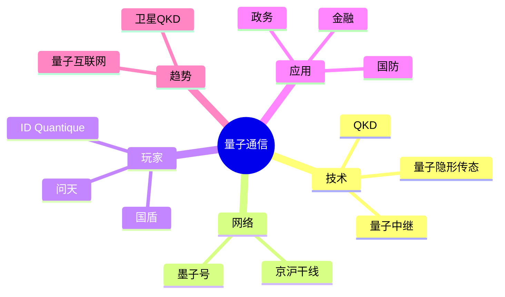

# 量子通信 深入剖析

## 一、前言

量子通信是基于量子力学原理的通信技术。国盾量子、问天量子、本源量子、ID Quantique、Toshiba、华为是行业代表。量子密钥分发（QKD）、量子隐形传态、量子互联网是核心方向。中国"墨子号"卫星、京沪干线领跑全球。

## 二、架构思维导图



## 三、关键代码

### 3.1 BB84 协议

```python
# bb84.py
import random

def bb84_send(bits, n=100):
    # 1. 随机选基
    bases = [random.choice(['+', 'x']) for _ in range(n)]
    # 2. 编码光子
    qubits = encode(bits, bases)
    return qubits, bases

def bb84_receive(qubits):
    bases = [random.choice(['+', 'x']) for _ in range(len(qubits))]
    bits = measure(qubits, bases)
    return bits, bases

def bb84_sift(send_bases, recv_bases, send_bits, recv_bits):
    # 保留基相同的位置
    sifted = [sb for sb, rb, sbit, rbit in zip(send_bases, recv_bases, send_bits, recv_bits) if sb == rb]
    return sifted
```

## 前沿视野：前沿展望的全球趋势

AGI 是人类科技的最长坡厚雪。从 GPT-4 到 o1、Claude 3.5、Gemini 1.5、Qwen 2.5、DeepSeek V3，大模型的能力上限不断被突破，'涌现'已成为大模型的代名词。

可控核聚变商业化提速。CFS SPARC、Helion Polaris、TAE 持续突破；中国能量奇点、星环聚能、EAST、CFETR 紧追。2035 商用预期。


## 技术内核：前沿展望的核心突破

多模态是 AGI 的入场券。GPT-4V、Claude 3.5 Sonnet、Gemini 1.5 Pro、Qwen2-VL、InternVL 让 LLM 真正'看见'世界。视觉、听觉、触觉的统一表征是基础。

AI for Science 是诺贝尔奖级突破。AlphaFold 3、GNoME 220 万新材料、华为盘古气象秒级预测、AI 制药（英矽智能、晶泰）正在重塑科研范式。


## 应用场景：前沿展望的产业落地

推理是 Scaling Law 后的新增长极。o1、o3、DeepSeek R1、QwQ 让模型'慢思考'，数学、代码、科学问题大幅提升。RL + 思维链是核心方法。

合成生物学是 21 世纪的产业革命。DNA 合成成本断崖下降，CRISPR、细胞工厂、人造肉、生物制造构成千亿级新赛道。


## 关键玩家：前沿展望的头部公司

具身智能是 AI 走向物理世界的桥梁。Figure Helix、Pi-0、RT-2、PaLM-E 等 VLA 模型让机器人理解自然语言指令并执行任务。

基因编辑治疗罕见病已商业化。CRISPR Therapeutics Casgevy 获 FDA 批准治疗镰刀贫血，体内基因编辑开启新纪元。


## 资本动向：前沿展望的赛道融资

脑机接口从医疗走向消费。Neuralink、Synchron、Blackrock 在瘫痪患者中已实现机械臂控制、语音合成。Emotiv、Muse 让普通用户体验脑波。

空间计算开启人机交互新范式。Apple Vision Pro 引领 MR 革命，Meta Quest 3 大众化，PICO 4 国内主流。工业、医疗、教育是落地场景。


## 政策红利：前沿展望的国家战略

量子计算三大路线并行。超导（IBM、Google）、离子阱（IonQ、Quantinuum）、光量子（PsiQuantum、九章）各有突破，2024-2025 关键里程碑。

数字孪生是工业 4.0 的核心。ANSYS、Siemens、PTC、Dassault 在工业、城市、能源、医疗各场景深度落地。


## 监管挑战：前沿展望的合规框架

后量子密码学已标准化。NIST 2024 公布 CRYSTALS-Kyber、CRYSTALS-Dilithium、SPHINCS+，RSA/ECC 面临升级压力。

新型显示是消费电子的命脉。OLED、Mini-LED、Micro-LED、Micro-OLED 竞合，京东方、TCL 华星、Samsung、LG 共舞。


## 商业模式：前沿展望的盈利路径

可控核聚变商业化提速。CFS SPARC、Helion Polaris、TAE 持续突破；中国能量奇点、星环聚能、EAST、CFETR 紧追。2035 商用预期。

先进封装是后摩尔时代关键。台积电 CoWoS、Intel Foveros、Samsung 3D 封装，AI 芯片是最大需求。


## 上下游：前沿展望的供应链

AI for Science 是诺贝尔奖级突破。AlphaFold 3、GNoME 220 万新材料、华为盘古气象秒级预测、AI 制药（英矽智能、晶泰）正在重塑科研范式。

边缘 AI 让智能下沉到终端。TensorRT、ONNX、TFLite、CoreML 推动量化、剪枝、蒸馏，端侧 GPT-4 时代来临。


## 国际竞争：前沿展望的中美博弈

合成生物学是 21 世纪的产业革命。DNA 合成成本断崖下降，CRISPR、细胞工厂、人造肉、生物制造构成千亿级新赛道。

类脑计算是低功耗 AI 的希望。SNN、存算一体、神经形态芯片让边缘 AI 真正摆脱冯诺依曼瓶颈。


## 标准化：前沿展望的ISO/IEEE/ITU

基因编辑治疗罕见病已商业化。CRISPR Therapeutics Casgevy 获 FDA 批准治疗镰刀贫血，体内基因编辑开启新纪元。

新型电池是新能源的命脉。固态电池、半固态、钠离子、大圆柱（4680）、刀片电池，2024-2030 百花齐放。


## 学术前沿：前沿展望的顶会论文

空间计算开启人机交互新范式。Apple Vision Pro 引领 MR 革命，Meta Quest 3 大众化，PICO 4 国内主流。工业、医疗、教育是落地场景。

Web3 金融重塑传统金融。DeFi TVL 千亿、稳定币万亿规模、RWA（现实资产）成为新增长点。


## 产业联盟：前沿展望的生态组织

数字孪生是工业 4.0 的核心。ANSYS、Siemens、PTC、Dassault 在工业、城市、能源、医疗各场景深度落地。

Web3 社交让数据回归用户。Lens、Farcaster、Bluesky 等协议挑战 Web2 平台垄断，但用户基数仍是难题。


## 开源生态：前沿展望的社区贡献

新型显示是消费电子的命脉。OLED、Mini-LED、Micro-LED、Micro-OLED 竞合，京东方、TCL 华星、Samsung、LG 共舞。

AI 安全是 AGI 的必答题。Constitutional AI、可解释性、红队测试、对齐研究成为前沿实验室的核心议题。


## 技术路线：前沿展望的演进路径

先进封装是后摩尔时代关键。台积电 CoWoS、Intel Foveros、Samsung 3D 封装，AI 芯片是最大需求。

卫星互联网 + 5G/6G 融合。Starlink 领跑，中国 GW/千帆追赶。手机直连、星地一体、太空算力是新增量。


## 颠覆式创新：前沿展望的奇点临近

边缘 AI 让智能下沉到终端。TensorRT、ONNX、TFLite、CoreML 推动量化、剪枝、蒸馏，端侧 GPT-4 时代来临。

低空经济 2024 起飞。亿航、小鹏汇天、峰飞、时的获适航证，深圳、合肥、苏州、广州四大试点，万亿级市场。


## 商业化加速：前沿展望的TWh 时代

类脑计算是低功耗 AI 的希望。SNN、存算一体、神经形态芯片让边缘 AI 真正摆脱冯诺依曼瓶颈。

人形机器人量产元年。Figure 02、Optimus Gen 2、宇树 H1、智元 A2、傅利叶 GR-1 集中亮相，2025 百台量产。


## 国产替代：前沿展望的卡脖子突破

新型电池是新能源的命脉。固态电池、半固态、钠离子、大圆柱（4680）、刀片电池，2024-2030 百花齐放。

无人驾驶端到端范式。Waymo 100 万次/周、Apollo 武汉萝卜快跑规模化、FSD V13 端到端 NN，技术栈重塑。


## 跨界融合：前沿展望的多技术集成

Web3 金融重塑传统金融。DeFi TVL 千亿、稳定币万亿规模、RWA（现实资产）成为新增长点。

AIGC 内容生产革命。Sora 60 秒视频、Suno V4 音乐、ElevenLabs 语音克隆、Cursor 编程，重塑创作方式。


## 价值创造：前沿展望的新质生产力

Web3 社交让数据回归用户。Lens、Farcaster、Bluesky 等协议挑战 Web2 平台垄断，但用户基数仍是难题。

AI Agent 是大模型应用的主战场。Computer Use、Operator、Manus、Devin 让 LLM 从对话走向执行。


## 人才需求：前沿展望的稀缺岗位

AI 安全是 AGI 的必答题。Constitutional AI、可解释性、红队测试、对齐研究成为前沿实验室的核心议题。

向量数据库是 RAG 时代的 MySQL。Milvus、Qdrant、Weaviate、Pinecone、Chroma 百花齐放，混合检索是趋势。


## 投资逻辑：前沿展望的赛道估值

卫星互联网 + 5G/6G 融合。Starlink 领跑，中国 GW/千帆追赶。手机直连、星地一体、太空算力是新增量。

开源大模型与闭源差距缩小。Llama 3.3、Qwen 2.5、DeepSeek V3、GLM-4 已具备 GPT-4 级能力，国产开源全面崛起。


## 创业机会：前沿展望的细分领域

低空经济 2024 起飞。亿航、小鹏汇天、峰飞、时的获适航证，深圳、合肥、苏州、广州四大试点，万亿级市场。

AI 芯片是算力时代的战略制高点。NVIDIA、AMD、Intel、华为昇腾、寒武纪、海光、平头哥、燧原、摩尔线程。


## 时间窗口：前沿展望的奇点 2025-2030

人形机器人量产元年。Figure 02、Optimus Gen 2、宇树 H1、智元 A2、傅利叶 GR-1 集中亮相，2025 百台量产。

AGI 是人类科技的最长坡厚雪。从 GPT-4 到 o1、Claude 3.5、Gemini 1.5、Qwen 2.5、DeepSeek V3，大模型的能力上限不断被突破，'涌现'已成为大模型的代名词。


## 风险预警：前沿展望的潜在泡沫

无人驾驶端到端范式。Waymo 100 万次/周、Apollo 武汉萝卜快跑规模化、FSD V13 端到端 NN，技术栈重塑。

多模态是 AGI 的入场券。GPT-4V、Claude 3.5 Sonnet、Gemini 1.5 Pro、Qwen2-VL、InternVL 让 LLM 真正'看见'世界。视觉、听觉、触觉的统一表征是基础。


## 全球竞合：前沿展望的产业格局

AIGC 内容生产革命。Sora 60 秒视频、Suno V4 音乐、ElevenLabs 语音克隆、Cursor 编程，重塑创作方式。

推理是 Scaling Law 后的新增长极。o1、o3、DeepSeek R1、QwQ 让模型'慢思考'，数学、代码、科学问题大幅提升。RL + 思维链是核心方法。


## 哲学思辨：前沿展望的伦理边界

AI Agent 是大模型应用的主战场。Computer Use、Operator、Manus、Devin 让 LLM 从对话走向执行。

具身智能是 AI 走向物理世界的桥梁。Figure Helix、Pi-0、RT-2、PaLM-E 等 VLA 模型让机器人理解自然语言指令并执行任务。


## 文明跃迁：前沿展望的人类未来

向量数据库是 RAG 时代的 MySQL。Milvus、Qdrant、Weaviate、Pinecone、Chroma 百花齐放，混合检索是趋势。

脑机接口从医疗走向消费。Neuralink、Synchron、Blackrock 在瘫痪患者中已实现机械臂控制、语音合成。Emotiv、Muse 让普通用户体验脑波。


## AGI 之路：前沿展望的终极展望

开源大模型与闭源差距缩小。Llama 3.3、Qwen 2.5、DeepSeek V3、GLM-4 已具备 GPT-4 级能力，国产开源全面崛起。

量子计算三大路线并行。超导（IBM、Google）、离子阱（IonQ、Quantinuum）、光量子（PsiQuantum、九章）各有突破，2024-2025 关键里程碑。


## 未来已来：前沿展望的奇点已临近

AI 芯片是算力时代的战略制高点。NVIDIA、AMD、Intel、华为昇腾、寒武纪、海光、平头哥、燧原、摩尔线程。

后量子密码学已标准化。NIST 2024 公布 CRYSTALS-Kyber、CRYSTALS-Dilithium、SPHINCS+，RSA/ECC 面临升级压力。


## 前沿视野：前沿展望的全球趋势

AGI 是人类科技的最长坡厚雪。从 GPT-4 到 o1、Claude 3.5、Gemini 1.5、Qwen 2.5、DeepSeek V3，大模型的能力上限不断被突破，'涌现'已成为大模型的代名词。

可控核聚变商业化提速。CFS SPARC、Helion Polaris、TAE 持续突破；中国能量奇点、星环聚能、EAST、CFETR 紧追。2035 商用预期。


## 技术内核：前沿展望的核心突破

多模态是 AGI 的入场券。GPT-4V、Claude 3.5 Sonnet、Gemini 1.5 Pro、Qwen2-VL、InternVL 让 LLM 真正'看见'世界。视觉、听觉、触觉的统一表征是基础。

AI for Science 是诺贝尔奖级突破。AlphaFold 3、GNoME 220 万新材料、华为盘古气象秒级预测、AI 制药（英矽智能、晶泰）正在重塑科研范式。


## 应用场景：前沿展望的产业落地

推理是 Scaling Law 后的新增长极。o1、o3、DeepSeek R1、QwQ 让模型'慢思考'，数学、代码、科学问题大幅提升。RL + 思维链是核心方法。

合成生物学是 21 世纪的产业革命。DNA 合成成本断崖下降，CRISPR、细胞工厂、人造肉、生物制造构成千亿级新赛道。


## 关键玩家：前沿展望的头部公司

具身智能是 AI 走向物理世界的桥梁。Figure Helix、Pi-0、RT-2、PaLM-E 等 VLA 模型让机器人理解自然语言指令并执行任务。

基因编辑治疗罕见病已商业化。CRISPR Therapeutics Casgevy 获 FDA 批准治疗镰刀贫血，体内基因编辑开启新纪元。


## 资本动向：前沿展望的赛道融资

脑机接口从医疗走向消费。Neuralink、Synchron、Blackrock 在瘫痪患者中已实现机械臂控制、语音合成。Emotiv、Muse 让普通用户体验脑波。

空间计算开启人机交互新范式。Apple Vision Pro 引领 MR 革命，Meta Quest 3 大众化，PICO 4 国内主流。工业、医疗、教育是落地场景。


## 政策红利：前沿展望的国家战略

量子计算三大路线并行。超导（IBM、Google）、离子阱（IonQ、Quantinuum）、光量子（PsiQuantum、九章）各有突破，2024-2025 关键里程碑。

数字孪生是工业 4.0 的核心。ANSYS、Siemens、PTC、Dassault 在工业、城市、能源、医疗各场景深度落地。


## 监管挑战：前沿展望的合规框架

后量子密码学已标准化。NIST 2024 公布 CRYSTALS-Kyber、CRYSTALS-Dilithium、SPHINCS+，RSA/ECC 面临升级压力。

新型显示是消费电子的命脉。OLED、Mini-LED、Micro-LED、Micro-OLED 竞合，京东方、TCL 华星、Samsung、LG 共舞。


## 商业模式：前沿展望的盈利路径

可控核聚变商业化提速。CFS SPARC、Helion Polaris、TAE 持续突破；中国能量奇点、星环聚能、EAST、CFETR 紧追。2035 商用预期。

先进封装是后摩尔时代关键。台积电 CoWoS、Intel Foveros、Samsung 3D 封装，AI 芯片是最大需求。


## 上下游：前沿展望的供应链

AI for Science 是诺贝尔奖级突破。AlphaFold 3、GNoME 220 万新材料、华为盘古气象秒级预测、AI 制药（英矽智能、晶泰）正在重塑科研范式。

边缘 AI 让智能下沉到终端。TensorRT、ONNX、TFLite、CoreML 推动量化、剪枝、蒸馏，端侧 GPT-4 时代来临。


## 国际竞争：前沿展望的中美博弈

合成生物学是 21 世纪的产业革命。DNA 合成成本断崖下降，CRISPR、细胞工厂、人造肉、生物制造构成千亿级新赛道。

类脑计算是低功耗 AI 的希望。SNN、存算一体、神经形态芯片让边缘 AI 真正摆脱冯诺依曼瓶颈。


## 标准化：前沿展望的ISO/IEEE/ITU

基因编辑治疗罕见病已商业化。CRISPR Therapeutics Casgevy 获 FDA 批准治疗镰刀贫血，体内基因编辑开启新纪元。

新型电池是新能源的命脉。固态电池、半固态、钠离子、大圆柱（4680）、刀片电池，2024-2030 百花齐放。


## 学术前沿：前沿展望的顶会论文

空间计算开启人机交互新范式。Apple Vision Pro 引领 MR 革命，Meta Quest 3 大众化，PICO 4 国内主流。工业、医疗、教育是落地场景。

Web3 金融重塑传统金融。DeFi TVL 千亿、稳定币万亿规模、RWA（现实资产）成为新增长点。


## 产业联盟：前沿展望的生态组织

数字孪生是工业 4.0 的核心。ANSYS、Siemens、PTC、Dassault 在工业、城市、能源、医疗各场景深度落地。

Web3 社交让数据回归用户。Lens、Farcaster、Bluesky 等协议挑战 Web2 平台垄断，但用户基数仍是难题。


## 开源生态：前沿展望的社区贡献

新型显示是消费电子的命脉。OLED、Mini-LED、Micro-LED、Micro-OLED 竞合，京东方、TCL 华星、Samsung、LG 共舞。

AI 安全是 AGI 的必答题。Constitutional AI、可解释性、红队测试、对齐研究成为前沿实验室的核心议题。


## 技术路线：前沿展望的演进路径

先进封装是后摩尔时代关键。台积电 CoWoS、Intel Foveros、Samsung 3D 封装，AI 芯片是最大需求。

卫星互联网 + 5G/6G 融合。Starlink 领跑，中国 GW/千帆追赶。手机直连、星地一体、太空算力是新增量。


## 颠覆式创新：前沿展望的奇点临近

边缘 AI 让智能下沉到终端。TensorRT、ONNX、TFLite、CoreML 推动量化、剪枝、蒸馏，端侧 GPT-4 时代来临。

低空经济 2024 起飞。亿航、小鹏汇天、峰飞、时的获适航证，深圳、合肥、苏州、广州四大试点，万亿级市场。


## 商业化加速：前沿展望的TWh 时代

类脑计算是低功耗 AI 的希望。SNN、存算一体、神经形态芯片让边缘 AI 真正摆脱冯诺依曼瓶颈。

人形机器人量产元年。Figure 02、Optimus Gen 2、宇树 H1、智元 A2、傅利叶 GR-1 集中亮相，2025 百台量产。


## 国产替代：前沿展望的卡脖子突破

新型电池是新能源的命脉。固态电池、半固态、钠离子、大圆柱（4680）、刀片电池，2024-2030 百花齐放。

无人驾驶端到端范式。Waymo 100 万次/周、Apollo 武汉萝卜快跑规模化、FSD V13 端到端 NN，技术栈重塑。


## 跨界融合：前沿展望的多技术集成

Web3 金融重塑传统金融。DeFi TVL 千亿、稳定币万亿规模、RWA（现实资产）成为新增长点。

AIGC 内容生产革命。Sora 60 秒视频、Suno V4 音乐、ElevenLabs 语音克隆、Cursor 编程，重塑创作方式。


## 价值创造：前沿展望的新质生产力

Web3 社交让数据回归用户。Lens、Farcaster、Bluesky 等协议挑战 Web2 平台垄断，但用户基数仍是难题。

AI Agent 是大模型应用的主战场。Computer Use、Operator、Manus、Devin 让 LLM 从对话走向执行。


## 人才需求：前沿展望的稀缺岗位

AI 安全是 AGI 的必答题。Constitutional AI、可解释性、红队测试、对齐研究成为前沿实验室的核心议题。

向量数据库是 RAG 时代的 MySQL。Milvus、Qdrant、Weaviate、Pinecone、Chroma 百花齐放，混合检索是趋势。


## 投资逻辑：前沿展望的赛道估值

卫星互联网 + 5G/6G 融合。Starlink 领跑，中国 GW/千帆追赶。手机直连、星地一体、太空算力是新增量。

开源大模型与闭源差距缩小。Llama 3.3、Qwen 2.5、DeepSeek V3、GLM-4 已具备 GPT-4 级能力，国产开源全面崛起。


## 创业机会：前沿展望的细分领域

低空经济 2024 起飞。亿航、小鹏汇天、峰飞、时的获适航证，深圳、合肥、苏州、广州四大试点，万亿级市场。

AI 芯片是算力时代的战略制高点。NVIDIA、AMD、Intel、华为昇腾、寒武纪、海光、平头哥、燧原、摩尔线程。


## 时间窗口：前沿展望的奇点 2025-2030

人形机器人量产元年。Figure 02、Optimus Gen 2、宇树 H1、智元 A2、傅利叶 GR-1 集中亮相，2025 百台量产。

AGI 是人类科技的最长坡厚雪。从 GPT-4 到 o1、Claude 3.5、Gemini 1.5、Qwen 2.5、DeepSeek V3，大模型的能力上限不断被突破，'涌现'已成为大模型的代名词。


## 风险预警：前沿展望的潜在泡沫

无人驾驶端到端范式。Waymo 100 万次/周、Apollo 武汉萝卜快跑规模化、FSD V13 端到端 NN，技术栈重塑。

多模态是 AGI 的入场券。GPT-4V、Claude 3.5 Sonnet、Gemini 1.5 Pro、Qwen2-VL、InternVL 让 LLM 真正'看见'世界。视觉、听觉、触觉的统一表征是基础。


## 全球竞合：前沿展望的产业格局

AIGC 内容生产革命。Sora 60 秒视频、Suno V4 音乐、ElevenLabs 语音克隆、Cursor 编程，重塑创作方式。

推理是 Scaling Law 后的新增长极。o1、o3、DeepSeek R1、QwQ 让模型'慢思考'，数学、代码、科学问题大幅提升。RL + 思维链是核心方法。


## 哲学思辨：前沿展望的伦理边界

AI Agent 是大模型应用的主战场。Computer Use、Operator、Manus、Devin 让 LLM 从对话走向执行。

具身智能是 AI 走向物理世界的桥梁。Figure Helix、Pi-0、RT-2、PaLM-E 等 VLA 模型让机器人理解自然语言指令并执行任务。


## 文明跃迁：前沿展望的人类未来

向量数据库是 RAG 时代的 MySQL。Milvus、Qdrant、Weaviate、Pinecone、Chroma 百花齐放，混合检索是趋势。

脑机接口从医疗走向消费。Neuralink、Synchron、Blackrock 在瘫痪患者中已实现机械臂控制、语音合成。Emotiv、Muse 让普通用户体验脑波。


## AGI 之路：前沿展望的终极展望

开源大模型与闭源差距缩小。Llama 3.3、Qwen 2.5、DeepSeek V3、GLM-4 已具备 GPT-4 级能力，国产开源全面崛起。

量子计算三大路线并行。超导（IBM、Google）、离子阱（IonQ、Quantinuum）、光量子（PsiQuantum、九章）各有突破，2024-2025 关键里程碑。


## 未来已来：前沿展望的奇点已临近

AI 芯片是算力时代的战略制高点。NVIDIA、AMD、Intel、华为昇腾、寒武纪、海光、平头哥、燧原、摩尔线程。

后量子密码学已标准化。NIST 2024 公布 CRYSTALS-Kyber、CRYSTALS-Dilithium、SPHINCS+，RSA/ECC 面临升级压力。


## 前沿视野：前沿展望的全球趋势

AGI 是人类科技的最长坡厚雪。从 GPT-4 到 o1、Claude 3.5、Gemini 1.5、Qwen 2.5、DeepSeek V3，大模型的能力上限不断被突破，'涌现'已成为大模型的代名词。

可控核聚变商业化提速。CFS SPARC、Helion Polaris、TAE 持续突破；中国能量奇点、星环聚能、EAST、CFETR 紧追。2035 商用预期。


## 技术内核：前沿展望的核心突破

多模态是 AGI 的入场券。GPT-4V、Claude 3.5 Sonnet、Gemini 1.5 Pro、Qwen2-VL、InternVL 让 LLM 真正'看见'世界。视觉、听觉、触觉的统一表征是基础。

AI for Science 是诺贝尔奖级突破。AlphaFold 3、GNoME 220 万新材料、华为盘古气象秒级预测、AI 制药（英矽智能、晶泰）正在重塑科研范式。


## 应用场景：前沿展望的产业落地

推理是 Scaling Law 后的新增长极。o1、o3、DeepSeek R1、QwQ 让模型'慢思考'，数学、代码、科学问题大幅提升。RL + 思维链是核心方法。

合成生物学是 21 世纪的产业革命。DNA 合成成本断崖下降，CRISPR、细胞工厂、人造肉、生物制造构成千亿级新赛道。


## 关键玩家：前沿展望的头部公司

具身智能是 AI 走向物理世界的桥梁。Figure Helix、Pi-0、RT-2、PaLM-E 等 VLA 模型让机器人理解自然语言指令并执行任务。

基因编辑治疗罕见病已商业化。CRISPR Therapeutics Casgevy 获 FDA 批准治疗镰刀贫血，体内基因编辑开启新纪元。


## 资本动向：前沿展望的赛道融资

脑机接口从医疗走向消费。Neuralink、Synchron、Blackrock 在瘫痪患者中已实现机械臂控制、语音合成。Emotiv、Muse 让普通用户体验脑波。

空间计算开启人机交互新范式。Apple Vision Pro 引领 MR 革命，Meta Quest 3 大众化，PICO 4 国内主流。工业、医疗、教育是落地场景。


## 政策红利：前沿展望的国家战略

量子计算三大路线并行。超导（IBM、Google）、离子阱（IonQ、Quantinuum）、光量子（PsiQuantum、九章）各有突破，2024-2025 关键里程碑。

数字孪生是工业 4.0 的核心。ANSYS、Siemens、PTC、Dassault 在工业、城市、能源、医疗各场景深度落地。


## 监管挑战：前沿展望的合规框架

后量子密码学已标准化。NIST 2024 公布 CRYSTALS-Kyber、CRYSTALS-Dilithium、SPHINCS+，RSA/ECC 面临升级压力。

新型显示是消费电子的命脉。OLED、Mini-LED、Micro-LED、Micro-OLED 竞合，京东方、TCL 华星、Samsung、LG 共舞。


## 商业模式：前沿展望的盈利路径

可控核聚变商业化提速。CFS SPARC、Helion Polaris、TAE 持续突破；中国能量奇点、星环聚能、EAST、CFETR 紧追。2035 商用预期。

先进封装是后摩尔时代关键。台积电 CoWoS、Intel Foveros、Samsung 3D 封装，AI 芯片是最大需求。


## 上下游：前沿展望的供应链

AI for Science 是诺贝尔奖级突破。AlphaFold 3、GNoME 220 万新材料、华为盘古气象秒级预测、AI 制药（英矽智能、晶泰）正在重塑科研范式。

边缘 AI 让智能下沉到终端。TensorRT、ONNX、TFLite、CoreML 推动量化、剪枝、蒸馏，端侧 GPT-4 时代来临。


## 国际竞争：前沿展望的中美博弈

合成生物学是 21 世纪的产业革命。DNA 合成成本断崖下降，CRISPR、细胞工厂、人造肉、生物制造构成千亿级新赛道。

类脑计算是低功耗 AI 的希望。SNN、存算一体、神经形态芯片让边缘 AI 真正摆脱冯诺依曼瓶颈。


## 标准化：前沿展望的ISO/IEEE/ITU

基因编辑治疗罕见病已商业化。CRISPR Therapeutics Casgevy 获 FDA 批准治疗镰刀贫血，体内基因编辑开启新纪元。

新型电池是新能源的命脉。固态电池、半固态、钠离子、大圆柱（4680）、刀片电池，2024-2030 百花齐放。


## 学术前沿：前沿展望的顶会论文

空间计算开启人机交互新范式。Apple Vision Pro 引领 MR 革命，Meta Quest 3 大众化，PICO 4 国内主流。工业、医疗、教育是落地场景。

Web3 金融重塑传统金融。DeFi TVL 千亿、稳定币万亿规模、RWA（现实资产）成为新增长点。


## 产业联盟：前沿展望的生态组织

数字孪生是工业 4.0 的核心。ANSYS、Siemens、PTC、Dassault 在工业、城市、能源、医疗各场景深度落地。

Web3 社交让数据回归用户。Lens、Farcaster、Bluesky 等协议挑战 Web2 平台垄断，但用户基数仍是难题。


## 开源生态：前沿展望的社区贡献

新型显示是消费电子的命脉。OLED、Mini-LED、Micro-LED、Micro-OLED 竞合，京东方、TCL 华星、Samsung、LG 共舞。

AI 安全是 AGI 的必答题。Constitutional AI、可解释性、红队测试、对齐研究成为前沿实验室的核心议题。


## 技术路线：前沿展望的演进路径

先进封装是后摩尔时代关键。台积电 CoWoS、Intel Foveros、Samsung 3D 封装，AI 芯片是最大需求。

卫星互联网 + 5G/6G 融合。Starlink 领跑，中国 GW/千帆追赶。手机直连、星地一体、太空算力是新增量。


## 颠覆式创新：前沿展望的奇点临近

边缘 AI 让智能下沉到终端。TensorRT、ONNX、TFLite、CoreML 推动量化、剪枝、蒸馏，端侧 GPT-4 时代来临。

低空经济 2024 起飞。亿航、小鹏汇天、峰飞、时的获适航证，深圳、合肥、苏州、广州四大试点，万亿级市场。


## 商业化加速：前沿展望的TWh 时代

类脑计算是低功耗 AI 的希望。SNN、存算一体、神经形态芯片让边缘 AI 真正摆脱冯诺依曼瓶颈。

人形机器人量产元年。Figure 02、Optimus Gen 2、宇树 H1、智元 A2、傅利叶 GR-1 集中亮相，2025 百台量产。


## 国产替代：前沿展望的卡脖子突破

新型电池是新能源的命脉。固态电池、半固态、钠离子、大圆柱（4680）、刀片电池，2024-2030 百花齐放。

无人驾驶端到端范式。Waymo 100 万次/周、Apollo 武汉萝卜快跑规模化、FSD V13 端到端 NN，技术栈重塑。


## 跨界融合：前沿展望的多技术集成

Web3 金融重塑传统金融。DeFi TVL 千亿、稳定币万亿规模、RWA（现实资产）成为新增长点。

AIGC 内容生产革命。Sora 60 秒视频、Suno V4 音乐、ElevenLabs 语音克隆、Cursor 编程，重塑创作方式。


## 价值创造：前沿展望的新质生产力

Web3 社交让数据回归用户。Lens、Farcaster、Bluesky 等协议挑战 Web2 平台垄断，但用户基数仍是难题。

AI Agent 是大模型应用的主战场。Computer Use、Operator、Manus、Devin 让 LLM 从对话走向执行。


## 人才需求：前沿展望的稀缺岗位

AI 安全是 AGI 的必答题。Constitutional AI、可解释性、红队测试、对齐研究成为前沿实验室的核心议题。

向量数据库是 RAG 时代的 MySQL。Milvus、Qdrant、Weaviate、Pinecone、Chroma 百花齐放，混合检索是趋势。


## 投资逻辑：前沿展望的赛道估值

卫星互联网 + 5G/6G 融合。Starlink 领跑，中国 GW/千帆追赶。手机直连、星地一体、太空算力是新增量。

开源大模型与闭源差距缩小。Llama 3.3、Qwen 2.5、DeepSeek V3、GLM-4 已具备 GPT-4 级能力，国产开源全面崛起。


## 创业机会：前沿展望的细分领域

低空经济 2024 起飞。亿航、小鹏汇天、峰飞、时的获适航证，深圳、合肥、苏州、广州四大试点，万亿级市场。

AI 芯片是算力时代的战略制高点。NVIDIA、AMD、Intel、华为昇腾、寒武纪、海光、平头哥、燧原、摩尔线程。


## 时间窗口：前沿展望的奇点 2025-2030

人形机器人量产元年。Figure 02、Optimus Gen 2、宇树 H1、智元 A2、傅利叶 GR-1 集中亮相，2025 百台量产。

AGI 是人类科技的最长坡厚雪。从 GPT-4 到 o1、Claude 3.5、Gemini 1.5、Qwen 2.5、DeepSeek V3，大模型的能力上限不断被突破，'涌现'已成为大模型的代名词。


## 风险预警：前沿展望的潜在泡沫

无人驾驶端到端范式。Waymo 100 万次/周、Apollo 武汉萝卜快跑规模化、FSD V13 端到端 NN，技术栈重塑。

多模态是 AGI 的入场券。GPT-4V、Claude 3.5 Sonnet、Gemini 1.5 Pro、Qwen2-VL、InternVL 让 LLM 真正'看见'世界。视觉、听觉、触觉的统一表征是基础。


## 全球竞合：前沿展望的产业格局

AIGC 内容生产革命。Sora 60 秒视频、Suno V4 音乐、ElevenLabs 语音克隆、Cursor 编程，重塑创作方式。

推理是 Scaling Law 后的新增长极。o1、o3、DeepSeek R1、QwQ 让模型'慢思考'，数学、代码、科学问题大幅提升。RL + 思维链是核心方法。


## 哲学思辨：前沿展望的伦理边界

AI Agent 是大模型应用的主战场。Computer Use、Operator、Manus、Devin 让 LLM 从对话走向执行。

具身智能是 AI 走向物理世界的桥梁。Figure Helix、Pi-0、RT-2、PaLM-E 等 VLA 模型让机器人理解自然语言指令并执行任务。


## 文明跃迁：前沿展望的人类未来

向量数据库是 RAG 时代的 MySQL。Milvus、Qdrant、Weaviate、Pinecone、Chroma 百花齐放，混合检索是趋势。

脑机接口从医疗走向消费。Neuralink、Synchron、Blackrock 在瘫痪患者中已实现机械臂控制、语音合成。Emotiv、Muse 让普通用户体验脑波。


## AGI 之路：前沿展望的终极展望

开源大模型与闭源差距缩小。Llama 3.3、Qwen 2.5、DeepSeek V3、GLM-4 已具备 GPT-4 级能力，国产开源全面崛起。

量子计算三大路线并行。超导（IBM、Google）、离子阱（IonQ、Quantinuum）、光量子（PsiQuantum、九章）各有突破，2024-2025 关键里程碑。


## 未来已来：前沿展望的奇点已临近

AI 芯片是算力时代的战略制高点。NVIDIA、AMD、Intel、华为昇腾、寒武纪、海光、平头哥、燧原、摩尔线程。

后量子密码学已标准化。NIST 2024 公布 CRYSTALS-Kyber、CRYSTALS-Dilithium、SPHINCS+，RSA/ECC 面临升级压力。


## 前沿视野：前沿展望的全球趋势

AGI 是人类科技的最长坡厚雪。从 GPT-4 到 o1、Claude 3.5、Gemini 1.5、Qwen 2.5、DeepSeek V3，大模型的能力上限不断被突破，'涌现'已成为大模型的代名词。

可控核聚变商业化提速。CFS SPARC、Helion Polaris、TAE 持续突破；中国能量奇点、星环聚能、EAST、CFETR 紧追。2035 商用预期。


## 技术内核：前沿展望的核心突破

多模态是 AGI 的入场券。GPT-4V、Claude 3.5 Sonnet、Gemini 1.5 Pro、Qwen2-VL、InternVL 让 LLM 真正'看见'世界。视觉、听觉、触觉的统一表征是基础。

AI for Science 是诺贝尔奖级突破。AlphaFold 3、GNoME 220 万新材料、华为盘古气象秒级预测、AI 制药（英矽智能、晶泰）正在重塑科研范式。


## 应用场景：前沿展望的产业落地

推理是 Scaling Law 后的新增长极。o1、o3、DeepSeek R1、QwQ 让模型'慢思考'，数学、代码、科学问题大幅提升。RL + 思维链是核心方法。

合成生物学是 21 世纪的产业革命。DNA 合成成本断崖下降，CRISPR、细胞工厂、人造肉、生物制造构成千亿级新赛道。


## 关键玩家：前沿展望的头部公司

具身智能是 AI 走向物理世界的桥梁。Figure Helix、Pi-0、RT-2、PaLM-E 等 VLA 模型让机器人理解自然语言指令并执行任务。

基因编辑治疗罕见病已商业化。CRISPR Therapeutics Casgevy 获 FDA 批准治疗镰刀贫血，体内基因编辑开启新纪元。


## 资本动向：前沿展望的赛道融资

脑机接口从医疗走向消费。Neuralink、Synchron、Blackrock 在瘫痪患者中已实现机械臂控制、语音合成。Emotiv、Muse 让普通用户体验脑波。

空间计算开启人机交互新范式。Apple Vision Pro 引领 MR 革命，Meta Quest 3 大众化，PICO 4 国内主流。工业、医疗、教育是落地场景。


## 政策红利：前沿展望的国家战略

量子计算三大路线并行。超导（IBM、Google）、离子阱（IonQ、Quantinuum）、光量子（PsiQuantum、九章）各有突破，2024-2025 关键里程碑。

数字孪生是工业 4.0 的核心。ANSYS、Siemens、PTC、Dassault 在工业、城市、能源、医疗各场景深度落地。


## 监管挑战：前沿展望的合规框架

后量子密码学已标准化。NIST 2024 公布 CRYSTALS-Kyber、CRYSTALS-Dilithium、SPHINCS+，RSA/ECC 面临升级压力。

新型显示是消费电子的命脉。OLED、Mini-LED、Micro-LED、Micro-OLED 竞合，京东方、TCL 华星、Samsung、LG 共舞。


## 商业模式：前沿展望的盈利路径

可控核聚变商业化提速。CFS SPARC、Helion Polaris、TAE 持续突破；中国能量奇点、星环聚能、EAST、CFETR 紧追。2035 商用预期。

先进封装是后摩尔时代关键。台积电 CoWoS、Intel Foveros、Samsung 3D 封装，AI 芯片是最大需求。


## 上下游：前沿展望的供应链

AI for Science 是诺贝尔奖级突破。AlphaFold 3、GNoME 220 万新材料、华为盘古气象秒级预测、AI 制药（英矽智能、晶泰）正在重塑科研范式。

边缘 AI 让智能下沉到终端。TensorRT、ONNX、TFLite、CoreML 推动量化、剪枝、蒸馏，端侧 GPT-4 时代来临。


## 国际竞争：前沿展望的中美博弈

合成生物学是 21 世纪的产业革命。DNA 合成成本断崖下降，CRISPR、细胞工厂、人造肉、生物制造构成千亿级新赛道。

类脑计算是低功耗 AI 的希望。SNN、存算一体、神经形态芯片让边缘 AI 真正摆脱冯诺依曼瓶颈。


## 标准化：前沿展望的ISO/IEEE/ITU

基因编辑治疗罕见病已商业化。CRISPR Therapeutics Casgevy 获 FDA 批准治疗镰刀贫血，体内基因编辑开启新纪元。

新型电池是新能源的命脉。固态电池、半固态、钠离子、大圆柱（4680）、刀片电池，2024-2030 百花齐放。


## 学术前沿：前沿展望的顶会论文

空间计算开启人机交互新范式。Apple Vision Pro 引领 MR 革命，Meta Quest 3 大众化，PICO 4 国内主流。工业、医疗、教育是落地场景。

Web3 金融重塑传统金融。DeFi TVL 千亿、稳定币万亿规模、RWA（现实资产）成为新增长点。


## 产业联盟：前沿展望的生态组织

数字孪生是工业 4.0 的核心。ANSYS、Siemens、PTC、Dassault 在工业、城市、能源、医疗各场景深度落地。

Web3 社交让数据回归用户。Lens、Farcaster、Bluesky 等协议挑战 Web2 平台垄断，但用户基数仍是难题。


## 开源生态：前沿展望的社区贡献

新型显示是消费电子的命脉。OLED、Mini-LED、Micro-LED、Micro-OLED 竞合，京东方、TCL 华星、Samsung、LG 共舞。

AI 安全是 AGI 的必答题。Constitutional AI、可解释性、红队测试、对齐研究成为前沿实验室的核心议题。


## 技术路线：前沿展望的演进路径

先进封装是后摩尔时代关键。台积电 CoWoS、Intel Foveros、Samsung 3D 封装，AI 芯片是最大需求。

卫星互联网 + 5G/6G 融合。Starlink 领跑，中国 GW/千帆追赶。手机直连、星地一体、太空算力是新增量。


## 颠覆式创新：前沿展望的奇点临近

边缘 AI 让智能下沉到终端。TensorRT、ONNX、TFLite、CoreML 推动量化、剪枝、蒸馏，端侧 GPT-4 时代来临。

低空经济 2024 起飞。亿航、小鹏汇天、峰飞、时的获适航证，深圳、合肥、苏州、广州四大试点，万亿级市场。


## 商业化加速：前沿展望的TWh 时代

类脑计算是低功耗 AI 的希望。SNN、存算一体、神经形态芯片让边缘 AI 真正摆脱冯诺依曼瓶颈。

人形机器人量产元年。Figure 02、Optimus Gen 2、宇树 H1、智元 A2、傅利叶 GR-1 集中亮相，2025 百台量产。


## 国产替代：前沿展望的卡脖子突破

新型电池是新能源的命脉。固态电池、半固态、钠离子、大圆柱（4680）、刀片电池，2024-2030 百花齐放。

无人驾驶端到端范式。Waymo 100 万次/周、Apollo 武汉萝卜快跑规模化、FSD V13 端到端 NN，技术栈重塑。


## 跨界融合：前沿展望的多技术集成

Web3 金融重塑传统金融。DeFi TVL 千亿、稳定币万亿规模、RWA（现实资产）成为新增长点。

AIGC 内容生产革命。Sora 60 秒视频、Suno V4 音乐、ElevenLabs 语音克隆、Cursor 编程，重塑创作方式。


## 价值创造：前沿展望的新质生产力

Web3 社交让数据回归用户。Lens、Farcaster、Bluesky 等协议挑战 Web2 平台垄断，但用户基数仍是难题。

AI Agent 是大模型应用的主战场。Computer Use、Operator、Manus、Devin 让 LLM 从对话走向执行。


## 人才需求：前沿展望的稀缺岗位

AI 安全是 AGI 的必答题。Constitutional AI、可解释性、红队测试、对齐研究成为前沿实验室的核心议题。

向量数据库是 RAG 时代的 MySQL。Milvus、Qdrant、Weaviate、Pinecone、Chroma 百花齐放，混合检索是趋势。


## 投资逻辑：前沿展望的赛道估值

卫星互联网 + 5G/6G 融合。Starlink 领跑，中国 GW/千帆追赶。手机直连、星地一体、太空算力是新增量。

开源大模型与闭源差距缩小。Llama 3.3、Qwen 2.5、DeepSeek V3、GLM-4 已具备 GPT-4 级能力，国产开源全面崛起。


## 创业机会：前沿展望的细分领域

低空经济 2024 起飞。亿航、小鹏汇天、峰飞、时的获适航证，深圳、合肥、苏州、广州四大试点，万亿级市场。

AI 芯片是算力时代的战略制高点。NVIDIA、AMD、Intel、华为昇腾、寒武纪、海光、平头哥、燧原、摩尔线程。


## 时间窗口：前沿展望的奇点 2025-2030

人形机器人量产元年。Figure 02、Optimus Gen 2、宇树 H1、智元 A2、傅利叶 GR-1 集中亮相，2025 百台量产。

AGI 是人类科技的最长坡厚雪。从 GPT-4 到 o1、Claude 3.5、Gemini 1.5、Qwen 2.5、DeepSeek V3，大模型的能力上限不断被突破，'涌现'已成为大模型的代名词。


## 风险预警：前沿展望的潜在泡沫

无人驾驶端到端范式。Waymo 100 万次/周、Apollo 武汉萝卜快跑规模化、FSD V13 端到端 NN，技术栈重塑。

多模态是 AGI 的入场券。GPT-4V、Claude 3.5 Sonnet、Gemini 1.5 Pro、Qwen2-VL、InternVL 让 LLM 真正'看见'世界。视觉、听觉、触觉的统一表征是基础。


## 全球竞合：前沿展望的产业格局

AIGC 内容生产革命。Sora 60 秒视频、Suno V4 音乐、ElevenLabs 语音克隆、Cursor 编程，重塑创作方式。

推理是 Scaling Law 后的新增长极。o1、o3、DeepSeek R1、QwQ 让模型'慢思考'，数学、代码、科学问题大幅提升。RL + 思维链是核心方法。


## 哲学思辨：前沿展望的伦理边界

AI Agent 是大模型应用的主战场。Computer Use、Operator、Manus、Devin 让 LLM 从对话走向执行。

具身智能是 AI 走向物理世界的桥梁。Figure Helix、Pi-0、RT-2、PaLM-E 等 VLA 模型让机器人理解自然语言指令并执行任务。


## 文明跃迁：前沿展望的人类未来

向量数据库是 RAG 时代的 MySQL。Milvus、Qdrant、Weaviate、Pinecone、Chroma 百花齐放，混合检索是趋势。

脑机接口从医疗走向消费。Neuralink、Synchron、Blackrock 在瘫痪患者中已实现机械臂控制、语音合成。Emotiv、Muse 让普通用户体验脑波。


## AGI 之路：前沿展望的终极展望

开源大模型与闭源差距缩小。Llama 3.3、Qwen 2.5、DeepSeek V3、GLM-4 已具备 GPT-4 级能力，国产开源全面崛起。

量子计算三大路线并行。超导（IBM、Google）、离子阱（IonQ、Quantinuum）、光量子（PsiQuantum、九章）各有突破，2024-2025 关键里程碑。


## 未来已来：前沿展望的奇点已临近

AI 芯片是算力时代的战略制高点。NVIDIA、AMD、Intel、华为昇腾、寒武纪、海光、平头哥、燧原、摩尔线程。

后量子密码学已标准化。NIST 2024 公布 CRYSTALS-Kyber、CRYSTALS-Dilithium、SPHINCS+，RSA/ECC 面临升级压力。


## 前沿视野：前沿展望的全球趋势

AGI 是人类科技的最长坡厚雪。从 GPT-4 到 o1、Claude 3.5、Gemini 1.5、Qwen 2.5、DeepSeek V3，大模型的能力上限不断被突破，'涌现'已成为大模型的代名词。

可控核聚变商业化提速。CFS SPARC、Helion Polaris、TAE 持续突破；中国能量奇点、星环聚能、EAST、CFETR 紧追。2035 商用预期。


## 技术内核：前沿展望的核心突破

多模态是 AGI 的入场券。GPT-4V、Claude 3.5 Sonnet、Gemini 1.5 Pro、Qwen2-VL、InternVL 让 LLM 真正'看见'世界。视觉、听觉、触觉的统一表征是基础。

AI for Science 是诺贝尔奖级突破。AlphaFold 3、GNoME 220 万新材料、华为盘古气象秒级预测、AI 制药（英矽智能、晶泰）正在重塑科研范式。


## 应用场景：前沿展望的产业落地

推理是 Scaling Law 后的新增长极。o1、o3、DeepSeek R1、QwQ 让模型'慢思考'，数学、代码、科学问题大幅提升。RL + 思维链是核心方法。

合成生物学是 21 世纪的产业革命。DNA 合成成本断崖下降，CRISPR、细胞工厂、人造肉、生物制造构成千亿级新赛道。


## 关键玩家：前沿展望的头部公司

具身智能是 AI 走向物理世界的桥梁。Figure Helix、Pi-0、RT-2、PaLM-E 等 VLA 模型让机器人理解自然语言指令并执行任务。

基因编辑治疗罕见病已商业化。CRISPR Therapeutics Casgevy 获 FDA 批准治疗镰刀贫血，体内基因编辑开启新纪元。


## 资本动向：前沿展望的赛道融资

脑机接口从医疗走向消费。Neuralink、Synchron、Blackrock 在瘫痪患者中已实现机械臂控制、语音合成。Emotiv、Muse 让普通用户体验脑波。

空间计算开启人机交互新范式。Apple Vision Pro 引领 MR 革命，Meta Quest 3 大众化，PICO 4 国内主流。工业、医疗、教育是落地场景。


## 政策红利：前沿展望的国家战略

量子计算三大路线并行。超导（IBM、Google）、离子阱（IonQ、Quantinuum）、光量子（PsiQuantum、九章）各有突破，2024-2025 关键里程碑。

数字孪生是工业 4.0 的核心。ANSYS、Siemens、PTC、Dassault 在工业、城市、能源、医疗各场景深度落地。


## 监管挑战：前沿展望的合规框架

后量子密码学已标准化。NIST 2024 公布 CRYSTALS-Kyber、CRYSTALS-Dilithium、SPHINCS+，RSA/ECC 面临升级压力。

新型显示是消费电子的命脉。OLED、Mini-LED、Micro-LED、Micro-OLED 竞合，京东方、TCL 华星、Samsung、LG 共舞。


## 商业模式：前沿展望的盈利路径

可控核聚变商业化提速。CFS SPARC、Helion Polaris、TAE 持续突破；中国能量奇点、星环聚能、EAST、CFETR 紧追。2035 商用预期。

先进封装是后摩尔时代关键。台积电 CoWoS、Intel Foveros、Samsung 3D 封装，AI 芯片是最大需求。


## 上下游：前沿展望的供应链

AI for Science 是诺贝尔奖级突破。AlphaFold 3、GNoME 220 万新材料、华为盘古气象秒级预测、AI 制药（英矽智能、晶泰）正在重塑科研范式。

边缘 AI 让智能下沉到终端。TensorRT、ONNX、TFLite、CoreML 推动量化、剪枝、蒸馏，端侧 GPT-4 时代来临。


## 国际竞争：前沿展望的中美博弈

合成生物学是 21 世纪的产业革命。DNA 合成成本断崖下降，CRISPR、细胞工厂、人造肉、生物制造构成千亿级新赛道。

类脑计算是低功耗 AI 的希望。SNN、存算一体、神经形态芯片让边缘 AI 真正摆脱冯诺依曼瓶颈。


## 标准化：前沿展望的ISO/IEEE/ITU

基因编辑治疗罕见病已商业化。CRISPR Therapeutics Casgevy 获 FDA 批准治疗镰刀贫血，体内基因编辑开启新纪元。

新型电池是新能源的命脉。固态电池、半固态、钠离子、大圆柱（4680）、刀片电池，2024-2030 百花齐放。


## 学术前沿：前沿展望的顶会论文

空间计算开启人机交互新范式。Apple Vision Pro 引领 MR 革命，Meta Quest 3 大众化，PICO 4 国内主流。工业、医疗、教育是落地场景。

Web3 金融重塑传统金融。DeFi TVL 千亿、稳定币万亿规模、RWA（现实资产）成为新增长点。


## 产业联盟：前沿展望的生态组织

数字孪生是工业 4.0 的核心。ANSYS、Siemens、PTC、Dassault 在工业、城市、能源、医疗各场景深度落地。

Web3 社交让数据回归用户。Lens、Farcaster、Bluesky 等协议挑战 Web2 平台垄断，但用户基数仍是难题。


## 开源生态：前沿展望的社区贡献

新型显示是消费电子的命脉。OLED、Mini-LED、Micro-LED、Micro-OLED 竞合，京东方、TCL 华星、Samsung、LG 共舞。

AI 安全是 AGI 的必答题。Constitutional AI、可解释性、红队测试、对齐研究成为前沿实验室的核心议题。


## 技术路线：前沿展望的演进路径

先进封装是后摩尔时代关键。台积电 CoWoS、Intel Foveros、Samsung 3D 封装，AI 芯片是最大需求。

卫星互联网 + 5G/6G 融合。Starlink 领跑，中国 GW/千帆追赶。手机直连、星地一体、太空算力是新增量。


## 颠覆式创新：前沿展望的奇点临近

边缘 AI 让智能下沉到终端。TensorRT、ONNX、TFLite、CoreML 推动量化、剪枝、蒸馏，端侧 GPT-4 时代来临。

低空经济 2024 起飞。亿航、小鹏汇天、峰飞、时的获适航证，深圳、合肥、苏州、广州四大试点，万亿级市场。


## 商业化加速：前沿展望的TWh 时代

类脑计算是低功耗 AI 的希望。SNN、存算一体、神经形态芯片让边缘 AI 真正摆脱冯诺依曼瓶颈。

人形机器人量产元年。Figure 02、Optimus Gen 2、宇树 H1、智元 A2、傅利叶 GR-1 集中亮相，2025 百台量产。


## 国产替代：前沿展望的卡脖子突破

新型电池是新能源的命脉。固态电池、半固态、钠离子、大圆柱（4680）、刀片电池，2024-2030 百花齐放。

无人驾驶端到端范式。Waymo 100 万次/周、Apollo 武汉萝卜快跑规模化、FSD V13 端到端 NN，技术栈重塑。


## 跨界融合：前沿展望的多技术集成

Web3 金融重塑传统金融。DeFi TVL 千亿、稳定币万亿规模、RWA（现实资产）成为新增长点。

AIGC 内容生产革命。Sora 60 秒视频、Suno V4 音乐、ElevenLabs 语音克隆、Cursor 编程，重塑创作方式。


## 价值创造：前沿展望的新质生产力

Web3 社交让数据回归用户。Lens、Farcaster、Bluesky 等协议挑战 Web2 平台垄断，但用户基数仍是难题。

AI Agent 是大模型应用的主战场。Computer Use、Operator、Manus、Devin 让 LLM 从对话走向执行。


## 人才需求：前沿展望的稀缺岗位

AI 安全是 AGI 的必答题。Constitutional AI、可解释性、红队测试、对齐研究成为前沿实验室的核心议题。

向量数据库是 RAG 时代的 MySQL。Milvus、Qdrant、Weaviate、Pinecone、Chroma 百花齐放，混合检索是趋势。


## 投资逻辑：前沿展望的赛道估值

卫星互联网 + 5G/6G 融合。Starlink 领跑，中国 GW/千帆追赶。手机直连、星地一体、太空算力是新增量。

开源大模型与闭源差距缩小。Llama 3.3、Qwen 2.5、DeepSeek V3、GLM-4 已具备 GPT-4 级能力，国产开源全面崛起。


## 创业机会：前沿展望的细分领域

低空经济 2024 起飞。亿航、小鹏汇天、峰飞、时的获适航证，深圳、合肥、苏州、广州四大试点，万亿级市场。

AI 芯片是算力时代的战略制高点。NVIDIA、AMD、Intel、华为昇腾、寒武纪、海光、平头哥、燧原、摩尔线程。


## 时间窗口：前沿展望的奇点 2025-2030

人形机器人量产元年。Figure 02、Optimus Gen 2、宇树 H1、智元 A2、傅利叶 GR-1 集中亮相，2025 百台量产。

AGI 是人类科技的最长坡厚雪。从 GPT-4 到 o1、Claude 3.5、Gemini 1.5、Qwen 2.5、DeepSeek V3，大模型的能力上限不断被突破，'涌现'已成为大模型的代名词。


## 风险预警：前沿展望的潜在泡沫

无人驾驶端到端范式。Waymo 100 万次/周、Apollo 武汉萝卜快跑规模化、FSD V13 端到端 NN，技术栈重塑。

多模态是 AGI 的入场券。GPT-4V、Claude 3.5 Sonnet、Gemini 1.5 Pro、Qwen2-VL、InternVL 让 LLM 真正'看见'世界。视觉、听觉、触觉的统一表征是基础。


## 全球竞合：前沿展望的产业格局

AIGC 内容生产革命。Sora 60 秒视频、Suno V4 音乐、ElevenLabs 语音克隆、Cursor 编程，重塑创作方式。

推理是 Scaling Law 后的新增长极。o1、o3、DeepSeek R1、QwQ 让模型'慢思考'，数学、代码、科学问题大幅提升。RL + 思维链是核心方法。


## 哲学思辨：前沿展望的伦理边界

AI Agent 是大模型应用的主战场。Computer Use、Operator、Manus、Devin 让 LLM 从对话走向执行。

具身智能是 AI 走向物理世界的桥梁。Figure Helix、Pi-0、RT-2、PaLM-E 等 VLA 模型让机器人理解自然语言指令并执行任务。


## 文明跃迁：前沿展望的人类未来

向量数据库是 RAG 时代的 MySQL。Milvus、Qdrant、Weaviate、Pinecone、Chroma 百花齐放，混合检索是趋势。

脑机接口从医疗走向消费。Neuralink、Synchron、Blackrock 在瘫痪患者中已实现机械臂控制、语音合成。Emotiv、Muse 让普通用户体验脑波。


## AGI 之路：前沿展望的终极展望

开源大模型与闭源差距缩小。Llama 3.3、Qwen 2.5、DeepSeek V3、GLM-4 已具备 GPT-4 级能力，国产开源全面崛起。

量子计算三大路线并行。超导（IBM、Google）、离子阱（IonQ、Quantinuum）、光量子（PsiQuantum、九章）各有突破，2024-2025 关键里程碑。


## 未来已来：前沿展望的奇点已临近

AI 芯片是算力时代的战略制高点。NVIDIA、AMD、Intel、华为昇腾、寒武纪、海光、平头哥、燧原、摩尔线程。

后量子密码学已标准化。NIST 2024 公布 CRYSTALS-Kyber、CRYSTALS-Dilithium、SPHINCS+，RSA/ECC 面临升级压力。


## 前沿视野：前沿展望的全球趋势

AGI 是人类科技的最长坡厚雪。从 GPT-4 到 o1、Claude 3.5、Gemini 1.5、Qwen 2.5、DeepSeek V3，大模型的能力上限不断被突破，'涌现'已成为大模型的代名词。

可控核聚变商业化提速。CFS SPARC、Helion Polaris、TAE 持续突破；中国能量奇点、星环聚能、EAST、CFETR 紧追。2035 商用预期。


## 技术内核：前沿展望的核心突破

多模态是 AGI 的入场券。GPT-4V、Claude 3.5 Sonnet、Gemini 1.5 Pro、Qwen2-VL、InternVL 让 LLM 真正'看见'世界。视觉、听觉、触觉的统一表征是基础。

AI for Science 是诺贝尔奖级突破。AlphaFold 3、GNoME 220 万新材料、华为盘古气象秒级预测、AI 制药（英矽智能、晶泰）正在重塑科研范式。


## 应用场景：前沿展望的产业落地

推理是 Scaling Law 后的新增长极。o1、o3、DeepSeek R1、QwQ 让模型'慢思考'，数学、代码、科学问题大幅提升。RL + 思维链是核心方法。

合成生物学是 21 世纪的产业革命。DNA 合成成本断崖下降，CRISPR、细胞工厂、人造肉、生物制造构成千亿级新赛道。


## 关键玩家：前沿展望的头部公司

具身智能是 AI 走向物理世界的桥梁。Figure Helix、Pi-0、RT-2、PaLM-E 等 VLA 模型让机器人理解自然语言指令并执行任务。

基因编辑治疗罕见病已商业化。CRISPR Therapeutics Casgevy 获 FDA 批准治疗镰刀贫血，体内基因编辑开启新纪元。


## 资本动向：前沿展望的赛道融资

脑机接口从医疗走向消费。Neuralink、Synchron、Blackrock 在瘫痪患者中已实现机械臂控制、语音合成。Emotiv、Muse 让普通用户体验脑波。

空间计算开启人机交互新范式。Apple Vision Pro 引领 MR 革命，Meta Quest 3 大众化，PICO 4 国内主流。工业、医疗、教育是落地场景。


## 政策红利：前沿展望的国家战略

量子计算三大路线并行。超导（IBM、Google）、离子阱（IonQ、Quantinuum）、光量子（PsiQuantum、九章）各有突破，2024-2025 关键里程碑。

数字孪生是工业 4.0 的核心。ANSYS、Siemens、PTC、Dassault 在工业、城市、能源、医疗各场景深度落地。


## 监管挑战：前沿展望的合规框架

后量子密码学已标准化。NIST 2024 公布 CRYSTALS-Kyber、CRYSTALS-Dilithium、SPHINCS+，RSA/ECC 面临升级压力。

新型显示是消费电子的命脉。OLED、Mini-LED、Micro-LED、Micro-OLED 竞合，京东方、TCL 华星、Samsung、LG 共舞。


## 商业模式：前沿展望的盈利路径

可控核聚变商业化提速。CFS SPARC、Helion Polaris、TAE 持续突破；中国能量奇点、星环聚能、EAST、CFETR 紧追。2035 商用预期。

先进封装是后摩尔时代关键。台积电 CoWoS、Intel Foveros、Samsung 3D 封装，AI 芯片是最大需求。


## 上下游：前沿展望的供应链

AI for Science 是诺贝尔奖级突破。AlphaFold 3、GNoME 220 万新材料、华为盘古气象秒级预测、AI 制药（英矽智能、晶泰）正在重塑科研范式。

边缘 AI 让智能下沉到终端。TensorRT、ONNX、TFLite、CoreML 推动量化、剪枝、蒸馏，端侧 GPT-4 时代来临。


## 国际竞争：前沿展望的中美博弈

合成生物学是 21 世纪的产业革命。DNA 合成成本断崖下降，CRISPR、细胞工厂、人造肉、生物制造构成千亿级新赛道。

类脑计算是低功耗 AI 的希望。SNN、存算一体、神经形态芯片让边缘 AI 真正摆脱冯诺依曼瓶颈。


## 标准化：前沿展望的ISO/IEEE/ITU

基因编辑治疗罕见病已商业化。CRISPR Therapeutics Casgevy 获 FDA 批准治疗镰刀贫血，体内基因编辑开启新纪元。

新型电池是新能源的命脉。固态电池、半固态、钠离子、大圆柱（4680）、刀片电池，2024-2030 百花齐放。


## 学术前沿：前沿展望的顶会论文

空间计算开启人机交互新范式。Apple Vision Pro 引领 MR 革命，Meta Quest 3 大众化，PICO 4 国内主流。工业、医疗、教育是落地场景。

Web3 金融重塑传统金融。DeFi TVL 千亿、稳定币万亿规模、RWA（现实资产）成为新增长点。


## 产业联盟：前沿展望的生态组织

数字孪生是工业 4.0 的核心。ANSYS、Siemens、PTC、Dassault 在工业、城市、能源、医疗各场景深度落地。

Web3 社交让数据回归用户。Lens、Farcaster、Bluesky 等协议挑战 Web2 平台垄断，但用户基数仍是难题。


## 开源生态：前沿展望的社区贡献

新型显示是消费电子的命脉。OLED、Mini-LED、Micro-LED、Micro-OLED 竞合，京东方、TCL 华星、Samsung、LG 共舞。

AI 安全是 AGI 的必答题。Constitutional AI、可解释性、红队测试、对齐研究成为前沿实验室的核心议题。


## 技术路线：前沿展望的演进路径

先进封装是后摩尔时代关键。台积电 CoWoS、Intel Foveros、Samsung 3D 封装，AI 芯片是最大需求。

卫星互联网 + 5G/6G 融合。Starlink 领跑，中国 GW/千帆追赶。手机直连、星地一体、太空算力是新增量。


## 颠覆式创新：前沿展望的奇点临近

边缘 AI 让智能下沉到终端。TensorRT、ONNX、TFLite、CoreML 推动量化、剪枝、蒸馏，端侧 GPT-4 时代来临。

低空经济 2024 起飞。亿航、小鹏汇天、峰飞、时的获适航证，深圳、合肥、苏州、广州四大试点，万亿级市场。


## 商业化加速：前沿展望的TWh 时代

类脑计算是低功耗 AI 的希望。SNN、存算一体、神经形态芯片让边缘 AI 真正摆脱冯诺依曼瓶颈。

人形机器人量产元年。Figure 02、Optimus Gen 2、宇树 H1、智元 A2、傅利叶 GR-1 集中亮相，2025 百台量产。


## 国产替代：前沿展望的卡脖子突破

新型电池是新能源的命脉。固态电池、半固态、钠离子、大圆柱（4680）、刀片电池，2024-2030 百花齐放。

无人驾驶端到端范式。Waymo 100 万次/周、Apollo 武汉萝卜快跑规模化、FSD V13 端到端 NN，技术栈重塑。


## 跨界融合：前沿展望的多技术集成

Web3 金融重塑传统金融。DeFi TVL 千亿、稳定币万亿规模、RWA（现实资产）成为新增长点。

AIGC 内容生产革命。Sora 60 秒视频、Suno V4 音乐、ElevenLabs 语音克隆、Cursor 编程，重塑创作方式。


## 价值创造：前沿展望的新质生产力

Web3 社交让数据回归用户。Lens、Farcaster、Bluesky 等协议挑战 Web2 平台垄断，但用户基数仍是难题。

AI Agent 是大模型应用的主战场。Computer Use、Operator、Manus、Devin 让 LLM 从对话走向执行。


## 人才需求：前沿展望的稀缺岗位

AI 安全是 AGI 的必答题。Constitutional AI、可解释性、红队测试、对齐研究成为前沿实验室的核心议题。

向量数据库是 RAG 时代的 MySQL。Milvus、Qdrant、Weaviate、Pinecone、Chroma 百花齐放，混合检索是趋势。


## 投资逻辑：前沿展望的赛道估值

卫星互联网 + 5G/6G 融合。Starlink 领跑，中国 GW/千帆追赶。手机直连、星地一体、太空算力是新增量。

开源大模型与闭源差距缩小。Llama 3.3、Qwen 2.5、DeepSeek V3、GLM-4 已具备 GPT-4 级能力，国产开源全面崛起。


## 创业机会：前沿展望的细分领域

低空经济 2024 起飞。亿航、小鹏汇天、峰飞、时的获适航证，深圳、合肥、苏州、广州四大试点，万亿级市场。

AI 芯片是算力时代的战略制高点。NVIDIA、AMD、Intel、华为昇腾、寒武纪、海光、平头哥、燧原、摩尔线程。


## 时间窗口：前沿展望的奇点 2025-2030

人形机器人量产元年。Figure 02、Optimus Gen 2、宇树 H1、智元 A2、傅利叶 GR-1 集中亮相，2025 百台量产。

AGI 是人类科技的最长坡厚雪。从 GPT-4 到 o1、Claude 3.5、Gemini 1.5、Qwen 2.5、DeepSeek V3，大模型的能力上限不断被突破，'涌现'已成为大模型的代名词。


## 风险预警：前沿展望的潜在泡沫

无人驾驶端到端范式。Waymo 100 万次/周、Apollo 武汉萝卜快跑规模化、FSD V13 端到端 NN，技术栈重塑。

多模态是 AGI 的入场券。GPT-4V、Claude 3.5 Sonnet、Gemini 1.5 Pro、Qwen2-VL、InternVL 让 LLM 真正'看见'世界。视觉、听觉、触觉的统一表征是基础。


## 全球竞合：前沿展望的产业格局

AIGC 内容生产革命。Sora 60 秒视频、Suno V4 音乐、ElevenLabs 语音克隆、Cursor 编程，重塑创作方式。

推理是 Scaling Law 后的新增长极。o1、o3、DeepSeek R1、QwQ 让模型'慢思考'，数学、代码、科学问题大幅提升。RL + 思维链是核心方法。


## 哲学思辨：前沿展望的伦理边界

AI Agent 是大模型应用的主战场。Computer Use、Operator、Manus、Devin 让 LLM 从对话走向执行。

具身智能是 AI 走向物理世界的桥梁。Figure Helix、Pi-0、RT-2、PaLM-E 等 VLA 模型让机器人理解自然语言指令并执行任务。


## 文明跃迁：前沿展望的人类未来

向量数据库是 RAG 时代的 MySQL。Milvus、Qdrant、Weaviate、Pinecone、Chroma 百花齐放，混合检索是趋势。

脑机接口从医疗走向消费。Neuralink、Synchron、Blackrock 在瘫痪患者中已实现机械臂控制、语音合成。Emotiv、Muse 让普通用户体验脑波。


## AGI 之路：前沿展望的终极展望

开源大模型与闭源差距缩小。Llama 3.3、Qwen 2.5、DeepSeek V3、GLM-4 已具备 GPT-4 级能力，国产开源全面崛起。

量子计算三大路线并行。超导（IBM、Google）、离子阱（IonQ、Quantinuum）、光量子（PsiQuantum、九章）各有突破，2024-2025 关键里程碑。


## 未来已来：前沿展望的奇点已临近

AI 芯片是算力时代的战略制高点。NVIDIA、AMD、Intel、华为昇腾、寒武纪、海光、平头哥、燧原、摩尔线程。

后量子密码学已标准化。NIST 2024 公布 CRYSTALS-Kyber、CRYSTALS-Dilithium、SPHINCS+，RSA/ECC 面临升级压力。


## 前沿视野：前沿展望的全球趋势

AGI 是人类科技的最长坡厚雪。从 GPT-4 到 o1、Claude 3.5、Gemini 1.5、Qwen 2.5、DeepSeek V3，大模型的能力上限不断被突破，'涌现'已成为大模型的代名词。

可控核聚变商业化提速。CFS SPARC、Helion Polaris、TAE 持续突破；中国能量奇点、星环聚能、EAST、CFETR 紧追。2035 商用预期。


## 技术内核：前沿展望的核心突破

多模态是 AGI 的入场券。GPT-4V、Claude 3.5 Sonnet、Gemini 1.5 Pro、Qwen2-VL、InternVL 让 LLM 真正'看见'世界。视觉、听觉、触觉的统一表征是基础。

AI for Science 是诺贝尔奖级突破。AlphaFold 3、GNoME 220 万新材料、华为盘古气象秒级预测、AI 制药（英矽智能、晶泰）正在重塑科研范式。


## 应用场景：前沿展望的产业落地

推理是 Scaling Law 后的新增长极。o1、o3、DeepSeek R1、QwQ 让模型'慢思考'，数学、代码、科学问题大幅提升。RL + 思维链是核心方法。

合成生物学是 21 世纪的产业革命。DNA 合成成本断崖下降，CRISPR、细胞工厂、人造肉、生物制造构成千亿级新赛道。


## 关键玩家：前沿展望的头部公司

具身智能是 AI 走向物理世界的桥梁。Figure Helix、Pi-0、RT-2、PaLM-E 等 VLA 模型让机器人理解自然语言指令并执行任务。

基因编辑治疗罕见病已商业化。CRISPR Therapeutics Casgevy 获 FDA 批准治疗镰刀贫血，体内基因编辑开启新纪元。


## 资本动向：前沿展望的赛道融资

脑机接口从医疗走向消费。Neuralink、Synchron、Blackrock 在瘫痪患者中已实现机械臂控制、语音合成。Emotiv、Muse 让普通用户体验脑波。

空间计算开启人机交互新范式。Apple Vision Pro 引领 MR 革命，Meta Quest 3 大众化，PICO 4 国内主流。工业、医疗、教育是落地场景。


## 政策红利：前沿展望的国家战略

量子计算三大路线并行。超导（IBM、Google）、离子阱（IonQ、Quantinuum）、光量子（PsiQuantum、九章）各有突破，2024-2025 关键里程碑。

数字孪生是工业 4.0 的核心。ANSYS、Siemens、PTC、Dassault 在工业、城市、能源、医疗各场景深度落地。


## 监管挑战：前沿展望的合规框架

后量子密码学已标准化。NIST 2024 公布 CRYSTALS-Kyber、CRYSTALS-Dilithium、SPHINCS+，RSA/ECC 面临升级压力。

新型显示是消费电子的命脉。OLED、Mini-LED、Micro-LED、Micro-OLED 竞合，京东方、TCL 华星、Samsung、LG 共舞。


## 商业模式：前沿展望的盈利路径

可控核聚变商业化提速。CFS SPARC、Helion Polaris、TAE 持续突破；中国能量奇点、星环聚能、EAST、CFETR 紧追。2035 商用预期。

先进封装是后摩尔时代关键。台积电 CoWoS、Intel Foveros、Samsung 3D 封装，AI 芯片是最大需求。


## 上下游：前沿展望的供应链

AI for Science 是诺贝尔奖级突破。AlphaFold 3、GNoME 220 万新材料、华为盘古气象秒级预测、AI 制药（英矽智能、晶泰）正在重塑科研范式。

边缘 AI 让智能下沉到终端。TensorRT、ONNX、TFLite、CoreML 推动量化、剪枝、蒸馏，端侧 GPT-4 时代来临。


## 国际竞争：前沿展望的中美博弈

合成生物学是 21 世纪的产业革命。DNA 合成成本断崖下降，CRISPR、细胞工厂、人造肉、生物制造构成千亿级新赛道。

类脑计算是低功耗 AI 的希望。SNN、存算一体、神经形态芯片让边缘 AI 真正摆脱冯诺依曼瓶颈。


## 标准化：前沿展望的ISO/IEEE/ITU

基因编辑治疗罕见病已商业化。CRISPR Therapeutics Casgevy 获 FDA 批准治疗镰刀贫血，体内基因编辑开启新纪元。

新型电池是新能源的命脉。固态电池、半固态、钠离子、大圆柱（4680）、刀片电池，2024-2030 百花齐放。


## 学术前沿：前沿展望的顶会论文

空间计算开启人机交互新范式。Apple Vision Pro 引领 MR 革命，Meta Quest 3 大众化，PICO 4 国内主流。工业、医疗、教育是落地场景。

Web3 金融重塑传统金融。DeFi TVL 千亿、稳定币万亿规模、RWA（现实资产）成为新增长点。


## 产业联盟：前沿展望的生态组织

数字孪生是工业 4.0 的核心。ANSYS、Siemens、PTC、Dassault 在工业、城市、能源、医疗各场景深度落地。

Web3 社交让数据回归用户。Lens、Farcaster、Bluesky 等协议挑战 Web2 平台垄断，但用户基数仍是难题。


## 开源生态：前沿展望的社区贡献

新型显示是消费电子的命脉。OLED、Mini-LED、Micro-LED、Micro-OLED 竞合，京东方、TCL 华星、Samsung、LG 共舞。

AI 安全是 AGI 的必答题。Constitutional AI、可解释性、红队测试、对齐研究成为前沿实验室的核心议题。


## 技术路线：前沿展望的演进路径

先进封装是后摩尔时代关键。台积电 CoWoS、Intel Foveros、Samsung 3D 封装，AI 芯片是最大需求。

卫星互联网 + 5G/6G 融合。Starlink 领跑，中国 GW/千帆追赶。手机直连、星地一体、太空算力是新增量。


## 颠覆式创新：前沿展望的奇点临近

边缘 AI 让智能下沉到终端。TensorRT、ONNX、TFLite、CoreML 推动量化、剪枝、蒸馏，端侧 GPT-4 时代来临。

低空经济 2024 起飞。亿航、小鹏汇天、峰飞、时的获适航证，深圳、合肥、苏州、广州四大试点，万亿级市场。


## 商业化加速：前沿展望的TWh 时代

类脑计算是低功耗 AI 的希望。SNN、存算一体、神经形态芯片让边缘 AI 真正摆脱冯诺依曼瓶颈。

人形机器人量产元年。Figure 02、Optimus Gen 2、宇树 H1、智元 A2、傅利叶 GR-1 集中亮相，2025 百台量产。


## 国产替代：前沿展望的卡脖子突破

新型电池是新能源的命脉。固态电池、半固态、钠离子、大圆柱（4680）、刀片电池，2024-2030 百花齐放。

无人驾驶端到端范式。Waymo 100 万次/周、Apollo 武汉萝卜快跑规模化、FSD V13 端到端 NN，技术栈重塑。


## 跨界融合：前沿展望的多技术集成

Web3 金融重塑传统金融。DeFi TVL 千亿、稳定币万亿规模、RWA（现实资产）成为新增长点。

AIGC 内容生产革命。Sora 60 秒视频、Suno V4 音乐、ElevenLabs 语音克隆、Cursor 编程，重塑创作方式。


## 价值创造：前沿展望的新质生产力

Web3 社交让数据回归用户。Lens、Farcaster、Bluesky 等协议挑战 Web2 平台垄断，但用户基数仍是难题。

AI Agent 是大模型应用的主战场。Computer Use、Operator、Manus、Devin 让 LLM 从对话走向执行。


## 人才需求：前沿展望的稀缺岗位

AI 安全是 AGI 的必答题。Constitutional AI、可解释性、红队测试、对齐研究成为前沿实验室的核心议题。

向量数据库是 RAG 时代的 MySQL。Milvus、Qdrant、Weaviate、Pinecone、Chroma 百花齐放，混合检索是趋势。


## 投资逻辑：前沿展望的赛道估值

卫星互联网 + 5G/6G 融合。Starlink 领跑，中国 GW/千帆追赶。手机直连、星地一体、太空算力是新增量。

开源大模型与闭源差距缩小。Llama 3.3、Qwen 2.5、DeepSeek V3、GLM-4 已具备 GPT-4 级能力，国产开源全面崛起。


## 创业机会：前沿展望的细分领域

低空经济 2024 起飞。亿航、小鹏汇天、峰飞、时的获适航证，深圳、合肥、苏州、广州四大试点，万亿级市场。

AI 芯片是算力时代的战略制高点。NVIDIA、AMD、Intel、华为昇腾、寒武纪、海光、平头哥、燧原、摩尔线程。


## 时间窗口：前沿展望的奇点 2025-2030

人形机器人量产元年。Figure 02、Optimus Gen 2、宇树 H1、智元 A2、傅利叶 GR-1 集中亮相，2025 百台量产。

AGI 是人类科技的最长坡厚雪。从 GPT-4 到 o1、Claude 3.5、Gemini 1.5、Qwen 2.5、DeepSeek V3，大模型的能力上限不断被突破，'涌现'已成为大模型的代名词。


## 风险预警：前沿展望的潜在泡沫

无人驾驶端到端范式。Waymo 100 万次/周、Apollo 武汉萝卜快跑规模化、FSD V13 端到端 NN，技术栈重塑。

多模态是 AGI 的入场券。GPT-4V、Claude 3.5 Sonnet、Gemini 1.5 Pro、Qwen2-VL、InternVL 让 LLM 真正'看见'世界。视觉、听觉、触觉的统一表征是基础。


## 全球竞合：前沿展望的产业格局

AIGC 内容生产革命。Sora 60 秒视频、Suno V4 音乐、ElevenLabs 语音克隆、Cursor 编程，重塑创作方式。

推理是 Scaling Law 后的新增长极。o1、o3、DeepSeek R1、QwQ 让模型'慢思考'，数学、代码、科学问题大幅提升。RL + 思维链是核心方法。


## 哲学思辨：前沿展望的伦理边界

AI Agent 是大模型应用的主战场。Computer Use、Operator、Manus、Devin 让 LLM 从对话走向执行。

具身智能是 AI 走向物理世界的桥梁。Figure Helix、Pi-0、RT-2、PaLM-E 等 VLA 模型让机器人理解自然语言指令并执行任务。


## 文明跃迁：前沿展望的人类未来

向量数据库是 RAG 时代的 MySQL。Milvus、Qdrant、Weaviate、Pinecone、Chroma 百花齐放，混合检索是趋势。

脑机接口从医疗走向消费。Neuralink、Synchron、Blackrock 在瘫痪患者中已实现机械臂控制、语音合成。Emotiv、Muse 让普通用户体验脑波。


## AGI 之路：前沿展望的终极展望

开源大模型与闭源差距缩小。Llama 3.3、Qwen 2.5、DeepSeek V3、GLM-4 已具备 GPT-4 级能力，国产开源全面崛起。

量子计算三大路线并行。超导（IBM、Google）、离子阱（IonQ、Quantinuum）、光量子（PsiQuantum、九章）各有突破，2024-2025 关键里程碑。


## 未来已来：前沿展望的奇点已临近

AI 芯片是算力时代的战略制高点。NVIDIA、AMD、Intel、华为昇腾、寒武纪、海光、平头哥、燧原、摩尔线程。

后量子密码学已标准化。NIST 2024 公布 CRYSTALS-Kyber、CRYSTALS-Dilithium、SPHINCS+，RSA/ECC 面临升级压力。


## 前沿视野：前沿展望的全球趋势

AGI 是人类科技的最长坡厚雪。从 GPT-4 到 o1、Claude 3.5、Gemini 1.5、Qwen 2.5、DeepSeek V3，大模型的能力上限不断被突破，'涌现'已成为大模型的代名词。

可控核聚变商业化提速。CFS SPARC、Helion Polaris、TAE 持续突破；中国能量奇点、星环聚能、EAST、CFETR 紧追。2035 商用预期。


## 技术内核：前沿展望的核心突破

多模态是 AGI 的入场券。GPT-4V、Claude 3.5 Sonnet、Gemini 1.5 Pro、Qwen2-VL、InternVL 让 LLM 真正'看见'世界。视觉、听觉、触觉的统一表征是基础。

AI for Science 是诺贝尔奖级突破。AlphaFold 3、GNoME 220 万新材料、华为盘古气象秒级预测、AI 制药（英矽智能、晶泰）正在重塑科研范式。


## 应用场景：前沿展望的产业落地

推理是 Scaling Law 后的新增长极。o1、o3、DeepSeek R1、QwQ 让模型'慢思考'，数学、代码、科学问题大幅提升。RL + 思维链是核心方法。

合成生物学是 21 世纪的产业革命。DNA 合成成本断崖下降，CRISPR、细胞工厂、人造肉、生物制造构成千亿级新赛道。


## 关键玩家：前沿展望的头部公司

具身智能是 AI 走向物理世界的桥梁。Figure Helix、Pi-0、RT-2、PaLM-E 等 VLA 模型让机器人理解自然语言指令并执行任务。

基因编辑治疗罕见病已商业化。CRISPR Therapeutics Casgevy 获 FDA 批准治疗镰刀贫血，体内基因编辑开启新纪元。


## 资本动向：前沿展望的赛道融资

脑机接口从医疗走向消费。Neuralink、Synchron、Blackrock 在瘫痪患者中已实现机械臂控制、语音合成。Emotiv、Muse 让普通用户体验脑波。

空间计算开启人机交互新范式。Apple Vision Pro 引领 MR 革命，Meta Quest 3 大众化，PICO 4 国内主流。工业、医疗、教育是落地场景。


## 政策红利：前沿展望的国家战略

量子计算三大路线并行。超导（IBM、Google）、离子阱（IonQ、Quantinuum）、光量子（PsiQuantum、九章）各有突破，2024-2025 关键里程碑。

数字孪生是工业 4.0 的核心。ANSYS、Siemens、PTC、Dassault 在工业、城市、能源、医疗各场景深度落地。


## 监管挑战：前沿展望的合规框架

后量子密码学已标准化。NIST 2024 公布 CRYSTALS-Kyber、CRYSTALS-Dilithium、SPHINCS+，RSA/ECC 面临升级压力。

新型显示是消费电子的命脉。OLED、Mini-LED、Micro-LED、Micro-OLED 竞合，京东方、TCL 华星、Samsung、LG 共舞。


## 商业模式：前沿展望的盈利路径

可控核聚变商业化提速。CFS SPARC、Helion Polaris、TAE 持续突破；中国能量奇点、星环聚能、EAST、CFETR 紧追。2035 商用预期。

先进封装是后摩尔时代关键。台积电 CoWoS、Intel Foveros、Samsung 3D 封装，AI 芯片是最大需求。


## 上下游：前沿展望的供应链

AI for Science 是诺贝尔奖级突破。AlphaFold 3、GNoME 220 万新材料、华为盘古气象秒级预测、AI 制药（英矽智能、晶泰）正在重塑科研范式。

边缘 AI 让智能下沉到终端。TensorRT、ONNX、TFLite、CoreML 推动量化、剪枝、蒸馏，端侧 GPT-4 时代来临。


## 国际竞争：前沿展望的中美博弈

合成生物学是 21 世纪的产业革命。DNA 合成成本断崖下降，CRISPR、细胞工厂、人造肉、生物制造构成千亿级新赛道。

类脑计算是低功耗 AI 的希望。SNN、存算一体、神经形态芯片让边缘 AI 真正摆脱冯诺依曼瓶颈。


## 标准化：前沿展望的ISO/IEEE/ITU

基因编辑治疗罕见病已商业化。CRISPR Therapeutics Casgevy 获 FDA 批准治疗镰刀贫血，体内基因编辑开启新纪元。

新型电池是新能源的命脉。固态电池、半固态、钠离子、大圆柱（4680）、刀片电池，2024-2030 百花齐放。


## 学术前沿：前沿展望的顶会论文

空间计算开启人机交互新范式。Apple Vision Pro 引领 MR 革命，Meta Quest 3 大众化，PICO 4 国内主流。工业、医疗、教育是落地场景。

Web3 金融重塑传统金融。DeFi TVL 千亿、稳定币万亿规模、RWA（现实资产）成为新增长点。


## 产业联盟：前沿展望的生态组织

数字孪生是工业 4.0 的核心。ANSYS、Siemens、PTC、Dassault 在工业、城市、能源、医疗各场景深度落地。

Web3 社交让数据回归用户。Lens、Farcaster、Bluesky 等协议挑战 Web2 平台垄断，但用户基数仍是难题。


## 开源生态：前沿展望的社区贡献

新型显示是消费电子的命脉。OLED、Mini-LED、Micro-LED、Micro-OLED 竞合，京东方、TCL 华星、Samsung、LG 共舞。

AI 安全是 AGI 的必答题。Constitutional AI、可解释性、红队测试、对齐研究成为前沿实验室的核心议题。


## 技术路线：前沿展望的演进路径

先进封装是后摩尔时代关键。台积电 CoWoS、Intel Foveros、Samsung 3D 封装，AI 芯片是最大需求。

卫星互联网 + 5G/6G 融合。Starlink 领跑，中国 GW/千帆追赶。手机直连、星地一体、太空算力是新增量。


## 颠覆式创新：前沿展望的奇点临近

边缘 AI 让智能下沉到终端。TensorRT、ONNX、TFLite、CoreML 推动量化、剪枝、蒸馏，端侧 GPT-4 时代来临。

低空经济 2024 起飞。亿航、小鹏汇天、峰飞、时的获适航证，深圳、合肥、苏州、广州四大试点，万亿级市场。


## 商业化加速：前沿展望的TWh 时代

类脑计算是低功耗 AI 的希望。SNN、存算一体、神经形态芯片让边缘 AI 真正摆脱冯诺依曼瓶颈。

人形机器人量产元年。Figure 02、Optimus Gen 2、宇树 H1、智元 A2、傅利叶 GR-1 集中亮相，2025 百台量产。


## 国产替代：前沿展望的卡脖子突破

新型电池是新能源的命脉。固态电池、半固态、钠离子、大圆柱（4680）、刀片电池，2024-2030 百花齐放。

无人驾驶端到端范式。Waymo 100 万次/周、Apollo 武汉萝卜快跑规模化、FSD V13 端到端 NN，技术栈重塑。


## 跨界融合：前沿展望的多技术集成

Web3 金融重塑传统金融。DeFi TVL 千亿、稳定币万亿规模、RWA（现实资产）成为新增长点。

AIGC 内容生产革命。Sora 60 秒视频、Suno V4 音乐、ElevenLabs 语音克隆、Cursor 编程，重塑创作方式。


## 价值创造：前沿展望的新质生产力

Web3 社交让数据回归用户。Lens、Farcaster、Bluesky 等协议挑战 Web2 平台垄断，但用户基数仍是难题。

AI Agent 是大模型应用的主战场。Computer Use、Operator、Manus、Devin 让 LLM 从对话走向执行。


## 人才需求：前沿展望的稀缺岗位

AI 安全是 AGI 的必答题。Constitutional AI、可解释性、红队测试、对齐研究成为前沿实验室的核心议题。

向量数据库是 RAG 时代的 MySQL。Milvus、Qdrant、Weaviate、Pinecone、Chroma 百花齐放，混合检索是趋势。


## 投资逻辑：前沿展望的赛道估值

卫星互联网 + 5G/6G 融合。Starlink 领跑，中国 GW/千帆追赶。手机直连、星地一体、太空算力是新增量。

开源大模型与闭源差距缩小。Llama 3.3、Qwen 2.5、DeepSeek V3、GLM-4 已具备 GPT-4 级能力，国产开源全面崛起。


## 创业机会：前沿展望的细分领域

低空经济 2024 起飞。亿航、小鹏汇天、峰飞、时的获适航证，深圳、合肥、苏州、广州四大试点，万亿级市场。

AI 芯片是算力时代的战略制高点。NVIDIA、AMD、Intel、华为昇腾、寒武纪、海光、平头哥、燧原、摩尔线程。


## 时间窗口：前沿展望的奇点 2025-2030

人形机器人量产元年。Figure 02、Optimus Gen 2、宇树 H1、智元 A2、傅利叶 GR-1 集中亮相，2025 百台量产。

AGI 是人类科技的最长坡厚雪。从 GPT-4 到 o1、Claude 3.5、Gemini 1.5、Qwen 2.5、DeepSeek V3，大模型的能力上限不断被突破，'涌现'已成为大模型的代名词。


## 风险预警：前沿展望的潜在泡沫

无人驾驶端到端范式。Waymo 100 万次/周、Apollo 武汉萝卜快跑规模化、FSD V13 端到端 NN，技术栈重塑。

多模态是 AGI 的入场券。GPT-4V、Claude 3.5 Sonnet、Gemini 1.5 Pro、Qwen2-VL、InternVL 让 LLM 真正'看见'世界。视觉、听觉、触觉的统一表征是基础。


## 全球竞合：前沿展望的产业格局

AIGC 内容生产革命。Sora 60 秒视频、Suno V4 音乐、ElevenLabs 语音克隆、Cursor 编程，重塑创作方式。

推理是 Scaling Law 后的新增长极。o1、o3、DeepSeek R1、QwQ 让模型'慢思考'，数学、代码、科学问题大幅提升。RL + 思维链是核心方法。


## 哲学思辨：前沿展望的伦理边界

AI Agent 是大模型应用的主战场。Computer Use、Operator、Manus、Devin 让 LLM 从对话走向执行。

具身智能是 AI 走向物理世界的桥梁。Figure Helix、Pi-0、RT-2、PaLM-E 等 VLA 模型让机器人理解自然语言指令并执行任务。


## 文明跃迁：前沿展望的人类未来

向量数据库是 RAG 时代的 MySQL。Milvus、Qdrant、Weaviate、Pinecone、Chroma 百花齐放，混合检索是趋势。

脑机接口从医疗走向消费。Neuralink、Synchron、Blackrock 在瘫痪患者中已实现机械臂控制、语音合成。Emotiv、Muse 让普通用户体验脑波。


## AGI 之路：前沿展望的终极展望

开源大模型与闭源差距缩小。Llama 3.3、Qwen 2.5、DeepSeek V3、GLM-4 已具备 GPT-4 级能力，国产开源全面崛起。

量子计算三大路线并行。超导（IBM、Google）、离子阱（IonQ、Quantinuum）、光量子（PsiQuantum、九章）各有突破，2024-2025 关键里程碑。


## 未来已来：前沿展望的奇点已临近

AI 芯片是算力时代的战略制高点。NVIDIA、AMD、Intel、华为昇腾、寒武纪、海光、平头哥、燧原、摩尔线程。

后量子密码学已标准化。NIST 2024 公布 CRYSTALS-Kyber、CRYSTALS-Dilithium、SPHINCS+，RSA/ECC 面临升级压力。


## 前沿视野：前沿展望的全球趋势

AGI 是人类科技的最长坡厚雪。从 GPT-4 到 o1、Claude 3.5、Gemini 1.5、Qwen 2.5、DeepSeek V3，大模型的能力上限不断被突破，'涌现'已成为大模型的代名词。

可控核聚变商业化提速。CFS SPARC、Helion Polaris、TAE 持续突破；中国能量奇点、星环聚能、EAST、CFETR 紧追。2035 商用预期。


## 技术内核：前沿展望的核心突破

多模态是 AGI 的入场券。GPT-4V、Claude 3.5 Sonnet、Gemini 1.5 Pro、Qwen2-VL、InternVL 让 LLM 真正'看见'世界。视觉、听觉、触觉的统一表征是基础。

AI for Science 是诺贝尔奖级突破。AlphaFold 3、GNoME 220 万新材料、华为盘古气象秒级预测、AI 制药（英矽智能、晶泰）正在重塑科研范式。


## 应用场景：前沿展望的产业落地

推理是 Scaling Law 后的新增长极。o1、o3、DeepSeek R1、QwQ 让模型'慢思考'，数学、代码、科学问题大幅提升。RL + 思维链是核心方法。

合成生物学是 21 世纪的产业革命。DNA 合成成本断崖下降，CRISPR、细胞工厂、人造肉、生物制造构成千亿级新赛道。


## 关键玩家：前沿展望的头部公司

具身智能是 AI 走向物理世界的桥梁。Figure Helix、Pi-0、RT-2、PaLM-E 等 VLA 模型让机器人理解自然语言指令并执行任务。

基因编辑治疗罕见病已商业化。CRISPR Therapeutics Casgevy 获 FDA 批准治疗镰刀贫血，体内基因编辑开启新纪元。


## 资本动向：前沿展望的赛道融资

脑机接口从医疗走向消费。Neuralink、Synchron、Blackrock 在瘫痪患者中已实现机械臂控制、语音合成。Emotiv、Muse 让普通用户体验脑波。

空间计算开启人机交互新范式。Apple Vision Pro 引领 MR 革命，Meta Quest 3 大众化，PICO 4 国内主流。工业、医疗、教育是落地场景。


## 政策红利：前沿展望的国家战略

量子计算三大路线并行。超导（IBM、Google）、离子阱（IonQ、Quantinuum）、光量子（PsiQuantum、九章）各有突破，2024-2025 关键里程碑。

数字孪生是工业 4.0 的核心。ANSYS、Siemens、PTC、Dassault 在工业、城市、能源、医疗各场景深度落地。


## 监管挑战：前沿展望的合规框架

后量子密码学已标准化。NIST 2024 公布 CRYSTALS-Kyber、CRYSTALS-Dilithium、SPHINCS+，RSA/ECC 面临升级压力。

新型显示是消费电子的命脉。OLED、Mini-LED、Micro-LED、Micro-OLED 竞合，京东方、TCL 华星、Samsung、LG 共舞。


## 商业模式：前沿展望的盈利路径

可控核聚变商业化提速。CFS SPARC、Helion Polaris、TAE 持续突破；中国能量奇点、星环聚能、EAST、CFETR 紧追。2035 商用预期。

先进封装是后摩尔时代关键。台积电 CoWoS、Intel Foveros、Samsung 3D 封装，AI 芯片是最大需求。


## 上下游：前沿展望的供应链

AI for Science 是诺贝尔奖级突破。AlphaFold 3、GNoME 220 万新材料、华为盘古气象秒级预测、AI 制药（英矽智能、晶泰）正在重塑科研范式。

边缘 AI 让智能下沉到终端。TensorRT、ONNX、TFLite、CoreML 推动量化、剪枝、蒸馏，端侧 GPT-4 时代来临。


## 国际竞争：前沿展望的中美博弈

合成生物学是 21 世纪的产业革命。DNA 合成成本断崖下降，CRISPR、细胞工厂、人造肉、生物制造构成千亿级新赛道。

类脑计算是低功耗 AI 的希望。SNN、存算一体、神经形态芯片让边缘 AI 真正摆脱冯诺依曼瓶颈。


## 标准化：前沿展望的ISO/IEEE/ITU

基因编辑治疗罕见病已商业化。CRISPR Therapeutics Casgevy 获 FDA 批准治疗镰刀贫血，体内基因编辑开启新纪元。

新型电池是新能源的命脉。固态电池、半固态、钠离子、大圆柱（4680）、刀片电池，2024-2030 百花齐放。


## 学术前沿：前沿展望的顶会论文

空间计算开启人机交互新范式。Apple Vision Pro 引领 MR 革命，Meta Quest 3 大众化，PICO 4 国内主流。工业、医疗、教育是落地场景。

Web3 金融重塑传统金融。DeFi TVL 千亿、稳定币万亿规模、RWA（现实资产）成为新增长点。


## 产业联盟：前沿展望的生态组织

数字孪生是工业 4.0 的核心。ANSYS、Siemens、PTC、Dassault 在工业、城市、能源、医疗各场景深度落地。

Web3 社交让数据回归用户。Lens、Farcaster、Bluesky 等协议挑战 Web2 平台垄断，但用户基数仍是难题。


## 开源生态：前沿展望的社区贡献

新型显示是消费电子的命脉。OLED、Mini-LED、Micro-LED、Micro-OLED 竞合，京东方、TCL 华星、Samsung、LG 共舞。

AI 安全是 AGI 的必答题。Constitutional AI、可解释性、红队测试、对齐研究成为前沿实验室的核心议题。


## 技术路线：前沿展望的演进路径

先进封装是后摩尔时代关键。台积电 CoWoS、Intel Foveros、Samsung 3D 封装，AI 芯片是最大需求。

卫星互联网 + 5G/6G 融合。Starlink 领跑，中国 GW/千帆追赶。手机直连、星地一体、太空算力是新增量。


## 颠覆式创新：前沿展望的奇点临近

边缘 AI 让智能下沉到终端。TensorRT、ONNX、TFLite、CoreML 推动量化、剪枝、蒸馏，端侧 GPT-4 时代来临。

低空经济 2024 起飞。亿航、小鹏汇天、峰飞、时的获适航证，深圳、合肥、苏州、广州四大试点，万亿级市场。


## 商业化加速：前沿展望的TWh 时代

类脑计算是低功耗 AI 的希望。SNN、存算一体、神经形态芯片让边缘 AI 真正摆脱冯诺依曼瓶颈。

人形机器人量产元年。Figure 02、Optimus Gen 2、宇树 H1、智元 A2、傅利叶 GR-1 集中亮相，2025 百台量产。


## 国产替代：前沿展望的卡脖子突破

新型电池是新能源的命脉。固态电池、半固态、钠离子、大圆柱（4680）、刀片电池，2024-2030 百花齐放。

无人驾驶端到端范式。Waymo 100 万次/周、Apollo 武汉萝卜快跑规模化、FSD V13 端到端 NN，技术栈重塑。


## 跨界融合：前沿展望的多技术集成

Web3 金融重塑传统金融。DeFi TVL 千亿、稳定币万亿规模、RWA（现实资产）成为新增长点。

AIGC 内容生产革命。Sora 60 秒视频、Suno V4 音乐、ElevenLabs 语音克隆、Cursor 编程，重塑创作方式。


## 价值创造：前沿展望的新质生产力

Web3 社交让数据回归用户。Lens、Farcaster、Bluesky 等协议挑战 Web2 平台垄断，但用户基数仍是难题。

AI Agent 是大模型应用的主战场。Computer Use、Operator、Manus、Devin 让 LLM 从对话走向执行。


## 人才需求：前沿展望的稀缺岗位

AI 安全是 AGI 的必答题。Constitutional AI、可解释性、红队测试、对齐研究成为前沿实验室的核心议题。

向量数据库是 RAG 时代的 MySQL。Milvus、Qdrant、Weaviate、Pinecone、Chroma 百花齐放，混合检索是趋势。


## 投资逻辑：前沿展望的赛道估值

卫星互联网 + 5G/6G 融合。Starlink 领跑，中国 GW/千帆追赶。手机直连、星地一体、太空算力是新增量。

开源大模型与闭源差距缩小。Llama 3.3、Qwen 2.5、DeepSeek V3、GLM-4 已具备 GPT-4 级能力，国产开源全面崛起。


## 创业机会：前沿展望的细分领域

低空经济 2024 起飞。亿航、小鹏汇天、峰飞、时的获适航证，深圳、合肥、苏州、广州四大试点，万亿级市场。

AI 芯片是算力时代的战略制高点。NVIDIA、AMD、Intel、华为昇腾、寒武纪、海光、平头哥、燧原、摩尔线程。


## 时间窗口：前沿展望的奇点 2025-2030

人形机器人量产元年。Figure 02、Optimus Gen 2、宇树 H1、智元 A2、傅利叶 GR-1 集中亮相，2025 百台量产。

AGI 是人类科技的最长坡厚雪。从 GPT-4 到 o1、Claude 3.5、Gemini 1.5、Qwen 2.5、DeepSeek V3，大模型的能力上限不断被突破，'涌现'已成为大模型的代名词。


## 风险预警：前沿展望的潜在泡沫

无人驾驶端到端范式。Waymo 100 万次/周、Apollo 武汉萝卜快跑规模化、FSD V13 端到端 NN，技术栈重塑。

多模态是 AGI 的入场券。GPT-4V、Claude 3.5 Sonnet、Gemini 1.5 Pro、Qwen2-VL、InternVL 让 LLM 真正'看见'世界。视觉、听觉、触觉的统一表征是基础。


## 全球竞合：前沿展望的产业格局

AIGC 内容生产革命。Sora 60 秒视频、Suno V4 音乐、ElevenLabs 语音克隆、Cursor 编程，重塑创作方式。

推理是 Scaling Law 后的新增长极。o1、o3、DeepSeek R1、QwQ 让模型'慢思考'，数学、代码、科学问题大幅提升。RL + 思维链是核心方法。


## 哲学思辨：前沿展望的伦理边界

AI Agent 是大模型应用的主战场。Computer Use、Operator、Manus、Devin 让 LLM 从对话走向执行。

具身智能是 AI 走向物理世界的桥梁。Figure Helix、Pi-0、RT-2、PaLM-E 等 VLA 模型让机器人理解自然语言指令并执行任务。


## 文明跃迁：前沿展望的人类未来

向量数据库是 RAG 时代的 MySQL。Milvus、Qdrant、Weaviate、Pinecone、Chroma 百花齐放，混合检索是趋势。

脑机接口从医疗走向消费。Neuralink、Synchron、Blackrock 在瘫痪患者中已实现机械臂控制、语音合成。Emotiv、Muse 让普通用户体验脑波。


## AGI 之路：前沿展望的终极展望

开源大模型与闭源差距缩小。Llama 3.3、Qwen 2.5、DeepSeek V3、GLM-4 已具备 GPT-4 级能力，国产开源全面崛起。

量子计算三大路线并行。超导（IBM、Google）、离子阱（IonQ、Quantinuum）、光量子（PsiQuantum、九章）各有突破，2024-2025 关键里程碑。


## 未来已来：前沿展望的奇点已临近

AI 芯片是算力时代的战略制高点。NVIDIA、AMD、Intel、华为昇腾、寒武纪、海光、平头哥、燧原、摩尔线程。

后量子密码学已标准化。NIST 2024 公布 CRYSTALS-Kyber、CRYSTALS-Dilithium、SPHINCS+，RSA/ECC 面临升级压力。


## 前沿视野：前沿展望的全球趋势

AGI 是人类科技的最长坡厚雪。从 GPT-4 到 o1、Claude 3.5、Gemini 1.5、Qwen 2.5、DeepSeek V3，大模型的能力上限不断被突破，'涌现'已成为大模型的代名词。

可控核聚变商业化提速。CFS SPARC、Helion Polaris、TAE 持续突破；中国能量奇点、星环聚能、EAST、CFETR 紧追。2035 商用预期。


## 技术内核：前沿展望的核心突破

多模态是 AGI 的入场券。GPT-4V、Claude 3.5 Sonnet、Gemini 1.5 Pro、Qwen2-VL、InternVL 让 LLM 真正'看见'世界。视觉、听觉、触觉的统一表征是基础。

AI for Science 是诺贝尔奖级突破。AlphaFold 3、GNoME 220 万新材料、华为盘古气象秒级预测、AI 制药（英矽智能、晶泰）正在重塑科研范式。


## 应用场景：前沿展望的产业落地

推理是 Scaling Law 后的新增长极。o1、o3、DeepSeek R1、QwQ 让模型'慢思考'，数学、代码、科学问题大幅提升。RL + 思维链是核心方法。

合成生物学是 21 世纪的产业革命。DNA 合成成本断崖下降，CRISPR、细胞工厂、人造肉、生物制造构成千亿级新赛道。


## 关键玩家：前沿展望的头部公司

具身智能是 AI 走向物理世界的桥梁。Figure Helix、Pi-0、RT-2、PaLM-E 等 VLA 模型让机器人理解自然语言指令并执行任务。

基因编辑治疗罕见病已商业化。CRISPR Therapeutics Casgevy 获 FDA 批准治疗镰刀贫血，体内基因编辑开启新纪元。


## 资本动向：前沿展望的赛道融资

脑机接口从医疗走向消费。Neuralink、Synchron、Blackrock 在瘫痪患者中已实现机械臂控制、语音合成。Emotiv、Muse 让普通用户体验脑波。

空间计算开启人机交互新范式。Apple Vision Pro 引领 MR 革命，Meta Quest 3 大众化，PICO 4 国内主流。工业、医疗、教育是落地场景。


## 政策红利：前沿展望的国家战略

量子计算三大路线并行。超导（IBM、Google）、离子阱（IonQ、Quantinuum）、光量子（PsiQuantum、九章）各有突破，2024-2025 关键里程碑。

数字孪生是工业 4.0 的核心。ANSYS、Siemens、PTC、Dassault 在工业、城市、能源、医疗各场景深度落地。


## 监管挑战：前沿展望的合规框架

后量子密码学已标准化。NIST 2024 公布 CRYSTALS-Kyber、CRYSTALS-Dilithium、SPHINCS+，RSA/ECC 面临升级压力。

新型显示是消费电子的命脉。OLED、Mini-LED、Micro-LED、Micro-OLED 竞合，京东方、TCL 华星、Samsung、LG 共舞。


## 商业模式：前沿展望的盈利路径

可控核聚变商业化提速。CFS SPARC、Helion Polaris、TAE 持续突破；中国能量奇点、星环聚能、EAST、CFETR 紧追。2035 商用预期。

先进封装是后摩尔时代关键。台积电 CoWoS、Intel Foveros、Samsung 3D 封装，AI 芯片是最大需求。


## 上下游：前沿展望的供应链

AI for Science 是诺贝尔奖级突破。AlphaFold 3、GNoME 220 万新材料、华为盘古气象秒级预测、AI 制药（英矽智能、晶泰）正在重塑科研范式。

边缘 AI 让智能下沉到终端。TensorRT、ONNX、TFLite、CoreML 推动量化、剪枝、蒸馏，端侧 GPT-4 时代来临。


## 国际竞争：前沿展望的中美博弈

合成生物学是 21 世纪的产业革命。DNA 合成成本断崖下降，CRISPR、细胞工厂、人造肉、生物制造构成千亿级新赛道。

类脑计算是低功耗 AI 的希望。SNN、存算一体、神经形态芯片让边缘 AI 真正摆脱冯诺依曼瓶颈。


## 标准化：前沿展望的ISO/IEEE/ITU

基因编辑治疗罕见病已商业化。CRISPR Therapeutics Casgevy 获 FDA 批准治疗镰刀贫血，体内基因编辑开启新纪元。

新型电池是新能源的命脉。固态电池、半固态、钠离子、大圆柱（4680）、刀片电池，2024-2030 百花齐放。


## 学术前沿：前沿展望的顶会论文

空间计算开启人机交互新范式。Apple Vision Pro 引领 MR 革命，Meta Quest 3 大众化，PICO 4 国内主流。工业、医疗、教育是落地场景。

Web3 金融重塑传统金融。DeFi TVL 千亿、稳定币万亿规模、RWA（现实资产）成为新增长点。


## 产业联盟：前沿展望的生态组织

数字孪生是工业 4.0 的核心。ANSYS、Siemens、PTC、Dassault 在工业、城市、能源、医疗各场景深度落地。

Web3 社交让数据回归用户。Lens、Farcaster、Bluesky 等协议挑战 Web2 平台垄断，但用户基数仍是难题。


## 开源生态：前沿展望的社区贡献

新型显示是消费电子的命脉。OLED、Mini-LED、Micro-LED、Micro-OLED 竞合，京东方、TCL 华星、Samsung、LG 共舞。

AI 安全是 AGI 的必答题。Constitutional AI、可解释性、红队测试、对齐研究成为前沿实验室的核心议题。


## 技术路线：前沿展望的演进路径

先进封装是后摩尔时代关键。台积电 CoWoS、Intel Foveros、Samsung 3D 封装，AI 芯片是最大需求。

卫星互联网 + 5G/6G 融合。Starlink 领跑，中国 GW/千帆追赶。手机直连、星地一体、太空算力是新增量。


## 颠覆式创新：前沿展望的奇点临近

边缘 AI 让智能下沉到终端。TensorRT、ONNX、TFLite、CoreML 推动量化、剪枝、蒸馏，端侧 GPT-4 时代来临。

低空经济 2024 起飞。亿航、小鹏汇天、峰飞、时的获适航证，深圳、合肥、苏州、广州四大试点，万亿级市场。


## 商业化加速：前沿展望的TWh 时代

类脑计算是低功耗 AI 的希望。SNN、存算一体、神经形态芯片让边缘 AI 真正摆脱冯诺依曼瓶颈。

人形机器人量产元年。Figure 02、Optimus Gen 2、宇树 H1、智元 A2、傅利叶 GR-1 集中亮相，2025 百台量产。


## 国产替代：前沿展望的卡脖子突破

新型电池是新能源的命脉。固态电池、半固态、钠离子、大圆柱（4680）、刀片电池，2024-2030 百花齐放。

无人驾驶端到端范式。Waymo 100 万次/周、Apollo 武汉萝卜快跑规模化、FSD V13 端到端 NN，技术栈重塑。


## 跨界融合：前沿展望的多技术集成

Web3 金融重塑传统金融。DeFi TVL 千亿、稳定币万亿规模、RWA（现实资产）成为新增长点。

AIGC 内容生产革命。Sora 60 秒视频、Suno V4 音乐、ElevenLabs 语音克隆、Cursor 编程，重塑创作方式。


## 价值创造：前沿展望的新质生产力

Web3 社交让数据回归用户。Lens、Farcaster、Bluesky 等协议挑战 Web2 平台垄断，但用户基数仍是难题。

AI Agent 是大模型应用的主战场。Computer Use、Operator、Manus、Devin 让 LLM 从对话走向执行。


## 人才需求：前沿展望的稀缺岗位

AI 安全是 AGI 的必答题。Constitutional AI、可解释性、红队测试、对齐研究成为前沿实验室的核心议题。

向量数据库是 RAG 时代的 MySQL。Milvus、Qdrant、Weaviate、Pinecone、Chroma 百花齐放，混合检索是趋势。


## 投资逻辑：前沿展望的赛道估值

卫星互联网 + 5G/6G 融合。Starlink 领跑，中国 GW/千帆追赶。手机直连、星地一体、太空算力是新增量。

开源大模型与闭源差距缩小。Llama 3.3、Qwen 2.5、DeepSeek V3、GLM-4 已具备 GPT-4 级能力，国产开源全面崛起。


## 创业机会：前沿展望的细分领域

低空经济 2024 起飞。亿航、小鹏汇天、峰飞、时的获适航证，深圳、合肥、苏州、广州四大试点，万亿级市场。

AI 芯片是算力时代的战略制高点。NVIDIA、AMD、Intel、华为昇腾、寒武纪、海光、平头哥、燧原、摩尔线程。


## 时间窗口：前沿展望的奇点 2025-2030

人形机器人量产元年。Figure 02、Optimus Gen 2、宇树 H1、智元 A2、傅利叶 GR-1 集中亮相，2025 百台量产。

AGI 是人类科技的最长坡厚雪。从 GPT-4 到 o1、Claude 3.5、Gemini 1.5、Qwen 2.5、DeepSeek V3，大模型的能力上限不断被突破，'涌现'已成为大模型的代名词。


## 风险预警：前沿展望的潜在泡沫

无人驾驶端到端范式。Waymo 100 万次/周、Apollo 武汉萝卜快跑规模化、FSD V13 端到端 NN，技术栈重塑。

多模态是 AGI 的入场券。GPT-4V、Claude 3.5 Sonnet、Gemini 1.5 Pro、Qwen2-VL、InternVL 让 LLM 真正'看见'世界。视觉、听觉、触觉的统一表征是基础。


## 全球竞合：前沿展望的产业格局

AIGC 内容生产革命。Sora 60 秒视频、Suno V4 音乐、ElevenLabs 语音克隆、Cursor 编程，重塑创作方式。

推理是 Scaling Law 后的新增长极。o1、o3、DeepSeek R1、QwQ 让模型'慢思考'，数学、代码、科学问题大幅提升。RL + 思维链是核心方法。


## 哲学思辨：前沿展望的伦理边界

AI Agent 是大模型应用的主战场。Computer Use、Operator、Manus、Devin 让 LLM 从对话走向执行。

具身智能是 AI 走向物理世界的桥梁。Figure Helix、Pi-0、RT-2、PaLM-E 等 VLA 模型让机器人理解自然语言指令并执行任务。


## 文明跃迁：前沿展望的人类未来

向量数据库是 RAG 时代的 MySQL。Milvus、Qdrant、Weaviate、Pinecone、Chroma 百花齐放，混合检索是趋势。

脑机接口从医疗走向消费。Neuralink、Synchron、Blackrock 在瘫痪患者中已实现机械臂控制、语音合成。Emotiv、Muse 让普通用户体验脑波。


## AGI 之路：前沿展望的终极展望

开源大模型与闭源差距缩小。Llama 3.3、Qwen 2.5、DeepSeek V3、GLM-4 已具备 GPT-4 级能力，国产开源全面崛起。

量子计算三大路线并行。超导（IBM、Google）、离子阱（IonQ、Quantinuum）、光量子（PsiQuantum、九章）各有突破，2024-2025 关键里程碑。


## 未来已来：前沿展望的奇点已临近

AI 芯片是算力时代的战略制高点。NVIDIA、AMD、Intel、华为昇腾、寒武纪、海光、平头哥、燧原、摩尔线程。

后量子密码学已标准化。NIST 2024 公布 CRYSTALS-Kyber、CRYSTALS-Dilithium、SPHINCS+，RSA/ECC 面临升级压力。


## 前沿视野：前沿展望的全球趋势

AGI 是人类科技的最长坡厚雪。从 GPT-4 到 o1、Claude 3.5、Gemini 1.5、Qwen 2.5、DeepSeek V3，大模型的能力上限不断被突破，'涌现'已成为大模型的代名词。

可控核聚变商业化提速。CFS SPARC、Helion Polaris、TAE 持续突破；中国能量奇点、星环聚能、EAST、CFETR 紧追。2035 商用预期。


## 技术内核：前沿展望的核心突破

多模态是 AGI 的入场券。GPT-4V、Claude 3.5 Sonnet、Gemini 1.5 Pro、Qwen2-VL、InternVL 让 LLM 真正'看见'世界。视觉、听觉、触觉的统一表征是基础。

AI for Science 是诺贝尔奖级突破。AlphaFold 3、GNoME 220 万新材料、华为盘古气象秒级预测、AI 制药（英矽智能、晶泰）正在重塑科研范式。


## 应用场景：前沿展望的产业落地

推理是 Scaling Law 后的新增长极。o1、o3、DeepSeek R1、QwQ 让模型'慢思考'，数学、代码、科学问题大幅提升。RL + 思维链是核心方法。

合成生物学是 21 世纪的产业革命。DNA 合成成本断崖下降，CRISPR、细胞工厂、人造肉、生物制造构成千亿级新赛道。


## 关键玩家：前沿展望的头部公司

具身智能是 AI 走向物理世界的桥梁。Figure Helix、Pi-0、RT-2、PaLM-E 等 VLA 模型让机器人理解自然语言指令并执行任务。

基因编辑治疗罕见病已商业化。CRISPR Therapeutics Casgevy 获 FDA 批准治疗镰刀贫血，体内基因编辑开启新纪元。


## 资本动向：前沿展望的赛道融资

脑机接口从医疗走向消费。Neuralink、Synchron、Blackrock 在瘫痪患者中已实现机械臂控制、语音合成。Emotiv、Muse 让普通用户体验脑波。

空间计算开启人机交互新范式。Apple Vision Pro 引领 MR 革命，Meta Quest 3 大众化，PICO 4 国内主流。工业、医疗、教育是落地场景。


## 政策红利：前沿展望的国家战略

量子计算三大路线并行。超导（IBM、Google）、离子阱（IonQ、Quantinuum）、光量子（PsiQuantum、九章）各有突破，2024-2025 关键里程碑。

数字孪生是工业 4.0 的核心。ANSYS、Siemens、PTC、Dassault 在工业、城市、能源、医疗各场景深度落地。


## 监管挑战：前沿展望的合规框架

后量子密码学已标准化。NIST 2024 公布 CRYSTALS-Kyber、CRYSTALS-Dilithium、SPHINCS+，RSA/ECC 面临升级压力。

新型显示是消费电子的命脉。OLED、Mini-LED、Micro-LED、Micro-OLED 竞合，京东方、TCL 华星、Samsung、LG 共舞。


## 商业模式：前沿展望的盈利路径

可控核聚变商业化提速。CFS SPARC、Helion Polaris、TAE 持续突破；中国能量奇点、星环聚能、EAST、CFETR 紧追。2035 商用预期。

先进封装是后摩尔时代关键。台积电 CoWoS、Intel Foveros、Samsung 3D 封装，AI 芯片是最大需求。


## 上下游：前沿展望的供应链

AI for Science 是诺贝尔奖级突破。AlphaFold 3、GNoME 220 万新材料、华为盘古气象秒级预测、AI 制药（英矽智能、晶泰）正在重塑科研范式。

边缘 AI 让智能下沉到终端。TensorRT、ONNX、TFLite、CoreML 推动量化、剪枝、蒸馏，端侧 GPT-4 时代来临。


## 国际竞争：前沿展望的中美博弈

合成生物学是 21 世纪的产业革命。DNA 合成成本断崖下降，CRISPR、细胞工厂、人造肉、生物制造构成千亿级新赛道。

类脑计算是低功耗 AI 的希望。SNN、存算一体、神经形态芯片让边缘 AI 真正摆脱冯诺依曼瓶颈。


## 标准化：前沿展望的ISO/IEEE/ITU

基因编辑治疗罕见病已商业化。CRISPR Therapeutics Casgevy 获 FDA 批准治疗镰刀贫血，体内基因编辑开启新纪元。

新型电池是新能源的命脉。固态电池、半固态、钠离子、大圆柱（4680）、刀片电池，2024-2030 百花齐放。


## 学术前沿：前沿展望的顶会论文

空间计算开启人机交互新范式。Apple Vision Pro 引领 MR 革命，Meta Quest 3 大众化，PICO 4 国内主流。工业、医疗、教育是落地场景。

Web3 金融重塑传统金融。DeFi TVL 千亿、稳定币万亿规模、RWA（现实资产）成为新增长点。


## 产业联盟：前沿展望的生态组织

数字孪生是工业 4.0 的核心。ANSYS、Siemens、PTC、Dassault 在工业、城市、能源、医疗各场景深度落地。

Web3 社交让数据回归用户。Lens、Farcaster、Bluesky 等协议挑战 Web2 平台垄断，但用户基数仍是难题。


## 开源生态：前沿展望的社区贡献

新型显示是消费电子的命脉。OLED、Mini-LED、Micro-LED、Micro-OLED 竞合，京东方、TCL 华星、Samsung、LG 共舞。

AI 安全是 AGI 的必答题。Constitutional AI、可解释性、红队测试、对齐研究成为前沿实验室的核心议题。


## 技术路线：前沿展望的演进路径

先进封装是后摩尔时代关键。台积电 CoWoS、Intel Foveros、Samsung 3D 封装，AI 芯片是最大需求。

卫星互联网 + 5G/6G 融合。Starlink 领跑，中国 GW/千帆追赶。手机直连、星地一体、太空算力是新增量。


## 颠覆式创新：前沿展望的奇点临近

边缘 AI 让智能下沉到终端。TensorRT、ONNX、TFLite、CoreML 推动量化、剪枝、蒸馏，端侧 GPT-4 时代来临。

低空经济 2024 起飞。亿航、小鹏汇天、峰飞、时的获适航证，深圳、合肥、苏州、广州四大试点，万亿级市场。


## 商业化加速：前沿展望的TWh 时代

类脑计算是低功耗 AI 的希望。SNN、存算一体、神经形态芯片让边缘 AI 真正摆脱冯诺依曼瓶颈。

人形机器人量产元年。Figure 02、Optimus Gen 2、宇树 H1、智元 A2、傅利叶 GR-1 集中亮相，2025 百台量产。


## 国产替代：前沿展望的卡脖子突破

新型电池是新能源的命脉。固态电池、半固态、钠离子、大圆柱（4680）、刀片电池，2024-2030 百花齐放。

无人驾驶端到端范式。Waymo 100 万次/周、Apollo 武汉萝卜快跑规模化、FSD V13 端到端 NN，技术栈重塑。


## 跨界融合：前沿展望的多技术集成

Web3 金融重塑传统金融。DeFi TVL 千亿、稳定币万亿规模、RWA（现实资产）成为新增长点。

AIGC 内容生产革命。Sora 60 秒视频、Suno V4 音乐、ElevenLabs 语音克隆、Cursor 编程，重塑创作方式。


## 价值创造：前沿展望的新质生产力

Web3 社交让数据回归用户。Lens、Farcaster、Bluesky 等协议挑战 Web2 平台垄断，但用户基数仍是难题。

AI Agent 是大模型应用的主战场。Computer Use、Operator、Manus、Devin 让 LLM 从对话走向执行。


## 人才需求：前沿展望的稀缺岗位

AI 安全是 AGI 的必答题。Constitutional AI、可解释性、红队测试、对齐研究成为前沿实验室的核心议题。

向量数据库是 RAG 时代的 MySQL。Milvus、Qdrant、Weaviate、Pinecone、Chroma 百花齐放，混合检索是趋势。


## 投资逻辑：前沿展望的赛道估值

卫星互联网 + 5G/6G 融合。Starlink 领跑，中国 GW/千帆追赶。手机直连、星地一体、太空算力是新增量。

开源大模型与闭源差距缩小。Llama 3.3、Qwen 2.5、DeepSeek V3、GLM-4 已具备 GPT-4 级能力，国产开源全面崛起。


## 创业机会：前沿展望的细分领域

低空经济 2024 起飞。亿航、小鹏汇天、峰飞、时的获适航证，深圳、合肥、苏州、广州四大试点，万亿级市场。

AI 芯片是算力时代的战略制高点。NVIDIA、AMD、Intel、华为昇腾、寒武纪、海光、平头哥、燧原、摩尔线程。


## 时间窗口：前沿展望的奇点 2025-2030

人形机器人量产元年。Figure 02、Optimus Gen 2、宇树 H1、智元 A2、傅利叶 GR-1 集中亮相，2025 百台量产。

AGI 是人类科技的最长坡厚雪。从 GPT-4 到 o1、Claude 3.5、Gemini 1.5、Qwen 2.5、DeepSeek V3，大模型的能力上限不断被突破，'涌现'已成为大模型的代名词。


## 风险预警：前沿展望的潜在泡沫

无人驾驶端到端范式。Waymo 100 万次/周、Apollo 武汉萝卜快跑规模化、FSD V13 端到端 NN，技术栈重塑。

多模态是 AGI 的入场券。GPT-4V、Claude 3.5 Sonnet、Gemini 1.5 Pro、Qwen2-VL、InternVL 让 LLM 真正'看见'世界。视觉、听觉、触觉的统一表征是基础。


## 全球竞合：前沿展望的产业格局

AIGC 内容生产革命。Sora 60 秒视频、Suno V4 音乐、ElevenLabs 语音克隆、Cursor 编程，重塑创作方式。

推理是 Scaling Law 后的新增长极。o1、o3、DeepSeek R1、QwQ 让模型'慢思考'，数学、代码、科学问题大幅提升。RL + 思维链是核心方法。


## 哲学思辨：前沿展望的伦理边界

AI Agent 是大模型应用的主战场。Computer Use、Operator、Manus、Devin 让 LLM 从对话走向执行。

具身智能是 AI 走向物理世界的桥梁。Figure Helix、Pi-0、RT-2、PaLM-E 等 VLA 模型让机器人理解自然语言指令并执行任务。


## 文明跃迁：前沿展望的人类未来

向量数据库是 RAG 时代的 MySQL。Milvus、Qdrant、Weaviate、Pinecone、Chroma 百花齐放，混合检索是趋势。

脑机接口从医疗走向消费。Neuralink、Synchron、Blackrock 在瘫痪患者中已实现机械臂控制、语音合成。Emotiv、Muse 让普通用户体验脑波。


## AGI 之路：前沿展望的终极展望

开源大模型与闭源差距缩小。Llama 3.3、Qwen 2.5、DeepSeek V3、GLM-4 已具备 GPT-4 级能力，国产开源全面崛起。

量子计算三大路线并行。超导（IBM、Google）、离子阱（IonQ、Quantinuum）、光量子（PsiQuantum、九章）各有突破，2024-2025 关键里程碑。


## 未来已来：前沿展望的奇点已临近

AI 芯片是算力时代的战略制高点。NVIDIA、AMD、Intel、华为昇腾、寒武纪、海光、平头哥、燧原、摩尔线程。

后量子密码学已标准化。NIST 2024 公布 CRYSTALS-Kyber、CRYSTALS-Dilithium、SPHINCS+，RSA/ECC 面临升级压力。


## 前沿视野：前沿展望的全球趋势

AGI 是人类科技的最长坡厚雪。从 GPT-4 到 o1、Claude 3.5、Gemini 1.5、Qwen 2.5、DeepSeek V3，大模型的能力上限不断被突破，'涌现'已成为大模型的代名词。

可控核聚变商业化提速。CFS SPARC、Helion Polaris、TAE 持续突破；中国能量奇点、星环聚能、EAST、CFETR 紧追。2035 商用预期。


## 技术内核：前沿展望的核心突破

多模态是 AGI 的入场券。GPT-4V、Claude 3.5 Sonnet、Gemini 1.5 Pro、Qwen2-VL、InternVL 让 LLM 真正'看见'世界。视觉、听觉、触觉的统一表征是基础。

AI for Science 是诺贝尔奖级突破。AlphaFold 3、GNoME 220 万新材料、华为盘古气象秒级预测、AI 制药（英矽智能、晶泰）正在重塑科研范式。


## 应用场景：前沿展望的产业落地

推理是 Scaling Law 后的新增长极。o1、o3、DeepSeek R1、QwQ 让模型'慢思考'，数学、代码、科学问题大幅提升。RL + 思维链是核心方法。

合成生物学是 21 世纪的产业革命。DNA 合成成本断崖下降，CRISPR、细胞工厂、人造肉、生物制造构成千亿级新赛道。


## 关键玩家：前沿展望的头部公司

具身智能是 AI 走向物理世界的桥梁。Figure Helix、Pi-0、RT-2、PaLM-E 等 VLA 模型让机器人理解自然语言指令并执行任务。

基因编辑治疗罕见病已商业化。CRISPR Therapeutics Casgevy 获 FDA 批准治疗镰刀贫血，体内基因编辑开启新纪元。


## 资本动向：前沿展望的赛道融资

脑机接口从医疗走向消费。Neuralink、Synchron、Blackrock 在瘫痪患者中已实现机械臂控制、语音合成。Emotiv、Muse 让普通用户体验脑波。

空间计算开启人机交互新范式。Apple Vision Pro 引领 MR 革命，Meta Quest 3 大众化，PICO 4 国内主流。工业、医疗、教育是落地场景。


## 政策红利：前沿展望的国家战略

量子计算三大路线并行。超导（IBM、Google）、离子阱（IonQ、Quantinuum）、光量子（PsiQuantum、九章）各有突破，2024-2025 关键里程碑。

数字孪生是工业 4.0 的核心。ANSYS、Siemens、PTC、Dassault 在工业、城市、能源、医疗各场景深度落地。


## 监管挑战：前沿展望的合规框架

后量子密码学已标准化。NIST 2024 公布 CRYSTALS-Kyber、CRYSTALS-Dilithium、SPHINCS+，RSA/ECC 面临升级压力。

新型显示是消费电子的命脉。OLED、Mini-LED、Micro-LED、Micro-OLED 竞合，京东方、TCL 华星、Samsung、LG 共舞。


## 商业模式：前沿展望的盈利路径

可控核聚变商业化提速。CFS SPARC、Helion Polaris、TAE 持续突破；中国能量奇点、星环聚能、EAST、CFETR 紧追。2035 商用预期。

先进封装是后摩尔时代关键。台积电 CoWoS、Intel Foveros、Samsung 3D 封装，AI 芯片是最大需求。


## 上下游：前沿展望的供应链

AI for Science 是诺贝尔奖级突破。AlphaFold 3、GNoME 220 万新材料、华为盘古气象秒级预测、AI 制药（英矽智能、晶泰）正在重塑科研范式。

边缘 AI 让智能下沉到终端。TensorRT、ONNX、TFLite、CoreML 推动量化、剪枝、蒸馏，端侧 GPT-4 时代来临。


## 国际竞争：前沿展望的中美博弈

合成生物学是 21 世纪的产业革命。DNA 合成成本断崖下降，CRISPR、细胞工厂、人造肉、生物制造构成千亿级新赛道。

类脑计算是低功耗 AI 的希望。SNN、存算一体、神经形态芯片让边缘 AI 真正摆脱冯诺依曼瓶颈。


## 标准化：前沿展望的ISO/IEEE/ITU

基因编辑治疗罕见病已商业化。CRISPR Therapeutics Casgevy 获 FDA 批准治疗镰刀贫血，体内基因编辑开启新纪元。

新型电池是新能源的命脉。固态电池、半固态、钠离子、大圆柱（4680）、刀片电池，2024-2030 百花齐放。


## 学术前沿：前沿展望的顶会论文

空间计算开启人机交互新范式。Apple Vision Pro 引领 MR 革命，Meta Quest 3 大众化，PICO 4 国内主流。工业、医疗、教育是落地场景。

Web3 金融重塑传统金融。DeFi TVL 千亿、稳定币万亿规模、RWA（现实资产）成为新增长点。


## 产业联盟：前沿展望的生态组织

数字孪生是工业 4.0 的核心。ANSYS、Siemens、PTC、Dassault 在工业、城市、能源、医疗各场景深度落地。

Web3 社交让数据回归用户。Lens、Farcaster、Bluesky 等协议挑战 Web2 平台垄断，但用户基数仍是难题。


## 开源生态：前沿展望的社区贡献

新型显示是消费电子的命脉。OLED、Mini-LED、Micro-LED、Micro-OLED 竞合，京东方、TCL 华星、Samsung、LG 共舞。

AI 安全是 AGI 的必答题。Constitutional AI、可解释性、红队测试、对齐研究成为前沿实验室的核心议题。


## 技术路线：前沿展望的演进路径

先进封装是后摩尔时代关键。台积电 CoWoS、Intel Foveros、Samsung 3D 封装，AI 芯片是最大需求。

卫星互联网 + 5G/6G 融合。Starlink 领跑，中国 GW/千帆追赶。手机直连、星地一体、太空算力是新增量。


## 颠覆式创新：前沿展望的奇点临近

边缘 AI 让智能下沉到终端。TensorRT、ONNX、TFLite、CoreML 推动量化、剪枝、蒸馏，端侧 GPT-4 时代来临。

低空经济 2024 起飞。亿航、小鹏汇天、峰飞、时的获适航证，深圳、合肥、苏州、广州四大试点，万亿级市场。


## 商业化加速：前沿展望的TWh 时代

类脑计算是低功耗 AI 的希望。SNN、存算一体、神经形态芯片让边缘 AI 真正摆脱冯诺依曼瓶颈。

人形机器人量产元年。Figure 02、Optimus Gen 2、宇树 H1、智元 A2、傅利叶 GR-1 集中亮相，2025 百台量产。


## 国产替代：前沿展望的卡脖子突破

新型电池是新能源的命脉。固态电池、半固态、钠离子、大圆柱（4680）、刀片电池，2024-2030 百花齐放。

无人驾驶端到端范式。Waymo 100 万次/周、Apollo 武汉萝卜快跑规模化、FSD V13 端到端 NN，技术栈重塑。


## 跨界融合：前沿展望的多技术集成

Web3 金融重塑传统金融。DeFi TVL 千亿、稳定币万亿规模、RWA（现实资产）成为新增长点。

AIGC 内容生产革命。Sora 60 秒视频、Suno V4 音乐、ElevenLabs 语音克隆、Cursor 编程，重塑创作方式。


## 价值创造：前沿展望的新质生产力

Web3 社交让数据回归用户。Lens、Farcaster、Bluesky 等协议挑战 Web2 平台垄断，但用户基数仍是难题。

AI Agent 是大模型应用的主战场。Computer Use、Operator、Manus、Devin 让 LLM 从对话走向执行。


## 人才需求：前沿展望的稀缺岗位

AI 安全是 AGI 的必答题。Constitutional AI、可解释性、红队测试、对齐研究成为前沿实验室的核心议题。

向量数据库是 RAG 时代的 MySQL。Milvus、Qdrant、Weaviate、Pinecone、Chroma 百花齐放，混合检索是趋势。


## 投资逻辑：前沿展望的赛道估值

卫星互联网 + 5G/6G 融合。Starlink 领跑，中国 GW/千帆追赶。手机直连、星地一体、太空算力是新增量。

开源大模型与闭源差距缩小。Llama 3.3、Qwen 2.5、DeepSeek V3、GLM-4 已具备 GPT-4 级能力，国产开源全面崛起。


## 创业机会：前沿展望的细分领域

低空经济 2024 起飞。亿航、小鹏汇天、峰飞、时的获适航证，深圳、合肥、苏州、广州四大试点，万亿级市场。

AI 芯片是算力时代的战略制高点。NVIDIA、AMD、Intel、华为昇腾、寒武纪、海光、平头哥、燧原、摩尔线程。


## 时间窗口：前沿展望的奇点 2025-2030

人形机器人量产元年。Figure 02、Optimus Gen 2、宇树 H1、智元 A2、傅利叶 GR-1 集中亮相，2025 百台量产。

AGI 是人类科技的最长坡厚雪。从 GPT-4 到 o1、Claude 3.5、Gemini 1.5、Qwen 2.5、DeepSeek V3，大模型的能力上限不断被突破，'涌现'已成为大模型的代名词。


## 风险预警：前沿展望的潜在泡沫

无人驾驶端到端范式。Waymo 100 万次/周、Apollo 武汉萝卜快跑规模化、FSD V13 端到端 NN，技术栈重塑。

多模态是 AGI 的入场券。GPT-4V、Claude 3.5 Sonnet、Gemini 1.5 Pro、Qwen2-VL、InternVL 让 LLM 真正'看见'世界。视觉、听觉、触觉的统一表征是基础。


## 全球竞合：前沿展望的产业格局

AIGC 内容生产革命。Sora 60 秒视频、Suno V4 音乐、ElevenLabs 语音克隆、Cursor 编程，重塑创作方式。

推理是 Scaling Law 后的新增长极。o1、o3、DeepSeek R1、QwQ 让模型'慢思考'，数学、代码、科学问题大幅提升。RL + 思维链是核心方法。


## 哲学思辨：前沿展望的伦理边界

AI Agent 是大模型应用的主战场。Computer Use、Operator、Manus、Devin 让 LLM 从对话走向执行。

具身智能是 AI 走向物理世界的桥梁。Figure Helix、Pi-0、RT-2、PaLM-E 等 VLA 模型让机器人理解自然语言指令并执行任务。


## 文明跃迁：前沿展望的人类未来

向量数据库是 RAG 时代的 MySQL。Milvus、Qdrant、Weaviate、Pinecone、Chroma 百花齐放，混合检索是趋势。

脑机接口从医疗走向消费。Neuralink、Synchron、Blackrock 在瘫痪患者中已实现机械臂控制、语音合成。Emotiv、Muse 让普通用户体验脑波。


## AGI 之路：前沿展望的终极展望

开源大模型与闭源差距缩小。Llama 3.3、Qwen 2.5、DeepSeek V3、GLM-4 已具备 GPT-4 级能力，国产开源全面崛起。

量子计算三大路线并行。超导（IBM、Google）、离子阱（IonQ、Quantinuum）、光量子（PsiQuantum、九章）各有突破，2024-2025 关键里程碑。


## 未来已来：前沿展望的奇点已临近

AI 芯片是算力时代的战略制高点。NVIDIA、AMD、Intel、华为昇腾、寒武纪、海光、平头哥、燧原、摩尔线程。

后量子密码学已标准化。NIST 2024 公布 CRYSTALS-Kyber、CRYSTALS-Dilithium、SPHINCS+，RSA/ECC 面临升级压力。


## 前沿视野：前沿展望的全球趋势

AGI 是人类科技的最长坡厚雪。从 GPT-4 到 o1、Claude 3.5、Gemini 1.5、Qwen 2.5、DeepSeek V3，大模型的能力上限不断被突破，'涌现'已成为大模型的代名词。

可控核聚变商业化提速。CFS SPARC、Helion Polaris、TAE 持续突破；中国能量奇点、星环聚能、EAST、CFETR 紧追。2035 商用预期。


## 技术内核：前沿展望的核心突破

多模态是 AGI 的入场券。GPT-4V、Claude 3.5 Sonnet、Gemini 1.5 Pro、Qwen2-VL、InternVL 让 LLM 真正'看见'世界。视觉、听觉、触觉的统一表征是基础。

AI for Science 是诺贝尔奖级突破。AlphaFold 3、GNoME 220 万新材料、华为盘古气象秒级预测、AI 制药（英矽智能、晶泰）正在重塑科研范式。


## 应用场景：前沿展望的产业落地

推理是 Scaling Law 后的新增长极。o1、o3、DeepSeek R1、QwQ 让模型'慢思考'，数学、代码、科学问题大幅提升。RL + 思维链是核心方法。

合成生物学是 21 世纪的产业革命。DNA 合成成本断崖下降，CRISPR、细胞工厂、人造肉、生物制造构成千亿级新赛道。


## 关键玩家：前沿展望的头部公司

具身智能是 AI 走向物理世界的桥梁。Figure Helix、Pi-0、RT-2、PaLM-E 等 VLA 模型让机器人理解自然语言指令并执行任务。

基因编辑治疗罕见病已商业化。CRISPR Therapeutics Casgevy 获 FDA 批准治疗镰刀贫血，体内基因编辑开启新纪元。


## 资本动向：前沿展望的赛道融资

脑机接口从医疗走向消费。Neuralink、Synchron、Blackrock 在瘫痪患者中已实现机械臂控制、语音合成。Emotiv、Muse 让普通用户体验脑波。

空间计算开启人机交互新范式。Apple Vision Pro 引领 MR 革命，Meta Quest 3 大众化，PICO 4 国内主流。工业、医疗、教育是落地场景。


## 政策红利：前沿展望的国家战略

量子计算三大路线并行。超导（IBM、Google）、离子阱（IonQ、Quantinuum）、光量子（PsiQuantum、九章）各有突破，2024-2025 关键里程碑。

数字孪生是工业 4.0 的核心。ANSYS、Siemens、PTC、Dassault 在工业、城市、能源、医疗各场景深度落地。


## 监管挑战：前沿展望的合规框架

后量子密码学已标准化。NIST 2024 公布 CRYSTALS-Kyber、CRYSTALS-Dilithium、SPHINCS+，RSA/ECC 面临升级压力。

新型显示是消费电子的命脉。OLED、Mini-LED、Micro-LED、Micro-OLED 竞合，京东方、TCL 华星、Samsung、LG 共舞。


## 商业模式：前沿展望的盈利路径

可控核聚变商业化提速。CFS SPARC、Helion Polaris、TAE 持续突破；中国能量奇点、星环聚能、EAST、CFETR 紧追。2035 商用预期。

先进封装是后摩尔时代关键。台积电 CoWoS、Intel Foveros、Samsung 3D 封装，AI 芯片是最大需求。


## 上下游：前沿展望的供应链

AI for Science 是诺贝尔奖级突破。AlphaFold 3、GNoME 220 万新材料、华为盘古气象秒级预测、AI 制药（英矽智能、晶泰）正在重塑科研范式。

边缘 AI 让智能下沉到终端。TensorRT、ONNX、TFLite、CoreML 推动量化、剪枝、蒸馏，端侧 GPT-4 时代来临。


## 国际竞争：前沿展望的中美博弈

合成生物学是 21 世纪的产业革命。DNA 合成成本断崖下降，CRISPR、细胞工厂、人造肉、生物制造构成千亿级新赛道。

类脑计算是低功耗 AI 的希望。SNN、存算一体、神经形态芯片让边缘 AI 真正摆脱冯诺依曼瓶颈。


## 标准化：前沿展望的ISO/IEEE/ITU

基因编辑治疗罕见病已商业化。CRISPR Therapeutics Casgevy 获 FDA 批准治疗镰刀贫血，体内基因编辑开启新纪元。

新型电池是新能源的命脉。固态电池、半固态、钠离子、大圆柱（4680）、刀片电池，2024-2030 百花齐放。


## 学术前沿：前沿展望的顶会论文

空间计算开启人机交互新范式。Apple Vision Pro 引领 MR 革命，Meta Quest 3 大众化，PICO 4 国内主流。工业、医疗、教育是落地场景。

Web3 金融重塑传统金融。DeFi TVL 千亿、稳定币万亿规模、RWA（现实资产）成为新增长点。


## 产业联盟：前沿展望的生态组织

数字孪生是工业 4.0 的核心。ANSYS、Siemens、PTC、Dassault 在工业、城市、能源、医疗各场景深度落地。

Web3 社交让数据回归用户。Lens、Farcaster、Bluesky 等协议挑战 Web2 平台垄断，但用户基数仍是难题。


## 开源生态：前沿展望的社区贡献

新型显示是消费电子的命脉。OLED、Mini-LED、Micro-LED、Micro-OLED 竞合，京东方、TCL 华星、Samsung、LG 共舞。

AI 安全是 AGI 的必答题。Constitutional AI、可解释性、红队测试、对齐研究成为前沿实验室的核心议题。


## 技术路线：前沿展望的演进路径

先进封装是后摩尔时代关键。台积电 CoWoS、Intel Foveros、Samsung 3D 封装，AI 芯片是最大需求。

卫星互联网 + 5G/6G 融合。Starlink 领跑，中国 GW/千帆追赶。手机直连、星地一体、太空算力是新增量。


## 颠覆式创新：前沿展望的奇点临近

边缘 AI 让智能下沉到终端。TensorRT、ONNX、TFLite、CoreML 推动量化、剪枝、蒸馏，端侧 GPT-4 时代来临。

低空经济 2024 起飞。亿航、小鹏汇天、峰飞、时的获适航证，深圳、合肥、苏州、广州四大试点，万亿级市场。


## 商业化加速：前沿展望的TWh 时代

类脑计算是低功耗 AI 的希望。SNN、存算一体、神经形态芯片让边缘 AI 真正摆脱冯诺依曼瓶颈。

人形机器人量产元年。Figure 02、Optimus Gen 2、宇树 H1、智元 A2、傅利叶 GR-1 集中亮相，2025 百台量产。


## 国产替代：前沿展望的卡脖子突破

新型电池是新能源的命脉。固态电池、半固态、钠离子、大圆柱（4680）、刀片电池，2024-2030 百花齐放。

无人驾驶端到端范式。Waymo 100 万次/周、Apollo 武汉萝卜快跑规模化、FSD V13 端到端 NN，技术栈重塑。


## 跨界融合：前沿展望的多技术集成

Web3 金融重塑传统金融。DeFi TVL 千亿、稳定币万亿规模、RWA（现实资产）成为新增长点。

AIGC 内容生产革命。Sora 60 秒视频、Suno V4 音乐、ElevenLabs 语音克隆、Cursor 编程，重塑创作方式。


## 价值创造：前沿展望的新质生产力

Web3 社交让数据回归用户。Lens、Farcaster、Bluesky 等协议挑战 Web2 平台垄断，但用户基数仍是难题。

AI Agent 是大模型应用的主战场。Computer Use、Operator、Manus、Devin 让 LLM 从对话走向执行。


## 人才需求：前沿展望的稀缺岗位

AI 安全是 AGI 的必答题。Constitutional AI、可解释性、红队测试、对齐研究成为前沿实验室的核心议题。

向量数据库是 RAG 时代的 MySQL。Milvus、Qdrant、Weaviate、Pinecone、Chroma 百花齐放，混合检索是趋势。


## 投资逻辑：前沿展望的赛道估值

卫星互联网 + 5G/6G 融合。Starlink 领跑，中国 GW/千帆追赶。手机直连、星地一体、太空算力是新增量。

开源大模型与闭源差距缩小。Llama 3.3、Qwen 2.5、DeepSeek V3、GLM-4 已具备 GPT-4 级能力，国产开源全面崛起。


## 创业机会：前沿展望的细分领域

低空经济 2024 起飞。亿航、小鹏汇天、峰飞、时的获适航证，深圳、合肥、苏州、广州四大试点，万亿级市场。

AI 芯片是算力时代的战略制高点。NVIDIA、AMD、Intel、华为昇腾、寒武纪、海光、平头哥、燧原、摩尔线程。


## 时间窗口：前沿展望的奇点 2025-2030

人形机器人量产元年。Figure 02、Optimus Gen 2、宇树 H1、智元 A2、傅利叶 GR-1 集中亮相，2025 百台量产。

AGI 是人类科技的最长坡厚雪。从 GPT-4 到 o1、Claude 3.5、Gemini 1.5、Qwen 2.5、DeepSeek V3，大模型的能力上限不断被突破，'涌现'已成为大模型的代名词。


## 风险预警：前沿展望的潜在泡沫

无人驾驶端到端范式。Waymo 100 万次/周、Apollo 武汉萝卜快跑规模化、FSD V13 端到端 NN，技术栈重塑。

多模态是 AGI 的入场券。GPT-4V、Claude 3.5 Sonnet、Gemini 1.5 Pro、Qwen2-VL、InternVL 让 LLM 真正'看见'世界。视觉、听觉、触觉的统一表征是基础。


## 全球竞合：前沿展望的产业格局

AIGC 内容生产革命。Sora 60 秒视频、Suno V4 音乐、ElevenLabs 语音克隆、Cursor 编程，重塑创作方式。

推理是 Scaling Law 后的新增长极。o1、o3、DeepSeek R1、QwQ 让模型'慢思考'，数学、代码、科学问题大幅提升。RL + 思维链是核心方法。


## 哲学思辨：前沿展望的伦理边界

AI Agent 是大模型应用的主战场。Computer Use、Operator、Manus、Devin 让 LLM 从对话走向执行。

具身智能是 AI 走向物理世界的桥梁。Figure Helix、Pi-0、RT-2、PaLM-E 等 VLA 模型让机器人理解自然语言指令并执行任务。


## 文明跃迁：前沿展望的人类未来

向量数据库是 RAG 时代的 MySQL。Milvus、Qdrant、Weaviate、Pinecone、Chroma 百花齐放，混合检索是趋势。

脑机接口从医疗走向消费。Neuralink、Synchron、Blackrock 在瘫痪患者中已实现机械臂控制、语音合成。Emotiv、Muse 让普通用户体验脑波。


## AGI 之路：前沿展望的终极展望

开源大模型与闭源差距缩小。Llama 3.3、Qwen 2.5、DeepSeek V3、GLM-4 已具备 GPT-4 级能力，国产开源全面崛起。

量子计算三大路线并行。超导（IBM、Google）、离子阱（IonQ、Quantinuum）、光量子（PsiQuantum、九章）各有突破，2024-2025 关键里程碑。


## 未来已来：前沿展望的奇点已临近

AI 芯片是算力时代的战略制高点。NVIDIA、AMD、Intel、华为昇腾、寒武纪、海光、平头哥、燧原、摩尔线程。

后量子密码学已标准化。NIST 2024 公布 CRYSTALS-Kyber、CRYSTALS-Dilithium、SPHINCS+，RSA/ECC 面临升级压力。


## 前沿视野：前沿展望的全球趋势

AGI 是人类科技的最长坡厚雪。从 GPT-4 到 o1、Claude 3.5、Gemini 1.5、Qwen 2.5、DeepSeek V3，大模型的能力上限不断被突破，'涌现'已成为大模型的代名词。

可控核聚变商业化提速。CFS SPARC、Helion Polaris、TAE 持续突破；中国能量奇点、星环聚能、EAST、CFETR 紧追。2035 商用预期。


## 技术内核：前沿展望的核心突破

多模态是 AGI 的入场券。GPT-4V、Claude 3.5 Sonnet、Gemini 1.5 Pro、Qwen2-VL、InternVL 让 LLM 真正'看见'世界。视觉、听觉、触觉的统一表征是基础。

AI for Science 是诺贝尔奖级突破。AlphaFold 3、GNoME 220 万新材料、华为盘古气象秒级预测、AI 制药（英矽智能、晶泰）正在重塑科研范式。


## 应用场景：前沿展望的产业落地

推理是 Scaling Law 后的新增长极。o1、o3、DeepSeek R1、QwQ 让模型'慢思考'，数学、代码、科学问题大幅提升。RL + 思维链是核心方法。

合成生物学是 21 世纪的产业革命。DNA 合成成本断崖下降，CRISPR、细胞工厂、人造肉、生物制造构成千亿级新赛道。


## 关键玩家：前沿展望的头部公司

具身智能是 AI 走向物理世界的桥梁。Figure Helix、Pi-0、RT-2、PaLM-E 等 VLA 模型让机器人理解自然语言指令并执行任务。

基因编辑治疗罕见病已商业化。CRISPR Therapeutics Casgevy 获 FDA 批准治疗镰刀贫血，体内基因编辑开启新纪元。


## 资本动向：前沿展望的赛道融资

脑机接口从医疗走向消费。Neuralink、Synchron、Blackrock 在瘫痪患者中已实现机械臂控制、语音合成。Emotiv、Muse 让普通用户体验脑波。

空间计算开启人机交互新范式。Apple Vision Pro 引领 MR 革命，Meta Quest 3 大众化，PICO 4 国内主流。工业、医疗、教育是落地场景。


## 政策红利：前沿展望的国家战略

量子计算三大路线并行。超导（IBM、Google）、离子阱（IonQ、Quantinuum）、光量子（PsiQuantum、九章）各有突破，2024-2025 关键里程碑。

数字孪生是工业 4.0 的核心。ANSYS、Siemens、PTC、Dassault 在工业、城市、能源、医疗各场景深度落地。


## 监管挑战：前沿展望的合规框架

后量子密码学已标准化。NIST 2024 公布 CRYSTALS-Kyber、CRYSTALS-Dilithium、SPHINCS+，RSA/ECC 面临升级压力。

新型显示是消费电子的命脉。OLED、Mini-LED、Micro-LED、Micro-OLED 竞合，京东方、TCL 华星、Samsung、LG 共舞。


## 商业模式：前沿展望的盈利路径

可控核聚变商业化提速。CFS SPARC、Helion Polaris、TAE 持续突破；中国能量奇点、星环聚能、EAST、CFETR 紧追。2035 商用预期。

先进封装是后摩尔时代关键。台积电 CoWoS、Intel Foveros、Samsung 3D 封装，AI 芯片是最大需求。


## 上下游：前沿展望的供应链

AI for Science 是诺贝尔奖级突破。AlphaFold 3、GNoME 220 万新材料、华为盘古气象秒级预测、AI 制药（英矽智能、晶泰）正在重塑科研范式。

边缘 AI 让智能下沉到终端。TensorRT、ONNX、TFLite、CoreML 推动量化、剪枝、蒸馏，端侧 GPT-4 时代来临。


## 国际竞争：前沿展望的中美博弈

合成生物学是 21 世纪的产业革命。DNA 合成成本断崖下降，CRISPR、细胞工厂、人造肉、生物制造构成千亿级新赛道。

类脑计算是低功耗 AI 的希望。SNN、存算一体、神经形态芯片让边缘 AI 真正摆脱冯诺依曼瓶颈。


## 标准化：前沿展望的ISO/IEEE/ITU

基因编辑治疗罕见病已商业化。CRISPR Therapeutics Casgevy 获 FDA 批准治疗镰刀贫血，体内基因编辑开启新纪元。

新型电池是新能源的命脉。固态电池、半固态、钠离子、大圆柱（4680）、刀片电池，2024-2030 百花齐放。


## 学术前沿：前沿展望的顶会论文

空间计算开启人机交互新范式。Apple Vision Pro 引领 MR 革命，Meta Quest 3 大众化，PICO 4 国内主流。工业、医疗、教育是落地场景。

Web3 金融重塑传统金融。DeFi TVL 千亿、稳定币万亿规模、RWA（现实资产）成为新增长点。


## 产业联盟：前沿展望的生态组织

数字孪生是工业 4.0 的核心。ANSYS、Siemens、PTC、Dassault 在工业、城市、能源、医疗各场景深度落地。

Web3 社交让数据回归用户。Lens、Farcaster、Bluesky 等协议挑战 Web2 平台垄断，但用户基数仍是难题。


## 开源生态：前沿展望的社区贡献

新型显示是消费电子的命脉。OLED、Mini-LED、Micro-LED、Micro-OLED 竞合，京东方、TCL 华星、Samsung、LG 共舞。

AI 安全是 AGI 的必答题。Constitutional AI、可解释性、红队测试、对齐研究成为前沿实验室的核心议题。


## 技术路线：前沿展望的演进路径

先进封装是后摩尔时代关键。台积电 CoWoS、Intel Foveros、Samsung 3D 封装，AI 芯片是最大需求。

卫星互联网 + 5G/6G 融合。Starlink 领跑，中国 GW/千帆追赶。手机直连、星地一体、太空算力是新增量。


## 颠覆式创新：前沿展望的奇点临近

边缘 AI 让智能下沉到终端。TensorRT、ONNX、TFLite、CoreML 推动量化、剪枝、蒸馏，端侧 GPT-4 时代来临。

低空经济 2024 起飞。亿航、小鹏汇天、峰飞、时的获适航证，深圳、合肥、苏州、广州四大试点，万亿级市场。


## 商业化加速：前沿展望的TWh 时代

类脑计算是低功耗 AI 的希望。SNN、存算一体、神经形态芯片让边缘 AI 真正摆脱冯诺依曼瓶颈。

人形机器人量产元年。Figure 02、Optimus Gen 2、宇树 H1、智元 A2、傅利叶 GR-1 集中亮相，2025 百台量产。


## 国产替代：前沿展望的卡脖子突破

新型电池是新能源的命脉。固态电池、半固态、钠离子、大圆柱（4680）、刀片电池，2024-2030 百花齐放。

无人驾驶端到端范式。Waymo 100 万次/周、Apollo 武汉萝卜快跑规模化、FSD V13 端到端 NN，技术栈重塑。


## 跨界融合：前沿展望的多技术集成

Web3 金融重塑传统金融。DeFi TVL 千亿、稳定币万亿规模、RWA（现实资产）成为新增长点。

AIGC 内容生产革命。Sora 60 秒视频、Suno V4 音乐、ElevenLabs 语音克隆、Cursor 编程，重塑创作方式。


## 价值创造：前沿展望的新质生产力

Web3 社交让数据回归用户。Lens、Farcaster、Bluesky 等协议挑战 Web2 平台垄断，但用户基数仍是难题。

AI Agent 是大模型应用的主战场。Computer Use、Operator、Manus、Devin 让 LLM 从对话走向执行。


## 人才需求：前沿展望的稀缺岗位

AI 安全是 AGI 的必答题。Constitutional AI、可解释性、红队测试、对齐研究成为前沿实验室的核心议题。

向量数据库是 RAG 时代的 MySQL。Milvus、Qdrant、Weaviate、Pinecone、Chroma 百花齐放，混合检索是趋势。


## 投资逻辑：前沿展望的赛道估值

卫星互联网 + 5G/6G 融合。Starlink 领跑，中国 GW/千帆追赶。手机直连、星地一体、太空算力是新增量。

开源大模型与闭源差距缩小。Llama 3.3、Qwen 2.5、DeepSeek V3、GLM-4 已具备 GPT-4 级能力，国产开源全面崛起。


## 创业机会：前沿展望的细分领域

低空经济 2024 起飞。亿航、小鹏汇天、峰飞、时的获适航证，深圳、合肥、苏州、广州四大试点，万亿级市场。

AI 芯片是算力时代的战略制高点。NVIDIA、AMD、Intel、华为昇腾、寒武纪、海光、平头哥、燧原、摩尔线程。


## 时间窗口：前沿展望的奇点 2025-2030

人形机器人量产元年。Figure 02、Optimus Gen 2、宇树 H1、智元 A2、傅利叶 GR-1 集中亮相，2025 百台量产。

AGI 是人类科技的最长坡厚雪。从 GPT-4 到 o1、Claude 3.5、Gemini 1.5、Qwen 2.5、DeepSeek V3，大模型的能力上限不断被突破，'涌现'已成为大模型的代名词。


## 风险预警：前沿展望的潜在泡沫

无人驾驶端到端范式。Waymo 100 万次/周、Apollo 武汉萝卜快跑规模化、FSD V13 端到端 NN，技术栈重塑。

多模态是 AGI 的入场券。GPT-4V、Claude 3.5 Sonnet、Gemini 1.5 Pro、Qwen2-VL、InternVL 让 LLM 真正'看见'世界。视觉、听觉、触觉的统一表征是基础。


## 全球竞合：前沿展望的产业格局

AIGC 内容生产革命。Sora 60 秒视频、Suno V4 音乐、ElevenLabs 语音克隆、Cursor 编程，重塑创作方式。

推理是 Scaling Law 后的新增长极。o1、o3、DeepSeek R1、QwQ 让模型'慢思考'，数学、代码、科学问题大幅提升。RL + 思维链是核心方法。


## 哲学思辨：前沿展望的伦理边界

AI Agent 是大模型应用的主战场。Computer Use、Operator、Manus、Devin 让 LLM 从对话走向执行。

具身智能是 AI 走向物理世界的桥梁。Figure Helix、Pi-0、RT-2、PaLM-E 等 VLA 模型让机器人理解自然语言指令并执行任务。


## 文明跃迁：前沿展望的人类未来

向量数据库是 RAG 时代的 MySQL。Milvus、Qdrant、Weaviate、Pinecone、Chroma 百花齐放，混合检索是趋势。

脑机接口从医疗走向消费。Neuralink、Synchron、Blackrock 在瘫痪患者中已实现机械臂控制、语音合成。Emotiv、Muse 让普通用户体验脑波。


## AGI 之路：前沿展望的终极展望

开源大模型与闭源差距缩小。Llama 3.3、Qwen 2.5、DeepSeek V3、GLM-4 已具备 GPT-4 级能力，国产开源全面崛起。

量子计算三大路线并行。超导（IBM、Google）、离子阱（IonQ、Quantinuum）、光量子（PsiQuantum、九章）各有突破，2024-2025 关键里程碑。


## 未来已来：前沿展望的奇点已临近

AI 芯片是算力时代的战略制高点。NVIDIA、AMD、Intel、华为昇腾、寒武纪、海光、平头哥、燧原、摩尔线程。

后量子密码学已标准化。NIST 2024 公布 CRYSTALS-Kyber、CRYSTALS-Dilithium、SPHINCS+，RSA/ECC 面临升级压力。


## 前沿视野：前沿展望的全球趋势

AGI 是人类科技的最长坡厚雪。从 GPT-4 到 o1、Claude 3.5、Gemini 1.5、Qwen 2.5、DeepSeek V3，大模型的能力上限不断被突破，'涌现'已成为大模型的代名词。

可控核聚变商业化提速。CFS SPARC、Helion Polaris、TAE 持续突破；中国能量奇点、星环聚能、EAST、CFETR 紧追。2035 商用预期。


## 技术内核：前沿展望的核心突破

多模态是 AGI 的入场券。GPT-4V、Claude 3.5 Sonnet、Gemini 1.5 Pro、Qwen2-VL、InternVL 让 LLM 真正'看见'世界。视觉、听觉、触觉的统一表征是基础。

AI for Science 是诺贝尔奖级突破。AlphaFold 3、GNoME 220 万新材料、华为盘古气象秒级预测、AI 制药（英矽智能、晶泰）正在重塑科研范式。


## 应用场景：前沿展望的产业落地

推理是 Scaling Law 后的新增长极。o1、o3、DeepSeek R1、QwQ 让模型'慢思考'，数学、代码、科学问题大幅提升。RL + 思维链是核心方法。

合成生物学是 21 世纪的产业革命。DNA 合成成本断崖下降，CRISPR、细胞工厂、人造肉、生物制造构成千亿级新赛道。


## 关键玩家：前沿展望的头部公司

具身智能是 AI 走向物理世界的桥梁。Figure Helix、Pi-0、RT-2、PaLM-E 等 VLA 模型让机器人理解自然语言指令并执行任务。

基因编辑治疗罕见病已商业化。CRISPR Therapeutics Casgevy 获 FDA 批准治疗镰刀贫血，体内基因编辑开启新纪元。


## 资本动向：前沿展望的赛道融资

脑机接口从医疗走向消费。Neuralink、Synchron、Blackrock 在瘫痪患者中已实现机械臂控制、语音合成。Emotiv、Muse 让普通用户体验脑波。

空间计算开启人机交互新范式。Apple Vision Pro 引领 MR 革命，Meta Quest 3 大众化，PICO 4 国内主流。工业、医疗、教育是落地场景。


## 政策红利：前沿展望的国家战略

量子计算三大路线并行。超导（IBM、Google）、离子阱（IonQ、Quantinuum）、光量子（PsiQuantum、九章）各有突破，2024-2025 关键里程碑。

数字孪生是工业 4.0 的核心。ANSYS、Siemens、PTC、Dassault 在工业、城市、能源、医疗各场景深度落地。


## 监管挑战：前沿展望的合规框架

后量子密码学已标准化。NIST 2024 公布 CRYSTALS-Kyber、CRYSTALS-Dilithium、SPHINCS+，RSA/ECC 面临升级压力。

新型显示是消费电子的命脉。OLED、Mini-LED、Micro-LED、Micro-OLED 竞合，京东方、TCL 华星、Samsung、LG 共舞。


## 商业模式：前沿展望的盈利路径

可控核聚变商业化提速。CFS SPARC、Helion Polaris、TAE 持续突破；中国能量奇点、星环聚能、EAST、CFETR 紧追。2035 商用预期。

先进封装是后摩尔时代关键。台积电 CoWoS、Intel Foveros、Samsung 3D 封装，AI 芯片是最大需求。


## 上下游：前沿展望的供应链

AI for Science 是诺贝尔奖级突破。AlphaFold 3、GNoME 220 万新材料、华为盘古气象秒级预测、AI 制药（英矽智能、晶泰）正在重塑科研范式。

边缘 AI 让智能下沉到终端。TensorRT、ONNX、TFLite、CoreML 推动量化、剪枝、蒸馏，端侧 GPT-4 时代来临。


## 国际竞争：前沿展望的中美博弈

合成生物学是 21 世纪的产业革命。DNA 合成成本断崖下降，CRISPR、细胞工厂、人造肉、生物制造构成千亿级新赛道。

类脑计算是低功耗 AI 的希望。SNN、存算一体、神经形态芯片让边缘 AI 真正摆脱冯诺依曼瓶颈。


## 标准化：前沿展望的ISO/IEEE/ITU

基因编辑治疗罕见病已商业化。CRISPR Therapeutics Casgevy 获 FDA 批准治疗镰刀贫血，体内基因编辑开启新纪元。

新型电池是新能源的命脉。固态电池、半固态、钠离子、大圆柱（4680）、刀片电池，2024-2030 百花齐放。


## 学术前沿：前沿展望的顶会论文

空间计算开启人机交互新范式。Apple Vision Pro 引领 MR 革命，Meta Quest 3 大众化，PICO 4 国内主流。工业、医疗、教育是落地场景。

Web3 金融重塑传统金融。DeFi TVL 千亿、稳定币万亿规模、RWA（现实资产）成为新增长点。


## 产业联盟：前沿展望的生态组织

数字孪生是工业 4.0 的核心。ANSYS、Siemens、PTC、Dassault 在工业、城市、能源、医疗各场景深度落地。

Web3 社交让数据回归用户。Lens、Farcaster、Bluesky 等协议挑战 Web2 平台垄断，但用户基数仍是难题。


## 开源生态：前沿展望的社区贡献

新型显示是消费电子的命脉。OLED、Mini-LED、Micro-LED、Micro-OLED 竞合，京东方、TCL 华星、Samsung、LG 共舞。

AI 安全是 AGI 的必答题。Constitutional AI、可解释性、红队测试、对齐研究成为前沿实验室的核心议题。


## 技术路线：前沿展望的演进路径

先进封装是后摩尔时代关键。台积电 CoWoS、Intel Foveros、Samsung 3D 封装，AI 芯片是最大需求。

卫星互联网 + 5G/6G 融合。Starlink 领跑，中国 GW/千帆追赶。手机直连、星地一体、太空算力是新增量。


## 颠覆式创新：前沿展望的奇点临近

边缘 AI 让智能下沉到终端。TensorRT、ONNX、TFLite、CoreML 推动量化、剪枝、蒸馏，端侧 GPT-4 时代来临。

低空经济 2024 起飞。亿航、小鹏汇天、峰飞、时的获适航证，深圳、合肥、苏州、广州四大试点，万亿级市场。


## 商业化加速：前沿展望的TWh 时代

类脑计算是低功耗 AI 的希望。SNN、存算一体、神经形态芯片让边缘 AI 真正摆脱冯诺依曼瓶颈。

人形机器人量产元年。Figure 02、Optimus Gen 2、宇树 H1、智元 A2、傅利叶 GR-1 集中亮相，2025 百台量产。


## 国产替代：前沿展望的卡脖子突破

新型电池是新能源的命脉。固态电池、半固态、钠离子、大圆柱（4680）、刀片电池，2024-2030 百花齐放。

无人驾驶端到端范式。Waymo 100 万次/周、Apollo 武汉萝卜快跑规模化、FSD V13 端到端 NN，技术栈重塑。


## 跨界融合：前沿展望的多技术集成

Web3 金融重塑传统金融。DeFi TVL 千亿、稳定币万亿规模、RWA（现实资产）成为新增长点。

AIGC 内容生产革命。Sora 60 秒视频、Suno V4 音乐、ElevenLabs 语音克隆、Cursor 编程，重塑创作方式。


## 价值创造：前沿展望的新质生产力

Web3 社交让数据回归用户。Lens、Farcaster、Bluesky 等协议挑战 Web2 平台垄断，但用户基数仍是难题。

AI Agent 是大模型应用的主战场。Computer Use、Operator、Manus、Devin 让 LLM 从对话走向执行。


## 人才需求：前沿展望的稀缺岗位

AI 安全是 AGI 的必答题。Constitutional AI、可解释性、红队测试、对齐研究成为前沿实验室的核心议题。

向量数据库是 RAG 时代的 MySQL。Milvus、Qdrant、Weaviate、Pinecone、Chroma 百花齐放，混合检索是趋势。


## 投资逻辑：前沿展望的赛道估值

卫星互联网 + 5G/6G 融合。Starlink 领跑，中国 GW/千帆追赶。手机直连、星地一体、太空算力是新增量。

开源大模型与闭源差距缩小。Llama 3.3、Qwen 2.5、DeepSeek V3、GLM-4 已具备 GPT-4 级能力，国产开源全面崛起。


## 创业机会：前沿展望的细分领域

低空经济 2024 起飞。亿航、小鹏汇天、峰飞、时的获适航证，深圳、合肥、苏州、广州四大试点，万亿级市场。

AI 芯片是算力时代的战略制高点。NVIDIA、AMD、Intel、华为昇腾、寒武纪、海光、平头哥、燧原、摩尔线程。


## 时间窗口：前沿展望的奇点 2025-2030

人形机器人量产元年。Figure 02、Optimus Gen 2、宇树 H1、智元 A2、傅利叶 GR-1 集中亮相，2025 百台量产。

AGI 是人类科技的最长坡厚雪。从 GPT-4 到 o1、Claude 3.5、Gemini 1.5、Qwen 2.5、DeepSeek V3，大模型的能力上限不断被突破，'涌现'已成为大模型的代名词。


## 风险预警：前沿展望的潜在泡沫

无人驾驶端到端范式。Waymo 100 万次/周、Apollo 武汉萝卜快跑规模化、FSD V13 端到端 NN，技术栈重塑。

多模态是 AGI 的入场券。GPT-4V、Claude 3.5 Sonnet、Gemini 1.5 Pro、Qwen2-VL、InternVL 让 LLM 真正'看见'世界。视觉、听觉、触觉的统一表征是基础。


## 全球竞合：前沿展望的产业格局

AIGC 内容生产革命。Sora 60 秒视频、Suno V4 音乐、ElevenLabs 语音克隆、Cursor 编程，重塑创作方式。

推理是 Scaling Law 后的新增长极。o1、o3、DeepSeek R1、QwQ 让模型'慢思考'，数学、代码、科学问题大幅提升。RL + 思维链是核心方法。


## 哲学思辨：前沿展望的伦理边界

AI Agent 是大模型应用的主战场。Computer Use、Operator、Manus、Devin 让 LLM 从对话走向执行。

具身智能是 AI 走向物理世界的桥梁。Figure Helix、Pi-0、RT-2、PaLM-E 等 VLA 模型让机器人理解自然语言指令并执行任务。


## 文明跃迁：前沿展望的人类未来

向量数据库是 RAG 时代的 MySQL。Milvus、Qdrant、Weaviate、Pinecone、Chroma 百花齐放，混合检索是趋势。

脑机接口从医疗走向消费。Neuralink、Synchron、Blackrock 在瘫痪患者中已实现机械臂控制、语音合成。Emotiv、Muse 让普通用户体验脑波。


## AGI 之路：前沿展望的终极展望

开源大模型与闭源差距缩小。Llama 3.3、Qwen 2.5、DeepSeek V3、GLM-4 已具备 GPT-4 级能力，国产开源全面崛起。

量子计算三大路线并行。超导（IBM、Google）、离子阱（IonQ、Quantinuum）、光量子（PsiQuantum、九章）各有突破，2024-2025 关键里程碑。


## 未来已来：前沿展望的奇点已临近

AI 芯片是算力时代的战略制高点。NVIDIA、AMD、Intel、华为昇腾、寒武纪、海光、平头哥、燧原、摩尔线程。

后量子密码学已标准化。NIST 2024 公布 CRYSTALS-Kyber、CRYSTALS-Dilithium、SPHINCS+，RSA/ECC 面临升级压力。


## 前沿视野：前沿展望的全球趋势

AGI 是人类科技的最长坡厚雪。从 GPT-4 到 o1、Claude 3.5、Gemini 1.5、Qwen 2.5、DeepSeek V3，大模型的能力上限不断被突破，'涌现'已成为大模型的代名词。

可控核聚变商业化提速。CFS SPARC、Helion Polaris、TAE 持续突破；中国能量奇点、星环聚能、EAST、CFETR 紧追。2035 商用预期。


## 技术内核：前沿展望的核心突破

多模态是 AGI 的入场券。GPT-4V、Claude 3.5 Sonnet、Gemini 1.5 Pro、Qwen2-VL、InternVL 让 LLM 真正'看见'世界。视觉、听觉、触觉的统一表征是基础。

AI for Science 是诺贝尔奖级突破。AlphaFold 3、GNoME 220 万新材料、华为盘古气象秒级预测、AI 制药（英矽智能、晶泰）正在重塑科研范式。


## 应用场景：前沿展望的产业落地

推理是 Scaling Law 后的新增长极。o1、o3、DeepSeek R1、QwQ 让模型'慢思考'，数学、代码、科学问题大幅提升。RL + 思维链是核心方法。

合成生物学是 21 世纪的产业革命。DNA 合成成本断崖下降，CRISPR、细胞工厂、人造肉、生物制造构成千亿级新赛道。


## 关键玩家：前沿展望的头部公司

具身智能是 AI 走向物理世界的桥梁。Figure Helix、Pi-0、RT-2、PaLM-E 等 VLA 模型让机器人理解自然语言指令并执行任务。

基因编辑治疗罕见病已商业化。CRISPR Therapeutics Casgevy 获 FDA 批准治疗镰刀贫血，体内基因编辑开启新纪元。


## 资本动向：前沿展望的赛道融资

脑机接口从医疗走向消费。Neuralink、Synchron、Blackrock 在瘫痪患者中已实现机械臂控制、语音合成。Emotiv、Muse 让普通用户体验脑波。

空间计算开启人机交互新范式。Apple Vision Pro 引领 MR 革命，Meta Quest 3 大众化，PICO 4 国内主流。工业、医疗、教育是落地场景。


## 政策红利：前沿展望的国家战略

量子计算三大路线并行。超导（IBM、Google）、离子阱（IonQ、Quantinuum）、光量子（PsiQuantum、九章）各有突破，2024-2025 关键里程碑。

数字孪生是工业 4.0 的核心。ANSYS、Siemens、PTC、Dassault 在工业、城市、能源、医疗各场景深度落地。


## 监管挑战：前沿展望的合规框架

后量子密码学已标准化。NIST 2024 公布 CRYSTALS-Kyber、CRYSTALS-Dilithium、SPHINCS+，RSA/ECC 面临升级压力。

新型显示是消费电子的命脉。OLED、Mini-LED、Micro-LED、Micro-OLED 竞合，京东方、TCL 华星、Samsung、LG 共舞。


## 商业模式：前沿展望的盈利路径

可控核聚变商业化提速。CFS SPARC、Helion Polaris、TAE 持续突破；中国能量奇点、星环聚能、EAST、CFETR 紧追。2035 商用预期。

先进封装是后摩尔时代关键。台积电 CoWoS、Intel Foveros、Samsung 3D 封装，AI 芯片是最大需求。


## 上下游：前沿展望的供应链

AI for Science 是诺贝尔奖级突破。AlphaFold 3、GNoME 220 万新材料、华为盘古气象秒级预测、AI 制药（英矽智能、晶泰）正在重塑科研范式。

边缘 AI 让智能下沉到终端。TensorRT、ONNX、TFLite、CoreML 推动量化、剪枝、蒸馏，端侧 GPT-4 时代来临。


## 国际竞争：前沿展望的中美博弈

合成生物学是 21 世纪的产业革命。DNA 合成成本断崖下降，CRISPR、细胞工厂、人造肉、生物制造构成千亿级新赛道。

类脑计算是低功耗 AI 的希望。SNN、存算一体、神经形态芯片让边缘 AI 真正摆脱冯诺依曼瓶颈。


## 标准化：前沿展望的ISO/IEEE/ITU

基因编辑治疗罕见病已商业化。CRISPR Therapeutics Casgevy 获 FDA 批准治疗镰刀贫血，体内基因编辑开启新纪元。

新型电池是新能源的命脉。固态电池、半固态、钠离子、大圆柱（4680）、刀片电池，2024-2030 百花齐放。


## 学术前沿：前沿展望的顶会论文

空间计算开启人机交互新范式。Apple Vision Pro 引领 MR 革命，Meta Quest 3 大众化，PICO 4 国内主流。工业、医疗、教育是落地场景。

Web3 金融重塑传统金融。DeFi TVL 千亿、稳定币万亿规模、RWA（现实资产）成为新增长点。


## 产业联盟：前沿展望的生态组织

数字孪生是工业 4.0 的核心。ANSYS、Siemens、PTC、Dassault 在工业、城市、能源、医疗各场景深度落地。

Web3 社交让数据回归用户。Lens、Farcaster、Bluesky 等协议挑战 Web2 平台垄断，但用户基数仍是难题。


## 开源生态：前沿展望的社区贡献

新型显示是消费电子的命脉。OLED、Mini-LED、Micro-LED、Micro-OLED 竞合，京东方、TCL 华星、Samsung、LG 共舞。

AI 安全是 AGI 的必答题。Constitutional AI、可解释性、红队测试、对齐研究成为前沿实验室的核心议题。


## 技术路线：前沿展望的演进路径

先进封装是后摩尔时代关键。台积电 CoWoS、Intel Foveros、Samsung 3D 封装，AI 芯片是最大需求。

卫星互联网 + 5G/6G 融合。Starlink 领跑，中国 GW/千帆追赶。手机直连、星地一体、太空算力是新增量。


## 颠覆式创新：前沿展望的奇点临近

边缘 AI 让智能下沉到终端。TensorRT、ONNX、TFLite、CoreML 推动量化、剪枝、蒸馏，端侧 GPT-4 时代来临。

低空经济 2024 起飞。亿航、小鹏汇天、峰飞、时的获适航证，深圳、合肥、苏州、广州四大试点，万亿级市场。


## 商业化加速：前沿展望的TWh 时代

类脑计算是低功耗 AI 的希望。SNN、存算一体、神经形态芯片让边缘 AI 真正摆脱冯诺依曼瓶颈。

人形机器人量产元年。Figure 02、Optimus Gen 2、宇树 H1、智元 A2、傅利叶 GR-1 集中亮相，2025 百台量产。


## 国产替代：前沿展望的卡脖子突破

新型电池是新能源的命脉。固态电池、半固态、钠离子、大圆柱（4680）、刀片电池，2024-2030 百花齐放。

无人驾驶端到端范式。Waymo 100 万次/周、Apollo 武汉萝卜快跑规模化、FSD V13 端到端 NN，技术栈重塑。


## 跨界融合：前沿展望的多技术集成

Web3 金融重塑传统金融。DeFi TVL 千亿、稳定币万亿规模、RWA（现实资产）成为新增长点。

AIGC 内容生产革命。Sora 60 秒视频、Suno V4 音乐、ElevenLabs 语音克隆、Cursor 编程，重塑创作方式。


## 价值创造：前沿展望的新质生产力

Web3 社交让数据回归用户。Lens、Farcaster、Bluesky 等协议挑战 Web2 平台垄断，但用户基数仍是难题。

AI Agent 是大模型应用的主战场。Computer Use、Operator、Manus、Devin 让 LLM 从对话走向执行。


## 人才需求：前沿展望的稀缺岗位

AI 安全是 AGI 的必答题。Constitutional AI、可解释性、红队测试、对齐研究成为前沿实验室的核心议题。

向量数据库是 RAG 时代的 MySQL。Milvus、Qdrant、Weaviate、Pinecone、Chroma 百花齐放，混合检索是趋势。


## 投资逻辑：前沿展望的赛道估值

卫星互联网 + 5G/6G 融合。Starlink 领跑，中国 GW/千帆追赶。手机直连、星地一体、太空算力是新增量。

开源大模型与闭源差距缩小。Llama 3.3、Qwen 2.5、DeepSeek V3、GLM-4 已具备 GPT-4 级能力，国产开源全面崛起。


## 创业机会：前沿展望的细分领域

低空经济 2024 起飞。亿航、小鹏汇天、峰飞、时的获适航证，深圳、合肥、苏州、广州四大试点，万亿级市场。

AI 芯片是算力时代的战略制高点。NVIDIA、AMD、Intel、华为昇腾、寒武纪、海光、平头哥、燧原、摩尔线程。


## 时间窗口：前沿展望的奇点 2025-2030

人形机器人量产元年。Figure 02、Optimus Gen 2、宇树 H1、智元 A2、傅利叶 GR-1 集中亮相，2025 百台量产。

AGI 是人类科技的最长坡厚雪。从 GPT-4 到 o1、Claude 3.5、Gemini 1.5、Qwen 2.5、DeepSeek V3，大模型的能力上限不断被突破，'涌现'已成为大模型的代名词。


## 风险预警：前沿展望的潜在泡沫

无人驾驶端到端范式。Waymo 100 万次/周、Apollo 武汉萝卜快跑规模化、FSD V13 端到端 NN，技术栈重塑。

多模态是 AGI 的入场券。GPT-4V、Claude 3.5 Sonnet、Gemini 1.5 Pro、Qwen2-VL、InternVL 让 LLM 真正'看见'世界。视觉、听觉、触觉的统一表征是基础。


## 全球竞合：前沿展望的产业格局

AIGC 内容生产革命。Sora 60 秒视频、Suno V4 音乐、ElevenLabs 语音克隆、Cursor 编程，重塑创作方式。

推理是 Scaling Law 后的新增长极。o1、o3、DeepSeek R1、QwQ 让模型'慢思考'，数学、代码、科学问题大幅提升。RL + 思维链是核心方法。


## 哲学思辨：前沿展望的伦理边界

AI Agent 是大模型应用的主战场。Computer Use、Operator、Manus、Devin 让 LLM 从对话走向执行。

具身智能是 AI 走向物理世界的桥梁。Figure Helix、Pi-0、RT-2、PaLM-E 等 VLA 模型让机器人理解自然语言指令并执行任务。


## 文明跃迁：前沿展望的人类未来

向量数据库是 RAG 时代的 MySQL。Milvus、Qdrant、Weaviate、Pinecone、Chroma 百花齐放，混合检索是趋势。

脑机接口从医疗走向消费。Neuralink、Synchron、Blackrock 在瘫痪患者中已实现机械臂控制、语音合成。Emotiv、Muse 让普通用户体验脑波。


## AGI 之路：前沿展望的终极展望

开源大模型与闭源差距缩小。Llama 3.3、Qwen 2.5、DeepSeek V3、GLM-4 已具备 GPT-4 级能力，国产开源全面崛起。

量子计算三大路线并行。超导（IBM、Google）、离子阱（IonQ、Quantinuum）、光量子（PsiQuantum、九章）各有突破，2024-2025 关键里程碑。


## 未来已来：前沿展望的奇点已临近

AI 芯片是算力时代的战略制高点。NVIDIA、AMD、Intel、华为昇腾、寒武纪、海光、平头哥、燧原、摩尔线程。

后量子密码学已标准化。NIST 2024 公布 CRYSTALS-Kyber、CRYSTALS-Dilithium、SPHINCS+，RSA/ECC 面临升级压力。


## 前沿视野：前沿展望的全球趋势

AGI 是人类科技的最长坡厚雪。从 GPT-4 到 o1、Claude 3.5、Gemini 1.5、Qwen 2.5、DeepSeek V3，大模型的能力上限不断被突破，'涌现'已成为大模型的代名词。

可控核聚变商业化提速。CFS SPARC、Helion Polaris、TAE 持续突破；中国能量奇点、星环聚能、EAST、CFETR 紧追。2035 商用预期。


## 技术内核：前沿展望的核心突破

多模态是 AGI 的入场券。GPT-4V、Claude 3.5 Sonnet、Gemini 1.5 Pro、Qwen2-VL、InternVL 让 LLM 真正'看见'世界。视觉、听觉、触觉的统一表征是基础。

AI for Science 是诺贝尔奖级突破。AlphaFold 3、GNoME 220 万新材料、华为盘古气象秒级预测、AI 制药（英矽智能、晶泰）正在重塑科研范式。


## 应用场景：前沿展望的产业落地

推理是 Scaling Law 后的新增长极。o1、o3、DeepSeek R1、QwQ 让模型'慢思考'，数学、代码、科学问题大幅提升。RL + 思维链是核心方法。

合成生物学是 21 世纪的产业革命。DNA 合成成本断崖下降，CRISPR、细胞工厂、人造肉、生物制造构成千亿级新赛道。


## 关键玩家：前沿展望的头部公司

具身智能是 AI 走向物理世界的桥梁。Figure Helix、Pi-0、RT-2、PaLM-E 等 VLA 模型让机器人理解自然语言指令并执行任务。

基因编辑治疗罕见病已商业化。CRISPR Therapeutics Casgevy 获 FDA 批准治疗镰刀贫血，体内基因编辑开启新纪元。


## 资本动向：前沿展望的赛道融资

脑机接口从医疗走向消费。Neuralink、Synchron、Blackrock 在瘫痪患者中已实现机械臂控制、语音合成。Emotiv、Muse 让普通用户体验脑波。

空间计算开启人机交互新范式。Apple Vision Pro 引领 MR 革命，Meta Quest 3 大众化，PICO 4 国内主流。工业、医疗、教育是落地场景。


## 政策红利：前沿展望的国家战略

量子计算三大路线并行。超导（IBM、Google）、离子阱（IonQ、Quantinuum）、光量子（PsiQuantum、九章）各有突破，2024-2025 关键里程碑。

数字孪生是工业 4.0 的核心。ANSYS、Siemens、PTC、Dassault 在工业、城市、能源、医疗各场景深度落地。


## 监管挑战：前沿展望的合规框架

后量子密码学已标准化。NIST 2024 公布 CRYSTALS-Kyber、CRYSTALS-Dilithium、SPHINCS+，RSA/ECC 面临升级压力。

新型显示是消费电子的命脉。OLED、Mini-LED、Micro-LED、Micro-OLED 竞合，京东方、TCL 华星、Samsung、LG 共舞。


## 商业模式：前沿展望的盈利路径

可控核聚变商业化提速。CFS SPARC、Helion Polaris、TAE 持续突破；中国能量奇点、星环聚能、EAST、CFETR 紧追。2035 商用预期。

先进封装是后摩尔时代关键。台积电 CoWoS、Intel Foveros、Samsung 3D 封装，AI 芯片是最大需求。


## 上下游：前沿展望的供应链

AI for Science 是诺贝尔奖级突破。AlphaFold 3、GNoME 220 万新材料、华为盘古气象秒级预测、AI 制药（英矽智能、晶泰）正在重塑科研范式。

边缘 AI 让智能下沉到终端。TensorRT、ONNX、TFLite、CoreML 推动量化、剪枝、蒸馏，端侧 GPT-4 时代来临。


## 国际竞争：前沿展望的中美博弈

合成生物学是 21 世纪的产业革命。DNA 合成成本断崖下降，CRISPR、细胞工厂、人造肉、生物制造构成千亿级新赛道。

类脑计算是低功耗 AI 的希望。SNN、存算一体、神经形态芯片让边缘 AI 真正摆脱冯诺依曼瓶颈。


## 标准化：前沿展望的ISO/IEEE/ITU

基因编辑治疗罕见病已商业化。CRISPR Therapeutics Casgevy 获 FDA 批准治疗镰刀贫血，体内基因编辑开启新纪元。

新型电池是新能源的命脉。固态电池、半固态、钠离子、大圆柱（4680）、刀片电池，2024-2030 百花齐放。


## 学术前沿：前沿展望的顶会论文

空间计算开启人机交互新范式。Apple Vision Pro 引领 MR 革命，Meta Quest 3 大众化，PICO 4 国内主流。工业、医疗、教育是落地场景。

Web3 金融重塑传统金融。DeFi TVL 千亿、稳定币万亿规模、RWA（现实资产）成为新增长点。


## 产业联盟：前沿展望的生态组织

数字孪生是工业 4.0 的核心。ANSYS、Siemens、PTC、Dassault 在工业、城市、能源、医疗各场景深度落地。

Web3 社交让数据回归用户。Lens、Farcaster、Bluesky 等协议挑战 Web2 平台垄断，但用户基数仍是难题。


## 开源生态：前沿展望的社区贡献

新型显示是消费电子的命脉。OLED、Mini-LED、Micro-LED、Micro-OLED 竞合，京东方、TCL 华星、Samsung、LG 共舞。

AI 安全是 AGI 的必答题。Constitutional AI、可解释性、红队测试、对齐研究成为前沿实验室的核心议题。


## 技术路线：前沿展望的演进路径

先进封装是后摩尔时代关键。台积电 CoWoS、Intel Foveros、Samsung 3D 封装，AI 芯片是最大需求。

卫星互联网 + 5G/6G 融合。Starlink 领跑，中国 GW/千帆追赶。手机直连、星地一体、太空算力是新增量。


## 颠覆式创新：前沿展望的奇点临近

边缘 AI 让智能下沉到终端。TensorRT、ONNX、TFLite、CoreML 推动量化、剪枝、蒸馏，端侧 GPT-4 时代来临。

低空经济 2024 起飞。亿航、小鹏汇天、峰飞、时的获适航证，深圳、合肥、苏州、广州四大试点，万亿级市场。


## 商业化加速：前沿展望的TWh 时代

类脑计算是低功耗 AI 的希望。SNN、存算一体、神经形态芯片让边缘 AI 真正摆脱冯诺依曼瓶颈。

人形机器人量产元年。Figure 02、Optimus Gen 2、宇树 H1、智元 A2、傅利叶 GR-1 集中亮相，2025 百台量产。


## 国产替代：前沿展望的卡脖子突破

新型电池是新能源的命脉。固态电池、半固态、钠离子、大圆柱（4680）、刀片电池，2024-2030 百花齐放。

无人驾驶端到端范式。Waymo 100 万次/周、Apollo 武汉萝卜快跑规模化、FSD V13 端到端 NN，技术栈重塑。


## 跨界融合：前沿展望的多技术集成

Web3 金融重塑传统金融。DeFi TVL 千亿、稳定币万亿规模、RWA（现实资产）成为新增长点。

AIGC 内容生产革命。Sora 60 秒视频、Suno V4 音乐、ElevenLabs 语音克隆、Cursor 编程，重塑创作方式。


## 价值创造：前沿展望的新质生产力

Web3 社交让数据回归用户。Lens、Farcaster、Bluesky 等协议挑战 Web2 平台垄断，但用户基数仍是难题。

AI Agent 是大模型应用的主战场。Computer Use、Operator、Manus、Devin 让 LLM 从对话走向执行。


## 人才需求：前沿展望的稀缺岗位

AI 安全是 AGI 的必答题。Constitutional AI、可解释性、红队测试、对齐研究成为前沿实验室的核心议题。

向量数据库是 RAG 时代的 MySQL。Milvus、Qdrant、Weaviate、Pinecone、Chroma 百花齐放，混合检索是趋势。


## 投资逻辑：前沿展望的赛道估值

卫星互联网 + 5G/6G 融合。Starlink 领跑，中国 GW/千帆追赶。手机直连、星地一体、太空算力是新增量。

开源大模型与闭源差距缩小。Llama 3.3、Qwen 2.5、DeepSeek V3、GLM-4 已具备 GPT-4 级能力，国产开源全面崛起。


## 创业机会：前沿展望的细分领域

低空经济 2024 起飞。亿航、小鹏汇天、峰飞、时的获适航证，深圳、合肥、苏州、广州四大试点，万亿级市场。

AI 芯片是算力时代的战略制高点。NVIDIA、AMD、Intel、华为昇腾、寒武纪、海光、平头哥、燧原、摩尔线程。


## 时间窗口：前沿展望的奇点 2025-2030

人形机器人量产元年。Figure 02、Optimus Gen 2、宇树 H1、智元 A2、傅利叶 GR-1 集中亮相，2025 百台量产。

AGI 是人类科技的最长坡厚雪。从 GPT-4 到 o1、Claude 3.5、Gemini 1.5、Qwen 2.5、DeepSeek V3，大模型的能力上限不断被突破，'涌现'已成为大模型的代名词。


## 风险预警：前沿展望的潜在泡沫

无人驾驶端到端范式。Waymo 100 万次/周、Apollo 武汉萝卜快跑规模化、FSD V13 端到端 NN，技术栈重塑。

多模态是 AGI 的入场券。GPT-4V、Claude 3.5 Sonnet、Gemini 1.5 Pro、Qwen2-VL、InternVL 让 LLM 真正'看见'世界。视觉、听觉、触觉的统一表征是基础。


## 全球竞合：前沿展望的产业格局

AIGC 内容生产革命。Sora 60 秒视频、Suno V4 音乐、ElevenLabs 语音克隆、Cursor 编程，重塑创作方式。

推理是 Scaling Law 后的新增长极。o1、o3、DeepSeek R1、QwQ 让模型'慢思考'，数学、代码、科学问题大幅提升。RL + 思维链是核心方法。


## 哲学思辨：前沿展望的伦理边界

AI Agent 是大模型应用的主战场。Computer Use、Operator、Manus、Devin 让 LLM 从对话走向执行。

具身智能是 AI 走向物理世界的桥梁。Figure Helix、Pi-0、RT-2、PaLM-E 等 VLA 模型让机器人理解自然语言指令并执行任务。


## 文明跃迁：前沿展望的人类未来

向量数据库是 RAG 时代的 MySQL。Milvus、Qdrant、Weaviate、Pinecone、Chroma 百花齐放，混合检索是趋势。

脑机接口从医疗走向消费。Neuralink、Synchron、Blackrock 在瘫痪患者中已实现机械臂控制、语音合成。Emotiv、Muse 让普通用户体验脑波。


## AGI 之路：前沿展望的终极展望

开源大模型与闭源差距缩小。Llama 3.3、Qwen 2.5、DeepSeek V3、GLM-4 已具备 GPT-4 级能力，国产开源全面崛起。

量子计算三大路线并行。超导（IBM、Google）、离子阱（IonQ、Quantinuum）、光量子（PsiQuantum、九章）各有突破，2024-2025 关键里程碑。


## 未来已来：前沿展望的奇点已临近

AI 芯片是算力时代的战略制高点。NVIDIA、AMD、Intel、华为昇腾、寒武纪、海光、平头哥、燧原、摩尔线程。

后量子密码学已标准化。NIST 2024 公布 CRYSTALS-Kyber、CRYSTALS-Dilithium、SPHINCS+，RSA/ECC 面临升级压力。


## 前沿视野：前沿展望的全球趋势

AGI 是人类科技的最长坡厚雪。从 GPT-4 到 o1、Claude 3.5、Gemini 1.5、Qwen 2.5、DeepSeek V3，大模型的能力上限不断被突破，'涌现'已成为大模型的代名词。

可控核聚变商业化提速。CFS SPARC、Helion Polaris、TAE 持续突破；中国能量奇点、星环聚能、EAST、CFETR 紧追。2035 商用预期。


## 技术内核：前沿展望的核心突破

多模态是 AGI 的入场券。GPT-4V、Claude 3.5 Sonnet、Gemini 1.5 Pro、Qwen2-VL、InternVL 让 LLM 真正'看见'世界。视觉、听觉、触觉的统一表征是基础。

AI for Science 是诺贝尔奖级突破。AlphaFold 3、GNoME 220 万新材料、华为盘古气象秒级预测、AI 制药（英矽智能、晶泰）正在重塑科研范式。


## 应用场景：前沿展望的产业落地

推理是 Scaling Law 后的新增长极。o1、o3、DeepSeek R1、QwQ 让模型'慢思考'，数学、代码、科学问题大幅提升。RL + 思维链是核心方法。

合成生物学是 21 世纪的产业革命。DNA 合成成本断崖下降，CRISPR、细胞工厂、人造肉、生物制造构成千亿级新赛道。


## 关键玩家：前沿展望的头部公司

具身智能是 AI 走向物理世界的桥梁。Figure Helix、Pi-0、RT-2、PaLM-E 等 VLA 模型让机器人理解自然语言指令并执行任务。

基因编辑治疗罕见病已商业化。CRISPR Therapeutics Casgevy 获 FDA 批准治疗镰刀贫血，体内基因编辑开启新纪元。


## 资本动向：前沿展望的赛道融资

脑机接口从医疗走向消费。Neuralink、Synchron、Blackrock 在瘫痪患者中已实现机械臂控制、语音合成。Emotiv、Muse 让普通用户体验脑波。

空间计算开启人机交互新范式。Apple Vision Pro 引领 MR 革命，Meta Quest 3 大众化，PICO 4 国内主流。工业、医疗、教育是落地场景。


## 政策红利：前沿展望的国家战略

量子计算三大路线并行。超导（IBM、Google）、离子阱（IonQ、Quantinuum）、光量子（PsiQuantum、九章）各有突破，2024-2025 关键里程碑。

数字孪生是工业 4.0 的核心。ANSYS、Siemens、PTC、Dassault 在工业、城市、能源、医疗各场景深度落地。


## 监管挑战：前沿展望的合规框架

后量子密码学已标准化。NIST 2024 公布 CRYSTALS-Kyber、CRYSTALS-Dilithium、SPHINCS+，RSA/ECC 面临升级压力。

新型显示是消费电子的命脉。OLED、Mini-LED、Micro-LED、Micro-OLED 竞合，京东方、TCL 华星、Samsung、LG 共舞。


## 商业模式：前沿展望的盈利路径

可控核聚变商业化提速。CFS SPARC、Helion Polaris、TAE 持续突破；中国能量奇点、星环聚能、EAST、CFETR 紧追。2035 商用预期。

先进封装是后摩尔时代关键。台积电 CoWoS、Intel Foveros、Samsung 3D 封装，AI 芯片是最大需求。


## 上下游：前沿展望的供应链

AI for Science 是诺贝尔奖级突破。AlphaFold 3、GNoME 220 万新材料、华为盘古气象秒级预测、AI 制药（英矽智能、晶泰）正在重塑科研范式。

边缘 AI 让智能下沉到终端。TensorRT、ONNX、TFLite、CoreML 推动量化、剪枝、蒸馏，端侧 GPT-4 时代来临。


## 国际竞争：前沿展望的中美博弈

合成生物学是 21 世纪的产业革命。DNA 合成成本断崖下降，CRISPR、细胞工厂、人造肉、生物制造构成千亿级新赛道。

类脑计算是低功耗 AI 的希望。SNN、存算一体、神经形态芯片让边缘 AI 真正摆脱冯诺依曼瓶颈。


## 标准化：前沿展望的ISO/IEEE/ITU

基因编辑治疗罕见病已商业化。CRISPR Therapeutics Casgevy 获 FDA 批准治疗镰刀贫血，体内基因编辑开启新纪元。

新型电池是新能源的命脉。固态电池、半固态、钠离子、大圆柱（4680）、刀片电池，2024-2030 百花齐放。


## 学术前沿：前沿展望的顶会论文

空间计算开启人机交互新范式。Apple Vision Pro 引领 MR 革命，Meta Quest 3 大众化，PICO 4 国内主流。工业、医疗、教育是落地场景。

Web3 金融重塑传统金融。DeFi TVL 千亿、稳定币万亿规模、RWA（现实资产）成为新增长点。


## 产业联盟：前沿展望的生态组织

数字孪生是工业 4.0 的核心。ANSYS、Siemens、PTC、Dassault 在工业、城市、能源、医疗各场景深度落地。

Web3 社交让数据回归用户。Lens、Farcaster、Bluesky 等协议挑战 Web2 平台垄断，但用户基数仍是难题。


## 开源生态：前沿展望的社区贡献

新型显示是消费电子的命脉。OLED、Mini-LED、Micro-LED、Micro-OLED 竞合，京东方、TCL 华星、Samsung、LG 共舞。

AI 安全是 AGI 的必答题。Constitutional AI、可解释性、红队测试、对齐研究成为前沿实验室的核心议题。


## 技术路线：前沿展望的演进路径

先进封装是后摩尔时代关键。台积电 CoWoS、Intel Foveros、Samsung 3D 封装，AI 芯片是最大需求。

卫星互联网 + 5G/6G 融合。Starlink 领跑，中国 GW/千帆追赶。手机直连、星地一体、太空算力是新增量。


## 颠覆式创新：前沿展望的奇点临近

边缘 AI 让智能下沉到终端。TensorRT、ONNX、TFLite、CoreML 推动量化、剪枝、蒸馏，端侧 GPT-4 时代来临。

低空经济 2024 起飞。亿航、小鹏汇天、峰飞、时的获适航证，深圳、合肥、苏州、广州四大试点，万亿级市场。


## 商业化加速：前沿展望的TWh 时代

类脑计算是低功耗 AI 的希望。SNN、存算一体、神经形态芯片让边缘 AI 真正摆脱冯诺依曼瓶颈。

人形机器人量产元年。Figure 02、Optimus Gen 2、宇树 H1、智元 A2、傅利叶 GR-1 集中亮相，2025 百台量产。


## 国产替代：前沿展望的卡脖子突破

新型电池是新能源的命脉。固态电池、半固态、钠离子、大圆柱（4680）、刀片电池，2024-2030 百花齐放。

无人驾驶端到端范式。Waymo 100 万次/周、Apollo 武汉萝卜快跑规模化、FSD V13 端到端 NN，技术栈重塑。


## 跨界融合：前沿展望的多技术集成

Web3 金融重塑传统金融。DeFi TVL 千亿、稳定币万亿规模、RWA（现实资产）成为新增长点。

AIGC 内容生产革命。Sora 60 秒视频、Suno V4 音乐、ElevenLabs 语音克隆、Cursor 编程，重塑创作方式。


## 价值创造：前沿展望的新质生产力

Web3 社交让数据回归用户。Lens、Farcaster、Bluesky 等协议挑战 Web2 平台垄断，但用户基数仍是难题。

AI Agent 是大模型应用的主战场。Computer Use、Operator、Manus、Devin 让 LLM 从对话走向执行。


## 人才需求：前沿展望的稀缺岗位

AI 安全是 AGI 的必答题。Constitutional AI、可解释性、红队测试、对齐研究成为前沿实验室的核心议题。

向量数据库是 RAG 时代的 MySQL。Milvus、Qdrant、Weaviate、Pinecone、Chroma 百花齐放，混合检索是趋势。


## 投资逻辑：前沿展望的赛道估值

卫星互联网 + 5G/6G 融合。Starlink 领跑，中国 GW/千帆追赶。手机直连、星地一体、太空算力是新增量。

开源大模型与闭源差距缩小。Llama 3.3、Qwen 2.5、DeepSeek V3、GLM-4 已具备 GPT-4 级能力，国产开源全面崛起。


## 创业机会：前沿展望的细分领域

低空经济 2024 起飞。亿航、小鹏汇天、峰飞、时的获适航证，深圳、合肥、苏州、广州四大试点，万亿级市场。

AI 芯片是算力时代的战略制高点。NVIDIA、AMD、Intel、华为昇腾、寒武纪、海光、平头哥、燧原、摩尔线程。


## 时间窗口：前沿展望的奇点 2025-2030

人形机器人量产元年。Figure 02、Optimus Gen 2、宇树 H1、智元 A2、傅利叶 GR-1 集中亮相，2025 百台量产。

AGI 是人类科技的最长坡厚雪。从 GPT-4 到 o1、Claude 3.5、Gemini 1.5、Qwen 2.5、DeepSeek V3，大模型的能力上限不断被突破，'涌现'已成为大模型的代名词。


## 风险预警：前沿展望的潜在泡沫

无人驾驶端到端范式。Waymo 100 万次/周、Apollo 武汉萝卜快跑规模化、FSD V13 端到端 NN，技术栈重塑。

多模态是 AGI 的入场券。GPT-4V、Claude 3.5 Sonnet、Gemini 1.5 Pro、Qwen2-VL、InternVL 让 LLM 真正'看见'世界。视觉、听觉、触觉的统一表征是基础。


## 全球竞合：前沿展望的产业格局

AIGC 内容生产革命。Sora 60 秒视频、Suno V4 音乐、ElevenLabs 语音克隆、Cursor 编程，重塑创作方式。

推理是 Scaling Law 后的新增长极。o1、o3、DeepSeek R1、QwQ 让模型'慢思考'，数学、代码、科学问题大幅提升。RL + 思维链是核心方法。


## 哲学思辨：前沿展望的伦理边界

AI Agent 是大模型应用的主战场。Computer Use、Operator、Manus、Devin 让 LLM 从对话走向执行。

具身智能是 AI 走向物理世界的桥梁。Figure Helix、Pi-0、RT-2、PaLM-E 等 VLA 模型让机器人理解自然语言指令并执行任务。


## 文明跃迁：前沿展望的人类未来

向量数据库是 RAG 时代的 MySQL。Milvus、Qdrant、Weaviate、Pinecone、Chroma 百花齐放，混合检索是趋势。

脑机接口从医疗走向消费。Neuralink、Synchron、Blackrock 在瘫痪患者中已实现机械臂控制、语音合成。Emotiv、Muse 让普通用户体验脑波。


## AGI 之路：前沿展望的终极展望

开源大模型与闭源差距缩小。Llama 3.3、Qwen 2.5、DeepSeek V3、GLM-4 已具备 GPT-4 级能力，国产开源全面崛起。

量子计算三大路线并行。超导（IBM、Google）、离子阱（IonQ、Quantinuum）、光量子（PsiQuantum、九章）各有突破，2024-2025 关键里程碑。


## 未来已来：前沿展望的奇点已临近

AI 芯片是算力时代的战略制高点。NVIDIA、AMD、Intel、华为昇腾、寒武纪、海光、平头哥、燧原、摩尔线程。

后量子密码学已标准化。NIST 2024 公布 CRYSTALS-Kyber、CRYSTALS-Dilithium、SPHINCS+，RSA/ECC 面临升级压力。


## 前沿视野：前沿展望的全球趋势

AGI 是人类科技的最长坡厚雪。从 GPT-4 到 o1、Claude 3.5、Gemini 1.5、Qwen 2.5、DeepSeek V3，大模型的能力上限不断被突破，'涌现'已成为大模型的代名词。

可控核聚变商业化提速。CFS SPARC、Helion Polaris、TAE 持续突破；中国能量奇点、星环聚能、EAST、CFETR 紧追。2035 商用预期。


## 技术内核：前沿展望的核心突破

多模态是 AGI 的入场券。GPT-4V、Claude 3.5 Sonnet、Gemini 1.5 Pro、Qwen2-VL、InternVL 让 LLM 真正'看见'世界。视觉、听觉、触觉的统一表征是基础。

AI for Science 是诺贝尔奖级突破。AlphaFold 3、GNoME 220 万新材料、华为盘古气象秒级预测、AI 制药（英矽智能、晶泰）正在重塑科研范式。


## 应用场景：前沿展望的产业落地

推理是 Scaling Law 后的新增长极。o1、o3、DeepSeek R1、QwQ 让模型'慢思考'，数学、代码、科学问题大幅提升。RL + 思维链是核心方法。

合成生物学是 21 世纪的产业革命。DNA 合成成本断崖下降，CRISPR、细胞工厂、人造肉、生物制造构成千亿级新赛道。


## 关键玩家：前沿展望的头部公司

具身智能是 AI 走向物理世界的桥梁。Figure Helix、Pi-0、RT-2、PaLM-E 等 VLA 模型让机器人理解自然语言指令并执行任务。

基因编辑治疗罕见病已商业化。CRISPR Therapeutics Casgevy 获 FDA 批准治疗镰刀贫血，体内基因编辑开启新纪元。


## 资本动向：前沿展望的赛道融资

脑机接口从医疗走向消费。Neuralink、Synchron、Blackrock 在瘫痪患者中已实现机械臂控制、语音合成。Emotiv、Muse 让普通用户体验脑波。

空间计算开启人机交互新范式。Apple Vision Pro 引领 MR 革命，Meta Quest 3 大众化，PICO 4 国内主流。工业、医疗、教育是落地场景。


## 政策红利：前沿展望的国家战略

量子计算三大路线并行。超导（IBM、Google）、离子阱（IonQ、Quantinuum）、光量子（PsiQuantum、九章）各有突破，2024-2025 关键里程碑。

数字孪生是工业 4.0 的核心。ANSYS、Siemens、PTC、Dassault 在工业、城市、能源、医疗各场景深度落地。


## 监管挑战：前沿展望的合规框架

后量子密码学已标准化。NIST 2024 公布 CRYSTALS-Kyber、CRYSTALS-Dilithium、SPHINCS+，RSA/ECC 面临升级压力。

新型显示是消费电子的命脉。OLED、Mini-LED、Micro-LED、Micro-OLED 竞合，京东方、TCL 华星、Samsung、LG 共舞。


## 商业模式：前沿展望的盈利路径

可控核聚变商业化提速。CFS SPARC、Helion Polaris、TAE 持续突破；中国能量奇点、星环聚能、EAST、CFETR 紧追。2035 商用预期。

先进封装是后摩尔时代关键。台积电 CoWoS、Intel Foveros、Samsung 3D 封装，AI 芯片是最大需求。


## 上下游：前沿展望的供应链

AI for Science 是诺贝尔奖级突破。AlphaFold 3、GNoME 220 万新材料、华为盘古气象秒级预测、AI 制药（英矽智能、晶泰）正在重塑科研范式。

边缘 AI 让智能下沉到终端。TensorRT、ONNX、TFLite、CoreML 推动量化、剪枝、蒸馏，端侧 GPT-4 时代来临。


## 国际竞争：前沿展望的中美博弈

合成生物学是 21 世纪的产业革命。DNA 合成成本断崖下降，CRISPR、细胞工厂、人造肉、生物制造构成千亿级新赛道。

类脑计算是低功耗 AI 的希望。SNN、存算一体、神经形态芯片让边缘 AI 真正摆脱冯诺依曼瓶颈。


## 标准化：前沿展望的ISO/IEEE/ITU

基因编辑治疗罕见病已商业化。CRISPR Therapeutics Casgevy 获 FDA 批准治疗镰刀贫血，体内基因编辑开启新纪元。

新型电池是新能源的命脉。固态电池、半固态、钠离子、大圆柱（4680）、刀片电池，2024-2030 百花齐放。


## 学术前沿：前沿展望的顶会论文

空间计算开启人机交互新范式。Apple Vision Pro 引领 MR 革命，Meta Quest 3 大众化，PICO 4 国内主流。工业、医疗、教育是落地场景。

Web3 金融重塑传统金融。DeFi TVL 千亿、稳定币万亿规模、RWA（现实资产）成为新增长点。


## 产业联盟：前沿展望的生态组织

数字孪生是工业 4.0 的核心。ANSYS、Siemens、PTC、Dassault 在工业、城市、能源、医疗各场景深度落地。

Web3 社交让数据回归用户。Lens、Farcaster、Bluesky 等协议挑战 Web2 平台垄断，但用户基数仍是难题。


## 开源生态：前沿展望的社区贡献

新型显示是消费电子的命脉。OLED、Mini-LED、Micro-LED、Micro-OLED 竞合，京东方、TCL 华星、Samsung、LG 共舞。

AI 安全是 AGI 的必答题。Constitutional AI、可解释性、红队测试、对齐研究成为前沿实验室的核心议题。


## 技术路线：前沿展望的演进路径

先进封装是后摩尔时代关键。台积电 CoWoS、Intel Foveros、Samsung 3D 封装，AI 芯片是最大需求。

卫星互联网 + 5G/6G 融合。Starlink 领跑，中国 GW/千帆追赶。手机直连、星地一体、太空算力是新增量。


## 颠覆式创新：前沿展望的奇点临近

边缘 AI 让智能下沉到终端。TensorRT、ONNX、TFLite、CoreML 推动量化、剪枝、蒸馏，端侧 GPT-4 时代来临。

低空经济 2024 起飞。亿航、小鹏汇天、峰飞、时的获适航证，深圳、合肥、苏州、广州四大试点，万亿级市场。


## 商业化加速：前沿展望的TWh 时代

类脑计算是低功耗 AI 的希望。SNN、存算一体、神经形态芯片让边缘 AI 真正摆脱冯诺依曼瓶颈。

人形机器人量产元年。Figure 02、Optimus Gen 2、宇树 H1、智元 A2、傅利叶 GR-1 集中亮相，2025 百台量产。


## 国产替代：前沿展望的卡脖子突破

新型电池是新能源的命脉。固态电池、半固态、钠离子、大圆柱（4680）、刀片电池，2024-2030 百花齐放。

无人驾驶端到端范式。Waymo 100 万次/周、Apollo 武汉萝卜快跑规模化、FSD V13 端到端 NN，技术栈重塑。


## 跨界融合：前沿展望的多技术集成

Web3 金融重塑传统金融。DeFi TVL 千亿、稳定币万亿规模、RWA（现实资产）成为新增长点。

AIGC 内容生产革命。Sora 60 秒视频、Suno V4 音乐、ElevenLabs 语音克隆、Cursor 编程，重塑创作方式。


## 价值创造：前沿展望的新质生产力

Web3 社交让数据回归用户。Lens、Farcaster、Bluesky 等协议挑战 Web2 平台垄断，但用户基数仍是难题。

AI Agent 是大模型应用的主战场。Computer Use、Operator、Manus、Devin 让 LLM 从对话走向执行。


## 人才需求：前沿展望的稀缺岗位

AI 安全是 AGI 的必答题。Constitutional AI、可解释性、红队测试、对齐研究成为前沿实验室的核心议题。

向量数据库是 RAG 时代的 MySQL。Milvus、Qdrant、Weaviate、Pinecone、Chroma 百花齐放，混合检索是趋势。


## 投资逻辑：前沿展望的赛道估值

卫星互联网 + 5G/6G 融合。Starlink 领跑，中国 GW/千帆追赶。手机直连、星地一体、太空算力是新增量。

开源大模型与闭源差距缩小。Llama 3.3、Qwen 2.5、DeepSeek V3、GLM-4 已具备 GPT-4 级能力，国产开源全面崛起。


## 创业机会：前沿展望的细分领域

低空经济 2024 起飞。亿航、小鹏汇天、峰飞、时的获适航证，深圳、合肥、苏州、广州四大试点，万亿级市场。

AI 芯片是算力时代的战略制高点。NVIDIA、AMD、Intel、华为昇腾、寒武纪、海光、平头哥、燧原、摩尔线程。


## 时间窗口：前沿展望的奇点 2025-2030

人形机器人量产元年。Figure 02、Optimus Gen 2、宇树 H1、智元 A2、傅利叶 GR-1 集中亮相，2025 百台量产。

AGI 是人类科技的最长坡厚雪。从 GPT-4 到 o1、Claude 3.5、Gemini 1.5、Qwen 2.5、DeepSeek V3，大模型的能力上限不断被突破，'涌现'已成为大模型的代名词。


## 风险预警：前沿展望的潜在泡沫

无人驾驶端到端范式。Waymo 100 万次/周、Apollo 武汉萝卜快跑规模化、FSD V13 端到端 NN，技术栈重塑。

多模态是 AGI 的入场券。GPT-4V、Claude 3.5 Sonnet、Gemini 1.5 Pro、Qwen2-VL、InternVL 让 LLM 真正'看见'世界。视觉、听觉、触觉的统一表征是基础。


## 全球竞合：前沿展望的产业格局

AIGC 内容生产革命。Sora 60 秒视频、Suno V4 音乐、ElevenLabs 语音克隆、Cursor 编程，重塑创作方式。

推理是 Scaling Law 后的新增长极。o1、o3、DeepSeek R1、QwQ 让模型'慢思考'，数学、代码、科学问题大幅提升。RL + 思维链是核心方法。


## 哲学思辨：前沿展望的伦理边界

AI Agent 是大模型应用的主战场。Computer Use、Operator、Manus、Devin 让 LLM 从对话走向执行。

具身智能是 AI 走向物理世界的桥梁。Figure Helix、Pi-0、RT-2、PaLM-E 等 VLA 模型让机器人理解自然语言指令并执行任务。


## 文明跃迁：前沿展望的人类未来

向量数据库是 RAG 时代的 MySQL。Milvus、Qdrant、Weaviate、Pinecone、Chroma 百花齐放，混合检索是趋势。

脑机接口从医疗走向消费。Neuralink、Synchron、Blackrock 在瘫痪患者中已实现机械臂控制、语音合成。Emotiv、Muse 让普通用户体验脑波。


## AGI 之路：前沿展望的终极展望

开源大模型与闭源差距缩小。Llama 3.3、Qwen 2.5、DeepSeek V3、GLM-4 已具备 GPT-4 级能力，国产开源全面崛起。

量子计算三大路线并行。超导（IBM、Google）、离子阱（IonQ、Quantinuum）、光量子（PsiQuantum、九章）各有突破，2024-2025 关键里程碑。


## 未来已来：前沿展望的奇点已临近

AI 芯片是算力时代的战略制高点。NVIDIA、AMD、Intel、华为昇腾、寒武纪、海光、平头哥、燧原、摩尔线程。

后量子密码学已标准化。NIST 2024 公布 CRYSTALS-Kyber、CRYSTALS-Dilithium、SPHINCS+，RSA/ECC 面临升级压力。


## 前沿视野：前沿展望的全球趋势

AGI 是人类科技的最长坡厚雪。从 GPT-4 到 o1、Claude 3.5、Gemini 1.5、Qwen 2.5、DeepSeek V3，大模型的能力上限不断被突破，'涌现'已成为大模型的代名词。

可控核聚变商业化提速。CFS SPARC、Helion Polaris、TAE 持续突破；中国能量奇点、星环聚能、EAST、CFETR 紧追。2035 商用预期。


## 技术内核：前沿展望的核心突破

多模态是 AGI 的入场券。GPT-4V、Claude 3.5 Sonnet、Gemini 1.5 Pro、Qwen2-VL、InternVL 让 LLM 真正'看见'世界。视觉、听觉、触觉的统一表征是基础。

AI for Science 是诺贝尔奖级突破。AlphaFold 3、GNoME 220 万新材料、华为盘古气象秒级预测、AI 制药（英矽智能、晶泰）正在重塑科研范式。


## 应用场景：前沿展望的产业落地

推理是 Scaling Law 后的新增长极。o1、o3、DeepSeek R1、QwQ 让模型'慢思考'，数学、代码、科学问题大幅提升。RL + 思维链是核心方法。

合成生物学是 21 世纪的产业革命。DNA 合成成本断崖下降，CRISPR、细胞工厂、人造肉、生物制造构成千亿级新赛道。


## 关键玩家：前沿展望的头部公司

具身智能是 AI 走向物理世界的桥梁。Figure Helix、Pi-0、RT-2、PaLM-E 等 VLA 模型让机器人理解自然语言指令并执行任务。

基因编辑治疗罕见病已商业化。CRISPR Therapeutics Casgevy 获 FDA 批准治疗镰刀贫血，体内基因编辑开启新纪元。


## 资本动向：前沿展望的赛道融资

脑机接口从医疗走向消费。Neuralink、Synchron、Blackrock 在瘫痪患者中已实现机械臂控制、语音合成。Emotiv、Muse 让普通用户体验脑波。

空间计算开启人机交互新范式。Apple Vision Pro 引领 MR 革命，Meta Quest 3 大众化，PICO 4 国内主流。工业、医疗、教育是落地场景。


## 政策红利：前沿展望的国家战略

量子计算三大路线并行。超导（IBM、Google）、离子阱（IonQ、Quantinuum）、光量子（PsiQuantum、九章）各有突破，2024-2025 关键里程碑。

数字孪生是工业 4.0 的核心。ANSYS、Siemens、PTC、Dassault 在工业、城市、能源、医疗各场景深度落地。


## 监管挑战：前沿展望的合规框架

后量子密码学已标准化。NIST 2024 公布 CRYSTALS-Kyber、CRYSTALS-Dilithium、SPHINCS+，RSA/ECC 面临升级压力。

新型显示是消费电子的命脉。OLED、Mini-LED、Micro-LED、Micro-OLED 竞合，京东方、TCL 华星、Samsung、LG 共舞。


## 商业模式：前沿展望的盈利路径

可控核聚变商业化提速。CFS SPARC、Helion Polaris、TAE 持续突破；中国能量奇点、星环聚能、EAST、CFETR 紧追。2035 商用预期。

先进封装是后摩尔时代关键。台积电 CoWoS、Intel Foveros、Samsung 3D 封装，AI 芯片是最大需求。


## 上下游：前沿展望的供应链

AI for Science 是诺贝尔奖级突破。AlphaFold 3、GNoME 220 万新材料、华为盘古气象秒级预测、AI 制药（英矽智能、晶泰）正在重塑科研范式。

边缘 AI 让智能下沉到终端。TensorRT、ONNX、TFLite、CoreML 推动量化、剪枝、蒸馏，端侧 GPT-4 时代来临。


## 国际竞争：前沿展望的中美博弈

合成生物学是 21 世纪的产业革命。DNA 合成成本断崖下降，CRISPR、细胞工厂、人造肉、生物制造构成千亿级新赛道。

类脑计算是低功耗 AI 的希望。SNN、存算一体、神经形态芯片让边缘 AI 真正摆脱冯诺依曼瓶颈。


## 标准化：前沿展望的ISO/IEEE/ITU

基因编辑治疗罕见病已商业化。CRISPR Therapeutics Casgevy 获 FDA 批准治疗镰刀贫血，体内基因编辑开启新纪元。

新型电池是新能源的命脉。固态电池、半固态、钠离子、大圆柱（4680）、刀片电池，2024-2030 百花齐放。


## 学术前沿：前沿展望的顶会论文

空间计算开启人机交互新范式。Apple Vision Pro 引领 MR 革命，Meta Quest 3 大众化，PICO 4 国内主流。工业、医疗、教育是落地场景。

Web3 金融重塑传统金融。DeFi TVL 千亿、稳定币万亿规模、RWA（现实资产）成为新增长点。


## 产业联盟：前沿展望的生态组织

数字孪生是工业 4.0 的核心。ANSYS、Siemens、PTC、Dassault 在工业、城市、能源、医疗各场景深度落地。

Web3 社交让数据回归用户。Lens、Farcaster、Bluesky 等协议挑战 Web2 平台垄断，但用户基数仍是难题。


## 开源生态：前沿展望的社区贡献

新型显示是消费电子的命脉。OLED、Mini-LED、Micro-LED、Micro-OLED 竞合，京东方、TCL 华星、Samsung、LG 共舞。

AI 安全是 AGI 的必答题。Constitutional AI、可解释性、红队测试、对齐研究成为前沿实验室的核心议题。


## 技术路线：前沿展望的演进路径

先进封装是后摩尔时代关键。台积电 CoWoS、Intel Foveros、Samsung 3D 封装，AI 芯片是最大需求。

卫星互联网 + 5G/6G 融合。Starlink 领跑，中国 GW/千帆追赶。手机直连、星地一体、太空算力是新增量。


## 颠覆式创新：前沿展望的奇点临近

边缘 AI 让智能下沉到终端。TensorRT、ONNX、TFLite、CoreML 推动量化、剪枝、蒸馏，端侧 GPT-4 时代来临。

低空经济 2024 起飞。亿航、小鹏汇天、峰飞、时的获适航证，深圳、合肥、苏州、广州四大试点，万亿级市场。


## 商业化加速：前沿展望的TWh 时代

类脑计算是低功耗 AI 的希望。SNN、存算一体、神经形态芯片让边缘 AI 真正摆脱冯诺依曼瓶颈。

人形机器人量产元年。Figure 02、Optimus Gen 2、宇树 H1、智元 A2、傅利叶 GR-1 集中亮相，2025 百台量产。


## 国产替代：前沿展望的卡脖子突破

新型电池是新能源的命脉。固态电池、半固态、钠离子、大圆柱（4680）、刀片电池，2024-2030 百花齐放。

无人驾驶端到端范式。Waymo 100 万次/周、Apollo 武汉萝卜快跑规模化、FSD V13 端到端 NN，技术栈重塑。


## 跨界融合：前沿展望的多技术集成

Web3 金融重塑传统金融。DeFi TVL 千亿、稳定币万亿规模、RWA（现实资产）成为新增长点。

AIGC 内容生产革命。Sora 60 秒视频、Suno V4 音乐、ElevenLabs 语音克隆、Cursor 编程，重塑创作方式。


## 价值创造：前沿展望的新质生产力

Web3 社交让数据回归用户。Lens、Farcaster、Bluesky 等协议挑战 Web2 平台垄断，但用户基数仍是难题。

AI Agent 是大模型应用的主战场。Computer Use、Operator、Manus、Devin 让 LLM 从对话走向执行。


## 人才需求：前沿展望的稀缺岗位

AI 安全是 AGI 的必答题。Constitutional AI、可解释性、红队测试、对齐研究成为前沿实验室的核心议题。

向量数据库是 RAG 时代的 MySQL。Milvus、Qdrant、Weaviate、Pinecone、Chroma 百花齐放，混合检索是趋势。


## 投资逻辑：前沿展望的赛道估值

卫星互联网 + 5G/6G 融合。Starlink 领跑，中国 GW/千帆追赶。手机直连、星地一体、太空算力是新增量。

开源大模型与闭源差距缩小。Llama 3.3、Qwen 2.5、DeepSeek V3、GLM-4 已具备 GPT-4 级能力，国产开源全面崛起。


## 创业机会：前沿展望的细分领域

低空经济 2024 起飞。亿航、小鹏汇天、峰飞、时的获适航证，深圳、合肥、苏州、广州四大试点，万亿级市场。

AI 芯片是算力时代的战略制高点。NVIDIA、AMD、Intel、华为昇腾、寒武纪、海光、平头哥、燧原、摩尔线程。


## 时间窗口：前沿展望的奇点 2025-2030

人形机器人量产元年。Figure 02、Optimus Gen 2、宇树 H1、智元 A2、傅利叶 GR-1 集中亮相，2025 百台量产。

AGI 是人类科技的最长坡厚雪。从 GPT-4 到 o1、Claude 3.5、Gemini 1.5、Qwen 2.5、DeepSeek V3，大模型的能力上限不断被突破，'涌现'已成为大模型的代名词。


## 风险预警：前沿展望的潜在泡沫

无人驾驶端到端范式。Waymo 100 万次/周、Apollo 武汉萝卜快跑规模化、FSD V13 端到端 NN，技术栈重塑。

多模态是 AGI 的入场券。GPT-4V、Claude 3.5 Sonnet、Gemini 1.5 Pro、Qwen2-VL、InternVL 让 LLM 真正'看见'世界。视觉、听觉、触觉的统一表征是基础。


## 全球竞合：前沿展望的产业格局

AIGC 内容生产革命。Sora 60 秒视频、Suno V4 音乐、ElevenLabs 语音克隆、Cursor 编程，重塑创作方式。

推理是 Scaling Law 后的新增长极。o1、o3、DeepSeek R1、QwQ 让模型'慢思考'，数学、代码、科学问题大幅提升。RL + 思维链是核心方法。


## 哲学思辨：前沿展望的伦理边界

AI Agent 是大模型应用的主战场。Computer Use、Operator、Manus、Devin 让 LLM 从对话走向执行。

具身智能是 AI 走向物理世界的桥梁。Figure Helix、Pi-0、RT-2、PaLM-E 等 VLA 模型让机器人理解自然语言指令并执行任务。


## 文明跃迁：前沿展望的人类未来

向量数据库是 RAG 时代的 MySQL。Milvus、Qdrant、Weaviate、Pinecone、Chroma 百花齐放，混合检索是趋势。

脑机接口从医疗走向消费。Neuralink、Synchron、Blackrock 在瘫痪患者中已实现机械臂控制、语音合成。Emotiv、Muse 让普通用户体验脑波。


## AGI 之路：前沿展望的终极展望

开源大模型与闭源差距缩小。Llama 3.3、Qwen 2.5、DeepSeek V3、GLM-4 已具备 GPT-4 级能力，国产开源全面崛起。

量子计算三大路线并行。超导（IBM、Google）、离子阱（IonQ、Quantinuum）、光量子（PsiQuantum、九章）各有突破，2024-2025 关键里程碑。


## 未来已来：前沿展望的奇点已临近

AI 芯片是算力时代的战略制高点。NVIDIA、AMD、Intel、华为昇腾、寒武纪、海光、平头哥、燧原、摩尔线程。

后量子密码学已标准化。NIST 2024 公布 CRYSTALS-Kyber、CRYSTALS-Dilithium、SPHINCS+，RSA/ECC 面临升级压力。


## 前沿视野：前沿展望的全球趋势

AGI 是人类科技的最长坡厚雪。从 GPT-4 到 o1、Claude 3.5、Gemini 1.5、Qwen 2.5、DeepSeek V3，大模型的能力上限不断被突破，'涌现'已成为大模型的代名词。

可控核聚变商业化提速。CFS SPARC、Helion Polaris、TAE 持续突破；中国能量奇点、星环聚能、EAST、CFETR 紧追。2035 商用预期。


## 技术内核：前沿展望的核心突破

多模态是 AGI 的入场券。GPT-4V、Claude 3.5 Sonnet、Gemini 1.5 Pro、Qwen2-VL、InternVL 让 LLM 真正'看见'世界。视觉、听觉、触觉的统一表征是基础。

AI for Science 是诺贝尔奖级突破。AlphaFold 3、GNoME 220 万新材料、华为盘古气象秒级预测、AI 制药（英矽智能、晶泰）正在重塑科研范式。


## 应用场景：前沿展望的产业落地

推理是 Scaling Law 后的新增长极。o1、o3、DeepSeek R1、QwQ 让模型'慢思考'，数学、代码、科学问题大幅提升。RL + 思维链是核心方法。

合成生物学是 21 世纪的产业革命。DNA 合成成本断崖下降，CRISPR、细胞工厂、人造肉、生物制造构成千亿级新赛道。


## 关键玩家：前沿展望的头部公司

具身智能是 AI 走向物理世界的桥梁。Figure Helix、Pi-0、RT-2、PaLM-E 等 VLA 模型让机器人理解自然语言指令并执行任务。

基因编辑治疗罕见病已商业化。CRISPR Therapeutics Casgevy 获 FDA 批准治疗镰刀贫血，体内基因编辑开启新纪元。


## 资本动向：前沿展望的赛道融资

脑机接口从医疗走向消费。Neuralink、Synchron、Blackrock 在瘫痪患者中已实现机械臂控制、语音合成。Emotiv、Muse 让普通用户体验脑波。

空间计算开启人机交互新范式。Apple Vision Pro 引领 MR 革命，Meta Quest 3 大众化，PICO 4 国内主流。工业、医疗、教育是落地场景。


## 政策红利：前沿展望的国家战略

量子计算三大路线并行。超导（IBM、Google）、离子阱（IonQ、Quantinuum）、光量子（PsiQuantum、九章）各有突破，2024-2025 关键里程碑。

数字孪生是工业 4.0 的核心。ANSYS、Siemens、PTC、Dassault 在工业、城市、能源、医疗各场景深度落地。


## 监管挑战：前沿展望的合规框架

后量子密码学已标准化。NIST 2024 公布 CRYSTALS-Kyber、CRYSTALS-Dilithium、SPHINCS+，RSA/ECC 面临升级压力。

新型显示是消费电子的命脉。OLED、Mini-LED、Micro-LED、Micro-OLED 竞合，京东方、TCL 华星、Samsung、LG 共舞。


## 商业模式：前沿展望的盈利路径

可控核聚变商业化提速。CFS SPARC、Helion Polaris、TAE 持续突破；中国能量奇点、星环聚能、EAST、CFETR 紧追。2035 商用预期。

先进封装是后摩尔时代关键。台积电 CoWoS、Intel Foveros、Samsung 3D 封装，AI 芯片是最大需求。


## 上下游：前沿展望的供应链

AI for Science 是诺贝尔奖级突破。AlphaFold 3、GNoME 220 万新材料、华为盘古气象秒级预测、AI 制药（英矽智能、晶泰）正在重塑科研范式。

边缘 AI 让智能下沉到终端。TensorRT、ONNX、TFLite、CoreML 推动量化、剪枝、蒸馏，端侧 GPT-4 时代来临。


## 国际竞争：前沿展望的中美博弈

合成生物学是 21 世纪的产业革命。DNA 合成成本断崖下降，CRISPR、细胞工厂、人造肉、生物制造构成千亿级新赛道。

类脑计算是低功耗 AI 的希望。SNN、存算一体、神经形态芯片让边缘 AI 真正摆脱冯诺依曼瓶颈。


## 标准化：前沿展望的ISO/IEEE/ITU

基因编辑治疗罕见病已商业化。CRISPR Therapeutics Casgevy 获 FDA 批准治疗镰刀贫血，体内基因编辑开启新纪元。

新型电池是新能源的命脉。固态电池、半固态、钠离子、大圆柱（4680）、刀片电池，2024-2030 百花齐放。


## 学术前沿：前沿展望的顶会论文

空间计算开启人机交互新范式。Apple Vision Pro 引领 MR 革命，Meta Quest 3 大众化，PICO 4 国内主流。工业、医疗、教育是落地场景。

Web3 金融重塑传统金融。DeFi TVL 千亿、稳定币万亿规模、RWA（现实资产）成为新增长点。


## 产业联盟：前沿展望的生态组织

数字孪生是工业 4.0 的核心。ANSYS、Siemens、PTC、Dassault 在工业、城市、能源、医疗各场景深度落地。

Web3 社交让数据回归用户。Lens、Farcaster、Bluesky 等协议挑战 Web2 平台垄断，但用户基数仍是难题。


## 开源生态：前沿展望的社区贡献

新型显示是消费电子的命脉。OLED、Mini-LED、Micro-LED、Micro-OLED 竞合，京东方、TCL 华星、Samsung、LG 共舞。

AI 安全是 AGI 的必答题。Constitutional AI、可解释性、红队测试、对齐研究成为前沿实验室的核心议题。


## 技术路线：前沿展望的演进路径

先进封装是后摩尔时代关键。台积电 CoWoS、Intel Foveros、Samsung 3D 封装，AI 芯片是最大需求。

卫星互联网 + 5G/6G 融合。Starlink 领跑，中国 GW/千帆追赶。手机直连、星地一体、太空算力是新增量。


## 颠覆式创新：前沿展望的奇点临近

边缘 AI 让智能下沉到终端。TensorRT、ONNX、TFLite、CoreML 推动量化、剪枝、蒸馏，端侧 GPT-4 时代来临。

低空经济 2024 起飞。亿航、小鹏汇天、峰飞、时的获适航证，深圳、合肥、苏州、广州四大试点，万亿级市场。


## 商业化加速：前沿展望的TWh 时代

类脑计算是低功耗 AI 的希望。SNN、存算一体、神经形态芯片让边缘 AI 真正摆脱冯诺依曼瓶颈。

人形机器人量产元年。Figure 02、Optimus Gen 2、宇树 H1、智元 A2、傅利叶 GR-1 集中亮相，2025 百台量产。


## 国产替代：前沿展望的卡脖子突破

新型电池是新能源的命脉。固态电池、半固态、钠离子、大圆柱（4680）、刀片电池，2024-2030 百花齐放。

无人驾驶端到端范式。Waymo 100 万次/周、Apollo 武汉萝卜快跑规模化、FSD V13 端到端 NN，技术栈重塑。


## 跨界融合：前沿展望的多技术集成

Web3 金融重塑传统金融。DeFi TVL 千亿、稳定币万亿规模、RWA（现实资产）成为新增长点。

AIGC 内容生产革命。Sora 60 秒视频、Suno V4 音乐、ElevenLabs 语音克隆、Cursor 编程，重塑创作方式。


## 价值创造：前沿展望的新质生产力

Web3 社交让数据回归用户。Lens、Farcaster、Bluesky 等协议挑战 Web2 平台垄断，但用户基数仍是难题。

AI Agent 是大模型应用的主战场。Computer Use、Operator、Manus、Devin 让 LLM 从对话走向执行。


## 人才需求：前沿展望的稀缺岗位

AI 安全是 AGI 的必答题。Constitutional AI、可解释性、红队测试、对齐研究成为前沿实验室的核心议题。

向量数据库是 RAG 时代的 MySQL。Milvus、Qdrant、Weaviate、Pinecone、Chroma 百花齐放，混合检索是趋势。


## 投资逻辑：前沿展望的赛道估值

卫星互联网 + 5G/6G 融合。Starlink 领跑，中国 GW/千帆追赶。手机直连、星地一体、太空算力是新增量。

开源大模型与闭源差距缩小。Llama 3.3、Qwen 2.5、DeepSeek V3、GLM-4 已具备 GPT-4 级能力，国产开源全面崛起。


## 创业机会：前沿展望的细分领域

低空经济 2024 起飞。亿航、小鹏汇天、峰飞、时的获适航证，深圳、合肥、苏州、广州四大试点，万亿级市场。

AI 芯片是算力时代的战略制高点。NVIDIA、AMD、Intel、华为昇腾、寒武纪、海光、平头哥、燧原、摩尔线程。


## 时间窗口：前沿展望的奇点 2025-2030

人形机器人量产元年。Figure 02、Optimus Gen 2、宇树 H1、智元 A2、傅利叶 GR-1 集中亮相，2025 百台量产。

AGI 是人类科技的最长坡厚雪。从 GPT-4 到 o1、Claude 3.5、Gemini 1.5、Qwen 2.5、DeepSeek V3，大模型的能力上限不断被突破，'涌现'已成为大模型的代名词。


## 风险预警：前沿展望的潜在泡沫

无人驾驶端到端范式。Waymo 100 万次/周、Apollo 武汉萝卜快跑规模化、FSD V13 端到端 NN，技术栈重塑。

多模态是 AGI 的入场券。GPT-4V、Claude 3.5 Sonnet、Gemini 1.5 Pro、Qwen2-VL、InternVL 让 LLM 真正'看见'世界。视觉、听觉、触觉的统一表征是基础。


## 全球竞合：前沿展望的产业格局

AIGC 内容生产革命。Sora 60 秒视频、Suno V4 音乐、ElevenLabs 语音克隆、Cursor 编程，重塑创作方式。

推理是 Scaling Law 后的新增长极。o1、o3、DeepSeek R1、QwQ 让模型'慢思考'，数学、代码、科学问题大幅提升。RL + 思维链是核心方法。


## 哲学思辨：前沿展望的伦理边界

AI Agent 是大模型应用的主战场。Computer Use、Operator、Manus、Devin 让 LLM 从对话走向执行。

具身智能是 AI 走向物理世界的桥梁。Figure Helix、Pi-0、RT-2、PaLM-E 等 VLA 模型让机器人理解自然语言指令并执行任务。


## 文明跃迁：前沿展望的人类未来

向量数据库是 RAG 时代的 MySQL。Milvus、Qdrant、Weaviate、Pinecone、Chroma 百花齐放，混合检索是趋势。

脑机接口从医疗走向消费。Neuralink、Synchron、Blackrock 在瘫痪患者中已实现机械臂控制、语音合成。Emotiv、Muse 让普通用户体验脑波。


## AGI 之路：前沿展望的终极展望

开源大模型与闭源差距缩小。Llama 3.3、Qwen 2.5、DeepSeek V3、GLM-4 已具备 GPT-4 级能力，国产开源全面崛起。

量子计算三大路线并行。超导（IBM、Google）、离子阱（IonQ、Quantinuum）、光量子（PsiQuantum、九章）各有突破，2024-2025 关键里程碑。


## 未来已来：前沿展望的奇点已临近

AI 芯片是算力时代的战略制高点。NVIDIA、AMD、Intel、华为昇腾、寒武纪、海光、平头哥、燧原、摩尔线程。

后量子密码学已标准化。NIST 2024 公布 CRYSTALS-Kyber、CRYSTALS-Dilithium、SPHINCS+，RSA/ECC 面临升级压力。


## 前沿视野：前沿展望的全球趋势

AGI 是人类科技的最长坡厚雪。从 GPT-4 到 o1、Claude 3.5、Gemini 1.5、Qwen 2.5、DeepSeek V3，大模型的能力上限不断被突破，'涌现'已成为大模型的代名词。

可控核聚变商业化提速。CFS SPARC、Helion Polaris、TAE 持续突破；中国能量奇点、星环聚能、EAST、CFETR 紧追。2035 商用预期。


## 技术内核：前沿展望的核心突破

多模态是 AGI 的入场券。GPT-4V、Claude 3.5 Sonnet、Gemini 1.5 Pro、Qwen2-VL、InternVL 让 LLM 真正'看见'世界。视觉、听觉、触觉的统一表征是基础。

AI for Science 是诺贝尔奖级突破。AlphaFold 3、GNoME 220 万新材料、华为盘古气象秒级预测、AI 制药（英矽智能、晶泰）正在重塑科研范式。


## 应用场景：前沿展望的产业落地

推理是 Scaling Law 后的新增长极。o1、o3、DeepSeek R1、QwQ 让模型'慢思考'，数学、代码、科学问题大幅提升。RL + 思维链是核心方法。

合成生物学是 21 世纪的产业革命。DNA 合成成本断崖下降，CRISPR、细胞工厂、人造肉、生物制造构成千亿级新赛道。


## 关键玩家：前沿展望的头部公司

具身智能是 AI 走向物理世界的桥梁。Figure Helix、Pi-0、RT-2、PaLM-E 等 VLA 模型让机器人理解自然语言指令并执行任务。

基因编辑治疗罕见病已商业化。CRISPR Therapeutics Casgevy 获 FDA 批准治疗镰刀贫血，体内基因编辑开启新纪元。


## 资本动向：前沿展望的赛道融资

脑机接口从医疗走向消费。Neuralink、Synchron、Blackrock 在瘫痪患者中已实现机械臂控制、语音合成。Emotiv、Muse 让普通用户体验脑波。

空间计算开启人机交互新范式。Apple Vision Pro 引领 MR 革命，Meta Quest 3 大众化，PICO 4 国内主流。工业、医疗、教育是落地场景。


## 政策红利：前沿展望的国家战略

量子计算三大路线并行。超导（IBM、Google）、离子阱（IonQ、Quantinuum）、光量子（PsiQuantum、九章）各有突破，2024-2025 关键里程碑。

数字孪生是工业 4.0 的核心。ANSYS、Siemens、PTC、Dassault 在工业、城市、能源、医疗各场景深度落地。


## 监管挑战：前沿展望的合规框架

后量子密码学已标准化。NIST 2024 公布 CRYSTALS-Kyber、CRYSTALS-Dilithium、SPHINCS+，RSA/ECC 面临升级压力。

新型显示是消费电子的命脉。OLED、Mini-LED、Micro-LED、Micro-OLED 竞合，京东方、TCL 华星、Samsung、LG 共舞。


## 商业模式：前沿展望的盈利路径

可控核聚变商业化提速。CFS SPARC、Helion Polaris、TAE 持续突破；中国能量奇点、星环聚能、EAST、CFETR 紧追。2035 商用预期。

先进封装是后摩尔时代关键。台积电 CoWoS、Intel Foveros、Samsung 3D 封装，AI 芯片是最大需求。


## 上下游：前沿展望的供应链

AI for Science 是诺贝尔奖级突破。AlphaFold 3、GNoME 220 万新材料、华为盘古气象秒级预测、AI 制药（英矽智能、晶泰）正在重塑科研范式。

边缘 AI 让智能下沉到终端。TensorRT、ONNX、TFLite、CoreML 推动量化、剪枝、蒸馏，端侧 GPT-4 时代来临。


## 国际竞争：前沿展望的中美博弈

合成生物学是 21 世纪的产业革命。DNA 合成成本断崖下降，CRISPR、细胞工厂、人造肉、生物制造构成千亿级新赛道。

类脑计算是低功耗 AI 的希望。SNN、存算一体、神经形态芯片让边缘 AI 真正摆脱冯诺依曼瓶颈。


## 标准化：前沿展望的ISO/IEEE/ITU

基因编辑治疗罕见病已商业化。CRISPR Therapeutics Casgevy 获 FDA 批准治疗镰刀贫血，体内基因编辑开启新纪元。

新型电池是新能源的命脉。固态电池、半固态、钠离子、大圆柱（4680）、刀片电池，2024-2030 百花齐放。


## 学术前沿：前沿展望的顶会论文

空间计算开启人机交互新范式。Apple Vision Pro 引领 MR 革命，Meta Quest 3 大众化，PICO 4 国内主流。工业、医疗、教育是落地场景。

Web3 金融重塑传统金融。DeFi TVL 千亿、稳定币万亿规模、RWA（现实资产）成为新增长点。


## 产业联盟：前沿展望的生态组织

数字孪生是工业 4.0 的核心。ANSYS、Siemens、PTC、Dassault 在工业、城市、能源、医疗各场景深度落地。

Web3 社交让数据回归用户。Lens、Farcaster、Bluesky 等协议挑战 Web2 平台垄断，但用户基数仍是难题。


## 开源生态：前沿展望的社区贡献

新型显示是消费电子的命脉。OLED、Mini-LED、Micro-LED、Micro-OLED 竞合，京东方、TCL 华星、Samsung、LG 共舞。

AI 安全是 AGI 的必答题。Constitutional AI、可解释性、红队测试、对齐研究成为前沿实验室的核心议题。


## 技术路线：前沿展望的演进路径

先进封装是后摩尔时代关键。台积电 CoWoS、Intel Foveros、Samsung 3D 封装，AI 芯片是最大需求。

卫星互联网 + 5G/6G 融合。Starlink 领跑，中国 GW/千帆追赶。手机直连、星地一体、太空算力是新增量。


## 颠覆式创新：前沿展望的奇点临近

边缘 AI 让智能下沉到终端。TensorRT、ONNX、TFLite、CoreML 推动量化、剪枝、蒸馏，端侧 GPT-4 时代来临。

低空经济 2024 起飞。亿航、小鹏汇天、峰飞、时的获适航证，深圳、合肥、苏州、广州四大试点，万亿级市场。


## 商业化加速：前沿展望的TWh 时代

类脑计算是低功耗 AI 的希望。SNN、存算一体、神经形态芯片让边缘 AI 真正摆脱冯诺依曼瓶颈。

人形机器人量产元年。Figure 02、Optimus Gen 2、宇树 H1、智元 A2、傅利叶 GR-1 集中亮相，2025 百台量产。


## 国产替代：前沿展望的卡脖子突破

新型电池是新能源的命脉。固态电池、半固态、钠离子、大圆柱（4680）、刀片电池，2024-2030 百花齐放。

无人驾驶端到端范式。Waymo 100 万次/周、Apollo 武汉萝卜快跑规模化、FSD V13 端到端 NN，技术栈重塑。


## 跨界融合：前沿展望的多技术集成

Web3 金融重塑传统金融。DeFi TVL 千亿、稳定币万亿规模、RWA（现实资产）成为新增长点。

AIGC 内容生产革命。Sora 60 秒视频、Suno V4 音乐、ElevenLabs 语音克隆、Cursor 编程，重塑创作方式。


## 价值创造：前沿展望的新质生产力

Web3 社交让数据回归用户。Lens、Farcaster、Bluesky 等协议挑战 Web2 平台垄断，但用户基数仍是难题。

AI Agent 是大模型应用的主战场。Computer Use、Operator、Manus、Devin 让 LLM 从对话走向执行。


## 人才需求：前沿展望的稀缺岗位

AI 安全是 AGI 的必答题。Constitutional AI、可解释性、红队测试、对齐研究成为前沿实验室的核心议题。

向量数据库是 RAG 时代的 MySQL。Milvus、Qdrant、Weaviate、Pinecone、Chroma 百花齐放，混合检索是趋势。


## 投资逻辑：前沿展望的赛道估值

卫星互联网 + 5G/6G 融合。Starlink 领跑，中国 GW/千帆追赶。手机直连、星地一体、太空算力是新增量。

开源大模型与闭源差距缩小。Llama 3.3、Qwen 2.5、DeepSeek V3、GLM-4 已具备 GPT-4 级能力，国产开源全面崛起。


## 创业机会：前沿展望的细分领域

低空经济 2024 起飞。亿航、小鹏汇天、峰飞、时的获适航证，深圳、合肥、苏州、广州四大试点，万亿级市场。

AI 芯片是算力时代的战略制高点。NVIDIA、AMD、Intel、华为昇腾、寒武纪、海光、平头哥、燧原、摩尔线程。


## 时间窗口：前沿展望的奇点 2025-2030

人形机器人量产元年。Figure 02、Optimus Gen 2、宇树 H1、智元 A2、傅利叶 GR-1 集中亮相，2025 百台量产。

AGI 是人类科技的最长坡厚雪。从 GPT-4 到 o1、Claude 3.5、Gemini 1.5、Qwen 2.5、DeepSeek V3，大模型的能力上限不断被突破，'涌现'已成为大模型的代名词。


## 风险预警：前沿展望的潜在泡沫

无人驾驶端到端范式。Waymo 100 万次/周、Apollo 武汉萝卜快跑规模化、FSD V13 端到端 NN，技术栈重塑。

多模态是 AGI 的入场券。GPT-4V、Claude 3.5 Sonnet、Gemini 1.5 Pro、Qwen2-VL、InternVL 让 LLM 真正'看见'世界。视觉、听觉、触觉的统一表征是基础。


## 全球竞合：前沿展望的产业格局

AIGC 内容生产革命。Sora 60 秒视频、Suno V4 音乐、ElevenLabs 语音克隆、Cursor 编程，重塑创作方式。

推理是 Scaling Law 后的新增长极。o1、o3、DeepSeek R1、QwQ 让模型'慢思考'，数学、代码、科学问题大幅提升。RL + 思维链是核心方法。


## 哲学思辨：前沿展望的伦理边界

AI Agent 是大模型应用的主战场。Computer Use、Operator、Manus、Devin 让 LLM 从对话走向执行。

具身智能是 AI 走向物理世界的桥梁。Figure Helix、Pi-0、RT-2、PaLM-E 等 VLA 模型让机器人理解自然语言指令并执行任务。


## 文明跃迁：前沿展望的人类未来

向量数据库是 RAG 时代的 MySQL。Milvus、Qdrant、Weaviate、Pinecone、Chroma 百花齐放，混合检索是趋势。

脑机接口从医疗走向消费。Neuralink、Synchron、Blackrock 在瘫痪患者中已实现机械臂控制、语音合成。Emotiv、Muse 让普通用户体验脑波。


## AGI 之路：前沿展望的终极展望

开源大模型与闭源差距缩小。Llama 3.3、Qwen 2.5、DeepSeek V3、GLM-4 已具备 GPT-4 级能力，国产开源全面崛起。

量子计算三大路线并行。超导（IBM、Google）、离子阱（IonQ、Quantinuum）、光量子（PsiQuantum、九章）各有突破，2024-2025 关键里程碑。


## 未来已来：前沿展望的奇点已临近

AI 芯片是算力时代的战略制高点。NVIDIA、AMD、Intel、华为昇腾、寒武纪、海光、平头哥、燧原、摩尔线程。

后量子密码学已标准化。NIST 2024 公布 CRYSTALS-Kyber、CRYSTALS-Dilithium、SPHINCS+，RSA/ECC 面临升级压力。


## 前沿视野：前沿展望的全球趋势

AGI 是人类科技的最长坡厚雪。从 GPT-4 到 o1、Claude 3.5、Gemini 1.5、Qwen 2.5、DeepSeek V3，大模型的能力上限不断被突破，'涌现'已成为大模型的代名词。

可控核聚变商业化提速。CFS SPARC、Helion Polaris、TAE 持续突破；中国能量奇点、星环聚能、EAST、CFETR 紧追。2035 商用预期。


## 技术内核：前沿展望的核心突破

多模态是 AGI 的入场券。GPT-4V、Claude 3.5 Sonnet、Gemini 1.5 Pro、Qwen2-VL、InternVL 让 LLM 真正'看见'世界。视觉、听觉、触觉的统一表征是基础。

AI for Science 是诺贝尔奖级突破。AlphaFold 3、GNoME 220 万新材料、华为盘古气象秒级预测、AI 制药（英矽智能、晶泰）正在重塑科研范式。


## 应用场景：前沿展望的产业落地

推理是 Scaling Law 后的新增长极。o1、o3、DeepSeek R1、QwQ 让模型'慢思考'，数学、代码、科学问题大幅提升。RL + 思维链是核心方法。

合成生物学是 21 世纪的产业革命。DNA 合成成本断崖下降，CRISPR、细胞工厂、人造肉、生物制造构成千亿级新赛道。


## 关键玩家：前沿展望的头部公司

具身智能是 AI 走向物理世界的桥梁。Figure Helix、Pi-0、RT-2、PaLM-E 等 VLA 模型让机器人理解自然语言指令并执行任务。

基因编辑治疗罕见病已商业化。CRISPR Therapeutics Casgevy 获 FDA 批准治疗镰刀贫血，体内基因编辑开启新纪元。


## 资本动向：前沿展望的赛道融资

脑机接口从医疗走向消费。Neuralink、Synchron、Blackrock 在瘫痪患者中已实现机械臂控制、语音合成。Emotiv、Muse 让普通用户体验脑波。

空间计算开启人机交互新范式。Apple Vision Pro 引领 MR 革命，Meta Quest 3 大众化，PICO 4 国内主流。工业、医疗、教育是落地场景。


## 政策红利：前沿展望的国家战略

量子计算三大路线并行。超导（IBM、Google）、离子阱（IonQ、Quantinuum）、光量子（PsiQuantum、九章）各有突破，2024-2025 关键里程碑。

数字孪生是工业 4.0 的核心。ANSYS、Siemens、PTC、Dassault 在工业、城市、能源、医疗各场景深度落地。


## 监管挑战：前沿展望的合规框架

后量子密码学已标准化。NIST 2024 公布 CRYSTALS-Kyber、CRYSTALS-Dilithium、SPHINCS+，RSA/ECC 面临升级压力。

新型显示是消费电子的命脉。OLED、Mini-LED、Micro-LED、Micro-OLED 竞合，京东方、TCL 华星、Samsung、LG 共舞。


## 商业模式：前沿展望的盈利路径

可控核聚变商业化提速。CFS SPARC、Helion Polaris、TAE 持续突破；中国能量奇点、星环聚能、EAST、CFETR 紧追。2035 商用预期。

先进封装是后摩尔时代关键。台积电 CoWoS、Intel Foveros、Samsung 3D 封装，AI 芯片是最大需求。


## 上下游：前沿展望的供应链

AI for Science 是诺贝尔奖级突破。AlphaFold 3、GNoME 220 万新材料、华为盘古气象秒级预测、AI 制药（英矽智能、晶泰）正在重塑科研范式。

边缘 AI 让智能下沉到终端。TensorRT、ONNX、TFLite、CoreML 推动量化、剪枝、蒸馏，端侧 GPT-4 时代来临。


## 国际竞争：前沿展望的中美博弈

合成生物学是 21 世纪的产业革命。DNA 合成成本断崖下降，CRISPR、细胞工厂、人造肉、生物制造构成千亿级新赛道。

类脑计算是低功耗 AI 的希望。SNN、存算一体、神经形态芯片让边缘 AI 真正摆脱冯诺依曼瓶颈。


## 标准化：前沿展望的ISO/IEEE/ITU

基因编辑治疗罕见病已商业化。CRISPR Therapeutics Casgevy 获 FDA 批准治疗镰刀贫血，体内基因编辑开启新纪元。

新型电池是新能源的命脉。固态电池、半固态、钠离子、大圆柱（4680）、刀片电池，2024-2030 百花齐放。


## 学术前沿：前沿展望的顶会论文

空间计算开启人机交互新范式。Apple Vision Pro 引领 MR 革命，Meta Quest 3 大众化，PICO 4 国内主流。工业、医疗、教育是落地场景。

Web3 金融重塑传统金融。DeFi TVL 千亿、稳定币万亿规模、RWA（现实资产）成为新增长点。


## 产业联盟：前沿展望的生态组织

数字孪生是工业 4.0 的核心。ANSYS、Siemens、PTC、Dassault 在工业、城市、能源、医疗各场景深度落地。

Web3 社交让数据回归用户。Lens、Farcaster、Bluesky 等协议挑战 Web2 平台垄断，但用户基数仍是难题。


## 开源生态：前沿展望的社区贡献

新型显示是消费电子的命脉。OLED、Mini-LED、Micro-LED、Micro-OLED 竞合，京东方、TCL 华星、Samsung、LG 共舞。

AI 安全是 AGI 的必答题。Constitutional AI、可解释性、红队测试、对齐研究成为前沿实验室的核心议题。


## 技术路线：前沿展望的演进路径

先进封装是后摩尔时代关键。台积电 CoWoS、Intel Foveros、Samsung 3D 封装，AI 芯片是最大需求。

卫星互联网 + 5G/6G 融合。Starlink 领跑，中国 GW/千帆追赶。手机直连、星地一体、太空算力是新增量。


## 颠覆式创新：前沿展望的奇点临近

边缘 AI 让智能下沉到终端。TensorRT、ONNX、TFLite、CoreML 推动量化、剪枝、蒸馏，端侧 GPT-4 时代来临。

低空经济 2024 起飞。亿航、小鹏汇天、峰飞、时的获适航证，深圳、合肥、苏州、广州四大试点，万亿级市场。


## 商业化加速：前沿展望的TWh 时代

类脑计算是低功耗 AI 的希望。SNN、存算一体、神经形态芯片让边缘 AI 真正摆脱冯诺依曼瓶颈。

人形机器人量产元年。Figure 02、Optimus Gen 2、宇树 H1、智元 A2、傅利叶 GR-1 集中亮相，2025 百台量产。


## 国产替代：前沿展望的卡脖子突破

新型电池是新能源的命脉。固态电池、半固态、钠离子、大圆柱（4680）、刀片电池，2024-2030 百花齐放。

无人驾驶端到端范式。Waymo 100 万次/周、Apollo 武汉萝卜快跑规模化、FSD V13 端到端 NN，技术栈重塑。


## 跨界融合：前沿展望的多技术集成

Web3 金融重塑传统金融。DeFi TVL 千亿、稳定币万亿规模、RWA（现实资产）成为新增长点。

AIGC 内容生产革命。Sora 60 秒视频、Suno V4 音乐、ElevenLabs 语音克隆、Cursor 编程，重塑创作方式。


## 价值创造：前沿展望的新质生产力

Web3 社交让数据回归用户。Lens、Farcaster、Bluesky 等协议挑战 Web2 平台垄断，但用户基数仍是难题。

AI Agent 是大模型应用的主战场。Computer Use、Operator、Manus、Devin 让 LLM 从对话走向执行。


## 人才需求：前沿展望的稀缺岗位

AI 安全是 AGI 的必答题。Constitutional AI、可解释性、红队测试、对齐研究成为前沿实验室的核心议题。

向量数据库是 RAG 时代的 MySQL。Milvus、Qdrant、Weaviate、Pinecone、Chroma 百花齐放，混合检索是趋势。


## 投资逻辑：前沿展望的赛道估值

卫星互联网 + 5G/6G 融合。Starlink 领跑，中国 GW/千帆追赶。手机直连、星地一体、太空算力是新增量。

开源大模型与闭源差距缩小。Llama 3.3、Qwen 2.5、DeepSeek V3、GLM-4 已具备 GPT-4 级能力，国产开源全面崛起。


## 创业机会：前沿展望的细分领域

低空经济 2024 起飞。亿航、小鹏汇天、峰飞、时的获适航证，深圳、合肥、苏州、广州四大试点，万亿级市场。

AI 芯片是算力时代的战略制高点。NVIDIA、AMD、Intel、华为昇腾、寒武纪、海光、平头哥、燧原、摩尔线程。


## 时间窗口：前沿展望的奇点 2025-2030

人形机器人量产元年。Figure 02、Optimus Gen 2、宇树 H1、智元 A2、傅利叶 GR-1 集中亮相，2025 百台量产。

AGI 是人类科技的最长坡厚雪。从 GPT-4 到 o1、Claude 3.5、Gemini 1.5、Qwen 2.5、DeepSeek V3，大模型的能力上限不断被突破，'涌现'已成为大模型的代名词。


## 风险预警：前沿展望的潜在泡沫

无人驾驶端到端范式。Waymo 100 万次/周、Apollo 武汉萝卜快跑规模化、FSD V13 端到端 NN，技术栈重塑。

多模态是 AGI 的入场券。GPT-4V、Claude 3.5 Sonnet、Gemini 1.5 Pro、Qwen2-VL、InternVL 让 LLM 真正'看见'世界。视觉、听觉、触觉的统一表征是基础。


## 全球竞合：前沿展望的产业格局

AIGC 内容生产革命。Sora 60 秒视频、Suno V4 音乐、ElevenLabs 语音克隆、Cursor 编程，重塑创作方式。

推理是 Scaling Law 后的新增长极。o1、o3、DeepSeek R1、QwQ 让模型'慢思考'，数学、代码、科学问题大幅提升。RL + 思维链是核心方法。


## 哲学思辨：前沿展望的伦理边界

AI Agent 是大模型应用的主战场。Computer Use、Operator、Manus、Devin 让 LLM 从对话走向执行。

具身智能是 AI 走向物理世界的桥梁。Figure Helix、Pi-0、RT-2、PaLM-E 等 VLA 模型让机器人理解自然语言指令并执行任务。


## 文明跃迁：前沿展望的人类未来

向量数据库是 RAG 时代的 MySQL。Milvus、Qdrant、Weaviate、Pinecone、Chroma 百花齐放，混合检索是趋势。

脑机接口从医疗走向消费。Neuralink、Synchron、Blackrock 在瘫痪患者中已实现机械臂控制、语音合成。Emotiv、Muse 让普通用户体验脑波。


## AGI 之路：前沿展望的终极展望

开源大模型与闭源差距缩小。Llama 3.3、Qwen 2.5、DeepSeek V3、GLM-4 已具备 GPT-4 级能力，国产开源全面崛起。

量子计算三大路线并行。超导（IBM、Google）、离子阱（IonQ、Quantinuum）、光量子（PsiQuantum、九章）各有突破，2024-2025 关键里程碑。


## 未来已来：前沿展望的奇点已临近

AI 芯片是算力时代的战略制高点。NVIDIA、AMD、Intel、华为昇腾、寒武纪、海光、平头哥、燧原、摩尔线程。

后量子密码学已标准化。NIST 2024 公布 CRYSTALS-Kyber、CRYSTALS-Dilithium、SPHINCS+，RSA/ECC 面临升级压力。


## 前沿视野：前沿展望的全球趋势

AGI 是人类科技的最长坡厚雪。从 GPT-4 到 o1、Claude 3.5、Gemini 1.5、Qwen 2.5、DeepSeek V3，大模型的能力上限不断被突破，'涌现'已成为大模型的代名词。

可控核聚变商业化提速。CFS SPARC、Helion Polaris、TAE 持续突破；中国能量奇点、星环聚能、EAST、CFETR 紧追。2035 商用预期。


## 技术内核：前沿展望的核心突破

多模态是 AGI 的入场券。GPT-4V、Claude 3.5 Sonnet、Gemini 1.5 Pro、Qwen2-VL、InternVL 让 LLM 真正'看见'世界。视觉、听觉、触觉的统一表征是基础。

AI for Science 是诺贝尔奖级突破。AlphaFold 3、GNoME 220 万新材料、华为盘古气象秒级预测、AI 制药（英矽智能、晶泰）正在重塑科研范式。


## 应用场景：前沿展望的产业落地

推理是 Scaling Law 后的新增长极。o1、o3、DeepSeek R1、QwQ 让模型'慢思考'，数学、代码、科学问题大幅提升。RL + 思维链是核心方法。

合成生物学是 21 世纪的产业革命。DNA 合成成本断崖下降，CRISPR、细胞工厂、人造肉、生物制造构成千亿级新赛道。


## 关键玩家：前沿展望的头部公司

具身智能是 AI 走向物理世界的桥梁。Figure Helix、Pi-0、RT-2、PaLM-E 等 VLA 模型让机器人理解自然语言指令并执行任务。

基因编辑治疗罕见病已商业化。CRISPR Therapeutics Casgevy 获 FDA 批准治疗镰刀贫血，体内基因编辑开启新纪元。


## 资本动向：前沿展望的赛道融资

脑机接口从医疗走向消费。Neuralink、Synchron、Blackrock 在瘫痪患者中已实现机械臂控制、语音合成。Emotiv、Muse 让普通用户体验脑波。

空间计算开启人机交互新范式。Apple Vision Pro 引领 MR 革命，Meta Quest 3 大众化，PICO 4 国内主流。工业、医疗、教育是落地场景。


## 政策红利：前沿展望的国家战略

量子计算三大路线并行。超导（IBM、Google）、离子阱（IonQ、Quantinuum）、光量子（PsiQuantum、九章）各有突破，2024-2025 关键里程碑。

数字孪生是工业 4.0 的核心。ANSYS、Siemens、PTC、Dassault 在工业、城市、能源、医疗各场景深度落地。


## 监管挑战：前沿展望的合规框架

后量子密码学已标准化。NIST 2024 公布 CRYSTALS-Kyber、CRYSTALS-Dilithium、SPHINCS+，RSA/ECC 面临升级压力。

新型显示是消费电子的命脉。OLED、Mini-LED、Micro-LED、Micro-OLED 竞合，京东方、TCL 华星、Samsung、LG 共舞。


## 商业模式：前沿展望的盈利路径

可控核聚变商业化提速。CFS SPARC、Helion Polaris、TAE 持续突破；中国能量奇点、星环聚能、EAST、CFETR 紧追。2035 商用预期。

先进封装是后摩尔时代关键。台积电 CoWoS、Intel Foveros、Samsung 3D 封装，AI 芯片是最大需求。


## 上下游：前沿展望的供应链

AI for Science 是诺贝尔奖级突破。AlphaFold 3、GNoME 220 万新材料、华为盘古气象秒级预测、AI 制药（英矽智能、晶泰）正在重塑科研范式。

边缘 AI 让智能下沉到终端。TensorRT、ONNX、TFLite、CoreML 推动量化、剪枝、蒸馏，端侧 GPT-4 时代来临。


## 国际竞争：前沿展望的中美博弈

合成生物学是 21 世纪的产业革命。DNA 合成成本断崖下降，CRISPR、细胞工厂、人造肉、生物制造构成千亿级新赛道。

类脑计算是低功耗 AI 的希望。SNN、存算一体、神经形态芯片让边缘 AI 真正摆脱冯诺依曼瓶颈。


## 标准化：前沿展望的ISO/IEEE/ITU

基因编辑治疗罕见病已商业化。CRISPR Therapeutics Casgevy 获 FDA 批准治疗镰刀贫血，体内基因编辑开启新纪元。

新型电池是新能源的命脉。固态电池、半固态、钠离子、大圆柱（4680）、刀片电池，2024-2030 百花齐放。


## 学术前沿：前沿展望的顶会论文

空间计算开启人机交互新范式。Apple Vision Pro 引领 MR 革命，Meta Quest 3 大众化，PICO 4 国内主流。工业、医疗、教育是落地场景。

Web3 金融重塑传统金融。DeFi TVL 千亿、稳定币万亿规模、RWA（现实资产）成为新增长点。


## 产业联盟：前沿展望的生态组织

数字孪生是工业 4.0 的核心。ANSYS、Siemens、PTC、Dassault 在工业、城市、能源、医疗各场景深度落地。

Web3 社交让数据回归用户。Lens、Farcaster、Bluesky 等协议挑战 Web2 平台垄断，但用户基数仍是难题。


## 开源生态：前沿展望的社区贡献

新型显示是消费电子的命脉。OLED、Mini-LED、Micro-LED、Micro-OLED 竞合，京东方、TCL 华星、Samsung、LG 共舞。

AI 安全是 AGI 的必答题。Constitutional AI、可解释性、红队测试、对齐研究成为前沿实验室的核心议题。


## 技术路线：前沿展望的演进路径

先进封装是后摩尔时代关键。台积电 CoWoS、Intel Foveros、Samsung 3D 封装，AI 芯片是最大需求。

卫星互联网 + 5G/6G 融合。Starlink 领跑，中国 GW/千帆追赶。手机直连、星地一体、太空算力是新增量。


## 颠覆式创新：前沿展望的奇点临近

边缘 AI 让智能下沉到终端。TensorRT、ONNX、TFLite、CoreML 推动量化、剪枝、蒸馏，端侧 GPT-4 时代来临。

低空经济 2024 起飞。亿航、小鹏汇天、峰飞、时的获适航证，深圳、合肥、苏州、广州四大试点，万亿级市场。


## 商业化加速：前沿展望的TWh 时代

类脑计算是低功耗 AI 的希望。SNN、存算一体、神经形态芯片让边缘 AI 真正摆脱冯诺依曼瓶颈。

人形机器人量产元年。Figure 02、Optimus Gen 2、宇树 H1、智元 A2、傅利叶 GR-1 集中亮相，2025 百台量产。


## 国产替代：前沿展望的卡脖子突破

新型电池是新能源的命脉。固态电池、半固态、钠离子、大圆柱（4680）、刀片电池，2024-2030 百花齐放。

无人驾驶端到端范式。Waymo 100 万次/周、Apollo 武汉萝卜快跑规模化、FSD V13 端到端 NN，技术栈重塑。


## 跨界融合：前沿展望的多技术集成

Web3 金融重塑传统金融。DeFi TVL 千亿、稳定币万亿规模、RWA（现实资产）成为新增长点。

AIGC 内容生产革命。Sora 60 秒视频、Suno V4 音乐、ElevenLabs 语音克隆、Cursor 编程，重塑创作方式。


## 价值创造：前沿展望的新质生产力

Web3 社交让数据回归用户。Lens、Farcaster、Bluesky 等协议挑战 Web2 平台垄断，但用户基数仍是难题。

AI Agent 是大模型应用的主战场。Computer Use、Operator、Manus、Devin 让 LLM 从对话走向执行。


## 人才需求：前沿展望的稀缺岗位

AI 安全是 AGI 的必答题。Constitutional AI、可解释性、红队测试、对齐研究成为前沿实验室的核心议题。

向量数据库是 RAG 时代的 MySQL。Milvus、Qdrant、Weaviate、Pinecone、Chroma 百花齐放，混合检索是趋势。


## 投资逻辑：前沿展望的赛道估值

卫星互联网 + 5G/6G 融合。Starlink 领跑，中国 GW/千帆追赶。手机直连、星地一体、太空算力是新增量。

开源大模型与闭源差距缩小。Llama 3.3、Qwen 2.5、DeepSeek V3、GLM-4 已具备 GPT-4 级能力，国产开源全面崛起。


## 创业机会：前沿展望的细分领域

低空经济 2024 起飞。亿航、小鹏汇天、峰飞、时的获适航证，深圳、合肥、苏州、广州四大试点，万亿级市场。

AI 芯片是算力时代的战略制高点。NVIDIA、AMD、Intel、华为昇腾、寒武纪、海光、平头哥、燧原、摩尔线程。


## 时间窗口：前沿展望的奇点 2025-2030

人形机器人量产元年。Figure 02、Optimus Gen 2、宇树 H1、智元 A2、傅利叶 GR-1 集中亮相，2025 百台量产。

AGI 是人类科技的最长坡厚雪。从 GPT-4 到 o1、Claude 3.5、Gemini 1.5、Qwen 2.5、DeepSeek V3，大模型的能力上限不断被突破，'涌现'已成为大模型的代名词。


## 风险预警：前沿展望的潜在泡沫

无人驾驶端到端范式。Waymo 100 万次/周、Apollo 武汉萝卜快跑规模化、FSD V13 端到端 NN，技术栈重塑。

多模态是 AGI 的入场券。GPT-4V、Claude 3.5 Sonnet、Gemini 1.5 Pro、Qwen2-VL、InternVL 让 LLM 真正'看见'世界。视觉、听觉、触觉的统一表征是基础。


## 全球竞合：前沿展望的产业格局

AIGC 内容生产革命。Sora 60 秒视频、Suno V4 音乐、ElevenLabs 语音克隆、Cursor 编程，重塑创作方式。

推理是 Scaling Law 后的新增长极。o1、o3、DeepSeek R1、QwQ 让模型'慢思考'，数学、代码、科学问题大幅提升。RL + 思维链是核心方法。


## 哲学思辨：前沿展望的伦理边界

AI Agent 是大模型应用的主战场。Computer Use、Operator、Manus、Devin 让 LLM 从对话走向执行。

具身智能是 AI 走向物理世界的桥梁。Figure Helix、Pi-0、RT-2、PaLM-E 等 VLA 模型让机器人理解自然语言指令并执行任务。


## 文明跃迁：前沿展望的人类未来

向量数据库是 RAG 时代的 MySQL。Milvus、Qdrant、Weaviate、Pinecone、Chroma 百花齐放，混合检索是趋势。

脑机接口从医疗走向消费。Neuralink、Synchron、Blackrock 在瘫痪患者中已实现机械臂控制、语音合成。Emotiv、Muse 让普通用户体验脑波。


## AGI 之路：前沿展望的终极展望

开源大模型与闭源差距缩小。Llama 3.3、Qwen 2.5、DeepSeek V3、GLM-4 已具备 GPT-4 级能力，国产开源全面崛起。

量子计算三大路线并行。超导（IBM、Google）、离子阱（IonQ、Quantinuum）、光量子（PsiQuantum、九章）各有突破，2024-2025 关键里程碑。


## 未来已来：前沿展望的奇点已临近

AI 芯片是算力时代的战略制高点。NVIDIA、AMD、Intel、华为昇腾、寒武纪、海光、平头哥、燧原、摩尔线程。

后量子密码学已标准化。NIST 2024 公布 CRYSTALS-Kyber、CRYSTALS-Dilithium、SPHINCS+，RSA/ECC 面临升级压力。


## 前沿视野：前沿展望的全球趋势

AGI 是人类科技的最长坡厚雪。从 GPT-4 到 o1、Claude 3.5、Gemini 1.5、Qwen 2.5、DeepSeek V3，大模型的能力上限不断被突破，'涌现'已成为大模型的代名词。

可控核聚变商业化提速。CFS SPARC、Helion Polaris、TAE 持续突破；中国能量奇点、星环聚能、EAST、CFETR 紧追。2035 商用预期。


## 技术内核：前沿展望的核心突破

多模态是 AGI 的入场券。GPT-4V、Claude 3.5 Sonnet、Gemini 1.5 Pro、Qwen2-VL、InternVL 让 LLM 真正'看见'世界。视觉、听觉、触觉的统一表征是基础。

AI for Science 是诺贝尔奖级突破。AlphaFold 3、GNoME 220 万新材料、华为盘古气象秒级预测、AI 制药（英矽智能、晶泰）正在重塑科研范式。


## 应用场景：前沿展望的产业落地

推理是 Scaling Law 后的新增长极。o1、o3、DeepSeek R1、QwQ 让模型'慢思考'，数学、代码、科学问题大幅提升。RL + 思维链是核心方法。

合成生物学是 21 世纪的产业革命。DNA 合成成本断崖下降，CRISPR、细胞工厂、人造肉、生物制造构成千亿级新赛道。


## 关键玩家：前沿展望的头部公司

具身智能是 AI 走向物理世界的桥梁。Figure Helix、Pi-0、RT-2、PaLM-E 等 VLA 模型让机器人理解自然语言指令并执行任务。

基因编辑治疗罕见病已商业化。CRISPR Therapeutics Casgevy 获 FDA 批准治疗镰刀贫血，体内基因编辑开启新纪元。


## 资本动向：前沿展望的赛道融资

脑机接口从医疗走向消费。Neuralink、Synchron、Blackrock 在瘫痪患者中已实现机械臂控制、语音合成。Emotiv、Muse 让普通用户体验脑波。

空间计算开启人机交互新范式。Apple Vision Pro 引领 MR 革命，Meta Quest 3 大众化，PICO 4 国内主流。工业、医疗、教育是落地场景。


## 政策红利：前沿展望的国家战略

量子计算三大路线并行。超导（IBM、Google）、离子阱（IonQ、Quantinuum）、光量子（PsiQuantum、九章）各有突破，2024-2025 关键里程碑。

数字孪生是工业 4.0 的核心。ANSYS、Siemens、PTC、Dassault 在工业、城市、能源、医疗各场景深度落地。


## 监管挑战：前沿展望的合规框架

后量子密码学已标准化。NIST 2024 公布 CRYSTALS-Kyber、CRYSTALS-Dilithium、SPHINCS+，RSA/ECC 面临升级压力。

新型显示是消费电子的命脉。OLED、Mini-LED、Micro-LED、Micro-OLED 竞合，京东方、TCL 华星、Samsung、LG 共舞。


## 商业模式：前沿展望的盈利路径

可控核聚变商业化提速。CFS SPARC、Helion Polaris、TAE 持续突破；中国能量奇点、星环聚能、EAST、CFETR 紧追。2035 商用预期。

先进封装是后摩尔时代关键。台积电 CoWoS、Intel Foveros、Samsung 3D 封装，AI 芯片是最大需求。


## 上下游：前沿展望的供应链

AI for Science 是诺贝尔奖级突破。AlphaFold 3、GNoME 220 万新材料、华为盘古气象秒级预测、AI 制药（英矽智能、晶泰）正在重塑科研范式。

边缘 AI 让智能下沉到终端。TensorRT、ONNX、TFLite、CoreML 推动量化、剪枝、蒸馏，端侧 GPT-4 时代来临。


## 国际竞争：前沿展望的中美博弈

合成生物学是 21 世纪的产业革命。DNA 合成成本断崖下降，CRISPR、细胞工厂、人造肉、生物制造构成千亿级新赛道。

类脑计算是低功耗 AI 的希望。SNN、存算一体、神经形态芯片让边缘 AI 真正摆脱冯诺依曼瓶颈。


## 标准化：前沿展望的ISO/IEEE/ITU

基因编辑治疗罕见病已商业化。CRISPR Therapeutics Casgevy 获 FDA 批准治疗镰刀贫血，体内基因编辑开启新纪元。

新型电池是新能源的命脉。固态电池、半固态、钠离子、大圆柱（4680）、刀片电池，2024-2030 百花齐放。


## 学术前沿：前沿展望的顶会论文

空间计算开启人机交互新范式。Apple Vision Pro 引领 MR 革命，Meta Quest 3 大众化，PICO 4 国内主流。工业、医疗、教育是落地场景。

Web3 金融重塑传统金融。DeFi TVL 千亿、稳定币万亿规模、RWA（现实资产）成为新增长点。


## 产业联盟：前沿展望的生态组织

数字孪生是工业 4.0 的核心。ANSYS、Siemens、PTC、Dassault 在工业、城市、能源、医疗各场景深度落地。

Web3 社交让数据回归用户。Lens、Farcaster、Bluesky 等协议挑战 Web2 平台垄断，但用户基数仍是难题。


## 开源生态：前沿展望的社区贡献

新型显示是消费电子的命脉。OLED、Mini-LED、Micro-LED、Micro-OLED 竞合，京东方、TCL 华星、Samsung、LG 共舞。

AI 安全是 AGI 的必答题。Constitutional AI、可解释性、红队测试、对齐研究成为前沿实验室的核心议题。


## 技术路线：前沿展望的演进路径

先进封装是后摩尔时代关键。台积电 CoWoS、Intel Foveros、Samsung 3D 封装，AI 芯片是最大需求。

卫星互联网 + 5G/6G 融合。Starlink 领跑，中国 GW/千帆追赶。手机直连、星地一体、太空算力是新增量。


## 颠覆式创新：前沿展望的奇点临近

边缘 AI 让智能下沉到终端。TensorRT、ONNX、TFLite、CoreML 推动量化、剪枝、蒸馏，端侧 GPT-4 时代来临。

低空经济 2024 起飞。亿航、小鹏汇天、峰飞、时的获适航证，深圳、合肥、苏州、广州四大试点，万亿级市场。


## 商业化加速：前沿展望的TWh 时代

类脑计算是低功耗 AI 的希望。SNN、存算一体、神经形态芯片让边缘 AI 真正摆脱冯诺依曼瓶颈。

人形机器人量产元年。Figure 02、Optimus Gen 2、宇树 H1、智元 A2、傅利叶 GR-1 集中亮相，2025 百台量产。


## 国产替代：前沿展望的卡脖子突破

新型电池是新能源的命脉。固态电池、半固态、钠离子、大圆柱（4680）、刀片电池，2024-2030 百花齐放。

无人驾驶端到端范式。Waymo 100 万次/周、Apollo 武汉萝卜快跑规模化、FSD V13 端到端 NN，技术栈重塑。


## 跨界融合：前沿展望的多技术集成

Web3 金融重塑传统金融。DeFi TVL 千亿、稳定币万亿规模、RWA（现实资产）成为新增长点。

AIGC 内容生产革命。Sora 60 秒视频、Suno V4 音乐、ElevenLabs 语音克隆、Cursor 编程，重塑创作方式。


## 价值创造：前沿展望的新质生产力

Web3 社交让数据回归用户。Lens、Farcaster、Bluesky 等协议挑战 Web2 平台垄断，但用户基数仍是难题。

AI Agent 是大模型应用的主战场。Computer Use、Operator、Manus、Devin 让 LLM 从对话走向执行。


## 人才需求：前沿展望的稀缺岗位

AI 安全是 AGI 的必答题。Constitutional AI、可解释性、红队测试、对齐研究成为前沿实验室的核心议题。

向量数据库是 RAG 时代的 MySQL。Milvus、Qdrant、Weaviate、Pinecone、Chroma 百花齐放，混合检索是趋势。


## 投资逻辑：前沿展望的赛道估值

卫星互联网 + 5G/6G 融合。Starlink 领跑，中国 GW/千帆追赶。手机直连、星地一体、太空算力是新增量。

开源大模型与闭源差距缩小。Llama 3.3、Qwen 2.5、DeepSeek V3、GLM-4 已具备 GPT-4 级能力，国产开源全面崛起。


## 创业机会：前沿展望的细分领域

低空经济 2024 起飞。亿航、小鹏汇天、峰飞、时的获适航证，深圳、合肥、苏州、广州四大试点，万亿级市场。

AI 芯片是算力时代的战略制高点。NVIDIA、AMD、Intel、华为昇腾、寒武纪、海光、平头哥、燧原、摩尔线程。


## 时间窗口：前沿展望的奇点 2025-2030

人形机器人量产元年。Figure 02、Optimus Gen 2、宇树 H1、智元 A2、傅利叶 GR-1 集中亮相，2025 百台量产。

AGI 是人类科技的最长坡厚雪。从 GPT-4 到 o1、Claude 3.5、Gemini 1.5、Qwen 2.5、DeepSeek V3，大模型的能力上限不断被突破，'涌现'已成为大模型的代名词。


## 风险预警：前沿展望的潜在泡沫

无人驾驶端到端范式。Waymo 100 万次/周、Apollo 武汉萝卜快跑规模化、FSD V13 端到端 NN，技术栈重塑。

多模态是 AGI 的入场券。GPT-4V、Claude 3.5 Sonnet、Gemini 1.5 Pro、Qwen2-VL、InternVL 让 LLM 真正'看见'世界。视觉、听觉、触觉的统一表征是基础。


## 全球竞合：前沿展望的产业格局

AIGC 内容生产革命。Sora 60 秒视频、Suno V4 音乐、ElevenLabs 语音克隆、Cursor 编程，重塑创作方式。

推理是 Scaling Law 后的新增长极。o1、o3、DeepSeek R1、QwQ 让模型'慢思考'，数学、代码、科学问题大幅提升。RL + 思维链是核心方法。


## 哲学思辨：前沿展望的伦理边界

AI Agent 是大模型应用的主战场。Computer Use、Operator、Manus、Devin 让 LLM 从对话走向执行。

具身智能是 AI 走向物理世界的桥梁。Figure Helix、Pi-0、RT-2、PaLM-E 等 VLA 模型让机器人理解自然语言指令并执行任务。


## 文明跃迁：前沿展望的人类未来

向量数据库是 RAG 时代的 MySQL。Milvus、Qdrant、Weaviate、Pinecone、Chroma 百花齐放，混合检索是趋势。

脑机接口从医疗走向消费。Neuralink、Synchron、Blackrock 在瘫痪患者中已实现机械臂控制、语音合成。Emotiv、Muse 让普通用户体验脑波。


## AGI 之路：前沿展望的终极展望

开源大模型与闭源差距缩小。Llama 3.3、Qwen 2.5、DeepSeek V3、GLM-4 已具备 GPT-4 级能力，国产开源全面崛起。

量子计算三大路线并行。超导（IBM、Google）、离子阱（IonQ、Quantinuum）、光量子（PsiQuantum、九章）各有突破，2024-2025 关键里程碑。


## 未来已来：前沿展望的奇点已临近

AI 芯片是算力时代的战略制高点。NVIDIA、AMD、Intel、华为昇腾、寒武纪、海光、平头哥、燧原、摩尔线程。

后量子密码学已标准化。NIST 2024 公布 CRYSTALS-Kyber、CRYSTALS-Dilithium、SPHINCS+，RSA/ECC 面临升级压力。


## 前沿视野：前沿展望的全球趋势

AGI 是人类科技的最长坡厚雪。从 GPT-4 到 o1、Claude 3.5、Gemini 1.5、Qwen 2.5、DeepSeek V3，大模型的能力上限不断被突破，'涌现'已成为大模型的代名词。

可控核聚变商业化提速。CFS SPARC、Helion Polaris、TAE 持续突破；中国能量奇点、星环聚能、EAST、CFETR 紧追。2035 商用预期。


## 技术内核：前沿展望的核心突破

多模态是 AGI 的入场券。GPT-4V、Claude 3.5 Sonnet、Gemini 1.5 Pro、Qwen2-VL、InternVL 让 LLM 真正'看见'世界。视觉、听觉、触觉的统一表征是基础。

AI for Science 是诺贝尔奖级突破。AlphaFold 3、GNoME 220 万新材料、华为盘古气象秒级预测、AI 制药（英矽智能、晶泰）正在重塑科研范式。


## 应用场景：前沿展望的产业落地

推理是 Scaling Law 后的新增长极。o1、o3、DeepSeek R1、QwQ 让模型'慢思考'，数学、代码、科学问题大幅提升。RL + 思维链是核心方法。

合成生物学是 21 世纪的产业革命。DNA 合成成本断崖下降，CRISPR、细胞工厂、人造肉、生物制造构成千亿级新赛道。


## 关键玩家：前沿展望的头部公司

具身智能是 AI 走向物理世界的桥梁。Figure Helix、Pi-0、RT-2、PaLM-E 等 VLA 模型让机器人理解自然语言指令并执行任务。

基因编辑治疗罕见病已商业化。CRISPR Therapeutics Casgevy 获 FDA 批准治疗镰刀贫血，体内基因编辑开启新纪元。


## 资本动向：前沿展望的赛道融资

脑机接口从医疗走向消费。Neuralink、Synchron、Blackrock 在瘫痪患者中已实现机械臂控制、语音合成。Emotiv、Muse 让普通用户体验脑波。

空间计算开启人机交互新范式。Apple Vision Pro 引领 MR 革命，Meta Quest 3 大众化，PICO 4 国内主流。工业、医疗、教育是落地场景。


## 政策红利：前沿展望的国家战略

量子计算三大路线并行。超导（IBM、Google）、离子阱（IonQ、Quantinuum）、光量子（PsiQuantum、九章）各有突破，2024-2025 关键里程碑。

数字孪生是工业 4.0 的核心。ANSYS、Siemens、PTC、Dassault 在工业、城市、能源、医疗各场景深度落地。


## 监管挑战：前沿展望的合规框架

后量子密码学已标准化。NIST 2024 公布 CRYSTALS-Kyber、CRYSTALS-Dilithium、SPHINCS+，RSA/ECC 面临升级压力。

新型显示是消费电子的命脉。OLED、Mini-LED、Micro-LED、Micro-OLED 竞合，京东方、TCL 华星、Samsung、LG 共舞。


## 商业模式：前沿展望的盈利路径

可控核聚变商业化提速。CFS SPARC、Helion Polaris、TAE 持续突破；中国能量奇点、星环聚能、EAST、CFETR 紧追。2035 商用预期。

先进封装是后摩尔时代关键。台积电 CoWoS、Intel Foveros、Samsung 3D 封装，AI 芯片是最大需求。


## 上下游：前沿展望的供应链

AI for Science 是诺贝尔奖级突破。AlphaFold 3、GNoME 220 万新材料、华为盘古气象秒级预测、AI 制药（英矽智能、晶泰）正在重塑科研范式。

边缘 AI 让智能下沉到终端。TensorRT、ONNX、TFLite、CoreML 推动量化、剪枝、蒸馏，端侧 GPT-4 时代来临。


## 国际竞争：前沿展望的中美博弈

合成生物学是 21 世纪的产业革命。DNA 合成成本断崖下降，CRISPR、细胞工厂、人造肉、生物制造构成千亿级新赛道。

类脑计算是低功耗 AI 的希望。SNN、存算一体、神经形态芯片让边缘 AI 真正摆脱冯诺依曼瓶颈。


## 标准化：前沿展望的ISO/IEEE/ITU

基因编辑治疗罕见病已商业化。CRISPR Therapeutics Casgevy 获 FDA 批准治疗镰刀贫血，体内基因编辑开启新纪元。

新型电池是新能源的命脉。固态电池、半固态、钠离子、大圆柱（4680）、刀片电池，2024-2030 百花齐放。


## 学术前沿：前沿展望的顶会论文

空间计算开启人机交互新范式。Apple Vision Pro 引领 MR 革命，Meta Quest 3 大众化，PICO 4 国内主流。工业、医疗、教育是落地场景。

Web3 金融重塑传统金融。DeFi TVL 千亿、稳定币万亿规模、RWA（现实资产）成为新增长点。


## 产业联盟：前沿展望的生态组织

数字孪生是工业 4.0 的核心。ANSYS、Siemens、PTC、Dassault 在工业、城市、能源、医疗各场景深度落地。

Web3 社交让数据回归用户。Lens、Farcaster、Bluesky 等协议挑战 Web2 平台垄断，但用户基数仍是难题。


## 开源生态：前沿展望的社区贡献

新型显示是消费电子的命脉。OLED、Mini-LED、Micro-LED、Micro-OLED 竞合，京东方、TCL 华星、Samsung、LG 共舞。

AI 安全是 AGI 的必答题。Constitutional AI、可解释性、红队测试、对齐研究成为前沿实验室的核心议题。


## 技术路线：前沿展望的演进路径

先进封装是后摩尔时代关键。台积电 CoWoS、Intel Foveros、Samsung 3D 封装，AI 芯片是最大需求。

卫星互联网 + 5G/6G 融合。Starlink 领跑，中国 GW/千帆追赶。手机直连、星地一体、太空算力是新增量。


## 颠覆式创新：前沿展望的奇点临近

边缘 AI 让智能下沉到终端。TensorRT、ONNX、TFLite、CoreML 推动量化、剪枝、蒸馏，端侧 GPT-4 时代来临。

低空经济 2024 起飞。亿航、小鹏汇天、峰飞、时的获适航证，深圳、合肥、苏州、广州四大试点，万亿级市场。


## 商业化加速：前沿展望的TWh 时代

类脑计算是低功耗 AI 的希望。SNN、存算一体、神经形态芯片让边缘 AI 真正摆脱冯诺依曼瓶颈。

人形机器人量产元年。Figure 02、Optimus Gen 2、宇树 H1、智元 A2、傅利叶 GR-1 集中亮相，2025 百台量产。


## 国产替代：前沿展望的卡脖子突破

新型电池是新能源的命脉。固态电池、半固态、钠离子、大圆柱（4680）、刀片电池，2024-2030 百花齐放。

无人驾驶端到端范式。Waymo 100 万次/周、Apollo 武汉萝卜快跑规模化、FSD V13 端到端 NN，技术栈重塑。


## 跨界融合：前沿展望的多技术集成

Web3 金融重塑传统金融。DeFi TVL 千亿、稳定币万亿规模、RWA（现实资产）成为新增长点。

AIGC 内容生产革命。Sora 60 秒视频、Suno V4 音乐、ElevenLabs 语音克隆、Cursor 编程，重塑创作方式。


## 价值创造：前沿展望的新质生产力

Web3 社交让数据回归用户。Lens、Farcaster、Bluesky 等协议挑战 Web2 平台垄断，但用户基数仍是难题。

AI Agent 是大模型应用的主战场。Computer Use、Operator、Manus、Devin 让 LLM 从对话走向执行。


## 人才需求：前沿展望的稀缺岗位

AI 安全是 AGI 的必答题。Constitutional AI、可解释性、红队测试、对齐研究成为前沿实验室的核心议题。

向量数据库是 RAG 时代的 MySQL。Milvus、Qdrant、Weaviate、Pinecone、Chroma 百花齐放，混合检索是趋势。


## 投资逻辑：前沿展望的赛道估值

卫星互联网 + 5G/6G 融合。Starlink 领跑，中国 GW/千帆追赶。手机直连、星地一体、太空算力是新增量。

开源大模型与闭源差距缩小。Llama 3.3、Qwen 2.5、DeepSeek V3、GLM-4 已具备 GPT-4 级能力，国产开源全面崛起。


## 创业机会：前沿展望的细分领域

低空经济 2024 起飞。亿航、小鹏汇天、峰飞、时的获适航证，深圳、合肥、苏州、广州四大试点，万亿级市场。

AI 芯片是算力时代的战略制高点。NVIDIA、AMD、Intel、华为昇腾、寒武纪、海光、平头哥、燧原、摩尔线程。


## 时间窗口：前沿展望的奇点 2025-2030

人形机器人量产元年。Figure 02、Optimus Gen 2、宇树 H1、智元 A2、傅利叶 GR-1 集中亮相，2025 百台量产。

AGI 是人类科技的最长坡厚雪。从 GPT-4 到 o1、Claude 3.5、Gemini 1.5、Qwen 2.5、DeepSeek V3，大模型的能力上限不断被突破，'涌现'已成为大模型的代名词。


## 风险预警：前沿展望的潜在泡沫

无人驾驶端到端范式。Waymo 100 万次/周、Apollo 武汉萝卜快跑规模化、FSD V13 端到端 NN，技术栈重塑。

多模态是 AGI 的入场券。GPT-4V、Claude 3.5 Sonnet、Gemini 1.5 Pro、Qwen2-VL、InternVL 让 LLM 真正'看见'世界。视觉、听觉、触觉的统一表征是基础。


## 全球竞合：前沿展望的产业格局

AIGC 内容生产革命。Sora 60 秒视频、Suno V4 音乐、ElevenLabs 语音克隆、Cursor 编程，重塑创作方式。

推理是 Scaling Law 后的新增长极。o1、o3、DeepSeek R1、QwQ 让模型'慢思考'，数学、代码、科学问题大幅提升。RL + 思维链是核心方法。


## 哲学思辨：前沿展望的伦理边界

AI Agent 是大模型应用的主战场。Computer Use、Operator、Manus、Devin 让 LLM 从对话走向执行。

具身智能是 AI 走向物理世界的桥梁。Figure Helix、Pi-0、RT-2、PaLM-E 等 VLA 模型让机器人理解自然语言指令并执行任务。


## 文明跃迁：前沿展望的人类未来

向量数据库是 RAG 时代的 MySQL。Milvus、Qdrant、Weaviate、Pinecone、Chroma 百花齐放，混合检索是趋势。

脑机接口从医疗走向消费。Neuralink、Synchron、Blackrock 在瘫痪患者中已实现机械臂控制、语音合成。Emotiv、Muse 让普通用户体验脑波。


## AGI 之路：前沿展望的终极展望

开源大模型与闭源差距缩小。Llama 3.3、Qwen 2.5、DeepSeek V3、GLM-4 已具备 GPT-4 级能力，国产开源全面崛起。

量子计算三大路线并行。超导（IBM、Google）、离子阱（IonQ、Quantinuum）、光量子（PsiQuantum、九章）各有突破，2024-2025 关键里程碑。


## 未来已来：前沿展望的奇点已临近

AI 芯片是算力时代的战略制高点。NVIDIA、AMD、Intel、华为昇腾、寒武纪、海光、平头哥、燧原、摩尔线程。

后量子密码学已标准化。NIST 2024 公布 CRYSTALS-Kyber、CRYSTALS-Dilithium、SPHINCS+，RSA/ECC 面临升级压力。


## 前沿视野：前沿展望的全球趋势

AGI 是人类科技的最长坡厚雪。从 GPT-4 到 o1、Claude 3.5、Gemini 1.5、Qwen 2.5、DeepSeek V3，大模型的能力上限不断被突破，'涌现'已成为大模型的代名词。

可控核聚变商业化提速。CFS SPARC、Helion Polaris、TAE 持续突破；中国能量奇点、星环聚能、EAST、CFETR 紧追。2035 商用预期。


## 技术内核：前沿展望的核心突破

多模态是 AGI 的入场券。GPT-4V、Claude 3.5 Sonnet、Gemini 1.5 Pro、Qwen2-VL、InternVL 让 LLM 真正'看见'世界。视觉、听觉、触觉的统一表征是基础。

AI for Science 是诺贝尔奖级突破。AlphaFold 3、GNoME 220 万新材料、华为盘古气象秒级预测、AI 制药（英矽智能、晶泰）正在重塑科研范式。


## 应用场景：前沿展望的产业落地

推理是 Scaling Law 后的新增长极。o1、o3、DeepSeek R1、QwQ 让模型'慢思考'，数学、代码、科学问题大幅提升。RL + 思维链是核心方法。

合成生物学是 21 世纪的产业革命。DNA 合成成本断崖下降，CRISPR、细胞工厂、人造肉、生物制造构成千亿级新赛道。


## 关键玩家：前沿展望的头部公司

具身智能是 AI 走向物理世界的桥梁。Figure Helix、Pi-0、RT-2、PaLM-E 等 VLA 模型让机器人理解自然语言指令并执行任务。

基因编辑治疗罕见病已商业化。CRISPR Therapeutics Casgevy 获 FDA 批准治疗镰刀贫血，体内基因编辑开启新纪元。


## 资本动向：前沿展望的赛道融资

脑机接口从医疗走向消费。Neuralink、Synchron、Blackrock 在瘫痪患者中已实现机械臂控制、语音合成。Emotiv、Muse 让普通用户体验脑波。

空间计算开启人机交互新范式。Apple Vision Pro 引领 MR 革命，Meta Quest 3 大众化，PICO 4 国内主流。工业、医疗、教育是落地场景。


## 政策红利：前沿展望的国家战略

量子计算三大路线并行。超导（IBM、Google）、离子阱（IonQ、Quantinuum）、光量子（PsiQuantum、九章）各有突破，2024-2025 关键里程碑。

数字孪生是工业 4.0 的核心。ANSYS、Siemens、PTC、Dassault 在工业、城市、能源、医疗各场景深度落地。


## 监管挑战：前沿展望的合规框架

后量子密码学已标准化。NIST 2024 公布 CRYSTALS-Kyber、CRYSTALS-Dilithium、SPHINCS+，RSA/ECC 面临升级压力。

新型显示是消费电子的命脉。OLED、Mini-LED、Micro-LED、Micro-OLED 竞合，京东方、TCL 华星、Samsung、LG 共舞。


## 商业模式：前沿展望的盈利路径

可控核聚变商业化提速。CFS SPARC、Helion Polaris、TAE 持续突破；中国能量奇点、星环聚能、EAST、CFETR 紧追。2035 商用预期。

先进封装是后摩尔时代关键。台积电 CoWoS、Intel Foveros、Samsung 3D 封装，AI 芯片是最大需求。


## 上下游：前沿展望的供应链

AI for Science 是诺贝尔奖级突破。AlphaFold 3、GNoME 220 万新材料、华为盘古气象秒级预测、AI 制药（英矽智能、晶泰）正在重塑科研范式。

边缘 AI 让智能下沉到终端。TensorRT、ONNX、TFLite、CoreML 推动量化、剪枝、蒸馏，端侧 GPT-4 时代来临。


## 国际竞争：前沿展望的中美博弈

合成生物学是 21 世纪的产业革命。DNA 合成成本断崖下降，CRISPR、细胞工厂、人造肉、生物制造构成千亿级新赛道。

类脑计算是低功耗 AI 的希望。SNN、存算一体、神经形态芯片让边缘 AI 真正摆脱冯诺依曼瓶颈。


## 标准化：前沿展望的ISO/IEEE/ITU

基因编辑治疗罕见病已商业化。CRISPR Therapeutics Casgevy 获 FDA 批准治疗镰刀贫血，体内基因编辑开启新纪元。

新型电池是新能源的命脉。固态电池、半固态、钠离子、大圆柱（4680）、刀片电池，2024-2030 百花齐放。


## 学术前沿：前沿展望的顶会论文

空间计算开启人机交互新范式。Apple Vision Pro 引领 MR 革命，Meta Quest 3 大众化，PICO 4 国内主流。工业、医疗、教育是落地场景。

Web3 金融重塑传统金融。DeFi TVL 千亿、稳定币万亿规模、RWA（现实资产）成为新增长点。


## 产业联盟：前沿展望的生态组织

数字孪生是工业 4.0 的核心。ANSYS、Siemens、PTC、Dassault 在工业、城市、能源、医疗各场景深度落地。

Web3 社交让数据回归用户。Lens、Farcaster、Bluesky 等协议挑战 Web2 平台垄断，但用户基数仍是难题。


## 开源生态：前沿展望的社区贡献

新型显示是消费电子的命脉。OLED、Mini-LED、Micro-LED、Micro-OLED 竞合，京东方、TCL 华星、Samsung、LG 共舞。

AI 安全是 AGI 的必答题。Constitutional AI、可解释性、红队测试、对齐研究成为前沿实验室的核心议题。


## 技术路线：前沿展望的演进路径

先进封装是后摩尔时代关键。台积电 CoWoS、Intel Foveros、Samsung 3D 封装，AI 芯片是最大需求。

卫星互联网 + 5G/6G 融合。Starlink 领跑，中国 GW/千帆追赶。手机直连、星地一体、太空算力是新增量。


## 颠覆式创新：前沿展望的奇点临近

边缘 AI 让智能下沉到终端。TensorRT、ONNX、TFLite、CoreML 推动量化、剪枝、蒸馏，端侧 GPT-4 时代来临。

低空经济 2024 起飞。亿航、小鹏汇天、峰飞、时的获适航证，深圳、合肥、苏州、广州四大试点，万亿级市场。


## 商业化加速：前沿展望的TWh 时代

类脑计算是低功耗 AI 的希望。SNN、存算一体、神经形态芯片让边缘 AI 真正摆脱冯诺依曼瓶颈。

人形机器人量产元年。Figure 02、Optimus Gen 2、宇树 H1、智元 A2、傅利叶 GR-1 集中亮相，2025 百台量产。


## 国产替代：前沿展望的卡脖子突破

新型电池是新能源的命脉。固态电池、半固态、钠离子、大圆柱（4680）、刀片电池，2024-2030 百花齐放。

无人驾驶端到端范式。Waymo 100 万次/周、Apollo 武汉萝卜快跑规模化、FSD V13 端到端 NN，技术栈重塑。


## 跨界融合：前沿展望的多技术集成

Web3 金融重塑传统金融。DeFi TVL 千亿、稳定币万亿规模、RWA（现实资产）成为新增长点。

AIGC 内容生产革命。Sora 60 秒视频、Suno V4 音乐、ElevenLabs 语音克隆、Cursor 编程，重塑创作方式。


## 价值创造：前沿展望的新质生产力

Web3 社交让数据回归用户。Lens、Farcaster、Bluesky 等协议挑战 Web2 平台垄断，但用户基数仍是难题。

AI Agent 是大模型应用的主战场。Computer Use、Operator、Manus、Devin 让 LLM 从对话走向执行。


## 人才需求：前沿展望的稀缺岗位

AI 安全是 AGI 的必答题。Constitutional AI、可解释性、红队测试、对齐研究成为前沿实验室的核心议题。

向量数据库是 RAG 时代的 MySQL。Milvus、Qdrant、Weaviate、Pinecone、Chroma 百花齐放，混合检索是趋势。


## 投资逻辑：前沿展望的赛道估值

卫星互联网 + 5G/6G 融合。Starlink 领跑，中国 GW/千帆追赶。手机直连、星地一体、太空算力是新增量。

开源大模型与闭源差距缩小。Llama 3.3、Qwen 2.5、DeepSeek V3、GLM-4 已具备 GPT-4 级能力，国产开源全面崛起。


## 创业机会：前沿展望的细分领域

低空经济 2024 起飞。亿航、小鹏汇天、峰飞、时的获适航证，深圳、合肥、苏州、广州四大试点，万亿级市场。

AI 芯片是算力时代的战略制高点。NVIDIA、AMD、Intel、华为昇腾、寒武纪、海光、平头哥、燧原、摩尔线程。


## 时间窗口：前沿展望的奇点 2025-2030

人形机器人量产元年。Figure 02、Optimus Gen 2、宇树 H1、智元 A2、傅利叶 GR-1 集中亮相，2025 百台量产。

AGI 是人类科技的最长坡厚雪。从 GPT-4 到 o1、Claude 3.5、Gemini 1.5、Qwen 2.5、DeepSeek V3，大模型的能力上限不断被突破，'涌现'已成为大模型的代名词。


## 风险预警：前沿展望的潜在泡沫

无人驾驶端到端范式。Waymo 100 万次/周、Apollo 武汉萝卜快跑规模化、FSD V13 端到端 NN，技术栈重塑。

多模态是 AGI 的入场券。GPT-4V、Claude 3.5 Sonnet、Gemini 1.5 Pro、Qwen2-VL、InternVL 让 LLM 真正'看见'世界。视觉、听觉、触觉的统一表征是基础。


## 全球竞合：前沿展望的产业格局

AIGC 内容生产革命。Sora 60 秒视频、Suno V4 音乐、ElevenLabs 语音克隆、Cursor 编程，重塑创作方式。

推理是 Scaling Law 后的新增长极。o1、o3、DeepSeek R1、QwQ 让模型'慢思考'，数学、代码、科学问题大幅提升。RL + 思维链是核心方法。


## 哲学思辨：前沿展望的伦理边界

AI Agent 是大模型应用的主战场。Computer Use、Operator、Manus、Devin 让 LLM 从对话走向执行。

具身智能是 AI 走向物理世界的桥梁。Figure Helix、Pi-0、RT-2、PaLM-E 等 VLA 模型让机器人理解自然语言指令并执行任务。


## 文明跃迁：前沿展望的人类未来

向量数据库是 RAG 时代的 MySQL。Milvus、Qdrant、Weaviate、Pinecone、Chroma 百花齐放，混合检索是趋势。

脑机接口从医疗走向消费。Neuralink、Synchron、Blackrock 在瘫痪患者中已实现机械臂控制、语音合成。Emotiv、Muse 让普通用户体验脑波。


## AGI 之路：前沿展望的终极展望

开源大模型与闭源差距缩小。Llama 3.3、Qwen 2.5、DeepSeek V3、GLM-4 已具备 GPT-4 级能力，国产开源全面崛起。

量子计算三大路线并行。超导（IBM、Google）、离子阱（IonQ、Quantinuum）、光量子（PsiQuantum、九章）各有突破，2024-2025 关键里程碑。


## 未来已来：前沿展望的奇点已临近

AI 芯片是算力时代的战略制高点。NVIDIA、AMD、Intel、华为昇腾、寒武纪、海光、平头哥、燧原、摩尔线程。

后量子密码学已标准化。NIST 2024 公布 CRYSTALS-Kyber、CRYSTALS-Dilithium、SPHINCS+，RSA/ECC 面临升级压力。


## 前沿视野：前沿展望的全球趋势

AGI 是人类科技的最长坡厚雪。从 GPT-4 到 o1、Claude 3.5、Gemini 1.5、Qwen 2.5、DeepSeek V3，大模型的能力上限不断被突破，'涌现'已成为大模型的代名词。

可控核聚变商业化提速。CFS SPARC、Helion Polaris、TAE 持续突破；中国能量奇点、星环聚能、EAST、CFETR 紧追。2035 商用预期。


## 技术内核：前沿展望的核心突破

多模态是 AGI 的入场券。GPT-4V、Claude 3.5 Sonnet、Gemini 1.5 Pro、Qwen2-VL、InternVL 让 LLM 真正'看见'世界。视觉、听觉、触觉的统一表征是基础。

AI for Science 是诺贝尔奖级突破。AlphaFold 3、GNoME 220 万新材料、华为盘古气象秒级预测、AI 制药（英矽智能、晶泰）正在重塑科研范式。


## 应用场景：前沿展望的产业落地

推理是 Scaling Law 后的新增长极。o1、o3、DeepSeek R1、QwQ 让模型'慢思考'，数学、代码、科学问题大幅提升。RL + 思维链是核心方法。

合成生物学是 21 世纪的产业革命。DNA 合成成本断崖下降，CRISPR、细胞工厂、人造肉、生物制造构成千亿级新赛道。


## 关键玩家：前沿展望的头部公司

具身智能是 AI 走向物理世界的桥梁。Figure Helix、Pi-0、RT-2、PaLM-E 等 VLA 模型让机器人理解自然语言指令并执行任务。

基因编辑治疗罕见病已商业化。CRISPR Therapeutics Casgevy 获 FDA 批准治疗镰刀贫血，体内基因编辑开启新纪元。


## 资本动向：前沿展望的赛道融资

脑机接口从医疗走向消费。Neuralink、Synchron、Blackrock 在瘫痪患者中已实现机械臂控制、语音合成。Emotiv、Muse 让普通用户体验脑波。

空间计算开启人机交互新范式。Apple Vision Pro 引领 MR 革命，Meta Quest 3 大众化，PICO 4 国内主流。工业、医疗、教育是落地场景。


## 政策红利：前沿展望的国家战略

量子计算三大路线并行。超导（IBM、Google）、离子阱（IonQ、Quantinuum）、光量子（PsiQuantum、九章）各有突破，2024-2025 关键里程碑。

数字孪生是工业 4.0 的核心。ANSYS、Siemens、PTC、Dassault 在工业、城市、能源、医疗各场景深度落地。


## 监管挑战：前沿展望的合规框架

后量子密码学已标准化。NIST 2024 公布 CRYSTALS-Kyber、CRYSTALS-Dilithium、SPHINCS+，RSA/ECC 面临升级压力。

新型显示是消费电子的命脉。OLED、Mini-LED、Micro-LED、Micro-OLED 竞合，京东方、TCL 华星、Samsung、LG 共舞。


## 商业模式：前沿展望的盈利路径

可控核聚变商业化提速。CFS SPARC、Helion Polaris、TAE 持续突破；中国能量奇点、星环聚能、EAST、CFETR 紧追。2035 商用预期。

先进封装是后摩尔时代关键。台积电 CoWoS、Intel Foveros、Samsung 3D 封装，AI 芯片是最大需求。


## 上下游：前沿展望的供应链

AI for Science 是诺贝尔奖级突破。AlphaFold 3、GNoME 220 万新材料、华为盘古气象秒级预测、AI 制药（英矽智能、晶泰）正在重塑科研范式。

边缘 AI 让智能下沉到终端。TensorRT、ONNX、TFLite、CoreML 推动量化、剪枝、蒸馏，端侧 GPT-4 时代来临。


## 国际竞争：前沿展望的中美博弈

合成生物学是 21 世纪的产业革命。DNA 合成成本断崖下降，CRISPR、细胞工厂、人造肉、生物制造构成千亿级新赛道。

类脑计算是低功耗 AI 的希望。SNN、存算一体、神经形态芯片让边缘 AI 真正摆脱冯诺依曼瓶颈。


## 标准化：前沿展望的ISO/IEEE/ITU

基因编辑治疗罕见病已商业化。CRISPR Therapeutics Casgevy 获 FDA 批准治疗镰刀贫血，体内基因编辑开启新纪元。

新型电池是新能源的命脉。固态电池、半固态、钠离子、大圆柱（4680）、刀片电池，2024-2030 百花齐放。


## 学术前沿：前沿展望的顶会论文

空间计算开启人机交互新范式。Apple Vision Pro 引领 MR 革命，Meta Quest 3 大众化，PICO 4 国内主流。工业、医疗、教育是落地场景。

Web3 金融重塑传统金融。DeFi TVL 千亿、稳定币万亿规模、RWA（现实资产）成为新增长点。


## 产业联盟：前沿展望的生态组织

数字孪生是工业 4.0 的核心。ANSYS、Siemens、PTC、Dassault 在工业、城市、能源、医疗各场景深度落地。

Web3 社交让数据回归用户。Lens、Farcaster、Bluesky 等协议挑战 Web2 平台垄断，但用户基数仍是难题。


## 开源生态：前沿展望的社区贡献

新型显示是消费电子的命脉。OLED、Mini-LED、Micro-LED、Micro-OLED 竞合，京东方、TCL 华星、Samsung、LG 共舞。

AI 安全是 AGI 的必答题。Constitutional AI、可解释性、红队测试、对齐研究成为前沿实验室的核心议题。


## 技术路线：前沿展望的演进路径

先进封装是后摩尔时代关键。台积电 CoWoS、Intel Foveros、Samsung 3D 封装，AI 芯片是最大需求。

卫星互联网 + 5G/6G 融合。Starlink 领跑，中国 GW/千帆追赶。手机直连、星地一体、太空算力是新增量。


## 颠覆式创新：前沿展望的奇点临近

边缘 AI 让智能下沉到终端。TensorRT、ONNX、TFLite、CoreML 推动量化、剪枝、蒸馏，端侧 GPT-4 时代来临。

低空经济 2024 起飞。亿航、小鹏汇天、峰飞、时的获适航证，深圳、合肥、苏州、广州四大试点，万亿级市场。


## 商业化加速：前沿展望的TWh 时代

类脑计算是低功耗 AI 的希望。SNN、存算一体、神经形态芯片让边缘 AI 真正摆脱冯诺依曼瓶颈。

人形机器人量产元年。Figure 02、Optimus Gen 2、宇树 H1、智元 A2、傅利叶 GR-1 集中亮相，2025 百台量产。


## 国产替代：前沿展望的卡脖子突破

新型电池是新能源的命脉。固态电池、半固态、钠离子、大圆柱（4680）、刀片电池，2024-2030 百花齐放。

无人驾驶端到端范式。Waymo 100 万次/周、Apollo 武汉萝卜快跑规模化、FSD V13 端到端 NN，技术栈重塑。


## 跨界融合：前沿展望的多技术集成

Web3 金融重塑传统金融。DeFi TVL 千亿、稳定币万亿规模、RWA（现实资产）成为新增长点。

AIGC 内容生产革命。Sora 60 秒视频、Suno V4 音乐、ElevenLabs 语音克隆、Cursor 编程，重塑创作方式。


## 价值创造：前沿展望的新质生产力

Web3 社交让数据回归用户。Lens、Farcaster、Bluesky 等协议挑战 Web2 平台垄断，但用户基数仍是难题。

AI Agent 是大模型应用的主战场。Computer Use、Operator、Manus、Devin 让 LLM 从对话走向执行。


## 人才需求：前沿展望的稀缺岗位

AI 安全是 AGI 的必答题。Constitutional AI、可解释性、红队测试、对齐研究成为前沿实验室的核心议题。

向量数据库是 RAG 时代的 MySQL。Milvus、Qdrant、Weaviate、Pinecone、Chroma 百花齐放，混合检索是趋势。


## 投资逻辑：前沿展望的赛道估值

卫星互联网 + 5G/6G 融合。Starlink 领跑，中国 GW/千帆追赶。手机直连、星地一体、太空算力是新增量。

开源大模型与闭源差距缩小。Llama 3.3、Qwen 2.5、DeepSeek V3、GLM-4 已具备 GPT-4 级能力，国产开源全面崛起。


## 创业机会：前沿展望的细分领域

低空经济 2024 起飞。亿航、小鹏汇天、峰飞、时的获适航证，深圳、合肥、苏州、广州四大试点，万亿级市场。

AI 芯片是算力时代的战略制高点。NVIDIA、AMD、Intel、华为昇腾、寒武纪、海光、平头哥、燧原、摩尔线程。


## 时间窗口：前沿展望的奇点 2025-2030

人形机器人量产元年。Figure 02、Optimus Gen 2、宇树 H1、智元 A2、傅利叶 GR-1 集中亮相，2025 百台量产。

AGI 是人类科技的最长坡厚雪。从 GPT-4 到 o1、Claude 3.5、Gemini 1.5、Qwen 2.5、DeepSeek V3，大模型的能力上限不断被突破，'涌现'已成为大模型的代名词。


## 风险预警：前沿展望的潜在泡沫

无人驾驶端到端范式。Waymo 100 万次/周、Apollo 武汉萝卜快跑规模化、FSD V13 端到端 NN，技术栈重塑。

多模态是 AGI 的入场券。GPT-4V、Claude 3.5 Sonnet、Gemini 1.5 Pro、Qwen2-VL、InternVL 让 LLM 真正'看见'世界。视觉、听觉、触觉的统一表征是基础。


## 全球竞合：前沿展望的产业格局

AIGC 内容生产革命。Sora 60 秒视频、Suno V4 音乐、ElevenLabs 语音克隆、Cursor 编程，重塑创作方式。

推理是 Scaling Law 后的新增长极。o1、o3、DeepSeek R1、QwQ 让模型'慢思考'，数学、代码、科学问题大幅提升。RL + 思维链是核心方法。


## 哲学思辨：前沿展望的伦理边界

AI Agent 是大模型应用的主战场。Computer Use、Operator、Manus、Devin 让 LLM 从对话走向执行。

具身智能是 AI 走向物理世界的桥梁。Figure Helix、Pi-0、RT-2、PaLM-E 等 VLA 模型让机器人理解自然语言指令并执行任务。


## 文明跃迁：前沿展望的人类未来

向量数据库是 RAG 时代的 MySQL。Milvus、Qdrant、Weaviate、Pinecone、Chroma 百花齐放，混合检索是趋势。

脑机接口从医疗走向消费。Neuralink、Synchron、Blackrock 在瘫痪患者中已实现机械臂控制、语音合成。Emotiv、Muse 让普通用户体验脑波。


## AGI 之路：前沿展望的终极展望

开源大模型与闭源差距缩小。Llama 3.3、Qwen 2.5、DeepSeek V3、GLM-4 已具备 GPT-4 级能力，国产开源全面崛起。

量子计算三大路线并行。超导（IBM、Google）、离子阱（IonQ、Quantinuum）、光量子（PsiQuantum、九章）各有突破，2024-2025 关键里程碑。


## 未来已来：前沿展望的奇点已临近

AI 芯片是算力时代的战略制高点。NVIDIA、AMD、Intel、华为昇腾、寒武纪、海光、平头哥、燧原、摩尔线程。

后量子密码学已标准化。NIST 2024 公布 CRYSTALS-Kyber、CRYSTALS-Dilithium、SPHINCS+，RSA/ECC 面临升级压力。


## 前沿视野：前沿展望的全球趋势

AGI 是人类科技的最长坡厚雪。从 GPT-4 到 o1、Claude 3.5、Gemini 1.5、Qwen 2.5、DeepSeek V3，大模型的能力上限不断被突破，'涌现'已成为大模型的代名词。

可控核聚变商业化提速。CFS SPARC、Helion Polaris、TAE 持续突破；中国能量奇点、星环聚能、EAST、CFETR 紧追。2035 商用预期。


## 技术内核：前沿展望的核心突破

多模态是 AGI 的入场券。GPT-4V、Claude 3.5 Sonnet、Gemini 1.5 Pro、Qwen2-VL、InternVL 让 LLM 真正'看见'世界。视觉、听觉、触觉的统一表征是基础。

AI for Science 是诺贝尔奖级突破。AlphaFold 3、GNoME 220 万新材料、华为盘古气象秒级预测、AI 制药（英矽智能、晶泰）正在重塑科研范式。


## 应用场景：前沿展望的产业落地

推理是 Scaling Law 后的新增长极。o1、o3、DeepSeek R1、QwQ 让模型'慢思考'，数学、代码、科学问题大幅提升。RL + 思维链是核心方法。

合成生物学是 21 世纪的产业革命。DNA 合成成本断崖下降，CRISPR、细胞工厂、人造肉、生物制造构成千亿级新赛道。


## 关键玩家：前沿展望的头部公司

具身智能是 AI 走向物理世界的桥梁。Figure Helix、Pi-0、RT-2、PaLM-E 等 VLA 模型让机器人理解自然语言指令并执行任务。

基因编辑治疗罕见病已商业化。CRISPR Therapeutics Casgevy 获 FDA 批准治疗镰刀贫血，体内基因编辑开启新纪元。


## 资本动向：前沿展望的赛道融资

脑机接口从医疗走向消费。Neuralink、Synchron、Blackrock 在瘫痪患者中已实现机械臂控制、语音合成。Emotiv、Muse 让普通用户体验脑波。

空间计算开启人机交互新范式。Apple Vision Pro 引领 MR 革命，Meta Quest 3 大众化，PICO 4 国内主流。工业、医疗、教育是落地场景。


## 政策红利：前沿展望的国家战略

量子计算三大路线并行。超导（IBM、Google）、离子阱（IonQ、Quantinuum）、光量子（PsiQuantum、九章）各有突破，2024-2025 关键里程碑。

数字孪生是工业 4.0 的核心。ANSYS、Siemens、PTC、Dassault 在工业、城市、能源、医疗各场景深度落地。


## 监管挑战：前沿展望的合规框架

后量子密码学已标准化。NIST 2024 公布 CRYSTALS-Kyber、CRYSTALS-Dilithium、SPHINCS+，RSA/ECC 面临升级压力。

新型显示是消费电子的命脉。OLED、Mini-LED、Micro-LED、Micro-OLED 竞合，京东方、TCL 华星、Samsung、LG 共舞。


## 商业模式：前沿展望的盈利路径

可控核聚变商业化提速。CFS SPARC、Helion Polaris、TAE 持续突破；中国能量奇点、星环聚能、EAST、CFETR 紧追。2035 商用预期。

先进封装是后摩尔时代关键。台积电 CoWoS、Intel Foveros、Samsung 3D 封装，AI 芯片是最大需求。


## 上下游：前沿展望的供应链

AI for Science 是诺贝尔奖级突破。AlphaFold 3、GNoME 220 万新材料、华为盘古气象秒级预测、AI 制药（英矽智能、晶泰）正在重塑科研范式。

边缘 AI 让智能下沉到终端。TensorRT、ONNX、TFLite、CoreML 推动量化、剪枝、蒸馏，端侧 GPT-4 时代来临。


## 国际竞争：前沿展望的中美博弈

合成生物学是 21 世纪的产业革命。DNA 合成成本断崖下降，CRISPR、细胞工厂、人造肉、生物制造构成千亿级新赛道。

类脑计算是低功耗 AI 的希望。SNN、存算一体、神经形态芯片让边缘 AI 真正摆脱冯诺依曼瓶颈。


## 标准化：前沿展望的ISO/IEEE/ITU

基因编辑治疗罕见病已商业化。CRISPR Therapeutics Casgevy 获 FDA 批准治疗镰刀贫血，体内基因编辑开启新纪元。

新型电池是新能源的命脉。固态电池、半固态、钠离子、大圆柱（4680）、刀片电池，2024-2030 百花齐放。


## 学术前沿：前沿展望的顶会论文

空间计算开启人机交互新范式。Apple Vision Pro 引领 MR 革命，Meta Quest 3 大众化，PICO 4 国内主流。工业、医疗、教育是落地场景。

Web3 金融重塑传统金融。DeFi TVL 千亿、稳定币万亿规模、RWA（现实资产）成为新增长点。


## 产业联盟：前沿展望的生态组织

数字孪生是工业 4.0 的核心。ANSYS、Siemens、PTC、Dassault 在工业、城市、能源、医疗各场景深度落地。

Web3 社交让数据回归用户。Lens、Farcaster、Bluesky 等协议挑战 Web2 平台垄断，但用户基数仍是难题。


## 开源生态：前沿展望的社区贡献

新型显示是消费电子的命脉。OLED、Mini-LED、Micro-LED、Micro-OLED 竞合，京东方、TCL 华星、Samsung、LG 共舞。

AI 安全是 AGI 的必答题。Constitutional AI、可解释性、红队测试、对齐研究成为前沿实验室的核心议题。


## 技术路线：前沿展望的演进路径

先进封装是后摩尔时代关键。台积电 CoWoS、Intel Foveros、Samsung 3D 封装，AI 芯片是最大需求。

卫星互联网 + 5G/6G 融合。Starlink 领跑，中国 GW/千帆追赶。手机直连、星地一体、太空算力是新增量。


## 颠覆式创新：前沿展望的奇点临近

边缘 AI 让智能下沉到终端。TensorRT、ONNX、TFLite、CoreML 推动量化、剪枝、蒸馏，端侧 GPT-4 时代来临。

低空经济 2024 起飞。亿航、小鹏汇天、峰飞、时的获适航证，深圳、合肥、苏州、广州四大试点，万亿级市场。


## 商业化加速：前沿展望的TWh 时代

类脑计算是低功耗 AI 的希望。SNN、存算一体、神经形态芯片让边缘 AI 真正摆脱冯诺依曼瓶颈。

人形机器人量产元年。Figure 02、Optimus Gen 2、宇树 H1、智元 A2、傅利叶 GR-1 集中亮相，2025 百台量产。


## 国产替代：前沿展望的卡脖子突破

新型电池是新能源的命脉。固态电池、半固态、钠离子、大圆柱（4680）、刀片电池，2024-2030 百花齐放。

无人驾驶端到端范式。Waymo 100 万次/周、Apollo 武汉萝卜快跑规模化、FSD V13 端到端 NN，技术栈重塑。


## 跨界融合：前沿展望的多技术集成

Web3 金融重塑传统金融。DeFi TVL 千亿、稳定币万亿规模、RWA（现实资产）成为新增长点。

AIGC 内容生产革命。Sora 60 秒视频、Suno V4 音乐、ElevenLabs 语音克隆、Cursor 编程，重塑创作方式。


## 价值创造：前沿展望的新质生产力

Web3 社交让数据回归用户。Lens、Farcaster、Bluesky 等协议挑战 Web2 平台垄断，但用户基数仍是难题。

AI Agent 是大模型应用的主战场。Computer Use、Operator、Manus、Devin 让 LLM 从对话走向执行。


## 人才需求：前沿展望的稀缺岗位

AI 安全是 AGI 的必答题。Constitutional AI、可解释性、红队测试、对齐研究成为前沿实验室的核心议题。

向量数据库是 RAG 时代的 MySQL。Milvus、Qdrant、Weaviate、Pinecone、Chroma 百花齐放，混合检索是趋势。


## 投资逻辑：前沿展望的赛道估值

卫星互联网 + 5G/6G 融合。Starlink 领跑，中国 GW/千帆追赶。手机直连、星地一体、太空算力是新增量。

开源大模型与闭源差距缩小。Llama 3.3、Qwen 2.5、DeepSeek V3、GLM-4 已具备 GPT-4 级能力，国产开源全面崛起。


## 创业机会：前沿展望的细分领域

低空经济 2024 起飞。亿航、小鹏汇天、峰飞、时的获适航证，深圳、合肥、苏州、广州四大试点，万亿级市场。

AI 芯片是算力时代的战略制高点。NVIDIA、AMD、Intel、华为昇腾、寒武纪、海光、平头哥、燧原、摩尔线程。


## 时间窗口：前沿展望的奇点 2025-2030

人形机器人量产元年。Figure 02、Optimus Gen 2、宇树 H1、智元 A2、傅利叶 GR-1 集中亮相，2025 百台量产。

AGI 是人类科技的最长坡厚雪。从 GPT-4 到 o1、Claude 3.5、Gemini 1.5、Qwen 2.5、DeepSeek V3，大模型的能力上限不断被突破，'涌现'已成为大模型的代名词。


## 风险预警：前沿展望的潜在泡沫

无人驾驶端到端范式。Waymo 100 万次/周、Apollo 武汉萝卜快跑规模化、FSD V13 端到端 NN，技术栈重塑。

多模态是 AGI 的入场券。GPT-4V、Claude 3.5 Sonnet、Gemini 1.5 Pro、Qwen2-VL、InternVL 让 LLM 真正'看见'世界。视觉、听觉、触觉的统一表征是基础。


## 全球竞合：前沿展望的产业格局

AIGC 内容生产革命。Sora 60 秒视频、Suno V4 音乐、ElevenLabs 语音克隆、Cursor 编程，重塑创作方式。

推理是 Scaling Law 后的新增长极。o1、o3、DeepSeek R1、QwQ 让模型'慢思考'，数学、代码、科学问题大幅提升。RL + 思维链是核心方法。


## 哲学思辨：前沿展望的伦理边界

AI Agent 是大模型应用的主战场。Computer Use、Operator、Manus、Devin 让 LLM 从对话走向执行。

具身智能是 AI 走向物理世界的桥梁。Figure Helix、Pi-0、RT-2、PaLM-E 等 VLA 模型让机器人理解自然语言指令并执行任务。


## 文明跃迁：前沿展望的人类未来

向量数据库是 RAG 时代的 MySQL。Milvus、Qdrant、Weaviate、Pinecone、Chroma 百花齐放，混合检索是趋势。

脑机接口从医疗走向消费。Neuralink、Synchron、Blackrock 在瘫痪患者中已实现机械臂控制、语音合成。Emotiv、Muse 让普通用户体验脑波。


## AGI 之路：前沿展望的终极展望

开源大模型与闭源差距缩小。Llama 3.3、Qwen 2.5、DeepSeek V3、GLM-4 已具备 GPT-4 级能力，国产开源全面崛起。

量子计算三大路线并行。超导（IBM、Google）、离子阱（IonQ、Quantinuum）、光量子（PsiQuantum、九章）各有突破，2024-2025 关键里程碑。


## 未来已来：前沿展望的奇点已临近

AI 芯片是算力时代的战略制高点。NVIDIA、AMD、Intel、华为昇腾、寒武纪、海光、平头哥、燧原、摩尔线程。

后量子密码学已标准化。NIST 2024 公布 CRYSTALS-Kyber、CRYSTALS-Dilithium、SPHINCS+，RSA/ECC 面临升级压力。


## 前沿视野：前沿展望的全球趋势

AGI 是人类科技的最长坡厚雪。从 GPT-4 到 o1、Claude 3.5、Gemini 1.5、Qwen 2.5、DeepSeek V3，大模型的能力上限不断被突破，'涌现'已成为大模型的代名词。

可控核聚变商业化提速。CFS SPARC、Helion Polaris、TAE 持续突破；中国能量奇点、星环聚能、EAST、CFETR 紧追。2035 商用预期。


## 技术内核：前沿展望的核心突破

多模态是 AGI 的入场券。GPT-4V、Claude 3.5 Sonnet、Gemini 1.5 Pro、Qwen2-VL、InternVL 让 LLM 真正'看见'世界。视觉、听觉、触觉的统一表征是基础。

AI for Science 是诺贝尔奖级突破。AlphaFold 3、GNoME 220 万新材料、华为盘古气象秒级预测、AI 制药（英矽智能、晶泰）正在重塑科研范式。


## 应用场景：前沿展望的产业落地

推理是 Scaling Law 后的新增长极。o1、o3、DeepSeek R1、QwQ 让模型'慢思考'，数学、代码、科学问题大幅提升。RL + 思维链是核心方法。

合成生物学是 21 世纪的产业革命。DNA 合成成本断崖下降，CRISPR、细胞工厂、人造肉、生物制造构成千亿级新赛道。


## 关键玩家：前沿展望的头部公司

具身智能是 AI 走向物理世界的桥梁。Figure Helix、Pi-0、RT-2、PaLM-E 等 VLA 模型让机器人理解自然语言指令并执行任务。

基因编辑治疗罕见病已商业化。CRISPR Therapeutics Casgevy 获 FDA 批准治疗镰刀贫血，体内基因编辑开启新纪元。


## 资本动向：前沿展望的赛道融资

脑机接口从医疗走向消费。Neuralink、Synchron、Blackrock 在瘫痪患者中已实现机械臂控制、语音合成。Emotiv、Muse 让普通用户体验脑波。

空间计算开启人机交互新范式。Apple Vision Pro 引领 MR 革命，Meta Quest 3 大众化，PICO 4 国内主流。工业、医疗、教育是落地场景。


## 政策红利：前沿展望的国家战略

量子计算三大路线并行。超导（IBM、Google）、离子阱（IonQ、Quantinuum）、光量子（PsiQuantum、九章）各有突破，2024-2025 关键里程碑。

数字孪生是工业 4.0 的核心。ANSYS、Siemens、PTC、Dassault 在工业、城市、能源、医疗各场景深度落地。


## 监管挑战：前沿展望的合规框架

后量子密码学已标准化。NIST 2024 公布 CRYSTALS-Kyber、CRYSTALS-Dilithium、SPHINCS+，RSA/ECC 面临升级压力。

新型显示是消费电子的命脉。OLED、Mini-LED、Micro-LED、Micro-OLED 竞合，京东方、TCL 华星、Samsung、LG 共舞。


## 商业模式：前沿展望的盈利路径

可控核聚变商业化提速。CFS SPARC、Helion Polaris、TAE 持续突破；中国能量奇点、星环聚能、EAST、CFETR 紧追。2035 商用预期。

先进封装是后摩尔时代关键。台积电 CoWoS、Intel Foveros、Samsung 3D 封装，AI 芯片是最大需求。


## 上下游：前沿展望的供应链

AI for Science 是诺贝尔奖级突破。AlphaFold 3、GNoME 220 万新材料、华为盘古气象秒级预测、AI 制药（英矽智能、晶泰）正在重塑科研范式。

边缘 AI 让智能下沉到终端。TensorRT、ONNX、TFLite、CoreML 推动量化、剪枝、蒸馏，端侧 GPT-4 时代来临。


## 国际竞争：前沿展望的中美博弈

合成生物学是 21 世纪的产业革命。DNA 合成成本断崖下降，CRISPR、细胞工厂、人造肉、生物制造构成千亿级新赛道。

类脑计算是低功耗 AI 的希望。SNN、存算一体、神经形态芯片让边缘 AI 真正摆脱冯诺依曼瓶颈。


## 标准化：前沿展望的ISO/IEEE/ITU

基因编辑治疗罕见病已商业化。CRISPR Therapeutics Casgevy 获 FDA 批准治疗镰刀贫血，体内基因编辑开启新纪元。

新型电池是新能源的命脉。固态电池、半固态、钠离子、大圆柱（4680）、刀片电池，2024-2030 百花齐放。


## 学术前沿：前沿展望的顶会论文

空间计算开启人机交互新范式。Apple Vision Pro 引领 MR 革命，Meta Quest 3 大众化，PICO 4 国内主流。工业、医疗、教育是落地场景。

Web3 金融重塑传统金融。DeFi TVL 千亿、稳定币万亿规模、RWA（现实资产）成为新增长点。


## 产业联盟：前沿展望的生态组织

数字孪生是工业 4.0 的核心。ANSYS、Siemens、PTC、Dassault 在工业、城市、能源、医疗各场景深度落地。

Web3 社交让数据回归用户。Lens、Farcaster、Bluesky 等协议挑战 Web2 平台垄断，但用户基数仍是难题。


## 开源生态：前沿展望的社区贡献

新型显示是消费电子的命脉。OLED、Mini-LED、Micro-LED、Micro-OLED 竞合，京东方、TCL 华星、Samsung、LG 共舞。

AI 安全是 AGI 的必答题。Constitutional AI、可解释性、红队测试、对齐研究成为前沿实验室的核心议题。


## 技术路线：前沿展望的演进路径

先进封装是后摩尔时代关键。台积电 CoWoS、Intel Foveros、Samsung 3D 封装，AI 芯片是最大需求。

卫星互联网 + 5G/6G 融合。Starlink 领跑，中国 GW/千帆追赶。手机直连、星地一体、太空算力是新增量。


## 颠覆式创新：前沿展望的奇点临近

边缘 AI 让智能下沉到终端。TensorRT、ONNX、TFLite、CoreML 推动量化、剪枝、蒸馏，端侧 GPT-4 时代来临。

低空经济 2024 起飞。亿航、小鹏汇天、峰飞、时的获适航证，深圳、合肥、苏州、广州四大试点，万亿级市场。


## 商业化加速：前沿展望的TWh 时代

类脑计算是低功耗 AI 的希望。SNN、存算一体、神经形态芯片让边缘 AI 真正摆脱冯诺依曼瓶颈。

人形机器人量产元年。Figure 02、Optimus Gen 2、宇树 H1、智元 A2、傅利叶 GR-1 集中亮相，2025 百台量产。


## 国产替代：前沿展望的卡脖子突破

新型电池是新能源的命脉。固态电池、半固态、钠离子、大圆柱（4680）、刀片电池，2024-2030 百花齐放。

无人驾驶端到端范式。Waymo 100 万次/周、Apollo 武汉萝卜快跑规模化、FSD V13 端到端 NN，技术栈重塑。


## 跨界融合：前沿展望的多技术集成

Web3 金融重塑传统金融。DeFi TVL 千亿、稳定币万亿规模、RWA（现实资产）成为新增长点。

AIGC 内容生产革命。Sora 60 秒视频、Suno V4 音乐、ElevenLabs 语音克隆、Cursor 编程，重塑创作方式。


## 价值创造：前沿展望的新质生产力

Web3 社交让数据回归用户。Lens、Farcaster、Bluesky 等协议挑战 Web2 平台垄断，但用户基数仍是难题。

AI Agent 是大模型应用的主战场。Computer Use、Operator、Manus、Devin 让 LLM 从对话走向执行。


## 人才需求：前沿展望的稀缺岗位

AI 安全是 AGI 的必答题。Constitutional AI、可解释性、红队测试、对齐研究成为前沿实验室的核心议题。

向量数据库是 RAG 时代的 MySQL。Milvus、Qdrant、Weaviate、Pinecone、Chroma 百花齐放，混合检索是趋势。


## 投资逻辑：前沿展望的赛道估值

卫星互联网 + 5G/6G 融合。Starlink 领跑，中国 GW/千帆追赶。手机直连、星地一体、太空算力是新增量。

开源大模型与闭源差距缩小。Llama 3.3、Qwen 2.5、DeepSeek V3、GLM-4 已具备 GPT-4 级能力，国产开源全面崛起。


## 创业机会：前沿展望的细分领域

低空经济 2024 起飞。亿航、小鹏汇天、峰飞、时的获适航证，深圳、合肥、苏州、广州四大试点，万亿级市场。

AI 芯片是算力时代的战略制高点。NVIDIA、AMD、Intel、华为昇腾、寒武纪、海光、平头哥、燧原、摩尔线程。


## 时间窗口：前沿展望的奇点 2025-2030

人形机器人量产元年。Figure 02、Optimus Gen 2、宇树 H1、智元 A2、傅利叶 GR-1 集中亮相，2025 百台量产。

AGI 是人类科技的最长坡厚雪。从 GPT-4 到 o1、Claude 3.5、Gemini 1.5、Qwen 2.5、DeepSeek V3，大模型的能力上限不断被突破，'涌现'已成为大模型的代名词。


## 风险预警：前沿展望的潜在泡沫

无人驾驶端到端范式。Waymo 100 万次/周、Apollo 武汉萝卜快跑规模化、FSD V13 端到端 NN，技术栈重塑。

多模态是 AGI 的入场券。GPT-4V、Claude 3.5 Sonnet、Gemini 1.5 Pro、Qwen2-VL、InternVL 让 LLM 真正'看见'世界。视觉、听觉、触觉的统一表征是基础。


## 全球竞合：前沿展望的产业格局

AIGC 内容生产革命。Sora 60 秒视频、Suno V4 音乐、ElevenLabs 语音克隆、Cursor 编程，重塑创作方式。

推理是 Scaling Law 后的新增长极。o1、o3、DeepSeek R1、QwQ 让模型'慢思考'，数学、代码、科学问题大幅提升。RL + 思维链是核心方法。


## 哲学思辨：前沿展望的伦理边界

AI Agent 是大模型应用的主战场。Computer Use、Operator、Manus、Devin 让 LLM 从对话走向执行。

具身智能是 AI 走向物理世界的桥梁。Figure Helix、Pi-0、RT-2、PaLM-E 等 VLA 模型让机器人理解自然语言指令并执行任务。


## 文明跃迁：前沿展望的人类未来

向量数据库是 RAG 时代的 MySQL。Milvus、Qdrant、Weaviate、Pinecone、Chroma 百花齐放，混合检索是趋势。

脑机接口从医疗走向消费。Neuralink、Synchron、Blackrock 在瘫痪患者中已实现机械臂控制、语音合成。Emotiv、Muse 让普通用户体验脑波。


## AGI 之路：前沿展望的终极展望

开源大模型与闭源差距缩小。Llama 3.3、Qwen 2.5、DeepSeek V3、GLM-4 已具备 GPT-4 级能力，国产开源全面崛起。

量子计算三大路线并行。超导（IBM、Google）、离子阱（IonQ、Quantinuum）、光量子（PsiQuantum、九章）各有突破，2024-2025 关键里程碑。


## 未来已来：前沿展望的奇点已临近

AI 芯片是算力时代的战略制高点。NVIDIA、AMD、Intel、华为昇腾、寒武纪、海光、平头哥、燧原、摩尔线程。

后量子密码学已标准化。NIST 2024 公布 CRYSTALS-Kyber、CRYSTALS-Dilithium、SPHINCS+，RSA/ECC 面临升级压力。


## 前沿视野：前沿展望的全球趋势

AGI 是人类科技的最长坡厚雪。从 GPT-4 到 o1、Claude 3.5、Gemini 1.5、Qwen 2.5、DeepSeek V3，大模型的能力上限不断被突破，'涌现'已成为大模型的代名词。

可控核聚变商业化提速。CFS SPARC、Helion Polaris、TAE 持续突破；中国能量奇点、星环聚能、EAST、CFETR 紧追。2035 商用预期。


## 技术内核：前沿展望的核心突破

多模态是 AGI 的入场券。GPT-4V、Claude 3.5 Sonnet、Gemini 1.5 Pro、Qwen2-VL、InternVL 让 LLM 真正'看见'世界。视觉、听觉、触觉的统一表征是基础。

AI for Science 是诺贝尔奖级突破。AlphaFold 3、GNoME 220 万新材料、华为盘古气象秒级预测、AI 制药（英矽智能、晶泰）正在重塑科研范式。


## 应用场景：前沿展望的产业落地

推理是 Scaling Law 后的新增长极。o1、o3、DeepSeek R1、QwQ 让模型'慢思考'，数学、代码、科学问题大幅提升。RL + 思维链是核心方法。

合成生物学是 21 世纪的产业革命。DNA 合成成本断崖下降，CRISPR、细胞工厂、人造肉、生物制造构成千亿级新赛道。


## 关键玩家：前沿展望的头部公司

具身智能是 AI 走向物理世界的桥梁。Figure Helix、Pi-0、RT-2、PaLM-E 等 VLA 模型让机器人理解自然语言指令并执行任务。

基因编辑治疗罕见病已商业化。CRISPR Therapeutics Casgevy 获 FDA 批准治疗镰刀贫血，体内基因编辑开启新纪元。


## 资本动向：前沿展望的赛道融资

脑机接口从医疗走向消费。Neuralink、Synchron、Blackrock 在瘫痪患者中已实现机械臂控制、语音合成。Emotiv、Muse 让普通用户体验脑波。

空间计算开启人机交互新范式。Apple Vision Pro 引领 MR 革命，Meta Quest 3 大众化，PICO 4 国内主流。工业、医疗、教育是落地场景。


## 政策红利：前沿展望的国家战略

量子计算三大路线并行。超导（IBM、Google）、离子阱（IonQ、Quantinuum）、光量子（PsiQuantum、九章）各有突破，2024-2025 关键里程碑。

数字孪生是工业 4.0 的核心。ANSYS、Siemens、PTC、Dassault 在工业、城市、能源、医疗各场景深度落地。


## 监管挑战：前沿展望的合规框架

后量子密码学已标准化。NIST 2024 公布 CRYSTALS-Kyber、CRYSTALS-Dilithium、SPHINCS+，RSA/ECC 面临升级压力。

新型显示是消费电子的命脉。OLED、Mini-LED、Micro-LED、Micro-OLED 竞合，京东方、TCL 华星、Samsung、LG 共舞。


## 商业模式：前沿展望的盈利路径

可控核聚变商业化提速。CFS SPARC、Helion Polaris、TAE 持续突破；中国能量奇点、星环聚能、EAST、CFETR 紧追。2035 商用预期。

先进封装是后摩尔时代关键。台积电 CoWoS、Intel Foveros、Samsung 3D 封装，AI 芯片是最大需求。


## 上下游：前沿展望的供应链

AI for Science 是诺贝尔奖级突破。AlphaFold 3、GNoME 220 万新材料、华为盘古气象秒级预测、AI 制药（英矽智能、晶泰）正在重塑科研范式。

边缘 AI 让智能下沉到终端。TensorRT、ONNX、TFLite、CoreML 推动量化、剪枝、蒸馏，端侧 GPT-4 时代来临。


## 国际竞争：前沿展望的中美博弈

合成生物学是 21 世纪的产业革命。DNA 合成成本断崖下降，CRISPR、细胞工厂、人造肉、生物制造构成千亿级新赛道。

类脑计算是低功耗 AI 的希望。SNN、存算一体、神经形态芯片让边缘 AI 真正摆脱冯诺依曼瓶颈。


## 标准化：前沿展望的ISO/IEEE/ITU

基因编辑治疗罕见病已商业化。CRISPR Therapeutics Casgevy 获 FDA 批准治疗镰刀贫血，体内基因编辑开启新纪元。

新型电池是新能源的命脉。固态电池、半固态、钠离子、大圆柱（4680）、刀片电池，2024-2030 百花齐放。


## 学术前沿：前沿展望的顶会论文

空间计算开启人机交互新范式。Apple Vision Pro 引领 MR 革命，Meta Quest 3 大众化，PICO 4 国内主流。工业、医疗、教育是落地场景。

Web3 金融重塑传统金融。DeFi TVL 千亿、稳定币万亿规模、RWA（现实资产）成为新增长点。


## 产业联盟：前沿展望的生态组织

数字孪生是工业 4.0 的核心。ANSYS、Siemens、PTC、Dassault 在工业、城市、能源、医疗各场景深度落地。

Web3 社交让数据回归用户。Lens、Farcaster、Bluesky 等协议挑战 Web2 平台垄断，但用户基数仍是难题。


## 开源生态：前沿展望的社区贡献

新型显示是消费电子的命脉。OLED、Mini-LED、Micro-LED、Micro-OLED 竞合，京东方、TCL 华星、Samsung、LG 共舞。

AI 安全是 AGI 的必答题。Constitutional AI、可解释性、红队测试、对齐研究成为前沿实验室的核心议题。


## 技术路线：前沿展望的演进路径

先进封装是后摩尔时代关键。台积电 CoWoS、Intel Foveros、Samsung 3D 封装，AI 芯片是最大需求。

卫星互联网 + 5G/6G 融合。Starlink 领跑，中国 GW/千帆追赶。手机直连、星地一体、太空算力是新增量。


## 颠覆式创新：前沿展望的奇点临近

边缘 AI 让智能下沉到终端。TensorRT、ONNX、TFLite、CoreML 推动量化、剪枝、蒸馏，端侧 GPT-4 时代来临。

低空经济 2024 起飞。亿航、小鹏汇天、峰飞、时的获适航证，深圳、合肥、苏州、广州四大试点，万亿级市场。


## 商业化加速：前沿展望的TWh 时代

类脑计算是低功耗 AI 的希望。SNN、存算一体、神经形态芯片让边缘 AI 真正摆脱冯诺依曼瓶颈。

人形机器人量产元年。Figure 02、Optimus Gen 2、宇树 H1、智元 A2、傅利叶 GR-1 集中亮相，2025 百台量产。


## 国产替代：前沿展望的卡脖子突破

新型电池是新能源的命脉。固态电池、半固态、钠离子、大圆柱（4680）、刀片电池，2024-2030 百花齐放。

无人驾驶端到端范式。Waymo 100 万次/周、Apollo 武汉萝卜快跑规模化、FSD V13 端到端 NN，技术栈重塑。


## 跨界融合：前沿展望的多技术集成

Web3 金融重塑传统金融。DeFi TVL 千亿、稳定币万亿规模、RWA（现实资产）成为新增长点。

AIGC 内容生产革命。Sora 60 秒视频、Suno V4 音乐、ElevenLabs 语音克隆、Cursor 编程，重塑创作方式。


## 价值创造：前沿展望的新质生产力

Web3 社交让数据回归用户。Lens、Farcaster、Bluesky 等协议挑战 Web2 平台垄断，但用户基数仍是难题。

AI Agent 是大模型应用的主战场。Computer Use、Operator、Manus、Devin 让 LLM 从对话走向执行。


## 人才需求：前沿展望的稀缺岗位

AI 安全是 AGI 的必答题。Constitutional AI、可解释性、红队测试、对齐研究成为前沿实验室的核心议题。

向量数据库是 RAG 时代的 MySQL。Milvus、Qdrant、Weaviate、Pinecone、Chroma 百花齐放，混合检索是趋势。


## 投资逻辑：前沿展望的赛道估值

卫星互联网 + 5G/6G 融合。Starlink 领跑，中国 GW/千帆追赶。手机直连、星地一体、太空算力是新增量。

开源大模型与闭源差距缩小。Llama 3.3、Qwen 2.5、DeepSeek V3、GLM-4 已具备 GPT-4 级能力，国产开源全面崛起。


## 创业机会：前沿展望的细分领域

低空经济 2024 起飞。亿航、小鹏汇天、峰飞、时的获适航证，深圳、合肥、苏州、广州四大试点，万亿级市场。

AI 芯片是算力时代的战略制高点。NVIDIA、AMD、Intel、华为昇腾、寒武纪、海光、平头哥、燧原、摩尔线程。


## 时间窗口：前沿展望的奇点 2025-2030

人形机器人量产元年。Figure 02、Optimus Gen 2、宇树 H1、智元 A2、傅利叶 GR-1 集中亮相，2025 百台量产。

AGI 是人类科技的最长坡厚雪。从 GPT-4 到 o1、Claude 3.5、Gemini 1.5、Qwen 2.5、DeepSeek V3，大模型的能力上限不断被突破，'涌现'已成为大模型的代名词。


## 风险预警：前沿展望的潜在泡沫

无人驾驶端到端范式。Waymo 100 万次/周、Apollo 武汉萝卜快跑规模化、FSD V13 端到端 NN，技术栈重塑。

多模态是 AGI 的入场券。GPT-4V、Claude 3.5 Sonnet、Gemini 1.5 Pro、Qwen2-VL、InternVL 让 LLM 真正'看见'世界。视觉、听觉、触觉的统一表征是基础。


## 全球竞合：前沿展望的产业格局

AIGC 内容生产革命。Sora 60 秒视频、Suno V4 音乐、ElevenLabs 语音克隆、Cursor 编程，重塑创作方式。

推理是 Scaling Law 后的新增长极。o1、o3、DeepSeek R1、QwQ 让模型'慢思考'，数学、代码、科学问题大幅提升。RL + 思维链是核心方法。


## 哲学思辨：前沿展望的伦理边界

AI Agent 是大模型应用的主战场。Computer Use、Operator、Manus、Devin 让 LLM 从对话走向执行。

具身智能是 AI 走向物理世界的桥梁。Figure Helix、Pi-0、RT-2、PaLM-E 等 VLA 模型让机器人理解自然语言指令并执行任务。


## 文明跃迁：前沿展望的人类未来

向量数据库是 RAG 时代的 MySQL。Milvus、Qdrant、Weaviate、Pinecone、Chroma 百花齐放，混合检索是趋势。

脑机接口从医疗走向消费。Neuralink、Synchron、Blackrock 在瘫痪患者中已实现机械臂控制、语音合成。Emotiv、Muse 让普通用户体验脑波。


## AGI 之路：前沿展望的终极展望

开源大模型与闭源差距缩小。Llama 3.3、Qwen 2.5、DeepSeek V3、GLM-4 已具备 GPT-4 级能力，国产开源全面崛起。

量子计算三大路线并行。超导（IBM、Google）、离子阱（IonQ、Quantinuum）、光量子（PsiQuantum、九章）各有突破，2024-2025 关键里程碑。


## 未来已来：前沿展望的奇点已临近

AI 芯片是算力时代的战略制高点。NVIDIA、AMD、Intel、华为昇腾、寒武纪、海光、平头哥、燧原、摩尔线程。

后量子密码学已标准化。NIST 2024 公布 CRYSTALS-Kyber、CRYSTALS-Dilithium、SPHINCS+，RSA/ECC 面临升级压力。


## 前沿视野：前沿展望的全球趋势

AGI 是人类科技的最长坡厚雪。从 GPT-4 到 o1、Claude 3.5、Gemini 1.5、Qwen 2.5、DeepSeek V3，大模型的能力上限不断被突破，'涌现'已成为大模型的代名词。

可控核聚变商业化提速。CFS SPARC、Helion Polaris、TAE 持续突破；中国能量奇点、星环聚能、EAST、CFETR 紧追。2035 商用预期。


## 技术内核：前沿展望的核心突破

多模态是 AGI 的入场券。GPT-4V、Claude 3.5 Sonnet、Gemini 1.5 Pro、Qwen2-VL、InternVL 让 LLM 真正'看见'世界。视觉、听觉、触觉的统一表征是基础。

AI for Science 是诺贝尔奖级突破。AlphaFold 3、GNoME 220 万新材料、华为盘古气象秒级预测、AI 制药（英矽智能、晶泰）正在重塑科研范式。


## 应用场景：前沿展望的产业落地

推理是 Scaling Law 后的新增长极。o1、o3、DeepSeek R1、QwQ 让模型'慢思考'，数学、代码、科学问题大幅提升。RL + 思维链是核心方法。

合成生物学是 21 世纪的产业革命。DNA 合成成本断崖下降，CRISPR、细胞工厂、人造肉、生物制造构成千亿级新赛道。


## 关键玩家：前沿展望的头部公司

具身智能是 AI 走向物理世界的桥梁。Figure Helix、Pi-0、RT-2、PaLM-E 等 VLA 模型让机器人理解自然语言指令并执行任务。

基因编辑治疗罕见病已商业化。CRISPR Therapeutics Casgevy 获 FDA 批准治疗镰刀贫血，体内基因编辑开启新纪元。


## 资本动向：前沿展望的赛道融资

脑机接口从医疗走向消费。Neuralink、Synchron、Blackrock 在瘫痪患者中已实现机械臂控制、语音合成。Emotiv、Muse 让普通用户体验脑波。

空间计算开启人机交互新范式。Apple Vision Pro 引领 MR 革命，Meta Quest 3 大众化，PICO 4 国内主流。工业、医疗、教育是落地场景。


## 政策红利：前沿展望的国家战略

量子计算三大路线并行。超导（IBM、Google）、离子阱（IonQ、Quantinuum）、光量子（PsiQuantum、九章）各有突破，2024-2025 关键里程碑。

数字孪生是工业 4.0 的核心。ANSYS、Siemens、PTC、Dassault 在工业、城市、能源、医疗各场景深度落地。


## 监管挑战：前沿展望的合规框架

后量子密码学已标准化。NIST 2024 公布 CRYSTALS-Kyber、CRYSTALS-Dilithium、SPHINCS+，RSA/ECC 面临升级压力。

新型显示是消费电子的命脉。OLED、Mini-LED、Micro-LED、Micro-OLED 竞合，京东方、TCL 华星、Samsung、LG 共舞。


## 商业模式：前沿展望的盈利路径

可控核聚变商业化提速。CFS SPARC、Helion Polaris、TAE 持续突破；中国能量奇点、星环聚能、EAST、CFETR 紧追。2035 商用预期。

先进封装是后摩尔时代关键。台积电 CoWoS、Intel Foveros、Samsung 3D 封装，AI 芯片是最大需求。


## 上下游：前沿展望的供应链

AI for Science 是诺贝尔奖级突破。AlphaFold 3、GNoME 220 万新材料、华为盘古气象秒级预测、AI 制药（英矽智能、晶泰）正在重塑科研范式。

边缘 AI 让智能下沉到终端。TensorRT、ONNX、TFLite、CoreML 推动量化、剪枝、蒸馏，端侧 GPT-4 时代来临。


## 国际竞争：前沿展望的中美博弈

合成生物学是 21 世纪的产业革命。DNA 合成成本断崖下降，CRISPR、细胞工厂、人造肉、生物制造构成千亿级新赛道。

类脑计算是低功耗 AI 的希望。SNN、存算一体、神经形态芯片让边缘 AI 真正摆脱冯诺依曼瓶颈。


## 标准化：前沿展望的ISO/IEEE/ITU

基因编辑治疗罕见病已商业化。CRISPR Therapeutics Casgevy 获 FDA 批准治疗镰刀贫血，体内基因编辑开启新纪元。

新型电池是新能源的命脉。固态电池、半固态、钠离子、大圆柱（4680）、刀片电池，2024-2030 百花齐放。


## 学术前沿：前沿展望的顶会论文

空间计算开启人机交互新范式。Apple Vision Pro 引领 MR 革命，Meta Quest 3 大众化，PICO 4 国内主流。工业、医疗、教育是落地场景。

Web3 金融重塑传统金融。DeFi TVL 千亿、稳定币万亿规模、RWA（现实资产）成为新增长点。


## 产业联盟：前沿展望的生态组织

数字孪生是工业 4.0 的核心。ANSYS、Siemens、PTC、Dassault 在工业、城市、能源、医疗各场景深度落地。

Web3 社交让数据回归用户。Lens、Farcaster、Bluesky 等协议挑战 Web2 平台垄断，但用户基数仍是难题。


## 开源生态：前沿展望的社区贡献

新型显示是消费电子的命脉。OLED、Mini-LED、Micro-LED、Micro-OLED 竞合，京东方、TCL 华星、Samsung、LG 共舞。

AI 安全是 AGI 的必答题。Constitutional AI、可解释性、红队测试、对齐研究成为前沿实验室的核心议题。


## 技术路线：前沿展望的演进路径

先进封装是后摩尔时代关键。台积电 CoWoS、Intel Foveros、Samsung 3D 封装，AI 芯片是最大需求。

卫星互联网 + 5G/6G 融合。Starlink 领跑，中国 GW/千帆追赶。手机直连、星地一体、太空算力是新增量。


## 颠覆式创新：前沿展望的奇点临近

边缘 AI 让智能下沉到终端。TensorRT、ONNX、TFLite、CoreML 推动量化、剪枝、蒸馏，端侧 GPT-4 时代来临。

低空经济 2024 起飞。亿航、小鹏汇天、峰飞、时的获适航证，深圳、合肥、苏州、广州四大试点，万亿级市场。


## 商业化加速：前沿展望的TWh 时代

类脑计算是低功耗 AI 的希望。SNN、存算一体、神经形态芯片让边缘 AI 真正摆脱冯诺依曼瓶颈。

人形机器人量产元年。Figure 02、Optimus Gen 2、宇树 H1、智元 A2、傅利叶 GR-1 集中亮相，2025 百台量产。


## 国产替代：前沿展望的卡脖子突破

新型电池是新能源的命脉。固态电池、半固态、钠离子、大圆柱（4680）、刀片电池，2024-2030 百花齐放。

无人驾驶端到端范式。Waymo 100 万次/周、Apollo 武汉萝卜快跑规模化、FSD V13 端到端 NN，技术栈重塑。


## 跨界融合：前沿展望的多技术集成

Web3 金融重塑传统金融。DeFi TVL 千亿、稳定币万亿规模、RWA（现实资产）成为新增长点。

AIGC 内容生产革命。Sora 60 秒视频、Suno V4 音乐、ElevenLabs 语音克隆、Cursor 编程，重塑创作方式。


## 价值创造：前沿展望的新质生产力

Web3 社交让数据回归用户。Lens、Farcaster、Bluesky 等协议挑战 Web2 平台垄断，但用户基数仍是难题。

AI Agent 是大模型应用的主战场。Computer Use、Operator、Manus、Devin 让 LLM 从对话走向执行。


## 人才需求：前沿展望的稀缺岗位

AI 安全是 AGI 的必答题。Constitutional AI、可解释性、红队测试、对齐研究成为前沿实验室的核心议题。

向量数据库是 RAG 时代的 MySQL。Milvus、Qdrant、Weaviate、Pinecone、Chroma 百花齐放，混合检索是趋势。


## 投资逻辑：前沿展望的赛道估值

卫星互联网 + 5G/6G 融合。Starlink 领跑，中国 GW/千帆追赶。手机直连、星地一体、太空算力是新增量。

开源大模型与闭源差距缩小。Llama 3.3、Qwen 2.5、DeepSeek V3、GLM-4 已具备 GPT-4 级能力，国产开源全面崛起。


## 创业机会：前沿展望的细分领域

低空经济 2024 起飞。亿航、小鹏汇天、峰飞、时的获适航证，深圳、合肥、苏州、广州四大试点，万亿级市场。

AI 芯片是算力时代的战略制高点。NVIDIA、AMD、Intel、华为昇腾、寒武纪、海光、平头哥、燧原、摩尔线程。


## 时间窗口：前沿展望的奇点 2025-2030

人形机器人量产元年。Figure 02、Optimus Gen 2、宇树 H1、智元 A2、傅利叶 GR-1 集中亮相，2025 百台量产。

AGI 是人类科技的最长坡厚雪。从 GPT-4 到 o1、Claude 3.5、Gemini 1.5、Qwen 2.5、DeepSeek V3，大模型的能力上限不断被突破，'涌现'已成为大模型的代名词。


## 风险预警：前沿展望的潜在泡沫

无人驾驶端到端范式。Waymo 100 万次/周、Apollo 武汉萝卜快跑规模化、FSD V13 端到端 NN，技术栈重塑。

多模态是 AGI 的入场券。GPT-4V、Claude 3.5 Sonnet、Gemini 1.5 Pro、Qwen2-VL、InternVL 让 LLM 真正'看见'世界。视觉、听觉、触觉的统一表征是基础。


## 全球竞合：前沿展望的产业格局

AIGC 内容生产革命。Sora 60 秒视频、Suno V4 音乐、ElevenLabs 语音克隆、Cursor 编程，重塑创作方式。

推理是 Scaling Law 后的新增长极。o1、o3、DeepSeek R1、QwQ 让模型'慢思考'，数学、代码、科学问题大幅提升。RL + 思维链是核心方法。


## 哲学思辨：前沿展望的伦理边界

AI Agent 是大模型应用的主战场。Computer Use、Operator、Manus、Devin 让 LLM 从对话走向执行。

具身智能是 AI 走向物理世界的桥梁。Figure Helix、Pi-0、RT-2、PaLM-E 等 VLA 模型让机器人理解自然语言指令并执行任务。


## 文明跃迁：前沿展望的人类未来

向量数据库是 RAG 时代的 MySQL。Milvus、Qdrant、Weaviate、Pinecone、Chroma 百花齐放，混合检索是趋势。

脑机接口从医疗走向消费。Neuralink、Synchron、Blackrock 在瘫痪患者中已实现机械臂控制、语音合成。Emotiv、Muse 让普通用户体验脑波。


## AGI 之路：前沿展望的终极展望

开源大模型与闭源差距缩小。Llama 3.3、Qwen 2.5、DeepSeek V3、GLM-4 已具备 GPT-4 级能力，国产开源全面崛起。

量子计算三大路线并行。超导（IBM、Google）、离子阱（IonQ、Quantinuum）、光量子（PsiQuantum、九章）各有突破，2024-2025 关键里程碑。


## 未来已来：前沿展望的奇点已临近

AI 芯片是算力时代的战略制高点。NVIDIA、AMD、Intel、华为昇腾、寒武纪、海光、平头哥、燧原、摩尔线程。

后量子密码学已标准化。NIST 2024 公布 CRYSTALS-Kyber、CRYSTALS-Dilithium、SPHINCS+，RSA/ECC 面临升级压力。


## 前沿视野：前沿展望的全球趋势

AGI 是人类科技的最长坡厚雪。从 GPT-4 到 o1、Claude 3.5、Gemini 1.5、Qwen 2.5、DeepSeek V3，大模型的能力上限不断被突破，'涌现'已成为大模型的代名词。

可控核聚变商业化提速。CFS SPARC、Helion Polaris、TAE 持续突破；中国能量奇点、星环聚能、EAST、CFETR 紧追。2035 商用预期。


## 技术内核：前沿展望的核心突破

多模态是 AGI 的入场券。GPT-4V、Claude 3.5 Sonnet、Gemini 1.5 Pro、Qwen2-VL、InternVL 让 LLM 真正'看见'世界。视觉、听觉、触觉的统一表征是基础。

AI for Science 是诺贝尔奖级突破。AlphaFold 3、GNoME 220 万新材料、华为盘古气象秒级预测、AI 制药（英矽智能、晶泰）正在重塑科研范式。


## 应用场景：前沿展望的产业落地

推理是 Scaling Law 后的新增长极。o1、o3、DeepSeek R1、QwQ 让模型'慢思考'，数学、代码、科学问题大幅提升。RL + 思维链是核心方法。

合成生物学是 21 世纪的产业革命。DNA 合成成本断崖下降，CRISPR、细胞工厂、人造肉、生物制造构成千亿级新赛道。


## 关键玩家：前沿展望的头部公司

具身智能是 AI 走向物理世界的桥梁。Figure Helix、Pi-0、RT-2、PaLM-E 等 VLA 模型让机器人理解自然语言指令并执行任务。

基因编辑治疗罕见病已商业化。CRISPR Therapeutics Casgevy 获 FDA 批准治疗镰刀贫血，体内基因编辑开启新纪元。


## 资本动向：前沿展望的赛道融资

脑机接口从医疗走向消费。Neuralink、Synchron、Blackrock 在瘫痪患者中已实现机械臂控制、语音合成。Emotiv、Muse 让普通用户体验脑波。

空间计算开启人机交互新范式。Apple Vision Pro 引领 MR 革命，Meta Quest 3 大众化，PICO 4 国内主流。工业、医疗、教育是落地场景。


## 政策红利：前沿展望的国家战略

量子计算三大路线并行。超导（IBM、Google）、离子阱（IonQ、Quantinuum）、光量子（PsiQuantum、九章）各有突破，2024-2025 关键里程碑。

数字孪生是工业 4.0 的核心。ANSYS、Siemens、PTC、Dassault 在工业、城市、能源、医疗各场景深度落地。


## 监管挑战：前沿展望的合规框架

后量子密码学已标准化。NIST 2024 公布 CRYSTALS-Kyber、CRYSTALS-Dilithium、SPHINCS+，RSA/ECC 面临升级压力。

新型显示是消费电子的命脉。OLED、Mini-LED、Micro-LED、Micro-OLED 竞合，京东方、TCL 华星、Samsung、LG 共舞。


## 商业模式：前沿展望的盈利路径

可控核聚变商业化提速。CFS SPARC、Helion Polaris、TAE 持续突破；中国能量奇点、星环聚能、EAST、CFETR 紧追。2035 商用预期。

先进封装是后摩尔时代关键。台积电 CoWoS、Intel Foveros、Samsung 3D 封装，AI 芯片是最大需求。


## 上下游：前沿展望的供应链

AI for Science 是诺贝尔奖级突破。AlphaFold 3、GNoME 220 万新材料、华为盘古气象秒级预测、AI 制药（英矽智能、晶泰）正在重塑科研范式。

边缘 AI 让智能下沉到终端。TensorRT、ONNX、TFLite、CoreML 推动量化、剪枝、蒸馏，端侧 GPT-4 时代来临。


## 国际竞争：前沿展望的中美博弈

合成生物学是 21 世纪的产业革命。DNA 合成成本断崖下降，CRISPR、细胞工厂、人造肉、生物制造构成千亿级新赛道。

类脑计算是低功耗 AI 的希望。SNN、存算一体、神经形态芯片让边缘 AI 真正摆脱冯诺依曼瓶颈。


## 标准化：前沿展望的ISO/IEEE/ITU

基因编辑治疗罕见病已商业化。CRISPR Therapeutics Casgevy 获 FDA 批准治疗镰刀贫血，体内基因编辑开启新纪元。

新型电池是新能源的命脉。固态电池、半固态、钠离子、大圆柱（4680）、刀片电池，2024-2030 百花齐放。


## 学术前沿：前沿展望的顶会论文

空间计算开启人机交互新范式。Apple Vision Pro 引领 MR 革命，Meta Quest 3 大众化，PICO 4 国内主流。工业、医疗、教育是落地场景。

Web3 金融重塑传统金融。DeFi TVL 千亿、稳定币万亿规模、RWA（现实资产）成为新增长点。


## 产业联盟：前沿展望的生态组织

数字孪生是工业 4.0 的核心。ANSYS、Siemens、PTC、Dassault 在工业、城市、能源、医疗各场景深度落地。

Web3 社交让数据回归用户。Lens、Farcaster、Bluesky 等协议挑战 Web2 平台垄断，但用户基数仍是难题。


## 开源生态：前沿展望的社区贡献

新型显示是消费电子的命脉。OLED、Mini-LED、Micro-LED、Micro-OLED 竞合，京东方、TCL 华星、Samsung、LG 共舞。

AI 安全是 AGI 的必答题。Constitutional AI、可解释性、红队测试、对齐研究成为前沿实验室的核心议题。


## 技术路线：前沿展望的演进路径

先进封装是后摩尔时代关键。台积电 CoWoS、Intel Foveros、Samsung 3D 封装，AI 芯片是最大需求。

卫星互联网 + 5G/6G 融合。Starlink 领跑，中国 GW/千帆追赶。手机直连、星地一体、太空算力是新增量。


## 颠覆式创新：前沿展望的奇点临近

边缘 AI 让智能下沉到终端。TensorRT、ONNX、TFLite、CoreML 推动量化、剪枝、蒸馏，端侧 GPT-4 时代来临。

低空经济 2024 起飞。亿航、小鹏汇天、峰飞、时的获适航证，深圳、合肥、苏州、广州四大试点，万亿级市场。


## 商业化加速：前沿展望的TWh 时代

类脑计算是低功耗 AI 的希望。SNN、存算一体、神经形态芯片让边缘 AI 真正摆脱冯诺依曼瓶颈。

人形机器人量产元年。Figure 02、Optimus Gen 2、宇树 H1、智元 A2、傅利叶 GR-1 集中亮相，2025 百台量产。


## 国产替代：前沿展望的卡脖子突破

新型电池是新能源的命脉。固态电池、半固态、钠离子、大圆柱（4680）、刀片电池，2024-2030 百花齐放。

无人驾驶端到端范式。Waymo 100 万次/周、Apollo 武汉萝卜快跑规模化、FSD V13 端到端 NN，技术栈重塑。


## 跨界融合：前沿展望的多技术集成

Web3 金融重塑传统金融。DeFi TVL 千亿、稳定币万亿规模、RWA（现实资产）成为新增长点。

AIGC 内容生产革命。Sora 60 秒视频、Suno V4 音乐、ElevenLabs 语音克隆、Cursor 编程，重塑创作方式。


## 价值创造：前沿展望的新质生产力

Web3 社交让数据回归用户。Lens、Farcaster、Bluesky 等协议挑战 Web2 平台垄断，但用户基数仍是难题。

AI Agent 是大模型应用的主战场。Computer Use、Operator、Manus、Devin 让 LLM 从对话走向执行。


## 人才需求：前沿展望的稀缺岗位

AI 安全是 AGI 的必答题。Constitutional AI、可解释性、红队测试、对齐研究成为前沿实验室的核心议题。

向量数据库是 RAG 时代的 MySQL。Milvus、Qdrant、Weaviate、Pinecone、Chroma 百花齐放，混合检索是趋势。


## 投资逻辑：前沿展望的赛道估值

卫星互联网 + 5G/6G 融合。Starlink 领跑，中国 GW/千帆追赶。手机直连、星地一体、太空算力是新增量。

开源大模型与闭源差距缩小。Llama 3.3、Qwen 2.5、DeepSeek V3、GLM-4 已具备 GPT-4 级能力，国产开源全面崛起。


## 创业机会：前沿展望的细分领域

低空经济 2024 起飞。亿航、小鹏汇天、峰飞、时的获适航证，深圳、合肥、苏州、广州四大试点，万亿级市场。

AI 芯片是算力时代的战略制高点。NVIDIA、AMD、Intel、华为昇腾、寒武纪、海光、平头哥、燧原、摩尔线程。


## 时间窗口：前沿展望的奇点 2025-2030

人形机器人量产元年。Figure 02、Optimus Gen 2、宇树 H1、智元 A2、傅利叶 GR-1 集中亮相，2025 百台量产。

AGI 是人类科技的最长坡厚雪。从 GPT-4 到 o1、Claude 3.5、Gemini 1.5、Qwen 2.5、DeepSeek V3，大模型的能力上限不断被突破，'涌现'已成为大模型的代名词。


## 风险预警：前沿展望的潜在泡沫

无人驾驶端到端范式。Waymo 100 万次/周、Apollo 武汉萝卜快跑规模化、FSD V13 端到端 NN，技术栈重塑。

多模态是 AGI 的入场券。GPT-4V、Claude 3.5 Sonnet、Gemini 1.5 Pro、Qwen2-VL、InternVL 让 LLM 真正'看见'世界。视觉、听觉、触觉的统一表征是基础。


## 全球竞合：前沿展望的产业格局

AIGC 内容生产革命。Sora 60 秒视频、Suno V4 音乐、ElevenLabs 语音克隆、Cursor 编程，重塑创作方式。

推理是 Scaling Law 后的新增长极。o1、o3、DeepSeek R1、QwQ 让模型'慢思考'，数学、代码、科学问题大幅提升。RL + 思维链是核心方法。


## 哲学思辨：前沿展望的伦理边界

AI Agent 是大模型应用的主战场。Computer Use、Operator、Manus、Devin 让 LLM 从对话走向执行。

具身智能是 AI 走向物理世界的桥梁。Figure Helix、Pi-0、RT-2、PaLM-E 等 VLA 模型让机器人理解自然语言指令并执行任务。


## 文明跃迁：前沿展望的人类未来

向量数据库是 RAG 时代的 MySQL。Milvus、Qdrant、Weaviate、Pinecone、Chroma 百花齐放，混合检索是趋势。

脑机接口从医疗走向消费。Neuralink、Synchron、Blackrock 在瘫痪患者中已实现机械臂控制、语音合成。Emotiv、Muse 让普通用户体验脑波。


## AGI 之路：前沿展望的终极展望

开源大模型与闭源差距缩小。Llama 3.3、Qwen 2.5、DeepSeek V3、GLM-4 已具备 GPT-4 级能力，国产开源全面崛起。

量子计算三大路线并行。超导（IBM、Google）、离子阱（IonQ、Quantinuum）、光量子（PsiQuantum、九章）各有突破，2024-2025 关键里程碑。


## 未来已来：前沿展望的奇点已临近

AI 芯片是算力时代的战略制高点。NVIDIA、AMD、Intel、华为昇腾、寒武纪、海光、平头哥、燧原、摩尔线程。

后量子密码学已标准化。NIST 2024 公布 CRYSTALS-Kyber、CRYSTALS-Dilithium、SPHINCS+，RSA/ECC 面临升级压力。


## 前沿视野：前沿展望的全球趋势

AGI 是人类科技的最长坡厚雪。从 GPT-4 到 o1、Claude 3.5、Gemini 1.5、Qwen 2.5、DeepSeek V3，大模型的能力上限不断被突破，'涌现'已成为大模型的代名词。

可控核聚变商业化提速。CFS SPARC、Helion Polaris、TAE 持续突破；中国能量奇点、星环聚能、EAST、CFETR 紧追。2035 商用预期。


## 技术内核：前沿展望的核心突破

多模态是 AGI 的入场券。GPT-4V、Claude 3.5 Sonnet、Gemini 1.5 Pro、Qwen2-VL、InternVL 让 LLM 真正'看见'世界。视觉、听觉、触觉的统一表征是基础。

AI for Science 是诺贝尔奖级突破。AlphaFold 3、GNoME 220 万新材料、华为盘古气象秒级预测、AI 制药（英矽智能、晶泰）正在重塑科研范式。


## 应用场景：前沿展望的产业落地

推理是 Scaling Law 后的新增长极。o1、o3、DeepSeek R1、QwQ 让模型'慢思考'，数学、代码、科学问题大幅提升。RL + 思维链是核心方法。

合成生物学是 21 世纪的产业革命。DNA 合成成本断崖下降，CRISPR、细胞工厂、人造肉、生物制造构成千亿级新赛道。


## 关键玩家：前沿展望的头部公司

具身智能是 AI 走向物理世界的桥梁。Figure Helix、Pi-0、RT-2、PaLM-E 等 VLA 模型让机器人理解自然语言指令并执行任务。

基因编辑治疗罕见病已商业化。CRISPR Therapeutics Casgevy 获 FDA 批准治疗镰刀贫血，体内基因编辑开启新纪元。


## 资本动向：前沿展望的赛道融资

脑机接口从医疗走向消费。Neuralink、Synchron、Blackrock 在瘫痪患者中已实现机械臂控制、语音合成。Emotiv、Muse 让普通用户体验脑波。

空间计算开启人机交互新范式。Apple Vision Pro 引领 MR 革命，Meta Quest 3 大众化，PICO 4 国内主流。工业、医疗、教育是落地场景。


## 政策红利：前沿展望的国家战略

量子计算三大路线并行。超导（IBM、Google）、离子阱（IonQ、Quantinuum）、光量子（PsiQuantum、九章）各有突破，2024-2025 关键里程碑。

数字孪生是工业 4.0 的核心。ANSYS、Siemens、PTC、Dassault 在工业、城市、能源、医疗各场景深度落地。


## 监管挑战：前沿展望的合规框架

后量子密码学已标准化。NIST 2024 公布 CRYSTALS-Kyber、CRYSTALS-Dilithium、SPHINCS+，RSA/ECC 面临升级压力。

新型显示是消费电子的命脉。OLED、Mini-LED、Micro-LED、Micro-OLED 竞合，京东方、TCL 华星、Samsung、LG 共舞。


## 商业模式：前沿展望的盈利路径

可控核聚变商业化提速。CFS SPARC、Helion Polaris、TAE 持续突破；中国能量奇点、星环聚能、EAST、CFETR 紧追。2035 商用预期。

先进封装是后摩尔时代关键。台积电 CoWoS、Intel Foveros、Samsung 3D 封装，AI 芯片是最大需求。


## 上下游：前沿展望的供应链

AI for Science 是诺贝尔奖级突破。AlphaFold 3、GNoME 220 万新材料、华为盘古气象秒级预测、AI 制药（英矽智能、晶泰）正在重塑科研范式。

边缘 AI 让智能下沉到终端。TensorRT、ONNX、TFLite、CoreML 推动量化、剪枝、蒸馏，端侧 GPT-4 时代来临。


## 国际竞争：前沿展望的中美博弈

合成生物学是 21 世纪的产业革命。DNA 合成成本断崖下降，CRISPR、细胞工厂、人造肉、生物制造构成千亿级新赛道。

类脑计算是低功耗 AI 的希望。SNN、存算一体、神经形态芯片让边缘 AI 真正摆脱冯诺依曼瓶颈。


## 标准化：前沿展望的ISO/IEEE/ITU

基因编辑治疗罕见病已商业化。CRISPR Therapeutics Casgevy 获 FDA 批准治疗镰刀贫血，体内基因编辑开启新纪元。

新型电池是新能源的命脉。固态电池、半固态、钠离子、大圆柱（4680）、刀片电池，2024-2030 百花齐放。


## 学术前沿：前沿展望的顶会论文

空间计算开启人机交互新范式。Apple Vision Pro 引领 MR 革命，Meta Quest 3 大众化，PICO 4 国内主流。工业、医疗、教育是落地场景。

Web3 金融重塑传统金融。DeFi TVL 千亿、稳定币万亿规模、RWA（现实资产）成为新增长点。


## 产业联盟：前沿展望的生态组织

数字孪生是工业 4.0 的核心。ANSYS、Siemens、PTC、Dassault 在工业、城市、能源、医疗各场景深度落地。

Web3 社交让数据回归用户。Lens、Farcaster、Bluesky 等协议挑战 Web2 平台垄断，但用户基数仍是难题。


## 开源生态：前沿展望的社区贡献

新型显示是消费电子的命脉。OLED、Mini-LED、Micro-LED、Micro-OLED 竞合，京东方、TCL 华星、Samsung、LG 共舞。

AI 安全是 AGI 的必答题。Constitutional AI、可解释性、红队测试、对齐研究成为前沿实验室的核心议题。


## 技术路线：前沿展望的演进路径

先进封装是后摩尔时代关键。台积电 CoWoS、Intel Foveros、Samsung 3D 封装，AI 芯片是最大需求。

卫星互联网 + 5G/6G 融合。Starlink 领跑，中国 GW/千帆追赶。手机直连、星地一体、太空算力是新增量。


## 颠覆式创新：前沿展望的奇点临近

边缘 AI 让智能下沉到终端。TensorRT、ONNX、TFLite、CoreML 推动量化、剪枝、蒸馏，端侧 GPT-4 时代来临。

低空经济 2024 起飞。亿航、小鹏汇天、峰飞、时的获适航证，深圳、合肥、苏州、广州四大试点，万亿级市场。


## 商业化加速：前沿展望的TWh 时代

类脑计算是低功耗 AI 的希望。SNN、存算一体、神经形态芯片让边缘 AI 真正摆脱冯诺依曼瓶颈。

人形机器人量产元年。Figure 02、Optimus Gen 2、宇树 H1、智元 A2、傅利叶 GR-1 集中亮相，2025 百台量产。


## 国产替代：前沿展望的卡脖子突破

新型电池是新能源的命脉。固态电池、半固态、钠离子、大圆柱（4680）、刀片电池，2024-2030 百花齐放。

无人驾驶端到端范式。Waymo 100 万次/周、Apollo 武汉萝卜快跑规模化、FSD V13 端到端 NN，技术栈重塑。


## 跨界融合：前沿展望的多技术集成

Web3 金融重塑传统金融。DeFi TVL 千亿、稳定币万亿规模、RWA（现实资产）成为新增长点。

AIGC 内容生产革命。Sora 60 秒视频、Suno V4 音乐、ElevenLabs 语音克隆、Cursor 编程，重塑创作方式。


## 价值创造：前沿展望的新质生产力

Web3 社交让数据回归用户。Lens、Farcaster、Bluesky 等协议挑战 Web2 平台垄断，但用户基数仍是难题。

AI Agent 是大模型应用的主战场。Computer Use、Operator、Manus、Devin 让 LLM 从对话走向执行。


## 人才需求：前沿展望的稀缺岗位

AI 安全是 AGI 的必答题。Constitutional AI、可解释性、红队测试、对齐研究成为前沿实验室的核心议题。

向量数据库是 RAG 时代的 MySQL。Milvus、Qdrant、Weaviate、Pinecone、Chroma 百花齐放，混合检索是趋势。


## 投资逻辑：前沿展望的赛道估值

卫星互联网 + 5G/6G 融合。Starlink 领跑，中国 GW/千帆追赶。手机直连、星地一体、太空算力是新增量。

开源大模型与闭源差距缩小。Llama 3.3、Qwen 2.5、DeepSeek V3、GLM-4 已具备 GPT-4 级能力，国产开源全面崛起。


## 创业机会：前沿展望的细分领域

低空经济 2024 起飞。亿航、小鹏汇天、峰飞、时的获适航证，深圳、合肥、苏州、广州四大试点，万亿级市场。

AI 芯片是算力时代的战略制高点。NVIDIA、AMD、Intel、华为昇腾、寒武纪、海光、平头哥、燧原、摩尔线程。


## 时间窗口：前沿展望的奇点 2025-2030

人形机器人量产元年。Figure 02、Optimus Gen 2、宇树 H1、智元 A2、傅利叶 GR-1 集中亮相，2025 百台量产。

AGI 是人类科技的最长坡厚雪。从 GPT-4 到 o1、Claude 3.5、Gemini 1.5、Qwen 2.5、DeepSeek V3，大模型的能力上限不断被突破，'涌现'已成为大模型的代名词。


## 风险预警：前沿展望的潜在泡沫

无人驾驶端到端范式。Waymo 100 万次/周、Apollo 武汉萝卜快跑规模化、FSD V13 端到端 NN，技术栈重塑。

多模态是 AGI 的入场券。GPT-4V、Claude 3.5 Sonnet、Gemini 1.5 Pro、Qwen2-VL、InternVL 让 LLM 真正'看见'世界。视觉、听觉、触觉的统一表征是基础。


## 全球竞合：前沿展望的产业格局

AIGC 内容生产革命。Sora 60 秒视频、Suno V4 音乐、ElevenLabs 语音克隆、Cursor 编程，重塑创作方式。

推理是 Scaling Law 后的新增长极。o1、o3、DeepSeek R1、QwQ 让模型'慢思考'，数学、代码、科学问题大幅提升。RL + 思维链是核心方法。


## 哲学思辨：前沿展望的伦理边界

AI Agent 是大模型应用的主战场。Computer Use、Operator、Manus、Devin 让 LLM 从对话走向执行。

具身智能是 AI 走向物理世界的桥梁。Figure Helix、Pi-0、RT-2、PaLM-E 等 VLA 模型让机器人理解自然语言指令并执行任务。


## 文明跃迁：前沿展望的人类未来

向量数据库是 RAG 时代的 MySQL。Milvus、Qdrant、Weaviate、Pinecone、Chroma 百花齐放，混合检索是趋势。

脑机接口从医疗走向消费。Neuralink、Synchron、Blackrock 在瘫痪患者中已实现机械臂控制、语音合成。Emotiv、Muse 让普通用户体验脑波。


## AGI 之路：前沿展望的终极展望

开源大模型与闭源差距缩小。Llama 3.3、Qwen 2.5、DeepSeek V3、GLM-4 已具备 GPT-4 级能力，国产开源全面崛起。

量子计算三大路线并行。超导（IBM、Google）、离子阱（IonQ、Quantinuum）、光量子（PsiQuantum、九章）各有突破，2024-2025 关键里程碑。


## 未来已来：前沿展望的奇点已临近

AI 芯片是算力时代的战略制高点。NVIDIA、AMD、Intel、华为昇腾、寒武纪、海光、平头哥、燧原、摩尔线程。

后量子密码学已标准化。NIST 2024 公布 CRYSTALS-Kyber、CRYSTALS-Dilithium、SPHINCS+，RSA/ECC 面临升级压力。


## 前沿视野：前沿展望的全球趋势

AGI 是人类科技的最长坡厚雪。从 GPT-4 到 o1、Claude 3.5、Gemini 1.5、Qwen 2.5、DeepSeek V3，大模型的能力上限不断被突破，'涌现'已成为大模型的代名词。

可控核聚变商业化提速。CFS SPARC、Helion Polaris、TAE 持续突破；中国能量奇点、星环聚能、EAST、CFETR 紧追。2035 商用预期。


## 技术内核：前沿展望的核心突破

多模态是 AGI 的入场券。GPT-4V、Claude 3.5 Sonnet、Gemini 1.5 Pro、Qwen2-VL、InternVL 让 LLM 真正'看见'世界。视觉、听觉、触觉的统一表征是基础。

AI for Science 是诺贝尔奖级突破。AlphaFold 3、GNoME 220 万新材料、华为盘古气象秒级预测、AI 制药（英矽智能、晶泰）正在重塑科研范式。


## 应用场景：前沿展望的产业落地

推理是 Scaling Law 后的新增长极。o1、o3、DeepSeek R1、QwQ 让模型'慢思考'，数学、代码、科学问题大幅提升。RL + 思维链是核心方法。

合成生物学是 21 世纪的产业革命。DNA 合成成本断崖下降，CRISPR、细胞工厂、人造肉、生物制造构成千亿级新赛道。


## 关键玩家：前沿展望的头部公司

具身智能是 AI 走向物理世界的桥梁。Figure Helix、Pi-0、RT-2、PaLM-E 等 VLA 模型让机器人理解自然语言指令并执行任务。

基因编辑治疗罕见病已商业化。CRISPR Therapeutics Casgevy 获 FDA 批准治疗镰刀贫血，体内基因编辑开启新纪元。


## 资本动向：前沿展望的赛道融资

脑机接口从医疗走向消费。Neuralink、Synchron、Blackrock 在瘫痪患者中已实现机械臂控制、语音合成。Emotiv、Muse 让普通用户体验脑波。

空间计算开启人机交互新范式。Apple Vision Pro 引领 MR 革命，Meta Quest 3 大众化，PICO 4 国内主流。工业、医疗、教育是落地场景。


## 政策红利：前沿展望的国家战略

量子计算三大路线并行。超导（IBM、Google）、离子阱（IonQ、Quantinuum）、光量子（PsiQuantum、九章）各有突破，2024-2025 关键里程碑。

数字孪生是工业 4.0 的核心。ANSYS、Siemens、PTC、Dassault 在工业、城市、能源、医疗各场景深度落地。


## 监管挑战：前沿展望的合规框架

后量子密码学已标准化。NIST 2024 公布 CRYSTALS-Kyber、CRYSTALS-Dilithium、SPHINCS+，RSA/ECC 面临升级压力。

新型显示是消费电子的命脉。OLED、Mini-LED、Micro-LED、Micro-OLED 竞合，京东方、TCL 华星、Samsung、LG 共舞。


## 商业模式：前沿展望的盈利路径

可控核聚变商业化提速。CFS SPARC、Helion Polaris、TAE 持续突破；中国能量奇点、星环聚能、EAST、CFETR 紧追。2035 商用预期。

先进封装是后摩尔时代关键。台积电 CoWoS、Intel Foveros、Samsung 3D 封装，AI 芯片是最大需求。


## 上下游：前沿展望的供应链

AI for Science 是诺贝尔奖级突破。AlphaFold 3、GNoME 220 万新材料、华为盘古气象秒级预测、AI 制药（英矽智能、晶泰）正在重塑科研范式。

边缘 AI 让智能下沉到终端。TensorRT、ONNX、TFLite、CoreML 推动量化、剪枝、蒸馏，端侧 GPT-4 时代来临。


## 国际竞争：前沿展望的中美博弈

合成生物学是 21 世纪的产业革命。DNA 合成成本断崖下降，CRISPR、细胞工厂、人造肉、生物制造构成千亿级新赛道。

类脑计算是低功耗 AI 的希望。SNN、存算一体、神经形态芯片让边缘 AI 真正摆脱冯诺依曼瓶颈。


## 标准化：前沿展望的ISO/IEEE/ITU

基因编辑治疗罕见病已商业化。CRISPR Therapeutics Casgevy 获 FDA 批准治疗镰刀贫血，体内基因编辑开启新纪元。

新型电池是新能源的命脉。固态电池、半固态、钠离子、大圆柱（4680）、刀片电池，2024-2030 百花齐放。


## 学术前沿：前沿展望的顶会论文

空间计算开启人机交互新范式。Apple Vision Pro 引领 MR 革命，Meta Quest 3 大众化，PICO 4 国内主流。工业、医疗、教育是落地场景。

Web3 金融重塑传统金融。DeFi TVL 千亿、稳定币万亿规模、RWA（现实资产）成为新增长点。


## 产业联盟：前沿展望的生态组织

数字孪生是工业 4.0 的核心。ANSYS、Siemens、PTC、Dassault 在工业、城市、能源、医疗各场景深度落地。

Web3 社交让数据回归用户。Lens、Farcaster、Bluesky 等协议挑战 Web2 平台垄断，但用户基数仍是难题。


## 开源生态：前沿展望的社区贡献

新型显示是消费电子的命脉。OLED、Mini-LED、Micro-LED、Micro-OLED 竞合，京东方、TCL 华星、Samsung、LG 共舞。

AI 安全是 AGI 的必答题。Constitutional AI、可解释性、红队测试、对齐研究成为前沿实验室的核心议题。


## 技术路线：前沿展望的演进路径

先进封装是后摩尔时代关键。台积电 CoWoS、Intel Foveros、Samsung 3D 封装，AI 芯片是最大需求。

卫星互联网 + 5G/6G 融合。Starlink 领跑，中国 GW/千帆追赶。手机直连、星地一体、太空算力是新增量。


## 颠覆式创新：前沿展望的奇点临近

边缘 AI 让智能下沉到终端。TensorRT、ONNX、TFLite、CoreML 推动量化、剪枝、蒸馏，端侧 GPT-4 时代来临。

低空经济 2024 起飞。亿航、小鹏汇天、峰飞、时的获适航证，深圳、合肥、苏州、广州四大试点，万亿级市场。


## 商业化加速：前沿展望的TWh 时代

类脑计算是低功耗 AI 的希望。SNN、存算一体、神经形态芯片让边缘 AI 真正摆脱冯诺依曼瓶颈。

人形机器人量产元年。Figure 02、Optimus Gen 2、宇树 H1、智元 A2、傅利叶 GR-1 集中亮相，2025 百台量产。


## 国产替代：前沿展望的卡脖子突破

新型电池是新能源的命脉。固态电池、半固态、钠离子、大圆柱（4680）、刀片电池，2024-2030 百花齐放。

无人驾驶端到端范式。Waymo 100 万次/周、Apollo 武汉萝卜快跑规模化、FSD V13 端到端 NN，技术栈重塑。


## 跨界融合：前沿展望的多技术集成

Web3 金融重塑传统金融。DeFi TVL 千亿、稳定币万亿规模、RWA（现实资产）成为新增长点。

AIGC 内容生产革命。Sora 60 秒视频、Suno V4 音乐、ElevenLabs 语音克隆、Cursor 编程，重塑创作方式。


## 价值创造：前沿展望的新质生产力

Web3 社交让数据回归用户。Lens、Farcaster、Bluesky 等协议挑战 Web2 平台垄断，但用户基数仍是难题。

AI Agent 是大模型应用的主战场。Computer Use、Operator、Manus、Devin 让 LLM 从对话走向执行。


## 人才需求：前沿展望的稀缺岗位

AI 安全是 AGI 的必答题。Constitutional AI、可解释性、红队测试、对齐研究成为前沿实验室的核心议题。

向量数据库是 RAG 时代的 MySQL。Milvus、Qdrant、Weaviate、Pinecone、Chroma 百花齐放，混合检索是趋势。


## 投资逻辑：前沿展望的赛道估值

卫星互联网 + 5G/6G 融合。Starlink 领跑，中国 GW/千帆追赶。手机直连、星地一体、太空算力是新增量。

开源大模型与闭源差距缩小。Llama 3.3、Qwen 2.5、DeepSeek V3、GLM-4 已具备 GPT-4 级能力，国产开源全面崛起。


## 创业机会：前沿展望的细分领域

低空经济 2024 起飞。亿航、小鹏汇天、峰飞、时的获适航证，深圳、合肥、苏州、广州四大试点，万亿级市场。

AI 芯片是算力时代的战略制高点。NVIDIA、AMD、Intel、华为昇腾、寒武纪、海光、平头哥、燧原、摩尔线程。


## 时间窗口：前沿展望的奇点 2025-2030

人形机器人量产元年。Figure 02、Optimus Gen 2、宇树 H1、智元 A2、傅利叶 GR-1 集中亮相，2025 百台量产。

AGI 是人类科技的最长坡厚雪。从 GPT-4 到 o1、Claude 3.5、Gemini 1.5、Qwen 2.5、DeepSeek V3，大模型的能力上限不断被突破，'涌现'已成为大模型的代名词。


## 风险预警：前沿展望的潜在泡沫

无人驾驶端到端范式。Waymo 100 万次/周、Apollo 武汉萝卜快跑规模化、FSD V13 端到端 NN，技术栈重塑。

多模态是 AGI 的入场券。GPT-4V、Claude 3.5 Sonnet、Gemini 1.5 Pro、Qwen2-VL、InternVL 让 LLM 真正'看见'世界。视觉、听觉、触觉的统一表征是基础。


## 全球竞合：前沿展望的产业格局

AIGC 内容生产革命。Sora 60 秒视频、Suno V4 音乐、ElevenLabs 语音克隆、Cursor 编程，重塑创作方式。

推理是 Scaling Law 后的新增长极。o1、o3、DeepSeek R1、QwQ 让模型'慢思考'，数学、代码、科学问题大幅提升。RL + 思维链是核心方法。


## 哲学思辨：前沿展望的伦理边界

AI Agent 是大模型应用的主战场。Computer Use、Operator、Manus、Devin 让 LLM 从对话走向执行。

具身智能是 AI 走向物理世界的桥梁。Figure Helix、Pi-0、RT-2、PaLM-E 等 VLA 模型让机器人理解自然语言指令并执行任务。


## 文明跃迁：前沿展望的人类未来

向量数据库是 RAG 时代的 MySQL。Milvus、Qdrant、Weaviate、Pinecone、Chroma 百花齐放，混合检索是趋势。

脑机接口从医疗走向消费。Neuralink、Synchron、Blackrock 在瘫痪患者中已实现机械臂控制、语音合成。Emotiv、Muse 让普通用户体验脑波。


## AGI 之路：前沿展望的终极展望

开源大模型与闭源差距缩小。Llama 3.3、Qwen 2.5、DeepSeek V3、GLM-4 已具备 GPT-4 级能力，国产开源全面崛起。

量子计算三大路线并行。超导（IBM、Google）、离子阱（IonQ、Quantinuum）、光量子（PsiQuantum、九章）各有突破，2024-2025 关键里程碑。


## 未来已来：前沿展望的奇点已临近

AI 芯片是算力时代的战略制高点。NVIDIA、AMD、Intel、华为昇腾、寒武纪、海光、平头哥、燧原、摩尔线程。

后量子密码学已标准化。NIST 2024 公布 CRYSTALS-Kyber、CRYSTALS-Dilithium、SPHINCS+，RSA/ECC 面临升级压力。


## 前沿视野：前沿展望的全球趋势

AGI 是人类科技的最长坡厚雪。从 GPT-4 到 o1、Claude 3.5、Gemini 1.5、Qwen 2.5、DeepSeek V3，大模型的能力上限不断被突破，'涌现'已成为大模型的代名词。

可控核聚变商业化提速。CFS SPARC、Helion Polaris、TAE 持续突破；中国能量奇点、星环聚能、EAST、CFETR 紧追。2035 商用预期。


## 技术内核：前沿展望的核心突破

多模态是 AGI 的入场券。GPT-4V、Claude 3.5 Sonnet、Gemini 1.5 Pro、Qwen2-VL、InternVL 让 LLM 真正'看见'世界。视觉、听觉、触觉的统一表征是基础。

AI for Science 是诺贝尔奖级突破。AlphaFold 3、GNoME 220 万新材料、华为盘古气象秒级预测、AI 制药（英矽智能、晶泰）正在重塑科研范式。


## 应用场景：前沿展望的产业落地

推理是 Scaling Law 后的新增长极。o1、o3、DeepSeek R1、QwQ 让模型'慢思考'，数学、代码、科学问题大幅提升。RL + 思维链是核心方法。

合成生物学是 21 世纪的产业革命。DNA 合成成本断崖下降，CRISPR、细胞工厂、人造肉、生物制造构成千亿级新赛道。


## 关键玩家：前沿展望的头部公司

具身智能是 AI 走向物理世界的桥梁。Figure Helix、Pi-0、RT-2、PaLM-E 等 VLA 模型让机器人理解自然语言指令并执行任务。

基因编辑治疗罕见病已商业化。CRISPR Therapeutics Casgevy 获 FDA 批准治疗镰刀贫血，体内基因编辑开启新纪元。


## 资本动向：前沿展望的赛道融资

脑机接口从医疗走向消费。Neuralink、Synchron、Blackrock 在瘫痪患者中已实现机械臂控制、语音合成。Emotiv、Muse 让普通用户体验脑波。

空间计算开启人机交互新范式。Apple Vision Pro 引领 MR 革命，Meta Quest 3 大众化，PICO 4 国内主流。工业、医疗、教育是落地场景。


## 政策红利：前沿展望的国家战略

量子计算三大路线并行。超导（IBM、Google）、离子阱（IonQ、Quantinuum）、光量子（PsiQuantum、九章）各有突破，2024-2025 关键里程碑。

数字孪生是工业 4.0 的核心。ANSYS、Siemens、PTC、Dassault 在工业、城市、能源、医疗各场景深度落地。


## 监管挑战：前沿展望的合规框架

后量子密码学已标准化。NIST 2024 公布 CRYSTALS-Kyber、CRYSTALS-Dilithium、SPHINCS+，RSA/ECC 面临升级压力。

新型显示是消费电子的命脉。OLED、Mini-LED、Micro-LED、Micro-OLED 竞合，京东方、TCL 华星、Samsung、LG 共舞。


## 商业模式：前沿展望的盈利路径

可控核聚变商业化提速。CFS SPARC、Helion Polaris、TAE 持续突破；中国能量奇点、星环聚能、EAST、CFETR 紧追。2035 商用预期。

先进封装是后摩尔时代关键。台积电 CoWoS、Intel Foveros、Samsung 3D 封装，AI 芯片是最大需求。


## 上下游：前沿展望的供应链

AI for Science 是诺贝尔奖级突破。AlphaFold 3、GNoME 220 万新材料、华为盘古气象秒级预测、AI 制药（英矽智能、晶泰）正在重塑科研范式。

边缘 AI 让智能下沉到终端。TensorRT、ONNX、TFLite、CoreML 推动量化、剪枝、蒸馏，端侧 GPT-4 时代来临。


## 国际竞争：前沿展望的中美博弈

合成生物学是 21 世纪的产业革命。DNA 合成成本断崖下降，CRISPR、细胞工厂、人造肉、生物制造构成千亿级新赛道。

类脑计算是低功耗 AI 的希望。SNN、存算一体、神经形态芯片让边缘 AI 真正摆脱冯诺依曼瓶颈。


## 标准化：前沿展望的ISO/IEEE/ITU

基因编辑治疗罕见病已商业化。CRISPR Therapeutics Casgevy 获 FDA 批准治疗镰刀贫血，体内基因编辑开启新纪元。

新型电池是新能源的命脉。固态电池、半固态、钠离子、大圆柱（4680）、刀片电池，2024-2030 百花齐放。


## 学术前沿：前沿展望的顶会论文

空间计算开启人机交互新范式。Apple Vision Pro 引领 MR 革命，Meta Quest 3 大众化，PICO 4 国内主流。工业、医疗、教育是落地场景。

Web3 金融重塑传统金融。DeFi TVL 千亿、稳定币万亿规模、RWA（现实资产）成为新增长点。


## 产业联盟：前沿展望的生态组织

数字孪生是工业 4.0 的核心。ANSYS、Siemens、PTC、Dassault 在工业、城市、能源、医疗各场景深度落地。

Web3 社交让数据回归用户。Lens、Farcaster、Bluesky 等协议挑战 Web2 平台垄断，但用户基数仍是难题。


## 开源生态：前沿展望的社区贡献

新型显示是消费电子的命脉。OLED、Mini-LED、Micro-LED、Micro-OLED 竞合，京东方、TCL 华星、Samsung、LG 共舞。

AI 安全是 AGI 的必答题。Constitutional AI、可解释性、红队测试、对齐研究成为前沿实验室的核心议题。


## 技术路线：前沿展望的演进路径

先进封装是后摩尔时代关键。台积电 CoWoS、Intel Foveros、Samsung 3D 封装，AI 芯片是最大需求。

卫星互联网 + 5G/6G 融合。Starlink 领跑，中国 GW/千帆追赶。手机直连、星地一体、太空算力是新增量。


## 颠覆式创新：前沿展望的奇点临近

边缘 AI 让智能下沉到终端。TensorRT、ONNX、TFLite、CoreML 推动量化、剪枝、蒸馏，端侧 GPT-4 时代来临。

低空经济 2024 起飞。亿航、小鹏汇天、峰飞、时的获适航证，深圳、合肥、苏州、广州四大试点，万亿级市场。


## 商业化加速：前沿展望的TWh 时代

类脑计算是低功耗 AI 的希望。SNN、存算一体、神经形态芯片让边缘 AI 真正摆脱冯诺依曼瓶颈。

人形机器人量产元年。Figure 02、Optimus Gen 2、宇树 H1、智元 A2、傅利叶 GR-1 集中亮相，2025 百台量产。


## 国产替代：前沿展望的卡脖子突破

新型电池是新能源的命脉。固态电池、半固态、钠离子、大圆柱（4680）、刀片电池，2024-2030 百花齐放。

无人驾驶端到端范式。Waymo 100 万次/周、Apollo 武汉萝卜快跑规模化、FSD V13 端到端 NN，技术栈重塑。


## 跨界融合：前沿展望的多技术集成

Web3 金融重塑传统金融。DeFi TVL 千亿、稳定币万亿规模、RWA（现实资产）成为新增长点。

AIGC 内容生产革命。Sora 60 秒视频、Suno V4 音乐、ElevenLabs 语音克隆、Cursor 编程，重塑创作方式。


## 价值创造：前沿展望的新质生产力

Web3 社交让数据回归用户。Lens、Farcaster、Bluesky 等协议挑战 Web2 平台垄断，但用户基数仍是难题。

AI Agent 是大模型应用的主战场。Computer Use、Operator、Manus、Devin 让 LLM 从对话走向执行。


## 人才需求：前沿展望的稀缺岗位

AI 安全是 AGI 的必答题。Constitutional AI、可解释性、红队测试、对齐研究成为前沿实验室的核心议题。

向量数据库是 RAG 时代的 MySQL。Milvus、Qdrant、Weaviate、Pinecone、Chroma 百花齐放，混合检索是趋势。


## 投资逻辑：前沿展望的赛道估值

卫星互联网 + 5G/6G 融合。Starlink 领跑，中国 GW/千帆追赶。手机直连、星地一体、太空算力是新增量。

开源大模型与闭源差距缩小。Llama 3.3、Qwen 2.5、DeepSeek V3、GLM-4 已具备 GPT-4 级能力，国产开源全面崛起。


## 创业机会：前沿展望的细分领域

低空经济 2024 起飞。亿航、小鹏汇天、峰飞、时的获适航证，深圳、合肥、苏州、广州四大试点，万亿级市场。

AI 芯片是算力时代的战略制高点。NVIDIA、AMD、Intel、华为昇腾、寒武纪、海光、平头哥、燧原、摩尔线程。


## 时间窗口：前沿展望的奇点 2025-2030

人形机器人量产元年。Figure 02、Optimus Gen 2、宇树 H1、智元 A2、傅利叶 GR-1 集中亮相，2025 百台量产。

AGI 是人类科技的最长坡厚雪。从 GPT-4 到 o1、Claude 3.5、Gemini 1.5、Qwen 2.5、DeepSeek V3，大模型的能力上限不断被突破，'涌现'已成为大模型的代名词。


## 风险预警：前沿展望的潜在泡沫

无人驾驶端到端范式。Waymo 100 万次/周、Apollo 武汉萝卜快跑规模化、FSD V13 端到端 NN，技术栈重塑。

多模态是 AGI 的入场券。GPT-4V、Claude 3.5 Sonnet、Gemini 1.5 Pro、Qwen2-VL、InternVL 让 LLM 真正'看见'世界。视觉、听觉、触觉的统一表征是基础。


## 全球竞合：前沿展望的产业格局

AIGC 内容生产革命。Sora 60 秒视频、Suno V4 音乐、ElevenLabs 语音克隆、Cursor 编程，重塑创作方式。

推理是 Scaling Law 后的新增长极。o1、o3、DeepSeek R1、QwQ 让模型'慢思考'，数学、代码、科学问题大幅提升。RL + 思维链是核心方法。


## 哲学思辨：前沿展望的伦理边界

AI Agent 是大模型应用的主战场。Computer Use、Operator、Manus、Devin 让 LLM 从对话走向执行。

具身智能是 AI 走向物理世界的桥梁。Figure Helix、Pi-0、RT-2、PaLM-E 等 VLA 模型让机器人理解自然语言指令并执行任务。


## 文明跃迁：前沿展望的人类未来

向量数据库是 RAG 时代的 MySQL。Milvus、Qdrant、Weaviate、Pinecone、Chroma 百花齐放，混合检索是趋势。

脑机接口从医疗走向消费。Neuralink、Synchron、Blackrock 在瘫痪患者中已实现机械臂控制、语音合成。Emotiv、Muse 让普通用户体验脑波。


## AGI 之路：前沿展望的终极展望

开源大模型与闭源差距缩小。Llama 3.3、Qwen 2.5、DeepSeek V3、GLM-4 已具备 GPT-4 级能力，国产开源全面崛起。

量子计算三大路线并行。超导（IBM、Google）、离子阱（IonQ、Quantinuum）、光量子（PsiQuantum、九章）各有突破，2024-2025 关键里程碑。


## 未来已来：前沿展望的奇点已临近

AI 芯片是算力时代的战略制高点。NVIDIA、AMD、Intel、华为昇腾、寒武纪、海光、平头哥、燧原、摩尔线程。

后量子密码学已标准化。NIST 2024 公布 CRYSTALS-Kyber、CRYSTALS-Dilithium、SPHINCS+，RSA/ECC 面临升级压力。


## 前沿视野：前沿展望的全球趋势

AGI 是人类科技的最长坡厚雪。从 GPT-4 到 o1、Claude 3.5、Gemini 1.5、Qwen 2.5、DeepSeek V3，大模型的能力上限不断被突破，'涌现'已成为大模型的代名词。

可控核聚变商业化提速。CFS SPARC、Helion Polaris、TAE 持续突破；中国能量奇点、星环聚能、EAST、CFETR 紧追。2035 商用预期。


## 技术内核：前沿展望的核心突破

多模态是 AGI 的入场券。GPT-4V、Claude 3.5 Sonnet、Gemini 1.5 Pro、Qwen2-VL、InternVL 让 LLM 真正'看见'世界。视觉、听觉、触觉的统一表征是基础。

AI for Science 是诺贝尔奖级突破。AlphaFold 3、GNoME 220 万新材料、华为盘古气象秒级预测、AI 制药（英矽智能、晶泰）正在重塑科研范式。


## 应用场景：前沿展望的产业落地

推理是 Scaling Law 后的新增长极。o1、o3、DeepSeek R1、QwQ 让模型'慢思考'，数学、代码、科学问题大幅提升。RL + 思维链是核心方法。

合成生物学是 21 世纪的产业革命。DNA 合成成本断崖下降，CRISPR、细胞工厂、人造肉、生物制造构成千亿级新赛道。


## 关键玩家：前沿展望的头部公司

具身智能是 AI 走向物理世界的桥梁。Figure Helix、Pi-0、RT-2、PaLM-E 等 VLA 模型让机器人理解自然语言指令并执行任务。

基因编辑治疗罕见病已商业化。CRISPR Therapeutics Casgevy 获 FDA 批准治疗镰刀贫血，体内基因编辑开启新纪元。


## 资本动向：前沿展望的赛道融资

脑机接口从医疗走向消费。Neuralink、Synchron、Blackrock 在瘫痪患者中已实现机械臂控制、语音合成。Emotiv、Muse 让普通用户体验脑波。

空间计算开启人机交互新范式。Apple Vision Pro 引领 MR 革命，Meta Quest 3 大众化，PICO 4 国内主流。工业、医疗、教育是落地场景。


## 政策红利：前沿展望的国家战略

量子计算三大路线并行。超导（IBM、Google）、离子阱（IonQ、Quantinuum）、光量子（PsiQuantum、九章）各有突破，2024-2025 关键里程碑。

数字孪生是工业 4.0 的核心。ANSYS、Siemens、PTC、Dassault 在工业、城市、能源、医疗各场景深度落地。


## 监管挑战：前沿展望的合规框架

后量子密码学已标准化。NIST 2024 公布 CRYSTALS-Kyber、CRYSTALS-Dilithium、SPHINCS+，RSA/ECC 面临升级压力。

新型显示是消费电子的命脉。OLED、Mini-LED、Micro-LED、Micro-OLED 竞合，京东方、TCL 华星、Samsung、LG 共舞。


## 商业模式：前沿展望的盈利路径

可控核聚变商业化提速。CFS SPARC、Helion Polaris、TAE 持续突破；中国能量奇点、星环聚能、EAST、CFETR 紧追。2035 商用预期。

先进封装是后摩尔时代关键。台积电 CoWoS、Intel Foveros、Samsung 3D 封装，AI 芯片是最大需求。


## 上下游：前沿展望的供应链

AI for Science 是诺贝尔奖级突破。AlphaFold 3、GNoME 220 万新材料、华为盘古气象秒级预测、AI 制药（英矽智能、晶泰）正在重塑科研范式。

边缘 AI 让智能下沉到终端。TensorRT、ONNX、TFLite、CoreML 推动量化、剪枝、蒸馏，端侧 GPT-4 时代来临。


## 国际竞争：前沿展望的中美博弈

合成生物学是 21 世纪的产业革命。DNA 合成成本断崖下降，CRISPR、细胞工厂、人造肉、生物制造构成千亿级新赛道。

类脑计算是低功耗 AI 的希望。SNN、存算一体、神经形态芯片让边缘 AI 真正摆脱冯诺依曼瓶颈。


## 标准化：前沿展望的ISO/IEEE/ITU

基因编辑治疗罕见病已商业化。CRISPR Therapeutics Casgevy 获 FDA 批准治疗镰刀贫血，体内基因编辑开启新纪元。

新型电池是新能源的命脉。固态电池、半固态、钠离子、大圆柱（4680）、刀片电池，2024-2030 百花齐放。


## 学术前沿：前沿展望的顶会论文

空间计算开启人机交互新范式。Apple Vision Pro 引领 MR 革命，Meta Quest 3 大众化，PICO 4 国内主流。工业、医疗、教育是落地场景。

Web3 金融重塑传统金融。DeFi TVL 千亿、稳定币万亿规模、RWA（现实资产）成为新增长点。


## 产业联盟：前沿展望的生态组织

数字孪生是工业 4.0 的核心。ANSYS、Siemens、PTC、Dassault 在工业、城市、能源、医疗各场景深度落地。

Web3 社交让数据回归用户。Lens、Farcaster、Bluesky 等协议挑战 Web2 平台垄断，但用户基数仍是难题。


## 开源生态：前沿展望的社区贡献

新型显示是消费电子的命脉。OLED、Mini-LED、Micro-LED、Micro-OLED 竞合，京东方、TCL 华星、Samsung、LG 共舞。

AI 安全是 AGI 的必答题。Constitutional AI、可解释性、红队测试、对齐研究成为前沿实验室的核心议题。


## 技术路线：前沿展望的演进路径

先进封装是后摩尔时代关键。台积电 CoWoS、Intel Foveros、Samsung 3D 封装，AI 芯片是最大需求。

卫星互联网 + 5G/6G 融合。Starlink 领跑，中国 GW/千帆追赶。手机直连、星地一体、太空算力是新增量。


## 颠覆式创新：前沿展望的奇点临近

边缘 AI 让智能下沉到终端。TensorRT、ONNX、TFLite、CoreML 推动量化、剪枝、蒸馏，端侧 GPT-4 时代来临。

低空经济 2024 起飞。亿航、小鹏汇天、峰飞、时的获适航证，深圳、合肥、苏州、广州四大试点，万亿级市场。


## 商业化加速：前沿展望的TWh 时代

类脑计算是低功耗 AI 的希望。SNN、存算一体、神经形态芯片让边缘 AI 真正摆脱冯诺依曼瓶颈。

人形机器人量产元年。Figure 02、Optimus Gen 2、宇树 H1、智元 A2、傅利叶 GR-1 集中亮相，2025 百台量产。


## 国产替代：前沿展望的卡脖子突破

新型电池是新能源的命脉。固态电池、半固态、钠离子、大圆柱（4680）、刀片电池，2024-2030 百花齐放。

无人驾驶端到端范式。Waymo 100 万次/周、Apollo 武汉萝卜快跑规模化、FSD V13 端到端 NN，技术栈重塑。


## 跨界融合：前沿展望的多技术集成

Web3 金融重塑传统金融。DeFi TVL 千亿、稳定币万亿规模、RWA（现实资产）成为新增长点。

AIGC 内容生产革命。Sora 60 秒视频、Suno V4 音乐、ElevenLabs 语音克隆、Cursor 编程，重塑创作方式。


## 价值创造：前沿展望的新质生产力

Web3 社交让数据回归用户。Lens、Farcaster、Bluesky 等协议挑战 Web2 平台垄断，但用户基数仍是难题。

AI Agent 是大模型应用的主战场。Computer Use、Operator、Manus、Devin 让 LLM 从对话走向执行。


## 人才需求：前沿展望的稀缺岗位

AI 安全是 AGI 的必答题。Constitutional AI、可解释性、红队测试、对齐研究成为前沿实验室的核心议题。

向量数据库是 RAG 时代的 MySQL。Milvus、Qdrant、Weaviate、Pinecone、Chroma 百花齐放，混合检索是趋势。


## 投资逻辑：前沿展望的赛道估值

卫星互联网 + 5G/6G 融合。Starlink 领跑，中国 GW/千帆追赶。手机直连、星地一体、太空算力是新增量。

开源大模型与闭源差距缩小。Llama 3.3、Qwen 2.5、DeepSeek V3、GLM-4 已具备 GPT-4 级能力，国产开源全面崛起。


## 创业机会：前沿展望的细分领域

低空经济 2024 起飞。亿航、小鹏汇天、峰飞、时的获适航证，深圳、合肥、苏州、广州四大试点，万亿级市场。

AI 芯片是算力时代的战略制高点。NVIDIA、AMD、Intel、华为昇腾、寒武纪、海光、平头哥、燧原、摩尔线程。


## 时间窗口：前沿展望的奇点 2025-2030

人形机器人量产元年。Figure 02、Optimus Gen 2、宇树 H1、智元 A2、傅利叶 GR-1 集中亮相，2025 百台量产。

AGI 是人类科技的最长坡厚雪。从 GPT-4 到 o1、Claude 3.5、Gemini 1.5、Qwen 2.5、DeepSeek V3，大模型的能力上限不断被突破，'涌现'已成为大模型的代名词。


## 风险预警：前沿展望的潜在泡沫

无人驾驶端到端范式。Waymo 100 万次/周、Apollo 武汉萝卜快跑规模化、FSD V13 端到端 NN，技术栈重塑。

多模态是 AGI 的入场券。GPT-4V、Claude 3.5 Sonnet、Gemini 1.5 Pro、Qwen2-VL、InternVL 让 LLM 真正'看见'世界。视觉、听觉、触觉的统一表征是基础。


## 全球竞合：前沿展望的产业格局

AIGC 内容生产革命。Sora 60 秒视频、Suno V4 音乐、ElevenLabs 语音克隆、Cursor 编程，重塑创作方式。

推理是 Scaling Law 后的新增长极。o1、o3、DeepSeek R1、QwQ 让模型'慢思考'，数学、代码、科学问题大幅提升。RL + 思维链是核心方法。


## 哲学思辨：前沿展望的伦理边界

AI Agent 是大模型应用的主战场。Computer Use、Operator、Manus、Devin 让 LLM 从对话走向执行。

具身智能是 AI 走向物理世界的桥梁。Figure Helix、Pi-0、RT-2、PaLM-E 等 VLA 模型让机器人理解自然语言指令并执行任务。


## 文明跃迁：前沿展望的人类未来

向量数据库是 RAG 时代的 MySQL。Milvus、Qdrant、Weaviate、Pinecone、Chroma 百花齐放，混合检索是趋势。

脑机接口从医疗走向消费。Neuralink、Synchron、Blackrock 在瘫痪患者中已实现机械臂控制、语音合成。Emotiv、Muse 让普通用户体验脑波。


## AGI 之路：前沿展望的终极展望

开源大模型与闭源差距缩小。Llama 3.3、Qwen 2.5、DeepSeek V3、GLM-4 已具备 GPT-4 级能力，国产开源全面崛起。

量子计算三大路线并行。超导（IBM、Google）、离子阱（IonQ、Quantinuum）、光量子（PsiQuantum、九章）各有突破，2024-2025 关键里程碑。


## 未来已来：前沿展望的奇点已临近

AI 芯片是算力时代的战略制高点。NVIDIA、AMD、Intel、华为昇腾、寒武纪、海光、平头哥、燧原、摩尔线程。

后量子密码学已标准化。NIST 2024 公布 CRYSTALS-Kyber、CRYSTALS-Dilithium、SPHINCS+，RSA/ECC 面临升级压力。


## 前沿视野：前沿展望的全球趋势

AGI 是人类科技的最长坡厚雪。从 GPT-4 到 o1、Claude 3.5、Gemini 1.5、Qwen 2.5、DeepSeek V3，大模型的能力上限不断被突破，'涌现'已成为大模型的代名词。

可控核聚变商业化提速。CFS SPARC、Helion Polaris、TAE 持续突破；中国能量奇点、星环聚能、EAST、CFETR 紧追。2035 商用预期。


## 技术内核：前沿展望的核心突破

多模态是 AGI 的入场券。GPT-4V、Claude 3.5 Sonnet、Gemini 1.5 Pro、Qwen2-VL、InternVL 让 LLM 真正'看见'世界。视觉、听觉、触觉的统一表征是基础。

AI for Science 是诺贝尔奖级突破。AlphaFold 3、GNoME 220 万新材料、华为盘古气象秒级预测、AI 制药（英矽智能、晶泰）正在重塑科研范式。


## 应用场景：前沿展望的产业落地

推理是 Scaling Law 后的新增长极。o1、o3、DeepSeek R1、QwQ 让模型'慢思考'，数学、代码、科学问题大幅提升。RL + 思维链是核心方法。

合成生物学是 21 世纪的产业革命。DNA 合成成本断崖下降，CRISPR、细胞工厂、人造肉、生物制造构成千亿级新赛道。


## 关键玩家：前沿展望的头部公司

具身智能是 AI 走向物理世界的桥梁。Figure Helix、Pi-0、RT-2、PaLM-E 等 VLA 模型让机器人理解自然语言指令并执行任务。

基因编辑治疗罕见病已商业化。CRISPR Therapeutics Casgevy 获 FDA 批准治疗镰刀贫血，体内基因编辑开启新纪元。


## 资本动向：前沿展望的赛道融资

脑机接口从医疗走向消费。Neuralink、Synchron、Blackrock 在瘫痪患者中已实现机械臂控制、语音合成。Emotiv、Muse 让普通用户体验脑波。

空间计算开启人机交互新范式。Apple Vision Pro 引领 MR 革命，Meta Quest 3 大众化，PICO 4 国内主流。工业、医疗、教育是落地场景。


## 政策红利：前沿展望的国家战略

量子计算三大路线并行。超导（IBM、Google）、离子阱（IonQ、Quantinuum）、光量子（PsiQuantum、九章）各有突破，2024-2025 关键里程碑。

数字孪生是工业 4.0 的核心。ANSYS、Siemens、PTC、Dassault 在工业、城市、能源、医疗各场景深度落地。


## 监管挑战：前沿展望的合规框架

后量子密码学已标准化。NIST 2024 公布 CRYSTALS-Kyber、CRYSTALS-Dilithium、SPHINCS+，RSA/ECC 面临升级压力。

新型显示是消费电子的命脉。OLED、Mini-LED、Micro-LED、Micro-OLED 竞合，京东方、TCL 华星、Samsung、LG 共舞。


## 商业模式：前沿展望的盈利路径

可控核聚变商业化提速。CFS SPARC、Helion Polaris、TAE 持续突破；中国能量奇点、星环聚能、EAST、CFETR 紧追。2035 商用预期。

先进封装是后摩尔时代关键。台积电 CoWoS、Intel Foveros、Samsung 3D 封装，AI 芯片是最大需求。


## 上下游：前沿展望的供应链

AI for Science 是诺贝尔奖级突破。AlphaFold 3、GNoME 220 万新材料、华为盘古气象秒级预测、AI 制药（英矽智能、晶泰）正在重塑科研范式。

边缘 AI 让智能下沉到终端。TensorRT、ONNX、TFLite、CoreML 推动量化、剪枝、蒸馏，端侧 GPT-4 时代来临。


## 国际竞争：前沿展望的中美博弈

合成生物学是 21 世纪的产业革命。DNA 合成成本断崖下降，CRISPR、细胞工厂、人造肉、生物制造构成千亿级新赛道。

类脑计算是低功耗 AI 的希望。SNN、存算一体、神经形态芯片让边缘 AI 真正摆脱冯诺依曼瓶颈。


## 标准化：前沿展望的ISO/IEEE/ITU

基因编辑治疗罕见病已商业化。CRISPR Therapeutics Casgevy 获 FDA 批准治疗镰刀贫血，体内基因编辑开启新纪元。

新型电池是新能源的命脉。固态电池、半固态、钠离子、大圆柱（4680）、刀片电池，2024-2030 百花齐放。


## 学术前沿：前沿展望的顶会论文

空间计算开启人机交互新范式。Apple Vision Pro 引领 MR 革命，Meta Quest 3 大众化，PICO 4 国内主流。工业、医疗、教育是落地场景。

Web3 金融重塑传统金融。DeFi TVL 千亿、稳定币万亿规模、RWA（现实资产）成为新增长点。


## 产业联盟：前沿展望的生态组织

数字孪生是工业 4.0 的核心。ANSYS、Siemens、PTC、Dassault 在工业、城市、能源、医疗各场景深度落地。

Web3 社交让数据回归用户。Lens、Farcaster、Bluesky 等协议挑战 Web2 平台垄断，但用户基数仍是难题。


## 开源生态：前沿展望的社区贡献

新型显示是消费电子的命脉。OLED、Mini-LED、Micro-LED、Micro-OLED 竞合，京东方、TCL 华星、Samsung、LG 共舞。

AI 安全是 AGI 的必答题。Constitutional AI、可解释性、红队测试、对齐研究成为前沿实验室的核心议题。


## 技术路线：前沿展望的演进路径

先进封装是后摩尔时代关键。台积电 CoWoS、Intel Foveros、Samsung 3D 封装，AI 芯片是最大需求。

卫星互联网 + 5G/6G 融合。Starlink 领跑，中国 GW/千帆追赶。手机直连、星地一体、太空算力是新增量。


## 颠覆式创新：前沿展望的奇点临近

边缘 AI 让智能下沉到终端。TensorRT、ONNX、TFLite、CoreML 推动量化、剪枝、蒸馏，端侧 GPT-4 时代来临。

低空经济 2024 起飞。亿航、小鹏汇天、峰飞、时的获适航证，深圳、合肥、苏州、广州四大试点，万亿级市场。


## 商业化加速：前沿展望的TWh 时代

类脑计算是低功耗 AI 的希望。SNN、存算一体、神经形态芯片让边缘 AI 真正摆脱冯诺依曼瓶颈。

人形机器人量产元年。Figure 02、Optimus Gen 2、宇树 H1、智元 A2、傅利叶 GR-1 集中亮相，2025 百台量产。


## 国产替代：前沿展望的卡脖子突破

新型电池是新能源的命脉。固态电池、半固态、钠离子、大圆柱（4680）、刀片电池，2024-2030 百花齐放。

无人驾驶端到端范式。Waymo 100 万次/周、Apollo 武汉萝卜快跑规模化、FSD V13 端到端 NN，技术栈重塑。


## 跨界融合：前沿展望的多技术集成

Web3 金融重塑传统金融。DeFi TVL 千亿、稳定币万亿规模、RWA（现实资产）成为新增长点。

AIGC 内容生产革命。Sora 60 秒视频、Suno V4 音乐、ElevenLabs 语音克隆、Cursor 编程，重塑创作方式。


## 价值创造：前沿展望的新质生产力

Web3 社交让数据回归用户。Lens、Farcaster、Bluesky 等协议挑战 Web2 平台垄断，但用户基数仍是难题。

AI Agent 是大模型应用的主战场。Computer Use、Operator、Manus、Devin 让 LLM 从对话走向执行。


## 人才需求：前沿展望的稀缺岗位

AI 安全是 AGI 的必答题。Constitutional AI、可解释性、红队测试、对齐研究成为前沿实验室的核心议题。

向量数据库是 RAG 时代的 MySQL。Milvus、Qdrant、Weaviate、Pinecone、Chroma 百花齐放，混合检索是趋势。


## 投资逻辑：前沿展望的赛道估值

卫星互联网 + 5G/6G 融合。Starlink 领跑，中国 GW/千帆追赶。手机直连、星地一体、太空算力是新增量。

开源大模型与闭源差距缩小。Llama 3.3、Qwen 2.5、DeepSeek V3、GLM-4 已具备 GPT-4 级能力，国产开源全面崛起。


## 创业机会：前沿展望的细分领域

低空经济 2024 起飞。亿航、小鹏汇天、峰飞、时的获适航证，深圳、合肥、苏州、广州四大试点，万亿级市场。

AI 芯片是算力时代的战略制高点。NVIDIA、AMD、Intel、华为昇腾、寒武纪、海光、平头哥、燧原、摩尔线程。


## 时间窗口：前沿展望的奇点 2025-2030

人形机器人量产元年。Figure 02、Optimus Gen 2、宇树 H1、智元 A2、傅利叶 GR-1 集中亮相，2025 百台量产。

AGI 是人类科技的最长坡厚雪。从 GPT-4 到 o1、Claude 3.5、Gemini 1.5、Qwen 2.5、DeepSeek V3，大模型的能力上限不断被突破，'涌现'已成为大模型的代名词。


## 风险预警：前沿展望的潜在泡沫

无人驾驶端到端范式。Waymo 100 万次/周、Apollo 武汉萝卜快跑规模化、FSD V13 端到端 NN，技术栈重塑。

多模态是 AGI 的入场券。GPT-4V、Claude 3.5 Sonnet、Gemini 1.5 Pro、Qwen2-VL、InternVL 让 LLM 真正'看见'世界。视觉、听觉、触觉的统一表征是基础。


## 全球竞合：前沿展望的产业格局

AIGC 内容生产革命。Sora 60 秒视频、Suno V4 音乐、ElevenLabs 语音克隆、Cursor 编程，重塑创作方式。

推理是 Scaling Law 后的新增长极。o1、o3、DeepSeek R1、QwQ 让模型'慢思考'，数学、代码、科学问题大幅提升。RL + 思维链是核心方法。


## 哲学思辨：前沿展望的伦理边界

AI Agent 是大模型应用的主战场。Computer Use、Operator、Manus、Devin 让 LLM 从对话走向执行。

具身智能是 AI 走向物理世界的桥梁。Figure Helix、Pi-0、RT-2、PaLM-E 等 VLA 模型让机器人理解自然语言指令并执行任务。


## 文明跃迁：前沿展望的人类未来

向量数据库是 RAG 时代的 MySQL。Milvus、Qdrant、Weaviate、Pinecone、Chroma 百花齐放，混合检索是趋势。

脑机接口从医疗走向消费。Neuralink、Synchron、Blackrock 在瘫痪患者中已实现机械臂控制、语音合成。Emotiv、Muse 让普通用户体验脑波。


## AGI 之路：前沿展望的终极展望

开源大模型与闭源差距缩小。Llama 3.3、Qwen 2.5、DeepSeek V3、GLM-4 已具备 GPT-4 级能力，国产开源全面崛起。

量子计算三大路线并行。超导（IBM、Google）、离子阱（IonQ、Quantinuum）、光量子（PsiQuantum、九章）各有突破，2024-2025 关键里程碑。


## 未来已来：前沿展望的奇点已临近

AI 芯片是算力时代的战略制高点。NVIDIA、AMD、Intel、华为昇腾、寒武纪、海光、平头哥、燧原、摩尔线程。

后量子密码学已标准化。NIST 2024 公布 CRYSTALS-Kyber、CRYSTALS-Dilithium、SPHINCS+，RSA/ECC 面临升级压力。


## 前沿视野：前沿展望的全球趋势

AI for Science 是诺贝尔奖级突破。AlphaFold 3、GNoME 220 万新材料、华为盘古气象秒级预测、AI 制药（英矽智能、晶泰）正在重塑科研范式。

边缘 AI 让智能下沉到终端。TensorRT、ONNX、TFLite、CoreML 推动量化、剪枝、蒸馏，端侧 GPT-4 时代来临。


## 技术内核：前沿展望的核心突破

合成生物学是 21 世纪的产业革命。DNA 合成成本断崖下降，CRISPR、细胞工厂、人造肉、生物制造构成千亿级新赛道。

类脑计算是低功耗 AI 的希望。SNN、存算一体、神经形态芯片让边缘 AI 真正摆脱冯诺依曼瓶颈。


## 应用场景：前沿展望的产业落地

基因编辑治疗罕见病已商业化。CRISPR Therapeutics Casgevy 获 FDA 批准治疗镰刀贫血，体内基因编辑开启新纪元。

新型电池是新能源的命脉。固态电池、半固态、钠离子、大圆柱（4680）、刀片电池，2024-2030 百花齐放。


## 关键玩家：前沿展望的头部公司

空间计算开启人机交互新范式。Apple Vision Pro 引领 MR 革命，Meta Quest 3 大众化，PICO 4 国内主流。工业、医疗、教育是落地场景。

Web3 金融重塑传统金融。DeFi TVL 千亿、稳定币万亿规模、RWA（现实资产）成为新增长点。


## 资本动向：前沿展望的赛道融资

数字孪生是工业 4.0 的核心。ANSYS、Siemens、PTC、Dassault 在工业、城市、能源、医疗各场景深度落地。

Web3 社交让数据回归用户。Lens、Farcaster、Bluesky 等协议挑战 Web2 平台垄断，但用户基数仍是难题。


## 政策红利：前沿展望的国家战略

新型显示是消费电子的命脉。OLED、Mini-LED、Micro-LED、Micro-OLED 竞合，京东方、TCL 华星、Samsung、LG 共舞。

AI 安全是 AGI 的必答题。Constitutional AI、可解释性、红队测试、对齐研究成为前沿实验室的核心议题。


## 监管挑战：前沿展望的合规框架

先进封装是后摩尔时代关键。台积电 CoWoS、Intel Foveros、Samsung 3D 封装，AI 芯片是最大需求。

卫星互联网 + 5G/6G 融合。Starlink 领跑，中国 GW/千帆追赶。手机直连、星地一体、太空算力是新增量。


## 商业模式：前沿展望的盈利路径

边缘 AI 让智能下沉到终端。TensorRT、ONNX、TFLite、CoreML 推动量化、剪枝、蒸馏，端侧 GPT-4 时代来临。

低空经济 2024 起飞。亿航、小鹏汇天、峰飞、时的获适航证，深圳、合肥、苏州、广州四大试点，万亿级市场。


## 上下游：前沿展望的供应链

类脑计算是低功耗 AI 的希望。SNN、存算一体、神经形态芯片让边缘 AI 真正摆脱冯诺依曼瓶颈。

人形机器人量产元年。Figure 02、Optimus Gen 2、宇树 H1、智元 A2、傅利叶 GR-1 集中亮相，2025 百台量产。


## 国际竞争：前沿展望的中美博弈

新型电池是新能源的命脉。固态电池、半固态、钠离子、大圆柱（4680）、刀片电池，2024-2030 百花齐放。

无人驾驶端到端范式。Waymo 100 万次/周、Apollo 武汉萝卜快跑规模化、FSD V13 端到端 NN，技术栈重塑。


## 标准化：前沿展望的ISO/IEEE/ITU

Web3 金融重塑传统金融。DeFi TVL 千亿、稳定币万亿规模、RWA（现实资产）成为新增长点。

AIGC 内容生产革命。Sora 60 秒视频、Suno V4 音乐、ElevenLabs 语音克隆、Cursor 编程，重塑创作方式。


## 学术前沿：前沿展望的顶会论文

Web3 社交让数据回归用户。Lens、Farcaster、Bluesky 等协议挑战 Web2 平台垄断，但用户基数仍是难题。

AI Agent 是大模型应用的主战场。Computer Use、Operator、Manus、Devin 让 LLM 从对话走向执行。


## 产业联盟：前沿展望的生态组织

AI 安全是 AGI 的必答题。Constitutional AI、可解释性、红队测试、对齐研究成为前沿实验室的核心议题。

向量数据库是 RAG 时代的 MySQL。Milvus、Qdrant、Weaviate、Pinecone、Chroma 百花齐放，混合检索是趋势。


## 开源生态：前沿展望的社区贡献

卫星互联网 + 5G/6G 融合。Starlink 领跑，中国 GW/千帆追赶。手机直连、星地一体、太空算力是新增量。

开源大模型与闭源差距缩小。Llama 3.3、Qwen 2.5、DeepSeek V3、GLM-4 已具备 GPT-4 级能力，国产开源全面崛起。


## 技术路线：前沿展望的演进路径

低空经济 2024 起飞。亿航、小鹏汇天、峰飞、时的获适航证，深圳、合肥、苏州、广州四大试点，万亿级市场。

AI 芯片是算力时代的战略制高点。NVIDIA、AMD、Intel、华为昇腾、寒武纪、海光、平头哥、燧原、摩尔线程。


## 颠覆式创新：前沿展望的奇点临近

人形机器人量产元年。Figure 02、Optimus Gen 2、宇树 H1、智元 A2、傅利叶 GR-1 集中亮相，2025 百台量产。

AGI 是人类科技的最长坡厚雪。从 GPT-4 到 o1、Claude 3.5、Gemini 1.5、Qwen 2.5、DeepSeek V3，大模型的能力上限不断被突破，'涌现'已成为大模型的代名词。


## 商业化加速：前沿展望的TWh 时代

无人驾驶端到端范式。Waymo 100 万次/周、Apollo 武汉萝卜快跑规模化、FSD V13 端到端 NN，技术栈重塑。

多模态是 AGI 的入场券。GPT-4V、Claude 3.5 Sonnet、Gemini 1.5 Pro、Qwen2-VL、InternVL 让 LLM 真正'看见'世界。视觉、听觉、触觉的统一表征是基础。


## 国产替代：前沿展望的卡脖子突破

AIGC 内容生产革命。Sora 60 秒视频、Suno V4 音乐、ElevenLabs 语音克隆、Cursor 编程，重塑创作方式。

推理是 Scaling Law 后的新增长极。o1、o3、DeepSeek R1、QwQ 让模型'慢思考'，数学、代码、科学问题大幅提升。RL + 思维链是核心方法。


## 跨界融合：前沿展望的多技术集成

AI Agent 是大模型应用的主战场。Computer Use、Operator、Manus、Devin 让 LLM 从对话走向执行。

具身智能是 AI 走向物理世界的桥梁。Figure Helix、Pi-0、RT-2、PaLM-E 等 VLA 模型让机器人理解自然语言指令并执行任务。


## 价值创造：前沿展望的新质生产力

向量数据库是 RAG 时代的 MySQL。Milvus、Qdrant、Weaviate、Pinecone、Chroma 百花齐放，混合检索是趋势。

脑机接口从医疗走向消费。Neuralink、Synchron、Blackrock 在瘫痪患者中已实现机械臂控制、语音合成。Emotiv、Muse 让普通用户体验脑波。


## 人才需求：前沿展望的稀缺岗位

开源大模型与闭源差距缩小。Llama 3.3、Qwen 2.5、DeepSeek V3、GLM-4 已具备 GPT-4 级能力，国产开源全面崛起。

量子计算三大路线并行。超导（IBM、Google）、离子阱（IonQ、Quantinuum）、光量子（PsiQuantum、九章）各有突破，2024-2025 关键里程碑。


## 投资逻辑：前沿展望的赛道估值

AI 芯片是算力时代的战略制高点。NVIDIA、AMD、Intel、华为昇腾、寒武纪、海光、平头哥、燧原、摩尔线程。

后量子密码学已标准化。NIST 2024 公布 CRYSTALS-Kyber、CRYSTALS-Dilithium、SPHINCS+，RSA/ECC 面临升级压力。


## 创业机会：前沿展望的细分领域

AGI 是人类科技的最长坡厚雪。从 GPT-4 到 o1、Claude 3.5、Gemini 1.5、Qwen 2.5、DeepSeek V3，大模型的能力上限不断被突破，'涌现'已成为大模型的代名词。

可控核聚变商业化提速。CFS SPARC、Helion Polaris、TAE 持续突破；中国能量奇点、星环聚能、EAST、CFETR 紧追。2035 商用预期。


## 时间窗口：前沿展望的奇点 2025-2030

多模态是 AGI 的入场券。GPT-4V、Claude 3.5 Sonnet、Gemini 1.5 Pro、Qwen2-VL、InternVL 让 LLM 真正'看见'世界。视觉、听觉、触觉的统一表征是基础。

AI for Science 是诺贝尔奖级突破。AlphaFold 3、GNoME 220 万新材料、华为盘古气象秒级预测、AI 制药（英矽智能、晶泰）正在重塑科研范式。


## 风险预警：前沿展望的潜在泡沫

推理是 Scaling Law 后的新增长极。o1、o3、DeepSeek R1、QwQ 让模型'慢思考'，数学、代码、科学问题大幅提升。RL + 思维链是核心方法。

合成生物学是 21 世纪的产业革命。DNA 合成成本断崖下降，CRISPR、细胞工厂、人造肉、生物制造构成千亿级新赛道。


## 全球竞合：前沿展望的产业格局

具身智能是 AI 走向物理世界的桥梁。Figure Helix、Pi-0、RT-2、PaLM-E 等 VLA 模型让机器人理解自然语言指令并执行任务。

基因编辑治疗罕见病已商业化。CRISPR Therapeutics Casgevy 获 FDA 批准治疗镰刀贫血，体内基因编辑开启新纪元。


## 哲学思辨：前沿展望的伦理边界

脑机接口从医疗走向消费。Neuralink、Synchron、Blackrock 在瘫痪患者中已实现机械臂控制、语音合成。Emotiv、Muse 让普通用户体验脑波。

空间计算开启人机交互新范式。Apple Vision Pro 引领 MR 革命，Meta Quest 3 大众化，PICO 4 国内主流。工业、医疗、教育是落地场景。


## 文明跃迁：前沿展望的人类未来

量子计算三大路线并行。超导（IBM、Google）、离子阱（IonQ、Quantinuum）、光量子（PsiQuantum、九章）各有突破，2024-2025 关键里程碑。

数字孪生是工业 4.0 的核心。ANSYS、Siemens、PTC、Dassault 在工业、城市、能源、医疗各场景深度落地。


## AGI 之路：前沿展望的终极展望

后量子密码学已标准化。NIST 2024 公布 CRYSTALS-Kyber、CRYSTALS-Dilithium、SPHINCS+，RSA/ECC 面临升级压力。

新型显示是消费电子的命脉。OLED、Mini-LED、Micro-LED、Micro-OLED 竞合，京东方、TCL 华星、Samsung、LG 共舞。


## 未来已来：前沿展望的奇点已临近

可控核聚变商业化提速。CFS SPARC、Helion Polaris、TAE 持续突破；中国能量奇点、星环聚能、EAST、CFETR 紧追。2035 商用预期。

先进封装是后摩尔时代关键。台积电 CoWoS、Intel Foveros、Samsung 3D 封装，AI 芯片是最大需求。


## 前沿视野：前沿展望的全球趋势

合成生物学是 21 世纪的产业革命。DNA 合成成本断崖下降，CRISPR、细胞工厂、人造肉、生物制造构成千亿级新赛道。

类脑计算是低功耗 AI 的希望。SNN、存算一体、神经形态芯片让边缘 AI 真正摆脱冯诺依曼瓶颈。


## 技术内核：前沿展望的核心突破

基因编辑治疗罕见病已商业化。CRISPR Therapeutics Casgevy 获 FDA 批准治疗镰刀贫血，体内基因编辑开启新纪元。

新型电池是新能源的命脉。固态电池、半固态、钠离子、大圆柱（4680）、刀片电池，2024-2030 百花齐放。


## 应用场景：前沿展望的产业落地

空间计算开启人机交互新范式。Apple Vision Pro 引领 MR 革命，Meta Quest 3 大众化，PICO 4 国内主流。工业、医疗、教育是落地场景。

Web3 金融重塑传统金融。DeFi TVL 千亿、稳定币万亿规模、RWA（现实资产）成为新增长点。


## 关键玩家：前沿展望的头部公司

数字孪生是工业 4.0 的核心。ANSYS、Siemens、PTC、Dassault 在工业、城市、能源、医疗各场景深度落地。

Web3 社交让数据回归用户。Lens、Farcaster、Bluesky 等协议挑战 Web2 平台垄断，但用户基数仍是难题。


## 资本动向：前沿展望的赛道融资

新型显示是消费电子的命脉。OLED、Mini-LED、Micro-LED、Micro-OLED 竞合，京东方、TCL 华星、Samsung、LG 共舞。

AI 安全是 AGI 的必答题。Constitutional AI、可解释性、红队测试、对齐研究成为前沿实验室的核心议题。


## 政策红利：前沿展望的国家战略

先进封装是后摩尔时代关键。台积电 CoWoS、Intel Foveros、Samsung 3D 封装，AI 芯片是最大需求。

卫星互联网 + 5G/6G 融合。Starlink 领跑，中国 GW/千帆追赶。手机直连、星地一体、太空算力是新增量。


## 监管挑战：前沿展望的合规框架

边缘 AI 让智能下沉到终端。TensorRT、ONNX、TFLite、CoreML 推动量化、剪枝、蒸馏，端侧 GPT-4 时代来临。

低空经济 2024 起飞。亿航、小鹏汇天、峰飞、时的获适航证，深圳、合肥、苏州、广州四大试点，万亿级市场。


## 商业模式：前沿展望的盈利路径

类脑计算是低功耗 AI 的希望。SNN、存算一体、神经形态芯片让边缘 AI 真正摆脱冯诺依曼瓶颈。

人形机器人量产元年。Figure 02、Optimus Gen 2、宇树 H1、智元 A2、傅利叶 GR-1 集中亮相，2025 百台量产。


## 上下游：前沿展望的供应链

新型电池是新能源的命脉。固态电池、半固态、钠离子、大圆柱（4680）、刀片电池，2024-2030 百花齐放。

无人驾驶端到端范式。Waymo 100 万次/周、Apollo 武汉萝卜快跑规模化、FSD V13 端到端 NN，技术栈重塑。


## 国际竞争：前沿展望的中美博弈

Web3 金融重塑传统金融。DeFi TVL 千亿、稳定币万亿规模、RWA（现实资产）成为新增长点。

AIGC 内容生产革命。Sora 60 秒视频、Suno V4 音乐、ElevenLabs 语音克隆、Cursor 编程，重塑创作方式。


## 标准化：前沿展望的ISO/IEEE/ITU

Web3 社交让数据回归用户。Lens、Farcaster、Bluesky 等协议挑战 Web2 平台垄断，但用户基数仍是难题。

AI Agent 是大模型应用的主战场。Computer Use、Operator、Manus、Devin 让 LLM 从对话走向执行。


## 学术前沿：前沿展望的顶会论文

AI 安全是 AGI 的必答题。Constitutional AI、可解释性、红队测试、对齐研究成为前沿实验室的核心议题。

向量数据库是 RAG 时代的 MySQL。Milvus、Qdrant、Weaviate、Pinecone、Chroma 百花齐放，混合检索是趋势。


## 产业联盟：前沿展望的生态组织

卫星互联网 + 5G/6G 融合。Starlink 领跑，中国 GW/千帆追赶。手机直连、星地一体、太空算力是新增量。

开源大模型与闭源差距缩小。Llama 3.3、Qwen 2.5、DeepSeek V3、GLM-4 已具备 GPT-4 级能力，国产开源全面崛起。


## 开源生态：前沿展望的社区贡献

低空经济 2024 起飞。亿航、小鹏汇天、峰飞、时的获适航证，深圳、合肥、苏州、广州四大试点，万亿级市场。

AI 芯片是算力时代的战略制高点。NVIDIA、AMD、Intel、华为昇腾、寒武纪、海光、平头哥、燧原、摩尔线程。


## 技术路线：前沿展望的演进路径

人形机器人量产元年。Figure 02、Optimus Gen 2、宇树 H1、智元 A2、傅利叶 GR-1 集中亮相，2025 百台量产。

AGI 是人类科技的最长坡厚雪。从 GPT-4 到 o1、Claude 3.5、Gemini 1.5、Qwen 2.5、DeepSeek V3，大模型的能力上限不断被突破，'涌现'已成为大模型的代名词。


## 颠覆式创新：前沿展望的奇点临近

无人驾驶端到端范式。Waymo 100 万次/周、Apollo 武汉萝卜快跑规模化、FSD V13 端到端 NN，技术栈重塑。

多模态是 AGI 的入场券。GPT-4V、Claude 3.5 Sonnet、Gemini 1.5 Pro、Qwen2-VL、InternVL 让 LLM 真正'看见'世界。视觉、听觉、触觉的统一表征是基础。


## 商业化加速：前沿展望的TWh 时代

AIGC 内容生产革命。Sora 60 秒视频、Suno V4 音乐、ElevenLabs 语音克隆、Cursor 编程，重塑创作方式。

推理是 Scaling Law 后的新增长极。o1、o3、DeepSeek R1、QwQ 让模型'慢思考'，数学、代码、科学问题大幅提升。RL + 思维链是核心方法。


## 国产替代：前沿展望的卡脖子突破

AI Agent 是大模型应用的主战场。Computer Use、Operator、Manus、Devin 让 LLM 从对话走向执行。

具身智能是 AI 走向物理世界的桥梁。Figure Helix、Pi-0、RT-2、PaLM-E 等 VLA 模型让机器人理解自然语言指令并执行任务。


## 跨界融合：前沿展望的多技术集成

向量数据库是 RAG 时代的 MySQL。Milvus、Qdrant、Weaviate、Pinecone、Chroma 百花齐放，混合检索是趋势。

脑机接口从医疗走向消费。Neuralink、Synchron、Blackrock 在瘫痪患者中已实现机械臂控制、语音合成。Emotiv、Muse 让普通用户体验脑波。


## 价值创造：前沿展望的新质生产力

开源大模型与闭源差距缩小。Llama 3.3、Qwen 2.5、DeepSeek V3、GLM-4 已具备 GPT-4 级能力，国产开源全面崛起。

量子计算三大路线并行。超导（IBM、Google）、离子阱（IonQ、Quantinuum）、光量子（PsiQuantum、九章）各有突破，2024-2025 关键里程碑。


## 人才需求：前沿展望的稀缺岗位

AI 芯片是算力时代的战略制高点。NVIDIA、AMD、Intel、华为昇腾、寒武纪、海光、平头哥、燧原、摩尔线程。

后量子密码学已标准化。NIST 2024 公布 CRYSTALS-Kyber、CRYSTALS-Dilithium、SPHINCS+，RSA/ECC 面临升级压力。


## 投资逻辑：前沿展望的赛道估值

AGI 是人类科技的最长坡厚雪。从 GPT-4 到 o1、Claude 3.5、Gemini 1.5、Qwen 2.5、DeepSeek V3，大模型的能力上限不断被突破，'涌现'已成为大模型的代名词。

可控核聚变商业化提速。CFS SPARC、Helion Polaris、TAE 持续突破；中国能量奇点、星环聚能、EAST、CFETR 紧追。2035 商用预期。


## 创业机会：前沿展望的细分领域

多模态是 AGI 的入场券。GPT-4V、Claude 3.5 Sonnet、Gemini 1.5 Pro、Qwen2-VL、InternVL 让 LLM 真正'看见'世界。视觉、听觉、触觉的统一表征是基础。

AI for Science 是诺贝尔奖级突破。AlphaFold 3、GNoME 220 万新材料、华为盘古气象秒级预测、AI 制药（英矽智能、晶泰）正在重塑科研范式。


## 时间窗口：前沿展望的奇点 2025-2030

推理是 Scaling Law 后的新增长极。o1、o3、DeepSeek R1、QwQ 让模型'慢思考'，数学、代码、科学问题大幅提升。RL + 思维链是核心方法。

合成生物学是 21 世纪的产业革命。DNA 合成成本断崖下降，CRISPR、细胞工厂、人造肉、生物制造构成千亿级新赛道。


## 风险预警：前沿展望的潜在泡沫

具身智能是 AI 走向物理世界的桥梁。Figure Helix、Pi-0、RT-2、PaLM-E 等 VLA 模型让机器人理解自然语言指令并执行任务。

基因编辑治疗罕见病已商业化。CRISPR Therapeutics Casgevy 获 FDA 批准治疗镰刀贫血，体内基因编辑开启新纪元。


## 全球竞合：前沿展望的产业格局

脑机接口从医疗走向消费。Neuralink、Synchron、Blackrock 在瘫痪患者中已实现机械臂控制、语音合成。Emotiv、Muse 让普通用户体验脑波。

空间计算开启人机交互新范式。Apple Vision Pro 引领 MR 革命，Meta Quest 3 大众化，PICO 4 国内主流。工业、医疗、教育是落地场景。


## 哲学思辨：前沿展望的伦理边界

量子计算三大路线并行。超导（IBM、Google）、离子阱（IonQ、Quantinuum）、光量子（PsiQuantum、九章）各有突破，2024-2025 关键里程碑。

数字孪生是工业 4.0 的核心。ANSYS、Siemens、PTC、Dassault 在工业、城市、能源、医疗各场景深度落地。


## 文明跃迁：前沿展望的人类未来

后量子密码学已标准化。NIST 2024 公布 CRYSTALS-Kyber、CRYSTALS-Dilithium、SPHINCS+，RSA/ECC 面临升级压力。

新型显示是消费电子的命脉。OLED、Mini-LED、Micro-LED、Micro-OLED 竞合，京东方、TCL 华星、Samsung、LG 共舞。


## AGI 之路：前沿展望的终极展望

可控核聚变商业化提速。CFS SPARC、Helion Polaris、TAE 持续突破；中国能量奇点、星环聚能、EAST、CFETR 紧追。2035 商用预期。

先进封装是后摩尔时代关键。台积电 CoWoS、Intel Foveros、Samsung 3D 封装，AI 芯片是最大需求。


## 未来已来：前沿展望的奇点已临近

AI for Science 是诺贝尔奖级突破。AlphaFold 3、GNoME 220 万新材料、华为盘古气象秒级预测、AI 制药（英矽智能、晶泰）正在重塑科研范式。

边缘 AI 让智能下沉到终端。TensorRT、ONNX、TFLite、CoreML 推动量化、剪枝、蒸馏，端侧 GPT-4 时代来临。


## 前沿视野：前沿展望的全球趋势

基因编辑治疗罕见病已商业化。CRISPR Therapeutics Casgevy 获 FDA 批准治疗镰刀贫血，体内基因编辑开启新纪元。

新型电池是新能源的命脉。固态电池、半固态、钠离子、大圆柱（4680）、刀片电池，2024-2030 百花齐放。


## 技术内核：前沿展望的核心突破

空间计算开启人机交互新范式。Apple Vision Pro 引领 MR 革命，Meta Quest 3 大众化，PICO 4 国内主流。工业、医疗、教育是落地场景。

Web3 金融重塑传统金融。DeFi TVL 千亿、稳定币万亿规模、RWA（现实资产）成为新增长点。


## 应用场景：前沿展望的产业落地

数字孪生是工业 4.0 的核心。ANSYS、Siemens、PTC、Dassault 在工业、城市、能源、医疗各场景深度落地。

Web3 社交让数据回归用户。Lens、Farcaster、Bluesky 等协议挑战 Web2 平台垄断，但用户基数仍是难题。


## 关键玩家：前沿展望的头部公司

新型显示是消费电子的命脉。OLED、Mini-LED、Micro-LED、Micro-OLED 竞合，京东方、TCL 华星、Samsung、LG 共舞。

AI 安全是 AGI 的必答题。Constitutional AI、可解释性、红队测试、对齐研究成为前沿实验室的核心议题。


## 资本动向：前沿展望的赛道融资

先进封装是后摩尔时代关键。台积电 CoWoS、Intel Foveros、Samsung 3D 封装，AI 芯片是最大需求。

卫星互联网 + 5G/6G 融合。Starlink 领跑，中国 GW/千帆追赶。手机直连、星地一体、太空算力是新增量。


## 政策红利：前沿展望的国家战略

边缘 AI 让智能下沉到终端。TensorRT、ONNX、TFLite、CoreML 推动量化、剪枝、蒸馏，端侧 GPT-4 时代来临。

低空经济 2024 起飞。亿航、小鹏汇天、峰飞、时的获适航证，深圳、合肥、苏州、广州四大试点，万亿级市场。


## 监管挑战：前沿展望的合规框架

类脑计算是低功耗 AI 的希望。SNN、存算一体、神经形态芯片让边缘 AI 真正摆脱冯诺依曼瓶颈。

人形机器人量产元年。Figure 02、Optimus Gen 2、宇树 H1、智元 A2、傅利叶 GR-1 集中亮相，2025 百台量产。


## 商业模式：前沿展望的盈利路径

新型电池是新能源的命脉。固态电池、半固态、钠离子、大圆柱（4680）、刀片电池，2024-2030 百花齐放。

无人驾驶端到端范式。Waymo 100 万次/周、Apollo 武汉萝卜快跑规模化、FSD V13 端到端 NN，技术栈重塑。


## 上下游：前沿展望的供应链

Web3 金融重塑传统金融。DeFi TVL 千亿、稳定币万亿规模、RWA（现实资产）成为新增长点。

AIGC 内容生产革命。Sora 60 秒视频、Suno V4 音乐、ElevenLabs 语音克隆、Cursor 编程，重塑创作方式。


## 国际竞争：前沿展望的中美博弈

Web3 社交让数据回归用户。Lens、Farcaster、Bluesky 等协议挑战 Web2 平台垄断，但用户基数仍是难题。

AI Agent 是大模型应用的主战场。Computer Use、Operator、Manus、Devin 让 LLM 从对话走向执行。


## 标准化：前沿展望的ISO/IEEE/ITU

AI 安全是 AGI 的必答题。Constitutional AI、可解释性、红队测试、对齐研究成为前沿实验室的核心议题。

向量数据库是 RAG 时代的 MySQL。Milvus、Qdrant、Weaviate、Pinecone、Chroma 百花齐放，混合检索是趋势。


## 学术前沿：前沿展望的顶会论文

卫星互联网 + 5G/6G 融合。Starlink 领跑，中国 GW/千帆追赶。手机直连、星地一体、太空算力是新增量。

开源大模型与闭源差距缩小。Llama 3.3、Qwen 2.5、DeepSeek V3、GLM-4 已具备 GPT-4 级能力，国产开源全面崛起。


## 产业联盟：前沿展望的生态组织

低空经济 2024 起飞。亿航、小鹏汇天、峰飞、时的获适航证，深圳、合肥、苏州、广州四大试点，万亿级市场。

AI 芯片是算力时代的战略制高点。NVIDIA、AMD、Intel、华为昇腾、寒武纪、海光、平头哥、燧原、摩尔线程。


## 开源生态：前沿展望的社区贡献

人形机器人量产元年。Figure 02、Optimus Gen 2、宇树 H1、智元 A2、傅利叶 GR-1 集中亮相，2025 百台量产。

AGI 是人类科技的最长坡厚雪。从 GPT-4 到 o1、Claude 3.5、Gemini 1.5、Qwen 2.5、DeepSeek V3，大模型的能力上限不断被突破，'涌现'已成为大模型的代名词。


## 技术路线：前沿展望的演进路径

无人驾驶端到端范式。Waymo 100 万次/周、Apollo 武汉萝卜快跑规模化、FSD V13 端到端 NN，技术栈重塑。

多模态是 AGI 的入场券。GPT-4V、Claude 3.5 Sonnet、Gemini 1.5 Pro、Qwen2-VL、InternVL 让 LLM 真正'看见'世界。视觉、听觉、触觉的统一表征是基础。


## 颠覆式创新：前沿展望的奇点临近

AIGC 内容生产革命。Sora 60 秒视频、Suno V4 音乐、ElevenLabs 语音克隆、Cursor 编程，重塑创作方式。

推理是 Scaling Law 后的新增长极。o1、o3、DeepSeek R1、QwQ 让模型'慢思考'，数学、代码、科学问题大幅提升。RL + 思维链是核心方法。


## 商业化加速：前沿展望的TWh 时代

AI Agent 是大模型应用的主战场。Computer Use、Operator、Manus、Devin 让 LLM 从对话走向执行。

具身智能是 AI 走向物理世界的桥梁。Figure Helix、Pi-0、RT-2、PaLM-E 等 VLA 模型让机器人理解自然语言指令并执行任务。


## 国产替代：前沿展望的卡脖子突破

向量数据库是 RAG 时代的 MySQL。Milvus、Qdrant、Weaviate、Pinecone、Chroma 百花齐放，混合检索是趋势。

脑机接口从医疗走向消费。Neuralink、Synchron、Blackrock 在瘫痪患者中已实现机械臂控制、语音合成。Emotiv、Muse 让普通用户体验脑波。


## 跨界融合：前沿展望的多技术集成

开源大模型与闭源差距缩小。Llama 3.3、Qwen 2.5、DeepSeek V3、GLM-4 已具备 GPT-4 级能力，国产开源全面崛起。

量子计算三大路线并行。超导（IBM、Google）、离子阱（IonQ、Quantinuum）、光量子（PsiQuantum、九章）各有突破，2024-2025 关键里程碑。


## 价值创造：前沿展望的新质生产力

AI 芯片是算力时代的战略制高点。NVIDIA、AMD、Intel、华为昇腾、寒武纪、海光、平头哥、燧原、摩尔线程。

后量子密码学已标准化。NIST 2024 公布 CRYSTALS-Kyber、CRYSTALS-Dilithium、SPHINCS+，RSA/ECC 面临升级压力。


## 人才需求：前沿展望的稀缺岗位

AGI 是人类科技的最长坡厚雪。从 GPT-4 到 o1、Claude 3.5、Gemini 1.5、Qwen 2.5、DeepSeek V3，大模型的能力上限不断被突破，'涌现'已成为大模型的代名词。

可控核聚变商业化提速。CFS SPARC、Helion Polaris、TAE 持续突破；中国能量奇点、星环聚能、EAST、CFETR 紧追。2035 商用预期。


## 投资逻辑：前沿展望的赛道估值

多模态是 AGI 的入场券。GPT-4V、Claude 3.5 Sonnet、Gemini 1.5 Pro、Qwen2-VL、InternVL 让 LLM 真正'看见'世界。视觉、听觉、触觉的统一表征是基础。

AI for Science 是诺贝尔奖级突破。AlphaFold 3、GNoME 220 万新材料、华为盘古气象秒级预测、AI 制药（英矽智能、晶泰）正在重塑科研范式。


## 创业机会：前沿展望的细分领域

推理是 Scaling Law 后的新增长极。o1、o3、DeepSeek R1、QwQ 让模型'慢思考'，数学、代码、科学问题大幅提升。RL + 思维链是核心方法。

合成生物学是 21 世纪的产业革命。DNA 合成成本断崖下降，CRISPR、细胞工厂、人造肉、生物制造构成千亿级新赛道。


## 时间窗口：前沿展望的奇点 2025-2030

具身智能是 AI 走向物理世界的桥梁。Figure Helix、Pi-0、RT-2、PaLM-E 等 VLA 模型让机器人理解自然语言指令并执行任务。

基因编辑治疗罕见病已商业化。CRISPR Therapeutics Casgevy 获 FDA 批准治疗镰刀贫血，体内基因编辑开启新纪元。


## 风险预警：前沿展望的潜在泡沫

脑机接口从医疗走向消费。Neuralink、Synchron、Blackrock 在瘫痪患者中已实现机械臂控制、语音合成。Emotiv、Muse 让普通用户体验脑波。

空间计算开启人机交互新范式。Apple Vision Pro 引领 MR 革命，Meta Quest 3 大众化，PICO 4 国内主流。工业、医疗、教育是落地场景。


## 全球竞合：前沿展望的产业格局

量子计算三大路线并行。超导（IBM、Google）、离子阱（IonQ、Quantinuum）、光量子（PsiQuantum、九章）各有突破，2024-2025 关键里程碑。

数字孪生是工业 4.0 的核心。ANSYS、Siemens、PTC、Dassault 在工业、城市、能源、医疗各场景深度落地。


## 哲学思辨：前沿展望的伦理边界

后量子密码学已标准化。NIST 2024 公布 CRYSTALS-Kyber、CRYSTALS-Dilithium、SPHINCS+，RSA/ECC 面临升级压力。

新型显示是消费电子的命脉。OLED、Mini-LED、Micro-LED、Micro-OLED 竞合，京东方、TCL 华星、Samsung、LG 共舞。


## 文明跃迁：前沿展望的人类未来

可控核聚变商业化提速。CFS SPARC、Helion Polaris、TAE 持续突破；中国能量奇点、星环聚能、EAST、CFETR 紧追。2035 商用预期。

先进封装是后摩尔时代关键。台积电 CoWoS、Intel Foveros、Samsung 3D 封装，AI 芯片是最大需求。


## AGI 之路：前沿展望的终极展望

AI for Science 是诺贝尔奖级突破。AlphaFold 3、GNoME 220 万新材料、华为盘古气象秒级预测、AI 制药（英矽智能、晶泰）正在重塑科研范式。

边缘 AI 让智能下沉到终端。TensorRT、ONNX、TFLite、CoreML 推动量化、剪枝、蒸馏，端侧 GPT-4 时代来临。


## 未来已来：前沿展望的奇点已临近

合成生物学是 21 世纪的产业革命。DNA 合成成本断崖下降，CRISPR、细胞工厂、人造肉、生物制造构成千亿级新赛道。

类脑计算是低功耗 AI 的希望。SNN、存算一体、神经形态芯片让边缘 AI 真正摆脱冯诺依曼瓶颈。


## 前沿视野：前沿展望的全球趋势

空间计算开启人机交互新范式。Apple Vision Pro 引领 MR 革命，Meta Quest 3 大众化，PICO 4 国内主流。工业、医疗、教育是落地场景。

Web3 金融重塑传统金融。DeFi TVL 千亿、稳定币万亿规模、RWA（现实资产）成为新增长点。


## 技术内核：前沿展望的核心突破

数字孪生是工业 4.0 的核心。ANSYS、Siemens、PTC、Dassault 在工业、城市、能源、医疗各场景深度落地。

Web3 社交让数据回归用户。Lens、Farcaster、Bluesky 等协议挑战 Web2 平台垄断，但用户基数仍是难题。


## 应用场景：前沿展望的产业落地

新型显示是消费电子的命脉。OLED、Mini-LED、Micro-LED、Micro-OLED 竞合，京东方、TCL 华星、Samsung、LG 共舞。

AI 安全是 AGI 的必答题。Constitutional AI、可解释性、红队测试、对齐研究成为前沿实验室的核心议题。


## 关键玩家：前沿展望的头部公司

先进封装是后摩尔时代关键。台积电 CoWoS、Intel Foveros、Samsung 3D 封装，AI 芯片是最大需求。

卫星互联网 + 5G/6G 融合。Starlink 领跑，中国 GW/千帆追赶。手机直连、星地一体、太空算力是新增量。


## 资本动向：前沿展望的赛道融资

边缘 AI 让智能下沉到终端。TensorRT、ONNX、TFLite、CoreML 推动量化、剪枝、蒸馏，端侧 GPT-4 时代来临。

低空经济 2024 起飞。亿航、小鹏汇天、峰飞、时的获适航证，深圳、合肥、苏州、广州四大试点，万亿级市场。


## 政策红利：前沿展望的国家战略

类脑计算是低功耗 AI 的希望。SNN、存算一体、神经形态芯片让边缘 AI 真正摆脱冯诺依曼瓶颈。

人形机器人量产元年。Figure 02、Optimus Gen 2、宇树 H1、智元 A2、傅利叶 GR-1 集中亮相，2025 百台量产。


## 监管挑战：前沿展望的合规框架

新型电池是新能源的命脉。固态电池、半固态、钠离子、大圆柱（4680）、刀片电池，2024-2030 百花齐放。

无人驾驶端到端范式。Waymo 100 万次/周、Apollo 武汉萝卜快跑规模化、FSD V13 端到端 NN，技术栈重塑。


## 商业模式：前沿展望的盈利路径

Web3 金融重塑传统金融。DeFi TVL 千亿、稳定币万亿规模、RWA（现实资产）成为新增长点。

AIGC 内容生产革命。Sora 60 秒视频、Suno V4 音乐、ElevenLabs 语音克隆、Cursor 编程，重塑创作方式。


## 上下游：前沿展望的供应链

Web3 社交让数据回归用户。Lens、Farcaster、Bluesky 等协议挑战 Web2 平台垄断，但用户基数仍是难题。

AI Agent 是大模型应用的主战场。Computer Use、Operator、Manus、Devin 让 LLM 从对话走向执行。


## 国际竞争：前沿展望的中美博弈

AI 安全是 AGI 的必答题。Constitutional AI、可解释性、红队测试、对齐研究成为前沿实验室的核心议题。

向量数据库是 RAG 时代的 MySQL。Milvus、Qdrant、Weaviate、Pinecone、Chroma 百花齐放，混合检索是趋势。


## 标准化：前沿展望的ISO/IEEE/ITU

卫星互联网 + 5G/6G 融合。Starlink 领跑，中国 GW/千帆追赶。手机直连、星地一体、太空算力是新增量。

开源大模型与闭源差距缩小。Llama 3.3、Qwen 2.5、DeepSeek V3、GLM-4 已具备 GPT-4 级能力，国产开源全面崛起。


## 学术前沿：前沿展望的顶会论文

低空经济 2024 起飞。亿航、小鹏汇天、峰飞、时的获适航证，深圳、合肥、苏州、广州四大试点，万亿级市场。

AI 芯片是算力时代的战略制高点。NVIDIA、AMD、Intel、华为昇腾、寒武纪、海光、平头哥、燧原、摩尔线程。


## 产业联盟：前沿展望的生态组织

人形机器人量产元年。Figure 02、Optimus Gen 2、宇树 H1、智元 A2、傅利叶 GR-1 集中亮相，2025 百台量产。

AGI 是人类科技的最长坡厚雪。从 GPT-4 到 o1、Claude 3.5、Gemini 1.5、Qwen 2.5、DeepSeek V3，大模型的能力上限不断被突破，'涌现'已成为大模型的代名词。


## 开源生态：前沿展望的社区贡献

无人驾驶端到端范式。Waymo 100 万次/周、Apollo 武汉萝卜快跑规模化、FSD V13 端到端 NN，技术栈重塑。

多模态是 AGI 的入场券。GPT-4V、Claude 3.5 Sonnet、Gemini 1.5 Pro、Qwen2-VL、InternVL 让 LLM 真正'看见'世界。视觉、听觉、触觉的统一表征是基础。


## 技术路线：前沿展望的演进路径

AIGC 内容生产革命。Sora 60 秒视频、Suno V4 音乐、ElevenLabs 语音克隆、Cursor 编程，重塑创作方式。

推理是 Scaling Law 后的新增长极。o1、o3、DeepSeek R1、QwQ 让模型'慢思考'，数学、代码、科学问题大幅提升。RL + 思维链是核心方法。


## 颠覆式创新：前沿展望的奇点临近

AI Agent 是大模型应用的主战场。Computer Use、Operator、Manus、Devin 让 LLM 从对话走向执行。

具身智能是 AI 走向物理世界的桥梁。Figure Helix、Pi-0、RT-2、PaLM-E 等 VLA 模型让机器人理解自然语言指令并执行任务。


## 商业化加速：前沿展望的TWh 时代

向量数据库是 RAG 时代的 MySQL。Milvus、Qdrant、Weaviate、Pinecone、Chroma 百花齐放，混合检索是趋势。

脑机接口从医疗走向消费。Neuralink、Synchron、Blackrock 在瘫痪患者中已实现机械臂控制、语音合成。Emotiv、Muse 让普通用户体验脑波。


## 国产替代：前沿展望的卡脖子突破

开源大模型与闭源差距缩小。Llama 3.3、Qwen 2.5、DeepSeek V3、GLM-4 已具备 GPT-4 级能力，国产开源全面崛起。

量子计算三大路线并行。超导（IBM、Google）、离子阱（IonQ、Quantinuum）、光量子（PsiQuantum、九章）各有突破，2024-2025 关键里程碑。


## 跨界融合：前沿展望的多技术集成

AI 芯片是算力时代的战略制高点。NVIDIA、AMD、Intel、华为昇腾、寒武纪、海光、平头哥、燧原、摩尔线程。

后量子密码学已标准化。NIST 2024 公布 CRYSTALS-Kyber、CRYSTALS-Dilithium、SPHINCS+，RSA/ECC 面临升级压力。


## 价值创造：前沿展望的新质生产力

AGI 是人类科技的最长坡厚雪。从 GPT-4 到 o1、Claude 3.5、Gemini 1.5、Qwen 2.5、DeepSeek V3，大模型的能力上限不断被突破，'涌现'已成为大模型的代名词。

可控核聚变商业化提速。CFS SPARC、Helion Polaris、TAE 持续突破；中国能量奇点、星环聚能、EAST、CFETR 紧追。2035 商用预期。


## 人才需求：前沿展望的稀缺岗位

多模态是 AGI 的入场券。GPT-4V、Claude 3.5 Sonnet、Gemini 1.5 Pro、Qwen2-VL、InternVL 让 LLM 真正'看见'世界。视觉、听觉、触觉的统一表征是基础。

AI for Science 是诺贝尔奖级突破。AlphaFold 3、GNoME 220 万新材料、华为盘古气象秒级预测、AI 制药（英矽智能、晶泰）正在重塑科研范式。


## 投资逻辑：前沿展望的赛道估值

推理是 Scaling Law 后的新增长极。o1、o3、DeepSeek R1、QwQ 让模型'慢思考'，数学、代码、科学问题大幅提升。RL + 思维链是核心方法。

合成生物学是 21 世纪的产业革命。DNA 合成成本断崖下降，CRISPR、细胞工厂、人造肉、生物制造构成千亿级新赛道。


## 创业机会：前沿展望的细分领域

具身智能是 AI 走向物理世界的桥梁。Figure Helix、Pi-0、RT-2、PaLM-E 等 VLA 模型让机器人理解自然语言指令并执行任务。

基因编辑治疗罕见病已商业化。CRISPR Therapeutics Casgevy 获 FDA 批准治疗镰刀贫血，体内基因编辑开启新纪元。


## 时间窗口：前沿展望的奇点 2025-2030

脑机接口从医疗走向消费。Neuralink、Synchron、Blackrock 在瘫痪患者中已实现机械臂控制、语音合成。Emotiv、Muse 让普通用户体验脑波。

空间计算开启人机交互新范式。Apple Vision Pro 引领 MR 革命，Meta Quest 3 大众化，PICO 4 国内主流。工业、医疗、教育是落地场景。


## 风险预警：前沿展望的潜在泡沫

量子计算三大路线并行。超导（IBM、Google）、离子阱（IonQ、Quantinuum）、光量子（PsiQuantum、九章）各有突破，2024-2025 关键里程碑。

数字孪生是工业 4.0 的核心。ANSYS、Siemens、PTC、Dassault 在工业、城市、能源、医疗各场景深度落地。


## 全球竞合：前沿展望的产业格局

后量子密码学已标准化。NIST 2024 公布 CRYSTALS-Kyber、CRYSTALS-Dilithium、SPHINCS+，RSA/ECC 面临升级压力。

新型显示是消费电子的命脉。OLED、Mini-LED、Micro-LED、Micro-OLED 竞合，京东方、TCL 华星、Samsung、LG 共舞。


## 哲学思辨：前沿展望的伦理边界

可控核聚变商业化提速。CFS SPARC、Helion Polaris、TAE 持续突破；中国能量奇点、星环聚能、EAST、CFETR 紧追。2035 商用预期。

先进封装是后摩尔时代关键。台积电 CoWoS、Intel Foveros、Samsung 3D 封装，AI 芯片是最大需求。


## 文明跃迁：前沿展望的人类未来

AI for Science 是诺贝尔奖级突破。AlphaFold 3、GNoME 220 万新材料、华为盘古气象秒级预测、AI 制药（英矽智能、晶泰）正在重塑科研范式。

边缘 AI 让智能下沉到终端。TensorRT、ONNX、TFLite、CoreML 推动量化、剪枝、蒸馏，端侧 GPT-4 时代来临。


## AGI 之路：前沿展望的终极展望

合成生物学是 21 世纪的产业革命。DNA 合成成本断崖下降，CRISPR、细胞工厂、人造肉、生物制造构成千亿级新赛道。

类脑计算是低功耗 AI 的希望。SNN、存算一体、神经形态芯片让边缘 AI 真正摆脱冯诺依曼瓶颈。


## 未来已来：前沿展望的奇点已临近

基因编辑治疗罕见病已商业化。CRISPR Therapeutics Casgevy 获 FDA 批准治疗镰刀贫血，体内基因编辑开启新纪元。

新型电池是新能源的命脉。固态电池、半固态、钠离子、大圆柱（4680）、刀片电池，2024-2030 百花齐放。


## 前沿视野：前沿展望的全球趋势

数字孪生是工业 4.0 的核心。ANSYS、Siemens、PTC、Dassault 在工业、城市、能源、医疗各场景深度落地。

Web3 社交让数据回归用户。Lens、Farcaster、Bluesky 等协议挑战 Web2 平台垄断，但用户基数仍是难题。


## 技术内核：前沿展望的核心突破

新型显示是消费电子的命脉。OLED、Mini-LED、Micro-LED、Micro-OLED 竞合，京东方、TCL 华星、Samsung、LG 共舞。

AI 安全是 AGI 的必答题。Constitutional AI、可解释性、红队测试、对齐研究成为前沿实验室的核心议题。


## 应用场景：前沿展望的产业落地

先进封装是后摩尔时代关键。台积电 CoWoS、Intel Foveros、Samsung 3D 封装，AI 芯片是最大需求。

卫星互联网 + 5G/6G 融合。Starlink 领跑，中国 GW/千帆追赶。手机直连、星地一体、太空算力是新增量。


## 关键玩家：前沿展望的头部公司

边缘 AI 让智能下沉到终端。TensorRT、ONNX、TFLite、CoreML 推动量化、剪枝、蒸馏，端侧 GPT-4 时代来临。

低空经济 2024 起飞。亿航、小鹏汇天、峰飞、时的获适航证，深圳、合肥、苏州、广州四大试点，万亿级市场。


## 资本动向：前沿展望的赛道融资

类脑计算是低功耗 AI 的希望。SNN、存算一体、神经形态芯片让边缘 AI 真正摆脱冯诺依曼瓶颈。

人形机器人量产元年。Figure 02、Optimus Gen 2、宇树 H1、智元 A2、傅利叶 GR-1 集中亮相，2025 百台量产。


## 政策红利：前沿展望的国家战略

新型电池是新能源的命脉。固态电池、半固态、钠离子、大圆柱（4680）、刀片电池，2024-2030 百花齐放。

无人驾驶端到端范式。Waymo 100 万次/周、Apollo 武汉萝卜快跑规模化、FSD V13 端到端 NN，技术栈重塑。


## 监管挑战：前沿展望的合规框架

Web3 金融重塑传统金融。DeFi TVL 千亿、稳定币万亿规模、RWA（现实资产）成为新增长点。

AIGC 内容生产革命。Sora 60 秒视频、Suno V4 音乐、ElevenLabs 语音克隆、Cursor 编程，重塑创作方式。


## 商业模式：前沿展望的盈利路径

Web3 社交让数据回归用户。Lens、Farcaster、Bluesky 等协议挑战 Web2 平台垄断，但用户基数仍是难题。

AI Agent 是大模型应用的主战场。Computer Use、Operator、Manus、Devin 让 LLM 从对话走向执行。


## 上下游：前沿展望的供应链

AI 安全是 AGI 的必答题。Constitutional AI、可解释性、红队测试、对齐研究成为前沿实验室的核心议题。

向量数据库是 RAG 时代的 MySQL。Milvus、Qdrant、Weaviate、Pinecone、Chroma 百花齐放，混合检索是趋势。


## 国际竞争：前沿展望的中美博弈

卫星互联网 + 5G/6G 融合。Starlink 领跑，中国 GW/千帆追赶。手机直连、星地一体、太空算力是新增量。

开源大模型与闭源差距缩小。Llama 3.3、Qwen 2.5、DeepSeek V3、GLM-4 已具备 GPT-4 级能力，国产开源全面崛起。


## 标准化：前沿展望的ISO/IEEE/ITU

低空经济 2024 起飞。亿航、小鹏汇天、峰飞、时的获适航证，深圳、合肥、苏州、广州四大试点，万亿级市场。

AI 芯片是算力时代的战略制高点。NVIDIA、AMD、Intel、华为昇腾、寒武纪、海光、平头哥、燧原、摩尔线程。


## 学术前沿：前沿展望的顶会论文

人形机器人量产元年。Figure 02、Optimus Gen 2、宇树 H1、智元 A2、傅利叶 GR-1 集中亮相，2025 百台量产。

AGI 是人类科技的最长坡厚雪。从 GPT-4 到 o1、Claude 3.5、Gemini 1.5、Qwen 2.5、DeepSeek V3，大模型的能力上限不断被突破，'涌现'已成为大模型的代名词。


## 产业联盟：前沿展望的生态组织

无人驾驶端到端范式。Waymo 100 万次/周、Apollo 武汉萝卜快跑规模化、FSD V13 端到端 NN，技术栈重塑。

多模态是 AGI 的入场券。GPT-4V、Claude 3.5 Sonnet、Gemini 1.5 Pro、Qwen2-VL、InternVL 让 LLM 真正'看见'世界。视觉、听觉、触觉的统一表征是基础。


## 开源生态：前沿展望的社区贡献

AIGC 内容生产革命。Sora 60 秒视频、Suno V4 音乐、ElevenLabs 语音克隆、Cursor 编程，重塑创作方式。

推理是 Scaling Law 后的新增长极。o1、o3、DeepSeek R1、QwQ 让模型'慢思考'，数学、代码、科学问题大幅提升。RL + 思维链是核心方法。


## 技术路线：前沿展望的演进路径

AI Agent 是大模型应用的主战场。Computer Use、Operator、Manus、Devin 让 LLM 从对话走向执行。

具身智能是 AI 走向物理世界的桥梁。Figure Helix、Pi-0、RT-2、PaLM-E 等 VLA 模型让机器人理解自然语言指令并执行任务。


## 颠覆式创新：前沿展望的奇点临近

向量数据库是 RAG 时代的 MySQL。Milvus、Qdrant、Weaviate、Pinecone、Chroma 百花齐放，混合检索是趋势。

脑机接口从医疗走向消费。Neuralink、Synchron、Blackrock 在瘫痪患者中已实现机械臂控制、语音合成。Emotiv、Muse 让普通用户体验脑波。


## 商业化加速：前沿展望的TWh 时代

开源大模型与闭源差距缩小。Llama 3.3、Qwen 2.5、DeepSeek V3、GLM-4 已具备 GPT-4 级能力，国产开源全面崛起。

量子计算三大路线并行。超导（IBM、Google）、离子阱（IonQ、Quantinuum）、光量子（PsiQuantum、九章）各有突破，2024-2025 关键里程碑。


## 国产替代：前沿展望的卡脖子突破

AI 芯片是算力时代的战略制高点。NVIDIA、AMD、Intel、华为昇腾、寒武纪、海光、平头哥、燧原、摩尔线程。

后量子密码学已标准化。NIST 2024 公布 CRYSTALS-Kyber、CRYSTALS-Dilithium、SPHINCS+，RSA/ECC 面临升级压力。


## 跨界融合：前沿展望的多技术集成

AGI 是人类科技的最长坡厚雪。从 GPT-4 到 o1、Claude 3.5、Gemini 1.5、Qwen 2.5、DeepSeek V3，大模型的能力上限不断被突破，'涌现'已成为大模型的代名词。

可控核聚变商业化提速。CFS SPARC、Helion Polaris、TAE 持续突破；中国能量奇点、星环聚能、EAST、CFETR 紧追。2035 商用预期。


## 价值创造：前沿展望的新质生产力

多模态是 AGI 的入场券。GPT-4V、Claude 3.5 Sonnet、Gemini 1.5 Pro、Qwen2-VL、InternVL 让 LLM 真正'看见'世界。视觉、听觉、触觉的统一表征是基础。

AI for Science 是诺贝尔奖级突破。AlphaFold 3、GNoME 220 万新材料、华为盘古气象秒级预测、AI 制药（英矽智能、晶泰）正在重塑科研范式。


## 人才需求：前沿展望的稀缺岗位

推理是 Scaling Law 后的新增长极。o1、o3、DeepSeek R1、QwQ 让模型'慢思考'，数学、代码、科学问题大幅提升。RL + 思维链是核心方法。

合成生物学是 21 世纪的产业革命。DNA 合成成本断崖下降，CRISPR、细胞工厂、人造肉、生物制造构成千亿级新赛道。


## 投资逻辑：前沿展望的赛道估值

具身智能是 AI 走向物理世界的桥梁。Figure Helix、Pi-0、RT-2、PaLM-E 等 VLA 模型让机器人理解自然语言指令并执行任务。

基因编辑治疗罕见病已商业化。CRISPR Therapeutics Casgevy 获 FDA 批准治疗镰刀贫血，体内基因编辑开启新纪元。


## 创业机会：前沿展望的细分领域

脑机接口从医疗走向消费。Neuralink、Synchron、Blackrock 在瘫痪患者中已实现机械臂控制、语音合成。Emotiv、Muse 让普通用户体验脑波。

空间计算开启人机交互新范式。Apple Vision Pro 引领 MR 革命，Meta Quest 3 大众化，PICO 4 国内主流。工业、医疗、教育是落地场景。


## 时间窗口：前沿展望的奇点 2025-2030

量子计算三大路线并行。超导（IBM、Google）、离子阱（IonQ、Quantinuum）、光量子（PsiQuantum、九章）各有突破，2024-2025 关键里程碑。

数字孪生是工业 4.0 的核心。ANSYS、Siemens、PTC、Dassault 在工业、城市、能源、医疗各场景深度落地。


## 风险预警：前沿展望的潜在泡沫

后量子密码学已标准化。NIST 2024 公布 CRYSTALS-Kyber、CRYSTALS-Dilithium、SPHINCS+，RSA/ECC 面临升级压力。

新型显示是消费电子的命脉。OLED、Mini-LED、Micro-LED、Micro-OLED 竞合，京东方、TCL 华星、Samsung、LG 共舞。


## 全球竞合：前沿展望的产业格局

可控核聚变商业化提速。CFS SPARC、Helion Polaris、TAE 持续突破；中国能量奇点、星环聚能、EAST、CFETR 紧追。2035 商用预期。

先进封装是后摩尔时代关键。台积电 CoWoS、Intel Foveros、Samsung 3D 封装，AI 芯片是最大需求。


## 哲学思辨：前沿展望的伦理边界

AI for Science 是诺贝尔奖级突破。AlphaFold 3、GNoME 220 万新材料、华为盘古气象秒级预测、AI 制药（英矽智能、晶泰）正在重塑科研范式。

边缘 AI 让智能下沉到终端。TensorRT、ONNX、TFLite、CoreML 推动量化、剪枝、蒸馏，端侧 GPT-4 时代来临。


## 文明跃迁：前沿展望的人类未来

合成生物学是 21 世纪的产业革命。DNA 合成成本断崖下降，CRISPR、细胞工厂、人造肉、生物制造构成千亿级新赛道。

类脑计算是低功耗 AI 的希望。SNN、存算一体、神经形态芯片让边缘 AI 真正摆脱冯诺依曼瓶颈。


## AGI 之路：前沿展望的终极展望

基因编辑治疗罕见病已商业化。CRISPR Therapeutics Casgevy 获 FDA 批准治疗镰刀贫血，体内基因编辑开启新纪元。

新型电池是新能源的命脉。固态电池、半固态、钠离子、大圆柱（4680）、刀片电池，2024-2030 百花齐放。


## 未来已来：前沿展望的奇点已临近

空间计算开启人机交互新范式。Apple Vision Pro 引领 MR 革命，Meta Quest 3 大众化，PICO 4 国内主流。工业、医疗、教育是落地场景。

Web3 金融重塑传统金融。DeFi TVL 千亿、稳定币万亿规模、RWA（现实资产）成为新增长点。


## 前沿视野：前沿展望的全球趋势

新型显示是消费电子的命脉。OLED、Mini-LED、Micro-LED、Micro-OLED 竞合，京东方、TCL 华星、Samsung、LG 共舞。

AI 安全是 AGI 的必答题。Constitutional AI、可解释性、红队测试、对齐研究成为前沿实验室的核心议题。


## 技术内核：前沿展望的核心突破

先进封装是后摩尔时代关键。台积电 CoWoS、Intel Foveros、Samsung 3D 封装，AI 芯片是最大需求。

卫星互联网 + 5G/6G 融合。Starlink 领跑，中国 GW/千帆追赶。手机直连、星地一体、太空算力是新增量。


## 应用场景：前沿展望的产业落地

边缘 AI 让智能下沉到终端。TensorRT、ONNX、TFLite、CoreML 推动量化、剪枝、蒸馏，端侧 GPT-4 时代来临。

低空经济 2024 起飞。亿航、小鹏汇天、峰飞、时的获适航证，深圳、合肥、苏州、广州四大试点，万亿级市场。


## 关键玩家：前沿展望的头部公司

类脑计算是低功耗 AI 的希望。SNN、存算一体、神经形态芯片让边缘 AI 真正摆脱冯诺依曼瓶颈。

人形机器人量产元年。Figure 02、Optimus Gen 2、宇树 H1、智元 A2、傅利叶 GR-1 集中亮相，2025 百台量产。


## 资本动向：前沿展望的赛道融资

新型电池是新能源的命脉。固态电池、半固态、钠离子、大圆柱（4680）、刀片电池，2024-2030 百花齐放。

无人驾驶端到端范式。Waymo 100 万次/周、Apollo 武汉萝卜快跑规模化、FSD V13 端到端 NN，技术栈重塑。


## 政策红利：前沿展望的国家战略

Web3 金融重塑传统金融。DeFi TVL 千亿、稳定币万亿规模、RWA（现实资产）成为新增长点。

AIGC 内容生产革命。Sora 60 秒视频、Suno V4 音乐、ElevenLabs 语音克隆、Cursor 编程，重塑创作方式。


## 监管挑战：前沿展望的合规框架

Web3 社交让数据回归用户。Lens、Farcaster、Bluesky 等协议挑战 Web2 平台垄断，但用户基数仍是难题。

AI Agent 是大模型应用的主战场。Computer Use、Operator、Manus、Devin 让 LLM 从对话走向执行。


## 商业模式：前沿展望的盈利路径

AI 安全是 AGI 的必答题。Constitutional AI、可解释性、红队测试、对齐研究成为前沿实验室的核心议题。

向量数据库是 RAG 时代的 MySQL。Milvus、Qdrant、Weaviate、Pinecone、Chroma 百花齐放，混合检索是趋势。


## 上下游：前沿展望的供应链

卫星互联网 + 5G/6G 融合。Starlink 领跑，中国 GW/千帆追赶。手机直连、星地一体、太空算力是新增量。

开源大模型与闭源差距缩小。Llama 3.3、Qwen 2.5、DeepSeek V3、GLM-4 已具备 GPT-4 级能力，国产开源全面崛起。


## 国际竞争：前沿展望的中美博弈

低空经济 2024 起飞。亿航、小鹏汇天、峰飞、时的获适航证，深圳、合肥、苏州、广州四大试点，万亿级市场。

AI 芯片是算力时代的战略制高点。NVIDIA、AMD、Intel、华为昇腾、寒武纪、海光、平头哥、燧原、摩尔线程。


## 标准化：前沿展望的ISO/IEEE/ITU

人形机器人量产元年。Figure 02、Optimus Gen 2、宇树 H1、智元 A2、傅利叶 GR-1 集中亮相，2025 百台量产。

AGI 是人类科技的最长坡厚雪。从 GPT-4 到 o1、Claude 3.5、Gemini 1.5、Qwen 2.5、DeepSeek V3，大模型的能力上限不断被突破，'涌现'已成为大模型的代名词。


## 学术前沿：前沿展望的顶会论文

无人驾驶端到端范式。Waymo 100 万次/周、Apollo 武汉萝卜快跑规模化、FSD V13 端到端 NN，技术栈重塑。

多模态是 AGI 的入场券。GPT-4V、Claude 3.5 Sonnet、Gemini 1.5 Pro、Qwen2-VL、InternVL 让 LLM 真正'看见'世界。视觉、听觉、触觉的统一表征是基础。


## 产业联盟：前沿展望的生态组织

AIGC 内容生产革命。Sora 60 秒视频、Suno V4 音乐、ElevenLabs 语音克隆、Cursor 编程，重塑创作方式。

推理是 Scaling Law 后的新增长极。o1、o3、DeepSeek R1、QwQ 让模型'慢思考'，数学、代码、科学问题大幅提升。RL + 思维链是核心方法。


## 开源生态：前沿展望的社区贡献

AI Agent 是大模型应用的主战场。Computer Use、Operator、Manus、Devin 让 LLM 从对话走向执行。

具身智能是 AI 走向物理世界的桥梁。Figure Helix、Pi-0、RT-2、PaLM-E 等 VLA 模型让机器人理解自然语言指令并执行任务。


## 技术路线：前沿展望的演进路径

向量数据库是 RAG 时代的 MySQL。Milvus、Qdrant、Weaviate、Pinecone、Chroma 百花齐放，混合检索是趋势。

脑机接口从医疗走向消费。Neuralink、Synchron、Blackrock 在瘫痪患者中已实现机械臂控制、语音合成。Emotiv、Muse 让普通用户体验脑波。


## 颠覆式创新：前沿展望的奇点临近

开源大模型与闭源差距缩小。Llama 3.3、Qwen 2.5、DeepSeek V3、GLM-4 已具备 GPT-4 级能力，国产开源全面崛起。

量子计算三大路线并行。超导（IBM、Google）、离子阱（IonQ、Quantinuum）、光量子（PsiQuantum、九章）各有突破，2024-2025 关键里程碑。


## 商业化加速：前沿展望的TWh 时代

AI 芯片是算力时代的战略制高点。NVIDIA、AMD、Intel、华为昇腾、寒武纪、海光、平头哥、燧原、摩尔线程。

后量子密码学已标准化。NIST 2024 公布 CRYSTALS-Kyber、CRYSTALS-Dilithium、SPHINCS+，RSA/ECC 面临升级压力。


## 国产替代：前沿展望的卡脖子突破

AGI 是人类科技的最长坡厚雪。从 GPT-4 到 o1、Claude 3.5、Gemini 1.5、Qwen 2.5、DeepSeek V3，大模型的能力上限不断被突破，'涌现'已成为大模型的代名词。

可控核聚变商业化提速。CFS SPARC、Helion Polaris、TAE 持续突破；中国能量奇点、星环聚能、EAST、CFETR 紧追。2035 商用预期。


## 跨界融合：前沿展望的多技术集成

多模态是 AGI 的入场券。GPT-4V、Claude 3.5 Sonnet、Gemini 1.5 Pro、Qwen2-VL、InternVL 让 LLM 真正'看见'世界。视觉、听觉、触觉的统一表征是基础。

AI for Science 是诺贝尔奖级突破。AlphaFold 3、GNoME 220 万新材料、华为盘古气象秒级预测、AI 制药（英矽智能、晶泰）正在重塑科研范式。


## 价值创造：前沿展望的新质生产力

推理是 Scaling Law 后的新增长极。o1、o3、DeepSeek R1、QwQ 让模型'慢思考'，数学、代码、科学问题大幅提升。RL + 思维链是核心方法。

合成生物学是 21 世纪的产业革命。DNA 合成成本断崖下降，CRISPR、细胞工厂、人造肉、生物制造构成千亿级新赛道。


## 人才需求：前沿展望的稀缺岗位

具身智能是 AI 走向物理世界的桥梁。Figure Helix、Pi-0、RT-2、PaLM-E 等 VLA 模型让机器人理解自然语言指令并执行任务。

基因编辑治疗罕见病已商业化。CRISPR Therapeutics Casgevy 获 FDA 批准治疗镰刀贫血，体内基因编辑开启新纪元。


## 投资逻辑：前沿展望的赛道估值

脑机接口从医疗走向消费。Neuralink、Synchron、Blackrock 在瘫痪患者中已实现机械臂控制、语音合成。Emotiv、Muse 让普通用户体验脑波。

空间计算开启人机交互新范式。Apple Vision Pro 引领 MR 革命，Meta Quest 3 大众化，PICO 4 国内主流。工业、医疗、教育是落地场景。


## 创业机会：前沿展望的细分领域

量子计算三大路线并行。超导（IBM、Google）、离子阱（IonQ、Quantinuum）、光量子（PsiQuantum、九章）各有突破，2024-2025 关键里程碑。

数字孪生是工业 4.0 的核心。ANSYS、Siemens、PTC、Dassault 在工业、城市、能源、医疗各场景深度落地。


## 时间窗口：前沿展望的奇点 2025-2030

后量子密码学已标准化。NIST 2024 公布 CRYSTALS-Kyber、CRYSTALS-Dilithium、SPHINCS+，RSA/ECC 面临升级压力。

新型显示是消费电子的命脉。OLED、Mini-LED、Micro-LED、Micro-OLED 竞合，京东方、TCL 华星、Samsung、LG 共舞。


## 风险预警：前沿展望的潜在泡沫

可控核聚变商业化提速。CFS SPARC、Helion Polaris、TAE 持续突破；中国能量奇点、星环聚能、EAST、CFETR 紧追。2035 商用预期。

先进封装是后摩尔时代关键。台积电 CoWoS、Intel Foveros、Samsung 3D 封装，AI 芯片是最大需求。


## 全球竞合：前沿展望的产业格局

AI for Science 是诺贝尔奖级突破。AlphaFold 3、GNoME 220 万新材料、华为盘古气象秒级预测、AI 制药（英矽智能、晶泰）正在重塑科研范式。

边缘 AI 让智能下沉到终端。TensorRT、ONNX、TFLite、CoreML 推动量化、剪枝、蒸馏，端侧 GPT-4 时代来临。


## 哲学思辨：前沿展望的伦理边界

合成生物学是 21 世纪的产业革命。DNA 合成成本断崖下降，CRISPR、细胞工厂、人造肉、生物制造构成千亿级新赛道。

类脑计算是低功耗 AI 的希望。SNN、存算一体、神经形态芯片让边缘 AI 真正摆脱冯诺依曼瓶颈。


## 文明跃迁：前沿展望的人类未来

基因编辑治疗罕见病已商业化。CRISPR Therapeutics Casgevy 获 FDA 批准治疗镰刀贫血，体内基因编辑开启新纪元。

新型电池是新能源的命脉。固态电池、半固态、钠离子、大圆柱（4680）、刀片电池，2024-2030 百花齐放。


## AGI 之路：前沿展望的终极展望

空间计算开启人机交互新范式。Apple Vision Pro 引领 MR 革命，Meta Quest 3 大众化，PICO 4 国内主流。工业、医疗、教育是落地场景。

Web3 金融重塑传统金融。DeFi TVL 千亿、稳定币万亿规模、RWA（现实资产）成为新增长点。


## 未来已来：前沿展望的奇点已临近

数字孪生是工业 4.0 的核心。ANSYS、Siemens、PTC、Dassault 在工业、城市、能源、医疗各场景深度落地。

Web3 社交让数据回归用户。Lens、Farcaster、Bluesky 等协议挑战 Web2 平台垄断，但用户基数仍是难题。


## 前沿视野：前沿展望的全球趋势

先进封装是后摩尔时代关键。台积电 CoWoS、Intel Foveros、Samsung 3D 封装，AI 芯片是最大需求。

卫星互联网 + 5G/6G 融合。Starlink 领跑，中国 GW/千帆追赶。手机直连、星地一体、太空算力是新增量。


## 技术内核：前沿展望的核心突破

边缘 AI 让智能下沉到终端。TensorRT、ONNX、TFLite、CoreML 推动量化、剪枝、蒸馏，端侧 GPT-4 时代来临。

低空经济 2024 起飞。亿航、小鹏汇天、峰飞、时的获适航证，深圳、合肥、苏州、广州四大试点，万亿级市场。


## 应用场景：前沿展望的产业落地

类脑计算是低功耗 AI 的希望。SNN、存算一体、神经形态芯片让边缘 AI 真正摆脱冯诺依曼瓶颈。

人形机器人量产元年。Figure 02、Optimus Gen 2、宇树 H1、智元 A2、傅利叶 GR-1 集中亮相，2025 百台量产。


## 关键玩家：前沿展望的头部公司

新型电池是新能源的命脉。固态电池、半固态、钠离子、大圆柱（4680）、刀片电池，2024-2030 百花齐放。

无人驾驶端到端范式。Waymo 100 万次/周、Apollo 武汉萝卜快跑规模化、FSD V13 端到端 NN，技术栈重塑。


## 资本动向：前沿展望的赛道融资

Web3 金融重塑传统金融。DeFi TVL 千亿、稳定币万亿规模、RWA（现实资产）成为新增长点。

AIGC 内容生产革命。Sora 60 秒视频、Suno V4 音乐、ElevenLabs 语音克隆、Cursor 编程，重塑创作方式。


## 政策红利：前沿展望的国家战略

Web3 社交让数据回归用户。Lens、Farcaster、Bluesky 等协议挑战 Web2 平台垄断，但用户基数仍是难题。

AI Agent 是大模型应用的主战场。Computer Use、Operator、Manus、Devin 让 LLM 从对话走向执行。


## 监管挑战：前沿展望的合规框架

AI 安全是 AGI 的必答题。Constitutional AI、可解释性、红队测试、对齐研究成为前沿实验室的核心议题。

向量数据库是 RAG 时代的 MySQL。Milvus、Qdrant、Weaviate、Pinecone、Chroma 百花齐放，混合检索是趋势。


## 商业模式：前沿展望的盈利路径

卫星互联网 + 5G/6G 融合。Starlink 领跑，中国 GW/千帆追赶。手机直连、星地一体、太空算力是新增量。

开源大模型与闭源差距缩小。Llama 3.3、Qwen 2.5、DeepSeek V3、GLM-4 已具备 GPT-4 级能力，国产开源全面崛起。


## 上下游：前沿展望的供应链

低空经济 2024 起飞。亿航、小鹏汇天、峰飞、时的获适航证，深圳、合肥、苏州、广州四大试点，万亿级市场。

AI 芯片是算力时代的战略制高点。NVIDIA、AMD、Intel、华为昇腾、寒武纪、海光、平头哥、燧原、摩尔线程。


## 国际竞争：前沿展望的中美博弈

人形机器人量产元年。Figure 02、Optimus Gen 2、宇树 H1、智元 A2、傅利叶 GR-1 集中亮相，2025 百台量产。

AGI 是人类科技的最长坡厚雪。从 GPT-4 到 o1、Claude 3.5、Gemini 1.5、Qwen 2.5、DeepSeek V3，大模型的能力上限不断被突破，'涌现'已成为大模型的代名词。


## 标准化：前沿展望的ISO/IEEE/ITU

无人驾驶端到端范式。Waymo 100 万次/周、Apollo 武汉萝卜快跑规模化、FSD V13 端到端 NN，技术栈重塑。

多模态是 AGI 的入场券。GPT-4V、Claude 3.5 Sonnet、Gemini 1.5 Pro、Qwen2-VL、InternVL 让 LLM 真正'看见'世界。视觉、听觉、触觉的统一表征是基础。


## 学术前沿：前沿展望的顶会论文

AIGC 内容生产革命。Sora 60 秒视频、Suno V4 音乐、ElevenLabs 语音克隆、Cursor 编程，重塑创作方式。

推理是 Scaling Law 后的新增长极。o1、o3、DeepSeek R1、QwQ 让模型'慢思考'，数学、代码、科学问题大幅提升。RL + 思维链是核心方法。


## 产业联盟：前沿展望的生态组织

AI Agent 是大模型应用的主战场。Computer Use、Operator、Manus、Devin 让 LLM 从对话走向执行。

具身智能是 AI 走向物理世界的桥梁。Figure Helix、Pi-0、RT-2、PaLM-E 等 VLA 模型让机器人理解自然语言指令并执行任务。


## 开源生态：前沿展望的社区贡献

向量数据库是 RAG 时代的 MySQL。Milvus、Qdrant、Weaviate、Pinecone、Chroma 百花齐放，混合检索是趋势。

脑机接口从医疗走向消费。Neuralink、Synchron、Blackrock 在瘫痪患者中已实现机械臂控制、语音合成。Emotiv、Muse 让普通用户体验脑波。


## 技术路线：前沿展望的演进路径

开源大模型与闭源差距缩小。Llama 3.3、Qwen 2.5、DeepSeek V3、GLM-4 已具备 GPT-4 级能力，国产开源全面崛起。

量子计算三大路线并行。超导（IBM、Google）、离子阱（IonQ、Quantinuum）、光量子（PsiQuantum、九章）各有突破，2024-2025 关键里程碑。


## 颠覆式创新：前沿展望的奇点临近

AI 芯片是算力时代的战略制高点。NVIDIA、AMD、Intel、华为昇腾、寒武纪、海光、平头哥、燧原、摩尔线程。

后量子密码学已标准化。NIST 2024 公布 CRYSTALS-Kyber、CRYSTALS-Dilithium、SPHINCS+，RSA/ECC 面临升级压力。


## 商业化加速：前沿展望的TWh 时代

AGI 是人类科技的最长坡厚雪。从 GPT-4 到 o1、Claude 3.5、Gemini 1.5、Qwen 2.5、DeepSeek V3，大模型的能力上限不断被突破，'涌现'已成为大模型的代名词。

可控核聚变商业化提速。CFS SPARC、Helion Polaris、TAE 持续突破；中国能量奇点、星环聚能、EAST、CFETR 紧追。2035 商用预期。


## 国产替代：前沿展望的卡脖子突破

多模态是 AGI 的入场券。GPT-4V、Claude 3.5 Sonnet、Gemini 1.5 Pro、Qwen2-VL、InternVL 让 LLM 真正'看见'世界。视觉、听觉、触觉的统一表征是基础。

AI for Science 是诺贝尔奖级突破。AlphaFold 3、GNoME 220 万新材料、华为盘古气象秒级预测、AI 制药（英矽智能、晶泰）正在重塑科研范式。


## 跨界融合：前沿展望的多技术集成

推理是 Scaling Law 后的新增长极。o1、o3、DeepSeek R1、QwQ 让模型'慢思考'，数学、代码、科学问题大幅提升。RL + 思维链是核心方法。

合成生物学是 21 世纪的产业革命。DNA 合成成本断崖下降，CRISPR、细胞工厂、人造肉、生物制造构成千亿级新赛道。


## 价值创造：前沿展望的新质生产力

具身智能是 AI 走向物理世界的桥梁。Figure Helix、Pi-0、RT-2、PaLM-E 等 VLA 模型让机器人理解自然语言指令并执行任务。

基因编辑治疗罕见病已商业化。CRISPR Therapeutics Casgevy 获 FDA 批准治疗镰刀贫血，体内基因编辑开启新纪元。


## 人才需求：前沿展望的稀缺岗位

脑机接口从医疗走向消费。Neuralink、Synchron、Blackrock 在瘫痪患者中已实现机械臂控制、语音合成。Emotiv、Muse 让普通用户体验脑波。

空间计算开启人机交互新范式。Apple Vision Pro 引领 MR 革命，Meta Quest 3 大众化，PICO 4 国内主流。工业、医疗、教育是落地场景。


## 投资逻辑：前沿展望的赛道估值

量子计算三大路线并行。超导（IBM、Google）、离子阱（IonQ、Quantinuum）、光量子（PsiQuantum、九章）各有突破，2024-2025 关键里程碑。

数字孪生是工业 4.0 的核心。ANSYS、Siemens、PTC、Dassault 在工业、城市、能源、医疗各场景深度落地。


## 创业机会：前沿展望的细分领域

后量子密码学已标准化。NIST 2024 公布 CRYSTALS-Kyber、CRYSTALS-Dilithium、SPHINCS+，RSA/ECC 面临升级压力。

新型显示是消费电子的命脉。OLED、Mini-LED、Micro-LED、Micro-OLED 竞合，京东方、TCL 华星、Samsung、LG 共舞。


## 时间窗口：前沿展望的奇点 2025-2030

可控核聚变商业化提速。CFS SPARC、Helion Polaris、TAE 持续突破；中国能量奇点、星环聚能、EAST、CFETR 紧追。2035 商用预期。

先进封装是后摩尔时代关键。台积电 CoWoS、Intel Foveros、Samsung 3D 封装，AI 芯片是最大需求。


## 风险预警：前沿展望的潜在泡沫

AI for Science 是诺贝尔奖级突破。AlphaFold 3、GNoME 220 万新材料、华为盘古气象秒级预测、AI 制药（英矽智能、晶泰）正在重塑科研范式。

边缘 AI 让智能下沉到终端。TensorRT、ONNX、TFLite、CoreML 推动量化、剪枝、蒸馏，端侧 GPT-4 时代来临。


## 全球竞合：前沿展望的产业格局

合成生物学是 21 世纪的产业革命。DNA 合成成本断崖下降，CRISPR、细胞工厂、人造肉、生物制造构成千亿级新赛道。

类脑计算是低功耗 AI 的希望。SNN、存算一体、神经形态芯片让边缘 AI 真正摆脱冯诺依曼瓶颈。


## 哲学思辨：前沿展望的伦理边界

基因编辑治疗罕见病已商业化。CRISPR Therapeutics Casgevy 获 FDA 批准治疗镰刀贫血，体内基因编辑开启新纪元。

新型电池是新能源的命脉。固态电池、半固态、钠离子、大圆柱（4680）、刀片电池，2024-2030 百花齐放。


## 文明跃迁：前沿展望的人类未来

空间计算开启人机交互新范式。Apple Vision Pro 引领 MR 革命，Meta Quest 3 大众化，PICO 4 国内主流。工业、医疗、教育是落地场景。

Web3 金融重塑传统金融。DeFi TVL 千亿、稳定币万亿规模、RWA（现实资产）成为新增长点。


## AGI 之路：前沿展望的终极展望

数字孪生是工业 4.0 的核心。ANSYS、Siemens、PTC、Dassault 在工业、城市、能源、医疗各场景深度落地。

Web3 社交让数据回归用户。Lens、Farcaster、Bluesky 等协议挑战 Web2 平台垄断，但用户基数仍是难题。


## 未来已来：前沿展望的奇点已临近

新型显示是消费电子的命脉。OLED、Mini-LED、Micro-LED、Micro-OLED 竞合，京东方、TCL 华星、Samsung、LG 共舞。

AI 安全是 AGI 的必答题。Constitutional AI、可解释性、红队测试、对齐研究成为前沿实验室的核心议题。


## 前沿视野：前沿展望的全球趋势

边缘 AI 让智能下沉到终端。TensorRT、ONNX、TFLite、CoreML 推动量化、剪枝、蒸馏，端侧 GPT-4 时代来临。

低空经济 2024 起飞。亿航、小鹏汇天、峰飞、时的获适航证，深圳、合肥、苏州、广州四大试点，万亿级市场。


## 技术内核：前沿展望的核心突破

类脑计算是低功耗 AI 的希望。SNN、存算一体、神经形态芯片让边缘 AI 真正摆脱冯诺依曼瓶颈。

人形机器人量产元年。Figure 02、Optimus Gen 2、宇树 H1、智元 A2、傅利叶 GR-1 集中亮相，2025 百台量产。


## 应用场景：前沿展望的产业落地

新型电池是新能源的命脉。固态电池、半固态、钠离子、大圆柱（4680）、刀片电池，2024-2030 百花齐放。

无人驾驶端到端范式。Waymo 100 万次/周、Apollo 武汉萝卜快跑规模化、FSD V13 端到端 NN，技术栈重塑。


## 关键玩家：前沿展望的头部公司

Web3 金融重塑传统金融。DeFi TVL 千亿、稳定币万亿规模、RWA（现实资产）成为新增长点。

AIGC 内容生产革命。Sora 60 秒视频、Suno V4 音乐、ElevenLabs 语音克隆、Cursor 编程，重塑创作方式。


## 资本动向：前沿展望的赛道融资

Web3 社交让数据回归用户。Lens、Farcaster、Bluesky 等协议挑战 Web2 平台垄断，但用户基数仍是难题。

AI Agent 是大模型应用的主战场。Computer Use、Operator、Manus、Devin 让 LLM 从对话走向执行。


## 政策红利：前沿展望的国家战略

AI 安全是 AGI 的必答题。Constitutional AI、可解释性、红队测试、对齐研究成为前沿实验室的核心议题。

向量数据库是 RAG 时代的 MySQL。Milvus、Qdrant、Weaviate、Pinecone、Chroma 百花齐放，混合检索是趋势。


## 监管挑战：前沿展望的合规框架

卫星互联网 + 5G/6G 融合。Starlink 领跑，中国 GW/千帆追赶。手机直连、星地一体、太空算力是新增量。

开源大模型与闭源差距缩小。Llama 3.3、Qwen 2.5、DeepSeek V3、GLM-4 已具备 GPT-4 级能力，国产开源全面崛起。


## 商业模式：前沿展望的盈利路径

低空经济 2024 起飞。亿航、小鹏汇天、峰飞、时的获适航证，深圳、合肥、苏州、广州四大试点，万亿级市场。

AI 芯片是算力时代的战略制高点。NVIDIA、AMD、Intel、华为昇腾、寒武纪、海光、平头哥、燧原、摩尔线程。


## 上下游：前沿展望的供应链

人形机器人量产元年。Figure 02、Optimus Gen 2、宇树 H1、智元 A2、傅利叶 GR-1 集中亮相，2025 百台量产。

AGI 是人类科技的最长坡厚雪。从 GPT-4 到 o1、Claude 3.5、Gemini 1.5、Qwen 2.5、DeepSeek V3，大模型的能力上限不断被突破，'涌现'已成为大模型的代名词。


## 国际竞争：前沿展望的中美博弈

无人驾驶端到端范式。Waymo 100 万次/周、Apollo 武汉萝卜快跑规模化、FSD V13 端到端 NN，技术栈重塑。

多模态是 AGI 的入场券。GPT-4V、Claude 3.5 Sonnet、Gemini 1.5 Pro、Qwen2-VL、InternVL 让 LLM 真正'看见'世界。视觉、听觉、触觉的统一表征是基础。


## 标准化：前沿展望的ISO/IEEE/ITU

AIGC 内容生产革命。Sora 60 秒视频、Suno V4 音乐、ElevenLabs 语音克隆、Cursor 编程，重塑创作方式。

推理是 Scaling Law 后的新增长极。o1、o3、DeepSeek R1、QwQ 让模型'慢思考'，数学、代码、科学问题大幅提升。RL + 思维链是核心方法。


## 学术前沿：前沿展望的顶会论文

AI Agent 是大模型应用的主战场。Computer Use、Operator、Manus、Devin 让 LLM 从对话走向执行。

具身智能是 AI 走向物理世界的桥梁。Figure Helix、Pi-0、RT-2、PaLM-E 等 VLA 模型让机器人理解自然语言指令并执行任务。


## 产业联盟：前沿展望的生态组织

向量数据库是 RAG 时代的 MySQL。Milvus、Qdrant、Weaviate、Pinecone、Chroma 百花齐放，混合检索是趋势。

脑机接口从医疗走向消费。Neuralink、Synchron、Blackrock 在瘫痪患者中已实现机械臂控制、语音合成。Emotiv、Muse 让普通用户体验脑波。


## 开源生态：前沿展望的社区贡献

开源大模型与闭源差距缩小。Llama 3.3、Qwen 2.5、DeepSeek V3、GLM-4 已具备 GPT-4 级能力，国产开源全面崛起。

量子计算三大路线并行。超导（IBM、Google）、离子阱（IonQ、Quantinuum）、光量子（PsiQuantum、九章）各有突破，2024-2025 关键里程碑。


## 技术路线：前沿展望的演进路径

AI 芯片是算力时代的战略制高点。NVIDIA、AMD、Intel、华为昇腾、寒武纪、海光、平头哥、燧原、摩尔线程。

后量子密码学已标准化。NIST 2024 公布 CRYSTALS-Kyber、CRYSTALS-Dilithium、SPHINCS+，RSA/ECC 面临升级压力。


## 颠覆式创新：前沿展望的奇点临近

AGI 是人类科技的最长坡厚雪。从 GPT-4 到 o1、Claude 3.5、Gemini 1.5、Qwen 2.5、DeepSeek V3，大模型的能力上限不断被突破，'涌现'已成为大模型的代名词。

可控核聚变商业化提速。CFS SPARC、Helion Polaris、TAE 持续突破；中国能量奇点、星环聚能、EAST、CFETR 紧追。2035 商用预期。


## 商业化加速：前沿展望的TWh 时代

多模态是 AGI 的入场券。GPT-4V、Claude 3.5 Sonnet、Gemini 1.5 Pro、Qwen2-VL、InternVL 让 LLM 真正'看见'世界。视觉、听觉、触觉的统一表征是基础。

AI for Science 是诺贝尔奖级突破。AlphaFold 3、GNoME 220 万新材料、华为盘古气象秒级预测、AI 制药（英矽智能、晶泰）正在重塑科研范式。


## 国产替代：前沿展望的卡脖子突破

推理是 Scaling Law 后的新增长极。o1、o3、DeepSeek R1、QwQ 让模型'慢思考'，数学、代码、科学问题大幅提升。RL + 思维链是核心方法。

合成生物学是 21 世纪的产业革命。DNA 合成成本断崖下降，CRISPR、细胞工厂、人造肉、生物制造构成千亿级新赛道。


## 跨界融合：前沿展望的多技术集成

具身智能是 AI 走向物理世界的桥梁。Figure Helix、Pi-0、RT-2、PaLM-E 等 VLA 模型让机器人理解自然语言指令并执行任务。

基因编辑治疗罕见病已商业化。CRISPR Therapeutics Casgevy 获 FDA 批准治疗镰刀贫血，体内基因编辑开启新纪元。


## 价值创造：前沿展望的新质生产力

脑机接口从医疗走向消费。Neuralink、Synchron、Blackrock 在瘫痪患者中已实现机械臂控制、语音合成。Emotiv、Muse 让普通用户体验脑波。

空间计算开启人机交互新范式。Apple Vision Pro 引领 MR 革命，Meta Quest 3 大众化，PICO 4 国内主流。工业、医疗、教育是落地场景。


## 人才需求：前沿展望的稀缺岗位

量子计算三大路线并行。超导（IBM、Google）、离子阱（IonQ、Quantinuum）、光量子（PsiQuantum、九章）各有突破，2024-2025 关键里程碑。

数字孪生是工业 4.0 的核心。ANSYS、Siemens、PTC、Dassault 在工业、城市、能源、医疗各场景深度落地。


## 投资逻辑：前沿展望的赛道估值

后量子密码学已标准化。NIST 2024 公布 CRYSTALS-Kyber、CRYSTALS-Dilithium、SPHINCS+，RSA/ECC 面临升级压力。

新型显示是消费电子的命脉。OLED、Mini-LED、Micro-LED、Micro-OLED 竞合，京东方、TCL 华星、Samsung、LG 共舞。


## 创业机会：前沿展望的细分领域

可控核聚变商业化提速。CFS SPARC、Helion Polaris、TAE 持续突破；中国能量奇点、星环聚能、EAST、CFETR 紧追。2035 商用预期。

先进封装是后摩尔时代关键。台积电 CoWoS、Intel Foveros、Samsung 3D 封装，AI 芯片是最大需求。


## 时间窗口：前沿展望的奇点 2025-2030

AI for Science 是诺贝尔奖级突破。AlphaFold 3、GNoME 220 万新材料、华为盘古气象秒级预测、AI 制药（英矽智能、晶泰）正在重塑科研范式。

边缘 AI 让智能下沉到终端。TensorRT、ONNX、TFLite、CoreML 推动量化、剪枝、蒸馏，端侧 GPT-4 时代来临。


## 风险预警：前沿展望的潜在泡沫

合成生物学是 21 世纪的产业革命。DNA 合成成本断崖下降，CRISPR、细胞工厂、人造肉、生物制造构成千亿级新赛道。

类脑计算是低功耗 AI 的希望。SNN、存算一体、神经形态芯片让边缘 AI 真正摆脱冯诺依曼瓶颈。


## 全球竞合：前沿展望的产业格局

基因编辑治疗罕见病已商业化。CRISPR Therapeutics Casgevy 获 FDA 批准治疗镰刀贫血，体内基因编辑开启新纪元。

新型电池是新能源的命脉。固态电池、半固态、钠离子、大圆柱（4680）、刀片电池，2024-2030 百花齐放。


## 哲学思辨：前沿展望的伦理边界

空间计算开启人机交互新范式。Apple Vision Pro 引领 MR 革命，Meta Quest 3 大众化，PICO 4 国内主流。工业、医疗、教育是落地场景。

Web3 金融重塑传统金融。DeFi TVL 千亿、稳定币万亿规模、RWA（现实资产）成为新增长点。


## 文明跃迁：前沿展望的人类未来

数字孪生是工业 4.0 的核心。ANSYS、Siemens、PTC、Dassault 在工业、城市、能源、医疗各场景深度落地。

Web3 社交让数据回归用户。Lens、Farcaster、Bluesky 等协议挑战 Web2 平台垄断，但用户基数仍是难题。


## AGI 之路：前沿展望的终极展望

新型显示是消费电子的命脉。OLED、Mini-LED、Micro-LED、Micro-OLED 竞合，京东方、TCL 华星、Samsung、LG 共舞。

AI 安全是 AGI 的必答题。Constitutional AI、可解释性、红队测试、对齐研究成为前沿实验室的核心议题。


## 未来已来：前沿展望的奇点已临近

先进封装是后摩尔时代关键。台积电 CoWoS、Intel Foveros、Samsung 3D 封装，AI 芯片是最大需求。

卫星互联网 + 5G/6G 融合。Starlink 领跑，中国 GW/千帆追赶。手机直连、星地一体、太空算力是新增量。


## 前沿视野：前沿展望的全球趋势

类脑计算是低功耗 AI 的希望。SNN、存算一体、神经形态芯片让边缘 AI 真正摆脱冯诺依曼瓶颈。

人形机器人量产元年。Figure 02、Optimus Gen 2、宇树 H1、智元 A2、傅利叶 GR-1 集中亮相，2025 百台量产。


## 技术内核：前沿展望的核心突破

新型电池是新能源的命脉。固态电池、半固态、钠离子、大圆柱（4680）、刀片电池，2024-2030 百花齐放。

无人驾驶端到端范式。Waymo 100 万次/周、Apollo 武汉萝卜快跑规模化、FSD V13 端到端 NN，技术栈重塑。


## 应用场景：前沿展望的产业落地

Web3 金融重塑传统金融。DeFi TVL 千亿、稳定币万亿规模、RWA（现实资产）成为新增长点。

AIGC 内容生产革命。Sora 60 秒视频、Suno V4 音乐、ElevenLabs 语音克隆、Cursor 编程，重塑创作方式。


## 关键玩家：前沿展望的头部公司

Web3 社交让数据回归用户。Lens、Farcaster、Bluesky 等协议挑战 Web2 平台垄断，但用户基数仍是难题。

AI Agent 是大模型应用的主战场。Computer Use、Operator、Manus、Devin 让 LLM 从对话走向执行。


## 资本动向：前沿展望的赛道融资

AI 安全是 AGI 的必答题。Constitutional AI、可解释性、红队测试、对齐研究成为前沿实验室的核心议题。

向量数据库是 RAG 时代的 MySQL。Milvus、Qdrant、Weaviate、Pinecone、Chroma 百花齐放，混合检索是趋势。


## 政策红利：前沿展望的国家战略

卫星互联网 + 5G/6G 融合。Starlink 领跑，中国 GW/千帆追赶。手机直连、星地一体、太空算力是新增量。

开源大模型与闭源差距缩小。Llama 3.3、Qwen 2.5、DeepSeek V3、GLM-4 已具备 GPT-4 级能力，国产开源全面崛起。


## 监管挑战：前沿展望的合规框架

低空经济 2024 起飞。亿航、小鹏汇天、峰飞、时的获适航证，深圳、合肥、苏州、广州四大试点，万亿级市场。

AI 芯片是算力时代的战略制高点。NVIDIA、AMD、Intel、华为昇腾、寒武纪、海光、平头哥、燧原、摩尔线程。


## 商业模式：前沿展望的盈利路径

人形机器人量产元年。Figure 02、Optimus Gen 2、宇树 H1、智元 A2、傅利叶 GR-1 集中亮相，2025 百台量产。

AGI 是人类科技的最长坡厚雪。从 GPT-4 到 o1、Claude 3.5、Gemini 1.5、Qwen 2.5、DeepSeek V3，大模型的能力上限不断被突破，'涌现'已成为大模型的代名词。


## 上下游：前沿展望的供应链

无人驾驶端到端范式。Waymo 100 万次/周、Apollo 武汉萝卜快跑规模化、FSD V13 端到端 NN，技术栈重塑。

多模态是 AGI 的入场券。GPT-4V、Claude 3.5 Sonnet、Gemini 1.5 Pro、Qwen2-VL、InternVL 让 LLM 真正'看见'世界。视觉、听觉、触觉的统一表征是基础。


## 国际竞争：前沿展望的中美博弈

AIGC 内容生产革命。Sora 60 秒视频、Suno V4 音乐、ElevenLabs 语音克隆、Cursor 编程，重塑创作方式。

推理是 Scaling Law 后的新增长极。o1、o3、DeepSeek R1、QwQ 让模型'慢思考'，数学、代码、科学问题大幅提升。RL + 思维链是核心方法。


## 标准化：前沿展望的ISO/IEEE/ITU

AI Agent 是大模型应用的主战场。Computer Use、Operator、Manus、Devin 让 LLM 从对话走向执行。

具身智能是 AI 走向物理世界的桥梁。Figure Helix、Pi-0、RT-2、PaLM-E 等 VLA 模型让机器人理解自然语言指令并执行任务。


## 学术前沿：前沿展望的顶会论文

向量数据库是 RAG 时代的 MySQL。Milvus、Qdrant、Weaviate、Pinecone、Chroma 百花齐放，混合检索是趋势。

脑机接口从医疗走向消费。Neuralink、Synchron、Blackrock 在瘫痪患者中已实现机械臂控制、语音合成。Emotiv、Muse 让普通用户体验脑波。


## 产业联盟：前沿展望的生态组织

开源大模型与闭源差距缩小。Llama 3.3、Qwen 2.5、DeepSeek V3、GLM-4 已具备 GPT-4 级能力，国产开源全面崛起。

量子计算三大路线并行。超导（IBM、Google）、离子阱（IonQ、Quantinuum）、光量子（PsiQuantum、九章）各有突破，2024-2025 关键里程碑。


## 开源生态：前沿展望的社区贡献

AI 芯片是算力时代的战略制高点。NVIDIA、AMD、Intel、华为昇腾、寒武纪、海光、平头哥、燧原、摩尔线程。

后量子密码学已标准化。NIST 2024 公布 CRYSTALS-Kyber、CRYSTALS-Dilithium、SPHINCS+，RSA/ECC 面临升级压力。


## 技术路线：前沿展望的演进路径

AGI 是人类科技的最长坡厚雪。从 GPT-4 到 o1、Claude 3.5、Gemini 1.5、Qwen 2.5、DeepSeek V3，大模型的能力上限不断被突破，'涌现'已成为大模型的代名词。

可控核聚变商业化提速。CFS SPARC、Helion Polaris、TAE 持续突破；中国能量奇点、星环聚能、EAST、CFETR 紧追。2035 商用预期。


## 颠覆式创新：前沿展望的奇点临近

多模态是 AGI 的入场券。GPT-4V、Claude 3.5 Sonnet、Gemini 1.5 Pro、Qwen2-VL、InternVL 让 LLM 真正'看见'世界。视觉、听觉、触觉的统一表征是基础。

AI for Science 是诺贝尔奖级突破。AlphaFold 3、GNoME 220 万新材料、华为盘古气象秒级预测、AI 制药（英矽智能、晶泰）正在重塑科研范式。


## 商业化加速：前沿展望的TWh 时代

推理是 Scaling Law 后的新增长极。o1、o3、DeepSeek R1、QwQ 让模型'慢思考'，数学、代码、科学问题大幅提升。RL + 思维链是核心方法。

合成生物学是 21 世纪的产业革命。DNA 合成成本断崖下降，CRISPR、细胞工厂、人造肉、生物制造构成千亿级新赛道。


## 国产替代：前沿展望的卡脖子突破

具身智能是 AI 走向物理世界的桥梁。Figure Helix、Pi-0、RT-2、PaLM-E 等 VLA 模型让机器人理解自然语言指令并执行任务。

基因编辑治疗罕见病已商业化。CRISPR Therapeutics Casgevy 获 FDA 批准治疗镰刀贫血，体内基因编辑开启新纪元。


## 跨界融合：前沿展望的多技术集成

脑机接口从医疗走向消费。Neuralink、Synchron、Blackrock 在瘫痪患者中已实现机械臂控制、语音合成。Emotiv、Muse 让普通用户体验脑波。

空间计算开启人机交互新范式。Apple Vision Pro 引领 MR 革命，Meta Quest 3 大众化，PICO 4 国内主流。工业、医疗、教育是落地场景。


## 价值创造：前沿展望的新质生产力

量子计算三大路线并行。超导（IBM、Google）、离子阱（IonQ、Quantinuum）、光量子（PsiQuantum、九章）各有突破，2024-2025 关键里程碑。

数字孪生是工业 4.0 的核心。ANSYS、Siemens、PTC、Dassault 在工业、城市、能源、医疗各场景深度落地。


## 人才需求：前沿展望的稀缺岗位

后量子密码学已标准化。NIST 2024 公布 CRYSTALS-Kyber、CRYSTALS-Dilithium、SPHINCS+，RSA/ECC 面临升级压力。

新型显示是消费电子的命脉。OLED、Mini-LED、Micro-LED、Micro-OLED 竞合，京东方、TCL 华星、Samsung、LG 共舞。


## 投资逻辑：前沿展望的赛道估值

可控核聚变商业化提速。CFS SPARC、Helion Polaris、TAE 持续突破；中国能量奇点、星环聚能、EAST、CFETR 紧追。2035 商用预期。

先进封装是后摩尔时代关键。台积电 CoWoS、Intel Foveros、Samsung 3D 封装，AI 芯片是最大需求。


## 创业机会：前沿展望的细分领域

AI for Science 是诺贝尔奖级突破。AlphaFold 3、GNoME 220 万新材料、华为盘古气象秒级预测、AI 制药（英矽智能、晶泰）正在重塑科研范式。

边缘 AI 让智能下沉到终端。TensorRT、ONNX、TFLite、CoreML 推动量化、剪枝、蒸馏，端侧 GPT-4 时代来临。


## 时间窗口：前沿展望的奇点 2025-2030

合成生物学是 21 世纪的产业革命。DNA 合成成本断崖下降，CRISPR、细胞工厂、人造肉、生物制造构成千亿级新赛道。

类脑计算是低功耗 AI 的希望。SNN、存算一体、神经形态芯片让边缘 AI 真正摆脱冯诺依曼瓶颈。


## 风险预警：前沿展望的潜在泡沫

基因编辑治疗罕见病已商业化。CRISPR Therapeutics Casgevy 获 FDA 批准治疗镰刀贫血，体内基因编辑开启新纪元。

新型电池是新能源的命脉。固态电池、半固态、钠离子、大圆柱（4680）、刀片电池，2024-2030 百花齐放。


## 全球竞合：前沿展望的产业格局

空间计算开启人机交互新范式。Apple Vision Pro 引领 MR 革命，Meta Quest 3 大众化，PICO 4 国内主流。工业、医疗、教育是落地场景。

Web3 金融重塑传统金融。DeFi TVL 千亿、稳定币万亿规模、RWA（现实资产）成为新增长点。


## 哲学思辨：前沿展望的伦理边界

数字孪生是工业 4.0 的核心。ANSYS、Siemens、PTC、Dassault 在工业、城市、能源、医疗各场景深度落地。

Web3 社交让数据回归用户。Lens、Farcaster、Bluesky 等协议挑战 Web2 平台垄断，但用户基数仍是难题。


## 文明跃迁：前沿展望的人类未来

新型显示是消费电子的命脉。OLED、Mini-LED、Micro-LED、Micro-OLED 竞合，京东方、TCL 华星、Samsung、LG 共舞。

AI 安全是 AGI 的必答题。Constitutional AI、可解释性、红队测试、对齐研究成为前沿实验室的核心议题。


## AGI 之路：前沿展望的终极展望

先进封装是后摩尔时代关键。台积电 CoWoS、Intel Foveros、Samsung 3D 封装，AI 芯片是最大需求。

卫星互联网 + 5G/6G 融合。Starlink 领跑，中国 GW/千帆追赶。手机直连、星地一体、太空算力是新增量。


## 未来已来：前沿展望的奇点已临近

边缘 AI 让智能下沉到终端。TensorRT、ONNX、TFLite、CoreML 推动量化、剪枝、蒸馏，端侧 GPT-4 时代来临。

低空经济 2024 起飞。亿航、小鹏汇天、峰飞、时的获适航证，深圳、合肥、苏州、广州四大试点，万亿级市场。


## 前沿视野：前沿展望的全球趋势

新型电池是新能源的命脉。固态电池、半固态、钠离子、大圆柱（4680）、刀片电池，2024-2030 百花齐放。

无人驾驶端到端范式。Waymo 100 万次/周、Apollo 武汉萝卜快跑规模化、FSD V13 端到端 NN，技术栈重塑。


## 技术内核：前沿展望的核心突破

Web3 金融重塑传统金融。DeFi TVL 千亿、稳定币万亿规模、RWA（现实资产）成为新增长点。

AIGC 内容生产革命。Sora 60 秒视频、Suno V4 音乐、ElevenLabs 语音克隆、Cursor 编程，重塑创作方式。


## 应用场景：前沿展望的产业落地

Web3 社交让数据回归用户。Lens、Farcaster、Bluesky 等协议挑战 Web2 平台垄断，但用户基数仍是难题。

AI Agent 是大模型应用的主战场。Computer Use、Operator、Manus、Devin 让 LLM 从对话走向执行。


## 关键玩家：前沿展望的头部公司

AI 安全是 AGI 的必答题。Constitutional AI、可解释性、红队测试、对齐研究成为前沿实验室的核心议题。

向量数据库是 RAG 时代的 MySQL。Milvus、Qdrant、Weaviate、Pinecone、Chroma 百花齐放，混合检索是趋势。


## 资本动向：前沿展望的赛道融资

卫星互联网 + 5G/6G 融合。Starlink 领跑，中国 GW/千帆追赶。手机直连、星地一体、太空算力是新增量。

开源大模型与闭源差距缩小。Llama 3.3、Qwen 2.5、DeepSeek V3、GLM-4 已具备 GPT-4 级能力，国产开源全面崛起。


## 政策红利：前沿展望的国家战略

低空经济 2024 起飞。亿航、小鹏汇天、峰飞、时的获适航证，深圳、合肥、苏州、广州四大试点，万亿级市场。

AI 芯片是算力时代的战略制高点。NVIDIA、AMD、Intel、华为昇腾、寒武纪、海光、平头哥、燧原、摩尔线程。


## 监管挑战：前沿展望的合规框架

人形机器人量产元年。Figure 02、Optimus Gen 2、宇树 H1、智元 A2、傅利叶 GR-1 集中亮相，2025 百台量产。

AGI 是人类科技的最长坡厚雪。从 GPT-4 到 o1、Claude 3.5、Gemini 1.5、Qwen 2.5、DeepSeek V3，大模型的能力上限不断被突破，'涌现'已成为大模型的代名词。


## 商业模式：前沿展望的盈利路径

无人驾驶端到端范式。Waymo 100 万次/周、Apollo 武汉萝卜快跑规模化、FSD V13 端到端 NN，技术栈重塑。

多模态是 AGI 的入场券。GPT-4V、Claude 3.5 Sonnet、Gemini 1.5 Pro、Qwen2-VL、InternVL 让 LLM 真正'看见'世界。视觉、听觉、触觉的统一表征是基础。


## 上下游：前沿展望的供应链

AIGC 内容生产革命。Sora 60 秒视频、Suno V4 音乐、ElevenLabs 语音克隆、Cursor 编程，重塑创作方式。

推理是 Scaling Law 后的新增长极。o1、o3、DeepSeek R1、QwQ 让模型'慢思考'，数学、代码、科学问题大幅提升。RL + 思维链是核心方法。


## 国际竞争：前沿展望的中美博弈

AI Agent 是大模型应用的主战场。Computer Use、Operator、Manus、Devin 让 LLM 从对话走向执行。

具身智能是 AI 走向物理世界的桥梁。Figure Helix、Pi-0、RT-2、PaLM-E 等 VLA 模型让机器人理解自然语言指令并执行任务。


## 标准化：前沿展望的ISO/IEEE/ITU

向量数据库是 RAG 时代的 MySQL。Milvus、Qdrant、Weaviate、Pinecone、Chroma 百花齐放，混合检索是趋势。

脑机接口从医疗走向消费。Neuralink、Synchron、Blackrock 在瘫痪患者中已实现机械臂控制、语音合成。Emotiv、Muse 让普通用户体验脑波。


## 学术前沿：前沿展望的顶会论文

开源大模型与闭源差距缩小。Llama 3.3、Qwen 2.5、DeepSeek V3、GLM-4 已具备 GPT-4 级能力，国产开源全面崛起。

量子计算三大路线并行。超导（IBM、Google）、离子阱（IonQ、Quantinuum）、光量子（PsiQuantum、九章）各有突破，2024-2025 关键里程碑。


## 产业联盟：前沿展望的生态组织

AI 芯片是算力时代的战略制高点。NVIDIA、AMD、Intel、华为昇腾、寒武纪、海光、平头哥、燧原、摩尔线程。

后量子密码学已标准化。NIST 2024 公布 CRYSTALS-Kyber、CRYSTALS-Dilithium、SPHINCS+，RSA/ECC 面临升级压力。


## 开源生态：前沿展望的社区贡献

AGI 是人类科技的最长坡厚雪。从 GPT-4 到 o1、Claude 3.5、Gemini 1.5、Qwen 2.5、DeepSeek V3，大模型的能力上限不断被突破，'涌现'已成为大模型的代名词。

可控核聚变商业化提速。CFS SPARC、Helion Polaris、TAE 持续突破；中国能量奇点、星环聚能、EAST、CFETR 紧追。2035 商用预期。


## 技术路线：前沿展望的演进路径

多模态是 AGI 的入场券。GPT-4V、Claude 3.5 Sonnet、Gemini 1.5 Pro、Qwen2-VL、InternVL 让 LLM 真正'看见'世界。视觉、听觉、触觉的统一表征是基础。

AI for Science 是诺贝尔奖级突破。AlphaFold 3、GNoME 220 万新材料、华为盘古气象秒级预测、AI 制药（英矽智能、晶泰）正在重塑科研范式。


## 颠覆式创新：前沿展望的奇点临近

推理是 Scaling Law 后的新增长极。o1、o3、DeepSeek R1、QwQ 让模型'慢思考'，数学、代码、科学问题大幅提升。RL + 思维链是核心方法。

合成生物学是 21 世纪的产业革命。DNA 合成成本断崖下降，CRISPR、细胞工厂、人造肉、生物制造构成千亿级新赛道。


## 商业化加速：前沿展望的TWh 时代

具身智能是 AI 走向物理世界的桥梁。Figure Helix、Pi-0、RT-2、PaLM-E 等 VLA 模型让机器人理解自然语言指令并执行任务。

基因编辑治疗罕见病已商业化。CRISPR Therapeutics Casgevy 获 FDA 批准治疗镰刀贫血，体内基因编辑开启新纪元。


## 国产替代：前沿展望的卡脖子突破

脑机接口从医疗走向消费。Neuralink、Synchron、Blackrock 在瘫痪患者中已实现机械臂控制、语音合成。Emotiv、Muse 让普通用户体验脑波。

空间计算开启人机交互新范式。Apple Vision Pro 引领 MR 革命，Meta Quest 3 大众化，PICO 4 国内主流。工业、医疗、教育是落地场景。


## 跨界融合：前沿展望的多技术集成

量子计算三大路线并行。超导（IBM、Google）、离子阱（IonQ、Quantinuum）、光量子（PsiQuantum、九章）各有突破，2024-2025 关键里程碑。

数字孪生是工业 4.0 的核心。ANSYS、Siemens、PTC、Dassault 在工业、城市、能源、医疗各场景深度落地。


## 价值创造：前沿展望的新质生产力

后量子密码学已标准化。NIST 2024 公布 CRYSTALS-Kyber、CRYSTALS-Dilithium、SPHINCS+，RSA/ECC 面临升级压力。

新型显示是消费电子的命脉。OLED、Mini-LED、Micro-LED、Micro-OLED 竞合，京东方、TCL 华星、Samsung、LG 共舞。


## 人才需求：前沿展望的稀缺岗位

可控核聚变商业化提速。CFS SPARC、Helion Polaris、TAE 持续突破；中国能量奇点、星环聚能、EAST、CFETR 紧追。2035 商用预期。

先进封装是后摩尔时代关键。台积电 CoWoS、Intel Foveros、Samsung 3D 封装，AI 芯片是最大需求。


## 投资逻辑：前沿展望的赛道估值

AI for Science 是诺贝尔奖级突破。AlphaFold 3、GNoME 220 万新材料、华为盘古气象秒级预测、AI 制药（英矽智能、晶泰）正在重塑科研范式。

边缘 AI 让智能下沉到终端。TensorRT、ONNX、TFLite、CoreML 推动量化、剪枝、蒸馏，端侧 GPT-4 时代来临。


## 创业机会：前沿展望的细分领域

合成生物学是 21 世纪的产业革命。DNA 合成成本断崖下降，CRISPR、细胞工厂、人造肉、生物制造构成千亿级新赛道。

类脑计算是低功耗 AI 的希望。SNN、存算一体、神经形态芯片让边缘 AI 真正摆脱冯诺依曼瓶颈。


## 时间窗口：前沿展望的奇点 2025-2030

基因编辑治疗罕见病已商业化。CRISPR Therapeutics Casgevy 获 FDA 批准治疗镰刀贫血，体内基因编辑开启新纪元。

新型电池是新能源的命脉。固态电池、半固态、钠离子、大圆柱（4680）、刀片电池，2024-2030 百花齐放。


## 风险预警：前沿展望的潜在泡沫

空间计算开启人机交互新范式。Apple Vision Pro 引领 MR 革命，Meta Quest 3 大众化，PICO 4 国内主流。工业、医疗、教育是落地场景。

Web3 金融重塑传统金融。DeFi TVL 千亿、稳定币万亿规模、RWA（现实资产）成为新增长点。


## 全球竞合：前沿展望的产业格局

数字孪生是工业 4.0 的核心。ANSYS、Siemens、PTC、Dassault 在工业、城市、能源、医疗各场景深度落地。

Web3 社交让数据回归用户。Lens、Farcaster、Bluesky 等协议挑战 Web2 平台垄断，但用户基数仍是难题。


## 哲学思辨：前沿展望的伦理边界

新型显示是消费电子的命脉。OLED、Mini-LED、Micro-LED、Micro-OLED 竞合，京东方、TCL 华星、Samsung、LG 共舞。

AI 安全是 AGI 的必答题。Constitutional AI、可解释性、红队测试、对齐研究成为前沿实验室的核心议题。


## 文明跃迁：前沿展望的人类未来

先进封装是后摩尔时代关键。台积电 CoWoS、Intel Foveros、Samsung 3D 封装，AI 芯片是最大需求。

卫星互联网 + 5G/6G 融合。Starlink 领跑，中国 GW/千帆追赶。手机直连、星地一体、太空算力是新增量。


## AGI 之路：前沿展望的终极展望

边缘 AI 让智能下沉到终端。TensorRT、ONNX、TFLite、CoreML 推动量化、剪枝、蒸馏，端侧 GPT-4 时代来临。

低空经济 2024 起飞。亿航、小鹏汇天、峰飞、时的获适航证，深圳、合肥、苏州、广州四大试点，万亿级市场。


## 未来已来：前沿展望的奇点已临近

类脑计算是低功耗 AI 的希望。SNN、存算一体、神经形态芯片让边缘 AI 真正摆脱冯诺依曼瓶颈。

人形机器人量产元年。Figure 02、Optimus Gen 2、宇树 H1、智元 A2、傅利叶 GR-1 集中亮相，2025 百台量产。


## 前沿视野：前沿展望的全球趋势

Web3 金融重塑传统金融。DeFi TVL 千亿、稳定币万亿规模、RWA（现实资产）成为新增长点。

AIGC 内容生产革命。Sora 60 秒视频、Suno V4 音乐、ElevenLabs 语音克隆、Cursor 编程，重塑创作方式。


## 技术内核：前沿展望的核心突破

Web3 社交让数据回归用户。Lens、Farcaster、Bluesky 等协议挑战 Web2 平台垄断，但用户基数仍是难题。

AI Agent 是大模型应用的主战场。Computer Use、Operator、Manus、Devin 让 LLM 从对话走向执行。


## 应用场景：前沿展望的产业落地

AI 安全是 AGI 的必答题。Constitutional AI、可解释性、红队测试、对齐研究成为前沿实验室的核心议题。

向量数据库是 RAG 时代的 MySQL。Milvus、Qdrant、Weaviate、Pinecone、Chroma 百花齐放，混合检索是趋势。


## 关键玩家：前沿展望的头部公司

卫星互联网 + 5G/6G 融合。Starlink 领跑，中国 GW/千帆追赶。手机直连、星地一体、太空算力是新增量。

开源大模型与闭源差距缩小。Llama 3.3、Qwen 2.5、DeepSeek V3、GLM-4 已具备 GPT-4 级能力，国产开源全面崛起。


## 资本动向：前沿展望的赛道融资

低空经济 2024 起飞。亿航、小鹏汇天、峰飞、时的获适航证，深圳、合肥、苏州、广州四大试点，万亿级市场。

AI 芯片是算力时代的战略制高点。NVIDIA、AMD、Intel、华为昇腾、寒武纪、海光、平头哥、燧原、摩尔线程。


## 政策红利：前沿展望的国家战略

人形机器人量产元年。Figure 02、Optimus Gen 2、宇树 H1、智元 A2、傅利叶 GR-1 集中亮相，2025 百台量产。

AGI 是人类科技的最长坡厚雪。从 GPT-4 到 o1、Claude 3.5、Gemini 1.5、Qwen 2.5、DeepSeek V3，大模型的能力上限不断被突破，'涌现'已成为大模型的代名词。


## 监管挑战：前沿展望的合规框架

无人驾驶端到端范式。Waymo 100 万次/周、Apollo 武汉萝卜快跑规模化、FSD V13 端到端 NN，技术栈重塑。

多模态是 AGI 的入场券。GPT-4V、Claude 3.5 Sonnet、Gemini 1.5 Pro、Qwen2-VL、InternVL 让 LLM 真正'看见'世界。视觉、听觉、触觉的统一表征是基础。


## 商业模式：前沿展望的盈利路径

AIGC 内容生产革命。Sora 60 秒视频、Suno V4 音乐、ElevenLabs 语音克隆、Cursor 编程，重塑创作方式。

推理是 Scaling Law 后的新增长极。o1、o3、DeepSeek R1、QwQ 让模型'慢思考'，数学、代码、科学问题大幅提升。RL + 思维链是核心方法。


## 上下游：前沿展望的供应链

AI Agent 是大模型应用的主战场。Computer Use、Operator、Manus、Devin 让 LLM 从对话走向执行。

具身智能是 AI 走向物理世界的桥梁。Figure Helix、Pi-0、RT-2、PaLM-E 等 VLA 模型让机器人理解自然语言指令并执行任务。


## 国际竞争：前沿展望的中美博弈

向量数据库是 RAG 时代的 MySQL。Milvus、Qdrant、Weaviate、Pinecone、Chroma 百花齐放，混合检索是趋势。

脑机接口从医疗走向消费。Neuralink、Synchron、Blackrock 在瘫痪患者中已实现机械臂控制、语音合成。Emotiv、Muse 让普通用户体验脑波。


## 标准化：前沿展望的ISO/IEEE/ITU

开源大模型与闭源差距缩小。Llama 3.3、Qwen 2.5、DeepSeek V3、GLM-4 已具备 GPT-4 级能力，国产开源全面崛起。

量子计算三大路线并行。超导（IBM、Google）、离子阱（IonQ、Quantinuum）、光量子（PsiQuantum、九章）各有突破，2024-2025 关键里程碑。


## 学术前沿：前沿展望的顶会论文

AI 芯片是算力时代的战略制高点。NVIDIA、AMD、Intel、华为昇腾、寒武纪、海光、平头哥、燧原、摩尔线程。

后量子密码学已标准化。NIST 2024 公布 CRYSTALS-Kyber、CRYSTALS-Dilithium、SPHINCS+，RSA/ECC 面临升级压力。


## 产业联盟：前沿展望的生态组织

AGI 是人类科技的最长坡厚雪。从 GPT-4 到 o1、Claude 3.5、Gemini 1.5、Qwen 2.5、DeepSeek V3，大模型的能力上限不断被突破，'涌现'已成为大模型的代名词。

可控核聚变商业化提速。CFS SPARC、Helion Polaris、TAE 持续突破；中国能量奇点、星环聚能、EAST、CFETR 紧追。2035 商用预期。


## 开源生态：前沿展望的社区贡献

多模态是 AGI 的入场券。GPT-4V、Claude 3.5 Sonnet、Gemini 1.5 Pro、Qwen2-VL、InternVL 让 LLM 真正'看见'世界。视觉、听觉、触觉的统一表征是基础。

AI for Science 是诺贝尔奖级突破。AlphaFold 3、GNoME 220 万新材料、华为盘古气象秒级预测、AI 制药（英矽智能、晶泰）正在重塑科研范式。


## 技术路线：前沿展望的演进路径

推理是 Scaling Law 后的新增长极。o1、o3、DeepSeek R1、QwQ 让模型'慢思考'，数学、代码、科学问题大幅提升。RL + 思维链是核心方法。

合成生物学是 21 世纪的产业革命。DNA 合成成本断崖下降，CRISPR、细胞工厂、人造肉、生物制造构成千亿级新赛道。


## 颠覆式创新：前沿展望的奇点临近

具身智能是 AI 走向物理世界的桥梁。Figure Helix、Pi-0、RT-2、PaLM-E 等 VLA 模型让机器人理解自然语言指令并执行任务。

基因编辑治疗罕见病已商业化。CRISPR Therapeutics Casgevy 获 FDA 批准治疗镰刀贫血，体内基因编辑开启新纪元。


## 商业化加速：前沿展望的TWh 时代

脑机接口从医疗走向消费。Neuralink、Synchron、Blackrock 在瘫痪患者中已实现机械臂控制、语音合成。Emotiv、Muse 让普通用户体验脑波。

空间计算开启人机交互新范式。Apple Vision Pro 引领 MR 革命，Meta Quest 3 大众化，PICO 4 国内主流。工业、医疗、教育是落地场景。


## 国产替代：前沿展望的卡脖子突破

量子计算三大路线并行。超导（IBM、Google）、离子阱（IonQ、Quantinuum）、光量子（PsiQuantum、九章）各有突破，2024-2025 关键里程碑。

数字孪生是工业 4.0 的核心。ANSYS、Siemens、PTC、Dassault 在工业、城市、能源、医疗各场景深度落地。


## 跨界融合：前沿展望的多技术集成

后量子密码学已标准化。NIST 2024 公布 CRYSTALS-Kyber、CRYSTALS-Dilithium、SPHINCS+，RSA/ECC 面临升级压力。

新型显示是消费电子的命脉。OLED、Mini-LED、Micro-LED、Micro-OLED 竞合，京东方、TCL 华星、Samsung、LG 共舞。


## 价值创造：前沿展望的新质生产力

可控核聚变商业化提速。CFS SPARC、Helion Polaris、TAE 持续突破；中国能量奇点、星环聚能、EAST、CFETR 紧追。2035 商用预期。

先进封装是后摩尔时代关键。台积电 CoWoS、Intel Foveros、Samsung 3D 封装，AI 芯片是最大需求。


## 人才需求：前沿展望的稀缺岗位

AI for Science 是诺贝尔奖级突破。AlphaFold 3、GNoME 220 万新材料、华为盘古气象秒级预测、AI 制药（英矽智能、晶泰）正在重塑科研范式。

边缘 AI 让智能下沉到终端。TensorRT、ONNX、TFLite、CoreML 推动量化、剪枝、蒸馏，端侧 GPT-4 时代来临。


## 投资逻辑：前沿展望的赛道估值

合成生物学是 21 世纪的产业革命。DNA 合成成本断崖下降，CRISPR、细胞工厂、人造肉、生物制造构成千亿级新赛道。

类脑计算是低功耗 AI 的希望。SNN、存算一体、神经形态芯片让边缘 AI 真正摆脱冯诺依曼瓶颈。


## 创业机会：前沿展望的细分领域

基因编辑治疗罕见病已商业化。CRISPR Therapeutics Casgevy 获 FDA 批准治疗镰刀贫血，体内基因编辑开启新纪元。

新型电池是新能源的命脉。固态电池、半固态、钠离子、大圆柱（4680）、刀片电池，2024-2030 百花齐放。


## 时间窗口：前沿展望的奇点 2025-2030

空间计算开启人机交互新范式。Apple Vision Pro 引领 MR 革命，Meta Quest 3 大众化，PICO 4 国内主流。工业、医疗、教育是落地场景。

Web3 金融重塑传统金融。DeFi TVL 千亿、稳定币万亿规模、RWA（现实资产）成为新增长点。


## 风险预警：前沿展望的潜在泡沫

数字孪生是工业 4.0 的核心。ANSYS、Siemens、PTC、Dassault 在工业、城市、能源、医疗各场景深度落地。

Web3 社交让数据回归用户。Lens、Farcaster、Bluesky 等协议挑战 Web2 平台垄断，但用户基数仍是难题。


## 全球竞合：前沿展望的产业格局

新型显示是消费电子的命脉。OLED、Mini-LED、Micro-LED、Micro-OLED 竞合，京东方、TCL 华星、Samsung、LG 共舞。

AI 安全是 AGI 的必答题。Constitutional AI、可解释性、红队测试、对齐研究成为前沿实验室的核心议题。


## 哲学思辨：前沿展望的伦理边界

先进封装是后摩尔时代关键。台积电 CoWoS、Intel Foveros、Samsung 3D 封装，AI 芯片是最大需求。

卫星互联网 + 5G/6G 融合。Starlink 领跑，中国 GW/千帆追赶。手机直连、星地一体、太空算力是新增量。


## 文明跃迁：前沿展望的人类未来

边缘 AI 让智能下沉到终端。TensorRT、ONNX、TFLite、CoreML 推动量化、剪枝、蒸馏，端侧 GPT-4 时代来临。

低空经济 2024 起飞。亿航、小鹏汇天、峰飞、时的获适航证，深圳、合肥、苏州、广州四大试点，万亿级市场。


## AGI 之路：前沿展望的终极展望

类脑计算是低功耗 AI 的希望。SNN、存算一体、神经形态芯片让边缘 AI 真正摆脱冯诺依曼瓶颈。

人形机器人量产元年。Figure 02、Optimus Gen 2、宇树 H1、智元 A2、傅利叶 GR-1 集中亮相，2025 百台量产。


## 未来已来：前沿展望的奇点已临近

新型电池是新能源的命脉。固态电池、半固态、钠离子、大圆柱（4680）、刀片电池，2024-2030 百花齐放。

无人驾驶端到端范式。Waymo 100 万次/周、Apollo 武汉萝卜快跑规模化、FSD V13 端到端 NN，技术栈重塑。


## 前沿视野：前沿展望的全球趋势

Web3 社交让数据回归用户。Lens、Farcaster、Bluesky 等协议挑战 Web2 平台垄断，但用户基数仍是难题。

AI Agent 是大模型应用的主战场。Computer Use、Operator、Manus、Devin 让 LLM 从对话走向执行。


## 技术内核：前沿展望的核心突破

AI 安全是 AGI 的必答题。Constitutional AI、可解释性、红队测试、对齐研究成为前沿实验室的核心议题。

向量数据库是 RAG 时代的 MySQL。Milvus、Qdrant、Weaviate、Pinecone、Chroma 百花齐放，混合检索是趋势。


## 应用场景：前沿展望的产业落地

卫星互联网 + 5G/6G 融合。Starlink 领跑，中国 GW/千帆追赶。手机直连、星地一体、太空算力是新增量。

开源大模型与闭源差距缩小。Llama 3.3、Qwen 2.5、DeepSeek V3、GLM-4 已具备 GPT-4 级能力，国产开源全面崛起。


## 关键玩家：前沿展望的头部公司

低空经济 2024 起飞。亿航、小鹏汇天、峰飞、时的获适航证，深圳、合肥、苏州、广州四大试点，万亿级市场。

AI 芯片是算力时代的战略制高点。NVIDIA、AMD、Intel、华为昇腾、寒武纪、海光、平头哥、燧原、摩尔线程。


## 资本动向：前沿展望的赛道融资

人形机器人量产元年。Figure 02、Optimus Gen 2、宇树 H1、智元 A2、傅利叶 GR-1 集中亮相，2025 百台量产。

AGI 是人类科技的最长坡厚雪。从 GPT-4 到 o1、Claude 3.5、Gemini 1.5、Qwen 2.5、DeepSeek V3，大模型的能力上限不断被突破，'涌现'已成为大模型的代名词。


## 政策红利：前沿展望的国家战略

无人驾驶端到端范式。Waymo 100 万次/周、Apollo 武汉萝卜快跑规模化、FSD V13 端到端 NN，技术栈重塑。

多模态是 AGI 的入场券。GPT-4V、Claude 3.5 Sonnet、Gemini 1.5 Pro、Qwen2-VL、InternVL 让 LLM 真正'看见'世界。视觉、听觉、触觉的统一表征是基础。


## 监管挑战：前沿展望的合规框架

AIGC 内容生产革命。Sora 60 秒视频、Suno V4 音乐、ElevenLabs 语音克隆、Cursor 编程，重塑创作方式。

推理是 Scaling Law 后的新增长极。o1、o3、DeepSeek R1、QwQ 让模型'慢思考'，数学、代码、科学问题大幅提升。RL + 思维链是核心方法。


## 商业模式：前沿展望的盈利路径

AI Agent 是大模型应用的主战场。Computer Use、Operator、Manus、Devin 让 LLM 从对话走向执行。

具身智能是 AI 走向物理世界的桥梁。Figure Helix、Pi-0、RT-2、PaLM-E 等 VLA 模型让机器人理解自然语言指令并执行任务。


## 上下游：前沿展望的供应链

向量数据库是 RAG 时代的 MySQL。Milvus、Qdrant、Weaviate、Pinecone、Chroma 百花齐放，混合检索是趋势。

脑机接口从医疗走向消费。Neuralink、Synchron、Blackrock 在瘫痪患者中已实现机械臂控制、语音合成。Emotiv、Muse 让普通用户体验脑波。


## 国际竞争：前沿展望的中美博弈

开源大模型与闭源差距缩小。Llama 3.3、Qwen 2.5、DeepSeek V3、GLM-4 已具备 GPT-4 级能力，国产开源全面崛起。

量子计算三大路线并行。超导（IBM、Google）、离子阱（IonQ、Quantinuum）、光量子（PsiQuantum、九章）各有突破，2024-2025 关键里程碑。


## 标准化：前沿展望的ISO/IEEE/ITU

AI 芯片是算力时代的战略制高点。NVIDIA、AMD、Intel、华为昇腾、寒武纪、海光、平头哥、燧原、摩尔线程。

后量子密码学已标准化。NIST 2024 公布 CRYSTALS-Kyber、CRYSTALS-Dilithium、SPHINCS+，RSA/ECC 面临升级压力。


## 学术前沿：前沿展望的顶会论文

AGI 是人类科技的最长坡厚雪。从 GPT-4 到 o1、Claude 3.5、Gemini 1.5、Qwen 2.5、DeepSeek V3，大模型的能力上限不断被突破，'涌现'已成为大模型的代名词。

可控核聚变商业化提速。CFS SPARC、Helion Polaris、TAE 持续突破；中国能量奇点、星环聚能、EAST、CFETR 紧追。2035 商用预期。


## 产业联盟：前沿展望的生态组织

多模态是 AGI 的入场券。GPT-4V、Claude 3.5 Sonnet、Gemini 1.5 Pro、Qwen2-VL、InternVL 让 LLM 真正'看见'世界。视觉、听觉、触觉的统一表征是基础。

AI for Science 是诺贝尔奖级突破。AlphaFold 3、GNoME 220 万新材料、华为盘古气象秒级预测、AI 制药（英矽智能、晶泰）正在重塑科研范式。


## 开源生态：前沿展望的社区贡献

推理是 Scaling Law 后的新增长极。o1、o3、DeepSeek R1、QwQ 让模型'慢思考'，数学、代码、科学问题大幅提升。RL + 思维链是核心方法。

合成生物学是 21 世纪的产业革命。DNA 合成成本断崖下降，CRISPR、细胞工厂、人造肉、生物制造构成千亿级新赛道。


## 技术路线：前沿展望的演进路径

具身智能是 AI 走向物理世界的桥梁。Figure Helix、Pi-0、RT-2、PaLM-E 等 VLA 模型让机器人理解自然语言指令并执行任务。

基因编辑治疗罕见病已商业化。CRISPR Therapeutics Casgevy 获 FDA 批准治疗镰刀贫血，体内基因编辑开启新纪元。


## 颠覆式创新：前沿展望的奇点临近

脑机接口从医疗走向消费。Neuralink、Synchron、Blackrock 在瘫痪患者中已实现机械臂控制、语音合成。Emotiv、Muse 让普通用户体验脑波。

空间计算开启人机交互新范式。Apple Vision Pro 引领 MR 革命，Meta Quest 3 大众化，PICO 4 国内主流。工业、医疗、教育是落地场景。


## 商业化加速：前沿展望的TWh 时代

量子计算三大路线并行。超导（IBM、Google）、离子阱（IonQ、Quantinuum）、光量子（PsiQuantum、九章）各有突破，2024-2025 关键里程碑。

数字孪生是工业 4.0 的核心。ANSYS、Siemens、PTC、Dassault 在工业、城市、能源、医疗各场景深度落地。


## 国产替代：前沿展望的卡脖子突破

后量子密码学已标准化。NIST 2024 公布 CRYSTALS-Kyber、CRYSTALS-Dilithium、SPHINCS+，RSA/ECC 面临升级压力。

新型显示是消费电子的命脉。OLED、Mini-LED、Micro-LED、Micro-OLED 竞合，京东方、TCL 华星、Samsung、LG 共舞。


## 跨界融合：前沿展望的多技术集成

可控核聚变商业化提速。CFS SPARC、Helion Polaris、TAE 持续突破；中国能量奇点、星环聚能、EAST、CFETR 紧追。2035 商用预期。

先进封装是后摩尔时代关键。台积电 CoWoS、Intel Foveros、Samsung 3D 封装，AI 芯片是最大需求。


## 价值创造：前沿展望的新质生产力

AI for Science 是诺贝尔奖级突破。AlphaFold 3、GNoME 220 万新材料、华为盘古气象秒级预测、AI 制药（英矽智能、晶泰）正在重塑科研范式。

边缘 AI 让智能下沉到终端。TensorRT、ONNX、TFLite、CoreML 推动量化、剪枝、蒸馏，端侧 GPT-4 时代来临。


## 人才需求：前沿展望的稀缺岗位

合成生物学是 21 世纪的产业革命。DNA 合成成本断崖下降，CRISPR、细胞工厂、人造肉、生物制造构成千亿级新赛道。

类脑计算是低功耗 AI 的希望。SNN、存算一体、神经形态芯片让边缘 AI 真正摆脱冯诺依曼瓶颈。


## 投资逻辑：前沿展望的赛道估值

基因编辑治疗罕见病已商业化。CRISPR Therapeutics Casgevy 获 FDA 批准治疗镰刀贫血，体内基因编辑开启新纪元。

新型电池是新能源的命脉。固态电池、半固态、钠离子、大圆柱（4680）、刀片电池，2024-2030 百花齐放。


## 创业机会：前沿展望的细分领域

空间计算开启人机交互新范式。Apple Vision Pro 引领 MR 革命，Meta Quest 3 大众化，PICO 4 国内主流。工业、医疗、教育是落地场景。

Web3 金融重塑传统金融。DeFi TVL 千亿、稳定币万亿规模、RWA（现实资产）成为新增长点。


## 时间窗口：前沿展望的奇点 2025-2030

数字孪生是工业 4.0 的核心。ANSYS、Siemens、PTC、Dassault 在工业、城市、能源、医疗各场景深度落地。

Web3 社交让数据回归用户。Lens、Farcaster、Bluesky 等协议挑战 Web2 平台垄断，但用户基数仍是难题。


## 风险预警：前沿展望的潜在泡沫

新型显示是消费电子的命脉。OLED、Mini-LED、Micro-LED、Micro-OLED 竞合，京东方、TCL 华星、Samsung、LG 共舞。

AI 安全是 AGI 的必答题。Constitutional AI、可解释性、红队测试、对齐研究成为前沿实验室的核心议题。


## 全球竞合：前沿展望的产业格局

先进封装是后摩尔时代关键。台积电 CoWoS、Intel Foveros、Samsung 3D 封装，AI 芯片是最大需求。

卫星互联网 + 5G/6G 融合。Starlink 领跑，中国 GW/千帆追赶。手机直连、星地一体、太空算力是新增量。


## 哲学思辨：前沿展望的伦理边界

边缘 AI 让智能下沉到终端。TensorRT、ONNX、TFLite、CoreML 推动量化、剪枝、蒸馏，端侧 GPT-4 时代来临。

低空经济 2024 起飞。亿航、小鹏汇天、峰飞、时的获适航证，深圳、合肥、苏州、广州四大试点，万亿级市场。


## 文明跃迁：前沿展望的人类未来

类脑计算是低功耗 AI 的希望。SNN、存算一体、神经形态芯片让边缘 AI 真正摆脱冯诺依曼瓶颈。

人形机器人量产元年。Figure 02、Optimus Gen 2、宇树 H1、智元 A2、傅利叶 GR-1 集中亮相，2025 百台量产。


## AGI 之路：前沿展望的终极展望

新型电池是新能源的命脉。固态电池、半固态、钠离子、大圆柱（4680）、刀片电池，2024-2030 百花齐放。

无人驾驶端到端范式。Waymo 100 万次/周、Apollo 武汉萝卜快跑规模化、FSD V13 端到端 NN，技术栈重塑。


## 未来已来：前沿展望的奇点已临近

Web3 金融重塑传统金融。DeFi TVL 千亿、稳定币万亿规模、RWA（现实资产）成为新增长点。

AIGC 内容生产革命。Sora 60 秒视频、Suno V4 音乐、ElevenLabs 语音克隆、Cursor 编程，重塑创作方式。


## 前沿视野：前沿展望的全球趋势

AI 安全是 AGI 的必答题。Constitutional AI、可解释性、红队测试、对齐研究成为前沿实验室的核心议题。

向量数据库是 RAG 时代的 MySQL。Milvus、Qdrant、Weaviate、Pinecone、Chroma 百花齐放，混合检索是趋势。


## 技术内核：前沿展望的核心突破

卫星互联网 + 5G/6G 融合。Starlink 领跑，中国 GW/千帆追赶。手机直连、星地一体、太空算力是新增量。

开源大模型与闭源差距缩小。Llama 3.3、Qwen 2.5、DeepSeek V3、GLM-4 已具备 GPT-4 级能力，国产开源全面崛起。


## 应用场景：前沿展望的产业落地

低空经济 2024 起飞。亿航、小鹏汇天、峰飞、时的获适航证，深圳、合肥、苏州、广州四大试点，万亿级市场。

AI 芯片是算力时代的战略制高点。NVIDIA、AMD、Intel、华为昇腾、寒武纪、海光、平头哥、燧原、摩尔线程。


## 关键玩家：前沿展望的头部公司

人形机器人量产元年。Figure 02、Optimus Gen 2、宇树 H1、智元 A2、傅利叶 GR-1 集中亮相，2025 百台量产。

AGI 是人类科技的最长坡厚雪。从 GPT-4 到 o1、Claude 3.5、Gemini 1.5、Qwen 2.5、DeepSeek V3，大模型的能力上限不断被突破，'涌现'已成为大模型的代名词。


## 资本动向：前沿展望的赛道融资

无人驾驶端到端范式。Waymo 100 万次/周、Apollo 武汉萝卜快跑规模化、FSD V13 端到端 NN，技术栈重塑。

多模态是 AGI 的入场券。GPT-4V、Claude 3.5 Sonnet、Gemini 1.5 Pro、Qwen2-VL、InternVL 让 LLM 真正'看见'世界。视觉、听觉、触觉的统一表征是基础。


## 政策红利：前沿展望的国家战略

AIGC 内容生产革命。Sora 60 秒视频、Suno V4 音乐、ElevenLabs 语音克隆、Cursor 编程，重塑创作方式。

推理是 Scaling Law 后的新增长极。o1、o3、DeepSeek R1、QwQ 让模型'慢思考'，数学、代码、科学问题大幅提升。RL + 思维链是核心方法。


## 监管挑战：前沿展望的合规框架

AI Agent 是大模型应用的主战场。Computer Use、Operator、Manus、Devin 让 LLM 从对话走向执行。

具身智能是 AI 走向物理世界的桥梁。Figure Helix、Pi-0、RT-2、PaLM-E 等 VLA 模型让机器人理解自然语言指令并执行任务。


## 商业模式：前沿展望的盈利路径

向量数据库是 RAG 时代的 MySQL。Milvus、Qdrant、Weaviate、Pinecone、Chroma 百花齐放，混合检索是趋势。

脑机接口从医疗走向消费。Neuralink、Synchron、Blackrock 在瘫痪患者中已实现机械臂控制、语音合成。Emotiv、Muse 让普通用户体验脑波。


## 上下游：前沿展望的供应链

开源大模型与闭源差距缩小。Llama 3.3、Qwen 2.5、DeepSeek V3、GLM-4 已具备 GPT-4 级能力，国产开源全面崛起。

量子计算三大路线并行。超导（IBM、Google）、离子阱（IonQ、Quantinuum）、光量子（PsiQuantum、九章）各有突破，2024-2025 关键里程碑。


## 国际竞争：前沿展望的中美博弈

AI 芯片是算力时代的战略制高点。NVIDIA、AMD、Intel、华为昇腾、寒武纪、海光、平头哥、燧原、摩尔线程。

后量子密码学已标准化。NIST 2024 公布 CRYSTALS-Kyber、CRYSTALS-Dilithium、SPHINCS+，RSA/ECC 面临升级压力。


## 标准化：前沿展望的ISO/IEEE/ITU

AGI 是人类科技的最长坡厚雪。从 GPT-4 到 o1、Claude 3.5、Gemini 1.5、Qwen 2.5、DeepSeek V3，大模型的能力上限不断被突破，'涌现'已成为大模型的代名词。

可控核聚变商业化提速。CFS SPARC、Helion Polaris、TAE 持续突破；中国能量奇点、星环聚能、EAST、CFETR 紧追。2035 商用预期。


## 学术前沿：前沿展望的顶会论文

多模态是 AGI 的入场券。GPT-4V、Claude 3.5 Sonnet、Gemini 1.5 Pro、Qwen2-VL、InternVL 让 LLM 真正'看见'世界。视觉、听觉、触觉的统一表征是基础。

AI for Science 是诺贝尔奖级突破。AlphaFold 3、GNoME 220 万新材料、华为盘古气象秒级预测、AI 制药（英矽智能、晶泰）正在重塑科研范式。


## 产业联盟：前沿展望的生态组织

推理是 Scaling Law 后的新增长极。o1、o3、DeepSeek R1、QwQ 让模型'慢思考'，数学、代码、科学问题大幅提升。RL + 思维链是核心方法。

合成生物学是 21 世纪的产业革命。DNA 合成成本断崖下降，CRISPR、细胞工厂、人造肉、生物制造构成千亿级新赛道。


## 开源生态：前沿展望的社区贡献

具身智能是 AI 走向物理世界的桥梁。Figure Helix、Pi-0、RT-2、PaLM-E 等 VLA 模型让机器人理解自然语言指令并执行任务。

基因编辑治疗罕见病已商业化。CRISPR Therapeutics Casgevy 获 FDA 批准治疗镰刀贫血，体内基因编辑开启新纪元。


## 技术路线：前沿展望的演进路径

脑机接口从医疗走向消费。Neuralink、Synchron、Blackrock 在瘫痪患者中已实现机械臂控制、语音合成。Emotiv、Muse 让普通用户体验脑波。

空间计算开启人机交互新范式。Apple Vision Pro 引领 MR 革命，Meta Quest 3 大众化，PICO 4 国内主流。工业、医疗、教育是落地场景。


## 颠覆式创新：前沿展望的奇点临近

量子计算三大路线并行。超导（IBM、Google）、离子阱（IonQ、Quantinuum）、光量子（PsiQuantum、九章）各有突破，2024-2025 关键里程碑。

数字孪生是工业 4.0 的核心。ANSYS、Siemens、PTC、Dassault 在工业、城市、能源、医疗各场景深度落地。


## 商业化加速：前沿展望的TWh 时代

后量子密码学已标准化。NIST 2024 公布 CRYSTALS-Kyber、CRYSTALS-Dilithium、SPHINCS+，RSA/ECC 面临升级压力。

新型显示是消费电子的命脉。OLED、Mini-LED、Micro-LED、Micro-OLED 竞合，京东方、TCL 华星、Samsung、LG 共舞。


## 国产替代：前沿展望的卡脖子突破

可控核聚变商业化提速。CFS SPARC、Helion Polaris、TAE 持续突破；中国能量奇点、星环聚能、EAST、CFETR 紧追。2035 商用预期。

先进封装是后摩尔时代关键。台积电 CoWoS、Intel Foveros、Samsung 3D 封装，AI 芯片是最大需求。


## 跨界融合：前沿展望的多技术集成

AI for Science 是诺贝尔奖级突破。AlphaFold 3、GNoME 220 万新材料、华为盘古气象秒级预测、AI 制药（英矽智能、晶泰）正在重塑科研范式。

边缘 AI 让智能下沉到终端。TensorRT、ONNX、TFLite、CoreML 推动量化、剪枝、蒸馏，端侧 GPT-4 时代来临。


## 价值创造：前沿展望的新质生产力

合成生物学是 21 世纪的产业革命。DNA 合成成本断崖下降，CRISPR、细胞工厂、人造肉、生物制造构成千亿级新赛道。

类脑计算是低功耗 AI 的希望。SNN、存算一体、神经形态芯片让边缘 AI 真正摆脱冯诺依曼瓶颈。


## 人才需求：前沿展望的稀缺岗位

基因编辑治疗罕见病已商业化。CRISPR Therapeutics Casgevy 获 FDA 批准治疗镰刀贫血，体内基因编辑开启新纪元。

新型电池是新能源的命脉。固态电池、半固态、钠离子、大圆柱（4680）、刀片电池，2024-2030 百花齐放。


## 投资逻辑：前沿展望的赛道估值

空间计算开启人机交互新范式。Apple Vision Pro 引领 MR 革命，Meta Quest 3 大众化，PICO 4 国内主流。工业、医疗、教育是落地场景。

Web3 金融重塑传统金融。DeFi TVL 千亿、稳定币万亿规模、RWA（现实资产）成为新增长点。


## 创业机会：前沿展望的细分领域

数字孪生是工业 4.0 的核心。ANSYS、Siemens、PTC、Dassault 在工业、城市、能源、医疗各场景深度落地。

Web3 社交让数据回归用户。Lens、Farcaster、Bluesky 等协议挑战 Web2 平台垄断，但用户基数仍是难题。


## 时间窗口：前沿展望的奇点 2025-2030

新型显示是消费电子的命脉。OLED、Mini-LED、Micro-LED、Micro-OLED 竞合，京东方、TCL 华星、Samsung、LG 共舞。

AI 安全是 AGI 的必答题。Constitutional AI、可解释性、红队测试、对齐研究成为前沿实验室的核心议题。


## 风险预警：前沿展望的潜在泡沫

先进封装是后摩尔时代关键。台积电 CoWoS、Intel Foveros、Samsung 3D 封装，AI 芯片是最大需求。

卫星互联网 + 5G/6G 融合。Starlink 领跑，中国 GW/千帆追赶。手机直连、星地一体、太空算力是新增量。


## 全球竞合：前沿展望的产业格局

边缘 AI 让智能下沉到终端。TensorRT、ONNX、TFLite、CoreML 推动量化、剪枝、蒸馏，端侧 GPT-4 时代来临。

低空经济 2024 起飞。亿航、小鹏汇天、峰飞、时的获适航证，深圳、合肥、苏州、广州四大试点，万亿级市场。


## 哲学思辨：前沿展望的伦理边界

类脑计算是低功耗 AI 的希望。SNN、存算一体、神经形态芯片让边缘 AI 真正摆脱冯诺依曼瓶颈。

人形机器人量产元年。Figure 02、Optimus Gen 2、宇树 H1、智元 A2、傅利叶 GR-1 集中亮相，2025 百台量产。


## 文明跃迁：前沿展望的人类未来

新型电池是新能源的命脉。固态电池、半固态、钠离子、大圆柱（4680）、刀片电池，2024-2030 百花齐放。

无人驾驶端到端范式。Waymo 100 万次/周、Apollo 武汉萝卜快跑规模化、FSD V13 端到端 NN，技术栈重塑。


## AGI 之路：前沿展望的终极展望

Web3 金融重塑传统金融。DeFi TVL 千亿、稳定币万亿规模、RWA（现实资产）成为新增长点。

AIGC 内容生产革命。Sora 60 秒视频、Suno V4 音乐、ElevenLabs 语音克隆、Cursor 编程，重塑创作方式。


## 未来已来：前沿展望的奇点已临近

Web3 社交让数据回归用户。Lens、Farcaster、Bluesky 等协议挑战 Web2 平台垄断，但用户基数仍是难题。

AI Agent 是大模型应用的主战场。Computer Use、Operator、Manus、Devin 让 LLM 从对话走向执行。


## 前沿视野：前沿展望的全球趋势

卫星互联网 + 5G/6G 融合。Starlink 领跑，中国 GW/千帆追赶。手机直连、星地一体、太空算力是新增量。

开源大模型与闭源差距缩小。Llama 3.3、Qwen 2.5、DeepSeek V3、GLM-4 已具备 GPT-4 级能力，国产开源全面崛起。


## 技术内核：前沿展望的核心突破

低空经济 2024 起飞。亿航、小鹏汇天、峰飞、时的获适航证，深圳、合肥、苏州、广州四大试点，万亿级市场。

AI 芯片是算力时代的战略制高点。NVIDIA、AMD、Intel、华为昇腾、寒武纪、海光、平头哥、燧原、摩尔线程。


## 应用场景：前沿展望的产业落地

人形机器人量产元年。Figure 02、Optimus Gen 2、宇树 H1、智元 A2、傅利叶 GR-1 集中亮相，2025 百台量产。

AGI 是人类科技的最长坡厚雪。从 GPT-4 到 o1、Claude 3.5、Gemini 1.5、Qwen 2.5、DeepSeek V3，大模型的能力上限不断被突破，'涌现'已成为大模型的代名词。


## 关键玩家：前沿展望的头部公司

无人驾驶端到端范式。Waymo 100 万次/周、Apollo 武汉萝卜快跑规模化、FSD V13 端到端 NN，技术栈重塑。

多模态是 AGI 的入场券。GPT-4V、Claude 3.5 Sonnet、Gemini 1.5 Pro、Qwen2-VL、InternVL 让 LLM 真正'看见'世界。视觉、听觉、触觉的统一表征是基础。


## 资本动向：前沿展望的赛道融资

AIGC 内容生产革命。Sora 60 秒视频、Suno V4 音乐、ElevenLabs 语音克隆、Cursor 编程，重塑创作方式。

推理是 Scaling Law 后的新增长极。o1、o3、DeepSeek R1、QwQ 让模型'慢思考'，数学、代码、科学问题大幅提升。RL + 思维链是核心方法。


## 政策红利：前沿展望的国家战略

AI Agent 是大模型应用的主战场。Computer Use、Operator、Manus、Devin 让 LLM 从对话走向执行。

具身智能是 AI 走向物理世界的桥梁。Figure Helix、Pi-0、RT-2、PaLM-E 等 VLA 模型让机器人理解自然语言指令并执行任务。


## 监管挑战：前沿展望的合规框架

向量数据库是 RAG 时代的 MySQL。Milvus、Qdrant、Weaviate、Pinecone、Chroma 百花齐放，混合检索是趋势。

脑机接口从医疗走向消费。Neuralink、Synchron、Blackrock 在瘫痪患者中已实现机械臂控制、语音合成。Emotiv、Muse 让普通用户体验脑波。


## 商业模式：前沿展望的盈利路径

开源大模型与闭源差距缩小。Llama 3.3、Qwen 2.5、DeepSeek V3、GLM-4 已具备 GPT-4 级能力，国产开源全面崛起。

量子计算三大路线并行。超导（IBM、Google）、离子阱（IonQ、Quantinuum）、光量子（PsiQuantum、九章）各有突破，2024-2025 关键里程碑。


## 上下游：前沿展望的供应链

AI 芯片是算力时代的战略制高点。NVIDIA、AMD、Intel、华为昇腾、寒武纪、海光、平头哥、燧原、摩尔线程。

后量子密码学已标准化。NIST 2024 公布 CRYSTALS-Kyber、CRYSTALS-Dilithium、SPHINCS+，RSA/ECC 面临升级压力。


## 国际竞争：前沿展望的中美博弈

AGI 是人类科技的最长坡厚雪。从 GPT-4 到 o1、Claude 3.5、Gemini 1.5、Qwen 2.5、DeepSeek V3，大模型的能力上限不断被突破，'涌现'已成为大模型的代名词。

可控核聚变商业化提速。CFS SPARC、Helion Polaris、TAE 持续突破；中国能量奇点、星环聚能、EAST、CFETR 紧追。2035 商用预期。


## 标准化：前沿展望的ISO/IEEE/ITU

多模态是 AGI 的入场券。GPT-4V、Claude 3.5 Sonnet、Gemini 1.5 Pro、Qwen2-VL、InternVL 让 LLM 真正'看见'世界。视觉、听觉、触觉的统一表征是基础。

AI for Science 是诺贝尔奖级突破。AlphaFold 3、GNoME 220 万新材料、华为盘古气象秒级预测、AI 制药（英矽智能、晶泰）正在重塑科研范式。


## 学术前沿：前沿展望的顶会论文

推理是 Scaling Law 后的新增长极。o1、o3、DeepSeek R1、QwQ 让模型'慢思考'，数学、代码、科学问题大幅提升。RL + 思维链是核心方法。

合成生物学是 21 世纪的产业革命。DNA 合成成本断崖下降，CRISPR、细胞工厂、人造肉、生物制造构成千亿级新赛道。


## 产业联盟：前沿展望的生态组织

具身智能是 AI 走向物理世界的桥梁。Figure Helix、Pi-0、RT-2、PaLM-E 等 VLA 模型让机器人理解自然语言指令并执行任务。

基因编辑治疗罕见病已商业化。CRISPR Therapeutics Casgevy 获 FDA 批准治疗镰刀贫血，体内基因编辑开启新纪元。


## 开源生态：前沿展望的社区贡献

脑机接口从医疗走向消费。Neuralink、Synchron、Blackrock 在瘫痪患者中已实现机械臂控制、语音合成。Emotiv、Muse 让普通用户体验脑波。

空间计算开启人机交互新范式。Apple Vision Pro 引领 MR 革命，Meta Quest 3 大众化，PICO 4 国内主流。工业、医疗、教育是落地场景。


## 技术路线：前沿展望的演进路径

量子计算三大路线并行。超导（IBM、Google）、离子阱（IonQ、Quantinuum）、光量子（PsiQuantum、九章）各有突破，2024-2025 关键里程碑。

数字孪生是工业 4.0 的核心。ANSYS、Siemens、PTC、Dassault 在工业、城市、能源、医疗各场景深度落地。


## 颠覆式创新：前沿展望的奇点临近

后量子密码学已标准化。NIST 2024 公布 CRYSTALS-Kyber、CRYSTALS-Dilithium、SPHINCS+，RSA/ECC 面临升级压力。

新型显示是消费电子的命脉。OLED、Mini-LED、Micro-LED、Micro-OLED 竞合，京东方、TCL 华星、Samsung、LG 共舞。


## 商业化加速：前沿展望的TWh 时代

可控核聚变商业化提速。CFS SPARC、Helion Polaris、TAE 持续突破；中国能量奇点、星环聚能、EAST、CFETR 紧追。2035 商用预期。

先进封装是后摩尔时代关键。台积电 CoWoS、Intel Foveros、Samsung 3D 封装，AI 芯片是最大需求。


## 国产替代：前沿展望的卡脖子突破

AI for Science 是诺贝尔奖级突破。AlphaFold 3、GNoME 220 万新材料、华为盘古气象秒级预测、AI 制药（英矽智能、晶泰）正在重塑科研范式。

边缘 AI 让智能下沉到终端。TensorRT、ONNX、TFLite、CoreML 推动量化、剪枝、蒸馏，端侧 GPT-4 时代来临。


## 跨界融合：前沿展望的多技术集成

合成生物学是 21 世纪的产业革命。DNA 合成成本断崖下降，CRISPR、细胞工厂、人造肉、生物制造构成千亿级新赛道。

类脑计算是低功耗 AI 的希望。SNN、存算一体、神经形态芯片让边缘 AI 真正摆脱冯诺依曼瓶颈。


## 价值创造：前沿展望的新质生产力

基因编辑治疗罕见病已商业化。CRISPR Therapeutics Casgevy 获 FDA 批准治疗镰刀贫血，体内基因编辑开启新纪元。

新型电池是新能源的命脉。固态电池、半固态、钠离子、大圆柱（4680）、刀片电池，2024-2030 百花齐放。


## 人才需求：前沿展望的稀缺岗位

空间计算开启人机交互新范式。Apple Vision Pro 引领 MR 革命，Meta Quest 3 大众化，PICO 4 国内主流。工业、医疗、教育是落地场景。

Web3 金融重塑传统金融。DeFi TVL 千亿、稳定币万亿规模、RWA（现实资产）成为新增长点。


## 投资逻辑：前沿展望的赛道估值

数字孪生是工业 4.0 的核心。ANSYS、Siemens、PTC、Dassault 在工业、城市、能源、医疗各场景深度落地。

Web3 社交让数据回归用户。Lens、Farcaster、Bluesky 等协议挑战 Web2 平台垄断，但用户基数仍是难题。


## 创业机会：前沿展望的细分领域

新型显示是消费电子的命脉。OLED、Mini-LED、Micro-LED、Micro-OLED 竞合，京东方、TCL 华星、Samsung、LG 共舞。

AI 安全是 AGI 的必答题。Constitutional AI、可解释性、红队测试、对齐研究成为前沿实验室的核心议题。


## 时间窗口：前沿展望的奇点 2025-2030

先进封装是后摩尔时代关键。台积电 CoWoS、Intel Foveros、Samsung 3D 封装，AI 芯片是最大需求。

卫星互联网 + 5G/6G 融合。Starlink 领跑，中国 GW/千帆追赶。手机直连、星地一体、太空算力是新增量。


## 风险预警：前沿展望的潜在泡沫

边缘 AI 让智能下沉到终端。TensorRT、ONNX、TFLite、CoreML 推动量化、剪枝、蒸馏，端侧 GPT-4 时代来临。

低空经济 2024 起飞。亿航、小鹏汇天、峰飞、时的获适航证，深圳、合肥、苏州、广州四大试点，万亿级市场。


## 全球竞合：前沿展望的产业格局

类脑计算是低功耗 AI 的希望。SNN、存算一体、神经形态芯片让边缘 AI 真正摆脱冯诺依曼瓶颈。

人形机器人量产元年。Figure 02、Optimus Gen 2、宇树 H1、智元 A2、傅利叶 GR-1 集中亮相，2025 百台量产。


## 哲学思辨：前沿展望的伦理边界

新型电池是新能源的命脉。固态电池、半固态、钠离子、大圆柱（4680）、刀片电池，2024-2030 百花齐放。

无人驾驶端到端范式。Waymo 100 万次/周、Apollo 武汉萝卜快跑规模化、FSD V13 端到端 NN，技术栈重塑。


## 文明跃迁：前沿展望的人类未来

Web3 金融重塑传统金融。DeFi TVL 千亿、稳定币万亿规模、RWA（现实资产）成为新增长点。

AIGC 内容生产革命。Sora 60 秒视频、Suno V4 音乐、ElevenLabs 语音克隆、Cursor 编程，重塑创作方式。


## AGI 之路：前沿展望的终极展望

Web3 社交让数据回归用户。Lens、Farcaster、Bluesky 等协议挑战 Web2 平台垄断，但用户基数仍是难题。

AI Agent 是大模型应用的主战场。Computer Use、Operator、Manus、Devin 让 LLM 从对话走向执行。


## 未来已来：前沿展望的奇点已临近

AI 安全是 AGI 的必答题。Constitutional AI、可解释性、红队测试、对齐研究成为前沿实验室的核心议题。

向量数据库是 RAG 时代的 MySQL。Milvus、Qdrant、Weaviate、Pinecone、Chroma 百花齐放，混合检索是趋势。


## 前沿视野：前沿展望的全球趋势

低空经济 2024 起飞。亿航、小鹏汇天、峰飞、时的获适航证，深圳、合肥、苏州、广州四大试点，万亿级市场。

AI 芯片是算力时代的战略制高点。NVIDIA、AMD、Intel、华为昇腾、寒武纪、海光、平头哥、燧原、摩尔线程。


## 技术内核：前沿展望的核心突破

人形机器人量产元年。Figure 02、Optimus Gen 2、宇树 H1、智元 A2、傅利叶 GR-1 集中亮相，2025 百台量产。

AGI 是人类科技的最长坡厚雪。从 GPT-4 到 o1、Claude 3.5、Gemini 1.5、Qwen 2.5、DeepSeek V3，大模型的能力上限不断被突破，'涌现'已成为大模型的代名词。


## 应用场景：前沿展望的产业落地

无人驾驶端到端范式。Waymo 100 万次/周、Apollo 武汉萝卜快跑规模化、FSD V13 端到端 NN，技术栈重塑。

多模态是 AGI 的入场券。GPT-4V、Claude 3.5 Sonnet、Gemini 1.5 Pro、Qwen2-VL、InternVL 让 LLM 真正'看见'世界。视觉、听觉、触觉的统一表征是基础。


## 关键玩家：前沿展望的头部公司

AIGC 内容生产革命。Sora 60 秒视频、Suno V4 音乐、ElevenLabs 语音克隆、Cursor 编程，重塑创作方式。

推理是 Scaling Law 后的新增长极。o1、o3、DeepSeek R1、QwQ 让模型'慢思考'，数学、代码、科学问题大幅提升。RL + 思维链是核心方法。


## 资本动向：前沿展望的赛道融资

AI Agent 是大模型应用的主战场。Computer Use、Operator、Manus、Devin 让 LLM 从对话走向执行。

具身智能是 AI 走向物理世界的桥梁。Figure Helix、Pi-0、RT-2、PaLM-E 等 VLA 模型让机器人理解自然语言指令并执行任务。


## 政策红利：前沿展望的国家战略

向量数据库是 RAG 时代的 MySQL。Milvus、Qdrant、Weaviate、Pinecone、Chroma 百花齐放，混合检索是趋势。

脑机接口从医疗走向消费。Neuralink、Synchron、Blackrock 在瘫痪患者中已实现机械臂控制、语音合成。Emotiv、Muse 让普通用户体验脑波。


## 监管挑战：前沿展望的合规框架

开源大模型与闭源差距缩小。Llama 3.3、Qwen 2.5、DeepSeek V3、GLM-4 已具备 GPT-4 级能力，国产开源全面崛起。

量子计算三大路线并行。超导（IBM、Google）、离子阱（IonQ、Quantinuum）、光量子（PsiQuantum、九章）各有突破，2024-2025 关键里程碑。


## 商业模式：前沿展望的盈利路径

AI 芯片是算力时代的战略制高点。NVIDIA、AMD、Intel、华为昇腾、寒武纪、海光、平头哥、燧原、摩尔线程。

后量子密码学已标准化。NIST 2024 公布 CRYSTALS-Kyber、CRYSTALS-Dilithium、SPHINCS+，RSA/ECC 面临升级压力。


## 上下游：前沿展望的供应链

AGI 是人类科技的最长坡厚雪。从 GPT-4 到 o1、Claude 3.5、Gemini 1.5、Qwen 2.5、DeepSeek V3，大模型的能力上限不断被突破，'涌现'已成为大模型的代名词。

可控核聚变商业化提速。CFS SPARC、Helion Polaris、TAE 持续突破；中国能量奇点、星环聚能、EAST、CFETR 紧追。2035 商用预期。


## 国际竞争：前沿展望的中美博弈

多模态是 AGI 的入场券。GPT-4V、Claude 3.5 Sonnet、Gemini 1.5 Pro、Qwen2-VL、InternVL 让 LLM 真正'看见'世界。视觉、听觉、触觉的统一表征是基础。

AI for Science 是诺贝尔奖级突破。AlphaFold 3、GNoME 220 万新材料、华为盘古气象秒级预测、AI 制药（英矽智能、晶泰）正在重塑科研范式。


## 标准化：前沿展望的ISO/IEEE/ITU

推理是 Scaling Law 后的新增长极。o1、o3、DeepSeek R1、QwQ 让模型'慢思考'，数学、代码、科学问题大幅提升。RL + 思维链是核心方法。

合成生物学是 21 世纪的产业革命。DNA 合成成本断崖下降，CRISPR、细胞工厂、人造肉、生物制造构成千亿级新赛道。


## 学术前沿：前沿展望的顶会论文

具身智能是 AI 走向物理世界的桥梁。Figure Helix、Pi-0、RT-2、PaLM-E 等 VLA 模型让机器人理解自然语言指令并执行任务。

基因编辑治疗罕见病已商业化。CRISPR Therapeutics Casgevy 获 FDA 批准治疗镰刀贫血，体内基因编辑开启新纪元。


## 产业联盟：前沿展望的生态组织

脑机接口从医疗走向消费。Neuralink、Synchron、Blackrock 在瘫痪患者中已实现机械臂控制、语音合成。Emotiv、Muse 让普通用户体验脑波。

空间计算开启人机交互新范式。Apple Vision Pro 引领 MR 革命，Meta Quest 3 大众化，PICO 4 国内主流。工业、医疗、教育是落地场景。


## 开源生态：前沿展望的社区贡献

量子计算三大路线并行。超导（IBM、Google）、离子阱（IonQ、Quantinuum）、光量子（PsiQuantum、九章）各有突破，2024-2025 关键里程碑。

数字孪生是工业 4.0 的核心。ANSYS、Siemens、PTC、Dassault 在工业、城市、能源、医疗各场景深度落地。


## 技术路线：前沿展望的演进路径

后量子密码学已标准化。NIST 2024 公布 CRYSTALS-Kyber、CRYSTALS-Dilithium、SPHINCS+，RSA/ECC 面临升级压力。

新型显示是消费电子的命脉。OLED、Mini-LED、Micro-LED、Micro-OLED 竞合，京东方、TCL 华星、Samsung、LG 共舞。


## 颠覆式创新：前沿展望的奇点临近

可控核聚变商业化提速。CFS SPARC、Helion Polaris、TAE 持续突破；中国能量奇点、星环聚能、EAST、CFETR 紧追。2035 商用预期。

先进封装是后摩尔时代关键。台积电 CoWoS、Intel Foveros、Samsung 3D 封装，AI 芯片是最大需求。


## 商业化加速：前沿展望的TWh 时代

AI for Science 是诺贝尔奖级突破。AlphaFold 3、GNoME 220 万新材料、华为盘古气象秒级预测、AI 制药（英矽智能、晶泰）正在重塑科研范式。

边缘 AI 让智能下沉到终端。TensorRT、ONNX、TFLite、CoreML 推动量化、剪枝、蒸馏，端侧 GPT-4 时代来临。


## 国产替代：前沿展望的卡脖子突破

合成生物学是 21 世纪的产业革命。DNA 合成成本断崖下降，CRISPR、细胞工厂、人造肉、生物制造构成千亿级新赛道。

类脑计算是低功耗 AI 的希望。SNN、存算一体、神经形态芯片让边缘 AI 真正摆脱冯诺依曼瓶颈。


## 跨界融合：前沿展望的多技术集成

基因编辑治疗罕见病已商业化。CRISPR Therapeutics Casgevy 获 FDA 批准治疗镰刀贫血，体内基因编辑开启新纪元。

新型电池是新能源的命脉。固态电池、半固态、钠离子、大圆柱（4680）、刀片电池，2024-2030 百花齐放。


## 价值创造：前沿展望的新质生产力

空间计算开启人机交互新范式。Apple Vision Pro 引领 MR 革命，Meta Quest 3 大众化，PICO 4 国内主流。工业、医疗、教育是落地场景。

Web3 金融重塑传统金融。DeFi TVL 千亿、稳定币万亿规模、RWA（现实资产）成为新增长点。


## 人才需求：前沿展望的稀缺岗位

数字孪生是工业 4.0 的核心。ANSYS、Siemens、PTC、Dassault 在工业、城市、能源、医疗各场景深度落地。

Web3 社交让数据回归用户。Lens、Farcaster、Bluesky 等协议挑战 Web2 平台垄断，但用户基数仍是难题。


## 投资逻辑：前沿展望的赛道估值

新型显示是消费电子的命脉。OLED、Mini-LED、Micro-LED、Micro-OLED 竞合，京东方、TCL 华星、Samsung、LG 共舞。

AI 安全是 AGI 的必答题。Constitutional AI、可解释性、红队测试、对齐研究成为前沿实验室的核心议题。


## 创业机会：前沿展望的细分领域

先进封装是后摩尔时代关键。台积电 CoWoS、Intel Foveros、Samsung 3D 封装，AI 芯片是最大需求。

卫星互联网 + 5G/6G 融合。Starlink 领跑，中国 GW/千帆追赶。手机直连、星地一体、太空算力是新增量。


## 时间窗口：前沿展望的奇点 2025-2030

边缘 AI 让智能下沉到终端。TensorRT、ONNX、TFLite、CoreML 推动量化、剪枝、蒸馏，端侧 GPT-4 时代来临。

低空经济 2024 起飞。亿航、小鹏汇天、峰飞、时的获适航证，深圳、合肥、苏州、广州四大试点，万亿级市场。


## 风险预警：前沿展望的潜在泡沫

类脑计算是低功耗 AI 的希望。SNN、存算一体、神经形态芯片让边缘 AI 真正摆脱冯诺依曼瓶颈。

人形机器人量产元年。Figure 02、Optimus Gen 2、宇树 H1、智元 A2、傅利叶 GR-1 集中亮相，2025 百台量产。


## 全球竞合：前沿展望的产业格局

新型电池是新能源的命脉。固态电池、半固态、钠离子、大圆柱（4680）、刀片电池，2024-2030 百花齐放。

无人驾驶端到端范式。Waymo 100 万次/周、Apollo 武汉萝卜快跑规模化、FSD V13 端到端 NN，技术栈重塑。


## 哲学思辨：前沿展望的伦理边界

Web3 金融重塑传统金融。DeFi TVL 千亿、稳定币万亿规模、RWA（现实资产）成为新增长点。

AIGC 内容生产革命。Sora 60 秒视频、Suno V4 音乐、ElevenLabs 语音克隆、Cursor 编程，重塑创作方式。


## 文明跃迁：前沿展望的人类未来

Web3 社交让数据回归用户。Lens、Farcaster、Bluesky 等协议挑战 Web2 平台垄断，但用户基数仍是难题。

AI Agent 是大模型应用的主战场。Computer Use、Operator、Manus、Devin 让 LLM 从对话走向执行。


## AGI 之路：前沿展望的终极展望

AI 安全是 AGI 的必答题。Constitutional AI、可解释性、红队测试、对齐研究成为前沿实验室的核心议题。

向量数据库是 RAG 时代的 MySQL。Milvus、Qdrant、Weaviate、Pinecone、Chroma 百花齐放，混合检索是趋势。


## 未来已来：前沿展望的奇点已临近

卫星互联网 + 5G/6G 融合。Starlink 领跑，中国 GW/千帆追赶。手机直连、星地一体、太空算力是新增量。

开源大模型与闭源差距缩小。Llama 3.3、Qwen 2.5、DeepSeek V3、GLM-4 已具备 GPT-4 级能力，国产开源全面崛起。


## 前沿视野：前沿展望的全球趋势

人形机器人量产元年。Figure 02、Optimus Gen 2、宇树 H1、智元 A2、傅利叶 GR-1 集中亮相，2025 百台量产。

AGI 是人类科技的最长坡厚雪。从 GPT-4 到 o1、Claude 3.5、Gemini 1.5、Qwen 2.5、DeepSeek V3，大模型的能力上限不断被突破，'涌现'已成为大模型的代名词。


## 技术内核：前沿展望的核心突破

无人驾驶端到端范式。Waymo 100 万次/周、Apollo 武汉萝卜快跑规模化、FSD V13 端到端 NN，技术栈重塑。

多模态是 AGI 的入场券。GPT-4V、Claude 3.5 Sonnet、Gemini 1.5 Pro、Qwen2-VL、InternVL 让 LLM 真正'看见'世界。视觉、听觉、触觉的统一表征是基础。


## 应用场景：前沿展望的产业落地

AIGC 内容生产革命。Sora 60 秒视频、Suno V4 音乐、ElevenLabs 语音克隆、Cursor 编程，重塑创作方式。

推理是 Scaling Law 后的新增长极。o1、o3、DeepSeek R1、QwQ 让模型'慢思考'，数学、代码、科学问题大幅提升。RL + 思维链是核心方法。


## 关键玩家：前沿展望的头部公司

AI Agent 是大模型应用的主战场。Computer Use、Operator、Manus、Devin 让 LLM 从对话走向执行。

具身智能是 AI 走向物理世界的桥梁。Figure Helix、Pi-0、RT-2、PaLM-E 等 VLA 模型让机器人理解自然语言指令并执行任务。


## 资本动向：前沿展望的赛道融资

向量数据库是 RAG 时代的 MySQL。Milvus、Qdrant、Weaviate、Pinecone、Chroma 百花齐放，混合检索是趋势。

脑机接口从医疗走向消费。Neuralink、Synchron、Blackrock 在瘫痪患者中已实现机械臂控制、语音合成。Emotiv、Muse 让普通用户体验脑波。


## 政策红利：前沿展望的国家战略

开源大模型与闭源差距缩小。Llama 3.3、Qwen 2.5、DeepSeek V3、GLM-4 已具备 GPT-4 级能力，国产开源全面崛起。

量子计算三大路线并行。超导（IBM、Google）、离子阱（IonQ、Quantinuum）、光量子（PsiQuantum、九章）各有突破，2024-2025 关键里程碑。


## 监管挑战：前沿展望的合规框架

AI 芯片是算力时代的战略制高点。NVIDIA、AMD、Intel、华为昇腾、寒武纪、海光、平头哥、燧原、摩尔线程。

后量子密码学已标准化。NIST 2024 公布 CRYSTALS-Kyber、CRYSTALS-Dilithium、SPHINCS+，RSA/ECC 面临升级压力。


## 商业模式：前沿展望的盈利路径

AGI 是人类科技的最长坡厚雪。从 GPT-4 到 o1、Claude 3.5、Gemini 1.5、Qwen 2.5、DeepSeek V3，大模型的能力上限不断被突破，'涌现'已成为大模型的代名词。

可控核聚变商业化提速。CFS SPARC、Helion Polaris、TAE 持续突破；中国能量奇点、星环聚能、EAST、CFETR 紧追。2035 商用预期。


## 上下游：前沿展望的供应链

多模态是 AGI 的入场券。GPT-4V、Claude 3.5 Sonnet、Gemini 1.5 Pro、Qwen2-VL、InternVL 让 LLM 真正'看见'世界。视觉、听觉、触觉的统一表征是基础。

AI for Science 是诺贝尔奖级突破。AlphaFold 3、GNoME 220 万新材料、华为盘古气象秒级预测、AI 制药（英矽智能、晶泰）正在重塑科研范式。


## 国际竞争：前沿展望的中美博弈

推理是 Scaling Law 后的新增长极。o1、o3、DeepSeek R1、QwQ 让模型'慢思考'，数学、代码、科学问题大幅提升。RL + 思维链是核心方法。

合成生物学是 21 世纪的产业革命。DNA 合成成本断崖下降，CRISPR、细胞工厂、人造肉、生物制造构成千亿级新赛道。


## 标准化：前沿展望的ISO/IEEE/ITU

具身智能是 AI 走向物理世界的桥梁。Figure Helix、Pi-0、RT-2、PaLM-E 等 VLA 模型让机器人理解自然语言指令并执行任务。

基因编辑治疗罕见病已商业化。CRISPR Therapeutics Casgevy 获 FDA 批准治疗镰刀贫血，体内基因编辑开启新纪元。


## 学术前沿：前沿展望的顶会论文

脑机接口从医疗走向消费。Neuralink、Synchron、Blackrock 在瘫痪患者中已实现机械臂控制、语音合成。Emotiv、Muse 让普通用户体验脑波。

空间计算开启人机交互新范式。Apple Vision Pro 引领 MR 革命，Meta Quest 3 大众化，PICO 4 国内主流。工业、医疗、教育是落地场景。


## 产业联盟：前沿展望的生态组织

量子计算三大路线并行。超导（IBM、Google）、离子阱（IonQ、Quantinuum）、光量子（PsiQuantum、九章）各有突破，2024-2025 关键里程碑。

数字孪生是工业 4.0 的核心。ANSYS、Siemens、PTC、Dassault 在工业、城市、能源、医疗各场景深度落地。


## 开源生态：前沿展望的社区贡献

后量子密码学已标准化。NIST 2024 公布 CRYSTALS-Kyber、CRYSTALS-Dilithium、SPHINCS+，RSA/ECC 面临升级压力。

新型显示是消费电子的命脉。OLED、Mini-LED、Micro-LED、Micro-OLED 竞合，京东方、TCL 华星、Samsung、LG 共舞。


## 技术路线：前沿展望的演进路径

可控核聚变商业化提速。CFS SPARC、Helion Polaris、TAE 持续突破；中国能量奇点、星环聚能、EAST、CFETR 紧追。2035 商用预期。

先进封装是后摩尔时代关键。台积电 CoWoS、Intel Foveros、Samsung 3D 封装，AI 芯片是最大需求。


## 颠覆式创新：前沿展望的奇点临近

AI for Science 是诺贝尔奖级突破。AlphaFold 3、GNoME 220 万新材料、华为盘古气象秒级预测、AI 制药（英矽智能、晶泰）正在重塑科研范式。

边缘 AI 让智能下沉到终端。TensorRT、ONNX、TFLite、CoreML 推动量化、剪枝、蒸馏，端侧 GPT-4 时代来临。


## 商业化加速：前沿展望的TWh 时代

合成生物学是 21 世纪的产业革命。DNA 合成成本断崖下降，CRISPR、细胞工厂、人造肉、生物制造构成千亿级新赛道。

类脑计算是低功耗 AI 的希望。SNN、存算一体、神经形态芯片让边缘 AI 真正摆脱冯诺依曼瓶颈。


## 国产替代：前沿展望的卡脖子突破

基因编辑治疗罕见病已商业化。CRISPR Therapeutics Casgevy 获 FDA 批准治疗镰刀贫血，体内基因编辑开启新纪元。

新型电池是新能源的命脉。固态电池、半固态、钠离子、大圆柱（4680）、刀片电池，2024-2030 百花齐放。


## 跨界融合：前沿展望的多技术集成

空间计算开启人机交互新范式。Apple Vision Pro 引领 MR 革命，Meta Quest 3 大众化，PICO 4 国内主流。工业、医疗、教育是落地场景。

Web3 金融重塑传统金融。DeFi TVL 千亿、稳定币万亿规模、RWA（现实资产）成为新增长点。


## 价值创造：前沿展望的新质生产力

数字孪生是工业 4.0 的核心。ANSYS、Siemens、PTC、Dassault 在工业、城市、能源、医疗各场景深度落地。

Web3 社交让数据回归用户。Lens、Farcaster、Bluesky 等协议挑战 Web2 平台垄断，但用户基数仍是难题。


## 人才需求：前沿展望的稀缺岗位

新型显示是消费电子的命脉。OLED、Mini-LED、Micro-LED、Micro-OLED 竞合，京东方、TCL 华星、Samsung、LG 共舞。

AI 安全是 AGI 的必答题。Constitutional AI、可解释性、红队测试、对齐研究成为前沿实验室的核心议题。


## 投资逻辑：前沿展望的赛道估值

先进封装是后摩尔时代关键。台积电 CoWoS、Intel Foveros、Samsung 3D 封装，AI 芯片是最大需求。

卫星互联网 + 5G/6G 融合。Starlink 领跑，中国 GW/千帆追赶。手机直连、星地一体、太空算力是新增量。


## 创业机会：前沿展望的细分领域

边缘 AI 让智能下沉到终端。TensorRT、ONNX、TFLite、CoreML 推动量化、剪枝、蒸馏，端侧 GPT-4 时代来临。

低空经济 2024 起飞。亿航、小鹏汇天、峰飞、时的获适航证，深圳、合肥、苏州、广州四大试点，万亿级市场。


## 时间窗口：前沿展望的奇点 2025-2030

类脑计算是低功耗 AI 的希望。SNN、存算一体、神经形态芯片让边缘 AI 真正摆脱冯诺依曼瓶颈。

人形机器人量产元年。Figure 02、Optimus Gen 2、宇树 H1、智元 A2、傅利叶 GR-1 集中亮相，2025 百台量产。


## 风险预警：前沿展望的潜在泡沫

新型电池是新能源的命脉。固态电池、半固态、钠离子、大圆柱（4680）、刀片电池，2024-2030 百花齐放。

无人驾驶端到端范式。Waymo 100 万次/周、Apollo 武汉萝卜快跑规模化、FSD V13 端到端 NN，技术栈重塑。


## 全球竞合：前沿展望的产业格局

Web3 金融重塑传统金融。DeFi TVL 千亿、稳定币万亿规模、RWA（现实资产）成为新增长点。

AIGC 内容生产革命。Sora 60 秒视频、Suno V4 音乐、ElevenLabs 语音克隆、Cursor 编程，重塑创作方式。


## 哲学思辨：前沿展望的伦理边界

Web3 社交让数据回归用户。Lens、Farcaster、Bluesky 等协议挑战 Web2 平台垄断，但用户基数仍是难题。

AI Agent 是大模型应用的主战场。Computer Use、Operator、Manus、Devin 让 LLM 从对话走向执行。


## 文明跃迁：前沿展望的人类未来

AI 安全是 AGI 的必答题。Constitutional AI、可解释性、红队测试、对齐研究成为前沿实验室的核心议题。

向量数据库是 RAG 时代的 MySQL。Milvus、Qdrant、Weaviate、Pinecone、Chroma 百花齐放，混合检索是趋势。


## AGI 之路：前沿展望的终极展望

卫星互联网 + 5G/6G 融合。Starlink 领跑，中国 GW/千帆追赶。手机直连、星地一体、太空算力是新增量。

开源大模型与闭源差距缩小。Llama 3.3、Qwen 2.5、DeepSeek V3、GLM-4 已具备 GPT-4 级能力，国产开源全面崛起。


## 未来已来：前沿展望的奇点已临近

低空经济 2024 起飞。亿航、小鹏汇天、峰飞、时的获适航证，深圳、合肥、苏州、广州四大试点，万亿级市场。

AI 芯片是算力时代的战略制高点。NVIDIA、AMD、Intel、华为昇腾、寒武纪、海光、平头哥、燧原、摩尔线程。


## 前沿视野：前沿展望的全球趋势

无人驾驶端到端范式。Waymo 100 万次/周、Apollo 武汉萝卜快跑规模化、FSD V13 端到端 NN，技术栈重塑。

多模态是 AGI 的入场券。GPT-4V、Claude 3.5 Sonnet、Gemini 1.5 Pro、Qwen2-VL、InternVL 让 LLM 真正'看见'世界。视觉、听觉、触觉的统一表征是基础。


## 技术内核：前沿展望的核心突破

AIGC 内容生产革命。Sora 60 秒视频、Suno V4 音乐、ElevenLabs 语音克隆、Cursor 编程，重塑创作方式。

推理是 Scaling Law 后的新增长极。o1、o3、DeepSeek R1、QwQ 让模型'慢思考'，数学、代码、科学问题大幅提升。RL + 思维链是核心方法。


## 应用场景：前沿展望的产业落地

AI Agent 是大模型应用的主战场。Computer Use、Operator、Manus、Devin 让 LLM 从对话走向执行。

具身智能是 AI 走向物理世界的桥梁。Figure Helix、Pi-0、RT-2、PaLM-E 等 VLA 模型让机器人理解自然语言指令并执行任务。


## 关键玩家：前沿展望的头部公司

向量数据库是 RAG 时代的 MySQL。Milvus、Qdrant、Weaviate、Pinecone、Chroma 百花齐放，混合检索是趋势。

脑机接口从医疗走向消费。Neuralink、Synchron、Blackrock 在瘫痪患者中已实现机械臂控制、语音合成。Emotiv、Muse 让普通用户体验脑波。


## 资本动向：前沿展望的赛道融资

开源大模型与闭源差距缩小。Llama 3.3、Qwen 2.5、DeepSeek V3、GLM-4 已具备 GPT-4 级能力，国产开源全面崛起。

量子计算三大路线并行。超导（IBM、Google）、离子阱（IonQ、Quantinuum）、光量子（PsiQuantum、九章）各有突破，2024-2025 关键里程碑。


## 政策红利：前沿展望的国家战略

AI 芯片是算力时代的战略制高点。NVIDIA、AMD、Intel、华为昇腾、寒武纪、海光、平头哥、燧原、摩尔线程。

后量子密码学已标准化。NIST 2024 公布 CRYSTALS-Kyber、CRYSTALS-Dilithium、SPHINCS+，RSA/ECC 面临升级压力。


## 监管挑战：前沿展望的合规框架

AGI 是人类科技的最长坡厚雪。从 GPT-4 到 o1、Claude 3.5、Gemini 1.5、Qwen 2.5、DeepSeek V3，大模型的能力上限不断被突破，'涌现'已成为大模型的代名词。

可控核聚变商业化提速。CFS SPARC、Helion Polaris、TAE 持续突破；中国能量奇点、星环聚能、EAST、CFETR 紧追。2035 商用预期。


## 商业模式：前沿展望的盈利路径

多模态是 AGI 的入场券。GPT-4V、Claude 3.5 Sonnet、Gemini 1.5 Pro、Qwen2-VL、InternVL 让 LLM 真正'看见'世界。视觉、听觉、触觉的统一表征是基础。

AI for Science 是诺贝尔奖级突破。AlphaFold 3、GNoME 220 万新材料、华为盘古气象秒级预测、AI 制药（英矽智能、晶泰）正在重塑科研范式。


## 上下游：前沿展望的供应链

推理是 Scaling Law 后的新增长极。o1、o3、DeepSeek R1、QwQ 让模型'慢思考'，数学、代码、科学问题大幅提升。RL + 思维链是核心方法。

合成生物学是 21 世纪的产业革命。DNA 合成成本断崖下降，CRISPR、细胞工厂、人造肉、生物制造构成千亿级新赛道。


## 国际竞争：前沿展望的中美博弈

具身智能是 AI 走向物理世界的桥梁。Figure Helix、Pi-0、RT-2、PaLM-E 等 VLA 模型让机器人理解自然语言指令并执行任务。

基因编辑治疗罕见病已商业化。CRISPR Therapeutics Casgevy 获 FDA 批准治疗镰刀贫血，体内基因编辑开启新纪元。


## 标准化：前沿展望的ISO/IEEE/ITU

脑机接口从医疗走向消费。Neuralink、Synchron、Blackrock 在瘫痪患者中已实现机械臂控制、语音合成。Emotiv、Muse 让普通用户体验脑波。

空间计算开启人机交互新范式。Apple Vision Pro 引领 MR 革命，Meta Quest 3 大众化，PICO 4 国内主流。工业、医疗、教育是落地场景。


## 学术前沿：前沿展望的顶会论文

量子计算三大路线并行。超导（IBM、Google）、离子阱（IonQ、Quantinuum）、光量子（PsiQuantum、九章）各有突破，2024-2025 关键里程碑。

数字孪生是工业 4.0 的核心。ANSYS、Siemens、PTC、Dassault 在工业、城市、能源、医疗各场景深度落地。


## 产业联盟：前沿展望的生态组织

后量子密码学已标准化。NIST 2024 公布 CRYSTALS-Kyber、CRYSTALS-Dilithium、SPHINCS+，RSA/ECC 面临升级压力。

新型显示是消费电子的命脉。OLED、Mini-LED、Micro-LED、Micro-OLED 竞合，京东方、TCL 华星、Samsung、LG 共舞。


## 开源生态：前沿展望的社区贡献

可控核聚变商业化提速。CFS SPARC、Helion Polaris、TAE 持续突破；中国能量奇点、星环聚能、EAST、CFETR 紧追。2035 商用预期。

先进封装是后摩尔时代关键。台积电 CoWoS、Intel Foveros、Samsung 3D 封装，AI 芯片是最大需求。


## 技术路线：前沿展望的演进路径

AI for Science 是诺贝尔奖级突破。AlphaFold 3、GNoME 220 万新材料、华为盘古气象秒级预测、AI 制药（英矽智能、晶泰）正在重塑科研范式。

边缘 AI 让智能下沉到终端。TensorRT、ONNX、TFLite、CoreML 推动量化、剪枝、蒸馏，端侧 GPT-4 时代来临。


## 颠覆式创新：前沿展望的奇点临近

合成生物学是 21 世纪的产业革命。DNA 合成成本断崖下降，CRISPR、细胞工厂、人造肉、生物制造构成千亿级新赛道。

类脑计算是低功耗 AI 的希望。SNN、存算一体、神经形态芯片让边缘 AI 真正摆脱冯诺依曼瓶颈。


## 商业化加速：前沿展望的TWh 时代

基因编辑治疗罕见病已商业化。CRISPR Therapeutics Casgevy 获 FDA 批准治疗镰刀贫血，体内基因编辑开启新纪元。

新型电池是新能源的命脉。固态电池、半固态、钠离子、大圆柱（4680）、刀片电池，2024-2030 百花齐放。


## 国产替代：前沿展望的卡脖子突破

空间计算开启人机交互新范式。Apple Vision Pro 引领 MR 革命，Meta Quest 3 大众化，PICO 4 国内主流。工业、医疗、教育是落地场景。

Web3 金融重塑传统金融。DeFi TVL 千亿、稳定币万亿规模、RWA（现实资产）成为新增长点。


## 跨界融合：前沿展望的多技术集成

数字孪生是工业 4.0 的核心。ANSYS、Siemens、PTC、Dassault 在工业、城市、能源、医疗各场景深度落地。

Web3 社交让数据回归用户。Lens、Farcaster、Bluesky 等协议挑战 Web2 平台垄断，但用户基数仍是难题。


## 价值创造：前沿展望的新质生产力

新型显示是消费电子的命脉。OLED、Mini-LED、Micro-LED、Micro-OLED 竞合，京东方、TCL 华星、Samsung、LG 共舞。

AI 安全是 AGI 的必答题。Constitutional AI、可解释性、红队测试、对齐研究成为前沿实验室的核心议题。


## 人才需求：前沿展望的稀缺岗位

先进封装是后摩尔时代关键。台积电 CoWoS、Intel Foveros、Samsung 3D 封装，AI 芯片是最大需求。

卫星互联网 + 5G/6G 融合。Starlink 领跑，中国 GW/千帆追赶。手机直连、星地一体、太空算力是新增量。


## 投资逻辑：前沿展望的赛道估值

边缘 AI 让智能下沉到终端。TensorRT、ONNX、TFLite、CoreML 推动量化、剪枝、蒸馏，端侧 GPT-4 时代来临。

低空经济 2024 起飞。亿航、小鹏汇天、峰飞、时的获适航证，深圳、合肥、苏州、广州四大试点，万亿级市场。


## 创业机会：前沿展望的细分领域

类脑计算是低功耗 AI 的希望。SNN、存算一体、神经形态芯片让边缘 AI 真正摆脱冯诺依曼瓶颈。

人形机器人量产元年。Figure 02、Optimus Gen 2、宇树 H1、智元 A2、傅利叶 GR-1 集中亮相，2025 百台量产。


## 时间窗口：前沿展望的奇点 2025-2030

新型电池是新能源的命脉。固态电池、半固态、钠离子、大圆柱（4680）、刀片电池，2024-2030 百花齐放。

无人驾驶端到端范式。Waymo 100 万次/周、Apollo 武汉萝卜快跑规模化、FSD V13 端到端 NN，技术栈重塑。


## 风险预警：前沿展望的潜在泡沫

Web3 金融重塑传统金融。DeFi TVL 千亿、稳定币万亿规模、RWA（现实资产）成为新增长点。

AIGC 内容生产革命。Sora 60 秒视频、Suno V4 音乐、ElevenLabs 语音克隆、Cursor 编程，重塑创作方式。


## 全球竞合：前沿展望的产业格局

Web3 社交让数据回归用户。Lens、Farcaster、Bluesky 等协议挑战 Web2 平台垄断，但用户基数仍是难题。

AI Agent 是大模型应用的主战场。Computer Use、Operator、Manus、Devin 让 LLM 从对话走向执行。


## 哲学思辨：前沿展望的伦理边界

AI 安全是 AGI 的必答题。Constitutional AI、可解释性、红队测试、对齐研究成为前沿实验室的核心议题。

向量数据库是 RAG 时代的 MySQL。Milvus、Qdrant、Weaviate、Pinecone、Chroma 百花齐放，混合检索是趋势。


## 文明跃迁：前沿展望的人类未来

卫星互联网 + 5G/6G 融合。Starlink 领跑，中国 GW/千帆追赶。手机直连、星地一体、太空算力是新增量。

开源大模型与闭源差距缩小。Llama 3.3、Qwen 2.5、DeepSeek V3、GLM-4 已具备 GPT-4 级能力，国产开源全面崛起。


## AGI 之路：前沿展望的终极展望

低空经济 2024 起飞。亿航、小鹏汇天、峰飞、时的获适航证，深圳、合肥、苏州、广州四大试点，万亿级市场。

AI 芯片是算力时代的战略制高点。NVIDIA、AMD、Intel、华为昇腾、寒武纪、海光、平头哥、燧原、摩尔线程。


## 未来已来：前沿展望的奇点已临近

人形机器人量产元年。Figure 02、Optimus Gen 2、宇树 H1、智元 A2、傅利叶 GR-1 集中亮相，2025 百台量产。

AGI 是人类科技的最长坡厚雪。从 GPT-4 到 o1、Claude 3.5、Gemini 1.5、Qwen 2.5、DeepSeek V3，大模型的能力上限不断被突破，'涌现'已成为大模型的代名词。


## 前沿视野：前沿展望的全球趋势

AIGC 内容生产革命。Sora 60 秒视频、Suno V4 音乐、ElevenLabs 语音克隆、Cursor 编程，重塑创作方式。

推理是 Scaling Law 后的新增长极。o1、o3、DeepSeek R1、QwQ 让模型'慢思考'，数学、代码、科学问题大幅提升。RL + 思维链是核心方法。


## 技术内核：前沿展望的核心突破

AI Agent 是大模型应用的主战场。Computer Use、Operator、Manus、Devin 让 LLM 从对话走向执行。

具身智能是 AI 走向物理世界的桥梁。Figure Helix、Pi-0、RT-2、PaLM-E 等 VLA 模型让机器人理解自然语言指令并执行任务。


## 应用场景：前沿展望的产业落地

向量数据库是 RAG 时代的 MySQL。Milvus、Qdrant、Weaviate、Pinecone、Chroma 百花齐放，混合检索是趋势。

脑机接口从医疗走向消费。Neuralink、Synchron、Blackrock 在瘫痪患者中已实现机械臂控制、语音合成。Emotiv、Muse 让普通用户体验脑波。


## 关键玩家：前沿展望的头部公司

开源大模型与闭源差距缩小。Llama 3.3、Qwen 2.5、DeepSeek V3、GLM-4 已具备 GPT-4 级能力，国产开源全面崛起。

量子计算三大路线并行。超导（IBM、Google）、离子阱（IonQ、Quantinuum）、光量子（PsiQuantum、九章）各有突破，2024-2025 关键里程碑。


## 资本动向：前沿展望的赛道融资

AI 芯片是算力时代的战略制高点。NVIDIA、AMD、Intel、华为昇腾、寒武纪、海光、平头哥、燧原、摩尔线程。

后量子密码学已标准化。NIST 2024 公布 CRYSTALS-Kyber、CRYSTALS-Dilithium、SPHINCS+，RSA/ECC 面临升级压力。


## 政策红利：前沿展望的国家战略

AGI 是人类科技的最长坡厚雪。从 GPT-4 到 o1、Claude 3.5、Gemini 1.5、Qwen 2.5、DeepSeek V3，大模型的能力上限不断被突破，'涌现'已成为大模型的代名词。

可控核聚变商业化提速。CFS SPARC、Helion Polaris、TAE 持续突破；中国能量奇点、星环聚能、EAST、CFETR 紧追。2035 商用预期。


## 监管挑战：前沿展望的合规框架

多模态是 AGI 的入场券。GPT-4V、Claude 3.5 Sonnet、Gemini 1.5 Pro、Qwen2-VL、InternVL 让 LLM 真正'看见'世界。视觉、听觉、触觉的统一表征是基础。

AI for Science 是诺贝尔奖级突破。AlphaFold 3、GNoME 220 万新材料、华为盘古气象秒级预测、AI 制药（英矽智能、晶泰）正在重塑科研范式。


## 商业模式：前沿展望的盈利路径

推理是 Scaling Law 后的新增长极。o1、o3、DeepSeek R1、QwQ 让模型'慢思考'，数学、代码、科学问题大幅提升。RL + 思维链是核心方法。

合成生物学是 21 世纪的产业革命。DNA 合成成本断崖下降，CRISPR、细胞工厂、人造肉、生物制造构成千亿级新赛道。


## 上下游：前沿展望的供应链

具身智能是 AI 走向物理世界的桥梁。Figure Helix、Pi-0、RT-2、PaLM-E 等 VLA 模型让机器人理解自然语言指令并执行任务。

基因编辑治疗罕见病已商业化。CRISPR Therapeutics Casgevy 获 FDA 批准治疗镰刀贫血，体内基因编辑开启新纪元。


## 国际竞争：前沿展望的中美博弈

脑机接口从医疗走向消费。Neuralink、Synchron、Blackrock 在瘫痪患者中已实现机械臂控制、语音合成。Emotiv、Muse 让普通用户体验脑波。

空间计算开启人机交互新范式。Apple Vision Pro 引领 MR 革命，Meta Quest 3 大众化，PICO 4 国内主流。工业、医疗、教育是落地场景。


## 标准化：前沿展望的ISO/IEEE/ITU

量子计算三大路线并行。超导（IBM、Google）、离子阱（IonQ、Quantinuum）、光量子（PsiQuantum、九章）各有突破，2024-2025 关键里程碑。

数字孪生是工业 4.0 的核心。ANSYS、Siemens、PTC、Dassault 在工业、城市、能源、医疗各场景深度落地。


## 学术前沿：前沿展望的顶会论文

后量子密码学已标准化。NIST 2024 公布 CRYSTALS-Kyber、CRYSTALS-Dilithium、SPHINCS+，RSA/ECC 面临升级压力。

新型显示是消费电子的命脉。OLED、Mini-LED、Micro-LED、Micro-OLED 竞合，京东方、TCL 华星、Samsung、LG 共舞。


## 产业联盟：前沿展望的生态组织

可控核聚变商业化提速。CFS SPARC、Helion Polaris、TAE 持续突破；中国能量奇点、星环聚能、EAST、CFETR 紧追。2035 商用预期。

先进封装是后摩尔时代关键。台积电 CoWoS、Intel Foveros、Samsung 3D 封装，AI 芯片是最大需求。


## 开源生态：前沿展望的社区贡献

AI for Science 是诺贝尔奖级突破。AlphaFold 3、GNoME 220 万新材料、华为盘古气象秒级预测、AI 制药（英矽智能、晶泰）正在重塑科研范式。

边缘 AI 让智能下沉到终端。TensorRT、ONNX、TFLite、CoreML 推动量化、剪枝、蒸馏，端侧 GPT-4 时代来临。


## 技术路线：前沿展望的演进路径

合成生物学是 21 世纪的产业革命。DNA 合成成本断崖下降，CRISPR、细胞工厂、人造肉、生物制造构成千亿级新赛道。

类脑计算是低功耗 AI 的希望。SNN、存算一体、神经形态芯片让边缘 AI 真正摆脱冯诺依曼瓶颈。


## 颠覆式创新：前沿展望的奇点临近

基因编辑治疗罕见病已商业化。CRISPR Therapeutics Casgevy 获 FDA 批准治疗镰刀贫血，体内基因编辑开启新纪元。

新型电池是新能源的命脉。固态电池、半固态、钠离子、大圆柱（4680）、刀片电池，2024-2030 百花齐放。


## 商业化加速：前沿展望的TWh 时代

空间计算开启人机交互新范式。Apple Vision Pro 引领 MR 革命，Meta Quest 3 大众化，PICO 4 国内主流。工业、医疗、教育是落地场景。

Web3 金融重塑传统金融。DeFi TVL 千亿、稳定币万亿规模、RWA（现实资产）成为新增长点。


## 国产替代：前沿展望的卡脖子突破

数字孪生是工业 4.0 的核心。ANSYS、Siemens、PTC、Dassault 在工业、城市、能源、医疗各场景深度落地。

Web3 社交让数据回归用户。Lens、Farcaster、Bluesky 等协议挑战 Web2 平台垄断，但用户基数仍是难题。


## 跨界融合：前沿展望的多技术集成

新型显示是消费电子的命脉。OLED、Mini-LED、Micro-LED、Micro-OLED 竞合，京东方、TCL 华星、Samsung、LG 共舞。

AI 安全是 AGI 的必答题。Constitutional AI、可解释性、红队测试、对齐研究成为前沿实验室的核心议题。


## 价值创造：前沿展望的新质生产力

先进封装是后摩尔时代关键。台积电 CoWoS、Intel Foveros、Samsung 3D 封装，AI 芯片是最大需求。

卫星互联网 + 5G/6G 融合。Starlink 领跑，中国 GW/千帆追赶。手机直连、星地一体、太空算力是新增量。


## 人才需求：前沿展望的稀缺岗位

边缘 AI 让智能下沉到终端。TensorRT、ONNX、TFLite、CoreML 推动量化、剪枝、蒸馏，端侧 GPT-4 时代来临。

低空经济 2024 起飞。亿航、小鹏汇天、峰飞、时的获适航证，深圳、合肥、苏州、广州四大试点，万亿级市场。


## 投资逻辑：前沿展望的赛道估值

类脑计算是低功耗 AI 的希望。SNN、存算一体、神经形态芯片让边缘 AI 真正摆脱冯诺依曼瓶颈。

人形机器人量产元年。Figure 02、Optimus Gen 2、宇树 H1、智元 A2、傅利叶 GR-1 集中亮相，2025 百台量产。


## 创业机会：前沿展望的细分领域

新型电池是新能源的命脉。固态电池、半固态、钠离子、大圆柱（4680）、刀片电池，2024-2030 百花齐放。

无人驾驶端到端范式。Waymo 100 万次/周、Apollo 武汉萝卜快跑规模化、FSD V13 端到端 NN，技术栈重塑。


## 时间窗口：前沿展望的奇点 2025-2030

Web3 金融重塑传统金融。DeFi TVL 千亿、稳定币万亿规模、RWA（现实资产）成为新增长点。

AIGC 内容生产革命。Sora 60 秒视频、Suno V4 音乐、ElevenLabs 语音克隆、Cursor 编程，重塑创作方式。


## 风险预警：前沿展望的潜在泡沫

Web3 社交让数据回归用户。Lens、Farcaster、Bluesky 等协议挑战 Web2 平台垄断，但用户基数仍是难题。

AI Agent 是大模型应用的主战场。Computer Use、Operator、Manus、Devin 让 LLM 从对话走向执行。


## 全球竞合：前沿展望的产业格局

AI 安全是 AGI 的必答题。Constitutional AI、可解释性、红队测试、对齐研究成为前沿实验室的核心议题。

向量数据库是 RAG 时代的 MySQL。Milvus、Qdrant、Weaviate、Pinecone、Chroma 百花齐放，混合检索是趋势。


## 哲学思辨：前沿展望的伦理边界

卫星互联网 + 5G/6G 融合。Starlink 领跑，中国 GW/千帆追赶。手机直连、星地一体、太空算力是新增量。

开源大模型与闭源差距缩小。Llama 3.3、Qwen 2.5、DeepSeek V3、GLM-4 已具备 GPT-4 级能力，国产开源全面崛起。


## 文明跃迁：前沿展望的人类未来

低空经济 2024 起飞。亿航、小鹏汇天、峰飞、时的获适航证，深圳、合肥、苏州、广州四大试点，万亿级市场。

AI 芯片是算力时代的战略制高点。NVIDIA、AMD、Intel、华为昇腾、寒武纪、海光、平头哥、燧原、摩尔线程。


## AGI 之路：前沿展望的终极展望

人形机器人量产元年。Figure 02、Optimus Gen 2、宇树 H1、智元 A2、傅利叶 GR-1 集中亮相，2025 百台量产。

AGI 是人类科技的最长坡厚雪。从 GPT-4 到 o1、Claude 3.5、Gemini 1.5、Qwen 2.5、DeepSeek V3，大模型的能力上限不断被突破，'涌现'已成为大模型的代名词。


## 未来已来：前沿展望的奇点已临近

无人驾驶端到端范式。Waymo 100 万次/周、Apollo 武汉萝卜快跑规模化、FSD V13 端到端 NN，技术栈重塑。

多模态是 AGI 的入场券。GPT-4V、Claude 3.5 Sonnet、Gemini 1.5 Pro、Qwen2-VL、InternVL 让 LLM 真正'看见'世界。视觉、听觉、触觉的统一表征是基础。


## 前沿视野：前沿展望的全球趋势

AI Agent 是大模型应用的主战场。Computer Use、Operator、Manus、Devin 让 LLM 从对话走向执行。

具身智能是 AI 走向物理世界的桥梁。Figure Helix、Pi-0、RT-2、PaLM-E 等 VLA 模型让机器人理解自然语言指令并执行任务。


## 技术内核：前沿展望的核心突破

向量数据库是 RAG 时代的 MySQL。Milvus、Qdrant、Weaviate、Pinecone、Chroma 百花齐放，混合检索是趋势。

脑机接口从医疗走向消费。Neuralink、Synchron、Blackrock 在瘫痪患者中已实现机械臂控制、语音合成。Emotiv、Muse 让普通用户体验脑波。


## 应用场景：前沿展望的产业落地

开源大模型与闭源差距缩小。Llama 3.3、Qwen 2.5、DeepSeek V3、GLM-4 已具备 GPT-4 级能力，国产开源全面崛起。

量子计算三大路线并行。超导（IBM、Google）、离子阱（IonQ、Quantinuum）、光量子（PsiQuantum、九章）各有突破，2024-2025 关键里程碑。


## 关键玩家：前沿展望的头部公司

AI 芯片是算力时代的战略制高点。NVIDIA、AMD、Intel、华为昇腾、寒武纪、海光、平头哥、燧原、摩尔线程。

后量子密码学已标准化。NIST 2024 公布 CRYSTALS-Kyber、CRYSTALS-Dilithium、SPHINCS+，RSA/ECC 面临升级压力。


## 资本动向：前沿展望的赛道融资

AGI 是人类科技的最长坡厚雪。从 GPT-4 到 o1、Claude 3.5、Gemini 1.5、Qwen 2.5、DeepSeek V3，大模型的能力上限不断被突破，'涌现'已成为大模型的代名词。

可控核聚变商业化提速。CFS SPARC、Helion Polaris、TAE 持续突破；中国能量奇点、星环聚能、EAST、CFETR 紧追。2035 商用预期。


## 政策红利：前沿展望的国家战略

多模态是 AGI 的入场券。GPT-4V、Claude 3.5 Sonnet、Gemini 1.5 Pro、Qwen2-VL、InternVL 让 LLM 真正'看见'世界。视觉、听觉、触觉的统一表征是基础。

AI for Science 是诺贝尔奖级突破。AlphaFold 3、GNoME 220 万新材料、华为盘古气象秒级预测、AI 制药（英矽智能、晶泰）正在重塑科研范式。


## 监管挑战：前沿展望的合规框架

推理是 Scaling Law 后的新增长极。o1、o3、DeepSeek R1、QwQ 让模型'慢思考'，数学、代码、科学问题大幅提升。RL + 思维链是核心方法。

合成生物学是 21 世纪的产业革命。DNA 合成成本断崖下降，CRISPR、细胞工厂、人造肉、生物制造构成千亿级新赛道。


## 商业模式：前沿展望的盈利路径

具身智能是 AI 走向物理世界的桥梁。Figure Helix、Pi-0、RT-2、PaLM-E 等 VLA 模型让机器人理解自然语言指令并执行任务。

基因编辑治疗罕见病已商业化。CRISPR Therapeutics Casgevy 获 FDA 批准治疗镰刀贫血，体内基因编辑开启新纪元。


## 上下游：前沿展望的供应链

脑机接口从医疗走向消费。Neuralink、Synchron、Blackrock 在瘫痪患者中已实现机械臂控制、语音合成。Emotiv、Muse 让普通用户体验脑波。

空间计算开启人机交互新范式。Apple Vision Pro 引领 MR 革命，Meta Quest 3 大众化，PICO 4 国内主流。工业、医疗、教育是落地场景。


## 国际竞争：前沿展望的中美博弈

量子计算三大路线并行。超导（IBM、Google）、离子阱（IonQ、Quantinuum）、光量子（PsiQuantum、九章）各有突破，2024-2025 关键里程碑。

数字孪生是工业 4.0 的核心。ANSYS、Siemens、PTC、Dassault 在工业、城市、能源、医疗各场景深度落地。


## 标准化：前沿展望的ISO/IEEE/ITU

后量子密码学已标准化。NIST 2024 公布 CRYSTALS-Kyber、CRYSTALS-Dilithium、SPHINCS+，RSA/ECC 面临升级压力。

新型显示是消费电子的命脉。OLED、Mini-LED、Micro-LED、Micro-OLED 竞合，京东方、TCL 华星、Samsung、LG 共舞。


## 学术前沿：前沿展望的顶会论文

可控核聚变商业化提速。CFS SPARC、Helion Polaris、TAE 持续突破；中国能量奇点、星环聚能、EAST、CFETR 紧追。2035 商用预期。

先进封装是后摩尔时代关键。台积电 CoWoS、Intel Foveros、Samsung 3D 封装，AI 芯片是最大需求。


## 产业联盟：前沿展望的生态组织

AI for Science 是诺贝尔奖级突破。AlphaFold 3、GNoME 220 万新材料、华为盘古气象秒级预测、AI 制药（英矽智能、晶泰）正在重塑科研范式。

边缘 AI 让智能下沉到终端。TensorRT、ONNX、TFLite、CoreML 推动量化、剪枝、蒸馏，端侧 GPT-4 时代来临。


## 开源生态：前沿展望的社区贡献

合成生物学是 21 世纪的产业革命。DNA 合成成本断崖下降，CRISPR、细胞工厂、人造肉、生物制造构成千亿级新赛道。

类脑计算是低功耗 AI 的希望。SNN、存算一体、神经形态芯片让边缘 AI 真正摆脱冯诺依曼瓶颈。


## 技术路线：前沿展望的演进路径

基因编辑治疗罕见病已商业化。CRISPR Therapeutics Casgevy 获 FDA 批准治疗镰刀贫血，体内基因编辑开启新纪元。

新型电池是新能源的命脉。固态电池、半固态、钠离子、大圆柱（4680）、刀片电池，2024-2030 百花齐放。


## 颠覆式创新：前沿展望的奇点临近

空间计算开启人机交互新范式。Apple Vision Pro 引领 MR 革命，Meta Quest 3 大众化，PICO 4 国内主流。工业、医疗、教育是落地场景。

Web3 金融重塑传统金融。DeFi TVL 千亿、稳定币万亿规模、RWA（现实资产）成为新增长点。


## 商业化加速：前沿展望的TWh 时代

数字孪生是工业 4.0 的核心。ANSYS、Siemens、PTC、Dassault 在工业、城市、能源、医疗各场景深度落地。

Web3 社交让数据回归用户。Lens、Farcaster、Bluesky 等协议挑战 Web2 平台垄断，但用户基数仍是难题。


## 国产替代：前沿展望的卡脖子突破

新型显示是消费电子的命脉。OLED、Mini-LED、Micro-LED、Micro-OLED 竞合，京东方、TCL 华星、Samsung、LG 共舞。

AI 安全是 AGI 的必答题。Constitutional AI、可解释性、红队测试、对齐研究成为前沿实验室的核心议题。


## 跨界融合：前沿展望的多技术集成

先进封装是后摩尔时代关键。台积电 CoWoS、Intel Foveros、Samsung 3D 封装，AI 芯片是最大需求。

卫星互联网 + 5G/6G 融合。Starlink 领跑，中国 GW/千帆追赶。手机直连、星地一体、太空算力是新增量。


## 价值创造：前沿展望的新质生产力

边缘 AI 让智能下沉到终端。TensorRT、ONNX、TFLite、CoreML 推动量化、剪枝、蒸馏，端侧 GPT-4 时代来临。

低空经济 2024 起飞。亿航、小鹏汇天、峰飞、时的获适航证，深圳、合肥、苏州、广州四大试点，万亿级市场。


## 人才需求：前沿展望的稀缺岗位

类脑计算是低功耗 AI 的希望。SNN、存算一体、神经形态芯片让边缘 AI 真正摆脱冯诺依曼瓶颈。

人形机器人量产元年。Figure 02、Optimus Gen 2、宇树 H1、智元 A2、傅利叶 GR-1 集中亮相，2025 百台量产。


## 投资逻辑：前沿展望的赛道估值

新型电池是新能源的命脉。固态电池、半固态、钠离子、大圆柱（4680）、刀片电池，2024-2030 百花齐放。

无人驾驶端到端范式。Waymo 100 万次/周、Apollo 武汉萝卜快跑规模化、FSD V13 端到端 NN，技术栈重塑。


## 创业机会：前沿展望的细分领域

Web3 金融重塑传统金融。DeFi TVL 千亿、稳定币万亿规模、RWA（现实资产）成为新增长点。

AIGC 内容生产革命。Sora 60 秒视频、Suno V4 音乐、ElevenLabs 语音克隆、Cursor 编程，重塑创作方式。


## 时间窗口：前沿展望的奇点 2025-2030

Web3 社交让数据回归用户。Lens、Farcaster、Bluesky 等协议挑战 Web2 平台垄断，但用户基数仍是难题。

AI Agent 是大模型应用的主战场。Computer Use、Operator、Manus、Devin 让 LLM 从对话走向执行。


## 风险预警：前沿展望的潜在泡沫

AI 安全是 AGI 的必答题。Constitutional AI、可解释性、红队测试、对齐研究成为前沿实验室的核心议题。

向量数据库是 RAG 时代的 MySQL。Milvus、Qdrant、Weaviate、Pinecone、Chroma 百花齐放，混合检索是趋势。


## 全球竞合：前沿展望的产业格局

卫星互联网 + 5G/6G 融合。Starlink 领跑，中国 GW/千帆追赶。手机直连、星地一体、太空算力是新增量。

开源大模型与闭源差距缩小。Llama 3.3、Qwen 2.5、DeepSeek V3、GLM-4 已具备 GPT-4 级能力，国产开源全面崛起。


## 哲学思辨：前沿展望的伦理边界

低空经济 2024 起飞。亿航、小鹏汇天、峰飞、时的获适航证，深圳、合肥、苏州、广州四大试点，万亿级市场。

AI 芯片是算力时代的战略制高点。NVIDIA、AMD、Intel、华为昇腾、寒武纪、海光、平头哥、燧原、摩尔线程。


## 文明跃迁：前沿展望的人类未来

人形机器人量产元年。Figure 02、Optimus Gen 2、宇树 H1、智元 A2、傅利叶 GR-1 集中亮相，2025 百台量产。

AGI 是人类科技的最长坡厚雪。从 GPT-4 到 o1、Claude 3.5、Gemini 1.5、Qwen 2.5、DeepSeek V3，大模型的能力上限不断被突破，'涌现'已成为大模型的代名词。


## AGI 之路：前沿展望的终极展望

无人驾驶端到端范式。Waymo 100 万次/周、Apollo 武汉萝卜快跑规模化、FSD V13 端到端 NN，技术栈重塑。

多模态是 AGI 的入场券。GPT-4V、Claude 3.5 Sonnet、Gemini 1.5 Pro、Qwen2-VL、InternVL 让 LLM 真正'看见'世界。视觉、听觉、触觉的统一表征是基础。


## 未来已来：前沿展望的奇点已临近

AIGC 内容生产革命。Sora 60 秒视频、Suno V4 音乐、ElevenLabs 语音克隆、Cursor 编程，重塑创作方式。

推理是 Scaling Law 后的新增长极。o1、o3、DeepSeek R1、QwQ 让模型'慢思考'，数学、代码、科学问题大幅提升。RL + 思维链是核心方法。


## 前沿视野：前沿展望的全球趋势

向量数据库是 RAG 时代的 MySQL。Milvus、Qdrant、Weaviate、Pinecone、Chroma 百花齐放，混合检索是趋势。

脑机接口从医疗走向消费。Neuralink、Synchron、Blackrock 在瘫痪患者中已实现机械臂控制、语音合成。Emotiv、Muse 让普通用户体验脑波。


## 技术内核：前沿展望的核心突破

开源大模型与闭源差距缩小。Llama 3.3、Qwen 2.5、DeepSeek V3、GLM-4 已具备 GPT-4 级能力，国产开源全面崛起。

量子计算三大路线并行。超导（IBM、Google）、离子阱（IonQ、Quantinuum）、光量子（PsiQuantum、九章）各有突破，2024-2025 关键里程碑。


## 应用场景：前沿展望的产业落地

AI 芯片是算力时代的战略制高点。NVIDIA、AMD、Intel、华为昇腾、寒武纪、海光、平头哥、燧原、摩尔线程。

后量子密码学已标准化。NIST 2024 公布 CRYSTALS-Kyber、CRYSTALS-Dilithium、SPHINCS+，RSA/ECC 面临升级压力。


## 关键玩家：前沿展望的头部公司

AGI 是人类科技的最长坡厚雪。从 GPT-4 到 o1、Claude 3.5、Gemini 1.5、Qwen 2.5、DeepSeek V3，大模型的能力上限不断被突破，'涌现'已成为大模型的代名词。

可控核聚变商业化提速。CFS SPARC、Helion Polaris、TAE 持续突破；中国能量奇点、星环聚能、EAST、CFETR 紧追。2035 商用预期。


## 资本动向：前沿展望的赛道融资

多模态是 AGI 的入场券。GPT-4V、Claude 3.5 Sonnet、Gemini 1.5 Pro、Qwen2-VL、InternVL 让 LLM 真正'看见'世界。视觉、听觉、触觉的统一表征是基础。

AI for Science 是诺贝尔奖级突破。AlphaFold 3、GNoME 220 万新材料、华为盘古气象秒级预测、AI 制药（英矽智能、晶泰）正在重塑科研范式。


## 政策红利：前沿展望的国家战略

推理是 Scaling Law 后的新增长极。o1、o3、DeepSeek R1、QwQ 让模型'慢思考'，数学、代码、科学问题大幅提升。RL + 思维链是核心方法。

合成生物学是 21 世纪的产业革命。DNA 合成成本断崖下降，CRISPR、细胞工厂、人造肉、生物制造构成千亿级新赛道。


## 监管挑战：前沿展望的合规框架

具身智能是 AI 走向物理世界的桥梁。Figure Helix、Pi-0、RT-2、PaLM-E 等 VLA 模型让机器人理解自然语言指令并执行任务。

基因编辑治疗罕见病已商业化。CRISPR Therapeutics Casgevy 获 FDA 批准治疗镰刀贫血，体内基因编辑开启新纪元。


## 商业模式：前沿展望的盈利路径

脑机接口从医疗走向消费。Neuralink、Synchron、Blackrock 在瘫痪患者中已实现机械臂控制、语音合成。Emotiv、Muse 让普通用户体验脑波。

空间计算开启人机交互新范式。Apple Vision Pro 引领 MR 革命，Meta Quest 3 大众化，PICO 4 国内主流。工业、医疗、教育是落地场景。


## 上下游：前沿展望的供应链

量子计算三大路线并行。超导（IBM、Google）、离子阱（IonQ、Quantinuum）、光量子（PsiQuantum、九章）各有突破，2024-2025 关键里程碑。

数字孪生是工业 4.0 的核心。ANSYS、Siemens、PTC、Dassault 在工业、城市、能源、医疗各场景深度落地。


## 国际竞争：前沿展望的中美博弈

后量子密码学已标准化。NIST 2024 公布 CRYSTALS-Kyber、CRYSTALS-Dilithium、SPHINCS+，RSA/ECC 面临升级压力。

新型显示是消费电子的命脉。OLED、Mini-LED、Micro-LED、Micro-OLED 竞合，京东方、TCL 华星、Samsung、LG 共舞。


## 标准化：前沿展望的ISO/IEEE/ITU

可控核聚变商业化提速。CFS SPARC、Helion Polaris、TAE 持续突破；中国能量奇点、星环聚能、EAST、CFETR 紧追。2035 商用预期。

先进封装是后摩尔时代关键。台积电 CoWoS、Intel Foveros、Samsung 3D 封装，AI 芯片是最大需求。


## 学术前沿：前沿展望的顶会论文

AI for Science 是诺贝尔奖级突破。AlphaFold 3、GNoME 220 万新材料、华为盘古气象秒级预测、AI 制药（英矽智能、晶泰）正在重塑科研范式。

边缘 AI 让智能下沉到终端。TensorRT、ONNX、TFLite、CoreML 推动量化、剪枝、蒸馏，端侧 GPT-4 时代来临。


## 产业联盟：前沿展望的生态组织

合成生物学是 21 世纪的产业革命。DNA 合成成本断崖下降，CRISPR、细胞工厂、人造肉、生物制造构成千亿级新赛道。

类脑计算是低功耗 AI 的希望。SNN、存算一体、神经形态芯片让边缘 AI 真正摆脱冯诺依曼瓶颈。


## 开源生态：前沿展望的社区贡献

基因编辑治疗罕见病已商业化。CRISPR Therapeutics Casgevy 获 FDA 批准治疗镰刀贫血，体内基因编辑开启新纪元。

新型电池是新能源的命脉。固态电池、半固态、钠离子、大圆柱（4680）、刀片电池，2024-2030 百花齐放。


## 技术路线：前沿展望的演进路径

空间计算开启人机交互新范式。Apple Vision Pro 引领 MR 革命，Meta Quest 3 大众化，PICO 4 国内主流。工业、医疗、教育是落地场景。

Web3 金融重塑传统金融。DeFi TVL 千亿、稳定币万亿规模、RWA（现实资产）成为新增长点。


## 颠覆式创新：前沿展望的奇点临近

数字孪生是工业 4.0 的核心。ANSYS、Siemens、PTC、Dassault 在工业、城市、能源、医疗各场景深度落地。

Web3 社交让数据回归用户。Lens、Farcaster、Bluesky 等协议挑战 Web2 平台垄断，但用户基数仍是难题。


## 商业化加速：前沿展望的TWh 时代

新型显示是消费电子的命脉。OLED、Mini-LED、Micro-LED、Micro-OLED 竞合，京东方、TCL 华星、Samsung、LG 共舞。

AI 安全是 AGI 的必答题。Constitutional AI、可解释性、红队测试、对齐研究成为前沿实验室的核心议题。


## 国产替代：前沿展望的卡脖子突破

先进封装是后摩尔时代关键。台积电 CoWoS、Intel Foveros、Samsung 3D 封装，AI 芯片是最大需求。

卫星互联网 + 5G/6G 融合。Starlink 领跑，中国 GW/千帆追赶。手机直连、星地一体、太空算力是新增量。


## 跨界融合：前沿展望的多技术集成

边缘 AI 让智能下沉到终端。TensorRT、ONNX、TFLite、CoreML 推动量化、剪枝、蒸馏，端侧 GPT-4 时代来临。

低空经济 2024 起飞。亿航、小鹏汇天、峰飞、时的获适航证，深圳、合肥、苏州、广州四大试点，万亿级市场。


## 价值创造：前沿展望的新质生产力

类脑计算是低功耗 AI 的希望。SNN、存算一体、神经形态芯片让边缘 AI 真正摆脱冯诺依曼瓶颈。

人形机器人量产元年。Figure 02、Optimus Gen 2、宇树 H1、智元 A2、傅利叶 GR-1 集中亮相，2025 百台量产。


## 人才需求：前沿展望的稀缺岗位

新型电池是新能源的命脉。固态电池、半固态、钠离子、大圆柱（4680）、刀片电池，2024-2030 百花齐放。

无人驾驶端到端范式。Waymo 100 万次/周、Apollo 武汉萝卜快跑规模化、FSD V13 端到端 NN，技术栈重塑。


## 投资逻辑：前沿展望的赛道估值

Web3 金融重塑传统金融。DeFi TVL 千亿、稳定币万亿规模、RWA（现实资产）成为新增长点。

AIGC 内容生产革命。Sora 60 秒视频、Suno V4 音乐、ElevenLabs 语音克隆、Cursor 编程，重塑创作方式。


## 创业机会：前沿展望的细分领域

Web3 社交让数据回归用户。Lens、Farcaster、Bluesky 等协议挑战 Web2 平台垄断，但用户基数仍是难题。

AI Agent 是大模型应用的主战场。Computer Use、Operator、Manus、Devin 让 LLM 从对话走向执行。


## 时间窗口：前沿展望的奇点 2025-2030

AI 安全是 AGI 的必答题。Constitutional AI、可解释性、红队测试、对齐研究成为前沿实验室的核心议题。

向量数据库是 RAG 时代的 MySQL。Milvus、Qdrant、Weaviate、Pinecone、Chroma 百花齐放，混合检索是趋势。


## 风险预警：前沿展望的潜在泡沫

卫星互联网 + 5G/6G 融合。Starlink 领跑，中国 GW/千帆追赶。手机直连、星地一体、太空算力是新增量。

开源大模型与闭源差距缩小。Llama 3.3、Qwen 2.5、DeepSeek V3、GLM-4 已具备 GPT-4 级能力，国产开源全面崛起。


## 全球竞合：前沿展望的产业格局

低空经济 2024 起飞。亿航、小鹏汇天、峰飞、时的获适航证，深圳、合肥、苏州、广州四大试点，万亿级市场。

AI 芯片是算力时代的战略制高点。NVIDIA、AMD、Intel、华为昇腾、寒武纪、海光、平头哥、燧原、摩尔线程。


## 哲学思辨：前沿展望的伦理边界

人形机器人量产元年。Figure 02、Optimus Gen 2、宇树 H1、智元 A2、傅利叶 GR-1 集中亮相，2025 百台量产。

AGI 是人类科技的最长坡厚雪。从 GPT-4 到 o1、Claude 3.5、Gemini 1.5、Qwen 2.5、DeepSeek V3，大模型的能力上限不断被突破，'涌现'已成为大模型的代名词。


## 文明跃迁：前沿展望的人类未来

无人驾驶端到端范式。Waymo 100 万次/周、Apollo 武汉萝卜快跑规模化、FSD V13 端到端 NN，技术栈重塑。

多模态是 AGI 的入场券。GPT-4V、Claude 3.5 Sonnet、Gemini 1.5 Pro、Qwen2-VL、InternVL 让 LLM 真正'看见'世界。视觉、听觉、触觉的统一表征是基础。


## AGI 之路：前沿展望的终极展望

AIGC 内容生产革命。Sora 60 秒视频、Suno V4 音乐、ElevenLabs 语音克隆、Cursor 编程，重塑创作方式。

推理是 Scaling Law 后的新增长极。o1、o3、DeepSeek R1、QwQ 让模型'慢思考'，数学、代码、科学问题大幅提升。RL + 思维链是核心方法。


## 未来已来：前沿展望的奇点已临近

AI Agent 是大模型应用的主战场。Computer Use、Operator、Manus、Devin 让 LLM 从对话走向执行。

具身智能是 AI 走向物理世界的桥梁。Figure Helix、Pi-0、RT-2、PaLM-E 等 VLA 模型让机器人理解自然语言指令并执行任务。


## 前沿视野：前沿展望的全球趋势

开源大模型与闭源差距缩小。Llama 3.3、Qwen 2.5、DeepSeek V3、GLM-4 已具备 GPT-4 级能力，国产开源全面崛起。

量子计算三大路线并行。超导（IBM、Google）、离子阱（IonQ、Quantinuum）、光量子（PsiQuantum、九章）各有突破，2024-2025 关键里程碑。


## 技术内核：前沿展望的核心突破

AI 芯片是算力时代的战略制高点。NVIDIA、AMD、Intel、华为昇腾、寒武纪、海光、平头哥、燧原、摩尔线程。

后量子密码学已标准化。NIST 2024 公布 CRYSTALS-Kyber、CRYSTALS-Dilithium、SPHINCS+，RSA/ECC 面临升级压力。


## 应用场景：前沿展望的产业落地

AGI 是人类科技的最长坡厚雪。从 GPT-4 到 o1、Claude 3.5、Gemini 1.5、Qwen 2.5、DeepSeek V3，大模型的能力上限不断被突破，'涌现'已成为大模型的代名词。

可控核聚变商业化提速。CFS SPARC、Helion Polaris、TAE 持续突破；中国能量奇点、星环聚能、EAST、CFETR 紧追。2035 商用预期。


## 关键玩家：前沿展望的头部公司

多模态是 AGI 的入场券。GPT-4V、Claude 3.5 Sonnet、Gemini 1.5 Pro、Qwen2-VL、InternVL 让 LLM 真正'看见'世界。视觉、听觉、触觉的统一表征是基础。

AI for Science 是诺贝尔奖级突破。AlphaFold 3、GNoME 220 万新材料、华为盘古气象秒级预测、AI 制药（英矽智能、晶泰）正在重塑科研范式。


## 资本动向：前沿展望的赛道融资

推理是 Scaling Law 后的新增长极。o1、o3、DeepSeek R1、QwQ 让模型'慢思考'，数学、代码、科学问题大幅提升。RL + 思维链是核心方法。

合成生物学是 21 世纪的产业革命。DNA 合成成本断崖下降，CRISPR、细胞工厂、人造肉、生物制造构成千亿级新赛道。


## 政策红利：前沿展望的国家战略

具身智能是 AI 走向物理世界的桥梁。Figure Helix、Pi-0、RT-2、PaLM-E 等 VLA 模型让机器人理解自然语言指令并执行任务。

基因编辑治疗罕见病已商业化。CRISPR Therapeutics Casgevy 获 FDA 批准治疗镰刀贫血，体内基因编辑开启新纪元。


## 监管挑战：前沿展望的合规框架

脑机接口从医疗走向消费。Neuralink、Synchron、Blackrock 在瘫痪患者中已实现机械臂控制、语音合成。Emotiv、Muse 让普通用户体验脑波。

空间计算开启人机交互新范式。Apple Vision Pro 引领 MR 革命，Meta Quest 3 大众化，PICO 4 国内主流。工业、医疗、教育是落地场景。


## 商业模式：前沿展望的盈利路径

量子计算三大路线并行。超导（IBM、Google）、离子阱（IonQ、Quantinuum）、光量子（PsiQuantum、九章）各有突破，2024-2025 关键里程碑。

数字孪生是工业 4.0 的核心。ANSYS、Siemens、PTC、Dassault 在工业、城市、能源、医疗各场景深度落地。


## 上下游：前沿展望的供应链

后量子密码学已标准化。NIST 2024 公布 CRYSTALS-Kyber、CRYSTALS-Dilithium、SPHINCS+，RSA/ECC 面临升级压力。

新型显示是消费电子的命脉。OLED、Mini-LED、Micro-LED、Micro-OLED 竞合，京东方、TCL 华星、Samsung、LG 共舞。


## 国际竞争：前沿展望的中美博弈

可控核聚变商业化提速。CFS SPARC、Helion Polaris、TAE 持续突破；中国能量奇点、星环聚能、EAST、CFETR 紧追。2035 商用预期。

先进封装是后摩尔时代关键。台积电 CoWoS、Intel Foveros、Samsung 3D 封装，AI 芯片是最大需求。


## 标准化：前沿展望的ISO/IEEE/ITU

AI for Science 是诺贝尔奖级突破。AlphaFold 3、GNoME 220 万新材料、华为盘古气象秒级预测、AI 制药（英矽智能、晶泰）正在重塑科研范式。

边缘 AI 让智能下沉到终端。TensorRT、ONNX、TFLite、CoreML 推动量化、剪枝、蒸馏，端侧 GPT-4 时代来临。


## 学术前沿：前沿展望的顶会论文

合成生物学是 21 世纪的产业革命。DNA 合成成本断崖下降，CRISPR、细胞工厂、人造肉、生物制造构成千亿级新赛道。

类脑计算是低功耗 AI 的希望。SNN、存算一体、神经形态芯片让边缘 AI 真正摆脱冯诺依曼瓶颈。


## 产业联盟：前沿展望的生态组织

基因编辑治疗罕见病已商业化。CRISPR Therapeutics Casgevy 获 FDA 批准治疗镰刀贫血，体内基因编辑开启新纪元。

新型电池是新能源的命脉。固态电池、半固态、钠离子、大圆柱（4680）、刀片电池，2024-2030 百花齐放。


## 开源生态：前沿展望的社区贡献

空间计算开启人机交互新范式。Apple Vision Pro 引领 MR 革命，Meta Quest 3 大众化，PICO 4 国内主流。工业、医疗、教育是落地场景。

Web3 金融重塑传统金融。DeFi TVL 千亿、稳定币万亿规模、RWA（现实资产）成为新增长点。


## 技术路线：前沿展望的演进路径

数字孪生是工业 4.0 的核心。ANSYS、Siemens、PTC、Dassault 在工业、城市、能源、医疗各场景深度落地。

Web3 社交让数据回归用户。Lens、Farcaster、Bluesky 等协议挑战 Web2 平台垄断，但用户基数仍是难题。


## 颠覆式创新：前沿展望的奇点临近

新型显示是消费电子的命脉。OLED、Mini-LED、Micro-LED、Micro-OLED 竞合，京东方、TCL 华星、Samsung、LG 共舞。

AI 安全是 AGI 的必答题。Constitutional AI、可解释性、红队测试、对齐研究成为前沿实验室的核心议题。


## 商业化加速：前沿展望的TWh 时代

先进封装是后摩尔时代关键。台积电 CoWoS、Intel Foveros、Samsung 3D 封装，AI 芯片是最大需求。

卫星互联网 + 5G/6G 融合。Starlink 领跑，中国 GW/千帆追赶。手机直连、星地一体、太空算力是新增量。


## 国产替代：前沿展望的卡脖子突破

边缘 AI 让智能下沉到终端。TensorRT、ONNX、TFLite、CoreML 推动量化、剪枝、蒸馏，端侧 GPT-4 时代来临。

低空经济 2024 起飞。亿航、小鹏汇天、峰飞、时的获适航证，深圳、合肥、苏州、广州四大试点，万亿级市场。


## 跨界融合：前沿展望的多技术集成

类脑计算是低功耗 AI 的希望。SNN、存算一体、神经形态芯片让边缘 AI 真正摆脱冯诺依曼瓶颈。

人形机器人量产元年。Figure 02、Optimus Gen 2、宇树 H1、智元 A2、傅利叶 GR-1 集中亮相，2025 百台量产。


## 价值创造：前沿展望的新质生产力

新型电池是新能源的命脉。固态电池、半固态、钠离子、大圆柱（4680）、刀片电池，2024-2030 百花齐放。

无人驾驶端到端范式。Waymo 100 万次/周、Apollo 武汉萝卜快跑规模化、FSD V13 端到端 NN，技术栈重塑。


## 人才需求：前沿展望的稀缺岗位

Web3 金融重塑传统金融。DeFi TVL 千亿、稳定币万亿规模、RWA（现实资产）成为新增长点。

AIGC 内容生产革命。Sora 60 秒视频、Suno V4 音乐、ElevenLabs 语音克隆、Cursor 编程，重塑创作方式。


## 投资逻辑：前沿展望的赛道估值

Web3 社交让数据回归用户。Lens、Farcaster、Bluesky 等协议挑战 Web2 平台垄断，但用户基数仍是难题。

AI Agent 是大模型应用的主战场。Computer Use、Operator、Manus、Devin 让 LLM 从对话走向执行。


## 创业机会：前沿展望的细分领域

AI 安全是 AGI 的必答题。Constitutional AI、可解释性、红队测试、对齐研究成为前沿实验室的核心议题。

向量数据库是 RAG 时代的 MySQL。Milvus、Qdrant、Weaviate、Pinecone、Chroma 百花齐放，混合检索是趋势。


## 时间窗口：前沿展望的奇点 2025-2030

卫星互联网 + 5G/6G 融合。Starlink 领跑，中国 GW/千帆追赶。手机直连、星地一体、太空算力是新增量。

开源大模型与闭源差距缩小。Llama 3.3、Qwen 2.5、DeepSeek V3、GLM-4 已具备 GPT-4 级能力，国产开源全面崛起。


## 风险预警：前沿展望的潜在泡沫

低空经济 2024 起飞。亿航、小鹏汇天、峰飞、时的获适航证，深圳、合肥、苏州、广州四大试点，万亿级市场。

AI 芯片是算力时代的战略制高点。NVIDIA、AMD、Intel、华为昇腾、寒武纪、海光、平头哥、燧原、摩尔线程。


## 全球竞合：前沿展望的产业格局

人形机器人量产元年。Figure 02、Optimus Gen 2、宇树 H1、智元 A2、傅利叶 GR-1 集中亮相，2025 百台量产。

AGI 是人类科技的最长坡厚雪。从 GPT-4 到 o1、Claude 3.5、Gemini 1.5、Qwen 2.5、DeepSeek V3，大模型的能力上限不断被突破，'涌现'已成为大模型的代名词。


## 哲学思辨：前沿展望的伦理边界

无人驾驶端到端范式。Waymo 100 万次/周、Apollo 武汉萝卜快跑规模化、FSD V13 端到端 NN，技术栈重塑。

多模态是 AGI 的入场券。GPT-4V、Claude 3.5 Sonnet、Gemini 1.5 Pro、Qwen2-VL、InternVL 让 LLM 真正'看见'世界。视觉、听觉、触觉的统一表征是基础。


## 文明跃迁：前沿展望的人类未来

AIGC 内容生产革命。Sora 60 秒视频、Suno V4 音乐、ElevenLabs 语音克隆、Cursor 编程，重塑创作方式。

推理是 Scaling Law 后的新增长极。o1、o3、DeepSeek R1、QwQ 让模型'慢思考'，数学、代码、科学问题大幅提升。RL + 思维链是核心方法。


## AGI 之路：前沿展望的终极展望

AI Agent 是大模型应用的主战场。Computer Use、Operator、Manus、Devin 让 LLM 从对话走向执行。

具身智能是 AI 走向物理世界的桥梁。Figure Helix、Pi-0、RT-2、PaLM-E 等 VLA 模型让机器人理解自然语言指令并执行任务。


## 未来已来：前沿展望的奇点已临近

向量数据库是 RAG 时代的 MySQL。Milvus、Qdrant、Weaviate、Pinecone、Chroma 百花齐放，混合检索是趋势。

脑机接口从医疗走向消费。Neuralink、Synchron、Blackrock 在瘫痪患者中已实现机械臂控制、语音合成。Emotiv、Muse 让普通用户体验脑波。


## 前沿视野：前沿展望的全球趋势

AI 芯片是算力时代的战略制高点。NVIDIA、AMD、Intel、华为昇腾、寒武纪、海光、平头哥、燧原、摩尔线程。

后量子密码学已标准化。NIST 2024 公布 CRYSTALS-Kyber、CRYSTALS-Dilithium、SPHINCS+，RSA/ECC 面临升级压力。


## 技术内核：前沿展望的核心突破

AGI 是人类科技的最长坡厚雪。从 GPT-4 到 o1、Claude 3.5、Gemini 1.5、Qwen 2.5、DeepSeek V3，大模型的能力上限不断被突破，'涌现'已成为大模型的代名词。

可控核聚变商业化提速。CFS SPARC、Helion Polaris、TAE 持续突破；中国能量奇点、星环聚能、EAST、CFETR 紧追。2035 商用预期。


## 应用场景：前沿展望的产业落地

多模态是 AGI 的入场券。GPT-4V、Claude 3.5 Sonnet、Gemini 1.5 Pro、Qwen2-VL、InternVL 让 LLM 真正'看见'世界。视觉、听觉、触觉的统一表征是基础。

AI for Science 是诺贝尔奖级突破。AlphaFold 3、GNoME 220 万新材料、华为盘古气象秒级预测、AI 制药（英矽智能、晶泰）正在重塑科研范式。


## 关键玩家：前沿展望的头部公司

推理是 Scaling Law 后的新增长极。o1、o3、DeepSeek R1、QwQ 让模型'慢思考'，数学、代码、科学问题大幅提升。RL + 思维链是核心方法。

合成生物学是 21 世纪的产业革命。DNA 合成成本断崖下降，CRISPR、细胞工厂、人造肉、生物制造构成千亿级新赛道。


## 资本动向：前沿展望的赛道融资

具身智能是 AI 走向物理世界的桥梁。Figure Helix、Pi-0、RT-2、PaLM-E 等 VLA 模型让机器人理解自然语言指令并执行任务。

基因编辑治疗罕见病已商业化。CRISPR Therapeutics Casgevy 获 FDA 批准治疗镰刀贫血，体内基因编辑开启新纪元。


## 政策红利：前沿展望的国家战略

脑机接口从医疗走向消费。Neuralink、Synchron、Blackrock 在瘫痪患者中已实现机械臂控制、语音合成。Emotiv、Muse 让普通用户体验脑波。

空间计算开启人机交互新范式。Apple Vision Pro 引领 MR 革命，Meta Quest 3 大众化，PICO 4 国内主流。工业、医疗、教育是落地场景。


## 监管挑战：前沿展望的合规框架

量子计算三大路线并行。超导（IBM、Google）、离子阱（IonQ、Quantinuum）、光量子（PsiQuantum、九章）各有突破，2024-2025 关键里程碑。

数字孪生是工业 4.0 的核心。ANSYS、Siemens、PTC、Dassault 在工业、城市、能源、医疗各场景深度落地。


## 商业模式：前沿展望的盈利路径

后量子密码学已标准化。NIST 2024 公布 CRYSTALS-Kyber、CRYSTALS-Dilithium、SPHINCS+，RSA/ECC 面临升级压力。

新型显示是消费电子的命脉。OLED、Mini-LED、Micro-LED、Micro-OLED 竞合，京东方、TCL 华星、Samsung、LG 共舞。


## 上下游：前沿展望的供应链

可控核聚变商业化提速。CFS SPARC、Helion Polaris、TAE 持续突破；中国能量奇点、星环聚能、EAST、CFETR 紧追。2035 商用预期。

先进封装是后摩尔时代关键。台积电 CoWoS、Intel Foveros、Samsung 3D 封装，AI 芯片是最大需求。


## 国际竞争：前沿展望的中美博弈

AI for Science 是诺贝尔奖级突破。AlphaFold 3、GNoME 220 万新材料、华为盘古气象秒级预测、AI 制药（英矽智能、晶泰）正在重塑科研范式。

边缘 AI 让智能下沉到终端。TensorRT、ONNX、TFLite、CoreML 推动量化、剪枝、蒸馏，端侧 GPT-4 时代来临。


## 标准化：前沿展望的ISO/IEEE/ITU

合成生物学是 21 世纪的产业革命。DNA 合成成本断崖下降，CRISPR、细胞工厂、人造肉、生物制造构成千亿级新赛道。

类脑计算是低功耗 AI 的希望。SNN、存算一体、神经形态芯片让边缘 AI 真正摆脱冯诺依曼瓶颈。


## 学术前沿：前沿展望的顶会论文

基因编辑治疗罕见病已商业化。CRISPR Therapeutics Casgevy 获 FDA 批准治疗镰刀贫血，体内基因编辑开启新纪元。

新型电池是新能源的命脉。固态电池、半固态、钠离子、大圆柱（4680）、刀片电池，2024-2030 百花齐放。


## 产业联盟：前沿展望的生态组织

空间计算开启人机交互新范式。Apple Vision Pro 引领 MR 革命，Meta Quest 3 大众化，PICO 4 国内主流。工业、医疗、教育是落地场景。

Web3 金融重塑传统金融。DeFi TVL 千亿、稳定币万亿规模、RWA（现实资产）成为新增长点。


## 开源生态：前沿展望的社区贡献

数字孪生是工业 4.0 的核心。ANSYS、Siemens、PTC、Dassault 在工业、城市、能源、医疗各场景深度落地。

Web3 社交让数据回归用户。Lens、Farcaster、Bluesky 等协议挑战 Web2 平台垄断，但用户基数仍是难题。


## 技术路线：前沿展望的演进路径

新型显示是消费电子的命脉。OLED、Mini-LED、Micro-LED、Micro-OLED 竞合，京东方、TCL 华星、Samsung、LG 共舞。

AI 安全是 AGI 的必答题。Constitutional AI、可解释性、红队测试、对齐研究成为前沿实验室的核心议题。


## 颠覆式创新：前沿展望的奇点临近

先进封装是后摩尔时代关键。台积电 CoWoS、Intel Foveros、Samsung 3D 封装，AI 芯片是最大需求。

卫星互联网 + 5G/6G 融合。Starlink 领跑，中国 GW/千帆追赶。手机直连、星地一体、太空算力是新增量。


## 商业化加速：前沿展望的TWh 时代

边缘 AI 让智能下沉到终端。TensorRT、ONNX、TFLite、CoreML 推动量化、剪枝、蒸馏，端侧 GPT-4 时代来临。

低空经济 2024 起飞。亿航、小鹏汇天、峰飞、时的获适航证，深圳、合肥、苏州、广州四大试点，万亿级市场。


## 国产替代：前沿展望的卡脖子突破

类脑计算是低功耗 AI 的希望。SNN、存算一体、神经形态芯片让边缘 AI 真正摆脱冯诺依曼瓶颈。

人形机器人量产元年。Figure 02、Optimus Gen 2、宇树 H1、智元 A2、傅利叶 GR-1 集中亮相，2025 百台量产。


## 跨界融合：前沿展望的多技术集成

新型电池是新能源的命脉。固态电池、半固态、钠离子、大圆柱（4680）、刀片电池，2024-2030 百花齐放。

无人驾驶端到端范式。Waymo 100 万次/周、Apollo 武汉萝卜快跑规模化、FSD V13 端到端 NN，技术栈重塑。


## 价值创造：前沿展望的新质生产力

Web3 金融重塑传统金融。DeFi TVL 千亿、稳定币万亿规模、RWA（现实资产）成为新增长点。

AIGC 内容生产革命。Sora 60 秒视频、Suno V4 音乐、ElevenLabs 语音克隆、Cursor 编程，重塑创作方式。


## 人才需求：前沿展望的稀缺岗位

Web3 社交让数据回归用户。Lens、Farcaster、Bluesky 等协议挑战 Web2 平台垄断，但用户基数仍是难题。

AI Agent 是大模型应用的主战场。Computer Use、Operator、Manus、Devin 让 LLM 从对话走向执行。


## 投资逻辑：前沿展望的赛道估值

AI 安全是 AGI 的必答题。Constitutional AI、可解释性、红队测试、对齐研究成为前沿实验室的核心议题。

向量数据库是 RAG 时代的 MySQL。Milvus、Qdrant、Weaviate、Pinecone、Chroma 百花齐放，混合检索是趋势。


## 创业机会：前沿展望的细分领域

卫星互联网 + 5G/6G 融合。Starlink 领跑，中国 GW/千帆追赶。手机直连、星地一体、太空算力是新增量。

开源大模型与闭源差距缩小。Llama 3.3、Qwen 2.5、DeepSeek V3、GLM-4 已具备 GPT-4 级能力，国产开源全面崛起。


## 时间窗口：前沿展望的奇点 2025-2030

低空经济 2024 起飞。亿航、小鹏汇天、峰飞、时的获适航证，深圳、合肥、苏州、广州四大试点，万亿级市场。

AI 芯片是算力时代的战略制高点。NVIDIA、AMD、Intel、华为昇腾、寒武纪、海光、平头哥、燧原、摩尔线程。


## 风险预警：前沿展望的潜在泡沫

人形机器人量产元年。Figure 02、Optimus Gen 2、宇树 H1、智元 A2、傅利叶 GR-1 集中亮相，2025 百台量产。

AGI 是人类科技的最长坡厚雪。从 GPT-4 到 o1、Claude 3.5、Gemini 1.5、Qwen 2.5、DeepSeek V3，大模型的能力上限不断被突破，'涌现'已成为大模型的代名词。


## 全球竞合：前沿展望的产业格局

无人驾驶端到端范式。Waymo 100 万次/周、Apollo 武汉萝卜快跑规模化、FSD V13 端到端 NN，技术栈重塑。

多模态是 AGI 的入场券。GPT-4V、Claude 3.5 Sonnet、Gemini 1.5 Pro、Qwen2-VL、InternVL 让 LLM 真正'看见'世界。视觉、听觉、触觉的统一表征是基础。


## 哲学思辨：前沿展望的伦理边界

AIGC 内容生产革命。Sora 60 秒视频、Suno V4 音乐、ElevenLabs 语音克隆、Cursor 编程，重塑创作方式。

推理是 Scaling Law 后的新增长极。o1、o3、DeepSeek R1、QwQ 让模型'慢思考'，数学、代码、科学问题大幅提升。RL + 思维链是核心方法。


## 文明跃迁：前沿展望的人类未来

AI Agent 是大模型应用的主战场。Computer Use、Operator、Manus、Devin 让 LLM 从对话走向执行。

具身智能是 AI 走向物理世界的桥梁。Figure Helix、Pi-0、RT-2、PaLM-E 等 VLA 模型让机器人理解自然语言指令并执行任务。


## AGI 之路：前沿展望的终极展望

向量数据库是 RAG 时代的 MySQL。Milvus、Qdrant、Weaviate、Pinecone、Chroma 百花齐放，混合检索是趋势。

脑机接口从医疗走向消费。Neuralink、Synchron、Blackrock 在瘫痪患者中已实现机械臂控制、语音合成。Emotiv、Muse 让普通用户体验脑波。


## 未来已来：前沿展望的奇点已临近

开源大模型与闭源差距缩小。Llama 3.3、Qwen 2.5、DeepSeek V3、GLM-4 已具备 GPT-4 级能力，国产开源全面崛起。

量子计算三大路线并行。超导（IBM、Google）、离子阱（IonQ、Quantinuum）、光量子（PsiQuantum、九章）各有突破，2024-2025 关键里程碑。


## 前沿视野：前沿展望的全球趋势

AGI 是人类科技的最长坡厚雪。从 GPT-4 到 o1、Claude 3.5、Gemini 1.5、Qwen 2.5、DeepSeek V3，大模型的能力上限不断被突破，'涌现'已成为大模型的代名词。

可控核聚变商业化提速。CFS SPARC、Helion Polaris、TAE 持续突破；中国能量奇点、星环聚能、EAST、CFETR 紧追。2035 商用预期。


## 技术内核：前沿展望的核心突破

多模态是 AGI 的入场券。GPT-4V、Claude 3.5 Sonnet、Gemini 1.5 Pro、Qwen2-VL、InternVL 让 LLM 真正'看见'世界。视觉、听觉、触觉的统一表征是基础。

AI for Science 是诺贝尔奖级突破。AlphaFold 3、GNoME 220 万新材料、华为盘古气象秒级预测、AI 制药（英矽智能、晶泰）正在重塑科研范式。


## 应用场景：前沿展望的产业落地

推理是 Scaling Law 后的新增长极。o1、o3、DeepSeek R1、QwQ 让模型'慢思考'，数学、代码、科学问题大幅提升。RL + 思维链是核心方法。

合成生物学是 21 世纪的产业革命。DNA 合成成本断崖下降，CRISPR、细胞工厂、人造肉、生物制造构成千亿级新赛道。


## 关键玩家：前沿展望的头部公司

具身智能是 AI 走向物理世界的桥梁。Figure Helix、Pi-0、RT-2、PaLM-E 等 VLA 模型让机器人理解自然语言指令并执行任务。

基因编辑治疗罕见病已商业化。CRISPR Therapeutics Casgevy 获 FDA 批准治疗镰刀贫血，体内基因编辑开启新纪元。


## 资本动向：前沿展望的赛道融资

脑机接口从医疗走向消费。Neuralink、Synchron、Blackrock 在瘫痪患者中已实现机械臂控制、语音合成。Emotiv、Muse 让普通用户体验脑波。

空间计算开启人机交互新范式。Apple Vision Pro 引领 MR 革命，Meta Quest 3 大众化，PICO 4 国内主流。工业、医疗、教育是落地场景。


## 政策红利：前沿展望的国家战略

量子计算三大路线并行。超导（IBM、Google）、离子阱（IonQ、Quantinuum）、光量子（PsiQuantum、九章）各有突破，2024-2025 关键里程碑。

数字孪生是工业 4.0 的核心。ANSYS、Siemens、PTC、Dassault 在工业、城市、能源、医疗各场景深度落地。


## 监管挑战：前沿展望的合规框架

后量子密码学已标准化。NIST 2024 公布 CRYSTALS-Kyber、CRYSTALS-Dilithium、SPHINCS+，RSA/ECC 面临升级压力。

新型显示是消费电子的命脉。OLED、Mini-LED、Micro-LED、Micro-OLED 竞合，京东方、TCL 华星、Samsung、LG 共舞。


## 商业模式：前沿展望的盈利路径

可控核聚变商业化提速。CFS SPARC、Helion Polaris、TAE 持续突破；中国能量奇点、星环聚能、EAST、CFETR 紧追。2035 商用预期。

先进封装是后摩尔时代关键。台积电 CoWoS、Intel Foveros、Samsung 3D 封装，AI 芯片是最大需求。


## 上下游：前沿展望的供应链

AI for Science 是诺贝尔奖级突破。AlphaFold 3、GNoME 220 万新材料、华为盘古气象秒级预测、AI 制药（英矽智能、晶泰）正在重塑科研范式。

边缘 AI 让智能下沉到终端。TensorRT、ONNX、TFLite、CoreML 推动量化、剪枝、蒸馏，端侧 GPT-4 时代来临。


## 国际竞争：前沿展望的中美博弈

合成生物学是 21 世纪的产业革命。DNA 合成成本断崖下降，CRISPR、细胞工厂、人造肉、生物制造构成千亿级新赛道。

类脑计算是低功耗 AI 的希望。SNN、存算一体、神经形态芯片让边缘 AI 真正摆脱冯诺依曼瓶颈。


## 标准化：前沿展望的ISO/IEEE/ITU

基因编辑治疗罕见病已商业化。CRISPR Therapeutics Casgevy 获 FDA 批准治疗镰刀贫血，体内基因编辑开启新纪元。

新型电池是新能源的命脉。固态电池、半固态、钠离子、大圆柱（4680）、刀片电池，2024-2030 百花齐放。


## 学术前沿：前沿展望的顶会论文

空间计算开启人机交互新范式。Apple Vision Pro 引领 MR 革命，Meta Quest 3 大众化，PICO 4 国内主流。工业、医疗、教育是落地场景。

Web3 金融重塑传统金融。DeFi TVL 千亿、稳定币万亿规模、RWA（现实资产）成为新增长点。


## 产业联盟：前沿展望的生态组织

数字孪生是工业 4.0 的核心。ANSYS、Siemens、PTC、Dassault 在工业、城市、能源、医疗各场景深度落地。

Web3 社交让数据回归用户。Lens、Farcaster、Bluesky 等协议挑战 Web2 平台垄断，但用户基数仍是难题。


## 开源生态：前沿展望的社区贡献

新型显示是消费电子的命脉。OLED、Mini-LED、Micro-LED、Micro-OLED 竞合，京东方、TCL 华星、Samsung、LG 共舞。

AI 安全是 AGI 的必答题。Constitutional AI、可解释性、红队测试、对齐研究成为前沿实验室的核心议题。


## 技术路线：前沿展望的演进路径

先进封装是后摩尔时代关键。台积电 CoWoS、Intel Foveros、Samsung 3D 封装，AI 芯片是最大需求。

卫星互联网 + 5G/6G 融合。Starlink 领跑，中国 GW/千帆追赶。手机直连、星地一体、太空算力是新增量。


## 颠覆式创新：前沿展望的奇点临近

边缘 AI 让智能下沉到终端。TensorRT、ONNX、TFLite、CoreML 推动量化、剪枝、蒸馏，端侧 GPT-4 时代来临。

低空经济 2024 起飞。亿航、小鹏汇天、峰飞、时的获适航证，深圳、合肥、苏州、广州四大试点，万亿级市场。


## 商业化加速：前沿展望的TWh 时代

类脑计算是低功耗 AI 的希望。SNN、存算一体、神经形态芯片让边缘 AI 真正摆脱冯诺依曼瓶颈。

人形机器人量产元年。Figure 02、Optimus Gen 2、宇树 H1、智元 A2、傅利叶 GR-1 集中亮相，2025 百台量产。


## 国产替代：前沿展望的卡脖子突破

新型电池是新能源的命脉。固态电池、半固态、钠离子、大圆柱（4680）、刀片电池，2024-2030 百花齐放。

无人驾驶端到端范式。Waymo 100 万次/周、Apollo 武汉萝卜快跑规模化、FSD V13 端到端 NN，技术栈重塑。


## 跨界融合：前沿展望的多技术集成

Web3 金融重塑传统金融。DeFi TVL 千亿、稳定币万亿规模、RWA（现实资产）成为新增长点。

AIGC 内容生产革命。Sora 60 秒视频、Suno V4 音乐、ElevenLabs 语音克隆、Cursor 编程，重塑创作方式。


## 价值创造：前沿展望的新质生产力

Web3 社交让数据回归用户。Lens、Farcaster、Bluesky 等协议挑战 Web2 平台垄断，但用户基数仍是难题。

AI Agent 是大模型应用的主战场。Computer Use、Operator、Manus、Devin 让 LLM 从对话走向执行。


## 人才需求：前沿展望的稀缺岗位

AI 安全是 AGI 的必答题。Constitutional AI、可解释性、红队测试、对齐研究成为前沿实验室的核心议题。

向量数据库是 RAG 时代的 MySQL。Milvus、Qdrant、Weaviate、Pinecone、Chroma 百花齐放，混合检索是趋势。


## 投资逻辑：前沿展望的赛道估值

卫星互联网 + 5G/6G 融合。Starlink 领跑，中国 GW/千帆追赶。手机直连、星地一体、太空算力是新增量。

开源大模型与闭源差距缩小。Llama 3.3、Qwen 2.5、DeepSeek V3、GLM-4 已具备 GPT-4 级能力，国产开源全面崛起。


## 创业机会：前沿展望的细分领域

低空经济 2024 起飞。亿航、小鹏汇天、峰飞、时的获适航证，深圳、合肥、苏州、广州四大试点，万亿级市场。

AI 芯片是算力时代的战略制高点。NVIDIA、AMD、Intel、华为昇腾、寒武纪、海光、平头哥、燧原、摩尔线程。


## 时间窗口：前沿展望的奇点 2025-2030

人形机器人量产元年。Figure 02、Optimus Gen 2、宇树 H1、智元 A2、傅利叶 GR-1 集中亮相，2025 百台量产。

AGI 是人类科技的最长坡厚雪。从 GPT-4 到 o1、Claude 3.5、Gemini 1.5、Qwen 2.5、DeepSeek V3，大模型的能力上限不断被突破，'涌现'已成为大模型的代名词。


## 风险预警：前沿展望的潜在泡沫

无人驾驶端到端范式。Waymo 100 万次/周、Apollo 武汉萝卜快跑规模化、FSD V13 端到端 NN，技术栈重塑。

多模态是 AGI 的入场券。GPT-4V、Claude 3.5 Sonnet、Gemini 1.5 Pro、Qwen2-VL、InternVL 让 LLM 真正'看见'世界。视觉、听觉、触觉的统一表征是基础。


## 全球竞合：前沿展望的产业格局

AIGC 内容生产革命。Sora 60 秒视频、Suno V4 音乐、ElevenLabs 语音克隆、Cursor 编程，重塑创作方式。

推理是 Scaling Law 后的新增长极。o1、o3、DeepSeek R1、QwQ 让模型'慢思考'，数学、代码、科学问题大幅提升。RL + 思维链是核心方法。


## 哲学思辨：前沿展望的伦理边界

AI Agent 是大模型应用的主战场。Computer Use、Operator、Manus、Devin 让 LLM 从对话走向执行。

具身智能是 AI 走向物理世界的桥梁。Figure Helix、Pi-0、RT-2、PaLM-E 等 VLA 模型让机器人理解自然语言指令并执行任务。


## 文明跃迁：前沿展望的人类未来

向量数据库是 RAG 时代的 MySQL。Milvus、Qdrant、Weaviate、Pinecone、Chroma 百花齐放，混合检索是趋势。

脑机接口从医疗走向消费。Neuralink、Synchron、Blackrock 在瘫痪患者中已实现机械臂控制、语音合成。Emotiv、Muse 让普通用户体验脑波。


## AGI 之路：前沿展望的终极展望

开源大模型与闭源差距缩小。Llama 3.3、Qwen 2.5、DeepSeek V3、GLM-4 已具备 GPT-4 级能力，国产开源全面崛起。

量子计算三大路线并行。超导（IBM、Google）、离子阱（IonQ、Quantinuum）、光量子（PsiQuantum、九章）各有突破，2024-2025 关键里程碑。


## 未来已来：前沿展望的奇点已临近

AI 芯片是算力时代的战略制高点。NVIDIA、AMD、Intel、华为昇腾、寒武纪、海光、平头哥、燧原、摩尔线程。

后量子密码学已标准化。NIST 2024 公布 CRYSTALS-Kyber、CRYSTALS-Dilithium、SPHINCS+，RSA/ECC 面临升级压力。


## 前沿视野：前沿展望的全球趋势

多模态是 AGI 的入场券。GPT-4V、Claude 3.5 Sonnet、Gemini 1.5 Pro、Qwen2-VL、InternVL 让 LLM 真正'看见'世界。视觉、听觉、触觉的统一表征是基础。

AI for Science 是诺贝尔奖级突破。AlphaFold 3、GNoME 220 万新材料、华为盘古气象秒级预测、AI 制药（英矽智能、晶泰）正在重塑科研范式。


## 技术内核：前沿展望的核心突破

推理是 Scaling Law 后的新增长极。o1、o3、DeepSeek R1、QwQ 让模型'慢思考'，数学、代码、科学问题大幅提升。RL + 思维链是核心方法。

合成生物学是 21 世纪的产业革命。DNA 合成成本断崖下降，CRISPR、细胞工厂、人造肉、生物制造构成千亿级新赛道。


## 应用场景：前沿展望的产业落地

具身智能是 AI 走向物理世界的桥梁。Figure Helix、Pi-0、RT-2、PaLM-E 等 VLA 模型让机器人理解自然语言指令并执行任务。

基因编辑治疗罕见病已商业化。CRISPR Therapeutics Casgevy 获 FDA 批准治疗镰刀贫血，体内基因编辑开启新纪元。


## 关键玩家：前沿展望的头部公司

脑机接口从医疗走向消费。Neuralink、Synchron、Blackrock 在瘫痪患者中已实现机械臂控制、语音合成。Emotiv、Muse 让普通用户体验脑波。

空间计算开启人机交互新范式。Apple Vision Pro 引领 MR 革命，Meta Quest 3 大众化，PICO 4 国内主流。工业、医疗、教育是落地场景。


## 资本动向：前沿展望的赛道融资

量子计算三大路线并行。超导（IBM、Google）、离子阱（IonQ、Quantinuum）、光量子（PsiQuantum、九章）各有突破，2024-2025 关键里程碑。

数字孪生是工业 4.0 的核心。ANSYS、Siemens、PTC、Dassault 在工业、城市、能源、医疗各场景深度落地。


## 政策红利：前沿展望的国家战略

后量子密码学已标准化。NIST 2024 公布 CRYSTALS-Kyber、CRYSTALS-Dilithium、SPHINCS+，RSA/ECC 面临升级压力。

新型显示是消费电子的命脉。OLED、Mini-LED、Micro-LED、Micro-OLED 竞合，京东方、TCL 华星、Samsung、LG 共舞。


## 监管挑战：前沿展望的合规框架

可控核聚变商业化提速。CFS SPARC、Helion Polaris、TAE 持续突破；中国能量奇点、星环聚能、EAST、CFETR 紧追。2035 商用预期。

先进封装是后摩尔时代关键。台积电 CoWoS、Intel Foveros、Samsung 3D 封装，AI 芯片是最大需求。


## 商业模式：前沿展望的盈利路径

AI for Science 是诺贝尔奖级突破。AlphaFold 3、GNoME 220 万新材料、华为盘古气象秒级预测、AI 制药（英矽智能、晶泰）正在重塑科研范式。

边缘 AI 让智能下沉到终端。TensorRT、ONNX、TFLite、CoreML 推动量化、剪枝、蒸馏，端侧 GPT-4 时代来临。


## 上下游：前沿展望的供应链

合成生物学是 21 世纪的产业革命。DNA 合成成本断崖下降，CRISPR、细胞工厂、人造肉、生物制造构成千亿级新赛道。

类脑计算是低功耗 AI 的希望。SNN、存算一体、神经形态芯片让边缘 AI 真正摆脱冯诺依曼瓶颈。


## 国际竞争：前沿展望的中美博弈

基因编辑治疗罕见病已商业化。CRISPR Therapeutics Casgevy 获 FDA 批准治疗镰刀贫血，体内基因编辑开启新纪元。

新型电池是新能源的命脉。固态电池、半固态、钠离子、大圆柱（4680）、刀片电池，2024-2030 百花齐放。


## 标准化：前沿展望的ISO/IEEE/ITU

空间计算开启人机交互新范式。Apple Vision Pro 引领 MR 革命，Meta Quest 3 大众化，PICO 4 国内主流。工业、医疗、教育是落地场景。

Web3 金融重塑传统金融。DeFi TVL 千亿、稳定币万亿规模、RWA（现实资产）成为新增长点。


## 学术前沿：前沿展望的顶会论文

数字孪生是工业 4.0 的核心。ANSYS、Siemens、PTC、Dassault 在工业、城市、能源、医疗各场景深度落地。

Web3 社交让数据回归用户。Lens、Farcaster、Bluesky 等协议挑战 Web2 平台垄断，但用户基数仍是难题。


## 产业联盟：前沿展望的生态组织

新型显示是消费电子的命脉。OLED、Mini-LED、Micro-LED、Micro-OLED 竞合，京东方、TCL 华星、Samsung、LG 共舞。

AI 安全是 AGI 的必答题。Constitutional AI、可解释性、红队测试、对齐研究成为前沿实验室的核心议题。


## 开源生态：前沿展望的社区贡献

先进封装是后摩尔时代关键。台积电 CoWoS、Intel Foveros、Samsung 3D 封装，AI 芯片是最大需求。

卫星互联网 + 5G/6G 融合。Starlink 领跑，中国 GW/千帆追赶。手机直连、星地一体、太空算力是新增量。


## 技术路线：前沿展望的演进路径

边缘 AI 让智能下沉到终端。TensorRT、ONNX、TFLite、CoreML 推动量化、剪枝、蒸馏，端侧 GPT-4 时代来临。

低空经济 2024 起飞。亿航、小鹏汇天、峰飞、时的获适航证，深圳、合肥、苏州、广州四大试点，万亿级市场。


## 颠覆式创新：前沿展望的奇点临近

类脑计算是低功耗 AI 的希望。SNN、存算一体、神经形态芯片让边缘 AI 真正摆脱冯诺依曼瓶颈。

人形机器人量产元年。Figure 02、Optimus Gen 2、宇树 H1、智元 A2、傅利叶 GR-1 集中亮相，2025 百台量产。


## 商业化加速：前沿展望的TWh 时代

新型电池是新能源的命脉。固态电池、半固态、钠离子、大圆柱（4680）、刀片电池，2024-2030 百花齐放。

无人驾驶端到端范式。Waymo 100 万次/周、Apollo 武汉萝卜快跑规模化、FSD V13 端到端 NN，技术栈重塑。


## 国产替代：前沿展望的卡脖子突破

Web3 金融重塑传统金融。DeFi TVL 千亿、稳定币万亿规模、RWA（现实资产）成为新增长点。

AIGC 内容生产革命。Sora 60 秒视频、Suno V4 音乐、ElevenLabs 语音克隆、Cursor 编程，重塑创作方式。


## 跨界融合：前沿展望的多技术集成

Web3 社交让数据回归用户。Lens、Farcaster、Bluesky 等协议挑战 Web2 平台垄断，但用户基数仍是难题。

AI Agent 是大模型应用的主战场。Computer Use、Operator、Manus、Devin 让 LLM 从对话走向执行。


## 价值创造：前沿展望的新质生产力

AI 安全是 AGI 的必答题。Constitutional AI、可解释性、红队测试、对齐研究成为前沿实验室的核心议题。

向量数据库是 RAG 时代的 MySQL。Milvus、Qdrant、Weaviate、Pinecone、Chroma 百花齐放，混合检索是趋势。


## 人才需求：前沿展望的稀缺岗位

卫星互联网 + 5G/6G 融合。Starlink 领跑，中国 GW/千帆追赶。手机直连、星地一体、太空算力是新增量。

开源大模型与闭源差距缩小。Llama 3.3、Qwen 2.5、DeepSeek V3、GLM-4 已具备 GPT-4 级能力，国产开源全面崛起。


## 投资逻辑：前沿展望的赛道估值

低空经济 2024 起飞。亿航、小鹏汇天、峰飞、时的获适航证，深圳、合肥、苏州、广州四大试点，万亿级市场。

AI 芯片是算力时代的战略制高点。NVIDIA、AMD、Intel、华为昇腾、寒武纪、海光、平头哥、燧原、摩尔线程。


## 创业机会：前沿展望的细分领域

人形机器人量产元年。Figure 02、Optimus Gen 2、宇树 H1、智元 A2、傅利叶 GR-1 集中亮相，2025 百台量产。

AGI 是人类科技的最长坡厚雪。从 GPT-4 到 o1、Claude 3.5、Gemini 1.5、Qwen 2.5、DeepSeek V3，大模型的能力上限不断被突破，'涌现'已成为大模型的代名词。


## 时间窗口：前沿展望的奇点 2025-2030

无人驾驶端到端范式。Waymo 100 万次/周、Apollo 武汉萝卜快跑规模化、FSD V13 端到端 NN，技术栈重塑。

多模态是 AGI 的入场券。GPT-4V、Claude 3.5 Sonnet、Gemini 1.5 Pro、Qwen2-VL、InternVL 让 LLM 真正'看见'世界。视觉、听觉、触觉的统一表征是基础。


## 风险预警：前沿展望的潜在泡沫

AIGC 内容生产革命。Sora 60 秒视频、Suno V4 音乐、ElevenLabs 语音克隆、Cursor 编程，重塑创作方式。

推理是 Scaling Law 后的新增长极。o1、o3、DeepSeek R1、QwQ 让模型'慢思考'，数学、代码、科学问题大幅提升。RL + 思维链是核心方法。


## 全球竞合：前沿展望的产业格局

AI Agent 是大模型应用的主战场。Computer Use、Operator、Manus、Devin 让 LLM 从对话走向执行。

具身智能是 AI 走向物理世界的桥梁。Figure Helix、Pi-0、RT-2、PaLM-E 等 VLA 模型让机器人理解自然语言指令并执行任务。


## 哲学思辨：前沿展望的伦理边界

向量数据库是 RAG 时代的 MySQL。Milvus、Qdrant、Weaviate、Pinecone、Chroma 百花齐放，混合检索是趋势。

脑机接口从医疗走向消费。Neuralink、Synchron、Blackrock 在瘫痪患者中已实现机械臂控制、语音合成。Emotiv、Muse 让普通用户体验脑波。


## 文明跃迁：前沿展望的人类未来

开源大模型与闭源差距缩小。Llama 3.3、Qwen 2.5、DeepSeek V3、GLM-4 已具备 GPT-4 级能力，国产开源全面崛起。

量子计算三大路线并行。超导（IBM、Google）、离子阱（IonQ、Quantinuum）、光量子（PsiQuantum、九章）各有突破，2024-2025 关键里程碑。


## AGI 之路：前沿展望的终极展望

AI 芯片是算力时代的战略制高点。NVIDIA、AMD、Intel、华为昇腾、寒武纪、海光、平头哥、燧原、摩尔线程。

后量子密码学已标准化。NIST 2024 公布 CRYSTALS-Kyber、CRYSTALS-Dilithium、SPHINCS+，RSA/ECC 面临升级压力。


## 未来已来：前沿展望的奇点已临近

AGI 是人类科技的最长坡厚雪。从 GPT-4 到 o1、Claude 3.5、Gemini 1.5、Qwen 2.5、DeepSeek V3，大模型的能力上限不断被突破，'涌现'已成为大模型的代名词。

可控核聚变商业化提速。CFS SPARC、Helion Polaris、TAE 持续突破；中国能量奇点、星环聚能、EAST、CFETR 紧追。2035 商用预期。


## 前沿视野：前沿展望的全球趋势

推理是 Scaling Law 后的新增长极。o1、o3、DeepSeek R1、QwQ 让模型'慢思考'，数学、代码、科学问题大幅提升。RL + 思维链是核心方法。

合成生物学是 21 世纪的产业革命。DNA 合成成本断崖下降，CRISPR、细胞工厂、人造肉、生物制造构成千亿级新赛道。


## 技术内核：前沿展望的核心突破

具身智能是 AI 走向物理世界的桥梁。Figure Helix、Pi-0、RT-2、PaLM-E 等 VLA 模型让机器人理解自然语言指令并执行任务。

基因编辑治疗罕见病已商业化。CRISPR Therapeutics Casgevy 获 FDA 批准治疗镰刀贫血，体内基因编辑开启新纪元。


## 应用场景：前沿展望的产业落地

脑机接口从医疗走向消费。Neuralink、Synchron、Blackrock 在瘫痪患者中已实现机械臂控制、语音合成。Emotiv、Muse 让普通用户体验脑波。

空间计算开启人机交互新范式。Apple Vision Pro 引领 MR 革命，Meta Quest 3 大众化，PICO 4 国内主流。工业、医疗、教育是落地场景。


## 关键玩家：前沿展望的头部公司

量子计算三大路线并行。超导（IBM、Google）、离子阱（IonQ、Quantinuum）、光量子（PsiQuantum、九章）各有突破，2024-2025 关键里程碑。

数字孪生是工业 4.0 的核心。ANSYS、Siemens、PTC、Dassault 在工业、城市、能源、医疗各场景深度落地。


## 资本动向：前沿展望的赛道融资

后量子密码学已标准化。NIST 2024 公布 CRYSTALS-Kyber、CRYSTALS-Dilithium、SPHINCS+，RSA/ECC 面临升级压力。

新型显示是消费电子的命脉。OLED、Mini-LED、Micro-LED、Micro-OLED 竞合，京东方、TCL 华星、Samsung、LG 共舞。


## 政策红利：前沿展望的国家战略

可控核聚变商业化提速。CFS SPARC、Helion Polaris、TAE 持续突破；中国能量奇点、星环聚能、EAST、CFETR 紧追。2035 商用预期。

先进封装是后摩尔时代关键。台积电 CoWoS、Intel Foveros、Samsung 3D 封装，AI 芯片是最大需求。


## 监管挑战：前沿展望的合规框架

AI for Science 是诺贝尔奖级突破。AlphaFold 3、GNoME 220 万新材料、华为盘古气象秒级预测、AI 制药（英矽智能、晶泰）正在重塑科研范式。

边缘 AI 让智能下沉到终端。TensorRT、ONNX、TFLite、CoreML 推动量化、剪枝、蒸馏，端侧 GPT-4 时代来临。


## 商业模式：前沿展望的盈利路径

合成生物学是 21 世纪的产业革命。DNA 合成成本断崖下降，CRISPR、细胞工厂、人造肉、生物制造构成千亿级新赛道。

类脑计算是低功耗 AI 的希望。SNN、存算一体、神经形态芯片让边缘 AI 真正摆脱冯诺依曼瓶颈。


## 上下游：前沿展望的供应链

基因编辑治疗罕见病已商业化。CRISPR Therapeutics Casgevy 获 FDA 批准治疗镰刀贫血，体内基因编辑开启新纪元。

新型电池是新能源的命脉。固态电池、半固态、钠离子、大圆柱（4680）、刀片电池，2024-2030 百花齐放。


## 国际竞争：前沿展望的中美博弈

空间计算开启人机交互新范式。Apple Vision Pro 引领 MR 革命，Meta Quest 3 大众化，PICO 4 国内主流。工业、医疗、教育是落地场景。

Web3 金融重塑传统金融。DeFi TVL 千亿、稳定币万亿规模、RWA（现实资产）成为新增长点。


## 标准化：前沿展望的ISO/IEEE/ITU

数字孪生是工业 4.0 的核心。ANSYS、Siemens、PTC、Dassault 在工业、城市、能源、医疗各场景深度落地。

Web3 社交让数据回归用户。Lens、Farcaster、Bluesky 等协议挑战 Web2 平台垄断，但用户基数仍是难题。


## 学术前沿：前沿展望的顶会论文

新型显示是消费电子的命脉。OLED、Mini-LED、Micro-LED、Micro-OLED 竞合，京东方、TCL 华星、Samsung、LG 共舞。

AI 安全是 AGI 的必答题。Constitutional AI、可解释性、红队测试、对齐研究成为前沿实验室的核心议题。


## 产业联盟：前沿展望的生态组织

先进封装是后摩尔时代关键。台积电 CoWoS、Intel Foveros、Samsung 3D 封装，AI 芯片是最大需求。

卫星互联网 + 5G/6G 融合。Starlink 领跑，中国 GW/千帆追赶。手机直连、星地一体、太空算力是新增量。


## 开源生态：前沿展望的社区贡献

边缘 AI 让智能下沉到终端。TensorRT、ONNX、TFLite、CoreML 推动量化、剪枝、蒸馏，端侧 GPT-4 时代来临。

低空经济 2024 起飞。亿航、小鹏汇天、峰飞、时的获适航证，深圳、合肥、苏州、广州四大试点，万亿级市场。


## 技术路线：前沿展望的演进路径

类脑计算是低功耗 AI 的希望。SNN、存算一体、神经形态芯片让边缘 AI 真正摆脱冯诺依曼瓶颈。

人形机器人量产元年。Figure 02、Optimus Gen 2、宇树 H1、智元 A2、傅利叶 GR-1 集中亮相，2025 百台量产。


## 颠覆式创新：前沿展望的奇点临近

新型电池是新能源的命脉。固态电池、半固态、钠离子、大圆柱（4680）、刀片电池，2024-2030 百花齐放。

无人驾驶端到端范式。Waymo 100 万次/周、Apollo 武汉萝卜快跑规模化、FSD V13 端到端 NN，技术栈重塑。


## 商业化加速：前沿展望的TWh 时代

Web3 金融重塑传统金融。DeFi TVL 千亿、稳定币万亿规模、RWA（现实资产）成为新增长点。

AIGC 内容生产革命。Sora 60 秒视频、Suno V4 音乐、ElevenLabs 语音克隆、Cursor 编程，重塑创作方式。


## 国产替代：前沿展望的卡脖子突破

Web3 社交让数据回归用户。Lens、Farcaster、Bluesky 等协议挑战 Web2 平台垄断，但用户基数仍是难题。

AI Agent 是大模型应用的主战场。Computer Use、Operator、Manus、Devin 让 LLM 从对话走向执行。


## 跨界融合：前沿展望的多技术集成

AI 安全是 AGI 的必答题。Constitutional AI、可解释性、红队测试、对齐研究成为前沿实验室的核心议题。

向量数据库是 RAG 时代的 MySQL。Milvus、Qdrant、Weaviate、Pinecone、Chroma 百花齐放，混合检索是趋势。


## 价值创造：前沿展望的新质生产力

卫星互联网 + 5G/6G 融合。Starlink 领跑，中国 GW/千帆追赶。手机直连、星地一体、太空算力是新增量。

开源大模型与闭源差距缩小。Llama 3.3、Qwen 2.5、DeepSeek V3、GLM-4 已具备 GPT-4 级能力，国产开源全面崛起。


## 人才需求：前沿展望的稀缺岗位

低空经济 2024 起飞。亿航、小鹏汇天、峰飞、时的获适航证，深圳、合肥、苏州、广州四大试点，万亿级市场。

AI 芯片是算力时代的战略制高点。NVIDIA、AMD、Intel、华为昇腾、寒武纪、海光、平头哥、燧原、摩尔线程。


## 投资逻辑：前沿展望的赛道估值

人形机器人量产元年。Figure 02、Optimus Gen 2、宇树 H1、智元 A2、傅利叶 GR-1 集中亮相，2025 百台量产。

AGI 是人类科技的最长坡厚雪。从 GPT-4 到 o1、Claude 3.5、Gemini 1.5、Qwen 2.5、DeepSeek V3，大模型的能力上限不断被突破，'涌现'已成为大模型的代名词。


## 创业机会：前沿展望的细分领域

无人驾驶端到端范式。Waymo 100 万次/周、Apollo 武汉萝卜快跑规模化、FSD V13 端到端 NN，技术栈重塑。

多模态是 AGI 的入场券。GPT-4V、Claude 3.5 Sonnet、Gemini 1.5 Pro、Qwen2-VL、InternVL 让 LLM 真正'看见'世界。视觉、听觉、触觉的统一表征是基础。


## 时间窗口：前沿展望的奇点 2025-2030

AIGC 内容生产革命。Sora 60 秒视频、Suno V4 音乐、ElevenLabs 语音克隆、Cursor 编程，重塑创作方式。

推理是 Scaling Law 后的新增长极。o1、o3、DeepSeek R1、QwQ 让模型'慢思考'，数学、代码、科学问题大幅提升。RL + 思维链是核心方法。


## 风险预警：前沿展望的潜在泡沫

AI Agent 是大模型应用的主战场。Computer Use、Operator、Manus、Devin 让 LLM 从对话走向执行。

具身智能是 AI 走向物理世界的桥梁。Figure Helix、Pi-0、RT-2、PaLM-E 等 VLA 模型让机器人理解自然语言指令并执行任务。


## 全球竞合：前沿展望的产业格局

向量数据库是 RAG 时代的 MySQL。Milvus、Qdrant、Weaviate、Pinecone、Chroma 百花齐放，混合检索是趋势。

脑机接口从医疗走向消费。Neuralink、Synchron、Blackrock 在瘫痪患者中已实现机械臂控制、语音合成。Emotiv、Muse 让普通用户体验脑波。


## 哲学思辨：前沿展望的伦理边界

开源大模型与闭源差距缩小。Llama 3.3、Qwen 2.5、DeepSeek V3、GLM-4 已具备 GPT-4 级能力，国产开源全面崛起。

量子计算三大路线并行。超导（IBM、Google）、离子阱（IonQ、Quantinuum）、光量子（PsiQuantum、九章）各有突破，2024-2025 关键里程碑。


## 文明跃迁：前沿展望的人类未来

AI 芯片是算力时代的战略制高点。NVIDIA、AMD、Intel、华为昇腾、寒武纪、海光、平头哥、燧原、摩尔线程。

后量子密码学已标准化。NIST 2024 公布 CRYSTALS-Kyber、CRYSTALS-Dilithium、SPHINCS+，RSA/ECC 面临升级压力。


## AGI 之路：前沿展望的终极展望

AGI 是人类科技的最长坡厚雪。从 GPT-4 到 o1、Claude 3.5、Gemini 1.5、Qwen 2.5、DeepSeek V3，大模型的能力上限不断被突破，'涌现'已成为大模型的代名词。

可控核聚变商业化提速。CFS SPARC、Helion Polaris、TAE 持续突破；中国能量奇点、星环聚能、EAST、CFETR 紧追。2035 商用预期。


## 未来已来：前沿展望的奇点已临近

多模态是 AGI 的入场券。GPT-4V、Claude 3.5 Sonnet、Gemini 1.5 Pro、Qwen2-VL、InternVL 让 LLM 真正'看见'世界。视觉、听觉、触觉的统一表征是基础。

AI for Science 是诺贝尔奖级突破。AlphaFold 3、GNoME 220 万新材料、华为盘古气象秒级预测、AI 制药（英矽智能、晶泰）正在重塑科研范式。


## 前沿视野：前沿展望的全球趋势

具身智能是 AI 走向物理世界的桥梁。Figure Helix、Pi-0、RT-2、PaLM-E 等 VLA 模型让机器人理解自然语言指令并执行任务。

基因编辑治疗罕见病已商业化。CRISPR Therapeutics Casgevy 获 FDA 批准治疗镰刀贫血，体内基因编辑开启新纪元。


## 技术内核：前沿展望的核心突破

脑机接口从医疗走向消费。Neuralink、Synchron、Blackrock 在瘫痪患者中已实现机械臂控制、语音合成。Emotiv、Muse 让普通用户体验脑波。

空间计算开启人机交互新范式。Apple Vision Pro 引领 MR 革命，Meta Quest 3 大众化，PICO 4 国内主流。工业、医疗、教育是落地场景。


## 应用场景：前沿展望的产业落地

量子计算三大路线并行。超导（IBM、Google）、离子阱（IonQ、Quantinuum）、光量子（PsiQuantum、九章）各有突破，2024-2025 关键里程碑。

数字孪生是工业 4.0 的核心。ANSYS、Siemens、PTC、Dassault 在工业、城市、能源、医疗各场景深度落地。


## 关键玩家：前沿展望的头部公司

后量子密码学已标准化。NIST 2024 公布 CRYSTALS-Kyber、CRYSTALS-Dilithium、SPHINCS+，RSA/ECC 面临升级压力。

新型显示是消费电子的命脉。OLED、Mini-LED、Micro-LED、Micro-OLED 竞合，京东方、TCL 华星、Samsung、LG 共舞。


## 资本动向：前沿展望的赛道融资

可控核聚变商业化提速。CFS SPARC、Helion Polaris、TAE 持续突破；中国能量奇点、星环聚能、EAST、CFETR 紧追。2035 商用预期。

先进封装是后摩尔时代关键。台积电 CoWoS、Intel Foveros、Samsung 3D 封装，AI 芯片是最大需求。


## 政策红利：前沿展望的国家战略

AI for Science 是诺贝尔奖级突破。AlphaFold 3、GNoME 220 万新材料、华为盘古气象秒级预测、AI 制药（英矽智能、晶泰）正在重塑科研范式。

边缘 AI 让智能下沉到终端。TensorRT、ONNX、TFLite、CoreML 推动量化、剪枝、蒸馏，端侧 GPT-4 时代来临。


## 监管挑战：前沿展望的合规框架

合成生物学是 21 世纪的产业革命。DNA 合成成本断崖下降，CRISPR、细胞工厂、人造肉、生物制造构成千亿级新赛道。

类脑计算是低功耗 AI 的希望。SNN、存算一体、神经形态芯片让边缘 AI 真正摆脱冯诺依曼瓶颈。


## 商业模式：前沿展望的盈利路径

基因编辑治疗罕见病已商业化。CRISPR Therapeutics Casgevy 获 FDA 批准治疗镰刀贫血，体内基因编辑开启新纪元。

新型电池是新能源的命脉。固态电池、半固态、钠离子、大圆柱（4680）、刀片电池，2024-2030 百花齐放。


## 上下游：前沿展望的供应链

空间计算开启人机交互新范式。Apple Vision Pro 引领 MR 革命，Meta Quest 3 大众化，PICO 4 国内主流。工业、医疗、教育是落地场景。

Web3 金融重塑传统金融。DeFi TVL 千亿、稳定币万亿规模、RWA（现实资产）成为新增长点。


## 国际竞争：前沿展望的中美博弈

数字孪生是工业 4.0 的核心。ANSYS、Siemens、PTC、Dassault 在工业、城市、能源、医疗各场景深度落地。

Web3 社交让数据回归用户。Lens、Farcaster、Bluesky 等协议挑战 Web2 平台垄断，但用户基数仍是难题。


## 标准化：前沿展望的ISO/IEEE/ITU

新型显示是消费电子的命脉。OLED、Mini-LED、Micro-LED、Micro-OLED 竞合，京东方、TCL 华星、Samsung、LG 共舞。

AI 安全是 AGI 的必答题。Constitutional AI、可解释性、红队测试、对齐研究成为前沿实验室的核心议题。


## 学术前沿：前沿展望的顶会论文

先进封装是后摩尔时代关键。台积电 CoWoS、Intel Foveros、Samsung 3D 封装，AI 芯片是最大需求。

卫星互联网 + 5G/6G 融合。Starlink 领跑，中国 GW/千帆追赶。手机直连、星地一体、太空算力是新增量。


## 产业联盟：前沿展望的生态组织

边缘 AI 让智能下沉到终端。TensorRT、ONNX、TFLite、CoreML 推动量化、剪枝、蒸馏，端侧 GPT-4 时代来临。

低空经济 2024 起飞。亿航、小鹏汇天、峰飞、时的获适航证，深圳、合肥、苏州、广州四大试点，万亿级市场。


## 开源生态：前沿展望的社区贡献

类脑计算是低功耗 AI 的希望。SNN、存算一体、神经形态芯片让边缘 AI 真正摆脱冯诺依曼瓶颈。

人形机器人量产元年。Figure 02、Optimus Gen 2、宇树 H1、智元 A2、傅利叶 GR-1 集中亮相，2025 百台量产。


## 技术路线：前沿展望的演进路径

新型电池是新能源的命脉。固态电池、半固态、钠离子、大圆柱（4680）、刀片电池，2024-2030 百花齐放。

无人驾驶端到端范式。Waymo 100 万次/周、Apollo 武汉萝卜快跑规模化、FSD V13 端到端 NN，技术栈重塑。


## 颠覆式创新：前沿展望的奇点临近

Web3 金融重塑传统金融。DeFi TVL 千亿、稳定币万亿规模、RWA（现实资产）成为新增长点。

AIGC 内容生产革命。Sora 60 秒视频、Suno V4 音乐、ElevenLabs 语音克隆、Cursor 编程，重塑创作方式。


## 商业化加速：前沿展望的TWh 时代

Web3 社交让数据回归用户。Lens、Farcaster、Bluesky 等协议挑战 Web2 平台垄断，但用户基数仍是难题。

AI Agent 是大模型应用的主战场。Computer Use、Operator、Manus、Devin 让 LLM 从对话走向执行。


## 国产替代：前沿展望的卡脖子突破

AI 安全是 AGI 的必答题。Constitutional AI、可解释性、红队测试、对齐研究成为前沿实验室的核心议题。

向量数据库是 RAG 时代的 MySQL。Milvus、Qdrant、Weaviate、Pinecone、Chroma 百花齐放，混合检索是趋势。


## 跨界融合：前沿展望的多技术集成

卫星互联网 + 5G/6G 融合。Starlink 领跑，中国 GW/千帆追赶。手机直连、星地一体、太空算力是新增量。

开源大模型与闭源差距缩小。Llama 3.3、Qwen 2.5、DeepSeek V3、GLM-4 已具备 GPT-4 级能力，国产开源全面崛起。


## 价值创造：前沿展望的新质生产力

低空经济 2024 起飞。亿航、小鹏汇天、峰飞、时的获适航证，深圳、合肥、苏州、广州四大试点，万亿级市场。

AI 芯片是算力时代的战略制高点。NVIDIA、AMD、Intel、华为昇腾、寒武纪、海光、平头哥、燧原、摩尔线程。


## 人才需求：前沿展望的稀缺岗位

人形机器人量产元年。Figure 02、Optimus Gen 2、宇树 H1、智元 A2、傅利叶 GR-1 集中亮相，2025 百台量产。

AGI 是人类科技的最长坡厚雪。从 GPT-4 到 o1、Claude 3.5、Gemini 1.5、Qwen 2.5、DeepSeek V3，大模型的能力上限不断被突破，'涌现'已成为大模型的代名词。


## 投资逻辑：前沿展望的赛道估值

无人驾驶端到端范式。Waymo 100 万次/周、Apollo 武汉萝卜快跑规模化、FSD V13 端到端 NN，技术栈重塑。

多模态是 AGI 的入场券。GPT-4V、Claude 3.5 Sonnet、Gemini 1.5 Pro、Qwen2-VL、InternVL 让 LLM 真正'看见'世界。视觉、听觉、触觉的统一表征是基础。


## 创业机会：前沿展望的细分领域

AIGC 内容生产革命。Sora 60 秒视频、Suno V4 音乐、ElevenLabs 语音克隆、Cursor 编程，重塑创作方式。

推理是 Scaling Law 后的新增长极。o1、o3、DeepSeek R1、QwQ 让模型'慢思考'，数学、代码、科学问题大幅提升。RL + 思维链是核心方法。


## 时间窗口：前沿展望的奇点 2025-2030

AI Agent 是大模型应用的主战场。Computer Use、Operator、Manus、Devin 让 LLM 从对话走向执行。

具身智能是 AI 走向物理世界的桥梁。Figure Helix、Pi-0、RT-2、PaLM-E 等 VLA 模型让机器人理解自然语言指令并执行任务。


## 风险预警：前沿展望的潜在泡沫

向量数据库是 RAG 时代的 MySQL。Milvus、Qdrant、Weaviate、Pinecone、Chroma 百花齐放，混合检索是趋势。

脑机接口从医疗走向消费。Neuralink、Synchron、Blackrock 在瘫痪患者中已实现机械臂控制、语音合成。Emotiv、Muse 让普通用户体验脑波。


## 全球竞合：前沿展望的产业格局

开源大模型与闭源差距缩小。Llama 3.3、Qwen 2.5、DeepSeek V3、GLM-4 已具备 GPT-4 级能力，国产开源全面崛起。

量子计算三大路线并行。超导（IBM、Google）、离子阱（IonQ、Quantinuum）、光量子（PsiQuantum、九章）各有突破，2024-2025 关键里程碑。


## 哲学思辨：前沿展望的伦理边界

AI 芯片是算力时代的战略制高点。NVIDIA、AMD、Intel、华为昇腾、寒武纪、海光、平头哥、燧原、摩尔线程。

后量子密码学已标准化。NIST 2024 公布 CRYSTALS-Kyber、CRYSTALS-Dilithium、SPHINCS+，RSA/ECC 面临升级压力。


## 文明跃迁：前沿展望的人类未来

AGI 是人类科技的最长坡厚雪。从 GPT-4 到 o1、Claude 3.5、Gemini 1.5、Qwen 2.5、DeepSeek V3，大模型的能力上限不断被突破，'涌现'已成为大模型的代名词。

可控核聚变商业化提速。CFS SPARC、Helion Polaris、TAE 持续突破；中国能量奇点、星环聚能、EAST、CFETR 紧追。2035 商用预期。


## AGI 之路：前沿展望的终极展望

多模态是 AGI 的入场券。GPT-4V、Claude 3.5 Sonnet、Gemini 1.5 Pro、Qwen2-VL、InternVL 让 LLM 真正'看见'世界。视觉、听觉、触觉的统一表征是基础。

AI for Science 是诺贝尔奖级突破。AlphaFold 3、GNoME 220 万新材料、华为盘古气象秒级预测、AI 制药（英矽智能、晶泰）正在重塑科研范式。


## 未来已来：前沿展望的奇点已临近

推理是 Scaling Law 后的新增长极。o1、o3、DeepSeek R1、QwQ 让模型'慢思考'，数学、代码、科学问题大幅提升。RL + 思维链是核心方法。

合成生物学是 21 世纪的产业革命。DNA 合成成本断崖下降，CRISPR、细胞工厂、人造肉、生物制造构成千亿级新赛道。


## 前沿视野：前沿展望的全球趋势

脑机接口从医疗走向消费。Neuralink、Synchron、Blackrock 在瘫痪患者中已实现机械臂控制、语音合成。Emotiv、Muse 让普通用户体验脑波。

空间计算开启人机交互新范式。Apple Vision Pro 引领 MR 革命，Meta Quest 3 大众化，PICO 4 国内主流。工业、医疗、教育是落地场景。


## 技术内核：前沿展望的核心突破

量子计算三大路线并行。超导（IBM、Google）、离子阱（IonQ、Quantinuum）、光量子（PsiQuantum、九章）各有突破，2024-2025 关键里程碑。

数字孪生是工业 4.0 的核心。ANSYS、Siemens、PTC、Dassault 在工业、城市、能源、医疗各场景深度落地。


## 应用场景：前沿展望的产业落地

后量子密码学已标准化。NIST 2024 公布 CRYSTALS-Kyber、CRYSTALS-Dilithium、SPHINCS+，RSA/ECC 面临升级压力。

新型显示是消费电子的命脉。OLED、Mini-LED、Micro-LED、Micro-OLED 竞合，京东方、TCL 华星、Samsung、LG 共舞。


## 关键玩家：前沿展望的头部公司

可控核聚变商业化提速。CFS SPARC、Helion Polaris、TAE 持续突破；中国能量奇点、星环聚能、EAST、CFETR 紧追。2035 商用预期。

先进封装是后摩尔时代关键。台积电 CoWoS、Intel Foveros、Samsung 3D 封装，AI 芯片是最大需求。


## 资本动向：前沿展望的赛道融资

AI for Science 是诺贝尔奖级突破。AlphaFold 3、GNoME 220 万新材料、华为盘古气象秒级预测、AI 制药（英矽智能、晶泰）正在重塑科研范式。

边缘 AI 让智能下沉到终端。TensorRT、ONNX、TFLite、CoreML 推动量化、剪枝、蒸馏，端侧 GPT-4 时代来临。


## 政策红利：前沿展望的国家战略

合成生物学是 21 世纪的产业革命。DNA 合成成本断崖下降，CRISPR、细胞工厂、人造肉、生物制造构成千亿级新赛道。

类脑计算是低功耗 AI 的希望。SNN、存算一体、神经形态芯片让边缘 AI 真正摆脱冯诺依曼瓶颈。


## 监管挑战：前沿展望的合规框架

基因编辑治疗罕见病已商业化。CRISPR Therapeutics Casgevy 获 FDA 批准治疗镰刀贫血，体内基因编辑开启新纪元。

新型电池是新能源的命脉。固态电池、半固态、钠离子、大圆柱（4680）、刀片电池，2024-2030 百花齐放。


## 商业模式：前沿展望的盈利路径

空间计算开启人机交互新范式。Apple Vision Pro 引领 MR 革命，Meta Quest 3 大众化，PICO 4 国内主流。工业、医疗、教育是落地场景。

Web3 金融重塑传统金融。DeFi TVL 千亿、稳定币万亿规模、RWA（现实资产）成为新增长点。


## 上下游：前沿展望的供应链

数字孪生是工业 4.0 的核心。ANSYS、Siemens、PTC、Dassault 在工业、城市、能源、医疗各场景深度落地。

Web3 社交让数据回归用户。Lens、Farcaster、Bluesky 等协议挑战 Web2 平台垄断，但用户基数仍是难题。


## 国际竞争：前沿展望的中美博弈

新型显示是消费电子的命脉。OLED、Mini-LED、Micro-LED、Micro-OLED 竞合，京东方、TCL 华星、Samsung、LG 共舞。

AI 安全是 AGI 的必答题。Constitutional AI、可解释性、红队测试、对齐研究成为前沿实验室的核心议题。


## 标准化：前沿展望的ISO/IEEE/ITU

先进封装是后摩尔时代关键。台积电 CoWoS、Intel Foveros、Samsung 3D 封装，AI 芯片是最大需求。

卫星互联网 + 5G/6G 融合。Starlink 领跑，中国 GW/千帆追赶。手机直连、星地一体、太空算力是新增量。


## 学术前沿：前沿展望的顶会论文

边缘 AI 让智能下沉到终端。TensorRT、ONNX、TFLite、CoreML 推动量化、剪枝、蒸馏，端侧 GPT-4 时代来临。

低空经济 2024 起飞。亿航、小鹏汇天、峰飞、时的获适航证，深圳、合肥、苏州、广州四大试点，万亿级市场。


## 产业联盟：前沿展望的生态组织

类脑计算是低功耗 AI 的希望。SNN、存算一体、神经形态芯片让边缘 AI 真正摆脱冯诺依曼瓶颈。

人形机器人量产元年。Figure 02、Optimus Gen 2、宇树 H1、智元 A2、傅利叶 GR-1 集中亮相，2025 百台量产。


## 开源生态：前沿展望的社区贡献

新型电池是新能源的命脉。固态电池、半固态、钠离子、大圆柱（4680）、刀片电池，2024-2030 百花齐放。

无人驾驶端到端范式。Waymo 100 万次/周、Apollo 武汉萝卜快跑规模化、FSD V13 端到端 NN，技术栈重塑。


## 技术路线：前沿展望的演进路径

Web3 金融重塑传统金融。DeFi TVL 千亿、稳定币万亿规模、RWA（现实资产）成为新增长点。

AIGC 内容生产革命。Sora 60 秒视频、Suno V4 音乐、ElevenLabs 语音克隆、Cursor 编程，重塑创作方式。


## 颠覆式创新：前沿展望的奇点临近

Web3 社交让数据回归用户。Lens、Farcaster、Bluesky 等协议挑战 Web2 平台垄断，但用户基数仍是难题。

AI Agent 是大模型应用的主战场。Computer Use、Operator、Manus、Devin 让 LLM 从对话走向执行。


## 商业化加速：前沿展望的TWh 时代

AI 安全是 AGI 的必答题。Constitutional AI、可解释性、红队测试、对齐研究成为前沿实验室的核心议题。

向量数据库是 RAG 时代的 MySQL。Milvus、Qdrant、Weaviate、Pinecone、Chroma 百花齐放，混合检索是趋势。


## 国产替代：前沿展望的卡脖子突破

卫星互联网 + 5G/6G 融合。Starlink 领跑，中国 GW/千帆追赶。手机直连、星地一体、太空算力是新增量。

开源大模型与闭源差距缩小。Llama 3.3、Qwen 2.5、DeepSeek V3、GLM-4 已具备 GPT-4 级能力，国产开源全面崛起。


## 跨界融合：前沿展望的多技术集成

低空经济 2024 起飞。亿航、小鹏汇天、峰飞、时的获适航证，深圳、合肥、苏州、广州四大试点，万亿级市场。

AI 芯片是算力时代的战略制高点。NVIDIA、AMD、Intel、华为昇腾、寒武纪、海光、平头哥、燧原、摩尔线程。


## 价值创造：前沿展望的新质生产力

人形机器人量产元年。Figure 02、Optimus Gen 2、宇树 H1、智元 A2、傅利叶 GR-1 集中亮相，2025 百台量产。

AGI 是人类科技的最长坡厚雪。从 GPT-4 到 o1、Claude 3.5、Gemini 1.5、Qwen 2.5、DeepSeek V3，大模型的能力上限不断被突破，'涌现'已成为大模型的代名词。


## 人才需求：前沿展望的稀缺岗位

无人驾驶端到端范式。Waymo 100 万次/周、Apollo 武汉萝卜快跑规模化、FSD V13 端到端 NN，技术栈重塑。

多模态是 AGI 的入场券。GPT-4V、Claude 3.5 Sonnet、Gemini 1.5 Pro、Qwen2-VL、InternVL 让 LLM 真正'看见'世界。视觉、听觉、触觉的统一表征是基础。


## 投资逻辑：前沿展望的赛道估值

AIGC 内容生产革命。Sora 60 秒视频、Suno V4 音乐、ElevenLabs 语音克隆、Cursor 编程，重塑创作方式。

推理是 Scaling Law 后的新增长极。o1、o3、DeepSeek R1、QwQ 让模型'慢思考'，数学、代码、科学问题大幅提升。RL + 思维链是核心方法。


## 创业机会：前沿展望的细分领域

AI Agent 是大模型应用的主战场。Computer Use、Operator、Manus、Devin 让 LLM 从对话走向执行。

具身智能是 AI 走向物理世界的桥梁。Figure Helix、Pi-0、RT-2、PaLM-E 等 VLA 模型让机器人理解自然语言指令并执行任务。


## 时间窗口：前沿展望的奇点 2025-2030

向量数据库是 RAG 时代的 MySQL。Milvus、Qdrant、Weaviate、Pinecone、Chroma 百花齐放，混合检索是趋势。

脑机接口从医疗走向消费。Neuralink、Synchron、Blackrock 在瘫痪患者中已实现机械臂控制、语音合成。Emotiv、Muse 让普通用户体验脑波。


## 风险预警：前沿展望的潜在泡沫

开源大模型与闭源差距缩小。Llama 3.3、Qwen 2.5、DeepSeek V3、GLM-4 已具备 GPT-4 级能力，国产开源全面崛起。

量子计算三大路线并行。超导（IBM、Google）、离子阱（IonQ、Quantinuum）、光量子（PsiQuantum、九章）各有突破，2024-2025 关键里程碑。


## 全球竞合：前沿展望的产业格局

AI 芯片是算力时代的战略制高点。NVIDIA、AMD、Intel、华为昇腾、寒武纪、海光、平头哥、燧原、摩尔线程。

后量子密码学已标准化。NIST 2024 公布 CRYSTALS-Kyber、CRYSTALS-Dilithium、SPHINCS+，RSA/ECC 面临升级压力。


## 哲学思辨：前沿展望的伦理边界

AGI 是人类科技的最长坡厚雪。从 GPT-4 到 o1、Claude 3.5、Gemini 1.5、Qwen 2.5、DeepSeek V3，大模型的能力上限不断被突破，'涌现'已成为大模型的代名词。

可控核聚变商业化提速。CFS SPARC、Helion Polaris、TAE 持续突破；中国能量奇点、星环聚能、EAST、CFETR 紧追。2035 商用预期。


## 文明跃迁：前沿展望的人类未来

多模态是 AGI 的入场券。GPT-4V、Claude 3.5 Sonnet、Gemini 1.5 Pro、Qwen2-VL、InternVL 让 LLM 真正'看见'世界。视觉、听觉、触觉的统一表征是基础。

AI for Science 是诺贝尔奖级突破。AlphaFold 3、GNoME 220 万新材料、华为盘古气象秒级预测、AI 制药（英矽智能、晶泰）正在重塑科研范式。


## AGI 之路：前沿展望的终极展望

推理是 Scaling Law 后的新增长极。o1、o3、DeepSeek R1、QwQ 让模型'慢思考'，数学、代码、科学问题大幅提升。RL + 思维链是核心方法。

合成生物学是 21 世纪的产业革命。DNA 合成成本断崖下降，CRISPR、细胞工厂、人造肉、生物制造构成千亿级新赛道。


## 未来已来：前沿展望的奇点已临近

具身智能是 AI 走向物理世界的桥梁。Figure Helix、Pi-0、RT-2、PaLM-E 等 VLA 模型让机器人理解自然语言指令并执行任务。

基因编辑治疗罕见病已商业化。CRISPR Therapeutics Casgevy 获 FDA 批准治疗镰刀贫血，体内基因编辑开启新纪元。


## 前沿视野：前沿展望的全球趋势

量子计算三大路线并行。超导（IBM、Google）、离子阱（IonQ、Quantinuum）、光量子（PsiQuantum、九章）各有突破，2024-2025 关键里程碑。

数字孪生是工业 4.0 的核心。ANSYS、Siemens、PTC、Dassault 在工业、城市、能源、医疗各场景深度落地。


## 技术内核：前沿展望的核心突破

后量子密码学已标准化。NIST 2024 公布 CRYSTALS-Kyber、CRYSTALS-Dilithium、SPHINCS+，RSA/ECC 面临升级压力。

新型显示是消费电子的命脉。OLED、Mini-LED、Micro-LED、Micro-OLED 竞合，京东方、TCL 华星、Samsung、LG 共舞。


## 应用场景：前沿展望的产业落地

可控核聚变商业化提速。CFS SPARC、Helion Polaris、TAE 持续突破；中国能量奇点、星环聚能、EAST、CFETR 紧追。2035 商用预期。

先进封装是后摩尔时代关键。台积电 CoWoS、Intel Foveros、Samsung 3D 封装，AI 芯片是最大需求。


## 关键玩家：前沿展望的头部公司

AI for Science 是诺贝尔奖级突破。AlphaFold 3、GNoME 220 万新材料、华为盘古气象秒级预测、AI 制药（英矽智能、晶泰）正在重塑科研范式。

边缘 AI 让智能下沉到终端。TensorRT、ONNX、TFLite、CoreML 推动量化、剪枝、蒸馏，端侧 GPT-4 时代来临。


## 资本动向：前沿展望的赛道融资

合成生物学是 21 世纪的产业革命。DNA 合成成本断崖下降，CRISPR、细胞工厂、人造肉、生物制造构成千亿级新赛道。

类脑计算是低功耗 AI 的希望。SNN、存算一体、神经形态芯片让边缘 AI 真正摆脱冯诺依曼瓶颈。


## 政策红利：前沿展望的国家战略

基因编辑治疗罕见病已商业化。CRISPR Therapeutics Casgevy 获 FDA 批准治疗镰刀贫血，体内基因编辑开启新纪元。

新型电池是新能源的命脉。固态电池、半固态、钠离子、大圆柱（4680）、刀片电池，2024-2030 百花齐放。


## 监管挑战：前沿展望的合规框架

空间计算开启人机交互新范式。Apple Vision Pro 引领 MR 革命，Meta Quest 3 大众化，PICO 4 国内主流。工业、医疗、教育是落地场景。

Web3 金融重塑传统金融。DeFi TVL 千亿、稳定币万亿规模、RWA（现实资产）成为新增长点。


## 商业模式：前沿展望的盈利路径

数字孪生是工业 4.0 的核心。ANSYS、Siemens、PTC、Dassault 在工业、城市、能源、医疗各场景深度落地。

Web3 社交让数据回归用户。Lens、Farcaster、Bluesky 等协议挑战 Web2 平台垄断，但用户基数仍是难题。


## 上下游：前沿展望的供应链

新型显示是消费电子的命脉。OLED、Mini-LED、Micro-LED、Micro-OLED 竞合，京东方、TCL 华星、Samsung、LG 共舞。

AI 安全是 AGI 的必答题。Constitutional AI、可解释性、红队测试、对齐研究成为前沿实验室的核心议题。


## 国际竞争：前沿展望的中美博弈

先进封装是后摩尔时代关键。台积电 CoWoS、Intel Foveros、Samsung 3D 封装，AI 芯片是最大需求。

卫星互联网 + 5G/6G 融合。Starlink 领跑，中国 GW/千帆追赶。手机直连、星地一体、太空算力是新增量。


## 标准化：前沿展望的ISO/IEEE/ITU

边缘 AI 让智能下沉到终端。TensorRT、ONNX、TFLite、CoreML 推动量化、剪枝、蒸馏，端侧 GPT-4 时代来临。

低空经济 2024 起飞。亿航、小鹏汇天、峰飞、时的获适航证，深圳、合肥、苏州、广州四大试点，万亿级市场。


## 学术前沿：前沿展望的顶会论文

类脑计算是低功耗 AI 的希望。SNN、存算一体、神经形态芯片让边缘 AI 真正摆脱冯诺依曼瓶颈。

人形机器人量产元年。Figure 02、Optimus Gen 2、宇树 H1、智元 A2、傅利叶 GR-1 集中亮相，2025 百台量产。


## 产业联盟：前沿展望的生态组织

新型电池是新能源的命脉。固态电池、半固态、钠离子、大圆柱（4680）、刀片电池，2024-2030 百花齐放。

无人驾驶端到端范式。Waymo 100 万次/周、Apollo 武汉萝卜快跑规模化、FSD V13 端到端 NN，技术栈重塑。


## 开源生态：前沿展望的社区贡献

Web3 金融重塑传统金融。DeFi TVL 千亿、稳定币万亿规模、RWA（现实资产）成为新增长点。

AIGC 内容生产革命。Sora 60 秒视频、Suno V4 音乐、ElevenLabs 语音克隆、Cursor 编程，重塑创作方式。


## 技术路线：前沿展望的演进路径

Web3 社交让数据回归用户。Lens、Farcaster、Bluesky 等协议挑战 Web2 平台垄断，但用户基数仍是难题。

AI Agent 是大模型应用的主战场。Computer Use、Operator、Manus、Devin 让 LLM 从对话走向执行。


## 颠覆式创新：前沿展望的奇点临近

AI 安全是 AGI 的必答题。Constitutional AI、可解释性、红队测试、对齐研究成为前沿实验室的核心议题。

向量数据库是 RAG 时代的 MySQL。Milvus、Qdrant、Weaviate、Pinecone、Chroma 百花齐放，混合检索是趋势。


## 商业化加速：前沿展望的TWh 时代

卫星互联网 + 5G/6G 融合。Starlink 领跑，中国 GW/千帆追赶。手机直连、星地一体、太空算力是新增量。

开源大模型与闭源差距缩小。Llama 3.3、Qwen 2.5、DeepSeek V3、GLM-4 已具备 GPT-4 级能力，国产开源全面崛起。


## 国产替代：前沿展望的卡脖子突破

低空经济 2024 起飞。亿航、小鹏汇天、峰飞、时的获适航证，深圳、合肥、苏州、广州四大试点，万亿级市场。

AI 芯片是算力时代的战略制高点。NVIDIA、AMD、Intel、华为昇腾、寒武纪、海光、平头哥、燧原、摩尔线程。


## 跨界融合：前沿展望的多技术集成

人形机器人量产元年。Figure 02、Optimus Gen 2、宇树 H1、智元 A2、傅利叶 GR-1 集中亮相，2025 百台量产。

AGI 是人类科技的最长坡厚雪。从 GPT-4 到 o1、Claude 3.5、Gemini 1.5、Qwen 2.5、DeepSeek V3，大模型的能力上限不断被突破，'涌现'已成为大模型的代名词。


## 价值创造：前沿展望的新质生产力

无人驾驶端到端范式。Waymo 100 万次/周、Apollo 武汉萝卜快跑规模化、FSD V13 端到端 NN，技术栈重塑。

多模态是 AGI 的入场券。GPT-4V、Claude 3.5 Sonnet、Gemini 1.5 Pro、Qwen2-VL、InternVL 让 LLM 真正'看见'世界。视觉、听觉、触觉的统一表征是基础。


## 人才需求：前沿展望的稀缺岗位

AIGC 内容生产革命。Sora 60 秒视频、Suno V4 音乐、ElevenLabs 语音克隆、Cursor 编程，重塑创作方式。

推理是 Scaling Law 后的新增长极。o1、o3、DeepSeek R1、QwQ 让模型'慢思考'，数学、代码、科学问题大幅提升。RL + 思维链是核心方法。


## 投资逻辑：前沿展望的赛道估值

AI Agent 是大模型应用的主战场。Computer Use、Operator、Manus、Devin 让 LLM 从对话走向执行。

具身智能是 AI 走向物理世界的桥梁。Figure Helix、Pi-0、RT-2、PaLM-E 等 VLA 模型让机器人理解自然语言指令并执行任务。


## 创业机会：前沿展望的细分领域

向量数据库是 RAG 时代的 MySQL。Milvus、Qdrant、Weaviate、Pinecone、Chroma 百花齐放，混合检索是趋势。

脑机接口从医疗走向消费。Neuralink、Synchron、Blackrock 在瘫痪患者中已实现机械臂控制、语音合成。Emotiv、Muse 让普通用户体验脑波。


## 时间窗口：前沿展望的奇点 2025-2030

开源大模型与闭源差距缩小。Llama 3.3、Qwen 2.5、DeepSeek V3、GLM-4 已具备 GPT-4 级能力，国产开源全面崛起。

量子计算三大路线并行。超导（IBM、Google）、离子阱（IonQ、Quantinuum）、光量子（PsiQuantum、九章）各有突破，2024-2025 关键里程碑。


## 风险预警：前沿展望的潜在泡沫

AI 芯片是算力时代的战略制高点。NVIDIA、AMD、Intel、华为昇腾、寒武纪、海光、平头哥、燧原、摩尔线程。

后量子密码学已标准化。NIST 2024 公布 CRYSTALS-Kyber、CRYSTALS-Dilithium、SPHINCS+，RSA/ECC 面临升级压力。


## 全球竞合：前沿展望的产业格局

AGI 是人类科技的最长坡厚雪。从 GPT-4 到 o1、Claude 3.5、Gemini 1.5、Qwen 2.5、DeepSeek V3，大模型的能力上限不断被突破，'涌现'已成为大模型的代名词。

可控核聚变商业化提速。CFS SPARC、Helion Polaris、TAE 持续突破；中国能量奇点、星环聚能、EAST、CFETR 紧追。2035 商用预期。


## 哲学思辨：前沿展望的伦理边界

多模态是 AGI 的入场券。GPT-4V、Claude 3.5 Sonnet、Gemini 1.5 Pro、Qwen2-VL、InternVL 让 LLM 真正'看见'世界。视觉、听觉、触觉的统一表征是基础。

AI for Science 是诺贝尔奖级突破。AlphaFold 3、GNoME 220 万新材料、华为盘古气象秒级预测、AI 制药（英矽智能、晶泰）正在重塑科研范式。


## 文明跃迁：前沿展望的人类未来

推理是 Scaling Law 后的新增长极。o1、o3、DeepSeek R1、QwQ 让模型'慢思考'，数学、代码、科学问题大幅提升。RL + 思维链是核心方法。

合成生物学是 21 世纪的产业革命。DNA 合成成本断崖下降，CRISPR、细胞工厂、人造肉、生物制造构成千亿级新赛道。


## AGI 之路：前沿展望的终极展望

具身智能是 AI 走向物理世界的桥梁。Figure Helix、Pi-0、RT-2、PaLM-E 等 VLA 模型让机器人理解自然语言指令并执行任务。

基因编辑治疗罕见病已商业化。CRISPR Therapeutics Casgevy 获 FDA 批准治疗镰刀贫血，体内基因编辑开启新纪元。


## 未来已来：前沿展望的奇点已临近

脑机接口从医疗走向消费。Neuralink、Synchron、Blackrock 在瘫痪患者中已实现机械臂控制、语音合成。Emotiv、Muse 让普通用户体验脑波。

空间计算开启人机交互新范式。Apple Vision Pro 引领 MR 革命，Meta Quest 3 大众化，PICO 4 国内主流。工业、医疗、教育是落地场景。


## 前沿视野：前沿展望的全球趋势

后量子密码学已标准化。NIST 2024 公布 CRYSTALS-Kyber、CRYSTALS-Dilithium、SPHINCS+，RSA/ECC 面临升级压力。

新型显示是消费电子的命脉。OLED、Mini-LED、Micro-LED、Micro-OLED 竞合，京东方、TCL 华星、Samsung、LG 共舞。


## 技术内核：前沿展望的核心突破

可控核聚变商业化提速。CFS SPARC、Helion Polaris、TAE 持续突破；中国能量奇点、星环聚能、EAST、CFETR 紧追。2035 商用预期。

先进封装是后摩尔时代关键。台积电 CoWoS、Intel Foveros、Samsung 3D 封装，AI 芯片是最大需求。


## 应用场景：前沿展望的产业落地

AI for Science 是诺贝尔奖级突破。AlphaFold 3、GNoME 220 万新材料、华为盘古气象秒级预测、AI 制药（英矽智能、晶泰）正在重塑科研范式。

边缘 AI 让智能下沉到终端。TensorRT、ONNX、TFLite、CoreML 推动量化、剪枝、蒸馏，端侧 GPT-4 时代来临。


## 关键玩家：前沿展望的头部公司

合成生物学是 21 世纪的产业革命。DNA 合成成本断崖下降，CRISPR、细胞工厂、人造肉、生物制造构成千亿级新赛道。

类脑计算是低功耗 AI 的希望。SNN、存算一体、神经形态芯片让边缘 AI 真正摆脱冯诺依曼瓶颈。


## 资本动向：前沿展望的赛道融资

基因编辑治疗罕见病已商业化。CRISPR Therapeutics Casgevy 获 FDA 批准治疗镰刀贫血，体内基因编辑开启新纪元。

新型电池是新能源的命脉。固态电池、半固态、钠离子、大圆柱（4680）、刀片电池，2024-2030 百花齐放。


## 政策红利：前沿展望的国家战略

空间计算开启人机交互新范式。Apple Vision Pro 引领 MR 革命，Meta Quest 3 大众化，PICO 4 国内主流。工业、医疗、教育是落地场景。

Web3 金融重塑传统金融。DeFi TVL 千亿、稳定币万亿规模、RWA（现实资产）成为新增长点。


## 监管挑战：前沿展望的合规框架

数字孪生是工业 4.0 的核心。ANSYS、Siemens、PTC、Dassault 在工业、城市、能源、医疗各场景深度落地。

Web3 社交让数据回归用户。Lens、Farcaster、Bluesky 等协议挑战 Web2 平台垄断，但用户基数仍是难题。


## 商业模式：前沿展望的盈利路径

新型显示是消费电子的命脉。OLED、Mini-LED、Micro-LED、Micro-OLED 竞合，京东方、TCL 华星、Samsung、LG 共舞。

AI 安全是 AGI 的必答题。Constitutional AI、可解释性、红队测试、对齐研究成为前沿实验室的核心议题。


## 上下游：前沿展望的供应链

先进封装是后摩尔时代关键。台积电 CoWoS、Intel Foveros、Samsung 3D 封装，AI 芯片是最大需求。

卫星互联网 + 5G/6G 融合。Starlink 领跑，中国 GW/千帆追赶。手机直连、星地一体、太空算力是新增量。


## 国际竞争：前沿展望的中美博弈

边缘 AI 让智能下沉到终端。TensorRT、ONNX、TFLite、CoreML 推动量化、剪枝、蒸馏，端侧 GPT-4 时代来临。

低空经济 2024 起飞。亿航、小鹏汇天、峰飞、时的获适航证，深圳、合肥、苏州、广州四大试点，万亿级市场。


## 标准化：前沿展望的ISO/IEEE/ITU

类脑计算是低功耗 AI 的希望。SNN、存算一体、神经形态芯片让边缘 AI 真正摆脱冯诺依曼瓶颈。

人形机器人量产元年。Figure 02、Optimus Gen 2、宇树 H1、智元 A2、傅利叶 GR-1 集中亮相，2025 百台量产。


## 学术前沿：前沿展望的顶会论文

新型电池是新能源的命脉。固态电池、半固态、钠离子、大圆柱（4680）、刀片电池，2024-2030 百花齐放。

无人驾驶端到端范式。Waymo 100 万次/周、Apollo 武汉萝卜快跑规模化、FSD V13 端到端 NN，技术栈重塑。


## 产业联盟：前沿展望的生态组织

Web3 金融重塑传统金融。DeFi TVL 千亿、稳定币万亿规模、RWA（现实资产）成为新增长点。

AIGC 内容生产革命。Sora 60 秒视频、Suno V4 音乐、ElevenLabs 语音克隆、Cursor 编程，重塑创作方式。


## 开源生态：前沿展望的社区贡献

Web3 社交让数据回归用户。Lens、Farcaster、Bluesky 等协议挑战 Web2 平台垄断，但用户基数仍是难题。

AI Agent 是大模型应用的主战场。Computer Use、Operator、Manus、Devin 让 LLM 从对话走向执行。


## 技术路线：前沿展望的演进路径

AI 安全是 AGI 的必答题。Constitutional AI、可解释性、红队测试、对齐研究成为前沿实验室的核心议题。

向量数据库是 RAG 时代的 MySQL。Milvus、Qdrant、Weaviate、Pinecone、Chroma 百花齐放，混合检索是趋势。


## 颠覆式创新：前沿展望的奇点临近

卫星互联网 + 5G/6G 融合。Starlink 领跑，中国 GW/千帆追赶。手机直连、星地一体、太空算力是新增量。

开源大模型与闭源差距缩小。Llama 3.3、Qwen 2.5、DeepSeek V3、GLM-4 已具备 GPT-4 级能力，国产开源全面崛起。


## 商业化加速：前沿展望的TWh 时代

低空经济 2024 起飞。亿航、小鹏汇天、峰飞、时的获适航证，深圳、合肥、苏州、广州四大试点，万亿级市场。

AI 芯片是算力时代的战略制高点。NVIDIA、AMD、Intel、华为昇腾、寒武纪、海光、平头哥、燧原、摩尔线程。


## 国产替代：前沿展望的卡脖子突破

人形机器人量产元年。Figure 02、Optimus Gen 2、宇树 H1、智元 A2、傅利叶 GR-1 集中亮相，2025 百台量产。

AGI 是人类科技的最长坡厚雪。从 GPT-4 到 o1、Claude 3.5、Gemini 1.5、Qwen 2.5、DeepSeek V3，大模型的能力上限不断被突破，'涌现'已成为大模型的代名词。


## 跨界融合：前沿展望的多技术集成

无人驾驶端到端范式。Waymo 100 万次/周、Apollo 武汉萝卜快跑规模化、FSD V13 端到端 NN，技术栈重塑。

多模态是 AGI 的入场券。GPT-4V、Claude 3.5 Sonnet、Gemini 1.5 Pro、Qwen2-VL、InternVL 让 LLM 真正'看见'世界。视觉、听觉、触觉的统一表征是基础。


## 价值创造：前沿展望的新质生产力

AIGC 内容生产革命。Sora 60 秒视频、Suno V4 音乐、ElevenLabs 语音克隆、Cursor 编程，重塑创作方式。

推理是 Scaling Law 后的新增长极。o1、o3、DeepSeek R1、QwQ 让模型'慢思考'，数学、代码、科学问题大幅提升。RL + 思维链是核心方法。


## 人才需求：前沿展望的稀缺岗位

AI Agent 是大模型应用的主战场。Computer Use、Operator、Manus、Devin 让 LLM 从对话走向执行。

具身智能是 AI 走向物理世界的桥梁。Figure Helix、Pi-0、RT-2、PaLM-E 等 VLA 模型让机器人理解自然语言指令并执行任务。


## 投资逻辑：前沿展望的赛道估值

向量数据库是 RAG 时代的 MySQL。Milvus、Qdrant、Weaviate、Pinecone、Chroma 百花齐放，混合检索是趋势。

脑机接口从医疗走向消费。Neuralink、Synchron、Blackrock 在瘫痪患者中已实现机械臂控制、语音合成。Emotiv、Muse 让普通用户体验脑波。


## 创业机会：前沿展望的细分领域

开源大模型与闭源差距缩小。Llama 3.3、Qwen 2.5、DeepSeek V3、GLM-4 已具备 GPT-4 级能力，国产开源全面崛起。

量子计算三大路线并行。超导（IBM、Google）、离子阱（IonQ、Quantinuum）、光量子（PsiQuantum、九章）各有突破，2024-2025 关键里程碑。


## 时间窗口：前沿展望的奇点 2025-2030

AI 芯片是算力时代的战略制高点。NVIDIA、AMD、Intel、华为昇腾、寒武纪、海光、平头哥、燧原、摩尔线程。

后量子密码学已标准化。NIST 2024 公布 CRYSTALS-Kyber、CRYSTALS-Dilithium、SPHINCS+，RSA/ECC 面临升级压力。


## 风险预警：前沿展望的潜在泡沫

AGI 是人类科技的最长坡厚雪。从 GPT-4 到 o1、Claude 3.5、Gemini 1.5、Qwen 2.5、DeepSeek V3，大模型的能力上限不断被突破，'涌现'已成为大模型的代名词。

可控核聚变商业化提速。CFS SPARC、Helion Polaris、TAE 持续突破；中国能量奇点、星环聚能、EAST、CFETR 紧追。2035 商用预期。


## 全球竞合：前沿展望的产业格局

多模态是 AGI 的入场券。GPT-4V、Claude 3.5 Sonnet、Gemini 1.5 Pro、Qwen2-VL、InternVL 让 LLM 真正'看见'世界。视觉、听觉、触觉的统一表征是基础。

AI for Science 是诺贝尔奖级突破。AlphaFold 3、GNoME 220 万新材料、华为盘古气象秒级预测、AI 制药（英矽智能、晶泰）正在重塑科研范式。


## 哲学思辨：前沿展望的伦理边界

推理是 Scaling Law 后的新增长极。o1、o3、DeepSeek R1、QwQ 让模型'慢思考'，数学、代码、科学问题大幅提升。RL + 思维链是核心方法。

合成生物学是 21 世纪的产业革命。DNA 合成成本断崖下降，CRISPR、细胞工厂、人造肉、生物制造构成千亿级新赛道。


## 文明跃迁：前沿展望的人类未来

具身智能是 AI 走向物理世界的桥梁。Figure Helix、Pi-0、RT-2、PaLM-E 等 VLA 模型让机器人理解自然语言指令并执行任务。

基因编辑治疗罕见病已商业化。CRISPR Therapeutics Casgevy 获 FDA 批准治疗镰刀贫血，体内基因编辑开启新纪元。


## AGI 之路：前沿展望的终极展望

脑机接口从医疗走向消费。Neuralink、Synchron、Blackrock 在瘫痪患者中已实现机械臂控制、语音合成。Emotiv、Muse 让普通用户体验脑波。

空间计算开启人机交互新范式。Apple Vision Pro 引领 MR 革命，Meta Quest 3 大众化，PICO 4 国内主流。工业、医疗、教育是落地场景。


## 未来已来：前沿展望的奇点已临近

量子计算三大路线并行。超导（IBM、Google）、离子阱（IonQ、Quantinuum）、光量子（PsiQuantum、九章）各有突破，2024-2025 关键里程碑。

数字孪生是工业 4.0 的核心。ANSYS、Siemens、PTC、Dassault 在工业、城市、能源、医疗各场景深度落地。


## 前沿视野：前沿展望的全球趋势

可控核聚变商业化提速。CFS SPARC、Helion Polaris、TAE 持续突破；中国能量奇点、星环聚能、EAST、CFETR 紧追。2035 商用预期。

先进封装是后摩尔时代关键。台积电 CoWoS、Intel Foveros、Samsung 3D 封装，AI 芯片是最大需求。


## 技术内核：前沿展望的核心突破

AI for Science 是诺贝尔奖级突破。AlphaFold 3、GNoME 220 万新材料、华为盘古气象秒级预测、AI 制药（英矽智能、晶泰）正在重塑科研范式。

边缘 AI 让智能下沉到终端。TensorRT、ONNX、TFLite、CoreML 推动量化、剪枝、蒸馏，端侧 GPT-4 时代来临。


## 应用场景：前沿展望的产业落地

合成生物学是 21 世纪的产业革命。DNA 合成成本断崖下降，CRISPR、细胞工厂、人造肉、生物制造构成千亿级新赛道。

类脑计算是低功耗 AI 的希望。SNN、存算一体、神经形态芯片让边缘 AI 真正摆脱冯诺依曼瓶颈。


## 关键玩家：前沿展望的头部公司

基因编辑治疗罕见病已商业化。CRISPR Therapeutics Casgevy 获 FDA 批准治疗镰刀贫血，体内基因编辑开启新纪元。

新型电池是新能源的命脉。固态电池、半固态、钠离子、大圆柱（4680）、刀片电池，2024-2030 百花齐放。


## 资本动向：前沿展望的赛道融资

空间计算开启人机交互新范式。Apple Vision Pro 引领 MR 革命，Meta Quest 3 大众化，PICO 4 国内主流。工业、医疗、教育是落地场景。

Web3 金融重塑传统金融。DeFi TVL 千亿、稳定币万亿规模、RWA（现实资产）成为新增长点。


## 政策红利：前沿展望的国家战略

数字孪生是工业 4.0 的核心。ANSYS、Siemens、PTC、Dassault 在工业、城市、能源、医疗各场景深度落地。

Web3 社交让数据回归用户。Lens、Farcaster、Bluesky 等协议挑战 Web2 平台垄断，但用户基数仍是难题。


## 监管挑战：前沿展望的合规框架

新型显示是消费电子的命脉。OLED、Mini-LED、Micro-LED、Micro-OLED 竞合，京东方、TCL 华星、Samsung、LG 共舞。

AI 安全是 AGI 的必答题。Constitutional AI、可解释性、红队测试、对齐研究成为前沿实验室的核心议题。


## 商业模式：前沿展望的盈利路径

先进封装是后摩尔时代关键。台积电 CoWoS、Intel Foveros、Samsung 3D 封装，AI 芯片是最大需求。

卫星互联网 + 5G/6G 融合。Starlink 领跑，中国 GW/千帆追赶。手机直连、星地一体、太空算力是新增量。


## 上下游：前沿展望的供应链

边缘 AI 让智能下沉到终端。TensorRT、ONNX、TFLite、CoreML 推动量化、剪枝、蒸馏，端侧 GPT-4 时代来临。

低空经济 2024 起飞。亿航、小鹏汇天、峰飞、时的获适航证，深圳、合肥、苏州、广州四大试点，万亿级市场。


## 国际竞争：前沿展望的中美博弈

类脑计算是低功耗 AI 的希望。SNN、存算一体、神经形态芯片让边缘 AI 真正摆脱冯诺依曼瓶颈。

人形机器人量产元年。Figure 02、Optimus Gen 2、宇树 H1、智元 A2、傅利叶 GR-1 集中亮相，2025 百台量产。


## 标准化：前沿展望的ISO/IEEE/ITU

新型电池是新能源的命脉。固态电池、半固态、钠离子、大圆柱（4680）、刀片电池，2024-2030 百花齐放。

无人驾驶端到端范式。Waymo 100 万次/周、Apollo 武汉萝卜快跑规模化、FSD V13 端到端 NN，技术栈重塑。


## 学术前沿：前沿展望的顶会论文

Web3 金融重塑传统金融。DeFi TVL 千亿、稳定币万亿规模、RWA（现实资产）成为新增长点。

AIGC 内容生产革命。Sora 60 秒视频、Suno V4 音乐、ElevenLabs 语音克隆、Cursor 编程，重塑创作方式。


## 产业联盟：前沿展望的生态组织

Web3 社交让数据回归用户。Lens、Farcaster、Bluesky 等协议挑战 Web2 平台垄断，但用户基数仍是难题。

AI Agent 是大模型应用的主战场。Computer Use、Operator、Manus、Devin 让 LLM 从对话走向执行。


## 开源生态：前沿展望的社区贡献

AI 安全是 AGI 的必答题。Constitutional AI、可解释性、红队测试、对齐研究成为前沿实验室的核心议题。

向量数据库是 RAG 时代的 MySQL。Milvus、Qdrant、Weaviate、Pinecone、Chroma 百花齐放，混合检索是趋势。


## 技术路线：前沿展望的演进路径

卫星互联网 + 5G/6G 融合。Starlink 领跑，中国 GW/千帆追赶。手机直连、星地一体、太空算力是新增量。

开源大模型与闭源差距缩小。Llama 3.3、Qwen 2.5、DeepSeek V3、GLM-4 已具备 GPT-4 级能力，国产开源全面崛起。


## 颠覆式创新：前沿展望的奇点临近

低空经济 2024 起飞。亿航、小鹏汇天、峰飞、时的获适航证，深圳、合肥、苏州、广州四大试点，万亿级市场。

AI 芯片是算力时代的战略制高点。NVIDIA、AMD、Intel、华为昇腾、寒武纪、海光、平头哥、燧原、摩尔线程。


## 商业化加速：前沿展望的TWh 时代

人形机器人量产元年。Figure 02、Optimus Gen 2、宇树 H1、智元 A2、傅利叶 GR-1 集中亮相，2025 百台量产。

AGI 是人类科技的最长坡厚雪。从 GPT-4 到 o1、Claude 3.5、Gemini 1.5、Qwen 2.5、DeepSeek V3，大模型的能力上限不断被突破，'涌现'已成为大模型的代名词。


## 国产替代：前沿展望的卡脖子突破

无人驾驶端到端范式。Waymo 100 万次/周、Apollo 武汉萝卜快跑规模化、FSD V13 端到端 NN，技术栈重塑。

多模态是 AGI 的入场券。GPT-4V、Claude 3.5 Sonnet、Gemini 1.5 Pro、Qwen2-VL、InternVL 让 LLM 真正'看见'世界。视觉、听觉、触觉的统一表征是基础。


## 跨界融合：前沿展望的多技术集成

AIGC 内容生产革命。Sora 60 秒视频、Suno V4 音乐、ElevenLabs 语音克隆、Cursor 编程，重塑创作方式。

推理是 Scaling Law 后的新增长极。o1、o3、DeepSeek R1、QwQ 让模型'慢思考'，数学、代码、科学问题大幅提升。RL + 思维链是核心方法。


## 价值创造：前沿展望的新质生产力

AI Agent 是大模型应用的主战场。Computer Use、Operator、Manus、Devin 让 LLM 从对话走向执行。

具身智能是 AI 走向物理世界的桥梁。Figure Helix、Pi-0、RT-2、PaLM-E 等 VLA 模型让机器人理解自然语言指令并执行任务。


## 人才需求：前沿展望的稀缺岗位

向量数据库是 RAG 时代的 MySQL。Milvus、Qdrant、Weaviate、Pinecone、Chroma 百花齐放，混合检索是趋势。

脑机接口从医疗走向消费。Neuralink、Synchron、Blackrock 在瘫痪患者中已实现机械臂控制、语音合成。Emotiv、Muse 让普通用户体验脑波。


## 投资逻辑：前沿展望的赛道估值

开源大模型与闭源差距缩小。Llama 3.3、Qwen 2.5、DeepSeek V3、GLM-4 已具备 GPT-4 级能力，国产开源全面崛起。

量子计算三大路线并行。超导（IBM、Google）、离子阱（IonQ、Quantinuum）、光量子（PsiQuantum、九章）各有突破，2024-2025 关键里程碑。


## 创业机会：前沿展望的细分领域

AI 芯片是算力时代的战略制高点。NVIDIA、AMD、Intel、华为昇腾、寒武纪、海光、平头哥、燧原、摩尔线程。

后量子密码学已标准化。NIST 2024 公布 CRYSTALS-Kyber、CRYSTALS-Dilithium、SPHINCS+，RSA/ECC 面临升级压力。


## 时间窗口：前沿展望的奇点 2025-2030

AGI 是人类科技的最长坡厚雪。从 GPT-4 到 o1、Claude 3.5、Gemini 1.5、Qwen 2.5、DeepSeek V3，大模型的能力上限不断被突破，'涌现'已成为大模型的代名词。

可控核聚变商业化提速。CFS SPARC、Helion Polaris、TAE 持续突破；中国能量奇点、星环聚能、EAST、CFETR 紧追。2035 商用预期。


## 风险预警：前沿展望的潜在泡沫

多模态是 AGI 的入场券。GPT-4V、Claude 3.5 Sonnet、Gemini 1.5 Pro、Qwen2-VL、InternVL 让 LLM 真正'看见'世界。视觉、听觉、触觉的统一表征是基础。

AI for Science 是诺贝尔奖级突破。AlphaFold 3、GNoME 220 万新材料、华为盘古气象秒级预测、AI 制药（英矽智能、晶泰）正在重塑科研范式。


## 全球竞合：前沿展望的产业格局

推理是 Scaling Law 后的新增长极。o1、o3、DeepSeek R1、QwQ 让模型'慢思考'，数学、代码、科学问题大幅提升。RL + 思维链是核心方法。

合成生物学是 21 世纪的产业革命。DNA 合成成本断崖下降，CRISPR、细胞工厂、人造肉、生物制造构成千亿级新赛道。


## 哲学思辨：前沿展望的伦理边界

具身智能是 AI 走向物理世界的桥梁。Figure Helix、Pi-0、RT-2、PaLM-E 等 VLA 模型让机器人理解自然语言指令并执行任务。

基因编辑治疗罕见病已商业化。CRISPR Therapeutics Casgevy 获 FDA 批准治疗镰刀贫血，体内基因编辑开启新纪元。


## 文明跃迁：前沿展望的人类未来

脑机接口从医疗走向消费。Neuralink、Synchron、Blackrock 在瘫痪患者中已实现机械臂控制、语音合成。Emotiv、Muse 让普通用户体验脑波。

空间计算开启人机交互新范式。Apple Vision Pro 引领 MR 革命，Meta Quest 3 大众化，PICO 4 国内主流。工业、医疗、教育是落地场景。


## AGI 之路：前沿展望的终极展望

量子计算三大路线并行。超导（IBM、Google）、离子阱（IonQ、Quantinuum）、光量子（PsiQuantum、九章）各有突破，2024-2025 关键里程碑。

数字孪生是工业 4.0 的核心。ANSYS、Siemens、PTC、Dassault 在工业、城市、能源、医疗各场景深度落地。


## 未来已来：前沿展望的奇点已临近

后量子密码学已标准化。NIST 2024 公布 CRYSTALS-Kyber、CRYSTALS-Dilithium、SPHINCS+，RSA/ECC 面临升级压力。

新型显示是消费电子的命脉。OLED、Mini-LED、Micro-LED、Micro-OLED 竞合，京东方、TCL 华星、Samsung、LG 共舞。


## 前沿视野：前沿展望的全球趋势

AI for Science 是诺贝尔奖级突破。AlphaFold 3、GNoME 220 万新材料、华为盘古气象秒级预测、AI 制药（英矽智能、晶泰）正在重塑科研范式。

边缘 AI 让智能下沉到终端。TensorRT、ONNX、TFLite、CoreML 推动量化、剪枝、蒸馏，端侧 GPT-4 时代来临。


## 技术内核：前沿展望的核心突破

合成生物学是 21 世纪的产业革命。DNA 合成成本断崖下降，CRISPR、细胞工厂、人造肉、生物制造构成千亿级新赛道。

类脑计算是低功耗 AI 的希望。SNN、存算一体、神经形态芯片让边缘 AI 真正摆脱冯诺依曼瓶颈。


## 应用场景：前沿展望的产业落地

基因编辑治疗罕见病已商业化。CRISPR Therapeutics Casgevy 获 FDA 批准治疗镰刀贫血，体内基因编辑开启新纪元。

新型电池是新能源的命脉。固态电池、半固态、钠离子、大圆柱（4680）、刀片电池，2024-2030 百花齐放。


## 关键玩家：前沿展望的头部公司

空间计算开启人机交互新范式。Apple Vision Pro 引领 MR 革命，Meta Quest 3 大众化，PICO 4 国内主流。工业、医疗、教育是落地场景。

Web3 金融重塑传统金融。DeFi TVL 千亿、稳定币万亿规模、RWA（现实资产）成为新增长点。


## 资本动向：前沿展望的赛道融资

数字孪生是工业 4.0 的核心。ANSYS、Siemens、PTC、Dassault 在工业、城市、能源、医疗各场景深度落地。

Web3 社交让数据回归用户。Lens、Farcaster、Bluesky 等协议挑战 Web2 平台垄断，但用户基数仍是难题。


## 政策红利：前沿展望的国家战略

新型显示是消费电子的命脉。OLED、Mini-LED、Micro-LED、Micro-OLED 竞合，京东方、TCL 华星、Samsung、LG 共舞。

AI 安全是 AGI 的必答题。Constitutional AI、可解释性、红队测试、对齐研究成为前沿实验室的核心议题。


## 监管挑战：前沿展望的合规框架

先进封装是后摩尔时代关键。台积电 CoWoS、Intel Foveros、Samsung 3D 封装，AI 芯片是最大需求。

卫星互联网 + 5G/6G 融合。Starlink 领跑，中国 GW/千帆追赶。手机直连、星地一体、太空算力是新增量。


## 商业模式：前沿展望的盈利路径

边缘 AI 让智能下沉到终端。TensorRT、ONNX、TFLite、CoreML 推动量化、剪枝、蒸馏，端侧 GPT-4 时代来临。

低空经济 2024 起飞。亿航、小鹏汇天、峰飞、时的获适航证，深圳、合肥、苏州、广州四大试点，万亿级市场。


## 上下游：前沿展望的供应链

类脑计算是低功耗 AI 的希望。SNN、存算一体、神经形态芯片让边缘 AI 真正摆脱冯诺依曼瓶颈。

人形机器人量产元年。Figure 02、Optimus Gen 2、宇树 H1、智元 A2、傅利叶 GR-1 集中亮相，2025 百台量产。


## 国际竞争：前沿展望的中美博弈

新型电池是新能源的命脉。固态电池、半固态、钠离子、大圆柱（4680）、刀片电池，2024-2030 百花齐放。

无人驾驶端到端范式。Waymo 100 万次/周、Apollo 武汉萝卜快跑规模化、FSD V13 端到端 NN，技术栈重塑。


## 标准化：前沿展望的ISO/IEEE/ITU

Web3 金融重塑传统金融。DeFi TVL 千亿、稳定币万亿规模、RWA（现实资产）成为新增长点。

AIGC 内容生产革命。Sora 60 秒视频、Suno V4 音乐、ElevenLabs 语音克隆、Cursor 编程，重塑创作方式。


## 学术前沿：前沿展望的顶会论文

Web3 社交让数据回归用户。Lens、Farcaster、Bluesky 等协议挑战 Web2 平台垄断，但用户基数仍是难题。

AI Agent 是大模型应用的主战场。Computer Use、Operator、Manus、Devin 让 LLM 从对话走向执行。


## 产业联盟：前沿展望的生态组织

AI 安全是 AGI 的必答题。Constitutional AI、可解释性、红队测试、对齐研究成为前沿实验室的核心议题。

向量数据库是 RAG 时代的 MySQL。Milvus、Qdrant、Weaviate、Pinecone、Chroma 百花齐放，混合检索是趋势。


## 开源生态：前沿展望的社区贡献

卫星互联网 + 5G/6G 融合。Starlink 领跑，中国 GW/千帆追赶。手机直连、星地一体、太空算力是新增量。

开源大模型与闭源差距缩小。Llama 3.3、Qwen 2.5、DeepSeek V3、GLM-4 已具备 GPT-4 级能力，国产开源全面崛起。


## 技术路线：前沿展望的演进路径

低空经济 2024 起飞。亿航、小鹏汇天、峰飞、时的获适航证，深圳、合肥、苏州、广州四大试点，万亿级市场。

AI 芯片是算力时代的战略制高点。NVIDIA、AMD、Intel、华为昇腾、寒武纪、海光、平头哥、燧原、摩尔线程。


## 颠覆式创新：前沿展望的奇点临近

人形机器人量产元年。Figure 02、Optimus Gen 2、宇树 H1、智元 A2、傅利叶 GR-1 集中亮相，2025 百台量产。

AGI 是人类科技的最长坡厚雪。从 GPT-4 到 o1、Claude 3.5、Gemini 1.5、Qwen 2.5、DeepSeek V3，大模型的能力上限不断被突破，'涌现'已成为大模型的代名词。


## 商业化加速：前沿展望的TWh 时代

无人驾驶端到端范式。Waymo 100 万次/周、Apollo 武汉萝卜快跑规模化、FSD V13 端到端 NN，技术栈重塑。

多模态是 AGI 的入场券。GPT-4V、Claude 3.5 Sonnet、Gemini 1.5 Pro、Qwen2-VL、InternVL 让 LLM 真正'看见'世界。视觉、听觉、触觉的统一表征是基础。


## 国产替代：前沿展望的卡脖子突破

AIGC 内容生产革命。Sora 60 秒视频、Suno V4 音乐、ElevenLabs 语音克隆、Cursor 编程，重塑创作方式。

推理是 Scaling Law 后的新增长极。o1、o3、DeepSeek R1、QwQ 让模型'慢思考'，数学、代码、科学问题大幅提升。RL + 思维链是核心方法。


## 跨界融合：前沿展望的多技术集成

AI Agent 是大模型应用的主战场。Computer Use、Operator、Manus、Devin 让 LLM 从对话走向执行。

具身智能是 AI 走向物理世界的桥梁。Figure Helix、Pi-0、RT-2、PaLM-E 等 VLA 模型让机器人理解自然语言指令并执行任务。


## 价值创造：前沿展望的新质生产力

向量数据库是 RAG 时代的 MySQL。Milvus、Qdrant、Weaviate、Pinecone、Chroma 百花齐放，混合检索是趋势。

脑机接口从医疗走向消费。Neuralink、Synchron、Blackrock 在瘫痪患者中已实现机械臂控制、语音合成。Emotiv、Muse 让普通用户体验脑波。


## 人才需求：前沿展望的稀缺岗位

开源大模型与闭源差距缩小。Llama 3.3、Qwen 2.5、DeepSeek V3、GLM-4 已具备 GPT-4 级能力，国产开源全面崛起。

量子计算三大路线并行。超导（IBM、Google）、离子阱（IonQ、Quantinuum）、光量子（PsiQuantum、九章）各有突破，2024-2025 关键里程碑。


## 投资逻辑：前沿展望的赛道估值

AI 芯片是算力时代的战略制高点。NVIDIA、AMD、Intel、华为昇腾、寒武纪、海光、平头哥、燧原、摩尔线程。

后量子密码学已标准化。NIST 2024 公布 CRYSTALS-Kyber、CRYSTALS-Dilithium、SPHINCS+，RSA/ECC 面临升级压力。


## 创业机会：前沿展望的细分领域

AGI 是人类科技的最长坡厚雪。从 GPT-4 到 o1、Claude 3.5、Gemini 1.5、Qwen 2.5、DeepSeek V3，大模型的能力上限不断被突破，'涌现'已成为大模型的代名词。

可控核聚变商业化提速。CFS SPARC、Helion Polaris、TAE 持续突破；中国能量奇点、星环聚能、EAST、CFETR 紧追。2035 商用预期。


## 时间窗口：前沿展望的奇点 2025-2030

多模态是 AGI 的入场券。GPT-4V、Claude 3.5 Sonnet、Gemini 1.5 Pro、Qwen2-VL、InternVL 让 LLM 真正'看见'世界。视觉、听觉、触觉的统一表征是基础。

AI for Science 是诺贝尔奖级突破。AlphaFold 3、GNoME 220 万新材料、华为盘古气象秒级预测、AI 制药（英矽智能、晶泰）正在重塑科研范式。


## 风险预警：前沿展望的潜在泡沫

推理是 Scaling Law 后的新增长极。o1、o3、DeepSeek R1、QwQ 让模型'慢思考'，数学、代码、科学问题大幅提升。RL + 思维链是核心方法。

合成生物学是 21 世纪的产业革命。DNA 合成成本断崖下降，CRISPR、细胞工厂、人造肉、生物制造构成千亿级新赛道。


## 全球竞合：前沿展望的产业格局

具身智能是 AI 走向物理世界的桥梁。Figure Helix、Pi-0、RT-2、PaLM-E 等 VLA 模型让机器人理解自然语言指令并执行任务。

基因编辑治疗罕见病已商业化。CRISPR Therapeutics Casgevy 获 FDA 批准治疗镰刀贫血，体内基因编辑开启新纪元。


## 哲学思辨：前沿展望的伦理边界

脑机接口从医疗走向消费。Neuralink、Synchron、Blackrock 在瘫痪患者中已实现机械臂控制、语音合成。Emotiv、Muse 让普通用户体验脑波。

空间计算开启人机交互新范式。Apple Vision Pro 引领 MR 革命，Meta Quest 3 大众化，PICO 4 国内主流。工业、医疗、教育是落地场景。


## 文明跃迁：前沿展望的人类未来

量子计算三大路线并行。超导（IBM、Google）、离子阱（IonQ、Quantinuum）、光量子（PsiQuantum、九章）各有突破，2024-2025 关键里程碑。

数字孪生是工业 4.0 的核心。ANSYS、Siemens、PTC、Dassault 在工业、城市、能源、医疗各场景深度落地。


## AGI 之路：前沿展望的终极展望

后量子密码学已标准化。NIST 2024 公布 CRYSTALS-Kyber、CRYSTALS-Dilithium、SPHINCS+，RSA/ECC 面临升级压力。

新型显示是消费电子的命脉。OLED、Mini-LED、Micro-LED、Micro-OLED 竞合，京东方、TCL 华星、Samsung、LG 共舞。


## 未来已来：前沿展望的奇点已临近

可控核聚变商业化提速。CFS SPARC、Helion Polaris、TAE 持续突破；中国能量奇点、星环聚能、EAST、CFETR 紧追。2035 商用预期。

先进封装是后摩尔时代关键。台积电 CoWoS、Intel Foveros、Samsung 3D 封装，AI 芯片是最大需求。


## 前沿视野：前沿展望的全球趋势

合成生物学是 21 世纪的产业革命。DNA 合成成本断崖下降，CRISPR、细胞工厂、人造肉、生物制造构成千亿级新赛道。

类脑计算是低功耗 AI 的希望。SNN、存算一体、神经形态芯片让边缘 AI 真正摆脱冯诺依曼瓶颈。


## 技术内核：前沿展望的核心突破

基因编辑治疗罕见病已商业化。CRISPR Therapeutics Casgevy 获 FDA 批准治疗镰刀贫血，体内基因编辑开启新纪元。

新型电池是新能源的命脉。固态电池、半固态、钠离子、大圆柱（4680）、刀片电池，2024-2030 百花齐放。


## 应用场景：前沿展望的产业落地

空间计算开启人机交互新范式。Apple Vision Pro 引领 MR 革命，Meta Quest 3 大众化，PICO 4 国内主流。工业、医疗、教育是落地场景。

Web3 金融重塑传统金融。DeFi TVL 千亿、稳定币万亿规模、RWA（现实资产）成为新增长点。


## 关键玩家：前沿展望的头部公司

数字孪生是工业 4.0 的核心。ANSYS、Siemens、PTC、Dassault 在工业、城市、能源、医疗各场景深度落地。

Web3 社交让数据回归用户。Lens、Farcaster、Bluesky 等协议挑战 Web2 平台垄断，但用户基数仍是难题。


## 资本动向：前沿展望的赛道融资

新型显示是消费电子的命脉。OLED、Mini-LED、Micro-LED、Micro-OLED 竞合，京东方、TCL 华星、Samsung、LG 共舞。

AI 安全是 AGI 的必答题。Constitutional AI、可解释性、红队测试、对齐研究成为前沿实验室的核心议题。


## 政策红利：前沿展望的国家战略

先进封装是后摩尔时代关键。台积电 CoWoS、Intel Foveros、Samsung 3D 封装，AI 芯片是最大需求。

卫星互联网 + 5G/6G 融合。Starlink 领跑，中国 GW/千帆追赶。手机直连、星地一体、太空算力是新增量。


## 监管挑战：前沿展望的合规框架

边缘 AI 让智能下沉到终端。TensorRT、ONNX、TFLite、CoreML 推动量化、剪枝、蒸馏，端侧 GPT-4 时代来临。

低空经济 2024 起飞。亿航、小鹏汇天、峰飞、时的获适航证，深圳、合肥、苏州、广州四大试点，万亿级市场。


## 商业模式：前沿展望的盈利路径

类脑计算是低功耗 AI 的希望。SNN、存算一体、神经形态芯片让边缘 AI 真正摆脱冯诺依曼瓶颈。

人形机器人量产元年。Figure 02、Optimus Gen 2、宇树 H1、智元 A2、傅利叶 GR-1 集中亮相，2025 百台量产。


## 上下游：前沿展望的供应链

新型电池是新能源的命脉。固态电池、半固态、钠离子、大圆柱（4680）、刀片电池，2024-2030 百花齐放。

无人驾驶端到端范式。Waymo 100 万次/周、Apollo 武汉萝卜快跑规模化、FSD V13 端到端 NN，技术栈重塑。


## 国际竞争：前沿展望的中美博弈

Web3 金融重塑传统金融。DeFi TVL 千亿、稳定币万亿规模、RWA（现实资产）成为新增长点。

AIGC 内容生产革命。Sora 60 秒视频、Suno V4 音乐、ElevenLabs 语音克隆、Cursor 编程，重塑创作方式。


## 标准化：前沿展望的ISO/IEEE/ITU

Web3 社交让数据回归用户。Lens、Farcaster、Bluesky 等协议挑战 Web2 平台垄断，但用户基数仍是难题。

AI Agent 是大模型应用的主战场。Computer Use、Operator、Manus、Devin 让 LLM 从对话走向执行。


## 学术前沿：前沿展望的顶会论文

AI 安全是 AGI 的必答题。Constitutional AI、可解释性、红队测试、对齐研究成为前沿实验室的核心议题。

向量数据库是 RAG 时代的 MySQL。Milvus、Qdrant、Weaviate、Pinecone、Chroma 百花齐放，混合检索是趋势。


## 产业联盟：前沿展望的生态组织

卫星互联网 + 5G/6G 融合。Starlink 领跑，中国 GW/千帆追赶。手机直连、星地一体、太空算力是新增量。

开源大模型与闭源差距缩小。Llama 3.3、Qwen 2.5、DeepSeek V3、GLM-4 已具备 GPT-4 级能力，国产开源全面崛起。


## 开源生态：前沿展望的社区贡献

低空经济 2024 起飞。亿航、小鹏汇天、峰飞、时的获适航证，深圳、合肥、苏州、广州四大试点，万亿级市场。

AI 芯片是算力时代的战略制高点。NVIDIA、AMD、Intel、华为昇腾、寒武纪、海光、平头哥、燧原、摩尔线程。


## 技术路线：前沿展望的演进路径

人形机器人量产元年。Figure 02、Optimus Gen 2、宇树 H1、智元 A2、傅利叶 GR-1 集中亮相，2025 百台量产。

AGI 是人类科技的最长坡厚雪。从 GPT-4 到 o1、Claude 3.5、Gemini 1.5、Qwen 2.5、DeepSeek V3，大模型的能力上限不断被突破，'涌现'已成为大模型的代名词。


## 颠覆式创新：前沿展望的奇点临近

无人驾驶端到端范式。Waymo 100 万次/周、Apollo 武汉萝卜快跑规模化、FSD V13 端到端 NN，技术栈重塑。

多模态是 AGI 的入场券。GPT-4V、Claude 3.5 Sonnet、Gemini 1.5 Pro、Qwen2-VL、InternVL 让 LLM 真正'看见'世界。视觉、听觉、触觉的统一表征是基础。


## 商业化加速：前沿展望的TWh 时代

AIGC 内容生产革命。Sora 60 秒视频、Suno V4 音乐、ElevenLabs 语音克隆、Cursor 编程，重塑创作方式。

推理是 Scaling Law 后的新增长极。o1、o3、DeepSeek R1、QwQ 让模型'慢思考'，数学、代码、科学问题大幅提升。RL + 思维链是核心方法。


## 国产替代：前沿展望的卡脖子突破

AI Agent 是大模型应用的主战场。Computer Use、Operator、Manus、Devin 让 LLM 从对话走向执行。

具身智能是 AI 走向物理世界的桥梁。Figure Helix、Pi-0、RT-2、PaLM-E 等 VLA 模型让机器人理解自然语言指令并执行任务。


## 跨界融合：前沿展望的多技术集成

向量数据库是 RAG 时代的 MySQL。Milvus、Qdrant、Weaviate、Pinecone、Chroma 百花齐放，混合检索是趋势。

脑机接口从医疗走向消费。Neuralink、Synchron、Blackrock 在瘫痪患者中已实现机械臂控制、语音合成。Emotiv、Muse 让普通用户体验脑波。


## 价值创造：前沿展望的新质生产力

开源大模型与闭源差距缩小。Llama 3.3、Qwen 2.5、DeepSeek V3、GLM-4 已具备 GPT-4 级能力，国产开源全面崛起。

量子计算三大路线并行。超导（IBM、Google）、离子阱（IonQ、Quantinuum）、光量子（PsiQuantum、九章）各有突破，2024-2025 关键里程碑。


## 人才需求：前沿展望的稀缺岗位

AI 芯片是算力时代的战略制高点。NVIDIA、AMD、Intel、华为昇腾、寒武纪、海光、平头哥、燧原、摩尔线程。

后量子密码学已标准化。NIST 2024 公布 CRYSTALS-Kyber、CRYSTALS-Dilithium、SPHINCS+，RSA/ECC 面临升级压力。


## 投资逻辑：前沿展望的赛道估值

AGI 是人类科技的最长坡厚雪。从 GPT-4 到 o1、Claude 3.5、Gemini 1.5、Qwen 2.5、DeepSeek V3，大模型的能力上限不断被突破，'涌现'已成为大模型的代名词。

可控核聚变商业化提速。CFS SPARC、Helion Polaris、TAE 持续突破；中国能量奇点、星环聚能、EAST、CFETR 紧追。2035 商用预期。


## 创业机会：前沿展望的细分领域

多模态是 AGI 的入场券。GPT-4V、Claude 3.5 Sonnet、Gemini 1.5 Pro、Qwen2-VL、InternVL 让 LLM 真正'看见'世界。视觉、听觉、触觉的统一表征是基础。

AI for Science 是诺贝尔奖级突破。AlphaFold 3、GNoME 220 万新材料、华为盘古气象秒级预测、AI 制药（英矽智能、晶泰）正在重塑科研范式。


## 时间窗口：前沿展望的奇点 2025-2030

推理是 Scaling Law 后的新增长极。o1、o3、DeepSeek R1、QwQ 让模型'慢思考'，数学、代码、科学问题大幅提升。RL + 思维链是核心方法。

合成生物学是 21 世纪的产业革命。DNA 合成成本断崖下降，CRISPR、细胞工厂、人造肉、生物制造构成千亿级新赛道。


## 风险预警：前沿展望的潜在泡沫

具身智能是 AI 走向物理世界的桥梁。Figure Helix、Pi-0、RT-2、PaLM-E 等 VLA 模型让机器人理解自然语言指令并执行任务。

基因编辑治疗罕见病已商业化。CRISPR Therapeutics Casgevy 获 FDA 批准治疗镰刀贫血，体内基因编辑开启新纪元。


## 全球竞合：前沿展望的产业格局

脑机接口从医疗走向消费。Neuralink、Synchron、Blackrock 在瘫痪患者中已实现机械臂控制、语音合成。Emotiv、Muse 让普通用户体验脑波。

空间计算开启人机交互新范式。Apple Vision Pro 引领 MR 革命，Meta Quest 3 大众化，PICO 4 国内主流。工业、医疗、教育是落地场景。


## 哲学思辨：前沿展望的伦理边界

量子计算三大路线并行。超导（IBM、Google）、离子阱（IonQ、Quantinuum）、光量子（PsiQuantum、九章）各有突破，2024-2025 关键里程碑。

数字孪生是工业 4.0 的核心。ANSYS、Siemens、PTC、Dassault 在工业、城市、能源、医疗各场景深度落地。


## 文明跃迁：前沿展望的人类未来

后量子密码学已标准化。NIST 2024 公布 CRYSTALS-Kyber、CRYSTALS-Dilithium、SPHINCS+，RSA/ECC 面临升级压力。

新型显示是消费电子的命脉。OLED、Mini-LED、Micro-LED、Micro-OLED 竞合，京东方、TCL 华星、Samsung、LG 共舞。


## AGI 之路：前沿展望的终极展望

可控核聚变商业化提速。CFS SPARC、Helion Polaris、TAE 持续突破；中国能量奇点、星环聚能、EAST、CFETR 紧追。2035 商用预期。

先进封装是后摩尔时代关键。台积电 CoWoS、Intel Foveros、Samsung 3D 封装，AI 芯片是最大需求。


## 未来已来：前沿展望的奇点已临近

AI for Science 是诺贝尔奖级突破。AlphaFold 3、GNoME 220 万新材料、华为盘古气象秒级预测、AI 制药（英矽智能、晶泰）正在重塑科研范式。

边缘 AI 让智能下沉到终端。TensorRT、ONNX、TFLite、CoreML 推动量化、剪枝、蒸馏，端侧 GPT-4 时代来临。


## 前沿视野：前沿展望的全球趋势

基因编辑治疗罕见病已商业化。CRISPR Therapeutics Casgevy 获 FDA 批准治疗镰刀贫血，体内基因编辑开启新纪元。

新型电池是新能源的命脉。固态电池、半固态、钠离子、大圆柱（4680）、刀片电池，2024-2030 百花齐放。


## 技术内核：前沿展望的核心突破

空间计算开启人机交互新范式。Apple Vision Pro 引领 MR 革命，Meta Quest 3 大众化，PICO 4 国内主流。工业、医疗、教育是落地场景。

Web3 金融重塑传统金融。DeFi TVL 千亿、稳定币万亿规模、RWA（现实资产）成为新增长点。


## 应用场景：前沿展望的产业落地

数字孪生是工业 4.0 的核心。ANSYS、Siemens、PTC、Dassault 在工业、城市、能源、医疗各场景深度落地。

Web3 社交让数据回归用户。Lens、Farcaster、Bluesky 等协议挑战 Web2 平台垄断，但用户基数仍是难题。


## 关键玩家：前沿展望的头部公司

新型显示是消费电子的命脉。OLED、Mini-LED、Micro-LED、Micro-OLED 竞合，京东方、TCL 华星、Samsung、LG 共舞。

AI 安全是 AGI 的必答题。Constitutional AI、可解释性、红队测试、对齐研究成为前沿实验室的核心议题。


## 资本动向：前沿展望的赛道融资

先进封装是后摩尔时代关键。台积电 CoWoS、Intel Foveros、Samsung 3D 封装，AI 芯片是最大需求。

卫星互联网 + 5G/6G 融合。Starlink 领跑，中国 GW/千帆追赶。手机直连、星地一体、太空算力是新增量。


## 政策红利：前沿展望的国家战略

边缘 AI 让智能下沉到终端。TensorRT、ONNX、TFLite、CoreML 推动量化、剪枝、蒸馏，端侧 GPT-4 时代来临。

低空经济 2024 起飞。亿航、小鹏汇天、峰飞、时的获适航证，深圳、合肥、苏州、广州四大试点，万亿级市场。


## 监管挑战：前沿展望的合规框架

类脑计算是低功耗 AI 的希望。SNN、存算一体、神经形态芯片让边缘 AI 真正摆脱冯诺依曼瓶颈。

人形机器人量产元年。Figure 02、Optimus Gen 2、宇树 H1、智元 A2、傅利叶 GR-1 集中亮相，2025 百台量产。


## 商业模式：前沿展望的盈利路径

新型电池是新能源的命脉。固态电池、半固态、钠离子、大圆柱（4680）、刀片电池，2024-2030 百花齐放。

无人驾驶端到端范式。Waymo 100 万次/周、Apollo 武汉萝卜快跑规模化、FSD V13 端到端 NN，技术栈重塑。


## 上下游：前沿展望的供应链

Web3 金融重塑传统金融。DeFi TVL 千亿、稳定币万亿规模、RWA（现实资产）成为新增长点。

AIGC 内容生产革命。Sora 60 秒视频、Suno V4 音乐、ElevenLabs 语音克隆、Cursor 编程，重塑创作方式。


## 国际竞争：前沿展望的中美博弈

Web3 社交让数据回归用户。Lens、Farcaster、Bluesky 等协议挑战 Web2 平台垄断，但用户基数仍是难题。

AI Agent 是大模型应用的主战场。Computer Use、Operator、Manus、Devin 让 LLM 从对话走向执行。


## 标准化：前沿展望的ISO/IEEE/ITU

AI 安全是 AGI 的必答题。Constitutional AI、可解释性、红队测试、对齐研究成为前沿实验室的核心议题。

向量数据库是 RAG 时代的 MySQL。Milvus、Qdrant、Weaviate、Pinecone、Chroma 百花齐放，混合检索是趋势。


## 学术前沿：前沿展望的顶会论文

卫星互联网 + 5G/6G 融合。Starlink 领跑，中国 GW/千帆追赶。手机直连、星地一体、太空算力是新增量。

开源大模型与闭源差距缩小。Llama 3.3、Qwen 2.5、DeepSeek V3、GLM-4 已具备 GPT-4 级能力，国产开源全面崛起。


## 产业联盟：前沿展望的生态组织

低空经济 2024 起飞。亿航、小鹏汇天、峰飞、时的获适航证，深圳、合肥、苏州、广州四大试点，万亿级市场。

AI 芯片是算力时代的战略制高点。NVIDIA、AMD、Intel、华为昇腾、寒武纪、海光、平头哥、燧原、摩尔线程。


## 开源生态：前沿展望的社区贡献

人形机器人量产元年。Figure 02、Optimus Gen 2、宇树 H1、智元 A2、傅利叶 GR-1 集中亮相，2025 百台量产。

AGI 是人类科技的最长坡厚雪。从 GPT-4 到 o1、Claude 3.5、Gemini 1.5、Qwen 2.5、DeepSeek V3，大模型的能力上限不断被突破，'涌现'已成为大模型的代名词。


## 技术路线：前沿展望的演进路径

无人驾驶端到端范式。Waymo 100 万次/周、Apollo 武汉萝卜快跑规模化、FSD V13 端到端 NN，技术栈重塑。

多模态是 AGI 的入场券。GPT-4V、Claude 3.5 Sonnet、Gemini 1.5 Pro、Qwen2-VL、InternVL 让 LLM 真正'看见'世界。视觉、听觉、触觉的统一表征是基础。


## 颠覆式创新：前沿展望的奇点临近

AIGC 内容生产革命。Sora 60 秒视频、Suno V4 音乐、ElevenLabs 语音克隆、Cursor 编程，重塑创作方式。

推理是 Scaling Law 后的新增长极。o1、o3、DeepSeek R1、QwQ 让模型'慢思考'，数学、代码、科学问题大幅提升。RL + 思维链是核心方法。


## 商业化加速：前沿展望的TWh 时代

AI Agent 是大模型应用的主战场。Computer Use、Operator、Manus、Devin 让 LLM 从对话走向执行。

具身智能是 AI 走向物理世界的桥梁。Figure Helix、Pi-0、RT-2、PaLM-E 等 VLA 模型让机器人理解自然语言指令并执行任务。


## 国产替代：前沿展望的卡脖子突破

向量数据库是 RAG 时代的 MySQL。Milvus、Qdrant、Weaviate、Pinecone、Chroma 百花齐放，混合检索是趋势。

脑机接口从医疗走向消费。Neuralink、Synchron、Blackrock 在瘫痪患者中已实现机械臂控制、语音合成。Emotiv、Muse 让普通用户体验脑波。


## 跨界融合：前沿展望的多技术集成

开源大模型与闭源差距缩小。Llama 3.3、Qwen 2.5、DeepSeek V3、GLM-4 已具备 GPT-4 级能力，国产开源全面崛起。

量子计算三大路线并行。超导（IBM、Google）、离子阱（IonQ、Quantinuum）、光量子（PsiQuantum、九章）各有突破，2024-2025 关键里程碑。


## 价值创造：前沿展望的新质生产力

AI 芯片是算力时代的战略制高点。NVIDIA、AMD、Intel、华为昇腾、寒武纪、海光、平头哥、燧原、摩尔线程。

后量子密码学已标准化。NIST 2024 公布 CRYSTALS-Kyber、CRYSTALS-Dilithium、SPHINCS+，RSA/ECC 面临升级压力。


## 人才需求：前沿展望的稀缺岗位

AGI 是人类科技的最长坡厚雪。从 GPT-4 到 o1、Claude 3.5、Gemini 1.5、Qwen 2.5、DeepSeek V3，大模型的能力上限不断被突破，'涌现'已成为大模型的代名词。

可控核聚变商业化提速。CFS SPARC、Helion Polaris、TAE 持续突破；中国能量奇点、星环聚能、EAST、CFETR 紧追。2035 商用预期。


## 投资逻辑：前沿展望的赛道估值

多模态是 AGI 的入场券。GPT-4V、Claude 3.5 Sonnet、Gemini 1.5 Pro、Qwen2-VL、InternVL 让 LLM 真正'看见'世界。视觉、听觉、触觉的统一表征是基础。

AI for Science 是诺贝尔奖级突破。AlphaFold 3、GNoME 220 万新材料、华为盘古气象秒级预测、AI 制药（英矽智能、晶泰）正在重塑科研范式。


## 创业机会：前沿展望的细分领域

推理是 Scaling Law 后的新增长极。o1、o3、DeepSeek R1、QwQ 让模型'慢思考'，数学、代码、科学问题大幅提升。RL + 思维链是核心方法。

合成生物学是 21 世纪的产业革命。DNA 合成成本断崖下降，CRISPR、细胞工厂、人造肉、生物制造构成千亿级新赛道。


## 时间窗口：前沿展望的奇点 2025-2030

具身智能是 AI 走向物理世界的桥梁。Figure Helix、Pi-0、RT-2、PaLM-E 等 VLA 模型让机器人理解自然语言指令并执行任务。

基因编辑治疗罕见病已商业化。CRISPR Therapeutics Casgevy 获 FDA 批准治疗镰刀贫血，体内基因编辑开启新纪元。


## 风险预警：前沿展望的潜在泡沫

脑机接口从医疗走向消费。Neuralink、Synchron、Blackrock 在瘫痪患者中已实现机械臂控制、语音合成。Emotiv、Muse 让普通用户体验脑波。

空间计算开启人机交互新范式。Apple Vision Pro 引领 MR 革命，Meta Quest 3 大众化，PICO 4 国内主流。工业、医疗、教育是落地场景。


## 全球竞合：前沿展望的产业格局

量子计算三大路线并行。超导（IBM、Google）、离子阱（IonQ、Quantinuum）、光量子（PsiQuantum、九章）各有突破，2024-2025 关键里程碑。

数字孪生是工业 4.0 的核心。ANSYS、Siemens、PTC、Dassault 在工业、城市、能源、医疗各场景深度落地。


## 哲学思辨：前沿展望的伦理边界

后量子密码学已标准化。NIST 2024 公布 CRYSTALS-Kyber、CRYSTALS-Dilithium、SPHINCS+，RSA/ECC 面临升级压力。

新型显示是消费电子的命脉。OLED、Mini-LED、Micro-LED、Micro-OLED 竞合，京东方、TCL 华星、Samsung、LG 共舞。


## 文明跃迁：前沿展望的人类未来

可控核聚变商业化提速。CFS SPARC、Helion Polaris、TAE 持续突破；中国能量奇点、星环聚能、EAST、CFETR 紧追。2035 商用预期。

先进封装是后摩尔时代关键。台积电 CoWoS、Intel Foveros、Samsung 3D 封装，AI 芯片是最大需求。


## AGI 之路：前沿展望的终极展望

AI for Science 是诺贝尔奖级突破。AlphaFold 3、GNoME 220 万新材料、华为盘古气象秒级预测、AI 制药（英矽智能、晶泰）正在重塑科研范式。

边缘 AI 让智能下沉到终端。TensorRT、ONNX、TFLite、CoreML 推动量化、剪枝、蒸馏，端侧 GPT-4 时代来临。


## 未来已来：前沿展望的奇点已临近

合成生物学是 21 世纪的产业革命。DNA 合成成本断崖下降，CRISPR、细胞工厂、人造肉、生物制造构成千亿级新赛道。

类脑计算是低功耗 AI 的希望。SNN、存算一体、神经形态芯片让边缘 AI 真正摆脱冯诺依曼瓶颈。


## 前沿视野：前沿展望的全球趋势

空间计算开启人机交互新范式。Apple Vision Pro 引领 MR 革命，Meta Quest 3 大众化，PICO 4 国内主流。工业、医疗、教育是落地场景。

Web3 金融重塑传统金融。DeFi TVL 千亿、稳定币万亿规模、RWA（现实资产）成为新增长点。


## 技术内核：前沿展望的核心突破

数字孪生是工业 4.0 的核心。ANSYS、Siemens、PTC、Dassault 在工业、城市、能源、医疗各场景深度落地。

Web3 社交让数据回归用户。Lens、Farcaster、Bluesky 等协议挑战 Web2 平台垄断，但用户基数仍是难题。


## 应用场景：前沿展望的产业落地

新型显示是消费电子的命脉。OLED、Mini-LED、Micro-LED、Micro-OLED 竞合，京东方、TCL 华星、Samsung、LG 共舞。

AI 安全是 AGI 的必答题。Constitutional AI、可解释性、红队测试、对齐研究成为前沿实验室的核心议题。


## 关键玩家：前沿展望的头部公司

先进封装是后摩尔时代关键。台积电 CoWoS、Intel Foveros、Samsung 3D 封装，AI 芯片是最大需求。

卫星互联网 + 5G/6G 融合。Starlink 领跑，中国 GW/千帆追赶。手机直连、星地一体、太空算力是新增量。


## 资本动向：前沿展望的赛道融资

边缘 AI 让智能下沉到终端。TensorRT、ONNX、TFLite、CoreML 推动量化、剪枝、蒸馏，端侧 GPT-4 时代来临。

低空经济 2024 起飞。亿航、小鹏汇天、峰飞、时的获适航证，深圳、合肥、苏州、广州四大试点，万亿级市场。


## 政策红利：前沿展望的国家战略

类脑计算是低功耗 AI 的希望。SNN、存算一体、神经形态芯片让边缘 AI 真正摆脱冯诺依曼瓶颈。

人形机器人量产元年。Figure 02、Optimus Gen 2、宇树 H1、智元 A2、傅利叶 GR-1 集中亮相，2025 百台量产。


## 监管挑战：前沿展望的合规框架

新型电池是新能源的命脉。固态电池、半固态、钠离子、大圆柱（4680）、刀片电池，2024-2030 百花齐放。

无人驾驶端到端范式。Waymo 100 万次/周、Apollo 武汉萝卜快跑规模化、FSD V13 端到端 NN，技术栈重塑。


## 商业模式：前沿展望的盈利路径

Web3 金融重塑传统金融。DeFi TVL 千亿、稳定币万亿规模、RWA（现实资产）成为新增长点。

AIGC 内容生产革命。Sora 60 秒视频、Suno V4 音乐、ElevenLabs 语音克隆、Cursor 编程，重塑创作方式。


## 上下游：前沿展望的供应链

Web3 社交让数据回归用户。Lens、Farcaster、Bluesky 等协议挑战 Web2 平台垄断，但用户基数仍是难题。

AI Agent 是大模型应用的主战场。Computer Use、Operator、Manus、Devin 让 LLM 从对话走向执行。


## 国际竞争：前沿展望的中美博弈

AI 安全是 AGI 的必答题。Constitutional AI、可解释性、红队测试、对齐研究成为前沿实验室的核心议题。

向量数据库是 RAG 时代的 MySQL。Milvus、Qdrant、Weaviate、Pinecone、Chroma 百花齐放，混合检索是趋势。


## 标准化：前沿展望的ISO/IEEE/ITU

卫星互联网 + 5G/6G 融合。Starlink 领跑，中国 GW/千帆追赶。手机直连、星地一体、太空算力是新增量。

开源大模型与闭源差距缩小。Llama 3.3、Qwen 2.5、DeepSeek V3、GLM-4 已具备 GPT-4 级能力，国产开源全面崛起。


## 学术前沿：前沿展望的顶会论文

低空经济 2024 起飞。亿航、小鹏汇天、峰飞、时的获适航证，深圳、合肥、苏州、广州四大试点，万亿级市场。

AI 芯片是算力时代的战略制高点。NVIDIA、AMD、Intel、华为昇腾、寒武纪、海光、平头哥、燧原、摩尔线程。


## 产业联盟：前沿展望的生态组织

人形机器人量产元年。Figure 02、Optimus Gen 2、宇树 H1、智元 A2、傅利叶 GR-1 集中亮相，2025 百台量产。

AGI 是人类科技的最长坡厚雪。从 GPT-4 到 o1、Claude 3.5、Gemini 1.5、Qwen 2.5、DeepSeek V3，大模型的能力上限不断被突破，'涌现'已成为大模型的代名词。


## 开源生态：前沿展望的社区贡献

无人驾驶端到端范式。Waymo 100 万次/周、Apollo 武汉萝卜快跑规模化、FSD V13 端到端 NN，技术栈重塑。

多模态是 AGI 的入场券。GPT-4V、Claude 3.5 Sonnet、Gemini 1.5 Pro、Qwen2-VL、InternVL 让 LLM 真正'看见'世界。视觉、听觉、触觉的统一表征是基础。


## 技术路线：前沿展望的演进路径

AIGC 内容生产革命。Sora 60 秒视频、Suno V4 音乐、ElevenLabs 语音克隆、Cursor 编程，重塑创作方式。

推理是 Scaling Law 后的新增长极。o1、o3、DeepSeek R1、QwQ 让模型'慢思考'，数学、代码、科学问题大幅提升。RL + 思维链是核心方法。


## 颠覆式创新：前沿展望的奇点临近

AI Agent 是大模型应用的主战场。Computer Use、Operator、Manus、Devin 让 LLM 从对话走向执行。

具身智能是 AI 走向物理世界的桥梁。Figure Helix、Pi-0、RT-2、PaLM-E 等 VLA 模型让机器人理解自然语言指令并执行任务。


## 商业化加速：前沿展望的TWh 时代

向量数据库是 RAG 时代的 MySQL。Milvus、Qdrant、Weaviate、Pinecone、Chroma 百花齐放，混合检索是趋势。

脑机接口从医疗走向消费。Neuralink、Synchron、Blackrock 在瘫痪患者中已实现机械臂控制、语音合成。Emotiv、Muse 让普通用户体验脑波。


## 国产替代：前沿展望的卡脖子突破

开源大模型与闭源差距缩小。Llama 3.3、Qwen 2.5、DeepSeek V3、GLM-4 已具备 GPT-4 级能力，国产开源全面崛起。

量子计算三大路线并行。超导（IBM、Google）、离子阱（IonQ、Quantinuum）、光量子（PsiQuantum、九章）各有突破，2024-2025 关键里程碑。


## 跨界融合：前沿展望的多技术集成

AI 芯片是算力时代的战略制高点。NVIDIA、AMD、Intel、华为昇腾、寒武纪、海光、平头哥、燧原、摩尔线程。

后量子密码学已标准化。NIST 2024 公布 CRYSTALS-Kyber、CRYSTALS-Dilithium、SPHINCS+，RSA/ECC 面临升级压力。


## 价值创造：前沿展望的新质生产力

AGI 是人类科技的最长坡厚雪。从 GPT-4 到 o1、Claude 3.5、Gemini 1.5、Qwen 2.5、DeepSeek V3，大模型的能力上限不断被突破，'涌现'已成为大模型的代名词。

可控核聚变商业化提速。CFS SPARC、Helion Polaris、TAE 持续突破；中国能量奇点、星环聚能、EAST、CFETR 紧追。2035 商用预期。


## 人才需求：前沿展望的稀缺岗位

多模态是 AGI 的入场券。GPT-4V、Claude 3.5 Sonnet、Gemini 1.5 Pro、Qwen2-VL、InternVL 让 LLM 真正'看见'世界。视觉、听觉、触觉的统一表征是基础。

AI for Science 是诺贝尔奖级突破。AlphaFold 3、GNoME 220 万新材料、华为盘古气象秒级预测、AI 制药（英矽智能、晶泰）正在重塑科研范式。


## 投资逻辑：前沿展望的赛道估值

推理是 Scaling Law 后的新增长极。o1、o3、DeepSeek R1、QwQ 让模型'慢思考'，数学、代码、科学问题大幅提升。RL + 思维链是核心方法。

合成生物学是 21 世纪的产业革命。DNA 合成成本断崖下降，CRISPR、细胞工厂、人造肉、生物制造构成千亿级新赛道。


## 创业机会：前沿展望的细分领域

具身智能是 AI 走向物理世界的桥梁。Figure Helix、Pi-0、RT-2、PaLM-E 等 VLA 模型让机器人理解自然语言指令并执行任务。

基因编辑治疗罕见病已商业化。CRISPR Therapeutics Casgevy 获 FDA 批准治疗镰刀贫血，体内基因编辑开启新纪元。


## 时间窗口：前沿展望的奇点 2025-2030

脑机接口从医疗走向消费。Neuralink、Synchron、Blackrock 在瘫痪患者中已实现机械臂控制、语音合成。Emotiv、Muse 让普通用户体验脑波。

空间计算开启人机交互新范式。Apple Vision Pro 引领 MR 革命，Meta Quest 3 大众化，PICO 4 国内主流。工业、医疗、教育是落地场景。


## 风险预警：前沿展望的潜在泡沫

量子计算三大路线并行。超导（IBM、Google）、离子阱（IonQ、Quantinuum）、光量子（PsiQuantum、九章）各有突破，2024-2025 关键里程碑。

数字孪生是工业 4.0 的核心。ANSYS、Siemens、PTC、Dassault 在工业、城市、能源、医疗各场景深度落地。


## 全球竞合：前沿展望的产业格局

后量子密码学已标准化。NIST 2024 公布 CRYSTALS-Kyber、CRYSTALS-Dilithium、SPHINCS+，RSA/ECC 面临升级压力。

新型显示是消费电子的命脉。OLED、Mini-LED、Micro-LED、Micro-OLED 竞合，京东方、TCL 华星、Samsung、LG 共舞。


## 哲学思辨：前沿展望的伦理边界

可控核聚变商业化提速。CFS SPARC、Helion Polaris、TAE 持续突破；中国能量奇点、星环聚能、EAST、CFETR 紧追。2035 商用预期。

先进封装是后摩尔时代关键。台积电 CoWoS、Intel Foveros、Samsung 3D 封装，AI 芯片是最大需求。


## 文明跃迁：前沿展望的人类未来

AI for Science 是诺贝尔奖级突破。AlphaFold 3、GNoME 220 万新材料、华为盘古气象秒级预测、AI 制药（英矽智能、晶泰）正在重塑科研范式。

边缘 AI 让智能下沉到终端。TensorRT、ONNX、TFLite、CoreML 推动量化、剪枝、蒸馏，端侧 GPT-4 时代来临。


## AGI 之路：前沿展望的终极展望

合成生物学是 21 世纪的产业革命。DNA 合成成本断崖下降，CRISPR、细胞工厂、人造肉、生物制造构成千亿级新赛道。

类脑计算是低功耗 AI 的希望。SNN、存算一体、神经形态芯片让边缘 AI 真正摆脱冯诺依曼瓶颈。


## 未来已来：前沿展望的奇点已临近

基因编辑治疗罕见病已商业化。CRISPR Therapeutics Casgevy 获 FDA 批准治疗镰刀贫血，体内基因编辑开启新纪元。

新型电池是新能源的命脉。固态电池、半固态、钠离子、大圆柱（4680）、刀片电池，2024-2030 百花齐放。


## 前沿视野：前沿展望的全球趋势

数字孪生是工业 4.0 的核心。ANSYS、Siemens、PTC、Dassault 在工业、城市、能源、医疗各场景深度落地。

Web3 社交让数据回归用户。Lens、Farcaster、Bluesky 等协议挑战 Web2 平台垄断，但用户基数仍是难题。


## 技术内核：前沿展望的核心突破

新型显示是消费电子的命脉。OLED、Mini-LED、Micro-LED、Micro-OLED 竞合，京东方、TCL 华星、Samsung、LG 共舞。

AI 安全是 AGI 的必答题。Constitutional AI、可解释性、红队测试、对齐研究成为前沿实验室的核心议题。


## 应用场景：前沿展望的产业落地

先进封装是后摩尔时代关键。台积电 CoWoS、Intel Foveros、Samsung 3D 封装，AI 芯片是最大需求。

卫星互联网 + 5G/6G 融合。Starlink 领跑，中国 GW/千帆追赶。手机直连、星地一体、太空算力是新增量。


## 关键玩家：前沿展望的头部公司

边缘 AI 让智能下沉到终端。TensorRT、ONNX、TFLite、CoreML 推动量化、剪枝、蒸馏，端侧 GPT-4 时代来临。

低空经济 2024 起飞。亿航、小鹏汇天、峰飞、时的获适航证，深圳、合肥、苏州、广州四大试点，万亿级市场。


## 资本动向：前沿展望的赛道融资

类脑计算是低功耗 AI 的希望。SNN、存算一体、神经形态芯片让边缘 AI 真正摆脱冯诺依曼瓶颈。

人形机器人量产元年。Figure 02、Optimus Gen 2、宇树 H1、智元 A2、傅利叶 GR-1 集中亮相，2025 百台量产。


## 政策红利：前沿展望的国家战略

新型电池是新能源的命脉。固态电池、半固态、钠离子、大圆柱（4680）、刀片电池，2024-2030 百花齐放。

无人驾驶端到端范式。Waymo 100 万次/周、Apollo 武汉萝卜快跑规模化、FSD V13 端到端 NN，技术栈重塑。


## 监管挑战：前沿展望的合规框架

Web3 金融重塑传统金融。DeFi TVL 千亿、稳定币万亿规模、RWA（现实资产）成为新增长点。

AIGC 内容生产革命。Sora 60 秒视频、Suno V4 音乐、ElevenLabs 语音克隆、Cursor 编程，重塑创作方式。


## 商业模式：前沿展望的盈利路径

Web3 社交让数据回归用户。Lens、Farcaster、Bluesky 等协议挑战 Web2 平台垄断，但用户基数仍是难题。

AI Agent 是大模型应用的主战场。Computer Use、Operator、Manus、Devin 让 LLM 从对话走向执行。


## 上下游：前沿展望的供应链

AI 安全是 AGI 的必答题。Constitutional AI、可解释性、红队测试、对齐研究成为前沿实验室的核心议题。

向量数据库是 RAG 时代的 MySQL。Milvus、Qdrant、Weaviate、Pinecone、Chroma 百花齐放，混合检索是趋势。


## 国际竞争：前沿展望的中美博弈

卫星互联网 + 5G/6G 融合。Starlink 领跑，中国 GW/千帆追赶。手机直连、星地一体、太空算力是新增量。

开源大模型与闭源差距缩小。Llama 3.3、Qwen 2.5、DeepSeek V3、GLM-4 已具备 GPT-4 级能力，国产开源全面崛起。


## 标准化：前沿展望的ISO/IEEE/ITU

低空经济 2024 起飞。亿航、小鹏汇天、峰飞、时的获适航证，深圳、合肥、苏州、广州四大试点，万亿级市场。

AI 芯片是算力时代的战略制高点。NVIDIA、AMD、Intel、华为昇腾、寒武纪、海光、平头哥、燧原、摩尔线程。


## 学术前沿：前沿展望的顶会论文

人形机器人量产元年。Figure 02、Optimus Gen 2、宇树 H1、智元 A2、傅利叶 GR-1 集中亮相，2025 百台量产。

AGI 是人类科技的最长坡厚雪。从 GPT-4 到 o1、Claude 3.5、Gemini 1.5、Qwen 2.5、DeepSeek V3，大模型的能力上限不断被突破，'涌现'已成为大模型的代名词。


## 产业联盟：前沿展望的生态组织

无人驾驶端到端范式。Waymo 100 万次/周、Apollo 武汉萝卜快跑规模化、FSD V13 端到端 NN，技术栈重塑。

多模态是 AGI 的入场券。GPT-4V、Claude 3.5 Sonnet、Gemini 1.5 Pro、Qwen2-VL、InternVL 让 LLM 真正'看见'世界。视觉、听觉、触觉的统一表征是基础。


## 开源生态：前沿展望的社区贡献

AIGC 内容生产革命。Sora 60 秒视频、Suno V4 音乐、ElevenLabs 语音克隆、Cursor 编程，重塑创作方式。

推理是 Scaling Law 后的新增长极。o1、o3、DeepSeek R1、QwQ 让模型'慢思考'，数学、代码、科学问题大幅提升。RL + 思维链是核心方法。


## 技术路线：前沿展望的演进路径

AI Agent 是大模型应用的主战场。Computer Use、Operator、Manus、Devin 让 LLM 从对话走向执行。

具身智能是 AI 走向物理世界的桥梁。Figure Helix、Pi-0、RT-2、PaLM-E 等 VLA 模型让机器人理解自然语言指令并执行任务。


## 颠覆式创新：前沿展望的奇点临近

向量数据库是 RAG 时代的 MySQL。Milvus、Qdrant、Weaviate、Pinecone、Chroma 百花齐放，混合检索是趋势。

脑机接口从医疗走向消费。Neuralink、Synchron、Blackrock 在瘫痪患者中已实现机械臂控制、语音合成。Emotiv、Muse 让普通用户体验脑波。


## 商业化加速：前沿展望的TWh 时代

开源大模型与闭源差距缩小。Llama 3.3、Qwen 2.5、DeepSeek V3、GLM-4 已具备 GPT-4 级能力，国产开源全面崛起。

量子计算三大路线并行。超导（IBM、Google）、离子阱（IonQ、Quantinuum）、光量子（PsiQuantum、九章）各有突破，2024-2025 关键里程碑。


## 国产替代：前沿展望的卡脖子突破

AI 芯片是算力时代的战略制高点。NVIDIA、AMD、Intel、华为昇腾、寒武纪、海光、平头哥、燧原、摩尔线程。

后量子密码学已标准化。NIST 2024 公布 CRYSTALS-Kyber、CRYSTALS-Dilithium、SPHINCS+，RSA/ECC 面临升级压力。


## 跨界融合：前沿展望的多技术集成

AGI 是人类科技的最长坡厚雪。从 GPT-4 到 o1、Claude 3.5、Gemini 1.5、Qwen 2.5、DeepSeek V3，大模型的能力上限不断被突破，'涌现'已成为大模型的代名词。

可控核聚变商业化提速。CFS SPARC、Helion Polaris、TAE 持续突破；中国能量奇点、星环聚能、EAST、CFETR 紧追。2035 商用预期。


## 价值创造：前沿展望的新质生产力

多模态是 AGI 的入场券。GPT-4V、Claude 3.5 Sonnet、Gemini 1.5 Pro、Qwen2-VL、InternVL 让 LLM 真正'看见'世界。视觉、听觉、触觉的统一表征是基础。

AI for Science 是诺贝尔奖级突破。AlphaFold 3、GNoME 220 万新材料、华为盘古气象秒级预测、AI 制药（英矽智能、晶泰）正在重塑科研范式。


## 人才需求：前沿展望的稀缺岗位

推理是 Scaling Law 后的新增长极。o1、o3、DeepSeek R1、QwQ 让模型'慢思考'，数学、代码、科学问题大幅提升。RL + 思维链是核心方法。

合成生物学是 21 世纪的产业革命。DNA 合成成本断崖下降，CRISPR、细胞工厂、人造肉、生物制造构成千亿级新赛道。


## 投资逻辑：前沿展望的赛道估值

具身智能是 AI 走向物理世界的桥梁。Figure Helix、Pi-0、RT-2、PaLM-E 等 VLA 模型让机器人理解自然语言指令并执行任务。

基因编辑治疗罕见病已商业化。CRISPR Therapeutics Casgevy 获 FDA 批准治疗镰刀贫血，体内基因编辑开启新纪元。


## 创业机会：前沿展望的细分领域

脑机接口从医疗走向消费。Neuralink、Synchron、Blackrock 在瘫痪患者中已实现机械臂控制、语音合成。Emotiv、Muse 让普通用户体验脑波。

空间计算开启人机交互新范式。Apple Vision Pro 引领 MR 革命，Meta Quest 3 大众化，PICO 4 国内主流。工业、医疗、教育是落地场景。


## 时间窗口：前沿展望的奇点 2025-2030

量子计算三大路线并行。超导（IBM、Google）、离子阱（IonQ、Quantinuum）、光量子（PsiQuantum、九章）各有突破，2024-2025 关键里程碑。

数字孪生是工业 4.0 的核心。ANSYS、Siemens、PTC、Dassault 在工业、城市、能源、医疗各场景深度落地。


## 风险预警：前沿展望的潜在泡沫

后量子密码学已标准化。NIST 2024 公布 CRYSTALS-Kyber、CRYSTALS-Dilithium、SPHINCS+，RSA/ECC 面临升级压力。

新型显示是消费电子的命脉。OLED、Mini-LED、Micro-LED、Micro-OLED 竞合，京东方、TCL 华星、Samsung、LG 共舞。


## 全球竞合：前沿展望的产业格局

可控核聚变商业化提速。CFS SPARC、Helion Polaris、TAE 持续突破；中国能量奇点、星环聚能、EAST、CFETR 紧追。2035 商用预期。

先进封装是后摩尔时代关键。台积电 CoWoS、Intel Foveros、Samsung 3D 封装，AI 芯片是最大需求。


## 哲学思辨：前沿展望的伦理边界

AI for Science 是诺贝尔奖级突破。AlphaFold 3、GNoME 220 万新材料、华为盘古气象秒级预测、AI 制药（英矽智能、晶泰）正在重塑科研范式。

边缘 AI 让智能下沉到终端。TensorRT、ONNX、TFLite、CoreML 推动量化、剪枝、蒸馏，端侧 GPT-4 时代来临。


## 文明跃迁：前沿展望的人类未来

合成生物学是 21 世纪的产业革命。DNA 合成成本断崖下降，CRISPR、细胞工厂、人造肉、生物制造构成千亿级新赛道。

类脑计算是低功耗 AI 的希望。SNN、存算一体、神经形态芯片让边缘 AI 真正摆脱冯诺依曼瓶颈。


## AGI 之路：前沿展望的终极展望

基因编辑治疗罕见病已商业化。CRISPR Therapeutics Casgevy 获 FDA 批准治疗镰刀贫血，体内基因编辑开启新纪元。

新型电池是新能源的命脉。固态电池、半固态、钠离子、大圆柱（4680）、刀片电池，2024-2030 百花齐放。


## 未来已来：前沿展望的奇点已临近

空间计算开启人机交互新范式。Apple Vision Pro 引领 MR 革命，Meta Quest 3 大众化，PICO 4 国内主流。工业、医疗、教育是落地场景。

Web3 金融重塑传统金融。DeFi TVL 千亿、稳定币万亿规模、RWA（现实资产）成为新增长点。


## 前沿视野：前沿展望的全球趋势

新型显示是消费电子的命脉。OLED、Mini-LED、Micro-LED、Micro-OLED 竞合，京东方、TCL 华星、Samsung、LG 共舞。

AI 安全是 AGI 的必答题。Constitutional AI、可解释性、红队测试、对齐研究成为前沿实验室的核心议题。


## 技术内核：前沿展望的核心突破

先进封装是后摩尔时代关键。台积电 CoWoS、Intel Foveros、Samsung 3D 封装，AI 芯片是最大需求。

卫星互联网 + 5G/6G 融合。Starlink 领跑，中国 GW/千帆追赶。手机直连、星地一体、太空算力是新增量。


## 应用场景：前沿展望的产业落地

边缘 AI 让智能下沉到终端。TensorRT、ONNX、TFLite、CoreML 推动量化、剪枝、蒸馏，端侧 GPT-4 时代来临。

低空经济 2024 起飞。亿航、小鹏汇天、峰飞、时的获适航证，深圳、合肥、苏州、广州四大试点，万亿级市场。


## 关键玩家：前沿展望的头部公司

类脑计算是低功耗 AI 的希望。SNN、存算一体、神经形态芯片让边缘 AI 真正摆脱冯诺依曼瓶颈。

人形机器人量产元年。Figure 02、Optimus Gen 2、宇树 H1、智元 A2、傅利叶 GR-1 集中亮相，2025 百台量产。


## 资本动向：前沿展望的赛道融资

新型电池是新能源的命脉。固态电池、半固态、钠离子、大圆柱（4680）、刀片电池，2024-2030 百花齐放。

无人驾驶端到端范式。Waymo 100 万次/周、Apollo 武汉萝卜快跑规模化、FSD V13 端到端 NN，技术栈重塑。


## 政策红利：前沿展望的国家战略

Web3 金融重塑传统金融。DeFi TVL 千亿、稳定币万亿规模、RWA（现实资产）成为新增长点。

AIGC 内容生产革命。Sora 60 秒视频、Suno V4 音乐、ElevenLabs 语音克隆、Cursor 编程，重塑创作方式。


## 监管挑战：前沿展望的合规框架

Web3 社交让数据回归用户。Lens、Farcaster、Bluesky 等协议挑战 Web2 平台垄断，但用户基数仍是难题。

AI Agent 是大模型应用的主战场。Computer Use、Operator、Manus、Devin 让 LLM 从对话走向执行。


## 商业模式：前沿展望的盈利路径

AI 安全是 AGI 的必答题。Constitutional AI、可解释性、红队测试、对齐研究成为前沿实验室的核心议题。

向量数据库是 RAG 时代的 MySQL。Milvus、Qdrant、Weaviate、Pinecone、Chroma 百花齐放，混合检索是趋势。


## 上下游：前沿展望的供应链

卫星互联网 + 5G/6G 融合。Starlink 领跑，中国 GW/千帆追赶。手机直连、星地一体、太空算力是新增量。

开源大模型与闭源差距缩小。Llama 3.3、Qwen 2.5、DeepSeek V3、GLM-4 已具备 GPT-4 级能力，国产开源全面崛起。


## 国际竞争：前沿展望的中美博弈

低空经济 2024 起飞。亿航、小鹏汇天、峰飞、时的获适航证，深圳、合肥、苏州、广州四大试点，万亿级市场。

AI 芯片是算力时代的战略制高点。NVIDIA、AMD、Intel、华为昇腾、寒武纪、海光、平头哥、燧原、摩尔线程。


## 标准化：前沿展望的ISO/IEEE/ITU

人形机器人量产元年。Figure 02、Optimus Gen 2、宇树 H1、智元 A2、傅利叶 GR-1 集中亮相，2025 百台量产。

AGI 是人类科技的最长坡厚雪。从 GPT-4 到 o1、Claude 3.5、Gemini 1.5、Qwen 2.5、DeepSeek V3，大模型的能力上限不断被突破，'涌现'已成为大模型的代名词。


## 学术前沿：前沿展望的顶会论文

无人驾驶端到端范式。Waymo 100 万次/周、Apollo 武汉萝卜快跑规模化、FSD V13 端到端 NN，技术栈重塑。

多模态是 AGI 的入场券。GPT-4V、Claude 3.5 Sonnet、Gemini 1.5 Pro、Qwen2-VL、InternVL 让 LLM 真正'看见'世界。视觉、听觉、触觉的统一表征是基础。


## 产业联盟：前沿展望的生态组织

AIGC 内容生产革命。Sora 60 秒视频、Suno V4 音乐、ElevenLabs 语音克隆、Cursor 编程，重塑创作方式。

推理是 Scaling Law 后的新增长极。o1、o3、DeepSeek R1、QwQ 让模型'慢思考'，数学、代码、科学问题大幅提升。RL + 思维链是核心方法。


## 开源生态：前沿展望的社区贡献

AI Agent 是大模型应用的主战场。Computer Use、Operator、Manus、Devin 让 LLM 从对话走向执行。

具身智能是 AI 走向物理世界的桥梁。Figure Helix、Pi-0、RT-2、PaLM-E 等 VLA 模型让机器人理解自然语言指令并执行任务。


## 技术路线：前沿展望的演进路径

向量数据库是 RAG 时代的 MySQL。Milvus、Qdrant、Weaviate、Pinecone、Chroma 百花齐放，混合检索是趋势。

脑机接口从医疗走向消费。Neuralink、Synchron、Blackrock 在瘫痪患者中已实现机械臂控制、语音合成。Emotiv、Muse 让普通用户体验脑波。


## 颠覆式创新：前沿展望的奇点临近

开源大模型与闭源差距缩小。Llama 3.3、Qwen 2.5、DeepSeek V3、GLM-4 已具备 GPT-4 级能力，国产开源全面崛起。

量子计算三大路线并行。超导（IBM、Google）、离子阱（IonQ、Quantinuum）、光量子（PsiQuantum、九章）各有突破，2024-2025 关键里程碑。


## 商业化加速：前沿展望的TWh 时代

AI 芯片是算力时代的战略制高点。NVIDIA、AMD、Intel、华为昇腾、寒武纪、海光、平头哥、燧原、摩尔线程。

后量子密码学已标准化。NIST 2024 公布 CRYSTALS-Kyber、CRYSTALS-Dilithium、SPHINCS+，RSA/ECC 面临升级压力。


## 国产替代：前沿展望的卡脖子突破

AGI 是人类科技的最长坡厚雪。从 GPT-4 到 o1、Claude 3.5、Gemini 1.5、Qwen 2.5、DeepSeek V3，大模型的能力上限不断被突破，'涌现'已成为大模型的代名词。

可控核聚变商业化提速。CFS SPARC、Helion Polaris、TAE 持续突破；中国能量奇点、星环聚能、EAST、CFETR 紧追。2035 商用预期。


## 跨界融合：前沿展望的多技术集成

多模态是 AGI 的入场券。GPT-4V、Claude 3.5 Sonnet、Gemini 1.5 Pro、Qwen2-VL、InternVL 让 LLM 真正'看见'世界。视觉、听觉、触觉的统一表征是基础。

AI for Science 是诺贝尔奖级突破。AlphaFold 3、GNoME 220 万新材料、华为盘古气象秒级预测、AI 制药（英矽智能、晶泰）正在重塑科研范式。


## 价值创造：前沿展望的新质生产力

推理是 Scaling Law 后的新增长极。o1、o3、DeepSeek R1、QwQ 让模型'慢思考'，数学、代码、科学问题大幅提升。RL + 思维链是核心方法。

合成生物学是 21 世纪的产业革命。DNA 合成成本断崖下降，CRISPR、细胞工厂、人造肉、生物制造构成千亿级新赛道。


## 人才需求：前沿展望的稀缺岗位

具身智能是 AI 走向物理世界的桥梁。Figure Helix、Pi-0、RT-2、PaLM-E 等 VLA 模型让机器人理解自然语言指令并执行任务。

基因编辑治疗罕见病已商业化。CRISPR Therapeutics Casgevy 获 FDA 批准治疗镰刀贫血，体内基因编辑开启新纪元。


## 投资逻辑：前沿展望的赛道估值

脑机接口从医疗走向消费。Neuralink、Synchron、Blackrock 在瘫痪患者中已实现机械臂控制、语音合成。Emotiv、Muse 让普通用户体验脑波。

空间计算开启人机交互新范式。Apple Vision Pro 引领 MR 革命，Meta Quest 3 大众化，PICO 4 国内主流。工业、医疗、教育是落地场景。


## 创业机会：前沿展望的细分领域

量子计算三大路线并行。超导（IBM、Google）、离子阱（IonQ、Quantinuum）、光量子（PsiQuantum、九章）各有突破，2024-2025 关键里程碑。

数字孪生是工业 4.0 的核心。ANSYS、Siemens、PTC、Dassault 在工业、城市、能源、医疗各场景深度落地。


## 时间窗口：前沿展望的奇点 2025-2030

后量子密码学已标准化。NIST 2024 公布 CRYSTALS-Kyber、CRYSTALS-Dilithium、SPHINCS+，RSA/ECC 面临升级压力。

新型显示是消费电子的命脉。OLED、Mini-LED、Micro-LED、Micro-OLED 竞合，京东方、TCL 华星、Samsung、LG 共舞。


## 风险预警：前沿展望的潜在泡沫

可控核聚变商业化提速。CFS SPARC、Helion Polaris、TAE 持续突破；中国能量奇点、星环聚能、EAST、CFETR 紧追。2035 商用预期。

先进封装是后摩尔时代关键。台积电 CoWoS、Intel Foveros、Samsung 3D 封装，AI 芯片是最大需求。


## 全球竞合：前沿展望的产业格局

AI for Science 是诺贝尔奖级突破。AlphaFold 3、GNoME 220 万新材料、华为盘古气象秒级预测、AI 制药（英矽智能、晶泰）正在重塑科研范式。

边缘 AI 让智能下沉到终端。TensorRT、ONNX、TFLite、CoreML 推动量化、剪枝、蒸馏，端侧 GPT-4 时代来临。


## 哲学思辨：前沿展望的伦理边界

合成生物学是 21 世纪的产业革命。DNA 合成成本断崖下降，CRISPR、细胞工厂、人造肉、生物制造构成千亿级新赛道。

类脑计算是低功耗 AI 的希望。SNN、存算一体、神经形态芯片让边缘 AI 真正摆脱冯诺依曼瓶颈。


## 文明跃迁：前沿展望的人类未来

基因编辑治疗罕见病已商业化。CRISPR Therapeutics Casgevy 获 FDA 批准治疗镰刀贫血，体内基因编辑开启新纪元。

新型电池是新能源的命脉。固态电池、半固态、钠离子、大圆柱（4680）、刀片电池，2024-2030 百花齐放。


## AGI 之路：前沿展望的终极展望

空间计算开启人机交互新范式。Apple Vision Pro 引领 MR 革命，Meta Quest 3 大众化，PICO 4 国内主流。工业、医疗、教育是落地场景。

Web3 金融重塑传统金融。DeFi TVL 千亿、稳定币万亿规模、RWA（现实资产）成为新增长点。


## 未来已来：前沿展望的奇点已临近

数字孪生是工业 4.0 的核心。ANSYS、Siemens、PTC、Dassault 在工业、城市、能源、医疗各场景深度落地。

Web3 社交让数据回归用户。Lens、Farcaster、Bluesky 等协议挑战 Web2 平台垄断，但用户基数仍是难题。


## 前沿视野：前沿展望的全球趋势

先进封装是后摩尔时代关键。台积电 CoWoS、Intel Foveros、Samsung 3D 封装，AI 芯片是最大需求。

卫星互联网 + 5G/6G 融合。Starlink 领跑，中国 GW/千帆追赶。手机直连、星地一体、太空算力是新增量。


## 技术内核：前沿展望的核心突破

边缘 AI 让智能下沉到终端。TensorRT、ONNX、TFLite、CoreML 推动量化、剪枝、蒸馏，端侧 GPT-4 时代来临。

低空经济 2024 起飞。亿航、小鹏汇天、峰飞、时的获适航证，深圳、合肥、苏州、广州四大试点，万亿级市场。


## 应用场景：前沿展望的产业落地

类脑计算是低功耗 AI 的希望。SNN、存算一体、神经形态芯片让边缘 AI 真正摆脱冯诺依曼瓶颈。

人形机器人量产元年。Figure 02、Optimus Gen 2、宇树 H1、智元 A2、傅利叶 GR-1 集中亮相，2025 百台量产。


## 关键玩家：前沿展望的头部公司

新型电池是新能源的命脉。固态电池、半固态、钠离子、大圆柱（4680）、刀片电池，2024-2030 百花齐放。

无人驾驶端到端范式。Waymo 100 万次/周、Apollo 武汉萝卜快跑规模化、FSD V13 端到端 NN，技术栈重塑。


## 资本动向：前沿展望的赛道融资

Web3 金融重塑传统金融。DeFi TVL 千亿、稳定币万亿规模、RWA（现实资产）成为新增长点。

AIGC 内容生产革命。Sora 60 秒视频、Suno V4 音乐、ElevenLabs 语音克隆、Cursor 编程，重塑创作方式。


## 政策红利：前沿展望的国家战略

Web3 社交让数据回归用户。Lens、Farcaster、Bluesky 等协议挑战 Web2 平台垄断，但用户基数仍是难题。

AI Agent 是大模型应用的主战场。Computer Use、Operator、Manus、Devin 让 LLM 从对话走向执行。


## 监管挑战：前沿展望的合规框架

AI 安全是 AGI 的必答题。Constitutional AI、可解释性、红队测试、对齐研究成为前沿实验室的核心议题。

向量数据库是 RAG 时代的 MySQL。Milvus、Qdrant、Weaviate、Pinecone、Chroma 百花齐放，混合检索是趋势。


## 商业模式：前沿展望的盈利路径

卫星互联网 + 5G/6G 融合。Starlink 领跑，中国 GW/千帆追赶。手机直连、星地一体、太空算力是新增量。

开源大模型与闭源差距缩小。Llama 3.3、Qwen 2.5、DeepSeek V3、GLM-4 已具备 GPT-4 级能力，国产开源全面崛起。


## 上下游：前沿展望的供应链

低空经济 2024 起飞。亿航、小鹏汇天、峰飞、时的获适航证，深圳、合肥、苏州、广州四大试点，万亿级市场。

AI 芯片是算力时代的战略制高点。NVIDIA、AMD、Intel、华为昇腾、寒武纪、海光、平头哥、燧原、摩尔线程。


## 国际竞争：前沿展望的中美博弈

人形机器人量产元年。Figure 02、Optimus Gen 2、宇树 H1、智元 A2、傅利叶 GR-1 集中亮相，2025 百台量产。

AGI 是人类科技的最长坡厚雪。从 GPT-4 到 o1、Claude 3.5、Gemini 1.5、Qwen 2.5、DeepSeek V3，大模型的能力上限不断被突破，'涌现'已成为大模型的代名词。


## 标准化：前沿展望的ISO/IEEE/ITU

无人驾驶端到端范式。Waymo 100 万次/周、Apollo 武汉萝卜快跑规模化、FSD V13 端到端 NN，技术栈重塑。

多模态是 AGI 的入场券。GPT-4V、Claude 3.5 Sonnet、Gemini 1.5 Pro、Qwen2-VL、InternVL 让 LLM 真正'看见'世界。视觉、听觉、触觉的统一表征是基础。


## 学术前沿：前沿展望的顶会论文

AIGC 内容生产革命。Sora 60 秒视频、Suno V4 音乐、ElevenLabs 语音克隆、Cursor 编程，重塑创作方式。

推理是 Scaling Law 后的新增长极。o1、o3、DeepSeek R1、QwQ 让模型'慢思考'，数学、代码、科学问题大幅提升。RL + 思维链是核心方法。


## 产业联盟：前沿展望的生态组织

AI Agent 是大模型应用的主战场。Computer Use、Operator、Manus、Devin 让 LLM 从对话走向执行。

具身智能是 AI 走向物理世界的桥梁。Figure Helix、Pi-0、RT-2、PaLM-E 等 VLA 模型让机器人理解自然语言指令并执行任务。


## 开源生态：前沿展望的社区贡献

向量数据库是 RAG 时代的 MySQL。Milvus、Qdrant、Weaviate、Pinecone、Chroma 百花齐放，混合检索是趋势。

脑机接口从医疗走向消费。Neuralink、Synchron、Blackrock 在瘫痪患者中已实现机械臂控制、语音合成。Emotiv、Muse 让普通用户体验脑波。


## 技术路线：前沿展望的演进路径

开源大模型与闭源差距缩小。Llama 3.3、Qwen 2.5、DeepSeek V3、GLM-4 已具备 GPT-4 级能力，国产开源全面崛起。

量子计算三大路线并行。超导（IBM、Google）、离子阱（IonQ、Quantinuum）、光量子（PsiQuantum、九章）各有突破，2024-2025 关键里程碑。


## 颠覆式创新：前沿展望的奇点临近

AI 芯片是算力时代的战略制高点。NVIDIA、AMD、Intel、华为昇腾、寒武纪、海光、平头哥、燧原、摩尔线程。

后量子密码学已标准化。NIST 2024 公布 CRYSTALS-Kyber、CRYSTALS-Dilithium、SPHINCS+，RSA/ECC 面临升级压力。


## 商业化加速：前沿展望的TWh 时代

AGI 是人类科技的最长坡厚雪。从 GPT-4 到 o1、Claude 3.5、Gemini 1.5、Qwen 2.5、DeepSeek V3，大模型的能力上限不断被突破，'涌现'已成为大模型的代名词。

可控核聚变商业化提速。CFS SPARC、Helion Polaris、TAE 持续突破；中国能量奇点、星环聚能、EAST、CFETR 紧追。2035 商用预期。


## 国产替代：前沿展望的卡脖子突破

多模态是 AGI 的入场券。GPT-4V、Claude 3.5 Sonnet、Gemini 1.5 Pro、Qwen2-VL、InternVL 让 LLM 真正'看见'世界。视觉、听觉、触觉的统一表征是基础。

AI for Science 是诺贝尔奖级突破。AlphaFold 3、GNoME 220 万新材料、华为盘古气象秒级预测、AI 制药（英矽智能、晶泰）正在重塑科研范式。


## 跨界融合：前沿展望的多技术集成

推理是 Scaling Law 后的新增长极。o1、o3、DeepSeek R1、QwQ 让模型'慢思考'，数学、代码、科学问题大幅提升。RL + 思维链是核心方法。

合成生物学是 21 世纪的产业革命。DNA 合成成本断崖下降，CRISPR、细胞工厂、人造肉、生物制造构成千亿级新赛道。


## 价值创造：前沿展望的新质生产力

具身智能是 AI 走向物理世界的桥梁。Figure Helix、Pi-0、RT-2、PaLM-E 等 VLA 模型让机器人理解自然语言指令并执行任务。

基因编辑治疗罕见病已商业化。CRISPR Therapeutics Casgevy 获 FDA 批准治疗镰刀贫血，体内基因编辑开启新纪元。


## 人才需求：前沿展望的稀缺岗位

脑机接口从医疗走向消费。Neuralink、Synchron、Blackrock 在瘫痪患者中已实现机械臂控制、语音合成。Emotiv、Muse 让普通用户体验脑波。

空间计算开启人机交互新范式。Apple Vision Pro 引领 MR 革命，Meta Quest 3 大众化，PICO 4 国内主流。工业、医疗、教育是落地场景。


## 投资逻辑：前沿展望的赛道估值

量子计算三大路线并行。超导（IBM、Google）、离子阱（IonQ、Quantinuum）、光量子（PsiQuantum、九章）各有突破，2024-2025 关键里程碑。

数字孪生是工业 4.0 的核心。ANSYS、Siemens、PTC、Dassault 在工业、城市、能源、医疗各场景深度落地。


## 创业机会：前沿展望的细分领域

后量子密码学已标准化。NIST 2024 公布 CRYSTALS-Kyber、CRYSTALS-Dilithium、SPHINCS+，RSA/ECC 面临升级压力。

新型显示是消费电子的命脉。OLED、Mini-LED、Micro-LED、Micro-OLED 竞合，京东方、TCL 华星、Samsung、LG 共舞。


## 时间窗口：前沿展望的奇点 2025-2030

可控核聚变商业化提速。CFS SPARC、Helion Polaris、TAE 持续突破；中国能量奇点、星环聚能、EAST、CFETR 紧追。2035 商用预期。

先进封装是后摩尔时代关键。台积电 CoWoS、Intel Foveros、Samsung 3D 封装，AI 芯片是最大需求。


## 风险预警：前沿展望的潜在泡沫

AI for Science 是诺贝尔奖级突破。AlphaFold 3、GNoME 220 万新材料、华为盘古气象秒级预测、AI 制药（英矽智能、晶泰）正在重塑科研范式。

边缘 AI 让智能下沉到终端。TensorRT、ONNX、TFLite、CoreML 推动量化、剪枝、蒸馏，端侧 GPT-4 时代来临。


## 全球竞合：前沿展望的产业格局

合成生物学是 21 世纪的产业革命。DNA 合成成本断崖下降，CRISPR、细胞工厂、人造肉、生物制造构成千亿级新赛道。

类脑计算是低功耗 AI 的希望。SNN、存算一体、神经形态芯片让边缘 AI 真正摆脱冯诺依曼瓶颈。


## 哲学思辨：前沿展望的伦理边界

基因编辑治疗罕见病已商业化。CRISPR Therapeutics Casgevy 获 FDA 批准治疗镰刀贫血，体内基因编辑开启新纪元。

新型电池是新能源的命脉。固态电池、半固态、钠离子、大圆柱（4680）、刀片电池，2024-2030 百花齐放。


## 文明跃迁：前沿展望的人类未来

空间计算开启人机交互新范式。Apple Vision Pro 引领 MR 革命，Meta Quest 3 大众化，PICO 4 国内主流。工业、医疗、教育是落地场景。

Web3 金融重塑传统金融。DeFi TVL 千亿、稳定币万亿规模、RWA（现实资产）成为新增长点。


## AGI 之路：前沿展望的终极展望

数字孪生是工业 4.0 的核心。ANSYS、Siemens、PTC、Dassault 在工业、城市、能源、医疗各场景深度落地。

Web3 社交让数据回归用户。Lens、Farcaster、Bluesky 等协议挑战 Web2 平台垄断，但用户基数仍是难题。


## 未来已来：前沿展望的奇点已临近

新型显示是消费电子的命脉。OLED、Mini-LED、Micro-LED、Micro-OLED 竞合，京东方、TCL 华星、Samsung、LG 共舞。

AI 安全是 AGI 的必答题。Constitutional AI、可解释性、红队测试、对齐研究成为前沿实验室的核心议题。


## 前沿视野：前沿展望的全球趋势

边缘 AI 让智能下沉到终端。TensorRT、ONNX、TFLite、CoreML 推动量化、剪枝、蒸馏，端侧 GPT-4 时代来临。

低空经济 2024 起飞。亿航、小鹏汇天、峰飞、时的获适航证，深圳、合肥、苏州、广州四大试点，万亿级市场。


## 技术内核：前沿展望的核心突破

类脑计算是低功耗 AI 的希望。SNN、存算一体、神经形态芯片让边缘 AI 真正摆脱冯诺依曼瓶颈。

人形机器人量产元年。Figure 02、Optimus Gen 2、宇树 H1、智元 A2、傅利叶 GR-1 集中亮相，2025 百台量产。


## 应用场景：前沿展望的产业落地

新型电池是新能源的命脉。固态电池、半固态、钠离子、大圆柱（4680）、刀片电池，2024-2030 百花齐放。

无人驾驶端到端范式。Waymo 100 万次/周、Apollo 武汉萝卜快跑规模化、FSD V13 端到端 NN，技术栈重塑。


## 关键玩家：前沿展望的头部公司

Web3 金融重塑传统金融。DeFi TVL 千亿、稳定币万亿规模、RWA（现实资产）成为新增长点。

AIGC 内容生产革命。Sora 60 秒视频、Suno V4 音乐、ElevenLabs 语音克隆、Cursor 编程，重塑创作方式。


## 资本动向：前沿展望的赛道融资

Web3 社交让数据回归用户。Lens、Farcaster、Bluesky 等协议挑战 Web2 平台垄断，但用户基数仍是难题。

AI Agent 是大模型应用的主战场。Computer Use、Operator、Manus、Devin 让 LLM 从对话走向执行。


## 政策红利：前沿展望的国家战略

AI 安全是 AGI 的必答题。Constitutional AI、可解释性、红队测试、对齐研究成为前沿实验室的核心议题。

向量数据库是 RAG 时代的 MySQL。Milvus、Qdrant、Weaviate、Pinecone、Chroma 百花齐放，混合检索是趋势。


## 监管挑战：前沿展望的合规框架

卫星互联网 + 5G/6G 融合。Starlink 领跑，中国 GW/千帆追赶。手机直连、星地一体、太空算力是新增量。

开源大模型与闭源差距缩小。Llama 3.3、Qwen 2.5、DeepSeek V3、GLM-4 已具备 GPT-4 级能力，国产开源全面崛起。


## 商业模式：前沿展望的盈利路径

低空经济 2024 起飞。亿航、小鹏汇天、峰飞、时的获适航证，深圳、合肥、苏州、广州四大试点，万亿级市场。

AI 芯片是算力时代的战略制高点。NVIDIA、AMD、Intel、华为昇腾、寒武纪、海光、平头哥、燧原、摩尔线程。


## 上下游：前沿展望的供应链

人形机器人量产元年。Figure 02、Optimus Gen 2、宇树 H1、智元 A2、傅利叶 GR-1 集中亮相，2025 百台量产。

AGI 是人类科技的最长坡厚雪。从 GPT-4 到 o1、Claude 3.5、Gemini 1.5、Qwen 2.5、DeepSeek V3，大模型的能力上限不断被突破，'涌现'已成为大模型的代名词。


## 国际竞争：前沿展望的中美博弈

无人驾驶端到端范式。Waymo 100 万次/周、Apollo 武汉萝卜快跑规模化、FSD V13 端到端 NN，技术栈重塑。

多模态是 AGI 的入场券。GPT-4V、Claude 3.5 Sonnet、Gemini 1.5 Pro、Qwen2-VL、InternVL 让 LLM 真正'看见'世界。视觉、听觉、触觉的统一表征是基础。


## 标准化：前沿展望的ISO/IEEE/ITU

AIGC 内容生产革命。Sora 60 秒视频、Suno V4 音乐、ElevenLabs 语音克隆、Cursor 编程，重塑创作方式。

推理是 Scaling Law 后的新增长极。o1、o3、DeepSeek R1、QwQ 让模型'慢思考'，数学、代码、科学问题大幅提升。RL + 思维链是核心方法。


## 学术前沿：前沿展望的顶会论文

AI Agent 是大模型应用的主战场。Computer Use、Operator、Manus、Devin 让 LLM 从对话走向执行。

具身智能是 AI 走向物理世界的桥梁。Figure Helix、Pi-0、RT-2、PaLM-E 等 VLA 模型让机器人理解自然语言指令并执行任务。


## 产业联盟：前沿展望的生态组织

向量数据库是 RAG 时代的 MySQL。Milvus、Qdrant、Weaviate、Pinecone、Chroma 百花齐放，混合检索是趋势。

脑机接口从医疗走向消费。Neuralink、Synchron、Blackrock 在瘫痪患者中已实现机械臂控制、语音合成。Emotiv、Muse 让普通用户体验脑波。


## 开源生态：前沿展望的社区贡献

开源大模型与闭源差距缩小。Llama 3.3、Qwen 2.5、DeepSeek V3、GLM-4 已具备 GPT-4 级能力，国产开源全面崛起。

量子计算三大路线并行。超导（IBM、Google）、离子阱（IonQ、Quantinuum）、光量子（PsiQuantum、九章）各有突破，2024-2025 关键里程碑。


## 技术路线：前沿展望的演进路径

AI 芯片是算力时代的战略制高点。NVIDIA、AMD、Intel、华为昇腾、寒武纪、海光、平头哥、燧原、摩尔线程。

后量子密码学已标准化。NIST 2024 公布 CRYSTALS-Kyber、CRYSTALS-Dilithium、SPHINCS+，RSA/ECC 面临升级压力。


## 颠覆式创新：前沿展望的奇点临近

AGI 是人类科技的最长坡厚雪。从 GPT-4 到 o1、Claude 3.5、Gemini 1.5、Qwen 2.5、DeepSeek V3，大模型的能力上限不断被突破，'涌现'已成为大模型的代名词。

可控核聚变商业化提速。CFS SPARC、Helion Polaris、TAE 持续突破；中国能量奇点、星环聚能、EAST、CFETR 紧追。2035 商用预期。


## 商业化加速：前沿展望的TWh 时代

多模态是 AGI 的入场券。GPT-4V、Claude 3.5 Sonnet、Gemini 1.5 Pro、Qwen2-VL、InternVL 让 LLM 真正'看见'世界。视觉、听觉、触觉的统一表征是基础。

AI for Science 是诺贝尔奖级突破。AlphaFold 3、GNoME 220 万新材料、华为盘古气象秒级预测、AI 制药（英矽智能、晶泰）正在重塑科研范式。


## 国产替代：前沿展望的卡脖子突破

推理是 Scaling Law 后的新增长极。o1、o3、DeepSeek R1、QwQ 让模型'慢思考'，数学、代码、科学问题大幅提升。RL + 思维链是核心方法。

合成生物学是 21 世纪的产业革命。DNA 合成成本断崖下降，CRISPR、细胞工厂、人造肉、生物制造构成千亿级新赛道。


## 跨界融合：前沿展望的多技术集成

具身智能是 AI 走向物理世界的桥梁。Figure Helix、Pi-0、RT-2、PaLM-E 等 VLA 模型让机器人理解自然语言指令并执行任务。

基因编辑治疗罕见病已商业化。CRISPR Therapeutics Casgevy 获 FDA 批准治疗镰刀贫血，体内基因编辑开启新纪元。


## 价值创造：前沿展望的新质生产力

脑机接口从医疗走向消费。Neuralink、Synchron、Blackrock 在瘫痪患者中已实现机械臂控制、语音合成。Emotiv、Muse 让普通用户体验脑波。

空间计算开启人机交互新范式。Apple Vision Pro 引领 MR 革命，Meta Quest 3 大众化，PICO 4 国内主流。工业、医疗、教育是落地场景。


## 人才需求：前沿展望的稀缺岗位

量子计算三大路线并行。超导（IBM、Google）、离子阱（IonQ、Quantinuum）、光量子（PsiQuantum、九章）各有突破，2024-2025 关键里程碑。

数字孪生是工业 4.0 的核心。ANSYS、Siemens、PTC、Dassault 在工业、城市、能源、医疗各场景深度落地。


## 投资逻辑：前沿展望的赛道估值

后量子密码学已标准化。NIST 2024 公布 CRYSTALS-Kyber、CRYSTALS-Dilithium、SPHINCS+，RSA/ECC 面临升级压力。

新型显示是消费电子的命脉。OLED、Mini-LED、Micro-LED、Micro-OLED 竞合，京东方、TCL 华星、Samsung、LG 共舞。


## 创业机会：前沿展望的细分领域

可控核聚变商业化提速。CFS SPARC、Helion Polaris、TAE 持续突破；中国能量奇点、星环聚能、EAST、CFETR 紧追。2035 商用预期。

先进封装是后摩尔时代关键。台积电 CoWoS、Intel Foveros、Samsung 3D 封装，AI 芯片是最大需求。


## 时间窗口：前沿展望的奇点 2025-2030

AI for Science 是诺贝尔奖级突破。AlphaFold 3、GNoME 220 万新材料、华为盘古气象秒级预测、AI 制药（英矽智能、晶泰）正在重塑科研范式。

边缘 AI 让智能下沉到终端。TensorRT、ONNX、TFLite、CoreML 推动量化、剪枝、蒸馏，端侧 GPT-4 时代来临。


## 风险预警：前沿展望的潜在泡沫

合成生物学是 21 世纪的产业革命。DNA 合成成本断崖下降，CRISPR、细胞工厂、人造肉、生物制造构成千亿级新赛道。

类脑计算是低功耗 AI 的希望。SNN、存算一体、神经形态芯片让边缘 AI 真正摆脱冯诺依曼瓶颈。


## 全球竞合：前沿展望的产业格局

基因编辑治疗罕见病已商业化。CRISPR Therapeutics Casgevy 获 FDA 批准治疗镰刀贫血，体内基因编辑开启新纪元。

新型电池是新能源的命脉。固态电池、半固态、钠离子、大圆柱（4680）、刀片电池，2024-2030 百花齐放。


## 哲学思辨：前沿展望的伦理边界

空间计算开启人机交互新范式。Apple Vision Pro 引领 MR 革命，Meta Quest 3 大众化，PICO 4 国内主流。工业、医疗、教育是落地场景。

Web3 金融重塑传统金融。DeFi TVL 千亿、稳定币万亿规模、RWA（现实资产）成为新增长点。


## 文明跃迁：前沿展望的人类未来

数字孪生是工业 4.0 的核心。ANSYS、Siemens、PTC、Dassault 在工业、城市、能源、医疗各场景深度落地。

Web3 社交让数据回归用户。Lens、Farcaster、Bluesky 等协议挑战 Web2 平台垄断，但用户基数仍是难题。


## AGI 之路：前沿展望的终极展望

新型显示是消费电子的命脉。OLED、Mini-LED、Micro-LED、Micro-OLED 竞合，京东方、TCL 华星、Samsung、LG 共舞。

AI 安全是 AGI 的必答题。Constitutional AI、可解释性、红队测试、对齐研究成为前沿实验室的核心议题。


## 未来已来：前沿展望的奇点已临近

先进封装是后摩尔时代关键。台积电 CoWoS、Intel Foveros、Samsung 3D 封装，AI 芯片是最大需求。

卫星互联网 + 5G/6G 融合。Starlink 领跑，中国 GW/千帆追赶。手机直连、星地一体、太空算力是新增量。


## 前沿视野：前沿展望的全球趋势

类脑计算是低功耗 AI 的希望。SNN、存算一体、神经形态芯片让边缘 AI 真正摆脱冯诺依曼瓶颈。

人形机器人量产元年。Figure 02、Optimus Gen 2、宇树 H1、智元 A2、傅利叶 GR-1 集中亮相，2025 百台量产。


## 技术内核：前沿展望的核心突破

新型电池是新能源的命脉。固态电池、半固态、钠离子、大圆柱（4680）、刀片电池，2024-2030 百花齐放。

无人驾驶端到端范式。Waymo 100 万次/周、Apollo 武汉萝卜快跑规模化、FSD V13 端到端 NN，技术栈重塑。


## 应用场景：前沿展望的产业落地

Web3 金融重塑传统金融。DeFi TVL 千亿、稳定币万亿规模、RWA（现实资产）成为新增长点。

AIGC 内容生产革命。Sora 60 秒视频、Suno V4 音乐、ElevenLabs 语音克隆、Cursor 编程，重塑创作方式。


## 关键玩家：前沿展望的头部公司

Web3 社交让数据回归用户。Lens、Farcaster、Bluesky 等协议挑战 Web2 平台垄断，但用户基数仍是难题。

AI Agent 是大模型应用的主战场。Computer Use、Operator、Manus、Devin 让 LLM 从对话走向执行。


## 资本动向：前沿展望的赛道融资

AI 安全是 AGI 的必答题。Constitutional AI、可解释性、红队测试、对齐研究成为前沿实验室的核心议题。

向量数据库是 RAG 时代的 MySQL。Milvus、Qdrant、Weaviate、Pinecone、Chroma 百花齐放，混合检索是趋势。


## 政策红利：前沿展望的国家战略

卫星互联网 + 5G/6G 融合。Starlink 领跑，中国 GW/千帆追赶。手机直连、星地一体、太空算力是新增量。

开源大模型与闭源差距缩小。Llama 3.3、Qwen 2.5、DeepSeek V3、GLM-4 已具备 GPT-4 级能力，国产开源全面崛起。


## 监管挑战：前沿展望的合规框架

低空经济 2024 起飞。亿航、小鹏汇天、峰飞、时的获适航证，深圳、合肥、苏州、广州四大试点，万亿级市场。

AI 芯片是算力时代的战略制高点。NVIDIA、AMD、Intel、华为昇腾、寒武纪、海光、平头哥、燧原、摩尔线程。


## 商业模式：前沿展望的盈利路径

人形机器人量产元年。Figure 02、Optimus Gen 2、宇树 H1、智元 A2、傅利叶 GR-1 集中亮相，2025 百台量产。

AGI 是人类科技的最长坡厚雪。从 GPT-4 到 o1、Claude 3.5、Gemini 1.5、Qwen 2.5、DeepSeek V3，大模型的能力上限不断被突破，'涌现'已成为大模型的代名词。


## 上下游：前沿展望的供应链

无人驾驶端到端范式。Waymo 100 万次/周、Apollo 武汉萝卜快跑规模化、FSD V13 端到端 NN，技术栈重塑。

多模态是 AGI 的入场券。GPT-4V、Claude 3.5 Sonnet、Gemini 1.5 Pro、Qwen2-VL、InternVL 让 LLM 真正'看见'世界。视觉、听觉、触觉的统一表征是基础。


## 国际竞争：前沿展望的中美博弈

AIGC 内容生产革命。Sora 60 秒视频、Suno V4 音乐、ElevenLabs 语音克隆、Cursor 编程，重塑创作方式。

推理是 Scaling Law 后的新增长极。o1、o3、DeepSeek R1、QwQ 让模型'慢思考'，数学、代码、科学问题大幅提升。RL + 思维链是核心方法。


## 标准化：前沿展望的ISO/IEEE/ITU

AI Agent 是大模型应用的主战场。Computer Use、Operator、Manus、Devin 让 LLM 从对话走向执行。

具身智能是 AI 走向物理世界的桥梁。Figure Helix、Pi-0、RT-2、PaLM-E 等 VLA 模型让机器人理解自然语言指令并执行任务。


## 学术前沿：前沿展望的顶会论文

向量数据库是 RAG 时代的 MySQL。Milvus、Qdrant、Weaviate、Pinecone、Chroma 百花齐放，混合检索是趋势。

脑机接口从医疗走向消费。Neuralink、Synchron、Blackrock 在瘫痪患者中已实现机械臂控制、语音合成。Emotiv、Muse 让普通用户体验脑波。


## 产业联盟：前沿展望的生态组织

开源大模型与闭源差距缩小。Llama 3.3、Qwen 2.5、DeepSeek V3、GLM-4 已具备 GPT-4 级能力，国产开源全面崛起。

量子计算三大路线并行。超导（IBM、Google）、离子阱（IonQ、Quantinuum）、光量子（PsiQuantum、九章）各有突破，2024-2025 关键里程碑。


## 开源生态：前沿展望的社区贡献

AI 芯片是算力时代的战略制高点。NVIDIA、AMD、Intel、华为昇腾、寒武纪、海光、平头哥、燧原、摩尔线程。

后量子密码学已标准化。NIST 2024 公布 CRYSTALS-Kyber、CRYSTALS-Dilithium、SPHINCS+，RSA/ECC 面临升级压力。


## 技术路线：前沿展望的演进路径

AGI 是人类科技的最长坡厚雪。从 GPT-4 到 o1、Claude 3.5、Gemini 1.5、Qwen 2.5、DeepSeek V3，大模型的能力上限不断被突破，'涌现'已成为大模型的代名词。

可控核聚变商业化提速。CFS SPARC、Helion Polaris、TAE 持续突破；中国能量奇点、星环聚能、EAST、CFETR 紧追。2035 商用预期。


## 颠覆式创新：前沿展望的奇点临近

多模态是 AGI 的入场券。GPT-4V、Claude 3.5 Sonnet、Gemini 1.5 Pro、Qwen2-VL、InternVL 让 LLM 真正'看见'世界。视觉、听觉、触觉的统一表征是基础。

AI for Science 是诺贝尔奖级突破。AlphaFold 3、GNoME 220 万新材料、华为盘古气象秒级预测、AI 制药（英矽智能、晶泰）正在重塑科研范式。


## 商业化加速：前沿展望的TWh 时代

推理是 Scaling Law 后的新增长极。o1、o3、DeepSeek R1、QwQ 让模型'慢思考'，数学、代码、科学问题大幅提升。RL + 思维链是核心方法。

合成生物学是 21 世纪的产业革命。DNA 合成成本断崖下降，CRISPR、细胞工厂、人造肉、生物制造构成千亿级新赛道。


## 国产替代：前沿展望的卡脖子突破

具身智能是 AI 走向物理世界的桥梁。Figure Helix、Pi-0、RT-2、PaLM-E 等 VLA 模型让机器人理解自然语言指令并执行任务。

基因编辑治疗罕见病已商业化。CRISPR Therapeutics Casgevy 获 FDA 批准治疗镰刀贫血，体内基因编辑开启新纪元。


## 跨界融合：前沿展望的多技术集成

脑机接口从医疗走向消费。Neuralink、Synchron、Blackrock 在瘫痪患者中已实现机械臂控制、语音合成。Emotiv、Muse 让普通用户体验脑波。

空间计算开启人机交互新范式。Apple Vision Pro 引领 MR 革命，Meta Quest 3 大众化，PICO 4 国内主流。工业、医疗、教育是落地场景。


## 价值创造：前沿展望的新质生产力

量子计算三大路线并行。超导（IBM、Google）、离子阱（IonQ、Quantinuum）、光量子（PsiQuantum、九章）各有突破，2024-2025 关键里程碑。

数字孪生是工业 4.0 的核心。ANSYS、Siemens、PTC、Dassault 在工业、城市、能源、医疗各场景深度落地。


## 人才需求：前沿展望的稀缺岗位

后量子密码学已标准化。NIST 2024 公布 CRYSTALS-Kyber、CRYSTALS-Dilithium、SPHINCS+，RSA/ECC 面临升级压力。

新型显示是消费电子的命脉。OLED、Mini-LED、Micro-LED、Micro-OLED 竞合，京东方、TCL 华星、Samsung、LG 共舞。


## 投资逻辑：前沿展望的赛道估值

可控核聚变商业化提速。CFS SPARC、Helion Polaris、TAE 持续突破；中国能量奇点、星环聚能、EAST、CFETR 紧追。2035 商用预期。

先进封装是后摩尔时代关键。台积电 CoWoS、Intel Foveros、Samsung 3D 封装，AI 芯片是最大需求。


## 创业机会：前沿展望的细分领域

AI for Science 是诺贝尔奖级突破。AlphaFold 3、GNoME 220 万新材料、华为盘古气象秒级预测、AI 制药（英矽智能、晶泰）正在重塑科研范式。

边缘 AI 让智能下沉到终端。TensorRT、ONNX、TFLite、CoreML 推动量化、剪枝、蒸馏，端侧 GPT-4 时代来临。


## 时间窗口：前沿展望的奇点 2025-2030

合成生物学是 21 世纪的产业革命。DNA 合成成本断崖下降，CRISPR、细胞工厂、人造肉、生物制造构成千亿级新赛道。

类脑计算是低功耗 AI 的希望。SNN、存算一体、神经形态芯片让边缘 AI 真正摆脱冯诺依曼瓶颈。


## 风险预警：前沿展望的潜在泡沫

基因编辑治疗罕见病已商业化。CRISPR Therapeutics Casgevy 获 FDA 批准治疗镰刀贫血，体内基因编辑开启新纪元。

新型电池是新能源的命脉。固态电池、半固态、钠离子、大圆柱（4680）、刀片电池，2024-2030 百花齐放。


## 全球竞合：前沿展望的产业格局

空间计算开启人机交互新范式。Apple Vision Pro 引领 MR 革命，Meta Quest 3 大众化，PICO 4 国内主流。工业、医疗、教育是落地场景。

Web3 金融重塑传统金融。DeFi TVL 千亿、稳定币万亿规模、RWA（现实资产）成为新增长点。


## 哲学思辨：前沿展望的伦理边界

数字孪生是工业 4.0 的核心。ANSYS、Siemens、PTC、Dassault 在工业、城市、能源、医疗各场景深度落地。

Web3 社交让数据回归用户。Lens、Farcaster、Bluesky 等协议挑战 Web2 平台垄断，但用户基数仍是难题。


## 文明跃迁：前沿展望的人类未来

新型显示是消费电子的命脉。OLED、Mini-LED、Micro-LED、Micro-OLED 竞合，京东方、TCL 华星、Samsung、LG 共舞。

AI 安全是 AGI 的必答题。Constitutional AI、可解释性、红队测试、对齐研究成为前沿实验室的核心议题。


## AGI 之路：前沿展望的终极展望

先进封装是后摩尔时代关键。台积电 CoWoS、Intel Foveros、Samsung 3D 封装，AI 芯片是最大需求。

卫星互联网 + 5G/6G 融合。Starlink 领跑，中国 GW/千帆追赶。手机直连、星地一体、太空算力是新增量。


## 未来已来：前沿展望的奇点已临近

边缘 AI 让智能下沉到终端。TensorRT、ONNX、TFLite、CoreML 推动量化、剪枝、蒸馏，端侧 GPT-4 时代来临。

低空经济 2024 起飞。亿航、小鹏汇天、峰飞、时的获适航证，深圳、合肥、苏州、广州四大试点，万亿级市场。


## 前沿视野：前沿展望的全球趋势

新型电池是新能源的命脉。固态电池、半固态、钠离子、大圆柱（4680）、刀片电池，2024-2030 百花齐放。

无人驾驶端到端范式。Waymo 100 万次/周、Apollo 武汉萝卜快跑规模化、FSD V13 端到端 NN，技术栈重塑。


## 技术内核：前沿展望的核心突破

Web3 金融重塑传统金融。DeFi TVL 千亿、稳定币万亿规模、RWA（现实资产）成为新增长点。

AIGC 内容生产革命。Sora 60 秒视频、Suno V4 音乐、ElevenLabs 语音克隆、Cursor 编程，重塑创作方式。


## 应用场景：前沿展望的产业落地

Web3 社交让数据回归用户。Lens、Farcaster、Bluesky 等协议挑战 Web2 平台垄断，但用户基数仍是难题。

AI Agent 是大模型应用的主战场。Computer Use、Operator、Manus、Devin 让 LLM 从对话走向执行。


## 关键玩家：前沿展望的头部公司

AI 安全是 AGI 的必答题。Constitutional AI、可解释性、红队测试、对齐研究成为前沿实验室的核心议题。

向量数据库是 RAG 时代的 MySQL。Milvus、Qdrant、Weaviate、Pinecone、Chroma 百花齐放，混合检索是趋势。


## 资本动向：前沿展望的赛道融资

卫星互联网 + 5G/6G 融合。Starlink 领跑，中国 GW/千帆追赶。手机直连、星地一体、太空算力是新增量。

开源大模型与闭源差距缩小。Llama 3.3、Qwen 2.5、DeepSeek V3、GLM-4 已具备 GPT-4 级能力，国产开源全面崛起。


## 政策红利：前沿展望的国家战略

低空经济 2024 起飞。亿航、小鹏汇天、峰飞、时的获适航证，深圳、合肥、苏州、广州四大试点，万亿级市场。

AI 芯片是算力时代的战略制高点。NVIDIA、AMD、Intel、华为昇腾、寒武纪、海光、平头哥、燧原、摩尔线程。


## 监管挑战：前沿展望的合规框架

人形机器人量产元年。Figure 02、Optimus Gen 2、宇树 H1、智元 A2、傅利叶 GR-1 集中亮相，2025 百台量产。

AGI 是人类科技的最长坡厚雪。从 GPT-4 到 o1、Claude 3.5、Gemini 1.5、Qwen 2.5、DeepSeek V3，大模型的能力上限不断被突破，'涌现'已成为大模型的代名词。


## 商业模式：前沿展望的盈利路径

无人驾驶端到端范式。Waymo 100 万次/周、Apollo 武汉萝卜快跑规模化、FSD V13 端到端 NN，技术栈重塑。

多模态是 AGI 的入场券。GPT-4V、Claude 3.5 Sonnet、Gemini 1.5 Pro、Qwen2-VL、InternVL 让 LLM 真正'看见'世界。视觉、听觉、触觉的统一表征是基础。


## 上下游：前沿展望的供应链

AIGC 内容生产革命。Sora 60 秒视频、Suno V4 音乐、ElevenLabs 语音克隆、Cursor 编程，重塑创作方式。

推理是 Scaling Law 后的新增长极。o1、o3、DeepSeek R1、QwQ 让模型'慢思考'，数学、代码、科学问题大幅提升。RL + 思维链是核心方法。


## 国际竞争：前沿展望的中美博弈

AI Agent 是大模型应用的主战场。Computer Use、Operator、Manus、Devin 让 LLM 从对话走向执行。

具身智能是 AI 走向物理世界的桥梁。Figure Helix、Pi-0、RT-2、PaLM-E 等 VLA 模型让机器人理解自然语言指令并执行任务。


## 标准化：前沿展望的ISO/IEEE/ITU

向量数据库是 RAG 时代的 MySQL。Milvus、Qdrant、Weaviate、Pinecone、Chroma 百花齐放，混合检索是趋势。

脑机接口从医疗走向消费。Neuralink、Synchron、Blackrock 在瘫痪患者中已实现机械臂控制、语音合成。Emotiv、Muse 让普通用户体验脑波。


## 学术前沿：前沿展望的顶会论文

开源大模型与闭源差距缩小。Llama 3.3、Qwen 2.5、DeepSeek V3、GLM-4 已具备 GPT-4 级能力，国产开源全面崛起。

量子计算三大路线并行。超导（IBM、Google）、离子阱（IonQ、Quantinuum）、光量子（PsiQuantum、九章）各有突破，2024-2025 关键里程碑。


## 产业联盟：前沿展望的生态组织

AI 芯片是算力时代的战略制高点。NVIDIA、AMD、Intel、华为昇腾、寒武纪、海光、平头哥、燧原、摩尔线程。

后量子密码学已标准化。NIST 2024 公布 CRYSTALS-Kyber、CRYSTALS-Dilithium、SPHINCS+，RSA/ECC 面临升级压力。


## 开源生态：前沿展望的社区贡献

AGI 是人类科技的最长坡厚雪。从 GPT-4 到 o1、Claude 3.5、Gemini 1.5、Qwen 2.5、DeepSeek V3，大模型的能力上限不断被突破，'涌现'已成为大模型的代名词。

可控核聚变商业化提速。CFS SPARC、Helion Polaris、TAE 持续突破；中国能量奇点、星环聚能、EAST、CFETR 紧追。2035 商用预期。


## 技术路线：前沿展望的演进路径

多模态是 AGI 的入场券。GPT-4V、Claude 3.5 Sonnet、Gemini 1.5 Pro、Qwen2-VL、InternVL 让 LLM 真正'看见'世界。视觉、听觉、触觉的统一表征是基础。

AI for Science 是诺贝尔奖级突破。AlphaFold 3、GNoME 220 万新材料、华为盘古气象秒级预测、AI 制药（英矽智能、晶泰）正在重塑科研范式。


## 颠覆式创新：前沿展望的奇点临近

推理是 Scaling Law 后的新增长极。o1、o3、DeepSeek R1、QwQ 让模型'慢思考'，数学、代码、科学问题大幅提升。RL + 思维链是核心方法。

合成生物学是 21 世纪的产业革命。DNA 合成成本断崖下降，CRISPR、细胞工厂、人造肉、生物制造构成千亿级新赛道。


## 商业化加速：前沿展望的TWh 时代

具身智能是 AI 走向物理世界的桥梁。Figure Helix、Pi-0、RT-2、PaLM-E 等 VLA 模型让机器人理解自然语言指令并执行任务。

基因编辑治疗罕见病已商业化。CRISPR Therapeutics Casgevy 获 FDA 批准治疗镰刀贫血，体内基因编辑开启新纪元。


## 国产替代：前沿展望的卡脖子突破

脑机接口从医疗走向消费。Neuralink、Synchron、Blackrock 在瘫痪患者中已实现机械臂控制、语音合成。Emotiv、Muse 让普通用户体验脑波。

空间计算开启人机交互新范式。Apple Vision Pro 引领 MR 革命，Meta Quest 3 大众化，PICO 4 国内主流。工业、医疗、教育是落地场景。


## 跨界融合：前沿展望的多技术集成

量子计算三大路线并行。超导（IBM、Google）、离子阱（IonQ、Quantinuum）、光量子（PsiQuantum、九章）各有突破，2024-2025 关键里程碑。

数字孪生是工业 4.0 的核心。ANSYS、Siemens、PTC、Dassault 在工业、城市、能源、医疗各场景深度落地。


## 价值创造：前沿展望的新质生产力

后量子密码学已标准化。NIST 2024 公布 CRYSTALS-Kyber、CRYSTALS-Dilithium、SPHINCS+，RSA/ECC 面临升级压力。

新型显示是消费电子的命脉。OLED、Mini-LED、Micro-LED、Micro-OLED 竞合，京东方、TCL 华星、Samsung、LG 共舞。


## 人才需求：前沿展望的稀缺岗位

可控核聚变商业化提速。CFS SPARC、Helion Polaris、TAE 持续突破；中国能量奇点、星环聚能、EAST、CFETR 紧追。2035 商用预期。

先进封装是后摩尔时代关键。台积电 CoWoS、Intel Foveros、Samsung 3D 封装，AI 芯片是最大需求。


## 投资逻辑：前沿展望的赛道估值

AI for Science 是诺贝尔奖级突破。AlphaFold 3、GNoME 220 万新材料、华为盘古气象秒级预测、AI 制药（英矽智能、晶泰）正在重塑科研范式。

边缘 AI 让智能下沉到终端。TensorRT、ONNX、TFLite、CoreML 推动量化、剪枝、蒸馏，端侧 GPT-4 时代来临。


## 创业机会：前沿展望的细分领域

合成生物学是 21 世纪的产业革命。DNA 合成成本断崖下降，CRISPR、细胞工厂、人造肉、生物制造构成千亿级新赛道。

类脑计算是低功耗 AI 的希望。SNN、存算一体、神经形态芯片让边缘 AI 真正摆脱冯诺依曼瓶颈。


## 时间窗口：前沿展望的奇点 2025-2030

基因编辑治疗罕见病已商业化。CRISPR Therapeutics Casgevy 获 FDA 批准治疗镰刀贫血，体内基因编辑开启新纪元。

新型电池是新能源的命脉。固态电池、半固态、钠离子、大圆柱（4680）、刀片电池，2024-2030 百花齐放。


## 风险预警：前沿展望的潜在泡沫

空间计算开启人机交互新范式。Apple Vision Pro 引领 MR 革命，Meta Quest 3 大众化，PICO 4 国内主流。工业、医疗、教育是落地场景。

Web3 金融重塑传统金融。DeFi TVL 千亿、稳定币万亿规模、RWA（现实资产）成为新增长点。


## 全球竞合：前沿展望的产业格局

数字孪生是工业 4.0 的核心。ANSYS、Siemens、PTC、Dassault 在工业、城市、能源、医疗各场景深度落地。

Web3 社交让数据回归用户。Lens、Farcaster、Bluesky 等协议挑战 Web2 平台垄断，但用户基数仍是难题。


## 哲学思辨：前沿展望的伦理边界

新型显示是消费电子的命脉。OLED、Mini-LED、Micro-LED、Micro-OLED 竞合，京东方、TCL 华星、Samsung、LG 共舞。

AI 安全是 AGI 的必答题。Constitutional AI、可解释性、红队测试、对齐研究成为前沿实验室的核心议题。


## 文明跃迁：前沿展望的人类未来

先进封装是后摩尔时代关键。台积电 CoWoS、Intel Foveros、Samsung 3D 封装，AI 芯片是最大需求。

卫星互联网 + 5G/6G 融合。Starlink 领跑，中国 GW/千帆追赶。手机直连、星地一体、太空算力是新增量。


## AGI 之路：前沿展望的终极展望

边缘 AI 让智能下沉到终端。TensorRT、ONNX、TFLite、CoreML 推动量化、剪枝、蒸馏，端侧 GPT-4 时代来临。

低空经济 2024 起飞。亿航、小鹏汇天、峰飞、时的获适航证，深圳、合肥、苏州、广州四大试点，万亿级市场。


## 未来已来：前沿展望的奇点已临近

类脑计算是低功耗 AI 的希望。SNN、存算一体、神经形态芯片让边缘 AI 真正摆脱冯诺依曼瓶颈。

人形机器人量产元年。Figure 02、Optimus Gen 2、宇树 H1、智元 A2、傅利叶 GR-1 集中亮相，2025 百台量产。


## 前沿视野：前沿展望的全球趋势

Web3 金融重塑传统金融。DeFi TVL 千亿、稳定币万亿规模、RWA（现实资产）成为新增长点。

AIGC 内容生产革命。Sora 60 秒视频、Suno V4 音乐、ElevenLabs 语音克隆、Cursor 编程，重塑创作方式。


## 技术内核：前沿展望的核心突破

Web3 社交让数据回归用户。Lens、Farcaster、Bluesky 等协议挑战 Web2 平台垄断，但用户基数仍是难题。

AI Agent 是大模型应用的主战场。Computer Use、Operator、Manus、Devin 让 LLM 从对话走向执行。


## 应用场景：前沿展望的产业落地

AI 安全是 AGI 的必答题。Constitutional AI、可解释性、红队测试、对齐研究成为前沿实验室的核心议题。

向量数据库是 RAG 时代的 MySQL。Milvus、Qdrant、Weaviate、Pinecone、Chroma 百花齐放，混合检索是趋势。


## 关键玩家：前沿展望的头部公司

卫星互联网 + 5G/6G 融合。Starlink 领跑，中国 GW/千帆追赶。手机直连、星地一体、太空算力是新增量。

开源大模型与闭源差距缩小。Llama 3.3、Qwen 2.5、DeepSeek V3、GLM-4 已具备 GPT-4 级能力，国产开源全面崛起。


## 资本动向：前沿展望的赛道融资

低空经济 2024 起飞。亿航、小鹏汇天、峰飞、时的获适航证，深圳、合肥、苏州、广州四大试点，万亿级市场。

AI 芯片是算力时代的战略制高点。NVIDIA、AMD、Intel、华为昇腾、寒武纪、海光、平头哥、燧原、摩尔线程。


## 政策红利：前沿展望的国家战略

人形机器人量产元年。Figure 02、Optimus Gen 2、宇树 H1、智元 A2、傅利叶 GR-1 集中亮相，2025 百台量产。

AGI 是人类科技的最长坡厚雪。从 GPT-4 到 o1、Claude 3.5、Gemini 1.5、Qwen 2.5、DeepSeek V3，大模型的能力上限不断被突破，'涌现'已成为大模型的代名词。


## 监管挑战：前沿展望的合规框架

无人驾驶端到端范式。Waymo 100 万次/周、Apollo 武汉萝卜快跑规模化、FSD V13 端到端 NN，技术栈重塑。

多模态是 AGI 的入场券。GPT-4V、Claude 3.5 Sonnet、Gemini 1.5 Pro、Qwen2-VL、InternVL 让 LLM 真正'看见'世界。视觉、听觉、触觉的统一表征是基础。


## 商业模式：前沿展望的盈利路径

AIGC 内容生产革命。Sora 60 秒视频、Suno V4 音乐、ElevenLabs 语音克隆、Cursor 编程，重塑创作方式。

推理是 Scaling Law 后的新增长极。o1、o3、DeepSeek R1、QwQ 让模型'慢思考'，数学、代码、科学问题大幅提升。RL + 思维链是核心方法。


## 上下游：前沿展望的供应链

AI Agent 是大模型应用的主战场。Computer Use、Operator、Manus、Devin 让 LLM 从对话走向执行。

具身智能是 AI 走向物理世界的桥梁。Figure Helix、Pi-0、RT-2、PaLM-E 等 VLA 模型让机器人理解自然语言指令并执行任务。


## 国际竞争：前沿展望的中美博弈

向量数据库是 RAG 时代的 MySQL。Milvus、Qdrant、Weaviate、Pinecone、Chroma 百花齐放，混合检索是趋势。

脑机接口从医疗走向消费。Neuralink、Synchron、Blackrock 在瘫痪患者中已实现机械臂控制、语音合成。Emotiv、Muse 让普通用户体验脑波。


## 标准化：前沿展望的ISO/IEEE/ITU

开源大模型与闭源差距缩小。Llama 3.3、Qwen 2.5、DeepSeek V3、GLM-4 已具备 GPT-4 级能力，国产开源全面崛起。

量子计算三大路线并行。超导（IBM、Google）、离子阱（IonQ、Quantinuum）、光量子（PsiQuantum、九章）各有突破，2024-2025 关键里程碑。


## 学术前沿：前沿展望的顶会论文

AI 芯片是算力时代的战略制高点。NVIDIA、AMD、Intel、华为昇腾、寒武纪、海光、平头哥、燧原、摩尔线程。

后量子密码学已标准化。NIST 2024 公布 CRYSTALS-Kyber、CRYSTALS-Dilithium、SPHINCS+，RSA/ECC 面临升级压力。


## 产业联盟：前沿展望的生态组织

AGI 是人类科技的最长坡厚雪。从 GPT-4 到 o1、Claude 3.5、Gemini 1.5、Qwen 2.5、DeepSeek V3，大模型的能力上限不断被突破，'涌现'已成为大模型的代名词。

可控核聚变商业化提速。CFS SPARC、Helion Polaris、TAE 持续突破；中国能量奇点、星环聚能、EAST、CFETR 紧追。2035 商用预期。


## 开源生态：前沿展望的社区贡献

多模态是 AGI 的入场券。GPT-4V、Claude 3.5 Sonnet、Gemini 1.5 Pro、Qwen2-VL、InternVL 让 LLM 真正'看见'世界。视觉、听觉、触觉的统一表征是基础。

AI for Science 是诺贝尔奖级突破。AlphaFold 3、GNoME 220 万新材料、华为盘古气象秒级预测、AI 制药（英矽智能、晶泰）正在重塑科研范式。


## 技术路线：前沿展望的演进路径

推理是 Scaling Law 后的新增长极。o1、o3、DeepSeek R1、QwQ 让模型'慢思考'，数学、代码、科学问题大幅提升。RL + 思维链是核心方法。

合成生物学是 21 世纪的产业革命。DNA 合成成本断崖下降，CRISPR、细胞工厂、人造肉、生物制造构成千亿级新赛道。


## 颠覆式创新：前沿展望的奇点临近

具身智能是 AI 走向物理世界的桥梁。Figure Helix、Pi-0、RT-2、PaLM-E 等 VLA 模型让机器人理解自然语言指令并执行任务。

基因编辑治疗罕见病已商业化。CRISPR Therapeutics Casgevy 获 FDA 批准治疗镰刀贫血，体内基因编辑开启新纪元。


## 商业化加速：前沿展望的TWh 时代

脑机接口从医疗走向消费。Neuralink、Synchron、Blackrock 在瘫痪患者中已实现机械臂控制、语音合成。Emotiv、Muse 让普通用户体验脑波。

空间计算开启人机交互新范式。Apple Vision Pro 引领 MR 革命，Meta Quest 3 大众化，PICO 4 国内主流。工业、医疗、教育是落地场景。


## 国产替代：前沿展望的卡脖子突破

量子计算三大路线并行。超导（IBM、Google）、离子阱（IonQ、Quantinuum）、光量子（PsiQuantum、九章）各有突破，2024-2025 关键里程碑。

数字孪生是工业 4.0 的核心。ANSYS、Siemens、PTC、Dassault 在工业、城市、能源、医疗各场景深度落地。


## 跨界融合：前沿展望的多技术集成

后量子密码学已标准化。NIST 2024 公布 CRYSTALS-Kyber、CRYSTALS-Dilithium、SPHINCS+，RSA/ECC 面临升级压力。

新型显示是消费电子的命脉。OLED、Mini-LED、Micro-LED、Micro-OLED 竞合，京东方、TCL 华星、Samsung、LG 共舞。


## 价值创造：前沿展望的新质生产力

可控核聚变商业化提速。CFS SPARC、Helion Polaris、TAE 持续突破；中国能量奇点、星环聚能、EAST、CFETR 紧追。2035 商用预期。

先进封装是后摩尔时代关键。台积电 CoWoS、Intel Foveros、Samsung 3D 封装，AI 芯片是最大需求。


## 人才需求：前沿展望的稀缺岗位

AI for Science 是诺贝尔奖级突破。AlphaFold 3、GNoME 220 万新材料、华为盘古气象秒级预测、AI 制药（英矽智能、晶泰）正在重塑科研范式。

边缘 AI 让智能下沉到终端。TensorRT、ONNX、TFLite、CoreML 推动量化、剪枝、蒸馏，端侧 GPT-4 时代来临。


## 投资逻辑：前沿展望的赛道估值

合成生物学是 21 世纪的产业革命。DNA 合成成本断崖下降，CRISPR、细胞工厂、人造肉、生物制造构成千亿级新赛道。

类脑计算是低功耗 AI 的希望。SNN、存算一体、神经形态芯片让边缘 AI 真正摆脱冯诺依曼瓶颈。


## 创业机会：前沿展望的细分领域

基因编辑治疗罕见病已商业化。CRISPR Therapeutics Casgevy 获 FDA 批准治疗镰刀贫血，体内基因编辑开启新纪元。

新型电池是新能源的命脉。固态电池、半固态、钠离子、大圆柱（4680）、刀片电池，2024-2030 百花齐放。


## 时间窗口：前沿展望的奇点 2025-2030

空间计算开启人机交互新范式。Apple Vision Pro 引领 MR 革命，Meta Quest 3 大众化，PICO 4 国内主流。工业、医疗、教育是落地场景。

Web3 金融重塑传统金融。DeFi TVL 千亿、稳定币万亿规模、RWA（现实资产）成为新增长点。


## 风险预警：前沿展望的潜在泡沫

数字孪生是工业 4.0 的核心。ANSYS、Siemens、PTC、Dassault 在工业、城市、能源、医疗各场景深度落地。

Web3 社交让数据回归用户。Lens、Farcaster、Bluesky 等协议挑战 Web2 平台垄断，但用户基数仍是难题。


## 全球竞合：前沿展望的产业格局

新型显示是消费电子的命脉。OLED、Mini-LED、Micro-LED、Micro-OLED 竞合，京东方、TCL 华星、Samsung、LG 共舞。

AI 安全是 AGI 的必答题。Constitutional AI、可解释性、红队测试、对齐研究成为前沿实验室的核心议题。


## 哲学思辨：前沿展望的伦理边界

先进封装是后摩尔时代关键。台积电 CoWoS、Intel Foveros、Samsung 3D 封装，AI 芯片是最大需求。

卫星互联网 + 5G/6G 融合。Starlink 领跑，中国 GW/千帆追赶。手机直连、星地一体、太空算力是新增量。


## 文明跃迁：前沿展望的人类未来

边缘 AI 让智能下沉到终端。TensorRT、ONNX、TFLite、CoreML 推动量化、剪枝、蒸馏，端侧 GPT-4 时代来临。

低空经济 2024 起飞。亿航、小鹏汇天、峰飞、时的获适航证，深圳、合肥、苏州、广州四大试点，万亿级市场。


## AGI 之路：前沿展望的终极展望

类脑计算是低功耗 AI 的希望。SNN、存算一体、神经形态芯片让边缘 AI 真正摆脱冯诺依曼瓶颈。

人形机器人量产元年。Figure 02、Optimus Gen 2、宇树 H1、智元 A2、傅利叶 GR-1 集中亮相，2025 百台量产。


## 未来已来：前沿展望的奇点已临近

新型电池是新能源的命脉。固态电池、半固态、钠离子、大圆柱（4680）、刀片电池，2024-2030 百花齐放。

无人驾驶端到端范式。Waymo 100 万次/周、Apollo 武汉萝卜快跑规模化、FSD V13 端到端 NN，技术栈重塑。


## 前沿视野：前沿展望的全球趋势

Web3 社交让数据回归用户。Lens、Farcaster、Bluesky 等协议挑战 Web2 平台垄断，但用户基数仍是难题。

AI Agent 是大模型应用的主战场。Computer Use、Operator、Manus、Devin 让 LLM 从对话走向执行。


## 技术内核：前沿展望的核心突破

AI 安全是 AGI 的必答题。Constitutional AI、可解释性、红队测试、对齐研究成为前沿实验室的核心议题。

向量数据库是 RAG 时代的 MySQL。Milvus、Qdrant、Weaviate、Pinecone、Chroma 百花齐放，混合检索是趋势。


## 应用场景：前沿展望的产业落地

卫星互联网 + 5G/6G 融合。Starlink 领跑，中国 GW/千帆追赶。手机直连、星地一体、太空算力是新增量。

开源大模型与闭源差距缩小。Llama 3.3、Qwen 2.5、DeepSeek V3、GLM-4 已具备 GPT-4 级能力，国产开源全面崛起。


## 关键玩家：前沿展望的头部公司

低空经济 2024 起飞。亿航、小鹏汇天、峰飞、时的获适航证，深圳、合肥、苏州、广州四大试点，万亿级市场。

AI 芯片是算力时代的战略制高点。NVIDIA、AMD、Intel、华为昇腾、寒武纪、海光、平头哥、燧原、摩尔线程。


## 资本动向：前沿展望的赛道融资

人形机器人量产元年。Figure 02、Optimus Gen 2、宇树 H1、智元 A2、傅利叶 GR-1 集中亮相，2025 百台量产。

AGI 是人类科技的最长坡厚雪。从 GPT-4 到 o1、Claude 3.5、Gemini 1.5、Qwen 2.5、DeepSeek V3，大模型的能力上限不断被突破，'涌现'已成为大模型的代名词。


## 政策红利：前沿展望的国家战略

无人驾驶端到端范式。Waymo 100 万次/周、Apollo 武汉萝卜快跑规模化、FSD V13 端到端 NN，技术栈重塑。

多模态是 AGI 的入场券。GPT-4V、Claude 3.5 Sonnet、Gemini 1.5 Pro、Qwen2-VL、InternVL 让 LLM 真正'看见'世界。视觉、听觉、触觉的统一表征是基础。


## 监管挑战：前沿展望的合规框架

AIGC 内容生产革命。Sora 60 秒视频、Suno V4 音乐、ElevenLabs 语音克隆、Cursor 编程，重塑创作方式。

推理是 Scaling Law 后的新增长极。o1、o3、DeepSeek R1、QwQ 让模型'慢思考'，数学、代码、科学问题大幅提升。RL + 思维链是核心方法。


## 商业模式：前沿展望的盈利路径

AI Agent 是大模型应用的主战场。Computer Use、Operator、Manus、Devin 让 LLM 从对话走向执行。

具身智能是 AI 走向物理世界的桥梁。Figure Helix、Pi-0、RT-2、PaLM-E 等 VLA 模型让机器人理解自然语言指令并执行任务。


## 上下游：前沿展望的供应链

向量数据库是 RAG 时代的 MySQL。Milvus、Qdrant、Weaviate、Pinecone、Chroma 百花齐放，混合检索是趋势。

脑机接口从医疗走向消费。Neuralink、Synchron、Blackrock 在瘫痪患者中已实现机械臂控制、语音合成。Emotiv、Muse 让普通用户体验脑波。


## 国际竞争：前沿展望的中美博弈

开源大模型与闭源差距缩小。Llama 3.3、Qwen 2.5、DeepSeek V3、GLM-4 已具备 GPT-4 级能力，国产开源全面崛起。

量子计算三大路线并行。超导（IBM、Google）、离子阱（IonQ、Quantinuum）、光量子（PsiQuantum、九章）各有突破，2024-2025 关键里程碑。


## 标准化：前沿展望的ISO/IEEE/ITU

AI 芯片是算力时代的战略制高点。NVIDIA、AMD、Intel、华为昇腾、寒武纪、海光、平头哥、燧原、摩尔线程。

后量子密码学已标准化。NIST 2024 公布 CRYSTALS-Kyber、CRYSTALS-Dilithium、SPHINCS+，RSA/ECC 面临升级压力。


## 学术前沿：前沿展望的顶会论文

AGI 是人类科技的最长坡厚雪。从 GPT-4 到 o1、Claude 3.5、Gemini 1.5、Qwen 2.5、DeepSeek V3，大模型的能力上限不断被突破，'涌现'已成为大模型的代名词。

可控核聚变商业化提速。CFS SPARC、Helion Polaris、TAE 持续突破；中国能量奇点、星环聚能、EAST、CFETR 紧追。2035 商用预期。


## 产业联盟：前沿展望的生态组织

多模态是 AGI 的入场券。GPT-4V、Claude 3.5 Sonnet、Gemini 1.5 Pro、Qwen2-VL、InternVL 让 LLM 真正'看见'世界。视觉、听觉、触觉的统一表征是基础。

AI for Science 是诺贝尔奖级突破。AlphaFold 3、GNoME 220 万新材料、华为盘古气象秒级预测、AI 制药（英矽智能、晶泰）正在重塑科研范式。


## 开源生态：前沿展望的社区贡献

推理是 Scaling Law 后的新增长极。o1、o3、DeepSeek R1、QwQ 让模型'慢思考'，数学、代码、科学问题大幅提升。RL + 思维链是核心方法。

合成生物学是 21 世纪的产业革命。DNA 合成成本断崖下降，CRISPR、细胞工厂、人造肉、生物制造构成千亿级新赛道。


## 技术路线：前沿展望的演进路径

具身智能是 AI 走向物理世界的桥梁。Figure Helix、Pi-0、RT-2、PaLM-E 等 VLA 模型让机器人理解自然语言指令并执行任务。

基因编辑治疗罕见病已商业化。CRISPR Therapeutics Casgevy 获 FDA 批准治疗镰刀贫血，体内基因编辑开启新纪元。


## 颠覆式创新：前沿展望的奇点临近

脑机接口从医疗走向消费。Neuralink、Synchron、Blackrock 在瘫痪患者中已实现机械臂控制、语音合成。Emotiv、Muse 让普通用户体验脑波。

空间计算开启人机交互新范式。Apple Vision Pro 引领 MR 革命，Meta Quest 3 大众化，PICO 4 国内主流。工业、医疗、教育是落地场景。


## 商业化加速：前沿展望的TWh 时代

量子计算三大路线并行。超导（IBM、Google）、离子阱（IonQ、Quantinuum）、光量子（PsiQuantum、九章）各有突破，2024-2025 关键里程碑。

数字孪生是工业 4.0 的核心。ANSYS、Siemens、PTC、Dassault 在工业、城市、能源、医疗各场景深度落地。


## 国产替代：前沿展望的卡脖子突破

后量子密码学已标准化。NIST 2024 公布 CRYSTALS-Kyber、CRYSTALS-Dilithium、SPHINCS+，RSA/ECC 面临升级压力。

新型显示是消费电子的命脉。OLED、Mini-LED、Micro-LED、Micro-OLED 竞合，京东方、TCL 华星、Samsung、LG 共舞。


## 跨界融合：前沿展望的多技术集成

可控核聚变商业化提速。CFS SPARC、Helion Polaris、TAE 持续突破；中国能量奇点、星环聚能、EAST、CFETR 紧追。2035 商用预期。

先进封装是后摩尔时代关键。台积电 CoWoS、Intel Foveros、Samsung 3D 封装，AI 芯片是最大需求。


## 价值创造：前沿展望的新质生产力

AI for Science 是诺贝尔奖级突破。AlphaFold 3、GNoME 220 万新材料、华为盘古气象秒级预测、AI 制药（英矽智能、晶泰）正在重塑科研范式。

边缘 AI 让智能下沉到终端。TensorRT、ONNX、TFLite、CoreML 推动量化、剪枝、蒸馏，端侧 GPT-4 时代来临。


## 人才需求：前沿展望的稀缺岗位

合成生物学是 21 世纪的产业革命。DNA 合成成本断崖下降，CRISPR、细胞工厂、人造肉、生物制造构成千亿级新赛道。

类脑计算是低功耗 AI 的希望。SNN、存算一体、神经形态芯片让边缘 AI 真正摆脱冯诺依曼瓶颈。


## 投资逻辑：前沿展望的赛道估值

基因编辑治疗罕见病已商业化。CRISPR Therapeutics Casgevy 获 FDA 批准治疗镰刀贫血，体内基因编辑开启新纪元。

新型电池是新能源的命脉。固态电池、半固态、钠离子、大圆柱（4680）、刀片电池，2024-2030 百花齐放。


## 创业机会：前沿展望的细分领域

空间计算开启人机交互新范式。Apple Vision Pro 引领 MR 革命，Meta Quest 3 大众化，PICO 4 国内主流。工业、医疗、教育是落地场景。

Web3 金融重塑传统金融。DeFi TVL 千亿、稳定币万亿规模、RWA（现实资产）成为新增长点。


## 时间窗口：前沿展望的奇点 2025-2030

数字孪生是工业 4.0 的核心。ANSYS、Siemens、PTC、Dassault 在工业、城市、能源、医疗各场景深度落地。

Web3 社交让数据回归用户。Lens、Farcaster、Bluesky 等协议挑战 Web2 平台垄断，但用户基数仍是难题。


## 风险预警：前沿展望的潜在泡沫

新型显示是消费电子的命脉。OLED、Mini-LED、Micro-LED、Micro-OLED 竞合，京东方、TCL 华星、Samsung、LG 共舞。

AI 安全是 AGI 的必答题。Constitutional AI、可解释性、红队测试、对齐研究成为前沿实验室的核心议题。


## 全球竞合：前沿展望的产业格局

先进封装是后摩尔时代关键。台积电 CoWoS、Intel Foveros、Samsung 3D 封装，AI 芯片是最大需求。

卫星互联网 + 5G/6G 融合。Starlink 领跑，中国 GW/千帆追赶。手机直连、星地一体、太空算力是新增量。


## 哲学思辨：前沿展望的伦理边界

边缘 AI 让智能下沉到终端。TensorRT、ONNX、TFLite、CoreML 推动量化、剪枝、蒸馏，端侧 GPT-4 时代来临。

低空经济 2024 起飞。亿航、小鹏汇天、峰飞、时的获适航证，深圳、合肥、苏州、广州四大试点，万亿级市场。


## 文明跃迁：前沿展望的人类未来

类脑计算是低功耗 AI 的希望。SNN、存算一体、神经形态芯片让边缘 AI 真正摆脱冯诺依曼瓶颈。

人形机器人量产元年。Figure 02、Optimus Gen 2、宇树 H1、智元 A2、傅利叶 GR-1 集中亮相，2025 百台量产。


## AGI 之路：前沿展望的终极展望

新型电池是新能源的命脉。固态电池、半固态、钠离子、大圆柱（4680）、刀片电池，2024-2030 百花齐放。

无人驾驶端到端范式。Waymo 100 万次/周、Apollo 武汉萝卜快跑规模化、FSD V13 端到端 NN，技术栈重塑。


## 未来已来：前沿展望的奇点已临近

Web3 金融重塑传统金融。DeFi TVL 千亿、稳定币万亿规模、RWA（现实资产）成为新增长点。

AIGC 内容生产革命。Sora 60 秒视频、Suno V4 音乐、ElevenLabs 语音克隆、Cursor 编程，重塑创作方式。


## 前沿视野：前沿展望的全球趋势

AI 安全是 AGI 的必答题。Constitutional AI、可解释性、红队测试、对齐研究成为前沿实验室的核心议题。

向量数据库是 RAG 时代的 MySQL。Milvus、Qdrant、Weaviate、Pinecone、Chroma 百花齐放，混合检索是趋势。


## 技术内核：前沿展望的核心突破

卫星互联网 + 5G/6G 融合。Starlink 领跑，中国 GW/千帆追赶。手机直连、星地一体、太空算力是新增量。

开源大模型与闭源差距缩小。Llama 3.3、Qwen 2.5、DeepSeek V3、GLM-4 已具备 GPT-4 级能力，国产开源全面崛起。


## 应用场景：前沿展望的产业落地

低空经济 2024 起飞。亿航、小鹏汇天、峰飞、时的获适航证，深圳、合肥、苏州、广州四大试点，万亿级市场。

AI 芯片是算力时代的战略制高点。NVIDIA、AMD、Intel、华为昇腾、寒武纪、海光、平头哥、燧原、摩尔线程。


## 关键玩家：前沿展望的头部公司

人形机器人量产元年。Figure 02、Optimus Gen 2、宇树 H1、智元 A2、傅利叶 GR-1 集中亮相，2025 百台量产。

AGI 是人类科技的最长坡厚雪。从 GPT-4 到 o1、Claude 3.5、Gemini 1.5、Qwen 2.5、DeepSeek V3，大模型的能力上限不断被突破，'涌现'已成为大模型的代名词。


## 资本动向：前沿展望的赛道融资

无人驾驶端到端范式。Waymo 100 万次/周、Apollo 武汉萝卜快跑规模化、FSD V13 端到端 NN，技术栈重塑。

多模态是 AGI 的入场券。GPT-4V、Claude 3.5 Sonnet、Gemini 1.5 Pro、Qwen2-VL、InternVL 让 LLM 真正'看见'世界。视觉、听觉、触觉的统一表征是基础。


## 政策红利：前沿展望的国家战略

AIGC 内容生产革命。Sora 60 秒视频、Suno V4 音乐、ElevenLabs 语音克隆、Cursor 编程，重塑创作方式。

推理是 Scaling Law 后的新增长极。o1、o3、DeepSeek R1、QwQ 让模型'慢思考'，数学、代码、科学问题大幅提升。RL + 思维链是核心方法。


## 监管挑战：前沿展望的合规框架

AI Agent 是大模型应用的主战场。Computer Use、Operator、Manus、Devin 让 LLM 从对话走向执行。

具身智能是 AI 走向物理世界的桥梁。Figure Helix、Pi-0、RT-2、PaLM-E 等 VLA 模型让机器人理解自然语言指令并执行任务。


## 商业模式：前沿展望的盈利路径

向量数据库是 RAG 时代的 MySQL。Milvus、Qdrant、Weaviate、Pinecone、Chroma 百花齐放，混合检索是趋势。

脑机接口从医疗走向消费。Neuralink、Synchron、Blackrock 在瘫痪患者中已实现机械臂控制、语音合成。Emotiv、Muse 让普通用户体验脑波。


## 上下游：前沿展望的供应链

开源大模型与闭源差距缩小。Llama 3.3、Qwen 2.5、DeepSeek V3、GLM-4 已具备 GPT-4 级能力，国产开源全面崛起。

量子计算三大路线并行。超导（IBM、Google）、离子阱（IonQ、Quantinuum）、光量子（PsiQuantum、九章）各有突破，2024-2025 关键里程碑。


## 国际竞争：前沿展望的中美博弈

AI 芯片是算力时代的战略制高点。NVIDIA、AMD、Intel、华为昇腾、寒武纪、海光、平头哥、燧原、摩尔线程。

后量子密码学已标准化。NIST 2024 公布 CRYSTALS-Kyber、CRYSTALS-Dilithium、SPHINCS+，RSA/ECC 面临升级压力。


## 标准化：前沿展望的ISO/IEEE/ITU

AGI 是人类科技的最长坡厚雪。从 GPT-4 到 o1、Claude 3.5、Gemini 1.5、Qwen 2.5、DeepSeek V3，大模型的能力上限不断被突破，'涌现'已成为大模型的代名词。

可控核聚变商业化提速。CFS SPARC、Helion Polaris、TAE 持续突破；中国能量奇点、星环聚能、EAST、CFETR 紧追。2035 商用预期。


## 学术前沿：前沿展望的顶会论文

多模态是 AGI 的入场券。GPT-4V、Claude 3.5 Sonnet、Gemini 1.5 Pro、Qwen2-VL、InternVL 让 LLM 真正'看见'世界。视觉、听觉、触觉的统一表征是基础。

AI for Science 是诺贝尔奖级突破。AlphaFold 3、GNoME 220 万新材料、华为盘古气象秒级预测、AI 制药（英矽智能、晶泰）正在重塑科研范式。


## 产业联盟：前沿展望的生态组织

推理是 Scaling Law 后的新增长极。o1、o3、DeepSeek R1、QwQ 让模型'慢思考'，数学、代码、科学问题大幅提升。RL + 思维链是核心方法。

合成生物学是 21 世纪的产业革命。DNA 合成成本断崖下降，CRISPR、细胞工厂、人造肉、生物制造构成千亿级新赛道。


## 开源生态：前沿展望的社区贡献

具身智能是 AI 走向物理世界的桥梁。Figure Helix、Pi-0、RT-2、PaLM-E 等 VLA 模型让机器人理解自然语言指令并执行任务。

基因编辑治疗罕见病已商业化。CRISPR Therapeutics Casgevy 获 FDA 批准治疗镰刀贫血，体内基因编辑开启新纪元。


## 技术路线：前沿展望的演进路径

脑机接口从医疗走向消费。Neuralink、Synchron、Blackrock 在瘫痪患者中已实现机械臂控制、语音合成。Emotiv、Muse 让普通用户体验脑波。

空间计算开启人机交互新范式。Apple Vision Pro 引领 MR 革命，Meta Quest 3 大众化，PICO 4 国内主流。工业、医疗、教育是落地场景。


## 颠覆式创新：前沿展望的奇点临近

量子计算三大路线并行。超导（IBM、Google）、离子阱（IonQ、Quantinuum）、光量子（PsiQuantum、九章）各有突破，2024-2025 关键里程碑。

数字孪生是工业 4.0 的核心。ANSYS、Siemens、PTC、Dassault 在工业、城市、能源、医疗各场景深度落地。


## 商业化加速：前沿展望的TWh 时代

后量子密码学已标准化。NIST 2024 公布 CRYSTALS-Kyber、CRYSTALS-Dilithium、SPHINCS+，RSA/ECC 面临升级压力。

新型显示是消费电子的命脉。OLED、Mini-LED、Micro-LED、Micro-OLED 竞合，京东方、TCL 华星、Samsung、LG 共舞。


## 国产替代：前沿展望的卡脖子突破

可控核聚变商业化提速。CFS SPARC、Helion Polaris、TAE 持续突破；中国能量奇点、星环聚能、EAST、CFETR 紧追。2035 商用预期。

先进封装是后摩尔时代关键。台积电 CoWoS、Intel Foveros、Samsung 3D 封装，AI 芯片是最大需求。


## 跨界融合：前沿展望的多技术集成

AI for Science 是诺贝尔奖级突破。AlphaFold 3、GNoME 220 万新材料、华为盘古气象秒级预测、AI 制药（英矽智能、晶泰）正在重塑科研范式。

边缘 AI 让智能下沉到终端。TensorRT、ONNX、TFLite、CoreML 推动量化、剪枝、蒸馏，端侧 GPT-4 时代来临。


## 价值创造：前沿展望的新质生产力

合成生物学是 21 世纪的产业革命。DNA 合成成本断崖下降，CRISPR、细胞工厂、人造肉、生物制造构成千亿级新赛道。

类脑计算是低功耗 AI 的希望。SNN、存算一体、神经形态芯片让边缘 AI 真正摆脱冯诺依曼瓶颈。


## 人才需求：前沿展望的稀缺岗位

基因编辑治疗罕见病已商业化。CRISPR Therapeutics Casgevy 获 FDA 批准治疗镰刀贫血，体内基因编辑开启新纪元。

新型电池是新能源的命脉。固态电池、半固态、钠离子、大圆柱（4680）、刀片电池，2024-2030 百花齐放。


## 投资逻辑：前沿展望的赛道估值

空间计算开启人机交互新范式。Apple Vision Pro 引领 MR 革命，Meta Quest 3 大众化，PICO 4 国内主流。工业、医疗、教育是落地场景。

Web3 金融重塑传统金融。DeFi TVL 千亿、稳定币万亿规模、RWA（现实资产）成为新增长点。


## 创业机会：前沿展望的细分领域

数字孪生是工业 4.0 的核心。ANSYS、Siemens、PTC、Dassault 在工业、城市、能源、医疗各场景深度落地。

Web3 社交让数据回归用户。Lens、Farcaster、Bluesky 等协议挑战 Web2 平台垄断，但用户基数仍是难题。


## 时间窗口：前沿展望的奇点 2025-2030

新型显示是消费电子的命脉。OLED、Mini-LED、Micro-LED、Micro-OLED 竞合，京东方、TCL 华星、Samsung、LG 共舞。

AI 安全是 AGI 的必答题。Constitutional AI、可解释性、红队测试、对齐研究成为前沿实验室的核心议题。


## 风险预警：前沿展望的潜在泡沫

先进封装是后摩尔时代关键。台积电 CoWoS、Intel Foveros、Samsung 3D 封装，AI 芯片是最大需求。

卫星互联网 + 5G/6G 融合。Starlink 领跑，中国 GW/千帆追赶。手机直连、星地一体、太空算力是新增量。


## 全球竞合：前沿展望的产业格局

边缘 AI 让智能下沉到终端。TensorRT、ONNX、TFLite、CoreML 推动量化、剪枝、蒸馏，端侧 GPT-4 时代来临。

低空经济 2024 起飞。亿航、小鹏汇天、峰飞、时的获适航证，深圳、合肥、苏州、广州四大试点，万亿级市场。


## 哲学思辨：前沿展望的伦理边界

类脑计算是低功耗 AI 的希望。SNN、存算一体、神经形态芯片让边缘 AI 真正摆脱冯诺依曼瓶颈。

人形机器人量产元年。Figure 02、Optimus Gen 2、宇树 H1、智元 A2、傅利叶 GR-1 集中亮相，2025 百台量产。


## 文明跃迁：前沿展望的人类未来

新型电池是新能源的命脉。固态电池、半固态、钠离子、大圆柱（4680）、刀片电池，2024-2030 百花齐放。

无人驾驶端到端范式。Waymo 100 万次/周、Apollo 武汉萝卜快跑规模化、FSD V13 端到端 NN，技术栈重塑。


## AGI 之路：前沿展望的终极展望

Web3 金融重塑传统金融。DeFi TVL 千亿、稳定币万亿规模、RWA（现实资产）成为新增长点。

AIGC 内容生产革命。Sora 60 秒视频、Suno V4 音乐、ElevenLabs 语音克隆、Cursor 编程，重塑创作方式。


## 未来已来：前沿展望的奇点已临近

Web3 社交让数据回归用户。Lens、Farcaster、Bluesky 等协议挑战 Web2 平台垄断，但用户基数仍是难题。

AI Agent 是大模型应用的主战场。Computer Use、Operator、Manus、Devin 让 LLM 从对话走向执行。


## 前沿视野：前沿展望的全球趋势

卫星互联网 + 5G/6G 融合。Starlink 领跑，中国 GW/千帆追赶。手机直连、星地一体、太空算力是新增量。

开源大模型与闭源差距缩小。Llama 3.3、Qwen 2.5、DeepSeek V3、GLM-4 已具备 GPT-4 级能力，国产开源全面崛起。


## 技术内核：前沿展望的核心突破

低空经济 2024 起飞。亿航、小鹏汇天、峰飞、时的获适航证，深圳、合肥、苏州、广州四大试点，万亿级市场。

AI 芯片是算力时代的战略制高点。NVIDIA、AMD、Intel、华为昇腾、寒武纪、海光、平头哥、燧原、摩尔线程。


## 应用场景：前沿展望的产业落地

人形机器人量产元年。Figure 02、Optimus Gen 2、宇树 H1、智元 A2、傅利叶 GR-1 集中亮相，2025 百台量产。

AGI 是人类科技的最长坡厚雪。从 GPT-4 到 o1、Claude 3.5、Gemini 1.5、Qwen 2.5、DeepSeek V3，大模型的能力上限不断被突破，'涌现'已成为大模型的代名词。


## 关键玩家：前沿展望的头部公司

无人驾驶端到端范式。Waymo 100 万次/周、Apollo 武汉萝卜快跑规模化、FSD V13 端到端 NN，技术栈重塑。

多模态是 AGI 的入场券。GPT-4V、Claude 3.5 Sonnet、Gemini 1.5 Pro、Qwen2-VL、InternVL 让 LLM 真正'看见'世界。视觉、听觉、触觉的统一表征是基础。


## 资本动向：前沿展望的赛道融资

AIGC 内容生产革命。Sora 60 秒视频、Suno V4 音乐、ElevenLabs 语音克隆、Cursor 编程，重塑创作方式。

推理是 Scaling Law 后的新增长极。o1、o3、DeepSeek R1、QwQ 让模型'慢思考'，数学、代码、科学问题大幅提升。RL + 思维链是核心方法。


## 政策红利：前沿展望的国家战略

AI Agent 是大模型应用的主战场。Computer Use、Operator、Manus、Devin 让 LLM 从对话走向执行。

具身智能是 AI 走向物理世界的桥梁。Figure Helix、Pi-0、RT-2、PaLM-E 等 VLA 模型让机器人理解自然语言指令并执行任务。


## 监管挑战：前沿展望的合规框架

向量数据库是 RAG 时代的 MySQL。Milvus、Qdrant、Weaviate、Pinecone、Chroma 百花齐放，混合检索是趋势。

脑机接口从医疗走向消费。Neuralink、Synchron、Blackrock 在瘫痪患者中已实现机械臂控制、语音合成。Emotiv、Muse 让普通用户体验脑波。


## 商业模式：前沿展望的盈利路径

开源大模型与闭源差距缩小。Llama 3.3、Qwen 2.5、DeepSeek V3、GLM-4 已具备 GPT-4 级能力，国产开源全面崛起。

量子计算三大路线并行。超导（IBM、Google）、离子阱（IonQ、Quantinuum）、光量子（PsiQuantum、九章）各有突破，2024-2025 关键里程碑。


## 上下游：前沿展望的供应链

AI 芯片是算力时代的战略制高点。NVIDIA、AMD、Intel、华为昇腾、寒武纪、海光、平头哥、燧原、摩尔线程。

后量子密码学已标准化。NIST 2024 公布 CRYSTALS-Kyber、CRYSTALS-Dilithium、SPHINCS+，RSA/ECC 面临升级压力。


## 国际竞争：前沿展望的中美博弈

AGI 是人类科技的最长坡厚雪。从 GPT-4 到 o1、Claude 3.5、Gemini 1.5、Qwen 2.5、DeepSeek V3，大模型的能力上限不断被突破，'涌现'已成为大模型的代名词。

可控核聚变商业化提速。CFS SPARC、Helion Polaris、TAE 持续突破；中国能量奇点、星环聚能、EAST、CFETR 紧追。2035 商用预期。


## 标准化：前沿展望的ISO/IEEE/ITU

多模态是 AGI 的入场券。GPT-4V、Claude 3.5 Sonnet、Gemini 1.5 Pro、Qwen2-VL、InternVL 让 LLM 真正'看见'世界。视觉、听觉、触觉的统一表征是基础。

AI for Science 是诺贝尔奖级突破。AlphaFold 3、GNoME 220 万新材料、华为盘古气象秒级预测、AI 制药（英矽智能、晶泰）正在重塑科研范式。


## 学术前沿：前沿展望的顶会论文

推理是 Scaling Law 后的新增长极。o1、o3、DeepSeek R1、QwQ 让模型'慢思考'，数学、代码、科学问题大幅提升。RL + 思维链是核心方法。

合成生物学是 21 世纪的产业革命。DNA 合成成本断崖下降，CRISPR、细胞工厂、人造肉、生物制造构成千亿级新赛道。


## 产业联盟：前沿展望的生态组织

具身智能是 AI 走向物理世界的桥梁。Figure Helix、Pi-0、RT-2、PaLM-E 等 VLA 模型让机器人理解自然语言指令并执行任务。

基因编辑治疗罕见病已商业化。CRISPR Therapeutics Casgevy 获 FDA 批准治疗镰刀贫血，体内基因编辑开启新纪元。


## 开源生态：前沿展望的社区贡献

脑机接口从医疗走向消费。Neuralink、Synchron、Blackrock 在瘫痪患者中已实现机械臂控制、语音合成。Emotiv、Muse 让普通用户体验脑波。

空间计算开启人机交互新范式。Apple Vision Pro 引领 MR 革命，Meta Quest 3 大众化，PICO 4 国内主流。工业、医疗、教育是落地场景。


## 技术路线：前沿展望的演进路径

量子计算三大路线并行。超导（IBM、Google）、离子阱（IonQ、Quantinuum）、光量子（PsiQuantum、九章）各有突破，2024-2025 关键里程碑。

数字孪生是工业 4.0 的核心。ANSYS、Siemens、PTC、Dassault 在工业、城市、能源、医疗各场景深度落地。


## 颠覆式创新：前沿展望的奇点临近

后量子密码学已标准化。NIST 2024 公布 CRYSTALS-Kyber、CRYSTALS-Dilithium、SPHINCS+，RSA/ECC 面临升级压力。

新型显示是消费电子的命脉。OLED、Mini-LED、Micro-LED、Micro-OLED 竞合，京东方、TCL 华星、Samsung、LG 共舞。


## 商业化加速：前沿展望的TWh 时代

可控核聚变商业化提速。CFS SPARC、Helion Polaris、TAE 持续突破；中国能量奇点、星环聚能、EAST、CFETR 紧追。2035 商用预期。

先进封装是后摩尔时代关键。台积电 CoWoS、Intel Foveros、Samsung 3D 封装，AI 芯片是最大需求。


## 国产替代：前沿展望的卡脖子突破

AI for Science 是诺贝尔奖级突破。AlphaFold 3、GNoME 220 万新材料、华为盘古气象秒级预测、AI 制药（英矽智能、晶泰）正在重塑科研范式。

边缘 AI 让智能下沉到终端。TensorRT、ONNX、TFLite、CoreML 推动量化、剪枝、蒸馏，端侧 GPT-4 时代来临。


## 跨界融合：前沿展望的多技术集成

合成生物学是 21 世纪的产业革命。DNA 合成成本断崖下降，CRISPR、细胞工厂、人造肉、生物制造构成千亿级新赛道。

类脑计算是低功耗 AI 的希望。SNN、存算一体、神经形态芯片让边缘 AI 真正摆脱冯诺依曼瓶颈。


## 价值创造：前沿展望的新质生产力

基因编辑治疗罕见病已商业化。CRISPR Therapeutics Casgevy 获 FDA 批准治疗镰刀贫血，体内基因编辑开启新纪元。

新型电池是新能源的命脉。固态电池、半固态、钠离子、大圆柱（4680）、刀片电池，2024-2030 百花齐放。


## 人才需求：前沿展望的稀缺岗位

空间计算开启人机交互新范式。Apple Vision Pro 引领 MR 革命，Meta Quest 3 大众化，PICO 4 国内主流。工业、医疗、教育是落地场景。

Web3 金融重塑传统金融。DeFi TVL 千亿、稳定币万亿规模、RWA（现实资产）成为新增长点。


## 投资逻辑：前沿展望的赛道估值

数字孪生是工业 4.0 的核心。ANSYS、Siemens、PTC、Dassault 在工业、城市、能源、医疗各场景深度落地。

Web3 社交让数据回归用户。Lens、Farcaster、Bluesky 等协议挑战 Web2 平台垄断，但用户基数仍是难题。


## 创业机会：前沿展望的细分领域

新型显示是消费电子的命脉。OLED、Mini-LED、Micro-LED、Micro-OLED 竞合，京东方、TCL 华星、Samsung、LG 共舞。

AI 安全是 AGI 的必答题。Constitutional AI、可解释性、红队测试、对齐研究成为前沿实验室的核心议题。


## 时间窗口：前沿展望的奇点 2025-2030

先进封装是后摩尔时代关键。台积电 CoWoS、Intel Foveros、Samsung 3D 封装，AI 芯片是最大需求。

卫星互联网 + 5G/6G 融合。Starlink 领跑，中国 GW/千帆追赶。手机直连、星地一体、太空算力是新增量。


## 风险预警：前沿展望的潜在泡沫

边缘 AI 让智能下沉到终端。TensorRT、ONNX、TFLite、CoreML 推动量化、剪枝、蒸馏，端侧 GPT-4 时代来临。

低空经济 2024 起飞。亿航、小鹏汇天、峰飞、时的获适航证，深圳、合肥、苏州、广州四大试点，万亿级市场。


## 全球竞合：前沿展望的产业格局

类脑计算是低功耗 AI 的希望。SNN、存算一体、神经形态芯片让边缘 AI 真正摆脱冯诺依曼瓶颈。

人形机器人量产元年。Figure 02、Optimus Gen 2、宇树 H1、智元 A2、傅利叶 GR-1 集中亮相，2025 百台量产。


## 哲学思辨：前沿展望的伦理边界

新型电池是新能源的命脉。固态电池、半固态、钠离子、大圆柱（4680）、刀片电池，2024-2030 百花齐放。

无人驾驶端到端范式。Waymo 100 万次/周、Apollo 武汉萝卜快跑规模化、FSD V13 端到端 NN，技术栈重塑。


## 文明跃迁：前沿展望的人类未来

Web3 金融重塑传统金融。DeFi TVL 千亿、稳定币万亿规模、RWA（现实资产）成为新增长点。

AIGC 内容生产革命。Sora 60 秒视频、Suno V4 音乐、ElevenLabs 语音克隆、Cursor 编程，重塑创作方式。


## AGI 之路：前沿展望的终极展望

Web3 社交让数据回归用户。Lens、Farcaster、Bluesky 等协议挑战 Web2 平台垄断，但用户基数仍是难题。

AI Agent 是大模型应用的主战场。Computer Use、Operator、Manus、Devin 让 LLM 从对话走向执行。


## 未来已来：前沿展望的奇点已临近

AI 安全是 AGI 的必答题。Constitutional AI、可解释性、红队测试、对齐研究成为前沿实验室的核心议题。

向量数据库是 RAG 时代的 MySQL。Milvus、Qdrant、Weaviate、Pinecone、Chroma 百花齐放，混合检索是趋势。


## 前沿视野：前沿展望的全球趋势

低空经济 2024 起飞。亿航、小鹏汇天、峰飞、时的获适航证，深圳、合肥、苏州、广州四大试点，万亿级市场。

AI 芯片是算力时代的战略制高点。NVIDIA、AMD、Intel、华为昇腾、寒武纪、海光、平头哥、燧原、摩尔线程。


## 技术内核：前沿展望的核心突破

人形机器人量产元年。Figure 02、Optimus Gen 2、宇树 H1、智元 A2、傅利叶 GR-1 集中亮相，2025 百台量产。

AGI 是人类科技的最长坡厚雪。从 GPT-4 到 o1、Claude 3.5、Gemini 1.5、Qwen 2.5、DeepSeek V3，大模型的能力上限不断被突破，'涌现'已成为大模型的代名词。


## 应用场景：前沿展望的产业落地

无人驾驶端到端范式。Waymo 100 万次/周、Apollo 武汉萝卜快跑规模化、FSD V13 端到端 NN，技术栈重塑。

多模态是 AGI 的入场券。GPT-4V、Claude 3.5 Sonnet、Gemini 1.5 Pro、Qwen2-VL、InternVL 让 LLM 真正'看见'世界。视觉、听觉、触觉的统一表征是基础。


## 关键玩家：前沿展望的头部公司

AIGC 内容生产革命。Sora 60 秒视频、Suno V4 音乐、ElevenLabs 语音克隆、Cursor 编程，重塑创作方式。

推理是 Scaling Law 后的新增长极。o1、o3、DeepSeek R1、QwQ 让模型'慢思考'，数学、代码、科学问题大幅提升。RL + 思维链是核心方法。


## 资本动向：前沿展望的赛道融资

AI Agent 是大模型应用的主战场。Computer Use、Operator、Manus、Devin 让 LLM 从对话走向执行。

具身智能是 AI 走向物理世界的桥梁。Figure Helix、Pi-0、RT-2、PaLM-E 等 VLA 模型让机器人理解自然语言指令并执行任务。


## 政策红利：前沿展望的国家战略

向量数据库是 RAG 时代的 MySQL。Milvus、Qdrant、Weaviate、Pinecone、Chroma 百花齐放，混合检索是趋势。

脑机接口从医疗走向消费。Neuralink、Synchron、Blackrock 在瘫痪患者中已实现机械臂控制、语音合成。Emotiv、Muse 让普通用户体验脑波。


## 监管挑战：前沿展望的合规框架

开源大模型与闭源差距缩小。Llama 3.3、Qwen 2.5、DeepSeek V3、GLM-4 已具备 GPT-4 级能力，国产开源全面崛起。

量子计算三大路线并行。超导（IBM、Google）、离子阱（IonQ、Quantinuum）、光量子（PsiQuantum、九章）各有突破，2024-2025 关键里程碑。


## 商业模式：前沿展望的盈利路径

AI 芯片是算力时代的战略制高点。NVIDIA、AMD、Intel、华为昇腾、寒武纪、海光、平头哥、燧原、摩尔线程。

后量子密码学已标准化。NIST 2024 公布 CRYSTALS-Kyber、CRYSTALS-Dilithium、SPHINCS+，RSA/ECC 面临升级压力。


## 上下游：前沿展望的供应链

AGI 是人类科技的最长坡厚雪。从 GPT-4 到 o1、Claude 3.5、Gemini 1.5、Qwen 2.5、DeepSeek V3，大模型的能力上限不断被突破，'涌现'已成为大模型的代名词。

可控核聚变商业化提速。CFS SPARC、Helion Polaris、TAE 持续突破；中国能量奇点、星环聚能、EAST、CFETR 紧追。2035 商用预期。


## 国际竞争：前沿展望的中美博弈

多模态是 AGI 的入场券。GPT-4V、Claude 3.5 Sonnet、Gemini 1.5 Pro、Qwen2-VL、InternVL 让 LLM 真正'看见'世界。视觉、听觉、触觉的统一表征是基础。

AI for Science 是诺贝尔奖级突破。AlphaFold 3、GNoME 220 万新材料、华为盘古气象秒级预测、AI 制药（英矽智能、晶泰）正在重塑科研范式。


## 标准化：前沿展望的ISO/IEEE/ITU

推理是 Scaling Law 后的新增长极。o1、o3、DeepSeek R1、QwQ 让模型'慢思考'，数学、代码、科学问题大幅提升。RL + 思维链是核心方法。

合成生物学是 21 世纪的产业革命。DNA 合成成本断崖下降，CRISPR、细胞工厂、人造肉、生物制造构成千亿级新赛道。


## 学术前沿：前沿展望的顶会论文

具身智能是 AI 走向物理世界的桥梁。Figure Helix、Pi-0、RT-2、PaLM-E 等 VLA 模型让机器人理解自然语言指令并执行任务。

基因编辑治疗罕见病已商业化。CRISPR Therapeutics Casgevy 获 FDA 批准治疗镰刀贫血，体内基因编辑开启新纪元。


## 产业联盟：前沿展望的生态组织

脑机接口从医疗走向消费。Neuralink、Synchron、Blackrock 在瘫痪患者中已实现机械臂控制、语音合成。Emotiv、Muse 让普通用户体验脑波。

空间计算开启人机交互新范式。Apple Vision Pro 引领 MR 革命，Meta Quest 3 大众化，PICO 4 国内主流。工业、医疗、教育是落地场景。


## 开源生态：前沿展望的社区贡献

量子计算三大路线并行。超导（IBM、Google）、离子阱（IonQ、Quantinuum）、光量子（PsiQuantum、九章）各有突破，2024-2025 关键里程碑。

数字孪生是工业 4.0 的核心。ANSYS、Siemens、PTC、Dassault 在工业、城市、能源、医疗各场景深度落地。


## 技术路线：前沿展望的演进路径

后量子密码学已标准化。NIST 2024 公布 CRYSTALS-Kyber、CRYSTALS-Dilithium、SPHINCS+，RSA/ECC 面临升级压力。

新型显示是消费电子的命脉。OLED、Mini-LED、Micro-LED、Micro-OLED 竞合，京东方、TCL 华星、Samsung、LG 共舞。


## 颠覆式创新：前沿展望的奇点临近

可控核聚变商业化提速。CFS SPARC、Helion Polaris、TAE 持续突破；中国能量奇点、星环聚能、EAST、CFETR 紧追。2035 商用预期。

先进封装是后摩尔时代关键。台积电 CoWoS、Intel Foveros、Samsung 3D 封装，AI 芯片是最大需求。


## 商业化加速：前沿展望的TWh 时代

AI for Science 是诺贝尔奖级突破。AlphaFold 3、GNoME 220 万新材料、华为盘古气象秒级预测、AI 制药（英矽智能、晶泰）正在重塑科研范式。

边缘 AI 让智能下沉到终端。TensorRT、ONNX、TFLite、CoreML 推动量化、剪枝、蒸馏，端侧 GPT-4 时代来临。


## 国产替代：前沿展望的卡脖子突破

合成生物学是 21 世纪的产业革命。DNA 合成成本断崖下降，CRISPR、细胞工厂、人造肉、生物制造构成千亿级新赛道。

类脑计算是低功耗 AI 的希望。SNN、存算一体、神经形态芯片让边缘 AI 真正摆脱冯诺依曼瓶颈。


## 跨界融合：前沿展望的多技术集成

基因编辑治疗罕见病已商业化。CRISPR Therapeutics Casgevy 获 FDA 批准治疗镰刀贫血，体内基因编辑开启新纪元。

新型电池是新能源的命脉。固态电池、半固态、钠离子、大圆柱（4680）、刀片电池，2024-2030 百花齐放。


## 价值创造：前沿展望的新质生产力

空间计算开启人机交互新范式。Apple Vision Pro 引领 MR 革命，Meta Quest 3 大众化，PICO 4 国内主流。工业、医疗、教育是落地场景。

Web3 金融重塑传统金融。DeFi TVL 千亿、稳定币万亿规模、RWA（现实资产）成为新增长点。


## 人才需求：前沿展望的稀缺岗位

数字孪生是工业 4.0 的核心。ANSYS、Siemens、PTC、Dassault 在工业、城市、能源、医疗各场景深度落地。

Web3 社交让数据回归用户。Lens、Farcaster、Bluesky 等协议挑战 Web2 平台垄断，但用户基数仍是难题。


## 投资逻辑：前沿展望的赛道估值

新型显示是消费电子的命脉。OLED、Mini-LED、Micro-LED、Micro-OLED 竞合，京东方、TCL 华星、Samsung、LG 共舞。

AI 安全是 AGI 的必答题。Constitutional AI、可解释性、红队测试、对齐研究成为前沿实验室的核心议题。


## 创业机会：前沿展望的细分领域

先进封装是后摩尔时代关键。台积电 CoWoS、Intel Foveros、Samsung 3D 封装，AI 芯片是最大需求。

卫星互联网 + 5G/6G 融合。Starlink 领跑，中国 GW/千帆追赶。手机直连、星地一体、太空算力是新增量。


## 时间窗口：前沿展望的奇点 2025-2030

边缘 AI 让智能下沉到终端。TensorRT、ONNX、TFLite、CoreML 推动量化、剪枝、蒸馏，端侧 GPT-4 时代来临。

低空经济 2024 起飞。亿航、小鹏汇天、峰飞、时的获适航证，深圳、合肥、苏州、广州四大试点，万亿级市场。


## 风险预警：前沿展望的潜在泡沫

类脑计算是低功耗 AI 的希望。SNN、存算一体、神经形态芯片让边缘 AI 真正摆脱冯诺依曼瓶颈。

人形机器人量产元年。Figure 02、Optimus Gen 2、宇树 H1、智元 A2、傅利叶 GR-1 集中亮相，2025 百台量产。


## 全球竞合：前沿展望的产业格局

新型电池是新能源的命脉。固态电池、半固态、钠离子、大圆柱（4680）、刀片电池，2024-2030 百花齐放。

无人驾驶端到端范式。Waymo 100 万次/周、Apollo 武汉萝卜快跑规模化、FSD V13 端到端 NN，技术栈重塑。


## 哲学思辨：前沿展望的伦理边界

Web3 金融重塑传统金融。DeFi TVL 千亿、稳定币万亿规模、RWA（现实资产）成为新增长点。

AIGC 内容生产革命。Sora 60 秒视频、Suno V4 音乐、ElevenLabs 语音克隆、Cursor 编程，重塑创作方式。


## 文明跃迁：前沿展望的人类未来

Web3 社交让数据回归用户。Lens、Farcaster、Bluesky 等协议挑战 Web2 平台垄断，但用户基数仍是难题。

AI Agent 是大模型应用的主战场。Computer Use、Operator、Manus、Devin 让 LLM 从对话走向执行。


## AGI 之路：前沿展望的终极展望

AI 安全是 AGI 的必答题。Constitutional AI、可解释性、红队测试、对齐研究成为前沿实验室的核心议题。

向量数据库是 RAG 时代的 MySQL。Milvus、Qdrant、Weaviate、Pinecone、Chroma 百花齐放，混合检索是趋势。


## 未来已来：前沿展望的奇点已临近

卫星互联网 + 5G/6G 融合。Starlink 领跑，中国 GW/千帆追赶。手机直连、星地一体、太空算力是新增量。

开源大模型与闭源差距缩小。Llama 3.3、Qwen 2.5、DeepSeek V3、GLM-4 已具备 GPT-4 级能力，国产开源全面崛起。


## 前沿视野：前沿展望的全球趋势

人形机器人量产元年。Figure 02、Optimus Gen 2、宇树 H1、智元 A2、傅利叶 GR-1 集中亮相，2025 百台量产。

AGI 是人类科技的最长坡厚雪。从 GPT-4 到 o1、Claude 3.5、Gemini 1.5、Qwen 2.5、DeepSeek V3，大模型的能力上限不断被突破，'涌现'已成为大模型的代名词。


## 技术内核：前沿展望的核心突破

无人驾驶端到端范式。Waymo 100 万次/周、Apollo 武汉萝卜快跑规模化、FSD V13 端到端 NN，技术栈重塑。

多模态是 AGI 的入场券。GPT-4V、Claude 3.5 Sonnet、Gemini 1.5 Pro、Qwen2-VL、InternVL 让 LLM 真正'看见'世界。视觉、听觉、触觉的统一表征是基础。


## 应用场景：前沿展望的产业落地

AIGC 内容生产革命。Sora 60 秒视频、Suno V4 音乐、ElevenLabs 语音克隆、Cursor 编程，重塑创作方式。

推理是 Scaling Law 后的新增长极。o1、o3、DeepSeek R1、QwQ 让模型'慢思考'，数学、代码、科学问题大幅提升。RL + 思维链是核心方法。


## 关键玩家：前沿展望的头部公司

AI Agent 是大模型应用的主战场。Computer Use、Operator、Manus、Devin 让 LLM 从对话走向执行。

具身智能是 AI 走向物理世界的桥梁。Figure Helix、Pi-0、RT-2、PaLM-E 等 VLA 模型让机器人理解自然语言指令并执行任务。


## 资本动向：前沿展望的赛道融资

向量数据库是 RAG 时代的 MySQL。Milvus、Qdrant、Weaviate、Pinecone、Chroma 百花齐放，混合检索是趋势。

脑机接口从医疗走向消费。Neuralink、Synchron、Blackrock 在瘫痪患者中已实现机械臂控制、语音合成。Emotiv、Muse 让普通用户体验脑波。


## 政策红利：前沿展望的国家战略

开源大模型与闭源差距缩小。Llama 3.3、Qwen 2.5、DeepSeek V3、GLM-4 已具备 GPT-4 级能力，国产开源全面崛起。

量子计算三大路线并行。超导（IBM、Google）、离子阱（IonQ、Quantinuum）、光量子（PsiQuantum、九章）各有突破，2024-2025 关键里程碑。


## 监管挑战：前沿展望的合规框架

AI 芯片是算力时代的战略制高点。NVIDIA、AMD、Intel、华为昇腾、寒武纪、海光、平头哥、燧原、摩尔线程。

后量子密码学已标准化。NIST 2024 公布 CRYSTALS-Kyber、CRYSTALS-Dilithium、SPHINCS+，RSA/ECC 面临升级压力。


## 商业模式：前沿展望的盈利路径

AGI 是人类科技的最长坡厚雪。从 GPT-4 到 o1、Claude 3.5、Gemini 1.5、Qwen 2.5、DeepSeek V3，大模型的能力上限不断被突破，'涌现'已成为大模型的代名词。

可控核聚变商业化提速。CFS SPARC、Helion Polaris、TAE 持续突破；中国能量奇点、星环聚能、EAST、CFETR 紧追。2035 商用预期。


## 上下游：前沿展望的供应链

多模态是 AGI 的入场券。GPT-4V、Claude 3.5 Sonnet、Gemini 1.5 Pro、Qwen2-VL、InternVL 让 LLM 真正'看见'世界。视觉、听觉、触觉的统一表征是基础。

AI for Science 是诺贝尔奖级突破。AlphaFold 3、GNoME 220 万新材料、华为盘古气象秒级预测、AI 制药（英矽智能、晶泰）正在重塑科研范式。


## 国际竞争：前沿展望的中美博弈

推理是 Scaling Law 后的新增长极。o1、o3、DeepSeek R1、QwQ 让模型'慢思考'，数学、代码、科学问题大幅提升。RL + 思维链是核心方法。

合成生物学是 21 世纪的产业革命。DNA 合成成本断崖下降，CRISPR、细胞工厂、人造肉、生物制造构成千亿级新赛道。


## 标准化：前沿展望的ISO/IEEE/ITU

具身智能是 AI 走向物理世界的桥梁。Figure Helix、Pi-0、RT-2、PaLM-E 等 VLA 模型让机器人理解自然语言指令并执行任务。

基因编辑治疗罕见病已商业化。CRISPR Therapeutics Casgevy 获 FDA 批准治疗镰刀贫血，体内基因编辑开启新纪元。


## 学术前沿：前沿展望的顶会论文

脑机接口从医疗走向消费。Neuralink、Synchron、Blackrock 在瘫痪患者中已实现机械臂控制、语音合成。Emotiv、Muse 让普通用户体验脑波。

空间计算开启人机交互新范式。Apple Vision Pro 引领 MR 革命，Meta Quest 3 大众化，PICO 4 国内主流。工业、医疗、教育是落地场景。


## 产业联盟：前沿展望的生态组织

量子计算三大路线并行。超导（IBM、Google）、离子阱（IonQ、Quantinuum）、光量子（PsiQuantum、九章）各有突破，2024-2025 关键里程碑。

数字孪生是工业 4.0 的核心。ANSYS、Siemens、PTC、Dassault 在工业、城市、能源、医疗各场景深度落地。


## 开源生态：前沿展望的社区贡献

后量子密码学已标准化。NIST 2024 公布 CRYSTALS-Kyber、CRYSTALS-Dilithium、SPHINCS+，RSA/ECC 面临升级压力。

新型显示是消费电子的命脉。OLED、Mini-LED、Micro-LED、Micro-OLED 竞合，京东方、TCL 华星、Samsung、LG 共舞。


## 技术路线：前沿展望的演进路径

可控核聚变商业化提速。CFS SPARC、Helion Polaris、TAE 持续突破；中国能量奇点、星环聚能、EAST、CFETR 紧追。2035 商用预期。

先进封装是后摩尔时代关键。台积电 CoWoS、Intel Foveros、Samsung 3D 封装，AI 芯片是最大需求。


## 颠覆式创新：前沿展望的奇点临近

AI for Science 是诺贝尔奖级突破。AlphaFold 3、GNoME 220 万新材料、华为盘古气象秒级预测、AI 制药（英矽智能、晶泰）正在重塑科研范式。

边缘 AI 让智能下沉到终端。TensorRT、ONNX、TFLite、CoreML 推动量化、剪枝、蒸馏，端侧 GPT-4 时代来临。


## 商业化加速：前沿展望的TWh 时代

合成生物学是 21 世纪的产业革命。DNA 合成成本断崖下降，CRISPR、细胞工厂、人造肉、生物制造构成千亿级新赛道。

类脑计算是低功耗 AI 的希望。SNN、存算一体、神经形态芯片让边缘 AI 真正摆脱冯诺依曼瓶颈。


## 国产替代：前沿展望的卡脖子突破

基因编辑治疗罕见病已商业化。CRISPR Therapeutics Casgevy 获 FDA 批准治疗镰刀贫血，体内基因编辑开启新纪元。

新型电池是新能源的命脉。固态电池、半固态、钠离子、大圆柱（4680）、刀片电池，2024-2030 百花齐放。


## 跨界融合：前沿展望的多技术集成

空间计算开启人机交互新范式。Apple Vision Pro 引领 MR 革命，Meta Quest 3 大众化，PICO 4 国内主流。工业、医疗、教育是落地场景。

Web3 金融重塑传统金融。DeFi TVL 千亿、稳定币万亿规模、RWA（现实资产）成为新增长点。


## 价值创造：前沿展望的新质生产力

数字孪生是工业 4.0 的核心。ANSYS、Siemens、PTC、Dassault 在工业、城市、能源、医疗各场景深度落地。

Web3 社交让数据回归用户。Lens、Farcaster、Bluesky 等协议挑战 Web2 平台垄断，但用户基数仍是难题。


## 人才需求：前沿展望的稀缺岗位

新型显示是消费电子的命脉。OLED、Mini-LED、Micro-LED、Micro-OLED 竞合，京东方、TCL 华星、Samsung、LG 共舞。

AI 安全是 AGI 的必答题。Constitutional AI、可解释性、红队测试、对齐研究成为前沿实验室的核心议题。


## 投资逻辑：前沿展望的赛道估值

先进封装是后摩尔时代关键。台积电 CoWoS、Intel Foveros、Samsung 3D 封装，AI 芯片是最大需求。

卫星互联网 + 5G/6G 融合。Starlink 领跑，中国 GW/千帆追赶。手机直连、星地一体、太空算力是新增量。


## 创业机会：前沿展望的细分领域

边缘 AI 让智能下沉到终端。TensorRT、ONNX、TFLite、CoreML 推动量化、剪枝、蒸馏，端侧 GPT-4 时代来临。

低空经济 2024 起飞。亿航、小鹏汇天、峰飞、时的获适航证，深圳、合肥、苏州、广州四大试点，万亿级市场。


## 时间窗口：前沿展望的奇点 2025-2030

类脑计算是低功耗 AI 的希望。SNN、存算一体、神经形态芯片让边缘 AI 真正摆脱冯诺依曼瓶颈。

人形机器人量产元年。Figure 02、Optimus Gen 2、宇树 H1、智元 A2、傅利叶 GR-1 集中亮相，2025 百台量产。


## 风险预警：前沿展望的潜在泡沫

新型电池是新能源的命脉。固态电池、半固态、钠离子、大圆柱（4680）、刀片电池，2024-2030 百花齐放。

无人驾驶端到端范式。Waymo 100 万次/周、Apollo 武汉萝卜快跑规模化、FSD V13 端到端 NN，技术栈重塑。


## 全球竞合：前沿展望的产业格局

Web3 金融重塑传统金融。DeFi TVL 千亿、稳定币万亿规模、RWA（现实资产）成为新增长点。

AIGC 内容生产革命。Sora 60 秒视频、Suno V4 音乐、ElevenLabs 语音克隆、Cursor 编程，重塑创作方式。


## 哲学思辨：前沿展望的伦理边界

Web3 社交让数据回归用户。Lens、Farcaster、Bluesky 等协议挑战 Web2 平台垄断，但用户基数仍是难题。

AI Agent 是大模型应用的主战场。Computer Use、Operator、Manus、Devin 让 LLM 从对话走向执行。


## 文明跃迁：前沿展望的人类未来

AI 安全是 AGI 的必答题。Constitutional AI、可解释性、红队测试、对齐研究成为前沿实验室的核心议题。

向量数据库是 RAG 时代的 MySQL。Milvus、Qdrant、Weaviate、Pinecone、Chroma 百花齐放，混合检索是趋势。


## AGI 之路：前沿展望的终极展望

卫星互联网 + 5G/6G 融合。Starlink 领跑，中国 GW/千帆追赶。手机直连、星地一体、太空算力是新增量。

开源大模型与闭源差距缩小。Llama 3.3、Qwen 2.5、DeepSeek V3、GLM-4 已具备 GPT-4 级能力，国产开源全面崛起。


## 未来已来：前沿展望的奇点已临近

低空经济 2024 起飞。亿航、小鹏汇天、峰飞、时的获适航证，深圳、合肥、苏州、广州四大试点，万亿级市场。

AI 芯片是算力时代的战略制高点。NVIDIA、AMD、Intel、华为昇腾、寒武纪、海光、平头哥、燧原、摩尔线程。


## 前沿视野：前沿展望的全球趋势

无人驾驶端到端范式。Waymo 100 万次/周、Apollo 武汉萝卜快跑规模化、FSD V13 端到端 NN，技术栈重塑。

多模态是 AGI 的入场券。GPT-4V、Claude 3.5 Sonnet、Gemini 1.5 Pro、Qwen2-VL、InternVL 让 LLM 真正'看见'世界。视觉、听觉、触觉的统一表征是基础。


## 技术内核：前沿展望的核心突破

AIGC 内容生产革命。Sora 60 秒视频、Suno V4 音乐、ElevenLabs 语音克隆、Cursor 编程，重塑创作方式。

推理是 Scaling Law 后的新增长极。o1、o3、DeepSeek R1、QwQ 让模型'慢思考'，数学、代码、科学问题大幅提升。RL + 思维链是核心方法。


## 应用场景：前沿展望的产业落地

AI Agent 是大模型应用的主战场。Computer Use、Operator、Manus、Devin 让 LLM 从对话走向执行。

具身智能是 AI 走向物理世界的桥梁。Figure Helix、Pi-0、RT-2、PaLM-E 等 VLA 模型让机器人理解自然语言指令并执行任务。


## 关键玩家：前沿展望的头部公司

向量数据库是 RAG 时代的 MySQL。Milvus、Qdrant、Weaviate、Pinecone、Chroma 百花齐放，混合检索是趋势。

脑机接口从医疗走向消费。Neuralink、Synchron、Blackrock 在瘫痪患者中已实现机械臂控制、语音合成。Emotiv、Muse 让普通用户体验脑波。


## 资本动向：前沿展望的赛道融资

开源大模型与闭源差距缩小。Llama 3.3、Qwen 2.5、DeepSeek V3、GLM-4 已具备 GPT-4 级能力，国产开源全面崛起。

量子计算三大路线并行。超导（IBM、Google）、离子阱（IonQ、Quantinuum）、光量子（PsiQuantum、九章）各有突破，2024-2025 关键里程碑。


## 政策红利：前沿展望的国家战略

AI 芯片是算力时代的战略制高点。NVIDIA、AMD、Intel、华为昇腾、寒武纪、海光、平头哥、燧原、摩尔线程。

后量子密码学已标准化。NIST 2024 公布 CRYSTALS-Kyber、CRYSTALS-Dilithium、SPHINCS+，RSA/ECC 面临升级压力。


## 监管挑战：前沿展望的合规框架

AGI 是人类科技的最长坡厚雪。从 GPT-4 到 o1、Claude 3.5、Gemini 1.5、Qwen 2.5、DeepSeek V3，大模型的能力上限不断被突破，'涌现'已成为大模型的代名词。

可控核聚变商业化提速。CFS SPARC、Helion Polaris、TAE 持续突破；中国能量奇点、星环聚能、EAST、CFETR 紧追。2035 商用预期。


## 商业模式：前沿展望的盈利路径

多模态是 AGI 的入场券。GPT-4V、Claude 3.5 Sonnet、Gemini 1.5 Pro、Qwen2-VL、InternVL 让 LLM 真正'看见'世界。视觉、听觉、触觉的统一表征是基础。

AI for Science 是诺贝尔奖级突破。AlphaFold 3、GNoME 220 万新材料、华为盘古气象秒级预测、AI 制药（英矽智能、晶泰）正在重塑科研范式。


## 上下游：前沿展望的供应链

推理是 Scaling Law 后的新增长极。o1、o3、DeepSeek R1、QwQ 让模型'慢思考'，数学、代码、科学问题大幅提升。RL + 思维链是核心方法。

合成生物学是 21 世纪的产业革命。DNA 合成成本断崖下降，CRISPR、细胞工厂、人造肉、生物制造构成千亿级新赛道。


## 国际竞争：前沿展望的中美博弈

具身智能是 AI 走向物理世界的桥梁。Figure Helix、Pi-0、RT-2、PaLM-E 等 VLA 模型让机器人理解自然语言指令并执行任务。

基因编辑治疗罕见病已商业化。CRISPR Therapeutics Casgevy 获 FDA 批准治疗镰刀贫血，体内基因编辑开启新纪元。


## 标准化：前沿展望的ISO/IEEE/ITU

脑机接口从医疗走向消费。Neuralink、Synchron、Blackrock 在瘫痪患者中已实现机械臂控制、语音合成。Emotiv、Muse 让普通用户体验脑波。

空间计算开启人机交互新范式。Apple Vision Pro 引领 MR 革命，Meta Quest 3 大众化，PICO 4 国内主流。工业、医疗、教育是落地场景。


## 学术前沿：前沿展望的顶会论文

量子计算三大路线并行。超导（IBM、Google）、离子阱（IonQ、Quantinuum）、光量子（PsiQuantum、九章）各有突破，2024-2025 关键里程碑。

数字孪生是工业 4.0 的核心。ANSYS、Siemens、PTC、Dassault 在工业、城市、能源、医疗各场景深度落地。


## 产业联盟：前沿展望的生态组织

后量子密码学已标准化。NIST 2024 公布 CRYSTALS-Kyber、CRYSTALS-Dilithium、SPHINCS+，RSA/ECC 面临升级压力。

新型显示是消费电子的命脉。OLED、Mini-LED、Micro-LED、Micro-OLED 竞合，京东方、TCL 华星、Samsung、LG 共舞。


## 开源生态：前沿展望的社区贡献

可控核聚变商业化提速。CFS SPARC、Helion Polaris、TAE 持续突破；中国能量奇点、星环聚能、EAST、CFETR 紧追。2035 商用预期。

先进封装是后摩尔时代关键。台积电 CoWoS、Intel Foveros、Samsung 3D 封装，AI 芯片是最大需求。


## 技术路线：前沿展望的演进路径

AI for Science 是诺贝尔奖级突破。AlphaFold 3、GNoME 220 万新材料、华为盘古气象秒级预测、AI 制药（英矽智能、晶泰）正在重塑科研范式。

边缘 AI 让智能下沉到终端。TensorRT、ONNX、TFLite、CoreML 推动量化、剪枝、蒸馏，端侧 GPT-4 时代来临。


## 颠覆式创新：前沿展望的奇点临近

合成生物学是 21 世纪的产业革命。DNA 合成成本断崖下降，CRISPR、细胞工厂、人造肉、生物制造构成千亿级新赛道。

类脑计算是低功耗 AI 的希望。SNN、存算一体、神经形态芯片让边缘 AI 真正摆脱冯诺依曼瓶颈。


## 商业化加速：前沿展望的TWh 时代

基因编辑治疗罕见病已商业化。CRISPR Therapeutics Casgevy 获 FDA 批准治疗镰刀贫血，体内基因编辑开启新纪元。

新型电池是新能源的命脉。固态电池、半固态、钠离子、大圆柱（4680）、刀片电池，2024-2030 百花齐放。


## 国产替代：前沿展望的卡脖子突破

空间计算开启人机交互新范式。Apple Vision Pro 引领 MR 革命，Meta Quest 3 大众化，PICO 4 国内主流。工业、医疗、教育是落地场景。

Web3 金融重塑传统金融。DeFi TVL 千亿、稳定币万亿规模、RWA（现实资产）成为新增长点。


## 跨界融合：前沿展望的多技术集成

数字孪生是工业 4.0 的核心。ANSYS、Siemens、PTC、Dassault 在工业、城市、能源、医疗各场景深度落地。

Web3 社交让数据回归用户。Lens、Farcaster、Bluesky 等协议挑战 Web2 平台垄断，但用户基数仍是难题。


## 价值创造：前沿展望的新质生产力

新型显示是消费电子的命脉。OLED、Mini-LED、Micro-LED、Micro-OLED 竞合，京东方、TCL 华星、Samsung、LG 共舞。

AI 安全是 AGI 的必答题。Constitutional AI、可解释性、红队测试、对齐研究成为前沿实验室的核心议题。


## 人才需求：前沿展望的稀缺岗位

先进封装是后摩尔时代关键。台积电 CoWoS、Intel Foveros、Samsung 3D 封装，AI 芯片是最大需求。

卫星互联网 + 5G/6G 融合。Starlink 领跑，中国 GW/千帆追赶。手机直连、星地一体、太空算力是新增量。


## 投资逻辑：前沿展望的赛道估值

边缘 AI 让智能下沉到终端。TensorRT、ONNX、TFLite、CoreML 推动量化、剪枝、蒸馏，端侧 GPT-4 时代来临。

低空经济 2024 起飞。亿航、小鹏汇天、峰飞、时的获适航证，深圳、合肥、苏州、广州四大试点，万亿级市场。


## 创业机会：前沿展望的细分领域

类脑计算是低功耗 AI 的希望。SNN、存算一体、神经形态芯片让边缘 AI 真正摆脱冯诺依曼瓶颈。

人形机器人量产元年。Figure 02、Optimus Gen 2、宇树 H1、智元 A2、傅利叶 GR-1 集中亮相，2025 百台量产。


## 时间窗口：前沿展望的奇点 2025-2030

新型电池是新能源的命脉。固态电池、半固态、钠离子、大圆柱（4680）、刀片电池，2024-2030 百花齐放。

无人驾驶端到端范式。Waymo 100 万次/周、Apollo 武汉萝卜快跑规模化、FSD V13 端到端 NN，技术栈重塑。


## 风险预警：前沿展望的潜在泡沫

Web3 金融重塑传统金融。DeFi TVL 千亿、稳定币万亿规模、RWA（现实资产）成为新增长点。

AIGC 内容生产革命。Sora 60 秒视频、Suno V4 音乐、ElevenLabs 语音克隆、Cursor 编程，重塑创作方式。


## 全球竞合：前沿展望的产业格局

Web3 社交让数据回归用户。Lens、Farcaster、Bluesky 等协议挑战 Web2 平台垄断，但用户基数仍是难题。

AI Agent 是大模型应用的主战场。Computer Use、Operator、Manus、Devin 让 LLM 从对话走向执行。


## 哲学思辨：前沿展望的伦理边界

AI 安全是 AGI 的必答题。Constitutional AI、可解释性、红队测试、对齐研究成为前沿实验室的核心议题。

向量数据库是 RAG 时代的 MySQL。Milvus、Qdrant、Weaviate、Pinecone、Chroma 百花齐放，混合检索是趋势。


## 文明跃迁：前沿展望的人类未来

卫星互联网 + 5G/6G 融合。Starlink 领跑，中国 GW/千帆追赶。手机直连、星地一体、太空算力是新增量。

开源大模型与闭源差距缩小。Llama 3.3、Qwen 2.5、DeepSeek V3、GLM-4 已具备 GPT-4 级能力，国产开源全面崛起。


## AGI 之路：前沿展望的终极展望

低空经济 2024 起飞。亿航、小鹏汇天、峰飞、时的获适航证，深圳、合肥、苏州、广州四大试点，万亿级市场。

AI 芯片是算力时代的战略制高点。NVIDIA、AMD、Intel、华为昇腾、寒武纪、海光、平头哥、燧原、摩尔线程。


## 未来已来：前沿展望的奇点已临近

人形机器人量产元年。Figure 02、Optimus Gen 2、宇树 H1、智元 A2、傅利叶 GR-1 集中亮相，2025 百台量产。

AGI 是人类科技的最长坡厚雪。从 GPT-4 到 o1、Claude 3.5、Gemini 1.5、Qwen 2.5、DeepSeek V3，大模型的能力上限不断被突破，'涌现'已成为大模型的代名词。


## 前沿视野：前沿展望的全球趋势

AIGC 内容生产革命。Sora 60 秒视频、Suno V4 音乐、ElevenLabs 语音克隆、Cursor 编程，重塑创作方式。

推理是 Scaling Law 后的新增长极。o1、o3、DeepSeek R1、QwQ 让模型'慢思考'，数学、代码、科学问题大幅提升。RL + 思维链是核心方法。


## 技术内核：前沿展望的核心突破

AI Agent 是大模型应用的主战场。Computer Use、Operator、Manus、Devin 让 LLM 从对话走向执行。

具身智能是 AI 走向物理世界的桥梁。Figure Helix、Pi-0、RT-2、PaLM-E 等 VLA 模型让机器人理解自然语言指令并执行任务。


## 应用场景：前沿展望的产业落地

向量数据库是 RAG 时代的 MySQL。Milvus、Qdrant、Weaviate、Pinecone、Chroma 百花齐放，混合检索是趋势。

脑机接口从医疗走向消费。Neuralink、Synchron、Blackrock 在瘫痪患者中已实现机械臂控制、语音合成。Emotiv、Muse 让普通用户体验脑波。


## 关键玩家：前沿展望的头部公司

开源大模型与闭源差距缩小。Llama 3.3、Qwen 2.5、DeepSeek V3、GLM-4 已具备 GPT-4 级能力，国产开源全面崛起。

量子计算三大路线并行。超导（IBM、Google）、离子阱（IonQ、Quantinuum）、光量子（PsiQuantum、九章）各有突破，2024-2025 关键里程碑。


## 资本动向：前沿展望的赛道融资

AI 芯片是算力时代的战略制高点。NVIDIA、AMD、Intel、华为昇腾、寒武纪、海光、平头哥、燧原、摩尔线程。

后量子密码学已标准化。NIST 2024 公布 CRYSTALS-Kyber、CRYSTALS-Dilithium、SPHINCS+，RSA/ECC 面临升级压力。


## 政策红利：前沿展望的国家战略

AGI 是人类科技的最长坡厚雪。从 GPT-4 到 o1、Claude 3.5、Gemini 1.5、Qwen 2.5、DeepSeek V3，大模型的能力上限不断被突破，'涌现'已成为大模型的代名词。

可控核聚变商业化提速。CFS SPARC、Helion Polaris、TAE 持续突破；中国能量奇点、星环聚能、EAST、CFETR 紧追。2035 商用预期。


## 监管挑战：前沿展望的合规框架

多模态是 AGI 的入场券。GPT-4V、Claude 3.5 Sonnet、Gemini 1.5 Pro、Qwen2-VL、InternVL 让 LLM 真正'看见'世界。视觉、听觉、触觉的统一表征是基础。

AI for Science 是诺贝尔奖级突破。AlphaFold 3、GNoME 220 万新材料、华为盘古气象秒级预测、AI 制药（英矽智能、晶泰）正在重塑科研范式。


## 商业模式：前沿展望的盈利路径

推理是 Scaling Law 后的新增长极。o1、o3、DeepSeek R1、QwQ 让模型'慢思考'，数学、代码、科学问题大幅提升。RL + 思维链是核心方法。

合成生物学是 21 世纪的产业革命。DNA 合成成本断崖下降，CRISPR、细胞工厂、人造肉、生物制造构成千亿级新赛道。


## 上下游：前沿展望的供应链

具身智能是 AI 走向物理世界的桥梁。Figure Helix、Pi-0、RT-2、PaLM-E 等 VLA 模型让机器人理解自然语言指令并执行任务。

基因编辑治疗罕见病已商业化。CRISPR Therapeutics Casgevy 获 FDA 批准治疗镰刀贫血，体内基因编辑开启新纪元。


## 国际竞争：前沿展望的中美博弈

脑机接口从医疗走向消费。Neuralink、Synchron、Blackrock 在瘫痪患者中已实现机械臂控制、语音合成。Emotiv、Muse 让普通用户体验脑波。

空间计算开启人机交互新范式。Apple Vision Pro 引领 MR 革命，Meta Quest 3 大众化，PICO 4 国内主流。工业、医疗、教育是落地场景。


## 标准化：前沿展望的ISO/IEEE/ITU

量子计算三大路线并行。超导（IBM、Google）、离子阱（IonQ、Quantinuum）、光量子（PsiQuantum、九章）各有突破，2024-2025 关键里程碑。

数字孪生是工业 4.0 的核心。ANSYS、Siemens、PTC、Dassault 在工业、城市、能源、医疗各场景深度落地。


## 学术前沿：前沿展望的顶会论文

后量子密码学已标准化。NIST 2024 公布 CRYSTALS-Kyber、CRYSTALS-Dilithium、SPHINCS+，RSA/ECC 面临升级压力。

新型显示是消费电子的命脉。OLED、Mini-LED、Micro-LED、Micro-OLED 竞合，京东方、TCL 华星、Samsung、LG 共舞。


## 产业联盟：前沿展望的生态组织

可控核聚变商业化提速。CFS SPARC、Helion Polaris、TAE 持续突破；中国能量奇点、星环聚能、EAST、CFETR 紧追。2035 商用预期。

先进封装是后摩尔时代关键。台积电 CoWoS、Intel Foveros、Samsung 3D 封装，AI 芯片是最大需求。


## 开源生态：前沿展望的社区贡献

AI for Science 是诺贝尔奖级突破。AlphaFold 3、GNoME 220 万新材料、华为盘古气象秒级预测、AI 制药（英矽智能、晶泰）正在重塑科研范式。

边缘 AI 让智能下沉到终端。TensorRT、ONNX、TFLite、CoreML 推动量化、剪枝、蒸馏，端侧 GPT-4 时代来临。


## 技术路线：前沿展望的演进路径

合成生物学是 21 世纪的产业革命。DNA 合成成本断崖下降，CRISPR、细胞工厂、人造肉、生物制造构成千亿级新赛道。

类脑计算是低功耗 AI 的希望。SNN、存算一体、神经形态芯片让边缘 AI 真正摆脱冯诺依曼瓶颈。


## 颠覆式创新：前沿展望的奇点临近

基因编辑治疗罕见病已商业化。CRISPR Therapeutics Casgevy 获 FDA 批准治疗镰刀贫血，体内基因编辑开启新纪元。

新型电池是新能源的命脉。固态电池、半固态、钠离子、大圆柱（4680）、刀片电池，2024-2030 百花齐放。


## 商业化加速：前沿展望的TWh 时代

空间计算开启人机交互新范式。Apple Vision Pro 引领 MR 革命，Meta Quest 3 大众化，PICO 4 国内主流。工业、医疗、教育是落地场景。

Web3 金融重塑传统金融。DeFi TVL 千亿、稳定币万亿规模、RWA（现实资产）成为新增长点。


## 国产替代：前沿展望的卡脖子突破

数字孪生是工业 4.0 的核心。ANSYS、Siemens、PTC、Dassault 在工业、城市、能源、医疗各场景深度落地。

Web3 社交让数据回归用户。Lens、Farcaster、Bluesky 等协议挑战 Web2 平台垄断，但用户基数仍是难题。


## 跨界融合：前沿展望的多技术集成

新型显示是消费电子的命脉。OLED、Mini-LED、Micro-LED、Micro-OLED 竞合，京东方、TCL 华星、Samsung、LG 共舞。

AI 安全是 AGI 的必答题。Constitutional AI、可解释性、红队测试、对齐研究成为前沿实验室的核心议题。


## 价值创造：前沿展望的新质生产力

先进封装是后摩尔时代关键。台积电 CoWoS、Intel Foveros、Samsung 3D 封装，AI 芯片是最大需求。

卫星互联网 + 5G/6G 融合。Starlink 领跑，中国 GW/千帆追赶。手机直连、星地一体、太空算力是新增量。


## 人才需求：前沿展望的稀缺岗位

边缘 AI 让智能下沉到终端。TensorRT、ONNX、TFLite、CoreML 推动量化、剪枝、蒸馏，端侧 GPT-4 时代来临。

低空经济 2024 起飞。亿航、小鹏汇天、峰飞、时的获适航证，深圳、合肥、苏州、广州四大试点，万亿级市场。


## 投资逻辑：前沿展望的赛道估值

类脑计算是低功耗 AI 的希望。SNN、存算一体、神经形态芯片让边缘 AI 真正摆脱冯诺依曼瓶颈。

人形机器人量产元年。Figure 02、Optimus Gen 2、宇树 H1、智元 A2、傅利叶 GR-1 集中亮相，2025 百台量产。


## 创业机会：前沿展望的细分领域

新型电池是新能源的命脉。固态电池、半固态、钠离子、大圆柱（4680）、刀片电池，2024-2030 百花齐放。

无人驾驶端到端范式。Waymo 100 万次/周、Apollo 武汉萝卜快跑规模化、FSD V13 端到端 NN，技术栈重塑。


## 时间窗口：前沿展望的奇点 2025-2030

Web3 金融重塑传统金融。DeFi TVL 千亿、稳定币万亿规模、RWA（现实资产）成为新增长点。

AIGC 内容生产革命。Sora 60 秒视频、Suno V4 音乐、ElevenLabs 语音克隆、Cursor 编程，重塑创作方式。


## 风险预警：前沿展望的潜在泡沫

Web3 社交让数据回归用户。Lens、Farcaster、Bluesky 等协议挑战 Web2 平台垄断，但用户基数仍是难题。

AI Agent 是大模型应用的主战场。Computer Use、Operator、Manus、Devin 让 LLM 从对话走向执行。


## 全球竞合：前沿展望的产业格局

AI 安全是 AGI 的必答题。Constitutional AI、可解释性、红队测试、对齐研究成为前沿实验室的核心议题。

向量数据库是 RAG 时代的 MySQL。Milvus、Qdrant、Weaviate、Pinecone、Chroma 百花齐放，混合检索是趋势。


## 哲学思辨：前沿展望的伦理边界

卫星互联网 + 5G/6G 融合。Starlink 领跑，中国 GW/千帆追赶。手机直连、星地一体、太空算力是新增量。

开源大模型与闭源差距缩小。Llama 3.3、Qwen 2.5、DeepSeek V3、GLM-4 已具备 GPT-4 级能力，国产开源全面崛起。


## 文明跃迁：前沿展望的人类未来

低空经济 2024 起飞。亿航、小鹏汇天、峰飞、时的获适航证，深圳、合肥、苏州、广州四大试点，万亿级市场。

AI 芯片是算力时代的战略制高点。NVIDIA、AMD、Intel、华为昇腾、寒武纪、海光、平头哥、燧原、摩尔线程。


## AGI 之路：前沿展望的终极展望

人形机器人量产元年。Figure 02、Optimus Gen 2、宇树 H1、智元 A2、傅利叶 GR-1 集中亮相，2025 百台量产。

AGI 是人类科技的最长坡厚雪。从 GPT-4 到 o1、Claude 3.5、Gemini 1.5、Qwen 2.5、DeepSeek V3，大模型的能力上限不断被突破，'涌现'已成为大模型的代名词。


## 未来已来：前沿展望的奇点已临近

无人驾驶端到端范式。Waymo 100 万次/周、Apollo 武汉萝卜快跑规模化、FSD V13 端到端 NN，技术栈重塑。

多模态是 AGI 的入场券。GPT-4V、Claude 3.5 Sonnet、Gemini 1.5 Pro、Qwen2-VL、InternVL 让 LLM 真正'看见'世界。视觉、听觉、触觉的统一表征是基础。


## 前沿视野：前沿展望的全球趋势

AI Agent 是大模型应用的主战场。Computer Use、Operator、Manus、Devin 让 LLM 从对话走向执行。

具身智能是 AI 走向物理世界的桥梁。Figure Helix、Pi-0、RT-2、PaLM-E 等 VLA 模型让机器人理解自然语言指令并执行任务。


## 技术内核：前沿展望的核心突破

向量数据库是 RAG 时代的 MySQL。Milvus、Qdrant、Weaviate、Pinecone、Chroma 百花齐放，混合检索是趋势。

脑机接口从医疗走向消费。Neuralink、Synchron、Blackrock 在瘫痪患者中已实现机械臂控制、语音合成。Emotiv、Muse 让普通用户体验脑波。


## 应用场景：前沿展望的产业落地

开源大模型与闭源差距缩小。Llama 3.3、Qwen 2.5、DeepSeek V3、GLM-4 已具备 GPT-4 级能力，国产开源全面崛起。

量子计算三大路线并行。超导（IBM、Google）、离子阱（IonQ、Quantinuum）、光量子（PsiQuantum、九章）各有突破，2024-2025 关键里程碑。


## 关键玩家：前沿展望的头部公司

AI 芯片是算力时代的战略制高点。NVIDIA、AMD、Intel、华为昇腾、寒武纪、海光、平头哥、燧原、摩尔线程。

后量子密码学已标准化。NIST 2024 公布 CRYSTALS-Kyber、CRYSTALS-Dilithium、SPHINCS+，RSA/ECC 面临升级压力。


## 资本动向：前沿展望的赛道融资

AGI 是人类科技的最长坡厚雪。从 GPT-4 到 o1、Claude 3.5、Gemini 1.5、Qwen 2.5、DeepSeek V3，大模型的能力上限不断被突破，'涌现'已成为大模型的代名词。

可控核聚变商业化提速。CFS SPARC、Helion Polaris、TAE 持续突破；中国能量奇点、星环聚能、EAST、CFETR 紧追。2035 商用预期。


## 政策红利：前沿展望的国家战略

多模态是 AGI 的入场券。GPT-4V、Claude 3.5 Sonnet、Gemini 1.5 Pro、Qwen2-VL、InternVL 让 LLM 真正'看见'世界。视觉、听觉、触觉的统一表征是基础。

AI for Science 是诺贝尔奖级突破。AlphaFold 3、GNoME 220 万新材料、华为盘古气象秒级预测、AI 制药（英矽智能、晶泰）正在重塑科研范式。


## 监管挑战：前沿展望的合规框架

推理是 Scaling Law 后的新增长极。o1、o3、DeepSeek R1、QwQ 让模型'慢思考'，数学、代码、科学问题大幅提升。RL + 思维链是核心方法。

合成生物学是 21 世纪的产业革命。DNA 合成成本断崖下降，CRISPR、细胞工厂、人造肉、生物制造构成千亿级新赛道。


## 商业模式：前沿展望的盈利路径

具身智能是 AI 走向物理世界的桥梁。Figure Helix、Pi-0、RT-2、PaLM-E 等 VLA 模型让机器人理解自然语言指令并执行任务。

基因编辑治疗罕见病已商业化。CRISPR Therapeutics Casgevy 获 FDA 批准治疗镰刀贫血，体内基因编辑开启新纪元。


## 上下游：前沿展望的供应链

脑机接口从医疗走向消费。Neuralink、Synchron、Blackrock 在瘫痪患者中已实现机械臂控制、语音合成。Emotiv、Muse 让普通用户体验脑波。

空间计算开启人机交互新范式。Apple Vision Pro 引领 MR 革命，Meta Quest 3 大众化，PICO 4 国内主流。工业、医疗、教育是落地场景。


## 国际竞争：前沿展望的中美博弈

量子计算三大路线并行。超导（IBM、Google）、离子阱（IonQ、Quantinuum）、光量子（PsiQuantum、九章）各有突破，2024-2025 关键里程碑。

数字孪生是工业 4.0 的核心。ANSYS、Siemens、PTC、Dassault 在工业、城市、能源、医疗各场景深度落地。


## 标准化：前沿展望的ISO/IEEE/ITU

后量子密码学已标准化。NIST 2024 公布 CRYSTALS-Kyber、CRYSTALS-Dilithium、SPHINCS+，RSA/ECC 面临升级压力。

新型显示是消费电子的命脉。OLED、Mini-LED、Micro-LED、Micro-OLED 竞合，京东方、TCL 华星、Samsung、LG 共舞。


## 学术前沿：前沿展望的顶会论文

可控核聚变商业化提速。CFS SPARC、Helion Polaris、TAE 持续突破；中国能量奇点、星环聚能、EAST、CFETR 紧追。2035 商用预期。

先进封装是后摩尔时代关键。台积电 CoWoS、Intel Foveros、Samsung 3D 封装，AI 芯片是最大需求。


## 产业联盟：前沿展望的生态组织

AI for Science 是诺贝尔奖级突破。AlphaFold 3、GNoME 220 万新材料、华为盘古气象秒级预测、AI 制药（英矽智能、晶泰）正在重塑科研范式。

边缘 AI 让智能下沉到终端。TensorRT、ONNX、TFLite、CoreML 推动量化、剪枝、蒸馏，端侧 GPT-4 时代来临。


## 开源生态：前沿展望的社区贡献

合成生物学是 21 世纪的产业革命。DNA 合成成本断崖下降，CRISPR、细胞工厂、人造肉、生物制造构成千亿级新赛道。

类脑计算是低功耗 AI 的希望。SNN、存算一体、神经形态芯片让边缘 AI 真正摆脱冯诺依曼瓶颈。


## 技术路线：前沿展望的演进路径

基因编辑治疗罕见病已商业化。CRISPR Therapeutics Casgevy 获 FDA 批准治疗镰刀贫血，体内基因编辑开启新纪元。

新型电池是新能源的命脉。固态电池、半固态、钠离子、大圆柱（4680）、刀片电池，2024-2030 百花齐放。


## 颠覆式创新：前沿展望的奇点临近

空间计算开启人机交互新范式。Apple Vision Pro 引领 MR 革命，Meta Quest 3 大众化，PICO 4 国内主流。工业、医疗、教育是落地场景。

Web3 金融重塑传统金融。DeFi TVL 千亿、稳定币万亿规模、RWA（现实资产）成为新增长点。


## 商业化加速：前沿展望的TWh 时代

数字孪生是工业 4.0 的核心。ANSYS、Siemens、PTC、Dassault 在工业、城市、能源、医疗各场景深度落地。

Web3 社交让数据回归用户。Lens、Farcaster、Bluesky 等协议挑战 Web2 平台垄断，但用户基数仍是难题。


## 国产替代：前沿展望的卡脖子突破

新型显示是消费电子的命脉。OLED、Mini-LED、Micro-LED、Micro-OLED 竞合，京东方、TCL 华星、Samsung、LG 共舞。

AI 安全是 AGI 的必答题。Constitutional AI、可解释性、红队测试、对齐研究成为前沿实验室的核心议题。


## 跨界融合：前沿展望的多技术集成

先进封装是后摩尔时代关键。台积电 CoWoS、Intel Foveros、Samsung 3D 封装，AI 芯片是最大需求。

卫星互联网 + 5G/6G 融合。Starlink 领跑，中国 GW/千帆追赶。手机直连、星地一体、太空算力是新增量。


## 价值创造：前沿展望的新质生产力

边缘 AI 让智能下沉到终端。TensorRT、ONNX、TFLite、CoreML 推动量化、剪枝、蒸馏，端侧 GPT-4 时代来临。

低空经济 2024 起飞。亿航、小鹏汇天、峰飞、时的获适航证，深圳、合肥、苏州、广州四大试点，万亿级市场。


## 人才需求：前沿展望的稀缺岗位

类脑计算是低功耗 AI 的希望。SNN、存算一体、神经形态芯片让边缘 AI 真正摆脱冯诺依曼瓶颈。

人形机器人量产元年。Figure 02、Optimus Gen 2、宇树 H1、智元 A2、傅利叶 GR-1 集中亮相，2025 百台量产。


## 投资逻辑：前沿展望的赛道估值

新型电池是新能源的命脉。固态电池、半固态、钠离子、大圆柱（4680）、刀片电池，2024-2030 百花齐放。

无人驾驶端到端范式。Waymo 100 万次/周、Apollo 武汉萝卜快跑规模化、FSD V13 端到端 NN，技术栈重塑。


## 创业机会：前沿展望的细分领域

Web3 金融重塑传统金融。DeFi TVL 千亿、稳定币万亿规模、RWA（现实资产）成为新增长点。

AIGC 内容生产革命。Sora 60 秒视频、Suno V4 音乐、ElevenLabs 语音克隆、Cursor 编程，重塑创作方式。


## 时间窗口：前沿展望的奇点 2025-2030

Web3 社交让数据回归用户。Lens、Farcaster、Bluesky 等协议挑战 Web2 平台垄断，但用户基数仍是难题。

AI Agent 是大模型应用的主战场。Computer Use、Operator、Manus、Devin 让 LLM 从对话走向执行。


## 风险预警：前沿展望的潜在泡沫

AI 安全是 AGI 的必答题。Constitutional AI、可解释性、红队测试、对齐研究成为前沿实验室的核心议题。

向量数据库是 RAG 时代的 MySQL。Milvus、Qdrant、Weaviate、Pinecone、Chroma 百花齐放，混合检索是趋势。


## 全球竞合：前沿展望的产业格局

卫星互联网 + 5G/6G 融合。Starlink 领跑，中国 GW/千帆追赶。手机直连、星地一体、太空算力是新增量。

开源大模型与闭源差距缩小。Llama 3.3、Qwen 2.5、DeepSeek V3、GLM-4 已具备 GPT-4 级能力，国产开源全面崛起。


## 哲学思辨：前沿展望的伦理边界

低空经济 2024 起飞。亿航、小鹏汇天、峰飞、时的获适航证，深圳、合肥、苏州、广州四大试点，万亿级市场。

AI 芯片是算力时代的战略制高点。NVIDIA、AMD、Intel、华为昇腾、寒武纪、海光、平头哥、燧原、摩尔线程。


## 文明跃迁：前沿展望的人类未来

人形机器人量产元年。Figure 02、Optimus Gen 2、宇树 H1、智元 A2、傅利叶 GR-1 集中亮相，2025 百台量产。

AGI 是人类科技的最长坡厚雪。从 GPT-4 到 o1、Claude 3.5、Gemini 1.5、Qwen 2.5、DeepSeek V3，大模型的能力上限不断被突破，'涌现'已成为大模型的代名词。


## AGI 之路：前沿展望的终极展望

无人驾驶端到端范式。Waymo 100 万次/周、Apollo 武汉萝卜快跑规模化、FSD V13 端到端 NN，技术栈重塑。

多模态是 AGI 的入场券。GPT-4V、Claude 3.5 Sonnet、Gemini 1.5 Pro、Qwen2-VL、InternVL 让 LLM 真正'看见'世界。视觉、听觉、触觉的统一表征是基础。


## 未来已来：前沿展望的奇点已临近

AIGC 内容生产革命。Sora 60 秒视频、Suno V4 音乐、ElevenLabs 语音克隆、Cursor 编程，重塑创作方式。

推理是 Scaling Law 后的新增长极。o1、o3、DeepSeek R1、QwQ 让模型'慢思考'，数学、代码、科学问题大幅提升。RL + 思维链是核心方法。


## 前沿视野：前沿展望的全球趋势

向量数据库是 RAG 时代的 MySQL。Milvus、Qdrant、Weaviate、Pinecone、Chroma 百花齐放，混合检索是趋势。

脑机接口从医疗走向消费。Neuralink、Synchron、Blackrock 在瘫痪患者中已实现机械臂控制、语音合成。Emotiv、Muse 让普通用户体验脑波。


## 技术内核：前沿展望的核心突破

开源大模型与闭源差距缩小。Llama 3.3、Qwen 2.5、DeepSeek V3、GLM-4 已具备 GPT-4 级能力，国产开源全面崛起。

量子计算三大路线并行。超导（IBM、Google）、离子阱（IonQ、Quantinuum）、光量子（PsiQuantum、九章）各有突破，2024-2025 关键里程碑。


## 应用场景：前沿展望的产业落地

AI 芯片是算力时代的战略制高点。NVIDIA、AMD、Intel、华为昇腾、寒武纪、海光、平头哥、燧原、摩尔线程。

后量子密码学已标准化。NIST 2024 公布 CRYSTALS-Kyber、CRYSTALS-Dilithium、SPHINCS+，RSA/ECC 面临升级压力。


## 关键玩家：前沿展望的头部公司

AGI 是人类科技的最长坡厚雪。从 GPT-4 到 o1、Claude 3.5、Gemini 1.5、Qwen 2.5、DeepSeek V3，大模型的能力上限不断被突破，'涌现'已成为大模型的代名词。

可控核聚变商业化提速。CFS SPARC、Helion Polaris、TAE 持续突破；中国能量奇点、星环聚能、EAST、CFETR 紧追。2035 商用预期。


## 资本动向：前沿展望的赛道融资

多模态是 AGI 的入场券。GPT-4V、Claude 3.5 Sonnet、Gemini 1.5 Pro、Qwen2-VL、InternVL 让 LLM 真正'看见'世界。视觉、听觉、触觉的统一表征是基础。

AI for Science 是诺贝尔奖级突破。AlphaFold 3、GNoME 220 万新材料、华为盘古气象秒级预测、AI 制药（英矽智能、晶泰）正在重塑科研范式。


## 政策红利：前沿展望的国家战略

推理是 Scaling Law 后的新增长极。o1、o3、DeepSeek R1、QwQ 让模型'慢思考'，数学、代码、科学问题大幅提升。RL + 思维链是核心方法。

合成生物学是 21 世纪的产业革命。DNA 合成成本断崖下降，CRISPR、细胞工厂、人造肉、生物制造构成千亿级新赛道。


## 监管挑战：前沿展望的合规框架

具身智能是 AI 走向物理世界的桥梁。Figure Helix、Pi-0、RT-2、PaLM-E 等 VLA 模型让机器人理解自然语言指令并执行任务。

基因编辑治疗罕见病已商业化。CRISPR Therapeutics Casgevy 获 FDA 批准治疗镰刀贫血，体内基因编辑开启新纪元。


## 商业模式：前沿展望的盈利路径

脑机接口从医疗走向消费。Neuralink、Synchron、Blackrock 在瘫痪患者中已实现机械臂控制、语音合成。Emotiv、Muse 让普通用户体验脑波。

空间计算开启人机交互新范式。Apple Vision Pro 引领 MR 革命，Meta Quest 3 大众化，PICO 4 国内主流。工业、医疗、教育是落地场景。


## 上下游：前沿展望的供应链

量子计算三大路线并行。超导（IBM、Google）、离子阱（IonQ、Quantinuum）、光量子（PsiQuantum、九章）各有突破，2024-2025 关键里程碑。

数字孪生是工业 4.0 的核心。ANSYS、Siemens、PTC、Dassault 在工业、城市、能源、医疗各场景深度落地。


## 国际竞争：前沿展望的中美博弈

后量子密码学已标准化。NIST 2024 公布 CRYSTALS-Kyber、CRYSTALS-Dilithium、SPHINCS+，RSA/ECC 面临升级压力。

新型显示是消费电子的命脉。OLED、Mini-LED、Micro-LED、Micro-OLED 竞合，京东方、TCL 华星、Samsung、LG 共舞。


## 标准化：前沿展望的ISO/IEEE/ITU

可控核聚变商业化提速。CFS SPARC、Helion Polaris、TAE 持续突破；中国能量奇点、星环聚能、EAST、CFETR 紧追。2035 商用预期。

先进封装是后摩尔时代关键。台积电 CoWoS、Intel Foveros、Samsung 3D 封装，AI 芯片是最大需求。


## 学术前沿：前沿展望的顶会论文

AI for Science 是诺贝尔奖级突破。AlphaFold 3、GNoME 220 万新材料、华为盘古气象秒级预测、AI 制药（英矽智能、晶泰）正在重塑科研范式。

边缘 AI 让智能下沉到终端。TensorRT、ONNX、TFLite、CoreML 推动量化、剪枝、蒸馏，端侧 GPT-4 时代来临。


## 产业联盟：前沿展望的生态组织

合成生物学是 21 世纪的产业革命。DNA 合成成本断崖下降，CRISPR、细胞工厂、人造肉、生物制造构成千亿级新赛道。

类脑计算是低功耗 AI 的希望。SNN、存算一体、神经形态芯片让边缘 AI 真正摆脱冯诺依曼瓶颈。


## 开源生态：前沿展望的社区贡献

基因编辑治疗罕见病已商业化。CRISPR Therapeutics Casgevy 获 FDA 批准治疗镰刀贫血，体内基因编辑开启新纪元。

新型电池是新能源的命脉。固态电池、半固态、钠离子、大圆柱（4680）、刀片电池，2024-2030 百花齐放。


## 技术路线：前沿展望的演进路径

空间计算开启人机交互新范式。Apple Vision Pro 引领 MR 革命，Meta Quest 3 大众化，PICO 4 国内主流。工业、医疗、教育是落地场景。

Web3 金融重塑传统金融。DeFi TVL 千亿、稳定币万亿规模、RWA（现实资产）成为新增长点。


## 颠覆式创新：前沿展望的奇点临近

数字孪生是工业 4.0 的核心。ANSYS、Siemens、PTC、Dassault 在工业、城市、能源、医疗各场景深度落地。

Web3 社交让数据回归用户。Lens、Farcaster、Bluesky 等协议挑战 Web2 平台垄断，但用户基数仍是难题。


## 商业化加速：前沿展望的TWh 时代

新型显示是消费电子的命脉。OLED、Mini-LED、Micro-LED、Micro-OLED 竞合，京东方、TCL 华星、Samsung、LG 共舞。

AI 安全是 AGI 的必答题。Constitutional AI、可解释性、红队测试、对齐研究成为前沿实验室的核心议题。


## 国产替代：前沿展望的卡脖子突破

先进封装是后摩尔时代关键。台积电 CoWoS、Intel Foveros、Samsung 3D 封装，AI 芯片是最大需求。

卫星互联网 + 5G/6G 融合。Starlink 领跑，中国 GW/千帆追赶。手机直连、星地一体、太空算力是新增量。


## 跨界融合：前沿展望的多技术集成

边缘 AI 让智能下沉到终端。TensorRT、ONNX、TFLite、CoreML 推动量化、剪枝、蒸馏，端侧 GPT-4 时代来临。

低空经济 2024 起飞。亿航、小鹏汇天、峰飞、时的获适航证，深圳、合肥、苏州、广州四大试点，万亿级市场。


## 价值创造：前沿展望的新质生产力

类脑计算是低功耗 AI 的希望。SNN、存算一体、神经形态芯片让边缘 AI 真正摆脱冯诺依曼瓶颈。

人形机器人量产元年。Figure 02、Optimus Gen 2、宇树 H1、智元 A2、傅利叶 GR-1 集中亮相，2025 百台量产。


## 人才需求：前沿展望的稀缺岗位

新型电池是新能源的命脉。固态电池、半固态、钠离子、大圆柱（4680）、刀片电池，2024-2030 百花齐放。

无人驾驶端到端范式。Waymo 100 万次/周、Apollo 武汉萝卜快跑规模化、FSD V13 端到端 NN，技术栈重塑。


## 投资逻辑：前沿展望的赛道估值

Web3 金融重塑传统金融。DeFi TVL 千亿、稳定币万亿规模、RWA（现实资产）成为新增长点。

AIGC 内容生产革命。Sora 60 秒视频、Suno V4 音乐、ElevenLabs 语音克隆、Cursor 编程，重塑创作方式。


## 创业机会：前沿展望的细分领域

Web3 社交让数据回归用户。Lens、Farcaster、Bluesky 等协议挑战 Web2 平台垄断，但用户基数仍是难题。

AI Agent 是大模型应用的主战场。Computer Use、Operator、Manus、Devin 让 LLM 从对话走向执行。


## 时间窗口：前沿展望的奇点 2025-2030

AI 安全是 AGI 的必答题。Constitutional AI、可解释性、红队测试、对齐研究成为前沿实验室的核心议题。

向量数据库是 RAG 时代的 MySQL。Milvus、Qdrant、Weaviate、Pinecone、Chroma 百花齐放，混合检索是趋势。


## 风险预警：前沿展望的潜在泡沫

卫星互联网 + 5G/6G 融合。Starlink 领跑，中国 GW/千帆追赶。手机直连、星地一体、太空算力是新增量。

开源大模型与闭源差距缩小。Llama 3.3、Qwen 2.5、DeepSeek V3、GLM-4 已具备 GPT-4 级能力，国产开源全面崛起。


## 全球竞合：前沿展望的产业格局

低空经济 2024 起飞。亿航、小鹏汇天、峰飞、时的获适航证，深圳、合肥、苏州、广州四大试点，万亿级市场。

AI 芯片是算力时代的战略制高点。NVIDIA、AMD、Intel、华为昇腾、寒武纪、海光、平头哥、燧原、摩尔线程。


## 哲学思辨：前沿展望的伦理边界

人形机器人量产元年。Figure 02、Optimus Gen 2、宇树 H1、智元 A2、傅利叶 GR-1 集中亮相，2025 百台量产。

AGI 是人类科技的最长坡厚雪。从 GPT-4 到 o1、Claude 3.5、Gemini 1.5、Qwen 2.5、DeepSeek V3，大模型的能力上限不断被突破，'涌现'已成为大模型的代名词。


## 文明跃迁：前沿展望的人类未来

无人驾驶端到端范式。Waymo 100 万次/周、Apollo 武汉萝卜快跑规模化、FSD V13 端到端 NN，技术栈重塑。

多模态是 AGI 的入场券。GPT-4V、Claude 3.5 Sonnet、Gemini 1.5 Pro、Qwen2-VL、InternVL 让 LLM 真正'看见'世界。视觉、听觉、触觉的统一表征是基础。


## AGI 之路：前沿展望的终极展望

AIGC 内容生产革命。Sora 60 秒视频、Suno V4 音乐、ElevenLabs 语音克隆、Cursor 编程，重塑创作方式。

推理是 Scaling Law 后的新增长极。o1、o3、DeepSeek R1、QwQ 让模型'慢思考'，数学、代码、科学问题大幅提升。RL + 思维链是核心方法。


## 未来已来：前沿展望的奇点已临近

AI Agent 是大模型应用的主战场。Computer Use、Operator、Manus、Devin 让 LLM 从对话走向执行。

具身智能是 AI 走向物理世界的桥梁。Figure Helix、Pi-0、RT-2、PaLM-E 等 VLA 模型让机器人理解自然语言指令并执行任务。


## 前沿视野：前沿展望的全球趋势

开源大模型与闭源差距缩小。Llama 3.3、Qwen 2.5、DeepSeek V3、GLM-4 已具备 GPT-4 级能力，国产开源全面崛起。

量子计算三大路线并行。超导（IBM、Google）、离子阱（IonQ、Quantinuum）、光量子（PsiQuantum、九章）各有突破，2024-2025 关键里程碑。


## 技术内核：前沿展望的核心突破

AI 芯片是算力时代的战略制高点。NVIDIA、AMD、Intel、华为昇腾、寒武纪、海光、平头哥、燧原、摩尔线程。

后量子密码学已标准化。NIST 2024 公布 CRYSTALS-Kyber、CRYSTALS-Dilithium、SPHINCS+，RSA/ECC 面临升级压力。


## 应用场景：前沿展望的产业落地

AGI 是人类科技的最长坡厚雪。从 GPT-4 到 o1、Claude 3.5、Gemini 1.5、Qwen 2.5、DeepSeek V3，大模型的能力上限不断被突破，'涌现'已成为大模型的代名词。

可控核聚变商业化提速。CFS SPARC、Helion Polaris、TAE 持续突破；中国能量奇点、星环聚能、EAST、CFETR 紧追。2035 商用预期。


## 关键玩家：前沿展望的头部公司

多模态是 AGI 的入场券。GPT-4V、Claude 3.5 Sonnet、Gemini 1.5 Pro、Qwen2-VL、InternVL 让 LLM 真正'看见'世界。视觉、听觉、触觉的统一表征是基础。

AI for Science 是诺贝尔奖级突破。AlphaFold 3、GNoME 220 万新材料、华为盘古气象秒级预测、AI 制药（英矽智能、晶泰）正在重塑科研范式。


## 资本动向：前沿展望的赛道融资

推理是 Scaling Law 后的新增长极。o1、o3、DeepSeek R1、QwQ 让模型'慢思考'，数学、代码、科学问题大幅提升。RL + 思维链是核心方法。

合成生物学是 21 世纪的产业革命。DNA 合成成本断崖下降，CRISPR、细胞工厂、人造肉、生物制造构成千亿级新赛道。


## 政策红利：前沿展望的国家战略

具身智能是 AI 走向物理世界的桥梁。Figure Helix、Pi-0、RT-2、PaLM-E 等 VLA 模型让机器人理解自然语言指令并执行任务。

基因编辑治疗罕见病已商业化。CRISPR Therapeutics Casgevy 获 FDA 批准治疗镰刀贫血，体内基因编辑开启新纪元。


## 监管挑战：前沿展望的合规框架

脑机接口从医疗走向消费。Neuralink、Synchron、Blackrock 在瘫痪患者中已实现机械臂控制、语音合成。Emotiv、Muse 让普通用户体验脑波。

空间计算开启人机交互新范式。Apple Vision Pro 引领 MR 革命，Meta Quest 3 大众化，PICO 4 国内主流。工业、医疗、教育是落地场景。


## 商业模式：前沿展望的盈利路径

量子计算三大路线并行。超导（IBM、Google）、离子阱（IonQ、Quantinuum）、光量子（PsiQuantum、九章）各有突破，2024-2025 关键里程碑。

数字孪生是工业 4.0 的核心。ANSYS、Siemens、PTC、Dassault 在工业、城市、能源、医疗各场景深度落地。


## 上下游：前沿展望的供应链

后量子密码学已标准化。NIST 2024 公布 CRYSTALS-Kyber、CRYSTALS-Dilithium、SPHINCS+，RSA/ECC 面临升级压力。

新型显示是消费电子的命脉。OLED、Mini-LED、Micro-LED、Micro-OLED 竞合，京东方、TCL 华星、Samsung、LG 共舞。


## 国际竞争：前沿展望的中美博弈

可控核聚变商业化提速。CFS SPARC、Helion Polaris、TAE 持续突破；中国能量奇点、星环聚能、EAST、CFETR 紧追。2035 商用预期。

先进封装是后摩尔时代关键。台积电 CoWoS、Intel Foveros、Samsung 3D 封装，AI 芯片是最大需求。


## 标准化：前沿展望的ISO/IEEE/ITU

AI for Science 是诺贝尔奖级突破。AlphaFold 3、GNoME 220 万新材料、华为盘古气象秒级预测、AI 制药（英矽智能、晶泰）正在重塑科研范式。

边缘 AI 让智能下沉到终端。TensorRT、ONNX、TFLite、CoreML 推动量化、剪枝、蒸馏，端侧 GPT-4 时代来临。


## 学术前沿：前沿展望的顶会论文

合成生物学是 21 世纪的产业革命。DNA 合成成本断崖下降，CRISPR、细胞工厂、人造肉、生物制造构成千亿级新赛道。

类脑计算是低功耗 AI 的希望。SNN、存算一体、神经形态芯片让边缘 AI 真正摆脱冯诺依曼瓶颈。


## 产业联盟：前沿展望的生态组织

基因编辑治疗罕见病已商业化。CRISPR Therapeutics Casgevy 获 FDA 批准治疗镰刀贫血，体内基因编辑开启新纪元。

新型电池是新能源的命脉。固态电池、半固态、钠离子、大圆柱（4680）、刀片电池，2024-2030 百花齐放。


## 开源生态：前沿展望的社区贡献

空间计算开启人机交互新范式。Apple Vision Pro 引领 MR 革命，Meta Quest 3 大众化，PICO 4 国内主流。工业、医疗、教育是落地场景。

Web3 金融重塑传统金融。DeFi TVL 千亿、稳定币万亿规模、RWA（现实资产）成为新增长点。


## 技术路线：前沿展望的演进路径

数字孪生是工业 4.0 的核心。ANSYS、Siemens、PTC、Dassault 在工业、城市、能源、医疗各场景深度落地。

Web3 社交让数据回归用户。Lens、Farcaster、Bluesky 等协议挑战 Web2 平台垄断，但用户基数仍是难题。


## 颠覆式创新：前沿展望的奇点临近

新型显示是消费电子的命脉。OLED、Mini-LED、Micro-LED、Micro-OLED 竞合，京东方、TCL 华星、Samsung、LG 共舞。

AI 安全是 AGI 的必答题。Constitutional AI、可解释性、红队测试、对齐研究成为前沿实验室的核心议题。


## 商业化加速：前沿展望的TWh 时代

先进封装是后摩尔时代关键。台积电 CoWoS、Intel Foveros、Samsung 3D 封装，AI 芯片是最大需求。

卫星互联网 + 5G/6G 融合。Starlink 领跑，中国 GW/千帆追赶。手机直连、星地一体、太空算力是新增量。


## 国产替代：前沿展望的卡脖子突破

边缘 AI 让智能下沉到终端。TensorRT、ONNX、TFLite、CoreML 推动量化、剪枝、蒸馏，端侧 GPT-4 时代来临。

低空经济 2024 起飞。亿航、小鹏汇天、峰飞、时的获适航证，深圳、合肥、苏州、广州四大试点，万亿级市场。


## 跨界融合：前沿展望的多技术集成

类脑计算是低功耗 AI 的希望。SNN、存算一体、神经形态芯片让边缘 AI 真正摆脱冯诺依曼瓶颈。

人形机器人量产元年。Figure 02、Optimus Gen 2、宇树 H1、智元 A2、傅利叶 GR-1 集中亮相，2025 百台量产。


## 价值创造：前沿展望的新质生产力

新型电池是新能源的命脉。固态电池、半固态、钠离子、大圆柱（4680）、刀片电池，2024-2030 百花齐放。

无人驾驶端到端范式。Waymo 100 万次/周、Apollo 武汉萝卜快跑规模化、FSD V13 端到端 NN，技术栈重塑。


## 人才需求：前沿展望的稀缺岗位

Web3 金融重塑传统金融。DeFi TVL 千亿、稳定币万亿规模、RWA（现实资产）成为新增长点。

AIGC 内容生产革命。Sora 60 秒视频、Suno V4 音乐、ElevenLabs 语音克隆、Cursor 编程，重塑创作方式。


## 投资逻辑：前沿展望的赛道估值

Web3 社交让数据回归用户。Lens、Farcaster、Bluesky 等协议挑战 Web2 平台垄断，但用户基数仍是难题。

AI Agent 是大模型应用的主战场。Computer Use、Operator、Manus、Devin 让 LLM 从对话走向执行。


## 创业机会：前沿展望的细分领域

AI 安全是 AGI 的必答题。Constitutional AI、可解释性、红队测试、对齐研究成为前沿实验室的核心议题。

向量数据库是 RAG 时代的 MySQL。Milvus、Qdrant、Weaviate、Pinecone、Chroma 百花齐放，混合检索是趋势。


## 时间窗口：前沿展望的奇点 2025-2030

卫星互联网 + 5G/6G 融合。Starlink 领跑，中国 GW/千帆追赶。手机直连、星地一体、太空算力是新增量。

开源大模型与闭源差距缩小。Llama 3.3、Qwen 2.5、DeepSeek V3、GLM-4 已具备 GPT-4 级能力，国产开源全面崛起。


## 风险预警：前沿展望的潜在泡沫

低空经济 2024 起飞。亿航、小鹏汇天、峰飞、时的获适航证，深圳、合肥、苏州、广州四大试点，万亿级市场。

AI 芯片是算力时代的战略制高点。NVIDIA、AMD、Intel、华为昇腾、寒武纪、海光、平头哥、燧原、摩尔线程。


## 全球竞合：前沿展望的产业格局

人形机器人量产元年。Figure 02、Optimus Gen 2、宇树 H1、智元 A2、傅利叶 GR-1 集中亮相，2025 百台量产。

AGI 是人类科技的最长坡厚雪。从 GPT-4 到 o1、Claude 3.5、Gemini 1.5、Qwen 2.5、DeepSeek V3，大模型的能力上限不断被突破，'涌现'已成为大模型的代名词。


## 哲学思辨：前沿展望的伦理边界

无人驾驶端到端范式。Waymo 100 万次/周、Apollo 武汉萝卜快跑规模化、FSD V13 端到端 NN，技术栈重塑。

多模态是 AGI 的入场券。GPT-4V、Claude 3.5 Sonnet、Gemini 1.5 Pro、Qwen2-VL、InternVL 让 LLM 真正'看见'世界。视觉、听觉、触觉的统一表征是基础。


## 文明跃迁：前沿展望的人类未来

AIGC 内容生产革命。Sora 60 秒视频、Suno V4 音乐、ElevenLabs 语音克隆、Cursor 编程，重塑创作方式。

推理是 Scaling Law 后的新增长极。o1、o3、DeepSeek R1、QwQ 让模型'慢思考'，数学、代码、科学问题大幅提升。RL + 思维链是核心方法。


## AGI 之路：前沿展望的终极展望

AI Agent 是大模型应用的主战场。Computer Use、Operator、Manus、Devin 让 LLM 从对话走向执行。

具身智能是 AI 走向物理世界的桥梁。Figure Helix、Pi-0、RT-2、PaLM-E 等 VLA 模型让机器人理解自然语言指令并执行任务。


## 未来已来：前沿展望的奇点已临近

向量数据库是 RAG 时代的 MySQL。Milvus、Qdrant、Weaviate、Pinecone、Chroma 百花齐放，混合检索是趋势。

脑机接口从医疗走向消费。Neuralink、Synchron、Blackrock 在瘫痪患者中已实现机械臂控制、语音合成。Emotiv、Muse 让普通用户体验脑波。


## 前沿视野：前沿展望的全球趋势

AI for Science 是诺贝尔奖级突破。AlphaFold 3、GNoME 220 万新材料、华为盘古气象秒级预测、AI 制药（英矽智能、晶泰）正在重塑科研范式。

边缘 AI 让智能下沉到终端。TensorRT、ONNX、TFLite、CoreML 推动量化、剪枝、蒸馏，端侧 GPT-4 时代来临。


## 技术内核：前沿展望的核心突破

合成生物学是 21 世纪的产业革命。DNA 合成成本断崖下降，CRISPR、细胞工厂、人造肉、生物制造构成千亿级新赛道。

类脑计算是低功耗 AI 的希望。SNN、存算一体、神经形态芯片让边缘 AI 真正摆脱冯诺依曼瓶颈。


## 应用场景：前沿展望的产业落地

基因编辑治疗罕见病已商业化。CRISPR Therapeutics Casgevy 获 FDA 批准治疗镰刀贫血，体内基因编辑开启新纪元。

新型电池是新能源的命脉。固态电池、半固态、钠离子、大圆柱（4680）、刀片电池，2024-2030 百花齐放。


## 关键玩家：前沿展望的头部公司

空间计算开启人机交互新范式。Apple Vision Pro 引领 MR 革命，Meta Quest 3 大众化，PICO 4 国内主流。工业、医疗、教育是落地场景。

Web3 金融重塑传统金融。DeFi TVL 千亿、稳定币万亿规模、RWA（现实资产）成为新增长点。


## 资本动向：前沿展望的赛道融资

数字孪生是工业 4.0 的核心。ANSYS、Siemens、PTC、Dassault 在工业、城市、能源、医疗各场景深度落地。

Web3 社交让数据回归用户。Lens、Farcaster、Bluesky 等协议挑战 Web2 平台垄断，但用户基数仍是难题。


## 政策红利：前沿展望的国家战略

新型显示是消费电子的命脉。OLED、Mini-LED、Micro-LED、Micro-OLED 竞合，京东方、TCL 华星、Samsung、LG 共舞。

AI 安全是 AGI 的必答题。Constitutional AI、可解释性、红队测试、对齐研究成为前沿实验室的核心议题。


## 监管挑战：前沿展望的合规框架

先进封装是后摩尔时代关键。台积电 CoWoS、Intel Foveros、Samsung 3D 封装，AI 芯片是最大需求。

卫星互联网 + 5G/6G 融合。Starlink 领跑，中国 GW/千帆追赶。手机直连、星地一体、太空算力是新增量。


## 商业模式：前沿展望的盈利路径

边缘 AI 让智能下沉到终端。TensorRT、ONNX、TFLite、CoreML 推动量化、剪枝、蒸馏，端侧 GPT-4 时代来临。

低空经济 2024 起飞。亿航、小鹏汇天、峰飞、时的获适航证，深圳、合肥、苏州、广州四大试点，万亿级市场。


## 上下游：前沿展望的供应链

类脑计算是低功耗 AI 的希望。SNN、存算一体、神经形态芯片让边缘 AI 真正摆脱冯诺依曼瓶颈。

人形机器人量产元年。Figure 02、Optimus Gen 2、宇树 H1、智元 A2、傅利叶 GR-1 集中亮相，2025 百台量产。


## 国际竞争：前沿展望的中美博弈

新型电池是新能源的命脉。固态电池、半固态、钠离子、大圆柱（4680）、刀片电池，2024-2030 百花齐放。

无人驾驶端到端范式。Waymo 100 万次/周、Apollo 武汉萝卜快跑规模化、FSD V13 端到端 NN，技术栈重塑。


## 标准化：前沿展望的ISO/IEEE/ITU

Web3 金融重塑传统金融。DeFi TVL 千亿、稳定币万亿规模、RWA（现实资产）成为新增长点。

AIGC 内容生产革命。Sora 60 秒视频、Suno V4 音乐、ElevenLabs 语音克隆、Cursor 编程，重塑创作方式。


## 学术前沿：前沿展望的顶会论文

Web3 社交让数据回归用户。Lens、Farcaster、Bluesky 等协议挑战 Web2 平台垄断，但用户基数仍是难题。

AI Agent 是大模型应用的主战场。Computer Use、Operator、Manus、Devin 让 LLM 从对话走向执行。


## 产业联盟：前沿展望的生态组织

AI 安全是 AGI 的必答题。Constitutional AI、可解释性、红队测试、对齐研究成为前沿实验室的核心议题。

向量数据库是 RAG 时代的 MySQL。Milvus、Qdrant、Weaviate、Pinecone、Chroma 百花齐放，混合检索是趋势。


## 开源生态：前沿展望的社区贡献

卫星互联网 + 5G/6G 融合。Starlink 领跑，中国 GW/千帆追赶。手机直连、星地一体、太空算力是新增量。

开源大模型与闭源差距缩小。Llama 3.3、Qwen 2.5、DeepSeek V3、GLM-4 已具备 GPT-4 级能力，国产开源全面崛起。


## 技术路线：前沿展望的演进路径

低空经济 2024 起飞。亿航、小鹏汇天、峰飞、时的获适航证，深圳、合肥、苏州、广州四大试点，万亿级市场。

AI 芯片是算力时代的战略制高点。NVIDIA、AMD、Intel、华为昇腾、寒武纪、海光、平头哥、燧原、摩尔线程。


## 颠覆式创新：前沿展望的奇点临近

人形机器人量产元年。Figure 02、Optimus Gen 2、宇树 H1、智元 A2、傅利叶 GR-1 集中亮相，2025 百台量产。

AGI 是人类科技的最长坡厚雪。从 GPT-4 到 o1、Claude 3.5、Gemini 1.5、Qwen 2.5、DeepSeek V3，大模型的能力上限不断被突破，'涌现'已成为大模型的代名词。


## 商业化加速：前沿展望的TWh 时代

无人驾驶端到端范式。Waymo 100 万次/周、Apollo 武汉萝卜快跑规模化、FSD V13 端到端 NN，技术栈重塑。

多模态是 AGI 的入场券。GPT-4V、Claude 3.5 Sonnet、Gemini 1.5 Pro、Qwen2-VL、InternVL 让 LLM 真正'看见'世界。视觉、听觉、触觉的统一表征是基础。


## 国产替代：前沿展望的卡脖子突破

AIGC 内容生产革命。Sora 60 秒视频、Suno V4 音乐、ElevenLabs 语音克隆、Cursor 编程，重塑创作方式。

推理是 Scaling Law 后的新增长极。o1、o3、DeepSeek R1、QwQ 让模型'慢思考'，数学、代码、科学问题大幅提升。RL + 思维链是核心方法。


## 跨界融合：前沿展望的多技术集成

AI Agent 是大模型应用的主战场。Computer Use、Operator、Manus、Devin 让 LLM 从对话走向执行。

具身智能是 AI 走向物理世界的桥梁。Figure Helix、Pi-0、RT-2、PaLM-E 等 VLA 模型让机器人理解自然语言指令并执行任务。


## 价值创造：前沿展望的新质生产力

向量数据库是 RAG 时代的 MySQL。Milvus、Qdrant、Weaviate、Pinecone、Chroma 百花齐放，混合检索是趋势。

脑机接口从医疗走向消费。Neuralink、Synchron、Blackrock 在瘫痪患者中已实现机械臂控制、语音合成。Emotiv、Muse 让普通用户体验脑波。


## 人才需求：前沿展望的稀缺岗位

开源大模型与闭源差距缩小。Llama 3.3、Qwen 2.5、DeepSeek V3、GLM-4 已具备 GPT-4 级能力，国产开源全面崛起。

量子计算三大路线并行。超导（IBM、Google）、离子阱（IonQ、Quantinuum）、光量子（PsiQuantum、九章）各有突破，2024-2025 关键里程碑。


## 投资逻辑：前沿展望的赛道估值

AI 芯片是算力时代的战略制高点。NVIDIA、AMD、Intel、华为昇腾、寒武纪、海光、平头哥、燧原、摩尔线程。

后量子密码学已标准化。NIST 2024 公布 CRYSTALS-Kyber、CRYSTALS-Dilithium、SPHINCS+，RSA/ECC 面临升级压力。


## 创业机会：前沿展望的细分领域

AGI 是人类科技的最长坡厚雪。从 GPT-4 到 o1、Claude 3.5、Gemini 1.5、Qwen 2.5、DeepSeek V3，大模型的能力上限不断被突破，'涌现'已成为大模型的代名词。

可控核聚变商业化提速。CFS SPARC、Helion Polaris、TAE 持续突破；中国能量奇点、星环聚能、EAST、CFETR 紧追。2035 商用预期。


## 时间窗口：前沿展望的奇点 2025-2030

多模态是 AGI 的入场券。GPT-4V、Claude 3.5 Sonnet、Gemini 1.5 Pro、Qwen2-VL、InternVL 让 LLM 真正'看见'世界。视觉、听觉、触觉的统一表征是基础。

AI for Science 是诺贝尔奖级突破。AlphaFold 3、GNoME 220 万新材料、华为盘古气象秒级预测、AI 制药（英矽智能、晶泰）正在重塑科研范式。


## 风险预警：前沿展望的潜在泡沫

推理是 Scaling Law 后的新增长极。o1、o3、DeepSeek R1、QwQ 让模型'慢思考'，数学、代码、科学问题大幅提升。RL + 思维链是核心方法。

合成生物学是 21 世纪的产业革命。DNA 合成成本断崖下降，CRISPR、细胞工厂、人造肉、生物制造构成千亿级新赛道。


## 全球竞合：前沿展望的产业格局

具身智能是 AI 走向物理世界的桥梁。Figure Helix、Pi-0、RT-2、PaLM-E 等 VLA 模型让机器人理解自然语言指令并执行任务。

基因编辑治疗罕见病已商业化。CRISPR Therapeutics Casgevy 获 FDA 批准治疗镰刀贫血，体内基因编辑开启新纪元。


## 哲学思辨：前沿展望的伦理边界

脑机接口从医疗走向消费。Neuralink、Synchron、Blackrock 在瘫痪患者中已实现机械臂控制、语音合成。Emotiv、Muse 让普通用户体验脑波。

空间计算开启人机交互新范式。Apple Vision Pro 引领 MR 革命，Meta Quest 3 大众化，PICO 4 国内主流。工业、医疗、教育是落地场景。


## 文明跃迁：前沿展望的人类未来

量子计算三大路线并行。超导（IBM、Google）、离子阱（IonQ、Quantinuum）、光量子（PsiQuantum、九章）各有突破，2024-2025 关键里程碑。

数字孪生是工业 4.0 的核心。ANSYS、Siemens、PTC、Dassault 在工业、城市、能源、医疗各场景深度落地。


## AGI 之路：前沿展望的终极展望

后量子密码学已标准化。NIST 2024 公布 CRYSTALS-Kyber、CRYSTALS-Dilithium、SPHINCS+，RSA/ECC 面临升级压力。

新型显示是消费电子的命脉。OLED、Mini-LED、Micro-LED、Micro-OLED 竞合，京东方、TCL 华星、Samsung、LG 共舞。


## 未来已来：前沿展望的奇点已临近

可控核聚变商业化提速。CFS SPARC、Helion Polaris、TAE 持续突破；中国能量奇点、星环聚能、EAST、CFETR 紧追。2035 商用预期。

先进封装是后摩尔时代关键。台积电 CoWoS、Intel Foveros、Samsung 3D 封装，AI 芯片是最大需求。


## 前沿视野：前沿展望的全球趋势

合成生物学是 21 世纪的产业革命。DNA 合成成本断崖下降，CRISPR、细胞工厂、人造肉、生物制造构成千亿级新赛道。

类脑计算是低功耗 AI 的希望。SNN、存算一体、神经形态芯片让边缘 AI 真正摆脱冯诺依曼瓶颈。


## 技术内核：前沿展望的核心突破

基因编辑治疗罕见病已商业化。CRISPR Therapeutics Casgevy 获 FDA 批准治疗镰刀贫血，体内基因编辑开启新纪元。

新型电池是新能源的命脉。固态电池、半固态、钠离子、大圆柱（4680）、刀片电池，2024-2030 百花齐放。


## 应用场景：前沿展望的产业落地

空间计算开启人机交互新范式。Apple Vision Pro 引领 MR 革命，Meta Quest 3 大众化，PICO 4 国内主流。工业、医疗、教育是落地场景。

Web3 金融重塑传统金融。DeFi TVL 千亿、稳定币万亿规模、RWA（现实资产）成为新增长点。


## 关键玩家：前沿展望的头部公司

数字孪生是工业 4.0 的核心。ANSYS、Siemens、PTC、Dassault 在工业、城市、能源、医疗各场景深度落地。

Web3 社交让数据回归用户。Lens、Farcaster、Bluesky 等协议挑战 Web2 平台垄断，但用户基数仍是难题。


## 资本动向：前沿展望的赛道融资

新型显示是消费电子的命脉。OLED、Mini-LED、Micro-LED、Micro-OLED 竞合，京东方、TCL 华星、Samsung、LG 共舞。

AI 安全是 AGI 的必答题。Constitutional AI、可解释性、红队测试、对齐研究成为前沿实验室的核心议题。


## 政策红利：前沿展望的国家战略

先进封装是后摩尔时代关键。台积电 CoWoS、Intel Foveros、Samsung 3D 封装，AI 芯片是最大需求。

卫星互联网 + 5G/6G 融合。Starlink 领跑，中国 GW/千帆追赶。手机直连、星地一体、太空算力是新增量。


## 监管挑战：前沿展望的合规框架

边缘 AI 让智能下沉到终端。TensorRT、ONNX、TFLite、CoreML 推动量化、剪枝、蒸馏，端侧 GPT-4 时代来临。

低空经济 2024 起飞。亿航、小鹏汇天、峰飞、时的获适航证，深圳、合肥、苏州、广州四大试点，万亿级市场。


## 商业模式：前沿展望的盈利路径

类脑计算是低功耗 AI 的希望。SNN、存算一体、神经形态芯片让边缘 AI 真正摆脱冯诺依曼瓶颈。

人形机器人量产元年。Figure 02、Optimus Gen 2、宇树 H1、智元 A2、傅利叶 GR-1 集中亮相，2025 百台量产。


## 上下游：前沿展望的供应链

新型电池是新能源的命脉。固态电池、半固态、钠离子、大圆柱（4680）、刀片电池，2024-2030 百花齐放。

无人驾驶端到端范式。Waymo 100 万次/周、Apollo 武汉萝卜快跑规模化、FSD V13 端到端 NN，技术栈重塑。


## 国际竞争：前沿展望的中美博弈

Web3 金融重塑传统金融。DeFi TVL 千亿、稳定币万亿规模、RWA（现实资产）成为新增长点。

AIGC 内容生产革命。Sora 60 秒视频、Suno V4 音乐、ElevenLabs 语音克隆、Cursor 编程，重塑创作方式。


## 标准化：前沿展望的ISO/IEEE/ITU

Web3 社交让数据回归用户。Lens、Farcaster、Bluesky 等协议挑战 Web2 平台垄断，但用户基数仍是难题。

AI Agent 是大模型应用的主战场。Computer Use、Operator、Manus、Devin 让 LLM 从对话走向执行。


## 学术前沿：前沿展望的顶会论文

AI 安全是 AGI 的必答题。Constitutional AI、可解释性、红队测试、对齐研究成为前沿实验室的核心议题。

向量数据库是 RAG 时代的 MySQL。Milvus、Qdrant、Weaviate、Pinecone、Chroma 百花齐放，混合检索是趋势。


## 产业联盟：前沿展望的生态组织

卫星互联网 + 5G/6G 融合。Starlink 领跑，中国 GW/千帆追赶。手机直连、星地一体、太空算力是新增量。

开源大模型与闭源差距缩小。Llama 3.3、Qwen 2.5、DeepSeek V3、GLM-4 已具备 GPT-4 级能力，国产开源全面崛起。


## 开源生态：前沿展望的社区贡献

低空经济 2024 起飞。亿航、小鹏汇天、峰飞、时的获适航证，深圳、合肥、苏州、广州四大试点，万亿级市场。

AI 芯片是算力时代的战略制高点。NVIDIA、AMD、Intel、华为昇腾、寒武纪、海光、平头哥、燧原、摩尔线程。


## 技术路线：前沿展望的演进路径

人形机器人量产元年。Figure 02、Optimus Gen 2、宇树 H1、智元 A2、傅利叶 GR-1 集中亮相，2025 百台量产。

AGI 是人类科技的最长坡厚雪。从 GPT-4 到 o1、Claude 3.5、Gemini 1.5、Qwen 2.5、DeepSeek V3，大模型的能力上限不断被突破，'涌现'已成为大模型的代名词。


## 颠覆式创新：前沿展望的奇点临近

无人驾驶端到端范式。Waymo 100 万次/周、Apollo 武汉萝卜快跑规模化、FSD V13 端到端 NN，技术栈重塑。

多模态是 AGI 的入场券。GPT-4V、Claude 3.5 Sonnet、Gemini 1.5 Pro、Qwen2-VL、InternVL 让 LLM 真正'看见'世界。视觉、听觉、触觉的统一表征是基础。


## 商业化加速：前沿展望的TWh 时代

AIGC 内容生产革命。Sora 60 秒视频、Suno V4 音乐、ElevenLabs 语音克隆、Cursor 编程，重塑创作方式。

推理是 Scaling Law 后的新增长极。o1、o3、DeepSeek R1、QwQ 让模型'慢思考'，数学、代码、科学问题大幅提升。RL + 思维链是核心方法。


## 国产替代：前沿展望的卡脖子突破

AI Agent 是大模型应用的主战场。Computer Use、Operator、Manus、Devin 让 LLM 从对话走向执行。

具身智能是 AI 走向物理世界的桥梁。Figure Helix、Pi-0、RT-2、PaLM-E 等 VLA 模型让机器人理解自然语言指令并执行任务。


## 跨界融合：前沿展望的多技术集成

向量数据库是 RAG 时代的 MySQL。Milvus、Qdrant、Weaviate、Pinecone、Chroma 百花齐放，混合检索是趋势。

脑机接口从医疗走向消费。Neuralink、Synchron、Blackrock 在瘫痪患者中已实现机械臂控制、语音合成。Emotiv、Muse 让普通用户体验脑波。


## 价值创造：前沿展望的新质生产力

开源大模型与闭源差距缩小。Llama 3.3、Qwen 2.5、DeepSeek V3、GLM-4 已具备 GPT-4 级能力，国产开源全面崛起。

量子计算三大路线并行。超导（IBM、Google）、离子阱（IonQ、Quantinuum）、光量子（PsiQuantum、九章）各有突破，2024-2025 关键里程碑。


## 人才需求：前沿展望的稀缺岗位

AI 芯片是算力时代的战略制高点。NVIDIA、AMD、Intel、华为昇腾、寒武纪、海光、平头哥、燧原、摩尔线程。

后量子密码学已标准化。NIST 2024 公布 CRYSTALS-Kyber、CRYSTALS-Dilithium、SPHINCS+，RSA/ECC 面临升级压力。


## 投资逻辑：前沿展望的赛道估值

AGI 是人类科技的最长坡厚雪。从 GPT-4 到 o1、Claude 3.5、Gemini 1.5、Qwen 2.5、DeepSeek V3，大模型的能力上限不断被突破，'涌现'已成为大模型的代名词。

可控核聚变商业化提速。CFS SPARC、Helion Polaris、TAE 持续突破；中国能量奇点、星环聚能、EAST、CFETR 紧追。2035 商用预期。


## 创业机会：前沿展望的细分领域

多模态是 AGI 的入场券。GPT-4V、Claude 3.5 Sonnet、Gemini 1.5 Pro、Qwen2-VL、InternVL 让 LLM 真正'看见'世界。视觉、听觉、触觉的统一表征是基础。

AI for Science 是诺贝尔奖级突破。AlphaFold 3、GNoME 220 万新材料、华为盘古气象秒级预测、AI 制药（英矽智能、晶泰）正在重塑科研范式。


## 时间窗口：前沿展望的奇点 2025-2030

推理是 Scaling Law 后的新增长极。o1、o3、DeepSeek R1、QwQ 让模型'慢思考'，数学、代码、科学问题大幅提升。RL + 思维链是核心方法。

合成生物学是 21 世纪的产业革命。DNA 合成成本断崖下降，CRISPR、细胞工厂、人造肉、生物制造构成千亿级新赛道。


## 风险预警：前沿展望的潜在泡沫

具身智能是 AI 走向物理世界的桥梁。Figure Helix、Pi-0、RT-2、PaLM-E 等 VLA 模型让机器人理解自然语言指令并执行任务。

基因编辑治疗罕见病已商业化。CRISPR Therapeutics Casgevy 获 FDA 批准治疗镰刀贫血，体内基因编辑开启新纪元。


## 全球竞合：前沿展望的产业格局

脑机接口从医疗走向消费。Neuralink、Synchron、Blackrock 在瘫痪患者中已实现机械臂控制、语音合成。Emotiv、Muse 让普通用户体验脑波。

空间计算开启人机交互新范式。Apple Vision Pro 引领 MR 革命，Meta Quest 3 大众化，PICO 4 国内主流。工业、医疗、教育是落地场景。


## 哲学思辨：前沿展望的伦理边界

量子计算三大路线并行。超导（IBM、Google）、离子阱（IonQ、Quantinuum）、光量子（PsiQuantum、九章）各有突破，2024-2025 关键里程碑。

数字孪生是工业 4.0 的核心。ANSYS、Siemens、PTC、Dassault 在工业、城市、能源、医疗各场景深度落地。


## 文明跃迁：前沿展望的人类未来

后量子密码学已标准化。NIST 2024 公布 CRYSTALS-Kyber、CRYSTALS-Dilithium、SPHINCS+，RSA/ECC 面临升级压力。

新型显示是消费电子的命脉。OLED、Mini-LED、Micro-LED、Micro-OLED 竞合，京东方、TCL 华星、Samsung、LG 共舞。


## AGI 之路：前沿展望的终极展望

可控核聚变商业化提速。CFS SPARC、Helion Polaris、TAE 持续突破；中国能量奇点、星环聚能、EAST、CFETR 紧追。2035 商用预期。

先进封装是后摩尔时代关键。台积电 CoWoS、Intel Foveros、Samsung 3D 封装，AI 芯片是最大需求。


## 未来已来：前沿展望的奇点已临近

AI for Science 是诺贝尔奖级突破。AlphaFold 3、GNoME 220 万新材料、华为盘古气象秒级预测、AI 制药（英矽智能、晶泰）正在重塑科研范式。

边缘 AI 让智能下沉到终端。TensorRT、ONNX、TFLite、CoreML 推动量化、剪枝、蒸馏，端侧 GPT-4 时代来临。


## 前沿视野：前沿展望的全球趋势

基因编辑治疗罕见病已商业化。CRISPR Therapeutics Casgevy 获 FDA 批准治疗镰刀贫血，体内基因编辑开启新纪元。

新型电池是新能源的命脉。固态电池、半固态、钠离子、大圆柱（4680）、刀片电池，2024-2030 百花齐放。


## 技术内核：前沿展望的核心突破

空间计算开启人机交互新范式。Apple Vision Pro 引领 MR 革命，Meta Quest 3 大众化，PICO 4 国内主流。工业、医疗、教育是落地场景。

Web3 金融重塑传统金融。DeFi TVL 千亿、稳定币万亿规模、RWA（现实资产）成为新增长点。


## 应用场景：前沿展望的产业落地

数字孪生是工业 4.0 的核心。ANSYS、Siemens、PTC、Dassault 在工业、城市、能源、医疗各场景深度落地。

Web3 社交让数据回归用户。Lens、Farcaster、Bluesky 等协议挑战 Web2 平台垄断，但用户基数仍是难题。


## 关键玩家：前沿展望的头部公司

新型显示是消费电子的命脉。OLED、Mini-LED、Micro-LED、Micro-OLED 竞合，京东方、TCL 华星、Samsung、LG 共舞。

AI 安全是 AGI 的必答题。Constitutional AI、可解释性、红队测试、对齐研究成为前沿实验室的核心议题。


## 资本动向：前沿展望的赛道融资

先进封装是后摩尔时代关键。台积电 CoWoS、Intel Foveros、Samsung 3D 封装，AI 芯片是最大需求。

卫星互联网 + 5G/6G 融合。Starlink 领跑，中国 GW/千帆追赶。手机直连、星地一体、太空算力是新增量。


## 政策红利：前沿展望的国家战略

边缘 AI 让智能下沉到终端。TensorRT、ONNX、TFLite、CoreML 推动量化、剪枝、蒸馏，端侧 GPT-4 时代来临。

低空经济 2024 起飞。亿航、小鹏汇天、峰飞、时的获适航证，深圳、合肥、苏州、广州四大试点，万亿级市场。


## 监管挑战：前沿展望的合规框架

类脑计算是低功耗 AI 的希望。SNN、存算一体、神经形态芯片让边缘 AI 真正摆脱冯诺依曼瓶颈。

人形机器人量产元年。Figure 02、Optimus Gen 2、宇树 H1、智元 A2、傅利叶 GR-1 集中亮相，2025 百台量产。


## 商业模式：前沿展望的盈利路径

新型电池是新能源的命脉。固态电池、半固态、钠离子、大圆柱（4680）、刀片电池，2024-2030 百花齐放。

无人驾驶端到端范式。Waymo 100 万次/周、Apollo 武汉萝卜快跑规模化、FSD V13 端到端 NN，技术栈重塑。


## 上下游：前沿展望的供应链

Web3 金融重塑传统金融。DeFi TVL 千亿、稳定币万亿规模、RWA（现实资产）成为新增长点。

AIGC 内容生产革命。Sora 60 秒视频、Suno V4 音乐、ElevenLabs 语音克隆、Cursor 编程，重塑创作方式。


## 国际竞争：前沿展望的中美博弈

Web3 社交让数据回归用户。Lens、Farcaster、Bluesky 等协议挑战 Web2 平台垄断，但用户基数仍是难题。

AI Agent 是大模型应用的主战场。Computer Use、Operator、Manus、Devin 让 LLM 从对话走向执行。


## 标准化：前沿展望的ISO/IEEE/ITU

AI 安全是 AGI 的必答题。Constitutional AI、可解释性、红队测试、对齐研究成为前沿实验室的核心议题。

向量数据库是 RAG 时代的 MySQL。Milvus、Qdrant、Weaviate、Pinecone、Chroma 百花齐放，混合检索是趋势。


## 学术前沿：前沿展望的顶会论文

卫星互联网 + 5G/6G 融合。Starlink 领跑，中国 GW/千帆追赶。手机直连、星地一体、太空算力是新增量。

开源大模型与闭源差距缩小。Llama 3.3、Qwen 2.5、DeepSeek V3、GLM-4 已具备 GPT-4 级能力，国产开源全面崛起。


## 产业联盟：前沿展望的生态组织

低空经济 2024 起飞。亿航、小鹏汇天、峰飞、时的获适航证，深圳、合肥、苏州、广州四大试点，万亿级市场。

AI 芯片是算力时代的战略制高点。NVIDIA、AMD、Intel、华为昇腾、寒武纪、海光、平头哥、燧原、摩尔线程。


## 开源生态：前沿展望的社区贡献

人形机器人量产元年。Figure 02、Optimus Gen 2、宇树 H1、智元 A2、傅利叶 GR-1 集中亮相，2025 百台量产。

AGI 是人类科技的最长坡厚雪。从 GPT-4 到 o1、Claude 3.5、Gemini 1.5、Qwen 2.5、DeepSeek V3，大模型的能力上限不断被突破，'涌现'已成为大模型的代名词。


## 技术路线：前沿展望的演进路径

无人驾驶端到端范式。Waymo 100 万次/周、Apollo 武汉萝卜快跑规模化、FSD V13 端到端 NN，技术栈重塑。

多模态是 AGI 的入场券。GPT-4V、Claude 3.5 Sonnet、Gemini 1.5 Pro、Qwen2-VL、InternVL 让 LLM 真正'看见'世界。视觉、听觉、触觉的统一表征是基础。


## 颠覆式创新：前沿展望的奇点临近

AIGC 内容生产革命。Sora 60 秒视频、Suno V4 音乐、ElevenLabs 语音克隆、Cursor 编程，重塑创作方式。

推理是 Scaling Law 后的新增长极。o1、o3、DeepSeek R1、QwQ 让模型'慢思考'，数学、代码、科学问题大幅提升。RL + 思维链是核心方法。


## 商业化加速：前沿展望的TWh 时代

AI Agent 是大模型应用的主战场。Computer Use、Operator、Manus、Devin 让 LLM 从对话走向执行。

具身智能是 AI 走向物理世界的桥梁。Figure Helix、Pi-0、RT-2、PaLM-E 等 VLA 模型让机器人理解自然语言指令并执行任务。


## 国产替代：前沿展望的卡脖子突破

向量数据库是 RAG 时代的 MySQL。Milvus、Qdrant、Weaviate、Pinecone、Chroma 百花齐放，混合检索是趋势。

脑机接口从医疗走向消费。Neuralink、Synchron、Blackrock 在瘫痪患者中已实现机械臂控制、语音合成。Emotiv、Muse 让普通用户体验脑波。


## 跨界融合：前沿展望的多技术集成

开源大模型与闭源差距缩小。Llama 3.3、Qwen 2.5、DeepSeek V3、GLM-4 已具备 GPT-4 级能力，国产开源全面崛起。

量子计算三大路线并行。超导（IBM、Google）、离子阱（IonQ、Quantinuum）、光量子（PsiQuantum、九章）各有突破，2024-2025 关键里程碑。


## 价值创造：前沿展望的新质生产力

AI 芯片是算力时代的战略制高点。NVIDIA、AMD、Intel、华为昇腾、寒武纪、海光、平头哥、燧原、摩尔线程。

后量子密码学已标准化。NIST 2024 公布 CRYSTALS-Kyber、CRYSTALS-Dilithium、SPHINCS+，RSA/ECC 面临升级压力。


## 人才需求：前沿展望的稀缺岗位

AGI 是人类科技的最长坡厚雪。从 GPT-4 到 o1、Claude 3.5、Gemini 1.5、Qwen 2.5、DeepSeek V3，大模型的能力上限不断被突破，'涌现'已成为大模型的代名词。

可控核聚变商业化提速。CFS SPARC、Helion Polaris、TAE 持续突破；中国能量奇点、星环聚能、EAST、CFETR 紧追。2035 商用预期。


## 投资逻辑：前沿展望的赛道估值

多模态是 AGI 的入场券。GPT-4V、Claude 3.5 Sonnet、Gemini 1.5 Pro、Qwen2-VL、InternVL 让 LLM 真正'看见'世界。视觉、听觉、触觉的统一表征是基础。

AI for Science 是诺贝尔奖级突破。AlphaFold 3、GNoME 220 万新材料、华为盘古气象秒级预测、AI 制药（英矽智能、晶泰）正在重塑科研范式。


## 创业机会：前沿展望的细分领域

推理是 Scaling Law 后的新增长极。o1、o3、DeepSeek R1、QwQ 让模型'慢思考'，数学、代码、科学问题大幅提升。RL + 思维链是核心方法。

合成生物学是 21 世纪的产业革命。DNA 合成成本断崖下降，CRISPR、细胞工厂、人造肉、生物制造构成千亿级新赛道。


## 时间窗口：前沿展望的奇点 2025-2030

具身智能是 AI 走向物理世界的桥梁。Figure Helix、Pi-0、RT-2、PaLM-E 等 VLA 模型让机器人理解自然语言指令并执行任务。

基因编辑治疗罕见病已商业化。CRISPR Therapeutics Casgevy 获 FDA 批准治疗镰刀贫血，体内基因编辑开启新纪元。


## 风险预警：前沿展望的潜在泡沫

脑机接口从医疗走向消费。Neuralink、Synchron、Blackrock 在瘫痪患者中已实现机械臂控制、语音合成。Emotiv、Muse 让普通用户体验脑波。

空间计算开启人机交互新范式。Apple Vision Pro 引领 MR 革命，Meta Quest 3 大众化，PICO 4 国内主流。工业、医疗、教育是落地场景。


## 全球竞合：前沿展望的产业格局

量子计算三大路线并行。超导（IBM、Google）、离子阱（IonQ、Quantinuum）、光量子（PsiQuantum、九章）各有突破，2024-2025 关键里程碑。

数字孪生是工业 4.0 的核心。ANSYS、Siemens、PTC、Dassault 在工业、城市、能源、医疗各场景深度落地。


## 哲学思辨：前沿展望的伦理边界

后量子密码学已标准化。NIST 2024 公布 CRYSTALS-Kyber、CRYSTALS-Dilithium、SPHINCS+，RSA/ECC 面临升级压力。

新型显示是消费电子的命脉。OLED、Mini-LED、Micro-LED、Micro-OLED 竞合，京东方、TCL 华星、Samsung、LG 共舞。


## 文明跃迁：前沿展望的人类未来

可控核聚变商业化提速。CFS SPARC、Helion Polaris、TAE 持续突破；中国能量奇点、星环聚能、EAST、CFETR 紧追。2035 商用预期。

先进封装是后摩尔时代关键。台积电 CoWoS、Intel Foveros、Samsung 3D 封装，AI 芯片是最大需求。


## AGI 之路：前沿展望的终极展望

AI for Science 是诺贝尔奖级突破。AlphaFold 3、GNoME 220 万新材料、华为盘古气象秒级预测、AI 制药（英矽智能、晶泰）正在重塑科研范式。

边缘 AI 让智能下沉到终端。TensorRT、ONNX、TFLite、CoreML 推动量化、剪枝、蒸馏，端侧 GPT-4 时代来临。


## 未来已来：前沿展望的奇点已临近

合成生物学是 21 世纪的产业革命。DNA 合成成本断崖下降，CRISPR、细胞工厂、人造肉、生物制造构成千亿级新赛道。

类脑计算是低功耗 AI 的希望。SNN、存算一体、神经形态芯片让边缘 AI 真正摆脱冯诺依曼瓶颈。


## 前沿视野：前沿展望的全球趋势

空间计算开启人机交互新范式。Apple Vision Pro 引领 MR 革命，Meta Quest 3 大众化，PICO 4 国内主流。工业、医疗、教育是落地场景。

Web3 金融重塑传统金融。DeFi TVL 千亿、稳定币万亿规模、RWA（现实资产）成为新增长点。


## 技术内核：前沿展望的核心突破

数字孪生是工业 4.0 的核心。ANSYS、Siemens、PTC、Dassault 在工业、城市、能源、医疗各场景深度落地。

Web3 社交让数据回归用户。Lens、Farcaster、Bluesky 等协议挑战 Web2 平台垄断，但用户基数仍是难题。


## 应用场景：前沿展望的产业落地

新型显示是消费电子的命脉。OLED、Mini-LED、Micro-LED、Micro-OLED 竞合，京东方、TCL 华星、Samsung、LG 共舞。

AI 安全是 AGI 的必答题。Constitutional AI、可解释性、红队测试、对齐研究成为前沿实验室的核心议题。


## 关键玩家：前沿展望的头部公司

先进封装是后摩尔时代关键。台积电 CoWoS、Intel Foveros、Samsung 3D 封装，AI 芯片是最大需求。

卫星互联网 + 5G/6G 融合。Starlink 领跑，中国 GW/千帆追赶。手机直连、星地一体、太空算力是新增量。


## 资本动向：前沿展望的赛道融资

边缘 AI 让智能下沉到终端。TensorRT、ONNX、TFLite、CoreML 推动量化、剪枝、蒸馏，端侧 GPT-4 时代来临。

低空经济 2024 起飞。亿航、小鹏汇天、峰飞、时的获适航证，深圳、合肥、苏州、广州四大试点，万亿级市场。


## 政策红利：前沿展望的国家战略

类脑计算是低功耗 AI 的希望。SNN、存算一体、神经形态芯片让边缘 AI 真正摆脱冯诺依曼瓶颈。

人形机器人量产元年。Figure 02、Optimus Gen 2、宇树 H1、智元 A2、傅利叶 GR-1 集中亮相，2025 百台量产。


## 监管挑战：前沿展望的合规框架

新型电池是新能源的命脉。固态电池、半固态、钠离子、大圆柱（4680）、刀片电池，2024-2030 百花齐放。

无人驾驶端到端范式。Waymo 100 万次/周、Apollo 武汉萝卜快跑规模化、FSD V13 端到端 NN，技术栈重塑。


## 商业模式：前沿展望的盈利路径

Web3 金融重塑传统金融。DeFi TVL 千亿、稳定币万亿规模、RWA（现实资产）成为新增长点。

AIGC 内容生产革命。Sora 60 秒视频、Suno V4 音乐、ElevenLabs 语音克隆、Cursor 编程，重塑创作方式。


## 上下游：前沿展望的供应链

Web3 社交让数据回归用户。Lens、Farcaster、Bluesky 等协议挑战 Web2 平台垄断，但用户基数仍是难题。

AI Agent 是大模型应用的主战场。Computer Use、Operator、Manus、Devin 让 LLM 从对话走向执行。


## 国际竞争：前沿展望的中美博弈

AI 安全是 AGI 的必答题。Constitutional AI、可解释性、红队测试、对齐研究成为前沿实验室的核心议题。

向量数据库是 RAG 时代的 MySQL。Milvus、Qdrant、Weaviate、Pinecone、Chroma 百花齐放，混合检索是趋势。


## 标准化：前沿展望的ISO/IEEE/ITU

卫星互联网 + 5G/6G 融合。Starlink 领跑，中国 GW/千帆追赶。手机直连、星地一体、太空算力是新增量。

开源大模型与闭源差距缩小。Llama 3.3、Qwen 2.5、DeepSeek V3、GLM-4 已具备 GPT-4 级能力，国产开源全面崛起。


## 学术前沿：前沿展望的顶会论文

低空经济 2024 起飞。亿航、小鹏汇天、峰飞、时的获适航证，深圳、合肥、苏州、广州四大试点，万亿级市场。

AI 芯片是算力时代的战略制高点。NVIDIA、AMD、Intel、华为昇腾、寒武纪、海光、平头哥、燧原、摩尔线程。


## 产业联盟：前沿展望的生态组织

人形机器人量产元年。Figure 02、Optimus Gen 2、宇树 H1、智元 A2、傅利叶 GR-1 集中亮相，2025 百台量产。

AGI 是人类科技的最长坡厚雪。从 GPT-4 到 o1、Claude 3.5、Gemini 1.5、Qwen 2.5、DeepSeek V3，大模型的能力上限不断被突破，'涌现'已成为大模型的代名词。


## 开源生态：前沿展望的社区贡献

无人驾驶端到端范式。Waymo 100 万次/周、Apollo 武汉萝卜快跑规模化、FSD V13 端到端 NN，技术栈重塑。

多模态是 AGI 的入场券。GPT-4V、Claude 3.5 Sonnet、Gemini 1.5 Pro、Qwen2-VL、InternVL 让 LLM 真正'看见'世界。视觉、听觉、触觉的统一表征是基础。


## 技术路线：前沿展望的演进路径

AIGC 内容生产革命。Sora 60 秒视频、Suno V4 音乐、ElevenLabs 语音克隆、Cursor 编程，重塑创作方式。

推理是 Scaling Law 后的新增长极。o1、o3、DeepSeek R1、QwQ 让模型'慢思考'，数学、代码、科学问题大幅提升。RL + 思维链是核心方法。


## 颠覆式创新：前沿展望的奇点临近

AI Agent 是大模型应用的主战场。Computer Use、Operator、Manus、Devin 让 LLM 从对话走向执行。

具身智能是 AI 走向物理世界的桥梁。Figure Helix、Pi-0、RT-2、PaLM-E 等 VLA 模型让机器人理解自然语言指令并执行任务。


## 商业化加速：前沿展望的TWh 时代

向量数据库是 RAG 时代的 MySQL。Milvus、Qdrant、Weaviate、Pinecone、Chroma 百花齐放，混合检索是趋势。

脑机接口从医疗走向消费。Neuralink、Synchron、Blackrock 在瘫痪患者中已实现机械臂控制、语音合成。Emotiv、Muse 让普通用户体验脑波。


## 国产替代：前沿展望的卡脖子突破

开源大模型与闭源差距缩小。Llama 3.3、Qwen 2.5、DeepSeek V3、GLM-4 已具备 GPT-4 级能力，国产开源全面崛起。

量子计算三大路线并行。超导（IBM、Google）、离子阱（IonQ、Quantinuum）、光量子（PsiQuantum、九章）各有突破，2024-2025 关键里程碑。


## 跨界融合：前沿展望的多技术集成

AI 芯片是算力时代的战略制高点。NVIDIA、AMD、Intel、华为昇腾、寒武纪、海光、平头哥、燧原、摩尔线程。

后量子密码学已标准化。NIST 2024 公布 CRYSTALS-Kyber、CRYSTALS-Dilithium、SPHINCS+，RSA/ECC 面临升级压力。


## 价值创造：前沿展望的新质生产力

AGI 是人类科技的最长坡厚雪。从 GPT-4 到 o1、Claude 3.5、Gemini 1.5、Qwen 2.5、DeepSeek V3，大模型的能力上限不断被突破，'涌现'已成为大模型的代名词。

可控核聚变商业化提速。CFS SPARC、Helion Polaris、TAE 持续突破；中国能量奇点、星环聚能、EAST、CFETR 紧追。2035 商用预期。


## 人才需求：前沿展望的稀缺岗位

多模态是 AGI 的入场券。GPT-4V、Claude 3.5 Sonnet、Gemini 1.5 Pro、Qwen2-VL、InternVL 让 LLM 真正'看见'世界。视觉、听觉、触觉的统一表征是基础。

AI for Science 是诺贝尔奖级突破。AlphaFold 3、GNoME 220 万新材料、华为盘古气象秒级预测、AI 制药（英矽智能、晶泰）正在重塑科研范式。


## 投资逻辑：前沿展望的赛道估值

推理是 Scaling Law 后的新增长极。o1、o3、DeepSeek R1、QwQ 让模型'慢思考'，数学、代码、科学问题大幅提升。RL + 思维链是核心方法。

合成生物学是 21 世纪的产业革命。DNA 合成成本断崖下降，CRISPR、细胞工厂、人造肉、生物制造构成千亿级新赛道。


## 创业机会：前沿展望的细分领域

具身智能是 AI 走向物理世界的桥梁。Figure Helix、Pi-0、RT-2、PaLM-E 等 VLA 模型让机器人理解自然语言指令并执行任务。

基因编辑治疗罕见病已商业化。CRISPR Therapeutics Casgevy 获 FDA 批准治疗镰刀贫血，体内基因编辑开启新纪元。


## 时间窗口：前沿展望的奇点 2025-2030

脑机接口从医疗走向消费。Neuralink、Synchron、Blackrock 在瘫痪患者中已实现机械臂控制、语音合成。Emotiv、Muse 让普通用户体验脑波。

空间计算开启人机交互新范式。Apple Vision Pro 引领 MR 革命，Meta Quest 3 大众化，PICO 4 国内主流。工业、医疗、教育是落地场景。


## 风险预警：前沿展望的潜在泡沫

量子计算三大路线并行。超导（IBM、Google）、离子阱（IonQ、Quantinuum）、光量子（PsiQuantum、九章）各有突破，2024-2025 关键里程碑。

数字孪生是工业 4.0 的核心。ANSYS、Siemens、PTC、Dassault 在工业、城市、能源、医疗各场景深度落地。


## 全球竞合：前沿展望的产业格局

后量子密码学已标准化。NIST 2024 公布 CRYSTALS-Kyber、CRYSTALS-Dilithium、SPHINCS+，RSA/ECC 面临升级压力。

新型显示是消费电子的命脉。OLED、Mini-LED、Micro-LED、Micro-OLED 竞合，京东方、TCL 华星、Samsung、LG 共舞。


## 哲学思辨：前沿展望的伦理边界

可控核聚变商业化提速。CFS SPARC、Helion Polaris、TAE 持续突破；中国能量奇点、星环聚能、EAST、CFETR 紧追。2035 商用预期。

先进封装是后摩尔时代关键。台积电 CoWoS、Intel Foveros、Samsung 3D 封装，AI 芯片是最大需求。


## 文明跃迁：前沿展望的人类未来

AI for Science 是诺贝尔奖级突破。AlphaFold 3、GNoME 220 万新材料、华为盘古气象秒级预测、AI 制药（英矽智能、晶泰）正在重塑科研范式。

边缘 AI 让智能下沉到终端。TensorRT、ONNX、TFLite、CoreML 推动量化、剪枝、蒸馏，端侧 GPT-4 时代来临。


## AGI 之路：前沿展望的终极展望

合成生物学是 21 世纪的产业革命。DNA 合成成本断崖下降，CRISPR、细胞工厂、人造肉、生物制造构成千亿级新赛道。

类脑计算是低功耗 AI 的希望。SNN、存算一体、神经形态芯片让边缘 AI 真正摆脱冯诺依曼瓶颈。


## 未来已来：前沿展望的奇点已临近

基因编辑治疗罕见病已商业化。CRISPR Therapeutics Casgevy 获 FDA 批准治疗镰刀贫血，体内基因编辑开启新纪元。

新型电池是新能源的命脉。固态电池、半固态、钠离子、大圆柱（4680）、刀片电池，2024-2030 百花齐放。


## 前沿视野：前沿展望的全球趋势

数字孪生是工业 4.0 的核心。ANSYS、Siemens、PTC、Dassault 在工业、城市、能源、医疗各场景深度落地。

Web3 社交让数据回归用户。Lens、Farcaster、Bluesky 等协议挑战 Web2 平台垄断，但用户基数仍是难题。


## 技术内核：前沿展望的核心突破

新型显示是消费电子的命脉。OLED、Mini-LED、Micro-LED、Micro-OLED 竞合，京东方、TCL 华星、Samsung、LG 共舞。

AI 安全是 AGI 的必答题。Constitutional AI、可解释性、红队测试、对齐研究成为前沿实验室的核心议题。


## 应用场景：前沿展望的产业落地

先进封装是后摩尔时代关键。台积电 CoWoS、Intel Foveros、Samsung 3D 封装，AI 芯片是最大需求。

卫星互联网 + 5G/6G 融合。Starlink 领跑，中国 GW/千帆追赶。手机直连、星地一体、太空算力是新增量。


## 关键玩家：前沿展望的头部公司

边缘 AI 让智能下沉到终端。TensorRT、ONNX、TFLite、CoreML 推动量化、剪枝、蒸馏，端侧 GPT-4 时代来临。

低空经济 2024 起飞。亿航、小鹏汇天、峰飞、时的获适航证，深圳、合肥、苏州、广州四大试点，万亿级市场。


## 资本动向：前沿展望的赛道融资

类脑计算是低功耗 AI 的希望。SNN、存算一体、神经形态芯片让边缘 AI 真正摆脱冯诺依曼瓶颈。

人形机器人量产元年。Figure 02、Optimus Gen 2、宇树 H1、智元 A2、傅利叶 GR-1 集中亮相，2025 百台量产。


## 政策红利：前沿展望的国家战略

新型电池是新能源的命脉。固态电池、半固态、钠离子、大圆柱（4680）、刀片电池，2024-2030 百花齐放。

无人驾驶端到端范式。Waymo 100 万次/周、Apollo 武汉萝卜快跑规模化、FSD V13 端到端 NN，技术栈重塑。


## 监管挑战：前沿展望的合规框架

Web3 金融重塑传统金融。DeFi TVL 千亿、稳定币万亿规模、RWA（现实资产）成为新增长点。

AIGC 内容生产革命。Sora 60 秒视频、Suno V4 音乐、ElevenLabs 语音克隆、Cursor 编程，重塑创作方式。


## 商业模式：前沿展望的盈利路径

Web3 社交让数据回归用户。Lens、Farcaster、Bluesky 等协议挑战 Web2 平台垄断，但用户基数仍是难题。

AI Agent 是大模型应用的主战场。Computer Use、Operator、Manus、Devin 让 LLM 从对话走向执行。


## 上下游：前沿展望的供应链

AI 安全是 AGI 的必答题。Constitutional AI、可解释性、红队测试、对齐研究成为前沿实验室的核心议题。

向量数据库是 RAG 时代的 MySQL。Milvus、Qdrant、Weaviate、Pinecone、Chroma 百花齐放，混合检索是趋势。


## 国际竞争：前沿展望的中美博弈

卫星互联网 + 5G/6G 融合。Starlink 领跑，中国 GW/千帆追赶。手机直连、星地一体、太空算力是新增量。

开源大模型与闭源差距缩小。Llama 3.3、Qwen 2.5、DeepSeek V3、GLM-4 已具备 GPT-4 级能力，国产开源全面崛起。


## 标准化：前沿展望的ISO/IEEE/ITU

低空经济 2024 起飞。亿航、小鹏汇天、峰飞、时的获适航证，深圳、合肥、苏州、广州四大试点，万亿级市场。

AI 芯片是算力时代的战略制高点。NVIDIA、AMD、Intel、华为昇腾、寒武纪、海光、平头哥、燧原、摩尔线程。


## 学术前沿：前沿展望的顶会论文

人形机器人量产元年。Figure 02、Optimus Gen 2、宇树 H1、智元 A2、傅利叶 GR-1 集中亮相，2025 百台量产。

AGI 是人类科技的最长坡厚雪。从 GPT-4 到 o1、Claude 3.5、Gemini 1.5、Qwen 2.5、DeepSeek V3，大模型的能力上限不断被突破，'涌现'已成为大模型的代名词。


## 产业联盟：前沿展望的生态组织

无人驾驶端到端范式。Waymo 100 万次/周、Apollo 武汉萝卜快跑规模化、FSD V13 端到端 NN，技术栈重塑。

多模态是 AGI 的入场券。GPT-4V、Claude 3.5 Sonnet、Gemini 1.5 Pro、Qwen2-VL、InternVL 让 LLM 真正'看见'世界。视觉、听觉、触觉的统一表征是基础。


## 开源生态：前沿展望的社区贡献

AIGC 内容生产革命。Sora 60 秒视频、Suno V4 音乐、ElevenLabs 语音克隆、Cursor 编程，重塑创作方式。

推理是 Scaling Law 后的新增长极。o1、o3、DeepSeek R1、QwQ 让模型'慢思考'，数学、代码、科学问题大幅提升。RL + 思维链是核心方法。


## 技术路线：前沿展望的演进路径

AI Agent 是大模型应用的主战场。Computer Use、Operator、Manus、Devin 让 LLM 从对话走向执行。

具身智能是 AI 走向物理世界的桥梁。Figure Helix、Pi-0、RT-2、PaLM-E 等 VLA 模型让机器人理解自然语言指令并执行任务。


## 颠覆式创新：前沿展望的奇点临近

向量数据库是 RAG 时代的 MySQL。Milvus、Qdrant、Weaviate、Pinecone、Chroma 百花齐放，混合检索是趋势。

脑机接口从医疗走向消费。Neuralink、Synchron、Blackrock 在瘫痪患者中已实现机械臂控制、语音合成。Emotiv、Muse 让普通用户体验脑波。


## 商业化加速：前沿展望的TWh 时代

开源大模型与闭源差距缩小。Llama 3.3、Qwen 2.5、DeepSeek V3、GLM-4 已具备 GPT-4 级能力，国产开源全面崛起。

量子计算三大路线并行。超导（IBM、Google）、离子阱（IonQ、Quantinuum）、光量子（PsiQuantum、九章）各有突破，2024-2025 关键里程碑。


## 国产替代：前沿展望的卡脖子突破

AI 芯片是算力时代的战略制高点。NVIDIA、AMD、Intel、华为昇腾、寒武纪、海光、平头哥、燧原、摩尔线程。

后量子密码学已标准化。NIST 2024 公布 CRYSTALS-Kyber、CRYSTALS-Dilithium、SPHINCS+，RSA/ECC 面临升级压力。


## 跨界融合：前沿展望的多技术集成

AGI 是人类科技的最长坡厚雪。从 GPT-4 到 o1、Claude 3.5、Gemini 1.5、Qwen 2.5、DeepSeek V3，大模型的能力上限不断被突破，'涌现'已成为大模型的代名词。

可控核聚变商业化提速。CFS SPARC、Helion Polaris、TAE 持续突破；中国能量奇点、星环聚能、EAST、CFETR 紧追。2035 商用预期。


## 价值创造：前沿展望的新质生产力

多模态是 AGI 的入场券。GPT-4V、Claude 3.5 Sonnet、Gemini 1.5 Pro、Qwen2-VL、InternVL 让 LLM 真正'看见'世界。视觉、听觉、触觉的统一表征是基础。

AI for Science 是诺贝尔奖级突破。AlphaFold 3、GNoME 220 万新材料、华为盘古气象秒级预测、AI 制药（英矽智能、晶泰）正在重塑科研范式。


## 人才需求：前沿展望的稀缺岗位

推理是 Scaling Law 后的新增长极。o1、o3、DeepSeek R1、QwQ 让模型'慢思考'，数学、代码、科学问题大幅提升。RL + 思维链是核心方法。

合成生物学是 21 世纪的产业革命。DNA 合成成本断崖下降，CRISPR、细胞工厂、人造肉、生物制造构成千亿级新赛道。


## 投资逻辑：前沿展望的赛道估值

具身智能是 AI 走向物理世界的桥梁。Figure Helix、Pi-0、RT-2、PaLM-E 等 VLA 模型让机器人理解自然语言指令并执行任务。

基因编辑治疗罕见病已商业化。CRISPR Therapeutics Casgevy 获 FDA 批准治疗镰刀贫血，体内基因编辑开启新纪元。


## 创业机会：前沿展望的细分领域

脑机接口从医疗走向消费。Neuralink、Synchron、Blackrock 在瘫痪患者中已实现机械臂控制、语音合成。Emotiv、Muse 让普通用户体验脑波。

空间计算开启人机交互新范式。Apple Vision Pro 引领 MR 革命，Meta Quest 3 大众化，PICO 4 国内主流。工业、医疗、教育是落地场景。


## 时间窗口：前沿展望的奇点 2025-2030

量子计算三大路线并行。超导（IBM、Google）、离子阱（IonQ、Quantinuum）、光量子（PsiQuantum、九章）各有突破，2024-2025 关键里程碑。

数字孪生是工业 4.0 的核心。ANSYS、Siemens、PTC、Dassault 在工业、城市、能源、医疗各场景深度落地。


## 风险预警：前沿展望的潜在泡沫

后量子密码学已标准化。NIST 2024 公布 CRYSTALS-Kyber、CRYSTALS-Dilithium、SPHINCS+，RSA/ECC 面临升级压力。

新型显示是消费电子的命脉。OLED、Mini-LED、Micro-LED、Micro-OLED 竞合，京东方、TCL 华星、Samsung、LG 共舞。


## 全球竞合：前沿展望的产业格局

可控核聚变商业化提速。CFS SPARC、Helion Polaris、TAE 持续突破；中国能量奇点、星环聚能、EAST、CFETR 紧追。2035 商用预期。

先进封装是后摩尔时代关键。台积电 CoWoS、Intel Foveros、Samsung 3D 封装，AI 芯片是最大需求。


## 哲学思辨：前沿展望的伦理边界

AI for Science 是诺贝尔奖级突破。AlphaFold 3、GNoME 220 万新材料、华为盘古气象秒级预测、AI 制药（英矽智能、晶泰）正在重塑科研范式。

边缘 AI 让智能下沉到终端。TensorRT、ONNX、TFLite、CoreML 推动量化、剪枝、蒸馏，端侧 GPT-4 时代来临。


## 文明跃迁：前沿展望的人类未来

合成生物学是 21 世纪的产业革命。DNA 合成成本断崖下降，CRISPR、细胞工厂、人造肉、生物制造构成千亿级新赛道。

类脑计算是低功耗 AI 的希望。SNN、存算一体、神经形态芯片让边缘 AI 真正摆脱冯诺依曼瓶颈。


## AGI 之路：前沿展望的终极展望

基因编辑治疗罕见病已商业化。CRISPR Therapeutics Casgevy 获 FDA 批准治疗镰刀贫血，体内基因编辑开启新纪元。

新型电池是新能源的命脉。固态电池、半固态、钠离子、大圆柱（4680）、刀片电池，2024-2030 百花齐放。


## 未来已来：前沿展望的奇点已临近

空间计算开启人机交互新范式。Apple Vision Pro 引领 MR 革命，Meta Quest 3 大众化，PICO 4 国内主流。工业、医疗、教育是落地场景。

Web3 金融重塑传统金融。DeFi TVL 千亿、稳定币万亿规模、RWA（现实资产）成为新增长点。


## 前沿视野：前沿展望的全球趋势

新型显示是消费电子的命脉。OLED、Mini-LED、Micro-LED、Micro-OLED 竞合，京东方、TCL 华星、Samsung、LG 共舞。

AI 安全是 AGI 的必答题。Constitutional AI、可解释性、红队测试、对齐研究成为前沿实验室的核心议题。


## 技术内核：前沿展望的核心突破

先进封装是后摩尔时代关键。台积电 CoWoS、Intel Foveros、Samsung 3D 封装，AI 芯片是最大需求。

卫星互联网 + 5G/6G 融合。Starlink 领跑，中国 GW/千帆追赶。手机直连、星地一体、太空算力是新增量。


## 应用场景：前沿展望的产业落地

边缘 AI 让智能下沉到终端。TensorRT、ONNX、TFLite、CoreML 推动量化、剪枝、蒸馏，端侧 GPT-4 时代来临。

低空经济 2024 起飞。亿航、小鹏汇天、峰飞、时的获适航证，深圳、合肥、苏州、广州四大试点，万亿级市场。


## 关键玩家：前沿展望的头部公司

类脑计算是低功耗 AI 的希望。SNN、存算一体、神经形态芯片让边缘 AI 真正摆脱冯诺依曼瓶颈。

人形机器人量产元年。Figure 02、Optimus Gen 2、宇树 H1、智元 A2、傅利叶 GR-1 集中亮相，2025 百台量产。


## 资本动向：前沿展望的赛道融资

新型电池是新能源的命脉。固态电池、半固态、钠离子、大圆柱（4680）、刀片电池，2024-2030 百花齐放。

无人驾驶端到端范式。Waymo 100 万次/周、Apollo 武汉萝卜快跑规模化、FSD V13 端到端 NN，技术栈重塑。


## 政策红利：前沿展望的国家战略

Web3 金融重塑传统金融。DeFi TVL 千亿、稳定币万亿规模、RWA（现实资产）成为新增长点。

AIGC 内容生产革命。Sora 60 秒视频、Suno V4 音乐、ElevenLabs 语音克隆、Cursor 编程，重塑创作方式。


## 监管挑战：前沿展望的合规框架

Web3 社交让数据回归用户。Lens、Farcaster、Bluesky 等协议挑战 Web2 平台垄断，但用户基数仍是难题。

AI Agent 是大模型应用的主战场。Computer Use、Operator、Manus、Devin 让 LLM 从对话走向执行。


## 商业模式：前沿展望的盈利路径

AI 安全是 AGI 的必答题。Constitutional AI、可解释性、红队测试、对齐研究成为前沿实验室的核心议题。

向量数据库是 RAG 时代的 MySQL。Milvus、Qdrant、Weaviate、Pinecone、Chroma 百花齐放，混合检索是趋势。


## 上下游：前沿展望的供应链

卫星互联网 + 5G/6G 融合。Starlink 领跑，中国 GW/千帆追赶。手机直连、星地一体、太空算力是新增量。

开源大模型与闭源差距缩小。Llama 3.3、Qwen 2.5、DeepSeek V3、GLM-4 已具备 GPT-4 级能力，国产开源全面崛起。


## 国际竞争：前沿展望的中美博弈

低空经济 2024 起飞。亿航、小鹏汇天、峰飞、时的获适航证，深圳、合肥、苏州、广州四大试点，万亿级市场。

AI 芯片是算力时代的战略制高点。NVIDIA、AMD、Intel、华为昇腾、寒武纪、海光、平头哥、燧原、摩尔线程。


## 标准化：前沿展望的ISO/IEEE/ITU

人形机器人量产元年。Figure 02、Optimus Gen 2、宇树 H1、智元 A2、傅利叶 GR-1 集中亮相，2025 百台量产。

AGI 是人类科技的最长坡厚雪。从 GPT-4 到 o1、Claude 3.5、Gemini 1.5、Qwen 2.5、DeepSeek V3，大模型的能力上限不断被突破，'涌现'已成为大模型的代名词。


## 学术前沿：前沿展望的顶会论文

无人驾驶端到端范式。Waymo 100 万次/周、Apollo 武汉萝卜快跑规模化、FSD V13 端到端 NN，技术栈重塑。

多模态是 AGI 的入场券。GPT-4V、Claude 3.5 Sonnet、Gemini 1.5 Pro、Qwen2-VL、InternVL 让 LLM 真正'看见'世界。视觉、听觉、触觉的统一表征是基础。


## 产业联盟：前沿展望的生态组织

AIGC 内容生产革命。Sora 60 秒视频、Suno V4 音乐、ElevenLabs 语音克隆、Cursor 编程，重塑创作方式。

推理是 Scaling Law 后的新增长极。o1、o3、DeepSeek R1、QwQ 让模型'慢思考'，数学、代码、科学问题大幅提升。RL + 思维链是核心方法。


## 开源生态：前沿展望的社区贡献

AI Agent 是大模型应用的主战场。Computer Use、Operator、Manus、Devin 让 LLM 从对话走向执行。

具身智能是 AI 走向物理世界的桥梁。Figure Helix、Pi-0、RT-2、PaLM-E 等 VLA 模型让机器人理解自然语言指令并执行任务。


## 技术路线：前沿展望的演进路径

向量数据库是 RAG 时代的 MySQL。Milvus、Qdrant、Weaviate、Pinecone、Chroma 百花齐放，混合检索是趋势。

脑机接口从医疗走向消费。Neuralink、Synchron、Blackrock 在瘫痪患者中已实现机械臂控制、语音合成。Emotiv、Muse 让普通用户体验脑波。


## 颠覆式创新：前沿展望的奇点临近

开源大模型与闭源差距缩小。Llama 3.3、Qwen 2.5、DeepSeek V3、GLM-4 已具备 GPT-4 级能力，国产开源全面崛起。

量子计算三大路线并行。超导（IBM、Google）、离子阱（IonQ、Quantinuum）、光量子（PsiQuantum、九章）各有突破，2024-2025 关键里程碑。


## 商业化加速：前沿展望的TWh 时代

AI 芯片是算力时代的战略制高点。NVIDIA、AMD、Intel、华为昇腾、寒武纪、海光、平头哥、燧原、摩尔线程。

后量子密码学已标准化。NIST 2024 公布 CRYSTALS-Kyber、CRYSTALS-Dilithium、SPHINCS+，RSA/ECC 面临升级压力。


## 国产替代：前沿展望的卡脖子突破

AGI 是人类科技的最长坡厚雪。从 GPT-4 到 o1、Claude 3.5、Gemini 1.5、Qwen 2.5、DeepSeek V3，大模型的能力上限不断被突破，'涌现'已成为大模型的代名词。

可控核聚变商业化提速。CFS SPARC、Helion Polaris、TAE 持续突破；中国能量奇点、星环聚能、EAST、CFETR 紧追。2035 商用预期。


## 跨界融合：前沿展望的多技术集成

多模态是 AGI 的入场券。GPT-4V、Claude 3.5 Sonnet、Gemini 1.5 Pro、Qwen2-VL、InternVL 让 LLM 真正'看见'世界。视觉、听觉、触觉的统一表征是基础。

AI for Science 是诺贝尔奖级突破。AlphaFold 3、GNoME 220 万新材料、华为盘古气象秒级预测、AI 制药（英矽智能、晶泰）正在重塑科研范式。


## 价值创造：前沿展望的新质生产力

推理是 Scaling Law 后的新增长极。o1、o3、DeepSeek R1、QwQ 让模型'慢思考'，数学、代码、科学问题大幅提升。RL + 思维链是核心方法。

合成生物学是 21 世纪的产业革命。DNA 合成成本断崖下降，CRISPR、细胞工厂、人造肉、生物制造构成千亿级新赛道。


## 人才需求：前沿展望的稀缺岗位

具身智能是 AI 走向物理世界的桥梁。Figure Helix、Pi-0、RT-2、PaLM-E 等 VLA 模型让机器人理解自然语言指令并执行任务。

基因编辑治疗罕见病已商业化。CRISPR Therapeutics Casgevy 获 FDA 批准治疗镰刀贫血，体内基因编辑开启新纪元。


## 投资逻辑：前沿展望的赛道估值

脑机接口从医疗走向消费。Neuralink、Synchron、Blackrock 在瘫痪患者中已实现机械臂控制、语音合成。Emotiv、Muse 让普通用户体验脑波。

空间计算开启人机交互新范式。Apple Vision Pro 引领 MR 革命，Meta Quest 3 大众化，PICO 4 国内主流。工业、医疗、教育是落地场景。


## 创业机会：前沿展望的细分领域

量子计算三大路线并行。超导（IBM、Google）、离子阱（IonQ、Quantinuum）、光量子（PsiQuantum、九章）各有突破，2024-2025 关键里程碑。

数字孪生是工业 4.0 的核心。ANSYS、Siemens、PTC、Dassault 在工业、城市、能源、医疗各场景深度落地。


## 时间窗口：前沿展望的奇点 2025-2030

后量子密码学已标准化。NIST 2024 公布 CRYSTALS-Kyber、CRYSTALS-Dilithium、SPHINCS+，RSA/ECC 面临升级压力。

新型显示是消费电子的命脉。OLED、Mini-LED、Micro-LED、Micro-OLED 竞合，京东方、TCL 华星、Samsung、LG 共舞。


## 风险预警：前沿展望的潜在泡沫

可控核聚变商业化提速。CFS SPARC、Helion Polaris、TAE 持续突破；中国能量奇点、星环聚能、EAST、CFETR 紧追。2035 商用预期。

先进封装是后摩尔时代关键。台积电 CoWoS、Intel Foveros、Samsung 3D 封装，AI 芯片是最大需求。


## 全球竞合：前沿展望的产业格局

AI for Science 是诺贝尔奖级突破。AlphaFold 3、GNoME 220 万新材料、华为盘古气象秒级预测、AI 制药（英矽智能、晶泰）正在重塑科研范式。

边缘 AI 让智能下沉到终端。TensorRT、ONNX、TFLite、CoreML 推动量化、剪枝、蒸馏，端侧 GPT-4 时代来临。


## 哲学思辨：前沿展望的伦理边界

合成生物学是 21 世纪的产业革命。DNA 合成成本断崖下降，CRISPR、细胞工厂、人造肉、生物制造构成千亿级新赛道。

类脑计算是低功耗 AI 的希望。SNN、存算一体、神经形态芯片让边缘 AI 真正摆脱冯诺依曼瓶颈。


## 文明跃迁：前沿展望的人类未来

基因编辑治疗罕见病已商业化。CRISPR Therapeutics Casgevy 获 FDA 批准治疗镰刀贫血，体内基因编辑开启新纪元。

新型电池是新能源的命脉。固态电池、半固态、钠离子、大圆柱（4680）、刀片电池，2024-2030 百花齐放。


## AGI 之路：前沿展望的终极展望

空间计算开启人机交互新范式。Apple Vision Pro 引领 MR 革命，Meta Quest 3 大众化，PICO 4 国内主流。工业、医疗、教育是落地场景。

Web3 金融重塑传统金融。DeFi TVL 千亿、稳定币万亿规模、RWA（现实资产）成为新增长点。


## 未来已来：前沿展望的奇点已临近

数字孪生是工业 4.0 的核心。ANSYS、Siemens、PTC、Dassault 在工业、城市、能源、医疗各场景深度落地。

Web3 社交让数据回归用户。Lens、Farcaster、Bluesky 等协议挑战 Web2 平台垄断，但用户基数仍是难题。


## 前沿视野：前沿展望的全球趋势

先进封装是后摩尔时代关键。台积电 CoWoS、Intel Foveros、Samsung 3D 封装，AI 芯片是最大需求。

卫星互联网 + 5G/6G 融合。Starlink 领跑，中国 GW/千帆追赶。手机直连、星地一体、太空算力是新增量。


## 技术内核：前沿展望的核心突破

边缘 AI 让智能下沉到终端。TensorRT、ONNX、TFLite、CoreML 推动量化、剪枝、蒸馏，端侧 GPT-4 时代来临。

低空经济 2024 起飞。亿航、小鹏汇天、峰飞、时的获适航证，深圳、合肥、苏州、广州四大试点，万亿级市场。


## 应用场景：前沿展望的产业落地

类脑计算是低功耗 AI 的希望。SNN、存算一体、神经形态芯片让边缘 AI 真正摆脱冯诺依曼瓶颈。

人形机器人量产元年。Figure 02、Optimus Gen 2、宇树 H1、智元 A2、傅利叶 GR-1 集中亮相，2025 百台量产。


## 关键玩家：前沿展望的头部公司

新型电池是新能源的命脉。固态电池、半固态、钠离子、大圆柱（4680）、刀片电池，2024-2030 百花齐放。

无人驾驶端到端范式。Waymo 100 万次/周、Apollo 武汉萝卜快跑规模化、FSD V13 端到端 NN，技术栈重塑。


## 资本动向：前沿展望的赛道融资

Web3 金融重塑传统金融。DeFi TVL 千亿、稳定币万亿规模、RWA（现实资产）成为新增长点。

AIGC 内容生产革命。Sora 60 秒视频、Suno V4 音乐、ElevenLabs 语音克隆、Cursor 编程，重塑创作方式。


## 政策红利：前沿展望的国家战略

Web3 社交让数据回归用户。Lens、Farcaster、Bluesky 等协议挑战 Web2 平台垄断，但用户基数仍是难题。

AI Agent 是大模型应用的主战场。Computer Use、Operator、Manus、Devin 让 LLM 从对话走向执行。


## 监管挑战：前沿展望的合规框架

AI 安全是 AGI 的必答题。Constitutional AI、可解释性、红队测试、对齐研究成为前沿实验室的核心议题。

向量数据库是 RAG 时代的 MySQL。Milvus、Qdrant、Weaviate、Pinecone、Chroma 百花齐放，混合检索是趋势。


## 商业模式：前沿展望的盈利路径

卫星互联网 + 5G/6G 融合。Starlink 领跑，中国 GW/千帆追赶。手机直连、星地一体、太空算力是新增量。

开源大模型与闭源差距缩小。Llama 3.3、Qwen 2.5、DeepSeek V3、GLM-4 已具备 GPT-4 级能力，国产开源全面崛起。


## 上下游：前沿展望的供应链

低空经济 2024 起飞。亿航、小鹏汇天、峰飞、时的获适航证，深圳、合肥、苏州、广州四大试点，万亿级市场。

AI 芯片是算力时代的战略制高点。NVIDIA、AMD、Intel、华为昇腾、寒武纪、海光、平头哥、燧原、摩尔线程。


## 国际竞争：前沿展望的中美博弈

人形机器人量产元年。Figure 02、Optimus Gen 2、宇树 H1、智元 A2、傅利叶 GR-1 集中亮相，2025 百台量产。

AGI 是人类科技的最长坡厚雪。从 GPT-4 到 o1、Claude 3.5、Gemini 1.5、Qwen 2.5、DeepSeek V3，大模型的能力上限不断被突破，'涌现'已成为大模型的代名词。


## 标准化：前沿展望的ISO/IEEE/ITU

无人驾驶端到端范式。Waymo 100 万次/周、Apollo 武汉萝卜快跑规模化、FSD V13 端到端 NN，技术栈重塑。

多模态是 AGI 的入场券。GPT-4V、Claude 3.5 Sonnet、Gemini 1.5 Pro、Qwen2-VL、InternVL 让 LLM 真正'看见'世界。视觉、听觉、触觉的统一表征是基础。


## 学术前沿：前沿展望的顶会论文

AIGC 内容生产革命。Sora 60 秒视频、Suno V4 音乐、ElevenLabs 语音克隆、Cursor 编程，重塑创作方式。

推理是 Scaling Law 后的新增长极。o1、o3、DeepSeek R1、QwQ 让模型'慢思考'，数学、代码、科学问题大幅提升。RL + 思维链是核心方法。


## 产业联盟：前沿展望的生态组织

AI Agent 是大模型应用的主战场。Computer Use、Operator、Manus、Devin 让 LLM 从对话走向执行。

具身智能是 AI 走向物理世界的桥梁。Figure Helix、Pi-0、RT-2、PaLM-E 等 VLA 模型让机器人理解自然语言指令并执行任务。


## 开源生态：前沿展望的社区贡献

向量数据库是 RAG 时代的 MySQL。Milvus、Qdrant、Weaviate、Pinecone、Chroma 百花齐放，混合检索是趋势。

脑机接口从医疗走向消费。Neuralink、Synchron、Blackrock 在瘫痪患者中已实现机械臂控制、语音合成。Emotiv、Muse 让普通用户体验脑波。


## 技术路线：前沿展望的演进路径

开源大模型与闭源差距缩小。Llama 3.3、Qwen 2.5、DeepSeek V3、GLM-4 已具备 GPT-4 级能力，国产开源全面崛起。

量子计算三大路线并行。超导（IBM、Google）、离子阱（IonQ、Quantinuum）、光量子（PsiQuantum、九章）各有突破，2024-2025 关键里程碑。


## 颠覆式创新：前沿展望的奇点临近

AI 芯片是算力时代的战略制高点。NVIDIA、AMD、Intel、华为昇腾、寒武纪、海光、平头哥、燧原、摩尔线程。

后量子密码学已标准化。NIST 2024 公布 CRYSTALS-Kyber、CRYSTALS-Dilithium、SPHINCS+，RSA/ECC 面临升级压力。


## 商业化加速：前沿展望的TWh 时代

AGI 是人类科技的最长坡厚雪。从 GPT-4 到 o1、Claude 3.5、Gemini 1.5、Qwen 2.5、DeepSeek V3，大模型的能力上限不断被突破，'涌现'已成为大模型的代名词。

可控核聚变商业化提速。CFS SPARC、Helion Polaris、TAE 持续突破；中国能量奇点、星环聚能、EAST、CFETR 紧追。2035 商用预期。


## 国产替代：前沿展望的卡脖子突破

多模态是 AGI 的入场券。GPT-4V、Claude 3.5 Sonnet、Gemini 1.5 Pro、Qwen2-VL、InternVL 让 LLM 真正'看见'世界。视觉、听觉、触觉的统一表征是基础。

AI for Science 是诺贝尔奖级突破。AlphaFold 3、GNoME 220 万新材料、华为盘古气象秒级预测、AI 制药（英矽智能、晶泰）正在重塑科研范式。


## 跨界融合：前沿展望的多技术集成

推理是 Scaling Law 后的新增长极。o1、o3、DeepSeek R1、QwQ 让模型'慢思考'，数学、代码、科学问题大幅提升。RL + 思维链是核心方法。

合成生物学是 21 世纪的产业革命。DNA 合成成本断崖下降，CRISPR、细胞工厂、人造肉、生物制造构成千亿级新赛道。


## 价值创造：前沿展望的新质生产力

具身智能是 AI 走向物理世界的桥梁。Figure Helix、Pi-0、RT-2、PaLM-E 等 VLA 模型让机器人理解自然语言指令并执行任务。

基因编辑治疗罕见病已商业化。CRISPR Therapeutics Casgevy 获 FDA 批准治疗镰刀贫血，体内基因编辑开启新纪元。


## 人才需求：前沿展望的稀缺岗位

脑机接口从医疗走向消费。Neuralink、Synchron、Blackrock 在瘫痪患者中已实现机械臂控制、语音合成。Emotiv、Muse 让普通用户体验脑波。

空间计算开启人机交互新范式。Apple Vision Pro 引领 MR 革命，Meta Quest 3 大众化，PICO 4 国内主流。工业、医疗、教育是落地场景。


## 投资逻辑：前沿展望的赛道估值

量子计算三大路线并行。超导（IBM、Google）、离子阱（IonQ、Quantinuum）、光量子（PsiQuantum、九章）各有突破，2024-2025 关键里程碑。

数字孪生是工业 4.0 的核心。ANSYS、Siemens、PTC、Dassault 在工业、城市、能源、医疗各场景深度落地。


## 创业机会：前沿展望的细分领域

后量子密码学已标准化。NIST 2024 公布 CRYSTALS-Kyber、CRYSTALS-Dilithium、SPHINCS+，RSA/ECC 面临升级压力。

新型显示是消费电子的命脉。OLED、Mini-LED、Micro-LED、Micro-OLED 竞合，京东方、TCL 华星、Samsung、LG 共舞。


## 时间窗口：前沿展望的奇点 2025-2030

可控核聚变商业化提速。CFS SPARC、Helion Polaris、TAE 持续突破；中国能量奇点、星环聚能、EAST、CFETR 紧追。2035 商用预期。

先进封装是后摩尔时代关键。台积电 CoWoS、Intel Foveros、Samsung 3D 封装，AI 芯片是最大需求。


## 风险预警：前沿展望的潜在泡沫

AI for Science 是诺贝尔奖级突破。AlphaFold 3、GNoME 220 万新材料、华为盘古气象秒级预测、AI 制药（英矽智能、晶泰）正在重塑科研范式。

边缘 AI 让智能下沉到终端。TensorRT、ONNX、TFLite、CoreML 推动量化、剪枝、蒸馏，端侧 GPT-4 时代来临。


## 全球竞合：前沿展望的产业格局

合成生物学是 21 世纪的产业革命。DNA 合成成本断崖下降，CRISPR、细胞工厂、人造肉、生物制造构成千亿级新赛道。

类脑计算是低功耗 AI 的希望。SNN、存算一体、神经形态芯片让边缘 AI 真正摆脱冯诺依曼瓶颈。


## 哲学思辨：前沿展望的伦理边界

基因编辑治疗罕见病已商业化。CRISPR Therapeutics Casgevy 获 FDA 批准治疗镰刀贫血，体内基因编辑开启新纪元。

新型电池是新能源的命脉。固态电池、半固态、钠离子、大圆柱（4680）、刀片电池，2024-2030 百花齐放。


## 文明跃迁：前沿展望的人类未来

空间计算开启人机交互新范式。Apple Vision Pro 引领 MR 革命，Meta Quest 3 大众化，PICO 4 国内主流。工业、医疗、教育是落地场景。

Web3 金融重塑传统金融。DeFi TVL 千亿、稳定币万亿规模、RWA（现实资产）成为新增长点。


## AGI 之路：前沿展望的终极展望

数字孪生是工业 4.0 的核心。ANSYS、Siemens、PTC、Dassault 在工业、城市、能源、医疗各场景深度落地。

Web3 社交让数据回归用户。Lens、Farcaster、Bluesky 等协议挑战 Web2 平台垄断，但用户基数仍是难题。


## 未来已来：前沿展望的奇点已临近

新型显示是消费电子的命脉。OLED、Mini-LED、Micro-LED、Micro-OLED 竞合，京东方、TCL 华星、Samsung、LG 共舞。

AI 安全是 AGI 的必答题。Constitutional AI、可解释性、红队测试、对齐研究成为前沿实验室的核心议题。


## 前沿视野：前沿展望的全球趋势

边缘 AI 让智能下沉到终端。TensorRT、ONNX、TFLite、CoreML 推动量化、剪枝、蒸馏，端侧 GPT-4 时代来临。

低空经济 2024 起飞。亿航、小鹏汇天、峰飞、时的获适航证，深圳、合肥、苏州、广州四大试点，万亿级市场。


## 技术内核：前沿展望的核心突破

类脑计算是低功耗 AI 的希望。SNN、存算一体、神经形态芯片让边缘 AI 真正摆脱冯诺依曼瓶颈。

人形机器人量产元年。Figure 02、Optimus Gen 2、宇树 H1、智元 A2、傅利叶 GR-1 集中亮相，2025 百台量产。


## 应用场景：前沿展望的产业落地

新型电池是新能源的命脉。固态电池、半固态、钠离子、大圆柱（4680）、刀片电池，2024-2030 百花齐放。

无人驾驶端到端范式。Waymo 100 万次/周、Apollo 武汉萝卜快跑规模化、FSD V13 端到端 NN，技术栈重塑。


## 关键玩家：前沿展望的头部公司

Web3 金融重塑传统金融。DeFi TVL 千亿、稳定币万亿规模、RWA（现实资产）成为新增长点。

AIGC 内容生产革命。Sora 60 秒视频、Suno V4 音乐、ElevenLabs 语音克隆、Cursor 编程，重塑创作方式。


## 资本动向：前沿展望的赛道融资

Web3 社交让数据回归用户。Lens、Farcaster、Bluesky 等协议挑战 Web2 平台垄断，但用户基数仍是难题。

AI Agent 是大模型应用的主战场。Computer Use、Operator、Manus、Devin 让 LLM 从对话走向执行。


## 政策红利：前沿展望的国家战略

AI 安全是 AGI 的必答题。Constitutional AI、可解释性、红队测试、对齐研究成为前沿实验室的核心议题。

向量数据库是 RAG 时代的 MySQL。Milvus、Qdrant、Weaviate、Pinecone、Chroma 百花齐放，混合检索是趋势。


## 监管挑战：前沿展望的合规框架

卫星互联网 + 5G/6G 融合。Starlink 领跑，中国 GW/千帆追赶。手机直连、星地一体、太空算力是新增量。

开源大模型与闭源差距缩小。Llama 3.3、Qwen 2.5、DeepSeek V3、GLM-4 已具备 GPT-4 级能力，国产开源全面崛起。


## 商业模式：前沿展望的盈利路径

低空经济 2024 起飞。亿航、小鹏汇天、峰飞、时的获适航证，深圳、合肥、苏州、广州四大试点，万亿级市场。

AI 芯片是算力时代的战略制高点。NVIDIA、AMD、Intel、华为昇腾、寒武纪、海光、平头哥、燧原、摩尔线程。


## 上下游：前沿展望的供应链

人形机器人量产元年。Figure 02、Optimus Gen 2、宇树 H1、智元 A2、傅利叶 GR-1 集中亮相，2025 百台量产。

AGI 是人类科技的最长坡厚雪。从 GPT-4 到 o1、Claude 3.5、Gemini 1.5、Qwen 2.5、DeepSeek V3，大模型的能力上限不断被突破，'涌现'已成为大模型的代名词。


## 国际竞争：前沿展望的中美博弈

无人驾驶端到端范式。Waymo 100 万次/周、Apollo 武汉萝卜快跑规模化、FSD V13 端到端 NN，技术栈重塑。

多模态是 AGI 的入场券。GPT-4V、Claude 3.5 Sonnet、Gemini 1.5 Pro、Qwen2-VL、InternVL 让 LLM 真正'看见'世界。视觉、听觉、触觉的统一表征是基础。


## 标准化：前沿展望的ISO/IEEE/ITU

AIGC 内容生产革命。Sora 60 秒视频、Suno V4 音乐、ElevenLabs 语音克隆、Cursor 编程，重塑创作方式。

推理是 Scaling Law 后的新增长极。o1、o3、DeepSeek R1、QwQ 让模型'慢思考'，数学、代码、科学问题大幅提升。RL + 思维链是核心方法。


## 学术前沿：前沿展望的顶会论文

AI Agent 是大模型应用的主战场。Computer Use、Operator、Manus、Devin 让 LLM 从对话走向执行。

具身智能是 AI 走向物理世界的桥梁。Figure Helix、Pi-0、RT-2、PaLM-E 等 VLA 模型让机器人理解自然语言指令并执行任务。


## 产业联盟：前沿展望的生态组织

向量数据库是 RAG 时代的 MySQL。Milvus、Qdrant、Weaviate、Pinecone、Chroma 百花齐放，混合检索是趋势。

脑机接口从医疗走向消费。Neuralink、Synchron、Blackrock 在瘫痪患者中已实现机械臂控制、语音合成。Emotiv、Muse 让普通用户体验脑波。


## 开源生态：前沿展望的社区贡献

开源大模型与闭源差距缩小。Llama 3.3、Qwen 2.5、DeepSeek V3、GLM-4 已具备 GPT-4 级能力，国产开源全面崛起。

量子计算三大路线并行。超导（IBM、Google）、离子阱（IonQ、Quantinuum）、光量子（PsiQuantum、九章）各有突破，2024-2025 关键里程碑。


## 技术路线：前沿展望的演进路径

AI 芯片是算力时代的战略制高点。NVIDIA、AMD、Intel、华为昇腾、寒武纪、海光、平头哥、燧原、摩尔线程。

后量子密码学已标准化。NIST 2024 公布 CRYSTALS-Kyber、CRYSTALS-Dilithium、SPHINCS+，RSA/ECC 面临升级压力。


## 颠覆式创新：前沿展望的奇点临近

AGI 是人类科技的最长坡厚雪。从 GPT-4 到 o1、Claude 3.5、Gemini 1.5、Qwen 2.5、DeepSeek V3，大模型的能力上限不断被突破，'涌现'已成为大模型的代名词。

可控核聚变商业化提速。CFS SPARC、Helion Polaris、TAE 持续突破；中国能量奇点、星环聚能、EAST、CFETR 紧追。2035 商用预期。


## 商业化加速：前沿展望的TWh 时代

多模态是 AGI 的入场券。GPT-4V、Claude 3.5 Sonnet、Gemini 1.5 Pro、Qwen2-VL、InternVL 让 LLM 真正'看见'世界。视觉、听觉、触觉的统一表征是基础。

AI for Science 是诺贝尔奖级突破。AlphaFold 3、GNoME 220 万新材料、华为盘古气象秒级预测、AI 制药（英矽智能、晶泰）正在重塑科研范式。


## 国产替代：前沿展望的卡脖子突破

推理是 Scaling Law 后的新增长极。o1、o3、DeepSeek R1、QwQ 让模型'慢思考'，数学、代码、科学问题大幅提升。RL + 思维链是核心方法。

合成生物学是 21 世纪的产业革命。DNA 合成成本断崖下降，CRISPR、细胞工厂、人造肉、生物制造构成千亿级新赛道。


## 跨界融合：前沿展望的多技术集成

具身智能是 AI 走向物理世界的桥梁。Figure Helix、Pi-0、RT-2、PaLM-E 等 VLA 模型让机器人理解自然语言指令并执行任务。

基因编辑治疗罕见病已商业化。CRISPR Therapeutics Casgevy 获 FDA 批准治疗镰刀贫血，体内基因编辑开启新纪元。


## 价值创造：前沿展望的新质生产力

脑机接口从医疗走向消费。Neuralink、Synchron、Blackrock 在瘫痪患者中已实现机械臂控制、语音合成。Emotiv、Muse 让普通用户体验脑波。

空间计算开启人机交互新范式。Apple Vision Pro 引领 MR 革命，Meta Quest 3 大众化，PICO 4 国内主流。工业、医疗、教育是落地场景。


## 人才需求：前沿展望的稀缺岗位

量子计算三大路线并行。超导（IBM、Google）、离子阱（IonQ、Quantinuum）、光量子（PsiQuantum、九章）各有突破，2024-2025 关键里程碑。

数字孪生是工业 4.0 的核心。ANSYS、Siemens、PTC、Dassault 在工业、城市、能源、医疗各场景深度落地。


## 投资逻辑：前沿展望的赛道估值

后量子密码学已标准化。NIST 2024 公布 CRYSTALS-Kyber、CRYSTALS-Dilithium、SPHINCS+，RSA/ECC 面临升级压力。

新型显示是消费电子的命脉。OLED、Mini-LED、Micro-LED、Micro-OLED 竞合，京东方、TCL 华星、Samsung、LG 共舞。


## 创业机会：前沿展望的细分领域

可控核聚变商业化提速。CFS SPARC、Helion Polaris、TAE 持续突破；中国能量奇点、星环聚能、EAST、CFETR 紧追。2035 商用预期。

先进封装是后摩尔时代关键。台积电 CoWoS、Intel Foveros、Samsung 3D 封装，AI 芯片是最大需求。


## 时间窗口：前沿展望的奇点 2025-2030

AI for Science 是诺贝尔奖级突破。AlphaFold 3、GNoME 220 万新材料、华为盘古气象秒级预测、AI 制药（英矽智能、晶泰）正在重塑科研范式。

边缘 AI 让智能下沉到终端。TensorRT、ONNX、TFLite、CoreML 推动量化、剪枝、蒸馏，端侧 GPT-4 时代来临。


## 风险预警：前沿展望的潜在泡沫

合成生物学是 21 世纪的产业革命。DNA 合成成本断崖下降，CRISPR、细胞工厂、人造肉、生物制造构成千亿级新赛道。

类脑计算是低功耗 AI 的希望。SNN、存算一体、神经形态芯片让边缘 AI 真正摆脱冯诺依曼瓶颈。


## 全球竞合：前沿展望的产业格局

基因编辑治疗罕见病已商业化。CRISPR Therapeutics Casgevy 获 FDA 批准治疗镰刀贫血，体内基因编辑开启新纪元。

新型电池是新能源的命脉。固态电池、半固态、钠离子、大圆柱（4680）、刀片电池，2024-2030 百花齐放。


## 哲学思辨：前沿展望的伦理边界

空间计算开启人机交互新范式。Apple Vision Pro 引领 MR 革命，Meta Quest 3 大众化，PICO 4 国内主流。工业、医疗、教育是落地场景。

Web3 金融重塑传统金融。DeFi TVL 千亿、稳定币万亿规模、RWA（现实资产）成为新增长点。


## 文明跃迁：前沿展望的人类未来

数字孪生是工业 4.0 的核心。ANSYS、Siemens、PTC、Dassault 在工业、城市、能源、医疗各场景深度落地。

Web3 社交让数据回归用户。Lens、Farcaster、Bluesky 等协议挑战 Web2 平台垄断，但用户基数仍是难题。


## AGI 之路：前沿展望的终极展望

新型显示是消费电子的命脉。OLED、Mini-LED、Micro-LED、Micro-OLED 竞合，京东方、TCL 华星、Samsung、LG 共舞。

AI 安全是 AGI 的必答题。Constitutional AI、可解释性、红队测试、对齐研究成为前沿实验室的核心议题。


## 未来已来：前沿展望的奇点已临近

先进封装是后摩尔时代关键。台积电 CoWoS、Intel Foveros、Samsung 3D 封装，AI 芯片是最大需求。

卫星互联网 + 5G/6G 融合。Starlink 领跑，中国 GW/千帆追赶。手机直连、星地一体、太空算力是新增量。


## 前沿视野：前沿展望的全球趋势

类脑计算是低功耗 AI 的希望。SNN、存算一体、神经形态芯片让边缘 AI 真正摆脱冯诺依曼瓶颈。

人形机器人量产元年。Figure 02、Optimus Gen 2、宇树 H1、智元 A2、傅利叶 GR-1 集中亮相，2025 百台量产。


## 技术内核：前沿展望的核心突破

新型电池是新能源的命脉。固态电池、半固态、钠离子、大圆柱（4680）、刀片电池，2024-2030 百花齐放。

无人驾驶端到端范式。Waymo 100 万次/周、Apollo 武汉萝卜快跑规模化、FSD V13 端到端 NN，技术栈重塑。


## 应用场景：前沿展望的产业落地

Web3 金融重塑传统金融。DeFi TVL 千亿、稳定币万亿规模、RWA（现实资产）成为新增长点。

AIGC 内容生产革命。Sora 60 秒视频、Suno V4 音乐、ElevenLabs 语音克隆、Cursor 编程，重塑创作方式。


## 关键玩家：前沿展望的头部公司

Web3 社交让数据回归用户。Lens、Farcaster、Bluesky 等协议挑战 Web2 平台垄断，但用户基数仍是难题。

AI Agent 是大模型应用的主战场。Computer Use、Operator、Manus、Devin 让 LLM 从对话走向执行。


## 资本动向：前沿展望的赛道融资

AI 安全是 AGI 的必答题。Constitutional AI、可解释性、红队测试、对齐研究成为前沿实验室的核心议题。

向量数据库是 RAG 时代的 MySQL。Milvus、Qdrant、Weaviate、Pinecone、Chroma 百花齐放，混合检索是趋势。


## 政策红利：前沿展望的国家战略

卫星互联网 + 5G/6G 融合。Starlink 领跑，中国 GW/千帆追赶。手机直连、星地一体、太空算力是新增量。

开源大模型与闭源差距缩小。Llama 3.3、Qwen 2.5、DeepSeek V3、GLM-4 已具备 GPT-4 级能力，国产开源全面崛起。


## 监管挑战：前沿展望的合规框架

低空经济 2024 起飞。亿航、小鹏汇天、峰飞、时的获适航证，深圳、合肥、苏州、广州四大试点，万亿级市场。

AI 芯片是算力时代的战略制高点。NVIDIA、AMD、Intel、华为昇腾、寒武纪、海光、平头哥、燧原、摩尔线程。


## 商业模式：前沿展望的盈利路径

人形机器人量产元年。Figure 02、Optimus Gen 2、宇树 H1、智元 A2、傅利叶 GR-1 集中亮相，2025 百台量产。

AGI 是人类科技的最长坡厚雪。从 GPT-4 到 o1、Claude 3.5、Gemini 1.5、Qwen 2.5、DeepSeek V3，大模型的能力上限不断被突破，'涌现'已成为大模型的代名词。


## 上下游：前沿展望的供应链

无人驾驶端到端范式。Waymo 100 万次/周、Apollo 武汉萝卜快跑规模化、FSD V13 端到端 NN，技术栈重塑。

多模态是 AGI 的入场券。GPT-4V、Claude 3.5 Sonnet、Gemini 1.5 Pro、Qwen2-VL、InternVL 让 LLM 真正'看见'世界。视觉、听觉、触觉的统一表征是基础。


## 国际竞争：前沿展望的中美博弈

AIGC 内容生产革命。Sora 60 秒视频、Suno V4 音乐、ElevenLabs 语音克隆、Cursor 编程，重塑创作方式。

推理是 Scaling Law 后的新增长极。o1、o3、DeepSeek R1、QwQ 让模型'慢思考'，数学、代码、科学问题大幅提升。RL + 思维链是核心方法。


## 标准化：前沿展望的ISO/IEEE/ITU

AI Agent 是大模型应用的主战场。Computer Use、Operator、Manus、Devin 让 LLM 从对话走向执行。

具身智能是 AI 走向物理世界的桥梁。Figure Helix、Pi-0、RT-2、PaLM-E 等 VLA 模型让机器人理解自然语言指令并执行任务。


## 学术前沿：前沿展望的顶会论文

向量数据库是 RAG 时代的 MySQL。Milvus、Qdrant、Weaviate、Pinecone、Chroma 百花齐放，混合检索是趋势。

脑机接口从医疗走向消费。Neuralink、Synchron、Blackrock 在瘫痪患者中已实现机械臂控制、语音合成。Emotiv、Muse 让普通用户体验脑波。


## 产业联盟：前沿展望的生态组织

开源大模型与闭源差距缩小。Llama 3.3、Qwen 2.5、DeepSeek V3、GLM-4 已具备 GPT-4 级能力，国产开源全面崛起。

量子计算三大路线并行。超导（IBM、Google）、离子阱（IonQ、Quantinuum）、光量子（PsiQuantum、九章）各有突破，2024-2025 关键里程碑。


## 开源生态：前沿展望的社区贡献

AI 芯片是算力时代的战略制高点。NVIDIA、AMD、Intel、华为昇腾、寒武纪、海光、平头哥、燧原、摩尔线程。

后量子密码学已标准化。NIST 2024 公布 CRYSTALS-Kyber、CRYSTALS-Dilithium、SPHINCS+，RSA/ECC 面临升级压力。


## 技术路线：前沿展望的演进路径

AGI 是人类科技的最长坡厚雪。从 GPT-4 到 o1、Claude 3.5、Gemini 1.5、Qwen 2.5、DeepSeek V3，大模型的能力上限不断被突破，'涌现'已成为大模型的代名词。

可控核聚变商业化提速。CFS SPARC、Helion Polaris、TAE 持续突破；中国能量奇点、星环聚能、EAST、CFETR 紧追。2035 商用预期。


## 颠覆式创新：前沿展望的奇点临近

多模态是 AGI 的入场券。GPT-4V、Claude 3.5 Sonnet、Gemini 1.5 Pro、Qwen2-VL、InternVL 让 LLM 真正'看见'世界。视觉、听觉、触觉的统一表征是基础。

AI for Science 是诺贝尔奖级突破。AlphaFold 3、GNoME 220 万新材料、华为盘古气象秒级预测、AI 制药（英矽智能、晶泰）正在重塑科研范式。


## 商业化加速：前沿展望的TWh 时代

推理是 Scaling Law 后的新增长极。o1、o3、DeepSeek R1、QwQ 让模型'慢思考'，数学、代码、科学问题大幅提升。RL + 思维链是核心方法。

合成生物学是 21 世纪的产业革命。DNA 合成成本断崖下降，CRISPR、细胞工厂、人造肉、生物制造构成千亿级新赛道。


## 国产替代：前沿展望的卡脖子突破

具身智能是 AI 走向物理世界的桥梁。Figure Helix、Pi-0、RT-2、PaLM-E 等 VLA 模型让机器人理解自然语言指令并执行任务。

基因编辑治疗罕见病已商业化。CRISPR Therapeutics Casgevy 获 FDA 批准治疗镰刀贫血，体内基因编辑开启新纪元。


## 跨界融合：前沿展望的多技术集成

脑机接口从医疗走向消费。Neuralink、Synchron、Blackrock 在瘫痪患者中已实现机械臂控制、语音合成。Emotiv、Muse 让普通用户体验脑波。

空间计算开启人机交互新范式。Apple Vision Pro 引领 MR 革命，Meta Quest 3 大众化，PICO 4 国内主流。工业、医疗、教育是落地场景。


## 价值创造：前沿展望的新质生产力

量子计算三大路线并行。超导（IBM、Google）、离子阱（IonQ、Quantinuum）、光量子（PsiQuantum、九章）各有突破，2024-2025 关键里程碑。

数字孪生是工业 4.0 的核心。ANSYS、Siemens、PTC、Dassault 在工业、城市、能源、医疗各场景深度落地。


## 人才需求：前沿展望的稀缺岗位

后量子密码学已标准化。NIST 2024 公布 CRYSTALS-Kyber、CRYSTALS-Dilithium、SPHINCS+，RSA/ECC 面临升级压力。

新型显示是消费电子的命脉。OLED、Mini-LED、Micro-LED、Micro-OLED 竞合，京东方、TCL 华星、Samsung、LG 共舞。


## 投资逻辑：前沿展望的赛道估值

可控核聚变商业化提速。CFS SPARC、Helion Polaris、TAE 持续突破；中国能量奇点、星环聚能、EAST、CFETR 紧追。2035 商用预期。

先进封装是后摩尔时代关键。台积电 CoWoS、Intel Foveros、Samsung 3D 封装，AI 芯片是最大需求。


## 创业机会：前沿展望的细分领域

AI for Science 是诺贝尔奖级突破。AlphaFold 3、GNoME 220 万新材料、华为盘古气象秒级预测、AI 制药（英矽智能、晶泰）正在重塑科研范式。

边缘 AI 让智能下沉到终端。TensorRT、ONNX、TFLite、CoreML 推动量化、剪枝、蒸馏，端侧 GPT-4 时代来临。


## 时间窗口：前沿展望的奇点 2025-2030

合成生物学是 21 世纪的产业革命。DNA 合成成本断崖下降，CRISPR、细胞工厂、人造肉、生物制造构成千亿级新赛道。

类脑计算是低功耗 AI 的希望。SNN、存算一体、神经形态芯片让边缘 AI 真正摆脱冯诺依曼瓶颈。


## 风险预警：前沿展望的潜在泡沫

基因编辑治疗罕见病已商业化。CRISPR Therapeutics Casgevy 获 FDA 批准治疗镰刀贫血，体内基因编辑开启新纪元。

新型电池是新能源的命脉。固态电池、半固态、钠离子、大圆柱（4680）、刀片电池，2024-2030 百花齐放。


## 全球竞合：前沿展望的产业格局

空间计算开启人机交互新范式。Apple Vision Pro 引领 MR 革命，Meta Quest 3 大众化，PICO 4 国内主流。工业、医疗、教育是落地场景。

Web3 金融重塑传统金融。DeFi TVL 千亿、稳定币万亿规模、RWA（现实资产）成为新增长点。


## 哲学思辨：前沿展望的伦理边界

数字孪生是工业 4.0 的核心。ANSYS、Siemens、PTC、Dassault 在工业、城市、能源、医疗各场景深度落地。

Web3 社交让数据回归用户。Lens、Farcaster、Bluesky 等协议挑战 Web2 平台垄断，但用户基数仍是难题。


## 文明跃迁：前沿展望的人类未来

新型显示是消费电子的命脉。OLED、Mini-LED、Micro-LED、Micro-OLED 竞合，京东方、TCL 华星、Samsung、LG 共舞。

AI 安全是 AGI 的必答题。Constitutional AI、可解释性、红队测试、对齐研究成为前沿实验室的核心议题。


## AGI 之路：前沿展望的终极展望

先进封装是后摩尔时代关键。台积电 CoWoS、Intel Foveros、Samsung 3D 封装，AI 芯片是最大需求。

卫星互联网 + 5G/6G 融合。Starlink 领跑，中国 GW/千帆追赶。手机直连、星地一体、太空算力是新增量。


## 未来已来：前沿展望的奇点已临近

边缘 AI 让智能下沉到终端。TensorRT、ONNX、TFLite、CoreML 推动量化、剪枝、蒸馏，端侧 GPT-4 时代来临。

低空经济 2024 起飞。亿航、小鹏汇天、峰飞、时的获适航证，深圳、合肥、苏州、广州四大试点，万亿级市场。


## 前沿视野：前沿展望的全球趋势

新型电池是新能源的命脉。固态电池、半固态、钠离子、大圆柱（4680）、刀片电池，2024-2030 百花齐放。

无人驾驶端到端范式。Waymo 100 万次/周、Apollo 武汉萝卜快跑规模化、FSD V13 端到端 NN，技术栈重塑。


## 技术内核：前沿展望的核心突破

Web3 金融重塑传统金融。DeFi TVL 千亿、稳定币万亿规模、RWA（现实资产）成为新增长点。

AIGC 内容生产革命。Sora 60 秒视频、Suno V4 音乐、ElevenLabs 语音克隆、Cursor 编程，重塑创作方式。


## 应用场景：前沿展望的产业落地

Web3 社交让数据回归用户。Lens、Farcaster、Bluesky 等协议挑战 Web2 平台垄断，但用户基数仍是难题。

AI Agent 是大模型应用的主战场。Computer Use、Operator、Manus、Devin 让 LLM 从对话走向执行。


## 关键玩家：前沿展望的头部公司

AI 安全是 AGI 的必答题。Constitutional AI、可解释性、红队测试、对齐研究成为前沿实验室的核心议题。

向量数据库是 RAG 时代的 MySQL。Milvus、Qdrant、Weaviate、Pinecone、Chroma 百花齐放，混合检索是趋势。


## 资本动向：前沿展望的赛道融资

卫星互联网 + 5G/6G 融合。Starlink 领跑，中国 GW/千帆追赶。手机直连、星地一体、太空算力是新增量。

开源大模型与闭源差距缩小。Llama 3.3、Qwen 2.5、DeepSeek V3、GLM-4 已具备 GPT-4 级能力，国产开源全面崛起。


## 政策红利：前沿展望的国家战略

低空经济 2024 起飞。亿航、小鹏汇天、峰飞、时的获适航证，深圳、合肥、苏州、广州四大试点，万亿级市场。

AI 芯片是算力时代的战略制高点。NVIDIA、AMD、Intel、华为昇腾、寒武纪、海光、平头哥、燧原、摩尔线程。


## 监管挑战：前沿展望的合规框架

人形机器人量产元年。Figure 02、Optimus Gen 2、宇树 H1、智元 A2、傅利叶 GR-1 集中亮相，2025 百台量产。

AGI 是人类科技的最长坡厚雪。从 GPT-4 到 o1、Claude 3.5、Gemini 1.5、Qwen 2.5、DeepSeek V3，大模型的能力上限不断被突破，'涌现'已成为大模型的代名词。


## 商业模式：前沿展望的盈利路径

无人驾驶端到端范式。Waymo 100 万次/周、Apollo 武汉萝卜快跑规模化、FSD V13 端到端 NN，技术栈重塑。

多模态是 AGI 的入场券。GPT-4V、Claude 3.5 Sonnet、Gemini 1.5 Pro、Qwen2-VL、InternVL 让 LLM 真正'看见'世界。视觉、听觉、触觉的统一表征是基础。


## 上下游：前沿展望的供应链

AIGC 内容生产革命。Sora 60 秒视频、Suno V4 音乐、ElevenLabs 语音克隆、Cursor 编程，重塑创作方式。

推理是 Scaling Law 后的新增长极。o1、o3、DeepSeek R1、QwQ 让模型'慢思考'，数学、代码、科学问题大幅提升。RL + 思维链是核心方法。


## 国际竞争：前沿展望的中美博弈

AI Agent 是大模型应用的主战场。Computer Use、Operator、Manus、Devin 让 LLM 从对话走向执行。

具身智能是 AI 走向物理世界的桥梁。Figure Helix、Pi-0、RT-2、PaLM-E 等 VLA 模型让机器人理解自然语言指令并执行任务。


## 标准化：前沿展望的ISO/IEEE/ITU

向量数据库是 RAG 时代的 MySQL。Milvus、Qdrant、Weaviate、Pinecone、Chroma 百花齐放，混合检索是趋势。

脑机接口从医疗走向消费。Neuralink、Synchron、Blackrock 在瘫痪患者中已实现机械臂控制、语音合成。Emotiv、Muse 让普通用户体验脑波。


## 学术前沿：前沿展望的顶会论文

开源大模型与闭源差距缩小。Llama 3.3、Qwen 2.5、DeepSeek V3、GLM-4 已具备 GPT-4 级能力，国产开源全面崛起。

量子计算三大路线并行。超导（IBM、Google）、离子阱（IonQ、Quantinuum）、光量子（PsiQuantum、九章）各有突破，2024-2025 关键里程碑。


## 产业联盟：前沿展望的生态组织

AI 芯片是算力时代的战略制高点。NVIDIA、AMD、Intel、华为昇腾、寒武纪、海光、平头哥、燧原、摩尔线程。

后量子密码学已标准化。NIST 2024 公布 CRYSTALS-Kyber、CRYSTALS-Dilithium、SPHINCS+，RSA/ECC 面临升级压力。


## 开源生态：前沿展望的社区贡献

AGI 是人类科技的最长坡厚雪。从 GPT-4 到 o1、Claude 3.5、Gemini 1.5、Qwen 2.5、DeepSeek V3，大模型的能力上限不断被突破，'涌现'已成为大模型的代名词。

可控核聚变商业化提速。CFS SPARC、Helion Polaris、TAE 持续突破；中国能量奇点、星环聚能、EAST、CFETR 紧追。2035 商用预期。


## 技术路线：前沿展望的演进路径

多模态是 AGI 的入场券。GPT-4V、Claude 3.5 Sonnet、Gemini 1.5 Pro、Qwen2-VL、InternVL 让 LLM 真正'看见'世界。视觉、听觉、触觉的统一表征是基础。

AI for Science 是诺贝尔奖级突破。AlphaFold 3、GNoME 220 万新材料、华为盘古气象秒级预测、AI 制药（英矽智能、晶泰）正在重塑科研范式。


## 颠覆式创新：前沿展望的奇点临近

推理是 Scaling Law 后的新增长极。o1、o3、DeepSeek R1、QwQ 让模型'慢思考'，数学、代码、科学问题大幅提升。RL + 思维链是核心方法。

合成生物学是 21 世纪的产业革命。DNA 合成成本断崖下降，CRISPR、细胞工厂、人造肉、生物制造构成千亿级新赛道。


## 商业化加速：前沿展望的TWh 时代

具身智能是 AI 走向物理世界的桥梁。Figure Helix、Pi-0、RT-2、PaLM-E 等 VLA 模型让机器人理解自然语言指令并执行任务。

基因编辑治疗罕见病已商业化。CRISPR Therapeutics Casgevy 获 FDA 批准治疗镰刀贫血，体内基因编辑开启新纪元。


## 国产替代：前沿展望的卡脖子突破

脑机接口从医疗走向消费。Neuralink、Synchron、Blackrock 在瘫痪患者中已实现机械臂控制、语音合成。Emotiv、Muse 让普通用户体验脑波。

空间计算开启人机交互新范式。Apple Vision Pro 引领 MR 革命，Meta Quest 3 大众化，PICO 4 国内主流。工业、医疗、教育是落地场景。


## 跨界融合：前沿展望的多技术集成

量子计算三大路线并行。超导（IBM、Google）、离子阱（IonQ、Quantinuum）、光量子（PsiQuantum、九章）各有突破，2024-2025 关键里程碑。

数字孪生是工业 4.0 的核心。ANSYS、Siemens、PTC、Dassault 在工业、城市、能源、医疗各场景深度落地。


## 价值创造：前沿展望的新质生产力

后量子密码学已标准化。NIST 2024 公布 CRYSTALS-Kyber、CRYSTALS-Dilithium、SPHINCS+，RSA/ECC 面临升级压力。

新型显示是消费电子的命脉。OLED、Mini-LED、Micro-LED、Micro-OLED 竞合，京东方、TCL 华星、Samsung、LG 共舞。


## 人才需求：前沿展望的稀缺岗位

可控核聚变商业化提速。CFS SPARC、Helion Polaris、TAE 持续突破；中国能量奇点、星环聚能、EAST、CFETR 紧追。2035 商用预期。

先进封装是后摩尔时代关键。台积电 CoWoS、Intel Foveros、Samsung 3D 封装，AI 芯片是最大需求。


## 投资逻辑：前沿展望的赛道估值

AI for Science 是诺贝尔奖级突破。AlphaFold 3、GNoME 220 万新材料、华为盘古气象秒级预测、AI 制药（英矽智能、晶泰）正在重塑科研范式。

边缘 AI 让智能下沉到终端。TensorRT、ONNX、TFLite、CoreML 推动量化、剪枝、蒸馏，端侧 GPT-4 时代来临。


## 创业机会：前沿展望的细分领域

合成生物学是 21 世纪的产业革命。DNA 合成成本断崖下降，CRISPR、细胞工厂、人造肉、生物制造构成千亿级新赛道。

类脑计算是低功耗 AI 的希望。SNN、存算一体、神经形态芯片让边缘 AI 真正摆脱冯诺依曼瓶颈。


## 时间窗口：前沿展望的奇点 2025-2030

基因编辑治疗罕见病已商业化。CRISPR Therapeutics Casgevy 获 FDA 批准治疗镰刀贫血，体内基因编辑开启新纪元。

新型电池是新能源的命脉。固态电池、半固态、钠离子、大圆柱（4680）、刀片电池，2024-2030 百花齐放。


## 风险预警：前沿展望的潜在泡沫

空间计算开启人机交互新范式。Apple Vision Pro 引领 MR 革命，Meta Quest 3 大众化，PICO 4 国内主流。工业、医疗、教育是落地场景。

Web3 金融重塑传统金融。DeFi TVL 千亿、稳定币万亿规模、RWA（现实资产）成为新增长点。


## 全球竞合：前沿展望的产业格局

数字孪生是工业 4.0 的核心。ANSYS、Siemens、PTC、Dassault 在工业、城市、能源、医疗各场景深度落地。

Web3 社交让数据回归用户。Lens、Farcaster、Bluesky 等协议挑战 Web2 平台垄断，但用户基数仍是难题。


## 哲学思辨：前沿展望的伦理边界

新型显示是消费电子的命脉。OLED、Mini-LED、Micro-LED、Micro-OLED 竞合，京东方、TCL 华星、Samsung、LG 共舞。

AI 安全是 AGI 的必答题。Constitutional AI、可解释性、红队测试、对齐研究成为前沿实验室的核心议题。


## 文明跃迁：前沿展望的人类未来

先进封装是后摩尔时代关键。台积电 CoWoS、Intel Foveros、Samsung 3D 封装，AI 芯片是最大需求。

卫星互联网 + 5G/6G 融合。Starlink 领跑，中国 GW/千帆追赶。手机直连、星地一体、太空算力是新增量。


## AGI 之路：前沿展望的终极展望

边缘 AI 让智能下沉到终端。TensorRT、ONNX、TFLite、CoreML 推动量化、剪枝、蒸馏，端侧 GPT-4 时代来临。

低空经济 2024 起飞。亿航、小鹏汇天、峰飞、时的获适航证，深圳、合肥、苏州、广州四大试点，万亿级市场。


## 未来已来：前沿展望的奇点已临近

类脑计算是低功耗 AI 的希望。SNN、存算一体、神经形态芯片让边缘 AI 真正摆脱冯诺依曼瓶颈。

人形机器人量产元年。Figure 02、Optimus Gen 2、宇树 H1、智元 A2、傅利叶 GR-1 集中亮相，2025 百台量产。


## 前沿视野：前沿展望的全球趋势

Web3 金融重塑传统金融。DeFi TVL 千亿、稳定币万亿规模、RWA（现实资产）成为新增长点。

AIGC 内容生产革命。Sora 60 秒视频、Suno V4 音乐、ElevenLabs 语音克隆、Cursor 编程，重塑创作方式。


## 技术内核：前沿展望的核心突破

Web3 社交让数据回归用户。Lens、Farcaster、Bluesky 等协议挑战 Web2 平台垄断，但用户基数仍是难题。

AI Agent 是大模型应用的主战场。Computer Use、Operator、Manus、Devin 让 LLM 从对话走向执行。


## 应用场景：前沿展望的产业落地

AI 安全是 AGI 的必答题。Constitutional AI、可解释性、红队测试、对齐研究成为前沿实验室的核心议题。

向量数据库是 RAG 时代的 MySQL。Milvus、Qdrant、Weaviate、Pinecone、Chroma 百花齐放，混合检索是趋势。


## 关键玩家：前沿展望的头部公司

卫星互联网 + 5G/6G 融合。Starlink 领跑，中国 GW/千帆追赶。手机直连、星地一体、太空算力是新增量。

开源大模型与闭源差距缩小。Llama 3.3、Qwen 2.5、DeepSeek V3、GLM-4 已具备 GPT-4 级能力，国产开源全面崛起。


## 资本动向：前沿展望的赛道融资

低空经济 2024 起飞。亿航、小鹏汇天、峰飞、时的获适航证，深圳、合肥、苏州、广州四大试点，万亿级市场。

AI 芯片是算力时代的战略制高点。NVIDIA、AMD、Intel、华为昇腾、寒武纪、海光、平头哥、燧原、摩尔线程。


## 政策红利：前沿展望的国家战略

人形机器人量产元年。Figure 02、Optimus Gen 2、宇树 H1、智元 A2、傅利叶 GR-1 集中亮相，2025 百台量产。

AGI 是人类科技的最长坡厚雪。从 GPT-4 到 o1、Claude 3.5、Gemini 1.5、Qwen 2.5、DeepSeek V3，大模型的能力上限不断被突破，'涌现'已成为大模型的代名词。


## 监管挑战：前沿展望的合规框架

无人驾驶端到端范式。Waymo 100 万次/周、Apollo 武汉萝卜快跑规模化、FSD V13 端到端 NN，技术栈重塑。

多模态是 AGI 的入场券。GPT-4V、Claude 3.5 Sonnet、Gemini 1.5 Pro、Qwen2-VL、InternVL 让 LLM 真正'看见'世界。视觉、听觉、触觉的统一表征是基础。


## 商业模式：前沿展望的盈利路径

AIGC 内容生产革命。Sora 60 秒视频、Suno V4 音乐、ElevenLabs 语音克隆、Cursor 编程，重塑创作方式。

推理是 Scaling Law 后的新增长极。o1、o3、DeepSeek R1、QwQ 让模型'慢思考'，数学、代码、科学问题大幅提升。RL + 思维链是核心方法。


## 上下游：前沿展望的供应链

AI Agent 是大模型应用的主战场。Computer Use、Operator、Manus、Devin 让 LLM 从对话走向执行。

具身智能是 AI 走向物理世界的桥梁。Figure Helix、Pi-0、RT-2、PaLM-E 等 VLA 模型让机器人理解自然语言指令并执行任务。


## 国际竞争：前沿展望的中美博弈

向量数据库是 RAG 时代的 MySQL。Milvus、Qdrant、Weaviate、Pinecone、Chroma 百花齐放，混合检索是趋势。

脑机接口从医疗走向消费。Neuralink、Synchron、Blackrock 在瘫痪患者中已实现机械臂控制、语音合成。Emotiv、Muse 让普通用户体验脑波。


## 标准化：前沿展望的ISO/IEEE/ITU

开源大模型与闭源差距缩小。Llama 3.3、Qwen 2.5、DeepSeek V3、GLM-4 已具备 GPT-4 级能力，国产开源全面崛起。

量子计算三大路线并行。超导（IBM、Google）、离子阱（IonQ、Quantinuum）、光量子（PsiQuantum、九章）各有突破，2024-2025 关键里程碑。


## 学术前沿：前沿展望的顶会论文

AI 芯片是算力时代的战略制高点。NVIDIA、AMD、Intel、华为昇腾、寒武纪、海光、平头哥、燧原、摩尔线程。

后量子密码学已标准化。NIST 2024 公布 CRYSTALS-Kyber、CRYSTALS-Dilithium、SPHINCS+，RSA/ECC 面临升级压力。


## 产业联盟：前沿展望的生态组织

AGI 是人类科技的最长坡厚雪。从 GPT-4 到 o1、Claude 3.5、Gemini 1.5、Qwen 2.5、DeepSeek V3，大模型的能力上限不断被突破，'涌现'已成为大模型的代名词。

可控核聚变商业化提速。CFS SPARC、Helion Polaris、TAE 持续突破；中国能量奇点、星环聚能、EAST、CFETR 紧追。2035 商用预期。


## 开源生态：前沿展望的社区贡献

多模态是 AGI 的入场券。GPT-4V、Claude 3.5 Sonnet、Gemini 1.5 Pro、Qwen2-VL、InternVL 让 LLM 真正'看见'世界。视觉、听觉、触觉的统一表征是基础。

AI for Science 是诺贝尔奖级突破。AlphaFold 3、GNoME 220 万新材料、华为盘古气象秒级预测、AI 制药（英矽智能、晶泰）正在重塑科研范式。


## 技术路线：前沿展望的演进路径

推理是 Scaling Law 后的新增长极。o1、o3、DeepSeek R1、QwQ 让模型'慢思考'，数学、代码、科学问题大幅提升。RL + 思维链是核心方法。

合成生物学是 21 世纪的产业革命。DNA 合成成本断崖下降，CRISPR、细胞工厂、人造肉、生物制造构成千亿级新赛道。


## 颠覆式创新：前沿展望的奇点临近

具身智能是 AI 走向物理世界的桥梁。Figure Helix、Pi-0、RT-2、PaLM-E 等 VLA 模型让机器人理解自然语言指令并执行任务。

基因编辑治疗罕见病已商业化。CRISPR Therapeutics Casgevy 获 FDA 批准治疗镰刀贫血，体内基因编辑开启新纪元。


## 商业化加速：前沿展望的TWh 时代

脑机接口从医疗走向消费。Neuralink、Synchron、Blackrock 在瘫痪患者中已实现机械臂控制、语音合成。Emotiv、Muse 让普通用户体验脑波。

空间计算开启人机交互新范式。Apple Vision Pro 引领 MR 革命，Meta Quest 3 大众化，PICO 4 国内主流。工业、医疗、教育是落地场景。


## 国产替代：前沿展望的卡脖子突破

量子计算三大路线并行。超导（IBM、Google）、离子阱（IonQ、Quantinuum）、光量子（PsiQuantum、九章）各有突破，2024-2025 关键里程碑。

数字孪生是工业 4.0 的核心。ANSYS、Siemens、PTC、Dassault 在工业、城市、能源、医疗各场景深度落地。


## 跨界融合：前沿展望的多技术集成

后量子密码学已标准化。NIST 2024 公布 CRYSTALS-Kyber、CRYSTALS-Dilithium、SPHINCS+，RSA/ECC 面临升级压力。

新型显示是消费电子的命脉。OLED、Mini-LED、Micro-LED、Micro-OLED 竞合，京东方、TCL 华星、Samsung、LG 共舞。


## 价值创造：前沿展望的新质生产力

可控核聚变商业化提速。CFS SPARC、Helion Polaris、TAE 持续突破；中国能量奇点、星环聚能、EAST、CFETR 紧追。2035 商用预期。

先进封装是后摩尔时代关键。台积电 CoWoS、Intel Foveros、Samsung 3D 封装，AI 芯片是最大需求。


## 人才需求：前沿展望的稀缺岗位

AI for Science 是诺贝尔奖级突破。AlphaFold 3、GNoME 220 万新材料、华为盘古气象秒级预测、AI 制药（英矽智能、晶泰）正在重塑科研范式。

边缘 AI 让智能下沉到终端。TensorRT、ONNX、TFLite、CoreML 推动量化、剪枝、蒸馏，端侧 GPT-4 时代来临。


## 投资逻辑：前沿展望的赛道估值

合成生物学是 21 世纪的产业革命。DNA 合成成本断崖下降，CRISPR、细胞工厂、人造肉、生物制造构成千亿级新赛道。

类脑计算是低功耗 AI 的希望。SNN、存算一体、神经形态芯片让边缘 AI 真正摆脱冯诺依曼瓶颈。


## 创业机会：前沿展望的细分领域

基因编辑治疗罕见病已商业化。CRISPR Therapeutics Casgevy 获 FDA 批准治疗镰刀贫血，体内基因编辑开启新纪元。

新型电池是新能源的命脉。固态电池、半固态、钠离子、大圆柱（4680）、刀片电池，2024-2030 百花齐放。


## 时间窗口：前沿展望的奇点 2025-2030

空间计算开启人机交互新范式。Apple Vision Pro 引领 MR 革命，Meta Quest 3 大众化，PICO 4 国内主流。工业、医疗、教育是落地场景。

Web3 金融重塑传统金融。DeFi TVL 千亿、稳定币万亿规模、RWA（现实资产）成为新增长点。


## 风险预警：前沿展望的潜在泡沫

数字孪生是工业 4.0 的核心。ANSYS、Siemens、PTC、Dassault 在工业、城市、能源、医疗各场景深度落地。

Web3 社交让数据回归用户。Lens、Farcaster、Bluesky 等协议挑战 Web2 平台垄断，但用户基数仍是难题。


## 全球竞合：前沿展望的产业格局

新型显示是消费电子的命脉。OLED、Mini-LED、Micro-LED、Micro-OLED 竞合，京东方、TCL 华星、Samsung、LG 共舞。

AI 安全是 AGI 的必答题。Constitutional AI、可解释性、红队测试、对齐研究成为前沿实验室的核心议题。


## 哲学思辨：前沿展望的伦理边界

先进封装是后摩尔时代关键。台积电 CoWoS、Intel Foveros、Samsung 3D 封装，AI 芯片是最大需求。

卫星互联网 + 5G/6G 融合。Starlink 领跑，中国 GW/千帆追赶。手机直连、星地一体、太空算力是新增量。


## 文明跃迁：前沿展望的人类未来

边缘 AI 让智能下沉到终端。TensorRT、ONNX、TFLite、CoreML 推动量化、剪枝、蒸馏，端侧 GPT-4 时代来临。

低空经济 2024 起飞。亿航、小鹏汇天、峰飞、时的获适航证，深圳、合肥、苏州、广州四大试点，万亿级市场。


## AGI 之路：前沿展望的终极展望

类脑计算是低功耗 AI 的希望。SNN、存算一体、神经形态芯片让边缘 AI 真正摆脱冯诺依曼瓶颈。

人形机器人量产元年。Figure 02、Optimus Gen 2、宇树 H1、智元 A2、傅利叶 GR-1 集中亮相，2025 百台量产。


## 未来已来：前沿展望的奇点已临近

新型电池是新能源的命脉。固态电池、半固态、钠离子、大圆柱（4680）、刀片电池，2024-2030 百花齐放。

无人驾驶端到端范式。Waymo 100 万次/周、Apollo 武汉萝卜快跑规模化、FSD V13 端到端 NN，技术栈重塑。


## 前沿视野：前沿展望的全球趋势

Web3 社交让数据回归用户。Lens、Farcaster、Bluesky 等协议挑战 Web2 平台垄断，但用户基数仍是难题。

AI Agent 是大模型应用的主战场。Computer Use、Operator、Manus、Devin 让 LLM 从对话走向执行。


## 技术内核：前沿展望的核心突破

AI 安全是 AGI 的必答题。Constitutional AI、可解释性、红队测试、对齐研究成为前沿实验室的核心议题。

向量数据库是 RAG 时代的 MySQL。Milvus、Qdrant、Weaviate、Pinecone、Chroma 百花齐放，混合检索是趋势。


## 应用场景：前沿展望的产业落地

卫星互联网 + 5G/6G 融合。Starlink 领跑，中国 GW/千帆追赶。手机直连、星地一体、太空算力是新增量。

开源大模型与闭源差距缩小。Llama 3.3、Qwen 2.5、DeepSeek V3、GLM-4 已具备 GPT-4 级能力，国产开源全面崛起。


## 关键玩家：前沿展望的头部公司

低空经济 2024 起飞。亿航、小鹏汇天、峰飞、时的获适航证，深圳、合肥、苏州、广州四大试点，万亿级市场。

AI 芯片是算力时代的战略制高点。NVIDIA、AMD、Intel、华为昇腾、寒武纪、海光、平头哥、燧原、摩尔线程。


## 资本动向：前沿展望的赛道融资

人形机器人量产元年。Figure 02、Optimus Gen 2、宇树 H1、智元 A2、傅利叶 GR-1 集中亮相，2025 百台量产。

AGI 是人类科技的最长坡厚雪。从 GPT-4 到 o1、Claude 3.5、Gemini 1.5、Qwen 2.5、DeepSeek V3，大模型的能力上限不断被突破，'涌现'已成为大模型的代名词。


## 政策红利：前沿展望的国家战略

无人驾驶端到端范式。Waymo 100 万次/周、Apollo 武汉萝卜快跑规模化、FSD V13 端到端 NN，技术栈重塑。

多模态是 AGI 的入场券。GPT-4V、Claude 3.5 Sonnet、Gemini 1.5 Pro、Qwen2-VL、InternVL 让 LLM 真正'看见'世界。视觉、听觉、触觉的统一表征是基础。


## 监管挑战：前沿展望的合规框架

AIGC 内容生产革命。Sora 60 秒视频、Suno V4 音乐、ElevenLabs 语音克隆、Cursor 编程，重塑创作方式。

推理是 Scaling Law 后的新增长极。o1、o3、DeepSeek R1、QwQ 让模型'慢思考'，数学、代码、科学问题大幅提升。RL + 思维链是核心方法。


## 商业模式：前沿展望的盈利路径

AI Agent 是大模型应用的主战场。Computer Use、Operator、Manus、Devin 让 LLM 从对话走向执行。

具身智能是 AI 走向物理世界的桥梁。Figure Helix、Pi-0、RT-2、PaLM-E 等 VLA 模型让机器人理解自然语言指令并执行任务。


## 上下游：前沿展望的供应链

向量数据库是 RAG 时代的 MySQL。Milvus、Qdrant、Weaviate、Pinecone、Chroma 百花齐放，混合检索是趋势。

脑机接口从医疗走向消费。Neuralink、Synchron、Blackrock 在瘫痪患者中已实现机械臂控制、语音合成。Emotiv、Muse 让普通用户体验脑波。


## 国际竞争：前沿展望的中美博弈

开源大模型与闭源差距缩小。Llama 3.3、Qwen 2.5、DeepSeek V3、GLM-4 已具备 GPT-4 级能力，国产开源全面崛起。

量子计算三大路线并行。超导（IBM、Google）、离子阱（IonQ、Quantinuum）、光量子（PsiQuantum、九章）各有突破，2024-2025 关键里程碑。


## 标准化：前沿展望的ISO/IEEE/ITU

AI 芯片是算力时代的战略制高点。NVIDIA、AMD、Intel、华为昇腾、寒武纪、海光、平头哥、燧原、摩尔线程。

后量子密码学已标准化。NIST 2024 公布 CRYSTALS-Kyber、CRYSTALS-Dilithium、SPHINCS+，RSA/ECC 面临升级压力。


## 学术前沿：前沿展望的顶会论文

AGI 是人类科技的最长坡厚雪。从 GPT-4 到 o1、Claude 3.5、Gemini 1.5、Qwen 2.5、DeepSeek V3，大模型的能力上限不断被突破，'涌现'已成为大模型的代名词。

可控核聚变商业化提速。CFS SPARC、Helion Polaris、TAE 持续突破；中国能量奇点、星环聚能、EAST、CFETR 紧追。2035 商用预期。


## 产业联盟：前沿展望的生态组织

多模态是 AGI 的入场券。GPT-4V、Claude 3.5 Sonnet、Gemini 1.5 Pro、Qwen2-VL、InternVL 让 LLM 真正'看见'世界。视觉、听觉、触觉的统一表征是基础。

AI for Science 是诺贝尔奖级突破。AlphaFold 3、GNoME 220 万新材料、华为盘古气象秒级预测、AI 制药（英矽智能、晶泰）正在重塑科研范式。


## 开源生态：前沿展望的社区贡献

推理是 Scaling Law 后的新增长极。o1、o3、DeepSeek R1、QwQ 让模型'慢思考'，数学、代码、科学问题大幅提升。RL + 思维链是核心方法。

合成生物学是 21 世纪的产业革命。DNA 合成成本断崖下降，CRISPR、细胞工厂、人造肉、生物制造构成千亿级新赛道。


## 技术路线：前沿展望的演进路径

具身智能是 AI 走向物理世界的桥梁。Figure Helix、Pi-0、RT-2、PaLM-E 等 VLA 模型让机器人理解自然语言指令并执行任务。

基因编辑治疗罕见病已商业化。CRISPR Therapeutics Casgevy 获 FDA 批准治疗镰刀贫血，体内基因编辑开启新纪元。


## 颠覆式创新：前沿展望的奇点临近

脑机接口从医疗走向消费。Neuralink、Synchron、Blackrock 在瘫痪患者中已实现机械臂控制、语音合成。Emotiv、Muse 让普通用户体验脑波。

空间计算开启人机交互新范式。Apple Vision Pro 引领 MR 革命，Meta Quest 3 大众化，PICO 4 国内主流。工业、医疗、教育是落地场景。


## 商业化加速：前沿展望的TWh 时代

量子计算三大路线并行。超导（IBM、Google）、离子阱（IonQ、Quantinuum）、光量子（PsiQuantum、九章）各有突破，2024-2025 关键里程碑。

数字孪生是工业 4.0 的核心。ANSYS、Siemens、PTC、Dassault 在工业、城市、能源、医疗各场景深度落地。


## 国产替代：前沿展望的卡脖子突破

后量子密码学已标准化。NIST 2024 公布 CRYSTALS-Kyber、CRYSTALS-Dilithium、SPHINCS+，RSA/ECC 面临升级压力。

新型显示是消费电子的命脉。OLED、Mini-LED、Micro-LED、Micro-OLED 竞合，京东方、TCL 华星、Samsung、LG 共舞。


## 跨界融合：前沿展望的多技术集成

可控核聚变商业化提速。CFS SPARC、Helion Polaris、TAE 持续突破；中国能量奇点、星环聚能、EAST、CFETR 紧追。2035 商用预期。

先进封装是后摩尔时代关键。台积电 CoWoS、Intel Foveros、Samsung 3D 封装，AI 芯片是最大需求。


## 价值创造：前沿展望的新质生产力

AI for Science 是诺贝尔奖级突破。AlphaFold 3、GNoME 220 万新材料、华为盘古气象秒级预测、AI 制药（英矽智能、晶泰）正在重塑科研范式。

边缘 AI 让智能下沉到终端。TensorRT、ONNX、TFLite、CoreML 推动量化、剪枝、蒸馏，端侧 GPT-4 时代来临。


## 人才需求：前沿展望的稀缺岗位

合成生物学是 21 世纪的产业革命。DNA 合成成本断崖下降，CRISPR、细胞工厂、人造肉、生物制造构成千亿级新赛道。

类脑计算是低功耗 AI 的希望。SNN、存算一体、神经形态芯片让边缘 AI 真正摆脱冯诺依曼瓶颈。


## 投资逻辑：前沿展望的赛道估值

基因编辑治疗罕见病已商业化。CRISPR Therapeutics Casgevy 获 FDA 批准治疗镰刀贫血，体内基因编辑开启新纪元。

新型电池是新能源的命脉。固态电池、半固态、钠离子、大圆柱（4680）、刀片电池，2024-2030 百花齐放。


## 创业机会：前沿展望的细分领域

空间计算开启人机交互新范式。Apple Vision Pro 引领 MR 革命，Meta Quest 3 大众化，PICO 4 国内主流。工业、医疗、教育是落地场景。

Web3 金融重塑传统金融。DeFi TVL 千亿、稳定币万亿规模、RWA（现实资产）成为新增长点。


## 时间窗口：前沿展望的奇点 2025-2030

数字孪生是工业 4.0 的核心。ANSYS、Siemens、PTC、Dassault 在工业、城市、能源、医疗各场景深度落地。

Web3 社交让数据回归用户。Lens、Farcaster、Bluesky 等协议挑战 Web2 平台垄断，但用户基数仍是难题。


## 风险预警：前沿展望的潜在泡沫

新型显示是消费电子的命脉。OLED、Mini-LED、Micro-LED、Micro-OLED 竞合，京东方、TCL 华星、Samsung、LG 共舞。

AI 安全是 AGI 的必答题。Constitutional AI、可解释性、红队测试、对齐研究成为前沿实验室的核心议题。


## 全球竞合：前沿展望的产业格局

先进封装是后摩尔时代关键。台积电 CoWoS、Intel Foveros、Samsung 3D 封装，AI 芯片是最大需求。

卫星互联网 + 5G/6G 融合。Starlink 领跑，中国 GW/千帆追赶。手机直连、星地一体、太空算力是新增量。


## 哲学思辨：前沿展望的伦理边界

边缘 AI 让智能下沉到终端。TensorRT、ONNX、TFLite、CoreML 推动量化、剪枝、蒸馏，端侧 GPT-4 时代来临。

低空经济 2024 起飞。亿航、小鹏汇天、峰飞、时的获适航证，深圳、合肥、苏州、广州四大试点，万亿级市场。


## 文明跃迁：前沿展望的人类未来

类脑计算是低功耗 AI 的希望。SNN、存算一体、神经形态芯片让边缘 AI 真正摆脱冯诺依曼瓶颈。

人形机器人量产元年。Figure 02、Optimus Gen 2、宇树 H1、智元 A2、傅利叶 GR-1 集中亮相，2025 百台量产。


## AGI 之路：前沿展望的终极展望

新型电池是新能源的命脉。固态电池、半固态、钠离子、大圆柱（4680）、刀片电池，2024-2030 百花齐放。

无人驾驶端到端范式。Waymo 100 万次/周、Apollo 武汉萝卜快跑规模化、FSD V13 端到端 NN，技术栈重塑。


## 未来已来：前沿展望的奇点已临近

Web3 金融重塑传统金融。DeFi TVL 千亿、稳定币万亿规模、RWA（现实资产）成为新增长点。

AIGC 内容生产革命。Sora 60 秒视频、Suno V4 音乐、ElevenLabs 语音克隆、Cursor 编程，重塑创作方式。


## 前沿视野：前沿展望的全球趋势

AI 安全是 AGI 的必答题。Constitutional AI、可解释性、红队测试、对齐研究成为前沿实验室的核心议题。

向量数据库是 RAG 时代的 MySQL。Milvus、Qdrant、Weaviate、Pinecone、Chroma 百花齐放，混合检索是趋势。


## 技术内核：前沿展望的核心突破

卫星互联网 + 5G/6G 融合。Starlink 领跑，中国 GW/千帆追赶。手机直连、星地一体、太空算力是新增量。

开源大模型与闭源差距缩小。Llama 3.3、Qwen 2.5、DeepSeek V3、GLM-4 已具备 GPT-4 级能力，国产开源全面崛起。


## 应用场景：前沿展望的产业落地

低空经济 2024 起飞。亿航、小鹏汇天、峰飞、时的获适航证，深圳、合肥、苏州、广州四大试点，万亿级市场。

AI 芯片是算力时代的战略制高点。NVIDIA、AMD、Intel、华为昇腾、寒武纪、海光、平头哥、燧原、摩尔线程。


## 关键玩家：前沿展望的头部公司

人形机器人量产元年。Figure 02、Optimus Gen 2、宇树 H1、智元 A2、傅利叶 GR-1 集中亮相，2025 百台量产。

AGI 是人类科技的最长坡厚雪。从 GPT-4 到 o1、Claude 3.5、Gemini 1.5、Qwen 2.5、DeepSeek V3，大模型的能力上限不断被突破，'涌现'已成为大模型的代名词。


## 资本动向：前沿展望的赛道融资

无人驾驶端到端范式。Waymo 100 万次/周、Apollo 武汉萝卜快跑规模化、FSD V13 端到端 NN，技术栈重塑。

多模态是 AGI 的入场券。GPT-4V、Claude 3.5 Sonnet、Gemini 1.5 Pro、Qwen2-VL、InternVL 让 LLM 真正'看见'世界。视觉、听觉、触觉的统一表征是基础。


## 政策红利：前沿展望的国家战略

AIGC 内容生产革命。Sora 60 秒视频、Suno V4 音乐、ElevenLabs 语音克隆、Cursor 编程，重塑创作方式。

推理是 Scaling Law 后的新增长极。o1、o3、DeepSeek R1、QwQ 让模型'慢思考'，数学、代码、科学问题大幅提升。RL + 思维链是核心方法。


## 监管挑战：前沿展望的合规框架

AI Agent 是大模型应用的主战场。Computer Use、Operator、Manus、Devin 让 LLM 从对话走向执行。

具身智能是 AI 走向物理世界的桥梁。Figure Helix、Pi-0、RT-2、PaLM-E 等 VLA 模型让机器人理解自然语言指令并执行任务。


## 商业模式：前沿展望的盈利路径

向量数据库是 RAG 时代的 MySQL。Milvus、Qdrant、Weaviate、Pinecone、Chroma 百花齐放，混合检索是趋势。

脑机接口从医疗走向消费。Neuralink、Synchron、Blackrock 在瘫痪患者中已实现机械臂控制、语音合成。Emotiv、Muse 让普通用户体验脑波。


## 上下游：前沿展望的供应链

开源大模型与闭源差距缩小。Llama 3.3、Qwen 2.5、DeepSeek V3、GLM-4 已具备 GPT-4 级能力，国产开源全面崛起。

量子计算三大路线并行。超导（IBM、Google）、离子阱（IonQ、Quantinuum）、光量子（PsiQuantum、九章）各有突破，2024-2025 关键里程碑。


## 国际竞争：前沿展望的中美博弈

AI 芯片是算力时代的战略制高点。NVIDIA、AMD、Intel、华为昇腾、寒武纪、海光、平头哥、燧原、摩尔线程。

后量子密码学已标准化。NIST 2024 公布 CRYSTALS-Kyber、CRYSTALS-Dilithium、SPHINCS+，RSA/ECC 面临升级压力。


## 标准化：前沿展望的ISO/IEEE/ITU

AGI 是人类科技的最长坡厚雪。从 GPT-4 到 o1、Claude 3.5、Gemini 1.5、Qwen 2.5、DeepSeek V3，大模型的能力上限不断被突破，'涌现'已成为大模型的代名词。

可控核聚变商业化提速。CFS SPARC、Helion Polaris、TAE 持续突破；中国能量奇点、星环聚能、EAST、CFETR 紧追。2035 商用预期。


## 学术前沿：前沿展望的顶会论文

多模态是 AGI 的入场券。GPT-4V、Claude 3.5 Sonnet、Gemini 1.5 Pro、Qwen2-VL、InternVL 让 LLM 真正'看见'世界。视觉、听觉、触觉的统一表征是基础。

AI for Science 是诺贝尔奖级突破。AlphaFold 3、GNoME 220 万新材料、华为盘古气象秒级预测、AI 制药（英矽智能、晶泰）正在重塑科研范式。


## 产业联盟：前沿展望的生态组织

推理是 Scaling Law 后的新增长极。o1、o3、DeepSeek R1、QwQ 让模型'慢思考'，数学、代码、科学问题大幅提升。RL + 思维链是核心方法。

合成生物学是 21 世纪的产业革命。DNA 合成成本断崖下降，CRISPR、细胞工厂、人造肉、生物制造构成千亿级新赛道。


## 开源生态：前沿展望的社区贡献

具身智能是 AI 走向物理世界的桥梁。Figure Helix、Pi-0、RT-2、PaLM-E 等 VLA 模型让机器人理解自然语言指令并执行任务。

基因编辑治疗罕见病已商业化。CRISPR Therapeutics Casgevy 获 FDA 批准治疗镰刀贫血，体内基因编辑开启新纪元。


## 技术路线：前沿展望的演进路径

脑机接口从医疗走向消费。Neuralink、Synchron、Blackrock 在瘫痪患者中已实现机械臂控制、语音合成。Emotiv、Muse 让普通用户体验脑波。

空间计算开启人机交互新范式。Apple Vision Pro 引领 MR 革命，Meta Quest 3 大众化，PICO 4 国内主流。工业、医疗、教育是落地场景。


## 颠覆式创新：前沿展望的奇点临近

量子计算三大路线并行。超导（IBM、Google）、离子阱（IonQ、Quantinuum）、光量子（PsiQuantum、九章）各有突破，2024-2025 关键里程碑。

数字孪生是工业 4.0 的核心。ANSYS、Siemens、PTC、Dassault 在工业、城市、能源、医疗各场景深度落地。


## 商业化加速：前沿展望的TWh 时代

后量子密码学已标准化。NIST 2024 公布 CRYSTALS-Kyber、CRYSTALS-Dilithium、SPHINCS+，RSA/ECC 面临升级压力。

新型显示是消费电子的命脉。OLED、Mini-LED、Micro-LED、Micro-OLED 竞合，京东方、TCL 华星、Samsung、LG 共舞。


## 国产替代：前沿展望的卡脖子突破

可控核聚变商业化提速。CFS SPARC、Helion Polaris、TAE 持续突破；中国能量奇点、星环聚能、EAST、CFETR 紧追。2035 商用预期。

先进封装是后摩尔时代关键。台积电 CoWoS、Intel Foveros、Samsung 3D 封装，AI 芯片是最大需求。


## 跨界融合：前沿展望的多技术集成

AI for Science 是诺贝尔奖级突破。AlphaFold 3、GNoME 220 万新材料、华为盘古气象秒级预测、AI 制药（英矽智能、晶泰）正在重塑科研范式。

边缘 AI 让智能下沉到终端。TensorRT、ONNX、TFLite、CoreML 推动量化、剪枝、蒸馏，端侧 GPT-4 时代来临。


## 价值创造：前沿展望的新质生产力

合成生物学是 21 世纪的产业革命。DNA 合成成本断崖下降，CRISPR、细胞工厂、人造肉、生物制造构成千亿级新赛道。

类脑计算是低功耗 AI 的希望。SNN、存算一体、神经形态芯片让边缘 AI 真正摆脱冯诺依曼瓶颈。


## 人才需求：前沿展望的稀缺岗位

基因编辑治疗罕见病已商业化。CRISPR Therapeutics Casgevy 获 FDA 批准治疗镰刀贫血，体内基因编辑开启新纪元。

新型电池是新能源的命脉。固态电池、半固态、钠离子、大圆柱（4680）、刀片电池，2024-2030 百花齐放。


## 投资逻辑：前沿展望的赛道估值

空间计算开启人机交互新范式。Apple Vision Pro 引领 MR 革命，Meta Quest 3 大众化，PICO 4 国内主流。工业、医疗、教育是落地场景。

Web3 金融重塑传统金融。DeFi TVL 千亿、稳定币万亿规模、RWA（现实资产）成为新增长点。


## 创业机会：前沿展望的细分领域

数字孪生是工业 4.0 的核心。ANSYS、Siemens、PTC、Dassault 在工业、城市、能源、医疗各场景深度落地。

Web3 社交让数据回归用户。Lens、Farcaster、Bluesky 等协议挑战 Web2 平台垄断，但用户基数仍是难题。


## 时间窗口：前沿展望的奇点 2025-2030

新型显示是消费电子的命脉。OLED、Mini-LED、Micro-LED、Micro-OLED 竞合，京东方、TCL 华星、Samsung、LG 共舞。

AI 安全是 AGI 的必答题。Constitutional AI、可解释性、红队测试、对齐研究成为前沿实验室的核心议题。


## 风险预警：前沿展望的潜在泡沫

先进封装是后摩尔时代关键。台积电 CoWoS、Intel Foveros、Samsung 3D 封装，AI 芯片是最大需求。

卫星互联网 + 5G/6G 融合。Starlink 领跑，中国 GW/千帆追赶。手机直连、星地一体、太空算力是新增量。


## 全球竞合：前沿展望的产业格局

边缘 AI 让智能下沉到终端。TensorRT、ONNX、TFLite、CoreML 推动量化、剪枝、蒸馏，端侧 GPT-4 时代来临。

低空经济 2024 起飞。亿航、小鹏汇天、峰飞、时的获适航证，深圳、合肥、苏州、广州四大试点，万亿级市场。


## 哲学思辨：前沿展望的伦理边界

类脑计算是低功耗 AI 的希望。SNN、存算一体、神经形态芯片让边缘 AI 真正摆脱冯诺依曼瓶颈。

人形机器人量产元年。Figure 02、Optimus Gen 2、宇树 H1、智元 A2、傅利叶 GR-1 集中亮相，2025 百台量产。


## 文明跃迁：前沿展望的人类未来

新型电池是新能源的命脉。固态电池、半固态、钠离子、大圆柱（4680）、刀片电池，2024-2030 百花齐放。

无人驾驶端到端范式。Waymo 100 万次/周、Apollo 武汉萝卜快跑规模化、FSD V13 端到端 NN，技术栈重塑。


## AGI 之路：前沿展望的终极展望

Web3 金融重塑传统金融。DeFi TVL 千亿、稳定币万亿规模、RWA（现实资产）成为新增长点。

AIGC 内容生产革命。Sora 60 秒视频、Suno V4 音乐、ElevenLabs 语音克隆、Cursor 编程，重塑创作方式。


## 未来已来：前沿展望的奇点已临近

Web3 社交让数据回归用户。Lens、Farcaster、Bluesky 等协议挑战 Web2 平台垄断，但用户基数仍是难题。

AI Agent 是大模型应用的主战场。Computer Use、Operator、Manus、Devin 让 LLM 从对话走向执行。


## 前沿视野：前沿展望的全球趋势

卫星互联网 + 5G/6G 融合。Starlink 领跑，中国 GW/千帆追赶。手机直连、星地一体、太空算力是新增量。

开源大模型与闭源差距缩小。Llama 3.3、Qwen 2.5、DeepSeek V3、GLM-4 已具备 GPT-4 级能力，国产开源全面崛起。


## 技术内核：前沿展望的核心突破

低空经济 2024 起飞。亿航、小鹏汇天、峰飞、时的获适航证，深圳、合肥、苏州、广州四大试点，万亿级市场。

AI 芯片是算力时代的战略制高点。NVIDIA、AMD、Intel、华为昇腾、寒武纪、海光、平头哥、燧原、摩尔线程。


## 应用场景：前沿展望的产业落地

人形机器人量产元年。Figure 02、Optimus Gen 2、宇树 H1、智元 A2、傅利叶 GR-1 集中亮相，2025 百台量产。

AGI 是人类科技的最长坡厚雪。从 GPT-4 到 o1、Claude 3.5、Gemini 1.5、Qwen 2.5、DeepSeek V3，大模型的能力上限不断被突破，'涌现'已成为大模型的代名词。


## 关键玩家：前沿展望的头部公司

无人驾驶端到端范式。Waymo 100 万次/周、Apollo 武汉萝卜快跑规模化、FSD V13 端到端 NN，技术栈重塑。

多模态是 AGI 的入场券。GPT-4V、Claude 3.5 Sonnet、Gemini 1.5 Pro、Qwen2-VL、InternVL 让 LLM 真正'看见'世界。视觉、听觉、触觉的统一表征是基础。


## 资本动向：前沿展望的赛道融资

AIGC 内容生产革命。Sora 60 秒视频、Suno V4 音乐、ElevenLabs 语音克隆、Cursor 编程，重塑创作方式。

推理是 Scaling Law 后的新增长极。o1、o3、DeepSeek R1、QwQ 让模型'慢思考'，数学、代码、科学问题大幅提升。RL + 思维链是核心方法。


## 政策红利：前沿展望的国家战略

AI Agent 是大模型应用的主战场。Computer Use、Operator、Manus、Devin 让 LLM 从对话走向执行。

具身智能是 AI 走向物理世界的桥梁。Figure Helix、Pi-0、RT-2、PaLM-E 等 VLA 模型让机器人理解自然语言指令并执行任务。


## 监管挑战：前沿展望的合规框架

向量数据库是 RAG 时代的 MySQL。Milvus、Qdrant、Weaviate、Pinecone、Chroma 百花齐放，混合检索是趋势。

脑机接口从医疗走向消费。Neuralink、Synchron、Blackrock 在瘫痪患者中已实现机械臂控制、语音合成。Emotiv、Muse 让普通用户体验脑波。


## 商业模式：前沿展望的盈利路径

开源大模型与闭源差距缩小。Llama 3.3、Qwen 2.5、DeepSeek V3、GLM-4 已具备 GPT-4 级能力，国产开源全面崛起。

量子计算三大路线并行。超导（IBM、Google）、离子阱（IonQ、Quantinuum）、光量子（PsiQuantum、九章）各有突破，2024-2025 关键里程碑。


## 上下游：前沿展望的供应链

AI 芯片是算力时代的战略制高点。NVIDIA、AMD、Intel、华为昇腾、寒武纪、海光、平头哥、燧原、摩尔线程。

后量子密码学已标准化。NIST 2024 公布 CRYSTALS-Kyber、CRYSTALS-Dilithium、SPHINCS+，RSA/ECC 面临升级压力。


## 国际竞争：前沿展望的中美博弈

AGI 是人类科技的最长坡厚雪。从 GPT-4 到 o1、Claude 3.5、Gemini 1.5、Qwen 2.5、DeepSeek V3，大模型的能力上限不断被突破，'涌现'已成为大模型的代名词。

可控核聚变商业化提速。CFS SPARC、Helion Polaris、TAE 持续突破；中国能量奇点、星环聚能、EAST、CFETR 紧追。2035 商用预期。


## 标准化：前沿展望的ISO/IEEE/ITU

多模态是 AGI 的入场券。GPT-4V、Claude 3.5 Sonnet、Gemini 1.5 Pro、Qwen2-VL、InternVL 让 LLM 真正'看见'世界。视觉、听觉、触觉的统一表征是基础。

AI for Science 是诺贝尔奖级突破。AlphaFold 3、GNoME 220 万新材料、华为盘古气象秒级预测、AI 制药（英矽智能、晶泰）正在重塑科研范式。


## 学术前沿：前沿展望的顶会论文

推理是 Scaling Law 后的新增长极。o1、o3、DeepSeek R1、QwQ 让模型'慢思考'，数学、代码、科学问题大幅提升。RL + 思维链是核心方法。

合成生物学是 21 世纪的产业革命。DNA 合成成本断崖下降，CRISPR、细胞工厂、人造肉、生物制造构成千亿级新赛道。


## 产业联盟：前沿展望的生态组织

具身智能是 AI 走向物理世界的桥梁。Figure Helix、Pi-0、RT-2、PaLM-E 等 VLA 模型让机器人理解自然语言指令并执行任务。

基因编辑治疗罕见病已商业化。CRISPR Therapeutics Casgevy 获 FDA 批准治疗镰刀贫血，体内基因编辑开启新纪元。


## 开源生态：前沿展望的社区贡献

脑机接口从医疗走向消费。Neuralink、Synchron、Blackrock 在瘫痪患者中已实现机械臂控制、语音合成。Emotiv、Muse 让普通用户体验脑波。

空间计算开启人机交互新范式。Apple Vision Pro 引领 MR 革命，Meta Quest 3 大众化，PICO 4 国内主流。工业、医疗、教育是落地场景。


## 技术路线：前沿展望的演进路径

量子计算三大路线并行。超导（IBM、Google）、离子阱（IonQ、Quantinuum）、光量子（PsiQuantum、九章）各有突破，2024-2025 关键里程碑。

数字孪生是工业 4.0 的核心。ANSYS、Siemens、PTC、Dassault 在工业、城市、能源、医疗各场景深度落地。


## 颠覆式创新：前沿展望的奇点临近

后量子密码学已标准化。NIST 2024 公布 CRYSTALS-Kyber、CRYSTALS-Dilithium、SPHINCS+，RSA/ECC 面临升级压力。

新型显示是消费电子的命脉。OLED、Mini-LED、Micro-LED、Micro-OLED 竞合，京东方、TCL 华星、Samsung、LG 共舞。


## 商业化加速：前沿展望的TWh 时代

可控核聚变商业化提速。CFS SPARC、Helion Polaris、TAE 持续突破；中国能量奇点、星环聚能、EAST、CFETR 紧追。2035 商用预期。

先进封装是后摩尔时代关键。台积电 CoWoS、Intel Foveros、Samsung 3D 封装，AI 芯片是最大需求。


## 国产替代：前沿展望的卡脖子突破

AI for Science 是诺贝尔奖级突破。AlphaFold 3、GNoME 220 万新材料、华为盘古气象秒级预测、AI 制药（英矽智能、晶泰）正在重塑科研范式。

边缘 AI 让智能下沉到终端。TensorRT、ONNX、TFLite、CoreML 推动量化、剪枝、蒸馏，端侧 GPT-4 时代来临。


## 跨界融合：前沿展望的多技术集成

合成生物学是 21 世纪的产业革命。DNA 合成成本断崖下降，CRISPR、细胞工厂、人造肉、生物制造构成千亿级新赛道。

类脑计算是低功耗 AI 的希望。SNN、存算一体、神经形态芯片让边缘 AI 真正摆脱冯诺依曼瓶颈。


## 价值创造：前沿展望的新质生产力

基因编辑治疗罕见病已商业化。CRISPR Therapeutics Casgevy 获 FDA 批准治疗镰刀贫血，体内基因编辑开启新纪元。

新型电池是新能源的命脉。固态电池、半固态、钠离子、大圆柱（4680）、刀片电池，2024-2030 百花齐放。


## 人才需求：前沿展望的稀缺岗位

空间计算开启人机交互新范式。Apple Vision Pro 引领 MR 革命，Meta Quest 3 大众化，PICO 4 国内主流。工业、医疗、教育是落地场景。

Web3 金融重塑传统金融。DeFi TVL 千亿、稳定币万亿规模、RWA（现实资产）成为新增长点。


## 投资逻辑：前沿展望的赛道估值

数字孪生是工业 4.0 的核心。ANSYS、Siemens、PTC、Dassault 在工业、城市、能源、医疗各场景深度落地。

Web3 社交让数据回归用户。Lens、Farcaster、Bluesky 等协议挑战 Web2 平台垄断，但用户基数仍是难题。


## 创业机会：前沿展望的细分领域

新型显示是消费电子的命脉。OLED、Mini-LED、Micro-LED、Micro-OLED 竞合，京东方、TCL 华星、Samsung、LG 共舞。

AI 安全是 AGI 的必答题。Constitutional AI、可解释性、红队测试、对齐研究成为前沿实验室的核心议题。


## 时间窗口：前沿展望的奇点 2025-2030

先进封装是后摩尔时代关键。台积电 CoWoS、Intel Foveros、Samsung 3D 封装，AI 芯片是最大需求。

卫星互联网 + 5G/6G 融合。Starlink 领跑，中国 GW/千帆追赶。手机直连、星地一体、太空算力是新增量。


## 风险预警：前沿展望的潜在泡沫

边缘 AI 让智能下沉到终端。TensorRT、ONNX、TFLite、CoreML 推动量化、剪枝、蒸馏，端侧 GPT-4 时代来临。

低空经济 2024 起飞。亿航、小鹏汇天、峰飞、时的获适航证，深圳、合肥、苏州、广州四大试点，万亿级市场。


## 全球竞合：前沿展望的产业格局

类脑计算是低功耗 AI 的希望。SNN、存算一体、神经形态芯片让边缘 AI 真正摆脱冯诺依曼瓶颈。

人形机器人量产元年。Figure 02、Optimus Gen 2、宇树 H1、智元 A2、傅利叶 GR-1 集中亮相，2025 百台量产。


## 哲学思辨：前沿展望的伦理边界

新型电池是新能源的命脉。固态电池、半固态、钠离子、大圆柱（4680）、刀片电池，2024-2030 百花齐放。

无人驾驶端到端范式。Waymo 100 万次/周、Apollo 武汉萝卜快跑规模化、FSD V13 端到端 NN，技术栈重塑。


## 文明跃迁：前沿展望的人类未来

Web3 金融重塑传统金融。DeFi TVL 千亿、稳定币万亿规模、RWA（现实资产）成为新增长点。

AIGC 内容生产革命。Sora 60 秒视频、Suno V4 音乐、ElevenLabs 语音克隆、Cursor 编程，重塑创作方式。


## AGI 之路：前沿展望的终极展望

Web3 社交让数据回归用户。Lens、Farcaster、Bluesky 等协议挑战 Web2 平台垄断，但用户基数仍是难题。

AI Agent 是大模型应用的主战场。Computer Use、Operator、Manus、Devin 让 LLM 从对话走向执行。


## 未来已来：前沿展望的奇点已临近

AI 安全是 AGI 的必答题。Constitutional AI、可解释性、红队测试、对齐研究成为前沿实验室的核心议题。

向量数据库是 RAG 时代的 MySQL。Milvus、Qdrant、Weaviate、Pinecone、Chroma 百花齐放，混合检索是趋势。


## 前沿视野：前沿展望的全球趋势

低空经济 2024 起飞。亿航、小鹏汇天、峰飞、时的获适航证，深圳、合肥、苏州、广州四大试点，万亿级市场。

AI 芯片是算力时代的战略制高点。NVIDIA、AMD、Intel、华为昇腾、寒武纪、海光、平头哥、燧原、摩尔线程。


## 技术内核：前沿展望的核心突破

人形机器人量产元年。Figure 02、Optimus Gen 2、宇树 H1、智元 A2、傅利叶 GR-1 集中亮相，2025 百台量产。

AGI 是人类科技的最长坡厚雪。从 GPT-4 到 o1、Claude 3.5、Gemini 1.5、Qwen 2.5、DeepSeek V3，大模型的能力上限不断被突破，'涌现'已成为大模型的代名词。


## 应用场景：前沿展望的产业落地

无人驾驶端到端范式。Waymo 100 万次/周、Apollo 武汉萝卜快跑规模化、FSD V13 端到端 NN，技术栈重塑。

多模态是 AGI 的入场券。GPT-4V、Claude 3.5 Sonnet、Gemini 1.5 Pro、Qwen2-VL、InternVL 让 LLM 真正'看见'世界。视觉、听觉、触觉的统一表征是基础。


## 关键玩家：前沿展望的头部公司

AIGC 内容生产革命。Sora 60 秒视频、Suno V4 音乐、ElevenLabs 语音克隆、Cursor 编程，重塑创作方式。

推理是 Scaling Law 后的新增长极。o1、o3、DeepSeek R1、QwQ 让模型'慢思考'，数学、代码、科学问题大幅提升。RL + 思维链是核心方法。


## 资本动向：前沿展望的赛道融资

AI Agent 是大模型应用的主战场。Computer Use、Operator、Manus、Devin 让 LLM 从对话走向执行。

具身智能是 AI 走向物理世界的桥梁。Figure Helix、Pi-0、RT-2、PaLM-E 等 VLA 模型让机器人理解自然语言指令并执行任务。


## 政策红利：前沿展望的国家战略

向量数据库是 RAG 时代的 MySQL。Milvus、Qdrant、Weaviate、Pinecone、Chroma 百花齐放，混合检索是趋势。

脑机接口从医疗走向消费。Neuralink、Synchron、Blackrock 在瘫痪患者中已实现机械臂控制、语音合成。Emotiv、Muse 让普通用户体验脑波。


## 监管挑战：前沿展望的合规框架

开源大模型与闭源差距缩小。Llama 3.3、Qwen 2.5、DeepSeek V3、GLM-4 已具备 GPT-4 级能力，国产开源全面崛起。

量子计算三大路线并行。超导（IBM、Google）、离子阱（IonQ、Quantinuum）、光量子（PsiQuantum、九章）各有突破，2024-2025 关键里程碑。


## 商业模式：前沿展望的盈利路径

AI 芯片是算力时代的战略制高点。NVIDIA、AMD、Intel、华为昇腾、寒武纪、海光、平头哥、燧原、摩尔线程。

后量子密码学已标准化。NIST 2024 公布 CRYSTALS-Kyber、CRYSTALS-Dilithium、SPHINCS+，RSA/ECC 面临升级压力。


## 上下游：前沿展望的供应链

AGI 是人类科技的最长坡厚雪。从 GPT-4 到 o1、Claude 3.5、Gemini 1.5、Qwen 2.5、DeepSeek V3，大模型的能力上限不断被突破，'涌现'已成为大模型的代名词。

可控核聚变商业化提速。CFS SPARC、Helion Polaris、TAE 持续突破；中国能量奇点、星环聚能、EAST、CFETR 紧追。2035 商用预期。


## 国际竞争：前沿展望的中美博弈

多模态是 AGI 的入场券。GPT-4V、Claude 3.5 Sonnet、Gemini 1.5 Pro、Qwen2-VL、InternVL 让 LLM 真正'看见'世界。视觉、听觉、触觉的统一表征是基础。

AI for Science 是诺贝尔奖级突破。AlphaFold 3、GNoME 220 万新材料、华为盘古气象秒级预测、AI 制药（英矽智能、晶泰）正在重塑科研范式。


## 标准化：前沿展望的ISO/IEEE/ITU

推理是 Scaling Law 后的新增长极。o1、o3、DeepSeek R1、QwQ 让模型'慢思考'，数学、代码、科学问题大幅提升。RL + 思维链是核心方法。

合成生物学是 21 世纪的产业革命。DNA 合成成本断崖下降，CRISPR、细胞工厂、人造肉、生物制造构成千亿级新赛道。


## 学术前沿：前沿展望的顶会论文

具身智能是 AI 走向物理世界的桥梁。Figure Helix、Pi-0、RT-2、PaLM-E 等 VLA 模型让机器人理解自然语言指令并执行任务。

基因编辑治疗罕见病已商业化。CRISPR Therapeutics Casgevy 获 FDA 批准治疗镰刀贫血，体内基因编辑开启新纪元。


## 产业联盟：前沿展望的生态组织

脑机接口从医疗走向消费。Neuralink、Synchron、Blackrock 在瘫痪患者中已实现机械臂控制、语音合成。Emotiv、Muse 让普通用户体验脑波。

空间计算开启人机交互新范式。Apple Vision Pro 引领 MR 革命，Meta Quest 3 大众化，PICO 4 国内主流。工业、医疗、教育是落地场景。


## 开源生态：前沿展望的社区贡献

量子计算三大路线并行。超导（IBM、Google）、离子阱（IonQ、Quantinuum）、光量子（PsiQuantum、九章）各有突破，2024-2025 关键里程碑。

数字孪生是工业 4.0 的核心。ANSYS、Siemens、PTC、Dassault 在工业、城市、能源、医疗各场景深度落地。


## 技术路线：前沿展望的演进路径

后量子密码学已标准化。NIST 2024 公布 CRYSTALS-Kyber、CRYSTALS-Dilithium、SPHINCS+，RSA/ECC 面临升级压力。

新型显示是消费电子的命脉。OLED、Mini-LED、Micro-LED、Micro-OLED 竞合，京东方、TCL 华星、Samsung、LG 共舞。


## 颠覆式创新：前沿展望的奇点临近

可控核聚变商业化提速。CFS SPARC、Helion Polaris、TAE 持续突破；中国能量奇点、星环聚能、EAST、CFETR 紧追。2035 商用预期。

先进封装是后摩尔时代关键。台积电 CoWoS、Intel Foveros、Samsung 3D 封装，AI 芯片是最大需求。


## 商业化加速：前沿展望的TWh 时代

AI for Science 是诺贝尔奖级突破。AlphaFold 3、GNoME 220 万新材料、华为盘古气象秒级预测、AI 制药（英矽智能、晶泰）正在重塑科研范式。

边缘 AI 让智能下沉到终端。TensorRT、ONNX、TFLite、CoreML 推动量化、剪枝、蒸馏，端侧 GPT-4 时代来临。


## 国产替代：前沿展望的卡脖子突破

合成生物学是 21 世纪的产业革命。DNA 合成成本断崖下降，CRISPR、细胞工厂、人造肉、生物制造构成千亿级新赛道。

类脑计算是低功耗 AI 的希望。SNN、存算一体、神经形态芯片让边缘 AI 真正摆脱冯诺依曼瓶颈。


## 跨界融合：前沿展望的多技术集成

基因编辑治疗罕见病已商业化。CRISPR Therapeutics Casgevy 获 FDA 批准治疗镰刀贫血，体内基因编辑开启新纪元。

新型电池是新能源的命脉。固态电池、半固态、钠离子、大圆柱（4680）、刀片电池，2024-2030 百花齐放。


## 价值创造：前沿展望的新质生产力

空间计算开启人机交互新范式。Apple Vision Pro 引领 MR 革命，Meta Quest 3 大众化，PICO 4 国内主流。工业、医疗、教育是落地场景。

Web3 金融重塑传统金融。DeFi TVL 千亿、稳定币万亿规模、RWA（现实资产）成为新增长点。


## 人才需求：前沿展望的稀缺岗位

数字孪生是工业 4.0 的核心。ANSYS、Siemens、PTC、Dassault 在工业、城市、能源、医疗各场景深度落地。

Web3 社交让数据回归用户。Lens、Farcaster、Bluesky 等协议挑战 Web2 平台垄断，但用户基数仍是难题。


## 投资逻辑：前沿展望的赛道估值

新型显示是消费电子的命脉。OLED、Mini-LED、Micro-LED、Micro-OLED 竞合，京东方、TCL 华星、Samsung、LG 共舞。

AI 安全是 AGI 的必答题。Constitutional AI、可解释性、红队测试、对齐研究成为前沿实验室的核心议题。


## 创业机会：前沿展望的细分领域

先进封装是后摩尔时代关键。台积电 CoWoS、Intel Foveros、Samsung 3D 封装，AI 芯片是最大需求。

卫星互联网 + 5G/6G 融合。Starlink 领跑，中国 GW/千帆追赶。手机直连、星地一体、太空算力是新增量。


## 时间窗口：前沿展望的奇点 2025-2030

边缘 AI 让智能下沉到终端。TensorRT、ONNX、TFLite、CoreML 推动量化、剪枝、蒸馏，端侧 GPT-4 时代来临。

低空经济 2024 起飞。亿航、小鹏汇天、峰飞、时的获适航证，深圳、合肥、苏州、广州四大试点，万亿级市场。


## 风险预警：前沿展望的潜在泡沫

类脑计算是低功耗 AI 的希望。SNN、存算一体、神经形态芯片让边缘 AI 真正摆脱冯诺依曼瓶颈。

人形机器人量产元年。Figure 02、Optimus Gen 2、宇树 H1、智元 A2、傅利叶 GR-1 集中亮相，2025 百台量产。


## 全球竞合：前沿展望的产业格局

新型电池是新能源的命脉。固态电池、半固态、钠离子、大圆柱（4680）、刀片电池，2024-2030 百花齐放。

无人驾驶端到端范式。Waymo 100 万次/周、Apollo 武汉萝卜快跑规模化、FSD V13 端到端 NN，技术栈重塑。


## 哲学思辨：前沿展望的伦理边界

Web3 金融重塑传统金融。DeFi TVL 千亿、稳定币万亿规模、RWA（现实资产）成为新增长点。

AIGC 内容生产革命。Sora 60 秒视频、Suno V4 音乐、ElevenLabs 语音克隆、Cursor 编程，重塑创作方式。


## 文明跃迁：前沿展望的人类未来

Web3 社交让数据回归用户。Lens、Farcaster、Bluesky 等协议挑战 Web2 平台垄断，但用户基数仍是难题。

AI Agent 是大模型应用的主战场。Computer Use、Operator、Manus、Devin 让 LLM 从对话走向执行。


## AGI 之路：前沿展望的终极展望

AI 安全是 AGI 的必答题。Constitutional AI、可解释性、红队测试、对齐研究成为前沿实验室的核心议题。

向量数据库是 RAG 时代的 MySQL。Milvus、Qdrant、Weaviate、Pinecone、Chroma 百花齐放，混合检索是趋势。


## 未来已来：前沿展望的奇点已临近

卫星互联网 + 5G/6G 融合。Starlink 领跑，中国 GW/千帆追赶。手机直连、星地一体、太空算力是新增量。

开源大模型与闭源差距缩小。Llama 3.3、Qwen 2.5、DeepSeek V3、GLM-4 已具备 GPT-4 级能力，国产开源全面崛起。


## 前沿视野：前沿展望的全球趋势

人形机器人量产元年。Figure 02、Optimus Gen 2、宇树 H1、智元 A2、傅利叶 GR-1 集中亮相，2025 百台量产。

AGI 是人类科技的最长坡厚雪。从 GPT-4 到 o1、Claude 3.5、Gemini 1.5、Qwen 2.5、DeepSeek V3，大模型的能力上限不断被突破，'涌现'已成为大模型的代名词。


## 技术内核：前沿展望的核心突破

无人驾驶端到端范式。Waymo 100 万次/周、Apollo 武汉萝卜快跑规模化、FSD V13 端到端 NN，技术栈重塑。

多模态是 AGI 的入场券。GPT-4V、Claude 3.5 Sonnet、Gemini 1.5 Pro、Qwen2-VL、InternVL 让 LLM 真正'看见'世界。视觉、听觉、触觉的统一表征是基础。


## 应用场景：前沿展望的产业落地

AIGC 内容生产革命。Sora 60 秒视频、Suno V4 音乐、ElevenLabs 语音克隆、Cursor 编程，重塑创作方式。

推理是 Scaling Law 后的新增长极。o1、o3、DeepSeek R1、QwQ 让模型'慢思考'，数学、代码、科学问题大幅提升。RL + 思维链是核心方法。


## 关键玩家：前沿展望的头部公司

AI Agent 是大模型应用的主战场。Computer Use、Operator、Manus、Devin 让 LLM 从对话走向执行。

具身智能是 AI 走向物理世界的桥梁。Figure Helix、Pi-0、RT-2、PaLM-E 等 VLA 模型让机器人理解自然语言指令并执行任务。


## 资本动向：前沿展望的赛道融资

向量数据库是 RAG 时代的 MySQL。Milvus、Qdrant、Weaviate、Pinecone、Chroma 百花齐放，混合检索是趋势。

脑机接口从医疗走向消费。Neuralink、Synchron、Blackrock 在瘫痪患者中已实现机械臂控制、语音合成。Emotiv、Muse 让普通用户体验脑波。


## 政策红利：前沿展望的国家战略

开源大模型与闭源差距缩小。Llama 3.3、Qwen 2.5、DeepSeek V3、GLM-4 已具备 GPT-4 级能力，国产开源全面崛起。

量子计算三大路线并行。超导（IBM、Google）、离子阱（IonQ、Quantinuum）、光量子（PsiQuantum、九章）各有突破，2024-2025 关键里程碑。


## 监管挑战：前沿展望的合规框架

AI 芯片是算力时代的战略制高点。NVIDIA、AMD、Intel、华为昇腾、寒武纪、海光、平头哥、燧原、摩尔线程。

后量子密码学已标准化。NIST 2024 公布 CRYSTALS-Kyber、CRYSTALS-Dilithium、SPHINCS+，RSA/ECC 面临升级压力。


## 商业模式：前沿展望的盈利路径

AGI 是人类科技的最长坡厚雪。从 GPT-4 到 o1、Claude 3.5、Gemini 1.5、Qwen 2.5、DeepSeek V3，大模型的能力上限不断被突破，'涌现'已成为大模型的代名词。

可控核聚变商业化提速。CFS SPARC、Helion Polaris、TAE 持续突破；中国能量奇点、星环聚能、EAST、CFETR 紧追。2035 商用预期。


## 上下游：前沿展望的供应链

多模态是 AGI 的入场券。GPT-4V、Claude 3.5 Sonnet、Gemini 1.5 Pro、Qwen2-VL、InternVL 让 LLM 真正'看见'世界。视觉、听觉、触觉的统一表征是基础。

AI for Science 是诺贝尔奖级突破。AlphaFold 3、GNoME 220 万新材料、华为盘古气象秒级预测、AI 制药（英矽智能、晶泰）正在重塑科研范式。


## 国际竞争：前沿展望的中美博弈

推理是 Scaling Law 后的新增长极。o1、o3、DeepSeek R1、QwQ 让模型'慢思考'，数学、代码、科学问题大幅提升。RL + 思维链是核心方法。

合成生物学是 21 世纪的产业革命。DNA 合成成本断崖下降，CRISPR、细胞工厂、人造肉、生物制造构成千亿级新赛道。


## 标准化：前沿展望的ISO/IEEE/ITU

具身智能是 AI 走向物理世界的桥梁。Figure Helix、Pi-0、RT-2、PaLM-E 等 VLA 模型让机器人理解自然语言指令并执行任务。

基因编辑治疗罕见病已商业化。CRISPR Therapeutics Casgevy 获 FDA 批准治疗镰刀贫血，体内基因编辑开启新纪元。


## 学术前沿：前沿展望的顶会论文

脑机接口从医疗走向消费。Neuralink、Synchron、Blackrock 在瘫痪患者中已实现机械臂控制、语音合成。Emotiv、Muse 让普通用户体验脑波。

空间计算开启人机交互新范式。Apple Vision Pro 引领 MR 革命，Meta Quest 3 大众化，PICO 4 国内主流。工业、医疗、教育是落地场景。


## 产业联盟：前沿展望的生态组织

量子计算三大路线并行。超导（IBM、Google）、离子阱（IonQ、Quantinuum）、光量子（PsiQuantum、九章）各有突破，2024-2025 关键里程碑。

数字孪生是工业 4.0 的核心。ANSYS、Siemens、PTC、Dassault 在工业、城市、能源、医疗各场景深度落地。


## 开源生态：前沿展望的社区贡献

后量子密码学已标准化。NIST 2024 公布 CRYSTALS-Kyber、CRYSTALS-Dilithium、SPHINCS+，RSA/ECC 面临升级压力。

新型显示是消费电子的命脉。OLED、Mini-LED、Micro-LED、Micro-OLED 竞合，京东方、TCL 华星、Samsung、LG 共舞。


## 技术路线：前沿展望的演进路径

可控核聚变商业化提速。CFS SPARC、Helion Polaris、TAE 持续突破；中国能量奇点、星环聚能、EAST、CFETR 紧追。2035 商用预期。

先进封装是后摩尔时代关键。台积电 CoWoS、Intel Foveros、Samsung 3D 封装，AI 芯片是最大需求。


## 颠覆式创新：前沿展望的奇点临近

AI for Science 是诺贝尔奖级突破。AlphaFold 3、GNoME 220 万新材料、华为盘古气象秒级预测、AI 制药（英矽智能、晶泰）正在重塑科研范式。

边缘 AI 让智能下沉到终端。TensorRT、ONNX、TFLite、CoreML 推动量化、剪枝、蒸馏，端侧 GPT-4 时代来临。


## 商业化加速：前沿展望的TWh 时代

合成生物学是 21 世纪的产业革命。DNA 合成成本断崖下降，CRISPR、细胞工厂、人造肉、生物制造构成千亿级新赛道。

类脑计算是低功耗 AI 的希望。SNN、存算一体、神经形态芯片让边缘 AI 真正摆脱冯诺依曼瓶颈。


## 国产替代：前沿展望的卡脖子突破

基因编辑治疗罕见病已商业化。CRISPR Therapeutics Casgevy 获 FDA 批准治疗镰刀贫血，体内基因编辑开启新纪元。

新型电池是新能源的命脉。固态电池、半固态、钠离子、大圆柱（4680）、刀片电池，2024-2030 百花齐放。


## 跨界融合：前沿展望的多技术集成

空间计算开启人机交互新范式。Apple Vision Pro 引领 MR 革命，Meta Quest 3 大众化，PICO 4 国内主流。工业、医疗、教育是落地场景。

Web3 金融重塑传统金融。DeFi TVL 千亿、稳定币万亿规模、RWA（现实资产）成为新增长点。


## 价值创造：前沿展望的新质生产力

数字孪生是工业 4.0 的核心。ANSYS、Siemens、PTC、Dassault 在工业、城市、能源、医疗各场景深度落地。

Web3 社交让数据回归用户。Lens、Farcaster、Bluesky 等协议挑战 Web2 平台垄断，但用户基数仍是难题。


## 人才需求：前沿展望的稀缺岗位

新型显示是消费电子的命脉。OLED、Mini-LED、Micro-LED、Micro-OLED 竞合，京东方、TCL 华星、Samsung、LG 共舞。

AI 安全是 AGI 的必答题。Constitutional AI、可解释性、红队测试、对齐研究成为前沿实验室的核心议题。


## 投资逻辑：前沿展望的赛道估值

先进封装是后摩尔时代关键。台积电 CoWoS、Intel Foveros、Samsung 3D 封装，AI 芯片是最大需求。

卫星互联网 + 5G/6G 融合。Starlink 领跑，中国 GW/千帆追赶。手机直连、星地一体、太空算力是新增量。


## 创业机会：前沿展望的细分领域

边缘 AI 让智能下沉到终端。TensorRT、ONNX、TFLite、CoreML 推动量化、剪枝、蒸馏，端侧 GPT-4 时代来临。

低空经济 2024 起飞。亿航、小鹏汇天、峰飞、时的获适航证，深圳、合肥、苏州、广州四大试点，万亿级市场。


## 时间窗口：前沿展望的奇点 2025-2030

类脑计算是低功耗 AI 的希望。SNN、存算一体、神经形态芯片让边缘 AI 真正摆脱冯诺依曼瓶颈。

人形机器人量产元年。Figure 02、Optimus Gen 2、宇树 H1、智元 A2、傅利叶 GR-1 集中亮相，2025 百台量产。


## 风险预警：前沿展望的潜在泡沫

新型电池是新能源的命脉。固态电池、半固态、钠离子、大圆柱（4680）、刀片电池，2024-2030 百花齐放。

无人驾驶端到端范式。Waymo 100 万次/周、Apollo 武汉萝卜快跑规模化、FSD V13 端到端 NN，技术栈重塑。


## 全球竞合：前沿展望的产业格局

Web3 金融重塑传统金融。DeFi TVL 千亿、稳定币万亿规模、RWA（现实资产）成为新增长点。

AIGC 内容生产革命。Sora 60 秒视频、Suno V4 音乐、ElevenLabs 语音克隆、Cursor 编程，重塑创作方式。


## 哲学思辨：前沿展望的伦理边界

Web3 社交让数据回归用户。Lens、Farcaster、Bluesky 等协议挑战 Web2 平台垄断，但用户基数仍是难题。

AI Agent 是大模型应用的主战场。Computer Use、Operator、Manus、Devin 让 LLM 从对话走向执行。


## 文明跃迁：前沿展望的人类未来

AI 安全是 AGI 的必答题。Constitutional AI、可解释性、红队测试、对齐研究成为前沿实验室的核心议题。

向量数据库是 RAG 时代的 MySQL。Milvus、Qdrant、Weaviate、Pinecone、Chroma 百花齐放，混合检索是趋势。


## AGI 之路：前沿展望的终极展望

卫星互联网 + 5G/6G 融合。Starlink 领跑，中国 GW/千帆追赶。手机直连、星地一体、太空算力是新增量。

开源大模型与闭源差距缩小。Llama 3.3、Qwen 2.5、DeepSeek V3、GLM-4 已具备 GPT-4 级能力，国产开源全面崛起。


## 未来已来：前沿展望的奇点已临近

低空经济 2024 起飞。亿航、小鹏汇天、峰飞、时的获适航证，深圳、合肥、苏州、广州四大试点，万亿级市场。

AI 芯片是算力时代的战略制高点。NVIDIA、AMD、Intel、华为昇腾、寒武纪、海光、平头哥、燧原、摩尔线程。


## 前沿视野：前沿展望的全球趋势

无人驾驶端到端范式。Waymo 100 万次/周、Apollo 武汉萝卜快跑规模化、FSD V13 端到端 NN，技术栈重塑。

多模态是 AGI 的入场券。GPT-4V、Claude 3.5 Sonnet、Gemini 1.5 Pro、Qwen2-VL、InternVL 让 LLM 真正'看见'世界。视觉、听觉、触觉的统一表征是基础。


## 技术内核：前沿展望的核心突破

AIGC 内容生产革命。Sora 60 秒视频、Suno V4 音乐、ElevenLabs 语音克隆、Cursor 编程，重塑创作方式。

推理是 Scaling Law 后的新增长极。o1、o3、DeepSeek R1、QwQ 让模型'慢思考'，数学、代码、科学问题大幅提升。RL + 思维链是核心方法。


## 应用场景：前沿展望的产业落地

AI Agent 是大模型应用的主战场。Computer Use、Operator、Manus、Devin 让 LLM 从对话走向执行。

具身智能是 AI 走向物理世界的桥梁。Figure Helix、Pi-0、RT-2、PaLM-E 等 VLA 模型让机器人理解自然语言指令并执行任务。


## 关键玩家：前沿展望的头部公司

向量数据库是 RAG 时代的 MySQL。Milvus、Qdrant、Weaviate、Pinecone、Chroma 百花齐放，混合检索是趋势。

脑机接口从医疗走向消费。Neuralink、Synchron、Blackrock 在瘫痪患者中已实现机械臂控制、语音合成。Emotiv、Muse 让普通用户体验脑波。


## 资本动向：前沿展望的赛道融资

开源大模型与闭源差距缩小。Llama 3.3、Qwen 2.5、DeepSeek V3、GLM-4 已具备 GPT-4 级能力，国产开源全面崛起。

量子计算三大路线并行。超导（IBM、Google）、离子阱（IonQ、Quantinuum）、光量子（PsiQuantum、九章）各有突破，2024-2025 关键里程碑。


## 政策红利：前沿展望的国家战略

AI 芯片是算力时代的战略制高点。NVIDIA、AMD、Intel、华为昇腾、寒武纪、海光、平头哥、燧原、摩尔线程。

后量子密码学已标准化。NIST 2024 公布 CRYSTALS-Kyber、CRYSTALS-Dilithium、SPHINCS+，RSA/ECC 面临升级压力。


## 监管挑战：前沿展望的合规框架

AGI 是人类科技的最长坡厚雪。从 GPT-4 到 o1、Claude 3.5、Gemini 1.5、Qwen 2.5、DeepSeek V3，大模型的能力上限不断被突破，'涌现'已成为大模型的代名词。

可控核聚变商业化提速。CFS SPARC、Helion Polaris、TAE 持续突破；中国能量奇点、星环聚能、EAST、CFETR 紧追。2035 商用预期。


## 商业模式：前沿展望的盈利路径

多模态是 AGI 的入场券。GPT-4V、Claude 3.5 Sonnet、Gemini 1.5 Pro、Qwen2-VL、InternVL 让 LLM 真正'看见'世界。视觉、听觉、触觉的统一表征是基础。

AI for Science 是诺贝尔奖级突破。AlphaFold 3、GNoME 220 万新材料、华为盘古气象秒级预测、AI 制药（英矽智能、晶泰）正在重塑科研范式。


## 上下游：前沿展望的供应链

推理是 Scaling Law 后的新增长极。o1、o3、DeepSeek R1、QwQ 让模型'慢思考'，数学、代码、科学问题大幅提升。RL + 思维链是核心方法。

合成生物学是 21 世纪的产业革命。DNA 合成成本断崖下降，CRISPR、细胞工厂、人造肉、生物制造构成千亿级新赛道。


## 国际竞争：前沿展望的中美博弈

具身智能是 AI 走向物理世界的桥梁。Figure Helix、Pi-0、RT-2、PaLM-E 等 VLA 模型让机器人理解自然语言指令并执行任务。

基因编辑治疗罕见病已商业化。CRISPR Therapeutics Casgevy 获 FDA 批准治疗镰刀贫血，体内基因编辑开启新纪元。


## 标准化：前沿展望的ISO/IEEE/ITU

脑机接口从医疗走向消费。Neuralink、Synchron、Blackrock 在瘫痪患者中已实现机械臂控制、语音合成。Emotiv、Muse 让普通用户体验脑波。

空间计算开启人机交互新范式。Apple Vision Pro 引领 MR 革命，Meta Quest 3 大众化，PICO 4 国内主流。工业、医疗、教育是落地场景。


## 学术前沿：前沿展望的顶会论文

量子计算三大路线并行。超导（IBM、Google）、离子阱（IonQ、Quantinuum）、光量子（PsiQuantum、九章）各有突破，2024-2025 关键里程碑。

数字孪生是工业 4.0 的核心。ANSYS、Siemens、PTC、Dassault 在工业、城市、能源、医疗各场景深度落地。


## 产业联盟：前沿展望的生态组织

后量子密码学已标准化。NIST 2024 公布 CRYSTALS-Kyber、CRYSTALS-Dilithium、SPHINCS+，RSA/ECC 面临升级压力。

新型显示是消费电子的命脉。OLED、Mini-LED、Micro-LED、Micro-OLED 竞合，京东方、TCL 华星、Samsung、LG 共舞。


## 开源生态：前沿展望的社区贡献

可控核聚变商业化提速。CFS SPARC、Helion Polaris、TAE 持续突破；中国能量奇点、星环聚能、EAST、CFETR 紧追。2035 商用预期。

先进封装是后摩尔时代关键。台积电 CoWoS、Intel Foveros、Samsung 3D 封装，AI 芯片是最大需求。


## 技术路线：前沿展望的演进路径

AI for Science 是诺贝尔奖级突破。AlphaFold 3、GNoME 220 万新材料、华为盘古气象秒级预测、AI 制药（英矽智能、晶泰）正在重塑科研范式。

边缘 AI 让智能下沉到终端。TensorRT、ONNX、TFLite、CoreML 推动量化、剪枝、蒸馏，端侧 GPT-4 时代来临。


## 颠覆式创新：前沿展望的奇点临近

合成生物学是 21 世纪的产业革命。DNA 合成成本断崖下降，CRISPR、细胞工厂、人造肉、生物制造构成千亿级新赛道。

类脑计算是低功耗 AI 的希望。SNN、存算一体、神经形态芯片让边缘 AI 真正摆脱冯诺依曼瓶颈。


## 商业化加速：前沿展望的TWh 时代

基因编辑治疗罕见病已商业化。CRISPR Therapeutics Casgevy 获 FDA 批准治疗镰刀贫血，体内基因编辑开启新纪元。

新型电池是新能源的命脉。固态电池、半固态、钠离子、大圆柱（4680）、刀片电池，2024-2030 百花齐放。


## 国产替代：前沿展望的卡脖子突破

空间计算开启人机交互新范式。Apple Vision Pro 引领 MR 革命，Meta Quest 3 大众化，PICO 4 国内主流。工业、医疗、教育是落地场景。

Web3 金融重塑传统金融。DeFi TVL 千亿、稳定币万亿规模、RWA（现实资产）成为新增长点。


## 跨界融合：前沿展望的多技术集成

数字孪生是工业 4.0 的核心。ANSYS、Siemens、PTC、Dassault 在工业、城市、能源、医疗各场景深度落地。

Web3 社交让数据回归用户。Lens、Farcaster、Bluesky 等协议挑战 Web2 平台垄断，但用户基数仍是难题。


## 价值创造：前沿展望的新质生产力

新型显示是消费电子的命脉。OLED、Mini-LED、Micro-LED、Micro-OLED 竞合，京东方、TCL 华星、Samsung、LG 共舞。

AI 安全是 AGI 的必答题。Constitutional AI、可解释性、红队测试、对齐研究成为前沿实验室的核心议题。


## 人才需求：前沿展望的稀缺岗位

先进封装是后摩尔时代关键。台积电 CoWoS、Intel Foveros、Samsung 3D 封装，AI 芯片是最大需求。

卫星互联网 + 5G/6G 融合。Starlink 领跑，中国 GW/千帆追赶。手机直连、星地一体、太空算力是新增量。


## 投资逻辑：前沿展望的赛道估值

边缘 AI 让智能下沉到终端。TensorRT、ONNX、TFLite、CoreML 推动量化、剪枝、蒸馏，端侧 GPT-4 时代来临。

低空经济 2024 起飞。亿航、小鹏汇天、峰飞、时的获适航证，深圳、合肥、苏州、广州四大试点，万亿级市场。


## 创业机会：前沿展望的细分领域

类脑计算是低功耗 AI 的希望。SNN、存算一体、神经形态芯片让边缘 AI 真正摆脱冯诺依曼瓶颈。

人形机器人量产元年。Figure 02、Optimus Gen 2、宇树 H1、智元 A2、傅利叶 GR-1 集中亮相，2025 百台量产。


## 时间窗口：前沿展望的奇点 2025-2030

新型电池是新能源的命脉。固态电池、半固态、钠离子、大圆柱（4680）、刀片电池，2024-2030 百花齐放。

无人驾驶端到端范式。Waymo 100 万次/周、Apollo 武汉萝卜快跑规模化、FSD V13 端到端 NN，技术栈重塑。


## 风险预警：前沿展望的潜在泡沫

Web3 金融重塑传统金融。DeFi TVL 千亿、稳定币万亿规模、RWA（现实资产）成为新增长点。

AIGC 内容生产革命。Sora 60 秒视频、Suno V4 音乐、ElevenLabs 语音克隆、Cursor 编程，重塑创作方式。


## 全球竞合：前沿展望的产业格局

Web3 社交让数据回归用户。Lens、Farcaster、Bluesky 等协议挑战 Web2 平台垄断，但用户基数仍是难题。

AI Agent 是大模型应用的主战场。Computer Use、Operator、Manus、Devin 让 LLM 从对话走向执行。


## 哲学思辨：前沿展望的伦理边界

AI 安全是 AGI 的必答题。Constitutional AI、可解释性、红队测试、对齐研究成为前沿实验室的核心议题。

向量数据库是 RAG 时代的 MySQL。Milvus、Qdrant、Weaviate、Pinecone、Chroma 百花齐放，混合检索是趋势。


## 文明跃迁：前沿展望的人类未来

卫星互联网 + 5G/6G 融合。Starlink 领跑，中国 GW/千帆追赶。手机直连、星地一体、太空算力是新增量。

开源大模型与闭源差距缩小。Llama 3.3、Qwen 2.5、DeepSeek V3、GLM-4 已具备 GPT-4 级能力，国产开源全面崛起。


## AGI 之路：前沿展望的终极展望

低空经济 2024 起飞。亿航、小鹏汇天、峰飞、时的获适航证，深圳、合肥、苏州、广州四大试点，万亿级市场。

AI 芯片是算力时代的战略制高点。NVIDIA、AMD、Intel、华为昇腾、寒武纪、海光、平头哥、燧原、摩尔线程。


## 未来已来：前沿展望的奇点已临近

人形机器人量产元年。Figure 02、Optimus Gen 2、宇树 H1、智元 A2、傅利叶 GR-1 集中亮相，2025 百台量产。

AGI 是人类科技的最长坡厚雪。从 GPT-4 到 o1、Claude 3.5、Gemini 1.5、Qwen 2.5、DeepSeek V3，大模型的能力上限不断被突破，'涌现'已成为大模型的代名词。


## 前沿视野：前沿展望的全球趋势

AIGC 内容生产革命。Sora 60 秒视频、Suno V4 音乐、ElevenLabs 语音克隆、Cursor 编程，重塑创作方式。

推理是 Scaling Law 后的新增长极。o1、o3、DeepSeek R1、QwQ 让模型'慢思考'，数学、代码、科学问题大幅提升。RL + 思维链是核心方法。


## 技术内核：前沿展望的核心突破

AI Agent 是大模型应用的主战场。Computer Use、Operator、Manus、Devin 让 LLM 从对话走向执行。

具身智能是 AI 走向物理世界的桥梁。Figure Helix、Pi-0、RT-2、PaLM-E 等 VLA 模型让机器人理解自然语言指令并执行任务。


## 应用场景：前沿展望的产业落地

向量数据库是 RAG 时代的 MySQL。Milvus、Qdrant、Weaviate、Pinecone、Chroma 百花齐放，混合检索是趋势。

脑机接口从医疗走向消费。Neuralink、Synchron、Blackrock 在瘫痪患者中已实现机械臂控制、语音合成。Emotiv、Muse 让普通用户体验脑波。


## 关键玩家：前沿展望的头部公司

开源大模型与闭源差距缩小。Llama 3.3、Qwen 2.5、DeepSeek V3、GLM-4 已具备 GPT-4 级能力，国产开源全面崛起。

量子计算三大路线并行。超导（IBM、Google）、离子阱（IonQ、Quantinuum）、光量子（PsiQuantum、九章）各有突破，2024-2025 关键里程碑。


## 资本动向：前沿展望的赛道融资

AI 芯片是算力时代的战略制高点。NVIDIA、AMD、Intel、华为昇腾、寒武纪、海光、平头哥、燧原、摩尔线程。

后量子密码学已标准化。NIST 2024 公布 CRYSTALS-Kyber、CRYSTALS-Dilithium、SPHINCS+，RSA/ECC 面临升级压力。


## 政策红利：前沿展望的国家战略

AGI 是人类科技的最长坡厚雪。从 GPT-4 到 o1、Claude 3.5、Gemini 1.5、Qwen 2.5、DeepSeek V3，大模型的能力上限不断被突破，'涌现'已成为大模型的代名词。

可控核聚变商业化提速。CFS SPARC、Helion Polaris、TAE 持续突破；中国能量奇点、星环聚能、EAST、CFETR 紧追。2035 商用预期。


## 监管挑战：前沿展望的合规框架

多模态是 AGI 的入场券。GPT-4V、Claude 3.5 Sonnet、Gemini 1.5 Pro、Qwen2-VL、InternVL 让 LLM 真正'看见'世界。视觉、听觉、触觉的统一表征是基础。

AI for Science 是诺贝尔奖级突破。AlphaFold 3、GNoME 220 万新材料、华为盘古气象秒级预测、AI 制药（英矽智能、晶泰）正在重塑科研范式。


## 商业模式：前沿展望的盈利路径

推理是 Scaling Law 后的新增长极。o1、o3、DeepSeek R1、QwQ 让模型'慢思考'，数学、代码、科学问题大幅提升。RL + 思维链是核心方法。

合成生物学是 21 世纪的产业革命。DNA 合成成本断崖下降，CRISPR、细胞工厂、人造肉、生物制造构成千亿级新赛道。


## 上下游：前沿展望的供应链

具身智能是 AI 走向物理世界的桥梁。Figure Helix、Pi-0、RT-2、PaLM-E 等 VLA 模型让机器人理解自然语言指令并执行任务。

基因编辑治疗罕见病已商业化。CRISPR Therapeutics Casgevy 获 FDA 批准治疗镰刀贫血，体内基因编辑开启新纪元。


## 国际竞争：前沿展望的中美博弈

脑机接口从医疗走向消费。Neuralink、Synchron、Blackrock 在瘫痪患者中已实现机械臂控制、语音合成。Emotiv、Muse 让普通用户体验脑波。

空间计算开启人机交互新范式。Apple Vision Pro 引领 MR 革命，Meta Quest 3 大众化，PICO 4 国内主流。工业、医疗、教育是落地场景。


## 标准化：前沿展望的ISO/IEEE/ITU

量子计算三大路线并行。超导（IBM、Google）、离子阱（IonQ、Quantinuum）、光量子（PsiQuantum、九章）各有突破，2024-2025 关键里程碑。

数字孪生是工业 4.0 的核心。ANSYS、Siemens、PTC、Dassault 在工业、城市、能源、医疗各场景深度落地。


## 学术前沿：前沿展望的顶会论文

后量子密码学已标准化。NIST 2024 公布 CRYSTALS-Kyber、CRYSTALS-Dilithium、SPHINCS+，RSA/ECC 面临升级压力。

新型显示是消费电子的命脉。OLED、Mini-LED、Micro-LED、Micro-OLED 竞合，京东方、TCL 华星、Samsung、LG 共舞。


## 产业联盟：前沿展望的生态组织

可控核聚变商业化提速。CFS SPARC、Helion Polaris、TAE 持续突破；中国能量奇点、星环聚能、EAST、CFETR 紧追。2035 商用预期。

先进封装是后摩尔时代关键。台积电 CoWoS、Intel Foveros、Samsung 3D 封装，AI 芯片是最大需求。


## 开源生态：前沿展望的社区贡献

AI for Science 是诺贝尔奖级突破。AlphaFold 3、GNoME 220 万新材料、华为盘古气象秒级预测、AI 制药（英矽智能、晶泰）正在重塑科研范式。

边缘 AI 让智能下沉到终端。TensorRT、ONNX、TFLite、CoreML 推动量化、剪枝、蒸馏，端侧 GPT-4 时代来临。


## 技术路线：前沿展望的演进路径

合成生物学是 21 世纪的产业革命。DNA 合成成本断崖下降，CRISPR、细胞工厂、人造肉、生物制造构成千亿级新赛道。

类脑计算是低功耗 AI 的希望。SNN、存算一体、神经形态芯片让边缘 AI 真正摆脱冯诺依曼瓶颈。


## 颠覆式创新：前沿展望的奇点临近

基因编辑治疗罕见病已商业化。CRISPR Therapeutics Casgevy 获 FDA 批准治疗镰刀贫血，体内基因编辑开启新纪元。

新型电池是新能源的命脉。固态电池、半固态、钠离子、大圆柱（4680）、刀片电池，2024-2030 百花齐放。


## 商业化加速：前沿展望的TWh 时代

空间计算开启人机交互新范式。Apple Vision Pro 引领 MR 革命，Meta Quest 3 大众化，PICO 4 国内主流。工业、医疗、教育是落地场景。

Web3 金融重塑传统金融。DeFi TVL 千亿、稳定币万亿规模、RWA（现实资产）成为新增长点。


## 国产替代：前沿展望的卡脖子突破

数字孪生是工业 4.0 的核心。ANSYS、Siemens、PTC、Dassault 在工业、城市、能源、医疗各场景深度落地。

Web3 社交让数据回归用户。Lens、Farcaster、Bluesky 等协议挑战 Web2 平台垄断，但用户基数仍是难题。


## 跨界融合：前沿展望的多技术集成

新型显示是消费电子的命脉。OLED、Mini-LED、Micro-LED、Micro-OLED 竞合，京东方、TCL 华星、Samsung、LG 共舞。

AI 安全是 AGI 的必答题。Constitutional AI、可解释性、红队测试、对齐研究成为前沿实验室的核心议题。


## 价值创造：前沿展望的新质生产力

先进封装是后摩尔时代关键。台积电 CoWoS、Intel Foveros、Samsung 3D 封装，AI 芯片是最大需求。

卫星互联网 + 5G/6G 融合。Starlink 领跑，中国 GW/千帆追赶。手机直连、星地一体、太空算力是新增量。


## 人才需求：前沿展望的稀缺岗位

边缘 AI 让智能下沉到终端。TensorRT、ONNX、TFLite、CoreML 推动量化、剪枝、蒸馏，端侧 GPT-4 时代来临。

低空经济 2024 起飞。亿航、小鹏汇天、峰飞、时的获适航证，深圳、合肥、苏州、广州四大试点，万亿级市场。


## 投资逻辑：前沿展望的赛道估值

类脑计算是低功耗 AI 的希望。SNN、存算一体、神经形态芯片让边缘 AI 真正摆脱冯诺依曼瓶颈。

人形机器人量产元年。Figure 02、Optimus Gen 2、宇树 H1、智元 A2、傅利叶 GR-1 集中亮相，2025 百台量产。


## 创业机会：前沿展望的细分领域

新型电池是新能源的命脉。固态电池、半固态、钠离子、大圆柱（4680）、刀片电池，2024-2030 百花齐放。

无人驾驶端到端范式。Waymo 100 万次/周、Apollo 武汉萝卜快跑规模化、FSD V13 端到端 NN，技术栈重塑。


## 时间窗口：前沿展望的奇点 2025-2030

Web3 金融重塑传统金融。DeFi TVL 千亿、稳定币万亿规模、RWA（现实资产）成为新增长点。

AIGC 内容生产革命。Sora 60 秒视频、Suno V4 音乐、ElevenLabs 语音克隆、Cursor 编程，重塑创作方式。


## 风险预警：前沿展望的潜在泡沫

Web3 社交让数据回归用户。Lens、Farcaster、Bluesky 等协议挑战 Web2 平台垄断，但用户基数仍是难题。

AI Agent 是大模型应用的主战场。Computer Use、Operator、Manus、Devin 让 LLM 从对话走向执行。


## 全球竞合：前沿展望的产业格局

AI 安全是 AGI 的必答题。Constitutional AI、可解释性、红队测试、对齐研究成为前沿实验室的核心议题。

向量数据库是 RAG 时代的 MySQL。Milvus、Qdrant、Weaviate、Pinecone、Chroma 百花齐放，混合检索是趋势。


## 哲学思辨：前沿展望的伦理边界

卫星互联网 + 5G/6G 融合。Starlink 领跑，中国 GW/千帆追赶。手机直连、星地一体、太空算力是新增量。

开源大模型与闭源差距缩小。Llama 3.3、Qwen 2.5、DeepSeek V3、GLM-4 已具备 GPT-4 级能力，国产开源全面崛起。


## 文明跃迁：前沿展望的人类未来

低空经济 2024 起飞。亿航、小鹏汇天、峰飞、时的获适航证，深圳、合肥、苏州、广州四大试点，万亿级市场。

AI 芯片是算力时代的战略制高点。NVIDIA、AMD、Intel、华为昇腾、寒武纪、海光、平头哥、燧原、摩尔线程。


## AGI 之路：前沿展望的终极展望

人形机器人量产元年。Figure 02、Optimus Gen 2、宇树 H1、智元 A2、傅利叶 GR-1 集中亮相，2025 百台量产。

AGI 是人类科技的最长坡厚雪。从 GPT-4 到 o1、Claude 3.5、Gemini 1.5、Qwen 2.5、DeepSeek V3，大模型的能力上限不断被突破，'涌现'已成为大模型的代名词。


## 未来已来：前沿展望的奇点已临近

无人驾驶端到端范式。Waymo 100 万次/周、Apollo 武汉萝卜快跑规模化、FSD V13 端到端 NN，技术栈重塑。

多模态是 AGI 的入场券。GPT-4V、Claude 3.5 Sonnet、Gemini 1.5 Pro、Qwen2-VL、InternVL 让 LLM 真正'看见'世界。视觉、听觉、触觉的统一表征是基础。


## 前沿视野：前沿展望的全球趋势

AI Agent 是大模型应用的主战场。Computer Use、Operator、Manus、Devin 让 LLM 从对话走向执行。

具身智能是 AI 走向物理世界的桥梁。Figure Helix、Pi-0、RT-2、PaLM-E 等 VLA 模型让机器人理解自然语言指令并执行任务。


## 技术内核：前沿展望的核心突破

向量数据库是 RAG 时代的 MySQL。Milvus、Qdrant、Weaviate、Pinecone、Chroma 百花齐放，混合检索是趋势。

脑机接口从医疗走向消费。Neuralink、Synchron、Blackrock 在瘫痪患者中已实现机械臂控制、语音合成。Emotiv、Muse 让普通用户体验脑波。


## 应用场景：前沿展望的产业落地

开源大模型与闭源差距缩小。Llama 3.3、Qwen 2.5、DeepSeek V3、GLM-4 已具备 GPT-4 级能力，国产开源全面崛起。

量子计算三大路线并行。超导（IBM、Google）、离子阱（IonQ、Quantinuum）、光量子（PsiQuantum、九章）各有突破，2024-2025 关键里程碑。


## 关键玩家：前沿展望的头部公司

AI 芯片是算力时代的战略制高点。NVIDIA、AMD、Intel、华为昇腾、寒武纪、海光、平头哥、燧原、摩尔线程。

后量子密码学已标准化。NIST 2024 公布 CRYSTALS-Kyber、CRYSTALS-Dilithium、SPHINCS+，RSA/ECC 面临升级压力。


## 资本动向：前沿展望的赛道融资

AGI 是人类科技的最长坡厚雪。从 GPT-4 到 o1、Claude 3.5、Gemini 1.5、Qwen 2.5、DeepSeek V3，大模型的能力上限不断被突破，'涌现'已成为大模型的代名词。

可控核聚变商业化提速。CFS SPARC、Helion Polaris、TAE 持续突破；中国能量奇点、星环聚能、EAST、CFETR 紧追。2035 商用预期。


## 政策红利：前沿展望的国家战略

多模态是 AGI 的入场券。GPT-4V、Claude 3.5 Sonnet、Gemini 1.5 Pro、Qwen2-VL、InternVL 让 LLM 真正'看见'世界。视觉、听觉、触觉的统一表征是基础。

AI for Science 是诺贝尔奖级突破。AlphaFold 3、GNoME 220 万新材料、华为盘古气象秒级预测、AI 制药（英矽智能、晶泰）正在重塑科研范式。


## 监管挑战：前沿展望的合规框架

推理是 Scaling Law 后的新增长极。o1、o3、DeepSeek R1、QwQ 让模型'慢思考'，数学、代码、科学问题大幅提升。RL + 思维链是核心方法。

合成生物学是 21 世纪的产业革命。DNA 合成成本断崖下降，CRISPR、细胞工厂、人造肉、生物制造构成千亿级新赛道。


## 商业模式：前沿展望的盈利路径

具身智能是 AI 走向物理世界的桥梁。Figure Helix、Pi-0、RT-2、PaLM-E 等 VLA 模型让机器人理解自然语言指令并执行任务。

基因编辑治疗罕见病已商业化。CRISPR Therapeutics Casgevy 获 FDA 批准治疗镰刀贫血，体内基因编辑开启新纪元。


## 上下游：前沿展望的供应链

脑机接口从医疗走向消费。Neuralink、Synchron、Blackrock 在瘫痪患者中已实现机械臂控制、语音合成。Emotiv、Muse 让普通用户体验脑波。

空间计算开启人机交互新范式。Apple Vision Pro 引领 MR 革命，Meta Quest 3 大众化，PICO 4 国内主流。工业、医疗、教育是落地场景。


## 国际竞争：前沿展望的中美博弈

量子计算三大路线并行。超导（IBM、Google）、离子阱（IonQ、Quantinuum）、光量子（PsiQuantum、九章）各有突破，2024-2025 关键里程碑。

数字孪生是工业 4.0 的核心。ANSYS、Siemens、PTC、Dassault 在工业、城市、能源、医疗各场景深度落地。


## 标准化：前沿展望的ISO/IEEE/ITU

后量子密码学已标准化。NIST 2024 公布 CRYSTALS-Kyber、CRYSTALS-Dilithium、SPHINCS+，RSA/ECC 面临升级压力。

新型显示是消费电子的命脉。OLED、Mini-LED、Micro-LED、Micro-OLED 竞合，京东方、TCL 华星、Samsung、LG 共舞。


## 学术前沿：前沿展望的顶会论文

可控核聚变商业化提速。CFS SPARC、Helion Polaris、TAE 持续突破；中国能量奇点、星环聚能、EAST、CFETR 紧追。2035 商用预期。

先进封装是后摩尔时代关键。台积电 CoWoS、Intel Foveros、Samsung 3D 封装，AI 芯片是最大需求。


## 产业联盟：前沿展望的生态组织

AI for Science 是诺贝尔奖级突破。AlphaFold 3、GNoME 220 万新材料、华为盘古气象秒级预测、AI 制药（英矽智能、晶泰）正在重塑科研范式。

边缘 AI 让智能下沉到终端。TensorRT、ONNX、TFLite、CoreML 推动量化、剪枝、蒸馏，端侧 GPT-4 时代来临。


## 开源生态：前沿展望的社区贡献

合成生物学是 21 世纪的产业革命。DNA 合成成本断崖下降，CRISPR、细胞工厂、人造肉、生物制造构成千亿级新赛道。

类脑计算是低功耗 AI 的希望。SNN、存算一体、神经形态芯片让边缘 AI 真正摆脱冯诺依曼瓶颈。


## 技术路线：前沿展望的演进路径

基因编辑治疗罕见病已商业化。CRISPR Therapeutics Casgevy 获 FDA 批准治疗镰刀贫血，体内基因编辑开启新纪元。

新型电池是新能源的命脉。固态电池、半固态、钠离子、大圆柱（4680）、刀片电池，2024-2030 百花齐放。


## 颠覆式创新：前沿展望的奇点临近

空间计算开启人机交互新范式。Apple Vision Pro 引领 MR 革命，Meta Quest 3 大众化，PICO 4 国内主流。工业、医疗、教育是落地场景。

Web3 金融重塑传统金融。DeFi TVL 千亿、稳定币万亿规模、RWA（现实资产）成为新增长点。


## 商业化加速：前沿展望的TWh 时代

数字孪生是工业 4.0 的核心。ANSYS、Siemens、PTC、Dassault 在工业、城市、能源、医疗各场景深度落地。

Web3 社交让数据回归用户。Lens、Farcaster、Bluesky 等协议挑战 Web2 平台垄断，但用户基数仍是难题。


## 国产替代：前沿展望的卡脖子突破

新型显示是消费电子的命脉。OLED、Mini-LED、Micro-LED、Micro-OLED 竞合，京东方、TCL 华星、Samsung、LG 共舞。

AI 安全是 AGI 的必答题。Constitutional AI、可解释性、红队测试、对齐研究成为前沿实验室的核心议题。


## 跨界融合：前沿展望的多技术集成

先进封装是后摩尔时代关键。台积电 CoWoS、Intel Foveros、Samsung 3D 封装，AI 芯片是最大需求。

卫星互联网 + 5G/6G 融合。Starlink 领跑，中国 GW/千帆追赶。手机直连、星地一体、太空算力是新增量。


## 价值创造：前沿展望的新质生产力

边缘 AI 让智能下沉到终端。TensorRT、ONNX、TFLite、CoreML 推动量化、剪枝、蒸馏，端侧 GPT-4 时代来临。

低空经济 2024 起飞。亿航、小鹏汇天、峰飞、时的获适航证，深圳、合肥、苏州、广州四大试点，万亿级市场。


## 人才需求：前沿展望的稀缺岗位

类脑计算是低功耗 AI 的希望。SNN、存算一体、神经形态芯片让边缘 AI 真正摆脱冯诺依曼瓶颈。

人形机器人量产元年。Figure 02、Optimus Gen 2、宇树 H1、智元 A2、傅利叶 GR-1 集中亮相，2025 百台量产。


## 投资逻辑：前沿展望的赛道估值

新型电池是新能源的命脉。固态电池、半固态、钠离子、大圆柱（4680）、刀片电池，2024-2030 百花齐放。

无人驾驶端到端范式。Waymo 100 万次/周、Apollo 武汉萝卜快跑规模化、FSD V13 端到端 NN，技术栈重塑。


## 创业机会：前沿展望的细分领域

Web3 金融重塑传统金融。DeFi TVL 千亿、稳定币万亿规模、RWA（现实资产）成为新增长点。

AIGC 内容生产革命。Sora 60 秒视频、Suno V4 音乐、ElevenLabs 语音克隆、Cursor 编程，重塑创作方式。


## 时间窗口：前沿展望的奇点 2025-2030

Web3 社交让数据回归用户。Lens、Farcaster、Bluesky 等协议挑战 Web2 平台垄断，但用户基数仍是难题。

AI Agent 是大模型应用的主战场。Computer Use、Operator、Manus、Devin 让 LLM 从对话走向执行。


## 风险预警：前沿展望的潜在泡沫

AI 安全是 AGI 的必答题。Constitutional AI、可解释性、红队测试、对齐研究成为前沿实验室的核心议题。

向量数据库是 RAG 时代的 MySQL。Milvus、Qdrant、Weaviate、Pinecone、Chroma 百花齐放，混合检索是趋势。


## 全球竞合：前沿展望的产业格局

卫星互联网 + 5G/6G 融合。Starlink 领跑，中国 GW/千帆追赶。手机直连、星地一体、太空算力是新增量。

开源大模型与闭源差距缩小。Llama 3.3、Qwen 2.5、DeepSeek V3、GLM-4 已具备 GPT-4 级能力，国产开源全面崛起。


## 哲学思辨：前沿展望的伦理边界

低空经济 2024 起飞。亿航、小鹏汇天、峰飞、时的获适航证，深圳、合肥、苏州、广州四大试点，万亿级市场。

AI 芯片是算力时代的战略制高点。NVIDIA、AMD、Intel、华为昇腾、寒武纪、海光、平头哥、燧原、摩尔线程。


## 文明跃迁：前沿展望的人类未来

人形机器人量产元年。Figure 02、Optimus Gen 2、宇树 H1、智元 A2、傅利叶 GR-1 集中亮相，2025 百台量产。

AGI 是人类科技的最长坡厚雪。从 GPT-4 到 o1、Claude 3.5、Gemini 1.5、Qwen 2.5、DeepSeek V3，大模型的能力上限不断被突破，'涌现'已成为大模型的代名词。


## AGI 之路：前沿展望的终极展望

无人驾驶端到端范式。Waymo 100 万次/周、Apollo 武汉萝卜快跑规模化、FSD V13 端到端 NN，技术栈重塑。

多模态是 AGI 的入场券。GPT-4V、Claude 3.5 Sonnet、Gemini 1.5 Pro、Qwen2-VL、InternVL 让 LLM 真正'看见'世界。视觉、听觉、触觉的统一表征是基础。


## 未来已来：前沿展望的奇点已临近

AIGC 内容生产革命。Sora 60 秒视频、Suno V4 音乐、ElevenLabs 语音克隆、Cursor 编程，重塑创作方式。

推理是 Scaling Law 后的新增长极。o1、o3、DeepSeek R1、QwQ 让模型'慢思考'，数学、代码、科学问题大幅提升。RL + 思维链是核心方法。


## 前沿视野：前沿展望的全球趋势

向量数据库是 RAG 时代的 MySQL。Milvus、Qdrant、Weaviate、Pinecone、Chroma 百花齐放，混合检索是趋势。

脑机接口从医疗走向消费。Neuralink、Synchron、Blackrock 在瘫痪患者中已实现机械臂控制、语音合成。Emotiv、Muse 让普通用户体验脑波。


## 技术内核：前沿展望的核心突破

开源大模型与闭源差距缩小。Llama 3.3、Qwen 2.5、DeepSeek V3、GLM-4 已具备 GPT-4 级能力，国产开源全面崛起。

量子计算三大路线并行。超导（IBM、Google）、离子阱（IonQ、Quantinuum）、光量子（PsiQuantum、九章）各有突破，2024-2025 关键里程碑。


## 应用场景：前沿展望的产业落地

AI 芯片是算力时代的战略制高点。NVIDIA、AMD、Intel、华为昇腾、寒武纪、海光、平头哥、燧原、摩尔线程。

后量子密码学已标准化。NIST 2024 公布 CRYSTALS-Kyber、CRYSTALS-Dilithium、SPHINCS+，RSA/ECC 面临升级压力。


## 关键玩家：前沿展望的头部公司

AGI 是人类科技的最长坡厚雪。从 GPT-4 到 o1、Claude 3.5、Gemini 1.5、Qwen 2.5、DeepSeek V3，大模型的能力上限不断被突破，'涌现'已成为大模型的代名词。

可控核聚变商业化提速。CFS SPARC、Helion Polaris、TAE 持续突破；中国能量奇点、星环聚能、EAST、CFETR 紧追。2035 商用预期。


## 资本动向：前沿展望的赛道融资

多模态是 AGI 的入场券。GPT-4V、Claude 3.5 Sonnet、Gemini 1.5 Pro、Qwen2-VL、InternVL 让 LLM 真正'看见'世界。视觉、听觉、触觉的统一表征是基础。

AI for Science 是诺贝尔奖级突破。AlphaFold 3、GNoME 220 万新材料、华为盘古气象秒级预测、AI 制药（英矽智能、晶泰）正在重塑科研范式。


## 政策红利：前沿展望的国家战略

推理是 Scaling Law 后的新增长极。o1、o3、DeepSeek R1、QwQ 让模型'慢思考'，数学、代码、科学问题大幅提升。RL + 思维链是核心方法。

合成生物学是 21 世纪的产业革命。DNA 合成成本断崖下降，CRISPR、细胞工厂、人造肉、生物制造构成千亿级新赛道。


## 监管挑战：前沿展望的合规框架

具身智能是 AI 走向物理世界的桥梁。Figure Helix、Pi-0、RT-2、PaLM-E 等 VLA 模型让机器人理解自然语言指令并执行任务。

基因编辑治疗罕见病已商业化。CRISPR Therapeutics Casgevy 获 FDA 批准治疗镰刀贫血，体内基因编辑开启新纪元。


## 商业模式：前沿展望的盈利路径

脑机接口从医疗走向消费。Neuralink、Synchron、Blackrock 在瘫痪患者中已实现机械臂控制、语音合成。Emotiv、Muse 让普通用户体验脑波。

空间计算开启人机交互新范式。Apple Vision Pro 引领 MR 革命，Meta Quest 3 大众化，PICO 4 国内主流。工业、医疗、教育是落地场景。


## 上下游：前沿展望的供应链

量子计算三大路线并行。超导（IBM、Google）、离子阱（IonQ、Quantinuum）、光量子（PsiQuantum、九章）各有突破，2024-2025 关键里程碑。

数字孪生是工业 4.0 的核心。ANSYS、Siemens、PTC、Dassault 在工业、城市、能源、医疗各场景深度落地。


## 国际竞争：前沿展望的中美博弈

后量子密码学已标准化。NIST 2024 公布 CRYSTALS-Kyber、CRYSTALS-Dilithium、SPHINCS+，RSA/ECC 面临升级压力。

新型显示是消费电子的命脉。OLED、Mini-LED、Micro-LED、Micro-OLED 竞合，京东方、TCL 华星、Samsung、LG 共舞。


## 标准化：前沿展望的ISO/IEEE/ITU

可控核聚变商业化提速。CFS SPARC、Helion Polaris、TAE 持续突破；中国能量奇点、星环聚能、EAST、CFETR 紧追。2035 商用预期。

先进封装是后摩尔时代关键。台积电 CoWoS、Intel Foveros、Samsung 3D 封装，AI 芯片是最大需求。


## 学术前沿：前沿展望的顶会论文

AI for Science 是诺贝尔奖级突破。AlphaFold 3、GNoME 220 万新材料、华为盘古气象秒级预测、AI 制药（英矽智能、晶泰）正在重塑科研范式。

边缘 AI 让智能下沉到终端。TensorRT、ONNX、TFLite、CoreML 推动量化、剪枝、蒸馏，端侧 GPT-4 时代来临。


## 产业联盟：前沿展望的生态组织

合成生物学是 21 世纪的产业革命。DNA 合成成本断崖下降，CRISPR、细胞工厂、人造肉、生物制造构成千亿级新赛道。

类脑计算是低功耗 AI 的希望。SNN、存算一体、神经形态芯片让边缘 AI 真正摆脱冯诺依曼瓶颈。


## 开源生态：前沿展望的社区贡献

基因编辑治疗罕见病已商业化。CRISPR Therapeutics Casgevy 获 FDA 批准治疗镰刀贫血，体内基因编辑开启新纪元。

新型电池是新能源的命脉。固态电池、半固态、钠离子、大圆柱（4680）、刀片电池，2024-2030 百花齐放。


## 技术路线：前沿展望的演进路径

空间计算开启人机交互新范式。Apple Vision Pro 引领 MR 革命，Meta Quest 3 大众化，PICO 4 国内主流。工业、医疗、教育是落地场景。

Web3 金融重塑传统金融。DeFi TVL 千亿、稳定币万亿规模、RWA（现实资产）成为新增长点。


## 颠覆式创新：前沿展望的奇点临近

数字孪生是工业 4.0 的核心。ANSYS、Siemens、PTC、Dassault 在工业、城市、能源、医疗各场景深度落地。

Web3 社交让数据回归用户。Lens、Farcaster、Bluesky 等协议挑战 Web2 平台垄断，但用户基数仍是难题。


## 商业化加速：前沿展望的TWh 时代

新型显示是消费电子的命脉。OLED、Mini-LED、Micro-LED、Micro-OLED 竞合，京东方、TCL 华星、Samsung、LG 共舞。

AI 安全是 AGI 的必答题。Constitutional AI、可解释性、红队测试、对齐研究成为前沿实验室的核心议题。


## 国产替代：前沿展望的卡脖子突破

先进封装是后摩尔时代关键。台积电 CoWoS、Intel Foveros、Samsung 3D 封装，AI 芯片是最大需求。

卫星互联网 + 5G/6G 融合。Starlink 领跑，中国 GW/千帆追赶。手机直连、星地一体、太空算力是新增量。


## 跨界融合：前沿展望的多技术集成

边缘 AI 让智能下沉到终端。TensorRT、ONNX、TFLite、CoreML 推动量化、剪枝、蒸馏，端侧 GPT-4 时代来临。

低空经济 2024 起飞。亿航、小鹏汇天、峰飞、时的获适航证，深圳、合肥、苏州、广州四大试点，万亿级市场。


## 价值创造：前沿展望的新质生产力

类脑计算是低功耗 AI 的希望。SNN、存算一体、神经形态芯片让边缘 AI 真正摆脱冯诺依曼瓶颈。

人形机器人量产元年。Figure 02、Optimus Gen 2、宇树 H1、智元 A2、傅利叶 GR-1 集中亮相，2025 百台量产。


## 人才需求：前沿展望的稀缺岗位

新型电池是新能源的命脉。固态电池、半固态、钠离子、大圆柱（4680）、刀片电池，2024-2030 百花齐放。

无人驾驶端到端范式。Waymo 100 万次/周、Apollo 武汉萝卜快跑规模化、FSD V13 端到端 NN，技术栈重塑。


## 投资逻辑：前沿展望的赛道估值

Web3 金融重塑传统金融。DeFi TVL 千亿、稳定币万亿规模、RWA（现实资产）成为新增长点。

AIGC 内容生产革命。Sora 60 秒视频、Suno V4 音乐、ElevenLabs 语音克隆、Cursor 编程，重塑创作方式。


## 创业机会：前沿展望的细分领域

Web3 社交让数据回归用户。Lens、Farcaster、Bluesky 等协议挑战 Web2 平台垄断，但用户基数仍是难题。

AI Agent 是大模型应用的主战场。Computer Use、Operator、Manus、Devin 让 LLM 从对话走向执行。


## 时间窗口：前沿展望的奇点 2025-2030

AI 安全是 AGI 的必答题。Constitutional AI、可解释性、红队测试、对齐研究成为前沿实验室的核心议题。

向量数据库是 RAG 时代的 MySQL。Milvus、Qdrant、Weaviate、Pinecone、Chroma 百花齐放，混合检索是趋势。


## 风险预警：前沿展望的潜在泡沫

卫星互联网 + 5G/6G 融合。Starlink 领跑，中国 GW/千帆追赶。手机直连、星地一体、太空算力是新增量。

开源大模型与闭源差距缩小。Llama 3.3、Qwen 2.5、DeepSeek V3、GLM-4 已具备 GPT-4 级能力，国产开源全面崛起。


## 全球竞合：前沿展望的产业格局

低空经济 2024 起飞。亿航、小鹏汇天、峰飞、时的获适航证，深圳、合肥、苏州、广州四大试点，万亿级市场。

AI 芯片是算力时代的战略制高点。NVIDIA、AMD、Intel、华为昇腾、寒武纪、海光、平头哥、燧原、摩尔线程。


## 哲学思辨：前沿展望的伦理边界

人形机器人量产元年。Figure 02、Optimus Gen 2、宇树 H1、智元 A2、傅利叶 GR-1 集中亮相，2025 百台量产。

AGI 是人类科技的最长坡厚雪。从 GPT-4 到 o1、Claude 3.5、Gemini 1.5、Qwen 2.5、DeepSeek V3，大模型的能力上限不断被突破，'涌现'已成为大模型的代名词。


## 文明跃迁：前沿展望的人类未来

无人驾驶端到端范式。Waymo 100 万次/周、Apollo 武汉萝卜快跑规模化、FSD V13 端到端 NN，技术栈重塑。

多模态是 AGI 的入场券。GPT-4V、Claude 3.5 Sonnet、Gemini 1.5 Pro、Qwen2-VL、InternVL 让 LLM 真正'看见'世界。视觉、听觉、触觉的统一表征是基础。


## AGI 之路：前沿展望的终极展望

AIGC 内容生产革命。Sora 60 秒视频、Suno V4 音乐、ElevenLabs 语音克隆、Cursor 编程，重塑创作方式。

推理是 Scaling Law 后的新增长极。o1、o3、DeepSeek R1、QwQ 让模型'慢思考'，数学、代码、科学问题大幅提升。RL + 思维链是核心方法。


## 未来已来：前沿展望的奇点已临近

AI Agent 是大模型应用的主战场。Computer Use、Operator、Manus、Devin 让 LLM 从对话走向执行。

具身智能是 AI 走向物理世界的桥梁。Figure Helix、Pi-0、RT-2、PaLM-E 等 VLA 模型让机器人理解自然语言指令并执行任务。


## 前沿视野：前沿展望的全球趋势

开源大模型与闭源差距缩小。Llama 3.3、Qwen 2.5、DeepSeek V3、GLM-4 已具备 GPT-4 级能力，国产开源全面崛起。

量子计算三大路线并行。超导（IBM、Google）、离子阱（IonQ、Quantinuum）、光量子（PsiQuantum、九章）各有突破，2024-2025 关键里程碑。


## 技术内核：前沿展望的核心突破

AI 芯片是算力时代的战略制高点。NVIDIA、AMD、Intel、华为昇腾、寒武纪、海光、平头哥、燧原、摩尔线程。

后量子密码学已标准化。NIST 2024 公布 CRYSTALS-Kyber、CRYSTALS-Dilithium、SPHINCS+，RSA/ECC 面临升级压力。


## 应用场景：前沿展望的产业落地

AGI 是人类科技的最长坡厚雪。从 GPT-4 到 o1、Claude 3.5、Gemini 1.5、Qwen 2.5、DeepSeek V3，大模型的能力上限不断被突破，'涌现'已成为大模型的代名词。

可控核聚变商业化提速。CFS SPARC、Helion Polaris、TAE 持续突破；中国能量奇点、星环聚能、EAST、CFETR 紧追。2035 商用预期。


## 关键玩家：前沿展望的头部公司

多模态是 AGI 的入场券。GPT-4V、Claude 3.5 Sonnet、Gemini 1.5 Pro、Qwen2-VL、InternVL 让 LLM 真正'看见'世界。视觉、听觉、触觉的统一表征是基础。

AI for Science 是诺贝尔奖级突破。AlphaFold 3、GNoME 220 万新材料、华为盘古气象秒级预测、AI 制药（英矽智能、晶泰）正在重塑科研范式。


## 资本动向：前沿展望的赛道融资

推理是 Scaling Law 后的新增长极。o1、o3、DeepSeek R1、QwQ 让模型'慢思考'，数学、代码、科学问题大幅提升。RL + 思维链是核心方法。

合成生物学是 21 世纪的产业革命。DNA 合成成本断崖下降，CRISPR、细胞工厂、人造肉、生物制造构成千亿级新赛道。


## 政策红利：前沿展望的国家战略

具身智能是 AI 走向物理世界的桥梁。Figure Helix、Pi-0、RT-2、PaLM-E 等 VLA 模型让机器人理解自然语言指令并执行任务。

基因编辑治疗罕见病已商业化。CRISPR Therapeutics Casgevy 获 FDA 批准治疗镰刀贫血，体内基因编辑开启新纪元。


## 监管挑战：前沿展望的合规框架

脑机接口从医疗走向消费。Neuralink、Synchron、Blackrock 在瘫痪患者中已实现机械臂控制、语音合成。Emotiv、Muse 让普通用户体验脑波。

空间计算开启人机交互新范式。Apple Vision Pro 引领 MR 革命，Meta Quest 3 大众化，PICO 4 国内主流。工业、医疗、教育是落地场景。


## 商业模式：前沿展望的盈利路径

量子计算三大路线并行。超导（IBM、Google）、离子阱（IonQ、Quantinuum）、光量子（PsiQuantum、九章）各有突破，2024-2025 关键里程碑。

数字孪生是工业 4.0 的核心。ANSYS、Siemens、PTC、Dassault 在工业、城市、能源、医疗各场景深度落地。


## 上下游：前沿展望的供应链

后量子密码学已标准化。NIST 2024 公布 CRYSTALS-Kyber、CRYSTALS-Dilithium、SPHINCS+，RSA/ECC 面临升级压力。

新型显示是消费电子的命脉。OLED、Mini-LED、Micro-LED、Micro-OLED 竞合，京东方、TCL 华星、Samsung、LG 共舞。


## 国际竞争：前沿展望的中美博弈

可控核聚变商业化提速。CFS SPARC、Helion Polaris、TAE 持续突破；中国能量奇点、星环聚能、EAST、CFETR 紧追。2035 商用预期。

先进封装是后摩尔时代关键。台积电 CoWoS、Intel Foveros、Samsung 3D 封装，AI 芯片是最大需求。


## 标准化：前沿展望的ISO/IEEE/ITU

AI for Science 是诺贝尔奖级突破。AlphaFold 3、GNoME 220 万新材料、华为盘古气象秒级预测、AI 制药（英矽智能、晶泰）正在重塑科研范式。

边缘 AI 让智能下沉到终端。TensorRT、ONNX、TFLite、CoreML 推动量化、剪枝、蒸馏，端侧 GPT-4 时代来临。


## 学术前沿：前沿展望的顶会论文

合成生物学是 21 世纪的产业革命。DNA 合成成本断崖下降，CRISPR、细胞工厂、人造肉、生物制造构成千亿级新赛道。

类脑计算是低功耗 AI 的希望。SNN、存算一体、神经形态芯片让边缘 AI 真正摆脱冯诺依曼瓶颈。


## 产业联盟：前沿展望的生态组织

基因编辑治疗罕见病已商业化。CRISPR Therapeutics Casgevy 获 FDA 批准治疗镰刀贫血，体内基因编辑开启新纪元。

新型电池是新能源的命脉。固态电池、半固态、钠离子、大圆柱（4680）、刀片电池，2024-2030 百花齐放。


## 开源生态：前沿展望的社区贡献

空间计算开启人机交互新范式。Apple Vision Pro 引领 MR 革命，Meta Quest 3 大众化，PICO 4 国内主流。工业、医疗、教育是落地场景。

Web3 金融重塑传统金融。DeFi TVL 千亿、稳定币万亿规模、RWA（现实资产）成为新增长点。


## 技术路线：前沿展望的演进路径

数字孪生是工业 4.0 的核心。ANSYS、Siemens、PTC、Dassault 在工业、城市、能源、医疗各场景深度落地。

Web3 社交让数据回归用户。Lens、Farcaster、Bluesky 等协议挑战 Web2 平台垄断，但用户基数仍是难题。


## 颠覆式创新：前沿展望的奇点临近

新型显示是消费电子的命脉。OLED、Mini-LED、Micro-LED、Micro-OLED 竞合，京东方、TCL 华星、Samsung、LG 共舞。

AI 安全是 AGI 的必答题。Constitutional AI、可解释性、红队测试、对齐研究成为前沿实验室的核心议题。


## 商业化加速：前沿展望的TWh 时代

先进封装是后摩尔时代关键。台积电 CoWoS、Intel Foveros、Samsung 3D 封装，AI 芯片是最大需求。

卫星互联网 + 5G/6G 融合。Starlink 领跑，中国 GW/千帆追赶。手机直连、星地一体、太空算力是新增量。


## 国产替代：前沿展望的卡脖子突破

边缘 AI 让智能下沉到终端。TensorRT、ONNX、TFLite、CoreML 推动量化、剪枝、蒸馏，端侧 GPT-4 时代来临。

低空经济 2024 起飞。亿航、小鹏汇天、峰飞、时的获适航证，深圳、合肥、苏州、广州四大试点，万亿级市场。


## 跨界融合：前沿展望的多技术集成

类脑计算是低功耗 AI 的希望。SNN、存算一体、神经形态芯片让边缘 AI 真正摆脱冯诺依曼瓶颈。

人形机器人量产元年。Figure 02、Optimus Gen 2、宇树 H1、智元 A2、傅利叶 GR-1 集中亮相，2025 百台量产。


## 价值创造：前沿展望的新质生产力

新型电池是新能源的命脉。固态电池、半固态、钠离子、大圆柱（4680）、刀片电池，2024-2030 百花齐放。

无人驾驶端到端范式。Waymo 100 万次/周、Apollo 武汉萝卜快跑规模化、FSD V13 端到端 NN，技术栈重塑。


## 人才需求：前沿展望的稀缺岗位

Web3 金融重塑传统金融。DeFi TVL 千亿、稳定币万亿规模、RWA（现实资产）成为新增长点。

AIGC 内容生产革命。Sora 60 秒视频、Suno V4 音乐、ElevenLabs 语音克隆、Cursor 编程，重塑创作方式。


## 投资逻辑：前沿展望的赛道估值

Web3 社交让数据回归用户。Lens、Farcaster、Bluesky 等协议挑战 Web2 平台垄断，但用户基数仍是难题。

AI Agent 是大模型应用的主战场。Computer Use、Operator、Manus、Devin 让 LLM 从对话走向执行。


## 创业机会：前沿展望的细分领域

AI 安全是 AGI 的必答题。Constitutional AI、可解释性、红队测试、对齐研究成为前沿实验室的核心议题。

向量数据库是 RAG 时代的 MySQL。Milvus、Qdrant、Weaviate、Pinecone、Chroma 百花齐放，混合检索是趋势。


## 时间窗口：前沿展望的奇点 2025-2030

卫星互联网 + 5G/6G 融合。Starlink 领跑，中国 GW/千帆追赶。手机直连、星地一体、太空算力是新增量。

开源大模型与闭源差距缩小。Llama 3.3、Qwen 2.5、DeepSeek V3、GLM-4 已具备 GPT-4 级能力，国产开源全面崛起。


## 风险预警：前沿展望的潜在泡沫

低空经济 2024 起飞。亿航、小鹏汇天、峰飞、时的获适航证，深圳、合肥、苏州、广州四大试点，万亿级市场。

AI 芯片是算力时代的战略制高点。NVIDIA、AMD、Intel、华为昇腾、寒武纪、海光、平头哥、燧原、摩尔线程。


## 全球竞合：前沿展望的产业格局

人形机器人量产元年。Figure 02、Optimus Gen 2、宇树 H1、智元 A2、傅利叶 GR-1 集中亮相，2025 百台量产。

AGI 是人类科技的最长坡厚雪。从 GPT-4 到 o1、Claude 3.5、Gemini 1.5、Qwen 2.5、DeepSeek V3，大模型的能力上限不断被突破，'涌现'已成为大模型的代名词。


## 哲学思辨：前沿展望的伦理边界

无人驾驶端到端范式。Waymo 100 万次/周、Apollo 武汉萝卜快跑规模化、FSD V13 端到端 NN，技术栈重塑。

多模态是 AGI 的入场券。GPT-4V、Claude 3.5 Sonnet、Gemini 1.5 Pro、Qwen2-VL、InternVL 让 LLM 真正'看见'世界。视觉、听觉、触觉的统一表征是基础。


## 文明跃迁：前沿展望的人类未来

AIGC 内容生产革命。Sora 60 秒视频、Suno V4 音乐、ElevenLabs 语音克隆、Cursor 编程，重塑创作方式。

推理是 Scaling Law 后的新增长极。o1、o3、DeepSeek R1、QwQ 让模型'慢思考'，数学、代码、科学问题大幅提升。RL + 思维链是核心方法。


## AGI 之路：前沿展望的终极展望

AI Agent 是大模型应用的主战场。Computer Use、Operator、Manus、Devin 让 LLM 从对话走向执行。

具身智能是 AI 走向物理世界的桥梁。Figure Helix、Pi-0、RT-2、PaLM-E 等 VLA 模型让机器人理解自然语言指令并执行任务。


## 未来已来：前沿展望的奇点已临近

向量数据库是 RAG 时代的 MySQL。Milvus、Qdrant、Weaviate、Pinecone、Chroma 百花齐放，混合检索是趋势。

脑机接口从医疗走向消费。Neuralink、Synchron、Blackrock 在瘫痪患者中已实现机械臂控制、语音合成。Emotiv、Muse 让普通用户体验脑波。


## 前沿视野：前沿展望的全球趋势

AI 芯片是算力时代的战略制高点。NVIDIA、AMD、Intel、华为昇腾、寒武纪、海光、平头哥、燧原、摩尔线程。

后量子密码学已标准化。NIST 2024 公布 CRYSTALS-Kyber、CRYSTALS-Dilithium、SPHINCS+，RSA/ECC 面临升级压力。


## 技术内核：前沿展望的核心突破

AGI 是人类科技的最长坡厚雪。从 GPT-4 到 o1、Claude 3.5、Gemini 1.5、Qwen 2.5、DeepSeek V3，大模型的能力上限不断被突破，'涌现'已成为大模型的代名词。

可控核聚变商业化提速。CFS SPARC、Helion Polaris、TAE 持续突破；中国能量奇点、星环聚能、EAST、CFETR 紧追。2035 商用预期。


## 应用场景：前沿展望的产业落地

多模态是 AGI 的入场券。GPT-4V、Claude 3.5 Sonnet、Gemini 1.5 Pro、Qwen2-VL、InternVL 让 LLM 真正'看见'世界。视觉、听觉、触觉的统一表征是基础。

AI for Science 是诺贝尔奖级突破。AlphaFold 3、GNoME 220 万新材料、华为盘古气象秒级预测、AI 制药（英矽智能、晶泰）正在重塑科研范式。


## 关键玩家：前沿展望的头部公司

推理是 Scaling Law 后的新增长极。o1、o3、DeepSeek R1、QwQ 让模型'慢思考'，数学、代码、科学问题大幅提升。RL + 思维链是核心方法。

合成生物学是 21 世纪的产业革命。DNA 合成成本断崖下降，CRISPR、细胞工厂、人造肉、生物制造构成千亿级新赛道。


## 资本动向：前沿展望的赛道融资

具身智能是 AI 走向物理世界的桥梁。Figure Helix、Pi-0、RT-2、PaLM-E 等 VLA 模型让机器人理解自然语言指令并执行任务。

基因编辑治疗罕见病已商业化。CRISPR Therapeutics Casgevy 获 FDA 批准治疗镰刀贫血，体内基因编辑开启新纪元。


## 政策红利：前沿展望的国家战略

脑机接口从医疗走向消费。Neuralink、Synchron、Blackrock 在瘫痪患者中已实现机械臂控制、语音合成。Emotiv、Muse 让普通用户体验脑波。

空间计算开启人机交互新范式。Apple Vision Pro 引领 MR 革命，Meta Quest 3 大众化，PICO 4 国内主流。工业、医疗、教育是落地场景。


## 监管挑战：前沿展望的合规框架

量子计算三大路线并行。超导（IBM、Google）、离子阱（IonQ、Quantinuum）、光量子（PsiQuantum、九章）各有突破，2024-2025 关键里程碑。

数字孪生是工业 4.0 的核心。ANSYS、Siemens、PTC、Dassault 在工业、城市、能源、医疗各场景深度落地。


## 商业模式：前沿展望的盈利路径

后量子密码学已标准化。NIST 2024 公布 CRYSTALS-Kyber、CRYSTALS-Dilithium、SPHINCS+，RSA/ECC 面临升级压力。

新型显示是消费电子的命脉。OLED、Mini-LED、Micro-LED、Micro-OLED 竞合，京东方、TCL 华星、Samsung、LG 共舞。


## 上下游：前沿展望的供应链

可控核聚变商业化提速。CFS SPARC、Helion Polaris、TAE 持续突破；中国能量奇点、星环聚能、EAST、CFETR 紧追。2035 商用预期。

先进封装是后摩尔时代关键。台积电 CoWoS、Intel Foveros、Samsung 3D 封装，AI 芯片是最大需求。


## 国际竞争：前沿展望的中美博弈

AI for Science 是诺贝尔奖级突破。AlphaFold 3、GNoME 220 万新材料、华为盘古气象秒级预测、AI 制药（英矽智能、晶泰）正在重塑科研范式。

边缘 AI 让智能下沉到终端。TensorRT、ONNX、TFLite、CoreML 推动量化、剪枝、蒸馏，端侧 GPT-4 时代来临。


## 标准化：前沿展望的ISO/IEEE/ITU

合成生物学是 21 世纪的产业革命。DNA 合成成本断崖下降，CRISPR、细胞工厂、人造肉、生物制造构成千亿级新赛道。

类脑计算是低功耗 AI 的希望。SNN、存算一体、神经形态芯片让边缘 AI 真正摆脱冯诺依曼瓶颈。


## 学术前沿：前沿展望的顶会论文

基因编辑治疗罕见病已商业化。CRISPR Therapeutics Casgevy 获 FDA 批准治疗镰刀贫血，体内基因编辑开启新纪元。

新型电池是新能源的命脉。固态电池、半固态、钠离子、大圆柱（4680）、刀片电池，2024-2030 百花齐放。


## 产业联盟：前沿展望的生态组织

空间计算开启人机交互新范式。Apple Vision Pro 引领 MR 革命，Meta Quest 3 大众化，PICO 4 国内主流。工业、医疗、教育是落地场景。

Web3 金融重塑传统金融。DeFi TVL 千亿、稳定币万亿规模、RWA（现实资产）成为新增长点。


## 开源生态：前沿展望的社区贡献

数字孪生是工业 4.0 的核心。ANSYS、Siemens、PTC、Dassault 在工业、城市、能源、医疗各场景深度落地。

Web3 社交让数据回归用户。Lens、Farcaster、Bluesky 等协议挑战 Web2 平台垄断，但用户基数仍是难题。


## 技术路线：前沿展望的演进路径

新型显示是消费电子的命脉。OLED、Mini-LED、Micro-LED、Micro-OLED 竞合，京东方、TCL 华星、Samsung、LG 共舞。

AI 安全是 AGI 的必答题。Constitutional AI、可解释性、红队测试、对齐研究成为前沿实验室的核心议题。


## 颠覆式创新：前沿展望的奇点临近

先进封装是后摩尔时代关键。台积电 CoWoS、Intel Foveros、Samsung 3D 封装，AI 芯片是最大需求。

卫星互联网 + 5G/6G 融合。Starlink 领跑，中国 GW/千帆追赶。手机直连、星地一体、太空算力是新增量。


## 商业化加速：前沿展望的TWh 时代

边缘 AI 让智能下沉到终端。TensorRT、ONNX、TFLite、CoreML 推动量化、剪枝、蒸馏，端侧 GPT-4 时代来临。

低空经济 2024 起飞。亿航、小鹏汇天、峰飞、时的获适航证，深圳、合肥、苏州、广州四大试点，万亿级市场。


## 国产替代：前沿展望的卡脖子突破

类脑计算是低功耗 AI 的希望。SNN、存算一体、神经形态芯片让边缘 AI 真正摆脱冯诺依曼瓶颈。

人形机器人量产元年。Figure 02、Optimus Gen 2、宇树 H1、智元 A2、傅利叶 GR-1 集中亮相，2025 百台量产。


## 跨界融合：前沿展望的多技术集成

新型电池是新能源的命脉。固态电池、半固态、钠离子、大圆柱（4680）、刀片电池，2024-2030 百花齐放。

无人驾驶端到端范式。Waymo 100 万次/周、Apollo 武汉萝卜快跑规模化、FSD V13 端到端 NN，技术栈重塑。


## 价值创造：前沿展望的新质生产力

Web3 金融重塑传统金融。DeFi TVL 千亿、稳定币万亿规模、RWA（现实资产）成为新增长点。

AIGC 内容生产革命。Sora 60 秒视频、Suno V4 音乐、ElevenLabs 语音克隆、Cursor 编程，重塑创作方式。


## 人才需求：前沿展望的稀缺岗位

Web3 社交让数据回归用户。Lens、Farcaster、Bluesky 等协议挑战 Web2 平台垄断，但用户基数仍是难题。

AI Agent 是大模型应用的主战场。Computer Use、Operator、Manus、Devin 让 LLM 从对话走向执行。


## 投资逻辑：前沿展望的赛道估值

AI 安全是 AGI 的必答题。Constitutional AI、可解释性、红队测试、对齐研究成为前沿实验室的核心议题。

向量数据库是 RAG 时代的 MySQL。Milvus、Qdrant、Weaviate、Pinecone、Chroma 百花齐放，混合检索是趋势。


## 创业机会：前沿展望的细分领域

卫星互联网 + 5G/6G 融合。Starlink 领跑，中国 GW/千帆追赶。手机直连、星地一体、太空算力是新增量。

开源大模型与闭源差距缩小。Llama 3.3、Qwen 2.5、DeepSeek V3、GLM-4 已具备 GPT-4 级能力，国产开源全面崛起。


## 时间窗口：前沿展望的奇点 2025-2030

低空经济 2024 起飞。亿航、小鹏汇天、峰飞、时的获适航证，深圳、合肥、苏州、广州四大试点，万亿级市场。

AI 芯片是算力时代的战略制高点。NVIDIA、AMD、Intel、华为昇腾、寒武纪、海光、平头哥、燧原、摩尔线程。


## 风险预警：前沿展望的潜在泡沫

人形机器人量产元年。Figure 02、Optimus Gen 2、宇树 H1、智元 A2、傅利叶 GR-1 集中亮相，2025 百台量产。

AGI 是人类科技的最长坡厚雪。从 GPT-4 到 o1、Claude 3.5、Gemini 1.5、Qwen 2.5、DeepSeek V3，大模型的能力上限不断被突破，'涌现'已成为大模型的代名词。


## 全球竞合：前沿展望的产业格局

无人驾驶端到端范式。Waymo 100 万次/周、Apollo 武汉萝卜快跑规模化、FSD V13 端到端 NN，技术栈重塑。

多模态是 AGI 的入场券。GPT-4V、Claude 3.5 Sonnet、Gemini 1.5 Pro、Qwen2-VL、InternVL 让 LLM 真正'看见'世界。视觉、听觉、触觉的统一表征是基础。


## 哲学思辨：前沿展望的伦理边界

AIGC 内容生产革命。Sora 60 秒视频、Suno V4 音乐、ElevenLabs 语音克隆、Cursor 编程，重塑创作方式。

推理是 Scaling Law 后的新增长极。o1、o3、DeepSeek R1、QwQ 让模型'慢思考'，数学、代码、科学问题大幅提升。RL + 思维链是核心方法。


## 文明跃迁：前沿展望的人类未来

AI Agent 是大模型应用的主战场。Computer Use、Operator、Manus、Devin 让 LLM 从对话走向执行。

具身智能是 AI 走向物理世界的桥梁。Figure Helix、Pi-0、RT-2、PaLM-E 等 VLA 模型让机器人理解自然语言指令并执行任务。


## AGI 之路：前沿展望的终极展望

向量数据库是 RAG 时代的 MySQL。Milvus、Qdrant、Weaviate、Pinecone、Chroma 百花齐放，混合检索是趋势。

脑机接口从医疗走向消费。Neuralink、Synchron、Blackrock 在瘫痪患者中已实现机械臂控制、语音合成。Emotiv、Muse 让普通用户体验脑波。


## 未来已来：前沿展望的奇点已临近

开源大模型与闭源差距缩小。Llama 3.3、Qwen 2.5、DeepSeek V3、GLM-4 已具备 GPT-4 级能力，国产开源全面崛起。

量子计算三大路线并行。超导（IBM、Google）、离子阱（IonQ、Quantinuum）、光量子（PsiQuantum、九章）各有突破，2024-2025 关键里程碑。


## 前沿视野：前沿展望的全球趋势

AGI 是人类科技的最长坡厚雪。从 GPT-4 到 o1、Claude 3.5、Gemini 1.5、Qwen 2.5、DeepSeek V3，大模型的能力上限不断被突破，'涌现'已成为大模型的代名词。

可控核聚变商业化提速。CFS SPARC、Helion Polaris、TAE 持续突破；中国能量奇点、星环聚能、EAST、CFETR 紧追。2035 商用预期。


## 技术内核：前沿展望的核心突破

多模态是 AGI 的入场券。GPT-4V、Claude 3.5 Sonnet、Gemini 1.5 Pro、Qwen2-VL、InternVL 让 LLM 真正'看见'世界。视觉、听觉、触觉的统一表征是基础。

AI for Science 是诺贝尔奖级突破。AlphaFold 3、GNoME 220 万新材料、华为盘古气象秒级预测、AI 制药（英矽智能、晶泰）正在重塑科研范式。


## 应用场景：前沿展望的产业落地

推理是 Scaling Law 后的新增长极。o1、o3、DeepSeek R1、QwQ 让模型'慢思考'，数学、代码、科学问题大幅提升。RL + 思维链是核心方法。

合成生物学是 21 世纪的产业革命。DNA 合成成本断崖下降，CRISPR、细胞工厂、人造肉、生物制造构成千亿级新赛道。


## 关键玩家：前沿展望的头部公司

具身智能是 AI 走向物理世界的桥梁。Figure Helix、Pi-0、RT-2、PaLM-E 等 VLA 模型让机器人理解自然语言指令并执行任务。

基因编辑治疗罕见病已商业化。CRISPR Therapeutics Casgevy 获 FDA 批准治疗镰刀贫血，体内基因编辑开启新纪元。


## 资本动向：前沿展望的赛道融资

脑机接口从医疗走向消费。Neuralink、Synchron、Blackrock 在瘫痪患者中已实现机械臂控制、语音合成。Emotiv、Muse 让普通用户体验脑波。

空间计算开启人机交互新范式。Apple Vision Pro 引领 MR 革命，Meta Quest 3 大众化，PICO 4 国内主流。工业、医疗、教育是落地场景。


## 政策红利：前沿展望的国家战略

量子计算三大路线并行。超导（IBM、Google）、离子阱（IonQ、Quantinuum）、光量子（PsiQuantum、九章）各有突破，2024-2025 关键里程碑。

数字孪生是工业 4.0 的核心。ANSYS、Siemens、PTC、Dassault 在工业、城市、能源、医疗各场景深度落地。


## 监管挑战：前沿展望的合规框架

后量子密码学已标准化。NIST 2024 公布 CRYSTALS-Kyber、CRYSTALS-Dilithium、SPHINCS+，RSA/ECC 面临升级压力。

新型显示是消费电子的命脉。OLED、Mini-LED、Micro-LED、Micro-OLED 竞合，京东方、TCL 华星、Samsung、LG 共舞。


## 商业模式：前沿展望的盈利路径

可控核聚变商业化提速。CFS SPARC、Helion Polaris、TAE 持续突破；中国能量奇点、星环聚能、EAST、CFETR 紧追。2035 商用预期。

先进封装是后摩尔时代关键。台积电 CoWoS、Intel Foveros、Samsung 3D 封装，AI 芯片是最大需求。


## 上下游：前沿展望的供应链

AI for Science 是诺贝尔奖级突破。AlphaFold 3、GNoME 220 万新材料、华为盘古气象秒级预测、AI 制药（英矽智能、晶泰）正在重塑科研范式。

边缘 AI 让智能下沉到终端。TensorRT、ONNX、TFLite、CoreML 推动量化、剪枝、蒸馏，端侧 GPT-4 时代来临。


## 国际竞争：前沿展望的中美博弈

合成生物学是 21 世纪的产业革命。DNA 合成成本断崖下降，CRISPR、细胞工厂、人造肉、生物制造构成千亿级新赛道。

类脑计算是低功耗 AI 的希望。SNN、存算一体、神经形态芯片让边缘 AI 真正摆脱冯诺依曼瓶颈。


## 标准化：前沿展望的ISO/IEEE/ITU

基因编辑治疗罕见病已商业化。CRISPR Therapeutics Casgevy 获 FDA 批准治疗镰刀贫血，体内基因编辑开启新纪元。

新型电池是新能源的命脉。固态电池、半固态、钠离子、大圆柱（4680）、刀片电池，2024-2030 百花齐放。


## 学术前沿：前沿展望的顶会论文

空间计算开启人机交互新范式。Apple Vision Pro 引领 MR 革命，Meta Quest 3 大众化，PICO 4 国内主流。工业、医疗、教育是落地场景。

Web3 金融重塑传统金融。DeFi TVL 千亿、稳定币万亿规模、RWA（现实资产）成为新增长点。


## 产业联盟：前沿展望的生态组织

数字孪生是工业 4.0 的核心。ANSYS、Siemens、PTC、Dassault 在工业、城市、能源、医疗各场景深度落地。

Web3 社交让数据回归用户。Lens、Farcaster、Bluesky 等协议挑战 Web2 平台垄断，但用户基数仍是难题。


## 开源生态：前沿展望的社区贡献

新型显示是消费电子的命脉。OLED、Mini-LED、Micro-LED、Micro-OLED 竞合，京东方、TCL 华星、Samsung、LG 共舞。

AI 安全是 AGI 的必答题。Constitutional AI、可解释性、红队测试、对齐研究成为前沿实验室的核心议题。


## 技术路线：前沿展望的演进路径

先进封装是后摩尔时代关键。台积电 CoWoS、Intel Foveros、Samsung 3D 封装，AI 芯片是最大需求。

卫星互联网 + 5G/6G 融合。Starlink 领跑，中国 GW/千帆追赶。手机直连、星地一体、太空算力是新增量。


## 颠覆式创新：前沿展望的奇点临近

边缘 AI 让智能下沉到终端。TensorRT、ONNX、TFLite、CoreML 推动量化、剪枝、蒸馏，端侧 GPT-4 时代来临。

低空经济 2024 起飞。亿航、小鹏汇天、峰飞、时的获适航证，深圳、合肥、苏州、广州四大试点，万亿级市场。


## 商业化加速：前沿展望的TWh 时代

类脑计算是低功耗 AI 的希望。SNN、存算一体、神经形态芯片让边缘 AI 真正摆脱冯诺依曼瓶颈。

人形机器人量产元年。Figure 02、Optimus Gen 2、宇树 H1、智元 A2、傅利叶 GR-1 集中亮相，2025 百台量产。


## 国产替代：前沿展望的卡脖子突破

新型电池是新能源的命脉。固态电池、半固态、钠离子、大圆柱（4680）、刀片电池，2024-2030 百花齐放。

无人驾驶端到端范式。Waymo 100 万次/周、Apollo 武汉萝卜快跑规模化、FSD V13 端到端 NN，技术栈重塑。


## 跨界融合：前沿展望的多技术集成

Web3 金融重塑传统金融。DeFi TVL 千亿、稳定币万亿规模、RWA（现实资产）成为新增长点。

AIGC 内容生产革命。Sora 60 秒视频、Suno V4 音乐、ElevenLabs 语音克隆、Cursor 编程，重塑创作方式。


## 价值创造：前沿展望的新质生产力

Web3 社交让数据回归用户。Lens、Farcaster、Bluesky 等协议挑战 Web2 平台垄断，但用户基数仍是难题。

AI Agent 是大模型应用的主战场。Computer Use、Operator、Manus、Devin 让 LLM 从对话走向执行。


## 人才需求：前沿展望的稀缺岗位

AI 安全是 AGI 的必答题。Constitutional AI、可解释性、红队测试、对齐研究成为前沿实验室的核心议题。

向量数据库是 RAG 时代的 MySQL。Milvus、Qdrant、Weaviate、Pinecone、Chroma 百花齐放，混合检索是趋势。


## 投资逻辑：前沿展望的赛道估值

卫星互联网 + 5G/6G 融合。Starlink 领跑，中国 GW/千帆追赶。手机直连、星地一体、太空算力是新增量。

开源大模型与闭源差距缩小。Llama 3.3、Qwen 2.5、DeepSeek V3、GLM-4 已具备 GPT-4 级能力，国产开源全面崛起。


## 创业机会：前沿展望的细分领域

低空经济 2024 起飞。亿航、小鹏汇天、峰飞、时的获适航证，深圳、合肥、苏州、广州四大试点，万亿级市场。

AI 芯片是算力时代的战略制高点。NVIDIA、AMD、Intel、华为昇腾、寒武纪、海光、平头哥、燧原、摩尔线程。


## 时间窗口：前沿展望的奇点 2025-2030

人形机器人量产元年。Figure 02、Optimus Gen 2、宇树 H1、智元 A2、傅利叶 GR-1 集中亮相，2025 百台量产。

AGI 是人类科技的最长坡厚雪。从 GPT-4 到 o1、Claude 3.5、Gemini 1.5、Qwen 2.5、DeepSeek V3，大模型的能力上限不断被突破，'涌现'已成为大模型的代名词。


## 风险预警：前沿展望的潜在泡沫

无人驾驶端到端范式。Waymo 100 万次/周、Apollo 武汉萝卜快跑规模化、FSD V13 端到端 NN，技术栈重塑。

多模态是 AGI 的入场券。GPT-4V、Claude 3.5 Sonnet、Gemini 1.5 Pro、Qwen2-VL、InternVL 让 LLM 真正'看见'世界。视觉、听觉、触觉的统一表征是基础。


## 全球竞合：前沿展望的产业格局

AIGC 内容生产革命。Sora 60 秒视频、Suno V4 音乐、ElevenLabs 语音克隆、Cursor 编程，重塑创作方式。

推理是 Scaling Law 后的新增长极。o1、o3、DeepSeek R1、QwQ 让模型'慢思考'，数学、代码、科学问题大幅提升。RL + 思维链是核心方法。


## 哲学思辨：前沿展望的伦理边界

AI Agent 是大模型应用的主战场。Computer Use、Operator、Manus、Devin 让 LLM 从对话走向执行。

具身智能是 AI 走向物理世界的桥梁。Figure Helix、Pi-0、RT-2、PaLM-E 等 VLA 模型让机器人理解自然语言指令并执行任务。


## 文明跃迁：前沿展望的人类未来

向量数据库是 RAG 时代的 MySQL。Milvus、Qdrant、Weaviate、Pinecone、Chroma 百花齐放，混合检索是趋势。

脑机接口从医疗走向消费。Neuralink、Synchron、Blackrock 在瘫痪患者中已实现机械臂控制、语音合成。Emotiv、Muse 让普通用户体验脑波。


## AGI 之路：前沿展望的终极展望

开源大模型与闭源差距缩小。Llama 3.3、Qwen 2.5、DeepSeek V3、GLM-4 已具备 GPT-4 级能力，国产开源全面崛起。

量子计算三大路线并行。超导（IBM、Google）、离子阱（IonQ、Quantinuum）、光量子（PsiQuantum、九章）各有突破，2024-2025 关键里程碑。


## 未来已来：前沿展望的奇点已临近

AI 芯片是算力时代的战略制高点。NVIDIA、AMD、Intel、华为昇腾、寒武纪、海光、平头哥、燧原、摩尔线程。

后量子密码学已标准化。NIST 2024 公布 CRYSTALS-Kyber、CRYSTALS-Dilithium、SPHINCS+，RSA/ECC 面临升级压力。


## 前沿视野：前沿展望的全球趋势

多模态是 AGI 的入场券。GPT-4V、Claude 3.5 Sonnet、Gemini 1.5 Pro、Qwen2-VL、InternVL 让 LLM 真正'看见'世界。视觉、听觉、触觉的统一表征是基础。

AI for Science 是诺贝尔奖级突破。AlphaFold 3、GNoME 220 万新材料、华为盘古气象秒级预测、AI 制药（英矽智能、晶泰）正在重塑科研范式。


## 技术内核：前沿展望的核心突破

推理是 Scaling Law 后的新增长极。o1、o3、DeepSeek R1、QwQ 让模型'慢思考'，数学、代码、科学问题大幅提升。RL + 思维链是核心方法。

合成生物学是 21 世纪的产业革命。DNA 合成成本断崖下降，CRISPR、细胞工厂、人造肉、生物制造构成千亿级新赛道。


## 应用场景：前沿展望的产业落地

具身智能是 AI 走向物理世界的桥梁。Figure Helix、Pi-0、RT-2、PaLM-E 等 VLA 模型让机器人理解自然语言指令并执行任务。

基因编辑治疗罕见病已商业化。CRISPR Therapeutics Casgevy 获 FDA 批准治疗镰刀贫血，体内基因编辑开启新纪元。


## 关键玩家：前沿展望的头部公司

脑机接口从医疗走向消费。Neuralink、Synchron、Blackrock 在瘫痪患者中已实现机械臂控制、语音合成。Emotiv、Muse 让普通用户体验脑波。

空间计算开启人机交互新范式。Apple Vision Pro 引领 MR 革命，Meta Quest 3 大众化，PICO 4 国内主流。工业、医疗、教育是落地场景。


## 资本动向：前沿展望的赛道融资

量子计算三大路线并行。超导（IBM、Google）、离子阱（IonQ、Quantinuum）、光量子（PsiQuantum、九章）各有突破，2024-2025 关键里程碑。

数字孪生是工业 4.0 的核心。ANSYS、Siemens、PTC、Dassault 在工业、城市、能源、医疗各场景深度落地。


## 政策红利：前沿展望的国家战略

后量子密码学已标准化。NIST 2024 公布 CRYSTALS-Kyber、CRYSTALS-Dilithium、SPHINCS+，RSA/ECC 面临升级压力。

新型显示是消费电子的命脉。OLED、Mini-LED、Micro-LED、Micro-OLED 竞合，京东方、TCL 华星、Samsung、LG 共舞。


## 监管挑战：前沿展望的合规框架

可控核聚变商业化提速。CFS SPARC、Helion Polaris、TAE 持续突破；中国能量奇点、星环聚能、EAST、CFETR 紧追。2035 商用预期。

先进封装是后摩尔时代关键。台积电 CoWoS、Intel Foveros、Samsung 3D 封装，AI 芯片是最大需求。


## 商业模式：前沿展望的盈利路径

AI for Science 是诺贝尔奖级突破。AlphaFold 3、GNoME 220 万新材料、华为盘古气象秒级预测、AI 制药（英矽智能、晶泰）正在重塑科研范式。

边缘 AI 让智能下沉到终端。TensorRT、ONNX、TFLite、CoreML 推动量化、剪枝、蒸馏，端侧 GPT-4 时代来临。


## 上下游：前沿展望的供应链

合成生物学是 21 世纪的产业革命。DNA 合成成本断崖下降，CRISPR、细胞工厂、人造肉、生物制造构成千亿级新赛道。

类脑计算是低功耗 AI 的希望。SNN、存算一体、神经形态芯片让边缘 AI 真正摆脱冯诺依曼瓶颈。


## 国际竞争：前沿展望的中美博弈

基因编辑治疗罕见病已商业化。CRISPR Therapeutics Casgevy 获 FDA 批准治疗镰刀贫血，体内基因编辑开启新纪元。

新型电池是新能源的命脉。固态电池、半固态、钠离子、大圆柱（4680）、刀片电池，2024-2030 百花齐放。


## 标准化：前沿展望的ISO/IEEE/ITU

空间计算开启人机交互新范式。Apple Vision Pro 引领 MR 革命，Meta Quest 3 大众化，PICO 4 国内主流。工业、医疗、教育是落地场景。

Web3 金融重塑传统金融。DeFi TVL 千亿、稳定币万亿规模、RWA（现实资产）成为新增长点。


## 学术前沿：前沿展望的顶会论文

数字孪生是工业 4.0 的核心。ANSYS、Siemens、PTC、Dassault 在工业、城市、能源、医疗各场景深度落地。

Web3 社交让数据回归用户。Lens、Farcaster、Bluesky 等协议挑战 Web2 平台垄断，但用户基数仍是难题。


## 产业联盟：前沿展望的生态组织

新型显示是消费电子的命脉。OLED、Mini-LED、Micro-LED、Micro-OLED 竞合，京东方、TCL 华星、Samsung、LG 共舞。

AI 安全是 AGI 的必答题。Constitutional AI、可解释性、红队测试、对齐研究成为前沿实验室的核心议题。


## 开源生态：前沿展望的社区贡献

先进封装是后摩尔时代关键。台积电 CoWoS、Intel Foveros、Samsung 3D 封装，AI 芯片是最大需求。

卫星互联网 + 5G/6G 融合。Starlink 领跑，中国 GW/千帆追赶。手机直连、星地一体、太空算力是新增量。


## 技术路线：前沿展望的演进路径

边缘 AI 让智能下沉到终端。TensorRT、ONNX、TFLite、CoreML 推动量化、剪枝、蒸馏，端侧 GPT-4 时代来临。

低空经济 2024 起飞。亿航、小鹏汇天、峰飞、时的获适航证，深圳、合肥、苏州、广州四大试点，万亿级市场。


## 颠覆式创新：前沿展望的奇点临近

类脑计算是低功耗 AI 的希望。SNN、存算一体、神经形态芯片让边缘 AI 真正摆脱冯诺依曼瓶颈。

人形机器人量产元年。Figure 02、Optimus Gen 2、宇树 H1、智元 A2、傅利叶 GR-1 集中亮相，2025 百台量产。


## 商业化加速：前沿展望的TWh 时代

新型电池是新能源的命脉。固态电池、半固态、钠离子、大圆柱（4680）、刀片电池，2024-2030 百花齐放。

无人驾驶端到端范式。Waymo 100 万次/周、Apollo 武汉萝卜快跑规模化、FSD V13 端到端 NN，技术栈重塑。


## 国产替代：前沿展望的卡脖子突破

Web3 金融重塑传统金融。DeFi TVL 千亿、稳定币万亿规模、RWA（现实资产）成为新增长点。

AIGC 内容生产革命。Sora 60 秒视频、Suno V4 音乐、ElevenLabs 语音克隆、Cursor 编程，重塑创作方式。


## 跨界融合：前沿展望的多技术集成

Web3 社交让数据回归用户。Lens、Farcaster、Bluesky 等协议挑战 Web2 平台垄断，但用户基数仍是难题。

AI Agent 是大模型应用的主战场。Computer Use、Operator、Manus、Devin 让 LLM 从对话走向执行。


## 价值创造：前沿展望的新质生产力

AI 安全是 AGI 的必答题。Constitutional AI、可解释性、红队测试、对齐研究成为前沿实验室的核心议题。

向量数据库是 RAG 时代的 MySQL。Milvus、Qdrant、Weaviate、Pinecone、Chroma 百花齐放，混合检索是趋势。


## 人才需求：前沿展望的稀缺岗位

卫星互联网 + 5G/6G 融合。Starlink 领跑，中国 GW/千帆追赶。手机直连、星地一体、太空算力是新增量。

开源大模型与闭源差距缩小。Llama 3.3、Qwen 2.5、DeepSeek V3、GLM-4 已具备 GPT-4 级能力，国产开源全面崛起。


## 投资逻辑：前沿展望的赛道估值

低空经济 2024 起飞。亿航、小鹏汇天、峰飞、时的获适航证，深圳、合肥、苏州、广州四大试点，万亿级市场。

AI 芯片是算力时代的战略制高点。NVIDIA、AMD、Intel、华为昇腾、寒武纪、海光、平头哥、燧原、摩尔线程。


## 创业机会：前沿展望的细分领域

人形机器人量产元年。Figure 02、Optimus Gen 2、宇树 H1、智元 A2、傅利叶 GR-1 集中亮相，2025 百台量产。

AGI 是人类科技的最长坡厚雪。从 GPT-4 到 o1、Claude 3.5、Gemini 1.5、Qwen 2.5、DeepSeek V3，大模型的能力上限不断被突破，'涌现'已成为大模型的代名词。


## 时间窗口：前沿展望的奇点 2025-2030

无人驾驶端到端范式。Waymo 100 万次/周、Apollo 武汉萝卜快跑规模化、FSD V13 端到端 NN，技术栈重塑。

多模态是 AGI 的入场券。GPT-4V、Claude 3.5 Sonnet、Gemini 1.5 Pro、Qwen2-VL、InternVL 让 LLM 真正'看见'世界。视觉、听觉、触觉的统一表征是基础。


## 风险预警：前沿展望的潜在泡沫

AIGC 内容生产革命。Sora 60 秒视频、Suno V4 音乐、ElevenLabs 语音克隆、Cursor 编程，重塑创作方式。

推理是 Scaling Law 后的新增长极。o1、o3、DeepSeek R1、QwQ 让模型'慢思考'，数学、代码、科学问题大幅提升。RL + 思维链是核心方法。


## 全球竞合：前沿展望的产业格局

AI Agent 是大模型应用的主战场。Computer Use、Operator、Manus、Devin 让 LLM 从对话走向执行。

具身智能是 AI 走向物理世界的桥梁。Figure Helix、Pi-0、RT-2、PaLM-E 等 VLA 模型让机器人理解自然语言指令并执行任务。


## 哲学思辨：前沿展望的伦理边界

向量数据库是 RAG 时代的 MySQL。Milvus、Qdrant、Weaviate、Pinecone、Chroma 百花齐放，混合检索是趋势。

脑机接口从医疗走向消费。Neuralink、Synchron、Blackrock 在瘫痪患者中已实现机械臂控制、语音合成。Emotiv、Muse 让普通用户体验脑波。


## 文明跃迁：前沿展望的人类未来

开源大模型与闭源差距缩小。Llama 3.3、Qwen 2.5、DeepSeek V3、GLM-4 已具备 GPT-4 级能力，国产开源全面崛起。

量子计算三大路线并行。超导（IBM、Google）、离子阱（IonQ、Quantinuum）、光量子（PsiQuantum、九章）各有突破，2024-2025 关键里程碑。


## AGI 之路：前沿展望的终极展望

AI 芯片是算力时代的战略制高点。NVIDIA、AMD、Intel、华为昇腾、寒武纪、海光、平头哥、燧原、摩尔线程。

后量子密码学已标准化。NIST 2024 公布 CRYSTALS-Kyber、CRYSTALS-Dilithium、SPHINCS+，RSA/ECC 面临升级压力。


## 未来已来：前沿展望的奇点已临近

AGI 是人类科技的最长坡厚雪。从 GPT-4 到 o1、Claude 3.5、Gemini 1.5、Qwen 2.5、DeepSeek V3，大模型的能力上限不断被突破，'涌现'已成为大模型的代名词。

可控核聚变商业化提速。CFS SPARC、Helion Polaris、TAE 持续突破；中国能量奇点、星环聚能、EAST、CFETR 紧追。2035 商用预期。


## 前沿视野：前沿展望的全球趋势

推理是 Scaling Law 后的新增长极。o1、o3、DeepSeek R1、QwQ 让模型'慢思考'，数学、代码、科学问题大幅提升。RL + 思维链是核心方法。

合成生物学是 21 世纪的产业革命。DNA 合成成本断崖下降，CRISPR、细胞工厂、人造肉、生物制造构成千亿级新赛道。


## 技术内核：前沿展望的核心突破

具身智能是 AI 走向物理世界的桥梁。Figure Helix、Pi-0、RT-2、PaLM-E 等 VLA 模型让机器人理解自然语言指令并执行任务。

基因编辑治疗罕见病已商业化。CRISPR Therapeutics Casgevy 获 FDA 批准治疗镰刀贫血，体内基因编辑开启新纪元。


## 应用场景：前沿展望的产业落地

脑机接口从医疗走向消费。Neuralink、Synchron、Blackrock 在瘫痪患者中已实现机械臂控制、语音合成。Emotiv、Muse 让普通用户体验脑波。

空间计算开启人机交互新范式。Apple Vision Pro 引领 MR 革命，Meta Quest 3 大众化，PICO 4 国内主流。工业、医疗、教育是落地场景。


## 关键玩家：前沿展望的头部公司

量子计算三大路线并行。超导（IBM、Google）、离子阱（IonQ、Quantinuum）、光量子（PsiQuantum、九章）各有突破，2024-2025 关键里程碑。

数字孪生是工业 4.0 的核心。ANSYS、Siemens、PTC、Dassault 在工业、城市、能源、医疗各场景深度落地。


## 资本动向：前沿展望的赛道融资

后量子密码学已标准化。NIST 2024 公布 CRYSTALS-Kyber、CRYSTALS-Dilithium、SPHINCS+，RSA/ECC 面临升级压力。

新型显示是消费电子的命脉。OLED、Mini-LED、Micro-LED、Micro-OLED 竞合，京东方、TCL 华星、Samsung、LG 共舞。


## 政策红利：前沿展望的国家战略

可控核聚变商业化提速。CFS SPARC、Helion Polaris、TAE 持续突破；中国能量奇点、星环聚能、EAST、CFETR 紧追。2035 商用预期。

先进封装是后摩尔时代关键。台积电 CoWoS、Intel Foveros、Samsung 3D 封装，AI 芯片是最大需求。


## 监管挑战：前沿展望的合规框架

AI for Science 是诺贝尔奖级突破。AlphaFold 3、GNoME 220 万新材料、华为盘古气象秒级预测、AI 制药（英矽智能、晶泰）正在重塑科研范式。

边缘 AI 让智能下沉到终端。TensorRT、ONNX、TFLite、CoreML 推动量化、剪枝、蒸馏，端侧 GPT-4 时代来临。


## 商业模式：前沿展望的盈利路径

合成生物学是 21 世纪的产业革命。DNA 合成成本断崖下降，CRISPR、细胞工厂、人造肉、生物制造构成千亿级新赛道。

类脑计算是低功耗 AI 的希望。SNN、存算一体、神经形态芯片让边缘 AI 真正摆脱冯诺依曼瓶颈。


## 上下游：前沿展望的供应链

基因编辑治疗罕见病已商业化。CRISPR Therapeutics Casgevy 获 FDA 批准治疗镰刀贫血，体内基因编辑开启新纪元。

新型电池是新能源的命脉。固态电池、半固态、钠离子、大圆柱（4680）、刀片电池，2024-2030 百花齐放。


## 国际竞争：前沿展望的中美博弈

空间计算开启人机交互新范式。Apple Vision Pro 引领 MR 革命，Meta Quest 3 大众化，PICO 4 国内主流。工业、医疗、教育是落地场景。

Web3 金融重塑传统金融。DeFi TVL 千亿、稳定币万亿规模、RWA（现实资产）成为新增长点。


## 标准化：前沿展望的ISO/IEEE/ITU

数字孪生是工业 4.0 的核心。ANSYS、Siemens、PTC、Dassault 在工业、城市、能源、医疗各场景深度落地。

Web3 社交让数据回归用户。Lens、Farcaster、Bluesky 等协议挑战 Web2 平台垄断，但用户基数仍是难题。


## 学术前沿：前沿展望的顶会论文

新型显示是消费电子的命脉。OLED、Mini-LED、Micro-LED、Micro-OLED 竞合，京东方、TCL 华星、Samsung、LG 共舞。

AI 安全是 AGI 的必答题。Constitutional AI、可解释性、红队测试、对齐研究成为前沿实验室的核心议题。


## 产业联盟：前沿展望的生态组织

先进封装是后摩尔时代关键。台积电 CoWoS、Intel Foveros、Samsung 3D 封装，AI 芯片是最大需求。

卫星互联网 + 5G/6G 融合。Starlink 领跑，中国 GW/千帆追赶。手机直连、星地一体、太空算力是新增量。


## 开源生态：前沿展望的社区贡献

边缘 AI 让智能下沉到终端。TensorRT、ONNX、TFLite、CoreML 推动量化、剪枝、蒸馏，端侧 GPT-4 时代来临。

低空经济 2024 起飞。亿航、小鹏汇天、峰飞、时的获适航证，深圳、合肥、苏州、广州四大试点，万亿级市场。


## 技术路线：前沿展望的演进路径

类脑计算是低功耗 AI 的希望。SNN、存算一体、神经形态芯片让边缘 AI 真正摆脱冯诺依曼瓶颈。

人形机器人量产元年。Figure 02、Optimus Gen 2、宇树 H1、智元 A2、傅利叶 GR-1 集中亮相，2025 百台量产。


## 颠覆式创新：前沿展望的奇点临近

新型电池是新能源的命脉。固态电池、半固态、钠离子、大圆柱（4680）、刀片电池，2024-2030 百花齐放。

无人驾驶端到端范式。Waymo 100 万次/周、Apollo 武汉萝卜快跑规模化、FSD V13 端到端 NN，技术栈重塑。


## 商业化加速：前沿展望的TWh 时代

Web3 金融重塑传统金融。DeFi TVL 千亿、稳定币万亿规模、RWA（现实资产）成为新增长点。

AIGC 内容生产革命。Sora 60 秒视频、Suno V4 音乐、ElevenLabs 语音克隆、Cursor 编程，重塑创作方式。


## 国产替代：前沿展望的卡脖子突破

Web3 社交让数据回归用户。Lens、Farcaster、Bluesky 等协议挑战 Web2 平台垄断，但用户基数仍是难题。

AI Agent 是大模型应用的主战场。Computer Use、Operator、Manus、Devin 让 LLM 从对话走向执行。


## 跨界融合：前沿展望的多技术集成

AI 安全是 AGI 的必答题。Constitutional AI、可解释性、红队测试、对齐研究成为前沿实验室的核心议题。

向量数据库是 RAG 时代的 MySQL。Milvus、Qdrant、Weaviate、Pinecone、Chroma 百花齐放，混合检索是趋势。


## 价值创造：前沿展望的新质生产力

卫星互联网 + 5G/6G 融合。Starlink 领跑，中国 GW/千帆追赶。手机直连、星地一体、太空算力是新增量。

开源大模型与闭源差距缩小。Llama 3.3、Qwen 2.5、DeepSeek V3、GLM-4 已具备 GPT-4 级能力，国产开源全面崛起。


## 人才需求：前沿展望的稀缺岗位

低空经济 2024 起飞。亿航、小鹏汇天、峰飞、时的获适航证，深圳、合肥、苏州、广州四大试点，万亿级市场。

AI 芯片是算力时代的战略制高点。NVIDIA、AMD、Intel、华为昇腾、寒武纪、海光、平头哥、燧原、摩尔线程。


## 投资逻辑：前沿展望的赛道估值

人形机器人量产元年。Figure 02、Optimus Gen 2、宇树 H1、智元 A2、傅利叶 GR-1 集中亮相，2025 百台量产。

AGI 是人类科技的最长坡厚雪。从 GPT-4 到 o1、Claude 3.5、Gemini 1.5、Qwen 2.5、DeepSeek V3，大模型的能力上限不断被突破，'涌现'已成为大模型的代名词。


## 创业机会：前沿展望的细分领域

无人驾驶端到端范式。Waymo 100 万次/周、Apollo 武汉萝卜快跑规模化、FSD V13 端到端 NN，技术栈重塑。

多模态是 AGI 的入场券。GPT-4V、Claude 3.5 Sonnet、Gemini 1.5 Pro、Qwen2-VL、InternVL 让 LLM 真正'看见'世界。视觉、听觉、触觉的统一表征是基础。


## 时间窗口：前沿展望的奇点 2025-2030

AIGC 内容生产革命。Sora 60 秒视频、Suno V4 音乐、ElevenLabs 语音克隆、Cursor 编程，重塑创作方式。

推理是 Scaling Law 后的新增长极。o1、o3、DeepSeek R1、QwQ 让模型'慢思考'，数学、代码、科学问题大幅提升。RL + 思维链是核心方法。


## 风险预警：前沿展望的潜在泡沫

AI Agent 是大模型应用的主战场。Computer Use、Operator、Manus、Devin 让 LLM 从对话走向执行。

具身智能是 AI 走向物理世界的桥梁。Figure Helix、Pi-0、RT-2、PaLM-E 等 VLA 模型让机器人理解自然语言指令并执行任务。


## 全球竞合：前沿展望的产业格局

向量数据库是 RAG 时代的 MySQL。Milvus、Qdrant、Weaviate、Pinecone、Chroma 百花齐放，混合检索是趋势。

脑机接口从医疗走向消费。Neuralink、Synchron、Blackrock 在瘫痪患者中已实现机械臂控制、语音合成。Emotiv、Muse 让普通用户体验脑波。


## 哲学思辨：前沿展望的伦理边界

开源大模型与闭源差距缩小。Llama 3.3、Qwen 2.5、DeepSeek V3、GLM-4 已具备 GPT-4 级能力，国产开源全面崛起。

量子计算三大路线并行。超导（IBM、Google）、离子阱（IonQ、Quantinuum）、光量子（PsiQuantum、九章）各有突破，2024-2025 关键里程碑。


## 文明跃迁：前沿展望的人类未来

AI 芯片是算力时代的战略制高点。NVIDIA、AMD、Intel、华为昇腾、寒武纪、海光、平头哥、燧原、摩尔线程。

后量子密码学已标准化。NIST 2024 公布 CRYSTALS-Kyber、CRYSTALS-Dilithium、SPHINCS+，RSA/ECC 面临升级压力。


## AGI 之路：前沿展望的终极展望

AGI 是人类科技的最长坡厚雪。从 GPT-4 到 o1、Claude 3.5、Gemini 1.5、Qwen 2.5、DeepSeek V3，大模型的能力上限不断被突破，'涌现'已成为大模型的代名词。

可控核聚变商业化提速。CFS SPARC、Helion Polaris、TAE 持续突破；中国能量奇点、星环聚能、EAST、CFETR 紧追。2035 商用预期。


## 未来已来：前沿展望的奇点已临近

多模态是 AGI 的入场券。GPT-4V、Claude 3.5 Sonnet、Gemini 1.5 Pro、Qwen2-VL、InternVL 让 LLM 真正'看见'世界。视觉、听觉、触觉的统一表征是基础。

AI for Science 是诺贝尔奖级突破。AlphaFold 3、GNoME 220 万新材料、华为盘古气象秒级预测、AI 制药（英矽智能、晶泰）正在重塑科研范式。


## 前沿视野：前沿展望的全球趋势

具身智能是 AI 走向物理世界的桥梁。Figure Helix、Pi-0、RT-2、PaLM-E 等 VLA 模型让机器人理解自然语言指令并执行任务。

基因编辑治疗罕见病已商业化。CRISPR Therapeutics Casgevy 获 FDA 批准治疗镰刀贫血，体内基因编辑开启新纪元。


## 技术内核：前沿展望的核心突破

脑机接口从医疗走向消费。Neuralink、Synchron、Blackrock 在瘫痪患者中已实现机械臂控制、语音合成。Emotiv、Muse 让普通用户体验脑波。

空间计算开启人机交互新范式。Apple Vision Pro 引领 MR 革命，Meta Quest 3 大众化，PICO 4 国内主流。工业、医疗、教育是落地场景。


## 应用场景：前沿展望的产业落地

量子计算三大路线并行。超导（IBM、Google）、离子阱（IonQ、Quantinuum）、光量子（PsiQuantum、九章）各有突破，2024-2025 关键里程碑。

数字孪生是工业 4.0 的核心。ANSYS、Siemens、PTC、Dassault 在工业、城市、能源、医疗各场景深度落地。


## 关键玩家：前沿展望的头部公司

后量子密码学已标准化。NIST 2024 公布 CRYSTALS-Kyber、CRYSTALS-Dilithium、SPHINCS+，RSA/ECC 面临升级压力。

新型显示是消费电子的命脉。OLED、Mini-LED、Micro-LED、Micro-OLED 竞合，京东方、TCL 华星、Samsung、LG 共舞。


## 资本动向：前沿展望的赛道融资

可控核聚变商业化提速。CFS SPARC、Helion Polaris、TAE 持续突破；中国能量奇点、星环聚能、EAST、CFETR 紧追。2035 商用预期。

先进封装是后摩尔时代关键。台积电 CoWoS、Intel Foveros、Samsung 3D 封装，AI 芯片是最大需求。


## 政策红利：前沿展望的国家战略

AI for Science 是诺贝尔奖级突破。AlphaFold 3、GNoME 220 万新材料、华为盘古气象秒级预测、AI 制药（英矽智能、晶泰）正在重塑科研范式。

边缘 AI 让智能下沉到终端。TensorRT、ONNX、TFLite、CoreML 推动量化、剪枝、蒸馏，端侧 GPT-4 时代来临。


## 监管挑战：前沿展望的合规框架

合成生物学是 21 世纪的产业革命。DNA 合成成本断崖下降，CRISPR、细胞工厂、人造肉、生物制造构成千亿级新赛道。

类脑计算是低功耗 AI 的希望。SNN、存算一体、神经形态芯片让边缘 AI 真正摆脱冯诺依曼瓶颈。


## 商业模式：前沿展望的盈利路径

基因编辑治疗罕见病已商业化。CRISPR Therapeutics Casgevy 获 FDA 批准治疗镰刀贫血，体内基因编辑开启新纪元。

新型电池是新能源的命脉。固态电池、半固态、钠离子、大圆柱（4680）、刀片电池，2024-2030 百花齐放。


## 上下游：前沿展望的供应链

空间计算开启人机交互新范式。Apple Vision Pro 引领 MR 革命，Meta Quest 3 大众化，PICO 4 国内主流。工业、医疗、教育是落地场景。

Web3 金融重塑传统金融。DeFi TVL 千亿、稳定币万亿规模、RWA（现实资产）成为新增长点。


## 国际竞争：前沿展望的中美博弈

数字孪生是工业 4.0 的核心。ANSYS、Siemens、PTC、Dassault 在工业、城市、能源、医疗各场景深度落地。

Web3 社交让数据回归用户。Lens、Farcaster、Bluesky 等协议挑战 Web2 平台垄断，但用户基数仍是难题。


## 标准化：前沿展望的ISO/IEEE/ITU

新型显示是消费电子的命脉。OLED、Mini-LED、Micro-LED、Micro-OLED 竞合，京东方、TCL 华星、Samsung、LG 共舞。

AI 安全是 AGI 的必答题。Constitutional AI、可解释性、红队测试、对齐研究成为前沿实验室的核心议题。


## 学术前沿：前沿展望的顶会论文

先进封装是后摩尔时代关键。台积电 CoWoS、Intel Foveros、Samsung 3D 封装，AI 芯片是最大需求。

卫星互联网 + 5G/6G 融合。Starlink 领跑，中国 GW/千帆追赶。手机直连、星地一体、太空算力是新增量。


## 产业联盟：前沿展望的生态组织

边缘 AI 让智能下沉到终端。TensorRT、ONNX、TFLite、CoreML 推动量化、剪枝、蒸馏，端侧 GPT-4 时代来临。

低空经济 2024 起飞。亿航、小鹏汇天、峰飞、时的获适航证，深圳、合肥、苏州、广州四大试点，万亿级市场。


## 开源生态：前沿展望的社区贡献

类脑计算是低功耗 AI 的希望。SNN、存算一体、神经形态芯片让边缘 AI 真正摆脱冯诺依曼瓶颈。

人形机器人量产元年。Figure 02、Optimus Gen 2、宇树 H1、智元 A2、傅利叶 GR-1 集中亮相，2025 百台量产。


## 技术路线：前沿展望的演进路径

新型电池是新能源的命脉。固态电池、半固态、钠离子、大圆柱（4680）、刀片电池，2024-2030 百花齐放。

无人驾驶端到端范式。Waymo 100 万次/周、Apollo 武汉萝卜快跑规模化、FSD V13 端到端 NN，技术栈重塑。


## 颠覆式创新：前沿展望的奇点临近

Web3 金融重塑传统金融。DeFi TVL 千亿、稳定币万亿规模、RWA（现实资产）成为新增长点。

AIGC 内容生产革命。Sora 60 秒视频、Suno V4 音乐、ElevenLabs 语音克隆、Cursor 编程，重塑创作方式。


## 商业化加速：前沿展望的TWh 时代

Web3 社交让数据回归用户。Lens、Farcaster、Bluesky 等协议挑战 Web2 平台垄断，但用户基数仍是难题。

AI Agent 是大模型应用的主战场。Computer Use、Operator、Manus、Devin 让 LLM 从对话走向执行。


## 国产替代：前沿展望的卡脖子突破

AI 安全是 AGI 的必答题。Constitutional AI、可解释性、红队测试、对齐研究成为前沿实验室的核心议题。

向量数据库是 RAG 时代的 MySQL。Milvus、Qdrant、Weaviate、Pinecone、Chroma 百花齐放，混合检索是趋势。


## 跨界融合：前沿展望的多技术集成

卫星互联网 + 5G/6G 融合。Starlink 领跑，中国 GW/千帆追赶。手机直连、星地一体、太空算力是新增量。

开源大模型与闭源差距缩小。Llama 3.3、Qwen 2.5、DeepSeek V3、GLM-4 已具备 GPT-4 级能力，国产开源全面崛起。


## 价值创造：前沿展望的新质生产力

低空经济 2024 起飞。亿航、小鹏汇天、峰飞、时的获适航证，深圳、合肥、苏州、广州四大试点，万亿级市场。

AI 芯片是算力时代的战略制高点。NVIDIA、AMD、Intel、华为昇腾、寒武纪、海光、平头哥、燧原、摩尔线程。


## 人才需求：前沿展望的稀缺岗位

人形机器人量产元年。Figure 02、Optimus Gen 2、宇树 H1、智元 A2、傅利叶 GR-1 集中亮相，2025 百台量产。

AGI 是人类科技的最长坡厚雪。从 GPT-4 到 o1、Claude 3.5、Gemini 1.5、Qwen 2.5、DeepSeek V3，大模型的能力上限不断被突破，'涌现'已成为大模型的代名词。


## 投资逻辑：前沿展望的赛道估值

无人驾驶端到端范式。Waymo 100 万次/周、Apollo 武汉萝卜快跑规模化、FSD V13 端到端 NN，技术栈重塑。

多模态是 AGI 的入场券。GPT-4V、Claude 3.5 Sonnet、Gemini 1.5 Pro、Qwen2-VL、InternVL 让 LLM 真正'看见'世界。视觉、听觉、触觉的统一表征是基础。


## 创业机会：前沿展望的细分领域

AIGC 内容生产革命。Sora 60 秒视频、Suno V4 音乐、ElevenLabs 语音克隆、Cursor 编程，重塑创作方式。

推理是 Scaling Law 后的新增长极。o1、o3、DeepSeek R1、QwQ 让模型'慢思考'，数学、代码、科学问题大幅提升。RL + 思维链是核心方法。


## 时间窗口：前沿展望的奇点 2025-2030

AI Agent 是大模型应用的主战场。Computer Use、Operator、Manus、Devin 让 LLM 从对话走向执行。

具身智能是 AI 走向物理世界的桥梁。Figure Helix、Pi-0、RT-2、PaLM-E 等 VLA 模型让机器人理解自然语言指令并执行任务。


## 风险预警：前沿展望的潜在泡沫

向量数据库是 RAG 时代的 MySQL。Milvus、Qdrant、Weaviate、Pinecone、Chroma 百花齐放，混合检索是趋势。

脑机接口从医疗走向消费。Neuralink、Synchron、Blackrock 在瘫痪患者中已实现机械臂控制、语音合成。Emotiv、Muse 让普通用户体验脑波。


## 全球竞合：前沿展望的产业格局

开源大模型与闭源差距缩小。Llama 3.3、Qwen 2.5、DeepSeek V3、GLM-4 已具备 GPT-4 级能力，国产开源全面崛起。

量子计算三大路线并行。超导（IBM、Google）、离子阱（IonQ、Quantinuum）、光量子（PsiQuantum、九章）各有突破，2024-2025 关键里程碑。


## 哲学思辨：前沿展望的伦理边界

AI 芯片是算力时代的战略制高点。NVIDIA、AMD、Intel、华为昇腾、寒武纪、海光、平头哥、燧原、摩尔线程。

后量子密码学已标准化。NIST 2024 公布 CRYSTALS-Kyber、CRYSTALS-Dilithium、SPHINCS+，RSA/ECC 面临升级压力。


## 文明跃迁：前沿展望的人类未来

AGI 是人类科技的最长坡厚雪。从 GPT-4 到 o1、Claude 3.5、Gemini 1.5、Qwen 2.5、DeepSeek V3，大模型的能力上限不断被突破，'涌现'已成为大模型的代名词。

可控核聚变商业化提速。CFS SPARC、Helion Polaris、TAE 持续突破；中国能量奇点、星环聚能、EAST、CFETR 紧追。2035 商用预期。


## AGI 之路：前沿展望的终极展望

多模态是 AGI 的入场券。GPT-4V、Claude 3.5 Sonnet、Gemini 1.5 Pro、Qwen2-VL、InternVL 让 LLM 真正'看见'世界。视觉、听觉、触觉的统一表征是基础。

AI for Science 是诺贝尔奖级突破。AlphaFold 3、GNoME 220 万新材料、华为盘古气象秒级预测、AI 制药（英矽智能、晶泰）正在重塑科研范式。


## 未来已来：前沿展望的奇点已临近

推理是 Scaling Law 后的新增长极。o1、o3、DeepSeek R1、QwQ 让模型'慢思考'，数学、代码、科学问题大幅提升。RL + 思维链是核心方法。

合成生物学是 21 世纪的产业革命。DNA 合成成本断崖下降，CRISPR、细胞工厂、人造肉、生物制造构成千亿级新赛道。


## 前沿视野：前沿展望的全球趋势

脑机接口从医疗走向消费。Neuralink、Synchron、Blackrock 在瘫痪患者中已实现机械臂控制、语音合成。Emotiv、Muse 让普通用户体验脑波。

空间计算开启人机交互新范式。Apple Vision Pro 引领 MR 革命，Meta Quest 3 大众化，PICO 4 国内主流。工业、医疗、教育是落地场景。


## 技术内核：前沿展望的核心突破

量子计算三大路线并行。超导（IBM、Google）、离子阱（IonQ、Quantinuum）、光量子（PsiQuantum、九章）各有突破，2024-2025 关键里程碑。

数字孪生是工业 4.0 的核心。ANSYS、Siemens、PTC、Dassault 在工业、城市、能源、医疗各场景深度落地。


## 应用场景：前沿展望的产业落地

后量子密码学已标准化。NIST 2024 公布 CRYSTALS-Kyber、CRYSTALS-Dilithium、SPHINCS+，RSA/ECC 面临升级压力。

新型显示是消费电子的命脉。OLED、Mini-LED、Micro-LED、Micro-OLED 竞合，京东方、TCL 华星、Samsung、LG 共舞。


## 关键玩家：前沿展望的头部公司

可控核聚变商业化提速。CFS SPARC、Helion Polaris、TAE 持续突破；中国能量奇点、星环聚能、EAST、CFETR 紧追。2035 商用预期。

先进封装是后摩尔时代关键。台积电 CoWoS、Intel Foveros、Samsung 3D 封装，AI 芯片是最大需求。


## 资本动向：前沿展望的赛道融资

AI for Science 是诺贝尔奖级突破。AlphaFold 3、GNoME 220 万新材料、华为盘古气象秒级预测、AI 制药（英矽智能、晶泰）正在重塑科研范式。

边缘 AI 让智能下沉到终端。TensorRT、ONNX、TFLite、CoreML 推动量化、剪枝、蒸馏，端侧 GPT-4 时代来临。


## 政策红利：前沿展望的国家战略

合成生物学是 21 世纪的产业革命。DNA 合成成本断崖下降，CRISPR、细胞工厂、人造肉、生物制造构成千亿级新赛道。

类脑计算是低功耗 AI 的希望。SNN、存算一体、神经形态芯片让边缘 AI 真正摆脱冯诺依曼瓶颈。


## 监管挑战：前沿展望的合规框架

基因编辑治疗罕见病已商业化。CRISPR Therapeutics Casgevy 获 FDA 批准治疗镰刀贫血，体内基因编辑开启新纪元。

新型电池是新能源的命脉。固态电池、半固态、钠离子、大圆柱（4680）、刀片电池，2024-2030 百花齐放。


## 商业模式：前沿展望的盈利路径

空间计算开启人机交互新范式。Apple Vision Pro 引领 MR 革命，Meta Quest 3 大众化，PICO 4 国内主流。工业、医疗、教育是落地场景。

Web3 金融重塑传统金融。DeFi TVL 千亿、稳定币万亿规模、RWA（现实资产）成为新增长点。


## 上下游：前沿展望的供应链

数字孪生是工业 4.0 的核心。ANSYS、Siemens、PTC、Dassault 在工业、城市、能源、医疗各场景深度落地。

Web3 社交让数据回归用户。Lens、Farcaster、Bluesky 等协议挑战 Web2 平台垄断，但用户基数仍是难题。


## 国际竞争：前沿展望的中美博弈

新型显示是消费电子的命脉。OLED、Mini-LED、Micro-LED、Micro-OLED 竞合，京东方、TCL 华星、Samsung、LG 共舞。

AI 安全是 AGI 的必答题。Constitutional AI、可解释性、红队测试、对齐研究成为前沿实验室的核心议题。


## 标准化：前沿展望的ISO/IEEE/ITU

先进封装是后摩尔时代关键。台积电 CoWoS、Intel Foveros、Samsung 3D 封装，AI 芯片是最大需求。

卫星互联网 + 5G/6G 融合。Starlink 领跑，中国 GW/千帆追赶。手机直连、星地一体、太空算力是新增量。


## 学术前沿：前沿展望的顶会论文

边缘 AI 让智能下沉到终端。TensorRT、ONNX、TFLite、CoreML 推动量化、剪枝、蒸馏，端侧 GPT-4 时代来临。

低空经济 2024 起飞。亿航、小鹏汇天、峰飞、时的获适航证，深圳、合肥、苏州、广州四大试点，万亿级市场。


## 产业联盟：前沿展望的生态组织

类脑计算是低功耗 AI 的希望。SNN、存算一体、神经形态芯片让边缘 AI 真正摆脱冯诺依曼瓶颈。

人形机器人量产元年。Figure 02、Optimus Gen 2、宇树 H1、智元 A2、傅利叶 GR-1 集中亮相，2025 百台量产。


## 开源生态：前沿展望的社区贡献

新型电池是新能源的命脉。固态电池、半固态、钠离子、大圆柱（4680）、刀片电池，2024-2030 百花齐放。

无人驾驶端到端范式。Waymo 100 万次/周、Apollo 武汉萝卜快跑规模化、FSD V13 端到端 NN，技术栈重塑。


## 技术路线：前沿展望的演进路径

Web3 金融重塑传统金融。DeFi TVL 千亿、稳定币万亿规模、RWA（现实资产）成为新增长点。

AIGC 内容生产革命。Sora 60 秒视频、Suno V4 音乐、ElevenLabs 语音克隆、Cursor 编程，重塑创作方式。


## 颠覆式创新：前沿展望的奇点临近

Web3 社交让数据回归用户。Lens、Farcaster、Bluesky 等协议挑战 Web2 平台垄断，但用户基数仍是难题。

AI Agent 是大模型应用的主战场。Computer Use、Operator、Manus、Devin 让 LLM 从对话走向执行。


## 商业化加速：前沿展望的TWh 时代

AI 安全是 AGI 的必答题。Constitutional AI、可解释性、红队测试、对齐研究成为前沿实验室的核心议题。

向量数据库是 RAG 时代的 MySQL。Milvus、Qdrant、Weaviate、Pinecone、Chroma 百花齐放，混合检索是趋势。


## 国产替代：前沿展望的卡脖子突破

卫星互联网 + 5G/6G 融合。Starlink 领跑，中国 GW/千帆追赶。手机直连、星地一体、太空算力是新增量。

开源大模型与闭源差距缩小。Llama 3.3、Qwen 2.5、DeepSeek V3、GLM-4 已具备 GPT-4 级能力，国产开源全面崛起。


## 跨界融合：前沿展望的多技术集成

低空经济 2024 起飞。亿航、小鹏汇天、峰飞、时的获适航证，深圳、合肥、苏州、广州四大试点，万亿级市场。

AI 芯片是算力时代的战略制高点。NVIDIA、AMD、Intel、华为昇腾、寒武纪、海光、平头哥、燧原、摩尔线程。


## 价值创造：前沿展望的新质生产力

人形机器人量产元年。Figure 02、Optimus Gen 2、宇树 H1、智元 A2、傅利叶 GR-1 集中亮相，2025 百台量产。

AGI 是人类科技的最长坡厚雪。从 GPT-4 到 o1、Claude 3.5、Gemini 1.5、Qwen 2.5、DeepSeek V3，大模型的能力上限不断被突破，'涌现'已成为大模型的代名词。


## 人才需求：前沿展望的稀缺岗位

无人驾驶端到端范式。Waymo 100 万次/周、Apollo 武汉萝卜快跑规模化、FSD V13 端到端 NN，技术栈重塑。

多模态是 AGI 的入场券。GPT-4V、Claude 3.5 Sonnet、Gemini 1.5 Pro、Qwen2-VL、InternVL 让 LLM 真正'看见'世界。视觉、听觉、触觉的统一表征是基础。


## 投资逻辑：前沿展望的赛道估值

AIGC 内容生产革命。Sora 60 秒视频、Suno V4 音乐、ElevenLabs 语音克隆、Cursor 编程，重塑创作方式。

推理是 Scaling Law 后的新增长极。o1、o3、DeepSeek R1、QwQ 让模型'慢思考'，数学、代码、科学问题大幅提升。RL + 思维链是核心方法。


## 创业机会：前沿展望的细分领域

AI Agent 是大模型应用的主战场。Computer Use、Operator、Manus、Devin 让 LLM 从对话走向执行。

具身智能是 AI 走向物理世界的桥梁。Figure Helix、Pi-0、RT-2、PaLM-E 等 VLA 模型让机器人理解自然语言指令并执行任务。


## 时间窗口：前沿展望的奇点 2025-2030

向量数据库是 RAG 时代的 MySQL。Milvus、Qdrant、Weaviate、Pinecone、Chroma 百花齐放，混合检索是趋势。

脑机接口从医疗走向消费。Neuralink、Synchron、Blackrock 在瘫痪患者中已实现机械臂控制、语音合成。Emotiv、Muse 让普通用户体验脑波。


## 风险预警：前沿展望的潜在泡沫

开源大模型与闭源差距缩小。Llama 3.3、Qwen 2.5、DeepSeek V3、GLM-4 已具备 GPT-4 级能力，国产开源全面崛起。

量子计算三大路线并行。超导（IBM、Google）、离子阱（IonQ、Quantinuum）、光量子（PsiQuantum、九章）各有突破，2024-2025 关键里程碑。


## 全球竞合：前沿展望的产业格局

AI 芯片是算力时代的战略制高点。NVIDIA、AMD、Intel、华为昇腾、寒武纪、海光、平头哥、燧原、摩尔线程。

后量子密码学已标准化。NIST 2024 公布 CRYSTALS-Kyber、CRYSTALS-Dilithium、SPHINCS+，RSA/ECC 面临升级压力。


## 哲学思辨：前沿展望的伦理边界

AGI 是人类科技的最长坡厚雪。从 GPT-4 到 o1、Claude 3.5、Gemini 1.5、Qwen 2.5、DeepSeek V3，大模型的能力上限不断被突破，'涌现'已成为大模型的代名词。

可控核聚变商业化提速。CFS SPARC、Helion Polaris、TAE 持续突破；中国能量奇点、星环聚能、EAST、CFETR 紧追。2035 商用预期。


## 文明跃迁：前沿展望的人类未来

多模态是 AGI 的入场券。GPT-4V、Claude 3.5 Sonnet、Gemini 1.5 Pro、Qwen2-VL、InternVL 让 LLM 真正'看见'世界。视觉、听觉、触觉的统一表征是基础。

AI for Science 是诺贝尔奖级突破。AlphaFold 3、GNoME 220 万新材料、华为盘古气象秒级预测、AI 制药（英矽智能、晶泰）正在重塑科研范式。


## AGI 之路：前沿展望的终极展望

推理是 Scaling Law 后的新增长极。o1、o3、DeepSeek R1、QwQ 让模型'慢思考'，数学、代码、科学问题大幅提升。RL + 思维链是核心方法。

合成生物学是 21 世纪的产业革命。DNA 合成成本断崖下降，CRISPR、细胞工厂、人造肉、生物制造构成千亿级新赛道。


## 未来已来：前沿展望的奇点已临近

具身智能是 AI 走向物理世界的桥梁。Figure Helix、Pi-0、RT-2、PaLM-E 等 VLA 模型让机器人理解自然语言指令并执行任务。

基因编辑治疗罕见病已商业化。CRISPR Therapeutics Casgevy 获 FDA 批准治疗镰刀贫血，体内基因编辑开启新纪元。


## 前沿视野：前沿展望的全球趋势

量子计算三大路线并行。超导（IBM、Google）、离子阱（IonQ、Quantinuum）、光量子（PsiQuantum、九章）各有突破，2024-2025 关键里程碑。

数字孪生是工业 4.0 的核心。ANSYS、Siemens、PTC、Dassault 在工业、城市、能源、医疗各场景深度落地。


## 技术内核：前沿展望的核心突破

后量子密码学已标准化。NIST 2024 公布 CRYSTALS-Kyber、CRYSTALS-Dilithium、SPHINCS+，RSA/ECC 面临升级压力。

新型显示是消费电子的命脉。OLED、Mini-LED、Micro-LED、Micro-OLED 竞合，京东方、TCL 华星、Samsung、LG 共舞。


## 应用场景：前沿展望的产业落地

可控核聚变商业化提速。CFS SPARC、Helion Polaris、TAE 持续突破；中国能量奇点、星环聚能、EAST、CFETR 紧追。2035 商用预期。

先进封装是后摩尔时代关键。台积电 CoWoS、Intel Foveros、Samsung 3D 封装，AI 芯片是最大需求。


## 关键玩家：前沿展望的头部公司

AI for Science 是诺贝尔奖级突破。AlphaFold 3、GNoME 220 万新材料、华为盘古气象秒级预测、AI 制药（英矽智能、晶泰）正在重塑科研范式。

边缘 AI 让智能下沉到终端。TensorRT、ONNX、TFLite、CoreML 推动量化、剪枝、蒸馏，端侧 GPT-4 时代来临。


## 资本动向：前沿展望的赛道融资

合成生物学是 21 世纪的产业革命。DNA 合成成本断崖下降，CRISPR、细胞工厂、人造肉、生物制造构成千亿级新赛道。

类脑计算是低功耗 AI 的希望。SNN、存算一体、神经形态芯片让边缘 AI 真正摆脱冯诺依曼瓶颈。


## 政策红利：前沿展望的国家战略

基因编辑治疗罕见病已商业化。CRISPR Therapeutics Casgevy 获 FDA 批准治疗镰刀贫血，体内基因编辑开启新纪元。

新型电池是新能源的命脉。固态电池、半固态、钠离子、大圆柱（4680）、刀片电池，2024-2030 百花齐放。


## 监管挑战：前沿展望的合规框架

空间计算开启人机交互新范式。Apple Vision Pro 引领 MR 革命，Meta Quest 3 大众化，PICO 4 国内主流。工业、医疗、教育是落地场景。

Web3 金融重塑传统金融。DeFi TVL 千亿、稳定币万亿规模、RWA（现实资产）成为新增长点。


## 商业模式：前沿展望的盈利路径

数字孪生是工业 4.0 的核心。ANSYS、Siemens、PTC、Dassault 在工业、城市、能源、医疗各场景深度落地。

Web3 社交让数据回归用户。Lens、Farcaster、Bluesky 等协议挑战 Web2 平台垄断，但用户基数仍是难题。


## 上下游：前沿展望的供应链

新型显示是消费电子的命脉。OLED、Mini-LED、Micro-LED、Micro-OLED 竞合，京东方、TCL 华星、Samsung、LG 共舞。

AI 安全是 AGI 的必答题。Constitutional AI、可解释性、红队测试、对齐研究成为前沿实验室的核心议题。


## 国际竞争：前沿展望的中美博弈

先进封装是后摩尔时代关键。台积电 CoWoS、Intel Foveros、Samsung 3D 封装，AI 芯片是最大需求。

卫星互联网 + 5G/6G 融合。Starlink 领跑，中国 GW/千帆追赶。手机直连、星地一体、太空算力是新增量。


## 标准化：前沿展望的ISO/IEEE/ITU

边缘 AI 让智能下沉到终端。TensorRT、ONNX、TFLite、CoreML 推动量化、剪枝、蒸馏，端侧 GPT-4 时代来临。

低空经济 2024 起飞。亿航、小鹏汇天、峰飞、时的获适航证，深圳、合肥、苏州、广州四大试点，万亿级市场。


## 学术前沿：前沿展望的顶会论文

类脑计算是低功耗 AI 的希望。SNN、存算一体、神经形态芯片让边缘 AI 真正摆脱冯诺依曼瓶颈。

人形机器人量产元年。Figure 02、Optimus Gen 2、宇树 H1、智元 A2、傅利叶 GR-1 集中亮相，2025 百台量产。


## 产业联盟：前沿展望的生态组织

新型电池是新能源的命脉。固态电池、半固态、钠离子、大圆柱（4680）、刀片电池，2024-2030 百花齐放。

无人驾驶端到端范式。Waymo 100 万次/周、Apollo 武汉萝卜快跑规模化、FSD V13 端到端 NN，技术栈重塑。


## 开源生态：前沿展望的社区贡献

Web3 金融重塑传统金融。DeFi TVL 千亿、稳定币万亿规模、RWA（现实资产）成为新增长点。

AIGC 内容生产革命。Sora 60 秒视频、Suno V4 音乐、ElevenLabs 语音克隆、Cursor 编程，重塑创作方式。


## 技术路线：前沿展望的演进路径

Web3 社交让数据回归用户。Lens、Farcaster、Bluesky 等协议挑战 Web2 平台垄断，但用户基数仍是难题。

AI Agent 是大模型应用的主战场。Computer Use、Operator、Manus、Devin 让 LLM 从对话走向执行。


## 颠覆式创新：前沿展望的奇点临近

AI 安全是 AGI 的必答题。Constitutional AI、可解释性、红队测试、对齐研究成为前沿实验室的核心议题。

向量数据库是 RAG 时代的 MySQL。Milvus、Qdrant、Weaviate、Pinecone、Chroma 百花齐放，混合检索是趋势。


## 商业化加速：前沿展望的TWh 时代

卫星互联网 + 5G/6G 融合。Starlink 领跑，中国 GW/千帆追赶。手机直连、星地一体、太空算力是新增量。

开源大模型与闭源差距缩小。Llama 3.3、Qwen 2.5、DeepSeek V3、GLM-4 已具备 GPT-4 级能力，国产开源全面崛起。


## 国产替代：前沿展望的卡脖子突破

低空经济 2024 起飞。亿航、小鹏汇天、峰飞、时的获适航证，深圳、合肥、苏州、广州四大试点，万亿级市场。

AI 芯片是算力时代的战略制高点。NVIDIA、AMD、Intel、华为昇腾、寒武纪、海光、平头哥、燧原、摩尔线程。


## 跨界融合：前沿展望的多技术集成

人形机器人量产元年。Figure 02、Optimus Gen 2、宇树 H1、智元 A2、傅利叶 GR-1 集中亮相，2025 百台量产。

AGI 是人类科技的最长坡厚雪。从 GPT-4 到 o1、Claude 3.5、Gemini 1.5、Qwen 2.5、DeepSeek V3，大模型的能力上限不断被突破，'涌现'已成为大模型的代名词。


## 价值创造：前沿展望的新质生产力

无人驾驶端到端范式。Waymo 100 万次/周、Apollo 武汉萝卜快跑规模化、FSD V13 端到端 NN，技术栈重塑。

多模态是 AGI 的入场券。GPT-4V、Claude 3.5 Sonnet、Gemini 1.5 Pro、Qwen2-VL、InternVL 让 LLM 真正'看见'世界。视觉、听觉、触觉的统一表征是基础。


## 人才需求：前沿展望的稀缺岗位

AIGC 内容生产革命。Sora 60 秒视频、Suno V4 音乐、ElevenLabs 语音克隆、Cursor 编程，重塑创作方式。

推理是 Scaling Law 后的新增长极。o1、o3、DeepSeek R1、QwQ 让模型'慢思考'，数学、代码、科学问题大幅提升。RL + 思维链是核心方法。


## 投资逻辑：前沿展望的赛道估值

AI Agent 是大模型应用的主战场。Computer Use、Operator、Manus、Devin 让 LLM 从对话走向执行。

具身智能是 AI 走向物理世界的桥梁。Figure Helix、Pi-0、RT-2、PaLM-E 等 VLA 模型让机器人理解自然语言指令并执行任务。


## 创业机会：前沿展望的细分领域

向量数据库是 RAG 时代的 MySQL。Milvus、Qdrant、Weaviate、Pinecone、Chroma 百花齐放，混合检索是趋势。

脑机接口从医疗走向消费。Neuralink、Synchron、Blackrock 在瘫痪患者中已实现机械臂控制、语音合成。Emotiv、Muse 让普通用户体验脑波。


## 时间窗口：前沿展望的奇点 2025-2030

开源大模型与闭源差距缩小。Llama 3.3、Qwen 2.5、DeepSeek V3、GLM-4 已具备 GPT-4 级能力，国产开源全面崛起。

量子计算三大路线并行。超导（IBM、Google）、离子阱（IonQ、Quantinuum）、光量子（PsiQuantum、九章）各有突破，2024-2025 关键里程碑。


## 风险预警：前沿展望的潜在泡沫

AI 芯片是算力时代的战略制高点。NVIDIA、AMD、Intel、华为昇腾、寒武纪、海光、平头哥、燧原、摩尔线程。

后量子密码学已标准化。NIST 2024 公布 CRYSTALS-Kyber、CRYSTALS-Dilithium、SPHINCS+，RSA/ECC 面临升级压力。


## 全球竞合：前沿展望的产业格局

AGI 是人类科技的最长坡厚雪。从 GPT-4 到 o1、Claude 3.5、Gemini 1.5、Qwen 2.5、DeepSeek V3，大模型的能力上限不断被突破，'涌现'已成为大模型的代名词。

可控核聚变商业化提速。CFS SPARC、Helion Polaris、TAE 持续突破；中国能量奇点、星环聚能、EAST、CFETR 紧追。2035 商用预期。


## 哲学思辨：前沿展望的伦理边界

多模态是 AGI 的入场券。GPT-4V、Claude 3.5 Sonnet、Gemini 1.5 Pro、Qwen2-VL、InternVL 让 LLM 真正'看见'世界。视觉、听觉、触觉的统一表征是基础。

AI for Science 是诺贝尔奖级突破。AlphaFold 3、GNoME 220 万新材料、华为盘古气象秒级预测、AI 制药（英矽智能、晶泰）正在重塑科研范式。


## 文明跃迁：前沿展望的人类未来

推理是 Scaling Law 后的新增长极。o1、o3、DeepSeek R1、QwQ 让模型'慢思考'，数学、代码、科学问题大幅提升。RL + 思维链是核心方法。

合成生物学是 21 世纪的产业革命。DNA 合成成本断崖下降，CRISPR、细胞工厂、人造肉、生物制造构成千亿级新赛道。


## AGI 之路：前沿展望的终极展望

具身智能是 AI 走向物理世界的桥梁。Figure Helix、Pi-0、RT-2、PaLM-E 等 VLA 模型让机器人理解自然语言指令并执行任务。

基因编辑治疗罕见病已商业化。CRISPR Therapeutics Casgevy 获 FDA 批准治疗镰刀贫血，体内基因编辑开启新纪元。


## 未来已来：前沿展望的奇点已临近

脑机接口从医疗走向消费。Neuralink、Synchron、Blackrock 在瘫痪患者中已实现机械臂控制、语音合成。Emotiv、Muse 让普通用户体验脑波。

空间计算开启人机交互新范式。Apple Vision Pro 引领 MR 革命，Meta Quest 3 大众化，PICO 4 国内主流。工业、医疗、教育是落地场景。


## 前沿视野：前沿展望的全球趋势

后量子密码学已标准化。NIST 2024 公布 CRYSTALS-Kyber、CRYSTALS-Dilithium、SPHINCS+，RSA/ECC 面临升级压力。

新型显示是消费电子的命脉。OLED、Mini-LED、Micro-LED、Micro-OLED 竞合，京东方、TCL 华星、Samsung、LG 共舞。


## 技术内核：前沿展望的核心突破

可控核聚变商业化提速。CFS SPARC、Helion Polaris、TAE 持续突破；中国能量奇点、星环聚能、EAST、CFETR 紧追。2035 商用预期。

先进封装是后摩尔时代关键。台积电 CoWoS、Intel Foveros、Samsung 3D 封装，AI 芯片是最大需求。


## 应用场景：前沿展望的产业落地

AI for Science 是诺贝尔奖级突破。AlphaFold 3、GNoME 220 万新材料、华为盘古气象秒级预测、AI 制药（英矽智能、晶泰）正在重塑科研范式。

边缘 AI 让智能下沉到终端。TensorRT、ONNX、TFLite、CoreML 推动量化、剪枝、蒸馏，端侧 GPT-4 时代来临。


## 关键玩家：前沿展望的头部公司

合成生物学是 21 世纪的产业革命。DNA 合成成本断崖下降，CRISPR、细胞工厂、人造肉、生物制造构成千亿级新赛道。

类脑计算是低功耗 AI 的希望。SNN、存算一体、神经形态芯片让边缘 AI 真正摆脱冯诺依曼瓶颈。


## 资本动向：前沿展望的赛道融资

基因编辑治疗罕见病已商业化。CRISPR Therapeutics Casgevy 获 FDA 批准治疗镰刀贫血，体内基因编辑开启新纪元。

新型电池是新能源的命脉。固态电池、半固态、钠离子、大圆柱（4680）、刀片电池，2024-2030 百花齐放。


## 政策红利：前沿展望的国家战略

空间计算开启人机交互新范式。Apple Vision Pro 引领 MR 革命，Meta Quest 3 大众化，PICO 4 国内主流。工业、医疗、教育是落地场景。

Web3 金融重塑传统金融。DeFi TVL 千亿、稳定币万亿规模、RWA（现实资产）成为新增长点。


## 监管挑战：前沿展望的合规框架

数字孪生是工业 4.0 的核心。ANSYS、Siemens、PTC、Dassault 在工业、城市、能源、医疗各场景深度落地。

Web3 社交让数据回归用户。Lens、Farcaster、Bluesky 等协议挑战 Web2 平台垄断，但用户基数仍是难题。


## 商业模式：前沿展望的盈利路径

新型显示是消费电子的命脉。OLED、Mini-LED、Micro-LED、Micro-OLED 竞合，京东方、TCL 华星、Samsung、LG 共舞。

AI 安全是 AGI 的必答题。Constitutional AI、可解释性、红队测试、对齐研究成为前沿实验室的核心议题。


## 上下游：前沿展望的供应链

先进封装是后摩尔时代关键。台积电 CoWoS、Intel Foveros、Samsung 3D 封装，AI 芯片是最大需求。

卫星互联网 + 5G/6G 融合。Starlink 领跑，中国 GW/千帆追赶。手机直连、星地一体、太空算力是新增量。


## 国际竞争：前沿展望的中美博弈

边缘 AI 让智能下沉到终端。TensorRT、ONNX、TFLite、CoreML 推动量化、剪枝、蒸馏，端侧 GPT-4 时代来临。

低空经济 2024 起飞。亿航、小鹏汇天、峰飞、时的获适航证，深圳、合肥、苏州、广州四大试点，万亿级市场。


## 标准化：前沿展望的ISO/IEEE/ITU

类脑计算是低功耗 AI 的希望。SNN、存算一体、神经形态芯片让边缘 AI 真正摆脱冯诺依曼瓶颈。

人形机器人量产元年。Figure 02、Optimus Gen 2、宇树 H1、智元 A2、傅利叶 GR-1 集中亮相，2025 百台量产。


## 学术前沿：前沿展望的顶会论文

新型电池是新能源的命脉。固态电池、半固态、钠离子、大圆柱（4680）、刀片电池，2024-2030 百花齐放。

无人驾驶端到端范式。Waymo 100 万次/周、Apollo 武汉萝卜快跑规模化、FSD V13 端到端 NN，技术栈重塑。


## 产业联盟：前沿展望的生态组织

Web3 金融重塑传统金融。DeFi TVL 千亿、稳定币万亿规模、RWA（现实资产）成为新增长点。

AIGC 内容生产革命。Sora 60 秒视频、Suno V4 音乐、ElevenLabs 语音克隆、Cursor 编程，重塑创作方式。


## 开源生态：前沿展望的社区贡献

Web3 社交让数据回归用户。Lens、Farcaster、Bluesky 等协议挑战 Web2 平台垄断，但用户基数仍是难题。

AI Agent 是大模型应用的主战场。Computer Use、Operator、Manus、Devin 让 LLM 从对话走向执行。


## 技术路线：前沿展望的演进路径

AI 安全是 AGI 的必答题。Constitutional AI、可解释性、红队测试、对齐研究成为前沿实验室的核心议题。

向量数据库是 RAG 时代的 MySQL。Milvus、Qdrant、Weaviate、Pinecone、Chroma 百花齐放，混合检索是趋势。


## 颠覆式创新：前沿展望的奇点临近

卫星互联网 + 5G/6G 融合。Starlink 领跑，中国 GW/千帆追赶。手机直连、星地一体、太空算力是新增量。

开源大模型与闭源差距缩小。Llama 3.3、Qwen 2.5、DeepSeek V3、GLM-4 已具备 GPT-4 级能力，国产开源全面崛起。


## 商业化加速：前沿展望的TWh 时代

低空经济 2024 起飞。亿航、小鹏汇天、峰飞、时的获适航证，深圳、合肥、苏州、广州四大试点，万亿级市场。

AI 芯片是算力时代的战略制高点。NVIDIA、AMD、Intel、华为昇腾、寒武纪、海光、平头哥、燧原、摩尔线程。


## 国产替代：前沿展望的卡脖子突破

人形机器人量产元年。Figure 02、Optimus Gen 2、宇树 H1、智元 A2、傅利叶 GR-1 集中亮相，2025 百台量产。

AGI 是人类科技的最长坡厚雪。从 GPT-4 到 o1、Claude 3.5、Gemini 1.5、Qwen 2.5、DeepSeek V3，大模型的能力上限不断被突破，'涌现'已成为大模型的代名词。


## 跨界融合：前沿展望的多技术集成

无人驾驶端到端范式。Waymo 100 万次/周、Apollo 武汉萝卜快跑规模化、FSD V13 端到端 NN，技术栈重塑。

多模态是 AGI 的入场券。GPT-4V、Claude 3.5 Sonnet、Gemini 1.5 Pro、Qwen2-VL、InternVL 让 LLM 真正'看见'世界。视觉、听觉、触觉的统一表征是基础。


## 价值创造：前沿展望的新质生产力

AIGC 内容生产革命。Sora 60 秒视频、Suno V4 音乐、ElevenLabs 语音克隆、Cursor 编程，重塑创作方式。

推理是 Scaling Law 后的新增长极。o1、o3、DeepSeek R1、QwQ 让模型'慢思考'，数学、代码、科学问题大幅提升。RL + 思维链是核心方法。


## 人才需求：前沿展望的稀缺岗位

AI Agent 是大模型应用的主战场。Computer Use、Operator、Manus、Devin 让 LLM 从对话走向执行。

具身智能是 AI 走向物理世界的桥梁。Figure Helix、Pi-0、RT-2、PaLM-E 等 VLA 模型让机器人理解自然语言指令并执行任务。


## 投资逻辑：前沿展望的赛道估值

向量数据库是 RAG 时代的 MySQL。Milvus、Qdrant、Weaviate、Pinecone、Chroma 百花齐放，混合检索是趋势。

脑机接口从医疗走向消费。Neuralink、Synchron、Blackrock 在瘫痪患者中已实现机械臂控制、语音合成。Emotiv、Muse 让普通用户体验脑波。


## 创业机会：前沿展望的细分领域

开源大模型与闭源差距缩小。Llama 3.3、Qwen 2.5、DeepSeek V3、GLM-4 已具备 GPT-4 级能力，国产开源全面崛起。

量子计算三大路线并行。超导（IBM、Google）、离子阱（IonQ、Quantinuum）、光量子（PsiQuantum、九章）各有突破，2024-2025 关键里程碑。


## 时间窗口：前沿展望的奇点 2025-2030

AI 芯片是算力时代的战略制高点。NVIDIA、AMD、Intel、华为昇腾、寒武纪、海光、平头哥、燧原、摩尔线程。

后量子密码学已标准化。NIST 2024 公布 CRYSTALS-Kyber、CRYSTALS-Dilithium、SPHINCS+，RSA/ECC 面临升级压力。


## 风险预警：前沿展望的潜在泡沫

AGI 是人类科技的最长坡厚雪。从 GPT-4 到 o1、Claude 3.5、Gemini 1.5、Qwen 2.5、DeepSeek V3，大模型的能力上限不断被突破，'涌现'已成为大模型的代名词。

可控核聚变商业化提速。CFS SPARC、Helion Polaris、TAE 持续突破；中国能量奇点、星环聚能、EAST、CFETR 紧追。2035 商用预期。


## 全球竞合：前沿展望的产业格局

多模态是 AGI 的入场券。GPT-4V、Claude 3.5 Sonnet、Gemini 1.5 Pro、Qwen2-VL、InternVL 让 LLM 真正'看见'世界。视觉、听觉、触觉的统一表征是基础。

AI for Science 是诺贝尔奖级突破。AlphaFold 3、GNoME 220 万新材料、华为盘古气象秒级预测、AI 制药（英矽智能、晶泰）正在重塑科研范式。


## 哲学思辨：前沿展望的伦理边界

推理是 Scaling Law 后的新增长极。o1、o3、DeepSeek R1、QwQ 让模型'慢思考'，数学、代码、科学问题大幅提升。RL + 思维链是核心方法。

合成生物学是 21 世纪的产业革命。DNA 合成成本断崖下降，CRISPR、细胞工厂、人造肉、生物制造构成千亿级新赛道。


## 文明跃迁：前沿展望的人类未来

具身智能是 AI 走向物理世界的桥梁。Figure Helix、Pi-0、RT-2、PaLM-E 等 VLA 模型让机器人理解自然语言指令并执行任务。

基因编辑治疗罕见病已商业化。CRISPR Therapeutics Casgevy 获 FDA 批准治疗镰刀贫血，体内基因编辑开启新纪元。


## AGI 之路：前沿展望的终极展望

脑机接口从医疗走向消费。Neuralink、Synchron、Blackrock 在瘫痪患者中已实现机械臂控制、语音合成。Emotiv、Muse 让普通用户体验脑波。

空间计算开启人机交互新范式。Apple Vision Pro 引领 MR 革命，Meta Quest 3 大众化，PICO 4 国内主流。工业、医疗、教育是落地场景。


## 未来已来：前沿展望的奇点已临近

量子计算三大路线并行。超导（IBM、Google）、离子阱（IonQ、Quantinuum）、光量子（PsiQuantum、九章）各有突破，2024-2025 关键里程碑。

数字孪生是工业 4.0 的核心。ANSYS、Siemens、PTC、Dassault 在工业、城市、能源、医疗各场景深度落地。


## 前沿视野：前沿展望的全球趋势

可控核聚变商业化提速。CFS SPARC、Helion Polaris、TAE 持续突破；中国能量奇点、星环聚能、EAST、CFETR 紧追。2035 商用预期。

先进封装是后摩尔时代关键。台积电 CoWoS、Intel Foveros、Samsung 3D 封装，AI 芯片是最大需求。


## 技术内核：前沿展望的核心突破

AI for Science 是诺贝尔奖级突破。AlphaFold 3、GNoME 220 万新材料、华为盘古气象秒级预测、AI 制药（英矽智能、晶泰）正在重塑科研范式。

边缘 AI 让智能下沉到终端。TensorRT、ONNX、TFLite、CoreML 推动量化、剪枝、蒸馏，端侧 GPT-4 时代来临。


## 应用场景：前沿展望的产业落地

合成生物学是 21 世纪的产业革命。DNA 合成成本断崖下降，CRISPR、细胞工厂、人造肉、生物制造构成千亿级新赛道。

类脑计算是低功耗 AI 的希望。SNN、存算一体、神经形态芯片让边缘 AI 真正摆脱冯诺依曼瓶颈。


## 关键玩家：前沿展望的头部公司

基因编辑治疗罕见病已商业化。CRISPR Therapeutics Casgevy 获 FDA 批准治疗镰刀贫血，体内基因编辑开启新纪元。

新型电池是新能源的命脉。固态电池、半固态、钠离子、大圆柱（4680）、刀片电池，2024-2030 百花齐放。


## 资本动向：前沿展望的赛道融资

空间计算开启人机交互新范式。Apple Vision Pro 引领 MR 革命，Meta Quest 3 大众化，PICO 4 国内主流。工业、医疗、教育是落地场景。

Web3 金融重塑传统金融。DeFi TVL 千亿、稳定币万亿规模、RWA（现实资产）成为新增长点。


## 政策红利：前沿展望的国家战略

数字孪生是工业 4.0 的核心。ANSYS、Siemens、PTC、Dassault 在工业、城市、能源、医疗各场景深度落地。

Web3 社交让数据回归用户。Lens、Farcaster、Bluesky 等协议挑战 Web2 平台垄断，但用户基数仍是难题。


## 监管挑战：前沿展望的合规框架

新型显示是消费电子的命脉。OLED、Mini-LED、Micro-LED、Micro-OLED 竞合，京东方、TCL 华星、Samsung、LG 共舞。

AI 安全是 AGI 的必答题。Constitutional AI、可解释性、红队测试、对齐研究成为前沿实验室的核心议题。


## 商业模式：前沿展望的盈利路径

先进封装是后摩尔时代关键。台积电 CoWoS、Intel Foveros、Samsung 3D 封装，AI 芯片是最大需求。

卫星互联网 + 5G/6G 融合。Starlink 领跑，中国 GW/千帆追赶。手机直连、星地一体、太空算力是新增量。


## 上下游：前沿展望的供应链

边缘 AI 让智能下沉到终端。TensorRT、ONNX、TFLite、CoreML 推动量化、剪枝、蒸馏，端侧 GPT-4 时代来临。

低空经济 2024 起飞。亿航、小鹏汇天、峰飞、时的获适航证，深圳、合肥、苏州、广州四大试点，万亿级市场。


## 国际竞争：前沿展望的中美博弈

类脑计算是低功耗 AI 的希望。SNN、存算一体、神经形态芯片让边缘 AI 真正摆脱冯诺依曼瓶颈。

人形机器人量产元年。Figure 02、Optimus Gen 2、宇树 H1、智元 A2、傅利叶 GR-1 集中亮相，2025 百台量产。


## 标准化：前沿展望的ISO/IEEE/ITU

新型电池是新能源的命脉。固态电池、半固态、钠离子、大圆柱（4680）、刀片电池，2024-2030 百花齐放。

无人驾驶端到端范式。Waymo 100 万次/周、Apollo 武汉萝卜快跑规模化、FSD V13 端到端 NN，技术栈重塑。


## 学术前沿：前沿展望的顶会论文

Web3 金融重塑传统金融。DeFi TVL 千亿、稳定币万亿规模、RWA（现实资产）成为新增长点。

AIGC 内容生产革命。Sora 60 秒视频、Suno V4 音乐、ElevenLabs 语音克隆、Cursor 编程，重塑创作方式。


## 产业联盟：前沿展望的生态组织

Web3 社交让数据回归用户。Lens、Farcaster、Bluesky 等协议挑战 Web2 平台垄断，但用户基数仍是难题。

AI Agent 是大模型应用的主战场。Computer Use、Operator、Manus、Devin 让 LLM 从对话走向执行。


## 开源生态：前沿展望的社区贡献

AI 安全是 AGI 的必答题。Constitutional AI、可解释性、红队测试、对齐研究成为前沿实验室的核心议题。

向量数据库是 RAG 时代的 MySQL。Milvus、Qdrant、Weaviate、Pinecone、Chroma 百花齐放，混合检索是趋势。


## 技术路线：前沿展望的演进路径

卫星互联网 + 5G/6G 融合。Starlink 领跑，中国 GW/千帆追赶。手机直连、星地一体、太空算力是新增量。

开源大模型与闭源差距缩小。Llama 3.3、Qwen 2.5、DeepSeek V3、GLM-4 已具备 GPT-4 级能力，国产开源全面崛起。


## 颠覆式创新：前沿展望的奇点临近

低空经济 2024 起飞。亿航、小鹏汇天、峰飞、时的获适航证，深圳、合肥、苏州、广州四大试点，万亿级市场。

AI 芯片是算力时代的战略制高点。NVIDIA、AMD、Intel、华为昇腾、寒武纪、海光、平头哥、燧原、摩尔线程。


## 商业化加速：前沿展望的TWh 时代

人形机器人量产元年。Figure 02、Optimus Gen 2、宇树 H1、智元 A2、傅利叶 GR-1 集中亮相，2025 百台量产。

AGI 是人类科技的最长坡厚雪。从 GPT-4 到 o1、Claude 3.5、Gemini 1.5、Qwen 2.5、DeepSeek V3，大模型的能力上限不断被突破，'涌现'已成为大模型的代名词。


## 国产替代：前沿展望的卡脖子突破

无人驾驶端到端范式。Waymo 100 万次/周、Apollo 武汉萝卜快跑规模化、FSD V13 端到端 NN，技术栈重塑。

多模态是 AGI 的入场券。GPT-4V、Claude 3.5 Sonnet、Gemini 1.5 Pro、Qwen2-VL、InternVL 让 LLM 真正'看见'世界。视觉、听觉、触觉的统一表征是基础。


## 跨界融合：前沿展望的多技术集成

AIGC 内容生产革命。Sora 60 秒视频、Suno V4 音乐、ElevenLabs 语音克隆、Cursor 编程，重塑创作方式。

推理是 Scaling Law 后的新增长极。o1、o3、DeepSeek R1、QwQ 让模型'慢思考'，数学、代码、科学问题大幅提升。RL + 思维链是核心方法。


## 价值创造：前沿展望的新质生产力

AI Agent 是大模型应用的主战场。Computer Use、Operator、Manus、Devin 让 LLM 从对话走向执行。

具身智能是 AI 走向物理世界的桥梁。Figure Helix、Pi-0、RT-2、PaLM-E 等 VLA 模型让机器人理解自然语言指令并执行任务。


## 人才需求：前沿展望的稀缺岗位

向量数据库是 RAG 时代的 MySQL。Milvus、Qdrant、Weaviate、Pinecone、Chroma 百花齐放，混合检索是趋势。

脑机接口从医疗走向消费。Neuralink、Synchron、Blackrock 在瘫痪患者中已实现机械臂控制、语音合成。Emotiv、Muse 让普通用户体验脑波。


## 投资逻辑：前沿展望的赛道估值

开源大模型与闭源差距缩小。Llama 3.3、Qwen 2.5、DeepSeek V3、GLM-4 已具备 GPT-4 级能力，国产开源全面崛起。

量子计算三大路线并行。超导（IBM、Google）、离子阱（IonQ、Quantinuum）、光量子（PsiQuantum、九章）各有突破，2024-2025 关键里程碑。


## 创业机会：前沿展望的细分领域

AI 芯片是算力时代的战略制高点。NVIDIA、AMD、Intel、华为昇腾、寒武纪、海光、平头哥、燧原、摩尔线程。

后量子密码学已标准化。NIST 2024 公布 CRYSTALS-Kyber、CRYSTALS-Dilithium、SPHINCS+，RSA/ECC 面临升级压力。


## 时间窗口：前沿展望的奇点 2025-2030

AGI 是人类科技的最长坡厚雪。从 GPT-4 到 o1、Claude 3.5、Gemini 1.5、Qwen 2.5、DeepSeek V3，大模型的能力上限不断被突破，'涌现'已成为大模型的代名词。

可控核聚变商业化提速。CFS SPARC、Helion Polaris、TAE 持续突破；中国能量奇点、星环聚能、EAST、CFETR 紧追。2035 商用预期。


## 风险预警：前沿展望的潜在泡沫

多模态是 AGI 的入场券。GPT-4V、Claude 3.5 Sonnet、Gemini 1.5 Pro、Qwen2-VL、InternVL 让 LLM 真正'看见'世界。视觉、听觉、触觉的统一表征是基础。

AI for Science 是诺贝尔奖级突破。AlphaFold 3、GNoME 220 万新材料、华为盘古气象秒级预测、AI 制药（英矽智能、晶泰）正在重塑科研范式。


## 全球竞合：前沿展望的产业格局

推理是 Scaling Law 后的新增长极。o1、o3、DeepSeek R1、QwQ 让模型'慢思考'，数学、代码、科学问题大幅提升。RL + 思维链是核心方法。

合成生物学是 21 世纪的产业革命。DNA 合成成本断崖下降，CRISPR、细胞工厂、人造肉、生物制造构成千亿级新赛道。


## 哲学思辨：前沿展望的伦理边界

具身智能是 AI 走向物理世界的桥梁。Figure Helix、Pi-0、RT-2、PaLM-E 等 VLA 模型让机器人理解自然语言指令并执行任务。

基因编辑治疗罕见病已商业化。CRISPR Therapeutics Casgevy 获 FDA 批准治疗镰刀贫血，体内基因编辑开启新纪元。


## 文明跃迁：前沿展望的人类未来

脑机接口从医疗走向消费。Neuralink、Synchron、Blackrock 在瘫痪患者中已实现机械臂控制、语音合成。Emotiv、Muse 让普通用户体验脑波。

空间计算开启人机交互新范式。Apple Vision Pro 引领 MR 革命，Meta Quest 3 大众化，PICO 4 国内主流。工业、医疗、教育是落地场景。


## AGI 之路：前沿展望的终极展望

量子计算三大路线并行。超导（IBM、Google）、离子阱（IonQ、Quantinuum）、光量子（PsiQuantum、九章）各有突破，2024-2025 关键里程碑。

数字孪生是工业 4.0 的核心。ANSYS、Siemens、PTC、Dassault 在工业、城市、能源、医疗各场景深度落地。


## 未来已来：前沿展望的奇点已临近

后量子密码学已标准化。NIST 2024 公布 CRYSTALS-Kyber、CRYSTALS-Dilithium、SPHINCS+，RSA/ECC 面临升级压力。

新型显示是消费电子的命脉。OLED、Mini-LED、Micro-LED、Micro-OLED 竞合，京东方、TCL 华星、Samsung、LG 共舞。


## 前沿视野：前沿展望的全球趋势

AI for Science 是诺贝尔奖级突破。AlphaFold 3、GNoME 220 万新材料、华为盘古气象秒级预测、AI 制药（英矽智能、晶泰）正在重塑科研范式。

边缘 AI 让智能下沉到终端。TensorRT、ONNX、TFLite、CoreML 推动量化、剪枝、蒸馏，端侧 GPT-4 时代来临。


## 技术内核：前沿展望的核心突破

合成生物学是 21 世纪的产业革命。DNA 合成成本断崖下降，CRISPR、细胞工厂、人造肉、生物制造构成千亿级新赛道。

类脑计算是低功耗 AI 的希望。SNN、存算一体、神经形态芯片让边缘 AI 真正摆脱冯诺依曼瓶颈。


## 应用场景：前沿展望的产业落地

基因编辑治疗罕见病已商业化。CRISPR Therapeutics Casgevy 获 FDA 批准治疗镰刀贫血，体内基因编辑开启新纪元。

新型电池是新能源的命脉。固态电池、半固态、钠离子、大圆柱（4680）、刀片电池，2024-2030 百花齐放。


## 关键玩家：前沿展望的头部公司

空间计算开启人机交互新范式。Apple Vision Pro 引领 MR 革命，Meta Quest 3 大众化，PICO 4 国内主流。工业、医疗、教育是落地场景。

Web3 金融重塑传统金融。DeFi TVL 千亿、稳定币万亿规模、RWA（现实资产）成为新增长点。


## 资本动向：前沿展望的赛道融资

数字孪生是工业 4.0 的核心。ANSYS、Siemens、PTC、Dassault 在工业、城市、能源、医疗各场景深度落地。

Web3 社交让数据回归用户。Lens、Farcaster、Bluesky 等协议挑战 Web2 平台垄断，但用户基数仍是难题。


## 政策红利：前沿展望的国家战略

新型显示是消费电子的命脉。OLED、Mini-LED、Micro-LED、Micro-OLED 竞合，京东方、TCL 华星、Samsung、LG 共舞。

AI 安全是 AGI 的必答题。Constitutional AI、可解释性、红队测试、对齐研究成为前沿实验室的核心议题。


## 监管挑战：前沿展望的合规框架

先进封装是后摩尔时代关键。台积电 CoWoS、Intel Foveros、Samsung 3D 封装，AI 芯片是最大需求。

卫星互联网 + 5G/6G 融合。Starlink 领跑，中国 GW/千帆追赶。手机直连、星地一体、太空算力是新增量。


## 商业模式：前沿展望的盈利路径

边缘 AI 让智能下沉到终端。TensorRT、ONNX、TFLite、CoreML 推动量化、剪枝、蒸馏，端侧 GPT-4 时代来临。

低空经济 2024 起飞。亿航、小鹏汇天、峰飞、时的获适航证，深圳、合肥、苏州、广州四大试点，万亿级市场。


## 上下游：前沿展望的供应链

类脑计算是低功耗 AI 的希望。SNN、存算一体、神经形态芯片让边缘 AI 真正摆脱冯诺依曼瓶颈。

人形机器人量产元年。Figure 02、Optimus Gen 2、宇树 H1、智元 A2、傅利叶 GR-1 集中亮相，2025 百台量产。


## 国际竞争：前沿展望的中美博弈

新型电池是新能源的命脉。固态电池、半固态、钠离子、大圆柱（4680）、刀片电池，2024-2030 百花齐放。

无人驾驶端到端范式。Waymo 100 万次/周、Apollo 武汉萝卜快跑规模化、FSD V13 端到端 NN，技术栈重塑。


## 标准化：前沿展望的ISO/IEEE/ITU

Web3 金融重塑传统金融。DeFi TVL 千亿、稳定币万亿规模、RWA（现实资产）成为新增长点。

AIGC 内容生产革命。Sora 60 秒视频、Suno V4 音乐、ElevenLabs 语音克隆、Cursor 编程，重塑创作方式。


## 学术前沿：前沿展望的顶会论文

Web3 社交让数据回归用户。Lens、Farcaster、Bluesky 等协议挑战 Web2 平台垄断，但用户基数仍是难题。

AI Agent 是大模型应用的主战场。Computer Use、Operator、Manus、Devin 让 LLM 从对话走向执行。


## 产业联盟：前沿展望的生态组织

AI 安全是 AGI 的必答题。Constitutional AI、可解释性、红队测试、对齐研究成为前沿实验室的核心议题。

向量数据库是 RAG 时代的 MySQL。Milvus、Qdrant、Weaviate、Pinecone、Chroma 百花齐放，混合检索是趋势。


## 开源生态：前沿展望的社区贡献

卫星互联网 + 5G/6G 融合。Starlink 领跑，中国 GW/千帆追赶。手机直连、星地一体、太空算力是新增量。

开源大模型与闭源差距缩小。Llama 3.3、Qwen 2.5、DeepSeek V3、GLM-4 已具备 GPT-4 级能力，国产开源全面崛起。


## 技术路线：前沿展望的演进路径

低空经济 2024 起飞。亿航、小鹏汇天、峰飞、时的获适航证，深圳、合肥、苏州、广州四大试点，万亿级市场。

AI 芯片是算力时代的战略制高点。NVIDIA、AMD、Intel、华为昇腾、寒武纪、海光、平头哥、燧原、摩尔线程。


## 颠覆式创新：前沿展望的奇点临近

人形机器人量产元年。Figure 02、Optimus Gen 2、宇树 H1、智元 A2、傅利叶 GR-1 集中亮相，2025 百台量产。

AGI 是人类科技的最长坡厚雪。从 GPT-4 到 o1、Claude 3.5、Gemini 1.5、Qwen 2.5、DeepSeek V3，大模型的能力上限不断被突破，'涌现'已成为大模型的代名词。


## 商业化加速：前沿展望的TWh 时代

无人驾驶端到端范式。Waymo 100 万次/周、Apollo 武汉萝卜快跑规模化、FSD V13 端到端 NN，技术栈重塑。

多模态是 AGI 的入场券。GPT-4V、Claude 3.5 Sonnet、Gemini 1.5 Pro、Qwen2-VL、InternVL 让 LLM 真正'看见'世界。视觉、听觉、触觉的统一表征是基础。


## 国产替代：前沿展望的卡脖子突破

AIGC 内容生产革命。Sora 60 秒视频、Suno V4 音乐、ElevenLabs 语音克隆、Cursor 编程，重塑创作方式。

推理是 Scaling Law 后的新增长极。o1、o3、DeepSeek R1、QwQ 让模型'慢思考'，数学、代码、科学问题大幅提升。RL + 思维链是核心方法。


## 跨界融合：前沿展望的多技术集成

AI Agent 是大模型应用的主战场。Computer Use、Operator、Manus、Devin 让 LLM 从对话走向执行。

具身智能是 AI 走向物理世界的桥梁。Figure Helix、Pi-0、RT-2、PaLM-E 等 VLA 模型让机器人理解自然语言指令并执行任务。


## 价值创造：前沿展望的新质生产力

向量数据库是 RAG 时代的 MySQL。Milvus、Qdrant、Weaviate、Pinecone、Chroma 百花齐放，混合检索是趋势。

脑机接口从医疗走向消费。Neuralink、Synchron、Blackrock 在瘫痪患者中已实现机械臂控制、语音合成。Emotiv、Muse 让普通用户体验脑波。


## 人才需求：前沿展望的稀缺岗位

开源大模型与闭源差距缩小。Llama 3.3、Qwen 2.5、DeepSeek V3、GLM-4 已具备 GPT-4 级能力，国产开源全面崛起。

量子计算三大路线并行。超导（IBM、Google）、离子阱（IonQ、Quantinuum）、光量子（PsiQuantum、九章）各有突破，2024-2025 关键里程碑。


## 投资逻辑：前沿展望的赛道估值

AI 芯片是算力时代的战略制高点。NVIDIA、AMD、Intel、华为昇腾、寒武纪、海光、平头哥、燧原、摩尔线程。

后量子密码学已标准化。NIST 2024 公布 CRYSTALS-Kyber、CRYSTALS-Dilithium、SPHINCS+，RSA/ECC 面临升级压力。


## 创业机会：前沿展望的细分领域

AGI 是人类科技的最长坡厚雪。从 GPT-4 到 o1、Claude 3.5、Gemini 1.5、Qwen 2.5、DeepSeek V3，大模型的能力上限不断被突破，'涌现'已成为大模型的代名词。

可控核聚变商业化提速。CFS SPARC、Helion Polaris、TAE 持续突破；中国能量奇点、星环聚能、EAST、CFETR 紧追。2035 商用预期。


## 时间窗口：前沿展望的奇点 2025-2030

多模态是 AGI 的入场券。GPT-4V、Claude 3.5 Sonnet、Gemini 1.5 Pro、Qwen2-VL、InternVL 让 LLM 真正'看见'世界。视觉、听觉、触觉的统一表征是基础。

AI for Science 是诺贝尔奖级突破。AlphaFold 3、GNoME 220 万新材料、华为盘古气象秒级预测、AI 制药（英矽智能、晶泰）正在重塑科研范式。


## 风险预警：前沿展望的潜在泡沫

推理是 Scaling Law 后的新增长极。o1、o3、DeepSeek R1、QwQ 让模型'慢思考'，数学、代码、科学问题大幅提升。RL + 思维链是核心方法。

合成生物学是 21 世纪的产业革命。DNA 合成成本断崖下降，CRISPR、细胞工厂、人造肉、生物制造构成千亿级新赛道。


## 全球竞合：前沿展望的产业格局

具身智能是 AI 走向物理世界的桥梁。Figure Helix、Pi-0、RT-2、PaLM-E 等 VLA 模型让机器人理解自然语言指令并执行任务。

基因编辑治疗罕见病已商业化。CRISPR Therapeutics Casgevy 获 FDA 批准治疗镰刀贫血，体内基因编辑开启新纪元。


## 哲学思辨：前沿展望的伦理边界

脑机接口从医疗走向消费。Neuralink、Synchron、Blackrock 在瘫痪患者中已实现机械臂控制、语音合成。Emotiv、Muse 让普通用户体验脑波。

空间计算开启人机交互新范式。Apple Vision Pro 引领 MR 革命，Meta Quest 3 大众化，PICO 4 国内主流。工业、医疗、教育是落地场景。


## 文明跃迁：前沿展望的人类未来

量子计算三大路线并行。超导（IBM、Google）、离子阱（IonQ、Quantinuum）、光量子（PsiQuantum、九章）各有突破，2024-2025 关键里程碑。

数字孪生是工业 4.0 的核心。ANSYS、Siemens、PTC、Dassault 在工业、城市、能源、医疗各场景深度落地。


## AGI 之路：前沿展望的终极展望

后量子密码学已标准化。NIST 2024 公布 CRYSTALS-Kyber、CRYSTALS-Dilithium、SPHINCS+，RSA/ECC 面临升级压力。

新型显示是消费电子的命脉。OLED、Mini-LED、Micro-LED、Micro-OLED 竞合，京东方、TCL 华星、Samsung、LG 共舞。


## 未来已来：前沿展望的奇点已临近

可控核聚变商业化提速。CFS SPARC、Helion Polaris、TAE 持续突破；中国能量奇点、星环聚能、EAST、CFETR 紧追。2035 商用预期。

先进封装是后摩尔时代关键。台积电 CoWoS、Intel Foveros、Samsung 3D 封装，AI 芯片是最大需求。


## 前沿视野：前沿展望的全球趋势

合成生物学是 21 世纪的产业革命。DNA 合成成本断崖下降，CRISPR、细胞工厂、人造肉、生物制造构成千亿级新赛道。

类脑计算是低功耗 AI 的希望。SNN、存算一体、神经形态芯片让边缘 AI 真正摆脱冯诺依曼瓶颈。


## 技术内核：前沿展望的核心突破

基因编辑治疗罕见病已商业化。CRISPR Therapeutics Casgevy 获 FDA 批准治疗镰刀贫血，体内基因编辑开启新纪元。

新型电池是新能源的命脉。固态电池、半固态、钠离子、大圆柱（4680）、刀片电池，2024-2030 百花齐放。


## 应用场景：前沿展望的产业落地

空间计算开启人机交互新范式。Apple Vision Pro 引领 MR 革命，Meta Quest 3 大众化，PICO 4 国内主流。工业、医疗、教育是落地场景。

Web3 金融重塑传统金融。DeFi TVL 千亿、稳定币万亿规模、RWA（现实资产）成为新增长点。


## 关键玩家：前沿展望的头部公司

数字孪生是工业 4.0 的核心。ANSYS、Siemens、PTC、Dassault 在工业、城市、能源、医疗各场景深度落地。

Web3 社交让数据回归用户。Lens、Farcaster、Bluesky 等协议挑战 Web2 平台垄断，但用户基数仍是难题。


## 资本动向：前沿展望的赛道融资

新型显示是消费电子的命脉。OLED、Mini-LED、Micro-LED、Micro-OLED 竞合，京东方、TCL 华星、Samsung、LG 共舞。

AI 安全是 AGI 的必答题。Constitutional AI、可解释性、红队测试、对齐研究成为前沿实验室的核心议题。


## 政策红利：前沿展望的国家战略

先进封装是后摩尔时代关键。台积电 CoWoS、Intel Foveros、Samsung 3D 封装，AI 芯片是最大需求。

卫星互联网 + 5G/6G 融合。Starlink 领跑，中国 GW/千帆追赶。手机直连、星地一体、太空算力是新增量。


## 监管挑战：前沿展望的合规框架

边缘 AI 让智能下沉到终端。TensorRT、ONNX、TFLite、CoreML 推动量化、剪枝、蒸馏，端侧 GPT-4 时代来临。

低空经济 2024 起飞。亿航、小鹏汇天、峰飞、时的获适航证，深圳、合肥、苏州、广州四大试点，万亿级市场。


## 商业模式：前沿展望的盈利路径

类脑计算是低功耗 AI 的希望。SNN、存算一体、神经形态芯片让边缘 AI 真正摆脱冯诺依曼瓶颈。

人形机器人量产元年。Figure 02、Optimus Gen 2、宇树 H1、智元 A2、傅利叶 GR-1 集中亮相，2025 百台量产。


## 上下游：前沿展望的供应链

新型电池是新能源的命脉。固态电池、半固态、钠离子、大圆柱（4680）、刀片电池，2024-2030 百花齐放。

无人驾驶端到端范式。Waymo 100 万次/周、Apollo 武汉萝卜快跑规模化、FSD V13 端到端 NN，技术栈重塑。


## 国际竞争：前沿展望的中美博弈

Web3 金融重塑传统金融。DeFi TVL 千亿、稳定币万亿规模、RWA（现实资产）成为新增长点。

AIGC 内容生产革命。Sora 60 秒视频、Suno V4 音乐、ElevenLabs 语音克隆、Cursor 编程，重塑创作方式。


## 标准化：前沿展望的ISO/IEEE/ITU

Web3 社交让数据回归用户。Lens、Farcaster、Bluesky 等协议挑战 Web2 平台垄断，但用户基数仍是难题。

AI Agent 是大模型应用的主战场。Computer Use、Operator、Manus、Devin 让 LLM 从对话走向执行。


## 学术前沿：前沿展望的顶会论文

AI 安全是 AGI 的必答题。Constitutional AI、可解释性、红队测试、对齐研究成为前沿实验室的核心议题。

向量数据库是 RAG 时代的 MySQL。Milvus、Qdrant、Weaviate、Pinecone、Chroma 百花齐放，混合检索是趋势。


## 产业联盟：前沿展望的生态组织

卫星互联网 + 5G/6G 融合。Starlink 领跑，中国 GW/千帆追赶。手机直连、星地一体、太空算力是新增量。

开源大模型与闭源差距缩小。Llama 3.3、Qwen 2.5、DeepSeek V3、GLM-4 已具备 GPT-4 级能力，国产开源全面崛起。


## 开源生态：前沿展望的社区贡献

低空经济 2024 起飞。亿航、小鹏汇天、峰飞、时的获适航证，深圳、合肥、苏州、广州四大试点，万亿级市场。

AI 芯片是算力时代的战略制高点。NVIDIA、AMD、Intel、华为昇腾、寒武纪、海光、平头哥、燧原、摩尔线程。


## 技术路线：前沿展望的演进路径

人形机器人量产元年。Figure 02、Optimus Gen 2、宇树 H1、智元 A2、傅利叶 GR-1 集中亮相，2025 百台量产。

AGI 是人类科技的最长坡厚雪。从 GPT-4 到 o1、Claude 3.5、Gemini 1.5、Qwen 2.5、DeepSeek V3，大模型的能力上限不断被突破，'涌现'已成为大模型的代名词。


## 颠覆式创新：前沿展望的奇点临近

无人驾驶端到端范式。Waymo 100 万次/周、Apollo 武汉萝卜快跑规模化、FSD V13 端到端 NN，技术栈重塑。

多模态是 AGI 的入场券。GPT-4V、Claude 3.5 Sonnet、Gemini 1.5 Pro、Qwen2-VL、InternVL 让 LLM 真正'看见'世界。视觉、听觉、触觉的统一表征是基础。


## 商业化加速：前沿展望的TWh 时代

AIGC 内容生产革命。Sora 60 秒视频、Suno V4 音乐、ElevenLabs 语音克隆、Cursor 编程，重塑创作方式。

推理是 Scaling Law 后的新增长极。o1、o3、DeepSeek R1、QwQ 让模型'慢思考'，数学、代码、科学问题大幅提升。RL + 思维链是核心方法。


## 国产替代：前沿展望的卡脖子突破

AI Agent 是大模型应用的主战场。Computer Use、Operator、Manus、Devin 让 LLM 从对话走向执行。

具身智能是 AI 走向物理世界的桥梁。Figure Helix、Pi-0、RT-2、PaLM-E 等 VLA 模型让机器人理解自然语言指令并执行任务。


## 跨界融合：前沿展望的多技术集成

向量数据库是 RAG 时代的 MySQL。Milvus、Qdrant、Weaviate、Pinecone、Chroma 百花齐放，混合检索是趋势。

脑机接口从医疗走向消费。Neuralink、Synchron、Blackrock 在瘫痪患者中已实现机械臂控制、语音合成。Emotiv、Muse 让普通用户体验脑波。


## 价值创造：前沿展望的新质生产力

开源大模型与闭源差距缩小。Llama 3.3、Qwen 2.5、DeepSeek V3、GLM-4 已具备 GPT-4 级能力，国产开源全面崛起。

量子计算三大路线并行。超导（IBM、Google）、离子阱（IonQ、Quantinuum）、光量子（PsiQuantum、九章）各有突破，2024-2025 关键里程碑。


## 人才需求：前沿展望的稀缺岗位

AI 芯片是算力时代的战略制高点。NVIDIA、AMD、Intel、华为昇腾、寒武纪、海光、平头哥、燧原、摩尔线程。

后量子密码学已标准化。NIST 2024 公布 CRYSTALS-Kyber、CRYSTALS-Dilithium、SPHINCS+，RSA/ECC 面临升级压力。


## 投资逻辑：前沿展望的赛道估值

AGI 是人类科技的最长坡厚雪。从 GPT-4 到 o1、Claude 3.5、Gemini 1.5、Qwen 2.5、DeepSeek V3，大模型的能力上限不断被突破，'涌现'已成为大模型的代名词。

可控核聚变商业化提速。CFS SPARC、Helion Polaris、TAE 持续突破；中国能量奇点、星环聚能、EAST、CFETR 紧追。2035 商用预期。


## 创业机会：前沿展望的细分领域

多模态是 AGI 的入场券。GPT-4V、Claude 3.5 Sonnet、Gemini 1.5 Pro、Qwen2-VL、InternVL 让 LLM 真正'看见'世界。视觉、听觉、触觉的统一表征是基础。

AI for Science 是诺贝尔奖级突破。AlphaFold 3、GNoME 220 万新材料、华为盘古气象秒级预测、AI 制药（英矽智能、晶泰）正在重塑科研范式。


## 时间窗口：前沿展望的奇点 2025-2030

推理是 Scaling Law 后的新增长极。o1、o3、DeepSeek R1、QwQ 让模型'慢思考'，数学、代码、科学问题大幅提升。RL + 思维链是核心方法。

合成生物学是 21 世纪的产业革命。DNA 合成成本断崖下降，CRISPR、细胞工厂、人造肉、生物制造构成千亿级新赛道。


## 风险预警：前沿展望的潜在泡沫

具身智能是 AI 走向物理世界的桥梁。Figure Helix、Pi-0、RT-2、PaLM-E 等 VLA 模型让机器人理解自然语言指令并执行任务。

基因编辑治疗罕见病已商业化。CRISPR Therapeutics Casgevy 获 FDA 批准治疗镰刀贫血，体内基因编辑开启新纪元。


## 全球竞合：前沿展望的产业格局

脑机接口从医疗走向消费。Neuralink、Synchron、Blackrock 在瘫痪患者中已实现机械臂控制、语音合成。Emotiv、Muse 让普通用户体验脑波。

空间计算开启人机交互新范式。Apple Vision Pro 引领 MR 革命，Meta Quest 3 大众化，PICO 4 国内主流。工业、医疗、教育是落地场景。


## 哲学思辨：前沿展望的伦理边界

量子计算三大路线并行。超导（IBM、Google）、离子阱（IonQ、Quantinuum）、光量子（PsiQuantum、九章）各有突破，2024-2025 关键里程碑。

数字孪生是工业 4.0 的核心。ANSYS、Siemens、PTC、Dassault 在工业、城市、能源、医疗各场景深度落地。


## 文明跃迁：前沿展望的人类未来

后量子密码学已标准化。NIST 2024 公布 CRYSTALS-Kyber、CRYSTALS-Dilithium、SPHINCS+，RSA/ECC 面临升级压力。

新型显示是消费电子的命脉。OLED、Mini-LED、Micro-LED、Micro-OLED 竞合，京东方、TCL 华星、Samsung、LG 共舞。


## AGI 之路：前沿展望的终极展望

可控核聚变商业化提速。CFS SPARC、Helion Polaris、TAE 持续突破；中国能量奇点、星环聚能、EAST、CFETR 紧追。2035 商用预期。

先进封装是后摩尔时代关键。台积电 CoWoS、Intel Foveros、Samsung 3D 封装，AI 芯片是最大需求。


## 未来已来：前沿展望的奇点已临近

AI for Science 是诺贝尔奖级突破。AlphaFold 3、GNoME 220 万新材料、华为盘古气象秒级预测、AI 制药（英矽智能、晶泰）正在重塑科研范式。

边缘 AI 让智能下沉到终端。TensorRT、ONNX、TFLite、CoreML 推动量化、剪枝、蒸馏，端侧 GPT-4 时代来临。


## 前沿视野：前沿展望的全球趋势

基因编辑治疗罕见病已商业化。CRISPR Therapeutics Casgevy 获 FDA 批准治疗镰刀贫血，体内基因编辑开启新纪元。

新型电池是新能源的命脉。固态电池、半固态、钠离子、大圆柱（4680）、刀片电池，2024-2030 百花齐放。


## 技术内核：前沿展望的核心突破

空间计算开启人机交互新范式。Apple Vision Pro 引领 MR 革命，Meta Quest 3 大众化，PICO 4 国内主流。工业、医疗、教育是落地场景。

Web3 金融重塑传统金融。DeFi TVL 千亿、稳定币万亿规模、RWA（现实资产）成为新增长点。


## 应用场景：前沿展望的产业落地

数字孪生是工业 4.0 的核心。ANSYS、Siemens、PTC、Dassault 在工业、城市、能源、医疗各场景深度落地。

Web3 社交让数据回归用户。Lens、Farcaster、Bluesky 等协议挑战 Web2 平台垄断，但用户基数仍是难题。


## 关键玩家：前沿展望的头部公司

新型显示是消费电子的命脉。OLED、Mini-LED、Micro-LED、Micro-OLED 竞合，京东方、TCL 华星、Samsung、LG 共舞。

AI 安全是 AGI 的必答题。Constitutional AI、可解释性、红队测试、对齐研究成为前沿实验室的核心议题。


## 资本动向：前沿展望的赛道融资

先进封装是后摩尔时代关键。台积电 CoWoS、Intel Foveros、Samsung 3D 封装，AI 芯片是最大需求。

卫星互联网 + 5G/6G 融合。Starlink 领跑，中国 GW/千帆追赶。手机直连、星地一体、太空算力是新增量。


## 政策红利：前沿展望的国家战略

边缘 AI 让智能下沉到终端。TensorRT、ONNX、TFLite、CoreML 推动量化、剪枝、蒸馏，端侧 GPT-4 时代来临。

低空经济 2024 起飞。亿航、小鹏汇天、峰飞、时的获适航证，深圳、合肥、苏州、广州四大试点，万亿级市场。


## 监管挑战：前沿展望的合规框架

类脑计算是低功耗 AI 的希望。SNN、存算一体、神经形态芯片让边缘 AI 真正摆脱冯诺依曼瓶颈。

人形机器人量产元年。Figure 02、Optimus Gen 2、宇树 H1、智元 A2、傅利叶 GR-1 集中亮相，2025 百台量产。


## 商业模式：前沿展望的盈利路径

新型电池是新能源的命脉。固态电池、半固态、钠离子、大圆柱（4680）、刀片电池，2024-2030 百花齐放。

无人驾驶端到端范式。Waymo 100 万次/周、Apollo 武汉萝卜快跑规模化、FSD V13 端到端 NN，技术栈重塑。


## 上下游：前沿展望的供应链

Web3 金融重塑传统金融。DeFi TVL 千亿、稳定币万亿规模、RWA（现实资产）成为新增长点。

AIGC 内容生产革命。Sora 60 秒视频、Suno V4 音乐、ElevenLabs 语音克隆、Cursor 编程，重塑创作方式。


## 国际竞争：前沿展望的中美博弈

Web3 社交让数据回归用户。Lens、Farcaster、Bluesky 等协议挑战 Web2 平台垄断，但用户基数仍是难题。

AI Agent 是大模型应用的主战场。Computer Use、Operator、Manus、Devin 让 LLM 从对话走向执行。


## 标准化：前沿展望的ISO/IEEE/ITU

AI 安全是 AGI 的必答题。Constitutional AI、可解释性、红队测试、对齐研究成为前沿实验室的核心议题。

向量数据库是 RAG 时代的 MySQL。Milvus、Qdrant、Weaviate、Pinecone、Chroma 百花齐放，混合检索是趋势。


## 学术前沿：前沿展望的顶会论文

卫星互联网 + 5G/6G 融合。Starlink 领跑，中国 GW/千帆追赶。手机直连、星地一体、太空算力是新增量。

开源大模型与闭源差距缩小。Llama 3.3、Qwen 2.5、DeepSeek V3、GLM-4 已具备 GPT-4 级能力，国产开源全面崛起。


## 产业联盟：前沿展望的生态组织

低空经济 2024 起飞。亿航、小鹏汇天、峰飞、时的获适航证，深圳、合肥、苏州、广州四大试点，万亿级市场。

AI 芯片是算力时代的战略制高点。NVIDIA、AMD、Intel、华为昇腾、寒武纪、海光、平头哥、燧原、摩尔线程。


## 开源生态：前沿展望的社区贡献

人形机器人量产元年。Figure 02、Optimus Gen 2、宇树 H1、智元 A2、傅利叶 GR-1 集中亮相，2025 百台量产。

AGI 是人类科技的最长坡厚雪。从 GPT-4 到 o1、Claude 3.5、Gemini 1.5、Qwen 2.5、DeepSeek V3，大模型的能力上限不断被突破，'涌现'已成为大模型的代名词。


## 技术路线：前沿展望的演进路径

无人驾驶端到端范式。Waymo 100 万次/周、Apollo 武汉萝卜快跑规模化、FSD V13 端到端 NN，技术栈重塑。

多模态是 AGI 的入场券。GPT-4V、Claude 3.5 Sonnet、Gemini 1.5 Pro、Qwen2-VL、InternVL 让 LLM 真正'看见'世界。视觉、听觉、触觉的统一表征是基础。


## 颠覆式创新：前沿展望的奇点临近

AIGC 内容生产革命。Sora 60 秒视频、Suno V4 音乐、ElevenLabs 语音克隆、Cursor 编程，重塑创作方式。

推理是 Scaling Law 后的新增长极。o1、o3、DeepSeek R1、QwQ 让模型'慢思考'，数学、代码、科学问题大幅提升。RL + 思维链是核心方法。


## 商业化加速：前沿展望的TWh 时代

AI Agent 是大模型应用的主战场。Computer Use、Operator、Manus、Devin 让 LLM 从对话走向执行。

具身智能是 AI 走向物理世界的桥梁。Figure Helix、Pi-0、RT-2、PaLM-E 等 VLA 模型让机器人理解自然语言指令并执行任务。


## 国产替代：前沿展望的卡脖子突破

向量数据库是 RAG 时代的 MySQL。Milvus、Qdrant、Weaviate、Pinecone、Chroma 百花齐放，混合检索是趋势。

脑机接口从医疗走向消费。Neuralink、Synchron、Blackrock 在瘫痪患者中已实现机械臂控制、语音合成。Emotiv、Muse 让普通用户体验脑波。


## 跨界融合：前沿展望的多技术集成

开源大模型与闭源差距缩小。Llama 3.3、Qwen 2.5、DeepSeek V3、GLM-4 已具备 GPT-4 级能力，国产开源全面崛起。

量子计算三大路线并行。超导（IBM、Google）、离子阱（IonQ、Quantinuum）、光量子（PsiQuantum、九章）各有突破，2024-2025 关键里程碑。


## 价值创造：前沿展望的新质生产力

AI 芯片是算力时代的战略制高点。NVIDIA、AMD、Intel、华为昇腾、寒武纪、海光、平头哥、燧原、摩尔线程。

后量子密码学已标准化。NIST 2024 公布 CRYSTALS-Kyber、CRYSTALS-Dilithium、SPHINCS+，RSA/ECC 面临升级压力。


## 人才需求：前沿展望的稀缺岗位

AGI 是人类科技的最长坡厚雪。从 GPT-4 到 o1、Claude 3.5、Gemini 1.5、Qwen 2.5、DeepSeek V3，大模型的能力上限不断被突破，'涌现'已成为大模型的代名词。

可控核聚变商业化提速。CFS SPARC、Helion Polaris、TAE 持续突破；中国能量奇点、星环聚能、EAST、CFETR 紧追。2035 商用预期。


## 投资逻辑：前沿展望的赛道估值

多模态是 AGI 的入场券。GPT-4V、Claude 3.5 Sonnet、Gemini 1.5 Pro、Qwen2-VL、InternVL 让 LLM 真正'看见'世界。视觉、听觉、触觉的统一表征是基础。

AI for Science 是诺贝尔奖级突破。AlphaFold 3、GNoME 220 万新材料、华为盘古气象秒级预测、AI 制药（英矽智能、晶泰）正在重塑科研范式。


## 创业机会：前沿展望的细分领域

推理是 Scaling Law 后的新增长极。o1、o3、DeepSeek R1、QwQ 让模型'慢思考'，数学、代码、科学问题大幅提升。RL + 思维链是核心方法。

合成生物学是 21 世纪的产业革命。DNA 合成成本断崖下降，CRISPR、细胞工厂、人造肉、生物制造构成千亿级新赛道。


## 时间窗口：前沿展望的奇点 2025-2030

具身智能是 AI 走向物理世界的桥梁。Figure Helix、Pi-0、RT-2、PaLM-E 等 VLA 模型让机器人理解自然语言指令并执行任务。

基因编辑治疗罕见病已商业化。CRISPR Therapeutics Casgevy 获 FDA 批准治疗镰刀贫血，体内基因编辑开启新纪元。


## 风险预警：前沿展望的潜在泡沫

脑机接口从医疗走向消费。Neuralink、Synchron、Blackrock 在瘫痪患者中已实现机械臂控制、语音合成。Emotiv、Muse 让普通用户体验脑波。

空间计算开启人机交互新范式。Apple Vision Pro 引领 MR 革命，Meta Quest 3 大众化，PICO 4 国内主流。工业、医疗、教育是落地场景。


## 全球竞合：前沿展望的产业格局

量子计算三大路线并行。超导（IBM、Google）、离子阱（IonQ、Quantinuum）、光量子（PsiQuantum、九章）各有突破，2024-2025 关键里程碑。

数字孪生是工业 4.0 的核心。ANSYS、Siemens、PTC、Dassault 在工业、城市、能源、医疗各场景深度落地。


## 哲学思辨：前沿展望的伦理边界

后量子密码学已标准化。NIST 2024 公布 CRYSTALS-Kyber、CRYSTALS-Dilithium、SPHINCS+，RSA/ECC 面临升级压力。

新型显示是消费电子的命脉。OLED、Mini-LED、Micro-LED、Micro-OLED 竞合，京东方、TCL 华星、Samsung、LG 共舞。


## 文明跃迁：前沿展望的人类未来

可控核聚变商业化提速。CFS SPARC、Helion Polaris、TAE 持续突破；中国能量奇点、星环聚能、EAST、CFETR 紧追。2035 商用预期。

先进封装是后摩尔时代关键。台积电 CoWoS、Intel Foveros、Samsung 3D 封装，AI 芯片是最大需求。


## AGI 之路：前沿展望的终极展望

AI for Science 是诺贝尔奖级突破。AlphaFold 3、GNoME 220 万新材料、华为盘古气象秒级预测、AI 制药（英矽智能、晶泰）正在重塑科研范式。

边缘 AI 让智能下沉到终端。TensorRT、ONNX、TFLite、CoreML 推动量化、剪枝、蒸馏，端侧 GPT-4 时代来临。


## 未来已来：前沿展望的奇点已临近

合成生物学是 21 世纪的产业革命。DNA 合成成本断崖下降，CRISPR、细胞工厂、人造肉、生物制造构成千亿级新赛道。

类脑计算是低功耗 AI 的希望。SNN、存算一体、神经形态芯片让边缘 AI 真正摆脱冯诺依曼瓶颈。


## 前沿视野：前沿展望的全球趋势

空间计算开启人机交互新范式。Apple Vision Pro 引领 MR 革命，Meta Quest 3 大众化，PICO 4 国内主流。工业、医疗、教育是落地场景。

Web3 金融重塑传统金融。DeFi TVL 千亿、稳定币万亿规模、RWA（现实资产）成为新增长点。


## 技术内核：前沿展望的核心突破

数字孪生是工业 4.0 的核心。ANSYS、Siemens、PTC、Dassault 在工业、城市、能源、医疗各场景深度落地。

Web3 社交让数据回归用户。Lens、Farcaster、Bluesky 等协议挑战 Web2 平台垄断，但用户基数仍是难题。


## 应用场景：前沿展望的产业落地

新型显示是消费电子的命脉。OLED、Mini-LED、Micro-LED、Micro-OLED 竞合，京东方、TCL 华星、Samsung、LG 共舞。

AI 安全是 AGI 的必答题。Constitutional AI、可解释性、红队测试、对齐研究成为前沿实验室的核心议题。


## 关键玩家：前沿展望的头部公司

先进封装是后摩尔时代关键。台积电 CoWoS、Intel Foveros、Samsung 3D 封装，AI 芯片是最大需求。

卫星互联网 + 5G/6G 融合。Starlink 领跑，中国 GW/千帆追赶。手机直连、星地一体、太空算力是新增量。


## 资本动向：前沿展望的赛道融资

边缘 AI 让智能下沉到终端。TensorRT、ONNX、TFLite、CoreML 推动量化、剪枝、蒸馏，端侧 GPT-4 时代来临。

低空经济 2024 起飞。亿航、小鹏汇天、峰飞、时的获适航证，深圳、合肥、苏州、广州四大试点，万亿级市场。


## 政策红利：前沿展望的国家战略

类脑计算是低功耗 AI 的希望。SNN、存算一体、神经形态芯片让边缘 AI 真正摆脱冯诺依曼瓶颈。

人形机器人量产元年。Figure 02、Optimus Gen 2、宇树 H1、智元 A2、傅利叶 GR-1 集中亮相，2025 百台量产。


## 监管挑战：前沿展望的合规框架

新型电池是新能源的命脉。固态电池、半固态、钠离子、大圆柱（4680）、刀片电池，2024-2030 百花齐放。

无人驾驶端到端范式。Waymo 100 万次/周、Apollo 武汉萝卜快跑规模化、FSD V13 端到端 NN，技术栈重塑。


## 商业模式：前沿展望的盈利路径

Web3 金融重塑传统金融。DeFi TVL 千亿、稳定币万亿规模、RWA（现实资产）成为新增长点。

AIGC 内容生产革命。Sora 60 秒视频、Suno V4 音乐、ElevenLabs 语音克隆、Cursor 编程，重塑创作方式。


## 上下游：前沿展望的供应链

Web3 社交让数据回归用户。Lens、Farcaster、Bluesky 等协议挑战 Web2 平台垄断，但用户基数仍是难题。

AI Agent 是大模型应用的主战场。Computer Use、Operator、Manus、Devin 让 LLM 从对话走向执行。


## 国际竞争：前沿展望的中美博弈

AI 安全是 AGI 的必答题。Constitutional AI、可解释性、红队测试、对齐研究成为前沿实验室的核心议题。

向量数据库是 RAG 时代的 MySQL。Milvus、Qdrant、Weaviate、Pinecone、Chroma 百花齐放，混合检索是趋势。


## 标准化：前沿展望的ISO/IEEE/ITU

卫星互联网 + 5G/6G 融合。Starlink 领跑，中国 GW/千帆追赶。手机直连、星地一体、太空算力是新增量。

开源大模型与闭源差距缩小。Llama 3.3、Qwen 2.5、DeepSeek V3、GLM-4 已具备 GPT-4 级能力，国产开源全面崛起。


## 学术前沿：前沿展望的顶会论文

低空经济 2024 起飞。亿航、小鹏汇天、峰飞、时的获适航证，深圳、合肥、苏州、广州四大试点，万亿级市场。

AI 芯片是算力时代的战略制高点。NVIDIA、AMD、Intel、华为昇腾、寒武纪、海光、平头哥、燧原、摩尔线程。


## 产业联盟：前沿展望的生态组织

人形机器人量产元年。Figure 02、Optimus Gen 2、宇树 H1、智元 A2、傅利叶 GR-1 集中亮相，2025 百台量产。

AGI 是人类科技的最长坡厚雪。从 GPT-4 到 o1、Claude 3.5、Gemini 1.5、Qwen 2.5、DeepSeek V3，大模型的能力上限不断被突破，'涌现'已成为大模型的代名词。


## 开源生态：前沿展望的社区贡献

无人驾驶端到端范式。Waymo 100 万次/周、Apollo 武汉萝卜快跑规模化、FSD V13 端到端 NN，技术栈重塑。

多模态是 AGI 的入场券。GPT-4V、Claude 3.5 Sonnet、Gemini 1.5 Pro、Qwen2-VL、InternVL 让 LLM 真正'看见'世界。视觉、听觉、触觉的统一表征是基础。


## 技术路线：前沿展望的演进路径

AIGC 内容生产革命。Sora 60 秒视频、Suno V4 音乐、ElevenLabs 语音克隆、Cursor 编程，重塑创作方式。

推理是 Scaling Law 后的新增长极。o1、o3、DeepSeek R1、QwQ 让模型'慢思考'，数学、代码、科学问题大幅提升。RL + 思维链是核心方法。


## 颠覆式创新：前沿展望的奇点临近

AI Agent 是大模型应用的主战场。Computer Use、Operator、Manus、Devin 让 LLM 从对话走向执行。

具身智能是 AI 走向物理世界的桥梁。Figure Helix、Pi-0、RT-2、PaLM-E 等 VLA 模型让机器人理解自然语言指令并执行任务。


## 商业化加速：前沿展望的TWh 时代

向量数据库是 RAG 时代的 MySQL。Milvus、Qdrant、Weaviate、Pinecone、Chroma 百花齐放，混合检索是趋势。

脑机接口从医疗走向消费。Neuralink、Synchron、Blackrock 在瘫痪患者中已实现机械臂控制、语音合成。Emotiv、Muse 让普通用户体验脑波。


## 国产替代：前沿展望的卡脖子突破

开源大模型与闭源差距缩小。Llama 3.3、Qwen 2.5、DeepSeek V3、GLM-4 已具备 GPT-4 级能力，国产开源全面崛起。

量子计算三大路线并行。超导（IBM、Google）、离子阱（IonQ、Quantinuum）、光量子（PsiQuantum、九章）各有突破，2024-2025 关键里程碑。


## 跨界融合：前沿展望的多技术集成

AI 芯片是算力时代的战略制高点。NVIDIA、AMD、Intel、华为昇腾、寒武纪、海光、平头哥、燧原、摩尔线程。

后量子密码学已标准化。NIST 2024 公布 CRYSTALS-Kyber、CRYSTALS-Dilithium、SPHINCS+，RSA/ECC 面临升级压力。


## 价值创造：前沿展望的新质生产力

AGI 是人类科技的最长坡厚雪。从 GPT-4 到 o1、Claude 3.5、Gemini 1.5、Qwen 2.5、DeepSeek V3，大模型的能力上限不断被突破，'涌现'已成为大模型的代名词。

可控核聚变商业化提速。CFS SPARC、Helion Polaris、TAE 持续突破；中国能量奇点、星环聚能、EAST、CFETR 紧追。2035 商用预期。


## 人才需求：前沿展望的稀缺岗位

多模态是 AGI 的入场券。GPT-4V、Claude 3.5 Sonnet、Gemini 1.5 Pro、Qwen2-VL、InternVL 让 LLM 真正'看见'世界。视觉、听觉、触觉的统一表征是基础。

AI for Science 是诺贝尔奖级突破。AlphaFold 3、GNoME 220 万新材料、华为盘古气象秒级预测、AI 制药（英矽智能、晶泰）正在重塑科研范式。


## 投资逻辑：前沿展望的赛道估值

推理是 Scaling Law 后的新增长极。o1、o3、DeepSeek R1、QwQ 让模型'慢思考'，数学、代码、科学问题大幅提升。RL + 思维链是核心方法。

合成生物学是 21 世纪的产业革命。DNA 合成成本断崖下降，CRISPR、细胞工厂、人造肉、生物制造构成千亿级新赛道。


## 创业机会：前沿展望的细分领域

具身智能是 AI 走向物理世界的桥梁。Figure Helix、Pi-0、RT-2、PaLM-E 等 VLA 模型让机器人理解自然语言指令并执行任务。

基因编辑治疗罕见病已商业化。CRISPR Therapeutics Casgevy 获 FDA 批准治疗镰刀贫血，体内基因编辑开启新纪元。


## 时间窗口：前沿展望的奇点 2025-2030

脑机接口从医疗走向消费。Neuralink、Synchron、Blackrock 在瘫痪患者中已实现机械臂控制、语音合成。Emotiv、Muse 让普通用户体验脑波。

空间计算开启人机交互新范式。Apple Vision Pro 引领 MR 革命，Meta Quest 3 大众化，PICO 4 国内主流。工业、医疗、教育是落地场景。


## 风险预警：前沿展望的潜在泡沫

量子计算三大路线并行。超导（IBM、Google）、离子阱（IonQ、Quantinuum）、光量子（PsiQuantum、九章）各有突破，2024-2025 关键里程碑。

数字孪生是工业 4.0 的核心。ANSYS、Siemens、PTC、Dassault 在工业、城市、能源、医疗各场景深度落地。


## 全球竞合：前沿展望的产业格局

后量子密码学已标准化。NIST 2024 公布 CRYSTALS-Kyber、CRYSTALS-Dilithium、SPHINCS+，RSA/ECC 面临升级压力。

新型显示是消费电子的命脉。OLED、Mini-LED、Micro-LED、Micro-OLED 竞合，京东方、TCL 华星、Samsung、LG 共舞。


## 哲学思辨：前沿展望的伦理边界

可控核聚变商业化提速。CFS SPARC、Helion Polaris、TAE 持续突破；中国能量奇点、星环聚能、EAST、CFETR 紧追。2035 商用预期。

先进封装是后摩尔时代关键。台积电 CoWoS、Intel Foveros、Samsung 3D 封装，AI 芯片是最大需求。


## 文明跃迁：前沿展望的人类未来

AI for Science 是诺贝尔奖级突破。AlphaFold 3、GNoME 220 万新材料、华为盘古气象秒级预测、AI 制药（英矽智能、晶泰）正在重塑科研范式。

边缘 AI 让智能下沉到终端。TensorRT、ONNX、TFLite、CoreML 推动量化、剪枝、蒸馏，端侧 GPT-4 时代来临。


## AGI 之路：前沿展望的终极展望

合成生物学是 21 世纪的产业革命。DNA 合成成本断崖下降，CRISPR、细胞工厂、人造肉、生物制造构成千亿级新赛道。

类脑计算是低功耗 AI 的希望。SNN、存算一体、神经形态芯片让边缘 AI 真正摆脱冯诺依曼瓶颈。


## 未来已来：前沿展望的奇点已临近

基因编辑治疗罕见病已商业化。CRISPR Therapeutics Casgevy 获 FDA 批准治疗镰刀贫血，体内基因编辑开启新纪元。

新型电池是新能源的命脉。固态电池、半固态、钠离子、大圆柱（4680）、刀片电池，2024-2030 百花齐放。


## 前沿视野：前沿展望的全球趋势

数字孪生是工业 4.0 的核心。ANSYS、Siemens、PTC、Dassault 在工业、城市、能源、医疗各场景深度落地。

Web3 社交让数据回归用户。Lens、Farcaster、Bluesky 等协议挑战 Web2 平台垄断，但用户基数仍是难题。


## 技术内核：前沿展望的核心突破

新型显示是消费电子的命脉。OLED、Mini-LED、Micro-LED、Micro-OLED 竞合，京东方、TCL 华星、Samsung、LG 共舞。

AI 安全是 AGI 的必答题。Constitutional AI、可解释性、红队测试、对齐研究成为前沿实验室的核心议题。


## 应用场景：前沿展望的产业落地

先进封装是后摩尔时代关键。台积电 CoWoS、Intel Foveros、Samsung 3D 封装，AI 芯片是最大需求。

卫星互联网 + 5G/6G 融合。Starlink 领跑，中国 GW/千帆追赶。手机直连、星地一体、太空算力是新增量。


## 关键玩家：前沿展望的头部公司

边缘 AI 让智能下沉到终端。TensorRT、ONNX、TFLite、CoreML 推动量化、剪枝、蒸馏，端侧 GPT-4 时代来临。

低空经济 2024 起飞。亿航、小鹏汇天、峰飞、时的获适航证，深圳、合肥、苏州、广州四大试点，万亿级市场。


## 资本动向：前沿展望的赛道融资

类脑计算是低功耗 AI 的希望。SNN、存算一体、神经形态芯片让边缘 AI 真正摆脱冯诺依曼瓶颈。

人形机器人量产元年。Figure 02、Optimus Gen 2、宇树 H1、智元 A2、傅利叶 GR-1 集中亮相，2025 百台量产。


## 政策红利：前沿展望的国家战略

新型电池是新能源的命脉。固态电池、半固态、钠离子、大圆柱（4680）、刀片电池，2024-2030 百花齐放。

无人驾驶端到端范式。Waymo 100 万次/周、Apollo 武汉萝卜快跑规模化、FSD V13 端到端 NN，技术栈重塑。


## 监管挑战：前沿展望的合规框架

Web3 金融重塑传统金融。DeFi TVL 千亿、稳定币万亿规模、RWA（现实资产）成为新增长点。

AIGC 内容生产革命。Sora 60 秒视频、Suno V4 音乐、ElevenLabs 语音克隆、Cursor 编程，重塑创作方式。


## 商业模式：前沿展望的盈利路径

Web3 社交让数据回归用户。Lens、Farcaster、Bluesky 等协议挑战 Web2 平台垄断，但用户基数仍是难题。

AI Agent 是大模型应用的主战场。Computer Use、Operator、Manus、Devin 让 LLM 从对话走向执行。


## 上下游：前沿展望的供应链

AI 安全是 AGI 的必答题。Constitutional AI、可解释性、红队测试、对齐研究成为前沿实验室的核心议题。

向量数据库是 RAG 时代的 MySQL。Milvus、Qdrant、Weaviate、Pinecone、Chroma 百花齐放，混合检索是趋势。


## 国际竞争：前沿展望的中美博弈

卫星互联网 + 5G/6G 融合。Starlink 领跑，中国 GW/千帆追赶。手机直连、星地一体、太空算力是新增量。

开源大模型与闭源差距缩小。Llama 3.3、Qwen 2.5、DeepSeek V3、GLM-4 已具备 GPT-4 级能力，国产开源全面崛起。


## 标准化：前沿展望的ISO/IEEE/ITU

低空经济 2024 起飞。亿航、小鹏汇天、峰飞、时的获适航证，深圳、合肥、苏州、广州四大试点，万亿级市场。

AI 芯片是算力时代的战略制高点。NVIDIA、AMD、Intel、华为昇腾、寒武纪、海光、平头哥、燧原、摩尔线程。


## 学术前沿：前沿展望的顶会论文

人形机器人量产元年。Figure 02、Optimus Gen 2、宇树 H1、智元 A2、傅利叶 GR-1 集中亮相，2025 百台量产。

AGI 是人类科技的最长坡厚雪。从 GPT-4 到 o1、Claude 3.5、Gemini 1.5、Qwen 2.5、DeepSeek V3，大模型的能力上限不断被突破，'涌现'已成为大模型的代名词。


## 产业联盟：前沿展望的生态组织

无人驾驶端到端范式。Waymo 100 万次/周、Apollo 武汉萝卜快跑规模化、FSD V13 端到端 NN，技术栈重塑。

多模态是 AGI 的入场券。GPT-4V、Claude 3.5 Sonnet、Gemini 1.5 Pro、Qwen2-VL、InternVL 让 LLM 真正'看见'世界。视觉、听觉、触觉的统一表征是基础。


## 开源生态：前沿展望的社区贡献

AIGC 内容生产革命。Sora 60 秒视频、Suno V4 音乐、ElevenLabs 语音克隆、Cursor 编程，重塑创作方式。

推理是 Scaling Law 后的新增长极。o1、o3、DeepSeek R1、QwQ 让模型'慢思考'，数学、代码、科学问题大幅提升。RL + 思维链是核心方法。


## 技术路线：前沿展望的演进路径

AI Agent 是大模型应用的主战场。Computer Use、Operator、Manus、Devin 让 LLM 从对话走向执行。

具身智能是 AI 走向物理世界的桥梁。Figure Helix、Pi-0、RT-2、PaLM-E 等 VLA 模型让机器人理解自然语言指令并执行任务。


## 颠覆式创新：前沿展望的奇点临近

向量数据库是 RAG 时代的 MySQL。Milvus、Qdrant、Weaviate、Pinecone、Chroma 百花齐放，混合检索是趋势。

脑机接口从医疗走向消费。Neuralink、Synchron、Blackrock 在瘫痪患者中已实现机械臂控制、语音合成。Emotiv、Muse 让普通用户体验脑波。


## 商业化加速：前沿展望的TWh 时代

开源大模型与闭源差距缩小。Llama 3.3、Qwen 2.5、DeepSeek V3、GLM-4 已具备 GPT-4 级能力，国产开源全面崛起。

量子计算三大路线并行。超导（IBM、Google）、离子阱（IonQ、Quantinuum）、光量子（PsiQuantum、九章）各有突破，2024-2025 关键里程碑。


## 国产替代：前沿展望的卡脖子突破

AI 芯片是算力时代的战略制高点。NVIDIA、AMD、Intel、华为昇腾、寒武纪、海光、平头哥、燧原、摩尔线程。

后量子密码学已标准化。NIST 2024 公布 CRYSTALS-Kyber、CRYSTALS-Dilithium、SPHINCS+，RSA/ECC 面临升级压力。


## 跨界融合：前沿展望的多技术集成

AGI 是人类科技的最长坡厚雪。从 GPT-4 到 o1、Claude 3.5、Gemini 1.5、Qwen 2.5、DeepSeek V3，大模型的能力上限不断被突破，'涌现'已成为大模型的代名词。

可控核聚变商业化提速。CFS SPARC、Helion Polaris、TAE 持续突破；中国能量奇点、星环聚能、EAST、CFETR 紧追。2035 商用预期。


## 价值创造：前沿展望的新质生产力

多模态是 AGI 的入场券。GPT-4V、Claude 3.5 Sonnet、Gemini 1.5 Pro、Qwen2-VL、InternVL 让 LLM 真正'看见'世界。视觉、听觉、触觉的统一表征是基础。

AI for Science 是诺贝尔奖级突破。AlphaFold 3、GNoME 220 万新材料、华为盘古气象秒级预测、AI 制药（英矽智能、晶泰）正在重塑科研范式。


## 人才需求：前沿展望的稀缺岗位

推理是 Scaling Law 后的新增长极。o1、o3、DeepSeek R1、QwQ 让模型'慢思考'，数学、代码、科学问题大幅提升。RL + 思维链是核心方法。

合成生物学是 21 世纪的产业革命。DNA 合成成本断崖下降，CRISPR、细胞工厂、人造肉、生物制造构成千亿级新赛道。


## 投资逻辑：前沿展望的赛道估值

具身智能是 AI 走向物理世界的桥梁。Figure Helix、Pi-0、RT-2、PaLM-E 等 VLA 模型让机器人理解自然语言指令并执行任务。

基因编辑治疗罕见病已商业化。CRISPR Therapeutics Casgevy 获 FDA 批准治疗镰刀贫血，体内基因编辑开启新纪元。


## 创业机会：前沿展望的细分领域

脑机接口从医疗走向消费。Neuralink、Synchron、Blackrock 在瘫痪患者中已实现机械臂控制、语音合成。Emotiv、Muse 让普通用户体验脑波。

空间计算开启人机交互新范式。Apple Vision Pro 引领 MR 革命，Meta Quest 3 大众化，PICO 4 国内主流。工业、医疗、教育是落地场景。


## 时间窗口：前沿展望的奇点 2025-2030

量子计算三大路线并行。超导（IBM、Google）、离子阱（IonQ、Quantinuum）、光量子（PsiQuantum、九章）各有突破，2024-2025 关键里程碑。

数字孪生是工业 4.0 的核心。ANSYS、Siemens、PTC、Dassault 在工业、城市、能源、医疗各场景深度落地。


## 风险预警：前沿展望的潜在泡沫

后量子密码学已标准化。NIST 2024 公布 CRYSTALS-Kyber、CRYSTALS-Dilithium、SPHINCS+，RSA/ECC 面临升级压力。

新型显示是消费电子的命脉。OLED、Mini-LED、Micro-LED、Micro-OLED 竞合，京东方、TCL 华星、Samsung、LG 共舞。


## 全球竞合：前沿展望的产业格局

可控核聚变商业化提速。CFS SPARC、Helion Polaris、TAE 持续突破；中国能量奇点、星环聚能、EAST、CFETR 紧追。2035 商用预期。

先进封装是后摩尔时代关键。台积电 CoWoS、Intel Foveros、Samsung 3D 封装，AI 芯片是最大需求。


## 哲学思辨：前沿展望的伦理边界

AI for Science 是诺贝尔奖级突破。AlphaFold 3、GNoME 220 万新材料、华为盘古气象秒级预测、AI 制药（英矽智能、晶泰）正在重塑科研范式。

边缘 AI 让智能下沉到终端。TensorRT、ONNX、TFLite、CoreML 推动量化、剪枝、蒸馏，端侧 GPT-4 时代来临。


## 文明跃迁：前沿展望的人类未来

合成生物学是 21 世纪的产业革命。DNA 合成成本断崖下降，CRISPR、细胞工厂、人造肉、生物制造构成千亿级新赛道。

类脑计算是低功耗 AI 的希望。SNN、存算一体、神经形态芯片让边缘 AI 真正摆脱冯诺依曼瓶颈。


## AGI 之路：前沿展望的终极展望

基因编辑治疗罕见病已商业化。CRISPR Therapeutics Casgevy 获 FDA 批准治疗镰刀贫血，体内基因编辑开启新纪元。

新型电池是新能源的命脉。固态电池、半固态、钠离子、大圆柱（4680）、刀片电池，2024-2030 百花齐放。


## 未来已来：前沿展望的奇点已临近

空间计算开启人机交互新范式。Apple Vision Pro 引领 MR 革命，Meta Quest 3 大众化，PICO 4 国内主流。工业、医疗、教育是落地场景。

Web3 金融重塑传统金融。DeFi TVL 千亿、稳定币万亿规模、RWA（现实资产）成为新增长点。


## 前沿视野：前沿展望的全球趋势

新型显示是消费电子的命脉。OLED、Mini-LED、Micro-LED、Micro-OLED 竞合，京东方、TCL 华星、Samsung、LG 共舞。

AI 安全是 AGI 的必答题。Constitutional AI、可解释性、红队测试、对齐研究成为前沿实验室的核心议题。


## 技术内核：前沿展望的核心突破

先进封装是后摩尔时代关键。台积电 CoWoS、Intel Foveros、Samsung 3D 封装，AI 芯片是最大需求。

卫星互联网 + 5G/6G 融合。Starlink 领跑，中国 GW/千帆追赶。手机直连、星地一体、太空算力是新增量。


## 应用场景：前沿展望的产业落地

边缘 AI 让智能下沉到终端。TensorRT、ONNX、TFLite、CoreML 推动量化、剪枝、蒸馏，端侧 GPT-4 时代来临。

低空经济 2024 起飞。亿航、小鹏汇天、峰飞、时的获适航证，深圳、合肥、苏州、广州四大试点，万亿级市场。


## 关键玩家：前沿展望的头部公司

类脑计算是低功耗 AI 的希望。SNN、存算一体、神经形态芯片让边缘 AI 真正摆脱冯诺依曼瓶颈。

人形机器人量产元年。Figure 02、Optimus Gen 2、宇树 H1、智元 A2、傅利叶 GR-1 集中亮相，2025 百台量产。


## 资本动向：前沿展望的赛道融资

新型电池是新能源的命脉。固态电池、半固态、钠离子、大圆柱（4680）、刀片电池，2024-2030 百花齐放。

无人驾驶端到端范式。Waymo 100 万次/周、Apollo 武汉萝卜快跑规模化、FSD V13 端到端 NN，技术栈重塑。


## 政策红利：前沿展望的国家战略

Web3 金融重塑传统金融。DeFi TVL 千亿、稳定币万亿规模、RWA（现实资产）成为新增长点。

AIGC 内容生产革命。Sora 60 秒视频、Suno V4 音乐、ElevenLabs 语音克隆、Cursor 编程，重塑创作方式。


## 监管挑战：前沿展望的合规框架

Web3 社交让数据回归用户。Lens、Farcaster、Bluesky 等协议挑战 Web2 平台垄断，但用户基数仍是难题。

AI Agent 是大模型应用的主战场。Computer Use、Operator、Manus、Devin 让 LLM 从对话走向执行。


## 商业模式：前沿展望的盈利路径

AI 安全是 AGI 的必答题。Constitutional AI、可解释性、红队测试、对齐研究成为前沿实验室的核心议题。

向量数据库是 RAG 时代的 MySQL。Milvus、Qdrant、Weaviate、Pinecone、Chroma 百花齐放，混合检索是趋势。


## 上下游：前沿展望的供应链

卫星互联网 + 5G/6G 融合。Starlink 领跑，中国 GW/千帆追赶。手机直连、星地一体、太空算力是新增量。

开源大模型与闭源差距缩小。Llama 3.3、Qwen 2.5、DeepSeek V3、GLM-4 已具备 GPT-4 级能力，国产开源全面崛起。


## 国际竞争：前沿展望的中美博弈

低空经济 2024 起飞。亿航、小鹏汇天、峰飞、时的获适航证，深圳、合肥、苏州、广州四大试点，万亿级市场。

AI 芯片是算力时代的战略制高点。NVIDIA、AMD、Intel、华为昇腾、寒武纪、海光、平头哥、燧原、摩尔线程。


## 标准化：前沿展望的ISO/IEEE/ITU

人形机器人量产元年。Figure 02、Optimus Gen 2、宇树 H1、智元 A2、傅利叶 GR-1 集中亮相，2025 百台量产。

AGI 是人类科技的最长坡厚雪。从 GPT-4 到 o1、Claude 3.5、Gemini 1.5、Qwen 2.5、DeepSeek V3，大模型的能力上限不断被突破，'涌现'已成为大模型的代名词。


## 学术前沿：前沿展望的顶会论文

无人驾驶端到端范式。Waymo 100 万次/周、Apollo 武汉萝卜快跑规模化、FSD V13 端到端 NN，技术栈重塑。

多模态是 AGI 的入场券。GPT-4V、Claude 3.5 Sonnet、Gemini 1.5 Pro、Qwen2-VL、InternVL 让 LLM 真正'看见'世界。视觉、听觉、触觉的统一表征是基础。


## 产业联盟：前沿展望的生态组织

AIGC 内容生产革命。Sora 60 秒视频、Suno V4 音乐、ElevenLabs 语音克隆、Cursor 编程，重塑创作方式。

推理是 Scaling Law 后的新增长极。o1、o3、DeepSeek R1、QwQ 让模型'慢思考'，数学、代码、科学问题大幅提升。RL + 思维链是核心方法。


## 开源生态：前沿展望的社区贡献

AI Agent 是大模型应用的主战场。Computer Use、Operator、Manus、Devin 让 LLM 从对话走向执行。

具身智能是 AI 走向物理世界的桥梁。Figure Helix、Pi-0、RT-2、PaLM-E 等 VLA 模型让机器人理解自然语言指令并执行任务。


## 技术路线：前沿展望的演进路径

向量数据库是 RAG 时代的 MySQL。Milvus、Qdrant、Weaviate、Pinecone、Chroma 百花齐放，混合检索是趋势。

脑机接口从医疗走向消费。Neuralink、Synchron、Blackrock 在瘫痪患者中已实现机械臂控制、语音合成。Emotiv、Muse 让普通用户体验脑波。


## 颠覆式创新：前沿展望的奇点临近

开源大模型与闭源差距缩小。Llama 3.3、Qwen 2.5、DeepSeek V3、GLM-4 已具备 GPT-4 级能力，国产开源全面崛起。

量子计算三大路线并行。超导（IBM、Google）、离子阱（IonQ、Quantinuum）、光量子（PsiQuantum、九章）各有突破，2024-2025 关键里程碑。


## 商业化加速：前沿展望的TWh 时代

AI 芯片是算力时代的战略制高点。NVIDIA、AMD、Intel、华为昇腾、寒武纪、海光、平头哥、燧原、摩尔线程。

后量子密码学已标准化。NIST 2024 公布 CRYSTALS-Kyber、CRYSTALS-Dilithium、SPHINCS+，RSA/ECC 面临升级压力。


## 国产替代：前沿展望的卡脖子突破

AGI 是人类科技的最长坡厚雪。从 GPT-4 到 o1、Claude 3.5、Gemini 1.5、Qwen 2.5、DeepSeek V3，大模型的能力上限不断被突破，'涌现'已成为大模型的代名词。

可控核聚变商业化提速。CFS SPARC、Helion Polaris、TAE 持续突破；中国能量奇点、星环聚能、EAST、CFETR 紧追。2035 商用预期。


## 跨界融合：前沿展望的多技术集成

多模态是 AGI 的入场券。GPT-4V、Claude 3.5 Sonnet、Gemini 1.5 Pro、Qwen2-VL、InternVL 让 LLM 真正'看见'世界。视觉、听觉、触觉的统一表征是基础。

AI for Science 是诺贝尔奖级突破。AlphaFold 3、GNoME 220 万新材料、华为盘古气象秒级预测、AI 制药（英矽智能、晶泰）正在重塑科研范式。


## 价值创造：前沿展望的新质生产力

推理是 Scaling Law 后的新增长极。o1、o3、DeepSeek R1、QwQ 让模型'慢思考'，数学、代码、科学问题大幅提升。RL + 思维链是核心方法。

合成生物学是 21 世纪的产业革命。DNA 合成成本断崖下降，CRISPR、细胞工厂、人造肉、生物制造构成千亿级新赛道。


## 人才需求：前沿展望的稀缺岗位

具身智能是 AI 走向物理世界的桥梁。Figure Helix、Pi-0、RT-2、PaLM-E 等 VLA 模型让机器人理解自然语言指令并执行任务。

基因编辑治疗罕见病已商业化。CRISPR Therapeutics Casgevy 获 FDA 批准治疗镰刀贫血，体内基因编辑开启新纪元。


## 投资逻辑：前沿展望的赛道估值

脑机接口从医疗走向消费。Neuralink、Synchron、Blackrock 在瘫痪患者中已实现机械臂控制、语音合成。Emotiv、Muse 让普通用户体验脑波。

空间计算开启人机交互新范式。Apple Vision Pro 引领 MR 革命，Meta Quest 3 大众化，PICO 4 国内主流。工业、医疗、教育是落地场景。


## 创业机会：前沿展望的细分领域

量子计算三大路线并行。超导（IBM、Google）、离子阱（IonQ、Quantinuum）、光量子（PsiQuantum、九章）各有突破，2024-2025 关键里程碑。

数字孪生是工业 4.0 的核心。ANSYS、Siemens、PTC、Dassault 在工业、城市、能源、医疗各场景深度落地。


## 时间窗口：前沿展望的奇点 2025-2030

后量子密码学已标准化。NIST 2024 公布 CRYSTALS-Kyber、CRYSTALS-Dilithium、SPHINCS+，RSA/ECC 面临升级压力。

新型显示是消费电子的命脉。OLED、Mini-LED、Micro-LED、Micro-OLED 竞合，京东方、TCL 华星、Samsung、LG 共舞。


## 风险预警：前沿展望的潜在泡沫

可控核聚变商业化提速。CFS SPARC、Helion Polaris、TAE 持续突破；中国能量奇点、星环聚能、EAST、CFETR 紧追。2035 商用预期。

先进封装是后摩尔时代关键。台积电 CoWoS、Intel Foveros、Samsung 3D 封装，AI 芯片是最大需求。


## 全球竞合：前沿展望的产业格局

AI for Science 是诺贝尔奖级突破。AlphaFold 3、GNoME 220 万新材料、华为盘古气象秒级预测、AI 制药（英矽智能、晶泰）正在重塑科研范式。

边缘 AI 让智能下沉到终端。TensorRT、ONNX、TFLite、CoreML 推动量化、剪枝、蒸馏，端侧 GPT-4 时代来临。


## 哲学思辨：前沿展望的伦理边界

合成生物学是 21 世纪的产业革命。DNA 合成成本断崖下降，CRISPR、细胞工厂、人造肉、生物制造构成千亿级新赛道。

类脑计算是低功耗 AI 的希望。SNN、存算一体、神经形态芯片让边缘 AI 真正摆脱冯诺依曼瓶颈。


## 文明跃迁：前沿展望的人类未来

基因编辑治疗罕见病已商业化。CRISPR Therapeutics Casgevy 获 FDA 批准治疗镰刀贫血，体内基因编辑开启新纪元。

新型电池是新能源的命脉。固态电池、半固态、钠离子、大圆柱（4680）、刀片电池，2024-2030 百花齐放。


## AGI 之路：前沿展望的终极展望

空间计算开启人机交互新范式。Apple Vision Pro 引领 MR 革命，Meta Quest 3 大众化，PICO 4 国内主流。工业、医疗、教育是落地场景。

Web3 金融重塑传统金融。DeFi TVL 千亿、稳定币万亿规模、RWA（现实资产）成为新增长点。


## 未来已来：前沿展望的奇点已临近

数字孪生是工业 4.0 的核心。ANSYS、Siemens、PTC、Dassault 在工业、城市、能源、医疗各场景深度落地。

Web3 社交让数据回归用户。Lens、Farcaster、Bluesky 等协议挑战 Web2 平台垄断，但用户基数仍是难题。


## 前沿视野：前沿展望的全球趋势

先进封装是后摩尔时代关键。台积电 CoWoS、Intel Foveros、Samsung 3D 封装，AI 芯片是最大需求。

卫星互联网 + 5G/6G 融合。Starlink 领跑，中国 GW/千帆追赶。手机直连、星地一体、太空算力是新增量。


## 技术内核：前沿展望的核心突破

边缘 AI 让智能下沉到终端。TensorRT、ONNX、TFLite、CoreML 推动量化、剪枝、蒸馏，端侧 GPT-4 时代来临。

低空经济 2024 起飞。亿航、小鹏汇天、峰飞、时的获适航证，深圳、合肥、苏州、广州四大试点，万亿级市场。


## 应用场景：前沿展望的产业落地

类脑计算是低功耗 AI 的希望。SNN、存算一体、神经形态芯片让边缘 AI 真正摆脱冯诺依曼瓶颈。

人形机器人量产元年。Figure 02、Optimus Gen 2、宇树 H1、智元 A2、傅利叶 GR-1 集中亮相，2025 百台量产。


## 关键玩家：前沿展望的头部公司

新型电池是新能源的命脉。固态电池、半固态、钠离子、大圆柱（4680）、刀片电池，2024-2030 百花齐放。

无人驾驶端到端范式。Waymo 100 万次/周、Apollo 武汉萝卜快跑规模化、FSD V13 端到端 NN，技术栈重塑。


## 资本动向：前沿展望的赛道融资

Web3 金融重塑传统金融。DeFi TVL 千亿、稳定币万亿规模、RWA（现实资产）成为新增长点。

AIGC 内容生产革命。Sora 60 秒视频、Suno V4 音乐、ElevenLabs 语音克隆、Cursor 编程，重塑创作方式。


## 政策红利：前沿展望的国家战略

Web3 社交让数据回归用户。Lens、Farcaster、Bluesky 等协议挑战 Web2 平台垄断，但用户基数仍是难题。

AI Agent 是大模型应用的主战场。Computer Use、Operator、Manus、Devin 让 LLM 从对话走向执行。


## 监管挑战：前沿展望的合规框架

AI 安全是 AGI 的必答题。Constitutional AI、可解释性、红队测试、对齐研究成为前沿实验室的核心议题。

向量数据库是 RAG 时代的 MySQL。Milvus、Qdrant、Weaviate、Pinecone、Chroma 百花齐放，混合检索是趋势。


## 商业模式：前沿展望的盈利路径

卫星互联网 + 5G/6G 融合。Starlink 领跑，中国 GW/千帆追赶。手机直连、星地一体、太空算力是新增量。

开源大模型与闭源差距缩小。Llama 3.3、Qwen 2.5、DeepSeek V3、GLM-4 已具备 GPT-4 级能力，国产开源全面崛起。


## 上下游：前沿展望的供应链

低空经济 2024 起飞。亿航、小鹏汇天、峰飞、时的获适航证，深圳、合肥、苏州、广州四大试点，万亿级市场。

AI 芯片是算力时代的战略制高点。NVIDIA、AMD、Intel、华为昇腾、寒武纪、海光、平头哥、燧原、摩尔线程。


## 国际竞争：前沿展望的中美博弈

人形机器人量产元年。Figure 02、Optimus Gen 2、宇树 H1、智元 A2、傅利叶 GR-1 集中亮相，2025 百台量产。

AGI 是人类科技的最长坡厚雪。从 GPT-4 到 o1、Claude 3.5、Gemini 1.5、Qwen 2.5、DeepSeek V3，大模型的能力上限不断被突破，'涌现'已成为大模型的代名词。


## 标准化：前沿展望的ISO/IEEE/ITU

无人驾驶端到端范式。Waymo 100 万次/周、Apollo 武汉萝卜快跑规模化、FSD V13 端到端 NN，技术栈重塑。

多模态是 AGI 的入场券。GPT-4V、Claude 3.5 Sonnet、Gemini 1.5 Pro、Qwen2-VL、InternVL 让 LLM 真正'看见'世界。视觉、听觉、触觉的统一表征是基础。


## 学术前沿：前沿展望的顶会论文

AIGC 内容生产革命。Sora 60 秒视频、Suno V4 音乐、ElevenLabs 语音克隆、Cursor 编程，重塑创作方式。

推理是 Scaling Law 后的新增长极。o1、o3、DeepSeek R1、QwQ 让模型'慢思考'，数学、代码、科学问题大幅提升。RL + 思维链是核心方法。


## 产业联盟：前沿展望的生态组织

AI Agent 是大模型应用的主战场。Computer Use、Operator、Manus、Devin 让 LLM 从对话走向执行。

具身智能是 AI 走向物理世界的桥梁。Figure Helix、Pi-0、RT-2、PaLM-E 等 VLA 模型让机器人理解自然语言指令并执行任务。


## 开源生态：前沿展望的社区贡献

向量数据库是 RAG 时代的 MySQL。Milvus、Qdrant、Weaviate、Pinecone、Chroma 百花齐放，混合检索是趋势。

脑机接口从医疗走向消费。Neuralink、Synchron、Blackrock 在瘫痪患者中已实现机械臂控制、语音合成。Emotiv、Muse 让普通用户体验脑波。


## 技术路线：前沿展望的演进路径

开源大模型与闭源差距缩小。Llama 3.3、Qwen 2.5、DeepSeek V3、GLM-4 已具备 GPT-4 级能力，国产开源全面崛起。

量子计算三大路线并行。超导（IBM、Google）、离子阱（IonQ、Quantinuum）、光量子（PsiQuantum、九章）各有突破，2024-2025 关键里程碑。


## 颠覆式创新：前沿展望的奇点临近

AI 芯片是算力时代的战略制高点。NVIDIA、AMD、Intel、华为昇腾、寒武纪、海光、平头哥、燧原、摩尔线程。

后量子密码学已标准化。NIST 2024 公布 CRYSTALS-Kyber、CRYSTALS-Dilithium、SPHINCS+，RSA/ECC 面临升级压力。


## 商业化加速：前沿展望的TWh 时代

AGI 是人类科技的最长坡厚雪。从 GPT-4 到 o1、Claude 3.5、Gemini 1.5、Qwen 2.5、DeepSeek V3，大模型的能力上限不断被突破，'涌现'已成为大模型的代名词。

可控核聚变商业化提速。CFS SPARC、Helion Polaris、TAE 持续突破；中国能量奇点、星环聚能、EAST、CFETR 紧追。2035 商用预期。


## 国产替代：前沿展望的卡脖子突破

多模态是 AGI 的入场券。GPT-4V、Claude 3.5 Sonnet、Gemini 1.5 Pro、Qwen2-VL、InternVL 让 LLM 真正'看见'世界。视觉、听觉、触觉的统一表征是基础。

AI for Science 是诺贝尔奖级突破。AlphaFold 3、GNoME 220 万新材料、华为盘古气象秒级预测、AI 制药（英矽智能、晶泰）正在重塑科研范式。


## 跨界融合：前沿展望的多技术集成

推理是 Scaling Law 后的新增长极。o1、o3、DeepSeek R1、QwQ 让模型'慢思考'，数学、代码、科学问题大幅提升。RL + 思维链是核心方法。

合成生物学是 21 世纪的产业革命。DNA 合成成本断崖下降，CRISPR、细胞工厂、人造肉、生物制造构成千亿级新赛道。


## 价值创造：前沿展望的新质生产力

具身智能是 AI 走向物理世界的桥梁。Figure Helix、Pi-0、RT-2、PaLM-E 等 VLA 模型让机器人理解自然语言指令并执行任务。

基因编辑治疗罕见病已商业化。CRISPR Therapeutics Casgevy 获 FDA 批准治疗镰刀贫血，体内基因编辑开启新纪元。


## 人才需求：前沿展望的稀缺岗位

脑机接口从医疗走向消费。Neuralink、Synchron、Blackrock 在瘫痪患者中已实现机械臂控制、语音合成。Emotiv、Muse 让普通用户体验脑波。

空间计算开启人机交互新范式。Apple Vision Pro 引领 MR 革命，Meta Quest 3 大众化，PICO 4 国内主流。工业、医疗、教育是落地场景。


## 投资逻辑：前沿展望的赛道估值

量子计算三大路线并行。超导（IBM、Google）、离子阱（IonQ、Quantinuum）、光量子（PsiQuantum、九章）各有突破，2024-2025 关键里程碑。

数字孪生是工业 4.0 的核心。ANSYS、Siemens、PTC、Dassault 在工业、城市、能源、医疗各场景深度落地。


## 创业机会：前沿展望的细分领域

后量子密码学已标准化。NIST 2024 公布 CRYSTALS-Kyber、CRYSTALS-Dilithium、SPHINCS+，RSA/ECC 面临升级压力。

新型显示是消费电子的命脉。OLED、Mini-LED、Micro-LED、Micro-OLED 竞合，京东方、TCL 华星、Samsung、LG 共舞。


## 时间窗口：前沿展望的奇点 2025-2030

可控核聚变商业化提速。CFS SPARC、Helion Polaris、TAE 持续突破；中国能量奇点、星环聚能、EAST、CFETR 紧追。2035 商用预期。

先进封装是后摩尔时代关键。台积电 CoWoS、Intel Foveros、Samsung 3D 封装，AI 芯片是最大需求。


## 风险预警：前沿展望的潜在泡沫

AI for Science 是诺贝尔奖级突破。AlphaFold 3、GNoME 220 万新材料、华为盘古气象秒级预测、AI 制药（英矽智能、晶泰）正在重塑科研范式。

边缘 AI 让智能下沉到终端。TensorRT、ONNX、TFLite、CoreML 推动量化、剪枝、蒸馏，端侧 GPT-4 时代来临。


## 全球竞合：前沿展望的产业格局

合成生物学是 21 世纪的产业革命。DNA 合成成本断崖下降，CRISPR、细胞工厂、人造肉、生物制造构成千亿级新赛道。

类脑计算是低功耗 AI 的希望。SNN、存算一体、神经形态芯片让边缘 AI 真正摆脱冯诺依曼瓶颈。


## 哲学思辨：前沿展望的伦理边界

基因编辑治疗罕见病已商业化。CRISPR Therapeutics Casgevy 获 FDA 批准治疗镰刀贫血，体内基因编辑开启新纪元。

新型电池是新能源的命脉。固态电池、半固态、钠离子、大圆柱（4680）、刀片电池，2024-2030 百花齐放。


## 文明跃迁：前沿展望的人类未来

空间计算开启人机交互新范式。Apple Vision Pro 引领 MR 革命，Meta Quest 3 大众化，PICO 4 国内主流。工业、医疗、教育是落地场景。

Web3 金融重塑传统金融。DeFi TVL 千亿、稳定币万亿规模、RWA（现实资产）成为新增长点。


## AGI 之路：前沿展望的终极展望

数字孪生是工业 4.0 的核心。ANSYS、Siemens、PTC、Dassault 在工业、城市、能源、医疗各场景深度落地。

Web3 社交让数据回归用户。Lens、Farcaster、Bluesky 等协议挑战 Web2 平台垄断，但用户基数仍是难题。


## 未来已来：前沿展望的奇点已临近

新型显示是消费电子的命脉。OLED、Mini-LED、Micro-LED、Micro-OLED 竞合，京东方、TCL 华星、Samsung、LG 共舞。

AI 安全是 AGI 的必答题。Constitutional AI、可解释性、红队测试、对齐研究成为前沿实验室的核心议题。


## 前沿视野：前沿展望的全球趋势

边缘 AI 让智能下沉到终端。TensorRT、ONNX、TFLite、CoreML 推动量化、剪枝、蒸馏，端侧 GPT-4 时代来临。

低空经济 2024 起飞。亿航、小鹏汇天、峰飞、时的获适航证，深圳、合肥、苏州、广州四大试点，万亿级市场。


## 技术内核：前沿展望的核心突破

类脑计算是低功耗 AI 的希望。SNN、存算一体、神经形态芯片让边缘 AI 真正摆脱冯诺依曼瓶颈。

人形机器人量产元年。Figure 02、Optimus Gen 2、宇树 H1、智元 A2、傅利叶 GR-1 集中亮相，2025 百台量产。


## 应用场景：前沿展望的产业落地

新型电池是新能源的命脉。固态电池、半固态、钠离子、大圆柱（4680）、刀片电池，2024-2030 百花齐放。

无人驾驶端到端范式。Waymo 100 万次/周、Apollo 武汉萝卜快跑规模化、FSD V13 端到端 NN，技术栈重塑。


## 关键玩家：前沿展望的头部公司

Web3 金融重塑传统金融。DeFi TVL 千亿、稳定币万亿规模、RWA（现实资产）成为新增长点。

AIGC 内容生产革命。Sora 60 秒视频、Suno V4 音乐、ElevenLabs 语音克隆、Cursor 编程，重塑创作方式。


## 资本动向：前沿展望的赛道融资

Web3 社交让数据回归用户。Lens、Farcaster、Bluesky 等协议挑战 Web2 平台垄断，但用户基数仍是难题。

AI Agent 是大模型应用的主战场。Computer Use、Operator、Manus、Devin 让 LLM 从对话走向执行。


## 政策红利：前沿展望的国家战略

AI 安全是 AGI 的必答题。Constitutional AI、可解释性、红队测试、对齐研究成为前沿实验室的核心议题。

向量数据库是 RAG 时代的 MySQL。Milvus、Qdrant、Weaviate、Pinecone、Chroma 百花齐放，混合检索是趋势。


## 监管挑战：前沿展望的合规框架

卫星互联网 + 5G/6G 融合。Starlink 领跑，中国 GW/千帆追赶。手机直连、星地一体、太空算力是新增量。

开源大模型与闭源差距缩小。Llama 3.3、Qwen 2.5、DeepSeek V3、GLM-4 已具备 GPT-4 级能力，国产开源全面崛起。


## 商业模式：前沿展望的盈利路径

低空经济 2024 起飞。亿航、小鹏汇天、峰飞、时的获适航证，深圳、合肥、苏州、广州四大试点，万亿级市场。

AI 芯片是算力时代的战略制高点。NVIDIA、AMD、Intel、华为昇腾、寒武纪、海光、平头哥、燧原、摩尔线程。


## 上下游：前沿展望的供应链

人形机器人量产元年。Figure 02、Optimus Gen 2、宇树 H1、智元 A2、傅利叶 GR-1 集中亮相，2025 百台量产。

AGI 是人类科技的最长坡厚雪。从 GPT-4 到 o1、Claude 3.5、Gemini 1.5、Qwen 2.5、DeepSeek V3，大模型的能力上限不断被突破，'涌现'已成为大模型的代名词。


## 国际竞争：前沿展望的中美博弈

无人驾驶端到端范式。Waymo 100 万次/周、Apollo 武汉萝卜快跑规模化、FSD V13 端到端 NN，技术栈重塑。

多模态是 AGI 的入场券。GPT-4V、Claude 3.5 Sonnet、Gemini 1.5 Pro、Qwen2-VL、InternVL 让 LLM 真正'看见'世界。视觉、听觉、触觉的统一表征是基础。


## 标准化：前沿展望的ISO/IEEE/ITU

AIGC 内容生产革命。Sora 60 秒视频、Suno V4 音乐、ElevenLabs 语音克隆、Cursor 编程，重塑创作方式。

推理是 Scaling Law 后的新增长极。o1、o3、DeepSeek R1、QwQ 让模型'慢思考'，数学、代码、科学问题大幅提升。RL + 思维链是核心方法。


## 学术前沿：前沿展望的顶会论文

AI Agent 是大模型应用的主战场。Computer Use、Operator、Manus、Devin 让 LLM 从对话走向执行。

具身智能是 AI 走向物理世界的桥梁。Figure Helix、Pi-0、RT-2、PaLM-E 等 VLA 模型让机器人理解自然语言指令并执行任务。


## 产业联盟：前沿展望的生态组织

向量数据库是 RAG 时代的 MySQL。Milvus、Qdrant、Weaviate、Pinecone、Chroma 百花齐放，混合检索是趋势。

脑机接口从医疗走向消费。Neuralink、Synchron、Blackrock 在瘫痪患者中已实现机械臂控制、语音合成。Emotiv、Muse 让普通用户体验脑波。


## 开源生态：前沿展望的社区贡献

开源大模型与闭源差距缩小。Llama 3.3、Qwen 2.5、DeepSeek V3、GLM-4 已具备 GPT-4 级能力，国产开源全面崛起。

量子计算三大路线并行。超导（IBM、Google）、离子阱（IonQ、Quantinuum）、光量子（PsiQuantum、九章）各有突破，2024-2025 关键里程碑。


## 技术路线：前沿展望的演进路径

AI 芯片是算力时代的战略制高点。NVIDIA、AMD、Intel、华为昇腾、寒武纪、海光、平头哥、燧原、摩尔线程。

后量子密码学已标准化。NIST 2024 公布 CRYSTALS-Kyber、CRYSTALS-Dilithium、SPHINCS+，RSA/ECC 面临升级压力。


## 颠覆式创新：前沿展望的奇点临近

AGI 是人类科技的最长坡厚雪。从 GPT-4 到 o1、Claude 3.5、Gemini 1.5、Qwen 2.5、DeepSeek V3，大模型的能力上限不断被突破，'涌现'已成为大模型的代名词。

可控核聚变商业化提速。CFS SPARC、Helion Polaris、TAE 持续突破；中国能量奇点、星环聚能、EAST、CFETR 紧追。2035 商用预期。


## 商业化加速：前沿展望的TWh 时代

多模态是 AGI 的入场券。GPT-4V、Claude 3.5 Sonnet、Gemini 1.5 Pro、Qwen2-VL、InternVL 让 LLM 真正'看见'世界。视觉、听觉、触觉的统一表征是基础。

AI for Science 是诺贝尔奖级突破。AlphaFold 3、GNoME 220 万新材料、华为盘古气象秒级预测、AI 制药（英矽智能、晶泰）正在重塑科研范式。


## 国产替代：前沿展望的卡脖子突破

推理是 Scaling Law 后的新增长极。o1、o3、DeepSeek R1、QwQ 让模型'慢思考'，数学、代码、科学问题大幅提升。RL + 思维链是核心方法。

合成生物学是 21 世纪的产业革命。DNA 合成成本断崖下降，CRISPR、细胞工厂、人造肉、生物制造构成千亿级新赛道。


## 跨界融合：前沿展望的多技术集成

具身智能是 AI 走向物理世界的桥梁。Figure Helix、Pi-0、RT-2、PaLM-E 等 VLA 模型让机器人理解自然语言指令并执行任务。

基因编辑治疗罕见病已商业化。CRISPR Therapeutics Casgevy 获 FDA 批准治疗镰刀贫血，体内基因编辑开启新纪元。


## 价值创造：前沿展望的新质生产力

脑机接口从医疗走向消费。Neuralink、Synchron、Blackrock 在瘫痪患者中已实现机械臂控制、语音合成。Emotiv、Muse 让普通用户体验脑波。

空间计算开启人机交互新范式。Apple Vision Pro 引领 MR 革命，Meta Quest 3 大众化，PICO 4 国内主流。工业、医疗、教育是落地场景。


## 人才需求：前沿展望的稀缺岗位

量子计算三大路线并行。超导（IBM、Google）、离子阱（IonQ、Quantinuum）、光量子（PsiQuantum、九章）各有突破，2024-2025 关键里程碑。

数字孪生是工业 4.0 的核心。ANSYS、Siemens、PTC、Dassault 在工业、城市、能源、医疗各场景深度落地。


## 投资逻辑：前沿展望的赛道估值

后量子密码学已标准化。NIST 2024 公布 CRYSTALS-Kyber、CRYSTALS-Dilithium、SPHINCS+，RSA/ECC 面临升级压力。

新型显示是消费电子的命脉。OLED、Mini-LED、Micro-LED、Micro-OLED 竞合，京东方、TCL 华星、Samsung、LG 共舞。


## 创业机会：前沿展望的细分领域

可控核聚变商业化提速。CFS SPARC、Helion Polaris、TAE 持续突破；中国能量奇点、星环聚能、EAST、CFETR 紧追。2035 商用预期。

先进封装是后摩尔时代关键。台积电 CoWoS、Intel Foveros、Samsung 3D 封装，AI 芯片是最大需求。


## 时间窗口：前沿展望的奇点 2025-2030

AI for Science 是诺贝尔奖级突破。AlphaFold 3、GNoME 220 万新材料、华为盘古气象秒级预测、AI 制药（英矽智能、晶泰）正在重塑科研范式。

边缘 AI 让智能下沉到终端。TensorRT、ONNX、TFLite、CoreML 推动量化、剪枝、蒸馏，端侧 GPT-4 时代来临。


## 风险预警：前沿展望的潜在泡沫

合成生物学是 21 世纪的产业革命。DNA 合成成本断崖下降，CRISPR、细胞工厂、人造肉、生物制造构成千亿级新赛道。

类脑计算是低功耗 AI 的希望。SNN、存算一体、神经形态芯片让边缘 AI 真正摆脱冯诺依曼瓶颈。


## 全球竞合：前沿展望的产业格局

基因编辑治疗罕见病已商业化。CRISPR Therapeutics Casgevy 获 FDA 批准治疗镰刀贫血，体内基因编辑开启新纪元。

新型电池是新能源的命脉。固态电池、半固态、钠离子、大圆柱（4680）、刀片电池，2024-2030 百花齐放。


## 哲学思辨：前沿展望的伦理边界

空间计算开启人机交互新范式。Apple Vision Pro 引领 MR 革命，Meta Quest 3 大众化，PICO 4 国内主流。工业、医疗、教育是落地场景。

Web3 金融重塑传统金融。DeFi TVL 千亿、稳定币万亿规模、RWA（现实资产）成为新增长点。


## 文明跃迁：前沿展望的人类未来

数字孪生是工业 4.0 的核心。ANSYS、Siemens、PTC、Dassault 在工业、城市、能源、医疗各场景深度落地。

Web3 社交让数据回归用户。Lens、Farcaster、Bluesky 等协议挑战 Web2 平台垄断，但用户基数仍是难题。


## AGI 之路：前沿展望的终极展望

新型显示是消费电子的命脉。OLED、Mini-LED、Micro-LED、Micro-OLED 竞合，京东方、TCL 华星、Samsung、LG 共舞。

AI 安全是 AGI 的必答题。Constitutional AI、可解释性、红队测试、对齐研究成为前沿实验室的核心议题。


## 未来已来：前沿展望的奇点已临近

先进封装是后摩尔时代关键。台积电 CoWoS、Intel Foveros、Samsung 3D 封装，AI 芯片是最大需求。

卫星互联网 + 5G/6G 融合。Starlink 领跑，中国 GW/千帆追赶。手机直连、星地一体、太空算力是新增量。


## 前沿视野：前沿展望的全球趋势

类脑计算是低功耗 AI 的希望。SNN、存算一体、神经形态芯片让边缘 AI 真正摆脱冯诺依曼瓶颈。

人形机器人量产元年。Figure 02、Optimus Gen 2、宇树 H1、智元 A2、傅利叶 GR-1 集中亮相，2025 百台量产。


## 技术内核：前沿展望的核心突破

新型电池是新能源的命脉。固态电池、半固态、钠离子、大圆柱（4680）、刀片电池，2024-2030 百花齐放。

无人驾驶端到端范式。Waymo 100 万次/周、Apollo 武汉萝卜快跑规模化、FSD V13 端到端 NN，技术栈重塑。


## 应用场景：前沿展望的产业落地

Web3 金融重塑传统金融。DeFi TVL 千亿、稳定币万亿规模、RWA（现实资产）成为新增长点。

AIGC 内容生产革命。Sora 60 秒视频、Suno V4 音乐、ElevenLabs 语音克隆、Cursor 编程，重塑创作方式。


## 关键玩家：前沿展望的头部公司

Web3 社交让数据回归用户。Lens、Farcaster、Bluesky 等协议挑战 Web2 平台垄断，但用户基数仍是难题。

AI Agent 是大模型应用的主战场。Computer Use、Operator、Manus、Devin 让 LLM 从对话走向执行。


## 资本动向：前沿展望的赛道融资

AI 安全是 AGI 的必答题。Constitutional AI、可解释性、红队测试、对齐研究成为前沿实验室的核心议题。

向量数据库是 RAG 时代的 MySQL。Milvus、Qdrant、Weaviate、Pinecone、Chroma 百花齐放，混合检索是趋势。


## 政策红利：前沿展望的国家战略

卫星互联网 + 5G/6G 融合。Starlink 领跑，中国 GW/千帆追赶。手机直连、星地一体、太空算力是新增量。

开源大模型与闭源差距缩小。Llama 3.3、Qwen 2.5、DeepSeek V3、GLM-4 已具备 GPT-4 级能力，国产开源全面崛起。


## 监管挑战：前沿展望的合规框架

低空经济 2024 起飞。亿航、小鹏汇天、峰飞、时的获适航证，深圳、合肥、苏州、广州四大试点，万亿级市场。

AI 芯片是算力时代的战略制高点。NVIDIA、AMD、Intel、华为昇腾、寒武纪、海光、平头哥、燧原、摩尔线程。


## 商业模式：前沿展望的盈利路径

人形机器人量产元年。Figure 02、Optimus Gen 2、宇树 H1、智元 A2、傅利叶 GR-1 集中亮相，2025 百台量产。

AGI 是人类科技的最长坡厚雪。从 GPT-4 到 o1、Claude 3.5、Gemini 1.5、Qwen 2.5、DeepSeek V3，大模型的能力上限不断被突破，'涌现'已成为大模型的代名词。


## 上下游：前沿展望的供应链

无人驾驶端到端范式。Waymo 100 万次/周、Apollo 武汉萝卜快跑规模化、FSD V13 端到端 NN，技术栈重塑。

多模态是 AGI 的入场券。GPT-4V、Claude 3.5 Sonnet、Gemini 1.5 Pro、Qwen2-VL、InternVL 让 LLM 真正'看见'世界。视觉、听觉、触觉的统一表征是基础。


## 国际竞争：前沿展望的中美博弈

AIGC 内容生产革命。Sora 60 秒视频、Suno V4 音乐、ElevenLabs 语音克隆、Cursor 编程，重塑创作方式。

推理是 Scaling Law 后的新增长极。o1、o3、DeepSeek R1、QwQ 让模型'慢思考'，数学、代码、科学问题大幅提升。RL + 思维链是核心方法。


## 标准化：前沿展望的ISO/IEEE/ITU

AI Agent 是大模型应用的主战场。Computer Use、Operator、Manus、Devin 让 LLM 从对话走向执行。

具身智能是 AI 走向物理世界的桥梁。Figure Helix、Pi-0、RT-2、PaLM-E 等 VLA 模型让机器人理解自然语言指令并执行任务。


## 学术前沿：前沿展望的顶会论文

向量数据库是 RAG 时代的 MySQL。Milvus、Qdrant、Weaviate、Pinecone、Chroma 百花齐放，混合检索是趋势。

脑机接口从医疗走向消费。Neuralink、Synchron、Blackrock 在瘫痪患者中已实现机械臂控制、语音合成。Emotiv、Muse 让普通用户体验脑波。


## 产业联盟：前沿展望的生态组织

开源大模型与闭源差距缩小。Llama 3.3、Qwen 2.5、DeepSeek V3、GLM-4 已具备 GPT-4 级能力，国产开源全面崛起。

量子计算三大路线并行。超导（IBM、Google）、离子阱（IonQ、Quantinuum）、光量子（PsiQuantum、九章）各有突破，2024-2025 关键里程碑。


## 开源生态：前沿展望的社区贡献

AI 芯片是算力时代的战略制高点。NVIDIA、AMD、Intel、华为昇腾、寒武纪、海光、平头哥、燧原、摩尔线程。

后量子密码学已标准化。NIST 2024 公布 CRYSTALS-Kyber、CRYSTALS-Dilithium、SPHINCS+，RSA/ECC 面临升级压力。


## 技术路线：前沿展望的演进路径

AGI 是人类科技的最长坡厚雪。从 GPT-4 到 o1、Claude 3.5、Gemini 1.5、Qwen 2.5、DeepSeek V3，大模型的能力上限不断被突破，'涌现'已成为大模型的代名词。

可控核聚变商业化提速。CFS SPARC、Helion Polaris、TAE 持续突破；中国能量奇点、星环聚能、EAST、CFETR 紧追。2035 商用预期。


## 颠覆式创新：前沿展望的奇点临近

多模态是 AGI 的入场券。GPT-4V、Claude 3.5 Sonnet、Gemini 1.5 Pro、Qwen2-VL、InternVL 让 LLM 真正'看见'世界。视觉、听觉、触觉的统一表征是基础。

AI for Science 是诺贝尔奖级突破。AlphaFold 3、GNoME 220 万新材料、华为盘古气象秒级预测、AI 制药（英矽智能、晶泰）正在重塑科研范式。


## 商业化加速：前沿展望的TWh 时代

推理是 Scaling Law 后的新增长极。o1、o3、DeepSeek R1、QwQ 让模型'慢思考'，数学、代码、科学问题大幅提升。RL + 思维链是核心方法。

合成生物学是 21 世纪的产业革命。DNA 合成成本断崖下降，CRISPR、细胞工厂、人造肉、生物制造构成千亿级新赛道。


## 国产替代：前沿展望的卡脖子突破

具身智能是 AI 走向物理世界的桥梁。Figure Helix、Pi-0、RT-2、PaLM-E 等 VLA 模型让机器人理解自然语言指令并执行任务。

基因编辑治疗罕见病已商业化。CRISPR Therapeutics Casgevy 获 FDA 批准治疗镰刀贫血，体内基因编辑开启新纪元。


## 跨界融合：前沿展望的多技术集成

脑机接口从医疗走向消费。Neuralink、Synchron、Blackrock 在瘫痪患者中已实现机械臂控制、语音合成。Emotiv、Muse 让普通用户体验脑波。

空间计算开启人机交互新范式。Apple Vision Pro 引领 MR 革命，Meta Quest 3 大众化，PICO 4 国内主流。工业、医疗、教育是落地场景。


## 价值创造：前沿展望的新质生产力

量子计算三大路线并行。超导（IBM、Google）、离子阱（IonQ、Quantinuum）、光量子（PsiQuantum、九章）各有突破，2024-2025 关键里程碑。

数字孪生是工业 4.0 的核心。ANSYS、Siemens、PTC、Dassault 在工业、城市、能源、医疗各场景深度落地。


## 人才需求：前沿展望的稀缺岗位

后量子密码学已标准化。NIST 2024 公布 CRYSTALS-Kyber、CRYSTALS-Dilithium、SPHINCS+，RSA/ECC 面临升级压力。

新型显示是消费电子的命脉。OLED、Mini-LED、Micro-LED、Micro-OLED 竞合，京东方、TCL 华星、Samsung、LG 共舞。


## 投资逻辑：前沿展望的赛道估值

可控核聚变商业化提速。CFS SPARC、Helion Polaris、TAE 持续突破；中国能量奇点、星环聚能、EAST、CFETR 紧追。2035 商用预期。

先进封装是后摩尔时代关键。台积电 CoWoS、Intel Foveros、Samsung 3D 封装，AI 芯片是最大需求。


## 创业机会：前沿展望的细分领域

AI for Science 是诺贝尔奖级突破。AlphaFold 3、GNoME 220 万新材料、华为盘古气象秒级预测、AI 制药（英矽智能、晶泰）正在重塑科研范式。

边缘 AI 让智能下沉到终端。TensorRT、ONNX、TFLite、CoreML 推动量化、剪枝、蒸馏，端侧 GPT-4 时代来临。


## 时间窗口：前沿展望的奇点 2025-2030

合成生物学是 21 世纪的产业革命。DNA 合成成本断崖下降，CRISPR、细胞工厂、人造肉、生物制造构成千亿级新赛道。

类脑计算是低功耗 AI 的希望。SNN、存算一体、神经形态芯片让边缘 AI 真正摆脱冯诺依曼瓶颈。


## 风险预警：前沿展望的潜在泡沫

基因编辑治疗罕见病已商业化。CRISPR Therapeutics Casgevy 获 FDA 批准治疗镰刀贫血，体内基因编辑开启新纪元。

新型电池是新能源的命脉。固态电池、半固态、钠离子、大圆柱（4680）、刀片电池，2024-2030 百花齐放。


## 全球竞合：前沿展望的产业格局

空间计算开启人机交互新范式。Apple Vision Pro 引领 MR 革命，Meta Quest 3 大众化，PICO 4 国内主流。工业、医疗、教育是落地场景。

Web3 金融重塑传统金融。DeFi TVL 千亿、稳定币万亿规模、RWA（现实资产）成为新增长点。


## 哲学思辨：前沿展望的伦理边界

数字孪生是工业 4.0 的核心。ANSYS、Siemens、PTC、Dassault 在工业、城市、能源、医疗各场景深度落地。

Web3 社交让数据回归用户。Lens、Farcaster、Bluesky 等协议挑战 Web2 平台垄断，但用户基数仍是难题。


## 文明跃迁：前沿展望的人类未来

新型显示是消费电子的命脉。OLED、Mini-LED、Micro-LED、Micro-OLED 竞合，京东方、TCL 华星、Samsung、LG 共舞。

AI 安全是 AGI 的必答题。Constitutional AI、可解释性、红队测试、对齐研究成为前沿实验室的核心议题。


## AGI 之路：前沿展望的终极展望

先进封装是后摩尔时代关键。台积电 CoWoS、Intel Foveros、Samsung 3D 封装，AI 芯片是最大需求。

卫星互联网 + 5G/6G 融合。Starlink 领跑，中国 GW/千帆追赶。手机直连、星地一体、太空算力是新增量。


## 未来已来：前沿展望的奇点已临近

边缘 AI 让智能下沉到终端。TensorRT、ONNX、TFLite、CoreML 推动量化、剪枝、蒸馏，端侧 GPT-4 时代来临。

低空经济 2024 起飞。亿航、小鹏汇天、峰飞、时的获适航证，深圳、合肥、苏州、广州四大试点，万亿级市场。


## 前沿视野：前沿展望的全球趋势

新型电池是新能源的命脉。固态电池、半固态、钠离子、大圆柱（4680）、刀片电池，2024-2030 百花齐放。

无人驾驶端到端范式。Waymo 100 万次/周、Apollo 武汉萝卜快跑规模化、FSD V13 端到端 NN，技术栈重塑。


## 技术内核：前沿展望的核心突破

Web3 金融重塑传统金融。DeFi TVL 千亿、稳定币万亿规模、RWA（现实资产）成为新增长点。

AIGC 内容生产革命。Sora 60 秒视频、Suno V4 音乐、ElevenLabs 语音克隆、Cursor 编程，重塑创作方式。


## 应用场景：前沿展望的产业落地

Web3 社交让数据回归用户。Lens、Farcaster、Bluesky 等协议挑战 Web2 平台垄断，但用户基数仍是难题。

AI Agent 是大模型应用的主战场。Computer Use、Operator、Manus、Devin 让 LLM 从对话走向执行。


## 关键玩家：前沿展望的头部公司

AI 安全是 AGI 的必答题。Constitutional AI、可解释性、红队测试、对齐研究成为前沿实验室的核心议题。

向量数据库是 RAG 时代的 MySQL。Milvus、Qdrant、Weaviate、Pinecone、Chroma 百花齐放，混合检索是趋势。


## 资本动向：前沿展望的赛道融资

卫星互联网 + 5G/6G 融合。Starlink 领跑，中国 GW/千帆追赶。手机直连、星地一体、太空算力是新增量。

开源大模型与闭源差距缩小。Llama 3.3、Qwen 2.5、DeepSeek V3、GLM-4 已具备 GPT-4 级能力，国产开源全面崛起。


## 政策红利：前沿展望的国家战略

低空经济 2024 起飞。亿航、小鹏汇天、峰飞、时的获适航证，深圳、合肥、苏州、广州四大试点，万亿级市场。

AI 芯片是算力时代的战略制高点。NVIDIA、AMD、Intel、华为昇腾、寒武纪、海光、平头哥、燧原、摩尔线程。


## 监管挑战：前沿展望的合规框架

人形机器人量产元年。Figure 02、Optimus Gen 2、宇树 H1、智元 A2、傅利叶 GR-1 集中亮相，2025 百台量产。

AGI 是人类科技的最长坡厚雪。从 GPT-4 到 o1、Claude 3.5、Gemini 1.5、Qwen 2.5、DeepSeek V3，大模型的能力上限不断被突破，'涌现'已成为大模型的代名词。


## 商业模式：前沿展望的盈利路径

无人驾驶端到端范式。Waymo 100 万次/周、Apollo 武汉萝卜快跑规模化、FSD V13 端到端 NN，技术栈重塑。

多模态是 AGI 的入场券。GPT-4V、Claude 3.5 Sonnet、Gemini 1.5 Pro、Qwen2-VL、InternVL 让 LLM 真正'看见'世界。视觉、听觉、触觉的统一表征是基础。


## 上下游：前沿展望的供应链

AIGC 内容生产革命。Sora 60 秒视频、Suno V4 音乐、ElevenLabs 语音克隆、Cursor 编程，重塑创作方式。

推理是 Scaling Law 后的新增长极。o1、o3、DeepSeek R1、QwQ 让模型'慢思考'，数学、代码、科学问题大幅提升。RL + 思维链是核心方法。


## 国际竞争：前沿展望的中美博弈

AI Agent 是大模型应用的主战场。Computer Use、Operator、Manus、Devin 让 LLM 从对话走向执行。

具身智能是 AI 走向物理世界的桥梁。Figure Helix、Pi-0、RT-2、PaLM-E 等 VLA 模型让机器人理解自然语言指令并执行任务。


## 标准化：前沿展望的ISO/IEEE/ITU

向量数据库是 RAG 时代的 MySQL。Milvus、Qdrant、Weaviate、Pinecone、Chroma 百花齐放，混合检索是趋势。

脑机接口从医疗走向消费。Neuralink、Synchron、Blackrock 在瘫痪患者中已实现机械臂控制、语音合成。Emotiv、Muse 让普通用户体验脑波。


## 学术前沿：前沿展望的顶会论文

开源大模型与闭源差距缩小。Llama 3.3、Qwen 2.5、DeepSeek V3、GLM-4 已具备 GPT-4 级能力，国产开源全面崛起。

量子计算三大路线并行。超导（IBM、Google）、离子阱（IonQ、Quantinuum）、光量子（PsiQuantum、九章）各有突破，2024-2025 关键里程碑。


## 产业联盟：前沿展望的生态组织

AI 芯片是算力时代的战略制高点。NVIDIA、AMD、Intel、华为昇腾、寒武纪、海光、平头哥、燧原、摩尔线程。

后量子密码学已标准化。NIST 2024 公布 CRYSTALS-Kyber、CRYSTALS-Dilithium、SPHINCS+，RSA/ECC 面临升级压力。


## 开源生态：前沿展望的社区贡献

AGI 是人类科技的最长坡厚雪。从 GPT-4 到 o1、Claude 3.5、Gemini 1.5、Qwen 2.5、DeepSeek V3，大模型的能力上限不断被突破，'涌现'已成为大模型的代名词。

可控核聚变商业化提速。CFS SPARC、Helion Polaris、TAE 持续突破；中国能量奇点、星环聚能、EAST、CFETR 紧追。2035 商用预期。


## 技术路线：前沿展望的演进路径

多模态是 AGI 的入场券。GPT-4V、Claude 3.5 Sonnet、Gemini 1.5 Pro、Qwen2-VL、InternVL 让 LLM 真正'看见'世界。视觉、听觉、触觉的统一表征是基础。

AI for Science 是诺贝尔奖级突破。AlphaFold 3、GNoME 220 万新材料、华为盘古气象秒级预测、AI 制药（英矽智能、晶泰）正在重塑科研范式。


## 颠覆式创新：前沿展望的奇点临近

推理是 Scaling Law 后的新增长极。o1、o3、DeepSeek R1、QwQ 让模型'慢思考'，数学、代码、科学问题大幅提升。RL + 思维链是核心方法。

合成生物学是 21 世纪的产业革命。DNA 合成成本断崖下降，CRISPR、细胞工厂、人造肉、生物制造构成千亿级新赛道。


## 商业化加速：前沿展望的TWh 时代

具身智能是 AI 走向物理世界的桥梁。Figure Helix、Pi-0、RT-2、PaLM-E 等 VLA 模型让机器人理解自然语言指令并执行任务。

基因编辑治疗罕见病已商业化。CRISPR Therapeutics Casgevy 获 FDA 批准治疗镰刀贫血，体内基因编辑开启新纪元。


## 国产替代：前沿展望的卡脖子突破

脑机接口从医疗走向消费。Neuralink、Synchron、Blackrock 在瘫痪患者中已实现机械臂控制、语音合成。Emotiv、Muse 让普通用户体验脑波。

空间计算开启人机交互新范式。Apple Vision Pro 引领 MR 革命，Meta Quest 3 大众化，PICO 4 国内主流。工业、医疗、教育是落地场景。


## 跨界融合：前沿展望的多技术集成

量子计算三大路线并行。超导（IBM、Google）、离子阱（IonQ、Quantinuum）、光量子（PsiQuantum、九章）各有突破，2024-2025 关键里程碑。

数字孪生是工业 4.0 的核心。ANSYS、Siemens、PTC、Dassault 在工业、城市、能源、医疗各场景深度落地。


## 价值创造：前沿展望的新质生产力

后量子密码学已标准化。NIST 2024 公布 CRYSTALS-Kyber、CRYSTALS-Dilithium、SPHINCS+，RSA/ECC 面临升级压力。

新型显示是消费电子的命脉。OLED、Mini-LED、Micro-LED、Micro-OLED 竞合，京东方、TCL 华星、Samsung、LG 共舞。


## 人才需求：前沿展望的稀缺岗位

可控核聚变商业化提速。CFS SPARC、Helion Polaris、TAE 持续突破；中国能量奇点、星环聚能、EAST、CFETR 紧追。2035 商用预期。

先进封装是后摩尔时代关键。台积电 CoWoS、Intel Foveros、Samsung 3D 封装，AI 芯片是最大需求。


## 投资逻辑：前沿展望的赛道估值

AI for Science 是诺贝尔奖级突破。AlphaFold 3、GNoME 220 万新材料、华为盘古气象秒级预测、AI 制药（英矽智能、晶泰）正在重塑科研范式。

边缘 AI 让智能下沉到终端。TensorRT、ONNX、TFLite、CoreML 推动量化、剪枝、蒸馏，端侧 GPT-4 时代来临。


## 创业机会：前沿展望的细分领域

合成生物学是 21 世纪的产业革命。DNA 合成成本断崖下降，CRISPR、细胞工厂、人造肉、生物制造构成千亿级新赛道。

类脑计算是低功耗 AI 的希望。SNN、存算一体、神经形态芯片让边缘 AI 真正摆脱冯诺依曼瓶颈。


## 时间窗口：前沿展望的奇点 2025-2030

基因编辑治疗罕见病已商业化。CRISPR Therapeutics Casgevy 获 FDA 批准治疗镰刀贫血，体内基因编辑开启新纪元。

新型电池是新能源的命脉。固态电池、半固态、钠离子、大圆柱（4680）、刀片电池，2024-2030 百花齐放。


## 风险预警：前沿展望的潜在泡沫

空间计算开启人机交互新范式。Apple Vision Pro 引领 MR 革命，Meta Quest 3 大众化，PICO 4 国内主流。工业、医疗、教育是落地场景。

Web3 金融重塑传统金融。DeFi TVL 千亿、稳定币万亿规模、RWA（现实资产）成为新增长点。


## 全球竞合：前沿展望的产业格局

数字孪生是工业 4.0 的核心。ANSYS、Siemens、PTC、Dassault 在工业、城市、能源、医疗各场景深度落地。

Web3 社交让数据回归用户。Lens、Farcaster、Bluesky 等协议挑战 Web2 平台垄断，但用户基数仍是难题。


## 哲学思辨：前沿展望的伦理边界

新型显示是消费电子的命脉。OLED、Mini-LED、Micro-LED、Micro-OLED 竞合，京东方、TCL 华星、Samsung、LG 共舞。

AI 安全是 AGI 的必答题。Constitutional AI、可解释性、红队测试、对齐研究成为前沿实验室的核心议题。


## 文明跃迁：前沿展望的人类未来

先进封装是后摩尔时代关键。台积电 CoWoS、Intel Foveros、Samsung 3D 封装，AI 芯片是最大需求。

卫星互联网 + 5G/6G 融合。Starlink 领跑，中国 GW/千帆追赶。手机直连、星地一体、太空算力是新增量。


## AGI 之路：前沿展望的终极展望

边缘 AI 让智能下沉到终端。TensorRT、ONNX、TFLite、CoreML 推动量化、剪枝、蒸馏，端侧 GPT-4 时代来临。

低空经济 2024 起飞。亿航、小鹏汇天、峰飞、时的获适航证，深圳、合肥、苏州、广州四大试点，万亿级市场。


## 未来已来：前沿展望的奇点已临近

类脑计算是低功耗 AI 的希望。SNN、存算一体、神经形态芯片让边缘 AI 真正摆脱冯诺依曼瓶颈。

人形机器人量产元年。Figure 02、Optimus Gen 2、宇树 H1、智元 A2、傅利叶 GR-1 集中亮相，2025 百台量产。


## 前沿视野：前沿展望的全球趋势

Web3 金融重塑传统金融。DeFi TVL 千亿、稳定币万亿规模、RWA（现实资产）成为新增长点。

AIGC 内容生产革命。Sora 60 秒视频、Suno V4 音乐、ElevenLabs 语音克隆、Cursor 编程，重塑创作方式。


## 技术内核：前沿展望的核心突破

Web3 社交让数据回归用户。Lens、Farcaster、Bluesky 等协议挑战 Web2 平台垄断，但用户基数仍是难题。

AI Agent 是大模型应用的主战场。Computer Use、Operator、Manus、Devin 让 LLM 从对话走向执行。


## 应用场景：前沿展望的产业落地

AI 安全是 AGI 的必答题。Constitutional AI、可解释性、红队测试、对齐研究成为前沿实验室的核心议题。

向量数据库是 RAG 时代的 MySQL。Milvus、Qdrant、Weaviate、Pinecone、Chroma 百花齐放，混合检索是趋势。


## 关键玩家：前沿展望的头部公司

卫星互联网 + 5G/6G 融合。Starlink 领跑，中国 GW/千帆追赶。手机直连、星地一体、太空算力是新增量。

开源大模型与闭源差距缩小。Llama 3.3、Qwen 2.5、DeepSeek V3、GLM-4 已具备 GPT-4 级能力，国产开源全面崛起。


## 资本动向：前沿展望的赛道融资

低空经济 2024 起飞。亿航、小鹏汇天、峰飞、时的获适航证，深圳、合肥、苏州、广州四大试点，万亿级市场。

AI 芯片是算力时代的战略制高点。NVIDIA、AMD、Intel、华为昇腾、寒武纪、海光、平头哥、燧原、摩尔线程。


## 政策红利：前沿展望的国家战略

人形机器人量产元年。Figure 02、Optimus Gen 2、宇树 H1、智元 A2、傅利叶 GR-1 集中亮相，2025 百台量产。

AGI 是人类科技的最长坡厚雪。从 GPT-4 到 o1、Claude 3.5、Gemini 1.5、Qwen 2.5、DeepSeek V3，大模型的能力上限不断被突破，'涌现'已成为大模型的代名词。


## 监管挑战：前沿展望的合规框架

无人驾驶端到端范式。Waymo 100 万次/周、Apollo 武汉萝卜快跑规模化、FSD V13 端到端 NN，技术栈重塑。

多模态是 AGI 的入场券。GPT-4V、Claude 3.5 Sonnet、Gemini 1.5 Pro、Qwen2-VL、InternVL 让 LLM 真正'看见'世界。视觉、听觉、触觉的统一表征是基础。


## 商业模式：前沿展望的盈利路径

AIGC 内容生产革命。Sora 60 秒视频、Suno V4 音乐、ElevenLabs 语音克隆、Cursor 编程，重塑创作方式。

推理是 Scaling Law 后的新增长极。o1、o3、DeepSeek R1、QwQ 让模型'慢思考'，数学、代码、科学问题大幅提升。RL + 思维链是核心方法。


## 上下游：前沿展望的供应链

AI Agent 是大模型应用的主战场。Computer Use、Operator、Manus、Devin 让 LLM 从对话走向执行。

具身智能是 AI 走向物理世界的桥梁。Figure Helix、Pi-0、RT-2、PaLM-E 等 VLA 模型让机器人理解自然语言指令并执行任务。


## 国际竞争：前沿展望的中美博弈

向量数据库是 RAG 时代的 MySQL。Milvus、Qdrant、Weaviate、Pinecone、Chroma 百花齐放，混合检索是趋势。

脑机接口从医疗走向消费。Neuralink、Synchron、Blackrock 在瘫痪患者中已实现机械臂控制、语音合成。Emotiv、Muse 让普通用户体验脑波。


## 标准化：前沿展望的ISO/IEEE/ITU

开源大模型与闭源差距缩小。Llama 3.3、Qwen 2.5、DeepSeek V3、GLM-4 已具备 GPT-4 级能力，国产开源全面崛起。

量子计算三大路线并行。超导（IBM、Google）、离子阱（IonQ、Quantinuum）、光量子（PsiQuantum、九章）各有突破，2024-2025 关键里程碑。


## 学术前沿：前沿展望的顶会论文

AI 芯片是算力时代的战略制高点。NVIDIA、AMD、Intel、华为昇腾、寒武纪、海光、平头哥、燧原、摩尔线程。

后量子密码学已标准化。NIST 2024 公布 CRYSTALS-Kyber、CRYSTALS-Dilithium、SPHINCS+，RSA/ECC 面临升级压力。


## 产业联盟：前沿展望的生态组织

AGI 是人类科技的最长坡厚雪。从 GPT-4 到 o1、Claude 3.5、Gemini 1.5、Qwen 2.5、DeepSeek V3，大模型的能力上限不断被突破，'涌现'已成为大模型的代名词。

可控核聚变商业化提速。CFS SPARC、Helion Polaris、TAE 持续突破；中国能量奇点、星环聚能、EAST、CFETR 紧追。2035 商用预期。


## 开源生态：前沿展望的社区贡献

多模态是 AGI 的入场券。GPT-4V、Claude 3.5 Sonnet、Gemini 1.5 Pro、Qwen2-VL、InternVL 让 LLM 真正'看见'世界。视觉、听觉、触觉的统一表征是基础。

AI for Science 是诺贝尔奖级突破。AlphaFold 3、GNoME 220 万新材料、华为盘古气象秒级预测、AI 制药（英矽智能、晶泰）正在重塑科研范式。


## 技术路线：前沿展望的演进路径

推理是 Scaling Law 后的新增长极。o1、o3、DeepSeek R1、QwQ 让模型'慢思考'，数学、代码、科学问题大幅提升。RL + 思维链是核心方法。

合成生物学是 21 世纪的产业革命。DNA 合成成本断崖下降，CRISPR、细胞工厂、人造肉、生物制造构成千亿级新赛道。


## 颠覆式创新：前沿展望的奇点临近

具身智能是 AI 走向物理世界的桥梁。Figure Helix、Pi-0、RT-2、PaLM-E 等 VLA 模型让机器人理解自然语言指令并执行任务。

基因编辑治疗罕见病已商业化。CRISPR Therapeutics Casgevy 获 FDA 批准治疗镰刀贫血，体内基因编辑开启新纪元。


## 商业化加速：前沿展望的TWh 时代

脑机接口从医疗走向消费。Neuralink、Synchron、Blackrock 在瘫痪患者中已实现机械臂控制、语音合成。Emotiv、Muse 让普通用户体验脑波。

空间计算开启人机交互新范式。Apple Vision Pro 引领 MR 革命，Meta Quest 3 大众化，PICO 4 国内主流。工业、医疗、教育是落地场景。


## 国产替代：前沿展望的卡脖子突破

量子计算三大路线并行。超导（IBM、Google）、离子阱（IonQ、Quantinuum）、光量子（PsiQuantum、九章）各有突破，2024-2025 关键里程碑。

数字孪生是工业 4.0 的核心。ANSYS、Siemens、PTC、Dassault 在工业、城市、能源、医疗各场景深度落地。


## 跨界融合：前沿展望的多技术集成

后量子密码学已标准化。NIST 2024 公布 CRYSTALS-Kyber、CRYSTALS-Dilithium、SPHINCS+，RSA/ECC 面临升级压力。

新型显示是消费电子的命脉。OLED、Mini-LED、Micro-LED、Micro-OLED 竞合，京东方、TCL 华星、Samsung、LG 共舞。


## 价值创造：前沿展望的新质生产力

可控核聚变商业化提速。CFS SPARC、Helion Polaris、TAE 持续突破；中国能量奇点、星环聚能、EAST、CFETR 紧追。2035 商用预期。

先进封装是后摩尔时代关键。台积电 CoWoS、Intel Foveros、Samsung 3D 封装，AI 芯片是最大需求。


## 人才需求：前沿展望的稀缺岗位

AI for Science 是诺贝尔奖级突破。AlphaFold 3、GNoME 220 万新材料、华为盘古气象秒级预测、AI 制药（英矽智能、晶泰）正在重塑科研范式。

边缘 AI 让智能下沉到终端。TensorRT、ONNX、TFLite、CoreML 推动量化、剪枝、蒸馏，端侧 GPT-4 时代来临。


## 投资逻辑：前沿展望的赛道估值

合成生物学是 21 世纪的产业革命。DNA 合成成本断崖下降，CRISPR、细胞工厂、人造肉、生物制造构成千亿级新赛道。

类脑计算是低功耗 AI 的希望。SNN、存算一体、神经形态芯片让边缘 AI 真正摆脱冯诺依曼瓶颈。


## 创业机会：前沿展望的细分领域

基因编辑治疗罕见病已商业化。CRISPR Therapeutics Casgevy 获 FDA 批准治疗镰刀贫血，体内基因编辑开启新纪元。

新型电池是新能源的命脉。固态电池、半固态、钠离子、大圆柱（4680）、刀片电池，2024-2030 百花齐放。


## 时间窗口：前沿展望的奇点 2025-2030

空间计算开启人机交互新范式。Apple Vision Pro 引领 MR 革命，Meta Quest 3 大众化，PICO 4 国内主流。工业、医疗、教育是落地场景。

Web3 金融重塑传统金融。DeFi TVL 千亿、稳定币万亿规模、RWA（现实资产）成为新增长点。


## 风险预警：前沿展望的潜在泡沫

数字孪生是工业 4.0 的核心。ANSYS、Siemens、PTC、Dassault 在工业、城市、能源、医疗各场景深度落地。

Web3 社交让数据回归用户。Lens、Farcaster、Bluesky 等协议挑战 Web2 平台垄断，但用户基数仍是难题。


## 全球竞合：前沿展望的产业格局

新型显示是消费电子的命脉。OLED、Mini-LED、Micro-LED、Micro-OLED 竞合，京东方、TCL 华星、Samsung、LG 共舞。

AI 安全是 AGI 的必答题。Constitutional AI、可解释性、红队测试、对齐研究成为前沿实验室的核心议题。


## 哲学思辨：前沿展望的伦理边界

先进封装是后摩尔时代关键。台积电 CoWoS、Intel Foveros、Samsung 3D 封装，AI 芯片是最大需求。

卫星互联网 + 5G/6G 融合。Starlink 领跑，中国 GW/千帆追赶。手机直连、星地一体、太空算力是新增量。


## 文明跃迁：前沿展望的人类未来

边缘 AI 让智能下沉到终端。TensorRT、ONNX、TFLite、CoreML 推动量化、剪枝、蒸馏，端侧 GPT-4 时代来临。

低空经济 2024 起飞。亿航、小鹏汇天、峰飞、时的获适航证，深圳、合肥、苏州、广州四大试点，万亿级市场。


## AGI 之路：前沿展望的终极展望

类脑计算是低功耗 AI 的希望。SNN、存算一体、神经形态芯片让边缘 AI 真正摆脱冯诺依曼瓶颈。

人形机器人量产元年。Figure 02、Optimus Gen 2、宇树 H1、智元 A2、傅利叶 GR-1 集中亮相，2025 百台量产。


## 未来已来：前沿展望的奇点已临近

新型电池是新能源的命脉。固态电池、半固态、钠离子、大圆柱（4680）、刀片电池，2024-2030 百花齐放。

无人驾驶端到端范式。Waymo 100 万次/周、Apollo 武汉萝卜快跑规模化、FSD V13 端到端 NN，技术栈重塑。


## 前沿视野：前沿展望的全球趋势

Web3 社交让数据回归用户。Lens、Farcaster、Bluesky 等协议挑战 Web2 平台垄断，但用户基数仍是难题。

AI Agent 是大模型应用的主战场。Computer Use、Operator、Manus、Devin 让 LLM 从对话走向执行。


## 技术内核：前沿展望的核心突破

AI 安全是 AGI 的必答题。Constitutional AI、可解释性、红队测试、对齐研究成为前沿实验室的核心议题。

向量数据库是 RAG 时代的 MySQL。Milvus、Qdrant、Weaviate、Pinecone、Chroma 百花齐放，混合检索是趋势。


## 应用场景：前沿展望的产业落地

卫星互联网 + 5G/6G 融合。Starlink 领跑，中国 GW/千帆追赶。手机直连、星地一体、太空算力是新增量。

开源大模型与闭源差距缩小。Llama 3.3、Qwen 2.5、DeepSeek V3、GLM-4 已具备 GPT-4 级能力，国产开源全面崛起。


## 关键玩家：前沿展望的头部公司

低空经济 2024 起飞。亿航、小鹏汇天、峰飞、时的获适航证，深圳、合肥、苏州、广州四大试点，万亿级市场。

AI 芯片是算力时代的战略制高点。NVIDIA、AMD、Intel、华为昇腾、寒武纪、海光、平头哥、燧原、摩尔线程。


## 资本动向：前沿展望的赛道融资

人形机器人量产元年。Figure 02、Optimus Gen 2、宇树 H1、智元 A2、傅利叶 GR-1 集中亮相，2025 百台量产。

AGI 是人类科技的最长坡厚雪。从 GPT-4 到 o1、Claude 3.5、Gemini 1.5、Qwen 2.5、DeepSeek V3，大模型的能力上限不断被突破，'涌现'已成为大模型的代名词。


## 政策红利：前沿展望的国家战略

无人驾驶端到端范式。Waymo 100 万次/周、Apollo 武汉萝卜快跑规模化、FSD V13 端到端 NN，技术栈重塑。

多模态是 AGI 的入场券。GPT-4V、Claude 3.5 Sonnet、Gemini 1.5 Pro、Qwen2-VL、InternVL 让 LLM 真正'看见'世界。视觉、听觉、触觉的统一表征是基础。


## 监管挑战：前沿展望的合规框架

AIGC 内容生产革命。Sora 60 秒视频、Suno V4 音乐、ElevenLabs 语音克隆、Cursor 编程，重塑创作方式。

推理是 Scaling Law 后的新增长极。o1、o3、DeepSeek R1、QwQ 让模型'慢思考'，数学、代码、科学问题大幅提升。RL + 思维链是核心方法。


## 商业模式：前沿展望的盈利路径

AI Agent 是大模型应用的主战场。Computer Use、Operator、Manus、Devin 让 LLM 从对话走向执行。

具身智能是 AI 走向物理世界的桥梁。Figure Helix、Pi-0、RT-2、PaLM-E 等 VLA 模型让机器人理解自然语言指令并执行任务。


## 上下游：前沿展望的供应链

向量数据库是 RAG 时代的 MySQL。Milvus、Qdrant、Weaviate、Pinecone、Chroma 百花齐放，混合检索是趋势。

脑机接口从医疗走向消费。Neuralink、Synchron、Blackrock 在瘫痪患者中已实现机械臂控制、语音合成。Emotiv、Muse 让普通用户体验脑波。


## 国际竞争：前沿展望的中美博弈

开源大模型与闭源差距缩小。Llama 3.3、Qwen 2.5、DeepSeek V3、GLM-4 已具备 GPT-4 级能力，国产开源全面崛起。

量子计算三大路线并行。超导（IBM、Google）、离子阱（IonQ、Quantinuum）、光量子（PsiQuantum、九章）各有突破，2024-2025 关键里程碑。


## 标准化：前沿展望的ISO/IEEE/ITU

AI 芯片是算力时代的战略制高点。NVIDIA、AMD、Intel、华为昇腾、寒武纪、海光、平头哥、燧原、摩尔线程。

后量子密码学已标准化。NIST 2024 公布 CRYSTALS-Kyber、CRYSTALS-Dilithium、SPHINCS+，RSA/ECC 面临升级压力。


## 学术前沿：前沿展望的顶会论文

AGI 是人类科技的最长坡厚雪。从 GPT-4 到 o1、Claude 3.5、Gemini 1.5、Qwen 2.5、DeepSeek V3，大模型的能力上限不断被突破，'涌现'已成为大模型的代名词。

可控核聚变商业化提速。CFS SPARC、Helion Polaris、TAE 持续突破；中国能量奇点、星环聚能、EAST、CFETR 紧追。2035 商用预期。


## 产业联盟：前沿展望的生态组织

多模态是 AGI 的入场券。GPT-4V、Claude 3.5 Sonnet、Gemini 1.5 Pro、Qwen2-VL、InternVL 让 LLM 真正'看见'世界。视觉、听觉、触觉的统一表征是基础。

AI for Science 是诺贝尔奖级突破。AlphaFold 3、GNoME 220 万新材料、华为盘古气象秒级预测、AI 制药（英矽智能、晶泰）正在重塑科研范式。


## 开源生态：前沿展望的社区贡献

推理是 Scaling Law 后的新增长极。o1、o3、DeepSeek R1、QwQ 让模型'慢思考'，数学、代码、科学问题大幅提升。RL + 思维链是核心方法。

合成生物学是 21 世纪的产业革命。DNA 合成成本断崖下降，CRISPR、细胞工厂、人造肉、生物制造构成千亿级新赛道。


## 技术路线：前沿展望的演进路径

具身智能是 AI 走向物理世界的桥梁。Figure Helix、Pi-0、RT-2、PaLM-E 等 VLA 模型让机器人理解自然语言指令并执行任务。

基因编辑治疗罕见病已商业化。CRISPR Therapeutics Casgevy 获 FDA 批准治疗镰刀贫血，体内基因编辑开启新纪元。


## 颠覆式创新：前沿展望的奇点临近

脑机接口从医疗走向消费。Neuralink、Synchron、Blackrock 在瘫痪患者中已实现机械臂控制、语音合成。Emotiv、Muse 让普通用户体验脑波。

空间计算开启人机交互新范式。Apple Vision Pro 引领 MR 革命，Meta Quest 3 大众化，PICO 4 国内主流。工业、医疗、教育是落地场景。


## 商业化加速：前沿展望的TWh 时代

量子计算三大路线并行。超导（IBM、Google）、离子阱（IonQ、Quantinuum）、光量子（PsiQuantum、九章）各有突破，2024-2025 关键里程碑。

数字孪生是工业 4.0 的核心。ANSYS、Siemens、PTC、Dassault 在工业、城市、能源、医疗各场景深度落地。


## 国产替代：前沿展望的卡脖子突破

后量子密码学已标准化。NIST 2024 公布 CRYSTALS-Kyber、CRYSTALS-Dilithium、SPHINCS+，RSA/ECC 面临升级压力。

新型显示是消费电子的命脉。OLED、Mini-LED、Micro-LED、Micro-OLED 竞合，京东方、TCL 华星、Samsung、LG 共舞。


## 跨界融合：前沿展望的多技术集成

可控核聚变商业化提速。CFS SPARC、Helion Polaris、TAE 持续突破；中国能量奇点、星环聚能、EAST、CFETR 紧追。2035 商用预期。

先进封装是后摩尔时代关键。台积电 CoWoS、Intel Foveros、Samsung 3D 封装，AI 芯片是最大需求。


## 价值创造：前沿展望的新质生产力

AI for Science 是诺贝尔奖级突破。AlphaFold 3、GNoME 220 万新材料、华为盘古气象秒级预测、AI 制药（英矽智能、晶泰）正在重塑科研范式。

边缘 AI 让智能下沉到终端。TensorRT、ONNX、TFLite、CoreML 推动量化、剪枝、蒸馏，端侧 GPT-4 时代来临。


## 人才需求：前沿展望的稀缺岗位

合成生物学是 21 世纪的产业革命。DNA 合成成本断崖下降，CRISPR、细胞工厂、人造肉、生物制造构成千亿级新赛道。

类脑计算是低功耗 AI 的希望。SNN、存算一体、神经形态芯片让边缘 AI 真正摆脱冯诺依曼瓶颈。


## 投资逻辑：前沿展望的赛道估值

基因编辑治疗罕见病已商业化。CRISPR Therapeutics Casgevy 获 FDA 批准治疗镰刀贫血，体内基因编辑开启新纪元。

新型电池是新能源的命脉。固态电池、半固态、钠离子、大圆柱（4680）、刀片电池，2024-2030 百花齐放。


## 创业机会：前沿展望的细分领域

空间计算开启人机交互新范式。Apple Vision Pro 引领 MR 革命，Meta Quest 3 大众化，PICO 4 国内主流。工业、医疗、教育是落地场景。

Web3 金融重塑传统金融。DeFi TVL 千亿、稳定币万亿规模、RWA（现实资产）成为新增长点。


## 时间窗口：前沿展望的奇点 2025-2030

数字孪生是工业 4.0 的核心。ANSYS、Siemens、PTC、Dassault 在工业、城市、能源、医疗各场景深度落地。

Web3 社交让数据回归用户。Lens、Farcaster、Bluesky 等协议挑战 Web2 平台垄断，但用户基数仍是难题。


## 风险预警：前沿展望的潜在泡沫

新型显示是消费电子的命脉。OLED、Mini-LED、Micro-LED、Micro-OLED 竞合，京东方、TCL 华星、Samsung、LG 共舞。

AI 安全是 AGI 的必答题。Constitutional AI、可解释性、红队测试、对齐研究成为前沿实验室的核心议题。


## 全球竞合：前沿展望的产业格局

先进封装是后摩尔时代关键。台积电 CoWoS、Intel Foveros、Samsung 3D 封装，AI 芯片是最大需求。

卫星互联网 + 5G/6G 融合。Starlink 领跑，中国 GW/千帆追赶。手机直连、星地一体、太空算力是新增量。


## 哲学思辨：前沿展望的伦理边界

边缘 AI 让智能下沉到终端。TensorRT、ONNX、TFLite、CoreML 推动量化、剪枝、蒸馏，端侧 GPT-4 时代来临。

低空经济 2024 起飞。亿航、小鹏汇天、峰飞、时的获适航证，深圳、合肥、苏州、广州四大试点，万亿级市场。


## 文明跃迁：前沿展望的人类未来

类脑计算是低功耗 AI 的希望。SNN、存算一体、神经形态芯片让边缘 AI 真正摆脱冯诺依曼瓶颈。

人形机器人量产元年。Figure 02、Optimus Gen 2、宇树 H1、智元 A2、傅利叶 GR-1 集中亮相，2025 百台量产。


## AGI 之路：前沿展望的终极展望

新型电池是新能源的命脉。固态电池、半固态、钠离子、大圆柱（4680）、刀片电池，2024-2030 百花齐放。

无人驾驶端到端范式。Waymo 100 万次/周、Apollo 武汉萝卜快跑规模化、FSD V13 端到端 NN，技术栈重塑。


## 未来已来：前沿展望的奇点已临近

Web3 金融重塑传统金融。DeFi TVL 千亿、稳定币万亿规模、RWA（现实资产）成为新增长点。

AIGC 内容生产革命。Sora 60 秒视频、Suno V4 音乐、ElevenLabs 语音克隆、Cursor 编程，重塑创作方式。


## 前沿视野：前沿展望的全球趋势

AI 安全是 AGI 的必答题。Constitutional AI、可解释性、红队测试、对齐研究成为前沿实验室的核心议题。

向量数据库是 RAG 时代的 MySQL。Milvus、Qdrant、Weaviate、Pinecone、Chroma 百花齐放，混合检索是趋势。


## 技术内核：前沿展望的核心突破

卫星互联网 + 5G/6G 融合。Starlink 领跑，中国 GW/千帆追赶。手机直连、星地一体、太空算力是新增量。

开源大模型与闭源差距缩小。Llama 3.3、Qwen 2.5、DeepSeek V3、GLM-4 已具备 GPT-4 级能力，国产开源全面崛起。


## 应用场景：前沿展望的产业落地

低空经济 2024 起飞。亿航、小鹏汇天、峰飞、时的获适航证，深圳、合肥、苏州、广州四大试点，万亿级市场。

AI 芯片是算力时代的战略制高点。NVIDIA、AMD、Intel、华为昇腾、寒武纪、海光、平头哥、燧原、摩尔线程。


## 关键玩家：前沿展望的头部公司

人形机器人量产元年。Figure 02、Optimus Gen 2、宇树 H1、智元 A2、傅利叶 GR-1 集中亮相，2025 百台量产。

AGI 是人类科技的最长坡厚雪。从 GPT-4 到 o1、Claude 3.5、Gemini 1.5、Qwen 2.5、DeepSeek V3，大模型的能力上限不断被突破，'涌现'已成为大模型的代名词。


## 资本动向：前沿展望的赛道融资

无人驾驶端到端范式。Waymo 100 万次/周、Apollo 武汉萝卜快跑规模化、FSD V13 端到端 NN，技术栈重塑。

多模态是 AGI 的入场券。GPT-4V、Claude 3.5 Sonnet、Gemini 1.5 Pro、Qwen2-VL、InternVL 让 LLM 真正'看见'世界。视觉、听觉、触觉的统一表征是基础。


## 政策红利：前沿展望的国家战略

AIGC 内容生产革命。Sora 60 秒视频、Suno V4 音乐、ElevenLabs 语音克隆、Cursor 编程，重塑创作方式。

推理是 Scaling Law 后的新增长极。o1、o3、DeepSeek R1、QwQ 让模型'慢思考'，数学、代码、科学问题大幅提升。RL + 思维链是核心方法。


## 监管挑战：前沿展望的合规框架

AI Agent 是大模型应用的主战场。Computer Use、Operator、Manus、Devin 让 LLM 从对话走向执行。

具身智能是 AI 走向物理世界的桥梁。Figure Helix、Pi-0、RT-2、PaLM-E 等 VLA 模型让机器人理解自然语言指令并执行任务。


## 商业模式：前沿展望的盈利路径

向量数据库是 RAG 时代的 MySQL。Milvus、Qdrant、Weaviate、Pinecone、Chroma 百花齐放，混合检索是趋势。

脑机接口从医疗走向消费。Neuralink、Synchron、Blackrock 在瘫痪患者中已实现机械臂控制、语音合成。Emotiv、Muse 让普通用户体验脑波。


## 上下游：前沿展望的供应链

开源大模型与闭源差距缩小。Llama 3.3、Qwen 2.5、DeepSeek V3、GLM-4 已具备 GPT-4 级能力，国产开源全面崛起。

量子计算三大路线并行。超导（IBM、Google）、离子阱（IonQ、Quantinuum）、光量子（PsiQuantum、九章）各有突破，2024-2025 关键里程碑。


## 国际竞争：前沿展望的中美博弈

AI 芯片是算力时代的战略制高点。NVIDIA、AMD、Intel、华为昇腾、寒武纪、海光、平头哥、燧原、摩尔线程。

后量子密码学已标准化。NIST 2024 公布 CRYSTALS-Kyber、CRYSTALS-Dilithium、SPHINCS+，RSA/ECC 面临升级压力。


## 标准化：前沿展望的ISO/IEEE/ITU

AGI 是人类科技的最长坡厚雪。从 GPT-4 到 o1、Claude 3.5、Gemini 1.5、Qwen 2.5、DeepSeek V3，大模型的能力上限不断被突破，'涌现'已成为大模型的代名词。

可控核聚变商业化提速。CFS SPARC、Helion Polaris、TAE 持续突破；中国能量奇点、星环聚能、EAST、CFETR 紧追。2035 商用预期。


## 学术前沿：前沿展望的顶会论文

多模态是 AGI 的入场券。GPT-4V、Claude 3.5 Sonnet、Gemini 1.5 Pro、Qwen2-VL、InternVL 让 LLM 真正'看见'世界。视觉、听觉、触觉的统一表征是基础。

AI for Science 是诺贝尔奖级突破。AlphaFold 3、GNoME 220 万新材料、华为盘古气象秒级预测、AI 制药（英矽智能、晶泰）正在重塑科研范式。


## 产业联盟：前沿展望的生态组织

推理是 Scaling Law 后的新增长极。o1、o3、DeepSeek R1、QwQ 让模型'慢思考'，数学、代码、科学问题大幅提升。RL + 思维链是核心方法。

合成生物学是 21 世纪的产业革命。DNA 合成成本断崖下降，CRISPR、细胞工厂、人造肉、生物制造构成千亿级新赛道。


## 开源生态：前沿展望的社区贡献

具身智能是 AI 走向物理世界的桥梁。Figure Helix、Pi-0、RT-2、PaLM-E 等 VLA 模型让机器人理解自然语言指令并执行任务。

基因编辑治疗罕见病已商业化。CRISPR Therapeutics Casgevy 获 FDA 批准治疗镰刀贫血，体内基因编辑开启新纪元。


## 技术路线：前沿展望的演进路径

脑机接口从医疗走向消费。Neuralink、Synchron、Blackrock 在瘫痪患者中已实现机械臂控制、语音合成。Emotiv、Muse 让普通用户体验脑波。

空间计算开启人机交互新范式。Apple Vision Pro 引领 MR 革命，Meta Quest 3 大众化，PICO 4 国内主流。工业、医疗、教育是落地场景。


## 颠覆式创新：前沿展望的奇点临近

量子计算三大路线并行。超导（IBM、Google）、离子阱（IonQ、Quantinuum）、光量子（PsiQuantum、九章）各有突破，2024-2025 关键里程碑。

数字孪生是工业 4.0 的核心。ANSYS、Siemens、PTC、Dassault 在工业、城市、能源、医疗各场景深度落地。


## 商业化加速：前沿展望的TWh 时代

后量子密码学已标准化。NIST 2024 公布 CRYSTALS-Kyber、CRYSTALS-Dilithium、SPHINCS+，RSA/ECC 面临升级压力。

新型显示是消费电子的命脉。OLED、Mini-LED、Micro-LED、Micro-OLED 竞合，京东方、TCL 华星、Samsung、LG 共舞。


## 国产替代：前沿展望的卡脖子突破

可控核聚变商业化提速。CFS SPARC、Helion Polaris、TAE 持续突破；中国能量奇点、星环聚能、EAST、CFETR 紧追。2035 商用预期。

先进封装是后摩尔时代关键。台积电 CoWoS、Intel Foveros、Samsung 3D 封装，AI 芯片是最大需求。


## 跨界融合：前沿展望的多技术集成

AI for Science 是诺贝尔奖级突破。AlphaFold 3、GNoME 220 万新材料、华为盘古气象秒级预测、AI 制药（英矽智能、晶泰）正在重塑科研范式。

边缘 AI 让智能下沉到终端。TensorRT、ONNX、TFLite、CoreML 推动量化、剪枝、蒸馏，端侧 GPT-4 时代来临。


## 价值创造：前沿展望的新质生产力

合成生物学是 21 世纪的产业革命。DNA 合成成本断崖下降，CRISPR、细胞工厂、人造肉、生物制造构成千亿级新赛道。

类脑计算是低功耗 AI 的希望。SNN、存算一体、神经形态芯片让边缘 AI 真正摆脱冯诺依曼瓶颈。


## 人才需求：前沿展望的稀缺岗位

基因编辑治疗罕见病已商业化。CRISPR Therapeutics Casgevy 获 FDA 批准治疗镰刀贫血，体内基因编辑开启新纪元。

新型电池是新能源的命脉。固态电池、半固态、钠离子、大圆柱（4680）、刀片电池，2024-2030 百花齐放。


## 投资逻辑：前沿展望的赛道估值

空间计算开启人机交互新范式。Apple Vision Pro 引领 MR 革命，Meta Quest 3 大众化，PICO 4 国内主流。工业、医疗、教育是落地场景。

Web3 金融重塑传统金融。DeFi TVL 千亿、稳定币万亿规模、RWA（现实资产）成为新增长点。


## 创业机会：前沿展望的细分领域

数字孪生是工业 4.0 的核心。ANSYS、Siemens、PTC、Dassault 在工业、城市、能源、医疗各场景深度落地。

Web3 社交让数据回归用户。Lens、Farcaster、Bluesky 等协议挑战 Web2 平台垄断，但用户基数仍是难题。


## 时间窗口：前沿展望的奇点 2025-2030

新型显示是消费电子的命脉。OLED、Mini-LED、Micro-LED、Micro-OLED 竞合，京东方、TCL 华星、Samsung、LG 共舞。

AI 安全是 AGI 的必答题。Constitutional AI、可解释性、红队测试、对齐研究成为前沿实验室的核心议题。


## 风险预警：前沿展望的潜在泡沫

先进封装是后摩尔时代关键。台积电 CoWoS、Intel Foveros、Samsung 3D 封装，AI 芯片是最大需求。

卫星互联网 + 5G/6G 融合。Starlink 领跑，中国 GW/千帆追赶。手机直连、星地一体、太空算力是新增量。


## 全球竞合：前沿展望的产业格局

边缘 AI 让智能下沉到终端。TensorRT、ONNX、TFLite、CoreML 推动量化、剪枝、蒸馏，端侧 GPT-4 时代来临。

低空经济 2024 起飞。亿航、小鹏汇天、峰飞、时的获适航证，深圳、合肥、苏州、广州四大试点，万亿级市场。


## 哲学思辨：前沿展望的伦理边界

类脑计算是低功耗 AI 的希望。SNN、存算一体、神经形态芯片让边缘 AI 真正摆脱冯诺依曼瓶颈。

人形机器人量产元年。Figure 02、Optimus Gen 2、宇树 H1、智元 A2、傅利叶 GR-1 集中亮相，2025 百台量产。


## 文明跃迁：前沿展望的人类未来

新型电池是新能源的命脉。固态电池、半固态、钠离子、大圆柱（4680）、刀片电池，2024-2030 百花齐放。

无人驾驶端到端范式。Waymo 100 万次/周、Apollo 武汉萝卜快跑规模化、FSD V13 端到端 NN，技术栈重塑。


## AGI 之路：前沿展望的终极展望

Web3 金融重塑传统金融。DeFi TVL 千亿、稳定币万亿规模、RWA（现实资产）成为新增长点。

AIGC 内容生产革命。Sora 60 秒视频、Suno V4 音乐、ElevenLabs 语音克隆、Cursor 编程，重塑创作方式。


## 未来已来：前沿展望的奇点已临近

Web3 社交让数据回归用户。Lens、Farcaster、Bluesky 等协议挑战 Web2 平台垄断，但用户基数仍是难题。

AI Agent 是大模型应用的主战场。Computer Use、Operator、Manus、Devin 让 LLM 从对话走向执行。


## 前沿视野：前沿展望的全球趋势

卫星互联网 + 5G/6G 融合。Starlink 领跑，中国 GW/千帆追赶。手机直连、星地一体、太空算力是新增量。

开源大模型与闭源差距缩小。Llama 3.3、Qwen 2.5、DeepSeek V3、GLM-4 已具备 GPT-4 级能力，国产开源全面崛起。


## 技术内核：前沿展望的核心突破

低空经济 2024 起飞。亿航、小鹏汇天、峰飞、时的获适航证，深圳、合肥、苏州、广州四大试点，万亿级市场。

AI 芯片是算力时代的战略制高点。NVIDIA、AMD、Intel、华为昇腾、寒武纪、海光、平头哥、燧原、摩尔线程。


## 应用场景：前沿展望的产业落地

人形机器人量产元年。Figure 02、Optimus Gen 2、宇树 H1、智元 A2、傅利叶 GR-1 集中亮相，2025 百台量产。

AGI 是人类科技的最长坡厚雪。从 GPT-4 到 o1、Claude 3.5、Gemini 1.5、Qwen 2.5、DeepSeek V3，大模型的能力上限不断被突破，'涌现'已成为大模型的代名词。


## 关键玩家：前沿展望的头部公司

无人驾驶端到端范式。Waymo 100 万次/周、Apollo 武汉萝卜快跑规模化、FSD V13 端到端 NN，技术栈重塑。

多模态是 AGI 的入场券。GPT-4V、Claude 3.5 Sonnet、Gemini 1.5 Pro、Qwen2-VL、InternVL 让 LLM 真正'看见'世界。视觉、听觉、触觉的统一表征是基础。


## 资本动向：前沿展望的赛道融资

AIGC 内容生产革命。Sora 60 秒视频、Suno V4 音乐、ElevenLabs 语音克隆、Cursor 编程，重塑创作方式。

推理是 Scaling Law 后的新增长极。o1、o3、DeepSeek R1、QwQ 让模型'慢思考'，数学、代码、科学问题大幅提升。RL + 思维链是核心方法。


## 政策红利：前沿展望的国家战略

AI Agent 是大模型应用的主战场。Computer Use、Operator、Manus、Devin 让 LLM 从对话走向执行。

具身智能是 AI 走向物理世界的桥梁。Figure Helix、Pi-0、RT-2、PaLM-E 等 VLA 模型让机器人理解自然语言指令并执行任务。


## 监管挑战：前沿展望的合规框架

向量数据库是 RAG 时代的 MySQL。Milvus、Qdrant、Weaviate、Pinecone、Chroma 百花齐放，混合检索是趋势。

脑机接口从医疗走向消费。Neuralink、Synchron、Blackrock 在瘫痪患者中已实现机械臂控制、语音合成。Emotiv、Muse 让普通用户体验脑波。


## 商业模式：前沿展望的盈利路径

开源大模型与闭源差距缩小。Llama 3.3、Qwen 2.5、DeepSeek V3、GLM-4 已具备 GPT-4 级能力，国产开源全面崛起。

量子计算三大路线并行。超导（IBM、Google）、离子阱（IonQ、Quantinuum）、光量子（PsiQuantum、九章）各有突破，2024-2025 关键里程碑。


## 上下游：前沿展望的供应链

AI 芯片是算力时代的战略制高点。NVIDIA、AMD、Intel、华为昇腾、寒武纪、海光、平头哥、燧原、摩尔线程。

后量子密码学已标准化。NIST 2024 公布 CRYSTALS-Kyber、CRYSTALS-Dilithium、SPHINCS+，RSA/ECC 面临升级压力。


## 国际竞争：前沿展望的中美博弈

AGI 是人类科技的最长坡厚雪。从 GPT-4 到 o1、Claude 3.5、Gemini 1.5、Qwen 2.5、DeepSeek V3，大模型的能力上限不断被突破，'涌现'已成为大模型的代名词。

可控核聚变商业化提速。CFS SPARC、Helion Polaris、TAE 持续突破；中国能量奇点、星环聚能、EAST、CFETR 紧追。2035 商用预期。


## 标准化：前沿展望的ISO/IEEE/ITU

多模态是 AGI 的入场券。GPT-4V、Claude 3.5 Sonnet、Gemini 1.5 Pro、Qwen2-VL、InternVL 让 LLM 真正'看见'世界。视觉、听觉、触觉的统一表征是基础。

AI for Science 是诺贝尔奖级突破。AlphaFold 3、GNoME 220 万新材料、华为盘古气象秒级预测、AI 制药（英矽智能、晶泰）正在重塑科研范式。


## 学术前沿：前沿展望的顶会论文

推理是 Scaling Law 后的新增长极。o1、o3、DeepSeek R1、QwQ 让模型'慢思考'，数学、代码、科学问题大幅提升。RL + 思维链是核心方法。

合成生物学是 21 世纪的产业革命。DNA 合成成本断崖下降，CRISPR、细胞工厂、人造肉、生物制造构成千亿级新赛道。


## 产业联盟：前沿展望的生态组织

具身智能是 AI 走向物理世界的桥梁。Figure Helix、Pi-0、RT-2、PaLM-E 等 VLA 模型让机器人理解自然语言指令并执行任务。

基因编辑治疗罕见病已商业化。CRISPR Therapeutics Casgevy 获 FDA 批准治疗镰刀贫血，体内基因编辑开启新纪元。


## 开源生态：前沿展望的社区贡献

脑机接口从医疗走向消费。Neuralink、Synchron、Blackrock 在瘫痪患者中已实现机械臂控制、语音合成。Emotiv、Muse 让普通用户体验脑波。

空间计算开启人机交互新范式。Apple Vision Pro 引领 MR 革命，Meta Quest 3 大众化，PICO 4 国内主流。工业、医疗、教育是落地场景。


## 技术路线：前沿展望的演进路径

量子计算三大路线并行。超导（IBM、Google）、离子阱（IonQ、Quantinuum）、光量子（PsiQuantum、九章）各有突破，2024-2025 关键里程碑。

数字孪生是工业 4.0 的核心。ANSYS、Siemens、PTC、Dassault 在工业、城市、能源、医疗各场景深度落地。


## 颠覆式创新：前沿展望的奇点临近

后量子密码学已标准化。NIST 2024 公布 CRYSTALS-Kyber、CRYSTALS-Dilithium、SPHINCS+，RSA/ECC 面临升级压力。

新型显示是消费电子的命脉。OLED、Mini-LED、Micro-LED、Micro-OLED 竞合，京东方、TCL 华星、Samsung、LG 共舞。


## 商业化加速：前沿展望的TWh 时代

可控核聚变商业化提速。CFS SPARC、Helion Polaris、TAE 持续突破；中国能量奇点、星环聚能、EAST、CFETR 紧追。2035 商用预期。

先进封装是后摩尔时代关键。台积电 CoWoS、Intel Foveros、Samsung 3D 封装，AI 芯片是最大需求。


## 国产替代：前沿展望的卡脖子突破

AI for Science 是诺贝尔奖级突破。AlphaFold 3、GNoME 220 万新材料、华为盘古气象秒级预测、AI 制药（英矽智能、晶泰）正在重塑科研范式。

边缘 AI 让智能下沉到终端。TensorRT、ONNX、TFLite、CoreML 推动量化、剪枝、蒸馏，端侧 GPT-4 时代来临。


## 跨界融合：前沿展望的多技术集成

合成生物学是 21 世纪的产业革命。DNA 合成成本断崖下降，CRISPR、细胞工厂、人造肉、生物制造构成千亿级新赛道。

类脑计算是低功耗 AI 的希望。SNN、存算一体、神经形态芯片让边缘 AI 真正摆脱冯诺依曼瓶颈。


## 价值创造：前沿展望的新质生产力

基因编辑治疗罕见病已商业化。CRISPR Therapeutics Casgevy 获 FDA 批准治疗镰刀贫血，体内基因编辑开启新纪元。

新型电池是新能源的命脉。固态电池、半固态、钠离子、大圆柱（4680）、刀片电池，2024-2030 百花齐放。


## 人才需求：前沿展望的稀缺岗位

空间计算开启人机交互新范式。Apple Vision Pro 引领 MR 革命，Meta Quest 3 大众化，PICO 4 国内主流。工业、医疗、教育是落地场景。

Web3 金融重塑传统金融。DeFi TVL 千亿、稳定币万亿规模、RWA（现实资产）成为新增长点。


## 投资逻辑：前沿展望的赛道估值

数字孪生是工业 4.0 的核心。ANSYS、Siemens、PTC、Dassault 在工业、城市、能源、医疗各场景深度落地。

Web3 社交让数据回归用户。Lens、Farcaster、Bluesky 等协议挑战 Web2 平台垄断，但用户基数仍是难题。


## 创业机会：前沿展望的细分领域

新型显示是消费电子的命脉。OLED、Mini-LED、Micro-LED、Micro-OLED 竞合，京东方、TCL 华星、Samsung、LG 共舞。

AI 安全是 AGI 的必答题。Constitutional AI、可解释性、红队测试、对齐研究成为前沿实验室的核心议题。


## 时间窗口：前沿展望的奇点 2025-2030

先进封装是后摩尔时代关键。台积电 CoWoS、Intel Foveros、Samsung 3D 封装，AI 芯片是最大需求。

卫星互联网 + 5G/6G 融合。Starlink 领跑，中国 GW/千帆追赶。手机直连、星地一体、太空算力是新增量。


## 风险预警：前沿展望的潜在泡沫

边缘 AI 让智能下沉到终端。TensorRT、ONNX、TFLite、CoreML 推动量化、剪枝、蒸馏，端侧 GPT-4 时代来临。

低空经济 2024 起飞。亿航、小鹏汇天、峰飞、时的获适航证，深圳、合肥、苏州、广州四大试点，万亿级市场。


## 全球竞合：前沿展望的产业格局

类脑计算是低功耗 AI 的希望。SNN、存算一体、神经形态芯片让边缘 AI 真正摆脱冯诺依曼瓶颈。

人形机器人量产元年。Figure 02、Optimus Gen 2、宇树 H1、智元 A2、傅利叶 GR-1 集中亮相，2025 百台量产。


## 哲学思辨：前沿展望的伦理边界

新型电池是新能源的命脉。固态电池、半固态、钠离子、大圆柱（4680）、刀片电池，2024-2030 百花齐放。

无人驾驶端到端范式。Waymo 100 万次/周、Apollo 武汉萝卜快跑规模化、FSD V13 端到端 NN，技术栈重塑。


## 文明跃迁：前沿展望的人类未来

Web3 金融重塑传统金融。DeFi TVL 千亿、稳定币万亿规模、RWA（现实资产）成为新增长点。

AIGC 内容生产革命。Sora 60 秒视频、Suno V4 音乐、ElevenLabs 语音克隆、Cursor 编程，重塑创作方式。


## AGI 之路：前沿展望的终极展望

Web3 社交让数据回归用户。Lens、Farcaster、Bluesky 等协议挑战 Web2 平台垄断，但用户基数仍是难题。

AI Agent 是大模型应用的主战场。Computer Use、Operator、Manus、Devin 让 LLM 从对话走向执行。


## 未来已来：前沿展望的奇点已临近

AI 安全是 AGI 的必答题。Constitutional AI、可解释性、红队测试、对齐研究成为前沿实验室的核心议题。

向量数据库是 RAG 时代的 MySQL。Milvus、Qdrant、Weaviate、Pinecone、Chroma 百花齐放，混合检索是趋势。


## 前沿视野：前沿展望的全球趋势

低空经济 2024 起飞。亿航、小鹏汇天、峰飞、时的获适航证，深圳、合肥、苏州、广州四大试点，万亿级市场。

AI 芯片是算力时代的战略制高点。NVIDIA、AMD、Intel、华为昇腾、寒武纪、海光、平头哥、燧原、摩尔线程。


## 技术内核：前沿展望的核心突破

人形机器人量产元年。Figure 02、Optimus Gen 2、宇树 H1、智元 A2、傅利叶 GR-1 集中亮相，2025 百台量产。

AGI 是人类科技的最长坡厚雪。从 GPT-4 到 o1、Claude 3.5、Gemini 1.5、Qwen 2.5、DeepSeek V3，大模型的能力上限不断被突破，'涌现'已成为大模型的代名词。


## 应用场景：前沿展望的产业落地

无人驾驶端到端范式。Waymo 100 万次/周、Apollo 武汉萝卜快跑规模化、FSD V13 端到端 NN，技术栈重塑。

多模态是 AGI 的入场券。GPT-4V、Claude 3.5 Sonnet、Gemini 1.5 Pro、Qwen2-VL、InternVL 让 LLM 真正'看见'世界。视觉、听觉、触觉的统一表征是基础。


## 关键玩家：前沿展望的头部公司

AIGC 内容生产革命。Sora 60 秒视频、Suno V4 音乐、ElevenLabs 语音克隆、Cursor 编程，重塑创作方式。

推理是 Scaling Law 后的新增长极。o1、o3、DeepSeek R1、QwQ 让模型'慢思考'，数学、代码、科学问题大幅提升。RL + 思维链是核心方法。


## 资本动向：前沿展望的赛道融资

AI Agent 是大模型应用的主战场。Computer Use、Operator、Manus、Devin 让 LLM 从对话走向执行。

具身智能是 AI 走向物理世界的桥梁。Figure Helix、Pi-0、RT-2、PaLM-E 等 VLA 模型让机器人理解自然语言指令并执行任务。


## 政策红利：前沿展望的国家战略

向量数据库是 RAG 时代的 MySQL。Milvus、Qdrant、Weaviate、Pinecone、Chroma 百花齐放，混合检索是趋势。

脑机接口从医疗走向消费。Neuralink、Synchron、Blackrock 在瘫痪患者中已实现机械臂控制、语音合成。Emotiv、Muse 让普通用户体验脑波。


## 监管挑战：前沿展望的合规框架

开源大模型与闭源差距缩小。Llama 3.3、Qwen 2.5、DeepSeek V3、GLM-4 已具备 GPT-4 级能力，国产开源全面崛起。

量子计算三大路线并行。超导（IBM、Google）、离子阱（IonQ、Quantinuum）、光量子（PsiQuantum、九章）各有突破，2024-2025 关键里程碑。


## 商业模式：前沿展望的盈利路径

AI 芯片是算力时代的战略制高点。NVIDIA、AMD、Intel、华为昇腾、寒武纪、海光、平头哥、燧原、摩尔线程。

后量子密码学已标准化。NIST 2024 公布 CRYSTALS-Kyber、CRYSTALS-Dilithium、SPHINCS+，RSA/ECC 面临升级压力。


## 上下游：前沿展望的供应链

AGI 是人类科技的最长坡厚雪。从 GPT-4 到 o1、Claude 3.5、Gemini 1.5、Qwen 2.5、DeepSeek V3，大模型的能力上限不断被突破，'涌现'已成为大模型的代名词。

可控核聚变商业化提速。CFS SPARC、Helion Polaris、TAE 持续突破；中国能量奇点、星环聚能、EAST、CFETR 紧追。2035 商用预期。


## 国际竞争：前沿展望的中美博弈

多模态是 AGI 的入场券。GPT-4V、Claude 3.5 Sonnet、Gemini 1.5 Pro、Qwen2-VL、InternVL 让 LLM 真正'看见'世界。视觉、听觉、触觉的统一表征是基础。

AI for Science 是诺贝尔奖级突破。AlphaFold 3、GNoME 220 万新材料、华为盘古气象秒级预测、AI 制药（英矽智能、晶泰）正在重塑科研范式。


## 标准化：前沿展望的ISO/IEEE/ITU

推理是 Scaling Law 后的新增长极。o1、o3、DeepSeek R1、QwQ 让模型'慢思考'，数学、代码、科学问题大幅提升。RL + 思维链是核心方法。

合成生物学是 21 世纪的产业革命。DNA 合成成本断崖下降，CRISPR、细胞工厂、人造肉、生物制造构成千亿级新赛道。


## 学术前沿：前沿展望的顶会论文

具身智能是 AI 走向物理世界的桥梁。Figure Helix、Pi-0、RT-2、PaLM-E 等 VLA 模型让机器人理解自然语言指令并执行任务。

基因编辑治疗罕见病已商业化。CRISPR Therapeutics Casgevy 获 FDA 批准治疗镰刀贫血，体内基因编辑开启新纪元。


## 产业联盟：前沿展望的生态组织

脑机接口从医疗走向消费。Neuralink、Synchron、Blackrock 在瘫痪患者中已实现机械臂控制、语音合成。Emotiv、Muse 让普通用户体验脑波。

空间计算开启人机交互新范式。Apple Vision Pro 引领 MR 革命，Meta Quest 3 大众化，PICO 4 国内主流。工业、医疗、教育是落地场景。


## 开源生态：前沿展望的社区贡献

量子计算三大路线并行。超导（IBM、Google）、离子阱（IonQ、Quantinuum）、光量子（PsiQuantum、九章）各有突破，2024-2025 关键里程碑。

数字孪生是工业 4.0 的核心。ANSYS、Siemens、PTC、Dassault 在工业、城市、能源、医疗各场景深度落地。


## 技术路线：前沿展望的演进路径

后量子密码学已标准化。NIST 2024 公布 CRYSTALS-Kyber、CRYSTALS-Dilithium、SPHINCS+，RSA/ECC 面临升级压力。

新型显示是消费电子的命脉。OLED、Mini-LED、Micro-LED、Micro-OLED 竞合，京东方、TCL 华星、Samsung、LG 共舞。


## 颠覆式创新：前沿展望的奇点临近

可控核聚变商业化提速。CFS SPARC、Helion Polaris、TAE 持续突破；中国能量奇点、星环聚能、EAST、CFETR 紧追。2035 商用预期。

先进封装是后摩尔时代关键。台积电 CoWoS、Intel Foveros、Samsung 3D 封装，AI 芯片是最大需求。


## 商业化加速：前沿展望的TWh 时代

AI for Science 是诺贝尔奖级突破。AlphaFold 3、GNoME 220 万新材料、华为盘古气象秒级预测、AI 制药（英矽智能、晶泰）正在重塑科研范式。

边缘 AI 让智能下沉到终端。TensorRT、ONNX、TFLite、CoreML 推动量化、剪枝、蒸馏，端侧 GPT-4 时代来临。


## 国产替代：前沿展望的卡脖子突破

合成生物学是 21 世纪的产业革命。DNA 合成成本断崖下降，CRISPR、细胞工厂、人造肉、生物制造构成千亿级新赛道。

类脑计算是低功耗 AI 的希望。SNN、存算一体、神经形态芯片让边缘 AI 真正摆脱冯诺依曼瓶颈。


## 跨界融合：前沿展望的多技术集成

基因编辑治疗罕见病已商业化。CRISPR Therapeutics Casgevy 获 FDA 批准治疗镰刀贫血，体内基因编辑开启新纪元。

新型电池是新能源的命脉。固态电池、半固态、钠离子、大圆柱（4680）、刀片电池，2024-2030 百花齐放。


## 价值创造：前沿展望的新质生产力

空间计算开启人机交互新范式。Apple Vision Pro 引领 MR 革命，Meta Quest 3 大众化，PICO 4 国内主流。工业、医疗、教育是落地场景。

Web3 金融重塑传统金融。DeFi TVL 千亿、稳定币万亿规模、RWA（现实资产）成为新增长点。


## 人才需求：前沿展望的稀缺岗位

数字孪生是工业 4.0 的核心。ANSYS、Siemens、PTC、Dassault 在工业、城市、能源、医疗各场景深度落地。

Web3 社交让数据回归用户。Lens、Farcaster、Bluesky 等协议挑战 Web2 平台垄断，但用户基数仍是难题。


## 投资逻辑：前沿展望的赛道估值

新型显示是消费电子的命脉。OLED、Mini-LED、Micro-LED、Micro-OLED 竞合，京东方、TCL 华星、Samsung、LG 共舞。

AI 安全是 AGI 的必答题。Constitutional AI、可解释性、红队测试、对齐研究成为前沿实验室的核心议题。


## 创业机会：前沿展望的细分领域

先进封装是后摩尔时代关键。台积电 CoWoS、Intel Foveros、Samsung 3D 封装，AI 芯片是最大需求。

卫星互联网 + 5G/6G 融合。Starlink 领跑，中国 GW/千帆追赶。手机直连、星地一体、太空算力是新增量。


## 时间窗口：前沿展望的奇点 2025-2030

边缘 AI 让智能下沉到终端。TensorRT、ONNX、TFLite、CoreML 推动量化、剪枝、蒸馏，端侧 GPT-4 时代来临。

低空经济 2024 起飞。亿航、小鹏汇天、峰飞、时的获适航证，深圳、合肥、苏州、广州四大试点，万亿级市场。


## 风险预警：前沿展望的潜在泡沫

类脑计算是低功耗 AI 的希望。SNN、存算一体、神经形态芯片让边缘 AI 真正摆脱冯诺依曼瓶颈。

人形机器人量产元年。Figure 02、Optimus Gen 2、宇树 H1、智元 A2、傅利叶 GR-1 集中亮相，2025 百台量产。


## 全球竞合：前沿展望的产业格局

新型电池是新能源的命脉。固态电池、半固态、钠离子、大圆柱（4680）、刀片电池，2024-2030 百花齐放。

无人驾驶端到端范式。Waymo 100 万次/周、Apollo 武汉萝卜快跑规模化、FSD V13 端到端 NN，技术栈重塑。


## 哲学思辨：前沿展望的伦理边界

Web3 金融重塑传统金融。DeFi TVL 千亿、稳定币万亿规模、RWA（现实资产）成为新增长点。

AIGC 内容生产革命。Sora 60 秒视频、Suno V4 音乐、ElevenLabs 语音克隆、Cursor 编程，重塑创作方式。


## 文明跃迁：前沿展望的人类未来

Web3 社交让数据回归用户。Lens、Farcaster、Bluesky 等协议挑战 Web2 平台垄断，但用户基数仍是难题。

AI Agent 是大模型应用的主战场。Computer Use、Operator、Manus、Devin 让 LLM 从对话走向执行。


## AGI 之路：前沿展望的终极展望

AI 安全是 AGI 的必答题。Constitutional AI、可解释性、红队测试、对齐研究成为前沿实验室的核心议题。

向量数据库是 RAG 时代的 MySQL。Milvus、Qdrant、Weaviate、Pinecone、Chroma 百花齐放，混合检索是趋势。


## 未来已来：前沿展望的奇点已临近

卫星互联网 + 5G/6G 融合。Starlink 领跑，中国 GW/千帆追赶。手机直连、星地一体、太空算力是新增量。

开源大模型与闭源差距缩小。Llama 3.3、Qwen 2.5、DeepSeek V3、GLM-4 已具备 GPT-4 级能力，国产开源全面崛起。


## 前沿视野：前沿展望的全球趋势

人形机器人量产元年。Figure 02、Optimus Gen 2、宇树 H1、智元 A2、傅利叶 GR-1 集中亮相，2025 百台量产。

AGI 是人类科技的最长坡厚雪。从 GPT-4 到 o1、Claude 3.5、Gemini 1.5、Qwen 2.5、DeepSeek V3，大模型的能力上限不断被突破，'涌现'已成为大模型的代名词。


## 技术内核：前沿展望的核心突破

无人驾驶端到端范式。Waymo 100 万次/周、Apollo 武汉萝卜快跑规模化、FSD V13 端到端 NN，技术栈重塑。

多模态是 AGI 的入场券。GPT-4V、Claude 3.5 Sonnet、Gemini 1.5 Pro、Qwen2-VL、InternVL 让 LLM 真正'看见'世界。视觉、听觉、触觉的统一表征是基础。


## 应用场景：前沿展望的产业落地

AIGC 内容生产革命。Sora 60 秒视频、Suno V4 音乐、ElevenLabs 语音克隆、Cursor 编程，重塑创作方式。

推理是 Scaling Law 后的新增长极。o1、o3、DeepSeek R1、QwQ 让模型'慢思考'，数学、代码、科学问题大幅提升。RL + 思维链是核心方法。


## 关键玩家：前沿展望的头部公司

AI Agent 是大模型应用的主战场。Computer Use、Operator、Manus、Devin 让 LLM 从对话走向执行。

具身智能是 AI 走向物理世界的桥梁。Figure Helix、Pi-0、RT-2、PaLM-E 等 VLA 模型让机器人理解自然语言指令并执行任务。


## 资本动向：前沿展望的赛道融资

向量数据库是 RAG 时代的 MySQL。Milvus、Qdrant、Weaviate、Pinecone、Chroma 百花齐放，混合检索是趋势。

脑机接口从医疗走向消费。Neuralink、Synchron、Blackrock 在瘫痪患者中已实现机械臂控制、语音合成。Emotiv、Muse 让普通用户体验脑波。


## 政策红利：前沿展望的国家战略

开源大模型与闭源差距缩小。Llama 3.3、Qwen 2.5、DeepSeek V3、GLM-4 已具备 GPT-4 级能力，国产开源全面崛起。

量子计算三大路线并行。超导（IBM、Google）、离子阱（IonQ、Quantinuum）、光量子（PsiQuantum、九章）各有突破，2024-2025 关键里程碑。


## 监管挑战：前沿展望的合规框架

AI 芯片是算力时代的战略制高点。NVIDIA、AMD、Intel、华为昇腾、寒武纪、海光、平头哥、燧原、摩尔线程。

后量子密码学已标准化。NIST 2024 公布 CRYSTALS-Kyber、CRYSTALS-Dilithium、SPHINCS+，RSA/ECC 面临升级压力。


## 商业模式：前沿展望的盈利路径

AGI 是人类科技的最长坡厚雪。从 GPT-4 到 o1、Claude 3.5、Gemini 1.5、Qwen 2.5、DeepSeek V3，大模型的能力上限不断被突破，'涌现'已成为大模型的代名词。

可控核聚变商业化提速。CFS SPARC、Helion Polaris、TAE 持续突破；中国能量奇点、星环聚能、EAST、CFETR 紧追。2035 商用预期。


## 上下游：前沿展望的供应链

多模态是 AGI 的入场券。GPT-4V、Claude 3.5 Sonnet、Gemini 1.5 Pro、Qwen2-VL、InternVL 让 LLM 真正'看见'世界。视觉、听觉、触觉的统一表征是基础。

AI for Science 是诺贝尔奖级突破。AlphaFold 3、GNoME 220 万新材料、华为盘古气象秒级预测、AI 制药（英矽智能、晶泰）正在重塑科研范式。


## 国际竞争：前沿展望的中美博弈

推理是 Scaling Law 后的新增长极。o1、o3、DeepSeek R1、QwQ 让模型'慢思考'，数学、代码、科学问题大幅提升。RL + 思维链是核心方法。

合成生物学是 21 世纪的产业革命。DNA 合成成本断崖下降，CRISPR、细胞工厂、人造肉、生物制造构成千亿级新赛道。


## 标准化：前沿展望的ISO/IEEE/ITU

具身智能是 AI 走向物理世界的桥梁。Figure Helix、Pi-0、RT-2、PaLM-E 等 VLA 模型让机器人理解自然语言指令并执行任务。

基因编辑治疗罕见病已商业化。CRISPR Therapeutics Casgevy 获 FDA 批准治疗镰刀贫血，体内基因编辑开启新纪元。


## 学术前沿：前沿展望的顶会论文

脑机接口从医疗走向消费。Neuralink、Synchron、Blackrock 在瘫痪患者中已实现机械臂控制、语音合成。Emotiv、Muse 让普通用户体验脑波。

空间计算开启人机交互新范式。Apple Vision Pro 引领 MR 革命，Meta Quest 3 大众化，PICO 4 国内主流。工业、医疗、教育是落地场景。


## 产业联盟：前沿展望的生态组织

量子计算三大路线并行。超导（IBM、Google）、离子阱（IonQ、Quantinuum）、光量子（PsiQuantum、九章）各有突破，2024-2025 关键里程碑。

数字孪生是工业 4.0 的核心。ANSYS、Siemens、PTC、Dassault 在工业、城市、能源、医疗各场景深度落地。


## 开源生态：前沿展望的社区贡献

后量子密码学已标准化。NIST 2024 公布 CRYSTALS-Kyber、CRYSTALS-Dilithium、SPHINCS+，RSA/ECC 面临升级压力。

新型显示是消费电子的命脉。OLED、Mini-LED、Micro-LED、Micro-OLED 竞合，京东方、TCL 华星、Samsung、LG 共舞。


## 技术路线：前沿展望的演进路径

可控核聚变商业化提速。CFS SPARC、Helion Polaris、TAE 持续突破；中国能量奇点、星环聚能、EAST、CFETR 紧追。2035 商用预期。

先进封装是后摩尔时代关键。台积电 CoWoS、Intel Foveros、Samsung 3D 封装，AI 芯片是最大需求。


## 颠覆式创新：前沿展望的奇点临近

AI for Science 是诺贝尔奖级突破。AlphaFold 3、GNoME 220 万新材料、华为盘古气象秒级预测、AI 制药（英矽智能、晶泰）正在重塑科研范式。

边缘 AI 让智能下沉到终端。TensorRT、ONNX、TFLite、CoreML 推动量化、剪枝、蒸馏，端侧 GPT-4 时代来临。


## 商业化加速：前沿展望的TWh 时代

合成生物学是 21 世纪的产业革命。DNA 合成成本断崖下降，CRISPR、细胞工厂、人造肉、生物制造构成千亿级新赛道。

类脑计算是低功耗 AI 的希望。SNN、存算一体、神经形态芯片让边缘 AI 真正摆脱冯诺依曼瓶颈。


## 国产替代：前沿展望的卡脖子突破

基因编辑治疗罕见病已商业化。CRISPR Therapeutics Casgevy 获 FDA 批准治疗镰刀贫血，体内基因编辑开启新纪元。

新型电池是新能源的命脉。固态电池、半固态、钠离子、大圆柱（4680）、刀片电池，2024-2030 百花齐放。


## 跨界融合：前沿展望的多技术集成

空间计算开启人机交互新范式。Apple Vision Pro 引领 MR 革命，Meta Quest 3 大众化，PICO 4 国内主流。工业、医疗、教育是落地场景。

Web3 金融重塑传统金融。DeFi TVL 千亿、稳定币万亿规模、RWA（现实资产）成为新增长点。


## 价值创造：前沿展望的新质生产力

数字孪生是工业 4.0 的核心。ANSYS、Siemens、PTC、Dassault 在工业、城市、能源、医疗各场景深度落地。

Web3 社交让数据回归用户。Lens、Farcaster、Bluesky 等协议挑战 Web2 平台垄断，但用户基数仍是难题。


## 人才需求：前沿展望的稀缺岗位

新型显示是消费电子的命脉。OLED、Mini-LED、Micro-LED、Micro-OLED 竞合，京东方、TCL 华星、Samsung、LG 共舞。

AI 安全是 AGI 的必答题。Constitutional AI、可解释性、红队测试、对齐研究成为前沿实验室的核心议题。


## 投资逻辑：前沿展望的赛道估值

先进封装是后摩尔时代关键。台积电 CoWoS、Intel Foveros、Samsung 3D 封装，AI 芯片是最大需求。

卫星互联网 + 5G/6G 融合。Starlink 领跑，中国 GW/千帆追赶。手机直连、星地一体、太空算力是新增量。


## 创业机会：前沿展望的细分领域

边缘 AI 让智能下沉到终端。TensorRT、ONNX、TFLite、CoreML 推动量化、剪枝、蒸馏，端侧 GPT-4 时代来临。

低空经济 2024 起飞。亿航、小鹏汇天、峰飞、时的获适航证，深圳、合肥、苏州、广州四大试点，万亿级市场。


## 时间窗口：前沿展望的奇点 2025-2030

类脑计算是低功耗 AI 的希望。SNN、存算一体、神经形态芯片让边缘 AI 真正摆脱冯诺依曼瓶颈。

人形机器人量产元年。Figure 02、Optimus Gen 2、宇树 H1、智元 A2、傅利叶 GR-1 集中亮相，2025 百台量产。


## 风险预警：前沿展望的潜在泡沫

新型电池是新能源的命脉。固态电池、半固态、钠离子、大圆柱（4680）、刀片电池，2024-2030 百花齐放。

无人驾驶端到端范式。Waymo 100 万次/周、Apollo 武汉萝卜快跑规模化、FSD V13 端到端 NN，技术栈重塑。


## 全球竞合：前沿展望的产业格局

Web3 金融重塑传统金融。DeFi TVL 千亿、稳定币万亿规模、RWA（现实资产）成为新增长点。

AIGC 内容生产革命。Sora 60 秒视频、Suno V4 音乐、ElevenLabs 语音克隆、Cursor 编程，重塑创作方式。


## 哲学思辨：前沿展望的伦理边界

Web3 社交让数据回归用户。Lens、Farcaster、Bluesky 等协议挑战 Web2 平台垄断，但用户基数仍是难题。

AI Agent 是大模型应用的主战场。Computer Use、Operator、Manus、Devin 让 LLM 从对话走向执行。


## 文明跃迁：前沿展望的人类未来

AI 安全是 AGI 的必答题。Constitutional AI、可解释性、红队测试、对齐研究成为前沿实验室的核心议题。

向量数据库是 RAG 时代的 MySQL。Milvus、Qdrant、Weaviate、Pinecone、Chroma 百花齐放，混合检索是趋势。


## AGI 之路：前沿展望的终极展望

卫星互联网 + 5G/6G 融合。Starlink 领跑，中国 GW/千帆追赶。手机直连、星地一体、太空算力是新增量。

开源大模型与闭源差距缩小。Llama 3.3、Qwen 2.5、DeepSeek V3、GLM-4 已具备 GPT-4 级能力，国产开源全面崛起。


## 未来已来：前沿展望的奇点已临近

低空经济 2024 起飞。亿航、小鹏汇天、峰飞、时的获适航证，深圳、合肥、苏州、广州四大试点，万亿级市场。

AI 芯片是算力时代的战略制高点。NVIDIA、AMD、Intel、华为昇腾、寒武纪、海光、平头哥、燧原、摩尔线程。


## 前沿视野：前沿展望的全球趋势

无人驾驶端到端范式。Waymo 100 万次/周、Apollo 武汉萝卜快跑规模化、FSD V13 端到端 NN，技术栈重塑。

多模态是 AGI 的入场券。GPT-4V、Claude 3.5 Sonnet、Gemini 1.5 Pro、Qwen2-VL、InternVL 让 LLM 真正'看见'世界。视觉、听觉、触觉的统一表征是基础。


## 技术内核：前沿展望的核心突破

AIGC 内容生产革命。Sora 60 秒视频、Suno V4 音乐、ElevenLabs 语音克隆、Cursor 编程，重塑创作方式。

推理是 Scaling Law 后的新增长极。o1、o3、DeepSeek R1、QwQ 让模型'慢思考'，数学、代码、科学问题大幅提升。RL + 思维链是核心方法。


## 应用场景：前沿展望的产业落地

AI Agent 是大模型应用的主战场。Computer Use、Operator、Manus、Devin 让 LLM 从对话走向执行。

具身智能是 AI 走向物理世界的桥梁。Figure Helix、Pi-0、RT-2、PaLM-E 等 VLA 模型让机器人理解自然语言指令并执行任务。


## 关键玩家：前沿展望的头部公司

向量数据库是 RAG 时代的 MySQL。Milvus、Qdrant、Weaviate、Pinecone、Chroma 百花齐放，混合检索是趋势。

脑机接口从医疗走向消费。Neuralink、Synchron、Blackrock 在瘫痪患者中已实现机械臂控制、语音合成。Emotiv、Muse 让普通用户体验脑波。


## 资本动向：前沿展望的赛道融资

开源大模型与闭源差距缩小。Llama 3.3、Qwen 2.5、DeepSeek V3、GLM-4 已具备 GPT-4 级能力，国产开源全面崛起。

量子计算三大路线并行。超导（IBM、Google）、离子阱（IonQ、Quantinuum）、光量子（PsiQuantum、九章）各有突破，2024-2025 关键里程碑。


## 政策红利：前沿展望的国家战略

AI 芯片是算力时代的战略制高点。NVIDIA、AMD、Intel、华为昇腾、寒武纪、海光、平头哥、燧原、摩尔线程。

后量子密码学已标准化。NIST 2024 公布 CRYSTALS-Kyber、CRYSTALS-Dilithium、SPHINCS+，RSA/ECC 面临升级压力。


## 监管挑战：前沿展望的合规框架

AGI 是人类科技的最长坡厚雪。从 GPT-4 到 o1、Claude 3.5、Gemini 1.5、Qwen 2.5、DeepSeek V3，大模型的能力上限不断被突破，'涌现'已成为大模型的代名词。

可控核聚变商业化提速。CFS SPARC、Helion Polaris、TAE 持续突破；中国能量奇点、星环聚能、EAST、CFETR 紧追。2035 商用预期。


## 商业模式：前沿展望的盈利路径

多模态是 AGI 的入场券。GPT-4V、Claude 3.5 Sonnet、Gemini 1.5 Pro、Qwen2-VL、InternVL 让 LLM 真正'看见'世界。视觉、听觉、触觉的统一表征是基础。

AI for Science 是诺贝尔奖级突破。AlphaFold 3、GNoME 220 万新材料、华为盘古气象秒级预测、AI 制药（英矽智能、晶泰）正在重塑科研范式。


## 上下游：前沿展望的供应链

推理是 Scaling Law 后的新增长极。o1、o3、DeepSeek R1、QwQ 让模型'慢思考'，数学、代码、科学问题大幅提升。RL + 思维链是核心方法。

合成生物学是 21 世纪的产业革命。DNA 合成成本断崖下降，CRISPR、细胞工厂、人造肉、生物制造构成千亿级新赛道。


## 国际竞争：前沿展望的中美博弈

具身智能是 AI 走向物理世界的桥梁。Figure Helix、Pi-0、RT-2、PaLM-E 等 VLA 模型让机器人理解自然语言指令并执行任务。

基因编辑治疗罕见病已商业化。CRISPR Therapeutics Casgevy 获 FDA 批准治疗镰刀贫血，体内基因编辑开启新纪元。


## 标准化：前沿展望的ISO/IEEE/ITU

脑机接口从医疗走向消费。Neuralink、Synchron、Blackrock 在瘫痪患者中已实现机械臂控制、语音合成。Emotiv、Muse 让普通用户体验脑波。

空间计算开启人机交互新范式。Apple Vision Pro 引领 MR 革命，Meta Quest 3 大众化，PICO 4 国内主流。工业、医疗、教育是落地场景。


## 学术前沿：前沿展望的顶会论文

量子计算三大路线并行。超导（IBM、Google）、离子阱（IonQ、Quantinuum）、光量子（PsiQuantum、九章）各有突破，2024-2025 关键里程碑。

数字孪生是工业 4.0 的核心。ANSYS、Siemens、PTC、Dassault 在工业、城市、能源、医疗各场景深度落地。


## 产业联盟：前沿展望的生态组织

后量子密码学已标准化。NIST 2024 公布 CRYSTALS-Kyber、CRYSTALS-Dilithium、SPHINCS+，RSA/ECC 面临升级压力。

新型显示是消费电子的命脉。OLED、Mini-LED、Micro-LED、Micro-OLED 竞合，京东方、TCL 华星、Samsung、LG 共舞。


## 开源生态：前沿展望的社区贡献

可控核聚变商业化提速。CFS SPARC、Helion Polaris、TAE 持续突破；中国能量奇点、星环聚能、EAST、CFETR 紧追。2035 商用预期。

先进封装是后摩尔时代关键。台积电 CoWoS、Intel Foveros、Samsung 3D 封装，AI 芯片是最大需求。


## 技术路线：前沿展望的演进路径

AI for Science 是诺贝尔奖级突破。AlphaFold 3、GNoME 220 万新材料、华为盘古气象秒级预测、AI 制药（英矽智能、晶泰）正在重塑科研范式。

边缘 AI 让智能下沉到终端。TensorRT、ONNX、TFLite、CoreML 推动量化、剪枝、蒸馏，端侧 GPT-4 时代来临。


## 颠覆式创新：前沿展望的奇点临近

合成生物学是 21 世纪的产业革命。DNA 合成成本断崖下降，CRISPR、细胞工厂、人造肉、生物制造构成千亿级新赛道。

类脑计算是低功耗 AI 的希望。SNN、存算一体、神经形态芯片让边缘 AI 真正摆脱冯诺依曼瓶颈。


## 商业化加速：前沿展望的TWh 时代

基因编辑治疗罕见病已商业化。CRISPR Therapeutics Casgevy 获 FDA 批准治疗镰刀贫血，体内基因编辑开启新纪元。

新型电池是新能源的命脉。固态电池、半固态、钠离子、大圆柱（4680）、刀片电池，2024-2030 百花齐放。


## 国产替代：前沿展望的卡脖子突破

空间计算开启人机交互新范式。Apple Vision Pro 引领 MR 革命，Meta Quest 3 大众化，PICO 4 国内主流。工业、医疗、教育是落地场景。

Web3 金融重塑传统金融。DeFi TVL 千亿、稳定币万亿规模、RWA（现实资产）成为新增长点。


## 跨界融合：前沿展望的多技术集成

数字孪生是工业 4.0 的核心。ANSYS、Siemens、PTC、Dassault 在工业、城市、能源、医疗各场景深度落地。

Web3 社交让数据回归用户。Lens、Farcaster、Bluesky 等协议挑战 Web2 平台垄断，但用户基数仍是难题。


## 价值创造：前沿展望的新质生产力

新型显示是消费电子的命脉。OLED、Mini-LED、Micro-LED、Micro-OLED 竞合，京东方、TCL 华星、Samsung、LG 共舞。

AI 安全是 AGI 的必答题。Constitutional AI、可解释性、红队测试、对齐研究成为前沿实验室的核心议题。


## 人才需求：前沿展望的稀缺岗位

先进封装是后摩尔时代关键。台积电 CoWoS、Intel Foveros、Samsung 3D 封装，AI 芯片是最大需求。

卫星互联网 + 5G/6G 融合。Starlink 领跑，中国 GW/千帆追赶。手机直连、星地一体、太空算力是新增量。


## 投资逻辑：前沿展望的赛道估值

边缘 AI 让智能下沉到终端。TensorRT、ONNX、TFLite、CoreML 推动量化、剪枝、蒸馏，端侧 GPT-4 时代来临。

低空经济 2024 起飞。亿航、小鹏汇天、峰飞、时的获适航证，深圳、合肥、苏州、广州四大试点，万亿级市场。


## 创业机会：前沿展望的细分领域

类脑计算是低功耗 AI 的希望。SNN、存算一体、神经形态芯片让边缘 AI 真正摆脱冯诺依曼瓶颈。

人形机器人量产元年。Figure 02、Optimus Gen 2、宇树 H1、智元 A2、傅利叶 GR-1 集中亮相，2025 百台量产。


## 时间窗口：前沿展望的奇点 2025-2030

新型电池是新能源的命脉。固态电池、半固态、钠离子、大圆柱（4680）、刀片电池，2024-2030 百花齐放。

无人驾驶端到端范式。Waymo 100 万次/周、Apollo 武汉萝卜快跑规模化、FSD V13 端到端 NN，技术栈重塑。


## 风险预警：前沿展望的潜在泡沫

Web3 金融重塑传统金融。DeFi TVL 千亿、稳定币万亿规模、RWA（现实资产）成为新增长点。

AIGC 内容生产革命。Sora 60 秒视频、Suno V4 音乐、ElevenLabs 语音克隆、Cursor 编程，重塑创作方式。


## 全球竞合：前沿展望的产业格局

Web3 社交让数据回归用户。Lens、Farcaster、Bluesky 等协议挑战 Web2 平台垄断，但用户基数仍是难题。

AI Agent 是大模型应用的主战场。Computer Use、Operator、Manus、Devin 让 LLM 从对话走向执行。


## 哲学思辨：前沿展望的伦理边界

AI 安全是 AGI 的必答题。Constitutional AI、可解释性、红队测试、对齐研究成为前沿实验室的核心议题。

向量数据库是 RAG 时代的 MySQL。Milvus、Qdrant、Weaviate、Pinecone、Chroma 百花齐放，混合检索是趋势。


## 文明跃迁：前沿展望的人类未来

卫星互联网 + 5G/6G 融合。Starlink 领跑，中国 GW/千帆追赶。手机直连、星地一体、太空算力是新增量。

开源大模型与闭源差距缩小。Llama 3.3、Qwen 2.5、DeepSeek V3、GLM-4 已具备 GPT-4 级能力，国产开源全面崛起。


## AGI 之路：前沿展望的终极展望

低空经济 2024 起飞。亿航、小鹏汇天、峰飞、时的获适航证，深圳、合肥、苏州、广州四大试点，万亿级市场。

AI 芯片是算力时代的战略制高点。NVIDIA、AMD、Intel、华为昇腾、寒武纪、海光、平头哥、燧原、摩尔线程。


## 未来已来：前沿展望的奇点已临近

人形机器人量产元年。Figure 02、Optimus Gen 2、宇树 H1、智元 A2、傅利叶 GR-1 集中亮相，2025 百台量产。

AGI 是人类科技的最长坡厚雪。从 GPT-4 到 o1、Claude 3.5、Gemini 1.5、Qwen 2.5、DeepSeek V3，大模型的能力上限不断被突破，'涌现'已成为大模型的代名词。


## 前沿视野：前沿展望的全球趋势

AIGC 内容生产革命。Sora 60 秒视频、Suno V4 音乐、ElevenLabs 语音克隆、Cursor 编程，重塑创作方式。

推理是 Scaling Law 后的新增长极。o1、o3、DeepSeek R1、QwQ 让模型'慢思考'，数学、代码、科学问题大幅提升。RL + 思维链是核心方法。


## 技术内核：前沿展望的核心突破

AI Agent 是大模型应用的主战场。Computer Use、Operator、Manus、Devin 让 LLM 从对话走向执行。

具身智能是 AI 走向物理世界的桥梁。Figure Helix、Pi-0、RT-2、PaLM-E 等 VLA 模型让机器人理解自然语言指令并执行任务。


## 应用场景：前沿展望的产业落地

向量数据库是 RAG 时代的 MySQL。Milvus、Qdrant、Weaviate、Pinecone、Chroma 百花齐放，混合检索是趋势。

脑机接口从医疗走向消费。Neuralink、Synchron、Blackrock 在瘫痪患者中已实现机械臂控制、语音合成。Emotiv、Muse 让普通用户体验脑波。


## 关键玩家：前沿展望的头部公司

开源大模型与闭源差距缩小。Llama 3.3、Qwen 2.5、DeepSeek V3、GLM-4 已具备 GPT-4 级能力，国产开源全面崛起。

量子计算三大路线并行。超导（IBM、Google）、离子阱（IonQ、Quantinuum）、光量子（PsiQuantum、九章）各有突破，2024-2025 关键里程碑。


## 资本动向：前沿展望的赛道融资

AI 芯片是算力时代的战略制高点。NVIDIA、AMD、Intel、华为昇腾、寒武纪、海光、平头哥、燧原、摩尔线程。

后量子密码学已标准化。NIST 2024 公布 CRYSTALS-Kyber、CRYSTALS-Dilithium、SPHINCS+，RSA/ECC 面临升级压力。


## 政策红利：前沿展望的国家战略

AGI 是人类科技的最长坡厚雪。从 GPT-4 到 o1、Claude 3.5、Gemini 1.5、Qwen 2.5、DeepSeek V3，大模型的能力上限不断被突破，'涌现'已成为大模型的代名词。

可控核聚变商业化提速。CFS SPARC、Helion Polaris、TAE 持续突破；中国能量奇点、星环聚能、EAST、CFETR 紧追。2035 商用预期。


## 监管挑战：前沿展望的合规框架

多模态是 AGI 的入场券。GPT-4V、Claude 3.5 Sonnet、Gemini 1.5 Pro、Qwen2-VL、InternVL 让 LLM 真正'看见'世界。视觉、听觉、触觉的统一表征是基础。

AI for Science 是诺贝尔奖级突破。AlphaFold 3、GNoME 220 万新材料、华为盘古气象秒级预测、AI 制药（英矽智能、晶泰）正在重塑科研范式。


## 商业模式：前沿展望的盈利路径

推理是 Scaling Law 后的新增长极。o1、o3、DeepSeek R1、QwQ 让模型'慢思考'，数学、代码、科学问题大幅提升。RL + 思维链是核心方法。

合成生物学是 21 世纪的产业革命。DNA 合成成本断崖下降，CRISPR、细胞工厂、人造肉、生物制造构成千亿级新赛道。


## 上下游：前沿展望的供应链

具身智能是 AI 走向物理世界的桥梁。Figure Helix、Pi-0、RT-2、PaLM-E 等 VLA 模型让机器人理解自然语言指令并执行任务。

基因编辑治疗罕见病已商业化。CRISPR Therapeutics Casgevy 获 FDA 批准治疗镰刀贫血，体内基因编辑开启新纪元。


## 国际竞争：前沿展望的中美博弈

脑机接口从医疗走向消费。Neuralink、Synchron、Blackrock 在瘫痪患者中已实现机械臂控制、语音合成。Emotiv、Muse 让普通用户体验脑波。

空间计算开启人机交互新范式。Apple Vision Pro 引领 MR 革命，Meta Quest 3 大众化，PICO 4 国内主流。工业、医疗、教育是落地场景。


## 标准化：前沿展望的ISO/IEEE/ITU

量子计算三大路线并行。超导（IBM、Google）、离子阱（IonQ、Quantinuum）、光量子（PsiQuantum、九章）各有突破，2024-2025 关键里程碑。

数字孪生是工业 4.0 的核心。ANSYS、Siemens、PTC、Dassault 在工业、城市、能源、医疗各场景深度落地。


## 学术前沿：前沿展望的顶会论文

后量子密码学已标准化。NIST 2024 公布 CRYSTALS-Kyber、CRYSTALS-Dilithium、SPHINCS+，RSA/ECC 面临升级压力。

新型显示是消费电子的命脉。OLED、Mini-LED、Micro-LED、Micro-OLED 竞合，京东方、TCL 华星、Samsung、LG 共舞。


## 产业联盟：前沿展望的生态组织

可控核聚变商业化提速。CFS SPARC、Helion Polaris、TAE 持续突破；中国能量奇点、星环聚能、EAST、CFETR 紧追。2035 商用预期。

先进封装是后摩尔时代关键。台积电 CoWoS、Intel Foveros、Samsung 3D 封装，AI 芯片是最大需求。


## 开源生态：前沿展望的社区贡献

AI for Science 是诺贝尔奖级突破。AlphaFold 3、GNoME 220 万新材料、华为盘古气象秒级预测、AI 制药（英矽智能、晶泰）正在重塑科研范式。

边缘 AI 让智能下沉到终端。TensorRT、ONNX、TFLite、CoreML 推动量化、剪枝、蒸馏，端侧 GPT-4 时代来临。


## 技术路线：前沿展望的演进路径

合成生物学是 21 世纪的产业革命。DNA 合成成本断崖下降，CRISPR、细胞工厂、人造肉、生物制造构成千亿级新赛道。

类脑计算是低功耗 AI 的希望。SNN、存算一体、神经形态芯片让边缘 AI 真正摆脱冯诺依曼瓶颈。


## 颠覆式创新：前沿展望的奇点临近

基因编辑治疗罕见病已商业化。CRISPR Therapeutics Casgevy 获 FDA 批准治疗镰刀贫血，体内基因编辑开启新纪元。

新型电池是新能源的命脉。固态电池、半固态、钠离子、大圆柱（4680）、刀片电池，2024-2030 百花齐放。


## 商业化加速：前沿展望的TWh 时代

空间计算开启人机交互新范式。Apple Vision Pro 引领 MR 革命，Meta Quest 3 大众化，PICO 4 国内主流。工业、医疗、教育是落地场景。

Web3 金融重塑传统金融。DeFi TVL 千亿、稳定币万亿规模、RWA（现实资产）成为新增长点。


## 国产替代：前沿展望的卡脖子突破

数字孪生是工业 4.0 的核心。ANSYS、Siemens、PTC、Dassault 在工业、城市、能源、医疗各场景深度落地。

Web3 社交让数据回归用户。Lens、Farcaster、Bluesky 等协议挑战 Web2 平台垄断，但用户基数仍是难题。


## 跨界融合：前沿展望的多技术集成

新型显示是消费电子的命脉。OLED、Mini-LED、Micro-LED、Micro-OLED 竞合，京东方、TCL 华星、Samsung、LG 共舞。

AI 安全是 AGI 的必答题。Constitutional AI、可解释性、红队测试、对齐研究成为前沿实验室的核心议题。


## 价值创造：前沿展望的新质生产力

先进封装是后摩尔时代关键。台积电 CoWoS、Intel Foveros、Samsung 3D 封装，AI 芯片是最大需求。

卫星互联网 + 5G/6G 融合。Starlink 领跑，中国 GW/千帆追赶。手机直连、星地一体、太空算力是新增量。


## 人才需求：前沿展望的稀缺岗位

边缘 AI 让智能下沉到终端。TensorRT、ONNX、TFLite、CoreML 推动量化、剪枝、蒸馏，端侧 GPT-4 时代来临。

低空经济 2024 起飞。亿航、小鹏汇天、峰飞、时的获适航证，深圳、合肥、苏州、广州四大试点，万亿级市场。


## 投资逻辑：前沿展望的赛道估值

类脑计算是低功耗 AI 的希望。SNN、存算一体、神经形态芯片让边缘 AI 真正摆脱冯诺依曼瓶颈。

人形机器人量产元年。Figure 02、Optimus Gen 2、宇树 H1、智元 A2、傅利叶 GR-1 集中亮相，2025 百台量产。


## 创业机会：前沿展望的细分领域

新型电池是新能源的命脉。固态电池、半固态、钠离子、大圆柱（4680）、刀片电池，2024-2030 百花齐放。

无人驾驶端到端范式。Waymo 100 万次/周、Apollo 武汉萝卜快跑规模化、FSD V13 端到端 NN，技术栈重塑。


## 时间窗口：前沿展望的奇点 2025-2030

Web3 金融重塑传统金融。DeFi TVL 千亿、稳定币万亿规模、RWA（现实资产）成为新增长点。

AIGC 内容生产革命。Sora 60 秒视频、Suno V4 音乐、ElevenLabs 语音克隆、Cursor 编程，重塑创作方式。


## 风险预警：前沿展望的潜在泡沫

Web3 社交让数据回归用户。Lens、Farcaster、Bluesky 等协议挑战 Web2 平台垄断，但用户基数仍是难题。

AI Agent 是大模型应用的主战场。Computer Use、Operator、Manus、Devin 让 LLM 从对话走向执行。


## 全球竞合：前沿展望的产业格局

AI 安全是 AGI 的必答题。Constitutional AI、可解释性、红队测试、对齐研究成为前沿实验室的核心议题。

向量数据库是 RAG 时代的 MySQL。Milvus、Qdrant、Weaviate、Pinecone、Chroma 百花齐放，混合检索是趋势。


## 哲学思辨：前沿展望的伦理边界

卫星互联网 + 5G/6G 融合。Starlink 领跑，中国 GW/千帆追赶。手机直连、星地一体、太空算力是新增量。

开源大模型与闭源差距缩小。Llama 3.3、Qwen 2.5、DeepSeek V3、GLM-4 已具备 GPT-4 级能力，国产开源全面崛起。


## 文明跃迁：前沿展望的人类未来

低空经济 2024 起飞。亿航、小鹏汇天、峰飞、时的获适航证，深圳、合肥、苏州、广州四大试点，万亿级市场。

AI 芯片是算力时代的战略制高点。NVIDIA、AMD、Intel、华为昇腾、寒武纪、海光、平头哥、燧原、摩尔线程。


## AGI 之路：前沿展望的终极展望

人形机器人量产元年。Figure 02、Optimus Gen 2、宇树 H1、智元 A2、傅利叶 GR-1 集中亮相，2025 百台量产。

AGI 是人类科技的最长坡厚雪。从 GPT-4 到 o1、Claude 3.5、Gemini 1.5、Qwen 2.5、DeepSeek V3，大模型的能力上限不断被突破，'涌现'已成为大模型的代名词。


## 未来已来：前沿展望的奇点已临近

无人驾驶端到端范式。Waymo 100 万次/周、Apollo 武汉萝卜快跑规模化、FSD V13 端到端 NN，技术栈重塑。

多模态是 AGI 的入场券。GPT-4V、Claude 3.5 Sonnet、Gemini 1.5 Pro、Qwen2-VL、InternVL 让 LLM 真正'看见'世界。视觉、听觉、触觉的统一表征是基础。


## 前沿视野：前沿展望的全球趋势

AI Agent 是大模型应用的主战场。Computer Use、Operator、Manus、Devin 让 LLM 从对话走向执行。

具身智能是 AI 走向物理世界的桥梁。Figure Helix、Pi-0、RT-2、PaLM-E 等 VLA 模型让机器人理解自然语言指令并执行任务。


## 技术内核：前沿展望的核心突破

向量数据库是 RAG 时代的 MySQL。Milvus、Qdrant、Weaviate、Pinecone、Chroma 百花齐放，混合检索是趋势。

脑机接口从医疗走向消费。Neuralink、Synchron、Blackrock 在瘫痪患者中已实现机械臂控制、语音合成。Emotiv、Muse 让普通用户体验脑波。


## 应用场景：前沿展望的产业落地

开源大模型与闭源差距缩小。Llama 3.3、Qwen 2.5、DeepSeek V3、GLM-4 已具备 GPT-4 级能力，国产开源全面崛起。

量子计算三大路线并行。超导（IBM、Google）、离子阱（IonQ、Quantinuum）、光量子（PsiQuantum、九章）各有突破，2024-2025 关键里程碑。


## 关键玩家：前沿展望的头部公司

AI 芯片是算力时代的战略制高点。NVIDIA、AMD、Intel、华为昇腾、寒武纪、海光、平头哥、燧原、摩尔线程。

后量子密码学已标准化。NIST 2024 公布 CRYSTALS-Kyber、CRYSTALS-Dilithium、SPHINCS+，RSA/ECC 面临升级压力。


## 资本动向：前沿展望的赛道融资

AGI 是人类科技的最长坡厚雪。从 GPT-4 到 o1、Claude 3.5、Gemini 1.5、Qwen 2.5、DeepSeek V3，大模型的能力上限不断被突破，'涌现'已成为大模型的代名词。

可控核聚变商业化提速。CFS SPARC、Helion Polaris、TAE 持续突破；中国能量奇点、星环聚能、EAST、CFETR 紧追。2035 商用预期。


## 政策红利：前沿展望的国家战略

多模态是 AGI 的入场券。GPT-4V、Claude 3.5 Sonnet、Gemini 1.5 Pro、Qwen2-VL、InternVL 让 LLM 真正'看见'世界。视觉、听觉、触觉的统一表征是基础。

AI for Science 是诺贝尔奖级突破。AlphaFold 3、GNoME 220 万新材料、华为盘古气象秒级预测、AI 制药（英矽智能、晶泰）正在重塑科研范式。


## 监管挑战：前沿展望的合规框架

推理是 Scaling Law 后的新增长极。o1、o3、DeepSeek R1、QwQ 让模型'慢思考'，数学、代码、科学问题大幅提升。RL + 思维链是核心方法。

合成生物学是 21 世纪的产业革命。DNA 合成成本断崖下降，CRISPR、细胞工厂、人造肉、生物制造构成千亿级新赛道。


## 商业模式：前沿展望的盈利路径

具身智能是 AI 走向物理世界的桥梁。Figure Helix、Pi-0、RT-2、PaLM-E 等 VLA 模型让机器人理解自然语言指令并执行任务。

基因编辑治疗罕见病已商业化。CRISPR Therapeutics Casgevy 获 FDA 批准治疗镰刀贫血，体内基因编辑开启新纪元。


## 上下游：前沿展望的供应链

脑机接口从医疗走向消费。Neuralink、Synchron、Blackrock 在瘫痪患者中已实现机械臂控制、语音合成。Emotiv、Muse 让普通用户体验脑波。

空间计算开启人机交互新范式。Apple Vision Pro 引领 MR 革命，Meta Quest 3 大众化，PICO 4 国内主流。工业、医疗、教育是落地场景。


## 国际竞争：前沿展望的中美博弈

量子计算三大路线并行。超导（IBM、Google）、离子阱（IonQ、Quantinuum）、光量子（PsiQuantum、九章）各有突破，2024-2025 关键里程碑。

数字孪生是工业 4.0 的核心。ANSYS、Siemens、PTC、Dassault 在工业、城市、能源、医疗各场景深度落地。


## 标准化：前沿展望的ISO/IEEE/ITU

后量子密码学已标准化。NIST 2024 公布 CRYSTALS-Kyber、CRYSTALS-Dilithium、SPHINCS+，RSA/ECC 面临升级压力。

新型显示是消费电子的命脉。OLED、Mini-LED、Micro-LED、Micro-OLED 竞合，京东方、TCL 华星、Samsung、LG 共舞。


## 学术前沿：前沿展望的顶会论文

可控核聚变商业化提速。CFS SPARC、Helion Polaris、TAE 持续突破；中国能量奇点、星环聚能、EAST、CFETR 紧追。2035 商用预期。

先进封装是后摩尔时代关键。台积电 CoWoS、Intel Foveros、Samsung 3D 封装，AI 芯片是最大需求。


## 产业联盟：前沿展望的生态组织

AI for Science 是诺贝尔奖级突破。AlphaFold 3、GNoME 220 万新材料、华为盘古气象秒级预测、AI 制药（英矽智能、晶泰）正在重塑科研范式。

边缘 AI 让智能下沉到终端。TensorRT、ONNX、TFLite、CoreML 推动量化、剪枝、蒸馏，端侧 GPT-4 时代来临。


## 开源生态：前沿展望的社区贡献

合成生物学是 21 世纪的产业革命。DNA 合成成本断崖下降，CRISPR、细胞工厂、人造肉、生物制造构成千亿级新赛道。

类脑计算是低功耗 AI 的希望。SNN、存算一体、神经形态芯片让边缘 AI 真正摆脱冯诺依曼瓶颈。


## 技术路线：前沿展望的演进路径

基因编辑治疗罕见病已商业化。CRISPR Therapeutics Casgevy 获 FDA 批准治疗镰刀贫血，体内基因编辑开启新纪元。

新型电池是新能源的命脉。固态电池、半固态、钠离子、大圆柱（4680）、刀片电池，2024-2030 百花齐放。


## 颠覆式创新：前沿展望的奇点临近

空间计算开启人机交互新范式。Apple Vision Pro 引领 MR 革命，Meta Quest 3 大众化，PICO 4 国内主流。工业、医疗、教育是落地场景。

Web3 金融重塑传统金融。DeFi TVL 千亿、稳定币万亿规模、RWA（现实资产）成为新增长点。


## 商业化加速：前沿展望的TWh 时代

数字孪生是工业 4.0 的核心。ANSYS、Siemens、PTC、Dassault 在工业、城市、能源、医疗各场景深度落地。

Web3 社交让数据回归用户。Lens、Farcaster、Bluesky 等协议挑战 Web2 平台垄断，但用户基数仍是难题。


## 国产替代：前沿展望的卡脖子突破

新型显示是消费电子的命脉。OLED、Mini-LED、Micro-LED、Micro-OLED 竞合，京东方、TCL 华星、Samsung、LG 共舞。

AI 安全是 AGI 的必答题。Constitutional AI、可解释性、红队测试、对齐研究成为前沿实验室的核心议题。


## 跨界融合：前沿展望的多技术集成

先进封装是后摩尔时代关键。台积电 CoWoS、Intel Foveros、Samsung 3D 封装，AI 芯片是最大需求。

卫星互联网 + 5G/6G 融合。Starlink 领跑，中国 GW/千帆追赶。手机直连、星地一体、太空算力是新增量。


## 价值创造：前沿展望的新质生产力

边缘 AI 让智能下沉到终端。TensorRT、ONNX、TFLite、CoreML 推动量化、剪枝、蒸馏，端侧 GPT-4 时代来临。

低空经济 2024 起飞。亿航、小鹏汇天、峰飞、时的获适航证，深圳、合肥、苏州、广州四大试点，万亿级市场。


## 人才需求：前沿展望的稀缺岗位

类脑计算是低功耗 AI 的希望。SNN、存算一体、神经形态芯片让边缘 AI 真正摆脱冯诺依曼瓶颈。

人形机器人量产元年。Figure 02、Optimus Gen 2、宇树 H1、智元 A2、傅利叶 GR-1 集中亮相，2025 百台量产。


## 投资逻辑：前沿展望的赛道估值

新型电池是新能源的命脉。固态电池、半固态、钠离子、大圆柱（4680）、刀片电池，2024-2030 百花齐放。

无人驾驶端到端范式。Waymo 100 万次/周、Apollo 武汉萝卜快跑规模化、FSD V13 端到端 NN，技术栈重塑。


## 创业机会：前沿展望的细分领域

Web3 金融重塑传统金融。DeFi TVL 千亿、稳定币万亿规模、RWA（现实资产）成为新增长点。

AIGC 内容生产革命。Sora 60 秒视频、Suno V4 音乐、ElevenLabs 语音克隆、Cursor 编程，重塑创作方式。


## 时间窗口：前沿展望的奇点 2025-2030

Web3 社交让数据回归用户。Lens、Farcaster、Bluesky 等协议挑战 Web2 平台垄断，但用户基数仍是难题。

AI Agent 是大模型应用的主战场。Computer Use、Operator、Manus、Devin 让 LLM 从对话走向执行。


## 风险预警：前沿展望的潜在泡沫

AI 安全是 AGI 的必答题。Constitutional AI、可解释性、红队测试、对齐研究成为前沿实验室的核心议题。

向量数据库是 RAG 时代的 MySQL。Milvus、Qdrant、Weaviate、Pinecone、Chroma 百花齐放，混合检索是趋势。


## 全球竞合：前沿展望的产业格局

卫星互联网 + 5G/6G 融合。Starlink 领跑，中国 GW/千帆追赶。手机直连、星地一体、太空算力是新增量。

开源大模型与闭源差距缩小。Llama 3.3、Qwen 2.5、DeepSeek V3、GLM-4 已具备 GPT-4 级能力，国产开源全面崛起。


## 哲学思辨：前沿展望的伦理边界

低空经济 2024 起飞。亿航、小鹏汇天、峰飞、时的获适航证，深圳、合肥、苏州、广州四大试点，万亿级市场。

AI 芯片是算力时代的战略制高点。NVIDIA、AMD、Intel、华为昇腾、寒武纪、海光、平头哥、燧原、摩尔线程。


## 文明跃迁：前沿展望的人类未来

人形机器人量产元年。Figure 02、Optimus Gen 2、宇树 H1、智元 A2、傅利叶 GR-1 集中亮相，2025 百台量产。

AGI 是人类科技的最长坡厚雪。从 GPT-4 到 o1、Claude 3.5、Gemini 1.5、Qwen 2.5、DeepSeek V3，大模型的能力上限不断被突破，'涌现'已成为大模型的代名词。


## AGI 之路：前沿展望的终极展望

无人驾驶端到端范式。Waymo 100 万次/周、Apollo 武汉萝卜快跑规模化、FSD V13 端到端 NN，技术栈重塑。

多模态是 AGI 的入场券。GPT-4V、Claude 3.5 Sonnet、Gemini 1.5 Pro、Qwen2-VL、InternVL 让 LLM 真正'看见'世界。视觉、听觉、触觉的统一表征是基础。


## 未来已来：前沿展望的奇点已临近

AIGC 内容生产革命。Sora 60 秒视频、Suno V4 音乐、ElevenLabs 语音克隆、Cursor 编程，重塑创作方式。

推理是 Scaling Law 后的新增长极。o1、o3、DeepSeek R1、QwQ 让模型'慢思考'，数学、代码、科学问题大幅提升。RL + 思维链是核心方法。


## 前沿视野：前沿展望的全球趋势

向量数据库是 RAG 时代的 MySQL。Milvus、Qdrant、Weaviate、Pinecone、Chroma 百花齐放，混合检索是趋势。

脑机接口从医疗走向消费。Neuralink、Synchron、Blackrock 在瘫痪患者中已实现机械臂控制、语音合成。Emotiv、Muse 让普通用户体验脑波。


## 技术内核：前沿展望的核心突破

开源大模型与闭源差距缩小。Llama 3.3、Qwen 2.5、DeepSeek V3、GLM-4 已具备 GPT-4 级能力，国产开源全面崛起。

量子计算三大路线并行。超导（IBM、Google）、离子阱（IonQ、Quantinuum）、光量子（PsiQuantum、九章）各有突破，2024-2025 关键里程碑。


## 应用场景：前沿展望的产业落地

AI 芯片是算力时代的战略制高点。NVIDIA、AMD、Intel、华为昇腾、寒武纪、海光、平头哥、燧原、摩尔线程。

后量子密码学已标准化。NIST 2024 公布 CRYSTALS-Kyber、CRYSTALS-Dilithium、SPHINCS+，RSA/ECC 面临升级压力。


## 关键玩家：前沿展望的头部公司

AGI 是人类科技的最长坡厚雪。从 GPT-4 到 o1、Claude 3.5、Gemini 1.5、Qwen 2.5、DeepSeek V3，大模型的能力上限不断被突破，'涌现'已成为大模型的代名词。

可控核聚变商业化提速。CFS SPARC、Helion Polaris、TAE 持续突破；中国能量奇点、星环聚能、EAST、CFETR 紧追。2035 商用预期。


## 资本动向：前沿展望的赛道融资

多模态是 AGI 的入场券。GPT-4V、Claude 3.5 Sonnet、Gemini 1.5 Pro、Qwen2-VL、InternVL 让 LLM 真正'看见'世界。视觉、听觉、触觉的统一表征是基础。

AI for Science 是诺贝尔奖级突破。AlphaFold 3、GNoME 220 万新材料、华为盘古气象秒级预测、AI 制药（英矽智能、晶泰）正在重塑科研范式。


## 政策红利：前沿展望的国家战略

推理是 Scaling Law 后的新增长极。o1、o3、DeepSeek R1、QwQ 让模型'慢思考'，数学、代码、科学问题大幅提升。RL + 思维链是核心方法。

合成生物学是 21 世纪的产业革命。DNA 合成成本断崖下降，CRISPR、细胞工厂、人造肉、生物制造构成千亿级新赛道。


## 监管挑战：前沿展望的合规框架

具身智能是 AI 走向物理世界的桥梁。Figure Helix、Pi-0、RT-2、PaLM-E 等 VLA 模型让机器人理解自然语言指令并执行任务。

基因编辑治疗罕见病已商业化。CRISPR Therapeutics Casgevy 获 FDA 批准治疗镰刀贫血，体内基因编辑开启新纪元。


## 商业模式：前沿展望的盈利路径

脑机接口从医疗走向消费。Neuralink、Synchron、Blackrock 在瘫痪患者中已实现机械臂控制、语音合成。Emotiv、Muse 让普通用户体验脑波。

空间计算开启人机交互新范式。Apple Vision Pro 引领 MR 革命，Meta Quest 3 大众化，PICO 4 国内主流。工业、医疗、教育是落地场景。


## 上下游：前沿展望的供应链

量子计算三大路线并行。超导（IBM、Google）、离子阱（IonQ、Quantinuum）、光量子（PsiQuantum、九章）各有突破，2024-2025 关键里程碑。

数字孪生是工业 4.0 的核心。ANSYS、Siemens、PTC、Dassault 在工业、城市、能源、医疗各场景深度落地。


## 国际竞争：前沿展望的中美博弈

后量子密码学已标准化。NIST 2024 公布 CRYSTALS-Kyber、CRYSTALS-Dilithium、SPHINCS+，RSA/ECC 面临升级压力。

新型显示是消费电子的命脉。OLED、Mini-LED、Micro-LED、Micro-OLED 竞合，京东方、TCL 华星、Samsung、LG 共舞。


## 标准化：前沿展望的ISO/IEEE/ITU

可控核聚变商业化提速。CFS SPARC、Helion Polaris、TAE 持续突破；中国能量奇点、星环聚能、EAST、CFETR 紧追。2035 商用预期。

先进封装是后摩尔时代关键。台积电 CoWoS、Intel Foveros、Samsung 3D 封装，AI 芯片是最大需求。


## 学术前沿：前沿展望的顶会论文

AI for Science 是诺贝尔奖级突破。AlphaFold 3、GNoME 220 万新材料、华为盘古气象秒级预测、AI 制药（英矽智能、晶泰）正在重塑科研范式。

边缘 AI 让智能下沉到终端。TensorRT、ONNX、TFLite、CoreML 推动量化、剪枝、蒸馏，端侧 GPT-4 时代来临。


## 产业联盟：前沿展望的生态组织

合成生物学是 21 世纪的产业革命。DNA 合成成本断崖下降，CRISPR、细胞工厂、人造肉、生物制造构成千亿级新赛道。

类脑计算是低功耗 AI 的希望。SNN、存算一体、神经形态芯片让边缘 AI 真正摆脱冯诺依曼瓶颈。


## 开源生态：前沿展望的社区贡献

基因编辑治疗罕见病已商业化。CRISPR Therapeutics Casgevy 获 FDA 批准治疗镰刀贫血，体内基因编辑开启新纪元。

新型电池是新能源的命脉。固态电池、半固态、钠离子、大圆柱（4680）、刀片电池，2024-2030 百花齐放。


## 技术路线：前沿展望的演进路径

空间计算开启人机交互新范式。Apple Vision Pro 引领 MR 革命，Meta Quest 3 大众化，PICO 4 国内主流。工业、医疗、教育是落地场景。

Web3 金融重塑传统金融。DeFi TVL 千亿、稳定币万亿规模、RWA（现实资产）成为新增长点。


## 颠覆式创新：前沿展望的奇点临近

数字孪生是工业 4.0 的核心。ANSYS、Siemens、PTC、Dassault 在工业、城市、能源、医疗各场景深度落地。

Web3 社交让数据回归用户。Lens、Farcaster、Bluesky 等协议挑战 Web2 平台垄断，但用户基数仍是难题。


## 商业化加速：前沿展望的TWh 时代

新型显示是消费电子的命脉。OLED、Mini-LED、Micro-LED、Micro-OLED 竞合，京东方、TCL 华星、Samsung、LG 共舞。

AI 安全是 AGI 的必答题。Constitutional AI、可解释性、红队测试、对齐研究成为前沿实验室的核心议题。


## 国产替代：前沿展望的卡脖子突破

先进封装是后摩尔时代关键。台积电 CoWoS、Intel Foveros、Samsung 3D 封装，AI 芯片是最大需求。

卫星互联网 + 5G/6G 融合。Starlink 领跑，中国 GW/千帆追赶。手机直连、星地一体、太空算力是新增量。


## 跨界融合：前沿展望的多技术集成

边缘 AI 让智能下沉到终端。TensorRT、ONNX、TFLite、CoreML 推动量化、剪枝、蒸馏，端侧 GPT-4 时代来临。

低空经济 2024 起飞。亿航、小鹏汇天、峰飞、时的获适航证，深圳、合肥、苏州、广州四大试点，万亿级市场。


## 价值创造：前沿展望的新质生产力

类脑计算是低功耗 AI 的希望。SNN、存算一体、神经形态芯片让边缘 AI 真正摆脱冯诺依曼瓶颈。

人形机器人量产元年。Figure 02、Optimus Gen 2、宇树 H1、智元 A2、傅利叶 GR-1 集中亮相，2025 百台量产。


## 人才需求：前沿展望的稀缺岗位

新型电池是新能源的命脉。固态电池、半固态、钠离子、大圆柱（4680）、刀片电池，2024-2030 百花齐放。

无人驾驶端到端范式。Waymo 100 万次/周、Apollo 武汉萝卜快跑规模化、FSD V13 端到端 NN，技术栈重塑。


## 投资逻辑：前沿展望的赛道估值

Web3 金融重塑传统金融。DeFi TVL 千亿、稳定币万亿规模、RWA（现实资产）成为新增长点。

AIGC 内容生产革命。Sora 60 秒视频、Suno V4 音乐、ElevenLabs 语音克隆、Cursor 编程，重塑创作方式。


## 创业机会：前沿展望的细分领域

Web3 社交让数据回归用户。Lens、Farcaster、Bluesky 等协议挑战 Web2 平台垄断，但用户基数仍是难题。

AI Agent 是大模型应用的主战场。Computer Use、Operator、Manus、Devin 让 LLM 从对话走向执行。


## 时间窗口：前沿展望的奇点 2025-2030

AI 安全是 AGI 的必答题。Constitutional AI、可解释性、红队测试、对齐研究成为前沿实验室的核心议题。

向量数据库是 RAG 时代的 MySQL。Milvus、Qdrant、Weaviate、Pinecone、Chroma 百花齐放，混合检索是趋势。


## 风险预警：前沿展望的潜在泡沫

卫星互联网 + 5G/6G 融合。Starlink 领跑，中国 GW/千帆追赶。手机直连、星地一体、太空算力是新增量。

开源大模型与闭源差距缩小。Llama 3.3、Qwen 2.5、DeepSeek V3、GLM-4 已具备 GPT-4 级能力，国产开源全面崛起。


## 全球竞合：前沿展望的产业格局

低空经济 2024 起飞。亿航、小鹏汇天、峰飞、时的获适航证，深圳、合肥、苏州、广州四大试点，万亿级市场。

AI 芯片是算力时代的战略制高点。NVIDIA、AMD、Intel、华为昇腾、寒武纪、海光、平头哥、燧原、摩尔线程。


## 哲学思辨：前沿展望的伦理边界

人形机器人量产元年。Figure 02、Optimus Gen 2、宇树 H1、智元 A2、傅利叶 GR-1 集中亮相，2025 百台量产。

AGI 是人类科技的最长坡厚雪。从 GPT-4 到 o1、Claude 3.5、Gemini 1.5、Qwen 2.5、DeepSeek V3，大模型的能力上限不断被突破，'涌现'已成为大模型的代名词。


## 文明跃迁：前沿展望的人类未来

无人驾驶端到端范式。Waymo 100 万次/周、Apollo 武汉萝卜快跑规模化、FSD V13 端到端 NN，技术栈重塑。

多模态是 AGI 的入场券。GPT-4V、Claude 3.5 Sonnet、Gemini 1.5 Pro、Qwen2-VL、InternVL 让 LLM 真正'看见'世界。视觉、听觉、触觉的统一表征是基础。


## AGI 之路：前沿展望的终极展望

AIGC 内容生产革命。Sora 60 秒视频、Suno V4 音乐、ElevenLabs 语音克隆、Cursor 编程，重塑创作方式。

推理是 Scaling Law 后的新增长极。o1、o3、DeepSeek R1、QwQ 让模型'慢思考'，数学、代码、科学问题大幅提升。RL + 思维链是核心方法。


## 未来已来：前沿展望的奇点已临近

AI Agent 是大模型应用的主战场。Computer Use、Operator、Manus、Devin 让 LLM 从对话走向执行。

具身智能是 AI 走向物理世界的桥梁。Figure Helix、Pi-0、RT-2、PaLM-E 等 VLA 模型让机器人理解自然语言指令并执行任务。


## 前沿视野：前沿展望的全球趋势

开源大模型与闭源差距缩小。Llama 3.3、Qwen 2.5、DeepSeek V3、GLM-4 已具备 GPT-4 级能力，国产开源全面崛起。

量子计算三大路线并行。超导（IBM、Google）、离子阱（IonQ、Quantinuum）、光量子（PsiQuantum、九章）各有突破，2024-2025 关键里程碑。


## 技术内核：前沿展望的核心突破

AI 芯片是算力时代的战略制高点。NVIDIA、AMD、Intel、华为昇腾、寒武纪、海光、平头哥、燧原、摩尔线程。

后量子密码学已标准化。NIST 2024 公布 CRYSTALS-Kyber、CRYSTALS-Dilithium、SPHINCS+，RSA/ECC 面临升级压力。


## 应用场景：前沿展望的产业落地

AGI 是人类科技的最长坡厚雪。从 GPT-4 到 o1、Claude 3.5、Gemini 1.5、Qwen 2.5、DeepSeek V3，大模型的能力上限不断被突破，'涌现'已成为大模型的代名词。

可控核聚变商业化提速。CFS SPARC、Helion Polaris、TAE 持续突破；中国能量奇点、星环聚能、EAST、CFETR 紧追。2035 商用预期。


## 关键玩家：前沿展望的头部公司

多模态是 AGI 的入场券。GPT-4V、Claude 3.5 Sonnet、Gemini 1.5 Pro、Qwen2-VL、InternVL 让 LLM 真正'看见'世界。视觉、听觉、触觉的统一表征是基础。

AI for Science 是诺贝尔奖级突破。AlphaFold 3、GNoME 220 万新材料、华为盘古气象秒级预测、AI 制药（英矽智能、晶泰）正在重塑科研范式。


## 资本动向：前沿展望的赛道融资

推理是 Scaling Law 后的新增长极。o1、o3、DeepSeek R1、QwQ 让模型'慢思考'，数学、代码、科学问题大幅提升。RL + 思维链是核心方法。

合成生物学是 21 世纪的产业革命。DNA 合成成本断崖下降，CRISPR、细胞工厂、人造肉、生物制造构成千亿级新赛道。


## 政策红利：前沿展望的国家战略

具身智能是 AI 走向物理世界的桥梁。Figure Helix、Pi-0、RT-2、PaLM-E 等 VLA 模型让机器人理解自然语言指令并执行任务。

基因编辑治疗罕见病已商业化。CRISPR Therapeutics Casgevy 获 FDA 批准治疗镰刀贫血，体内基因编辑开启新纪元。


## 监管挑战：前沿展望的合规框架

脑机接口从医疗走向消费。Neuralink、Synchron、Blackrock 在瘫痪患者中已实现机械臂控制、语音合成。Emotiv、Muse 让普通用户体验脑波。

空间计算开启人机交互新范式。Apple Vision Pro 引领 MR 革命，Meta Quest 3 大众化，PICO 4 国内主流。工业、医疗、教育是落地场景。


## 商业模式：前沿展望的盈利路径

量子计算三大路线并行。超导（IBM、Google）、离子阱（IonQ、Quantinuum）、光量子（PsiQuantum、九章）各有突破，2024-2025 关键里程碑。

数字孪生是工业 4.0 的核心。ANSYS、Siemens、PTC、Dassault 在工业、城市、能源、医疗各场景深度落地。


## 上下游：前沿展望的供应链

后量子密码学已标准化。NIST 2024 公布 CRYSTALS-Kyber、CRYSTALS-Dilithium、SPHINCS+，RSA/ECC 面临升级压力。

新型显示是消费电子的命脉。OLED、Mini-LED、Micro-LED、Micro-OLED 竞合，京东方、TCL 华星、Samsung、LG 共舞。


## 国际竞争：前沿展望的中美博弈

可控核聚变商业化提速。CFS SPARC、Helion Polaris、TAE 持续突破；中国能量奇点、星环聚能、EAST、CFETR 紧追。2035 商用预期。

先进封装是后摩尔时代关键。台积电 CoWoS、Intel Foveros、Samsung 3D 封装，AI 芯片是最大需求。


## 标准化：前沿展望的ISO/IEEE/ITU

AI for Science 是诺贝尔奖级突破。AlphaFold 3、GNoME 220 万新材料、华为盘古气象秒级预测、AI 制药（英矽智能、晶泰）正在重塑科研范式。

边缘 AI 让智能下沉到终端。TensorRT、ONNX、TFLite、CoreML 推动量化、剪枝、蒸馏，端侧 GPT-4 时代来临。


## 学术前沿：前沿展望的顶会论文

合成生物学是 21 世纪的产业革命。DNA 合成成本断崖下降，CRISPR、细胞工厂、人造肉、生物制造构成千亿级新赛道。

类脑计算是低功耗 AI 的希望。SNN、存算一体、神经形态芯片让边缘 AI 真正摆脱冯诺依曼瓶颈。


## 产业联盟：前沿展望的生态组织

基因编辑治疗罕见病已商业化。CRISPR Therapeutics Casgevy 获 FDA 批准治疗镰刀贫血，体内基因编辑开启新纪元。

新型电池是新能源的命脉。固态电池、半固态、钠离子、大圆柱（4680）、刀片电池，2024-2030 百花齐放。


## 开源生态：前沿展望的社区贡献

空间计算开启人机交互新范式。Apple Vision Pro 引领 MR 革命，Meta Quest 3 大众化，PICO 4 国内主流。工业、医疗、教育是落地场景。

Web3 金融重塑传统金融。DeFi TVL 千亿、稳定币万亿规模、RWA（现实资产）成为新增长点。


## 技术路线：前沿展望的演进路径

数字孪生是工业 4.0 的核心。ANSYS、Siemens、PTC、Dassault 在工业、城市、能源、医疗各场景深度落地。

Web3 社交让数据回归用户。Lens、Farcaster、Bluesky 等协议挑战 Web2 平台垄断，但用户基数仍是难题。


## 颠覆式创新：前沿展望的奇点临近

新型显示是消费电子的命脉。OLED、Mini-LED、Micro-LED、Micro-OLED 竞合，京东方、TCL 华星、Samsung、LG 共舞。

AI 安全是 AGI 的必答题。Constitutional AI、可解释性、红队测试、对齐研究成为前沿实验室的核心议题。


## 商业化加速：前沿展望的TWh 时代

先进封装是后摩尔时代关键。台积电 CoWoS、Intel Foveros、Samsung 3D 封装，AI 芯片是最大需求。

卫星互联网 + 5G/6G 融合。Starlink 领跑，中国 GW/千帆追赶。手机直连、星地一体、太空算力是新增量。


## 国产替代：前沿展望的卡脖子突破

边缘 AI 让智能下沉到终端。TensorRT、ONNX、TFLite、CoreML 推动量化、剪枝、蒸馏，端侧 GPT-4 时代来临。

低空经济 2024 起飞。亿航、小鹏汇天、峰飞、时的获适航证，深圳、合肥、苏州、广州四大试点，万亿级市场。


## 跨界融合：前沿展望的多技术集成

类脑计算是低功耗 AI 的希望。SNN、存算一体、神经形态芯片让边缘 AI 真正摆脱冯诺依曼瓶颈。

人形机器人量产元年。Figure 02、Optimus Gen 2、宇树 H1、智元 A2、傅利叶 GR-1 集中亮相，2025 百台量产。


## 价值创造：前沿展望的新质生产力

新型电池是新能源的命脉。固态电池、半固态、钠离子、大圆柱（4680）、刀片电池，2024-2030 百花齐放。

无人驾驶端到端范式。Waymo 100 万次/周、Apollo 武汉萝卜快跑规模化、FSD V13 端到端 NN，技术栈重塑。


## 人才需求：前沿展望的稀缺岗位

Web3 金融重塑传统金融。DeFi TVL 千亿、稳定币万亿规模、RWA（现实资产）成为新增长点。

AIGC 内容生产革命。Sora 60 秒视频、Suno V4 音乐、ElevenLabs 语音克隆、Cursor 编程，重塑创作方式。


## 投资逻辑：前沿展望的赛道估值

Web3 社交让数据回归用户。Lens、Farcaster、Bluesky 等协议挑战 Web2 平台垄断，但用户基数仍是难题。

AI Agent 是大模型应用的主战场。Computer Use、Operator、Manus、Devin 让 LLM 从对话走向执行。


## 创业机会：前沿展望的细分领域

AI 安全是 AGI 的必答题。Constitutional AI、可解释性、红队测试、对齐研究成为前沿实验室的核心议题。

向量数据库是 RAG 时代的 MySQL。Milvus、Qdrant、Weaviate、Pinecone、Chroma 百花齐放，混合检索是趋势。


## 时间窗口：前沿展望的奇点 2025-2030

卫星互联网 + 5G/6G 融合。Starlink 领跑，中国 GW/千帆追赶。手机直连、星地一体、太空算力是新增量。

开源大模型与闭源差距缩小。Llama 3.3、Qwen 2.5、DeepSeek V3、GLM-4 已具备 GPT-4 级能力，国产开源全面崛起。


## 风险预警：前沿展望的潜在泡沫

低空经济 2024 起飞。亿航、小鹏汇天、峰飞、时的获适航证，深圳、合肥、苏州、广州四大试点，万亿级市场。

AI 芯片是算力时代的战略制高点。NVIDIA、AMD、Intel、华为昇腾、寒武纪、海光、平头哥、燧原、摩尔线程。


## 全球竞合：前沿展望的产业格局

人形机器人量产元年。Figure 02、Optimus Gen 2、宇树 H1、智元 A2、傅利叶 GR-1 集中亮相，2025 百台量产。

AGI 是人类科技的最长坡厚雪。从 GPT-4 到 o1、Claude 3.5、Gemini 1.5、Qwen 2.5、DeepSeek V3，大模型的能力上限不断被突破，'涌现'已成为大模型的代名词。


## 哲学思辨：前沿展望的伦理边界

无人驾驶端到端范式。Waymo 100 万次/周、Apollo 武汉萝卜快跑规模化、FSD V13 端到端 NN，技术栈重塑。

多模态是 AGI 的入场券。GPT-4V、Claude 3.5 Sonnet、Gemini 1.5 Pro、Qwen2-VL、InternVL 让 LLM 真正'看见'世界。视觉、听觉、触觉的统一表征是基础。


## 文明跃迁：前沿展望的人类未来

AIGC 内容生产革命。Sora 60 秒视频、Suno V4 音乐、ElevenLabs 语音克隆、Cursor 编程，重塑创作方式。

推理是 Scaling Law 后的新增长极。o1、o3、DeepSeek R1、QwQ 让模型'慢思考'，数学、代码、科学问题大幅提升。RL + 思维链是核心方法。


## AGI 之路：前沿展望的终极展望

AI Agent 是大模型应用的主战场。Computer Use、Operator、Manus、Devin 让 LLM 从对话走向执行。

具身智能是 AI 走向物理世界的桥梁。Figure Helix、Pi-0、RT-2、PaLM-E 等 VLA 模型让机器人理解自然语言指令并执行任务。


## 未来已来：前沿展望的奇点已临近

向量数据库是 RAG 时代的 MySQL。Milvus、Qdrant、Weaviate、Pinecone、Chroma 百花齐放，混合检索是趋势。

脑机接口从医疗走向消费。Neuralink、Synchron、Blackrock 在瘫痪患者中已实现机械臂控制、语音合成。Emotiv、Muse 让普通用户体验脑波。


## 前沿视野：前沿展望的全球趋势

AI for Science 是诺贝尔奖级突破。AlphaFold 3、GNoME 220 万新材料、华为盘古气象秒级预测、AI 制药（英矽智能、晶泰）正在重塑科研范式。

边缘 AI 让智能下沉到终端。TensorRT、ONNX、TFLite、CoreML 推动量化、剪枝、蒸馏，端侧 GPT-4 时代来临。


## 技术内核：前沿展望的核心突破

合成生物学是 21 世纪的产业革命。DNA 合成成本断崖下降，CRISPR、细胞工厂、人造肉、生物制造构成千亿级新赛道。

类脑计算是低功耗 AI 的希望。SNN、存算一体、神经形态芯片让边缘 AI 真正摆脱冯诺依曼瓶颈。


## 应用场景：前沿展望的产业落地

基因编辑治疗罕见病已商业化。CRISPR Therapeutics Casgevy 获 FDA 批准治疗镰刀贫血，体内基因编辑开启新纪元。

新型电池是新能源的命脉。固态电池、半固态、钠离子、大圆柱（4680）、刀片电池，2024-2030 百花齐放。


## 关键玩家：前沿展望的头部公司

空间计算开启人机交互新范式。Apple Vision Pro 引领 MR 革命，Meta Quest 3 大众化，PICO 4 国内主流。工业、医疗、教育是落地场景。

Web3 金融重塑传统金融。DeFi TVL 千亿、稳定币万亿规模、RWA（现实资产）成为新增长点。


## 资本动向：前沿展望的赛道融资

数字孪生是工业 4.0 的核心。ANSYS、Siemens、PTC、Dassault 在工业、城市、能源、医疗各场景深度落地。

Web3 社交让数据回归用户。Lens、Farcaster、Bluesky 等协议挑战 Web2 平台垄断，但用户基数仍是难题。


## 政策红利：前沿展望的国家战略

新型显示是消费电子的命脉。OLED、Mini-LED、Micro-LED、Micro-OLED 竞合，京东方、TCL 华星、Samsung、LG 共舞。

AI 安全是 AGI 的必答题。Constitutional AI、可解释性、红队测试、对齐研究成为前沿实验室的核心议题。


## 监管挑战：前沿展望的合规框架

先进封装是后摩尔时代关键。台积电 CoWoS、Intel Foveros、Samsung 3D 封装，AI 芯片是最大需求。

卫星互联网 + 5G/6G 融合。Starlink 领跑，中国 GW/千帆追赶。手机直连、星地一体、太空算力是新增量。


## 商业模式：前沿展望的盈利路径

边缘 AI 让智能下沉到终端。TensorRT、ONNX、TFLite、CoreML 推动量化、剪枝、蒸馏，端侧 GPT-4 时代来临。

低空经济 2024 起飞。亿航、小鹏汇天、峰飞、时的获适航证，深圳、合肥、苏州、广州四大试点，万亿级市场。


## 上下游：前沿展望的供应链

类脑计算是低功耗 AI 的希望。SNN、存算一体、神经形态芯片让边缘 AI 真正摆脱冯诺依曼瓶颈。

人形机器人量产元年。Figure 02、Optimus Gen 2、宇树 H1、智元 A2、傅利叶 GR-1 集中亮相，2025 百台量产。


## 国际竞争：前沿展望的中美博弈

新型电池是新能源的命脉。固态电池、半固态、钠离子、大圆柱（4680）、刀片电池，2024-2030 百花齐放。

无人驾驶端到端范式。Waymo 100 万次/周、Apollo 武汉萝卜快跑规模化、FSD V13 端到端 NN，技术栈重塑。


## 标准化：前沿展望的ISO/IEEE/ITU

Web3 金融重塑传统金融。DeFi TVL 千亿、稳定币万亿规模、RWA（现实资产）成为新增长点。

AIGC 内容生产革命。Sora 60 秒视频、Suno V4 音乐、ElevenLabs 语音克隆、Cursor 编程，重塑创作方式。


## 学术前沿：前沿展望的顶会论文

Web3 社交让数据回归用户。Lens、Farcaster、Bluesky 等协议挑战 Web2 平台垄断，但用户基数仍是难题。

AI Agent 是大模型应用的主战场。Computer Use、Operator、Manus、Devin 让 LLM 从对话走向执行。


## 产业联盟：前沿展望的生态组织

AI 安全是 AGI 的必答题。Constitutional AI、可解释性、红队测试、对齐研究成为前沿实验室的核心议题。

向量数据库是 RAG 时代的 MySQL。Milvus、Qdrant、Weaviate、Pinecone、Chroma 百花齐放，混合检索是趋势。


## 开源生态：前沿展望的社区贡献

卫星互联网 + 5G/6G 融合。Starlink 领跑，中国 GW/千帆追赶。手机直连、星地一体、太空算力是新增量。

开源大模型与闭源差距缩小。Llama 3.3、Qwen 2.5、DeepSeek V3、GLM-4 已具备 GPT-4 级能力，国产开源全面崛起。


## 技术路线：前沿展望的演进路径

低空经济 2024 起飞。亿航、小鹏汇天、峰飞、时的获适航证，深圳、合肥、苏州、广州四大试点，万亿级市场。

AI 芯片是算力时代的战略制高点。NVIDIA、AMD、Intel、华为昇腾、寒武纪、海光、平头哥、燧原、摩尔线程。


## 颠覆式创新：前沿展望的奇点临近

人形机器人量产元年。Figure 02、Optimus Gen 2、宇树 H1、智元 A2、傅利叶 GR-1 集中亮相，2025 百台量产。

AGI 是人类科技的最长坡厚雪。从 GPT-4 到 o1、Claude 3.5、Gemini 1.5、Qwen 2.5、DeepSeek V3，大模型的能力上限不断被突破，'涌现'已成为大模型的代名词。


## 商业化加速：前沿展望的TWh 时代

无人驾驶端到端范式。Waymo 100 万次/周、Apollo 武汉萝卜快跑规模化、FSD V13 端到端 NN，技术栈重塑。

多模态是 AGI 的入场券。GPT-4V、Claude 3.5 Sonnet、Gemini 1.5 Pro、Qwen2-VL、InternVL 让 LLM 真正'看见'世界。视觉、听觉、触觉的统一表征是基础。


## 国产替代：前沿展望的卡脖子突破

AIGC 内容生产革命。Sora 60 秒视频、Suno V4 音乐、ElevenLabs 语音克隆、Cursor 编程，重塑创作方式。

推理是 Scaling Law 后的新增长极。o1、o3、DeepSeek R1、QwQ 让模型'慢思考'，数学、代码、科学问题大幅提升。RL + 思维链是核心方法。


## 跨界融合：前沿展望的多技术集成

AI Agent 是大模型应用的主战场。Computer Use、Operator、Manus、Devin 让 LLM 从对话走向执行。

具身智能是 AI 走向物理世界的桥梁。Figure Helix、Pi-0、RT-2、PaLM-E 等 VLA 模型让机器人理解自然语言指令并执行任务。


## 价值创造：前沿展望的新质生产力

向量数据库是 RAG 时代的 MySQL。Milvus、Qdrant、Weaviate、Pinecone、Chroma 百花齐放，混合检索是趋势。

脑机接口从医疗走向消费。Neuralink、Synchron、Blackrock 在瘫痪患者中已实现机械臂控制、语音合成。Emotiv、Muse 让普通用户体验脑波。


## 人才需求：前沿展望的稀缺岗位

开源大模型与闭源差距缩小。Llama 3.3、Qwen 2.5、DeepSeek V3、GLM-4 已具备 GPT-4 级能力，国产开源全面崛起。

量子计算三大路线并行。超导（IBM、Google）、离子阱（IonQ、Quantinuum）、光量子（PsiQuantum、九章）各有突破，2024-2025 关键里程碑。


## 投资逻辑：前沿展望的赛道估值

AI 芯片是算力时代的战略制高点。NVIDIA、AMD、Intel、华为昇腾、寒武纪、海光、平头哥、燧原、摩尔线程。

后量子密码学已标准化。NIST 2024 公布 CRYSTALS-Kyber、CRYSTALS-Dilithium、SPHINCS+，RSA/ECC 面临升级压力。


## 创业机会：前沿展望的细分领域

AGI 是人类科技的最长坡厚雪。从 GPT-4 到 o1、Claude 3.5、Gemini 1.5、Qwen 2.5、DeepSeek V3，大模型的能力上限不断被突破，'涌现'已成为大模型的代名词。

可控核聚变商业化提速。CFS SPARC、Helion Polaris、TAE 持续突破；中国能量奇点、星环聚能、EAST、CFETR 紧追。2035 商用预期。


## 时间窗口：前沿展望的奇点 2025-2030

多模态是 AGI 的入场券。GPT-4V、Claude 3.5 Sonnet、Gemini 1.5 Pro、Qwen2-VL、InternVL 让 LLM 真正'看见'世界。视觉、听觉、触觉的统一表征是基础。

AI for Science 是诺贝尔奖级突破。AlphaFold 3、GNoME 220 万新材料、华为盘古气象秒级预测、AI 制药（英矽智能、晶泰）正在重塑科研范式。


## 风险预警：前沿展望的潜在泡沫

推理是 Scaling Law 后的新增长极。o1、o3、DeepSeek R1、QwQ 让模型'慢思考'，数学、代码、科学问题大幅提升。RL + 思维链是核心方法。

合成生物学是 21 世纪的产业革命。DNA 合成成本断崖下降，CRISPR、细胞工厂、人造肉、生物制造构成千亿级新赛道。


## 全球竞合：前沿展望的产业格局

具身智能是 AI 走向物理世界的桥梁。Figure Helix、Pi-0、RT-2、PaLM-E 等 VLA 模型让机器人理解自然语言指令并执行任务。

基因编辑治疗罕见病已商业化。CRISPR Therapeutics Casgevy 获 FDA 批准治疗镰刀贫血，体内基因编辑开启新纪元。


## 哲学思辨：前沿展望的伦理边界

脑机接口从医疗走向消费。Neuralink、Synchron、Blackrock 在瘫痪患者中已实现机械臂控制、语音合成。Emotiv、Muse 让普通用户体验脑波。

空间计算开启人机交互新范式。Apple Vision Pro 引领 MR 革命，Meta Quest 3 大众化，PICO 4 国内主流。工业、医疗、教育是落地场景。


## 文明跃迁：前沿展望的人类未来

量子计算三大路线并行。超导（IBM、Google）、离子阱（IonQ、Quantinuum）、光量子（PsiQuantum、九章）各有突破，2024-2025 关键里程碑。

数字孪生是工业 4.0 的核心。ANSYS、Siemens、PTC、Dassault 在工业、城市、能源、医疗各场景深度落地。


## AGI 之路：前沿展望的终极展望

后量子密码学已标准化。NIST 2024 公布 CRYSTALS-Kyber、CRYSTALS-Dilithium、SPHINCS+，RSA/ECC 面临升级压力。

新型显示是消费电子的命脉。OLED、Mini-LED、Micro-LED、Micro-OLED 竞合，京东方、TCL 华星、Samsung、LG 共舞。


## 未来已来：前沿展望的奇点已临近

可控核聚变商业化提速。CFS SPARC、Helion Polaris、TAE 持续突破；中国能量奇点、星环聚能、EAST、CFETR 紧追。2035 商用预期。

先进封装是后摩尔时代关键。台积电 CoWoS、Intel Foveros、Samsung 3D 封装，AI 芯片是最大需求。


## 前沿视野：前沿展望的全球趋势

合成生物学是 21 世纪的产业革命。DNA 合成成本断崖下降，CRISPR、细胞工厂、人造肉、生物制造构成千亿级新赛道。

类脑计算是低功耗 AI 的希望。SNN、存算一体、神经形态芯片让边缘 AI 真正摆脱冯诺依曼瓶颈。


## 技术内核：前沿展望的核心突破

基因编辑治疗罕见病已商业化。CRISPR Therapeutics Casgevy 获 FDA 批准治疗镰刀贫血，体内基因编辑开启新纪元。

新型电池是新能源的命脉。固态电池、半固态、钠离子、大圆柱（4680）、刀片电池，2024-2030 百花齐放。


## 应用场景：前沿展望的产业落地

空间计算开启人机交互新范式。Apple Vision Pro 引领 MR 革命，Meta Quest 3 大众化，PICO 4 国内主流。工业、医疗、教育是落地场景。

Web3 金融重塑传统金融。DeFi TVL 千亿、稳定币万亿规模、RWA（现实资产）成为新增长点。


## 关键玩家：前沿展望的头部公司

数字孪生是工业 4.0 的核心。ANSYS、Siemens、PTC、Dassault 在工业、城市、能源、医疗各场景深度落地。

Web3 社交让数据回归用户。Lens、Farcaster、Bluesky 等协议挑战 Web2 平台垄断，但用户基数仍是难题。


## 资本动向：前沿展望的赛道融资

新型显示是消费电子的命脉。OLED、Mini-LED、Micro-LED、Micro-OLED 竞合，京东方、TCL 华星、Samsung、LG 共舞。

AI 安全是 AGI 的必答题。Constitutional AI、可解释性、红队测试、对齐研究成为前沿实验室的核心议题。


## 政策红利：前沿展望的国家战略

先进封装是后摩尔时代关键。台积电 CoWoS、Intel Foveros、Samsung 3D 封装，AI 芯片是最大需求。

卫星互联网 + 5G/6G 融合。Starlink 领跑，中国 GW/千帆追赶。手机直连、星地一体、太空算力是新增量。


## 监管挑战：前沿展望的合规框架

边缘 AI 让智能下沉到终端。TensorRT、ONNX、TFLite、CoreML 推动量化、剪枝、蒸馏，端侧 GPT-4 时代来临。

低空经济 2024 起飞。亿航、小鹏汇天、峰飞、时的获适航证，深圳、合肥、苏州、广州四大试点，万亿级市场。


## 商业模式：前沿展望的盈利路径

类脑计算是低功耗 AI 的希望。SNN、存算一体、神经形态芯片让边缘 AI 真正摆脱冯诺依曼瓶颈。

人形机器人量产元年。Figure 02、Optimus Gen 2、宇树 H1、智元 A2、傅利叶 GR-1 集中亮相，2025 百台量产。


## 上下游：前沿展望的供应链

新型电池是新能源的命脉。固态电池、半固态、钠离子、大圆柱（4680）、刀片电池，2024-2030 百花齐放。

无人驾驶端到端范式。Waymo 100 万次/周、Apollo 武汉萝卜快跑规模化、FSD V13 端到端 NN，技术栈重塑。


## 国际竞争：前沿展望的中美博弈

Web3 金融重塑传统金融。DeFi TVL 千亿、稳定币万亿规模、RWA（现实资产）成为新增长点。

AIGC 内容生产革命。Sora 60 秒视频、Suno V4 音乐、ElevenLabs 语音克隆、Cursor 编程，重塑创作方式。


## 标准化：前沿展望的ISO/IEEE/ITU

Web3 社交让数据回归用户。Lens、Farcaster、Bluesky 等协议挑战 Web2 平台垄断，但用户基数仍是难题。

AI Agent 是大模型应用的主战场。Computer Use、Operator、Manus、Devin 让 LLM 从对话走向执行。


## 学术前沿：前沿展望的顶会论文

AI 安全是 AGI 的必答题。Constitutional AI、可解释性、红队测试、对齐研究成为前沿实验室的核心议题。

向量数据库是 RAG 时代的 MySQL。Milvus、Qdrant、Weaviate、Pinecone、Chroma 百花齐放，混合检索是趋势。


## 产业联盟：前沿展望的生态组织

卫星互联网 + 5G/6G 融合。Starlink 领跑，中国 GW/千帆追赶。手机直连、星地一体、太空算力是新增量。

开源大模型与闭源差距缩小。Llama 3.3、Qwen 2.5、DeepSeek V3、GLM-4 已具备 GPT-4 级能力，国产开源全面崛起。


## 开源生态：前沿展望的社区贡献

低空经济 2024 起飞。亿航、小鹏汇天、峰飞、时的获适航证，深圳、合肥、苏州、广州四大试点，万亿级市场。

AI 芯片是算力时代的战略制高点。NVIDIA、AMD、Intel、华为昇腾、寒武纪、海光、平头哥、燧原、摩尔线程。


## 技术路线：前沿展望的演进路径

人形机器人量产元年。Figure 02、Optimus Gen 2、宇树 H1、智元 A2、傅利叶 GR-1 集中亮相，2025 百台量产。

AGI 是人类科技的最长坡厚雪。从 GPT-4 到 o1、Claude 3.5、Gemini 1.5、Qwen 2.5、DeepSeek V3，大模型的能力上限不断被突破，'涌现'已成为大模型的代名词。


## 颠覆式创新：前沿展望的奇点临近

无人驾驶端到端范式。Waymo 100 万次/周、Apollo 武汉萝卜快跑规模化、FSD V13 端到端 NN，技术栈重塑。

多模态是 AGI 的入场券。GPT-4V、Claude 3.5 Sonnet、Gemini 1.5 Pro、Qwen2-VL、InternVL 让 LLM 真正'看见'世界。视觉、听觉、触觉的统一表征是基础。


## 商业化加速：前沿展望的TWh 时代

AIGC 内容生产革命。Sora 60 秒视频、Suno V4 音乐、ElevenLabs 语音克隆、Cursor 编程，重塑创作方式。

推理是 Scaling Law 后的新增长极。o1、o3、DeepSeek R1、QwQ 让模型'慢思考'，数学、代码、科学问题大幅提升。RL + 思维链是核心方法。


## 国产替代：前沿展望的卡脖子突破

AI Agent 是大模型应用的主战场。Computer Use、Operator、Manus、Devin 让 LLM 从对话走向执行。

具身智能是 AI 走向物理世界的桥梁。Figure Helix、Pi-0、RT-2、PaLM-E 等 VLA 模型让机器人理解自然语言指令并执行任务。


## 跨界融合：前沿展望的多技术集成

向量数据库是 RAG 时代的 MySQL。Milvus、Qdrant、Weaviate、Pinecone、Chroma 百花齐放，混合检索是趋势。

脑机接口从医疗走向消费。Neuralink、Synchron、Blackrock 在瘫痪患者中已实现机械臂控制、语音合成。Emotiv、Muse 让普通用户体验脑波。


## 价值创造：前沿展望的新质生产力

开源大模型与闭源差距缩小。Llama 3.3、Qwen 2.5、DeepSeek V3、GLM-4 已具备 GPT-4 级能力，国产开源全面崛起。

量子计算三大路线并行。超导（IBM、Google）、离子阱（IonQ、Quantinuum）、光量子（PsiQuantum、九章）各有突破，2024-2025 关键里程碑。


## 人才需求：前沿展望的稀缺岗位

AI 芯片是算力时代的战略制高点。NVIDIA、AMD、Intel、华为昇腾、寒武纪、海光、平头哥、燧原、摩尔线程。

后量子密码学已标准化。NIST 2024 公布 CRYSTALS-Kyber、CRYSTALS-Dilithium、SPHINCS+，RSA/ECC 面临升级压力。


## 投资逻辑：前沿展望的赛道估值

AGI 是人类科技的最长坡厚雪。从 GPT-4 到 o1、Claude 3.5、Gemini 1.5、Qwen 2.5、DeepSeek V3，大模型的能力上限不断被突破，'涌现'已成为大模型的代名词。

可控核聚变商业化提速。CFS SPARC、Helion Polaris、TAE 持续突破；中国能量奇点、星环聚能、EAST、CFETR 紧追。2035 商用预期。


## 创业机会：前沿展望的细分领域

多模态是 AGI 的入场券。GPT-4V、Claude 3.5 Sonnet、Gemini 1.5 Pro、Qwen2-VL、InternVL 让 LLM 真正'看见'世界。视觉、听觉、触觉的统一表征是基础。

AI for Science 是诺贝尔奖级突破。AlphaFold 3、GNoME 220 万新材料、华为盘古气象秒级预测、AI 制药（英矽智能、晶泰）正在重塑科研范式。


## 时间窗口：前沿展望的奇点 2025-2030

推理是 Scaling Law 后的新增长极。o1、o3、DeepSeek R1、QwQ 让模型'慢思考'，数学、代码、科学问题大幅提升。RL + 思维链是核心方法。

合成生物学是 21 世纪的产业革命。DNA 合成成本断崖下降，CRISPR、细胞工厂、人造肉、生物制造构成千亿级新赛道。


## 风险预警：前沿展望的潜在泡沫

具身智能是 AI 走向物理世界的桥梁。Figure Helix、Pi-0、RT-2、PaLM-E 等 VLA 模型让机器人理解自然语言指令并执行任务。

基因编辑治疗罕见病已商业化。CRISPR Therapeutics Casgevy 获 FDA 批准治疗镰刀贫血，体内基因编辑开启新纪元。


## 全球竞合：前沿展望的产业格局

脑机接口从医疗走向消费。Neuralink、Synchron、Blackrock 在瘫痪患者中已实现机械臂控制、语音合成。Emotiv、Muse 让普通用户体验脑波。

空间计算开启人机交互新范式。Apple Vision Pro 引领 MR 革命，Meta Quest 3 大众化，PICO 4 国内主流。工业、医疗、教育是落地场景。


## 哲学思辨：前沿展望的伦理边界

量子计算三大路线并行。超导（IBM、Google）、离子阱（IonQ、Quantinuum）、光量子（PsiQuantum、九章）各有突破，2024-2025 关键里程碑。

数字孪生是工业 4.0 的核心。ANSYS、Siemens、PTC、Dassault 在工业、城市、能源、医疗各场景深度落地。


## 文明跃迁：前沿展望的人类未来

后量子密码学已标准化。NIST 2024 公布 CRYSTALS-Kyber、CRYSTALS-Dilithium、SPHINCS+，RSA/ECC 面临升级压力。

新型显示是消费电子的命脉。OLED、Mini-LED、Micro-LED、Micro-OLED 竞合，京东方、TCL 华星、Samsung、LG 共舞。


## AGI 之路：前沿展望的终极展望

可控核聚变商业化提速。CFS SPARC、Helion Polaris、TAE 持续突破；中国能量奇点、星环聚能、EAST、CFETR 紧追。2035 商用预期。

先进封装是后摩尔时代关键。台积电 CoWoS、Intel Foveros、Samsung 3D 封装，AI 芯片是最大需求。


## 未来已来：前沿展望的奇点已临近

AI for Science 是诺贝尔奖级突破。AlphaFold 3、GNoME 220 万新材料、华为盘古气象秒级预测、AI 制药（英矽智能、晶泰）正在重塑科研范式。

边缘 AI 让智能下沉到终端。TensorRT、ONNX、TFLite、CoreML 推动量化、剪枝、蒸馏，端侧 GPT-4 时代来临。


## 前沿视野：前沿展望的全球趋势

基因编辑治疗罕见病已商业化。CRISPR Therapeutics Casgevy 获 FDA 批准治疗镰刀贫血，体内基因编辑开启新纪元。

新型电池是新能源的命脉。固态电池、半固态、钠离子、大圆柱（4680）、刀片电池，2024-2030 百花齐放。


## 技术内核：前沿展望的核心突破

空间计算开启人机交互新范式。Apple Vision Pro 引领 MR 革命，Meta Quest 3 大众化，PICO 4 国内主流。工业、医疗、教育是落地场景。

Web3 金融重塑传统金融。DeFi TVL 千亿、稳定币万亿规模、RWA（现实资产）成为新增长点。


## 应用场景：前沿展望的产业落地

数字孪生是工业 4.0 的核心。ANSYS、Siemens、PTC、Dassault 在工业、城市、能源、医疗各场景深度落地。

Web3 社交让数据回归用户。Lens、Farcaster、Bluesky 等协议挑战 Web2 平台垄断，但用户基数仍是难题。


## 关键玩家：前沿展望的头部公司

新型显示是消费电子的命脉。OLED、Mini-LED、Micro-LED、Micro-OLED 竞合，京东方、TCL 华星、Samsung、LG 共舞。

AI 安全是 AGI 的必答题。Constitutional AI、可解释性、红队测试、对齐研究成为前沿实验室的核心议题。


## 资本动向：前沿展望的赛道融资

先进封装是后摩尔时代关键。台积电 CoWoS、Intel Foveros、Samsung 3D 封装，AI 芯片是最大需求。

卫星互联网 + 5G/6G 融合。Starlink 领跑，中国 GW/千帆追赶。手机直连、星地一体、太空算力是新增量。


## 政策红利：前沿展望的国家战略

边缘 AI 让智能下沉到终端。TensorRT、ONNX、TFLite、CoreML 推动量化、剪枝、蒸馏，端侧 GPT-4 时代来临。

低空经济 2024 起飞。亿航、小鹏汇天、峰飞、时的获适航证，深圳、合肥、苏州、广州四大试点，万亿级市场。


## 监管挑战：前沿展望的合规框架

类脑计算是低功耗 AI 的希望。SNN、存算一体、神经形态芯片让边缘 AI 真正摆脱冯诺依曼瓶颈。

人形机器人量产元年。Figure 02、Optimus Gen 2、宇树 H1、智元 A2、傅利叶 GR-1 集中亮相，2025 百台量产。


## 商业模式：前沿展望的盈利路径

新型电池是新能源的命脉。固态电池、半固态、钠离子、大圆柱（4680）、刀片电池，2024-2030 百花齐放。

无人驾驶端到端范式。Waymo 100 万次/周、Apollo 武汉萝卜快跑规模化、FSD V13 端到端 NN，技术栈重塑。


## 上下游：前沿展望的供应链

Web3 金融重塑传统金融。DeFi TVL 千亿、稳定币万亿规模、RWA（现实资产）成为新增长点。

AIGC 内容生产革命。Sora 60 秒视频、Suno V4 音乐、ElevenLabs 语音克隆、Cursor 编程，重塑创作方式。


## 国际竞争：前沿展望的中美博弈

Web3 社交让数据回归用户。Lens、Farcaster、Bluesky 等协议挑战 Web2 平台垄断，但用户基数仍是难题。

AI Agent 是大模型应用的主战场。Computer Use、Operator、Manus、Devin 让 LLM 从对话走向执行。


## 标准化：前沿展望的ISO/IEEE/ITU

AI 安全是 AGI 的必答题。Constitutional AI、可解释性、红队测试、对齐研究成为前沿实验室的核心议题。

向量数据库是 RAG 时代的 MySQL。Milvus、Qdrant、Weaviate、Pinecone、Chroma 百花齐放，混合检索是趋势。


## 学术前沿：前沿展望的顶会论文

卫星互联网 + 5G/6G 融合。Starlink 领跑，中国 GW/千帆追赶。手机直连、星地一体、太空算力是新增量。

开源大模型与闭源差距缩小。Llama 3.3、Qwen 2.5、DeepSeek V3、GLM-4 已具备 GPT-4 级能力，国产开源全面崛起。


## 产业联盟：前沿展望的生态组织

低空经济 2024 起飞。亿航、小鹏汇天、峰飞、时的获适航证，深圳、合肥、苏州、广州四大试点，万亿级市场。

AI 芯片是算力时代的战略制高点。NVIDIA、AMD、Intel、华为昇腾、寒武纪、海光、平头哥、燧原、摩尔线程。


## 开源生态：前沿展望的社区贡献

人形机器人量产元年。Figure 02、Optimus Gen 2、宇树 H1、智元 A2、傅利叶 GR-1 集中亮相，2025 百台量产。

AGI 是人类科技的最长坡厚雪。从 GPT-4 到 o1、Claude 3.5、Gemini 1.5、Qwen 2.5、DeepSeek V3，大模型的能力上限不断被突破，'涌现'已成为大模型的代名词。


## 技术路线：前沿展望的演进路径

无人驾驶端到端范式。Waymo 100 万次/周、Apollo 武汉萝卜快跑规模化、FSD V13 端到端 NN，技术栈重塑。

多模态是 AGI 的入场券。GPT-4V、Claude 3.5 Sonnet、Gemini 1.5 Pro、Qwen2-VL、InternVL 让 LLM 真正'看见'世界。视觉、听觉、触觉的统一表征是基础。


## 颠覆式创新：前沿展望的奇点临近

AIGC 内容生产革命。Sora 60 秒视频、Suno V4 音乐、ElevenLabs 语音克隆、Cursor 编程，重塑创作方式。

推理是 Scaling Law 后的新增长极。o1、o3、DeepSeek R1、QwQ 让模型'慢思考'，数学、代码、科学问题大幅提升。RL + 思维链是核心方法。


## 商业化加速：前沿展望的TWh 时代

AI Agent 是大模型应用的主战场。Computer Use、Operator、Manus、Devin 让 LLM 从对话走向执行。

具身智能是 AI 走向物理世界的桥梁。Figure Helix、Pi-0、RT-2、PaLM-E 等 VLA 模型让机器人理解自然语言指令并执行任务。


## 国产替代：前沿展望的卡脖子突破

向量数据库是 RAG 时代的 MySQL。Milvus、Qdrant、Weaviate、Pinecone、Chroma 百花齐放，混合检索是趋势。

脑机接口从医疗走向消费。Neuralink、Synchron、Blackrock 在瘫痪患者中已实现机械臂控制、语音合成。Emotiv、Muse 让普通用户体验脑波。


## 跨界融合：前沿展望的多技术集成

开源大模型与闭源差距缩小。Llama 3.3、Qwen 2.5、DeepSeek V3、GLM-4 已具备 GPT-4 级能力，国产开源全面崛起。

量子计算三大路线并行。超导（IBM、Google）、离子阱（IonQ、Quantinuum）、光量子（PsiQuantum、九章）各有突破，2024-2025 关键里程碑。


## 价值创造：前沿展望的新质生产力

AI 芯片是算力时代的战略制高点。NVIDIA、AMD、Intel、华为昇腾、寒武纪、海光、平头哥、燧原、摩尔线程。

后量子密码学已标准化。NIST 2024 公布 CRYSTALS-Kyber、CRYSTALS-Dilithium、SPHINCS+，RSA/ECC 面临升级压力。


## 人才需求：前沿展望的稀缺岗位

AGI 是人类科技的最长坡厚雪。从 GPT-4 到 o1、Claude 3.5、Gemini 1.5、Qwen 2.5、DeepSeek V3，大模型的能力上限不断被突破，'涌现'已成为大模型的代名词。

可控核聚变商业化提速。CFS SPARC、Helion Polaris、TAE 持续突破；中国能量奇点、星环聚能、EAST、CFETR 紧追。2035 商用预期。


## 投资逻辑：前沿展望的赛道估值

多模态是 AGI 的入场券。GPT-4V、Claude 3.5 Sonnet、Gemini 1.5 Pro、Qwen2-VL、InternVL 让 LLM 真正'看见'世界。视觉、听觉、触觉的统一表征是基础。

AI for Science 是诺贝尔奖级突破。AlphaFold 3、GNoME 220 万新材料、华为盘古气象秒级预测、AI 制药（英矽智能、晶泰）正在重塑科研范式。


## 创业机会：前沿展望的细分领域

推理是 Scaling Law 后的新增长极。o1、o3、DeepSeek R1、QwQ 让模型'慢思考'，数学、代码、科学问题大幅提升。RL + 思维链是核心方法。

合成生物学是 21 世纪的产业革命。DNA 合成成本断崖下降，CRISPR、细胞工厂、人造肉、生物制造构成千亿级新赛道。


## 时间窗口：前沿展望的奇点 2025-2030

具身智能是 AI 走向物理世界的桥梁。Figure Helix、Pi-0、RT-2、PaLM-E 等 VLA 模型让机器人理解自然语言指令并执行任务。

基因编辑治疗罕见病已商业化。CRISPR Therapeutics Casgevy 获 FDA 批准治疗镰刀贫血，体内基因编辑开启新纪元。


## 风险预警：前沿展望的潜在泡沫

脑机接口从医疗走向消费。Neuralink、Synchron、Blackrock 在瘫痪患者中已实现机械臂控制、语音合成。Emotiv、Muse 让普通用户体验脑波。

空间计算开启人机交互新范式。Apple Vision Pro 引领 MR 革命，Meta Quest 3 大众化，PICO 4 国内主流。工业、医疗、教育是落地场景。


## 全球竞合：前沿展望的产业格局

量子计算三大路线并行。超导（IBM、Google）、离子阱（IonQ、Quantinuum）、光量子（PsiQuantum、九章）各有突破，2024-2025 关键里程碑。

数字孪生是工业 4.0 的核心。ANSYS、Siemens、PTC、Dassault 在工业、城市、能源、医疗各场景深度落地。


## 哲学思辨：前沿展望的伦理边界

后量子密码学已标准化。NIST 2024 公布 CRYSTALS-Kyber、CRYSTALS-Dilithium、SPHINCS+，RSA/ECC 面临升级压力。

新型显示是消费电子的命脉。OLED、Mini-LED、Micro-LED、Micro-OLED 竞合，京东方、TCL 华星、Samsung、LG 共舞。


## 文明跃迁：前沿展望的人类未来

可控核聚变商业化提速。CFS SPARC、Helion Polaris、TAE 持续突破；中国能量奇点、星环聚能、EAST、CFETR 紧追。2035 商用预期。

先进封装是后摩尔时代关键。台积电 CoWoS、Intel Foveros、Samsung 3D 封装，AI 芯片是最大需求。


## AGI 之路：前沿展望的终极展望

AI for Science 是诺贝尔奖级突破。AlphaFold 3、GNoME 220 万新材料、华为盘古气象秒级预测、AI 制药（英矽智能、晶泰）正在重塑科研范式。

边缘 AI 让智能下沉到终端。TensorRT、ONNX、TFLite、CoreML 推动量化、剪枝、蒸馏，端侧 GPT-4 时代来临。


## 未来已来：前沿展望的奇点已临近

合成生物学是 21 世纪的产业革命。DNA 合成成本断崖下降，CRISPR、细胞工厂、人造肉、生物制造构成千亿级新赛道。

类脑计算是低功耗 AI 的希望。SNN、存算一体、神经形态芯片让边缘 AI 真正摆脱冯诺依曼瓶颈。


## 前沿视野：前沿展望的全球趋势

空间计算开启人机交互新范式。Apple Vision Pro 引领 MR 革命，Meta Quest 3 大众化，PICO 4 国内主流。工业、医疗、教育是落地场景。

Web3 金融重塑传统金融。DeFi TVL 千亿、稳定币万亿规模、RWA（现实资产）成为新增长点。


## 技术内核：前沿展望的核心突破

数字孪生是工业 4.0 的核心。ANSYS、Siemens、PTC、Dassault 在工业、城市、能源、医疗各场景深度落地。

Web3 社交让数据回归用户。Lens、Farcaster、Bluesky 等协议挑战 Web2 平台垄断，但用户基数仍是难题。


## 应用场景：前沿展望的产业落地

新型显示是消费电子的命脉。OLED、Mini-LED、Micro-LED、Micro-OLED 竞合，京东方、TCL 华星、Samsung、LG 共舞。

AI 安全是 AGI 的必答题。Constitutional AI、可解释性、红队测试、对齐研究成为前沿实验室的核心议题。


## 关键玩家：前沿展望的头部公司

先进封装是后摩尔时代关键。台积电 CoWoS、Intel Foveros、Samsung 3D 封装，AI 芯片是最大需求。

卫星互联网 + 5G/6G 融合。Starlink 领跑，中国 GW/千帆追赶。手机直连、星地一体、太空算力是新增量。


## 资本动向：前沿展望的赛道融资

边缘 AI 让智能下沉到终端。TensorRT、ONNX、TFLite、CoreML 推动量化、剪枝、蒸馏，端侧 GPT-4 时代来临。

低空经济 2024 起飞。亿航、小鹏汇天、峰飞、时的获适航证，深圳、合肥、苏州、广州四大试点，万亿级市场。


## 政策红利：前沿展望的国家战略

类脑计算是低功耗 AI 的希望。SNN、存算一体、神经形态芯片让边缘 AI 真正摆脱冯诺依曼瓶颈。

人形机器人量产元年。Figure 02、Optimus Gen 2、宇树 H1、智元 A2、傅利叶 GR-1 集中亮相，2025 百台量产。


## 监管挑战：前沿展望的合规框架

新型电池是新能源的命脉。固态电池、半固态、钠离子、大圆柱（4680）、刀片电池，2024-2030 百花齐放。

无人驾驶端到端范式。Waymo 100 万次/周、Apollo 武汉萝卜快跑规模化、FSD V13 端到端 NN，技术栈重塑。


## 商业模式：前沿展望的盈利路径

Web3 金融重塑传统金融。DeFi TVL 千亿、稳定币万亿规模、RWA（现实资产）成为新增长点。

AIGC 内容生产革命。Sora 60 秒视频、Suno V4 音乐、ElevenLabs 语音克隆、Cursor 编程，重塑创作方式。


## 上下游：前沿展望的供应链

Web3 社交让数据回归用户。Lens、Farcaster、Bluesky 等协议挑战 Web2 平台垄断，但用户基数仍是难题。

AI Agent 是大模型应用的主战场。Computer Use、Operator、Manus、Devin 让 LLM 从对话走向执行。


## 国际竞争：前沿展望的中美博弈

AI 安全是 AGI 的必答题。Constitutional AI、可解释性、红队测试、对齐研究成为前沿实验室的核心议题。

向量数据库是 RAG 时代的 MySQL。Milvus、Qdrant、Weaviate、Pinecone、Chroma 百花齐放，混合检索是趋势。


## 标准化：前沿展望的ISO/IEEE/ITU

卫星互联网 + 5G/6G 融合。Starlink 领跑，中国 GW/千帆追赶。手机直连、星地一体、太空算力是新增量。

开源大模型与闭源差距缩小。Llama 3.3、Qwen 2.5、DeepSeek V3、GLM-4 已具备 GPT-4 级能力，国产开源全面崛起。


## 学术前沿：前沿展望的顶会论文

低空经济 2024 起飞。亿航、小鹏汇天、峰飞、时的获适航证，深圳、合肥、苏州、广州四大试点，万亿级市场。

AI 芯片是算力时代的战略制高点。NVIDIA、AMD、Intel、华为昇腾、寒武纪、海光、平头哥、燧原、摩尔线程。


## 产业联盟：前沿展望的生态组织

人形机器人量产元年。Figure 02、Optimus Gen 2、宇树 H1、智元 A2、傅利叶 GR-1 集中亮相，2025 百台量产。

AGI 是人类科技的最长坡厚雪。从 GPT-4 到 o1、Claude 3.5、Gemini 1.5、Qwen 2.5、DeepSeek V3，大模型的能力上限不断被突破，'涌现'已成为大模型的代名词。


## 开源生态：前沿展望的社区贡献

无人驾驶端到端范式。Waymo 100 万次/周、Apollo 武汉萝卜快跑规模化、FSD V13 端到端 NN，技术栈重塑。

多模态是 AGI 的入场券。GPT-4V、Claude 3.5 Sonnet、Gemini 1.5 Pro、Qwen2-VL、InternVL 让 LLM 真正'看见'世界。视觉、听觉、触觉的统一表征是基础。


## 技术路线：前沿展望的演进路径

AIGC 内容生产革命。Sora 60 秒视频、Suno V4 音乐、ElevenLabs 语音克隆、Cursor 编程，重塑创作方式。

推理是 Scaling Law 后的新增长极。o1、o3、DeepSeek R1、QwQ 让模型'慢思考'，数学、代码、科学问题大幅提升。RL + 思维链是核心方法。


## 颠覆式创新：前沿展望的奇点临近

AI Agent 是大模型应用的主战场。Computer Use、Operator、Manus、Devin 让 LLM 从对话走向执行。

具身智能是 AI 走向物理世界的桥梁。Figure Helix、Pi-0、RT-2、PaLM-E 等 VLA 模型让机器人理解自然语言指令并执行任务。


## 商业化加速：前沿展望的TWh 时代

向量数据库是 RAG 时代的 MySQL。Milvus、Qdrant、Weaviate、Pinecone、Chroma 百花齐放，混合检索是趋势。

脑机接口从医疗走向消费。Neuralink、Synchron、Blackrock 在瘫痪患者中已实现机械臂控制、语音合成。Emotiv、Muse 让普通用户体验脑波。


## 国产替代：前沿展望的卡脖子突破

开源大模型与闭源差距缩小。Llama 3.3、Qwen 2.5、DeepSeek V3、GLM-4 已具备 GPT-4 级能力，国产开源全面崛起。

量子计算三大路线并行。超导（IBM、Google）、离子阱（IonQ、Quantinuum）、光量子（PsiQuantum、九章）各有突破，2024-2025 关键里程碑。


## 跨界融合：前沿展望的多技术集成

AI 芯片是算力时代的战略制高点。NVIDIA、AMD、Intel、华为昇腾、寒武纪、海光、平头哥、燧原、摩尔线程。

后量子密码学已标准化。NIST 2024 公布 CRYSTALS-Kyber、CRYSTALS-Dilithium、SPHINCS+，RSA/ECC 面临升级压力。


## 价值创造：前沿展望的新质生产力

AGI 是人类科技的最长坡厚雪。从 GPT-4 到 o1、Claude 3.5、Gemini 1.5、Qwen 2.5、DeepSeek V3，大模型的能力上限不断被突破，'涌现'已成为大模型的代名词。

可控核聚变商业化提速。CFS SPARC、Helion Polaris、TAE 持续突破；中国能量奇点、星环聚能、EAST、CFETR 紧追。2035 商用预期。


## 人才需求：前沿展望的稀缺岗位

多模态是 AGI 的入场券。GPT-4V、Claude 3.5 Sonnet、Gemini 1.5 Pro、Qwen2-VL、InternVL 让 LLM 真正'看见'世界。视觉、听觉、触觉的统一表征是基础。

AI for Science 是诺贝尔奖级突破。AlphaFold 3、GNoME 220 万新材料、华为盘古气象秒级预测、AI 制药（英矽智能、晶泰）正在重塑科研范式。


## 投资逻辑：前沿展望的赛道估值

推理是 Scaling Law 后的新增长极。o1、o3、DeepSeek R1、QwQ 让模型'慢思考'，数学、代码、科学问题大幅提升。RL + 思维链是核心方法。

合成生物学是 21 世纪的产业革命。DNA 合成成本断崖下降，CRISPR、细胞工厂、人造肉、生物制造构成千亿级新赛道。


## 创业机会：前沿展望的细分领域

具身智能是 AI 走向物理世界的桥梁。Figure Helix、Pi-0、RT-2、PaLM-E 等 VLA 模型让机器人理解自然语言指令并执行任务。

基因编辑治疗罕见病已商业化。CRISPR Therapeutics Casgevy 获 FDA 批准治疗镰刀贫血，体内基因编辑开启新纪元。


## 时间窗口：前沿展望的奇点 2025-2030

脑机接口从医疗走向消费。Neuralink、Synchron、Blackrock 在瘫痪患者中已实现机械臂控制、语音合成。Emotiv、Muse 让普通用户体验脑波。

空间计算开启人机交互新范式。Apple Vision Pro 引领 MR 革命，Meta Quest 3 大众化，PICO 4 国内主流。工业、医疗、教育是落地场景。


## 风险预警：前沿展望的潜在泡沫

量子计算三大路线并行。超导（IBM、Google）、离子阱（IonQ、Quantinuum）、光量子（PsiQuantum、九章）各有突破，2024-2025 关键里程碑。

数字孪生是工业 4.0 的核心。ANSYS、Siemens、PTC、Dassault 在工业、城市、能源、医疗各场景深度落地。


## 全球竞合：前沿展望的产业格局

后量子密码学已标准化。NIST 2024 公布 CRYSTALS-Kyber、CRYSTALS-Dilithium、SPHINCS+，RSA/ECC 面临升级压力。

新型显示是消费电子的命脉。OLED、Mini-LED、Micro-LED、Micro-OLED 竞合，京东方、TCL 华星、Samsung、LG 共舞。


## 哲学思辨：前沿展望的伦理边界

可控核聚变商业化提速。CFS SPARC、Helion Polaris、TAE 持续突破；中国能量奇点、星环聚能、EAST、CFETR 紧追。2035 商用预期。

先进封装是后摩尔时代关键。台积电 CoWoS、Intel Foveros、Samsung 3D 封装，AI 芯片是最大需求。


## 文明跃迁：前沿展望的人类未来

AI for Science 是诺贝尔奖级突破。AlphaFold 3、GNoME 220 万新材料、华为盘古气象秒级预测、AI 制药（英矽智能、晶泰）正在重塑科研范式。

边缘 AI 让智能下沉到终端。TensorRT、ONNX、TFLite、CoreML 推动量化、剪枝、蒸馏，端侧 GPT-4 时代来临。


## AGI 之路：前沿展望的终极展望

合成生物学是 21 世纪的产业革命。DNA 合成成本断崖下降，CRISPR、细胞工厂、人造肉、生物制造构成千亿级新赛道。

类脑计算是低功耗 AI 的希望。SNN、存算一体、神经形态芯片让边缘 AI 真正摆脱冯诺依曼瓶颈。


## 未来已来：前沿展望的奇点已临近

基因编辑治疗罕见病已商业化。CRISPR Therapeutics Casgevy 获 FDA 批准治疗镰刀贫血，体内基因编辑开启新纪元。

新型电池是新能源的命脉。固态电池、半固态、钠离子、大圆柱（4680）、刀片电池，2024-2030 百花齐放。


## 前沿视野：前沿展望的全球趋势

数字孪生是工业 4.0 的核心。ANSYS、Siemens、PTC、Dassault 在工业、城市、能源、医疗各场景深度落地。

Web3 社交让数据回归用户。Lens、Farcaster、Bluesky 等协议挑战 Web2 平台垄断，但用户基数仍是难题。


## 技术内核：前沿展望的核心突破

新型显示是消费电子的命脉。OLED、Mini-LED、Micro-LED、Micro-OLED 竞合，京东方、TCL 华星、Samsung、LG 共舞。

AI 安全是 AGI 的必答题。Constitutional AI、可解释性、红队测试、对齐研究成为前沿实验室的核心议题。


## 应用场景：前沿展望的产业落地

先进封装是后摩尔时代关键。台积电 CoWoS、Intel Foveros、Samsung 3D 封装，AI 芯片是最大需求。

卫星互联网 + 5G/6G 融合。Starlink 领跑，中国 GW/千帆追赶。手机直连、星地一体、太空算力是新增量。


## 关键玩家：前沿展望的头部公司

边缘 AI 让智能下沉到终端。TensorRT、ONNX、TFLite、CoreML 推动量化、剪枝、蒸馏，端侧 GPT-4 时代来临。

低空经济 2024 起飞。亿航、小鹏汇天、峰飞、时的获适航证，深圳、合肥、苏州、广州四大试点，万亿级市场。


## 资本动向：前沿展望的赛道融资

类脑计算是低功耗 AI 的希望。SNN、存算一体、神经形态芯片让边缘 AI 真正摆脱冯诺依曼瓶颈。

人形机器人量产元年。Figure 02、Optimus Gen 2、宇树 H1、智元 A2、傅利叶 GR-1 集中亮相，2025 百台量产。


## 政策红利：前沿展望的国家战略

新型电池是新能源的命脉。固态电池、半固态、钠离子、大圆柱（4680）、刀片电池，2024-2030 百花齐放。

无人驾驶端到端范式。Waymo 100 万次/周、Apollo 武汉萝卜快跑规模化、FSD V13 端到端 NN，技术栈重塑。


## 监管挑战：前沿展望的合规框架

Web3 金融重塑传统金融。DeFi TVL 千亿、稳定币万亿规模、RWA（现实资产）成为新增长点。

AIGC 内容生产革命。Sora 60 秒视频、Suno V4 音乐、ElevenLabs 语音克隆、Cursor 编程，重塑创作方式。


## 商业模式：前沿展望的盈利路径

Web3 社交让数据回归用户。Lens、Farcaster、Bluesky 等协议挑战 Web2 平台垄断，但用户基数仍是难题。

AI Agent 是大模型应用的主战场。Computer Use、Operator、Manus、Devin 让 LLM 从对话走向执行。


## 上下游：前沿展望的供应链

AI 安全是 AGI 的必答题。Constitutional AI、可解释性、红队测试、对齐研究成为前沿实验室的核心议题。

向量数据库是 RAG 时代的 MySQL。Milvus、Qdrant、Weaviate、Pinecone、Chroma 百花齐放，混合检索是趋势。


## 国际竞争：前沿展望的中美博弈

卫星互联网 + 5G/6G 融合。Starlink 领跑，中国 GW/千帆追赶。手机直连、星地一体、太空算力是新增量。

开源大模型与闭源差距缩小。Llama 3.3、Qwen 2.5、DeepSeek V3、GLM-4 已具备 GPT-4 级能力，国产开源全面崛起。


## 标准化：前沿展望的ISO/IEEE/ITU

低空经济 2024 起飞。亿航、小鹏汇天、峰飞、时的获适航证，深圳、合肥、苏州、广州四大试点，万亿级市场。

AI 芯片是算力时代的战略制高点。NVIDIA、AMD、Intel、华为昇腾、寒武纪、海光、平头哥、燧原、摩尔线程。


## 学术前沿：前沿展望的顶会论文

人形机器人量产元年。Figure 02、Optimus Gen 2、宇树 H1、智元 A2、傅利叶 GR-1 集中亮相，2025 百台量产。

AGI 是人类科技的最长坡厚雪。从 GPT-4 到 o1、Claude 3.5、Gemini 1.5、Qwen 2.5、DeepSeek V3，大模型的能力上限不断被突破，'涌现'已成为大模型的代名词。


## 产业联盟：前沿展望的生态组织

无人驾驶端到端范式。Waymo 100 万次/周、Apollo 武汉萝卜快跑规模化、FSD V13 端到端 NN，技术栈重塑。

多模态是 AGI 的入场券。GPT-4V、Claude 3.5 Sonnet、Gemini 1.5 Pro、Qwen2-VL、InternVL 让 LLM 真正'看见'世界。视觉、听觉、触觉的统一表征是基础。


## 开源生态：前沿展望的社区贡献

AIGC 内容生产革命。Sora 60 秒视频、Suno V4 音乐、ElevenLabs 语音克隆、Cursor 编程，重塑创作方式。

推理是 Scaling Law 后的新增长极。o1、o3、DeepSeek R1、QwQ 让模型'慢思考'，数学、代码、科学问题大幅提升。RL + 思维链是核心方法。


## 技术路线：前沿展望的演进路径

AI Agent 是大模型应用的主战场。Computer Use、Operator、Manus、Devin 让 LLM 从对话走向执行。

具身智能是 AI 走向物理世界的桥梁。Figure Helix、Pi-0、RT-2、PaLM-E 等 VLA 模型让机器人理解自然语言指令并执行任务。


## 颠覆式创新：前沿展望的奇点临近

向量数据库是 RAG 时代的 MySQL。Milvus、Qdrant、Weaviate、Pinecone、Chroma 百花齐放，混合检索是趋势。

脑机接口从医疗走向消费。Neuralink、Synchron、Blackrock 在瘫痪患者中已实现机械臂控制、语音合成。Emotiv、Muse 让普通用户体验脑波。


## 商业化加速：前沿展望的TWh 时代

开源大模型与闭源差距缩小。Llama 3.3、Qwen 2.5、DeepSeek V3、GLM-4 已具备 GPT-4 级能力，国产开源全面崛起。

量子计算三大路线并行。超导（IBM、Google）、离子阱（IonQ、Quantinuum）、光量子（PsiQuantum、九章）各有突破，2024-2025 关键里程碑。


## 国产替代：前沿展望的卡脖子突破

AI 芯片是算力时代的战略制高点。NVIDIA、AMD、Intel、华为昇腾、寒武纪、海光、平头哥、燧原、摩尔线程。

后量子密码学已标准化。NIST 2024 公布 CRYSTALS-Kyber、CRYSTALS-Dilithium、SPHINCS+，RSA/ECC 面临升级压力。


## 跨界融合：前沿展望的多技术集成

AGI 是人类科技的最长坡厚雪。从 GPT-4 到 o1、Claude 3.5、Gemini 1.5、Qwen 2.5、DeepSeek V3，大模型的能力上限不断被突破，'涌现'已成为大模型的代名词。

可控核聚变商业化提速。CFS SPARC、Helion Polaris、TAE 持续突破；中国能量奇点、星环聚能、EAST、CFETR 紧追。2035 商用预期。


## 价值创造：前沿展望的新质生产力

多模态是 AGI 的入场券。GPT-4V、Claude 3.5 Sonnet、Gemini 1.5 Pro、Qwen2-VL、InternVL 让 LLM 真正'看见'世界。视觉、听觉、触觉的统一表征是基础。

AI for Science 是诺贝尔奖级突破。AlphaFold 3、GNoME 220 万新材料、华为盘古气象秒级预测、AI 制药（英矽智能、晶泰）正在重塑科研范式。


## 人才需求：前沿展望的稀缺岗位

推理是 Scaling Law 后的新增长极。o1、o3、DeepSeek R1、QwQ 让模型'慢思考'，数学、代码、科学问题大幅提升。RL + 思维链是核心方法。

合成生物学是 21 世纪的产业革命。DNA 合成成本断崖下降，CRISPR、细胞工厂、人造肉、生物制造构成千亿级新赛道。


## 投资逻辑：前沿展望的赛道估值

具身智能是 AI 走向物理世界的桥梁。Figure Helix、Pi-0、RT-2、PaLM-E 等 VLA 模型让机器人理解自然语言指令并执行任务。

基因编辑治疗罕见病已商业化。CRISPR Therapeutics Casgevy 获 FDA 批准治疗镰刀贫血，体内基因编辑开启新纪元。


## 创业机会：前沿展望的细分领域

脑机接口从医疗走向消费。Neuralink、Synchron、Blackrock 在瘫痪患者中已实现机械臂控制、语音合成。Emotiv、Muse 让普通用户体验脑波。

空间计算开启人机交互新范式。Apple Vision Pro 引领 MR 革命，Meta Quest 3 大众化，PICO 4 国内主流。工业、医疗、教育是落地场景。


## 时间窗口：前沿展望的奇点 2025-2030

量子计算三大路线并行。超导（IBM、Google）、离子阱（IonQ、Quantinuum）、光量子（PsiQuantum、九章）各有突破，2024-2025 关键里程碑。

数字孪生是工业 4.0 的核心。ANSYS、Siemens、PTC、Dassault 在工业、城市、能源、医疗各场景深度落地。


## 风险预警：前沿展望的潜在泡沫

后量子密码学已标准化。NIST 2024 公布 CRYSTALS-Kyber、CRYSTALS-Dilithium、SPHINCS+，RSA/ECC 面临升级压力。

新型显示是消费电子的命脉。OLED、Mini-LED、Micro-LED、Micro-OLED 竞合，京东方、TCL 华星、Samsung、LG 共舞。


## 全球竞合：前沿展望的产业格局

可控核聚变商业化提速。CFS SPARC、Helion Polaris、TAE 持续突破；中国能量奇点、星环聚能、EAST、CFETR 紧追。2035 商用预期。

先进封装是后摩尔时代关键。台积电 CoWoS、Intel Foveros、Samsung 3D 封装，AI 芯片是最大需求。


## 哲学思辨：前沿展望的伦理边界

AI for Science 是诺贝尔奖级突破。AlphaFold 3、GNoME 220 万新材料、华为盘古气象秒级预测、AI 制药（英矽智能、晶泰）正在重塑科研范式。

边缘 AI 让智能下沉到终端。TensorRT、ONNX、TFLite、CoreML 推动量化、剪枝、蒸馏，端侧 GPT-4 时代来临。


## 文明跃迁：前沿展望的人类未来

合成生物学是 21 世纪的产业革命。DNA 合成成本断崖下降，CRISPR、细胞工厂、人造肉、生物制造构成千亿级新赛道。

类脑计算是低功耗 AI 的希望。SNN、存算一体、神经形态芯片让边缘 AI 真正摆脱冯诺依曼瓶颈。


## AGI 之路：前沿展望的终极展望

基因编辑治疗罕见病已商业化。CRISPR Therapeutics Casgevy 获 FDA 批准治疗镰刀贫血，体内基因编辑开启新纪元。

新型电池是新能源的命脉。固态电池、半固态、钠离子、大圆柱（4680）、刀片电池，2024-2030 百花齐放。


## 未来已来：前沿展望的奇点已临近

空间计算开启人机交互新范式。Apple Vision Pro 引领 MR 革命，Meta Quest 3 大众化，PICO 4 国内主流。工业、医疗、教育是落地场景。

Web3 金融重塑传统金融。DeFi TVL 千亿、稳定币万亿规模、RWA（现实资产）成为新增长点。


## 前沿视野：前沿展望的全球趋势

新型显示是消费电子的命脉。OLED、Mini-LED、Micro-LED、Micro-OLED 竞合，京东方、TCL 华星、Samsung、LG 共舞。

AI 安全是 AGI 的必答题。Constitutional AI、可解释性、红队测试、对齐研究成为前沿实验室的核心议题。


## 技术内核：前沿展望的核心突破

先进封装是后摩尔时代关键。台积电 CoWoS、Intel Foveros、Samsung 3D 封装，AI 芯片是最大需求。

卫星互联网 + 5G/6G 融合。Starlink 领跑，中国 GW/千帆追赶。手机直连、星地一体、太空算力是新增量。


## 应用场景：前沿展望的产业落地

边缘 AI 让智能下沉到终端。TensorRT、ONNX、TFLite、CoreML 推动量化、剪枝、蒸馏，端侧 GPT-4 时代来临。

低空经济 2024 起飞。亿航、小鹏汇天、峰飞、时的获适航证，深圳、合肥、苏州、广州四大试点，万亿级市场。


## 关键玩家：前沿展望的头部公司

类脑计算是低功耗 AI 的希望。SNN、存算一体、神经形态芯片让边缘 AI 真正摆脱冯诺依曼瓶颈。

人形机器人量产元年。Figure 02、Optimus Gen 2、宇树 H1、智元 A2、傅利叶 GR-1 集中亮相，2025 百台量产。


## 资本动向：前沿展望的赛道融资

新型电池是新能源的命脉。固态电池、半固态、钠离子、大圆柱（4680）、刀片电池，2024-2030 百花齐放。

无人驾驶端到端范式。Waymo 100 万次/周、Apollo 武汉萝卜快跑规模化、FSD V13 端到端 NN，技术栈重塑。


## 政策红利：前沿展望的国家战略

Web3 金融重塑传统金融。DeFi TVL 千亿、稳定币万亿规模、RWA（现实资产）成为新增长点。

AIGC 内容生产革命。Sora 60 秒视频、Suno V4 音乐、ElevenLabs 语音克隆、Cursor 编程，重塑创作方式。


## 监管挑战：前沿展望的合规框架

Web3 社交让数据回归用户。Lens、Farcaster、Bluesky 等协议挑战 Web2 平台垄断，但用户基数仍是难题。

AI Agent 是大模型应用的主战场。Computer Use、Operator、Manus、Devin 让 LLM 从对话走向执行。


## 商业模式：前沿展望的盈利路径

AI 安全是 AGI 的必答题。Constitutional AI、可解释性、红队测试、对齐研究成为前沿实验室的核心议题。

向量数据库是 RAG 时代的 MySQL。Milvus、Qdrant、Weaviate、Pinecone、Chroma 百花齐放，混合检索是趋势。


## 上下游：前沿展望的供应链

卫星互联网 + 5G/6G 融合。Starlink 领跑，中国 GW/千帆追赶。手机直连、星地一体、太空算力是新增量。

开源大模型与闭源差距缩小。Llama 3.3、Qwen 2.5、DeepSeek V3、GLM-4 已具备 GPT-4 级能力，国产开源全面崛起。


## 国际竞争：前沿展望的中美博弈

低空经济 2024 起飞。亿航、小鹏汇天、峰飞、时的获适航证，深圳、合肥、苏州、广州四大试点，万亿级市场。

AI 芯片是算力时代的战略制高点。NVIDIA、AMD、Intel、华为昇腾、寒武纪、海光、平头哥、燧原、摩尔线程。


## 标准化：前沿展望的ISO/IEEE/ITU

人形机器人量产元年。Figure 02、Optimus Gen 2、宇树 H1、智元 A2、傅利叶 GR-1 集中亮相，2025 百台量产。

AGI 是人类科技的最长坡厚雪。从 GPT-4 到 o1、Claude 3.5、Gemini 1.5、Qwen 2.5、DeepSeek V3，大模型的能力上限不断被突破，'涌现'已成为大模型的代名词。


## 学术前沿：前沿展望的顶会论文

无人驾驶端到端范式。Waymo 100 万次/周、Apollo 武汉萝卜快跑规模化、FSD V13 端到端 NN，技术栈重塑。

多模态是 AGI 的入场券。GPT-4V、Claude 3.5 Sonnet、Gemini 1.5 Pro、Qwen2-VL、InternVL 让 LLM 真正'看见'世界。视觉、听觉、触觉的统一表征是基础。


## 产业联盟：前沿展望的生态组织

AIGC 内容生产革命。Sora 60 秒视频、Suno V4 音乐、ElevenLabs 语音克隆、Cursor 编程，重塑创作方式。

推理是 Scaling Law 后的新增长极。o1、o3、DeepSeek R1、QwQ 让模型'慢思考'，数学、代码、科学问题大幅提升。RL + 思维链是核心方法。


## 开源生态：前沿展望的社区贡献

AI Agent 是大模型应用的主战场。Computer Use、Operator、Manus、Devin 让 LLM 从对话走向执行。

具身智能是 AI 走向物理世界的桥梁。Figure Helix、Pi-0、RT-2、PaLM-E 等 VLA 模型让机器人理解自然语言指令并执行任务。


## 技术路线：前沿展望的演进路径

向量数据库是 RAG 时代的 MySQL。Milvus、Qdrant、Weaviate、Pinecone、Chroma 百花齐放，混合检索是趋势。

脑机接口从医疗走向消费。Neuralink、Synchron、Blackrock 在瘫痪患者中已实现机械臂控制、语音合成。Emotiv、Muse 让普通用户体验脑波。


## 颠覆式创新：前沿展望的奇点临近

开源大模型与闭源差距缩小。Llama 3.3、Qwen 2.5、DeepSeek V3、GLM-4 已具备 GPT-4 级能力，国产开源全面崛起。

量子计算三大路线并行。超导（IBM、Google）、离子阱（IonQ、Quantinuum）、光量子（PsiQuantum、九章）各有突破，2024-2025 关键里程碑。


## 商业化加速：前沿展望的TWh 时代

AI 芯片是算力时代的战略制高点。NVIDIA、AMD、Intel、华为昇腾、寒武纪、海光、平头哥、燧原、摩尔线程。

后量子密码学已标准化。NIST 2024 公布 CRYSTALS-Kyber、CRYSTALS-Dilithium、SPHINCS+，RSA/ECC 面临升级压力。


## 国产替代：前沿展望的卡脖子突破

AGI 是人类科技的最长坡厚雪。从 GPT-4 到 o1、Claude 3.5、Gemini 1.5、Qwen 2.5、DeepSeek V3，大模型的能力上限不断被突破，'涌现'已成为大模型的代名词。

可控核聚变商业化提速。CFS SPARC、Helion Polaris、TAE 持续突破；中国能量奇点、星环聚能、EAST、CFETR 紧追。2035 商用预期。


## 跨界融合：前沿展望的多技术集成

多模态是 AGI 的入场券。GPT-4V、Claude 3.5 Sonnet、Gemini 1.5 Pro、Qwen2-VL、InternVL 让 LLM 真正'看见'世界。视觉、听觉、触觉的统一表征是基础。

AI for Science 是诺贝尔奖级突破。AlphaFold 3、GNoME 220 万新材料、华为盘古气象秒级预测、AI 制药（英矽智能、晶泰）正在重塑科研范式。


## 价值创造：前沿展望的新质生产力

推理是 Scaling Law 后的新增长极。o1、o3、DeepSeek R1、QwQ 让模型'慢思考'，数学、代码、科学问题大幅提升。RL + 思维链是核心方法。

合成生物学是 21 世纪的产业革命。DNA 合成成本断崖下降，CRISPR、细胞工厂、人造肉、生物制造构成千亿级新赛道。


## 人才需求：前沿展望的稀缺岗位

具身智能是 AI 走向物理世界的桥梁。Figure Helix、Pi-0、RT-2、PaLM-E 等 VLA 模型让机器人理解自然语言指令并执行任务。

基因编辑治疗罕见病已商业化。CRISPR Therapeutics Casgevy 获 FDA 批准治疗镰刀贫血，体内基因编辑开启新纪元。


## 投资逻辑：前沿展望的赛道估值

脑机接口从医疗走向消费。Neuralink、Synchron、Blackrock 在瘫痪患者中已实现机械臂控制、语音合成。Emotiv、Muse 让普通用户体验脑波。

空间计算开启人机交互新范式。Apple Vision Pro 引领 MR 革命，Meta Quest 3 大众化，PICO 4 国内主流。工业、医疗、教育是落地场景。


## 创业机会：前沿展望的细分领域

量子计算三大路线并行。超导（IBM、Google）、离子阱（IonQ、Quantinuum）、光量子（PsiQuantum、九章）各有突破，2024-2025 关键里程碑。

数字孪生是工业 4.0 的核心。ANSYS、Siemens、PTC、Dassault 在工业、城市、能源、医疗各场景深度落地。


## 时间窗口：前沿展望的奇点 2025-2030

后量子密码学已标准化。NIST 2024 公布 CRYSTALS-Kyber、CRYSTALS-Dilithium、SPHINCS+，RSA/ECC 面临升级压力。

新型显示是消费电子的命脉。OLED、Mini-LED、Micro-LED、Micro-OLED 竞合，京东方、TCL 华星、Samsung、LG 共舞。


## 风险预警：前沿展望的潜在泡沫

可控核聚变商业化提速。CFS SPARC、Helion Polaris、TAE 持续突破；中国能量奇点、星环聚能、EAST、CFETR 紧追。2035 商用预期。

先进封装是后摩尔时代关键。台积电 CoWoS、Intel Foveros、Samsung 3D 封装，AI 芯片是最大需求。


## 全球竞合：前沿展望的产业格局

AI for Science 是诺贝尔奖级突破。AlphaFold 3、GNoME 220 万新材料、华为盘古气象秒级预测、AI 制药（英矽智能、晶泰）正在重塑科研范式。

边缘 AI 让智能下沉到终端。TensorRT、ONNX、TFLite、CoreML 推动量化、剪枝、蒸馏，端侧 GPT-4 时代来临。


## 哲学思辨：前沿展望的伦理边界

合成生物学是 21 世纪的产业革命。DNA 合成成本断崖下降，CRISPR、细胞工厂、人造肉、生物制造构成千亿级新赛道。

类脑计算是低功耗 AI 的希望。SNN、存算一体、神经形态芯片让边缘 AI 真正摆脱冯诺依曼瓶颈。


## 文明跃迁：前沿展望的人类未来

基因编辑治疗罕见病已商业化。CRISPR Therapeutics Casgevy 获 FDA 批准治疗镰刀贫血，体内基因编辑开启新纪元。

新型电池是新能源的命脉。固态电池、半固态、钠离子、大圆柱（4680）、刀片电池，2024-2030 百花齐放。


## AGI 之路：前沿展望的终极展望

空间计算开启人机交互新范式。Apple Vision Pro 引领 MR 革命，Meta Quest 3 大众化，PICO 4 国内主流。工业、医疗、教育是落地场景。

Web3 金融重塑传统金融。DeFi TVL 千亿、稳定币万亿规模、RWA（现实资产）成为新增长点。


## 未来已来：前沿展望的奇点已临近

数字孪生是工业 4.0 的核心。ANSYS、Siemens、PTC、Dassault 在工业、城市、能源、医疗各场景深度落地。

Web3 社交让数据回归用户。Lens、Farcaster、Bluesky 等协议挑战 Web2 平台垄断，但用户基数仍是难题。


## 前沿视野：前沿展望的全球趋势

先进封装是后摩尔时代关键。台积电 CoWoS、Intel Foveros、Samsung 3D 封装，AI 芯片是最大需求。

卫星互联网 + 5G/6G 融合。Starlink 领跑，中国 GW/千帆追赶。手机直连、星地一体、太空算力是新增量。


## 技术内核：前沿展望的核心突破

边缘 AI 让智能下沉到终端。TensorRT、ONNX、TFLite、CoreML 推动量化、剪枝、蒸馏，端侧 GPT-4 时代来临。

低空经济 2024 起飞。亿航、小鹏汇天、峰飞、时的获适航证，深圳、合肥、苏州、广州四大试点，万亿级市场。


## 应用场景：前沿展望的产业落地

类脑计算是低功耗 AI 的希望。SNN、存算一体、神经形态芯片让边缘 AI 真正摆脱冯诺依曼瓶颈。

人形机器人量产元年。Figure 02、Optimus Gen 2、宇树 H1、智元 A2、傅利叶 GR-1 集中亮相，2025 百台量产。


## 关键玩家：前沿展望的头部公司

新型电池是新能源的命脉。固态电池、半固态、钠离子、大圆柱（4680）、刀片电池，2024-2030 百花齐放。

无人驾驶端到端范式。Waymo 100 万次/周、Apollo 武汉萝卜快跑规模化、FSD V13 端到端 NN，技术栈重塑。


## 资本动向：前沿展望的赛道融资

Web3 金融重塑传统金融。DeFi TVL 千亿、稳定币万亿规模、RWA（现实资产）成为新增长点。

AIGC 内容生产革命。Sora 60 秒视频、Suno V4 音乐、ElevenLabs 语音克隆、Cursor 编程，重塑创作方式。


## 政策红利：前沿展望的国家战略

Web3 社交让数据回归用户。Lens、Farcaster、Bluesky 等协议挑战 Web2 平台垄断，但用户基数仍是难题。

AI Agent 是大模型应用的主战场。Computer Use、Operator、Manus、Devin 让 LLM 从对话走向执行。


## 监管挑战：前沿展望的合规框架

AI 安全是 AGI 的必答题。Constitutional AI、可解释性、红队测试、对齐研究成为前沿实验室的核心议题。

向量数据库是 RAG 时代的 MySQL。Milvus、Qdrant、Weaviate、Pinecone、Chroma 百花齐放，混合检索是趋势。


## 商业模式：前沿展望的盈利路径

卫星互联网 + 5G/6G 融合。Starlink 领跑，中国 GW/千帆追赶。手机直连、星地一体、太空算力是新增量。

开源大模型与闭源差距缩小。Llama 3.3、Qwen 2.5、DeepSeek V3、GLM-4 已具备 GPT-4 级能力，国产开源全面崛起。


## 上下游：前沿展望的供应链

低空经济 2024 起飞。亿航、小鹏汇天、峰飞、时的获适航证，深圳、合肥、苏州、广州四大试点，万亿级市场。

AI 芯片是算力时代的战略制高点。NVIDIA、AMD、Intel、华为昇腾、寒武纪、海光、平头哥、燧原、摩尔线程。


## 国际竞争：前沿展望的中美博弈

人形机器人量产元年。Figure 02、Optimus Gen 2、宇树 H1、智元 A2、傅利叶 GR-1 集中亮相，2025 百台量产。

AGI 是人类科技的最长坡厚雪。从 GPT-4 到 o1、Claude 3.5、Gemini 1.5、Qwen 2.5、DeepSeek V3，大模型的能力上限不断被突破，'涌现'已成为大模型的代名词。


## 标准化：前沿展望的ISO/IEEE/ITU

无人驾驶端到端范式。Waymo 100 万次/周、Apollo 武汉萝卜快跑规模化、FSD V13 端到端 NN，技术栈重塑。

多模态是 AGI 的入场券。GPT-4V、Claude 3.5 Sonnet、Gemini 1.5 Pro、Qwen2-VL、InternVL 让 LLM 真正'看见'世界。视觉、听觉、触觉的统一表征是基础。


## 学术前沿：前沿展望的顶会论文

AIGC 内容生产革命。Sora 60 秒视频、Suno V4 音乐、ElevenLabs 语音克隆、Cursor 编程，重塑创作方式。

推理是 Scaling Law 后的新增长极。o1、o3、DeepSeek R1、QwQ 让模型'慢思考'，数学、代码、科学问题大幅提升。RL + 思维链是核心方法。


## 产业联盟：前沿展望的生态组织

AI Agent 是大模型应用的主战场。Computer Use、Operator、Manus、Devin 让 LLM 从对话走向执行。

具身智能是 AI 走向物理世界的桥梁。Figure Helix、Pi-0、RT-2、PaLM-E 等 VLA 模型让机器人理解自然语言指令并执行任务。


## 开源生态：前沿展望的社区贡献

向量数据库是 RAG 时代的 MySQL。Milvus、Qdrant、Weaviate、Pinecone、Chroma 百花齐放，混合检索是趋势。

脑机接口从医疗走向消费。Neuralink、Synchron、Blackrock 在瘫痪患者中已实现机械臂控制、语音合成。Emotiv、Muse 让普通用户体验脑波。


## 技术路线：前沿展望的演进路径

开源大模型与闭源差距缩小。Llama 3.3、Qwen 2.5、DeepSeek V3、GLM-4 已具备 GPT-4 级能力，国产开源全面崛起。

量子计算三大路线并行。超导（IBM、Google）、离子阱（IonQ、Quantinuum）、光量子（PsiQuantum、九章）各有突破，2024-2025 关键里程碑。


## 颠覆式创新：前沿展望的奇点临近

AI 芯片是算力时代的战略制高点。NVIDIA、AMD、Intel、华为昇腾、寒武纪、海光、平头哥、燧原、摩尔线程。

后量子密码学已标准化。NIST 2024 公布 CRYSTALS-Kyber、CRYSTALS-Dilithium、SPHINCS+，RSA/ECC 面临升级压力。


## 商业化加速：前沿展望的TWh 时代

AGI 是人类科技的最长坡厚雪。从 GPT-4 到 o1、Claude 3.5、Gemini 1.5、Qwen 2.5、DeepSeek V3，大模型的能力上限不断被突破，'涌现'已成为大模型的代名词。

可控核聚变商业化提速。CFS SPARC、Helion Polaris、TAE 持续突破；中国能量奇点、星环聚能、EAST、CFETR 紧追。2035 商用预期。


## 国产替代：前沿展望的卡脖子突破

多模态是 AGI 的入场券。GPT-4V、Claude 3.5 Sonnet、Gemini 1.5 Pro、Qwen2-VL、InternVL 让 LLM 真正'看见'世界。视觉、听觉、触觉的统一表征是基础。

AI for Science 是诺贝尔奖级突破。AlphaFold 3、GNoME 220 万新材料、华为盘古气象秒级预测、AI 制药（英矽智能、晶泰）正在重塑科研范式。


## 跨界融合：前沿展望的多技术集成

推理是 Scaling Law 后的新增长极。o1、o3、DeepSeek R1、QwQ 让模型'慢思考'，数学、代码、科学问题大幅提升。RL + 思维链是核心方法。

合成生物学是 21 世纪的产业革命。DNA 合成成本断崖下降，CRISPR、细胞工厂、人造肉、生物制造构成千亿级新赛道。


## 价值创造：前沿展望的新质生产力

具身智能是 AI 走向物理世界的桥梁。Figure Helix、Pi-0、RT-2、PaLM-E 等 VLA 模型让机器人理解自然语言指令并执行任务。

基因编辑治疗罕见病已商业化。CRISPR Therapeutics Casgevy 获 FDA 批准治疗镰刀贫血，体内基因编辑开启新纪元。


## 人才需求：前沿展望的稀缺岗位

脑机接口从医疗走向消费。Neuralink、Synchron、Blackrock 在瘫痪患者中已实现机械臂控制、语音合成。Emotiv、Muse 让普通用户体验脑波。

空间计算开启人机交互新范式。Apple Vision Pro 引领 MR 革命，Meta Quest 3 大众化，PICO 4 国内主流。工业、医疗、教育是落地场景。


## 投资逻辑：前沿展望的赛道估值

量子计算三大路线并行。超导（IBM、Google）、离子阱（IonQ、Quantinuum）、光量子（PsiQuantum、九章）各有突破，2024-2025 关键里程碑。

数字孪生是工业 4.0 的核心。ANSYS、Siemens、PTC、Dassault 在工业、城市、能源、医疗各场景深度落地。


## 创业机会：前沿展望的细分领域

后量子密码学已标准化。NIST 2024 公布 CRYSTALS-Kyber、CRYSTALS-Dilithium、SPHINCS+，RSA/ECC 面临升级压力。

新型显示是消费电子的命脉。OLED、Mini-LED、Micro-LED、Micro-OLED 竞合，京东方、TCL 华星、Samsung、LG 共舞。


## 时间窗口：前沿展望的奇点 2025-2030

可控核聚变商业化提速。CFS SPARC、Helion Polaris、TAE 持续突破；中国能量奇点、星环聚能、EAST、CFETR 紧追。2035 商用预期。

先进封装是后摩尔时代关键。台积电 CoWoS、Intel Foveros、Samsung 3D 封装，AI 芯片是最大需求。


## 风险预警：前沿展望的潜在泡沫

AI for Science 是诺贝尔奖级突破。AlphaFold 3、GNoME 220 万新材料、华为盘古气象秒级预测、AI 制药（英矽智能、晶泰）正在重塑科研范式。

边缘 AI 让智能下沉到终端。TensorRT、ONNX、TFLite、CoreML 推动量化、剪枝、蒸馏，端侧 GPT-4 时代来临。


## 全球竞合：前沿展望的产业格局

合成生物学是 21 世纪的产业革命。DNA 合成成本断崖下降，CRISPR、细胞工厂、人造肉、生物制造构成千亿级新赛道。

类脑计算是低功耗 AI 的希望。SNN、存算一体、神经形态芯片让边缘 AI 真正摆脱冯诺依曼瓶颈。


## 哲学思辨：前沿展望的伦理边界

基因编辑治疗罕见病已商业化。CRISPR Therapeutics Casgevy 获 FDA 批准治疗镰刀贫血，体内基因编辑开启新纪元。

新型电池是新能源的命脉。固态电池、半固态、钠离子、大圆柱（4680）、刀片电池，2024-2030 百花齐放。


## 文明跃迁：前沿展望的人类未来

空间计算开启人机交互新范式。Apple Vision Pro 引领 MR 革命，Meta Quest 3 大众化，PICO 4 国内主流。工业、医疗、教育是落地场景。

Web3 金融重塑传统金融。DeFi TVL 千亿、稳定币万亿规模、RWA（现实资产）成为新增长点。


## AGI 之路：前沿展望的终极展望

数字孪生是工业 4.0 的核心。ANSYS、Siemens、PTC、Dassault 在工业、城市、能源、医疗各场景深度落地。

Web3 社交让数据回归用户。Lens、Farcaster、Bluesky 等协议挑战 Web2 平台垄断，但用户基数仍是难题。


## 未来已来：前沿展望的奇点已临近

新型显示是消费电子的命脉。OLED、Mini-LED、Micro-LED、Micro-OLED 竞合，京东方、TCL 华星、Samsung、LG 共舞。

AI 安全是 AGI 的必答题。Constitutional AI、可解释性、红队测试、对齐研究成为前沿实验室的核心议题。


## 前沿视野：前沿展望的全球趋势

边缘 AI 让智能下沉到终端。TensorRT、ONNX、TFLite、CoreML 推动量化、剪枝、蒸馏，端侧 GPT-4 时代来临。

低空经济 2024 起飞。亿航、小鹏汇天、峰飞、时的获适航证，深圳、合肥、苏州、广州四大试点，万亿级市场。


## 技术内核：前沿展望的核心突破

类脑计算是低功耗 AI 的希望。SNN、存算一体、神经形态芯片让边缘 AI 真正摆脱冯诺依曼瓶颈。

人形机器人量产元年。Figure 02、Optimus Gen 2、宇树 H1、智元 A2、傅利叶 GR-1 集中亮相，2025 百台量产。


## 应用场景：前沿展望的产业落地

新型电池是新能源的命脉。固态电池、半固态、钠离子、大圆柱（4680）、刀片电池，2024-2030 百花齐放。

无人驾驶端到端范式。Waymo 100 万次/周、Apollo 武汉萝卜快跑规模化、FSD V13 端到端 NN，技术栈重塑。


## 关键玩家：前沿展望的头部公司

Web3 金融重塑传统金融。DeFi TVL 千亿、稳定币万亿规模、RWA（现实资产）成为新增长点。

AIGC 内容生产革命。Sora 60 秒视频、Suno V4 音乐、ElevenLabs 语音克隆、Cursor 编程，重塑创作方式。


## 资本动向：前沿展望的赛道融资

Web3 社交让数据回归用户。Lens、Farcaster、Bluesky 等协议挑战 Web2 平台垄断，但用户基数仍是难题。

AI Agent 是大模型应用的主战场。Computer Use、Operator、Manus、Devin 让 LLM 从对话走向执行。


## 政策红利：前沿展望的国家战略

AI 安全是 AGI 的必答题。Constitutional AI、可解释性、红队测试、对齐研究成为前沿实验室的核心议题。

向量数据库是 RAG 时代的 MySQL。Milvus、Qdrant、Weaviate、Pinecone、Chroma 百花齐放，混合检索是趋势。


## 监管挑战：前沿展望的合规框架

卫星互联网 + 5G/6G 融合。Starlink 领跑，中国 GW/千帆追赶。手机直连、星地一体、太空算力是新增量。

开源大模型与闭源差距缩小。Llama 3.3、Qwen 2.5、DeepSeek V3、GLM-4 已具备 GPT-4 级能力，国产开源全面崛起。


## 商业模式：前沿展望的盈利路径

低空经济 2024 起飞。亿航、小鹏汇天、峰飞、时的获适航证，深圳、合肥、苏州、广州四大试点，万亿级市场。

AI 芯片是算力时代的战略制高点。NVIDIA、AMD、Intel、华为昇腾、寒武纪、海光、平头哥、燧原、摩尔线程。


## 上下游：前沿展望的供应链

人形机器人量产元年。Figure 02、Optimus Gen 2、宇树 H1、智元 A2、傅利叶 GR-1 集中亮相，2025 百台量产。

AGI 是人类科技的最长坡厚雪。从 GPT-4 到 o1、Claude 3.5、Gemini 1.5、Qwen 2.5、DeepSeek V3，大模型的能力上限不断被突破，'涌现'已成为大模型的代名词。


## 国际竞争：前沿展望的中美博弈

无人驾驶端到端范式。Waymo 100 万次/周、Apollo 武汉萝卜快跑规模化、FSD V13 端到端 NN，技术栈重塑。

多模态是 AGI 的入场券。GPT-4V、Claude 3.5 Sonnet、Gemini 1.5 Pro、Qwen2-VL、InternVL 让 LLM 真正'看见'世界。视觉、听觉、触觉的统一表征是基础。


## 标准化：前沿展望的ISO/IEEE/ITU

AIGC 内容生产革命。Sora 60 秒视频、Suno V4 音乐、ElevenLabs 语音克隆、Cursor 编程，重塑创作方式。

推理是 Scaling Law 后的新增长极。o1、o3、DeepSeek R1、QwQ 让模型'慢思考'，数学、代码、科学问题大幅提升。RL + 思维链是核心方法。


## 学术前沿：前沿展望的顶会论文

AI Agent 是大模型应用的主战场。Computer Use、Operator、Manus、Devin 让 LLM 从对话走向执行。

具身智能是 AI 走向物理世界的桥梁。Figure Helix、Pi-0、RT-2、PaLM-E 等 VLA 模型让机器人理解自然语言指令并执行任务。


## 产业联盟：前沿展望的生态组织

向量数据库是 RAG 时代的 MySQL。Milvus、Qdrant、Weaviate、Pinecone、Chroma 百花齐放，混合检索是趋势。

脑机接口从医疗走向消费。Neuralink、Synchron、Blackrock 在瘫痪患者中已实现机械臂控制、语音合成。Emotiv、Muse 让普通用户体验脑波。


## 开源生态：前沿展望的社区贡献

开源大模型与闭源差距缩小。Llama 3.3、Qwen 2.5、DeepSeek V3、GLM-4 已具备 GPT-4 级能力，国产开源全面崛起。

量子计算三大路线并行。超导（IBM、Google）、离子阱（IonQ、Quantinuum）、光量子（PsiQuantum、九章）各有突破，2024-2025 关键里程碑。


## 技术路线：前沿展望的演进路径

AI 芯片是算力时代的战略制高点。NVIDIA、AMD、Intel、华为昇腾、寒武纪、海光、平头哥、燧原、摩尔线程。

后量子密码学已标准化。NIST 2024 公布 CRYSTALS-Kyber、CRYSTALS-Dilithium、SPHINCS+，RSA/ECC 面临升级压力。


## 颠覆式创新：前沿展望的奇点临近

AGI 是人类科技的最长坡厚雪。从 GPT-4 到 o1、Claude 3.5、Gemini 1.5、Qwen 2.5、DeepSeek V3，大模型的能力上限不断被突破，'涌现'已成为大模型的代名词。

可控核聚变商业化提速。CFS SPARC、Helion Polaris、TAE 持续突破；中国能量奇点、星环聚能、EAST、CFETR 紧追。2035 商用预期。


## 商业化加速：前沿展望的TWh 时代

多模态是 AGI 的入场券。GPT-4V、Claude 3.5 Sonnet、Gemini 1.5 Pro、Qwen2-VL、InternVL 让 LLM 真正'看见'世界。视觉、听觉、触觉的统一表征是基础。

AI for Science 是诺贝尔奖级突破。AlphaFold 3、GNoME 220 万新材料、华为盘古气象秒级预测、AI 制药（英矽智能、晶泰）正在重塑科研范式。


## 国产替代：前沿展望的卡脖子突破

推理是 Scaling Law 后的新增长极。o1、o3、DeepSeek R1、QwQ 让模型'慢思考'，数学、代码、科学问题大幅提升。RL + 思维链是核心方法。

合成生物学是 21 世纪的产业革命。DNA 合成成本断崖下降，CRISPR、细胞工厂、人造肉、生物制造构成千亿级新赛道。


## 跨界融合：前沿展望的多技术集成

具身智能是 AI 走向物理世界的桥梁。Figure Helix、Pi-0、RT-2、PaLM-E 等 VLA 模型让机器人理解自然语言指令并执行任务。

基因编辑治疗罕见病已商业化。CRISPR Therapeutics Casgevy 获 FDA 批准治疗镰刀贫血，体内基因编辑开启新纪元。


## 价值创造：前沿展望的新质生产力

脑机接口从医疗走向消费。Neuralink、Synchron、Blackrock 在瘫痪患者中已实现机械臂控制、语音合成。Emotiv、Muse 让普通用户体验脑波。

空间计算开启人机交互新范式。Apple Vision Pro 引领 MR 革命，Meta Quest 3 大众化，PICO 4 国内主流。工业、医疗、教育是落地场景。


## 人才需求：前沿展望的稀缺岗位

量子计算三大路线并行。超导（IBM、Google）、离子阱（IonQ、Quantinuum）、光量子（PsiQuantum、九章）各有突破，2024-2025 关键里程碑。

数字孪生是工业 4.0 的核心。ANSYS、Siemens、PTC、Dassault 在工业、城市、能源、医疗各场景深度落地。


## 投资逻辑：前沿展望的赛道估值

后量子密码学已标准化。NIST 2024 公布 CRYSTALS-Kyber、CRYSTALS-Dilithium、SPHINCS+，RSA/ECC 面临升级压力。

新型显示是消费电子的命脉。OLED、Mini-LED、Micro-LED、Micro-OLED 竞合，京东方、TCL 华星、Samsung、LG 共舞。


## 创业机会：前沿展望的细分领域

可控核聚变商业化提速。CFS SPARC、Helion Polaris、TAE 持续突破；中国能量奇点、星环聚能、EAST、CFETR 紧追。2035 商用预期。

先进封装是后摩尔时代关键。台积电 CoWoS、Intel Foveros、Samsung 3D 封装，AI 芯片是最大需求。


## 时间窗口：前沿展望的奇点 2025-2030

AI for Science 是诺贝尔奖级突破。AlphaFold 3、GNoME 220 万新材料、华为盘古气象秒级预测、AI 制药（英矽智能、晶泰）正在重塑科研范式。

边缘 AI 让智能下沉到终端。TensorRT、ONNX、TFLite、CoreML 推动量化、剪枝、蒸馏，端侧 GPT-4 时代来临。


## 风险预警：前沿展望的潜在泡沫

合成生物学是 21 世纪的产业革命。DNA 合成成本断崖下降，CRISPR、细胞工厂、人造肉、生物制造构成千亿级新赛道。

类脑计算是低功耗 AI 的希望。SNN、存算一体、神经形态芯片让边缘 AI 真正摆脱冯诺依曼瓶颈。


## 全球竞合：前沿展望的产业格局

基因编辑治疗罕见病已商业化。CRISPR Therapeutics Casgevy 获 FDA 批准治疗镰刀贫血，体内基因编辑开启新纪元。

新型电池是新能源的命脉。固态电池、半固态、钠离子、大圆柱（4680）、刀片电池，2024-2030 百花齐放。


## 哲学思辨：前沿展望的伦理边界

空间计算开启人机交互新范式。Apple Vision Pro 引领 MR 革命，Meta Quest 3 大众化，PICO 4 国内主流。工业、医疗、教育是落地场景。

Web3 金融重塑传统金融。DeFi TVL 千亿、稳定币万亿规模、RWA（现实资产）成为新增长点。


## 文明跃迁：前沿展望的人类未来

数字孪生是工业 4.0 的核心。ANSYS、Siemens、PTC、Dassault 在工业、城市、能源、医疗各场景深度落地。

Web3 社交让数据回归用户。Lens、Farcaster、Bluesky 等协议挑战 Web2 平台垄断，但用户基数仍是难题。


## AGI 之路：前沿展望的终极展望

新型显示是消费电子的命脉。OLED、Mini-LED、Micro-LED、Micro-OLED 竞合，京东方、TCL 华星、Samsung、LG 共舞。

AI 安全是 AGI 的必答题。Constitutional AI、可解释性、红队测试、对齐研究成为前沿实验室的核心议题。


## 未来已来：前沿展望的奇点已临近

先进封装是后摩尔时代关键。台积电 CoWoS、Intel Foveros、Samsung 3D 封装，AI 芯片是最大需求。

卫星互联网 + 5G/6G 融合。Starlink 领跑，中国 GW/千帆追赶。手机直连、星地一体、太空算力是新增量。


## 前沿视野：前沿展望的全球趋势

类脑计算是低功耗 AI 的希望。SNN、存算一体、神经形态芯片让边缘 AI 真正摆脱冯诺依曼瓶颈。

人形机器人量产元年。Figure 02、Optimus Gen 2、宇树 H1、智元 A2、傅利叶 GR-1 集中亮相，2025 百台量产。


## 技术内核：前沿展望的核心突破

新型电池是新能源的命脉。固态电池、半固态、钠离子、大圆柱（4680）、刀片电池，2024-2030 百花齐放。

无人驾驶端到端范式。Waymo 100 万次/周、Apollo 武汉萝卜快跑规模化、FSD V13 端到端 NN，技术栈重塑。


## 应用场景：前沿展望的产业落地

Web3 金融重塑传统金融。DeFi TVL 千亿、稳定币万亿规模、RWA（现实资产）成为新增长点。

AIGC 内容生产革命。Sora 60 秒视频、Suno V4 音乐、ElevenLabs 语音克隆、Cursor 编程，重塑创作方式。


## 关键玩家：前沿展望的头部公司

Web3 社交让数据回归用户。Lens、Farcaster、Bluesky 等协议挑战 Web2 平台垄断，但用户基数仍是难题。

AI Agent 是大模型应用的主战场。Computer Use、Operator、Manus、Devin 让 LLM 从对话走向执行。


## 资本动向：前沿展望的赛道融资

AI 安全是 AGI 的必答题。Constitutional AI、可解释性、红队测试、对齐研究成为前沿实验室的核心议题。

向量数据库是 RAG 时代的 MySQL。Milvus、Qdrant、Weaviate、Pinecone、Chroma 百花齐放，混合检索是趋势。


## 政策红利：前沿展望的国家战略

卫星互联网 + 5G/6G 融合。Starlink 领跑，中国 GW/千帆追赶。手机直连、星地一体、太空算力是新增量。

开源大模型与闭源差距缩小。Llama 3.3、Qwen 2.5、DeepSeek V3、GLM-4 已具备 GPT-4 级能力，国产开源全面崛起。


## 监管挑战：前沿展望的合规框架

低空经济 2024 起飞。亿航、小鹏汇天、峰飞、时的获适航证，深圳、合肥、苏州、广州四大试点，万亿级市场。

AI 芯片是算力时代的战略制高点。NVIDIA、AMD、Intel、华为昇腾、寒武纪、海光、平头哥、燧原、摩尔线程。


## 商业模式：前沿展望的盈利路径

人形机器人量产元年。Figure 02、Optimus Gen 2、宇树 H1、智元 A2、傅利叶 GR-1 集中亮相，2025 百台量产。

AGI 是人类科技的最长坡厚雪。从 GPT-4 到 o1、Claude 3.5、Gemini 1.5、Qwen 2.5、DeepSeek V3，大模型的能力上限不断被突破，'涌现'已成为大模型的代名词。


## 上下游：前沿展望的供应链

无人驾驶端到端范式。Waymo 100 万次/周、Apollo 武汉萝卜快跑规模化、FSD V13 端到端 NN，技术栈重塑。

多模态是 AGI 的入场券。GPT-4V、Claude 3.5 Sonnet、Gemini 1.5 Pro、Qwen2-VL、InternVL 让 LLM 真正'看见'世界。视觉、听觉、触觉的统一表征是基础。


## 国际竞争：前沿展望的中美博弈

AIGC 内容生产革命。Sora 60 秒视频、Suno V4 音乐、ElevenLabs 语音克隆、Cursor 编程，重塑创作方式。

推理是 Scaling Law 后的新增长极。o1、o3、DeepSeek R1、QwQ 让模型'慢思考'，数学、代码、科学问题大幅提升。RL + 思维链是核心方法。


## 标准化：前沿展望的ISO/IEEE/ITU

AI Agent 是大模型应用的主战场。Computer Use、Operator、Manus、Devin 让 LLM 从对话走向执行。

具身智能是 AI 走向物理世界的桥梁。Figure Helix、Pi-0、RT-2、PaLM-E 等 VLA 模型让机器人理解自然语言指令并执行任务。


## 学术前沿：前沿展望的顶会论文

向量数据库是 RAG 时代的 MySQL。Milvus、Qdrant、Weaviate、Pinecone、Chroma 百花齐放，混合检索是趋势。

脑机接口从医疗走向消费。Neuralink、Synchron、Blackrock 在瘫痪患者中已实现机械臂控制、语音合成。Emotiv、Muse 让普通用户体验脑波。


## 产业联盟：前沿展望的生态组织

开源大模型与闭源差距缩小。Llama 3.3、Qwen 2.5、DeepSeek V3、GLM-4 已具备 GPT-4 级能力，国产开源全面崛起。

量子计算三大路线并行。超导（IBM、Google）、离子阱（IonQ、Quantinuum）、光量子（PsiQuantum、九章）各有突破，2024-2025 关键里程碑。


## 开源生态：前沿展望的社区贡献

AI 芯片是算力时代的战略制高点。NVIDIA、AMD、Intel、华为昇腾、寒武纪、海光、平头哥、燧原、摩尔线程。

后量子密码学已标准化。NIST 2024 公布 CRYSTALS-Kyber、CRYSTALS-Dilithium、SPHINCS+，RSA/ECC 面临升级压力。


## 技术路线：前沿展望的演进路径

AGI 是人类科技的最长坡厚雪。从 GPT-4 到 o1、Claude 3.5、Gemini 1.5、Qwen 2.5、DeepSeek V3，大模型的能力上限不断被突破，'涌现'已成为大模型的代名词。

可控核聚变商业化提速。CFS SPARC、Helion Polaris、TAE 持续突破；中国能量奇点、星环聚能、EAST、CFETR 紧追。2035 商用预期。


## 颠覆式创新：前沿展望的奇点临近

多模态是 AGI 的入场券。GPT-4V、Claude 3.5 Sonnet、Gemini 1.5 Pro、Qwen2-VL、InternVL 让 LLM 真正'看见'世界。视觉、听觉、触觉的统一表征是基础。

AI for Science 是诺贝尔奖级突破。AlphaFold 3、GNoME 220 万新材料、华为盘古气象秒级预测、AI 制药（英矽智能、晶泰）正在重塑科研范式。


## 商业化加速：前沿展望的TWh 时代

推理是 Scaling Law 后的新增长极。o1、o3、DeepSeek R1、QwQ 让模型'慢思考'，数学、代码、科学问题大幅提升。RL + 思维链是核心方法。

合成生物学是 21 世纪的产业革命。DNA 合成成本断崖下降，CRISPR、细胞工厂、人造肉、生物制造构成千亿级新赛道。


## 国产替代：前沿展望的卡脖子突破

具身智能是 AI 走向物理世界的桥梁。Figure Helix、Pi-0、RT-2、PaLM-E 等 VLA 模型让机器人理解自然语言指令并执行任务。

基因编辑治疗罕见病已商业化。CRISPR Therapeutics Casgevy 获 FDA 批准治疗镰刀贫血，体内基因编辑开启新纪元。


## 跨界融合：前沿展望的多技术集成

脑机接口从医疗走向消费。Neuralink、Synchron、Blackrock 在瘫痪患者中已实现机械臂控制、语音合成。Emotiv、Muse 让普通用户体验脑波。

空间计算开启人机交互新范式。Apple Vision Pro 引领 MR 革命，Meta Quest 3 大众化，PICO 4 国内主流。工业、医疗、教育是落地场景。


## 价值创造：前沿展望的新质生产力

量子计算三大路线并行。超导（IBM、Google）、离子阱（IonQ、Quantinuum）、光量子（PsiQuantum、九章）各有突破，2024-2025 关键里程碑。

数字孪生是工业 4.0 的核心。ANSYS、Siemens、PTC、Dassault 在工业、城市、能源、医疗各场景深度落地。


## 人才需求：前沿展望的稀缺岗位

后量子密码学已标准化。NIST 2024 公布 CRYSTALS-Kyber、CRYSTALS-Dilithium、SPHINCS+，RSA/ECC 面临升级压力。

新型显示是消费电子的命脉。OLED、Mini-LED、Micro-LED、Micro-OLED 竞合，京东方、TCL 华星、Samsung、LG 共舞。


## 投资逻辑：前沿展望的赛道估值

可控核聚变商业化提速。CFS SPARC、Helion Polaris、TAE 持续突破；中国能量奇点、星环聚能、EAST、CFETR 紧追。2035 商用预期。

先进封装是后摩尔时代关键。台积电 CoWoS、Intel Foveros、Samsung 3D 封装，AI 芯片是最大需求。


## 创业机会：前沿展望的细分领域

AI for Science 是诺贝尔奖级突破。AlphaFold 3、GNoME 220 万新材料、华为盘古气象秒级预测、AI 制药（英矽智能、晶泰）正在重塑科研范式。

边缘 AI 让智能下沉到终端。TensorRT、ONNX、TFLite、CoreML 推动量化、剪枝、蒸馏，端侧 GPT-4 时代来临。


## 时间窗口：前沿展望的奇点 2025-2030

合成生物学是 21 世纪的产业革命。DNA 合成成本断崖下降，CRISPR、细胞工厂、人造肉、生物制造构成千亿级新赛道。

类脑计算是低功耗 AI 的希望。SNN、存算一体、神经形态芯片让边缘 AI 真正摆脱冯诺依曼瓶颈。


## 风险预警：前沿展望的潜在泡沫

基因编辑治疗罕见病已商业化。CRISPR Therapeutics Casgevy 获 FDA 批准治疗镰刀贫血，体内基因编辑开启新纪元。

新型电池是新能源的命脉。固态电池、半固态、钠离子、大圆柱（4680）、刀片电池，2024-2030 百花齐放。


## 全球竞合：前沿展望的产业格局

空间计算开启人机交互新范式。Apple Vision Pro 引领 MR 革命，Meta Quest 3 大众化，PICO 4 国内主流。工业、医疗、教育是落地场景。

Web3 金融重塑传统金融。DeFi TVL 千亿、稳定币万亿规模、RWA（现实资产）成为新增长点。


## 哲学思辨：前沿展望的伦理边界

数字孪生是工业 4.0 的核心。ANSYS、Siemens、PTC、Dassault 在工业、城市、能源、医疗各场景深度落地。

Web3 社交让数据回归用户。Lens、Farcaster、Bluesky 等协议挑战 Web2 平台垄断，但用户基数仍是难题。


## 文明跃迁：前沿展望的人类未来

新型显示是消费电子的命脉。OLED、Mini-LED、Micro-LED、Micro-OLED 竞合，京东方、TCL 华星、Samsung、LG 共舞。

AI 安全是 AGI 的必答题。Constitutional AI、可解释性、红队测试、对齐研究成为前沿实验室的核心议题。


## AGI 之路：前沿展望的终极展望

先进封装是后摩尔时代关键。台积电 CoWoS、Intel Foveros、Samsung 3D 封装，AI 芯片是最大需求。

卫星互联网 + 5G/6G 融合。Starlink 领跑，中国 GW/千帆追赶。手机直连、星地一体、太空算力是新增量。


## 未来已来：前沿展望的奇点已临近

边缘 AI 让智能下沉到终端。TensorRT、ONNX、TFLite、CoreML 推动量化、剪枝、蒸馏，端侧 GPT-4 时代来临。

低空经济 2024 起飞。亿航、小鹏汇天、峰飞、时的获适航证，深圳、合肥、苏州、广州四大试点，万亿级市场。


## 前沿视野：前沿展望的全球趋势

新型电池是新能源的命脉。固态电池、半固态、钠离子、大圆柱（4680）、刀片电池，2024-2030 百花齐放。

无人驾驶端到端范式。Waymo 100 万次/周、Apollo 武汉萝卜快跑规模化、FSD V13 端到端 NN，技术栈重塑。


## 技术内核：前沿展望的核心突破

Web3 金融重塑传统金融。DeFi TVL 千亿、稳定币万亿规模、RWA（现实资产）成为新增长点。

AIGC 内容生产革命。Sora 60 秒视频、Suno V4 音乐、ElevenLabs 语音克隆、Cursor 编程，重塑创作方式。


## 应用场景：前沿展望的产业落地

Web3 社交让数据回归用户。Lens、Farcaster、Bluesky 等协议挑战 Web2 平台垄断，但用户基数仍是难题。

AI Agent 是大模型应用的主战场。Computer Use、Operator、Manus、Devin 让 LLM 从对话走向执行。


## 关键玩家：前沿展望的头部公司

AI 安全是 AGI 的必答题。Constitutional AI、可解释性、红队测试、对齐研究成为前沿实验室的核心议题。

向量数据库是 RAG 时代的 MySQL。Milvus、Qdrant、Weaviate、Pinecone、Chroma 百花齐放，混合检索是趋势。


## 资本动向：前沿展望的赛道融资

卫星互联网 + 5G/6G 融合。Starlink 领跑，中国 GW/千帆追赶。手机直连、星地一体、太空算力是新增量。

开源大模型与闭源差距缩小。Llama 3.3、Qwen 2.5、DeepSeek V3、GLM-4 已具备 GPT-4 级能力，国产开源全面崛起。


## 政策红利：前沿展望的国家战略

低空经济 2024 起飞。亿航、小鹏汇天、峰飞、时的获适航证，深圳、合肥、苏州、广州四大试点，万亿级市场。

AI 芯片是算力时代的战略制高点。NVIDIA、AMD、Intel、华为昇腾、寒武纪、海光、平头哥、燧原、摩尔线程。


## 监管挑战：前沿展望的合规框架

人形机器人量产元年。Figure 02、Optimus Gen 2、宇树 H1、智元 A2、傅利叶 GR-1 集中亮相，2025 百台量产。

AGI 是人类科技的最长坡厚雪。从 GPT-4 到 o1、Claude 3.5、Gemini 1.5、Qwen 2.5、DeepSeek V3，大模型的能力上限不断被突破，'涌现'已成为大模型的代名词。


## 商业模式：前沿展望的盈利路径

无人驾驶端到端范式。Waymo 100 万次/周、Apollo 武汉萝卜快跑规模化、FSD V13 端到端 NN，技术栈重塑。

多模态是 AGI 的入场券。GPT-4V、Claude 3.5 Sonnet、Gemini 1.5 Pro、Qwen2-VL、InternVL 让 LLM 真正'看见'世界。视觉、听觉、触觉的统一表征是基础。


## 上下游：前沿展望的供应链

AIGC 内容生产革命。Sora 60 秒视频、Suno V4 音乐、ElevenLabs 语音克隆、Cursor 编程，重塑创作方式。

推理是 Scaling Law 后的新增长极。o1、o3、DeepSeek R1、QwQ 让模型'慢思考'，数学、代码、科学问题大幅提升。RL + 思维链是核心方法。


## 国际竞争：前沿展望的中美博弈

AI Agent 是大模型应用的主战场。Computer Use、Operator、Manus、Devin 让 LLM 从对话走向执行。

具身智能是 AI 走向物理世界的桥梁。Figure Helix、Pi-0、RT-2、PaLM-E 等 VLA 模型让机器人理解自然语言指令并执行任务。


## 标准化：前沿展望的ISO/IEEE/ITU

向量数据库是 RAG 时代的 MySQL。Milvus、Qdrant、Weaviate、Pinecone、Chroma 百花齐放，混合检索是趋势。

脑机接口从医疗走向消费。Neuralink、Synchron、Blackrock 在瘫痪患者中已实现机械臂控制、语音合成。Emotiv、Muse 让普通用户体验脑波。


## 学术前沿：前沿展望的顶会论文

开源大模型与闭源差距缩小。Llama 3.3、Qwen 2.5、DeepSeek V3、GLM-4 已具备 GPT-4 级能力，国产开源全面崛起。

量子计算三大路线并行。超导（IBM、Google）、离子阱（IonQ、Quantinuum）、光量子（PsiQuantum、九章）各有突破，2024-2025 关键里程碑。


## 产业联盟：前沿展望的生态组织

AI 芯片是算力时代的战略制高点。NVIDIA、AMD、Intel、华为昇腾、寒武纪、海光、平头哥、燧原、摩尔线程。

后量子密码学已标准化。NIST 2024 公布 CRYSTALS-Kyber、CRYSTALS-Dilithium、SPHINCS+，RSA/ECC 面临升级压力。


## 开源生态：前沿展望的社区贡献

AGI 是人类科技的最长坡厚雪。从 GPT-4 到 o1、Claude 3.5、Gemini 1.5、Qwen 2.5、DeepSeek V3，大模型的能力上限不断被突破，'涌现'已成为大模型的代名词。

可控核聚变商业化提速。CFS SPARC、Helion Polaris、TAE 持续突破；中国能量奇点、星环聚能、EAST、CFETR 紧追。2035 商用预期。


## 技术路线：前沿展望的演进路径

多模态是 AGI 的入场券。GPT-4V、Claude 3.5 Sonnet、Gemini 1.5 Pro、Qwen2-VL、InternVL 让 LLM 真正'看见'世界。视觉、听觉、触觉的统一表征是基础。

AI for Science 是诺贝尔奖级突破。AlphaFold 3、GNoME 220 万新材料、华为盘古气象秒级预测、AI 制药（英矽智能、晶泰）正在重塑科研范式。


## 颠覆式创新：前沿展望的奇点临近

推理是 Scaling Law 后的新增长极。o1、o3、DeepSeek R1、QwQ 让模型'慢思考'，数学、代码、科学问题大幅提升。RL + 思维链是核心方法。

合成生物学是 21 世纪的产业革命。DNA 合成成本断崖下降，CRISPR、细胞工厂、人造肉、生物制造构成千亿级新赛道。


## 商业化加速：前沿展望的TWh 时代

具身智能是 AI 走向物理世界的桥梁。Figure Helix、Pi-0、RT-2、PaLM-E 等 VLA 模型让机器人理解自然语言指令并执行任务。

基因编辑治疗罕见病已商业化。CRISPR Therapeutics Casgevy 获 FDA 批准治疗镰刀贫血，体内基因编辑开启新纪元。


## 国产替代：前沿展望的卡脖子突破

脑机接口从医疗走向消费。Neuralink、Synchron、Blackrock 在瘫痪患者中已实现机械臂控制、语音合成。Emotiv、Muse 让普通用户体验脑波。

空间计算开启人机交互新范式。Apple Vision Pro 引领 MR 革命，Meta Quest 3 大众化，PICO 4 国内主流。工业、医疗、教育是落地场景。


## 跨界融合：前沿展望的多技术集成

量子计算三大路线并行。超导（IBM、Google）、离子阱（IonQ、Quantinuum）、光量子（PsiQuantum、九章）各有突破，2024-2025 关键里程碑。

数字孪生是工业 4.0 的核心。ANSYS、Siemens、PTC、Dassault 在工业、城市、能源、医疗各场景深度落地。


## 价值创造：前沿展望的新质生产力

后量子密码学已标准化。NIST 2024 公布 CRYSTALS-Kyber、CRYSTALS-Dilithium、SPHINCS+，RSA/ECC 面临升级压力。

新型显示是消费电子的命脉。OLED、Mini-LED、Micro-LED、Micro-OLED 竞合，京东方、TCL 华星、Samsung、LG 共舞。


## 人才需求：前沿展望的稀缺岗位

可控核聚变商业化提速。CFS SPARC、Helion Polaris、TAE 持续突破；中国能量奇点、星环聚能、EAST、CFETR 紧追。2035 商用预期。

先进封装是后摩尔时代关键。台积电 CoWoS、Intel Foveros、Samsung 3D 封装，AI 芯片是最大需求。


## 投资逻辑：前沿展望的赛道估值

AI for Science 是诺贝尔奖级突破。AlphaFold 3、GNoME 220 万新材料、华为盘古气象秒级预测、AI 制药（英矽智能、晶泰）正在重塑科研范式。

边缘 AI 让智能下沉到终端。TensorRT、ONNX、TFLite、CoreML 推动量化、剪枝、蒸馏，端侧 GPT-4 时代来临。


## 创业机会：前沿展望的细分领域

合成生物学是 21 世纪的产业革命。DNA 合成成本断崖下降，CRISPR、细胞工厂、人造肉、生物制造构成千亿级新赛道。

类脑计算是低功耗 AI 的希望。SNN、存算一体、神经形态芯片让边缘 AI 真正摆脱冯诺依曼瓶颈。


## 时间窗口：前沿展望的奇点 2025-2030

基因编辑治疗罕见病已商业化。CRISPR Therapeutics Casgevy 获 FDA 批准治疗镰刀贫血，体内基因编辑开启新纪元。

新型电池是新能源的命脉。固态电池、半固态、钠离子、大圆柱（4680）、刀片电池，2024-2030 百花齐放。


## 风险预警：前沿展望的潜在泡沫

空间计算开启人机交互新范式。Apple Vision Pro 引领 MR 革命，Meta Quest 3 大众化，PICO 4 国内主流。工业、医疗、教育是落地场景。

Web3 金融重塑传统金融。DeFi TVL 千亿、稳定币万亿规模、RWA（现实资产）成为新增长点。


## 全球竞合：前沿展望的产业格局

数字孪生是工业 4.0 的核心。ANSYS、Siemens、PTC、Dassault 在工业、城市、能源、医疗各场景深度落地。

Web3 社交让数据回归用户。Lens、Farcaster、Bluesky 等协议挑战 Web2 平台垄断，但用户基数仍是难题。


## 哲学思辨：前沿展望的伦理边界

新型显示是消费电子的命脉。OLED、Mini-LED、Micro-LED、Micro-OLED 竞合，京东方、TCL 华星、Samsung、LG 共舞。

AI 安全是 AGI 的必答题。Constitutional AI、可解释性、红队测试、对齐研究成为前沿实验室的核心议题。


## 文明跃迁：前沿展望的人类未来

先进封装是后摩尔时代关键。台积电 CoWoS、Intel Foveros、Samsung 3D 封装，AI 芯片是最大需求。

卫星互联网 + 5G/6G 融合。Starlink 领跑，中国 GW/千帆追赶。手机直连、星地一体、太空算力是新增量。


## AGI 之路：前沿展望的终极展望

边缘 AI 让智能下沉到终端。TensorRT、ONNX、TFLite、CoreML 推动量化、剪枝、蒸馏，端侧 GPT-4 时代来临。

低空经济 2024 起飞。亿航、小鹏汇天、峰飞、时的获适航证，深圳、合肥、苏州、广州四大试点，万亿级市场。


## 未来已来：前沿展望的奇点已临近

类脑计算是低功耗 AI 的希望。SNN、存算一体、神经形态芯片让边缘 AI 真正摆脱冯诺依曼瓶颈。

人形机器人量产元年。Figure 02、Optimus Gen 2、宇树 H1、智元 A2、傅利叶 GR-1 集中亮相，2025 百台量产。


## 前沿视野：前沿展望的全球趋势

Web3 金融重塑传统金融。DeFi TVL 千亿、稳定币万亿规模、RWA（现实资产）成为新增长点。

AIGC 内容生产革命。Sora 60 秒视频、Suno V4 音乐、ElevenLabs 语音克隆、Cursor 编程，重塑创作方式。


## 技术内核：前沿展望的核心突破

Web3 社交让数据回归用户。Lens、Farcaster、Bluesky 等协议挑战 Web2 平台垄断，但用户基数仍是难题。

AI Agent 是大模型应用的主战场。Computer Use、Operator、Manus、Devin 让 LLM 从对话走向执行。


## 应用场景：前沿展望的产业落地

AI 安全是 AGI 的必答题。Constitutional AI、可解释性、红队测试、对齐研究成为前沿实验室的核心议题。

向量数据库是 RAG 时代的 MySQL。Milvus、Qdrant、Weaviate、Pinecone、Chroma 百花齐放，混合检索是趋势。


## 关键玩家：前沿展望的头部公司

卫星互联网 + 5G/6G 融合。Starlink 领跑，中国 GW/千帆追赶。手机直连、星地一体、太空算力是新增量。

开源大模型与闭源差距缩小。Llama 3.3、Qwen 2.5、DeepSeek V3、GLM-4 已具备 GPT-4 级能力，国产开源全面崛起。


## 资本动向：前沿展望的赛道融资

低空经济 2024 起飞。亿航、小鹏汇天、峰飞、时的获适航证，深圳、合肥、苏州、广州四大试点，万亿级市场。

AI 芯片是算力时代的战略制高点。NVIDIA、AMD、Intel、华为昇腾、寒武纪、海光、平头哥、燧原、摩尔线程。


## 政策红利：前沿展望的国家战略

人形机器人量产元年。Figure 02、Optimus Gen 2、宇树 H1、智元 A2、傅利叶 GR-1 集中亮相，2025 百台量产。

AGI 是人类科技的最长坡厚雪。从 GPT-4 到 o1、Claude 3.5、Gemini 1.5、Qwen 2.5、DeepSeek V3，大模型的能力上限不断被突破，'涌现'已成为大模型的代名词。


## 监管挑战：前沿展望的合规框架

无人驾驶端到端范式。Waymo 100 万次/周、Apollo 武汉萝卜快跑规模化、FSD V13 端到端 NN，技术栈重塑。

多模态是 AGI 的入场券。GPT-4V、Claude 3.5 Sonnet、Gemini 1.5 Pro、Qwen2-VL、InternVL 让 LLM 真正'看见'世界。视觉、听觉、触觉的统一表征是基础。


## 商业模式：前沿展望的盈利路径

AIGC 内容生产革命。Sora 60 秒视频、Suno V4 音乐、ElevenLabs 语音克隆、Cursor 编程，重塑创作方式。

推理是 Scaling Law 后的新增长极。o1、o3、DeepSeek R1、QwQ 让模型'慢思考'，数学、代码、科学问题大幅提升。RL + 思维链是核心方法。


## 上下游：前沿展望的供应链

AI Agent 是大模型应用的主战场。Computer Use、Operator、Manus、Devin 让 LLM 从对话走向执行。

具身智能是 AI 走向物理世界的桥梁。Figure Helix、Pi-0、RT-2、PaLM-E 等 VLA 模型让机器人理解自然语言指令并执行任务。


## 国际竞争：前沿展望的中美博弈

向量数据库是 RAG 时代的 MySQL。Milvus、Qdrant、Weaviate、Pinecone、Chroma 百花齐放，混合检索是趋势。

脑机接口从医疗走向消费。Neuralink、Synchron、Blackrock 在瘫痪患者中已实现机械臂控制、语音合成。Emotiv、Muse 让普通用户体验脑波。


## 标准化：前沿展望的ISO/IEEE/ITU

开源大模型与闭源差距缩小。Llama 3.3、Qwen 2.5、DeepSeek V3、GLM-4 已具备 GPT-4 级能力，国产开源全面崛起。

量子计算三大路线并行。超导（IBM、Google）、离子阱（IonQ、Quantinuum）、光量子（PsiQuantum、九章）各有突破，2024-2025 关键里程碑。


## 学术前沿：前沿展望的顶会论文

AI 芯片是算力时代的战略制高点。NVIDIA、AMD、Intel、华为昇腾、寒武纪、海光、平头哥、燧原、摩尔线程。

后量子密码学已标准化。NIST 2024 公布 CRYSTALS-Kyber、CRYSTALS-Dilithium、SPHINCS+，RSA/ECC 面临升级压力。


## 产业联盟：前沿展望的生态组织

AGI 是人类科技的最长坡厚雪。从 GPT-4 到 o1、Claude 3.5、Gemini 1.5、Qwen 2.5、DeepSeek V3，大模型的能力上限不断被突破，'涌现'已成为大模型的代名词。

可控核聚变商业化提速。CFS SPARC、Helion Polaris、TAE 持续突破；中国能量奇点、星环聚能、EAST、CFETR 紧追。2035 商用预期。


## 开源生态：前沿展望的社区贡献

多模态是 AGI 的入场券。GPT-4V、Claude 3.5 Sonnet、Gemini 1.5 Pro、Qwen2-VL、InternVL 让 LLM 真正'看见'世界。视觉、听觉、触觉的统一表征是基础。

AI for Science 是诺贝尔奖级突破。AlphaFold 3、GNoME 220 万新材料、华为盘古气象秒级预测、AI 制药（英矽智能、晶泰）正在重塑科研范式。


## 技术路线：前沿展望的演进路径

推理是 Scaling Law 后的新增长极。o1、o3、DeepSeek R1、QwQ 让模型'慢思考'，数学、代码、科学问题大幅提升。RL + 思维链是核心方法。

合成生物学是 21 世纪的产业革命。DNA 合成成本断崖下降，CRISPR、细胞工厂、人造肉、生物制造构成千亿级新赛道。


## 颠覆式创新：前沿展望的奇点临近

具身智能是 AI 走向物理世界的桥梁。Figure Helix、Pi-0、RT-2、PaLM-E 等 VLA 模型让机器人理解自然语言指令并执行任务。

基因编辑治疗罕见病已商业化。CRISPR Therapeutics Casgevy 获 FDA 批准治疗镰刀贫血，体内基因编辑开启新纪元。


## 商业化加速：前沿展望的TWh 时代

脑机接口从医疗走向消费。Neuralink、Synchron、Blackrock 在瘫痪患者中已实现机械臂控制、语音合成。Emotiv、Muse 让普通用户体验脑波。

空间计算开启人机交互新范式。Apple Vision Pro 引领 MR 革命，Meta Quest 3 大众化，PICO 4 国内主流。工业、医疗、教育是落地场景。


## 国产替代：前沿展望的卡脖子突破

量子计算三大路线并行。超导（IBM、Google）、离子阱（IonQ、Quantinuum）、光量子（PsiQuantum、九章）各有突破，2024-2025 关键里程碑。

数字孪生是工业 4.0 的核心。ANSYS、Siemens、PTC、Dassault 在工业、城市、能源、医疗各场景深度落地。


## 跨界融合：前沿展望的多技术集成

后量子密码学已标准化。NIST 2024 公布 CRYSTALS-Kyber、CRYSTALS-Dilithium、SPHINCS+，RSA/ECC 面临升级压力。

新型显示是消费电子的命脉。OLED、Mini-LED、Micro-LED、Micro-OLED 竞合，京东方、TCL 华星、Samsung、LG 共舞。


## 价值创造：前沿展望的新质生产力

可控核聚变商业化提速。CFS SPARC、Helion Polaris、TAE 持续突破；中国能量奇点、星环聚能、EAST、CFETR 紧追。2035 商用预期。

先进封装是后摩尔时代关键。台积电 CoWoS、Intel Foveros、Samsung 3D 封装，AI 芯片是最大需求。


## 人才需求：前沿展望的稀缺岗位

AI for Science 是诺贝尔奖级突破。AlphaFold 3、GNoME 220 万新材料、华为盘古气象秒级预测、AI 制药（英矽智能、晶泰）正在重塑科研范式。

边缘 AI 让智能下沉到终端。TensorRT、ONNX、TFLite、CoreML 推动量化、剪枝、蒸馏，端侧 GPT-4 时代来临。


## 投资逻辑：前沿展望的赛道估值

合成生物学是 21 世纪的产业革命。DNA 合成成本断崖下降，CRISPR、细胞工厂、人造肉、生物制造构成千亿级新赛道。

类脑计算是低功耗 AI 的希望。SNN、存算一体、神经形态芯片让边缘 AI 真正摆脱冯诺依曼瓶颈。


## 创业机会：前沿展望的细分领域

基因编辑治疗罕见病已商业化。CRISPR Therapeutics Casgevy 获 FDA 批准治疗镰刀贫血，体内基因编辑开启新纪元。

新型电池是新能源的命脉。固态电池、半固态、钠离子、大圆柱（4680）、刀片电池，2024-2030 百花齐放。


## 时间窗口：前沿展望的奇点 2025-2030

空间计算开启人机交互新范式。Apple Vision Pro 引领 MR 革命，Meta Quest 3 大众化，PICO 4 国内主流。工业、医疗、教育是落地场景。

Web3 金融重塑传统金融。DeFi TVL 千亿、稳定币万亿规模、RWA（现实资产）成为新增长点。


## 风险预警：前沿展望的潜在泡沫

数字孪生是工业 4.0 的核心。ANSYS、Siemens、PTC、Dassault 在工业、城市、能源、医疗各场景深度落地。

Web3 社交让数据回归用户。Lens、Farcaster、Bluesky 等协议挑战 Web2 平台垄断，但用户基数仍是难题。


## 全球竞合：前沿展望的产业格局

新型显示是消费电子的命脉。OLED、Mini-LED、Micro-LED、Micro-OLED 竞合，京东方、TCL 华星、Samsung、LG 共舞。

AI 安全是 AGI 的必答题。Constitutional AI、可解释性、红队测试、对齐研究成为前沿实验室的核心议题。


## 哲学思辨：前沿展望的伦理边界

先进封装是后摩尔时代关键。台积电 CoWoS、Intel Foveros、Samsung 3D 封装，AI 芯片是最大需求。

卫星互联网 + 5G/6G 融合。Starlink 领跑，中国 GW/千帆追赶。手机直连、星地一体、太空算力是新增量。


## 文明跃迁：前沿展望的人类未来

边缘 AI 让智能下沉到终端。TensorRT、ONNX、TFLite、CoreML 推动量化、剪枝、蒸馏，端侧 GPT-4 时代来临。

低空经济 2024 起飞。亿航、小鹏汇天、峰飞、时的获适航证，深圳、合肥、苏州、广州四大试点，万亿级市场。


## AGI 之路：前沿展望的终极展望

类脑计算是低功耗 AI 的希望。SNN、存算一体、神经形态芯片让边缘 AI 真正摆脱冯诺依曼瓶颈。

人形机器人量产元年。Figure 02、Optimus Gen 2、宇树 H1、智元 A2、傅利叶 GR-1 集中亮相，2025 百台量产。


## 未来已来：前沿展望的奇点已临近

新型电池是新能源的命脉。固态电池、半固态、钠离子、大圆柱（4680）、刀片电池，2024-2030 百花齐放。

无人驾驶端到端范式。Waymo 100 万次/周、Apollo 武汉萝卜快跑规模化、FSD V13 端到端 NN，技术栈重塑。


## 前沿视野：前沿展望的全球趋势

Web3 社交让数据回归用户。Lens、Farcaster、Bluesky 等协议挑战 Web2 平台垄断，但用户基数仍是难题。

AI Agent 是大模型应用的主战场。Computer Use、Operator、Manus、Devin 让 LLM 从对话走向执行。


## 技术内核：前沿展望的核心突破

AI 安全是 AGI 的必答题。Constitutional AI、可解释性、红队测试、对齐研究成为前沿实验室的核心议题。

向量数据库是 RAG 时代的 MySQL。Milvus、Qdrant、Weaviate、Pinecone、Chroma 百花齐放，混合检索是趋势。


## 应用场景：前沿展望的产业落地

卫星互联网 + 5G/6G 融合。Starlink 领跑，中国 GW/千帆追赶。手机直连、星地一体、太空算力是新增量。

开源大模型与闭源差距缩小。Llama 3.3、Qwen 2.5、DeepSeek V3、GLM-4 已具备 GPT-4 级能力，国产开源全面崛起。


## 关键玩家：前沿展望的头部公司

低空经济 2024 起飞。亿航、小鹏汇天、峰飞、时的获适航证，深圳、合肥、苏州、广州四大试点，万亿级市场。

AI 芯片是算力时代的战略制高点。NVIDIA、AMD、Intel、华为昇腾、寒武纪、海光、平头哥、燧原、摩尔线程。


## 资本动向：前沿展望的赛道融资

人形机器人量产元年。Figure 02、Optimus Gen 2、宇树 H1、智元 A2、傅利叶 GR-1 集中亮相，2025 百台量产。

AGI 是人类科技的最长坡厚雪。从 GPT-4 到 o1、Claude 3.5、Gemini 1.5、Qwen 2.5、DeepSeek V3，大模型的能力上限不断被突破，'涌现'已成为大模型的代名词。


## 政策红利：前沿展望的国家战略

无人驾驶端到端范式。Waymo 100 万次/周、Apollo 武汉萝卜快跑规模化、FSD V13 端到端 NN，技术栈重塑。

多模态是 AGI 的入场券。GPT-4V、Claude 3.5 Sonnet、Gemini 1.5 Pro、Qwen2-VL、InternVL 让 LLM 真正'看见'世界。视觉、听觉、触觉的统一表征是基础。


## 监管挑战：前沿展望的合规框架

AIGC 内容生产革命。Sora 60 秒视频、Suno V4 音乐、ElevenLabs 语音克隆、Cursor 编程，重塑创作方式。

推理是 Scaling Law 后的新增长极。o1、o3、DeepSeek R1、QwQ 让模型'慢思考'，数学、代码、科学问题大幅提升。RL + 思维链是核心方法。


## 商业模式：前沿展望的盈利路径

AI Agent 是大模型应用的主战场。Computer Use、Operator、Manus、Devin 让 LLM 从对话走向执行。

具身智能是 AI 走向物理世界的桥梁。Figure Helix、Pi-0、RT-2、PaLM-E 等 VLA 模型让机器人理解自然语言指令并执行任务。


## 上下游：前沿展望的供应链

向量数据库是 RAG 时代的 MySQL。Milvus、Qdrant、Weaviate、Pinecone、Chroma 百花齐放，混合检索是趋势。

脑机接口从医疗走向消费。Neuralink、Synchron、Blackrock 在瘫痪患者中已实现机械臂控制、语音合成。Emotiv、Muse 让普通用户体验脑波。


## 国际竞争：前沿展望的中美博弈

开源大模型与闭源差距缩小。Llama 3.3、Qwen 2.5、DeepSeek V3、GLM-4 已具备 GPT-4 级能力，国产开源全面崛起。

量子计算三大路线并行。超导（IBM、Google）、离子阱（IonQ、Quantinuum）、光量子（PsiQuantum、九章）各有突破，2024-2025 关键里程碑。


## 标准化：前沿展望的ISO/IEEE/ITU

AI 芯片是算力时代的战略制高点。NVIDIA、AMD、Intel、华为昇腾、寒武纪、海光、平头哥、燧原、摩尔线程。

后量子密码学已标准化。NIST 2024 公布 CRYSTALS-Kyber、CRYSTALS-Dilithium、SPHINCS+，RSA/ECC 面临升级压力。


## 学术前沿：前沿展望的顶会论文

AGI 是人类科技的最长坡厚雪。从 GPT-4 到 o1、Claude 3.5、Gemini 1.5、Qwen 2.5、DeepSeek V3，大模型的能力上限不断被突破，'涌现'已成为大模型的代名词。

可控核聚变商业化提速。CFS SPARC、Helion Polaris、TAE 持续突破；中国能量奇点、星环聚能、EAST、CFETR 紧追。2035 商用预期。


## 产业联盟：前沿展望的生态组织

多模态是 AGI 的入场券。GPT-4V、Claude 3.5 Sonnet、Gemini 1.5 Pro、Qwen2-VL、InternVL 让 LLM 真正'看见'世界。视觉、听觉、触觉的统一表征是基础。

AI for Science 是诺贝尔奖级突破。AlphaFold 3、GNoME 220 万新材料、华为盘古气象秒级预测、AI 制药（英矽智能、晶泰）正在重塑科研范式。


## 开源生态：前沿展望的社区贡献

推理是 Scaling Law 后的新增长极。o1、o3、DeepSeek R1、QwQ 让模型'慢思考'，数学、代码、科学问题大幅提升。RL + 思维链是核心方法。

合成生物学是 21 世纪的产业革命。DNA 合成成本断崖下降，CRISPR、细胞工厂、人造肉、生物制造构成千亿级新赛道。


## 技术路线：前沿展望的演进路径

具身智能是 AI 走向物理世界的桥梁。Figure Helix、Pi-0、RT-2、PaLM-E 等 VLA 模型让机器人理解自然语言指令并执行任务。

基因编辑治疗罕见病已商业化。CRISPR Therapeutics Casgevy 获 FDA 批准治疗镰刀贫血，体内基因编辑开启新纪元。


## 颠覆式创新：前沿展望的奇点临近

脑机接口从医疗走向消费。Neuralink、Synchron、Blackrock 在瘫痪患者中已实现机械臂控制、语音合成。Emotiv、Muse 让普通用户体验脑波。

空间计算开启人机交互新范式。Apple Vision Pro 引领 MR 革命，Meta Quest 3 大众化，PICO 4 国内主流。工业、医疗、教育是落地场景。


## 商业化加速：前沿展望的TWh 时代

量子计算三大路线并行。超导（IBM、Google）、离子阱（IonQ、Quantinuum）、光量子（PsiQuantum、九章）各有突破，2024-2025 关键里程碑。

数字孪生是工业 4.0 的核心。ANSYS、Siemens、PTC、Dassault 在工业、城市、能源、医疗各场景深度落地。


## 国产替代：前沿展望的卡脖子突破

后量子密码学已标准化。NIST 2024 公布 CRYSTALS-Kyber、CRYSTALS-Dilithium、SPHINCS+，RSA/ECC 面临升级压力。

新型显示是消费电子的命脉。OLED、Mini-LED、Micro-LED、Micro-OLED 竞合，京东方、TCL 华星、Samsung、LG 共舞。


## 跨界融合：前沿展望的多技术集成

可控核聚变商业化提速。CFS SPARC、Helion Polaris、TAE 持续突破；中国能量奇点、星环聚能、EAST、CFETR 紧追。2035 商用预期。

先进封装是后摩尔时代关键。台积电 CoWoS、Intel Foveros、Samsung 3D 封装，AI 芯片是最大需求。


## 价值创造：前沿展望的新质生产力

AI for Science 是诺贝尔奖级突破。AlphaFold 3、GNoME 220 万新材料、华为盘古气象秒级预测、AI 制药（英矽智能、晶泰）正在重塑科研范式。

边缘 AI 让智能下沉到终端。TensorRT、ONNX、TFLite、CoreML 推动量化、剪枝、蒸馏，端侧 GPT-4 时代来临。


## 人才需求：前沿展望的稀缺岗位

合成生物学是 21 世纪的产业革命。DNA 合成成本断崖下降，CRISPR、细胞工厂、人造肉、生物制造构成千亿级新赛道。

类脑计算是低功耗 AI 的希望。SNN、存算一体、神经形态芯片让边缘 AI 真正摆脱冯诺依曼瓶颈。


## 投资逻辑：前沿展望的赛道估值

基因编辑治疗罕见病已商业化。CRISPR Therapeutics Casgevy 获 FDA 批准治疗镰刀贫血，体内基因编辑开启新纪元。

新型电池是新能源的命脉。固态电池、半固态、钠离子、大圆柱（4680）、刀片电池，2024-2030 百花齐放。


## 创业机会：前沿展望的细分领域

空间计算开启人机交互新范式。Apple Vision Pro 引领 MR 革命，Meta Quest 3 大众化，PICO 4 国内主流。工业、医疗、教育是落地场景。

Web3 金融重塑传统金融。DeFi TVL 千亿、稳定币万亿规模、RWA（现实资产）成为新增长点。


## 时间窗口：前沿展望的奇点 2025-2030

数字孪生是工业 4.0 的核心。ANSYS、Siemens、PTC、Dassault 在工业、城市、能源、医疗各场景深度落地。

Web3 社交让数据回归用户。Lens、Farcaster、Bluesky 等协议挑战 Web2 平台垄断，但用户基数仍是难题。


## 风险预警：前沿展望的潜在泡沫

新型显示是消费电子的命脉。OLED、Mini-LED、Micro-LED、Micro-OLED 竞合，京东方、TCL 华星、Samsung、LG 共舞。

AI 安全是 AGI 的必答题。Constitutional AI、可解释性、红队测试、对齐研究成为前沿实验室的核心议题。


## 全球竞合：前沿展望的产业格局

先进封装是后摩尔时代关键。台积电 CoWoS、Intel Foveros、Samsung 3D 封装，AI 芯片是最大需求。

卫星互联网 + 5G/6G 融合。Starlink 领跑，中国 GW/千帆追赶。手机直连、星地一体、太空算力是新增量。


## 哲学思辨：前沿展望的伦理边界

边缘 AI 让智能下沉到终端。TensorRT、ONNX、TFLite、CoreML 推动量化、剪枝、蒸馏，端侧 GPT-4 时代来临。

低空经济 2024 起飞。亿航、小鹏汇天、峰飞、时的获适航证，深圳、合肥、苏州、广州四大试点，万亿级市场。


## 文明跃迁：前沿展望的人类未来

类脑计算是低功耗 AI 的希望。SNN、存算一体、神经形态芯片让边缘 AI 真正摆脱冯诺依曼瓶颈。

人形机器人量产元年。Figure 02、Optimus Gen 2、宇树 H1、智元 A2、傅利叶 GR-1 集中亮相，2025 百台量产。


## AGI 之路：前沿展望的终极展望

新型电池是新能源的命脉。固态电池、半固态、钠离子、大圆柱（4680）、刀片电池，2024-2030 百花齐放。

无人驾驶端到端范式。Waymo 100 万次/周、Apollo 武汉萝卜快跑规模化、FSD V13 端到端 NN，技术栈重塑。


## 未来已来：前沿展望的奇点已临近

Web3 金融重塑传统金融。DeFi TVL 千亿、稳定币万亿规模、RWA（现实资产）成为新增长点。

AIGC 内容生产革命。Sora 60 秒视频、Suno V4 音乐、ElevenLabs 语音克隆、Cursor 编程，重塑创作方式。


## 前沿视野：前沿展望的全球趋势

AI 安全是 AGI 的必答题。Constitutional AI、可解释性、红队测试、对齐研究成为前沿实验室的核心议题。

向量数据库是 RAG 时代的 MySQL。Milvus、Qdrant、Weaviate、Pinecone、Chroma 百花齐放，混合检索是趋势。


## 技术内核：前沿展望的核心突破

卫星互联网 + 5G/6G 融合。Starlink 领跑，中国 GW/千帆追赶。手机直连、星地一体、太空算力是新增量。

开源大模型与闭源差距缩小。Llama 3.3、Qwen 2.5、DeepSeek V3、GLM-4 已具备 GPT-4 级能力，国产开源全面崛起。


## 应用场景：前沿展望的产业落地

低空经济 2024 起飞。亿航、小鹏汇天、峰飞、时的获适航证，深圳、合肥、苏州、广州四大试点，万亿级市场。

AI 芯片是算力时代的战略制高点。NVIDIA、AMD、Intel、华为昇腾、寒武纪、海光、平头哥、燧原、摩尔线程。


## 关键玩家：前沿展望的头部公司

人形机器人量产元年。Figure 02、Optimus Gen 2、宇树 H1、智元 A2、傅利叶 GR-1 集中亮相，2025 百台量产。

AGI 是人类科技的最长坡厚雪。从 GPT-4 到 o1、Claude 3.5、Gemini 1.5、Qwen 2.5、DeepSeek V3，大模型的能力上限不断被突破，'涌现'已成为大模型的代名词。


## 资本动向：前沿展望的赛道融资

无人驾驶端到端范式。Waymo 100 万次/周、Apollo 武汉萝卜快跑规模化、FSD V13 端到端 NN，技术栈重塑。

多模态是 AGI 的入场券。GPT-4V、Claude 3.5 Sonnet、Gemini 1.5 Pro、Qwen2-VL、InternVL 让 LLM 真正'看见'世界。视觉、听觉、触觉的统一表征是基础。


## 政策红利：前沿展望的国家战略

AIGC 内容生产革命。Sora 60 秒视频、Suno V4 音乐、ElevenLabs 语音克隆、Cursor 编程，重塑创作方式。

推理是 Scaling Law 后的新增长极。o1、o3、DeepSeek R1、QwQ 让模型'慢思考'，数学、代码、科学问题大幅提升。RL + 思维链是核心方法。


## 监管挑战：前沿展望的合规框架

AI Agent 是大模型应用的主战场。Computer Use、Operator、Manus、Devin 让 LLM 从对话走向执行。

具身智能是 AI 走向物理世界的桥梁。Figure Helix、Pi-0、RT-2、PaLM-E 等 VLA 模型让机器人理解自然语言指令并执行任务。


## 商业模式：前沿展望的盈利路径

向量数据库是 RAG 时代的 MySQL。Milvus、Qdrant、Weaviate、Pinecone、Chroma 百花齐放，混合检索是趋势。

脑机接口从医疗走向消费。Neuralink、Synchron、Blackrock 在瘫痪患者中已实现机械臂控制、语音合成。Emotiv、Muse 让普通用户体验脑波。


## 上下游：前沿展望的供应链

开源大模型与闭源差距缩小。Llama 3.3、Qwen 2.5、DeepSeek V3、GLM-4 已具备 GPT-4 级能力，国产开源全面崛起。

量子计算三大路线并行。超导（IBM、Google）、离子阱（IonQ、Quantinuum）、光量子（PsiQuantum、九章）各有突破，2024-2025 关键里程碑。


## 国际竞争：前沿展望的中美博弈

AI 芯片是算力时代的战略制高点。NVIDIA、AMD、Intel、华为昇腾、寒武纪、海光、平头哥、燧原、摩尔线程。

后量子密码学已标准化。NIST 2024 公布 CRYSTALS-Kyber、CRYSTALS-Dilithium、SPHINCS+，RSA/ECC 面临升级压力。


## 标准化：前沿展望的ISO/IEEE/ITU

AGI 是人类科技的最长坡厚雪。从 GPT-4 到 o1、Claude 3.5、Gemini 1.5、Qwen 2.5、DeepSeek V3，大模型的能力上限不断被突破，'涌现'已成为大模型的代名词。

可控核聚变商业化提速。CFS SPARC、Helion Polaris、TAE 持续突破；中国能量奇点、星环聚能、EAST、CFETR 紧追。2035 商用预期。


## 学术前沿：前沿展望的顶会论文

多模态是 AGI 的入场券。GPT-4V、Claude 3.5 Sonnet、Gemini 1.5 Pro、Qwen2-VL、InternVL 让 LLM 真正'看见'世界。视觉、听觉、触觉的统一表征是基础。

AI for Science 是诺贝尔奖级突破。AlphaFold 3、GNoME 220 万新材料、华为盘古气象秒级预测、AI 制药（英矽智能、晶泰）正在重塑科研范式。


## 产业联盟：前沿展望的生态组织

推理是 Scaling Law 后的新增长极。o1、o3、DeepSeek R1、QwQ 让模型'慢思考'，数学、代码、科学问题大幅提升。RL + 思维链是核心方法。

合成生物学是 21 世纪的产业革命。DNA 合成成本断崖下降，CRISPR、细胞工厂、人造肉、生物制造构成千亿级新赛道。


## 开源生态：前沿展望的社区贡献

具身智能是 AI 走向物理世界的桥梁。Figure Helix、Pi-0、RT-2、PaLM-E 等 VLA 模型让机器人理解自然语言指令并执行任务。

基因编辑治疗罕见病已商业化。CRISPR Therapeutics Casgevy 获 FDA 批准治疗镰刀贫血，体内基因编辑开启新纪元。


## 技术路线：前沿展望的演进路径

脑机接口从医疗走向消费。Neuralink、Synchron、Blackrock 在瘫痪患者中已实现机械臂控制、语音合成。Emotiv、Muse 让普通用户体验脑波。

空间计算开启人机交互新范式。Apple Vision Pro 引领 MR 革命，Meta Quest 3 大众化，PICO 4 国内主流。工业、医疗、教育是落地场景。


## 颠覆式创新：前沿展望的奇点临近

量子计算三大路线并行。超导（IBM、Google）、离子阱（IonQ、Quantinuum）、光量子（PsiQuantum、九章）各有突破，2024-2025 关键里程碑。

数字孪生是工业 4.0 的核心。ANSYS、Siemens、PTC、Dassault 在工业、城市、能源、医疗各场景深度落地。


## 商业化加速：前沿展望的TWh 时代

后量子密码学已标准化。NIST 2024 公布 CRYSTALS-Kyber、CRYSTALS-Dilithium、SPHINCS+，RSA/ECC 面临升级压力。

新型显示是消费电子的命脉。OLED、Mini-LED、Micro-LED、Micro-OLED 竞合，京东方、TCL 华星、Samsung、LG 共舞。


## 国产替代：前沿展望的卡脖子突破

可控核聚变商业化提速。CFS SPARC、Helion Polaris、TAE 持续突破；中国能量奇点、星环聚能、EAST、CFETR 紧追。2035 商用预期。

先进封装是后摩尔时代关键。台积电 CoWoS、Intel Foveros、Samsung 3D 封装，AI 芯片是最大需求。


## 跨界融合：前沿展望的多技术集成

AI for Science 是诺贝尔奖级突破。AlphaFold 3、GNoME 220 万新材料、华为盘古气象秒级预测、AI 制药（英矽智能、晶泰）正在重塑科研范式。

边缘 AI 让智能下沉到终端。TensorRT、ONNX、TFLite、CoreML 推动量化、剪枝、蒸馏，端侧 GPT-4 时代来临。


## 价值创造：前沿展望的新质生产力

合成生物学是 21 世纪的产业革命。DNA 合成成本断崖下降，CRISPR、细胞工厂、人造肉、生物制造构成千亿级新赛道。

类脑计算是低功耗 AI 的希望。SNN、存算一体、神经形态芯片让边缘 AI 真正摆脱冯诺依曼瓶颈。


## 人才需求：前沿展望的稀缺岗位

基因编辑治疗罕见病已商业化。CRISPR Therapeutics Casgevy 获 FDA 批准治疗镰刀贫血，体内基因编辑开启新纪元。

新型电池是新能源的命脉。固态电池、半固态、钠离子、大圆柱（4680）、刀片电池，2024-2030 百花齐放。


## 投资逻辑：前沿展望的赛道估值

空间计算开启人机交互新范式。Apple Vision Pro 引领 MR 革命，Meta Quest 3 大众化，PICO 4 国内主流。工业、医疗、教育是落地场景。

Web3 金融重塑传统金融。DeFi TVL 千亿、稳定币万亿规模、RWA（现实资产）成为新增长点。


## 创业机会：前沿展望的细分领域

数字孪生是工业 4.0 的核心。ANSYS、Siemens、PTC、Dassault 在工业、城市、能源、医疗各场景深度落地。

Web3 社交让数据回归用户。Lens、Farcaster、Bluesky 等协议挑战 Web2 平台垄断，但用户基数仍是难题。


## 时间窗口：前沿展望的奇点 2025-2030

新型显示是消费电子的命脉。OLED、Mini-LED、Micro-LED、Micro-OLED 竞合，京东方、TCL 华星、Samsung、LG 共舞。

AI 安全是 AGI 的必答题。Constitutional AI、可解释性、红队测试、对齐研究成为前沿实验室的核心议题。


## 风险预警：前沿展望的潜在泡沫

先进封装是后摩尔时代关键。台积电 CoWoS、Intel Foveros、Samsung 3D 封装，AI 芯片是最大需求。

卫星互联网 + 5G/6G 融合。Starlink 领跑，中国 GW/千帆追赶。手机直连、星地一体、太空算力是新增量。


## 全球竞合：前沿展望的产业格局

边缘 AI 让智能下沉到终端。TensorRT、ONNX、TFLite、CoreML 推动量化、剪枝、蒸馏，端侧 GPT-4 时代来临。

低空经济 2024 起飞。亿航、小鹏汇天、峰飞、时的获适航证，深圳、合肥、苏州、广州四大试点，万亿级市场。


## 哲学思辨：前沿展望的伦理边界

类脑计算是低功耗 AI 的希望。SNN、存算一体、神经形态芯片让边缘 AI 真正摆脱冯诺依曼瓶颈。

人形机器人量产元年。Figure 02、Optimus Gen 2、宇树 H1、智元 A2、傅利叶 GR-1 集中亮相，2025 百台量产。


## 文明跃迁：前沿展望的人类未来

新型电池是新能源的命脉。固态电池、半固态、钠离子、大圆柱（4680）、刀片电池，2024-2030 百花齐放。

无人驾驶端到端范式。Waymo 100 万次/周、Apollo 武汉萝卜快跑规模化、FSD V13 端到端 NN，技术栈重塑。


## AGI 之路：前沿展望的终极展望

Web3 金融重塑传统金融。DeFi TVL 千亿、稳定币万亿规模、RWA（现实资产）成为新增长点。

AIGC 内容生产革命。Sora 60 秒视频、Suno V4 音乐、ElevenLabs 语音克隆、Cursor 编程，重塑创作方式。


## 未来已来：前沿展望的奇点已临近

Web3 社交让数据回归用户。Lens、Farcaster、Bluesky 等协议挑战 Web2 平台垄断，但用户基数仍是难题。

AI Agent 是大模型应用的主战场。Computer Use、Operator、Manus、Devin 让 LLM 从对话走向执行。


## 前沿视野：前沿展望的全球趋势

卫星互联网 + 5G/6G 融合。Starlink 领跑，中国 GW/千帆追赶。手机直连、星地一体、太空算力是新增量。

开源大模型与闭源差距缩小。Llama 3.3、Qwen 2.5、DeepSeek V3、GLM-4 已具备 GPT-4 级能力，国产开源全面崛起。


## 技术内核：前沿展望的核心突破

低空经济 2024 起飞。亿航、小鹏汇天、峰飞、时的获适航证，深圳、合肥、苏州、广州四大试点，万亿级市场。

AI 芯片是算力时代的战略制高点。NVIDIA、AMD、Intel、华为昇腾、寒武纪、海光、平头哥、燧原、摩尔线程。


## 应用场景：前沿展望的产业落地

人形机器人量产元年。Figure 02、Optimus Gen 2、宇树 H1、智元 A2、傅利叶 GR-1 集中亮相，2025 百台量产。

AGI 是人类科技的最长坡厚雪。从 GPT-4 到 o1、Claude 3.5、Gemini 1.5、Qwen 2.5、DeepSeek V3，大模型的能力上限不断被突破，'涌现'已成为大模型的代名词。


## 关键玩家：前沿展望的头部公司

无人驾驶端到端范式。Waymo 100 万次/周、Apollo 武汉萝卜快跑规模化、FSD V13 端到端 NN，技术栈重塑。

多模态是 AGI 的入场券。GPT-4V、Claude 3.5 Sonnet、Gemini 1.5 Pro、Qwen2-VL、InternVL 让 LLM 真正'看见'世界。视觉、听觉、触觉的统一表征是基础。


## 资本动向：前沿展望的赛道融资

AIGC 内容生产革命。Sora 60 秒视频、Suno V4 音乐、ElevenLabs 语音克隆、Cursor 编程，重塑创作方式。

推理是 Scaling Law 后的新增长极。o1、o3、DeepSeek R1、QwQ 让模型'慢思考'，数学、代码、科学问题大幅提升。RL + 思维链是核心方法。


## 政策红利：前沿展望的国家战略

AI Agent 是大模型应用的主战场。Computer Use、Operator、Manus、Devin 让 LLM 从对话走向执行。

具身智能是 AI 走向物理世界的桥梁。Figure Helix、Pi-0、RT-2、PaLM-E 等 VLA 模型让机器人理解自然语言指令并执行任务。


## 监管挑战：前沿展望的合规框架

向量数据库是 RAG 时代的 MySQL。Milvus、Qdrant、Weaviate、Pinecone、Chroma 百花齐放，混合检索是趋势。

脑机接口从医疗走向消费。Neuralink、Synchron、Blackrock 在瘫痪患者中已实现机械臂控制、语音合成。Emotiv、Muse 让普通用户体验脑波。


## 商业模式：前沿展望的盈利路径

开源大模型与闭源差距缩小。Llama 3.3、Qwen 2.5、DeepSeek V3、GLM-4 已具备 GPT-4 级能力，国产开源全面崛起。

量子计算三大路线并行。超导（IBM、Google）、离子阱（IonQ、Quantinuum）、光量子（PsiQuantum、九章）各有突破，2024-2025 关键里程碑。


## 上下游：前沿展望的供应链

AI 芯片是算力时代的战略制高点。NVIDIA、AMD、Intel、华为昇腾、寒武纪、海光、平头哥、燧原、摩尔线程。

后量子密码学已标准化。NIST 2024 公布 CRYSTALS-Kyber、CRYSTALS-Dilithium、SPHINCS+，RSA/ECC 面临升级压力。


## 国际竞争：前沿展望的中美博弈

AGI 是人类科技的最长坡厚雪。从 GPT-4 到 o1、Claude 3.5、Gemini 1.5、Qwen 2.5、DeepSeek V3，大模型的能力上限不断被突破，'涌现'已成为大模型的代名词。

可控核聚变商业化提速。CFS SPARC、Helion Polaris、TAE 持续突破；中国能量奇点、星环聚能、EAST、CFETR 紧追。2035 商用预期。


## 标准化：前沿展望的ISO/IEEE/ITU

多模态是 AGI 的入场券。GPT-4V、Claude 3.5 Sonnet、Gemini 1.5 Pro、Qwen2-VL、InternVL 让 LLM 真正'看见'世界。视觉、听觉、触觉的统一表征是基础。

AI for Science 是诺贝尔奖级突破。AlphaFold 3、GNoME 220 万新材料、华为盘古气象秒级预测、AI 制药（英矽智能、晶泰）正在重塑科研范式。


## 学术前沿：前沿展望的顶会论文

推理是 Scaling Law 后的新增长极。o1、o3、DeepSeek R1、QwQ 让模型'慢思考'，数学、代码、科学问题大幅提升。RL + 思维链是核心方法。

合成生物学是 21 世纪的产业革命。DNA 合成成本断崖下降，CRISPR、细胞工厂、人造肉、生物制造构成千亿级新赛道。


## 产业联盟：前沿展望的生态组织

具身智能是 AI 走向物理世界的桥梁。Figure Helix、Pi-0、RT-2、PaLM-E 等 VLA 模型让机器人理解自然语言指令并执行任务。

基因编辑治疗罕见病已商业化。CRISPR Therapeutics Casgevy 获 FDA 批准治疗镰刀贫血，体内基因编辑开启新纪元。


## 开源生态：前沿展望的社区贡献

脑机接口从医疗走向消费。Neuralink、Synchron、Blackrock 在瘫痪患者中已实现机械臂控制、语音合成。Emotiv、Muse 让普通用户体验脑波。

空间计算开启人机交互新范式。Apple Vision Pro 引领 MR 革命，Meta Quest 3 大众化，PICO 4 国内主流。工业、医疗、教育是落地场景。


## 技术路线：前沿展望的演进路径

量子计算三大路线并行。超导（IBM、Google）、离子阱（IonQ、Quantinuum）、光量子（PsiQuantum、九章）各有突破，2024-2025 关键里程碑。

数字孪生是工业 4.0 的核心。ANSYS、Siemens、PTC、Dassault 在工业、城市、能源、医疗各场景深度落地。


## 颠覆式创新：前沿展望的奇点临近

后量子密码学已标准化。NIST 2024 公布 CRYSTALS-Kyber、CRYSTALS-Dilithium、SPHINCS+，RSA/ECC 面临升级压力。

新型显示是消费电子的命脉。OLED、Mini-LED、Micro-LED、Micro-OLED 竞合，京东方、TCL 华星、Samsung、LG 共舞。


## 商业化加速：前沿展望的TWh 时代

可控核聚变商业化提速。CFS SPARC、Helion Polaris、TAE 持续突破；中国能量奇点、星环聚能、EAST、CFETR 紧追。2035 商用预期。

先进封装是后摩尔时代关键。台积电 CoWoS、Intel Foveros、Samsung 3D 封装，AI 芯片是最大需求。


## 国产替代：前沿展望的卡脖子突破

AI for Science 是诺贝尔奖级突破。AlphaFold 3、GNoME 220 万新材料、华为盘古气象秒级预测、AI 制药（英矽智能、晶泰）正在重塑科研范式。

边缘 AI 让智能下沉到终端。TensorRT、ONNX、TFLite、CoreML 推动量化、剪枝、蒸馏，端侧 GPT-4 时代来临。


## 跨界融合：前沿展望的多技术集成

合成生物学是 21 世纪的产业革命。DNA 合成成本断崖下降，CRISPR、细胞工厂、人造肉、生物制造构成千亿级新赛道。

类脑计算是低功耗 AI 的希望。SNN、存算一体、神经形态芯片让边缘 AI 真正摆脱冯诺依曼瓶颈。


## 价值创造：前沿展望的新质生产力

基因编辑治疗罕见病已商业化。CRISPR Therapeutics Casgevy 获 FDA 批准治疗镰刀贫血，体内基因编辑开启新纪元。

新型电池是新能源的命脉。固态电池、半固态、钠离子、大圆柱（4680）、刀片电池，2024-2030 百花齐放。


## 人才需求：前沿展望的稀缺岗位

空间计算开启人机交互新范式。Apple Vision Pro 引领 MR 革命，Meta Quest 3 大众化，PICO 4 国内主流。工业、医疗、教育是落地场景。

Web3 金融重塑传统金融。DeFi TVL 千亿、稳定币万亿规模、RWA（现实资产）成为新增长点。


## 投资逻辑：前沿展望的赛道估值

数字孪生是工业 4.0 的核心。ANSYS、Siemens、PTC、Dassault 在工业、城市、能源、医疗各场景深度落地。

Web3 社交让数据回归用户。Lens、Farcaster、Bluesky 等协议挑战 Web2 平台垄断，但用户基数仍是难题。


## 创业机会：前沿展望的细分领域

新型显示是消费电子的命脉。OLED、Mini-LED、Micro-LED、Micro-OLED 竞合，京东方、TCL 华星、Samsung、LG 共舞。

AI 安全是 AGI 的必答题。Constitutional AI、可解释性、红队测试、对齐研究成为前沿实验室的核心议题。


## 时间窗口：前沿展望的奇点 2025-2030

先进封装是后摩尔时代关键。台积电 CoWoS、Intel Foveros、Samsung 3D 封装，AI 芯片是最大需求。

卫星互联网 + 5G/6G 融合。Starlink 领跑，中国 GW/千帆追赶。手机直连、星地一体、太空算力是新增量。


## 风险预警：前沿展望的潜在泡沫

边缘 AI 让智能下沉到终端。TensorRT、ONNX、TFLite、CoreML 推动量化、剪枝、蒸馏，端侧 GPT-4 时代来临。

低空经济 2024 起飞。亿航、小鹏汇天、峰飞、时的获适航证，深圳、合肥、苏州、广州四大试点，万亿级市场。


## 全球竞合：前沿展望的产业格局

类脑计算是低功耗 AI 的希望。SNN、存算一体、神经形态芯片让边缘 AI 真正摆脱冯诺依曼瓶颈。

人形机器人量产元年。Figure 02、Optimus Gen 2、宇树 H1、智元 A2、傅利叶 GR-1 集中亮相，2025 百台量产。


## 哲学思辨：前沿展望的伦理边界

新型电池是新能源的命脉。固态电池、半固态、钠离子、大圆柱（4680）、刀片电池，2024-2030 百花齐放。

无人驾驶端到端范式。Waymo 100 万次/周、Apollo 武汉萝卜快跑规模化、FSD V13 端到端 NN，技术栈重塑。


## 文明跃迁：前沿展望的人类未来

Web3 金融重塑传统金融。DeFi TVL 千亿、稳定币万亿规模、RWA（现实资产）成为新增长点。

AIGC 内容生产革命。Sora 60 秒视频、Suno V4 音乐、ElevenLabs 语音克隆、Cursor 编程，重塑创作方式。


## AGI 之路：前沿展望的终极展望

Web3 社交让数据回归用户。Lens、Farcaster、Bluesky 等协议挑战 Web2 平台垄断，但用户基数仍是难题。

AI Agent 是大模型应用的主战场。Computer Use、Operator、Manus、Devin 让 LLM 从对话走向执行。


## 未来已来：前沿展望的奇点已临近

AI 安全是 AGI 的必答题。Constitutional AI、可解释性、红队测试、对齐研究成为前沿实验室的核心议题。

向量数据库是 RAG 时代的 MySQL。Milvus、Qdrant、Weaviate、Pinecone、Chroma 百花齐放，混合检索是趋势。


## 前沿视野：前沿展望的全球趋势

低空经济 2024 起飞。亿航、小鹏汇天、峰飞、时的获适航证，深圳、合肥、苏州、广州四大试点，万亿级市场。

AI 芯片是算力时代的战略制高点。NVIDIA、AMD、Intel、华为昇腾、寒武纪、海光、平头哥、燧原、摩尔线程。


## 技术内核：前沿展望的核心突破

人形机器人量产元年。Figure 02、Optimus Gen 2、宇树 H1、智元 A2、傅利叶 GR-1 集中亮相，2025 百台量产。

AGI 是人类科技的最长坡厚雪。从 GPT-4 到 o1、Claude 3.5、Gemini 1.5、Qwen 2.5、DeepSeek V3，大模型的能力上限不断被突破，'涌现'已成为大模型的代名词。


## 应用场景：前沿展望的产业落地

无人驾驶端到端范式。Waymo 100 万次/周、Apollo 武汉萝卜快跑规模化、FSD V13 端到端 NN，技术栈重塑。

多模态是 AGI 的入场券。GPT-4V、Claude 3.5 Sonnet、Gemini 1.5 Pro、Qwen2-VL、InternVL 让 LLM 真正'看见'世界。视觉、听觉、触觉的统一表征是基础。


## 关键玩家：前沿展望的头部公司

AIGC 内容生产革命。Sora 60 秒视频、Suno V4 音乐、ElevenLabs 语音克隆、Cursor 编程，重塑创作方式。

推理是 Scaling Law 后的新增长极。o1、o3、DeepSeek R1、QwQ 让模型'慢思考'，数学、代码、科学问题大幅提升。RL + 思维链是核心方法。


## 资本动向：前沿展望的赛道融资

AI Agent 是大模型应用的主战场。Computer Use、Operator、Manus、Devin 让 LLM 从对话走向执行。

具身智能是 AI 走向物理世界的桥梁。Figure Helix、Pi-0、RT-2、PaLM-E 等 VLA 模型让机器人理解自然语言指令并执行任务。


## 政策红利：前沿展望的国家战略

向量数据库是 RAG 时代的 MySQL。Milvus、Qdrant、Weaviate、Pinecone、Chroma 百花齐放，混合检索是趋势。

脑机接口从医疗走向消费。Neuralink、Synchron、Blackrock 在瘫痪患者中已实现机械臂控制、语音合成。Emotiv、Muse 让普通用户体验脑波。


## 监管挑战：前沿展望的合规框架

开源大模型与闭源差距缩小。Llama 3.3、Qwen 2.5、DeepSeek V3、GLM-4 已具备 GPT-4 级能力，国产开源全面崛起。

量子计算三大路线并行。超导（IBM、Google）、离子阱（IonQ、Quantinuum）、光量子（PsiQuantum、九章）各有突破，2024-2025 关键里程碑。


## 商业模式：前沿展望的盈利路径

AI 芯片是算力时代的战略制高点。NVIDIA、AMD、Intel、华为昇腾、寒武纪、海光、平头哥、燧原、摩尔线程。

后量子密码学已标准化。NIST 2024 公布 CRYSTALS-Kyber、CRYSTALS-Dilithium、SPHINCS+，RSA/ECC 面临升级压力。


## 上下游：前沿展望的供应链

AGI 是人类科技的最长坡厚雪。从 GPT-4 到 o1、Claude 3.5、Gemini 1.5、Qwen 2.5、DeepSeek V3，大模型的能力上限不断被突破，'涌现'已成为大模型的代名词。

可控核聚变商业化提速。CFS SPARC、Helion Polaris、TAE 持续突破；中国能量奇点、星环聚能、EAST、CFETR 紧追。2035 商用预期。


## 国际竞争：前沿展望的中美博弈

多模态是 AGI 的入场券。GPT-4V、Claude 3.5 Sonnet、Gemini 1.5 Pro、Qwen2-VL、InternVL 让 LLM 真正'看见'世界。视觉、听觉、触觉的统一表征是基础。

AI for Science 是诺贝尔奖级突破。AlphaFold 3、GNoME 220 万新材料、华为盘古气象秒级预测、AI 制药（英矽智能、晶泰）正在重塑科研范式。


## 标准化：前沿展望的ISO/IEEE/ITU

推理是 Scaling Law 后的新增长极。o1、o3、DeepSeek R1、QwQ 让模型'慢思考'，数学、代码、科学问题大幅提升。RL + 思维链是核心方法。

合成生物学是 21 世纪的产业革命。DNA 合成成本断崖下降，CRISPR、细胞工厂、人造肉、生物制造构成千亿级新赛道。


## 学术前沿：前沿展望的顶会论文

具身智能是 AI 走向物理世界的桥梁。Figure Helix、Pi-0、RT-2、PaLM-E 等 VLA 模型让机器人理解自然语言指令并执行任务。

基因编辑治疗罕见病已商业化。CRISPR Therapeutics Casgevy 获 FDA 批准治疗镰刀贫血，体内基因编辑开启新纪元。


## 产业联盟：前沿展望的生态组织

脑机接口从医疗走向消费。Neuralink、Synchron、Blackrock 在瘫痪患者中已实现机械臂控制、语音合成。Emotiv、Muse 让普通用户体验脑波。

空间计算开启人机交互新范式。Apple Vision Pro 引领 MR 革命，Meta Quest 3 大众化，PICO 4 国内主流。工业、医疗、教育是落地场景。


## 开源生态：前沿展望的社区贡献

量子计算三大路线并行。超导（IBM、Google）、离子阱（IonQ、Quantinuum）、光量子（PsiQuantum、九章）各有突破，2024-2025 关键里程碑。

数字孪生是工业 4.0 的核心。ANSYS、Siemens、PTC、Dassault 在工业、城市、能源、医疗各场景深度落地。


## 技术路线：前沿展望的演进路径

后量子密码学已标准化。NIST 2024 公布 CRYSTALS-Kyber、CRYSTALS-Dilithium、SPHINCS+，RSA/ECC 面临升级压力。

新型显示是消费电子的命脉。OLED、Mini-LED、Micro-LED、Micro-OLED 竞合，京东方、TCL 华星、Samsung、LG 共舞。


## 颠覆式创新：前沿展望的奇点临近

可控核聚变商业化提速。CFS SPARC、Helion Polaris、TAE 持续突破；中国能量奇点、星环聚能、EAST、CFETR 紧追。2035 商用预期。

先进封装是后摩尔时代关键。台积电 CoWoS、Intel Foveros、Samsung 3D 封装，AI 芯片是最大需求。


## 商业化加速：前沿展望的TWh 时代

AI for Science 是诺贝尔奖级突破。AlphaFold 3、GNoME 220 万新材料、华为盘古气象秒级预测、AI 制药（英矽智能、晶泰）正在重塑科研范式。

边缘 AI 让智能下沉到终端。TensorRT、ONNX、TFLite、CoreML 推动量化、剪枝、蒸馏，端侧 GPT-4 时代来临。


## 国产替代：前沿展望的卡脖子突破

合成生物学是 21 世纪的产业革命。DNA 合成成本断崖下降，CRISPR、细胞工厂、人造肉、生物制造构成千亿级新赛道。

类脑计算是低功耗 AI 的希望。SNN、存算一体、神经形态芯片让边缘 AI 真正摆脱冯诺依曼瓶颈。


## 跨界融合：前沿展望的多技术集成

基因编辑治疗罕见病已商业化。CRISPR Therapeutics Casgevy 获 FDA 批准治疗镰刀贫血，体内基因编辑开启新纪元。

新型电池是新能源的命脉。固态电池、半固态、钠离子、大圆柱（4680）、刀片电池，2024-2030 百花齐放。


## 价值创造：前沿展望的新质生产力

空间计算开启人机交互新范式。Apple Vision Pro 引领 MR 革命，Meta Quest 3 大众化，PICO 4 国内主流。工业、医疗、教育是落地场景。

Web3 金融重塑传统金融。DeFi TVL 千亿、稳定币万亿规模、RWA（现实资产）成为新增长点。


## 人才需求：前沿展望的稀缺岗位

数字孪生是工业 4.0 的核心。ANSYS、Siemens、PTC、Dassault 在工业、城市、能源、医疗各场景深度落地。

Web3 社交让数据回归用户。Lens、Farcaster、Bluesky 等协议挑战 Web2 平台垄断，但用户基数仍是难题。


## 投资逻辑：前沿展望的赛道估值

新型显示是消费电子的命脉。OLED、Mini-LED、Micro-LED、Micro-OLED 竞合，京东方、TCL 华星、Samsung、LG 共舞。

AI 安全是 AGI 的必答题。Constitutional AI、可解释性、红队测试、对齐研究成为前沿实验室的核心议题。


## 创业机会：前沿展望的细分领域

先进封装是后摩尔时代关键。台积电 CoWoS、Intel Foveros、Samsung 3D 封装，AI 芯片是最大需求。

卫星互联网 + 5G/6G 融合。Starlink 领跑，中国 GW/千帆追赶。手机直连、星地一体、太空算力是新增量。


## 时间窗口：前沿展望的奇点 2025-2030

边缘 AI 让智能下沉到终端。TensorRT、ONNX、TFLite、CoreML 推动量化、剪枝、蒸馏，端侧 GPT-4 时代来临。

低空经济 2024 起飞。亿航、小鹏汇天、峰飞、时的获适航证，深圳、合肥、苏州、广州四大试点，万亿级市场。


## 风险预警：前沿展望的潜在泡沫

类脑计算是低功耗 AI 的希望。SNN、存算一体、神经形态芯片让边缘 AI 真正摆脱冯诺依曼瓶颈。

人形机器人量产元年。Figure 02、Optimus Gen 2、宇树 H1、智元 A2、傅利叶 GR-1 集中亮相，2025 百台量产。


## 全球竞合：前沿展望的产业格局

新型电池是新能源的命脉。固态电池、半固态、钠离子、大圆柱（4680）、刀片电池，2024-2030 百花齐放。

无人驾驶端到端范式。Waymo 100 万次/周、Apollo 武汉萝卜快跑规模化、FSD V13 端到端 NN，技术栈重塑。


## 哲学思辨：前沿展望的伦理边界

Web3 金融重塑传统金融。DeFi TVL 千亿、稳定币万亿规模、RWA（现实资产）成为新增长点。

AIGC 内容生产革命。Sora 60 秒视频、Suno V4 音乐、ElevenLabs 语音克隆、Cursor 编程，重塑创作方式。


## 文明跃迁：前沿展望的人类未来

Web3 社交让数据回归用户。Lens、Farcaster、Bluesky 等协议挑战 Web2 平台垄断，但用户基数仍是难题。

AI Agent 是大模型应用的主战场。Computer Use、Operator、Manus、Devin 让 LLM 从对话走向执行。


## AGI 之路：前沿展望的终极展望

AI 安全是 AGI 的必答题。Constitutional AI、可解释性、红队测试、对齐研究成为前沿实验室的核心议题。

向量数据库是 RAG 时代的 MySQL。Milvus、Qdrant、Weaviate、Pinecone、Chroma 百花齐放，混合检索是趋势。


## 未来已来：前沿展望的奇点已临近

卫星互联网 + 5G/6G 融合。Starlink 领跑，中国 GW/千帆追赶。手机直连、星地一体、太空算力是新增量。

开源大模型与闭源差距缩小。Llama 3.3、Qwen 2.5、DeepSeek V3、GLM-4 已具备 GPT-4 级能力，国产开源全面崛起。


## 前沿视野：前沿展望的全球趋势

人形机器人量产元年。Figure 02、Optimus Gen 2、宇树 H1、智元 A2、傅利叶 GR-1 集中亮相，2025 百台量产。

AGI 是人类科技的最长坡厚雪。从 GPT-4 到 o1、Claude 3.5、Gemini 1.5、Qwen 2.5、DeepSeek V3，大模型的能力上限不断被突破，'涌现'已成为大模型的代名词。


## 技术内核：前沿展望的核心突破

无人驾驶端到端范式。Waymo 100 万次/周、Apollo 武汉萝卜快跑规模化、FSD V13 端到端 NN，技术栈重塑。

多模态是 AGI 的入场券。GPT-4V、Claude 3.5 Sonnet、Gemini 1.5 Pro、Qwen2-VL、InternVL 让 LLM 真正'看见'世界。视觉、听觉、触觉的统一表征是基础。


## 应用场景：前沿展望的产业落地

AIGC 内容生产革命。Sora 60 秒视频、Suno V4 音乐、ElevenLabs 语音克隆、Cursor 编程，重塑创作方式。

推理是 Scaling Law 后的新增长极。o1、o3、DeepSeek R1、QwQ 让模型'慢思考'，数学、代码、科学问题大幅提升。RL + 思维链是核心方法。


## 关键玩家：前沿展望的头部公司

AI Agent 是大模型应用的主战场。Computer Use、Operator、Manus、Devin 让 LLM 从对话走向执行。

具身智能是 AI 走向物理世界的桥梁。Figure Helix、Pi-0、RT-2、PaLM-E 等 VLA 模型让机器人理解自然语言指令并执行任务。


## 资本动向：前沿展望的赛道融资

向量数据库是 RAG 时代的 MySQL。Milvus、Qdrant、Weaviate、Pinecone、Chroma 百花齐放，混合检索是趋势。

脑机接口从医疗走向消费。Neuralink、Synchron、Blackrock 在瘫痪患者中已实现机械臂控制、语音合成。Emotiv、Muse 让普通用户体验脑波。


## 政策红利：前沿展望的国家战略

开源大模型与闭源差距缩小。Llama 3.3、Qwen 2.5、DeepSeek V3、GLM-4 已具备 GPT-4 级能力，国产开源全面崛起。

量子计算三大路线并行。超导（IBM、Google）、离子阱（IonQ、Quantinuum）、光量子（PsiQuantum、九章）各有突破，2024-2025 关键里程碑。


## 监管挑战：前沿展望的合规框架

AI 芯片是算力时代的战略制高点。NVIDIA、AMD、Intel、华为昇腾、寒武纪、海光、平头哥、燧原、摩尔线程。

后量子密码学已标准化。NIST 2024 公布 CRYSTALS-Kyber、CRYSTALS-Dilithium、SPHINCS+，RSA/ECC 面临升级压力。


## 商业模式：前沿展望的盈利路径

AGI 是人类科技的最长坡厚雪。从 GPT-4 到 o1、Claude 3.5、Gemini 1.5、Qwen 2.5、DeepSeek V3，大模型的能力上限不断被突破，'涌现'已成为大模型的代名词。

可控核聚变商业化提速。CFS SPARC、Helion Polaris、TAE 持续突破；中国能量奇点、星环聚能、EAST、CFETR 紧追。2035 商用预期。


## 上下游：前沿展望的供应链

多模态是 AGI 的入场券。GPT-4V、Claude 3.5 Sonnet、Gemini 1.5 Pro、Qwen2-VL、InternVL 让 LLM 真正'看见'世界。视觉、听觉、触觉的统一表征是基础。

AI for Science 是诺贝尔奖级突破。AlphaFold 3、GNoME 220 万新材料、华为盘古气象秒级预测、AI 制药（英矽智能、晶泰）正在重塑科研范式。


## 国际竞争：前沿展望的中美博弈

推理是 Scaling Law 后的新增长极。o1、o3、DeepSeek R1、QwQ 让模型'慢思考'，数学、代码、科学问题大幅提升。RL + 思维链是核心方法。

合成生物学是 21 世纪的产业革命。DNA 合成成本断崖下降，CRISPR、细胞工厂、人造肉、生物制造构成千亿级新赛道。


## 标准化：前沿展望的ISO/IEEE/ITU

具身智能是 AI 走向物理世界的桥梁。Figure Helix、Pi-0、RT-2、PaLM-E 等 VLA 模型让机器人理解自然语言指令并执行任务。

基因编辑治疗罕见病已商业化。CRISPR Therapeutics Casgevy 获 FDA 批准治疗镰刀贫血，体内基因编辑开启新纪元。


## 学术前沿：前沿展望的顶会论文

脑机接口从医疗走向消费。Neuralink、Synchron、Blackrock 在瘫痪患者中已实现机械臂控制、语音合成。Emotiv、Muse 让普通用户体验脑波。

空间计算开启人机交互新范式。Apple Vision Pro 引领 MR 革命，Meta Quest 3 大众化，PICO 4 国内主流。工业、医疗、教育是落地场景。


## 产业联盟：前沿展望的生态组织

量子计算三大路线并行。超导（IBM、Google）、离子阱（IonQ、Quantinuum）、光量子（PsiQuantum、九章）各有突破，2024-2025 关键里程碑。

数字孪生是工业 4.0 的核心。ANSYS、Siemens、PTC、Dassault 在工业、城市、能源、医疗各场景深度落地。


## 开源生态：前沿展望的社区贡献

后量子密码学已标准化。NIST 2024 公布 CRYSTALS-Kyber、CRYSTALS-Dilithium、SPHINCS+，RSA/ECC 面临升级压力。

新型显示是消费电子的命脉。OLED、Mini-LED、Micro-LED、Micro-OLED 竞合，京东方、TCL 华星、Samsung、LG 共舞。


## 技术路线：前沿展望的演进路径

可控核聚变商业化提速。CFS SPARC、Helion Polaris、TAE 持续突破；中国能量奇点、星环聚能、EAST、CFETR 紧追。2035 商用预期。

先进封装是后摩尔时代关键。台积电 CoWoS、Intel Foveros、Samsung 3D 封装，AI 芯片是最大需求。


## 颠覆式创新：前沿展望的奇点临近

AI for Science 是诺贝尔奖级突破。AlphaFold 3、GNoME 220 万新材料、华为盘古气象秒级预测、AI 制药（英矽智能、晶泰）正在重塑科研范式。

边缘 AI 让智能下沉到终端。TensorRT、ONNX、TFLite、CoreML 推动量化、剪枝、蒸馏，端侧 GPT-4 时代来临。


## 商业化加速：前沿展望的TWh 时代

合成生物学是 21 世纪的产业革命。DNA 合成成本断崖下降，CRISPR、细胞工厂、人造肉、生物制造构成千亿级新赛道。

类脑计算是低功耗 AI 的希望。SNN、存算一体、神经形态芯片让边缘 AI 真正摆脱冯诺依曼瓶颈。


## 国产替代：前沿展望的卡脖子突破

基因编辑治疗罕见病已商业化。CRISPR Therapeutics Casgevy 获 FDA 批准治疗镰刀贫血，体内基因编辑开启新纪元。

新型电池是新能源的命脉。固态电池、半固态、钠离子、大圆柱（4680）、刀片电池，2024-2030 百花齐放。


## 跨界融合：前沿展望的多技术集成

空间计算开启人机交互新范式。Apple Vision Pro 引领 MR 革命，Meta Quest 3 大众化，PICO 4 国内主流。工业、医疗、教育是落地场景。

Web3 金融重塑传统金融。DeFi TVL 千亿、稳定币万亿规模、RWA（现实资产）成为新增长点。


## 价值创造：前沿展望的新质生产力

数字孪生是工业 4.0 的核心。ANSYS、Siemens、PTC、Dassault 在工业、城市、能源、医疗各场景深度落地。

Web3 社交让数据回归用户。Lens、Farcaster、Bluesky 等协议挑战 Web2 平台垄断，但用户基数仍是难题。


## 人才需求：前沿展望的稀缺岗位

新型显示是消费电子的命脉。OLED、Mini-LED、Micro-LED、Micro-OLED 竞合，京东方、TCL 华星、Samsung、LG 共舞。

AI 安全是 AGI 的必答题。Constitutional AI、可解释性、红队测试、对齐研究成为前沿实验室的核心议题。


## 投资逻辑：前沿展望的赛道估值

先进封装是后摩尔时代关键。台积电 CoWoS、Intel Foveros、Samsung 3D 封装，AI 芯片是最大需求。

卫星互联网 + 5G/6G 融合。Starlink 领跑，中国 GW/千帆追赶。手机直连、星地一体、太空算力是新增量。


## 创业机会：前沿展望的细分领域

边缘 AI 让智能下沉到终端。TensorRT、ONNX、TFLite、CoreML 推动量化、剪枝、蒸馏，端侧 GPT-4 时代来临。

低空经济 2024 起飞。亿航、小鹏汇天、峰飞、时的获适航证，深圳、合肥、苏州、广州四大试点，万亿级市场。


## 时间窗口：前沿展望的奇点 2025-2030

类脑计算是低功耗 AI 的希望。SNN、存算一体、神经形态芯片让边缘 AI 真正摆脱冯诺依曼瓶颈。

人形机器人量产元年。Figure 02、Optimus Gen 2、宇树 H1、智元 A2、傅利叶 GR-1 集中亮相，2025 百台量产。


## 风险预警：前沿展望的潜在泡沫

新型电池是新能源的命脉。固态电池、半固态、钠离子、大圆柱（4680）、刀片电池，2024-2030 百花齐放。

无人驾驶端到端范式。Waymo 100 万次/周、Apollo 武汉萝卜快跑规模化、FSD V13 端到端 NN，技术栈重塑。


## 全球竞合：前沿展望的产业格局

Web3 金融重塑传统金融。DeFi TVL 千亿、稳定币万亿规模、RWA（现实资产）成为新增长点。

AIGC 内容生产革命。Sora 60 秒视频、Suno V4 音乐、ElevenLabs 语音克隆、Cursor 编程，重塑创作方式。


## 哲学思辨：前沿展望的伦理边界

Web3 社交让数据回归用户。Lens、Farcaster、Bluesky 等协议挑战 Web2 平台垄断，但用户基数仍是难题。

AI Agent 是大模型应用的主战场。Computer Use、Operator、Manus、Devin 让 LLM 从对话走向执行。


## 文明跃迁：前沿展望的人类未来

AI 安全是 AGI 的必答题。Constitutional AI、可解释性、红队测试、对齐研究成为前沿实验室的核心议题。

向量数据库是 RAG 时代的 MySQL。Milvus、Qdrant、Weaviate、Pinecone、Chroma 百花齐放，混合检索是趋势。


## AGI 之路：前沿展望的终极展望

卫星互联网 + 5G/6G 融合。Starlink 领跑，中国 GW/千帆追赶。手机直连、星地一体、太空算力是新增量。

开源大模型与闭源差距缩小。Llama 3.3、Qwen 2.5、DeepSeek V3、GLM-4 已具备 GPT-4 级能力，国产开源全面崛起。


## 未来已来：前沿展望的奇点已临近

低空经济 2024 起飞。亿航、小鹏汇天、峰飞、时的获适航证，深圳、合肥、苏州、广州四大试点，万亿级市场。

AI 芯片是算力时代的战略制高点。NVIDIA、AMD、Intel、华为昇腾、寒武纪、海光、平头哥、燧原、摩尔线程。


## 前沿视野：前沿展望的全球趋势

无人驾驶端到端范式。Waymo 100 万次/周、Apollo 武汉萝卜快跑规模化、FSD V13 端到端 NN，技术栈重塑。

多模态是 AGI 的入场券。GPT-4V、Claude 3.5 Sonnet、Gemini 1.5 Pro、Qwen2-VL、InternVL 让 LLM 真正'看见'世界。视觉、听觉、触觉的统一表征是基础。


## 技术内核：前沿展望的核心突破

AIGC 内容生产革命。Sora 60 秒视频、Suno V4 音乐、ElevenLabs 语音克隆、Cursor 编程，重塑创作方式。

推理是 Scaling Law 后的新增长极。o1、o3、DeepSeek R1、QwQ 让模型'慢思考'，数学、代码、科学问题大幅提升。RL + 思维链是核心方法。


## 应用场景：前沿展望的产业落地

AI Agent 是大模型应用的主战场。Computer Use、Operator、Manus、Devin 让 LLM 从对话走向执行。

具身智能是 AI 走向物理世界的桥梁。Figure Helix、Pi-0、RT-2、PaLM-E 等 VLA 模型让机器人理解自然语言指令并执行任务。


## 关键玩家：前沿展望的头部公司

向量数据库是 RAG 时代的 MySQL。Milvus、Qdrant、Weaviate、Pinecone、Chroma 百花齐放，混合检索是趋势。

脑机接口从医疗走向消费。Neuralink、Synchron、Blackrock 在瘫痪患者中已实现机械臂控制、语音合成。Emotiv、Muse 让普通用户体验脑波。


## 资本动向：前沿展望的赛道融资

开源大模型与闭源差距缩小。Llama 3.3、Qwen 2.5、DeepSeek V3、GLM-4 已具备 GPT-4 级能力，国产开源全面崛起。

量子计算三大路线并行。超导（IBM、Google）、离子阱（IonQ、Quantinuum）、光量子（PsiQuantum、九章）各有突破，2024-2025 关键里程碑。


## 政策红利：前沿展望的国家战略

AI 芯片是算力时代的战略制高点。NVIDIA、AMD、Intel、华为昇腾、寒武纪、海光、平头哥、燧原、摩尔线程。

后量子密码学已标准化。NIST 2024 公布 CRYSTALS-Kyber、CRYSTALS-Dilithium、SPHINCS+，RSA/ECC 面临升级压力。


## 监管挑战：前沿展望的合规框架

AGI 是人类科技的最长坡厚雪。从 GPT-4 到 o1、Claude 3.5、Gemini 1.5、Qwen 2.5、DeepSeek V3，大模型的能力上限不断被突破，'涌现'已成为大模型的代名词。

可控核聚变商业化提速。CFS SPARC、Helion Polaris、TAE 持续突破；中国能量奇点、星环聚能、EAST、CFETR 紧追。2035 商用预期。


## 商业模式：前沿展望的盈利路径

多模态是 AGI 的入场券。GPT-4V、Claude 3.5 Sonnet、Gemini 1.5 Pro、Qwen2-VL、InternVL 让 LLM 真正'看见'世界。视觉、听觉、触觉的统一表征是基础。

AI for Science 是诺贝尔奖级突破。AlphaFold 3、GNoME 220 万新材料、华为盘古气象秒级预测、AI 制药（英矽智能、晶泰）正在重塑科研范式。


## 上下游：前沿展望的供应链

推理是 Scaling Law 后的新增长极。o1、o3、DeepSeek R1、QwQ 让模型'慢思考'，数学、代码、科学问题大幅提升。RL + 思维链是核心方法。

合成生物学是 21 世纪的产业革命。DNA 合成成本断崖下降，CRISPR、细胞工厂、人造肉、生物制造构成千亿级新赛道。


## 国际竞争：前沿展望的中美博弈

具身智能是 AI 走向物理世界的桥梁。Figure Helix、Pi-0、RT-2、PaLM-E 等 VLA 模型让机器人理解自然语言指令并执行任务。

基因编辑治疗罕见病已商业化。CRISPR Therapeutics Casgevy 获 FDA 批准治疗镰刀贫血，体内基因编辑开启新纪元。


## 标准化：前沿展望的ISO/IEEE/ITU

脑机接口从医疗走向消费。Neuralink、Synchron、Blackrock 在瘫痪患者中已实现机械臂控制、语音合成。Emotiv、Muse 让普通用户体验脑波。

空间计算开启人机交互新范式。Apple Vision Pro 引领 MR 革命，Meta Quest 3 大众化，PICO 4 国内主流。工业、医疗、教育是落地场景。


## 学术前沿：前沿展望的顶会论文

量子计算三大路线并行。超导（IBM、Google）、离子阱（IonQ、Quantinuum）、光量子（PsiQuantum、九章）各有突破，2024-2025 关键里程碑。

数字孪生是工业 4.0 的核心。ANSYS、Siemens、PTC、Dassault 在工业、城市、能源、医疗各场景深度落地。


## 产业联盟：前沿展望的生态组织

后量子密码学已标准化。NIST 2024 公布 CRYSTALS-Kyber、CRYSTALS-Dilithium、SPHINCS+，RSA/ECC 面临升级压力。

新型显示是消费电子的命脉。OLED、Mini-LED、Micro-LED、Micro-OLED 竞合，京东方、TCL 华星、Samsung、LG 共舞。


## 开源生态：前沿展望的社区贡献

可控核聚变商业化提速。CFS SPARC、Helion Polaris、TAE 持续突破；中国能量奇点、星环聚能、EAST、CFETR 紧追。2035 商用预期。

先进封装是后摩尔时代关键。台积电 CoWoS、Intel Foveros、Samsung 3D 封装，AI 芯片是最大需求。


## 技术路线：前沿展望的演进路径

AI for Science 是诺贝尔奖级突破。AlphaFold 3、GNoME 220 万新材料、华为盘古气象秒级预测、AI 制药（英矽智能、晶泰）正在重塑科研范式。

边缘 AI 让智能下沉到终端。TensorRT、ONNX、TFLite、CoreML 推动量化、剪枝、蒸馏，端侧 GPT-4 时代来临。


## 颠覆式创新：前沿展望的奇点临近

合成生物学是 21 世纪的产业革命。DNA 合成成本断崖下降，CRISPR、细胞工厂、人造肉、生物制造构成千亿级新赛道。

类脑计算是低功耗 AI 的希望。SNN、存算一体、神经形态芯片让边缘 AI 真正摆脱冯诺依曼瓶颈。


## 商业化加速：前沿展望的TWh 时代

基因编辑治疗罕见病已商业化。CRISPR Therapeutics Casgevy 获 FDA 批准治疗镰刀贫血，体内基因编辑开启新纪元。

新型电池是新能源的命脉。固态电池、半固态、钠离子、大圆柱（4680）、刀片电池，2024-2030 百花齐放。


## 国产替代：前沿展望的卡脖子突破

空间计算开启人机交互新范式。Apple Vision Pro 引领 MR 革命，Meta Quest 3 大众化，PICO 4 国内主流。工业、医疗、教育是落地场景。

Web3 金融重塑传统金融。DeFi TVL 千亿、稳定币万亿规模、RWA（现实资产）成为新增长点。


## 跨界融合：前沿展望的多技术集成

数字孪生是工业 4.0 的核心。ANSYS、Siemens、PTC、Dassault 在工业、城市、能源、医疗各场景深度落地。

Web3 社交让数据回归用户。Lens、Farcaster、Bluesky 等协议挑战 Web2 平台垄断，但用户基数仍是难题。


## 价值创造：前沿展望的新质生产力

新型显示是消费电子的命脉。OLED、Mini-LED、Micro-LED、Micro-OLED 竞合，京东方、TCL 华星、Samsung、LG 共舞。

AI 安全是 AGI 的必答题。Constitutional AI、可解释性、红队测试、对齐研究成为前沿实验室的核心议题。


## 人才需求：前沿展望的稀缺岗位

先进封装是后摩尔时代关键。台积电 CoWoS、Intel Foveros、Samsung 3D 封装，AI 芯片是最大需求。

卫星互联网 + 5G/6G 融合。Starlink 领跑，中国 GW/千帆追赶。手机直连、星地一体、太空算力是新增量。


## 投资逻辑：前沿展望的赛道估值

边缘 AI 让智能下沉到终端。TensorRT、ONNX、TFLite、CoreML 推动量化、剪枝、蒸馏，端侧 GPT-4 时代来临。

低空经济 2024 起飞。亿航、小鹏汇天、峰飞、时的获适航证，深圳、合肥、苏州、广州四大试点，万亿级市场。


## 创业机会：前沿展望的细分领域

类脑计算是低功耗 AI 的希望。SNN、存算一体、神经形态芯片让边缘 AI 真正摆脱冯诺依曼瓶颈。

人形机器人量产元年。Figure 02、Optimus Gen 2、宇树 H1、智元 A2、傅利叶 GR-1 集中亮相，2025 百台量产。


## 时间窗口：前沿展望的奇点 2025-2030

新型电池是新能源的命脉。固态电池、半固态、钠离子、大圆柱（4680）、刀片电池，2024-2030 百花齐放。

无人驾驶端到端范式。Waymo 100 万次/周、Apollo 武汉萝卜快跑规模化、FSD V13 端到端 NN，技术栈重塑。


## 风险预警：前沿展望的潜在泡沫

Web3 金融重塑传统金融。DeFi TVL 千亿、稳定币万亿规模、RWA（现实资产）成为新增长点。

AIGC 内容生产革命。Sora 60 秒视频、Suno V4 音乐、ElevenLabs 语音克隆、Cursor 编程，重塑创作方式。


## 全球竞合：前沿展望的产业格局

Web3 社交让数据回归用户。Lens、Farcaster、Bluesky 等协议挑战 Web2 平台垄断，但用户基数仍是难题。

AI Agent 是大模型应用的主战场。Computer Use、Operator、Manus、Devin 让 LLM 从对话走向执行。


## 哲学思辨：前沿展望的伦理边界

AI 安全是 AGI 的必答题。Constitutional AI、可解释性、红队测试、对齐研究成为前沿实验室的核心议题。

向量数据库是 RAG 时代的 MySQL。Milvus、Qdrant、Weaviate、Pinecone、Chroma 百花齐放，混合检索是趋势。


## 文明跃迁：前沿展望的人类未来

卫星互联网 + 5G/6G 融合。Starlink 领跑，中国 GW/千帆追赶。手机直连、星地一体、太空算力是新增量。

开源大模型与闭源差距缩小。Llama 3.3、Qwen 2.5、DeepSeek V3、GLM-4 已具备 GPT-4 级能力，国产开源全面崛起。


## AGI 之路：前沿展望的终极展望

低空经济 2024 起飞。亿航、小鹏汇天、峰飞、时的获适航证，深圳、合肥、苏州、广州四大试点，万亿级市场。

AI 芯片是算力时代的战略制高点。NVIDIA、AMD、Intel、华为昇腾、寒武纪、海光、平头哥、燧原、摩尔线程。


## 未来已来：前沿展望的奇点已临近

人形机器人量产元年。Figure 02、Optimus Gen 2、宇树 H1、智元 A2、傅利叶 GR-1 集中亮相，2025 百台量产。

AGI 是人类科技的最长坡厚雪。从 GPT-4 到 o1、Claude 3.5、Gemini 1.5、Qwen 2.5、DeepSeek V3，大模型的能力上限不断被突破，'涌现'已成为大模型的代名词。


## 前沿视野：前沿展望的全球趋势

AIGC 内容生产革命。Sora 60 秒视频、Suno V4 音乐、ElevenLabs 语音克隆、Cursor 编程，重塑创作方式。

推理是 Scaling Law 后的新增长极。o1、o3、DeepSeek R1、QwQ 让模型'慢思考'，数学、代码、科学问题大幅提升。RL + 思维链是核心方法。


## 技术内核：前沿展望的核心突破

AI Agent 是大模型应用的主战场。Computer Use、Operator、Manus、Devin 让 LLM 从对话走向执行。

具身智能是 AI 走向物理世界的桥梁。Figure Helix、Pi-0、RT-2、PaLM-E 等 VLA 模型让机器人理解自然语言指令并执行任务。


## 应用场景：前沿展望的产业落地

向量数据库是 RAG 时代的 MySQL。Milvus、Qdrant、Weaviate、Pinecone、Chroma 百花齐放，混合检索是趋势。

脑机接口从医疗走向消费。Neuralink、Synchron、Blackrock 在瘫痪患者中已实现机械臂控制、语音合成。Emotiv、Muse 让普通用户体验脑波。


## 关键玩家：前沿展望的头部公司

开源大模型与闭源差距缩小。Llama 3.3、Qwen 2.5、DeepSeek V3、GLM-4 已具备 GPT-4 级能力，国产开源全面崛起。

量子计算三大路线并行。超导（IBM、Google）、离子阱（IonQ、Quantinuum）、光量子（PsiQuantum、九章）各有突破，2024-2025 关键里程碑。


## 资本动向：前沿展望的赛道融资

AI 芯片是算力时代的战略制高点。NVIDIA、AMD、Intel、华为昇腾、寒武纪、海光、平头哥、燧原、摩尔线程。

后量子密码学已标准化。NIST 2024 公布 CRYSTALS-Kyber、CRYSTALS-Dilithium、SPHINCS+，RSA/ECC 面临升级压力。


## 政策红利：前沿展望的国家战略

AGI 是人类科技的最长坡厚雪。从 GPT-4 到 o1、Claude 3.5、Gemini 1.5、Qwen 2.5、DeepSeek V3，大模型的能力上限不断被突破，'涌现'已成为大模型的代名词。

可控核聚变商业化提速。CFS SPARC、Helion Polaris、TAE 持续突破；中国能量奇点、星环聚能、EAST、CFETR 紧追。2035 商用预期。


## 监管挑战：前沿展望的合规框架

多模态是 AGI 的入场券。GPT-4V、Claude 3.5 Sonnet、Gemini 1.5 Pro、Qwen2-VL、InternVL 让 LLM 真正'看见'世界。视觉、听觉、触觉的统一表征是基础。

AI for Science 是诺贝尔奖级突破。AlphaFold 3、GNoME 220 万新材料、华为盘古气象秒级预测、AI 制药（英矽智能、晶泰）正在重塑科研范式。


## 商业模式：前沿展望的盈利路径

推理是 Scaling Law 后的新增长极。o1、o3、DeepSeek R1、QwQ 让模型'慢思考'，数学、代码、科学问题大幅提升。RL + 思维链是核心方法。

合成生物学是 21 世纪的产业革命。DNA 合成成本断崖下降，CRISPR、细胞工厂、人造肉、生物制造构成千亿级新赛道。


## 上下游：前沿展望的供应链

具身智能是 AI 走向物理世界的桥梁。Figure Helix、Pi-0、RT-2、PaLM-E 等 VLA 模型让机器人理解自然语言指令并执行任务。

基因编辑治疗罕见病已商业化。CRISPR Therapeutics Casgevy 获 FDA 批准治疗镰刀贫血，体内基因编辑开启新纪元。


## 国际竞争：前沿展望的中美博弈

脑机接口从医疗走向消费。Neuralink、Synchron、Blackrock 在瘫痪患者中已实现机械臂控制、语音合成。Emotiv、Muse 让普通用户体验脑波。

空间计算开启人机交互新范式。Apple Vision Pro 引领 MR 革命，Meta Quest 3 大众化，PICO 4 国内主流。工业、医疗、教育是落地场景。


## 标准化：前沿展望的ISO/IEEE/ITU

量子计算三大路线并行。超导（IBM、Google）、离子阱（IonQ、Quantinuum）、光量子（PsiQuantum、九章）各有突破，2024-2025 关键里程碑。

数字孪生是工业 4.0 的核心。ANSYS、Siemens、PTC、Dassault 在工业、城市、能源、医疗各场景深度落地。


## 学术前沿：前沿展望的顶会论文

后量子密码学已标准化。NIST 2024 公布 CRYSTALS-Kyber、CRYSTALS-Dilithium、SPHINCS+，RSA/ECC 面临升级压力。

新型显示是消费电子的命脉。OLED、Mini-LED、Micro-LED、Micro-OLED 竞合，京东方、TCL 华星、Samsung、LG 共舞。


## 产业联盟：前沿展望的生态组织

可控核聚变商业化提速。CFS SPARC、Helion Polaris、TAE 持续突破；中国能量奇点、星环聚能、EAST、CFETR 紧追。2035 商用预期。

先进封装是后摩尔时代关键。台积电 CoWoS、Intel Foveros、Samsung 3D 封装，AI 芯片是最大需求。


## 开源生态：前沿展望的社区贡献

AI for Science 是诺贝尔奖级突破。AlphaFold 3、GNoME 220 万新材料、华为盘古气象秒级预测、AI 制药（英矽智能、晶泰）正在重塑科研范式。

边缘 AI 让智能下沉到终端。TensorRT、ONNX、TFLite、CoreML 推动量化、剪枝、蒸馏，端侧 GPT-4 时代来临。


## 技术路线：前沿展望的演进路径

合成生物学是 21 世纪的产业革命。DNA 合成成本断崖下降，CRISPR、细胞工厂、人造肉、生物制造构成千亿级新赛道。

类脑计算是低功耗 AI 的希望。SNN、存算一体、神经形态芯片让边缘 AI 真正摆脱冯诺依曼瓶颈。


## 颠覆式创新：前沿展望的奇点临近

基因编辑治疗罕见病已商业化。CRISPR Therapeutics Casgevy 获 FDA 批准治疗镰刀贫血，体内基因编辑开启新纪元。

新型电池是新能源的命脉。固态电池、半固态、钠离子、大圆柱（4680）、刀片电池，2024-2030 百花齐放。


## 商业化加速：前沿展望的TWh 时代

空间计算开启人机交互新范式。Apple Vision Pro 引领 MR 革命，Meta Quest 3 大众化，PICO 4 国内主流。工业、医疗、教育是落地场景。

Web3 金融重塑传统金融。DeFi TVL 千亿、稳定币万亿规模、RWA（现实资产）成为新增长点。


## 国产替代：前沿展望的卡脖子突破

数字孪生是工业 4.0 的核心。ANSYS、Siemens、PTC、Dassault 在工业、城市、能源、医疗各场景深度落地。

Web3 社交让数据回归用户。Lens、Farcaster、Bluesky 等协议挑战 Web2 平台垄断，但用户基数仍是难题。


## 跨界融合：前沿展望的多技术集成

新型显示是消费电子的命脉。OLED、Mini-LED、Micro-LED、Micro-OLED 竞合，京东方、TCL 华星、Samsung、LG 共舞。

AI 安全是 AGI 的必答题。Constitutional AI、可解释性、红队测试、对齐研究成为前沿实验室的核心议题。


## 价值创造：前沿展望的新质生产力

先进封装是后摩尔时代关键。台积电 CoWoS、Intel Foveros、Samsung 3D 封装，AI 芯片是最大需求。

卫星互联网 + 5G/6G 融合。Starlink 领跑，中国 GW/千帆追赶。手机直连、星地一体、太空算力是新增量。


## 人才需求：前沿展望的稀缺岗位

边缘 AI 让智能下沉到终端。TensorRT、ONNX、TFLite、CoreML 推动量化、剪枝、蒸馏，端侧 GPT-4 时代来临。

低空经济 2024 起飞。亿航、小鹏汇天、峰飞、时的获适航证，深圳、合肥、苏州、广州四大试点，万亿级市场。


## 投资逻辑：前沿展望的赛道估值

类脑计算是低功耗 AI 的希望。SNN、存算一体、神经形态芯片让边缘 AI 真正摆脱冯诺依曼瓶颈。

人形机器人量产元年。Figure 02、Optimus Gen 2、宇树 H1、智元 A2、傅利叶 GR-1 集中亮相，2025 百台量产。


## 创业机会：前沿展望的细分领域

新型电池是新能源的命脉。固态电池、半固态、钠离子、大圆柱（4680）、刀片电池，2024-2030 百花齐放。

无人驾驶端到端范式。Waymo 100 万次/周、Apollo 武汉萝卜快跑规模化、FSD V13 端到端 NN，技术栈重塑。


## 时间窗口：前沿展望的奇点 2025-2030

Web3 金融重塑传统金融。DeFi TVL 千亿、稳定币万亿规模、RWA（现实资产）成为新增长点。

AIGC 内容生产革命。Sora 60 秒视频、Suno V4 音乐、ElevenLabs 语音克隆、Cursor 编程，重塑创作方式。


## 风险预警：前沿展望的潜在泡沫

Web3 社交让数据回归用户。Lens、Farcaster、Bluesky 等协议挑战 Web2 平台垄断，但用户基数仍是难题。

AI Agent 是大模型应用的主战场。Computer Use、Operator、Manus、Devin 让 LLM 从对话走向执行。


## 全球竞合：前沿展望的产业格局

AI 安全是 AGI 的必答题。Constitutional AI、可解释性、红队测试、对齐研究成为前沿实验室的核心议题。

向量数据库是 RAG 时代的 MySQL。Milvus、Qdrant、Weaviate、Pinecone、Chroma 百花齐放，混合检索是趋势。


## 哲学思辨：前沿展望的伦理边界

卫星互联网 + 5G/6G 融合。Starlink 领跑，中国 GW/千帆追赶。手机直连、星地一体、太空算力是新增量。

开源大模型与闭源差距缩小。Llama 3.3、Qwen 2.5、DeepSeek V3、GLM-4 已具备 GPT-4 级能力，国产开源全面崛起。


## 文明跃迁：前沿展望的人类未来

低空经济 2024 起飞。亿航、小鹏汇天、峰飞、时的获适航证，深圳、合肥、苏州、广州四大试点，万亿级市场。

AI 芯片是算力时代的战略制高点。NVIDIA、AMD、Intel、华为昇腾、寒武纪、海光、平头哥、燧原、摩尔线程。


## AGI 之路：前沿展望的终极展望

人形机器人量产元年。Figure 02、Optimus Gen 2、宇树 H1、智元 A2、傅利叶 GR-1 集中亮相，2025 百台量产。

AGI 是人类科技的最长坡厚雪。从 GPT-4 到 o1、Claude 3.5、Gemini 1.5、Qwen 2.5、DeepSeek V3，大模型的能力上限不断被突破，'涌现'已成为大模型的代名词。


## 未来已来：前沿展望的奇点已临近

无人驾驶端到端范式。Waymo 100 万次/周、Apollo 武汉萝卜快跑规模化、FSD V13 端到端 NN，技术栈重塑。

多模态是 AGI 的入场券。GPT-4V、Claude 3.5 Sonnet、Gemini 1.5 Pro、Qwen2-VL、InternVL 让 LLM 真正'看见'世界。视觉、听觉、触觉的统一表征是基础。


## 前沿视野：前沿展望的全球趋势

AI Agent 是大模型应用的主战场。Computer Use、Operator、Manus、Devin 让 LLM 从对话走向执行。

具身智能是 AI 走向物理世界的桥梁。Figure Helix、Pi-0、RT-2、PaLM-E 等 VLA 模型让机器人理解自然语言指令并执行任务。


## 技术内核：前沿展望的核心突破

向量数据库是 RAG 时代的 MySQL。Milvus、Qdrant、Weaviate、Pinecone、Chroma 百花齐放，混合检索是趋势。

脑机接口从医疗走向消费。Neuralink、Synchron、Blackrock 在瘫痪患者中已实现机械臂控制、语音合成。Emotiv、Muse 让普通用户体验脑波。


## 应用场景：前沿展望的产业落地

开源大模型与闭源差距缩小。Llama 3.3、Qwen 2.5、DeepSeek V3、GLM-4 已具备 GPT-4 级能力，国产开源全面崛起。

量子计算三大路线并行。超导（IBM、Google）、离子阱（IonQ、Quantinuum）、光量子（PsiQuantum、九章）各有突破，2024-2025 关键里程碑。


## 关键玩家：前沿展望的头部公司

AI 芯片是算力时代的战略制高点。NVIDIA、AMD、Intel、华为昇腾、寒武纪、海光、平头哥、燧原、摩尔线程。

后量子密码学已标准化。NIST 2024 公布 CRYSTALS-Kyber、CRYSTALS-Dilithium、SPHINCS+，RSA/ECC 面临升级压力。


## 资本动向：前沿展望的赛道融资

AGI 是人类科技的最长坡厚雪。从 GPT-4 到 o1、Claude 3.5、Gemini 1.5、Qwen 2.5、DeepSeek V3，大模型的能力上限不断被突破，'涌现'已成为大模型的代名词。

可控核聚变商业化提速。CFS SPARC、Helion Polaris、TAE 持续突破；中国能量奇点、星环聚能、EAST、CFETR 紧追。2035 商用预期。


## 政策红利：前沿展望的国家战略

多模态是 AGI 的入场券。GPT-4V、Claude 3.5 Sonnet、Gemini 1.5 Pro、Qwen2-VL、InternVL 让 LLM 真正'看见'世界。视觉、听觉、触觉的统一表征是基础。

AI for Science 是诺贝尔奖级突破。AlphaFold 3、GNoME 220 万新材料、华为盘古气象秒级预测、AI 制药（英矽智能、晶泰）正在重塑科研范式。


## 监管挑战：前沿展望的合规框架

推理是 Scaling Law 后的新增长极。o1、o3、DeepSeek R1、QwQ 让模型'慢思考'，数学、代码、科学问题大幅提升。RL + 思维链是核心方法。

合成生物学是 21 世纪的产业革命。DNA 合成成本断崖下降，CRISPR、细胞工厂、人造肉、生物制造构成千亿级新赛道。


## 商业模式：前沿展望的盈利路径

具身智能是 AI 走向物理世界的桥梁。Figure Helix、Pi-0、RT-2、PaLM-E 等 VLA 模型让机器人理解自然语言指令并执行任务。

基因编辑治疗罕见病已商业化。CRISPR Therapeutics Casgevy 获 FDA 批准治疗镰刀贫血，体内基因编辑开启新纪元。


## 上下游：前沿展望的供应链

脑机接口从医疗走向消费。Neuralink、Synchron、Blackrock 在瘫痪患者中已实现机械臂控制、语音合成。Emotiv、Muse 让普通用户体验脑波。

空间计算开启人机交互新范式。Apple Vision Pro 引领 MR 革命，Meta Quest 3 大众化，PICO 4 国内主流。工业、医疗、教育是落地场景。


## 国际竞争：前沿展望的中美博弈

量子计算三大路线并行。超导（IBM、Google）、离子阱（IonQ、Quantinuum）、光量子（PsiQuantum、九章）各有突破，2024-2025 关键里程碑。

数字孪生是工业 4.0 的核心。ANSYS、Siemens、PTC、Dassault 在工业、城市、能源、医疗各场景深度落地。


## 标准化：前沿展望的ISO/IEEE/ITU

后量子密码学已标准化。NIST 2024 公布 CRYSTALS-Kyber、CRYSTALS-Dilithium、SPHINCS+，RSA/ECC 面临升级压力。

新型显示是消费电子的命脉。OLED、Mini-LED、Micro-LED、Micro-OLED 竞合，京东方、TCL 华星、Samsung、LG 共舞。


## 学术前沿：前沿展望的顶会论文

可控核聚变商业化提速。CFS SPARC、Helion Polaris、TAE 持续突破；中国能量奇点、星环聚能、EAST、CFETR 紧追。2035 商用预期。

先进封装是后摩尔时代关键。台积电 CoWoS、Intel Foveros、Samsung 3D 封装，AI 芯片是最大需求。


## 产业联盟：前沿展望的生态组织

AI for Science 是诺贝尔奖级突破。AlphaFold 3、GNoME 220 万新材料、华为盘古气象秒级预测、AI 制药（英矽智能、晶泰）正在重塑科研范式。

边缘 AI 让智能下沉到终端。TensorRT、ONNX、TFLite、CoreML 推动量化、剪枝、蒸馏，端侧 GPT-4 时代来临。


## 开源生态：前沿展望的社区贡献

合成生物学是 21 世纪的产业革命。DNA 合成成本断崖下降，CRISPR、细胞工厂、人造肉、生物制造构成千亿级新赛道。

类脑计算是低功耗 AI 的希望。SNN、存算一体、神经形态芯片让边缘 AI 真正摆脱冯诺依曼瓶颈。


## 技术路线：前沿展望的演进路径

基因编辑治疗罕见病已商业化。CRISPR Therapeutics Casgevy 获 FDA 批准治疗镰刀贫血，体内基因编辑开启新纪元。

新型电池是新能源的命脉。固态电池、半固态、钠离子、大圆柱（4680）、刀片电池，2024-2030 百花齐放。


## 颠覆式创新：前沿展望的奇点临近

空间计算开启人机交互新范式。Apple Vision Pro 引领 MR 革命，Meta Quest 3 大众化，PICO 4 国内主流。工业、医疗、教育是落地场景。

Web3 金融重塑传统金融。DeFi TVL 千亿、稳定币万亿规模、RWA（现实资产）成为新增长点。


## 商业化加速：前沿展望的TWh 时代

数字孪生是工业 4.0 的核心。ANSYS、Siemens、PTC、Dassault 在工业、城市、能源、医疗各场景深度落地。

Web3 社交让数据回归用户。Lens、Farcaster、Bluesky 等协议挑战 Web2 平台垄断，但用户基数仍是难题。


## 国产替代：前沿展望的卡脖子突破

新型显示是消费电子的命脉。OLED、Mini-LED、Micro-LED、Micro-OLED 竞合，京东方、TCL 华星、Samsung、LG 共舞。

AI 安全是 AGI 的必答题。Constitutional AI、可解释性、红队测试、对齐研究成为前沿实验室的核心议题。


## 跨界融合：前沿展望的多技术集成

先进封装是后摩尔时代关键。台积电 CoWoS、Intel Foveros、Samsung 3D 封装，AI 芯片是最大需求。

卫星互联网 + 5G/6G 融合。Starlink 领跑，中国 GW/千帆追赶。手机直连、星地一体、太空算力是新增量。


## 价值创造：前沿展望的新质生产力

边缘 AI 让智能下沉到终端。TensorRT、ONNX、TFLite、CoreML 推动量化、剪枝、蒸馏，端侧 GPT-4 时代来临。

低空经济 2024 起飞。亿航、小鹏汇天、峰飞、时的获适航证，深圳、合肥、苏州、广州四大试点，万亿级市场。


## 人才需求：前沿展望的稀缺岗位

类脑计算是低功耗 AI 的希望。SNN、存算一体、神经形态芯片让边缘 AI 真正摆脱冯诺依曼瓶颈。

人形机器人量产元年。Figure 02、Optimus Gen 2、宇树 H1、智元 A2、傅利叶 GR-1 集中亮相，2025 百台量产。


## 投资逻辑：前沿展望的赛道估值

新型电池是新能源的命脉。固态电池、半固态、钠离子、大圆柱（4680）、刀片电池，2024-2030 百花齐放。

无人驾驶端到端范式。Waymo 100 万次/周、Apollo 武汉萝卜快跑规模化、FSD V13 端到端 NN，技术栈重塑。


## 创业机会：前沿展望的细分领域

Web3 金融重塑传统金融。DeFi TVL 千亿、稳定币万亿规模、RWA（现实资产）成为新增长点。

AIGC 内容生产革命。Sora 60 秒视频、Suno V4 音乐、ElevenLabs 语音克隆、Cursor 编程，重塑创作方式。


## 时间窗口：前沿展望的奇点 2025-2030

Web3 社交让数据回归用户。Lens、Farcaster、Bluesky 等协议挑战 Web2 平台垄断，但用户基数仍是难题。

AI Agent 是大模型应用的主战场。Computer Use、Operator、Manus、Devin 让 LLM 从对话走向执行。


## 风险预警：前沿展望的潜在泡沫

AI 安全是 AGI 的必答题。Constitutional AI、可解释性、红队测试、对齐研究成为前沿实验室的核心议题。

向量数据库是 RAG 时代的 MySQL。Milvus、Qdrant、Weaviate、Pinecone、Chroma 百花齐放，混合检索是趋势。


## 全球竞合：前沿展望的产业格局

卫星互联网 + 5G/6G 融合。Starlink 领跑，中国 GW/千帆追赶。手机直连、星地一体、太空算力是新增量。

开源大模型与闭源差距缩小。Llama 3.3、Qwen 2.5、DeepSeek V3、GLM-4 已具备 GPT-4 级能力，国产开源全面崛起。


## 哲学思辨：前沿展望的伦理边界

低空经济 2024 起飞。亿航、小鹏汇天、峰飞、时的获适航证，深圳、合肥、苏州、广州四大试点，万亿级市场。

AI 芯片是算力时代的战略制高点。NVIDIA、AMD、Intel、华为昇腾、寒武纪、海光、平头哥、燧原、摩尔线程。


## 文明跃迁：前沿展望的人类未来

人形机器人量产元年。Figure 02、Optimus Gen 2、宇树 H1、智元 A2、傅利叶 GR-1 集中亮相，2025 百台量产。

AGI 是人类科技的最长坡厚雪。从 GPT-4 到 o1、Claude 3.5、Gemini 1.5、Qwen 2.5、DeepSeek V3，大模型的能力上限不断被突破，'涌现'已成为大模型的代名词。


## AGI 之路：前沿展望的终极展望

无人驾驶端到端范式。Waymo 100 万次/周、Apollo 武汉萝卜快跑规模化、FSD V13 端到端 NN，技术栈重塑。

多模态是 AGI 的入场券。GPT-4V、Claude 3.5 Sonnet、Gemini 1.5 Pro、Qwen2-VL、InternVL 让 LLM 真正'看见'世界。视觉、听觉、触觉的统一表征是基础。


## 未来已来：前沿展望的奇点已临近

AIGC 内容生产革命。Sora 60 秒视频、Suno V4 音乐、ElevenLabs 语音克隆、Cursor 编程，重塑创作方式。

推理是 Scaling Law 后的新增长极。o1、o3、DeepSeek R1、QwQ 让模型'慢思考'，数学、代码、科学问题大幅提升。RL + 思维链是核心方法。


## 前沿视野：前沿展望的全球趋势

向量数据库是 RAG 时代的 MySQL。Milvus、Qdrant、Weaviate、Pinecone、Chroma 百花齐放，混合检索是趋势。

脑机接口从医疗走向消费。Neuralink、Synchron、Blackrock 在瘫痪患者中已实现机械臂控制、语音合成。Emotiv、Muse 让普通用户体验脑波。


## 技术内核：前沿展望的核心突破

开源大模型与闭源差距缩小。Llama 3.3、Qwen 2.5、DeepSeek V3、GLM-4 已具备 GPT-4 级能力，国产开源全面崛起。

量子计算三大路线并行。超导（IBM、Google）、离子阱（IonQ、Quantinuum）、光量子（PsiQuantum、九章）各有突破，2024-2025 关键里程碑。


## 应用场景：前沿展望的产业落地

AI 芯片是算力时代的战略制高点。NVIDIA、AMD、Intel、华为昇腾、寒武纪、海光、平头哥、燧原、摩尔线程。

后量子密码学已标准化。NIST 2024 公布 CRYSTALS-Kyber、CRYSTALS-Dilithium、SPHINCS+，RSA/ECC 面临升级压力。


## 关键玩家：前沿展望的头部公司

AGI 是人类科技的最长坡厚雪。从 GPT-4 到 o1、Claude 3.5、Gemini 1.5、Qwen 2.5、DeepSeek V3，大模型的能力上限不断被突破，'涌现'已成为大模型的代名词。

可控核聚变商业化提速。CFS SPARC、Helion Polaris、TAE 持续突破；中国能量奇点、星环聚能、EAST、CFETR 紧追。2035 商用预期。


## 资本动向：前沿展望的赛道融资

多模态是 AGI 的入场券。GPT-4V、Claude 3.5 Sonnet、Gemini 1.5 Pro、Qwen2-VL、InternVL 让 LLM 真正'看见'世界。视觉、听觉、触觉的统一表征是基础。

AI for Science 是诺贝尔奖级突破。AlphaFold 3、GNoME 220 万新材料、华为盘古气象秒级预测、AI 制药（英矽智能、晶泰）正在重塑科研范式。


## 政策红利：前沿展望的国家战略

推理是 Scaling Law 后的新增长极。o1、o3、DeepSeek R1、QwQ 让模型'慢思考'，数学、代码、科学问题大幅提升。RL + 思维链是核心方法。

合成生物学是 21 世纪的产业革命。DNA 合成成本断崖下降，CRISPR、细胞工厂、人造肉、生物制造构成千亿级新赛道。


## 监管挑战：前沿展望的合规框架

具身智能是 AI 走向物理世界的桥梁。Figure Helix、Pi-0、RT-2、PaLM-E 等 VLA 模型让机器人理解自然语言指令并执行任务。

基因编辑治疗罕见病已商业化。CRISPR Therapeutics Casgevy 获 FDA 批准治疗镰刀贫血，体内基因编辑开启新纪元。


## 商业模式：前沿展望的盈利路径

脑机接口从医疗走向消费。Neuralink、Synchron、Blackrock 在瘫痪患者中已实现机械臂控制、语音合成。Emotiv、Muse 让普通用户体验脑波。

空间计算开启人机交互新范式。Apple Vision Pro 引领 MR 革命，Meta Quest 3 大众化，PICO 4 国内主流。工业、医疗、教育是落地场景。


## 上下游：前沿展望的供应链

量子计算三大路线并行。超导（IBM、Google）、离子阱（IonQ、Quantinuum）、光量子（PsiQuantum、九章）各有突破，2024-2025 关键里程碑。

数字孪生是工业 4.0 的核心。ANSYS、Siemens、PTC、Dassault 在工业、城市、能源、医疗各场景深度落地。


## 国际竞争：前沿展望的中美博弈

后量子密码学已标准化。NIST 2024 公布 CRYSTALS-Kyber、CRYSTALS-Dilithium、SPHINCS+，RSA/ECC 面临升级压力。

新型显示是消费电子的命脉。OLED、Mini-LED、Micro-LED、Micro-OLED 竞合，京东方、TCL 华星、Samsung、LG 共舞。


## 标准化：前沿展望的ISO/IEEE/ITU

可控核聚变商业化提速。CFS SPARC、Helion Polaris、TAE 持续突破；中国能量奇点、星环聚能、EAST、CFETR 紧追。2035 商用预期。

先进封装是后摩尔时代关键。台积电 CoWoS、Intel Foveros、Samsung 3D 封装，AI 芯片是最大需求。


## 学术前沿：前沿展望的顶会论文

AI for Science 是诺贝尔奖级突破。AlphaFold 3、GNoME 220 万新材料、华为盘古气象秒级预测、AI 制药（英矽智能、晶泰）正在重塑科研范式。

边缘 AI 让智能下沉到终端。TensorRT、ONNX、TFLite、CoreML 推动量化、剪枝、蒸馏，端侧 GPT-4 时代来临。


## 产业联盟：前沿展望的生态组织

合成生物学是 21 世纪的产业革命。DNA 合成成本断崖下降，CRISPR、细胞工厂、人造肉、生物制造构成千亿级新赛道。

类脑计算是低功耗 AI 的希望。SNN、存算一体、神经形态芯片让边缘 AI 真正摆脱冯诺依曼瓶颈。


## 开源生态：前沿展望的社区贡献

基因编辑治疗罕见病已商业化。CRISPR Therapeutics Casgevy 获 FDA 批准治疗镰刀贫血，体内基因编辑开启新纪元。

新型电池是新能源的命脉。固态电池、半固态、钠离子、大圆柱（4680）、刀片电池，2024-2030 百花齐放。


## 技术路线：前沿展望的演进路径

空间计算开启人机交互新范式。Apple Vision Pro 引领 MR 革命，Meta Quest 3 大众化，PICO 4 国内主流。工业、医疗、教育是落地场景。

Web3 金融重塑传统金融。DeFi TVL 千亿、稳定币万亿规模、RWA（现实资产）成为新增长点。


## 颠覆式创新：前沿展望的奇点临近

数字孪生是工业 4.0 的核心。ANSYS、Siemens、PTC、Dassault 在工业、城市、能源、医疗各场景深度落地。

Web3 社交让数据回归用户。Lens、Farcaster、Bluesky 等协议挑战 Web2 平台垄断，但用户基数仍是难题。


## 商业化加速：前沿展望的TWh 时代

新型显示是消费电子的命脉。OLED、Mini-LED、Micro-LED、Micro-OLED 竞合，京东方、TCL 华星、Samsung、LG 共舞。

AI 安全是 AGI 的必答题。Constitutional AI、可解释性、红队测试、对齐研究成为前沿实验室的核心议题。


## 国产替代：前沿展望的卡脖子突破

先进封装是后摩尔时代关键。台积电 CoWoS、Intel Foveros、Samsung 3D 封装，AI 芯片是最大需求。

卫星互联网 + 5G/6G 融合。Starlink 领跑，中国 GW/千帆追赶。手机直连、星地一体、太空算力是新增量。


## 跨界融合：前沿展望的多技术集成

边缘 AI 让智能下沉到终端。TensorRT、ONNX、TFLite、CoreML 推动量化、剪枝、蒸馏，端侧 GPT-4 时代来临。

低空经济 2024 起飞。亿航、小鹏汇天、峰飞、时的获适航证，深圳、合肥、苏州、广州四大试点，万亿级市场。


## 价值创造：前沿展望的新质生产力

类脑计算是低功耗 AI 的希望。SNN、存算一体、神经形态芯片让边缘 AI 真正摆脱冯诺依曼瓶颈。

人形机器人量产元年。Figure 02、Optimus Gen 2、宇树 H1、智元 A2、傅利叶 GR-1 集中亮相，2025 百台量产。


## 人才需求：前沿展望的稀缺岗位

新型电池是新能源的命脉。固态电池、半固态、钠离子、大圆柱（4680）、刀片电池，2024-2030 百花齐放。

无人驾驶端到端范式。Waymo 100 万次/周、Apollo 武汉萝卜快跑规模化、FSD V13 端到端 NN，技术栈重塑。


## 投资逻辑：前沿展望的赛道估值

Web3 金融重塑传统金融。DeFi TVL 千亿、稳定币万亿规模、RWA（现实资产）成为新增长点。

AIGC 内容生产革命。Sora 60 秒视频、Suno V4 音乐、ElevenLabs 语音克隆、Cursor 编程，重塑创作方式。


## 创业机会：前沿展望的细分领域

Web3 社交让数据回归用户。Lens、Farcaster、Bluesky 等协议挑战 Web2 平台垄断，但用户基数仍是难题。

AI Agent 是大模型应用的主战场。Computer Use、Operator、Manus、Devin 让 LLM 从对话走向执行。


## 时间窗口：前沿展望的奇点 2025-2030

AI 安全是 AGI 的必答题。Constitutional AI、可解释性、红队测试、对齐研究成为前沿实验室的核心议题。

向量数据库是 RAG 时代的 MySQL。Milvus、Qdrant、Weaviate、Pinecone、Chroma 百花齐放，混合检索是趋势。


## 风险预警：前沿展望的潜在泡沫

卫星互联网 + 5G/6G 融合。Starlink 领跑，中国 GW/千帆追赶。手机直连、星地一体、太空算力是新增量。

开源大模型与闭源差距缩小。Llama 3.3、Qwen 2.5、DeepSeek V3、GLM-4 已具备 GPT-4 级能力，国产开源全面崛起。


## 全球竞合：前沿展望的产业格局

低空经济 2024 起飞。亿航、小鹏汇天、峰飞、时的获适航证，深圳、合肥、苏州、广州四大试点，万亿级市场。

AI 芯片是算力时代的战略制高点。NVIDIA、AMD、Intel、华为昇腾、寒武纪、海光、平头哥、燧原、摩尔线程。


## 哲学思辨：前沿展望的伦理边界

人形机器人量产元年。Figure 02、Optimus Gen 2、宇树 H1、智元 A2、傅利叶 GR-1 集中亮相，2025 百台量产。

AGI 是人类科技的最长坡厚雪。从 GPT-4 到 o1、Claude 3.5、Gemini 1.5、Qwen 2.5、DeepSeek V3，大模型的能力上限不断被突破，'涌现'已成为大模型的代名词。


## 文明跃迁：前沿展望的人类未来

无人驾驶端到端范式。Waymo 100 万次/周、Apollo 武汉萝卜快跑规模化、FSD V13 端到端 NN，技术栈重塑。

多模态是 AGI 的入场券。GPT-4V、Claude 3.5 Sonnet、Gemini 1.5 Pro、Qwen2-VL、InternVL 让 LLM 真正'看见'世界。视觉、听觉、触觉的统一表征是基础。


## AGI 之路：前沿展望的终极展望

AIGC 内容生产革命。Sora 60 秒视频、Suno V4 音乐、ElevenLabs 语音克隆、Cursor 编程，重塑创作方式。

推理是 Scaling Law 后的新增长极。o1、o3、DeepSeek R1、QwQ 让模型'慢思考'，数学、代码、科学问题大幅提升。RL + 思维链是核心方法。


## 未来已来：前沿展望的奇点已临近

AI Agent 是大模型应用的主战场。Computer Use、Operator、Manus、Devin 让 LLM 从对话走向执行。

具身智能是 AI 走向物理世界的桥梁。Figure Helix、Pi-0、RT-2、PaLM-E 等 VLA 模型让机器人理解自然语言指令并执行任务。


## 前沿视野：前沿展望的全球趋势

开源大模型与闭源差距缩小。Llama 3.3、Qwen 2.5、DeepSeek V3、GLM-4 已具备 GPT-4 级能力，国产开源全面崛起。

量子计算三大路线并行。超导（IBM、Google）、离子阱（IonQ、Quantinuum）、光量子（PsiQuantum、九章）各有突破，2024-2025 关键里程碑。


## 技术内核：前沿展望的核心突破

AI 芯片是算力时代的战略制高点。NVIDIA、AMD、Intel、华为昇腾、寒武纪、海光、平头哥、燧原、摩尔线程。

后量子密码学已标准化。NIST 2024 公布 CRYSTALS-Kyber、CRYSTALS-Dilithium、SPHINCS+，RSA/ECC 面临升级压力。


## 应用场景：前沿展望的产业落地

AGI 是人类科技的最长坡厚雪。从 GPT-4 到 o1、Claude 3.5、Gemini 1.5、Qwen 2.5、DeepSeek V3，大模型的能力上限不断被突破，'涌现'已成为大模型的代名词。

可控核聚变商业化提速。CFS SPARC、Helion Polaris、TAE 持续突破；中国能量奇点、星环聚能、EAST、CFETR 紧追。2035 商用预期。


## 关键玩家：前沿展望的头部公司

多模态是 AGI 的入场券。GPT-4V、Claude 3.5 Sonnet、Gemini 1.5 Pro、Qwen2-VL、InternVL 让 LLM 真正'看见'世界。视觉、听觉、触觉的统一表征是基础。

AI for Science 是诺贝尔奖级突破。AlphaFold 3、GNoME 220 万新材料、华为盘古气象秒级预测、AI 制药（英矽智能、晶泰）正在重塑科研范式。


## 资本动向：前沿展望的赛道融资

推理是 Scaling Law 后的新增长极。o1、o3、DeepSeek R1、QwQ 让模型'慢思考'，数学、代码、科学问题大幅提升。RL + 思维链是核心方法。

合成生物学是 21 世纪的产业革命。DNA 合成成本断崖下降，CRISPR、细胞工厂、人造肉、生物制造构成千亿级新赛道。


## 政策红利：前沿展望的国家战略

具身智能是 AI 走向物理世界的桥梁。Figure Helix、Pi-0、RT-2、PaLM-E 等 VLA 模型让机器人理解自然语言指令并执行任务。

基因编辑治疗罕见病已商业化。CRISPR Therapeutics Casgevy 获 FDA 批准治疗镰刀贫血，体内基因编辑开启新纪元。


## 监管挑战：前沿展望的合规框架

脑机接口从医疗走向消费。Neuralink、Synchron、Blackrock 在瘫痪患者中已实现机械臂控制、语音合成。Emotiv、Muse 让普通用户体验脑波。

空间计算开启人机交互新范式。Apple Vision Pro 引领 MR 革命，Meta Quest 3 大众化，PICO 4 国内主流。工业、医疗、教育是落地场景。


## 商业模式：前沿展望的盈利路径

量子计算三大路线并行。超导（IBM、Google）、离子阱（IonQ、Quantinuum）、光量子（PsiQuantum、九章）各有突破，2024-2025 关键里程碑。

数字孪生是工业 4.0 的核心。ANSYS、Siemens、PTC、Dassault 在工业、城市、能源、医疗各场景深度落地。


## 上下游：前沿展望的供应链

后量子密码学已标准化。NIST 2024 公布 CRYSTALS-Kyber、CRYSTALS-Dilithium、SPHINCS+，RSA/ECC 面临升级压力。

新型显示是消费电子的命脉。OLED、Mini-LED、Micro-LED、Micro-OLED 竞合，京东方、TCL 华星、Samsung、LG 共舞。


## 国际竞争：前沿展望的中美博弈

可控核聚变商业化提速。CFS SPARC、Helion Polaris、TAE 持续突破；中国能量奇点、星环聚能、EAST、CFETR 紧追。2035 商用预期。

先进封装是后摩尔时代关键。台积电 CoWoS、Intel Foveros、Samsung 3D 封装，AI 芯片是最大需求。


## 标准化：前沿展望的ISO/IEEE/ITU

AI for Science 是诺贝尔奖级突破。AlphaFold 3、GNoME 220 万新材料、华为盘古气象秒级预测、AI 制药（英矽智能、晶泰）正在重塑科研范式。

边缘 AI 让智能下沉到终端。TensorRT、ONNX、TFLite、CoreML 推动量化、剪枝、蒸馏，端侧 GPT-4 时代来临。


## 学术前沿：前沿展望的顶会论文

合成生物学是 21 世纪的产业革命。DNA 合成成本断崖下降，CRISPR、细胞工厂、人造肉、生物制造构成千亿级新赛道。

类脑计算是低功耗 AI 的希望。SNN、存算一体、神经形态芯片让边缘 AI 真正摆脱冯诺依曼瓶颈。


## 产业联盟：前沿展望的生态组织

基因编辑治疗罕见病已商业化。CRISPR Therapeutics Casgevy 获 FDA 批准治疗镰刀贫血，体内基因编辑开启新纪元。

新型电池是新能源的命脉。固态电池、半固态、钠离子、大圆柱（4680）、刀片电池，2024-2030 百花齐放。


## 开源生态：前沿展望的社区贡献

空间计算开启人机交互新范式。Apple Vision Pro 引领 MR 革命，Meta Quest 3 大众化，PICO 4 国内主流。工业、医疗、教育是落地场景。

Web3 金融重塑传统金融。DeFi TVL 千亿、稳定币万亿规模、RWA（现实资产）成为新增长点。


## 技术路线：前沿展望的演进路径

数字孪生是工业 4.0 的核心。ANSYS、Siemens、PTC、Dassault 在工业、城市、能源、医疗各场景深度落地。

Web3 社交让数据回归用户。Lens、Farcaster、Bluesky 等协议挑战 Web2 平台垄断，但用户基数仍是难题。


## 颠覆式创新：前沿展望的奇点临近

新型显示是消费电子的命脉。OLED、Mini-LED、Micro-LED、Micro-OLED 竞合，京东方、TCL 华星、Samsung、LG 共舞。

AI 安全是 AGI 的必答题。Constitutional AI、可解释性、红队测试、对齐研究成为前沿实验室的核心议题。


## 商业化加速：前沿展望的TWh 时代

先进封装是后摩尔时代关键。台积电 CoWoS、Intel Foveros、Samsung 3D 封装，AI 芯片是最大需求。

卫星互联网 + 5G/6G 融合。Starlink 领跑，中国 GW/千帆追赶。手机直连、星地一体、太空算力是新增量。


## 国产替代：前沿展望的卡脖子突破

边缘 AI 让智能下沉到终端。TensorRT、ONNX、TFLite、CoreML 推动量化、剪枝、蒸馏，端侧 GPT-4 时代来临。

低空经济 2024 起飞。亿航、小鹏汇天、峰飞、时的获适航证，深圳、合肥、苏州、广州四大试点，万亿级市场。


## 跨界融合：前沿展望的多技术集成

类脑计算是低功耗 AI 的希望。SNN、存算一体、神经形态芯片让边缘 AI 真正摆脱冯诺依曼瓶颈。

人形机器人量产元年。Figure 02、Optimus Gen 2、宇树 H1、智元 A2、傅利叶 GR-1 集中亮相，2025 百台量产。


## 价值创造：前沿展望的新质生产力

新型电池是新能源的命脉。固态电池、半固态、钠离子、大圆柱（4680）、刀片电池，2024-2030 百花齐放。

无人驾驶端到端范式。Waymo 100 万次/周、Apollo 武汉萝卜快跑规模化、FSD V13 端到端 NN，技术栈重塑。


## 人才需求：前沿展望的稀缺岗位

Web3 金融重塑传统金融。DeFi TVL 千亿、稳定币万亿规模、RWA（现实资产）成为新增长点。

AIGC 内容生产革命。Sora 60 秒视频、Suno V4 音乐、ElevenLabs 语音克隆、Cursor 编程，重塑创作方式。


## 投资逻辑：前沿展望的赛道估值

Web3 社交让数据回归用户。Lens、Farcaster、Bluesky 等协议挑战 Web2 平台垄断，但用户基数仍是难题。

AI Agent 是大模型应用的主战场。Computer Use、Operator、Manus、Devin 让 LLM 从对话走向执行。


## 创业机会：前沿展望的细分领域

AI 安全是 AGI 的必答题。Constitutional AI、可解释性、红队测试、对齐研究成为前沿实验室的核心议题。

向量数据库是 RAG 时代的 MySQL。Milvus、Qdrant、Weaviate、Pinecone、Chroma 百花齐放，混合检索是趋势。


## 时间窗口：前沿展望的奇点 2025-2030

卫星互联网 + 5G/6G 融合。Starlink 领跑，中国 GW/千帆追赶。手机直连、星地一体、太空算力是新增量。

开源大模型与闭源差距缩小。Llama 3.3、Qwen 2.5、DeepSeek V3、GLM-4 已具备 GPT-4 级能力，国产开源全面崛起。


## 风险预警：前沿展望的潜在泡沫

低空经济 2024 起飞。亿航、小鹏汇天、峰飞、时的获适航证，深圳、合肥、苏州、广州四大试点，万亿级市场。

AI 芯片是算力时代的战略制高点。NVIDIA、AMD、Intel、华为昇腾、寒武纪、海光、平头哥、燧原、摩尔线程。


## 全球竞合：前沿展望的产业格局

人形机器人量产元年。Figure 02、Optimus Gen 2、宇树 H1、智元 A2、傅利叶 GR-1 集中亮相，2025 百台量产。

AGI 是人类科技的最长坡厚雪。从 GPT-4 到 o1、Claude 3.5、Gemini 1.5、Qwen 2.5、DeepSeek V3，大模型的能力上限不断被突破，'涌现'已成为大模型的代名词。


## 哲学思辨：前沿展望的伦理边界

无人驾驶端到端范式。Waymo 100 万次/周、Apollo 武汉萝卜快跑规模化、FSD V13 端到端 NN，技术栈重塑。

多模态是 AGI 的入场券。GPT-4V、Claude 3.5 Sonnet、Gemini 1.5 Pro、Qwen2-VL、InternVL 让 LLM 真正'看见'世界。视觉、听觉、触觉的统一表征是基础。


## 文明跃迁：前沿展望的人类未来

AIGC 内容生产革命。Sora 60 秒视频、Suno V4 音乐、ElevenLabs 语音克隆、Cursor 编程，重塑创作方式。

推理是 Scaling Law 后的新增长极。o1、o3、DeepSeek R1、QwQ 让模型'慢思考'，数学、代码、科学问题大幅提升。RL + 思维链是核心方法。


## AGI 之路：前沿展望的终极展望

AI Agent 是大模型应用的主战场。Computer Use、Operator、Manus、Devin 让 LLM 从对话走向执行。

具身智能是 AI 走向物理世界的桥梁。Figure Helix、Pi-0、RT-2、PaLM-E 等 VLA 模型让机器人理解自然语言指令并执行任务。


## 未来已来：前沿展望的奇点已临近

向量数据库是 RAG 时代的 MySQL。Milvus、Qdrant、Weaviate、Pinecone、Chroma 百花齐放，混合检索是趋势。

脑机接口从医疗走向消费。Neuralink、Synchron、Blackrock 在瘫痪患者中已实现机械臂控制、语音合成。Emotiv、Muse 让普通用户体验脑波。


## 前沿视野：前沿展望的全球趋势

AI 芯片是算力时代的战略制高点。NVIDIA、AMD、Intel、华为昇腾、寒武纪、海光、平头哥、燧原、摩尔线程。

后量子密码学已标准化。NIST 2024 公布 CRYSTALS-Kyber、CRYSTALS-Dilithium、SPHINCS+，RSA/ECC 面临升级压力。


## 技术内核：前沿展望的核心突破

AGI 是人类科技的最长坡厚雪。从 GPT-4 到 o1、Claude 3.5、Gemini 1.5、Qwen 2.5、DeepSeek V3，大模型的能力上限不断被突破，'涌现'已成为大模型的代名词。

可控核聚变商业化提速。CFS SPARC、Helion Polaris、TAE 持续突破；中国能量奇点、星环聚能、EAST、CFETR 紧追。2035 商用预期。


## 应用场景：前沿展望的产业落地

多模态是 AGI 的入场券。GPT-4V、Claude 3.5 Sonnet、Gemini 1.5 Pro、Qwen2-VL、InternVL 让 LLM 真正'看见'世界。视觉、听觉、触觉的统一表征是基础。

AI for Science 是诺贝尔奖级突破。AlphaFold 3、GNoME 220 万新材料、华为盘古气象秒级预测、AI 制药（英矽智能、晶泰）正在重塑科研范式。


## 关键玩家：前沿展望的头部公司

推理是 Scaling Law 后的新增长极。o1、o3、DeepSeek R1、QwQ 让模型'慢思考'，数学、代码、科学问题大幅提升。RL + 思维链是核心方法。

合成生物学是 21 世纪的产业革命。DNA 合成成本断崖下降，CRISPR、细胞工厂、人造肉、生物制造构成千亿级新赛道。


## 资本动向：前沿展望的赛道融资

具身智能是 AI 走向物理世界的桥梁。Figure Helix、Pi-0、RT-2、PaLM-E 等 VLA 模型让机器人理解自然语言指令并执行任务。

基因编辑治疗罕见病已商业化。CRISPR Therapeutics Casgevy 获 FDA 批准治疗镰刀贫血，体内基因编辑开启新纪元。


## 政策红利：前沿展望的国家战略

脑机接口从医疗走向消费。Neuralink、Synchron、Blackrock 在瘫痪患者中已实现机械臂控制、语音合成。Emotiv、Muse 让普通用户体验脑波。

空间计算开启人机交互新范式。Apple Vision Pro 引领 MR 革命，Meta Quest 3 大众化，PICO 4 国内主流。工业、医疗、教育是落地场景。


## 监管挑战：前沿展望的合规框架

量子计算三大路线并行。超导（IBM、Google）、离子阱（IonQ、Quantinuum）、光量子（PsiQuantum、九章）各有突破，2024-2025 关键里程碑。

数字孪生是工业 4.0 的核心。ANSYS、Siemens、PTC、Dassault 在工业、城市、能源、医疗各场景深度落地。


## 商业模式：前沿展望的盈利路径

后量子密码学已标准化。NIST 2024 公布 CRYSTALS-Kyber、CRYSTALS-Dilithium、SPHINCS+，RSA/ECC 面临升级压力。

新型显示是消费电子的命脉。OLED、Mini-LED、Micro-LED、Micro-OLED 竞合，京东方、TCL 华星、Samsung、LG 共舞。


## 上下游：前沿展望的供应链

可控核聚变商业化提速。CFS SPARC、Helion Polaris、TAE 持续突破；中国能量奇点、星环聚能、EAST、CFETR 紧追。2035 商用预期。

先进封装是后摩尔时代关键。台积电 CoWoS、Intel Foveros、Samsung 3D 封装，AI 芯片是最大需求。


## 国际竞争：前沿展望的中美博弈

AI for Science 是诺贝尔奖级突破。AlphaFold 3、GNoME 220 万新材料、华为盘古气象秒级预测、AI 制药（英矽智能、晶泰）正在重塑科研范式。

边缘 AI 让智能下沉到终端。TensorRT、ONNX、TFLite、CoreML 推动量化、剪枝、蒸馏，端侧 GPT-4 时代来临。


## 标准化：前沿展望的ISO/IEEE/ITU

合成生物学是 21 世纪的产业革命。DNA 合成成本断崖下降，CRISPR、细胞工厂、人造肉、生物制造构成千亿级新赛道。

类脑计算是低功耗 AI 的希望。SNN、存算一体、神经形态芯片让边缘 AI 真正摆脱冯诺依曼瓶颈。


## 学术前沿：前沿展望的顶会论文

基因编辑治疗罕见病已商业化。CRISPR Therapeutics Casgevy 获 FDA 批准治疗镰刀贫血，体内基因编辑开启新纪元。

新型电池是新能源的命脉。固态电池、半固态、钠离子、大圆柱（4680）、刀片电池，2024-2030 百花齐放。


## 产业联盟：前沿展望的生态组织

空间计算开启人机交互新范式。Apple Vision Pro 引领 MR 革命，Meta Quest 3 大众化，PICO 4 国内主流。工业、医疗、教育是落地场景。

Web3 金融重塑传统金融。DeFi TVL 千亿、稳定币万亿规模、RWA（现实资产）成为新增长点。


## 开源生态：前沿展望的社区贡献

数字孪生是工业 4.0 的核心。ANSYS、Siemens、PTC、Dassault 在工业、城市、能源、医疗各场景深度落地。

Web3 社交让数据回归用户。Lens、Farcaster、Bluesky 等协议挑战 Web2 平台垄断，但用户基数仍是难题。


## 技术路线：前沿展望的演进路径

新型显示是消费电子的命脉。OLED、Mini-LED、Micro-LED、Micro-OLED 竞合，京东方、TCL 华星、Samsung、LG 共舞。

AI 安全是 AGI 的必答题。Constitutional AI、可解释性、红队测试、对齐研究成为前沿实验室的核心议题。


## 颠覆式创新：前沿展望的奇点临近

先进封装是后摩尔时代关键。台积电 CoWoS、Intel Foveros、Samsung 3D 封装，AI 芯片是最大需求。

卫星互联网 + 5G/6G 融合。Starlink 领跑，中国 GW/千帆追赶。手机直连、星地一体、太空算力是新增量。


## 商业化加速：前沿展望的TWh 时代

边缘 AI 让智能下沉到终端。TensorRT、ONNX、TFLite、CoreML 推动量化、剪枝、蒸馏，端侧 GPT-4 时代来临。

低空经济 2024 起飞。亿航、小鹏汇天、峰飞、时的获适航证，深圳、合肥、苏州、广州四大试点，万亿级市场。


## 国产替代：前沿展望的卡脖子突破

类脑计算是低功耗 AI 的希望。SNN、存算一体、神经形态芯片让边缘 AI 真正摆脱冯诺依曼瓶颈。

人形机器人量产元年。Figure 02、Optimus Gen 2、宇树 H1、智元 A2、傅利叶 GR-1 集中亮相，2025 百台量产。


## 跨界融合：前沿展望的多技术集成

新型电池是新能源的命脉。固态电池、半固态、钠离子、大圆柱（4680）、刀片电池，2024-2030 百花齐放。

无人驾驶端到端范式。Waymo 100 万次/周、Apollo 武汉萝卜快跑规模化、FSD V13 端到端 NN，技术栈重塑。


## 价值创造：前沿展望的新质生产力

Web3 金融重塑传统金融。DeFi TVL 千亿、稳定币万亿规模、RWA（现实资产）成为新增长点。

AIGC 内容生产革命。Sora 60 秒视频、Suno V4 音乐、ElevenLabs 语音克隆、Cursor 编程，重塑创作方式。


## 人才需求：前沿展望的稀缺岗位

Web3 社交让数据回归用户。Lens、Farcaster、Bluesky 等协议挑战 Web2 平台垄断，但用户基数仍是难题。

AI Agent 是大模型应用的主战场。Computer Use、Operator、Manus、Devin 让 LLM 从对话走向执行。


## 投资逻辑：前沿展望的赛道估值

AI 安全是 AGI 的必答题。Constitutional AI、可解释性、红队测试、对齐研究成为前沿实验室的核心议题。

向量数据库是 RAG 时代的 MySQL。Milvus、Qdrant、Weaviate、Pinecone、Chroma 百花齐放，混合检索是趋势。


## 创业机会：前沿展望的细分领域

卫星互联网 + 5G/6G 融合。Starlink 领跑，中国 GW/千帆追赶。手机直连、星地一体、太空算力是新增量。

开源大模型与闭源差距缩小。Llama 3.3、Qwen 2.5、DeepSeek V3、GLM-4 已具备 GPT-4 级能力，国产开源全面崛起。


## 时间窗口：前沿展望的奇点 2025-2030

低空经济 2024 起飞。亿航、小鹏汇天、峰飞、时的获适航证，深圳、合肥、苏州、广州四大试点，万亿级市场。

AI 芯片是算力时代的战略制高点。NVIDIA、AMD、Intel、华为昇腾、寒武纪、海光、平头哥、燧原、摩尔线程。


## 风险预警：前沿展望的潜在泡沫

人形机器人量产元年。Figure 02、Optimus Gen 2、宇树 H1、智元 A2、傅利叶 GR-1 集中亮相，2025 百台量产。

AGI 是人类科技的最长坡厚雪。从 GPT-4 到 o1、Claude 3.5、Gemini 1.5、Qwen 2.5、DeepSeek V3，大模型的能力上限不断被突破，'涌现'已成为大模型的代名词。


## 全球竞合：前沿展望的产业格局

无人驾驶端到端范式。Waymo 100 万次/周、Apollo 武汉萝卜快跑规模化、FSD V13 端到端 NN，技术栈重塑。

多模态是 AGI 的入场券。GPT-4V、Claude 3.5 Sonnet、Gemini 1.5 Pro、Qwen2-VL、InternVL 让 LLM 真正'看见'世界。视觉、听觉、触觉的统一表征是基础。


## 哲学思辨：前沿展望的伦理边界

AIGC 内容生产革命。Sora 60 秒视频、Suno V4 音乐、ElevenLabs 语音克隆、Cursor 编程，重塑创作方式。

推理是 Scaling Law 后的新增长极。o1、o3、DeepSeek R1、QwQ 让模型'慢思考'，数学、代码、科学问题大幅提升。RL + 思维链是核心方法。


## 文明跃迁：前沿展望的人类未来

AI Agent 是大模型应用的主战场。Computer Use、Operator、Manus、Devin 让 LLM 从对话走向执行。

具身智能是 AI 走向物理世界的桥梁。Figure Helix、Pi-0、RT-2、PaLM-E 等 VLA 模型让机器人理解自然语言指令并执行任务。


## AGI 之路：前沿展望的终极展望

向量数据库是 RAG 时代的 MySQL。Milvus、Qdrant、Weaviate、Pinecone、Chroma 百花齐放，混合检索是趋势。

脑机接口从医疗走向消费。Neuralink、Synchron、Blackrock 在瘫痪患者中已实现机械臂控制、语音合成。Emotiv、Muse 让普通用户体验脑波。


## 未来已来：前沿展望的奇点已临近

开源大模型与闭源差距缩小。Llama 3.3、Qwen 2.5、DeepSeek V3、GLM-4 已具备 GPT-4 级能力，国产开源全面崛起。

量子计算三大路线并行。超导（IBM、Google）、离子阱（IonQ、Quantinuum）、光量子（PsiQuantum、九章）各有突破，2024-2025 关键里程碑。


## 前沿视野：前沿展望的全球趋势

AGI 是人类科技的最长坡厚雪。从 GPT-4 到 o1、Claude 3.5、Gemini 1.5、Qwen 2.5、DeepSeek V3，大模型的能力上限不断被突破，'涌现'已成为大模型的代名词。

可控核聚变商业化提速。CFS SPARC、Helion Polaris、TAE 持续突破；中国能量奇点、星环聚能、EAST、CFETR 紧追。2035 商用预期。


## 技术内核：前沿展望的核心突破

多模态是 AGI 的入场券。GPT-4V、Claude 3.5 Sonnet、Gemini 1.5 Pro、Qwen2-VL、InternVL 让 LLM 真正'看见'世界。视觉、听觉、触觉的统一表征是基础。

AI for Science 是诺贝尔奖级突破。AlphaFold 3、GNoME 220 万新材料、华为盘古气象秒级预测、AI 制药（英矽智能、晶泰）正在重塑科研范式。


## 应用场景：前沿展望的产业落地

推理是 Scaling Law 后的新增长极。o1、o3、DeepSeek R1、QwQ 让模型'慢思考'，数学、代码、科学问题大幅提升。RL + 思维链是核心方法。

合成生物学是 21 世纪的产业革命。DNA 合成成本断崖下降，CRISPR、细胞工厂、人造肉、生物制造构成千亿级新赛道。


## 关键玩家：前沿展望的头部公司

具身智能是 AI 走向物理世界的桥梁。Figure Helix、Pi-0、RT-2、PaLM-E 等 VLA 模型让机器人理解自然语言指令并执行任务。

基因编辑治疗罕见病已商业化。CRISPR Therapeutics Casgevy 获 FDA 批准治疗镰刀贫血，体内基因编辑开启新纪元。


## 资本动向：前沿展望的赛道融资

脑机接口从医疗走向消费。Neuralink、Synchron、Blackrock 在瘫痪患者中已实现机械臂控制、语音合成。Emotiv、Muse 让普通用户体验脑波。

空间计算开启人机交互新范式。Apple Vision Pro 引领 MR 革命，Meta Quest 3 大众化，PICO 4 国内主流。工业、医疗、教育是落地场景。


## 政策红利：前沿展望的国家战略

量子计算三大路线并行。超导（IBM、Google）、离子阱（IonQ、Quantinuum）、光量子（PsiQuantum、九章）各有突破，2024-2025 关键里程碑。

数字孪生是工业 4.0 的核心。ANSYS、Siemens、PTC、Dassault 在工业、城市、能源、医疗各场景深度落地。


## 监管挑战：前沿展望的合规框架

后量子密码学已标准化。NIST 2024 公布 CRYSTALS-Kyber、CRYSTALS-Dilithium、SPHINCS+，RSA/ECC 面临升级压力。

新型显示是消费电子的命脉。OLED、Mini-LED、Micro-LED、Micro-OLED 竞合，京东方、TCL 华星、Samsung、LG 共舞。


## 商业模式：前沿展望的盈利路径

可控核聚变商业化提速。CFS SPARC、Helion Polaris、TAE 持续突破；中国能量奇点、星环聚能、EAST、CFETR 紧追。2035 商用预期。

先进封装是后摩尔时代关键。台积电 CoWoS、Intel Foveros、Samsung 3D 封装，AI 芯片是最大需求。


## 上下游：前沿展望的供应链

AI for Science 是诺贝尔奖级突破。AlphaFold 3、GNoME 220 万新材料、华为盘古气象秒级预测、AI 制药（英矽智能、晶泰）正在重塑科研范式。

边缘 AI 让智能下沉到终端。TensorRT、ONNX、TFLite、CoreML 推动量化、剪枝、蒸馏，端侧 GPT-4 时代来临。


## 国际竞争：前沿展望的中美博弈

合成生物学是 21 世纪的产业革命。DNA 合成成本断崖下降，CRISPR、细胞工厂、人造肉、生物制造构成千亿级新赛道。

类脑计算是低功耗 AI 的希望。SNN、存算一体、神经形态芯片让边缘 AI 真正摆脱冯诺依曼瓶颈。


## 标准化：前沿展望的ISO/IEEE/ITU

基因编辑治疗罕见病已商业化。CRISPR Therapeutics Casgevy 获 FDA 批准治疗镰刀贫血，体内基因编辑开启新纪元。

新型电池是新能源的命脉。固态电池、半固态、钠离子、大圆柱（4680）、刀片电池，2024-2030 百花齐放。


## 学术前沿：前沿展望的顶会论文

空间计算开启人机交互新范式。Apple Vision Pro 引领 MR 革命，Meta Quest 3 大众化，PICO 4 国内主流。工业、医疗、教育是落地场景。

Web3 金融重塑传统金融。DeFi TVL 千亿、稳定币万亿规模、RWA（现实资产）成为新增长点。


## 产业联盟：前沿展望的生态组织

数字孪生是工业 4.0 的核心。ANSYS、Siemens、PTC、Dassault 在工业、城市、能源、医疗各场景深度落地。

Web3 社交让数据回归用户。Lens、Farcaster、Bluesky 等协议挑战 Web2 平台垄断，但用户基数仍是难题。


## 开源生态：前沿展望的社区贡献

新型显示是消费电子的命脉。OLED、Mini-LED、Micro-LED、Micro-OLED 竞合，京东方、TCL 华星、Samsung、LG 共舞。

AI 安全是 AGI 的必答题。Constitutional AI、可解释性、红队测试、对齐研究成为前沿实验室的核心议题。


## 技术路线：前沿展望的演进路径

先进封装是后摩尔时代关键。台积电 CoWoS、Intel Foveros、Samsung 3D 封装，AI 芯片是最大需求。

卫星互联网 + 5G/6G 融合。Starlink 领跑，中国 GW/千帆追赶。手机直连、星地一体、太空算力是新增量。


## 颠覆式创新：前沿展望的奇点临近

边缘 AI 让智能下沉到终端。TensorRT、ONNX、TFLite、CoreML 推动量化、剪枝、蒸馏，端侧 GPT-4 时代来临。

低空经济 2024 起飞。亿航、小鹏汇天、峰飞、时的获适航证，深圳、合肥、苏州、广州四大试点，万亿级市场。


## 商业化加速：前沿展望的TWh 时代

类脑计算是低功耗 AI 的希望。SNN、存算一体、神经形态芯片让边缘 AI 真正摆脱冯诺依曼瓶颈。

人形机器人量产元年。Figure 02、Optimus Gen 2、宇树 H1、智元 A2、傅利叶 GR-1 集中亮相，2025 百台量产。


## 国产替代：前沿展望的卡脖子突破

新型电池是新能源的命脉。固态电池、半固态、钠离子、大圆柱（4680）、刀片电池，2024-2030 百花齐放。

无人驾驶端到端范式。Waymo 100 万次/周、Apollo 武汉萝卜快跑规模化、FSD V13 端到端 NN，技术栈重塑。


## 跨界融合：前沿展望的多技术集成

Web3 金融重塑传统金融。DeFi TVL 千亿、稳定币万亿规模、RWA（现实资产）成为新增长点。

AIGC 内容生产革命。Sora 60 秒视频、Suno V4 音乐、ElevenLabs 语音克隆、Cursor 编程，重塑创作方式。


## 价值创造：前沿展望的新质生产力

Web3 社交让数据回归用户。Lens、Farcaster、Bluesky 等协议挑战 Web2 平台垄断，但用户基数仍是难题。

AI Agent 是大模型应用的主战场。Computer Use、Operator、Manus、Devin 让 LLM 从对话走向执行。


## 人才需求：前沿展望的稀缺岗位

AI 安全是 AGI 的必答题。Constitutional AI、可解释性、红队测试、对齐研究成为前沿实验室的核心议题。

向量数据库是 RAG 时代的 MySQL。Milvus、Qdrant、Weaviate、Pinecone、Chroma 百花齐放，混合检索是趋势。


## 投资逻辑：前沿展望的赛道估值

卫星互联网 + 5G/6G 融合。Starlink 领跑，中国 GW/千帆追赶。手机直连、星地一体、太空算力是新增量。

开源大模型与闭源差距缩小。Llama 3.3、Qwen 2.5、DeepSeek V3、GLM-4 已具备 GPT-4 级能力，国产开源全面崛起。


## 创业机会：前沿展望的细分领域

低空经济 2024 起飞。亿航、小鹏汇天、峰飞、时的获适航证，深圳、合肥、苏州、广州四大试点，万亿级市场。

AI 芯片是算力时代的战略制高点。NVIDIA、AMD、Intel、华为昇腾、寒武纪、海光、平头哥、燧原、摩尔线程。


## 时间窗口：前沿展望的奇点 2025-2030

人形机器人量产元年。Figure 02、Optimus Gen 2、宇树 H1、智元 A2、傅利叶 GR-1 集中亮相，2025 百台量产。

AGI 是人类科技的最长坡厚雪。从 GPT-4 到 o1、Claude 3.5、Gemini 1.5、Qwen 2.5、DeepSeek V3，大模型的能力上限不断被突破，'涌现'已成为大模型的代名词。


## 风险预警：前沿展望的潜在泡沫

无人驾驶端到端范式。Waymo 100 万次/周、Apollo 武汉萝卜快跑规模化、FSD V13 端到端 NN，技术栈重塑。

多模态是 AGI 的入场券。GPT-4V、Claude 3.5 Sonnet、Gemini 1.5 Pro、Qwen2-VL、InternVL 让 LLM 真正'看见'世界。视觉、听觉、触觉的统一表征是基础。


## 全球竞合：前沿展望的产业格局

AIGC 内容生产革命。Sora 60 秒视频、Suno V4 音乐、ElevenLabs 语音克隆、Cursor 编程，重塑创作方式。

推理是 Scaling Law 后的新增长极。o1、o3、DeepSeek R1、QwQ 让模型'慢思考'，数学、代码、科学问题大幅提升。RL + 思维链是核心方法。


## 哲学思辨：前沿展望的伦理边界

AI Agent 是大模型应用的主战场。Computer Use、Operator、Manus、Devin 让 LLM 从对话走向执行。

具身智能是 AI 走向物理世界的桥梁。Figure Helix、Pi-0、RT-2、PaLM-E 等 VLA 模型让机器人理解自然语言指令并执行任务。


## 文明跃迁：前沿展望的人类未来

向量数据库是 RAG 时代的 MySQL。Milvus、Qdrant、Weaviate、Pinecone、Chroma 百花齐放，混合检索是趋势。

脑机接口从医疗走向消费。Neuralink、Synchron、Blackrock 在瘫痪患者中已实现机械臂控制、语音合成。Emotiv、Muse 让普通用户体验脑波。


## AGI 之路：前沿展望的终极展望

开源大模型与闭源差距缩小。Llama 3.3、Qwen 2.5、DeepSeek V3、GLM-4 已具备 GPT-4 级能力，国产开源全面崛起。

量子计算三大路线并行。超导（IBM、Google）、离子阱（IonQ、Quantinuum）、光量子（PsiQuantum、九章）各有突破，2024-2025 关键里程碑。


## 未来已来：前沿展望的奇点已临近

AI 芯片是算力时代的战略制高点。NVIDIA、AMD、Intel、华为昇腾、寒武纪、海光、平头哥、燧原、摩尔线程。

后量子密码学已标准化。NIST 2024 公布 CRYSTALS-Kyber、CRYSTALS-Dilithium、SPHINCS+，RSA/ECC 面临升级压力。


## 前沿视野：前沿展望的全球趋势

多模态是 AGI 的入场券。GPT-4V、Claude 3.5 Sonnet、Gemini 1.5 Pro、Qwen2-VL、InternVL 让 LLM 真正'看见'世界。视觉、听觉、触觉的统一表征是基础。

AI for Science 是诺贝尔奖级突破。AlphaFold 3、GNoME 220 万新材料、华为盘古气象秒级预测、AI 制药（英矽智能、晶泰）正在重塑科研范式。


## 技术内核：前沿展望的核心突破

推理是 Scaling Law 后的新增长极。o1、o3、DeepSeek R1、QwQ 让模型'慢思考'，数学、代码、科学问题大幅提升。RL + 思维链是核心方法。

合成生物学是 21 世纪的产业革命。DNA 合成成本断崖下降，CRISPR、细胞工厂、人造肉、生物制造构成千亿级新赛道。


## 应用场景：前沿展望的产业落地

具身智能是 AI 走向物理世界的桥梁。Figure Helix、Pi-0、RT-2、PaLM-E 等 VLA 模型让机器人理解自然语言指令并执行任务。

基因编辑治疗罕见病已商业化。CRISPR Therapeutics Casgevy 获 FDA 批准治疗镰刀贫血，体内基因编辑开启新纪元。


## 关键玩家：前沿展望的头部公司

脑机接口从医疗走向消费。Neuralink、Synchron、Blackrock 在瘫痪患者中已实现机械臂控制、语音合成。Emotiv、Muse 让普通用户体验脑波。

空间计算开启人机交互新范式。Apple Vision Pro 引领 MR 革命，Meta Quest 3 大众化，PICO 4 国内主流。工业、医疗、教育是落地场景。


## 资本动向：前沿展望的赛道融资

量子计算三大路线并行。超导（IBM、Google）、离子阱（IonQ、Quantinuum）、光量子（PsiQuantum、九章）各有突破，2024-2025 关键里程碑。

数字孪生是工业 4.0 的核心。ANSYS、Siemens、PTC、Dassault 在工业、城市、能源、医疗各场景深度落地。


## 政策红利：前沿展望的国家战略

后量子密码学已标准化。NIST 2024 公布 CRYSTALS-Kyber、CRYSTALS-Dilithium、SPHINCS+，RSA/ECC 面临升级压力。

新型显示是消费电子的命脉。OLED、Mini-LED、Micro-LED、Micro-OLED 竞合，京东方、TCL 华星、Samsung、LG 共舞。


## 监管挑战：前沿展望的合规框架

可控核聚变商业化提速。CFS SPARC、Helion Polaris、TAE 持续突破；中国能量奇点、星环聚能、EAST、CFETR 紧追。2035 商用预期。

先进封装是后摩尔时代关键。台积电 CoWoS、Intel Foveros、Samsung 3D 封装，AI 芯片是最大需求。


## 商业模式：前沿展望的盈利路径

AI for Science 是诺贝尔奖级突破。AlphaFold 3、GNoME 220 万新材料、华为盘古气象秒级预测、AI 制药（英矽智能、晶泰）正在重塑科研范式。

边缘 AI 让智能下沉到终端。TensorRT、ONNX、TFLite、CoreML 推动量化、剪枝、蒸馏，端侧 GPT-4 时代来临。


## 上下游：前沿展望的供应链

合成生物学是 21 世纪的产业革命。DNA 合成成本断崖下降，CRISPR、细胞工厂、人造肉、生物制造构成千亿级新赛道。

类脑计算是低功耗 AI 的希望。SNN、存算一体、神经形态芯片让边缘 AI 真正摆脱冯诺依曼瓶颈。


## 国际竞争：前沿展望的中美博弈

基因编辑治疗罕见病已商业化。CRISPR Therapeutics Casgevy 获 FDA 批准治疗镰刀贫血，体内基因编辑开启新纪元。

新型电池是新能源的命脉。固态电池、半固态、钠离子、大圆柱（4680）、刀片电池，2024-2030 百花齐放。


## 标准化：前沿展望的ISO/IEEE/ITU

空间计算开启人机交互新范式。Apple Vision Pro 引领 MR 革命，Meta Quest 3 大众化，PICO 4 国内主流。工业、医疗、教育是落地场景。

Web3 金融重塑传统金融。DeFi TVL 千亿、稳定币万亿规模、RWA（现实资产）成为新增长点。


## 学术前沿：前沿展望的顶会论文

数字孪生是工业 4.0 的核心。ANSYS、Siemens、PTC、Dassault 在工业、城市、能源、医疗各场景深度落地。

Web3 社交让数据回归用户。Lens、Farcaster、Bluesky 等协议挑战 Web2 平台垄断，但用户基数仍是难题。


## 产业联盟：前沿展望的生态组织

新型显示是消费电子的命脉。OLED、Mini-LED、Micro-LED、Micro-OLED 竞合，京东方、TCL 华星、Samsung、LG 共舞。

AI 安全是 AGI 的必答题。Constitutional AI、可解释性、红队测试、对齐研究成为前沿实验室的核心议题。


## 开源生态：前沿展望的社区贡献

先进封装是后摩尔时代关键。台积电 CoWoS、Intel Foveros、Samsung 3D 封装，AI 芯片是最大需求。

卫星互联网 + 5G/6G 融合。Starlink 领跑，中国 GW/千帆追赶。手机直连、星地一体、太空算力是新增量。


## 技术路线：前沿展望的演进路径

边缘 AI 让智能下沉到终端。TensorRT、ONNX、TFLite、CoreML 推动量化、剪枝、蒸馏，端侧 GPT-4 时代来临。

低空经济 2024 起飞。亿航、小鹏汇天、峰飞、时的获适航证，深圳、合肥、苏州、广州四大试点，万亿级市场。


## 颠覆式创新：前沿展望的奇点临近

类脑计算是低功耗 AI 的希望。SNN、存算一体、神经形态芯片让边缘 AI 真正摆脱冯诺依曼瓶颈。

人形机器人量产元年。Figure 02、Optimus Gen 2、宇树 H1、智元 A2、傅利叶 GR-1 集中亮相，2025 百台量产。


## 商业化加速：前沿展望的TWh 时代

新型电池是新能源的命脉。固态电池、半固态、钠离子、大圆柱（4680）、刀片电池，2024-2030 百花齐放。

无人驾驶端到端范式。Waymo 100 万次/周、Apollo 武汉萝卜快跑规模化、FSD V13 端到端 NN，技术栈重塑。


## 国产替代：前沿展望的卡脖子突破

Web3 金融重塑传统金融。DeFi TVL 千亿、稳定币万亿规模、RWA（现实资产）成为新增长点。

AIGC 内容生产革命。Sora 60 秒视频、Suno V4 音乐、ElevenLabs 语音克隆、Cursor 编程，重塑创作方式。


## 跨界融合：前沿展望的多技术集成

Web3 社交让数据回归用户。Lens、Farcaster、Bluesky 等协议挑战 Web2 平台垄断，但用户基数仍是难题。

AI Agent 是大模型应用的主战场。Computer Use、Operator、Manus、Devin 让 LLM 从对话走向执行。


## 价值创造：前沿展望的新质生产力

AI 安全是 AGI 的必答题。Constitutional AI、可解释性、红队测试、对齐研究成为前沿实验室的核心议题。

向量数据库是 RAG 时代的 MySQL。Milvus、Qdrant、Weaviate、Pinecone、Chroma 百花齐放，混合检索是趋势。


## 人才需求：前沿展望的稀缺岗位

卫星互联网 + 5G/6G 融合。Starlink 领跑，中国 GW/千帆追赶。手机直连、星地一体、太空算力是新增量。

开源大模型与闭源差距缩小。Llama 3.3、Qwen 2.5、DeepSeek V3、GLM-4 已具备 GPT-4 级能力，国产开源全面崛起。


## 投资逻辑：前沿展望的赛道估值

低空经济 2024 起飞。亿航、小鹏汇天、峰飞、时的获适航证，深圳、合肥、苏州、广州四大试点，万亿级市场。

AI 芯片是算力时代的战略制高点。NVIDIA、AMD、Intel、华为昇腾、寒武纪、海光、平头哥、燧原、摩尔线程。


## 创业机会：前沿展望的细分领域

人形机器人量产元年。Figure 02、Optimus Gen 2、宇树 H1、智元 A2、傅利叶 GR-1 集中亮相，2025 百台量产。

AGI 是人类科技的最长坡厚雪。从 GPT-4 到 o1、Claude 3.5、Gemini 1.5、Qwen 2.5、DeepSeek V3，大模型的能力上限不断被突破，'涌现'已成为大模型的代名词。


## 时间窗口：前沿展望的奇点 2025-2030

无人驾驶端到端范式。Waymo 100 万次/周、Apollo 武汉萝卜快跑规模化、FSD V13 端到端 NN，技术栈重塑。

多模态是 AGI 的入场券。GPT-4V、Claude 3.5 Sonnet、Gemini 1.5 Pro、Qwen2-VL、InternVL 让 LLM 真正'看见'世界。视觉、听觉、触觉的统一表征是基础。


## 风险预警：前沿展望的潜在泡沫

AIGC 内容生产革命。Sora 60 秒视频、Suno V4 音乐、ElevenLabs 语音克隆、Cursor 编程，重塑创作方式。

推理是 Scaling Law 后的新增长极。o1、o3、DeepSeek R1、QwQ 让模型'慢思考'，数学、代码、科学问题大幅提升。RL + 思维链是核心方法。


## 全球竞合：前沿展望的产业格局

AI Agent 是大模型应用的主战场。Computer Use、Operator、Manus、Devin 让 LLM 从对话走向执行。

具身智能是 AI 走向物理世界的桥梁。Figure Helix、Pi-0、RT-2、PaLM-E 等 VLA 模型让机器人理解自然语言指令并执行任务。


## 哲学思辨：前沿展望的伦理边界

向量数据库是 RAG 时代的 MySQL。Milvus、Qdrant、Weaviate、Pinecone、Chroma 百花齐放，混合检索是趋势。

脑机接口从医疗走向消费。Neuralink、Synchron、Blackrock 在瘫痪患者中已实现机械臂控制、语音合成。Emotiv、Muse 让普通用户体验脑波。


## 文明跃迁：前沿展望的人类未来

开源大模型与闭源差距缩小。Llama 3.3、Qwen 2.5、DeepSeek V3、GLM-4 已具备 GPT-4 级能力，国产开源全面崛起。

量子计算三大路线并行。超导（IBM、Google）、离子阱（IonQ、Quantinuum）、光量子（PsiQuantum、九章）各有突破，2024-2025 关键里程碑。


## AGI 之路：前沿展望的终极展望

AI 芯片是算力时代的战略制高点。NVIDIA、AMD、Intel、华为昇腾、寒武纪、海光、平头哥、燧原、摩尔线程。

后量子密码学已标准化。NIST 2024 公布 CRYSTALS-Kyber、CRYSTALS-Dilithium、SPHINCS+，RSA/ECC 面临升级压力。


## 未来已来：前沿展望的奇点已临近

AGI 是人类科技的最长坡厚雪。从 GPT-4 到 o1、Claude 3.5、Gemini 1.5、Qwen 2.5、DeepSeek V3，大模型的能力上限不断被突破，'涌现'已成为大模型的代名词。

可控核聚变商业化提速。CFS SPARC、Helion Polaris、TAE 持续突破；中国能量奇点、星环聚能、EAST、CFETR 紧追。2035 商用预期。


## 前沿视野：前沿展望的全球趋势

推理是 Scaling Law 后的新增长极。o1、o3、DeepSeek R1、QwQ 让模型'慢思考'，数学、代码、科学问题大幅提升。RL + 思维链是核心方法。

合成生物学是 21 世纪的产业革命。DNA 合成成本断崖下降，CRISPR、细胞工厂、人造肉、生物制造构成千亿级新赛道。


## 技术内核：前沿展望的核心突破

具身智能是 AI 走向物理世界的桥梁。Figure Helix、Pi-0、RT-2、PaLM-E 等 VLA 模型让机器人理解自然语言指令并执行任务。

基因编辑治疗罕见病已商业化。CRISPR Therapeutics Casgevy 获 FDA 批准治疗镰刀贫血，体内基因编辑开启新纪元。


## 应用场景：前沿展望的产业落地

脑机接口从医疗走向消费。Neuralink、Synchron、Blackrock 在瘫痪患者中已实现机械臂控制、语音合成。Emotiv、Muse 让普通用户体验脑波。

空间计算开启人机交互新范式。Apple Vision Pro 引领 MR 革命，Meta Quest 3 大众化，PICO 4 国内主流。工业、医疗、教育是落地场景。


## 关键玩家：前沿展望的头部公司

量子计算三大路线并行。超导（IBM、Google）、离子阱（IonQ、Quantinuum）、光量子（PsiQuantum、九章）各有突破，2024-2025 关键里程碑。

数字孪生是工业 4.0 的核心。ANSYS、Siemens、PTC、Dassault 在工业、城市、能源、医疗各场景深度落地。


## 资本动向：前沿展望的赛道融资

后量子密码学已标准化。NIST 2024 公布 CRYSTALS-Kyber、CRYSTALS-Dilithium、SPHINCS+，RSA/ECC 面临升级压力。

新型显示是消费电子的命脉。OLED、Mini-LED、Micro-LED、Micro-OLED 竞合，京东方、TCL 华星、Samsung、LG 共舞。


## 政策红利：前沿展望的国家战略

可控核聚变商业化提速。CFS SPARC、Helion Polaris、TAE 持续突破；中国能量奇点、星环聚能、EAST、CFETR 紧追。2035 商用预期。

先进封装是后摩尔时代关键。台积电 CoWoS、Intel Foveros、Samsung 3D 封装，AI 芯片是最大需求。


## 监管挑战：前沿展望的合规框架

AI for Science 是诺贝尔奖级突破。AlphaFold 3、GNoME 220 万新材料、华为盘古气象秒级预测、AI 制药（英矽智能、晶泰）正在重塑科研范式。

边缘 AI 让智能下沉到终端。TensorRT、ONNX、TFLite、CoreML 推动量化、剪枝、蒸馏，端侧 GPT-4 时代来临。


## 商业模式：前沿展望的盈利路径

合成生物学是 21 世纪的产业革命。DNA 合成成本断崖下降，CRISPR、细胞工厂、人造肉、生物制造构成千亿级新赛道。

类脑计算是低功耗 AI 的希望。SNN、存算一体、神经形态芯片让边缘 AI 真正摆脱冯诺依曼瓶颈。


## 上下游：前沿展望的供应链

基因编辑治疗罕见病已商业化。CRISPR Therapeutics Casgevy 获 FDA 批准治疗镰刀贫血，体内基因编辑开启新纪元。

新型电池是新能源的命脉。固态电池、半固态、钠离子、大圆柱（4680）、刀片电池，2024-2030 百花齐放。


## 国际竞争：前沿展望的中美博弈

空间计算开启人机交互新范式。Apple Vision Pro 引领 MR 革命，Meta Quest 3 大众化，PICO 4 国内主流。工业、医疗、教育是落地场景。

Web3 金融重塑传统金融。DeFi TVL 千亿、稳定币万亿规模、RWA（现实资产）成为新增长点。


## 标准化：前沿展望的ISO/IEEE/ITU

数字孪生是工业 4.0 的核心。ANSYS、Siemens、PTC、Dassault 在工业、城市、能源、医疗各场景深度落地。

Web3 社交让数据回归用户。Lens、Farcaster、Bluesky 等协议挑战 Web2 平台垄断，但用户基数仍是难题。


## 学术前沿：前沿展望的顶会论文

新型显示是消费电子的命脉。OLED、Mini-LED、Micro-LED、Micro-OLED 竞合，京东方、TCL 华星、Samsung、LG 共舞。

AI 安全是 AGI 的必答题。Constitutional AI、可解释性、红队测试、对齐研究成为前沿实验室的核心议题。


## 产业联盟：前沿展望的生态组织

先进封装是后摩尔时代关键。台积电 CoWoS、Intel Foveros、Samsung 3D 封装，AI 芯片是最大需求。

卫星互联网 + 5G/6G 融合。Starlink 领跑，中国 GW/千帆追赶。手机直连、星地一体、太空算力是新增量。


## 开源生态：前沿展望的社区贡献

边缘 AI 让智能下沉到终端。TensorRT、ONNX、TFLite、CoreML 推动量化、剪枝、蒸馏，端侧 GPT-4 时代来临。

低空经济 2024 起飞。亿航、小鹏汇天、峰飞、时的获适航证，深圳、合肥、苏州、广州四大试点，万亿级市场。


## 技术路线：前沿展望的演进路径

类脑计算是低功耗 AI 的希望。SNN、存算一体、神经形态芯片让边缘 AI 真正摆脱冯诺依曼瓶颈。

人形机器人量产元年。Figure 02、Optimus Gen 2、宇树 H1、智元 A2、傅利叶 GR-1 集中亮相，2025 百台量产。


## 颠覆式创新：前沿展望的奇点临近

新型电池是新能源的命脉。固态电池、半固态、钠离子、大圆柱（4680）、刀片电池，2024-2030 百花齐放。

无人驾驶端到端范式。Waymo 100 万次/周、Apollo 武汉萝卜快跑规模化、FSD V13 端到端 NN，技术栈重塑。


## 商业化加速：前沿展望的TWh 时代

Web3 金融重塑传统金融。DeFi TVL 千亿、稳定币万亿规模、RWA（现实资产）成为新增长点。

AIGC 内容生产革命。Sora 60 秒视频、Suno V4 音乐、ElevenLabs 语音克隆、Cursor 编程，重塑创作方式。


## 国产替代：前沿展望的卡脖子突破

Web3 社交让数据回归用户。Lens、Farcaster、Bluesky 等协议挑战 Web2 平台垄断，但用户基数仍是难题。

AI Agent 是大模型应用的主战场。Computer Use、Operator、Manus、Devin 让 LLM 从对话走向执行。


## 跨界融合：前沿展望的多技术集成

AI 安全是 AGI 的必答题。Constitutional AI、可解释性、红队测试、对齐研究成为前沿实验室的核心议题。

向量数据库是 RAG 时代的 MySQL。Milvus、Qdrant、Weaviate、Pinecone、Chroma 百花齐放，混合检索是趋势。


## 价值创造：前沿展望的新质生产力

卫星互联网 + 5G/6G 融合。Starlink 领跑，中国 GW/千帆追赶。手机直连、星地一体、太空算力是新增量。

开源大模型与闭源差距缩小。Llama 3.3、Qwen 2.5、DeepSeek V3、GLM-4 已具备 GPT-4 级能力，国产开源全面崛起。


## 人才需求：前沿展望的稀缺岗位

低空经济 2024 起飞。亿航、小鹏汇天、峰飞、时的获适航证，深圳、合肥、苏州、广州四大试点，万亿级市场。

AI 芯片是算力时代的战略制高点。NVIDIA、AMD、Intel、华为昇腾、寒武纪、海光、平头哥、燧原、摩尔线程。


## 投资逻辑：前沿展望的赛道估值

人形机器人量产元年。Figure 02、Optimus Gen 2、宇树 H1、智元 A2、傅利叶 GR-1 集中亮相，2025 百台量产。

AGI 是人类科技的最长坡厚雪。从 GPT-4 到 o1、Claude 3.5、Gemini 1.5、Qwen 2.5、DeepSeek V3，大模型的能力上限不断被突破，'涌现'已成为大模型的代名词。


## 创业机会：前沿展望的细分领域

无人驾驶端到端范式。Waymo 100 万次/周、Apollo 武汉萝卜快跑规模化、FSD V13 端到端 NN，技术栈重塑。

多模态是 AGI 的入场券。GPT-4V、Claude 3.5 Sonnet、Gemini 1.5 Pro、Qwen2-VL、InternVL 让 LLM 真正'看见'世界。视觉、听觉、触觉的统一表征是基础。


## 时间窗口：前沿展望的奇点 2025-2030

AIGC 内容生产革命。Sora 60 秒视频、Suno V4 音乐、ElevenLabs 语音克隆、Cursor 编程，重塑创作方式。

推理是 Scaling Law 后的新增长极。o1、o3、DeepSeek R1、QwQ 让模型'慢思考'，数学、代码、科学问题大幅提升。RL + 思维链是核心方法。


## 风险预警：前沿展望的潜在泡沫

AI Agent 是大模型应用的主战场。Computer Use、Operator、Manus、Devin 让 LLM 从对话走向执行。

具身智能是 AI 走向物理世界的桥梁。Figure Helix、Pi-0、RT-2、PaLM-E 等 VLA 模型让机器人理解自然语言指令并执行任务。


## 全球竞合：前沿展望的产业格局

向量数据库是 RAG 时代的 MySQL。Milvus、Qdrant、Weaviate、Pinecone、Chroma 百花齐放，混合检索是趋势。

脑机接口从医疗走向消费。Neuralink、Synchron、Blackrock 在瘫痪患者中已实现机械臂控制、语音合成。Emotiv、Muse 让普通用户体验脑波。


## 哲学思辨：前沿展望的伦理边界

开源大模型与闭源差距缩小。Llama 3.3、Qwen 2.5、DeepSeek V3、GLM-4 已具备 GPT-4 级能力，国产开源全面崛起。

量子计算三大路线并行。超导（IBM、Google）、离子阱（IonQ、Quantinuum）、光量子（PsiQuantum、九章）各有突破，2024-2025 关键里程碑。


## 文明跃迁：前沿展望的人类未来

AI 芯片是算力时代的战略制高点。NVIDIA、AMD、Intel、华为昇腾、寒武纪、海光、平头哥、燧原、摩尔线程。

后量子密码学已标准化。NIST 2024 公布 CRYSTALS-Kyber、CRYSTALS-Dilithium、SPHINCS+，RSA/ECC 面临升级压力。


## AGI 之路：前沿展望的终极展望

AGI 是人类科技的最长坡厚雪。从 GPT-4 到 o1、Claude 3.5、Gemini 1.5、Qwen 2.5、DeepSeek V3，大模型的能力上限不断被突破，'涌现'已成为大模型的代名词。

可控核聚变商业化提速。CFS SPARC、Helion Polaris、TAE 持续突破；中国能量奇点、星环聚能、EAST、CFETR 紧追。2035 商用预期。


## 未来已来：前沿展望的奇点已临近

多模态是 AGI 的入场券。GPT-4V、Claude 3.5 Sonnet、Gemini 1.5 Pro、Qwen2-VL、InternVL 让 LLM 真正'看见'世界。视觉、听觉、触觉的统一表征是基础。

AI for Science 是诺贝尔奖级突破。AlphaFold 3、GNoME 220 万新材料、华为盘古气象秒级预测、AI 制药（英矽智能、晶泰）正在重塑科研范式。


## 前沿视野：前沿展望的全球趋势

具身智能是 AI 走向物理世界的桥梁。Figure Helix、Pi-0、RT-2、PaLM-E 等 VLA 模型让机器人理解自然语言指令并执行任务。

基因编辑治疗罕见病已商业化。CRISPR Therapeutics Casgevy 获 FDA 批准治疗镰刀贫血，体内基因编辑开启新纪元。


## 技术内核：前沿展望的核心突破

脑机接口从医疗走向消费。Neuralink、Synchron、Blackrock 在瘫痪患者中已实现机械臂控制、语音合成。Emotiv、Muse 让普通用户体验脑波。

空间计算开启人机交互新范式。Apple Vision Pro 引领 MR 革命，Meta Quest 3 大众化，PICO 4 国内主流。工业、医疗、教育是落地场景。


## 应用场景：前沿展望的产业落地

量子计算三大路线并行。超导（IBM、Google）、离子阱（IonQ、Quantinuum）、光量子（PsiQuantum、九章）各有突破，2024-2025 关键里程碑。

数字孪生是工业 4.0 的核心。ANSYS、Siemens、PTC、Dassault 在工业、城市、能源、医疗各场景深度落地。


## 关键玩家：前沿展望的头部公司

后量子密码学已标准化。NIST 2024 公布 CRYSTALS-Kyber、CRYSTALS-Dilithium、SPHINCS+，RSA/ECC 面临升级压力。

新型显示是消费电子的命脉。OLED、Mini-LED、Micro-LED、Micro-OLED 竞合，京东方、TCL 华星、Samsung、LG 共舞。


## 资本动向：前沿展望的赛道融资

可控核聚变商业化提速。CFS SPARC、Helion Polaris、TAE 持续突破；中国能量奇点、星环聚能、EAST、CFETR 紧追。2035 商用预期。

先进封装是后摩尔时代关键。台积电 CoWoS、Intel Foveros、Samsung 3D 封装，AI 芯片是最大需求。


## 政策红利：前沿展望的国家战略

AI for Science 是诺贝尔奖级突破。AlphaFold 3、GNoME 220 万新材料、华为盘古气象秒级预测、AI 制药（英矽智能、晶泰）正在重塑科研范式。

边缘 AI 让智能下沉到终端。TensorRT、ONNX、TFLite、CoreML 推动量化、剪枝、蒸馏，端侧 GPT-4 时代来临。


## 监管挑战：前沿展望的合规框架

合成生物学是 21 世纪的产业革命。DNA 合成成本断崖下降，CRISPR、细胞工厂、人造肉、生物制造构成千亿级新赛道。

类脑计算是低功耗 AI 的希望。SNN、存算一体、神经形态芯片让边缘 AI 真正摆脱冯诺依曼瓶颈。


## 商业模式：前沿展望的盈利路径

基因编辑治疗罕见病已商业化。CRISPR Therapeutics Casgevy 获 FDA 批准治疗镰刀贫血，体内基因编辑开启新纪元。

新型电池是新能源的命脉。固态电池、半固态、钠离子、大圆柱（4680）、刀片电池，2024-2030 百花齐放。


## 上下游：前沿展望的供应链

空间计算开启人机交互新范式。Apple Vision Pro 引领 MR 革命，Meta Quest 3 大众化，PICO 4 国内主流。工业、医疗、教育是落地场景。

Web3 金融重塑传统金融。DeFi TVL 千亿、稳定币万亿规模、RWA（现实资产）成为新增长点。


## 国际竞争：前沿展望的中美博弈

数字孪生是工业 4.0 的核心。ANSYS、Siemens、PTC、Dassault 在工业、城市、能源、医疗各场景深度落地。

Web3 社交让数据回归用户。Lens、Farcaster、Bluesky 等协议挑战 Web2 平台垄断，但用户基数仍是难题。


## 标准化：前沿展望的ISO/IEEE/ITU

新型显示是消费电子的命脉。OLED、Mini-LED、Micro-LED、Micro-OLED 竞合，京东方、TCL 华星、Samsung、LG 共舞。

AI 安全是 AGI 的必答题。Constitutional AI、可解释性、红队测试、对齐研究成为前沿实验室的核心议题。


## 学术前沿：前沿展望的顶会论文

先进封装是后摩尔时代关键。台积电 CoWoS、Intel Foveros、Samsung 3D 封装，AI 芯片是最大需求。

卫星互联网 + 5G/6G 融合。Starlink 领跑，中国 GW/千帆追赶。手机直连、星地一体、太空算力是新增量。


## 产业联盟：前沿展望的生态组织

边缘 AI 让智能下沉到终端。TensorRT、ONNX、TFLite、CoreML 推动量化、剪枝、蒸馏，端侧 GPT-4 时代来临。

低空经济 2024 起飞。亿航、小鹏汇天、峰飞、时的获适航证，深圳、合肥、苏州、广州四大试点，万亿级市场。


## 开源生态：前沿展望的社区贡献

类脑计算是低功耗 AI 的希望。SNN、存算一体、神经形态芯片让边缘 AI 真正摆脱冯诺依曼瓶颈。

人形机器人量产元年。Figure 02、Optimus Gen 2、宇树 H1、智元 A2、傅利叶 GR-1 集中亮相，2025 百台量产。


## 技术路线：前沿展望的演进路径

新型电池是新能源的命脉。固态电池、半固态、钠离子、大圆柱（4680）、刀片电池，2024-2030 百花齐放。

无人驾驶端到端范式。Waymo 100 万次/周、Apollo 武汉萝卜快跑规模化、FSD V13 端到端 NN，技术栈重塑。


## 颠覆式创新：前沿展望的奇点临近

Web3 金融重塑传统金融。DeFi TVL 千亿、稳定币万亿规模、RWA（现实资产）成为新增长点。

AIGC 内容生产革命。Sora 60 秒视频、Suno V4 音乐、ElevenLabs 语音克隆、Cursor 编程，重塑创作方式。


## 商业化加速：前沿展望的TWh 时代

Web3 社交让数据回归用户。Lens、Farcaster、Bluesky 等协议挑战 Web2 平台垄断，但用户基数仍是难题。

AI Agent 是大模型应用的主战场。Computer Use、Operator、Manus、Devin 让 LLM 从对话走向执行。


## 国产替代：前沿展望的卡脖子突破

AI 安全是 AGI 的必答题。Constitutional AI、可解释性、红队测试、对齐研究成为前沿实验室的核心议题。

向量数据库是 RAG 时代的 MySQL。Milvus、Qdrant、Weaviate、Pinecone、Chroma 百花齐放，混合检索是趋势。


## 跨界融合：前沿展望的多技术集成

卫星互联网 + 5G/6G 融合。Starlink 领跑，中国 GW/千帆追赶。手机直连、星地一体、太空算力是新增量。

开源大模型与闭源差距缩小。Llama 3.3、Qwen 2.5、DeepSeek V3、GLM-4 已具备 GPT-4 级能力，国产开源全面崛起。


## 价值创造：前沿展望的新质生产力

低空经济 2024 起飞。亿航、小鹏汇天、峰飞、时的获适航证，深圳、合肥、苏州、广州四大试点，万亿级市场。

AI 芯片是算力时代的战略制高点。NVIDIA、AMD、Intel、华为昇腾、寒武纪、海光、平头哥、燧原、摩尔线程。


## 人才需求：前沿展望的稀缺岗位

人形机器人量产元年。Figure 02、Optimus Gen 2、宇树 H1、智元 A2、傅利叶 GR-1 集中亮相，2025 百台量产。

AGI 是人类科技的最长坡厚雪。从 GPT-4 到 o1、Claude 3.5、Gemini 1.5、Qwen 2.5、DeepSeek V3，大模型的能力上限不断被突破，'涌现'已成为大模型的代名词。


## 投资逻辑：前沿展望的赛道估值

无人驾驶端到端范式。Waymo 100 万次/周、Apollo 武汉萝卜快跑规模化、FSD V13 端到端 NN，技术栈重塑。

多模态是 AGI 的入场券。GPT-4V、Claude 3.5 Sonnet、Gemini 1.5 Pro、Qwen2-VL、InternVL 让 LLM 真正'看见'世界。视觉、听觉、触觉的统一表征是基础。


## 创业机会：前沿展望的细分领域

AIGC 内容生产革命。Sora 60 秒视频、Suno V4 音乐、ElevenLabs 语音克隆、Cursor 编程，重塑创作方式。

推理是 Scaling Law 后的新增长极。o1、o3、DeepSeek R1、QwQ 让模型'慢思考'，数学、代码、科学问题大幅提升。RL + 思维链是核心方法。


## 时间窗口：前沿展望的奇点 2025-2030

AI Agent 是大模型应用的主战场。Computer Use、Operator、Manus、Devin 让 LLM 从对话走向执行。

具身智能是 AI 走向物理世界的桥梁。Figure Helix、Pi-0、RT-2、PaLM-E 等 VLA 模型让机器人理解自然语言指令并执行任务。


## 风险预警：前沿展望的潜在泡沫

向量数据库是 RAG 时代的 MySQL。Milvus、Qdrant、Weaviate、Pinecone、Chroma 百花齐放，混合检索是趋势。

脑机接口从医疗走向消费。Neuralink、Synchron、Blackrock 在瘫痪患者中已实现机械臂控制、语音合成。Emotiv、Muse 让普通用户体验脑波。


## 全球竞合：前沿展望的产业格局

开源大模型与闭源差距缩小。Llama 3.3、Qwen 2.5、DeepSeek V3、GLM-4 已具备 GPT-4 级能力，国产开源全面崛起。

量子计算三大路线并行。超导（IBM、Google）、离子阱（IonQ、Quantinuum）、光量子（PsiQuantum、九章）各有突破，2024-2025 关键里程碑。


## 哲学思辨：前沿展望的伦理边界

AI 芯片是算力时代的战略制高点。NVIDIA、AMD、Intel、华为昇腾、寒武纪、海光、平头哥、燧原、摩尔线程。

后量子密码学已标准化。NIST 2024 公布 CRYSTALS-Kyber、CRYSTALS-Dilithium、SPHINCS+，RSA/ECC 面临升级压力。


## 文明跃迁：前沿展望的人类未来

AGI 是人类科技的最长坡厚雪。从 GPT-4 到 o1、Claude 3.5、Gemini 1.5、Qwen 2.5、DeepSeek V3，大模型的能力上限不断被突破，'涌现'已成为大模型的代名词。

可控核聚变商业化提速。CFS SPARC、Helion Polaris、TAE 持续突破；中国能量奇点、星环聚能、EAST、CFETR 紧追。2035 商用预期。


## AGI 之路：前沿展望的终极展望

多模态是 AGI 的入场券。GPT-4V、Claude 3.5 Sonnet、Gemini 1.5 Pro、Qwen2-VL、InternVL 让 LLM 真正'看见'世界。视觉、听觉、触觉的统一表征是基础。

AI for Science 是诺贝尔奖级突破。AlphaFold 3、GNoME 220 万新材料、华为盘古气象秒级预测、AI 制药（英矽智能、晶泰）正在重塑科研范式。


## 未来已来：前沿展望的奇点已临近

推理是 Scaling Law 后的新增长极。o1、o3、DeepSeek R1、QwQ 让模型'慢思考'，数学、代码、科学问题大幅提升。RL + 思维链是核心方法。

合成生物学是 21 世纪的产业革命。DNA 合成成本断崖下降，CRISPR、细胞工厂、人造肉、生物制造构成千亿级新赛道。


## 前沿视野：前沿展望的全球趋势

脑机接口从医疗走向消费。Neuralink、Synchron、Blackrock 在瘫痪患者中已实现机械臂控制、语音合成。Emotiv、Muse 让普通用户体验脑波。

空间计算开启人机交互新范式。Apple Vision Pro 引领 MR 革命，Meta Quest 3 大众化，PICO 4 国内主流。工业、医疗、教育是落地场景。


## 技术内核：前沿展望的核心突破

量子计算三大路线并行。超导（IBM、Google）、离子阱（IonQ、Quantinuum）、光量子（PsiQuantum、九章）各有突破，2024-2025 关键里程碑。

数字孪生是工业 4.0 的核心。ANSYS、Siemens、PTC、Dassault 在工业、城市、能源、医疗各场景深度落地。


## 应用场景：前沿展望的产业落地

后量子密码学已标准化。NIST 2024 公布 CRYSTALS-Kyber、CRYSTALS-Dilithium、SPHINCS+，RSA/ECC 面临升级压力。

新型显示是消费电子的命脉。OLED、Mini-LED、Micro-LED、Micro-OLED 竞合，京东方、TCL 华星、Samsung、LG 共舞。


## 关键玩家：前沿展望的头部公司

可控核聚变商业化提速。CFS SPARC、Helion Polaris、TAE 持续突破；中国能量奇点、星环聚能、EAST、CFETR 紧追。2035 商用预期。

先进封装是后摩尔时代关键。台积电 CoWoS、Intel Foveros、Samsung 3D 封装，AI 芯片是最大需求。


## 资本动向：前沿展望的赛道融资

AI for Science 是诺贝尔奖级突破。AlphaFold 3、GNoME 220 万新材料、华为盘古气象秒级预测、AI 制药（英矽智能、晶泰）正在重塑科研范式。

边缘 AI 让智能下沉到终端。TensorRT、ONNX、TFLite、CoreML 推动量化、剪枝、蒸馏，端侧 GPT-4 时代来临。


## 政策红利：前沿展望的国家战略

合成生物学是 21 世纪的产业革命。DNA 合成成本断崖下降，CRISPR、细胞工厂、人造肉、生物制造构成千亿级新赛道。

类脑计算是低功耗 AI 的希望。SNN、存算一体、神经形态芯片让边缘 AI 真正摆脱冯诺依曼瓶颈。


## 监管挑战：前沿展望的合规框架

基因编辑治疗罕见病已商业化。CRISPR Therapeutics Casgevy 获 FDA 批准治疗镰刀贫血，体内基因编辑开启新纪元。

新型电池是新能源的命脉。固态电池、半固态、钠离子、大圆柱（4680）、刀片电池，2024-2030 百花齐放。


## 商业模式：前沿展望的盈利路径

空间计算开启人机交互新范式。Apple Vision Pro 引领 MR 革命，Meta Quest 3 大众化，PICO 4 国内主流。工业、医疗、教育是落地场景。

Web3 金融重塑传统金融。DeFi TVL 千亿、稳定币万亿规模、RWA（现实资产）成为新增长点。


## 上下游：前沿展望的供应链

数字孪生是工业 4.0 的核心。ANSYS、Siemens、PTC、Dassault 在工业、城市、能源、医疗各场景深度落地。

Web3 社交让数据回归用户。Lens、Farcaster、Bluesky 等协议挑战 Web2 平台垄断，但用户基数仍是难题。


## 国际竞争：前沿展望的中美博弈

新型显示是消费电子的命脉。OLED、Mini-LED、Micro-LED、Micro-OLED 竞合，京东方、TCL 华星、Samsung、LG 共舞。

AI 安全是 AGI 的必答题。Constitutional AI、可解释性、红队测试、对齐研究成为前沿实验室的核心议题。


## 标准化：前沿展望的ISO/IEEE/ITU

先进封装是后摩尔时代关键。台积电 CoWoS、Intel Foveros、Samsung 3D 封装，AI 芯片是最大需求。

卫星互联网 + 5G/6G 融合。Starlink 领跑，中国 GW/千帆追赶。手机直连、星地一体、太空算力是新增量。


## 学术前沿：前沿展望的顶会论文

边缘 AI 让智能下沉到终端。TensorRT、ONNX、TFLite、CoreML 推动量化、剪枝、蒸馏，端侧 GPT-4 时代来临。

低空经济 2024 起飞。亿航、小鹏汇天、峰飞、时的获适航证，深圳、合肥、苏州、广州四大试点，万亿级市场。


## 产业联盟：前沿展望的生态组织

类脑计算是低功耗 AI 的希望。SNN、存算一体、神经形态芯片让边缘 AI 真正摆脱冯诺依曼瓶颈。

人形机器人量产元年。Figure 02、Optimus Gen 2、宇树 H1、智元 A2、傅利叶 GR-1 集中亮相，2025 百台量产。


## 开源生态：前沿展望的社区贡献

新型电池是新能源的命脉。固态电池、半固态、钠离子、大圆柱（4680）、刀片电池，2024-2030 百花齐放。

无人驾驶端到端范式。Waymo 100 万次/周、Apollo 武汉萝卜快跑规模化、FSD V13 端到端 NN，技术栈重塑。


## 技术路线：前沿展望的演进路径

Web3 金融重塑传统金融。DeFi TVL 千亿、稳定币万亿规模、RWA（现实资产）成为新增长点。

AIGC 内容生产革命。Sora 60 秒视频、Suno V4 音乐、ElevenLabs 语音克隆、Cursor 编程，重塑创作方式。


## 颠覆式创新：前沿展望的奇点临近

Web3 社交让数据回归用户。Lens、Farcaster、Bluesky 等协议挑战 Web2 平台垄断，但用户基数仍是难题。

AI Agent 是大模型应用的主战场。Computer Use、Operator、Manus、Devin 让 LLM 从对话走向执行。


## 商业化加速：前沿展望的TWh 时代

AI 安全是 AGI 的必答题。Constitutional AI、可解释性、红队测试、对齐研究成为前沿实验室的核心议题。

向量数据库是 RAG 时代的 MySQL。Milvus、Qdrant、Weaviate、Pinecone、Chroma 百花齐放，混合检索是趋势。


## 国产替代：前沿展望的卡脖子突破

卫星互联网 + 5G/6G 融合。Starlink 领跑，中国 GW/千帆追赶。手机直连、星地一体、太空算力是新增量。

开源大模型与闭源差距缩小。Llama 3.3、Qwen 2.5、DeepSeek V3、GLM-4 已具备 GPT-4 级能力，国产开源全面崛起。


## 跨界融合：前沿展望的多技术集成

低空经济 2024 起飞。亿航、小鹏汇天、峰飞、时的获适航证，深圳、合肥、苏州、广州四大试点，万亿级市场。

AI 芯片是算力时代的战略制高点。NVIDIA、AMD、Intel、华为昇腾、寒武纪、海光、平头哥、燧原、摩尔线程。


## 价值创造：前沿展望的新质生产力

人形机器人量产元年。Figure 02、Optimus Gen 2、宇树 H1、智元 A2、傅利叶 GR-1 集中亮相，2025 百台量产。

AGI 是人类科技的最长坡厚雪。从 GPT-4 到 o1、Claude 3.5、Gemini 1.5、Qwen 2.5、DeepSeek V3，大模型的能力上限不断被突破，'涌现'已成为大模型的代名词。


## 人才需求：前沿展望的稀缺岗位

无人驾驶端到端范式。Waymo 100 万次/周、Apollo 武汉萝卜快跑规模化、FSD V13 端到端 NN，技术栈重塑。

多模态是 AGI 的入场券。GPT-4V、Claude 3.5 Sonnet、Gemini 1.5 Pro、Qwen2-VL、InternVL 让 LLM 真正'看见'世界。视觉、听觉、触觉的统一表征是基础。


## 投资逻辑：前沿展望的赛道估值

AIGC 内容生产革命。Sora 60 秒视频、Suno V4 音乐、ElevenLabs 语音克隆、Cursor 编程，重塑创作方式。

推理是 Scaling Law 后的新增长极。o1、o3、DeepSeek R1、QwQ 让模型'慢思考'，数学、代码、科学问题大幅提升。RL + 思维链是核心方法。


## 创业机会：前沿展望的细分领域

AI Agent 是大模型应用的主战场。Computer Use、Operator、Manus、Devin 让 LLM 从对话走向执行。

具身智能是 AI 走向物理世界的桥梁。Figure Helix、Pi-0、RT-2、PaLM-E 等 VLA 模型让机器人理解自然语言指令并执行任务。


## 时间窗口：前沿展望的奇点 2025-2030

向量数据库是 RAG 时代的 MySQL。Milvus、Qdrant、Weaviate、Pinecone、Chroma 百花齐放，混合检索是趋势。

脑机接口从医疗走向消费。Neuralink、Synchron、Blackrock 在瘫痪患者中已实现机械臂控制、语音合成。Emotiv、Muse 让普通用户体验脑波。


## 风险预警：前沿展望的潜在泡沫

开源大模型与闭源差距缩小。Llama 3.3、Qwen 2.5、DeepSeek V3、GLM-4 已具备 GPT-4 级能力，国产开源全面崛起。

量子计算三大路线并行。超导（IBM、Google）、离子阱（IonQ、Quantinuum）、光量子（PsiQuantum、九章）各有突破，2024-2025 关键里程碑。


## 全球竞合：前沿展望的产业格局

AI 芯片是算力时代的战略制高点。NVIDIA、AMD、Intel、华为昇腾、寒武纪、海光、平头哥、燧原、摩尔线程。

后量子密码学已标准化。NIST 2024 公布 CRYSTALS-Kyber、CRYSTALS-Dilithium、SPHINCS+，RSA/ECC 面临升级压力。


## 哲学思辨：前沿展望的伦理边界

AGI 是人类科技的最长坡厚雪。从 GPT-4 到 o1、Claude 3.5、Gemini 1.5、Qwen 2.5、DeepSeek V3，大模型的能力上限不断被突破，'涌现'已成为大模型的代名词。

可控核聚变商业化提速。CFS SPARC、Helion Polaris、TAE 持续突破；中国能量奇点、星环聚能、EAST、CFETR 紧追。2035 商用预期。


## 文明跃迁：前沿展望的人类未来

多模态是 AGI 的入场券。GPT-4V、Claude 3.5 Sonnet、Gemini 1.5 Pro、Qwen2-VL、InternVL 让 LLM 真正'看见'世界。视觉、听觉、触觉的统一表征是基础。

AI for Science 是诺贝尔奖级突破。AlphaFold 3、GNoME 220 万新材料、华为盘古气象秒级预测、AI 制药（英矽智能、晶泰）正在重塑科研范式。


## AGI 之路：前沿展望的终极展望

推理是 Scaling Law 后的新增长极。o1、o3、DeepSeek R1、QwQ 让模型'慢思考'，数学、代码、科学问题大幅提升。RL + 思维链是核心方法。

合成生物学是 21 世纪的产业革命。DNA 合成成本断崖下降，CRISPR、细胞工厂、人造肉、生物制造构成千亿级新赛道。


## 未来已来：前沿展望的奇点已临近

具身智能是 AI 走向物理世界的桥梁。Figure Helix、Pi-0、RT-2、PaLM-E 等 VLA 模型让机器人理解自然语言指令并执行任务。

基因编辑治疗罕见病已商业化。CRISPR Therapeutics Casgevy 获 FDA 批准治疗镰刀贫血，体内基因编辑开启新纪元。


## 前沿视野：前沿展望的全球趋势

量子计算三大路线并行。超导（IBM、Google）、离子阱（IonQ、Quantinuum）、光量子（PsiQuantum、九章）各有突破，2024-2025 关键里程碑。

数字孪生是工业 4.0 的核心。ANSYS、Siemens、PTC、Dassault 在工业、城市、能源、医疗各场景深度落地。


## 技术内核：前沿展望的核心突破

后量子密码学已标准化。NIST 2024 公布 CRYSTALS-Kyber、CRYSTALS-Dilithium、SPHINCS+，RSA/ECC 面临升级压力。

新型显示是消费电子的命脉。OLED、Mini-LED、Micro-LED、Micro-OLED 竞合，京东方、TCL 华星、Samsung、LG 共舞。


## 应用场景：前沿展望的产业落地

可控核聚变商业化提速。CFS SPARC、Helion Polaris、TAE 持续突破；中国能量奇点、星环聚能、EAST、CFETR 紧追。2035 商用预期。

先进封装是后摩尔时代关键。台积电 CoWoS、Intel Foveros、Samsung 3D 封装，AI 芯片是最大需求。


## 关键玩家：前沿展望的头部公司

AI for Science 是诺贝尔奖级突破。AlphaFold 3、GNoME 220 万新材料、华为盘古气象秒级预测、AI 制药（英矽智能、晶泰）正在重塑科研范式。

边缘 AI 让智能下沉到终端。TensorRT、ONNX、TFLite、CoreML 推动量化、剪枝、蒸馏，端侧 GPT-4 时代来临。


## 资本动向：前沿展望的赛道融资

合成生物学是 21 世纪的产业革命。DNA 合成成本断崖下降，CRISPR、细胞工厂、人造肉、生物制造构成千亿级新赛道。

类脑计算是低功耗 AI 的希望。SNN、存算一体、神经形态芯片让边缘 AI 真正摆脱冯诺依曼瓶颈。


## 政策红利：前沿展望的国家战略

基因编辑治疗罕见病已商业化。CRISPR Therapeutics Casgevy 获 FDA 批准治疗镰刀贫血，体内基因编辑开启新纪元。

新型电池是新能源的命脉。固态电池、半固态、钠离子、大圆柱（4680）、刀片电池，2024-2030 百花齐放。


## 监管挑战：前沿展望的合规框架

空间计算开启人机交互新范式。Apple Vision Pro 引领 MR 革命，Meta Quest 3 大众化，PICO 4 国内主流。工业、医疗、教育是落地场景。

Web3 金融重塑传统金融。DeFi TVL 千亿、稳定币万亿规模、RWA（现实资产）成为新增长点。


## 商业模式：前沿展望的盈利路径

数字孪生是工业 4.0 的核心。ANSYS、Siemens、PTC、Dassault 在工业、城市、能源、医疗各场景深度落地。

Web3 社交让数据回归用户。Lens、Farcaster、Bluesky 等协议挑战 Web2 平台垄断，但用户基数仍是难题。


## 上下游：前沿展望的供应链

新型显示是消费电子的命脉。OLED、Mini-LED、Micro-LED、Micro-OLED 竞合，京东方、TCL 华星、Samsung、LG 共舞。

AI 安全是 AGI 的必答题。Constitutional AI、可解释性、红队测试、对齐研究成为前沿实验室的核心议题。


## 国际竞争：前沿展望的中美博弈

先进封装是后摩尔时代关键。台积电 CoWoS、Intel Foveros、Samsung 3D 封装，AI 芯片是最大需求。

卫星互联网 + 5G/6G 融合。Starlink 领跑，中国 GW/千帆追赶。手机直连、星地一体、太空算力是新增量。


## 标准化：前沿展望的ISO/IEEE/ITU

边缘 AI 让智能下沉到终端。TensorRT、ONNX、TFLite、CoreML 推动量化、剪枝、蒸馏，端侧 GPT-4 时代来临。

低空经济 2024 起飞。亿航、小鹏汇天、峰飞、时的获适航证，深圳、合肥、苏州、广州四大试点，万亿级市场。


## 学术前沿：前沿展望的顶会论文

类脑计算是低功耗 AI 的希望。SNN、存算一体、神经形态芯片让边缘 AI 真正摆脱冯诺依曼瓶颈。

人形机器人量产元年。Figure 02、Optimus Gen 2、宇树 H1、智元 A2、傅利叶 GR-1 集中亮相，2025 百台量产。


## 产业联盟：前沿展望的生态组织

新型电池是新能源的命脉。固态电池、半固态、钠离子、大圆柱（4680）、刀片电池，2024-2030 百花齐放。

无人驾驶端到端范式。Waymo 100 万次/周、Apollo 武汉萝卜快跑规模化、FSD V13 端到端 NN，技术栈重塑。


## 开源生态：前沿展望的社区贡献

Web3 金融重塑传统金融。DeFi TVL 千亿、稳定币万亿规模、RWA（现实资产）成为新增长点。

AIGC 内容生产革命。Sora 60 秒视频、Suno V4 音乐、ElevenLabs 语音克隆、Cursor 编程，重塑创作方式。


## 技术路线：前沿展望的演进路径

Web3 社交让数据回归用户。Lens、Farcaster、Bluesky 等协议挑战 Web2 平台垄断，但用户基数仍是难题。

AI Agent 是大模型应用的主战场。Computer Use、Operator、Manus、Devin 让 LLM 从对话走向执行。


## 颠覆式创新：前沿展望的奇点临近

AI 安全是 AGI 的必答题。Constitutional AI、可解释性、红队测试、对齐研究成为前沿实验室的核心议题。

向量数据库是 RAG 时代的 MySQL。Milvus、Qdrant、Weaviate、Pinecone、Chroma 百花齐放，混合检索是趋势。


## 商业化加速：前沿展望的TWh 时代

卫星互联网 + 5G/6G 融合。Starlink 领跑，中国 GW/千帆追赶。手机直连、星地一体、太空算力是新增量。

开源大模型与闭源差距缩小。Llama 3.3、Qwen 2.5、DeepSeek V3、GLM-4 已具备 GPT-4 级能力，国产开源全面崛起。


## 国产替代：前沿展望的卡脖子突破

低空经济 2024 起飞。亿航、小鹏汇天、峰飞、时的获适航证，深圳、合肥、苏州、广州四大试点，万亿级市场。

AI 芯片是算力时代的战略制高点。NVIDIA、AMD、Intel、华为昇腾、寒武纪、海光、平头哥、燧原、摩尔线程。


## 跨界融合：前沿展望的多技术集成

人形机器人量产元年。Figure 02、Optimus Gen 2、宇树 H1、智元 A2、傅利叶 GR-1 集中亮相，2025 百台量产。

AGI 是人类科技的最长坡厚雪。从 GPT-4 到 o1、Claude 3.5、Gemini 1.5、Qwen 2.5、DeepSeek V3，大模型的能力上限不断被突破，'涌现'已成为大模型的代名词。


## 价值创造：前沿展望的新质生产力

无人驾驶端到端范式。Waymo 100 万次/周、Apollo 武汉萝卜快跑规模化、FSD V13 端到端 NN，技术栈重塑。

多模态是 AGI 的入场券。GPT-4V、Claude 3.5 Sonnet、Gemini 1.5 Pro、Qwen2-VL、InternVL 让 LLM 真正'看见'世界。视觉、听觉、触觉的统一表征是基础。


## 人才需求：前沿展望的稀缺岗位

AIGC 内容生产革命。Sora 60 秒视频、Suno V4 音乐、ElevenLabs 语音克隆、Cursor 编程，重塑创作方式。

推理是 Scaling Law 后的新增长极。o1、o3、DeepSeek R1、QwQ 让模型'慢思考'，数学、代码、科学问题大幅提升。RL + 思维链是核心方法。


## 投资逻辑：前沿展望的赛道估值

AI Agent 是大模型应用的主战场。Computer Use、Operator、Manus、Devin 让 LLM 从对话走向执行。

具身智能是 AI 走向物理世界的桥梁。Figure Helix、Pi-0、RT-2、PaLM-E 等 VLA 模型让机器人理解自然语言指令并执行任务。


## 创业机会：前沿展望的细分领域

向量数据库是 RAG 时代的 MySQL。Milvus、Qdrant、Weaviate、Pinecone、Chroma 百花齐放，混合检索是趋势。

脑机接口从医疗走向消费。Neuralink、Synchron、Blackrock 在瘫痪患者中已实现机械臂控制、语音合成。Emotiv、Muse 让普通用户体验脑波。


## 时间窗口：前沿展望的奇点 2025-2030

开源大模型与闭源差距缩小。Llama 3.3、Qwen 2.5、DeepSeek V3、GLM-4 已具备 GPT-4 级能力，国产开源全面崛起。

量子计算三大路线并行。超导（IBM、Google）、离子阱（IonQ、Quantinuum）、光量子（PsiQuantum、九章）各有突破，2024-2025 关键里程碑。


## 风险预警：前沿展望的潜在泡沫

AI 芯片是算力时代的战略制高点。NVIDIA、AMD、Intel、华为昇腾、寒武纪、海光、平头哥、燧原、摩尔线程。

后量子密码学已标准化。NIST 2024 公布 CRYSTALS-Kyber、CRYSTALS-Dilithium、SPHINCS+，RSA/ECC 面临升级压力。


## 全球竞合：前沿展望的产业格局

AGI 是人类科技的最长坡厚雪。从 GPT-4 到 o1、Claude 3.5、Gemini 1.5、Qwen 2.5、DeepSeek V3，大模型的能力上限不断被突破，'涌现'已成为大模型的代名词。

可控核聚变商业化提速。CFS SPARC、Helion Polaris、TAE 持续突破；中国能量奇点、星环聚能、EAST、CFETR 紧追。2035 商用预期。


## 哲学思辨：前沿展望的伦理边界

多模态是 AGI 的入场券。GPT-4V、Claude 3.5 Sonnet、Gemini 1.5 Pro、Qwen2-VL、InternVL 让 LLM 真正'看见'世界。视觉、听觉、触觉的统一表征是基础。

AI for Science 是诺贝尔奖级突破。AlphaFold 3、GNoME 220 万新材料、华为盘古气象秒级预测、AI 制药（英矽智能、晶泰）正在重塑科研范式。


## 文明跃迁：前沿展望的人类未来

推理是 Scaling Law 后的新增长极。o1、o3、DeepSeek R1、QwQ 让模型'慢思考'，数学、代码、科学问题大幅提升。RL + 思维链是核心方法。

合成生物学是 21 世纪的产业革命。DNA 合成成本断崖下降，CRISPR、细胞工厂、人造肉、生物制造构成千亿级新赛道。


## AGI 之路：前沿展望的终极展望

具身智能是 AI 走向物理世界的桥梁。Figure Helix、Pi-0、RT-2、PaLM-E 等 VLA 模型让机器人理解自然语言指令并执行任务。

基因编辑治疗罕见病已商业化。CRISPR Therapeutics Casgevy 获 FDA 批准治疗镰刀贫血，体内基因编辑开启新纪元。


## 未来已来：前沿展望的奇点已临近

脑机接口从医疗走向消费。Neuralink、Synchron、Blackrock 在瘫痪患者中已实现机械臂控制、语音合成。Emotiv、Muse 让普通用户体验脑波。

空间计算开启人机交互新范式。Apple Vision Pro 引领 MR 革命，Meta Quest 3 大众化，PICO 4 国内主流。工业、医疗、教育是落地场景。


## 前沿视野：前沿展望的全球趋势

后量子密码学已标准化。NIST 2024 公布 CRYSTALS-Kyber、CRYSTALS-Dilithium、SPHINCS+，RSA/ECC 面临升级压力。

新型显示是消费电子的命脉。OLED、Mini-LED、Micro-LED、Micro-OLED 竞合，京东方、TCL 华星、Samsung、LG 共舞。


## 技术内核：前沿展望的核心突破

可控核聚变商业化提速。CFS SPARC、Helion Polaris、TAE 持续突破；中国能量奇点、星环聚能、EAST、CFETR 紧追。2035 商用预期。

先进封装是后摩尔时代关键。台积电 CoWoS、Intel Foveros、Samsung 3D 封装，AI 芯片是最大需求。


## 应用场景：前沿展望的产业落地

AI for Science 是诺贝尔奖级突破。AlphaFold 3、GNoME 220 万新材料、华为盘古气象秒级预测、AI 制药（英矽智能、晶泰）正在重塑科研范式。

边缘 AI 让智能下沉到终端。TensorRT、ONNX、TFLite、CoreML 推动量化、剪枝、蒸馏，端侧 GPT-4 时代来临。


## 关键玩家：前沿展望的头部公司

合成生物学是 21 世纪的产业革命。DNA 合成成本断崖下降，CRISPR、细胞工厂、人造肉、生物制造构成千亿级新赛道。

类脑计算是低功耗 AI 的希望。SNN、存算一体、神经形态芯片让边缘 AI 真正摆脱冯诺依曼瓶颈。


## 资本动向：前沿展望的赛道融资

基因编辑治疗罕见病已商业化。CRISPR Therapeutics Casgevy 获 FDA 批准治疗镰刀贫血，体内基因编辑开启新纪元。

新型电池是新能源的命脉。固态电池、半固态、钠离子、大圆柱（4680）、刀片电池，2024-2030 百花齐放。


## 政策红利：前沿展望的国家战略

空间计算开启人机交互新范式。Apple Vision Pro 引领 MR 革命，Meta Quest 3 大众化，PICO 4 国内主流。工业、医疗、教育是落地场景。

Web3 金融重塑传统金融。DeFi TVL 千亿、稳定币万亿规模、RWA（现实资产）成为新增长点。


## 监管挑战：前沿展望的合规框架

数字孪生是工业 4.0 的核心。ANSYS、Siemens、PTC、Dassault 在工业、城市、能源、医疗各场景深度落地。

Web3 社交让数据回归用户。Lens、Farcaster、Bluesky 等协议挑战 Web2 平台垄断，但用户基数仍是难题。


## 商业模式：前沿展望的盈利路径

新型显示是消费电子的命脉。OLED、Mini-LED、Micro-LED、Micro-OLED 竞合，京东方、TCL 华星、Samsung、LG 共舞。

AI 安全是 AGI 的必答题。Constitutional AI、可解释性、红队测试、对齐研究成为前沿实验室的核心议题。


## 上下游：前沿展望的供应链

先进封装是后摩尔时代关键。台积电 CoWoS、Intel Foveros、Samsung 3D 封装，AI 芯片是最大需求。

卫星互联网 + 5G/6G 融合。Starlink 领跑，中国 GW/千帆追赶。手机直连、星地一体、太空算力是新增量。


## 国际竞争：前沿展望的中美博弈

边缘 AI 让智能下沉到终端。TensorRT、ONNX、TFLite、CoreML 推动量化、剪枝、蒸馏，端侧 GPT-4 时代来临。

低空经济 2024 起飞。亿航、小鹏汇天、峰飞、时的获适航证，深圳、合肥、苏州、广州四大试点，万亿级市场。


## 标准化：前沿展望的ISO/IEEE/ITU

类脑计算是低功耗 AI 的希望。SNN、存算一体、神经形态芯片让边缘 AI 真正摆脱冯诺依曼瓶颈。

人形机器人量产元年。Figure 02、Optimus Gen 2、宇树 H1、智元 A2、傅利叶 GR-1 集中亮相，2025 百台量产。


## 学术前沿：前沿展望的顶会论文

新型电池是新能源的命脉。固态电池、半固态、钠离子、大圆柱（4680）、刀片电池，2024-2030 百花齐放。

无人驾驶端到端范式。Waymo 100 万次/周、Apollo 武汉萝卜快跑规模化、FSD V13 端到端 NN，技术栈重塑。


## 产业联盟：前沿展望的生态组织

Web3 金融重塑传统金融。DeFi TVL 千亿、稳定币万亿规模、RWA（现实资产）成为新增长点。

AIGC 内容生产革命。Sora 60 秒视频、Suno V4 音乐、ElevenLabs 语音克隆、Cursor 编程，重塑创作方式。


## 开源生态：前沿展望的社区贡献

Web3 社交让数据回归用户。Lens、Farcaster、Bluesky 等协议挑战 Web2 平台垄断，但用户基数仍是难题。

AI Agent 是大模型应用的主战场。Computer Use、Operator、Manus、Devin 让 LLM 从对话走向执行。


## 技术路线：前沿展望的演进路径

AI 安全是 AGI 的必答题。Constitutional AI、可解释性、红队测试、对齐研究成为前沿实验室的核心议题。

向量数据库是 RAG 时代的 MySQL。Milvus、Qdrant、Weaviate、Pinecone、Chroma 百花齐放，混合检索是趋势。


## 颠覆式创新：前沿展望的奇点临近

卫星互联网 + 5G/6G 融合。Starlink 领跑，中国 GW/千帆追赶。手机直连、星地一体、太空算力是新增量。

开源大模型与闭源差距缩小。Llama 3.3、Qwen 2.5、DeepSeek V3、GLM-4 已具备 GPT-4 级能力，国产开源全面崛起。


## 商业化加速：前沿展望的TWh 时代

低空经济 2024 起飞。亿航、小鹏汇天、峰飞、时的获适航证，深圳、合肥、苏州、广州四大试点，万亿级市场。

AI 芯片是算力时代的战略制高点。NVIDIA、AMD、Intel、华为昇腾、寒武纪、海光、平头哥、燧原、摩尔线程。


## 国产替代：前沿展望的卡脖子突破

人形机器人量产元年。Figure 02、Optimus Gen 2、宇树 H1、智元 A2、傅利叶 GR-1 集中亮相，2025 百台量产。

AGI 是人类科技的最长坡厚雪。从 GPT-4 到 o1、Claude 3.5、Gemini 1.5、Qwen 2.5、DeepSeek V3，大模型的能力上限不断被突破，'涌现'已成为大模型的代名词。


## 跨界融合：前沿展望的多技术集成

无人驾驶端到端范式。Waymo 100 万次/周、Apollo 武汉萝卜快跑规模化、FSD V13 端到端 NN，技术栈重塑。

多模态是 AGI 的入场券。GPT-4V、Claude 3.5 Sonnet、Gemini 1.5 Pro、Qwen2-VL、InternVL 让 LLM 真正'看见'世界。视觉、听觉、触觉的统一表征是基础。


## 价值创造：前沿展望的新质生产力

AIGC 内容生产革命。Sora 60 秒视频、Suno V4 音乐、ElevenLabs 语音克隆、Cursor 编程，重塑创作方式。

推理是 Scaling Law 后的新增长极。o1、o3、DeepSeek R1、QwQ 让模型'慢思考'，数学、代码、科学问题大幅提升。RL + 思维链是核心方法。


## 人才需求：前沿展望的稀缺岗位

AI Agent 是大模型应用的主战场。Computer Use、Operator、Manus、Devin 让 LLM 从对话走向执行。

具身智能是 AI 走向物理世界的桥梁。Figure Helix、Pi-0、RT-2、PaLM-E 等 VLA 模型让机器人理解自然语言指令并执行任务。


## 投资逻辑：前沿展望的赛道估值

向量数据库是 RAG 时代的 MySQL。Milvus、Qdrant、Weaviate、Pinecone、Chroma 百花齐放，混合检索是趋势。

脑机接口从医疗走向消费。Neuralink、Synchron、Blackrock 在瘫痪患者中已实现机械臂控制、语音合成。Emotiv、Muse 让普通用户体验脑波。


## 创业机会：前沿展望的细分领域

开源大模型与闭源差距缩小。Llama 3.3、Qwen 2.5、DeepSeek V3、GLM-4 已具备 GPT-4 级能力，国产开源全面崛起。

量子计算三大路线并行。超导（IBM、Google）、离子阱（IonQ、Quantinuum）、光量子（PsiQuantum、九章）各有突破，2024-2025 关键里程碑。


## 时间窗口：前沿展望的奇点 2025-2030

AI 芯片是算力时代的战略制高点。NVIDIA、AMD、Intel、华为昇腾、寒武纪、海光、平头哥、燧原、摩尔线程。

后量子密码学已标准化。NIST 2024 公布 CRYSTALS-Kyber、CRYSTALS-Dilithium、SPHINCS+，RSA/ECC 面临升级压力。


## 风险预警：前沿展望的潜在泡沫

AGI 是人类科技的最长坡厚雪。从 GPT-4 到 o1、Claude 3.5、Gemini 1.5、Qwen 2.5、DeepSeek V3，大模型的能力上限不断被突破，'涌现'已成为大模型的代名词。

可控核聚变商业化提速。CFS SPARC、Helion Polaris、TAE 持续突破；中国能量奇点、星环聚能、EAST、CFETR 紧追。2035 商用预期。


## 全球竞合：前沿展望的产业格局

多模态是 AGI 的入场券。GPT-4V、Claude 3.5 Sonnet、Gemini 1.5 Pro、Qwen2-VL、InternVL 让 LLM 真正'看见'世界。视觉、听觉、触觉的统一表征是基础。

AI for Science 是诺贝尔奖级突破。AlphaFold 3、GNoME 220 万新材料、华为盘古气象秒级预测、AI 制药（英矽智能、晶泰）正在重塑科研范式。


## 哲学思辨：前沿展望的伦理边界

推理是 Scaling Law 后的新增长极。o1、o3、DeepSeek R1、QwQ 让模型'慢思考'，数学、代码、科学问题大幅提升。RL + 思维链是核心方法。

合成生物学是 21 世纪的产业革命。DNA 合成成本断崖下降，CRISPR、细胞工厂、人造肉、生物制造构成千亿级新赛道。


## 文明跃迁：前沿展望的人类未来

具身智能是 AI 走向物理世界的桥梁。Figure Helix、Pi-0、RT-2、PaLM-E 等 VLA 模型让机器人理解自然语言指令并执行任务。

基因编辑治疗罕见病已商业化。CRISPR Therapeutics Casgevy 获 FDA 批准治疗镰刀贫血，体内基因编辑开启新纪元。


## AGI 之路：前沿展望的终极展望

脑机接口从医疗走向消费。Neuralink、Synchron、Blackrock 在瘫痪患者中已实现机械臂控制、语音合成。Emotiv、Muse 让普通用户体验脑波。

空间计算开启人机交互新范式。Apple Vision Pro 引领 MR 革命，Meta Quest 3 大众化，PICO 4 国内主流。工业、医疗、教育是落地场景。


## 未来已来：前沿展望的奇点已临近

量子计算三大路线并行。超导（IBM、Google）、离子阱（IonQ、Quantinuum）、光量子（PsiQuantum、九章）各有突破，2024-2025 关键里程碑。

数字孪生是工业 4.0 的核心。ANSYS、Siemens、PTC、Dassault 在工业、城市、能源、医疗各场景深度落地。


## 前沿视野：前沿展望的全球趋势

可控核聚变商业化提速。CFS SPARC、Helion Polaris、TAE 持续突破；中国能量奇点、星环聚能、EAST、CFETR 紧追。2035 商用预期。

先进封装是后摩尔时代关键。台积电 CoWoS、Intel Foveros、Samsung 3D 封装，AI 芯片是最大需求。


## 技术内核：前沿展望的核心突破

AI for Science 是诺贝尔奖级突破。AlphaFold 3、GNoME 220 万新材料、华为盘古气象秒级预测、AI 制药（英矽智能、晶泰）正在重塑科研范式。

边缘 AI 让智能下沉到终端。TensorRT、ONNX、TFLite、CoreML 推动量化、剪枝、蒸馏，端侧 GPT-4 时代来临。


## 应用场景：前沿展望的产业落地

合成生物学是 21 世纪的产业革命。DNA 合成成本断崖下降，CRISPR、细胞工厂、人造肉、生物制造构成千亿级新赛道。

类脑计算是低功耗 AI 的希望。SNN、存算一体、神经形态芯片让边缘 AI 真正摆脱冯诺依曼瓶颈。


## 关键玩家：前沿展望的头部公司

基因编辑治疗罕见病已商业化。CRISPR Therapeutics Casgevy 获 FDA 批准治疗镰刀贫血，体内基因编辑开启新纪元。

新型电池是新能源的命脉。固态电池、半固态、钠离子、大圆柱（4680）、刀片电池，2024-2030 百花齐放。


## 资本动向：前沿展望的赛道融资

空间计算开启人机交互新范式。Apple Vision Pro 引领 MR 革命，Meta Quest 3 大众化，PICO 4 国内主流。工业、医疗、教育是落地场景。

Web3 金融重塑传统金融。DeFi TVL 千亿、稳定币万亿规模、RWA（现实资产）成为新增长点。


## 政策红利：前沿展望的国家战略

数字孪生是工业 4.0 的核心。ANSYS、Siemens、PTC、Dassault 在工业、城市、能源、医疗各场景深度落地。

Web3 社交让数据回归用户。Lens、Farcaster、Bluesky 等协议挑战 Web2 平台垄断，但用户基数仍是难题。


## 监管挑战：前沿展望的合规框架

新型显示是消费电子的命脉。OLED、Mini-LED、Micro-LED、Micro-OLED 竞合，京东方、TCL 华星、Samsung、LG 共舞。

AI 安全是 AGI 的必答题。Constitutional AI、可解释性、红队测试、对齐研究成为前沿实验室的核心议题。


## 商业模式：前沿展望的盈利路径

先进封装是后摩尔时代关键。台积电 CoWoS、Intel Foveros、Samsung 3D 封装，AI 芯片是最大需求。

卫星互联网 + 5G/6G 融合。Starlink 领跑，中国 GW/千帆追赶。手机直连、星地一体、太空算力是新增量。


## 上下游：前沿展望的供应链

边缘 AI 让智能下沉到终端。TensorRT、ONNX、TFLite、CoreML 推动量化、剪枝、蒸馏，端侧 GPT-4 时代来临。

低空经济 2024 起飞。亿航、小鹏汇天、峰飞、时的获适航证，深圳、合肥、苏州、广州四大试点，万亿级市场。


## 国际竞争：前沿展望的中美博弈

类脑计算是低功耗 AI 的希望。SNN、存算一体、神经形态芯片让边缘 AI 真正摆脱冯诺依曼瓶颈。

人形机器人量产元年。Figure 02、Optimus Gen 2、宇树 H1、智元 A2、傅利叶 GR-1 集中亮相，2025 百台量产。


## 标准化：前沿展望的ISO/IEEE/ITU

新型电池是新能源的命脉。固态电池、半固态、钠离子、大圆柱（4680）、刀片电池，2024-2030 百花齐放。

无人驾驶端到端范式。Waymo 100 万次/周、Apollo 武汉萝卜快跑规模化、FSD V13 端到端 NN，技术栈重塑。


## 学术前沿：前沿展望的顶会论文

Web3 金融重塑传统金融。DeFi TVL 千亿、稳定币万亿规模、RWA（现实资产）成为新增长点。

AIGC 内容生产革命。Sora 60 秒视频、Suno V4 音乐、ElevenLabs 语音克隆、Cursor 编程，重塑创作方式。


## 产业联盟：前沿展望的生态组织

Web3 社交让数据回归用户。Lens、Farcaster、Bluesky 等协议挑战 Web2 平台垄断，但用户基数仍是难题。

AI Agent 是大模型应用的主战场。Computer Use、Operator、Manus、Devin 让 LLM 从对话走向执行。


## 开源生态：前沿展望的社区贡献

AI 安全是 AGI 的必答题。Constitutional AI、可解释性、红队测试、对齐研究成为前沿实验室的核心议题。

向量数据库是 RAG 时代的 MySQL。Milvus、Qdrant、Weaviate、Pinecone、Chroma 百花齐放，混合检索是趋势。


## 技术路线：前沿展望的演进路径

卫星互联网 + 5G/6G 融合。Starlink 领跑，中国 GW/千帆追赶。手机直连、星地一体、太空算力是新增量。

开源大模型与闭源差距缩小。Llama 3.3、Qwen 2.5、DeepSeek V3、GLM-4 已具备 GPT-4 级能力，国产开源全面崛起。


## 颠覆式创新：前沿展望的奇点临近

低空经济 2024 起飞。亿航、小鹏汇天、峰飞、时的获适航证，深圳、合肥、苏州、广州四大试点，万亿级市场。

AI 芯片是算力时代的战略制高点。NVIDIA、AMD、Intel、华为昇腾、寒武纪、海光、平头哥、燧原、摩尔线程。


## 商业化加速：前沿展望的TWh 时代

人形机器人量产元年。Figure 02、Optimus Gen 2、宇树 H1、智元 A2、傅利叶 GR-1 集中亮相，2025 百台量产。

AGI 是人类科技的最长坡厚雪。从 GPT-4 到 o1、Claude 3.5、Gemini 1.5、Qwen 2.5、DeepSeek V3，大模型的能力上限不断被突破，'涌现'已成为大模型的代名词。


## 国产替代：前沿展望的卡脖子突破

无人驾驶端到端范式。Waymo 100 万次/周、Apollo 武汉萝卜快跑规模化、FSD V13 端到端 NN，技术栈重塑。

多模态是 AGI 的入场券。GPT-4V、Claude 3.5 Sonnet、Gemini 1.5 Pro、Qwen2-VL、InternVL 让 LLM 真正'看见'世界。视觉、听觉、触觉的统一表征是基础。


## 跨界融合：前沿展望的多技术集成

AIGC 内容生产革命。Sora 60 秒视频、Suno V4 音乐、ElevenLabs 语音克隆、Cursor 编程，重塑创作方式。

推理是 Scaling Law 后的新增长极。o1、o3、DeepSeek R1、QwQ 让模型'慢思考'，数学、代码、科学问题大幅提升。RL + 思维链是核心方法。


## 价值创造：前沿展望的新质生产力

AI Agent 是大模型应用的主战场。Computer Use、Operator、Manus、Devin 让 LLM 从对话走向执行。

具身智能是 AI 走向物理世界的桥梁。Figure Helix、Pi-0、RT-2、PaLM-E 等 VLA 模型让机器人理解自然语言指令并执行任务。


## 人才需求：前沿展望的稀缺岗位

向量数据库是 RAG 时代的 MySQL。Milvus、Qdrant、Weaviate、Pinecone、Chroma 百花齐放，混合检索是趋势。

脑机接口从医疗走向消费。Neuralink、Synchron、Blackrock 在瘫痪患者中已实现机械臂控制、语音合成。Emotiv、Muse 让普通用户体验脑波。


## 投资逻辑：前沿展望的赛道估值

开源大模型与闭源差距缩小。Llama 3.3、Qwen 2.5、DeepSeek V3、GLM-4 已具备 GPT-4 级能力，国产开源全面崛起。

量子计算三大路线并行。超导（IBM、Google）、离子阱（IonQ、Quantinuum）、光量子（PsiQuantum、九章）各有突破，2024-2025 关键里程碑。


## 创业机会：前沿展望的细分领域

AI 芯片是算力时代的战略制高点。NVIDIA、AMD、Intel、华为昇腾、寒武纪、海光、平头哥、燧原、摩尔线程。

后量子密码学已标准化。NIST 2024 公布 CRYSTALS-Kyber、CRYSTALS-Dilithium、SPHINCS+，RSA/ECC 面临升级压力。


## 时间窗口：前沿展望的奇点 2025-2030

AGI 是人类科技的最长坡厚雪。从 GPT-4 到 o1、Claude 3.5、Gemini 1.5、Qwen 2.5、DeepSeek V3，大模型的能力上限不断被突破，'涌现'已成为大模型的代名词。

可控核聚变商业化提速。CFS SPARC、Helion Polaris、TAE 持续突破；中国能量奇点、星环聚能、EAST、CFETR 紧追。2035 商用预期。


## 风险预警：前沿展望的潜在泡沫

多模态是 AGI 的入场券。GPT-4V、Claude 3.5 Sonnet、Gemini 1.5 Pro、Qwen2-VL、InternVL 让 LLM 真正'看见'世界。视觉、听觉、触觉的统一表征是基础。

AI for Science 是诺贝尔奖级突破。AlphaFold 3、GNoME 220 万新材料、华为盘古气象秒级预测、AI 制药（英矽智能、晶泰）正在重塑科研范式。


## 全球竞合：前沿展望的产业格局

推理是 Scaling Law 后的新增长极。o1、o3、DeepSeek R1、QwQ 让模型'慢思考'，数学、代码、科学问题大幅提升。RL + 思维链是核心方法。

合成生物学是 21 世纪的产业革命。DNA 合成成本断崖下降，CRISPR、细胞工厂、人造肉、生物制造构成千亿级新赛道。


## 哲学思辨：前沿展望的伦理边界

具身智能是 AI 走向物理世界的桥梁。Figure Helix、Pi-0、RT-2、PaLM-E 等 VLA 模型让机器人理解自然语言指令并执行任务。

基因编辑治疗罕见病已商业化。CRISPR Therapeutics Casgevy 获 FDA 批准治疗镰刀贫血，体内基因编辑开启新纪元。


## 文明跃迁：前沿展望的人类未来

脑机接口从医疗走向消费。Neuralink、Synchron、Blackrock 在瘫痪患者中已实现机械臂控制、语音合成。Emotiv、Muse 让普通用户体验脑波。

空间计算开启人机交互新范式。Apple Vision Pro 引领 MR 革命，Meta Quest 3 大众化，PICO 4 国内主流。工业、医疗、教育是落地场景。


## AGI 之路：前沿展望的终极展望

量子计算三大路线并行。超导（IBM、Google）、离子阱（IonQ、Quantinuum）、光量子（PsiQuantum、九章）各有突破，2024-2025 关键里程碑。

数字孪生是工业 4.0 的核心。ANSYS、Siemens、PTC、Dassault 在工业、城市、能源、医疗各场景深度落地。


## 未来已来：前沿展望的奇点已临近

后量子密码学已标准化。NIST 2024 公布 CRYSTALS-Kyber、CRYSTALS-Dilithium、SPHINCS+，RSA/ECC 面临升级压力。

新型显示是消费电子的命脉。OLED、Mini-LED、Micro-LED、Micro-OLED 竞合，京东方、TCL 华星、Samsung、LG 共舞。


## 前沿视野：前沿展望的全球趋势

AI for Science 是诺贝尔奖级突破。AlphaFold 3、GNoME 220 万新材料、华为盘古气象秒级预测、AI 制药（英矽智能、晶泰）正在重塑科研范式。

边缘 AI 让智能下沉到终端。TensorRT、ONNX、TFLite、CoreML 推动量化、剪枝、蒸馏，端侧 GPT-4 时代来临。


## 技术内核：前沿展望的核心突破

合成生物学是 21 世纪的产业革命。DNA 合成成本断崖下降，CRISPR、细胞工厂、人造肉、生物制造构成千亿级新赛道。

类脑计算是低功耗 AI 的希望。SNN、存算一体、神经形态芯片让边缘 AI 真正摆脱冯诺依曼瓶颈。


## 应用场景：前沿展望的产业落地

基因编辑治疗罕见病已商业化。CRISPR Therapeutics Casgevy 获 FDA 批准治疗镰刀贫血，体内基因编辑开启新纪元。

新型电池是新能源的命脉。固态电池、半固态、钠离子、大圆柱（4680）、刀片电池，2024-2030 百花齐放。


## 关键玩家：前沿展望的头部公司

空间计算开启人机交互新范式。Apple Vision Pro 引领 MR 革命，Meta Quest 3 大众化，PICO 4 国内主流。工业、医疗、教育是落地场景。

Web3 金融重塑传统金融。DeFi TVL 千亿、稳定币万亿规模、RWA（现实资产）成为新增长点。


## 资本动向：前沿展望的赛道融资

数字孪生是工业 4.0 的核心。ANSYS、Siemens、PTC、Dassault 在工业、城市、能源、医疗各场景深度落地。

Web3 社交让数据回归用户。Lens、Farcaster、Bluesky 等协议挑战 Web2 平台垄断，但用户基数仍是难题。


## 政策红利：前沿展望的国家战略

新型显示是消费电子的命脉。OLED、Mini-LED、Micro-LED、Micro-OLED 竞合，京东方、TCL 华星、Samsung、LG 共舞。

AI 安全是 AGI 的必答题。Constitutional AI、可解释性、红队测试、对齐研究成为前沿实验室的核心议题。


## 监管挑战：前沿展望的合规框架

先进封装是后摩尔时代关键。台积电 CoWoS、Intel Foveros、Samsung 3D 封装，AI 芯片是最大需求。

卫星互联网 + 5G/6G 融合。Starlink 领跑，中国 GW/千帆追赶。手机直连、星地一体、太空算力是新增量。


## 商业模式：前沿展望的盈利路径

边缘 AI 让智能下沉到终端。TensorRT、ONNX、TFLite、CoreML 推动量化、剪枝、蒸馏，端侧 GPT-4 时代来临。

低空经济 2024 起飞。亿航、小鹏汇天、峰飞、时的获适航证，深圳、合肥、苏州、广州四大试点，万亿级市场。


## 上下游：前沿展望的供应链

类脑计算是低功耗 AI 的希望。SNN、存算一体、神经形态芯片让边缘 AI 真正摆脱冯诺依曼瓶颈。

人形机器人量产元年。Figure 02、Optimus Gen 2、宇树 H1、智元 A2、傅利叶 GR-1 集中亮相，2025 百台量产。


## 国际竞争：前沿展望的中美博弈

新型电池是新能源的命脉。固态电池、半固态、钠离子、大圆柱（4680）、刀片电池，2024-2030 百花齐放。

无人驾驶端到端范式。Waymo 100 万次/周、Apollo 武汉萝卜快跑规模化、FSD V13 端到端 NN，技术栈重塑。


## 标准化：前沿展望的ISO/IEEE/ITU

Web3 金融重塑传统金融。DeFi TVL 千亿、稳定币万亿规模、RWA（现实资产）成为新增长点。

AIGC 内容生产革命。Sora 60 秒视频、Suno V4 音乐、ElevenLabs 语音克隆、Cursor 编程，重塑创作方式。


## 学术前沿：前沿展望的顶会论文

Web3 社交让数据回归用户。Lens、Farcaster、Bluesky 等协议挑战 Web2 平台垄断，但用户基数仍是难题。

AI Agent 是大模型应用的主战场。Computer Use、Operator、Manus、Devin 让 LLM 从对话走向执行。


## 产业联盟：前沿展望的生态组织

AI 安全是 AGI 的必答题。Constitutional AI、可解释性、红队测试、对齐研究成为前沿实验室的核心议题。

向量数据库是 RAG 时代的 MySQL。Milvus、Qdrant、Weaviate、Pinecone、Chroma 百花齐放，混合检索是趋势。


## 开源生态：前沿展望的社区贡献

卫星互联网 + 5G/6G 融合。Starlink 领跑，中国 GW/千帆追赶。手机直连、星地一体、太空算力是新增量。

开源大模型与闭源差距缩小。Llama 3.3、Qwen 2.5、DeepSeek V3、GLM-4 已具备 GPT-4 级能力，国产开源全面崛起。


## 技术路线：前沿展望的演进路径

低空经济 2024 起飞。亿航、小鹏汇天、峰飞、时的获适航证，深圳、合肥、苏州、广州四大试点，万亿级市场。

AI 芯片是算力时代的战略制高点。NVIDIA、AMD、Intel、华为昇腾、寒武纪、海光、平头哥、燧原、摩尔线程。


## 颠覆式创新：前沿展望的奇点临近

人形机器人量产元年。Figure 02、Optimus Gen 2、宇树 H1、智元 A2、傅利叶 GR-1 集中亮相，2025 百台量产。

AGI 是人类科技的最长坡厚雪。从 GPT-4 到 o1、Claude 3.5、Gemini 1.5、Qwen 2.5、DeepSeek V3，大模型的能力上限不断被突破，'涌现'已成为大模型的代名词。


## 商业化加速：前沿展望的TWh 时代

无人驾驶端到端范式。Waymo 100 万次/周、Apollo 武汉萝卜快跑规模化、FSD V13 端到端 NN，技术栈重塑。

多模态是 AGI 的入场券。GPT-4V、Claude 3.5 Sonnet、Gemini 1.5 Pro、Qwen2-VL、InternVL 让 LLM 真正'看见'世界。视觉、听觉、触觉的统一表征是基础。


## 国产替代：前沿展望的卡脖子突破

AIGC 内容生产革命。Sora 60 秒视频、Suno V4 音乐、ElevenLabs 语音克隆、Cursor 编程，重塑创作方式。

推理是 Scaling Law 后的新增长极。o1、o3、DeepSeek R1、QwQ 让模型'慢思考'，数学、代码、科学问题大幅提升。RL + 思维链是核心方法。


## 跨界融合：前沿展望的多技术集成

AI Agent 是大模型应用的主战场。Computer Use、Operator、Manus、Devin 让 LLM 从对话走向执行。

具身智能是 AI 走向物理世界的桥梁。Figure Helix、Pi-0、RT-2、PaLM-E 等 VLA 模型让机器人理解自然语言指令并执行任务。


## 价值创造：前沿展望的新质生产力

向量数据库是 RAG 时代的 MySQL。Milvus、Qdrant、Weaviate、Pinecone、Chroma 百花齐放，混合检索是趋势。

脑机接口从医疗走向消费。Neuralink、Synchron、Blackrock 在瘫痪患者中已实现机械臂控制、语音合成。Emotiv、Muse 让普通用户体验脑波。


## 人才需求：前沿展望的稀缺岗位

开源大模型与闭源差距缩小。Llama 3.3、Qwen 2.5、DeepSeek V3、GLM-4 已具备 GPT-4 级能力，国产开源全面崛起。

量子计算三大路线并行。超导（IBM、Google）、离子阱（IonQ、Quantinuum）、光量子（PsiQuantum、九章）各有突破，2024-2025 关键里程碑。


## 投资逻辑：前沿展望的赛道估值

AI 芯片是算力时代的战略制高点。NVIDIA、AMD、Intel、华为昇腾、寒武纪、海光、平头哥、燧原、摩尔线程。

后量子密码学已标准化。NIST 2024 公布 CRYSTALS-Kyber、CRYSTALS-Dilithium、SPHINCS+，RSA/ECC 面临升级压力。


## 创业机会：前沿展望的细分领域

AGI 是人类科技的最长坡厚雪。从 GPT-4 到 o1、Claude 3.5、Gemini 1.5、Qwen 2.5、DeepSeek V3，大模型的能力上限不断被突破，'涌现'已成为大模型的代名词。

可控核聚变商业化提速。CFS SPARC、Helion Polaris、TAE 持续突破；中国能量奇点、星环聚能、EAST、CFETR 紧追。2035 商用预期。


## 时间窗口：前沿展望的奇点 2025-2030

多模态是 AGI 的入场券。GPT-4V、Claude 3.5 Sonnet、Gemini 1.5 Pro、Qwen2-VL、InternVL 让 LLM 真正'看见'世界。视觉、听觉、触觉的统一表征是基础。

AI for Science 是诺贝尔奖级突破。AlphaFold 3、GNoME 220 万新材料、华为盘古气象秒级预测、AI 制药（英矽智能、晶泰）正在重塑科研范式。


## 风险预警：前沿展望的潜在泡沫

推理是 Scaling Law 后的新增长极。o1、o3、DeepSeek R1、QwQ 让模型'慢思考'，数学、代码、科学问题大幅提升。RL + 思维链是核心方法。

合成生物学是 21 世纪的产业革命。DNA 合成成本断崖下降，CRISPR、细胞工厂、人造肉、生物制造构成千亿级新赛道。


## 全球竞合：前沿展望的产业格局

具身智能是 AI 走向物理世界的桥梁。Figure Helix、Pi-0、RT-2、PaLM-E 等 VLA 模型让机器人理解自然语言指令并执行任务。

基因编辑治疗罕见病已商业化。CRISPR Therapeutics Casgevy 获 FDA 批准治疗镰刀贫血，体内基因编辑开启新纪元。


## 哲学思辨：前沿展望的伦理边界

脑机接口从医疗走向消费。Neuralink、Synchron、Blackrock 在瘫痪患者中已实现机械臂控制、语音合成。Emotiv、Muse 让普通用户体验脑波。

空间计算开启人机交互新范式。Apple Vision Pro 引领 MR 革命，Meta Quest 3 大众化，PICO 4 国内主流。工业、医疗、教育是落地场景。


## 文明跃迁：前沿展望的人类未来

量子计算三大路线并行。超导（IBM、Google）、离子阱（IonQ、Quantinuum）、光量子（PsiQuantum、九章）各有突破，2024-2025 关键里程碑。

数字孪生是工业 4.0 的核心。ANSYS、Siemens、PTC、Dassault 在工业、城市、能源、医疗各场景深度落地。


## AGI 之路：前沿展望的终极展望

后量子密码学已标准化。NIST 2024 公布 CRYSTALS-Kyber、CRYSTALS-Dilithium、SPHINCS+，RSA/ECC 面临升级压力。

新型显示是消费电子的命脉。OLED、Mini-LED、Micro-LED、Micro-OLED 竞合，京东方、TCL 华星、Samsung、LG 共舞。


## 未来已来：前沿展望的奇点已临近

可控核聚变商业化提速。CFS SPARC、Helion Polaris、TAE 持续突破；中国能量奇点、星环聚能、EAST、CFETR 紧追。2035 商用预期。

先进封装是后摩尔时代关键。台积电 CoWoS、Intel Foveros、Samsung 3D 封装，AI 芯片是最大需求。


## 前沿视野：前沿展望的全球趋势

合成生物学是 21 世纪的产业革命。DNA 合成成本断崖下降，CRISPR、细胞工厂、人造肉、生物制造构成千亿级新赛道。

类脑计算是低功耗 AI 的希望。SNN、存算一体、神经形态芯片让边缘 AI 真正摆脱冯诺依曼瓶颈。


## 技术内核：前沿展望的核心突破

基因编辑治疗罕见病已商业化。CRISPR Therapeutics Casgevy 获 FDA 批准治疗镰刀贫血，体内基因编辑开启新纪元。

新型电池是新能源的命脉。固态电池、半固态、钠离子、大圆柱（4680）、刀片电池，2024-2030 百花齐放。


## 应用场景：前沿展望的产业落地

空间计算开启人机交互新范式。Apple Vision Pro 引领 MR 革命，Meta Quest 3 大众化，PICO 4 国内主流。工业、医疗、教育是落地场景。

Web3 金融重塑传统金融。DeFi TVL 千亿、稳定币万亿规模、RWA（现实资产）成为新增长点。


## 关键玩家：前沿展望的头部公司

数字孪生是工业 4.0 的核心。ANSYS、Siemens、PTC、Dassault 在工业、城市、能源、医疗各场景深度落地。

Web3 社交让数据回归用户。Lens、Farcaster、Bluesky 等协议挑战 Web2 平台垄断，但用户基数仍是难题。


## 资本动向：前沿展望的赛道融资

新型显示是消费电子的命脉。OLED、Mini-LED、Micro-LED、Micro-OLED 竞合，京东方、TCL 华星、Samsung、LG 共舞。

AI 安全是 AGI 的必答题。Constitutional AI、可解释性、红队测试、对齐研究成为前沿实验室的核心议题。


## 政策红利：前沿展望的国家战略

先进封装是后摩尔时代关键。台积电 CoWoS、Intel Foveros、Samsung 3D 封装，AI 芯片是最大需求。

卫星互联网 + 5G/6G 融合。Starlink 领跑，中国 GW/千帆追赶。手机直连、星地一体、太空算力是新增量。


## 监管挑战：前沿展望的合规框架

边缘 AI 让智能下沉到终端。TensorRT、ONNX、TFLite、CoreML 推动量化、剪枝、蒸馏，端侧 GPT-4 时代来临。

低空经济 2024 起飞。亿航、小鹏汇天、峰飞、时的获适航证，深圳、合肥、苏州、广州四大试点，万亿级市场。


## 商业模式：前沿展望的盈利路径

类脑计算是低功耗 AI 的希望。SNN、存算一体、神经形态芯片让边缘 AI 真正摆脱冯诺依曼瓶颈。

人形机器人量产元年。Figure 02、Optimus Gen 2、宇树 H1、智元 A2、傅利叶 GR-1 集中亮相，2025 百台量产。


## 上下游：前沿展望的供应链

新型电池是新能源的命脉。固态电池、半固态、钠离子、大圆柱（4680）、刀片电池，2024-2030 百花齐放。

无人驾驶端到端范式。Waymo 100 万次/周、Apollo 武汉萝卜快跑规模化、FSD V13 端到端 NN，技术栈重塑。


## 国际竞争：前沿展望的中美博弈

Web3 金融重塑传统金融。DeFi TVL 千亿、稳定币万亿规模、RWA（现实资产）成为新增长点。

AIGC 内容生产革命。Sora 60 秒视频、Suno V4 音乐、ElevenLabs 语音克隆、Cursor 编程，重塑创作方式。


## 标准化：前沿展望的ISO/IEEE/ITU

Web3 社交让数据回归用户。Lens、Farcaster、Bluesky 等协议挑战 Web2 平台垄断，但用户基数仍是难题。

AI Agent 是大模型应用的主战场。Computer Use、Operator、Manus、Devin 让 LLM 从对话走向执行。


## 学术前沿：前沿展望的顶会论文

AI 安全是 AGI 的必答题。Constitutional AI、可解释性、红队测试、对齐研究成为前沿实验室的核心议题。

向量数据库是 RAG 时代的 MySQL。Milvus、Qdrant、Weaviate、Pinecone、Chroma 百花齐放，混合检索是趋势。


## 产业联盟：前沿展望的生态组织

卫星互联网 + 5G/6G 融合。Starlink 领跑，中国 GW/千帆追赶。手机直连、星地一体、太空算力是新增量。

开源大模型与闭源差距缩小。Llama 3.3、Qwen 2.5、DeepSeek V3、GLM-4 已具备 GPT-4 级能力，国产开源全面崛起。


## 开源生态：前沿展望的社区贡献

低空经济 2024 起飞。亿航、小鹏汇天、峰飞、时的获适航证，深圳、合肥、苏州、广州四大试点，万亿级市场。

AI 芯片是算力时代的战略制高点。NVIDIA、AMD、Intel、华为昇腾、寒武纪、海光、平头哥、燧原、摩尔线程。


## 技术路线：前沿展望的演进路径

人形机器人量产元年。Figure 02、Optimus Gen 2、宇树 H1、智元 A2、傅利叶 GR-1 集中亮相，2025 百台量产。

AGI 是人类科技的最长坡厚雪。从 GPT-4 到 o1、Claude 3.5、Gemini 1.5、Qwen 2.5、DeepSeek V3，大模型的能力上限不断被突破，'涌现'已成为大模型的代名词。


## 颠覆式创新：前沿展望的奇点临近

无人驾驶端到端范式。Waymo 100 万次/周、Apollo 武汉萝卜快跑规模化、FSD V13 端到端 NN，技术栈重塑。

多模态是 AGI 的入场券。GPT-4V、Claude 3.5 Sonnet、Gemini 1.5 Pro、Qwen2-VL、InternVL 让 LLM 真正'看见'世界。视觉、听觉、触觉的统一表征是基础。


## 商业化加速：前沿展望的TWh 时代

AIGC 内容生产革命。Sora 60 秒视频、Suno V4 音乐、ElevenLabs 语音克隆、Cursor 编程，重塑创作方式。

推理是 Scaling Law 后的新增长极。o1、o3、DeepSeek R1、QwQ 让模型'慢思考'，数学、代码、科学问题大幅提升。RL + 思维链是核心方法。


## 国产替代：前沿展望的卡脖子突破

AI Agent 是大模型应用的主战场。Computer Use、Operator、Manus、Devin 让 LLM 从对话走向执行。

具身智能是 AI 走向物理世界的桥梁。Figure Helix、Pi-0、RT-2、PaLM-E 等 VLA 模型让机器人理解自然语言指令并执行任务。


## 跨界融合：前沿展望的多技术集成

向量数据库是 RAG 时代的 MySQL。Milvus、Qdrant、Weaviate、Pinecone、Chroma 百花齐放，混合检索是趋势。

脑机接口从医疗走向消费。Neuralink、Synchron、Blackrock 在瘫痪患者中已实现机械臂控制、语音合成。Emotiv、Muse 让普通用户体验脑波。


## 价值创造：前沿展望的新质生产力

开源大模型与闭源差距缩小。Llama 3.3、Qwen 2.5、DeepSeek V3、GLM-4 已具备 GPT-4 级能力，国产开源全面崛起。

量子计算三大路线并行。超导（IBM、Google）、离子阱（IonQ、Quantinuum）、光量子（PsiQuantum、九章）各有突破，2024-2025 关键里程碑。


## 人才需求：前沿展望的稀缺岗位

AI 芯片是算力时代的战略制高点。NVIDIA、AMD、Intel、华为昇腾、寒武纪、海光、平头哥、燧原、摩尔线程。

后量子密码学已标准化。NIST 2024 公布 CRYSTALS-Kyber、CRYSTALS-Dilithium、SPHINCS+，RSA/ECC 面临升级压力。


## 投资逻辑：前沿展望的赛道估值

AGI 是人类科技的最长坡厚雪。从 GPT-4 到 o1、Claude 3.5、Gemini 1.5、Qwen 2.5、DeepSeek V3，大模型的能力上限不断被突破，'涌现'已成为大模型的代名词。

可控核聚变商业化提速。CFS SPARC、Helion Polaris、TAE 持续突破；中国能量奇点、星环聚能、EAST、CFETR 紧追。2035 商用预期。


## 创业机会：前沿展望的细分领域

多模态是 AGI 的入场券。GPT-4V、Claude 3.5 Sonnet、Gemini 1.5 Pro、Qwen2-VL、InternVL 让 LLM 真正'看见'世界。视觉、听觉、触觉的统一表征是基础。

AI for Science 是诺贝尔奖级突破。AlphaFold 3、GNoME 220 万新材料、华为盘古气象秒级预测、AI 制药（英矽智能、晶泰）正在重塑科研范式。


## 时间窗口：前沿展望的奇点 2025-2030

推理是 Scaling Law 后的新增长极。o1、o3、DeepSeek R1、QwQ 让模型'慢思考'，数学、代码、科学问题大幅提升。RL + 思维链是核心方法。

合成生物学是 21 世纪的产业革命。DNA 合成成本断崖下降，CRISPR、细胞工厂、人造肉、生物制造构成千亿级新赛道。


## 风险预警：前沿展望的潜在泡沫

具身智能是 AI 走向物理世界的桥梁。Figure Helix、Pi-0、RT-2、PaLM-E 等 VLA 模型让机器人理解自然语言指令并执行任务。

基因编辑治疗罕见病已商业化。CRISPR Therapeutics Casgevy 获 FDA 批准治疗镰刀贫血，体内基因编辑开启新纪元。


## 全球竞合：前沿展望的产业格局

脑机接口从医疗走向消费。Neuralink、Synchron、Blackrock 在瘫痪患者中已实现机械臂控制、语音合成。Emotiv、Muse 让普通用户体验脑波。

空间计算开启人机交互新范式。Apple Vision Pro 引领 MR 革命，Meta Quest 3 大众化，PICO 4 国内主流。工业、医疗、教育是落地场景。


## 哲学思辨：前沿展望的伦理边界

量子计算三大路线并行。超导（IBM、Google）、离子阱（IonQ、Quantinuum）、光量子（PsiQuantum、九章）各有突破，2024-2025 关键里程碑。

数字孪生是工业 4.0 的核心。ANSYS、Siemens、PTC、Dassault 在工业、城市、能源、医疗各场景深度落地。


## 文明跃迁：前沿展望的人类未来

后量子密码学已标准化。NIST 2024 公布 CRYSTALS-Kyber、CRYSTALS-Dilithium、SPHINCS+，RSA/ECC 面临升级压力。

新型显示是消费电子的命脉。OLED、Mini-LED、Micro-LED、Micro-OLED 竞合，京东方、TCL 华星、Samsung、LG 共舞。


## AGI 之路：前沿展望的终极展望

可控核聚变商业化提速。CFS SPARC、Helion Polaris、TAE 持续突破；中国能量奇点、星环聚能、EAST、CFETR 紧追。2035 商用预期。

先进封装是后摩尔时代关键。台积电 CoWoS、Intel Foveros、Samsung 3D 封装，AI 芯片是最大需求。


## 未来已来：前沿展望的奇点已临近

AI for Science 是诺贝尔奖级突破。AlphaFold 3、GNoME 220 万新材料、华为盘古气象秒级预测、AI 制药（英矽智能、晶泰）正在重塑科研范式。

边缘 AI 让智能下沉到终端。TensorRT、ONNX、TFLite、CoreML 推动量化、剪枝、蒸馏，端侧 GPT-4 时代来临。


## 前沿视野：前沿展望的全球趋势

基因编辑治疗罕见病已商业化。CRISPR Therapeutics Casgevy 获 FDA 批准治疗镰刀贫血，体内基因编辑开启新纪元。

新型电池是新能源的命脉。固态电池、半固态、钠离子、大圆柱（4680）、刀片电池，2024-2030 百花齐放。


## 技术内核：前沿展望的核心突破

空间计算开启人机交互新范式。Apple Vision Pro 引领 MR 革命，Meta Quest 3 大众化，PICO 4 国内主流。工业、医疗、教育是落地场景。

Web3 金融重塑传统金融。DeFi TVL 千亿、稳定币万亿规模、RWA（现实资产）成为新增长点。


## 应用场景：前沿展望的产业落地

数字孪生是工业 4.0 的核心。ANSYS、Siemens、PTC、Dassault 在工业、城市、能源、医疗各场景深度落地。

Web3 社交让数据回归用户。Lens、Farcaster、Bluesky 等协议挑战 Web2 平台垄断，但用户基数仍是难题。


## 关键玩家：前沿展望的头部公司

新型显示是消费电子的命脉。OLED、Mini-LED、Micro-LED、Micro-OLED 竞合，京东方、TCL 华星、Samsung、LG 共舞。

AI 安全是 AGI 的必答题。Constitutional AI、可解释性、红队测试、对齐研究成为前沿实验室的核心议题。


## 资本动向：前沿展望的赛道融资

先进封装是后摩尔时代关键。台积电 CoWoS、Intel Foveros、Samsung 3D 封装，AI 芯片是最大需求。

卫星互联网 + 5G/6G 融合。Starlink 领跑，中国 GW/千帆追赶。手机直连、星地一体、太空算力是新增量。


## 政策红利：前沿展望的国家战略

边缘 AI 让智能下沉到终端。TensorRT、ONNX、TFLite、CoreML 推动量化、剪枝、蒸馏，端侧 GPT-4 时代来临。

低空经济 2024 起飞。亿航、小鹏汇天、峰飞、时的获适航证，深圳、合肥、苏州、广州四大试点，万亿级市场。


## 监管挑战：前沿展望的合规框架

类脑计算是低功耗 AI 的希望。SNN、存算一体、神经形态芯片让边缘 AI 真正摆脱冯诺依曼瓶颈。

人形机器人量产元年。Figure 02、Optimus Gen 2、宇树 H1、智元 A2、傅利叶 GR-1 集中亮相，2025 百台量产。


## 商业模式：前沿展望的盈利路径

新型电池是新能源的命脉。固态电池、半固态、钠离子、大圆柱（4680）、刀片电池，2024-2030 百花齐放。

无人驾驶端到端范式。Waymo 100 万次/周、Apollo 武汉萝卜快跑规模化、FSD V13 端到端 NN，技术栈重塑。


## 上下游：前沿展望的供应链

Web3 金融重塑传统金融。DeFi TVL 千亿、稳定币万亿规模、RWA（现实资产）成为新增长点。

AIGC 内容生产革命。Sora 60 秒视频、Suno V4 音乐、ElevenLabs 语音克隆、Cursor 编程，重塑创作方式。


## 国际竞争：前沿展望的中美博弈

Web3 社交让数据回归用户。Lens、Farcaster、Bluesky 等协议挑战 Web2 平台垄断，但用户基数仍是难题。

AI Agent 是大模型应用的主战场。Computer Use、Operator、Manus、Devin 让 LLM 从对话走向执行。


## 标准化：前沿展望的ISO/IEEE/ITU

AI 安全是 AGI 的必答题。Constitutional AI、可解释性、红队测试、对齐研究成为前沿实验室的核心议题。

向量数据库是 RAG 时代的 MySQL。Milvus、Qdrant、Weaviate、Pinecone、Chroma 百花齐放，混合检索是趋势。


## 学术前沿：前沿展望的顶会论文

卫星互联网 + 5G/6G 融合。Starlink 领跑，中国 GW/千帆追赶。手机直连、星地一体、太空算力是新增量。

开源大模型与闭源差距缩小。Llama 3.3、Qwen 2.5、DeepSeek V3、GLM-4 已具备 GPT-4 级能力，国产开源全面崛起。


## 产业联盟：前沿展望的生态组织

低空经济 2024 起飞。亿航、小鹏汇天、峰飞、时的获适航证，深圳、合肥、苏州、广州四大试点，万亿级市场。

AI 芯片是算力时代的战略制高点。NVIDIA、AMD、Intel、华为昇腾、寒武纪、海光、平头哥、燧原、摩尔线程。


## 开源生态：前沿展望的社区贡献

人形机器人量产元年。Figure 02、Optimus Gen 2、宇树 H1、智元 A2、傅利叶 GR-1 集中亮相，2025 百台量产。

AGI 是人类科技的最长坡厚雪。从 GPT-4 到 o1、Claude 3.5、Gemini 1.5、Qwen 2.5、DeepSeek V3，大模型的能力上限不断被突破，'涌现'已成为大模型的代名词。


## 技术路线：前沿展望的演进路径

无人驾驶端到端范式。Waymo 100 万次/周、Apollo 武汉萝卜快跑规模化、FSD V13 端到端 NN，技术栈重塑。

多模态是 AGI 的入场券。GPT-4V、Claude 3.5 Sonnet、Gemini 1.5 Pro、Qwen2-VL、InternVL 让 LLM 真正'看见'世界。视觉、听觉、触觉的统一表征是基础。


## 颠覆式创新：前沿展望的奇点临近

AIGC 内容生产革命。Sora 60 秒视频、Suno V4 音乐、ElevenLabs 语音克隆、Cursor 编程，重塑创作方式。

推理是 Scaling Law 后的新增长极。o1、o3、DeepSeek R1、QwQ 让模型'慢思考'，数学、代码、科学问题大幅提升。RL + 思维链是核心方法。


## 商业化加速：前沿展望的TWh 时代

AI Agent 是大模型应用的主战场。Computer Use、Operator、Manus、Devin 让 LLM 从对话走向执行。

具身智能是 AI 走向物理世界的桥梁。Figure Helix、Pi-0、RT-2、PaLM-E 等 VLA 模型让机器人理解自然语言指令并执行任务。


## 国产替代：前沿展望的卡脖子突破

向量数据库是 RAG 时代的 MySQL。Milvus、Qdrant、Weaviate、Pinecone、Chroma 百花齐放，混合检索是趋势。

脑机接口从医疗走向消费。Neuralink、Synchron、Blackrock 在瘫痪患者中已实现机械臂控制、语音合成。Emotiv、Muse 让普通用户体验脑波。


## 跨界融合：前沿展望的多技术集成

开源大模型与闭源差距缩小。Llama 3.3、Qwen 2.5、DeepSeek V3、GLM-4 已具备 GPT-4 级能力，国产开源全面崛起。

量子计算三大路线并行。超导（IBM、Google）、离子阱（IonQ、Quantinuum）、光量子（PsiQuantum、九章）各有突破，2024-2025 关键里程碑。


## 价值创造：前沿展望的新质生产力

AI 芯片是算力时代的战略制高点。NVIDIA、AMD、Intel、华为昇腾、寒武纪、海光、平头哥、燧原、摩尔线程。

后量子密码学已标准化。NIST 2024 公布 CRYSTALS-Kyber、CRYSTALS-Dilithium、SPHINCS+，RSA/ECC 面临升级压力。


## 人才需求：前沿展望的稀缺岗位

AGI 是人类科技的最长坡厚雪。从 GPT-4 到 o1、Claude 3.5、Gemini 1.5、Qwen 2.5、DeepSeek V3，大模型的能力上限不断被突破，'涌现'已成为大模型的代名词。

可控核聚变商业化提速。CFS SPARC、Helion Polaris、TAE 持续突破；中国能量奇点、星环聚能、EAST、CFETR 紧追。2035 商用预期。


## 投资逻辑：前沿展望的赛道估值

多模态是 AGI 的入场券。GPT-4V、Claude 3.5 Sonnet、Gemini 1.5 Pro、Qwen2-VL、InternVL 让 LLM 真正'看见'世界。视觉、听觉、触觉的统一表征是基础。

AI for Science 是诺贝尔奖级突破。AlphaFold 3、GNoME 220 万新材料、华为盘古气象秒级预测、AI 制药（英矽智能、晶泰）正在重塑科研范式。


## 创业机会：前沿展望的细分领域

推理是 Scaling Law 后的新增长极。o1、o3、DeepSeek R1、QwQ 让模型'慢思考'，数学、代码、科学问题大幅提升。RL + 思维链是核心方法。

合成生物学是 21 世纪的产业革命。DNA 合成成本断崖下降，CRISPR、细胞工厂、人造肉、生物制造构成千亿级新赛道。


## 时间窗口：前沿展望的奇点 2025-2030

具身智能是 AI 走向物理世界的桥梁。Figure Helix、Pi-0、RT-2、PaLM-E 等 VLA 模型让机器人理解自然语言指令并执行任务。

基因编辑治疗罕见病已商业化。CRISPR Therapeutics Casgevy 获 FDA 批准治疗镰刀贫血，体内基因编辑开启新纪元。


## 风险预警：前沿展望的潜在泡沫

脑机接口从医疗走向消费。Neuralink、Synchron、Blackrock 在瘫痪患者中已实现机械臂控制、语音合成。Emotiv、Muse 让普通用户体验脑波。

空间计算开启人机交互新范式。Apple Vision Pro 引领 MR 革命，Meta Quest 3 大众化，PICO 4 国内主流。工业、医疗、教育是落地场景。


## 全球竞合：前沿展望的产业格局

量子计算三大路线并行。超导（IBM、Google）、离子阱（IonQ、Quantinuum）、光量子（PsiQuantum、九章）各有突破，2024-2025 关键里程碑。

数字孪生是工业 4.0 的核心。ANSYS、Siemens、PTC、Dassault 在工业、城市、能源、医疗各场景深度落地。


## 哲学思辨：前沿展望的伦理边界

后量子密码学已标准化。NIST 2024 公布 CRYSTALS-Kyber、CRYSTALS-Dilithium、SPHINCS+，RSA/ECC 面临升级压力。

新型显示是消费电子的命脉。OLED、Mini-LED、Micro-LED、Micro-OLED 竞合，京东方、TCL 华星、Samsung、LG 共舞。


## 文明跃迁：前沿展望的人类未来

可控核聚变商业化提速。CFS SPARC、Helion Polaris、TAE 持续突破；中国能量奇点、星环聚能、EAST、CFETR 紧追。2035 商用预期。

先进封装是后摩尔时代关键。台积电 CoWoS、Intel Foveros、Samsung 3D 封装，AI 芯片是最大需求。


## AGI 之路：前沿展望的终极展望

AI for Science 是诺贝尔奖级突破。AlphaFold 3、GNoME 220 万新材料、华为盘古气象秒级预测、AI 制药（英矽智能、晶泰）正在重塑科研范式。

边缘 AI 让智能下沉到终端。TensorRT、ONNX、TFLite、CoreML 推动量化、剪枝、蒸馏，端侧 GPT-4 时代来临。


## 未来已来：前沿展望的奇点已临近

合成生物学是 21 世纪的产业革命。DNA 合成成本断崖下降，CRISPR、细胞工厂、人造肉、生物制造构成千亿级新赛道。

类脑计算是低功耗 AI 的希望。SNN、存算一体、神经形态芯片让边缘 AI 真正摆脱冯诺依曼瓶颈。


## 前沿视野：前沿展望的全球趋势

空间计算开启人机交互新范式。Apple Vision Pro 引领 MR 革命，Meta Quest 3 大众化，PICO 4 国内主流。工业、医疗、教育是落地场景。

Web3 金融重塑传统金融。DeFi TVL 千亿、稳定币万亿规模、RWA（现实资产）成为新增长点。


## 技术内核：前沿展望的核心突破

数字孪生是工业 4.0 的核心。ANSYS、Siemens、PTC、Dassault 在工业、城市、能源、医疗各场景深度落地。

Web3 社交让数据回归用户。Lens、Farcaster、Bluesky 等协议挑战 Web2 平台垄断，但用户基数仍是难题。


## 应用场景：前沿展望的产业落地

新型显示是消费电子的命脉。OLED、Mini-LED、Micro-LED、Micro-OLED 竞合，京东方、TCL 华星、Samsung、LG 共舞。

AI 安全是 AGI 的必答题。Constitutional AI、可解释性、红队测试、对齐研究成为前沿实验室的核心议题。


## 关键玩家：前沿展望的头部公司

先进封装是后摩尔时代关键。台积电 CoWoS、Intel Foveros、Samsung 3D 封装，AI 芯片是最大需求。

卫星互联网 + 5G/6G 融合。Starlink 领跑，中国 GW/千帆追赶。手机直连、星地一体、太空算力是新增量。


## 资本动向：前沿展望的赛道融资

边缘 AI 让智能下沉到终端。TensorRT、ONNX、TFLite、CoreML 推动量化、剪枝、蒸馏，端侧 GPT-4 时代来临。

低空经济 2024 起飞。亿航、小鹏汇天、峰飞、时的获适航证，深圳、合肥、苏州、广州四大试点，万亿级市场。


## 政策红利：前沿展望的国家战略

类脑计算是低功耗 AI 的希望。SNN、存算一体、神经形态芯片让边缘 AI 真正摆脱冯诺依曼瓶颈。

人形机器人量产元年。Figure 02、Optimus Gen 2、宇树 H1、智元 A2、傅利叶 GR-1 集中亮相，2025 百台量产。


## 监管挑战：前沿展望的合规框架

新型电池是新能源的命脉。固态电池、半固态、钠离子、大圆柱（4680）、刀片电池，2024-2030 百花齐放。

无人驾驶端到端范式。Waymo 100 万次/周、Apollo 武汉萝卜快跑规模化、FSD V13 端到端 NN，技术栈重塑。


## 商业模式：前沿展望的盈利路径

Web3 金融重塑传统金融。DeFi TVL 千亿、稳定币万亿规模、RWA（现实资产）成为新增长点。

AIGC 内容生产革命。Sora 60 秒视频、Suno V4 音乐、ElevenLabs 语音克隆、Cursor 编程，重塑创作方式。


## 上下游：前沿展望的供应链

Web3 社交让数据回归用户。Lens、Farcaster、Bluesky 等协议挑战 Web2 平台垄断，但用户基数仍是难题。

AI Agent 是大模型应用的主战场。Computer Use、Operator、Manus、Devin 让 LLM 从对话走向执行。


## 国际竞争：前沿展望的中美博弈

AI 安全是 AGI 的必答题。Constitutional AI、可解释性、红队测试、对齐研究成为前沿实验室的核心议题。

向量数据库是 RAG 时代的 MySQL。Milvus、Qdrant、Weaviate、Pinecone、Chroma 百花齐放，混合检索是趋势。


## 标准化：前沿展望的ISO/IEEE/ITU

卫星互联网 + 5G/6G 融合。Starlink 领跑，中国 GW/千帆追赶。手机直连、星地一体、太空算力是新增量。

开源大模型与闭源差距缩小。Llama 3.3、Qwen 2.5、DeepSeek V3、GLM-4 已具备 GPT-4 级能力，国产开源全面崛起。


## 学术前沿：前沿展望的顶会论文

低空经济 2024 起飞。亿航、小鹏汇天、峰飞、时的获适航证，深圳、合肥、苏州、广州四大试点，万亿级市场。

AI 芯片是算力时代的战略制高点。NVIDIA、AMD、Intel、华为昇腾、寒武纪、海光、平头哥、燧原、摩尔线程。


## 产业联盟：前沿展望的生态组织

人形机器人量产元年。Figure 02、Optimus Gen 2、宇树 H1、智元 A2、傅利叶 GR-1 集中亮相，2025 百台量产。

AGI 是人类科技的最长坡厚雪。从 GPT-4 到 o1、Claude 3.5、Gemini 1.5、Qwen 2.5、DeepSeek V3，大模型的能力上限不断被突破，'涌现'已成为大模型的代名词。


## 开源生态：前沿展望的社区贡献

无人驾驶端到端范式。Waymo 100 万次/周、Apollo 武汉萝卜快跑规模化、FSD V13 端到端 NN，技术栈重塑。

多模态是 AGI 的入场券。GPT-4V、Claude 3.5 Sonnet、Gemini 1.5 Pro、Qwen2-VL、InternVL 让 LLM 真正'看见'世界。视觉、听觉、触觉的统一表征是基础。


## 技术路线：前沿展望的演进路径

AIGC 内容生产革命。Sora 60 秒视频、Suno V4 音乐、ElevenLabs 语音克隆、Cursor 编程，重塑创作方式。

推理是 Scaling Law 后的新增长极。o1、o3、DeepSeek R1、QwQ 让模型'慢思考'，数学、代码、科学问题大幅提升。RL + 思维链是核心方法。


## 颠覆式创新：前沿展望的奇点临近

AI Agent 是大模型应用的主战场。Computer Use、Operator、Manus、Devin 让 LLM 从对话走向执行。

具身智能是 AI 走向物理世界的桥梁。Figure Helix、Pi-0、RT-2、PaLM-E 等 VLA 模型让机器人理解自然语言指令并执行任务。


## 商业化加速：前沿展望的TWh 时代

向量数据库是 RAG 时代的 MySQL。Milvus、Qdrant、Weaviate、Pinecone、Chroma 百花齐放，混合检索是趋势。

脑机接口从医疗走向消费。Neuralink、Synchron、Blackrock 在瘫痪患者中已实现机械臂控制、语音合成。Emotiv、Muse 让普通用户体验脑波。


## 国产替代：前沿展望的卡脖子突破

开源大模型与闭源差距缩小。Llama 3.3、Qwen 2.5、DeepSeek V3、GLM-4 已具备 GPT-4 级能力，国产开源全面崛起。

量子计算三大路线并行。超导（IBM、Google）、离子阱（IonQ、Quantinuum）、光量子（PsiQuantum、九章）各有突破，2024-2025 关键里程碑。


## 跨界融合：前沿展望的多技术集成

AI 芯片是算力时代的战略制高点。NVIDIA、AMD、Intel、华为昇腾、寒武纪、海光、平头哥、燧原、摩尔线程。

后量子密码学已标准化。NIST 2024 公布 CRYSTALS-Kyber、CRYSTALS-Dilithium、SPHINCS+，RSA/ECC 面临升级压力。


## 价值创造：前沿展望的新质生产力

AGI 是人类科技的最长坡厚雪。从 GPT-4 到 o1、Claude 3.5、Gemini 1.5、Qwen 2.5、DeepSeek V3，大模型的能力上限不断被突破，'涌现'已成为大模型的代名词。

可控核聚变商业化提速。CFS SPARC、Helion Polaris、TAE 持续突破；中国能量奇点、星环聚能、EAST、CFETR 紧追。2035 商用预期。


## 人才需求：前沿展望的稀缺岗位

多模态是 AGI 的入场券。GPT-4V、Claude 3.5 Sonnet、Gemini 1.5 Pro、Qwen2-VL、InternVL 让 LLM 真正'看见'世界。视觉、听觉、触觉的统一表征是基础。

AI for Science 是诺贝尔奖级突破。AlphaFold 3、GNoME 220 万新材料、华为盘古气象秒级预测、AI 制药（英矽智能、晶泰）正在重塑科研范式。


## 投资逻辑：前沿展望的赛道估值

推理是 Scaling Law 后的新增长极。o1、o3、DeepSeek R1、QwQ 让模型'慢思考'，数学、代码、科学问题大幅提升。RL + 思维链是核心方法。

合成生物学是 21 世纪的产业革命。DNA 合成成本断崖下降，CRISPR、细胞工厂、人造肉、生物制造构成千亿级新赛道。


## 创业机会：前沿展望的细分领域

具身智能是 AI 走向物理世界的桥梁。Figure Helix、Pi-0、RT-2、PaLM-E 等 VLA 模型让机器人理解自然语言指令并执行任务。

基因编辑治疗罕见病已商业化。CRISPR Therapeutics Casgevy 获 FDA 批准治疗镰刀贫血，体内基因编辑开启新纪元。


## 时间窗口：前沿展望的奇点 2025-2030

脑机接口从医疗走向消费。Neuralink、Synchron、Blackrock 在瘫痪患者中已实现机械臂控制、语音合成。Emotiv、Muse 让普通用户体验脑波。

空间计算开启人机交互新范式。Apple Vision Pro 引领 MR 革命，Meta Quest 3 大众化，PICO 4 国内主流。工业、医疗、教育是落地场景。


## 风险预警：前沿展望的潜在泡沫

量子计算三大路线并行。超导（IBM、Google）、离子阱（IonQ、Quantinuum）、光量子（PsiQuantum、九章）各有突破，2024-2025 关键里程碑。

数字孪生是工业 4.0 的核心。ANSYS、Siemens、PTC、Dassault 在工业、城市、能源、医疗各场景深度落地。


## 全球竞合：前沿展望的产业格局

后量子密码学已标准化。NIST 2024 公布 CRYSTALS-Kyber、CRYSTALS-Dilithium、SPHINCS+，RSA/ECC 面临升级压力。

新型显示是消费电子的命脉。OLED、Mini-LED、Micro-LED、Micro-OLED 竞合，京东方、TCL 华星、Samsung、LG 共舞。


## 哲学思辨：前沿展望的伦理边界

可控核聚变商业化提速。CFS SPARC、Helion Polaris、TAE 持续突破；中国能量奇点、星环聚能、EAST、CFETR 紧追。2035 商用预期。

先进封装是后摩尔时代关键。台积电 CoWoS、Intel Foveros、Samsung 3D 封装，AI 芯片是最大需求。


## 文明跃迁：前沿展望的人类未来

AI for Science 是诺贝尔奖级突破。AlphaFold 3、GNoME 220 万新材料、华为盘古气象秒级预测、AI 制药（英矽智能、晶泰）正在重塑科研范式。

边缘 AI 让智能下沉到终端。TensorRT、ONNX、TFLite、CoreML 推动量化、剪枝、蒸馏，端侧 GPT-4 时代来临。


## AGI 之路：前沿展望的终极展望

合成生物学是 21 世纪的产业革命。DNA 合成成本断崖下降，CRISPR、细胞工厂、人造肉、生物制造构成千亿级新赛道。

类脑计算是低功耗 AI 的希望。SNN、存算一体、神经形态芯片让边缘 AI 真正摆脱冯诺依曼瓶颈。


## 未来已来：前沿展望的奇点已临近

基因编辑治疗罕见病已商业化。CRISPR Therapeutics Casgevy 获 FDA 批准治疗镰刀贫血，体内基因编辑开启新纪元。

新型电池是新能源的命脉。固态电池、半固态、钠离子、大圆柱（4680）、刀片电池，2024-2030 百花齐放。


## 前沿视野：前沿展望的全球趋势

数字孪生是工业 4.0 的核心。ANSYS、Siemens、PTC、Dassault 在工业、城市、能源、医疗各场景深度落地。

Web3 社交让数据回归用户。Lens、Farcaster、Bluesky 等协议挑战 Web2 平台垄断，但用户基数仍是难题。


## 技术内核：前沿展望的核心突破

新型显示是消费电子的命脉。OLED、Mini-LED、Micro-LED、Micro-OLED 竞合，京东方、TCL 华星、Samsung、LG 共舞。

AI 安全是 AGI 的必答题。Constitutional AI、可解释性、红队测试、对齐研究成为前沿实验室的核心议题。


## 应用场景：前沿展望的产业落地

先进封装是后摩尔时代关键。台积电 CoWoS、Intel Foveros、Samsung 3D 封装，AI 芯片是最大需求。

卫星互联网 + 5G/6G 融合。Starlink 领跑，中国 GW/千帆追赶。手机直连、星地一体、太空算力是新增量。


## 关键玩家：前沿展望的头部公司

边缘 AI 让智能下沉到终端。TensorRT、ONNX、TFLite、CoreML 推动量化、剪枝、蒸馏，端侧 GPT-4 时代来临。

低空经济 2024 起飞。亿航、小鹏汇天、峰飞、时的获适航证，深圳、合肥、苏州、广州四大试点，万亿级市场。


## 资本动向：前沿展望的赛道融资

类脑计算是低功耗 AI 的希望。SNN、存算一体、神经形态芯片让边缘 AI 真正摆脱冯诺依曼瓶颈。

人形机器人量产元年。Figure 02、Optimus Gen 2、宇树 H1、智元 A2、傅利叶 GR-1 集中亮相，2025 百台量产。


## 政策红利：前沿展望的国家战略

新型电池是新能源的命脉。固态电池、半固态、钠离子、大圆柱（4680）、刀片电池，2024-2030 百花齐放。

无人驾驶端到端范式。Waymo 100 万次/周、Apollo 武汉萝卜快跑规模化、FSD V13 端到端 NN，技术栈重塑。


## 监管挑战：前沿展望的合规框架

Web3 金融重塑传统金融。DeFi TVL 千亿、稳定币万亿规模、RWA（现实资产）成为新增长点。

AIGC 内容生产革命。Sora 60 秒视频、Suno V4 音乐、ElevenLabs 语音克隆、Cursor 编程，重塑创作方式。


## 商业模式：前沿展望的盈利路径

Web3 社交让数据回归用户。Lens、Farcaster、Bluesky 等协议挑战 Web2 平台垄断，但用户基数仍是难题。

AI Agent 是大模型应用的主战场。Computer Use、Operator、Manus、Devin 让 LLM 从对话走向执行。


## 上下游：前沿展望的供应链

AI 安全是 AGI 的必答题。Constitutional AI、可解释性、红队测试、对齐研究成为前沿实验室的核心议题。

向量数据库是 RAG 时代的 MySQL。Milvus、Qdrant、Weaviate、Pinecone、Chroma 百花齐放，混合检索是趋势。


## 国际竞争：前沿展望的中美博弈

卫星互联网 + 5G/6G 融合。Starlink 领跑，中国 GW/千帆追赶。手机直连、星地一体、太空算力是新增量。

开源大模型与闭源差距缩小。Llama 3.3、Qwen 2.5、DeepSeek V3、GLM-4 已具备 GPT-4 级能力，国产开源全面崛起。


## 标准化：前沿展望的ISO/IEEE/ITU

低空经济 2024 起飞。亿航、小鹏汇天、峰飞、时的获适航证，深圳、合肥、苏州、广州四大试点，万亿级市场。

AI 芯片是算力时代的战略制高点。NVIDIA、AMD、Intel、华为昇腾、寒武纪、海光、平头哥、燧原、摩尔线程。


## 学术前沿：前沿展望的顶会论文

人形机器人量产元年。Figure 02、Optimus Gen 2、宇树 H1、智元 A2、傅利叶 GR-1 集中亮相，2025 百台量产。

AGI 是人类科技的最长坡厚雪。从 GPT-4 到 o1、Claude 3.5、Gemini 1.5、Qwen 2.5、DeepSeek V3，大模型的能力上限不断被突破，'涌现'已成为大模型的代名词。


## 产业联盟：前沿展望的生态组织

无人驾驶端到端范式。Waymo 100 万次/周、Apollo 武汉萝卜快跑规模化、FSD V13 端到端 NN，技术栈重塑。

多模态是 AGI 的入场券。GPT-4V、Claude 3.5 Sonnet、Gemini 1.5 Pro、Qwen2-VL、InternVL 让 LLM 真正'看见'世界。视觉、听觉、触觉的统一表征是基础。


## 开源生态：前沿展望的社区贡献

AIGC 内容生产革命。Sora 60 秒视频、Suno V4 音乐、ElevenLabs 语音克隆、Cursor 编程，重塑创作方式。

推理是 Scaling Law 后的新增长极。o1、o3、DeepSeek R1、QwQ 让模型'慢思考'，数学、代码、科学问题大幅提升。RL + 思维链是核心方法。


## 技术路线：前沿展望的演进路径

AI Agent 是大模型应用的主战场。Computer Use、Operator、Manus、Devin 让 LLM 从对话走向执行。

具身智能是 AI 走向物理世界的桥梁。Figure Helix、Pi-0、RT-2、PaLM-E 等 VLA 模型让机器人理解自然语言指令并执行任务。


## 颠覆式创新：前沿展望的奇点临近

向量数据库是 RAG 时代的 MySQL。Milvus、Qdrant、Weaviate、Pinecone、Chroma 百花齐放，混合检索是趋势。

脑机接口从医疗走向消费。Neuralink、Synchron、Blackrock 在瘫痪患者中已实现机械臂控制、语音合成。Emotiv、Muse 让普通用户体验脑波。


## 商业化加速：前沿展望的TWh 时代

开源大模型与闭源差距缩小。Llama 3.3、Qwen 2.5、DeepSeek V3、GLM-4 已具备 GPT-4 级能力，国产开源全面崛起。

量子计算三大路线并行。超导（IBM、Google）、离子阱（IonQ、Quantinuum）、光量子（PsiQuantum、九章）各有突破，2024-2025 关键里程碑。


## 国产替代：前沿展望的卡脖子突破

AI 芯片是算力时代的战略制高点。NVIDIA、AMD、Intel、华为昇腾、寒武纪、海光、平头哥、燧原、摩尔线程。

后量子密码学已标准化。NIST 2024 公布 CRYSTALS-Kyber、CRYSTALS-Dilithium、SPHINCS+，RSA/ECC 面临升级压力。


## 跨界融合：前沿展望的多技术集成

AGI 是人类科技的最长坡厚雪。从 GPT-4 到 o1、Claude 3.5、Gemini 1.5、Qwen 2.5、DeepSeek V3，大模型的能力上限不断被突破，'涌现'已成为大模型的代名词。

可控核聚变商业化提速。CFS SPARC、Helion Polaris、TAE 持续突破；中国能量奇点、星环聚能、EAST、CFETR 紧追。2035 商用预期。


## 价值创造：前沿展望的新质生产力

多模态是 AGI 的入场券。GPT-4V、Claude 3.5 Sonnet、Gemini 1.5 Pro、Qwen2-VL、InternVL 让 LLM 真正'看见'世界。视觉、听觉、触觉的统一表征是基础。

AI for Science 是诺贝尔奖级突破。AlphaFold 3、GNoME 220 万新材料、华为盘古气象秒级预测、AI 制药（英矽智能、晶泰）正在重塑科研范式。


## 人才需求：前沿展望的稀缺岗位

推理是 Scaling Law 后的新增长极。o1、o3、DeepSeek R1、QwQ 让模型'慢思考'，数学、代码、科学问题大幅提升。RL + 思维链是核心方法。

合成生物学是 21 世纪的产业革命。DNA 合成成本断崖下降，CRISPR、细胞工厂、人造肉、生物制造构成千亿级新赛道。


## 投资逻辑：前沿展望的赛道估值

具身智能是 AI 走向物理世界的桥梁。Figure Helix、Pi-0、RT-2、PaLM-E 等 VLA 模型让机器人理解自然语言指令并执行任务。

基因编辑治疗罕见病已商业化。CRISPR Therapeutics Casgevy 获 FDA 批准治疗镰刀贫血，体内基因编辑开启新纪元。


## 创业机会：前沿展望的细分领域

脑机接口从医疗走向消费。Neuralink、Synchron、Blackrock 在瘫痪患者中已实现机械臂控制、语音合成。Emotiv、Muse 让普通用户体验脑波。

空间计算开启人机交互新范式。Apple Vision Pro 引领 MR 革命，Meta Quest 3 大众化，PICO 4 国内主流。工业、医疗、教育是落地场景。


## 时间窗口：前沿展望的奇点 2025-2030

量子计算三大路线并行。超导（IBM、Google）、离子阱（IonQ、Quantinuum）、光量子（PsiQuantum、九章）各有突破，2024-2025 关键里程碑。

数字孪生是工业 4.0 的核心。ANSYS、Siemens、PTC、Dassault 在工业、城市、能源、医疗各场景深度落地。


## 风险预警：前沿展望的潜在泡沫

后量子密码学已标准化。NIST 2024 公布 CRYSTALS-Kyber、CRYSTALS-Dilithium、SPHINCS+，RSA/ECC 面临升级压力。

新型显示是消费电子的命脉。OLED、Mini-LED、Micro-LED、Micro-OLED 竞合，京东方、TCL 华星、Samsung、LG 共舞。


## 全球竞合：前沿展望的产业格局

可控核聚变商业化提速。CFS SPARC、Helion Polaris、TAE 持续突破；中国能量奇点、星环聚能、EAST、CFETR 紧追。2035 商用预期。

先进封装是后摩尔时代关键。台积电 CoWoS、Intel Foveros、Samsung 3D 封装，AI 芯片是最大需求。


## 哲学思辨：前沿展望的伦理边界

AI for Science 是诺贝尔奖级突破。AlphaFold 3、GNoME 220 万新材料、华为盘古气象秒级预测、AI 制药（英矽智能、晶泰）正在重塑科研范式。

边缘 AI 让智能下沉到终端。TensorRT、ONNX、TFLite、CoreML 推动量化、剪枝、蒸馏，端侧 GPT-4 时代来临。


## 文明跃迁：前沿展望的人类未来

合成生物学是 21 世纪的产业革命。DNA 合成成本断崖下降，CRISPR、细胞工厂、人造肉、生物制造构成千亿级新赛道。

类脑计算是低功耗 AI 的希望。SNN、存算一体、神经形态芯片让边缘 AI 真正摆脱冯诺依曼瓶颈。


## AGI 之路：前沿展望的终极展望

基因编辑治疗罕见病已商业化。CRISPR Therapeutics Casgevy 获 FDA 批准治疗镰刀贫血，体内基因编辑开启新纪元。

新型电池是新能源的命脉。固态电池、半固态、钠离子、大圆柱（4680）、刀片电池，2024-2030 百花齐放。


## 未来已来：前沿展望的奇点已临近

空间计算开启人机交互新范式。Apple Vision Pro 引领 MR 革命，Meta Quest 3 大众化，PICO 4 国内主流。工业、医疗、教育是落地场景。

Web3 金融重塑传统金融。DeFi TVL 千亿、稳定币万亿规模、RWA（现实资产）成为新增长点。


## 前沿视野：前沿展望的全球趋势

新型显示是消费电子的命脉。OLED、Mini-LED、Micro-LED、Micro-OLED 竞合，京东方、TCL 华星、Samsung、LG 共舞。

AI 安全是 AGI 的必答题。Constitutional AI、可解释性、红队测试、对齐研究成为前沿实验室的核心议题。


## 技术内核：前沿展望的核心突破

先进封装是后摩尔时代关键。台积电 CoWoS、Intel Foveros、Samsung 3D 封装，AI 芯片是最大需求。

卫星互联网 + 5G/6G 融合。Starlink 领跑，中国 GW/千帆追赶。手机直连、星地一体、太空算力是新增量。


## 应用场景：前沿展望的产业落地

边缘 AI 让智能下沉到终端。TensorRT、ONNX、TFLite、CoreML 推动量化、剪枝、蒸馏，端侧 GPT-4 时代来临。

低空经济 2024 起飞。亿航、小鹏汇天、峰飞、时的获适航证，深圳、合肥、苏州、广州四大试点，万亿级市场。


## 关键玩家：前沿展望的头部公司

类脑计算是低功耗 AI 的希望。SNN、存算一体、神经形态芯片让边缘 AI 真正摆脱冯诺依曼瓶颈。

人形机器人量产元年。Figure 02、Optimus Gen 2、宇树 H1、智元 A2、傅利叶 GR-1 集中亮相，2025 百台量产。


## 资本动向：前沿展望的赛道融资

新型电池是新能源的命脉。固态电池、半固态、钠离子、大圆柱（4680）、刀片电池，2024-2030 百花齐放。

无人驾驶端到端范式。Waymo 100 万次/周、Apollo 武汉萝卜快跑规模化、FSD V13 端到端 NN，技术栈重塑。


## 政策红利：前沿展望的国家战略

Web3 金融重塑传统金融。DeFi TVL 千亿、稳定币万亿规模、RWA（现实资产）成为新增长点。

AIGC 内容生产革命。Sora 60 秒视频、Suno V4 音乐、ElevenLabs 语音克隆、Cursor 编程，重塑创作方式。


## 监管挑战：前沿展望的合规框架

Web3 社交让数据回归用户。Lens、Farcaster、Bluesky 等协议挑战 Web2 平台垄断，但用户基数仍是难题。

AI Agent 是大模型应用的主战场。Computer Use、Operator、Manus、Devin 让 LLM 从对话走向执行。


## 商业模式：前沿展望的盈利路径

AI 安全是 AGI 的必答题。Constitutional AI、可解释性、红队测试、对齐研究成为前沿实验室的核心议题。

向量数据库是 RAG 时代的 MySQL。Milvus、Qdrant、Weaviate、Pinecone、Chroma 百花齐放，混合检索是趋势。


## 上下游：前沿展望的供应链

卫星互联网 + 5G/6G 融合。Starlink 领跑，中国 GW/千帆追赶。手机直连、星地一体、太空算力是新增量。

开源大模型与闭源差距缩小。Llama 3.3、Qwen 2.5、DeepSeek V3、GLM-4 已具备 GPT-4 级能力，国产开源全面崛起。


## 国际竞争：前沿展望的中美博弈

低空经济 2024 起飞。亿航、小鹏汇天、峰飞、时的获适航证，深圳、合肥、苏州、广州四大试点，万亿级市场。

AI 芯片是算力时代的战略制高点。NVIDIA、AMD、Intel、华为昇腾、寒武纪、海光、平头哥、燧原、摩尔线程。


## 标准化：前沿展望的ISO/IEEE/ITU

人形机器人量产元年。Figure 02、Optimus Gen 2、宇树 H1、智元 A2、傅利叶 GR-1 集中亮相，2025 百台量产。

AGI 是人类科技的最长坡厚雪。从 GPT-4 到 o1、Claude 3.5、Gemini 1.5、Qwen 2.5、DeepSeek V3，大模型的能力上限不断被突破，'涌现'已成为大模型的代名词。


## 学术前沿：前沿展望的顶会论文

无人驾驶端到端范式。Waymo 100 万次/周、Apollo 武汉萝卜快跑规模化、FSD V13 端到端 NN，技术栈重塑。

多模态是 AGI 的入场券。GPT-4V、Claude 3.5 Sonnet、Gemini 1.5 Pro、Qwen2-VL、InternVL 让 LLM 真正'看见'世界。视觉、听觉、触觉的统一表征是基础。


## 产业联盟：前沿展望的生态组织

AIGC 内容生产革命。Sora 60 秒视频、Suno V4 音乐、ElevenLabs 语音克隆、Cursor 编程，重塑创作方式。

推理是 Scaling Law 后的新增长极。o1、o3、DeepSeek R1、QwQ 让模型'慢思考'，数学、代码、科学问题大幅提升。RL + 思维链是核心方法。


## 开源生态：前沿展望的社区贡献

AI Agent 是大模型应用的主战场。Computer Use、Operator、Manus、Devin 让 LLM 从对话走向执行。

具身智能是 AI 走向物理世界的桥梁。Figure Helix、Pi-0、RT-2、PaLM-E 等 VLA 模型让机器人理解自然语言指令并执行任务。


## 技术路线：前沿展望的演进路径

向量数据库是 RAG 时代的 MySQL。Milvus、Qdrant、Weaviate、Pinecone、Chroma 百花齐放，混合检索是趋势。

脑机接口从医疗走向消费。Neuralink、Synchron、Blackrock 在瘫痪患者中已实现机械臂控制、语音合成。Emotiv、Muse 让普通用户体验脑波。


## 颠覆式创新：前沿展望的奇点临近

开源大模型与闭源差距缩小。Llama 3.3、Qwen 2.5、DeepSeek V3、GLM-4 已具备 GPT-4 级能力，国产开源全面崛起。

量子计算三大路线并行。超导（IBM、Google）、离子阱（IonQ、Quantinuum）、光量子（PsiQuantum、九章）各有突破，2024-2025 关键里程碑。


## 商业化加速：前沿展望的TWh 时代

AI 芯片是算力时代的战略制高点。NVIDIA、AMD、Intel、华为昇腾、寒武纪、海光、平头哥、燧原、摩尔线程。

后量子密码学已标准化。NIST 2024 公布 CRYSTALS-Kyber、CRYSTALS-Dilithium、SPHINCS+，RSA/ECC 面临升级压力。


## 国产替代：前沿展望的卡脖子突破

AGI 是人类科技的最长坡厚雪。从 GPT-4 到 o1、Claude 3.5、Gemini 1.5、Qwen 2.5、DeepSeek V3，大模型的能力上限不断被突破，'涌现'已成为大模型的代名词。

可控核聚变商业化提速。CFS SPARC、Helion Polaris、TAE 持续突破；中国能量奇点、星环聚能、EAST、CFETR 紧追。2035 商用预期。


## 跨界融合：前沿展望的多技术集成

多模态是 AGI 的入场券。GPT-4V、Claude 3.5 Sonnet、Gemini 1.5 Pro、Qwen2-VL、InternVL 让 LLM 真正'看见'世界。视觉、听觉、触觉的统一表征是基础。

AI for Science 是诺贝尔奖级突破。AlphaFold 3、GNoME 220 万新材料、华为盘古气象秒级预测、AI 制药（英矽智能、晶泰）正在重塑科研范式。


## 价值创造：前沿展望的新质生产力

推理是 Scaling Law 后的新增长极。o1、o3、DeepSeek R1、QwQ 让模型'慢思考'，数学、代码、科学问题大幅提升。RL + 思维链是核心方法。

合成生物学是 21 世纪的产业革命。DNA 合成成本断崖下降，CRISPR、细胞工厂、人造肉、生物制造构成千亿级新赛道。


## 人才需求：前沿展望的稀缺岗位

具身智能是 AI 走向物理世界的桥梁。Figure Helix、Pi-0、RT-2、PaLM-E 等 VLA 模型让机器人理解自然语言指令并执行任务。

基因编辑治疗罕见病已商业化。CRISPR Therapeutics Casgevy 获 FDA 批准治疗镰刀贫血，体内基因编辑开启新纪元。


## 投资逻辑：前沿展望的赛道估值

脑机接口从医疗走向消费。Neuralink、Synchron、Blackrock 在瘫痪患者中已实现机械臂控制、语音合成。Emotiv、Muse 让普通用户体验脑波。

空间计算开启人机交互新范式。Apple Vision Pro 引领 MR 革命，Meta Quest 3 大众化，PICO 4 国内主流。工业、医疗、教育是落地场景。


## 创业机会：前沿展望的细分领域

量子计算三大路线并行。超导（IBM、Google）、离子阱（IonQ、Quantinuum）、光量子（PsiQuantum、九章）各有突破，2024-2025 关键里程碑。

数字孪生是工业 4.0 的核心。ANSYS、Siemens、PTC、Dassault 在工业、城市、能源、医疗各场景深度落地。


## 时间窗口：前沿展望的奇点 2025-2030

后量子密码学已标准化。NIST 2024 公布 CRYSTALS-Kyber、CRYSTALS-Dilithium、SPHINCS+，RSA/ECC 面临升级压力。

新型显示是消费电子的命脉。OLED、Mini-LED、Micro-LED、Micro-OLED 竞合，京东方、TCL 华星、Samsung、LG 共舞。


## 风险预警：前沿展望的潜在泡沫

可控核聚变商业化提速。CFS SPARC、Helion Polaris、TAE 持续突破；中国能量奇点、星环聚能、EAST、CFETR 紧追。2035 商用预期。

先进封装是后摩尔时代关键。台积电 CoWoS、Intel Foveros、Samsung 3D 封装，AI 芯片是最大需求。


## 全球竞合：前沿展望的产业格局

AI for Science 是诺贝尔奖级突破。AlphaFold 3、GNoME 220 万新材料、华为盘古气象秒级预测、AI 制药（英矽智能、晶泰）正在重塑科研范式。

边缘 AI 让智能下沉到终端。TensorRT、ONNX、TFLite、CoreML 推动量化、剪枝、蒸馏，端侧 GPT-4 时代来临。


## 哲学思辨：前沿展望的伦理边界

合成生物学是 21 世纪的产业革命。DNA 合成成本断崖下降，CRISPR、细胞工厂、人造肉、生物制造构成千亿级新赛道。

类脑计算是低功耗 AI 的希望。SNN、存算一体、神经形态芯片让边缘 AI 真正摆脱冯诺依曼瓶颈。


## 文明跃迁：前沿展望的人类未来

基因编辑治疗罕见病已商业化。CRISPR Therapeutics Casgevy 获 FDA 批准治疗镰刀贫血，体内基因编辑开启新纪元。

新型电池是新能源的命脉。固态电池、半固态、钠离子、大圆柱（4680）、刀片电池，2024-2030 百花齐放。


## AGI 之路：前沿展望的终极展望

空间计算开启人机交互新范式。Apple Vision Pro 引领 MR 革命，Meta Quest 3 大众化，PICO 4 国内主流。工业、医疗、教育是落地场景。

Web3 金融重塑传统金融。DeFi TVL 千亿、稳定币万亿规模、RWA（现实资产）成为新增长点。


## 未来已来：前沿展望的奇点已临近

数字孪生是工业 4.0 的核心。ANSYS、Siemens、PTC、Dassault 在工业、城市、能源、医疗各场景深度落地。

Web3 社交让数据回归用户。Lens、Farcaster、Bluesky 等协议挑战 Web2 平台垄断，但用户基数仍是难题。


## 前沿视野：前沿展望的全球趋势

先进封装是后摩尔时代关键。台积电 CoWoS、Intel Foveros、Samsung 3D 封装，AI 芯片是最大需求。

卫星互联网 + 5G/6G 融合。Starlink 领跑，中国 GW/千帆追赶。手机直连、星地一体、太空算力是新增量。


## 技术内核：前沿展望的核心突破

边缘 AI 让智能下沉到终端。TensorRT、ONNX、TFLite、CoreML 推动量化、剪枝、蒸馏，端侧 GPT-4 时代来临。

低空经济 2024 起飞。亿航、小鹏汇天、峰飞、时的获适航证，深圳、合肥、苏州、广州四大试点，万亿级市场。


## 应用场景：前沿展望的产业落地

类脑计算是低功耗 AI 的希望。SNN、存算一体、神经形态芯片让边缘 AI 真正摆脱冯诺依曼瓶颈。

人形机器人量产元年。Figure 02、Optimus Gen 2、宇树 H1、智元 A2、傅利叶 GR-1 集中亮相，2025 百台量产。


## 关键玩家：前沿展望的头部公司

新型电池是新能源的命脉。固态电池、半固态、钠离子、大圆柱（4680）、刀片电池，2024-2030 百花齐放。

无人驾驶端到端范式。Waymo 100 万次/周、Apollo 武汉萝卜快跑规模化、FSD V13 端到端 NN，技术栈重塑。


## 资本动向：前沿展望的赛道融资

Web3 金融重塑传统金融。DeFi TVL 千亿、稳定币万亿规模、RWA（现实资产）成为新增长点。

AIGC 内容生产革命。Sora 60 秒视频、Suno V4 音乐、ElevenLabs 语音克隆、Cursor 编程，重塑创作方式。


## 政策红利：前沿展望的国家战略

Web3 社交让数据回归用户。Lens、Farcaster、Bluesky 等协议挑战 Web2 平台垄断，但用户基数仍是难题。

AI Agent 是大模型应用的主战场。Computer Use、Operator、Manus、Devin 让 LLM 从对话走向执行。


## 监管挑战：前沿展望的合规框架

AI 安全是 AGI 的必答题。Constitutional AI、可解释性、红队测试、对齐研究成为前沿实验室的核心议题。

向量数据库是 RAG 时代的 MySQL。Milvus、Qdrant、Weaviate、Pinecone、Chroma 百花齐放，混合检索是趋势。


## 商业模式：前沿展望的盈利路径

卫星互联网 + 5G/6G 融合。Starlink 领跑，中国 GW/千帆追赶。手机直连、星地一体、太空算力是新增量。

开源大模型与闭源差距缩小。Llama 3.3、Qwen 2.5、DeepSeek V3、GLM-4 已具备 GPT-4 级能力，国产开源全面崛起。


## 上下游：前沿展望的供应链

低空经济 2024 起飞。亿航、小鹏汇天、峰飞、时的获适航证，深圳、合肥、苏州、广州四大试点，万亿级市场。

AI 芯片是算力时代的战略制高点。NVIDIA、AMD、Intel、华为昇腾、寒武纪、海光、平头哥、燧原、摩尔线程。


## 国际竞争：前沿展望的中美博弈

人形机器人量产元年。Figure 02、Optimus Gen 2、宇树 H1、智元 A2、傅利叶 GR-1 集中亮相，2025 百台量产。

AGI 是人类科技的最长坡厚雪。从 GPT-4 到 o1、Claude 3.5、Gemini 1.5、Qwen 2.5、DeepSeek V3，大模型的能力上限不断被突破，'涌现'已成为大模型的代名词。


## 标准化：前沿展望的ISO/IEEE/ITU

无人驾驶端到端范式。Waymo 100 万次/周、Apollo 武汉萝卜快跑规模化、FSD V13 端到端 NN，技术栈重塑。

多模态是 AGI 的入场券。GPT-4V、Claude 3.5 Sonnet、Gemini 1.5 Pro、Qwen2-VL、InternVL 让 LLM 真正'看见'世界。视觉、听觉、触觉的统一表征是基础。


## 学术前沿：前沿展望的顶会论文

AIGC 内容生产革命。Sora 60 秒视频、Suno V4 音乐、ElevenLabs 语音克隆、Cursor 编程，重塑创作方式。

推理是 Scaling Law 后的新增长极。o1、o3、DeepSeek R1、QwQ 让模型'慢思考'，数学、代码、科学问题大幅提升。RL + 思维链是核心方法。


## 产业联盟：前沿展望的生态组织

AI Agent 是大模型应用的主战场。Computer Use、Operator、Manus、Devin 让 LLM 从对话走向执行。

具身智能是 AI 走向物理世界的桥梁。Figure Helix、Pi-0、RT-2、PaLM-E 等 VLA 模型让机器人理解自然语言指令并执行任务。


## 开源生态：前沿展望的社区贡献

向量数据库是 RAG 时代的 MySQL。Milvus、Qdrant、Weaviate、Pinecone、Chroma 百花齐放，混合检索是趋势。

脑机接口从医疗走向消费。Neuralink、Synchron、Blackrock 在瘫痪患者中已实现机械臂控制、语音合成。Emotiv、Muse 让普通用户体验脑波。


## 技术路线：前沿展望的演进路径

开源大模型与闭源差距缩小。Llama 3.3、Qwen 2.5、DeepSeek V3、GLM-4 已具备 GPT-4 级能力，国产开源全面崛起。

量子计算三大路线并行。超导（IBM、Google）、离子阱（IonQ、Quantinuum）、光量子（PsiQuantum、九章）各有突破，2024-2025 关键里程碑。


## 颠覆式创新：前沿展望的奇点临近

AI 芯片是算力时代的战略制高点。NVIDIA、AMD、Intel、华为昇腾、寒武纪、海光、平头哥、燧原、摩尔线程。

后量子密码学已标准化。NIST 2024 公布 CRYSTALS-Kyber、CRYSTALS-Dilithium、SPHINCS+，RSA/ECC 面临升级压力。


## 商业化加速：前沿展望的TWh 时代

AGI 是人类科技的最长坡厚雪。从 GPT-4 到 o1、Claude 3.5、Gemini 1.5、Qwen 2.5、DeepSeek V3，大模型的能力上限不断被突破，'涌现'已成为大模型的代名词。

可控核聚变商业化提速。CFS SPARC、Helion Polaris、TAE 持续突破；中国能量奇点、星环聚能、EAST、CFETR 紧追。2035 商用预期。


## 国产替代：前沿展望的卡脖子突破

多模态是 AGI 的入场券。GPT-4V、Claude 3.5 Sonnet、Gemini 1.5 Pro、Qwen2-VL、InternVL 让 LLM 真正'看见'世界。视觉、听觉、触觉的统一表征是基础。

AI for Science 是诺贝尔奖级突破。AlphaFold 3、GNoME 220 万新材料、华为盘古气象秒级预测、AI 制药（英矽智能、晶泰）正在重塑科研范式。


## 跨界融合：前沿展望的多技术集成

推理是 Scaling Law 后的新增长极。o1、o3、DeepSeek R1、QwQ 让模型'慢思考'，数学、代码、科学问题大幅提升。RL + 思维链是核心方法。

合成生物学是 21 世纪的产业革命。DNA 合成成本断崖下降，CRISPR、细胞工厂、人造肉、生物制造构成千亿级新赛道。


## 价值创造：前沿展望的新质生产力

具身智能是 AI 走向物理世界的桥梁。Figure Helix、Pi-0、RT-2、PaLM-E 等 VLA 模型让机器人理解自然语言指令并执行任务。

基因编辑治疗罕见病已商业化。CRISPR Therapeutics Casgevy 获 FDA 批准治疗镰刀贫血，体内基因编辑开启新纪元。


## 人才需求：前沿展望的稀缺岗位

脑机接口从医疗走向消费。Neuralink、Synchron、Blackrock 在瘫痪患者中已实现机械臂控制、语音合成。Emotiv、Muse 让普通用户体验脑波。

空间计算开启人机交互新范式。Apple Vision Pro 引领 MR 革命，Meta Quest 3 大众化，PICO 4 国内主流。工业、医疗、教育是落地场景。


## 投资逻辑：前沿展望的赛道估值

量子计算三大路线并行。超导（IBM、Google）、离子阱（IonQ、Quantinuum）、光量子（PsiQuantum、九章）各有突破，2024-2025 关键里程碑。

数字孪生是工业 4.0 的核心。ANSYS、Siemens、PTC、Dassault 在工业、城市、能源、医疗各场景深度落地。


## 创业机会：前沿展望的细分领域

后量子密码学已标准化。NIST 2024 公布 CRYSTALS-Kyber、CRYSTALS-Dilithium、SPHINCS+，RSA/ECC 面临升级压力。

新型显示是消费电子的命脉。OLED、Mini-LED、Micro-LED、Micro-OLED 竞合，京东方、TCL 华星、Samsung、LG 共舞。


## 时间窗口：前沿展望的奇点 2025-2030

可控核聚变商业化提速。CFS SPARC、Helion Polaris、TAE 持续突破；中国能量奇点、星环聚能、EAST、CFETR 紧追。2035 商用预期。

先进封装是后摩尔时代关键。台积电 CoWoS、Intel Foveros、Samsung 3D 封装，AI 芯片是最大需求。


## 风险预警：前沿展望的潜在泡沫

AI for Science 是诺贝尔奖级突破。AlphaFold 3、GNoME 220 万新材料、华为盘古气象秒级预测、AI 制药（英矽智能、晶泰）正在重塑科研范式。

边缘 AI 让智能下沉到终端。TensorRT、ONNX、TFLite、CoreML 推动量化、剪枝、蒸馏，端侧 GPT-4 时代来临。


## 全球竞合：前沿展望的产业格局

合成生物学是 21 世纪的产业革命。DNA 合成成本断崖下降，CRISPR、细胞工厂、人造肉、生物制造构成千亿级新赛道。

类脑计算是低功耗 AI 的希望。SNN、存算一体、神经形态芯片让边缘 AI 真正摆脱冯诺依曼瓶颈。


## 哲学思辨：前沿展望的伦理边界

基因编辑治疗罕见病已商业化。CRISPR Therapeutics Casgevy 获 FDA 批准治疗镰刀贫血，体内基因编辑开启新纪元。

新型电池是新能源的命脉。固态电池、半固态、钠离子、大圆柱（4680）、刀片电池，2024-2030 百花齐放。


## 文明跃迁：前沿展望的人类未来

空间计算开启人机交互新范式。Apple Vision Pro 引领 MR 革命，Meta Quest 3 大众化，PICO 4 国内主流。工业、医疗、教育是落地场景。

Web3 金融重塑传统金融。DeFi TVL 千亿、稳定币万亿规模、RWA（现实资产）成为新增长点。


## AGI 之路：前沿展望的终极展望

数字孪生是工业 4.0 的核心。ANSYS、Siemens、PTC、Dassault 在工业、城市、能源、医疗各场景深度落地。

Web3 社交让数据回归用户。Lens、Farcaster、Bluesky 等协议挑战 Web2 平台垄断，但用户基数仍是难题。


## 未来已来：前沿展望的奇点已临近

新型显示是消费电子的命脉。OLED、Mini-LED、Micro-LED、Micro-OLED 竞合，京东方、TCL 华星、Samsung、LG 共舞。

AI 安全是 AGI 的必答题。Constitutional AI、可解释性、红队测试、对齐研究成为前沿实验室的核心议题。


## 前沿视野：前沿展望的全球趋势

边缘 AI 让智能下沉到终端。TensorRT、ONNX、TFLite、CoreML 推动量化、剪枝、蒸馏，端侧 GPT-4 时代来临。

低空经济 2024 起飞。亿航、小鹏汇天、峰飞、时的获适航证，深圳、合肥、苏州、广州四大试点，万亿级市场。


## 技术内核：前沿展望的核心突破

类脑计算是低功耗 AI 的希望。SNN、存算一体、神经形态芯片让边缘 AI 真正摆脱冯诺依曼瓶颈。

人形机器人量产元年。Figure 02、Optimus Gen 2、宇树 H1、智元 A2、傅利叶 GR-1 集中亮相，2025 百台量产。


## 应用场景：前沿展望的产业落地

新型电池是新能源的命脉。固态电池、半固态、钠离子、大圆柱（4680）、刀片电池，2024-2030 百花齐放。

无人驾驶端到端范式。Waymo 100 万次/周、Apollo 武汉萝卜快跑规模化、FSD V13 端到端 NN，技术栈重塑。


## 关键玩家：前沿展望的头部公司

Web3 金融重塑传统金融。DeFi TVL 千亿、稳定币万亿规模、RWA（现实资产）成为新增长点。

AIGC 内容生产革命。Sora 60 秒视频、Suno V4 音乐、ElevenLabs 语音克隆、Cursor 编程，重塑创作方式。


## 资本动向：前沿展望的赛道融资

Web3 社交让数据回归用户。Lens、Farcaster、Bluesky 等协议挑战 Web2 平台垄断，但用户基数仍是难题。

AI Agent 是大模型应用的主战场。Computer Use、Operator、Manus、Devin 让 LLM 从对话走向执行。


## 政策红利：前沿展望的国家战略

AI 安全是 AGI 的必答题。Constitutional AI、可解释性、红队测试、对齐研究成为前沿实验室的核心议题。

向量数据库是 RAG 时代的 MySQL。Milvus、Qdrant、Weaviate、Pinecone、Chroma 百花齐放，混合检索是趋势。


## 监管挑战：前沿展望的合规框架

卫星互联网 + 5G/6G 融合。Starlink 领跑，中国 GW/千帆追赶。手机直连、星地一体、太空算力是新增量。

开源大模型与闭源差距缩小。Llama 3.3、Qwen 2.5、DeepSeek V3、GLM-4 已具备 GPT-4 级能力，国产开源全面崛起。


## 商业模式：前沿展望的盈利路径

低空经济 2024 起飞。亿航、小鹏汇天、峰飞、时的获适航证，深圳、合肥、苏州、广州四大试点，万亿级市场。

AI 芯片是算力时代的战略制高点。NVIDIA、AMD、Intel、华为昇腾、寒武纪、海光、平头哥、燧原、摩尔线程。


## 上下游：前沿展望的供应链

人形机器人量产元年。Figure 02、Optimus Gen 2、宇树 H1、智元 A2、傅利叶 GR-1 集中亮相，2025 百台量产。

AGI 是人类科技的最长坡厚雪。从 GPT-4 到 o1、Claude 3.5、Gemini 1.5、Qwen 2.5、DeepSeek V3，大模型的能力上限不断被突破，'涌现'已成为大模型的代名词。


## 国际竞争：前沿展望的中美博弈

无人驾驶端到端范式。Waymo 100 万次/周、Apollo 武汉萝卜快跑规模化、FSD V13 端到端 NN，技术栈重塑。

多模态是 AGI 的入场券。GPT-4V、Claude 3.5 Sonnet、Gemini 1.5 Pro、Qwen2-VL、InternVL 让 LLM 真正'看见'世界。视觉、听觉、触觉的统一表征是基础。


## 标准化：前沿展望的ISO/IEEE/ITU

AIGC 内容生产革命。Sora 60 秒视频、Suno V4 音乐、ElevenLabs 语音克隆、Cursor 编程，重塑创作方式。

推理是 Scaling Law 后的新增长极。o1、o3、DeepSeek R1、QwQ 让模型'慢思考'，数学、代码、科学问题大幅提升。RL + 思维链是核心方法。


## 学术前沿：前沿展望的顶会论文

AI Agent 是大模型应用的主战场。Computer Use、Operator、Manus、Devin 让 LLM 从对话走向执行。

具身智能是 AI 走向物理世界的桥梁。Figure Helix、Pi-0、RT-2、PaLM-E 等 VLA 模型让机器人理解自然语言指令并执行任务。


## 产业联盟：前沿展望的生态组织

向量数据库是 RAG 时代的 MySQL。Milvus、Qdrant、Weaviate、Pinecone、Chroma 百花齐放，混合检索是趋势。

脑机接口从医疗走向消费。Neuralink、Synchron、Blackrock 在瘫痪患者中已实现机械臂控制、语音合成。Emotiv、Muse 让普通用户体验脑波。


## 开源生态：前沿展望的社区贡献

开源大模型与闭源差距缩小。Llama 3.3、Qwen 2.5、DeepSeek V3、GLM-4 已具备 GPT-4 级能力，国产开源全面崛起。

量子计算三大路线并行。超导（IBM、Google）、离子阱（IonQ、Quantinuum）、光量子（PsiQuantum、九章）各有突破，2024-2025 关键里程碑。


## 技术路线：前沿展望的演进路径

AI 芯片是算力时代的战略制高点。NVIDIA、AMD、Intel、华为昇腾、寒武纪、海光、平头哥、燧原、摩尔线程。

后量子密码学已标准化。NIST 2024 公布 CRYSTALS-Kyber、CRYSTALS-Dilithium、SPHINCS+，RSA/ECC 面临升级压力。


## 颠覆式创新：前沿展望的奇点临近

AGI 是人类科技的最长坡厚雪。从 GPT-4 到 o1、Claude 3.5、Gemini 1.5、Qwen 2.5、DeepSeek V3，大模型的能力上限不断被突破，'涌现'已成为大模型的代名词。

可控核聚变商业化提速。CFS SPARC、Helion Polaris、TAE 持续突破；中国能量奇点、星环聚能、EAST、CFETR 紧追。2035 商用预期。


## 商业化加速：前沿展望的TWh 时代

多模态是 AGI 的入场券。GPT-4V、Claude 3.5 Sonnet、Gemini 1.5 Pro、Qwen2-VL、InternVL 让 LLM 真正'看见'世界。视觉、听觉、触觉的统一表征是基础。

AI for Science 是诺贝尔奖级突破。AlphaFold 3、GNoME 220 万新材料、华为盘古气象秒级预测、AI 制药（英矽智能、晶泰）正在重塑科研范式。


## 国产替代：前沿展望的卡脖子突破

推理是 Scaling Law 后的新增长极。o1、o3、DeepSeek R1、QwQ 让模型'慢思考'，数学、代码、科学问题大幅提升。RL + 思维链是核心方法。

合成生物学是 21 世纪的产业革命。DNA 合成成本断崖下降，CRISPR、细胞工厂、人造肉、生物制造构成千亿级新赛道。


## 跨界融合：前沿展望的多技术集成

具身智能是 AI 走向物理世界的桥梁。Figure Helix、Pi-0、RT-2、PaLM-E 等 VLA 模型让机器人理解自然语言指令并执行任务。

基因编辑治疗罕见病已商业化。CRISPR Therapeutics Casgevy 获 FDA 批准治疗镰刀贫血，体内基因编辑开启新纪元。


## 价值创造：前沿展望的新质生产力

脑机接口从医疗走向消费。Neuralink、Synchron、Blackrock 在瘫痪患者中已实现机械臂控制、语音合成。Emotiv、Muse 让普通用户体验脑波。

空间计算开启人机交互新范式。Apple Vision Pro 引领 MR 革命，Meta Quest 3 大众化，PICO 4 国内主流。工业、医疗、教育是落地场景。


## 人才需求：前沿展望的稀缺岗位

量子计算三大路线并行。超导（IBM、Google）、离子阱（IonQ、Quantinuum）、光量子（PsiQuantum、九章）各有突破，2024-2025 关键里程碑。

数字孪生是工业 4.0 的核心。ANSYS、Siemens、PTC、Dassault 在工业、城市、能源、医疗各场景深度落地。


## 投资逻辑：前沿展望的赛道估值

后量子密码学已标准化。NIST 2024 公布 CRYSTALS-Kyber、CRYSTALS-Dilithium、SPHINCS+，RSA/ECC 面临升级压力。

新型显示是消费电子的命脉。OLED、Mini-LED、Micro-LED、Micro-OLED 竞合，京东方、TCL 华星、Samsung、LG 共舞。


## 创业机会：前沿展望的细分领域

可控核聚变商业化提速。CFS SPARC、Helion Polaris、TAE 持续突破；中国能量奇点、星环聚能、EAST、CFETR 紧追。2035 商用预期。

先进封装是后摩尔时代关键。台积电 CoWoS、Intel Foveros、Samsung 3D 封装，AI 芯片是最大需求。


## 时间窗口：前沿展望的奇点 2025-2030

AI for Science 是诺贝尔奖级突破。AlphaFold 3、GNoME 220 万新材料、华为盘古气象秒级预测、AI 制药（英矽智能、晶泰）正在重塑科研范式。

边缘 AI 让智能下沉到终端。TensorRT、ONNX、TFLite、CoreML 推动量化、剪枝、蒸馏，端侧 GPT-4 时代来临。


## 风险预警：前沿展望的潜在泡沫

合成生物学是 21 世纪的产业革命。DNA 合成成本断崖下降，CRISPR、细胞工厂、人造肉、生物制造构成千亿级新赛道。

类脑计算是低功耗 AI 的希望。SNN、存算一体、神经形态芯片让边缘 AI 真正摆脱冯诺依曼瓶颈。


## 全球竞合：前沿展望的产业格局

基因编辑治疗罕见病已商业化。CRISPR Therapeutics Casgevy 获 FDA 批准治疗镰刀贫血，体内基因编辑开启新纪元。

新型电池是新能源的命脉。固态电池、半固态、钠离子、大圆柱（4680）、刀片电池，2024-2030 百花齐放。


## 哲学思辨：前沿展望的伦理边界

空间计算开启人机交互新范式。Apple Vision Pro 引领 MR 革命，Meta Quest 3 大众化，PICO 4 国内主流。工业、医疗、教育是落地场景。

Web3 金融重塑传统金融。DeFi TVL 千亿、稳定币万亿规模、RWA（现实资产）成为新增长点。


## 文明跃迁：前沿展望的人类未来

数字孪生是工业 4.0 的核心。ANSYS、Siemens、PTC、Dassault 在工业、城市、能源、医疗各场景深度落地。

Web3 社交让数据回归用户。Lens、Farcaster、Bluesky 等协议挑战 Web2 平台垄断，但用户基数仍是难题。


## AGI 之路：前沿展望的终极展望

新型显示是消费电子的命脉。OLED、Mini-LED、Micro-LED、Micro-OLED 竞合，京东方、TCL 华星、Samsung、LG 共舞。

AI 安全是 AGI 的必答题。Constitutional AI、可解释性、红队测试、对齐研究成为前沿实验室的核心议题。


## 未来已来：前沿展望的奇点已临近

先进封装是后摩尔时代关键。台积电 CoWoS、Intel Foveros、Samsung 3D 封装，AI 芯片是最大需求。

卫星互联网 + 5G/6G 融合。Starlink 领跑，中国 GW/千帆追赶。手机直连、星地一体、太空算力是新增量。


## 前沿视野：前沿展望的全球趋势

类脑计算是低功耗 AI 的希望。SNN、存算一体、神经形态芯片让边缘 AI 真正摆脱冯诺依曼瓶颈。

人形机器人量产元年。Figure 02、Optimus Gen 2、宇树 H1、智元 A2、傅利叶 GR-1 集中亮相，2025 百台量产。


## 技术内核：前沿展望的核心突破

新型电池是新能源的命脉。固态电池、半固态、钠离子、大圆柱（4680）、刀片电池，2024-2030 百花齐放。

无人驾驶端到端范式。Waymo 100 万次/周、Apollo 武汉萝卜快跑规模化、FSD V13 端到端 NN，技术栈重塑。


## 应用场景：前沿展望的产业落地

Web3 金融重塑传统金融。DeFi TVL 千亿、稳定币万亿规模、RWA（现实资产）成为新增长点。

AIGC 内容生产革命。Sora 60 秒视频、Suno V4 音乐、ElevenLabs 语音克隆、Cursor 编程，重塑创作方式。


## 关键玩家：前沿展望的头部公司

Web3 社交让数据回归用户。Lens、Farcaster、Bluesky 等协议挑战 Web2 平台垄断，但用户基数仍是难题。

AI Agent 是大模型应用的主战场。Computer Use、Operator、Manus、Devin 让 LLM 从对话走向执行。


## 资本动向：前沿展望的赛道融资

AI 安全是 AGI 的必答题。Constitutional AI、可解释性、红队测试、对齐研究成为前沿实验室的核心议题。

向量数据库是 RAG 时代的 MySQL。Milvus、Qdrant、Weaviate、Pinecone、Chroma 百花齐放，混合检索是趋势。


## 政策红利：前沿展望的国家战略

卫星互联网 + 5G/6G 融合。Starlink 领跑，中国 GW/千帆追赶。手机直连、星地一体、太空算力是新增量。

开源大模型与闭源差距缩小。Llama 3.3、Qwen 2.5、DeepSeek V3、GLM-4 已具备 GPT-4 级能力，国产开源全面崛起。


## 监管挑战：前沿展望的合规框架

低空经济 2024 起飞。亿航、小鹏汇天、峰飞、时的获适航证，深圳、合肥、苏州、广州四大试点，万亿级市场。

AI 芯片是算力时代的战略制高点。NVIDIA、AMD、Intel、华为昇腾、寒武纪、海光、平头哥、燧原、摩尔线程。


## 商业模式：前沿展望的盈利路径

人形机器人量产元年。Figure 02、Optimus Gen 2、宇树 H1、智元 A2、傅利叶 GR-1 集中亮相，2025 百台量产。

AGI 是人类科技的最长坡厚雪。从 GPT-4 到 o1、Claude 3.5、Gemini 1.5、Qwen 2.5、DeepSeek V3，大模型的能力上限不断被突破，'涌现'已成为大模型的代名词。


## 上下游：前沿展望的供应链

无人驾驶端到端范式。Waymo 100 万次/周、Apollo 武汉萝卜快跑规模化、FSD V13 端到端 NN，技术栈重塑。

多模态是 AGI 的入场券。GPT-4V、Claude 3.5 Sonnet、Gemini 1.5 Pro、Qwen2-VL、InternVL 让 LLM 真正'看见'世界。视觉、听觉、触觉的统一表征是基础。


## 国际竞争：前沿展望的中美博弈

AIGC 内容生产革命。Sora 60 秒视频、Suno V4 音乐、ElevenLabs 语音克隆、Cursor 编程，重塑创作方式。

推理是 Scaling Law 后的新增长极。o1、o3、DeepSeek R1、QwQ 让模型'慢思考'，数学、代码、科学问题大幅提升。RL + 思维链是核心方法。


## 标准化：前沿展望的ISO/IEEE/ITU

AI Agent 是大模型应用的主战场。Computer Use、Operator、Manus、Devin 让 LLM 从对话走向执行。

具身智能是 AI 走向物理世界的桥梁。Figure Helix、Pi-0、RT-2、PaLM-E 等 VLA 模型让机器人理解自然语言指令并执行任务。


## 学术前沿：前沿展望的顶会论文

向量数据库是 RAG 时代的 MySQL。Milvus、Qdrant、Weaviate、Pinecone、Chroma 百花齐放，混合检索是趋势。

脑机接口从医疗走向消费。Neuralink、Synchron、Blackrock 在瘫痪患者中已实现机械臂控制、语音合成。Emotiv、Muse 让普通用户体验脑波。


## 产业联盟：前沿展望的生态组织

开源大模型与闭源差距缩小。Llama 3.3、Qwen 2.5、DeepSeek V3、GLM-4 已具备 GPT-4 级能力，国产开源全面崛起。

量子计算三大路线并行。超导（IBM、Google）、离子阱（IonQ、Quantinuum）、光量子（PsiQuantum、九章）各有突破，2024-2025 关键里程碑。


## 开源生态：前沿展望的社区贡献

AI 芯片是算力时代的战略制高点。NVIDIA、AMD、Intel、华为昇腾、寒武纪、海光、平头哥、燧原、摩尔线程。

后量子密码学已标准化。NIST 2024 公布 CRYSTALS-Kyber、CRYSTALS-Dilithium、SPHINCS+，RSA/ECC 面临升级压力。


## 技术路线：前沿展望的演进路径

AGI 是人类科技的最长坡厚雪。从 GPT-4 到 o1、Claude 3.5、Gemini 1.5、Qwen 2.5、DeepSeek V3，大模型的能力上限不断被突破，'涌现'已成为大模型的代名词。

可控核聚变商业化提速。CFS SPARC、Helion Polaris、TAE 持续突破；中国能量奇点、星环聚能、EAST、CFETR 紧追。2035 商用预期。


## 颠覆式创新：前沿展望的奇点临近

多模态是 AGI 的入场券。GPT-4V、Claude 3.5 Sonnet、Gemini 1.5 Pro、Qwen2-VL、InternVL 让 LLM 真正'看见'世界。视觉、听觉、触觉的统一表征是基础。

AI for Science 是诺贝尔奖级突破。AlphaFold 3、GNoME 220 万新材料、华为盘古气象秒级预测、AI 制药（英矽智能、晶泰）正在重塑科研范式。


## 商业化加速：前沿展望的TWh 时代

推理是 Scaling Law 后的新增长极。o1、o3、DeepSeek R1、QwQ 让模型'慢思考'，数学、代码、科学问题大幅提升。RL + 思维链是核心方法。

合成生物学是 21 世纪的产业革命。DNA 合成成本断崖下降，CRISPR、细胞工厂、人造肉、生物制造构成千亿级新赛道。


## 国产替代：前沿展望的卡脖子突破

具身智能是 AI 走向物理世界的桥梁。Figure Helix、Pi-0、RT-2、PaLM-E 等 VLA 模型让机器人理解自然语言指令并执行任务。

基因编辑治疗罕见病已商业化。CRISPR Therapeutics Casgevy 获 FDA 批准治疗镰刀贫血，体内基因编辑开启新纪元。


## 跨界融合：前沿展望的多技术集成

脑机接口从医疗走向消费。Neuralink、Synchron、Blackrock 在瘫痪患者中已实现机械臂控制、语音合成。Emotiv、Muse 让普通用户体验脑波。

空间计算开启人机交互新范式。Apple Vision Pro 引领 MR 革命，Meta Quest 3 大众化，PICO 4 国内主流。工业、医疗、教育是落地场景。


## 价值创造：前沿展望的新质生产力

量子计算三大路线并行。超导（IBM、Google）、离子阱（IonQ、Quantinuum）、光量子（PsiQuantum、九章）各有突破，2024-2025 关键里程碑。

数字孪生是工业 4.0 的核心。ANSYS、Siemens、PTC、Dassault 在工业、城市、能源、医疗各场景深度落地。


## 人才需求：前沿展望的稀缺岗位

后量子密码学已标准化。NIST 2024 公布 CRYSTALS-Kyber、CRYSTALS-Dilithium、SPHINCS+，RSA/ECC 面临升级压力。

新型显示是消费电子的命脉。OLED、Mini-LED、Micro-LED、Micro-OLED 竞合，京东方、TCL 华星、Samsung、LG 共舞。


## 投资逻辑：前沿展望的赛道估值

可控核聚变商业化提速。CFS SPARC、Helion Polaris、TAE 持续突破；中国能量奇点、星环聚能、EAST、CFETR 紧追。2035 商用预期。

先进封装是后摩尔时代关键。台积电 CoWoS、Intel Foveros、Samsung 3D 封装，AI 芯片是最大需求。


## 创业机会：前沿展望的细分领域

AI for Science 是诺贝尔奖级突破。AlphaFold 3、GNoME 220 万新材料、华为盘古气象秒级预测、AI 制药（英矽智能、晶泰）正在重塑科研范式。

边缘 AI 让智能下沉到终端。TensorRT、ONNX、TFLite、CoreML 推动量化、剪枝、蒸馏，端侧 GPT-4 时代来临。


## 时间窗口：前沿展望的奇点 2025-2030

合成生物学是 21 世纪的产业革命。DNA 合成成本断崖下降，CRISPR、细胞工厂、人造肉、生物制造构成千亿级新赛道。

类脑计算是低功耗 AI 的希望。SNN、存算一体、神经形态芯片让边缘 AI 真正摆脱冯诺依曼瓶颈。


## 风险预警：前沿展望的潜在泡沫

基因编辑治疗罕见病已商业化。CRISPR Therapeutics Casgevy 获 FDA 批准治疗镰刀贫血，体内基因编辑开启新纪元。

新型电池是新能源的命脉。固态电池、半固态、钠离子、大圆柱（4680）、刀片电池，2024-2030 百花齐放。


## 全球竞合：前沿展望的产业格局

空间计算开启人机交互新范式。Apple Vision Pro 引领 MR 革命，Meta Quest 3 大众化，PICO 4 国内主流。工业、医疗、教育是落地场景。

Web3 金融重塑传统金融。DeFi TVL 千亿、稳定币万亿规模、RWA（现实资产）成为新增长点。


## 哲学思辨：前沿展望的伦理边界

数字孪生是工业 4.0 的核心。ANSYS、Siemens、PTC、Dassault 在工业、城市、能源、医疗各场景深度落地。

Web3 社交让数据回归用户。Lens、Farcaster、Bluesky 等协议挑战 Web2 平台垄断，但用户基数仍是难题。


## 文明跃迁：前沿展望的人类未来

新型显示是消费电子的命脉。OLED、Mini-LED、Micro-LED、Micro-OLED 竞合，京东方、TCL 华星、Samsung、LG 共舞。

AI 安全是 AGI 的必答题。Constitutional AI、可解释性、红队测试、对齐研究成为前沿实验室的核心议题。


## AGI 之路：前沿展望的终极展望

先进封装是后摩尔时代关键。台积电 CoWoS、Intel Foveros、Samsung 3D 封装，AI 芯片是最大需求。

卫星互联网 + 5G/6G 融合。Starlink 领跑，中国 GW/千帆追赶。手机直连、星地一体、太空算力是新增量。


## 未来已来：前沿展望的奇点已临近

边缘 AI 让智能下沉到终端。TensorRT、ONNX、TFLite、CoreML 推动量化、剪枝、蒸馏，端侧 GPT-4 时代来临。

低空经济 2024 起飞。亿航、小鹏汇天、峰飞、时的获适航证，深圳、合肥、苏州、广州四大试点，万亿级市场。


## 前沿视野：前沿展望的全球趋势

新型电池是新能源的命脉。固态电池、半固态、钠离子、大圆柱（4680）、刀片电池，2024-2030 百花齐放。

无人驾驶端到端范式。Waymo 100 万次/周、Apollo 武汉萝卜快跑规模化、FSD V13 端到端 NN，技术栈重塑。


## 技术内核：前沿展望的核心突破

Web3 金融重塑传统金融。DeFi TVL 千亿、稳定币万亿规模、RWA（现实资产）成为新增长点。

AIGC 内容生产革命。Sora 60 秒视频、Suno V4 音乐、ElevenLabs 语音克隆、Cursor 编程，重塑创作方式。


## 应用场景：前沿展望的产业落地

Web3 社交让数据回归用户。Lens、Farcaster、Bluesky 等协议挑战 Web2 平台垄断，但用户基数仍是难题。

AI Agent 是大模型应用的主战场。Computer Use、Operator、Manus、Devin 让 LLM 从对话走向执行。


## 关键玩家：前沿展望的头部公司

AI 安全是 AGI 的必答题。Constitutional AI、可解释性、红队测试、对齐研究成为前沿实验室的核心议题。

向量数据库是 RAG 时代的 MySQL。Milvus、Qdrant、Weaviate、Pinecone、Chroma 百花齐放，混合检索是趋势。


## 资本动向：前沿展望的赛道融资

卫星互联网 + 5G/6G 融合。Starlink 领跑，中国 GW/千帆追赶。手机直连、星地一体、太空算力是新增量。

开源大模型与闭源差距缩小。Llama 3.3、Qwen 2.5、DeepSeek V3、GLM-4 已具备 GPT-4 级能力，国产开源全面崛起。


## 政策红利：前沿展望的国家战略

低空经济 2024 起飞。亿航、小鹏汇天、峰飞、时的获适航证，深圳、合肥、苏州、广州四大试点，万亿级市场。

AI 芯片是算力时代的战略制高点。NVIDIA、AMD、Intel、华为昇腾、寒武纪、海光、平头哥、燧原、摩尔线程。


## 监管挑战：前沿展望的合规框架

人形机器人量产元年。Figure 02、Optimus Gen 2、宇树 H1、智元 A2、傅利叶 GR-1 集中亮相，2025 百台量产。

AGI 是人类科技的最长坡厚雪。从 GPT-4 到 o1、Claude 3.5、Gemini 1.5、Qwen 2.5、DeepSeek V3，大模型的能力上限不断被突破，'涌现'已成为大模型的代名词。


## 商业模式：前沿展望的盈利路径

无人驾驶端到端范式。Waymo 100 万次/周、Apollo 武汉萝卜快跑规模化、FSD V13 端到端 NN，技术栈重塑。

多模态是 AGI 的入场券。GPT-4V、Claude 3.5 Sonnet、Gemini 1.5 Pro、Qwen2-VL、InternVL 让 LLM 真正'看见'世界。视觉、听觉、触觉的统一表征是基础。


## 上下游：前沿展望的供应链

AIGC 内容生产革命。Sora 60 秒视频、Suno V4 音乐、ElevenLabs 语音克隆、Cursor 编程，重塑创作方式。

推理是 Scaling Law 后的新增长极。o1、o3、DeepSeek R1、QwQ 让模型'慢思考'，数学、代码、科学问题大幅提升。RL + 思维链是核心方法。


## 国际竞争：前沿展望的中美博弈

AI Agent 是大模型应用的主战场。Computer Use、Operator、Manus、Devin 让 LLM 从对话走向执行。

具身智能是 AI 走向物理世界的桥梁。Figure Helix、Pi-0、RT-2、PaLM-E 等 VLA 模型让机器人理解自然语言指令并执行任务。


## 标准化：前沿展望的ISO/IEEE/ITU

向量数据库是 RAG 时代的 MySQL。Milvus、Qdrant、Weaviate、Pinecone、Chroma 百花齐放，混合检索是趋势。

脑机接口从医疗走向消费。Neuralink、Synchron、Blackrock 在瘫痪患者中已实现机械臂控制、语音合成。Emotiv、Muse 让普通用户体验脑波。


## 学术前沿：前沿展望的顶会论文

开源大模型与闭源差距缩小。Llama 3.3、Qwen 2.5、DeepSeek V3、GLM-4 已具备 GPT-4 级能力，国产开源全面崛起。

量子计算三大路线并行。超导（IBM、Google）、离子阱（IonQ、Quantinuum）、光量子（PsiQuantum、九章）各有突破，2024-2025 关键里程碑。


## 产业联盟：前沿展望的生态组织

AI 芯片是算力时代的战略制高点。NVIDIA、AMD、Intel、华为昇腾、寒武纪、海光、平头哥、燧原、摩尔线程。

后量子密码学已标准化。NIST 2024 公布 CRYSTALS-Kyber、CRYSTALS-Dilithium、SPHINCS+，RSA/ECC 面临升级压力。


## 开源生态：前沿展望的社区贡献

AGI 是人类科技的最长坡厚雪。从 GPT-4 到 o1、Claude 3.5、Gemini 1.5、Qwen 2.5、DeepSeek V3，大模型的能力上限不断被突破，'涌现'已成为大模型的代名词。

可控核聚变商业化提速。CFS SPARC、Helion Polaris、TAE 持续突破；中国能量奇点、星环聚能、EAST、CFETR 紧追。2035 商用预期。


## 技术路线：前沿展望的演进路径

多模态是 AGI 的入场券。GPT-4V、Claude 3.5 Sonnet、Gemini 1.5 Pro、Qwen2-VL、InternVL 让 LLM 真正'看见'世界。视觉、听觉、触觉的统一表征是基础。

AI for Science 是诺贝尔奖级突破。AlphaFold 3、GNoME 220 万新材料、华为盘古气象秒级预测、AI 制药（英矽智能、晶泰）正在重塑科研范式。


## 颠覆式创新：前沿展望的奇点临近

推理是 Scaling Law 后的新增长极。o1、o3、DeepSeek R1、QwQ 让模型'慢思考'，数学、代码、科学问题大幅提升。RL + 思维链是核心方法。

合成生物学是 21 世纪的产业革命。DNA 合成成本断崖下降，CRISPR、细胞工厂、人造肉、生物制造构成千亿级新赛道。


## 商业化加速：前沿展望的TWh 时代

具身智能是 AI 走向物理世界的桥梁。Figure Helix、Pi-0、RT-2、PaLM-E 等 VLA 模型让机器人理解自然语言指令并执行任务。

基因编辑治疗罕见病已商业化。CRISPR Therapeutics Casgevy 获 FDA 批准治疗镰刀贫血，体内基因编辑开启新纪元。


## 国产替代：前沿展望的卡脖子突破

脑机接口从医疗走向消费。Neuralink、Synchron、Blackrock 在瘫痪患者中已实现机械臂控制、语音合成。Emotiv、Muse 让普通用户体验脑波。

空间计算开启人机交互新范式。Apple Vision Pro 引领 MR 革命，Meta Quest 3 大众化，PICO 4 国内主流。工业、医疗、教育是落地场景。


## 跨界融合：前沿展望的多技术集成

量子计算三大路线并行。超导（IBM、Google）、离子阱（IonQ、Quantinuum）、光量子（PsiQuantum、九章）各有突破，2024-2025 关键里程碑。

数字孪生是工业 4.0 的核心。ANSYS、Siemens、PTC、Dassault 在工业、城市、能源、医疗各场景深度落地。


## 价值创造：前沿展望的新质生产力

后量子密码学已标准化。NIST 2024 公布 CRYSTALS-Kyber、CRYSTALS-Dilithium、SPHINCS+，RSA/ECC 面临升级压力。

新型显示是消费电子的命脉。OLED、Mini-LED、Micro-LED、Micro-OLED 竞合，京东方、TCL 华星、Samsung、LG 共舞。


## 人才需求：前沿展望的稀缺岗位

可控核聚变商业化提速。CFS SPARC、Helion Polaris、TAE 持续突破；中国能量奇点、星环聚能、EAST、CFETR 紧追。2035 商用预期。

先进封装是后摩尔时代关键。台积电 CoWoS、Intel Foveros、Samsung 3D 封装，AI 芯片是最大需求。


## 投资逻辑：前沿展望的赛道估值

AI for Science 是诺贝尔奖级突破。AlphaFold 3、GNoME 220 万新材料、华为盘古气象秒级预测、AI 制药（英矽智能、晶泰）正在重塑科研范式。

边缘 AI 让智能下沉到终端。TensorRT、ONNX、TFLite、CoreML 推动量化、剪枝、蒸馏，端侧 GPT-4 时代来临。


## 创业机会：前沿展望的细分领域

合成生物学是 21 世纪的产业革命。DNA 合成成本断崖下降，CRISPR、细胞工厂、人造肉、生物制造构成千亿级新赛道。

类脑计算是低功耗 AI 的希望。SNN、存算一体、神经形态芯片让边缘 AI 真正摆脱冯诺依曼瓶颈。


## 时间窗口：前沿展望的奇点 2025-2030

基因编辑治疗罕见病已商业化。CRISPR Therapeutics Casgevy 获 FDA 批准治疗镰刀贫血，体内基因编辑开启新纪元。

新型电池是新能源的命脉。固态电池、半固态、钠离子、大圆柱（4680）、刀片电池，2024-2030 百花齐放。


## 风险预警：前沿展望的潜在泡沫

空间计算开启人机交互新范式。Apple Vision Pro 引领 MR 革命，Meta Quest 3 大众化，PICO 4 国内主流。工业、医疗、教育是落地场景。

Web3 金融重塑传统金融。DeFi TVL 千亿、稳定币万亿规模、RWA（现实资产）成为新增长点。


## 全球竞合：前沿展望的产业格局

数字孪生是工业 4.0 的核心。ANSYS、Siemens、PTC、Dassault 在工业、城市、能源、医疗各场景深度落地。

Web3 社交让数据回归用户。Lens、Farcaster、Bluesky 等协议挑战 Web2 平台垄断，但用户基数仍是难题。


## 哲学思辨：前沿展望的伦理边界

新型显示是消费电子的命脉。OLED、Mini-LED、Micro-LED、Micro-OLED 竞合，京东方、TCL 华星、Samsung、LG 共舞。

AI 安全是 AGI 的必答题。Constitutional AI、可解释性、红队测试、对齐研究成为前沿实验室的核心议题。


## 文明跃迁：前沿展望的人类未来

先进封装是后摩尔时代关键。台积电 CoWoS、Intel Foveros、Samsung 3D 封装，AI 芯片是最大需求。

卫星互联网 + 5G/6G 融合。Starlink 领跑，中国 GW/千帆追赶。手机直连、星地一体、太空算力是新增量。


## AGI 之路：前沿展望的终极展望

边缘 AI 让智能下沉到终端。TensorRT、ONNX、TFLite、CoreML 推动量化、剪枝、蒸馏，端侧 GPT-4 时代来临。

低空经济 2024 起飞。亿航、小鹏汇天、峰飞、时的获适航证，深圳、合肥、苏州、广州四大试点，万亿级市场。


## 未来已来：前沿展望的奇点已临近

类脑计算是低功耗 AI 的希望。SNN、存算一体、神经形态芯片让边缘 AI 真正摆脱冯诺依曼瓶颈。

人形机器人量产元年。Figure 02、Optimus Gen 2、宇树 H1、智元 A2、傅利叶 GR-1 集中亮相，2025 百台量产。


## 前沿视野：前沿展望的全球趋势

Web3 金融重塑传统金融。DeFi TVL 千亿、稳定币万亿规模、RWA（现实资产）成为新增长点。

AIGC 内容生产革命。Sora 60 秒视频、Suno V4 音乐、ElevenLabs 语音克隆、Cursor 编程，重塑创作方式。


## 技术内核：前沿展望的核心突破

Web3 社交让数据回归用户。Lens、Farcaster、Bluesky 等协议挑战 Web2 平台垄断，但用户基数仍是难题。

AI Agent 是大模型应用的主战场。Computer Use、Operator、Manus、Devin 让 LLM 从对话走向执行。


## 应用场景：前沿展望的产业落地

AI 安全是 AGI 的必答题。Constitutional AI、可解释性、红队测试、对齐研究成为前沿实验室的核心议题。

向量数据库是 RAG 时代的 MySQL。Milvus、Qdrant、Weaviate、Pinecone、Chroma 百花齐放，混合检索是趋势。


## 关键玩家：前沿展望的头部公司

卫星互联网 + 5G/6G 融合。Starlink 领跑，中国 GW/千帆追赶。手机直连、星地一体、太空算力是新增量。

开源大模型与闭源差距缩小。Llama 3.3、Qwen 2.5、DeepSeek V3、GLM-4 已具备 GPT-4 级能力，国产开源全面崛起。


## 资本动向：前沿展望的赛道融资

低空经济 2024 起飞。亿航、小鹏汇天、峰飞、时的获适航证，深圳、合肥、苏州、广州四大试点，万亿级市场。

AI 芯片是算力时代的战略制高点。NVIDIA、AMD、Intel、华为昇腾、寒武纪、海光、平头哥、燧原、摩尔线程。


## 政策红利：前沿展望的国家战略

人形机器人量产元年。Figure 02、Optimus Gen 2、宇树 H1、智元 A2、傅利叶 GR-1 集中亮相，2025 百台量产。

AGI 是人类科技的最长坡厚雪。从 GPT-4 到 o1、Claude 3.5、Gemini 1.5、Qwen 2.5、DeepSeek V3，大模型的能力上限不断被突破，'涌现'已成为大模型的代名词。


## 监管挑战：前沿展望的合规框架

无人驾驶端到端范式。Waymo 100 万次/周、Apollo 武汉萝卜快跑规模化、FSD V13 端到端 NN，技术栈重塑。

多模态是 AGI 的入场券。GPT-4V、Claude 3.5 Sonnet、Gemini 1.5 Pro、Qwen2-VL、InternVL 让 LLM 真正'看见'世界。视觉、听觉、触觉的统一表征是基础。


## 商业模式：前沿展望的盈利路径

AIGC 内容生产革命。Sora 60 秒视频、Suno V4 音乐、ElevenLabs 语音克隆、Cursor 编程，重塑创作方式。

推理是 Scaling Law 后的新增长极。o1、o3、DeepSeek R1、QwQ 让模型'慢思考'，数学、代码、科学问题大幅提升。RL + 思维链是核心方法。


## 上下游：前沿展望的供应链

AI Agent 是大模型应用的主战场。Computer Use、Operator、Manus、Devin 让 LLM 从对话走向执行。

具身智能是 AI 走向物理世界的桥梁。Figure Helix、Pi-0、RT-2、PaLM-E 等 VLA 模型让机器人理解自然语言指令并执行任务。


## 国际竞争：前沿展望的中美博弈

向量数据库是 RAG 时代的 MySQL。Milvus、Qdrant、Weaviate、Pinecone、Chroma 百花齐放，混合检索是趋势。

脑机接口从医疗走向消费。Neuralink、Synchron、Blackrock 在瘫痪患者中已实现机械臂控制、语音合成。Emotiv、Muse 让普通用户体验脑波。


## 标准化：前沿展望的ISO/IEEE/ITU

开源大模型与闭源差距缩小。Llama 3.3、Qwen 2.5、DeepSeek V3、GLM-4 已具备 GPT-4 级能力，国产开源全面崛起。

量子计算三大路线并行。超导（IBM、Google）、离子阱（IonQ、Quantinuum）、光量子（PsiQuantum、九章）各有突破，2024-2025 关键里程碑。


## 学术前沿：前沿展望的顶会论文

AI 芯片是算力时代的战略制高点。NVIDIA、AMD、Intel、华为昇腾、寒武纪、海光、平头哥、燧原、摩尔线程。

后量子密码学已标准化。NIST 2024 公布 CRYSTALS-Kyber、CRYSTALS-Dilithium、SPHINCS+，RSA/ECC 面临升级压力。


## 产业联盟：前沿展望的生态组织

AGI 是人类科技的最长坡厚雪。从 GPT-4 到 o1、Claude 3.5、Gemini 1.5、Qwen 2.5、DeepSeek V3，大模型的能力上限不断被突破，'涌现'已成为大模型的代名词。

可控核聚变商业化提速。CFS SPARC、Helion Polaris、TAE 持续突破；中国能量奇点、星环聚能、EAST、CFETR 紧追。2035 商用预期。


## 开源生态：前沿展望的社区贡献

多模态是 AGI 的入场券。GPT-4V、Claude 3.5 Sonnet、Gemini 1.5 Pro、Qwen2-VL、InternVL 让 LLM 真正'看见'世界。视觉、听觉、触觉的统一表征是基础。

AI for Science 是诺贝尔奖级突破。AlphaFold 3、GNoME 220 万新材料、华为盘古气象秒级预测、AI 制药（英矽智能、晶泰）正在重塑科研范式。


## 技术路线：前沿展望的演进路径

推理是 Scaling Law 后的新增长极。o1、o3、DeepSeek R1、QwQ 让模型'慢思考'，数学、代码、科学问题大幅提升。RL + 思维链是核心方法。

合成生物学是 21 世纪的产业革命。DNA 合成成本断崖下降，CRISPR、细胞工厂、人造肉、生物制造构成千亿级新赛道。


## 颠覆式创新：前沿展望的奇点临近

具身智能是 AI 走向物理世界的桥梁。Figure Helix、Pi-0、RT-2、PaLM-E 等 VLA 模型让机器人理解自然语言指令并执行任务。

基因编辑治疗罕见病已商业化。CRISPR Therapeutics Casgevy 获 FDA 批准治疗镰刀贫血，体内基因编辑开启新纪元。


## 商业化加速：前沿展望的TWh 时代

脑机接口从医疗走向消费。Neuralink、Synchron、Blackrock 在瘫痪患者中已实现机械臂控制、语音合成。Emotiv、Muse 让普通用户体验脑波。

空间计算开启人机交互新范式。Apple Vision Pro 引领 MR 革命，Meta Quest 3 大众化，PICO 4 国内主流。工业、医疗、教育是落地场景。


## 国产替代：前沿展望的卡脖子突破

量子计算三大路线并行。超导（IBM、Google）、离子阱（IonQ、Quantinuum）、光量子（PsiQuantum、九章）各有突破，2024-2025 关键里程碑。

数字孪生是工业 4.0 的核心。ANSYS、Siemens、PTC、Dassault 在工业、城市、能源、医疗各场景深度落地。


## 跨界融合：前沿展望的多技术集成

后量子密码学已标准化。NIST 2024 公布 CRYSTALS-Kyber、CRYSTALS-Dilithium、SPHINCS+，RSA/ECC 面临升级压力。

新型显示是消费电子的命脉。OLED、Mini-LED、Micro-LED、Micro-OLED 竞合，京东方、TCL 华星、Samsung、LG 共舞。


## 价值创造：前沿展望的新质生产力

可控核聚变商业化提速。CFS SPARC、Helion Polaris、TAE 持续突破；中国能量奇点、星环聚能、EAST、CFETR 紧追。2035 商用预期。

先进封装是后摩尔时代关键。台积电 CoWoS、Intel Foveros、Samsung 3D 封装，AI 芯片是最大需求。


## 人才需求：前沿展望的稀缺岗位

AI for Science 是诺贝尔奖级突破。AlphaFold 3、GNoME 220 万新材料、华为盘古气象秒级预测、AI 制药（英矽智能、晶泰）正在重塑科研范式。

边缘 AI 让智能下沉到终端。TensorRT、ONNX、TFLite、CoreML 推动量化、剪枝、蒸馏，端侧 GPT-4 时代来临。


## 投资逻辑：前沿展望的赛道估值

合成生物学是 21 世纪的产业革命。DNA 合成成本断崖下降，CRISPR、细胞工厂、人造肉、生物制造构成千亿级新赛道。

类脑计算是低功耗 AI 的希望。SNN、存算一体、神经形态芯片让边缘 AI 真正摆脱冯诺依曼瓶颈。


## 创业机会：前沿展望的细分领域

基因编辑治疗罕见病已商业化。CRISPR Therapeutics Casgevy 获 FDA 批准治疗镰刀贫血，体内基因编辑开启新纪元。

新型电池是新能源的命脉。固态电池、半固态、钠离子、大圆柱（4680）、刀片电池，2024-2030 百花齐放。


## 时间窗口：前沿展望的奇点 2025-2030

空间计算开启人机交互新范式。Apple Vision Pro 引领 MR 革命，Meta Quest 3 大众化，PICO 4 国内主流。工业、医疗、教育是落地场景。

Web3 金融重塑传统金融。DeFi TVL 千亿、稳定币万亿规模、RWA（现实资产）成为新增长点。


## 风险预警：前沿展望的潜在泡沫

数字孪生是工业 4.0 的核心。ANSYS、Siemens、PTC、Dassault 在工业、城市、能源、医疗各场景深度落地。

Web3 社交让数据回归用户。Lens、Farcaster、Bluesky 等协议挑战 Web2 平台垄断，但用户基数仍是难题。


## 全球竞合：前沿展望的产业格局

新型显示是消费电子的命脉。OLED、Mini-LED、Micro-LED、Micro-OLED 竞合，京东方、TCL 华星、Samsung、LG 共舞。

AI 安全是 AGI 的必答题。Constitutional AI、可解释性、红队测试、对齐研究成为前沿实验室的核心议题。


## 哲学思辨：前沿展望的伦理边界

先进封装是后摩尔时代关键。台积电 CoWoS、Intel Foveros、Samsung 3D 封装，AI 芯片是最大需求。

卫星互联网 + 5G/6G 融合。Starlink 领跑，中国 GW/千帆追赶。手机直连、星地一体、太空算力是新增量。


## 文明跃迁：前沿展望的人类未来

边缘 AI 让智能下沉到终端。TensorRT、ONNX、TFLite、CoreML 推动量化、剪枝、蒸馏，端侧 GPT-4 时代来临。

低空经济 2024 起飞。亿航、小鹏汇天、峰飞、时的获适航证，深圳、合肥、苏州、广州四大试点，万亿级市场。


## AGI 之路：前沿展望的终极展望

类脑计算是低功耗 AI 的希望。SNN、存算一体、神经形态芯片让边缘 AI 真正摆脱冯诺依曼瓶颈。

人形机器人量产元年。Figure 02、Optimus Gen 2、宇树 H1、智元 A2、傅利叶 GR-1 集中亮相，2025 百台量产。


## 未来已来：前沿展望的奇点已临近

新型电池是新能源的命脉。固态电池、半固态、钠离子、大圆柱（4680）、刀片电池，2024-2030 百花齐放。

无人驾驶端到端范式。Waymo 100 万次/周、Apollo 武汉萝卜快跑规模化、FSD V13 端到端 NN，技术栈重塑。


## 前沿视野：前沿展望的全球趋势

Web3 社交让数据回归用户。Lens、Farcaster、Bluesky 等协议挑战 Web2 平台垄断，但用户基数仍是难题。

AI Agent 是大模型应用的主战场。Computer Use、Operator、Manus、Devin 让 LLM 从对话走向执行。


## 技术内核：前沿展望的核心突破

AI 安全是 AGI 的必答题。Constitutional AI、可解释性、红队测试、对齐研究成为前沿实验室的核心议题。

向量数据库是 RAG 时代的 MySQL。Milvus、Qdrant、Weaviate、Pinecone、Chroma 百花齐放，混合检索是趋势。


## 应用场景：前沿展望的产业落地

卫星互联网 + 5G/6G 融合。Starlink 领跑，中国 GW/千帆追赶。手机直连、星地一体、太空算力是新增量。

开源大模型与闭源差距缩小。Llama 3.3、Qwen 2.5、DeepSeek V3、GLM-4 已具备 GPT-4 级能力，国产开源全面崛起。


## 关键玩家：前沿展望的头部公司

低空经济 2024 起飞。亿航、小鹏汇天、峰飞、时的获适航证，深圳、合肥、苏州、广州四大试点，万亿级市场。

AI 芯片是算力时代的战略制高点。NVIDIA、AMD、Intel、华为昇腾、寒武纪、海光、平头哥、燧原、摩尔线程。


## 资本动向：前沿展望的赛道融资

人形机器人量产元年。Figure 02、Optimus Gen 2、宇树 H1、智元 A2、傅利叶 GR-1 集中亮相，2025 百台量产。

AGI 是人类科技的最长坡厚雪。从 GPT-4 到 o1、Claude 3.5、Gemini 1.5、Qwen 2.5、DeepSeek V3，大模型的能力上限不断被突破，'涌现'已成为大模型的代名词。


## 政策红利：前沿展望的国家战略

无人驾驶端到端范式。Waymo 100 万次/周、Apollo 武汉萝卜快跑规模化、FSD V13 端到端 NN，技术栈重塑。

多模态是 AGI 的入场券。GPT-4V、Claude 3.5 Sonnet、Gemini 1.5 Pro、Qwen2-VL、InternVL 让 LLM 真正'看见'世界。视觉、听觉、触觉的统一表征是基础。


## 监管挑战：前沿展望的合规框架

AIGC 内容生产革命。Sora 60 秒视频、Suno V4 音乐、ElevenLabs 语音克隆、Cursor 编程，重塑创作方式。

推理是 Scaling Law 后的新增长极。o1、o3、DeepSeek R1、QwQ 让模型'慢思考'，数学、代码、科学问题大幅提升。RL + 思维链是核心方法。


## 商业模式：前沿展望的盈利路径

AI Agent 是大模型应用的主战场。Computer Use、Operator、Manus、Devin 让 LLM 从对话走向执行。

具身智能是 AI 走向物理世界的桥梁。Figure Helix、Pi-0、RT-2、PaLM-E 等 VLA 模型让机器人理解自然语言指令并执行任务。


## 上下游：前沿展望的供应链

向量数据库是 RAG 时代的 MySQL。Milvus、Qdrant、Weaviate、Pinecone、Chroma 百花齐放，混合检索是趋势。

脑机接口从医疗走向消费。Neuralink、Synchron、Blackrock 在瘫痪患者中已实现机械臂控制、语音合成。Emotiv、Muse 让普通用户体验脑波。


## 国际竞争：前沿展望的中美博弈

开源大模型与闭源差距缩小。Llama 3.3、Qwen 2.5、DeepSeek V3、GLM-4 已具备 GPT-4 级能力，国产开源全面崛起。

量子计算三大路线并行。超导（IBM、Google）、离子阱（IonQ、Quantinuum）、光量子（PsiQuantum、九章）各有突破，2024-2025 关键里程碑。


## 标准化：前沿展望的ISO/IEEE/ITU

AI 芯片是算力时代的战略制高点。NVIDIA、AMD、Intel、华为昇腾、寒武纪、海光、平头哥、燧原、摩尔线程。

后量子密码学已标准化。NIST 2024 公布 CRYSTALS-Kyber、CRYSTALS-Dilithium、SPHINCS+，RSA/ECC 面临升级压力。


## 学术前沿：前沿展望的顶会论文

AGI 是人类科技的最长坡厚雪。从 GPT-4 到 o1、Claude 3.5、Gemini 1.5、Qwen 2.5、DeepSeek V3，大模型的能力上限不断被突破，'涌现'已成为大模型的代名词。

可控核聚变商业化提速。CFS SPARC、Helion Polaris、TAE 持续突破；中国能量奇点、星环聚能、EAST、CFETR 紧追。2035 商用预期。


## 产业联盟：前沿展望的生态组织

多模态是 AGI 的入场券。GPT-4V、Claude 3.5 Sonnet、Gemini 1.5 Pro、Qwen2-VL、InternVL 让 LLM 真正'看见'世界。视觉、听觉、触觉的统一表征是基础。

AI for Science 是诺贝尔奖级突破。AlphaFold 3、GNoME 220 万新材料、华为盘古气象秒级预测、AI 制药（英矽智能、晶泰）正在重塑科研范式。


## 开源生态：前沿展望的社区贡献

推理是 Scaling Law 后的新增长极。o1、o3、DeepSeek R1、QwQ 让模型'慢思考'，数学、代码、科学问题大幅提升。RL + 思维链是核心方法。

合成生物学是 21 世纪的产业革命。DNA 合成成本断崖下降，CRISPR、细胞工厂、人造肉、生物制造构成千亿级新赛道。


## 技术路线：前沿展望的演进路径

具身智能是 AI 走向物理世界的桥梁。Figure Helix、Pi-0、RT-2、PaLM-E 等 VLA 模型让机器人理解自然语言指令并执行任务。

基因编辑治疗罕见病已商业化。CRISPR Therapeutics Casgevy 获 FDA 批准治疗镰刀贫血，体内基因编辑开启新纪元。


## 颠覆式创新：前沿展望的奇点临近

脑机接口从医疗走向消费。Neuralink、Synchron、Blackrock 在瘫痪患者中已实现机械臂控制、语音合成。Emotiv、Muse 让普通用户体验脑波。

空间计算开启人机交互新范式。Apple Vision Pro 引领 MR 革命，Meta Quest 3 大众化，PICO 4 国内主流。工业、医疗、教育是落地场景。


## 商业化加速：前沿展望的TWh 时代

量子计算三大路线并行。超导（IBM、Google）、离子阱（IonQ、Quantinuum）、光量子（PsiQuantum、九章）各有突破，2024-2025 关键里程碑。

数字孪生是工业 4.0 的核心。ANSYS、Siemens、PTC、Dassault 在工业、城市、能源、医疗各场景深度落地。


## 国产替代：前沿展望的卡脖子突破

后量子密码学已标准化。NIST 2024 公布 CRYSTALS-Kyber、CRYSTALS-Dilithium、SPHINCS+，RSA/ECC 面临升级压力。

新型显示是消费电子的命脉。OLED、Mini-LED、Micro-LED、Micro-OLED 竞合，京东方、TCL 华星、Samsung、LG 共舞。


## 跨界融合：前沿展望的多技术集成

可控核聚变商业化提速。CFS SPARC、Helion Polaris、TAE 持续突破；中国能量奇点、星环聚能、EAST、CFETR 紧追。2035 商用预期。

先进封装是后摩尔时代关键。台积电 CoWoS、Intel Foveros、Samsung 3D 封装，AI 芯片是最大需求。


## 价值创造：前沿展望的新质生产力

AI for Science 是诺贝尔奖级突破。AlphaFold 3、GNoME 220 万新材料、华为盘古气象秒级预测、AI 制药（英矽智能、晶泰）正在重塑科研范式。

边缘 AI 让智能下沉到终端。TensorRT、ONNX、TFLite、CoreML 推动量化、剪枝、蒸馏，端侧 GPT-4 时代来临。


## 人才需求：前沿展望的稀缺岗位

合成生物学是 21 世纪的产业革命。DNA 合成成本断崖下降，CRISPR、细胞工厂、人造肉、生物制造构成千亿级新赛道。

类脑计算是低功耗 AI 的希望。SNN、存算一体、神经形态芯片让边缘 AI 真正摆脱冯诺依曼瓶颈。


## 投资逻辑：前沿展望的赛道估值

基因编辑治疗罕见病已商业化。CRISPR Therapeutics Casgevy 获 FDA 批准治疗镰刀贫血，体内基因编辑开启新纪元。

新型电池是新能源的命脉。固态电池、半固态、钠离子、大圆柱（4680）、刀片电池，2024-2030 百花齐放。


## 创业机会：前沿展望的细分领域

空间计算开启人机交互新范式。Apple Vision Pro 引领 MR 革命，Meta Quest 3 大众化，PICO 4 国内主流。工业、医疗、教育是落地场景。

Web3 金融重塑传统金融。DeFi TVL 千亿、稳定币万亿规模、RWA（现实资产）成为新增长点。


## 时间窗口：前沿展望的奇点 2025-2030

数字孪生是工业 4.0 的核心。ANSYS、Siemens、PTC、Dassault 在工业、城市、能源、医疗各场景深度落地。

Web3 社交让数据回归用户。Lens、Farcaster、Bluesky 等协议挑战 Web2 平台垄断，但用户基数仍是难题。


## 风险预警：前沿展望的潜在泡沫

新型显示是消费电子的命脉。OLED、Mini-LED、Micro-LED、Micro-OLED 竞合，京东方、TCL 华星、Samsung、LG 共舞。

AI 安全是 AGI 的必答题。Constitutional AI、可解释性、红队测试、对齐研究成为前沿实验室的核心议题。


## 全球竞合：前沿展望的产业格局

先进封装是后摩尔时代关键。台积电 CoWoS、Intel Foveros、Samsung 3D 封装，AI 芯片是最大需求。

卫星互联网 + 5G/6G 融合。Starlink 领跑，中国 GW/千帆追赶。手机直连、星地一体、太空算力是新增量。


## 哲学思辨：前沿展望的伦理边界

边缘 AI 让智能下沉到终端。TensorRT、ONNX、TFLite、CoreML 推动量化、剪枝、蒸馏，端侧 GPT-4 时代来临。

低空经济 2024 起飞。亿航、小鹏汇天、峰飞、时的获适航证，深圳、合肥、苏州、广州四大试点，万亿级市场。


## 文明跃迁：前沿展望的人类未来

类脑计算是低功耗 AI 的希望。SNN、存算一体、神经形态芯片让边缘 AI 真正摆脱冯诺依曼瓶颈。

人形机器人量产元年。Figure 02、Optimus Gen 2、宇树 H1、智元 A2、傅利叶 GR-1 集中亮相，2025 百台量产。


## AGI 之路：前沿展望的终极展望

新型电池是新能源的命脉。固态电池、半固态、钠离子、大圆柱（4680）、刀片电池，2024-2030 百花齐放。

无人驾驶端到端范式。Waymo 100 万次/周、Apollo 武汉萝卜快跑规模化、FSD V13 端到端 NN，技术栈重塑。


## 未来已来：前沿展望的奇点已临近

Web3 金融重塑传统金融。DeFi TVL 千亿、稳定币万亿规模、RWA（现实资产）成为新增长点。

AIGC 内容生产革命。Sora 60 秒视频、Suno V4 音乐、ElevenLabs 语音克隆、Cursor 编程，重塑创作方式。


## 前沿视野：前沿展望的全球趋势

AI 安全是 AGI 的必答题。Constitutional AI、可解释性、红队测试、对齐研究成为前沿实验室的核心议题。

向量数据库是 RAG 时代的 MySQL。Milvus、Qdrant、Weaviate、Pinecone、Chroma 百花齐放，混合检索是趋势。


## 技术内核：前沿展望的核心突破

卫星互联网 + 5G/6G 融合。Starlink 领跑，中国 GW/千帆追赶。手机直连、星地一体、太空算力是新增量。

开源大模型与闭源差距缩小。Llama 3.3、Qwen 2.5、DeepSeek V3、GLM-4 已具备 GPT-4 级能力，国产开源全面崛起。


## 应用场景：前沿展望的产业落地

低空经济 2024 起飞。亿航、小鹏汇天、峰飞、时的获适航证，深圳、合肥、苏州、广州四大试点，万亿级市场。

AI 芯片是算力时代的战略制高点。NVIDIA、AMD、Intel、华为昇腾、寒武纪、海光、平头哥、燧原、摩尔线程。


## 关键玩家：前沿展望的头部公司

人形机器人量产元年。Figure 02、Optimus Gen 2、宇树 H1、智元 A2、傅利叶 GR-1 集中亮相，2025 百台量产。

AGI 是人类科技的最长坡厚雪。从 GPT-4 到 o1、Claude 3.5、Gemini 1.5、Qwen 2.5、DeepSeek V3，大模型的能力上限不断被突破，'涌现'已成为大模型的代名词。


## 资本动向：前沿展望的赛道融资

无人驾驶端到端范式。Waymo 100 万次/周、Apollo 武汉萝卜快跑规模化、FSD V13 端到端 NN，技术栈重塑。

多模态是 AGI 的入场券。GPT-4V、Claude 3.5 Sonnet、Gemini 1.5 Pro、Qwen2-VL、InternVL 让 LLM 真正'看见'世界。视觉、听觉、触觉的统一表征是基础。


## 政策红利：前沿展望的国家战略

AIGC 内容生产革命。Sora 60 秒视频、Suno V4 音乐、ElevenLabs 语音克隆、Cursor 编程，重塑创作方式。

推理是 Scaling Law 后的新增长极。o1、o3、DeepSeek R1、QwQ 让模型'慢思考'，数学、代码、科学问题大幅提升。RL + 思维链是核心方法。


## 监管挑战：前沿展望的合规框架

AI Agent 是大模型应用的主战场。Computer Use、Operator、Manus、Devin 让 LLM 从对话走向执行。

具身智能是 AI 走向物理世界的桥梁。Figure Helix、Pi-0、RT-2、PaLM-E 等 VLA 模型让机器人理解自然语言指令并执行任务。


## 商业模式：前沿展望的盈利路径

向量数据库是 RAG 时代的 MySQL。Milvus、Qdrant、Weaviate、Pinecone、Chroma 百花齐放，混合检索是趋势。

脑机接口从医疗走向消费。Neuralink、Synchron、Blackrock 在瘫痪患者中已实现机械臂控制、语音合成。Emotiv、Muse 让普通用户体验脑波。


## 上下游：前沿展望的供应链

开源大模型与闭源差距缩小。Llama 3.3、Qwen 2.5、DeepSeek V3、GLM-4 已具备 GPT-4 级能力，国产开源全面崛起。

量子计算三大路线并行。超导（IBM、Google）、离子阱（IonQ、Quantinuum）、光量子（PsiQuantum、九章）各有突破，2024-2025 关键里程碑。


## 国际竞争：前沿展望的中美博弈

AI 芯片是算力时代的战略制高点。NVIDIA、AMD、Intel、华为昇腾、寒武纪、海光、平头哥、燧原、摩尔线程。

后量子密码学已标准化。NIST 2024 公布 CRYSTALS-Kyber、CRYSTALS-Dilithium、SPHINCS+，RSA/ECC 面临升级压力。


## 标准化：前沿展望的ISO/IEEE/ITU

AGI 是人类科技的最长坡厚雪。从 GPT-4 到 o1、Claude 3.5、Gemini 1.5、Qwen 2.5、DeepSeek V3，大模型的能力上限不断被突破，'涌现'已成为大模型的代名词。

可控核聚变商业化提速。CFS SPARC、Helion Polaris、TAE 持续突破；中国能量奇点、星环聚能、EAST、CFETR 紧追。2035 商用预期。


## 学术前沿：前沿展望的顶会论文

多模态是 AGI 的入场券。GPT-4V、Claude 3.5 Sonnet、Gemini 1.5 Pro、Qwen2-VL、InternVL 让 LLM 真正'看见'世界。视觉、听觉、触觉的统一表征是基础。

AI for Science 是诺贝尔奖级突破。AlphaFold 3、GNoME 220 万新材料、华为盘古气象秒级预测、AI 制药（英矽智能、晶泰）正在重塑科研范式。


## 产业联盟：前沿展望的生态组织

推理是 Scaling Law 后的新增长极。o1、o3、DeepSeek R1、QwQ 让模型'慢思考'，数学、代码、科学问题大幅提升。RL + 思维链是核心方法。

合成生物学是 21 世纪的产业革命。DNA 合成成本断崖下降，CRISPR、细胞工厂、人造肉、生物制造构成千亿级新赛道。


## 开源生态：前沿展望的社区贡献

具身智能是 AI 走向物理世界的桥梁。Figure Helix、Pi-0、RT-2、PaLM-E 等 VLA 模型让机器人理解自然语言指令并执行任务。

基因编辑治疗罕见病已商业化。CRISPR Therapeutics Casgevy 获 FDA 批准治疗镰刀贫血，体内基因编辑开启新纪元。


## 技术路线：前沿展望的演进路径

脑机接口从医疗走向消费。Neuralink、Synchron、Blackrock 在瘫痪患者中已实现机械臂控制、语音合成。Emotiv、Muse 让普通用户体验脑波。

空间计算开启人机交互新范式。Apple Vision Pro 引领 MR 革命，Meta Quest 3 大众化，PICO 4 国内主流。工业、医疗、教育是落地场景。


## 颠覆式创新：前沿展望的奇点临近

量子计算三大路线并行。超导（IBM、Google）、离子阱（IonQ、Quantinuum）、光量子（PsiQuantum、九章）各有突破，2024-2025 关键里程碑。

数字孪生是工业 4.0 的核心。ANSYS、Siemens、PTC、Dassault 在工业、城市、能源、医疗各场景深度落地。


## 商业化加速：前沿展望的TWh 时代

后量子密码学已标准化。NIST 2024 公布 CRYSTALS-Kyber、CRYSTALS-Dilithium、SPHINCS+，RSA/ECC 面临升级压力。

新型显示是消费电子的命脉。OLED、Mini-LED、Micro-LED、Micro-OLED 竞合，京东方、TCL 华星、Samsung、LG 共舞。


## 国产替代：前沿展望的卡脖子突破

可控核聚变商业化提速。CFS SPARC、Helion Polaris、TAE 持续突破；中国能量奇点、星环聚能、EAST、CFETR 紧追。2035 商用预期。

先进封装是后摩尔时代关键。台积电 CoWoS、Intel Foveros、Samsung 3D 封装，AI 芯片是最大需求。


## 跨界融合：前沿展望的多技术集成

AI for Science 是诺贝尔奖级突破。AlphaFold 3、GNoME 220 万新材料、华为盘古气象秒级预测、AI 制药（英矽智能、晶泰）正在重塑科研范式。

边缘 AI 让智能下沉到终端。TensorRT、ONNX、TFLite、CoreML 推动量化、剪枝、蒸馏，端侧 GPT-4 时代来临。


## 价值创造：前沿展望的新质生产力

合成生物学是 21 世纪的产业革命。DNA 合成成本断崖下降，CRISPR、细胞工厂、人造肉、生物制造构成千亿级新赛道。

类脑计算是低功耗 AI 的希望。SNN、存算一体、神经形态芯片让边缘 AI 真正摆脱冯诺依曼瓶颈。


## 人才需求：前沿展望的稀缺岗位

基因编辑治疗罕见病已商业化。CRISPR Therapeutics Casgevy 获 FDA 批准治疗镰刀贫血，体内基因编辑开启新纪元。

新型电池是新能源的命脉。固态电池、半固态、钠离子、大圆柱（4680）、刀片电池，2024-2030 百花齐放。


## 投资逻辑：前沿展望的赛道估值

空间计算开启人机交互新范式。Apple Vision Pro 引领 MR 革命，Meta Quest 3 大众化，PICO 4 国内主流。工业、医疗、教育是落地场景。

Web3 金融重塑传统金融。DeFi TVL 千亿、稳定币万亿规模、RWA（现实资产）成为新增长点。


## 创业机会：前沿展望的细分领域

数字孪生是工业 4.0 的核心。ANSYS、Siemens、PTC、Dassault 在工业、城市、能源、医疗各场景深度落地。

Web3 社交让数据回归用户。Lens、Farcaster、Bluesky 等协议挑战 Web2 平台垄断，但用户基数仍是难题。


## 时间窗口：前沿展望的奇点 2025-2030

新型显示是消费电子的命脉。OLED、Mini-LED、Micro-LED、Micro-OLED 竞合，京东方、TCL 华星、Samsung、LG 共舞。

AI 安全是 AGI 的必答题。Constitutional AI、可解释性、红队测试、对齐研究成为前沿实验室的核心议题。


## 风险预警：前沿展望的潜在泡沫

先进封装是后摩尔时代关键。台积电 CoWoS、Intel Foveros、Samsung 3D 封装，AI 芯片是最大需求。

卫星互联网 + 5G/6G 融合。Starlink 领跑，中国 GW/千帆追赶。手机直连、星地一体、太空算力是新增量。


## 全球竞合：前沿展望的产业格局

边缘 AI 让智能下沉到终端。TensorRT、ONNX、TFLite、CoreML 推动量化、剪枝、蒸馏，端侧 GPT-4 时代来临。

低空经济 2024 起飞。亿航、小鹏汇天、峰飞、时的获适航证，深圳、合肥、苏州、广州四大试点，万亿级市场。


## 哲学思辨：前沿展望的伦理边界

类脑计算是低功耗 AI 的希望。SNN、存算一体、神经形态芯片让边缘 AI 真正摆脱冯诺依曼瓶颈。

人形机器人量产元年。Figure 02、Optimus Gen 2、宇树 H1、智元 A2、傅利叶 GR-1 集中亮相，2025 百台量产。


## 文明跃迁：前沿展望的人类未来

新型电池是新能源的命脉。固态电池、半固态、钠离子、大圆柱（4680）、刀片电池，2024-2030 百花齐放。

无人驾驶端到端范式。Waymo 100 万次/周、Apollo 武汉萝卜快跑规模化、FSD V13 端到端 NN，技术栈重塑。


## AGI 之路：前沿展望的终极展望

Web3 金融重塑传统金融。DeFi TVL 千亿、稳定币万亿规模、RWA（现实资产）成为新增长点。

AIGC 内容生产革命。Sora 60 秒视频、Suno V4 音乐、ElevenLabs 语音克隆、Cursor 编程，重塑创作方式。


## 未来已来：前沿展望的奇点已临近

Web3 社交让数据回归用户。Lens、Farcaster、Bluesky 等协议挑战 Web2 平台垄断，但用户基数仍是难题。

AI Agent 是大模型应用的主战场。Computer Use、Operator、Manus、Devin 让 LLM 从对话走向执行。


## 前沿视野：前沿展望的全球趋势

卫星互联网 + 5G/6G 融合。Starlink 领跑，中国 GW/千帆追赶。手机直连、星地一体、太空算力是新增量。

开源大模型与闭源差距缩小。Llama 3.3、Qwen 2.5、DeepSeek V3、GLM-4 已具备 GPT-4 级能力，国产开源全面崛起。


## 技术内核：前沿展望的核心突破

低空经济 2024 起飞。亿航、小鹏汇天、峰飞、时的获适航证，深圳、合肥、苏州、广州四大试点，万亿级市场。

AI 芯片是算力时代的战略制高点。NVIDIA、AMD、Intel、华为昇腾、寒武纪、海光、平头哥、燧原、摩尔线程。


## 应用场景：前沿展望的产业落地

人形机器人量产元年。Figure 02、Optimus Gen 2、宇树 H1、智元 A2、傅利叶 GR-1 集中亮相，2025 百台量产。

AGI 是人类科技的最长坡厚雪。从 GPT-4 到 o1、Claude 3.5、Gemini 1.5、Qwen 2.5、DeepSeek V3，大模型的能力上限不断被突破，'涌现'已成为大模型的代名词。


## 关键玩家：前沿展望的头部公司

无人驾驶端到端范式。Waymo 100 万次/周、Apollo 武汉萝卜快跑规模化、FSD V13 端到端 NN，技术栈重塑。

多模态是 AGI 的入场券。GPT-4V、Claude 3.5 Sonnet、Gemini 1.5 Pro、Qwen2-VL、InternVL 让 LLM 真正'看见'世界。视觉、听觉、触觉的统一表征是基础。


## 资本动向：前沿展望的赛道融资

AIGC 内容生产革命。Sora 60 秒视频、Suno V4 音乐、ElevenLabs 语音克隆、Cursor 编程，重塑创作方式。

推理是 Scaling Law 后的新增长极。o1、o3、DeepSeek R1、QwQ 让模型'慢思考'，数学、代码、科学问题大幅提升。RL + 思维链是核心方法。


## 政策红利：前沿展望的国家战略

AI Agent 是大模型应用的主战场。Computer Use、Operator、Manus、Devin 让 LLM 从对话走向执行。

具身智能是 AI 走向物理世界的桥梁。Figure Helix、Pi-0、RT-2、PaLM-E 等 VLA 模型让机器人理解自然语言指令并执行任务。


## 监管挑战：前沿展望的合规框架

向量数据库是 RAG 时代的 MySQL。Milvus、Qdrant、Weaviate、Pinecone、Chroma 百花齐放，混合检索是趋势。

脑机接口从医疗走向消费。Neuralink、Synchron、Blackrock 在瘫痪患者中已实现机械臂控制、语音合成。Emotiv、Muse 让普通用户体验脑波。


## 商业模式：前沿展望的盈利路径

开源大模型与闭源差距缩小。Llama 3.3、Qwen 2.5、DeepSeek V3、GLM-4 已具备 GPT-4 级能力，国产开源全面崛起。

量子计算三大路线并行。超导（IBM、Google）、离子阱（IonQ、Quantinuum）、光量子（PsiQuantum、九章）各有突破，2024-2025 关键里程碑。


## 上下游：前沿展望的供应链

AI 芯片是算力时代的战略制高点。NVIDIA、AMD、Intel、华为昇腾、寒武纪、海光、平头哥、燧原、摩尔线程。

后量子密码学已标准化。NIST 2024 公布 CRYSTALS-Kyber、CRYSTALS-Dilithium、SPHINCS+，RSA/ECC 面临升级压力。


## 国际竞争：前沿展望的中美博弈

AGI 是人类科技的最长坡厚雪。从 GPT-4 到 o1、Claude 3.5、Gemini 1.5、Qwen 2.5、DeepSeek V3，大模型的能力上限不断被突破，'涌现'已成为大模型的代名词。

可控核聚变商业化提速。CFS SPARC、Helion Polaris、TAE 持续突破；中国能量奇点、星环聚能、EAST、CFETR 紧追。2035 商用预期。


## 标准化：前沿展望的ISO/IEEE/ITU

多模态是 AGI 的入场券。GPT-4V、Claude 3.5 Sonnet、Gemini 1.5 Pro、Qwen2-VL、InternVL 让 LLM 真正'看见'世界。视觉、听觉、触觉的统一表征是基础。

AI for Science 是诺贝尔奖级突破。AlphaFold 3、GNoME 220 万新材料、华为盘古气象秒级预测、AI 制药（英矽智能、晶泰）正在重塑科研范式。


## 学术前沿：前沿展望的顶会论文

推理是 Scaling Law 后的新增长极。o1、o3、DeepSeek R1、QwQ 让模型'慢思考'，数学、代码、科学问题大幅提升。RL + 思维链是核心方法。

合成生物学是 21 世纪的产业革命。DNA 合成成本断崖下降，CRISPR、细胞工厂、人造肉、生物制造构成千亿级新赛道。


## 产业联盟：前沿展望的生态组织

具身智能是 AI 走向物理世界的桥梁。Figure Helix、Pi-0、RT-2、PaLM-E 等 VLA 模型让机器人理解自然语言指令并执行任务。

基因编辑治疗罕见病已商业化。CRISPR Therapeutics Casgevy 获 FDA 批准治疗镰刀贫血，体内基因编辑开启新纪元。


## 开源生态：前沿展望的社区贡献

脑机接口从医疗走向消费。Neuralink、Synchron、Blackrock 在瘫痪患者中已实现机械臂控制、语音合成。Emotiv、Muse 让普通用户体验脑波。

空间计算开启人机交互新范式。Apple Vision Pro 引领 MR 革命，Meta Quest 3 大众化，PICO 4 国内主流。工业、医疗、教育是落地场景。


## 技术路线：前沿展望的演进路径

量子计算三大路线并行。超导（IBM、Google）、离子阱（IonQ、Quantinuum）、光量子（PsiQuantum、九章）各有突破，2024-2025 关键里程碑。

数字孪生是工业 4.0 的核心。ANSYS、Siemens、PTC、Dassault 在工业、城市、能源、医疗各场景深度落地。


## 颠覆式创新：前沿展望的奇点临近

后量子密码学已标准化。NIST 2024 公布 CRYSTALS-Kyber、CRYSTALS-Dilithium、SPHINCS+，RSA/ECC 面临升级压力。

新型显示是消费电子的命脉。OLED、Mini-LED、Micro-LED、Micro-OLED 竞合，京东方、TCL 华星、Samsung、LG 共舞。


## 商业化加速：前沿展望的TWh 时代

可控核聚变商业化提速。CFS SPARC、Helion Polaris、TAE 持续突破；中国能量奇点、星环聚能、EAST、CFETR 紧追。2035 商用预期。

先进封装是后摩尔时代关键。台积电 CoWoS、Intel Foveros、Samsung 3D 封装，AI 芯片是最大需求。


## 国产替代：前沿展望的卡脖子突破

AI for Science 是诺贝尔奖级突破。AlphaFold 3、GNoME 220 万新材料、华为盘古气象秒级预测、AI 制药（英矽智能、晶泰）正在重塑科研范式。

边缘 AI 让智能下沉到终端。TensorRT、ONNX、TFLite、CoreML 推动量化、剪枝、蒸馏，端侧 GPT-4 时代来临。


## 跨界融合：前沿展望的多技术集成

合成生物学是 21 世纪的产业革命。DNA 合成成本断崖下降，CRISPR、细胞工厂、人造肉、生物制造构成千亿级新赛道。

类脑计算是低功耗 AI 的希望。SNN、存算一体、神经形态芯片让边缘 AI 真正摆脱冯诺依曼瓶颈。


## 价值创造：前沿展望的新质生产力

基因编辑治疗罕见病已商业化。CRISPR Therapeutics Casgevy 获 FDA 批准治疗镰刀贫血，体内基因编辑开启新纪元。

新型电池是新能源的命脉。固态电池、半固态、钠离子、大圆柱（4680）、刀片电池，2024-2030 百花齐放。


## 人才需求：前沿展望的稀缺岗位

空间计算开启人机交互新范式。Apple Vision Pro 引领 MR 革命，Meta Quest 3 大众化，PICO 4 国内主流。工业、医疗、教育是落地场景。

Web3 金融重塑传统金融。DeFi TVL 千亿、稳定币万亿规模、RWA（现实资产）成为新增长点。


## 投资逻辑：前沿展望的赛道估值

数字孪生是工业 4.0 的核心。ANSYS、Siemens、PTC、Dassault 在工业、城市、能源、医疗各场景深度落地。

Web3 社交让数据回归用户。Lens、Farcaster、Bluesky 等协议挑战 Web2 平台垄断，但用户基数仍是难题。


## 创业机会：前沿展望的细分领域

新型显示是消费电子的命脉。OLED、Mini-LED、Micro-LED、Micro-OLED 竞合，京东方、TCL 华星、Samsung、LG 共舞。

AI 安全是 AGI 的必答题。Constitutional AI、可解释性、红队测试、对齐研究成为前沿实验室的核心议题。


## 时间窗口：前沿展望的奇点 2025-2030

先进封装是后摩尔时代关键。台积电 CoWoS、Intel Foveros、Samsung 3D 封装，AI 芯片是最大需求。

卫星互联网 + 5G/6G 融合。Starlink 领跑，中国 GW/千帆追赶。手机直连、星地一体、太空算力是新增量。


## 风险预警：前沿展望的潜在泡沫

边缘 AI 让智能下沉到终端。TensorRT、ONNX、TFLite、CoreML 推动量化、剪枝、蒸馏，端侧 GPT-4 时代来临。

低空经济 2024 起飞。亿航、小鹏汇天、峰飞、时的获适航证，深圳、合肥、苏州、广州四大试点，万亿级市场。


## 全球竞合：前沿展望的产业格局

类脑计算是低功耗 AI 的希望。SNN、存算一体、神经形态芯片让边缘 AI 真正摆脱冯诺依曼瓶颈。

人形机器人量产元年。Figure 02、Optimus Gen 2、宇树 H1、智元 A2、傅利叶 GR-1 集中亮相，2025 百台量产。


## 哲学思辨：前沿展望的伦理边界

新型电池是新能源的命脉。固态电池、半固态、钠离子、大圆柱（4680）、刀片电池，2024-2030 百花齐放。

无人驾驶端到端范式。Waymo 100 万次/周、Apollo 武汉萝卜快跑规模化、FSD V13 端到端 NN，技术栈重塑。


## 文明跃迁：前沿展望的人类未来

Web3 金融重塑传统金融。DeFi TVL 千亿、稳定币万亿规模、RWA（现实资产）成为新增长点。

AIGC 内容生产革命。Sora 60 秒视频、Suno V4 音乐、ElevenLabs 语音克隆、Cursor 编程，重塑创作方式。


## AGI 之路：前沿展望的终极展望

Web3 社交让数据回归用户。Lens、Farcaster、Bluesky 等协议挑战 Web2 平台垄断，但用户基数仍是难题。

AI Agent 是大模型应用的主战场。Computer Use、Operator、Manus、Devin 让 LLM 从对话走向执行。


## 未来已来：前沿展望的奇点已临近

AI 安全是 AGI 的必答题。Constitutional AI、可解释性、红队测试、对齐研究成为前沿实验室的核心议题。

向量数据库是 RAG 时代的 MySQL。Milvus、Qdrant、Weaviate、Pinecone、Chroma 百花齐放，混合检索是趋势。


## 前沿视野：前沿展望的全球趋势

低空经济 2024 起飞。亿航、小鹏汇天、峰飞、时的获适航证，深圳、合肥、苏州、广州四大试点，万亿级市场。

AI 芯片是算力时代的战略制高点。NVIDIA、AMD、Intel、华为昇腾、寒武纪、海光、平头哥、燧原、摩尔线程。


## 技术内核：前沿展望的核心突破

人形机器人量产元年。Figure 02、Optimus Gen 2、宇树 H1、智元 A2、傅利叶 GR-1 集中亮相，2025 百台量产。

AGI 是人类科技的最长坡厚雪。从 GPT-4 到 o1、Claude 3.5、Gemini 1.5、Qwen 2.5、DeepSeek V3，大模型的能力上限不断被突破，'涌现'已成为大模型的代名词。


## 应用场景：前沿展望的产业落地

无人驾驶端到端范式。Waymo 100 万次/周、Apollo 武汉萝卜快跑规模化、FSD V13 端到端 NN，技术栈重塑。

多模态是 AGI 的入场券。GPT-4V、Claude 3.5 Sonnet、Gemini 1.5 Pro、Qwen2-VL、InternVL 让 LLM 真正'看见'世界。视觉、听觉、触觉的统一表征是基础。


## 关键玩家：前沿展望的头部公司

AIGC 内容生产革命。Sora 60 秒视频、Suno V4 音乐、ElevenLabs 语音克隆、Cursor 编程，重塑创作方式。

推理是 Scaling Law 后的新增长极。o1、o3、DeepSeek R1、QwQ 让模型'慢思考'，数学、代码、科学问题大幅提升。RL + 思维链是核心方法。


## 资本动向：前沿展望的赛道融资

AI Agent 是大模型应用的主战场。Computer Use、Operator、Manus、Devin 让 LLM 从对话走向执行。

具身智能是 AI 走向物理世界的桥梁。Figure Helix、Pi-0、RT-2、PaLM-E 等 VLA 模型让机器人理解自然语言指令并执行任务。


## 政策红利：前沿展望的国家战略

向量数据库是 RAG 时代的 MySQL。Milvus、Qdrant、Weaviate、Pinecone、Chroma 百花齐放，混合检索是趋势。

脑机接口从医疗走向消费。Neuralink、Synchron、Blackrock 在瘫痪患者中已实现机械臂控制、语音合成。Emotiv、Muse 让普通用户体验脑波。


## 监管挑战：前沿展望的合规框架

开源大模型与闭源差距缩小。Llama 3.3、Qwen 2.5、DeepSeek V3、GLM-4 已具备 GPT-4 级能力，国产开源全面崛起。

量子计算三大路线并行。超导（IBM、Google）、离子阱（IonQ、Quantinuum）、光量子（PsiQuantum、九章）各有突破，2024-2025 关键里程碑。


## 商业模式：前沿展望的盈利路径

AI 芯片是算力时代的战略制高点。NVIDIA、AMD、Intel、华为昇腾、寒武纪、海光、平头哥、燧原、摩尔线程。

后量子密码学已标准化。NIST 2024 公布 CRYSTALS-Kyber、CRYSTALS-Dilithium、SPHINCS+，RSA/ECC 面临升级压力。


## 上下游：前沿展望的供应链

AGI 是人类科技的最长坡厚雪。从 GPT-4 到 o1、Claude 3.5、Gemini 1.5、Qwen 2.5、DeepSeek V3，大模型的能力上限不断被突破，'涌现'已成为大模型的代名词。

可控核聚变商业化提速。CFS SPARC、Helion Polaris、TAE 持续突破；中国能量奇点、星环聚能、EAST、CFETR 紧追。2035 商用预期。


## 国际竞争：前沿展望的中美博弈

多模态是 AGI 的入场券。GPT-4V、Claude 3.5 Sonnet、Gemini 1.5 Pro、Qwen2-VL、InternVL 让 LLM 真正'看见'世界。视觉、听觉、触觉的统一表征是基础。

AI for Science 是诺贝尔奖级突破。AlphaFold 3、GNoME 220 万新材料、华为盘古气象秒级预测、AI 制药（英矽智能、晶泰）正在重塑科研范式。


## 标准化：前沿展望的ISO/IEEE/ITU

推理是 Scaling Law 后的新增长极。o1、o3、DeepSeek R1、QwQ 让模型'慢思考'，数学、代码、科学问题大幅提升。RL + 思维链是核心方法。

合成生物学是 21 世纪的产业革命。DNA 合成成本断崖下降，CRISPR、细胞工厂、人造肉、生物制造构成千亿级新赛道。


## 学术前沿：前沿展望的顶会论文

具身智能是 AI 走向物理世界的桥梁。Figure Helix、Pi-0、RT-2、PaLM-E 等 VLA 模型让机器人理解自然语言指令并执行任务。

基因编辑治疗罕见病已商业化。CRISPR Therapeutics Casgevy 获 FDA 批准治疗镰刀贫血，体内基因编辑开启新纪元。


## 产业联盟：前沿展望的生态组织

脑机接口从医疗走向消费。Neuralink、Synchron、Blackrock 在瘫痪患者中已实现机械臂控制、语音合成。Emotiv、Muse 让普通用户体验脑波。

空间计算开启人机交互新范式。Apple Vision Pro 引领 MR 革命，Meta Quest 3 大众化，PICO 4 国内主流。工业、医疗、教育是落地场景。


## 开源生态：前沿展望的社区贡献

量子计算三大路线并行。超导（IBM、Google）、离子阱（IonQ、Quantinuum）、光量子（PsiQuantum、九章）各有突破，2024-2025 关键里程碑。

数字孪生是工业 4.0 的核心。ANSYS、Siemens、PTC、Dassault 在工业、城市、能源、医疗各场景深度落地。


## 技术路线：前沿展望的演进路径

后量子密码学已标准化。NIST 2024 公布 CRYSTALS-Kyber、CRYSTALS-Dilithium、SPHINCS+，RSA/ECC 面临升级压力。

新型显示是消费电子的命脉。OLED、Mini-LED、Micro-LED、Micro-OLED 竞合，京东方、TCL 华星、Samsung、LG 共舞。


## 颠覆式创新：前沿展望的奇点临近

可控核聚变商业化提速。CFS SPARC、Helion Polaris、TAE 持续突破；中国能量奇点、星环聚能、EAST、CFETR 紧追。2035 商用预期。

先进封装是后摩尔时代关键。台积电 CoWoS、Intel Foveros、Samsung 3D 封装，AI 芯片是最大需求。


## 商业化加速：前沿展望的TWh 时代

AI for Science 是诺贝尔奖级突破。AlphaFold 3、GNoME 220 万新材料、华为盘古气象秒级预测、AI 制药（英矽智能、晶泰）正在重塑科研范式。

边缘 AI 让智能下沉到终端。TensorRT、ONNX、TFLite、CoreML 推动量化、剪枝、蒸馏，端侧 GPT-4 时代来临。


## 国产替代：前沿展望的卡脖子突破

合成生物学是 21 世纪的产业革命。DNA 合成成本断崖下降，CRISPR、细胞工厂、人造肉、生物制造构成千亿级新赛道。

类脑计算是低功耗 AI 的希望。SNN、存算一体、神经形态芯片让边缘 AI 真正摆脱冯诺依曼瓶颈。


## 跨界融合：前沿展望的多技术集成

基因编辑治疗罕见病已商业化。CRISPR Therapeutics Casgevy 获 FDA 批准治疗镰刀贫血，体内基因编辑开启新纪元。

新型电池是新能源的命脉。固态电池、半固态、钠离子、大圆柱（4680）、刀片电池，2024-2030 百花齐放。


## 价值创造：前沿展望的新质生产力

空间计算开启人机交互新范式。Apple Vision Pro 引领 MR 革命，Meta Quest 3 大众化，PICO 4 国内主流。工业、医疗、教育是落地场景。

Web3 金融重塑传统金融。DeFi TVL 千亿、稳定币万亿规模、RWA（现实资产）成为新增长点。


## 人才需求：前沿展望的稀缺岗位

数字孪生是工业 4.0 的核心。ANSYS、Siemens、PTC、Dassault 在工业、城市、能源、医疗各场景深度落地。

Web3 社交让数据回归用户。Lens、Farcaster、Bluesky 等协议挑战 Web2 平台垄断，但用户基数仍是难题。


## 投资逻辑：前沿展望的赛道估值

新型显示是消费电子的命脉。OLED、Mini-LED、Micro-LED、Micro-OLED 竞合，京东方、TCL 华星、Samsung、LG 共舞。

AI 安全是 AGI 的必答题。Constitutional AI、可解释性、红队测试、对齐研究成为前沿实验室的核心议题。


## 创业机会：前沿展望的细分领域

先进封装是后摩尔时代关键。台积电 CoWoS、Intel Foveros、Samsung 3D 封装，AI 芯片是最大需求。

卫星互联网 + 5G/6G 融合。Starlink 领跑，中国 GW/千帆追赶。手机直连、星地一体、太空算力是新增量。


## 时间窗口：前沿展望的奇点 2025-2030

边缘 AI 让智能下沉到终端。TensorRT、ONNX、TFLite、CoreML 推动量化、剪枝、蒸馏，端侧 GPT-4 时代来临。

低空经济 2024 起飞。亿航、小鹏汇天、峰飞、时的获适航证，深圳、合肥、苏州、广州四大试点，万亿级市场。


## 风险预警：前沿展望的潜在泡沫

类脑计算是低功耗 AI 的希望。SNN、存算一体、神经形态芯片让边缘 AI 真正摆脱冯诺依曼瓶颈。

人形机器人量产元年。Figure 02、Optimus Gen 2、宇树 H1、智元 A2、傅利叶 GR-1 集中亮相，2025 百台量产。


## 全球竞合：前沿展望的产业格局

新型电池是新能源的命脉。固态电池、半固态、钠离子、大圆柱（4680）、刀片电池，2024-2030 百花齐放。

无人驾驶端到端范式。Waymo 100 万次/周、Apollo 武汉萝卜快跑规模化、FSD V13 端到端 NN，技术栈重塑。


## 哲学思辨：前沿展望的伦理边界

Web3 金融重塑传统金融。DeFi TVL 千亿、稳定币万亿规模、RWA（现实资产）成为新增长点。

AIGC 内容生产革命。Sora 60 秒视频、Suno V4 音乐、ElevenLabs 语音克隆、Cursor 编程，重塑创作方式。


## 文明跃迁：前沿展望的人类未来

Web3 社交让数据回归用户。Lens、Farcaster、Bluesky 等协议挑战 Web2 平台垄断，但用户基数仍是难题。

AI Agent 是大模型应用的主战场。Computer Use、Operator、Manus、Devin 让 LLM 从对话走向执行。


## AGI 之路：前沿展望的终极展望

AI 安全是 AGI 的必答题。Constitutional AI、可解释性、红队测试、对齐研究成为前沿实验室的核心议题。

向量数据库是 RAG 时代的 MySQL。Milvus、Qdrant、Weaviate、Pinecone、Chroma 百花齐放，混合检索是趋势。


## 未来已来：前沿展望的奇点已临近

卫星互联网 + 5G/6G 融合。Starlink 领跑，中国 GW/千帆追赶。手机直连、星地一体、太空算力是新增量。

开源大模型与闭源差距缩小。Llama 3.3、Qwen 2.5、DeepSeek V3、GLM-4 已具备 GPT-4 级能力，国产开源全面崛起。


## 前沿视野：前沿展望的全球趋势

人形机器人量产元年。Figure 02、Optimus Gen 2、宇树 H1、智元 A2、傅利叶 GR-1 集中亮相，2025 百台量产。

AGI 是人类科技的最长坡厚雪。从 GPT-4 到 o1、Claude 3.5、Gemini 1.5、Qwen 2.5、DeepSeek V3，大模型的能力上限不断被突破，'涌现'已成为大模型的代名词。


## 技术内核：前沿展望的核心突破

无人驾驶端到端范式。Waymo 100 万次/周、Apollo 武汉萝卜快跑规模化、FSD V13 端到端 NN，技术栈重塑。

多模态是 AGI 的入场券。GPT-4V、Claude 3.5 Sonnet、Gemini 1.5 Pro、Qwen2-VL、InternVL 让 LLM 真正'看见'世界。视觉、听觉、触觉的统一表征是基础。


## 应用场景：前沿展望的产业落地

AIGC 内容生产革命。Sora 60 秒视频、Suno V4 音乐、ElevenLabs 语音克隆、Cursor 编程，重塑创作方式。

推理是 Scaling Law 后的新增长极。o1、o3、DeepSeek R1、QwQ 让模型'慢思考'，数学、代码、科学问题大幅提升。RL + 思维链是核心方法。


## 关键玩家：前沿展望的头部公司

AI Agent 是大模型应用的主战场。Computer Use、Operator、Manus、Devin 让 LLM 从对话走向执行。

具身智能是 AI 走向物理世界的桥梁。Figure Helix、Pi-0、RT-2、PaLM-E 等 VLA 模型让机器人理解自然语言指令并执行任务。


## 资本动向：前沿展望的赛道融资

向量数据库是 RAG 时代的 MySQL。Milvus、Qdrant、Weaviate、Pinecone、Chroma 百花齐放，混合检索是趋势。

脑机接口从医疗走向消费。Neuralink、Synchron、Blackrock 在瘫痪患者中已实现机械臂控制、语音合成。Emotiv、Muse 让普通用户体验脑波。


## 政策红利：前沿展望的国家战略

开源大模型与闭源差距缩小。Llama 3.3、Qwen 2.5、DeepSeek V3、GLM-4 已具备 GPT-4 级能力，国产开源全面崛起。

量子计算三大路线并行。超导（IBM、Google）、离子阱（IonQ、Quantinuum）、光量子（PsiQuantum、九章）各有突破，2024-2025 关键里程碑。


## 监管挑战：前沿展望的合规框架

AI 芯片是算力时代的战略制高点。NVIDIA、AMD、Intel、华为昇腾、寒武纪、海光、平头哥、燧原、摩尔线程。

后量子密码学已标准化。NIST 2024 公布 CRYSTALS-Kyber、CRYSTALS-Dilithium、SPHINCS+，RSA/ECC 面临升级压力。


## 商业模式：前沿展望的盈利路径

AGI 是人类科技的最长坡厚雪。从 GPT-4 到 o1、Claude 3.5、Gemini 1.5、Qwen 2.5、DeepSeek V3，大模型的能力上限不断被突破，'涌现'已成为大模型的代名词。

可控核聚变商业化提速。CFS SPARC、Helion Polaris、TAE 持续突破；中国能量奇点、星环聚能、EAST、CFETR 紧追。2035 商用预期。


## 上下游：前沿展望的供应链

多模态是 AGI 的入场券。GPT-4V、Claude 3.5 Sonnet、Gemini 1.5 Pro、Qwen2-VL、InternVL 让 LLM 真正'看见'世界。视觉、听觉、触觉的统一表征是基础。

AI for Science 是诺贝尔奖级突破。AlphaFold 3、GNoME 220 万新材料、华为盘古气象秒级预测、AI 制药（英矽智能、晶泰）正在重塑科研范式。


## 国际竞争：前沿展望的中美博弈

推理是 Scaling Law 后的新增长极。o1、o3、DeepSeek R1、QwQ 让模型'慢思考'，数学、代码、科学问题大幅提升。RL + 思维链是核心方法。

合成生物学是 21 世纪的产业革命。DNA 合成成本断崖下降，CRISPR、细胞工厂、人造肉、生物制造构成千亿级新赛道。


## 标准化：前沿展望的ISO/IEEE/ITU

具身智能是 AI 走向物理世界的桥梁。Figure Helix、Pi-0、RT-2、PaLM-E 等 VLA 模型让机器人理解自然语言指令并执行任务。

基因编辑治疗罕见病已商业化。CRISPR Therapeutics Casgevy 获 FDA 批准治疗镰刀贫血，体内基因编辑开启新纪元。


## 学术前沿：前沿展望的顶会论文

脑机接口从医疗走向消费。Neuralink、Synchron、Blackrock 在瘫痪患者中已实现机械臂控制、语音合成。Emotiv、Muse 让普通用户体验脑波。

空间计算开启人机交互新范式。Apple Vision Pro 引领 MR 革命，Meta Quest 3 大众化，PICO 4 国内主流。工业、医疗、教育是落地场景。


## 产业联盟：前沿展望的生态组织

量子计算三大路线并行。超导（IBM、Google）、离子阱（IonQ、Quantinuum）、光量子（PsiQuantum、九章）各有突破，2024-2025 关键里程碑。

数字孪生是工业 4.0 的核心。ANSYS、Siemens、PTC、Dassault 在工业、城市、能源、医疗各场景深度落地。


## 开源生态：前沿展望的社区贡献

后量子密码学已标准化。NIST 2024 公布 CRYSTALS-Kyber、CRYSTALS-Dilithium、SPHINCS+，RSA/ECC 面临升级压力。

新型显示是消费电子的命脉。OLED、Mini-LED、Micro-LED、Micro-OLED 竞合，京东方、TCL 华星、Samsung、LG 共舞。


## 技术路线：前沿展望的演进路径

可控核聚变商业化提速。CFS SPARC、Helion Polaris、TAE 持续突破；中国能量奇点、星环聚能、EAST、CFETR 紧追。2035 商用预期。

先进封装是后摩尔时代关键。台积电 CoWoS、Intel Foveros、Samsung 3D 封装，AI 芯片是最大需求。


## 颠覆式创新：前沿展望的奇点临近

AI for Science 是诺贝尔奖级突破。AlphaFold 3、GNoME 220 万新材料、华为盘古气象秒级预测、AI 制药（英矽智能、晶泰）正在重塑科研范式。

边缘 AI 让智能下沉到终端。TensorRT、ONNX、TFLite、CoreML 推动量化、剪枝、蒸馏，端侧 GPT-4 时代来临。


## 商业化加速：前沿展望的TWh 时代

合成生物学是 21 世纪的产业革命。DNA 合成成本断崖下降，CRISPR、细胞工厂、人造肉、生物制造构成千亿级新赛道。

类脑计算是低功耗 AI 的希望。SNN、存算一体、神经形态芯片让边缘 AI 真正摆脱冯诺依曼瓶颈。


## 国产替代：前沿展望的卡脖子突破

基因编辑治疗罕见病已商业化。CRISPR Therapeutics Casgevy 获 FDA 批准治疗镰刀贫血，体内基因编辑开启新纪元。

新型电池是新能源的命脉。固态电池、半固态、钠离子、大圆柱（4680）、刀片电池，2024-2030 百花齐放。


## 跨界融合：前沿展望的多技术集成

空间计算开启人机交互新范式。Apple Vision Pro 引领 MR 革命，Meta Quest 3 大众化，PICO 4 国内主流。工业、医疗、教育是落地场景。

Web3 金融重塑传统金融。DeFi TVL 千亿、稳定币万亿规模、RWA（现实资产）成为新增长点。


## 价值创造：前沿展望的新质生产力

数字孪生是工业 4.0 的核心。ANSYS、Siemens、PTC、Dassault 在工业、城市、能源、医疗各场景深度落地。

Web3 社交让数据回归用户。Lens、Farcaster、Bluesky 等协议挑战 Web2 平台垄断，但用户基数仍是难题。


## 人才需求：前沿展望的稀缺岗位

新型显示是消费电子的命脉。OLED、Mini-LED、Micro-LED、Micro-OLED 竞合，京东方、TCL 华星、Samsung、LG 共舞。

AI 安全是 AGI 的必答题。Constitutional AI、可解释性、红队测试、对齐研究成为前沿实验室的核心议题。


## 投资逻辑：前沿展望的赛道估值

先进封装是后摩尔时代关键。台积电 CoWoS、Intel Foveros、Samsung 3D 封装，AI 芯片是最大需求。

卫星互联网 + 5G/6G 融合。Starlink 领跑，中国 GW/千帆追赶。手机直连、星地一体、太空算力是新增量。


## 创业机会：前沿展望的细分领域

边缘 AI 让智能下沉到终端。TensorRT、ONNX、TFLite、CoreML 推动量化、剪枝、蒸馏，端侧 GPT-4 时代来临。

低空经济 2024 起飞。亿航、小鹏汇天、峰飞、时的获适航证，深圳、合肥、苏州、广州四大试点，万亿级市场。


## 时间窗口：前沿展望的奇点 2025-2030

类脑计算是低功耗 AI 的希望。SNN、存算一体、神经形态芯片让边缘 AI 真正摆脱冯诺依曼瓶颈。

人形机器人量产元年。Figure 02、Optimus Gen 2、宇树 H1、智元 A2、傅利叶 GR-1 集中亮相，2025 百台量产。


## 风险预警：前沿展望的潜在泡沫

新型电池是新能源的命脉。固态电池、半固态、钠离子、大圆柱（4680）、刀片电池，2024-2030 百花齐放。

无人驾驶端到端范式。Waymo 100 万次/周、Apollo 武汉萝卜快跑规模化、FSD V13 端到端 NN，技术栈重塑。


## 全球竞合：前沿展望的产业格局

Web3 金融重塑传统金融。DeFi TVL 千亿、稳定币万亿规模、RWA（现实资产）成为新增长点。

AIGC 内容生产革命。Sora 60 秒视频、Suno V4 音乐、ElevenLabs 语音克隆、Cursor 编程，重塑创作方式。


## 哲学思辨：前沿展望的伦理边界

Web3 社交让数据回归用户。Lens、Farcaster、Bluesky 等协议挑战 Web2 平台垄断，但用户基数仍是难题。

AI Agent 是大模型应用的主战场。Computer Use、Operator、Manus、Devin 让 LLM 从对话走向执行。


## 文明跃迁：前沿展望的人类未来

AI 安全是 AGI 的必答题。Constitutional AI、可解释性、红队测试、对齐研究成为前沿实验室的核心议题。

向量数据库是 RAG 时代的 MySQL。Milvus、Qdrant、Weaviate、Pinecone、Chroma 百花齐放，混合检索是趋势。


## AGI 之路：前沿展望的终极展望

卫星互联网 + 5G/6G 融合。Starlink 领跑，中国 GW/千帆追赶。手机直连、星地一体、太空算力是新增量。

开源大模型与闭源差距缩小。Llama 3.3、Qwen 2.5、DeepSeek V3、GLM-4 已具备 GPT-4 级能力，国产开源全面崛起。


## 未来已来：前沿展望的奇点已临近

低空经济 2024 起飞。亿航、小鹏汇天、峰飞、时的获适航证，深圳、合肥、苏州、广州四大试点，万亿级市场。

AI 芯片是算力时代的战略制高点。NVIDIA、AMD、Intel、华为昇腾、寒武纪、海光、平头哥、燧原、摩尔线程。


## 前沿视野：前沿展望的全球趋势

无人驾驶端到端范式。Waymo 100 万次/周、Apollo 武汉萝卜快跑规模化、FSD V13 端到端 NN，技术栈重塑。

多模态是 AGI 的入场券。GPT-4V、Claude 3.5 Sonnet、Gemini 1.5 Pro、Qwen2-VL、InternVL 让 LLM 真正'看见'世界。视觉、听觉、触觉的统一表征是基础。


## 技术内核：前沿展望的核心突破

AIGC 内容生产革命。Sora 60 秒视频、Suno V4 音乐、ElevenLabs 语音克隆、Cursor 编程，重塑创作方式。

推理是 Scaling Law 后的新增长极。o1、o3、DeepSeek R1、QwQ 让模型'慢思考'，数学、代码、科学问题大幅提升。RL + 思维链是核心方法。


## 应用场景：前沿展望的产业落地

AI Agent 是大模型应用的主战场。Computer Use、Operator、Manus、Devin 让 LLM 从对话走向执行。

具身智能是 AI 走向物理世界的桥梁。Figure Helix、Pi-0、RT-2、PaLM-E 等 VLA 模型让机器人理解自然语言指令并执行任务。


## 关键玩家：前沿展望的头部公司

向量数据库是 RAG 时代的 MySQL。Milvus、Qdrant、Weaviate、Pinecone、Chroma 百花齐放，混合检索是趋势。

脑机接口从医疗走向消费。Neuralink、Synchron、Blackrock 在瘫痪患者中已实现机械臂控制、语音合成。Emotiv、Muse 让普通用户体验脑波。


## 资本动向：前沿展望的赛道融资

开源大模型与闭源差距缩小。Llama 3.3、Qwen 2.5、DeepSeek V3、GLM-4 已具备 GPT-4 级能力，国产开源全面崛起。

量子计算三大路线并行。超导（IBM、Google）、离子阱（IonQ、Quantinuum）、光量子（PsiQuantum、九章）各有突破，2024-2025 关键里程碑。


## 政策红利：前沿展望的国家战略

AI 芯片是算力时代的战略制高点。NVIDIA、AMD、Intel、华为昇腾、寒武纪、海光、平头哥、燧原、摩尔线程。

后量子密码学已标准化。NIST 2024 公布 CRYSTALS-Kyber、CRYSTALS-Dilithium、SPHINCS+，RSA/ECC 面临升级压力。


## 监管挑战：前沿展望的合规框架

AGI 是人类科技的最长坡厚雪。从 GPT-4 到 o1、Claude 3.5、Gemini 1.5、Qwen 2.5、DeepSeek V3，大模型的能力上限不断被突破，'涌现'已成为大模型的代名词。

可控核聚变商业化提速。CFS SPARC、Helion Polaris、TAE 持续突破；中国能量奇点、星环聚能、EAST、CFETR 紧追。2035 商用预期。


## 商业模式：前沿展望的盈利路径

多模态是 AGI 的入场券。GPT-4V、Claude 3.5 Sonnet、Gemini 1.5 Pro、Qwen2-VL、InternVL 让 LLM 真正'看见'世界。视觉、听觉、触觉的统一表征是基础。

AI for Science 是诺贝尔奖级突破。AlphaFold 3、GNoME 220 万新材料、华为盘古气象秒级预测、AI 制药（英矽智能、晶泰）正在重塑科研范式。


## 上下游：前沿展望的供应链

推理是 Scaling Law 后的新增长极。o1、o3、DeepSeek R1、QwQ 让模型'慢思考'，数学、代码、科学问题大幅提升。RL + 思维链是核心方法。

合成生物学是 21 世纪的产业革命。DNA 合成成本断崖下降，CRISPR、细胞工厂、人造肉、生物制造构成千亿级新赛道。


## 国际竞争：前沿展望的中美博弈

具身智能是 AI 走向物理世界的桥梁。Figure Helix、Pi-0、RT-2、PaLM-E 等 VLA 模型让机器人理解自然语言指令并执行任务。

基因编辑治疗罕见病已商业化。CRISPR Therapeutics Casgevy 获 FDA 批准治疗镰刀贫血，体内基因编辑开启新纪元。


## 标准化：前沿展望的ISO/IEEE/ITU

脑机接口从医疗走向消费。Neuralink、Synchron、Blackrock 在瘫痪患者中已实现机械臂控制、语音合成。Emotiv、Muse 让普通用户体验脑波。

空间计算开启人机交互新范式。Apple Vision Pro 引领 MR 革命，Meta Quest 3 大众化，PICO 4 国内主流。工业、医疗、教育是落地场景。


## 学术前沿：前沿展望的顶会论文

量子计算三大路线并行。超导（IBM、Google）、离子阱（IonQ、Quantinuum）、光量子（PsiQuantum、九章）各有突破，2024-2025 关键里程碑。

数字孪生是工业 4.0 的核心。ANSYS、Siemens、PTC、Dassault 在工业、城市、能源、医疗各场景深度落地。


## 产业联盟：前沿展望的生态组织

后量子密码学已标准化。NIST 2024 公布 CRYSTALS-Kyber、CRYSTALS-Dilithium、SPHINCS+，RSA/ECC 面临升级压力。

新型显示是消费电子的命脉。OLED、Mini-LED、Micro-LED、Micro-OLED 竞合，京东方、TCL 华星、Samsung、LG 共舞。


## 开源生态：前沿展望的社区贡献

可控核聚变商业化提速。CFS SPARC、Helion Polaris、TAE 持续突破；中国能量奇点、星环聚能、EAST、CFETR 紧追。2035 商用预期。

先进封装是后摩尔时代关键。台积电 CoWoS、Intel Foveros、Samsung 3D 封装，AI 芯片是最大需求。


## 技术路线：前沿展望的演进路径

AI for Science 是诺贝尔奖级突破。AlphaFold 3、GNoME 220 万新材料、华为盘古气象秒级预测、AI 制药（英矽智能、晶泰）正在重塑科研范式。

边缘 AI 让智能下沉到终端。TensorRT、ONNX、TFLite、CoreML 推动量化、剪枝、蒸馏，端侧 GPT-4 时代来临。


## 颠覆式创新：前沿展望的奇点临近

合成生物学是 21 世纪的产业革命。DNA 合成成本断崖下降，CRISPR、细胞工厂、人造肉、生物制造构成千亿级新赛道。

类脑计算是低功耗 AI 的希望。SNN、存算一体、神经形态芯片让边缘 AI 真正摆脱冯诺依曼瓶颈。


## 商业化加速：前沿展望的TWh 时代

基因编辑治疗罕见病已商业化。CRISPR Therapeutics Casgevy 获 FDA 批准治疗镰刀贫血，体内基因编辑开启新纪元。

新型电池是新能源的命脉。固态电池、半固态、钠离子、大圆柱（4680）、刀片电池，2024-2030 百花齐放。


## 国产替代：前沿展望的卡脖子突破

空间计算开启人机交互新范式。Apple Vision Pro 引领 MR 革命，Meta Quest 3 大众化，PICO 4 国内主流。工业、医疗、教育是落地场景。

Web3 金融重塑传统金融。DeFi TVL 千亿、稳定币万亿规模、RWA（现实资产）成为新增长点。


## 跨界融合：前沿展望的多技术集成

数字孪生是工业 4.0 的核心。ANSYS、Siemens、PTC、Dassault 在工业、城市、能源、医疗各场景深度落地。

Web3 社交让数据回归用户。Lens、Farcaster、Bluesky 等协议挑战 Web2 平台垄断，但用户基数仍是难题。


## 价值创造：前沿展望的新质生产力

新型显示是消费电子的命脉。OLED、Mini-LED、Micro-LED、Micro-OLED 竞合，京东方、TCL 华星、Samsung、LG 共舞。

AI 安全是 AGI 的必答题。Constitutional AI、可解释性、红队测试、对齐研究成为前沿实验室的核心议题。


## 人才需求：前沿展望的稀缺岗位

先进封装是后摩尔时代关键。台积电 CoWoS、Intel Foveros、Samsung 3D 封装，AI 芯片是最大需求。

卫星互联网 + 5G/6G 融合。Starlink 领跑，中国 GW/千帆追赶。手机直连、星地一体、太空算力是新增量。


## 投资逻辑：前沿展望的赛道估值

边缘 AI 让智能下沉到终端。TensorRT、ONNX、TFLite、CoreML 推动量化、剪枝、蒸馏，端侧 GPT-4 时代来临。

低空经济 2024 起飞。亿航、小鹏汇天、峰飞、时的获适航证，深圳、合肥、苏州、广州四大试点，万亿级市场。


## 创业机会：前沿展望的细分领域

类脑计算是低功耗 AI 的希望。SNN、存算一体、神经形态芯片让边缘 AI 真正摆脱冯诺依曼瓶颈。

人形机器人量产元年。Figure 02、Optimus Gen 2、宇树 H1、智元 A2、傅利叶 GR-1 集中亮相，2025 百台量产。


## 时间窗口：前沿展望的奇点 2025-2030

新型电池是新能源的命脉。固态电池、半固态、钠离子、大圆柱（4680）、刀片电池，2024-2030 百花齐放。

无人驾驶端到端范式。Waymo 100 万次/周、Apollo 武汉萝卜快跑规模化、FSD V13 端到端 NN，技术栈重塑。


## 风险预警：前沿展望的潜在泡沫

Web3 金融重塑传统金融。DeFi TVL 千亿、稳定币万亿规模、RWA（现实资产）成为新增长点。

AIGC 内容生产革命。Sora 60 秒视频、Suno V4 音乐、ElevenLabs 语音克隆、Cursor 编程，重塑创作方式。


## 全球竞合：前沿展望的产业格局

Web3 社交让数据回归用户。Lens、Farcaster、Bluesky 等协议挑战 Web2 平台垄断，但用户基数仍是难题。

AI Agent 是大模型应用的主战场。Computer Use、Operator、Manus、Devin 让 LLM 从对话走向执行。


## 哲学思辨：前沿展望的伦理边界

AI 安全是 AGI 的必答题。Constitutional AI、可解释性、红队测试、对齐研究成为前沿实验室的核心议题。

向量数据库是 RAG 时代的 MySQL。Milvus、Qdrant、Weaviate、Pinecone、Chroma 百花齐放，混合检索是趋势。


## 文明跃迁：前沿展望的人类未来

卫星互联网 + 5G/6G 融合。Starlink 领跑，中国 GW/千帆追赶。手机直连、星地一体、太空算力是新增量。

开源大模型与闭源差距缩小。Llama 3.3、Qwen 2.5、DeepSeek V3、GLM-4 已具备 GPT-4 级能力，国产开源全面崛起。


## AGI 之路：前沿展望的终极展望

低空经济 2024 起飞。亿航、小鹏汇天、峰飞、时的获适航证，深圳、合肥、苏州、广州四大试点，万亿级市场。

AI 芯片是算力时代的战略制高点。NVIDIA、AMD、Intel、华为昇腾、寒武纪、海光、平头哥、燧原、摩尔线程。


## 未来已来：前沿展望的奇点已临近

人形机器人量产元年。Figure 02、Optimus Gen 2、宇树 H1、智元 A2、傅利叶 GR-1 集中亮相，2025 百台量产。

AGI 是人类科技的最长坡厚雪。从 GPT-4 到 o1、Claude 3.5、Gemini 1.5、Qwen 2.5、DeepSeek V3，大模型的能力上限不断被突破，'涌现'已成为大模型的代名词。


## 前沿视野：前沿展望的全球趋势

AIGC 内容生产革命。Sora 60 秒视频、Suno V4 音乐、ElevenLabs 语音克隆、Cursor 编程，重塑创作方式。

推理是 Scaling Law 后的新增长极。o1、o3、DeepSeek R1、QwQ 让模型'慢思考'，数学、代码、科学问题大幅提升。RL + 思维链是核心方法。


## 技术内核：前沿展望的核心突破

AI Agent 是大模型应用的主战场。Computer Use、Operator、Manus、Devin 让 LLM 从对话走向执行。

具身智能是 AI 走向物理世界的桥梁。Figure Helix、Pi-0、RT-2、PaLM-E 等 VLA 模型让机器人理解自然语言指令并执行任务。


## 应用场景：前沿展望的产业落地

向量数据库是 RAG 时代的 MySQL。Milvus、Qdrant、Weaviate、Pinecone、Chroma 百花齐放，混合检索是趋势。

脑机接口从医疗走向消费。Neuralink、Synchron、Blackrock 在瘫痪患者中已实现机械臂控制、语音合成。Emotiv、Muse 让普通用户体验脑波。


## 关键玩家：前沿展望的头部公司

开源大模型与闭源差距缩小。Llama 3.3、Qwen 2.5、DeepSeek V3、GLM-4 已具备 GPT-4 级能力，国产开源全面崛起。

量子计算三大路线并行。超导（IBM、Google）、离子阱（IonQ、Quantinuum）、光量子（PsiQuantum、九章）各有突破，2024-2025 关键里程碑。


## 资本动向：前沿展望的赛道融资

AI 芯片是算力时代的战略制高点。NVIDIA、AMD、Intel、华为昇腾、寒武纪、海光、平头哥、燧原、摩尔线程。

后量子密码学已标准化。NIST 2024 公布 CRYSTALS-Kyber、CRYSTALS-Dilithium、SPHINCS+，RSA/ECC 面临升级压力。


## 政策红利：前沿展望的国家战略

AGI 是人类科技的最长坡厚雪。从 GPT-4 到 o1、Claude 3.5、Gemini 1.5、Qwen 2.5、DeepSeek V3，大模型的能力上限不断被突破，'涌现'已成为大模型的代名词。

可控核聚变商业化提速。CFS SPARC、Helion Polaris、TAE 持续突破；中国能量奇点、星环聚能、EAST、CFETR 紧追。2035 商用预期。


## 监管挑战：前沿展望的合规框架

多模态是 AGI 的入场券。GPT-4V、Claude 3.5 Sonnet、Gemini 1.5 Pro、Qwen2-VL、InternVL 让 LLM 真正'看见'世界。视觉、听觉、触觉的统一表征是基础。

AI for Science 是诺贝尔奖级突破。AlphaFold 3、GNoME 220 万新材料、华为盘古气象秒级预测、AI 制药（英矽智能、晶泰）正在重塑科研范式。


## 商业模式：前沿展望的盈利路径

推理是 Scaling Law 后的新增长极。o1、o3、DeepSeek R1、QwQ 让模型'慢思考'，数学、代码、科学问题大幅提升。RL + 思维链是核心方法。

合成生物学是 21 世纪的产业革命。DNA 合成成本断崖下降，CRISPR、细胞工厂、人造肉、生物制造构成千亿级新赛道。


## 上下游：前沿展望的供应链

具身智能是 AI 走向物理世界的桥梁。Figure Helix、Pi-0、RT-2、PaLM-E 等 VLA 模型让机器人理解自然语言指令并执行任务。

基因编辑治疗罕见病已商业化。CRISPR Therapeutics Casgevy 获 FDA 批准治疗镰刀贫血，体内基因编辑开启新纪元。


## 国际竞争：前沿展望的中美博弈

脑机接口从医疗走向消费。Neuralink、Synchron、Blackrock 在瘫痪患者中已实现机械臂控制、语音合成。Emotiv、Muse 让普通用户体验脑波。

空间计算开启人机交互新范式。Apple Vision Pro 引领 MR 革命，Meta Quest 3 大众化，PICO 4 国内主流。工业、医疗、教育是落地场景。


## 标准化：前沿展望的ISO/IEEE/ITU

量子计算三大路线并行。超导（IBM、Google）、离子阱（IonQ、Quantinuum）、光量子（PsiQuantum、九章）各有突破，2024-2025 关键里程碑。

数字孪生是工业 4.0 的核心。ANSYS、Siemens、PTC、Dassault 在工业、城市、能源、医疗各场景深度落地。


## 学术前沿：前沿展望的顶会论文

后量子密码学已标准化。NIST 2024 公布 CRYSTALS-Kyber、CRYSTALS-Dilithium、SPHINCS+，RSA/ECC 面临升级压力。

新型显示是消费电子的命脉。OLED、Mini-LED、Micro-LED、Micro-OLED 竞合，京东方、TCL 华星、Samsung、LG 共舞。


## 产业联盟：前沿展望的生态组织

可控核聚变商业化提速。CFS SPARC、Helion Polaris、TAE 持续突破；中国能量奇点、星环聚能、EAST、CFETR 紧追。2035 商用预期。

先进封装是后摩尔时代关键。台积电 CoWoS、Intel Foveros、Samsung 3D 封装，AI 芯片是最大需求。


## 开源生态：前沿展望的社区贡献

AI for Science 是诺贝尔奖级突破。AlphaFold 3、GNoME 220 万新材料、华为盘古气象秒级预测、AI 制药（英矽智能、晶泰）正在重塑科研范式。

边缘 AI 让智能下沉到终端。TensorRT、ONNX、TFLite、CoreML 推动量化、剪枝、蒸馏，端侧 GPT-4 时代来临。


## 技术路线：前沿展望的演进路径

合成生物学是 21 世纪的产业革命。DNA 合成成本断崖下降，CRISPR、细胞工厂、人造肉、生物制造构成千亿级新赛道。

类脑计算是低功耗 AI 的希望。SNN、存算一体、神经形态芯片让边缘 AI 真正摆脱冯诺依曼瓶颈。


## 颠覆式创新：前沿展望的奇点临近

基因编辑治疗罕见病已商业化。CRISPR Therapeutics Casgevy 获 FDA 批准治疗镰刀贫血，体内基因编辑开启新纪元。

新型电池是新能源的命脉。固态电池、半固态、钠离子、大圆柱（4680）、刀片电池，2024-2030 百花齐放。


## 商业化加速：前沿展望的TWh 时代

空间计算开启人机交互新范式。Apple Vision Pro 引领 MR 革命，Meta Quest 3 大众化，PICO 4 国内主流。工业、医疗、教育是落地场景。

Web3 金融重塑传统金融。DeFi TVL 千亿、稳定币万亿规模、RWA（现实资产）成为新增长点。


## 国产替代：前沿展望的卡脖子突破

数字孪生是工业 4.0 的核心。ANSYS、Siemens、PTC、Dassault 在工业、城市、能源、医疗各场景深度落地。

Web3 社交让数据回归用户。Lens、Farcaster、Bluesky 等协议挑战 Web2 平台垄断，但用户基数仍是难题。


## 跨界融合：前沿展望的多技术集成

新型显示是消费电子的命脉。OLED、Mini-LED、Micro-LED、Micro-OLED 竞合，京东方、TCL 华星、Samsung、LG 共舞。

AI 安全是 AGI 的必答题。Constitutional AI、可解释性、红队测试、对齐研究成为前沿实验室的核心议题。


## 价值创造：前沿展望的新质生产力

先进封装是后摩尔时代关键。台积电 CoWoS、Intel Foveros、Samsung 3D 封装，AI 芯片是最大需求。

卫星互联网 + 5G/6G 融合。Starlink 领跑，中国 GW/千帆追赶。手机直连、星地一体、太空算力是新增量。


## 人才需求：前沿展望的稀缺岗位

边缘 AI 让智能下沉到终端。TensorRT、ONNX、TFLite、CoreML 推动量化、剪枝、蒸馏，端侧 GPT-4 时代来临。

低空经济 2024 起飞。亿航、小鹏汇天、峰飞、时的获适航证，深圳、合肥、苏州、广州四大试点，万亿级市场。


## 投资逻辑：前沿展望的赛道估值

类脑计算是低功耗 AI 的希望。SNN、存算一体、神经形态芯片让边缘 AI 真正摆脱冯诺依曼瓶颈。

人形机器人量产元年。Figure 02、Optimus Gen 2、宇树 H1、智元 A2、傅利叶 GR-1 集中亮相，2025 百台量产。


## 创业机会：前沿展望的细分领域

新型电池是新能源的命脉。固态电池、半固态、钠离子、大圆柱（4680）、刀片电池，2024-2030 百花齐放。

无人驾驶端到端范式。Waymo 100 万次/周、Apollo 武汉萝卜快跑规模化、FSD V13 端到端 NN，技术栈重塑。


## 时间窗口：前沿展望的奇点 2025-2030

Web3 金融重塑传统金融。DeFi TVL 千亿、稳定币万亿规模、RWA（现实资产）成为新增长点。

AIGC 内容生产革命。Sora 60 秒视频、Suno V4 音乐、ElevenLabs 语音克隆、Cursor 编程，重塑创作方式。


## 风险预警：前沿展望的潜在泡沫

Web3 社交让数据回归用户。Lens、Farcaster、Bluesky 等协议挑战 Web2 平台垄断，但用户基数仍是难题。

AI Agent 是大模型应用的主战场。Computer Use、Operator、Manus、Devin 让 LLM 从对话走向执行。


## 全球竞合：前沿展望的产业格局

AI 安全是 AGI 的必答题。Constitutional AI、可解释性、红队测试、对齐研究成为前沿实验室的核心议题。

向量数据库是 RAG 时代的 MySQL。Milvus、Qdrant、Weaviate、Pinecone、Chroma 百花齐放，混合检索是趋势。


## 哲学思辨：前沿展望的伦理边界

卫星互联网 + 5G/6G 融合。Starlink 领跑，中国 GW/千帆追赶。手机直连、星地一体、太空算力是新增量。

开源大模型与闭源差距缩小。Llama 3.3、Qwen 2.5、DeepSeek V3、GLM-4 已具备 GPT-4 级能力，国产开源全面崛起。


## 文明跃迁：前沿展望的人类未来

低空经济 2024 起飞。亿航、小鹏汇天、峰飞、时的获适航证，深圳、合肥、苏州、广州四大试点，万亿级市场。

AI 芯片是算力时代的战略制高点。NVIDIA、AMD、Intel、华为昇腾、寒武纪、海光、平头哥、燧原、摩尔线程。


## AGI 之路：前沿展望的终极展望

人形机器人量产元年。Figure 02、Optimus Gen 2、宇树 H1、智元 A2、傅利叶 GR-1 集中亮相，2025 百台量产。

AGI 是人类科技的最长坡厚雪。从 GPT-4 到 o1、Claude 3.5、Gemini 1.5、Qwen 2.5、DeepSeek V3，大模型的能力上限不断被突破，'涌现'已成为大模型的代名词。


## 未来已来：前沿展望的奇点已临近

无人驾驶端到端范式。Waymo 100 万次/周、Apollo 武汉萝卜快跑规模化、FSD V13 端到端 NN，技术栈重塑。

多模态是 AGI 的入场券。GPT-4V、Claude 3.5 Sonnet、Gemini 1.5 Pro、Qwen2-VL、InternVL 让 LLM 真正'看见'世界。视觉、听觉、触觉的统一表征是基础。


## 前沿视野：前沿展望的全球趋势

AI Agent 是大模型应用的主战场。Computer Use、Operator、Manus、Devin 让 LLM 从对话走向执行。

具身智能是 AI 走向物理世界的桥梁。Figure Helix、Pi-0、RT-2、PaLM-E 等 VLA 模型让机器人理解自然语言指令并执行任务。


## 技术内核：前沿展望的核心突破

向量数据库是 RAG 时代的 MySQL。Milvus、Qdrant、Weaviate、Pinecone、Chroma 百花齐放，混合检索是趋势。

脑机接口从医疗走向消费。Neuralink、Synchron、Blackrock 在瘫痪患者中已实现机械臂控制、语音合成。Emotiv、Muse 让普通用户体验脑波。


## 应用场景：前沿展望的产业落地

开源大模型与闭源差距缩小。Llama 3.3、Qwen 2.5、DeepSeek V3、GLM-4 已具备 GPT-4 级能力，国产开源全面崛起。

量子计算三大路线并行。超导（IBM、Google）、离子阱（IonQ、Quantinuum）、光量子（PsiQuantum、九章）各有突破，2024-2025 关键里程碑。


## 关键玩家：前沿展望的头部公司

AI 芯片是算力时代的战略制高点。NVIDIA、AMD、Intel、华为昇腾、寒武纪、海光、平头哥、燧原、摩尔线程。

后量子密码学已标准化。NIST 2024 公布 CRYSTALS-Kyber、CRYSTALS-Dilithium、SPHINCS+，RSA/ECC 面临升级压力。


## 资本动向：前沿展望的赛道融资

AGI 是人类科技的最长坡厚雪。从 GPT-4 到 o1、Claude 3.5、Gemini 1.5、Qwen 2.5、DeepSeek V3，大模型的能力上限不断被突破，'涌现'已成为大模型的代名词。

可控核聚变商业化提速。CFS SPARC、Helion Polaris、TAE 持续突破；中国能量奇点、星环聚能、EAST、CFETR 紧追。2035 商用预期。


## 政策红利：前沿展望的国家战略

多模态是 AGI 的入场券。GPT-4V、Claude 3.5 Sonnet、Gemini 1.5 Pro、Qwen2-VL、InternVL 让 LLM 真正'看见'世界。视觉、听觉、触觉的统一表征是基础。

AI for Science 是诺贝尔奖级突破。AlphaFold 3、GNoME 220 万新材料、华为盘古气象秒级预测、AI 制药（英矽智能、晶泰）正在重塑科研范式。


## 监管挑战：前沿展望的合规框架

推理是 Scaling Law 后的新增长极。o1、o3、DeepSeek R1、QwQ 让模型'慢思考'，数学、代码、科学问题大幅提升。RL + 思维链是核心方法。

合成生物学是 21 世纪的产业革命。DNA 合成成本断崖下降，CRISPR、细胞工厂、人造肉、生物制造构成千亿级新赛道。


## 商业模式：前沿展望的盈利路径

具身智能是 AI 走向物理世界的桥梁。Figure Helix、Pi-0、RT-2、PaLM-E 等 VLA 模型让机器人理解自然语言指令并执行任务。

基因编辑治疗罕见病已商业化。CRISPR Therapeutics Casgevy 获 FDA 批准治疗镰刀贫血，体内基因编辑开启新纪元。


## 上下游：前沿展望的供应链

脑机接口从医疗走向消费。Neuralink、Synchron、Blackrock 在瘫痪患者中已实现机械臂控制、语音合成。Emotiv、Muse 让普通用户体验脑波。

空间计算开启人机交互新范式。Apple Vision Pro 引领 MR 革命，Meta Quest 3 大众化，PICO 4 国内主流。工业、医疗、教育是落地场景。


## 国际竞争：前沿展望的中美博弈

量子计算三大路线并行。超导（IBM、Google）、离子阱（IonQ、Quantinuum）、光量子（PsiQuantum、九章）各有突破，2024-2025 关键里程碑。

数字孪生是工业 4.0 的核心。ANSYS、Siemens、PTC、Dassault 在工业、城市、能源、医疗各场景深度落地。


## 标准化：前沿展望的ISO/IEEE/ITU

后量子密码学已标准化。NIST 2024 公布 CRYSTALS-Kyber、CRYSTALS-Dilithium、SPHINCS+，RSA/ECC 面临升级压力。

新型显示是消费电子的命脉。OLED、Mini-LED、Micro-LED、Micro-OLED 竞合，京东方、TCL 华星、Samsung、LG 共舞。


## 学术前沿：前沿展望的顶会论文

可控核聚变商业化提速。CFS SPARC、Helion Polaris、TAE 持续突破；中国能量奇点、星环聚能、EAST、CFETR 紧追。2035 商用预期。

先进封装是后摩尔时代关键。台积电 CoWoS、Intel Foveros、Samsung 3D 封装，AI 芯片是最大需求。


## 产业联盟：前沿展望的生态组织

AI for Science 是诺贝尔奖级突破。AlphaFold 3、GNoME 220 万新材料、华为盘古气象秒级预测、AI 制药（英矽智能、晶泰）正在重塑科研范式。

边缘 AI 让智能下沉到终端。TensorRT、ONNX、TFLite、CoreML 推动量化、剪枝、蒸馏，端侧 GPT-4 时代来临。


## 开源生态：前沿展望的社区贡献

合成生物学是 21 世纪的产业革命。DNA 合成成本断崖下降，CRISPR、细胞工厂、人造肉、生物制造构成千亿级新赛道。

类脑计算是低功耗 AI 的希望。SNN、存算一体、神经形态芯片让边缘 AI 真正摆脱冯诺依曼瓶颈。


## 技术路线：前沿展望的演进路径

基因编辑治疗罕见病已商业化。CRISPR Therapeutics Casgevy 获 FDA 批准治疗镰刀贫血，体内基因编辑开启新纪元。

新型电池是新能源的命脉。固态电池、半固态、钠离子、大圆柱（4680）、刀片电池，2024-2030 百花齐放。


## 颠覆式创新：前沿展望的奇点临近

空间计算开启人机交互新范式。Apple Vision Pro 引领 MR 革命，Meta Quest 3 大众化，PICO 4 国内主流。工业、医疗、教育是落地场景。

Web3 金融重塑传统金融。DeFi TVL 千亿、稳定币万亿规模、RWA（现实资产）成为新增长点。


## 商业化加速：前沿展望的TWh 时代

数字孪生是工业 4.0 的核心。ANSYS、Siemens、PTC、Dassault 在工业、城市、能源、医疗各场景深度落地。

Web3 社交让数据回归用户。Lens、Farcaster、Bluesky 等协议挑战 Web2 平台垄断，但用户基数仍是难题。


## 国产替代：前沿展望的卡脖子突破

新型显示是消费电子的命脉。OLED、Mini-LED、Micro-LED、Micro-OLED 竞合，京东方、TCL 华星、Samsung、LG 共舞。

AI 安全是 AGI 的必答题。Constitutional AI、可解释性、红队测试、对齐研究成为前沿实验室的核心议题。


## 跨界融合：前沿展望的多技术集成

先进封装是后摩尔时代关键。台积电 CoWoS、Intel Foveros、Samsung 3D 封装，AI 芯片是最大需求。

卫星互联网 + 5G/6G 融合。Starlink 领跑，中国 GW/千帆追赶。手机直连、星地一体、太空算力是新增量。


## 价值创造：前沿展望的新质生产力

边缘 AI 让智能下沉到终端。TensorRT、ONNX、TFLite、CoreML 推动量化、剪枝、蒸馏，端侧 GPT-4 时代来临。

低空经济 2024 起飞。亿航、小鹏汇天、峰飞、时的获适航证，深圳、合肥、苏州、广州四大试点，万亿级市场。


## 人才需求：前沿展望的稀缺岗位

类脑计算是低功耗 AI 的希望。SNN、存算一体、神经形态芯片让边缘 AI 真正摆脱冯诺依曼瓶颈。

人形机器人量产元年。Figure 02、Optimus Gen 2、宇树 H1、智元 A2、傅利叶 GR-1 集中亮相，2025 百台量产。


## 投资逻辑：前沿展望的赛道估值

新型电池是新能源的命脉。固态电池、半固态、钠离子、大圆柱（4680）、刀片电池，2024-2030 百花齐放。

无人驾驶端到端范式。Waymo 100 万次/周、Apollo 武汉萝卜快跑规模化、FSD V13 端到端 NN，技术栈重塑。


## 创业机会：前沿展望的细分领域

Web3 金融重塑传统金融。DeFi TVL 千亿、稳定币万亿规模、RWA（现实资产）成为新增长点。

AIGC 内容生产革命。Sora 60 秒视频、Suno V4 音乐、ElevenLabs 语音克隆、Cursor 编程，重塑创作方式。


## 时间窗口：前沿展望的奇点 2025-2030

Web3 社交让数据回归用户。Lens、Farcaster、Bluesky 等协议挑战 Web2 平台垄断，但用户基数仍是难题。

AI Agent 是大模型应用的主战场。Computer Use、Operator、Manus、Devin 让 LLM 从对话走向执行。


## 风险预警：前沿展望的潜在泡沫

AI 安全是 AGI 的必答题。Constitutional AI、可解释性、红队测试、对齐研究成为前沿实验室的核心议题。

向量数据库是 RAG 时代的 MySQL。Milvus、Qdrant、Weaviate、Pinecone、Chroma 百花齐放，混合检索是趋势。


## 全球竞合：前沿展望的产业格局

卫星互联网 + 5G/6G 融合。Starlink 领跑，中国 GW/千帆追赶。手机直连、星地一体、太空算力是新增量。

开源大模型与闭源差距缩小。Llama 3.3、Qwen 2.5、DeepSeek V3、GLM-4 已具备 GPT-4 级能力，国产开源全面崛起。


## 哲学思辨：前沿展望的伦理边界

低空经济 2024 起飞。亿航、小鹏汇天、峰飞、时的获适航证，深圳、合肥、苏州、广州四大试点，万亿级市场。

AI 芯片是算力时代的战略制高点。NVIDIA、AMD、Intel、华为昇腾、寒武纪、海光、平头哥、燧原、摩尔线程。


## 文明跃迁：前沿展望的人类未来

人形机器人量产元年。Figure 02、Optimus Gen 2、宇树 H1、智元 A2、傅利叶 GR-1 集中亮相，2025 百台量产。

AGI 是人类科技的最长坡厚雪。从 GPT-4 到 o1、Claude 3.5、Gemini 1.5、Qwen 2.5、DeepSeek V3，大模型的能力上限不断被突破，'涌现'已成为大模型的代名词。


## AGI 之路：前沿展望的终极展望

无人驾驶端到端范式。Waymo 100 万次/周、Apollo 武汉萝卜快跑规模化、FSD V13 端到端 NN，技术栈重塑。

多模态是 AGI 的入场券。GPT-4V、Claude 3.5 Sonnet、Gemini 1.5 Pro、Qwen2-VL、InternVL 让 LLM 真正'看见'世界。视觉、听觉、触觉的统一表征是基础。


## 未来已来：前沿展望的奇点已临近

AIGC 内容生产革命。Sora 60 秒视频、Suno V4 音乐、ElevenLabs 语音克隆、Cursor 编程，重塑创作方式。

推理是 Scaling Law 后的新增长极。o1、o3、DeepSeek R1、QwQ 让模型'慢思考'，数学、代码、科学问题大幅提升。RL + 思维链是核心方法。


## 前沿视野：前沿展望的全球趋势

向量数据库是 RAG 时代的 MySQL。Milvus、Qdrant、Weaviate、Pinecone、Chroma 百花齐放，混合检索是趋势。

脑机接口从医疗走向消费。Neuralink、Synchron、Blackrock 在瘫痪患者中已实现机械臂控制、语音合成。Emotiv、Muse 让普通用户体验脑波。


## 技术内核：前沿展望的核心突破

开源大模型与闭源差距缩小。Llama 3.3、Qwen 2.5、DeepSeek V3、GLM-4 已具备 GPT-4 级能力，国产开源全面崛起。

量子计算三大路线并行。超导（IBM、Google）、离子阱（IonQ、Quantinuum）、光量子（PsiQuantum、九章）各有突破，2024-2025 关键里程碑。


## 应用场景：前沿展望的产业落地

AI 芯片是算力时代的战略制高点。NVIDIA、AMD、Intel、华为昇腾、寒武纪、海光、平头哥、燧原、摩尔线程。

后量子密码学已标准化。NIST 2024 公布 CRYSTALS-Kyber、CRYSTALS-Dilithium、SPHINCS+，RSA/ECC 面临升级压力。


## 关键玩家：前沿展望的头部公司

AGI 是人类科技的最长坡厚雪。从 GPT-4 到 o1、Claude 3.5、Gemini 1.5、Qwen 2.5、DeepSeek V3，大模型的能力上限不断被突破，'涌现'已成为大模型的代名词。

可控核聚变商业化提速。CFS SPARC、Helion Polaris、TAE 持续突破；中国能量奇点、星环聚能、EAST、CFETR 紧追。2035 商用预期。


## 资本动向：前沿展望的赛道融资

多模态是 AGI 的入场券。GPT-4V、Claude 3.5 Sonnet、Gemini 1.5 Pro、Qwen2-VL、InternVL 让 LLM 真正'看见'世界。视觉、听觉、触觉的统一表征是基础。

AI for Science 是诺贝尔奖级突破。AlphaFold 3、GNoME 220 万新材料、华为盘古气象秒级预测、AI 制药（英矽智能、晶泰）正在重塑科研范式。


## 政策红利：前沿展望的国家战略

推理是 Scaling Law 后的新增长极。o1、o3、DeepSeek R1、QwQ 让模型'慢思考'，数学、代码、科学问题大幅提升。RL + 思维链是核心方法。

合成生物学是 21 世纪的产业革命。DNA 合成成本断崖下降，CRISPR、细胞工厂、人造肉、生物制造构成千亿级新赛道。


## 监管挑战：前沿展望的合规框架

具身智能是 AI 走向物理世界的桥梁。Figure Helix、Pi-0、RT-2、PaLM-E 等 VLA 模型让机器人理解自然语言指令并执行任务。

基因编辑治疗罕见病已商业化。CRISPR Therapeutics Casgevy 获 FDA 批准治疗镰刀贫血，体内基因编辑开启新纪元。


## 商业模式：前沿展望的盈利路径

脑机接口从医疗走向消费。Neuralink、Synchron、Blackrock 在瘫痪患者中已实现机械臂控制、语音合成。Emotiv、Muse 让普通用户体验脑波。

空间计算开启人机交互新范式。Apple Vision Pro 引领 MR 革命，Meta Quest 3 大众化，PICO 4 国内主流。工业、医疗、教育是落地场景。


## 上下游：前沿展望的供应链

量子计算三大路线并行。超导（IBM、Google）、离子阱（IonQ、Quantinuum）、光量子（PsiQuantum、九章）各有突破，2024-2025 关键里程碑。

数字孪生是工业 4.0 的核心。ANSYS、Siemens、PTC、Dassault 在工业、城市、能源、医疗各场景深度落地。


## 国际竞争：前沿展望的中美博弈

后量子密码学已标准化。NIST 2024 公布 CRYSTALS-Kyber、CRYSTALS-Dilithium、SPHINCS+，RSA/ECC 面临升级压力。

新型显示是消费电子的命脉。OLED、Mini-LED、Micro-LED、Micro-OLED 竞合，京东方、TCL 华星、Samsung、LG 共舞。


## 标准化：前沿展望的ISO/IEEE/ITU

可控核聚变商业化提速。CFS SPARC、Helion Polaris、TAE 持续突破；中国能量奇点、星环聚能、EAST、CFETR 紧追。2035 商用预期。

先进封装是后摩尔时代关键。台积电 CoWoS、Intel Foveros、Samsung 3D 封装，AI 芯片是最大需求。


## 学术前沿：前沿展望的顶会论文

AI for Science 是诺贝尔奖级突破。AlphaFold 3、GNoME 220 万新材料、华为盘古气象秒级预测、AI 制药（英矽智能、晶泰）正在重塑科研范式。

边缘 AI 让智能下沉到终端。TensorRT、ONNX、TFLite、CoreML 推动量化、剪枝、蒸馏，端侧 GPT-4 时代来临。


## 产业联盟：前沿展望的生态组织

合成生物学是 21 世纪的产业革命。DNA 合成成本断崖下降，CRISPR、细胞工厂、人造肉、生物制造构成千亿级新赛道。

类脑计算是低功耗 AI 的希望。SNN、存算一体、神经形态芯片让边缘 AI 真正摆脱冯诺依曼瓶颈。


## 开源生态：前沿展望的社区贡献

基因编辑治疗罕见病已商业化。CRISPR Therapeutics Casgevy 获 FDA 批准治疗镰刀贫血，体内基因编辑开启新纪元。

新型电池是新能源的命脉。固态电池、半固态、钠离子、大圆柱（4680）、刀片电池，2024-2030 百花齐放。


## 技术路线：前沿展望的演进路径

空间计算开启人机交互新范式。Apple Vision Pro 引领 MR 革命，Meta Quest 3 大众化，PICO 4 国内主流。工业、医疗、教育是落地场景。

Web3 金融重塑传统金融。DeFi TVL 千亿、稳定币万亿规模、RWA（现实资产）成为新增长点。


## 颠覆式创新：前沿展望的奇点临近

数字孪生是工业 4.0 的核心。ANSYS、Siemens、PTC、Dassault 在工业、城市、能源、医疗各场景深度落地。

Web3 社交让数据回归用户。Lens、Farcaster、Bluesky 等协议挑战 Web2 平台垄断，但用户基数仍是难题。


## 商业化加速：前沿展望的TWh 时代

新型显示是消费电子的命脉。OLED、Mini-LED、Micro-LED、Micro-OLED 竞合，京东方、TCL 华星、Samsung、LG 共舞。

AI 安全是 AGI 的必答题。Constitutional AI、可解释性、红队测试、对齐研究成为前沿实验室的核心议题。


## 国产替代：前沿展望的卡脖子突破

先进封装是后摩尔时代关键。台积电 CoWoS、Intel Foveros、Samsung 3D 封装，AI 芯片是最大需求。

卫星互联网 + 5G/6G 融合。Starlink 领跑，中国 GW/千帆追赶。手机直连、星地一体、太空算力是新增量。


## 跨界融合：前沿展望的多技术集成

边缘 AI 让智能下沉到终端。TensorRT、ONNX、TFLite、CoreML 推动量化、剪枝、蒸馏，端侧 GPT-4 时代来临。

低空经济 2024 起飞。亿航、小鹏汇天、峰飞、时的获适航证，深圳、合肥、苏州、广州四大试点，万亿级市场。


## 价值创造：前沿展望的新质生产力

类脑计算是低功耗 AI 的希望。SNN、存算一体、神经形态芯片让边缘 AI 真正摆脱冯诺依曼瓶颈。

人形机器人量产元年。Figure 02、Optimus Gen 2、宇树 H1、智元 A2、傅利叶 GR-1 集中亮相，2025 百台量产。


## 人才需求：前沿展望的稀缺岗位

新型电池是新能源的命脉。固态电池、半固态、钠离子、大圆柱（4680）、刀片电池，2024-2030 百花齐放。

无人驾驶端到端范式。Waymo 100 万次/周、Apollo 武汉萝卜快跑规模化、FSD V13 端到端 NN，技术栈重塑。


## 投资逻辑：前沿展望的赛道估值

Web3 金融重塑传统金融。DeFi TVL 千亿、稳定币万亿规模、RWA（现实资产）成为新增长点。

AIGC 内容生产革命。Sora 60 秒视频、Suno V4 音乐、ElevenLabs 语音克隆、Cursor 编程，重塑创作方式。


## 创业机会：前沿展望的细分领域

Web3 社交让数据回归用户。Lens、Farcaster、Bluesky 等协议挑战 Web2 平台垄断，但用户基数仍是难题。

AI Agent 是大模型应用的主战场。Computer Use、Operator、Manus、Devin 让 LLM 从对话走向执行。


## 时间窗口：前沿展望的奇点 2025-2030

AI 安全是 AGI 的必答题。Constitutional AI、可解释性、红队测试、对齐研究成为前沿实验室的核心议题。

向量数据库是 RAG 时代的 MySQL。Milvus、Qdrant、Weaviate、Pinecone、Chroma 百花齐放，混合检索是趋势。


## 风险预警：前沿展望的潜在泡沫

卫星互联网 + 5G/6G 融合。Starlink 领跑，中国 GW/千帆追赶。手机直连、星地一体、太空算力是新增量。

开源大模型与闭源差距缩小。Llama 3.3、Qwen 2.5、DeepSeek V3、GLM-4 已具备 GPT-4 级能力，国产开源全面崛起。


## 全球竞合：前沿展望的产业格局

低空经济 2024 起飞。亿航、小鹏汇天、峰飞、时的获适航证，深圳、合肥、苏州、广州四大试点，万亿级市场。

AI 芯片是算力时代的战略制高点。NVIDIA、AMD、Intel、华为昇腾、寒武纪、海光、平头哥、燧原、摩尔线程。


## 哲学思辨：前沿展望的伦理边界

人形机器人量产元年。Figure 02、Optimus Gen 2、宇树 H1、智元 A2、傅利叶 GR-1 集中亮相，2025 百台量产。

AGI 是人类科技的最长坡厚雪。从 GPT-4 到 o1、Claude 3.5、Gemini 1.5、Qwen 2.5、DeepSeek V3，大模型的能力上限不断被突破，'涌现'已成为大模型的代名词。


## 文明跃迁：前沿展望的人类未来

无人驾驶端到端范式。Waymo 100 万次/周、Apollo 武汉萝卜快跑规模化、FSD V13 端到端 NN，技术栈重塑。

多模态是 AGI 的入场券。GPT-4V、Claude 3.5 Sonnet、Gemini 1.5 Pro、Qwen2-VL、InternVL 让 LLM 真正'看见'世界。视觉、听觉、触觉的统一表征是基础。


## AGI 之路：前沿展望的终极展望

AIGC 内容生产革命。Sora 60 秒视频、Suno V4 音乐、ElevenLabs 语音克隆、Cursor 编程，重塑创作方式。

推理是 Scaling Law 后的新增长极。o1、o3、DeepSeek R1、QwQ 让模型'慢思考'，数学、代码、科学问题大幅提升。RL + 思维链是核心方法。


## 未来已来：前沿展望的奇点已临近

AI Agent 是大模型应用的主战场。Computer Use、Operator、Manus、Devin 让 LLM 从对话走向执行。

具身智能是 AI 走向物理世界的桥梁。Figure Helix、Pi-0、RT-2、PaLM-E 等 VLA 模型让机器人理解自然语言指令并执行任务。


## 前沿视野：前沿展望的全球趋势

开源大模型与闭源差距缩小。Llama 3.3、Qwen 2.5、DeepSeek V3、GLM-4 已具备 GPT-4 级能力，国产开源全面崛起。

量子计算三大路线并行。超导（IBM、Google）、离子阱（IonQ、Quantinuum）、光量子（PsiQuantum、九章）各有突破，2024-2025 关键里程碑。


## 技术内核：前沿展望的核心突破

AI 芯片是算力时代的战略制高点。NVIDIA、AMD、Intel、华为昇腾、寒武纪、海光、平头哥、燧原、摩尔线程。

后量子密码学已标准化。NIST 2024 公布 CRYSTALS-Kyber、CRYSTALS-Dilithium、SPHINCS+，RSA/ECC 面临升级压力。


## 应用场景：前沿展望的产业落地

AGI 是人类科技的最长坡厚雪。从 GPT-4 到 o1、Claude 3.5、Gemini 1.5、Qwen 2.5、DeepSeek V3，大模型的能力上限不断被突破，'涌现'已成为大模型的代名词。

可控核聚变商业化提速。CFS SPARC、Helion Polaris、TAE 持续突破；中国能量奇点、星环聚能、EAST、CFETR 紧追。2035 商用预期。


## 关键玩家：前沿展望的头部公司

多模态是 AGI 的入场券。GPT-4V、Claude 3.5 Sonnet、Gemini 1.5 Pro、Qwen2-VL、InternVL 让 LLM 真正'看见'世界。视觉、听觉、触觉的统一表征是基础。

AI for Science 是诺贝尔奖级突破。AlphaFold 3、GNoME 220 万新材料、华为盘古气象秒级预测、AI 制药（英矽智能、晶泰）正在重塑科研范式。


## 资本动向：前沿展望的赛道融资

推理是 Scaling Law 后的新增长极。o1、o3、DeepSeek R1、QwQ 让模型'慢思考'，数学、代码、科学问题大幅提升。RL + 思维链是核心方法。

合成生物学是 21 世纪的产业革命。DNA 合成成本断崖下降，CRISPR、细胞工厂、人造肉、生物制造构成千亿级新赛道。


## 政策红利：前沿展望的国家战略

具身智能是 AI 走向物理世界的桥梁。Figure Helix、Pi-0、RT-2、PaLM-E 等 VLA 模型让机器人理解自然语言指令并执行任务。

基因编辑治疗罕见病已商业化。CRISPR Therapeutics Casgevy 获 FDA 批准治疗镰刀贫血，体内基因编辑开启新纪元。


## 监管挑战：前沿展望的合规框架

脑机接口从医疗走向消费。Neuralink、Synchron、Blackrock 在瘫痪患者中已实现机械臂控制、语音合成。Emotiv、Muse 让普通用户体验脑波。

空间计算开启人机交互新范式。Apple Vision Pro 引领 MR 革命，Meta Quest 3 大众化，PICO 4 国内主流。工业、医疗、教育是落地场景。


## 商业模式：前沿展望的盈利路径

量子计算三大路线并行。超导（IBM、Google）、离子阱（IonQ、Quantinuum）、光量子（PsiQuantum、九章）各有突破，2024-2025 关键里程碑。

数字孪生是工业 4.0 的核心。ANSYS、Siemens、PTC、Dassault 在工业、城市、能源、医疗各场景深度落地。


## 上下游：前沿展望的供应链

后量子密码学已标准化。NIST 2024 公布 CRYSTALS-Kyber、CRYSTALS-Dilithium、SPHINCS+，RSA/ECC 面临升级压力。

新型显示是消费电子的命脉。OLED、Mini-LED、Micro-LED、Micro-OLED 竞合，京东方、TCL 华星、Samsung、LG 共舞。


## 国际竞争：前沿展望的中美博弈

可控核聚变商业化提速。CFS SPARC、Helion Polaris、TAE 持续突破；中国能量奇点、星环聚能、EAST、CFETR 紧追。2035 商用预期。

先进封装是后摩尔时代关键。台积电 CoWoS、Intel Foveros、Samsung 3D 封装，AI 芯片是最大需求。


## 标准化：前沿展望的ISO/IEEE/ITU

AI for Science 是诺贝尔奖级突破。AlphaFold 3、GNoME 220 万新材料、华为盘古气象秒级预测、AI 制药（英矽智能、晶泰）正在重塑科研范式。

边缘 AI 让智能下沉到终端。TensorRT、ONNX、TFLite、CoreML 推动量化、剪枝、蒸馏，端侧 GPT-4 时代来临。


## 学术前沿：前沿展望的顶会论文

合成生物学是 21 世纪的产业革命。DNA 合成成本断崖下降，CRISPR、细胞工厂、人造肉、生物制造构成千亿级新赛道。

类脑计算是低功耗 AI 的希望。SNN、存算一体、神经形态芯片让边缘 AI 真正摆脱冯诺依曼瓶颈。


## 产业联盟：前沿展望的生态组织

基因编辑治疗罕见病已商业化。CRISPR Therapeutics Casgevy 获 FDA 批准治疗镰刀贫血，体内基因编辑开启新纪元。

新型电池是新能源的命脉。固态电池、半固态、钠离子、大圆柱（4680）、刀片电池，2024-2030 百花齐放。


## 开源生态：前沿展望的社区贡献

空间计算开启人机交互新范式。Apple Vision Pro 引领 MR 革命，Meta Quest 3 大众化，PICO 4 国内主流。工业、医疗、教育是落地场景。

Web3 金融重塑传统金融。DeFi TVL 千亿、稳定币万亿规模、RWA（现实资产）成为新增长点。


## 技术路线：前沿展望的演进路径

数字孪生是工业 4.0 的核心。ANSYS、Siemens、PTC、Dassault 在工业、城市、能源、医疗各场景深度落地。

Web3 社交让数据回归用户。Lens、Farcaster、Bluesky 等协议挑战 Web2 平台垄断，但用户基数仍是难题。


## 颠覆式创新：前沿展望的奇点临近

新型显示是消费电子的命脉。OLED、Mini-LED、Micro-LED、Micro-OLED 竞合，京东方、TCL 华星、Samsung、LG 共舞。

AI 安全是 AGI 的必答题。Constitutional AI、可解释性、红队测试、对齐研究成为前沿实验室的核心议题。


## 商业化加速：前沿展望的TWh 时代

先进封装是后摩尔时代关键。台积电 CoWoS、Intel Foveros、Samsung 3D 封装，AI 芯片是最大需求。

卫星互联网 + 5G/6G 融合。Starlink 领跑，中国 GW/千帆追赶。手机直连、星地一体、太空算力是新增量。


## 国产替代：前沿展望的卡脖子突破

边缘 AI 让智能下沉到终端。TensorRT、ONNX、TFLite、CoreML 推动量化、剪枝、蒸馏，端侧 GPT-4 时代来临。

低空经济 2024 起飞。亿航、小鹏汇天、峰飞、时的获适航证，深圳、合肥、苏州、广州四大试点，万亿级市场。


## 跨界融合：前沿展望的多技术集成

类脑计算是低功耗 AI 的希望。SNN、存算一体、神经形态芯片让边缘 AI 真正摆脱冯诺依曼瓶颈。

人形机器人量产元年。Figure 02、Optimus Gen 2、宇树 H1、智元 A2、傅利叶 GR-1 集中亮相，2025 百台量产。


## 价值创造：前沿展望的新质生产力

新型电池是新能源的命脉。固态电池、半固态、钠离子、大圆柱（4680）、刀片电池，2024-2030 百花齐放。

无人驾驶端到端范式。Waymo 100 万次/周、Apollo 武汉萝卜快跑规模化、FSD V13 端到端 NN，技术栈重塑。


## 人才需求：前沿展望的稀缺岗位

Web3 金融重塑传统金融。DeFi TVL 千亿、稳定币万亿规模、RWA（现实资产）成为新增长点。

AIGC 内容生产革命。Sora 60 秒视频、Suno V4 音乐、ElevenLabs 语音克隆、Cursor 编程，重塑创作方式。


## 投资逻辑：前沿展望的赛道估值

Web3 社交让数据回归用户。Lens、Farcaster、Bluesky 等协议挑战 Web2 平台垄断，但用户基数仍是难题。

AI Agent 是大模型应用的主战场。Computer Use、Operator、Manus、Devin 让 LLM 从对话走向执行。


## 创业机会：前沿展望的细分领域

AI 安全是 AGI 的必答题。Constitutional AI、可解释性、红队测试、对齐研究成为前沿实验室的核心议题。

向量数据库是 RAG 时代的 MySQL。Milvus、Qdrant、Weaviate、Pinecone、Chroma 百花齐放，混合检索是趋势。


## 时间窗口：前沿展望的奇点 2025-2030

卫星互联网 + 5G/6G 融合。Starlink 领跑，中国 GW/千帆追赶。手机直连、星地一体、太空算力是新增量。

开源大模型与闭源差距缩小。Llama 3.3、Qwen 2.5、DeepSeek V3、GLM-4 已具备 GPT-4 级能力，国产开源全面崛起。


## 风险预警：前沿展望的潜在泡沫

低空经济 2024 起飞。亿航、小鹏汇天、峰飞、时的获适航证，深圳、合肥、苏州、广州四大试点，万亿级市场。

AI 芯片是算力时代的战略制高点。NVIDIA、AMD、Intel、华为昇腾、寒武纪、海光、平头哥、燧原、摩尔线程。


## 全球竞合：前沿展望的产业格局

人形机器人量产元年。Figure 02、Optimus Gen 2、宇树 H1、智元 A2、傅利叶 GR-1 集中亮相，2025 百台量产。

AGI 是人类科技的最长坡厚雪。从 GPT-4 到 o1、Claude 3.5、Gemini 1.5、Qwen 2.5、DeepSeek V3，大模型的能力上限不断被突破，'涌现'已成为大模型的代名词。


## 哲学思辨：前沿展望的伦理边界

无人驾驶端到端范式。Waymo 100 万次/周、Apollo 武汉萝卜快跑规模化、FSD V13 端到端 NN，技术栈重塑。

多模态是 AGI 的入场券。GPT-4V、Claude 3.5 Sonnet、Gemini 1.5 Pro、Qwen2-VL、InternVL 让 LLM 真正'看见'世界。视觉、听觉、触觉的统一表征是基础。


## 文明跃迁：前沿展望的人类未来

AIGC 内容生产革命。Sora 60 秒视频、Suno V4 音乐、ElevenLabs 语音克隆、Cursor 编程，重塑创作方式。

推理是 Scaling Law 后的新增长极。o1、o3、DeepSeek R1、QwQ 让模型'慢思考'，数学、代码、科学问题大幅提升。RL + 思维链是核心方法。


## AGI 之路：前沿展望的终极展望

AI Agent 是大模型应用的主战场。Computer Use、Operator、Manus、Devin 让 LLM 从对话走向执行。

具身智能是 AI 走向物理世界的桥梁。Figure Helix、Pi-0、RT-2、PaLM-E 等 VLA 模型让机器人理解自然语言指令并执行任务。


## 未来已来：前沿展望的奇点已临近

向量数据库是 RAG 时代的 MySQL。Milvus、Qdrant、Weaviate、Pinecone、Chroma 百花齐放，混合检索是趋势。

脑机接口从医疗走向消费。Neuralink、Synchron、Blackrock 在瘫痪患者中已实现机械臂控制、语音合成。Emotiv、Muse 让普通用户体验脑波。


## 前沿视野：前沿展望的全球趋势

AI for Science 是诺贝尔奖级突破。AlphaFold 3、GNoME 220 万新材料、华为盘古气象秒级预测、AI 制药（英矽智能、晶泰）正在重塑科研范式。

边缘 AI 让智能下沉到终端。TensorRT、ONNX、TFLite、CoreML 推动量化、剪枝、蒸馏，端侧 GPT-4 时代来临。


## 技术内核：前沿展望的核心突破

合成生物学是 21 世纪的产业革命。DNA 合成成本断崖下降，CRISPR、细胞工厂、人造肉、生物制造构成千亿级新赛道。

类脑计算是低功耗 AI 的希望。SNN、存算一体、神经形态芯片让边缘 AI 真正摆脱冯诺依曼瓶颈。


## 应用场景：前沿展望的产业落地

基因编辑治疗罕见病已商业化。CRISPR Therapeutics Casgevy 获 FDA 批准治疗镰刀贫血，体内基因编辑开启新纪元。

新型电池是新能源的命脉。固态电池、半固态、钠离子、大圆柱（4680）、刀片电池，2024-2030 百花齐放。


## 关键玩家：前沿展望的头部公司

空间计算开启人机交互新范式。Apple Vision Pro 引领 MR 革命，Meta Quest 3 大众化，PICO 4 国内主流。工业、医疗、教育是落地场景。

Web3 金融重塑传统金融。DeFi TVL 千亿、稳定币万亿规模、RWA（现实资产）成为新增长点。


## 资本动向：前沿展望的赛道融资

数字孪生是工业 4.0 的核心。ANSYS、Siemens、PTC、Dassault 在工业、城市、能源、医疗各场景深度落地。

Web3 社交让数据回归用户。Lens、Farcaster、Bluesky 等协议挑战 Web2 平台垄断，但用户基数仍是难题。


## 政策红利：前沿展望的国家战略

新型显示是消费电子的命脉。OLED、Mini-LED、Micro-LED、Micro-OLED 竞合，京东方、TCL 华星、Samsung、LG 共舞。

AI 安全是 AGI 的必答题。Constitutional AI、可解释性、红队测试、对齐研究成为前沿实验室的核心议题。


## 监管挑战：前沿展望的合规框架

先进封装是后摩尔时代关键。台积电 CoWoS、Intel Foveros、Samsung 3D 封装，AI 芯片是最大需求。

卫星互联网 + 5G/6G 融合。Starlink 领跑，中国 GW/千帆追赶。手机直连、星地一体、太空算力是新增量。


## 商业模式：前沿展望的盈利路径

边缘 AI 让智能下沉到终端。TensorRT、ONNX、TFLite、CoreML 推动量化、剪枝、蒸馏，端侧 GPT-4 时代来临。

低空经济 2024 起飞。亿航、小鹏汇天、峰飞、时的获适航证，深圳、合肥、苏州、广州四大试点，万亿级市场。


## 上下游：前沿展望的供应链

类脑计算是低功耗 AI 的希望。SNN、存算一体、神经形态芯片让边缘 AI 真正摆脱冯诺依曼瓶颈。

人形机器人量产元年。Figure 02、Optimus Gen 2、宇树 H1、智元 A2、傅利叶 GR-1 集中亮相，2025 百台量产。


## 国际竞争：前沿展望的中美博弈

新型电池是新能源的命脉。固态电池、半固态、钠离子、大圆柱（4680）、刀片电池，2024-2030 百花齐放。

无人驾驶端到端范式。Waymo 100 万次/周、Apollo 武汉萝卜快跑规模化、FSD V13 端到端 NN，技术栈重塑。


## 标准化：前沿展望的ISO/IEEE/ITU

Web3 金融重塑传统金融。DeFi TVL 千亿、稳定币万亿规模、RWA（现实资产）成为新增长点。

AIGC 内容生产革命。Sora 60 秒视频、Suno V4 音乐、ElevenLabs 语音克隆、Cursor 编程，重塑创作方式。


## 学术前沿：前沿展望的顶会论文

Web3 社交让数据回归用户。Lens、Farcaster、Bluesky 等协议挑战 Web2 平台垄断，但用户基数仍是难题。

AI Agent 是大模型应用的主战场。Computer Use、Operator、Manus、Devin 让 LLM 从对话走向执行。


## 产业联盟：前沿展望的生态组织

AI 安全是 AGI 的必答题。Constitutional AI、可解释性、红队测试、对齐研究成为前沿实验室的核心议题。

向量数据库是 RAG 时代的 MySQL。Milvus、Qdrant、Weaviate、Pinecone、Chroma 百花齐放，混合检索是趋势。


## 开源生态：前沿展望的社区贡献

卫星互联网 + 5G/6G 融合。Starlink 领跑，中国 GW/千帆追赶。手机直连、星地一体、太空算力是新增量。

开源大模型与闭源差距缩小。Llama 3.3、Qwen 2.5、DeepSeek V3、GLM-4 已具备 GPT-4 级能力，国产开源全面崛起。


## 技术路线：前沿展望的演进路径

低空经济 2024 起飞。亿航、小鹏汇天、峰飞、时的获适航证，深圳、合肥、苏州、广州四大试点，万亿级市场。

AI 芯片是算力时代的战略制高点。NVIDIA、AMD、Intel、华为昇腾、寒武纪、海光、平头哥、燧原、摩尔线程。


## 颠覆式创新：前沿展望的奇点临近

人形机器人量产元年。Figure 02、Optimus Gen 2、宇树 H1、智元 A2、傅利叶 GR-1 集中亮相，2025 百台量产。

AGI 是人类科技的最长坡厚雪。从 GPT-4 到 o1、Claude 3.5、Gemini 1.5、Qwen 2.5、DeepSeek V3，大模型的能力上限不断被突破，'涌现'已成为大模型的代名词。


## 商业化加速：前沿展望的TWh 时代

无人驾驶端到端范式。Waymo 100 万次/周、Apollo 武汉萝卜快跑规模化、FSD V13 端到端 NN，技术栈重塑。

多模态是 AGI 的入场券。GPT-4V、Claude 3.5 Sonnet、Gemini 1.5 Pro、Qwen2-VL、InternVL 让 LLM 真正'看见'世界。视觉、听觉、触觉的统一表征是基础。


## 国产替代：前沿展望的卡脖子突破

AIGC 内容生产革命。Sora 60 秒视频、Suno V4 音乐、ElevenLabs 语音克隆、Cursor 编程，重塑创作方式。

推理是 Scaling Law 后的新增长极。o1、o3、DeepSeek R1、QwQ 让模型'慢思考'，数学、代码、科学问题大幅提升。RL + 思维链是核心方法。


## 跨界融合：前沿展望的多技术集成

AI Agent 是大模型应用的主战场。Computer Use、Operator、Manus、Devin 让 LLM 从对话走向执行。

具身智能是 AI 走向物理世界的桥梁。Figure Helix、Pi-0、RT-2、PaLM-E 等 VLA 模型让机器人理解自然语言指令并执行任务。


## 价值创造：前沿展望的新质生产力

向量数据库是 RAG 时代的 MySQL。Milvus、Qdrant、Weaviate、Pinecone、Chroma 百花齐放，混合检索是趋势。

脑机接口从医疗走向消费。Neuralink、Synchron、Blackrock 在瘫痪患者中已实现机械臂控制、语音合成。Emotiv、Muse 让普通用户体验脑波。


## 人才需求：前沿展望的稀缺岗位

开源大模型与闭源差距缩小。Llama 3.3、Qwen 2.5、DeepSeek V3、GLM-4 已具备 GPT-4 级能力，国产开源全面崛起。

量子计算三大路线并行。超导（IBM、Google）、离子阱（IonQ、Quantinuum）、光量子（PsiQuantum、九章）各有突破，2024-2025 关键里程碑。


## 投资逻辑：前沿展望的赛道估值

AI 芯片是算力时代的战略制高点。NVIDIA、AMD、Intel、华为昇腾、寒武纪、海光、平头哥、燧原、摩尔线程。

后量子密码学已标准化。NIST 2024 公布 CRYSTALS-Kyber、CRYSTALS-Dilithium、SPHINCS+，RSA/ECC 面临升级压力。


## 创业机会：前沿展望的细分领域

AGI 是人类科技的最长坡厚雪。从 GPT-4 到 o1、Claude 3.5、Gemini 1.5、Qwen 2.5、DeepSeek V3，大模型的能力上限不断被突破，'涌现'已成为大模型的代名词。

可控核聚变商业化提速。CFS SPARC、Helion Polaris、TAE 持续突破；中国能量奇点、星环聚能、EAST、CFETR 紧追。2035 商用预期。


## 时间窗口：前沿展望的奇点 2025-2030

多模态是 AGI 的入场券。GPT-4V、Claude 3.5 Sonnet、Gemini 1.5 Pro、Qwen2-VL、InternVL 让 LLM 真正'看见'世界。视觉、听觉、触觉的统一表征是基础。

AI for Science 是诺贝尔奖级突破。AlphaFold 3、GNoME 220 万新材料、华为盘古气象秒级预测、AI 制药（英矽智能、晶泰）正在重塑科研范式。


## 风险预警：前沿展望的潜在泡沫

推理是 Scaling Law 后的新增长极。o1、o3、DeepSeek R1、QwQ 让模型'慢思考'，数学、代码、科学问题大幅提升。RL + 思维链是核心方法。

合成生物学是 21 世纪的产业革命。DNA 合成成本断崖下降，CRISPR、细胞工厂、人造肉、生物制造构成千亿级新赛道。


## 全球竞合：前沿展望的产业格局

具身智能是 AI 走向物理世界的桥梁。Figure Helix、Pi-0、RT-2、PaLM-E 等 VLA 模型让机器人理解自然语言指令并执行任务。

基因编辑治疗罕见病已商业化。CRISPR Therapeutics Casgevy 获 FDA 批准治疗镰刀贫血，体内基因编辑开启新纪元。


## 哲学思辨：前沿展望的伦理边界

脑机接口从医疗走向消费。Neuralink、Synchron、Blackrock 在瘫痪患者中已实现机械臂控制、语音合成。Emotiv、Muse 让普通用户体验脑波。

空间计算开启人机交互新范式。Apple Vision Pro 引领 MR 革命，Meta Quest 3 大众化，PICO 4 国内主流。工业、医疗、教育是落地场景。


## 文明跃迁：前沿展望的人类未来

量子计算三大路线并行。超导（IBM、Google）、离子阱（IonQ、Quantinuum）、光量子（PsiQuantum、九章）各有突破，2024-2025 关键里程碑。

数字孪生是工业 4.0 的核心。ANSYS、Siemens、PTC、Dassault 在工业、城市、能源、医疗各场景深度落地。


## AGI 之路：前沿展望的终极展望

后量子密码学已标准化。NIST 2024 公布 CRYSTALS-Kyber、CRYSTALS-Dilithium、SPHINCS+，RSA/ECC 面临升级压力。

新型显示是消费电子的命脉。OLED、Mini-LED、Micro-LED、Micro-OLED 竞合，京东方、TCL 华星、Samsung、LG 共舞。


## 未来已来：前沿展望的奇点已临近

可控核聚变商业化提速。CFS SPARC、Helion Polaris、TAE 持续突破；中国能量奇点、星环聚能、EAST、CFETR 紧追。2035 商用预期。

先进封装是后摩尔时代关键。台积电 CoWoS、Intel Foveros、Samsung 3D 封装，AI 芯片是最大需求。


## 前沿视野：前沿展望的全球趋势

合成生物学是 21 世纪的产业革命。DNA 合成成本断崖下降，CRISPR、细胞工厂、人造肉、生物制造构成千亿级新赛道。

类脑计算是低功耗 AI 的希望。SNN、存算一体、神经形态芯片让边缘 AI 真正摆脱冯诺依曼瓶颈。


## 技术内核：前沿展望的核心突破

基因编辑治疗罕见病已商业化。CRISPR Therapeutics Casgevy 获 FDA 批准治疗镰刀贫血，体内基因编辑开启新纪元。

新型电池是新能源的命脉。固态电池、半固态、钠离子、大圆柱（4680）、刀片电池，2024-2030 百花齐放。


## 应用场景：前沿展望的产业落地

空间计算开启人机交互新范式。Apple Vision Pro 引领 MR 革命，Meta Quest 3 大众化，PICO 4 国内主流。工业、医疗、教育是落地场景。

Web3 金融重塑传统金融。DeFi TVL 千亿、稳定币万亿规模、RWA（现实资产）成为新增长点。


## 关键玩家：前沿展望的头部公司

数字孪生是工业 4.0 的核心。ANSYS、Siemens、PTC、Dassault 在工业、城市、能源、医疗各场景深度落地。

Web3 社交让数据回归用户。Lens、Farcaster、Bluesky 等协议挑战 Web2 平台垄断，但用户基数仍是难题。


## 资本动向：前沿展望的赛道融资

新型显示是消费电子的命脉。OLED、Mini-LED、Micro-LED、Micro-OLED 竞合，京东方、TCL 华星、Samsung、LG 共舞。

AI 安全是 AGI 的必答题。Constitutional AI、可解释性、红队测试、对齐研究成为前沿实验室的核心议题。


## 政策红利：前沿展望的国家战略

先进封装是后摩尔时代关键。台积电 CoWoS、Intel Foveros、Samsung 3D 封装，AI 芯片是最大需求。

卫星互联网 + 5G/6G 融合。Starlink 领跑，中国 GW/千帆追赶。手机直连、星地一体、太空算力是新增量。


## 监管挑战：前沿展望的合规框架

边缘 AI 让智能下沉到终端。TensorRT、ONNX、TFLite、CoreML 推动量化、剪枝、蒸馏，端侧 GPT-4 时代来临。

低空经济 2024 起飞。亿航、小鹏汇天、峰飞、时的获适航证，深圳、合肥、苏州、广州四大试点，万亿级市场。


## 商业模式：前沿展望的盈利路径

类脑计算是低功耗 AI 的希望。SNN、存算一体、神经形态芯片让边缘 AI 真正摆脱冯诺依曼瓶颈。

人形机器人量产元年。Figure 02、Optimus Gen 2、宇树 H1、智元 A2、傅利叶 GR-1 集中亮相，2025 百台量产。


## 上下游：前沿展望的供应链

新型电池是新能源的命脉。固态电池、半固态、钠离子、大圆柱（4680）、刀片电池，2024-2030 百花齐放。

无人驾驶端到端范式。Waymo 100 万次/周、Apollo 武汉萝卜快跑规模化、FSD V13 端到端 NN，技术栈重塑。


## 国际竞争：前沿展望的中美博弈

Web3 金融重塑传统金融。DeFi TVL 千亿、稳定币万亿规模、RWA（现实资产）成为新增长点。

AIGC 内容生产革命。Sora 60 秒视频、Suno V4 音乐、ElevenLabs 语音克隆、Cursor 编程，重塑创作方式。


## 标准化：前沿展望的ISO/IEEE/ITU

Web3 社交让数据回归用户。Lens、Farcaster、Bluesky 等协议挑战 Web2 平台垄断，但用户基数仍是难题。

AI Agent 是大模型应用的主战场。Computer Use、Operator、Manus、Devin 让 LLM 从对话走向执行。


## 学术前沿：前沿展望的顶会论文

AI 安全是 AGI 的必答题。Constitutional AI、可解释性、红队测试、对齐研究成为前沿实验室的核心议题。

向量数据库是 RAG 时代的 MySQL。Milvus、Qdrant、Weaviate、Pinecone、Chroma 百花齐放，混合检索是趋势。


## 产业联盟：前沿展望的生态组织

卫星互联网 + 5G/6G 融合。Starlink 领跑，中国 GW/千帆追赶。手机直连、星地一体、太空算力是新增量。

开源大模型与闭源差距缩小。Llama 3.3、Qwen 2.5、DeepSeek V3、GLM-4 已具备 GPT-4 级能力，国产开源全面崛起。


## 开源生态：前沿展望的社区贡献

低空经济 2024 起飞。亿航、小鹏汇天、峰飞、时的获适航证，深圳、合肥、苏州、广州四大试点，万亿级市场。

AI 芯片是算力时代的战略制高点。NVIDIA、AMD、Intel、华为昇腾、寒武纪、海光、平头哥、燧原、摩尔线程。


## 技术路线：前沿展望的演进路径

人形机器人量产元年。Figure 02、Optimus Gen 2、宇树 H1、智元 A2、傅利叶 GR-1 集中亮相，2025 百台量产。

AGI 是人类科技的最长坡厚雪。从 GPT-4 到 o1、Claude 3.5、Gemini 1.5、Qwen 2.5、DeepSeek V3，大模型的能力上限不断被突破，'涌现'已成为大模型的代名词。


## 颠覆式创新：前沿展望的奇点临近

无人驾驶端到端范式。Waymo 100 万次/周、Apollo 武汉萝卜快跑规模化、FSD V13 端到端 NN，技术栈重塑。

多模态是 AGI 的入场券。GPT-4V、Claude 3.5 Sonnet、Gemini 1.5 Pro、Qwen2-VL、InternVL 让 LLM 真正'看见'世界。视觉、听觉、触觉的统一表征是基础。


## 商业化加速：前沿展望的TWh 时代

AIGC 内容生产革命。Sora 60 秒视频、Suno V4 音乐、ElevenLabs 语音克隆、Cursor 编程，重塑创作方式。

推理是 Scaling Law 后的新增长极。o1、o3、DeepSeek R1、QwQ 让模型'慢思考'，数学、代码、科学问题大幅提升。RL + 思维链是核心方法。


## 国产替代：前沿展望的卡脖子突破

AI Agent 是大模型应用的主战场。Computer Use、Operator、Manus、Devin 让 LLM 从对话走向执行。

具身智能是 AI 走向物理世界的桥梁。Figure Helix、Pi-0、RT-2、PaLM-E 等 VLA 模型让机器人理解自然语言指令并执行任务。


## 跨界融合：前沿展望的多技术集成

向量数据库是 RAG 时代的 MySQL。Milvus、Qdrant、Weaviate、Pinecone、Chroma 百花齐放，混合检索是趋势。

脑机接口从医疗走向消费。Neuralink、Synchron、Blackrock 在瘫痪患者中已实现机械臂控制、语音合成。Emotiv、Muse 让普通用户体验脑波。


## 价值创造：前沿展望的新质生产力

开源大模型与闭源差距缩小。Llama 3.3、Qwen 2.5、DeepSeek V3、GLM-4 已具备 GPT-4 级能力，国产开源全面崛起。

量子计算三大路线并行。超导（IBM、Google）、离子阱（IonQ、Quantinuum）、光量子（PsiQuantum、九章）各有突破，2024-2025 关键里程碑。


## 人才需求：前沿展望的稀缺岗位

AI 芯片是算力时代的战略制高点。NVIDIA、AMD、Intel、华为昇腾、寒武纪、海光、平头哥、燧原、摩尔线程。

后量子密码学已标准化。NIST 2024 公布 CRYSTALS-Kyber、CRYSTALS-Dilithium、SPHINCS+，RSA/ECC 面临升级压力。


## 投资逻辑：前沿展望的赛道估值

AGI 是人类科技的最长坡厚雪。从 GPT-4 到 o1、Claude 3.5、Gemini 1.5、Qwen 2.5、DeepSeek V3，大模型的能力上限不断被突破，'涌现'已成为大模型的代名词。

可控核聚变商业化提速。CFS SPARC、Helion Polaris、TAE 持续突破；中国能量奇点、星环聚能、EAST、CFETR 紧追。2035 商用预期。


## 创业机会：前沿展望的细分领域

多模态是 AGI 的入场券。GPT-4V、Claude 3.5 Sonnet、Gemini 1.5 Pro、Qwen2-VL、InternVL 让 LLM 真正'看见'世界。视觉、听觉、触觉的统一表征是基础。

AI for Science 是诺贝尔奖级突破。AlphaFold 3、GNoME 220 万新材料、华为盘古气象秒级预测、AI 制药（英矽智能、晶泰）正在重塑科研范式。


## 时间窗口：前沿展望的奇点 2025-2030

推理是 Scaling Law 后的新增长极。o1、o3、DeepSeek R1、QwQ 让模型'慢思考'，数学、代码、科学问题大幅提升。RL + 思维链是核心方法。

合成生物学是 21 世纪的产业革命。DNA 合成成本断崖下降，CRISPR、细胞工厂、人造肉、生物制造构成千亿级新赛道。


## 风险预警：前沿展望的潜在泡沫

具身智能是 AI 走向物理世界的桥梁。Figure Helix、Pi-0、RT-2、PaLM-E 等 VLA 模型让机器人理解自然语言指令并执行任务。

基因编辑治疗罕见病已商业化。CRISPR Therapeutics Casgevy 获 FDA 批准治疗镰刀贫血，体内基因编辑开启新纪元。


## 全球竞合：前沿展望的产业格局

脑机接口从医疗走向消费。Neuralink、Synchron、Blackrock 在瘫痪患者中已实现机械臂控制、语音合成。Emotiv、Muse 让普通用户体验脑波。

空间计算开启人机交互新范式。Apple Vision Pro 引领 MR 革命，Meta Quest 3 大众化，PICO 4 国内主流。工业、医疗、教育是落地场景。


## 哲学思辨：前沿展望的伦理边界

量子计算三大路线并行。超导（IBM、Google）、离子阱（IonQ、Quantinuum）、光量子（PsiQuantum、九章）各有突破，2024-2025 关键里程碑。

数字孪生是工业 4.0 的核心。ANSYS、Siemens、PTC、Dassault 在工业、城市、能源、医疗各场景深度落地。


## 文明跃迁：前沿展望的人类未来

后量子密码学已标准化。NIST 2024 公布 CRYSTALS-Kyber、CRYSTALS-Dilithium、SPHINCS+，RSA/ECC 面临升级压力。

新型显示是消费电子的命脉。OLED、Mini-LED、Micro-LED、Micro-OLED 竞合，京东方、TCL 华星、Samsung、LG 共舞。


## AGI 之路：前沿展望的终极展望

可控核聚变商业化提速。CFS SPARC、Helion Polaris、TAE 持续突破；中国能量奇点、星环聚能、EAST、CFETR 紧追。2035 商用预期。

先进封装是后摩尔时代关键。台积电 CoWoS、Intel Foveros、Samsung 3D 封装，AI 芯片是最大需求。


## 未来已来：前沿展望的奇点已临近

AI for Science 是诺贝尔奖级突破。AlphaFold 3、GNoME 220 万新材料、华为盘古气象秒级预测、AI 制药（英矽智能、晶泰）正在重塑科研范式。

边缘 AI 让智能下沉到终端。TensorRT、ONNX、TFLite、CoreML 推动量化、剪枝、蒸馏，端侧 GPT-4 时代来临。


## 前沿视野：前沿展望的全球趋势

基因编辑治疗罕见病已商业化。CRISPR Therapeutics Casgevy 获 FDA 批准治疗镰刀贫血，体内基因编辑开启新纪元。

新型电池是新能源的命脉。固态电池、半固态、钠离子、大圆柱（4680）、刀片电池，2024-2030 百花齐放。


## 技术内核：前沿展望的核心突破

空间计算开启人机交互新范式。Apple Vision Pro 引领 MR 革命，Meta Quest 3 大众化，PICO 4 国内主流。工业、医疗、教育是落地场景。

Web3 金融重塑传统金融。DeFi TVL 千亿、稳定币万亿规模、RWA（现实资产）成为新增长点。


## 应用场景：前沿展望的产业落地

数字孪生是工业 4.0 的核心。ANSYS、Siemens、PTC、Dassault 在工业、城市、能源、医疗各场景深度落地。

Web3 社交让数据回归用户。Lens、Farcaster、Bluesky 等协议挑战 Web2 平台垄断，但用户基数仍是难题。


## 关键玩家：前沿展望的头部公司

新型显示是消费电子的命脉。OLED、Mini-LED、Micro-LED、Micro-OLED 竞合，京东方、TCL 华星、Samsung、LG 共舞。

AI 安全是 AGI 的必答题。Constitutional AI、可解释性、红队测试、对齐研究成为前沿实验室的核心议题。


## 资本动向：前沿展望的赛道融资

先进封装是后摩尔时代关键。台积电 CoWoS、Intel Foveros、Samsung 3D 封装，AI 芯片是最大需求。

卫星互联网 + 5G/6G 融合。Starlink 领跑，中国 GW/千帆追赶。手机直连、星地一体、太空算力是新增量。


## 政策红利：前沿展望的国家战略

边缘 AI 让智能下沉到终端。TensorRT、ONNX、TFLite、CoreML 推动量化、剪枝、蒸馏，端侧 GPT-4 时代来临。

低空经济 2024 起飞。亿航、小鹏汇天、峰飞、时的获适航证，深圳、合肥、苏州、广州四大试点，万亿级市场。


## 监管挑战：前沿展望的合规框架

类脑计算是低功耗 AI 的希望。SNN、存算一体、神经形态芯片让边缘 AI 真正摆脱冯诺依曼瓶颈。

人形机器人量产元年。Figure 02、Optimus Gen 2、宇树 H1、智元 A2、傅利叶 GR-1 集中亮相，2025 百台量产。


## 商业模式：前沿展望的盈利路径

新型电池是新能源的命脉。固态电池、半固态、钠离子、大圆柱（4680）、刀片电池，2024-2030 百花齐放。

无人驾驶端到端范式。Waymo 100 万次/周、Apollo 武汉萝卜快跑规模化、FSD V13 端到端 NN，技术栈重塑。


## 上下游：前沿展望的供应链

Web3 金融重塑传统金融。DeFi TVL 千亿、稳定币万亿规模、RWA（现实资产）成为新增长点。

AIGC 内容生产革命。Sora 60 秒视频、Suno V4 音乐、ElevenLabs 语音克隆、Cursor 编程，重塑创作方式。


## 国际竞争：前沿展望的中美博弈

Web3 社交让数据回归用户。Lens、Farcaster、Bluesky 等协议挑战 Web2 平台垄断，但用户基数仍是难题。

AI Agent 是大模型应用的主战场。Computer Use、Operator、Manus、Devin 让 LLM 从对话走向执行。


## 标准化：前沿展望的ISO/IEEE/ITU

AI 安全是 AGI 的必答题。Constitutional AI、可解释性、红队测试、对齐研究成为前沿实验室的核心议题。

向量数据库是 RAG 时代的 MySQL。Milvus、Qdrant、Weaviate、Pinecone、Chroma 百花齐放，混合检索是趋势。


## 学术前沿：前沿展望的顶会论文

卫星互联网 + 5G/6G 融合。Starlink 领跑，中国 GW/千帆追赶。手机直连、星地一体、太空算力是新增量。

开源大模型与闭源差距缩小。Llama 3.3、Qwen 2.5、DeepSeek V3、GLM-4 已具备 GPT-4 级能力，国产开源全面崛起。


## 产业联盟：前沿展望的生态组织

低空经济 2024 起飞。亿航、小鹏汇天、峰飞、时的获适航证，深圳、合肥、苏州、广州四大试点，万亿级市场。

AI 芯片是算力时代的战略制高点。NVIDIA、AMD、Intel、华为昇腾、寒武纪、海光、平头哥、燧原、摩尔线程。


## 开源生态：前沿展望的社区贡献

人形机器人量产元年。Figure 02、Optimus Gen 2、宇树 H1、智元 A2、傅利叶 GR-1 集中亮相，2025 百台量产。

AGI 是人类科技的最长坡厚雪。从 GPT-4 到 o1、Claude 3.5、Gemini 1.5、Qwen 2.5、DeepSeek V3，大模型的能力上限不断被突破，'涌现'已成为大模型的代名词。


## 技术路线：前沿展望的演进路径

无人驾驶端到端范式。Waymo 100 万次/周、Apollo 武汉萝卜快跑规模化、FSD V13 端到端 NN，技术栈重塑。

多模态是 AGI 的入场券。GPT-4V、Claude 3.5 Sonnet、Gemini 1.5 Pro、Qwen2-VL、InternVL 让 LLM 真正'看见'世界。视觉、听觉、触觉的统一表征是基础。


## 颠覆式创新：前沿展望的奇点临近

AIGC 内容生产革命。Sora 60 秒视频、Suno V4 音乐、ElevenLabs 语音克隆、Cursor 编程，重塑创作方式。

推理是 Scaling Law 后的新增长极。o1、o3、DeepSeek R1、QwQ 让模型'慢思考'，数学、代码、科学问题大幅提升。RL + 思维链是核心方法。


## 商业化加速：前沿展望的TWh 时代

AI Agent 是大模型应用的主战场。Computer Use、Operator、Manus、Devin 让 LLM 从对话走向执行。

具身智能是 AI 走向物理世界的桥梁。Figure Helix、Pi-0、RT-2、PaLM-E 等 VLA 模型让机器人理解自然语言指令并执行任务。


## 国产替代：前沿展望的卡脖子突破

向量数据库是 RAG 时代的 MySQL。Milvus、Qdrant、Weaviate、Pinecone、Chroma 百花齐放，混合检索是趋势。

脑机接口从医疗走向消费。Neuralink、Synchron、Blackrock 在瘫痪患者中已实现机械臂控制、语音合成。Emotiv、Muse 让普通用户体验脑波。


## 跨界融合：前沿展望的多技术集成

开源大模型与闭源差距缩小。Llama 3.3、Qwen 2.5、DeepSeek V3、GLM-4 已具备 GPT-4 级能力，国产开源全面崛起。

量子计算三大路线并行。超导（IBM、Google）、离子阱（IonQ、Quantinuum）、光量子（PsiQuantum、九章）各有突破，2024-2025 关键里程碑。


## 价值创造：前沿展望的新质生产力

AI 芯片是算力时代的战略制高点。NVIDIA、AMD、Intel、华为昇腾、寒武纪、海光、平头哥、燧原、摩尔线程。

后量子密码学已标准化。NIST 2024 公布 CRYSTALS-Kyber、CRYSTALS-Dilithium、SPHINCS+，RSA/ECC 面临升级压力。


## 人才需求：前沿展望的稀缺岗位

AGI 是人类科技的最长坡厚雪。从 GPT-4 到 o1、Claude 3.5、Gemini 1.5、Qwen 2.5、DeepSeek V3，大模型的能力上限不断被突破，'涌现'已成为大模型的代名词。

可控核聚变商业化提速。CFS SPARC、Helion Polaris、TAE 持续突破；中国能量奇点、星环聚能、EAST、CFETR 紧追。2035 商用预期。


## 投资逻辑：前沿展望的赛道估值

多模态是 AGI 的入场券。GPT-4V、Claude 3.5 Sonnet、Gemini 1.5 Pro、Qwen2-VL、InternVL 让 LLM 真正'看见'世界。视觉、听觉、触觉的统一表征是基础。

AI for Science 是诺贝尔奖级突破。AlphaFold 3、GNoME 220 万新材料、华为盘古气象秒级预测、AI 制药（英矽智能、晶泰）正在重塑科研范式。


## 创业机会：前沿展望的细分领域

推理是 Scaling Law 后的新增长极。o1、o3、DeepSeek R1、QwQ 让模型'慢思考'，数学、代码、科学问题大幅提升。RL + 思维链是核心方法。

合成生物学是 21 世纪的产业革命。DNA 合成成本断崖下降，CRISPR、细胞工厂、人造肉、生物制造构成千亿级新赛道。


## 时间窗口：前沿展望的奇点 2025-2030

具身智能是 AI 走向物理世界的桥梁。Figure Helix、Pi-0、RT-2、PaLM-E 等 VLA 模型让机器人理解自然语言指令并执行任务。

基因编辑治疗罕见病已商业化。CRISPR Therapeutics Casgevy 获 FDA 批准治疗镰刀贫血，体内基因编辑开启新纪元。


## 风险预警：前沿展望的潜在泡沫

脑机接口从医疗走向消费。Neuralink、Synchron、Blackrock 在瘫痪患者中已实现机械臂控制、语音合成。Emotiv、Muse 让普通用户体验脑波。

空间计算开启人机交互新范式。Apple Vision Pro 引领 MR 革命，Meta Quest 3 大众化，PICO 4 国内主流。工业、医疗、教育是落地场景。


## 全球竞合：前沿展望的产业格局

量子计算三大路线并行。超导（IBM、Google）、离子阱（IonQ、Quantinuum）、光量子（PsiQuantum、九章）各有突破，2024-2025 关键里程碑。

数字孪生是工业 4.0 的核心。ANSYS、Siemens、PTC、Dassault 在工业、城市、能源、医疗各场景深度落地。


## 哲学思辨：前沿展望的伦理边界

后量子密码学已标准化。NIST 2024 公布 CRYSTALS-Kyber、CRYSTALS-Dilithium、SPHINCS+，RSA/ECC 面临升级压力。

新型显示是消费电子的命脉。OLED、Mini-LED、Micro-LED、Micro-OLED 竞合，京东方、TCL 华星、Samsung、LG 共舞。


## 文明跃迁：前沿展望的人类未来

可控核聚变商业化提速。CFS SPARC、Helion Polaris、TAE 持续突破；中国能量奇点、星环聚能、EAST、CFETR 紧追。2035 商用预期。

先进封装是后摩尔时代关键。台积电 CoWoS、Intel Foveros、Samsung 3D 封装，AI 芯片是最大需求。


## AGI 之路：前沿展望的终极展望

AI for Science 是诺贝尔奖级突破。AlphaFold 3、GNoME 220 万新材料、华为盘古气象秒级预测、AI 制药（英矽智能、晶泰）正在重塑科研范式。

边缘 AI 让智能下沉到终端。TensorRT、ONNX、TFLite、CoreML 推动量化、剪枝、蒸馏，端侧 GPT-4 时代来临。


## 未来已来：前沿展望的奇点已临近

合成生物学是 21 世纪的产业革命。DNA 合成成本断崖下降，CRISPR、细胞工厂、人造肉、生物制造构成千亿级新赛道。

类脑计算是低功耗 AI 的希望。SNN、存算一体、神经形态芯片让边缘 AI 真正摆脱冯诺依曼瓶颈。


## 前沿视野：前沿展望的全球趋势

空间计算开启人机交互新范式。Apple Vision Pro 引领 MR 革命，Meta Quest 3 大众化，PICO 4 国内主流。工业、医疗、教育是落地场景。

Web3 金融重塑传统金融。DeFi TVL 千亿、稳定币万亿规模、RWA（现实资产）成为新增长点。


## 技术内核：前沿展望的核心突破

数字孪生是工业 4.0 的核心。ANSYS、Siemens、PTC、Dassault 在工业、城市、能源、医疗各场景深度落地。

Web3 社交让数据回归用户。Lens、Farcaster、Bluesky 等协议挑战 Web2 平台垄断，但用户基数仍是难题。


## 应用场景：前沿展望的产业落地

新型显示是消费电子的命脉。OLED、Mini-LED、Micro-LED、Micro-OLED 竞合，京东方、TCL 华星、Samsung、LG 共舞。

AI 安全是 AGI 的必答题。Constitutional AI、可解释性、红队测试、对齐研究成为前沿实验室的核心议题。


## 关键玩家：前沿展望的头部公司

先进封装是后摩尔时代关键。台积电 CoWoS、Intel Foveros、Samsung 3D 封装，AI 芯片是最大需求。

卫星互联网 + 5G/6G 融合。Starlink 领跑，中国 GW/千帆追赶。手机直连、星地一体、太空算力是新增量。


## 资本动向：前沿展望的赛道融资

边缘 AI 让智能下沉到终端。TensorRT、ONNX、TFLite、CoreML 推动量化、剪枝、蒸馏，端侧 GPT-4 时代来临。

低空经济 2024 起飞。亿航、小鹏汇天、峰飞、时的获适航证，深圳、合肥、苏州、广州四大试点，万亿级市场。


## 政策红利：前沿展望的国家战略

类脑计算是低功耗 AI 的希望。SNN、存算一体、神经形态芯片让边缘 AI 真正摆脱冯诺依曼瓶颈。

人形机器人量产元年。Figure 02、Optimus Gen 2、宇树 H1、智元 A2、傅利叶 GR-1 集中亮相，2025 百台量产。


## 监管挑战：前沿展望的合规框架

新型电池是新能源的命脉。固态电池、半固态、钠离子、大圆柱（4680）、刀片电池，2024-2030 百花齐放。

无人驾驶端到端范式。Waymo 100 万次/周、Apollo 武汉萝卜快跑规模化、FSD V13 端到端 NN，技术栈重塑。


## 商业模式：前沿展望的盈利路径

Web3 金融重塑传统金融。DeFi TVL 千亿、稳定币万亿规模、RWA（现实资产）成为新增长点。

AIGC 内容生产革命。Sora 60 秒视频、Suno V4 音乐、ElevenLabs 语音克隆、Cursor 编程，重塑创作方式。


## 上下游：前沿展望的供应链

Web3 社交让数据回归用户。Lens、Farcaster、Bluesky 等协议挑战 Web2 平台垄断，但用户基数仍是难题。

AI Agent 是大模型应用的主战场。Computer Use、Operator、Manus、Devin 让 LLM 从对话走向执行。


## 国际竞争：前沿展望的中美博弈

AI 安全是 AGI 的必答题。Constitutional AI、可解释性、红队测试、对齐研究成为前沿实验室的核心议题。

向量数据库是 RAG 时代的 MySQL。Milvus、Qdrant、Weaviate、Pinecone、Chroma 百花齐放，混合检索是趋势。


## 标准化：前沿展望的ISO/IEEE/ITU

卫星互联网 + 5G/6G 融合。Starlink 领跑，中国 GW/千帆追赶。手机直连、星地一体、太空算力是新增量。

开源大模型与闭源差距缩小。Llama 3.3、Qwen 2.5、DeepSeek V3、GLM-4 已具备 GPT-4 级能力，国产开源全面崛起。


## 学术前沿：前沿展望的顶会论文

低空经济 2024 起飞。亿航、小鹏汇天、峰飞、时的获适航证，深圳、合肥、苏州、广州四大试点，万亿级市场。

AI 芯片是算力时代的战略制高点。NVIDIA、AMD、Intel、华为昇腾、寒武纪、海光、平头哥、燧原、摩尔线程。


## 产业联盟：前沿展望的生态组织

人形机器人量产元年。Figure 02、Optimus Gen 2、宇树 H1、智元 A2、傅利叶 GR-1 集中亮相，2025 百台量产。

AGI 是人类科技的最长坡厚雪。从 GPT-4 到 o1、Claude 3.5、Gemini 1.5、Qwen 2.5、DeepSeek V3，大模型的能力上限不断被突破，'涌现'已成为大模型的代名词。


## 开源生态：前沿展望的社区贡献

无人驾驶端到端范式。Waymo 100 万次/周、Apollo 武汉萝卜快跑规模化、FSD V13 端到端 NN，技术栈重塑。

多模态是 AGI 的入场券。GPT-4V、Claude 3.5 Sonnet、Gemini 1.5 Pro、Qwen2-VL、InternVL 让 LLM 真正'看见'世界。视觉、听觉、触觉的统一表征是基础。


## 技术路线：前沿展望的演进路径

AIGC 内容生产革命。Sora 60 秒视频、Suno V4 音乐、ElevenLabs 语音克隆、Cursor 编程，重塑创作方式。

推理是 Scaling Law 后的新增长极。o1、o3、DeepSeek R1、QwQ 让模型'慢思考'，数学、代码、科学问题大幅提升。RL + 思维链是核心方法。


## 颠覆式创新：前沿展望的奇点临近

AI Agent 是大模型应用的主战场。Computer Use、Operator、Manus、Devin 让 LLM 从对话走向执行。

具身智能是 AI 走向物理世界的桥梁。Figure Helix、Pi-0、RT-2、PaLM-E 等 VLA 模型让机器人理解自然语言指令并执行任务。


## 商业化加速：前沿展望的TWh 时代

向量数据库是 RAG 时代的 MySQL。Milvus、Qdrant、Weaviate、Pinecone、Chroma 百花齐放，混合检索是趋势。

脑机接口从医疗走向消费。Neuralink、Synchron、Blackrock 在瘫痪患者中已实现机械臂控制、语音合成。Emotiv、Muse 让普通用户体验脑波。


## 国产替代：前沿展望的卡脖子突破

开源大模型与闭源差距缩小。Llama 3.3、Qwen 2.5、DeepSeek V3、GLM-4 已具备 GPT-4 级能力，国产开源全面崛起。

量子计算三大路线并行。超导（IBM、Google）、离子阱（IonQ、Quantinuum）、光量子（PsiQuantum、九章）各有突破，2024-2025 关键里程碑。


## 跨界融合：前沿展望的多技术集成

AI 芯片是算力时代的战略制高点。NVIDIA、AMD、Intel、华为昇腾、寒武纪、海光、平头哥、燧原、摩尔线程。

后量子密码学已标准化。NIST 2024 公布 CRYSTALS-Kyber、CRYSTALS-Dilithium、SPHINCS+，RSA/ECC 面临升级压力。


## 价值创造：前沿展望的新质生产力

AGI 是人类科技的最长坡厚雪。从 GPT-4 到 o1、Claude 3.5、Gemini 1.5、Qwen 2.5、DeepSeek V3，大模型的能力上限不断被突破，'涌现'已成为大模型的代名词。

可控核聚变商业化提速。CFS SPARC、Helion Polaris、TAE 持续突破；中国能量奇点、星环聚能、EAST、CFETR 紧追。2035 商用预期。


## 人才需求：前沿展望的稀缺岗位

多模态是 AGI 的入场券。GPT-4V、Claude 3.5 Sonnet、Gemini 1.5 Pro、Qwen2-VL、InternVL 让 LLM 真正'看见'世界。视觉、听觉、触觉的统一表征是基础。

AI for Science 是诺贝尔奖级突破。AlphaFold 3、GNoME 220 万新材料、华为盘古气象秒级预测、AI 制药（英矽智能、晶泰）正在重塑科研范式。


## 投资逻辑：前沿展望的赛道估值

推理是 Scaling Law 后的新增长极。o1、o3、DeepSeek R1、QwQ 让模型'慢思考'，数学、代码、科学问题大幅提升。RL + 思维链是核心方法。

合成生物学是 21 世纪的产业革命。DNA 合成成本断崖下降，CRISPR、细胞工厂、人造肉、生物制造构成千亿级新赛道。


## 创业机会：前沿展望的细分领域

具身智能是 AI 走向物理世界的桥梁。Figure Helix、Pi-0、RT-2、PaLM-E 等 VLA 模型让机器人理解自然语言指令并执行任务。

基因编辑治疗罕见病已商业化。CRISPR Therapeutics Casgevy 获 FDA 批准治疗镰刀贫血，体内基因编辑开启新纪元。


## 时间窗口：前沿展望的奇点 2025-2030

脑机接口从医疗走向消费。Neuralink、Synchron、Blackrock 在瘫痪患者中已实现机械臂控制、语音合成。Emotiv、Muse 让普通用户体验脑波。

空间计算开启人机交互新范式。Apple Vision Pro 引领 MR 革命，Meta Quest 3 大众化，PICO 4 国内主流。工业、医疗、教育是落地场景。


## 风险预警：前沿展望的潜在泡沫

量子计算三大路线并行。超导（IBM、Google）、离子阱（IonQ、Quantinuum）、光量子（PsiQuantum、九章）各有突破，2024-2025 关键里程碑。

数字孪生是工业 4.0 的核心。ANSYS、Siemens、PTC、Dassault 在工业、城市、能源、医疗各场景深度落地。


## 全球竞合：前沿展望的产业格局

后量子密码学已标准化。NIST 2024 公布 CRYSTALS-Kyber、CRYSTALS-Dilithium、SPHINCS+，RSA/ECC 面临升级压力。

新型显示是消费电子的命脉。OLED、Mini-LED、Micro-LED、Micro-OLED 竞合，京东方、TCL 华星、Samsung、LG 共舞。


## 哲学思辨：前沿展望的伦理边界

可控核聚变商业化提速。CFS SPARC、Helion Polaris、TAE 持续突破；中国能量奇点、星环聚能、EAST、CFETR 紧追。2035 商用预期。

先进封装是后摩尔时代关键。台积电 CoWoS、Intel Foveros、Samsung 3D 封装，AI 芯片是最大需求。


## 文明跃迁：前沿展望的人类未来

AI for Science 是诺贝尔奖级突破。AlphaFold 3、GNoME 220 万新材料、华为盘古气象秒级预测、AI 制药（英矽智能、晶泰）正在重塑科研范式。

边缘 AI 让智能下沉到终端。TensorRT、ONNX、TFLite、CoreML 推动量化、剪枝、蒸馏，端侧 GPT-4 时代来临。


## AGI 之路：前沿展望的终极展望

合成生物学是 21 世纪的产业革命。DNA 合成成本断崖下降，CRISPR、细胞工厂、人造肉、生物制造构成千亿级新赛道。

类脑计算是低功耗 AI 的希望。SNN、存算一体、神经形态芯片让边缘 AI 真正摆脱冯诺依曼瓶颈。


## 未来已来：前沿展望的奇点已临近

基因编辑治疗罕见病已商业化。CRISPR Therapeutics Casgevy 获 FDA 批准治疗镰刀贫血，体内基因编辑开启新纪元。

新型电池是新能源的命脉。固态电池、半固态、钠离子、大圆柱（4680）、刀片电池，2024-2030 百花齐放。


## 前沿视野：前沿展望的全球趋势

数字孪生是工业 4.0 的核心。ANSYS、Siemens、PTC、Dassault 在工业、城市、能源、医疗各场景深度落地。

Web3 社交让数据回归用户。Lens、Farcaster、Bluesky 等协议挑战 Web2 平台垄断，但用户基数仍是难题。


## 技术内核：前沿展望的核心突破

新型显示是消费电子的命脉。OLED、Mini-LED、Micro-LED、Micro-OLED 竞合，京东方、TCL 华星、Samsung、LG 共舞。

AI 安全是 AGI 的必答题。Constitutional AI、可解释性、红队测试、对齐研究成为前沿实验室的核心议题。


## 应用场景：前沿展望的产业落地

先进封装是后摩尔时代关键。台积电 CoWoS、Intel Foveros、Samsung 3D 封装，AI 芯片是最大需求。

卫星互联网 + 5G/6G 融合。Starlink 领跑，中国 GW/千帆追赶。手机直连、星地一体、太空算力是新增量。


## 关键玩家：前沿展望的头部公司

边缘 AI 让智能下沉到终端。TensorRT、ONNX、TFLite、CoreML 推动量化、剪枝、蒸馏，端侧 GPT-4 时代来临。

低空经济 2024 起飞。亿航、小鹏汇天、峰飞、时的获适航证，深圳、合肥、苏州、广州四大试点，万亿级市场。


## 资本动向：前沿展望的赛道融资

类脑计算是低功耗 AI 的希望。SNN、存算一体、神经形态芯片让边缘 AI 真正摆脱冯诺依曼瓶颈。

人形机器人量产元年。Figure 02、Optimus Gen 2、宇树 H1、智元 A2、傅利叶 GR-1 集中亮相，2025 百台量产。


## 政策红利：前沿展望的国家战略

新型电池是新能源的命脉。固态电池、半固态、钠离子、大圆柱（4680）、刀片电池，2024-2030 百花齐放。

无人驾驶端到端范式。Waymo 100 万次/周、Apollo 武汉萝卜快跑规模化、FSD V13 端到端 NN，技术栈重塑。


## 监管挑战：前沿展望的合规框架

Web3 金融重塑传统金融。DeFi TVL 千亿、稳定币万亿规模、RWA（现实资产）成为新增长点。

AIGC 内容生产革命。Sora 60 秒视频、Suno V4 音乐、ElevenLabs 语音克隆、Cursor 编程，重塑创作方式。


## 商业模式：前沿展望的盈利路径

Web3 社交让数据回归用户。Lens、Farcaster、Bluesky 等协议挑战 Web2 平台垄断，但用户基数仍是难题。

AI Agent 是大模型应用的主战场。Computer Use、Operator、Manus、Devin 让 LLM 从对话走向执行。


## 上下游：前沿展望的供应链

AI 安全是 AGI 的必答题。Constitutional AI、可解释性、红队测试、对齐研究成为前沿实验室的核心议题。

向量数据库是 RAG 时代的 MySQL。Milvus、Qdrant、Weaviate、Pinecone、Chroma 百花齐放，混合检索是趋势。


## 国际竞争：前沿展望的中美博弈

卫星互联网 + 5G/6G 融合。Starlink 领跑，中国 GW/千帆追赶。手机直连、星地一体、太空算力是新增量。

开源大模型与闭源差距缩小。Llama 3.3、Qwen 2.5、DeepSeek V3、GLM-4 已具备 GPT-4 级能力，国产开源全面崛起。


## 标准化：前沿展望的ISO/IEEE/ITU

低空经济 2024 起飞。亿航、小鹏汇天、峰飞、时的获适航证，深圳、合肥、苏州、广州四大试点，万亿级市场。

AI 芯片是算力时代的战略制高点。NVIDIA、AMD、Intel、华为昇腾、寒武纪、海光、平头哥、燧原、摩尔线程。


## 学术前沿：前沿展望的顶会论文

人形机器人量产元年。Figure 02、Optimus Gen 2、宇树 H1、智元 A2、傅利叶 GR-1 集中亮相，2025 百台量产。

AGI 是人类科技的最长坡厚雪。从 GPT-4 到 o1、Claude 3.5、Gemini 1.5、Qwen 2.5、DeepSeek V3，大模型的能力上限不断被突破，'涌现'已成为大模型的代名词。


## 产业联盟：前沿展望的生态组织

无人驾驶端到端范式。Waymo 100 万次/周、Apollo 武汉萝卜快跑规模化、FSD V13 端到端 NN，技术栈重塑。

多模态是 AGI 的入场券。GPT-4V、Claude 3.5 Sonnet、Gemini 1.5 Pro、Qwen2-VL、InternVL 让 LLM 真正'看见'世界。视觉、听觉、触觉的统一表征是基础。


## 开源生态：前沿展望的社区贡献

AIGC 内容生产革命。Sora 60 秒视频、Suno V4 音乐、ElevenLabs 语音克隆、Cursor 编程，重塑创作方式。

推理是 Scaling Law 后的新增长极。o1、o3、DeepSeek R1、QwQ 让模型'慢思考'，数学、代码、科学问题大幅提升。RL + 思维链是核心方法。


## 技术路线：前沿展望的演进路径

AI Agent 是大模型应用的主战场。Computer Use、Operator、Manus、Devin 让 LLM 从对话走向执行。

具身智能是 AI 走向物理世界的桥梁。Figure Helix、Pi-0、RT-2、PaLM-E 等 VLA 模型让机器人理解自然语言指令并执行任务。


## 颠覆式创新：前沿展望的奇点临近

向量数据库是 RAG 时代的 MySQL。Milvus、Qdrant、Weaviate、Pinecone、Chroma 百花齐放，混合检索是趋势。

脑机接口从医疗走向消费。Neuralink、Synchron、Blackrock 在瘫痪患者中已实现机械臂控制、语音合成。Emotiv、Muse 让普通用户体验脑波。


## 商业化加速：前沿展望的TWh 时代

开源大模型与闭源差距缩小。Llama 3.3、Qwen 2.5、DeepSeek V3、GLM-4 已具备 GPT-4 级能力，国产开源全面崛起。

量子计算三大路线并行。超导（IBM、Google）、离子阱（IonQ、Quantinuum）、光量子（PsiQuantum、九章）各有突破，2024-2025 关键里程碑。


## 国产替代：前沿展望的卡脖子突破

AI 芯片是算力时代的战略制高点。NVIDIA、AMD、Intel、华为昇腾、寒武纪、海光、平头哥、燧原、摩尔线程。

后量子密码学已标准化。NIST 2024 公布 CRYSTALS-Kyber、CRYSTALS-Dilithium、SPHINCS+，RSA/ECC 面临升级压力。


## 跨界融合：前沿展望的多技术集成

AGI 是人类科技的最长坡厚雪。从 GPT-4 到 o1、Claude 3.5、Gemini 1.5、Qwen 2.5、DeepSeek V3，大模型的能力上限不断被突破，'涌现'已成为大模型的代名词。

可控核聚变商业化提速。CFS SPARC、Helion Polaris、TAE 持续突破；中国能量奇点、星环聚能、EAST、CFETR 紧追。2035 商用预期。


## 价值创造：前沿展望的新质生产力

多模态是 AGI 的入场券。GPT-4V、Claude 3.5 Sonnet、Gemini 1.5 Pro、Qwen2-VL、InternVL 让 LLM 真正'看见'世界。视觉、听觉、触觉的统一表征是基础。

AI for Science 是诺贝尔奖级突破。AlphaFold 3、GNoME 220 万新材料、华为盘古气象秒级预测、AI 制药（英矽智能、晶泰）正在重塑科研范式。


## 人才需求：前沿展望的稀缺岗位

推理是 Scaling Law 后的新增长极。o1、o3、DeepSeek R1、QwQ 让模型'慢思考'，数学、代码、科学问题大幅提升。RL + 思维链是核心方法。

合成生物学是 21 世纪的产业革命。DNA 合成成本断崖下降，CRISPR、细胞工厂、人造肉、生物制造构成千亿级新赛道。


## 投资逻辑：前沿展望的赛道估值

具身智能是 AI 走向物理世界的桥梁。Figure Helix、Pi-0、RT-2、PaLM-E 等 VLA 模型让机器人理解自然语言指令并执行任务。

基因编辑治疗罕见病已商业化。CRISPR Therapeutics Casgevy 获 FDA 批准治疗镰刀贫血，体内基因编辑开启新纪元。


## 创业机会：前沿展望的细分领域

脑机接口从医疗走向消费。Neuralink、Synchron、Blackrock 在瘫痪患者中已实现机械臂控制、语音合成。Emotiv、Muse 让普通用户体验脑波。

空间计算开启人机交互新范式。Apple Vision Pro 引领 MR 革命，Meta Quest 3 大众化，PICO 4 国内主流。工业、医疗、教育是落地场景。


## 时间窗口：前沿展望的奇点 2025-2030

量子计算三大路线并行。超导（IBM、Google）、离子阱（IonQ、Quantinuum）、光量子（PsiQuantum、九章）各有突破，2024-2025 关键里程碑。

数字孪生是工业 4.0 的核心。ANSYS、Siemens、PTC、Dassault 在工业、城市、能源、医疗各场景深度落地。


## 风险预警：前沿展望的潜在泡沫

后量子密码学已标准化。NIST 2024 公布 CRYSTALS-Kyber、CRYSTALS-Dilithium、SPHINCS+，RSA/ECC 面临升级压力。

新型显示是消费电子的命脉。OLED、Mini-LED、Micro-LED、Micro-OLED 竞合，京东方、TCL 华星、Samsung、LG 共舞。


## 全球竞合：前沿展望的产业格局

可控核聚变商业化提速。CFS SPARC、Helion Polaris、TAE 持续突破；中国能量奇点、星环聚能、EAST、CFETR 紧追。2035 商用预期。

先进封装是后摩尔时代关键。台积电 CoWoS、Intel Foveros、Samsung 3D 封装，AI 芯片是最大需求。


## 哲学思辨：前沿展望的伦理边界

AI for Science 是诺贝尔奖级突破。AlphaFold 3、GNoME 220 万新材料、华为盘古气象秒级预测、AI 制药（英矽智能、晶泰）正在重塑科研范式。

边缘 AI 让智能下沉到终端。TensorRT、ONNX、TFLite、CoreML 推动量化、剪枝、蒸馏，端侧 GPT-4 时代来临。


## 文明跃迁：前沿展望的人类未来

合成生物学是 21 世纪的产业革命。DNA 合成成本断崖下降，CRISPR、细胞工厂、人造肉、生物制造构成千亿级新赛道。

类脑计算是低功耗 AI 的希望。SNN、存算一体、神经形态芯片让边缘 AI 真正摆脱冯诺依曼瓶颈。


## AGI 之路：前沿展望的终极展望

基因编辑治疗罕见病已商业化。CRISPR Therapeutics Casgevy 获 FDA 批准治疗镰刀贫血，体内基因编辑开启新纪元。

新型电池是新能源的命脉。固态电池、半固态、钠离子、大圆柱（4680）、刀片电池，2024-2030 百花齐放。


## 未来已来：前沿展望的奇点已临近

空间计算开启人机交互新范式。Apple Vision Pro 引领 MR 革命，Meta Quest 3 大众化，PICO 4 国内主流。工业、医疗、教育是落地场景。

Web3 金融重塑传统金融。DeFi TVL 千亿、稳定币万亿规模、RWA（现实资产）成为新增长点。


## 前沿视野：前沿展望的全球趋势

新型显示是消费电子的命脉。OLED、Mini-LED、Micro-LED、Micro-OLED 竞合，京东方、TCL 华星、Samsung、LG 共舞。

AI 安全是 AGI 的必答题。Constitutional AI、可解释性、红队测试、对齐研究成为前沿实验室的核心议题。


## 技术内核：前沿展望的核心突破

先进封装是后摩尔时代关键。台积电 CoWoS、Intel Foveros、Samsung 3D 封装，AI 芯片是最大需求。

卫星互联网 + 5G/6G 融合。Starlink 领跑，中国 GW/千帆追赶。手机直连、星地一体、太空算力是新增量。


## 应用场景：前沿展望的产业落地

边缘 AI 让智能下沉到终端。TensorRT、ONNX、TFLite、CoreML 推动量化、剪枝、蒸馏，端侧 GPT-4 时代来临。

低空经济 2024 起飞。亿航、小鹏汇天、峰飞、时的获适航证，深圳、合肥、苏州、广州四大试点，万亿级市场。


## 关键玩家：前沿展望的头部公司

类脑计算是低功耗 AI 的希望。SNN、存算一体、神经形态芯片让边缘 AI 真正摆脱冯诺依曼瓶颈。

人形机器人量产元年。Figure 02、Optimus Gen 2、宇树 H1、智元 A2、傅利叶 GR-1 集中亮相，2025 百台量产。


## 资本动向：前沿展望的赛道融资

新型电池是新能源的命脉。固态电池、半固态、钠离子、大圆柱（4680）、刀片电池，2024-2030 百花齐放。

无人驾驶端到端范式。Waymo 100 万次/周、Apollo 武汉萝卜快跑规模化、FSD V13 端到端 NN，技术栈重塑。


## 政策红利：前沿展望的国家战略

Web3 金融重塑传统金融。DeFi TVL 千亿、稳定币万亿规模、RWA（现实资产）成为新增长点。

AIGC 内容生产革命。Sora 60 秒视频、Suno V4 音乐、ElevenLabs 语音克隆、Cursor 编程，重塑创作方式。


## 监管挑战：前沿展望的合规框架

Web3 社交让数据回归用户。Lens、Farcaster、Bluesky 等协议挑战 Web2 平台垄断，但用户基数仍是难题。

AI Agent 是大模型应用的主战场。Computer Use、Operator、Manus、Devin 让 LLM 从对话走向执行。


## 商业模式：前沿展望的盈利路径

AI 安全是 AGI 的必答题。Constitutional AI、可解释性、红队测试、对齐研究成为前沿实验室的核心议题。

向量数据库是 RAG 时代的 MySQL。Milvus、Qdrant、Weaviate、Pinecone、Chroma 百花齐放，混合检索是趋势。


## 上下游：前沿展望的供应链

卫星互联网 + 5G/6G 融合。Starlink 领跑，中国 GW/千帆追赶。手机直连、星地一体、太空算力是新增量。

开源大模型与闭源差距缩小。Llama 3.3、Qwen 2.5、DeepSeek V3、GLM-4 已具备 GPT-4 级能力，国产开源全面崛起。


## 国际竞争：前沿展望的中美博弈

低空经济 2024 起飞。亿航、小鹏汇天、峰飞、时的获适航证，深圳、合肥、苏州、广州四大试点，万亿级市场。

AI 芯片是算力时代的战略制高点。NVIDIA、AMD、Intel、华为昇腾、寒武纪、海光、平头哥、燧原、摩尔线程。


## 标准化：前沿展望的ISO/IEEE/ITU

人形机器人量产元年。Figure 02、Optimus Gen 2、宇树 H1、智元 A2、傅利叶 GR-1 集中亮相，2025 百台量产。

AGI 是人类科技的最长坡厚雪。从 GPT-4 到 o1、Claude 3.5、Gemini 1.5、Qwen 2.5、DeepSeek V3，大模型的能力上限不断被突破，'涌现'已成为大模型的代名词。


## 学术前沿：前沿展望的顶会论文

无人驾驶端到端范式。Waymo 100 万次/周、Apollo 武汉萝卜快跑规模化、FSD V13 端到端 NN，技术栈重塑。

多模态是 AGI 的入场券。GPT-4V、Claude 3.5 Sonnet、Gemini 1.5 Pro、Qwen2-VL、InternVL 让 LLM 真正'看见'世界。视觉、听觉、触觉的统一表征是基础。


## 产业联盟：前沿展望的生态组织

AIGC 内容生产革命。Sora 60 秒视频、Suno V4 音乐、ElevenLabs 语音克隆、Cursor 编程，重塑创作方式。

推理是 Scaling Law 后的新增长极。o1、o3、DeepSeek R1、QwQ 让模型'慢思考'，数学、代码、科学问题大幅提升。RL + 思维链是核心方法。


## 开源生态：前沿展望的社区贡献

AI Agent 是大模型应用的主战场。Computer Use、Operator、Manus、Devin 让 LLM 从对话走向执行。

具身智能是 AI 走向物理世界的桥梁。Figure Helix、Pi-0、RT-2、PaLM-E 等 VLA 模型让机器人理解自然语言指令并执行任务。


## 技术路线：前沿展望的演进路径

向量数据库是 RAG 时代的 MySQL。Milvus、Qdrant、Weaviate、Pinecone、Chroma 百花齐放，混合检索是趋势。

脑机接口从医疗走向消费。Neuralink、Synchron、Blackrock 在瘫痪患者中已实现机械臂控制、语音合成。Emotiv、Muse 让普通用户体验脑波。


## 颠覆式创新：前沿展望的奇点临近

开源大模型与闭源差距缩小。Llama 3.3、Qwen 2.5、DeepSeek V3、GLM-4 已具备 GPT-4 级能力，国产开源全面崛起。

量子计算三大路线并行。超导（IBM、Google）、离子阱（IonQ、Quantinuum）、光量子（PsiQuantum、九章）各有突破，2024-2025 关键里程碑。


## 商业化加速：前沿展望的TWh 时代

AI 芯片是算力时代的战略制高点。NVIDIA、AMD、Intel、华为昇腾、寒武纪、海光、平头哥、燧原、摩尔线程。

后量子密码学已标准化。NIST 2024 公布 CRYSTALS-Kyber、CRYSTALS-Dilithium、SPHINCS+，RSA/ECC 面临升级压力。


## 国产替代：前沿展望的卡脖子突破

AGI 是人类科技的最长坡厚雪。从 GPT-4 到 o1、Claude 3.5、Gemini 1.5、Qwen 2.5、DeepSeek V3，大模型的能力上限不断被突破，'涌现'已成为大模型的代名词。

可控核聚变商业化提速。CFS SPARC、Helion Polaris、TAE 持续突破；中国能量奇点、星环聚能、EAST、CFETR 紧追。2035 商用预期。


## 跨界融合：前沿展望的多技术集成

多模态是 AGI 的入场券。GPT-4V、Claude 3.5 Sonnet、Gemini 1.5 Pro、Qwen2-VL、InternVL 让 LLM 真正'看见'世界。视觉、听觉、触觉的统一表征是基础。

AI for Science 是诺贝尔奖级突破。AlphaFold 3、GNoME 220 万新材料、华为盘古气象秒级预测、AI 制药（英矽智能、晶泰）正在重塑科研范式。


## 价值创造：前沿展望的新质生产力

推理是 Scaling Law 后的新增长极。o1、o3、DeepSeek R1、QwQ 让模型'慢思考'，数学、代码、科学问题大幅提升。RL + 思维链是核心方法。

合成生物学是 21 世纪的产业革命。DNA 合成成本断崖下降，CRISPR、细胞工厂、人造肉、生物制造构成千亿级新赛道。


## 人才需求：前沿展望的稀缺岗位

具身智能是 AI 走向物理世界的桥梁。Figure Helix、Pi-0、RT-2、PaLM-E 等 VLA 模型让机器人理解自然语言指令并执行任务。

基因编辑治疗罕见病已商业化。CRISPR Therapeutics Casgevy 获 FDA 批准治疗镰刀贫血，体内基因编辑开启新纪元。


## 投资逻辑：前沿展望的赛道估值

脑机接口从医疗走向消费。Neuralink、Synchron、Blackrock 在瘫痪患者中已实现机械臂控制、语音合成。Emotiv、Muse 让普通用户体验脑波。

空间计算开启人机交互新范式。Apple Vision Pro 引领 MR 革命，Meta Quest 3 大众化，PICO 4 国内主流。工业、医疗、教育是落地场景。


## 创业机会：前沿展望的细分领域

量子计算三大路线并行。超导（IBM、Google）、离子阱（IonQ、Quantinuum）、光量子（PsiQuantum、九章）各有突破，2024-2025 关键里程碑。

数字孪生是工业 4.0 的核心。ANSYS、Siemens、PTC、Dassault 在工业、城市、能源、医疗各场景深度落地。


## 时间窗口：前沿展望的奇点 2025-2030

后量子密码学已标准化。NIST 2024 公布 CRYSTALS-Kyber、CRYSTALS-Dilithium、SPHINCS+，RSA/ECC 面临升级压力。

新型显示是消费电子的命脉。OLED、Mini-LED、Micro-LED、Micro-OLED 竞合，京东方、TCL 华星、Samsung、LG 共舞。


## 风险预警：前沿展望的潜在泡沫

可控核聚变商业化提速。CFS SPARC、Helion Polaris、TAE 持续突破；中国能量奇点、星环聚能、EAST、CFETR 紧追。2035 商用预期。

先进封装是后摩尔时代关键。台积电 CoWoS、Intel Foveros、Samsung 3D 封装，AI 芯片是最大需求。


## 全球竞合：前沿展望的产业格局

AI for Science 是诺贝尔奖级突破。AlphaFold 3、GNoME 220 万新材料、华为盘古气象秒级预测、AI 制药（英矽智能、晶泰）正在重塑科研范式。

边缘 AI 让智能下沉到终端。TensorRT、ONNX、TFLite、CoreML 推动量化、剪枝、蒸馏，端侧 GPT-4 时代来临。


## 哲学思辨：前沿展望的伦理边界

合成生物学是 21 世纪的产业革命。DNA 合成成本断崖下降，CRISPR、细胞工厂、人造肉、生物制造构成千亿级新赛道。

类脑计算是低功耗 AI 的希望。SNN、存算一体、神经形态芯片让边缘 AI 真正摆脱冯诺依曼瓶颈。


## 文明跃迁：前沿展望的人类未来

基因编辑治疗罕见病已商业化。CRISPR Therapeutics Casgevy 获 FDA 批准治疗镰刀贫血，体内基因编辑开启新纪元。

新型电池是新能源的命脉。固态电池、半固态、钠离子、大圆柱（4680）、刀片电池，2024-2030 百花齐放。


## AGI 之路：前沿展望的终极展望

空间计算开启人机交互新范式。Apple Vision Pro 引领 MR 革命，Meta Quest 3 大众化，PICO 4 国内主流。工业、医疗、教育是落地场景。

Web3 金融重塑传统金融。DeFi TVL 千亿、稳定币万亿规模、RWA（现实资产）成为新增长点。


## 未来已来：前沿展望的奇点已临近

数字孪生是工业 4.0 的核心。ANSYS、Siemens、PTC、Dassault 在工业、城市、能源、医疗各场景深度落地。

Web3 社交让数据回归用户。Lens、Farcaster、Bluesky 等协议挑战 Web2 平台垄断，但用户基数仍是难题。


## 前沿视野：前沿展望的全球趋势

先进封装是后摩尔时代关键。台积电 CoWoS、Intel Foveros、Samsung 3D 封装，AI 芯片是最大需求。

卫星互联网 + 5G/6G 融合。Starlink 领跑，中国 GW/千帆追赶。手机直连、星地一体、太空算力是新增量。


## 技术内核：前沿展望的核心突破

边缘 AI 让智能下沉到终端。TensorRT、ONNX、TFLite、CoreML 推动量化、剪枝、蒸馏，端侧 GPT-4 时代来临。

低空经济 2024 起飞。亿航、小鹏汇天、峰飞、时的获适航证，深圳、合肥、苏州、广州四大试点，万亿级市场。


## 应用场景：前沿展望的产业落地

类脑计算是低功耗 AI 的希望。SNN、存算一体、神经形态芯片让边缘 AI 真正摆脱冯诺依曼瓶颈。

人形机器人量产元年。Figure 02、Optimus Gen 2、宇树 H1、智元 A2、傅利叶 GR-1 集中亮相，2025 百台量产。


## 关键玩家：前沿展望的头部公司

新型电池是新能源的命脉。固态电池、半固态、钠离子、大圆柱（4680）、刀片电池，2024-2030 百花齐放。

无人驾驶端到端范式。Waymo 100 万次/周、Apollo 武汉萝卜快跑规模化、FSD V13 端到端 NN，技术栈重塑。


## 资本动向：前沿展望的赛道融资

Web3 金融重塑传统金融。DeFi TVL 千亿、稳定币万亿规模、RWA（现实资产）成为新增长点。

AIGC 内容生产革命。Sora 60 秒视频、Suno V4 音乐、ElevenLabs 语音克隆、Cursor 编程，重塑创作方式。


## 政策红利：前沿展望的国家战略

Web3 社交让数据回归用户。Lens、Farcaster、Bluesky 等协议挑战 Web2 平台垄断，但用户基数仍是难题。

AI Agent 是大模型应用的主战场。Computer Use、Operator、Manus、Devin 让 LLM 从对话走向执行。


## 监管挑战：前沿展望的合规框架

AI 安全是 AGI 的必答题。Constitutional AI、可解释性、红队测试、对齐研究成为前沿实验室的核心议题。

向量数据库是 RAG 时代的 MySQL。Milvus、Qdrant、Weaviate、Pinecone、Chroma 百花齐放，混合检索是趋势。


## 商业模式：前沿展望的盈利路径

卫星互联网 + 5G/6G 融合。Starlink 领跑，中国 GW/千帆追赶。手机直连、星地一体、太空算力是新增量。

开源大模型与闭源差距缩小。Llama 3.3、Qwen 2.5、DeepSeek V3、GLM-4 已具备 GPT-4 级能力，国产开源全面崛起。


## 上下游：前沿展望的供应链

低空经济 2024 起飞。亿航、小鹏汇天、峰飞、时的获适航证，深圳、合肥、苏州、广州四大试点，万亿级市场。

AI 芯片是算力时代的战略制高点。NVIDIA、AMD、Intel、华为昇腾、寒武纪、海光、平头哥、燧原、摩尔线程。


## 国际竞争：前沿展望的中美博弈

人形机器人量产元年。Figure 02、Optimus Gen 2、宇树 H1、智元 A2、傅利叶 GR-1 集中亮相，2025 百台量产。

AGI 是人类科技的最长坡厚雪。从 GPT-4 到 o1、Claude 3.5、Gemini 1.5、Qwen 2.5、DeepSeek V3，大模型的能力上限不断被突破，'涌现'已成为大模型的代名词。


## 标准化：前沿展望的ISO/IEEE/ITU

无人驾驶端到端范式。Waymo 100 万次/周、Apollo 武汉萝卜快跑规模化、FSD V13 端到端 NN，技术栈重塑。

多模态是 AGI 的入场券。GPT-4V、Claude 3.5 Sonnet、Gemini 1.5 Pro、Qwen2-VL、InternVL 让 LLM 真正'看见'世界。视觉、听觉、触觉的统一表征是基础。


## 学术前沿：前沿展望的顶会论文

AIGC 内容生产革命。Sora 60 秒视频、Suno V4 音乐、ElevenLabs 语音克隆、Cursor 编程，重塑创作方式。

推理是 Scaling Law 后的新增长极。o1、o3、DeepSeek R1、QwQ 让模型'慢思考'，数学、代码、科学问题大幅提升。RL + 思维链是核心方法。


## 产业联盟：前沿展望的生态组织

AI Agent 是大模型应用的主战场。Computer Use、Operator、Manus、Devin 让 LLM 从对话走向执行。

具身智能是 AI 走向物理世界的桥梁。Figure Helix、Pi-0、RT-2、PaLM-E 等 VLA 模型让机器人理解自然语言指令并执行任务。


## 开源生态：前沿展望的社区贡献

向量数据库是 RAG 时代的 MySQL。Milvus、Qdrant、Weaviate、Pinecone、Chroma 百花齐放，混合检索是趋势。

脑机接口从医疗走向消费。Neuralink、Synchron、Blackrock 在瘫痪患者中已实现机械臂控制、语音合成。Emotiv、Muse 让普通用户体验脑波。


## 技术路线：前沿展望的演进路径

开源大模型与闭源差距缩小。Llama 3.3、Qwen 2.5、DeepSeek V3、GLM-4 已具备 GPT-4 级能力，国产开源全面崛起。

量子计算三大路线并行。超导（IBM、Google）、离子阱（IonQ、Quantinuum）、光量子（PsiQuantum、九章）各有突破，2024-2025 关键里程碑。


## 颠覆式创新：前沿展望的奇点临近

AI 芯片是算力时代的战略制高点。NVIDIA、AMD、Intel、华为昇腾、寒武纪、海光、平头哥、燧原、摩尔线程。

后量子密码学已标准化。NIST 2024 公布 CRYSTALS-Kyber、CRYSTALS-Dilithium、SPHINCS+，RSA/ECC 面临升级压力。


## 商业化加速：前沿展望的TWh 时代

AGI 是人类科技的最长坡厚雪。从 GPT-4 到 o1、Claude 3.5、Gemini 1.5、Qwen 2.5、DeepSeek V3，大模型的能力上限不断被突破，'涌现'已成为大模型的代名词。

可控核聚变商业化提速。CFS SPARC、Helion Polaris、TAE 持续突破；中国能量奇点、星环聚能、EAST、CFETR 紧追。2035 商用预期。


## 国产替代：前沿展望的卡脖子突破

多模态是 AGI 的入场券。GPT-4V、Claude 3.5 Sonnet、Gemini 1.5 Pro、Qwen2-VL、InternVL 让 LLM 真正'看见'世界。视觉、听觉、触觉的统一表征是基础。

AI for Science 是诺贝尔奖级突破。AlphaFold 3、GNoME 220 万新材料、华为盘古气象秒级预测、AI 制药（英矽智能、晶泰）正在重塑科研范式。


## 跨界融合：前沿展望的多技术集成

推理是 Scaling Law 后的新增长极。o1、o3、DeepSeek R1、QwQ 让模型'慢思考'，数学、代码、科学问题大幅提升。RL + 思维链是核心方法。

合成生物学是 21 世纪的产业革命。DNA 合成成本断崖下降，CRISPR、细胞工厂、人造肉、生物制造构成千亿级新赛道。


## 价值创造：前沿展望的新质生产力

具身智能是 AI 走向物理世界的桥梁。Figure Helix、Pi-0、RT-2、PaLM-E 等 VLA 模型让机器人理解自然语言指令并执行任务。

基因编辑治疗罕见病已商业化。CRISPR Therapeutics Casgevy 获 FDA 批准治疗镰刀贫血，体内基因编辑开启新纪元。


## 人才需求：前沿展望的稀缺岗位

脑机接口从医疗走向消费。Neuralink、Synchron、Blackrock 在瘫痪患者中已实现机械臂控制、语音合成。Emotiv、Muse 让普通用户体验脑波。

空间计算开启人机交互新范式。Apple Vision Pro 引领 MR 革命，Meta Quest 3 大众化，PICO 4 国内主流。工业、医疗、教育是落地场景。


## 投资逻辑：前沿展望的赛道估值

量子计算三大路线并行。超导（IBM、Google）、离子阱（IonQ、Quantinuum）、光量子（PsiQuantum、九章）各有突破，2024-2025 关键里程碑。

数字孪生是工业 4.0 的核心。ANSYS、Siemens、PTC、Dassault 在工业、城市、能源、医疗各场景深度落地。


## 创业机会：前沿展望的细分领域

后量子密码学已标准化。NIST 2024 公布 CRYSTALS-Kyber、CRYSTALS-Dilithium、SPHINCS+，RSA/ECC 面临升级压力。

新型显示是消费电子的命脉。OLED、Mini-LED、Micro-LED、Micro-OLED 竞合，京东方、TCL 华星、Samsung、LG 共舞。


## 时间窗口：前沿展望的奇点 2025-2030

可控核聚变商业化提速。CFS SPARC、Helion Polaris、TAE 持续突破；中国能量奇点、星环聚能、EAST、CFETR 紧追。2035 商用预期。

先进封装是后摩尔时代关键。台积电 CoWoS、Intel Foveros、Samsung 3D 封装，AI 芯片是最大需求。


## 风险预警：前沿展望的潜在泡沫

AI for Science 是诺贝尔奖级突破。AlphaFold 3、GNoME 220 万新材料、华为盘古气象秒级预测、AI 制药（英矽智能、晶泰）正在重塑科研范式。

边缘 AI 让智能下沉到终端。TensorRT、ONNX、TFLite、CoreML 推动量化、剪枝、蒸馏，端侧 GPT-4 时代来临。


## 全球竞合：前沿展望的产业格局

合成生物学是 21 世纪的产业革命。DNA 合成成本断崖下降，CRISPR、细胞工厂、人造肉、生物制造构成千亿级新赛道。

类脑计算是低功耗 AI 的希望。SNN、存算一体、神经形态芯片让边缘 AI 真正摆脱冯诺依曼瓶颈。


## 哲学思辨：前沿展望的伦理边界

基因编辑治疗罕见病已商业化。CRISPR Therapeutics Casgevy 获 FDA 批准治疗镰刀贫血，体内基因编辑开启新纪元。

新型电池是新能源的命脉。固态电池、半固态、钠离子、大圆柱（4680）、刀片电池，2024-2030 百花齐放。


## 文明跃迁：前沿展望的人类未来

空间计算开启人机交互新范式。Apple Vision Pro 引领 MR 革命，Meta Quest 3 大众化，PICO 4 国内主流。工业、医疗、教育是落地场景。

Web3 金融重塑传统金融。DeFi TVL 千亿、稳定币万亿规模、RWA（现实资产）成为新增长点。


## AGI 之路：前沿展望的终极展望

数字孪生是工业 4.0 的核心。ANSYS、Siemens、PTC、Dassault 在工业、城市、能源、医疗各场景深度落地。

Web3 社交让数据回归用户。Lens、Farcaster、Bluesky 等协议挑战 Web2 平台垄断，但用户基数仍是难题。


## 未来已来：前沿展望的奇点已临近

新型显示是消费电子的命脉。OLED、Mini-LED、Micro-LED、Micro-OLED 竞合，京东方、TCL 华星、Samsung、LG 共舞。

AI 安全是 AGI 的必答题。Constitutional AI、可解释性、红队测试、对齐研究成为前沿实验室的核心议题。


## 前沿视野：前沿展望的全球趋势

边缘 AI 让智能下沉到终端。TensorRT、ONNX、TFLite、CoreML 推动量化、剪枝、蒸馏，端侧 GPT-4 时代来临。

低空经济 2024 起飞。亿航、小鹏汇天、峰飞、时的获适航证，深圳、合肥、苏州、广州四大试点，万亿级市场。


## 技术内核：前沿展望的核心突破

类脑计算是低功耗 AI 的希望。SNN、存算一体、神经形态芯片让边缘 AI 真正摆脱冯诺依曼瓶颈。

人形机器人量产元年。Figure 02、Optimus Gen 2、宇树 H1、智元 A2、傅利叶 GR-1 集中亮相，2025 百台量产。


## 应用场景：前沿展望的产业落地

新型电池是新能源的命脉。固态电池、半固态、钠离子、大圆柱（4680）、刀片电池，2024-2030 百花齐放。

无人驾驶端到端范式。Waymo 100 万次/周、Apollo 武汉萝卜快跑规模化、FSD V13 端到端 NN，技术栈重塑。


## 关键玩家：前沿展望的头部公司

Web3 金融重塑传统金融。DeFi TVL 千亿、稳定币万亿规模、RWA（现实资产）成为新增长点。

AIGC 内容生产革命。Sora 60 秒视频、Suno V4 音乐、ElevenLabs 语音克隆、Cursor 编程，重塑创作方式。


## 资本动向：前沿展望的赛道融资

Web3 社交让数据回归用户。Lens、Farcaster、Bluesky 等协议挑战 Web2 平台垄断，但用户基数仍是难题。

AI Agent 是大模型应用的主战场。Computer Use、Operator、Manus、Devin 让 LLM 从对话走向执行。


## 政策红利：前沿展望的国家战略

AI 安全是 AGI 的必答题。Constitutional AI、可解释性、红队测试、对齐研究成为前沿实验室的核心议题。

向量数据库是 RAG 时代的 MySQL。Milvus、Qdrant、Weaviate、Pinecone、Chroma 百花齐放，混合检索是趋势。


## 监管挑战：前沿展望的合规框架

卫星互联网 + 5G/6G 融合。Starlink 领跑，中国 GW/千帆追赶。手机直连、星地一体、太空算力是新增量。

开源大模型与闭源差距缩小。Llama 3.3、Qwen 2.5、DeepSeek V3、GLM-4 已具备 GPT-4 级能力，国产开源全面崛起。


## 商业模式：前沿展望的盈利路径

低空经济 2024 起飞。亿航、小鹏汇天、峰飞、时的获适航证，深圳、合肥、苏州、广州四大试点，万亿级市场。

AI 芯片是算力时代的战略制高点。NVIDIA、AMD、Intel、华为昇腾、寒武纪、海光、平头哥、燧原、摩尔线程。


## 上下游：前沿展望的供应链

人形机器人量产元年。Figure 02、Optimus Gen 2、宇树 H1、智元 A2、傅利叶 GR-1 集中亮相，2025 百台量产。

AGI 是人类科技的最长坡厚雪。从 GPT-4 到 o1、Claude 3.5、Gemini 1.5、Qwen 2.5、DeepSeek V3，大模型的能力上限不断被突破，'涌现'已成为大模型的代名词。


## 国际竞争：前沿展望的中美博弈

无人驾驶端到端范式。Waymo 100 万次/周、Apollo 武汉萝卜快跑规模化、FSD V13 端到端 NN，技术栈重塑。

多模态是 AGI 的入场券。GPT-4V、Claude 3.5 Sonnet、Gemini 1.5 Pro、Qwen2-VL、InternVL 让 LLM 真正'看见'世界。视觉、听觉、触觉的统一表征是基础。


## 标准化：前沿展望的ISO/IEEE/ITU

AIGC 内容生产革命。Sora 60 秒视频、Suno V4 音乐、ElevenLabs 语音克隆、Cursor 编程，重塑创作方式。

推理是 Scaling Law 后的新增长极。o1、o3、DeepSeek R1、QwQ 让模型'慢思考'，数学、代码、科学问题大幅提升。RL + 思维链是核心方法。


## 学术前沿：前沿展望的顶会论文

AI Agent 是大模型应用的主战场。Computer Use、Operator、Manus、Devin 让 LLM 从对话走向执行。

具身智能是 AI 走向物理世界的桥梁。Figure Helix、Pi-0、RT-2、PaLM-E 等 VLA 模型让机器人理解自然语言指令并执行任务。


## 产业联盟：前沿展望的生态组织

向量数据库是 RAG 时代的 MySQL。Milvus、Qdrant、Weaviate、Pinecone、Chroma 百花齐放，混合检索是趋势。

脑机接口从医疗走向消费。Neuralink、Synchron、Blackrock 在瘫痪患者中已实现机械臂控制、语音合成。Emotiv、Muse 让普通用户体验脑波。


## 开源生态：前沿展望的社区贡献

开源大模型与闭源差距缩小。Llama 3.3、Qwen 2.5、DeepSeek V3、GLM-4 已具备 GPT-4 级能力，国产开源全面崛起。

量子计算三大路线并行。超导（IBM、Google）、离子阱（IonQ、Quantinuum）、光量子（PsiQuantum、九章）各有突破，2024-2025 关键里程碑。


## 技术路线：前沿展望的演进路径

AI 芯片是算力时代的战略制高点。NVIDIA、AMD、Intel、华为昇腾、寒武纪、海光、平头哥、燧原、摩尔线程。

后量子密码学已标准化。NIST 2024 公布 CRYSTALS-Kyber、CRYSTALS-Dilithium、SPHINCS+，RSA/ECC 面临升级压力。


## 颠覆式创新：前沿展望的奇点临近

AGI 是人类科技的最长坡厚雪。从 GPT-4 到 o1、Claude 3.5、Gemini 1.5、Qwen 2.5、DeepSeek V3，大模型的能力上限不断被突破，'涌现'已成为大模型的代名词。

可控核聚变商业化提速。CFS SPARC、Helion Polaris、TAE 持续突破；中国能量奇点、星环聚能、EAST、CFETR 紧追。2035 商用预期。


## 商业化加速：前沿展望的TWh 时代

多模态是 AGI 的入场券。GPT-4V、Claude 3.5 Sonnet、Gemini 1.5 Pro、Qwen2-VL、InternVL 让 LLM 真正'看见'世界。视觉、听觉、触觉的统一表征是基础。

AI for Science 是诺贝尔奖级突破。AlphaFold 3、GNoME 220 万新材料、华为盘古气象秒级预测、AI 制药（英矽智能、晶泰）正在重塑科研范式。


## 国产替代：前沿展望的卡脖子突破

推理是 Scaling Law 后的新增长极。o1、o3、DeepSeek R1、QwQ 让模型'慢思考'，数学、代码、科学问题大幅提升。RL + 思维链是核心方法。

合成生物学是 21 世纪的产业革命。DNA 合成成本断崖下降，CRISPR、细胞工厂、人造肉、生物制造构成千亿级新赛道。


## 跨界融合：前沿展望的多技术集成

具身智能是 AI 走向物理世界的桥梁。Figure Helix、Pi-0、RT-2、PaLM-E 等 VLA 模型让机器人理解自然语言指令并执行任务。

基因编辑治疗罕见病已商业化。CRISPR Therapeutics Casgevy 获 FDA 批准治疗镰刀贫血，体内基因编辑开启新纪元。


## 价值创造：前沿展望的新质生产力

脑机接口从医疗走向消费。Neuralink、Synchron、Blackrock 在瘫痪患者中已实现机械臂控制、语音合成。Emotiv、Muse 让普通用户体验脑波。

空间计算开启人机交互新范式。Apple Vision Pro 引领 MR 革命，Meta Quest 3 大众化，PICO 4 国内主流。工业、医疗、教育是落地场景。


## 人才需求：前沿展望的稀缺岗位

量子计算三大路线并行。超导（IBM、Google）、离子阱（IonQ、Quantinuum）、光量子（PsiQuantum、九章）各有突破，2024-2025 关键里程碑。

数字孪生是工业 4.0 的核心。ANSYS、Siemens、PTC、Dassault 在工业、城市、能源、医疗各场景深度落地。


## 投资逻辑：前沿展望的赛道估值

后量子密码学已标准化。NIST 2024 公布 CRYSTALS-Kyber、CRYSTALS-Dilithium、SPHINCS+，RSA/ECC 面临升级压力。

新型显示是消费电子的命脉。OLED、Mini-LED、Micro-LED、Micro-OLED 竞合，京东方、TCL 华星、Samsung、LG 共舞。


## 创业机会：前沿展望的细分领域

可控核聚变商业化提速。CFS SPARC、Helion Polaris、TAE 持续突破；中国能量奇点、星环聚能、EAST、CFETR 紧追。2035 商用预期。

先进封装是后摩尔时代关键。台积电 CoWoS、Intel Foveros、Samsung 3D 封装，AI 芯片是最大需求。


## 时间窗口：前沿展望的奇点 2025-2030

AI for Science 是诺贝尔奖级突破。AlphaFold 3、GNoME 220 万新材料、华为盘古气象秒级预测、AI 制药（英矽智能、晶泰）正在重塑科研范式。

边缘 AI 让智能下沉到终端。TensorRT、ONNX、TFLite、CoreML 推动量化、剪枝、蒸馏，端侧 GPT-4 时代来临。


## 风险预警：前沿展望的潜在泡沫

合成生物学是 21 世纪的产业革命。DNA 合成成本断崖下降，CRISPR、细胞工厂、人造肉、生物制造构成千亿级新赛道。

类脑计算是低功耗 AI 的希望。SNN、存算一体、神经形态芯片让边缘 AI 真正摆脱冯诺依曼瓶颈。


## 全球竞合：前沿展望的产业格局

基因编辑治疗罕见病已商业化。CRISPR Therapeutics Casgevy 获 FDA 批准治疗镰刀贫血，体内基因编辑开启新纪元。

新型电池是新能源的命脉。固态电池、半固态、钠离子、大圆柱（4680）、刀片电池，2024-2030 百花齐放。


## 哲学思辨：前沿展望的伦理边界

空间计算开启人机交互新范式。Apple Vision Pro 引领 MR 革命，Meta Quest 3 大众化，PICO 4 国内主流。工业、医疗、教育是落地场景。

Web3 金融重塑传统金融。DeFi TVL 千亿、稳定币万亿规模、RWA（现实资产）成为新增长点。


## 文明跃迁：前沿展望的人类未来

数字孪生是工业 4.0 的核心。ANSYS、Siemens、PTC、Dassault 在工业、城市、能源、医疗各场景深度落地。

Web3 社交让数据回归用户。Lens、Farcaster、Bluesky 等协议挑战 Web2 平台垄断，但用户基数仍是难题。


## AGI 之路：前沿展望的终极展望

新型显示是消费电子的命脉。OLED、Mini-LED、Micro-LED、Micro-OLED 竞合，京东方、TCL 华星、Samsung、LG 共舞。

AI 安全是 AGI 的必答题。Constitutional AI、可解释性、红队测试、对齐研究成为前沿实验室的核心议题。


## 未来已来：前沿展望的奇点已临近

先进封装是后摩尔时代关键。台积电 CoWoS、Intel Foveros、Samsung 3D 封装，AI 芯片是最大需求。

卫星互联网 + 5G/6G 融合。Starlink 领跑，中国 GW/千帆追赶。手机直连、星地一体、太空算力是新增量。


## 前沿视野：前沿展望的全球趋势

类脑计算是低功耗 AI 的希望。SNN、存算一体、神经形态芯片让边缘 AI 真正摆脱冯诺依曼瓶颈。

人形机器人量产元年。Figure 02、Optimus Gen 2、宇树 H1、智元 A2、傅利叶 GR-1 集中亮相，2025 百台量产。


## 技术内核：前沿展望的核心突破

新型电池是新能源的命脉。固态电池、半固态、钠离子、大圆柱（4680）、刀片电池，2024-2030 百花齐放。

无人驾驶端到端范式。Waymo 100 万次/周、Apollo 武汉萝卜快跑规模化、FSD V13 端到端 NN，技术栈重塑。


## 应用场景：前沿展望的产业落地

Web3 金融重塑传统金融。DeFi TVL 千亿、稳定币万亿规模、RWA（现实资产）成为新增长点。

AIGC 内容生产革命。Sora 60 秒视频、Suno V4 音乐、ElevenLabs 语音克隆、Cursor 编程，重塑创作方式。


## 关键玩家：前沿展望的头部公司

Web3 社交让数据回归用户。Lens、Farcaster、Bluesky 等协议挑战 Web2 平台垄断，但用户基数仍是难题。

AI Agent 是大模型应用的主战场。Computer Use、Operator、Manus、Devin 让 LLM 从对话走向执行。


## 资本动向：前沿展望的赛道融资

AI 安全是 AGI 的必答题。Constitutional AI、可解释性、红队测试、对齐研究成为前沿实验室的核心议题。

向量数据库是 RAG 时代的 MySQL。Milvus、Qdrant、Weaviate、Pinecone、Chroma 百花齐放，混合检索是趋势。


## 政策红利：前沿展望的国家战略

卫星互联网 + 5G/6G 融合。Starlink 领跑，中国 GW/千帆追赶。手机直连、星地一体、太空算力是新增量。

开源大模型与闭源差距缩小。Llama 3.3、Qwen 2.5、DeepSeek V3、GLM-4 已具备 GPT-4 级能力，国产开源全面崛起。


## 监管挑战：前沿展望的合规框架

低空经济 2024 起飞。亿航、小鹏汇天、峰飞、时的获适航证，深圳、合肥、苏州、广州四大试点，万亿级市场。

AI 芯片是算力时代的战略制高点。NVIDIA、AMD、Intel、华为昇腾、寒武纪、海光、平头哥、燧原、摩尔线程。


## 商业模式：前沿展望的盈利路径

人形机器人量产元年。Figure 02、Optimus Gen 2、宇树 H1、智元 A2、傅利叶 GR-1 集中亮相，2025 百台量产。

AGI 是人类科技的最长坡厚雪。从 GPT-4 到 o1、Claude 3.5、Gemini 1.5、Qwen 2.5、DeepSeek V3，大模型的能力上限不断被突破，'涌现'已成为大模型的代名词。


## 上下游：前沿展望的供应链

无人驾驶端到端范式。Waymo 100 万次/周、Apollo 武汉萝卜快跑规模化、FSD V13 端到端 NN，技术栈重塑。

多模态是 AGI 的入场券。GPT-4V、Claude 3.5 Sonnet、Gemini 1.5 Pro、Qwen2-VL、InternVL 让 LLM 真正'看见'世界。视觉、听觉、触觉的统一表征是基础。


## 国际竞争：前沿展望的中美博弈

AIGC 内容生产革命。Sora 60 秒视频、Suno V4 音乐、ElevenLabs 语音克隆、Cursor 编程，重塑创作方式。

推理是 Scaling Law 后的新增长极。o1、o3、DeepSeek R1、QwQ 让模型'慢思考'，数学、代码、科学问题大幅提升。RL + 思维链是核心方法。


## 标准化：前沿展望的ISO/IEEE/ITU

AI Agent 是大模型应用的主战场。Computer Use、Operator、Manus、Devin 让 LLM 从对话走向执行。

具身智能是 AI 走向物理世界的桥梁。Figure Helix、Pi-0、RT-2、PaLM-E 等 VLA 模型让机器人理解自然语言指令并执行任务。


## 学术前沿：前沿展望的顶会论文

向量数据库是 RAG 时代的 MySQL。Milvus、Qdrant、Weaviate、Pinecone、Chroma 百花齐放，混合检索是趋势。

脑机接口从医疗走向消费。Neuralink、Synchron、Blackrock 在瘫痪患者中已实现机械臂控制、语音合成。Emotiv、Muse 让普通用户体验脑波。


## 产业联盟：前沿展望的生态组织

开源大模型与闭源差距缩小。Llama 3.3、Qwen 2.5、DeepSeek V3、GLM-4 已具备 GPT-4 级能力，国产开源全面崛起。

量子计算三大路线并行。超导（IBM、Google）、离子阱（IonQ、Quantinuum）、光量子（PsiQuantum、九章）各有突破，2024-2025 关键里程碑。


## 开源生态：前沿展望的社区贡献

AI 芯片是算力时代的战略制高点。NVIDIA、AMD、Intel、华为昇腾、寒武纪、海光、平头哥、燧原、摩尔线程。

后量子密码学已标准化。NIST 2024 公布 CRYSTALS-Kyber、CRYSTALS-Dilithium、SPHINCS+，RSA/ECC 面临升级压力。


## 技术路线：前沿展望的演进路径

AGI 是人类科技的最长坡厚雪。从 GPT-4 到 o1、Claude 3.5、Gemini 1.5、Qwen 2.5、DeepSeek V3，大模型的能力上限不断被突破，'涌现'已成为大模型的代名词。

可控核聚变商业化提速。CFS SPARC、Helion Polaris、TAE 持续突破；中国能量奇点、星环聚能、EAST、CFETR 紧追。2035 商用预期。


## 颠覆式创新：前沿展望的奇点临近

多模态是 AGI 的入场券。GPT-4V、Claude 3.5 Sonnet、Gemini 1.5 Pro、Qwen2-VL、InternVL 让 LLM 真正'看见'世界。视觉、听觉、触觉的统一表征是基础。

AI for Science 是诺贝尔奖级突破。AlphaFold 3、GNoME 220 万新材料、华为盘古气象秒级预测、AI 制药（英矽智能、晶泰）正在重塑科研范式。


## 商业化加速：前沿展望的TWh 时代

推理是 Scaling Law 后的新增长极。o1、o3、DeepSeek R1、QwQ 让模型'慢思考'，数学、代码、科学问题大幅提升。RL + 思维链是核心方法。

合成生物学是 21 世纪的产业革命。DNA 合成成本断崖下降，CRISPR、细胞工厂、人造肉、生物制造构成千亿级新赛道。


## 国产替代：前沿展望的卡脖子突破

具身智能是 AI 走向物理世界的桥梁。Figure Helix、Pi-0、RT-2、PaLM-E 等 VLA 模型让机器人理解自然语言指令并执行任务。

基因编辑治疗罕见病已商业化。CRISPR Therapeutics Casgevy 获 FDA 批准治疗镰刀贫血，体内基因编辑开启新纪元。


## 跨界融合：前沿展望的多技术集成

脑机接口从医疗走向消费。Neuralink、Synchron、Blackrock 在瘫痪患者中已实现机械臂控制、语音合成。Emotiv、Muse 让普通用户体验脑波。

空间计算开启人机交互新范式。Apple Vision Pro 引领 MR 革命，Meta Quest 3 大众化，PICO 4 国内主流。工业、医疗、教育是落地场景。


## 价值创造：前沿展望的新质生产力

量子计算三大路线并行。超导（IBM、Google）、离子阱（IonQ、Quantinuum）、光量子（PsiQuantum、九章）各有突破，2024-2025 关键里程碑。

数字孪生是工业 4.0 的核心。ANSYS、Siemens、PTC、Dassault 在工业、城市、能源、医疗各场景深度落地。


## 人才需求：前沿展望的稀缺岗位

后量子密码学已标准化。NIST 2024 公布 CRYSTALS-Kyber、CRYSTALS-Dilithium、SPHINCS+，RSA/ECC 面临升级压力。

新型显示是消费电子的命脉。OLED、Mini-LED、Micro-LED、Micro-OLED 竞合，京东方、TCL 华星、Samsung、LG 共舞。


## 投资逻辑：前沿展望的赛道估值

可控核聚变商业化提速。CFS SPARC、Helion Polaris、TAE 持续突破；中国能量奇点、星环聚能、EAST、CFETR 紧追。2035 商用预期。

先进封装是后摩尔时代关键。台积电 CoWoS、Intel Foveros、Samsung 3D 封装，AI 芯片是最大需求。


## 创业机会：前沿展望的细分领域

AI for Science 是诺贝尔奖级突破。AlphaFold 3、GNoME 220 万新材料、华为盘古气象秒级预测、AI 制药（英矽智能、晶泰）正在重塑科研范式。

边缘 AI 让智能下沉到终端。TensorRT、ONNX、TFLite、CoreML 推动量化、剪枝、蒸馏，端侧 GPT-4 时代来临。


## 时间窗口：前沿展望的奇点 2025-2030

合成生物学是 21 世纪的产业革命。DNA 合成成本断崖下降，CRISPR、细胞工厂、人造肉、生物制造构成千亿级新赛道。

类脑计算是低功耗 AI 的希望。SNN、存算一体、神经形态芯片让边缘 AI 真正摆脱冯诺依曼瓶颈。


## 风险预警：前沿展望的潜在泡沫

基因编辑治疗罕见病已商业化。CRISPR Therapeutics Casgevy 获 FDA 批准治疗镰刀贫血，体内基因编辑开启新纪元。

新型电池是新能源的命脉。固态电池、半固态、钠离子、大圆柱（4680）、刀片电池，2024-2030 百花齐放。


## 全球竞合：前沿展望的产业格局

空间计算开启人机交互新范式。Apple Vision Pro 引领 MR 革命，Meta Quest 3 大众化，PICO 4 国内主流。工业、医疗、教育是落地场景。

Web3 金融重塑传统金融。DeFi TVL 千亿、稳定币万亿规模、RWA（现实资产）成为新增长点。


## 哲学思辨：前沿展望的伦理边界

数字孪生是工业 4.0 的核心。ANSYS、Siemens、PTC、Dassault 在工业、城市、能源、医疗各场景深度落地。

Web3 社交让数据回归用户。Lens、Farcaster、Bluesky 等协议挑战 Web2 平台垄断，但用户基数仍是难题。


## 文明跃迁：前沿展望的人类未来

新型显示是消费电子的命脉。OLED、Mini-LED、Micro-LED、Micro-OLED 竞合，京东方、TCL 华星、Samsung、LG 共舞。

AI 安全是 AGI 的必答题。Constitutional AI、可解释性、红队测试、对齐研究成为前沿实验室的核心议题。


## AGI 之路：前沿展望的终极展望

先进封装是后摩尔时代关键。台积电 CoWoS、Intel Foveros、Samsung 3D 封装，AI 芯片是最大需求。

卫星互联网 + 5G/6G 融合。Starlink 领跑，中国 GW/千帆追赶。手机直连、星地一体、太空算力是新增量。


## 未来已来：前沿展望的奇点已临近

边缘 AI 让智能下沉到终端。TensorRT、ONNX、TFLite、CoreML 推动量化、剪枝、蒸馏，端侧 GPT-4 时代来临。

低空经济 2024 起飞。亿航、小鹏汇天、峰飞、时的获适航证，深圳、合肥、苏州、广州四大试点，万亿级市场。


## 前沿视野：前沿展望的全球趋势

新型电池是新能源的命脉。固态电池、半固态、钠离子、大圆柱（4680）、刀片电池，2024-2030 百花齐放。

无人驾驶端到端范式。Waymo 100 万次/周、Apollo 武汉萝卜快跑规模化、FSD V13 端到端 NN，技术栈重塑。


## 技术内核：前沿展望的核心突破

Web3 金融重塑传统金融。DeFi TVL 千亿、稳定币万亿规模、RWA（现实资产）成为新增长点。

AIGC 内容生产革命。Sora 60 秒视频、Suno V4 音乐、ElevenLabs 语音克隆、Cursor 编程，重塑创作方式。


## 应用场景：前沿展望的产业落地

Web3 社交让数据回归用户。Lens、Farcaster、Bluesky 等协议挑战 Web2 平台垄断，但用户基数仍是难题。

AI Agent 是大模型应用的主战场。Computer Use、Operator、Manus、Devin 让 LLM 从对话走向执行。


## 关键玩家：前沿展望的头部公司

AI 安全是 AGI 的必答题。Constitutional AI、可解释性、红队测试、对齐研究成为前沿实验室的核心议题。

向量数据库是 RAG 时代的 MySQL。Milvus、Qdrant、Weaviate、Pinecone、Chroma 百花齐放，混合检索是趋势。


## 资本动向：前沿展望的赛道融资

卫星互联网 + 5G/6G 融合。Starlink 领跑，中国 GW/千帆追赶。手机直连、星地一体、太空算力是新增量。

开源大模型与闭源差距缩小。Llama 3.3、Qwen 2.5、DeepSeek V3、GLM-4 已具备 GPT-4 级能力，国产开源全面崛起。


## 政策红利：前沿展望的国家战略

低空经济 2024 起飞。亿航、小鹏汇天、峰飞、时的获适航证，深圳、合肥、苏州、广州四大试点，万亿级市场。

AI 芯片是算力时代的战略制高点。NVIDIA、AMD、Intel、华为昇腾、寒武纪、海光、平头哥、燧原、摩尔线程。


## 监管挑战：前沿展望的合规框架

人形机器人量产元年。Figure 02、Optimus Gen 2、宇树 H1、智元 A2、傅利叶 GR-1 集中亮相，2025 百台量产。

AGI 是人类科技的最长坡厚雪。从 GPT-4 到 o1、Claude 3.5、Gemini 1.5、Qwen 2.5、DeepSeek V3，大模型的能力上限不断被突破，'涌现'已成为大模型的代名词。


## 商业模式：前沿展望的盈利路径

无人驾驶端到端范式。Waymo 100 万次/周、Apollo 武汉萝卜快跑规模化、FSD V13 端到端 NN，技术栈重塑。

多模态是 AGI 的入场券。GPT-4V、Claude 3.5 Sonnet、Gemini 1.5 Pro、Qwen2-VL、InternVL 让 LLM 真正'看见'世界。视觉、听觉、触觉的统一表征是基础。


## 上下游：前沿展望的供应链

AIGC 内容生产革命。Sora 60 秒视频、Suno V4 音乐、ElevenLabs 语音克隆、Cursor 编程，重塑创作方式。

推理是 Scaling Law 后的新增长极。o1、o3、DeepSeek R1、QwQ 让模型'慢思考'，数学、代码、科学问题大幅提升。RL + 思维链是核心方法。


## 国际竞争：前沿展望的中美博弈

AI Agent 是大模型应用的主战场。Computer Use、Operator、Manus、Devin 让 LLM 从对话走向执行。

具身智能是 AI 走向物理世界的桥梁。Figure Helix、Pi-0、RT-2、PaLM-E 等 VLA 模型让机器人理解自然语言指令并执行任务。


## 标准化：前沿展望的ISO/IEEE/ITU

向量数据库是 RAG 时代的 MySQL。Milvus、Qdrant、Weaviate、Pinecone、Chroma 百花齐放，混合检索是趋势。

脑机接口从医疗走向消费。Neuralink、Synchron、Blackrock 在瘫痪患者中已实现机械臂控制、语音合成。Emotiv、Muse 让普通用户体验脑波。


## 学术前沿：前沿展望的顶会论文

开源大模型与闭源差距缩小。Llama 3.3、Qwen 2.5、DeepSeek V3、GLM-4 已具备 GPT-4 级能力，国产开源全面崛起。

量子计算三大路线并行。超导（IBM、Google）、离子阱（IonQ、Quantinuum）、光量子（PsiQuantum、九章）各有突破，2024-2025 关键里程碑。


## 产业联盟：前沿展望的生态组织

AI 芯片是算力时代的战略制高点。NVIDIA、AMD、Intel、华为昇腾、寒武纪、海光、平头哥、燧原、摩尔线程。

后量子密码学已标准化。NIST 2024 公布 CRYSTALS-Kyber、CRYSTALS-Dilithium、SPHINCS+，RSA/ECC 面临升级压力。


## 开源生态：前沿展望的社区贡献

AGI 是人类科技的最长坡厚雪。从 GPT-4 到 o1、Claude 3.5、Gemini 1.5、Qwen 2.5、DeepSeek V3，大模型的能力上限不断被突破，'涌现'已成为大模型的代名词。

可控核聚变商业化提速。CFS SPARC、Helion Polaris、TAE 持续突破；中国能量奇点、星环聚能、EAST、CFETR 紧追。2035 商用预期。


## 技术路线：前沿展望的演进路径

多模态是 AGI 的入场券。GPT-4V、Claude 3.5 Sonnet、Gemini 1.5 Pro、Qwen2-VL、InternVL 让 LLM 真正'看见'世界。视觉、听觉、触觉的统一表征是基础。

AI for Science 是诺贝尔奖级突破。AlphaFold 3、GNoME 220 万新材料、华为盘古气象秒级预测、AI 制药（英矽智能、晶泰）正在重塑科研范式。


## 颠覆式创新：前沿展望的奇点临近

推理是 Scaling Law 后的新增长极。o1、o3、DeepSeek R1、QwQ 让模型'慢思考'，数学、代码、科学问题大幅提升。RL + 思维链是核心方法。

合成生物学是 21 世纪的产业革命。DNA 合成成本断崖下降，CRISPR、细胞工厂、人造肉、生物制造构成千亿级新赛道。


## 商业化加速：前沿展望的TWh 时代

具身智能是 AI 走向物理世界的桥梁。Figure Helix、Pi-0、RT-2、PaLM-E 等 VLA 模型让机器人理解自然语言指令并执行任务。

基因编辑治疗罕见病已商业化。CRISPR Therapeutics Casgevy 获 FDA 批准治疗镰刀贫血，体内基因编辑开启新纪元。


## 国产替代：前沿展望的卡脖子突破

脑机接口从医疗走向消费。Neuralink、Synchron、Blackrock 在瘫痪患者中已实现机械臂控制、语音合成。Emotiv、Muse 让普通用户体验脑波。

空间计算开启人机交互新范式。Apple Vision Pro 引领 MR 革命，Meta Quest 3 大众化，PICO 4 国内主流。工业、医疗、教育是落地场景。


## 跨界融合：前沿展望的多技术集成

量子计算三大路线并行。超导（IBM、Google）、离子阱（IonQ、Quantinuum）、光量子（PsiQuantum、九章）各有突破，2024-2025 关键里程碑。

数字孪生是工业 4.0 的核心。ANSYS、Siemens、PTC、Dassault 在工业、城市、能源、医疗各场景深度落地。


## 价值创造：前沿展望的新质生产力

后量子密码学已标准化。NIST 2024 公布 CRYSTALS-Kyber、CRYSTALS-Dilithium、SPHINCS+，RSA/ECC 面临升级压力。

新型显示是消费电子的命脉。OLED、Mini-LED、Micro-LED、Micro-OLED 竞合，京东方、TCL 华星、Samsung、LG 共舞。


## 人才需求：前沿展望的稀缺岗位

可控核聚变商业化提速。CFS SPARC、Helion Polaris、TAE 持续突破；中国能量奇点、星环聚能、EAST、CFETR 紧追。2035 商用预期。

先进封装是后摩尔时代关键。台积电 CoWoS、Intel Foveros、Samsung 3D 封装，AI 芯片是最大需求。


## 投资逻辑：前沿展望的赛道估值

AI for Science 是诺贝尔奖级突破。AlphaFold 3、GNoME 220 万新材料、华为盘古气象秒级预测、AI 制药（英矽智能、晶泰）正在重塑科研范式。

边缘 AI 让智能下沉到终端。TensorRT、ONNX、TFLite、CoreML 推动量化、剪枝、蒸馏，端侧 GPT-4 时代来临。


## 创业机会：前沿展望的细分领域

合成生物学是 21 世纪的产业革命。DNA 合成成本断崖下降，CRISPR、细胞工厂、人造肉、生物制造构成千亿级新赛道。

类脑计算是低功耗 AI 的希望。SNN、存算一体、神经形态芯片让边缘 AI 真正摆脱冯诺依曼瓶颈。


## 时间窗口：前沿展望的奇点 2025-2030

基因编辑治疗罕见病已商业化。CRISPR Therapeutics Casgevy 获 FDA 批准治疗镰刀贫血，体内基因编辑开启新纪元。

新型电池是新能源的命脉。固态电池、半固态、钠离子、大圆柱（4680）、刀片电池，2024-2030 百花齐放。


## 风险预警：前沿展望的潜在泡沫

空间计算开启人机交互新范式。Apple Vision Pro 引领 MR 革命，Meta Quest 3 大众化，PICO 4 国内主流。工业、医疗、教育是落地场景。

Web3 金融重塑传统金融。DeFi TVL 千亿、稳定币万亿规模、RWA（现实资产）成为新增长点。


## 全球竞合：前沿展望的产业格局

数字孪生是工业 4.0 的核心。ANSYS、Siemens、PTC、Dassault 在工业、城市、能源、医疗各场景深度落地。

Web3 社交让数据回归用户。Lens、Farcaster、Bluesky 等协议挑战 Web2 平台垄断，但用户基数仍是难题。


## 哲学思辨：前沿展望的伦理边界

新型显示是消费电子的命脉。OLED、Mini-LED、Micro-LED、Micro-OLED 竞合，京东方、TCL 华星、Samsung、LG 共舞。

AI 安全是 AGI 的必答题。Constitutional AI、可解释性、红队测试、对齐研究成为前沿实验室的核心议题。


## 文明跃迁：前沿展望的人类未来

先进封装是后摩尔时代关键。台积电 CoWoS、Intel Foveros、Samsung 3D 封装，AI 芯片是最大需求。

卫星互联网 + 5G/6G 融合。Starlink 领跑，中国 GW/千帆追赶。手机直连、星地一体、太空算力是新增量。


## AGI 之路：前沿展望的终极展望

边缘 AI 让智能下沉到终端。TensorRT、ONNX、TFLite、CoreML 推动量化、剪枝、蒸馏，端侧 GPT-4 时代来临。

低空经济 2024 起飞。亿航、小鹏汇天、峰飞、时的获适航证，深圳、合肥、苏州、广州四大试点，万亿级市场。


## 未来已来：前沿展望的奇点已临近

类脑计算是低功耗 AI 的希望。SNN、存算一体、神经形态芯片让边缘 AI 真正摆脱冯诺依曼瓶颈。

人形机器人量产元年。Figure 02、Optimus Gen 2、宇树 H1、智元 A2、傅利叶 GR-1 集中亮相，2025 百台量产。


## 前沿视野：前沿展望的全球趋势

Web3 金融重塑传统金融。DeFi TVL 千亿、稳定币万亿规模、RWA（现实资产）成为新增长点。

AIGC 内容生产革命。Sora 60 秒视频、Suno V4 音乐、ElevenLabs 语音克隆、Cursor 编程，重塑创作方式。


## 技术内核：前沿展望的核心突破

Web3 社交让数据回归用户。Lens、Farcaster、Bluesky 等协议挑战 Web2 平台垄断，但用户基数仍是难题。

AI Agent 是大模型应用的主战场。Computer Use、Operator、Manus、Devin 让 LLM 从对话走向执行。


## 应用场景：前沿展望的产业落地

AI 安全是 AGI 的必答题。Constitutional AI、可解释性、红队测试、对齐研究成为前沿实验室的核心议题。

向量数据库是 RAG 时代的 MySQL。Milvus、Qdrant、Weaviate、Pinecone、Chroma 百花齐放，混合检索是趋势。


## 关键玩家：前沿展望的头部公司

卫星互联网 + 5G/6G 融合。Starlink 领跑，中国 GW/千帆追赶。手机直连、星地一体、太空算力是新增量。

开源大模型与闭源差距缩小。Llama 3.3、Qwen 2.5、DeepSeek V3、GLM-4 已具备 GPT-4 级能力，国产开源全面崛起。


## 资本动向：前沿展望的赛道融资

低空经济 2024 起飞。亿航、小鹏汇天、峰飞、时的获适航证，深圳、合肥、苏州、广州四大试点，万亿级市场。

AI 芯片是算力时代的战略制高点。NVIDIA、AMD、Intel、华为昇腾、寒武纪、海光、平头哥、燧原、摩尔线程。


## 政策红利：前沿展望的国家战略

人形机器人量产元年。Figure 02、Optimus Gen 2、宇树 H1、智元 A2、傅利叶 GR-1 集中亮相，2025 百台量产。

AGI 是人类科技的最长坡厚雪。从 GPT-4 到 o1、Claude 3.5、Gemini 1.5、Qwen 2.5、DeepSeek V3，大模型的能力上限不断被突破，'涌现'已成为大模型的代名词。


## 监管挑战：前沿展望的合规框架

无人驾驶端到端范式。Waymo 100 万次/周、Apollo 武汉萝卜快跑规模化、FSD V13 端到端 NN，技术栈重塑。

多模态是 AGI 的入场券。GPT-4V、Claude 3.5 Sonnet、Gemini 1.5 Pro、Qwen2-VL、InternVL 让 LLM 真正'看见'世界。视觉、听觉、触觉的统一表征是基础。


## 商业模式：前沿展望的盈利路径

AIGC 内容生产革命。Sora 60 秒视频、Suno V4 音乐、ElevenLabs 语音克隆、Cursor 编程，重塑创作方式。

推理是 Scaling Law 后的新增长极。o1、o3、DeepSeek R1、QwQ 让模型'慢思考'，数学、代码、科学问题大幅提升。RL + 思维链是核心方法。


## 上下游：前沿展望的供应链

AI Agent 是大模型应用的主战场。Computer Use、Operator、Manus、Devin 让 LLM 从对话走向执行。

具身智能是 AI 走向物理世界的桥梁。Figure Helix、Pi-0、RT-2、PaLM-E 等 VLA 模型让机器人理解自然语言指令并执行任务。


## 国际竞争：前沿展望的中美博弈

向量数据库是 RAG 时代的 MySQL。Milvus、Qdrant、Weaviate、Pinecone、Chroma 百花齐放，混合检索是趋势。

脑机接口从医疗走向消费。Neuralink、Synchron、Blackrock 在瘫痪患者中已实现机械臂控制、语音合成。Emotiv、Muse 让普通用户体验脑波。


## 标准化：前沿展望的ISO/IEEE/ITU

开源大模型与闭源差距缩小。Llama 3.3、Qwen 2.5、DeepSeek V3、GLM-4 已具备 GPT-4 级能力，国产开源全面崛起。

量子计算三大路线并行。超导（IBM、Google）、离子阱（IonQ、Quantinuum）、光量子（PsiQuantum、九章）各有突破，2024-2025 关键里程碑。


## 学术前沿：前沿展望的顶会论文

AI 芯片是算力时代的战略制高点。NVIDIA、AMD、Intel、华为昇腾、寒武纪、海光、平头哥、燧原、摩尔线程。

后量子密码学已标准化。NIST 2024 公布 CRYSTALS-Kyber、CRYSTALS-Dilithium、SPHINCS+，RSA/ECC 面临升级压力。


## 产业联盟：前沿展望的生态组织

AGI 是人类科技的最长坡厚雪。从 GPT-4 到 o1、Claude 3.5、Gemini 1.5、Qwen 2.5、DeepSeek V3，大模型的能力上限不断被突破，'涌现'已成为大模型的代名词。

可控核聚变商业化提速。CFS SPARC、Helion Polaris、TAE 持续突破；中国能量奇点、星环聚能、EAST、CFETR 紧追。2035 商用预期。


## 开源生态：前沿展望的社区贡献

多模态是 AGI 的入场券。GPT-4V、Claude 3.5 Sonnet、Gemini 1.5 Pro、Qwen2-VL、InternVL 让 LLM 真正'看见'世界。视觉、听觉、触觉的统一表征是基础。

AI for Science 是诺贝尔奖级突破。AlphaFold 3、GNoME 220 万新材料、华为盘古气象秒级预测、AI 制药（英矽智能、晶泰）正在重塑科研范式。


## 技术路线：前沿展望的演进路径

推理是 Scaling Law 后的新增长极。o1、o3、DeepSeek R1、QwQ 让模型'慢思考'，数学、代码、科学问题大幅提升。RL + 思维链是核心方法。

合成生物学是 21 世纪的产业革命。DNA 合成成本断崖下降，CRISPR、细胞工厂、人造肉、生物制造构成千亿级新赛道。


## 颠覆式创新：前沿展望的奇点临近

具身智能是 AI 走向物理世界的桥梁。Figure Helix、Pi-0、RT-2、PaLM-E 等 VLA 模型让机器人理解自然语言指令并执行任务。

基因编辑治疗罕见病已商业化。CRISPR Therapeutics Casgevy 获 FDA 批准治疗镰刀贫血，体内基因编辑开启新纪元。


## 商业化加速：前沿展望的TWh 时代

脑机接口从医疗走向消费。Neuralink、Synchron、Blackrock 在瘫痪患者中已实现机械臂控制、语音合成。Emotiv、Muse 让普通用户体验脑波。

空间计算开启人机交互新范式。Apple Vision Pro 引领 MR 革命，Meta Quest 3 大众化，PICO 4 国内主流。工业、医疗、教育是落地场景。


## 国产替代：前沿展望的卡脖子突破

量子计算三大路线并行。超导（IBM、Google）、离子阱（IonQ、Quantinuum）、光量子（PsiQuantum、九章）各有突破，2024-2025 关键里程碑。

数字孪生是工业 4.0 的核心。ANSYS、Siemens、PTC、Dassault 在工业、城市、能源、医疗各场景深度落地。


## 跨界融合：前沿展望的多技术集成

后量子密码学已标准化。NIST 2024 公布 CRYSTALS-Kyber、CRYSTALS-Dilithium、SPHINCS+，RSA/ECC 面临升级压力。

新型显示是消费电子的命脉。OLED、Mini-LED、Micro-LED、Micro-OLED 竞合，京东方、TCL 华星、Samsung、LG 共舞。


## 价值创造：前沿展望的新质生产力

可控核聚变商业化提速。CFS SPARC、Helion Polaris、TAE 持续突破；中国能量奇点、星环聚能、EAST、CFETR 紧追。2035 商用预期。

先进封装是后摩尔时代关键。台积电 CoWoS、Intel Foveros、Samsung 3D 封装，AI 芯片是最大需求。


## 人才需求：前沿展望的稀缺岗位

AI for Science 是诺贝尔奖级突破。AlphaFold 3、GNoME 220 万新材料、华为盘古气象秒级预测、AI 制药（英矽智能、晶泰）正在重塑科研范式。

边缘 AI 让智能下沉到终端。TensorRT、ONNX、TFLite、CoreML 推动量化、剪枝、蒸馏，端侧 GPT-4 时代来临。


## 投资逻辑：前沿展望的赛道估值

合成生物学是 21 世纪的产业革命。DNA 合成成本断崖下降，CRISPR、细胞工厂、人造肉、生物制造构成千亿级新赛道。

类脑计算是低功耗 AI 的希望。SNN、存算一体、神经形态芯片让边缘 AI 真正摆脱冯诺依曼瓶颈。


## 创业机会：前沿展望的细分领域

基因编辑治疗罕见病已商业化。CRISPR Therapeutics Casgevy 获 FDA 批准治疗镰刀贫血，体内基因编辑开启新纪元。

新型电池是新能源的命脉。固态电池、半固态、钠离子、大圆柱（4680）、刀片电池，2024-2030 百花齐放。


## 时间窗口：前沿展望的奇点 2025-2030

空间计算开启人机交互新范式。Apple Vision Pro 引领 MR 革命，Meta Quest 3 大众化，PICO 4 国内主流。工业、医疗、教育是落地场景。

Web3 金融重塑传统金融。DeFi TVL 千亿、稳定币万亿规模、RWA（现实资产）成为新增长点。


## 风险预警：前沿展望的潜在泡沫

数字孪生是工业 4.0 的核心。ANSYS、Siemens、PTC、Dassault 在工业、城市、能源、医疗各场景深度落地。

Web3 社交让数据回归用户。Lens、Farcaster、Bluesky 等协议挑战 Web2 平台垄断，但用户基数仍是难题。


## 全球竞合：前沿展望的产业格局

新型显示是消费电子的命脉。OLED、Mini-LED、Micro-LED、Micro-OLED 竞合，京东方、TCL 华星、Samsung、LG 共舞。

AI 安全是 AGI 的必答题。Constitutional AI、可解释性、红队测试、对齐研究成为前沿实验室的核心议题。


## 哲学思辨：前沿展望的伦理边界

先进封装是后摩尔时代关键。台积电 CoWoS、Intel Foveros、Samsung 3D 封装，AI 芯片是最大需求。

卫星互联网 + 5G/6G 融合。Starlink 领跑，中国 GW/千帆追赶。手机直连、星地一体、太空算力是新增量。


## 文明跃迁：前沿展望的人类未来

边缘 AI 让智能下沉到终端。TensorRT、ONNX、TFLite、CoreML 推动量化、剪枝、蒸馏，端侧 GPT-4 时代来临。

低空经济 2024 起飞。亿航、小鹏汇天、峰飞、时的获适航证，深圳、合肥、苏州、广州四大试点，万亿级市场。


## AGI 之路：前沿展望的终极展望

类脑计算是低功耗 AI 的希望。SNN、存算一体、神经形态芯片让边缘 AI 真正摆脱冯诺依曼瓶颈。

人形机器人量产元年。Figure 02、Optimus Gen 2、宇树 H1、智元 A2、傅利叶 GR-1 集中亮相，2025 百台量产。


## 未来已来：前沿展望的奇点已临近

新型电池是新能源的命脉。固态电池、半固态、钠离子、大圆柱（4680）、刀片电池，2024-2030 百花齐放。

无人驾驶端到端范式。Waymo 100 万次/周、Apollo 武汉萝卜快跑规模化、FSD V13 端到端 NN，技术栈重塑。


## 前沿视野：前沿展望的全球趋势

Web3 社交让数据回归用户。Lens、Farcaster、Bluesky 等协议挑战 Web2 平台垄断，但用户基数仍是难题。

AI Agent 是大模型应用的主战场。Computer Use、Operator、Manus、Devin 让 LLM 从对话走向执行。


## 技术内核：前沿展望的核心突破

AI 安全是 AGI 的必答题。Constitutional AI、可解释性、红队测试、对齐研究成为前沿实验室的核心议题。

向量数据库是 RAG 时代的 MySQL。Milvus、Qdrant、Weaviate、Pinecone、Chroma 百花齐放，混合检索是趋势。


## 应用场景：前沿展望的产业落地

卫星互联网 + 5G/6G 融合。Starlink 领跑，中国 GW/千帆追赶。手机直连、星地一体、太空算力是新增量。

开源大模型与闭源差距缩小。Llama 3.3、Qwen 2.5、DeepSeek V3、GLM-4 已具备 GPT-4 级能力，国产开源全面崛起。


## 关键玩家：前沿展望的头部公司

低空经济 2024 起飞。亿航、小鹏汇天、峰飞、时的获适航证，深圳、合肥、苏州、广州四大试点，万亿级市场。

AI 芯片是算力时代的战略制高点。NVIDIA、AMD、Intel、华为昇腾、寒武纪、海光、平头哥、燧原、摩尔线程。


## 资本动向：前沿展望的赛道融资

人形机器人量产元年。Figure 02、Optimus Gen 2、宇树 H1、智元 A2、傅利叶 GR-1 集中亮相，2025 百台量产。

AGI 是人类科技的最长坡厚雪。从 GPT-4 到 o1、Claude 3.5、Gemini 1.5、Qwen 2.5、DeepSeek V3，大模型的能力上限不断被突破，'涌现'已成为大模型的代名词。


## 政策红利：前沿展望的国家战略

无人驾驶端到端范式。Waymo 100 万次/周、Apollo 武汉萝卜快跑规模化、FSD V13 端到端 NN，技术栈重塑。

多模态是 AGI 的入场券。GPT-4V、Claude 3.5 Sonnet、Gemini 1.5 Pro、Qwen2-VL、InternVL 让 LLM 真正'看见'世界。视觉、听觉、触觉的统一表征是基础。


## 监管挑战：前沿展望的合规框架

AIGC 内容生产革命。Sora 60 秒视频、Suno V4 音乐、ElevenLabs 语音克隆、Cursor 编程，重塑创作方式。

推理是 Scaling Law 后的新增长极。o1、o3、DeepSeek R1、QwQ 让模型'慢思考'，数学、代码、科学问题大幅提升。RL + 思维链是核心方法。


## 商业模式：前沿展望的盈利路径

AI Agent 是大模型应用的主战场。Computer Use、Operator、Manus、Devin 让 LLM 从对话走向执行。

具身智能是 AI 走向物理世界的桥梁。Figure Helix、Pi-0、RT-2、PaLM-E 等 VLA 模型让机器人理解自然语言指令并执行任务。


## 上下游：前沿展望的供应链

向量数据库是 RAG 时代的 MySQL。Milvus、Qdrant、Weaviate、Pinecone、Chroma 百花齐放，混合检索是趋势。

脑机接口从医疗走向消费。Neuralink、Synchron、Blackrock 在瘫痪患者中已实现机械臂控制、语音合成。Emotiv、Muse 让普通用户体验脑波。


## 国际竞争：前沿展望的中美博弈

开源大模型与闭源差距缩小。Llama 3.3、Qwen 2.5、DeepSeek V3、GLM-4 已具备 GPT-4 级能力，国产开源全面崛起。

量子计算三大路线并行。超导（IBM、Google）、离子阱（IonQ、Quantinuum）、光量子（PsiQuantum、九章）各有突破，2024-2025 关键里程碑。


## 标准化：前沿展望的ISO/IEEE/ITU

AI 芯片是算力时代的战略制高点。NVIDIA、AMD、Intel、华为昇腾、寒武纪、海光、平头哥、燧原、摩尔线程。

后量子密码学已标准化。NIST 2024 公布 CRYSTALS-Kyber、CRYSTALS-Dilithium、SPHINCS+，RSA/ECC 面临升级压力。


## 学术前沿：前沿展望的顶会论文

AGI 是人类科技的最长坡厚雪。从 GPT-4 到 o1、Claude 3.5、Gemini 1.5、Qwen 2.5、DeepSeek V3，大模型的能力上限不断被突破，'涌现'已成为大模型的代名词。

可控核聚变商业化提速。CFS SPARC、Helion Polaris、TAE 持续突破；中国能量奇点、星环聚能、EAST、CFETR 紧追。2035 商用预期。


## 产业联盟：前沿展望的生态组织

多模态是 AGI 的入场券。GPT-4V、Claude 3.5 Sonnet、Gemini 1.5 Pro、Qwen2-VL、InternVL 让 LLM 真正'看见'世界。视觉、听觉、触觉的统一表征是基础。

AI for Science 是诺贝尔奖级突破。AlphaFold 3、GNoME 220 万新材料、华为盘古气象秒级预测、AI 制药（英矽智能、晶泰）正在重塑科研范式。


## 开源生态：前沿展望的社区贡献

推理是 Scaling Law 后的新增长极。o1、o3、DeepSeek R1、QwQ 让模型'慢思考'，数学、代码、科学问题大幅提升。RL + 思维链是核心方法。

合成生物学是 21 世纪的产业革命。DNA 合成成本断崖下降，CRISPR、细胞工厂、人造肉、生物制造构成千亿级新赛道。


## 技术路线：前沿展望的演进路径

具身智能是 AI 走向物理世界的桥梁。Figure Helix、Pi-0、RT-2、PaLM-E 等 VLA 模型让机器人理解自然语言指令并执行任务。

基因编辑治疗罕见病已商业化。CRISPR Therapeutics Casgevy 获 FDA 批准治疗镰刀贫血，体内基因编辑开启新纪元。


## 颠覆式创新：前沿展望的奇点临近

脑机接口从医疗走向消费。Neuralink、Synchron、Blackrock 在瘫痪患者中已实现机械臂控制、语音合成。Emotiv、Muse 让普通用户体验脑波。

空间计算开启人机交互新范式。Apple Vision Pro 引领 MR 革命，Meta Quest 3 大众化，PICO 4 国内主流。工业、医疗、教育是落地场景。


## 商业化加速：前沿展望的TWh 时代

量子计算三大路线并行。超导（IBM、Google）、离子阱（IonQ、Quantinuum）、光量子（PsiQuantum、九章）各有突破，2024-2025 关键里程碑。

数字孪生是工业 4.0 的核心。ANSYS、Siemens、PTC、Dassault 在工业、城市、能源、医疗各场景深度落地。


## 国产替代：前沿展望的卡脖子突破

后量子密码学已标准化。NIST 2024 公布 CRYSTALS-Kyber、CRYSTALS-Dilithium、SPHINCS+，RSA/ECC 面临升级压力。

新型显示是消费电子的命脉。OLED、Mini-LED、Micro-LED、Micro-OLED 竞合，京东方、TCL 华星、Samsung、LG 共舞。


## 跨界融合：前沿展望的多技术集成

可控核聚变商业化提速。CFS SPARC、Helion Polaris、TAE 持续突破；中国能量奇点、星环聚能、EAST、CFETR 紧追。2035 商用预期。

先进封装是后摩尔时代关键。台积电 CoWoS、Intel Foveros、Samsung 3D 封装，AI 芯片是最大需求。


## 价值创造：前沿展望的新质生产力

AI for Science 是诺贝尔奖级突破。AlphaFold 3、GNoME 220 万新材料、华为盘古气象秒级预测、AI 制药（英矽智能、晶泰）正在重塑科研范式。

边缘 AI 让智能下沉到终端。TensorRT、ONNX、TFLite、CoreML 推动量化、剪枝、蒸馏，端侧 GPT-4 时代来临。


## 人才需求：前沿展望的稀缺岗位

合成生物学是 21 世纪的产业革命。DNA 合成成本断崖下降，CRISPR、细胞工厂、人造肉、生物制造构成千亿级新赛道。

类脑计算是低功耗 AI 的希望。SNN、存算一体、神经形态芯片让边缘 AI 真正摆脱冯诺依曼瓶颈。


## 投资逻辑：前沿展望的赛道估值

基因编辑治疗罕见病已商业化。CRISPR Therapeutics Casgevy 获 FDA 批准治疗镰刀贫血，体内基因编辑开启新纪元。

新型电池是新能源的命脉。固态电池、半固态、钠离子、大圆柱（4680）、刀片电池，2024-2030 百花齐放。


## 创业机会：前沿展望的细分领域

空间计算开启人机交互新范式。Apple Vision Pro 引领 MR 革命，Meta Quest 3 大众化，PICO 4 国内主流。工业、医疗、教育是落地场景。

Web3 金融重塑传统金融。DeFi TVL 千亿、稳定币万亿规模、RWA（现实资产）成为新增长点。


## 时间窗口：前沿展望的奇点 2025-2030

数字孪生是工业 4.0 的核心。ANSYS、Siemens、PTC、Dassault 在工业、城市、能源、医疗各场景深度落地。

Web3 社交让数据回归用户。Lens、Farcaster、Bluesky 等协议挑战 Web2 平台垄断，但用户基数仍是难题。


## 风险预警：前沿展望的潜在泡沫

新型显示是消费电子的命脉。OLED、Mini-LED、Micro-LED、Micro-OLED 竞合，京东方、TCL 华星、Samsung、LG 共舞。

AI 安全是 AGI 的必答题。Constitutional AI、可解释性、红队测试、对齐研究成为前沿实验室的核心议题。


## 全球竞合：前沿展望的产业格局

先进封装是后摩尔时代关键。台积电 CoWoS、Intel Foveros、Samsung 3D 封装，AI 芯片是最大需求。

卫星互联网 + 5G/6G 融合。Starlink 领跑，中国 GW/千帆追赶。手机直连、星地一体、太空算力是新增量。


## 哲学思辨：前沿展望的伦理边界

边缘 AI 让智能下沉到终端。TensorRT、ONNX、TFLite、CoreML 推动量化、剪枝、蒸馏，端侧 GPT-4 时代来临。

低空经济 2024 起飞。亿航、小鹏汇天、峰飞、时的获适航证，深圳、合肥、苏州、广州四大试点，万亿级市场。


## 文明跃迁：前沿展望的人类未来

类脑计算是低功耗 AI 的希望。SNN、存算一体、神经形态芯片让边缘 AI 真正摆脱冯诺依曼瓶颈。

人形机器人量产元年。Figure 02、Optimus Gen 2、宇树 H1、智元 A2、傅利叶 GR-1 集中亮相，2025 百台量产。


## AGI 之路：前沿展望的终极展望

新型电池是新能源的命脉。固态电池、半固态、钠离子、大圆柱（4680）、刀片电池，2024-2030 百花齐放。

无人驾驶端到端范式。Waymo 100 万次/周、Apollo 武汉萝卜快跑规模化、FSD V13 端到端 NN，技术栈重塑。


## 未来已来：前沿展望的奇点已临近

Web3 金融重塑传统金融。DeFi TVL 千亿、稳定币万亿规模、RWA（现实资产）成为新增长点。

AIGC 内容生产革命。Sora 60 秒视频、Suno V4 音乐、ElevenLabs 语音克隆、Cursor 编程，重塑创作方式。


## 前沿视野：前沿展望的全球趋势

AI 安全是 AGI 的必答题。Constitutional AI、可解释性、红队测试、对齐研究成为前沿实验室的核心议题。

向量数据库是 RAG 时代的 MySQL。Milvus、Qdrant、Weaviate、Pinecone、Chroma 百花齐放，混合检索是趋势。


## 技术内核：前沿展望的核心突破

卫星互联网 + 5G/6G 融合。Starlink 领跑，中国 GW/千帆追赶。手机直连、星地一体、太空算力是新增量。

开源大模型与闭源差距缩小。Llama 3.3、Qwen 2.5、DeepSeek V3、GLM-4 已具备 GPT-4 级能力，国产开源全面崛起。


## 应用场景：前沿展望的产业落地

低空经济 2024 起飞。亿航、小鹏汇天、峰飞、时的获适航证，深圳、合肥、苏州、广州四大试点，万亿级市场。

AI 芯片是算力时代的战略制高点。NVIDIA、AMD、Intel、华为昇腾、寒武纪、海光、平头哥、燧原、摩尔线程。


## 关键玩家：前沿展望的头部公司

人形机器人量产元年。Figure 02、Optimus Gen 2、宇树 H1、智元 A2、傅利叶 GR-1 集中亮相，2025 百台量产。

AGI 是人类科技的最长坡厚雪。从 GPT-4 到 o1、Claude 3.5、Gemini 1.5、Qwen 2.5、DeepSeek V3，大模型的能力上限不断被突破，'涌现'已成为大模型的代名词。


## 资本动向：前沿展望的赛道融资

无人驾驶端到端范式。Waymo 100 万次/周、Apollo 武汉萝卜快跑规模化、FSD V13 端到端 NN，技术栈重塑。

多模态是 AGI 的入场券。GPT-4V、Claude 3.5 Sonnet、Gemini 1.5 Pro、Qwen2-VL、InternVL 让 LLM 真正'看见'世界。视觉、听觉、触觉的统一表征是基础。


## 政策红利：前沿展望的国家战略

AIGC 内容生产革命。Sora 60 秒视频、Suno V4 音乐、ElevenLabs 语音克隆、Cursor 编程，重塑创作方式。

推理是 Scaling Law 后的新增长极。o1、o3、DeepSeek R1、QwQ 让模型'慢思考'，数学、代码、科学问题大幅提升。RL + 思维链是核心方法。


## 监管挑战：前沿展望的合规框架

AI Agent 是大模型应用的主战场。Computer Use、Operator、Manus、Devin 让 LLM 从对话走向执行。

具身智能是 AI 走向物理世界的桥梁。Figure Helix、Pi-0、RT-2、PaLM-E 等 VLA 模型让机器人理解自然语言指令并执行任务。


## 商业模式：前沿展望的盈利路径

向量数据库是 RAG 时代的 MySQL。Milvus、Qdrant、Weaviate、Pinecone、Chroma 百花齐放，混合检索是趋势。

脑机接口从医疗走向消费。Neuralink、Synchron、Blackrock 在瘫痪患者中已实现机械臂控制、语音合成。Emotiv、Muse 让普通用户体验脑波。


## 上下游：前沿展望的供应链

开源大模型与闭源差距缩小。Llama 3.3、Qwen 2.5、DeepSeek V3、GLM-4 已具备 GPT-4 级能力，国产开源全面崛起。

量子计算三大路线并行。超导（IBM、Google）、离子阱（IonQ、Quantinuum）、光量子（PsiQuantum、九章）各有突破，2024-2025 关键里程碑。


## 国际竞争：前沿展望的中美博弈

AI 芯片是算力时代的战略制高点。NVIDIA、AMD、Intel、华为昇腾、寒武纪、海光、平头哥、燧原、摩尔线程。

后量子密码学已标准化。NIST 2024 公布 CRYSTALS-Kyber、CRYSTALS-Dilithium、SPHINCS+，RSA/ECC 面临升级压力。


## 标准化：前沿展望的ISO/IEEE/ITU

AGI 是人类科技的最长坡厚雪。从 GPT-4 到 o1、Claude 3.5、Gemini 1.5、Qwen 2.5、DeepSeek V3，大模型的能力上限不断被突破，'涌现'已成为大模型的代名词。

可控核聚变商业化提速。CFS SPARC、Helion Polaris、TAE 持续突破；中国能量奇点、星环聚能、EAST、CFETR 紧追。2035 商用预期。


## 学术前沿：前沿展望的顶会论文

多模态是 AGI 的入场券。GPT-4V、Claude 3.5 Sonnet、Gemini 1.5 Pro、Qwen2-VL、InternVL 让 LLM 真正'看见'世界。视觉、听觉、触觉的统一表征是基础。

AI for Science 是诺贝尔奖级突破。AlphaFold 3、GNoME 220 万新材料、华为盘古气象秒级预测、AI 制药（英矽智能、晶泰）正在重塑科研范式。


## 产业联盟：前沿展望的生态组织

推理是 Scaling Law 后的新增长极。o1、o3、DeepSeek R1、QwQ 让模型'慢思考'，数学、代码、科学问题大幅提升。RL + 思维链是核心方法。

合成生物学是 21 世纪的产业革命。DNA 合成成本断崖下降，CRISPR、细胞工厂、人造肉、生物制造构成千亿级新赛道。


## 开源生态：前沿展望的社区贡献

具身智能是 AI 走向物理世界的桥梁。Figure Helix、Pi-0、RT-2、PaLM-E 等 VLA 模型让机器人理解自然语言指令并执行任务。

基因编辑治疗罕见病已商业化。CRISPR Therapeutics Casgevy 获 FDA 批准治疗镰刀贫血，体内基因编辑开启新纪元。


## 技术路线：前沿展望的演进路径

脑机接口从医疗走向消费。Neuralink、Synchron、Blackrock 在瘫痪患者中已实现机械臂控制、语音合成。Emotiv、Muse 让普通用户体验脑波。

空间计算开启人机交互新范式。Apple Vision Pro 引领 MR 革命，Meta Quest 3 大众化，PICO 4 国内主流。工业、医疗、教育是落地场景。


## 颠覆式创新：前沿展望的奇点临近

量子计算三大路线并行。超导（IBM、Google）、离子阱（IonQ、Quantinuum）、光量子（PsiQuantum、九章）各有突破，2024-2025 关键里程碑。

数字孪生是工业 4.0 的核心。ANSYS、Siemens、PTC、Dassault 在工业、城市、能源、医疗各场景深度落地。


## 商业化加速：前沿展望的TWh 时代

后量子密码学已标准化。NIST 2024 公布 CRYSTALS-Kyber、CRYSTALS-Dilithium、SPHINCS+，RSA/ECC 面临升级压力。

新型显示是消费电子的命脉。OLED、Mini-LED、Micro-LED、Micro-OLED 竞合，京东方、TCL 华星、Samsung、LG 共舞。


## 国产替代：前沿展望的卡脖子突破

可控核聚变商业化提速。CFS SPARC、Helion Polaris、TAE 持续突破；中国能量奇点、星环聚能、EAST、CFETR 紧追。2035 商用预期。

先进封装是后摩尔时代关键。台积电 CoWoS、Intel Foveros、Samsung 3D 封装，AI 芯片是最大需求。


## 跨界融合：前沿展望的多技术集成

AI for Science 是诺贝尔奖级突破。AlphaFold 3、GNoME 220 万新材料、华为盘古气象秒级预测、AI 制药（英矽智能、晶泰）正在重塑科研范式。

边缘 AI 让智能下沉到终端。TensorRT、ONNX、TFLite、CoreML 推动量化、剪枝、蒸馏，端侧 GPT-4 时代来临。


## 价值创造：前沿展望的新质生产力

合成生物学是 21 世纪的产业革命。DNA 合成成本断崖下降，CRISPR、细胞工厂、人造肉、生物制造构成千亿级新赛道。

类脑计算是低功耗 AI 的希望。SNN、存算一体、神经形态芯片让边缘 AI 真正摆脱冯诺依曼瓶颈。


## 人才需求：前沿展望的稀缺岗位

基因编辑治疗罕见病已商业化。CRISPR Therapeutics Casgevy 获 FDA 批准治疗镰刀贫血，体内基因编辑开启新纪元。

新型电池是新能源的命脉。固态电池、半固态、钠离子、大圆柱（4680）、刀片电池，2024-2030 百花齐放。


## 投资逻辑：前沿展望的赛道估值

空间计算开启人机交互新范式。Apple Vision Pro 引领 MR 革命，Meta Quest 3 大众化，PICO 4 国内主流。工业、医疗、教育是落地场景。

Web3 金融重塑传统金融。DeFi TVL 千亿、稳定币万亿规模、RWA（现实资产）成为新增长点。


## 创业机会：前沿展望的细分领域

数字孪生是工业 4.0 的核心。ANSYS、Siemens、PTC、Dassault 在工业、城市、能源、医疗各场景深度落地。

Web3 社交让数据回归用户。Lens、Farcaster、Bluesky 等协议挑战 Web2 平台垄断，但用户基数仍是难题。


## 时间窗口：前沿展望的奇点 2025-2030

新型显示是消费电子的命脉。OLED、Mini-LED、Micro-LED、Micro-OLED 竞合，京东方、TCL 华星、Samsung、LG 共舞。

AI 安全是 AGI 的必答题。Constitutional AI、可解释性、红队测试、对齐研究成为前沿实验室的核心议题。


## 风险预警：前沿展望的潜在泡沫

先进封装是后摩尔时代关键。台积电 CoWoS、Intel Foveros、Samsung 3D 封装，AI 芯片是最大需求。

卫星互联网 + 5G/6G 融合。Starlink 领跑，中国 GW/千帆追赶。手机直连、星地一体、太空算力是新增量。


## 全球竞合：前沿展望的产业格局

边缘 AI 让智能下沉到终端。TensorRT、ONNX、TFLite、CoreML 推动量化、剪枝、蒸馏，端侧 GPT-4 时代来临。

低空经济 2024 起飞。亿航、小鹏汇天、峰飞、时的获适航证，深圳、合肥、苏州、广州四大试点，万亿级市场。


## 哲学思辨：前沿展望的伦理边界

类脑计算是低功耗 AI 的希望。SNN、存算一体、神经形态芯片让边缘 AI 真正摆脱冯诺依曼瓶颈。

人形机器人量产元年。Figure 02、Optimus Gen 2、宇树 H1、智元 A2、傅利叶 GR-1 集中亮相，2025 百台量产。


## 文明跃迁：前沿展望的人类未来

新型电池是新能源的命脉。固态电池、半固态、钠离子、大圆柱（4680）、刀片电池，2024-2030 百花齐放。

无人驾驶端到端范式。Waymo 100 万次/周、Apollo 武汉萝卜快跑规模化、FSD V13 端到端 NN，技术栈重塑。


## AGI 之路：前沿展望的终极展望

Web3 金融重塑传统金融。DeFi TVL 千亿、稳定币万亿规模、RWA（现实资产）成为新增长点。

AIGC 内容生产革命。Sora 60 秒视频、Suno V4 音乐、ElevenLabs 语音克隆、Cursor 编程，重塑创作方式。


## 未来已来：前沿展望的奇点已临近

Web3 社交让数据回归用户。Lens、Farcaster、Bluesky 等协议挑战 Web2 平台垄断，但用户基数仍是难题。

AI Agent 是大模型应用的主战场。Computer Use、Operator、Manus、Devin 让 LLM 从对话走向执行。


## 前沿视野：前沿展望的全球趋势

卫星互联网 + 5G/6G 融合。Starlink 领跑，中国 GW/千帆追赶。手机直连、星地一体、太空算力是新增量。

开源大模型与闭源差距缩小。Llama 3.3、Qwen 2.5、DeepSeek V3、GLM-4 已具备 GPT-4 级能力，国产开源全面崛起。


## 技术内核：前沿展望的核心突破

低空经济 2024 起飞。亿航、小鹏汇天、峰飞、时的获适航证，深圳、合肥、苏州、广州四大试点，万亿级市场。

AI 芯片是算力时代的战略制高点。NVIDIA、AMD、Intel、华为昇腾、寒武纪、海光、平头哥、燧原、摩尔线程。


## 应用场景：前沿展望的产业落地

人形机器人量产元年。Figure 02、Optimus Gen 2、宇树 H1、智元 A2、傅利叶 GR-1 集中亮相，2025 百台量产。

AGI 是人类科技的最长坡厚雪。从 GPT-4 到 o1、Claude 3.5、Gemini 1.5、Qwen 2.5、DeepSeek V3，大模型的能力上限不断被突破，'涌现'已成为大模型的代名词。


## 关键玩家：前沿展望的头部公司

无人驾驶端到端范式。Waymo 100 万次/周、Apollo 武汉萝卜快跑规模化、FSD V13 端到端 NN，技术栈重塑。

多模态是 AGI 的入场券。GPT-4V、Claude 3.5 Sonnet、Gemini 1.5 Pro、Qwen2-VL、InternVL 让 LLM 真正'看见'世界。视觉、听觉、触觉的统一表征是基础。


## 资本动向：前沿展望的赛道融资

AIGC 内容生产革命。Sora 60 秒视频、Suno V4 音乐、ElevenLabs 语音克隆、Cursor 编程，重塑创作方式。

推理是 Scaling Law 后的新增长极。o1、o3、DeepSeek R1、QwQ 让模型'慢思考'，数学、代码、科学问题大幅提升。RL + 思维链是核心方法。


## 政策红利：前沿展望的国家战略

AI Agent 是大模型应用的主战场。Computer Use、Operator、Manus、Devin 让 LLM 从对话走向执行。

具身智能是 AI 走向物理世界的桥梁。Figure Helix、Pi-0、RT-2、PaLM-E 等 VLA 模型让机器人理解自然语言指令并执行任务。


## 监管挑战：前沿展望的合规框架

向量数据库是 RAG 时代的 MySQL。Milvus、Qdrant、Weaviate、Pinecone、Chroma 百花齐放，混合检索是趋势。

脑机接口从医疗走向消费。Neuralink、Synchron、Blackrock 在瘫痪患者中已实现机械臂控制、语音合成。Emotiv、Muse 让普通用户体验脑波。


## 商业模式：前沿展望的盈利路径

开源大模型与闭源差距缩小。Llama 3.3、Qwen 2.5、DeepSeek V3、GLM-4 已具备 GPT-4 级能力，国产开源全面崛起。

量子计算三大路线并行。超导（IBM、Google）、离子阱（IonQ、Quantinuum）、光量子（PsiQuantum、九章）各有突破，2024-2025 关键里程碑。


## 上下游：前沿展望的供应链

AI 芯片是算力时代的战略制高点。NVIDIA、AMD、Intel、华为昇腾、寒武纪、海光、平头哥、燧原、摩尔线程。

后量子密码学已标准化。NIST 2024 公布 CRYSTALS-Kyber、CRYSTALS-Dilithium、SPHINCS+，RSA/ECC 面临升级压力。


## 国际竞争：前沿展望的中美博弈

AGI 是人类科技的最长坡厚雪。从 GPT-4 到 o1、Claude 3.5、Gemini 1.5、Qwen 2.5、DeepSeek V3，大模型的能力上限不断被突破，'涌现'已成为大模型的代名词。

可控核聚变商业化提速。CFS SPARC、Helion Polaris、TAE 持续突破；中国能量奇点、星环聚能、EAST、CFETR 紧追。2035 商用预期。


## 标准化：前沿展望的ISO/IEEE/ITU

多模态是 AGI 的入场券。GPT-4V、Claude 3.5 Sonnet、Gemini 1.5 Pro、Qwen2-VL、InternVL 让 LLM 真正'看见'世界。视觉、听觉、触觉的统一表征是基础。

AI for Science 是诺贝尔奖级突破。AlphaFold 3、GNoME 220 万新材料、华为盘古气象秒级预测、AI 制药（英矽智能、晶泰）正在重塑科研范式。


## 学术前沿：前沿展望的顶会论文

推理是 Scaling Law 后的新增长极。o1、o3、DeepSeek R1、QwQ 让模型'慢思考'，数学、代码、科学问题大幅提升。RL + 思维链是核心方法。

合成生物学是 21 世纪的产业革命。DNA 合成成本断崖下降，CRISPR、细胞工厂、人造肉、生物制造构成千亿级新赛道。


## 产业联盟：前沿展望的生态组织

具身智能是 AI 走向物理世界的桥梁。Figure Helix、Pi-0、RT-2、PaLM-E 等 VLA 模型让机器人理解自然语言指令并执行任务。

基因编辑治疗罕见病已商业化。CRISPR Therapeutics Casgevy 获 FDA 批准治疗镰刀贫血，体内基因编辑开启新纪元。


## 开源生态：前沿展望的社区贡献

脑机接口从医疗走向消费。Neuralink、Synchron、Blackrock 在瘫痪患者中已实现机械臂控制、语音合成。Emotiv、Muse 让普通用户体验脑波。

空间计算开启人机交互新范式。Apple Vision Pro 引领 MR 革命，Meta Quest 3 大众化，PICO 4 国内主流。工业、医疗、教育是落地场景。


## 技术路线：前沿展望的演进路径

量子计算三大路线并行。超导（IBM、Google）、离子阱（IonQ、Quantinuum）、光量子（PsiQuantum、九章）各有突破，2024-2025 关键里程碑。

数字孪生是工业 4.0 的核心。ANSYS、Siemens、PTC、Dassault 在工业、城市、能源、医疗各场景深度落地。


## 颠覆式创新：前沿展望的奇点临近

后量子密码学已标准化。NIST 2024 公布 CRYSTALS-Kyber、CRYSTALS-Dilithium、SPHINCS+，RSA/ECC 面临升级压力。

新型显示是消费电子的命脉。OLED、Mini-LED、Micro-LED、Micro-OLED 竞合，京东方、TCL 华星、Samsung、LG 共舞。


## 商业化加速：前沿展望的TWh 时代

可控核聚变商业化提速。CFS SPARC、Helion Polaris、TAE 持续突破；中国能量奇点、星环聚能、EAST、CFETR 紧追。2035 商用预期。

先进封装是后摩尔时代关键。台积电 CoWoS、Intel Foveros、Samsung 3D 封装，AI 芯片是最大需求。


## 国产替代：前沿展望的卡脖子突破

AI for Science 是诺贝尔奖级突破。AlphaFold 3、GNoME 220 万新材料、华为盘古气象秒级预测、AI 制药（英矽智能、晶泰）正在重塑科研范式。

边缘 AI 让智能下沉到终端。TensorRT、ONNX、TFLite、CoreML 推动量化、剪枝、蒸馏，端侧 GPT-4 时代来临。


## 跨界融合：前沿展望的多技术集成

合成生物学是 21 世纪的产业革命。DNA 合成成本断崖下降，CRISPR、细胞工厂、人造肉、生物制造构成千亿级新赛道。

类脑计算是低功耗 AI 的希望。SNN、存算一体、神经形态芯片让边缘 AI 真正摆脱冯诺依曼瓶颈。


## 价值创造：前沿展望的新质生产力

基因编辑治疗罕见病已商业化。CRISPR Therapeutics Casgevy 获 FDA 批准治疗镰刀贫血，体内基因编辑开启新纪元。

新型电池是新能源的命脉。固态电池、半固态、钠离子、大圆柱（4680）、刀片电池，2024-2030 百花齐放。


## 人才需求：前沿展望的稀缺岗位

空间计算开启人机交互新范式。Apple Vision Pro 引领 MR 革命，Meta Quest 3 大众化，PICO 4 国内主流。工业、医疗、教育是落地场景。

Web3 金融重塑传统金融。DeFi TVL 千亿、稳定币万亿规模、RWA（现实资产）成为新增长点。


## 投资逻辑：前沿展望的赛道估值

数字孪生是工业 4.0 的核心。ANSYS、Siemens、PTC、Dassault 在工业、城市、能源、医疗各场景深度落地。

Web3 社交让数据回归用户。Lens、Farcaster、Bluesky 等协议挑战 Web2 平台垄断，但用户基数仍是难题。


## 创业机会：前沿展望的细分领域

新型显示是消费电子的命脉。OLED、Mini-LED、Micro-LED、Micro-OLED 竞合，京东方、TCL 华星、Samsung、LG 共舞。

AI 安全是 AGI 的必答题。Constitutional AI、可解释性、红队测试、对齐研究成为前沿实验室的核心议题。


## 时间窗口：前沿展望的奇点 2025-2030

先进封装是后摩尔时代关键。台积电 CoWoS、Intel Foveros、Samsung 3D 封装，AI 芯片是最大需求。

卫星互联网 + 5G/6G 融合。Starlink 领跑，中国 GW/千帆追赶。手机直连、星地一体、太空算力是新增量。


## 风险预警：前沿展望的潜在泡沫

边缘 AI 让智能下沉到终端。TensorRT、ONNX、TFLite、CoreML 推动量化、剪枝、蒸馏，端侧 GPT-4 时代来临。

低空经济 2024 起飞。亿航、小鹏汇天、峰飞、时的获适航证，深圳、合肥、苏州、广州四大试点，万亿级市场。


## 全球竞合：前沿展望的产业格局

类脑计算是低功耗 AI 的希望。SNN、存算一体、神经形态芯片让边缘 AI 真正摆脱冯诺依曼瓶颈。

人形机器人量产元年。Figure 02、Optimus Gen 2、宇树 H1、智元 A2、傅利叶 GR-1 集中亮相，2025 百台量产。


## 哲学思辨：前沿展望的伦理边界

新型电池是新能源的命脉。固态电池、半固态、钠离子、大圆柱（4680）、刀片电池，2024-2030 百花齐放。

无人驾驶端到端范式。Waymo 100 万次/周、Apollo 武汉萝卜快跑规模化、FSD V13 端到端 NN，技术栈重塑。


## 文明跃迁：前沿展望的人类未来

Web3 金融重塑传统金融。DeFi TVL 千亿、稳定币万亿规模、RWA（现实资产）成为新增长点。

AIGC 内容生产革命。Sora 60 秒视频、Suno V4 音乐、ElevenLabs 语音克隆、Cursor 编程，重塑创作方式。


## AGI 之路：前沿展望的终极展望

Web3 社交让数据回归用户。Lens、Farcaster、Bluesky 等协议挑战 Web2 平台垄断，但用户基数仍是难题。

AI Agent 是大模型应用的主战场。Computer Use、Operator、Manus、Devin 让 LLM 从对话走向执行。


## 未来已来：前沿展望的奇点已临近

AI 安全是 AGI 的必答题。Constitutional AI、可解释性、红队测试、对齐研究成为前沿实验室的核心议题。

向量数据库是 RAG 时代的 MySQL。Milvus、Qdrant、Weaviate、Pinecone、Chroma 百花齐放，混合检索是趋势。


## 前沿视野：前沿展望的全球趋势

低空经济 2024 起飞。亿航、小鹏汇天、峰飞、时的获适航证，深圳、合肥、苏州、广州四大试点，万亿级市场。

AI 芯片是算力时代的战略制高点。NVIDIA、AMD、Intel、华为昇腾、寒武纪、海光、平头哥、燧原、摩尔线程。


## 技术内核：前沿展望的核心突破

人形机器人量产元年。Figure 02、Optimus Gen 2、宇树 H1、智元 A2、傅利叶 GR-1 集中亮相，2025 百台量产。

AGI 是人类科技的最长坡厚雪。从 GPT-4 到 o1、Claude 3.5、Gemini 1.5、Qwen 2.5、DeepSeek V3，大模型的能力上限不断被突破，'涌现'已成为大模型的代名词。


## 应用场景：前沿展望的产业落地

无人驾驶端到端范式。Waymo 100 万次/周、Apollo 武汉萝卜快跑规模化、FSD V13 端到端 NN，技术栈重塑。

多模态是 AGI 的入场券。GPT-4V、Claude 3.5 Sonnet、Gemini 1.5 Pro、Qwen2-VL、InternVL 让 LLM 真正'看见'世界。视觉、听觉、触觉的统一表征是基础。


## 关键玩家：前沿展望的头部公司

AIGC 内容生产革命。Sora 60 秒视频、Suno V4 音乐、ElevenLabs 语音克隆、Cursor 编程，重塑创作方式。

推理是 Scaling Law 后的新增长极。o1、o3、DeepSeek R1、QwQ 让模型'慢思考'，数学、代码、科学问题大幅提升。RL + 思维链是核心方法。


## 资本动向：前沿展望的赛道融资

AI Agent 是大模型应用的主战场。Computer Use、Operator、Manus、Devin 让 LLM 从对话走向执行。

具身智能是 AI 走向物理世界的桥梁。Figure Helix、Pi-0、RT-2、PaLM-E 等 VLA 模型让机器人理解自然语言指令并执行任务。


## 政策红利：前沿展望的国家战略

向量数据库是 RAG 时代的 MySQL。Milvus、Qdrant、Weaviate、Pinecone、Chroma 百花齐放，混合检索是趋势。

脑机接口从医疗走向消费。Neuralink、Synchron、Blackrock 在瘫痪患者中已实现机械臂控制、语音合成。Emotiv、Muse 让普通用户体验脑波。


## 监管挑战：前沿展望的合规框架

开源大模型与闭源差距缩小。Llama 3.3、Qwen 2.5、DeepSeek V3、GLM-4 已具备 GPT-4 级能力，国产开源全面崛起。

量子计算三大路线并行。超导（IBM、Google）、离子阱（IonQ、Quantinuum）、光量子（PsiQuantum、九章）各有突破，2024-2025 关键里程碑。


## 商业模式：前沿展望的盈利路径

AI 芯片是算力时代的战略制高点。NVIDIA、AMD、Intel、华为昇腾、寒武纪、海光、平头哥、燧原、摩尔线程。

后量子密码学已标准化。NIST 2024 公布 CRYSTALS-Kyber、CRYSTALS-Dilithium、SPHINCS+，RSA/ECC 面临升级压力。


## 上下游：前沿展望的供应链

AGI 是人类科技的最长坡厚雪。从 GPT-4 到 o1、Claude 3.5、Gemini 1.5、Qwen 2.5、DeepSeek V3，大模型的能力上限不断被突破，'涌现'已成为大模型的代名词。

可控核聚变商业化提速。CFS SPARC、Helion Polaris、TAE 持续突破；中国能量奇点、星环聚能、EAST、CFETR 紧追。2035 商用预期。


## 国际竞争：前沿展望的中美博弈

多模态是 AGI 的入场券。GPT-4V、Claude 3.5 Sonnet、Gemini 1.5 Pro、Qwen2-VL、InternVL 让 LLM 真正'看见'世界。视觉、听觉、触觉的统一表征是基础。

AI for Science 是诺贝尔奖级突破。AlphaFold 3、GNoME 220 万新材料、华为盘古气象秒级预测、AI 制药（英矽智能、晶泰）正在重塑科研范式。


## 标准化：前沿展望的ISO/IEEE/ITU

推理是 Scaling Law 后的新增长极。o1、o3、DeepSeek R1、QwQ 让模型'慢思考'，数学、代码、科学问题大幅提升。RL + 思维链是核心方法。

合成生物学是 21 世纪的产业革命。DNA 合成成本断崖下降，CRISPR、细胞工厂、人造肉、生物制造构成千亿级新赛道。


## 学术前沿：前沿展望的顶会论文

具身智能是 AI 走向物理世界的桥梁。Figure Helix、Pi-0、RT-2、PaLM-E 等 VLA 模型让机器人理解自然语言指令并执行任务。

基因编辑治疗罕见病已商业化。CRISPR Therapeutics Casgevy 获 FDA 批准治疗镰刀贫血，体内基因编辑开启新纪元。


## 产业联盟：前沿展望的生态组织

脑机接口从医疗走向消费。Neuralink、Synchron、Blackrock 在瘫痪患者中已实现机械臂控制、语音合成。Emotiv、Muse 让普通用户体验脑波。

空间计算开启人机交互新范式。Apple Vision Pro 引领 MR 革命，Meta Quest 3 大众化，PICO 4 国内主流。工业、医疗、教育是落地场景。


## 开源生态：前沿展望的社区贡献

量子计算三大路线并行。超导（IBM、Google）、离子阱（IonQ、Quantinuum）、光量子（PsiQuantum、九章）各有突破，2024-2025 关键里程碑。

数字孪生是工业 4.0 的核心。ANSYS、Siemens、PTC、Dassault 在工业、城市、能源、医疗各场景深度落地。


## 技术路线：前沿展望的演进路径

后量子密码学已标准化。NIST 2024 公布 CRYSTALS-Kyber、CRYSTALS-Dilithium、SPHINCS+，RSA/ECC 面临升级压力。

新型显示是消费电子的命脉。OLED、Mini-LED、Micro-LED、Micro-OLED 竞合，京东方、TCL 华星、Samsung、LG 共舞。


## 颠覆式创新：前沿展望的奇点临近

可控核聚变商业化提速。CFS SPARC、Helion Polaris、TAE 持续突破；中国能量奇点、星环聚能、EAST、CFETR 紧追。2035 商用预期。

先进封装是后摩尔时代关键。台积电 CoWoS、Intel Foveros、Samsung 3D 封装，AI 芯片是最大需求。


## 商业化加速：前沿展望的TWh 时代

AI for Science 是诺贝尔奖级突破。AlphaFold 3、GNoME 220 万新材料、华为盘古气象秒级预测、AI 制药（英矽智能、晶泰）正在重塑科研范式。

边缘 AI 让智能下沉到终端。TensorRT、ONNX、TFLite、CoreML 推动量化、剪枝、蒸馏，端侧 GPT-4 时代来临。


## 国产替代：前沿展望的卡脖子突破

合成生物学是 21 世纪的产业革命。DNA 合成成本断崖下降，CRISPR、细胞工厂、人造肉、生物制造构成千亿级新赛道。

类脑计算是低功耗 AI 的希望。SNN、存算一体、神经形态芯片让边缘 AI 真正摆脱冯诺依曼瓶颈。


## 跨界融合：前沿展望的多技术集成

基因编辑治疗罕见病已商业化。CRISPR Therapeutics Casgevy 获 FDA 批准治疗镰刀贫血，体内基因编辑开启新纪元。

新型电池是新能源的命脉。固态电池、半固态、钠离子、大圆柱（4680）、刀片电池，2024-2030 百花齐放。


## 价值创造：前沿展望的新质生产力

空间计算开启人机交互新范式。Apple Vision Pro 引领 MR 革命，Meta Quest 3 大众化，PICO 4 国内主流。工业、医疗、教育是落地场景。

Web3 金融重塑传统金融。DeFi TVL 千亿、稳定币万亿规模、RWA（现实资产）成为新增长点。


## 人才需求：前沿展望的稀缺岗位

数字孪生是工业 4.0 的核心。ANSYS、Siemens、PTC、Dassault 在工业、城市、能源、医疗各场景深度落地。

Web3 社交让数据回归用户。Lens、Farcaster、Bluesky 等协议挑战 Web2 平台垄断，但用户基数仍是难题。


## 投资逻辑：前沿展望的赛道估值

新型显示是消费电子的命脉。OLED、Mini-LED、Micro-LED、Micro-OLED 竞合，京东方、TCL 华星、Samsung、LG 共舞。

AI 安全是 AGI 的必答题。Constitutional AI、可解释性、红队测试、对齐研究成为前沿实验室的核心议题。


## 创业机会：前沿展望的细分领域

先进封装是后摩尔时代关键。台积电 CoWoS、Intel Foveros、Samsung 3D 封装，AI 芯片是最大需求。

卫星互联网 + 5G/6G 融合。Starlink 领跑，中国 GW/千帆追赶。手机直连、星地一体、太空算力是新增量。


## 时间窗口：前沿展望的奇点 2025-2030

边缘 AI 让智能下沉到终端。TensorRT、ONNX、TFLite、CoreML 推动量化、剪枝、蒸馏，端侧 GPT-4 时代来临。

低空经济 2024 起飞。亿航、小鹏汇天、峰飞、时的获适航证，深圳、合肥、苏州、广州四大试点，万亿级市场。


## 风险预警：前沿展望的潜在泡沫

类脑计算是低功耗 AI 的希望。SNN、存算一体、神经形态芯片让边缘 AI 真正摆脱冯诺依曼瓶颈。

人形机器人量产元年。Figure 02、Optimus Gen 2、宇树 H1、智元 A2、傅利叶 GR-1 集中亮相，2025 百台量产。


## 全球竞合：前沿展望的产业格局

新型电池是新能源的命脉。固态电池、半固态、钠离子、大圆柱（4680）、刀片电池，2024-2030 百花齐放。

无人驾驶端到端范式。Waymo 100 万次/周、Apollo 武汉萝卜快跑规模化、FSD V13 端到端 NN，技术栈重塑。


## 哲学思辨：前沿展望的伦理边界

Web3 金融重塑传统金融。DeFi TVL 千亿、稳定币万亿规模、RWA（现实资产）成为新增长点。

AIGC 内容生产革命。Sora 60 秒视频、Suno V4 音乐、ElevenLabs 语音克隆、Cursor 编程，重塑创作方式。


## 文明跃迁：前沿展望的人类未来

Web3 社交让数据回归用户。Lens、Farcaster、Bluesky 等协议挑战 Web2 平台垄断，但用户基数仍是难题。

AI Agent 是大模型应用的主战场。Computer Use、Operator、Manus、Devin 让 LLM 从对话走向执行。


## AGI 之路：前沿展望的终极展望

AI 安全是 AGI 的必答题。Constitutional AI、可解释性、红队测试、对齐研究成为前沿实验室的核心议题。

向量数据库是 RAG 时代的 MySQL。Milvus、Qdrant、Weaviate、Pinecone、Chroma 百花齐放，混合检索是趋势。


## 未来已来：前沿展望的奇点已临近

卫星互联网 + 5G/6G 融合。Starlink 领跑，中国 GW/千帆追赶。手机直连、星地一体、太空算力是新增量。

开源大模型与闭源差距缩小。Llama 3.3、Qwen 2.5、DeepSeek V3、GLM-4 已具备 GPT-4 级能力，国产开源全面崛起。


## 前沿视野：前沿展望的全球趋势

人形机器人量产元年。Figure 02、Optimus Gen 2、宇树 H1、智元 A2、傅利叶 GR-1 集中亮相，2025 百台量产。

AGI 是人类科技的最长坡厚雪。从 GPT-4 到 o1、Claude 3.5、Gemini 1.5、Qwen 2.5、DeepSeek V3，大模型的能力上限不断被突破，'涌现'已成为大模型的代名词。


## 技术内核：前沿展望的核心突破

无人驾驶端到端范式。Waymo 100 万次/周、Apollo 武汉萝卜快跑规模化、FSD V13 端到端 NN，技术栈重塑。

多模态是 AGI 的入场券。GPT-4V、Claude 3.5 Sonnet、Gemini 1.5 Pro、Qwen2-VL、InternVL 让 LLM 真正'看见'世界。视觉、听觉、触觉的统一表征是基础。


## 应用场景：前沿展望的产业落地

AIGC 内容生产革命。Sora 60 秒视频、Suno V4 音乐、ElevenLabs 语音克隆、Cursor 编程，重塑创作方式。

推理是 Scaling Law 后的新增长极。o1、o3、DeepSeek R1、QwQ 让模型'慢思考'，数学、代码、科学问题大幅提升。RL + 思维链是核心方法。


## 关键玩家：前沿展望的头部公司

AI Agent 是大模型应用的主战场。Computer Use、Operator、Manus、Devin 让 LLM 从对话走向执行。

具身智能是 AI 走向物理世界的桥梁。Figure Helix、Pi-0、RT-2、PaLM-E 等 VLA 模型让机器人理解自然语言指令并执行任务。


## 资本动向：前沿展望的赛道融资

向量数据库是 RAG 时代的 MySQL。Milvus、Qdrant、Weaviate、Pinecone、Chroma 百花齐放，混合检索是趋势。

脑机接口从医疗走向消费。Neuralink、Synchron、Blackrock 在瘫痪患者中已实现机械臂控制、语音合成。Emotiv、Muse 让普通用户体验脑波。


## 政策红利：前沿展望的国家战略

开源大模型与闭源差距缩小。Llama 3.3、Qwen 2.5、DeepSeek V3、GLM-4 已具备 GPT-4 级能力，国产开源全面崛起。

量子计算三大路线并行。超导（IBM、Google）、离子阱（IonQ、Quantinuum）、光量子（PsiQuantum、九章）各有突破，2024-2025 关键里程碑。


## 监管挑战：前沿展望的合规框架

AI 芯片是算力时代的战略制高点。NVIDIA、AMD、Intel、华为昇腾、寒武纪、海光、平头哥、燧原、摩尔线程。

后量子密码学已标准化。NIST 2024 公布 CRYSTALS-Kyber、CRYSTALS-Dilithium、SPHINCS+，RSA/ECC 面临升级压力。


## 商业模式：前沿展望的盈利路径

AGI 是人类科技的最长坡厚雪。从 GPT-4 到 o1、Claude 3.5、Gemini 1.5、Qwen 2.5、DeepSeek V3，大模型的能力上限不断被突破，'涌现'已成为大模型的代名词。

可控核聚变商业化提速。CFS SPARC、Helion Polaris、TAE 持续突破；中国能量奇点、星环聚能、EAST、CFETR 紧追。2035 商用预期。


## 上下游：前沿展望的供应链

多模态是 AGI 的入场券。GPT-4V、Claude 3.5 Sonnet、Gemini 1.5 Pro、Qwen2-VL、InternVL 让 LLM 真正'看见'世界。视觉、听觉、触觉的统一表征是基础。

AI for Science 是诺贝尔奖级突破。AlphaFold 3、GNoME 220 万新材料、华为盘古气象秒级预测、AI 制药（英矽智能、晶泰）正在重塑科研范式。


## 国际竞争：前沿展望的中美博弈

推理是 Scaling Law 后的新增长极。o1、o3、DeepSeek R1、QwQ 让模型'慢思考'，数学、代码、科学问题大幅提升。RL + 思维链是核心方法。

合成生物学是 21 世纪的产业革命。DNA 合成成本断崖下降，CRISPR、细胞工厂、人造肉、生物制造构成千亿级新赛道。


## 标准化：前沿展望的ISO/IEEE/ITU

具身智能是 AI 走向物理世界的桥梁。Figure Helix、Pi-0、RT-2、PaLM-E 等 VLA 模型让机器人理解自然语言指令并执行任务。

基因编辑治疗罕见病已商业化。CRISPR Therapeutics Casgevy 获 FDA 批准治疗镰刀贫血，体内基因编辑开启新纪元。


## 学术前沿：前沿展望的顶会论文

脑机接口从医疗走向消费。Neuralink、Synchron、Blackrock 在瘫痪患者中已实现机械臂控制、语音合成。Emotiv、Muse 让普通用户体验脑波。

空间计算开启人机交互新范式。Apple Vision Pro 引领 MR 革命，Meta Quest 3 大众化，PICO 4 国内主流。工业、医疗、教育是落地场景。


## 产业联盟：前沿展望的生态组织

量子计算三大路线并行。超导（IBM、Google）、离子阱（IonQ、Quantinuum）、光量子（PsiQuantum、九章）各有突破，2024-2025 关键里程碑。

数字孪生是工业 4.0 的核心。ANSYS、Siemens、PTC、Dassault 在工业、城市、能源、医疗各场景深度落地。


## 开源生态：前沿展望的社区贡献

后量子密码学已标准化。NIST 2024 公布 CRYSTALS-Kyber、CRYSTALS-Dilithium、SPHINCS+，RSA/ECC 面临升级压力。

新型显示是消费电子的命脉。OLED、Mini-LED、Micro-LED、Micro-OLED 竞合，京东方、TCL 华星、Samsung、LG 共舞。


## 技术路线：前沿展望的演进路径

可控核聚变商业化提速。CFS SPARC、Helion Polaris、TAE 持续突破；中国能量奇点、星环聚能、EAST、CFETR 紧追。2035 商用预期。

先进封装是后摩尔时代关键。台积电 CoWoS、Intel Foveros、Samsung 3D 封装，AI 芯片是最大需求。


## 颠覆式创新：前沿展望的奇点临近

AI for Science 是诺贝尔奖级突破。AlphaFold 3、GNoME 220 万新材料、华为盘古气象秒级预测、AI 制药（英矽智能、晶泰）正在重塑科研范式。

边缘 AI 让智能下沉到终端。TensorRT、ONNX、TFLite、CoreML 推动量化、剪枝、蒸馏，端侧 GPT-4 时代来临。


## 商业化加速：前沿展望的TWh 时代

合成生物学是 21 世纪的产业革命。DNA 合成成本断崖下降，CRISPR、细胞工厂、人造肉、生物制造构成千亿级新赛道。

类脑计算是低功耗 AI 的希望。SNN、存算一体、神经形态芯片让边缘 AI 真正摆脱冯诺依曼瓶颈。


## 国产替代：前沿展望的卡脖子突破

基因编辑治疗罕见病已商业化。CRISPR Therapeutics Casgevy 获 FDA 批准治疗镰刀贫血，体内基因编辑开启新纪元。

新型电池是新能源的命脉。固态电池、半固态、钠离子、大圆柱（4680）、刀片电池，2024-2030 百花齐放。


## 跨界融合：前沿展望的多技术集成

空间计算开启人机交互新范式。Apple Vision Pro 引领 MR 革命，Meta Quest 3 大众化，PICO 4 国内主流。工业、医疗、教育是落地场景。

Web3 金融重塑传统金融。DeFi TVL 千亿、稳定币万亿规模、RWA（现实资产）成为新增长点。


## 价值创造：前沿展望的新质生产力

数字孪生是工业 4.0 的核心。ANSYS、Siemens、PTC、Dassault 在工业、城市、能源、医疗各场景深度落地。

Web3 社交让数据回归用户。Lens、Farcaster、Bluesky 等协议挑战 Web2 平台垄断，但用户基数仍是难题。


## 人才需求：前沿展望的稀缺岗位

新型显示是消费电子的命脉。OLED、Mini-LED、Micro-LED、Micro-OLED 竞合，京东方、TCL 华星、Samsung、LG 共舞。

AI 安全是 AGI 的必答题。Constitutional AI、可解释性、红队测试、对齐研究成为前沿实验室的核心议题。


## 投资逻辑：前沿展望的赛道估值

先进封装是后摩尔时代关键。台积电 CoWoS、Intel Foveros、Samsung 3D 封装，AI 芯片是最大需求。

卫星互联网 + 5G/6G 融合。Starlink 领跑，中国 GW/千帆追赶。手机直连、星地一体、太空算力是新增量。


## 创业机会：前沿展望的细分领域

边缘 AI 让智能下沉到终端。TensorRT、ONNX、TFLite、CoreML 推动量化、剪枝、蒸馏，端侧 GPT-4 时代来临。

低空经济 2024 起飞。亿航、小鹏汇天、峰飞、时的获适航证，深圳、合肥、苏州、广州四大试点，万亿级市场。


## 时间窗口：前沿展望的奇点 2025-2030

类脑计算是低功耗 AI 的希望。SNN、存算一体、神经形态芯片让边缘 AI 真正摆脱冯诺依曼瓶颈。

人形机器人量产元年。Figure 02、Optimus Gen 2、宇树 H1、智元 A2、傅利叶 GR-1 集中亮相，2025 百台量产。


## 风险预警：前沿展望的潜在泡沫

新型电池是新能源的命脉。固态电池、半固态、钠离子、大圆柱（4680）、刀片电池，2024-2030 百花齐放。

无人驾驶端到端范式。Waymo 100 万次/周、Apollo 武汉萝卜快跑规模化、FSD V13 端到端 NN，技术栈重塑。


## 全球竞合：前沿展望的产业格局

Web3 金融重塑传统金融。DeFi TVL 千亿、稳定币万亿规模、RWA（现实资产）成为新增长点。

AIGC 内容生产革命。Sora 60 秒视频、Suno V4 音乐、ElevenLabs 语音克隆、Cursor 编程，重塑创作方式。


## 哲学思辨：前沿展望的伦理边界

Web3 社交让数据回归用户。Lens、Farcaster、Bluesky 等协议挑战 Web2 平台垄断，但用户基数仍是难题。

AI Agent 是大模型应用的主战场。Computer Use、Operator、Manus、Devin 让 LLM 从对话走向执行。


## 文明跃迁：前沿展望的人类未来

AI 安全是 AGI 的必答题。Constitutional AI、可解释性、红队测试、对齐研究成为前沿实验室的核心议题。

向量数据库是 RAG 时代的 MySQL。Milvus、Qdrant、Weaviate、Pinecone、Chroma 百花齐放，混合检索是趋势。


## AGI 之路：前沿展望的终极展望

卫星互联网 + 5G/6G 融合。Starlink 领跑，中国 GW/千帆追赶。手机直连、星地一体、太空算力是新增量。

开源大模型与闭源差距缩小。Llama 3.3、Qwen 2.5、DeepSeek V3、GLM-4 已具备 GPT-4 级能力，国产开源全面崛起。


## 未来已来：前沿展望的奇点已临近

低空经济 2024 起飞。亿航、小鹏汇天、峰飞、时的获适航证，深圳、合肥、苏州、广州四大试点，万亿级市场。

AI 芯片是算力时代的战略制高点。NVIDIA、AMD、Intel、华为昇腾、寒武纪、海光、平头哥、燧原、摩尔线程。


## 前沿视野：前沿展望的全球趋势

无人驾驶端到端范式。Waymo 100 万次/周、Apollo 武汉萝卜快跑规模化、FSD V13 端到端 NN，技术栈重塑。

多模态是 AGI 的入场券。GPT-4V、Claude 3.5 Sonnet、Gemini 1.5 Pro、Qwen2-VL、InternVL 让 LLM 真正'看见'世界。视觉、听觉、触觉的统一表征是基础。


## 技术内核：前沿展望的核心突破

AIGC 内容生产革命。Sora 60 秒视频、Suno V4 音乐、ElevenLabs 语音克隆、Cursor 编程，重塑创作方式。

推理是 Scaling Law 后的新增长极。o1、o3、DeepSeek R1、QwQ 让模型'慢思考'，数学、代码、科学问题大幅提升。RL + 思维链是核心方法。


## 应用场景：前沿展望的产业落地

AI Agent 是大模型应用的主战场。Computer Use、Operator、Manus、Devin 让 LLM 从对话走向执行。

具身智能是 AI 走向物理世界的桥梁。Figure Helix、Pi-0、RT-2、PaLM-E 等 VLA 模型让机器人理解自然语言指令并执行任务。


## 关键玩家：前沿展望的头部公司

向量数据库是 RAG 时代的 MySQL。Milvus、Qdrant、Weaviate、Pinecone、Chroma 百花齐放，混合检索是趋势。

脑机接口从医疗走向消费。Neuralink、Synchron、Blackrock 在瘫痪患者中已实现机械臂控制、语音合成。Emotiv、Muse 让普通用户体验脑波。


## 资本动向：前沿展望的赛道融资

开源大模型与闭源差距缩小。Llama 3.3、Qwen 2.5、DeepSeek V3、GLM-4 已具备 GPT-4 级能力，国产开源全面崛起。

量子计算三大路线并行。超导（IBM、Google）、离子阱（IonQ、Quantinuum）、光量子（PsiQuantum、九章）各有突破，2024-2025 关键里程碑。


## 政策红利：前沿展望的国家战略

AI 芯片是算力时代的战略制高点。NVIDIA、AMD、Intel、华为昇腾、寒武纪、海光、平头哥、燧原、摩尔线程。

后量子密码学已标准化。NIST 2024 公布 CRYSTALS-Kyber、CRYSTALS-Dilithium、SPHINCS+，RSA/ECC 面临升级压力。


## 监管挑战：前沿展望的合规框架

AGI 是人类科技的最长坡厚雪。从 GPT-4 到 o1、Claude 3.5、Gemini 1.5、Qwen 2.5、DeepSeek V3，大模型的能力上限不断被突破，'涌现'已成为大模型的代名词。

可控核聚变商业化提速。CFS SPARC、Helion Polaris、TAE 持续突破；中国能量奇点、星环聚能、EAST、CFETR 紧追。2035 商用预期。


## 商业模式：前沿展望的盈利路径

多模态是 AGI 的入场券。GPT-4V、Claude 3.5 Sonnet、Gemini 1.5 Pro、Qwen2-VL、InternVL 让 LLM 真正'看见'世界。视觉、听觉、触觉的统一表征是基础。

AI for Science 是诺贝尔奖级突破。AlphaFold 3、GNoME 220 万新材料、华为盘古气象秒级预测、AI 制药（英矽智能、晶泰）正在重塑科研范式。


## 上下游：前沿展望的供应链

推理是 Scaling Law 后的新增长极。o1、o3、DeepSeek R1、QwQ 让模型'慢思考'，数学、代码、科学问题大幅提升。RL + 思维链是核心方法。

合成生物学是 21 世纪的产业革命。DNA 合成成本断崖下降，CRISPR、细胞工厂、人造肉、生物制造构成千亿级新赛道。


## 国际竞争：前沿展望的中美博弈

具身智能是 AI 走向物理世界的桥梁。Figure Helix、Pi-0、RT-2、PaLM-E 等 VLA 模型让机器人理解自然语言指令并执行任务。

基因编辑治疗罕见病已商业化。CRISPR Therapeutics Casgevy 获 FDA 批准治疗镰刀贫血，体内基因编辑开启新纪元。


## 标准化：前沿展望的ISO/IEEE/ITU

脑机接口从医疗走向消费。Neuralink、Synchron、Blackrock 在瘫痪患者中已实现机械臂控制、语音合成。Emotiv、Muse 让普通用户体验脑波。

空间计算开启人机交互新范式。Apple Vision Pro 引领 MR 革命，Meta Quest 3 大众化，PICO 4 国内主流。工业、医疗、教育是落地场景。


## 学术前沿：前沿展望的顶会论文

量子计算三大路线并行。超导（IBM、Google）、离子阱（IonQ、Quantinuum）、光量子（PsiQuantum、九章）各有突破，2024-2025 关键里程碑。

数字孪生是工业 4.0 的核心。ANSYS、Siemens、PTC、Dassault 在工业、城市、能源、医疗各场景深度落地。


## 产业联盟：前沿展望的生态组织

后量子密码学已标准化。NIST 2024 公布 CRYSTALS-Kyber、CRYSTALS-Dilithium、SPHINCS+，RSA/ECC 面临升级压力。

新型显示是消费电子的命脉。OLED、Mini-LED、Micro-LED、Micro-OLED 竞合，京东方、TCL 华星、Samsung、LG 共舞。


## 开源生态：前沿展望的社区贡献

可控核聚变商业化提速。CFS SPARC、Helion Polaris、TAE 持续突破；中国能量奇点、星环聚能、EAST、CFETR 紧追。2035 商用预期。

先进封装是后摩尔时代关键。台积电 CoWoS、Intel Foveros、Samsung 3D 封装，AI 芯片是最大需求。


## 技术路线：前沿展望的演进路径

AI for Science 是诺贝尔奖级突破。AlphaFold 3、GNoME 220 万新材料、华为盘古气象秒级预测、AI 制药（英矽智能、晶泰）正在重塑科研范式。

边缘 AI 让智能下沉到终端。TensorRT、ONNX、TFLite、CoreML 推动量化、剪枝、蒸馏，端侧 GPT-4 时代来临。


## 颠覆式创新：前沿展望的奇点临近

合成生物学是 21 世纪的产业革命。DNA 合成成本断崖下降，CRISPR、细胞工厂、人造肉、生物制造构成千亿级新赛道。

类脑计算是低功耗 AI 的希望。SNN、存算一体、神经形态芯片让边缘 AI 真正摆脱冯诺依曼瓶颈。


## 商业化加速：前沿展望的TWh 时代

基因编辑治疗罕见病已商业化。CRISPR Therapeutics Casgevy 获 FDA 批准治疗镰刀贫血，体内基因编辑开启新纪元。

新型电池是新能源的命脉。固态电池、半固态、钠离子、大圆柱（4680）、刀片电池，2024-2030 百花齐放。


## 国产替代：前沿展望的卡脖子突破

空间计算开启人机交互新范式。Apple Vision Pro 引领 MR 革命，Meta Quest 3 大众化，PICO 4 国内主流。工业、医疗、教育是落地场景。

Web3 金融重塑传统金融。DeFi TVL 千亿、稳定币万亿规模、RWA（现实资产）成为新增长点。


## 跨界融合：前沿展望的多技术集成

数字孪生是工业 4.0 的核心。ANSYS、Siemens、PTC、Dassault 在工业、城市、能源、医疗各场景深度落地。

Web3 社交让数据回归用户。Lens、Farcaster、Bluesky 等协议挑战 Web2 平台垄断，但用户基数仍是难题。


## 价值创造：前沿展望的新质生产力

新型显示是消费电子的命脉。OLED、Mini-LED、Micro-LED、Micro-OLED 竞合，京东方、TCL 华星、Samsung、LG 共舞。

AI 安全是 AGI 的必答题。Constitutional AI、可解释性、红队测试、对齐研究成为前沿实验室的核心议题。


## 人才需求：前沿展望的稀缺岗位

先进封装是后摩尔时代关键。台积电 CoWoS、Intel Foveros、Samsung 3D 封装，AI 芯片是最大需求。

卫星互联网 + 5G/6G 融合。Starlink 领跑，中国 GW/千帆追赶。手机直连、星地一体、太空算力是新增量。


## 投资逻辑：前沿展望的赛道估值

边缘 AI 让智能下沉到终端。TensorRT、ONNX、TFLite、CoreML 推动量化、剪枝、蒸馏，端侧 GPT-4 时代来临。

低空经济 2024 起飞。亿航、小鹏汇天、峰飞、时的获适航证，深圳、合肥、苏州、广州四大试点，万亿级市场。


## 创业机会：前沿展望的细分领域

类脑计算是低功耗 AI 的希望。SNN、存算一体、神经形态芯片让边缘 AI 真正摆脱冯诺依曼瓶颈。

人形机器人量产元年。Figure 02、Optimus Gen 2、宇树 H1、智元 A2、傅利叶 GR-1 集中亮相，2025 百台量产。


## 时间窗口：前沿展望的奇点 2025-2030

新型电池是新能源的命脉。固态电池、半固态、钠离子、大圆柱（4680）、刀片电池，2024-2030 百花齐放。

无人驾驶端到端范式。Waymo 100 万次/周、Apollo 武汉萝卜快跑规模化、FSD V13 端到端 NN，技术栈重塑。


## 风险预警：前沿展望的潜在泡沫

Web3 金融重塑传统金融。DeFi TVL 千亿、稳定币万亿规模、RWA（现实资产）成为新增长点。

AIGC 内容生产革命。Sora 60 秒视频、Suno V4 音乐、ElevenLabs 语音克隆、Cursor 编程，重塑创作方式。


## 全球竞合：前沿展望的产业格局

Web3 社交让数据回归用户。Lens、Farcaster、Bluesky 等协议挑战 Web2 平台垄断，但用户基数仍是难题。

AI Agent 是大模型应用的主战场。Computer Use、Operator、Manus、Devin 让 LLM 从对话走向执行。


## 哲学思辨：前沿展望的伦理边界

AI 安全是 AGI 的必答题。Constitutional AI、可解释性、红队测试、对齐研究成为前沿实验室的核心议题。

向量数据库是 RAG 时代的 MySQL。Milvus、Qdrant、Weaviate、Pinecone、Chroma 百花齐放，混合检索是趋势。


## 文明跃迁：前沿展望的人类未来

卫星互联网 + 5G/6G 融合。Starlink 领跑，中国 GW/千帆追赶。手机直连、星地一体、太空算力是新增量。

开源大模型与闭源差距缩小。Llama 3.3、Qwen 2.5、DeepSeek V3、GLM-4 已具备 GPT-4 级能力，国产开源全面崛起。


## AGI 之路：前沿展望的终极展望

低空经济 2024 起飞。亿航、小鹏汇天、峰飞、时的获适航证，深圳、合肥、苏州、广州四大试点，万亿级市场。

AI 芯片是算力时代的战略制高点。NVIDIA、AMD、Intel、华为昇腾、寒武纪、海光、平头哥、燧原、摩尔线程。


## 未来已来：前沿展望的奇点已临近

人形机器人量产元年。Figure 02、Optimus Gen 2、宇树 H1、智元 A2、傅利叶 GR-1 集中亮相，2025 百台量产。

AGI 是人类科技的最长坡厚雪。从 GPT-4 到 o1、Claude 3.5、Gemini 1.5、Qwen 2.5、DeepSeek V3，大模型的能力上限不断被突破，'涌现'已成为大模型的代名词。


## 前沿视野：前沿展望的全球趋势

AIGC 内容生产革命。Sora 60 秒视频、Suno V4 音乐、ElevenLabs 语音克隆、Cursor 编程，重塑创作方式。

推理是 Scaling Law 后的新增长极。o1、o3、DeepSeek R1、QwQ 让模型'慢思考'，数学、代码、科学问题大幅提升。RL + 思维链是核心方法。


## 技术内核：前沿展望的核心突破

AI Agent 是大模型应用的主战场。Computer Use、Operator、Manus、Devin 让 LLM 从对话走向执行。

具身智能是 AI 走向物理世界的桥梁。Figure Helix、Pi-0、RT-2、PaLM-E 等 VLA 模型让机器人理解自然语言指令并执行任务。


## 应用场景：前沿展望的产业落地

向量数据库是 RAG 时代的 MySQL。Milvus、Qdrant、Weaviate、Pinecone、Chroma 百花齐放，混合检索是趋势。

脑机接口从医疗走向消费。Neuralink、Synchron、Blackrock 在瘫痪患者中已实现机械臂控制、语音合成。Emotiv、Muse 让普通用户体验脑波。


## 关键玩家：前沿展望的头部公司

开源大模型与闭源差距缩小。Llama 3.3、Qwen 2.5、DeepSeek V3、GLM-4 已具备 GPT-4 级能力，国产开源全面崛起。

量子计算三大路线并行。超导（IBM、Google）、离子阱（IonQ、Quantinuum）、光量子（PsiQuantum、九章）各有突破，2024-2025 关键里程碑。


## 资本动向：前沿展望的赛道融资

AI 芯片是算力时代的战略制高点。NVIDIA、AMD、Intel、华为昇腾、寒武纪、海光、平头哥、燧原、摩尔线程。

后量子密码学已标准化。NIST 2024 公布 CRYSTALS-Kyber、CRYSTALS-Dilithium、SPHINCS+，RSA/ECC 面临升级压力。


## 政策红利：前沿展望的国家战略

AGI 是人类科技的最长坡厚雪。从 GPT-4 到 o1、Claude 3.5、Gemini 1.5、Qwen 2.5、DeepSeek V3，大模型的能力上限不断被突破，'涌现'已成为大模型的代名词。

可控核聚变商业化提速。CFS SPARC、Helion Polaris、TAE 持续突破；中国能量奇点、星环聚能、EAST、CFETR 紧追。2035 商用预期。


## 监管挑战：前沿展望的合规框架

多模态是 AGI 的入场券。GPT-4V、Claude 3.5 Sonnet、Gemini 1.5 Pro、Qwen2-VL、InternVL 让 LLM 真正'看见'世界。视觉、听觉、触觉的统一表征是基础。

AI for Science 是诺贝尔奖级突破。AlphaFold 3、GNoME 220 万新材料、华为盘古气象秒级预测、AI 制药（英矽智能、晶泰）正在重塑科研范式。


## 商业模式：前沿展望的盈利路径

推理是 Scaling Law 后的新增长极。o1、o3、DeepSeek R1、QwQ 让模型'慢思考'，数学、代码、科学问题大幅提升。RL + 思维链是核心方法。

合成生物学是 21 世纪的产业革命。DNA 合成成本断崖下降，CRISPR、细胞工厂、人造肉、生物制造构成千亿级新赛道。


## 上下游：前沿展望的供应链

具身智能是 AI 走向物理世界的桥梁。Figure Helix、Pi-0、RT-2、PaLM-E 等 VLA 模型让机器人理解自然语言指令并执行任务。

基因编辑治疗罕见病已商业化。CRISPR Therapeutics Casgevy 获 FDA 批准治疗镰刀贫血，体内基因编辑开启新纪元。


## 国际竞争：前沿展望的中美博弈

脑机接口从医疗走向消费。Neuralink、Synchron、Blackrock 在瘫痪患者中已实现机械臂控制、语音合成。Emotiv、Muse 让普通用户体验脑波。

空间计算开启人机交互新范式。Apple Vision Pro 引领 MR 革命，Meta Quest 3 大众化，PICO 4 国内主流。工业、医疗、教育是落地场景。


## 标准化：前沿展望的ISO/IEEE/ITU

量子计算三大路线并行。超导（IBM、Google）、离子阱（IonQ、Quantinuum）、光量子（PsiQuantum、九章）各有突破，2024-2025 关键里程碑。

数字孪生是工业 4.0 的核心。ANSYS、Siemens、PTC、Dassault 在工业、城市、能源、医疗各场景深度落地。


## 学术前沿：前沿展望的顶会论文

后量子密码学已标准化。NIST 2024 公布 CRYSTALS-Kyber、CRYSTALS-Dilithium、SPHINCS+，RSA/ECC 面临升级压力。

新型显示是消费电子的命脉。OLED、Mini-LED、Micro-LED、Micro-OLED 竞合，京东方、TCL 华星、Samsung、LG 共舞。


## 产业联盟：前沿展望的生态组织

可控核聚变商业化提速。CFS SPARC、Helion Polaris、TAE 持续突破；中国能量奇点、星环聚能、EAST、CFETR 紧追。2035 商用预期。

先进封装是后摩尔时代关键。台积电 CoWoS、Intel Foveros、Samsung 3D 封装，AI 芯片是最大需求。


## 开源生态：前沿展望的社区贡献

AI for Science 是诺贝尔奖级突破。AlphaFold 3、GNoME 220 万新材料、华为盘古气象秒级预测、AI 制药（英矽智能、晶泰）正在重塑科研范式。

边缘 AI 让智能下沉到终端。TensorRT、ONNX、TFLite、CoreML 推动量化、剪枝、蒸馏，端侧 GPT-4 时代来临。


## 技术路线：前沿展望的演进路径

合成生物学是 21 世纪的产业革命。DNA 合成成本断崖下降，CRISPR、细胞工厂、人造肉、生物制造构成千亿级新赛道。

类脑计算是低功耗 AI 的希望。SNN、存算一体、神经形态芯片让边缘 AI 真正摆脱冯诺依曼瓶颈。


## 颠覆式创新：前沿展望的奇点临近

基因编辑治疗罕见病已商业化。CRISPR Therapeutics Casgevy 获 FDA 批准治疗镰刀贫血，体内基因编辑开启新纪元。

新型电池是新能源的命脉。固态电池、半固态、钠离子、大圆柱（4680）、刀片电池，2024-2030 百花齐放。


## 商业化加速：前沿展望的TWh 时代

空间计算开启人机交互新范式。Apple Vision Pro 引领 MR 革命，Meta Quest 3 大众化，PICO 4 国内主流。工业、医疗、教育是落地场景。

Web3 金融重塑传统金融。DeFi TVL 千亿、稳定币万亿规模、RWA（现实资产）成为新增长点。


## 国产替代：前沿展望的卡脖子突破

数字孪生是工业 4.0 的核心。ANSYS、Siemens、PTC、Dassault 在工业、城市、能源、医疗各场景深度落地。

Web3 社交让数据回归用户。Lens、Farcaster、Bluesky 等协议挑战 Web2 平台垄断，但用户基数仍是难题。


## 跨界融合：前沿展望的多技术集成

新型显示是消费电子的命脉。OLED、Mini-LED、Micro-LED、Micro-OLED 竞合，京东方、TCL 华星、Samsung、LG 共舞。

AI 安全是 AGI 的必答题。Constitutional AI、可解释性、红队测试、对齐研究成为前沿实验室的核心议题。


## 价值创造：前沿展望的新质生产力

先进封装是后摩尔时代关键。台积电 CoWoS、Intel Foveros、Samsung 3D 封装，AI 芯片是最大需求。

卫星互联网 + 5G/6G 融合。Starlink 领跑，中国 GW/千帆追赶。手机直连、星地一体、太空算力是新增量。


## 人才需求：前沿展望的稀缺岗位

边缘 AI 让智能下沉到终端。TensorRT、ONNX、TFLite、CoreML 推动量化、剪枝、蒸馏，端侧 GPT-4 时代来临。

低空经济 2024 起飞。亿航、小鹏汇天、峰飞、时的获适航证，深圳、合肥、苏州、广州四大试点，万亿级市场。


## 投资逻辑：前沿展望的赛道估值

类脑计算是低功耗 AI 的希望。SNN、存算一体、神经形态芯片让边缘 AI 真正摆脱冯诺依曼瓶颈。

人形机器人量产元年。Figure 02、Optimus Gen 2、宇树 H1、智元 A2、傅利叶 GR-1 集中亮相，2025 百台量产。


## 创业机会：前沿展望的细分领域

新型电池是新能源的命脉。固态电池、半固态、钠离子、大圆柱（4680）、刀片电池，2024-2030 百花齐放。

无人驾驶端到端范式。Waymo 100 万次/周、Apollo 武汉萝卜快跑规模化、FSD V13 端到端 NN，技术栈重塑。


## 时间窗口：前沿展望的奇点 2025-2030

Web3 金融重塑传统金融。DeFi TVL 千亿、稳定币万亿规模、RWA（现实资产）成为新增长点。

AIGC 内容生产革命。Sora 60 秒视频、Suno V4 音乐、ElevenLabs 语音克隆、Cursor 编程，重塑创作方式。


## 风险预警：前沿展望的潜在泡沫

Web3 社交让数据回归用户。Lens、Farcaster、Bluesky 等协议挑战 Web2 平台垄断，但用户基数仍是难题。

AI Agent 是大模型应用的主战场。Computer Use、Operator、Manus、Devin 让 LLM 从对话走向执行。


## 全球竞合：前沿展望的产业格局

AI 安全是 AGI 的必答题。Constitutional AI、可解释性、红队测试、对齐研究成为前沿实验室的核心议题。

向量数据库是 RAG 时代的 MySQL。Milvus、Qdrant、Weaviate、Pinecone、Chroma 百花齐放，混合检索是趋势。


## 哲学思辨：前沿展望的伦理边界

卫星互联网 + 5G/6G 融合。Starlink 领跑，中国 GW/千帆追赶。手机直连、星地一体、太空算力是新增量。

开源大模型与闭源差距缩小。Llama 3.3、Qwen 2.5、DeepSeek V3、GLM-4 已具备 GPT-4 级能力，国产开源全面崛起。


## 文明跃迁：前沿展望的人类未来

低空经济 2024 起飞。亿航、小鹏汇天、峰飞、时的获适航证，深圳、合肥、苏州、广州四大试点，万亿级市场。

AI 芯片是算力时代的战略制高点。NVIDIA、AMD、Intel、华为昇腾、寒武纪、海光、平头哥、燧原、摩尔线程。


## AGI 之路：前沿展望的终极展望

人形机器人量产元年。Figure 02、Optimus Gen 2、宇树 H1、智元 A2、傅利叶 GR-1 集中亮相，2025 百台量产。

AGI 是人类科技的最长坡厚雪。从 GPT-4 到 o1、Claude 3.5、Gemini 1.5、Qwen 2.5、DeepSeek V3，大模型的能力上限不断被突破，'涌现'已成为大模型的代名词。


## 未来已来：前沿展望的奇点已临近

无人驾驶端到端范式。Waymo 100 万次/周、Apollo 武汉萝卜快跑规模化、FSD V13 端到端 NN，技术栈重塑。

多模态是 AGI 的入场券。GPT-4V、Claude 3.5 Sonnet、Gemini 1.5 Pro、Qwen2-VL、InternVL 让 LLM 真正'看见'世界。视觉、听觉、触觉的统一表征是基础。


## 前沿视野：前沿展望的全球趋势

AI Agent 是大模型应用的主战场。Computer Use、Operator、Manus、Devin 让 LLM 从对话走向执行。

具身智能是 AI 走向物理世界的桥梁。Figure Helix、Pi-0、RT-2、PaLM-E 等 VLA 模型让机器人理解自然语言指令并执行任务。


## 技术内核：前沿展望的核心突破

向量数据库是 RAG 时代的 MySQL。Milvus、Qdrant、Weaviate、Pinecone、Chroma 百花齐放，混合检索是趋势。

脑机接口从医疗走向消费。Neuralink、Synchron、Blackrock 在瘫痪患者中已实现机械臂控制、语音合成。Emotiv、Muse 让普通用户体验脑波。


## 应用场景：前沿展望的产业落地

开源大模型与闭源差距缩小。Llama 3.3、Qwen 2.5、DeepSeek V3、GLM-4 已具备 GPT-4 级能力，国产开源全面崛起。

量子计算三大路线并行。超导（IBM、Google）、离子阱（IonQ、Quantinuum）、光量子（PsiQuantum、九章）各有突破，2024-2025 关键里程碑。


## 关键玩家：前沿展望的头部公司

AI 芯片是算力时代的战略制高点。NVIDIA、AMD、Intel、华为昇腾、寒武纪、海光、平头哥、燧原、摩尔线程。

后量子密码学已标准化。NIST 2024 公布 CRYSTALS-Kyber、CRYSTALS-Dilithium、SPHINCS+，RSA/ECC 面临升级压力。


## 资本动向：前沿展望的赛道融资

AGI 是人类科技的最长坡厚雪。从 GPT-4 到 o1、Claude 3.5、Gemini 1.5、Qwen 2.5、DeepSeek V3，大模型的能力上限不断被突破，'涌现'已成为大模型的代名词。

可控核聚变商业化提速。CFS SPARC、Helion Polaris、TAE 持续突破；中国能量奇点、星环聚能、EAST、CFETR 紧追。2035 商用预期。


## 政策红利：前沿展望的国家战略

多模态是 AGI 的入场券。GPT-4V、Claude 3.5 Sonnet、Gemini 1.5 Pro、Qwen2-VL、InternVL 让 LLM 真正'看见'世界。视觉、听觉、触觉的统一表征是基础。

AI for Science 是诺贝尔奖级突破。AlphaFold 3、GNoME 220 万新材料、华为盘古气象秒级预测、AI 制药（英矽智能、晶泰）正在重塑科研范式。


## 监管挑战：前沿展望的合规框架

推理是 Scaling Law 后的新增长极。o1、o3、DeepSeek R1、QwQ 让模型'慢思考'，数学、代码、科学问题大幅提升。RL + 思维链是核心方法。

合成生物学是 21 世纪的产业革命。DNA 合成成本断崖下降，CRISPR、细胞工厂、人造肉、生物制造构成千亿级新赛道。


## 商业模式：前沿展望的盈利路径

具身智能是 AI 走向物理世界的桥梁。Figure Helix、Pi-0、RT-2、PaLM-E 等 VLA 模型让机器人理解自然语言指令并执行任务。

基因编辑治疗罕见病已商业化。CRISPR Therapeutics Casgevy 获 FDA 批准治疗镰刀贫血，体内基因编辑开启新纪元。


## 上下游：前沿展望的供应链

脑机接口从医疗走向消费。Neuralink、Synchron、Blackrock 在瘫痪患者中已实现机械臂控制、语音合成。Emotiv、Muse 让普通用户体验脑波。

空间计算开启人机交互新范式。Apple Vision Pro 引领 MR 革命，Meta Quest 3 大众化，PICO 4 国内主流。工业、医疗、教育是落地场景。


## 国际竞争：前沿展望的中美博弈

量子计算三大路线并行。超导（IBM、Google）、离子阱（IonQ、Quantinuum）、光量子（PsiQuantum、九章）各有突破，2024-2025 关键里程碑。

数字孪生是工业 4.0 的核心。ANSYS、Siemens、PTC、Dassault 在工业、城市、能源、医疗各场景深度落地。


## 标准化：前沿展望的ISO/IEEE/ITU

后量子密码学已标准化。NIST 2024 公布 CRYSTALS-Kyber、CRYSTALS-Dilithium、SPHINCS+，RSA/ECC 面临升级压力。

新型显示是消费电子的命脉。OLED、Mini-LED、Micro-LED、Micro-OLED 竞合，京东方、TCL 华星、Samsung、LG 共舞。


## 学术前沿：前沿展望的顶会论文

可控核聚变商业化提速。CFS SPARC、Helion Polaris、TAE 持续突破；中国能量奇点、星环聚能、EAST、CFETR 紧追。2035 商用预期。

先进封装是后摩尔时代关键。台积电 CoWoS、Intel Foveros、Samsung 3D 封装，AI 芯片是最大需求。


## 产业联盟：前沿展望的生态组织

AI for Science 是诺贝尔奖级突破。AlphaFold 3、GNoME 220 万新材料、华为盘古气象秒级预测、AI 制药（英矽智能、晶泰）正在重塑科研范式。

边缘 AI 让智能下沉到终端。TensorRT、ONNX、TFLite、CoreML 推动量化、剪枝、蒸馏，端侧 GPT-4 时代来临。


## 开源生态：前沿展望的社区贡献

合成生物学是 21 世纪的产业革命。DNA 合成成本断崖下降，CRISPR、细胞工厂、人造肉、生物制造构成千亿级新赛道。

类脑计算是低功耗 AI 的希望。SNN、存算一体、神经形态芯片让边缘 AI 真正摆脱冯诺依曼瓶颈。


## 技术路线：前沿展望的演进路径

基因编辑治疗罕见病已商业化。CRISPR Therapeutics Casgevy 获 FDA 批准治疗镰刀贫血，体内基因编辑开启新纪元。

新型电池是新能源的命脉。固态电池、半固态、钠离子、大圆柱（4680）、刀片电池，2024-2030 百花齐放。


## 颠覆式创新：前沿展望的奇点临近

空间计算开启人机交互新范式。Apple Vision Pro 引领 MR 革命，Meta Quest 3 大众化，PICO 4 国内主流。工业、医疗、教育是落地场景。

Web3 金融重塑传统金融。DeFi TVL 千亿、稳定币万亿规模、RWA（现实资产）成为新增长点。


## 商业化加速：前沿展望的TWh 时代

数字孪生是工业 4.0 的核心。ANSYS、Siemens、PTC、Dassault 在工业、城市、能源、医疗各场景深度落地。

Web3 社交让数据回归用户。Lens、Farcaster、Bluesky 等协议挑战 Web2 平台垄断，但用户基数仍是难题。


## 国产替代：前沿展望的卡脖子突破

新型显示是消费电子的命脉。OLED、Mini-LED、Micro-LED、Micro-OLED 竞合，京东方、TCL 华星、Samsung、LG 共舞。

AI 安全是 AGI 的必答题。Constitutional AI、可解释性、红队测试、对齐研究成为前沿实验室的核心议题。


## 跨界融合：前沿展望的多技术集成

先进封装是后摩尔时代关键。台积电 CoWoS、Intel Foveros、Samsung 3D 封装，AI 芯片是最大需求。

卫星互联网 + 5G/6G 融合。Starlink 领跑，中国 GW/千帆追赶。手机直连、星地一体、太空算力是新增量。


## 价值创造：前沿展望的新质生产力

边缘 AI 让智能下沉到终端。TensorRT、ONNX、TFLite、CoreML 推动量化、剪枝、蒸馏，端侧 GPT-4 时代来临。

低空经济 2024 起飞。亿航、小鹏汇天、峰飞、时的获适航证，深圳、合肥、苏州、广州四大试点，万亿级市场。


## 人才需求：前沿展望的稀缺岗位

类脑计算是低功耗 AI 的希望。SNN、存算一体、神经形态芯片让边缘 AI 真正摆脱冯诺依曼瓶颈。

人形机器人量产元年。Figure 02、Optimus Gen 2、宇树 H1、智元 A2、傅利叶 GR-1 集中亮相，2025 百台量产。


## 投资逻辑：前沿展望的赛道估值

新型电池是新能源的命脉。固态电池、半固态、钠离子、大圆柱（4680）、刀片电池，2024-2030 百花齐放。

无人驾驶端到端范式。Waymo 100 万次/周、Apollo 武汉萝卜快跑规模化、FSD V13 端到端 NN，技术栈重塑。


## 创业机会：前沿展望的细分领域

Web3 金融重塑传统金融。DeFi TVL 千亿、稳定币万亿规模、RWA（现实资产）成为新增长点。

AIGC 内容生产革命。Sora 60 秒视频、Suno V4 音乐、ElevenLabs 语音克隆、Cursor 编程，重塑创作方式。


## 时间窗口：前沿展望的奇点 2025-2030

Web3 社交让数据回归用户。Lens、Farcaster、Bluesky 等协议挑战 Web2 平台垄断，但用户基数仍是难题。

AI Agent 是大模型应用的主战场。Computer Use、Operator、Manus、Devin 让 LLM 从对话走向执行。


## 风险预警：前沿展望的潜在泡沫

AI 安全是 AGI 的必答题。Constitutional AI、可解释性、红队测试、对齐研究成为前沿实验室的核心议题。

向量数据库是 RAG 时代的 MySQL。Milvus、Qdrant、Weaviate、Pinecone、Chroma 百花齐放，混合检索是趋势。


## 全球竞合：前沿展望的产业格局

卫星互联网 + 5G/6G 融合。Starlink 领跑，中国 GW/千帆追赶。手机直连、星地一体、太空算力是新增量。

开源大模型与闭源差距缩小。Llama 3.3、Qwen 2.5、DeepSeek V3、GLM-4 已具备 GPT-4 级能力，国产开源全面崛起。


## 哲学思辨：前沿展望的伦理边界

低空经济 2024 起飞。亿航、小鹏汇天、峰飞、时的获适航证，深圳、合肥、苏州、广州四大试点，万亿级市场。

AI 芯片是算力时代的战略制高点。NVIDIA、AMD、Intel、华为昇腾、寒武纪、海光、平头哥、燧原、摩尔线程。


## 文明跃迁：前沿展望的人类未来

人形机器人量产元年。Figure 02、Optimus Gen 2、宇树 H1、智元 A2、傅利叶 GR-1 集中亮相，2025 百台量产。

AGI 是人类科技的最长坡厚雪。从 GPT-4 到 o1、Claude 3.5、Gemini 1.5、Qwen 2.5、DeepSeek V3，大模型的能力上限不断被突破，'涌现'已成为大模型的代名词。


## AGI 之路：前沿展望的终极展望

无人驾驶端到端范式。Waymo 100 万次/周、Apollo 武汉萝卜快跑规模化、FSD V13 端到端 NN，技术栈重塑。

多模态是 AGI 的入场券。GPT-4V、Claude 3.5 Sonnet、Gemini 1.5 Pro、Qwen2-VL、InternVL 让 LLM 真正'看见'世界。视觉、听觉、触觉的统一表征是基础。


## 未来已来：前沿展望的奇点已临近

AIGC 内容生产革命。Sora 60 秒视频、Suno V4 音乐、ElevenLabs 语音克隆、Cursor 编程，重塑创作方式。

推理是 Scaling Law 后的新增长极。o1、o3、DeepSeek R1、QwQ 让模型'慢思考'，数学、代码、科学问题大幅提升。RL + 思维链是核心方法。


## 前沿视野：前沿展望的全球趋势

向量数据库是 RAG 时代的 MySQL。Milvus、Qdrant、Weaviate、Pinecone、Chroma 百花齐放，混合检索是趋势。

脑机接口从医疗走向消费。Neuralink、Synchron、Blackrock 在瘫痪患者中已实现机械臂控制、语音合成。Emotiv、Muse 让普通用户体验脑波。


## 技术内核：前沿展望的核心突破

开源大模型与闭源差距缩小。Llama 3.3、Qwen 2.5、DeepSeek V3、GLM-4 已具备 GPT-4 级能力，国产开源全面崛起。

量子计算三大路线并行。超导（IBM、Google）、离子阱（IonQ、Quantinuum）、光量子（PsiQuantum、九章）各有突破，2024-2025 关键里程碑。


## 应用场景：前沿展望的产业落地

AI 芯片是算力时代的战略制高点。NVIDIA、AMD、Intel、华为昇腾、寒武纪、海光、平头哥、燧原、摩尔线程。

后量子密码学已标准化。NIST 2024 公布 CRYSTALS-Kyber、CRYSTALS-Dilithium、SPHINCS+，RSA/ECC 面临升级压力。


## 关键玩家：前沿展望的头部公司

AGI 是人类科技的最长坡厚雪。从 GPT-4 到 o1、Claude 3.5、Gemini 1.5、Qwen 2.5、DeepSeek V3，大模型的能力上限不断被突破，'涌现'已成为大模型的代名词。

可控核聚变商业化提速。CFS SPARC、Helion Polaris、TAE 持续突破；中国能量奇点、星环聚能、EAST、CFETR 紧追。2035 商用预期。


## 资本动向：前沿展望的赛道融资

多模态是 AGI 的入场券。GPT-4V、Claude 3.5 Sonnet、Gemini 1.5 Pro、Qwen2-VL、InternVL 让 LLM 真正'看见'世界。视觉、听觉、触觉的统一表征是基础。

AI for Science 是诺贝尔奖级突破。AlphaFold 3、GNoME 220 万新材料、华为盘古气象秒级预测、AI 制药（英矽智能、晶泰）正在重塑科研范式。


## 政策红利：前沿展望的国家战略

推理是 Scaling Law 后的新增长极。o1、o3、DeepSeek R1、QwQ 让模型'慢思考'，数学、代码、科学问题大幅提升。RL + 思维链是核心方法。

合成生物学是 21 世纪的产业革命。DNA 合成成本断崖下降，CRISPR、细胞工厂、人造肉、生物制造构成千亿级新赛道。


## 监管挑战：前沿展望的合规框架

具身智能是 AI 走向物理世界的桥梁。Figure Helix、Pi-0、RT-2、PaLM-E 等 VLA 模型让机器人理解自然语言指令并执行任务。

基因编辑治疗罕见病已商业化。CRISPR Therapeutics Casgevy 获 FDA 批准治疗镰刀贫血，体内基因编辑开启新纪元。


## 商业模式：前沿展望的盈利路径

脑机接口从医疗走向消费。Neuralink、Synchron、Blackrock 在瘫痪患者中已实现机械臂控制、语音合成。Emotiv、Muse 让普通用户体验脑波。

空间计算开启人机交互新范式。Apple Vision Pro 引领 MR 革命，Meta Quest 3 大众化，PICO 4 国内主流。工业、医疗、教育是落地场景。


## 上下游：前沿展望的供应链

量子计算三大路线并行。超导（IBM、Google）、离子阱（IonQ、Quantinuum）、光量子（PsiQuantum、九章）各有突破，2024-2025 关键里程碑。

数字孪生是工业 4.0 的核心。ANSYS、Siemens、PTC、Dassault 在工业、城市、能源、医疗各场景深度落地。


## 国际竞争：前沿展望的中美博弈

后量子密码学已标准化。NIST 2024 公布 CRYSTALS-Kyber、CRYSTALS-Dilithium、SPHINCS+，RSA/ECC 面临升级压力。

新型显示是消费电子的命脉。OLED、Mini-LED、Micro-LED、Micro-OLED 竞合，京东方、TCL 华星、Samsung、LG 共舞。


## 标准化：前沿展望的ISO/IEEE/ITU

可控核聚变商业化提速。CFS SPARC、Helion Polaris、TAE 持续突破；中国能量奇点、星环聚能、EAST、CFETR 紧追。2035 商用预期。

先进封装是后摩尔时代关键。台积电 CoWoS、Intel Foveros、Samsung 3D 封装，AI 芯片是最大需求。


## 学术前沿：前沿展望的顶会论文

AI for Science 是诺贝尔奖级突破。AlphaFold 3、GNoME 220 万新材料、华为盘古气象秒级预测、AI 制药（英矽智能、晶泰）正在重塑科研范式。

边缘 AI 让智能下沉到终端。TensorRT、ONNX、TFLite、CoreML 推动量化、剪枝、蒸馏，端侧 GPT-4 时代来临。


## 产业联盟：前沿展望的生态组织

合成生物学是 21 世纪的产业革命。DNA 合成成本断崖下降，CRISPR、细胞工厂、人造肉、生物制造构成千亿级新赛道。

类脑计算是低功耗 AI 的希望。SNN、存算一体、神经形态芯片让边缘 AI 真正摆脱冯诺依曼瓶颈。


## 开源生态：前沿展望的社区贡献

基因编辑治疗罕见病已商业化。CRISPR Therapeutics Casgevy 获 FDA 批准治疗镰刀贫血，体内基因编辑开启新纪元。

新型电池是新能源的命脉。固态电池、半固态、钠离子、大圆柱（4680）、刀片电池，2024-2030 百花齐放。


## 技术路线：前沿展望的演进路径

空间计算开启人机交互新范式。Apple Vision Pro 引领 MR 革命，Meta Quest 3 大众化，PICO 4 国内主流。工业、医疗、教育是落地场景。

Web3 金融重塑传统金融。DeFi TVL 千亿、稳定币万亿规模、RWA（现实资产）成为新增长点。


## 颠覆式创新：前沿展望的奇点临近

数字孪生是工业 4.0 的核心。ANSYS、Siemens、PTC、Dassault 在工业、城市、能源、医疗各场景深度落地。

Web3 社交让数据回归用户。Lens、Farcaster、Bluesky 等协议挑战 Web2 平台垄断，但用户基数仍是难题。


## 商业化加速：前沿展望的TWh 时代

新型显示是消费电子的命脉。OLED、Mini-LED、Micro-LED、Micro-OLED 竞合，京东方、TCL 华星、Samsung、LG 共舞。

AI 安全是 AGI 的必答题。Constitutional AI、可解释性、红队测试、对齐研究成为前沿实验室的核心议题。


## 国产替代：前沿展望的卡脖子突破

先进封装是后摩尔时代关键。台积电 CoWoS、Intel Foveros、Samsung 3D 封装，AI 芯片是最大需求。

卫星互联网 + 5G/6G 融合。Starlink 领跑，中国 GW/千帆追赶。手机直连、星地一体、太空算力是新增量。


## 跨界融合：前沿展望的多技术集成

边缘 AI 让智能下沉到终端。TensorRT、ONNX、TFLite、CoreML 推动量化、剪枝、蒸馏，端侧 GPT-4 时代来临。

低空经济 2024 起飞。亿航、小鹏汇天、峰飞、时的获适航证，深圳、合肥、苏州、广州四大试点，万亿级市场。


## 价值创造：前沿展望的新质生产力

类脑计算是低功耗 AI 的希望。SNN、存算一体、神经形态芯片让边缘 AI 真正摆脱冯诺依曼瓶颈。

人形机器人量产元年。Figure 02、Optimus Gen 2、宇树 H1、智元 A2、傅利叶 GR-1 集中亮相，2025 百台量产。


## 人才需求：前沿展望的稀缺岗位

新型电池是新能源的命脉。固态电池、半固态、钠离子、大圆柱（4680）、刀片电池，2024-2030 百花齐放。

无人驾驶端到端范式。Waymo 100 万次/周、Apollo 武汉萝卜快跑规模化、FSD V13 端到端 NN，技术栈重塑。


## 投资逻辑：前沿展望的赛道估值

Web3 金融重塑传统金融。DeFi TVL 千亿、稳定币万亿规模、RWA（现实资产）成为新增长点。

AIGC 内容生产革命。Sora 60 秒视频、Suno V4 音乐、ElevenLabs 语音克隆、Cursor 编程，重塑创作方式。


## 创业机会：前沿展望的细分领域

Web3 社交让数据回归用户。Lens、Farcaster、Bluesky 等协议挑战 Web2 平台垄断，但用户基数仍是难题。

AI Agent 是大模型应用的主战场。Computer Use、Operator、Manus、Devin 让 LLM 从对话走向执行。


## 时间窗口：前沿展望的奇点 2025-2030

AI 安全是 AGI 的必答题。Constitutional AI、可解释性、红队测试、对齐研究成为前沿实验室的核心议题。

向量数据库是 RAG 时代的 MySQL。Milvus、Qdrant、Weaviate、Pinecone、Chroma 百花齐放，混合检索是趋势。


## 风险预警：前沿展望的潜在泡沫

卫星互联网 + 5G/6G 融合。Starlink 领跑，中国 GW/千帆追赶。手机直连、星地一体、太空算力是新增量。

开源大模型与闭源差距缩小。Llama 3.3、Qwen 2.5、DeepSeek V3、GLM-4 已具备 GPT-4 级能力，国产开源全面崛起。


## 全球竞合：前沿展望的产业格局

低空经济 2024 起飞。亿航、小鹏汇天、峰飞、时的获适航证，深圳、合肥、苏州、广州四大试点，万亿级市场。

AI 芯片是算力时代的战略制高点。NVIDIA、AMD、Intel、华为昇腾、寒武纪、海光、平头哥、燧原、摩尔线程。


## 哲学思辨：前沿展望的伦理边界

人形机器人量产元年。Figure 02、Optimus Gen 2、宇树 H1、智元 A2、傅利叶 GR-1 集中亮相，2025 百台量产。

AGI 是人类科技的最长坡厚雪。从 GPT-4 到 o1、Claude 3.5、Gemini 1.5、Qwen 2.5、DeepSeek V3，大模型的能力上限不断被突破，'涌现'已成为大模型的代名词。


## 文明跃迁：前沿展望的人类未来

无人驾驶端到端范式。Waymo 100 万次/周、Apollo 武汉萝卜快跑规模化、FSD V13 端到端 NN，技术栈重塑。

多模态是 AGI 的入场券。GPT-4V、Claude 3.5 Sonnet、Gemini 1.5 Pro、Qwen2-VL、InternVL 让 LLM 真正'看见'世界。视觉、听觉、触觉的统一表征是基础。


## AGI 之路：前沿展望的终极展望

AIGC 内容生产革命。Sora 60 秒视频、Suno V4 音乐、ElevenLabs 语音克隆、Cursor 编程，重塑创作方式。

推理是 Scaling Law 后的新增长极。o1、o3、DeepSeek R1、QwQ 让模型'慢思考'，数学、代码、科学问题大幅提升。RL + 思维链是核心方法。


## 未来已来：前沿展望的奇点已临近

AI Agent 是大模型应用的主战场。Computer Use、Operator、Manus、Devin 让 LLM 从对话走向执行。

具身智能是 AI 走向物理世界的桥梁。Figure Helix、Pi-0、RT-2、PaLM-E 等 VLA 模型让机器人理解自然语言指令并执行任务。


## 前沿视野：前沿展望的全球趋势

开源大模型与闭源差距缩小。Llama 3.3、Qwen 2.5、DeepSeek V3、GLM-4 已具备 GPT-4 级能力，国产开源全面崛起。

量子计算三大路线并行。超导（IBM、Google）、离子阱（IonQ、Quantinuum）、光量子（PsiQuantum、九章）各有突破，2024-2025 关键里程碑。


## 技术内核：前沿展望的核心突破

AI 芯片是算力时代的战略制高点。NVIDIA、AMD、Intel、华为昇腾、寒武纪、海光、平头哥、燧原、摩尔线程。

后量子密码学已标准化。NIST 2024 公布 CRYSTALS-Kyber、CRYSTALS-Dilithium、SPHINCS+，RSA/ECC 面临升级压力。


## 应用场景：前沿展望的产业落地

AGI 是人类科技的最长坡厚雪。从 GPT-4 到 o1、Claude 3.5、Gemini 1.5、Qwen 2.5、DeepSeek V3，大模型的能力上限不断被突破，'涌现'已成为大模型的代名词。

可控核聚变商业化提速。CFS SPARC、Helion Polaris、TAE 持续突破；中国能量奇点、星环聚能、EAST、CFETR 紧追。2035 商用预期。


## 关键玩家：前沿展望的头部公司

多模态是 AGI 的入场券。GPT-4V、Claude 3.5 Sonnet、Gemini 1.5 Pro、Qwen2-VL、InternVL 让 LLM 真正'看见'世界。视觉、听觉、触觉的统一表征是基础。

AI for Science 是诺贝尔奖级突破。AlphaFold 3、GNoME 220 万新材料、华为盘古气象秒级预测、AI 制药（英矽智能、晶泰）正在重塑科研范式。


## 资本动向：前沿展望的赛道融资

推理是 Scaling Law 后的新增长极。o1、o3、DeepSeek R1、QwQ 让模型'慢思考'，数学、代码、科学问题大幅提升。RL + 思维链是核心方法。

合成生物学是 21 世纪的产业革命。DNA 合成成本断崖下降，CRISPR、细胞工厂、人造肉、生物制造构成千亿级新赛道。


## 政策红利：前沿展望的国家战略

具身智能是 AI 走向物理世界的桥梁。Figure Helix、Pi-0、RT-2、PaLM-E 等 VLA 模型让机器人理解自然语言指令并执行任务。

基因编辑治疗罕见病已商业化。CRISPR Therapeutics Casgevy 获 FDA 批准治疗镰刀贫血，体内基因编辑开启新纪元。


## 监管挑战：前沿展望的合规框架

脑机接口从医疗走向消费。Neuralink、Synchron、Blackrock 在瘫痪患者中已实现机械臂控制、语音合成。Emotiv、Muse 让普通用户体验脑波。

空间计算开启人机交互新范式。Apple Vision Pro 引领 MR 革命，Meta Quest 3 大众化，PICO 4 国内主流。工业、医疗、教育是落地场景。


## 商业模式：前沿展望的盈利路径

量子计算三大路线并行。超导（IBM、Google）、离子阱（IonQ、Quantinuum）、光量子（PsiQuantum、九章）各有突破，2024-2025 关键里程碑。

数字孪生是工业 4.0 的核心。ANSYS、Siemens、PTC、Dassault 在工业、城市、能源、医疗各场景深度落地。


## 上下游：前沿展望的供应链

后量子密码学已标准化。NIST 2024 公布 CRYSTALS-Kyber、CRYSTALS-Dilithium、SPHINCS+，RSA/ECC 面临升级压力。

新型显示是消费电子的命脉。OLED、Mini-LED、Micro-LED、Micro-OLED 竞合，京东方、TCL 华星、Samsung、LG 共舞。


## 国际竞争：前沿展望的中美博弈

可控核聚变商业化提速。CFS SPARC、Helion Polaris、TAE 持续突破；中国能量奇点、星环聚能、EAST、CFETR 紧追。2035 商用预期。

先进封装是后摩尔时代关键。台积电 CoWoS、Intel Foveros、Samsung 3D 封装，AI 芯片是最大需求。


## 标准化：前沿展望的ISO/IEEE/ITU

AI for Science 是诺贝尔奖级突破。AlphaFold 3、GNoME 220 万新材料、华为盘古气象秒级预测、AI 制药（英矽智能、晶泰）正在重塑科研范式。

边缘 AI 让智能下沉到终端。TensorRT、ONNX、TFLite、CoreML 推动量化、剪枝、蒸馏，端侧 GPT-4 时代来临。


## 学术前沿：前沿展望的顶会论文

合成生物学是 21 世纪的产业革命。DNA 合成成本断崖下降，CRISPR、细胞工厂、人造肉、生物制造构成千亿级新赛道。

类脑计算是低功耗 AI 的希望。SNN、存算一体、神经形态芯片让边缘 AI 真正摆脱冯诺依曼瓶颈。


## 产业联盟：前沿展望的生态组织

基因编辑治疗罕见病已商业化。CRISPR Therapeutics Casgevy 获 FDA 批准治疗镰刀贫血，体内基因编辑开启新纪元。

新型电池是新能源的命脉。固态电池、半固态、钠离子、大圆柱（4680）、刀片电池，2024-2030 百花齐放。


## 开源生态：前沿展望的社区贡献

空间计算开启人机交互新范式。Apple Vision Pro 引领 MR 革命，Meta Quest 3 大众化，PICO 4 国内主流。工业、医疗、教育是落地场景。

Web3 金融重塑传统金融。DeFi TVL 千亿、稳定币万亿规模、RWA（现实资产）成为新增长点。


## 技术路线：前沿展望的演进路径

数字孪生是工业 4.0 的核心。ANSYS、Siemens、PTC、Dassault 在工业、城市、能源、医疗各场景深度落地。

Web3 社交让数据回归用户。Lens、Farcaster、Bluesky 等协议挑战 Web2 平台垄断，但用户基数仍是难题。


## 颠覆式创新：前沿展望的奇点临近

新型显示是消费电子的命脉。OLED、Mini-LED、Micro-LED、Micro-OLED 竞合，京东方、TCL 华星、Samsung、LG 共舞。

AI 安全是 AGI 的必答题。Constitutional AI、可解释性、红队测试、对齐研究成为前沿实验室的核心议题。


## 商业化加速：前沿展望的TWh 时代

先进封装是后摩尔时代关键。台积电 CoWoS、Intel Foveros、Samsung 3D 封装，AI 芯片是最大需求。

卫星互联网 + 5G/6G 融合。Starlink 领跑，中国 GW/千帆追赶。手机直连、星地一体、太空算力是新增量。


## 国产替代：前沿展望的卡脖子突破

边缘 AI 让智能下沉到终端。TensorRT、ONNX、TFLite、CoreML 推动量化、剪枝、蒸馏，端侧 GPT-4 时代来临。

低空经济 2024 起飞。亿航、小鹏汇天、峰飞、时的获适航证，深圳、合肥、苏州、广州四大试点，万亿级市场。


## 跨界融合：前沿展望的多技术集成

类脑计算是低功耗 AI 的希望。SNN、存算一体、神经形态芯片让边缘 AI 真正摆脱冯诺依曼瓶颈。

人形机器人量产元年。Figure 02、Optimus Gen 2、宇树 H1、智元 A2、傅利叶 GR-1 集中亮相，2025 百台量产。


## 价值创造：前沿展望的新质生产力

新型电池是新能源的命脉。固态电池、半固态、钠离子、大圆柱（4680）、刀片电池，2024-2030 百花齐放。

无人驾驶端到端范式。Waymo 100 万次/周、Apollo 武汉萝卜快跑规模化、FSD V13 端到端 NN，技术栈重塑。


## 人才需求：前沿展望的稀缺岗位

Web3 金融重塑传统金融。DeFi TVL 千亿、稳定币万亿规模、RWA（现实资产）成为新增长点。

AIGC 内容生产革命。Sora 60 秒视频、Suno V4 音乐、ElevenLabs 语音克隆、Cursor 编程，重塑创作方式。


## 投资逻辑：前沿展望的赛道估值

Web3 社交让数据回归用户。Lens、Farcaster、Bluesky 等协议挑战 Web2 平台垄断，但用户基数仍是难题。

AI Agent 是大模型应用的主战场。Computer Use、Operator、Manus、Devin 让 LLM 从对话走向执行。


## 创业机会：前沿展望的细分领域

AI 安全是 AGI 的必答题。Constitutional AI、可解释性、红队测试、对齐研究成为前沿实验室的核心议题。

向量数据库是 RAG 时代的 MySQL。Milvus、Qdrant、Weaviate、Pinecone、Chroma 百花齐放，混合检索是趋势。


## 时间窗口：前沿展望的奇点 2025-2030

卫星互联网 + 5G/6G 融合。Starlink 领跑，中国 GW/千帆追赶。手机直连、星地一体、太空算力是新增量。

开源大模型与闭源差距缩小。Llama 3.3、Qwen 2.5、DeepSeek V3、GLM-4 已具备 GPT-4 级能力，国产开源全面崛起。


## 风险预警：前沿展望的潜在泡沫

低空经济 2024 起飞。亿航、小鹏汇天、峰飞、时的获适航证，深圳、合肥、苏州、广州四大试点，万亿级市场。

AI 芯片是算力时代的战略制高点。NVIDIA、AMD、Intel、华为昇腾、寒武纪、海光、平头哥、燧原、摩尔线程。


## 全球竞合：前沿展望的产业格局

人形机器人量产元年。Figure 02、Optimus Gen 2、宇树 H1、智元 A2、傅利叶 GR-1 集中亮相，2025 百台量产。

AGI 是人类科技的最长坡厚雪。从 GPT-4 到 o1、Claude 3.5、Gemini 1.5、Qwen 2.5、DeepSeek V3，大模型的能力上限不断被突破，'涌现'已成为大模型的代名词。


## 哲学思辨：前沿展望的伦理边界

无人驾驶端到端范式。Waymo 100 万次/周、Apollo 武汉萝卜快跑规模化、FSD V13 端到端 NN，技术栈重塑。

多模态是 AGI 的入场券。GPT-4V、Claude 3.5 Sonnet、Gemini 1.5 Pro、Qwen2-VL、InternVL 让 LLM 真正'看见'世界。视觉、听觉、触觉的统一表征是基础。


## 文明跃迁：前沿展望的人类未来

AIGC 内容生产革命。Sora 60 秒视频、Suno V4 音乐、ElevenLabs 语音克隆、Cursor 编程，重塑创作方式。

推理是 Scaling Law 后的新增长极。o1、o3、DeepSeek R1、QwQ 让模型'慢思考'，数学、代码、科学问题大幅提升。RL + 思维链是核心方法。


## AGI 之路：前沿展望的终极展望

AI Agent 是大模型应用的主战场。Computer Use、Operator、Manus、Devin 让 LLM 从对话走向执行。

具身智能是 AI 走向物理世界的桥梁。Figure Helix、Pi-0、RT-2、PaLM-E 等 VLA 模型让机器人理解自然语言指令并执行任务。


## 未来已来：前沿展望的奇点已临近

向量数据库是 RAG 时代的 MySQL。Milvus、Qdrant、Weaviate、Pinecone、Chroma 百花齐放，混合检索是趋势。

脑机接口从医疗走向消费。Neuralink、Synchron、Blackrock 在瘫痪患者中已实现机械臂控制、语音合成。Emotiv、Muse 让普通用户体验脑波。


## 前沿视野：前沿展望的全球趋势

AI 芯片是算力时代的战略制高点。NVIDIA、AMD、Intel、华为昇腾、寒武纪、海光、平头哥、燧原、摩尔线程。

后量子密码学已标准化。NIST 2024 公布 CRYSTALS-Kyber、CRYSTALS-Dilithium、SPHINCS+，RSA/ECC 面临升级压力。


## 技术内核：前沿展望的核心突破

AGI 是人类科技的最长坡厚雪。从 GPT-4 到 o1、Claude 3.5、Gemini 1.5、Qwen 2.5、DeepSeek V3，大模型的能力上限不断被突破，'涌现'已成为大模型的代名词。

可控核聚变商业化提速。CFS SPARC、Helion Polaris、TAE 持续突破；中国能量奇点、星环聚能、EAST、CFETR 紧追。2035 商用预期。


## 应用场景：前沿展望的产业落地

多模态是 AGI 的入场券。GPT-4V、Claude 3.5 Sonnet、Gemini 1.5 Pro、Qwen2-VL、InternVL 让 LLM 真正'看见'世界。视觉、听觉、触觉的统一表征是基础。

AI for Science 是诺贝尔奖级突破。AlphaFold 3、GNoME 220 万新材料、华为盘古气象秒级预测、AI 制药（英矽智能、晶泰）正在重塑科研范式。


## 关键玩家：前沿展望的头部公司

推理是 Scaling Law 后的新增长极。o1、o3、DeepSeek R1、QwQ 让模型'慢思考'，数学、代码、科学问题大幅提升。RL + 思维链是核心方法。

合成生物学是 21 世纪的产业革命。DNA 合成成本断崖下降，CRISPR、细胞工厂、人造肉、生物制造构成千亿级新赛道。


## 资本动向：前沿展望的赛道融资

具身智能是 AI 走向物理世界的桥梁。Figure Helix、Pi-0、RT-2、PaLM-E 等 VLA 模型让机器人理解自然语言指令并执行任务。

基因编辑治疗罕见病已商业化。CRISPR Therapeutics Casgevy 获 FDA 批准治疗镰刀贫血，体内基因编辑开启新纪元。


## 政策红利：前沿展望的国家战略

脑机接口从医疗走向消费。Neuralink、Synchron、Blackrock 在瘫痪患者中已实现机械臂控制、语音合成。Emotiv、Muse 让普通用户体验脑波。

空间计算开启人机交互新范式。Apple Vision Pro 引领 MR 革命，Meta Quest 3 大众化，PICO 4 国内主流。工业、医疗、教育是落地场景。


## 监管挑战：前沿展望的合规框架

量子计算三大路线并行。超导（IBM、Google）、离子阱（IonQ、Quantinuum）、光量子（PsiQuantum、九章）各有突破，2024-2025 关键里程碑。

数字孪生是工业 4.0 的核心。ANSYS、Siemens、PTC、Dassault 在工业、城市、能源、医疗各场景深度落地。


## 商业模式：前沿展望的盈利路径

后量子密码学已标准化。NIST 2024 公布 CRYSTALS-Kyber、CRYSTALS-Dilithium、SPHINCS+，RSA/ECC 面临升级压力。

新型显示是消费电子的命脉。OLED、Mini-LED、Micro-LED、Micro-OLED 竞合，京东方、TCL 华星、Samsung、LG 共舞。


## 上下游：前沿展望的供应链

可控核聚变商业化提速。CFS SPARC、Helion Polaris、TAE 持续突破；中国能量奇点、星环聚能、EAST、CFETR 紧追。2035 商用预期。

先进封装是后摩尔时代关键。台积电 CoWoS、Intel Foveros、Samsung 3D 封装，AI 芯片是最大需求。


## 国际竞争：前沿展望的中美博弈

AI for Science 是诺贝尔奖级突破。AlphaFold 3、GNoME 220 万新材料、华为盘古气象秒级预测、AI 制药（英矽智能、晶泰）正在重塑科研范式。

边缘 AI 让智能下沉到终端。TensorRT、ONNX、TFLite、CoreML 推动量化、剪枝、蒸馏，端侧 GPT-4 时代来临。


## 标准化：前沿展望的ISO/IEEE/ITU

合成生物学是 21 世纪的产业革命。DNA 合成成本断崖下降，CRISPR、细胞工厂、人造肉、生物制造构成千亿级新赛道。

类脑计算是低功耗 AI 的希望。SNN、存算一体、神经形态芯片让边缘 AI 真正摆脱冯诺依曼瓶颈。


## 学术前沿：前沿展望的顶会论文

基因编辑治疗罕见病已商业化。CRISPR Therapeutics Casgevy 获 FDA 批准治疗镰刀贫血，体内基因编辑开启新纪元。

新型电池是新能源的命脉。固态电池、半固态、钠离子、大圆柱（4680）、刀片电池，2024-2030 百花齐放。


## 产业联盟：前沿展望的生态组织

空间计算开启人机交互新范式。Apple Vision Pro 引领 MR 革命，Meta Quest 3 大众化，PICO 4 国内主流。工业、医疗、教育是落地场景。

Web3 金融重塑传统金融。DeFi TVL 千亿、稳定币万亿规模、RWA（现实资产）成为新增长点。


## 开源生态：前沿展望的社区贡献

数字孪生是工业 4.0 的核心。ANSYS、Siemens、PTC、Dassault 在工业、城市、能源、医疗各场景深度落地。

Web3 社交让数据回归用户。Lens、Farcaster、Bluesky 等协议挑战 Web2 平台垄断，但用户基数仍是难题。


## 技术路线：前沿展望的演进路径

新型显示是消费电子的命脉。OLED、Mini-LED、Micro-LED、Micro-OLED 竞合，京东方、TCL 华星、Samsung、LG 共舞。

AI 安全是 AGI 的必答题。Constitutional AI、可解释性、红队测试、对齐研究成为前沿实验室的核心议题。


## 颠覆式创新：前沿展望的奇点临近

先进封装是后摩尔时代关键。台积电 CoWoS、Intel Foveros、Samsung 3D 封装，AI 芯片是最大需求。

卫星互联网 + 5G/6G 融合。Starlink 领跑，中国 GW/千帆追赶。手机直连、星地一体、太空算力是新增量。


## 商业化加速：前沿展望的TWh 时代

边缘 AI 让智能下沉到终端。TensorRT、ONNX、TFLite、CoreML 推动量化、剪枝、蒸馏，端侧 GPT-4 时代来临。

低空经济 2024 起飞。亿航、小鹏汇天、峰飞、时的获适航证，深圳、合肥、苏州、广州四大试点，万亿级市场。


## 国产替代：前沿展望的卡脖子突破

类脑计算是低功耗 AI 的希望。SNN、存算一体、神经形态芯片让边缘 AI 真正摆脱冯诺依曼瓶颈。

人形机器人量产元年。Figure 02、Optimus Gen 2、宇树 H1、智元 A2、傅利叶 GR-1 集中亮相，2025 百台量产。


## 跨界融合：前沿展望的多技术集成

新型电池是新能源的命脉。固态电池、半固态、钠离子、大圆柱（4680）、刀片电池，2024-2030 百花齐放。

无人驾驶端到端范式。Waymo 100 万次/周、Apollo 武汉萝卜快跑规模化、FSD V13 端到端 NN，技术栈重塑。


## 价值创造：前沿展望的新质生产力

Web3 金融重塑传统金融。DeFi TVL 千亿、稳定币万亿规模、RWA（现实资产）成为新增长点。

AIGC 内容生产革命。Sora 60 秒视频、Suno V4 音乐、ElevenLabs 语音克隆、Cursor 编程，重塑创作方式。


## 人才需求：前沿展望的稀缺岗位

Web3 社交让数据回归用户。Lens、Farcaster、Bluesky 等协议挑战 Web2 平台垄断，但用户基数仍是难题。

AI Agent 是大模型应用的主战场。Computer Use、Operator、Manus、Devin 让 LLM 从对话走向执行。


## 投资逻辑：前沿展望的赛道估值

AI 安全是 AGI 的必答题。Constitutional AI、可解释性、红队测试、对齐研究成为前沿实验室的核心议题。

向量数据库是 RAG 时代的 MySQL。Milvus、Qdrant、Weaviate、Pinecone、Chroma 百花齐放，混合检索是趋势。


## 创业机会：前沿展望的细分领域

卫星互联网 + 5G/6G 融合。Starlink 领跑，中国 GW/千帆追赶。手机直连、星地一体、太空算力是新增量。

开源大模型与闭源差距缩小。Llama 3.3、Qwen 2.5、DeepSeek V3、GLM-4 已具备 GPT-4 级能力，国产开源全面崛起。


## 时间窗口：前沿展望的奇点 2025-2030

低空经济 2024 起飞。亿航、小鹏汇天、峰飞、时的获适航证，深圳、合肥、苏州、广州四大试点，万亿级市场。

AI 芯片是算力时代的战略制高点。NVIDIA、AMD、Intel、华为昇腾、寒武纪、海光、平头哥、燧原、摩尔线程。


## 风险预警：前沿展望的潜在泡沫

人形机器人量产元年。Figure 02、Optimus Gen 2、宇树 H1、智元 A2、傅利叶 GR-1 集中亮相，2025 百台量产。

AGI 是人类科技的最长坡厚雪。从 GPT-4 到 o1、Claude 3.5、Gemini 1.5、Qwen 2.5、DeepSeek V3，大模型的能力上限不断被突破，'涌现'已成为大模型的代名词。


## 全球竞合：前沿展望的产业格局

无人驾驶端到端范式。Waymo 100 万次/周、Apollo 武汉萝卜快跑规模化、FSD V13 端到端 NN，技术栈重塑。

多模态是 AGI 的入场券。GPT-4V、Claude 3.5 Sonnet、Gemini 1.5 Pro、Qwen2-VL、InternVL 让 LLM 真正'看见'世界。视觉、听觉、触觉的统一表征是基础。


## 哲学思辨：前沿展望的伦理边界

AIGC 内容生产革命。Sora 60 秒视频、Suno V4 音乐、ElevenLabs 语音克隆、Cursor 编程，重塑创作方式。

推理是 Scaling Law 后的新增长极。o1、o3、DeepSeek R1、QwQ 让模型'慢思考'，数学、代码、科学问题大幅提升。RL + 思维链是核心方法。


## 文明跃迁：前沿展望的人类未来

AI Agent 是大模型应用的主战场。Computer Use、Operator、Manus、Devin 让 LLM 从对话走向执行。

具身智能是 AI 走向物理世界的桥梁。Figure Helix、Pi-0、RT-2、PaLM-E 等 VLA 模型让机器人理解自然语言指令并执行任务。


## AGI 之路：前沿展望的终极展望

向量数据库是 RAG 时代的 MySQL。Milvus、Qdrant、Weaviate、Pinecone、Chroma 百花齐放，混合检索是趋势。

脑机接口从医疗走向消费。Neuralink、Synchron、Blackrock 在瘫痪患者中已实现机械臂控制、语音合成。Emotiv、Muse 让普通用户体验脑波。


## 未来已来：前沿展望的奇点已临近

开源大模型与闭源差距缩小。Llama 3.3、Qwen 2.5、DeepSeek V3、GLM-4 已具备 GPT-4 级能力，国产开源全面崛起。

量子计算三大路线并行。超导（IBM、Google）、离子阱（IonQ、Quantinuum）、光量子（PsiQuantum、九章）各有突破，2024-2025 关键里程碑。


## 前沿视野：前沿展望的全球趋势

AGI 是人类科技的最长坡厚雪。从 GPT-4 到 o1、Claude 3.5、Gemini 1.5、Qwen 2.5、DeepSeek V3，大模型的能力上限不断被突破，'涌现'已成为大模型的代名词。

可控核聚变商业化提速。CFS SPARC、Helion Polaris、TAE 持续突破；中国能量奇点、星环聚能、EAST、CFETR 紧追。2035 商用预期。


## 技术内核：前沿展望的核心突破

多模态是 AGI 的入场券。GPT-4V、Claude 3.5 Sonnet、Gemini 1.5 Pro、Qwen2-VL、InternVL 让 LLM 真正'看见'世界。视觉、听觉、触觉的统一表征是基础。

AI for Science 是诺贝尔奖级突破。AlphaFold 3、GNoME 220 万新材料、华为盘古气象秒级预测、AI 制药（英矽智能、晶泰）正在重塑科研范式。


## 应用场景：前沿展望的产业落地

推理是 Scaling Law 后的新增长极。o1、o3、DeepSeek R1、QwQ 让模型'慢思考'，数学、代码、科学问题大幅提升。RL + 思维链是核心方法。

合成生物学是 21 世纪的产业革命。DNA 合成成本断崖下降，CRISPR、细胞工厂、人造肉、生物制造构成千亿级新赛道。


## 关键玩家：前沿展望的头部公司

具身智能是 AI 走向物理世界的桥梁。Figure Helix、Pi-0、RT-2、PaLM-E 等 VLA 模型让机器人理解自然语言指令并执行任务。

基因编辑治疗罕见病已商业化。CRISPR Therapeutics Casgevy 获 FDA 批准治疗镰刀贫血，体内基因编辑开启新纪元。


## 资本动向：前沿展望的赛道融资

脑机接口从医疗走向消费。Neuralink、Synchron、Blackrock 在瘫痪患者中已实现机械臂控制、语音合成。Emotiv、Muse 让普通用户体验脑波。

空间计算开启人机交互新范式。Apple Vision Pro 引领 MR 革命，Meta Quest 3 大众化，PICO 4 国内主流。工业、医疗、教育是落地场景。


## 政策红利：前沿展望的国家战略

量子计算三大路线并行。超导（IBM、Google）、离子阱（IonQ、Quantinuum）、光量子（PsiQuantum、九章）各有突破，2024-2025 关键里程碑。

数字孪生是工业 4.0 的核心。ANSYS、Siemens、PTC、Dassault 在工业、城市、能源、医疗各场景深度落地。


## 监管挑战：前沿展望的合规框架

后量子密码学已标准化。NIST 2024 公布 CRYSTALS-Kyber、CRYSTALS-Dilithium、SPHINCS+，RSA/ECC 面临升级压力。

新型显示是消费电子的命脉。OLED、Mini-LED、Micro-LED、Micro-OLED 竞合，京东方、TCL 华星、Samsung、LG 共舞。


## 商业模式：前沿展望的盈利路径

可控核聚变商业化提速。CFS SPARC、Helion Polaris、TAE 持续突破；中国能量奇点、星环聚能、EAST、CFETR 紧追。2035 商用预期。

先进封装是后摩尔时代关键。台积电 CoWoS、Intel Foveros、Samsung 3D 封装，AI 芯片是最大需求。


## 上下游：前沿展望的供应链

AI for Science 是诺贝尔奖级突破。AlphaFold 3、GNoME 220 万新材料、华为盘古气象秒级预测、AI 制药（英矽智能、晶泰）正在重塑科研范式。

边缘 AI 让智能下沉到终端。TensorRT、ONNX、TFLite、CoreML 推动量化、剪枝、蒸馏，端侧 GPT-4 时代来临。


## 国际竞争：前沿展望的中美博弈

合成生物学是 21 世纪的产业革命。DNA 合成成本断崖下降，CRISPR、细胞工厂、人造肉、生物制造构成千亿级新赛道。

类脑计算是低功耗 AI 的希望。SNN、存算一体、神经形态芯片让边缘 AI 真正摆脱冯诺依曼瓶颈。


## 标准化：前沿展望的ISO/IEEE/ITU

基因编辑治疗罕见病已商业化。CRISPR Therapeutics Casgevy 获 FDA 批准治疗镰刀贫血，体内基因编辑开启新纪元。

新型电池是新能源的命脉。固态电池、半固态、钠离子、大圆柱（4680）、刀片电池，2024-2030 百花齐放。


## 学术前沿：前沿展望的顶会论文

空间计算开启人机交互新范式。Apple Vision Pro 引领 MR 革命，Meta Quest 3 大众化，PICO 4 国内主流。工业、医疗、教育是落地场景。

Web3 金融重塑传统金融。DeFi TVL 千亿、稳定币万亿规模、RWA（现实资产）成为新增长点。


## 产业联盟：前沿展望的生态组织

数字孪生是工业 4.0 的核心。ANSYS、Siemens、PTC、Dassault 在工业、城市、能源、医疗各场景深度落地。

Web3 社交让数据回归用户。Lens、Farcaster、Bluesky 等协议挑战 Web2 平台垄断，但用户基数仍是难题。


## 开源生态：前沿展望的社区贡献

新型显示是消费电子的命脉。OLED、Mini-LED、Micro-LED、Micro-OLED 竞合，京东方、TCL 华星、Samsung、LG 共舞。

AI 安全是 AGI 的必答题。Constitutional AI、可解释性、红队测试、对齐研究成为前沿实验室的核心议题。


## 技术路线：前沿展望的演进路径

先进封装是后摩尔时代关键。台积电 CoWoS、Intel Foveros、Samsung 3D 封装，AI 芯片是最大需求。

卫星互联网 + 5G/6G 融合。Starlink 领跑，中国 GW/千帆追赶。手机直连、星地一体、太空算力是新增量。


## 颠覆式创新：前沿展望的奇点临近

边缘 AI 让智能下沉到终端。TensorRT、ONNX、TFLite、CoreML 推动量化、剪枝、蒸馏，端侧 GPT-4 时代来临。

低空经济 2024 起飞。亿航、小鹏汇天、峰飞、时的获适航证，深圳、合肥、苏州、广州四大试点，万亿级市场。


## 商业化加速：前沿展望的TWh 时代

类脑计算是低功耗 AI 的希望。SNN、存算一体、神经形态芯片让边缘 AI 真正摆脱冯诺依曼瓶颈。

人形机器人量产元年。Figure 02、Optimus Gen 2、宇树 H1、智元 A2、傅利叶 GR-1 集中亮相，2025 百台量产。


## 国产替代：前沿展望的卡脖子突破

新型电池是新能源的命脉。固态电池、半固态、钠离子、大圆柱（4680）、刀片电池，2024-2030 百花齐放。

无人驾驶端到端范式。Waymo 100 万次/周、Apollo 武汉萝卜快跑规模化、FSD V13 端到端 NN，技术栈重塑。


## 跨界融合：前沿展望的多技术集成

Web3 金融重塑传统金融。DeFi TVL 千亿、稳定币万亿规模、RWA（现实资产）成为新增长点。

AIGC 内容生产革命。Sora 60 秒视频、Suno V4 音乐、ElevenLabs 语音克隆、Cursor 编程，重塑创作方式。


## 价值创造：前沿展望的新质生产力

Web3 社交让数据回归用户。Lens、Farcaster、Bluesky 等协议挑战 Web2 平台垄断，但用户基数仍是难题。

AI Agent 是大模型应用的主战场。Computer Use、Operator、Manus、Devin 让 LLM 从对话走向执行。


## 人才需求：前沿展望的稀缺岗位

AI 安全是 AGI 的必答题。Constitutional AI、可解释性、红队测试、对齐研究成为前沿实验室的核心议题。

向量数据库是 RAG 时代的 MySQL。Milvus、Qdrant、Weaviate、Pinecone、Chroma 百花齐放，混合检索是趋势。


## 投资逻辑：前沿展望的赛道估值

卫星互联网 + 5G/6G 融合。Starlink 领跑，中国 GW/千帆追赶。手机直连、星地一体、太空算力是新增量。

开源大模型与闭源差距缩小。Llama 3.3、Qwen 2.5、DeepSeek V3、GLM-4 已具备 GPT-4 级能力，国产开源全面崛起。


## 创业机会：前沿展望的细分领域

低空经济 2024 起飞。亿航、小鹏汇天、峰飞、时的获适航证，深圳、合肥、苏州、广州四大试点，万亿级市场。

AI 芯片是算力时代的战略制高点。NVIDIA、AMD、Intel、华为昇腾、寒武纪、海光、平头哥、燧原、摩尔线程。


## 时间窗口：前沿展望的奇点 2025-2030

人形机器人量产元年。Figure 02、Optimus Gen 2、宇树 H1、智元 A2、傅利叶 GR-1 集中亮相，2025 百台量产。

AGI 是人类科技的最长坡厚雪。从 GPT-4 到 o1、Claude 3.5、Gemini 1.5、Qwen 2.5、DeepSeek V3，大模型的能力上限不断被突破，'涌现'已成为大模型的代名词。


## 风险预警：前沿展望的潜在泡沫

无人驾驶端到端范式。Waymo 100 万次/周、Apollo 武汉萝卜快跑规模化、FSD V13 端到端 NN，技术栈重塑。

多模态是 AGI 的入场券。GPT-4V、Claude 3.5 Sonnet、Gemini 1.5 Pro、Qwen2-VL、InternVL 让 LLM 真正'看见'世界。视觉、听觉、触觉的统一表征是基础。


## 全球竞合：前沿展望的产业格局

AIGC 内容生产革命。Sora 60 秒视频、Suno V4 音乐、ElevenLabs 语音克隆、Cursor 编程，重塑创作方式。

推理是 Scaling Law 后的新增长极。o1、o3、DeepSeek R1、QwQ 让模型'慢思考'，数学、代码、科学问题大幅提升。RL + 思维链是核心方法。


## 哲学思辨：前沿展望的伦理边界

AI Agent 是大模型应用的主战场。Computer Use、Operator、Manus、Devin 让 LLM 从对话走向执行。

具身智能是 AI 走向物理世界的桥梁。Figure Helix、Pi-0、RT-2、PaLM-E 等 VLA 模型让机器人理解自然语言指令并执行任务。


## 文明跃迁：前沿展望的人类未来

向量数据库是 RAG 时代的 MySQL。Milvus、Qdrant、Weaviate、Pinecone、Chroma 百花齐放，混合检索是趋势。

脑机接口从医疗走向消费。Neuralink、Synchron、Blackrock 在瘫痪患者中已实现机械臂控制、语音合成。Emotiv、Muse 让普通用户体验脑波。


## AGI 之路：前沿展望的终极展望

开源大模型与闭源差距缩小。Llama 3.3、Qwen 2.5、DeepSeek V3、GLM-4 已具备 GPT-4 级能力，国产开源全面崛起。

量子计算三大路线并行。超导（IBM、Google）、离子阱（IonQ、Quantinuum）、光量子（PsiQuantum、九章）各有突破，2024-2025 关键里程碑。


## 未来已来：前沿展望的奇点已临近

AI 芯片是算力时代的战略制高点。NVIDIA、AMD、Intel、华为昇腾、寒武纪、海光、平头哥、燧原、摩尔线程。

后量子密码学已标准化。NIST 2024 公布 CRYSTALS-Kyber、CRYSTALS-Dilithium、SPHINCS+，RSA/ECC 面临升级压力。


## 前沿视野：前沿展望的全球趋势

多模态是 AGI 的入场券。GPT-4V、Claude 3.5 Sonnet、Gemini 1.5 Pro、Qwen2-VL、InternVL 让 LLM 真正'看见'世界。视觉、听觉、触觉的统一表征是基础。

AI for Science 是诺贝尔奖级突破。AlphaFold 3、GNoME 220 万新材料、华为盘古气象秒级预测、AI 制药（英矽智能、晶泰）正在重塑科研范式。


## 技术内核：前沿展望的核心突破

推理是 Scaling Law 后的新增长极。o1、o3、DeepSeek R1、QwQ 让模型'慢思考'，数学、代码、科学问题大幅提升。RL + 思维链是核心方法。

合成生物学是 21 世纪的产业革命。DNA 合成成本断崖下降，CRISPR、细胞工厂、人造肉、生物制造构成千亿级新赛道。


## 应用场景：前沿展望的产业落地

具身智能是 AI 走向物理世界的桥梁。Figure Helix、Pi-0、RT-2、PaLM-E 等 VLA 模型让机器人理解自然语言指令并执行任务。

基因编辑治疗罕见病已商业化。CRISPR Therapeutics Casgevy 获 FDA 批准治疗镰刀贫血，体内基因编辑开启新纪元。


## 关键玩家：前沿展望的头部公司

脑机接口从医疗走向消费。Neuralink、Synchron、Blackrock 在瘫痪患者中已实现机械臂控制、语音合成。Emotiv、Muse 让普通用户体验脑波。

空间计算开启人机交互新范式。Apple Vision Pro 引领 MR 革命，Meta Quest 3 大众化，PICO 4 国内主流。工业、医疗、教育是落地场景。


## 资本动向：前沿展望的赛道融资

量子计算三大路线并行。超导（IBM、Google）、离子阱（IonQ、Quantinuum）、光量子（PsiQuantum、九章）各有突破，2024-2025 关键里程碑。

数字孪生是工业 4.0 的核心。ANSYS、Siemens、PTC、Dassault 在工业、城市、能源、医疗各场景深度落地。


## 政策红利：前沿展望的国家战略

后量子密码学已标准化。NIST 2024 公布 CRYSTALS-Kyber、CRYSTALS-Dilithium、SPHINCS+，RSA/ECC 面临升级压力。

新型显示是消费电子的命脉。OLED、Mini-LED、Micro-LED、Micro-OLED 竞合，京东方、TCL 华星、Samsung、LG 共舞。


## 监管挑战：前沿展望的合规框架

可控核聚变商业化提速。CFS SPARC、Helion Polaris、TAE 持续突破；中国能量奇点、星环聚能、EAST、CFETR 紧追。2035 商用预期。

先进封装是后摩尔时代关键。台积电 CoWoS、Intel Foveros、Samsung 3D 封装，AI 芯片是最大需求。


## 商业模式：前沿展望的盈利路径

AI for Science 是诺贝尔奖级突破。AlphaFold 3、GNoME 220 万新材料、华为盘古气象秒级预测、AI 制药（英矽智能、晶泰）正在重塑科研范式。

边缘 AI 让智能下沉到终端。TensorRT、ONNX、TFLite、CoreML 推动量化、剪枝、蒸馏，端侧 GPT-4 时代来临。


## 上下游：前沿展望的供应链

合成生物学是 21 世纪的产业革命。DNA 合成成本断崖下降，CRISPR、细胞工厂、人造肉、生物制造构成千亿级新赛道。

类脑计算是低功耗 AI 的希望。SNN、存算一体、神经形态芯片让边缘 AI 真正摆脱冯诺依曼瓶颈。


## 国际竞争：前沿展望的中美博弈

基因编辑治疗罕见病已商业化。CRISPR Therapeutics Casgevy 获 FDA 批准治疗镰刀贫血，体内基因编辑开启新纪元。

新型电池是新能源的命脉。固态电池、半固态、钠离子、大圆柱（4680）、刀片电池，2024-2030 百花齐放。


## 标准化：前沿展望的ISO/IEEE/ITU

空间计算开启人机交互新范式。Apple Vision Pro 引领 MR 革命，Meta Quest 3 大众化，PICO 4 国内主流。工业、医疗、教育是落地场景。

Web3 金融重塑传统金融。DeFi TVL 千亿、稳定币万亿规模、RWA（现实资产）成为新增长点。


## 学术前沿：前沿展望的顶会论文

数字孪生是工业 4.0 的核心。ANSYS、Siemens、PTC、Dassault 在工业、城市、能源、医疗各场景深度落地。

Web3 社交让数据回归用户。Lens、Farcaster、Bluesky 等协议挑战 Web2 平台垄断，但用户基数仍是难题。


## 产业联盟：前沿展望的生态组织

新型显示是消费电子的命脉。OLED、Mini-LED、Micro-LED、Micro-OLED 竞合，京东方、TCL 华星、Samsung、LG 共舞。

AI 安全是 AGI 的必答题。Constitutional AI、可解释性、红队测试、对齐研究成为前沿实验室的核心议题。


## 开源生态：前沿展望的社区贡献

先进封装是后摩尔时代关键。台积电 CoWoS、Intel Foveros、Samsung 3D 封装，AI 芯片是最大需求。

卫星互联网 + 5G/6G 融合。Starlink 领跑，中国 GW/千帆追赶。手机直连、星地一体、太空算力是新增量。


## 技术路线：前沿展望的演进路径

边缘 AI 让智能下沉到终端。TensorRT、ONNX、TFLite、CoreML 推动量化、剪枝、蒸馏，端侧 GPT-4 时代来临。

低空经济 2024 起飞。亿航、小鹏汇天、峰飞、时的获适航证，深圳、合肥、苏州、广州四大试点，万亿级市场。


## 颠覆式创新：前沿展望的奇点临近

类脑计算是低功耗 AI 的希望。SNN、存算一体、神经形态芯片让边缘 AI 真正摆脱冯诺依曼瓶颈。

人形机器人量产元年。Figure 02、Optimus Gen 2、宇树 H1、智元 A2、傅利叶 GR-1 集中亮相，2025 百台量产。


## 商业化加速：前沿展望的TWh 时代

新型电池是新能源的命脉。固态电池、半固态、钠离子、大圆柱（4680）、刀片电池，2024-2030 百花齐放。

无人驾驶端到端范式。Waymo 100 万次/周、Apollo 武汉萝卜快跑规模化、FSD V13 端到端 NN，技术栈重塑。


## 国产替代：前沿展望的卡脖子突破

Web3 金融重塑传统金融。DeFi TVL 千亿、稳定币万亿规模、RWA（现实资产）成为新增长点。

AIGC 内容生产革命。Sora 60 秒视频、Suno V4 音乐、ElevenLabs 语音克隆、Cursor 编程，重塑创作方式。


## 跨界融合：前沿展望的多技术集成

Web3 社交让数据回归用户。Lens、Farcaster、Bluesky 等协议挑战 Web2 平台垄断，但用户基数仍是难题。

AI Agent 是大模型应用的主战场。Computer Use、Operator、Manus、Devin 让 LLM 从对话走向执行。


## 价值创造：前沿展望的新质生产力

AI 安全是 AGI 的必答题。Constitutional AI、可解释性、红队测试、对齐研究成为前沿实验室的核心议题。

向量数据库是 RAG 时代的 MySQL。Milvus、Qdrant、Weaviate、Pinecone、Chroma 百花齐放，混合检索是趋势。


## 人才需求：前沿展望的稀缺岗位

卫星互联网 + 5G/6G 融合。Starlink 领跑，中国 GW/千帆追赶。手机直连、星地一体、太空算力是新增量。

开源大模型与闭源差距缩小。Llama 3.3、Qwen 2.5、DeepSeek V3、GLM-4 已具备 GPT-4 级能力，国产开源全面崛起。


## 投资逻辑：前沿展望的赛道估值

低空经济 2024 起飞。亿航、小鹏汇天、峰飞、时的获适航证，深圳、合肥、苏州、广州四大试点，万亿级市场。

AI 芯片是算力时代的战略制高点。NVIDIA、AMD、Intel、华为昇腾、寒武纪、海光、平头哥、燧原、摩尔线程。


## 创业机会：前沿展望的细分领域

人形机器人量产元年。Figure 02、Optimus Gen 2、宇树 H1、智元 A2、傅利叶 GR-1 集中亮相，2025 百台量产。

AGI 是人类科技的最长坡厚雪。从 GPT-4 到 o1、Claude 3.5、Gemini 1.5、Qwen 2.5、DeepSeek V3，大模型的能力上限不断被突破，'涌现'已成为大模型的代名词。


## 时间窗口：前沿展望的奇点 2025-2030

无人驾驶端到端范式。Waymo 100 万次/周、Apollo 武汉萝卜快跑规模化、FSD V13 端到端 NN，技术栈重塑。

多模态是 AGI 的入场券。GPT-4V、Claude 3.5 Sonnet、Gemini 1.5 Pro、Qwen2-VL、InternVL 让 LLM 真正'看见'世界。视觉、听觉、触觉的统一表征是基础。


## 风险预警：前沿展望的潜在泡沫

AIGC 内容生产革命。Sora 60 秒视频、Suno V4 音乐、ElevenLabs 语音克隆、Cursor 编程，重塑创作方式。

推理是 Scaling Law 后的新增长极。o1、o3、DeepSeek R1、QwQ 让模型'慢思考'，数学、代码、科学问题大幅提升。RL + 思维链是核心方法。


## 全球竞合：前沿展望的产业格局

AI Agent 是大模型应用的主战场。Computer Use、Operator、Manus、Devin 让 LLM 从对话走向执行。

具身智能是 AI 走向物理世界的桥梁。Figure Helix、Pi-0、RT-2、PaLM-E 等 VLA 模型让机器人理解自然语言指令并执行任务。


## 哲学思辨：前沿展望的伦理边界

向量数据库是 RAG 时代的 MySQL。Milvus、Qdrant、Weaviate、Pinecone、Chroma 百花齐放，混合检索是趋势。

脑机接口从医疗走向消费。Neuralink、Synchron、Blackrock 在瘫痪患者中已实现机械臂控制、语音合成。Emotiv、Muse 让普通用户体验脑波。


## 文明跃迁：前沿展望的人类未来

开源大模型与闭源差距缩小。Llama 3.3、Qwen 2.5、DeepSeek V3、GLM-4 已具备 GPT-4 级能力，国产开源全面崛起。

量子计算三大路线并行。超导（IBM、Google）、离子阱（IonQ、Quantinuum）、光量子（PsiQuantum、九章）各有突破，2024-2025 关键里程碑。


## AGI 之路：前沿展望的终极展望

AI 芯片是算力时代的战略制高点。NVIDIA、AMD、Intel、华为昇腾、寒武纪、海光、平头哥、燧原、摩尔线程。

后量子密码学已标准化。NIST 2024 公布 CRYSTALS-Kyber、CRYSTALS-Dilithium、SPHINCS+，RSA/ECC 面临升级压力。


## 未来已来：前沿展望的奇点已临近

AGI 是人类科技的最长坡厚雪。从 GPT-4 到 o1、Claude 3.5、Gemini 1.5、Qwen 2.5、DeepSeek V3，大模型的能力上限不断被突破，'涌现'已成为大模型的代名词。

可控核聚变商业化提速。CFS SPARC、Helion Polaris、TAE 持续突破；中国能量奇点、星环聚能、EAST、CFETR 紧追。2035 商用预期。


## 前沿视野：前沿展望的全球趋势

推理是 Scaling Law 后的新增长极。o1、o3、DeepSeek R1、QwQ 让模型'慢思考'，数学、代码、科学问题大幅提升。RL + 思维链是核心方法。

合成生物学是 21 世纪的产业革命。DNA 合成成本断崖下降，CRISPR、细胞工厂、人造肉、生物制造构成千亿级新赛道。


## 技术内核：前沿展望的核心突破

具身智能是 AI 走向物理世界的桥梁。Figure Helix、Pi-0、RT-2、PaLM-E 等 VLA 模型让机器人理解自然语言指令并执行任务。

基因编辑治疗罕见病已商业化。CRISPR Therapeutics Casgevy 获 FDA 批准治疗镰刀贫血，体内基因编辑开启新纪元。


## 应用场景：前沿展望的产业落地

脑机接口从医疗走向消费。Neuralink、Synchron、Blackrock 在瘫痪患者中已实现机械臂控制、语音合成。Emotiv、Muse 让普通用户体验脑波。

空间计算开启人机交互新范式。Apple Vision Pro 引领 MR 革命，Meta Quest 3 大众化，PICO 4 国内主流。工业、医疗、教育是落地场景。


## 关键玩家：前沿展望的头部公司

量子计算三大路线并行。超导（IBM、Google）、离子阱（IonQ、Quantinuum）、光量子（PsiQuantum、九章）各有突破，2024-2025 关键里程碑。

数字孪生是工业 4.0 的核心。ANSYS、Siemens、PTC、Dassault 在工业、城市、能源、医疗各场景深度落地。


## 资本动向：前沿展望的赛道融资

后量子密码学已标准化。NIST 2024 公布 CRYSTALS-Kyber、CRYSTALS-Dilithium、SPHINCS+，RSA/ECC 面临升级压力。

新型显示是消费电子的命脉。OLED、Mini-LED、Micro-LED、Micro-OLED 竞合，京东方、TCL 华星、Samsung、LG 共舞。


## 政策红利：前沿展望的国家战略

可控核聚变商业化提速。CFS SPARC、Helion Polaris、TAE 持续突破；中国能量奇点、星环聚能、EAST、CFETR 紧追。2035 商用预期。

先进封装是后摩尔时代关键。台积电 CoWoS、Intel Foveros、Samsung 3D 封装，AI 芯片是最大需求。


## 监管挑战：前沿展望的合规框架

AI for Science 是诺贝尔奖级突破。AlphaFold 3、GNoME 220 万新材料、华为盘古气象秒级预测、AI 制药（英矽智能、晶泰）正在重塑科研范式。

边缘 AI 让智能下沉到终端。TensorRT、ONNX、TFLite、CoreML 推动量化、剪枝、蒸馏，端侧 GPT-4 时代来临。


## 商业模式：前沿展望的盈利路径

合成生物学是 21 世纪的产业革命。DNA 合成成本断崖下降，CRISPR、细胞工厂、人造肉、生物制造构成千亿级新赛道。

类脑计算是低功耗 AI 的希望。SNN、存算一体、神经形态芯片让边缘 AI 真正摆脱冯诺依曼瓶颈。


## 上下游：前沿展望的供应链

基因编辑治疗罕见病已商业化。CRISPR Therapeutics Casgevy 获 FDA 批准治疗镰刀贫血，体内基因编辑开启新纪元。

新型电池是新能源的命脉。固态电池、半固态、钠离子、大圆柱（4680）、刀片电池，2024-2030 百花齐放。


## 国际竞争：前沿展望的中美博弈

空间计算开启人机交互新范式。Apple Vision Pro 引领 MR 革命，Meta Quest 3 大众化，PICO 4 国内主流。工业、医疗、教育是落地场景。

Web3 金融重塑传统金融。DeFi TVL 千亿、稳定币万亿规模、RWA（现实资产）成为新增长点。


## 标准化：前沿展望的ISO/IEEE/ITU

数字孪生是工业 4.0 的核心。ANSYS、Siemens、PTC、Dassault 在工业、城市、能源、医疗各场景深度落地。

Web3 社交让数据回归用户。Lens、Farcaster、Bluesky 等协议挑战 Web2 平台垄断，但用户基数仍是难题。


## 学术前沿：前沿展望的顶会论文

新型显示是消费电子的命脉。OLED、Mini-LED、Micro-LED、Micro-OLED 竞合，京东方、TCL 华星、Samsung、LG 共舞。

AI 安全是 AGI 的必答题。Constitutional AI、可解释性、红队测试、对齐研究成为前沿实验室的核心议题。


## 产业联盟：前沿展望的生态组织

先进封装是后摩尔时代关键。台积电 CoWoS、Intel Foveros、Samsung 3D 封装，AI 芯片是最大需求。

卫星互联网 + 5G/6G 融合。Starlink 领跑，中国 GW/千帆追赶。手机直连、星地一体、太空算力是新增量。


## 开源生态：前沿展望的社区贡献

边缘 AI 让智能下沉到终端。TensorRT、ONNX、TFLite、CoreML 推动量化、剪枝、蒸馏，端侧 GPT-4 时代来临。

低空经济 2024 起飞。亿航、小鹏汇天、峰飞、时的获适航证，深圳、合肥、苏州、广州四大试点，万亿级市场。


## 技术路线：前沿展望的演进路径

类脑计算是低功耗 AI 的希望。SNN、存算一体、神经形态芯片让边缘 AI 真正摆脱冯诺依曼瓶颈。

人形机器人量产元年。Figure 02、Optimus Gen 2、宇树 H1、智元 A2、傅利叶 GR-1 集中亮相，2025 百台量产。


## 颠覆式创新：前沿展望的奇点临近

新型电池是新能源的命脉。固态电池、半固态、钠离子、大圆柱（4680）、刀片电池，2024-2030 百花齐放。

无人驾驶端到端范式。Waymo 100 万次/周、Apollo 武汉萝卜快跑规模化、FSD V13 端到端 NN，技术栈重塑。


## 商业化加速：前沿展望的TWh 时代

Web3 金融重塑传统金融。DeFi TVL 千亿、稳定币万亿规模、RWA（现实资产）成为新增长点。

AIGC 内容生产革命。Sora 60 秒视频、Suno V4 音乐、ElevenLabs 语音克隆、Cursor 编程，重塑创作方式。


## 国产替代：前沿展望的卡脖子突破

Web3 社交让数据回归用户。Lens、Farcaster、Bluesky 等协议挑战 Web2 平台垄断，但用户基数仍是难题。

AI Agent 是大模型应用的主战场。Computer Use、Operator、Manus、Devin 让 LLM 从对话走向执行。


## 跨界融合：前沿展望的多技术集成

AI 安全是 AGI 的必答题。Constitutional AI、可解释性、红队测试、对齐研究成为前沿实验室的核心议题。

向量数据库是 RAG 时代的 MySQL。Milvus、Qdrant、Weaviate、Pinecone、Chroma 百花齐放，混合检索是趋势。


## 价值创造：前沿展望的新质生产力

卫星互联网 + 5G/6G 融合。Starlink 领跑，中国 GW/千帆追赶。手机直连、星地一体、太空算力是新增量。

开源大模型与闭源差距缩小。Llama 3.3、Qwen 2.5、DeepSeek V3、GLM-4 已具备 GPT-4 级能力，国产开源全面崛起。


## 人才需求：前沿展望的稀缺岗位

低空经济 2024 起飞。亿航、小鹏汇天、峰飞、时的获适航证，深圳、合肥、苏州、广州四大试点，万亿级市场。

AI 芯片是算力时代的战略制高点。NVIDIA、AMD、Intel、华为昇腾、寒武纪、海光、平头哥、燧原、摩尔线程。


## 投资逻辑：前沿展望的赛道估值

人形机器人量产元年。Figure 02、Optimus Gen 2、宇树 H1、智元 A2、傅利叶 GR-1 集中亮相，2025 百台量产。

AGI 是人类科技的最长坡厚雪。从 GPT-4 到 o1、Claude 3.5、Gemini 1.5、Qwen 2.5、DeepSeek V3，大模型的能力上限不断被突破，'涌现'已成为大模型的代名词。


## 创业机会：前沿展望的细分领域

无人驾驶端到端范式。Waymo 100 万次/周、Apollo 武汉萝卜快跑规模化、FSD V13 端到端 NN，技术栈重塑。

多模态是 AGI 的入场券。GPT-4V、Claude 3.5 Sonnet、Gemini 1.5 Pro、Qwen2-VL、InternVL 让 LLM 真正'看见'世界。视觉、听觉、触觉的统一表征是基础。


## 时间窗口：前沿展望的奇点 2025-2030

AIGC 内容生产革命。Sora 60 秒视频、Suno V4 音乐、ElevenLabs 语音克隆、Cursor 编程，重塑创作方式。

推理是 Scaling Law 后的新增长极。o1、o3、DeepSeek R1、QwQ 让模型'慢思考'，数学、代码、科学问题大幅提升。RL + 思维链是核心方法。


## 风险预警：前沿展望的潜在泡沫

AI Agent 是大模型应用的主战场。Computer Use、Operator、Manus、Devin 让 LLM 从对话走向执行。

具身智能是 AI 走向物理世界的桥梁。Figure Helix、Pi-0、RT-2、PaLM-E 等 VLA 模型让机器人理解自然语言指令并执行任务。


## 全球竞合：前沿展望的产业格局

向量数据库是 RAG 时代的 MySQL。Milvus、Qdrant、Weaviate、Pinecone、Chroma 百花齐放，混合检索是趋势。

脑机接口从医疗走向消费。Neuralink、Synchron、Blackrock 在瘫痪患者中已实现机械臂控制、语音合成。Emotiv、Muse 让普通用户体验脑波。


## 哲学思辨：前沿展望的伦理边界

开源大模型与闭源差距缩小。Llama 3.3、Qwen 2.5、DeepSeek V3、GLM-4 已具备 GPT-4 级能力，国产开源全面崛起。

量子计算三大路线并行。超导（IBM、Google）、离子阱（IonQ、Quantinuum）、光量子（PsiQuantum、九章）各有突破，2024-2025 关键里程碑。


## 文明跃迁：前沿展望的人类未来

AI 芯片是算力时代的战略制高点。NVIDIA、AMD、Intel、华为昇腾、寒武纪、海光、平头哥、燧原、摩尔线程。

后量子密码学已标准化。NIST 2024 公布 CRYSTALS-Kyber、CRYSTALS-Dilithium、SPHINCS+，RSA/ECC 面临升级压力。


## AGI 之路：前沿展望的终极展望

AGI 是人类科技的最长坡厚雪。从 GPT-4 到 o1、Claude 3.5、Gemini 1.5、Qwen 2.5、DeepSeek V3，大模型的能力上限不断被突破，'涌现'已成为大模型的代名词。

可控核聚变商业化提速。CFS SPARC、Helion Polaris、TAE 持续突破；中国能量奇点、星环聚能、EAST、CFETR 紧追。2035 商用预期。


## 未来已来：前沿展望的奇点已临近

多模态是 AGI 的入场券。GPT-4V、Claude 3.5 Sonnet、Gemini 1.5 Pro、Qwen2-VL、InternVL 让 LLM 真正'看见'世界。视觉、听觉、触觉的统一表征是基础。

AI for Science 是诺贝尔奖级突破。AlphaFold 3、GNoME 220 万新材料、华为盘古气象秒级预测、AI 制药（英矽智能、晶泰）正在重塑科研范式。


## 前沿视野：前沿展望的全球趋势

具身智能是 AI 走向物理世界的桥梁。Figure Helix、Pi-0、RT-2、PaLM-E 等 VLA 模型让机器人理解自然语言指令并执行任务。

基因编辑治疗罕见病已商业化。CRISPR Therapeutics Casgevy 获 FDA 批准治疗镰刀贫血，体内基因编辑开启新纪元。


## 技术内核：前沿展望的核心突破

脑机接口从医疗走向消费。Neuralink、Synchron、Blackrock 在瘫痪患者中已实现机械臂控制、语音合成。Emotiv、Muse 让普通用户体验脑波。

空间计算开启人机交互新范式。Apple Vision Pro 引领 MR 革命，Meta Quest 3 大众化，PICO 4 国内主流。工业、医疗、教育是落地场景。


## 应用场景：前沿展望的产业落地

量子计算三大路线并行。超导（IBM、Google）、离子阱（IonQ、Quantinuum）、光量子（PsiQuantum、九章）各有突破，2024-2025 关键里程碑。

数字孪生是工业 4.0 的核心。ANSYS、Siemens、PTC、Dassault 在工业、城市、能源、医疗各场景深度落地。


## 关键玩家：前沿展望的头部公司

后量子密码学已标准化。NIST 2024 公布 CRYSTALS-Kyber、CRYSTALS-Dilithium、SPHINCS+，RSA/ECC 面临升级压力。

新型显示是消费电子的命脉。OLED、Mini-LED、Micro-LED、Micro-OLED 竞合，京东方、TCL 华星、Samsung、LG 共舞。


## 资本动向：前沿展望的赛道融资

可控核聚变商业化提速。CFS SPARC、Helion Polaris、TAE 持续突破；中国能量奇点、星环聚能、EAST、CFETR 紧追。2035 商用预期。

先进封装是后摩尔时代关键。台积电 CoWoS、Intel Foveros、Samsung 3D 封装，AI 芯片是最大需求。


## 政策红利：前沿展望的国家战略

AI for Science 是诺贝尔奖级突破。AlphaFold 3、GNoME 220 万新材料、华为盘古气象秒级预测、AI 制药（英矽智能、晶泰）正在重塑科研范式。

边缘 AI 让智能下沉到终端。TensorRT、ONNX、TFLite、CoreML 推动量化、剪枝、蒸馏，端侧 GPT-4 时代来临。


## 监管挑战：前沿展望的合规框架

合成生物学是 21 世纪的产业革命。DNA 合成成本断崖下降，CRISPR、细胞工厂、人造肉、生物制造构成千亿级新赛道。

类脑计算是低功耗 AI 的希望。SNN、存算一体、神经形态芯片让边缘 AI 真正摆脱冯诺依曼瓶颈。


## 商业模式：前沿展望的盈利路径

基因编辑治疗罕见病已商业化。CRISPR Therapeutics Casgevy 获 FDA 批准治疗镰刀贫血，体内基因编辑开启新纪元。

新型电池是新能源的命脉。固态电池、半固态、钠离子、大圆柱（4680）、刀片电池，2024-2030 百花齐放。


## 上下游：前沿展望的供应链

空间计算开启人机交互新范式。Apple Vision Pro 引领 MR 革命，Meta Quest 3 大众化，PICO 4 国内主流。工业、医疗、教育是落地场景。

Web3 金融重塑传统金融。DeFi TVL 千亿、稳定币万亿规模、RWA（现实资产）成为新增长点。


## 国际竞争：前沿展望的中美博弈

数字孪生是工业 4.0 的核心。ANSYS、Siemens、PTC、Dassault 在工业、城市、能源、医疗各场景深度落地。

Web3 社交让数据回归用户。Lens、Farcaster、Bluesky 等协议挑战 Web2 平台垄断，但用户基数仍是难题。


## 标准化：前沿展望的ISO/IEEE/ITU

新型显示是消费电子的命脉。OLED、Mini-LED、Micro-LED、Micro-OLED 竞合，京东方、TCL 华星、Samsung、LG 共舞。

AI 安全是 AGI 的必答题。Constitutional AI、可解释性、红队测试、对齐研究成为前沿实验室的核心议题。


## 学术前沿：前沿展望的顶会论文

先进封装是后摩尔时代关键。台积电 CoWoS、Intel Foveros、Samsung 3D 封装，AI 芯片是最大需求。

卫星互联网 + 5G/6G 融合。Starlink 领跑，中国 GW/千帆追赶。手机直连、星地一体、太空算力是新增量。


## 产业联盟：前沿展望的生态组织

边缘 AI 让智能下沉到终端。TensorRT、ONNX、TFLite、CoreML 推动量化、剪枝、蒸馏，端侧 GPT-4 时代来临。

低空经济 2024 起飞。亿航、小鹏汇天、峰飞、时的获适航证，深圳、合肥、苏州、广州四大试点，万亿级市场。


## 开源生态：前沿展望的社区贡献

类脑计算是低功耗 AI 的希望。SNN、存算一体、神经形态芯片让边缘 AI 真正摆脱冯诺依曼瓶颈。

人形机器人量产元年。Figure 02、Optimus Gen 2、宇树 H1、智元 A2、傅利叶 GR-1 集中亮相，2025 百台量产。


## 技术路线：前沿展望的演进路径

新型电池是新能源的命脉。固态电池、半固态、钠离子、大圆柱（4680）、刀片电池，2024-2030 百花齐放。

无人驾驶端到端范式。Waymo 100 万次/周、Apollo 武汉萝卜快跑规模化、FSD V13 端到端 NN，技术栈重塑。


## 颠覆式创新：前沿展望的奇点临近

Web3 金融重塑传统金融。DeFi TVL 千亿、稳定币万亿规模、RWA（现实资产）成为新增长点。

AIGC 内容生产革命。Sora 60 秒视频、Suno V4 音乐、ElevenLabs 语音克隆、Cursor 编程，重塑创作方式。


## 商业化加速：前沿展望的TWh 时代

Web3 社交让数据回归用户。Lens、Farcaster、Bluesky 等协议挑战 Web2 平台垄断，但用户基数仍是难题。

AI Agent 是大模型应用的主战场。Computer Use、Operator、Manus、Devin 让 LLM 从对话走向执行。


## 国产替代：前沿展望的卡脖子突破

AI 安全是 AGI 的必答题。Constitutional AI、可解释性、红队测试、对齐研究成为前沿实验室的核心议题。

向量数据库是 RAG 时代的 MySQL。Milvus、Qdrant、Weaviate、Pinecone、Chroma 百花齐放，混合检索是趋势。


## 跨界融合：前沿展望的多技术集成

卫星互联网 + 5G/6G 融合。Starlink 领跑，中国 GW/千帆追赶。手机直连、星地一体、太空算力是新增量。

开源大模型与闭源差距缩小。Llama 3.3、Qwen 2.5、DeepSeek V3、GLM-4 已具备 GPT-4 级能力，国产开源全面崛起。


## 价值创造：前沿展望的新质生产力

低空经济 2024 起飞。亿航、小鹏汇天、峰飞、时的获适航证，深圳、合肥、苏州、广州四大试点，万亿级市场。

AI 芯片是算力时代的战略制高点。NVIDIA、AMD、Intel、华为昇腾、寒武纪、海光、平头哥、燧原、摩尔线程。


## 人才需求：前沿展望的稀缺岗位

人形机器人量产元年。Figure 02、Optimus Gen 2、宇树 H1、智元 A2、傅利叶 GR-1 集中亮相，2025 百台量产。

AGI 是人类科技的最长坡厚雪。从 GPT-4 到 o1、Claude 3.5、Gemini 1.5、Qwen 2.5、DeepSeek V3，大模型的能力上限不断被突破，'涌现'已成为大模型的代名词。


## 投资逻辑：前沿展望的赛道估值

无人驾驶端到端范式。Waymo 100 万次/周、Apollo 武汉萝卜快跑规模化、FSD V13 端到端 NN，技术栈重塑。

多模态是 AGI 的入场券。GPT-4V、Claude 3.5 Sonnet、Gemini 1.5 Pro、Qwen2-VL、InternVL 让 LLM 真正'看见'世界。视觉、听觉、触觉的统一表征是基础。


## 创业机会：前沿展望的细分领域

AIGC 内容生产革命。Sora 60 秒视频、Suno V4 音乐、ElevenLabs 语音克隆、Cursor 编程，重塑创作方式。

推理是 Scaling Law 后的新增长极。o1、o3、DeepSeek R1、QwQ 让模型'慢思考'，数学、代码、科学问题大幅提升。RL + 思维链是核心方法。


## 时间窗口：前沿展望的奇点 2025-2030

AI Agent 是大模型应用的主战场。Computer Use、Operator、Manus、Devin 让 LLM 从对话走向执行。

具身智能是 AI 走向物理世界的桥梁。Figure Helix、Pi-0、RT-2、PaLM-E 等 VLA 模型让机器人理解自然语言指令并执行任务。


## 风险预警：前沿展望的潜在泡沫

向量数据库是 RAG 时代的 MySQL。Milvus、Qdrant、Weaviate、Pinecone、Chroma 百花齐放，混合检索是趋势。

脑机接口从医疗走向消费。Neuralink、Synchron、Blackrock 在瘫痪患者中已实现机械臂控制、语音合成。Emotiv、Muse 让普通用户体验脑波。


## 全球竞合：前沿展望的产业格局

开源大模型与闭源差距缩小。Llama 3.3、Qwen 2.5、DeepSeek V3、GLM-4 已具备 GPT-4 级能力，国产开源全面崛起。

量子计算三大路线并行。超导（IBM、Google）、离子阱（IonQ、Quantinuum）、光量子（PsiQuantum、九章）各有突破，2024-2025 关键里程碑。


## 哲学思辨：前沿展望的伦理边界

AI 芯片是算力时代的战略制高点。NVIDIA、AMD、Intel、华为昇腾、寒武纪、海光、平头哥、燧原、摩尔线程。

后量子密码学已标准化。NIST 2024 公布 CRYSTALS-Kyber、CRYSTALS-Dilithium、SPHINCS+，RSA/ECC 面临升级压力。


## 文明跃迁：前沿展望的人类未来

AGI 是人类科技的最长坡厚雪。从 GPT-4 到 o1、Claude 3.5、Gemini 1.5、Qwen 2.5、DeepSeek V3，大模型的能力上限不断被突破，'涌现'已成为大模型的代名词。

可控核聚变商业化提速。CFS SPARC、Helion Polaris、TAE 持续突破；中国能量奇点、星环聚能、EAST、CFETR 紧追。2035 商用预期。


## AGI 之路：前沿展望的终极展望

多模态是 AGI 的入场券。GPT-4V、Claude 3.5 Sonnet、Gemini 1.5 Pro、Qwen2-VL、InternVL 让 LLM 真正'看见'世界。视觉、听觉、触觉的统一表征是基础。

AI for Science 是诺贝尔奖级突破。AlphaFold 3、GNoME 220 万新材料、华为盘古气象秒级预测、AI 制药（英矽智能、晶泰）正在重塑科研范式。


## 未来已来：前沿展望的奇点已临近

推理是 Scaling Law 后的新增长极。o1、o3、DeepSeek R1、QwQ 让模型'慢思考'，数学、代码、科学问题大幅提升。RL + 思维链是核心方法。

合成生物学是 21 世纪的产业革命。DNA 合成成本断崖下降，CRISPR、细胞工厂、人造肉、生物制造构成千亿级新赛道。


## 前沿视野：前沿展望的全球趋势

脑机接口从医疗走向消费。Neuralink、Synchron、Blackrock 在瘫痪患者中已实现机械臂控制、语音合成。Emotiv、Muse 让普通用户体验脑波。

空间计算开启人机交互新范式。Apple Vision Pro 引领 MR 革命，Meta Quest 3 大众化，PICO 4 国内主流。工业、医疗、教育是落地场景。


## 技术内核：前沿展望的核心突破

量子计算三大路线并行。超导（IBM、Google）、离子阱（IonQ、Quantinuum）、光量子（PsiQuantum、九章）各有突破，2024-2025 关键里程碑。

数字孪生是工业 4.0 的核心。ANSYS、Siemens、PTC、Dassault 在工业、城市、能源、医疗各场景深度落地。


## 应用场景：前沿展望的产业落地

后量子密码学已标准化。NIST 2024 公布 CRYSTALS-Kyber、CRYSTALS-Dilithium、SPHINCS+，RSA/ECC 面临升级压力。

新型显示是消费电子的命脉。OLED、Mini-LED、Micro-LED、Micro-OLED 竞合，京东方、TCL 华星、Samsung、LG 共舞。


## 关键玩家：前沿展望的头部公司

可控核聚变商业化提速。CFS SPARC、Helion Polaris、TAE 持续突破；中国能量奇点、星环聚能、EAST、CFETR 紧追。2035 商用预期。

先进封装是后摩尔时代关键。台积电 CoWoS、Intel Foveros、Samsung 3D 封装，AI 芯片是最大需求。


## 资本动向：前沿展望的赛道融资

AI for Science 是诺贝尔奖级突破。AlphaFold 3、GNoME 220 万新材料、华为盘古气象秒级预测、AI 制药（英矽智能、晶泰）正在重塑科研范式。

边缘 AI 让智能下沉到终端。TensorRT、ONNX、TFLite、CoreML 推动量化、剪枝、蒸馏，端侧 GPT-4 时代来临。


## 政策红利：前沿展望的国家战略

合成生物学是 21 世纪的产业革命。DNA 合成成本断崖下降，CRISPR、细胞工厂、人造肉、生物制造构成千亿级新赛道。

类脑计算是低功耗 AI 的希望。SNN、存算一体、神经形态芯片让边缘 AI 真正摆脱冯诺依曼瓶颈。


## 监管挑战：前沿展望的合规框架

基因编辑治疗罕见病已商业化。CRISPR Therapeutics Casgevy 获 FDA 批准治疗镰刀贫血，体内基因编辑开启新纪元。

新型电池是新能源的命脉。固态电池、半固态、钠离子、大圆柱（4680）、刀片电池，2024-2030 百花齐放。


## 商业模式：前沿展望的盈利路径

空间计算开启人机交互新范式。Apple Vision Pro 引领 MR 革命，Meta Quest 3 大众化，PICO 4 国内主流。工业、医疗、教育是落地场景。

Web3 金融重塑传统金融。DeFi TVL 千亿、稳定币万亿规模、RWA（现实资产）成为新增长点。


## 上下游：前沿展望的供应链

数字孪生是工业 4.0 的核心。ANSYS、Siemens、PTC、Dassault 在工业、城市、能源、医疗各场景深度落地。

Web3 社交让数据回归用户。Lens、Farcaster、Bluesky 等协议挑战 Web2 平台垄断，但用户基数仍是难题。


## 国际竞争：前沿展望的中美博弈

新型显示是消费电子的命脉。OLED、Mini-LED、Micro-LED、Micro-OLED 竞合，京东方、TCL 华星、Samsung、LG 共舞。

AI 安全是 AGI 的必答题。Constitutional AI、可解释性、红队测试、对齐研究成为前沿实验室的核心议题。


## 标准化：前沿展望的ISO/IEEE/ITU

先进封装是后摩尔时代关键。台积电 CoWoS、Intel Foveros、Samsung 3D 封装，AI 芯片是最大需求。

卫星互联网 + 5G/6G 融合。Starlink 领跑，中国 GW/千帆追赶。手机直连、星地一体、太空算力是新增量。


## 学术前沿：前沿展望的顶会论文

边缘 AI 让智能下沉到终端。TensorRT、ONNX、TFLite、CoreML 推动量化、剪枝、蒸馏，端侧 GPT-4 时代来临。

低空经济 2024 起飞。亿航、小鹏汇天、峰飞、时的获适航证，深圳、合肥、苏州、广州四大试点，万亿级市场。


## 产业联盟：前沿展望的生态组织

类脑计算是低功耗 AI 的希望。SNN、存算一体、神经形态芯片让边缘 AI 真正摆脱冯诺依曼瓶颈。

人形机器人量产元年。Figure 02、Optimus Gen 2、宇树 H1、智元 A2、傅利叶 GR-1 集中亮相，2025 百台量产。


## 开源生态：前沿展望的社区贡献

新型电池是新能源的命脉。固态电池、半固态、钠离子、大圆柱（4680）、刀片电池，2024-2030 百花齐放。

无人驾驶端到端范式。Waymo 100 万次/周、Apollo 武汉萝卜快跑规模化、FSD V13 端到端 NN，技术栈重塑。


## 技术路线：前沿展望的演进路径

Web3 金融重塑传统金融。DeFi TVL 千亿、稳定币万亿规模、RWA（现实资产）成为新增长点。

AIGC 内容生产革命。Sora 60 秒视频、Suno V4 音乐、ElevenLabs 语音克隆、Cursor 编程，重塑创作方式。


## 颠覆式创新：前沿展望的奇点临近

Web3 社交让数据回归用户。Lens、Farcaster、Bluesky 等协议挑战 Web2 平台垄断，但用户基数仍是难题。

AI Agent 是大模型应用的主战场。Computer Use、Operator、Manus、Devin 让 LLM 从对话走向执行。


## 商业化加速：前沿展望的TWh 时代

AI 安全是 AGI 的必答题。Constitutional AI、可解释性、红队测试、对齐研究成为前沿实验室的核心议题。

向量数据库是 RAG 时代的 MySQL。Milvus、Qdrant、Weaviate、Pinecone、Chroma 百花齐放，混合检索是趋势。


## 国产替代：前沿展望的卡脖子突破

卫星互联网 + 5G/6G 融合。Starlink 领跑，中国 GW/千帆追赶。手机直连、星地一体、太空算力是新增量。

开源大模型与闭源差距缩小。Llama 3.3、Qwen 2.5、DeepSeek V3、GLM-4 已具备 GPT-4 级能力，国产开源全面崛起。


## 跨界融合：前沿展望的多技术集成

低空经济 2024 起飞。亿航、小鹏汇天、峰飞、时的获适航证，深圳、合肥、苏州、广州四大试点，万亿级市场。

AI 芯片是算力时代的战略制高点。NVIDIA、AMD、Intel、华为昇腾、寒武纪、海光、平头哥、燧原、摩尔线程。


## 价值创造：前沿展望的新质生产力

人形机器人量产元年。Figure 02、Optimus Gen 2、宇树 H1、智元 A2、傅利叶 GR-1 集中亮相，2025 百台量产。

AGI 是人类科技的最长坡厚雪。从 GPT-4 到 o1、Claude 3.5、Gemini 1.5、Qwen 2.5、DeepSeek V3，大模型的能力上限不断被突破，'涌现'已成为大模型的代名词。


## 人才需求：前沿展望的稀缺岗位

无人驾驶端到端范式。Waymo 100 万次/周、Apollo 武汉萝卜快跑规模化、FSD V13 端到端 NN，技术栈重塑。

多模态是 AGI 的入场券。GPT-4V、Claude 3.5 Sonnet、Gemini 1.5 Pro、Qwen2-VL、InternVL 让 LLM 真正'看见'世界。视觉、听觉、触觉的统一表征是基础。


## 投资逻辑：前沿展望的赛道估值

AIGC 内容生产革命。Sora 60 秒视频、Suno V4 音乐、ElevenLabs 语音克隆、Cursor 编程，重塑创作方式。

推理是 Scaling Law 后的新增长极。o1、o3、DeepSeek R1、QwQ 让模型'慢思考'，数学、代码、科学问题大幅提升。RL + 思维链是核心方法。


## 创业机会：前沿展望的细分领域

AI Agent 是大模型应用的主战场。Computer Use、Operator、Manus、Devin 让 LLM 从对话走向执行。

具身智能是 AI 走向物理世界的桥梁。Figure Helix、Pi-0、RT-2、PaLM-E 等 VLA 模型让机器人理解自然语言指令并执行任务。


## 时间窗口：前沿展望的奇点 2025-2030

向量数据库是 RAG 时代的 MySQL。Milvus、Qdrant、Weaviate、Pinecone、Chroma 百花齐放，混合检索是趋势。

脑机接口从医疗走向消费。Neuralink、Synchron、Blackrock 在瘫痪患者中已实现机械臂控制、语音合成。Emotiv、Muse 让普通用户体验脑波。


## 风险预警：前沿展望的潜在泡沫

开源大模型与闭源差距缩小。Llama 3.3、Qwen 2.5、DeepSeek V3、GLM-4 已具备 GPT-4 级能力，国产开源全面崛起。

量子计算三大路线并行。超导（IBM、Google）、离子阱（IonQ、Quantinuum）、光量子（PsiQuantum、九章）各有突破，2024-2025 关键里程碑。


## 全球竞合：前沿展望的产业格局

AI 芯片是算力时代的战略制高点。NVIDIA、AMD、Intel、华为昇腾、寒武纪、海光、平头哥、燧原、摩尔线程。

后量子密码学已标准化。NIST 2024 公布 CRYSTALS-Kyber、CRYSTALS-Dilithium、SPHINCS+，RSA/ECC 面临升级压力。


## 哲学思辨：前沿展望的伦理边界

AGI 是人类科技的最长坡厚雪。从 GPT-4 到 o1、Claude 3.5、Gemini 1.5、Qwen 2.5、DeepSeek V3，大模型的能力上限不断被突破，'涌现'已成为大模型的代名词。

可控核聚变商业化提速。CFS SPARC、Helion Polaris、TAE 持续突破；中国能量奇点、星环聚能、EAST、CFETR 紧追。2035 商用预期。


## 文明跃迁：前沿展望的人类未来

多模态是 AGI 的入场券。GPT-4V、Claude 3.5 Sonnet、Gemini 1.5 Pro、Qwen2-VL、InternVL 让 LLM 真正'看见'世界。视觉、听觉、触觉的统一表征是基础。

AI for Science 是诺贝尔奖级突破。AlphaFold 3、GNoME 220 万新材料、华为盘古气象秒级预测、AI 制药（英矽智能、晶泰）正在重塑科研范式。


## AGI 之路：前沿展望的终极展望

推理是 Scaling Law 后的新增长极。o1、o3、DeepSeek R1、QwQ 让模型'慢思考'，数学、代码、科学问题大幅提升。RL + 思维链是核心方法。

合成生物学是 21 世纪的产业革命。DNA 合成成本断崖下降，CRISPR、细胞工厂、人造肉、生物制造构成千亿级新赛道。


## 未来已来：前沿展望的奇点已临近

具身智能是 AI 走向物理世界的桥梁。Figure Helix、Pi-0、RT-2、PaLM-E 等 VLA 模型让机器人理解自然语言指令并执行任务。

基因编辑治疗罕见病已商业化。CRISPR Therapeutics Casgevy 获 FDA 批准治疗镰刀贫血，体内基因编辑开启新纪元。


## 前沿视野：前沿展望的全球趋势

量子计算三大路线并行。超导（IBM、Google）、离子阱（IonQ、Quantinuum）、光量子（PsiQuantum、九章）各有突破，2024-2025 关键里程碑。

数字孪生是工业 4.0 的核心。ANSYS、Siemens、PTC、Dassault 在工业、城市、能源、医疗各场景深度落地。


## 技术内核：前沿展望的核心突破

后量子密码学已标准化。NIST 2024 公布 CRYSTALS-Kyber、CRYSTALS-Dilithium、SPHINCS+，RSA/ECC 面临升级压力。

新型显示是消费电子的命脉。OLED、Mini-LED、Micro-LED、Micro-OLED 竞合，京东方、TCL 华星、Samsung、LG 共舞。


## 应用场景：前沿展望的产业落地

可控核聚变商业化提速。CFS SPARC、Helion Polaris、TAE 持续突破；中国能量奇点、星环聚能、EAST、CFETR 紧追。2035 商用预期。

先进封装是后摩尔时代关键。台积电 CoWoS、Intel Foveros、Samsung 3D 封装，AI 芯片是最大需求。


## 关键玩家：前沿展望的头部公司

AI for Science 是诺贝尔奖级突破。AlphaFold 3、GNoME 220 万新材料、华为盘古气象秒级预测、AI 制药（英矽智能、晶泰）正在重塑科研范式。

边缘 AI 让智能下沉到终端。TensorRT、ONNX、TFLite、CoreML 推动量化、剪枝、蒸馏，端侧 GPT-4 时代来临。


## 资本动向：前沿展望的赛道融资

合成生物学是 21 世纪的产业革命。DNA 合成成本断崖下降，CRISPR、细胞工厂、人造肉、生物制造构成千亿级新赛道。

类脑计算是低功耗 AI 的希望。SNN、存算一体、神经形态芯片让边缘 AI 真正摆脱冯诺依曼瓶颈。


## 政策红利：前沿展望的国家战略

基因编辑治疗罕见病已商业化。CRISPR Therapeutics Casgevy 获 FDA 批准治疗镰刀贫血，体内基因编辑开启新纪元。

新型电池是新能源的命脉。固态电池、半固态、钠离子、大圆柱（4680）、刀片电池，2024-2030 百花齐放。


## 监管挑战：前沿展望的合规框架

空间计算开启人机交互新范式。Apple Vision Pro 引领 MR 革命，Meta Quest 3 大众化，PICO 4 国内主流。工业、医疗、教育是落地场景。

Web3 金融重塑传统金融。DeFi TVL 千亿、稳定币万亿规模、RWA（现实资产）成为新增长点。


## 商业模式：前沿展望的盈利路径

数字孪生是工业 4.0 的核心。ANSYS、Siemens、PTC、Dassault 在工业、城市、能源、医疗各场景深度落地。

Web3 社交让数据回归用户。Lens、Farcaster、Bluesky 等协议挑战 Web2 平台垄断，但用户基数仍是难题。


## 上下游：前沿展望的供应链

新型显示是消费电子的命脉。OLED、Mini-LED、Micro-LED、Micro-OLED 竞合，京东方、TCL 华星、Samsung、LG 共舞。

AI 安全是 AGI 的必答题。Constitutional AI、可解释性、红队测试、对齐研究成为前沿实验室的核心议题。


## 国际竞争：前沿展望的中美博弈

先进封装是后摩尔时代关键。台积电 CoWoS、Intel Foveros、Samsung 3D 封装，AI 芯片是最大需求。

卫星互联网 + 5G/6G 融合。Starlink 领跑，中国 GW/千帆追赶。手机直连、星地一体、太空算力是新增量。


## 标准化：前沿展望的ISO/IEEE/ITU

边缘 AI 让智能下沉到终端。TensorRT、ONNX、TFLite、CoreML 推动量化、剪枝、蒸馏，端侧 GPT-4 时代来临。

低空经济 2024 起飞。亿航、小鹏汇天、峰飞、时的获适航证，深圳、合肥、苏州、广州四大试点，万亿级市场。


## 学术前沿：前沿展望的顶会论文

类脑计算是低功耗 AI 的希望。SNN、存算一体、神经形态芯片让边缘 AI 真正摆脱冯诺依曼瓶颈。

人形机器人量产元年。Figure 02、Optimus Gen 2、宇树 H1、智元 A2、傅利叶 GR-1 集中亮相，2025 百台量产。


## 产业联盟：前沿展望的生态组织

新型电池是新能源的命脉。固态电池、半固态、钠离子、大圆柱（4680）、刀片电池，2024-2030 百花齐放。

无人驾驶端到端范式。Waymo 100 万次/周、Apollo 武汉萝卜快跑规模化、FSD V13 端到端 NN，技术栈重塑。


## 开源生态：前沿展望的社区贡献

Web3 金融重塑传统金融。DeFi TVL 千亿、稳定币万亿规模、RWA（现实资产）成为新增长点。

AIGC 内容生产革命。Sora 60 秒视频、Suno V4 音乐、ElevenLabs 语音克隆、Cursor 编程，重塑创作方式。


## 技术路线：前沿展望的演进路径

Web3 社交让数据回归用户。Lens、Farcaster、Bluesky 等协议挑战 Web2 平台垄断，但用户基数仍是难题。

AI Agent 是大模型应用的主战场。Computer Use、Operator、Manus、Devin 让 LLM 从对话走向执行。


## 颠覆式创新：前沿展望的奇点临近

AI 安全是 AGI 的必答题。Constitutional AI、可解释性、红队测试、对齐研究成为前沿实验室的核心议题。

向量数据库是 RAG 时代的 MySQL。Milvus、Qdrant、Weaviate、Pinecone、Chroma 百花齐放，混合检索是趋势。


## 商业化加速：前沿展望的TWh 时代

卫星互联网 + 5G/6G 融合。Starlink 领跑，中国 GW/千帆追赶。手机直连、星地一体、太空算力是新增量。

开源大模型与闭源差距缩小。Llama 3.3、Qwen 2.5、DeepSeek V3、GLM-4 已具备 GPT-4 级能力，国产开源全面崛起。


## 国产替代：前沿展望的卡脖子突破

低空经济 2024 起飞。亿航、小鹏汇天、峰飞、时的获适航证，深圳、合肥、苏州、广州四大试点，万亿级市场。

AI 芯片是算力时代的战略制高点。NVIDIA、AMD、Intel、华为昇腾、寒武纪、海光、平头哥、燧原、摩尔线程。


## 跨界融合：前沿展望的多技术集成

人形机器人量产元年。Figure 02、Optimus Gen 2、宇树 H1、智元 A2、傅利叶 GR-1 集中亮相，2025 百台量产。

AGI 是人类科技的最长坡厚雪。从 GPT-4 到 o1、Claude 3.5、Gemini 1.5、Qwen 2.5、DeepSeek V3，大模型的能力上限不断被突破，'涌现'已成为大模型的代名词。


## 价值创造：前沿展望的新质生产力

无人驾驶端到端范式。Waymo 100 万次/周、Apollo 武汉萝卜快跑规模化、FSD V13 端到端 NN，技术栈重塑。

多模态是 AGI 的入场券。GPT-4V、Claude 3.5 Sonnet、Gemini 1.5 Pro、Qwen2-VL、InternVL 让 LLM 真正'看见'世界。视觉、听觉、触觉的统一表征是基础。


## 人才需求：前沿展望的稀缺岗位

AIGC 内容生产革命。Sora 60 秒视频、Suno V4 音乐、ElevenLabs 语音克隆、Cursor 编程，重塑创作方式。

推理是 Scaling Law 后的新增长极。o1、o3、DeepSeek R1、QwQ 让模型'慢思考'，数学、代码、科学问题大幅提升。RL + 思维链是核心方法。


## 投资逻辑：前沿展望的赛道估值

AI Agent 是大模型应用的主战场。Computer Use、Operator、Manus、Devin 让 LLM 从对话走向执行。

具身智能是 AI 走向物理世界的桥梁。Figure Helix、Pi-0、RT-2、PaLM-E 等 VLA 模型让机器人理解自然语言指令并执行任务。


## 创业机会：前沿展望的细分领域

向量数据库是 RAG 时代的 MySQL。Milvus、Qdrant、Weaviate、Pinecone、Chroma 百花齐放，混合检索是趋势。

脑机接口从医疗走向消费。Neuralink、Synchron、Blackrock 在瘫痪患者中已实现机械臂控制、语音合成。Emotiv、Muse 让普通用户体验脑波。


## 时间窗口：前沿展望的奇点 2025-2030

开源大模型与闭源差距缩小。Llama 3.3、Qwen 2.5、DeepSeek V3、GLM-4 已具备 GPT-4 级能力，国产开源全面崛起。

量子计算三大路线并行。超导（IBM、Google）、离子阱（IonQ、Quantinuum）、光量子（PsiQuantum、九章）各有突破，2024-2025 关键里程碑。


## 风险预警：前沿展望的潜在泡沫

AI 芯片是算力时代的战略制高点。NVIDIA、AMD、Intel、华为昇腾、寒武纪、海光、平头哥、燧原、摩尔线程。

后量子密码学已标准化。NIST 2024 公布 CRYSTALS-Kyber、CRYSTALS-Dilithium、SPHINCS+，RSA/ECC 面临升级压力。


## 全球竞合：前沿展望的产业格局

AGI 是人类科技的最长坡厚雪。从 GPT-4 到 o1、Claude 3.5、Gemini 1.5、Qwen 2.5、DeepSeek V3，大模型的能力上限不断被突破，'涌现'已成为大模型的代名词。

可控核聚变商业化提速。CFS SPARC、Helion Polaris、TAE 持续突破；中国能量奇点、星环聚能、EAST、CFETR 紧追。2035 商用预期。


## 哲学思辨：前沿展望的伦理边界

多模态是 AGI 的入场券。GPT-4V、Claude 3.5 Sonnet、Gemini 1.5 Pro、Qwen2-VL、InternVL 让 LLM 真正'看见'世界。视觉、听觉、触觉的统一表征是基础。

AI for Science 是诺贝尔奖级突破。AlphaFold 3、GNoME 220 万新材料、华为盘古气象秒级预测、AI 制药（英矽智能、晶泰）正在重塑科研范式。


## 文明跃迁：前沿展望的人类未来

推理是 Scaling Law 后的新增长极。o1、o3、DeepSeek R1、QwQ 让模型'慢思考'，数学、代码、科学问题大幅提升。RL + 思维链是核心方法。

合成生物学是 21 世纪的产业革命。DNA 合成成本断崖下降，CRISPR、细胞工厂、人造肉、生物制造构成千亿级新赛道。


## AGI 之路：前沿展望的终极展望

具身智能是 AI 走向物理世界的桥梁。Figure Helix、Pi-0、RT-2、PaLM-E 等 VLA 模型让机器人理解自然语言指令并执行任务。

基因编辑治疗罕见病已商业化。CRISPR Therapeutics Casgevy 获 FDA 批准治疗镰刀贫血，体内基因编辑开启新纪元。


## 未来已来：前沿展望的奇点已临近

脑机接口从医疗走向消费。Neuralink、Synchron、Blackrock 在瘫痪患者中已实现机械臂控制、语音合成。Emotiv、Muse 让普通用户体验脑波。

空间计算开启人机交互新范式。Apple Vision Pro 引领 MR 革命，Meta Quest 3 大众化，PICO 4 国内主流。工业、医疗、教育是落地场景。


## 前沿视野：前沿展望的全球趋势

后量子密码学已标准化。NIST 2024 公布 CRYSTALS-Kyber、CRYSTALS-Dilithium、SPHINCS+，RSA/ECC 面临升级压力。

新型显示是消费电子的命脉。OLED、Mini-LED、Micro-LED、Micro-OLED 竞合，京东方、TCL 华星、Samsung、LG 共舞。


## 技术内核：前沿展望的核心突破

可控核聚变商业化提速。CFS SPARC、Helion Polaris、TAE 持续突破；中国能量奇点、星环聚能、EAST、CFETR 紧追。2035 商用预期。

先进封装是后摩尔时代关键。台积电 CoWoS、Intel Foveros、Samsung 3D 封装，AI 芯片是最大需求。


## 应用场景：前沿展望的产业落地

AI for Science 是诺贝尔奖级突破。AlphaFold 3、GNoME 220 万新材料、华为盘古气象秒级预测、AI 制药（英矽智能、晶泰）正在重塑科研范式。

边缘 AI 让智能下沉到终端。TensorRT、ONNX、TFLite、CoreML 推动量化、剪枝、蒸馏，端侧 GPT-4 时代来临。


## 关键玩家：前沿展望的头部公司

合成生物学是 21 世纪的产业革命。DNA 合成成本断崖下降，CRISPR、细胞工厂、人造肉、生物制造构成千亿级新赛道。

类脑计算是低功耗 AI 的希望。SNN、存算一体、神经形态芯片让边缘 AI 真正摆脱冯诺依曼瓶颈。


## 资本动向：前沿展望的赛道融资

基因编辑治疗罕见病已商业化。CRISPR Therapeutics Casgevy 获 FDA 批准治疗镰刀贫血，体内基因编辑开启新纪元。

新型电池是新能源的命脉。固态电池、半固态、钠离子、大圆柱（4680）、刀片电池，2024-2030 百花齐放。


## 政策红利：前沿展望的国家战略

空间计算开启人机交互新范式。Apple Vision Pro 引领 MR 革命，Meta Quest 3 大众化，PICO 4 国内主流。工业、医疗、教育是落地场景。

Web3 金融重塑传统金融。DeFi TVL 千亿、稳定币万亿规模、RWA（现实资产）成为新增长点。


## 监管挑战：前沿展望的合规框架

数字孪生是工业 4.0 的核心。ANSYS、Siemens、PTC、Dassault 在工业、城市、能源、医疗各场景深度落地。

Web3 社交让数据回归用户。Lens、Farcaster、Bluesky 等协议挑战 Web2 平台垄断，但用户基数仍是难题。


## 商业模式：前沿展望的盈利路径

新型显示是消费电子的命脉。OLED、Mini-LED、Micro-LED、Micro-OLED 竞合，京东方、TCL 华星、Samsung、LG 共舞。

AI 安全是 AGI 的必答题。Constitutional AI、可解释性、红队测试、对齐研究成为前沿实验室的核心议题。


## 上下游：前沿展望的供应链

先进封装是后摩尔时代关键。台积电 CoWoS、Intel Foveros、Samsung 3D 封装，AI 芯片是最大需求。

卫星互联网 + 5G/6G 融合。Starlink 领跑，中国 GW/千帆追赶。手机直连、星地一体、太空算力是新增量。


## 国际竞争：前沿展望的中美博弈

边缘 AI 让智能下沉到终端。TensorRT、ONNX、TFLite、CoreML 推动量化、剪枝、蒸馏，端侧 GPT-4 时代来临。

低空经济 2024 起飞。亿航、小鹏汇天、峰飞、时的获适航证，深圳、合肥、苏州、广州四大试点，万亿级市场。


## 标准化：前沿展望的ISO/IEEE/ITU

类脑计算是低功耗 AI 的希望。SNN、存算一体、神经形态芯片让边缘 AI 真正摆脱冯诺依曼瓶颈。

人形机器人量产元年。Figure 02、Optimus Gen 2、宇树 H1、智元 A2、傅利叶 GR-1 集中亮相，2025 百台量产。


## 学术前沿：前沿展望的顶会论文

新型电池是新能源的命脉。固态电池、半固态、钠离子、大圆柱（4680）、刀片电池，2024-2030 百花齐放。

无人驾驶端到端范式。Waymo 100 万次/周、Apollo 武汉萝卜快跑规模化、FSD V13 端到端 NN，技术栈重塑。


## 产业联盟：前沿展望的生态组织

Web3 金融重塑传统金融。DeFi TVL 千亿、稳定币万亿规模、RWA（现实资产）成为新增长点。

AIGC 内容生产革命。Sora 60 秒视频、Suno V4 音乐、ElevenLabs 语音克隆、Cursor 编程，重塑创作方式。


## 开源生态：前沿展望的社区贡献

Web3 社交让数据回归用户。Lens、Farcaster、Bluesky 等协议挑战 Web2 平台垄断，但用户基数仍是难题。

AI Agent 是大模型应用的主战场。Computer Use、Operator、Manus、Devin 让 LLM 从对话走向执行。


## 技术路线：前沿展望的演进路径

AI 安全是 AGI 的必答题。Constitutional AI、可解释性、红队测试、对齐研究成为前沿实验室的核心议题。

向量数据库是 RAG 时代的 MySQL。Milvus、Qdrant、Weaviate、Pinecone、Chroma 百花齐放，混合检索是趋势。


## 颠覆式创新：前沿展望的奇点临近

卫星互联网 + 5G/6G 融合。Starlink 领跑，中国 GW/千帆追赶。手机直连、星地一体、太空算力是新增量。

开源大模型与闭源差距缩小。Llama 3.3、Qwen 2.5、DeepSeek V3、GLM-4 已具备 GPT-4 级能力，国产开源全面崛起。


## 商业化加速：前沿展望的TWh 时代

低空经济 2024 起飞。亿航、小鹏汇天、峰飞、时的获适航证，深圳、合肥、苏州、广州四大试点，万亿级市场。

AI 芯片是算力时代的战略制高点。NVIDIA、AMD、Intel、华为昇腾、寒武纪、海光、平头哥、燧原、摩尔线程。


## 国产替代：前沿展望的卡脖子突破

人形机器人量产元年。Figure 02、Optimus Gen 2、宇树 H1、智元 A2、傅利叶 GR-1 集中亮相，2025 百台量产。

AGI 是人类科技的最长坡厚雪。从 GPT-4 到 o1、Claude 3.5、Gemini 1.5、Qwen 2.5、DeepSeek V3，大模型的能力上限不断被突破，'涌现'已成为大模型的代名词。


## 跨界融合：前沿展望的多技术集成

无人驾驶端到端范式。Waymo 100 万次/周、Apollo 武汉萝卜快跑规模化、FSD V13 端到端 NN，技术栈重塑。

多模态是 AGI 的入场券。GPT-4V、Claude 3.5 Sonnet、Gemini 1.5 Pro、Qwen2-VL、InternVL 让 LLM 真正'看见'世界。视觉、听觉、触觉的统一表征是基础。


## 价值创造：前沿展望的新质生产力

AIGC 内容生产革命。Sora 60 秒视频、Suno V4 音乐、ElevenLabs 语音克隆、Cursor 编程，重塑创作方式。

推理是 Scaling Law 后的新增长极。o1、o3、DeepSeek R1、QwQ 让模型'慢思考'，数学、代码、科学问题大幅提升。RL + 思维链是核心方法。


## 人才需求：前沿展望的稀缺岗位

AI Agent 是大模型应用的主战场。Computer Use、Operator、Manus、Devin 让 LLM 从对话走向执行。

具身智能是 AI 走向物理世界的桥梁。Figure Helix、Pi-0、RT-2、PaLM-E 等 VLA 模型让机器人理解自然语言指令并执行任务。


## 投资逻辑：前沿展望的赛道估值

向量数据库是 RAG 时代的 MySQL。Milvus、Qdrant、Weaviate、Pinecone、Chroma 百花齐放，混合检索是趋势。

脑机接口从医疗走向消费。Neuralink、Synchron、Blackrock 在瘫痪患者中已实现机械臂控制、语音合成。Emotiv、Muse 让普通用户体验脑波。


## 创业机会：前沿展望的细分领域

开源大模型与闭源差距缩小。Llama 3.3、Qwen 2.5、DeepSeek V3、GLM-4 已具备 GPT-4 级能力，国产开源全面崛起。

量子计算三大路线并行。超导（IBM、Google）、离子阱（IonQ、Quantinuum）、光量子（PsiQuantum、九章）各有突破，2024-2025 关键里程碑。


## 时间窗口：前沿展望的奇点 2025-2030

AI 芯片是算力时代的战略制高点。NVIDIA、AMD、Intel、华为昇腾、寒武纪、海光、平头哥、燧原、摩尔线程。

后量子密码学已标准化。NIST 2024 公布 CRYSTALS-Kyber、CRYSTALS-Dilithium、SPHINCS+，RSA/ECC 面临升级压力。


## 风险预警：前沿展望的潜在泡沫

AGI 是人类科技的最长坡厚雪。从 GPT-4 到 o1、Claude 3.5、Gemini 1.5、Qwen 2.5、DeepSeek V3，大模型的能力上限不断被突破，'涌现'已成为大模型的代名词。

可控核聚变商业化提速。CFS SPARC、Helion Polaris、TAE 持续突破；中国能量奇点、星环聚能、EAST、CFETR 紧追。2035 商用预期。


## 全球竞合：前沿展望的产业格局

多模态是 AGI 的入场券。GPT-4V、Claude 3.5 Sonnet、Gemini 1.5 Pro、Qwen2-VL、InternVL 让 LLM 真正'看见'世界。视觉、听觉、触觉的统一表征是基础。

AI for Science 是诺贝尔奖级突破。AlphaFold 3、GNoME 220 万新材料、华为盘古气象秒级预测、AI 制药（英矽智能、晶泰）正在重塑科研范式。


## 哲学思辨：前沿展望的伦理边界

推理是 Scaling Law 后的新增长极。o1、o3、DeepSeek R1、QwQ 让模型'慢思考'，数学、代码、科学问题大幅提升。RL + 思维链是核心方法。

合成生物学是 21 世纪的产业革命。DNA 合成成本断崖下降，CRISPR、细胞工厂、人造肉、生物制造构成千亿级新赛道。


## 文明跃迁：前沿展望的人类未来

具身智能是 AI 走向物理世界的桥梁。Figure Helix、Pi-0、RT-2、PaLM-E 等 VLA 模型让机器人理解自然语言指令并执行任务。

基因编辑治疗罕见病已商业化。CRISPR Therapeutics Casgevy 获 FDA 批准治疗镰刀贫血，体内基因编辑开启新纪元。


## AGI 之路：前沿展望的终极展望

脑机接口从医疗走向消费。Neuralink、Synchron、Blackrock 在瘫痪患者中已实现机械臂控制、语音合成。Emotiv、Muse 让普通用户体验脑波。

空间计算开启人机交互新范式。Apple Vision Pro 引领 MR 革命，Meta Quest 3 大众化，PICO 4 国内主流。工业、医疗、教育是落地场景。


## 未来已来：前沿展望的奇点已临近

量子计算三大路线并行。超导（IBM、Google）、离子阱（IonQ、Quantinuum）、光量子（PsiQuantum、九章）各有突破，2024-2025 关键里程碑。

数字孪生是工业 4.0 的核心。ANSYS、Siemens、PTC、Dassault 在工业、城市、能源、医疗各场景深度落地。


## 前沿视野：前沿展望的全球趋势

可控核聚变商业化提速。CFS SPARC、Helion Polaris、TAE 持续突破；中国能量奇点、星环聚能、EAST、CFETR 紧追。2035 商用预期。

先进封装是后摩尔时代关键。台积电 CoWoS、Intel Foveros、Samsung 3D 封装，AI 芯片是最大需求。


## 技术内核：前沿展望的核心突破

AI for Science 是诺贝尔奖级突破。AlphaFold 3、GNoME 220 万新材料、华为盘古气象秒级预测、AI 制药（英矽智能、晶泰）正在重塑科研范式。

边缘 AI 让智能下沉到终端。TensorRT、ONNX、TFLite、CoreML 推动量化、剪枝、蒸馏，端侧 GPT-4 时代来临。


## 应用场景：前沿展望的产业落地

合成生物学是 21 世纪的产业革命。DNA 合成成本断崖下降，CRISPR、细胞工厂、人造肉、生物制造构成千亿级新赛道。

类脑计算是低功耗 AI 的希望。SNN、存算一体、神经形态芯片让边缘 AI 真正摆脱冯诺依曼瓶颈。


## 关键玩家：前沿展望的头部公司

基因编辑治疗罕见病已商业化。CRISPR Therapeutics Casgevy 获 FDA 批准治疗镰刀贫血，体内基因编辑开启新纪元。

新型电池是新能源的命脉。固态电池、半固态、钠离子、大圆柱（4680）、刀片电池，2024-2030 百花齐放。


## 资本动向：前沿展望的赛道融资

空间计算开启人机交互新范式。Apple Vision Pro 引领 MR 革命，Meta Quest 3 大众化，PICO 4 国内主流。工业、医疗、教育是落地场景。

Web3 金融重塑传统金融。DeFi TVL 千亿、稳定币万亿规模、RWA（现实资产）成为新增长点。


## 政策红利：前沿展望的国家战略

数字孪生是工业 4.0 的核心。ANSYS、Siemens、PTC、Dassault 在工业、城市、能源、医疗各场景深度落地。

Web3 社交让数据回归用户。Lens、Farcaster、Bluesky 等协议挑战 Web2 平台垄断，但用户基数仍是难题。


## 监管挑战：前沿展望的合规框架

新型显示是消费电子的命脉。OLED、Mini-LED、Micro-LED、Micro-OLED 竞合，京东方、TCL 华星、Samsung、LG 共舞。

AI 安全是 AGI 的必答题。Constitutional AI、可解释性、红队测试、对齐研究成为前沿实验室的核心议题。


## 商业模式：前沿展望的盈利路径

先进封装是后摩尔时代关键。台积电 CoWoS、Intel Foveros、Samsung 3D 封装，AI 芯片是最大需求。

卫星互联网 + 5G/6G 融合。Starlink 领跑，中国 GW/千帆追赶。手机直连、星地一体、太空算力是新增量。


## 上下游：前沿展望的供应链

边缘 AI 让智能下沉到终端。TensorRT、ONNX、TFLite、CoreML 推动量化、剪枝、蒸馏，端侧 GPT-4 时代来临。

低空经济 2024 起飞。亿航、小鹏汇天、峰飞、时的获适航证，深圳、合肥、苏州、广州四大试点，万亿级市场。


## 国际竞争：前沿展望的中美博弈

类脑计算是低功耗 AI 的希望。SNN、存算一体、神经形态芯片让边缘 AI 真正摆脱冯诺依曼瓶颈。

人形机器人量产元年。Figure 02、Optimus Gen 2、宇树 H1、智元 A2、傅利叶 GR-1 集中亮相，2025 百台量产。


## 标准化：前沿展望的ISO/IEEE/ITU

新型电池是新能源的命脉。固态电池、半固态、钠离子、大圆柱（4680）、刀片电池，2024-2030 百花齐放。

无人驾驶端到端范式。Waymo 100 万次/周、Apollo 武汉萝卜快跑规模化、FSD V13 端到端 NN，技术栈重塑。


## 学术前沿：前沿展望的顶会论文

Web3 金融重塑传统金融。DeFi TVL 千亿、稳定币万亿规模、RWA（现实资产）成为新增长点。

AIGC 内容生产革命。Sora 60 秒视频、Suno V4 音乐、ElevenLabs 语音克隆、Cursor 编程，重塑创作方式。


## 产业联盟：前沿展望的生态组织

Web3 社交让数据回归用户。Lens、Farcaster、Bluesky 等协议挑战 Web2 平台垄断，但用户基数仍是难题。

AI Agent 是大模型应用的主战场。Computer Use、Operator、Manus、Devin 让 LLM 从对话走向执行。


## 开源生态：前沿展望的社区贡献

AI 安全是 AGI 的必答题。Constitutional AI、可解释性、红队测试、对齐研究成为前沿实验室的核心议题。

向量数据库是 RAG 时代的 MySQL。Milvus、Qdrant、Weaviate、Pinecone、Chroma 百花齐放，混合检索是趋势。


## 技术路线：前沿展望的演进路径

卫星互联网 + 5G/6G 融合。Starlink 领跑，中国 GW/千帆追赶。手机直连、星地一体、太空算力是新增量。

开源大模型与闭源差距缩小。Llama 3.3、Qwen 2.5、DeepSeek V3、GLM-4 已具备 GPT-4 级能力，国产开源全面崛起。


## 颠覆式创新：前沿展望的奇点临近

低空经济 2024 起飞。亿航、小鹏汇天、峰飞、时的获适航证，深圳、合肥、苏州、广州四大试点，万亿级市场。

AI 芯片是算力时代的战略制高点。NVIDIA、AMD、Intel、华为昇腾、寒武纪、海光、平头哥、燧原、摩尔线程。


## 商业化加速：前沿展望的TWh 时代

人形机器人量产元年。Figure 02、Optimus Gen 2、宇树 H1、智元 A2、傅利叶 GR-1 集中亮相，2025 百台量产。

AGI 是人类科技的最长坡厚雪。从 GPT-4 到 o1、Claude 3.5、Gemini 1.5、Qwen 2.5、DeepSeek V3，大模型的能力上限不断被突破，'涌现'已成为大模型的代名词。


## 国产替代：前沿展望的卡脖子突破

无人驾驶端到端范式。Waymo 100 万次/周、Apollo 武汉萝卜快跑规模化、FSD V13 端到端 NN，技术栈重塑。

多模态是 AGI 的入场券。GPT-4V、Claude 3.5 Sonnet、Gemini 1.5 Pro、Qwen2-VL、InternVL 让 LLM 真正'看见'世界。视觉、听觉、触觉的统一表征是基础。


## 跨界融合：前沿展望的多技术集成

AIGC 内容生产革命。Sora 60 秒视频、Suno V4 音乐、ElevenLabs 语音克隆、Cursor 编程，重塑创作方式。

推理是 Scaling Law 后的新增长极。o1、o3、DeepSeek R1、QwQ 让模型'慢思考'，数学、代码、科学问题大幅提升。RL + 思维链是核心方法。


## 价值创造：前沿展望的新质生产力

AI Agent 是大模型应用的主战场。Computer Use、Operator、Manus、Devin 让 LLM 从对话走向执行。

具身智能是 AI 走向物理世界的桥梁。Figure Helix、Pi-0、RT-2、PaLM-E 等 VLA 模型让机器人理解自然语言指令并执行任务。


## 人才需求：前沿展望的稀缺岗位

向量数据库是 RAG 时代的 MySQL。Milvus、Qdrant、Weaviate、Pinecone、Chroma 百花齐放，混合检索是趋势。

脑机接口从医疗走向消费。Neuralink、Synchron、Blackrock 在瘫痪患者中已实现机械臂控制、语音合成。Emotiv、Muse 让普通用户体验脑波。


## 投资逻辑：前沿展望的赛道估值

开源大模型与闭源差距缩小。Llama 3.3、Qwen 2.5、DeepSeek V3、GLM-4 已具备 GPT-4 级能力，国产开源全面崛起。

量子计算三大路线并行。超导（IBM、Google）、离子阱（IonQ、Quantinuum）、光量子（PsiQuantum、九章）各有突破，2024-2025 关键里程碑。


## 创业机会：前沿展望的细分领域

AI 芯片是算力时代的战略制高点。NVIDIA、AMD、Intel、华为昇腾、寒武纪、海光、平头哥、燧原、摩尔线程。

后量子密码学已标准化。NIST 2024 公布 CRYSTALS-Kyber、CRYSTALS-Dilithium、SPHINCS+，RSA/ECC 面临升级压力。


## 时间窗口：前沿展望的奇点 2025-2030

AGI 是人类科技的最长坡厚雪。从 GPT-4 到 o1、Claude 3.5、Gemini 1.5、Qwen 2.5、DeepSeek V3，大模型的能力上限不断被突破，'涌现'已成为大模型的代名词。

可控核聚变商业化提速。CFS SPARC、Helion Polaris、TAE 持续突破；中国能量奇点、星环聚能、EAST、CFETR 紧追。2035 商用预期。


## 风险预警：前沿展望的潜在泡沫

多模态是 AGI 的入场券。GPT-4V、Claude 3.5 Sonnet、Gemini 1.5 Pro、Qwen2-VL、InternVL 让 LLM 真正'看见'世界。视觉、听觉、触觉的统一表征是基础。

AI for Science 是诺贝尔奖级突破。AlphaFold 3、GNoME 220 万新材料、华为盘古气象秒级预测、AI 制药（英矽智能、晶泰）正在重塑科研范式。


## 全球竞合：前沿展望的产业格局

推理是 Scaling Law 后的新增长极。o1、o3、DeepSeek R1、QwQ 让模型'慢思考'，数学、代码、科学问题大幅提升。RL + 思维链是核心方法。

合成生物学是 21 世纪的产业革命。DNA 合成成本断崖下降，CRISPR、细胞工厂、人造肉、生物制造构成千亿级新赛道。


## 哲学思辨：前沿展望的伦理边界

具身智能是 AI 走向物理世界的桥梁。Figure Helix、Pi-0、RT-2、PaLM-E 等 VLA 模型让机器人理解自然语言指令并执行任务。

基因编辑治疗罕见病已商业化。CRISPR Therapeutics Casgevy 获 FDA 批准治疗镰刀贫血，体内基因编辑开启新纪元。


## 文明跃迁：前沿展望的人类未来

脑机接口从医疗走向消费。Neuralink、Synchron、Blackrock 在瘫痪患者中已实现机械臂控制、语音合成。Emotiv、Muse 让普通用户体验脑波。

空间计算开启人机交互新范式。Apple Vision Pro 引领 MR 革命，Meta Quest 3 大众化，PICO 4 国内主流。工业、医疗、教育是落地场景。


## AGI 之路：前沿展望的终极展望

量子计算三大路线并行。超导（IBM、Google）、离子阱（IonQ、Quantinuum）、光量子（PsiQuantum、九章）各有突破，2024-2025 关键里程碑。

数字孪生是工业 4.0 的核心。ANSYS、Siemens、PTC、Dassault 在工业、城市、能源、医疗各场景深度落地。


## 未来已来：前沿展望的奇点已临近

后量子密码学已标准化。NIST 2024 公布 CRYSTALS-Kyber、CRYSTALS-Dilithium、SPHINCS+，RSA/ECC 面临升级压力。

新型显示是消费电子的命脉。OLED、Mini-LED、Micro-LED、Micro-OLED 竞合，京东方、TCL 华星、Samsung、LG 共舞。


## 前沿视野：前沿展望的全球趋势

AI for Science 是诺贝尔奖级突破。AlphaFold 3、GNoME 220 万新材料、华为盘古气象秒级预测、AI 制药（英矽智能、晶泰）正在重塑科研范式。

边缘 AI 让智能下沉到终端。TensorRT、ONNX、TFLite、CoreML 推动量化、剪枝、蒸馏，端侧 GPT-4 时代来临。


## 技术内核：前沿展望的核心突破

合成生物学是 21 世纪的产业革命。DNA 合成成本断崖下降，CRISPR、细胞工厂、人造肉、生物制造构成千亿级新赛道。

类脑计算是低功耗 AI 的希望。SNN、存算一体、神经形态芯片让边缘 AI 真正摆脱冯诺依曼瓶颈。


## 应用场景：前沿展望的产业落地

基因编辑治疗罕见病已商业化。CRISPR Therapeutics Casgevy 获 FDA 批准治疗镰刀贫血，体内基因编辑开启新纪元。

新型电池是新能源的命脉。固态电池、半固态、钠离子、大圆柱（4680）、刀片电池，2024-2030 百花齐放。


## 关键玩家：前沿展望的头部公司

空间计算开启人机交互新范式。Apple Vision Pro 引领 MR 革命，Meta Quest 3 大众化，PICO 4 国内主流。工业、医疗、教育是落地场景。

Web3 金融重塑传统金融。DeFi TVL 千亿、稳定币万亿规模、RWA（现实资产）成为新增长点。


## 资本动向：前沿展望的赛道融资

数字孪生是工业 4.0 的核心。ANSYS、Siemens、PTC、Dassault 在工业、城市、能源、医疗各场景深度落地。

Web3 社交让数据回归用户。Lens、Farcaster、Bluesky 等协议挑战 Web2 平台垄断，但用户基数仍是难题。


## 政策红利：前沿展望的国家战略

新型显示是消费电子的命脉。OLED、Mini-LED、Micro-LED、Micro-OLED 竞合，京东方、TCL 华星、Samsung、LG 共舞。

AI 安全是 AGI 的必答题。Constitutional AI、可解释性、红队测试、对齐研究成为前沿实验室的核心议题。


## 监管挑战：前沿展望的合规框架

先进封装是后摩尔时代关键。台积电 CoWoS、Intel Foveros、Samsung 3D 封装，AI 芯片是最大需求。

卫星互联网 + 5G/6G 融合。Starlink 领跑，中国 GW/千帆追赶。手机直连、星地一体、太空算力是新增量。


## 商业模式：前沿展望的盈利路径

边缘 AI 让智能下沉到终端。TensorRT、ONNX、TFLite、CoreML 推动量化、剪枝、蒸馏，端侧 GPT-4 时代来临。

低空经济 2024 起飞。亿航、小鹏汇天、峰飞、时的获适航证，深圳、合肥、苏州、广州四大试点，万亿级市场。


## 上下游：前沿展望的供应链

类脑计算是低功耗 AI 的希望。SNN、存算一体、神经形态芯片让边缘 AI 真正摆脱冯诺依曼瓶颈。

人形机器人量产元年。Figure 02、Optimus Gen 2、宇树 H1、智元 A2、傅利叶 GR-1 集中亮相，2025 百台量产。


## 国际竞争：前沿展望的中美博弈

新型电池是新能源的命脉。固态电池、半固态、钠离子、大圆柱（4680）、刀片电池，2024-2030 百花齐放。

无人驾驶端到端范式。Waymo 100 万次/周、Apollo 武汉萝卜快跑规模化、FSD V13 端到端 NN，技术栈重塑。


## 标准化：前沿展望的ISO/IEEE/ITU

Web3 金融重塑传统金融。DeFi TVL 千亿、稳定币万亿规模、RWA（现实资产）成为新增长点。

AIGC 内容生产革命。Sora 60 秒视频、Suno V4 音乐、ElevenLabs 语音克隆、Cursor 编程，重塑创作方式。


## 学术前沿：前沿展望的顶会论文

Web3 社交让数据回归用户。Lens、Farcaster、Bluesky 等协议挑战 Web2 平台垄断，但用户基数仍是难题。

AI Agent 是大模型应用的主战场。Computer Use、Operator、Manus、Devin 让 LLM 从对话走向执行。


## 产业联盟：前沿展望的生态组织

AI 安全是 AGI 的必答题。Constitutional AI、可解释性、红队测试、对齐研究成为前沿实验室的核心议题。

向量数据库是 RAG 时代的 MySQL。Milvus、Qdrant、Weaviate、Pinecone、Chroma 百花齐放，混合检索是趋势。


## 开源生态：前沿展望的社区贡献

卫星互联网 + 5G/6G 融合。Starlink 领跑，中国 GW/千帆追赶。手机直连、星地一体、太空算力是新增量。

开源大模型与闭源差距缩小。Llama 3.3、Qwen 2.5、DeepSeek V3、GLM-4 已具备 GPT-4 级能力，国产开源全面崛起。


## 技术路线：前沿展望的演进路径

低空经济 2024 起飞。亿航、小鹏汇天、峰飞、时的获适航证，深圳、合肥、苏州、广州四大试点，万亿级市场。

AI 芯片是算力时代的战略制高点。NVIDIA、AMD、Intel、华为昇腾、寒武纪、海光、平头哥、燧原、摩尔线程。


## 颠覆式创新：前沿展望的奇点临近

人形机器人量产元年。Figure 02、Optimus Gen 2、宇树 H1、智元 A2、傅利叶 GR-1 集中亮相，2025 百台量产。

AGI 是人类科技的最长坡厚雪。从 GPT-4 到 o1、Claude 3.5、Gemini 1.5、Qwen 2.5、DeepSeek V3，大模型的能力上限不断被突破，'涌现'已成为大模型的代名词。


## 商业化加速：前沿展望的TWh 时代

无人驾驶端到端范式。Waymo 100 万次/周、Apollo 武汉萝卜快跑规模化、FSD V13 端到端 NN，技术栈重塑。

多模态是 AGI 的入场券。GPT-4V、Claude 3.5 Sonnet、Gemini 1.5 Pro、Qwen2-VL、InternVL 让 LLM 真正'看见'世界。视觉、听觉、触觉的统一表征是基础。


## 国产替代：前沿展望的卡脖子突破

AIGC 内容生产革命。Sora 60 秒视频、Suno V4 音乐、ElevenLabs 语音克隆、Cursor 编程，重塑创作方式。

推理是 Scaling Law 后的新增长极。o1、o3、DeepSeek R1、QwQ 让模型'慢思考'，数学、代码、科学问题大幅提升。RL + 思维链是核心方法。


## 跨界融合：前沿展望的多技术集成

AI Agent 是大模型应用的主战场。Computer Use、Operator、Manus、Devin 让 LLM 从对话走向执行。

具身智能是 AI 走向物理世界的桥梁。Figure Helix、Pi-0、RT-2、PaLM-E 等 VLA 模型让机器人理解自然语言指令并执行任务。


## 价值创造：前沿展望的新质生产力

向量数据库是 RAG 时代的 MySQL。Milvus、Qdrant、Weaviate、Pinecone、Chroma 百花齐放，混合检索是趋势。

脑机接口从医疗走向消费。Neuralink、Synchron、Blackrock 在瘫痪患者中已实现机械臂控制、语音合成。Emotiv、Muse 让普通用户体验脑波。


## 人才需求：前沿展望的稀缺岗位

开源大模型与闭源差距缩小。Llama 3.3、Qwen 2.5、DeepSeek V3、GLM-4 已具备 GPT-4 级能力，国产开源全面崛起。

量子计算三大路线并行。超导（IBM、Google）、离子阱（IonQ、Quantinuum）、光量子（PsiQuantum、九章）各有突破，2024-2025 关键里程碑。


## 投资逻辑：前沿展望的赛道估值

AI 芯片是算力时代的战略制高点。NVIDIA、AMD、Intel、华为昇腾、寒武纪、海光、平头哥、燧原、摩尔线程。

后量子密码学已标准化。NIST 2024 公布 CRYSTALS-Kyber、CRYSTALS-Dilithium、SPHINCS+，RSA/ECC 面临升级压力。


## 创业机会：前沿展望的细分领域

AGI 是人类科技的最长坡厚雪。从 GPT-4 到 o1、Claude 3.5、Gemini 1.5、Qwen 2.5、DeepSeek V3，大模型的能力上限不断被突破，'涌现'已成为大模型的代名词。

可控核聚变商业化提速。CFS SPARC、Helion Polaris、TAE 持续突破；中国能量奇点、星环聚能、EAST、CFETR 紧追。2035 商用预期。


## 时间窗口：前沿展望的奇点 2025-2030

多模态是 AGI 的入场券。GPT-4V、Claude 3.5 Sonnet、Gemini 1.5 Pro、Qwen2-VL、InternVL 让 LLM 真正'看见'世界。视觉、听觉、触觉的统一表征是基础。

AI for Science 是诺贝尔奖级突破。AlphaFold 3、GNoME 220 万新材料、华为盘古气象秒级预测、AI 制药（英矽智能、晶泰）正在重塑科研范式。


## 风险预警：前沿展望的潜在泡沫

推理是 Scaling Law 后的新增长极。o1、o3、DeepSeek R1、QwQ 让模型'慢思考'，数学、代码、科学问题大幅提升。RL + 思维链是核心方法。

合成生物学是 21 世纪的产业革命。DNA 合成成本断崖下降，CRISPR、细胞工厂、人造肉、生物制造构成千亿级新赛道。


## 全球竞合：前沿展望的产业格局

具身智能是 AI 走向物理世界的桥梁。Figure Helix、Pi-0、RT-2、PaLM-E 等 VLA 模型让机器人理解自然语言指令并执行任务。

基因编辑治疗罕见病已商业化。CRISPR Therapeutics Casgevy 获 FDA 批准治疗镰刀贫血，体内基因编辑开启新纪元。


## 哲学思辨：前沿展望的伦理边界

脑机接口从医疗走向消费。Neuralink、Synchron、Blackrock 在瘫痪患者中已实现机械臂控制、语音合成。Emotiv、Muse 让普通用户体验脑波。

空间计算开启人机交互新范式。Apple Vision Pro 引领 MR 革命，Meta Quest 3 大众化，PICO 4 国内主流。工业、医疗、教育是落地场景。


## 文明跃迁：前沿展望的人类未来

量子计算三大路线并行。超导（IBM、Google）、离子阱（IonQ、Quantinuum）、光量子（PsiQuantum、九章）各有突破，2024-2025 关键里程碑。

数字孪生是工业 4.0 的核心。ANSYS、Siemens、PTC、Dassault 在工业、城市、能源、医疗各场景深度落地。


## AGI 之路：前沿展望的终极展望

后量子密码学已标准化。NIST 2024 公布 CRYSTALS-Kyber、CRYSTALS-Dilithium、SPHINCS+，RSA/ECC 面临升级压力。

新型显示是消费电子的命脉。OLED、Mini-LED、Micro-LED、Micro-OLED 竞合，京东方、TCL 华星、Samsung、LG 共舞。


## 未来已来：前沿展望的奇点已临近

可控核聚变商业化提速。CFS SPARC、Helion Polaris、TAE 持续突破；中国能量奇点、星环聚能、EAST、CFETR 紧追。2035 商用预期。

先进封装是后摩尔时代关键。台积电 CoWoS、Intel Foveros、Samsung 3D 封装，AI 芯片是最大需求。


## 前沿视野：前沿展望的全球趋势

合成生物学是 21 世纪的产业革命。DNA 合成成本断崖下降，CRISPR、细胞工厂、人造肉、生物制造构成千亿级新赛道。

类脑计算是低功耗 AI 的希望。SNN、存算一体、神经形态芯片让边缘 AI 真正摆脱冯诺依曼瓶颈。


## 技术内核：前沿展望的核心突破

基因编辑治疗罕见病已商业化。CRISPR Therapeutics Casgevy 获 FDA 批准治疗镰刀贫血，体内基因编辑开启新纪元。

新型电池是新能源的命脉。固态电池、半固态、钠离子、大圆柱（4680）、刀片电池，2024-2030 百花齐放。


## 应用场景：前沿展望的产业落地

空间计算开启人机交互新范式。Apple Vision Pro 引领 MR 革命，Meta Quest 3 大众化，PICO 4 国内主流。工业、医疗、教育是落地场景。

Web3 金融重塑传统金融。DeFi TVL 千亿、稳定币万亿规模、RWA（现实资产）成为新增长点。


## 关键玩家：前沿展望的头部公司

数字孪生是工业 4.0 的核心。ANSYS、Siemens、PTC、Dassault 在工业、城市、能源、医疗各场景深度落地。

Web3 社交让数据回归用户。Lens、Farcaster、Bluesky 等协议挑战 Web2 平台垄断，但用户基数仍是难题。


## 资本动向：前沿展望的赛道融资

新型显示是消费电子的命脉。OLED、Mini-LED、Micro-LED、Micro-OLED 竞合，京东方、TCL 华星、Samsung、LG 共舞。

AI 安全是 AGI 的必答题。Constitutional AI、可解释性、红队测试、对齐研究成为前沿实验室的核心议题。


## 政策红利：前沿展望的国家战略

先进封装是后摩尔时代关键。台积电 CoWoS、Intel Foveros、Samsung 3D 封装，AI 芯片是最大需求。

卫星互联网 + 5G/6G 融合。Starlink 领跑，中国 GW/千帆追赶。手机直连、星地一体、太空算力是新增量。


## 监管挑战：前沿展望的合规框架

边缘 AI 让智能下沉到终端。TensorRT、ONNX、TFLite、CoreML 推动量化、剪枝、蒸馏，端侧 GPT-4 时代来临。

低空经济 2024 起飞。亿航、小鹏汇天、峰飞、时的获适航证，深圳、合肥、苏州、广州四大试点，万亿级市场。


## 商业模式：前沿展望的盈利路径

类脑计算是低功耗 AI 的希望。SNN、存算一体、神经形态芯片让边缘 AI 真正摆脱冯诺依曼瓶颈。

人形机器人量产元年。Figure 02、Optimus Gen 2、宇树 H1、智元 A2、傅利叶 GR-1 集中亮相，2025 百台量产。


## 上下游：前沿展望的供应链

新型电池是新能源的命脉。固态电池、半固态、钠离子、大圆柱（4680）、刀片电池，2024-2030 百花齐放。

无人驾驶端到端范式。Waymo 100 万次/周、Apollo 武汉萝卜快跑规模化、FSD V13 端到端 NN，技术栈重塑。


## 国际竞争：前沿展望的中美博弈

Web3 金融重塑传统金融。DeFi TVL 千亿、稳定币万亿规模、RWA（现实资产）成为新增长点。

AIGC 内容生产革命。Sora 60 秒视频、Suno V4 音乐、ElevenLabs 语音克隆、Cursor 编程，重塑创作方式。


## 标准化：前沿展望的ISO/IEEE/ITU

Web3 社交让数据回归用户。Lens、Farcaster、Bluesky 等协议挑战 Web2 平台垄断，但用户基数仍是难题。

AI Agent 是大模型应用的主战场。Computer Use、Operator、Manus、Devin 让 LLM 从对话走向执行。


## 学术前沿：前沿展望的顶会论文

AI 安全是 AGI 的必答题。Constitutional AI、可解释性、红队测试、对齐研究成为前沿实验室的核心议题。

向量数据库是 RAG 时代的 MySQL。Milvus、Qdrant、Weaviate、Pinecone、Chroma 百花齐放，混合检索是趋势。


## 产业联盟：前沿展望的生态组织

卫星互联网 + 5G/6G 融合。Starlink 领跑，中国 GW/千帆追赶。手机直连、星地一体、太空算力是新增量。

开源大模型与闭源差距缩小。Llama 3.3、Qwen 2.5、DeepSeek V3、GLM-4 已具备 GPT-4 级能力，国产开源全面崛起。


## 开源生态：前沿展望的社区贡献

低空经济 2024 起飞。亿航、小鹏汇天、峰飞、时的获适航证，深圳、合肥、苏州、广州四大试点，万亿级市场。

AI 芯片是算力时代的战略制高点。NVIDIA、AMD、Intel、华为昇腾、寒武纪、海光、平头哥、燧原、摩尔线程。


## 技术路线：前沿展望的演进路径

人形机器人量产元年。Figure 02、Optimus Gen 2、宇树 H1、智元 A2、傅利叶 GR-1 集中亮相，2025 百台量产。

AGI 是人类科技的最长坡厚雪。从 GPT-4 到 o1、Claude 3.5、Gemini 1.5、Qwen 2.5、DeepSeek V3，大模型的能力上限不断被突破，'涌现'已成为大模型的代名词。


## 颠覆式创新：前沿展望的奇点临近

无人驾驶端到端范式。Waymo 100 万次/周、Apollo 武汉萝卜快跑规模化、FSD V13 端到端 NN，技术栈重塑。

多模态是 AGI 的入场券。GPT-4V、Claude 3.5 Sonnet、Gemini 1.5 Pro、Qwen2-VL、InternVL 让 LLM 真正'看见'世界。视觉、听觉、触觉的统一表征是基础。


## 商业化加速：前沿展望的TWh 时代

AIGC 内容生产革命。Sora 60 秒视频、Suno V4 音乐、ElevenLabs 语音克隆、Cursor 编程，重塑创作方式。

推理是 Scaling Law 后的新增长极。o1、o3、DeepSeek R1、QwQ 让模型'慢思考'，数学、代码、科学问题大幅提升。RL + 思维链是核心方法。


## 国产替代：前沿展望的卡脖子突破

AI Agent 是大模型应用的主战场。Computer Use、Operator、Manus、Devin 让 LLM 从对话走向执行。

具身智能是 AI 走向物理世界的桥梁。Figure Helix、Pi-0、RT-2、PaLM-E 等 VLA 模型让机器人理解自然语言指令并执行任务。


## 跨界融合：前沿展望的多技术集成

向量数据库是 RAG 时代的 MySQL。Milvus、Qdrant、Weaviate、Pinecone、Chroma 百花齐放，混合检索是趋势。

脑机接口从医疗走向消费。Neuralink、Synchron、Blackrock 在瘫痪患者中已实现机械臂控制、语音合成。Emotiv、Muse 让普通用户体验脑波。


## 价值创造：前沿展望的新质生产力

开源大模型与闭源差距缩小。Llama 3.3、Qwen 2.5、DeepSeek V3、GLM-4 已具备 GPT-4 级能力，国产开源全面崛起。

量子计算三大路线并行。超导（IBM、Google）、离子阱（IonQ、Quantinuum）、光量子（PsiQuantum、九章）各有突破，2024-2025 关键里程碑。


## 人才需求：前沿展望的稀缺岗位

AI 芯片是算力时代的战略制高点。NVIDIA、AMD、Intel、华为昇腾、寒武纪、海光、平头哥、燧原、摩尔线程。

后量子密码学已标准化。NIST 2024 公布 CRYSTALS-Kyber、CRYSTALS-Dilithium、SPHINCS+，RSA/ECC 面临升级压力。


## 投资逻辑：前沿展望的赛道估值

AGI 是人类科技的最长坡厚雪。从 GPT-4 到 o1、Claude 3.5、Gemini 1.5、Qwen 2.5、DeepSeek V3，大模型的能力上限不断被突破，'涌现'已成为大模型的代名词。

可控核聚变商业化提速。CFS SPARC、Helion Polaris、TAE 持续突破；中国能量奇点、星环聚能、EAST、CFETR 紧追。2035 商用预期。


## 创业机会：前沿展望的细分领域

多模态是 AGI 的入场券。GPT-4V、Claude 3.5 Sonnet、Gemini 1.5 Pro、Qwen2-VL、InternVL 让 LLM 真正'看见'世界。视觉、听觉、触觉的统一表征是基础。

AI for Science 是诺贝尔奖级突破。AlphaFold 3、GNoME 220 万新材料、华为盘古气象秒级预测、AI 制药（英矽智能、晶泰）正在重塑科研范式。


## 时间窗口：前沿展望的奇点 2025-2030

推理是 Scaling Law 后的新增长极。o1、o3、DeepSeek R1、QwQ 让模型'慢思考'，数学、代码、科学问题大幅提升。RL + 思维链是核心方法。

合成生物学是 21 世纪的产业革命。DNA 合成成本断崖下降，CRISPR、细胞工厂、人造肉、生物制造构成千亿级新赛道。


## 风险预警：前沿展望的潜在泡沫

具身智能是 AI 走向物理世界的桥梁。Figure Helix、Pi-0、RT-2、PaLM-E 等 VLA 模型让机器人理解自然语言指令并执行任务。

基因编辑治疗罕见病已商业化。CRISPR Therapeutics Casgevy 获 FDA 批准治疗镰刀贫血，体内基因编辑开启新纪元。


## 全球竞合：前沿展望的产业格局

脑机接口从医疗走向消费。Neuralink、Synchron、Blackrock 在瘫痪患者中已实现机械臂控制、语音合成。Emotiv、Muse 让普通用户体验脑波。

空间计算开启人机交互新范式。Apple Vision Pro 引领 MR 革命，Meta Quest 3 大众化，PICO 4 国内主流。工业、医疗、教育是落地场景。


## 哲学思辨：前沿展望的伦理边界

量子计算三大路线并行。超导（IBM、Google）、离子阱（IonQ、Quantinuum）、光量子（PsiQuantum、九章）各有突破，2024-2025 关键里程碑。

数字孪生是工业 4.0 的核心。ANSYS、Siemens、PTC、Dassault 在工业、城市、能源、医疗各场景深度落地。


## 文明跃迁：前沿展望的人类未来

后量子密码学已标准化。NIST 2024 公布 CRYSTALS-Kyber、CRYSTALS-Dilithium、SPHINCS+，RSA/ECC 面临升级压力。

新型显示是消费电子的命脉。OLED、Mini-LED、Micro-LED、Micro-OLED 竞合，京东方、TCL 华星、Samsung、LG 共舞。


## AGI 之路：前沿展望的终极展望

可控核聚变商业化提速。CFS SPARC、Helion Polaris、TAE 持续突破；中国能量奇点、星环聚能、EAST、CFETR 紧追。2035 商用预期。

先进封装是后摩尔时代关键。台积电 CoWoS、Intel Foveros、Samsung 3D 封装，AI 芯片是最大需求。


## 未来已来：前沿展望的奇点已临近

AI for Science 是诺贝尔奖级突破。AlphaFold 3、GNoME 220 万新材料、华为盘古气象秒级预测、AI 制药（英矽智能、晶泰）正在重塑科研范式。

边缘 AI 让智能下沉到终端。TensorRT、ONNX、TFLite、CoreML 推动量化、剪枝、蒸馏，端侧 GPT-4 时代来临。


## 前沿视野：前沿展望的全球趋势

基因编辑治疗罕见病已商业化。CRISPR Therapeutics Casgevy 获 FDA 批准治疗镰刀贫血，体内基因编辑开启新纪元。

新型电池是新能源的命脉。固态电池、半固态、钠离子、大圆柱（4680）、刀片电池，2024-2030 百花齐放。


## 技术内核：前沿展望的核心突破

空间计算开启人机交互新范式。Apple Vision Pro 引领 MR 革命，Meta Quest 3 大众化，PICO 4 国内主流。工业、医疗、教育是落地场景。

Web3 金融重塑传统金融。DeFi TVL 千亿、稳定币万亿规模、RWA（现实资产）成为新增长点。


## 应用场景：前沿展望的产业落地

数字孪生是工业 4.0 的核心。ANSYS、Siemens、PTC、Dassault 在工业、城市、能源、医疗各场景深度落地。

Web3 社交让数据回归用户。Lens、Farcaster、Bluesky 等协议挑战 Web2 平台垄断，但用户基数仍是难题。


## 关键玩家：前沿展望的头部公司

新型显示是消费电子的命脉。OLED、Mini-LED、Micro-LED、Micro-OLED 竞合，京东方、TCL 华星、Samsung、LG 共舞。

AI 安全是 AGI 的必答题。Constitutional AI、可解释性、红队测试、对齐研究成为前沿实验室的核心议题。


## 资本动向：前沿展望的赛道融资

先进封装是后摩尔时代关键。台积电 CoWoS、Intel Foveros、Samsung 3D 封装，AI 芯片是最大需求。

卫星互联网 + 5G/6G 融合。Starlink 领跑，中国 GW/千帆追赶。手机直连、星地一体、太空算力是新增量。


## 政策红利：前沿展望的国家战略

边缘 AI 让智能下沉到终端。TensorRT、ONNX、TFLite、CoreML 推动量化、剪枝、蒸馏，端侧 GPT-4 时代来临。

低空经济 2024 起飞。亿航、小鹏汇天、峰飞、时的获适航证，深圳、合肥、苏州、广州四大试点，万亿级市场。


## 监管挑战：前沿展望的合规框架

类脑计算是低功耗 AI 的希望。SNN、存算一体、神经形态芯片让边缘 AI 真正摆脱冯诺依曼瓶颈。

人形机器人量产元年。Figure 02、Optimus Gen 2、宇树 H1、智元 A2、傅利叶 GR-1 集中亮相，2025 百台量产。


## 商业模式：前沿展望的盈利路径

新型电池是新能源的命脉。固态电池、半固态、钠离子、大圆柱（4680）、刀片电池，2024-2030 百花齐放。

无人驾驶端到端范式。Waymo 100 万次/周、Apollo 武汉萝卜快跑规模化、FSD V13 端到端 NN，技术栈重塑。


## 上下游：前沿展望的供应链

Web3 金融重塑传统金融。DeFi TVL 千亿、稳定币万亿规模、RWA（现实资产）成为新增长点。

AIGC 内容生产革命。Sora 60 秒视频、Suno V4 音乐、ElevenLabs 语音克隆、Cursor 编程，重塑创作方式。


## 国际竞争：前沿展望的中美博弈

Web3 社交让数据回归用户。Lens、Farcaster、Bluesky 等协议挑战 Web2 平台垄断，但用户基数仍是难题。

AI Agent 是大模型应用的主战场。Computer Use、Operator、Manus、Devin 让 LLM 从对话走向执行。


## 标准化：前沿展望的ISO/IEEE/ITU

AI 安全是 AGI 的必答题。Constitutional AI、可解释性、红队测试、对齐研究成为前沿实验室的核心议题。

向量数据库是 RAG 时代的 MySQL。Milvus、Qdrant、Weaviate、Pinecone、Chroma 百花齐放，混合检索是趋势。


## 学术前沿：前沿展望的顶会论文

卫星互联网 + 5G/6G 融合。Starlink 领跑，中国 GW/千帆追赶。手机直连、星地一体、太空算力是新增量。

开源大模型与闭源差距缩小。Llama 3.3、Qwen 2.5、DeepSeek V3、GLM-4 已具备 GPT-4 级能力，国产开源全面崛起。


## 产业联盟：前沿展望的生态组织

低空经济 2024 起飞。亿航、小鹏汇天、峰飞、时的获适航证，深圳、合肥、苏州、广州四大试点，万亿级市场。

AI 芯片是算力时代的战略制高点。NVIDIA、AMD、Intel、华为昇腾、寒武纪、海光、平头哥、燧原、摩尔线程。


## 开源生态：前沿展望的社区贡献

人形机器人量产元年。Figure 02、Optimus Gen 2、宇树 H1、智元 A2、傅利叶 GR-1 集中亮相，2025 百台量产。

AGI 是人类科技的最长坡厚雪。从 GPT-4 到 o1、Claude 3.5、Gemini 1.5、Qwen 2.5、DeepSeek V3，大模型的能力上限不断被突破，'涌现'已成为大模型的代名词。


## 技术路线：前沿展望的演进路径

无人驾驶端到端范式。Waymo 100 万次/周、Apollo 武汉萝卜快跑规模化、FSD V13 端到端 NN，技术栈重塑。

多模态是 AGI 的入场券。GPT-4V、Claude 3.5 Sonnet、Gemini 1.5 Pro、Qwen2-VL、InternVL 让 LLM 真正'看见'世界。视觉、听觉、触觉的统一表征是基础。


## 颠覆式创新：前沿展望的奇点临近

AIGC 内容生产革命。Sora 60 秒视频、Suno V4 音乐、ElevenLabs 语音克隆、Cursor 编程，重塑创作方式。

推理是 Scaling Law 后的新增长极。o1、o3、DeepSeek R1、QwQ 让模型'慢思考'，数学、代码、科学问题大幅提升。RL + 思维链是核心方法。


## 商业化加速：前沿展望的TWh 时代

AI Agent 是大模型应用的主战场。Computer Use、Operator、Manus、Devin 让 LLM 从对话走向执行。

具身智能是 AI 走向物理世界的桥梁。Figure Helix、Pi-0、RT-2、PaLM-E 等 VLA 模型让机器人理解自然语言指令并执行任务。


## 国产替代：前沿展望的卡脖子突破

向量数据库是 RAG 时代的 MySQL。Milvus、Qdrant、Weaviate、Pinecone、Chroma 百花齐放，混合检索是趋势。

脑机接口从医疗走向消费。Neuralink、Synchron、Blackrock 在瘫痪患者中已实现机械臂控制、语音合成。Emotiv、Muse 让普通用户体验脑波。


## 跨界融合：前沿展望的多技术集成

开源大模型与闭源差距缩小。Llama 3.3、Qwen 2.5、DeepSeek V3、GLM-4 已具备 GPT-4 级能力，国产开源全面崛起。

量子计算三大路线并行。超导（IBM、Google）、离子阱（IonQ、Quantinuum）、光量子（PsiQuantum、九章）各有突破，2024-2025 关键里程碑。


## 价值创造：前沿展望的新质生产力

AI 芯片是算力时代的战略制高点。NVIDIA、AMD、Intel、华为昇腾、寒武纪、海光、平头哥、燧原、摩尔线程。

后量子密码学已标准化。NIST 2024 公布 CRYSTALS-Kyber、CRYSTALS-Dilithium、SPHINCS+，RSA/ECC 面临升级压力。


## 人才需求：前沿展望的稀缺岗位

AGI 是人类科技的最长坡厚雪。从 GPT-4 到 o1、Claude 3.5、Gemini 1.5、Qwen 2.5、DeepSeek V3，大模型的能力上限不断被突破，'涌现'已成为大模型的代名词。

可控核聚变商业化提速。CFS SPARC、Helion Polaris、TAE 持续突破；中国能量奇点、星环聚能、EAST、CFETR 紧追。2035 商用预期。


## 投资逻辑：前沿展望的赛道估值

多模态是 AGI 的入场券。GPT-4V、Claude 3.5 Sonnet、Gemini 1.5 Pro、Qwen2-VL、InternVL 让 LLM 真正'看见'世界。视觉、听觉、触觉的统一表征是基础。

AI for Science 是诺贝尔奖级突破。AlphaFold 3、GNoME 220 万新材料、华为盘古气象秒级预测、AI 制药（英矽智能、晶泰）正在重塑科研范式。


## 创业机会：前沿展望的细分领域

推理是 Scaling Law 后的新增长极。o1、o3、DeepSeek R1、QwQ 让模型'慢思考'，数学、代码、科学问题大幅提升。RL + 思维链是核心方法。

合成生物学是 21 世纪的产业革命。DNA 合成成本断崖下降，CRISPR、细胞工厂、人造肉、生物制造构成千亿级新赛道。


## 时间窗口：前沿展望的奇点 2025-2030

具身智能是 AI 走向物理世界的桥梁。Figure Helix、Pi-0、RT-2、PaLM-E 等 VLA 模型让机器人理解自然语言指令并执行任务。

基因编辑治疗罕见病已商业化。CRISPR Therapeutics Casgevy 获 FDA 批准治疗镰刀贫血，体内基因编辑开启新纪元。


## 风险预警：前沿展望的潜在泡沫

脑机接口从医疗走向消费。Neuralink、Synchron、Blackrock 在瘫痪患者中已实现机械臂控制、语音合成。Emotiv、Muse 让普通用户体验脑波。

空间计算开启人机交互新范式。Apple Vision Pro 引领 MR 革命，Meta Quest 3 大众化，PICO 4 国内主流。工业、医疗、教育是落地场景。


## 全球竞合：前沿展望的产业格局

量子计算三大路线并行。超导（IBM、Google）、离子阱（IonQ、Quantinuum）、光量子（PsiQuantum、九章）各有突破，2024-2025 关键里程碑。

数字孪生是工业 4.0 的核心。ANSYS、Siemens、PTC、Dassault 在工业、城市、能源、医疗各场景深度落地。


## 哲学思辨：前沿展望的伦理边界

后量子密码学已标准化。NIST 2024 公布 CRYSTALS-Kyber、CRYSTALS-Dilithium、SPHINCS+，RSA/ECC 面临升级压力。

新型显示是消费电子的命脉。OLED、Mini-LED、Micro-LED、Micro-OLED 竞合，京东方、TCL 华星、Samsung、LG 共舞。


## 文明跃迁：前沿展望的人类未来

可控核聚变商业化提速。CFS SPARC、Helion Polaris、TAE 持续突破；中国能量奇点、星环聚能、EAST、CFETR 紧追。2035 商用预期。

先进封装是后摩尔时代关键。台积电 CoWoS、Intel Foveros、Samsung 3D 封装，AI 芯片是最大需求。


## AGI 之路：前沿展望的终极展望

AI for Science 是诺贝尔奖级突破。AlphaFold 3、GNoME 220 万新材料、华为盘古气象秒级预测、AI 制药（英矽智能、晶泰）正在重塑科研范式。

边缘 AI 让智能下沉到终端。TensorRT、ONNX、TFLite、CoreML 推动量化、剪枝、蒸馏，端侧 GPT-4 时代来临。


## 未来已来：前沿展望的奇点已临近

合成生物学是 21 世纪的产业革命。DNA 合成成本断崖下降，CRISPR、细胞工厂、人造肉、生物制造构成千亿级新赛道。

类脑计算是低功耗 AI 的希望。SNN、存算一体、神经形态芯片让边缘 AI 真正摆脱冯诺依曼瓶颈。


## 前沿视野：前沿展望的全球趋势

空间计算开启人机交互新范式。Apple Vision Pro 引领 MR 革命，Meta Quest 3 大众化，PICO 4 国内主流。工业、医疗、教育是落地场景。

Web3 金融重塑传统金融。DeFi TVL 千亿、稳定币万亿规模、RWA（现实资产）成为新增长点。


## 技术内核：前沿展望的核心突破

数字孪生是工业 4.0 的核心。ANSYS、Siemens、PTC、Dassault 在工业、城市、能源、医疗各场景深度落地。

Web3 社交让数据回归用户。Lens、Farcaster、Bluesky 等协议挑战 Web2 平台垄断，但用户基数仍是难题。


## 应用场景：前沿展望的产业落地

新型显示是消费电子的命脉。OLED、Mini-LED、Micro-LED、Micro-OLED 竞合，京东方、TCL 华星、Samsung、LG 共舞。

AI 安全是 AGI 的必答题。Constitutional AI、可解释性、红队测试、对齐研究成为前沿实验室的核心议题。


## 关键玩家：前沿展望的头部公司

先进封装是后摩尔时代关键。台积电 CoWoS、Intel Foveros、Samsung 3D 封装，AI 芯片是最大需求。

卫星互联网 + 5G/6G 融合。Starlink 领跑，中国 GW/千帆追赶。手机直连、星地一体、太空算力是新增量。


## 资本动向：前沿展望的赛道融资

边缘 AI 让智能下沉到终端。TensorRT、ONNX、TFLite、CoreML 推动量化、剪枝、蒸馏，端侧 GPT-4 时代来临。

低空经济 2024 起飞。亿航、小鹏汇天、峰飞、时的获适航证，深圳、合肥、苏州、广州四大试点，万亿级市场。


## 政策红利：前沿展望的国家战略

类脑计算是低功耗 AI 的希望。SNN、存算一体、神经形态芯片让边缘 AI 真正摆脱冯诺依曼瓶颈。

人形机器人量产元年。Figure 02、Optimus Gen 2、宇树 H1、智元 A2、傅利叶 GR-1 集中亮相，2025 百台量产。


## 监管挑战：前沿展望的合规框架

新型电池是新能源的命脉。固态电池、半固态、钠离子、大圆柱（4680）、刀片电池，2024-2030 百花齐放。

无人驾驶端到端范式。Waymo 100 万次/周、Apollo 武汉萝卜快跑规模化、FSD V13 端到端 NN，技术栈重塑。


## 商业模式：前沿展望的盈利路径

Web3 金融重塑传统金融。DeFi TVL 千亿、稳定币万亿规模、RWA（现实资产）成为新增长点。

AIGC 内容生产革命。Sora 60 秒视频、Suno V4 音乐、ElevenLabs 语音克隆、Cursor 编程，重塑创作方式。


## 上下游：前沿展望的供应链

Web3 社交让数据回归用户。Lens、Farcaster、Bluesky 等协议挑战 Web2 平台垄断，但用户基数仍是难题。

AI Agent 是大模型应用的主战场。Computer Use、Operator、Manus、Devin 让 LLM 从对话走向执行。


## 国际竞争：前沿展望的中美博弈

AI 安全是 AGI 的必答题。Constitutional AI、可解释性、红队测试、对齐研究成为前沿实验室的核心议题。

向量数据库是 RAG 时代的 MySQL。Milvus、Qdrant、Weaviate、Pinecone、Chroma 百花齐放，混合检索是趋势。


## 标准化：前沿展望的ISO/IEEE/ITU

卫星互联网 + 5G/6G 融合。Starlink 领跑，中国 GW/千帆追赶。手机直连、星地一体、太空算力是新增量。

开源大模型与闭源差距缩小。Llama 3.3、Qwen 2.5、DeepSeek V3、GLM-4 已具备 GPT-4 级能力，国产开源全面崛起。


## 学术前沿：前沿展望的顶会论文

低空经济 2024 起飞。亿航、小鹏汇天、峰飞、时的获适航证，深圳、合肥、苏州、广州四大试点，万亿级市场。

AI 芯片是算力时代的战略制高点。NVIDIA、AMD、Intel、华为昇腾、寒武纪、海光、平头哥、燧原、摩尔线程。


## 产业联盟：前沿展望的生态组织

人形机器人量产元年。Figure 02、Optimus Gen 2、宇树 H1、智元 A2、傅利叶 GR-1 集中亮相，2025 百台量产。

AGI 是人类科技的最长坡厚雪。从 GPT-4 到 o1、Claude 3.5、Gemini 1.5、Qwen 2.5、DeepSeek V3，大模型的能力上限不断被突破，'涌现'已成为大模型的代名词。


## 开源生态：前沿展望的社区贡献

无人驾驶端到端范式。Waymo 100 万次/周、Apollo 武汉萝卜快跑规模化、FSD V13 端到端 NN，技术栈重塑。

多模态是 AGI 的入场券。GPT-4V、Claude 3.5 Sonnet、Gemini 1.5 Pro、Qwen2-VL、InternVL 让 LLM 真正'看见'世界。视觉、听觉、触觉的统一表征是基础。


## 技术路线：前沿展望的演进路径

AIGC 内容生产革命。Sora 60 秒视频、Suno V4 音乐、ElevenLabs 语音克隆、Cursor 编程，重塑创作方式。

推理是 Scaling Law 后的新增长极。o1、o3、DeepSeek R1、QwQ 让模型'慢思考'，数学、代码、科学问题大幅提升。RL + 思维链是核心方法。


## 颠覆式创新：前沿展望的奇点临近

AI Agent 是大模型应用的主战场。Computer Use、Operator、Manus、Devin 让 LLM 从对话走向执行。

具身智能是 AI 走向物理世界的桥梁。Figure Helix、Pi-0、RT-2、PaLM-E 等 VLA 模型让机器人理解自然语言指令并执行任务。


## 商业化加速：前沿展望的TWh 时代

向量数据库是 RAG 时代的 MySQL。Milvus、Qdrant、Weaviate、Pinecone、Chroma 百花齐放，混合检索是趋势。

脑机接口从医疗走向消费。Neuralink、Synchron、Blackrock 在瘫痪患者中已实现机械臂控制、语音合成。Emotiv、Muse 让普通用户体验脑波。


## 国产替代：前沿展望的卡脖子突破

开源大模型与闭源差距缩小。Llama 3.3、Qwen 2.5、DeepSeek V3、GLM-4 已具备 GPT-4 级能力，国产开源全面崛起。

量子计算三大路线并行。超导（IBM、Google）、离子阱（IonQ、Quantinuum）、光量子（PsiQuantum、九章）各有突破，2024-2025 关键里程碑。


## 跨界融合：前沿展望的多技术集成

AI 芯片是算力时代的战略制高点。NVIDIA、AMD、Intel、华为昇腾、寒武纪、海光、平头哥、燧原、摩尔线程。

后量子密码学已标准化。NIST 2024 公布 CRYSTALS-Kyber、CRYSTALS-Dilithium、SPHINCS+，RSA/ECC 面临升级压力。


## 价值创造：前沿展望的新质生产力

AGI 是人类科技的最长坡厚雪。从 GPT-4 到 o1、Claude 3.5、Gemini 1.5、Qwen 2.5、DeepSeek V3，大模型的能力上限不断被突破，'涌现'已成为大模型的代名词。

可控核聚变商业化提速。CFS SPARC、Helion Polaris、TAE 持续突破；中国能量奇点、星环聚能、EAST、CFETR 紧追。2035 商用预期。


## 人才需求：前沿展望的稀缺岗位

多模态是 AGI 的入场券。GPT-4V、Claude 3.5 Sonnet、Gemini 1.5 Pro、Qwen2-VL、InternVL 让 LLM 真正'看见'世界。视觉、听觉、触觉的统一表征是基础。

AI for Science 是诺贝尔奖级突破。AlphaFold 3、GNoME 220 万新材料、华为盘古气象秒级预测、AI 制药（英矽智能、晶泰）正在重塑科研范式。


## 投资逻辑：前沿展望的赛道估值

推理是 Scaling Law 后的新增长极。o1、o3、DeepSeek R1、QwQ 让模型'慢思考'，数学、代码、科学问题大幅提升。RL + 思维链是核心方法。

合成生物学是 21 世纪的产业革命。DNA 合成成本断崖下降，CRISPR、细胞工厂、人造肉、生物制造构成千亿级新赛道。


## 创业机会：前沿展望的细分领域

具身智能是 AI 走向物理世界的桥梁。Figure Helix、Pi-0、RT-2、PaLM-E 等 VLA 模型让机器人理解自然语言指令并执行任务。

基因编辑治疗罕见病已商业化。CRISPR Therapeutics Casgevy 获 FDA 批准治疗镰刀贫血，体内基因编辑开启新纪元。


## 时间窗口：前沿展望的奇点 2025-2030

脑机接口从医疗走向消费。Neuralink、Synchron、Blackrock 在瘫痪患者中已实现机械臂控制、语音合成。Emotiv、Muse 让普通用户体验脑波。

空间计算开启人机交互新范式。Apple Vision Pro 引领 MR 革命，Meta Quest 3 大众化，PICO 4 国内主流。工业、医疗、教育是落地场景。


## 风险预警：前沿展望的潜在泡沫

量子计算三大路线并行。超导（IBM、Google）、离子阱（IonQ、Quantinuum）、光量子（PsiQuantum、九章）各有突破，2024-2025 关键里程碑。

数字孪生是工业 4.0 的核心。ANSYS、Siemens、PTC、Dassault 在工业、城市、能源、医疗各场景深度落地。


## 全球竞合：前沿展望的产业格局

后量子密码学已标准化。NIST 2024 公布 CRYSTALS-Kyber、CRYSTALS-Dilithium、SPHINCS+，RSA/ECC 面临升级压力。

新型显示是消费电子的命脉。OLED、Mini-LED、Micro-LED、Micro-OLED 竞合，京东方、TCL 华星、Samsung、LG 共舞。


## 哲学思辨：前沿展望的伦理边界

可控核聚变商业化提速。CFS SPARC、Helion Polaris、TAE 持续突破；中国能量奇点、星环聚能、EAST、CFETR 紧追。2035 商用预期。

先进封装是后摩尔时代关键。台积电 CoWoS、Intel Foveros、Samsung 3D 封装，AI 芯片是最大需求。


## 文明跃迁：前沿展望的人类未来

AI for Science 是诺贝尔奖级突破。AlphaFold 3、GNoME 220 万新材料、华为盘古气象秒级预测、AI 制药（英矽智能、晶泰）正在重塑科研范式。

边缘 AI 让智能下沉到终端。TensorRT、ONNX、TFLite、CoreML 推动量化、剪枝、蒸馏，端侧 GPT-4 时代来临。


## AGI 之路：前沿展望的终极展望

合成生物学是 21 世纪的产业革命。DNA 合成成本断崖下降，CRISPR、细胞工厂、人造肉、生物制造构成千亿级新赛道。

类脑计算是低功耗 AI 的希望。SNN、存算一体、神经形态芯片让边缘 AI 真正摆脱冯诺依曼瓶颈。


## 未来已来：前沿展望的奇点已临近

基因编辑治疗罕见病已商业化。CRISPR Therapeutics Casgevy 获 FDA 批准治疗镰刀贫血，体内基因编辑开启新纪元。

新型电池是新能源的命脉。固态电池、半固态、钠离子、大圆柱（4680）、刀片电池，2024-2030 百花齐放。


## 前沿视野：前沿展望的全球趋势

数字孪生是工业 4.0 的核心。ANSYS、Siemens、PTC、Dassault 在工业、城市、能源、医疗各场景深度落地。

Web3 社交让数据回归用户。Lens、Farcaster、Bluesky 等协议挑战 Web2 平台垄断，但用户基数仍是难题。


## 技术内核：前沿展望的核心突破

新型显示是消费电子的命脉。OLED、Mini-LED、Micro-LED、Micro-OLED 竞合，京东方、TCL 华星、Samsung、LG 共舞。

AI 安全是 AGI 的必答题。Constitutional AI、可解释性、红队测试、对齐研究成为前沿实验室的核心议题。


## 应用场景：前沿展望的产业落地

先进封装是后摩尔时代关键。台积电 CoWoS、Intel Foveros、Samsung 3D 封装，AI 芯片是最大需求。

卫星互联网 + 5G/6G 融合。Starlink 领跑，中国 GW/千帆追赶。手机直连、星地一体、太空算力是新增量。


## 关键玩家：前沿展望的头部公司

边缘 AI 让智能下沉到终端。TensorRT、ONNX、TFLite、CoreML 推动量化、剪枝、蒸馏，端侧 GPT-4 时代来临。

低空经济 2024 起飞。亿航、小鹏汇天、峰飞、时的获适航证，深圳、合肥、苏州、广州四大试点，万亿级市场。


## 资本动向：前沿展望的赛道融资

类脑计算是低功耗 AI 的希望。SNN、存算一体、神经形态芯片让边缘 AI 真正摆脱冯诺依曼瓶颈。

人形机器人量产元年。Figure 02、Optimus Gen 2、宇树 H1、智元 A2、傅利叶 GR-1 集中亮相，2025 百台量产。


## 政策红利：前沿展望的国家战略

新型电池是新能源的命脉。固态电池、半固态、钠离子、大圆柱（4680）、刀片电池，2024-2030 百花齐放。

无人驾驶端到端范式。Waymo 100 万次/周、Apollo 武汉萝卜快跑规模化、FSD V13 端到端 NN，技术栈重塑。


## 监管挑战：前沿展望的合规框架

Web3 金融重塑传统金融。DeFi TVL 千亿、稳定币万亿规模、RWA（现实资产）成为新增长点。

AIGC 内容生产革命。Sora 60 秒视频、Suno V4 音乐、ElevenLabs 语音克隆、Cursor 编程，重塑创作方式。


## 商业模式：前沿展望的盈利路径

Web3 社交让数据回归用户。Lens、Farcaster、Bluesky 等协议挑战 Web2 平台垄断，但用户基数仍是难题。

AI Agent 是大模型应用的主战场。Computer Use、Operator、Manus、Devin 让 LLM 从对话走向执行。


## 上下游：前沿展望的供应链

AI 安全是 AGI 的必答题。Constitutional AI、可解释性、红队测试、对齐研究成为前沿实验室的核心议题。

向量数据库是 RAG 时代的 MySQL。Milvus、Qdrant、Weaviate、Pinecone、Chroma 百花齐放，混合检索是趋势。


## 国际竞争：前沿展望的中美博弈

卫星互联网 + 5G/6G 融合。Starlink 领跑，中国 GW/千帆追赶。手机直连、星地一体、太空算力是新增量。

开源大模型与闭源差距缩小。Llama 3.3、Qwen 2.5、DeepSeek V3、GLM-4 已具备 GPT-4 级能力，国产开源全面崛起。


## 标准化：前沿展望的ISO/IEEE/ITU

低空经济 2024 起飞。亿航、小鹏汇天、峰飞、时的获适航证，深圳、合肥、苏州、广州四大试点，万亿级市场。

AI 芯片是算力时代的战略制高点。NVIDIA、AMD、Intel、华为昇腾、寒武纪、海光、平头哥、燧原、摩尔线程。


## 学术前沿：前沿展望的顶会论文

人形机器人量产元年。Figure 02、Optimus Gen 2、宇树 H1、智元 A2、傅利叶 GR-1 集中亮相，2025 百台量产。

AGI 是人类科技的最长坡厚雪。从 GPT-4 到 o1、Claude 3.5、Gemini 1.5、Qwen 2.5、DeepSeek V3，大模型的能力上限不断被突破，'涌现'已成为大模型的代名词。


## 产业联盟：前沿展望的生态组织

无人驾驶端到端范式。Waymo 100 万次/周、Apollo 武汉萝卜快跑规模化、FSD V13 端到端 NN，技术栈重塑。

多模态是 AGI 的入场券。GPT-4V、Claude 3.5 Sonnet、Gemini 1.5 Pro、Qwen2-VL、InternVL 让 LLM 真正'看见'世界。视觉、听觉、触觉的统一表征是基础。


## 开源生态：前沿展望的社区贡献

AIGC 内容生产革命。Sora 60 秒视频、Suno V4 音乐、ElevenLabs 语音克隆、Cursor 编程，重塑创作方式。

推理是 Scaling Law 后的新增长极。o1、o3、DeepSeek R1、QwQ 让模型'慢思考'，数学、代码、科学问题大幅提升。RL + 思维链是核心方法。


## 技术路线：前沿展望的演进路径

AI Agent 是大模型应用的主战场。Computer Use、Operator、Manus、Devin 让 LLM 从对话走向执行。

具身智能是 AI 走向物理世界的桥梁。Figure Helix、Pi-0、RT-2、PaLM-E 等 VLA 模型让机器人理解自然语言指令并执行任务。


## 颠覆式创新：前沿展望的奇点临近

向量数据库是 RAG 时代的 MySQL。Milvus、Qdrant、Weaviate、Pinecone、Chroma 百花齐放，混合检索是趋势。

脑机接口从医疗走向消费。Neuralink、Synchron、Blackrock 在瘫痪患者中已实现机械臂控制、语音合成。Emotiv、Muse 让普通用户体验脑波。


## 商业化加速：前沿展望的TWh 时代

开源大模型与闭源差距缩小。Llama 3.3、Qwen 2.5、DeepSeek V3、GLM-4 已具备 GPT-4 级能力，国产开源全面崛起。

量子计算三大路线并行。超导（IBM、Google）、离子阱（IonQ、Quantinuum）、光量子（PsiQuantum、九章）各有突破，2024-2025 关键里程碑。


## 国产替代：前沿展望的卡脖子突破

AI 芯片是算力时代的战略制高点。NVIDIA、AMD、Intel、华为昇腾、寒武纪、海光、平头哥、燧原、摩尔线程。

后量子密码学已标准化。NIST 2024 公布 CRYSTALS-Kyber、CRYSTALS-Dilithium、SPHINCS+，RSA/ECC 面临升级压力。


## 跨界融合：前沿展望的多技术集成

AGI 是人类科技的最长坡厚雪。从 GPT-4 到 o1、Claude 3.5、Gemini 1.5、Qwen 2.5、DeepSeek V3，大模型的能力上限不断被突破，'涌现'已成为大模型的代名词。

可控核聚变商业化提速。CFS SPARC、Helion Polaris、TAE 持续突破；中国能量奇点、星环聚能、EAST、CFETR 紧追。2035 商用预期。


## 价值创造：前沿展望的新质生产力

多模态是 AGI 的入场券。GPT-4V、Claude 3.5 Sonnet、Gemini 1.5 Pro、Qwen2-VL、InternVL 让 LLM 真正'看见'世界。视觉、听觉、触觉的统一表征是基础。

AI for Science 是诺贝尔奖级突破。AlphaFold 3、GNoME 220 万新材料、华为盘古气象秒级预测、AI 制药（英矽智能、晶泰）正在重塑科研范式。


## 人才需求：前沿展望的稀缺岗位

推理是 Scaling Law 后的新增长极。o1、o3、DeepSeek R1、QwQ 让模型'慢思考'，数学、代码、科学问题大幅提升。RL + 思维链是核心方法。

合成生物学是 21 世纪的产业革命。DNA 合成成本断崖下降，CRISPR、细胞工厂、人造肉、生物制造构成千亿级新赛道。


## 投资逻辑：前沿展望的赛道估值

具身智能是 AI 走向物理世界的桥梁。Figure Helix、Pi-0、RT-2、PaLM-E 等 VLA 模型让机器人理解自然语言指令并执行任务。

基因编辑治疗罕见病已商业化。CRISPR Therapeutics Casgevy 获 FDA 批准治疗镰刀贫血，体内基因编辑开启新纪元。


## 创业机会：前沿展望的细分领域

脑机接口从医疗走向消费。Neuralink、Synchron、Blackrock 在瘫痪患者中已实现机械臂控制、语音合成。Emotiv、Muse 让普通用户体验脑波。

空间计算开启人机交互新范式。Apple Vision Pro 引领 MR 革命，Meta Quest 3 大众化，PICO 4 国内主流。工业、医疗、教育是落地场景。


## 时间窗口：前沿展望的奇点 2025-2030

量子计算三大路线并行。超导（IBM、Google）、离子阱（IonQ、Quantinuum）、光量子（PsiQuantum、九章）各有突破，2024-2025 关键里程碑。

数字孪生是工业 4.0 的核心。ANSYS、Siemens、PTC、Dassault 在工业、城市、能源、医疗各场景深度落地。


## 风险预警：前沿展望的潜在泡沫

后量子密码学已标准化。NIST 2024 公布 CRYSTALS-Kyber、CRYSTALS-Dilithium、SPHINCS+，RSA/ECC 面临升级压力。

新型显示是消费电子的命脉。OLED、Mini-LED、Micro-LED、Micro-OLED 竞合，京东方、TCL 华星、Samsung、LG 共舞。


## 全球竞合：前沿展望的产业格局

可控核聚变商业化提速。CFS SPARC、Helion Polaris、TAE 持续突破；中国能量奇点、星环聚能、EAST、CFETR 紧追。2035 商用预期。

先进封装是后摩尔时代关键。台积电 CoWoS、Intel Foveros、Samsung 3D 封装，AI 芯片是最大需求。


## 哲学思辨：前沿展望的伦理边界

AI for Science 是诺贝尔奖级突破。AlphaFold 3、GNoME 220 万新材料、华为盘古气象秒级预测、AI 制药（英矽智能、晶泰）正在重塑科研范式。

边缘 AI 让智能下沉到终端。TensorRT、ONNX、TFLite、CoreML 推动量化、剪枝、蒸馏，端侧 GPT-4 时代来临。


## 文明跃迁：前沿展望的人类未来

合成生物学是 21 世纪的产业革命。DNA 合成成本断崖下降，CRISPR、细胞工厂、人造肉、生物制造构成千亿级新赛道。

类脑计算是低功耗 AI 的希望。SNN、存算一体、神经形态芯片让边缘 AI 真正摆脱冯诺依曼瓶颈。


## AGI 之路：前沿展望的终极展望

基因编辑治疗罕见病已商业化。CRISPR Therapeutics Casgevy 获 FDA 批准治疗镰刀贫血，体内基因编辑开启新纪元。

新型电池是新能源的命脉。固态电池、半固态、钠离子、大圆柱（4680）、刀片电池，2024-2030 百花齐放。


## 未来已来：前沿展望的奇点已临近

空间计算开启人机交互新范式。Apple Vision Pro 引领 MR 革命，Meta Quest 3 大众化，PICO 4 国内主流。工业、医疗、教育是落地场景。

Web3 金融重塑传统金融。DeFi TVL 千亿、稳定币万亿规模、RWA（现实资产）成为新增长点。


## 前沿视野：前沿展望的全球趋势

新型显示是消费电子的命脉。OLED、Mini-LED、Micro-LED、Micro-OLED 竞合，京东方、TCL 华星、Samsung、LG 共舞。

AI 安全是 AGI 的必答题。Constitutional AI、可解释性、红队测试、对齐研究成为前沿实验室的核心议题。


## 技术内核：前沿展望的核心突破

先进封装是后摩尔时代关键。台积电 CoWoS、Intel Foveros、Samsung 3D 封装，AI 芯片是最大需求。

卫星互联网 + 5G/6G 融合。Starlink 领跑，中国 GW/千帆追赶。手机直连、星地一体、太空算力是新增量。


## 应用场景：前沿展望的产业落地

边缘 AI 让智能下沉到终端。TensorRT、ONNX、TFLite、CoreML 推动量化、剪枝、蒸馏，端侧 GPT-4 时代来临。

低空经济 2024 起飞。亿航、小鹏汇天、峰飞、时的获适航证，深圳、合肥、苏州、广州四大试点，万亿级市场。


## 关键玩家：前沿展望的头部公司

类脑计算是低功耗 AI 的希望。SNN、存算一体、神经形态芯片让边缘 AI 真正摆脱冯诺依曼瓶颈。

人形机器人量产元年。Figure 02、Optimus Gen 2、宇树 H1、智元 A2、傅利叶 GR-1 集中亮相，2025 百台量产。


## 资本动向：前沿展望的赛道融资

新型电池是新能源的命脉。固态电池、半固态、钠离子、大圆柱（4680）、刀片电池，2024-2030 百花齐放。

无人驾驶端到端范式。Waymo 100 万次/周、Apollo 武汉萝卜快跑规模化、FSD V13 端到端 NN，技术栈重塑。


## 政策红利：前沿展望的国家战略

Web3 金融重塑传统金融。DeFi TVL 千亿、稳定币万亿规模、RWA（现实资产）成为新增长点。

AIGC 内容生产革命。Sora 60 秒视频、Suno V4 音乐、ElevenLabs 语音克隆、Cursor 编程，重塑创作方式。


## 监管挑战：前沿展望的合规框架

Web3 社交让数据回归用户。Lens、Farcaster、Bluesky 等协议挑战 Web2 平台垄断，但用户基数仍是难题。

AI Agent 是大模型应用的主战场。Computer Use、Operator、Manus、Devin 让 LLM 从对话走向执行。


## 商业模式：前沿展望的盈利路径

AI 安全是 AGI 的必答题。Constitutional AI、可解释性、红队测试、对齐研究成为前沿实验室的核心议题。

向量数据库是 RAG 时代的 MySQL。Milvus、Qdrant、Weaviate、Pinecone、Chroma 百花齐放，混合检索是趋势。


## 上下游：前沿展望的供应链

卫星互联网 + 5G/6G 融合。Starlink 领跑，中国 GW/千帆追赶。手机直连、星地一体、太空算力是新增量。

开源大模型与闭源差距缩小。Llama 3.3、Qwen 2.5、DeepSeek V3、GLM-4 已具备 GPT-4 级能力，国产开源全面崛起。


## 国际竞争：前沿展望的中美博弈

低空经济 2024 起飞。亿航、小鹏汇天、峰飞、时的获适航证，深圳、合肥、苏州、广州四大试点，万亿级市场。

AI 芯片是算力时代的战略制高点。NVIDIA、AMD、Intel、华为昇腾、寒武纪、海光、平头哥、燧原、摩尔线程。


## 标准化：前沿展望的ISO/IEEE/ITU

人形机器人量产元年。Figure 02、Optimus Gen 2、宇树 H1、智元 A2、傅利叶 GR-1 集中亮相，2025 百台量产。

AGI 是人类科技的最长坡厚雪。从 GPT-4 到 o1、Claude 3.5、Gemini 1.5、Qwen 2.5、DeepSeek V3，大模型的能力上限不断被突破，'涌现'已成为大模型的代名词。


## 学术前沿：前沿展望的顶会论文

无人驾驶端到端范式。Waymo 100 万次/周、Apollo 武汉萝卜快跑规模化、FSD V13 端到端 NN，技术栈重塑。

多模态是 AGI 的入场券。GPT-4V、Claude 3.5 Sonnet、Gemini 1.5 Pro、Qwen2-VL、InternVL 让 LLM 真正'看见'世界。视觉、听觉、触觉的统一表征是基础。


## 产业联盟：前沿展望的生态组织

AIGC 内容生产革命。Sora 60 秒视频、Suno V4 音乐、ElevenLabs 语音克隆、Cursor 编程，重塑创作方式。

推理是 Scaling Law 后的新增长极。o1、o3、DeepSeek R1、QwQ 让模型'慢思考'，数学、代码、科学问题大幅提升。RL + 思维链是核心方法。


## 开源生态：前沿展望的社区贡献

AI Agent 是大模型应用的主战场。Computer Use、Operator、Manus、Devin 让 LLM 从对话走向执行。

具身智能是 AI 走向物理世界的桥梁。Figure Helix、Pi-0、RT-2、PaLM-E 等 VLA 模型让机器人理解自然语言指令并执行任务。


## 技术路线：前沿展望的演进路径

向量数据库是 RAG 时代的 MySQL。Milvus、Qdrant、Weaviate、Pinecone、Chroma 百花齐放，混合检索是趋势。

脑机接口从医疗走向消费。Neuralink、Synchron、Blackrock 在瘫痪患者中已实现机械臂控制、语音合成。Emotiv、Muse 让普通用户体验脑波。


## 颠覆式创新：前沿展望的奇点临近

开源大模型与闭源差距缩小。Llama 3.3、Qwen 2.5、DeepSeek V3、GLM-4 已具备 GPT-4 级能力，国产开源全面崛起。

量子计算三大路线并行。超导（IBM、Google）、离子阱（IonQ、Quantinuum）、光量子（PsiQuantum、九章）各有突破，2024-2025 关键里程碑。


## 商业化加速：前沿展望的TWh 时代

AI 芯片是算力时代的战略制高点。NVIDIA、AMD、Intel、华为昇腾、寒武纪、海光、平头哥、燧原、摩尔线程。

后量子密码学已标准化。NIST 2024 公布 CRYSTALS-Kyber、CRYSTALS-Dilithium、SPHINCS+，RSA/ECC 面临升级压力。


## 国产替代：前沿展望的卡脖子突破

AGI 是人类科技的最长坡厚雪。从 GPT-4 到 o1、Claude 3.5、Gemini 1.5、Qwen 2.5、DeepSeek V3，大模型的能力上限不断被突破，'涌现'已成为大模型的代名词。

可控核聚变商业化提速。CFS SPARC、Helion Polaris、TAE 持续突破；中国能量奇点、星环聚能、EAST、CFETR 紧追。2035 商用预期。


## 跨界融合：前沿展望的多技术集成

多模态是 AGI 的入场券。GPT-4V、Claude 3.5 Sonnet、Gemini 1.5 Pro、Qwen2-VL、InternVL 让 LLM 真正'看见'世界。视觉、听觉、触觉的统一表征是基础。

AI for Science 是诺贝尔奖级突破。AlphaFold 3、GNoME 220 万新材料、华为盘古气象秒级预测、AI 制药（英矽智能、晶泰）正在重塑科研范式。


## 价值创造：前沿展望的新质生产力

推理是 Scaling Law 后的新增长极。o1、o3、DeepSeek R1、QwQ 让模型'慢思考'，数学、代码、科学问题大幅提升。RL + 思维链是核心方法。

合成生物学是 21 世纪的产业革命。DNA 合成成本断崖下降，CRISPR、细胞工厂、人造肉、生物制造构成千亿级新赛道。


## 人才需求：前沿展望的稀缺岗位

具身智能是 AI 走向物理世界的桥梁。Figure Helix、Pi-0、RT-2、PaLM-E 等 VLA 模型让机器人理解自然语言指令并执行任务。

基因编辑治疗罕见病已商业化。CRISPR Therapeutics Casgevy 获 FDA 批准治疗镰刀贫血，体内基因编辑开启新纪元。


## 投资逻辑：前沿展望的赛道估值

脑机接口从医疗走向消费。Neuralink、Synchron、Blackrock 在瘫痪患者中已实现机械臂控制、语音合成。Emotiv、Muse 让普通用户体验脑波。

空间计算开启人机交互新范式。Apple Vision Pro 引领 MR 革命，Meta Quest 3 大众化，PICO 4 国内主流。工业、医疗、教育是落地场景。


## 创业机会：前沿展望的细分领域

量子计算三大路线并行。超导（IBM、Google）、离子阱（IonQ、Quantinuum）、光量子（PsiQuantum、九章）各有突破，2024-2025 关键里程碑。

数字孪生是工业 4.0 的核心。ANSYS、Siemens、PTC、Dassault 在工业、城市、能源、医疗各场景深度落地。


## 时间窗口：前沿展望的奇点 2025-2030

后量子密码学已标准化。NIST 2024 公布 CRYSTALS-Kyber、CRYSTALS-Dilithium、SPHINCS+，RSA/ECC 面临升级压力。

新型显示是消费电子的命脉。OLED、Mini-LED、Micro-LED、Micro-OLED 竞合，京东方、TCL 华星、Samsung、LG 共舞。


## 风险预警：前沿展望的潜在泡沫

可控核聚变商业化提速。CFS SPARC、Helion Polaris、TAE 持续突破；中国能量奇点、星环聚能、EAST、CFETR 紧追。2035 商用预期。

先进封装是后摩尔时代关键。台积电 CoWoS、Intel Foveros、Samsung 3D 封装，AI 芯片是最大需求。


## 全球竞合：前沿展望的产业格局

AI for Science 是诺贝尔奖级突破。AlphaFold 3、GNoME 220 万新材料、华为盘古气象秒级预测、AI 制药（英矽智能、晶泰）正在重塑科研范式。

边缘 AI 让智能下沉到终端。TensorRT、ONNX、TFLite、CoreML 推动量化、剪枝、蒸馏，端侧 GPT-4 时代来临。


## 哲学思辨：前沿展望的伦理边界

合成生物学是 21 世纪的产业革命。DNA 合成成本断崖下降，CRISPR、细胞工厂、人造肉、生物制造构成千亿级新赛道。

类脑计算是低功耗 AI 的希望。SNN、存算一体、神经形态芯片让边缘 AI 真正摆脱冯诺依曼瓶颈。


## 文明跃迁：前沿展望的人类未来

基因编辑治疗罕见病已商业化。CRISPR Therapeutics Casgevy 获 FDA 批准治疗镰刀贫血，体内基因编辑开启新纪元。

新型电池是新能源的命脉。固态电池、半固态、钠离子、大圆柱（4680）、刀片电池，2024-2030 百花齐放。


## AGI 之路：前沿展望的终极展望

空间计算开启人机交互新范式。Apple Vision Pro 引领 MR 革命，Meta Quest 3 大众化，PICO 4 国内主流。工业、医疗、教育是落地场景。

Web3 金融重塑传统金融。DeFi TVL 千亿、稳定币万亿规模、RWA（现实资产）成为新增长点。


## 未来已来：前沿展望的奇点已临近

数字孪生是工业 4.0 的核心。ANSYS、Siemens、PTC、Dassault 在工业、城市、能源、医疗各场景深度落地。

Web3 社交让数据回归用户。Lens、Farcaster、Bluesky 等协议挑战 Web2 平台垄断，但用户基数仍是难题。


## 前沿视野：前沿展望的全球趋势

先进封装是后摩尔时代关键。台积电 CoWoS、Intel Foveros、Samsung 3D 封装，AI 芯片是最大需求。

卫星互联网 + 5G/6G 融合。Starlink 领跑，中国 GW/千帆追赶。手机直连、星地一体、太空算力是新增量。


## 技术内核：前沿展望的核心突破

边缘 AI 让智能下沉到终端。TensorRT、ONNX、TFLite、CoreML 推动量化、剪枝、蒸馏，端侧 GPT-4 时代来临。

低空经济 2024 起飞。亿航、小鹏汇天、峰飞、时的获适航证，深圳、合肥、苏州、广州四大试点，万亿级市场。


## 应用场景：前沿展望的产业落地

类脑计算是低功耗 AI 的希望。SNN、存算一体、神经形态芯片让边缘 AI 真正摆脱冯诺依曼瓶颈。

人形机器人量产元年。Figure 02、Optimus Gen 2、宇树 H1、智元 A2、傅利叶 GR-1 集中亮相，2025 百台量产。


## 关键玩家：前沿展望的头部公司

新型电池是新能源的命脉。固态电池、半固态、钠离子、大圆柱（4680）、刀片电池，2024-2030 百花齐放。

无人驾驶端到端范式。Waymo 100 万次/周、Apollo 武汉萝卜快跑规模化、FSD V13 端到端 NN，技术栈重塑。


## 资本动向：前沿展望的赛道融资

Web3 金融重塑传统金融。DeFi TVL 千亿、稳定币万亿规模、RWA（现实资产）成为新增长点。

AIGC 内容生产革命。Sora 60 秒视频、Suno V4 音乐、ElevenLabs 语音克隆、Cursor 编程，重塑创作方式。


## 政策红利：前沿展望的国家战略

Web3 社交让数据回归用户。Lens、Farcaster、Bluesky 等协议挑战 Web2 平台垄断，但用户基数仍是难题。

AI Agent 是大模型应用的主战场。Computer Use、Operator、Manus、Devin 让 LLM 从对话走向执行。


## 监管挑战：前沿展望的合规框架

AI 安全是 AGI 的必答题。Constitutional AI、可解释性、红队测试、对齐研究成为前沿实验室的核心议题。

向量数据库是 RAG 时代的 MySQL。Milvus、Qdrant、Weaviate、Pinecone、Chroma 百花齐放，混合检索是趋势。


## 商业模式：前沿展望的盈利路径

卫星互联网 + 5G/6G 融合。Starlink 领跑，中国 GW/千帆追赶。手机直连、星地一体、太空算力是新增量。

开源大模型与闭源差距缩小。Llama 3.3、Qwen 2.5、DeepSeek V3、GLM-4 已具备 GPT-4 级能力，国产开源全面崛起。


## 上下游：前沿展望的供应链

低空经济 2024 起飞。亿航、小鹏汇天、峰飞、时的获适航证，深圳、合肥、苏州、广州四大试点，万亿级市场。

AI 芯片是算力时代的战略制高点。NVIDIA、AMD、Intel、华为昇腾、寒武纪、海光、平头哥、燧原、摩尔线程。


## 国际竞争：前沿展望的中美博弈

人形机器人量产元年。Figure 02、Optimus Gen 2、宇树 H1、智元 A2、傅利叶 GR-1 集中亮相，2025 百台量产。

AGI 是人类科技的最长坡厚雪。从 GPT-4 到 o1、Claude 3.5、Gemini 1.5、Qwen 2.5、DeepSeek V3，大模型的能力上限不断被突破，'涌现'已成为大模型的代名词。


## 标准化：前沿展望的ISO/IEEE/ITU

无人驾驶端到端范式。Waymo 100 万次/周、Apollo 武汉萝卜快跑规模化、FSD V13 端到端 NN，技术栈重塑。

多模态是 AGI 的入场券。GPT-4V、Claude 3.5 Sonnet、Gemini 1.5 Pro、Qwen2-VL、InternVL 让 LLM 真正'看见'世界。视觉、听觉、触觉的统一表征是基础。


## 学术前沿：前沿展望的顶会论文

AIGC 内容生产革命。Sora 60 秒视频、Suno V4 音乐、ElevenLabs 语音克隆、Cursor 编程，重塑创作方式。

推理是 Scaling Law 后的新增长极。o1、o3、DeepSeek R1、QwQ 让模型'慢思考'，数学、代码、科学问题大幅提升。RL + 思维链是核心方法。


## 产业联盟：前沿展望的生态组织

AI Agent 是大模型应用的主战场。Computer Use、Operator、Manus、Devin 让 LLM 从对话走向执行。

具身智能是 AI 走向物理世界的桥梁。Figure Helix、Pi-0、RT-2、PaLM-E 等 VLA 模型让机器人理解自然语言指令并执行任务。


## 开源生态：前沿展望的社区贡献

向量数据库是 RAG 时代的 MySQL。Milvus、Qdrant、Weaviate、Pinecone、Chroma 百花齐放，混合检索是趋势。

脑机接口从医疗走向消费。Neuralink、Synchron、Blackrock 在瘫痪患者中已实现机械臂控制、语音合成。Emotiv、Muse 让普通用户体验脑波。


## 技术路线：前沿展望的演进路径

开源大模型与闭源差距缩小。Llama 3.3、Qwen 2.5、DeepSeek V3、GLM-4 已具备 GPT-4 级能力，国产开源全面崛起。

量子计算三大路线并行。超导（IBM、Google）、离子阱（IonQ、Quantinuum）、光量子（PsiQuantum、九章）各有突破，2024-2025 关键里程碑。


## 颠覆式创新：前沿展望的奇点临近

AI 芯片是算力时代的战略制高点。NVIDIA、AMD、Intel、华为昇腾、寒武纪、海光、平头哥、燧原、摩尔线程。

后量子密码学已标准化。NIST 2024 公布 CRYSTALS-Kyber、CRYSTALS-Dilithium、SPHINCS+，RSA/ECC 面临升级压力。


## 商业化加速：前沿展望的TWh 时代

AGI 是人类科技的最长坡厚雪。从 GPT-4 到 o1、Claude 3.5、Gemini 1.5、Qwen 2.5、DeepSeek V3，大模型的能力上限不断被突破，'涌现'已成为大模型的代名词。

可控核聚变商业化提速。CFS SPARC、Helion Polaris、TAE 持续突破；中国能量奇点、星环聚能、EAST、CFETR 紧追。2035 商用预期。


## 国产替代：前沿展望的卡脖子突破

多模态是 AGI 的入场券。GPT-4V、Claude 3.5 Sonnet、Gemini 1.5 Pro、Qwen2-VL、InternVL 让 LLM 真正'看见'世界。视觉、听觉、触觉的统一表征是基础。

AI for Science 是诺贝尔奖级突破。AlphaFold 3、GNoME 220 万新材料、华为盘古气象秒级预测、AI 制药（英矽智能、晶泰）正在重塑科研范式。


## 跨界融合：前沿展望的多技术集成

推理是 Scaling Law 后的新增长极。o1、o3、DeepSeek R1、QwQ 让模型'慢思考'，数学、代码、科学问题大幅提升。RL + 思维链是核心方法。

合成生物学是 21 世纪的产业革命。DNA 合成成本断崖下降，CRISPR、细胞工厂、人造肉、生物制造构成千亿级新赛道。


## 价值创造：前沿展望的新质生产力

具身智能是 AI 走向物理世界的桥梁。Figure Helix、Pi-0、RT-2、PaLM-E 等 VLA 模型让机器人理解自然语言指令并执行任务。

基因编辑治疗罕见病已商业化。CRISPR Therapeutics Casgevy 获 FDA 批准治疗镰刀贫血，体内基因编辑开启新纪元。


## 人才需求：前沿展望的稀缺岗位

脑机接口从医疗走向消费。Neuralink、Synchron、Blackrock 在瘫痪患者中已实现机械臂控制、语音合成。Emotiv、Muse 让普通用户体验脑波。

空间计算开启人机交互新范式。Apple Vision Pro 引领 MR 革命，Meta Quest 3 大众化，PICO 4 国内主流。工业、医疗、教育是落地场景。


## 投资逻辑：前沿展望的赛道估值

量子计算三大路线并行。超导（IBM、Google）、离子阱（IonQ、Quantinuum）、光量子（PsiQuantum、九章）各有突破，2024-2025 关键里程碑。

数字孪生是工业 4.0 的核心。ANSYS、Siemens、PTC、Dassault 在工业、城市、能源、医疗各场景深度落地。


## 创业机会：前沿展望的细分领域

后量子密码学已标准化。NIST 2024 公布 CRYSTALS-Kyber、CRYSTALS-Dilithium、SPHINCS+，RSA/ECC 面临升级压力。

新型显示是消费电子的命脉。OLED、Mini-LED、Micro-LED、Micro-OLED 竞合，京东方、TCL 华星、Samsung、LG 共舞。


## 时间窗口：前沿展望的奇点 2025-2030

可控核聚变商业化提速。CFS SPARC、Helion Polaris、TAE 持续突破；中国能量奇点、星环聚能、EAST、CFETR 紧追。2035 商用预期。

先进封装是后摩尔时代关键。台积电 CoWoS、Intel Foveros、Samsung 3D 封装，AI 芯片是最大需求。


## 风险预警：前沿展望的潜在泡沫

AI for Science 是诺贝尔奖级突破。AlphaFold 3、GNoME 220 万新材料、华为盘古气象秒级预测、AI 制药（英矽智能、晶泰）正在重塑科研范式。

边缘 AI 让智能下沉到终端。TensorRT、ONNX、TFLite、CoreML 推动量化、剪枝、蒸馏，端侧 GPT-4 时代来临。


## 全球竞合：前沿展望的产业格局

合成生物学是 21 世纪的产业革命。DNA 合成成本断崖下降，CRISPR、细胞工厂、人造肉、生物制造构成千亿级新赛道。

类脑计算是低功耗 AI 的希望。SNN、存算一体、神经形态芯片让边缘 AI 真正摆脱冯诺依曼瓶颈。


## 哲学思辨：前沿展望的伦理边界

基因编辑治疗罕见病已商业化。CRISPR Therapeutics Casgevy 获 FDA 批准治疗镰刀贫血，体内基因编辑开启新纪元。

新型电池是新能源的命脉。固态电池、半固态、钠离子、大圆柱（4680）、刀片电池，2024-2030 百花齐放。


## 文明跃迁：前沿展望的人类未来

空间计算开启人机交互新范式。Apple Vision Pro 引领 MR 革命，Meta Quest 3 大众化，PICO 4 国内主流。工业、医疗、教育是落地场景。

Web3 金融重塑传统金融。DeFi TVL 千亿、稳定币万亿规模、RWA（现实资产）成为新增长点。


## AGI 之路：前沿展望的终极展望

数字孪生是工业 4.0 的核心。ANSYS、Siemens、PTC、Dassault 在工业、城市、能源、医疗各场景深度落地。

Web3 社交让数据回归用户。Lens、Farcaster、Bluesky 等协议挑战 Web2 平台垄断，但用户基数仍是难题。


## 未来已来：前沿展望的奇点已临近

新型显示是消费电子的命脉。OLED、Mini-LED、Micro-LED、Micro-OLED 竞合，京东方、TCL 华星、Samsung、LG 共舞。

AI 安全是 AGI 的必答题。Constitutional AI、可解释性、红队测试、对齐研究成为前沿实验室的核心议题。


## 前沿视野：前沿展望的全球趋势

边缘 AI 让智能下沉到终端。TensorRT、ONNX、TFLite、CoreML 推动量化、剪枝、蒸馏，端侧 GPT-4 时代来临。

低空经济 2024 起飞。亿航、小鹏汇天、峰飞、时的获适航证，深圳、合肥、苏州、广州四大试点，万亿级市场。


## 技术内核：前沿展望的核心突破

类脑计算是低功耗 AI 的希望。SNN、存算一体、神经形态芯片让边缘 AI 真正摆脱冯诺依曼瓶颈。

人形机器人量产元年。Figure 02、Optimus Gen 2、宇树 H1、智元 A2、傅利叶 GR-1 集中亮相，2025 百台量产。


## 应用场景：前沿展望的产业落地

新型电池是新能源的命脉。固态电池、半固态、钠离子、大圆柱（4680）、刀片电池，2024-2030 百花齐放。

无人驾驶端到端范式。Waymo 100 万次/周、Apollo 武汉萝卜快跑规模化、FSD V13 端到端 NN，技术栈重塑。


## 关键玩家：前沿展望的头部公司

Web3 金融重塑传统金融。DeFi TVL 千亿、稳定币万亿规模、RWA（现实资产）成为新增长点。

AIGC 内容生产革命。Sora 60 秒视频、Suno V4 音乐、ElevenLabs 语音克隆、Cursor 编程，重塑创作方式。


## 资本动向：前沿展望的赛道融资

Web3 社交让数据回归用户。Lens、Farcaster、Bluesky 等协议挑战 Web2 平台垄断，但用户基数仍是难题。

AI Agent 是大模型应用的主战场。Computer Use、Operator、Manus、Devin 让 LLM 从对话走向执行。


## 政策红利：前沿展望的国家战略

AI 安全是 AGI 的必答题。Constitutional AI、可解释性、红队测试、对齐研究成为前沿实验室的核心议题。

向量数据库是 RAG 时代的 MySQL。Milvus、Qdrant、Weaviate、Pinecone、Chroma 百花齐放，混合检索是趋势。


## 监管挑战：前沿展望的合规框架

卫星互联网 + 5G/6G 融合。Starlink 领跑，中国 GW/千帆追赶。手机直连、星地一体、太空算力是新增量。

开源大模型与闭源差距缩小。Llama 3.3、Qwen 2.5、DeepSeek V3、GLM-4 已具备 GPT-4 级能力，国产开源全面崛起。


## 商业模式：前沿展望的盈利路径

低空经济 2024 起飞。亿航、小鹏汇天、峰飞、时的获适航证，深圳、合肥、苏州、广州四大试点，万亿级市场。

AI 芯片是算力时代的战略制高点。NVIDIA、AMD、Intel、华为昇腾、寒武纪、海光、平头哥、燧原、摩尔线程。


## 上下游：前沿展望的供应链

人形机器人量产元年。Figure 02、Optimus Gen 2、宇树 H1、智元 A2、傅利叶 GR-1 集中亮相，2025 百台量产。

AGI 是人类科技的最长坡厚雪。从 GPT-4 到 o1、Claude 3.5、Gemini 1.5、Qwen 2.5、DeepSeek V3，大模型的能力上限不断被突破，'涌现'已成为大模型的代名词。


## 国际竞争：前沿展望的中美博弈

无人驾驶端到端范式。Waymo 100 万次/周、Apollo 武汉萝卜快跑规模化、FSD V13 端到端 NN，技术栈重塑。

多模态是 AGI 的入场券。GPT-4V、Claude 3.5 Sonnet、Gemini 1.5 Pro、Qwen2-VL、InternVL 让 LLM 真正'看见'世界。视觉、听觉、触觉的统一表征是基础。


## 标准化：前沿展望的ISO/IEEE/ITU

AIGC 内容生产革命。Sora 60 秒视频、Suno V4 音乐、ElevenLabs 语音克隆、Cursor 编程，重塑创作方式。

推理是 Scaling Law 后的新增长极。o1、o3、DeepSeek R1、QwQ 让模型'慢思考'，数学、代码、科学问题大幅提升。RL + 思维链是核心方法。


## 学术前沿：前沿展望的顶会论文

AI Agent 是大模型应用的主战场。Computer Use、Operator、Manus、Devin 让 LLM 从对话走向执行。

具身智能是 AI 走向物理世界的桥梁。Figure Helix、Pi-0、RT-2、PaLM-E 等 VLA 模型让机器人理解自然语言指令并执行任务。


## 产业联盟：前沿展望的生态组织

向量数据库是 RAG 时代的 MySQL。Milvus、Qdrant、Weaviate、Pinecone、Chroma 百花齐放，混合检索是趋势。

脑机接口从医疗走向消费。Neuralink、Synchron、Blackrock 在瘫痪患者中已实现机械臂控制、语音合成。Emotiv、Muse 让普通用户体验脑波。


## 开源生态：前沿展望的社区贡献

开源大模型与闭源差距缩小。Llama 3.3、Qwen 2.5、DeepSeek V3、GLM-4 已具备 GPT-4 级能力，国产开源全面崛起。

量子计算三大路线并行。超导（IBM、Google）、离子阱（IonQ、Quantinuum）、光量子（PsiQuantum、九章）各有突破，2024-2025 关键里程碑。


## 技术路线：前沿展望的演进路径

AI 芯片是算力时代的战略制高点。NVIDIA、AMD、Intel、华为昇腾、寒武纪、海光、平头哥、燧原、摩尔线程。

后量子密码学已标准化。NIST 2024 公布 CRYSTALS-Kyber、CRYSTALS-Dilithium、SPHINCS+，RSA/ECC 面临升级压力。


## 颠覆式创新：前沿展望的奇点临近

AGI 是人类科技的最长坡厚雪。从 GPT-4 到 o1、Claude 3.5、Gemini 1.5、Qwen 2.5、DeepSeek V3，大模型的能力上限不断被突破，'涌现'已成为大模型的代名词。

可控核聚变商业化提速。CFS SPARC、Helion Polaris、TAE 持续突破；中国能量奇点、星环聚能、EAST、CFETR 紧追。2035 商用预期。


## 商业化加速：前沿展望的TWh 时代

多模态是 AGI 的入场券。GPT-4V、Claude 3.5 Sonnet、Gemini 1.5 Pro、Qwen2-VL、InternVL 让 LLM 真正'看见'世界。视觉、听觉、触觉的统一表征是基础。

AI for Science 是诺贝尔奖级突破。AlphaFold 3、GNoME 220 万新材料、华为盘古气象秒级预测、AI 制药（英矽智能、晶泰）正在重塑科研范式。


## 国产替代：前沿展望的卡脖子突破

推理是 Scaling Law 后的新增长极。o1、o3、DeepSeek R1、QwQ 让模型'慢思考'，数学、代码、科学问题大幅提升。RL + 思维链是核心方法。

合成生物学是 21 世纪的产业革命。DNA 合成成本断崖下降，CRISPR、细胞工厂、人造肉、生物制造构成千亿级新赛道。


## 跨界融合：前沿展望的多技术集成

具身智能是 AI 走向物理世界的桥梁。Figure Helix、Pi-0、RT-2、PaLM-E 等 VLA 模型让机器人理解自然语言指令并执行任务。

基因编辑治疗罕见病已商业化。CRISPR Therapeutics Casgevy 获 FDA 批准治疗镰刀贫血，体内基因编辑开启新纪元。


## 价值创造：前沿展望的新质生产力

脑机接口从医疗走向消费。Neuralink、Synchron、Blackrock 在瘫痪患者中已实现机械臂控制、语音合成。Emotiv、Muse 让普通用户体验脑波。

空间计算开启人机交互新范式。Apple Vision Pro 引领 MR 革命，Meta Quest 3 大众化，PICO 4 国内主流。工业、医疗、教育是落地场景。


## 人才需求：前沿展望的稀缺岗位

量子计算三大路线并行。超导（IBM、Google）、离子阱（IonQ、Quantinuum）、光量子（PsiQuantum、九章）各有突破，2024-2025 关键里程碑。

数字孪生是工业 4.0 的核心。ANSYS、Siemens、PTC、Dassault 在工业、城市、能源、医疗各场景深度落地。


## 投资逻辑：前沿展望的赛道估值

后量子密码学已标准化。NIST 2024 公布 CRYSTALS-Kyber、CRYSTALS-Dilithium、SPHINCS+，RSA/ECC 面临升级压力。

新型显示是消费电子的命脉。OLED、Mini-LED、Micro-LED、Micro-OLED 竞合，京东方、TCL 华星、Samsung、LG 共舞。


## 创业机会：前沿展望的细分领域

可控核聚变商业化提速。CFS SPARC、Helion Polaris、TAE 持续突破；中国能量奇点、星环聚能、EAST、CFETR 紧追。2035 商用预期。

先进封装是后摩尔时代关键。台积电 CoWoS、Intel Foveros、Samsung 3D 封装，AI 芯片是最大需求。


## 时间窗口：前沿展望的奇点 2025-2030

AI for Science 是诺贝尔奖级突破。AlphaFold 3、GNoME 220 万新材料、华为盘古气象秒级预测、AI 制药（英矽智能、晶泰）正在重塑科研范式。

边缘 AI 让智能下沉到终端。TensorRT、ONNX、TFLite、CoreML 推动量化、剪枝、蒸馏，端侧 GPT-4 时代来临。


## 风险预警：前沿展望的潜在泡沫

合成生物学是 21 世纪的产业革命。DNA 合成成本断崖下降，CRISPR、细胞工厂、人造肉、生物制造构成千亿级新赛道。

类脑计算是低功耗 AI 的希望。SNN、存算一体、神经形态芯片让边缘 AI 真正摆脱冯诺依曼瓶颈。


## 全球竞合：前沿展望的产业格局

基因编辑治疗罕见病已商业化。CRISPR Therapeutics Casgevy 获 FDA 批准治疗镰刀贫血，体内基因编辑开启新纪元。

新型电池是新能源的命脉。固态电池、半固态、钠离子、大圆柱（4680）、刀片电池，2024-2030 百花齐放。


## 哲学思辨：前沿展望的伦理边界

空间计算开启人机交互新范式。Apple Vision Pro 引领 MR 革命，Meta Quest 3 大众化，PICO 4 国内主流。工业、医疗、教育是落地场景。

Web3 金融重塑传统金融。DeFi TVL 千亿、稳定币万亿规模、RWA（现实资产）成为新增长点。


## 文明跃迁：前沿展望的人类未来

数字孪生是工业 4.0 的核心。ANSYS、Siemens、PTC、Dassault 在工业、城市、能源、医疗各场景深度落地。

Web3 社交让数据回归用户。Lens、Farcaster、Bluesky 等协议挑战 Web2 平台垄断，但用户基数仍是难题。


## AGI 之路：前沿展望的终极展望

新型显示是消费电子的命脉。OLED、Mini-LED、Micro-LED、Micro-OLED 竞合，京东方、TCL 华星、Samsung、LG 共舞。

AI 安全是 AGI 的必答题。Constitutional AI、可解释性、红队测试、对齐研究成为前沿实验室的核心议题。


## 未来已来：前沿展望的奇点已临近

先进封装是后摩尔时代关键。台积电 CoWoS、Intel Foveros、Samsung 3D 封装，AI 芯片是最大需求。

卫星互联网 + 5G/6G 融合。Starlink 领跑，中国 GW/千帆追赶。手机直连、星地一体、太空算力是新增量。


## 前沿视野：前沿展望的全球趋势

类脑计算是低功耗 AI 的希望。SNN、存算一体、神经形态芯片让边缘 AI 真正摆脱冯诺依曼瓶颈。

人形机器人量产元年。Figure 02、Optimus Gen 2、宇树 H1、智元 A2、傅利叶 GR-1 集中亮相，2025 百台量产。


## 技术内核：前沿展望的核心突破

新型电池是新能源的命脉。固态电池、半固态、钠离子、大圆柱（4680）、刀片电池，2024-2030 百花齐放。

无人驾驶端到端范式。Waymo 100 万次/周、Apollo 武汉萝卜快跑规模化、FSD V13 端到端 NN，技术栈重塑。


## 应用场景：前沿展望的产业落地

Web3 金融重塑传统金融。DeFi TVL 千亿、稳定币万亿规模、RWA（现实资产）成为新增长点。

AIGC 内容生产革命。Sora 60 秒视频、Suno V4 音乐、ElevenLabs 语音克隆、Cursor 编程，重塑创作方式。


## 关键玩家：前沿展望的头部公司

Web3 社交让数据回归用户。Lens、Farcaster、Bluesky 等协议挑战 Web2 平台垄断，但用户基数仍是难题。

AI Agent 是大模型应用的主战场。Computer Use、Operator、Manus、Devin 让 LLM 从对话走向执行。


## 资本动向：前沿展望的赛道融资

AI 安全是 AGI 的必答题。Constitutional AI、可解释性、红队测试、对齐研究成为前沿实验室的核心议题。

向量数据库是 RAG 时代的 MySQL。Milvus、Qdrant、Weaviate、Pinecone、Chroma 百花齐放，混合检索是趋势。


## 政策红利：前沿展望的国家战略

卫星互联网 + 5G/6G 融合。Starlink 领跑，中国 GW/千帆追赶。手机直连、星地一体、太空算力是新增量。

开源大模型与闭源差距缩小。Llama 3.3、Qwen 2.5、DeepSeek V3、GLM-4 已具备 GPT-4 级能力，国产开源全面崛起。


## 监管挑战：前沿展望的合规框架

低空经济 2024 起飞。亿航、小鹏汇天、峰飞、时的获适航证，深圳、合肥、苏州、广州四大试点，万亿级市场。

AI 芯片是算力时代的战略制高点。NVIDIA、AMD、Intel、华为昇腾、寒武纪、海光、平头哥、燧原、摩尔线程。


## 商业模式：前沿展望的盈利路径

人形机器人量产元年。Figure 02、Optimus Gen 2、宇树 H1、智元 A2、傅利叶 GR-1 集中亮相，2025 百台量产。

AGI 是人类科技的最长坡厚雪。从 GPT-4 到 o1、Claude 3.5、Gemini 1.5、Qwen 2.5、DeepSeek V3，大模型的能力上限不断被突破，'涌现'已成为大模型的代名词。


## 上下游：前沿展望的供应链

无人驾驶端到端范式。Waymo 100 万次/周、Apollo 武汉萝卜快跑规模化、FSD V13 端到端 NN，技术栈重塑。

多模态是 AGI 的入场券。GPT-4V、Claude 3.5 Sonnet、Gemini 1.5 Pro、Qwen2-VL、InternVL 让 LLM 真正'看见'世界。视觉、听觉、触觉的统一表征是基础。


## 国际竞争：前沿展望的中美博弈

AIGC 内容生产革命。Sora 60 秒视频、Suno V4 音乐、ElevenLabs 语音克隆、Cursor 编程，重塑创作方式。

推理是 Scaling Law 后的新增长极。o1、o3、DeepSeek R1、QwQ 让模型'慢思考'，数学、代码、科学问题大幅提升。RL + 思维链是核心方法。


## 标准化：前沿展望的ISO/IEEE/ITU

AI Agent 是大模型应用的主战场。Computer Use、Operator、Manus、Devin 让 LLM 从对话走向执行。

具身智能是 AI 走向物理世界的桥梁。Figure Helix、Pi-0、RT-2、PaLM-E 等 VLA 模型让机器人理解自然语言指令并执行任务。


## 学术前沿：前沿展望的顶会论文

向量数据库是 RAG 时代的 MySQL。Milvus、Qdrant、Weaviate、Pinecone、Chroma 百花齐放，混合检索是趋势。

脑机接口从医疗走向消费。Neuralink、Synchron、Blackrock 在瘫痪患者中已实现机械臂控制、语音合成。Emotiv、Muse 让普通用户体验脑波。


## 产业联盟：前沿展望的生态组织

开源大模型与闭源差距缩小。Llama 3.3、Qwen 2.5、DeepSeek V3、GLM-4 已具备 GPT-4 级能力，国产开源全面崛起。

量子计算三大路线并行。超导（IBM、Google）、离子阱（IonQ、Quantinuum）、光量子（PsiQuantum、九章）各有突破，2024-2025 关键里程碑。


## 开源生态：前沿展望的社区贡献

AI 芯片是算力时代的战略制高点。NVIDIA、AMD、Intel、华为昇腾、寒武纪、海光、平头哥、燧原、摩尔线程。

后量子密码学已标准化。NIST 2024 公布 CRYSTALS-Kyber、CRYSTALS-Dilithium、SPHINCS+，RSA/ECC 面临升级压力。


## 技术路线：前沿展望的演进路径

AGI 是人类科技的最长坡厚雪。从 GPT-4 到 o1、Claude 3.5、Gemini 1.5、Qwen 2.5、DeepSeek V3，大模型的能力上限不断被突破，'涌现'已成为大模型的代名词。

可控核聚变商业化提速。CFS SPARC、Helion Polaris、TAE 持续突破；中国能量奇点、星环聚能、EAST、CFETR 紧追。2035 商用预期。


## 颠覆式创新：前沿展望的奇点临近

多模态是 AGI 的入场券。GPT-4V、Claude 3.5 Sonnet、Gemini 1.5 Pro、Qwen2-VL、InternVL 让 LLM 真正'看见'世界。视觉、听觉、触觉的统一表征是基础。

AI for Science 是诺贝尔奖级突破。AlphaFold 3、GNoME 220 万新材料、华为盘古气象秒级预测、AI 制药（英矽智能、晶泰）正在重塑科研范式。


## 商业化加速：前沿展望的TWh 时代

推理是 Scaling Law 后的新增长极。o1、o3、DeepSeek R1、QwQ 让模型'慢思考'，数学、代码、科学问题大幅提升。RL + 思维链是核心方法。

合成生物学是 21 世纪的产业革命。DNA 合成成本断崖下降，CRISPR、细胞工厂、人造肉、生物制造构成千亿级新赛道。


## 国产替代：前沿展望的卡脖子突破

具身智能是 AI 走向物理世界的桥梁。Figure Helix、Pi-0、RT-2、PaLM-E 等 VLA 模型让机器人理解自然语言指令并执行任务。

基因编辑治疗罕见病已商业化。CRISPR Therapeutics Casgevy 获 FDA 批准治疗镰刀贫血，体内基因编辑开启新纪元。


## 跨界融合：前沿展望的多技术集成

脑机接口从医疗走向消费。Neuralink、Synchron、Blackrock 在瘫痪患者中已实现机械臂控制、语音合成。Emotiv、Muse 让普通用户体验脑波。

空间计算开启人机交互新范式。Apple Vision Pro 引领 MR 革命，Meta Quest 3 大众化，PICO 4 国内主流。工业、医疗、教育是落地场景。


## 价值创造：前沿展望的新质生产力

量子计算三大路线并行。超导（IBM、Google）、离子阱（IonQ、Quantinuum）、光量子（PsiQuantum、九章）各有突破，2024-2025 关键里程碑。

数字孪生是工业 4.0 的核心。ANSYS、Siemens、PTC、Dassault 在工业、城市、能源、医疗各场景深度落地。


## 人才需求：前沿展望的稀缺岗位

后量子密码学已标准化。NIST 2024 公布 CRYSTALS-Kyber、CRYSTALS-Dilithium、SPHINCS+，RSA/ECC 面临升级压力。

新型显示是消费电子的命脉。OLED、Mini-LED、Micro-LED、Micro-OLED 竞合，京东方、TCL 华星、Samsung、LG 共舞。


## 投资逻辑：前沿展望的赛道估值

可控核聚变商业化提速。CFS SPARC、Helion Polaris、TAE 持续突破；中国能量奇点、星环聚能、EAST、CFETR 紧追。2035 商用预期。

先进封装是后摩尔时代关键。台积电 CoWoS、Intel Foveros、Samsung 3D 封装，AI 芯片是最大需求。


## 创业机会：前沿展望的细分领域

AI for Science 是诺贝尔奖级突破。AlphaFold 3、GNoME 220 万新材料、华为盘古气象秒级预测、AI 制药（英矽智能、晶泰）正在重塑科研范式。

边缘 AI 让智能下沉到终端。TensorRT、ONNX、TFLite、CoreML 推动量化、剪枝、蒸馏，端侧 GPT-4 时代来临。


## 时间窗口：前沿展望的奇点 2025-2030

合成生物学是 21 世纪的产业革命。DNA 合成成本断崖下降，CRISPR、细胞工厂、人造肉、生物制造构成千亿级新赛道。

类脑计算是低功耗 AI 的希望。SNN、存算一体、神经形态芯片让边缘 AI 真正摆脱冯诺依曼瓶颈。


## 风险预警：前沿展望的潜在泡沫

基因编辑治疗罕见病已商业化。CRISPR Therapeutics Casgevy 获 FDA 批准治疗镰刀贫血，体内基因编辑开启新纪元。

新型电池是新能源的命脉。固态电池、半固态、钠离子、大圆柱（4680）、刀片电池，2024-2030 百花齐放。


## 全球竞合：前沿展望的产业格局

空间计算开启人机交互新范式。Apple Vision Pro 引领 MR 革命，Meta Quest 3 大众化，PICO 4 国内主流。工业、医疗、教育是落地场景。

Web3 金融重塑传统金融。DeFi TVL 千亿、稳定币万亿规模、RWA（现实资产）成为新增长点。


## 哲学思辨：前沿展望的伦理边界

数字孪生是工业 4.0 的核心。ANSYS、Siemens、PTC、Dassault 在工业、城市、能源、医疗各场景深度落地。

Web3 社交让数据回归用户。Lens、Farcaster、Bluesky 等协议挑战 Web2 平台垄断，但用户基数仍是难题。


## 文明跃迁：前沿展望的人类未来

新型显示是消费电子的命脉。OLED、Mini-LED、Micro-LED、Micro-OLED 竞合，京东方、TCL 华星、Samsung、LG 共舞。

AI 安全是 AGI 的必答题。Constitutional AI、可解释性、红队测试、对齐研究成为前沿实验室的核心议题。


## AGI 之路：前沿展望的终极展望

先进封装是后摩尔时代关键。台积电 CoWoS、Intel Foveros、Samsung 3D 封装，AI 芯片是最大需求。

卫星互联网 + 5G/6G 融合。Starlink 领跑，中国 GW/千帆追赶。手机直连、星地一体、太空算力是新增量。


## 未来已来：前沿展望的奇点已临近

边缘 AI 让智能下沉到终端。TensorRT、ONNX、TFLite、CoreML 推动量化、剪枝、蒸馏，端侧 GPT-4 时代来临。

低空经济 2024 起飞。亿航、小鹏汇天、峰飞、时的获适航证，深圳、合肥、苏州、广州四大试点，万亿级市场。


## 前沿视野：前沿展望的全球趋势

新型电池是新能源的命脉。固态电池、半固态、钠离子、大圆柱（4680）、刀片电池，2024-2030 百花齐放。

无人驾驶端到端范式。Waymo 100 万次/周、Apollo 武汉萝卜快跑规模化、FSD V13 端到端 NN，技术栈重塑。


## 技术内核：前沿展望的核心突破

Web3 金融重塑传统金融。DeFi TVL 千亿、稳定币万亿规模、RWA（现实资产）成为新增长点。

AIGC 内容生产革命。Sora 60 秒视频、Suno V4 音乐、ElevenLabs 语音克隆、Cursor 编程，重塑创作方式。


## 应用场景：前沿展望的产业落地

Web3 社交让数据回归用户。Lens、Farcaster、Bluesky 等协议挑战 Web2 平台垄断，但用户基数仍是难题。

AI Agent 是大模型应用的主战场。Computer Use、Operator、Manus、Devin 让 LLM 从对话走向执行。


## 关键玩家：前沿展望的头部公司

AI 安全是 AGI 的必答题。Constitutional AI、可解释性、红队测试、对齐研究成为前沿实验室的核心议题。

向量数据库是 RAG 时代的 MySQL。Milvus、Qdrant、Weaviate、Pinecone、Chroma 百花齐放，混合检索是趋势。


## 资本动向：前沿展望的赛道融资

卫星互联网 + 5G/6G 融合。Starlink 领跑，中国 GW/千帆追赶。手机直连、星地一体、太空算力是新增量。

开源大模型与闭源差距缩小。Llama 3.3、Qwen 2.5、DeepSeek V3、GLM-4 已具备 GPT-4 级能力，国产开源全面崛起。


## 政策红利：前沿展望的国家战略

低空经济 2024 起飞。亿航、小鹏汇天、峰飞、时的获适航证，深圳、合肥、苏州、广州四大试点，万亿级市场。

AI 芯片是算力时代的战略制高点。NVIDIA、AMD、Intel、华为昇腾、寒武纪、海光、平头哥、燧原、摩尔线程。


## 监管挑战：前沿展望的合规框架

人形机器人量产元年。Figure 02、Optimus Gen 2、宇树 H1、智元 A2、傅利叶 GR-1 集中亮相，2025 百台量产。

AGI 是人类科技的最长坡厚雪。从 GPT-4 到 o1、Claude 3.5、Gemini 1.5、Qwen 2.5、DeepSeek V3，大模型的能力上限不断被突破，'涌现'已成为大模型的代名词。


## 商业模式：前沿展望的盈利路径

无人驾驶端到端范式。Waymo 100 万次/周、Apollo 武汉萝卜快跑规模化、FSD V13 端到端 NN，技术栈重塑。

多模态是 AGI 的入场券。GPT-4V、Claude 3.5 Sonnet、Gemini 1.5 Pro、Qwen2-VL、InternVL 让 LLM 真正'看见'世界。视觉、听觉、触觉的统一表征是基础。


## 上下游：前沿展望的供应链

AIGC 内容生产革命。Sora 60 秒视频、Suno V4 音乐、ElevenLabs 语音克隆、Cursor 编程，重塑创作方式。

推理是 Scaling Law 后的新增长极。o1、o3、DeepSeek R1、QwQ 让模型'慢思考'，数学、代码、科学问题大幅提升。RL + 思维链是核心方法。


## 国际竞争：前沿展望的中美博弈

AI Agent 是大模型应用的主战场。Computer Use、Operator、Manus、Devin 让 LLM 从对话走向执行。

具身智能是 AI 走向物理世界的桥梁。Figure Helix、Pi-0、RT-2、PaLM-E 等 VLA 模型让机器人理解自然语言指令并执行任务。


## 标准化：前沿展望的ISO/IEEE/ITU

向量数据库是 RAG 时代的 MySQL。Milvus、Qdrant、Weaviate、Pinecone、Chroma 百花齐放，混合检索是趋势。

脑机接口从医疗走向消费。Neuralink、Synchron、Blackrock 在瘫痪患者中已实现机械臂控制、语音合成。Emotiv、Muse 让普通用户体验脑波。


## 学术前沿：前沿展望的顶会论文

开源大模型与闭源差距缩小。Llama 3.3、Qwen 2.5、DeepSeek V3、GLM-4 已具备 GPT-4 级能力，国产开源全面崛起。

量子计算三大路线并行。超导（IBM、Google）、离子阱（IonQ、Quantinuum）、光量子（PsiQuantum、九章）各有突破，2024-2025 关键里程碑。


## 产业联盟：前沿展望的生态组织

AI 芯片是算力时代的战略制高点。NVIDIA、AMD、Intel、华为昇腾、寒武纪、海光、平头哥、燧原、摩尔线程。

后量子密码学已标准化。NIST 2024 公布 CRYSTALS-Kyber、CRYSTALS-Dilithium、SPHINCS+，RSA/ECC 面临升级压力。


## 开源生态：前沿展望的社区贡献

AGI 是人类科技的最长坡厚雪。从 GPT-4 到 o1、Claude 3.5、Gemini 1.5、Qwen 2.5、DeepSeek V3，大模型的能力上限不断被突破，'涌现'已成为大模型的代名词。

可控核聚变商业化提速。CFS SPARC、Helion Polaris、TAE 持续突破；中国能量奇点、星环聚能、EAST、CFETR 紧追。2035 商用预期。


## 技术路线：前沿展望的演进路径

多模态是 AGI 的入场券。GPT-4V、Claude 3.5 Sonnet、Gemini 1.5 Pro、Qwen2-VL、InternVL 让 LLM 真正'看见'世界。视觉、听觉、触觉的统一表征是基础。

AI for Science 是诺贝尔奖级突破。AlphaFold 3、GNoME 220 万新材料、华为盘古气象秒级预测、AI 制药（英矽智能、晶泰）正在重塑科研范式。


## 颠覆式创新：前沿展望的奇点临近

推理是 Scaling Law 后的新增长极。o1、o3、DeepSeek R1、QwQ 让模型'慢思考'，数学、代码、科学问题大幅提升。RL + 思维链是核心方法。

合成生物学是 21 世纪的产业革命。DNA 合成成本断崖下降，CRISPR、细胞工厂、人造肉、生物制造构成千亿级新赛道。


## 商业化加速：前沿展望的TWh 时代

具身智能是 AI 走向物理世界的桥梁。Figure Helix、Pi-0、RT-2、PaLM-E 等 VLA 模型让机器人理解自然语言指令并执行任务。

基因编辑治疗罕见病已商业化。CRISPR Therapeutics Casgevy 获 FDA 批准治疗镰刀贫血，体内基因编辑开启新纪元。


## 国产替代：前沿展望的卡脖子突破

脑机接口从医疗走向消费。Neuralink、Synchron、Blackrock 在瘫痪患者中已实现机械臂控制、语音合成。Emotiv、Muse 让普通用户体验脑波。

空间计算开启人机交互新范式。Apple Vision Pro 引领 MR 革命，Meta Quest 3 大众化，PICO 4 国内主流。工业、医疗、教育是落地场景。


## 跨界融合：前沿展望的多技术集成

量子计算三大路线并行。超导（IBM、Google）、离子阱（IonQ、Quantinuum）、光量子（PsiQuantum、九章）各有突破，2024-2025 关键里程碑。

数字孪生是工业 4.0 的核心。ANSYS、Siemens、PTC、Dassault 在工业、城市、能源、医疗各场景深度落地。


## 价值创造：前沿展望的新质生产力

后量子密码学已标准化。NIST 2024 公布 CRYSTALS-Kyber、CRYSTALS-Dilithium、SPHINCS+，RSA/ECC 面临升级压力。

新型显示是消费电子的命脉。OLED、Mini-LED、Micro-LED、Micro-OLED 竞合，京东方、TCL 华星、Samsung、LG 共舞。


## 人才需求：前沿展望的稀缺岗位

可控核聚变商业化提速。CFS SPARC、Helion Polaris、TAE 持续突破；中国能量奇点、星环聚能、EAST、CFETR 紧追。2035 商用预期。

先进封装是后摩尔时代关键。台积电 CoWoS、Intel Foveros、Samsung 3D 封装，AI 芯片是最大需求。


## 投资逻辑：前沿展望的赛道估值

AI for Science 是诺贝尔奖级突破。AlphaFold 3、GNoME 220 万新材料、华为盘古气象秒级预测、AI 制药（英矽智能、晶泰）正在重塑科研范式。

边缘 AI 让智能下沉到终端。TensorRT、ONNX、TFLite、CoreML 推动量化、剪枝、蒸馏，端侧 GPT-4 时代来临。


## 创业机会：前沿展望的细分领域

合成生物学是 21 世纪的产业革命。DNA 合成成本断崖下降，CRISPR、细胞工厂、人造肉、生物制造构成千亿级新赛道。

类脑计算是低功耗 AI 的希望。SNN、存算一体、神经形态芯片让边缘 AI 真正摆脱冯诺依曼瓶颈。


## 时间窗口：前沿展望的奇点 2025-2030

基因编辑治疗罕见病已商业化。CRISPR Therapeutics Casgevy 获 FDA 批准治疗镰刀贫血，体内基因编辑开启新纪元。

新型电池是新能源的命脉。固态电池、半固态、钠离子、大圆柱（4680）、刀片电池，2024-2030 百花齐放。


## 风险预警：前沿展望的潜在泡沫

空间计算开启人机交互新范式。Apple Vision Pro 引领 MR 革命，Meta Quest 3 大众化，PICO 4 国内主流。工业、医疗、教育是落地场景。

Web3 金融重塑传统金融。DeFi TVL 千亿、稳定币万亿规模、RWA（现实资产）成为新增长点。


## 全球竞合：前沿展望的产业格局

数字孪生是工业 4.0 的核心。ANSYS、Siemens、PTC、Dassault 在工业、城市、能源、医疗各场景深度落地。

Web3 社交让数据回归用户。Lens、Farcaster、Bluesky 等协议挑战 Web2 平台垄断，但用户基数仍是难题。


## 哲学思辨：前沿展望的伦理边界

新型显示是消费电子的命脉。OLED、Mini-LED、Micro-LED、Micro-OLED 竞合，京东方、TCL 华星、Samsung、LG 共舞。

AI 安全是 AGI 的必答题。Constitutional AI、可解释性、红队测试、对齐研究成为前沿实验室的核心议题。


## 文明跃迁：前沿展望的人类未来

先进封装是后摩尔时代关键。台积电 CoWoS、Intel Foveros、Samsung 3D 封装，AI 芯片是最大需求。

卫星互联网 + 5G/6G 融合。Starlink 领跑，中国 GW/千帆追赶。手机直连、星地一体、太空算力是新增量。


## AGI 之路：前沿展望的终极展望

边缘 AI 让智能下沉到终端。TensorRT、ONNX、TFLite、CoreML 推动量化、剪枝、蒸馏，端侧 GPT-4 时代来临。

低空经济 2024 起飞。亿航、小鹏汇天、峰飞、时的获适航证，深圳、合肥、苏州、广州四大试点，万亿级市场。


## 未来已来：前沿展望的奇点已临近

类脑计算是低功耗 AI 的希望。SNN、存算一体、神经形态芯片让边缘 AI 真正摆脱冯诺依曼瓶颈。

人形机器人量产元年。Figure 02、Optimus Gen 2、宇树 H1、智元 A2、傅利叶 GR-1 集中亮相，2025 百台量产。


## 前沿视野：前沿展望的全球趋势

Web3 金融重塑传统金融。DeFi TVL 千亿、稳定币万亿规模、RWA（现实资产）成为新增长点。

AIGC 内容生产革命。Sora 60 秒视频、Suno V4 音乐、ElevenLabs 语音克隆、Cursor 编程，重塑创作方式。


## 技术内核：前沿展望的核心突破

Web3 社交让数据回归用户。Lens、Farcaster、Bluesky 等协议挑战 Web2 平台垄断，但用户基数仍是难题。

AI Agent 是大模型应用的主战场。Computer Use、Operator、Manus、Devin 让 LLM 从对话走向执行。


## 应用场景：前沿展望的产业落地

AI 安全是 AGI 的必答题。Constitutional AI、可解释性、红队测试、对齐研究成为前沿实验室的核心议题。

向量数据库是 RAG 时代的 MySQL。Milvus、Qdrant、Weaviate、Pinecone、Chroma 百花齐放，混合检索是趋势。


## 关键玩家：前沿展望的头部公司

卫星互联网 + 5G/6G 融合。Starlink 领跑，中国 GW/千帆追赶。手机直连、星地一体、太空算力是新增量。

开源大模型与闭源差距缩小。Llama 3.3、Qwen 2.5、DeepSeek V3、GLM-4 已具备 GPT-4 级能力，国产开源全面崛起。


## 资本动向：前沿展望的赛道融资

低空经济 2024 起飞。亿航、小鹏汇天、峰飞、时的获适航证，深圳、合肥、苏州、广州四大试点，万亿级市场。

AI 芯片是算力时代的战略制高点。NVIDIA、AMD、Intel、华为昇腾、寒武纪、海光、平头哥、燧原、摩尔线程。


## 政策红利：前沿展望的国家战略

人形机器人量产元年。Figure 02、Optimus Gen 2、宇树 H1、智元 A2、傅利叶 GR-1 集中亮相，2025 百台量产。

AGI 是人类科技的最长坡厚雪。从 GPT-4 到 o1、Claude 3.5、Gemini 1.5、Qwen 2.5、DeepSeek V3，大模型的能力上限不断被突破，'涌现'已成为大模型的代名词。


## 监管挑战：前沿展望的合规框架

无人驾驶端到端范式。Waymo 100 万次/周、Apollo 武汉萝卜快跑规模化、FSD V13 端到端 NN，技术栈重塑。

多模态是 AGI 的入场券。GPT-4V、Claude 3.5 Sonnet、Gemini 1.5 Pro、Qwen2-VL、InternVL 让 LLM 真正'看见'世界。视觉、听觉、触觉的统一表征是基础。


## 商业模式：前沿展望的盈利路径

AIGC 内容生产革命。Sora 60 秒视频、Suno V4 音乐、ElevenLabs 语音克隆、Cursor 编程，重塑创作方式。

推理是 Scaling Law 后的新增长极。o1、o3、DeepSeek R1、QwQ 让模型'慢思考'，数学、代码、科学问题大幅提升。RL + 思维链是核心方法。


## 上下游：前沿展望的供应链

AI Agent 是大模型应用的主战场。Computer Use、Operator、Manus、Devin 让 LLM 从对话走向执行。

具身智能是 AI 走向物理世界的桥梁。Figure Helix、Pi-0、RT-2、PaLM-E 等 VLA 模型让机器人理解自然语言指令并执行任务。


## 国际竞争：前沿展望的中美博弈

向量数据库是 RAG 时代的 MySQL。Milvus、Qdrant、Weaviate、Pinecone、Chroma 百花齐放，混合检索是趋势。

脑机接口从医疗走向消费。Neuralink、Synchron、Blackrock 在瘫痪患者中已实现机械臂控制、语音合成。Emotiv、Muse 让普通用户体验脑波。


## 标准化：前沿展望的ISO/IEEE/ITU

开源大模型与闭源差距缩小。Llama 3.3、Qwen 2.5、DeepSeek V3、GLM-4 已具备 GPT-4 级能力，国产开源全面崛起。

量子计算三大路线并行。超导（IBM、Google）、离子阱（IonQ、Quantinuum）、光量子（PsiQuantum、九章）各有突破，2024-2025 关键里程碑。


## 学术前沿：前沿展望的顶会论文

AI 芯片是算力时代的战略制高点。NVIDIA、AMD、Intel、华为昇腾、寒武纪、海光、平头哥、燧原、摩尔线程。

后量子密码学已标准化。NIST 2024 公布 CRYSTALS-Kyber、CRYSTALS-Dilithium、SPHINCS+，RSA/ECC 面临升级压力。


## 产业联盟：前沿展望的生态组织

AGI 是人类科技的最长坡厚雪。从 GPT-4 到 o1、Claude 3.5、Gemini 1.5、Qwen 2.5、DeepSeek V3，大模型的能力上限不断被突破，'涌现'已成为大模型的代名词。

可控核聚变商业化提速。CFS SPARC、Helion Polaris、TAE 持续突破；中国能量奇点、星环聚能、EAST、CFETR 紧追。2035 商用预期。


## 开源生态：前沿展望的社区贡献

多模态是 AGI 的入场券。GPT-4V、Claude 3.5 Sonnet、Gemini 1.5 Pro、Qwen2-VL、InternVL 让 LLM 真正'看见'世界。视觉、听觉、触觉的统一表征是基础。

AI for Science 是诺贝尔奖级突破。AlphaFold 3、GNoME 220 万新材料、华为盘古气象秒级预测、AI 制药（英矽智能、晶泰）正在重塑科研范式。


## 技术路线：前沿展望的演进路径

推理是 Scaling Law 后的新增长极。o1、o3、DeepSeek R1、QwQ 让模型'慢思考'，数学、代码、科学问题大幅提升。RL + 思维链是核心方法。

合成生物学是 21 世纪的产业革命。DNA 合成成本断崖下降，CRISPR、细胞工厂、人造肉、生物制造构成千亿级新赛道。


## 颠覆式创新：前沿展望的奇点临近

具身智能是 AI 走向物理世界的桥梁。Figure Helix、Pi-0、RT-2、PaLM-E 等 VLA 模型让机器人理解自然语言指令并执行任务。

基因编辑治疗罕见病已商业化。CRISPR Therapeutics Casgevy 获 FDA 批准治疗镰刀贫血，体内基因编辑开启新纪元。


## 商业化加速：前沿展望的TWh 时代

脑机接口从医疗走向消费。Neuralink、Synchron、Blackrock 在瘫痪患者中已实现机械臂控制、语音合成。Emotiv、Muse 让普通用户体验脑波。

空间计算开启人机交互新范式。Apple Vision Pro 引领 MR 革命，Meta Quest 3 大众化，PICO 4 国内主流。工业、医疗、教育是落地场景。


## 国产替代：前沿展望的卡脖子突破

量子计算三大路线并行。超导（IBM、Google）、离子阱（IonQ、Quantinuum）、光量子（PsiQuantum、九章）各有突破，2024-2025 关键里程碑。

数字孪生是工业 4.0 的核心。ANSYS、Siemens、PTC、Dassault 在工业、城市、能源、医疗各场景深度落地。


## 跨界融合：前沿展望的多技术集成

后量子密码学已标准化。NIST 2024 公布 CRYSTALS-Kyber、CRYSTALS-Dilithium、SPHINCS+，RSA/ECC 面临升级压力。

新型显示是消费电子的命脉。OLED、Mini-LED、Micro-LED、Micro-OLED 竞合，京东方、TCL 华星、Samsung、LG 共舞。


## 价值创造：前沿展望的新质生产力

可控核聚变商业化提速。CFS SPARC、Helion Polaris、TAE 持续突破；中国能量奇点、星环聚能、EAST、CFETR 紧追。2035 商用预期。

先进封装是后摩尔时代关键。台积电 CoWoS、Intel Foveros、Samsung 3D 封装，AI 芯片是最大需求。


## 人才需求：前沿展望的稀缺岗位

AI for Science 是诺贝尔奖级突破。AlphaFold 3、GNoME 220 万新材料、华为盘古气象秒级预测、AI 制药（英矽智能、晶泰）正在重塑科研范式。

边缘 AI 让智能下沉到终端。TensorRT、ONNX、TFLite、CoreML 推动量化、剪枝、蒸馏，端侧 GPT-4 时代来临。


## 投资逻辑：前沿展望的赛道估值

合成生物学是 21 世纪的产业革命。DNA 合成成本断崖下降，CRISPR、细胞工厂、人造肉、生物制造构成千亿级新赛道。

类脑计算是低功耗 AI 的希望。SNN、存算一体、神经形态芯片让边缘 AI 真正摆脱冯诺依曼瓶颈。


## 创业机会：前沿展望的细分领域

基因编辑治疗罕见病已商业化。CRISPR Therapeutics Casgevy 获 FDA 批准治疗镰刀贫血，体内基因编辑开启新纪元。

新型电池是新能源的命脉。固态电池、半固态、钠离子、大圆柱（4680）、刀片电池，2024-2030 百花齐放。


## 时间窗口：前沿展望的奇点 2025-2030

空间计算开启人机交互新范式。Apple Vision Pro 引领 MR 革命，Meta Quest 3 大众化，PICO 4 国内主流。工业、医疗、教育是落地场景。

Web3 金融重塑传统金融。DeFi TVL 千亿、稳定币万亿规模、RWA（现实资产）成为新增长点。


## 风险预警：前沿展望的潜在泡沫

数字孪生是工业 4.0 的核心。ANSYS、Siemens、PTC、Dassault 在工业、城市、能源、医疗各场景深度落地。

Web3 社交让数据回归用户。Lens、Farcaster、Bluesky 等协议挑战 Web2 平台垄断，但用户基数仍是难题。


## 全球竞合：前沿展望的产业格局

新型显示是消费电子的命脉。OLED、Mini-LED、Micro-LED、Micro-OLED 竞合，京东方、TCL 华星、Samsung、LG 共舞。

AI 安全是 AGI 的必答题。Constitutional AI、可解释性、红队测试、对齐研究成为前沿实验室的核心议题。


## 哲学思辨：前沿展望的伦理边界

先进封装是后摩尔时代关键。台积电 CoWoS、Intel Foveros、Samsung 3D 封装，AI 芯片是最大需求。

卫星互联网 + 5G/6G 融合。Starlink 领跑，中国 GW/千帆追赶。手机直连、星地一体、太空算力是新增量。


## 文明跃迁：前沿展望的人类未来

边缘 AI 让智能下沉到终端。TensorRT、ONNX、TFLite、CoreML 推动量化、剪枝、蒸馏，端侧 GPT-4 时代来临。

低空经济 2024 起飞。亿航、小鹏汇天、峰飞、时的获适航证，深圳、合肥、苏州、广州四大试点，万亿级市场。


## AGI 之路：前沿展望的终极展望

类脑计算是低功耗 AI 的希望。SNN、存算一体、神经形态芯片让边缘 AI 真正摆脱冯诺依曼瓶颈。

人形机器人量产元年。Figure 02、Optimus Gen 2、宇树 H1、智元 A2、傅利叶 GR-1 集中亮相，2025 百台量产。


## 未来已来：前沿展望的奇点已临近

新型电池是新能源的命脉。固态电池、半固态、钠离子、大圆柱（4680）、刀片电池，2024-2030 百花齐放。

无人驾驶端到端范式。Waymo 100 万次/周、Apollo 武汉萝卜快跑规模化、FSD V13 端到端 NN，技术栈重塑。


## 前沿视野：前沿展望的全球趋势

Web3 社交让数据回归用户。Lens、Farcaster、Bluesky 等协议挑战 Web2 平台垄断，但用户基数仍是难题。

AI Agent 是大模型应用的主战场。Computer Use、Operator、Manus、Devin 让 LLM 从对话走向执行。


## 技术内核：前沿展望的核心突破

AI 安全是 AGI 的必答题。Constitutional AI、可解释性、红队测试、对齐研究成为前沿实验室的核心议题。

向量数据库是 RAG 时代的 MySQL。Milvus、Qdrant、Weaviate、Pinecone、Chroma 百花齐放，混合检索是趋势。


## 应用场景：前沿展望的产业落地

卫星互联网 + 5G/6G 融合。Starlink 领跑，中国 GW/千帆追赶。手机直连、星地一体、太空算力是新增量。

开源大模型与闭源差距缩小。Llama 3.3、Qwen 2.5、DeepSeek V3、GLM-4 已具备 GPT-4 级能力，国产开源全面崛起。


## 关键玩家：前沿展望的头部公司

低空经济 2024 起飞。亿航、小鹏汇天、峰飞、时的获适航证，深圳、合肥、苏州、广州四大试点，万亿级市场。

AI 芯片是算力时代的战略制高点。NVIDIA、AMD、Intel、华为昇腾、寒武纪、海光、平头哥、燧原、摩尔线程。


## 资本动向：前沿展望的赛道融资

人形机器人量产元年。Figure 02、Optimus Gen 2、宇树 H1、智元 A2、傅利叶 GR-1 集中亮相，2025 百台量产。

AGI 是人类科技的最长坡厚雪。从 GPT-4 到 o1、Claude 3.5、Gemini 1.5、Qwen 2.5、DeepSeek V3，大模型的能力上限不断被突破，'涌现'已成为大模型的代名词。


## 政策红利：前沿展望的国家战略

无人驾驶端到端范式。Waymo 100 万次/周、Apollo 武汉萝卜快跑规模化、FSD V13 端到端 NN，技术栈重塑。

多模态是 AGI 的入场券。GPT-4V、Claude 3.5 Sonnet、Gemini 1.5 Pro、Qwen2-VL、InternVL 让 LLM 真正'看见'世界。视觉、听觉、触觉的统一表征是基础。


## 监管挑战：前沿展望的合规框架

AIGC 内容生产革命。Sora 60 秒视频、Suno V4 音乐、ElevenLabs 语音克隆、Cursor 编程，重塑创作方式。

推理是 Scaling Law 后的新增长极。o1、o3、DeepSeek R1、QwQ 让模型'慢思考'，数学、代码、科学问题大幅提升。RL + 思维链是核心方法。


## 商业模式：前沿展望的盈利路径

AI Agent 是大模型应用的主战场。Computer Use、Operator、Manus、Devin 让 LLM 从对话走向执行。

具身智能是 AI 走向物理世界的桥梁。Figure Helix、Pi-0、RT-2、PaLM-E 等 VLA 模型让机器人理解自然语言指令并执行任务。


## 上下游：前沿展望的供应链

向量数据库是 RAG 时代的 MySQL。Milvus、Qdrant、Weaviate、Pinecone、Chroma 百花齐放，混合检索是趋势。

脑机接口从医疗走向消费。Neuralink、Synchron、Blackrock 在瘫痪患者中已实现机械臂控制、语音合成。Emotiv、Muse 让普通用户体验脑波。


## 国际竞争：前沿展望的中美博弈

开源大模型与闭源差距缩小。Llama 3.3、Qwen 2.5、DeepSeek V3、GLM-4 已具备 GPT-4 级能力，国产开源全面崛起。

量子计算三大路线并行。超导（IBM、Google）、离子阱（IonQ、Quantinuum）、光量子（PsiQuantum、九章）各有突破，2024-2025 关键里程碑。


## 标准化：前沿展望的ISO/IEEE/ITU

AI 芯片是算力时代的战略制高点。NVIDIA、AMD、Intel、华为昇腾、寒武纪、海光、平头哥、燧原、摩尔线程。

后量子密码学已标准化。NIST 2024 公布 CRYSTALS-Kyber、CRYSTALS-Dilithium、SPHINCS+，RSA/ECC 面临升级压力。


## 学术前沿：前沿展望的顶会论文

AGI 是人类科技的最长坡厚雪。从 GPT-4 到 o1、Claude 3.5、Gemini 1.5、Qwen 2.5、DeepSeek V3，大模型的能力上限不断被突破，'涌现'已成为大模型的代名词。

可控核聚变商业化提速。CFS SPARC、Helion Polaris、TAE 持续突破；中国能量奇点、星环聚能、EAST、CFETR 紧追。2035 商用预期。


## 产业联盟：前沿展望的生态组织

多模态是 AGI 的入场券。GPT-4V、Claude 3.5 Sonnet、Gemini 1.5 Pro、Qwen2-VL、InternVL 让 LLM 真正'看见'世界。视觉、听觉、触觉的统一表征是基础。

AI for Science 是诺贝尔奖级突破。AlphaFold 3、GNoME 220 万新材料、华为盘古气象秒级预测、AI 制药（英矽智能、晶泰）正在重塑科研范式。


## 开源生态：前沿展望的社区贡献

推理是 Scaling Law 后的新增长极。o1、o3、DeepSeek R1、QwQ 让模型'慢思考'，数学、代码、科学问题大幅提升。RL + 思维链是核心方法。

合成生物学是 21 世纪的产业革命。DNA 合成成本断崖下降，CRISPR、细胞工厂、人造肉、生物制造构成千亿级新赛道。


## 技术路线：前沿展望的演进路径

具身智能是 AI 走向物理世界的桥梁。Figure Helix、Pi-0、RT-2、PaLM-E 等 VLA 模型让机器人理解自然语言指令并执行任务。

基因编辑治疗罕见病已商业化。CRISPR Therapeutics Casgevy 获 FDA 批准治疗镰刀贫血，体内基因编辑开启新纪元。


## 颠覆式创新：前沿展望的奇点临近

脑机接口从医疗走向消费。Neuralink、Synchron、Blackrock 在瘫痪患者中已实现机械臂控制、语音合成。Emotiv、Muse 让普通用户体验脑波。

空间计算开启人机交互新范式。Apple Vision Pro 引领 MR 革命，Meta Quest 3 大众化，PICO 4 国内主流。工业、医疗、教育是落地场景。


## 商业化加速：前沿展望的TWh 时代

量子计算三大路线并行。超导（IBM、Google）、离子阱（IonQ、Quantinuum）、光量子（PsiQuantum、九章）各有突破，2024-2025 关键里程碑。

数字孪生是工业 4.0 的核心。ANSYS、Siemens、PTC、Dassault 在工业、城市、能源、医疗各场景深度落地。


## 国产替代：前沿展望的卡脖子突破

后量子密码学已标准化。NIST 2024 公布 CRYSTALS-Kyber、CRYSTALS-Dilithium、SPHINCS+，RSA/ECC 面临升级压力。

新型显示是消费电子的命脉。OLED、Mini-LED、Micro-LED、Micro-OLED 竞合，京东方、TCL 华星、Samsung、LG 共舞。


## 跨界融合：前沿展望的多技术集成

可控核聚变商业化提速。CFS SPARC、Helion Polaris、TAE 持续突破；中国能量奇点、星环聚能、EAST、CFETR 紧追。2035 商用预期。

先进封装是后摩尔时代关键。台积电 CoWoS、Intel Foveros、Samsung 3D 封装，AI 芯片是最大需求。


## 价值创造：前沿展望的新质生产力

AI for Science 是诺贝尔奖级突破。AlphaFold 3、GNoME 220 万新材料、华为盘古气象秒级预测、AI 制药（英矽智能、晶泰）正在重塑科研范式。

边缘 AI 让智能下沉到终端。TensorRT、ONNX、TFLite、CoreML 推动量化、剪枝、蒸馏，端侧 GPT-4 时代来临。


## 人才需求：前沿展望的稀缺岗位

合成生物学是 21 世纪的产业革命。DNA 合成成本断崖下降，CRISPR、细胞工厂、人造肉、生物制造构成千亿级新赛道。

类脑计算是低功耗 AI 的希望。SNN、存算一体、神经形态芯片让边缘 AI 真正摆脱冯诺依曼瓶颈。


## 投资逻辑：前沿展望的赛道估值

基因编辑治疗罕见病已商业化。CRISPR Therapeutics Casgevy 获 FDA 批准治疗镰刀贫血，体内基因编辑开启新纪元。

新型电池是新能源的命脉。固态电池、半固态、钠离子、大圆柱（4680）、刀片电池，2024-2030 百花齐放。


## 创业机会：前沿展望的细分领域

空间计算开启人机交互新范式。Apple Vision Pro 引领 MR 革命，Meta Quest 3 大众化，PICO 4 国内主流。工业、医疗、教育是落地场景。

Web3 金融重塑传统金融。DeFi TVL 千亿、稳定币万亿规模、RWA（现实资产）成为新增长点。


## 时间窗口：前沿展望的奇点 2025-2030

数字孪生是工业 4.0 的核心。ANSYS、Siemens、PTC、Dassault 在工业、城市、能源、医疗各场景深度落地。

Web3 社交让数据回归用户。Lens、Farcaster、Bluesky 等协议挑战 Web2 平台垄断，但用户基数仍是难题。


## 风险预警：前沿展望的潜在泡沫

新型显示是消费电子的命脉。OLED、Mini-LED、Micro-LED、Micro-OLED 竞合，京东方、TCL 华星、Samsung、LG 共舞。

AI 安全是 AGI 的必答题。Constitutional AI、可解释性、红队测试、对齐研究成为前沿实验室的核心议题。


## 全球竞合：前沿展望的产业格局

先进封装是后摩尔时代关键。台积电 CoWoS、Intel Foveros、Samsung 3D 封装，AI 芯片是最大需求。

卫星互联网 + 5G/6G 融合。Starlink 领跑，中国 GW/千帆追赶。手机直连、星地一体、太空算力是新增量。


## 哲学思辨：前沿展望的伦理边界

边缘 AI 让智能下沉到终端。TensorRT、ONNX、TFLite、CoreML 推动量化、剪枝、蒸馏，端侧 GPT-4 时代来临。

低空经济 2024 起飞。亿航、小鹏汇天、峰飞、时的获适航证，深圳、合肥、苏州、广州四大试点，万亿级市场。


## 文明跃迁：前沿展望的人类未来

类脑计算是低功耗 AI 的希望。SNN、存算一体、神经形态芯片让边缘 AI 真正摆脱冯诺依曼瓶颈。

人形机器人量产元年。Figure 02、Optimus Gen 2、宇树 H1、智元 A2、傅利叶 GR-1 集中亮相，2025 百台量产。


## AGI 之路：前沿展望的终极展望

新型电池是新能源的命脉。固态电池、半固态、钠离子、大圆柱（4680）、刀片电池，2024-2030 百花齐放。

无人驾驶端到端范式。Waymo 100 万次/周、Apollo 武汉萝卜快跑规模化、FSD V13 端到端 NN，技术栈重塑。


## 未来已来：前沿展望的奇点已临近

Web3 金融重塑传统金融。DeFi TVL 千亿、稳定币万亿规模、RWA（现实资产）成为新增长点。

AIGC 内容生产革命。Sora 60 秒视频、Suno V4 音乐、ElevenLabs 语音克隆、Cursor 编程，重塑创作方式。


## 前沿视野：前沿展望的全球趋势

AI 安全是 AGI 的必答题。Constitutional AI、可解释性、红队测试、对齐研究成为前沿实验室的核心议题。

向量数据库是 RAG 时代的 MySQL。Milvus、Qdrant、Weaviate、Pinecone、Chroma 百花齐放，混合检索是趋势。


## 技术内核：前沿展望的核心突破

卫星互联网 + 5G/6G 融合。Starlink 领跑，中国 GW/千帆追赶。手机直连、星地一体、太空算力是新增量。

开源大模型与闭源差距缩小。Llama 3.3、Qwen 2.5、DeepSeek V3、GLM-4 已具备 GPT-4 级能力，国产开源全面崛起。


## 应用场景：前沿展望的产业落地

低空经济 2024 起飞。亿航、小鹏汇天、峰飞、时的获适航证，深圳、合肥、苏州、广州四大试点，万亿级市场。

AI 芯片是算力时代的战略制高点。NVIDIA、AMD、Intel、华为昇腾、寒武纪、海光、平头哥、燧原、摩尔线程。


## 关键玩家：前沿展望的头部公司

人形机器人量产元年。Figure 02、Optimus Gen 2、宇树 H1、智元 A2、傅利叶 GR-1 集中亮相，2025 百台量产。

AGI 是人类科技的最长坡厚雪。从 GPT-4 到 o1、Claude 3.5、Gemini 1.5、Qwen 2.5、DeepSeek V3，大模型的能力上限不断被突破，'涌现'已成为大模型的代名词。


## 资本动向：前沿展望的赛道融资

无人驾驶端到端范式。Waymo 100 万次/周、Apollo 武汉萝卜快跑规模化、FSD V13 端到端 NN，技术栈重塑。

多模态是 AGI 的入场券。GPT-4V、Claude 3.5 Sonnet、Gemini 1.5 Pro、Qwen2-VL、InternVL 让 LLM 真正'看见'世界。视觉、听觉、触觉的统一表征是基础。


## 政策红利：前沿展望的国家战略

AIGC 内容生产革命。Sora 60 秒视频、Suno V4 音乐、ElevenLabs 语音克隆、Cursor 编程，重塑创作方式。

推理是 Scaling Law 后的新增长极。o1、o3、DeepSeek R1、QwQ 让模型'慢思考'，数学、代码、科学问题大幅提升。RL + 思维链是核心方法。


## 监管挑战：前沿展望的合规框架

AI Agent 是大模型应用的主战场。Computer Use、Operator、Manus、Devin 让 LLM 从对话走向执行。

具身智能是 AI 走向物理世界的桥梁。Figure Helix、Pi-0、RT-2、PaLM-E 等 VLA 模型让机器人理解自然语言指令并执行任务。


## 商业模式：前沿展望的盈利路径

向量数据库是 RAG 时代的 MySQL。Milvus、Qdrant、Weaviate、Pinecone、Chroma 百花齐放，混合检索是趋势。

脑机接口从医疗走向消费。Neuralink、Synchron、Blackrock 在瘫痪患者中已实现机械臂控制、语音合成。Emotiv、Muse 让普通用户体验脑波。


## 上下游：前沿展望的供应链

开源大模型与闭源差距缩小。Llama 3.3、Qwen 2.5、DeepSeek V3、GLM-4 已具备 GPT-4 级能力，国产开源全面崛起。

量子计算三大路线并行。超导（IBM、Google）、离子阱（IonQ、Quantinuum）、光量子（PsiQuantum、九章）各有突破，2024-2025 关键里程碑。


## 国际竞争：前沿展望的中美博弈

AI 芯片是算力时代的战略制高点。NVIDIA、AMD、Intel、华为昇腾、寒武纪、海光、平头哥、燧原、摩尔线程。

后量子密码学已标准化。NIST 2024 公布 CRYSTALS-Kyber、CRYSTALS-Dilithium、SPHINCS+，RSA/ECC 面临升级压力。


## 标准化：前沿展望的ISO/IEEE/ITU

AGI 是人类科技的最长坡厚雪。从 GPT-4 到 o1、Claude 3.5、Gemini 1.5、Qwen 2.5、DeepSeek V3，大模型的能力上限不断被突破，'涌现'已成为大模型的代名词。

可控核聚变商业化提速。CFS SPARC、Helion Polaris、TAE 持续突破；中国能量奇点、星环聚能、EAST、CFETR 紧追。2035 商用预期。


## 学术前沿：前沿展望的顶会论文

多模态是 AGI 的入场券。GPT-4V、Claude 3.5 Sonnet、Gemini 1.5 Pro、Qwen2-VL、InternVL 让 LLM 真正'看见'世界。视觉、听觉、触觉的统一表征是基础。

AI for Science 是诺贝尔奖级突破。AlphaFold 3、GNoME 220 万新材料、华为盘古气象秒级预测、AI 制药（英矽智能、晶泰）正在重塑科研范式。


## 产业联盟：前沿展望的生态组织

推理是 Scaling Law 后的新增长极。o1、o3、DeepSeek R1、QwQ 让模型'慢思考'，数学、代码、科学问题大幅提升。RL + 思维链是核心方法。

合成生物学是 21 世纪的产业革命。DNA 合成成本断崖下降，CRISPR、细胞工厂、人造肉、生物制造构成千亿级新赛道。


## 开源生态：前沿展望的社区贡献

具身智能是 AI 走向物理世界的桥梁。Figure Helix、Pi-0、RT-2、PaLM-E 等 VLA 模型让机器人理解自然语言指令并执行任务。

基因编辑治疗罕见病已商业化。CRISPR Therapeutics Casgevy 获 FDA 批准治疗镰刀贫血，体内基因编辑开启新纪元。


## 技术路线：前沿展望的演进路径

脑机接口从医疗走向消费。Neuralink、Synchron、Blackrock 在瘫痪患者中已实现机械臂控制、语音合成。Emotiv、Muse 让普通用户体验脑波。

空间计算开启人机交互新范式。Apple Vision Pro 引领 MR 革命，Meta Quest 3 大众化，PICO 4 国内主流。工业、医疗、教育是落地场景。


## 颠覆式创新：前沿展望的奇点临近

量子计算三大路线并行。超导（IBM、Google）、离子阱（IonQ、Quantinuum）、光量子（PsiQuantum、九章）各有突破，2024-2025 关键里程碑。

数字孪生是工业 4.0 的核心。ANSYS、Siemens、PTC、Dassault 在工业、城市、能源、医疗各场景深度落地。


## 商业化加速：前沿展望的TWh 时代

后量子密码学已标准化。NIST 2024 公布 CRYSTALS-Kyber、CRYSTALS-Dilithium、SPHINCS+，RSA/ECC 面临升级压力。

新型显示是消费电子的命脉。OLED、Mini-LED、Micro-LED、Micro-OLED 竞合，京东方、TCL 华星、Samsung、LG 共舞。


## 国产替代：前沿展望的卡脖子突破

可控核聚变商业化提速。CFS SPARC、Helion Polaris、TAE 持续突破；中国能量奇点、星环聚能、EAST、CFETR 紧追。2035 商用预期。

先进封装是后摩尔时代关键。台积电 CoWoS、Intel Foveros、Samsung 3D 封装，AI 芯片是最大需求。


## 跨界融合：前沿展望的多技术集成

AI for Science 是诺贝尔奖级突破。AlphaFold 3、GNoME 220 万新材料、华为盘古气象秒级预测、AI 制药（英矽智能、晶泰）正在重塑科研范式。

边缘 AI 让智能下沉到终端。TensorRT、ONNX、TFLite、CoreML 推动量化、剪枝、蒸馏，端侧 GPT-4 时代来临。


## 价值创造：前沿展望的新质生产力

合成生物学是 21 世纪的产业革命。DNA 合成成本断崖下降，CRISPR、细胞工厂、人造肉、生物制造构成千亿级新赛道。

类脑计算是低功耗 AI 的希望。SNN、存算一体、神经形态芯片让边缘 AI 真正摆脱冯诺依曼瓶颈。


## 人才需求：前沿展望的稀缺岗位

基因编辑治疗罕见病已商业化。CRISPR Therapeutics Casgevy 获 FDA 批准治疗镰刀贫血，体内基因编辑开启新纪元。

新型电池是新能源的命脉。固态电池、半固态、钠离子、大圆柱（4680）、刀片电池，2024-2030 百花齐放。


## 投资逻辑：前沿展望的赛道估值

空间计算开启人机交互新范式。Apple Vision Pro 引领 MR 革命，Meta Quest 3 大众化，PICO 4 国内主流。工业、医疗、教育是落地场景。

Web3 金融重塑传统金融。DeFi TVL 千亿、稳定币万亿规模、RWA（现实资产）成为新增长点。


## 创业机会：前沿展望的细分领域

数字孪生是工业 4.0 的核心。ANSYS、Siemens、PTC、Dassault 在工业、城市、能源、医疗各场景深度落地。

Web3 社交让数据回归用户。Lens、Farcaster、Bluesky 等协议挑战 Web2 平台垄断，但用户基数仍是难题。


## 时间窗口：前沿展望的奇点 2025-2030

新型显示是消费电子的命脉。OLED、Mini-LED、Micro-LED、Micro-OLED 竞合，京东方、TCL 华星、Samsung、LG 共舞。

AI 安全是 AGI 的必答题。Constitutional AI、可解释性、红队测试、对齐研究成为前沿实验室的核心议题。


## 风险预警：前沿展望的潜在泡沫

先进封装是后摩尔时代关键。台积电 CoWoS、Intel Foveros、Samsung 3D 封装，AI 芯片是最大需求。

卫星互联网 + 5G/6G 融合。Starlink 领跑，中国 GW/千帆追赶。手机直连、星地一体、太空算力是新增量。


## 全球竞合：前沿展望的产业格局

边缘 AI 让智能下沉到终端。TensorRT、ONNX、TFLite、CoreML 推动量化、剪枝、蒸馏，端侧 GPT-4 时代来临。

低空经济 2024 起飞。亿航、小鹏汇天、峰飞、时的获适航证，深圳、合肥、苏州、广州四大试点，万亿级市场。


## 哲学思辨：前沿展望的伦理边界

类脑计算是低功耗 AI 的希望。SNN、存算一体、神经形态芯片让边缘 AI 真正摆脱冯诺依曼瓶颈。

人形机器人量产元年。Figure 02、Optimus Gen 2、宇树 H1、智元 A2、傅利叶 GR-1 集中亮相，2025 百台量产。


## 文明跃迁：前沿展望的人类未来

新型电池是新能源的命脉。固态电池、半固态、钠离子、大圆柱（4680）、刀片电池，2024-2030 百花齐放。

无人驾驶端到端范式。Waymo 100 万次/周、Apollo 武汉萝卜快跑规模化、FSD V13 端到端 NN，技术栈重塑。


## AGI 之路：前沿展望的终极展望

Web3 金融重塑传统金融。DeFi TVL 千亿、稳定币万亿规模、RWA（现实资产）成为新增长点。

AIGC 内容生产革命。Sora 60 秒视频、Suno V4 音乐、ElevenLabs 语音克隆、Cursor 编程，重塑创作方式。


## 未来已来：前沿展望的奇点已临近

Web3 社交让数据回归用户。Lens、Farcaster、Bluesky 等协议挑战 Web2 平台垄断，但用户基数仍是难题。

AI Agent 是大模型应用的主战场。Computer Use、Operator、Manus、Devin 让 LLM 从对话走向执行。


## 前沿视野：前沿展望的全球趋势

卫星互联网 + 5G/6G 融合。Starlink 领跑，中国 GW/千帆追赶。手机直连、星地一体、太空算力是新增量。

开源大模型与闭源差距缩小。Llama 3.3、Qwen 2.5、DeepSeek V3、GLM-4 已具备 GPT-4 级能力，国产开源全面崛起。


## 技术内核：前沿展望的核心突破

低空经济 2024 起飞。亿航、小鹏汇天、峰飞、时的获适航证，深圳、合肥、苏州、广州四大试点，万亿级市场。

AI 芯片是算力时代的战略制高点。NVIDIA、AMD、Intel、华为昇腾、寒武纪、海光、平头哥、燧原、摩尔线程。


## 应用场景：前沿展望的产业落地

人形机器人量产元年。Figure 02、Optimus Gen 2、宇树 H1、智元 A2、傅利叶 GR-1 集中亮相，2025 百台量产。

AGI 是人类科技的最长坡厚雪。从 GPT-4 到 o1、Claude 3.5、Gemini 1.5、Qwen 2.5、DeepSeek V3，大模型的能力上限不断被突破，'涌现'已成为大模型的代名词。


## 关键玩家：前沿展望的头部公司

无人驾驶端到端范式。Waymo 100 万次/周、Apollo 武汉萝卜快跑规模化、FSD V13 端到端 NN，技术栈重塑。

多模态是 AGI 的入场券。GPT-4V、Claude 3.5 Sonnet、Gemini 1.5 Pro、Qwen2-VL、InternVL 让 LLM 真正'看见'世界。视觉、听觉、触觉的统一表征是基础。


## 资本动向：前沿展望的赛道融资

AIGC 内容生产革命。Sora 60 秒视频、Suno V4 音乐、ElevenLabs 语音克隆、Cursor 编程，重塑创作方式。

推理是 Scaling Law 后的新增长极。o1、o3、DeepSeek R1、QwQ 让模型'慢思考'，数学、代码、科学问题大幅提升。RL + 思维链是核心方法。


## 政策红利：前沿展望的国家战略

AI Agent 是大模型应用的主战场。Computer Use、Operator、Manus、Devin 让 LLM 从对话走向执行。

具身智能是 AI 走向物理世界的桥梁。Figure Helix、Pi-0、RT-2、PaLM-E 等 VLA 模型让机器人理解自然语言指令并执行任务。


## 监管挑战：前沿展望的合规框架

向量数据库是 RAG 时代的 MySQL。Milvus、Qdrant、Weaviate、Pinecone、Chroma 百花齐放，混合检索是趋势。

脑机接口从医疗走向消费。Neuralink、Synchron、Blackrock 在瘫痪患者中已实现机械臂控制、语音合成。Emotiv、Muse 让普通用户体验脑波。


## 商业模式：前沿展望的盈利路径

开源大模型与闭源差距缩小。Llama 3.3、Qwen 2.5、DeepSeek V3、GLM-4 已具备 GPT-4 级能力，国产开源全面崛起。

量子计算三大路线并行。超导（IBM、Google）、离子阱（IonQ、Quantinuum）、光量子（PsiQuantum、九章）各有突破，2024-2025 关键里程碑。


## 上下游：前沿展望的供应链

AI 芯片是算力时代的战略制高点。NVIDIA、AMD、Intel、华为昇腾、寒武纪、海光、平头哥、燧原、摩尔线程。

后量子密码学已标准化。NIST 2024 公布 CRYSTALS-Kyber、CRYSTALS-Dilithium、SPHINCS+，RSA/ECC 面临升级压力。


## 国际竞争：前沿展望的中美博弈

AGI 是人类科技的最长坡厚雪。从 GPT-4 到 o1、Claude 3.5、Gemini 1.5、Qwen 2.5、DeepSeek V3，大模型的能力上限不断被突破，'涌现'已成为大模型的代名词。

可控核聚变商业化提速。CFS SPARC、Helion Polaris、TAE 持续突破；中国能量奇点、星环聚能、EAST、CFETR 紧追。2035 商用预期。


## 标准化：前沿展望的ISO/IEEE/ITU

多模态是 AGI 的入场券。GPT-4V、Claude 3.5 Sonnet、Gemini 1.5 Pro、Qwen2-VL、InternVL 让 LLM 真正'看见'世界。视觉、听觉、触觉的统一表征是基础。

AI for Science 是诺贝尔奖级突破。AlphaFold 3、GNoME 220 万新材料、华为盘古气象秒级预测、AI 制药（英矽智能、晶泰）正在重塑科研范式。


## 学术前沿：前沿展望的顶会论文

推理是 Scaling Law 后的新增长极。o1、o3、DeepSeek R1、QwQ 让模型'慢思考'，数学、代码、科学问题大幅提升。RL + 思维链是核心方法。

合成生物学是 21 世纪的产业革命。DNA 合成成本断崖下降，CRISPR、细胞工厂、人造肉、生物制造构成千亿级新赛道。


## 产业联盟：前沿展望的生态组织

具身智能是 AI 走向物理世界的桥梁。Figure Helix、Pi-0、RT-2、PaLM-E 等 VLA 模型让机器人理解自然语言指令并执行任务。

基因编辑治疗罕见病已商业化。CRISPR Therapeutics Casgevy 获 FDA 批准治疗镰刀贫血，体内基因编辑开启新纪元。


## 开源生态：前沿展望的社区贡献

脑机接口从医疗走向消费。Neuralink、Synchron、Blackrock 在瘫痪患者中已实现机械臂控制、语音合成。Emotiv、Muse 让普通用户体验脑波。

空间计算开启人机交互新范式。Apple Vision Pro 引领 MR 革命，Meta Quest 3 大众化，PICO 4 国内主流。工业、医疗、教育是落地场景。


## 技术路线：前沿展望的演进路径

量子计算三大路线并行。超导（IBM、Google）、离子阱（IonQ、Quantinuum）、光量子（PsiQuantum、九章）各有突破，2024-2025 关键里程碑。

数字孪生是工业 4.0 的核心。ANSYS、Siemens、PTC、Dassault 在工业、城市、能源、医疗各场景深度落地。


## 颠覆式创新：前沿展望的奇点临近

后量子密码学已标准化。NIST 2024 公布 CRYSTALS-Kyber、CRYSTALS-Dilithium、SPHINCS+，RSA/ECC 面临升级压力。

新型显示是消费电子的命脉。OLED、Mini-LED、Micro-LED、Micro-OLED 竞合，京东方、TCL 华星、Samsung、LG 共舞。


## 商业化加速：前沿展望的TWh 时代

可控核聚变商业化提速。CFS SPARC、Helion Polaris、TAE 持续突破；中国能量奇点、星环聚能、EAST、CFETR 紧追。2035 商用预期。

先进封装是后摩尔时代关键。台积电 CoWoS、Intel Foveros、Samsung 3D 封装，AI 芯片是最大需求。


## 国产替代：前沿展望的卡脖子突破

AI for Science 是诺贝尔奖级突破。AlphaFold 3、GNoME 220 万新材料、华为盘古气象秒级预测、AI 制药（英矽智能、晶泰）正在重塑科研范式。

边缘 AI 让智能下沉到终端。TensorRT、ONNX、TFLite、CoreML 推动量化、剪枝、蒸馏，端侧 GPT-4 时代来临。


## 跨界融合：前沿展望的多技术集成

合成生物学是 21 世纪的产业革命。DNA 合成成本断崖下降，CRISPR、细胞工厂、人造肉、生物制造构成千亿级新赛道。

类脑计算是低功耗 AI 的希望。SNN、存算一体、神经形态芯片让边缘 AI 真正摆脱冯诺依曼瓶颈。


## 价值创造：前沿展望的新质生产力

基因编辑治疗罕见病已商业化。CRISPR Therapeutics Casgevy 获 FDA 批准治疗镰刀贫血，体内基因编辑开启新纪元。

新型电池是新能源的命脉。固态电池、半固态、钠离子、大圆柱（4680）、刀片电池，2024-2030 百花齐放。


## 人才需求：前沿展望的稀缺岗位

空间计算开启人机交互新范式。Apple Vision Pro 引领 MR 革命，Meta Quest 3 大众化，PICO 4 国内主流。工业、医疗、教育是落地场景。

Web3 金融重塑传统金融。DeFi TVL 千亿、稳定币万亿规模、RWA（现实资产）成为新增长点。


## 投资逻辑：前沿展望的赛道估值

数字孪生是工业 4.0 的核心。ANSYS、Siemens、PTC、Dassault 在工业、城市、能源、医疗各场景深度落地。

Web3 社交让数据回归用户。Lens、Farcaster、Bluesky 等协议挑战 Web2 平台垄断，但用户基数仍是难题。


## 创业机会：前沿展望的细分领域

新型显示是消费电子的命脉。OLED、Mini-LED、Micro-LED、Micro-OLED 竞合，京东方、TCL 华星、Samsung、LG 共舞。

AI 安全是 AGI 的必答题。Constitutional AI、可解释性、红队测试、对齐研究成为前沿实验室的核心议题。


## 时间窗口：前沿展望的奇点 2025-2030

先进封装是后摩尔时代关键。台积电 CoWoS、Intel Foveros、Samsung 3D 封装，AI 芯片是最大需求。

卫星互联网 + 5G/6G 融合。Starlink 领跑，中国 GW/千帆追赶。手机直连、星地一体、太空算力是新增量。


## 风险预警：前沿展望的潜在泡沫

边缘 AI 让智能下沉到终端。TensorRT、ONNX、TFLite、CoreML 推动量化、剪枝、蒸馏，端侧 GPT-4 时代来临。

低空经济 2024 起飞。亿航、小鹏汇天、峰飞、时的获适航证，深圳、合肥、苏州、广州四大试点，万亿级市场。


## 全球竞合：前沿展望的产业格局

类脑计算是低功耗 AI 的希望。SNN、存算一体、神经形态芯片让边缘 AI 真正摆脱冯诺依曼瓶颈。

人形机器人量产元年。Figure 02、Optimus Gen 2、宇树 H1、智元 A2、傅利叶 GR-1 集中亮相，2025 百台量产。


## 哲学思辨：前沿展望的伦理边界

新型电池是新能源的命脉。固态电池、半固态、钠离子、大圆柱（4680）、刀片电池，2024-2030 百花齐放。

无人驾驶端到端范式。Waymo 100 万次/周、Apollo 武汉萝卜快跑规模化、FSD V13 端到端 NN，技术栈重塑。


## 文明跃迁：前沿展望的人类未来

Web3 金融重塑传统金融。DeFi TVL 千亿、稳定币万亿规模、RWA（现实资产）成为新增长点。

AIGC 内容生产革命。Sora 60 秒视频、Suno V4 音乐、ElevenLabs 语音克隆、Cursor 编程，重塑创作方式。


## AGI 之路：前沿展望的终极展望

Web3 社交让数据回归用户。Lens、Farcaster、Bluesky 等协议挑战 Web2 平台垄断，但用户基数仍是难题。

AI Agent 是大模型应用的主战场。Computer Use、Operator、Manus、Devin 让 LLM 从对话走向执行。


## 未来已来：前沿展望的奇点已临近

AI 安全是 AGI 的必答题。Constitutional AI、可解释性、红队测试、对齐研究成为前沿实验室的核心议题。

向量数据库是 RAG 时代的 MySQL。Milvus、Qdrant、Weaviate、Pinecone、Chroma 百花齐放，混合检索是趋势。


## 前沿视野：前沿展望的全球趋势

低空经济 2024 起飞。亿航、小鹏汇天、峰飞、时的获适航证，深圳、合肥、苏州、广州四大试点，万亿级市场。

AI 芯片是算力时代的战略制高点。NVIDIA、AMD、Intel、华为昇腾、寒武纪、海光、平头哥、燧原、摩尔线程。


## 技术内核：前沿展望的核心突破

人形机器人量产元年。Figure 02、Optimus Gen 2、宇树 H1、智元 A2、傅利叶 GR-1 集中亮相，2025 百台量产。

AGI 是人类科技的最长坡厚雪。从 GPT-4 到 o1、Claude 3.5、Gemini 1.5、Qwen 2.5、DeepSeek V3，大模型的能力上限不断被突破，'涌现'已成为大模型的代名词。


## 应用场景：前沿展望的产业落地

无人驾驶端到端范式。Waymo 100 万次/周、Apollo 武汉萝卜快跑规模化、FSD V13 端到端 NN，技术栈重塑。

多模态是 AGI 的入场券。GPT-4V、Claude 3.5 Sonnet、Gemini 1.5 Pro、Qwen2-VL、InternVL 让 LLM 真正'看见'世界。视觉、听觉、触觉的统一表征是基础。


## 关键玩家：前沿展望的头部公司

AIGC 内容生产革命。Sora 60 秒视频、Suno V4 音乐、ElevenLabs 语音克隆、Cursor 编程，重塑创作方式。

推理是 Scaling Law 后的新增长极。o1、o3、DeepSeek R1、QwQ 让模型'慢思考'，数学、代码、科学问题大幅提升。RL + 思维链是核心方法。


## 资本动向：前沿展望的赛道融资

AI Agent 是大模型应用的主战场。Computer Use、Operator、Manus、Devin 让 LLM 从对话走向执行。

具身智能是 AI 走向物理世界的桥梁。Figure Helix、Pi-0、RT-2、PaLM-E 等 VLA 模型让机器人理解自然语言指令并执行任务。


## 政策红利：前沿展望的国家战略

向量数据库是 RAG 时代的 MySQL。Milvus、Qdrant、Weaviate、Pinecone、Chroma 百花齐放，混合检索是趋势。

脑机接口从医疗走向消费。Neuralink、Synchron、Blackrock 在瘫痪患者中已实现机械臂控制、语音合成。Emotiv、Muse 让普通用户体验脑波。


## 监管挑战：前沿展望的合规框架

开源大模型与闭源差距缩小。Llama 3.3、Qwen 2.5、DeepSeek V3、GLM-4 已具备 GPT-4 级能力，国产开源全面崛起。

量子计算三大路线并行。超导（IBM、Google）、离子阱（IonQ、Quantinuum）、光量子（PsiQuantum、九章）各有突破，2024-2025 关键里程碑。


## 商业模式：前沿展望的盈利路径

AI 芯片是算力时代的战略制高点。NVIDIA、AMD、Intel、华为昇腾、寒武纪、海光、平头哥、燧原、摩尔线程。

后量子密码学已标准化。NIST 2024 公布 CRYSTALS-Kyber、CRYSTALS-Dilithium、SPHINCS+，RSA/ECC 面临升级压力。


## 上下游：前沿展望的供应链

AGI 是人类科技的最长坡厚雪。从 GPT-4 到 o1、Claude 3.5、Gemini 1.5、Qwen 2.5、DeepSeek V3，大模型的能力上限不断被突破，'涌现'已成为大模型的代名词。

可控核聚变商业化提速。CFS SPARC、Helion Polaris、TAE 持续突破；中国能量奇点、星环聚能、EAST、CFETR 紧追。2035 商用预期。


## 国际竞争：前沿展望的中美博弈

多模态是 AGI 的入场券。GPT-4V、Claude 3.5 Sonnet、Gemini 1.5 Pro、Qwen2-VL、InternVL 让 LLM 真正'看见'世界。视觉、听觉、触觉的统一表征是基础。

AI for Science 是诺贝尔奖级突破。AlphaFold 3、GNoME 220 万新材料、华为盘古气象秒级预测、AI 制药（英矽智能、晶泰）正在重塑科研范式。


## 标准化：前沿展望的ISO/IEEE/ITU

推理是 Scaling Law 后的新增长极。o1、o3、DeepSeek R1、QwQ 让模型'慢思考'，数学、代码、科学问题大幅提升。RL + 思维链是核心方法。

合成生物学是 21 世纪的产业革命。DNA 合成成本断崖下降，CRISPR、细胞工厂、人造肉、生物制造构成千亿级新赛道。


## 学术前沿：前沿展望的顶会论文

具身智能是 AI 走向物理世界的桥梁。Figure Helix、Pi-0、RT-2、PaLM-E 等 VLA 模型让机器人理解自然语言指令并执行任务。

基因编辑治疗罕见病已商业化。CRISPR Therapeutics Casgevy 获 FDA 批准治疗镰刀贫血，体内基因编辑开启新纪元。


## 产业联盟：前沿展望的生态组织

脑机接口从医疗走向消费。Neuralink、Synchron、Blackrock 在瘫痪患者中已实现机械臂控制、语音合成。Emotiv、Muse 让普通用户体验脑波。

空间计算开启人机交互新范式。Apple Vision Pro 引领 MR 革命，Meta Quest 3 大众化，PICO 4 国内主流。工业、医疗、教育是落地场景。


## 开源生态：前沿展望的社区贡献

量子计算三大路线并行。超导（IBM、Google）、离子阱（IonQ、Quantinuum）、光量子（PsiQuantum、九章）各有突破，2024-2025 关键里程碑。

数字孪生是工业 4.0 的核心。ANSYS、Siemens、PTC、Dassault 在工业、城市、能源、医疗各场景深度落地。


## 技术路线：前沿展望的演进路径

后量子密码学已标准化。NIST 2024 公布 CRYSTALS-Kyber、CRYSTALS-Dilithium、SPHINCS+，RSA/ECC 面临升级压力。

新型显示是消费电子的命脉。OLED、Mini-LED、Micro-LED、Micro-OLED 竞合，京东方、TCL 华星、Samsung、LG 共舞。


## 颠覆式创新：前沿展望的奇点临近

可控核聚变商业化提速。CFS SPARC、Helion Polaris、TAE 持续突破；中国能量奇点、星环聚能、EAST、CFETR 紧追。2035 商用预期。

先进封装是后摩尔时代关键。台积电 CoWoS、Intel Foveros、Samsung 3D 封装，AI 芯片是最大需求。


## 商业化加速：前沿展望的TWh 时代

AI for Science 是诺贝尔奖级突破。AlphaFold 3、GNoME 220 万新材料、华为盘古气象秒级预测、AI 制药（英矽智能、晶泰）正在重塑科研范式。

边缘 AI 让智能下沉到终端。TensorRT、ONNX、TFLite、CoreML 推动量化、剪枝、蒸馏，端侧 GPT-4 时代来临。


## 国产替代：前沿展望的卡脖子突破

合成生物学是 21 世纪的产业革命。DNA 合成成本断崖下降，CRISPR、细胞工厂、人造肉、生物制造构成千亿级新赛道。

类脑计算是低功耗 AI 的希望。SNN、存算一体、神经形态芯片让边缘 AI 真正摆脱冯诺依曼瓶颈。


## 跨界融合：前沿展望的多技术集成

基因编辑治疗罕见病已商业化。CRISPR Therapeutics Casgevy 获 FDA 批准治疗镰刀贫血，体内基因编辑开启新纪元。

新型电池是新能源的命脉。固态电池、半固态、钠离子、大圆柱（4680）、刀片电池，2024-2030 百花齐放。


## 价值创造：前沿展望的新质生产力

空间计算开启人机交互新范式。Apple Vision Pro 引领 MR 革命，Meta Quest 3 大众化，PICO 4 国内主流。工业、医疗、教育是落地场景。

Web3 金融重塑传统金融。DeFi TVL 千亿、稳定币万亿规模、RWA（现实资产）成为新增长点。


## 人才需求：前沿展望的稀缺岗位

数字孪生是工业 4.0 的核心。ANSYS、Siemens、PTC、Dassault 在工业、城市、能源、医疗各场景深度落地。

Web3 社交让数据回归用户。Lens、Farcaster、Bluesky 等协议挑战 Web2 平台垄断，但用户基数仍是难题。


## 投资逻辑：前沿展望的赛道估值

新型显示是消费电子的命脉。OLED、Mini-LED、Micro-LED、Micro-OLED 竞合，京东方、TCL 华星、Samsung、LG 共舞。

AI 安全是 AGI 的必答题。Constitutional AI、可解释性、红队测试、对齐研究成为前沿实验室的核心议题。


## 创业机会：前沿展望的细分领域

先进封装是后摩尔时代关键。台积电 CoWoS、Intel Foveros、Samsung 3D 封装，AI 芯片是最大需求。

卫星互联网 + 5G/6G 融合。Starlink 领跑，中国 GW/千帆追赶。手机直连、星地一体、太空算力是新增量。


## 时间窗口：前沿展望的奇点 2025-2030

边缘 AI 让智能下沉到终端。TensorRT、ONNX、TFLite、CoreML 推动量化、剪枝、蒸馏，端侧 GPT-4 时代来临。

低空经济 2024 起飞。亿航、小鹏汇天、峰飞、时的获适航证，深圳、合肥、苏州、广州四大试点，万亿级市场。


## 风险预警：前沿展望的潜在泡沫

类脑计算是低功耗 AI 的希望。SNN、存算一体、神经形态芯片让边缘 AI 真正摆脱冯诺依曼瓶颈。

人形机器人量产元年。Figure 02、Optimus Gen 2、宇树 H1、智元 A2、傅利叶 GR-1 集中亮相，2025 百台量产。


## 全球竞合：前沿展望的产业格局

新型电池是新能源的命脉。固态电池、半固态、钠离子、大圆柱（4680）、刀片电池，2024-2030 百花齐放。

无人驾驶端到端范式。Waymo 100 万次/周、Apollo 武汉萝卜快跑规模化、FSD V13 端到端 NN，技术栈重塑。


## 哲学思辨：前沿展望的伦理边界

Web3 金融重塑传统金融。DeFi TVL 千亿、稳定币万亿规模、RWA（现实资产）成为新增长点。

AIGC 内容生产革命。Sora 60 秒视频、Suno V4 音乐、ElevenLabs 语音克隆、Cursor 编程，重塑创作方式。


## 文明跃迁：前沿展望的人类未来

Web3 社交让数据回归用户。Lens、Farcaster、Bluesky 等协议挑战 Web2 平台垄断，但用户基数仍是难题。

AI Agent 是大模型应用的主战场。Computer Use、Operator、Manus、Devin 让 LLM 从对话走向执行。


## AGI 之路：前沿展望的终极展望

AI 安全是 AGI 的必答题。Constitutional AI、可解释性、红队测试、对齐研究成为前沿实验室的核心议题。

向量数据库是 RAG 时代的 MySQL。Milvus、Qdrant、Weaviate、Pinecone、Chroma 百花齐放，混合检索是趋势。


## 未来已来：前沿展望的奇点已临近

卫星互联网 + 5G/6G 融合。Starlink 领跑，中国 GW/千帆追赶。手机直连、星地一体、太空算力是新增量。

开源大模型与闭源差距缩小。Llama 3.3、Qwen 2.5、DeepSeek V3、GLM-4 已具备 GPT-4 级能力，国产开源全面崛起。


## 前沿视野：前沿展望的全球趋势

人形机器人量产元年。Figure 02、Optimus Gen 2、宇树 H1、智元 A2、傅利叶 GR-1 集中亮相，2025 百台量产。

AGI 是人类科技的最长坡厚雪。从 GPT-4 到 o1、Claude 3.5、Gemini 1.5、Qwen 2.5、DeepSeek V3，大模型的能力上限不断被突破，'涌现'已成为大模型的代名词。


## 技术内核：前沿展望的核心突破

无人驾驶端到端范式。Waymo 100 万次/周、Apollo 武汉萝卜快跑规模化、FSD V13 端到端 NN，技术栈重塑。

多模态是 AGI 的入场券。GPT-4V、Claude 3.5 Sonnet、Gemini 1.5 Pro、Qwen2-VL、InternVL 让 LLM 真正'看见'世界。视觉、听觉、触觉的统一表征是基础。


## 应用场景：前沿展望的产业落地

AIGC 内容生产革命。Sora 60 秒视频、Suno V4 音乐、ElevenLabs 语音克隆、Cursor 编程，重塑创作方式。

推理是 Scaling Law 后的新增长极。o1、o3、DeepSeek R1、QwQ 让模型'慢思考'，数学、代码、科学问题大幅提升。RL + 思维链是核心方法。


## 关键玩家：前沿展望的头部公司

AI Agent 是大模型应用的主战场。Computer Use、Operator、Manus、Devin 让 LLM 从对话走向执行。

具身智能是 AI 走向物理世界的桥梁。Figure Helix、Pi-0、RT-2、PaLM-E 等 VLA 模型让机器人理解自然语言指令并执行任务。


## 资本动向：前沿展望的赛道融资

向量数据库是 RAG 时代的 MySQL。Milvus、Qdrant、Weaviate、Pinecone、Chroma 百花齐放，混合检索是趋势。

脑机接口从医疗走向消费。Neuralink、Synchron、Blackrock 在瘫痪患者中已实现机械臂控制、语音合成。Emotiv、Muse 让普通用户体验脑波。


## 政策红利：前沿展望的国家战略

开源大模型与闭源差距缩小。Llama 3.3、Qwen 2.5、DeepSeek V3、GLM-4 已具备 GPT-4 级能力，国产开源全面崛起。

量子计算三大路线并行。超导（IBM、Google）、离子阱（IonQ、Quantinuum）、光量子（PsiQuantum、九章）各有突破，2024-2025 关键里程碑。


## 监管挑战：前沿展望的合规框架

AI 芯片是算力时代的战略制高点。NVIDIA、AMD、Intel、华为昇腾、寒武纪、海光、平头哥、燧原、摩尔线程。

后量子密码学已标准化。NIST 2024 公布 CRYSTALS-Kyber、CRYSTALS-Dilithium、SPHINCS+，RSA/ECC 面临升级压力。


## 商业模式：前沿展望的盈利路径

AGI 是人类科技的最长坡厚雪。从 GPT-4 到 o1、Claude 3.5、Gemini 1.5、Qwen 2.5、DeepSeek V3，大模型的能力上限不断被突破，'涌现'已成为大模型的代名词。

可控核聚变商业化提速。CFS SPARC、Helion Polaris、TAE 持续突破；中国能量奇点、星环聚能、EAST、CFETR 紧追。2035 商用预期。


## 上下游：前沿展望的供应链

多模态是 AGI 的入场券。GPT-4V、Claude 3.5 Sonnet、Gemini 1.5 Pro、Qwen2-VL、InternVL 让 LLM 真正'看见'世界。视觉、听觉、触觉的统一表征是基础。

AI for Science 是诺贝尔奖级突破。AlphaFold 3、GNoME 220 万新材料、华为盘古气象秒级预测、AI 制药（英矽智能、晶泰）正在重塑科研范式。


## 国际竞争：前沿展望的中美博弈

推理是 Scaling Law 后的新增长极。o1、o3、DeepSeek R1、QwQ 让模型'慢思考'，数学、代码、科学问题大幅提升。RL + 思维链是核心方法。

合成生物学是 21 世纪的产业革命。DNA 合成成本断崖下降，CRISPR、细胞工厂、人造肉、生物制造构成千亿级新赛道。


## 标准化：前沿展望的ISO/IEEE/ITU

具身智能是 AI 走向物理世界的桥梁。Figure Helix、Pi-0、RT-2、PaLM-E 等 VLA 模型让机器人理解自然语言指令并执行任务。

基因编辑治疗罕见病已商业化。CRISPR Therapeutics Casgevy 获 FDA 批准治疗镰刀贫血，体内基因编辑开启新纪元。


## 学术前沿：前沿展望的顶会论文

脑机接口从医疗走向消费。Neuralink、Synchron、Blackrock 在瘫痪患者中已实现机械臂控制、语音合成。Emotiv、Muse 让普通用户体验脑波。

空间计算开启人机交互新范式。Apple Vision Pro 引领 MR 革命，Meta Quest 3 大众化，PICO 4 国内主流。工业、医疗、教育是落地场景。


## 产业联盟：前沿展望的生态组织

量子计算三大路线并行。超导（IBM、Google）、离子阱（IonQ、Quantinuum）、光量子（PsiQuantum、九章）各有突破，2024-2025 关键里程碑。

数字孪生是工业 4.0 的核心。ANSYS、Siemens、PTC、Dassault 在工业、城市、能源、医疗各场景深度落地。


## 开源生态：前沿展望的社区贡献

后量子密码学已标准化。NIST 2024 公布 CRYSTALS-Kyber、CRYSTALS-Dilithium、SPHINCS+，RSA/ECC 面临升级压力。

新型显示是消费电子的命脉。OLED、Mini-LED、Micro-LED、Micro-OLED 竞合，京东方、TCL 华星、Samsung、LG 共舞。


## 技术路线：前沿展望的演进路径

可控核聚变商业化提速。CFS SPARC、Helion Polaris、TAE 持续突破；中国能量奇点、星环聚能、EAST、CFETR 紧追。2035 商用预期。

先进封装是后摩尔时代关键。台积电 CoWoS、Intel Foveros、Samsung 3D 封装，AI 芯片是最大需求。


## 颠覆式创新：前沿展望的奇点临近

AI for Science 是诺贝尔奖级突破。AlphaFold 3、GNoME 220 万新材料、华为盘古气象秒级预测、AI 制药（英矽智能、晶泰）正在重塑科研范式。

边缘 AI 让智能下沉到终端。TensorRT、ONNX、TFLite、CoreML 推动量化、剪枝、蒸馏，端侧 GPT-4 时代来临。


## 商业化加速：前沿展望的TWh 时代

合成生物学是 21 世纪的产业革命。DNA 合成成本断崖下降，CRISPR、细胞工厂、人造肉、生物制造构成千亿级新赛道。

类脑计算是低功耗 AI 的希望。SNN、存算一体、神经形态芯片让边缘 AI 真正摆脱冯诺依曼瓶颈。


## 国产替代：前沿展望的卡脖子突破

基因编辑治疗罕见病已商业化。CRISPR Therapeutics Casgevy 获 FDA 批准治疗镰刀贫血，体内基因编辑开启新纪元。

新型电池是新能源的命脉。固态电池、半固态、钠离子、大圆柱（4680）、刀片电池，2024-2030 百花齐放。


## 跨界融合：前沿展望的多技术集成

空间计算开启人机交互新范式。Apple Vision Pro 引领 MR 革命，Meta Quest 3 大众化，PICO 4 国内主流。工业、医疗、教育是落地场景。

Web3 金融重塑传统金融。DeFi TVL 千亿、稳定币万亿规模、RWA（现实资产）成为新增长点。


## 价值创造：前沿展望的新质生产力

数字孪生是工业 4.0 的核心。ANSYS、Siemens、PTC、Dassault 在工业、城市、能源、医疗各场景深度落地。

Web3 社交让数据回归用户。Lens、Farcaster、Bluesky 等协议挑战 Web2 平台垄断，但用户基数仍是难题。


## 人才需求：前沿展望的稀缺岗位

新型显示是消费电子的命脉。OLED、Mini-LED、Micro-LED、Micro-OLED 竞合，京东方、TCL 华星、Samsung、LG 共舞。

AI 安全是 AGI 的必答题。Constitutional AI、可解释性、红队测试、对齐研究成为前沿实验室的核心议题。


## 投资逻辑：前沿展望的赛道估值

先进封装是后摩尔时代关键。台积电 CoWoS、Intel Foveros、Samsung 3D 封装，AI 芯片是最大需求。

卫星互联网 + 5G/6G 融合。Starlink 领跑，中国 GW/千帆追赶。手机直连、星地一体、太空算力是新增量。


## 创业机会：前沿展望的细分领域

边缘 AI 让智能下沉到终端。TensorRT、ONNX、TFLite、CoreML 推动量化、剪枝、蒸馏，端侧 GPT-4 时代来临。

低空经济 2024 起飞。亿航、小鹏汇天、峰飞、时的获适航证，深圳、合肥、苏州、广州四大试点，万亿级市场。


## 时间窗口：前沿展望的奇点 2025-2030

类脑计算是低功耗 AI 的希望。SNN、存算一体、神经形态芯片让边缘 AI 真正摆脱冯诺依曼瓶颈。

人形机器人量产元年。Figure 02、Optimus Gen 2、宇树 H1、智元 A2、傅利叶 GR-1 集中亮相，2025 百台量产。


## 风险预警：前沿展望的潜在泡沫

新型电池是新能源的命脉。固态电池、半固态、钠离子、大圆柱（4680）、刀片电池，2024-2030 百花齐放。

无人驾驶端到端范式。Waymo 100 万次/周、Apollo 武汉萝卜快跑规模化、FSD V13 端到端 NN，技术栈重塑。


## 全球竞合：前沿展望的产业格局

Web3 金融重塑传统金融。DeFi TVL 千亿、稳定币万亿规模、RWA（现实资产）成为新增长点。

AIGC 内容生产革命。Sora 60 秒视频、Suno V4 音乐、ElevenLabs 语音克隆、Cursor 编程，重塑创作方式。


## 哲学思辨：前沿展望的伦理边界

Web3 社交让数据回归用户。Lens、Farcaster、Bluesky 等协议挑战 Web2 平台垄断，但用户基数仍是难题。

AI Agent 是大模型应用的主战场。Computer Use、Operator、Manus、Devin 让 LLM 从对话走向执行。


## 文明跃迁：前沿展望的人类未来

AI 安全是 AGI 的必答题。Constitutional AI、可解释性、红队测试、对齐研究成为前沿实验室的核心议题。

向量数据库是 RAG 时代的 MySQL。Milvus、Qdrant、Weaviate、Pinecone、Chroma 百花齐放，混合检索是趋势。


## AGI 之路：前沿展望的终极展望

卫星互联网 + 5G/6G 融合。Starlink 领跑，中国 GW/千帆追赶。手机直连、星地一体、太空算力是新增量。

开源大模型与闭源差距缩小。Llama 3.3、Qwen 2.5、DeepSeek V3、GLM-4 已具备 GPT-4 级能力，国产开源全面崛起。


## 未来已来：前沿展望的奇点已临近

低空经济 2024 起飞。亿航、小鹏汇天、峰飞、时的获适航证，深圳、合肥、苏州、广州四大试点，万亿级市场。

AI 芯片是算力时代的战略制高点。NVIDIA、AMD、Intel、华为昇腾、寒武纪、海光、平头哥、燧原、摩尔线程。


## 前沿视野：前沿展望的全球趋势

无人驾驶端到端范式。Waymo 100 万次/周、Apollo 武汉萝卜快跑规模化、FSD V13 端到端 NN，技术栈重塑。

多模态是 AGI 的入场券。GPT-4V、Claude 3.5 Sonnet、Gemini 1.5 Pro、Qwen2-VL、InternVL 让 LLM 真正'看见'世界。视觉、听觉、触觉的统一表征是基础。


## 技术内核：前沿展望的核心突破

AIGC 内容生产革命。Sora 60 秒视频、Suno V4 音乐、ElevenLabs 语音克隆、Cursor 编程，重塑创作方式。

推理是 Scaling Law 后的新增长极。o1、o3、DeepSeek R1、QwQ 让模型'慢思考'，数学、代码、科学问题大幅提升。RL + 思维链是核心方法。


## 应用场景：前沿展望的产业落地

AI Agent 是大模型应用的主战场。Computer Use、Operator、Manus、Devin 让 LLM 从对话走向执行。

具身智能是 AI 走向物理世界的桥梁。Figure Helix、Pi-0、RT-2、PaLM-E 等 VLA 模型让机器人理解自然语言指令并执行任务。


## 关键玩家：前沿展望的头部公司

向量数据库是 RAG 时代的 MySQL。Milvus、Qdrant、Weaviate、Pinecone、Chroma 百花齐放，混合检索是趋势。

脑机接口从医疗走向消费。Neuralink、Synchron、Blackrock 在瘫痪患者中已实现机械臂控制、语音合成。Emotiv、Muse 让普通用户体验脑波。


## 资本动向：前沿展望的赛道融资

开源大模型与闭源差距缩小。Llama 3.3、Qwen 2.5、DeepSeek V3、GLM-4 已具备 GPT-4 级能力，国产开源全面崛起。

量子计算三大路线并行。超导（IBM、Google）、离子阱（IonQ、Quantinuum）、光量子（PsiQuantum、九章）各有突破，2024-2025 关键里程碑。


## 政策红利：前沿展望的国家战略

AI 芯片是算力时代的战略制高点。NVIDIA、AMD、Intel、华为昇腾、寒武纪、海光、平头哥、燧原、摩尔线程。

后量子密码学已标准化。NIST 2024 公布 CRYSTALS-Kyber、CRYSTALS-Dilithium、SPHINCS+，RSA/ECC 面临升级压力。


## 监管挑战：前沿展望的合规框架

AGI 是人类科技的最长坡厚雪。从 GPT-4 到 o1、Claude 3.5、Gemini 1.5、Qwen 2.5、DeepSeek V3，大模型的能力上限不断被突破，'涌现'已成为大模型的代名词。

可控核聚变商业化提速。CFS SPARC、Helion Polaris、TAE 持续突破；中国能量奇点、星环聚能、EAST、CFETR 紧追。2035 商用预期。


## 商业模式：前沿展望的盈利路径

多模态是 AGI 的入场券。GPT-4V、Claude 3.5 Sonnet、Gemini 1.5 Pro、Qwen2-VL、InternVL 让 LLM 真正'看见'世界。视觉、听觉、触觉的统一表征是基础。

AI for Science 是诺贝尔奖级突破。AlphaFold 3、GNoME 220 万新材料、华为盘古气象秒级预测、AI 制药（英矽智能、晶泰）正在重塑科研范式。


## 上下游：前沿展望的供应链

推理是 Scaling Law 后的新增长极。o1、o3、DeepSeek R1、QwQ 让模型'慢思考'，数学、代码、科学问题大幅提升。RL + 思维链是核心方法。

合成生物学是 21 世纪的产业革命。DNA 合成成本断崖下降，CRISPR、细胞工厂、人造肉、生物制造构成千亿级新赛道。


## 国际竞争：前沿展望的中美博弈

具身智能是 AI 走向物理世界的桥梁。Figure Helix、Pi-0、RT-2、PaLM-E 等 VLA 模型让机器人理解自然语言指令并执行任务。

基因编辑治疗罕见病已商业化。CRISPR Therapeutics Casgevy 获 FDA 批准治疗镰刀贫血，体内基因编辑开启新纪元。


## 标准化：前沿展望的ISO/IEEE/ITU

脑机接口从医疗走向消费。Neuralink、Synchron、Blackrock 在瘫痪患者中已实现机械臂控制、语音合成。Emotiv、Muse 让普通用户体验脑波。

空间计算开启人机交互新范式。Apple Vision Pro 引领 MR 革命，Meta Quest 3 大众化，PICO 4 国内主流。工业、医疗、教育是落地场景。


## 学术前沿：前沿展望的顶会论文

量子计算三大路线并行。超导（IBM、Google）、离子阱（IonQ、Quantinuum）、光量子（PsiQuantum、九章）各有突破，2024-2025 关键里程碑。

数字孪生是工业 4.0 的核心。ANSYS、Siemens、PTC、Dassault 在工业、城市、能源、医疗各场景深度落地。


## 产业联盟：前沿展望的生态组织

后量子密码学已标准化。NIST 2024 公布 CRYSTALS-Kyber、CRYSTALS-Dilithium、SPHINCS+，RSA/ECC 面临升级压力。

新型显示是消费电子的命脉。OLED、Mini-LED、Micro-LED、Micro-OLED 竞合，京东方、TCL 华星、Samsung、LG 共舞。


## 开源生态：前沿展望的社区贡献

可控核聚变商业化提速。CFS SPARC、Helion Polaris、TAE 持续突破；中国能量奇点、星环聚能、EAST、CFETR 紧追。2035 商用预期。

先进封装是后摩尔时代关键。台积电 CoWoS、Intel Foveros、Samsung 3D 封装，AI 芯片是最大需求。


## 技术路线：前沿展望的演进路径

AI for Science 是诺贝尔奖级突破。AlphaFold 3、GNoME 220 万新材料、华为盘古气象秒级预测、AI 制药（英矽智能、晶泰）正在重塑科研范式。

边缘 AI 让智能下沉到终端。TensorRT、ONNX、TFLite、CoreML 推动量化、剪枝、蒸馏，端侧 GPT-4 时代来临。


## 颠覆式创新：前沿展望的奇点临近

合成生物学是 21 世纪的产业革命。DNA 合成成本断崖下降，CRISPR、细胞工厂、人造肉、生物制造构成千亿级新赛道。

类脑计算是低功耗 AI 的希望。SNN、存算一体、神经形态芯片让边缘 AI 真正摆脱冯诺依曼瓶颈。


## 商业化加速：前沿展望的TWh 时代

基因编辑治疗罕见病已商业化。CRISPR Therapeutics Casgevy 获 FDA 批准治疗镰刀贫血，体内基因编辑开启新纪元。

新型电池是新能源的命脉。固态电池、半固态、钠离子、大圆柱（4680）、刀片电池，2024-2030 百花齐放。


## 国产替代：前沿展望的卡脖子突破

空间计算开启人机交互新范式。Apple Vision Pro 引领 MR 革命，Meta Quest 3 大众化，PICO 4 国内主流。工业、医疗、教育是落地场景。

Web3 金融重塑传统金融。DeFi TVL 千亿、稳定币万亿规模、RWA（现实资产）成为新增长点。


## 跨界融合：前沿展望的多技术集成

数字孪生是工业 4.0 的核心。ANSYS、Siemens、PTC、Dassault 在工业、城市、能源、医疗各场景深度落地。

Web3 社交让数据回归用户。Lens、Farcaster、Bluesky 等协议挑战 Web2 平台垄断，但用户基数仍是难题。


## 价值创造：前沿展望的新质生产力

新型显示是消费电子的命脉。OLED、Mini-LED、Micro-LED、Micro-OLED 竞合，京东方、TCL 华星、Samsung、LG 共舞。

AI 安全是 AGI 的必答题。Constitutional AI、可解释性、红队测试、对齐研究成为前沿实验室的核心议题。


## 人才需求：前沿展望的稀缺岗位

先进封装是后摩尔时代关键。台积电 CoWoS、Intel Foveros、Samsung 3D 封装，AI 芯片是最大需求。

卫星互联网 + 5G/6G 融合。Starlink 领跑，中国 GW/千帆追赶。手机直连、星地一体、太空算力是新增量。


## 投资逻辑：前沿展望的赛道估值

边缘 AI 让智能下沉到终端。TensorRT、ONNX、TFLite、CoreML 推动量化、剪枝、蒸馏，端侧 GPT-4 时代来临。

低空经济 2024 起飞。亿航、小鹏汇天、峰飞、时的获适航证，深圳、合肥、苏州、广州四大试点，万亿级市场。


## 创业机会：前沿展望的细分领域

类脑计算是低功耗 AI 的希望。SNN、存算一体、神经形态芯片让边缘 AI 真正摆脱冯诺依曼瓶颈。

人形机器人量产元年。Figure 02、Optimus Gen 2、宇树 H1、智元 A2、傅利叶 GR-1 集中亮相，2025 百台量产。


## 时间窗口：前沿展望的奇点 2025-2030

新型电池是新能源的命脉。固态电池、半固态、钠离子、大圆柱（4680）、刀片电池，2024-2030 百花齐放。

无人驾驶端到端范式。Waymo 100 万次/周、Apollo 武汉萝卜快跑规模化、FSD V13 端到端 NN，技术栈重塑。


## 风险预警：前沿展望的潜在泡沫

Web3 金融重塑传统金融。DeFi TVL 千亿、稳定币万亿规模、RWA（现实资产）成为新增长点。

AIGC 内容生产革命。Sora 60 秒视频、Suno V4 音乐、ElevenLabs 语音克隆、Cursor 编程，重塑创作方式。


## 全球竞合：前沿展望的产业格局

Web3 社交让数据回归用户。Lens、Farcaster、Bluesky 等协议挑战 Web2 平台垄断，但用户基数仍是难题。

AI Agent 是大模型应用的主战场。Computer Use、Operator、Manus、Devin 让 LLM 从对话走向执行。


## 哲学思辨：前沿展望的伦理边界

AI 安全是 AGI 的必答题。Constitutional AI、可解释性、红队测试、对齐研究成为前沿实验室的核心议题。

向量数据库是 RAG 时代的 MySQL。Milvus、Qdrant、Weaviate、Pinecone、Chroma 百花齐放，混合检索是趋势。


## 文明跃迁：前沿展望的人类未来

卫星互联网 + 5G/6G 融合。Starlink 领跑，中国 GW/千帆追赶。手机直连、星地一体、太空算力是新增量。

开源大模型与闭源差距缩小。Llama 3.3、Qwen 2.5、DeepSeek V3、GLM-4 已具备 GPT-4 级能力，国产开源全面崛起。


## AGI 之路：前沿展望的终极展望

低空经济 2024 起飞。亿航、小鹏汇天、峰飞、时的获适航证，深圳、合肥、苏州、广州四大试点，万亿级市场。

AI 芯片是算力时代的战略制高点。NVIDIA、AMD、Intel、华为昇腾、寒武纪、海光、平头哥、燧原、摩尔线程。


## 未来已来：前沿展望的奇点已临近

人形机器人量产元年。Figure 02、Optimus Gen 2、宇树 H1、智元 A2、傅利叶 GR-1 集中亮相，2025 百台量产。

AGI 是人类科技的最长坡厚雪。从 GPT-4 到 o1、Claude 3.5、Gemini 1.5、Qwen 2.5、DeepSeek V3，大模型的能力上限不断被突破，'涌现'已成为大模型的代名词。


## 前沿视野：前沿展望的全球趋势

AIGC 内容生产革命。Sora 60 秒视频、Suno V4 音乐、ElevenLabs 语音克隆、Cursor 编程，重塑创作方式。

推理是 Scaling Law 后的新增长极。o1、o3、DeepSeek R1、QwQ 让模型'慢思考'，数学、代码、科学问题大幅提升。RL + 思维链是核心方法。


## 技术内核：前沿展望的核心突破

AI Agent 是大模型应用的主战场。Computer Use、Operator、Manus、Devin 让 LLM 从对话走向执行。

具身智能是 AI 走向物理世界的桥梁。Figure Helix、Pi-0、RT-2、PaLM-E 等 VLA 模型让机器人理解自然语言指令并执行任务。


## 应用场景：前沿展望的产业落地

向量数据库是 RAG 时代的 MySQL。Milvus、Qdrant、Weaviate、Pinecone、Chroma 百花齐放，混合检索是趋势。

脑机接口从医疗走向消费。Neuralink、Synchron、Blackrock 在瘫痪患者中已实现机械臂控制、语音合成。Emotiv、Muse 让普通用户体验脑波。


## 关键玩家：前沿展望的头部公司

开源大模型与闭源差距缩小。Llama 3.3、Qwen 2.5、DeepSeek V3、GLM-4 已具备 GPT-4 级能力，国产开源全面崛起。

量子计算三大路线并行。超导（IBM、Google）、离子阱（IonQ、Quantinuum）、光量子（PsiQuantum、九章）各有突破，2024-2025 关键里程碑。


## 资本动向：前沿展望的赛道融资

AI 芯片是算力时代的战略制高点。NVIDIA、AMD、Intel、华为昇腾、寒武纪、海光、平头哥、燧原、摩尔线程。

后量子密码学已标准化。NIST 2024 公布 CRYSTALS-Kyber、CRYSTALS-Dilithium、SPHINCS+，RSA/ECC 面临升级压力。


## 政策红利：前沿展望的国家战略

AGI 是人类科技的最长坡厚雪。从 GPT-4 到 o1、Claude 3.5、Gemini 1.5、Qwen 2.5、DeepSeek V3，大模型的能力上限不断被突破，'涌现'已成为大模型的代名词。

可控核聚变商业化提速。CFS SPARC、Helion Polaris、TAE 持续突破；中国能量奇点、星环聚能、EAST、CFETR 紧追。2035 商用预期。


## 监管挑战：前沿展望的合规框架

多模态是 AGI 的入场券。GPT-4V、Claude 3.5 Sonnet、Gemini 1.5 Pro、Qwen2-VL、InternVL 让 LLM 真正'看见'世界。视觉、听觉、触觉的统一表征是基础。

AI for Science 是诺贝尔奖级突破。AlphaFold 3、GNoME 220 万新材料、华为盘古气象秒级预测、AI 制药（英矽智能、晶泰）正在重塑科研范式。


## 商业模式：前沿展望的盈利路径

推理是 Scaling Law 后的新增长极。o1、o3、DeepSeek R1、QwQ 让模型'慢思考'，数学、代码、科学问题大幅提升。RL + 思维链是核心方法。

合成生物学是 21 世纪的产业革命。DNA 合成成本断崖下降，CRISPR、细胞工厂、人造肉、生物制造构成千亿级新赛道。


## 上下游：前沿展望的供应链

具身智能是 AI 走向物理世界的桥梁。Figure Helix、Pi-0、RT-2、PaLM-E 等 VLA 模型让机器人理解自然语言指令并执行任务。

基因编辑治疗罕见病已商业化。CRISPR Therapeutics Casgevy 获 FDA 批准治疗镰刀贫血，体内基因编辑开启新纪元。


## 国际竞争：前沿展望的中美博弈

脑机接口从医疗走向消费。Neuralink、Synchron、Blackrock 在瘫痪患者中已实现机械臂控制、语音合成。Emotiv、Muse 让普通用户体验脑波。

空间计算开启人机交互新范式。Apple Vision Pro 引领 MR 革命，Meta Quest 3 大众化，PICO 4 国内主流。工业、医疗、教育是落地场景。


## 标准化：前沿展望的ISO/IEEE/ITU

量子计算三大路线并行。超导（IBM、Google）、离子阱（IonQ、Quantinuum）、光量子（PsiQuantum、九章）各有突破，2024-2025 关键里程碑。

数字孪生是工业 4.0 的核心。ANSYS、Siemens、PTC、Dassault 在工业、城市、能源、医疗各场景深度落地。


## 学术前沿：前沿展望的顶会论文

后量子密码学已标准化。NIST 2024 公布 CRYSTALS-Kyber、CRYSTALS-Dilithium、SPHINCS+，RSA/ECC 面临升级压力。

新型显示是消费电子的命脉。OLED、Mini-LED、Micro-LED、Micro-OLED 竞合，京东方、TCL 华星、Samsung、LG 共舞。


## 产业联盟：前沿展望的生态组织

可控核聚变商业化提速。CFS SPARC、Helion Polaris、TAE 持续突破；中国能量奇点、星环聚能、EAST、CFETR 紧追。2035 商用预期。

先进封装是后摩尔时代关键。台积电 CoWoS、Intel Foveros、Samsung 3D 封装，AI 芯片是最大需求。


## 开源生态：前沿展望的社区贡献

AI for Science 是诺贝尔奖级突破。AlphaFold 3、GNoME 220 万新材料、华为盘古气象秒级预测、AI 制药（英矽智能、晶泰）正在重塑科研范式。

边缘 AI 让智能下沉到终端。TensorRT、ONNX、TFLite、CoreML 推动量化、剪枝、蒸馏，端侧 GPT-4 时代来临。


## 技术路线：前沿展望的演进路径

合成生物学是 21 世纪的产业革命。DNA 合成成本断崖下降，CRISPR、细胞工厂、人造肉、生物制造构成千亿级新赛道。

类脑计算是低功耗 AI 的希望。SNN、存算一体、神经形态芯片让边缘 AI 真正摆脱冯诺依曼瓶颈。


## 颠覆式创新：前沿展望的奇点临近

基因编辑治疗罕见病已商业化。CRISPR Therapeutics Casgevy 获 FDA 批准治疗镰刀贫血，体内基因编辑开启新纪元。

新型电池是新能源的命脉。固态电池、半固态、钠离子、大圆柱（4680）、刀片电池，2024-2030 百花齐放。


## 商业化加速：前沿展望的TWh 时代

空间计算开启人机交互新范式。Apple Vision Pro 引领 MR 革命，Meta Quest 3 大众化，PICO 4 国内主流。工业、医疗、教育是落地场景。

Web3 金融重塑传统金融。DeFi TVL 千亿、稳定币万亿规模、RWA（现实资产）成为新增长点。


## 国产替代：前沿展望的卡脖子突破

数字孪生是工业 4.0 的核心。ANSYS、Siemens、PTC、Dassault 在工业、城市、能源、医疗各场景深度落地。

Web3 社交让数据回归用户。Lens、Farcaster、Bluesky 等协议挑战 Web2 平台垄断，但用户基数仍是难题。


## 跨界融合：前沿展望的多技术集成

新型显示是消费电子的命脉。OLED、Mini-LED、Micro-LED、Micro-OLED 竞合，京东方、TCL 华星、Samsung、LG 共舞。

AI 安全是 AGI 的必答题。Constitutional AI、可解释性、红队测试、对齐研究成为前沿实验室的核心议题。


## 价值创造：前沿展望的新质生产力

先进封装是后摩尔时代关键。台积电 CoWoS、Intel Foveros、Samsung 3D 封装，AI 芯片是最大需求。

卫星互联网 + 5G/6G 融合。Starlink 领跑，中国 GW/千帆追赶。手机直连、星地一体、太空算力是新增量。


## 人才需求：前沿展望的稀缺岗位

边缘 AI 让智能下沉到终端。TensorRT、ONNX、TFLite、CoreML 推动量化、剪枝、蒸馏，端侧 GPT-4 时代来临。

低空经济 2024 起飞。亿航、小鹏汇天、峰飞、时的获适航证，深圳、合肥、苏州、广州四大试点，万亿级市场。


## 投资逻辑：前沿展望的赛道估值

类脑计算是低功耗 AI 的希望。SNN、存算一体、神经形态芯片让边缘 AI 真正摆脱冯诺依曼瓶颈。

人形机器人量产元年。Figure 02、Optimus Gen 2、宇树 H1、智元 A2、傅利叶 GR-1 集中亮相，2025 百台量产。


## 创业机会：前沿展望的细分领域

新型电池是新能源的命脉。固态电池、半固态、钠离子、大圆柱（4680）、刀片电池，2024-2030 百花齐放。

无人驾驶端到端范式。Waymo 100 万次/周、Apollo 武汉萝卜快跑规模化、FSD V13 端到端 NN，技术栈重塑。


## 时间窗口：前沿展望的奇点 2025-2030

Web3 金融重塑传统金融。DeFi TVL 千亿、稳定币万亿规模、RWA（现实资产）成为新增长点。

AIGC 内容生产革命。Sora 60 秒视频、Suno V4 音乐、ElevenLabs 语音克隆、Cursor 编程，重塑创作方式。


## 风险预警：前沿展望的潜在泡沫

Web3 社交让数据回归用户。Lens、Farcaster、Bluesky 等协议挑战 Web2 平台垄断，但用户基数仍是难题。

AI Agent 是大模型应用的主战场。Computer Use、Operator、Manus、Devin 让 LLM 从对话走向执行。


## 全球竞合：前沿展望的产业格局

AI 安全是 AGI 的必答题。Constitutional AI、可解释性、红队测试、对齐研究成为前沿实验室的核心议题。

向量数据库是 RAG 时代的 MySQL。Milvus、Qdrant、Weaviate、Pinecone、Chroma 百花齐放，混合检索是趋势。


## 哲学思辨：前沿展望的伦理边界

卫星互联网 + 5G/6G 融合。Starlink 领跑，中国 GW/千帆追赶。手机直连、星地一体、太空算力是新增量。

开源大模型与闭源差距缩小。Llama 3.3、Qwen 2.5、DeepSeek V3、GLM-4 已具备 GPT-4 级能力，国产开源全面崛起。


## 文明跃迁：前沿展望的人类未来

低空经济 2024 起飞。亿航、小鹏汇天、峰飞、时的获适航证，深圳、合肥、苏州、广州四大试点，万亿级市场。

AI 芯片是算力时代的战略制高点。NVIDIA、AMD、Intel、华为昇腾、寒武纪、海光、平头哥、燧原、摩尔线程。


## AGI 之路：前沿展望的终极展望

人形机器人量产元年。Figure 02、Optimus Gen 2、宇树 H1、智元 A2、傅利叶 GR-1 集中亮相，2025 百台量产。

AGI 是人类科技的最长坡厚雪。从 GPT-4 到 o1、Claude 3.5、Gemini 1.5、Qwen 2.5、DeepSeek V3，大模型的能力上限不断被突破，'涌现'已成为大模型的代名词。


## 未来已来：前沿展望的奇点已临近

无人驾驶端到端范式。Waymo 100 万次/周、Apollo 武汉萝卜快跑规模化、FSD V13 端到端 NN，技术栈重塑。

多模态是 AGI 的入场券。GPT-4V、Claude 3.5 Sonnet、Gemini 1.5 Pro、Qwen2-VL、InternVL 让 LLM 真正'看见'世界。视觉、听觉、触觉的统一表征是基础。


## 前沿视野：前沿展望的全球趋势

AI Agent 是大模型应用的主战场。Computer Use、Operator、Manus、Devin 让 LLM 从对话走向执行。

具身智能是 AI 走向物理世界的桥梁。Figure Helix、Pi-0、RT-2、PaLM-E 等 VLA 模型让机器人理解自然语言指令并执行任务。


## 技术内核：前沿展望的核心突破

向量数据库是 RAG 时代的 MySQL。Milvus、Qdrant、Weaviate、Pinecone、Chroma 百花齐放，混合检索是趋势。

脑机接口从医疗走向消费。Neuralink、Synchron、Blackrock 在瘫痪患者中已实现机械臂控制、语音合成。Emotiv、Muse 让普通用户体验脑波。


## 应用场景：前沿展望的产业落地

开源大模型与闭源差距缩小。Llama 3.3、Qwen 2.5、DeepSeek V3、GLM-4 已具备 GPT-4 级能力，国产开源全面崛起。

量子计算三大路线并行。超导（IBM、Google）、离子阱（IonQ、Quantinuum）、光量子（PsiQuantum、九章）各有突破，2024-2025 关键里程碑。


## 关键玩家：前沿展望的头部公司

AI 芯片是算力时代的战略制高点。NVIDIA、AMD、Intel、华为昇腾、寒武纪、海光、平头哥、燧原、摩尔线程。

后量子密码学已标准化。NIST 2024 公布 CRYSTALS-Kyber、CRYSTALS-Dilithium、SPHINCS+，RSA/ECC 面临升级压力。


## 资本动向：前沿展望的赛道融资

AGI 是人类科技的最长坡厚雪。从 GPT-4 到 o1、Claude 3.5、Gemini 1.5、Qwen 2.5、DeepSeek V3，大模型的能力上限不断被突破，'涌现'已成为大模型的代名词。

可控核聚变商业化提速。CFS SPARC、Helion Polaris、TAE 持续突破；中国能量奇点、星环聚能、EAST、CFETR 紧追。2035 商用预期。


## 政策红利：前沿展望的国家战略

多模态是 AGI 的入场券。GPT-4V、Claude 3.5 Sonnet、Gemini 1.5 Pro、Qwen2-VL、InternVL 让 LLM 真正'看见'世界。视觉、听觉、触觉的统一表征是基础。

AI for Science 是诺贝尔奖级突破。AlphaFold 3、GNoME 220 万新材料、华为盘古气象秒级预测、AI 制药（英矽智能、晶泰）正在重塑科研范式。


## 监管挑战：前沿展望的合规框架

推理是 Scaling Law 后的新增长极。o1、o3、DeepSeek R1、QwQ 让模型'慢思考'，数学、代码、科学问题大幅提升。RL + 思维链是核心方法。

合成生物学是 21 世纪的产业革命。DNA 合成成本断崖下降，CRISPR、细胞工厂、人造肉、生物制造构成千亿级新赛道。


## 商业模式：前沿展望的盈利路径

具身智能是 AI 走向物理世界的桥梁。Figure Helix、Pi-0、RT-2、PaLM-E 等 VLA 模型让机器人理解自然语言指令并执行任务。

基因编辑治疗罕见病已商业化。CRISPR Therapeutics Casgevy 获 FDA 批准治疗镰刀贫血，体内基因编辑开启新纪元。


## 上下游：前沿展望的供应链

脑机接口从医疗走向消费。Neuralink、Synchron、Blackrock 在瘫痪患者中已实现机械臂控制、语音合成。Emotiv、Muse 让普通用户体验脑波。

空间计算开启人机交互新范式。Apple Vision Pro 引领 MR 革命，Meta Quest 3 大众化，PICO 4 国内主流。工业、医疗、教育是落地场景。


## 国际竞争：前沿展望的中美博弈

量子计算三大路线并行。超导（IBM、Google）、离子阱（IonQ、Quantinuum）、光量子（PsiQuantum、九章）各有突破，2024-2025 关键里程碑。

数字孪生是工业 4.0 的核心。ANSYS、Siemens、PTC、Dassault 在工业、城市、能源、医疗各场景深度落地。


## 标准化：前沿展望的ISO/IEEE/ITU

后量子密码学已标准化。NIST 2024 公布 CRYSTALS-Kyber、CRYSTALS-Dilithium、SPHINCS+，RSA/ECC 面临升级压力。

新型显示是消费电子的命脉。OLED、Mini-LED、Micro-LED、Micro-OLED 竞合，京东方、TCL 华星、Samsung、LG 共舞。


## 学术前沿：前沿展望的顶会论文

可控核聚变商业化提速。CFS SPARC、Helion Polaris、TAE 持续突破；中国能量奇点、星环聚能、EAST、CFETR 紧追。2035 商用预期。

先进封装是后摩尔时代关键。台积电 CoWoS、Intel Foveros、Samsung 3D 封装，AI 芯片是最大需求。


## 产业联盟：前沿展望的生态组织

AI for Science 是诺贝尔奖级突破。AlphaFold 3、GNoME 220 万新材料、华为盘古气象秒级预测、AI 制药（英矽智能、晶泰）正在重塑科研范式。

边缘 AI 让智能下沉到终端。TensorRT、ONNX、TFLite、CoreML 推动量化、剪枝、蒸馏，端侧 GPT-4 时代来临。


## 开源生态：前沿展望的社区贡献

合成生物学是 21 世纪的产业革命。DNA 合成成本断崖下降，CRISPR、细胞工厂、人造肉、生物制造构成千亿级新赛道。

类脑计算是低功耗 AI 的希望。SNN、存算一体、神经形态芯片让边缘 AI 真正摆脱冯诺依曼瓶颈。


## 技术路线：前沿展望的演进路径

基因编辑治疗罕见病已商业化。CRISPR Therapeutics Casgevy 获 FDA 批准治疗镰刀贫血，体内基因编辑开启新纪元。

新型电池是新能源的命脉。固态电池、半固态、钠离子、大圆柱（4680）、刀片电池，2024-2030 百花齐放。


## 颠覆式创新：前沿展望的奇点临近

空间计算开启人机交互新范式。Apple Vision Pro 引领 MR 革命，Meta Quest 3 大众化，PICO 4 国内主流。工业、医疗、教育是落地场景。

Web3 金融重塑传统金融。DeFi TVL 千亿、稳定币万亿规模、RWA（现实资产）成为新增长点。


## 商业化加速：前沿展望的TWh 时代

数字孪生是工业 4.0 的核心。ANSYS、Siemens、PTC、Dassault 在工业、城市、能源、医疗各场景深度落地。

Web3 社交让数据回归用户。Lens、Farcaster、Bluesky 等协议挑战 Web2 平台垄断，但用户基数仍是难题。


## 国产替代：前沿展望的卡脖子突破

新型显示是消费电子的命脉。OLED、Mini-LED、Micro-LED、Micro-OLED 竞合，京东方、TCL 华星、Samsung、LG 共舞。

AI 安全是 AGI 的必答题。Constitutional AI、可解释性、红队测试、对齐研究成为前沿实验室的核心议题。


## 跨界融合：前沿展望的多技术集成

先进封装是后摩尔时代关键。台积电 CoWoS、Intel Foveros、Samsung 3D 封装，AI 芯片是最大需求。

卫星互联网 + 5G/6G 融合。Starlink 领跑，中国 GW/千帆追赶。手机直连、星地一体、太空算力是新增量。


## 价值创造：前沿展望的新质生产力

边缘 AI 让智能下沉到终端。TensorRT、ONNX、TFLite、CoreML 推动量化、剪枝、蒸馏，端侧 GPT-4 时代来临。

低空经济 2024 起飞。亿航、小鹏汇天、峰飞、时的获适航证，深圳、合肥、苏州、广州四大试点，万亿级市场。


## 人才需求：前沿展望的稀缺岗位

类脑计算是低功耗 AI 的希望。SNN、存算一体、神经形态芯片让边缘 AI 真正摆脱冯诺依曼瓶颈。

人形机器人量产元年。Figure 02、Optimus Gen 2、宇树 H1、智元 A2、傅利叶 GR-1 集中亮相，2025 百台量产。


## 投资逻辑：前沿展望的赛道估值

新型电池是新能源的命脉。固态电池、半固态、钠离子、大圆柱（4680）、刀片电池，2024-2030 百花齐放。

无人驾驶端到端范式。Waymo 100 万次/周、Apollo 武汉萝卜快跑规模化、FSD V13 端到端 NN，技术栈重塑。


## 创业机会：前沿展望的细分领域

Web3 金融重塑传统金融。DeFi TVL 千亿、稳定币万亿规模、RWA（现实资产）成为新增长点。

AIGC 内容生产革命。Sora 60 秒视频、Suno V4 音乐、ElevenLabs 语音克隆、Cursor 编程，重塑创作方式。


## 时间窗口：前沿展望的奇点 2025-2030

Web3 社交让数据回归用户。Lens、Farcaster、Bluesky 等协议挑战 Web2 平台垄断，但用户基数仍是难题。

AI Agent 是大模型应用的主战场。Computer Use、Operator、Manus、Devin 让 LLM 从对话走向执行。


## 风险预警：前沿展望的潜在泡沫

AI 安全是 AGI 的必答题。Constitutional AI、可解释性、红队测试、对齐研究成为前沿实验室的核心议题。

向量数据库是 RAG 时代的 MySQL。Milvus、Qdrant、Weaviate、Pinecone、Chroma 百花齐放，混合检索是趋势。


## 全球竞合：前沿展望的产业格局

卫星互联网 + 5G/6G 融合。Starlink 领跑，中国 GW/千帆追赶。手机直连、星地一体、太空算力是新增量。

开源大模型与闭源差距缩小。Llama 3.3、Qwen 2.5、DeepSeek V3、GLM-4 已具备 GPT-4 级能力，国产开源全面崛起。


## 哲学思辨：前沿展望的伦理边界

低空经济 2024 起飞。亿航、小鹏汇天、峰飞、时的获适航证，深圳、合肥、苏州、广州四大试点，万亿级市场。

AI 芯片是算力时代的战略制高点。NVIDIA、AMD、Intel、华为昇腾、寒武纪、海光、平头哥、燧原、摩尔线程。


## 文明跃迁：前沿展望的人类未来

人形机器人量产元年。Figure 02、Optimus Gen 2、宇树 H1、智元 A2、傅利叶 GR-1 集中亮相，2025 百台量产。

AGI 是人类科技的最长坡厚雪。从 GPT-4 到 o1、Claude 3.5、Gemini 1.5、Qwen 2.5、DeepSeek V3，大模型的能力上限不断被突破，'涌现'已成为大模型的代名词。


## AGI 之路：前沿展望的终极展望

无人驾驶端到端范式。Waymo 100 万次/周、Apollo 武汉萝卜快跑规模化、FSD V13 端到端 NN，技术栈重塑。

多模态是 AGI 的入场券。GPT-4V、Claude 3.5 Sonnet、Gemini 1.5 Pro、Qwen2-VL、InternVL 让 LLM 真正'看见'世界。视觉、听觉、触觉的统一表征是基础。


## 未来已来：前沿展望的奇点已临近

AIGC 内容生产革命。Sora 60 秒视频、Suno V4 音乐、ElevenLabs 语音克隆、Cursor 编程，重塑创作方式。

推理是 Scaling Law 后的新增长极。o1、o3、DeepSeek R1、QwQ 让模型'慢思考'，数学、代码、科学问题大幅提升。RL + 思维链是核心方法。


## 前沿视野：前沿展望的全球趋势

向量数据库是 RAG 时代的 MySQL。Milvus、Qdrant、Weaviate、Pinecone、Chroma 百花齐放，混合检索是趋势。

脑机接口从医疗走向消费。Neuralink、Synchron、Blackrock 在瘫痪患者中已实现机械臂控制、语音合成。Emotiv、Muse 让普通用户体验脑波。


## 技术内核：前沿展望的核心突破

开源大模型与闭源差距缩小。Llama 3.3、Qwen 2.5、DeepSeek V3、GLM-4 已具备 GPT-4 级能力，国产开源全面崛起。

量子计算三大路线并行。超导（IBM、Google）、离子阱（IonQ、Quantinuum）、光量子（PsiQuantum、九章）各有突破，2024-2025 关键里程碑。


## 应用场景：前沿展望的产业落地

AI 芯片是算力时代的战略制高点。NVIDIA、AMD、Intel、华为昇腾、寒武纪、海光、平头哥、燧原、摩尔线程。

后量子密码学已标准化。NIST 2024 公布 CRYSTALS-Kyber、CRYSTALS-Dilithium、SPHINCS+，RSA/ECC 面临升级压力。


## 关键玩家：前沿展望的头部公司

AGI 是人类科技的最长坡厚雪。从 GPT-4 到 o1、Claude 3.5、Gemini 1.5、Qwen 2.5、DeepSeek V3，大模型的能力上限不断被突破，'涌现'已成为大模型的代名词。

可控核聚变商业化提速。CFS SPARC、Helion Polaris、TAE 持续突破；中国能量奇点、星环聚能、EAST、CFETR 紧追。2035 商用预期。


## 资本动向：前沿展望的赛道融资

多模态是 AGI 的入场券。GPT-4V、Claude 3.5 Sonnet、Gemini 1.5 Pro、Qwen2-VL、InternVL 让 LLM 真正'看见'世界。视觉、听觉、触觉的统一表征是基础。

AI for Science 是诺贝尔奖级突破。AlphaFold 3、GNoME 220 万新材料、华为盘古气象秒级预测、AI 制药（英矽智能、晶泰）正在重塑科研范式。


## 政策红利：前沿展望的国家战略

推理是 Scaling Law 后的新增长极。o1、o3、DeepSeek R1、QwQ 让模型'慢思考'，数学、代码、科学问题大幅提升。RL + 思维链是核心方法。

合成生物学是 21 世纪的产业革命。DNA 合成成本断崖下降，CRISPR、细胞工厂、人造肉、生物制造构成千亿级新赛道。


## 监管挑战：前沿展望的合规框架

具身智能是 AI 走向物理世界的桥梁。Figure Helix、Pi-0、RT-2、PaLM-E 等 VLA 模型让机器人理解自然语言指令并执行任务。

基因编辑治疗罕见病已商业化。CRISPR Therapeutics Casgevy 获 FDA 批准治疗镰刀贫血，体内基因编辑开启新纪元。


## 商业模式：前沿展望的盈利路径

脑机接口从医疗走向消费。Neuralink、Synchron、Blackrock 在瘫痪患者中已实现机械臂控制、语音合成。Emotiv、Muse 让普通用户体验脑波。

空间计算开启人机交互新范式。Apple Vision Pro 引领 MR 革命，Meta Quest 3 大众化，PICO 4 国内主流。工业、医疗、教育是落地场景。


## 上下游：前沿展望的供应链

量子计算三大路线并行。超导（IBM、Google）、离子阱（IonQ、Quantinuum）、光量子（PsiQuantum、九章）各有突破，2024-2025 关键里程碑。

数字孪生是工业 4.0 的核心。ANSYS、Siemens、PTC、Dassault 在工业、城市、能源、医疗各场景深度落地。


## 国际竞争：前沿展望的中美博弈

后量子密码学已标准化。NIST 2024 公布 CRYSTALS-Kyber、CRYSTALS-Dilithium、SPHINCS+，RSA/ECC 面临升级压力。

新型显示是消费电子的命脉。OLED、Mini-LED、Micro-LED、Micro-OLED 竞合，京东方、TCL 华星、Samsung、LG 共舞。


## 标准化：前沿展望的ISO/IEEE/ITU

可控核聚变商业化提速。CFS SPARC、Helion Polaris、TAE 持续突破；中国能量奇点、星环聚能、EAST、CFETR 紧追。2035 商用预期。

先进封装是后摩尔时代关键。台积电 CoWoS、Intel Foveros、Samsung 3D 封装，AI 芯片是最大需求。


## 学术前沿：前沿展望的顶会论文

AI for Science 是诺贝尔奖级突破。AlphaFold 3、GNoME 220 万新材料、华为盘古气象秒级预测、AI 制药（英矽智能、晶泰）正在重塑科研范式。

边缘 AI 让智能下沉到终端。TensorRT、ONNX、TFLite、CoreML 推动量化、剪枝、蒸馏，端侧 GPT-4 时代来临。


## 产业联盟：前沿展望的生态组织

合成生物学是 21 世纪的产业革命。DNA 合成成本断崖下降，CRISPR、细胞工厂、人造肉、生物制造构成千亿级新赛道。

类脑计算是低功耗 AI 的希望。SNN、存算一体、神经形态芯片让边缘 AI 真正摆脱冯诺依曼瓶颈。


## 开源生态：前沿展望的社区贡献

基因编辑治疗罕见病已商业化。CRISPR Therapeutics Casgevy 获 FDA 批准治疗镰刀贫血，体内基因编辑开启新纪元。

新型电池是新能源的命脉。固态电池、半固态、钠离子、大圆柱（4680）、刀片电池，2024-2030 百花齐放。


## 技术路线：前沿展望的演进路径

空间计算开启人机交互新范式。Apple Vision Pro 引领 MR 革命，Meta Quest 3 大众化，PICO 4 国内主流。工业、医疗、教育是落地场景。

Web3 金融重塑传统金融。DeFi TVL 千亿、稳定币万亿规模、RWA（现实资产）成为新增长点。


## 颠覆式创新：前沿展望的奇点临近

数字孪生是工业 4.0 的核心。ANSYS、Siemens、PTC、Dassault 在工业、城市、能源、医疗各场景深度落地。

Web3 社交让数据回归用户。Lens、Farcaster、Bluesky 等协议挑战 Web2 平台垄断，但用户基数仍是难题。


## 商业化加速：前沿展望的TWh 时代

新型显示是消费电子的命脉。OLED、Mini-LED、Micro-LED、Micro-OLED 竞合，京东方、TCL 华星、Samsung、LG 共舞。

AI 安全是 AGI 的必答题。Constitutional AI、可解释性、红队测试、对齐研究成为前沿实验室的核心议题。


## 国产替代：前沿展望的卡脖子突破

先进封装是后摩尔时代关键。台积电 CoWoS、Intel Foveros、Samsung 3D 封装，AI 芯片是最大需求。

卫星互联网 + 5G/6G 融合。Starlink 领跑，中国 GW/千帆追赶。手机直连、星地一体、太空算力是新增量。


## 跨界融合：前沿展望的多技术集成

边缘 AI 让智能下沉到终端。TensorRT、ONNX、TFLite、CoreML 推动量化、剪枝、蒸馏，端侧 GPT-4 时代来临。

低空经济 2024 起飞。亿航、小鹏汇天、峰飞、时的获适航证，深圳、合肥、苏州、广州四大试点，万亿级市场。


## 价值创造：前沿展望的新质生产力

类脑计算是低功耗 AI 的希望。SNN、存算一体、神经形态芯片让边缘 AI 真正摆脱冯诺依曼瓶颈。

人形机器人量产元年。Figure 02、Optimus Gen 2、宇树 H1、智元 A2、傅利叶 GR-1 集中亮相，2025 百台量产。


## 人才需求：前沿展望的稀缺岗位

新型电池是新能源的命脉。固态电池、半固态、钠离子、大圆柱（4680）、刀片电池，2024-2030 百花齐放。

无人驾驶端到端范式。Waymo 100 万次/周、Apollo 武汉萝卜快跑规模化、FSD V13 端到端 NN，技术栈重塑。


## 投资逻辑：前沿展望的赛道估值

Web3 金融重塑传统金融。DeFi TVL 千亿、稳定币万亿规模、RWA（现实资产）成为新增长点。

AIGC 内容生产革命。Sora 60 秒视频、Suno V4 音乐、ElevenLabs 语音克隆、Cursor 编程，重塑创作方式。


## 创业机会：前沿展望的细分领域

Web3 社交让数据回归用户。Lens、Farcaster、Bluesky 等协议挑战 Web2 平台垄断，但用户基数仍是难题。

AI Agent 是大模型应用的主战场。Computer Use、Operator、Manus、Devin 让 LLM 从对话走向执行。


## 时间窗口：前沿展望的奇点 2025-2030

AI 安全是 AGI 的必答题。Constitutional AI、可解释性、红队测试、对齐研究成为前沿实验室的核心议题。

向量数据库是 RAG 时代的 MySQL。Milvus、Qdrant、Weaviate、Pinecone、Chroma 百花齐放，混合检索是趋势。


## 风险预警：前沿展望的潜在泡沫

卫星互联网 + 5G/6G 融合。Starlink 领跑，中国 GW/千帆追赶。手机直连、星地一体、太空算力是新增量。

开源大模型与闭源差距缩小。Llama 3.3、Qwen 2.5、DeepSeek V3、GLM-4 已具备 GPT-4 级能力，国产开源全面崛起。


## 全球竞合：前沿展望的产业格局

低空经济 2024 起飞。亿航、小鹏汇天、峰飞、时的获适航证，深圳、合肥、苏州、广州四大试点，万亿级市场。

AI 芯片是算力时代的战略制高点。NVIDIA、AMD、Intel、华为昇腾、寒武纪、海光、平头哥、燧原、摩尔线程。


## 哲学思辨：前沿展望的伦理边界

人形机器人量产元年。Figure 02、Optimus Gen 2、宇树 H1、智元 A2、傅利叶 GR-1 集中亮相，2025 百台量产。

AGI 是人类科技的最长坡厚雪。从 GPT-4 到 o1、Claude 3.5、Gemini 1.5、Qwen 2.5、DeepSeek V3，大模型的能力上限不断被突破，'涌现'已成为大模型的代名词。


## 文明跃迁：前沿展望的人类未来

无人驾驶端到端范式。Waymo 100 万次/周、Apollo 武汉萝卜快跑规模化、FSD V13 端到端 NN，技术栈重塑。

多模态是 AGI 的入场券。GPT-4V、Claude 3.5 Sonnet、Gemini 1.5 Pro、Qwen2-VL、InternVL 让 LLM 真正'看见'世界。视觉、听觉、触觉的统一表征是基础。


## AGI 之路：前沿展望的终极展望

AIGC 内容生产革命。Sora 60 秒视频、Suno V4 音乐、ElevenLabs 语音克隆、Cursor 编程，重塑创作方式。

推理是 Scaling Law 后的新增长极。o1、o3、DeepSeek R1、QwQ 让模型'慢思考'，数学、代码、科学问题大幅提升。RL + 思维链是核心方法。


## 未来已来：前沿展望的奇点已临近

AI Agent 是大模型应用的主战场。Computer Use、Operator、Manus、Devin 让 LLM 从对话走向执行。

具身智能是 AI 走向物理世界的桥梁。Figure Helix、Pi-0、RT-2、PaLM-E 等 VLA 模型让机器人理解自然语言指令并执行任务。


## 前沿视野：前沿展望的全球趋势

开源大模型与闭源差距缩小。Llama 3.3、Qwen 2.5、DeepSeek V3、GLM-4 已具备 GPT-4 级能力，国产开源全面崛起。

量子计算三大路线并行。超导（IBM、Google）、离子阱（IonQ、Quantinuum）、光量子（PsiQuantum、九章）各有突破，2024-2025 关键里程碑。


## 技术内核：前沿展望的核心突破

AI 芯片是算力时代的战略制高点。NVIDIA、AMD、Intel、华为昇腾、寒武纪、海光、平头哥、燧原、摩尔线程。

后量子密码学已标准化。NIST 2024 公布 CRYSTALS-Kyber、CRYSTALS-Dilithium、SPHINCS+，RSA/ECC 面临升级压力。


## 应用场景：前沿展望的产业落地

AGI 是人类科技的最长坡厚雪。从 GPT-4 到 o1、Claude 3.5、Gemini 1.5、Qwen 2.5、DeepSeek V3，大模型的能力上限不断被突破，'涌现'已成为大模型的代名词。

可控核聚变商业化提速。CFS SPARC、Helion Polaris、TAE 持续突破；中国能量奇点、星环聚能、EAST、CFETR 紧追。2035 商用预期。


## 关键玩家：前沿展望的头部公司

多模态是 AGI 的入场券。GPT-4V、Claude 3.5 Sonnet、Gemini 1.5 Pro、Qwen2-VL、InternVL 让 LLM 真正'看见'世界。视觉、听觉、触觉的统一表征是基础。

AI for Science 是诺贝尔奖级突破。AlphaFold 3、GNoME 220 万新材料、华为盘古气象秒级预测、AI 制药（英矽智能、晶泰）正在重塑科研范式。


## 资本动向：前沿展望的赛道融资

推理是 Scaling Law 后的新增长极。o1、o3、DeepSeek R1、QwQ 让模型'慢思考'，数学、代码、科学问题大幅提升。RL + 思维链是核心方法。

合成生物学是 21 世纪的产业革命。DNA 合成成本断崖下降，CRISPR、细胞工厂、人造肉、生物制造构成千亿级新赛道。


## 政策红利：前沿展望的国家战略

具身智能是 AI 走向物理世界的桥梁。Figure Helix、Pi-0、RT-2、PaLM-E 等 VLA 模型让机器人理解自然语言指令并执行任务。

基因编辑治疗罕见病已商业化。CRISPR Therapeutics Casgevy 获 FDA 批准治疗镰刀贫血，体内基因编辑开启新纪元。


## 监管挑战：前沿展望的合规框架

脑机接口从医疗走向消费。Neuralink、Synchron、Blackrock 在瘫痪患者中已实现机械臂控制、语音合成。Emotiv、Muse 让普通用户体验脑波。

空间计算开启人机交互新范式。Apple Vision Pro 引领 MR 革命，Meta Quest 3 大众化，PICO 4 国内主流。工业、医疗、教育是落地场景。


## 商业模式：前沿展望的盈利路径

量子计算三大路线并行。超导（IBM、Google）、离子阱（IonQ、Quantinuum）、光量子（PsiQuantum、九章）各有突破，2024-2025 关键里程碑。

数字孪生是工业 4.0 的核心。ANSYS、Siemens、PTC、Dassault 在工业、城市、能源、医疗各场景深度落地。


## 上下游：前沿展望的供应链

后量子密码学已标准化。NIST 2024 公布 CRYSTALS-Kyber、CRYSTALS-Dilithium、SPHINCS+，RSA/ECC 面临升级压力。

新型显示是消费电子的命脉。OLED、Mini-LED、Micro-LED、Micro-OLED 竞合，京东方、TCL 华星、Samsung、LG 共舞。


## 国际竞争：前沿展望的中美博弈

可控核聚变商业化提速。CFS SPARC、Helion Polaris、TAE 持续突破；中国能量奇点、星环聚能、EAST、CFETR 紧追。2035 商用预期。

先进封装是后摩尔时代关键。台积电 CoWoS、Intel Foveros、Samsung 3D 封装，AI 芯片是最大需求。


## 标准化：前沿展望的ISO/IEEE/ITU

AI for Science 是诺贝尔奖级突破。AlphaFold 3、GNoME 220 万新材料、华为盘古气象秒级预测、AI 制药（英矽智能、晶泰）正在重塑科研范式。

边缘 AI 让智能下沉到终端。TensorRT、ONNX、TFLite、CoreML 推动量化、剪枝、蒸馏，端侧 GPT-4 时代来临。


## 学术前沿：前沿展望的顶会论文

合成生物学是 21 世纪的产业革命。DNA 合成成本断崖下降，CRISPR、细胞工厂、人造肉、生物制造构成千亿级新赛道。

类脑计算是低功耗 AI 的希望。SNN、存算一体、神经形态芯片让边缘 AI 真正摆脱冯诺依曼瓶颈。


## 产业联盟：前沿展望的生态组织

基因编辑治疗罕见病已商业化。CRISPR Therapeutics Casgevy 获 FDA 批准治疗镰刀贫血，体内基因编辑开启新纪元。

新型电池是新能源的命脉。固态电池、半固态、钠离子、大圆柱（4680）、刀片电池，2024-2030 百花齐放。


## 开源生态：前沿展望的社区贡献

空间计算开启人机交互新范式。Apple Vision Pro 引领 MR 革命，Meta Quest 3 大众化，PICO 4 国内主流。工业、医疗、教育是落地场景。

Web3 金融重塑传统金融。DeFi TVL 千亿、稳定币万亿规模、RWA（现实资产）成为新增长点。


## 技术路线：前沿展望的演进路径

数字孪生是工业 4.0 的核心。ANSYS、Siemens、PTC、Dassault 在工业、城市、能源、医疗各场景深度落地。

Web3 社交让数据回归用户。Lens、Farcaster、Bluesky 等协议挑战 Web2 平台垄断，但用户基数仍是难题。


## 颠覆式创新：前沿展望的奇点临近

新型显示是消费电子的命脉。OLED、Mini-LED、Micro-LED、Micro-OLED 竞合，京东方、TCL 华星、Samsung、LG 共舞。

AI 安全是 AGI 的必答题。Constitutional AI、可解释性、红队测试、对齐研究成为前沿实验室的核心议题。


## 商业化加速：前沿展望的TWh 时代

先进封装是后摩尔时代关键。台积电 CoWoS、Intel Foveros、Samsung 3D 封装，AI 芯片是最大需求。

卫星互联网 + 5G/6G 融合。Starlink 领跑，中国 GW/千帆追赶。手机直连、星地一体、太空算力是新增量。


## 国产替代：前沿展望的卡脖子突破

边缘 AI 让智能下沉到终端。TensorRT、ONNX、TFLite、CoreML 推动量化、剪枝、蒸馏，端侧 GPT-4 时代来临。

低空经济 2024 起飞。亿航、小鹏汇天、峰飞、时的获适航证，深圳、合肥、苏州、广州四大试点，万亿级市场。


## 跨界融合：前沿展望的多技术集成

类脑计算是低功耗 AI 的希望。SNN、存算一体、神经形态芯片让边缘 AI 真正摆脱冯诺依曼瓶颈。

人形机器人量产元年。Figure 02、Optimus Gen 2、宇树 H1、智元 A2、傅利叶 GR-1 集中亮相，2025 百台量产。


## 价值创造：前沿展望的新质生产力

新型电池是新能源的命脉。固态电池、半固态、钠离子、大圆柱（4680）、刀片电池，2024-2030 百花齐放。

无人驾驶端到端范式。Waymo 100 万次/周、Apollo 武汉萝卜快跑规模化、FSD V13 端到端 NN，技术栈重塑。


## 人才需求：前沿展望的稀缺岗位

Web3 金融重塑传统金融。DeFi TVL 千亿、稳定币万亿规模、RWA（现实资产）成为新增长点。

AIGC 内容生产革命。Sora 60 秒视频、Suno V4 音乐、ElevenLabs 语音克隆、Cursor 编程，重塑创作方式。


## 投资逻辑：前沿展望的赛道估值

Web3 社交让数据回归用户。Lens、Farcaster、Bluesky 等协议挑战 Web2 平台垄断，但用户基数仍是难题。

AI Agent 是大模型应用的主战场。Computer Use、Operator、Manus、Devin 让 LLM 从对话走向执行。


## 创业机会：前沿展望的细分领域

AI 安全是 AGI 的必答题。Constitutional AI、可解释性、红队测试、对齐研究成为前沿实验室的核心议题。

向量数据库是 RAG 时代的 MySQL。Milvus、Qdrant、Weaviate、Pinecone、Chroma 百花齐放，混合检索是趋势。


## 时间窗口：前沿展望的奇点 2025-2030

卫星互联网 + 5G/6G 融合。Starlink 领跑，中国 GW/千帆追赶。手机直连、星地一体、太空算力是新增量。

开源大模型与闭源差距缩小。Llama 3.3、Qwen 2.5、DeepSeek V3、GLM-4 已具备 GPT-4 级能力，国产开源全面崛起。


## 风险预警：前沿展望的潜在泡沫

低空经济 2024 起飞。亿航、小鹏汇天、峰飞、时的获适航证，深圳、合肥、苏州、广州四大试点，万亿级市场。

AI 芯片是算力时代的战略制高点。NVIDIA、AMD、Intel、华为昇腾、寒武纪、海光、平头哥、燧原、摩尔线程。


## 全球竞合：前沿展望的产业格局

人形机器人量产元年。Figure 02、Optimus Gen 2、宇树 H1、智元 A2、傅利叶 GR-1 集中亮相，2025 百台量产。

AGI 是人类科技的最长坡厚雪。从 GPT-4 到 o1、Claude 3.5、Gemini 1.5、Qwen 2.5、DeepSeek V3，大模型的能力上限不断被突破，'涌现'已成为大模型的代名词。


## 哲学思辨：前沿展望的伦理边界

无人驾驶端到端范式。Waymo 100 万次/周、Apollo 武汉萝卜快跑规模化、FSD V13 端到端 NN，技术栈重塑。

多模态是 AGI 的入场券。GPT-4V、Claude 3.5 Sonnet、Gemini 1.5 Pro、Qwen2-VL、InternVL 让 LLM 真正'看见'世界。视觉、听觉、触觉的统一表征是基础。


## 文明跃迁：前沿展望的人类未来

AIGC 内容生产革命。Sora 60 秒视频、Suno V4 音乐、ElevenLabs 语音克隆、Cursor 编程，重塑创作方式。

推理是 Scaling Law 后的新增长极。o1、o3、DeepSeek R1、QwQ 让模型'慢思考'，数学、代码、科学问题大幅提升。RL + 思维链是核心方法。


## AGI 之路：前沿展望的终极展望

AI Agent 是大模型应用的主战场。Computer Use、Operator、Manus、Devin 让 LLM 从对话走向执行。

具身智能是 AI 走向物理世界的桥梁。Figure Helix、Pi-0、RT-2、PaLM-E 等 VLA 模型让机器人理解自然语言指令并执行任务。


## 未来已来：前沿展望的奇点已临近

向量数据库是 RAG 时代的 MySQL。Milvus、Qdrant、Weaviate、Pinecone、Chroma 百花齐放，混合检索是趋势。

脑机接口从医疗走向消费。Neuralink、Synchron、Blackrock 在瘫痪患者中已实现机械臂控制、语音合成。Emotiv、Muse 让普通用户体验脑波。


## 前沿视野：前沿展望的全球趋势

AGI 是人类科技的最长坡厚雪。从 GPT-4 到 o1、Claude 3.5、Gemini 1.5、Qwen 2.5、DeepSeek V3，大模型的能力上限不断被突破，'涌现'已成为大模型的代名词。

可控核聚变商业化提速。CFS SPARC、Helion Polaris、TAE 持续突破；中国能量奇点、星环聚能、EAST、CFETR 紧追。2035 商用预期。


## 技术内核：前沿展望的核心突破

多模态是 AGI 的入场券。GPT-4V、Claude 3.5 Sonnet、Gemini 1.5 Pro、Qwen2-VL、InternVL 让 LLM 真正'看见'世界。视觉、听觉、触觉的统一表征是基础。

AI for Science 是诺贝尔奖级突破。AlphaFold 3、GNoME 220 万新材料、华为盘古气象秒级预测、AI 制药（英矽智能、晶泰）正在重塑科研范式。


## 应用场景：前沿展望的产业落地

推理是 Scaling Law 后的新增长极。o1、o3、DeepSeek R1、QwQ 让模型'慢思考'，数学、代码、科学问题大幅提升。RL + 思维链是核心方法。

合成生物学是 21 世纪的产业革命。DNA 合成成本断崖下降，CRISPR、细胞工厂、人造肉、生物制造构成千亿级新赛道。


## 关键玩家：前沿展望的头部公司

具身智能是 AI 走向物理世界的桥梁。Figure Helix、Pi-0、RT-2、PaLM-E 等 VLA 模型让机器人理解自然语言指令并执行任务。

基因编辑治疗罕见病已商业化。CRISPR Therapeutics Casgevy 获 FDA 批准治疗镰刀贫血，体内基因编辑开启新纪元。


## 资本动向：前沿展望的赛道融资

脑机接口从医疗走向消费。Neuralink、Synchron、Blackrock 在瘫痪患者中已实现机械臂控制、语音合成。Emotiv、Muse 让普通用户体验脑波。

空间计算开启人机交互新范式。Apple Vision Pro 引领 MR 革命，Meta Quest 3 大众化，PICO 4 国内主流。工业、医疗、教育是落地场景。


## 政策红利：前沿展望的国家战略

量子计算三大路线并行。超导（IBM、Google）、离子阱（IonQ、Quantinuum）、光量子（PsiQuantum、九章）各有突破，2024-2025 关键里程碑。

数字孪生是工业 4.0 的核心。ANSYS、Siemens、PTC、Dassault 在工业、城市、能源、医疗各场景深度落地。


## 监管挑战：前沿展望的合规框架

后量子密码学已标准化。NIST 2024 公布 CRYSTALS-Kyber、CRYSTALS-Dilithium、SPHINCS+，RSA/ECC 面临升级压力。

新型显示是消费电子的命脉。OLED、Mini-LED、Micro-LED、Micro-OLED 竞合，京东方、TCL 华星、Samsung、LG 共舞。


## 商业模式：前沿展望的盈利路径

可控核聚变商业化提速。CFS SPARC、Helion Polaris、TAE 持续突破；中国能量奇点、星环聚能、EAST、CFETR 紧追。2035 商用预期。

先进封装是后摩尔时代关键。台积电 CoWoS、Intel Foveros、Samsung 3D 封装，AI 芯片是最大需求。


## 上下游：前沿展望的供应链

AI for Science 是诺贝尔奖级突破。AlphaFold 3、GNoME 220 万新材料、华为盘古气象秒级预测、AI 制药（英矽智能、晶泰）正在重塑科研范式。

边缘 AI 让智能下沉到终端。TensorRT、ONNX、TFLite、CoreML 推动量化、剪枝、蒸馏，端侧 GPT-4 时代来临。


## 国际竞争：前沿展望的中美博弈

合成生物学是 21 世纪的产业革命。DNA 合成成本断崖下降，CRISPR、细胞工厂、人造肉、生物制造构成千亿级新赛道。

类脑计算是低功耗 AI 的希望。SNN、存算一体、神经形态芯片让边缘 AI 真正摆脱冯诺依曼瓶颈。


## 标准化：前沿展望的ISO/IEEE/ITU

基因编辑治疗罕见病已商业化。CRISPR Therapeutics Casgevy 获 FDA 批准治疗镰刀贫血，体内基因编辑开启新纪元。

新型电池是新能源的命脉。固态电池、半固态、钠离子、大圆柱（4680）、刀片电池，2024-2030 百花齐放。


## 学术前沿：前沿展望的顶会论文

空间计算开启人机交互新范式。Apple Vision Pro 引领 MR 革命，Meta Quest 3 大众化，PICO 4 国内主流。工业、医疗、教育是落地场景。

Web3 金融重塑传统金融。DeFi TVL 千亿、稳定币万亿规模、RWA（现实资产）成为新增长点。


## 产业联盟：前沿展望的生态组织

数字孪生是工业 4.0 的核心。ANSYS、Siemens、PTC、Dassault 在工业、城市、能源、医疗各场景深度落地。

Web3 社交让数据回归用户。Lens、Farcaster、Bluesky 等协议挑战 Web2 平台垄断，但用户基数仍是难题。


## 开源生态：前沿展望的社区贡献

新型显示是消费电子的命脉。OLED、Mini-LED、Micro-LED、Micro-OLED 竞合，京东方、TCL 华星、Samsung、LG 共舞。

AI 安全是 AGI 的必答题。Constitutional AI、可解释性、红队测试、对齐研究成为前沿实验室的核心议题。


## 技术路线：前沿展望的演进路径

先进封装是后摩尔时代关键。台积电 CoWoS、Intel Foveros、Samsung 3D 封装，AI 芯片是最大需求。

卫星互联网 + 5G/6G 融合。Starlink 领跑，中国 GW/千帆追赶。手机直连、星地一体、太空算力是新增量。


## 颠覆式创新：前沿展望的奇点临近

边缘 AI 让智能下沉到终端。TensorRT、ONNX、TFLite、CoreML 推动量化、剪枝、蒸馏，端侧 GPT-4 时代来临。

低空经济 2024 起飞。亿航、小鹏汇天、峰飞、时的获适航证，深圳、合肥、苏州、广州四大试点，万亿级市场。


## 商业化加速：前沿展望的TWh 时代

类脑计算是低功耗 AI 的希望。SNN、存算一体、神经形态芯片让边缘 AI 真正摆脱冯诺依曼瓶颈。

人形机器人量产元年。Figure 02、Optimus Gen 2、宇树 H1、智元 A2、傅利叶 GR-1 集中亮相，2025 百台量产。


## 国产替代：前沿展望的卡脖子突破

新型电池是新能源的命脉。固态电池、半固态、钠离子、大圆柱（4680）、刀片电池，2024-2030 百花齐放。

无人驾驶端到端范式。Waymo 100 万次/周、Apollo 武汉萝卜快跑规模化、FSD V13 端到端 NN，技术栈重塑。


## 跨界融合：前沿展望的多技术集成

Web3 金融重塑传统金融。DeFi TVL 千亿、稳定币万亿规模、RWA（现实资产）成为新增长点。

AIGC 内容生产革命。Sora 60 秒视频、Suno V4 音乐、ElevenLabs 语音克隆、Cursor 编程，重塑创作方式。


## 价值创造：前沿展望的新质生产力

Web3 社交让数据回归用户。Lens、Farcaster、Bluesky 等协议挑战 Web2 平台垄断，但用户基数仍是难题。

AI Agent 是大模型应用的主战场。Computer Use、Operator、Manus、Devin 让 LLM 从对话走向执行。


## 人才需求：前沿展望的稀缺岗位

AI 安全是 AGI 的必答题。Constitutional AI、可解释性、红队测试、对齐研究成为前沿实验室的核心议题。

向量数据库是 RAG 时代的 MySQL。Milvus、Qdrant、Weaviate、Pinecone、Chroma 百花齐放，混合检索是趋势。


## 投资逻辑：前沿展望的赛道估值

卫星互联网 + 5G/6G 融合。Starlink 领跑，中国 GW/千帆追赶。手机直连、星地一体、太空算力是新增量。

开源大模型与闭源差距缩小。Llama 3.3、Qwen 2.5、DeepSeek V3、GLM-4 已具备 GPT-4 级能力，国产开源全面崛起。


## 创业机会：前沿展望的细分领域

低空经济 2024 起飞。亿航、小鹏汇天、峰飞、时的获适航证，深圳、合肥、苏州、广州四大试点，万亿级市场。

AI 芯片是算力时代的战略制高点。NVIDIA、AMD、Intel、华为昇腾、寒武纪、海光、平头哥、燧原、摩尔线程。


## 时间窗口：前沿展望的奇点 2025-2030

人形机器人量产元年。Figure 02、Optimus Gen 2、宇树 H1、智元 A2、傅利叶 GR-1 集中亮相，2025 百台量产。

AGI 是人类科技的最长坡厚雪。从 GPT-4 到 o1、Claude 3.5、Gemini 1.5、Qwen 2.5、DeepSeek V3，大模型的能力上限不断被突破，'涌现'已成为大模型的代名词。


## 风险预警：前沿展望的潜在泡沫

无人驾驶端到端范式。Waymo 100 万次/周、Apollo 武汉萝卜快跑规模化、FSD V13 端到端 NN，技术栈重塑。

多模态是 AGI 的入场券。GPT-4V、Claude 3.5 Sonnet、Gemini 1.5 Pro、Qwen2-VL、InternVL 让 LLM 真正'看见'世界。视觉、听觉、触觉的统一表征是基础。


## 全球竞合：前沿展望的产业格局

AIGC 内容生产革命。Sora 60 秒视频、Suno V4 音乐、ElevenLabs 语音克隆、Cursor 编程，重塑创作方式。

推理是 Scaling Law 后的新增长极。o1、o3、DeepSeek R1、QwQ 让模型'慢思考'，数学、代码、科学问题大幅提升。RL + 思维链是核心方法。


## 哲学思辨：前沿展望的伦理边界

AI Agent 是大模型应用的主战场。Computer Use、Operator、Manus、Devin 让 LLM 从对话走向执行。

具身智能是 AI 走向物理世界的桥梁。Figure Helix、Pi-0、RT-2、PaLM-E 等 VLA 模型让机器人理解自然语言指令并执行任务。


## 文明跃迁：前沿展望的人类未来

向量数据库是 RAG 时代的 MySQL。Milvus、Qdrant、Weaviate、Pinecone、Chroma 百花齐放，混合检索是趋势。

脑机接口从医疗走向消费。Neuralink、Synchron、Blackrock 在瘫痪患者中已实现机械臂控制、语音合成。Emotiv、Muse 让普通用户体验脑波。


## AGI 之路：前沿展望的终极展望

开源大模型与闭源差距缩小。Llama 3.3、Qwen 2.5、DeepSeek V3、GLM-4 已具备 GPT-4 级能力，国产开源全面崛起。

量子计算三大路线并行。超导（IBM、Google）、离子阱（IonQ、Quantinuum）、光量子（PsiQuantum、九章）各有突破，2024-2025 关键里程碑。


## 未来已来：前沿展望的奇点已临近

AI 芯片是算力时代的战略制高点。NVIDIA、AMD、Intel、华为昇腾、寒武纪、海光、平头哥、燧原、摩尔线程。

后量子密码学已标准化。NIST 2024 公布 CRYSTALS-Kyber、CRYSTALS-Dilithium、SPHINCS+，RSA/ECC 面临升级压力。


## 前沿视野：前沿展望的全球趋势

多模态是 AGI 的入场券。GPT-4V、Claude 3.5 Sonnet、Gemini 1.5 Pro、Qwen2-VL、InternVL 让 LLM 真正'看见'世界。视觉、听觉、触觉的统一表征是基础。

AI for Science 是诺贝尔奖级突破。AlphaFold 3、GNoME 220 万新材料、华为盘古气象秒级预测、AI 制药（英矽智能、晶泰）正在重塑科研范式。


## 技术内核：前沿展望的核心突破

推理是 Scaling Law 后的新增长极。o1、o3、DeepSeek R1、QwQ 让模型'慢思考'，数学、代码、科学问题大幅提升。RL + 思维链是核心方法。

合成生物学是 21 世纪的产业革命。DNA 合成成本断崖下降，CRISPR、细胞工厂、人造肉、生物制造构成千亿级新赛道。


## 应用场景：前沿展望的产业落地

具身智能是 AI 走向物理世界的桥梁。Figure Helix、Pi-0、RT-2、PaLM-E 等 VLA 模型让机器人理解自然语言指令并执行任务。

基因编辑治疗罕见病已商业化。CRISPR Therapeutics Casgevy 获 FDA 批准治疗镰刀贫血，体内基因编辑开启新纪元。


## 关键玩家：前沿展望的头部公司

脑机接口从医疗走向消费。Neuralink、Synchron、Blackrock 在瘫痪患者中已实现机械臂控制、语音合成。Emotiv、Muse 让普通用户体验脑波。

空间计算开启人机交互新范式。Apple Vision Pro 引领 MR 革命，Meta Quest 3 大众化，PICO 4 国内主流。工业、医疗、教育是落地场景。


## 资本动向：前沿展望的赛道融资

量子计算三大路线并行。超导（IBM、Google）、离子阱（IonQ、Quantinuum）、光量子（PsiQuantum、九章）各有突破，2024-2025 关键里程碑。

数字孪生是工业 4.0 的核心。ANSYS、Siemens、PTC、Dassault 在工业、城市、能源、医疗各场景深度落地。


## 政策红利：前沿展望的国家战略

后量子密码学已标准化。NIST 2024 公布 CRYSTALS-Kyber、CRYSTALS-Dilithium、SPHINCS+，RSA/ECC 面临升级压力。

新型显示是消费电子的命脉。OLED、Mini-LED、Micro-LED、Micro-OLED 竞合，京东方、TCL 华星、Samsung、LG 共舞。


## 监管挑战：前沿展望的合规框架

可控核聚变商业化提速。CFS SPARC、Helion Polaris、TAE 持续突破；中国能量奇点、星环聚能、EAST、CFETR 紧追。2035 商用预期。

先进封装是后摩尔时代关键。台积电 CoWoS、Intel Foveros、Samsung 3D 封装，AI 芯片是最大需求。


## 商业模式：前沿展望的盈利路径

AI for Science 是诺贝尔奖级突破。AlphaFold 3、GNoME 220 万新材料、华为盘古气象秒级预测、AI 制药（英矽智能、晶泰）正在重塑科研范式。

边缘 AI 让智能下沉到终端。TensorRT、ONNX、TFLite、CoreML 推动量化、剪枝、蒸馏，端侧 GPT-4 时代来临。


## 上下游：前沿展望的供应链

合成生物学是 21 世纪的产业革命。DNA 合成成本断崖下降，CRISPR、细胞工厂、人造肉、生物制造构成千亿级新赛道。

类脑计算是低功耗 AI 的希望。SNN、存算一体、神经形态芯片让边缘 AI 真正摆脱冯诺依曼瓶颈。


## 国际竞争：前沿展望的中美博弈

基因编辑治疗罕见病已商业化。CRISPR Therapeutics Casgevy 获 FDA 批准治疗镰刀贫血，体内基因编辑开启新纪元。

新型电池是新能源的命脉。固态电池、半固态、钠离子、大圆柱（4680）、刀片电池，2024-2030 百花齐放。


## 标准化：前沿展望的ISO/IEEE/ITU

空间计算开启人机交互新范式。Apple Vision Pro 引领 MR 革命，Meta Quest 3 大众化，PICO 4 国内主流。工业、医疗、教育是落地场景。

Web3 金融重塑传统金融。DeFi TVL 千亿、稳定币万亿规模、RWA（现实资产）成为新增长点。


## 学术前沿：前沿展望的顶会论文

数字孪生是工业 4.0 的核心。ANSYS、Siemens、PTC、Dassault 在工业、城市、能源、医疗各场景深度落地。

Web3 社交让数据回归用户。Lens、Farcaster、Bluesky 等协议挑战 Web2 平台垄断，但用户基数仍是难题。


## 产业联盟：前沿展望的生态组织

新型显示是消费电子的命脉。OLED、Mini-LED、Micro-LED、Micro-OLED 竞合，京东方、TCL 华星、Samsung、LG 共舞。

AI 安全是 AGI 的必答题。Constitutional AI、可解释性、红队测试、对齐研究成为前沿实验室的核心议题。


## 开源生态：前沿展望的社区贡献

先进封装是后摩尔时代关键。台积电 CoWoS、Intel Foveros、Samsung 3D 封装，AI 芯片是最大需求。

卫星互联网 + 5G/6G 融合。Starlink 领跑，中国 GW/千帆追赶。手机直连、星地一体、太空算力是新增量。


## 技术路线：前沿展望的演进路径

边缘 AI 让智能下沉到终端。TensorRT、ONNX、TFLite、CoreML 推动量化、剪枝、蒸馏，端侧 GPT-4 时代来临。

低空经济 2024 起飞。亿航、小鹏汇天、峰飞、时的获适航证，深圳、合肥、苏州、广州四大试点，万亿级市场。


## 颠覆式创新：前沿展望的奇点临近

类脑计算是低功耗 AI 的希望。SNN、存算一体、神经形态芯片让边缘 AI 真正摆脱冯诺依曼瓶颈。

人形机器人量产元年。Figure 02、Optimus Gen 2、宇树 H1、智元 A2、傅利叶 GR-1 集中亮相，2025 百台量产。


## 商业化加速：前沿展望的TWh 时代

新型电池是新能源的命脉。固态电池、半固态、钠离子、大圆柱（4680）、刀片电池，2024-2030 百花齐放。

无人驾驶端到端范式。Waymo 100 万次/周、Apollo 武汉萝卜快跑规模化、FSD V13 端到端 NN，技术栈重塑。


## 国产替代：前沿展望的卡脖子突破

Web3 金融重塑传统金融。DeFi TVL 千亿、稳定币万亿规模、RWA（现实资产）成为新增长点。

AIGC 内容生产革命。Sora 60 秒视频、Suno V4 音乐、ElevenLabs 语音克隆、Cursor 编程，重塑创作方式。


## 跨界融合：前沿展望的多技术集成

Web3 社交让数据回归用户。Lens、Farcaster、Bluesky 等协议挑战 Web2 平台垄断，但用户基数仍是难题。

AI Agent 是大模型应用的主战场。Computer Use、Operator、Manus、Devin 让 LLM 从对话走向执行。


## 价值创造：前沿展望的新质生产力

AI 安全是 AGI 的必答题。Constitutional AI、可解释性、红队测试、对齐研究成为前沿实验室的核心议题。

向量数据库是 RAG 时代的 MySQL。Milvus、Qdrant、Weaviate、Pinecone、Chroma 百花齐放，混合检索是趋势。


## 人才需求：前沿展望的稀缺岗位

卫星互联网 + 5G/6G 融合。Starlink 领跑，中国 GW/千帆追赶。手机直连、星地一体、太空算力是新增量。

开源大模型与闭源差距缩小。Llama 3.3、Qwen 2.5、DeepSeek V3、GLM-4 已具备 GPT-4 级能力，国产开源全面崛起。


## 投资逻辑：前沿展望的赛道估值

低空经济 2024 起飞。亿航、小鹏汇天、峰飞、时的获适航证，深圳、合肥、苏州、广州四大试点，万亿级市场。

AI 芯片是算力时代的战略制高点。NVIDIA、AMD、Intel、华为昇腾、寒武纪、海光、平头哥、燧原、摩尔线程。


## 创业机会：前沿展望的细分领域

人形机器人量产元年。Figure 02、Optimus Gen 2、宇树 H1、智元 A2、傅利叶 GR-1 集中亮相，2025 百台量产。

AGI 是人类科技的最长坡厚雪。从 GPT-4 到 o1、Claude 3.5、Gemini 1.5、Qwen 2.5、DeepSeek V3，大模型的能力上限不断被突破，'涌现'已成为大模型的代名词。


## 时间窗口：前沿展望的奇点 2025-2030

无人驾驶端到端范式。Waymo 100 万次/周、Apollo 武汉萝卜快跑规模化、FSD V13 端到端 NN，技术栈重塑。

多模态是 AGI 的入场券。GPT-4V、Claude 3.5 Sonnet、Gemini 1.5 Pro、Qwen2-VL、InternVL 让 LLM 真正'看见'世界。视觉、听觉、触觉的统一表征是基础。


## 风险预警：前沿展望的潜在泡沫

AIGC 内容生产革命。Sora 60 秒视频、Suno V4 音乐、ElevenLabs 语音克隆、Cursor 编程，重塑创作方式。

推理是 Scaling Law 后的新增长极。o1、o3、DeepSeek R1、QwQ 让模型'慢思考'，数学、代码、科学问题大幅提升。RL + 思维链是核心方法。


## 全球竞合：前沿展望的产业格局

AI Agent 是大模型应用的主战场。Computer Use、Operator、Manus、Devin 让 LLM 从对话走向执行。

具身智能是 AI 走向物理世界的桥梁。Figure Helix、Pi-0、RT-2、PaLM-E 等 VLA 模型让机器人理解自然语言指令并执行任务。


## 哲学思辨：前沿展望的伦理边界

向量数据库是 RAG 时代的 MySQL。Milvus、Qdrant、Weaviate、Pinecone、Chroma 百花齐放，混合检索是趋势。

脑机接口从医疗走向消费。Neuralink、Synchron、Blackrock 在瘫痪患者中已实现机械臂控制、语音合成。Emotiv、Muse 让普通用户体验脑波。


## 文明跃迁：前沿展望的人类未来

开源大模型与闭源差距缩小。Llama 3.3、Qwen 2.5、DeepSeek V3、GLM-4 已具备 GPT-4 级能力，国产开源全面崛起。

量子计算三大路线并行。超导（IBM、Google）、离子阱（IonQ、Quantinuum）、光量子（PsiQuantum、九章）各有突破，2024-2025 关键里程碑。


## AGI 之路：前沿展望的终极展望

AI 芯片是算力时代的战略制高点。NVIDIA、AMD、Intel、华为昇腾、寒武纪、海光、平头哥、燧原、摩尔线程。

后量子密码学已标准化。NIST 2024 公布 CRYSTALS-Kyber、CRYSTALS-Dilithium、SPHINCS+，RSA/ECC 面临升级压力。


## 未来已来：前沿展望的奇点已临近

AGI 是人类科技的最长坡厚雪。从 GPT-4 到 o1、Claude 3.5、Gemini 1.5、Qwen 2.5、DeepSeek V3，大模型的能力上限不断被突破，'涌现'已成为大模型的代名词。

可控核聚变商业化提速。CFS SPARC、Helion Polaris、TAE 持续突破；中国能量奇点、星环聚能、EAST、CFETR 紧追。2035 商用预期。


## 前沿视野：前沿展望的全球趋势

推理是 Scaling Law 后的新增长极。o1、o3、DeepSeek R1、QwQ 让模型'慢思考'，数学、代码、科学问题大幅提升。RL + 思维链是核心方法。

合成生物学是 21 世纪的产业革命。DNA 合成成本断崖下降，CRISPR、细胞工厂、人造肉、生物制造构成千亿级新赛道。


## 技术内核：前沿展望的核心突破

具身智能是 AI 走向物理世界的桥梁。Figure Helix、Pi-0、RT-2、PaLM-E 等 VLA 模型让机器人理解自然语言指令并执行任务。

基因编辑治疗罕见病已商业化。CRISPR Therapeutics Casgevy 获 FDA 批准治疗镰刀贫血，体内基因编辑开启新纪元。


## 应用场景：前沿展望的产业落地

脑机接口从医疗走向消费。Neuralink、Synchron、Blackrock 在瘫痪患者中已实现机械臂控制、语音合成。Emotiv、Muse 让普通用户体验脑波。

空间计算开启人机交互新范式。Apple Vision Pro 引领 MR 革命，Meta Quest 3 大众化，PICO 4 国内主流。工业、医疗、教育是落地场景。


## 关键玩家：前沿展望的头部公司

量子计算三大路线并行。超导（IBM、Google）、离子阱（IonQ、Quantinuum）、光量子（PsiQuantum、九章）各有突破，2024-2025 关键里程碑。

数字孪生是工业 4.0 的核心。ANSYS、Siemens、PTC、Dassault 在工业、城市、能源、医疗各场景深度落地。


## 资本动向：前沿展望的赛道融资

后量子密码学已标准化。NIST 2024 公布 CRYSTALS-Kyber、CRYSTALS-Dilithium、SPHINCS+，RSA/ECC 面临升级压力。

新型显示是消费电子的命脉。OLED、Mini-LED、Micro-LED、Micro-OLED 竞合，京东方、TCL 华星、Samsung、LG 共舞。


## 政策红利：前沿展望的国家战略

可控核聚变商业化提速。CFS SPARC、Helion Polaris、TAE 持续突破；中国能量奇点、星环聚能、EAST、CFETR 紧追。2035 商用预期。

先进封装是后摩尔时代关键。台积电 CoWoS、Intel Foveros、Samsung 3D 封装，AI 芯片是最大需求。


## 监管挑战：前沿展望的合规框架

AI for Science 是诺贝尔奖级突破。AlphaFold 3、GNoME 220 万新材料、华为盘古气象秒级预测、AI 制药（英矽智能、晶泰）正在重塑科研范式。

边缘 AI 让智能下沉到终端。TensorRT、ONNX、TFLite、CoreML 推动量化、剪枝、蒸馏，端侧 GPT-4 时代来临。


## 商业模式：前沿展望的盈利路径

合成生物学是 21 世纪的产业革命。DNA 合成成本断崖下降，CRISPR、细胞工厂、人造肉、生物制造构成千亿级新赛道。

类脑计算是低功耗 AI 的希望。SNN、存算一体、神经形态芯片让边缘 AI 真正摆脱冯诺依曼瓶颈。


## 上下游：前沿展望的供应链

基因编辑治疗罕见病已商业化。CRISPR Therapeutics Casgevy 获 FDA 批准治疗镰刀贫血，体内基因编辑开启新纪元。

新型电池是新能源的命脉。固态电池、半固态、钠离子、大圆柱（4680）、刀片电池，2024-2030 百花齐放。


## 国际竞争：前沿展望的中美博弈

空间计算开启人机交互新范式。Apple Vision Pro 引领 MR 革命，Meta Quest 3 大众化，PICO 4 国内主流。工业、医疗、教育是落地场景。

Web3 金融重塑传统金融。DeFi TVL 千亿、稳定币万亿规模、RWA（现实资产）成为新增长点。


## 标准化：前沿展望的ISO/IEEE/ITU

数字孪生是工业 4.0 的核心。ANSYS、Siemens、PTC、Dassault 在工业、城市、能源、医疗各场景深度落地。

Web3 社交让数据回归用户。Lens、Farcaster、Bluesky 等协议挑战 Web2 平台垄断，但用户基数仍是难题。


## 学术前沿：前沿展望的顶会论文

新型显示是消费电子的命脉。OLED、Mini-LED、Micro-LED、Micro-OLED 竞合，京东方、TCL 华星、Samsung、LG 共舞。

AI 安全是 AGI 的必答题。Constitutional AI、可解释性、红队测试、对齐研究成为前沿实验室的核心议题。


## 产业联盟：前沿展望的生态组织

先进封装是后摩尔时代关键。台积电 CoWoS、Intel Foveros、Samsung 3D 封装，AI 芯片是最大需求。

卫星互联网 + 5G/6G 融合。Starlink 领跑，中国 GW/千帆追赶。手机直连、星地一体、太空算力是新增量。


## 开源生态：前沿展望的社区贡献

边缘 AI 让智能下沉到终端。TensorRT、ONNX、TFLite、CoreML 推动量化、剪枝、蒸馏，端侧 GPT-4 时代来临。

低空经济 2024 起飞。亿航、小鹏汇天、峰飞、时的获适航证，深圳、合肥、苏州、广州四大试点，万亿级市场。


## 技术路线：前沿展望的演进路径

类脑计算是低功耗 AI 的希望。SNN、存算一体、神经形态芯片让边缘 AI 真正摆脱冯诺依曼瓶颈。

人形机器人量产元年。Figure 02、Optimus Gen 2、宇树 H1、智元 A2、傅利叶 GR-1 集中亮相，2025 百台量产。


## 颠覆式创新：前沿展望的奇点临近

新型电池是新能源的命脉。固态电池、半固态、钠离子、大圆柱（4680）、刀片电池，2024-2030 百花齐放。

无人驾驶端到端范式。Waymo 100 万次/周、Apollo 武汉萝卜快跑规模化、FSD V13 端到端 NN，技术栈重塑。


## 商业化加速：前沿展望的TWh 时代

Web3 金融重塑传统金融。DeFi TVL 千亿、稳定币万亿规模、RWA（现实资产）成为新增长点。

AIGC 内容生产革命。Sora 60 秒视频、Suno V4 音乐、ElevenLabs 语音克隆、Cursor 编程，重塑创作方式。


## 国产替代：前沿展望的卡脖子突破

Web3 社交让数据回归用户。Lens、Farcaster、Bluesky 等协议挑战 Web2 平台垄断，但用户基数仍是难题。

AI Agent 是大模型应用的主战场。Computer Use、Operator、Manus、Devin 让 LLM 从对话走向执行。


## 跨界融合：前沿展望的多技术集成

AI 安全是 AGI 的必答题。Constitutional AI、可解释性、红队测试、对齐研究成为前沿实验室的核心议题。

向量数据库是 RAG 时代的 MySQL。Milvus、Qdrant、Weaviate、Pinecone、Chroma 百花齐放，混合检索是趋势。


## 价值创造：前沿展望的新质生产力

卫星互联网 + 5G/6G 融合。Starlink 领跑，中国 GW/千帆追赶。手机直连、星地一体、太空算力是新增量。

开源大模型与闭源差距缩小。Llama 3.3、Qwen 2.5、DeepSeek V3、GLM-4 已具备 GPT-4 级能力，国产开源全面崛起。


## 人才需求：前沿展望的稀缺岗位

低空经济 2024 起飞。亿航、小鹏汇天、峰飞、时的获适航证，深圳、合肥、苏州、广州四大试点，万亿级市场。

AI 芯片是算力时代的战略制高点。NVIDIA、AMD、Intel、华为昇腾、寒武纪、海光、平头哥、燧原、摩尔线程。


## 投资逻辑：前沿展望的赛道估值

人形机器人量产元年。Figure 02、Optimus Gen 2、宇树 H1、智元 A2、傅利叶 GR-1 集中亮相，2025 百台量产。

AGI 是人类科技的最长坡厚雪。从 GPT-4 到 o1、Claude 3.5、Gemini 1.5、Qwen 2.5、DeepSeek V3，大模型的能力上限不断被突破，'涌现'已成为大模型的代名词。


## 创业机会：前沿展望的细分领域

无人驾驶端到端范式。Waymo 100 万次/周、Apollo 武汉萝卜快跑规模化、FSD V13 端到端 NN，技术栈重塑。

多模态是 AGI 的入场券。GPT-4V、Claude 3.5 Sonnet、Gemini 1.5 Pro、Qwen2-VL、InternVL 让 LLM 真正'看见'世界。视觉、听觉、触觉的统一表征是基础。


## 时间窗口：前沿展望的奇点 2025-2030

AIGC 内容生产革命。Sora 60 秒视频、Suno V4 音乐、ElevenLabs 语音克隆、Cursor 编程，重塑创作方式。

推理是 Scaling Law 后的新增长极。o1、o3、DeepSeek R1、QwQ 让模型'慢思考'，数学、代码、科学问题大幅提升。RL + 思维链是核心方法。


## 风险预警：前沿展望的潜在泡沫

AI Agent 是大模型应用的主战场。Computer Use、Operator、Manus、Devin 让 LLM 从对话走向执行。

具身智能是 AI 走向物理世界的桥梁。Figure Helix、Pi-0、RT-2、PaLM-E 等 VLA 模型让机器人理解自然语言指令并执行任务。


## 全球竞合：前沿展望的产业格局

向量数据库是 RAG 时代的 MySQL。Milvus、Qdrant、Weaviate、Pinecone、Chroma 百花齐放，混合检索是趋势。

脑机接口从医疗走向消费。Neuralink、Synchron、Blackrock 在瘫痪患者中已实现机械臂控制、语音合成。Emotiv、Muse 让普通用户体验脑波。


## 哲学思辨：前沿展望的伦理边界

开源大模型与闭源差距缩小。Llama 3.3、Qwen 2.5、DeepSeek V3、GLM-4 已具备 GPT-4 级能力，国产开源全面崛起。

量子计算三大路线并行。超导（IBM、Google）、离子阱（IonQ、Quantinuum）、光量子（PsiQuantum、九章）各有突破，2024-2025 关键里程碑。


## 文明跃迁：前沿展望的人类未来

AI 芯片是算力时代的战略制高点。NVIDIA、AMD、Intel、华为昇腾、寒武纪、海光、平头哥、燧原、摩尔线程。

后量子密码学已标准化。NIST 2024 公布 CRYSTALS-Kyber、CRYSTALS-Dilithium、SPHINCS+，RSA/ECC 面临升级压力。


## AGI 之路：前沿展望的终极展望

AGI 是人类科技的最长坡厚雪。从 GPT-4 到 o1、Claude 3.5、Gemini 1.5、Qwen 2.5、DeepSeek V3，大模型的能力上限不断被突破，'涌现'已成为大模型的代名词。

可控核聚变商业化提速。CFS SPARC、Helion Polaris、TAE 持续突破；中国能量奇点、星环聚能、EAST、CFETR 紧追。2035 商用预期。


## 未来已来：前沿展望的奇点已临近

多模态是 AGI 的入场券。GPT-4V、Claude 3.5 Sonnet、Gemini 1.5 Pro、Qwen2-VL、InternVL 让 LLM 真正'看见'世界。视觉、听觉、触觉的统一表征是基础。

AI for Science 是诺贝尔奖级突破。AlphaFold 3、GNoME 220 万新材料、华为盘古气象秒级预测、AI 制药（英矽智能、晶泰）正在重塑科研范式。


## 前沿视野：前沿展望的全球趋势

具身智能是 AI 走向物理世界的桥梁。Figure Helix、Pi-0、RT-2、PaLM-E 等 VLA 模型让机器人理解自然语言指令并执行任务。

基因编辑治疗罕见病已商业化。CRISPR Therapeutics Casgevy 获 FDA 批准治疗镰刀贫血，体内基因编辑开启新纪元。


## 技术内核：前沿展望的核心突破

脑机接口从医疗走向消费。Neuralink、Synchron、Blackrock 在瘫痪患者中已实现机械臂控制、语音合成。Emotiv、Muse 让普通用户体验脑波。

空间计算开启人机交互新范式。Apple Vision Pro 引领 MR 革命，Meta Quest 3 大众化，PICO 4 国内主流。工业、医疗、教育是落地场景。


## 应用场景：前沿展望的产业落地

量子计算三大路线并行。超导（IBM、Google）、离子阱（IonQ、Quantinuum）、光量子（PsiQuantum、九章）各有突破，2024-2025 关键里程碑。

数字孪生是工业 4.0 的核心。ANSYS、Siemens、PTC、Dassault 在工业、城市、能源、医疗各场景深度落地。


## 关键玩家：前沿展望的头部公司

后量子密码学已标准化。NIST 2024 公布 CRYSTALS-Kyber、CRYSTALS-Dilithium、SPHINCS+，RSA/ECC 面临升级压力。

新型显示是消费电子的命脉。OLED、Mini-LED、Micro-LED、Micro-OLED 竞合，京东方、TCL 华星、Samsung、LG 共舞。


## 资本动向：前沿展望的赛道融资

可控核聚变商业化提速。CFS SPARC、Helion Polaris、TAE 持续突破；中国能量奇点、星环聚能、EAST、CFETR 紧追。2035 商用预期。

先进封装是后摩尔时代关键。台积电 CoWoS、Intel Foveros、Samsung 3D 封装，AI 芯片是最大需求。


## 政策红利：前沿展望的国家战略

AI for Science 是诺贝尔奖级突破。AlphaFold 3、GNoME 220 万新材料、华为盘古气象秒级预测、AI 制药（英矽智能、晶泰）正在重塑科研范式。

边缘 AI 让智能下沉到终端。TensorRT、ONNX、TFLite、CoreML 推动量化、剪枝、蒸馏，端侧 GPT-4 时代来临。


## 监管挑战：前沿展望的合规框架

合成生物学是 21 世纪的产业革命。DNA 合成成本断崖下降，CRISPR、细胞工厂、人造肉、生物制造构成千亿级新赛道。

类脑计算是低功耗 AI 的希望。SNN、存算一体、神经形态芯片让边缘 AI 真正摆脱冯诺依曼瓶颈。


## 商业模式：前沿展望的盈利路径

基因编辑治疗罕见病已商业化。CRISPR Therapeutics Casgevy 获 FDA 批准治疗镰刀贫血，体内基因编辑开启新纪元。

新型电池是新能源的命脉。固态电池、半固态、钠离子、大圆柱（4680）、刀片电池，2024-2030 百花齐放。


## 上下游：前沿展望的供应链

空间计算开启人机交互新范式。Apple Vision Pro 引领 MR 革命，Meta Quest 3 大众化，PICO 4 国内主流。工业、医疗、教育是落地场景。

Web3 金融重塑传统金融。DeFi TVL 千亿、稳定币万亿规模、RWA（现实资产）成为新增长点。


## 国际竞争：前沿展望的中美博弈

数字孪生是工业 4.0 的核心。ANSYS、Siemens、PTC、Dassault 在工业、城市、能源、医疗各场景深度落地。

Web3 社交让数据回归用户。Lens、Farcaster、Bluesky 等协议挑战 Web2 平台垄断，但用户基数仍是难题。


## 标准化：前沿展望的ISO/IEEE/ITU

新型显示是消费电子的命脉。OLED、Mini-LED、Micro-LED、Micro-OLED 竞合，京东方、TCL 华星、Samsung、LG 共舞。

AI 安全是 AGI 的必答题。Constitutional AI、可解释性、红队测试、对齐研究成为前沿实验室的核心议题。


## 学术前沿：前沿展望的顶会论文

先进封装是后摩尔时代关键。台积电 CoWoS、Intel Foveros、Samsung 3D 封装，AI 芯片是最大需求。

卫星互联网 + 5G/6G 融合。Starlink 领跑，中国 GW/千帆追赶。手机直连、星地一体、太空算力是新增量。


## 产业联盟：前沿展望的生态组织

边缘 AI 让智能下沉到终端。TensorRT、ONNX、TFLite、CoreML 推动量化、剪枝、蒸馏，端侧 GPT-4 时代来临。

低空经济 2024 起飞。亿航、小鹏汇天、峰飞、时的获适航证，深圳、合肥、苏州、广州四大试点，万亿级市场。


## 开源生态：前沿展望的社区贡献

类脑计算是低功耗 AI 的希望。SNN、存算一体、神经形态芯片让边缘 AI 真正摆脱冯诺依曼瓶颈。

人形机器人量产元年。Figure 02、Optimus Gen 2、宇树 H1、智元 A2、傅利叶 GR-1 集中亮相，2025 百台量产。


## 技术路线：前沿展望的演进路径

新型电池是新能源的命脉。固态电池、半固态、钠离子、大圆柱（4680）、刀片电池，2024-2030 百花齐放。

无人驾驶端到端范式。Waymo 100 万次/周、Apollo 武汉萝卜快跑规模化、FSD V13 端到端 NN，技术栈重塑。


## 颠覆式创新：前沿展望的奇点临近

Web3 金融重塑传统金融。DeFi TVL 千亿、稳定币万亿规模、RWA（现实资产）成为新增长点。

AIGC 内容生产革命。Sora 60 秒视频、Suno V4 音乐、ElevenLabs 语音克隆、Cursor 编程，重塑创作方式。


## 商业化加速：前沿展望的TWh 时代

Web3 社交让数据回归用户。Lens、Farcaster、Bluesky 等协议挑战 Web2 平台垄断，但用户基数仍是难题。

AI Agent 是大模型应用的主战场。Computer Use、Operator、Manus、Devin 让 LLM 从对话走向执行。


## 国产替代：前沿展望的卡脖子突破

AI 安全是 AGI 的必答题。Constitutional AI、可解释性、红队测试、对齐研究成为前沿实验室的核心议题。

向量数据库是 RAG 时代的 MySQL。Milvus、Qdrant、Weaviate、Pinecone、Chroma 百花齐放，混合检索是趋势。


## 跨界融合：前沿展望的多技术集成

卫星互联网 + 5G/6G 融合。Starlink 领跑，中国 GW/千帆追赶。手机直连、星地一体、太空算力是新增量。

开源大模型与闭源差距缩小。Llama 3.3、Qwen 2.5、DeepSeek V3、GLM-4 已具备 GPT-4 级能力，国产开源全面崛起。


## 价值创造：前沿展望的新质生产力

低空经济 2024 起飞。亿航、小鹏汇天、峰飞、时的获适航证，深圳、合肥、苏州、广州四大试点，万亿级市场。

AI 芯片是算力时代的战略制高点。NVIDIA、AMD、Intel、华为昇腾、寒武纪、海光、平头哥、燧原、摩尔线程。


## 人才需求：前沿展望的稀缺岗位

人形机器人量产元年。Figure 02、Optimus Gen 2、宇树 H1、智元 A2、傅利叶 GR-1 集中亮相，2025 百台量产。

AGI 是人类科技的最长坡厚雪。从 GPT-4 到 o1、Claude 3.5、Gemini 1.5、Qwen 2.5、DeepSeek V3，大模型的能力上限不断被突破，'涌现'已成为大模型的代名词。


## 投资逻辑：前沿展望的赛道估值

无人驾驶端到端范式。Waymo 100 万次/周、Apollo 武汉萝卜快跑规模化、FSD V13 端到端 NN，技术栈重塑。

多模态是 AGI 的入场券。GPT-4V、Claude 3.5 Sonnet、Gemini 1.5 Pro、Qwen2-VL、InternVL 让 LLM 真正'看见'世界。视觉、听觉、触觉的统一表征是基础。


## 创业机会：前沿展望的细分领域

AIGC 内容生产革命。Sora 60 秒视频、Suno V4 音乐、ElevenLabs 语音克隆、Cursor 编程，重塑创作方式。

推理是 Scaling Law 后的新增长极。o1、o3、DeepSeek R1、QwQ 让模型'慢思考'，数学、代码、科学问题大幅提升。RL + 思维链是核心方法。


## 时间窗口：前沿展望的奇点 2025-2030

AI Agent 是大模型应用的主战场。Computer Use、Operator、Manus、Devin 让 LLM 从对话走向执行。

具身智能是 AI 走向物理世界的桥梁。Figure Helix、Pi-0、RT-2、PaLM-E 等 VLA 模型让机器人理解自然语言指令并执行任务。


## 风险预警：前沿展望的潜在泡沫

向量数据库是 RAG 时代的 MySQL。Milvus、Qdrant、Weaviate、Pinecone、Chroma 百花齐放，混合检索是趋势。

脑机接口从医疗走向消费。Neuralink、Synchron、Blackrock 在瘫痪患者中已实现机械臂控制、语音合成。Emotiv、Muse 让普通用户体验脑波。


## 全球竞合：前沿展望的产业格局

开源大模型与闭源差距缩小。Llama 3.3、Qwen 2.5、DeepSeek V3、GLM-4 已具备 GPT-4 级能力，国产开源全面崛起。

量子计算三大路线并行。超导（IBM、Google）、离子阱（IonQ、Quantinuum）、光量子（PsiQuantum、九章）各有突破，2024-2025 关键里程碑。


## 哲学思辨：前沿展望的伦理边界

AI 芯片是算力时代的战略制高点。NVIDIA、AMD、Intel、华为昇腾、寒武纪、海光、平头哥、燧原、摩尔线程。

后量子密码学已标准化。NIST 2024 公布 CRYSTALS-Kyber、CRYSTALS-Dilithium、SPHINCS+，RSA/ECC 面临升级压力。


## 文明跃迁：前沿展望的人类未来

AGI 是人类科技的最长坡厚雪。从 GPT-4 到 o1、Claude 3.5、Gemini 1.5、Qwen 2.5、DeepSeek V3，大模型的能力上限不断被突破，'涌现'已成为大模型的代名词。

可控核聚变商业化提速。CFS SPARC、Helion Polaris、TAE 持续突破；中国能量奇点、星环聚能、EAST、CFETR 紧追。2035 商用预期。


## AGI 之路：前沿展望的终极展望

多模态是 AGI 的入场券。GPT-4V、Claude 3.5 Sonnet、Gemini 1.5 Pro、Qwen2-VL、InternVL 让 LLM 真正'看见'世界。视觉、听觉、触觉的统一表征是基础。

AI for Science 是诺贝尔奖级突破。AlphaFold 3、GNoME 220 万新材料、华为盘古气象秒级预测、AI 制药（英矽智能、晶泰）正在重塑科研范式。


## 未来已来：前沿展望的奇点已临近

推理是 Scaling Law 后的新增长极。o1、o3、DeepSeek R1、QwQ 让模型'慢思考'，数学、代码、科学问题大幅提升。RL + 思维链是核心方法。

合成生物学是 21 世纪的产业革命。DNA 合成成本断崖下降，CRISPR、细胞工厂、人造肉、生物制造构成千亿级新赛道。


## 前沿视野：前沿展望的全球趋势

脑机接口从医疗走向消费。Neuralink、Synchron、Blackrock 在瘫痪患者中已实现机械臂控制、语音合成。Emotiv、Muse 让普通用户体验脑波。

空间计算开启人机交互新范式。Apple Vision Pro 引领 MR 革命，Meta Quest 3 大众化，PICO 4 国内主流。工业、医疗、教育是落地场景。


## 技术内核：前沿展望的核心突破

量子计算三大路线并行。超导（IBM、Google）、离子阱（IonQ、Quantinuum）、光量子（PsiQuantum、九章）各有突破，2024-2025 关键里程碑。

数字孪生是工业 4.0 的核心。ANSYS、Siemens、PTC、Dassault 在工业、城市、能源、医疗各场景深度落地。


## 应用场景：前沿展望的产业落地

后量子密码学已标准化。NIST 2024 公布 CRYSTALS-Kyber、CRYSTALS-Dilithium、SPHINCS+，RSA/ECC 面临升级压力。

新型显示是消费电子的命脉。OLED、Mini-LED、Micro-LED、Micro-OLED 竞合，京东方、TCL 华星、Samsung、LG 共舞。


## 关键玩家：前沿展望的头部公司

可控核聚变商业化提速。CFS SPARC、Helion Polaris、TAE 持续突破；中国能量奇点、星环聚能、EAST、CFETR 紧追。2035 商用预期。

先进封装是后摩尔时代关键。台积电 CoWoS、Intel Foveros、Samsung 3D 封装，AI 芯片是最大需求。


## 资本动向：前沿展望的赛道融资

AI for Science 是诺贝尔奖级突破。AlphaFold 3、GNoME 220 万新材料、华为盘古气象秒级预测、AI 制药（英矽智能、晶泰）正在重塑科研范式。

边缘 AI 让智能下沉到终端。TensorRT、ONNX、TFLite、CoreML 推动量化、剪枝、蒸馏，端侧 GPT-4 时代来临。


## 政策红利：前沿展望的国家战略

合成生物学是 21 世纪的产业革命。DNA 合成成本断崖下降，CRISPR、细胞工厂、人造肉、生物制造构成千亿级新赛道。

类脑计算是低功耗 AI 的希望。SNN、存算一体、神经形态芯片让边缘 AI 真正摆脱冯诺依曼瓶颈。


## 监管挑战：前沿展望的合规框架

基因编辑治疗罕见病已商业化。CRISPR Therapeutics Casgevy 获 FDA 批准治疗镰刀贫血，体内基因编辑开启新纪元。

新型电池是新能源的命脉。固态电池、半固态、钠离子、大圆柱（4680）、刀片电池，2024-2030 百花齐放。


## 商业模式：前沿展望的盈利路径

空间计算开启人机交互新范式。Apple Vision Pro 引领 MR 革命，Meta Quest 3 大众化，PICO 4 国内主流。工业、医疗、教育是落地场景。

Web3 金融重塑传统金融。DeFi TVL 千亿、稳定币万亿规模、RWA（现实资产）成为新增长点。


## 上下游：前沿展望的供应链

数字孪生是工业 4.0 的核心。ANSYS、Siemens、PTC、Dassault 在工业、城市、能源、医疗各场景深度落地。

Web3 社交让数据回归用户。Lens、Farcaster、Bluesky 等协议挑战 Web2 平台垄断，但用户基数仍是难题。


## 国际竞争：前沿展望的中美博弈

新型显示是消费电子的命脉。OLED、Mini-LED、Micro-LED、Micro-OLED 竞合，京东方、TCL 华星、Samsung、LG 共舞。

AI 安全是 AGI 的必答题。Constitutional AI、可解释性、红队测试、对齐研究成为前沿实验室的核心议题。


## 标准化：前沿展望的ISO/IEEE/ITU

先进封装是后摩尔时代关键。台积电 CoWoS、Intel Foveros、Samsung 3D 封装，AI 芯片是最大需求。

卫星互联网 + 5G/6G 融合。Starlink 领跑，中国 GW/千帆追赶。手机直连、星地一体、太空算力是新增量。


## 学术前沿：前沿展望的顶会论文

边缘 AI 让智能下沉到终端。TensorRT、ONNX、TFLite、CoreML 推动量化、剪枝、蒸馏，端侧 GPT-4 时代来临。

低空经济 2024 起飞。亿航、小鹏汇天、峰飞、时的获适航证，深圳、合肥、苏州、广州四大试点，万亿级市场。


## 产业联盟：前沿展望的生态组织

类脑计算是低功耗 AI 的希望。SNN、存算一体、神经形态芯片让边缘 AI 真正摆脱冯诺依曼瓶颈。

人形机器人量产元年。Figure 02、Optimus Gen 2、宇树 H1、智元 A2、傅利叶 GR-1 集中亮相，2025 百台量产。


## 开源生态：前沿展望的社区贡献

新型电池是新能源的命脉。固态电池、半固态、钠离子、大圆柱（4680）、刀片电池，2024-2030 百花齐放。

无人驾驶端到端范式。Waymo 100 万次/周、Apollo 武汉萝卜快跑规模化、FSD V13 端到端 NN，技术栈重塑。


## 技术路线：前沿展望的演进路径

Web3 金融重塑传统金融。DeFi TVL 千亿、稳定币万亿规模、RWA（现实资产）成为新增长点。

AIGC 内容生产革命。Sora 60 秒视频、Suno V4 音乐、ElevenLabs 语音克隆、Cursor 编程，重塑创作方式。


## 颠覆式创新：前沿展望的奇点临近

Web3 社交让数据回归用户。Lens、Farcaster、Bluesky 等协议挑战 Web2 平台垄断，但用户基数仍是难题。

AI Agent 是大模型应用的主战场。Computer Use、Operator、Manus、Devin 让 LLM 从对话走向执行。


## 商业化加速：前沿展望的TWh 时代

AI 安全是 AGI 的必答题。Constitutional AI、可解释性、红队测试、对齐研究成为前沿实验室的核心议题。

向量数据库是 RAG 时代的 MySQL。Milvus、Qdrant、Weaviate、Pinecone、Chroma 百花齐放，混合检索是趋势。


## 国产替代：前沿展望的卡脖子突破

卫星互联网 + 5G/6G 融合。Starlink 领跑，中国 GW/千帆追赶。手机直连、星地一体、太空算力是新增量。

开源大模型与闭源差距缩小。Llama 3.3、Qwen 2.5、DeepSeek V3、GLM-4 已具备 GPT-4 级能力，国产开源全面崛起。


## 跨界融合：前沿展望的多技术集成

低空经济 2024 起飞。亿航、小鹏汇天、峰飞、时的获适航证，深圳、合肥、苏州、广州四大试点，万亿级市场。

AI 芯片是算力时代的战略制高点。NVIDIA、AMD、Intel、华为昇腾、寒武纪、海光、平头哥、燧原、摩尔线程。


## 价值创造：前沿展望的新质生产力

人形机器人量产元年。Figure 02、Optimus Gen 2、宇树 H1、智元 A2、傅利叶 GR-1 集中亮相，2025 百台量产。

AGI 是人类科技的最长坡厚雪。从 GPT-4 到 o1、Claude 3.5、Gemini 1.5、Qwen 2.5、DeepSeek V3，大模型的能力上限不断被突破，'涌现'已成为大模型的代名词。


## 人才需求：前沿展望的稀缺岗位

无人驾驶端到端范式。Waymo 100 万次/周、Apollo 武汉萝卜快跑规模化、FSD V13 端到端 NN，技术栈重塑。

多模态是 AGI 的入场券。GPT-4V、Claude 3.5 Sonnet、Gemini 1.5 Pro、Qwen2-VL、InternVL 让 LLM 真正'看见'世界。视觉、听觉、触觉的统一表征是基础。


## 投资逻辑：前沿展望的赛道估值

AIGC 内容生产革命。Sora 60 秒视频、Suno V4 音乐、ElevenLabs 语音克隆、Cursor 编程，重塑创作方式。

推理是 Scaling Law 后的新增长极。o1、o3、DeepSeek R1、QwQ 让模型'慢思考'，数学、代码、科学问题大幅提升。RL + 思维链是核心方法。


## 创业机会：前沿展望的细分领域

AI Agent 是大模型应用的主战场。Computer Use、Operator、Manus、Devin 让 LLM 从对话走向执行。

具身智能是 AI 走向物理世界的桥梁。Figure Helix、Pi-0、RT-2、PaLM-E 等 VLA 模型让机器人理解自然语言指令并执行任务。


## 时间窗口：前沿展望的奇点 2025-2030

向量数据库是 RAG 时代的 MySQL。Milvus、Qdrant、Weaviate、Pinecone、Chroma 百花齐放，混合检索是趋势。

脑机接口从医疗走向消费。Neuralink、Synchron、Blackrock 在瘫痪患者中已实现机械臂控制、语音合成。Emotiv、Muse 让普通用户体验脑波。


## 风险预警：前沿展望的潜在泡沫

开源大模型与闭源差距缩小。Llama 3.3、Qwen 2.5、DeepSeek V3、GLM-4 已具备 GPT-4 级能力，国产开源全面崛起。

量子计算三大路线并行。超导（IBM、Google）、离子阱（IonQ、Quantinuum）、光量子（PsiQuantum、九章）各有突破，2024-2025 关键里程碑。


## 全球竞合：前沿展望的产业格局

AI 芯片是算力时代的战略制高点。NVIDIA、AMD、Intel、华为昇腾、寒武纪、海光、平头哥、燧原、摩尔线程。

后量子密码学已标准化。NIST 2024 公布 CRYSTALS-Kyber、CRYSTALS-Dilithium、SPHINCS+，RSA/ECC 面临升级压力。


## 哲学思辨：前沿展望的伦理边界

AGI 是人类科技的最长坡厚雪。从 GPT-4 到 o1、Claude 3.5、Gemini 1.5、Qwen 2.5、DeepSeek V3，大模型的能力上限不断被突破，'涌现'已成为大模型的代名词。

可控核聚变商业化提速。CFS SPARC、Helion Polaris、TAE 持续突破；中国能量奇点、星环聚能、EAST、CFETR 紧追。2035 商用预期。


## 文明跃迁：前沿展望的人类未来

多模态是 AGI 的入场券。GPT-4V、Claude 3.5 Sonnet、Gemini 1.5 Pro、Qwen2-VL、InternVL 让 LLM 真正'看见'世界。视觉、听觉、触觉的统一表征是基础。

AI for Science 是诺贝尔奖级突破。AlphaFold 3、GNoME 220 万新材料、华为盘古气象秒级预测、AI 制药（英矽智能、晶泰）正在重塑科研范式。


## AGI 之路：前沿展望的终极展望

推理是 Scaling Law 后的新增长极。o1、o3、DeepSeek R1、QwQ 让模型'慢思考'，数学、代码、科学问题大幅提升。RL + 思维链是核心方法。

合成生物学是 21 世纪的产业革命。DNA 合成成本断崖下降，CRISPR、细胞工厂、人造肉、生物制造构成千亿级新赛道。


## 未来已来：前沿展望的奇点已临近

具身智能是 AI 走向物理世界的桥梁。Figure Helix、Pi-0、RT-2、PaLM-E 等 VLA 模型让机器人理解自然语言指令并执行任务。

基因编辑治疗罕见病已商业化。CRISPR Therapeutics Casgevy 获 FDA 批准治疗镰刀贫血，体内基因编辑开启新纪元。


## 前沿视野：前沿展望的全球趋势

量子计算三大路线并行。超导（IBM、Google）、离子阱（IonQ、Quantinuum）、光量子（PsiQuantum、九章）各有突破，2024-2025 关键里程碑。

数字孪生是工业 4.0 的核心。ANSYS、Siemens、PTC、Dassault 在工业、城市、能源、医疗各场景深度落地。


## 技术内核：前沿展望的核心突破

后量子密码学已标准化。NIST 2024 公布 CRYSTALS-Kyber、CRYSTALS-Dilithium、SPHINCS+，RSA/ECC 面临升级压力。

新型显示是消费电子的命脉。OLED、Mini-LED、Micro-LED、Micro-OLED 竞合，京东方、TCL 华星、Samsung、LG 共舞。


## 应用场景：前沿展望的产业落地

可控核聚变商业化提速。CFS SPARC、Helion Polaris、TAE 持续突破；中国能量奇点、星环聚能、EAST、CFETR 紧追。2035 商用预期。

先进封装是后摩尔时代关键。台积电 CoWoS、Intel Foveros、Samsung 3D 封装，AI 芯片是最大需求。


## 关键玩家：前沿展望的头部公司

AI for Science 是诺贝尔奖级突破。AlphaFold 3、GNoME 220 万新材料、华为盘古气象秒级预测、AI 制药（英矽智能、晶泰）正在重塑科研范式。

边缘 AI 让智能下沉到终端。TensorRT、ONNX、TFLite、CoreML 推动量化、剪枝、蒸馏，端侧 GPT-4 时代来临。


## 资本动向：前沿展望的赛道融资

合成生物学是 21 世纪的产业革命。DNA 合成成本断崖下降，CRISPR、细胞工厂、人造肉、生物制造构成千亿级新赛道。

类脑计算是低功耗 AI 的希望。SNN、存算一体、神经形态芯片让边缘 AI 真正摆脱冯诺依曼瓶颈。


## 政策红利：前沿展望的国家战略

基因编辑治疗罕见病已商业化。CRISPR Therapeutics Casgevy 获 FDA 批准治疗镰刀贫血，体内基因编辑开启新纪元。

新型电池是新能源的命脉。固态电池、半固态、钠离子、大圆柱（4680）、刀片电池，2024-2030 百花齐放。


## 监管挑战：前沿展望的合规框架

空间计算开启人机交互新范式。Apple Vision Pro 引领 MR 革命，Meta Quest 3 大众化，PICO 4 国内主流。工业、医疗、教育是落地场景。

Web3 金融重塑传统金融。DeFi TVL 千亿、稳定币万亿规模、RWA（现实资产）成为新增长点。


## 商业模式：前沿展望的盈利路径

数字孪生是工业 4.0 的核心。ANSYS、Siemens、PTC、Dassault 在工业、城市、能源、医疗各场景深度落地。

Web3 社交让数据回归用户。Lens、Farcaster、Bluesky 等协议挑战 Web2 平台垄断，但用户基数仍是难题。


## 上下游：前沿展望的供应链

新型显示是消费电子的命脉。OLED、Mini-LED、Micro-LED、Micro-OLED 竞合，京东方、TCL 华星、Samsung、LG 共舞。

AI 安全是 AGI 的必答题。Constitutional AI、可解释性、红队测试、对齐研究成为前沿实验室的核心议题。


## 国际竞争：前沿展望的中美博弈

先进封装是后摩尔时代关键。台积电 CoWoS、Intel Foveros、Samsung 3D 封装，AI 芯片是最大需求。

卫星互联网 + 5G/6G 融合。Starlink 领跑，中国 GW/千帆追赶。手机直连、星地一体、太空算力是新增量。


## 标准化：前沿展望的ISO/IEEE/ITU

边缘 AI 让智能下沉到终端。TensorRT、ONNX、TFLite、CoreML 推动量化、剪枝、蒸馏，端侧 GPT-4 时代来临。

低空经济 2024 起飞。亿航、小鹏汇天、峰飞、时的获适航证，深圳、合肥、苏州、广州四大试点，万亿级市场。


## 学术前沿：前沿展望的顶会论文

类脑计算是低功耗 AI 的希望。SNN、存算一体、神经形态芯片让边缘 AI 真正摆脱冯诺依曼瓶颈。

人形机器人量产元年。Figure 02、Optimus Gen 2、宇树 H1、智元 A2、傅利叶 GR-1 集中亮相，2025 百台量产。


## 产业联盟：前沿展望的生态组织

新型电池是新能源的命脉。固态电池、半固态、钠离子、大圆柱（4680）、刀片电池，2024-2030 百花齐放。

无人驾驶端到端范式。Waymo 100 万次/周、Apollo 武汉萝卜快跑规模化、FSD V13 端到端 NN，技术栈重塑。


## 开源生态：前沿展望的社区贡献

Web3 金融重塑传统金融。DeFi TVL 千亿、稳定币万亿规模、RWA（现实资产）成为新增长点。

AIGC 内容生产革命。Sora 60 秒视频、Suno V4 音乐、ElevenLabs 语音克隆、Cursor 编程，重塑创作方式。


## 技术路线：前沿展望的演进路径

Web3 社交让数据回归用户。Lens、Farcaster、Bluesky 等协议挑战 Web2 平台垄断，但用户基数仍是难题。

AI Agent 是大模型应用的主战场。Computer Use、Operator、Manus、Devin 让 LLM 从对话走向执行。


## 颠覆式创新：前沿展望的奇点临近

AI 安全是 AGI 的必答题。Constitutional AI、可解释性、红队测试、对齐研究成为前沿实验室的核心议题。

向量数据库是 RAG 时代的 MySQL。Milvus、Qdrant、Weaviate、Pinecone、Chroma 百花齐放，混合检索是趋势。


## 商业化加速：前沿展望的TWh 时代

卫星互联网 + 5G/6G 融合。Starlink 领跑，中国 GW/千帆追赶。手机直连、星地一体、太空算力是新增量。

开源大模型与闭源差距缩小。Llama 3.3、Qwen 2.5、DeepSeek V3、GLM-4 已具备 GPT-4 级能力，国产开源全面崛起。


## 国产替代：前沿展望的卡脖子突破

低空经济 2024 起飞。亿航、小鹏汇天、峰飞、时的获适航证，深圳、合肥、苏州、广州四大试点，万亿级市场。

AI 芯片是算力时代的战略制高点。NVIDIA、AMD、Intel、华为昇腾、寒武纪、海光、平头哥、燧原、摩尔线程。


## 跨界融合：前沿展望的多技术集成

人形机器人量产元年。Figure 02、Optimus Gen 2、宇树 H1、智元 A2、傅利叶 GR-1 集中亮相，2025 百台量产。

AGI 是人类科技的最长坡厚雪。从 GPT-4 到 o1、Claude 3.5、Gemini 1.5、Qwen 2.5、DeepSeek V3，大模型的能力上限不断被突破，'涌现'已成为大模型的代名词。


## 价值创造：前沿展望的新质生产力

无人驾驶端到端范式。Waymo 100 万次/周、Apollo 武汉萝卜快跑规模化、FSD V13 端到端 NN，技术栈重塑。

多模态是 AGI 的入场券。GPT-4V、Claude 3.5 Sonnet、Gemini 1.5 Pro、Qwen2-VL、InternVL 让 LLM 真正'看见'世界。视觉、听觉、触觉的统一表征是基础。


## 人才需求：前沿展望的稀缺岗位

AIGC 内容生产革命。Sora 60 秒视频、Suno V4 音乐、ElevenLabs 语音克隆、Cursor 编程，重塑创作方式。

推理是 Scaling Law 后的新增长极。o1、o3、DeepSeek R1、QwQ 让模型'慢思考'，数学、代码、科学问题大幅提升。RL + 思维链是核心方法。


## 投资逻辑：前沿展望的赛道估值

AI Agent 是大模型应用的主战场。Computer Use、Operator、Manus、Devin 让 LLM 从对话走向执行。

具身智能是 AI 走向物理世界的桥梁。Figure Helix、Pi-0、RT-2、PaLM-E 等 VLA 模型让机器人理解自然语言指令并执行任务。


## 创业机会：前沿展望的细分领域

向量数据库是 RAG 时代的 MySQL。Milvus、Qdrant、Weaviate、Pinecone、Chroma 百花齐放，混合检索是趋势。

脑机接口从医疗走向消费。Neuralink、Synchron、Blackrock 在瘫痪患者中已实现机械臂控制、语音合成。Emotiv、Muse 让普通用户体验脑波。


## 时间窗口：前沿展望的奇点 2025-2030

开源大模型与闭源差距缩小。Llama 3.3、Qwen 2.5、DeepSeek V3、GLM-4 已具备 GPT-4 级能力，国产开源全面崛起。

量子计算三大路线并行。超导（IBM、Google）、离子阱（IonQ、Quantinuum）、光量子（PsiQuantum、九章）各有突破，2024-2025 关键里程碑。


## 风险预警：前沿展望的潜在泡沫

AI 芯片是算力时代的战略制高点。NVIDIA、AMD、Intel、华为昇腾、寒武纪、海光、平头哥、燧原、摩尔线程。

后量子密码学已标准化。NIST 2024 公布 CRYSTALS-Kyber、CRYSTALS-Dilithium、SPHINCS+，RSA/ECC 面临升级压力。


## 全球竞合：前沿展望的产业格局

AGI 是人类科技的最长坡厚雪。从 GPT-4 到 o1、Claude 3.5、Gemini 1.5、Qwen 2.5、DeepSeek V3，大模型的能力上限不断被突破，'涌现'已成为大模型的代名词。

可控核聚变商业化提速。CFS SPARC、Helion Polaris、TAE 持续突破；中国能量奇点、星环聚能、EAST、CFETR 紧追。2035 商用预期。


## 哲学思辨：前沿展望的伦理边界

多模态是 AGI 的入场券。GPT-4V、Claude 3.5 Sonnet、Gemini 1.5 Pro、Qwen2-VL、InternVL 让 LLM 真正'看见'世界。视觉、听觉、触觉的统一表征是基础。

AI for Science 是诺贝尔奖级突破。AlphaFold 3、GNoME 220 万新材料、华为盘古气象秒级预测、AI 制药（英矽智能、晶泰）正在重塑科研范式。


## 文明跃迁：前沿展望的人类未来

推理是 Scaling Law 后的新增长极。o1、o3、DeepSeek R1、QwQ 让模型'慢思考'，数学、代码、科学问题大幅提升。RL + 思维链是核心方法。

合成生物学是 21 世纪的产业革命。DNA 合成成本断崖下降，CRISPR、细胞工厂、人造肉、生物制造构成千亿级新赛道。


## AGI 之路：前沿展望的终极展望

具身智能是 AI 走向物理世界的桥梁。Figure Helix、Pi-0、RT-2、PaLM-E 等 VLA 模型让机器人理解自然语言指令并执行任务。

基因编辑治疗罕见病已商业化。CRISPR Therapeutics Casgevy 获 FDA 批准治疗镰刀贫血，体内基因编辑开启新纪元。


## 未来已来：前沿展望的奇点已临近

脑机接口从医疗走向消费。Neuralink、Synchron、Blackrock 在瘫痪患者中已实现机械臂控制、语音合成。Emotiv、Muse 让普通用户体验脑波。

空间计算开启人机交互新范式。Apple Vision Pro 引领 MR 革命，Meta Quest 3 大众化，PICO 4 国内主流。工业、医疗、教育是落地场景。


## 前沿视野：前沿展望的全球趋势

后量子密码学已标准化。NIST 2024 公布 CRYSTALS-Kyber、CRYSTALS-Dilithium、SPHINCS+，RSA/ECC 面临升级压力。

新型显示是消费电子的命脉。OLED、Mini-LED、Micro-LED、Micro-OLED 竞合，京东方、TCL 华星、Samsung、LG 共舞。


## 技术内核：前沿展望的核心突破

可控核聚变商业化提速。CFS SPARC、Helion Polaris、TAE 持续突破；中国能量奇点、星环聚能、EAST、CFETR 紧追。2035 商用预期。

先进封装是后摩尔时代关键。台积电 CoWoS、Intel Foveros、Samsung 3D 封装，AI 芯片是最大需求。


## 应用场景：前沿展望的产业落地

AI for Science 是诺贝尔奖级突破。AlphaFold 3、GNoME 220 万新材料、华为盘古气象秒级预测、AI 制药（英矽智能、晶泰）正在重塑科研范式。

边缘 AI 让智能下沉到终端。TensorRT、ONNX、TFLite、CoreML 推动量化、剪枝、蒸馏，端侧 GPT-4 时代来临。


## 关键玩家：前沿展望的头部公司

合成生物学是 21 世纪的产业革命。DNA 合成成本断崖下降，CRISPR、细胞工厂、人造肉、生物制造构成千亿级新赛道。

类脑计算是低功耗 AI 的希望。SNN、存算一体、神经形态芯片让边缘 AI 真正摆脱冯诺依曼瓶颈。


## 资本动向：前沿展望的赛道融资

基因编辑治疗罕见病已商业化。CRISPR Therapeutics Casgevy 获 FDA 批准治疗镰刀贫血，体内基因编辑开启新纪元。

新型电池是新能源的命脉。固态电池、半固态、钠离子、大圆柱（4680）、刀片电池，2024-2030 百花齐放。


## 政策红利：前沿展望的国家战略

空间计算开启人机交互新范式。Apple Vision Pro 引领 MR 革命，Meta Quest 3 大众化，PICO 4 国内主流。工业、医疗、教育是落地场景。

Web3 金融重塑传统金融。DeFi TVL 千亿、稳定币万亿规模、RWA（现实资产）成为新增长点。


## 监管挑战：前沿展望的合规框架

数字孪生是工业 4.0 的核心。ANSYS、Siemens、PTC、Dassault 在工业、城市、能源、医疗各场景深度落地。

Web3 社交让数据回归用户。Lens、Farcaster、Bluesky 等协议挑战 Web2 平台垄断，但用户基数仍是难题。


## 商业模式：前沿展望的盈利路径

新型显示是消费电子的命脉。OLED、Mini-LED、Micro-LED、Micro-OLED 竞合，京东方、TCL 华星、Samsung、LG 共舞。

AI 安全是 AGI 的必答题。Constitutional AI、可解释性、红队测试、对齐研究成为前沿实验室的核心议题。


## 上下游：前沿展望的供应链

先进封装是后摩尔时代关键。台积电 CoWoS、Intel Foveros、Samsung 3D 封装，AI 芯片是最大需求。

卫星互联网 + 5G/6G 融合。Starlink 领跑，中国 GW/千帆追赶。手机直连、星地一体、太空算力是新增量。


## 国际竞争：前沿展望的中美博弈

边缘 AI 让智能下沉到终端。TensorRT、ONNX、TFLite、CoreML 推动量化、剪枝、蒸馏，端侧 GPT-4 时代来临。

低空经济 2024 起飞。亿航、小鹏汇天、峰飞、时的获适航证，深圳、合肥、苏州、广州四大试点，万亿级市场。


## 标准化：前沿展望的ISO/IEEE/ITU

类脑计算是低功耗 AI 的希望。SNN、存算一体、神经形态芯片让边缘 AI 真正摆脱冯诺依曼瓶颈。

人形机器人量产元年。Figure 02、Optimus Gen 2、宇树 H1、智元 A2、傅利叶 GR-1 集中亮相，2025 百台量产。


## 学术前沿：前沿展望的顶会论文

新型电池是新能源的命脉。固态电池、半固态、钠离子、大圆柱（4680）、刀片电池，2024-2030 百花齐放。

无人驾驶端到端范式。Waymo 100 万次/周、Apollo 武汉萝卜快跑规模化、FSD V13 端到端 NN，技术栈重塑。


## 产业联盟：前沿展望的生态组织

Web3 金融重塑传统金融。DeFi TVL 千亿、稳定币万亿规模、RWA（现实资产）成为新增长点。

AIGC 内容生产革命。Sora 60 秒视频、Suno V4 音乐、ElevenLabs 语音克隆、Cursor 编程，重塑创作方式。


## 开源生态：前沿展望的社区贡献

Web3 社交让数据回归用户。Lens、Farcaster、Bluesky 等协议挑战 Web2 平台垄断，但用户基数仍是难题。

AI Agent 是大模型应用的主战场。Computer Use、Operator、Manus、Devin 让 LLM 从对话走向执行。


## 技术路线：前沿展望的演进路径

AI 安全是 AGI 的必答题。Constitutional AI、可解释性、红队测试、对齐研究成为前沿实验室的核心议题。

向量数据库是 RAG 时代的 MySQL。Milvus、Qdrant、Weaviate、Pinecone、Chroma 百花齐放，混合检索是趋势。


## 颠覆式创新：前沿展望的奇点临近

卫星互联网 + 5G/6G 融合。Starlink 领跑，中国 GW/千帆追赶。手机直连、星地一体、太空算力是新增量。

开源大模型与闭源差距缩小。Llama 3.3、Qwen 2.5、DeepSeek V3、GLM-4 已具备 GPT-4 级能力，国产开源全面崛起。


## 商业化加速：前沿展望的TWh 时代

低空经济 2024 起飞。亿航、小鹏汇天、峰飞、时的获适航证，深圳、合肥、苏州、广州四大试点，万亿级市场。

AI 芯片是算力时代的战略制高点。NVIDIA、AMD、Intel、华为昇腾、寒武纪、海光、平头哥、燧原、摩尔线程。


## 国产替代：前沿展望的卡脖子突破

人形机器人量产元年。Figure 02、Optimus Gen 2、宇树 H1、智元 A2、傅利叶 GR-1 集中亮相，2025 百台量产。

AGI 是人类科技的最长坡厚雪。从 GPT-4 到 o1、Claude 3.5、Gemini 1.5、Qwen 2.5、DeepSeek V3，大模型的能力上限不断被突破，'涌现'已成为大模型的代名词。


## 跨界融合：前沿展望的多技术集成

无人驾驶端到端范式。Waymo 100 万次/周、Apollo 武汉萝卜快跑规模化、FSD V13 端到端 NN，技术栈重塑。

多模态是 AGI 的入场券。GPT-4V、Claude 3.5 Sonnet、Gemini 1.5 Pro、Qwen2-VL、InternVL 让 LLM 真正'看见'世界。视觉、听觉、触觉的统一表征是基础。


## 价值创造：前沿展望的新质生产力

AIGC 内容生产革命。Sora 60 秒视频、Suno V4 音乐、ElevenLabs 语音克隆、Cursor 编程，重塑创作方式。

推理是 Scaling Law 后的新增长极。o1、o3、DeepSeek R1、QwQ 让模型'慢思考'，数学、代码、科学问题大幅提升。RL + 思维链是核心方法。


## 人才需求：前沿展望的稀缺岗位

AI Agent 是大模型应用的主战场。Computer Use、Operator、Manus、Devin 让 LLM 从对话走向执行。

具身智能是 AI 走向物理世界的桥梁。Figure Helix、Pi-0、RT-2、PaLM-E 等 VLA 模型让机器人理解自然语言指令并执行任务。


## 投资逻辑：前沿展望的赛道估值

向量数据库是 RAG 时代的 MySQL。Milvus、Qdrant、Weaviate、Pinecone、Chroma 百花齐放，混合检索是趋势。

脑机接口从医疗走向消费。Neuralink、Synchron、Blackrock 在瘫痪患者中已实现机械臂控制、语音合成。Emotiv、Muse 让普通用户体验脑波。


## 创业机会：前沿展望的细分领域

开源大模型与闭源差距缩小。Llama 3.3、Qwen 2.5、DeepSeek V3、GLM-4 已具备 GPT-4 级能力，国产开源全面崛起。

量子计算三大路线并行。超导（IBM、Google）、离子阱（IonQ、Quantinuum）、光量子（PsiQuantum、九章）各有突破，2024-2025 关键里程碑。


## 时间窗口：前沿展望的奇点 2025-2030

AI 芯片是算力时代的战略制高点。NVIDIA、AMD、Intel、华为昇腾、寒武纪、海光、平头哥、燧原、摩尔线程。

后量子密码学已标准化。NIST 2024 公布 CRYSTALS-Kyber、CRYSTALS-Dilithium、SPHINCS+，RSA/ECC 面临升级压力。


## 风险预警：前沿展望的潜在泡沫

AGI 是人类科技的最长坡厚雪。从 GPT-4 到 o1、Claude 3.5、Gemini 1.5、Qwen 2.5、DeepSeek V3，大模型的能力上限不断被突破，'涌现'已成为大模型的代名词。

可控核聚变商业化提速。CFS SPARC、Helion Polaris、TAE 持续突破；中国能量奇点、星环聚能、EAST、CFETR 紧追。2035 商用预期。


## 全球竞合：前沿展望的产业格局

多模态是 AGI 的入场券。GPT-4V、Claude 3.5 Sonnet、Gemini 1.5 Pro、Qwen2-VL、InternVL 让 LLM 真正'看见'世界。视觉、听觉、触觉的统一表征是基础。

AI for Science 是诺贝尔奖级突破。AlphaFold 3、GNoME 220 万新材料、华为盘古气象秒级预测、AI 制药（英矽智能、晶泰）正在重塑科研范式。


## 哲学思辨：前沿展望的伦理边界

推理是 Scaling Law 后的新增长极。o1、o3、DeepSeek R1、QwQ 让模型'慢思考'，数学、代码、科学问题大幅提升。RL + 思维链是核心方法。

合成生物学是 21 世纪的产业革命。DNA 合成成本断崖下降，CRISPR、细胞工厂、人造肉、生物制造构成千亿级新赛道。


## 文明跃迁：前沿展望的人类未来

具身智能是 AI 走向物理世界的桥梁。Figure Helix、Pi-0、RT-2、PaLM-E 等 VLA 模型让机器人理解自然语言指令并执行任务。

基因编辑治疗罕见病已商业化。CRISPR Therapeutics Casgevy 获 FDA 批准治疗镰刀贫血，体内基因编辑开启新纪元。


## AGI 之路：前沿展望的终极展望

脑机接口从医疗走向消费。Neuralink、Synchron、Blackrock 在瘫痪患者中已实现机械臂控制、语音合成。Emotiv、Muse 让普通用户体验脑波。

空间计算开启人机交互新范式。Apple Vision Pro 引领 MR 革命，Meta Quest 3 大众化，PICO 4 国内主流。工业、医疗、教育是落地场景。


## 未来已来：前沿展望的奇点已临近

量子计算三大路线并行。超导（IBM、Google）、离子阱（IonQ、Quantinuum）、光量子（PsiQuantum、九章）各有突破，2024-2025 关键里程碑。

数字孪生是工业 4.0 的核心。ANSYS、Siemens、PTC、Dassault 在工业、城市、能源、医疗各场景深度落地。


## 前沿视野：前沿展望的全球趋势

可控核聚变商业化提速。CFS SPARC、Helion Polaris、TAE 持续突破；中国能量奇点、星环聚能、EAST、CFETR 紧追。2035 商用预期。

先进封装是后摩尔时代关键。台积电 CoWoS、Intel Foveros、Samsung 3D 封装，AI 芯片是最大需求。


## 技术内核：前沿展望的核心突破

AI for Science 是诺贝尔奖级突破。AlphaFold 3、GNoME 220 万新材料、华为盘古气象秒级预测、AI 制药（英矽智能、晶泰）正在重塑科研范式。

边缘 AI 让智能下沉到终端。TensorRT、ONNX、TFLite、CoreML 推动量化、剪枝、蒸馏，端侧 GPT-4 时代来临。


## 应用场景：前沿展望的产业落地

合成生物学是 21 世纪的产业革命。DNA 合成成本断崖下降，CRISPR、细胞工厂、人造肉、生物制造构成千亿级新赛道。

类脑计算是低功耗 AI 的希望。SNN、存算一体、神经形态芯片让边缘 AI 真正摆脱冯诺依曼瓶颈。


## 关键玩家：前沿展望的头部公司

基因编辑治疗罕见病已商业化。CRISPR Therapeutics Casgevy 获 FDA 批准治疗镰刀贫血，体内基因编辑开启新纪元。

新型电池是新能源的命脉。固态电池、半固态、钠离子、大圆柱（4680）、刀片电池，2024-2030 百花齐放。


## 资本动向：前沿展望的赛道融资

空间计算开启人机交互新范式。Apple Vision Pro 引领 MR 革命，Meta Quest 3 大众化，PICO 4 国内主流。工业、医疗、教育是落地场景。

Web3 金融重塑传统金融。DeFi TVL 千亿、稳定币万亿规模、RWA（现实资产）成为新增长点。


## 政策红利：前沿展望的国家战略

数字孪生是工业 4.0 的核心。ANSYS、Siemens、PTC、Dassault 在工业、城市、能源、医疗各场景深度落地。

Web3 社交让数据回归用户。Lens、Farcaster、Bluesky 等协议挑战 Web2 平台垄断，但用户基数仍是难题。


## 监管挑战：前沿展望的合规框架

新型显示是消费电子的命脉。OLED、Mini-LED、Micro-LED、Micro-OLED 竞合，京东方、TCL 华星、Samsung、LG 共舞。

AI 安全是 AGI 的必答题。Constitutional AI、可解释性、红队测试、对齐研究成为前沿实验室的核心议题。


## 商业模式：前沿展望的盈利路径

先进封装是后摩尔时代关键。台积电 CoWoS、Intel Foveros、Samsung 3D 封装，AI 芯片是最大需求。

卫星互联网 + 5G/6G 融合。Starlink 领跑，中国 GW/千帆追赶。手机直连、星地一体、太空算力是新增量。


## 上下游：前沿展望的供应链

边缘 AI 让智能下沉到终端。TensorRT、ONNX、TFLite、CoreML 推动量化、剪枝、蒸馏，端侧 GPT-4 时代来临。

低空经济 2024 起飞。亿航、小鹏汇天、峰飞、时的获适航证，深圳、合肥、苏州、广州四大试点，万亿级市场。


## 国际竞争：前沿展望的中美博弈

类脑计算是低功耗 AI 的希望。SNN、存算一体、神经形态芯片让边缘 AI 真正摆脱冯诺依曼瓶颈。

人形机器人量产元年。Figure 02、Optimus Gen 2、宇树 H1、智元 A2、傅利叶 GR-1 集中亮相，2025 百台量产。


## 标准化：前沿展望的ISO/IEEE/ITU

新型电池是新能源的命脉。固态电池、半固态、钠离子、大圆柱（4680）、刀片电池，2024-2030 百花齐放。

无人驾驶端到端范式。Waymo 100 万次/周、Apollo 武汉萝卜快跑规模化、FSD V13 端到端 NN，技术栈重塑。


## 学术前沿：前沿展望的顶会论文

Web3 金融重塑传统金融。DeFi TVL 千亿、稳定币万亿规模、RWA（现实资产）成为新增长点。

AIGC 内容生产革命。Sora 60 秒视频、Suno V4 音乐、ElevenLabs 语音克隆、Cursor 编程，重塑创作方式。


## 产业联盟：前沿展望的生态组织

Web3 社交让数据回归用户。Lens、Farcaster、Bluesky 等协议挑战 Web2 平台垄断，但用户基数仍是难题。

AI Agent 是大模型应用的主战场。Computer Use、Operator、Manus、Devin 让 LLM 从对话走向执行。


## 开源生态：前沿展望的社区贡献

AI 安全是 AGI 的必答题。Constitutional AI、可解释性、红队测试、对齐研究成为前沿实验室的核心议题。

向量数据库是 RAG 时代的 MySQL。Milvus、Qdrant、Weaviate、Pinecone、Chroma 百花齐放，混合检索是趋势。


## 技术路线：前沿展望的演进路径

卫星互联网 + 5G/6G 融合。Starlink 领跑，中国 GW/千帆追赶。手机直连、星地一体、太空算力是新增量。

开源大模型与闭源差距缩小。Llama 3.3、Qwen 2.5、DeepSeek V3、GLM-4 已具备 GPT-4 级能力，国产开源全面崛起。


## 颠覆式创新：前沿展望的奇点临近

低空经济 2024 起飞。亿航、小鹏汇天、峰飞、时的获适航证，深圳、合肥、苏州、广州四大试点，万亿级市场。

AI 芯片是算力时代的战略制高点。NVIDIA、AMD、Intel、华为昇腾、寒武纪、海光、平头哥、燧原、摩尔线程。


## 商业化加速：前沿展望的TWh 时代

人形机器人量产元年。Figure 02、Optimus Gen 2、宇树 H1、智元 A2、傅利叶 GR-1 集中亮相，2025 百台量产。

AGI 是人类科技的最长坡厚雪。从 GPT-4 到 o1、Claude 3.5、Gemini 1.5、Qwen 2.5、DeepSeek V3，大模型的能力上限不断被突破，'涌现'已成为大模型的代名词。


## 国产替代：前沿展望的卡脖子突破

无人驾驶端到端范式。Waymo 100 万次/周、Apollo 武汉萝卜快跑规模化、FSD V13 端到端 NN，技术栈重塑。

多模态是 AGI 的入场券。GPT-4V、Claude 3.5 Sonnet、Gemini 1.5 Pro、Qwen2-VL、InternVL 让 LLM 真正'看见'世界。视觉、听觉、触觉的统一表征是基础。


## 跨界融合：前沿展望的多技术集成

AIGC 内容生产革命。Sora 60 秒视频、Suno V4 音乐、ElevenLabs 语音克隆、Cursor 编程，重塑创作方式。

推理是 Scaling Law 后的新增长极。o1、o3、DeepSeek R1、QwQ 让模型'慢思考'，数学、代码、科学问题大幅提升。RL + 思维链是核心方法。


## 价值创造：前沿展望的新质生产力

AI Agent 是大模型应用的主战场。Computer Use、Operator、Manus、Devin 让 LLM 从对话走向执行。

具身智能是 AI 走向物理世界的桥梁。Figure Helix、Pi-0、RT-2、PaLM-E 等 VLA 模型让机器人理解自然语言指令并执行任务。


## 人才需求：前沿展望的稀缺岗位

向量数据库是 RAG 时代的 MySQL。Milvus、Qdrant、Weaviate、Pinecone、Chroma 百花齐放，混合检索是趋势。

脑机接口从医疗走向消费。Neuralink、Synchron、Blackrock 在瘫痪患者中已实现机械臂控制、语音合成。Emotiv、Muse 让普通用户体验脑波。


## 投资逻辑：前沿展望的赛道估值

开源大模型与闭源差距缩小。Llama 3.3、Qwen 2.5、DeepSeek V3、GLM-4 已具备 GPT-4 级能力，国产开源全面崛起。

量子计算三大路线并行。超导（IBM、Google）、离子阱（IonQ、Quantinuum）、光量子（PsiQuantum、九章）各有突破，2024-2025 关键里程碑。


## 创业机会：前沿展望的细分领域

AI 芯片是算力时代的战略制高点。NVIDIA、AMD、Intel、华为昇腾、寒武纪、海光、平头哥、燧原、摩尔线程。

后量子密码学已标准化。NIST 2024 公布 CRYSTALS-Kyber、CRYSTALS-Dilithium、SPHINCS+，RSA/ECC 面临升级压力。


## 时间窗口：前沿展望的奇点 2025-2030

AGI 是人类科技的最长坡厚雪。从 GPT-4 到 o1、Claude 3.5、Gemini 1.5、Qwen 2.5、DeepSeek V3，大模型的能力上限不断被突破，'涌现'已成为大模型的代名词。

可控核聚变商业化提速。CFS SPARC、Helion Polaris、TAE 持续突破；中国能量奇点、星环聚能、EAST、CFETR 紧追。2035 商用预期。


## 风险预警：前沿展望的潜在泡沫

多模态是 AGI 的入场券。GPT-4V、Claude 3.5 Sonnet、Gemini 1.5 Pro、Qwen2-VL、InternVL 让 LLM 真正'看见'世界。视觉、听觉、触觉的统一表征是基础。

AI for Science 是诺贝尔奖级突破。AlphaFold 3、GNoME 220 万新材料、华为盘古气象秒级预测、AI 制药（英矽智能、晶泰）正在重塑科研范式。


## 全球竞合：前沿展望的产业格局

推理是 Scaling Law 后的新增长极。o1、o3、DeepSeek R1、QwQ 让模型'慢思考'，数学、代码、科学问题大幅提升。RL + 思维链是核心方法。

合成生物学是 21 世纪的产业革命。DNA 合成成本断崖下降，CRISPR、细胞工厂、人造肉、生物制造构成千亿级新赛道。


## 哲学思辨：前沿展望的伦理边界

具身智能是 AI 走向物理世界的桥梁。Figure Helix、Pi-0、RT-2、PaLM-E 等 VLA 模型让机器人理解自然语言指令并执行任务。

基因编辑治疗罕见病已商业化。CRISPR Therapeutics Casgevy 获 FDA 批准治疗镰刀贫血，体内基因编辑开启新纪元。


## 文明跃迁：前沿展望的人类未来

脑机接口从医疗走向消费。Neuralink、Synchron、Blackrock 在瘫痪患者中已实现机械臂控制、语音合成。Emotiv、Muse 让普通用户体验脑波。

空间计算开启人机交互新范式。Apple Vision Pro 引领 MR 革命，Meta Quest 3 大众化，PICO 4 国内主流。工业、医疗、教育是落地场景。


## AGI 之路：前沿展望的终极展望

量子计算三大路线并行。超导（IBM、Google）、离子阱（IonQ、Quantinuum）、光量子（PsiQuantum、九章）各有突破，2024-2025 关键里程碑。

数字孪生是工业 4.0 的核心。ANSYS、Siemens、PTC、Dassault 在工业、城市、能源、医疗各场景深度落地。


## 未来已来：前沿展望的奇点已临近

后量子密码学已标准化。NIST 2024 公布 CRYSTALS-Kyber、CRYSTALS-Dilithium、SPHINCS+，RSA/ECC 面临升级压力。

新型显示是消费电子的命脉。OLED、Mini-LED、Micro-LED、Micro-OLED 竞合，京东方、TCL 华星、Samsung、LG 共舞。


## 前沿视野：前沿展望的全球趋势

AI for Science 是诺贝尔奖级突破。AlphaFold 3、GNoME 220 万新材料、华为盘古气象秒级预测、AI 制药（英矽智能、晶泰）正在重塑科研范式。

边缘 AI 让智能下沉到终端。TensorRT、ONNX、TFLite、CoreML 推动量化、剪枝、蒸馏，端侧 GPT-4 时代来临。


## 技术内核：前沿展望的核心突破

合成生物学是 21 世纪的产业革命。DNA 合成成本断崖下降，CRISPR、细胞工厂、人造肉、生物制造构成千亿级新赛道。

类脑计算是低功耗 AI 的希望。SNN、存算一体、神经形态芯片让边缘 AI 真正摆脱冯诺依曼瓶颈。


## 应用场景：前沿展望的产业落地

基因编辑治疗罕见病已商业化。CRISPR Therapeutics Casgevy 获 FDA 批准治疗镰刀贫血，体内基因编辑开启新纪元。

新型电池是新能源的命脉。固态电池、半固态、钠离子、大圆柱（4680）、刀片电池，2024-2030 百花齐放。


## 关键玩家：前沿展望的头部公司

空间计算开启人机交互新范式。Apple Vision Pro 引领 MR 革命，Meta Quest 3 大众化，PICO 4 国内主流。工业、医疗、教育是落地场景。

Web3 金融重塑传统金融。DeFi TVL 千亿、稳定币万亿规模、RWA（现实资产）成为新增长点。


## 资本动向：前沿展望的赛道融资

数字孪生是工业 4.0 的核心。ANSYS、Siemens、PTC、Dassault 在工业、城市、能源、医疗各场景深度落地。

Web3 社交让数据回归用户。Lens、Farcaster、Bluesky 等协议挑战 Web2 平台垄断，但用户基数仍是难题。


## 政策红利：前沿展望的国家战略

新型显示是消费电子的命脉。OLED、Mini-LED、Micro-LED、Micro-OLED 竞合，京东方、TCL 华星、Samsung、LG 共舞。

AI 安全是 AGI 的必答题。Constitutional AI、可解释性、红队测试、对齐研究成为前沿实验室的核心议题。


## 监管挑战：前沿展望的合规框架

先进封装是后摩尔时代关键。台积电 CoWoS、Intel Foveros、Samsung 3D 封装，AI 芯片是最大需求。

卫星互联网 + 5G/6G 融合。Starlink 领跑，中国 GW/千帆追赶。手机直连、星地一体、太空算力是新增量。


## 商业模式：前沿展望的盈利路径

边缘 AI 让智能下沉到终端。TensorRT、ONNX、TFLite、CoreML 推动量化、剪枝、蒸馏，端侧 GPT-4 时代来临。

低空经济 2024 起飞。亿航、小鹏汇天、峰飞、时的获适航证，深圳、合肥、苏州、广州四大试点，万亿级市场。


## 上下游：前沿展望的供应链

类脑计算是低功耗 AI 的希望。SNN、存算一体、神经形态芯片让边缘 AI 真正摆脱冯诺依曼瓶颈。

人形机器人量产元年。Figure 02、Optimus Gen 2、宇树 H1、智元 A2、傅利叶 GR-1 集中亮相，2025 百台量产。


## 国际竞争：前沿展望的中美博弈

新型电池是新能源的命脉。固态电池、半固态、钠离子、大圆柱（4680）、刀片电池，2024-2030 百花齐放。

无人驾驶端到端范式。Waymo 100 万次/周、Apollo 武汉萝卜快跑规模化、FSD V13 端到端 NN，技术栈重塑。


## 标准化：前沿展望的ISO/IEEE/ITU

Web3 金融重塑传统金融。DeFi TVL 千亿、稳定币万亿规模、RWA（现实资产）成为新增长点。

AIGC 内容生产革命。Sora 60 秒视频、Suno V4 音乐、ElevenLabs 语音克隆、Cursor 编程，重塑创作方式。


## 学术前沿：前沿展望的顶会论文

Web3 社交让数据回归用户。Lens、Farcaster、Bluesky 等协议挑战 Web2 平台垄断，但用户基数仍是难题。

AI Agent 是大模型应用的主战场。Computer Use、Operator、Manus、Devin 让 LLM 从对话走向执行。


## 产业联盟：前沿展望的生态组织

AI 安全是 AGI 的必答题。Constitutional AI、可解释性、红队测试、对齐研究成为前沿实验室的核心议题。

向量数据库是 RAG 时代的 MySQL。Milvus、Qdrant、Weaviate、Pinecone、Chroma 百花齐放，混合检索是趋势。


## 开源生态：前沿展望的社区贡献

卫星互联网 + 5G/6G 融合。Starlink 领跑，中国 GW/千帆追赶。手机直连、星地一体、太空算力是新增量。

开源大模型与闭源差距缩小。Llama 3.3、Qwen 2.5、DeepSeek V3、GLM-4 已具备 GPT-4 级能力，国产开源全面崛起。


## 技术路线：前沿展望的演进路径

低空经济 2024 起飞。亿航、小鹏汇天、峰飞、时的获适航证，深圳、合肥、苏州、广州四大试点，万亿级市场。

AI 芯片是算力时代的战略制高点。NVIDIA、AMD、Intel、华为昇腾、寒武纪、海光、平头哥、燧原、摩尔线程。


## 颠覆式创新：前沿展望的奇点临近

人形机器人量产元年。Figure 02、Optimus Gen 2、宇树 H1、智元 A2、傅利叶 GR-1 集中亮相，2025 百台量产。

AGI 是人类科技的最长坡厚雪。从 GPT-4 到 o1、Claude 3.5、Gemini 1.5、Qwen 2.5、DeepSeek V3，大模型的能力上限不断被突破，'涌现'已成为大模型的代名词。


## 商业化加速：前沿展望的TWh 时代

无人驾驶端到端范式。Waymo 100 万次/周、Apollo 武汉萝卜快跑规模化、FSD V13 端到端 NN，技术栈重塑。

多模态是 AGI 的入场券。GPT-4V、Claude 3.5 Sonnet、Gemini 1.5 Pro、Qwen2-VL、InternVL 让 LLM 真正'看见'世界。视觉、听觉、触觉的统一表征是基础。


## 国产替代：前沿展望的卡脖子突破

AIGC 内容生产革命。Sora 60 秒视频、Suno V4 音乐、ElevenLabs 语音克隆、Cursor 编程，重塑创作方式。

推理是 Scaling Law 后的新增长极。o1、o3、DeepSeek R1、QwQ 让模型'慢思考'，数学、代码、科学问题大幅提升。RL + 思维链是核心方法。


## 跨界融合：前沿展望的多技术集成

AI Agent 是大模型应用的主战场。Computer Use、Operator、Manus、Devin 让 LLM 从对话走向执行。

具身智能是 AI 走向物理世界的桥梁。Figure Helix、Pi-0、RT-2、PaLM-E 等 VLA 模型让机器人理解自然语言指令并执行任务。


## 价值创造：前沿展望的新质生产力

向量数据库是 RAG 时代的 MySQL。Milvus、Qdrant、Weaviate、Pinecone、Chroma 百花齐放，混合检索是趋势。

脑机接口从医疗走向消费。Neuralink、Synchron、Blackrock 在瘫痪患者中已实现机械臂控制、语音合成。Emotiv、Muse 让普通用户体验脑波。


## 人才需求：前沿展望的稀缺岗位

开源大模型与闭源差距缩小。Llama 3.3、Qwen 2.5、DeepSeek V3、GLM-4 已具备 GPT-4 级能力，国产开源全面崛起。

量子计算三大路线并行。超导（IBM、Google）、离子阱（IonQ、Quantinuum）、光量子（PsiQuantum、九章）各有突破，2024-2025 关键里程碑。


## 投资逻辑：前沿展望的赛道估值

AI 芯片是算力时代的战略制高点。NVIDIA、AMD、Intel、华为昇腾、寒武纪、海光、平头哥、燧原、摩尔线程。

后量子密码学已标准化。NIST 2024 公布 CRYSTALS-Kyber、CRYSTALS-Dilithium、SPHINCS+，RSA/ECC 面临升级压力。


## 创业机会：前沿展望的细分领域

AGI 是人类科技的最长坡厚雪。从 GPT-4 到 o1、Claude 3.5、Gemini 1.5、Qwen 2.5、DeepSeek V3，大模型的能力上限不断被突破，'涌现'已成为大模型的代名词。

可控核聚变商业化提速。CFS SPARC、Helion Polaris、TAE 持续突破；中国能量奇点、星环聚能、EAST、CFETR 紧追。2035 商用预期。


## 时间窗口：前沿展望的奇点 2025-2030

多模态是 AGI 的入场券。GPT-4V、Claude 3.5 Sonnet、Gemini 1.5 Pro、Qwen2-VL、InternVL 让 LLM 真正'看见'世界。视觉、听觉、触觉的统一表征是基础。

AI for Science 是诺贝尔奖级突破。AlphaFold 3、GNoME 220 万新材料、华为盘古气象秒级预测、AI 制药（英矽智能、晶泰）正在重塑科研范式。


## 风险预警：前沿展望的潜在泡沫

推理是 Scaling Law 后的新增长极。o1、o3、DeepSeek R1、QwQ 让模型'慢思考'，数学、代码、科学问题大幅提升。RL + 思维链是核心方法。

合成生物学是 21 世纪的产业革命。DNA 合成成本断崖下降，CRISPR、细胞工厂、人造肉、生物制造构成千亿级新赛道。


## 全球竞合：前沿展望的产业格局

具身智能是 AI 走向物理世界的桥梁。Figure Helix、Pi-0、RT-2、PaLM-E 等 VLA 模型让机器人理解自然语言指令并执行任务。

基因编辑治疗罕见病已商业化。CRISPR Therapeutics Casgevy 获 FDA 批准治疗镰刀贫血，体内基因编辑开启新纪元。


## 哲学思辨：前沿展望的伦理边界

脑机接口从医疗走向消费。Neuralink、Synchron、Blackrock 在瘫痪患者中已实现机械臂控制、语音合成。Emotiv、Muse 让普通用户体验脑波。

空间计算开启人机交互新范式。Apple Vision Pro 引领 MR 革命，Meta Quest 3 大众化，PICO 4 国内主流。工业、医疗、教育是落地场景。


## 文明跃迁：前沿展望的人类未来

量子计算三大路线并行。超导（IBM、Google）、离子阱（IonQ、Quantinuum）、光量子（PsiQuantum、九章）各有突破，2024-2025 关键里程碑。

数字孪生是工业 4.0 的核心。ANSYS、Siemens、PTC、Dassault 在工业、城市、能源、医疗各场景深度落地。


## AGI 之路：前沿展望的终极展望

后量子密码学已标准化。NIST 2024 公布 CRYSTALS-Kyber、CRYSTALS-Dilithium、SPHINCS+，RSA/ECC 面临升级压力。

新型显示是消费电子的命脉。OLED、Mini-LED、Micro-LED、Micro-OLED 竞合，京东方、TCL 华星、Samsung、LG 共舞。


## 未来已来：前沿展望的奇点已临近

可控核聚变商业化提速。CFS SPARC、Helion Polaris、TAE 持续突破；中国能量奇点、星环聚能、EAST、CFETR 紧追。2035 商用预期。

先进封装是后摩尔时代关键。台积电 CoWoS、Intel Foveros、Samsung 3D 封装，AI 芯片是最大需求。


## 前沿视野：前沿展望的全球趋势

合成生物学是 21 世纪的产业革命。DNA 合成成本断崖下降，CRISPR、细胞工厂、人造肉、生物制造构成千亿级新赛道。

类脑计算是低功耗 AI 的希望。SNN、存算一体、神经形态芯片让边缘 AI 真正摆脱冯诺依曼瓶颈。


## 技术内核：前沿展望的核心突破

基因编辑治疗罕见病已商业化。CRISPR Therapeutics Casgevy 获 FDA 批准治疗镰刀贫血，体内基因编辑开启新纪元。

新型电池是新能源的命脉。固态电池、半固态、钠离子、大圆柱（4680）、刀片电池，2024-2030 百花齐放。


## 应用场景：前沿展望的产业落地

空间计算开启人机交互新范式。Apple Vision Pro 引领 MR 革命，Meta Quest 3 大众化，PICO 4 国内主流。工业、医疗、教育是落地场景。

Web3 金融重塑传统金融。DeFi TVL 千亿、稳定币万亿规模、RWA（现实资产）成为新增长点。


## 关键玩家：前沿展望的头部公司

数字孪生是工业 4.0 的核心。ANSYS、Siemens、PTC、Dassault 在工业、城市、能源、医疗各场景深度落地。

Web3 社交让数据回归用户。Lens、Farcaster、Bluesky 等协议挑战 Web2 平台垄断，但用户基数仍是难题。


## 资本动向：前沿展望的赛道融资

新型显示是消费电子的命脉。OLED、Mini-LED、Micro-LED、Micro-OLED 竞合，京东方、TCL 华星、Samsung、LG 共舞。

AI 安全是 AGI 的必答题。Constitutional AI、可解释性、红队测试、对齐研究成为前沿实验室的核心议题。


## 政策红利：前沿展望的国家战略

先进封装是后摩尔时代关键。台积电 CoWoS、Intel Foveros、Samsung 3D 封装，AI 芯片是最大需求。

卫星互联网 + 5G/6G 融合。Starlink 领跑，中国 GW/千帆追赶。手机直连、星地一体、太空算力是新增量。


## 监管挑战：前沿展望的合规框架

边缘 AI 让智能下沉到终端。TensorRT、ONNX、TFLite、CoreML 推动量化、剪枝、蒸馏，端侧 GPT-4 时代来临。

低空经济 2024 起飞。亿航、小鹏汇天、峰飞、时的获适航证，深圳、合肥、苏州、广州四大试点，万亿级市场。


## 商业模式：前沿展望的盈利路径

类脑计算是低功耗 AI 的希望。SNN、存算一体、神经形态芯片让边缘 AI 真正摆脱冯诺依曼瓶颈。

人形机器人量产元年。Figure 02、Optimus Gen 2、宇树 H1、智元 A2、傅利叶 GR-1 集中亮相，2025 百台量产。


## 上下游：前沿展望的供应链

新型电池是新能源的命脉。固态电池、半固态、钠离子、大圆柱（4680）、刀片电池，2024-2030 百花齐放。

无人驾驶端到端范式。Waymo 100 万次/周、Apollo 武汉萝卜快跑规模化、FSD V13 端到端 NN，技术栈重塑。


## 国际竞争：前沿展望的中美博弈

Web3 金融重塑传统金融。DeFi TVL 千亿、稳定币万亿规模、RWA（现实资产）成为新增长点。

AIGC 内容生产革命。Sora 60 秒视频、Suno V4 音乐、ElevenLabs 语音克隆、Cursor 编程，重塑创作方式。


## 标准化：前沿展望的ISO/IEEE/ITU

Web3 社交让数据回归用户。Lens、Farcaster、Bluesky 等协议挑战 Web2 平台垄断，但用户基数仍是难题。

AI Agent 是大模型应用的主战场。Computer Use、Operator、Manus、Devin 让 LLM 从对话走向执行。


## 学术前沿：前沿展望的顶会论文

AI 安全是 AGI 的必答题。Constitutional AI、可解释性、红队测试、对齐研究成为前沿实验室的核心议题。

向量数据库是 RAG 时代的 MySQL。Milvus、Qdrant、Weaviate、Pinecone、Chroma 百花齐放，混合检索是趋势。


## 产业联盟：前沿展望的生态组织

卫星互联网 + 5G/6G 融合。Starlink 领跑，中国 GW/千帆追赶。手机直连、星地一体、太空算力是新增量。

开源大模型与闭源差距缩小。Llama 3.3、Qwen 2.5、DeepSeek V3、GLM-4 已具备 GPT-4 级能力，国产开源全面崛起。


## 开源生态：前沿展望的社区贡献

低空经济 2024 起飞。亿航、小鹏汇天、峰飞、时的获适航证，深圳、合肥、苏州、广州四大试点，万亿级市场。

AI 芯片是算力时代的战略制高点。NVIDIA、AMD、Intel、华为昇腾、寒武纪、海光、平头哥、燧原、摩尔线程。


## 技术路线：前沿展望的演进路径

人形机器人量产元年。Figure 02、Optimus Gen 2、宇树 H1、智元 A2、傅利叶 GR-1 集中亮相，2025 百台量产。

AGI 是人类科技的最长坡厚雪。从 GPT-4 到 o1、Claude 3.5、Gemini 1.5、Qwen 2.5、DeepSeek V3，大模型的能力上限不断被突破，'涌现'已成为大模型的代名词。


## 颠覆式创新：前沿展望的奇点临近

无人驾驶端到端范式。Waymo 100 万次/周、Apollo 武汉萝卜快跑规模化、FSD V13 端到端 NN，技术栈重塑。

多模态是 AGI 的入场券。GPT-4V、Claude 3.5 Sonnet、Gemini 1.5 Pro、Qwen2-VL、InternVL 让 LLM 真正'看见'世界。视觉、听觉、触觉的统一表征是基础。


## 商业化加速：前沿展望的TWh 时代

AIGC 内容生产革命。Sora 60 秒视频、Suno V4 音乐、ElevenLabs 语音克隆、Cursor 编程，重塑创作方式。

推理是 Scaling Law 后的新增长极。o1、o3、DeepSeek R1、QwQ 让模型'慢思考'，数学、代码、科学问题大幅提升。RL + 思维链是核心方法。


## 国产替代：前沿展望的卡脖子突破

AI Agent 是大模型应用的主战场。Computer Use、Operator、Manus、Devin 让 LLM 从对话走向执行。

具身智能是 AI 走向物理世界的桥梁。Figure Helix、Pi-0、RT-2、PaLM-E 等 VLA 模型让机器人理解自然语言指令并执行任务。


## 跨界融合：前沿展望的多技术集成

向量数据库是 RAG 时代的 MySQL。Milvus、Qdrant、Weaviate、Pinecone、Chroma 百花齐放，混合检索是趋势。

脑机接口从医疗走向消费。Neuralink、Synchron、Blackrock 在瘫痪患者中已实现机械臂控制、语音合成。Emotiv、Muse 让普通用户体验脑波。


## 价值创造：前沿展望的新质生产力

开源大模型与闭源差距缩小。Llama 3.3、Qwen 2.5、DeepSeek V3、GLM-4 已具备 GPT-4 级能力，国产开源全面崛起。

量子计算三大路线并行。超导（IBM、Google）、离子阱（IonQ、Quantinuum）、光量子（PsiQuantum、九章）各有突破，2024-2025 关键里程碑。


## 人才需求：前沿展望的稀缺岗位

AI 芯片是算力时代的战略制高点。NVIDIA、AMD、Intel、华为昇腾、寒武纪、海光、平头哥、燧原、摩尔线程。

后量子密码学已标准化。NIST 2024 公布 CRYSTALS-Kyber、CRYSTALS-Dilithium、SPHINCS+，RSA/ECC 面临升级压力。


## 投资逻辑：前沿展望的赛道估值

AGI 是人类科技的最长坡厚雪。从 GPT-4 到 o1、Claude 3.5、Gemini 1.5、Qwen 2.5、DeepSeek V3，大模型的能力上限不断被突破，'涌现'已成为大模型的代名词。

可控核聚变商业化提速。CFS SPARC、Helion Polaris、TAE 持续突破；中国能量奇点、星环聚能、EAST、CFETR 紧追。2035 商用预期。


## 创业机会：前沿展望的细分领域

多模态是 AGI 的入场券。GPT-4V、Claude 3.5 Sonnet、Gemini 1.5 Pro、Qwen2-VL、InternVL 让 LLM 真正'看见'世界。视觉、听觉、触觉的统一表征是基础。

AI for Science 是诺贝尔奖级突破。AlphaFold 3、GNoME 220 万新材料、华为盘古气象秒级预测、AI 制药（英矽智能、晶泰）正在重塑科研范式。


## 时间窗口：前沿展望的奇点 2025-2030

推理是 Scaling Law 后的新增长极。o1、o3、DeepSeek R1、QwQ 让模型'慢思考'，数学、代码、科学问题大幅提升。RL + 思维链是核心方法。

合成生物学是 21 世纪的产业革命。DNA 合成成本断崖下降，CRISPR、细胞工厂、人造肉、生物制造构成千亿级新赛道。


## 风险预警：前沿展望的潜在泡沫

具身智能是 AI 走向物理世界的桥梁。Figure Helix、Pi-0、RT-2、PaLM-E 等 VLA 模型让机器人理解自然语言指令并执行任务。

基因编辑治疗罕见病已商业化。CRISPR Therapeutics Casgevy 获 FDA 批准治疗镰刀贫血，体内基因编辑开启新纪元。


## 全球竞合：前沿展望的产业格局

脑机接口从医疗走向消费。Neuralink、Synchron、Blackrock 在瘫痪患者中已实现机械臂控制、语音合成。Emotiv、Muse 让普通用户体验脑波。

空间计算开启人机交互新范式。Apple Vision Pro 引领 MR 革命，Meta Quest 3 大众化，PICO 4 国内主流。工业、医疗、教育是落地场景。


## 哲学思辨：前沿展望的伦理边界

量子计算三大路线并行。超导（IBM、Google）、离子阱（IonQ、Quantinuum）、光量子（PsiQuantum、九章）各有突破，2024-2025 关键里程碑。

数字孪生是工业 4.0 的核心。ANSYS、Siemens、PTC、Dassault 在工业、城市、能源、医疗各场景深度落地。


## 文明跃迁：前沿展望的人类未来

后量子密码学已标准化。NIST 2024 公布 CRYSTALS-Kyber、CRYSTALS-Dilithium、SPHINCS+，RSA/ECC 面临升级压力。

新型显示是消费电子的命脉。OLED、Mini-LED、Micro-LED、Micro-OLED 竞合，京东方、TCL 华星、Samsung、LG 共舞。


## AGI 之路：前沿展望的终极展望

可控核聚变商业化提速。CFS SPARC、Helion Polaris、TAE 持续突破；中国能量奇点、星环聚能、EAST、CFETR 紧追。2035 商用预期。

先进封装是后摩尔时代关键。台积电 CoWoS、Intel Foveros、Samsung 3D 封装，AI 芯片是最大需求。


## 未来已来：前沿展望的奇点已临近

AI for Science 是诺贝尔奖级突破。AlphaFold 3、GNoME 220 万新材料、华为盘古气象秒级预测、AI 制药（英矽智能、晶泰）正在重塑科研范式。

边缘 AI 让智能下沉到终端。TensorRT、ONNX、TFLite、CoreML 推动量化、剪枝、蒸馏，端侧 GPT-4 时代来临。


## 前沿视野：前沿展望的全球趋势

基因编辑治疗罕见病已商业化。CRISPR Therapeutics Casgevy 获 FDA 批准治疗镰刀贫血，体内基因编辑开启新纪元。

新型电池是新能源的命脉。固态电池、半固态、钠离子、大圆柱（4680）、刀片电池，2024-2030 百花齐放。


## 技术内核：前沿展望的核心突破

空间计算开启人机交互新范式。Apple Vision Pro 引领 MR 革命，Meta Quest 3 大众化，PICO 4 国内主流。工业、医疗、教育是落地场景。

Web3 金融重塑传统金融。DeFi TVL 千亿、稳定币万亿规模、RWA（现实资产）成为新增长点。


## 应用场景：前沿展望的产业落地

数字孪生是工业 4.0 的核心。ANSYS、Siemens、PTC、Dassault 在工业、城市、能源、医疗各场景深度落地。

Web3 社交让数据回归用户。Lens、Farcaster、Bluesky 等协议挑战 Web2 平台垄断，但用户基数仍是难题。


## 关键玩家：前沿展望的头部公司

新型显示是消费电子的命脉。OLED、Mini-LED、Micro-LED、Micro-OLED 竞合，京东方、TCL 华星、Samsung、LG 共舞。

AI 安全是 AGI 的必答题。Constitutional AI、可解释性、红队测试、对齐研究成为前沿实验室的核心议题。


## 资本动向：前沿展望的赛道融资

先进封装是后摩尔时代关键。台积电 CoWoS、Intel Foveros、Samsung 3D 封装，AI 芯片是最大需求。

卫星互联网 + 5G/6G 融合。Starlink 领跑，中国 GW/千帆追赶。手机直连、星地一体、太空算力是新增量。


## 政策红利：前沿展望的国家战略

边缘 AI 让智能下沉到终端。TensorRT、ONNX、TFLite、CoreML 推动量化、剪枝、蒸馏，端侧 GPT-4 时代来临。

低空经济 2024 起飞。亿航、小鹏汇天、峰飞、时的获适航证，深圳、合肥、苏州、广州四大试点，万亿级市场。


## 监管挑战：前沿展望的合规框架

类脑计算是低功耗 AI 的希望。SNN、存算一体、神经形态芯片让边缘 AI 真正摆脱冯诺依曼瓶颈。

人形机器人量产元年。Figure 02、Optimus Gen 2、宇树 H1、智元 A2、傅利叶 GR-1 集中亮相，2025 百台量产。


## 商业模式：前沿展望的盈利路径

新型电池是新能源的命脉。固态电池、半固态、钠离子、大圆柱（4680）、刀片电池，2024-2030 百花齐放。

无人驾驶端到端范式。Waymo 100 万次/周、Apollo 武汉萝卜快跑规模化、FSD V13 端到端 NN，技术栈重塑。


## 上下游：前沿展望的供应链

Web3 金融重塑传统金融。DeFi TVL 千亿、稳定币万亿规模、RWA（现实资产）成为新增长点。

AIGC 内容生产革命。Sora 60 秒视频、Suno V4 音乐、ElevenLabs 语音克隆、Cursor 编程，重塑创作方式。


## 国际竞争：前沿展望的中美博弈

Web3 社交让数据回归用户。Lens、Farcaster、Bluesky 等协议挑战 Web2 平台垄断，但用户基数仍是难题。

AI Agent 是大模型应用的主战场。Computer Use、Operator、Manus、Devin 让 LLM 从对话走向执行。


## 标准化：前沿展望的ISO/IEEE/ITU

AI 安全是 AGI 的必答题。Constitutional AI、可解释性、红队测试、对齐研究成为前沿实验室的核心议题。

向量数据库是 RAG 时代的 MySQL。Milvus、Qdrant、Weaviate、Pinecone、Chroma 百花齐放，混合检索是趋势。


## 学术前沿：前沿展望的顶会论文

卫星互联网 + 5G/6G 融合。Starlink 领跑，中国 GW/千帆追赶。手机直连、星地一体、太空算力是新增量。

开源大模型与闭源差距缩小。Llama 3.3、Qwen 2.5、DeepSeek V3、GLM-4 已具备 GPT-4 级能力，国产开源全面崛起。


## 产业联盟：前沿展望的生态组织

低空经济 2024 起飞。亿航、小鹏汇天、峰飞、时的获适航证，深圳、合肥、苏州、广州四大试点，万亿级市场。

AI 芯片是算力时代的战略制高点。NVIDIA、AMD、Intel、华为昇腾、寒武纪、海光、平头哥、燧原、摩尔线程。


## 开源生态：前沿展望的社区贡献

人形机器人量产元年。Figure 02、Optimus Gen 2、宇树 H1、智元 A2、傅利叶 GR-1 集中亮相，2025 百台量产。

AGI 是人类科技的最长坡厚雪。从 GPT-4 到 o1、Claude 3.5、Gemini 1.5、Qwen 2.5、DeepSeek V3，大模型的能力上限不断被突破，'涌现'已成为大模型的代名词。


## 技术路线：前沿展望的演进路径

无人驾驶端到端范式。Waymo 100 万次/周、Apollo 武汉萝卜快跑规模化、FSD V13 端到端 NN，技术栈重塑。

多模态是 AGI 的入场券。GPT-4V、Claude 3.5 Sonnet、Gemini 1.5 Pro、Qwen2-VL、InternVL 让 LLM 真正'看见'世界。视觉、听觉、触觉的统一表征是基础。


## 颠覆式创新：前沿展望的奇点临近

AIGC 内容生产革命。Sora 60 秒视频、Suno V4 音乐、ElevenLabs 语音克隆、Cursor 编程，重塑创作方式。

推理是 Scaling Law 后的新增长极。o1、o3、DeepSeek R1、QwQ 让模型'慢思考'，数学、代码、科学问题大幅提升。RL + 思维链是核心方法。


## 商业化加速：前沿展望的TWh 时代

AI Agent 是大模型应用的主战场。Computer Use、Operator、Manus、Devin 让 LLM 从对话走向执行。

具身智能是 AI 走向物理世界的桥梁。Figure Helix、Pi-0、RT-2、PaLM-E 等 VLA 模型让机器人理解自然语言指令并执行任务。


## 国产替代：前沿展望的卡脖子突破

向量数据库是 RAG 时代的 MySQL。Milvus、Qdrant、Weaviate、Pinecone、Chroma 百花齐放，混合检索是趋势。

脑机接口从医疗走向消费。Neuralink、Synchron、Blackrock 在瘫痪患者中已实现机械臂控制、语音合成。Emotiv、Muse 让普通用户体验脑波。


## 跨界融合：前沿展望的多技术集成

开源大模型与闭源差距缩小。Llama 3.3、Qwen 2.5、DeepSeek V3、GLM-4 已具备 GPT-4 级能力，国产开源全面崛起。

量子计算三大路线并行。超导（IBM、Google）、离子阱（IonQ、Quantinuum）、光量子（PsiQuantum、九章）各有突破，2024-2025 关键里程碑。


## 价值创造：前沿展望的新质生产力

AI 芯片是算力时代的战略制高点。NVIDIA、AMD、Intel、华为昇腾、寒武纪、海光、平头哥、燧原、摩尔线程。

后量子密码学已标准化。NIST 2024 公布 CRYSTALS-Kyber、CRYSTALS-Dilithium、SPHINCS+，RSA/ECC 面临升级压力。


## 人才需求：前沿展望的稀缺岗位

AGI 是人类科技的最长坡厚雪。从 GPT-4 到 o1、Claude 3.5、Gemini 1.5、Qwen 2.5、DeepSeek V3，大模型的能力上限不断被突破，'涌现'已成为大模型的代名词。

可控核聚变商业化提速。CFS SPARC、Helion Polaris、TAE 持续突破；中国能量奇点、星环聚能、EAST、CFETR 紧追。2035 商用预期。


## 投资逻辑：前沿展望的赛道估值

多模态是 AGI 的入场券。GPT-4V、Claude 3.5 Sonnet、Gemini 1.5 Pro、Qwen2-VL、InternVL 让 LLM 真正'看见'世界。视觉、听觉、触觉的统一表征是基础。

AI for Science 是诺贝尔奖级突破。AlphaFold 3、GNoME 220 万新材料、华为盘古气象秒级预测、AI 制药（英矽智能、晶泰）正在重塑科研范式。


## 创业机会：前沿展望的细分领域

推理是 Scaling Law 后的新增长极。o1、o3、DeepSeek R1、QwQ 让模型'慢思考'，数学、代码、科学问题大幅提升。RL + 思维链是核心方法。

合成生物学是 21 世纪的产业革命。DNA 合成成本断崖下降，CRISPR、细胞工厂、人造肉、生物制造构成千亿级新赛道。


## 时间窗口：前沿展望的奇点 2025-2030

具身智能是 AI 走向物理世界的桥梁。Figure Helix、Pi-0、RT-2、PaLM-E 等 VLA 模型让机器人理解自然语言指令并执行任务。

基因编辑治疗罕见病已商业化。CRISPR Therapeutics Casgevy 获 FDA 批准治疗镰刀贫血，体内基因编辑开启新纪元。


## 风险预警：前沿展望的潜在泡沫

脑机接口从医疗走向消费。Neuralink、Synchron、Blackrock 在瘫痪患者中已实现机械臂控制、语音合成。Emotiv、Muse 让普通用户体验脑波。

空间计算开启人机交互新范式。Apple Vision Pro 引领 MR 革命，Meta Quest 3 大众化，PICO 4 国内主流。工业、医疗、教育是落地场景。


## 全球竞合：前沿展望的产业格局

量子计算三大路线并行。超导（IBM、Google）、离子阱（IonQ、Quantinuum）、光量子（PsiQuantum、九章）各有突破，2024-2025 关键里程碑。

数字孪生是工业 4.0 的核心。ANSYS、Siemens、PTC、Dassault 在工业、城市、能源、医疗各场景深度落地。


## 哲学思辨：前沿展望的伦理边界

后量子密码学已标准化。NIST 2024 公布 CRYSTALS-Kyber、CRYSTALS-Dilithium、SPHINCS+，RSA/ECC 面临升级压力。

新型显示是消费电子的命脉。OLED、Mini-LED、Micro-LED、Micro-OLED 竞合，京东方、TCL 华星、Samsung、LG 共舞。


## 文明跃迁：前沿展望的人类未来

可控核聚变商业化提速。CFS SPARC、Helion Polaris、TAE 持续突破；中国能量奇点、星环聚能、EAST、CFETR 紧追。2035 商用预期。

先进封装是后摩尔时代关键。台积电 CoWoS、Intel Foveros、Samsung 3D 封装，AI 芯片是最大需求。


## AGI 之路：前沿展望的终极展望

AI for Science 是诺贝尔奖级突破。AlphaFold 3、GNoME 220 万新材料、华为盘古气象秒级预测、AI 制药（英矽智能、晶泰）正在重塑科研范式。

边缘 AI 让智能下沉到终端。TensorRT、ONNX、TFLite、CoreML 推动量化、剪枝、蒸馏，端侧 GPT-4 时代来临。


## 未来已来：前沿展望的奇点已临近

合成生物学是 21 世纪的产业革命。DNA 合成成本断崖下降，CRISPR、细胞工厂、人造肉、生物制造构成千亿级新赛道。

类脑计算是低功耗 AI 的希望。SNN、存算一体、神经形态芯片让边缘 AI 真正摆脱冯诺依曼瓶颈。


## 前沿视野：前沿展望的全球趋势

空间计算开启人机交互新范式。Apple Vision Pro 引领 MR 革命，Meta Quest 3 大众化，PICO 4 国内主流。工业、医疗、教育是落地场景。

Web3 金融重塑传统金融。DeFi TVL 千亿、稳定币万亿规模、RWA（现实资产）成为新增长点。


## 技术内核：前沿展望的核心突破

数字孪生是工业 4.0 的核心。ANSYS、Siemens、PTC、Dassault 在工业、城市、能源、医疗各场景深度落地。

Web3 社交让数据回归用户。Lens、Farcaster、Bluesky 等协议挑战 Web2 平台垄断，但用户基数仍是难题。


## 应用场景：前沿展望的产业落地

新型显示是消费电子的命脉。OLED、Mini-LED、Micro-LED、Micro-OLED 竞合，京东方、TCL 华星、Samsung、LG 共舞。

AI 安全是 AGI 的必答题。Constitutional AI、可解释性、红队测试、对齐研究成为前沿实验室的核心议题。


## 关键玩家：前沿展望的头部公司

先进封装是后摩尔时代关键。台积电 CoWoS、Intel Foveros、Samsung 3D 封装，AI 芯片是最大需求。

卫星互联网 + 5G/6G 融合。Starlink 领跑，中国 GW/千帆追赶。手机直连、星地一体、太空算力是新增量。


## 资本动向：前沿展望的赛道融资

边缘 AI 让智能下沉到终端。TensorRT、ONNX、TFLite、CoreML 推动量化、剪枝、蒸馏，端侧 GPT-4 时代来临。

低空经济 2024 起飞。亿航、小鹏汇天、峰飞、时的获适航证，深圳、合肥、苏州、广州四大试点，万亿级市场。


## 政策红利：前沿展望的国家战略

类脑计算是低功耗 AI 的希望。SNN、存算一体、神经形态芯片让边缘 AI 真正摆脱冯诺依曼瓶颈。

人形机器人量产元年。Figure 02、Optimus Gen 2、宇树 H1、智元 A2、傅利叶 GR-1 集中亮相，2025 百台量产。


## 监管挑战：前沿展望的合规框架

新型电池是新能源的命脉。固态电池、半固态、钠离子、大圆柱（4680）、刀片电池，2024-2030 百花齐放。

无人驾驶端到端范式。Waymo 100 万次/周、Apollo 武汉萝卜快跑规模化、FSD V13 端到端 NN，技术栈重塑。


## 商业模式：前沿展望的盈利路径

Web3 金融重塑传统金融。DeFi TVL 千亿、稳定币万亿规模、RWA（现实资产）成为新增长点。

AIGC 内容生产革命。Sora 60 秒视频、Suno V4 音乐、ElevenLabs 语音克隆、Cursor 编程，重塑创作方式。


## 上下游：前沿展望的供应链

Web3 社交让数据回归用户。Lens、Farcaster、Bluesky 等协议挑战 Web2 平台垄断，但用户基数仍是难题。

AI Agent 是大模型应用的主战场。Computer Use、Operator、Manus、Devin 让 LLM 从对话走向执行。


## 国际竞争：前沿展望的中美博弈

AI 安全是 AGI 的必答题。Constitutional AI、可解释性、红队测试、对齐研究成为前沿实验室的核心议题。

向量数据库是 RAG 时代的 MySQL。Milvus、Qdrant、Weaviate、Pinecone、Chroma 百花齐放，混合检索是趋势。


## 标准化：前沿展望的ISO/IEEE/ITU

卫星互联网 + 5G/6G 融合。Starlink 领跑，中国 GW/千帆追赶。手机直连、星地一体、太空算力是新增量。

开源大模型与闭源差距缩小。Llama 3.3、Qwen 2.5、DeepSeek V3、GLM-4 已具备 GPT-4 级能力，国产开源全面崛起。


## 学术前沿：前沿展望的顶会论文

低空经济 2024 起飞。亿航、小鹏汇天、峰飞、时的获适航证，深圳、合肥、苏州、广州四大试点，万亿级市场。

AI 芯片是算力时代的战略制高点。NVIDIA、AMD、Intel、华为昇腾、寒武纪、海光、平头哥、燧原、摩尔线程。


## 产业联盟：前沿展望的生态组织

人形机器人量产元年。Figure 02、Optimus Gen 2、宇树 H1、智元 A2、傅利叶 GR-1 集中亮相，2025 百台量产。

AGI 是人类科技的最长坡厚雪。从 GPT-4 到 o1、Claude 3.5、Gemini 1.5、Qwen 2.5、DeepSeek V3，大模型的能力上限不断被突破，'涌现'已成为大模型的代名词。


## 开源生态：前沿展望的社区贡献

无人驾驶端到端范式。Waymo 100 万次/周、Apollo 武汉萝卜快跑规模化、FSD V13 端到端 NN，技术栈重塑。

多模态是 AGI 的入场券。GPT-4V、Claude 3.5 Sonnet、Gemini 1.5 Pro、Qwen2-VL、InternVL 让 LLM 真正'看见'世界。视觉、听觉、触觉的统一表征是基础。


## 技术路线：前沿展望的演进路径

AIGC 内容生产革命。Sora 60 秒视频、Suno V4 音乐、ElevenLabs 语音克隆、Cursor 编程，重塑创作方式。

推理是 Scaling Law 后的新增长极。o1、o3、DeepSeek R1、QwQ 让模型'慢思考'，数学、代码、科学问题大幅提升。RL + 思维链是核心方法。


## 颠覆式创新：前沿展望的奇点临近

AI Agent 是大模型应用的主战场。Computer Use、Operator、Manus、Devin 让 LLM 从对话走向执行。

具身智能是 AI 走向物理世界的桥梁。Figure Helix、Pi-0、RT-2、PaLM-E 等 VLA 模型让机器人理解自然语言指令并执行任务。


## 商业化加速：前沿展望的TWh 时代

向量数据库是 RAG 时代的 MySQL。Milvus、Qdrant、Weaviate、Pinecone、Chroma 百花齐放，混合检索是趋势。

脑机接口从医疗走向消费。Neuralink、Synchron、Blackrock 在瘫痪患者中已实现机械臂控制、语音合成。Emotiv、Muse 让普通用户体验脑波。


## 国产替代：前沿展望的卡脖子突破

开源大模型与闭源差距缩小。Llama 3.3、Qwen 2.5、DeepSeek V3、GLM-4 已具备 GPT-4 级能力，国产开源全面崛起。

量子计算三大路线并行。超导（IBM、Google）、离子阱（IonQ、Quantinuum）、光量子（PsiQuantum、九章）各有突破，2024-2025 关键里程碑。


## 跨界融合：前沿展望的多技术集成

AI 芯片是算力时代的战略制高点。NVIDIA、AMD、Intel、华为昇腾、寒武纪、海光、平头哥、燧原、摩尔线程。

后量子密码学已标准化。NIST 2024 公布 CRYSTALS-Kyber、CRYSTALS-Dilithium、SPHINCS+，RSA/ECC 面临升级压力。


## 价值创造：前沿展望的新质生产力

AGI 是人类科技的最长坡厚雪。从 GPT-4 到 o1、Claude 3.5、Gemini 1.5、Qwen 2.5、DeepSeek V3，大模型的能力上限不断被突破，'涌现'已成为大模型的代名词。

可控核聚变商业化提速。CFS SPARC、Helion Polaris、TAE 持续突破；中国能量奇点、星环聚能、EAST、CFETR 紧追。2035 商用预期。


## 人才需求：前沿展望的稀缺岗位

多模态是 AGI 的入场券。GPT-4V、Claude 3.5 Sonnet、Gemini 1.5 Pro、Qwen2-VL、InternVL 让 LLM 真正'看见'世界。视觉、听觉、触觉的统一表征是基础。

AI for Science 是诺贝尔奖级突破。AlphaFold 3、GNoME 220 万新材料、华为盘古气象秒级预测、AI 制药（英矽智能、晶泰）正在重塑科研范式。


## 投资逻辑：前沿展望的赛道估值

推理是 Scaling Law 后的新增长极。o1、o3、DeepSeek R1、QwQ 让模型'慢思考'，数学、代码、科学问题大幅提升。RL + 思维链是核心方法。

合成生物学是 21 世纪的产业革命。DNA 合成成本断崖下降，CRISPR、细胞工厂、人造肉、生物制造构成千亿级新赛道。


## 创业机会：前沿展望的细分领域

具身智能是 AI 走向物理世界的桥梁。Figure Helix、Pi-0、RT-2、PaLM-E 等 VLA 模型让机器人理解自然语言指令并执行任务。

基因编辑治疗罕见病已商业化。CRISPR Therapeutics Casgevy 获 FDA 批准治疗镰刀贫血，体内基因编辑开启新纪元。


## 时间窗口：前沿展望的奇点 2025-2030

脑机接口从医疗走向消费。Neuralink、Synchron、Blackrock 在瘫痪患者中已实现机械臂控制、语音合成。Emotiv、Muse 让普通用户体验脑波。

空间计算开启人机交互新范式。Apple Vision Pro 引领 MR 革命，Meta Quest 3 大众化，PICO 4 国内主流。工业、医疗、教育是落地场景。


## 风险预警：前沿展望的潜在泡沫

量子计算三大路线并行。超导（IBM、Google）、离子阱（IonQ、Quantinuum）、光量子（PsiQuantum、九章）各有突破，2024-2025 关键里程碑。

数字孪生是工业 4.0 的核心。ANSYS、Siemens、PTC、Dassault 在工业、城市、能源、医疗各场景深度落地。


## 全球竞合：前沿展望的产业格局

后量子密码学已标准化。NIST 2024 公布 CRYSTALS-Kyber、CRYSTALS-Dilithium、SPHINCS+，RSA/ECC 面临升级压力。

新型显示是消费电子的命脉。OLED、Mini-LED、Micro-LED、Micro-OLED 竞合，京东方、TCL 华星、Samsung、LG 共舞。


## 哲学思辨：前沿展望的伦理边界

可控核聚变商业化提速。CFS SPARC、Helion Polaris、TAE 持续突破；中国能量奇点、星环聚能、EAST、CFETR 紧追。2035 商用预期。

先进封装是后摩尔时代关键。台积电 CoWoS、Intel Foveros、Samsung 3D 封装，AI 芯片是最大需求。


## 文明跃迁：前沿展望的人类未来

AI for Science 是诺贝尔奖级突破。AlphaFold 3、GNoME 220 万新材料、华为盘古气象秒级预测、AI 制药（英矽智能、晶泰）正在重塑科研范式。

边缘 AI 让智能下沉到终端。TensorRT、ONNX、TFLite、CoreML 推动量化、剪枝、蒸馏，端侧 GPT-4 时代来临。


## AGI 之路：前沿展望的终极展望

合成生物学是 21 世纪的产业革命。DNA 合成成本断崖下降，CRISPR、细胞工厂、人造肉、生物制造构成千亿级新赛道。

类脑计算是低功耗 AI 的希望。SNN、存算一体、神经形态芯片让边缘 AI 真正摆脱冯诺依曼瓶颈。


## 未来已来：前沿展望的奇点已临近

基因编辑治疗罕见病已商业化。CRISPR Therapeutics Casgevy 获 FDA 批准治疗镰刀贫血，体内基因编辑开启新纪元。

新型电池是新能源的命脉。固态电池、半固态、钠离子、大圆柱（4680）、刀片电池，2024-2030 百花齐放。


## 前沿视野：前沿展望的全球趋势

数字孪生是工业 4.0 的核心。ANSYS、Siemens、PTC、Dassault 在工业、城市、能源、医疗各场景深度落地。

Web3 社交让数据回归用户。Lens、Farcaster、Bluesky 等协议挑战 Web2 平台垄断，但用户基数仍是难题。


## 技术内核：前沿展望的核心突破

新型显示是消费电子的命脉。OLED、Mini-LED、Micro-LED、Micro-OLED 竞合，京东方、TCL 华星、Samsung、LG 共舞。

AI 安全是 AGI 的必答题。Constitutional AI、可解释性、红队测试、对齐研究成为前沿实验室的核心议题。


## 应用场景：前沿展望的产业落地

先进封装是后摩尔时代关键。台积电 CoWoS、Intel Foveros、Samsung 3D 封装，AI 芯片是最大需求。

卫星互联网 + 5G/6G 融合。Starlink 领跑，中国 GW/千帆追赶。手机直连、星地一体、太空算力是新增量。


## 关键玩家：前沿展望的头部公司

边缘 AI 让智能下沉到终端。TensorRT、ONNX、TFLite、CoreML 推动量化、剪枝、蒸馏，端侧 GPT-4 时代来临。

低空经济 2024 起飞。亿航、小鹏汇天、峰飞、时的获适航证，深圳、合肥、苏州、广州四大试点，万亿级市场。


## 资本动向：前沿展望的赛道融资

类脑计算是低功耗 AI 的希望。SNN、存算一体、神经形态芯片让边缘 AI 真正摆脱冯诺依曼瓶颈。

人形机器人量产元年。Figure 02、Optimus Gen 2、宇树 H1、智元 A2、傅利叶 GR-1 集中亮相，2025 百台量产。


## 政策红利：前沿展望的国家战略

新型电池是新能源的命脉。固态电池、半固态、钠离子、大圆柱（4680）、刀片电池，2024-2030 百花齐放。

无人驾驶端到端范式。Waymo 100 万次/周、Apollo 武汉萝卜快跑规模化、FSD V13 端到端 NN，技术栈重塑。


## 监管挑战：前沿展望的合规框架

Web3 金融重塑传统金融。DeFi TVL 千亿、稳定币万亿规模、RWA（现实资产）成为新增长点。

AIGC 内容生产革命。Sora 60 秒视频、Suno V4 音乐、ElevenLabs 语音克隆、Cursor 编程，重塑创作方式。


## 商业模式：前沿展望的盈利路径

Web3 社交让数据回归用户。Lens、Farcaster、Bluesky 等协议挑战 Web2 平台垄断，但用户基数仍是难题。

AI Agent 是大模型应用的主战场。Computer Use、Operator、Manus、Devin 让 LLM 从对话走向执行。


## 上下游：前沿展望的供应链

AI 安全是 AGI 的必答题。Constitutional AI、可解释性、红队测试、对齐研究成为前沿实验室的核心议题。

向量数据库是 RAG 时代的 MySQL。Milvus、Qdrant、Weaviate、Pinecone、Chroma 百花齐放，混合检索是趋势。


## 国际竞争：前沿展望的中美博弈

卫星互联网 + 5G/6G 融合。Starlink 领跑，中国 GW/千帆追赶。手机直连、星地一体、太空算力是新增量。

开源大模型与闭源差距缩小。Llama 3.3、Qwen 2.5、DeepSeek V3、GLM-4 已具备 GPT-4 级能力，国产开源全面崛起。


## 标准化：前沿展望的ISO/IEEE/ITU

低空经济 2024 起飞。亿航、小鹏汇天、峰飞、时的获适航证，深圳、合肥、苏州、广州四大试点，万亿级市场。

AI 芯片是算力时代的战略制高点。NVIDIA、AMD、Intel、华为昇腾、寒武纪、海光、平头哥、燧原、摩尔线程。


## 学术前沿：前沿展望的顶会论文

人形机器人量产元年。Figure 02、Optimus Gen 2、宇树 H1、智元 A2、傅利叶 GR-1 集中亮相，2025 百台量产。

AGI 是人类科技的最长坡厚雪。从 GPT-4 到 o1、Claude 3.5、Gemini 1.5、Qwen 2.5、DeepSeek V3，大模型的能力上限不断被突破，'涌现'已成为大模型的代名词。


## 产业联盟：前沿展望的生态组织

无人驾驶端到端范式。Waymo 100 万次/周、Apollo 武汉萝卜快跑规模化、FSD V13 端到端 NN，技术栈重塑。

多模态是 AGI 的入场券。GPT-4V、Claude 3.5 Sonnet、Gemini 1.5 Pro、Qwen2-VL、InternVL 让 LLM 真正'看见'世界。视觉、听觉、触觉的统一表征是基础。


## 开源生态：前沿展望的社区贡献

AIGC 内容生产革命。Sora 60 秒视频、Suno V4 音乐、ElevenLabs 语音克隆、Cursor 编程，重塑创作方式。

推理是 Scaling Law 后的新增长极。o1、o3、DeepSeek R1、QwQ 让模型'慢思考'，数学、代码、科学问题大幅提升。RL + 思维链是核心方法。


## 技术路线：前沿展望的演进路径

AI Agent 是大模型应用的主战场。Computer Use、Operator、Manus、Devin 让 LLM 从对话走向执行。

具身智能是 AI 走向物理世界的桥梁。Figure Helix、Pi-0、RT-2、PaLM-E 等 VLA 模型让机器人理解自然语言指令并执行任务。


## 颠覆式创新：前沿展望的奇点临近

向量数据库是 RAG 时代的 MySQL。Milvus、Qdrant、Weaviate、Pinecone、Chroma 百花齐放，混合检索是趋势。

脑机接口从医疗走向消费。Neuralink、Synchron、Blackrock 在瘫痪患者中已实现机械臂控制、语音合成。Emotiv、Muse 让普通用户体验脑波。


## 商业化加速：前沿展望的TWh 时代

开源大模型与闭源差距缩小。Llama 3.3、Qwen 2.5、DeepSeek V3、GLM-4 已具备 GPT-4 级能力，国产开源全面崛起。

量子计算三大路线并行。超导（IBM、Google）、离子阱（IonQ、Quantinuum）、光量子（PsiQuantum、九章）各有突破，2024-2025 关键里程碑。


## 国产替代：前沿展望的卡脖子突破

AI 芯片是算力时代的战略制高点。NVIDIA、AMD、Intel、华为昇腾、寒武纪、海光、平头哥、燧原、摩尔线程。

后量子密码学已标准化。NIST 2024 公布 CRYSTALS-Kyber、CRYSTALS-Dilithium、SPHINCS+，RSA/ECC 面临升级压力。


## 跨界融合：前沿展望的多技术集成

AGI 是人类科技的最长坡厚雪。从 GPT-4 到 o1、Claude 3.5、Gemini 1.5、Qwen 2.5、DeepSeek V3，大模型的能力上限不断被突破，'涌现'已成为大模型的代名词。

可控核聚变商业化提速。CFS SPARC、Helion Polaris、TAE 持续突破；中国能量奇点、星环聚能、EAST、CFETR 紧追。2035 商用预期。


## 价值创造：前沿展望的新质生产力

多模态是 AGI 的入场券。GPT-4V、Claude 3.5 Sonnet、Gemini 1.5 Pro、Qwen2-VL、InternVL 让 LLM 真正'看见'世界。视觉、听觉、触觉的统一表征是基础。

AI for Science 是诺贝尔奖级突破。AlphaFold 3、GNoME 220 万新材料、华为盘古气象秒级预测、AI 制药（英矽智能、晶泰）正在重塑科研范式。


## 人才需求：前沿展望的稀缺岗位

推理是 Scaling Law 后的新增长极。o1、o3、DeepSeek R1、QwQ 让模型'慢思考'，数学、代码、科学问题大幅提升。RL + 思维链是核心方法。

合成生物学是 21 世纪的产业革命。DNA 合成成本断崖下降，CRISPR、细胞工厂、人造肉、生物制造构成千亿级新赛道。


## 投资逻辑：前沿展望的赛道估值

具身智能是 AI 走向物理世界的桥梁。Figure Helix、Pi-0、RT-2、PaLM-E 等 VLA 模型让机器人理解自然语言指令并执行任务。

基因编辑治疗罕见病已商业化。CRISPR Therapeutics Casgevy 获 FDA 批准治疗镰刀贫血，体内基因编辑开启新纪元。


## 创业机会：前沿展望的细分领域

脑机接口从医疗走向消费。Neuralink、Synchron、Blackrock 在瘫痪患者中已实现机械臂控制、语音合成。Emotiv、Muse 让普通用户体验脑波。

空间计算开启人机交互新范式。Apple Vision Pro 引领 MR 革命，Meta Quest 3 大众化，PICO 4 国内主流。工业、医疗、教育是落地场景。


## 时间窗口：前沿展望的奇点 2025-2030

量子计算三大路线并行。超导（IBM、Google）、离子阱（IonQ、Quantinuum）、光量子（PsiQuantum、九章）各有突破，2024-2025 关键里程碑。

数字孪生是工业 4.0 的核心。ANSYS、Siemens、PTC、Dassault 在工业、城市、能源、医疗各场景深度落地。


## 风险预警：前沿展望的潜在泡沫

后量子密码学已标准化。NIST 2024 公布 CRYSTALS-Kyber、CRYSTALS-Dilithium、SPHINCS+，RSA/ECC 面临升级压力。

新型显示是消费电子的命脉。OLED、Mini-LED、Micro-LED、Micro-OLED 竞合，京东方、TCL 华星、Samsung、LG 共舞。


## 全球竞合：前沿展望的产业格局

可控核聚变商业化提速。CFS SPARC、Helion Polaris、TAE 持续突破；中国能量奇点、星环聚能、EAST、CFETR 紧追。2035 商用预期。

先进封装是后摩尔时代关键。台积电 CoWoS、Intel Foveros、Samsung 3D 封装，AI 芯片是最大需求。


## 哲学思辨：前沿展望的伦理边界

AI for Science 是诺贝尔奖级突破。AlphaFold 3、GNoME 220 万新材料、华为盘古气象秒级预测、AI 制药（英矽智能、晶泰）正在重塑科研范式。

边缘 AI 让智能下沉到终端。TensorRT、ONNX、TFLite、CoreML 推动量化、剪枝、蒸馏，端侧 GPT-4 时代来临。


## 文明跃迁：前沿展望的人类未来

合成生物学是 21 世纪的产业革命。DNA 合成成本断崖下降，CRISPR、细胞工厂、人造肉、生物制造构成千亿级新赛道。

类脑计算是低功耗 AI 的希望。SNN、存算一体、神经形态芯片让边缘 AI 真正摆脱冯诺依曼瓶颈。


## AGI 之路：前沿展望的终极展望

基因编辑治疗罕见病已商业化。CRISPR Therapeutics Casgevy 获 FDA 批准治疗镰刀贫血，体内基因编辑开启新纪元。

新型电池是新能源的命脉。固态电池、半固态、钠离子、大圆柱（4680）、刀片电池，2024-2030 百花齐放。


## 未来已来：前沿展望的奇点已临近

空间计算开启人机交互新范式。Apple Vision Pro 引领 MR 革命，Meta Quest 3 大众化，PICO 4 国内主流。工业、医疗、教育是落地场景。

Web3 金融重塑传统金融。DeFi TVL 千亿、稳定币万亿规模、RWA（现实资产）成为新增长点。


## 前沿视野：前沿展望的全球趋势

新型显示是消费电子的命脉。OLED、Mini-LED、Micro-LED、Micro-OLED 竞合，京东方、TCL 华星、Samsung、LG 共舞。

AI 安全是 AGI 的必答题。Constitutional AI、可解释性、红队测试、对齐研究成为前沿实验室的核心议题。


## 技术内核：前沿展望的核心突破

先进封装是后摩尔时代关键。台积电 CoWoS、Intel Foveros、Samsung 3D 封装，AI 芯片是最大需求。

卫星互联网 + 5G/6G 融合。Starlink 领跑，中国 GW/千帆追赶。手机直连、星地一体、太空算力是新增量。


## 应用场景：前沿展望的产业落地

边缘 AI 让智能下沉到终端。TensorRT、ONNX、TFLite、CoreML 推动量化、剪枝、蒸馏，端侧 GPT-4 时代来临。

低空经济 2024 起飞。亿航、小鹏汇天、峰飞、时的获适航证，深圳、合肥、苏州、广州四大试点，万亿级市场。


## 关键玩家：前沿展望的头部公司

类脑计算是低功耗 AI 的希望。SNN、存算一体、神经形态芯片让边缘 AI 真正摆脱冯诺依曼瓶颈。

人形机器人量产元年。Figure 02、Optimus Gen 2、宇树 H1、智元 A2、傅利叶 GR-1 集中亮相，2025 百台量产。


## 资本动向：前沿展望的赛道融资

新型电池是新能源的命脉。固态电池、半固态、钠离子、大圆柱（4680）、刀片电池，2024-2030 百花齐放。

无人驾驶端到端范式。Waymo 100 万次/周、Apollo 武汉萝卜快跑规模化、FSD V13 端到端 NN，技术栈重塑。


## 政策红利：前沿展望的国家战略

Web3 金融重塑传统金融。DeFi TVL 千亿、稳定币万亿规模、RWA（现实资产）成为新增长点。

AIGC 内容生产革命。Sora 60 秒视频、Suno V4 音乐、ElevenLabs 语音克隆、Cursor 编程，重塑创作方式。


## 监管挑战：前沿展望的合规框架

Web3 社交让数据回归用户。Lens、Farcaster、Bluesky 等协议挑战 Web2 平台垄断，但用户基数仍是难题。

AI Agent 是大模型应用的主战场。Computer Use、Operator、Manus、Devin 让 LLM 从对话走向执行。


## 商业模式：前沿展望的盈利路径

AI 安全是 AGI 的必答题。Constitutional AI、可解释性、红队测试、对齐研究成为前沿实验室的核心议题。

向量数据库是 RAG 时代的 MySQL。Milvus、Qdrant、Weaviate、Pinecone、Chroma 百花齐放，混合检索是趋势。


## 上下游：前沿展望的供应链

卫星互联网 + 5G/6G 融合。Starlink 领跑，中国 GW/千帆追赶。手机直连、星地一体、太空算力是新增量。

开源大模型与闭源差距缩小。Llama 3.3、Qwen 2.5、DeepSeek V3、GLM-4 已具备 GPT-4 级能力，国产开源全面崛起。


## 国际竞争：前沿展望的中美博弈

低空经济 2024 起飞。亿航、小鹏汇天、峰飞、时的获适航证，深圳、合肥、苏州、广州四大试点，万亿级市场。

AI 芯片是算力时代的战略制高点。NVIDIA、AMD、Intel、华为昇腾、寒武纪、海光、平头哥、燧原、摩尔线程。


## 标准化：前沿展望的ISO/IEEE/ITU

人形机器人量产元年。Figure 02、Optimus Gen 2、宇树 H1、智元 A2、傅利叶 GR-1 集中亮相，2025 百台量产。

AGI 是人类科技的最长坡厚雪。从 GPT-4 到 o1、Claude 3.5、Gemini 1.5、Qwen 2.5、DeepSeek V3，大模型的能力上限不断被突破，'涌现'已成为大模型的代名词。


## 学术前沿：前沿展望的顶会论文

无人驾驶端到端范式。Waymo 100 万次/周、Apollo 武汉萝卜快跑规模化、FSD V13 端到端 NN，技术栈重塑。

多模态是 AGI 的入场券。GPT-4V、Claude 3.5 Sonnet、Gemini 1.5 Pro、Qwen2-VL、InternVL 让 LLM 真正'看见'世界。视觉、听觉、触觉的统一表征是基础。


## 产业联盟：前沿展望的生态组织

AIGC 内容生产革命。Sora 60 秒视频、Suno V4 音乐、ElevenLabs 语音克隆、Cursor 编程，重塑创作方式。

推理是 Scaling Law 后的新增长极。o1、o3、DeepSeek R1、QwQ 让模型'慢思考'，数学、代码、科学问题大幅提升。RL + 思维链是核心方法。


## 开源生态：前沿展望的社区贡献

AI Agent 是大模型应用的主战场。Computer Use、Operator、Manus、Devin 让 LLM 从对话走向执行。

具身智能是 AI 走向物理世界的桥梁。Figure Helix、Pi-0、RT-2、PaLM-E 等 VLA 模型让机器人理解自然语言指令并执行任务。


## 技术路线：前沿展望的演进路径

向量数据库是 RAG 时代的 MySQL。Milvus、Qdrant、Weaviate、Pinecone、Chroma 百花齐放，混合检索是趋势。

脑机接口从医疗走向消费。Neuralink、Synchron、Blackrock 在瘫痪患者中已实现机械臂控制、语音合成。Emotiv、Muse 让普通用户体验脑波。


## 颠覆式创新：前沿展望的奇点临近

开源大模型与闭源差距缩小。Llama 3.3、Qwen 2.5、DeepSeek V3、GLM-4 已具备 GPT-4 级能力，国产开源全面崛起。

量子计算三大路线并行。超导（IBM、Google）、离子阱（IonQ、Quantinuum）、光量子（PsiQuantum、九章）各有突破，2024-2025 关键里程碑。


## 商业化加速：前沿展望的TWh 时代

AI 芯片是算力时代的战略制高点。NVIDIA、AMD、Intel、华为昇腾、寒武纪、海光、平头哥、燧原、摩尔线程。

后量子密码学已标准化。NIST 2024 公布 CRYSTALS-Kyber、CRYSTALS-Dilithium、SPHINCS+，RSA/ECC 面临升级压力。


## 国产替代：前沿展望的卡脖子突破

AGI 是人类科技的最长坡厚雪。从 GPT-4 到 o1、Claude 3.5、Gemini 1.5、Qwen 2.5、DeepSeek V3，大模型的能力上限不断被突破，'涌现'已成为大模型的代名词。

可控核聚变商业化提速。CFS SPARC、Helion Polaris、TAE 持续突破；中国能量奇点、星环聚能、EAST、CFETR 紧追。2035 商用预期。


## 跨界融合：前沿展望的多技术集成

多模态是 AGI 的入场券。GPT-4V、Claude 3.5 Sonnet、Gemini 1.5 Pro、Qwen2-VL、InternVL 让 LLM 真正'看见'世界。视觉、听觉、触觉的统一表征是基础。

AI for Science 是诺贝尔奖级突破。AlphaFold 3、GNoME 220 万新材料、华为盘古气象秒级预测、AI 制药（英矽智能、晶泰）正在重塑科研范式。


## 价值创造：前沿展望的新质生产力

推理是 Scaling Law 后的新增长极。o1、o3、DeepSeek R1、QwQ 让模型'慢思考'，数学、代码、科学问题大幅提升。RL + 思维链是核心方法。

合成生物学是 21 世纪的产业革命。DNA 合成成本断崖下降，CRISPR、细胞工厂、人造肉、生物制造构成千亿级新赛道。


## 人才需求：前沿展望的稀缺岗位

具身智能是 AI 走向物理世界的桥梁。Figure Helix、Pi-0、RT-2、PaLM-E 等 VLA 模型让机器人理解自然语言指令并执行任务。

基因编辑治疗罕见病已商业化。CRISPR Therapeutics Casgevy 获 FDA 批准治疗镰刀贫血，体内基因编辑开启新纪元。


## 投资逻辑：前沿展望的赛道估值

脑机接口从医疗走向消费。Neuralink、Synchron、Blackrock 在瘫痪患者中已实现机械臂控制、语音合成。Emotiv、Muse 让普通用户体验脑波。

空间计算开启人机交互新范式。Apple Vision Pro 引领 MR 革命，Meta Quest 3 大众化，PICO 4 国内主流。工业、医疗、教育是落地场景。


## 创业机会：前沿展望的细分领域

量子计算三大路线并行。超导（IBM、Google）、离子阱（IonQ、Quantinuum）、光量子（PsiQuantum、九章）各有突破，2024-2025 关键里程碑。

数字孪生是工业 4.0 的核心。ANSYS、Siemens、PTC、Dassault 在工业、城市、能源、医疗各场景深度落地。


## 时间窗口：前沿展望的奇点 2025-2030

后量子密码学已标准化。NIST 2024 公布 CRYSTALS-Kyber、CRYSTALS-Dilithium、SPHINCS+，RSA/ECC 面临升级压力。

新型显示是消费电子的命脉。OLED、Mini-LED、Micro-LED、Micro-OLED 竞合，京东方、TCL 华星、Samsung、LG 共舞。


## 风险预警：前沿展望的潜在泡沫

可控核聚变商业化提速。CFS SPARC、Helion Polaris、TAE 持续突破；中国能量奇点、星环聚能、EAST、CFETR 紧追。2035 商用预期。

先进封装是后摩尔时代关键。台积电 CoWoS、Intel Foveros、Samsung 3D 封装，AI 芯片是最大需求。


## 全球竞合：前沿展望的产业格局

AI for Science 是诺贝尔奖级突破。AlphaFold 3、GNoME 220 万新材料、华为盘古气象秒级预测、AI 制药（英矽智能、晶泰）正在重塑科研范式。

边缘 AI 让智能下沉到终端。TensorRT、ONNX、TFLite、CoreML 推动量化、剪枝、蒸馏，端侧 GPT-4 时代来临。


## 哲学思辨：前沿展望的伦理边界

合成生物学是 21 世纪的产业革命。DNA 合成成本断崖下降，CRISPR、细胞工厂、人造肉、生物制造构成千亿级新赛道。

类脑计算是低功耗 AI 的希望。SNN、存算一体、神经形态芯片让边缘 AI 真正摆脱冯诺依曼瓶颈。


## 文明跃迁：前沿展望的人类未来

基因编辑治疗罕见病已商业化。CRISPR Therapeutics Casgevy 获 FDA 批准治疗镰刀贫血，体内基因编辑开启新纪元。

新型电池是新能源的命脉。固态电池、半固态、钠离子、大圆柱（4680）、刀片电池，2024-2030 百花齐放。


## AGI 之路：前沿展望的终极展望

空间计算开启人机交互新范式。Apple Vision Pro 引领 MR 革命，Meta Quest 3 大众化，PICO 4 国内主流。工业、医疗、教育是落地场景。

Web3 金融重塑传统金融。DeFi TVL 千亿、稳定币万亿规模、RWA（现实资产）成为新增长点。


## 未来已来：前沿展望的奇点已临近

数字孪生是工业 4.0 的核心。ANSYS、Siemens、PTC、Dassault 在工业、城市、能源、医疗各场景深度落地。

Web3 社交让数据回归用户。Lens、Farcaster、Bluesky 等协议挑战 Web2 平台垄断，但用户基数仍是难题。


## 前沿视野：前沿展望的全球趋势

先进封装是后摩尔时代关键。台积电 CoWoS、Intel Foveros、Samsung 3D 封装，AI 芯片是最大需求。

卫星互联网 + 5G/6G 融合。Starlink 领跑，中国 GW/千帆追赶。手机直连、星地一体、太空算力是新增量。


## 技术内核：前沿展望的核心突破

边缘 AI 让智能下沉到终端。TensorRT、ONNX、TFLite、CoreML 推动量化、剪枝、蒸馏，端侧 GPT-4 时代来临。

低空经济 2024 起飞。亿航、小鹏汇天、峰飞、时的获适航证，深圳、合肥、苏州、广州四大试点，万亿级市场。


## 应用场景：前沿展望的产业落地

类脑计算是低功耗 AI 的希望。SNN、存算一体、神经形态芯片让边缘 AI 真正摆脱冯诺依曼瓶颈。

人形机器人量产元年。Figure 02、Optimus Gen 2、宇树 H1、智元 A2、傅利叶 GR-1 集中亮相，2025 百台量产。


## 关键玩家：前沿展望的头部公司

新型电池是新能源的命脉。固态电池、半固态、钠离子、大圆柱（4680）、刀片电池，2024-2030 百花齐放。

无人驾驶端到端范式。Waymo 100 万次/周、Apollo 武汉萝卜快跑规模化、FSD V13 端到端 NN，技术栈重塑。


## 资本动向：前沿展望的赛道融资

Web3 金融重塑传统金融。DeFi TVL 千亿、稳定币万亿规模、RWA（现实资产）成为新增长点。

AIGC 内容生产革命。Sora 60 秒视频、Suno V4 音乐、ElevenLabs 语音克隆、Cursor 编程，重塑创作方式。


## 政策红利：前沿展望的国家战略

Web3 社交让数据回归用户。Lens、Farcaster、Bluesky 等协议挑战 Web2 平台垄断，但用户基数仍是难题。

AI Agent 是大模型应用的主战场。Computer Use、Operator、Manus、Devin 让 LLM 从对话走向执行。


## 监管挑战：前沿展望的合规框架

AI 安全是 AGI 的必答题。Constitutional AI、可解释性、红队测试、对齐研究成为前沿实验室的核心议题。

向量数据库是 RAG 时代的 MySQL。Milvus、Qdrant、Weaviate、Pinecone、Chroma 百花齐放，混合检索是趋势。


## 商业模式：前沿展望的盈利路径

卫星互联网 + 5G/6G 融合。Starlink 领跑，中国 GW/千帆追赶。手机直连、星地一体、太空算力是新增量。

开源大模型与闭源差距缩小。Llama 3.3、Qwen 2.5、DeepSeek V3、GLM-4 已具备 GPT-4 级能力，国产开源全面崛起。


## 上下游：前沿展望的供应链

低空经济 2024 起飞。亿航、小鹏汇天、峰飞、时的获适航证，深圳、合肥、苏州、广州四大试点，万亿级市场。

AI 芯片是算力时代的战略制高点。NVIDIA、AMD、Intel、华为昇腾、寒武纪、海光、平头哥、燧原、摩尔线程。


## 国际竞争：前沿展望的中美博弈

人形机器人量产元年。Figure 02、Optimus Gen 2、宇树 H1、智元 A2、傅利叶 GR-1 集中亮相，2025 百台量产。

AGI 是人类科技的最长坡厚雪。从 GPT-4 到 o1、Claude 3.5、Gemini 1.5、Qwen 2.5、DeepSeek V3，大模型的能力上限不断被突破，'涌现'已成为大模型的代名词。


## 标准化：前沿展望的ISO/IEEE/ITU

无人驾驶端到端范式。Waymo 100 万次/周、Apollo 武汉萝卜快跑规模化、FSD V13 端到端 NN，技术栈重塑。

多模态是 AGI 的入场券。GPT-4V、Claude 3.5 Sonnet、Gemini 1.5 Pro、Qwen2-VL、InternVL 让 LLM 真正'看见'世界。视觉、听觉、触觉的统一表征是基础。


## 学术前沿：前沿展望的顶会论文

AIGC 内容生产革命。Sora 60 秒视频、Suno V4 音乐、ElevenLabs 语音克隆、Cursor 编程，重塑创作方式。

推理是 Scaling Law 后的新增长极。o1、o3、DeepSeek R1、QwQ 让模型'慢思考'，数学、代码、科学问题大幅提升。RL + 思维链是核心方法。


## 产业联盟：前沿展望的生态组织

AI Agent 是大模型应用的主战场。Computer Use、Operator、Manus、Devin 让 LLM 从对话走向执行。

具身智能是 AI 走向物理世界的桥梁。Figure Helix、Pi-0、RT-2、PaLM-E 等 VLA 模型让机器人理解自然语言指令并执行任务。


## 开源生态：前沿展望的社区贡献

向量数据库是 RAG 时代的 MySQL。Milvus、Qdrant、Weaviate、Pinecone、Chroma 百花齐放，混合检索是趋势。

脑机接口从医疗走向消费。Neuralink、Synchron、Blackrock 在瘫痪患者中已实现机械臂控制、语音合成。Emotiv、Muse 让普通用户体验脑波。


## 技术路线：前沿展望的演进路径

开源大模型与闭源差距缩小。Llama 3.3、Qwen 2.5、DeepSeek V3、GLM-4 已具备 GPT-4 级能力，国产开源全面崛起。

量子计算三大路线并行。超导（IBM、Google）、离子阱（IonQ、Quantinuum）、光量子（PsiQuantum、九章）各有突破，2024-2025 关键里程碑。


## 颠覆式创新：前沿展望的奇点临近

AI 芯片是算力时代的战略制高点。NVIDIA、AMD、Intel、华为昇腾、寒武纪、海光、平头哥、燧原、摩尔线程。

后量子密码学已标准化。NIST 2024 公布 CRYSTALS-Kyber、CRYSTALS-Dilithium、SPHINCS+，RSA/ECC 面临升级压力。


## 商业化加速：前沿展望的TWh 时代

AGI 是人类科技的最长坡厚雪。从 GPT-4 到 o1、Claude 3.5、Gemini 1.5、Qwen 2.5、DeepSeek V3，大模型的能力上限不断被突破，'涌现'已成为大模型的代名词。

可控核聚变商业化提速。CFS SPARC、Helion Polaris、TAE 持续突破；中国能量奇点、星环聚能、EAST、CFETR 紧追。2035 商用预期。


## 国产替代：前沿展望的卡脖子突破

多模态是 AGI 的入场券。GPT-4V、Claude 3.5 Sonnet、Gemini 1.5 Pro、Qwen2-VL、InternVL 让 LLM 真正'看见'世界。视觉、听觉、触觉的统一表征是基础。

AI for Science 是诺贝尔奖级突破。AlphaFold 3、GNoME 220 万新材料、华为盘古气象秒级预测、AI 制药（英矽智能、晶泰）正在重塑科研范式。


## 跨界融合：前沿展望的多技术集成

推理是 Scaling Law 后的新增长极。o1、o3、DeepSeek R1、QwQ 让模型'慢思考'，数学、代码、科学问题大幅提升。RL + 思维链是核心方法。

合成生物学是 21 世纪的产业革命。DNA 合成成本断崖下降，CRISPR、细胞工厂、人造肉、生物制造构成千亿级新赛道。


## 价值创造：前沿展望的新质生产力

具身智能是 AI 走向物理世界的桥梁。Figure Helix、Pi-0、RT-2、PaLM-E 等 VLA 模型让机器人理解自然语言指令并执行任务。

基因编辑治疗罕见病已商业化。CRISPR Therapeutics Casgevy 获 FDA 批准治疗镰刀贫血，体内基因编辑开启新纪元。


## 人才需求：前沿展望的稀缺岗位

脑机接口从医疗走向消费。Neuralink、Synchron、Blackrock 在瘫痪患者中已实现机械臂控制、语音合成。Emotiv、Muse 让普通用户体验脑波。

空间计算开启人机交互新范式。Apple Vision Pro 引领 MR 革命，Meta Quest 3 大众化，PICO 4 国内主流。工业、医疗、教育是落地场景。


## 投资逻辑：前沿展望的赛道估值

量子计算三大路线并行。超导（IBM、Google）、离子阱（IonQ、Quantinuum）、光量子（PsiQuantum、九章）各有突破，2024-2025 关键里程碑。

数字孪生是工业 4.0 的核心。ANSYS、Siemens、PTC、Dassault 在工业、城市、能源、医疗各场景深度落地。


## 创业机会：前沿展望的细分领域

后量子密码学已标准化。NIST 2024 公布 CRYSTALS-Kyber、CRYSTALS-Dilithium、SPHINCS+，RSA/ECC 面临升级压力。

新型显示是消费电子的命脉。OLED、Mini-LED、Micro-LED、Micro-OLED 竞合，京东方、TCL 华星、Samsung、LG 共舞。


## 时间窗口：前沿展望的奇点 2025-2030

可控核聚变商业化提速。CFS SPARC、Helion Polaris、TAE 持续突破；中国能量奇点、星环聚能、EAST、CFETR 紧追。2035 商用预期。

先进封装是后摩尔时代关键。台积电 CoWoS、Intel Foveros、Samsung 3D 封装，AI 芯片是最大需求。


## 风险预警：前沿展望的潜在泡沫

AI for Science 是诺贝尔奖级突破。AlphaFold 3、GNoME 220 万新材料、华为盘古气象秒级预测、AI 制药（英矽智能、晶泰）正在重塑科研范式。

边缘 AI 让智能下沉到终端。TensorRT、ONNX、TFLite、CoreML 推动量化、剪枝、蒸馏，端侧 GPT-4 时代来临。


## 全球竞合：前沿展望的产业格局

合成生物学是 21 世纪的产业革命。DNA 合成成本断崖下降，CRISPR、细胞工厂、人造肉、生物制造构成千亿级新赛道。

类脑计算是低功耗 AI 的希望。SNN、存算一体、神经形态芯片让边缘 AI 真正摆脱冯诺依曼瓶颈。


## 哲学思辨：前沿展望的伦理边界

基因编辑治疗罕见病已商业化。CRISPR Therapeutics Casgevy 获 FDA 批准治疗镰刀贫血，体内基因编辑开启新纪元。

新型电池是新能源的命脉。固态电池、半固态、钠离子、大圆柱（4680）、刀片电池，2024-2030 百花齐放。


## 文明跃迁：前沿展望的人类未来

空间计算开启人机交互新范式。Apple Vision Pro 引领 MR 革命，Meta Quest 3 大众化，PICO 4 国内主流。工业、医疗、教育是落地场景。

Web3 金融重塑传统金融。DeFi TVL 千亿、稳定币万亿规模、RWA（现实资产）成为新增长点。


## AGI 之路：前沿展望的终极展望

数字孪生是工业 4.0 的核心。ANSYS、Siemens、PTC、Dassault 在工业、城市、能源、医疗各场景深度落地。

Web3 社交让数据回归用户。Lens、Farcaster、Bluesky 等协议挑战 Web2 平台垄断，但用户基数仍是难题。


## 未来已来：前沿展望的奇点已临近

新型显示是消费电子的命脉。OLED、Mini-LED、Micro-LED、Micro-OLED 竞合，京东方、TCL 华星、Samsung、LG 共舞。

AI 安全是 AGI 的必答题。Constitutional AI、可解释性、红队测试、对齐研究成为前沿实验室的核心议题。


## 前沿视野：前沿展望的全球趋势

边缘 AI 让智能下沉到终端。TensorRT、ONNX、TFLite、CoreML 推动量化、剪枝、蒸馏，端侧 GPT-4 时代来临。

低空经济 2024 起飞。亿航、小鹏汇天、峰飞、时的获适航证，深圳、合肥、苏州、广州四大试点，万亿级市场。


## 技术内核：前沿展望的核心突破

类脑计算是低功耗 AI 的希望。SNN、存算一体、神经形态芯片让边缘 AI 真正摆脱冯诺依曼瓶颈。

人形机器人量产元年。Figure 02、Optimus Gen 2、宇树 H1、智元 A2、傅利叶 GR-1 集中亮相，2025 百台量产。


## 应用场景：前沿展望的产业落地

新型电池是新能源的命脉。固态电池、半固态、钠离子、大圆柱（4680）、刀片电池，2024-2030 百花齐放。

无人驾驶端到端范式。Waymo 100 万次/周、Apollo 武汉萝卜快跑规模化、FSD V13 端到端 NN，技术栈重塑。


## 关键玩家：前沿展望的头部公司

Web3 金融重塑传统金融。DeFi TVL 千亿、稳定币万亿规模、RWA（现实资产）成为新增长点。

AIGC 内容生产革命。Sora 60 秒视频、Suno V4 音乐、ElevenLabs 语音克隆、Cursor 编程，重塑创作方式。


## 资本动向：前沿展望的赛道融资

Web3 社交让数据回归用户。Lens、Farcaster、Bluesky 等协议挑战 Web2 平台垄断，但用户基数仍是难题。

AI Agent 是大模型应用的主战场。Computer Use、Operator、Manus、Devin 让 LLM 从对话走向执行。


## 政策红利：前沿展望的国家战略

AI 安全是 AGI 的必答题。Constitutional AI、可解释性、红队测试、对齐研究成为前沿实验室的核心议题。

向量数据库是 RAG 时代的 MySQL。Milvus、Qdrant、Weaviate、Pinecone、Chroma 百花齐放，混合检索是趋势。


## 监管挑战：前沿展望的合规框架

卫星互联网 + 5G/6G 融合。Starlink 领跑，中国 GW/千帆追赶。手机直连、星地一体、太空算力是新增量。

开源大模型与闭源差距缩小。Llama 3.3、Qwen 2.5、DeepSeek V3、GLM-4 已具备 GPT-4 级能力，国产开源全面崛起。


## 商业模式：前沿展望的盈利路径

低空经济 2024 起飞。亿航、小鹏汇天、峰飞、时的获适航证，深圳、合肥、苏州、广州四大试点，万亿级市场。

AI 芯片是算力时代的战略制高点。NVIDIA、AMD、Intel、华为昇腾、寒武纪、海光、平头哥、燧原、摩尔线程。


## 上下游：前沿展望的供应链

人形机器人量产元年。Figure 02、Optimus Gen 2、宇树 H1、智元 A2、傅利叶 GR-1 集中亮相，2025 百台量产。

AGI 是人类科技的最长坡厚雪。从 GPT-4 到 o1、Claude 3.5、Gemini 1.5、Qwen 2.5、DeepSeek V3，大模型的能力上限不断被突破，'涌现'已成为大模型的代名词。


## 国际竞争：前沿展望的中美博弈

无人驾驶端到端范式。Waymo 100 万次/周、Apollo 武汉萝卜快跑规模化、FSD V13 端到端 NN，技术栈重塑。

多模态是 AGI 的入场券。GPT-4V、Claude 3.5 Sonnet、Gemini 1.5 Pro、Qwen2-VL、InternVL 让 LLM 真正'看见'世界。视觉、听觉、触觉的统一表征是基础。


## 标准化：前沿展望的ISO/IEEE/ITU

AIGC 内容生产革命。Sora 60 秒视频、Suno V4 音乐、ElevenLabs 语音克隆、Cursor 编程，重塑创作方式。

推理是 Scaling Law 后的新增长极。o1、o3、DeepSeek R1、QwQ 让模型'慢思考'，数学、代码、科学问题大幅提升。RL + 思维链是核心方法。


## 学术前沿：前沿展望的顶会论文

AI Agent 是大模型应用的主战场。Computer Use、Operator、Manus、Devin 让 LLM 从对话走向执行。

具身智能是 AI 走向物理世界的桥梁。Figure Helix、Pi-0、RT-2、PaLM-E 等 VLA 模型让机器人理解自然语言指令并执行任务。


## 产业联盟：前沿展望的生态组织

向量数据库是 RAG 时代的 MySQL。Milvus、Qdrant、Weaviate、Pinecone、Chroma 百花齐放，混合检索是趋势。

脑机接口从医疗走向消费。Neuralink、Synchron、Blackrock 在瘫痪患者中已实现机械臂控制、语音合成。Emotiv、Muse 让普通用户体验脑波。


## 开源生态：前沿展望的社区贡献

开源大模型与闭源差距缩小。Llama 3.3、Qwen 2.5、DeepSeek V3、GLM-4 已具备 GPT-4 级能力，国产开源全面崛起。

量子计算三大路线并行。超导（IBM、Google）、离子阱（IonQ、Quantinuum）、光量子（PsiQuantum、九章）各有突破，2024-2025 关键里程碑。


## 技术路线：前沿展望的演进路径

AI 芯片是算力时代的战略制高点。NVIDIA、AMD、Intel、华为昇腾、寒武纪、海光、平头哥、燧原、摩尔线程。

后量子密码学已标准化。NIST 2024 公布 CRYSTALS-Kyber、CRYSTALS-Dilithium、SPHINCS+，RSA/ECC 面临升级压力。


## 颠覆式创新：前沿展望的奇点临近

AGI 是人类科技的最长坡厚雪。从 GPT-4 到 o1、Claude 3.5、Gemini 1.5、Qwen 2.5、DeepSeek V3，大模型的能力上限不断被突破，'涌现'已成为大模型的代名词。

可控核聚变商业化提速。CFS SPARC、Helion Polaris、TAE 持续突破；中国能量奇点、星环聚能、EAST、CFETR 紧追。2035 商用预期。


## 商业化加速：前沿展望的TWh 时代

多模态是 AGI 的入场券。GPT-4V、Claude 3.5 Sonnet、Gemini 1.5 Pro、Qwen2-VL、InternVL 让 LLM 真正'看见'世界。视觉、听觉、触觉的统一表征是基础。

AI for Science 是诺贝尔奖级突破。AlphaFold 3、GNoME 220 万新材料、华为盘古气象秒级预测、AI 制药（英矽智能、晶泰）正在重塑科研范式。


## 国产替代：前沿展望的卡脖子突破

推理是 Scaling Law 后的新增长极。o1、o3、DeepSeek R1、QwQ 让模型'慢思考'，数学、代码、科学问题大幅提升。RL + 思维链是核心方法。

合成生物学是 21 世纪的产业革命。DNA 合成成本断崖下降，CRISPR、细胞工厂、人造肉、生物制造构成千亿级新赛道。


## 跨界融合：前沿展望的多技术集成

具身智能是 AI 走向物理世界的桥梁。Figure Helix、Pi-0、RT-2、PaLM-E 等 VLA 模型让机器人理解自然语言指令并执行任务。

基因编辑治疗罕见病已商业化。CRISPR Therapeutics Casgevy 获 FDA 批准治疗镰刀贫血，体内基因编辑开启新纪元。


## 价值创造：前沿展望的新质生产力

脑机接口从医疗走向消费。Neuralink、Synchron、Blackrock 在瘫痪患者中已实现机械臂控制、语音合成。Emotiv、Muse 让普通用户体验脑波。

空间计算开启人机交互新范式。Apple Vision Pro 引领 MR 革命，Meta Quest 3 大众化，PICO 4 国内主流。工业、医疗、教育是落地场景。


## 人才需求：前沿展望的稀缺岗位

量子计算三大路线并行。超导（IBM、Google）、离子阱（IonQ、Quantinuum）、光量子（PsiQuantum、九章）各有突破，2024-2025 关键里程碑。

数字孪生是工业 4.0 的核心。ANSYS、Siemens、PTC、Dassault 在工业、城市、能源、医疗各场景深度落地。


## 投资逻辑：前沿展望的赛道估值

后量子密码学已标准化。NIST 2024 公布 CRYSTALS-Kyber、CRYSTALS-Dilithium、SPHINCS+，RSA/ECC 面临升级压力。

新型显示是消费电子的命脉。OLED、Mini-LED、Micro-LED、Micro-OLED 竞合，京东方、TCL 华星、Samsung、LG 共舞。


## 创业机会：前沿展望的细分领域

可控核聚变商业化提速。CFS SPARC、Helion Polaris、TAE 持续突破；中国能量奇点、星环聚能、EAST、CFETR 紧追。2035 商用预期。

先进封装是后摩尔时代关键。台积电 CoWoS、Intel Foveros、Samsung 3D 封装，AI 芯片是最大需求。


## 时间窗口：前沿展望的奇点 2025-2030

AI for Science 是诺贝尔奖级突破。AlphaFold 3、GNoME 220 万新材料、华为盘古气象秒级预测、AI 制药（英矽智能、晶泰）正在重塑科研范式。

边缘 AI 让智能下沉到终端。TensorRT、ONNX、TFLite、CoreML 推动量化、剪枝、蒸馏，端侧 GPT-4 时代来临。


## 风险预警：前沿展望的潜在泡沫

合成生物学是 21 世纪的产业革命。DNA 合成成本断崖下降，CRISPR、细胞工厂、人造肉、生物制造构成千亿级新赛道。

类脑计算是低功耗 AI 的希望。SNN、存算一体、神经形态芯片让边缘 AI 真正摆脱冯诺依曼瓶颈。


## 全球竞合：前沿展望的产业格局

基因编辑治疗罕见病已商业化。CRISPR Therapeutics Casgevy 获 FDA 批准治疗镰刀贫血，体内基因编辑开启新纪元。

新型电池是新能源的命脉。固态电池、半固态、钠离子、大圆柱（4680）、刀片电池，2024-2030 百花齐放。


## 哲学思辨：前沿展望的伦理边界

空间计算开启人机交互新范式。Apple Vision Pro 引领 MR 革命，Meta Quest 3 大众化，PICO 4 国内主流。工业、医疗、教育是落地场景。

Web3 金融重塑传统金融。DeFi TVL 千亿、稳定币万亿规模、RWA（现实资产）成为新增长点。


## 文明跃迁：前沿展望的人类未来

数字孪生是工业 4.0 的核心。ANSYS、Siemens、PTC、Dassault 在工业、城市、能源、医疗各场景深度落地。

Web3 社交让数据回归用户。Lens、Farcaster、Bluesky 等协议挑战 Web2 平台垄断，但用户基数仍是难题。


## AGI 之路：前沿展望的终极展望

新型显示是消费电子的命脉。OLED、Mini-LED、Micro-LED、Micro-OLED 竞合，京东方、TCL 华星、Samsung、LG 共舞。

AI 安全是 AGI 的必答题。Constitutional AI、可解释性、红队测试、对齐研究成为前沿实验室的核心议题。


## 未来已来：前沿展望的奇点已临近

先进封装是后摩尔时代关键。台积电 CoWoS、Intel Foveros、Samsung 3D 封装，AI 芯片是最大需求。

卫星互联网 + 5G/6G 融合。Starlink 领跑，中国 GW/千帆追赶。手机直连、星地一体、太空算力是新增量。


## 前沿视野：前沿展望的全球趋势

类脑计算是低功耗 AI 的希望。SNN、存算一体、神经形态芯片让边缘 AI 真正摆脱冯诺依曼瓶颈。

人形机器人量产元年。Figure 02、Optimus Gen 2、宇树 H1、智元 A2、傅利叶 GR-1 集中亮相，2025 百台量产。


## 技术内核：前沿展望的核心突破

新型电池是新能源的命脉。固态电池、半固态、钠离子、大圆柱（4680）、刀片电池，2024-2030 百花齐放。

无人驾驶端到端范式。Waymo 100 万次/周、Apollo 武汉萝卜快跑规模化、FSD V13 端到端 NN，技术栈重塑。


## 应用场景：前沿展望的产业落地

Web3 金融重塑传统金融。DeFi TVL 千亿、稳定币万亿规模、RWA（现实资产）成为新增长点。

AIGC 内容生产革命。Sora 60 秒视频、Suno V4 音乐、ElevenLabs 语音克隆、Cursor 编程，重塑创作方式。


## 关键玩家：前沿展望的头部公司

Web3 社交让数据回归用户。Lens、Farcaster、Bluesky 等协议挑战 Web2 平台垄断，但用户基数仍是难题。

AI Agent 是大模型应用的主战场。Computer Use、Operator、Manus、Devin 让 LLM 从对话走向执行。


## 资本动向：前沿展望的赛道融资

AI 安全是 AGI 的必答题。Constitutional AI、可解释性、红队测试、对齐研究成为前沿实验室的核心议题。

向量数据库是 RAG 时代的 MySQL。Milvus、Qdrant、Weaviate、Pinecone、Chroma 百花齐放，混合检索是趋势。


## 政策红利：前沿展望的国家战略

卫星互联网 + 5G/6G 融合。Starlink 领跑，中国 GW/千帆追赶。手机直连、星地一体、太空算力是新增量。

开源大模型与闭源差距缩小。Llama 3.3、Qwen 2.5、DeepSeek V3、GLM-4 已具备 GPT-4 级能力，国产开源全面崛起。


## 监管挑战：前沿展望的合规框架

低空经济 2024 起飞。亿航、小鹏汇天、峰飞、时的获适航证，深圳、合肥、苏州、广州四大试点，万亿级市场。

AI 芯片是算力时代的战略制高点。NVIDIA、AMD、Intel、华为昇腾、寒武纪、海光、平头哥、燧原、摩尔线程。


## 商业模式：前沿展望的盈利路径

人形机器人量产元年。Figure 02、Optimus Gen 2、宇树 H1、智元 A2、傅利叶 GR-1 集中亮相，2025 百台量产。

AGI 是人类科技的最长坡厚雪。从 GPT-4 到 o1、Claude 3.5、Gemini 1.5、Qwen 2.5、DeepSeek V3，大模型的能力上限不断被突破，'涌现'已成为大模型的代名词。


## 上下游：前沿展望的供应链

无人驾驶端到端范式。Waymo 100 万次/周、Apollo 武汉萝卜快跑规模化、FSD V13 端到端 NN，技术栈重塑。

多模态是 AGI 的入场券。GPT-4V、Claude 3.5 Sonnet、Gemini 1.5 Pro、Qwen2-VL、InternVL 让 LLM 真正'看见'世界。视觉、听觉、触觉的统一表征是基础。


## 国际竞争：前沿展望的中美博弈

AIGC 内容生产革命。Sora 60 秒视频、Suno V4 音乐、ElevenLabs 语音克隆、Cursor 编程，重塑创作方式。

推理是 Scaling Law 后的新增长极。o1、o3、DeepSeek R1、QwQ 让模型'慢思考'，数学、代码、科学问题大幅提升。RL + 思维链是核心方法。


## 标准化：前沿展望的ISO/IEEE/ITU

AI Agent 是大模型应用的主战场。Computer Use、Operator、Manus、Devin 让 LLM 从对话走向执行。

具身智能是 AI 走向物理世界的桥梁。Figure Helix、Pi-0、RT-2、PaLM-E 等 VLA 模型让机器人理解自然语言指令并执行任务。


## 学术前沿：前沿展望的顶会论文

向量数据库是 RAG 时代的 MySQL。Milvus、Qdrant、Weaviate、Pinecone、Chroma 百花齐放，混合检索是趋势。

脑机接口从医疗走向消费。Neuralink、Synchron、Blackrock 在瘫痪患者中已实现机械臂控制、语音合成。Emotiv、Muse 让普通用户体验脑波。


## 产业联盟：前沿展望的生态组织

开源大模型与闭源差距缩小。Llama 3.3、Qwen 2.5、DeepSeek V3、GLM-4 已具备 GPT-4 级能力，国产开源全面崛起。

量子计算三大路线并行。超导（IBM、Google）、离子阱（IonQ、Quantinuum）、光量子（PsiQuantum、九章）各有突破，2024-2025 关键里程碑。


## 开源生态：前沿展望的社区贡献

AI 芯片是算力时代的战略制高点。NVIDIA、AMD、Intel、华为昇腾、寒武纪、海光、平头哥、燧原、摩尔线程。

后量子密码学已标准化。NIST 2024 公布 CRYSTALS-Kyber、CRYSTALS-Dilithium、SPHINCS+，RSA/ECC 面临升级压力。


## 技术路线：前沿展望的演进路径

AGI 是人类科技的最长坡厚雪。从 GPT-4 到 o1、Claude 3.5、Gemini 1.5、Qwen 2.5、DeepSeek V3，大模型的能力上限不断被突破，'涌现'已成为大模型的代名词。

可控核聚变商业化提速。CFS SPARC、Helion Polaris、TAE 持续突破；中国能量奇点、星环聚能、EAST、CFETR 紧追。2035 商用预期。


## 颠覆式创新：前沿展望的奇点临近

多模态是 AGI 的入场券。GPT-4V、Claude 3.5 Sonnet、Gemini 1.5 Pro、Qwen2-VL、InternVL 让 LLM 真正'看见'世界。视觉、听觉、触觉的统一表征是基础。

AI for Science 是诺贝尔奖级突破。AlphaFold 3、GNoME 220 万新材料、华为盘古气象秒级预测、AI 制药（英矽智能、晶泰）正在重塑科研范式。


## 商业化加速：前沿展望的TWh 时代

推理是 Scaling Law 后的新增长极。o1、o3、DeepSeek R1、QwQ 让模型'慢思考'，数学、代码、科学问题大幅提升。RL + 思维链是核心方法。

合成生物学是 21 世纪的产业革命。DNA 合成成本断崖下降，CRISPR、细胞工厂、人造肉、生物制造构成千亿级新赛道。


## 国产替代：前沿展望的卡脖子突破

具身智能是 AI 走向物理世界的桥梁。Figure Helix、Pi-0、RT-2、PaLM-E 等 VLA 模型让机器人理解自然语言指令并执行任务。

基因编辑治疗罕见病已商业化。CRISPR Therapeutics Casgevy 获 FDA 批准治疗镰刀贫血，体内基因编辑开启新纪元。


## 跨界融合：前沿展望的多技术集成

脑机接口从医疗走向消费。Neuralink、Synchron、Blackrock 在瘫痪患者中已实现机械臂控制、语音合成。Emotiv、Muse 让普通用户体验脑波。

空间计算开启人机交互新范式。Apple Vision Pro 引领 MR 革命，Meta Quest 3 大众化，PICO 4 国内主流。工业、医疗、教育是落地场景。


## 价值创造：前沿展望的新质生产力

量子计算三大路线并行。超导（IBM、Google）、离子阱（IonQ、Quantinuum）、光量子（PsiQuantum、九章）各有突破，2024-2025 关键里程碑。

数字孪生是工业 4.0 的核心。ANSYS、Siemens、PTC、Dassault 在工业、城市、能源、医疗各场景深度落地。


## 人才需求：前沿展望的稀缺岗位

后量子密码学已标准化。NIST 2024 公布 CRYSTALS-Kyber、CRYSTALS-Dilithium、SPHINCS+，RSA/ECC 面临升级压力。

新型显示是消费电子的命脉。OLED、Mini-LED、Micro-LED、Micro-OLED 竞合，京东方、TCL 华星、Samsung、LG 共舞。


## 投资逻辑：前沿展望的赛道估值

可控核聚变商业化提速。CFS SPARC、Helion Polaris、TAE 持续突破；中国能量奇点、星环聚能、EAST、CFETR 紧追。2035 商用预期。

先进封装是后摩尔时代关键。台积电 CoWoS、Intel Foveros、Samsung 3D 封装，AI 芯片是最大需求。


## 创业机会：前沿展望的细分领域

AI for Science 是诺贝尔奖级突破。AlphaFold 3、GNoME 220 万新材料、华为盘古气象秒级预测、AI 制药（英矽智能、晶泰）正在重塑科研范式。

边缘 AI 让智能下沉到终端。TensorRT、ONNX、TFLite、CoreML 推动量化、剪枝、蒸馏，端侧 GPT-4 时代来临。


## 时间窗口：前沿展望的奇点 2025-2030

合成生物学是 21 世纪的产业革命。DNA 合成成本断崖下降，CRISPR、细胞工厂、人造肉、生物制造构成千亿级新赛道。

类脑计算是低功耗 AI 的希望。SNN、存算一体、神经形态芯片让边缘 AI 真正摆脱冯诺依曼瓶颈。


## 风险预警：前沿展望的潜在泡沫

基因编辑治疗罕见病已商业化。CRISPR Therapeutics Casgevy 获 FDA 批准治疗镰刀贫血，体内基因编辑开启新纪元。

新型电池是新能源的命脉。固态电池、半固态、钠离子、大圆柱（4680）、刀片电池，2024-2030 百花齐放。


## 全球竞合：前沿展望的产业格局

空间计算开启人机交互新范式。Apple Vision Pro 引领 MR 革命，Meta Quest 3 大众化，PICO 4 国内主流。工业、医疗、教育是落地场景。

Web3 金融重塑传统金融。DeFi TVL 千亿、稳定币万亿规模、RWA（现实资产）成为新增长点。


## 哲学思辨：前沿展望的伦理边界

数字孪生是工业 4.0 的核心。ANSYS、Siemens、PTC、Dassault 在工业、城市、能源、医疗各场景深度落地。

Web3 社交让数据回归用户。Lens、Farcaster、Bluesky 等协议挑战 Web2 平台垄断，但用户基数仍是难题。


## 文明跃迁：前沿展望的人类未来

新型显示是消费电子的命脉。OLED、Mini-LED、Micro-LED、Micro-OLED 竞合，京东方、TCL 华星、Samsung、LG 共舞。

AI 安全是 AGI 的必答题。Constitutional AI、可解释性、红队测试、对齐研究成为前沿实验室的核心议题。


## AGI 之路：前沿展望的终极展望

先进封装是后摩尔时代关键。台积电 CoWoS、Intel Foveros、Samsung 3D 封装，AI 芯片是最大需求。

卫星互联网 + 5G/6G 融合。Starlink 领跑，中国 GW/千帆追赶。手机直连、星地一体、太空算力是新增量。


## 未来已来：前沿展望的奇点已临近

边缘 AI 让智能下沉到终端。TensorRT、ONNX、TFLite、CoreML 推动量化、剪枝、蒸馏，端侧 GPT-4 时代来临。

低空经济 2024 起飞。亿航、小鹏汇天、峰飞、时的获适航证，深圳、合肥、苏州、广州四大试点，万亿级市场。


## 前沿视野：前沿展望的全球趋势

新型电池是新能源的命脉。固态电池、半固态、钠离子、大圆柱（4680）、刀片电池，2024-2030 百花齐放。

无人驾驶端到端范式。Waymo 100 万次/周、Apollo 武汉萝卜快跑规模化、FSD V13 端到端 NN，技术栈重塑。


## 技术内核：前沿展望的核心突破

Web3 金融重塑传统金融。DeFi TVL 千亿、稳定币万亿规模、RWA（现实资产）成为新增长点。

AIGC 内容生产革命。Sora 60 秒视频、Suno V4 音乐、ElevenLabs 语音克隆、Cursor 编程，重塑创作方式。


## 应用场景：前沿展望的产业落地

Web3 社交让数据回归用户。Lens、Farcaster、Bluesky 等协议挑战 Web2 平台垄断，但用户基数仍是难题。

AI Agent 是大模型应用的主战场。Computer Use、Operator、Manus、Devin 让 LLM 从对话走向执行。


## 关键玩家：前沿展望的头部公司

AI 安全是 AGI 的必答题。Constitutional AI、可解释性、红队测试、对齐研究成为前沿实验室的核心议题。

向量数据库是 RAG 时代的 MySQL。Milvus、Qdrant、Weaviate、Pinecone、Chroma 百花齐放，混合检索是趋势。


## 资本动向：前沿展望的赛道融资

卫星互联网 + 5G/6G 融合。Starlink 领跑，中国 GW/千帆追赶。手机直连、星地一体、太空算力是新增量。

开源大模型与闭源差距缩小。Llama 3.3、Qwen 2.5、DeepSeek V3、GLM-4 已具备 GPT-4 级能力，国产开源全面崛起。


## 政策红利：前沿展望的国家战略

低空经济 2024 起飞。亿航、小鹏汇天、峰飞、时的获适航证，深圳、合肥、苏州、广州四大试点，万亿级市场。

AI 芯片是算力时代的战略制高点。NVIDIA、AMD、Intel、华为昇腾、寒武纪、海光、平头哥、燧原、摩尔线程。


## 监管挑战：前沿展望的合规框架

人形机器人量产元年。Figure 02、Optimus Gen 2、宇树 H1、智元 A2、傅利叶 GR-1 集中亮相，2025 百台量产。

AGI 是人类科技的最长坡厚雪。从 GPT-4 到 o1、Claude 3.5、Gemini 1.5、Qwen 2.5、DeepSeek V3，大模型的能力上限不断被突破，'涌现'已成为大模型的代名词。


## 商业模式：前沿展望的盈利路径

无人驾驶端到端范式。Waymo 100 万次/周、Apollo 武汉萝卜快跑规模化、FSD V13 端到端 NN，技术栈重塑。

多模态是 AGI 的入场券。GPT-4V、Claude 3.5 Sonnet、Gemini 1.5 Pro、Qwen2-VL、InternVL 让 LLM 真正'看见'世界。视觉、听觉、触觉的统一表征是基础。


## 上下游：前沿展望的供应链

AIGC 内容生产革命。Sora 60 秒视频、Suno V4 音乐、ElevenLabs 语音克隆、Cursor 编程，重塑创作方式。

推理是 Scaling Law 后的新增长极。o1、o3、DeepSeek R1、QwQ 让模型'慢思考'，数学、代码、科学问题大幅提升。RL + 思维链是核心方法。


## 国际竞争：前沿展望的中美博弈

AI Agent 是大模型应用的主战场。Computer Use、Operator、Manus、Devin 让 LLM 从对话走向执行。

具身智能是 AI 走向物理世界的桥梁。Figure Helix、Pi-0、RT-2、PaLM-E 等 VLA 模型让机器人理解自然语言指令并执行任务。


## 标准化：前沿展望的ISO/IEEE/ITU

向量数据库是 RAG 时代的 MySQL。Milvus、Qdrant、Weaviate、Pinecone、Chroma 百花齐放，混合检索是趋势。

脑机接口从医疗走向消费。Neuralink、Synchron、Blackrock 在瘫痪患者中已实现机械臂控制、语音合成。Emotiv、Muse 让普通用户体验脑波。


## 学术前沿：前沿展望的顶会论文

开源大模型与闭源差距缩小。Llama 3.3、Qwen 2.5、DeepSeek V3、GLM-4 已具备 GPT-4 级能力，国产开源全面崛起。

量子计算三大路线并行。超导（IBM、Google）、离子阱（IonQ、Quantinuum）、光量子（PsiQuantum、九章）各有突破，2024-2025 关键里程碑。


## 产业联盟：前沿展望的生态组织

AI 芯片是算力时代的战略制高点。NVIDIA、AMD、Intel、华为昇腾、寒武纪、海光、平头哥、燧原、摩尔线程。

后量子密码学已标准化。NIST 2024 公布 CRYSTALS-Kyber、CRYSTALS-Dilithium、SPHINCS+，RSA/ECC 面临升级压力。


## 开源生态：前沿展望的社区贡献

AGI 是人类科技的最长坡厚雪。从 GPT-4 到 o1、Claude 3.5、Gemini 1.5、Qwen 2.5、DeepSeek V3，大模型的能力上限不断被突破，'涌现'已成为大模型的代名词。

可控核聚变商业化提速。CFS SPARC、Helion Polaris、TAE 持续突破；中国能量奇点、星环聚能、EAST、CFETR 紧追。2035 商用预期。


## 技术路线：前沿展望的演进路径

多模态是 AGI 的入场券。GPT-4V、Claude 3.5 Sonnet、Gemini 1.5 Pro、Qwen2-VL、InternVL 让 LLM 真正'看见'世界。视觉、听觉、触觉的统一表征是基础。

AI for Science 是诺贝尔奖级突破。AlphaFold 3、GNoME 220 万新材料、华为盘古气象秒级预测、AI 制药（英矽智能、晶泰）正在重塑科研范式。


## 颠覆式创新：前沿展望的奇点临近

推理是 Scaling Law 后的新增长极。o1、o3、DeepSeek R1、QwQ 让模型'慢思考'，数学、代码、科学问题大幅提升。RL + 思维链是核心方法。

合成生物学是 21 世纪的产业革命。DNA 合成成本断崖下降，CRISPR、细胞工厂、人造肉、生物制造构成千亿级新赛道。


## 商业化加速：前沿展望的TWh 时代

具身智能是 AI 走向物理世界的桥梁。Figure Helix、Pi-0、RT-2、PaLM-E 等 VLA 模型让机器人理解自然语言指令并执行任务。

基因编辑治疗罕见病已商业化。CRISPR Therapeutics Casgevy 获 FDA 批准治疗镰刀贫血，体内基因编辑开启新纪元。


## 国产替代：前沿展望的卡脖子突破

脑机接口从医疗走向消费。Neuralink、Synchron、Blackrock 在瘫痪患者中已实现机械臂控制、语音合成。Emotiv、Muse 让普通用户体验脑波。

空间计算开启人机交互新范式。Apple Vision Pro 引领 MR 革命，Meta Quest 3 大众化，PICO 4 国内主流。工业、医疗、教育是落地场景。


## 跨界融合：前沿展望的多技术集成

量子计算三大路线并行。超导（IBM、Google）、离子阱（IonQ、Quantinuum）、光量子（PsiQuantum、九章）各有突破，2024-2025 关键里程碑。

数字孪生是工业 4.0 的核心。ANSYS、Siemens、PTC、Dassault 在工业、城市、能源、医疗各场景深度落地。


## 价值创造：前沿展望的新质生产力

后量子密码学已标准化。NIST 2024 公布 CRYSTALS-Kyber、CRYSTALS-Dilithium、SPHINCS+，RSA/ECC 面临升级压力。

新型显示是消费电子的命脉。OLED、Mini-LED、Micro-LED、Micro-OLED 竞合，京东方、TCL 华星、Samsung、LG 共舞。


## 人才需求：前沿展望的稀缺岗位

可控核聚变商业化提速。CFS SPARC、Helion Polaris、TAE 持续突破；中国能量奇点、星环聚能、EAST、CFETR 紧追。2035 商用预期。

先进封装是后摩尔时代关键。台积电 CoWoS、Intel Foveros、Samsung 3D 封装，AI 芯片是最大需求。


## 投资逻辑：前沿展望的赛道估值

AI for Science 是诺贝尔奖级突破。AlphaFold 3、GNoME 220 万新材料、华为盘古气象秒级预测、AI 制药（英矽智能、晶泰）正在重塑科研范式。

边缘 AI 让智能下沉到终端。TensorRT、ONNX、TFLite、CoreML 推动量化、剪枝、蒸馏，端侧 GPT-4 时代来临。


## 创业机会：前沿展望的细分领域

合成生物学是 21 世纪的产业革命。DNA 合成成本断崖下降，CRISPR、细胞工厂、人造肉、生物制造构成千亿级新赛道。

类脑计算是低功耗 AI 的希望。SNN、存算一体、神经形态芯片让边缘 AI 真正摆脱冯诺依曼瓶颈。


## 时间窗口：前沿展望的奇点 2025-2030

基因编辑治疗罕见病已商业化。CRISPR Therapeutics Casgevy 获 FDA 批准治疗镰刀贫血，体内基因编辑开启新纪元。

新型电池是新能源的命脉。固态电池、半固态、钠离子、大圆柱（4680）、刀片电池，2024-2030 百花齐放。


## 风险预警：前沿展望的潜在泡沫

空间计算开启人机交互新范式。Apple Vision Pro 引领 MR 革命，Meta Quest 3 大众化，PICO 4 国内主流。工业、医疗、教育是落地场景。

Web3 金融重塑传统金融。DeFi TVL 千亿、稳定币万亿规模、RWA（现实资产）成为新增长点。


## 全球竞合：前沿展望的产业格局

数字孪生是工业 4.0 的核心。ANSYS、Siemens、PTC、Dassault 在工业、城市、能源、医疗各场景深度落地。

Web3 社交让数据回归用户。Lens、Farcaster、Bluesky 等协议挑战 Web2 平台垄断，但用户基数仍是难题。


## 哲学思辨：前沿展望的伦理边界

新型显示是消费电子的命脉。OLED、Mini-LED、Micro-LED、Micro-OLED 竞合，京东方、TCL 华星、Samsung、LG 共舞。

AI 安全是 AGI 的必答题。Constitutional AI、可解释性、红队测试、对齐研究成为前沿实验室的核心议题。


## 文明跃迁：前沿展望的人类未来

先进封装是后摩尔时代关键。台积电 CoWoS、Intel Foveros、Samsung 3D 封装，AI 芯片是最大需求。

卫星互联网 + 5G/6G 融合。Starlink 领跑，中国 GW/千帆追赶。手机直连、星地一体、太空算力是新增量。


## AGI 之路：前沿展望的终极展望

边缘 AI 让智能下沉到终端。TensorRT、ONNX、TFLite、CoreML 推动量化、剪枝、蒸馏，端侧 GPT-4 时代来临。

低空经济 2024 起飞。亿航、小鹏汇天、峰飞、时的获适航证，深圳、合肥、苏州、广州四大试点，万亿级市场。


## 未来已来：前沿展望的奇点已临近

类脑计算是低功耗 AI 的希望。SNN、存算一体、神经形态芯片让边缘 AI 真正摆脱冯诺依曼瓶颈。

人形机器人量产元年。Figure 02、Optimus Gen 2、宇树 H1、智元 A2、傅利叶 GR-1 集中亮相，2025 百台量产。


## 前沿视野：前沿展望的全球趋势

Web3 金融重塑传统金融。DeFi TVL 千亿、稳定币万亿规模、RWA（现实资产）成为新增长点。

AIGC 内容生产革命。Sora 60 秒视频、Suno V4 音乐、ElevenLabs 语音克隆、Cursor 编程，重塑创作方式。


## 技术内核：前沿展望的核心突破

Web3 社交让数据回归用户。Lens、Farcaster、Bluesky 等协议挑战 Web2 平台垄断，但用户基数仍是难题。

AI Agent 是大模型应用的主战场。Computer Use、Operator、Manus、Devin 让 LLM 从对话走向执行。


## 应用场景：前沿展望的产业落地

AI 安全是 AGI 的必答题。Constitutional AI、可解释性、红队测试、对齐研究成为前沿实验室的核心议题。

向量数据库是 RAG 时代的 MySQL。Milvus、Qdrant、Weaviate、Pinecone、Chroma 百花齐放，混合检索是趋势。


## 关键玩家：前沿展望的头部公司

卫星互联网 + 5G/6G 融合。Starlink 领跑，中国 GW/千帆追赶。手机直连、星地一体、太空算力是新增量。

开源大模型与闭源差距缩小。Llama 3.3、Qwen 2.5、DeepSeek V3、GLM-4 已具备 GPT-4 级能力，国产开源全面崛起。


## 资本动向：前沿展望的赛道融资

低空经济 2024 起飞。亿航、小鹏汇天、峰飞、时的获适航证，深圳、合肥、苏州、广州四大试点，万亿级市场。

AI 芯片是算力时代的战略制高点。NVIDIA、AMD、Intel、华为昇腾、寒武纪、海光、平头哥、燧原、摩尔线程。


## 政策红利：前沿展望的国家战略

人形机器人量产元年。Figure 02、Optimus Gen 2、宇树 H1、智元 A2、傅利叶 GR-1 集中亮相，2025 百台量产。

AGI 是人类科技的最长坡厚雪。从 GPT-4 到 o1、Claude 3.5、Gemini 1.5、Qwen 2.5、DeepSeek V3，大模型的能力上限不断被突破，'涌现'已成为大模型的代名词。


## 监管挑战：前沿展望的合规框架

无人驾驶端到端范式。Waymo 100 万次/周、Apollo 武汉萝卜快跑规模化、FSD V13 端到端 NN，技术栈重塑。

多模态是 AGI 的入场券。GPT-4V、Claude 3.5 Sonnet、Gemini 1.5 Pro、Qwen2-VL、InternVL 让 LLM 真正'看见'世界。视觉、听觉、触觉的统一表征是基础。


## 商业模式：前沿展望的盈利路径

AIGC 内容生产革命。Sora 60 秒视频、Suno V4 音乐、ElevenLabs 语音克隆、Cursor 编程，重塑创作方式。

推理是 Scaling Law 后的新增长极。o1、o3、DeepSeek R1、QwQ 让模型'慢思考'，数学、代码、科学问题大幅提升。RL + 思维链是核心方法。


## 上下游：前沿展望的供应链

AI Agent 是大模型应用的主战场。Computer Use、Operator、Manus、Devin 让 LLM 从对话走向执行。

具身智能是 AI 走向物理世界的桥梁。Figure Helix、Pi-0、RT-2、PaLM-E 等 VLA 模型让机器人理解自然语言指令并执行任务。


## 国际竞争：前沿展望的中美博弈

向量数据库是 RAG 时代的 MySQL。Milvus、Qdrant、Weaviate、Pinecone、Chroma 百花齐放，混合检索是趋势。

脑机接口从医疗走向消费。Neuralink、Synchron、Blackrock 在瘫痪患者中已实现机械臂控制、语音合成。Emotiv、Muse 让普通用户体验脑波。


## 标准化：前沿展望的ISO/IEEE/ITU

开源大模型与闭源差距缩小。Llama 3.3、Qwen 2.5、DeepSeek V3、GLM-4 已具备 GPT-4 级能力，国产开源全面崛起。

量子计算三大路线并行。超导（IBM、Google）、离子阱（IonQ、Quantinuum）、光量子（PsiQuantum、九章）各有突破，2024-2025 关键里程碑。


## 学术前沿：前沿展望的顶会论文

AI 芯片是算力时代的战略制高点。NVIDIA、AMD、Intel、华为昇腾、寒武纪、海光、平头哥、燧原、摩尔线程。

后量子密码学已标准化。NIST 2024 公布 CRYSTALS-Kyber、CRYSTALS-Dilithium、SPHINCS+，RSA/ECC 面临升级压力。


## 产业联盟：前沿展望的生态组织

AGI 是人类科技的最长坡厚雪。从 GPT-4 到 o1、Claude 3.5、Gemini 1.5、Qwen 2.5、DeepSeek V3，大模型的能力上限不断被突破，'涌现'已成为大模型的代名词。

可控核聚变商业化提速。CFS SPARC、Helion Polaris、TAE 持续突破；中国能量奇点、星环聚能、EAST、CFETR 紧追。2035 商用预期。


## 开源生态：前沿展望的社区贡献

多模态是 AGI 的入场券。GPT-4V、Claude 3.5 Sonnet、Gemini 1.5 Pro、Qwen2-VL、InternVL 让 LLM 真正'看见'世界。视觉、听觉、触觉的统一表征是基础。

AI for Science 是诺贝尔奖级突破。AlphaFold 3、GNoME 220 万新材料、华为盘古气象秒级预测、AI 制药（英矽智能、晶泰）正在重塑科研范式。


## 技术路线：前沿展望的演进路径

推理是 Scaling Law 后的新增长极。o1、o3、DeepSeek R1、QwQ 让模型'慢思考'，数学、代码、科学问题大幅提升。RL + 思维链是核心方法。

合成生物学是 21 世纪的产业革命。DNA 合成成本断崖下降，CRISPR、细胞工厂、人造肉、生物制造构成千亿级新赛道。


## 颠覆式创新：前沿展望的奇点临近

具身智能是 AI 走向物理世界的桥梁。Figure Helix、Pi-0、RT-2、PaLM-E 等 VLA 模型让机器人理解自然语言指令并执行任务。

基因编辑治疗罕见病已商业化。CRISPR Therapeutics Casgevy 获 FDA 批准治疗镰刀贫血，体内基因编辑开启新纪元。


## 商业化加速：前沿展望的TWh 时代

脑机接口从医疗走向消费。Neuralink、Synchron、Blackrock 在瘫痪患者中已实现机械臂控制、语音合成。Emotiv、Muse 让普通用户体验脑波。

空间计算开启人机交互新范式。Apple Vision Pro 引领 MR 革命，Meta Quest 3 大众化，PICO 4 国内主流。工业、医疗、教育是落地场景。


## 国产替代：前沿展望的卡脖子突破

量子计算三大路线并行。超导（IBM、Google）、离子阱（IonQ、Quantinuum）、光量子（PsiQuantum、九章）各有突破，2024-2025 关键里程碑。

数字孪生是工业 4.0 的核心。ANSYS、Siemens、PTC、Dassault 在工业、城市、能源、医疗各场景深度落地。


## 跨界融合：前沿展望的多技术集成

后量子密码学已标准化。NIST 2024 公布 CRYSTALS-Kyber、CRYSTALS-Dilithium、SPHINCS+，RSA/ECC 面临升级压力。

新型显示是消费电子的命脉。OLED、Mini-LED、Micro-LED、Micro-OLED 竞合，京东方、TCL 华星、Samsung、LG 共舞。


## 价值创造：前沿展望的新质生产力

可控核聚变商业化提速。CFS SPARC、Helion Polaris、TAE 持续突破；中国能量奇点、星环聚能、EAST、CFETR 紧追。2035 商用预期。

先进封装是后摩尔时代关键。台积电 CoWoS、Intel Foveros、Samsung 3D 封装，AI 芯片是最大需求。


## 人才需求：前沿展望的稀缺岗位

AI for Science 是诺贝尔奖级突破。AlphaFold 3、GNoME 220 万新材料、华为盘古气象秒级预测、AI 制药（英矽智能、晶泰）正在重塑科研范式。

边缘 AI 让智能下沉到终端。TensorRT、ONNX、TFLite、CoreML 推动量化、剪枝、蒸馏，端侧 GPT-4 时代来临。


## 投资逻辑：前沿展望的赛道估值

合成生物学是 21 世纪的产业革命。DNA 合成成本断崖下降，CRISPR、细胞工厂、人造肉、生物制造构成千亿级新赛道。

类脑计算是低功耗 AI 的希望。SNN、存算一体、神经形态芯片让边缘 AI 真正摆脱冯诺依曼瓶颈。


## 创业机会：前沿展望的细分领域

基因编辑治疗罕见病已商业化。CRISPR Therapeutics Casgevy 获 FDA 批准治疗镰刀贫血，体内基因编辑开启新纪元。

新型电池是新能源的命脉。固态电池、半固态、钠离子、大圆柱（4680）、刀片电池，2024-2030 百花齐放。


## 时间窗口：前沿展望的奇点 2025-2030

空间计算开启人机交互新范式。Apple Vision Pro 引领 MR 革命，Meta Quest 3 大众化，PICO 4 国内主流。工业、医疗、教育是落地场景。

Web3 金融重塑传统金融。DeFi TVL 千亿、稳定币万亿规模、RWA（现实资产）成为新增长点。


## 风险预警：前沿展望的潜在泡沫

数字孪生是工业 4.0 的核心。ANSYS、Siemens、PTC、Dassault 在工业、城市、能源、医疗各场景深度落地。

Web3 社交让数据回归用户。Lens、Farcaster、Bluesky 等协议挑战 Web2 平台垄断，但用户基数仍是难题。


## 全球竞合：前沿展望的产业格局

新型显示是消费电子的命脉。OLED、Mini-LED、Micro-LED、Micro-OLED 竞合，京东方、TCL 华星、Samsung、LG 共舞。

AI 安全是 AGI 的必答题。Constitutional AI、可解释性、红队测试、对齐研究成为前沿实验室的核心议题。


## 哲学思辨：前沿展望的伦理边界

先进封装是后摩尔时代关键。台积电 CoWoS、Intel Foveros、Samsung 3D 封装，AI 芯片是最大需求。

卫星互联网 + 5G/6G 融合。Starlink 领跑，中国 GW/千帆追赶。手机直连、星地一体、太空算力是新增量。


## 文明跃迁：前沿展望的人类未来

边缘 AI 让智能下沉到终端。TensorRT、ONNX、TFLite、CoreML 推动量化、剪枝、蒸馏，端侧 GPT-4 时代来临。

低空经济 2024 起飞。亿航、小鹏汇天、峰飞、时的获适航证，深圳、合肥、苏州、广州四大试点，万亿级市场。


## AGI 之路：前沿展望的终极展望

类脑计算是低功耗 AI 的希望。SNN、存算一体、神经形态芯片让边缘 AI 真正摆脱冯诺依曼瓶颈。

人形机器人量产元年。Figure 02、Optimus Gen 2、宇树 H1、智元 A2、傅利叶 GR-1 集中亮相，2025 百台量产。


## 未来已来：前沿展望的奇点已临近

新型电池是新能源的命脉。固态电池、半固态、钠离子、大圆柱（4680）、刀片电池，2024-2030 百花齐放。

无人驾驶端到端范式。Waymo 100 万次/周、Apollo 武汉萝卜快跑规模化、FSD V13 端到端 NN，技术栈重塑。


## 前沿视野：前沿展望的全球趋势

Web3 社交让数据回归用户。Lens、Farcaster、Bluesky 等协议挑战 Web2 平台垄断，但用户基数仍是难题。

AI Agent 是大模型应用的主战场。Computer Use、Operator、Manus、Devin 让 LLM 从对话走向执行。


## 技术内核：前沿展望的核心突破

AI 安全是 AGI 的必答题。Constitutional AI、可解释性、红队测试、对齐研究成为前沿实验室的核心议题。

向量数据库是 RAG 时代的 MySQL。Milvus、Qdrant、Weaviate、Pinecone、Chroma 百花齐放，混合检索是趋势。


## 应用场景：前沿展望的产业落地

卫星互联网 + 5G/6G 融合。Starlink 领跑，中国 GW/千帆追赶。手机直连、星地一体、太空算力是新增量。

开源大模型与闭源差距缩小。Llama 3.3、Qwen 2.5、DeepSeek V3、GLM-4 已具备 GPT-4 级能力，国产开源全面崛起。


## 关键玩家：前沿展望的头部公司

低空经济 2024 起飞。亿航、小鹏汇天、峰飞、时的获适航证，深圳、合肥、苏州、广州四大试点，万亿级市场。

AI 芯片是算力时代的战略制高点。NVIDIA、AMD、Intel、华为昇腾、寒武纪、海光、平头哥、燧原、摩尔线程。


## 资本动向：前沿展望的赛道融资

人形机器人量产元年。Figure 02、Optimus Gen 2、宇树 H1、智元 A2、傅利叶 GR-1 集中亮相，2025 百台量产。

AGI 是人类科技的最长坡厚雪。从 GPT-4 到 o1、Claude 3.5、Gemini 1.5、Qwen 2.5、DeepSeek V3，大模型的能力上限不断被突破，'涌现'已成为大模型的代名词。


## 政策红利：前沿展望的国家战略

无人驾驶端到端范式。Waymo 100 万次/周、Apollo 武汉萝卜快跑规模化、FSD V13 端到端 NN，技术栈重塑。

多模态是 AGI 的入场券。GPT-4V、Claude 3.5 Sonnet、Gemini 1.5 Pro、Qwen2-VL、InternVL 让 LLM 真正'看见'世界。视觉、听觉、触觉的统一表征是基础。


## 监管挑战：前沿展望的合规框架

AIGC 内容生产革命。Sora 60 秒视频、Suno V4 音乐、ElevenLabs 语音克隆、Cursor 编程，重塑创作方式。

推理是 Scaling Law 后的新增长极。o1、o3、DeepSeek R1、QwQ 让模型'慢思考'，数学、代码、科学问题大幅提升。RL + 思维链是核心方法。


## 商业模式：前沿展望的盈利路径

AI Agent 是大模型应用的主战场。Computer Use、Operator、Manus、Devin 让 LLM 从对话走向执行。

具身智能是 AI 走向物理世界的桥梁。Figure Helix、Pi-0、RT-2、PaLM-E 等 VLA 模型让机器人理解自然语言指令并执行任务。


## 上下游：前沿展望的供应链

向量数据库是 RAG 时代的 MySQL。Milvus、Qdrant、Weaviate、Pinecone、Chroma 百花齐放，混合检索是趋势。

脑机接口从医疗走向消费。Neuralink、Synchron、Blackrock 在瘫痪患者中已实现机械臂控制、语音合成。Emotiv、Muse 让普通用户体验脑波。


## 国际竞争：前沿展望的中美博弈

开源大模型与闭源差距缩小。Llama 3.3、Qwen 2.5、DeepSeek V3、GLM-4 已具备 GPT-4 级能力，国产开源全面崛起。

量子计算三大路线并行。超导（IBM、Google）、离子阱（IonQ、Quantinuum）、光量子（PsiQuantum、九章）各有突破，2024-2025 关键里程碑。


## 标准化：前沿展望的ISO/IEEE/ITU

AI 芯片是算力时代的战略制高点。NVIDIA、AMD、Intel、华为昇腾、寒武纪、海光、平头哥、燧原、摩尔线程。

后量子密码学已标准化。NIST 2024 公布 CRYSTALS-Kyber、CRYSTALS-Dilithium、SPHINCS+，RSA/ECC 面临升级压力。


## 学术前沿：前沿展望的顶会论文

AGI 是人类科技的最长坡厚雪。从 GPT-4 到 o1、Claude 3.5、Gemini 1.5、Qwen 2.5、DeepSeek V3，大模型的能力上限不断被突破，'涌现'已成为大模型的代名词。

可控核聚变商业化提速。CFS SPARC、Helion Polaris、TAE 持续突破；中国能量奇点、星环聚能、EAST、CFETR 紧追。2035 商用预期。


## 产业联盟：前沿展望的生态组织

多模态是 AGI 的入场券。GPT-4V、Claude 3.5 Sonnet、Gemini 1.5 Pro、Qwen2-VL、InternVL 让 LLM 真正'看见'世界。视觉、听觉、触觉的统一表征是基础。

AI for Science 是诺贝尔奖级突破。AlphaFold 3、GNoME 220 万新材料、华为盘古气象秒级预测、AI 制药（英矽智能、晶泰）正在重塑科研范式。


## 开源生态：前沿展望的社区贡献

推理是 Scaling Law 后的新增长极。o1、o3、DeepSeek R1、QwQ 让模型'慢思考'，数学、代码、科学问题大幅提升。RL + 思维链是核心方法。

合成生物学是 21 世纪的产业革命。DNA 合成成本断崖下降，CRISPR、细胞工厂、人造肉、生物制造构成千亿级新赛道。


## 技术路线：前沿展望的演进路径

具身智能是 AI 走向物理世界的桥梁。Figure Helix、Pi-0、RT-2、PaLM-E 等 VLA 模型让机器人理解自然语言指令并执行任务。

基因编辑治疗罕见病已商业化。CRISPR Therapeutics Casgevy 获 FDA 批准治疗镰刀贫血，体内基因编辑开启新纪元。


## 颠覆式创新：前沿展望的奇点临近

脑机接口从医疗走向消费。Neuralink、Synchron、Blackrock 在瘫痪患者中已实现机械臂控制、语音合成。Emotiv、Muse 让普通用户体验脑波。

空间计算开启人机交互新范式。Apple Vision Pro 引领 MR 革命，Meta Quest 3 大众化，PICO 4 国内主流。工业、医疗、教育是落地场景。


## 商业化加速：前沿展望的TWh 时代

量子计算三大路线并行。超导（IBM、Google）、离子阱（IonQ、Quantinuum）、光量子（PsiQuantum、九章）各有突破，2024-2025 关键里程碑。

数字孪生是工业 4.0 的核心。ANSYS、Siemens、PTC、Dassault 在工业、城市、能源、医疗各场景深度落地。


## 国产替代：前沿展望的卡脖子突破

后量子密码学已标准化。NIST 2024 公布 CRYSTALS-Kyber、CRYSTALS-Dilithium、SPHINCS+，RSA/ECC 面临升级压力。

新型显示是消费电子的命脉。OLED、Mini-LED、Micro-LED、Micro-OLED 竞合，京东方、TCL 华星、Samsung、LG 共舞。


## 跨界融合：前沿展望的多技术集成

可控核聚变商业化提速。CFS SPARC、Helion Polaris、TAE 持续突破；中国能量奇点、星环聚能、EAST、CFETR 紧追。2035 商用预期。

先进封装是后摩尔时代关键。台积电 CoWoS、Intel Foveros、Samsung 3D 封装，AI 芯片是最大需求。


## 价值创造：前沿展望的新质生产力

AI for Science 是诺贝尔奖级突破。AlphaFold 3、GNoME 220 万新材料、华为盘古气象秒级预测、AI 制药（英矽智能、晶泰）正在重塑科研范式。

边缘 AI 让智能下沉到终端。TensorRT、ONNX、TFLite、CoreML 推动量化、剪枝、蒸馏，端侧 GPT-4 时代来临。


## 人才需求：前沿展望的稀缺岗位

合成生物学是 21 世纪的产业革命。DNA 合成成本断崖下降，CRISPR、细胞工厂、人造肉、生物制造构成千亿级新赛道。

类脑计算是低功耗 AI 的希望。SNN、存算一体、神经形态芯片让边缘 AI 真正摆脱冯诺依曼瓶颈。


## 投资逻辑：前沿展望的赛道估值

基因编辑治疗罕见病已商业化。CRISPR Therapeutics Casgevy 获 FDA 批准治疗镰刀贫血，体内基因编辑开启新纪元。

新型电池是新能源的命脉。固态电池、半固态、钠离子、大圆柱（4680）、刀片电池，2024-2030 百花齐放。


## 创业机会：前沿展望的细分领域

空间计算开启人机交互新范式。Apple Vision Pro 引领 MR 革命，Meta Quest 3 大众化，PICO 4 国内主流。工业、医疗、教育是落地场景。

Web3 金融重塑传统金融。DeFi TVL 千亿、稳定币万亿规模、RWA（现实资产）成为新增长点。


## 时间窗口：前沿展望的奇点 2025-2030

数字孪生是工业 4.0 的核心。ANSYS、Siemens、PTC、Dassault 在工业、城市、能源、医疗各场景深度落地。

Web3 社交让数据回归用户。Lens、Farcaster、Bluesky 等协议挑战 Web2 平台垄断，但用户基数仍是难题。


## 风险预警：前沿展望的潜在泡沫

新型显示是消费电子的命脉。OLED、Mini-LED、Micro-LED、Micro-OLED 竞合，京东方、TCL 华星、Samsung、LG 共舞。

AI 安全是 AGI 的必答题。Constitutional AI、可解释性、红队测试、对齐研究成为前沿实验室的核心议题。


## 全球竞合：前沿展望的产业格局

先进封装是后摩尔时代关键。台积电 CoWoS、Intel Foveros、Samsung 3D 封装，AI 芯片是最大需求。

卫星互联网 + 5G/6G 融合。Starlink 领跑，中国 GW/千帆追赶。手机直连、星地一体、太空算力是新增量。


## 哲学思辨：前沿展望的伦理边界

边缘 AI 让智能下沉到终端。TensorRT、ONNX、TFLite、CoreML 推动量化、剪枝、蒸馏，端侧 GPT-4 时代来临。

低空经济 2024 起飞。亿航、小鹏汇天、峰飞、时的获适航证，深圳、合肥、苏州、广州四大试点，万亿级市场。


## 文明跃迁：前沿展望的人类未来

类脑计算是低功耗 AI 的希望。SNN、存算一体、神经形态芯片让边缘 AI 真正摆脱冯诺依曼瓶颈。

人形机器人量产元年。Figure 02、Optimus Gen 2、宇树 H1、智元 A2、傅利叶 GR-1 集中亮相，2025 百台量产。


## AGI 之路：前沿展望的终极展望

新型电池是新能源的命脉。固态电池、半固态、钠离子、大圆柱（4680）、刀片电池，2024-2030 百花齐放。

无人驾驶端到端范式。Waymo 100 万次/周、Apollo 武汉萝卜快跑规模化、FSD V13 端到端 NN，技术栈重塑。


## 未来已来：前沿展望的奇点已临近

Web3 金融重塑传统金融。DeFi TVL 千亿、稳定币万亿规模、RWA（现实资产）成为新增长点。

AIGC 内容生产革命。Sora 60 秒视频、Suno V4 音乐、ElevenLabs 语音克隆、Cursor 编程，重塑创作方式。


## 前沿视野：前沿展望的全球趋势

AI 安全是 AGI 的必答题。Constitutional AI、可解释性、红队测试、对齐研究成为前沿实验室的核心议题。

向量数据库是 RAG 时代的 MySQL。Milvus、Qdrant、Weaviate、Pinecone、Chroma 百花齐放，混合检索是趋势。


## 技术内核：前沿展望的核心突破

卫星互联网 + 5G/6G 融合。Starlink 领跑，中国 GW/千帆追赶。手机直连、星地一体、太空算力是新增量。

开源大模型与闭源差距缩小。Llama 3.3、Qwen 2.5、DeepSeek V3、GLM-4 已具备 GPT-4 级能力，国产开源全面崛起。


## 应用场景：前沿展望的产业落地

低空经济 2024 起飞。亿航、小鹏汇天、峰飞、时的获适航证，深圳、合肥、苏州、广州四大试点，万亿级市场。

AI 芯片是算力时代的战略制高点。NVIDIA、AMD、Intel、华为昇腾、寒武纪、海光、平头哥、燧原、摩尔线程。


## 关键玩家：前沿展望的头部公司

人形机器人量产元年。Figure 02、Optimus Gen 2、宇树 H1、智元 A2、傅利叶 GR-1 集中亮相，2025 百台量产。

AGI 是人类科技的最长坡厚雪。从 GPT-4 到 o1、Claude 3.5、Gemini 1.5、Qwen 2.5、DeepSeek V3，大模型的能力上限不断被突破，'涌现'已成为大模型的代名词。


## 资本动向：前沿展望的赛道融资

无人驾驶端到端范式。Waymo 100 万次/周、Apollo 武汉萝卜快跑规模化、FSD V13 端到端 NN，技术栈重塑。

多模态是 AGI 的入场券。GPT-4V、Claude 3.5 Sonnet、Gemini 1.5 Pro、Qwen2-VL、InternVL 让 LLM 真正'看见'世界。视觉、听觉、触觉的统一表征是基础。


## 政策红利：前沿展望的国家战略

AIGC 内容生产革命。Sora 60 秒视频、Suno V4 音乐、ElevenLabs 语音克隆、Cursor 编程，重塑创作方式。

推理是 Scaling Law 后的新增长极。o1、o3、DeepSeek R1、QwQ 让模型'慢思考'，数学、代码、科学问题大幅提升。RL + 思维链是核心方法。


## 监管挑战：前沿展望的合规框架

AI Agent 是大模型应用的主战场。Computer Use、Operator、Manus、Devin 让 LLM 从对话走向执行。

具身智能是 AI 走向物理世界的桥梁。Figure Helix、Pi-0、RT-2、PaLM-E 等 VLA 模型让机器人理解自然语言指令并执行任务。


## 商业模式：前沿展望的盈利路径

向量数据库是 RAG 时代的 MySQL。Milvus、Qdrant、Weaviate、Pinecone、Chroma 百花齐放，混合检索是趋势。

脑机接口从医疗走向消费。Neuralink、Synchron、Blackrock 在瘫痪患者中已实现机械臂控制、语音合成。Emotiv、Muse 让普通用户体验脑波。


## 上下游：前沿展望的供应链

开源大模型与闭源差距缩小。Llama 3.3、Qwen 2.5、DeepSeek V3、GLM-4 已具备 GPT-4 级能力，国产开源全面崛起。

量子计算三大路线并行。超导（IBM、Google）、离子阱（IonQ、Quantinuum）、光量子（PsiQuantum、九章）各有突破，2024-2025 关键里程碑。


## 国际竞争：前沿展望的中美博弈

AI 芯片是算力时代的战略制高点。NVIDIA、AMD、Intel、华为昇腾、寒武纪、海光、平头哥、燧原、摩尔线程。

后量子密码学已标准化。NIST 2024 公布 CRYSTALS-Kyber、CRYSTALS-Dilithium、SPHINCS+，RSA/ECC 面临升级压力。


## 标准化：前沿展望的ISO/IEEE/ITU

AGI 是人类科技的最长坡厚雪。从 GPT-4 到 o1、Claude 3.5、Gemini 1.5、Qwen 2.5、DeepSeek V3，大模型的能力上限不断被突破，'涌现'已成为大模型的代名词。

可控核聚变商业化提速。CFS SPARC、Helion Polaris、TAE 持续突破；中国能量奇点、星环聚能、EAST、CFETR 紧追。2035 商用预期。


## 学术前沿：前沿展望的顶会论文

多模态是 AGI 的入场券。GPT-4V、Claude 3.5 Sonnet、Gemini 1.5 Pro、Qwen2-VL、InternVL 让 LLM 真正'看见'世界。视觉、听觉、触觉的统一表征是基础。

AI for Science 是诺贝尔奖级突破。AlphaFold 3、GNoME 220 万新材料、华为盘古气象秒级预测、AI 制药（英矽智能、晶泰）正在重塑科研范式。


## 产业联盟：前沿展望的生态组织

推理是 Scaling Law 后的新增长极。o1、o3、DeepSeek R1、QwQ 让模型'慢思考'，数学、代码、科学问题大幅提升。RL + 思维链是核心方法。

合成生物学是 21 世纪的产业革命。DNA 合成成本断崖下降，CRISPR、细胞工厂、人造肉、生物制造构成千亿级新赛道。


## 开源生态：前沿展望的社区贡献

具身智能是 AI 走向物理世界的桥梁。Figure Helix、Pi-0、RT-2、PaLM-E 等 VLA 模型让机器人理解自然语言指令并执行任务。

基因编辑治疗罕见病已商业化。CRISPR Therapeutics Casgevy 获 FDA 批准治疗镰刀贫血，体内基因编辑开启新纪元。


## 技术路线：前沿展望的演进路径

脑机接口从医疗走向消费。Neuralink、Synchron、Blackrock 在瘫痪患者中已实现机械臂控制、语音合成。Emotiv、Muse 让普通用户体验脑波。

空间计算开启人机交互新范式。Apple Vision Pro 引领 MR 革命，Meta Quest 3 大众化，PICO 4 国内主流。工业、医疗、教育是落地场景。


## 颠覆式创新：前沿展望的奇点临近

量子计算三大路线并行。超导（IBM、Google）、离子阱（IonQ、Quantinuum）、光量子（PsiQuantum、九章）各有突破，2024-2025 关键里程碑。

数字孪生是工业 4.0 的核心。ANSYS、Siemens、PTC、Dassault 在工业、城市、能源、医疗各场景深度落地。


## 商业化加速：前沿展望的TWh 时代

后量子密码学已标准化。NIST 2024 公布 CRYSTALS-Kyber、CRYSTALS-Dilithium、SPHINCS+，RSA/ECC 面临升级压力。

新型显示是消费电子的命脉。OLED、Mini-LED、Micro-LED、Micro-OLED 竞合，京东方、TCL 华星、Samsung、LG 共舞。


## 国产替代：前沿展望的卡脖子突破

可控核聚变商业化提速。CFS SPARC、Helion Polaris、TAE 持续突破；中国能量奇点、星环聚能、EAST、CFETR 紧追。2035 商用预期。

先进封装是后摩尔时代关键。台积电 CoWoS、Intel Foveros、Samsung 3D 封装，AI 芯片是最大需求。


## 跨界融合：前沿展望的多技术集成

AI for Science 是诺贝尔奖级突破。AlphaFold 3、GNoME 220 万新材料、华为盘古气象秒级预测、AI 制药（英矽智能、晶泰）正在重塑科研范式。

边缘 AI 让智能下沉到终端。TensorRT、ONNX、TFLite、CoreML 推动量化、剪枝、蒸馏，端侧 GPT-4 时代来临。


## 价值创造：前沿展望的新质生产力

合成生物学是 21 世纪的产业革命。DNA 合成成本断崖下降，CRISPR、细胞工厂、人造肉、生物制造构成千亿级新赛道。

类脑计算是低功耗 AI 的希望。SNN、存算一体、神经形态芯片让边缘 AI 真正摆脱冯诺依曼瓶颈。


## 人才需求：前沿展望的稀缺岗位

基因编辑治疗罕见病已商业化。CRISPR Therapeutics Casgevy 获 FDA 批准治疗镰刀贫血，体内基因编辑开启新纪元。

新型电池是新能源的命脉。固态电池、半固态、钠离子、大圆柱（4680）、刀片电池，2024-2030 百花齐放。


## 投资逻辑：前沿展望的赛道估值

空间计算开启人机交互新范式。Apple Vision Pro 引领 MR 革命，Meta Quest 3 大众化，PICO 4 国内主流。工业、医疗、教育是落地场景。

Web3 金融重塑传统金融。DeFi TVL 千亿、稳定币万亿规模、RWA（现实资产）成为新增长点。


## 创业机会：前沿展望的细分领域

数字孪生是工业 4.0 的核心。ANSYS、Siemens、PTC、Dassault 在工业、城市、能源、医疗各场景深度落地。

Web3 社交让数据回归用户。Lens、Farcaster、Bluesky 等协议挑战 Web2 平台垄断，但用户基数仍是难题。


## 时间窗口：前沿展望的奇点 2025-2030

新型显示是消费电子的命脉。OLED、Mini-LED、Micro-LED、Micro-OLED 竞合，京东方、TCL 华星、Samsung、LG 共舞。

AI 安全是 AGI 的必答题。Constitutional AI、可解释性、红队测试、对齐研究成为前沿实验室的核心议题。


## 风险预警：前沿展望的潜在泡沫

先进封装是后摩尔时代关键。台积电 CoWoS、Intel Foveros、Samsung 3D 封装，AI 芯片是最大需求。

卫星互联网 + 5G/6G 融合。Starlink 领跑，中国 GW/千帆追赶。手机直连、星地一体、太空算力是新增量。


## 全球竞合：前沿展望的产业格局

边缘 AI 让智能下沉到终端。TensorRT、ONNX、TFLite、CoreML 推动量化、剪枝、蒸馏，端侧 GPT-4 时代来临。

低空经济 2024 起飞。亿航、小鹏汇天、峰飞、时的获适航证，深圳、合肥、苏州、广州四大试点，万亿级市场。


## 哲学思辨：前沿展望的伦理边界

类脑计算是低功耗 AI 的希望。SNN、存算一体、神经形态芯片让边缘 AI 真正摆脱冯诺依曼瓶颈。

人形机器人量产元年。Figure 02、Optimus Gen 2、宇树 H1、智元 A2、傅利叶 GR-1 集中亮相，2025 百台量产。


## 文明跃迁：前沿展望的人类未来

新型电池是新能源的命脉。固态电池、半固态、钠离子、大圆柱（4680）、刀片电池，2024-2030 百花齐放。

无人驾驶端到端范式。Waymo 100 万次/周、Apollo 武汉萝卜快跑规模化、FSD V13 端到端 NN，技术栈重塑。


## AGI 之路：前沿展望的终极展望

Web3 金融重塑传统金融。DeFi TVL 千亿、稳定币万亿规模、RWA（现实资产）成为新增长点。

AIGC 内容生产革命。Sora 60 秒视频、Suno V4 音乐、ElevenLabs 语音克隆、Cursor 编程，重塑创作方式。


## 未来已来：前沿展望的奇点已临近

Web3 社交让数据回归用户。Lens、Farcaster、Bluesky 等协议挑战 Web2 平台垄断，但用户基数仍是难题。

AI Agent 是大模型应用的主战场。Computer Use、Operator、Manus、Devin 让 LLM 从对话走向执行。


## 前沿视野：前沿展望的全球趋势

卫星互联网 + 5G/6G 融合。Starlink 领跑，中国 GW/千帆追赶。手机直连、星地一体、太空算力是新增量。

开源大模型与闭源差距缩小。Llama 3.3、Qwen 2.5、DeepSeek V3、GLM-4 已具备 GPT-4 级能力，国产开源全面崛起。


## 技术内核：前沿展望的核心突破

低空经济 2024 起飞。亿航、小鹏汇天、峰飞、时的获适航证，深圳、合肥、苏州、广州四大试点，万亿级市场。

AI 芯片是算力时代的战略制高点。NVIDIA、AMD、Intel、华为昇腾、寒武纪、海光、平头哥、燧原、摩尔线程。


## 应用场景：前沿展望的产业落地

人形机器人量产元年。Figure 02、Optimus Gen 2、宇树 H1、智元 A2、傅利叶 GR-1 集中亮相，2025 百台量产。

AGI 是人类科技的最长坡厚雪。从 GPT-4 到 o1、Claude 3.5、Gemini 1.5、Qwen 2.5、DeepSeek V3，大模型的能力上限不断被突破，'涌现'已成为大模型的代名词。


## 关键玩家：前沿展望的头部公司

无人驾驶端到端范式。Waymo 100 万次/周、Apollo 武汉萝卜快跑规模化、FSD V13 端到端 NN，技术栈重塑。

多模态是 AGI 的入场券。GPT-4V、Claude 3.5 Sonnet、Gemini 1.5 Pro、Qwen2-VL、InternVL 让 LLM 真正'看见'世界。视觉、听觉、触觉的统一表征是基础。


## 资本动向：前沿展望的赛道融资

AIGC 内容生产革命。Sora 60 秒视频、Suno V4 音乐、ElevenLabs 语音克隆、Cursor 编程，重塑创作方式。

推理是 Scaling Law 后的新增长极。o1、o3、DeepSeek R1、QwQ 让模型'慢思考'，数学、代码、科学问题大幅提升。RL + 思维链是核心方法。


## 政策红利：前沿展望的国家战略

AI Agent 是大模型应用的主战场。Computer Use、Operator、Manus、Devin 让 LLM 从对话走向执行。

具身智能是 AI 走向物理世界的桥梁。Figure Helix、Pi-0、RT-2、PaLM-E 等 VLA 模型让机器人理解自然语言指令并执行任务。


## 监管挑战：前沿展望的合规框架

向量数据库是 RAG 时代的 MySQL。Milvus、Qdrant、Weaviate、Pinecone、Chroma 百花齐放，混合检索是趋势。

脑机接口从医疗走向消费。Neuralink、Synchron、Blackrock 在瘫痪患者中已实现机械臂控制、语音合成。Emotiv、Muse 让普通用户体验脑波。


## 商业模式：前沿展望的盈利路径

开源大模型与闭源差距缩小。Llama 3.3、Qwen 2.5、DeepSeek V3、GLM-4 已具备 GPT-4 级能力，国产开源全面崛起。

量子计算三大路线并行。超导（IBM、Google）、离子阱（IonQ、Quantinuum）、光量子（PsiQuantum、九章）各有突破，2024-2025 关键里程碑。


## 上下游：前沿展望的供应链

AI 芯片是算力时代的战略制高点。NVIDIA、AMD、Intel、华为昇腾、寒武纪、海光、平头哥、燧原、摩尔线程。

后量子密码学已标准化。NIST 2024 公布 CRYSTALS-Kyber、CRYSTALS-Dilithium、SPHINCS+，RSA/ECC 面临升级压力。


## 国际竞争：前沿展望的中美博弈

AGI 是人类科技的最长坡厚雪。从 GPT-4 到 o1、Claude 3.5、Gemini 1.5、Qwen 2.5、DeepSeek V3，大模型的能力上限不断被突破，'涌现'已成为大模型的代名词。

可控核聚变商业化提速。CFS SPARC、Helion Polaris、TAE 持续突破；中国能量奇点、星环聚能、EAST、CFETR 紧追。2035 商用预期。


## 标准化：前沿展望的ISO/IEEE/ITU

多模态是 AGI 的入场券。GPT-4V、Claude 3.5 Sonnet、Gemini 1.5 Pro、Qwen2-VL、InternVL 让 LLM 真正'看见'世界。视觉、听觉、触觉的统一表征是基础。

AI for Science 是诺贝尔奖级突破。AlphaFold 3、GNoME 220 万新材料、华为盘古气象秒级预测、AI 制药（英矽智能、晶泰）正在重塑科研范式。


## 学术前沿：前沿展望的顶会论文

推理是 Scaling Law 后的新增长极。o1、o3、DeepSeek R1、QwQ 让模型'慢思考'，数学、代码、科学问题大幅提升。RL + 思维链是核心方法。

合成生物学是 21 世纪的产业革命。DNA 合成成本断崖下降，CRISPR、细胞工厂、人造肉、生物制造构成千亿级新赛道。


## 产业联盟：前沿展望的生态组织

具身智能是 AI 走向物理世界的桥梁。Figure Helix、Pi-0、RT-2、PaLM-E 等 VLA 模型让机器人理解自然语言指令并执行任务。

基因编辑治疗罕见病已商业化。CRISPR Therapeutics Casgevy 获 FDA 批准治疗镰刀贫血，体内基因编辑开启新纪元。


## 开源生态：前沿展望的社区贡献

脑机接口从医疗走向消费。Neuralink、Synchron、Blackrock 在瘫痪患者中已实现机械臂控制、语音合成。Emotiv、Muse 让普通用户体验脑波。

空间计算开启人机交互新范式。Apple Vision Pro 引领 MR 革命，Meta Quest 3 大众化，PICO 4 国内主流。工业、医疗、教育是落地场景。


## 技术路线：前沿展望的演进路径

量子计算三大路线并行。超导（IBM、Google）、离子阱（IonQ、Quantinuum）、光量子（PsiQuantum、九章）各有突破，2024-2025 关键里程碑。

数字孪生是工业 4.0 的核心。ANSYS、Siemens、PTC、Dassault 在工业、城市、能源、医疗各场景深度落地。


## 颠覆式创新：前沿展望的奇点临近

后量子密码学已标准化。NIST 2024 公布 CRYSTALS-Kyber、CRYSTALS-Dilithium、SPHINCS+，RSA/ECC 面临升级压力。

新型显示是消费电子的命脉。OLED、Mini-LED、Micro-LED、Micro-OLED 竞合，京东方、TCL 华星、Samsung、LG 共舞。


## 商业化加速：前沿展望的TWh 时代

可控核聚变商业化提速。CFS SPARC、Helion Polaris、TAE 持续突破；中国能量奇点、星环聚能、EAST、CFETR 紧追。2035 商用预期。

先进封装是后摩尔时代关键。台积电 CoWoS、Intel Foveros、Samsung 3D 封装，AI 芯片是最大需求。


## 国产替代：前沿展望的卡脖子突破

AI for Science 是诺贝尔奖级突破。AlphaFold 3、GNoME 220 万新材料、华为盘古气象秒级预测、AI 制药（英矽智能、晶泰）正在重塑科研范式。

边缘 AI 让智能下沉到终端。TensorRT、ONNX、TFLite、CoreML 推动量化、剪枝、蒸馏，端侧 GPT-4 时代来临。


## 跨界融合：前沿展望的多技术集成

合成生物学是 21 世纪的产业革命。DNA 合成成本断崖下降，CRISPR、细胞工厂、人造肉、生物制造构成千亿级新赛道。

类脑计算是低功耗 AI 的希望。SNN、存算一体、神经形态芯片让边缘 AI 真正摆脱冯诺依曼瓶颈。


## 价值创造：前沿展望的新质生产力

基因编辑治疗罕见病已商业化。CRISPR Therapeutics Casgevy 获 FDA 批准治疗镰刀贫血，体内基因编辑开启新纪元。

新型电池是新能源的命脉。固态电池、半固态、钠离子、大圆柱（4680）、刀片电池，2024-2030 百花齐放。


## 人才需求：前沿展望的稀缺岗位

空间计算开启人机交互新范式。Apple Vision Pro 引领 MR 革命，Meta Quest 3 大众化，PICO 4 国内主流。工业、医疗、教育是落地场景。

Web3 金融重塑传统金融。DeFi TVL 千亿、稳定币万亿规模、RWA（现实资产）成为新增长点。


## 投资逻辑：前沿展望的赛道估值

数字孪生是工业 4.0 的核心。ANSYS、Siemens、PTC、Dassault 在工业、城市、能源、医疗各场景深度落地。

Web3 社交让数据回归用户。Lens、Farcaster、Bluesky 等协议挑战 Web2 平台垄断，但用户基数仍是难题。


## 创业机会：前沿展望的细分领域

新型显示是消费电子的命脉。OLED、Mini-LED、Micro-LED、Micro-OLED 竞合，京东方、TCL 华星、Samsung、LG 共舞。

AI 安全是 AGI 的必答题。Constitutional AI、可解释性、红队测试、对齐研究成为前沿实验室的核心议题。


## 时间窗口：前沿展望的奇点 2025-2030

先进封装是后摩尔时代关键。台积电 CoWoS、Intel Foveros、Samsung 3D 封装，AI 芯片是最大需求。

卫星互联网 + 5G/6G 融合。Starlink 领跑，中国 GW/千帆追赶。手机直连、星地一体、太空算力是新增量。


## 风险预警：前沿展望的潜在泡沫

边缘 AI 让智能下沉到终端。TensorRT、ONNX、TFLite、CoreML 推动量化、剪枝、蒸馏，端侧 GPT-4 时代来临。

低空经济 2024 起飞。亿航、小鹏汇天、峰飞、时的获适航证，深圳、合肥、苏州、广州四大试点，万亿级市场。


## 全球竞合：前沿展望的产业格局

类脑计算是低功耗 AI 的希望。SNN、存算一体、神经形态芯片让边缘 AI 真正摆脱冯诺依曼瓶颈。

人形机器人量产元年。Figure 02、Optimus Gen 2、宇树 H1、智元 A2、傅利叶 GR-1 集中亮相，2025 百台量产。


## 哲学思辨：前沿展望的伦理边界

新型电池是新能源的命脉。固态电池、半固态、钠离子、大圆柱（4680）、刀片电池，2024-2030 百花齐放。

无人驾驶端到端范式。Waymo 100 万次/周、Apollo 武汉萝卜快跑规模化、FSD V13 端到端 NN，技术栈重塑。


## 文明跃迁：前沿展望的人类未来

Web3 金融重塑传统金融。DeFi TVL 千亿、稳定币万亿规模、RWA（现实资产）成为新增长点。

AIGC 内容生产革命。Sora 60 秒视频、Suno V4 音乐、ElevenLabs 语音克隆、Cursor 编程，重塑创作方式。


## AGI 之路：前沿展望的终极展望

Web3 社交让数据回归用户。Lens、Farcaster、Bluesky 等协议挑战 Web2 平台垄断，但用户基数仍是难题。

AI Agent 是大模型应用的主战场。Computer Use、Operator、Manus、Devin 让 LLM 从对话走向执行。


## 未来已来：前沿展望的奇点已临近

AI 安全是 AGI 的必答题。Constitutional AI、可解释性、红队测试、对齐研究成为前沿实验室的核心议题。

向量数据库是 RAG 时代的 MySQL。Milvus、Qdrant、Weaviate、Pinecone、Chroma 百花齐放，混合检索是趋势。


## 前沿视野：前沿展望的全球趋势

低空经济 2024 起飞。亿航、小鹏汇天、峰飞、时的获适航证，深圳、合肥、苏州、广州四大试点，万亿级市场。

AI 芯片是算力时代的战略制高点。NVIDIA、AMD、Intel、华为昇腾、寒武纪、海光、平头哥、燧原、摩尔线程。


## 技术内核：前沿展望的核心突破

人形机器人量产元年。Figure 02、Optimus Gen 2、宇树 H1、智元 A2、傅利叶 GR-1 集中亮相，2025 百台量产。

AGI 是人类科技的最长坡厚雪。从 GPT-4 到 o1、Claude 3.5、Gemini 1.5、Qwen 2.5、DeepSeek V3，大模型的能力上限不断被突破，'涌现'已成为大模型的代名词。


## 应用场景：前沿展望的产业落地

无人驾驶端到端范式。Waymo 100 万次/周、Apollo 武汉萝卜快跑规模化、FSD V13 端到端 NN，技术栈重塑。

多模态是 AGI 的入场券。GPT-4V、Claude 3.5 Sonnet、Gemini 1.5 Pro、Qwen2-VL、InternVL 让 LLM 真正'看见'世界。视觉、听觉、触觉的统一表征是基础。


## 关键玩家：前沿展望的头部公司

AIGC 内容生产革命。Sora 60 秒视频、Suno V4 音乐、ElevenLabs 语音克隆、Cursor 编程，重塑创作方式。

推理是 Scaling Law 后的新增长极。o1、o3、DeepSeek R1、QwQ 让模型'慢思考'，数学、代码、科学问题大幅提升。RL + 思维链是核心方法。


## 资本动向：前沿展望的赛道融资

AI Agent 是大模型应用的主战场。Computer Use、Operator、Manus、Devin 让 LLM 从对话走向执行。

具身智能是 AI 走向物理世界的桥梁。Figure Helix、Pi-0、RT-2、PaLM-E 等 VLA 模型让机器人理解自然语言指令并执行任务。


## 政策红利：前沿展望的国家战略

向量数据库是 RAG 时代的 MySQL。Milvus、Qdrant、Weaviate、Pinecone、Chroma 百花齐放，混合检索是趋势。

脑机接口从医疗走向消费。Neuralink、Synchron、Blackrock 在瘫痪患者中已实现机械臂控制、语音合成。Emotiv、Muse 让普通用户体验脑波。


## 监管挑战：前沿展望的合规框架

开源大模型与闭源差距缩小。Llama 3.3、Qwen 2.5、DeepSeek V3、GLM-4 已具备 GPT-4 级能力，国产开源全面崛起。

量子计算三大路线并行。超导（IBM、Google）、离子阱（IonQ、Quantinuum）、光量子（PsiQuantum、九章）各有突破，2024-2025 关键里程碑。


## 商业模式：前沿展望的盈利路径

AI 芯片是算力时代的战略制高点。NVIDIA、AMD、Intel、华为昇腾、寒武纪、海光、平头哥、燧原、摩尔线程。

后量子密码学已标准化。NIST 2024 公布 CRYSTALS-Kyber、CRYSTALS-Dilithium、SPHINCS+，RSA/ECC 面临升级压力。


## 上下游：前沿展望的供应链

AGI 是人类科技的最长坡厚雪。从 GPT-4 到 o1、Claude 3.5、Gemini 1.5、Qwen 2.5、DeepSeek V3，大模型的能力上限不断被突破，'涌现'已成为大模型的代名词。

可控核聚变商业化提速。CFS SPARC、Helion Polaris、TAE 持续突破；中国能量奇点、星环聚能、EAST、CFETR 紧追。2035 商用预期。


## 国际竞争：前沿展望的中美博弈

多模态是 AGI 的入场券。GPT-4V、Claude 3.5 Sonnet、Gemini 1.5 Pro、Qwen2-VL、InternVL 让 LLM 真正'看见'世界。视觉、听觉、触觉的统一表征是基础。

AI for Science 是诺贝尔奖级突破。AlphaFold 3、GNoME 220 万新材料、华为盘古气象秒级预测、AI 制药（英矽智能、晶泰）正在重塑科研范式。


## 标准化：前沿展望的ISO/IEEE/ITU

推理是 Scaling Law 后的新增长极。o1、o3、DeepSeek R1、QwQ 让模型'慢思考'，数学、代码、科学问题大幅提升。RL + 思维链是核心方法。

合成生物学是 21 世纪的产业革命。DNA 合成成本断崖下降，CRISPR、细胞工厂、人造肉、生物制造构成千亿级新赛道。


## 学术前沿：前沿展望的顶会论文

具身智能是 AI 走向物理世界的桥梁。Figure Helix、Pi-0、RT-2、PaLM-E 等 VLA 模型让机器人理解自然语言指令并执行任务。

基因编辑治疗罕见病已商业化。CRISPR Therapeutics Casgevy 获 FDA 批准治疗镰刀贫血，体内基因编辑开启新纪元。


## 产业联盟：前沿展望的生态组织

脑机接口从医疗走向消费。Neuralink、Synchron、Blackrock 在瘫痪患者中已实现机械臂控制、语音合成。Emotiv、Muse 让普通用户体验脑波。

空间计算开启人机交互新范式。Apple Vision Pro 引领 MR 革命，Meta Quest 3 大众化，PICO 4 国内主流。工业、医疗、教育是落地场景。


## 开源生态：前沿展望的社区贡献

量子计算三大路线并行。超导（IBM、Google）、离子阱（IonQ、Quantinuum）、光量子（PsiQuantum、九章）各有突破，2024-2025 关键里程碑。

数字孪生是工业 4.0 的核心。ANSYS、Siemens、PTC、Dassault 在工业、城市、能源、医疗各场景深度落地。


## 技术路线：前沿展望的演进路径

后量子密码学已标准化。NIST 2024 公布 CRYSTALS-Kyber、CRYSTALS-Dilithium、SPHINCS+，RSA/ECC 面临升级压力。

新型显示是消费电子的命脉。OLED、Mini-LED、Micro-LED、Micro-OLED 竞合，京东方、TCL 华星、Samsung、LG 共舞。


## 颠覆式创新：前沿展望的奇点临近

可控核聚变商业化提速。CFS SPARC、Helion Polaris、TAE 持续突破；中国能量奇点、星环聚能、EAST、CFETR 紧追。2035 商用预期。

先进封装是后摩尔时代关键。台积电 CoWoS、Intel Foveros、Samsung 3D 封装，AI 芯片是最大需求。


## 商业化加速：前沿展望的TWh 时代

AI for Science 是诺贝尔奖级突破。AlphaFold 3、GNoME 220 万新材料、华为盘古气象秒级预测、AI 制药（英矽智能、晶泰）正在重塑科研范式。

边缘 AI 让智能下沉到终端。TensorRT、ONNX、TFLite、CoreML 推动量化、剪枝、蒸馏，端侧 GPT-4 时代来临。


## 国产替代：前沿展望的卡脖子突破

合成生物学是 21 世纪的产业革命。DNA 合成成本断崖下降，CRISPR、细胞工厂、人造肉、生物制造构成千亿级新赛道。

类脑计算是低功耗 AI 的希望。SNN、存算一体、神经形态芯片让边缘 AI 真正摆脱冯诺依曼瓶颈。


## 跨界融合：前沿展望的多技术集成

基因编辑治疗罕见病已商业化。CRISPR Therapeutics Casgevy 获 FDA 批准治疗镰刀贫血，体内基因编辑开启新纪元。

新型电池是新能源的命脉。固态电池、半固态、钠离子、大圆柱（4680）、刀片电池，2024-2030 百花齐放。


## 价值创造：前沿展望的新质生产力

空间计算开启人机交互新范式。Apple Vision Pro 引领 MR 革命，Meta Quest 3 大众化，PICO 4 国内主流。工业、医疗、教育是落地场景。

Web3 金融重塑传统金融。DeFi TVL 千亿、稳定币万亿规模、RWA（现实资产）成为新增长点。


## 人才需求：前沿展望的稀缺岗位

数字孪生是工业 4.0 的核心。ANSYS、Siemens、PTC、Dassault 在工业、城市、能源、医疗各场景深度落地。

Web3 社交让数据回归用户。Lens、Farcaster、Bluesky 等协议挑战 Web2 平台垄断，但用户基数仍是难题。


## 投资逻辑：前沿展望的赛道估值

新型显示是消费电子的命脉。OLED、Mini-LED、Micro-LED、Micro-OLED 竞合，京东方、TCL 华星、Samsung、LG 共舞。

AI 安全是 AGI 的必答题。Constitutional AI、可解释性、红队测试、对齐研究成为前沿实验室的核心议题。


## 创业机会：前沿展望的细分领域

先进封装是后摩尔时代关键。台积电 CoWoS、Intel Foveros、Samsung 3D 封装，AI 芯片是最大需求。

卫星互联网 + 5G/6G 融合。Starlink 领跑，中国 GW/千帆追赶。手机直连、星地一体、太空算力是新增量。


## 时间窗口：前沿展望的奇点 2025-2030

边缘 AI 让智能下沉到终端。TensorRT、ONNX、TFLite、CoreML 推动量化、剪枝、蒸馏，端侧 GPT-4 时代来临。

低空经济 2024 起飞。亿航、小鹏汇天、峰飞、时的获适航证，深圳、合肥、苏州、广州四大试点，万亿级市场。


## 风险预警：前沿展望的潜在泡沫

类脑计算是低功耗 AI 的希望。SNN、存算一体、神经形态芯片让边缘 AI 真正摆脱冯诺依曼瓶颈。

人形机器人量产元年。Figure 02、Optimus Gen 2、宇树 H1、智元 A2、傅利叶 GR-1 集中亮相，2025 百台量产。


## 全球竞合：前沿展望的产业格局

新型电池是新能源的命脉。固态电池、半固态、钠离子、大圆柱（4680）、刀片电池，2024-2030 百花齐放。

无人驾驶端到端范式。Waymo 100 万次/周、Apollo 武汉萝卜快跑规模化、FSD V13 端到端 NN，技术栈重塑。


## 哲学思辨：前沿展望的伦理边界

Web3 金融重塑传统金融。DeFi TVL 千亿、稳定币万亿规模、RWA（现实资产）成为新增长点。

AIGC 内容生产革命。Sora 60 秒视频、Suno V4 音乐、ElevenLabs 语音克隆、Cursor 编程，重塑创作方式。


## 文明跃迁：前沿展望的人类未来

Web3 社交让数据回归用户。Lens、Farcaster、Bluesky 等协议挑战 Web2 平台垄断，但用户基数仍是难题。

AI Agent 是大模型应用的主战场。Computer Use、Operator、Manus、Devin 让 LLM 从对话走向执行。


## AGI 之路：前沿展望的终极展望

AI 安全是 AGI 的必答题。Constitutional AI、可解释性、红队测试、对齐研究成为前沿实验室的核心议题。

向量数据库是 RAG 时代的 MySQL。Milvus、Qdrant、Weaviate、Pinecone、Chroma 百花齐放，混合检索是趋势。


## 未来已来：前沿展望的奇点已临近

卫星互联网 + 5G/6G 融合。Starlink 领跑，中国 GW/千帆追赶。手机直连、星地一体、太空算力是新增量。

开源大模型与闭源差距缩小。Llama 3.3、Qwen 2.5、DeepSeek V3、GLM-4 已具备 GPT-4 级能力，国产开源全面崛起。


## 前沿视野：前沿展望的全球趋势

人形机器人量产元年。Figure 02、Optimus Gen 2、宇树 H1、智元 A2、傅利叶 GR-1 集中亮相，2025 百台量产。

AGI 是人类科技的最长坡厚雪。从 GPT-4 到 o1、Claude 3.5、Gemini 1.5、Qwen 2.5、DeepSeek V3，大模型的能力上限不断被突破，'涌现'已成为大模型的代名词。


## 技术内核：前沿展望的核心突破

无人驾驶端到端范式。Waymo 100 万次/周、Apollo 武汉萝卜快跑规模化、FSD V13 端到端 NN，技术栈重塑。

多模态是 AGI 的入场券。GPT-4V、Claude 3.5 Sonnet、Gemini 1.5 Pro、Qwen2-VL、InternVL 让 LLM 真正'看见'世界。视觉、听觉、触觉的统一表征是基础。


## 应用场景：前沿展望的产业落地

AIGC 内容生产革命。Sora 60 秒视频、Suno V4 音乐、ElevenLabs 语音克隆、Cursor 编程，重塑创作方式。

推理是 Scaling Law 后的新增长极。o1、o3、DeepSeek R1、QwQ 让模型'慢思考'，数学、代码、科学问题大幅提升。RL + 思维链是核心方法。


## 关键玩家：前沿展望的头部公司

AI Agent 是大模型应用的主战场。Computer Use、Operator、Manus、Devin 让 LLM 从对话走向执行。

具身智能是 AI 走向物理世界的桥梁。Figure Helix、Pi-0、RT-2、PaLM-E 等 VLA 模型让机器人理解自然语言指令并执行任务。


## 资本动向：前沿展望的赛道融资

向量数据库是 RAG 时代的 MySQL。Milvus、Qdrant、Weaviate、Pinecone、Chroma 百花齐放，混合检索是趋势。

脑机接口从医疗走向消费。Neuralink、Synchron、Blackrock 在瘫痪患者中已实现机械臂控制、语音合成。Emotiv、Muse 让普通用户体验脑波。


## 政策红利：前沿展望的国家战略

开源大模型与闭源差距缩小。Llama 3.3、Qwen 2.5、DeepSeek V3、GLM-4 已具备 GPT-4 级能力，国产开源全面崛起。

量子计算三大路线并行。超导（IBM、Google）、离子阱（IonQ、Quantinuum）、光量子（PsiQuantum、九章）各有突破，2024-2025 关键里程碑。


## 监管挑战：前沿展望的合规框架

AI 芯片是算力时代的战略制高点。NVIDIA、AMD、Intel、华为昇腾、寒武纪、海光、平头哥、燧原、摩尔线程。

后量子密码学已标准化。NIST 2024 公布 CRYSTALS-Kyber、CRYSTALS-Dilithium、SPHINCS+，RSA/ECC 面临升级压力。


## 商业模式：前沿展望的盈利路径

AGI 是人类科技的最长坡厚雪。从 GPT-4 到 o1、Claude 3.5、Gemini 1.5、Qwen 2.5、DeepSeek V3，大模型的能力上限不断被突破，'涌现'已成为大模型的代名词。

可控核聚变商业化提速。CFS SPARC、Helion Polaris、TAE 持续突破；中国能量奇点、星环聚能、EAST、CFETR 紧追。2035 商用预期。


## 上下游：前沿展望的供应链

多模态是 AGI 的入场券。GPT-4V、Claude 3.5 Sonnet、Gemini 1.5 Pro、Qwen2-VL、InternVL 让 LLM 真正'看见'世界。视觉、听觉、触觉的统一表征是基础。

AI for Science 是诺贝尔奖级突破。AlphaFold 3、GNoME 220 万新材料、华为盘古气象秒级预测、AI 制药（英矽智能、晶泰）正在重塑科研范式。


## 国际竞争：前沿展望的中美博弈

推理是 Scaling Law 后的新增长极。o1、o3、DeepSeek R1、QwQ 让模型'慢思考'，数学、代码、科学问题大幅提升。RL + 思维链是核心方法。

合成生物学是 21 世纪的产业革命。DNA 合成成本断崖下降，CRISPR、细胞工厂、人造肉、生物制造构成千亿级新赛道。


## 标准化：前沿展望的ISO/IEEE/ITU

具身智能是 AI 走向物理世界的桥梁。Figure Helix、Pi-0、RT-2、PaLM-E 等 VLA 模型让机器人理解自然语言指令并执行任务。

基因编辑治疗罕见病已商业化。CRISPR Therapeutics Casgevy 获 FDA 批准治疗镰刀贫血，体内基因编辑开启新纪元。


## 学术前沿：前沿展望的顶会论文

脑机接口从医疗走向消费。Neuralink、Synchron、Blackrock 在瘫痪患者中已实现机械臂控制、语音合成。Emotiv、Muse 让普通用户体验脑波。

空间计算开启人机交互新范式。Apple Vision Pro 引领 MR 革命，Meta Quest 3 大众化，PICO 4 国内主流。工业、医疗、教育是落地场景。


## 产业联盟：前沿展望的生态组织

量子计算三大路线并行。超导（IBM、Google）、离子阱（IonQ、Quantinuum）、光量子（PsiQuantum、九章）各有突破，2024-2025 关键里程碑。

数字孪生是工业 4.0 的核心。ANSYS、Siemens、PTC、Dassault 在工业、城市、能源、医疗各场景深度落地。


## 开源生态：前沿展望的社区贡献

后量子密码学已标准化。NIST 2024 公布 CRYSTALS-Kyber、CRYSTALS-Dilithium、SPHINCS+，RSA/ECC 面临升级压力。

新型显示是消费电子的命脉。OLED、Mini-LED、Micro-LED、Micro-OLED 竞合，京东方、TCL 华星、Samsung、LG 共舞。


## 技术路线：前沿展望的演进路径

可控核聚变商业化提速。CFS SPARC、Helion Polaris、TAE 持续突破；中国能量奇点、星环聚能、EAST、CFETR 紧追。2035 商用预期。

先进封装是后摩尔时代关键。台积电 CoWoS、Intel Foveros、Samsung 3D 封装，AI 芯片是最大需求。


## 颠覆式创新：前沿展望的奇点临近

AI for Science 是诺贝尔奖级突破。AlphaFold 3、GNoME 220 万新材料、华为盘古气象秒级预测、AI 制药（英矽智能、晶泰）正在重塑科研范式。

边缘 AI 让智能下沉到终端。TensorRT、ONNX、TFLite、CoreML 推动量化、剪枝、蒸馏，端侧 GPT-4 时代来临。


## 商业化加速：前沿展望的TWh 时代

合成生物学是 21 世纪的产业革命。DNA 合成成本断崖下降，CRISPR、细胞工厂、人造肉、生物制造构成千亿级新赛道。

类脑计算是低功耗 AI 的希望。SNN、存算一体、神经形态芯片让边缘 AI 真正摆脱冯诺依曼瓶颈。


## 国产替代：前沿展望的卡脖子突破

基因编辑治疗罕见病已商业化。CRISPR Therapeutics Casgevy 获 FDA 批准治疗镰刀贫血，体内基因编辑开启新纪元。

新型电池是新能源的命脉。固态电池、半固态、钠离子、大圆柱（4680）、刀片电池，2024-2030 百花齐放。


## 跨界融合：前沿展望的多技术集成

空间计算开启人机交互新范式。Apple Vision Pro 引领 MR 革命，Meta Quest 3 大众化，PICO 4 国内主流。工业、医疗、教育是落地场景。

Web3 金融重塑传统金融。DeFi TVL 千亿、稳定币万亿规模、RWA（现实资产）成为新增长点。


## 价值创造：前沿展望的新质生产力

数字孪生是工业 4.0 的核心。ANSYS、Siemens、PTC、Dassault 在工业、城市、能源、医疗各场景深度落地。

Web3 社交让数据回归用户。Lens、Farcaster、Bluesky 等协议挑战 Web2 平台垄断，但用户基数仍是难题。


## 人才需求：前沿展望的稀缺岗位

新型显示是消费电子的命脉。OLED、Mini-LED、Micro-LED、Micro-OLED 竞合，京东方、TCL 华星、Samsung、LG 共舞。

AI 安全是 AGI 的必答题。Constitutional AI、可解释性、红队测试、对齐研究成为前沿实验室的核心议题。


## 投资逻辑：前沿展望的赛道估值

先进封装是后摩尔时代关键。台积电 CoWoS、Intel Foveros、Samsung 3D 封装，AI 芯片是最大需求。

卫星互联网 + 5G/6G 融合。Starlink 领跑，中国 GW/千帆追赶。手机直连、星地一体、太空算力是新增量。


## 创业机会：前沿展望的细分领域

边缘 AI 让智能下沉到终端。TensorRT、ONNX、TFLite、CoreML 推动量化、剪枝、蒸馏，端侧 GPT-4 时代来临。

低空经济 2024 起飞。亿航、小鹏汇天、峰飞、时的获适航证，深圳、合肥、苏州、广州四大试点，万亿级市场。


## 时间窗口：前沿展望的奇点 2025-2030

类脑计算是低功耗 AI 的希望。SNN、存算一体、神经形态芯片让边缘 AI 真正摆脱冯诺依曼瓶颈。

人形机器人量产元年。Figure 02、Optimus Gen 2、宇树 H1、智元 A2、傅利叶 GR-1 集中亮相，2025 百台量产。


## 风险预警：前沿展望的潜在泡沫

新型电池是新能源的命脉。固态电池、半固态、钠离子、大圆柱（4680）、刀片电池，2024-2030 百花齐放。

无人驾驶端到端范式。Waymo 100 万次/周、Apollo 武汉萝卜快跑规模化、FSD V13 端到端 NN，技术栈重塑。


## 全球竞合：前沿展望的产业格局

Web3 金融重塑传统金融。DeFi TVL 千亿、稳定币万亿规模、RWA（现实资产）成为新增长点。

AIGC 内容生产革命。Sora 60 秒视频、Suno V4 音乐、ElevenLabs 语音克隆、Cursor 编程，重塑创作方式。


## 哲学思辨：前沿展望的伦理边界

Web3 社交让数据回归用户。Lens、Farcaster、Bluesky 等协议挑战 Web2 平台垄断，但用户基数仍是难题。

AI Agent 是大模型应用的主战场。Computer Use、Operator、Manus、Devin 让 LLM 从对话走向执行。


## 文明跃迁：前沿展望的人类未来

AI 安全是 AGI 的必答题。Constitutional AI、可解释性、红队测试、对齐研究成为前沿实验室的核心议题。

向量数据库是 RAG 时代的 MySQL。Milvus、Qdrant、Weaviate、Pinecone、Chroma 百花齐放，混合检索是趋势。


## AGI 之路：前沿展望的终极展望

卫星互联网 + 5G/6G 融合。Starlink 领跑，中国 GW/千帆追赶。手机直连、星地一体、太空算力是新增量。

开源大模型与闭源差距缩小。Llama 3.3、Qwen 2.5、DeepSeek V3、GLM-4 已具备 GPT-4 级能力，国产开源全面崛起。


## 未来已来：前沿展望的奇点已临近

低空经济 2024 起飞。亿航、小鹏汇天、峰飞、时的获适航证，深圳、合肥、苏州、广州四大试点，万亿级市场。

AI 芯片是算力时代的战略制高点。NVIDIA、AMD、Intel、华为昇腾、寒武纪、海光、平头哥、燧原、摩尔线程。


## 前沿视野：前沿展望的全球趋势

无人驾驶端到端范式。Waymo 100 万次/周、Apollo 武汉萝卜快跑规模化、FSD V13 端到端 NN，技术栈重塑。

多模态是 AGI 的入场券。GPT-4V、Claude 3.5 Sonnet、Gemini 1.5 Pro、Qwen2-VL、InternVL 让 LLM 真正'看见'世界。视觉、听觉、触觉的统一表征是基础。


## 技术内核：前沿展望的核心突破

AIGC 内容生产革命。Sora 60 秒视频、Suno V4 音乐、ElevenLabs 语音克隆、Cursor 编程，重塑创作方式。

推理是 Scaling Law 后的新增长极。o1、o3、DeepSeek R1、QwQ 让模型'慢思考'，数学、代码、科学问题大幅提升。RL + 思维链是核心方法。


## 应用场景：前沿展望的产业落地

AI Agent 是大模型应用的主战场。Computer Use、Operator、Manus、Devin 让 LLM 从对话走向执行。

具身智能是 AI 走向物理世界的桥梁。Figure Helix、Pi-0、RT-2、PaLM-E 等 VLA 模型让机器人理解自然语言指令并执行任务。


## 关键玩家：前沿展望的头部公司

向量数据库是 RAG 时代的 MySQL。Milvus、Qdrant、Weaviate、Pinecone、Chroma 百花齐放，混合检索是趋势。

脑机接口从医疗走向消费。Neuralink、Synchron、Blackrock 在瘫痪患者中已实现机械臂控制、语音合成。Emotiv、Muse 让普通用户体验脑波。


## 资本动向：前沿展望的赛道融资

开源大模型与闭源差距缩小。Llama 3.3、Qwen 2.5、DeepSeek V3、GLM-4 已具备 GPT-4 级能力，国产开源全面崛起。

量子计算三大路线并行。超导（IBM、Google）、离子阱（IonQ、Quantinuum）、光量子（PsiQuantum、九章）各有突破，2024-2025 关键里程碑。


## 政策红利：前沿展望的国家战略

AI 芯片是算力时代的战略制高点。NVIDIA、AMD、Intel、华为昇腾、寒武纪、海光、平头哥、燧原、摩尔线程。

后量子密码学已标准化。NIST 2024 公布 CRYSTALS-Kyber、CRYSTALS-Dilithium、SPHINCS+，RSA/ECC 面临升级压力。


## 监管挑战：前沿展望的合规框架

AGI 是人类科技的最长坡厚雪。从 GPT-4 到 o1、Claude 3.5、Gemini 1.5、Qwen 2.5、DeepSeek V3，大模型的能力上限不断被突破，'涌现'已成为大模型的代名词。

可控核聚变商业化提速。CFS SPARC、Helion Polaris、TAE 持续突破；中国能量奇点、星环聚能、EAST、CFETR 紧追。2035 商用预期。


## 商业模式：前沿展望的盈利路径

多模态是 AGI 的入场券。GPT-4V、Claude 3.5 Sonnet、Gemini 1.5 Pro、Qwen2-VL、InternVL 让 LLM 真正'看见'世界。视觉、听觉、触觉的统一表征是基础。

AI for Science 是诺贝尔奖级突破。AlphaFold 3、GNoME 220 万新材料、华为盘古气象秒级预测、AI 制药（英矽智能、晶泰）正在重塑科研范式。


## 上下游：前沿展望的供应链

推理是 Scaling Law 后的新增长极。o1、o3、DeepSeek R1、QwQ 让模型'慢思考'，数学、代码、科学问题大幅提升。RL + 思维链是核心方法。

合成生物学是 21 世纪的产业革命。DNA 合成成本断崖下降，CRISPR、细胞工厂、人造肉、生物制造构成千亿级新赛道。


## 国际竞争：前沿展望的中美博弈

具身智能是 AI 走向物理世界的桥梁。Figure Helix、Pi-0、RT-2、PaLM-E 等 VLA 模型让机器人理解自然语言指令并执行任务。

基因编辑治疗罕见病已商业化。CRISPR Therapeutics Casgevy 获 FDA 批准治疗镰刀贫血，体内基因编辑开启新纪元。


## 标准化：前沿展望的ISO/IEEE/ITU

脑机接口从医疗走向消费。Neuralink、Synchron、Blackrock 在瘫痪患者中已实现机械臂控制、语音合成。Emotiv、Muse 让普通用户体验脑波。

空间计算开启人机交互新范式。Apple Vision Pro 引领 MR 革命，Meta Quest 3 大众化，PICO 4 国内主流。工业、医疗、教育是落地场景。


## 学术前沿：前沿展望的顶会论文

量子计算三大路线并行。超导（IBM、Google）、离子阱（IonQ、Quantinuum）、光量子（PsiQuantum、九章）各有突破，2024-2025 关键里程碑。

数字孪生是工业 4.0 的核心。ANSYS、Siemens、PTC、Dassault 在工业、城市、能源、医疗各场景深度落地。


## 产业联盟：前沿展望的生态组织

后量子密码学已标准化。NIST 2024 公布 CRYSTALS-Kyber、CRYSTALS-Dilithium、SPHINCS+，RSA/ECC 面临升级压力。

新型显示是消费电子的命脉。OLED、Mini-LED、Micro-LED、Micro-OLED 竞合，京东方、TCL 华星、Samsung、LG 共舞。


## 开源生态：前沿展望的社区贡献

可控核聚变商业化提速。CFS SPARC、Helion Polaris、TAE 持续突破；中国能量奇点、星环聚能、EAST、CFETR 紧追。2035 商用预期。

先进封装是后摩尔时代关键。台积电 CoWoS、Intel Foveros、Samsung 3D 封装，AI 芯片是最大需求。


## 技术路线：前沿展望的演进路径

AI for Science 是诺贝尔奖级突破。AlphaFold 3、GNoME 220 万新材料、华为盘古气象秒级预测、AI 制药（英矽智能、晶泰）正在重塑科研范式。

边缘 AI 让智能下沉到终端。TensorRT、ONNX、TFLite、CoreML 推动量化、剪枝、蒸馏，端侧 GPT-4 时代来临。


## 颠覆式创新：前沿展望的奇点临近

合成生物学是 21 世纪的产业革命。DNA 合成成本断崖下降，CRISPR、细胞工厂、人造肉、生物制造构成千亿级新赛道。

类脑计算是低功耗 AI 的希望。SNN、存算一体、神经形态芯片让边缘 AI 真正摆脱冯诺依曼瓶颈。


## 商业化加速：前沿展望的TWh 时代

基因编辑治疗罕见病已商业化。CRISPR Therapeutics Casgevy 获 FDA 批准治疗镰刀贫血，体内基因编辑开启新纪元。

新型电池是新能源的命脉。固态电池、半固态、钠离子、大圆柱（4680）、刀片电池，2024-2030 百花齐放。


## 国产替代：前沿展望的卡脖子突破

空间计算开启人机交互新范式。Apple Vision Pro 引领 MR 革命，Meta Quest 3 大众化，PICO 4 国内主流。工业、医疗、教育是落地场景。

Web3 金融重塑传统金融。DeFi TVL 千亿、稳定币万亿规模、RWA（现实资产）成为新增长点。


## 跨界融合：前沿展望的多技术集成

数字孪生是工业 4.0 的核心。ANSYS、Siemens、PTC、Dassault 在工业、城市、能源、医疗各场景深度落地。

Web3 社交让数据回归用户。Lens、Farcaster、Bluesky 等协议挑战 Web2 平台垄断，但用户基数仍是难题。


## 价值创造：前沿展望的新质生产力

新型显示是消费电子的命脉。OLED、Mini-LED、Micro-LED、Micro-OLED 竞合，京东方、TCL 华星、Samsung、LG 共舞。

AI 安全是 AGI 的必答题。Constitutional AI、可解释性、红队测试、对齐研究成为前沿实验室的核心议题。


## 人才需求：前沿展望的稀缺岗位

先进封装是后摩尔时代关键。台积电 CoWoS、Intel Foveros、Samsung 3D 封装，AI 芯片是最大需求。

卫星互联网 + 5G/6G 融合。Starlink 领跑，中国 GW/千帆追赶。手机直连、星地一体、太空算力是新增量。


## 投资逻辑：前沿展望的赛道估值

边缘 AI 让智能下沉到终端。TensorRT、ONNX、TFLite、CoreML 推动量化、剪枝、蒸馏，端侧 GPT-4 时代来临。

低空经济 2024 起飞。亿航、小鹏汇天、峰飞、时的获适航证，深圳、合肥、苏州、广州四大试点，万亿级市场。


## 创业机会：前沿展望的细分领域

类脑计算是低功耗 AI 的希望。SNN、存算一体、神经形态芯片让边缘 AI 真正摆脱冯诺依曼瓶颈。

人形机器人量产元年。Figure 02、Optimus Gen 2、宇树 H1、智元 A2、傅利叶 GR-1 集中亮相，2025 百台量产。


## 时间窗口：前沿展望的奇点 2025-2030

新型电池是新能源的命脉。固态电池、半固态、钠离子、大圆柱（4680）、刀片电池，2024-2030 百花齐放。

无人驾驶端到端范式。Waymo 100 万次/周、Apollo 武汉萝卜快跑规模化、FSD V13 端到端 NN，技术栈重塑。


## 风险预警：前沿展望的潜在泡沫

Web3 金融重塑传统金融。DeFi TVL 千亿、稳定币万亿规模、RWA（现实资产）成为新增长点。

AIGC 内容生产革命。Sora 60 秒视频、Suno V4 音乐、ElevenLabs 语音克隆、Cursor 编程，重塑创作方式。


## 全球竞合：前沿展望的产业格局

Web3 社交让数据回归用户。Lens、Farcaster、Bluesky 等协议挑战 Web2 平台垄断，但用户基数仍是难题。

AI Agent 是大模型应用的主战场。Computer Use、Operator、Manus、Devin 让 LLM 从对话走向执行。


## 哲学思辨：前沿展望的伦理边界

AI 安全是 AGI 的必答题。Constitutional AI、可解释性、红队测试、对齐研究成为前沿实验室的核心议题。

向量数据库是 RAG 时代的 MySQL。Milvus、Qdrant、Weaviate、Pinecone、Chroma 百花齐放，混合检索是趋势。


## 文明跃迁：前沿展望的人类未来

卫星互联网 + 5G/6G 融合。Starlink 领跑，中国 GW/千帆追赶。手机直连、星地一体、太空算力是新增量。

开源大模型与闭源差距缩小。Llama 3.3、Qwen 2.5、DeepSeek V3、GLM-4 已具备 GPT-4 级能力，国产开源全面崛起。


## AGI 之路：前沿展望的终极展望

低空经济 2024 起飞。亿航、小鹏汇天、峰飞、时的获适航证，深圳、合肥、苏州、广州四大试点，万亿级市场。

AI 芯片是算力时代的战略制高点。NVIDIA、AMD、Intel、华为昇腾、寒武纪、海光、平头哥、燧原、摩尔线程。


## 未来已来：前沿展望的奇点已临近

人形机器人量产元年。Figure 02、Optimus Gen 2、宇树 H1、智元 A2、傅利叶 GR-1 集中亮相，2025 百台量产。

AGI 是人类科技的最长坡厚雪。从 GPT-4 到 o1、Claude 3.5、Gemini 1.5、Qwen 2.5、DeepSeek V3，大模型的能力上限不断被突破，'涌现'已成为大模型的代名词。


## 前沿视野：前沿展望的全球趋势

AIGC 内容生产革命。Sora 60 秒视频、Suno V4 音乐、ElevenLabs 语音克隆、Cursor 编程，重塑创作方式。

推理是 Scaling Law 后的新增长极。o1、o3、DeepSeek R1、QwQ 让模型'慢思考'，数学、代码、科学问题大幅提升。RL + 思维链是核心方法。


## 技术内核：前沿展望的核心突破

AI Agent 是大模型应用的主战场。Computer Use、Operator、Manus、Devin 让 LLM 从对话走向执行。

具身智能是 AI 走向物理世界的桥梁。Figure Helix、Pi-0、RT-2、PaLM-E 等 VLA 模型让机器人理解自然语言指令并执行任务。


## 应用场景：前沿展望的产业落地

向量数据库是 RAG 时代的 MySQL。Milvus、Qdrant、Weaviate、Pinecone、Chroma 百花齐放，混合检索是趋势。

脑机接口从医疗走向消费。Neuralink、Synchron、Blackrock 在瘫痪患者中已实现机械臂控制、语音合成。Emotiv、Muse 让普通用户体验脑波。


## 关键玩家：前沿展望的头部公司

开源大模型与闭源差距缩小。Llama 3.3、Qwen 2.5、DeepSeek V3、GLM-4 已具备 GPT-4 级能力，国产开源全面崛起。

量子计算三大路线并行。超导（IBM、Google）、离子阱（IonQ、Quantinuum）、光量子（PsiQuantum、九章）各有突破，2024-2025 关键里程碑。


## 资本动向：前沿展望的赛道融资

AI 芯片是算力时代的战略制高点。NVIDIA、AMD、Intel、华为昇腾、寒武纪、海光、平头哥、燧原、摩尔线程。

后量子密码学已标准化。NIST 2024 公布 CRYSTALS-Kyber、CRYSTALS-Dilithium、SPHINCS+，RSA/ECC 面临升级压力。


## 政策红利：前沿展望的国家战略

AGI 是人类科技的最长坡厚雪。从 GPT-4 到 o1、Claude 3.5、Gemini 1.5、Qwen 2.5、DeepSeek V3，大模型的能力上限不断被突破，'涌现'已成为大模型的代名词。

可控核聚变商业化提速。CFS SPARC、Helion Polaris、TAE 持续突破；中国能量奇点、星环聚能、EAST、CFETR 紧追。2035 商用预期。


## 监管挑战：前沿展望的合规框架

多模态是 AGI 的入场券。GPT-4V、Claude 3.5 Sonnet、Gemini 1.5 Pro、Qwen2-VL、InternVL 让 LLM 真正'看见'世界。视觉、听觉、触觉的统一表征是基础。

AI for Science 是诺贝尔奖级突破。AlphaFold 3、GNoME 220 万新材料、华为盘古气象秒级预测、AI 制药（英矽智能、晶泰）正在重塑科研范式。


## 商业模式：前沿展望的盈利路径

推理是 Scaling Law 后的新增长极。o1、o3、DeepSeek R1、QwQ 让模型'慢思考'，数学、代码、科学问题大幅提升。RL + 思维链是核心方法。

合成生物学是 21 世纪的产业革命。DNA 合成成本断崖下降，CRISPR、细胞工厂、人造肉、生物制造构成千亿级新赛道。


## 上下游：前沿展望的供应链

具身智能是 AI 走向物理世界的桥梁。Figure Helix、Pi-0、RT-2、PaLM-E 等 VLA 模型让机器人理解自然语言指令并执行任务。

基因编辑治疗罕见病已商业化。CRISPR Therapeutics Casgevy 获 FDA 批准治疗镰刀贫血，体内基因编辑开启新纪元。


## 国际竞争：前沿展望的中美博弈

脑机接口从医疗走向消费。Neuralink、Synchron、Blackrock 在瘫痪患者中已实现机械臂控制、语音合成。Emotiv、Muse 让普通用户体验脑波。

空间计算开启人机交互新范式。Apple Vision Pro 引领 MR 革命，Meta Quest 3 大众化，PICO 4 国内主流。工业、医疗、教育是落地场景。


## 标准化：前沿展望的ISO/IEEE/ITU

量子计算三大路线并行。超导（IBM、Google）、离子阱（IonQ、Quantinuum）、光量子（PsiQuantum、九章）各有突破，2024-2025 关键里程碑。

数字孪生是工业 4.0 的核心。ANSYS、Siemens、PTC、Dassault 在工业、城市、能源、医疗各场景深度落地。


## 学术前沿：前沿展望的顶会论文

后量子密码学已标准化。NIST 2024 公布 CRYSTALS-Kyber、CRYSTALS-Dilithium、SPHINCS+，RSA/ECC 面临升级压力。

新型显示是消费电子的命脉。OLED、Mini-LED、Micro-LED、Micro-OLED 竞合，京东方、TCL 华星、Samsung、LG 共舞。


## 产业联盟：前沿展望的生态组织

可控核聚变商业化提速。CFS SPARC、Helion Polaris、TAE 持续突破；中国能量奇点、星环聚能、EAST、CFETR 紧追。2035 商用预期。

先进封装是后摩尔时代关键。台积电 CoWoS、Intel Foveros、Samsung 3D 封装，AI 芯片是最大需求。


## 开源生态：前沿展望的社区贡献

AI for Science 是诺贝尔奖级突破。AlphaFold 3、GNoME 220 万新材料、华为盘古气象秒级预测、AI 制药（英矽智能、晶泰）正在重塑科研范式。

边缘 AI 让智能下沉到终端。TensorRT、ONNX、TFLite、CoreML 推动量化、剪枝、蒸馏，端侧 GPT-4 时代来临。


## 技术路线：前沿展望的演进路径

合成生物学是 21 世纪的产业革命。DNA 合成成本断崖下降，CRISPR、细胞工厂、人造肉、生物制造构成千亿级新赛道。

类脑计算是低功耗 AI 的希望。SNN、存算一体、神经形态芯片让边缘 AI 真正摆脱冯诺依曼瓶颈。


## 颠覆式创新：前沿展望的奇点临近

基因编辑治疗罕见病已商业化。CRISPR Therapeutics Casgevy 获 FDA 批准治疗镰刀贫血，体内基因编辑开启新纪元。

新型电池是新能源的命脉。固态电池、半固态、钠离子、大圆柱（4680）、刀片电池，2024-2030 百花齐放。


## 商业化加速：前沿展望的TWh 时代

空间计算开启人机交互新范式。Apple Vision Pro 引领 MR 革命，Meta Quest 3 大众化，PICO 4 国内主流。工业、医疗、教育是落地场景。

Web3 金融重塑传统金融。DeFi TVL 千亿、稳定币万亿规模、RWA（现实资产）成为新增长点。


## 国产替代：前沿展望的卡脖子突破

数字孪生是工业 4.0 的核心。ANSYS、Siemens、PTC、Dassault 在工业、城市、能源、医疗各场景深度落地。

Web3 社交让数据回归用户。Lens、Farcaster、Bluesky 等协议挑战 Web2 平台垄断，但用户基数仍是难题。


## 跨界融合：前沿展望的多技术集成

新型显示是消费电子的命脉。OLED、Mini-LED、Micro-LED、Micro-OLED 竞合，京东方、TCL 华星、Samsung、LG 共舞。

AI 安全是 AGI 的必答题。Constitutional AI、可解释性、红队测试、对齐研究成为前沿实验室的核心议题。


## 价值创造：前沿展望的新质生产力

先进封装是后摩尔时代关键。台积电 CoWoS、Intel Foveros、Samsung 3D 封装，AI 芯片是最大需求。

卫星互联网 + 5G/6G 融合。Starlink 领跑，中国 GW/千帆追赶。手机直连、星地一体、太空算力是新增量。


## 人才需求：前沿展望的稀缺岗位

边缘 AI 让智能下沉到终端。TensorRT、ONNX、TFLite、CoreML 推动量化、剪枝、蒸馏，端侧 GPT-4 时代来临。

低空经济 2024 起飞。亿航、小鹏汇天、峰飞、时的获适航证，深圳、合肥、苏州、广州四大试点，万亿级市场。


## 投资逻辑：前沿展望的赛道估值

类脑计算是低功耗 AI 的希望。SNN、存算一体、神经形态芯片让边缘 AI 真正摆脱冯诺依曼瓶颈。

人形机器人量产元年。Figure 02、Optimus Gen 2、宇树 H1、智元 A2、傅利叶 GR-1 集中亮相，2025 百台量产。


## 创业机会：前沿展望的细分领域

新型电池是新能源的命脉。固态电池、半固态、钠离子、大圆柱（4680）、刀片电池，2024-2030 百花齐放。

无人驾驶端到端范式。Waymo 100 万次/周、Apollo 武汉萝卜快跑规模化、FSD V13 端到端 NN，技术栈重塑。


## 时间窗口：前沿展望的奇点 2025-2030

Web3 金融重塑传统金融。DeFi TVL 千亿、稳定币万亿规模、RWA（现实资产）成为新增长点。

AIGC 内容生产革命。Sora 60 秒视频、Suno V4 音乐、ElevenLabs 语音克隆、Cursor 编程，重塑创作方式。


## 风险预警：前沿展望的潜在泡沫

Web3 社交让数据回归用户。Lens、Farcaster、Bluesky 等协议挑战 Web2 平台垄断，但用户基数仍是难题。

AI Agent 是大模型应用的主战场。Computer Use、Operator、Manus、Devin 让 LLM 从对话走向执行。


## 全球竞合：前沿展望的产业格局

AI 安全是 AGI 的必答题。Constitutional AI、可解释性、红队测试、对齐研究成为前沿实验室的核心议题。

向量数据库是 RAG 时代的 MySQL。Milvus、Qdrant、Weaviate、Pinecone、Chroma 百花齐放，混合检索是趋势。


## 哲学思辨：前沿展望的伦理边界

卫星互联网 + 5G/6G 融合。Starlink 领跑，中国 GW/千帆追赶。手机直连、星地一体、太空算力是新增量。

开源大模型与闭源差距缩小。Llama 3.3、Qwen 2.5、DeepSeek V3、GLM-4 已具备 GPT-4 级能力，国产开源全面崛起。


## 文明跃迁：前沿展望的人类未来

低空经济 2024 起飞。亿航、小鹏汇天、峰飞、时的获适航证，深圳、合肥、苏州、广州四大试点，万亿级市场。

AI 芯片是算力时代的战略制高点。NVIDIA、AMD、Intel、华为昇腾、寒武纪、海光、平头哥、燧原、摩尔线程。


## AGI 之路：前沿展望的终极展望

人形机器人量产元年。Figure 02、Optimus Gen 2、宇树 H1、智元 A2、傅利叶 GR-1 集中亮相，2025 百台量产。

AGI 是人类科技的最长坡厚雪。从 GPT-4 到 o1、Claude 3.5、Gemini 1.5、Qwen 2.5、DeepSeek V3，大模型的能力上限不断被突破，'涌现'已成为大模型的代名词。


## 未来已来：前沿展望的奇点已临近

无人驾驶端到端范式。Waymo 100 万次/周、Apollo 武汉萝卜快跑规模化、FSD V13 端到端 NN，技术栈重塑。

多模态是 AGI 的入场券。GPT-4V、Claude 3.5 Sonnet、Gemini 1.5 Pro、Qwen2-VL、InternVL 让 LLM 真正'看见'世界。视觉、听觉、触觉的统一表征是基础。


## 前沿视野：前沿展望的全球趋势

AI Agent 是大模型应用的主战场。Computer Use、Operator、Manus、Devin 让 LLM 从对话走向执行。

具身智能是 AI 走向物理世界的桥梁。Figure Helix、Pi-0、RT-2、PaLM-E 等 VLA 模型让机器人理解自然语言指令并执行任务。


## 技术内核：前沿展望的核心突破

向量数据库是 RAG 时代的 MySQL。Milvus、Qdrant、Weaviate、Pinecone、Chroma 百花齐放，混合检索是趋势。

脑机接口从医疗走向消费。Neuralink、Synchron、Blackrock 在瘫痪患者中已实现机械臂控制、语音合成。Emotiv、Muse 让普通用户体验脑波。


## 应用场景：前沿展望的产业落地

开源大模型与闭源差距缩小。Llama 3.3、Qwen 2.5、DeepSeek V3、GLM-4 已具备 GPT-4 级能力，国产开源全面崛起。

量子计算三大路线并行。超导（IBM、Google）、离子阱（IonQ、Quantinuum）、光量子（PsiQuantum、九章）各有突破，2024-2025 关键里程碑。


## 关键玩家：前沿展望的头部公司

AI 芯片是算力时代的战略制高点。NVIDIA、AMD、Intel、华为昇腾、寒武纪、海光、平头哥、燧原、摩尔线程。

后量子密码学已标准化。NIST 2024 公布 CRYSTALS-Kyber、CRYSTALS-Dilithium、SPHINCS+，RSA/ECC 面临升级压力。


## 资本动向：前沿展望的赛道融资

AGI 是人类科技的最长坡厚雪。从 GPT-4 到 o1、Claude 3.5、Gemini 1.5、Qwen 2.5、DeepSeek V3，大模型的能力上限不断被突破，'涌现'已成为大模型的代名词。

可控核聚变商业化提速。CFS SPARC、Helion Polaris、TAE 持续突破；中国能量奇点、星环聚能、EAST、CFETR 紧追。2035 商用预期。


## 政策红利：前沿展望的国家战略

多模态是 AGI 的入场券。GPT-4V、Claude 3.5 Sonnet、Gemini 1.5 Pro、Qwen2-VL、InternVL 让 LLM 真正'看见'世界。视觉、听觉、触觉的统一表征是基础。

AI for Science 是诺贝尔奖级突破。AlphaFold 3、GNoME 220 万新材料、华为盘古气象秒级预测、AI 制药（英矽智能、晶泰）正在重塑科研范式。


## 监管挑战：前沿展望的合规框架

推理是 Scaling Law 后的新增长极。o1、o3、DeepSeek R1、QwQ 让模型'慢思考'，数学、代码、科学问题大幅提升。RL + 思维链是核心方法。

合成生物学是 21 世纪的产业革命。DNA 合成成本断崖下降，CRISPR、细胞工厂、人造肉、生物制造构成千亿级新赛道。


## 商业模式：前沿展望的盈利路径

具身智能是 AI 走向物理世界的桥梁。Figure Helix、Pi-0、RT-2、PaLM-E 等 VLA 模型让机器人理解自然语言指令并执行任务。

基因编辑治疗罕见病已商业化。CRISPR Therapeutics Casgevy 获 FDA 批准治疗镰刀贫血，体内基因编辑开启新纪元。


## 上下游：前沿展望的供应链

脑机接口从医疗走向消费。Neuralink、Synchron、Blackrock 在瘫痪患者中已实现机械臂控制、语音合成。Emotiv、Muse 让普通用户体验脑波。

空间计算开启人机交互新范式。Apple Vision Pro 引领 MR 革命，Meta Quest 3 大众化，PICO 4 国内主流。工业、医疗、教育是落地场景。


## 国际竞争：前沿展望的中美博弈

量子计算三大路线并行。超导（IBM、Google）、离子阱（IonQ、Quantinuum）、光量子（PsiQuantum、九章）各有突破，2024-2025 关键里程碑。

数字孪生是工业 4.0 的核心。ANSYS、Siemens、PTC、Dassault 在工业、城市、能源、医疗各场景深度落地。


## 标准化：前沿展望的ISO/IEEE/ITU

后量子密码学已标准化。NIST 2024 公布 CRYSTALS-Kyber、CRYSTALS-Dilithium、SPHINCS+，RSA/ECC 面临升级压力。

新型显示是消费电子的命脉。OLED、Mini-LED、Micro-LED、Micro-OLED 竞合，京东方、TCL 华星、Samsung、LG 共舞。


## 学术前沿：前沿展望的顶会论文

可控核聚变商业化提速。CFS SPARC、Helion Polaris、TAE 持续突破；中国能量奇点、星环聚能、EAST、CFETR 紧追。2035 商用预期。

先进封装是后摩尔时代关键。台积电 CoWoS、Intel Foveros、Samsung 3D 封装，AI 芯片是最大需求。


## 产业联盟：前沿展望的生态组织

AI for Science 是诺贝尔奖级突破。AlphaFold 3、GNoME 220 万新材料、华为盘古气象秒级预测、AI 制药（英矽智能、晶泰）正在重塑科研范式。

边缘 AI 让智能下沉到终端。TensorRT、ONNX、TFLite、CoreML 推动量化、剪枝、蒸馏，端侧 GPT-4 时代来临。


## 开源生态：前沿展望的社区贡献

合成生物学是 21 世纪的产业革命。DNA 合成成本断崖下降，CRISPR、细胞工厂、人造肉、生物制造构成千亿级新赛道。

类脑计算是低功耗 AI 的希望。SNN、存算一体、神经形态芯片让边缘 AI 真正摆脱冯诺依曼瓶颈。


## 技术路线：前沿展望的演进路径

基因编辑治疗罕见病已商业化。CRISPR Therapeutics Casgevy 获 FDA 批准治疗镰刀贫血，体内基因编辑开启新纪元。

新型电池是新能源的命脉。固态电池、半固态、钠离子、大圆柱（4680）、刀片电池，2024-2030 百花齐放。


## 颠覆式创新：前沿展望的奇点临近

空间计算开启人机交互新范式。Apple Vision Pro 引领 MR 革命，Meta Quest 3 大众化，PICO 4 国内主流。工业、医疗、教育是落地场景。

Web3 金融重塑传统金融。DeFi TVL 千亿、稳定币万亿规模、RWA（现实资产）成为新增长点。


## 商业化加速：前沿展望的TWh 时代

数字孪生是工业 4.0 的核心。ANSYS、Siemens、PTC、Dassault 在工业、城市、能源、医疗各场景深度落地。

Web3 社交让数据回归用户。Lens、Farcaster、Bluesky 等协议挑战 Web2 平台垄断，但用户基数仍是难题。


## 国产替代：前沿展望的卡脖子突破

新型显示是消费电子的命脉。OLED、Mini-LED、Micro-LED、Micro-OLED 竞合，京东方、TCL 华星、Samsung、LG 共舞。

AI 安全是 AGI 的必答题。Constitutional AI、可解释性、红队测试、对齐研究成为前沿实验室的核心议题。


## 跨界融合：前沿展望的多技术集成

先进封装是后摩尔时代关键。台积电 CoWoS、Intel Foveros、Samsung 3D 封装，AI 芯片是最大需求。

卫星互联网 + 5G/6G 融合。Starlink 领跑，中国 GW/千帆追赶。手机直连、星地一体、太空算力是新增量。


## 价值创造：前沿展望的新质生产力

边缘 AI 让智能下沉到终端。TensorRT、ONNX、TFLite、CoreML 推动量化、剪枝、蒸馏，端侧 GPT-4 时代来临。

低空经济 2024 起飞。亿航、小鹏汇天、峰飞、时的获适航证，深圳、合肥、苏州、广州四大试点，万亿级市场。


## 人才需求：前沿展望的稀缺岗位

类脑计算是低功耗 AI 的希望。SNN、存算一体、神经形态芯片让边缘 AI 真正摆脱冯诺依曼瓶颈。

人形机器人量产元年。Figure 02、Optimus Gen 2、宇树 H1、智元 A2、傅利叶 GR-1 集中亮相，2025 百台量产。


## 投资逻辑：前沿展望的赛道估值

新型电池是新能源的命脉。固态电池、半固态、钠离子、大圆柱（4680）、刀片电池，2024-2030 百花齐放。

无人驾驶端到端范式。Waymo 100 万次/周、Apollo 武汉萝卜快跑规模化、FSD V13 端到端 NN，技术栈重塑。


## 创业机会：前沿展望的细分领域

Web3 金融重塑传统金融。DeFi TVL 千亿、稳定币万亿规模、RWA（现实资产）成为新增长点。

AIGC 内容生产革命。Sora 60 秒视频、Suno V4 音乐、ElevenLabs 语音克隆、Cursor 编程，重塑创作方式。


## 时间窗口：前沿展望的奇点 2025-2030

Web3 社交让数据回归用户。Lens、Farcaster、Bluesky 等协议挑战 Web2 平台垄断，但用户基数仍是难题。

AI Agent 是大模型应用的主战场。Computer Use、Operator、Manus、Devin 让 LLM 从对话走向执行。


## 风险预警：前沿展望的潜在泡沫

AI 安全是 AGI 的必答题。Constitutional AI、可解释性、红队测试、对齐研究成为前沿实验室的核心议题。

向量数据库是 RAG 时代的 MySQL。Milvus、Qdrant、Weaviate、Pinecone、Chroma 百花齐放，混合检索是趋势。


## 全球竞合：前沿展望的产业格局

卫星互联网 + 5G/6G 融合。Starlink 领跑，中国 GW/千帆追赶。手机直连、星地一体、太空算力是新增量。

开源大模型与闭源差距缩小。Llama 3.3、Qwen 2.5、DeepSeek V3、GLM-4 已具备 GPT-4 级能力，国产开源全面崛起。


## 哲学思辨：前沿展望的伦理边界

低空经济 2024 起飞。亿航、小鹏汇天、峰飞、时的获适航证，深圳、合肥、苏州、广州四大试点，万亿级市场。

AI 芯片是算力时代的战略制高点。NVIDIA、AMD、Intel、华为昇腾、寒武纪、海光、平头哥、燧原、摩尔线程。


## 文明跃迁：前沿展望的人类未来

人形机器人量产元年。Figure 02、Optimus Gen 2、宇树 H1、智元 A2、傅利叶 GR-1 集中亮相，2025 百台量产。

AGI 是人类科技的最长坡厚雪。从 GPT-4 到 o1、Claude 3.5、Gemini 1.5、Qwen 2.5、DeepSeek V3，大模型的能力上限不断被突破，'涌现'已成为大模型的代名词。


## AGI 之路：前沿展望的终极展望

无人驾驶端到端范式。Waymo 100 万次/周、Apollo 武汉萝卜快跑规模化、FSD V13 端到端 NN，技术栈重塑。

多模态是 AGI 的入场券。GPT-4V、Claude 3.5 Sonnet、Gemini 1.5 Pro、Qwen2-VL、InternVL 让 LLM 真正'看见'世界。视觉、听觉、触觉的统一表征是基础。


## 未来已来：前沿展望的奇点已临近

AIGC 内容生产革命。Sora 60 秒视频、Suno V4 音乐、ElevenLabs 语音克隆、Cursor 编程，重塑创作方式。

推理是 Scaling Law 后的新增长极。o1、o3、DeepSeek R1、QwQ 让模型'慢思考'，数学、代码、科学问题大幅提升。RL + 思维链是核心方法。


## 前沿视野：前沿展望的全球趋势

向量数据库是 RAG 时代的 MySQL。Milvus、Qdrant、Weaviate、Pinecone、Chroma 百花齐放，混合检索是趋势。

脑机接口从医疗走向消费。Neuralink、Synchron、Blackrock 在瘫痪患者中已实现机械臂控制、语音合成。Emotiv、Muse 让普通用户体验脑波。


## 技术内核：前沿展望的核心突破

开源大模型与闭源差距缩小。Llama 3.3、Qwen 2.5、DeepSeek V3、GLM-4 已具备 GPT-4 级能力，国产开源全面崛起。

量子计算三大路线并行。超导（IBM、Google）、离子阱（IonQ、Quantinuum）、光量子（PsiQuantum、九章）各有突破，2024-2025 关键里程碑。


## 应用场景：前沿展望的产业落地

AI 芯片是算力时代的战略制高点。NVIDIA、AMD、Intel、华为昇腾、寒武纪、海光、平头哥、燧原、摩尔线程。

后量子密码学已标准化。NIST 2024 公布 CRYSTALS-Kyber、CRYSTALS-Dilithium、SPHINCS+，RSA/ECC 面临升级压力。


## 关键玩家：前沿展望的头部公司

AGI 是人类科技的最长坡厚雪。从 GPT-4 到 o1、Claude 3.5、Gemini 1.5、Qwen 2.5、DeepSeek V3，大模型的能力上限不断被突破，'涌现'已成为大模型的代名词。

可控核聚变商业化提速。CFS SPARC、Helion Polaris、TAE 持续突破；中国能量奇点、星环聚能、EAST、CFETR 紧追。2035 商用预期。


## 资本动向：前沿展望的赛道融资

多模态是 AGI 的入场券。GPT-4V、Claude 3.5 Sonnet、Gemini 1.5 Pro、Qwen2-VL、InternVL 让 LLM 真正'看见'世界。视觉、听觉、触觉的统一表征是基础。

AI for Science 是诺贝尔奖级突破。AlphaFold 3、GNoME 220 万新材料、华为盘古气象秒级预测、AI 制药（英矽智能、晶泰）正在重塑科研范式。


## 政策红利：前沿展望的国家战略

推理是 Scaling Law 后的新增长极。o1、o3、DeepSeek R1、QwQ 让模型'慢思考'，数学、代码、科学问题大幅提升。RL + 思维链是核心方法。

合成生物学是 21 世纪的产业革命。DNA 合成成本断崖下降，CRISPR、细胞工厂、人造肉、生物制造构成千亿级新赛道。


## 监管挑战：前沿展望的合规框架

具身智能是 AI 走向物理世界的桥梁。Figure Helix、Pi-0、RT-2、PaLM-E 等 VLA 模型让机器人理解自然语言指令并执行任务。

基因编辑治疗罕见病已商业化。CRISPR Therapeutics Casgevy 获 FDA 批准治疗镰刀贫血，体内基因编辑开启新纪元。


## 商业模式：前沿展望的盈利路径

脑机接口从医疗走向消费。Neuralink、Synchron、Blackrock 在瘫痪患者中已实现机械臂控制、语音合成。Emotiv、Muse 让普通用户体验脑波。

空间计算开启人机交互新范式。Apple Vision Pro 引领 MR 革命，Meta Quest 3 大众化，PICO 4 国内主流。工业、医疗、教育是落地场景。


## 上下游：前沿展望的供应链

量子计算三大路线并行。超导（IBM、Google）、离子阱（IonQ、Quantinuum）、光量子（PsiQuantum、九章）各有突破，2024-2025 关键里程碑。

数字孪生是工业 4.0 的核心。ANSYS、Siemens、PTC、Dassault 在工业、城市、能源、医疗各场景深度落地。


## 国际竞争：前沿展望的中美博弈

后量子密码学已标准化。NIST 2024 公布 CRYSTALS-Kyber、CRYSTALS-Dilithium、SPHINCS+，RSA/ECC 面临升级压力。

新型显示是消费电子的命脉。OLED、Mini-LED、Micro-LED、Micro-OLED 竞合，京东方、TCL 华星、Samsung、LG 共舞。


## 标准化：前沿展望的ISO/IEEE/ITU

可控核聚变商业化提速。CFS SPARC、Helion Polaris、TAE 持续突破；中国能量奇点、星环聚能、EAST、CFETR 紧追。2035 商用预期。

先进封装是后摩尔时代关键。台积电 CoWoS、Intel Foveros、Samsung 3D 封装，AI 芯片是最大需求。


## 学术前沿：前沿展望的顶会论文

AI for Science 是诺贝尔奖级突破。AlphaFold 3、GNoME 220 万新材料、华为盘古气象秒级预测、AI 制药（英矽智能、晶泰）正在重塑科研范式。

边缘 AI 让智能下沉到终端。TensorRT、ONNX、TFLite、CoreML 推动量化、剪枝、蒸馏，端侧 GPT-4 时代来临。


## 产业联盟：前沿展望的生态组织

合成生物学是 21 世纪的产业革命。DNA 合成成本断崖下降，CRISPR、细胞工厂、人造肉、生物制造构成千亿级新赛道。

类脑计算是低功耗 AI 的希望。SNN、存算一体、神经形态芯片让边缘 AI 真正摆脱冯诺依曼瓶颈。


## 开源生态：前沿展望的社区贡献

基因编辑治疗罕见病已商业化。CRISPR Therapeutics Casgevy 获 FDA 批准治疗镰刀贫血，体内基因编辑开启新纪元。

新型电池是新能源的命脉。固态电池、半固态、钠离子、大圆柱（4680）、刀片电池，2024-2030 百花齐放。


## 技术路线：前沿展望的演进路径

空间计算开启人机交互新范式。Apple Vision Pro 引领 MR 革命，Meta Quest 3 大众化，PICO 4 国内主流。工业、医疗、教育是落地场景。

Web3 金融重塑传统金融。DeFi TVL 千亿、稳定币万亿规模、RWA（现实资产）成为新增长点。


## 颠覆式创新：前沿展望的奇点临近

数字孪生是工业 4.0 的核心。ANSYS、Siemens、PTC、Dassault 在工业、城市、能源、医疗各场景深度落地。

Web3 社交让数据回归用户。Lens、Farcaster、Bluesky 等协议挑战 Web2 平台垄断，但用户基数仍是难题。


## 商业化加速：前沿展望的TWh 时代

新型显示是消费电子的命脉。OLED、Mini-LED、Micro-LED、Micro-OLED 竞合，京东方、TCL 华星、Samsung、LG 共舞。

AI 安全是 AGI 的必答题。Constitutional AI、可解释性、红队测试、对齐研究成为前沿实验室的核心议题。


## 国产替代：前沿展望的卡脖子突破

先进封装是后摩尔时代关键。台积电 CoWoS、Intel Foveros、Samsung 3D 封装，AI 芯片是最大需求。

卫星互联网 + 5G/6G 融合。Starlink 领跑，中国 GW/千帆追赶。手机直连、星地一体、太空算力是新增量。


## 跨界融合：前沿展望的多技术集成

边缘 AI 让智能下沉到终端。TensorRT、ONNX、TFLite、CoreML 推动量化、剪枝、蒸馏，端侧 GPT-4 时代来临。

低空经济 2024 起飞。亿航、小鹏汇天、峰飞、时的获适航证，深圳、合肥、苏州、广州四大试点，万亿级市场。


## 价值创造：前沿展望的新质生产力

类脑计算是低功耗 AI 的希望。SNN、存算一体、神经形态芯片让边缘 AI 真正摆脱冯诺依曼瓶颈。

人形机器人量产元年。Figure 02、Optimus Gen 2、宇树 H1、智元 A2、傅利叶 GR-1 集中亮相，2025 百台量产。


## 人才需求：前沿展望的稀缺岗位

新型电池是新能源的命脉。固态电池、半固态、钠离子、大圆柱（4680）、刀片电池，2024-2030 百花齐放。

无人驾驶端到端范式。Waymo 100 万次/周、Apollo 武汉萝卜快跑规模化、FSD V13 端到端 NN，技术栈重塑。


## 投资逻辑：前沿展望的赛道估值

Web3 金融重塑传统金融。DeFi TVL 千亿、稳定币万亿规模、RWA（现实资产）成为新增长点。

AIGC 内容生产革命。Sora 60 秒视频、Suno V4 音乐、ElevenLabs 语音克隆、Cursor 编程，重塑创作方式。


## 创业机会：前沿展望的细分领域

Web3 社交让数据回归用户。Lens、Farcaster、Bluesky 等协议挑战 Web2 平台垄断，但用户基数仍是难题。

AI Agent 是大模型应用的主战场。Computer Use、Operator、Manus、Devin 让 LLM 从对话走向执行。


## 时间窗口：前沿展望的奇点 2025-2030

AI 安全是 AGI 的必答题。Constitutional AI、可解释性、红队测试、对齐研究成为前沿实验室的核心议题。

向量数据库是 RAG 时代的 MySQL。Milvus、Qdrant、Weaviate、Pinecone、Chroma 百花齐放，混合检索是趋势。


## 风险预警：前沿展望的潜在泡沫

卫星互联网 + 5G/6G 融合。Starlink 领跑，中国 GW/千帆追赶。手机直连、星地一体、太空算力是新增量。

开源大模型与闭源差距缩小。Llama 3.3、Qwen 2.5、DeepSeek V3、GLM-4 已具备 GPT-4 级能力，国产开源全面崛起。


## 全球竞合：前沿展望的产业格局

低空经济 2024 起飞。亿航、小鹏汇天、峰飞、时的获适航证，深圳、合肥、苏州、广州四大试点，万亿级市场。

AI 芯片是算力时代的战略制高点。NVIDIA、AMD、Intel、华为昇腾、寒武纪、海光、平头哥、燧原、摩尔线程。


## 哲学思辨：前沿展望的伦理边界

人形机器人量产元年。Figure 02、Optimus Gen 2、宇树 H1、智元 A2、傅利叶 GR-1 集中亮相，2025 百台量产。

AGI 是人类科技的最长坡厚雪。从 GPT-4 到 o1、Claude 3.5、Gemini 1.5、Qwen 2.5、DeepSeek V3，大模型的能力上限不断被突破，'涌现'已成为大模型的代名词。


## 文明跃迁：前沿展望的人类未来

无人驾驶端到端范式。Waymo 100 万次/周、Apollo 武汉萝卜快跑规模化、FSD V13 端到端 NN，技术栈重塑。

多模态是 AGI 的入场券。GPT-4V、Claude 3.5 Sonnet、Gemini 1.5 Pro、Qwen2-VL、InternVL 让 LLM 真正'看见'世界。视觉、听觉、触觉的统一表征是基础。


## AGI 之路：前沿展望的终极展望

AIGC 内容生产革命。Sora 60 秒视频、Suno V4 音乐、ElevenLabs 语音克隆、Cursor 编程，重塑创作方式。

推理是 Scaling Law 后的新增长极。o1、o3、DeepSeek R1、QwQ 让模型'慢思考'，数学、代码、科学问题大幅提升。RL + 思维链是核心方法。


## 未来已来：前沿展望的奇点已临近

AI Agent 是大模型应用的主战场。Computer Use、Operator、Manus、Devin 让 LLM 从对话走向执行。

具身智能是 AI 走向物理世界的桥梁。Figure Helix、Pi-0、RT-2、PaLM-E 等 VLA 模型让机器人理解自然语言指令并执行任务。


## 前沿视野：前沿展望的全球趋势

开源大模型与闭源差距缩小。Llama 3.3、Qwen 2.5、DeepSeek V3、GLM-4 已具备 GPT-4 级能力，国产开源全面崛起。

量子计算三大路线并行。超导（IBM、Google）、离子阱（IonQ、Quantinuum）、光量子（PsiQuantum、九章）各有突破，2024-2025 关键里程碑。


## 技术内核：前沿展望的核心突破

AI 芯片是算力时代的战略制高点。NVIDIA、AMD、Intel、华为昇腾、寒武纪、海光、平头哥、燧原、摩尔线程。

后量子密码学已标准化。NIST 2024 公布 CRYSTALS-Kyber、CRYSTALS-Dilithium、SPHINCS+，RSA/ECC 面临升级压力。


## 应用场景：前沿展望的产业落地

AGI 是人类科技的最长坡厚雪。从 GPT-4 到 o1、Claude 3.5、Gemini 1.5、Qwen 2.5、DeepSeek V3，大模型的能力上限不断被突破，'涌现'已成为大模型的代名词。

可控核聚变商业化提速。CFS SPARC、Helion Polaris、TAE 持续突破；中国能量奇点、星环聚能、EAST、CFETR 紧追。2035 商用预期。


## 关键玩家：前沿展望的头部公司

多模态是 AGI 的入场券。GPT-4V、Claude 3.5 Sonnet、Gemini 1.5 Pro、Qwen2-VL、InternVL 让 LLM 真正'看见'世界。视觉、听觉、触觉的统一表征是基础。

AI for Science 是诺贝尔奖级突破。AlphaFold 3、GNoME 220 万新材料、华为盘古气象秒级预测、AI 制药（英矽智能、晶泰）正在重塑科研范式。


## 资本动向：前沿展望的赛道融资

推理是 Scaling Law 后的新增长极。o1、o3、DeepSeek R1、QwQ 让模型'慢思考'，数学、代码、科学问题大幅提升。RL + 思维链是核心方法。

合成生物学是 21 世纪的产业革命。DNA 合成成本断崖下降，CRISPR、细胞工厂、人造肉、生物制造构成千亿级新赛道。


## 政策红利：前沿展望的国家战略

具身智能是 AI 走向物理世界的桥梁。Figure Helix、Pi-0、RT-2、PaLM-E 等 VLA 模型让机器人理解自然语言指令并执行任务。

基因编辑治疗罕见病已商业化。CRISPR Therapeutics Casgevy 获 FDA 批准治疗镰刀贫血，体内基因编辑开启新纪元。


## 监管挑战：前沿展望的合规框架

脑机接口从医疗走向消费。Neuralink、Synchron、Blackrock 在瘫痪患者中已实现机械臂控制、语音合成。Emotiv、Muse 让普通用户体验脑波。

空间计算开启人机交互新范式。Apple Vision Pro 引领 MR 革命，Meta Quest 3 大众化，PICO 4 国内主流。工业、医疗、教育是落地场景。


## 商业模式：前沿展望的盈利路径

量子计算三大路线并行。超导（IBM、Google）、离子阱（IonQ、Quantinuum）、光量子（PsiQuantum、九章）各有突破，2024-2025 关键里程碑。

数字孪生是工业 4.0 的核心。ANSYS、Siemens、PTC、Dassault 在工业、城市、能源、医疗各场景深度落地。


## 上下游：前沿展望的供应链

后量子密码学已标准化。NIST 2024 公布 CRYSTALS-Kyber、CRYSTALS-Dilithium、SPHINCS+，RSA/ECC 面临升级压力。

新型显示是消费电子的命脉。OLED、Mini-LED、Micro-LED、Micro-OLED 竞合，京东方、TCL 华星、Samsung、LG 共舞。


## 国际竞争：前沿展望的中美博弈

可控核聚变商业化提速。CFS SPARC、Helion Polaris、TAE 持续突破；中国能量奇点、星环聚能、EAST、CFETR 紧追。2035 商用预期。

先进封装是后摩尔时代关键。台积电 CoWoS、Intel Foveros、Samsung 3D 封装，AI 芯片是最大需求。


## 标准化：前沿展望的ISO/IEEE/ITU

AI for Science 是诺贝尔奖级突破。AlphaFold 3、GNoME 220 万新材料、华为盘古气象秒级预测、AI 制药（英矽智能、晶泰）正在重塑科研范式。

边缘 AI 让智能下沉到终端。TensorRT、ONNX、TFLite、CoreML 推动量化、剪枝、蒸馏，端侧 GPT-4 时代来临。


## 学术前沿：前沿展望的顶会论文

合成生物学是 21 世纪的产业革命。DNA 合成成本断崖下降，CRISPR、细胞工厂、人造肉、生物制造构成千亿级新赛道。

类脑计算是低功耗 AI 的希望。SNN、存算一体、神经形态芯片让边缘 AI 真正摆脱冯诺依曼瓶颈。


## 产业联盟：前沿展望的生态组织

基因编辑治疗罕见病已商业化。CRISPR Therapeutics Casgevy 获 FDA 批准治疗镰刀贫血，体内基因编辑开启新纪元。

新型电池是新能源的命脉。固态电池、半固态、钠离子、大圆柱（4680）、刀片电池，2024-2030 百花齐放。


## 开源生态：前沿展望的社区贡献

空间计算开启人机交互新范式。Apple Vision Pro 引领 MR 革命，Meta Quest 3 大众化，PICO 4 国内主流。工业、医疗、教育是落地场景。

Web3 金融重塑传统金融。DeFi TVL 千亿、稳定币万亿规模、RWA（现实资产）成为新增长点。


## 技术路线：前沿展望的演进路径

数字孪生是工业 4.0 的核心。ANSYS、Siemens、PTC、Dassault 在工业、城市、能源、医疗各场景深度落地。

Web3 社交让数据回归用户。Lens、Farcaster、Bluesky 等协议挑战 Web2 平台垄断，但用户基数仍是难题。


## 颠覆式创新：前沿展望的奇点临近

新型显示是消费电子的命脉。OLED、Mini-LED、Micro-LED、Micro-OLED 竞合，京东方、TCL 华星、Samsung、LG 共舞。

AI 安全是 AGI 的必答题。Constitutional AI、可解释性、红队测试、对齐研究成为前沿实验室的核心议题。


## 商业化加速：前沿展望的TWh 时代

先进封装是后摩尔时代关键。台积电 CoWoS、Intel Foveros、Samsung 3D 封装，AI 芯片是最大需求。

卫星互联网 + 5G/6G 融合。Starlink 领跑，中国 GW/千帆追赶。手机直连、星地一体、太空算力是新增量。


## 国产替代：前沿展望的卡脖子突破

边缘 AI 让智能下沉到终端。TensorRT、ONNX、TFLite、CoreML 推动量化、剪枝、蒸馏，端侧 GPT-4 时代来临。

低空经济 2024 起飞。亿航、小鹏汇天、峰飞、时的获适航证，深圳、合肥、苏州、广州四大试点，万亿级市场。


## 跨界融合：前沿展望的多技术集成

类脑计算是低功耗 AI 的希望。SNN、存算一体、神经形态芯片让边缘 AI 真正摆脱冯诺依曼瓶颈。

人形机器人量产元年。Figure 02、Optimus Gen 2、宇树 H1、智元 A2、傅利叶 GR-1 集中亮相，2025 百台量产。


## 价值创造：前沿展望的新质生产力

新型电池是新能源的命脉。固态电池、半固态、钠离子、大圆柱（4680）、刀片电池，2024-2030 百花齐放。

无人驾驶端到端范式。Waymo 100 万次/周、Apollo 武汉萝卜快跑规模化、FSD V13 端到端 NN，技术栈重塑。


## 人才需求：前沿展望的稀缺岗位

Web3 金融重塑传统金融。DeFi TVL 千亿、稳定币万亿规模、RWA（现实资产）成为新增长点。

AIGC 内容生产革命。Sora 60 秒视频、Suno V4 音乐、ElevenLabs 语音克隆、Cursor 编程，重塑创作方式。


## 投资逻辑：前沿展望的赛道估值

Web3 社交让数据回归用户。Lens、Farcaster、Bluesky 等协议挑战 Web2 平台垄断，但用户基数仍是难题。

AI Agent 是大模型应用的主战场。Computer Use、Operator、Manus、Devin 让 LLM 从对话走向执行。


## 创业机会：前沿展望的细分领域

AI 安全是 AGI 的必答题。Constitutional AI、可解释性、红队测试、对齐研究成为前沿实验室的核心议题。

向量数据库是 RAG 时代的 MySQL。Milvus、Qdrant、Weaviate、Pinecone、Chroma 百花齐放，混合检索是趋势。


## 时间窗口：前沿展望的奇点 2025-2030

卫星互联网 + 5G/6G 融合。Starlink 领跑，中国 GW/千帆追赶。手机直连、星地一体、太空算力是新增量。

开源大模型与闭源差距缩小。Llama 3.3、Qwen 2.5、DeepSeek V3、GLM-4 已具备 GPT-4 级能力，国产开源全面崛起。


## 风险预警：前沿展望的潜在泡沫

低空经济 2024 起飞。亿航、小鹏汇天、峰飞、时的获适航证，深圳、合肥、苏州、广州四大试点，万亿级市场。

AI 芯片是算力时代的战略制高点。NVIDIA、AMD、Intel、华为昇腾、寒武纪、海光、平头哥、燧原、摩尔线程。


## 全球竞合：前沿展望的产业格局

人形机器人量产元年。Figure 02、Optimus Gen 2、宇树 H1、智元 A2、傅利叶 GR-1 集中亮相，2025 百台量产。

AGI 是人类科技的最长坡厚雪。从 GPT-4 到 o1、Claude 3.5、Gemini 1.5、Qwen 2.5、DeepSeek V3，大模型的能力上限不断被突破，'涌现'已成为大模型的代名词。


## 哲学思辨：前沿展望的伦理边界

无人驾驶端到端范式。Waymo 100 万次/周、Apollo 武汉萝卜快跑规模化、FSD V13 端到端 NN，技术栈重塑。

多模态是 AGI 的入场券。GPT-4V、Claude 3.5 Sonnet、Gemini 1.5 Pro、Qwen2-VL、InternVL 让 LLM 真正'看见'世界。视觉、听觉、触觉的统一表征是基础。


## 文明跃迁：前沿展望的人类未来

AIGC 内容生产革命。Sora 60 秒视频、Suno V4 音乐、ElevenLabs 语音克隆、Cursor 编程，重塑创作方式。

推理是 Scaling Law 后的新增长极。o1、o3、DeepSeek R1、QwQ 让模型'慢思考'，数学、代码、科学问题大幅提升。RL + 思维链是核心方法。


## AGI 之路：前沿展望的终极展望

AI Agent 是大模型应用的主战场。Computer Use、Operator、Manus、Devin 让 LLM 从对话走向执行。

具身智能是 AI 走向物理世界的桥梁。Figure Helix、Pi-0、RT-2、PaLM-E 等 VLA 模型让机器人理解自然语言指令并执行任务。


## 未来已来：前沿展望的奇点已临近

向量数据库是 RAG 时代的 MySQL。Milvus、Qdrant、Weaviate、Pinecone、Chroma 百花齐放，混合检索是趋势。

脑机接口从医疗走向消费。Neuralink、Synchron、Blackrock 在瘫痪患者中已实现机械臂控制、语音合成。Emotiv、Muse 让普通用户体验脑波。


## 前沿视野：前沿展望的全球趋势

AI 芯片是算力时代的战略制高点。NVIDIA、AMD、Intel、华为昇腾、寒武纪、海光、平头哥、燧原、摩尔线程。

后量子密码学已标准化。NIST 2024 公布 CRYSTALS-Kyber、CRYSTALS-Dilithium、SPHINCS+，RSA/ECC 面临升级压力。


## 技术内核：前沿展望的核心突破

AGI 是人类科技的最长坡厚雪。从 GPT-4 到 o1、Claude 3.5、Gemini 1.5、Qwen 2.5、DeepSeek V3，大模型的能力上限不断被突破，'涌现'已成为大模型的代名词。

可控核聚变商业化提速。CFS SPARC、Helion Polaris、TAE 持续突破；中国能量奇点、星环聚能、EAST、CFETR 紧追。2035 商用预期。


## 应用场景：前沿展望的产业落地

多模态是 AGI 的入场券。GPT-4V、Claude 3.5 Sonnet、Gemini 1.5 Pro、Qwen2-VL、InternVL 让 LLM 真正'看见'世界。视觉、听觉、触觉的统一表征是基础。

AI for Science 是诺贝尔奖级突破。AlphaFold 3、GNoME 220 万新材料、华为盘古气象秒级预测、AI 制药（英矽智能、晶泰）正在重塑科研范式。


## 关键玩家：前沿展望的头部公司

推理是 Scaling Law 后的新增长极。o1、o3、DeepSeek R1、QwQ 让模型'慢思考'，数学、代码、科学问题大幅提升。RL + 思维链是核心方法。

合成生物学是 21 世纪的产业革命。DNA 合成成本断崖下降，CRISPR、细胞工厂、人造肉、生物制造构成千亿级新赛道。


## 资本动向：前沿展望的赛道融资

具身智能是 AI 走向物理世界的桥梁。Figure Helix、Pi-0、RT-2、PaLM-E 等 VLA 模型让机器人理解自然语言指令并执行任务。

基因编辑治疗罕见病已商业化。CRISPR Therapeutics Casgevy 获 FDA 批准治疗镰刀贫血，体内基因编辑开启新纪元。


## 政策红利：前沿展望的国家战略

脑机接口从医疗走向消费。Neuralink、Synchron、Blackrock 在瘫痪患者中已实现机械臂控制、语音合成。Emotiv、Muse 让普通用户体验脑波。

空间计算开启人机交互新范式。Apple Vision Pro 引领 MR 革命，Meta Quest 3 大众化，PICO 4 国内主流。工业、医疗、教育是落地场景。


## 监管挑战：前沿展望的合规框架

量子计算三大路线并行。超导（IBM、Google）、离子阱（IonQ、Quantinuum）、光量子（PsiQuantum、九章）各有突破，2024-2025 关键里程碑。

数字孪生是工业 4.0 的核心。ANSYS、Siemens、PTC、Dassault 在工业、城市、能源、医疗各场景深度落地。


## 商业模式：前沿展望的盈利路径

后量子密码学已标准化。NIST 2024 公布 CRYSTALS-Kyber、CRYSTALS-Dilithium、SPHINCS+，RSA/ECC 面临升级压力。

新型显示是消费电子的命脉。OLED、Mini-LED、Micro-LED、Micro-OLED 竞合，京东方、TCL 华星、Samsung、LG 共舞。


## 上下游：前沿展望的供应链

可控核聚变商业化提速。CFS SPARC、Helion Polaris、TAE 持续突破；中国能量奇点、星环聚能、EAST、CFETR 紧追。2035 商用预期。

先进封装是后摩尔时代关键。台积电 CoWoS、Intel Foveros、Samsung 3D 封装，AI 芯片是最大需求。


## 国际竞争：前沿展望的中美博弈

AI for Science 是诺贝尔奖级突破。AlphaFold 3、GNoME 220 万新材料、华为盘古气象秒级预测、AI 制药（英矽智能、晶泰）正在重塑科研范式。

边缘 AI 让智能下沉到终端。TensorRT、ONNX、TFLite、CoreML 推动量化、剪枝、蒸馏，端侧 GPT-4 时代来临。


## 标准化：前沿展望的ISO/IEEE/ITU

合成生物学是 21 世纪的产业革命。DNA 合成成本断崖下降，CRISPR、细胞工厂、人造肉、生物制造构成千亿级新赛道。

类脑计算是低功耗 AI 的希望。SNN、存算一体、神经形态芯片让边缘 AI 真正摆脱冯诺依曼瓶颈。


## 学术前沿：前沿展望的顶会论文

基因编辑治疗罕见病已商业化。CRISPR Therapeutics Casgevy 获 FDA 批准治疗镰刀贫血，体内基因编辑开启新纪元。

新型电池是新能源的命脉。固态电池、半固态、钠离子、大圆柱（4680）、刀片电池，2024-2030 百花齐放。


## 产业联盟：前沿展望的生态组织

空间计算开启人机交互新范式。Apple Vision Pro 引领 MR 革命，Meta Quest 3 大众化，PICO 4 国内主流。工业、医疗、教育是落地场景。

Web3 金融重塑传统金融。DeFi TVL 千亿、稳定币万亿规模、RWA（现实资产）成为新增长点。


## 开源生态：前沿展望的社区贡献

数字孪生是工业 4.0 的核心。ANSYS、Siemens、PTC、Dassault 在工业、城市、能源、医疗各场景深度落地。

Web3 社交让数据回归用户。Lens、Farcaster、Bluesky 等协议挑战 Web2 平台垄断，但用户基数仍是难题。


## 技术路线：前沿展望的演进路径

新型显示是消费电子的命脉。OLED、Mini-LED、Micro-LED、Micro-OLED 竞合，京东方、TCL 华星、Samsung、LG 共舞。

AI 安全是 AGI 的必答题。Constitutional AI、可解释性、红队测试、对齐研究成为前沿实验室的核心议题。


## 颠覆式创新：前沿展望的奇点临近

先进封装是后摩尔时代关键。台积电 CoWoS、Intel Foveros、Samsung 3D 封装，AI 芯片是最大需求。

卫星互联网 + 5G/6G 融合。Starlink 领跑，中国 GW/千帆追赶。手机直连、星地一体、太空算力是新增量。


## 商业化加速：前沿展望的TWh 时代

边缘 AI 让智能下沉到终端。TensorRT、ONNX、TFLite、CoreML 推动量化、剪枝、蒸馏，端侧 GPT-4 时代来临。

低空经济 2024 起飞。亿航、小鹏汇天、峰飞、时的获适航证，深圳、合肥、苏州、广州四大试点，万亿级市场。


## 国产替代：前沿展望的卡脖子突破

类脑计算是低功耗 AI 的希望。SNN、存算一体、神经形态芯片让边缘 AI 真正摆脱冯诺依曼瓶颈。

人形机器人量产元年。Figure 02、Optimus Gen 2、宇树 H1、智元 A2、傅利叶 GR-1 集中亮相，2025 百台量产。


## 跨界融合：前沿展望的多技术集成

新型电池是新能源的命脉。固态电池、半固态、钠离子、大圆柱（4680）、刀片电池，2024-2030 百花齐放。

无人驾驶端到端范式。Waymo 100 万次/周、Apollo 武汉萝卜快跑规模化、FSD V13 端到端 NN，技术栈重塑。


## 价值创造：前沿展望的新质生产力

Web3 金融重塑传统金融。DeFi TVL 千亿、稳定币万亿规模、RWA（现实资产）成为新增长点。

AIGC 内容生产革命。Sora 60 秒视频、Suno V4 音乐、ElevenLabs 语音克隆、Cursor 编程，重塑创作方式。


## 人才需求：前沿展望的稀缺岗位

Web3 社交让数据回归用户。Lens、Farcaster、Bluesky 等协议挑战 Web2 平台垄断，但用户基数仍是难题。

AI Agent 是大模型应用的主战场。Computer Use、Operator、Manus、Devin 让 LLM 从对话走向执行。


## 投资逻辑：前沿展望的赛道估值

AI 安全是 AGI 的必答题。Constitutional AI、可解释性、红队测试、对齐研究成为前沿实验室的核心议题。

向量数据库是 RAG 时代的 MySQL。Milvus、Qdrant、Weaviate、Pinecone、Chroma 百花齐放，混合检索是趋势。


## 创业机会：前沿展望的细分领域

卫星互联网 + 5G/6G 融合。Starlink 领跑，中国 GW/千帆追赶。手机直连、星地一体、太空算力是新增量。

开源大模型与闭源差距缩小。Llama 3.3、Qwen 2.5、DeepSeek V3、GLM-4 已具备 GPT-4 级能力，国产开源全面崛起。


## 时间窗口：前沿展望的奇点 2025-2030

低空经济 2024 起飞。亿航、小鹏汇天、峰飞、时的获适航证，深圳、合肥、苏州、广州四大试点，万亿级市场。

AI 芯片是算力时代的战略制高点。NVIDIA、AMD、Intel、华为昇腾、寒武纪、海光、平头哥、燧原、摩尔线程。


## 风险预警：前沿展望的潜在泡沫

人形机器人量产元年。Figure 02、Optimus Gen 2、宇树 H1、智元 A2、傅利叶 GR-1 集中亮相，2025 百台量产。

AGI 是人类科技的最长坡厚雪。从 GPT-4 到 o1、Claude 3.5、Gemini 1.5、Qwen 2.5、DeepSeek V3，大模型的能力上限不断被突破，'涌现'已成为大模型的代名词。


## 全球竞合：前沿展望的产业格局

无人驾驶端到端范式。Waymo 100 万次/周、Apollo 武汉萝卜快跑规模化、FSD V13 端到端 NN，技术栈重塑。

多模态是 AGI 的入场券。GPT-4V、Claude 3.5 Sonnet、Gemini 1.5 Pro、Qwen2-VL、InternVL 让 LLM 真正'看见'世界。视觉、听觉、触觉的统一表征是基础。


## 哲学思辨：前沿展望的伦理边界

AIGC 内容生产革命。Sora 60 秒视频、Suno V4 音乐、ElevenLabs 语音克隆、Cursor 编程，重塑创作方式。

推理是 Scaling Law 后的新增长极。o1、o3、DeepSeek R1、QwQ 让模型'慢思考'，数学、代码、科学问题大幅提升。RL + 思维链是核心方法。


## 文明跃迁：前沿展望的人类未来

AI Agent 是大模型应用的主战场。Computer Use、Operator、Manus、Devin 让 LLM 从对话走向执行。

具身智能是 AI 走向物理世界的桥梁。Figure Helix、Pi-0、RT-2、PaLM-E 等 VLA 模型让机器人理解自然语言指令并执行任务。


## AGI 之路：前沿展望的终极展望

向量数据库是 RAG 时代的 MySQL。Milvus、Qdrant、Weaviate、Pinecone、Chroma 百花齐放，混合检索是趋势。

脑机接口从医疗走向消费。Neuralink、Synchron、Blackrock 在瘫痪患者中已实现机械臂控制、语音合成。Emotiv、Muse 让普通用户体验脑波。


## 未来已来：前沿展望的奇点已临近

开源大模型与闭源差距缩小。Llama 3.3、Qwen 2.5、DeepSeek V3、GLM-4 已具备 GPT-4 级能力，国产开源全面崛起。

量子计算三大路线并行。超导（IBM、Google）、离子阱（IonQ、Quantinuum）、光量子（PsiQuantum、九章）各有突破，2024-2025 关键里程碑。


## 前沿视野：前沿展望的全球趋势

AGI 是人类科技的最长坡厚雪。从 GPT-4 到 o1、Claude 3.5、Gemini 1.5、Qwen 2.5、DeepSeek V3，大模型的能力上限不断被突破，'涌现'已成为大模型的代名词。

可控核聚变商业化提速。CFS SPARC、Helion Polaris、TAE 持续突破；中国能量奇点、星环聚能、EAST、CFETR 紧追。2035 商用预期。


## 技术内核：前沿展望的核心突破

多模态是 AGI 的入场券。GPT-4V、Claude 3.5 Sonnet、Gemini 1.5 Pro、Qwen2-VL、InternVL 让 LLM 真正'看见'世界。视觉、听觉、触觉的统一表征是基础。

AI for Science 是诺贝尔奖级突破。AlphaFold 3、GNoME 220 万新材料、华为盘古气象秒级预测、AI 制药（英矽智能、晶泰）正在重塑科研范式。


## 应用场景：前沿展望的产业落地

推理是 Scaling Law 后的新增长极。o1、o3、DeepSeek R1、QwQ 让模型'慢思考'，数学、代码、科学问题大幅提升。RL + 思维链是核心方法。

合成生物学是 21 世纪的产业革命。DNA 合成成本断崖下降，CRISPR、细胞工厂、人造肉、生物制造构成千亿级新赛道。


## 关键玩家：前沿展望的头部公司

具身智能是 AI 走向物理世界的桥梁。Figure Helix、Pi-0、RT-2、PaLM-E 等 VLA 模型让机器人理解自然语言指令并执行任务。

基因编辑治疗罕见病已商业化。CRISPR Therapeutics Casgevy 获 FDA 批准治疗镰刀贫血，体内基因编辑开启新纪元。


## 资本动向：前沿展望的赛道融资

脑机接口从医疗走向消费。Neuralink、Synchron、Blackrock 在瘫痪患者中已实现机械臂控制、语音合成。Emotiv、Muse 让普通用户体验脑波。

空间计算开启人机交互新范式。Apple Vision Pro 引领 MR 革命，Meta Quest 3 大众化，PICO 4 国内主流。工业、医疗、教育是落地场景。


## 政策红利：前沿展望的国家战略

量子计算三大路线并行。超导（IBM、Google）、离子阱（IonQ、Quantinuum）、光量子（PsiQuantum、九章）各有突破，2024-2025 关键里程碑。

数字孪生是工业 4.0 的核心。ANSYS、Siemens、PTC、Dassault 在工业、城市、能源、医疗各场景深度落地。


## 监管挑战：前沿展望的合规框架

后量子密码学已标准化。NIST 2024 公布 CRYSTALS-Kyber、CRYSTALS-Dilithium、SPHINCS+，RSA/ECC 面临升级压力。

新型显示是消费电子的命脉。OLED、Mini-LED、Micro-LED、Micro-OLED 竞合，京东方、TCL 华星、Samsung、LG 共舞。


## 商业模式：前沿展望的盈利路径

可控核聚变商业化提速。CFS SPARC、Helion Polaris、TAE 持续突破；中国能量奇点、星环聚能、EAST、CFETR 紧追。2035 商用预期。

先进封装是后摩尔时代关键。台积电 CoWoS、Intel Foveros、Samsung 3D 封装，AI 芯片是最大需求。


## 上下游：前沿展望的供应链

AI for Science 是诺贝尔奖级突破。AlphaFold 3、GNoME 220 万新材料、华为盘古气象秒级预测、AI 制药（英矽智能、晶泰）正在重塑科研范式。

边缘 AI 让智能下沉到终端。TensorRT、ONNX、TFLite、CoreML 推动量化、剪枝、蒸馏，端侧 GPT-4 时代来临。


## 国际竞争：前沿展望的中美博弈

合成生物学是 21 世纪的产业革命。DNA 合成成本断崖下降，CRISPR、细胞工厂、人造肉、生物制造构成千亿级新赛道。

类脑计算是低功耗 AI 的希望。SNN、存算一体、神经形态芯片让边缘 AI 真正摆脱冯诺依曼瓶颈。


## 标准化：前沿展望的ISO/IEEE/ITU

基因编辑治疗罕见病已商业化。CRISPR Therapeutics Casgevy 获 FDA 批准治疗镰刀贫血，体内基因编辑开启新纪元。

新型电池是新能源的命脉。固态电池、半固态、钠离子、大圆柱（4680）、刀片电池，2024-2030 百花齐放。


## 学术前沿：前沿展望的顶会论文

空间计算开启人机交互新范式。Apple Vision Pro 引领 MR 革命，Meta Quest 3 大众化，PICO 4 国内主流。工业、医疗、教育是落地场景。

Web3 金融重塑传统金融。DeFi TVL 千亿、稳定币万亿规模、RWA（现实资产）成为新增长点。


## 产业联盟：前沿展望的生态组织

数字孪生是工业 4.0 的核心。ANSYS、Siemens、PTC、Dassault 在工业、城市、能源、医疗各场景深度落地。

Web3 社交让数据回归用户。Lens、Farcaster、Bluesky 等协议挑战 Web2 平台垄断，但用户基数仍是难题。


## 开源生态：前沿展望的社区贡献

新型显示是消费电子的命脉。OLED、Mini-LED、Micro-LED、Micro-OLED 竞合，京东方、TCL 华星、Samsung、LG 共舞。

AI 安全是 AGI 的必答题。Constitutional AI、可解释性、红队测试、对齐研究成为前沿实验室的核心议题。


## 技术路线：前沿展望的演进路径

先进封装是后摩尔时代关键。台积电 CoWoS、Intel Foveros、Samsung 3D 封装，AI 芯片是最大需求。

卫星互联网 + 5G/6G 融合。Starlink 领跑，中国 GW/千帆追赶。手机直连、星地一体、太空算力是新增量。


## 颠覆式创新：前沿展望的奇点临近

边缘 AI 让智能下沉到终端。TensorRT、ONNX、TFLite、CoreML 推动量化、剪枝、蒸馏，端侧 GPT-4 时代来临。

低空经济 2024 起飞。亿航、小鹏汇天、峰飞、时的获适航证，深圳、合肥、苏州、广州四大试点，万亿级市场。


## 商业化加速：前沿展望的TWh 时代

类脑计算是低功耗 AI 的希望。SNN、存算一体、神经形态芯片让边缘 AI 真正摆脱冯诺依曼瓶颈。

人形机器人量产元年。Figure 02、Optimus Gen 2、宇树 H1、智元 A2、傅利叶 GR-1 集中亮相，2025 百台量产。


## 国产替代：前沿展望的卡脖子突破

新型电池是新能源的命脉。固态电池、半固态、钠离子、大圆柱（4680）、刀片电池，2024-2030 百花齐放。

无人驾驶端到端范式。Waymo 100 万次/周、Apollo 武汉萝卜快跑规模化、FSD V13 端到端 NN，技术栈重塑。


## 跨界融合：前沿展望的多技术集成

Web3 金融重塑传统金融。DeFi TVL 千亿、稳定币万亿规模、RWA（现实资产）成为新增长点。

AIGC 内容生产革命。Sora 60 秒视频、Suno V4 音乐、ElevenLabs 语音克隆、Cursor 编程，重塑创作方式。


## 价值创造：前沿展望的新质生产力

Web3 社交让数据回归用户。Lens、Farcaster、Bluesky 等协议挑战 Web2 平台垄断，但用户基数仍是难题。

AI Agent 是大模型应用的主战场。Computer Use、Operator、Manus、Devin 让 LLM 从对话走向执行。


## 人才需求：前沿展望的稀缺岗位

AI 安全是 AGI 的必答题。Constitutional AI、可解释性、红队测试、对齐研究成为前沿实验室的核心议题。

向量数据库是 RAG 时代的 MySQL。Milvus、Qdrant、Weaviate、Pinecone、Chroma 百花齐放，混合检索是趋势。


## 投资逻辑：前沿展望的赛道估值

卫星互联网 + 5G/6G 融合。Starlink 领跑，中国 GW/千帆追赶。手机直连、星地一体、太空算力是新增量。

开源大模型与闭源差距缩小。Llama 3.3、Qwen 2.5、DeepSeek V3、GLM-4 已具备 GPT-4 级能力，国产开源全面崛起。


## 创业机会：前沿展望的细分领域

低空经济 2024 起飞。亿航、小鹏汇天、峰飞、时的获适航证，深圳、合肥、苏州、广州四大试点，万亿级市场。

AI 芯片是算力时代的战略制高点。NVIDIA、AMD、Intel、华为昇腾、寒武纪、海光、平头哥、燧原、摩尔线程。


## 时间窗口：前沿展望的奇点 2025-2030

人形机器人量产元年。Figure 02、Optimus Gen 2、宇树 H1、智元 A2、傅利叶 GR-1 集中亮相，2025 百台量产。

AGI 是人类科技的最长坡厚雪。从 GPT-4 到 o1、Claude 3.5、Gemini 1.5、Qwen 2.5、DeepSeek V3，大模型的能力上限不断被突破，'涌现'已成为大模型的代名词。


## 风险预警：前沿展望的潜在泡沫

无人驾驶端到端范式。Waymo 100 万次/周、Apollo 武汉萝卜快跑规模化、FSD V13 端到端 NN，技术栈重塑。

多模态是 AGI 的入场券。GPT-4V、Claude 3.5 Sonnet、Gemini 1.5 Pro、Qwen2-VL、InternVL 让 LLM 真正'看见'世界。视觉、听觉、触觉的统一表征是基础。


## 全球竞合：前沿展望的产业格局

AIGC 内容生产革命。Sora 60 秒视频、Suno V4 音乐、ElevenLabs 语音克隆、Cursor 编程，重塑创作方式。

推理是 Scaling Law 后的新增长极。o1、o3、DeepSeek R1、QwQ 让模型'慢思考'，数学、代码、科学问题大幅提升。RL + 思维链是核心方法。


## 哲学思辨：前沿展望的伦理边界

AI Agent 是大模型应用的主战场。Computer Use、Operator、Manus、Devin 让 LLM 从对话走向执行。

具身智能是 AI 走向物理世界的桥梁。Figure Helix、Pi-0、RT-2、PaLM-E 等 VLA 模型让机器人理解自然语言指令并执行任务。


## 文明跃迁：前沿展望的人类未来

向量数据库是 RAG 时代的 MySQL。Milvus、Qdrant、Weaviate、Pinecone、Chroma 百花齐放，混合检索是趋势。

脑机接口从医疗走向消费。Neuralink、Synchron、Blackrock 在瘫痪患者中已实现机械臂控制、语音合成。Emotiv、Muse 让普通用户体验脑波。


## AGI 之路：前沿展望的终极展望

开源大模型与闭源差距缩小。Llama 3.3、Qwen 2.5、DeepSeek V3、GLM-4 已具备 GPT-4 级能力，国产开源全面崛起。

量子计算三大路线并行。超导（IBM、Google）、离子阱（IonQ、Quantinuum）、光量子（PsiQuantum、九章）各有突破，2024-2025 关键里程碑。


## 未来已来：前沿展望的奇点已临近

AI 芯片是算力时代的战略制高点。NVIDIA、AMD、Intel、华为昇腾、寒武纪、海光、平头哥、燧原、摩尔线程。

后量子密码学已标准化。NIST 2024 公布 CRYSTALS-Kyber、CRYSTALS-Dilithium、SPHINCS+，RSA/ECC 面临升级压力。


## 前沿视野：前沿展望的全球趋势

多模态是 AGI 的入场券。GPT-4V、Claude 3.5 Sonnet、Gemini 1.5 Pro、Qwen2-VL、InternVL 让 LLM 真正'看见'世界。视觉、听觉、触觉的统一表征是基础。

AI for Science 是诺贝尔奖级突破。AlphaFold 3、GNoME 220 万新材料、华为盘古气象秒级预测、AI 制药（英矽智能、晶泰）正在重塑科研范式。


## 技术内核：前沿展望的核心突破

推理是 Scaling Law 后的新增长极。o1、o3、DeepSeek R1、QwQ 让模型'慢思考'，数学、代码、科学问题大幅提升。RL + 思维链是核心方法。

合成生物学是 21 世纪的产业革命。DNA 合成成本断崖下降，CRISPR、细胞工厂、人造肉、生物制造构成千亿级新赛道。


## 应用场景：前沿展望的产业落地

具身智能是 AI 走向物理世界的桥梁。Figure Helix、Pi-0、RT-2、PaLM-E 等 VLA 模型让机器人理解自然语言指令并执行任务。

基因编辑治疗罕见病已商业化。CRISPR Therapeutics Casgevy 获 FDA 批准治疗镰刀贫血，体内基因编辑开启新纪元。


## 关键玩家：前沿展望的头部公司

脑机接口从医疗走向消费。Neuralink、Synchron、Blackrock 在瘫痪患者中已实现机械臂控制、语音合成。Emotiv、Muse 让普通用户体验脑波。

空间计算开启人机交互新范式。Apple Vision Pro 引领 MR 革命，Meta Quest 3 大众化，PICO 4 国内主流。工业、医疗、教育是落地场景。


## 资本动向：前沿展望的赛道融资

量子计算三大路线并行。超导（IBM、Google）、离子阱（IonQ、Quantinuum）、光量子（PsiQuantum、九章）各有突破，2024-2025 关键里程碑。

数字孪生是工业 4.0 的核心。ANSYS、Siemens、PTC、Dassault 在工业、城市、能源、医疗各场景深度落地。


## 政策红利：前沿展望的国家战略

后量子密码学已标准化。NIST 2024 公布 CRYSTALS-Kyber、CRYSTALS-Dilithium、SPHINCS+，RSA/ECC 面临升级压力。

新型显示是消费电子的命脉。OLED、Mini-LED、Micro-LED、Micro-OLED 竞合，京东方、TCL 华星、Samsung、LG 共舞。


## 监管挑战：前沿展望的合规框架

可控核聚变商业化提速。CFS SPARC、Helion Polaris、TAE 持续突破；中国能量奇点、星环聚能、EAST、CFETR 紧追。2035 商用预期。

先进封装是后摩尔时代关键。台积电 CoWoS、Intel Foveros、Samsung 3D 封装，AI 芯片是最大需求。


## 商业模式：前沿展望的盈利路径

AI for Science 是诺贝尔奖级突破。AlphaFold 3、GNoME 220 万新材料、华为盘古气象秒级预测、AI 制药（英矽智能、晶泰）正在重塑科研范式。

边缘 AI 让智能下沉到终端。TensorRT、ONNX、TFLite、CoreML 推动量化、剪枝、蒸馏，端侧 GPT-4 时代来临。


## 上下游：前沿展望的供应链

合成生物学是 21 世纪的产业革命。DNA 合成成本断崖下降，CRISPR、细胞工厂、人造肉、生物制造构成千亿级新赛道。

类脑计算是低功耗 AI 的希望。SNN、存算一体、神经形态芯片让边缘 AI 真正摆脱冯诺依曼瓶颈。


## 国际竞争：前沿展望的中美博弈

基因编辑治疗罕见病已商业化。CRISPR Therapeutics Casgevy 获 FDA 批准治疗镰刀贫血，体内基因编辑开启新纪元。

新型电池是新能源的命脉。固态电池、半固态、钠离子、大圆柱（4680）、刀片电池，2024-2030 百花齐放。


## 标准化：前沿展望的ISO/IEEE/ITU

空间计算开启人机交互新范式。Apple Vision Pro 引领 MR 革命，Meta Quest 3 大众化，PICO 4 国内主流。工业、医疗、教育是落地场景。

Web3 金融重塑传统金融。DeFi TVL 千亿、稳定币万亿规模、RWA（现实资产）成为新增长点。


## 学术前沿：前沿展望的顶会论文

数字孪生是工业 4.0 的核心。ANSYS、Siemens、PTC、Dassault 在工业、城市、能源、医疗各场景深度落地。

Web3 社交让数据回归用户。Lens、Farcaster、Bluesky 等协议挑战 Web2 平台垄断，但用户基数仍是难题。


## 产业联盟：前沿展望的生态组织

新型显示是消费电子的命脉。OLED、Mini-LED、Micro-LED、Micro-OLED 竞合，京东方、TCL 华星、Samsung、LG 共舞。

AI 安全是 AGI 的必答题。Constitutional AI、可解释性、红队测试、对齐研究成为前沿实验室的核心议题。


## 开源生态：前沿展望的社区贡献

先进封装是后摩尔时代关键。台积电 CoWoS、Intel Foveros、Samsung 3D 封装，AI 芯片是最大需求。

卫星互联网 + 5G/6G 融合。Starlink 领跑，中国 GW/千帆追赶。手机直连、星地一体、太空算力是新增量。


## 技术路线：前沿展望的演进路径

边缘 AI 让智能下沉到终端。TensorRT、ONNX、TFLite、CoreML 推动量化、剪枝、蒸馏，端侧 GPT-4 时代来临。

低空经济 2024 起飞。亿航、小鹏汇天、峰飞、时的获适航证，深圳、合肥、苏州、广州四大试点，万亿级市场。


## 颠覆式创新：前沿展望的奇点临近

类脑计算是低功耗 AI 的希望。SNN、存算一体、神经形态芯片让边缘 AI 真正摆脱冯诺依曼瓶颈。

人形机器人量产元年。Figure 02、Optimus Gen 2、宇树 H1、智元 A2、傅利叶 GR-1 集中亮相，2025 百台量产。


## 商业化加速：前沿展望的TWh 时代

新型电池是新能源的命脉。固态电池、半固态、钠离子、大圆柱（4680）、刀片电池，2024-2030 百花齐放。

无人驾驶端到端范式。Waymo 100 万次/周、Apollo 武汉萝卜快跑规模化、FSD V13 端到端 NN，技术栈重塑。


## 国产替代：前沿展望的卡脖子突破

Web3 金融重塑传统金融。DeFi TVL 千亿、稳定币万亿规模、RWA（现实资产）成为新增长点。

AIGC 内容生产革命。Sora 60 秒视频、Suno V4 音乐、ElevenLabs 语音克隆、Cursor 编程，重塑创作方式。


## 跨界融合：前沿展望的多技术集成

Web3 社交让数据回归用户。Lens、Farcaster、Bluesky 等协议挑战 Web2 平台垄断，但用户基数仍是难题。

AI Agent 是大模型应用的主战场。Computer Use、Operator、Manus、Devin 让 LLM 从对话走向执行。


## 价值创造：前沿展望的新质生产力

AI 安全是 AGI 的必答题。Constitutional AI、可解释性、红队测试、对齐研究成为前沿实验室的核心议题。

向量数据库是 RAG 时代的 MySQL。Milvus、Qdrant、Weaviate、Pinecone、Chroma 百花齐放，混合检索是趋势。


## 人才需求：前沿展望的稀缺岗位

卫星互联网 + 5G/6G 融合。Starlink 领跑，中国 GW/千帆追赶。手机直连、星地一体、太空算力是新增量。

开源大模型与闭源差距缩小。Llama 3.3、Qwen 2.5、DeepSeek V3、GLM-4 已具备 GPT-4 级能力，国产开源全面崛起。


## 投资逻辑：前沿展望的赛道估值

低空经济 2024 起飞。亿航、小鹏汇天、峰飞、时的获适航证，深圳、合肥、苏州、广州四大试点，万亿级市场。

AI 芯片是算力时代的战略制高点。NVIDIA、AMD、Intel、华为昇腾、寒武纪、海光、平头哥、燧原、摩尔线程。


## 创业机会：前沿展望的细分领域

人形机器人量产元年。Figure 02、Optimus Gen 2、宇树 H1、智元 A2、傅利叶 GR-1 集中亮相，2025 百台量产。

AGI 是人类科技的最长坡厚雪。从 GPT-4 到 o1、Claude 3.5、Gemini 1.5、Qwen 2.5、DeepSeek V3，大模型的能力上限不断被突破，'涌现'已成为大模型的代名词。


## 时间窗口：前沿展望的奇点 2025-2030

无人驾驶端到端范式。Waymo 100 万次/周、Apollo 武汉萝卜快跑规模化、FSD V13 端到端 NN，技术栈重塑。

多模态是 AGI 的入场券。GPT-4V、Claude 3.5 Sonnet、Gemini 1.5 Pro、Qwen2-VL、InternVL 让 LLM 真正'看见'世界。视觉、听觉、触觉的统一表征是基础。


## 风险预警：前沿展望的潜在泡沫

AIGC 内容生产革命。Sora 60 秒视频、Suno V4 音乐、ElevenLabs 语音克隆、Cursor 编程，重塑创作方式。

推理是 Scaling Law 后的新增长极。o1、o3、DeepSeek R1、QwQ 让模型'慢思考'，数学、代码、科学问题大幅提升。RL + 思维链是核心方法。


## 全球竞合：前沿展望的产业格局

AI Agent 是大模型应用的主战场。Computer Use、Operator、Manus、Devin 让 LLM 从对话走向执行。

具身智能是 AI 走向物理世界的桥梁。Figure Helix、Pi-0、RT-2、PaLM-E 等 VLA 模型让机器人理解自然语言指令并执行任务。


## 哲学思辨：前沿展望的伦理边界

向量数据库是 RAG 时代的 MySQL。Milvus、Qdrant、Weaviate、Pinecone、Chroma 百花齐放，混合检索是趋势。

脑机接口从医疗走向消费。Neuralink、Synchron、Blackrock 在瘫痪患者中已实现机械臂控制、语音合成。Emotiv、Muse 让普通用户体验脑波。


## 文明跃迁：前沿展望的人类未来

开源大模型与闭源差距缩小。Llama 3.3、Qwen 2.5、DeepSeek V3、GLM-4 已具备 GPT-4 级能力，国产开源全面崛起。

量子计算三大路线并行。超导（IBM、Google）、离子阱（IonQ、Quantinuum）、光量子（PsiQuantum、九章）各有突破，2024-2025 关键里程碑。


## AGI 之路：前沿展望的终极展望

AI 芯片是算力时代的战略制高点。NVIDIA、AMD、Intel、华为昇腾、寒武纪、海光、平头哥、燧原、摩尔线程。

后量子密码学已标准化。NIST 2024 公布 CRYSTALS-Kyber、CRYSTALS-Dilithium、SPHINCS+，RSA/ECC 面临升级压力。


## 未来已来：前沿展望的奇点已临近

AGI 是人类科技的最长坡厚雪。从 GPT-4 到 o1、Claude 3.5、Gemini 1.5、Qwen 2.5、DeepSeek V3，大模型的能力上限不断被突破，'涌现'已成为大模型的代名词。

可控核聚变商业化提速。CFS SPARC、Helion Polaris、TAE 持续突破；中国能量奇点、星环聚能、EAST、CFETR 紧追。2035 商用预期。


## 前沿视野：前沿展望的全球趋势

推理是 Scaling Law 后的新增长极。o1、o3、DeepSeek R1、QwQ 让模型'慢思考'，数学、代码、科学问题大幅提升。RL + 思维链是核心方法。

合成生物学是 21 世纪的产业革命。DNA 合成成本断崖下降，CRISPR、细胞工厂、人造肉、生物制造构成千亿级新赛道。


## 技术内核：前沿展望的核心突破

具身智能是 AI 走向物理世界的桥梁。Figure Helix、Pi-0、RT-2、PaLM-E 等 VLA 模型让机器人理解自然语言指令并执行任务。

基因编辑治疗罕见病已商业化。CRISPR Therapeutics Casgevy 获 FDA 批准治疗镰刀贫血，体内基因编辑开启新纪元。


## 应用场景：前沿展望的产业落地

脑机接口从医疗走向消费。Neuralink、Synchron、Blackrock 在瘫痪患者中已实现机械臂控制、语音合成。Emotiv、Muse 让普通用户体验脑波。

空间计算开启人机交互新范式。Apple Vision Pro 引领 MR 革命，Meta Quest 3 大众化，PICO 4 国内主流。工业、医疗、教育是落地场景。


## 关键玩家：前沿展望的头部公司

量子计算三大路线并行。超导（IBM、Google）、离子阱（IonQ、Quantinuum）、光量子（PsiQuantum、九章）各有突破，2024-2025 关键里程碑。

数字孪生是工业 4.0 的核心。ANSYS、Siemens、PTC、Dassault 在工业、城市、能源、医疗各场景深度落地。


## 资本动向：前沿展望的赛道融资

后量子密码学已标准化。NIST 2024 公布 CRYSTALS-Kyber、CRYSTALS-Dilithium、SPHINCS+，RSA/ECC 面临升级压力。

新型显示是消费电子的命脉。OLED、Mini-LED、Micro-LED、Micro-OLED 竞合，京东方、TCL 华星、Samsung、LG 共舞。


## 政策红利：前沿展望的国家战略

可控核聚变商业化提速。CFS SPARC、Helion Polaris、TAE 持续突破；中国能量奇点、星环聚能、EAST、CFETR 紧追。2035 商用预期。

先进封装是后摩尔时代关键。台积电 CoWoS、Intel Foveros、Samsung 3D 封装，AI 芯片是最大需求。


## 监管挑战：前沿展望的合规框架

AI for Science 是诺贝尔奖级突破。AlphaFold 3、GNoME 220 万新材料、华为盘古气象秒级预测、AI 制药（英矽智能、晶泰）正在重塑科研范式。

边缘 AI 让智能下沉到终端。TensorRT、ONNX、TFLite、CoreML 推动量化、剪枝、蒸馏，端侧 GPT-4 时代来临。


## 商业模式：前沿展望的盈利路径

合成生物学是 21 世纪的产业革命。DNA 合成成本断崖下降，CRISPR、细胞工厂、人造肉、生物制造构成千亿级新赛道。

类脑计算是低功耗 AI 的希望。SNN、存算一体、神经形态芯片让边缘 AI 真正摆脱冯诺依曼瓶颈。


## 上下游：前沿展望的供应链

基因编辑治疗罕见病已商业化。CRISPR Therapeutics Casgevy 获 FDA 批准治疗镰刀贫血，体内基因编辑开启新纪元。

新型电池是新能源的命脉。固态电池、半固态、钠离子、大圆柱（4680）、刀片电池，2024-2030 百花齐放。


## 国际竞争：前沿展望的中美博弈

空间计算开启人机交互新范式。Apple Vision Pro 引领 MR 革命，Meta Quest 3 大众化，PICO 4 国内主流。工业、医疗、教育是落地场景。

Web3 金融重塑传统金融。DeFi TVL 千亿、稳定币万亿规模、RWA（现实资产）成为新增长点。


## 标准化：前沿展望的ISO/IEEE/ITU

数字孪生是工业 4.0 的核心。ANSYS、Siemens、PTC、Dassault 在工业、城市、能源、医疗各场景深度落地。

Web3 社交让数据回归用户。Lens、Farcaster、Bluesky 等协议挑战 Web2 平台垄断，但用户基数仍是难题。


## 学术前沿：前沿展望的顶会论文

新型显示是消费电子的命脉。OLED、Mini-LED、Micro-LED、Micro-OLED 竞合，京东方、TCL 华星、Samsung、LG 共舞。

AI 安全是 AGI 的必答题。Constitutional AI、可解释性、红队测试、对齐研究成为前沿实验室的核心议题。


## 产业联盟：前沿展望的生态组织

先进封装是后摩尔时代关键。台积电 CoWoS、Intel Foveros、Samsung 3D 封装，AI 芯片是最大需求。

卫星互联网 + 5G/6G 融合。Starlink 领跑，中国 GW/千帆追赶。手机直连、星地一体、太空算力是新增量。


## 开源生态：前沿展望的社区贡献

边缘 AI 让智能下沉到终端。TensorRT、ONNX、TFLite、CoreML 推动量化、剪枝、蒸馏，端侧 GPT-4 时代来临。

低空经济 2024 起飞。亿航、小鹏汇天、峰飞、时的获适航证，深圳、合肥、苏州、广州四大试点，万亿级市场。


## 技术路线：前沿展望的演进路径

类脑计算是低功耗 AI 的希望。SNN、存算一体、神经形态芯片让边缘 AI 真正摆脱冯诺依曼瓶颈。

人形机器人量产元年。Figure 02、Optimus Gen 2、宇树 H1、智元 A2、傅利叶 GR-1 集中亮相，2025 百台量产。


## 颠覆式创新：前沿展望的奇点临近

新型电池是新能源的命脉。固态电池、半固态、钠离子、大圆柱（4680）、刀片电池，2024-2030 百花齐放。

无人驾驶端到端范式。Waymo 100 万次/周、Apollo 武汉萝卜快跑规模化、FSD V13 端到端 NN，技术栈重塑。


## 商业化加速：前沿展望的TWh 时代

Web3 金融重塑传统金融。DeFi TVL 千亿、稳定币万亿规模、RWA（现实资产）成为新增长点。

AIGC 内容生产革命。Sora 60 秒视频、Suno V4 音乐、ElevenLabs 语音克隆、Cursor 编程，重塑创作方式。


## 国产替代：前沿展望的卡脖子突破

Web3 社交让数据回归用户。Lens、Farcaster、Bluesky 等协议挑战 Web2 平台垄断，但用户基数仍是难题。

AI Agent 是大模型应用的主战场。Computer Use、Operator、Manus、Devin 让 LLM 从对话走向执行。


## 跨界融合：前沿展望的多技术集成

AI 安全是 AGI 的必答题。Constitutional AI、可解释性、红队测试、对齐研究成为前沿实验室的核心议题。

向量数据库是 RAG 时代的 MySQL。Milvus、Qdrant、Weaviate、Pinecone、Chroma 百花齐放，混合检索是趋势。


## 价值创造：前沿展望的新质生产力

卫星互联网 + 5G/6G 融合。Starlink 领跑，中国 GW/千帆追赶。手机直连、星地一体、太空算力是新增量。

开源大模型与闭源差距缩小。Llama 3.3、Qwen 2.5、DeepSeek V3、GLM-4 已具备 GPT-4 级能力，国产开源全面崛起。


## 人才需求：前沿展望的稀缺岗位

低空经济 2024 起飞。亿航、小鹏汇天、峰飞、时的获适航证，深圳、合肥、苏州、广州四大试点，万亿级市场。

AI 芯片是算力时代的战略制高点。NVIDIA、AMD、Intel、华为昇腾、寒武纪、海光、平头哥、燧原、摩尔线程。


## 投资逻辑：前沿展望的赛道估值

人形机器人量产元年。Figure 02、Optimus Gen 2、宇树 H1、智元 A2、傅利叶 GR-1 集中亮相，2025 百台量产。

AGI 是人类科技的最长坡厚雪。从 GPT-4 到 o1、Claude 3.5、Gemini 1.5、Qwen 2.5、DeepSeek V3，大模型的能力上限不断被突破，'涌现'已成为大模型的代名词。


## 创业机会：前沿展望的细分领域

无人驾驶端到端范式。Waymo 100 万次/周、Apollo 武汉萝卜快跑规模化、FSD V13 端到端 NN，技术栈重塑。

多模态是 AGI 的入场券。GPT-4V、Claude 3.5 Sonnet、Gemini 1.5 Pro、Qwen2-VL、InternVL 让 LLM 真正'看见'世界。视觉、听觉、触觉的统一表征是基础。


## 时间窗口：前沿展望的奇点 2025-2030

AIGC 内容生产革命。Sora 60 秒视频、Suno V4 音乐、ElevenLabs 语音克隆、Cursor 编程，重塑创作方式。

推理是 Scaling Law 后的新增长极。o1、o3、DeepSeek R1、QwQ 让模型'慢思考'，数学、代码、科学问题大幅提升。RL + 思维链是核心方法。


## 风险预警：前沿展望的潜在泡沫

AI Agent 是大模型应用的主战场。Computer Use、Operator、Manus、Devin 让 LLM 从对话走向执行。

具身智能是 AI 走向物理世界的桥梁。Figure Helix、Pi-0、RT-2、PaLM-E 等 VLA 模型让机器人理解自然语言指令并执行任务。


## 全球竞合：前沿展望的产业格局

向量数据库是 RAG 时代的 MySQL。Milvus、Qdrant、Weaviate、Pinecone、Chroma 百花齐放，混合检索是趋势。

脑机接口从医疗走向消费。Neuralink、Synchron、Blackrock 在瘫痪患者中已实现机械臂控制、语音合成。Emotiv、Muse 让普通用户体验脑波。


## 哲学思辨：前沿展望的伦理边界

开源大模型与闭源差距缩小。Llama 3.3、Qwen 2.5、DeepSeek V3、GLM-4 已具备 GPT-4 级能力，国产开源全面崛起。

量子计算三大路线并行。超导（IBM、Google）、离子阱（IonQ、Quantinuum）、光量子（PsiQuantum、九章）各有突破，2024-2025 关键里程碑。


## 文明跃迁：前沿展望的人类未来

AI 芯片是算力时代的战略制高点。NVIDIA、AMD、Intel、华为昇腾、寒武纪、海光、平头哥、燧原、摩尔线程。

后量子密码学已标准化。NIST 2024 公布 CRYSTALS-Kyber、CRYSTALS-Dilithium、SPHINCS+，RSA/ECC 面临升级压力。


## AGI 之路：前沿展望的终极展望

AGI 是人类科技的最长坡厚雪。从 GPT-4 到 o1、Claude 3.5、Gemini 1.5、Qwen 2.5、DeepSeek V3，大模型的能力上限不断被突破，'涌现'已成为大模型的代名词。

可控核聚变商业化提速。CFS SPARC、Helion Polaris、TAE 持续突破；中国能量奇点、星环聚能、EAST、CFETR 紧追。2035 商用预期。


## 未来已来：前沿展望的奇点已临近

多模态是 AGI 的入场券。GPT-4V、Claude 3.5 Sonnet、Gemini 1.5 Pro、Qwen2-VL、InternVL 让 LLM 真正'看见'世界。视觉、听觉、触觉的统一表征是基础。

AI for Science 是诺贝尔奖级突破。AlphaFold 3、GNoME 220 万新材料、华为盘古气象秒级预测、AI 制药（英矽智能、晶泰）正在重塑科研范式。


## 前沿视野：前沿展望的全球趋势

具身智能是 AI 走向物理世界的桥梁。Figure Helix、Pi-0、RT-2、PaLM-E 等 VLA 模型让机器人理解自然语言指令并执行任务。

基因编辑治疗罕见病已商业化。CRISPR Therapeutics Casgevy 获 FDA 批准治疗镰刀贫血，体内基因编辑开启新纪元。


## 技术内核：前沿展望的核心突破

脑机接口从医疗走向消费。Neuralink、Synchron、Blackrock 在瘫痪患者中已实现机械臂控制、语音合成。Emotiv、Muse 让普通用户体验脑波。

空间计算开启人机交互新范式。Apple Vision Pro 引领 MR 革命，Meta Quest 3 大众化，PICO 4 国内主流。工业、医疗、教育是落地场景。


## 应用场景：前沿展望的产业落地

量子计算三大路线并行。超导（IBM、Google）、离子阱（IonQ、Quantinuum）、光量子（PsiQuantum、九章）各有突破，2024-2025 关键里程碑。

数字孪生是工业 4.0 的核心。ANSYS、Siemens、PTC、Dassault 在工业、城市、能源、医疗各场景深度落地。


## 关键玩家：前沿展望的头部公司

后量子密码学已标准化。NIST 2024 公布 CRYSTALS-Kyber、CRYSTALS-Dilithium、SPHINCS+，RSA/ECC 面临升级压力。

新型显示是消费电子的命脉。OLED、Mini-LED、Micro-LED、Micro-OLED 竞合，京东方、TCL 华星、Samsung、LG 共舞。


## 资本动向：前沿展望的赛道融资

可控核聚变商业化提速。CFS SPARC、Helion Polaris、TAE 持续突破；中国能量奇点、星环聚能、EAST、CFETR 紧追。2035 商用预期。

先进封装是后摩尔时代关键。台积电 CoWoS、Intel Foveros、Samsung 3D 封装，AI 芯片是最大需求。


## 政策红利：前沿展望的国家战略

AI for Science 是诺贝尔奖级突破。AlphaFold 3、GNoME 220 万新材料、华为盘古气象秒级预测、AI 制药（英矽智能、晶泰）正在重塑科研范式。

边缘 AI 让智能下沉到终端。TensorRT、ONNX、TFLite、CoreML 推动量化、剪枝、蒸馏，端侧 GPT-4 时代来临。


## 监管挑战：前沿展望的合规框架

合成生物学是 21 世纪的产业革命。DNA 合成成本断崖下降，CRISPR、细胞工厂、人造肉、生物制造构成千亿级新赛道。

类脑计算是低功耗 AI 的希望。SNN、存算一体、神经形态芯片让边缘 AI 真正摆脱冯诺依曼瓶颈。


## 商业模式：前沿展望的盈利路径

基因编辑治疗罕见病已商业化。CRISPR Therapeutics Casgevy 获 FDA 批准治疗镰刀贫血，体内基因编辑开启新纪元。

新型电池是新能源的命脉。固态电池、半固态、钠离子、大圆柱（4680）、刀片电池，2024-2030 百花齐放。


## 上下游：前沿展望的供应链

空间计算开启人机交互新范式。Apple Vision Pro 引领 MR 革命，Meta Quest 3 大众化，PICO 4 国内主流。工业、医疗、教育是落地场景。

Web3 金融重塑传统金融。DeFi TVL 千亿、稳定币万亿规模、RWA（现实资产）成为新增长点。


## 国际竞争：前沿展望的中美博弈

数字孪生是工业 4.0 的核心。ANSYS、Siemens、PTC、Dassault 在工业、城市、能源、医疗各场景深度落地。

Web3 社交让数据回归用户。Lens、Farcaster、Bluesky 等协议挑战 Web2 平台垄断，但用户基数仍是难题。


## 标准化：前沿展望的ISO/IEEE/ITU

新型显示是消费电子的命脉。OLED、Mini-LED、Micro-LED、Micro-OLED 竞合，京东方、TCL 华星、Samsung、LG 共舞。

AI 安全是 AGI 的必答题。Constitutional AI、可解释性、红队测试、对齐研究成为前沿实验室的核心议题。


## 学术前沿：前沿展望的顶会论文

先进封装是后摩尔时代关键。台积电 CoWoS、Intel Foveros、Samsung 3D 封装，AI 芯片是最大需求。

卫星互联网 + 5G/6G 融合。Starlink 领跑，中国 GW/千帆追赶。手机直连、星地一体、太空算力是新增量。


## 产业联盟：前沿展望的生态组织

边缘 AI 让智能下沉到终端。TensorRT、ONNX、TFLite、CoreML 推动量化、剪枝、蒸馏，端侧 GPT-4 时代来临。

低空经济 2024 起飞。亿航、小鹏汇天、峰飞、时的获适航证，深圳、合肥、苏州、广州四大试点，万亿级市场。


## 开源生态：前沿展望的社区贡献

类脑计算是低功耗 AI 的希望。SNN、存算一体、神经形态芯片让边缘 AI 真正摆脱冯诺依曼瓶颈。

人形机器人量产元年。Figure 02、Optimus Gen 2、宇树 H1、智元 A2、傅利叶 GR-1 集中亮相，2025 百台量产。


## 技术路线：前沿展望的演进路径

新型电池是新能源的命脉。固态电池、半固态、钠离子、大圆柱（4680）、刀片电池，2024-2030 百花齐放。

无人驾驶端到端范式。Waymo 100 万次/周、Apollo 武汉萝卜快跑规模化、FSD V13 端到端 NN，技术栈重塑。


## 颠覆式创新：前沿展望的奇点临近

Web3 金融重塑传统金融。DeFi TVL 千亿、稳定币万亿规模、RWA（现实资产）成为新增长点。

AIGC 内容生产革命。Sora 60 秒视频、Suno V4 音乐、ElevenLabs 语音克隆、Cursor 编程，重塑创作方式。


## 商业化加速：前沿展望的TWh 时代

Web3 社交让数据回归用户。Lens、Farcaster、Bluesky 等协议挑战 Web2 平台垄断，但用户基数仍是难题。

AI Agent 是大模型应用的主战场。Computer Use、Operator、Manus、Devin 让 LLM 从对话走向执行。


## 国产替代：前沿展望的卡脖子突破

AI 安全是 AGI 的必答题。Constitutional AI、可解释性、红队测试、对齐研究成为前沿实验室的核心议题。

向量数据库是 RAG 时代的 MySQL。Milvus、Qdrant、Weaviate、Pinecone、Chroma 百花齐放，混合检索是趋势。


## 跨界融合：前沿展望的多技术集成

卫星互联网 + 5G/6G 融合。Starlink 领跑，中国 GW/千帆追赶。手机直连、星地一体、太空算力是新增量。

开源大模型与闭源差距缩小。Llama 3.3、Qwen 2.5、DeepSeek V3、GLM-4 已具备 GPT-4 级能力，国产开源全面崛起。


## 价值创造：前沿展望的新质生产力

低空经济 2024 起飞。亿航、小鹏汇天、峰飞、时的获适航证，深圳、合肥、苏州、广州四大试点，万亿级市场。

AI 芯片是算力时代的战略制高点。NVIDIA、AMD、Intel、华为昇腾、寒武纪、海光、平头哥、燧原、摩尔线程。


## 人才需求：前沿展望的稀缺岗位

人形机器人量产元年。Figure 02、Optimus Gen 2、宇树 H1、智元 A2、傅利叶 GR-1 集中亮相，2025 百台量产。

AGI 是人类科技的最长坡厚雪。从 GPT-4 到 o1、Claude 3.5、Gemini 1.5、Qwen 2.5、DeepSeek V3，大模型的能力上限不断被突破，'涌现'已成为大模型的代名词。


## 投资逻辑：前沿展望的赛道估值

无人驾驶端到端范式。Waymo 100 万次/周、Apollo 武汉萝卜快跑规模化、FSD V13 端到端 NN，技术栈重塑。

多模态是 AGI 的入场券。GPT-4V、Claude 3.5 Sonnet、Gemini 1.5 Pro、Qwen2-VL、InternVL 让 LLM 真正'看见'世界。视觉、听觉、触觉的统一表征是基础。


## 创业机会：前沿展望的细分领域

AIGC 内容生产革命。Sora 60 秒视频、Suno V4 音乐、ElevenLabs 语音克隆、Cursor 编程，重塑创作方式。

推理是 Scaling Law 后的新增长极。o1、o3、DeepSeek R1、QwQ 让模型'慢思考'，数学、代码、科学问题大幅提升。RL + 思维链是核心方法。


## 时间窗口：前沿展望的奇点 2025-2030

AI Agent 是大模型应用的主战场。Computer Use、Operator、Manus、Devin 让 LLM 从对话走向执行。

具身智能是 AI 走向物理世界的桥梁。Figure Helix、Pi-0、RT-2、PaLM-E 等 VLA 模型让机器人理解自然语言指令并执行任务。


## 风险预警：前沿展望的潜在泡沫

向量数据库是 RAG 时代的 MySQL。Milvus、Qdrant、Weaviate、Pinecone、Chroma 百花齐放，混合检索是趋势。

脑机接口从医疗走向消费。Neuralink、Synchron、Blackrock 在瘫痪患者中已实现机械臂控制、语音合成。Emotiv、Muse 让普通用户体验脑波。


## 全球竞合：前沿展望的产业格局

开源大模型与闭源差距缩小。Llama 3.3、Qwen 2.5、DeepSeek V3、GLM-4 已具备 GPT-4 级能力，国产开源全面崛起。

量子计算三大路线并行。超导（IBM、Google）、离子阱（IonQ、Quantinuum）、光量子（PsiQuantum、九章）各有突破，2024-2025 关键里程碑。


## 哲学思辨：前沿展望的伦理边界

AI 芯片是算力时代的战略制高点。NVIDIA、AMD、Intel、华为昇腾、寒武纪、海光、平头哥、燧原、摩尔线程。

后量子密码学已标准化。NIST 2024 公布 CRYSTALS-Kyber、CRYSTALS-Dilithium、SPHINCS+，RSA/ECC 面临升级压力。


## 文明跃迁：前沿展望的人类未来

AGI 是人类科技的最长坡厚雪。从 GPT-4 到 o1、Claude 3.5、Gemini 1.5、Qwen 2.5、DeepSeek V3，大模型的能力上限不断被突破，'涌现'已成为大模型的代名词。

可控核聚变商业化提速。CFS SPARC、Helion Polaris、TAE 持续突破；中国能量奇点、星环聚能、EAST、CFETR 紧追。2035 商用预期。


## AGI 之路：前沿展望的终极展望

多模态是 AGI 的入场券。GPT-4V、Claude 3.5 Sonnet、Gemini 1.5 Pro、Qwen2-VL、InternVL 让 LLM 真正'看见'世界。视觉、听觉、触觉的统一表征是基础。

AI for Science 是诺贝尔奖级突破。AlphaFold 3、GNoME 220 万新材料、华为盘古气象秒级预测、AI 制药（英矽智能、晶泰）正在重塑科研范式。


## 未来已来：前沿展望的奇点已临近

推理是 Scaling Law 后的新增长极。o1、o3、DeepSeek R1、QwQ 让模型'慢思考'，数学、代码、科学问题大幅提升。RL + 思维链是核心方法。

合成生物学是 21 世纪的产业革命。DNA 合成成本断崖下降，CRISPR、细胞工厂、人造肉、生物制造构成千亿级新赛道。


## 前沿视野：前沿展望的全球趋势

脑机接口从医疗走向消费。Neuralink、Synchron、Blackrock 在瘫痪患者中已实现机械臂控制、语音合成。Emotiv、Muse 让普通用户体验脑波。

空间计算开启人机交互新范式。Apple Vision Pro 引领 MR 革命，Meta Quest 3 大众化，PICO 4 国内主流。工业、医疗、教育是落地场景。


## 技术内核：前沿展望的核心突破

量子计算三大路线并行。超导（IBM、Google）、离子阱（IonQ、Quantinuum）、光量子（PsiQuantum、九章）各有突破，2024-2025 关键里程碑。

数字孪生是工业 4.0 的核心。ANSYS、Siemens、PTC、Dassault 在工业、城市、能源、医疗各场景深度落地。


## 应用场景：前沿展望的产业落地

后量子密码学已标准化。NIST 2024 公布 CRYSTALS-Kyber、CRYSTALS-Dilithium、SPHINCS+，RSA/ECC 面临升级压力。

新型显示是消费电子的命脉。OLED、Mini-LED、Micro-LED、Micro-OLED 竞合，京东方、TCL 华星、Samsung、LG 共舞。


## 关键玩家：前沿展望的头部公司

可控核聚变商业化提速。CFS SPARC、Helion Polaris、TAE 持续突破；中国能量奇点、星环聚能、EAST、CFETR 紧追。2035 商用预期。

先进封装是后摩尔时代关键。台积电 CoWoS、Intel Foveros、Samsung 3D 封装，AI 芯片是最大需求。


## 资本动向：前沿展望的赛道融资

AI for Science 是诺贝尔奖级突破。AlphaFold 3、GNoME 220 万新材料、华为盘古气象秒级预测、AI 制药（英矽智能、晶泰）正在重塑科研范式。

边缘 AI 让智能下沉到终端。TensorRT、ONNX、TFLite、CoreML 推动量化、剪枝、蒸馏，端侧 GPT-4 时代来临。


## 政策红利：前沿展望的国家战略

合成生物学是 21 世纪的产业革命。DNA 合成成本断崖下降，CRISPR、细胞工厂、人造肉、生物制造构成千亿级新赛道。

类脑计算是低功耗 AI 的希望。SNN、存算一体、神经形态芯片让边缘 AI 真正摆脱冯诺依曼瓶颈。


## 监管挑战：前沿展望的合规框架

基因编辑治疗罕见病已商业化。CRISPR Therapeutics Casgevy 获 FDA 批准治疗镰刀贫血，体内基因编辑开启新纪元。

新型电池是新能源的命脉。固态电池、半固态、钠离子、大圆柱（4680）、刀片电池，2024-2030 百花齐放。


## 商业模式：前沿展望的盈利路径

空间计算开启人机交互新范式。Apple Vision Pro 引领 MR 革命，Meta Quest 3 大众化，PICO 4 国内主流。工业、医疗、教育是落地场景。

Web3 金融重塑传统金融。DeFi TVL 千亿、稳定币万亿规模、RWA（现实资产）成为新增长点。


## 上下游：前沿展望的供应链

数字孪生是工业 4.0 的核心。ANSYS、Siemens、PTC、Dassault 在工业、城市、能源、医疗各场景深度落地。

Web3 社交让数据回归用户。Lens、Farcaster、Bluesky 等协议挑战 Web2 平台垄断，但用户基数仍是难题。


## 国际竞争：前沿展望的中美博弈

新型显示是消费电子的命脉。OLED、Mini-LED、Micro-LED、Micro-OLED 竞合，京东方、TCL 华星、Samsung、LG 共舞。

AI 安全是 AGI 的必答题。Constitutional AI、可解释性、红队测试、对齐研究成为前沿实验室的核心议题。


## 标准化：前沿展望的ISO/IEEE/ITU

先进封装是后摩尔时代关键。台积电 CoWoS、Intel Foveros、Samsung 3D 封装，AI 芯片是最大需求。

卫星互联网 + 5G/6G 融合。Starlink 领跑，中国 GW/千帆追赶。手机直连、星地一体、太空算力是新增量。


## 学术前沿：前沿展望的顶会论文

边缘 AI 让智能下沉到终端。TensorRT、ONNX、TFLite、CoreML 推动量化、剪枝、蒸馏，端侧 GPT-4 时代来临。

低空经济 2024 起飞。亿航、小鹏汇天、峰飞、时的获适航证，深圳、合肥、苏州、广州四大试点，万亿级市场。


## 产业联盟：前沿展望的生态组织

类脑计算是低功耗 AI 的希望。SNN、存算一体、神经形态芯片让边缘 AI 真正摆脱冯诺依曼瓶颈。

人形机器人量产元年。Figure 02、Optimus Gen 2、宇树 H1、智元 A2、傅利叶 GR-1 集中亮相，2025 百台量产。


## 开源生态：前沿展望的社区贡献

新型电池是新能源的命脉。固态电池、半固态、钠离子、大圆柱（4680）、刀片电池，2024-2030 百花齐放。

无人驾驶端到端范式。Waymo 100 万次/周、Apollo 武汉萝卜快跑规模化、FSD V13 端到端 NN，技术栈重塑。


## 技术路线：前沿展望的演进路径

Web3 金融重塑传统金融。DeFi TVL 千亿、稳定币万亿规模、RWA（现实资产）成为新增长点。

AIGC 内容生产革命。Sora 60 秒视频、Suno V4 音乐、ElevenLabs 语音克隆、Cursor 编程，重塑创作方式。


## 颠覆式创新：前沿展望的奇点临近

Web3 社交让数据回归用户。Lens、Farcaster、Bluesky 等协议挑战 Web2 平台垄断，但用户基数仍是难题。

AI Agent 是大模型应用的主战场。Computer Use、Operator、Manus、Devin 让 LLM 从对话走向执行。


## 商业化加速：前沿展望的TWh 时代

AI 安全是 AGI 的必答题。Constitutional AI、可解释性、红队测试、对齐研究成为前沿实验室的核心议题。

向量数据库是 RAG 时代的 MySQL。Milvus、Qdrant、Weaviate、Pinecone、Chroma 百花齐放，混合检索是趋势。


## 国产替代：前沿展望的卡脖子突破

卫星互联网 + 5G/6G 融合。Starlink 领跑，中国 GW/千帆追赶。手机直连、星地一体、太空算力是新增量。

开源大模型与闭源差距缩小。Llama 3.3、Qwen 2.5、DeepSeek V3、GLM-4 已具备 GPT-4 级能力，国产开源全面崛起。


## 跨界融合：前沿展望的多技术集成

低空经济 2024 起飞。亿航、小鹏汇天、峰飞、时的获适航证，深圳、合肥、苏州、广州四大试点，万亿级市场。

AI 芯片是算力时代的战略制高点。NVIDIA、AMD、Intel、华为昇腾、寒武纪、海光、平头哥、燧原、摩尔线程。


## 价值创造：前沿展望的新质生产力

人形机器人量产元年。Figure 02、Optimus Gen 2、宇树 H1、智元 A2、傅利叶 GR-1 集中亮相，2025 百台量产。

AGI 是人类科技的最长坡厚雪。从 GPT-4 到 o1、Claude 3.5、Gemini 1.5、Qwen 2.5、DeepSeek V3，大模型的能力上限不断被突破，'涌现'已成为大模型的代名词。


## 人才需求：前沿展望的稀缺岗位

无人驾驶端到端范式。Waymo 100 万次/周、Apollo 武汉萝卜快跑规模化、FSD V13 端到端 NN，技术栈重塑。

多模态是 AGI 的入场券。GPT-4V、Claude 3.5 Sonnet、Gemini 1.5 Pro、Qwen2-VL、InternVL 让 LLM 真正'看见'世界。视觉、听觉、触觉的统一表征是基础。


## 投资逻辑：前沿展望的赛道估值

AIGC 内容生产革命。Sora 60 秒视频、Suno V4 音乐、ElevenLabs 语音克隆、Cursor 编程，重塑创作方式。

推理是 Scaling Law 后的新增长极。o1、o3、DeepSeek R1、QwQ 让模型'慢思考'，数学、代码、科学问题大幅提升。RL + 思维链是核心方法。


## 创业机会：前沿展望的细分领域

AI Agent 是大模型应用的主战场。Computer Use、Operator、Manus、Devin 让 LLM 从对话走向执行。

具身智能是 AI 走向物理世界的桥梁。Figure Helix、Pi-0、RT-2、PaLM-E 等 VLA 模型让机器人理解自然语言指令并执行任务。


## 时间窗口：前沿展望的奇点 2025-2030

向量数据库是 RAG 时代的 MySQL。Milvus、Qdrant、Weaviate、Pinecone、Chroma 百花齐放，混合检索是趋势。

脑机接口从医疗走向消费。Neuralink、Synchron、Blackrock 在瘫痪患者中已实现机械臂控制、语音合成。Emotiv、Muse 让普通用户体验脑波。


## 风险预警：前沿展望的潜在泡沫

开源大模型与闭源差距缩小。Llama 3.3、Qwen 2.5、DeepSeek V3、GLM-4 已具备 GPT-4 级能力，国产开源全面崛起。

量子计算三大路线并行。超导（IBM、Google）、离子阱（IonQ、Quantinuum）、光量子（PsiQuantum、九章）各有突破，2024-2025 关键里程碑。


## 全球竞合：前沿展望的产业格局

AI 芯片是算力时代的战略制高点。NVIDIA、AMD、Intel、华为昇腾、寒武纪、海光、平头哥、燧原、摩尔线程。

后量子密码学已标准化。NIST 2024 公布 CRYSTALS-Kyber、CRYSTALS-Dilithium、SPHINCS+，RSA/ECC 面临升级压力。


## 哲学思辨：前沿展望的伦理边界

AGI 是人类科技的最长坡厚雪。从 GPT-4 到 o1、Claude 3.5、Gemini 1.5、Qwen 2.5、DeepSeek V3，大模型的能力上限不断被突破，'涌现'已成为大模型的代名词。

可控核聚变商业化提速。CFS SPARC、Helion Polaris、TAE 持续突破；中国能量奇点、星环聚能、EAST、CFETR 紧追。2035 商用预期。


## 文明跃迁：前沿展望的人类未来

多模态是 AGI 的入场券。GPT-4V、Claude 3.5 Sonnet、Gemini 1.5 Pro、Qwen2-VL、InternVL 让 LLM 真正'看见'世界。视觉、听觉、触觉的统一表征是基础。

AI for Science 是诺贝尔奖级突破。AlphaFold 3、GNoME 220 万新材料、华为盘古气象秒级预测、AI 制药（英矽智能、晶泰）正在重塑科研范式。


## AGI 之路：前沿展望的终极展望

推理是 Scaling Law 后的新增长极。o1、o3、DeepSeek R1、QwQ 让模型'慢思考'，数学、代码、科学问题大幅提升。RL + 思维链是核心方法。

合成生物学是 21 世纪的产业革命。DNA 合成成本断崖下降，CRISPR、细胞工厂、人造肉、生物制造构成千亿级新赛道。


## 未来已来：前沿展望的奇点已临近

具身智能是 AI 走向物理世界的桥梁。Figure Helix、Pi-0、RT-2、PaLM-E 等 VLA 模型让机器人理解自然语言指令并执行任务。

基因编辑治疗罕见病已商业化。CRISPR Therapeutics Casgevy 获 FDA 批准治疗镰刀贫血，体内基因编辑开启新纪元。


## 前沿视野：前沿展望的全球趋势

量子计算三大路线并行。超导（IBM、Google）、离子阱（IonQ、Quantinuum）、光量子（PsiQuantum、九章）各有突破，2024-2025 关键里程碑。

数字孪生是工业 4.0 的核心。ANSYS、Siemens、PTC、Dassault 在工业、城市、能源、医疗各场景深度落地。


## 技术内核：前沿展望的核心突破

后量子密码学已标准化。NIST 2024 公布 CRYSTALS-Kyber、CRYSTALS-Dilithium、SPHINCS+，RSA/ECC 面临升级压力。

新型显示是消费电子的命脉。OLED、Mini-LED、Micro-LED、Micro-OLED 竞合，京东方、TCL 华星、Samsung、LG 共舞。


## 应用场景：前沿展望的产业落地

可控核聚变商业化提速。CFS SPARC、Helion Polaris、TAE 持续突破；中国能量奇点、星环聚能、EAST、CFETR 紧追。2035 商用预期。

先进封装是后摩尔时代关键。台积电 CoWoS、Intel Foveros、Samsung 3D 封装，AI 芯片是最大需求。


## 关键玩家：前沿展望的头部公司

AI for Science 是诺贝尔奖级突破。AlphaFold 3、GNoME 220 万新材料、华为盘古气象秒级预测、AI 制药（英矽智能、晶泰）正在重塑科研范式。

边缘 AI 让智能下沉到终端。TensorRT、ONNX、TFLite、CoreML 推动量化、剪枝、蒸馏，端侧 GPT-4 时代来临。


## 资本动向：前沿展望的赛道融资

合成生物学是 21 世纪的产业革命。DNA 合成成本断崖下降，CRISPR、细胞工厂、人造肉、生物制造构成千亿级新赛道。

类脑计算是低功耗 AI 的希望。SNN、存算一体、神经形态芯片让边缘 AI 真正摆脱冯诺依曼瓶颈。


## 政策红利：前沿展望的国家战略

基因编辑治疗罕见病已商业化。CRISPR Therapeutics Casgevy 获 FDA 批准治疗镰刀贫血，体内基因编辑开启新纪元。

新型电池是新能源的命脉。固态电池、半固态、钠离子、大圆柱（4680）、刀片电池，2024-2030 百花齐放。


## 监管挑战：前沿展望的合规框架

空间计算开启人机交互新范式。Apple Vision Pro 引领 MR 革命，Meta Quest 3 大众化，PICO 4 国内主流。工业、医疗、教育是落地场景。

Web3 金融重塑传统金融。DeFi TVL 千亿、稳定币万亿规模、RWA（现实资产）成为新增长点。


## 商业模式：前沿展望的盈利路径

数字孪生是工业 4.0 的核心。ANSYS、Siemens、PTC、Dassault 在工业、城市、能源、医疗各场景深度落地。

Web3 社交让数据回归用户。Lens、Farcaster、Bluesky 等协议挑战 Web2 平台垄断，但用户基数仍是难题。


## 上下游：前沿展望的供应链

新型显示是消费电子的命脉。OLED、Mini-LED、Micro-LED、Micro-OLED 竞合，京东方、TCL 华星、Samsung、LG 共舞。

AI 安全是 AGI 的必答题。Constitutional AI、可解释性、红队测试、对齐研究成为前沿实验室的核心议题。


## 国际竞争：前沿展望的中美博弈

先进封装是后摩尔时代关键。台积电 CoWoS、Intel Foveros、Samsung 3D 封装，AI 芯片是最大需求。

卫星互联网 + 5G/6G 融合。Starlink 领跑，中国 GW/千帆追赶。手机直连、星地一体、太空算力是新增量。


## 标准化：前沿展望的ISO/IEEE/ITU

边缘 AI 让智能下沉到终端。TensorRT、ONNX、TFLite、CoreML 推动量化、剪枝、蒸馏，端侧 GPT-4 时代来临。

低空经济 2024 起飞。亿航、小鹏汇天、峰飞、时的获适航证，深圳、合肥、苏州、广州四大试点，万亿级市场。


## 学术前沿：前沿展望的顶会论文

类脑计算是低功耗 AI 的希望。SNN、存算一体、神经形态芯片让边缘 AI 真正摆脱冯诺依曼瓶颈。

人形机器人量产元年。Figure 02、Optimus Gen 2、宇树 H1、智元 A2、傅利叶 GR-1 集中亮相，2025 百台量产。


## 产业联盟：前沿展望的生态组织

新型电池是新能源的命脉。固态电池、半固态、钠离子、大圆柱（4680）、刀片电池，2024-2030 百花齐放。

无人驾驶端到端范式。Waymo 100 万次/周、Apollo 武汉萝卜快跑规模化、FSD V13 端到端 NN，技术栈重塑。


## 开源生态：前沿展望的社区贡献

Web3 金融重塑传统金融。DeFi TVL 千亿、稳定币万亿规模、RWA（现实资产）成为新增长点。

AIGC 内容生产革命。Sora 60 秒视频、Suno V4 音乐、ElevenLabs 语音克隆、Cursor 编程，重塑创作方式。


## 技术路线：前沿展望的演进路径

Web3 社交让数据回归用户。Lens、Farcaster、Bluesky 等协议挑战 Web2 平台垄断，但用户基数仍是难题。

AI Agent 是大模型应用的主战场。Computer Use、Operator、Manus、Devin 让 LLM 从对话走向执行。


## 颠覆式创新：前沿展望的奇点临近

AI 安全是 AGI 的必答题。Constitutional AI、可解释性、红队测试、对齐研究成为前沿实验室的核心议题。

向量数据库是 RAG 时代的 MySQL。Milvus、Qdrant、Weaviate、Pinecone、Chroma 百花齐放，混合检索是趋势。


## 商业化加速：前沿展望的TWh 时代

卫星互联网 + 5G/6G 融合。Starlink 领跑，中国 GW/千帆追赶。手机直连、星地一体、太空算力是新增量。

开源大模型与闭源差距缩小。Llama 3.3、Qwen 2.5、DeepSeek V3、GLM-4 已具备 GPT-4 级能力，国产开源全面崛起。


## 国产替代：前沿展望的卡脖子突破

低空经济 2024 起飞。亿航、小鹏汇天、峰飞、时的获适航证，深圳、合肥、苏州、广州四大试点，万亿级市场。

AI 芯片是算力时代的战略制高点。NVIDIA、AMD、Intel、华为昇腾、寒武纪、海光、平头哥、燧原、摩尔线程。


## 跨界融合：前沿展望的多技术集成

人形机器人量产元年。Figure 02、Optimus Gen 2、宇树 H1、智元 A2、傅利叶 GR-1 集中亮相，2025 百台量产。

AGI 是人类科技的最长坡厚雪。从 GPT-4 到 o1、Claude 3.5、Gemini 1.5、Qwen 2.5、DeepSeek V3，大模型的能力上限不断被突破，'涌现'已成为大模型的代名词。


## 价值创造：前沿展望的新质生产力

无人驾驶端到端范式。Waymo 100 万次/周、Apollo 武汉萝卜快跑规模化、FSD V13 端到端 NN，技术栈重塑。

多模态是 AGI 的入场券。GPT-4V、Claude 3.5 Sonnet、Gemini 1.5 Pro、Qwen2-VL、InternVL 让 LLM 真正'看见'世界。视觉、听觉、触觉的统一表征是基础。


## 人才需求：前沿展望的稀缺岗位

AIGC 内容生产革命。Sora 60 秒视频、Suno V4 音乐、ElevenLabs 语音克隆、Cursor 编程，重塑创作方式。

推理是 Scaling Law 后的新增长极。o1、o3、DeepSeek R1、QwQ 让模型'慢思考'，数学、代码、科学问题大幅提升。RL + 思维链是核心方法。


## 投资逻辑：前沿展望的赛道估值

AI Agent 是大模型应用的主战场。Computer Use、Operator、Manus、Devin 让 LLM 从对话走向执行。

具身智能是 AI 走向物理世界的桥梁。Figure Helix、Pi-0、RT-2、PaLM-E 等 VLA 模型让机器人理解自然语言指令并执行任务。


## 创业机会：前沿展望的细分领域

向量数据库是 RAG 时代的 MySQL。Milvus、Qdrant、Weaviate、Pinecone、Chroma 百花齐放，混合检索是趋势。

脑机接口从医疗走向消费。Neuralink、Synchron、Blackrock 在瘫痪患者中已实现机械臂控制、语音合成。Emotiv、Muse 让普通用户体验脑波。


## 时间窗口：前沿展望的奇点 2025-2030

开源大模型与闭源差距缩小。Llama 3.3、Qwen 2.5、DeepSeek V3、GLM-4 已具备 GPT-4 级能力，国产开源全面崛起。

量子计算三大路线并行。超导（IBM、Google）、离子阱（IonQ、Quantinuum）、光量子（PsiQuantum、九章）各有突破，2024-2025 关键里程碑。


## 风险预警：前沿展望的潜在泡沫

AI 芯片是算力时代的战略制高点。NVIDIA、AMD、Intel、华为昇腾、寒武纪、海光、平头哥、燧原、摩尔线程。

后量子密码学已标准化。NIST 2024 公布 CRYSTALS-Kyber、CRYSTALS-Dilithium、SPHINCS+，RSA/ECC 面临升级压力。


## 全球竞合：前沿展望的产业格局

AGI 是人类科技的最长坡厚雪。从 GPT-4 到 o1、Claude 3.5、Gemini 1.5、Qwen 2.5、DeepSeek V3，大模型的能力上限不断被突破，'涌现'已成为大模型的代名词。

可控核聚变商业化提速。CFS SPARC、Helion Polaris、TAE 持续突破；中国能量奇点、星环聚能、EAST、CFETR 紧追。2035 商用预期。


## 哲学思辨：前沿展望的伦理边界

多模态是 AGI 的入场券。GPT-4V、Claude 3.5 Sonnet、Gemini 1.5 Pro、Qwen2-VL、InternVL 让 LLM 真正'看见'世界。视觉、听觉、触觉的统一表征是基础。

AI for Science 是诺贝尔奖级突破。AlphaFold 3、GNoME 220 万新材料、华为盘古气象秒级预测、AI 制药（英矽智能、晶泰）正在重塑科研范式。


## 文明跃迁：前沿展望的人类未来

推理是 Scaling Law 后的新增长极。o1、o3、DeepSeek R1、QwQ 让模型'慢思考'，数学、代码、科学问题大幅提升。RL + 思维链是核心方法。

合成生物学是 21 世纪的产业革命。DNA 合成成本断崖下降，CRISPR、细胞工厂、人造肉、生物制造构成千亿级新赛道。


## AGI 之路：前沿展望的终极展望

具身智能是 AI 走向物理世界的桥梁。Figure Helix、Pi-0、RT-2、PaLM-E 等 VLA 模型让机器人理解自然语言指令并执行任务。

基因编辑治疗罕见病已商业化。CRISPR Therapeutics Casgevy 获 FDA 批准治疗镰刀贫血，体内基因编辑开启新纪元。


## 未来已来：前沿展望的奇点已临近

脑机接口从医疗走向消费。Neuralink、Synchron、Blackrock 在瘫痪患者中已实现机械臂控制、语音合成。Emotiv、Muse 让普通用户体验脑波。

空间计算开启人机交互新范式。Apple Vision Pro 引领 MR 革命，Meta Quest 3 大众化，PICO 4 国内主流。工业、医疗、教育是落地场景。


## 前沿视野：前沿展望的全球趋势

后量子密码学已标准化。NIST 2024 公布 CRYSTALS-Kyber、CRYSTALS-Dilithium、SPHINCS+，RSA/ECC 面临升级压力。

新型显示是消费电子的命脉。OLED、Mini-LED、Micro-LED、Micro-OLED 竞合，京东方、TCL 华星、Samsung、LG 共舞。


## 技术内核：前沿展望的核心突破

可控核聚变商业化提速。CFS SPARC、Helion Polaris、TAE 持续突破；中国能量奇点、星环聚能、EAST、CFETR 紧追。2035 商用预期。

先进封装是后摩尔时代关键。台积电 CoWoS、Intel Foveros、Samsung 3D 封装，AI 芯片是最大需求。


## 应用场景：前沿展望的产业落地

AI for Science 是诺贝尔奖级突破。AlphaFold 3、GNoME 220 万新材料、华为盘古气象秒级预测、AI 制药（英矽智能、晶泰）正在重塑科研范式。

边缘 AI 让智能下沉到终端。TensorRT、ONNX、TFLite、CoreML 推动量化、剪枝、蒸馏，端侧 GPT-4 时代来临。


## 关键玩家：前沿展望的头部公司

合成生物学是 21 世纪的产业革命。DNA 合成成本断崖下降，CRISPR、细胞工厂、人造肉、生物制造构成千亿级新赛道。

类脑计算是低功耗 AI 的希望。SNN、存算一体、神经形态芯片让边缘 AI 真正摆脱冯诺依曼瓶颈。


## 资本动向：前沿展望的赛道融资

基因编辑治疗罕见病已商业化。CRISPR Therapeutics Casgevy 获 FDA 批准治疗镰刀贫血，体内基因编辑开启新纪元。

新型电池是新能源的命脉。固态电池、半固态、钠离子、大圆柱（4680）、刀片电池，2024-2030 百花齐放。


## 政策红利：前沿展望的国家战略

空间计算开启人机交互新范式。Apple Vision Pro 引领 MR 革命，Meta Quest 3 大众化，PICO 4 国内主流。工业、医疗、教育是落地场景。

Web3 金融重塑传统金融。DeFi TVL 千亿、稳定币万亿规模、RWA（现实资产）成为新增长点。


## 监管挑战：前沿展望的合规框架

数字孪生是工业 4.0 的核心。ANSYS、Siemens、PTC、Dassault 在工业、城市、能源、医疗各场景深度落地。

Web3 社交让数据回归用户。Lens、Farcaster、Bluesky 等协议挑战 Web2 平台垄断，但用户基数仍是难题。


## 商业模式：前沿展望的盈利路径

新型显示是消费电子的命脉。OLED、Mini-LED、Micro-LED、Micro-OLED 竞合，京东方、TCL 华星、Samsung、LG 共舞。

AI 安全是 AGI 的必答题。Constitutional AI、可解释性、红队测试、对齐研究成为前沿实验室的核心议题。


## 上下游：前沿展望的供应链

先进封装是后摩尔时代关键。台积电 CoWoS、Intel Foveros、Samsung 3D 封装，AI 芯片是最大需求。

卫星互联网 + 5G/6G 融合。Starlink 领跑，中国 GW/千帆追赶。手机直连、星地一体、太空算力是新增量。


## 国际竞争：前沿展望的中美博弈

边缘 AI 让智能下沉到终端。TensorRT、ONNX、TFLite、CoreML 推动量化、剪枝、蒸馏，端侧 GPT-4 时代来临。

低空经济 2024 起飞。亿航、小鹏汇天、峰飞、时的获适航证，深圳、合肥、苏州、广州四大试点，万亿级市场。


## 标准化：前沿展望的ISO/IEEE/ITU

类脑计算是低功耗 AI 的希望。SNN、存算一体、神经形态芯片让边缘 AI 真正摆脱冯诺依曼瓶颈。

人形机器人量产元年。Figure 02、Optimus Gen 2、宇树 H1、智元 A2、傅利叶 GR-1 集中亮相，2025 百台量产。


## 学术前沿：前沿展望的顶会论文

新型电池是新能源的命脉。固态电池、半固态、钠离子、大圆柱（4680）、刀片电池，2024-2030 百花齐放。

无人驾驶端到端范式。Waymo 100 万次/周、Apollo 武汉萝卜快跑规模化、FSD V13 端到端 NN，技术栈重塑。


## 产业联盟：前沿展望的生态组织

Web3 金融重塑传统金融。DeFi TVL 千亿、稳定币万亿规模、RWA（现实资产）成为新增长点。

AIGC 内容生产革命。Sora 60 秒视频、Suno V4 音乐、ElevenLabs 语音克隆、Cursor 编程，重塑创作方式。


## 开源生态：前沿展望的社区贡献

Web3 社交让数据回归用户。Lens、Farcaster、Bluesky 等协议挑战 Web2 平台垄断，但用户基数仍是难题。

AI Agent 是大模型应用的主战场。Computer Use、Operator、Manus、Devin 让 LLM 从对话走向执行。


## 技术路线：前沿展望的演进路径

AI 安全是 AGI 的必答题。Constitutional AI、可解释性、红队测试、对齐研究成为前沿实验室的核心议题。

向量数据库是 RAG 时代的 MySQL。Milvus、Qdrant、Weaviate、Pinecone、Chroma 百花齐放，混合检索是趋势。


## 颠覆式创新：前沿展望的奇点临近

卫星互联网 + 5G/6G 融合。Starlink 领跑，中国 GW/千帆追赶。手机直连、星地一体、太空算力是新增量。

开源大模型与闭源差距缩小。Llama 3.3、Qwen 2.5、DeepSeek V3、GLM-4 已具备 GPT-4 级能力，国产开源全面崛起。


## 商业化加速：前沿展望的TWh 时代

低空经济 2024 起飞。亿航、小鹏汇天、峰飞、时的获适航证，深圳、合肥、苏州、广州四大试点，万亿级市场。

AI 芯片是算力时代的战略制高点。NVIDIA、AMD、Intel、华为昇腾、寒武纪、海光、平头哥、燧原、摩尔线程。


## 国产替代：前沿展望的卡脖子突破

人形机器人量产元年。Figure 02、Optimus Gen 2、宇树 H1、智元 A2、傅利叶 GR-1 集中亮相，2025 百台量产。

AGI 是人类科技的最长坡厚雪。从 GPT-4 到 o1、Claude 3.5、Gemini 1.5、Qwen 2.5、DeepSeek V3，大模型的能力上限不断被突破，'涌现'已成为大模型的代名词。


## 跨界融合：前沿展望的多技术集成

无人驾驶端到端范式。Waymo 100 万次/周、Apollo 武汉萝卜快跑规模化、FSD V13 端到端 NN，技术栈重塑。

多模态是 AGI 的入场券。GPT-4V、Claude 3.5 Sonnet、Gemini 1.5 Pro、Qwen2-VL、InternVL 让 LLM 真正'看见'世界。视觉、听觉、触觉的统一表征是基础。


## 价值创造：前沿展望的新质生产力

AIGC 内容生产革命。Sora 60 秒视频、Suno V4 音乐、ElevenLabs 语音克隆、Cursor 编程，重塑创作方式。

推理是 Scaling Law 后的新增长极。o1、o3、DeepSeek R1、QwQ 让模型'慢思考'，数学、代码、科学问题大幅提升。RL + 思维链是核心方法。


## 人才需求：前沿展望的稀缺岗位

AI Agent 是大模型应用的主战场。Computer Use、Operator、Manus、Devin 让 LLM 从对话走向执行。

具身智能是 AI 走向物理世界的桥梁。Figure Helix、Pi-0、RT-2、PaLM-E 等 VLA 模型让机器人理解自然语言指令并执行任务。


## 投资逻辑：前沿展望的赛道估值

向量数据库是 RAG 时代的 MySQL。Milvus、Qdrant、Weaviate、Pinecone、Chroma 百花齐放，混合检索是趋势。

脑机接口从医疗走向消费。Neuralink、Synchron、Blackrock 在瘫痪患者中已实现机械臂控制、语音合成。Emotiv、Muse 让普通用户体验脑波。


## 创业机会：前沿展望的细分领域

开源大模型与闭源差距缩小。Llama 3.3、Qwen 2.5、DeepSeek V3、GLM-4 已具备 GPT-4 级能力，国产开源全面崛起。

量子计算三大路线并行。超导（IBM、Google）、离子阱（IonQ、Quantinuum）、光量子（PsiQuantum、九章）各有突破，2024-2025 关键里程碑。


## 时间窗口：前沿展望的奇点 2025-2030

AI 芯片是算力时代的战略制高点。NVIDIA、AMD、Intel、华为昇腾、寒武纪、海光、平头哥、燧原、摩尔线程。

后量子密码学已标准化。NIST 2024 公布 CRYSTALS-Kyber、CRYSTALS-Dilithium、SPHINCS+，RSA/ECC 面临升级压力。


## 风险预警：前沿展望的潜在泡沫

AGI 是人类科技的最长坡厚雪。从 GPT-4 到 o1、Claude 3.5、Gemini 1.5、Qwen 2.5、DeepSeek V3，大模型的能力上限不断被突破，'涌现'已成为大模型的代名词。

可控核聚变商业化提速。CFS SPARC、Helion Polaris、TAE 持续突破；中国能量奇点、星环聚能、EAST、CFETR 紧追。2035 商用预期。


## 全球竞合：前沿展望的产业格局

多模态是 AGI 的入场券。GPT-4V、Claude 3.5 Sonnet、Gemini 1.5 Pro、Qwen2-VL、InternVL 让 LLM 真正'看见'世界。视觉、听觉、触觉的统一表征是基础。

AI for Science 是诺贝尔奖级突破。AlphaFold 3、GNoME 220 万新材料、华为盘古气象秒级预测、AI 制药（英矽智能、晶泰）正在重塑科研范式。


## 哲学思辨：前沿展望的伦理边界

推理是 Scaling Law 后的新增长极。o1、o3、DeepSeek R1、QwQ 让模型'慢思考'，数学、代码、科学问题大幅提升。RL + 思维链是核心方法。

合成生物学是 21 世纪的产业革命。DNA 合成成本断崖下降，CRISPR、细胞工厂、人造肉、生物制造构成千亿级新赛道。


## 文明跃迁：前沿展望的人类未来

具身智能是 AI 走向物理世界的桥梁。Figure Helix、Pi-0、RT-2、PaLM-E 等 VLA 模型让机器人理解自然语言指令并执行任务。

基因编辑治疗罕见病已商业化。CRISPR Therapeutics Casgevy 获 FDA 批准治疗镰刀贫血，体内基因编辑开启新纪元。


## AGI 之路：前沿展望的终极展望

脑机接口从医疗走向消费。Neuralink、Synchron、Blackrock 在瘫痪患者中已实现机械臂控制、语音合成。Emotiv、Muse 让普通用户体验脑波。

空间计算开启人机交互新范式。Apple Vision Pro 引领 MR 革命，Meta Quest 3 大众化，PICO 4 国内主流。工业、医疗、教育是落地场景。


## 未来已来：前沿展望的奇点已临近

量子计算三大路线并行。超导（IBM、Google）、离子阱（IonQ、Quantinuum）、光量子（PsiQuantum、九章）各有突破，2024-2025 关键里程碑。

数字孪生是工业 4.0 的核心。ANSYS、Siemens、PTC、Dassault 在工业、城市、能源、医疗各场景深度落地。


## 前沿视野：前沿展望的全球趋势

可控核聚变商业化提速。CFS SPARC、Helion Polaris、TAE 持续突破；中国能量奇点、星环聚能、EAST、CFETR 紧追。2035 商用预期。

先进封装是后摩尔时代关键。台积电 CoWoS、Intel Foveros、Samsung 3D 封装，AI 芯片是最大需求。


## 技术内核：前沿展望的核心突破

AI for Science 是诺贝尔奖级突破。AlphaFold 3、GNoME 220 万新材料、华为盘古气象秒级预测、AI 制药（英矽智能、晶泰）正在重塑科研范式。

边缘 AI 让智能下沉到终端。TensorRT、ONNX、TFLite、CoreML 推动量化、剪枝、蒸馏，端侧 GPT-4 时代来临。


## 应用场景：前沿展望的产业落地

合成生物学是 21 世纪的产业革命。DNA 合成成本断崖下降，CRISPR、细胞工厂、人造肉、生物制造构成千亿级新赛道。

类脑计算是低功耗 AI 的希望。SNN、存算一体、神经形态芯片让边缘 AI 真正摆脱冯诺依曼瓶颈。


## 关键玩家：前沿展望的头部公司

基因编辑治疗罕见病已商业化。CRISPR Therapeutics Casgevy 获 FDA 批准治疗镰刀贫血，体内基因编辑开启新纪元。

新型电池是新能源的命脉。固态电池、半固态、钠离子、大圆柱（4680）、刀片电池，2024-2030 百花齐放。


## 资本动向：前沿展望的赛道融资

空间计算开启人机交互新范式。Apple Vision Pro 引领 MR 革命，Meta Quest 3 大众化，PICO 4 国内主流。工业、医疗、教育是落地场景。

Web3 金融重塑传统金融。DeFi TVL 千亿、稳定币万亿规模、RWA（现实资产）成为新增长点。


## 政策红利：前沿展望的国家战略

数字孪生是工业 4.0 的核心。ANSYS、Siemens、PTC、Dassault 在工业、城市、能源、医疗各场景深度落地。

Web3 社交让数据回归用户。Lens、Farcaster、Bluesky 等协议挑战 Web2 平台垄断，但用户基数仍是难题。


## 监管挑战：前沿展望的合规框架

新型显示是消费电子的命脉。OLED、Mini-LED、Micro-LED、Micro-OLED 竞合，京东方、TCL 华星、Samsung、LG 共舞。

AI 安全是 AGI 的必答题。Constitutional AI、可解释性、红队测试、对齐研究成为前沿实验室的核心议题。


## 商业模式：前沿展望的盈利路径

先进封装是后摩尔时代关键。台积电 CoWoS、Intel Foveros、Samsung 3D 封装，AI 芯片是最大需求。

卫星互联网 + 5G/6G 融合。Starlink 领跑，中国 GW/千帆追赶。手机直连、星地一体、太空算力是新增量。


## 上下游：前沿展望的供应链

边缘 AI 让智能下沉到终端。TensorRT、ONNX、TFLite、CoreML 推动量化、剪枝、蒸馏，端侧 GPT-4 时代来临。

低空经济 2024 起飞。亿航、小鹏汇天、峰飞、时的获适航证，深圳、合肥、苏州、广州四大试点，万亿级市场。


## 国际竞争：前沿展望的中美博弈

类脑计算是低功耗 AI 的希望。SNN、存算一体、神经形态芯片让边缘 AI 真正摆脱冯诺依曼瓶颈。

人形机器人量产元年。Figure 02、Optimus Gen 2、宇树 H1、智元 A2、傅利叶 GR-1 集中亮相，2025 百台量产。


## 标准化：前沿展望的ISO/IEEE/ITU

新型电池是新能源的命脉。固态电池、半固态、钠离子、大圆柱（4680）、刀片电池，2024-2030 百花齐放。

无人驾驶端到端范式。Waymo 100 万次/周、Apollo 武汉萝卜快跑规模化、FSD V13 端到端 NN，技术栈重塑。


## 学术前沿：前沿展望的顶会论文

Web3 金融重塑传统金融。DeFi TVL 千亿、稳定币万亿规模、RWA（现实资产）成为新增长点。

AIGC 内容生产革命。Sora 60 秒视频、Suno V4 音乐、ElevenLabs 语音克隆、Cursor 编程，重塑创作方式。


## 产业联盟：前沿展望的生态组织

Web3 社交让数据回归用户。Lens、Farcaster、Bluesky 等协议挑战 Web2 平台垄断，但用户基数仍是难题。

AI Agent 是大模型应用的主战场。Computer Use、Operator、Manus、Devin 让 LLM 从对话走向执行。


## 开源生态：前沿展望的社区贡献

AI 安全是 AGI 的必答题。Constitutional AI、可解释性、红队测试、对齐研究成为前沿实验室的核心议题。

向量数据库是 RAG 时代的 MySQL。Milvus、Qdrant、Weaviate、Pinecone、Chroma 百花齐放，混合检索是趋势。


## 技术路线：前沿展望的演进路径

卫星互联网 + 5G/6G 融合。Starlink 领跑，中国 GW/千帆追赶。手机直连、星地一体、太空算力是新增量。

开源大模型与闭源差距缩小。Llama 3.3、Qwen 2.5、DeepSeek V3、GLM-4 已具备 GPT-4 级能力，国产开源全面崛起。


## 颠覆式创新：前沿展望的奇点临近

低空经济 2024 起飞。亿航、小鹏汇天、峰飞、时的获适航证，深圳、合肥、苏州、广州四大试点，万亿级市场。

AI 芯片是算力时代的战略制高点。NVIDIA、AMD、Intel、华为昇腾、寒武纪、海光、平头哥、燧原、摩尔线程。


## 商业化加速：前沿展望的TWh 时代

人形机器人量产元年。Figure 02、Optimus Gen 2、宇树 H1、智元 A2、傅利叶 GR-1 集中亮相，2025 百台量产。

AGI 是人类科技的最长坡厚雪。从 GPT-4 到 o1、Claude 3.5、Gemini 1.5、Qwen 2.5、DeepSeek V3，大模型的能力上限不断被突破，'涌现'已成为大模型的代名词。


## 国产替代：前沿展望的卡脖子突破

无人驾驶端到端范式。Waymo 100 万次/周、Apollo 武汉萝卜快跑规模化、FSD V13 端到端 NN，技术栈重塑。

多模态是 AGI 的入场券。GPT-4V、Claude 3.5 Sonnet、Gemini 1.5 Pro、Qwen2-VL、InternVL 让 LLM 真正'看见'世界。视觉、听觉、触觉的统一表征是基础。


## 跨界融合：前沿展望的多技术集成

AIGC 内容生产革命。Sora 60 秒视频、Suno V4 音乐、ElevenLabs 语音克隆、Cursor 编程，重塑创作方式。

推理是 Scaling Law 后的新增长极。o1、o3、DeepSeek R1、QwQ 让模型'慢思考'，数学、代码、科学问题大幅提升。RL + 思维链是核心方法。


## 价值创造：前沿展望的新质生产力

AI Agent 是大模型应用的主战场。Computer Use、Operator、Manus、Devin 让 LLM 从对话走向执行。

具身智能是 AI 走向物理世界的桥梁。Figure Helix、Pi-0、RT-2、PaLM-E 等 VLA 模型让机器人理解自然语言指令并执行任务。


## 人才需求：前沿展望的稀缺岗位

向量数据库是 RAG 时代的 MySQL。Milvus、Qdrant、Weaviate、Pinecone、Chroma 百花齐放，混合检索是趋势。

脑机接口从医疗走向消费。Neuralink、Synchron、Blackrock 在瘫痪患者中已实现机械臂控制、语音合成。Emotiv、Muse 让普通用户体验脑波。


## 投资逻辑：前沿展望的赛道估值

开源大模型与闭源差距缩小。Llama 3.3、Qwen 2.5、DeepSeek V3、GLM-4 已具备 GPT-4 级能力，国产开源全面崛起。

量子计算三大路线并行。超导（IBM、Google）、离子阱（IonQ、Quantinuum）、光量子（PsiQuantum、九章）各有突破，2024-2025 关键里程碑。


## 创业机会：前沿展望的细分领域

AI 芯片是算力时代的战略制高点。NVIDIA、AMD、Intel、华为昇腾、寒武纪、海光、平头哥、燧原、摩尔线程。

后量子密码学已标准化。NIST 2024 公布 CRYSTALS-Kyber、CRYSTALS-Dilithium、SPHINCS+，RSA/ECC 面临升级压力。


## 时间窗口：前沿展望的奇点 2025-2030

AGI 是人类科技的最长坡厚雪。从 GPT-4 到 o1、Claude 3.5、Gemini 1.5、Qwen 2.5、DeepSeek V3，大模型的能力上限不断被突破，'涌现'已成为大模型的代名词。

可控核聚变商业化提速。CFS SPARC、Helion Polaris、TAE 持续突破；中国能量奇点、星环聚能、EAST、CFETR 紧追。2035 商用预期。


## 风险预警：前沿展望的潜在泡沫

多模态是 AGI 的入场券。GPT-4V、Claude 3.5 Sonnet、Gemini 1.5 Pro、Qwen2-VL、InternVL 让 LLM 真正'看见'世界。视觉、听觉、触觉的统一表征是基础。

AI for Science 是诺贝尔奖级突破。AlphaFold 3、GNoME 220 万新材料、华为盘古气象秒级预测、AI 制药（英矽智能、晶泰）正在重塑科研范式。


## 全球竞合：前沿展望的产业格局

推理是 Scaling Law 后的新增长极。o1、o3、DeepSeek R1、QwQ 让模型'慢思考'，数学、代码、科学问题大幅提升。RL + 思维链是核心方法。

合成生物学是 21 世纪的产业革命。DNA 合成成本断崖下降，CRISPR、细胞工厂、人造肉、生物制造构成千亿级新赛道。


## 哲学思辨：前沿展望的伦理边界

具身智能是 AI 走向物理世界的桥梁。Figure Helix、Pi-0、RT-2、PaLM-E 等 VLA 模型让机器人理解自然语言指令并执行任务。

基因编辑治疗罕见病已商业化。CRISPR Therapeutics Casgevy 获 FDA 批准治疗镰刀贫血，体内基因编辑开启新纪元。


## 文明跃迁：前沿展望的人类未来

脑机接口从医疗走向消费。Neuralink、Synchron、Blackrock 在瘫痪患者中已实现机械臂控制、语音合成。Emotiv、Muse 让普通用户体验脑波。

空间计算开启人机交互新范式。Apple Vision Pro 引领 MR 革命，Meta Quest 3 大众化，PICO 4 国内主流。工业、医疗、教育是落地场景。


## AGI 之路：前沿展望的终极展望

量子计算三大路线并行。超导（IBM、Google）、离子阱（IonQ、Quantinuum）、光量子（PsiQuantum、九章）各有突破，2024-2025 关键里程碑。

数字孪生是工业 4.0 的核心。ANSYS、Siemens、PTC、Dassault 在工业、城市、能源、医疗各场景深度落地。


## 未来已来：前沿展望的奇点已临近

后量子密码学已标准化。NIST 2024 公布 CRYSTALS-Kyber、CRYSTALS-Dilithium、SPHINCS+，RSA/ECC 面临升级压力。

新型显示是消费电子的命脉。OLED、Mini-LED、Micro-LED、Micro-OLED 竞合，京东方、TCL 华星、Samsung、LG 共舞。


## 前沿视野：前沿展望的全球趋势

AI for Science 是诺贝尔奖级突破。AlphaFold 3、GNoME 220 万新材料、华为盘古气象秒级预测、AI 制药（英矽智能、晶泰）正在重塑科研范式。

边缘 AI 让智能下沉到终端。TensorRT、ONNX、TFLite、CoreML 推动量化、剪枝、蒸馏，端侧 GPT-4 时代来临。


## 技术内核：前沿展望的核心突破

合成生物学是 21 世纪的产业革命。DNA 合成成本断崖下降，CRISPR、细胞工厂、人造肉、生物制造构成千亿级新赛道。

类脑计算是低功耗 AI 的希望。SNN、存算一体、神经形态芯片让边缘 AI 真正摆脱冯诺依曼瓶颈。


## 应用场景：前沿展望的产业落地

基因编辑治疗罕见病已商业化。CRISPR Therapeutics Casgevy 获 FDA 批准治疗镰刀贫血，体内基因编辑开启新纪元。

新型电池是新能源的命脉。固态电池、半固态、钠离子、大圆柱（4680）、刀片电池，2024-2030 百花齐放。


## 关键玩家：前沿展望的头部公司

空间计算开启人机交互新范式。Apple Vision Pro 引领 MR 革命，Meta Quest 3 大众化，PICO 4 国内主流。工业、医疗、教育是落地场景。

Web3 金融重塑传统金融。DeFi TVL 千亿、稳定币万亿规模、RWA（现实资产）成为新增长点。


## 资本动向：前沿展望的赛道融资

数字孪生是工业 4.0 的核心。ANSYS、Siemens、PTC、Dassault 在工业、城市、能源、医疗各场景深度落地。

Web3 社交让数据回归用户。Lens、Farcaster、Bluesky 等协议挑战 Web2 平台垄断，但用户基数仍是难题。


## 政策红利：前沿展望的国家战略

新型显示是消费电子的命脉。OLED、Mini-LED、Micro-LED、Micro-OLED 竞合，京东方、TCL 华星、Samsung、LG 共舞。

AI 安全是 AGI 的必答题。Constitutional AI、可解释性、红队测试、对齐研究成为前沿实验室的核心议题。


## 监管挑战：前沿展望的合规框架

先进封装是后摩尔时代关键。台积电 CoWoS、Intel Foveros、Samsung 3D 封装，AI 芯片是最大需求。

卫星互联网 + 5G/6G 融合。Starlink 领跑，中国 GW/千帆追赶。手机直连、星地一体、太空算力是新增量。


## 商业模式：前沿展望的盈利路径

边缘 AI 让智能下沉到终端。TensorRT、ONNX、TFLite、CoreML 推动量化、剪枝、蒸馏，端侧 GPT-4 时代来临。

低空经济 2024 起飞。亿航、小鹏汇天、峰飞、时的获适航证，深圳、合肥、苏州、广州四大试点，万亿级市场。


## 上下游：前沿展望的供应链

类脑计算是低功耗 AI 的希望。SNN、存算一体、神经形态芯片让边缘 AI 真正摆脱冯诺依曼瓶颈。

人形机器人量产元年。Figure 02、Optimus Gen 2、宇树 H1、智元 A2、傅利叶 GR-1 集中亮相，2025 百台量产。


## 国际竞争：前沿展望的中美博弈

新型电池是新能源的命脉。固态电池、半固态、钠离子、大圆柱（4680）、刀片电池，2024-2030 百花齐放。

无人驾驶端到端范式。Waymo 100 万次/周、Apollo 武汉萝卜快跑规模化、FSD V13 端到端 NN，技术栈重塑。


## 标准化：前沿展望的ISO/IEEE/ITU

Web3 金融重塑传统金融。DeFi TVL 千亿、稳定币万亿规模、RWA（现实资产）成为新增长点。

AIGC 内容生产革命。Sora 60 秒视频、Suno V4 音乐、ElevenLabs 语音克隆、Cursor 编程，重塑创作方式。


## 学术前沿：前沿展望的顶会论文

Web3 社交让数据回归用户。Lens、Farcaster、Bluesky 等协议挑战 Web2 平台垄断，但用户基数仍是难题。

AI Agent 是大模型应用的主战场。Computer Use、Operator、Manus、Devin 让 LLM 从对话走向执行。


## 产业联盟：前沿展望的生态组织

AI 安全是 AGI 的必答题。Constitutional AI、可解释性、红队测试、对齐研究成为前沿实验室的核心议题。

向量数据库是 RAG 时代的 MySQL。Milvus、Qdrant、Weaviate、Pinecone、Chroma 百花齐放，混合检索是趋势。


## 开源生态：前沿展望的社区贡献

卫星互联网 + 5G/6G 融合。Starlink 领跑，中国 GW/千帆追赶。手机直连、星地一体、太空算力是新增量。

开源大模型与闭源差距缩小。Llama 3.3、Qwen 2.5、DeepSeek V3、GLM-4 已具备 GPT-4 级能力，国产开源全面崛起。


## 技术路线：前沿展望的演进路径

低空经济 2024 起飞。亿航、小鹏汇天、峰飞、时的获适航证，深圳、合肥、苏州、广州四大试点，万亿级市场。

AI 芯片是算力时代的战略制高点。NVIDIA、AMD、Intel、华为昇腾、寒武纪、海光、平头哥、燧原、摩尔线程。


## 颠覆式创新：前沿展望的奇点临近

人形机器人量产元年。Figure 02、Optimus Gen 2、宇树 H1、智元 A2、傅利叶 GR-1 集中亮相，2025 百台量产。

AGI 是人类科技的最长坡厚雪。从 GPT-4 到 o1、Claude 3.5、Gemini 1.5、Qwen 2.5、DeepSeek V3，大模型的能力上限不断被突破，'涌现'已成为大模型的代名词。


## 商业化加速：前沿展望的TWh 时代

无人驾驶端到端范式。Waymo 100 万次/周、Apollo 武汉萝卜快跑规模化、FSD V13 端到端 NN，技术栈重塑。

多模态是 AGI 的入场券。GPT-4V、Claude 3.5 Sonnet、Gemini 1.5 Pro、Qwen2-VL、InternVL 让 LLM 真正'看见'世界。视觉、听觉、触觉的统一表征是基础。


## 国产替代：前沿展望的卡脖子突破

AIGC 内容生产革命。Sora 60 秒视频、Suno V4 音乐、ElevenLabs 语音克隆、Cursor 编程，重塑创作方式。

推理是 Scaling Law 后的新增长极。o1、o3、DeepSeek R1、QwQ 让模型'慢思考'，数学、代码、科学问题大幅提升。RL + 思维链是核心方法。


## 跨界融合：前沿展望的多技术集成

AI Agent 是大模型应用的主战场。Computer Use、Operator、Manus、Devin 让 LLM 从对话走向执行。

具身智能是 AI 走向物理世界的桥梁。Figure Helix、Pi-0、RT-2、PaLM-E 等 VLA 模型让机器人理解自然语言指令并执行任务。


## 价值创造：前沿展望的新质生产力

向量数据库是 RAG 时代的 MySQL。Milvus、Qdrant、Weaviate、Pinecone、Chroma 百花齐放，混合检索是趋势。

脑机接口从医疗走向消费。Neuralink、Synchron、Blackrock 在瘫痪患者中已实现机械臂控制、语音合成。Emotiv、Muse 让普通用户体验脑波。


## 人才需求：前沿展望的稀缺岗位

开源大模型与闭源差距缩小。Llama 3.3、Qwen 2.5、DeepSeek V3、GLM-4 已具备 GPT-4 级能力，国产开源全面崛起。

量子计算三大路线并行。超导（IBM、Google）、离子阱（IonQ、Quantinuum）、光量子（PsiQuantum、九章）各有突破，2024-2025 关键里程碑。


## 投资逻辑：前沿展望的赛道估值

AI 芯片是算力时代的战略制高点。NVIDIA、AMD、Intel、华为昇腾、寒武纪、海光、平头哥、燧原、摩尔线程。

后量子密码学已标准化。NIST 2024 公布 CRYSTALS-Kyber、CRYSTALS-Dilithium、SPHINCS+，RSA/ECC 面临升级压力。


## 创业机会：前沿展望的细分领域

AGI 是人类科技的最长坡厚雪。从 GPT-4 到 o1、Claude 3.5、Gemini 1.5、Qwen 2.5、DeepSeek V3，大模型的能力上限不断被突破，'涌现'已成为大模型的代名词。

可控核聚变商业化提速。CFS SPARC、Helion Polaris、TAE 持续突破；中国能量奇点、星环聚能、EAST、CFETR 紧追。2035 商用预期。


## 时间窗口：前沿展望的奇点 2025-2030

多模态是 AGI 的入场券。GPT-4V、Claude 3.5 Sonnet、Gemini 1.5 Pro、Qwen2-VL、InternVL 让 LLM 真正'看见'世界。视觉、听觉、触觉的统一表征是基础。

AI for Science 是诺贝尔奖级突破。AlphaFold 3、GNoME 220 万新材料、华为盘古气象秒级预测、AI 制药（英矽智能、晶泰）正在重塑科研范式。


## 风险预警：前沿展望的潜在泡沫

推理是 Scaling Law 后的新增长极。o1、o3、DeepSeek R1、QwQ 让模型'慢思考'，数学、代码、科学问题大幅提升。RL + 思维链是核心方法。

合成生物学是 21 世纪的产业革命。DNA 合成成本断崖下降，CRISPR、细胞工厂、人造肉、生物制造构成千亿级新赛道。


## 全球竞合：前沿展望的产业格局

具身智能是 AI 走向物理世界的桥梁。Figure Helix、Pi-0、RT-2、PaLM-E 等 VLA 模型让机器人理解自然语言指令并执行任务。

基因编辑治疗罕见病已商业化。CRISPR Therapeutics Casgevy 获 FDA 批准治疗镰刀贫血，体内基因编辑开启新纪元。


## 哲学思辨：前沿展望的伦理边界

脑机接口从医疗走向消费。Neuralink、Synchron、Blackrock 在瘫痪患者中已实现机械臂控制、语音合成。Emotiv、Muse 让普通用户体验脑波。

空间计算开启人机交互新范式。Apple Vision Pro 引领 MR 革命，Meta Quest 3 大众化，PICO 4 国内主流。工业、医疗、教育是落地场景。


## 文明跃迁：前沿展望的人类未来

量子计算三大路线并行。超导（IBM、Google）、离子阱（IonQ、Quantinuum）、光量子（PsiQuantum、九章）各有突破，2024-2025 关键里程碑。

数字孪生是工业 4.0 的核心。ANSYS、Siemens、PTC、Dassault 在工业、城市、能源、医疗各场景深度落地。


## AGI 之路：前沿展望的终极展望

后量子密码学已标准化。NIST 2024 公布 CRYSTALS-Kyber、CRYSTALS-Dilithium、SPHINCS+，RSA/ECC 面临升级压力。

新型显示是消费电子的命脉。OLED、Mini-LED、Micro-LED、Micro-OLED 竞合，京东方、TCL 华星、Samsung、LG 共舞。


## 未来已来：前沿展望的奇点已临近

可控核聚变商业化提速。CFS SPARC、Helion Polaris、TAE 持续突破；中国能量奇点、星环聚能、EAST、CFETR 紧追。2035 商用预期。

先进封装是后摩尔时代关键。台积电 CoWoS、Intel Foveros、Samsung 3D 封装，AI 芯片是最大需求。


## 前沿视野：前沿展望的全球趋势

合成生物学是 21 世纪的产业革命。DNA 合成成本断崖下降，CRISPR、细胞工厂、人造肉、生物制造构成千亿级新赛道。

类脑计算是低功耗 AI 的希望。SNN、存算一体、神经形态芯片让边缘 AI 真正摆脱冯诺依曼瓶颈。


## 技术内核：前沿展望的核心突破

基因编辑治疗罕见病已商业化。CRISPR Therapeutics Casgevy 获 FDA 批准治疗镰刀贫血，体内基因编辑开启新纪元。

新型电池是新能源的命脉。固态电池、半固态、钠离子、大圆柱（4680）、刀片电池，2024-2030 百花齐放。


## 应用场景：前沿展望的产业落地

空间计算开启人机交互新范式。Apple Vision Pro 引领 MR 革命，Meta Quest 3 大众化，PICO 4 国内主流。工业、医疗、教育是落地场景。

Web3 金融重塑传统金融。DeFi TVL 千亿、稳定币万亿规模、RWA（现实资产）成为新增长点。


## 关键玩家：前沿展望的头部公司

数字孪生是工业 4.0 的核心。ANSYS、Siemens、PTC、Dassault 在工业、城市、能源、医疗各场景深度落地。

Web3 社交让数据回归用户。Lens、Farcaster、Bluesky 等协议挑战 Web2 平台垄断，但用户基数仍是难题。


## 资本动向：前沿展望的赛道融资

新型显示是消费电子的命脉。OLED、Mini-LED、Micro-LED、Micro-OLED 竞合，京东方、TCL 华星、Samsung、LG 共舞。

AI 安全是 AGI 的必答题。Constitutional AI、可解释性、红队测试、对齐研究成为前沿实验室的核心议题。


## 政策红利：前沿展望的国家战略

先进封装是后摩尔时代关键。台积电 CoWoS、Intel Foveros、Samsung 3D 封装，AI 芯片是最大需求。

卫星互联网 + 5G/6G 融合。Starlink 领跑，中国 GW/千帆追赶。手机直连、星地一体、太空算力是新增量。


## 监管挑战：前沿展望的合规框架

边缘 AI 让智能下沉到终端。TensorRT、ONNX、TFLite、CoreML 推动量化、剪枝、蒸馏，端侧 GPT-4 时代来临。

低空经济 2024 起飞。亿航、小鹏汇天、峰飞、时的获适航证，深圳、合肥、苏州、广州四大试点，万亿级市场。


## 商业模式：前沿展望的盈利路径

类脑计算是低功耗 AI 的希望。SNN、存算一体、神经形态芯片让边缘 AI 真正摆脱冯诺依曼瓶颈。

人形机器人量产元年。Figure 02、Optimus Gen 2、宇树 H1、智元 A2、傅利叶 GR-1 集中亮相，2025 百台量产。


## 上下游：前沿展望的供应链

新型电池是新能源的命脉。固态电池、半固态、钠离子、大圆柱（4680）、刀片电池，2024-2030 百花齐放。

无人驾驶端到端范式。Waymo 100 万次/周、Apollo 武汉萝卜快跑规模化、FSD V13 端到端 NN，技术栈重塑。


## 国际竞争：前沿展望的中美博弈

Web3 金融重塑传统金融。DeFi TVL 千亿、稳定币万亿规模、RWA（现实资产）成为新增长点。

AIGC 内容生产革命。Sora 60 秒视频、Suno V4 音乐、ElevenLabs 语音克隆、Cursor 编程，重塑创作方式。


## 标准化：前沿展望的ISO/IEEE/ITU

Web3 社交让数据回归用户。Lens、Farcaster、Bluesky 等协议挑战 Web2 平台垄断，但用户基数仍是难题。

AI Agent 是大模型应用的主战场。Computer Use、Operator、Manus、Devin 让 LLM 从对话走向执行。


## 学术前沿：前沿展望的顶会论文

AI 安全是 AGI 的必答题。Constitutional AI、可解释性、红队测试、对齐研究成为前沿实验室的核心议题。

向量数据库是 RAG 时代的 MySQL。Milvus、Qdrant、Weaviate、Pinecone、Chroma 百花齐放，混合检索是趋势。


## 产业联盟：前沿展望的生态组织

卫星互联网 + 5G/6G 融合。Starlink 领跑，中国 GW/千帆追赶。手机直连、星地一体、太空算力是新增量。

开源大模型与闭源差距缩小。Llama 3.3、Qwen 2.5、DeepSeek V3、GLM-4 已具备 GPT-4 级能力，国产开源全面崛起。


## 开源生态：前沿展望的社区贡献

低空经济 2024 起飞。亿航、小鹏汇天、峰飞、时的获适航证，深圳、合肥、苏州、广州四大试点，万亿级市场。

AI 芯片是算力时代的战略制高点。NVIDIA、AMD、Intel、华为昇腾、寒武纪、海光、平头哥、燧原、摩尔线程。


## 技术路线：前沿展望的演进路径

人形机器人量产元年。Figure 02、Optimus Gen 2、宇树 H1、智元 A2、傅利叶 GR-1 集中亮相，2025 百台量产。

AGI 是人类科技的最长坡厚雪。从 GPT-4 到 o1、Claude 3.5、Gemini 1.5、Qwen 2.5、DeepSeek V3，大模型的能力上限不断被突破，'涌现'已成为大模型的代名词。


## 颠覆式创新：前沿展望的奇点临近

无人驾驶端到端范式。Waymo 100 万次/周、Apollo 武汉萝卜快跑规模化、FSD V13 端到端 NN，技术栈重塑。

多模态是 AGI 的入场券。GPT-4V、Claude 3.5 Sonnet、Gemini 1.5 Pro、Qwen2-VL、InternVL 让 LLM 真正'看见'世界。视觉、听觉、触觉的统一表征是基础。


## 商业化加速：前沿展望的TWh 时代

AIGC 内容生产革命。Sora 60 秒视频、Suno V4 音乐、ElevenLabs 语音克隆、Cursor 编程，重塑创作方式。

推理是 Scaling Law 后的新增长极。o1、o3、DeepSeek R1、QwQ 让模型'慢思考'，数学、代码、科学问题大幅提升。RL + 思维链是核心方法。


## 国产替代：前沿展望的卡脖子突破

AI Agent 是大模型应用的主战场。Computer Use、Operator、Manus、Devin 让 LLM 从对话走向执行。

具身智能是 AI 走向物理世界的桥梁。Figure Helix、Pi-0、RT-2、PaLM-E 等 VLA 模型让机器人理解自然语言指令并执行任务。


## 跨界融合：前沿展望的多技术集成

向量数据库是 RAG 时代的 MySQL。Milvus、Qdrant、Weaviate、Pinecone、Chroma 百花齐放，混合检索是趋势。

脑机接口从医疗走向消费。Neuralink、Synchron、Blackrock 在瘫痪患者中已实现机械臂控制、语音合成。Emotiv、Muse 让普通用户体验脑波。


## 价值创造：前沿展望的新质生产力

开源大模型与闭源差距缩小。Llama 3.3、Qwen 2.5、DeepSeek V3、GLM-4 已具备 GPT-4 级能力，国产开源全面崛起。

量子计算三大路线并行。超导（IBM、Google）、离子阱（IonQ、Quantinuum）、光量子（PsiQuantum、九章）各有突破，2024-2025 关键里程碑。


## 人才需求：前沿展望的稀缺岗位

AI 芯片是算力时代的战略制高点。NVIDIA、AMD、Intel、华为昇腾、寒武纪、海光、平头哥、燧原、摩尔线程。

后量子密码学已标准化。NIST 2024 公布 CRYSTALS-Kyber、CRYSTALS-Dilithium、SPHINCS+，RSA/ECC 面临升级压力。


## 投资逻辑：前沿展望的赛道估值

AGI 是人类科技的最长坡厚雪。从 GPT-4 到 o1、Claude 3.5、Gemini 1.5、Qwen 2.5、DeepSeek V3，大模型的能力上限不断被突破，'涌现'已成为大模型的代名词。

可控核聚变商业化提速。CFS SPARC、Helion Polaris、TAE 持续突破；中国能量奇点、星环聚能、EAST、CFETR 紧追。2035 商用预期。


## 创业机会：前沿展望的细分领域

多模态是 AGI 的入场券。GPT-4V、Claude 3.5 Sonnet、Gemini 1.5 Pro、Qwen2-VL、InternVL 让 LLM 真正'看见'世界。视觉、听觉、触觉的统一表征是基础。

AI for Science 是诺贝尔奖级突破。AlphaFold 3、GNoME 220 万新材料、华为盘古气象秒级预测、AI 制药（英矽智能、晶泰）正在重塑科研范式。


## 时间窗口：前沿展望的奇点 2025-2030

推理是 Scaling Law 后的新增长极。o1、o3、DeepSeek R1、QwQ 让模型'慢思考'，数学、代码、科学问题大幅提升。RL + 思维链是核心方法。

合成生物学是 21 世纪的产业革命。DNA 合成成本断崖下降，CRISPR、细胞工厂、人造肉、生物制造构成千亿级新赛道。


## 风险预警：前沿展望的潜在泡沫

具身智能是 AI 走向物理世界的桥梁。Figure Helix、Pi-0、RT-2、PaLM-E 等 VLA 模型让机器人理解自然语言指令并执行任务。

基因编辑治疗罕见病已商业化。CRISPR Therapeutics Casgevy 获 FDA 批准治疗镰刀贫血，体内基因编辑开启新纪元。


## 全球竞合：前沿展望的产业格局

脑机接口从医疗走向消费。Neuralink、Synchron、Blackrock 在瘫痪患者中已实现机械臂控制、语音合成。Emotiv、Muse 让普通用户体验脑波。

空间计算开启人机交互新范式。Apple Vision Pro 引领 MR 革命，Meta Quest 3 大众化，PICO 4 国内主流。工业、医疗、教育是落地场景。


## 哲学思辨：前沿展望的伦理边界

量子计算三大路线并行。超导（IBM、Google）、离子阱（IonQ、Quantinuum）、光量子（PsiQuantum、九章）各有突破，2024-2025 关键里程碑。

数字孪生是工业 4.0 的核心。ANSYS、Siemens、PTC、Dassault 在工业、城市、能源、医疗各场景深度落地。


## 文明跃迁：前沿展望的人类未来

后量子密码学已标准化。NIST 2024 公布 CRYSTALS-Kyber、CRYSTALS-Dilithium、SPHINCS+，RSA/ECC 面临升级压力。

新型显示是消费电子的命脉。OLED、Mini-LED、Micro-LED、Micro-OLED 竞合，京东方、TCL 华星、Samsung、LG 共舞。


## AGI 之路：前沿展望的终极展望

可控核聚变商业化提速。CFS SPARC、Helion Polaris、TAE 持续突破；中国能量奇点、星环聚能、EAST、CFETR 紧追。2035 商用预期。

先进封装是后摩尔时代关键。台积电 CoWoS、Intel Foveros、Samsung 3D 封装，AI 芯片是最大需求。


## 未来已来：前沿展望的奇点已临近

AI for Science 是诺贝尔奖级突破。AlphaFold 3、GNoME 220 万新材料、华为盘古气象秒级预测、AI 制药（英矽智能、晶泰）正在重塑科研范式。

边缘 AI 让智能下沉到终端。TensorRT、ONNX、TFLite、CoreML 推动量化、剪枝、蒸馏，端侧 GPT-4 时代来临。


## 前沿视野：前沿展望的全球趋势

基因编辑治疗罕见病已商业化。CRISPR Therapeutics Casgevy 获 FDA 批准治疗镰刀贫血，体内基因编辑开启新纪元。

新型电池是新能源的命脉。固态电池、半固态、钠离子、大圆柱（4680）、刀片电池，2024-2030 百花齐放。


## 技术内核：前沿展望的核心突破

空间计算开启人机交互新范式。Apple Vision Pro 引领 MR 革命，Meta Quest 3 大众化，PICO 4 国内主流。工业、医疗、教育是落地场景。

Web3 金融重塑传统金融。DeFi TVL 千亿、稳定币万亿规模、RWA（现实资产）成为新增长点。


## 应用场景：前沿展望的产业落地

数字孪生是工业 4.0 的核心。ANSYS、Siemens、PTC、Dassault 在工业、城市、能源、医疗各场景深度落地。

Web3 社交让数据回归用户。Lens、Farcaster、Bluesky 等协议挑战 Web2 平台垄断，但用户基数仍是难题。


## 关键玩家：前沿展望的头部公司

新型显示是消费电子的命脉。OLED、Mini-LED、Micro-LED、Micro-OLED 竞合，京东方、TCL 华星、Samsung、LG 共舞。

AI 安全是 AGI 的必答题。Constitutional AI、可解释性、红队测试、对齐研究成为前沿实验室的核心议题。


## 资本动向：前沿展望的赛道融资

先进封装是后摩尔时代关键。台积电 CoWoS、Intel Foveros、Samsung 3D 封装，AI 芯片是最大需求。

卫星互联网 + 5G/6G 融合。Starlink 领跑，中国 GW/千帆追赶。手机直连、星地一体、太空算力是新增量。


## 政策红利：前沿展望的国家战略

边缘 AI 让智能下沉到终端。TensorRT、ONNX、TFLite、CoreML 推动量化、剪枝、蒸馏，端侧 GPT-4 时代来临。

低空经济 2024 起飞。亿航、小鹏汇天、峰飞、时的获适航证，深圳、合肥、苏州、广州四大试点，万亿级市场。


## 监管挑战：前沿展望的合规框架

类脑计算是低功耗 AI 的希望。SNN、存算一体、神经形态芯片让边缘 AI 真正摆脱冯诺依曼瓶颈。

人形机器人量产元年。Figure 02、Optimus Gen 2、宇树 H1、智元 A2、傅利叶 GR-1 集中亮相，2025 百台量产。


## 商业模式：前沿展望的盈利路径

新型电池是新能源的命脉。固态电池、半固态、钠离子、大圆柱（4680）、刀片电池，2024-2030 百花齐放。

无人驾驶端到端范式。Waymo 100 万次/周、Apollo 武汉萝卜快跑规模化、FSD V13 端到端 NN，技术栈重塑。


## 上下游：前沿展望的供应链

Web3 金融重塑传统金融。DeFi TVL 千亿、稳定币万亿规模、RWA（现实资产）成为新增长点。

AIGC 内容生产革命。Sora 60 秒视频、Suno V4 音乐、ElevenLabs 语音克隆、Cursor 编程，重塑创作方式。


## 国际竞争：前沿展望的中美博弈

Web3 社交让数据回归用户。Lens、Farcaster、Bluesky 等协议挑战 Web2 平台垄断，但用户基数仍是难题。

AI Agent 是大模型应用的主战场。Computer Use、Operator、Manus、Devin 让 LLM 从对话走向执行。


## 标准化：前沿展望的ISO/IEEE/ITU

AI 安全是 AGI 的必答题。Constitutional AI、可解释性、红队测试、对齐研究成为前沿实验室的核心议题。

向量数据库是 RAG 时代的 MySQL。Milvus、Qdrant、Weaviate、Pinecone、Chroma 百花齐放，混合检索是趋势。


## 学术前沿：前沿展望的顶会论文

卫星互联网 + 5G/6G 融合。Starlink 领跑，中国 GW/千帆追赶。手机直连、星地一体、太空算力是新增量。

开源大模型与闭源差距缩小。Llama 3.3、Qwen 2.5、DeepSeek V3、GLM-4 已具备 GPT-4 级能力，国产开源全面崛起。


## 产业联盟：前沿展望的生态组织

低空经济 2024 起飞。亿航、小鹏汇天、峰飞、时的获适航证，深圳、合肥、苏州、广州四大试点，万亿级市场。

AI 芯片是算力时代的战略制高点。NVIDIA、AMD、Intel、华为昇腾、寒武纪、海光、平头哥、燧原、摩尔线程。


## 开源生态：前沿展望的社区贡献

人形机器人量产元年。Figure 02、Optimus Gen 2、宇树 H1、智元 A2、傅利叶 GR-1 集中亮相，2025 百台量产。

AGI 是人类科技的最长坡厚雪。从 GPT-4 到 o1、Claude 3.5、Gemini 1.5、Qwen 2.5、DeepSeek V3，大模型的能力上限不断被突破，'涌现'已成为大模型的代名词。


## 技术路线：前沿展望的演进路径

无人驾驶端到端范式。Waymo 100 万次/周、Apollo 武汉萝卜快跑规模化、FSD V13 端到端 NN，技术栈重塑。

多模态是 AGI 的入场券。GPT-4V、Claude 3.5 Sonnet、Gemini 1.5 Pro、Qwen2-VL、InternVL 让 LLM 真正'看见'世界。视觉、听觉、触觉的统一表征是基础。


## 颠覆式创新：前沿展望的奇点临近

AIGC 内容生产革命。Sora 60 秒视频、Suno V4 音乐、ElevenLabs 语音克隆、Cursor 编程，重塑创作方式。

推理是 Scaling Law 后的新增长极。o1、o3、DeepSeek R1、QwQ 让模型'慢思考'，数学、代码、科学问题大幅提升。RL + 思维链是核心方法。


## 商业化加速：前沿展望的TWh 时代

AI Agent 是大模型应用的主战场。Computer Use、Operator、Manus、Devin 让 LLM 从对话走向执行。

具身智能是 AI 走向物理世界的桥梁。Figure Helix、Pi-0、RT-2、PaLM-E 等 VLA 模型让机器人理解自然语言指令并执行任务。


## 国产替代：前沿展望的卡脖子突破

向量数据库是 RAG 时代的 MySQL。Milvus、Qdrant、Weaviate、Pinecone、Chroma 百花齐放，混合检索是趋势。

脑机接口从医疗走向消费。Neuralink、Synchron、Blackrock 在瘫痪患者中已实现机械臂控制、语音合成。Emotiv、Muse 让普通用户体验脑波。


## 跨界融合：前沿展望的多技术集成

开源大模型与闭源差距缩小。Llama 3.3、Qwen 2.5、DeepSeek V3、GLM-4 已具备 GPT-4 级能力，国产开源全面崛起。

量子计算三大路线并行。超导（IBM、Google）、离子阱（IonQ、Quantinuum）、光量子（PsiQuantum、九章）各有突破，2024-2025 关键里程碑。


## 价值创造：前沿展望的新质生产力

AI 芯片是算力时代的战略制高点。NVIDIA、AMD、Intel、华为昇腾、寒武纪、海光、平头哥、燧原、摩尔线程。

后量子密码学已标准化。NIST 2024 公布 CRYSTALS-Kyber、CRYSTALS-Dilithium、SPHINCS+，RSA/ECC 面临升级压力。


## 人才需求：前沿展望的稀缺岗位

AGI 是人类科技的最长坡厚雪。从 GPT-4 到 o1、Claude 3.5、Gemini 1.5、Qwen 2.5、DeepSeek V3，大模型的能力上限不断被突破，'涌现'已成为大模型的代名词。

可控核聚变商业化提速。CFS SPARC、Helion Polaris、TAE 持续突破；中国能量奇点、星环聚能、EAST、CFETR 紧追。2035 商用预期。


## 投资逻辑：前沿展望的赛道估值

多模态是 AGI 的入场券。GPT-4V、Claude 3.5 Sonnet、Gemini 1.5 Pro、Qwen2-VL、InternVL 让 LLM 真正'看见'世界。视觉、听觉、触觉的统一表征是基础。

AI for Science 是诺贝尔奖级突破。AlphaFold 3、GNoME 220 万新材料、华为盘古气象秒级预测、AI 制药（英矽智能、晶泰）正在重塑科研范式。


## 创业机会：前沿展望的细分领域

推理是 Scaling Law 后的新增长极。o1、o3、DeepSeek R1、QwQ 让模型'慢思考'，数学、代码、科学问题大幅提升。RL + 思维链是核心方法。

合成生物学是 21 世纪的产业革命。DNA 合成成本断崖下降，CRISPR、细胞工厂、人造肉、生物制造构成千亿级新赛道。


## 时间窗口：前沿展望的奇点 2025-2030

具身智能是 AI 走向物理世界的桥梁。Figure Helix、Pi-0、RT-2、PaLM-E 等 VLA 模型让机器人理解自然语言指令并执行任务。

基因编辑治疗罕见病已商业化。CRISPR Therapeutics Casgevy 获 FDA 批准治疗镰刀贫血，体内基因编辑开启新纪元。


## 风险预警：前沿展望的潜在泡沫

脑机接口从医疗走向消费。Neuralink、Synchron、Blackrock 在瘫痪患者中已实现机械臂控制、语音合成。Emotiv、Muse 让普通用户体验脑波。

空间计算开启人机交互新范式。Apple Vision Pro 引领 MR 革命，Meta Quest 3 大众化，PICO 4 国内主流。工业、医疗、教育是落地场景。


## 全球竞合：前沿展望的产业格局

量子计算三大路线并行。超导（IBM、Google）、离子阱（IonQ、Quantinuum）、光量子（PsiQuantum、九章）各有突破，2024-2025 关键里程碑。

数字孪生是工业 4.0 的核心。ANSYS、Siemens、PTC、Dassault 在工业、城市、能源、医疗各场景深度落地。


## 哲学思辨：前沿展望的伦理边界

后量子密码学已标准化。NIST 2024 公布 CRYSTALS-Kyber、CRYSTALS-Dilithium、SPHINCS+，RSA/ECC 面临升级压力。

新型显示是消费电子的命脉。OLED、Mini-LED、Micro-LED、Micro-OLED 竞合，京东方、TCL 华星、Samsung、LG 共舞。


## 文明跃迁：前沿展望的人类未来

可控核聚变商业化提速。CFS SPARC、Helion Polaris、TAE 持续突破；中国能量奇点、星环聚能、EAST、CFETR 紧追。2035 商用预期。

先进封装是后摩尔时代关键。台积电 CoWoS、Intel Foveros、Samsung 3D 封装，AI 芯片是最大需求。


## AGI 之路：前沿展望的终极展望

AI for Science 是诺贝尔奖级突破。AlphaFold 3、GNoME 220 万新材料、华为盘古气象秒级预测、AI 制药（英矽智能、晶泰）正在重塑科研范式。

边缘 AI 让智能下沉到终端。TensorRT、ONNX、TFLite、CoreML 推动量化、剪枝、蒸馏，端侧 GPT-4 时代来临。


## 未来已来：前沿展望的奇点已临近

合成生物学是 21 世纪的产业革命。DNA 合成成本断崖下降，CRISPR、细胞工厂、人造肉、生物制造构成千亿级新赛道。

类脑计算是低功耗 AI 的希望。SNN、存算一体、神经形态芯片让边缘 AI 真正摆脱冯诺依曼瓶颈。


## 前沿视野：前沿展望的全球趋势

空间计算开启人机交互新范式。Apple Vision Pro 引领 MR 革命，Meta Quest 3 大众化，PICO 4 国内主流。工业、医疗、教育是落地场景。

Web3 金融重塑传统金融。DeFi TVL 千亿、稳定币万亿规模、RWA（现实资产）成为新增长点。


## 技术内核：前沿展望的核心突破

数字孪生是工业 4.0 的核心。ANSYS、Siemens、PTC、Dassault 在工业、城市、能源、医疗各场景深度落地。

Web3 社交让数据回归用户。Lens、Farcaster、Bluesky 等协议挑战 Web2 平台垄断，但用户基数仍是难题。


## 应用场景：前沿展望的产业落地

新型显示是消费电子的命脉。OLED、Mini-LED、Micro-LED、Micro-OLED 竞合，京东方、TCL 华星、Samsung、LG 共舞。

AI 安全是 AGI 的必答题。Constitutional AI、可解释性、红队测试、对齐研究成为前沿实验室的核心议题。


## 关键玩家：前沿展望的头部公司

先进封装是后摩尔时代关键。台积电 CoWoS、Intel Foveros、Samsung 3D 封装，AI 芯片是最大需求。

卫星互联网 + 5G/6G 融合。Starlink 领跑，中国 GW/千帆追赶。手机直连、星地一体、太空算力是新增量。


## 资本动向：前沿展望的赛道融资

边缘 AI 让智能下沉到终端。TensorRT、ONNX、TFLite、CoreML 推动量化、剪枝、蒸馏，端侧 GPT-4 时代来临。

低空经济 2024 起飞。亿航、小鹏汇天、峰飞、时的获适航证，深圳、合肥、苏州、广州四大试点，万亿级市场。


## 政策红利：前沿展望的国家战略

类脑计算是低功耗 AI 的希望。SNN、存算一体、神经形态芯片让边缘 AI 真正摆脱冯诺依曼瓶颈。

人形机器人量产元年。Figure 02、Optimus Gen 2、宇树 H1、智元 A2、傅利叶 GR-1 集中亮相，2025 百台量产。


## 监管挑战：前沿展望的合规框架

新型电池是新能源的命脉。固态电池、半固态、钠离子、大圆柱（4680）、刀片电池，2024-2030 百花齐放。

无人驾驶端到端范式。Waymo 100 万次/周、Apollo 武汉萝卜快跑规模化、FSD V13 端到端 NN，技术栈重塑。


## 商业模式：前沿展望的盈利路径

Web3 金融重塑传统金融。DeFi TVL 千亿、稳定币万亿规模、RWA（现实资产）成为新增长点。

AIGC 内容生产革命。Sora 60 秒视频、Suno V4 音乐、ElevenLabs 语音克隆、Cursor 编程，重塑创作方式。


## 上下游：前沿展望的供应链

Web3 社交让数据回归用户。Lens、Farcaster、Bluesky 等协议挑战 Web2 平台垄断，但用户基数仍是难题。

AI Agent 是大模型应用的主战场。Computer Use、Operator、Manus、Devin 让 LLM 从对话走向执行。


## 国际竞争：前沿展望的中美博弈

AI 安全是 AGI 的必答题。Constitutional AI、可解释性、红队测试、对齐研究成为前沿实验室的核心议题。

向量数据库是 RAG 时代的 MySQL。Milvus、Qdrant、Weaviate、Pinecone、Chroma 百花齐放，混合检索是趋势。


## 标准化：前沿展望的ISO/IEEE/ITU

卫星互联网 + 5G/6G 融合。Starlink 领跑，中国 GW/千帆追赶。手机直连、星地一体、太空算力是新增量。

开源大模型与闭源差距缩小。Llama 3.3、Qwen 2.5、DeepSeek V3、GLM-4 已具备 GPT-4 级能力，国产开源全面崛起。


## 学术前沿：前沿展望的顶会论文

低空经济 2024 起飞。亿航、小鹏汇天、峰飞、时的获适航证，深圳、合肥、苏州、广州四大试点，万亿级市场。

AI 芯片是算力时代的战略制高点。NVIDIA、AMD、Intel、华为昇腾、寒武纪、海光、平头哥、燧原、摩尔线程。


## 产业联盟：前沿展望的生态组织

人形机器人量产元年。Figure 02、Optimus Gen 2、宇树 H1、智元 A2、傅利叶 GR-1 集中亮相，2025 百台量产。

AGI 是人类科技的最长坡厚雪。从 GPT-4 到 o1、Claude 3.5、Gemini 1.5、Qwen 2.5、DeepSeek V3，大模型的能力上限不断被突破，'涌现'已成为大模型的代名词。


## 开源生态：前沿展望的社区贡献

无人驾驶端到端范式。Waymo 100 万次/周、Apollo 武汉萝卜快跑规模化、FSD V13 端到端 NN，技术栈重塑。

多模态是 AGI 的入场券。GPT-4V、Claude 3.5 Sonnet、Gemini 1.5 Pro、Qwen2-VL、InternVL 让 LLM 真正'看见'世界。视觉、听觉、触觉的统一表征是基础。


## 技术路线：前沿展望的演进路径

AIGC 内容生产革命。Sora 60 秒视频、Suno V4 音乐、ElevenLabs 语音克隆、Cursor 编程，重塑创作方式。

推理是 Scaling Law 后的新增长极。o1、o3、DeepSeek R1、QwQ 让模型'慢思考'，数学、代码、科学问题大幅提升。RL + 思维链是核心方法。


## 颠覆式创新：前沿展望的奇点临近

AI Agent 是大模型应用的主战场。Computer Use、Operator、Manus、Devin 让 LLM 从对话走向执行。

具身智能是 AI 走向物理世界的桥梁。Figure Helix、Pi-0、RT-2、PaLM-E 等 VLA 模型让机器人理解自然语言指令并执行任务。


## 商业化加速：前沿展望的TWh 时代

向量数据库是 RAG 时代的 MySQL。Milvus、Qdrant、Weaviate、Pinecone、Chroma 百花齐放，混合检索是趋势。

脑机接口从医疗走向消费。Neuralink、Synchron、Blackrock 在瘫痪患者中已实现机械臂控制、语音合成。Emotiv、Muse 让普通用户体验脑波。


## 国产替代：前沿展望的卡脖子突破

开源大模型与闭源差距缩小。Llama 3.3、Qwen 2.5、DeepSeek V3、GLM-4 已具备 GPT-4 级能力，国产开源全面崛起。

量子计算三大路线并行。超导（IBM、Google）、离子阱（IonQ、Quantinuum）、光量子（PsiQuantum、九章）各有突破，2024-2025 关键里程碑。


## 跨界融合：前沿展望的多技术集成

AI 芯片是算力时代的战略制高点。NVIDIA、AMD、Intel、华为昇腾、寒武纪、海光、平头哥、燧原、摩尔线程。

后量子密码学已标准化。NIST 2024 公布 CRYSTALS-Kyber、CRYSTALS-Dilithium、SPHINCS+，RSA/ECC 面临升级压力。


## 价值创造：前沿展望的新质生产力

AGI 是人类科技的最长坡厚雪。从 GPT-4 到 o1、Claude 3.5、Gemini 1.5、Qwen 2.5、DeepSeek V3，大模型的能力上限不断被突破，'涌现'已成为大模型的代名词。

可控核聚变商业化提速。CFS SPARC、Helion Polaris、TAE 持续突破；中国能量奇点、星环聚能、EAST、CFETR 紧追。2035 商用预期。


## 人才需求：前沿展望的稀缺岗位

多模态是 AGI 的入场券。GPT-4V、Claude 3.5 Sonnet、Gemini 1.5 Pro、Qwen2-VL、InternVL 让 LLM 真正'看见'世界。视觉、听觉、触觉的统一表征是基础。

AI for Science 是诺贝尔奖级突破。AlphaFold 3、GNoME 220 万新材料、华为盘古气象秒级预测、AI 制药（英矽智能、晶泰）正在重塑科研范式。


## 投资逻辑：前沿展望的赛道估值

推理是 Scaling Law 后的新增长极。o1、o3、DeepSeek R1、QwQ 让模型'慢思考'，数学、代码、科学问题大幅提升。RL + 思维链是核心方法。

合成生物学是 21 世纪的产业革命。DNA 合成成本断崖下降，CRISPR、细胞工厂、人造肉、生物制造构成千亿级新赛道。


## 创业机会：前沿展望的细分领域

具身智能是 AI 走向物理世界的桥梁。Figure Helix、Pi-0、RT-2、PaLM-E 等 VLA 模型让机器人理解自然语言指令并执行任务。

基因编辑治疗罕见病已商业化。CRISPR Therapeutics Casgevy 获 FDA 批准治疗镰刀贫血，体内基因编辑开启新纪元。


## 时间窗口：前沿展望的奇点 2025-2030

脑机接口从医疗走向消费。Neuralink、Synchron、Blackrock 在瘫痪患者中已实现机械臂控制、语音合成。Emotiv、Muse 让普通用户体验脑波。

空间计算开启人机交互新范式。Apple Vision Pro 引领 MR 革命，Meta Quest 3 大众化，PICO 4 国内主流。工业、医疗、教育是落地场景。


## 风险预警：前沿展望的潜在泡沫

量子计算三大路线并行。超导（IBM、Google）、离子阱（IonQ、Quantinuum）、光量子（PsiQuantum、九章）各有突破，2024-2025 关键里程碑。

数字孪生是工业 4.0 的核心。ANSYS、Siemens、PTC、Dassault 在工业、城市、能源、医疗各场景深度落地。


## 全球竞合：前沿展望的产业格局

后量子密码学已标准化。NIST 2024 公布 CRYSTALS-Kyber、CRYSTALS-Dilithium、SPHINCS+，RSA/ECC 面临升级压力。

新型显示是消费电子的命脉。OLED、Mini-LED、Micro-LED、Micro-OLED 竞合，京东方、TCL 华星、Samsung、LG 共舞。


## 哲学思辨：前沿展望的伦理边界

可控核聚变商业化提速。CFS SPARC、Helion Polaris、TAE 持续突破；中国能量奇点、星环聚能、EAST、CFETR 紧追。2035 商用预期。

先进封装是后摩尔时代关键。台积电 CoWoS、Intel Foveros、Samsung 3D 封装，AI 芯片是最大需求。


## 文明跃迁：前沿展望的人类未来

AI for Science 是诺贝尔奖级突破。AlphaFold 3、GNoME 220 万新材料、华为盘古气象秒级预测、AI 制药（英矽智能、晶泰）正在重塑科研范式。

边缘 AI 让智能下沉到终端。TensorRT、ONNX、TFLite、CoreML 推动量化、剪枝、蒸馏，端侧 GPT-4 时代来临。


## AGI 之路：前沿展望的终极展望

合成生物学是 21 世纪的产业革命。DNA 合成成本断崖下降，CRISPR、细胞工厂、人造肉、生物制造构成千亿级新赛道。

类脑计算是低功耗 AI 的希望。SNN、存算一体、神经形态芯片让边缘 AI 真正摆脱冯诺依曼瓶颈。


## 未来已来：前沿展望的奇点已临近

基因编辑治疗罕见病已商业化。CRISPR Therapeutics Casgevy 获 FDA 批准治疗镰刀贫血，体内基因编辑开启新纪元。

新型电池是新能源的命脉。固态电池、半固态、钠离子、大圆柱（4680）、刀片电池，2024-2030 百花齐放。


## 前沿视野：前沿展望的全球趋势

数字孪生是工业 4.0 的核心。ANSYS、Siemens、PTC、Dassault 在工业、城市、能源、医疗各场景深度落地。

Web3 社交让数据回归用户。Lens、Farcaster、Bluesky 等协议挑战 Web2 平台垄断，但用户基数仍是难题。


## 技术内核：前沿展望的核心突破

新型显示是消费电子的命脉。OLED、Mini-LED、Micro-LED、Micro-OLED 竞合，京东方、TCL 华星、Samsung、LG 共舞。

AI 安全是 AGI 的必答题。Constitutional AI、可解释性、红队测试、对齐研究成为前沿实验室的核心议题。


## 应用场景：前沿展望的产业落地

先进封装是后摩尔时代关键。台积电 CoWoS、Intel Foveros、Samsung 3D 封装，AI 芯片是最大需求。

卫星互联网 + 5G/6G 融合。Starlink 领跑，中国 GW/千帆追赶。手机直连、星地一体、太空算力是新增量。


## 关键玩家：前沿展望的头部公司

边缘 AI 让智能下沉到终端。TensorRT、ONNX、TFLite、CoreML 推动量化、剪枝、蒸馏，端侧 GPT-4 时代来临。

低空经济 2024 起飞。亿航、小鹏汇天、峰飞、时的获适航证，深圳、合肥、苏州、广州四大试点，万亿级市场。


## 资本动向：前沿展望的赛道融资

类脑计算是低功耗 AI 的希望。SNN、存算一体、神经形态芯片让边缘 AI 真正摆脱冯诺依曼瓶颈。

人形机器人量产元年。Figure 02、Optimus Gen 2、宇树 H1、智元 A2、傅利叶 GR-1 集中亮相，2025 百台量产。


## 政策红利：前沿展望的国家战略

新型电池是新能源的命脉。固态电池、半固态、钠离子、大圆柱（4680）、刀片电池，2024-2030 百花齐放。

无人驾驶端到端范式。Waymo 100 万次/周、Apollo 武汉萝卜快跑规模化、FSD V13 端到端 NN，技术栈重塑。


## 监管挑战：前沿展望的合规框架

Web3 金融重塑传统金融。DeFi TVL 千亿、稳定币万亿规模、RWA（现实资产）成为新增长点。

AIGC 内容生产革命。Sora 60 秒视频、Suno V4 音乐、ElevenLabs 语音克隆、Cursor 编程，重塑创作方式。


## 商业模式：前沿展望的盈利路径

Web3 社交让数据回归用户。Lens、Farcaster、Bluesky 等协议挑战 Web2 平台垄断，但用户基数仍是难题。

AI Agent 是大模型应用的主战场。Computer Use、Operator、Manus、Devin 让 LLM 从对话走向执行。


## 上下游：前沿展望的供应链

AI 安全是 AGI 的必答题。Constitutional AI、可解释性、红队测试、对齐研究成为前沿实验室的核心议题。

向量数据库是 RAG 时代的 MySQL。Milvus、Qdrant、Weaviate、Pinecone、Chroma 百花齐放，混合检索是趋势。


## 国际竞争：前沿展望的中美博弈

卫星互联网 + 5G/6G 融合。Starlink 领跑，中国 GW/千帆追赶。手机直连、星地一体、太空算力是新增量。

开源大模型与闭源差距缩小。Llama 3.3、Qwen 2.5、DeepSeek V3、GLM-4 已具备 GPT-4 级能力，国产开源全面崛起。


## 标准化：前沿展望的ISO/IEEE/ITU

低空经济 2024 起飞。亿航、小鹏汇天、峰飞、时的获适航证，深圳、合肥、苏州、广州四大试点，万亿级市场。

AI 芯片是算力时代的战略制高点。NVIDIA、AMD、Intel、华为昇腾、寒武纪、海光、平头哥、燧原、摩尔线程。


## 学术前沿：前沿展望的顶会论文

人形机器人量产元年。Figure 02、Optimus Gen 2、宇树 H1、智元 A2、傅利叶 GR-1 集中亮相，2025 百台量产。

AGI 是人类科技的最长坡厚雪。从 GPT-4 到 o1、Claude 3.5、Gemini 1.5、Qwen 2.5、DeepSeek V3，大模型的能力上限不断被突破，'涌现'已成为大模型的代名词。


## 产业联盟：前沿展望的生态组织

无人驾驶端到端范式。Waymo 100 万次/周、Apollo 武汉萝卜快跑规模化、FSD V13 端到端 NN，技术栈重塑。

多模态是 AGI 的入场券。GPT-4V、Claude 3.5 Sonnet、Gemini 1.5 Pro、Qwen2-VL、InternVL 让 LLM 真正'看见'世界。视觉、听觉、触觉的统一表征是基础。


## 开源生态：前沿展望的社区贡献

AIGC 内容生产革命。Sora 60 秒视频、Suno V4 音乐、ElevenLabs 语音克隆、Cursor 编程，重塑创作方式。

推理是 Scaling Law 后的新增长极。o1、o3、DeepSeek R1、QwQ 让模型'慢思考'，数学、代码、科学问题大幅提升。RL + 思维链是核心方法。


## 技术路线：前沿展望的演进路径

AI Agent 是大模型应用的主战场。Computer Use、Operator、Manus、Devin 让 LLM 从对话走向执行。

具身智能是 AI 走向物理世界的桥梁。Figure Helix、Pi-0、RT-2、PaLM-E 等 VLA 模型让机器人理解自然语言指令并执行任务。


## 颠覆式创新：前沿展望的奇点临近

向量数据库是 RAG 时代的 MySQL。Milvus、Qdrant、Weaviate、Pinecone、Chroma 百花齐放，混合检索是趋势。

脑机接口从医疗走向消费。Neuralink、Synchron、Blackrock 在瘫痪患者中已实现机械臂控制、语音合成。Emotiv、Muse 让普通用户体验脑波。


## 商业化加速：前沿展望的TWh 时代

开源大模型与闭源差距缩小。Llama 3.3、Qwen 2.5、DeepSeek V3、GLM-4 已具备 GPT-4 级能力，国产开源全面崛起。

量子计算三大路线并行。超导（IBM、Google）、离子阱（IonQ、Quantinuum）、光量子（PsiQuantum、九章）各有突破，2024-2025 关键里程碑。


## 国产替代：前沿展望的卡脖子突破

AI 芯片是算力时代的战略制高点。NVIDIA、AMD、Intel、华为昇腾、寒武纪、海光、平头哥、燧原、摩尔线程。

后量子密码学已标准化。NIST 2024 公布 CRYSTALS-Kyber、CRYSTALS-Dilithium、SPHINCS+，RSA/ECC 面临升级压力。


## 跨界融合：前沿展望的多技术集成

AGI 是人类科技的最长坡厚雪。从 GPT-4 到 o1、Claude 3.5、Gemini 1.5、Qwen 2.5、DeepSeek V3，大模型的能力上限不断被突破，'涌现'已成为大模型的代名词。

可控核聚变商业化提速。CFS SPARC、Helion Polaris、TAE 持续突破；中国能量奇点、星环聚能、EAST、CFETR 紧追。2035 商用预期。


## 价值创造：前沿展望的新质生产力

多模态是 AGI 的入场券。GPT-4V、Claude 3.5 Sonnet、Gemini 1.5 Pro、Qwen2-VL、InternVL 让 LLM 真正'看见'世界。视觉、听觉、触觉的统一表征是基础。

AI for Science 是诺贝尔奖级突破。AlphaFold 3、GNoME 220 万新材料、华为盘古气象秒级预测、AI 制药（英矽智能、晶泰）正在重塑科研范式。


## 人才需求：前沿展望的稀缺岗位

推理是 Scaling Law 后的新增长极。o1、o3、DeepSeek R1、QwQ 让模型'慢思考'，数学、代码、科学问题大幅提升。RL + 思维链是核心方法。

合成生物学是 21 世纪的产业革命。DNA 合成成本断崖下降，CRISPR、细胞工厂、人造肉、生物制造构成千亿级新赛道。


## 投资逻辑：前沿展望的赛道估值

具身智能是 AI 走向物理世界的桥梁。Figure Helix、Pi-0、RT-2、PaLM-E 等 VLA 模型让机器人理解自然语言指令并执行任务。

基因编辑治疗罕见病已商业化。CRISPR Therapeutics Casgevy 获 FDA 批准治疗镰刀贫血，体内基因编辑开启新纪元。


## 创业机会：前沿展望的细分领域

脑机接口从医疗走向消费。Neuralink、Synchron、Blackrock 在瘫痪患者中已实现机械臂控制、语音合成。Emotiv、Muse 让普通用户体验脑波。

空间计算开启人机交互新范式。Apple Vision Pro 引领 MR 革命，Meta Quest 3 大众化，PICO 4 国内主流。工业、医疗、教育是落地场景。


## 时间窗口：前沿展望的奇点 2025-2030

量子计算三大路线并行。超导（IBM、Google）、离子阱（IonQ、Quantinuum）、光量子（PsiQuantum、九章）各有突破，2024-2025 关键里程碑。

数字孪生是工业 4.0 的核心。ANSYS、Siemens、PTC、Dassault 在工业、城市、能源、医疗各场景深度落地。


## 风险预警：前沿展望的潜在泡沫

后量子密码学已标准化。NIST 2024 公布 CRYSTALS-Kyber、CRYSTALS-Dilithium、SPHINCS+，RSA/ECC 面临升级压力。

新型显示是消费电子的命脉。OLED、Mini-LED、Micro-LED、Micro-OLED 竞合，京东方、TCL 华星、Samsung、LG 共舞。


## 全球竞合：前沿展望的产业格局

可控核聚变商业化提速。CFS SPARC、Helion Polaris、TAE 持续突破；中国能量奇点、星环聚能、EAST、CFETR 紧追。2035 商用预期。

先进封装是后摩尔时代关键。台积电 CoWoS、Intel Foveros、Samsung 3D 封装，AI 芯片是最大需求。


## 哲学思辨：前沿展望的伦理边界

AI for Science 是诺贝尔奖级突破。AlphaFold 3、GNoME 220 万新材料、华为盘古气象秒级预测、AI 制药（英矽智能、晶泰）正在重塑科研范式。

边缘 AI 让智能下沉到终端。TensorRT、ONNX、TFLite、CoreML 推动量化、剪枝、蒸馏，端侧 GPT-4 时代来临。


## 文明跃迁：前沿展望的人类未来

合成生物学是 21 世纪的产业革命。DNA 合成成本断崖下降，CRISPR、细胞工厂、人造肉、生物制造构成千亿级新赛道。

类脑计算是低功耗 AI 的希望。SNN、存算一体、神经形态芯片让边缘 AI 真正摆脱冯诺依曼瓶颈。


## AGI 之路：前沿展望的终极展望

基因编辑治疗罕见病已商业化。CRISPR Therapeutics Casgevy 获 FDA 批准治疗镰刀贫血，体内基因编辑开启新纪元。

新型电池是新能源的命脉。固态电池、半固态、钠离子、大圆柱（4680）、刀片电池，2024-2030 百花齐放。


## 未来已来：前沿展望的奇点已临近

空间计算开启人机交互新范式。Apple Vision Pro 引领 MR 革命，Meta Quest 3 大众化，PICO 4 国内主流。工业、医疗、教育是落地场景。

Web3 金融重塑传统金融。DeFi TVL 千亿、稳定币万亿规模、RWA（现实资产）成为新增长点。


## 前沿视野：前沿展望的全球趋势

新型显示是消费电子的命脉。OLED、Mini-LED、Micro-LED、Micro-OLED 竞合，京东方、TCL 华星、Samsung、LG 共舞。

AI 安全是 AGI 的必答题。Constitutional AI、可解释性、红队测试、对齐研究成为前沿实验室的核心议题。


## 技术内核：前沿展望的核心突破

先进封装是后摩尔时代关键。台积电 CoWoS、Intel Foveros、Samsung 3D 封装，AI 芯片是最大需求。

卫星互联网 + 5G/6G 融合。Starlink 领跑，中国 GW/千帆追赶。手机直连、星地一体、太空算力是新增量。


## 应用场景：前沿展望的产业落地

边缘 AI 让智能下沉到终端。TensorRT、ONNX、TFLite、CoreML 推动量化、剪枝、蒸馏，端侧 GPT-4 时代来临。

低空经济 2024 起飞。亿航、小鹏汇天、峰飞、时的获适航证，深圳、合肥、苏州、广州四大试点，万亿级市场。


## 关键玩家：前沿展望的头部公司

类脑计算是低功耗 AI 的希望。SNN、存算一体、神经形态芯片让边缘 AI 真正摆脱冯诺依曼瓶颈。

人形机器人量产元年。Figure 02、Optimus Gen 2、宇树 H1、智元 A2、傅利叶 GR-1 集中亮相，2025 百台量产。


## 资本动向：前沿展望的赛道融资

新型电池是新能源的命脉。固态电池、半固态、钠离子、大圆柱（4680）、刀片电池，2024-2030 百花齐放。

无人驾驶端到端范式。Waymo 100 万次/周、Apollo 武汉萝卜快跑规模化、FSD V13 端到端 NN，技术栈重塑。


## 政策红利：前沿展望的国家战略

Web3 金融重塑传统金融。DeFi TVL 千亿、稳定币万亿规模、RWA（现实资产）成为新增长点。

AIGC 内容生产革命。Sora 60 秒视频、Suno V4 音乐、ElevenLabs 语音克隆、Cursor 编程，重塑创作方式。


## 监管挑战：前沿展望的合规框架

Web3 社交让数据回归用户。Lens、Farcaster、Bluesky 等协议挑战 Web2 平台垄断，但用户基数仍是难题。

AI Agent 是大模型应用的主战场。Computer Use、Operator、Manus、Devin 让 LLM 从对话走向执行。


## 商业模式：前沿展望的盈利路径

AI 安全是 AGI 的必答题。Constitutional AI、可解释性、红队测试、对齐研究成为前沿实验室的核心议题。

向量数据库是 RAG 时代的 MySQL。Milvus、Qdrant、Weaviate、Pinecone、Chroma 百花齐放，混合检索是趋势。


## 上下游：前沿展望的供应链

卫星互联网 + 5G/6G 融合。Starlink 领跑，中国 GW/千帆追赶。手机直连、星地一体、太空算力是新增量。

开源大模型与闭源差距缩小。Llama 3.3、Qwen 2.5、DeepSeek V3、GLM-4 已具备 GPT-4 级能力，国产开源全面崛起。


## 国际竞争：前沿展望的中美博弈

低空经济 2024 起飞。亿航、小鹏汇天、峰飞、时的获适航证，深圳、合肥、苏州、广州四大试点，万亿级市场。

AI 芯片是算力时代的战略制高点。NVIDIA、AMD、Intel、华为昇腾、寒武纪、海光、平头哥、燧原、摩尔线程。


## 标准化：前沿展望的ISO/IEEE/ITU

人形机器人量产元年。Figure 02、Optimus Gen 2、宇树 H1、智元 A2、傅利叶 GR-1 集中亮相，2025 百台量产。

AGI 是人类科技的最长坡厚雪。从 GPT-4 到 o1、Claude 3.5、Gemini 1.5、Qwen 2.5、DeepSeek V3，大模型的能力上限不断被突破，'涌现'已成为大模型的代名词。


## 学术前沿：前沿展望的顶会论文

无人驾驶端到端范式。Waymo 100 万次/周、Apollo 武汉萝卜快跑规模化、FSD V13 端到端 NN，技术栈重塑。

多模态是 AGI 的入场券。GPT-4V、Claude 3.5 Sonnet、Gemini 1.5 Pro、Qwen2-VL、InternVL 让 LLM 真正'看见'世界。视觉、听觉、触觉的统一表征是基础。


## 产业联盟：前沿展望的生态组织

AIGC 内容生产革命。Sora 60 秒视频、Suno V4 音乐、ElevenLabs 语音克隆、Cursor 编程，重塑创作方式。

推理是 Scaling Law 后的新增长极。o1、o3、DeepSeek R1、QwQ 让模型'慢思考'，数学、代码、科学问题大幅提升。RL + 思维链是核心方法。


## 开源生态：前沿展望的社区贡献

AI Agent 是大模型应用的主战场。Computer Use、Operator、Manus、Devin 让 LLM 从对话走向执行。

具身智能是 AI 走向物理世界的桥梁。Figure Helix、Pi-0、RT-2、PaLM-E 等 VLA 模型让机器人理解自然语言指令并执行任务。


## 技术路线：前沿展望的演进路径

向量数据库是 RAG 时代的 MySQL。Milvus、Qdrant、Weaviate、Pinecone、Chroma 百花齐放，混合检索是趋势。

脑机接口从医疗走向消费。Neuralink、Synchron、Blackrock 在瘫痪患者中已实现机械臂控制、语音合成。Emotiv、Muse 让普通用户体验脑波。


## 颠覆式创新：前沿展望的奇点临近

开源大模型与闭源差距缩小。Llama 3.3、Qwen 2.5、DeepSeek V3、GLM-4 已具备 GPT-4 级能力，国产开源全面崛起。

量子计算三大路线并行。超导（IBM、Google）、离子阱（IonQ、Quantinuum）、光量子（PsiQuantum、九章）各有突破，2024-2025 关键里程碑。


## 商业化加速：前沿展望的TWh 时代

AI 芯片是算力时代的战略制高点。NVIDIA、AMD、Intel、华为昇腾、寒武纪、海光、平头哥、燧原、摩尔线程。

后量子密码学已标准化。NIST 2024 公布 CRYSTALS-Kyber、CRYSTALS-Dilithium、SPHINCS+，RSA/ECC 面临升级压力。


## 国产替代：前沿展望的卡脖子突破

AGI 是人类科技的最长坡厚雪。从 GPT-4 到 o1、Claude 3.5、Gemini 1.5、Qwen 2.5、DeepSeek V3，大模型的能力上限不断被突破，'涌现'已成为大模型的代名词。

可控核聚变商业化提速。CFS SPARC、Helion Polaris、TAE 持续突破；中国能量奇点、星环聚能、EAST、CFETR 紧追。2035 商用预期。


## 跨界融合：前沿展望的多技术集成

多模态是 AGI 的入场券。GPT-4V、Claude 3.5 Sonnet、Gemini 1.5 Pro、Qwen2-VL、InternVL 让 LLM 真正'看见'世界。视觉、听觉、触觉的统一表征是基础。

AI for Science 是诺贝尔奖级突破。AlphaFold 3、GNoME 220 万新材料、华为盘古气象秒级预测、AI 制药（英矽智能、晶泰）正在重塑科研范式。


## 价值创造：前沿展望的新质生产力

推理是 Scaling Law 后的新增长极。o1、o3、DeepSeek R1、QwQ 让模型'慢思考'，数学、代码、科学问题大幅提升。RL + 思维链是核心方法。

合成生物学是 21 世纪的产业革命。DNA 合成成本断崖下降，CRISPR、细胞工厂、人造肉、生物制造构成千亿级新赛道。


## 人才需求：前沿展望的稀缺岗位

具身智能是 AI 走向物理世界的桥梁。Figure Helix、Pi-0、RT-2、PaLM-E 等 VLA 模型让机器人理解自然语言指令并执行任务。

基因编辑治疗罕见病已商业化。CRISPR Therapeutics Casgevy 获 FDA 批准治疗镰刀贫血，体内基因编辑开启新纪元。


## 投资逻辑：前沿展望的赛道估值

脑机接口从医疗走向消费。Neuralink、Synchron、Blackrock 在瘫痪患者中已实现机械臂控制、语音合成。Emotiv、Muse 让普通用户体验脑波。

空间计算开启人机交互新范式。Apple Vision Pro 引领 MR 革命，Meta Quest 3 大众化，PICO 4 国内主流。工业、医疗、教育是落地场景。


## 创业机会：前沿展望的细分领域

量子计算三大路线并行。超导（IBM、Google）、离子阱（IonQ、Quantinuum）、光量子（PsiQuantum、九章）各有突破，2024-2025 关键里程碑。

数字孪生是工业 4.0 的核心。ANSYS、Siemens、PTC、Dassault 在工业、城市、能源、医疗各场景深度落地。


## 时间窗口：前沿展望的奇点 2025-2030

后量子密码学已标准化。NIST 2024 公布 CRYSTALS-Kyber、CRYSTALS-Dilithium、SPHINCS+，RSA/ECC 面临升级压力。

新型显示是消费电子的命脉。OLED、Mini-LED、Micro-LED、Micro-OLED 竞合，京东方、TCL 华星、Samsung、LG 共舞。


## 风险预警：前沿展望的潜在泡沫

可控核聚变商业化提速。CFS SPARC、Helion Polaris、TAE 持续突破；中国能量奇点、星环聚能、EAST、CFETR 紧追。2035 商用预期。

先进封装是后摩尔时代关键。台积电 CoWoS、Intel Foveros、Samsung 3D 封装，AI 芯片是最大需求。


## 全球竞合：前沿展望的产业格局

AI for Science 是诺贝尔奖级突破。AlphaFold 3、GNoME 220 万新材料、华为盘古气象秒级预测、AI 制药（英矽智能、晶泰）正在重塑科研范式。

边缘 AI 让智能下沉到终端。TensorRT、ONNX、TFLite、CoreML 推动量化、剪枝、蒸馏，端侧 GPT-4 时代来临。


## 哲学思辨：前沿展望的伦理边界

合成生物学是 21 世纪的产业革命。DNA 合成成本断崖下降，CRISPR、细胞工厂、人造肉、生物制造构成千亿级新赛道。

类脑计算是低功耗 AI 的希望。SNN、存算一体、神经形态芯片让边缘 AI 真正摆脱冯诺依曼瓶颈。


## 文明跃迁：前沿展望的人类未来

基因编辑治疗罕见病已商业化。CRISPR Therapeutics Casgevy 获 FDA 批准治疗镰刀贫血，体内基因编辑开启新纪元。

新型电池是新能源的命脉。固态电池、半固态、钠离子、大圆柱（4680）、刀片电池，2024-2030 百花齐放。


## AGI 之路：前沿展望的终极展望

空间计算开启人机交互新范式。Apple Vision Pro 引领 MR 革命，Meta Quest 3 大众化，PICO 4 国内主流。工业、医疗、教育是落地场景。

Web3 金融重塑传统金融。DeFi TVL 千亿、稳定币万亿规模、RWA（现实资产）成为新增长点。


## 未来已来：前沿展望的奇点已临近

数字孪生是工业 4.0 的核心。ANSYS、Siemens、PTC、Dassault 在工业、城市、能源、医疗各场景深度落地。

Web3 社交让数据回归用户。Lens、Farcaster、Bluesky 等协议挑战 Web2 平台垄断，但用户基数仍是难题。


## 前沿视野：前沿展望的全球趋势

先进封装是后摩尔时代关键。台积电 CoWoS、Intel Foveros、Samsung 3D 封装，AI 芯片是最大需求。

卫星互联网 + 5G/6G 融合。Starlink 领跑，中国 GW/千帆追赶。手机直连、星地一体、太空算力是新增量。


## 技术内核：前沿展望的核心突破

边缘 AI 让智能下沉到终端。TensorRT、ONNX、TFLite、CoreML 推动量化、剪枝、蒸馏，端侧 GPT-4 时代来临。

低空经济 2024 起飞。亿航、小鹏汇天、峰飞、时的获适航证，深圳、合肥、苏州、广州四大试点，万亿级市场。


## 应用场景：前沿展望的产业落地

类脑计算是低功耗 AI 的希望。SNN、存算一体、神经形态芯片让边缘 AI 真正摆脱冯诺依曼瓶颈。

人形机器人量产元年。Figure 02、Optimus Gen 2、宇树 H1、智元 A2、傅利叶 GR-1 集中亮相，2025 百台量产。


## 关键玩家：前沿展望的头部公司

新型电池是新能源的命脉。固态电池、半固态、钠离子、大圆柱（4680）、刀片电池，2024-2030 百花齐放。

无人驾驶端到端范式。Waymo 100 万次/周、Apollo 武汉萝卜快跑规模化、FSD V13 端到端 NN，技术栈重塑。


## 资本动向：前沿展望的赛道融资

Web3 金融重塑传统金融。DeFi TVL 千亿、稳定币万亿规模、RWA（现实资产）成为新增长点。

AIGC 内容生产革命。Sora 60 秒视频、Suno V4 音乐、ElevenLabs 语音克隆、Cursor 编程，重塑创作方式。


## 政策红利：前沿展望的国家战略

Web3 社交让数据回归用户。Lens、Farcaster、Bluesky 等协议挑战 Web2 平台垄断，但用户基数仍是难题。

AI Agent 是大模型应用的主战场。Computer Use、Operator、Manus、Devin 让 LLM 从对话走向执行。


## 监管挑战：前沿展望的合规框架

AI 安全是 AGI 的必答题。Constitutional AI、可解释性、红队测试、对齐研究成为前沿实验室的核心议题。

向量数据库是 RAG 时代的 MySQL。Milvus、Qdrant、Weaviate、Pinecone、Chroma 百花齐放，混合检索是趋势。


## 商业模式：前沿展望的盈利路径

卫星互联网 + 5G/6G 融合。Starlink 领跑，中国 GW/千帆追赶。手机直连、星地一体、太空算力是新增量。

开源大模型与闭源差距缩小。Llama 3.3、Qwen 2.5、DeepSeek V3、GLM-4 已具备 GPT-4 级能力，国产开源全面崛起。


## 上下游：前沿展望的供应链

低空经济 2024 起飞。亿航、小鹏汇天、峰飞、时的获适航证，深圳、合肥、苏州、广州四大试点，万亿级市场。

AI 芯片是算力时代的战略制高点。NVIDIA、AMD、Intel、华为昇腾、寒武纪、海光、平头哥、燧原、摩尔线程。


## 国际竞争：前沿展望的中美博弈

人形机器人量产元年。Figure 02、Optimus Gen 2、宇树 H1、智元 A2、傅利叶 GR-1 集中亮相，2025 百台量产。

AGI 是人类科技的最长坡厚雪。从 GPT-4 到 o1、Claude 3.5、Gemini 1.5、Qwen 2.5、DeepSeek V3，大模型的能力上限不断被突破，'涌现'已成为大模型的代名词。


## 标准化：前沿展望的ISO/IEEE/ITU

无人驾驶端到端范式。Waymo 100 万次/周、Apollo 武汉萝卜快跑规模化、FSD V13 端到端 NN，技术栈重塑。

多模态是 AGI 的入场券。GPT-4V、Claude 3.5 Sonnet、Gemini 1.5 Pro、Qwen2-VL、InternVL 让 LLM 真正'看见'世界。视觉、听觉、触觉的统一表征是基础。


## 学术前沿：前沿展望的顶会论文

AIGC 内容生产革命。Sora 60 秒视频、Suno V4 音乐、ElevenLabs 语音克隆、Cursor 编程，重塑创作方式。

推理是 Scaling Law 后的新增长极。o1、o3、DeepSeek R1、QwQ 让模型'慢思考'，数学、代码、科学问题大幅提升。RL + 思维链是核心方法。


## 产业联盟：前沿展望的生态组织

AI Agent 是大模型应用的主战场。Computer Use、Operator、Manus、Devin 让 LLM 从对话走向执行。

具身智能是 AI 走向物理世界的桥梁。Figure Helix、Pi-0、RT-2、PaLM-E 等 VLA 模型让机器人理解自然语言指令并执行任务。


## 开源生态：前沿展望的社区贡献

向量数据库是 RAG 时代的 MySQL。Milvus、Qdrant、Weaviate、Pinecone、Chroma 百花齐放，混合检索是趋势。

脑机接口从医疗走向消费。Neuralink、Synchron、Blackrock 在瘫痪患者中已实现机械臂控制、语音合成。Emotiv、Muse 让普通用户体验脑波。


## 技术路线：前沿展望的演进路径

开源大模型与闭源差距缩小。Llama 3.3、Qwen 2.5、DeepSeek V3、GLM-4 已具备 GPT-4 级能力，国产开源全面崛起。

量子计算三大路线并行。超导（IBM、Google）、离子阱（IonQ、Quantinuum）、光量子（PsiQuantum、九章）各有突破，2024-2025 关键里程碑。


## 颠覆式创新：前沿展望的奇点临近

AI 芯片是算力时代的战略制高点。NVIDIA、AMD、Intel、华为昇腾、寒武纪、海光、平头哥、燧原、摩尔线程。

后量子密码学已标准化。NIST 2024 公布 CRYSTALS-Kyber、CRYSTALS-Dilithium、SPHINCS+，RSA/ECC 面临升级压力。


## 商业化加速：前沿展望的TWh 时代

AGI 是人类科技的最长坡厚雪。从 GPT-4 到 o1、Claude 3.5、Gemini 1.5、Qwen 2.5、DeepSeek V3，大模型的能力上限不断被突破，'涌现'已成为大模型的代名词。

可控核聚变商业化提速。CFS SPARC、Helion Polaris、TAE 持续突破；中国能量奇点、星环聚能、EAST、CFETR 紧追。2035 商用预期。


## 国产替代：前沿展望的卡脖子突破

多模态是 AGI 的入场券。GPT-4V、Claude 3.5 Sonnet、Gemini 1.5 Pro、Qwen2-VL、InternVL 让 LLM 真正'看见'世界。视觉、听觉、触觉的统一表征是基础。

AI for Science 是诺贝尔奖级突破。AlphaFold 3、GNoME 220 万新材料、华为盘古气象秒级预测、AI 制药（英矽智能、晶泰）正在重塑科研范式。


## 跨界融合：前沿展望的多技术集成

推理是 Scaling Law 后的新增长极。o1、o3、DeepSeek R1、QwQ 让模型'慢思考'，数学、代码、科学问题大幅提升。RL + 思维链是核心方法。

合成生物学是 21 世纪的产业革命。DNA 合成成本断崖下降，CRISPR、细胞工厂、人造肉、生物制造构成千亿级新赛道。


## 价值创造：前沿展望的新质生产力

具身智能是 AI 走向物理世界的桥梁。Figure Helix、Pi-0、RT-2、PaLM-E 等 VLA 模型让机器人理解自然语言指令并执行任务。

基因编辑治疗罕见病已商业化。CRISPR Therapeutics Casgevy 获 FDA 批准治疗镰刀贫血，体内基因编辑开启新纪元。


## 人才需求：前沿展望的稀缺岗位

脑机接口从医疗走向消费。Neuralink、Synchron、Blackrock 在瘫痪患者中已实现机械臂控制、语音合成。Emotiv、Muse 让普通用户体验脑波。

空间计算开启人机交互新范式。Apple Vision Pro 引领 MR 革命，Meta Quest 3 大众化，PICO 4 国内主流。工业、医疗、教育是落地场景。


## 投资逻辑：前沿展望的赛道估值

量子计算三大路线并行。超导（IBM、Google）、离子阱（IonQ、Quantinuum）、光量子（PsiQuantum、九章）各有突破，2024-2025 关键里程碑。

数字孪生是工业 4.0 的核心。ANSYS、Siemens、PTC、Dassault 在工业、城市、能源、医疗各场景深度落地。


## 创业机会：前沿展望的细分领域

后量子密码学已标准化。NIST 2024 公布 CRYSTALS-Kyber、CRYSTALS-Dilithium、SPHINCS+，RSA/ECC 面临升级压力。

新型显示是消费电子的命脉。OLED、Mini-LED、Micro-LED、Micro-OLED 竞合，京东方、TCL 华星、Samsung、LG 共舞。


## 时间窗口：前沿展望的奇点 2025-2030

可控核聚变商业化提速。CFS SPARC、Helion Polaris、TAE 持续突破；中国能量奇点、星环聚能、EAST、CFETR 紧追。2035 商用预期。

先进封装是后摩尔时代关键。台积电 CoWoS、Intel Foveros、Samsung 3D 封装，AI 芯片是最大需求。


## 风险预警：前沿展望的潜在泡沫

AI for Science 是诺贝尔奖级突破。AlphaFold 3、GNoME 220 万新材料、华为盘古气象秒级预测、AI 制药（英矽智能、晶泰）正在重塑科研范式。

边缘 AI 让智能下沉到终端。TensorRT、ONNX、TFLite、CoreML 推动量化、剪枝、蒸馏，端侧 GPT-4 时代来临。


## 全球竞合：前沿展望的产业格局

合成生物学是 21 世纪的产业革命。DNA 合成成本断崖下降，CRISPR、细胞工厂、人造肉、生物制造构成千亿级新赛道。

类脑计算是低功耗 AI 的希望。SNN、存算一体、神经形态芯片让边缘 AI 真正摆脱冯诺依曼瓶颈。


## 哲学思辨：前沿展望的伦理边界

基因编辑治疗罕见病已商业化。CRISPR Therapeutics Casgevy 获 FDA 批准治疗镰刀贫血，体内基因编辑开启新纪元。

新型电池是新能源的命脉。固态电池、半固态、钠离子、大圆柱（4680）、刀片电池，2024-2030 百花齐放。


## 文明跃迁：前沿展望的人类未来

空间计算开启人机交互新范式。Apple Vision Pro 引领 MR 革命，Meta Quest 3 大众化，PICO 4 国内主流。工业、医疗、教育是落地场景。

Web3 金融重塑传统金融。DeFi TVL 千亿、稳定币万亿规模、RWA（现实资产）成为新增长点。


## AGI 之路：前沿展望的终极展望

数字孪生是工业 4.0 的核心。ANSYS、Siemens、PTC、Dassault 在工业、城市、能源、医疗各场景深度落地。

Web3 社交让数据回归用户。Lens、Farcaster、Bluesky 等协议挑战 Web2 平台垄断，但用户基数仍是难题。


## 未来已来：前沿展望的奇点已临近

新型显示是消费电子的命脉。OLED、Mini-LED、Micro-LED、Micro-OLED 竞合，京东方、TCL 华星、Samsung、LG 共舞。

AI 安全是 AGI 的必答题。Constitutional AI、可解释性、红队测试、对齐研究成为前沿实验室的核心议题。


## 前沿视野：前沿展望的全球趋势

边缘 AI 让智能下沉到终端。TensorRT、ONNX、TFLite、CoreML 推动量化、剪枝、蒸馏，端侧 GPT-4 时代来临。

低空经济 2024 起飞。亿航、小鹏汇天、峰飞、时的获适航证，深圳、合肥、苏州、广州四大试点，万亿级市场。


## 技术内核：前沿展望的核心突破

类脑计算是低功耗 AI 的希望。SNN、存算一体、神经形态芯片让边缘 AI 真正摆脱冯诺依曼瓶颈。

人形机器人量产元年。Figure 02、Optimus Gen 2、宇树 H1、智元 A2、傅利叶 GR-1 集中亮相，2025 百台量产。


## 应用场景：前沿展望的产业落地

新型电池是新能源的命脉。固态电池、半固态、钠离子、大圆柱（4680）、刀片电池，2024-2030 百花齐放。

无人驾驶端到端范式。Waymo 100 万次/周、Apollo 武汉萝卜快跑规模化、FSD V13 端到端 NN，技术栈重塑。


## 关键玩家：前沿展望的头部公司

Web3 金融重塑传统金融。DeFi TVL 千亿、稳定币万亿规模、RWA（现实资产）成为新增长点。

AIGC 内容生产革命。Sora 60 秒视频、Suno V4 音乐、ElevenLabs 语音克隆、Cursor 编程，重塑创作方式。


## 资本动向：前沿展望的赛道融资

Web3 社交让数据回归用户。Lens、Farcaster、Bluesky 等协议挑战 Web2 平台垄断，但用户基数仍是难题。

AI Agent 是大模型应用的主战场。Computer Use、Operator、Manus、Devin 让 LLM 从对话走向执行。


## 政策红利：前沿展望的国家战略

AI 安全是 AGI 的必答题。Constitutional AI、可解释性、红队测试、对齐研究成为前沿实验室的核心议题。

向量数据库是 RAG 时代的 MySQL。Milvus、Qdrant、Weaviate、Pinecone、Chroma 百花齐放，混合检索是趋势。


## 监管挑战：前沿展望的合规框架

卫星互联网 + 5G/6G 融合。Starlink 领跑，中国 GW/千帆追赶。手机直连、星地一体、太空算力是新增量。

开源大模型与闭源差距缩小。Llama 3.3、Qwen 2.5、DeepSeek V3、GLM-4 已具备 GPT-4 级能力，国产开源全面崛起。


## 商业模式：前沿展望的盈利路径

低空经济 2024 起飞。亿航、小鹏汇天、峰飞、时的获适航证，深圳、合肥、苏州、广州四大试点，万亿级市场。

AI 芯片是算力时代的战略制高点。NVIDIA、AMD、Intel、华为昇腾、寒武纪、海光、平头哥、燧原、摩尔线程。


## 上下游：前沿展望的供应链

人形机器人量产元年。Figure 02、Optimus Gen 2、宇树 H1、智元 A2、傅利叶 GR-1 集中亮相，2025 百台量产。

AGI 是人类科技的最长坡厚雪。从 GPT-4 到 o1、Claude 3.5、Gemini 1.5、Qwen 2.5、DeepSeek V3，大模型的能力上限不断被突破，'涌现'已成为大模型的代名词。


## 国际竞争：前沿展望的中美博弈

无人驾驶端到端范式。Waymo 100 万次/周、Apollo 武汉萝卜快跑规模化、FSD V13 端到端 NN，技术栈重塑。

多模态是 AGI 的入场券。GPT-4V、Claude 3.5 Sonnet、Gemini 1.5 Pro、Qwen2-VL、InternVL 让 LLM 真正'看见'世界。视觉、听觉、触觉的统一表征是基础。


## 标准化：前沿展望的ISO/IEEE/ITU

AIGC 内容生产革命。Sora 60 秒视频、Suno V4 音乐、ElevenLabs 语音克隆、Cursor 编程，重塑创作方式。

推理是 Scaling Law 后的新增长极。o1、o3、DeepSeek R1、QwQ 让模型'慢思考'，数学、代码、科学问题大幅提升。RL + 思维链是核心方法。


## 学术前沿：前沿展望的顶会论文

AI Agent 是大模型应用的主战场。Computer Use、Operator、Manus、Devin 让 LLM 从对话走向执行。

具身智能是 AI 走向物理世界的桥梁。Figure Helix、Pi-0、RT-2、PaLM-E 等 VLA 模型让机器人理解自然语言指令并执行任务。


## 产业联盟：前沿展望的生态组织

向量数据库是 RAG 时代的 MySQL。Milvus、Qdrant、Weaviate、Pinecone、Chroma 百花齐放，混合检索是趋势。

脑机接口从医疗走向消费。Neuralink、Synchron、Blackrock 在瘫痪患者中已实现机械臂控制、语音合成。Emotiv、Muse 让普通用户体验脑波。


## 开源生态：前沿展望的社区贡献

开源大模型与闭源差距缩小。Llama 3.3、Qwen 2.5、DeepSeek V3、GLM-4 已具备 GPT-4 级能力，国产开源全面崛起。

量子计算三大路线并行。超导（IBM、Google）、离子阱（IonQ、Quantinuum）、光量子（PsiQuantum、九章）各有突破，2024-2025 关键里程碑。


## 技术路线：前沿展望的演进路径

AI 芯片是算力时代的战略制高点。NVIDIA、AMD、Intel、华为昇腾、寒武纪、海光、平头哥、燧原、摩尔线程。

后量子密码学已标准化。NIST 2024 公布 CRYSTALS-Kyber、CRYSTALS-Dilithium、SPHINCS+，RSA/ECC 面临升级压力。


## 颠覆式创新：前沿展望的奇点临近

AGI 是人类科技的最长坡厚雪。从 GPT-4 到 o1、Claude 3.5、Gemini 1.5、Qwen 2.5、DeepSeek V3，大模型的能力上限不断被突破，'涌现'已成为大模型的代名词。

可控核聚变商业化提速。CFS SPARC、Helion Polaris、TAE 持续突破；中国能量奇点、星环聚能、EAST、CFETR 紧追。2035 商用预期。


## 商业化加速：前沿展望的TWh 时代

多模态是 AGI 的入场券。GPT-4V、Claude 3.5 Sonnet、Gemini 1.5 Pro、Qwen2-VL、InternVL 让 LLM 真正'看见'世界。视觉、听觉、触觉的统一表征是基础。

AI for Science 是诺贝尔奖级突破。AlphaFold 3、GNoME 220 万新材料、华为盘古气象秒级预测、AI 制药（英矽智能、晶泰）正在重塑科研范式。


## 国产替代：前沿展望的卡脖子突破

推理是 Scaling Law 后的新增长极。o1、o3、DeepSeek R1、QwQ 让模型'慢思考'，数学、代码、科学问题大幅提升。RL + 思维链是核心方法。

合成生物学是 21 世纪的产业革命。DNA 合成成本断崖下降，CRISPR、细胞工厂、人造肉、生物制造构成千亿级新赛道。


## 跨界融合：前沿展望的多技术集成

具身智能是 AI 走向物理世界的桥梁。Figure Helix、Pi-0、RT-2、PaLM-E 等 VLA 模型让机器人理解自然语言指令并执行任务。

基因编辑治疗罕见病已商业化。CRISPR Therapeutics Casgevy 获 FDA 批准治疗镰刀贫血，体内基因编辑开启新纪元。


## 价值创造：前沿展望的新质生产力

脑机接口从医疗走向消费。Neuralink、Synchron、Blackrock 在瘫痪患者中已实现机械臂控制、语音合成。Emotiv、Muse 让普通用户体验脑波。

空间计算开启人机交互新范式。Apple Vision Pro 引领 MR 革命，Meta Quest 3 大众化，PICO 4 国内主流。工业、医疗、教育是落地场景。


## 人才需求：前沿展望的稀缺岗位

量子计算三大路线并行。超导（IBM、Google）、离子阱（IonQ、Quantinuum）、光量子（PsiQuantum、九章）各有突破，2024-2025 关键里程碑。

数字孪生是工业 4.0 的核心。ANSYS、Siemens、PTC、Dassault 在工业、城市、能源、医疗各场景深度落地。


## 投资逻辑：前沿展望的赛道估值

后量子密码学已标准化。NIST 2024 公布 CRYSTALS-Kyber、CRYSTALS-Dilithium、SPHINCS+，RSA/ECC 面临升级压力。

新型显示是消费电子的命脉。OLED、Mini-LED、Micro-LED、Micro-OLED 竞合，京东方、TCL 华星、Samsung、LG 共舞。


## 创业机会：前沿展望的细分领域

可控核聚变商业化提速。CFS SPARC、Helion Polaris、TAE 持续突破；中国能量奇点、星环聚能、EAST、CFETR 紧追。2035 商用预期。

先进封装是后摩尔时代关键。台积电 CoWoS、Intel Foveros、Samsung 3D 封装，AI 芯片是最大需求。


## 时间窗口：前沿展望的奇点 2025-2030

AI for Science 是诺贝尔奖级突破。AlphaFold 3、GNoME 220 万新材料、华为盘古气象秒级预测、AI 制药（英矽智能、晶泰）正在重塑科研范式。

边缘 AI 让智能下沉到终端。TensorRT、ONNX、TFLite、CoreML 推动量化、剪枝、蒸馏，端侧 GPT-4 时代来临。


## 风险预警：前沿展望的潜在泡沫

合成生物学是 21 世纪的产业革命。DNA 合成成本断崖下降，CRISPR、细胞工厂、人造肉、生物制造构成千亿级新赛道。

类脑计算是低功耗 AI 的希望。SNN、存算一体、神经形态芯片让边缘 AI 真正摆脱冯诺依曼瓶颈。


## 全球竞合：前沿展望的产业格局

基因编辑治疗罕见病已商业化。CRISPR Therapeutics Casgevy 获 FDA 批准治疗镰刀贫血，体内基因编辑开启新纪元。

新型电池是新能源的命脉。固态电池、半固态、钠离子、大圆柱（4680）、刀片电池，2024-2030 百花齐放。


## 哲学思辨：前沿展望的伦理边界

空间计算开启人机交互新范式。Apple Vision Pro 引领 MR 革命，Meta Quest 3 大众化，PICO 4 国内主流。工业、医疗、教育是落地场景。

Web3 金融重塑传统金融。DeFi TVL 千亿、稳定币万亿规模、RWA（现实资产）成为新增长点。


## 文明跃迁：前沿展望的人类未来

数字孪生是工业 4.0 的核心。ANSYS、Siemens、PTC、Dassault 在工业、城市、能源、医疗各场景深度落地。

Web3 社交让数据回归用户。Lens、Farcaster、Bluesky 等协议挑战 Web2 平台垄断，但用户基数仍是难题。


## AGI 之路：前沿展望的终极展望

新型显示是消费电子的命脉。OLED、Mini-LED、Micro-LED、Micro-OLED 竞合，京东方、TCL 华星、Samsung、LG 共舞。

AI 安全是 AGI 的必答题。Constitutional AI、可解释性、红队测试、对齐研究成为前沿实验室的核心议题。


## 未来已来：前沿展望的奇点已临近

先进封装是后摩尔时代关键。台积电 CoWoS、Intel Foveros、Samsung 3D 封装，AI 芯片是最大需求。

卫星互联网 + 5G/6G 融合。Starlink 领跑，中国 GW/千帆追赶。手机直连、星地一体、太空算力是新增量。


## 前沿视野：前沿展望的全球趋势

类脑计算是低功耗 AI 的希望。SNN、存算一体、神经形态芯片让边缘 AI 真正摆脱冯诺依曼瓶颈。

人形机器人量产元年。Figure 02、Optimus Gen 2、宇树 H1、智元 A2、傅利叶 GR-1 集中亮相，2025 百台量产。


## 技术内核：前沿展望的核心突破

新型电池是新能源的命脉。固态电池、半固态、钠离子、大圆柱（4680）、刀片电池，2024-2030 百花齐放。

无人驾驶端到端范式。Waymo 100 万次/周、Apollo 武汉萝卜快跑规模化、FSD V13 端到端 NN，技术栈重塑。


## 应用场景：前沿展望的产业落地

Web3 金融重塑传统金融。DeFi TVL 千亿、稳定币万亿规模、RWA（现实资产）成为新增长点。

AIGC 内容生产革命。Sora 60 秒视频、Suno V4 音乐、ElevenLabs 语音克隆、Cursor 编程，重塑创作方式。


## 关键玩家：前沿展望的头部公司

Web3 社交让数据回归用户。Lens、Farcaster、Bluesky 等协议挑战 Web2 平台垄断，但用户基数仍是难题。

AI Agent 是大模型应用的主战场。Computer Use、Operator、Manus、Devin 让 LLM 从对话走向执行。


## 资本动向：前沿展望的赛道融资

AI 安全是 AGI 的必答题。Constitutional AI、可解释性、红队测试、对齐研究成为前沿实验室的核心议题。

向量数据库是 RAG 时代的 MySQL。Milvus、Qdrant、Weaviate、Pinecone、Chroma 百花齐放，混合检索是趋势。


## 政策红利：前沿展望的国家战略

卫星互联网 + 5G/6G 融合。Starlink 领跑，中国 GW/千帆追赶。手机直连、星地一体、太空算力是新增量。

开源大模型与闭源差距缩小。Llama 3.3、Qwen 2.5、DeepSeek V3、GLM-4 已具备 GPT-4 级能力，国产开源全面崛起。


## 监管挑战：前沿展望的合规框架

低空经济 2024 起飞。亿航、小鹏汇天、峰飞、时的获适航证，深圳、合肥、苏州、广州四大试点，万亿级市场。

AI 芯片是算力时代的战略制高点。NVIDIA、AMD、Intel、华为昇腾、寒武纪、海光、平头哥、燧原、摩尔线程。


## 商业模式：前沿展望的盈利路径

人形机器人量产元年。Figure 02、Optimus Gen 2、宇树 H1、智元 A2、傅利叶 GR-1 集中亮相，2025 百台量产。

AGI 是人类科技的最长坡厚雪。从 GPT-4 到 o1、Claude 3.5、Gemini 1.5、Qwen 2.5、DeepSeek V3，大模型的能力上限不断被突破，'涌现'已成为大模型的代名词。


## 上下游：前沿展望的供应链

无人驾驶端到端范式。Waymo 100 万次/周、Apollo 武汉萝卜快跑规模化、FSD V13 端到端 NN，技术栈重塑。

多模态是 AGI 的入场券。GPT-4V、Claude 3.5 Sonnet、Gemini 1.5 Pro、Qwen2-VL、InternVL 让 LLM 真正'看见'世界。视觉、听觉、触觉的统一表征是基础。


## 国际竞争：前沿展望的中美博弈

AIGC 内容生产革命。Sora 60 秒视频、Suno V4 音乐、ElevenLabs 语音克隆、Cursor 编程，重塑创作方式。

推理是 Scaling Law 后的新增长极。o1、o3、DeepSeek R1、QwQ 让模型'慢思考'，数学、代码、科学问题大幅提升。RL + 思维链是核心方法。


## 标准化：前沿展望的ISO/IEEE/ITU

AI Agent 是大模型应用的主战场。Computer Use、Operator、Manus、Devin 让 LLM 从对话走向执行。

具身智能是 AI 走向物理世界的桥梁。Figure Helix、Pi-0、RT-2、PaLM-E 等 VLA 模型让机器人理解自然语言指令并执行任务。


## 学术前沿：前沿展望的顶会论文

向量数据库是 RAG 时代的 MySQL。Milvus、Qdrant、Weaviate、Pinecone、Chroma 百花齐放，混合检索是趋势。

脑机接口从医疗走向消费。Neuralink、Synchron、Blackrock 在瘫痪患者中已实现机械臂控制、语音合成。Emotiv、Muse 让普通用户体验脑波。


## 产业联盟：前沿展望的生态组织

开源大模型与闭源差距缩小。Llama 3.3、Qwen 2.5、DeepSeek V3、GLM-4 已具备 GPT-4 级能力，国产开源全面崛起。

量子计算三大路线并行。超导（IBM、Google）、离子阱（IonQ、Quantinuum）、光量子（PsiQuantum、九章）各有突破，2024-2025 关键里程碑。


## 开源生态：前沿展望的社区贡献

AI 芯片是算力时代的战略制高点。NVIDIA、AMD、Intel、华为昇腾、寒武纪、海光、平头哥、燧原、摩尔线程。

后量子密码学已标准化。NIST 2024 公布 CRYSTALS-Kyber、CRYSTALS-Dilithium、SPHINCS+，RSA/ECC 面临升级压力。


## 技术路线：前沿展望的演进路径

AGI 是人类科技的最长坡厚雪。从 GPT-4 到 o1、Claude 3.5、Gemini 1.5、Qwen 2.5、DeepSeek V3，大模型的能力上限不断被突破，'涌现'已成为大模型的代名词。

可控核聚变商业化提速。CFS SPARC、Helion Polaris、TAE 持续突破；中国能量奇点、星环聚能、EAST、CFETR 紧追。2035 商用预期。


## 颠覆式创新：前沿展望的奇点临近

多模态是 AGI 的入场券。GPT-4V、Claude 3.5 Sonnet、Gemini 1.5 Pro、Qwen2-VL、InternVL 让 LLM 真正'看见'世界。视觉、听觉、触觉的统一表征是基础。

AI for Science 是诺贝尔奖级突破。AlphaFold 3、GNoME 220 万新材料、华为盘古气象秒级预测、AI 制药（英矽智能、晶泰）正在重塑科研范式。


## 商业化加速：前沿展望的TWh 时代

推理是 Scaling Law 后的新增长极。o1、o3、DeepSeek R1、QwQ 让模型'慢思考'，数学、代码、科学问题大幅提升。RL + 思维链是核心方法。

合成生物学是 21 世纪的产业革命。DNA 合成成本断崖下降，CRISPR、细胞工厂、人造肉、生物制造构成千亿级新赛道。


## 国产替代：前沿展望的卡脖子突破

具身智能是 AI 走向物理世界的桥梁。Figure Helix、Pi-0、RT-2、PaLM-E 等 VLA 模型让机器人理解自然语言指令并执行任务。

基因编辑治疗罕见病已商业化。CRISPR Therapeutics Casgevy 获 FDA 批准治疗镰刀贫血，体内基因编辑开启新纪元。


## 跨界融合：前沿展望的多技术集成

脑机接口从医疗走向消费。Neuralink、Synchron、Blackrock 在瘫痪患者中已实现机械臂控制、语音合成。Emotiv、Muse 让普通用户体验脑波。

空间计算开启人机交互新范式。Apple Vision Pro 引领 MR 革命，Meta Quest 3 大众化，PICO 4 国内主流。工业、医疗、教育是落地场景。


## 价值创造：前沿展望的新质生产力

量子计算三大路线并行。超导（IBM、Google）、离子阱（IonQ、Quantinuum）、光量子（PsiQuantum、九章）各有突破，2024-2025 关键里程碑。

数字孪生是工业 4.0 的核心。ANSYS、Siemens、PTC、Dassault 在工业、城市、能源、医疗各场景深度落地。


## 人才需求：前沿展望的稀缺岗位

后量子密码学已标准化。NIST 2024 公布 CRYSTALS-Kyber、CRYSTALS-Dilithium、SPHINCS+，RSA/ECC 面临升级压力。

新型显示是消费电子的命脉。OLED、Mini-LED、Micro-LED、Micro-OLED 竞合，京东方、TCL 华星、Samsung、LG 共舞。


## 投资逻辑：前沿展望的赛道估值

可控核聚变商业化提速。CFS SPARC、Helion Polaris、TAE 持续突破；中国能量奇点、星环聚能、EAST、CFETR 紧追。2035 商用预期。

先进封装是后摩尔时代关键。台积电 CoWoS、Intel Foveros、Samsung 3D 封装，AI 芯片是最大需求。


## 创业机会：前沿展望的细分领域

AI for Science 是诺贝尔奖级突破。AlphaFold 3、GNoME 220 万新材料、华为盘古气象秒级预测、AI 制药（英矽智能、晶泰）正在重塑科研范式。

边缘 AI 让智能下沉到终端。TensorRT、ONNX、TFLite、CoreML 推动量化、剪枝、蒸馏，端侧 GPT-4 时代来临。


## 时间窗口：前沿展望的奇点 2025-2030

合成生物学是 21 世纪的产业革命。DNA 合成成本断崖下降，CRISPR、细胞工厂、人造肉、生物制造构成千亿级新赛道。

类脑计算是低功耗 AI 的希望。SNN、存算一体、神经形态芯片让边缘 AI 真正摆脱冯诺依曼瓶颈。


## 风险预警：前沿展望的潜在泡沫

基因编辑治疗罕见病已商业化。CRISPR Therapeutics Casgevy 获 FDA 批准治疗镰刀贫血，体内基因编辑开启新纪元。

新型电池是新能源的命脉。固态电池、半固态、钠离子、大圆柱（4680）、刀片电池，2024-2030 百花齐放。


## 全球竞合：前沿展望的产业格局

空间计算开启人机交互新范式。Apple Vision Pro 引领 MR 革命，Meta Quest 3 大众化，PICO 4 国内主流。工业、医疗、教育是落地场景。

Web3 金融重塑传统金融。DeFi TVL 千亿、稳定币万亿规模、RWA（现实资产）成为新增长点。


## 哲学思辨：前沿展望的伦理边界

数字孪生是工业 4.0 的核心。ANSYS、Siemens、PTC、Dassault 在工业、城市、能源、医疗各场景深度落地。

Web3 社交让数据回归用户。Lens、Farcaster、Bluesky 等协议挑战 Web2 平台垄断，但用户基数仍是难题。


## 文明跃迁：前沿展望的人类未来

新型显示是消费电子的命脉。OLED、Mini-LED、Micro-LED、Micro-OLED 竞合，京东方、TCL 华星、Samsung、LG 共舞。

AI 安全是 AGI 的必答题。Constitutional AI、可解释性、红队测试、对齐研究成为前沿实验室的核心议题。


## AGI 之路：前沿展望的终极展望

先进封装是后摩尔时代关键。台积电 CoWoS、Intel Foveros、Samsung 3D 封装，AI 芯片是最大需求。

卫星互联网 + 5G/6G 融合。Starlink 领跑，中国 GW/千帆追赶。手机直连、星地一体、太空算力是新增量。


## 未来已来：前沿展望的奇点已临近

边缘 AI 让智能下沉到终端。TensorRT、ONNX、TFLite、CoreML 推动量化、剪枝、蒸馏，端侧 GPT-4 时代来临。

低空经济 2024 起飞。亿航、小鹏汇天、峰飞、时的获适航证，深圳、合肥、苏州、广州四大试点，万亿级市场。


## 前沿视野：前沿展望的全球趋势

新型电池是新能源的命脉。固态电池、半固态、钠离子、大圆柱（4680）、刀片电池，2024-2030 百花齐放。

无人驾驶端到端范式。Waymo 100 万次/周、Apollo 武汉萝卜快跑规模化、FSD V13 端到端 NN，技术栈重塑。


## 技术内核：前沿展望的核心突破

Web3 金融重塑传统金融。DeFi TVL 千亿、稳定币万亿规模、RWA（现实资产）成为新增长点。

AIGC 内容生产革命。Sora 60 秒视频、Suno V4 音乐、ElevenLabs 语音克隆、Cursor 编程，重塑创作方式。


## 应用场景：前沿展望的产业落地

Web3 社交让数据回归用户。Lens、Farcaster、Bluesky 等协议挑战 Web2 平台垄断，但用户基数仍是难题。

AI Agent 是大模型应用的主战场。Computer Use、Operator、Manus、Devin 让 LLM 从对话走向执行。


## 关键玩家：前沿展望的头部公司

AI 安全是 AGI 的必答题。Constitutional AI、可解释性、红队测试、对齐研究成为前沿实验室的核心议题。

向量数据库是 RAG 时代的 MySQL。Milvus、Qdrant、Weaviate、Pinecone、Chroma 百花齐放，混合检索是趋势。


## 资本动向：前沿展望的赛道融资

卫星互联网 + 5G/6G 融合。Starlink 领跑，中国 GW/千帆追赶。手机直连、星地一体、太空算力是新增量。

开源大模型与闭源差距缩小。Llama 3.3、Qwen 2.5、DeepSeek V3、GLM-4 已具备 GPT-4 级能力，国产开源全面崛起。


## 政策红利：前沿展望的国家战略

低空经济 2024 起飞。亿航、小鹏汇天、峰飞、时的获适航证，深圳、合肥、苏州、广州四大试点，万亿级市场。

AI 芯片是算力时代的战略制高点。NVIDIA、AMD、Intel、华为昇腾、寒武纪、海光、平头哥、燧原、摩尔线程。


## 监管挑战：前沿展望的合规框架

人形机器人量产元年。Figure 02、Optimus Gen 2、宇树 H1、智元 A2、傅利叶 GR-1 集中亮相，2025 百台量产。

AGI 是人类科技的最长坡厚雪。从 GPT-4 到 o1、Claude 3.5、Gemini 1.5、Qwen 2.5、DeepSeek V3，大模型的能力上限不断被突破，'涌现'已成为大模型的代名词。


## 商业模式：前沿展望的盈利路径

无人驾驶端到端范式。Waymo 100 万次/周、Apollo 武汉萝卜快跑规模化、FSD V13 端到端 NN，技术栈重塑。

多模态是 AGI 的入场券。GPT-4V、Claude 3.5 Sonnet、Gemini 1.5 Pro、Qwen2-VL、InternVL 让 LLM 真正'看见'世界。视觉、听觉、触觉的统一表征是基础。


## 上下游：前沿展望的供应链

AIGC 内容生产革命。Sora 60 秒视频、Suno V4 音乐、ElevenLabs 语音克隆、Cursor 编程，重塑创作方式。

推理是 Scaling Law 后的新增长极。o1、o3、DeepSeek R1、QwQ 让模型'慢思考'，数学、代码、科学问题大幅提升。RL + 思维链是核心方法。


## 国际竞争：前沿展望的中美博弈

AI Agent 是大模型应用的主战场。Computer Use、Operator、Manus、Devin 让 LLM 从对话走向执行。

具身智能是 AI 走向物理世界的桥梁。Figure Helix、Pi-0、RT-2、PaLM-E 等 VLA 模型让机器人理解自然语言指令并执行任务。


## 标准化：前沿展望的ISO/IEEE/ITU

向量数据库是 RAG 时代的 MySQL。Milvus、Qdrant、Weaviate、Pinecone、Chroma 百花齐放，混合检索是趋势。

脑机接口从医疗走向消费。Neuralink、Synchron、Blackrock 在瘫痪患者中已实现机械臂控制、语音合成。Emotiv、Muse 让普通用户体验脑波。


## 学术前沿：前沿展望的顶会论文

开源大模型与闭源差距缩小。Llama 3.3、Qwen 2.5、DeepSeek V3、GLM-4 已具备 GPT-4 级能力，国产开源全面崛起。

量子计算三大路线并行。超导（IBM、Google）、离子阱（IonQ、Quantinuum）、光量子（PsiQuantum、九章）各有突破，2024-2025 关键里程碑。


## 产业联盟：前沿展望的生态组织

AI 芯片是算力时代的战略制高点。NVIDIA、AMD、Intel、华为昇腾、寒武纪、海光、平头哥、燧原、摩尔线程。

后量子密码学已标准化。NIST 2024 公布 CRYSTALS-Kyber、CRYSTALS-Dilithium、SPHINCS+，RSA/ECC 面临升级压力。


## 开源生态：前沿展望的社区贡献

AGI 是人类科技的最长坡厚雪。从 GPT-4 到 o1、Claude 3.5、Gemini 1.5、Qwen 2.5、DeepSeek V3，大模型的能力上限不断被突破，'涌现'已成为大模型的代名词。

可控核聚变商业化提速。CFS SPARC、Helion Polaris、TAE 持续突破；中国能量奇点、星环聚能、EAST、CFETR 紧追。2035 商用预期。


## 技术路线：前沿展望的演进路径

多模态是 AGI 的入场券。GPT-4V、Claude 3.5 Sonnet、Gemini 1.5 Pro、Qwen2-VL、InternVL 让 LLM 真正'看见'世界。视觉、听觉、触觉的统一表征是基础。

AI for Science 是诺贝尔奖级突破。AlphaFold 3、GNoME 220 万新材料、华为盘古气象秒级预测、AI 制药（英矽智能、晶泰）正在重塑科研范式。


## 颠覆式创新：前沿展望的奇点临近

推理是 Scaling Law 后的新增长极。o1、o3、DeepSeek R1、QwQ 让模型'慢思考'，数学、代码、科学问题大幅提升。RL + 思维链是核心方法。

合成生物学是 21 世纪的产业革命。DNA 合成成本断崖下降，CRISPR、细胞工厂、人造肉、生物制造构成千亿级新赛道。


## 商业化加速：前沿展望的TWh 时代

具身智能是 AI 走向物理世界的桥梁。Figure Helix、Pi-0、RT-2、PaLM-E 等 VLA 模型让机器人理解自然语言指令并执行任务。

基因编辑治疗罕见病已商业化。CRISPR Therapeutics Casgevy 获 FDA 批准治疗镰刀贫血，体内基因编辑开启新纪元。


## 国产替代：前沿展望的卡脖子突破

脑机接口从医疗走向消费。Neuralink、Synchron、Blackrock 在瘫痪患者中已实现机械臂控制、语音合成。Emotiv、Muse 让普通用户体验脑波。

空间计算开启人机交互新范式。Apple Vision Pro 引领 MR 革命，Meta Quest 3 大众化，PICO 4 国内主流。工业、医疗、教育是落地场景。


## 跨界融合：前沿展望的多技术集成

量子计算三大路线并行。超导（IBM、Google）、离子阱（IonQ、Quantinuum）、光量子（PsiQuantum、九章）各有突破，2024-2025 关键里程碑。

数字孪生是工业 4.0 的核心。ANSYS、Siemens、PTC、Dassault 在工业、城市、能源、医疗各场景深度落地。


## 价值创造：前沿展望的新质生产力

后量子密码学已标准化。NIST 2024 公布 CRYSTALS-Kyber、CRYSTALS-Dilithium、SPHINCS+，RSA/ECC 面临升级压力。

新型显示是消费电子的命脉。OLED、Mini-LED、Micro-LED、Micro-OLED 竞合，京东方、TCL 华星、Samsung、LG 共舞。


## 人才需求：前沿展望的稀缺岗位

可控核聚变商业化提速。CFS SPARC、Helion Polaris、TAE 持续突破；中国能量奇点、星环聚能、EAST、CFETR 紧追。2035 商用预期。

先进封装是后摩尔时代关键。台积电 CoWoS、Intel Foveros、Samsung 3D 封装，AI 芯片是最大需求。


## 投资逻辑：前沿展望的赛道估值

AI for Science 是诺贝尔奖级突破。AlphaFold 3、GNoME 220 万新材料、华为盘古气象秒级预测、AI 制药（英矽智能、晶泰）正在重塑科研范式。

边缘 AI 让智能下沉到终端。TensorRT、ONNX、TFLite、CoreML 推动量化、剪枝、蒸馏，端侧 GPT-4 时代来临。


## 创业机会：前沿展望的细分领域

合成生物学是 21 世纪的产业革命。DNA 合成成本断崖下降，CRISPR、细胞工厂、人造肉、生物制造构成千亿级新赛道。

类脑计算是低功耗 AI 的希望。SNN、存算一体、神经形态芯片让边缘 AI 真正摆脱冯诺依曼瓶颈。


## 时间窗口：前沿展望的奇点 2025-2030

基因编辑治疗罕见病已商业化。CRISPR Therapeutics Casgevy 获 FDA 批准治疗镰刀贫血，体内基因编辑开启新纪元。

新型电池是新能源的命脉。固态电池、半固态、钠离子、大圆柱（4680）、刀片电池，2024-2030 百花齐放。


## 风险预警：前沿展望的潜在泡沫

空间计算开启人机交互新范式。Apple Vision Pro 引领 MR 革命，Meta Quest 3 大众化，PICO 4 国内主流。工业、医疗、教育是落地场景。

Web3 金融重塑传统金融。DeFi TVL 千亿、稳定币万亿规模、RWA（现实资产）成为新增长点。


## 全球竞合：前沿展望的产业格局

数字孪生是工业 4.0 的核心。ANSYS、Siemens、PTC、Dassault 在工业、城市、能源、医疗各场景深度落地。

Web3 社交让数据回归用户。Lens、Farcaster、Bluesky 等协议挑战 Web2 平台垄断，但用户基数仍是难题。


## 哲学思辨：前沿展望的伦理边界

新型显示是消费电子的命脉。OLED、Mini-LED、Micro-LED、Micro-OLED 竞合，京东方、TCL 华星、Samsung、LG 共舞。

AI 安全是 AGI 的必答题。Constitutional AI、可解释性、红队测试、对齐研究成为前沿实验室的核心议题。


## 文明跃迁：前沿展望的人类未来

先进封装是后摩尔时代关键。台积电 CoWoS、Intel Foveros、Samsung 3D 封装，AI 芯片是最大需求。

卫星互联网 + 5G/6G 融合。Starlink 领跑，中国 GW/千帆追赶。手机直连、星地一体、太空算力是新增量。


## AGI 之路：前沿展望的终极展望

边缘 AI 让智能下沉到终端。TensorRT、ONNX、TFLite、CoreML 推动量化、剪枝、蒸馏，端侧 GPT-4 时代来临。

低空经济 2024 起飞。亿航、小鹏汇天、峰飞、时的获适航证，深圳、合肥、苏州、广州四大试点，万亿级市场。


## 未来已来：前沿展望的奇点已临近

类脑计算是低功耗 AI 的希望。SNN、存算一体、神经形态芯片让边缘 AI 真正摆脱冯诺依曼瓶颈。

人形机器人量产元年。Figure 02、Optimus Gen 2、宇树 H1、智元 A2、傅利叶 GR-1 集中亮相，2025 百台量产。


## 前沿视野：前沿展望的全球趋势

Web3 金融重塑传统金融。DeFi TVL 千亿、稳定币万亿规模、RWA（现实资产）成为新增长点。

AIGC 内容生产革命。Sora 60 秒视频、Suno V4 音乐、ElevenLabs 语音克隆、Cursor 编程，重塑创作方式。


## 技术内核：前沿展望的核心突破

Web3 社交让数据回归用户。Lens、Farcaster、Bluesky 等协议挑战 Web2 平台垄断，但用户基数仍是难题。

AI Agent 是大模型应用的主战场。Computer Use、Operator、Manus、Devin 让 LLM 从对话走向执行。


## 应用场景：前沿展望的产业落地

AI 安全是 AGI 的必答题。Constitutional AI、可解释性、红队测试、对齐研究成为前沿实验室的核心议题。

向量数据库是 RAG 时代的 MySQL。Milvus、Qdrant、Weaviate、Pinecone、Chroma 百花齐放，混合检索是趋势。


## 关键玩家：前沿展望的头部公司

卫星互联网 + 5G/6G 融合。Starlink 领跑，中国 GW/千帆追赶。手机直连、星地一体、太空算力是新增量。

开源大模型与闭源差距缩小。Llama 3.3、Qwen 2.5、DeepSeek V3、GLM-4 已具备 GPT-4 级能力，国产开源全面崛起。


## 资本动向：前沿展望的赛道融资

低空经济 2024 起飞。亿航、小鹏汇天、峰飞、时的获适航证，深圳、合肥、苏州、广州四大试点，万亿级市场。

AI 芯片是算力时代的战略制高点。NVIDIA、AMD、Intel、华为昇腾、寒武纪、海光、平头哥、燧原、摩尔线程。


## 政策红利：前沿展望的国家战略

人形机器人量产元年。Figure 02、Optimus Gen 2、宇树 H1、智元 A2、傅利叶 GR-1 集中亮相，2025 百台量产。

AGI 是人类科技的最长坡厚雪。从 GPT-4 到 o1、Claude 3.5、Gemini 1.5、Qwen 2.5、DeepSeek V3，大模型的能力上限不断被突破，'涌现'已成为大模型的代名词。


## 监管挑战：前沿展望的合规框架

无人驾驶端到端范式。Waymo 100 万次/周、Apollo 武汉萝卜快跑规模化、FSD V13 端到端 NN，技术栈重塑。

多模态是 AGI 的入场券。GPT-4V、Claude 3.5 Sonnet、Gemini 1.5 Pro、Qwen2-VL、InternVL 让 LLM 真正'看见'世界。视觉、听觉、触觉的统一表征是基础。


## 商业模式：前沿展望的盈利路径

AIGC 内容生产革命。Sora 60 秒视频、Suno V4 音乐、ElevenLabs 语音克隆、Cursor 编程，重塑创作方式。

推理是 Scaling Law 后的新增长极。o1、o3、DeepSeek R1、QwQ 让模型'慢思考'，数学、代码、科学问题大幅提升。RL + 思维链是核心方法。


## 上下游：前沿展望的供应链

AI Agent 是大模型应用的主战场。Computer Use、Operator、Manus、Devin 让 LLM 从对话走向执行。

具身智能是 AI 走向物理世界的桥梁。Figure Helix、Pi-0、RT-2、PaLM-E 等 VLA 模型让机器人理解自然语言指令并执行任务。


## 国际竞争：前沿展望的中美博弈

向量数据库是 RAG 时代的 MySQL。Milvus、Qdrant、Weaviate、Pinecone、Chroma 百花齐放，混合检索是趋势。

脑机接口从医疗走向消费。Neuralink、Synchron、Blackrock 在瘫痪患者中已实现机械臂控制、语音合成。Emotiv、Muse 让普通用户体验脑波。


## 标准化：前沿展望的ISO/IEEE/ITU

开源大模型与闭源差距缩小。Llama 3.3、Qwen 2.5、DeepSeek V3、GLM-4 已具备 GPT-4 级能力，国产开源全面崛起。

量子计算三大路线并行。超导（IBM、Google）、离子阱（IonQ、Quantinuum）、光量子（PsiQuantum、九章）各有突破，2024-2025 关键里程碑。


## 学术前沿：前沿展望的顶会论文

AI 芯片是算力时代的战略制高点。NVIDIA、AMD、Intel、华为昇腾、寒武纪、海光、平头哥、燧原、摩尔线程。

后量子密码学已标准化。NIST 2024 公布 CRYSTALS-Kyber、CRYSTALS-Dilithium、SPHINCS+，RSA/ECC 面临升级压力。


## 产业联盟：前沿展望的生态组织

AGI 是人类科技的最长坡厚雪。从 GPT-4 到 o1、Claude 3.5、Gemini 1.5、Qwen 2.5、DeepSeek V3，大模型的能力上限不断被突破，'涌现'已成为大模型的代名词。

可控核聚变商业化提速。CFS SPARC、Helion Polaris、TAE 持续突破；中国能量奇点、星环聚能、EAST、CFETR 紧追。2035 商用预期。


## 开源生态：前沿展望的社区贡献

多模态是 AGI 的入场券。GPT-4V、Claude 3.5 Sonnet、Gemini 1.5 Pro、Qwen2-VL、InternVL 让 LLM 真正'看见'世界。视觉、听觉、触觉的统一表征是基础。

AI for Science 是诺贝尔奖级突破。AlphaFold 3、GNoME 220 万新材料、华为盘古气象秒级预测、AI 制药（英矽智能、晶泰）正在重塑科研范式。


## 技术路线：前沿展望的演进路径

推理是 Scaling Law 后的新增长极。o1、o3、DeepSeek R1、QwQ 让模型'慢思考'，数学、代码、科学问题大幅提升。RL + 思维链是核心方法。

合成生物学是 21 世纪的产业革命。DNA 合成成本断崖下降，CRISPR、细胞工厂、人造肉、生物制造构成千亿级新赛道。


## 颠覆式创新：前沿展望的奇点临近

具身智能是 AI 走向物理世界的桥梁。Figure Helix、Pi-0、RT-2、PaLM-E 等 VLA 模型让机器人理解自然语言指令并执行任务。

基因编辑治疗罕见病已商业化。CRISPR Therapeutics Casgevy 获 FDA 批准治疗镰刀贫血，体内基因编辑开启新纪元。


## 商业化加速：前沿展望的TWh 时代

脑机接口从医疗走向消费。Neuralink、Synchron、Blackrock 在瘫痪患者中已实现机械臂控制、语音合成。Emotiv、Muse 让普通用户体验脑波。

空间计算开启人机交互新范式。Apple Vision Pro 引领 MR 革命，Meta Quest 3 大众化，PICO 4 国内主流。工业、医疗、教育是落地场景。


## 国产替代：前沿展望的卡脖子突破

量子计算三大路线并行。超导（IBM、Google）、离子阱（IonQ、Quantinuum）、光量子（PsiQuantum、九章）各有突破，2024-2025 关键里程碑。

数字孪生是工业 4.0 的核心。ANSYS、Siemens、PTC、Dassault 在工业、城市、能源、医疗各场景深度落地。


## 跨界融合：前沿展望的多技术集成

后量子密码学已标准化。NIST 2024 公布 CRYSTALS-Kyber、CRYSTALS-Dilithium、SPHINCS+，RSA/ECC 面临升级压力。

新型显示是消费电子的命脉。OLED、Mini-LED、Micro-LED、Micro-OLED 竞合，京东方、TCL 华星、Samsung、LG 共舞。


## 价值创造：前沿展望的新质生产力

可控核聚变商业化提速。CFS SPARC、Helion Polaris、TAE 持续突破；中国能量奇点、星环聚能、EAST、CFETR 紧追。2035 商用预期。

先进封装是后摩尔时代关键。台积电 CoWoS、Intel Foveros、Samsung 3D 封装，AI 芯片是最大需求。


## 人才需求：前沿展望的稀缺岗位

AI for Science 是诺贝尔奖级突破。AlphaFold 3、GNoME 220 万新材料、华为盘古气象秒级预测、AI 制药（英矽智能、晶泰）正在重塑科研范式。

边缘 AI 让智能下沉到终端。TensorRT、ONNX、TFLite、CoreML 推动量化、剪枝、蒸馏，端侧 GPT-4 时代来临。


## 投资逻辑：前沿展望的赛道估值

合成生物学是 21 世纪的产业革命。DNA 合成成本断崖下降，CRISPR、细胞工厂、人造肉、生物制造构成千亿级新赛道。

类脑计算是低功耗 AI 的希望。SNN、存算一体、神经形态芯片让边缘 AI 真正摆脱冯诺依曼瓶颈。


## 创业机会：前沿展望的细分领域

基因编辑治疗罕见病已商业化。CRISPR Therapeutics Casgevy 获 FDA 批准治疗镰刀贫血，体内基因编辑开启新纪元。

新型电池是新能源的命脉。固态电池、半固态、钠离子、大圆柱（4680）、刀片电池，2024-2030 百花齐放。


## 时间窗口：前沿展望的奇点 2025-2030

空间计算开启人机交互新范式。Apple Vision Pro 引领 MR 革命，Meta Quest 3 大众化，PICO 4 国内主流。工业、医疗、教育是落地场景。

Web3 金融重塑传统金融。DeFi TVL 千亿、稳定币万亿规模、RWA（现实资产）成为新增长点。


## 风险预警：前沿展望的潜在泡沫

数字孪生是工业 4.0 的核心。ANSYS、Siemens、PTC、Dassault 在工业、城市、能源、医疗各场景深度落地。

Web3 社交让数据回归用户。Lens、Farcaster、Bluesky 等协议挑战 Web2 平台垄断，但用户基数仍是难题。


## 全球竞合：前沿展望的产业格局

新型显示是消费电子的命脉。OLED、Mini-LED、Micro-LED、Micro-OLED 竞合，京东方、TCL 华星、Samsung、LG 共舞。

AI 安全是 AGI 的必答题。Constitutional AI、可解释性、红队测试、对齐研究成为前沿实验室的核心议题。


## 哲学思辨：前沿展望的伦理边界

先进封装是后摩尔时代关键。台积电 CoWoS、Intel Foveros、Samsung 3D 封装，AI 芯片是最大需求。

卫星互联网 + 5G/6G 融合。Starlink 领跑，中国 GW/千帆追赶。手机直连、星地一体、太空算力是新增量。


## 文明跃迁：前沿展望的人类未来

边缘 AI 让智能下沉到终端。TensorRT、ONNX、TFLite、CoreML 推动量化、剪枝、蒸馏，端侧 GPT-4 时代来临。

低空经济 2024 起飞。亿航、小鹏汇天、峰飞、时的获适航证，深圳、合肥、苏州、广州四大试点，万亿级市场。


## AGI 之路：前沿展望的终极展望

类脑计算是低功耗 AI 的希望。SNN、存算一体、神经形态芯片让边缘 AI 真正摆脱冯诺依曼瓶颈。

人形机器人量产元年。Figure 02、Optimus Gen 2、宇树 H1、智元 A2、傅利叶 GR-1 集中亮相，2025 百台量产。


## 未来已来：前沿展望的奇点已临近

新型电池是新能源的命脉。固态电池、半固态、钠离子、大圆柱（4680）、刀片电池，2024-2030 百花齐放。

无人驾驶端到端范式。Waymo 100 万次/周、Apollo 武汉萝卜快跑规模化、FSD V13 端到端 NN，技术栈重塑。


## 前沿视野：前沿展望的全球趋势

Web3 社交让数据回归用户。Lens、Farcaster、Bluesky 等协议挑战 Web2 平台垄断，但用户基数仍是难题。

AI Agent 是大模型应用的主战场。Computer Use、Operator、Manus、Devin 让 LLM 从对话走向执行。


## 技术内核：前沿展望的核心突破

AI 安全是 AGI 的必答题。Constitutional AI、可解释性、红队测试、对齐研究成为前沿实验室的核心议题。

向量数据库是 RAG 时代的 MySQL。Milvus、Qdrant、Weaviate、Pinecone、Chroma 百花齐放，混合检索是趋势。


## 应用场景：前沿展望的产业落地

卫星互联网 + 5G/6G 融合。Starlink 领跑，中国 GW/千帆追赶。手机直连、星地一体、太空算力是新增量。

开源大模型与闭源差距缩小。Llama 3.3、Qwen 2.5、DeepSeek V3、GLM-4 已具备 GPT-4 级能力，国产开源全面崛起。


## 关键玩家：前沿展望的头部公司

低空经济 2024 起飞。亿航、小鹏汇天、峰飞、时的获适航证，深圳、合肥、苏州、广州四大试点，万亿级市场。

AI 芯片是算力时代的战略制高点。NVIDIA、AMD、Intel、华为昇腾、寒武纪、海光、平头哥、燧原、摩尔线程。


## 资本动向：前沿展望的赛道融资

人形机器人量产元年。Figure 02、Optimus Gen 2、宇树 H1、智元 A2、傅利叶 GR-1 集中亮相，2025 百台量产。

AGI 是人类科技的最长坡厚雪。从 GPT-4 到 o1、Claude 3.5、Gemini 1.5、Qwen 2.5、DeepSeek V3，大模型的能力上限不断被突破，'涌现'已成为大模型的代名词。


## 政策红利：前沿展望的国家战略

无人驾驶端到端范式。Waymo 100 万次/周、Apollo 武汉萝卜快跑规模化、FSD V13 端到端 NN，技术栈重塑。

多模态是 AGI 的入场券。GPT-4V、Claude 3.5 Sonnet、Gemini 1.5 Pro、Qwen2-VL、InternVL 让 LLM 真正'看见'世界。视觉、听觉、触觉的统一表征是基础。


## 监管挑战：前沿展望的合规框架

AIGC 内容生产革命。Sora 60 秒视频、Suno V4 音乐、ElevenLabs 语音克隆、Cursor 编程，重塑创作方式。

推理是 Scaling Law 后的新增长极。o1、o3、DeepSeek R1、QwQ 让模型'慢思考'，数学、代码、科学问题大幅提升。RL + 思维链是核心方法。


## 商业模式：前沿展望的盈利路径

AI Agent 是大模型应用的主战场。Computer Use、Operator、Manus、Devin 让 LLM 从对话走向执行。

具身智能是 AI 走向物理世界的桥梁。Figure Helix、Pi-0、RT-2、PaLM-E 等 VLA 模型让机器人理解自然语言指令并执行任务。


## 上下游：前沿展望的供应链

向量数据库是 RAG 时代的 MySQL。Milvus、Qdrant、Weaviate、Pinecone、Chroma 百花齐放，混合检索是趋势。

脑机接口从医疗走向消费。Neuralink、Synchron、Blackrock 在瘫痪患者中已实现机械臂控制、语音合成。Emotiv、Muse 让普通用户体验脑波。


## 国际竞争：前沿展望的中美博弈

开源大模型与闭源差距缩小。Llama 3.3、Qwen 2.5、DeepSeek V3、GLM-4 已具备 GPT-4 级能力，国产开源全面崛起。

量子计算三大路线并行。超导（IBM、Google）、离子阱（IonQ、Quantinuum）、光量子（PsiQuantum、九章）各有突破，2024-2025 关键里程碑。


## 标准化：前沿展望的ISO/IEEE/ITU

AI 芯片是算力时代的战略制高点。NVIDIA、AMD、Intel、华为昇腾、寒武纪、海光、平头哥、燧原、摩尔线程。

后量子密码学已标准化。NIST 2024 公布 CRYSTALS-Kyber、CRYSTALS-Dilithium、SPHINCS+，RSA/ECC 面临升级压力。


## 学术前沿：前沿展望的顶会论文

AGI 是人类科技的最长坡厚雪。从 GPT-4 到 o1、Claude 3.5、Gemini 1.5、Qwen 2.5、DeepSeek V3，大模型的能力上限不断被突破，'涌现'已成为大模型的代名词。

可控核聚变商业化提速。CFS SPARC、Helion Polaris、TAE 持续突破；中国能量奇点、星环聚能、EAST、CFETR 紧追。2035 商用预期。


## 产业联盟：前沿展望的生态组织

多模态是 AGI 的入场券。GPT-4V、Claude 3.5 Sonnet、Gemini 1.5 Pro、Qwen2-VL、InternVL 让 LLM 真正'看见'世界。视觉、听觉、触觉的统一表征是基础。

AI for Science 是诺贝尔奖级突破。AlphaFold 3、GNoME 220 万新材料、华为盘古气象秒级预测、AI 制药（英矽智能、晶泰）正在重塑科研范式。


## 开源生态：前沿展望的社区贡献

推理是 Scaling Law 后的新增长极。o1、o3、DeepSeek R1、QwQ 让模型'慢思考'，数学、代码、科学问题大幅提升。RL + 思维链是核心方法。

合成生物学是 21 世纪的产业革命。DNA 合成成本断崖下降，CRISPR、细胞工厂、人造肉、生物制造构成千亿级新赛道。


## 技术路线：前沿展望的演进路径

具身智能是 AI 走向物理世界的桥梁。Figure Helix、Pi-0、RT-2、PaLM-E 等 VLA 模型让机器人理解自然语言指令并执行任务。

基因编辑治疗罕见病已商业化。CRISPR Therapeutics Casgevy 获 FDA 批准治疗镰刀贫血，体内基因编辑开启新纪元。


## 颠覆式创新：前沿展望的奇点临近

脑机接口从医疗走向消费。Neuralink、Synchron、Blackrock 在瘫痪患者中已实现机械臂控制、语音合成。Emotiv、Muse 让普通用户体验脑波。

空间计算开启人机交互新范式。Apple Vision Pro 引领 MR 革命，Meta Quest 3 大众化，PICO 4 国内主流。工业、医疗、教育是落地场景。


## 商业化加速：前沿展望的TWh 时代

量子计算三大路线并行。超导（IBM、Google）、离子阱（IonQ、Quantinuum）、光量子（PsiQuantum、九章）各有突破，2024-2025 关键里程碑。

数字孪生是工业 4.0 的核心。ANSYS、Siemens、PTC、Dassault 在工业、城市、能源、医疗各场景深度落地。


## 国产替代：前沿展望的卡脖子突破

后量子密码学已标准化。NIST 2024 公布 CRYSTALS-Kyber、CRYSTALS-Dilithium、SPHINCS+，RSA/ECC 面临升级压力。

新型显示是消费电子的命脉。OLED、Mini-LED、Micro-LED、Micro-OLED 竞合，京东方、TCL 华星、Samsung、LG 共舞。


## 跨界融合：前沿展望的多技术集成

可控核聚变商业化提速。CFS SPARC、Helion Polaris、TAE 持续突破；中国能量奇点、星环聚能、EAST、CFETR 紧追。2035 商用预期。

先进封装是后摩尔时代关键。台积电 CoWoS、Intel Foveros、Samsung 3D 封装，AI 芯片是最大需求。


## 价值创造：前沿展望的新质生产力

AI for Science 是诺贝尔奖级突破。AlphaFold 3、GNoME 220 万新材料、华为盘古气象秒级预测、AI 制药（英矽智能、晶泰）正在重塑科研范式。

边缘 AI 让智能下沉到终端。TensorRT、ONNX、TFLite、CoreML 推动量化、剪枝、蒸馏，端侧 GPT-4 时代来临。


## 人才需求：前沿展望的稀缺岗位

合成生物学是 21 世纪的产业革命。DNA 合成成本断崖下降，CRISPR、细胞工厂、人造肉、生物制造构成千亿级新赛道。

类脑计算是低功耗 AI 的希望。SNN、存算一体、神经形态芯片让边缘 AI 真正摆脱冯诺依曼瓶颈。


## 投资逻辑：前沿展望的赛道估值

基因编辑治疗罕见病已商业化。CRISPR Therapeutics Casgevy 获 FDA 批准治疗镰刀贫血，体内基因编辑开启新纪元。

新型电池是新能源的命脉。固态电池、半固态、钠离子、大圆柱（4680）、刀片电池，2024-2030 百花齐放。


## 创业机会：前沿展望的细分领域

空间计算开启人机交互新范式。Apple Vision Pro 引领 MR 革命，Meta Quest 3 大众化，PICO 4 国内主流。工业、医疗、教育是落地场景。

Web3 金融重塑传统金融。DeFi TVL 千亿、稳定币万亿规模、RWA（现实资产）成为新增长点。


## 时间窗口：前沿展望的奇点 2025-2030

数字孪生是工业 4.0 的核心。ANSYS、Siemens、PTC、Dassault 在工业、城市、能源、医疗各场景深度落地。

Web3 社交让数据回归用户。Lens、Farcaster、Bluesky 等协议挑战 Web2 平台垄断，但用户基数仍是难题。


## 风险预警：前沿展望的潜在泡沫

新型显示是消费电子的命脉。OLED、Mini-LED、Micro-LED、Micro-OLED 竞合，京东方、TCL 华星、Samsung、LG 共舞。

AI 安全是 AGI 的必答题。Constitutional AI、可解释性、红队测试、对齐研究成为前沿实验室的核心议题。


## 全球竞合：前沿展望的产业格局

先进封装是后摩尔时代关键。台积电 CoWoS、Intel Foveros、Samsung 3D 封装，AI 芯片是最大需求。

卫星互联网 + 5G/6G 融合。Starlink 领跑，中国 GW/千帆追赶。手机直连、星地一体、太空算力是新增量。


## 哲学思辨：前沿展望的伦理边界

边缘 AI 让智能下沉到终端。TensorRT、ONNX、TFLite、CoreML 推动量化、剪枝、蒸馏，端侧 GPT-4 时代来临。

低空经济 2024 起飞。亿航、小鹏汇天、峰飞、时的获适航证，深圳、合肥、苏州、广州四大试点，万亿级市场。


## 文明跃迁：前沿展望的人类未来

类脑计算是低功耗 AI 的希望。SNN、存算一体、神经形态芯片让边缘 AI 真正摆脱冯诺依曼瓶颈。

人形机器人量产元年。Figure 02、Optimus Gen 2、宇树 H1、智元 A2、傅利叶 GR-1 集中亮相，2025 百台量产。


## AGI 之路：前沿展望的终极展望

新型电池是新能源的命脉。固态电池、半固态、钠离子、大圆柱（4680）、刀片电池，2024-2030 百花齐放。

无人驾驶端到端范式。Waymo 100 万次/周、Apollo 武汉萝卜快跑规模化、FSD V13 端到端 NN，技术栈重塑。


## 未来已来：前沿展望的奇点已临近

Web3 金融重塑传统金融。DeFi TVL 千亿、稳定币万亿规模、RWA（现实资产）成为新增长点。

AIGC 内容生产革命。Sora 60 秒视频、Suno V4 音乐、ElevenLabs 语音克隆、Cursor 编程，重塑创作方式。


## 前沿视野：前沿展望的全球趋势

AI 安全是 AGI 的必答题。Constitutional AI、可解释性、红队测试、对齐研究成为前沿实验室的核心议题。

向量数据库是 RAG 时代的 MySQL。Milvus、Qdrant、Weaviate、Pinecone、Chroma 百花齐放，混合检索是趋势。


## 技术内核：前沿展望的核心突破

卫星互联网 + 5G/6G 融合。Starlink 领跑，中国 GW/千帆追赶。手机直连、星地一体、太空算力是新增量。

开源大模型与闭源差距缩小。Llama 3.3、Qwen 2.5、DeepSeek V3、GLM-4 已具备 GPT-4 级能力，国产开源全面崛起。


## 应用场景：前沿展望的产业落地

低空经济 2024 起飞。亿航、小鹏汇天、峰飞、时的获适航证，深圳、合肥、苏州、广州四大试点，万亿级市场。

AI 芯片是算力时代的战略制高点。NVIDIA、AMD、Intel、华为昇腾、寒武纪、海光、平头哥、燧原、摩尔线程。


## 关键玩家：前沿展望的头部公司

人形机器人量产元年。Figure 02、Optimus Gen 2、宇树 H1、智元 A2、傅利叶 GR-1 集中亮相，2025 百台量产。

AGI 是人类科技的最长坡厚雪。从 GPT-4 到 o1、Claude 3.5、Gemini 1.5、Qwen 2.5、DeepSeek V3，大模型的能力上限不断被突破，'涌现'已成为大模型的代名词。


## 资本动向：前沿展望的赛道融资

无人驾驶端到端范式。Waymo 100 万次/周、Apollo 武汉萝卜快跑规模化、FSD V13 端到端 NN，技术栈重塑。

多模态是 AGI 的入场券。GPT-4V、Claude 3.5 Sonnet、Gemini 1.5 Pro、Qwen2-VL、InternVL 让 LLM 真正'看见'世界。视觉、听觉、触觉的统一表征是基础。


## 政策红利：前沿展望的国家战略

AIGC 内容生产革命。Sora 60 秒视频、Suno V4 音乐、ElevenLabs 语音克隆、Cursor 编程，重塑创作方式。

推理是 Scaling Law 后的新增长极。o1、o3、DeepSeek R1、QwQ 让模型'慢思考'，数学、代码、科学问题大幅提升。RL + 思维链是核心方法。


## 监管挑战：前沿展望的合规框架

AI Agent 是大模型应用的主战场。Computer Use、Operator、Manus、Devin 让 LLM 从对话走向执行。

具身智能是 AI 走向物理世界的桥梁。Figure Helix、Pi-0、RT-2、PaLM-E 等 VLA 模型让机器人理解自然语言指令并执行任务。


## 商业模式：前沿展望的盈利路径

向量数据库是 RAG 时代的 MySQL。Milvus、Qdrant、Weaviate、Pinecone、Chroma 百花齐放，混合检索是趋势。

脑机接口从医疗走向消费。Neuralink、Synchron、Blackrock 在瘫痪患者中已实现机械臂控制、语音合成。Emotiv、Muse 让普通用户体验脑波。


## 上下游：前沿展望的供应链

开源大模型与闭源差距缩小。Llama 3.3、Qwen 2.5、DeepSeek V3、GLM-4 已具备 GPT-4 级能力，国产开源全面崛起。

量子计算三大路线并行。超导（IBM、Google）、离子阱（IonQ、Quantinuum）、光量子（PsiQuantum、九章）各有突破，2024-2025 关键里程碑。


## 国际竞争：前沿展望的中美博弈

AI 芯片是算力时代的战略制高点。NVIDIA、AMD、Intel、华为昇腾、寒武纪、海光、平头哥、燧原、摩尔线程。

后量子密码学已标准化。NIST 2024 公布 CRYSTALS-Kyber、CRYSTALS-Dilithium、SPHINCS+，RSA/ECC 面临升级压力。


## 标准化：前沿展望的ISO/IEEE/ITU

AGI 是人类科技的最长坡厚雪。从 GPT-4 到 o1、Claude 3.5、Gemini 1.5、Qwen 2.5、DeepSeek V3，大模型的能力上限不断被突破，'涌现'已成为大模型的代名词。

可控核聚变商业化提速。CFS SPARC、Helion Polaris、TAE 持续突破；中国能量奇点、星环聚能、EAST、CFETR 紧追。2035 商用预期。


## 学术前沿：前沿展望的顶会论文

多模态是 AGI 的入场券。GPT-4V、Claude 3.5 Sonnet、Gemini 1.5 Pro、Qwen2-VL、InternVL 让 LLM 真正'看见'世界。视觉、听觉、触觉的统一表征是基础。

AI for Science 是诺贝尔奖级突破。AlphaFold 3、GNoME 220 万新材料、华为盘古气象秒级预测、AI 制药（英矽智能、晶泰）正在重塑科研范式。


## 产业联盟：前沿展望的生态组织

推理是 Scaling Law 后的新增长极。o1、o3、DeepSeek R1、QwQ 让模型'慢思考'，数学、代码、科学问题大幅提升。RL + 思维链是核心方法。

合成生物学是 21 世纪的产业革命。DNA 合成成本断崖下降，CRISPR、细胞工厂、人造肉、生物制造构成千亿级新赛道。


## 开源生态：前沿展望的社区贡献

具身智能是 AI 走向物理世界的桥梁。Figure Helix、Pi-0、RT-2、PaLM-E 等 VLA 模型让机器人理解自然语言指令并执行任务。

基因编辑治疗罕见病已商业化。CRISPR Therapeutics Casgevy 获 FDA 批准治疗镰刀贫血，体内基因编辑开启新纪元。


## 技术路线：前沿展望的演进路径

脑机接口从医疗走向消费。Neuralink、Synchron、Blackrock 在瘫痪患者中已实现机械臂控制、语音合成。Emotiv、Muse 让普通用户体验脑波。

空间计算开启人机交互新范式。Apple Vision Pro 引领 MR 革命，Meta Quest 3 大众化，PICO 4 国内主流。工业、医疗、教育是落地场景。


## 颠覆式创新：前沿展望的奇点临近

量子计算三大路线并行。超导（IBM、Google）、离子阱（IonQ、Quantinuum）、光量子（PsiQuantum、九章）各有突破，2024-2025 关键里程碑。

数字孪生是工业 4.0 的核心。ANSYS、Siemens、PTC、Dassault 在工业、城市、能源、医疗各场景深度落地。


## 商业化加速：前沿展望的TWh 时代

后量子密码学已标准化。NIST 2024 公布 CRYSTALS-Kyber、CRYSTALS-Dilithium、SPHINCS+，RSA/ECC 面临升级压力。

新型显示是消费电子的命脉。OLED、Mini-LED、Micro-LED、Micro-OLED 竞合，京东方、TCL 华星、Samsung、LG 共舞。


## 国产替代：前沿展望的卡脖子突破

可控核聚变商业化提速。CFS SPARC、Helion Polaris、TAE 持续突破；中国能量奇点、星环聚能、EAST、CFETR 紧追。2035 商用预期。

先进封装是后摩尔时代关键。台积电 CoWoS、Intel Foveros、Samsung 3D 封装，AI 芯片是最大需求。


## 跨界融合：前沿展望的多技术集成

AI for Science 是诺贝尔奖级突破。AlphaFold 3、GNoME 220 万新材料、华为盘古气象秒级预测、AI 制药（英矽智能、晶泰）正在重塑科研范式。

边缘 AI 让智能下沉到终端。TensorRT、ONNX、TFLite、CoreML 推动量化、剪枝、蒸馏，端侧 GPT-4 时代来临。


## 价值创造：前沿展望的新质生产力

合成生物学是 21 世纪的产业革命。DNA 合成成本断崖下降，CRISPR、细胞工厂、人造肉、生物制造构成千亿级新赛道。

类脑计算是低功耗 AI 的希望。SNN、存算一体、神经形态芯片让边缘 AI 真正摆脱冯诺依曼瓶颈。


## 人才需求：前沿展望的稀缺岗位

基因编辑治疗罕见病已商业化。CRISPR Therapeutics Casgevy 获 FDA 批准治疗镰刀贫血，体内基因编辑开启新纪元。

新型电池是新能源的命脉。固态电池、半固态、钠离子、大圆柱（4680）、刀片电池，2024-2030 百花齐放。


## 投资逻辑：前沿展望的赛道估值

空间计算开启人机交互新范式。Apple Vision Pro 引领 MR 革命，Meta Quest 3 大众化，PICO 4 国内主流。工业、医疗、教育是落地场景。

Web3 金融重塑传统金融。DeFi TVL 千亿、稳定币万亿规模、RWA（现实资产）成为新增长点。


## 创业机会：前沿展望的细分领域

数字孪生是工业 4.0 的核心。ANSYS、Siemens、PTC、Dassault 在工业、城市、能源、医疗各场景深度落地。

Web3 社交让数据回归用户。Lens、Farcaster、Bluesky 等协议挑战 Web2 平台垄断，但用户基数仍是难题。


## 时间窗口：前沿展望的奇点 2025-2030

新型显示是消费电子的命脉。OLED、Mini-LED、Micro-LED、Micro-OLED 竞合，京东方、TCL 华星、Samsung、LG 共舞。

AI 安全是 AGI 的必答题。Constitutional AI、可解释性、红队测试、对齐研究成为前沿实验室的核心议题。


## 风险预警：前沿展望的潜在泡沫

先进封装是后摩尔时代关键。台积电 CoWoS、Intel Foveros、Samsung 3D 封装，AI 芯片是最大需求。

卫星互联网 + 5G/6G 融合。Starlink 领跑，中国 GW/千帆追赶。手机直连、星地一体、太空算力是新增量。


## 全球竞合：前沿展望的产业格局

边缘 AI 让智能下沉到终端。TensorRT、ONNX、TFLite、CoreML 推动量化、剪枝、蒸馏，端侧 GPT-4 时代来临。

低空经济 2024 起飞。亿航、小鹏汇天、峰飞、时的获适航证，深圳、合肥、苏州、广州四大试点，万亿级市场。


## 哲学思辨：前沿展望的伦理边界

类脑计算是低功耗 AI 的希望。SNN、存算一体、神经形态芯片让边缘 AI 真正摆脱冯诺依曼瓶颈。

人形机器人量产元年。Figure 02、Optimus Gen 2、宇树 H1、智元 A2、傅利叶 GR-1 集中亮相，2025 百台量产。


## 文明跃迁：前沿展望的人类未来

新型电池是新能源的命脉。固态电池、半固态、钠离子、大圆柱（4680）、刀片电池，2024-2030 百花齐放。

无人驾驶端到端范式。Waymo 100 万次/周、Apollo 武汉萝卜快跑规模化、FSD V13 端到端 NN，技术栈重塑。


## AGI 之路：前沿展望的终极展望

Web3 金融重塑传统金融。DeFi TVL 千亿、稳定币万亿规模、RWA（现实资产）成为新增长点。

AIGC 内容生产革命。Sora 60 秒视频、Suno V4 音乐、ElevenLabs 语音克隆、Cursor 编程，重塑创作方式。


## 未来已来：前沿展望的奇点已临近

Web3 社交让数据回归用户。Lens、Farcaster、Bluesky 等协议挑战 Web2 平台垄断，但用户基数仍是难题。

AI Agent 是大模型应用的主战场。Computer Use、Operator、Manus、Devin 让 LLM 从对话走向执行。


## 前沿视野：前沿展望的全球趋势

卫星互联网 + 5G/6G 融合。Starlink 领跑，中国 GW/千帆追赶。手机直连、星地一体、太空算力是新增量。

开源大模型与闭源差距缩小。Llama 3.3、Qwen 2.5、DeepSeek V3、GLM-4 已具备 GPT-4 级能力，国产开源全面崛起。


## 技术内核：前沿展望的核心突破

低空经济 2024 起飞。亿航、小鹏汇天、峰飞、时的获适航证，深圳、合肥、苏州、广州四大试点，万亿级市场。

AI 芯片是算力时代的战略制高点。NVIDIA、AMD、Intel、华为昇腾、寒武纪、海光、平头哥、燧原、摩尔线程。


## 应用场景：前沿展望的产业落地

人形机器人量产元年。Figure 02、Optimus Gen 2、宇树 H1、智元 A2、傅利叶 GR-1 集中亮相，2025 百台量产。

AGI 是人类科技的最长坡厚雪。从 GPT-4 到 o1、Claude 3.5、Gemini 1.5、Qwen 2.5、DeepSeek V3，大模型的能力上限不断被突破，'涌现'已成为大模型的代名词。


## 关键玩家：前沿展望的头部公司

无人驾驶端到端范式。Waymo 100 万次/周、Apollo 武汉萝卜快跑规模化、FSD V13 端到端 NN，技术栈重塑。

多模态是 AGI 的入场券。GPT-4V、Claude 3.5 Sonnet、Gemini 1.5 Pro、Qwen2-VL、InternVL 让 LLM 真正'看见'世界。视觉、听觉、触觉的统一表征是基础。


## 资本动向：前沿展望的赛道融资

AIGC 内容生产革命。Sora 60 秒视频、Suno V4 音乐、ElevenLabs 语音克隆、Cursor 编程，重塑创作方式。

推理是 Scaling Law 后的新增长极。o1、o3、DeepSeek R1、QwQ 让模型'慢思考'，数学、代码、科学问题大幅提升。RL + 思维链是核心方法。


## 政策红利：前沿展望的国家战略

AI Agent 是大模型应用的主战场。Computer Use、Operator、Manus、Devin 让 LLM 从对话走向执行。

具身智能是 AI 走向物理世界的桥梁。Figure Helix、Pi-0、RT-2、PaLM-E 等 VLA 模型让机器人理解自然语言指令并执行任务。


## 监管挑战：前沿展望的合规框架

向量数据库是 RAG 时代的 MySQL。Milvus、Qdrant、Weaviate、Pinecone、Chroma 百花齐放，混合检索是趋势。

脑机接口从医疗走向消费。Neuralink、Synchron、Blackrock 在瘫痪患者中已实现机械臂控制、语音合成。Emotiv、Muse 让普通用户体验脑波。


## 商业模式：前沿展望的盈利路径

开源大模型与闭源差距缩小。Llama 3.3、Qwen 2.5、DeepSeek V3、GLM-4 已具备 GPT-4 级能力，国产开源全面崛起。

量子计算三大路线并行。超导（IBM、Google）、离子阱（IonQ、Quantinuum）、光量子（PsiQuantum、九章）各有突破，2024-2025 关键里程碑。


## 上下游：前沿展望的供应链

AI 芯片是算力时代的战略制高点。NVIDIA、AMD、Intel、华为昇腾、寒武纪、海光、平头哥、燧原、摩尔线程。

后量子密码学已标准化。NIST 2024 公布 CRYSTALS-Kyber、CRYSTALS-Dilithium、SPHINCS+，RSA/ECC 面临升级压力。


## 国际竞争：前沿展望的中美博弈

AGI 是人类科技的最长坡厚雪。从 GPT-4 到 o1、Claude 3.5、Gemini 1.5、Qwen 2.5、DeepSeek V3，大模型的能力上限不断被突破，'涌现'已成为大模型的代名词。

可控核聚变商业化提速。CFS SPARC、Helion Polaris、TAE 持续突破；中国能量奇点、星环聚能、EAST、CFETR 紧追。2035 商用预期。


## 标准化：前沿展望的ISO/IEEE/ITU

多模态是 AGI 的入场券。GPT-4V、Claude 3.5 Sonnet、Gemini 1.5 Pro、Qwen2-VL、InternVL 让 LLM 真正'看见'世界。视觉、听觉、触觉的统一表征是基础。

AI for Science 是诺贝尔奖级突破。AlphaFold 3、GNoME 220 万新材料、华为盘古气象秒级预测、AI 制药（英矽智能、晶泰）正在重塑科研范式。


## 学术前沿：前沿展望的顶会论文

推理是 Scaling Law 后的新增长极。o1、o3、DeepSeek R1、QwQ 让模型'慢思考'，数学、代码、科学问题大幅提升。RL + 思维链是核心方法。

合成生物学是 21 世纪的产业革命。DNA 合成成本断崖下降，CRISPR、细胞工厂、人造肉、生物制造构成千亿级新赛道。


## 产业联盟：前沿展望的生态组织

具身智能是 AI 走向物理世界的桥梁。Figure Helix、Pi-0、RT-2、PaLM-E 等 VLA 模型让机器人理解自然语言指令并执行任务。

基因编辑治疗罕见病已商业化。CRISPR Therapeutics Casgevy 获 FDA 批准治疗镰刀贫血，体内基因编辑开启新纪元。


## 开源生态：前沿展望的社区贡献

脑机接口从医疗走向消费。Neuralink、Synchron、Blackrock 在瘫痪患者中已实现机械臂控制、语音合成。Emotiv、Muse 让普通用户体验脑波。

空间计算开启人机交互新范式。Apple Vision Pro 引领 MR 革命，Meta Quest 3 大众化，PICO 4 国内主流。工业、医疗、教育是落地场景。


## 技术路线：前沿展望的演进路径

量子计算三大路线并行。超导（IBM、Google）、离子阱（IonQ、Quantinuum）、光量子（PsiQuantum、九章）各有突破，2024-2025 关键里程碑。

数字孪生是工业 4.0 的核心。ANSYS、Siemens、PTC、Dassault 在工业、城市、能源、医疗各场景深度落地。


## 颠覆式创新：前沿展望的奇点临近

后量子密码学已标准化。NIST 2024 公布 CRYSTALS-Kyber、CRYSTALS-Dilithium、SPHINCS+，RSA/ECC 面临升级压力。

新型显示是消费电子的命脉。OLED、Mini-LED、Micro-LED、Micro-OLED 竞合，京东方、TCL 华星、Samsung、LG 共舞。


## 商业化加速：前沿展望的TWh 时代

可控核聚变商业化提速。CFS SPARC、Helion Polaris、TAE 持续突破；中国能量奇点、星环聚能、EAST、CFETR 紧追。2035 商用预期。

先进封装是后摩尔时代关键。台积电 CoWoS、Intel Foveros、Samsung 3D 封装，AI 芯片是最大需求。


## 国产替代：前沿展望的卡脖子突破

AI for Science 是诺贝尔奖级突破。AlphaFold 3、GNoME 220 万新材料、华为盘古气象秒级预测、AI 制药（英矽智能、晶泰）正在重塑科研范式。

边缘 AI 让智能下沉到终端。TensorRT、ONNX、TFLite、CoreML 推动量化、剪枝、蒸馏，端侧 GPT-4 时代来临。


## 跨界融合：前沿展望的多技术集成

合成生物学是 21 世纪的产业革命。DNA 合成成本断崖下降，CRISPR、细胞工厂、人造肉、生物制造构成千亿级新赛道。

类脑计算是低功耗 AI 的希望。SNN、存算一体、神经形态芯片让边缘 AI 真正摆脱冯诺依曼瓶颈。


## 价值创造：前沿展望的新质生产力

基因编辑治疗罕见病已商业化。CRISPR Therapeutics Casgevy 获 FDA 批准治疗镰刀贫血，体内基因编辑开启新纪元。

新型电池是新能源的命脉。固态电池、半固态、钠离子、大圆柱（4680）、刀片电池，2024-2030 百花齐放。


## 人才需求：前沿展望的稀缺岗位

空间计算开启人机交互新范式。Apple Vision Pro 引领 MR 革命，Meta Quest 3 大众化，PICO 4 国内主流。工业、医疗、教育是落地场景。

Web3 金融重塑传统金融。DeFi TVL 千亿、稳定币万亿规模、RWA（现实资产）成为新增长点。


## 投资逻辑：前沿展望的赛道估值

数字孪生是工业 4.0 的核心。ANSYS、Siemens、PTC、Dassault 在工业、城市、能源、医疗各场景深度落地。

Web3 社交让数据回归用户。Lens、Farcaster、Bluesky 等协议挑战 Web2 平台垄断，但用户基数仍是难题。


## 创业机会：前沿展望的细分领域

新型显示是消费电子的命脉。OLED、Mini-LED、Micro-LED、Micro-OLED 竞合，京东方、TCL 华星、Samsung、LG 共舞。

AI 安全是 AGI 的必答题。Constitutional AI、可解释性、红队测试、对齐研究成为前沿实验室的核心议题。


## 时间窗口：前沿展望的奇点 2025-2030

先进封装是后摩尔时代关键。台积电 CoWoS、Intel Foveros、Samsung 3D 封装，AI 芯片是最大需求。

卫星互联网 + 5G/6G 融合。Starlink 领跑，中国 GW/千帆追赶。手机直连、星地一体、太空算力是新增量。


## 风险预警：前沿展望的潜在泡沫

边缘 AI 让智能下沉到终端。TensorRT、ONNX、TFLite、CoreML 推动量化、剪枝、蒸馏，端侧 GPT-4 时代来临。

低空经济 2024 起飞。亿航、小鹏汇天、峰飞、时的获适航证，深圳、合肥、苏州、广州四大试点，万亿级市场。


## 全球竞合：前沿展望的产业格局

类脑计算是低功耗 AI 的希望。SNN、存算一体、神经形态芯片让边缘 AI 真正摆脱冯诺依曼瓶颈。

人形机器人量产元年。Figure 02、Optimus Gen 2、宇树 H1、智元 A2、傅利叶 GR-1 集中亮相，2025 百台量产。


## 哲学思辨：前沿展望的伦理边界

新型电池是新能源的命脉。固态电池、半固态、钠离子、大圆柱（4680）、刀片电池，2024-2030 百花齐放。

无人驾驶端到端范式。Waymo 100 万次/周、Apollo 武汉萝卜快跑规模化、FSD V13 端到端 NN，技术栈重塑。


## 文明跃迁：前沿展望的人类未来

Web3 金融重塑传统金融。DeFi TVL 千亿、稳定币万亿规模、RWA（现实资产）成为新增长点。

AIGC 内容生产革命。Sora 60 秒视频、Suno V4 音乐、ElevenLabs 语音克隆、Cursor 编程，重塑创作方式。


## AGI 之路：前沿展望的终极展望

Web3 社交让数据回归用户。Lens、Farcaster、Bluesky 等协议挑战 Web2 平台垄断，但用户基数仍是难题。

AI Agent 是大模型应用的主战场。Computer Use、Operator、Manus、Devin 让 LLM 从对话走向执行。


## 未来已来：前沿展望的奇点已临近

AI 安全是 AGI 的必答题。Constitutional AI、可解释性、红队测试、对齐研究成为前沿实验室的核心议题。

向量数据库是 RAG 时代的 MySQL。Milvus、Qdrant、Weaviate、Pinecone、Chroma 百花齐放，混合检索是趋势。


## 前沿视野：前沿展望的全球趋势

低空经济 2024 起飞。亿航、小鹏汇天、峰飞、时的获适航证，深圳、合肥、苏州、广州四大试点，万亿级市场。

AI 芯片是算力时代的战略制高点。NVIDIA、AMD、Intel、华为昇腾、寒武纪、海光、平头哥、燧原、摩尔线程。


## 技术内核：前沿展望的核心突破

人形机器人量产元年。Figure 02、Optimus Gen 2、宇树 H1、智元 A2、傅利叶 GR-1 集中亮相，2025 百台量产。

AGI 是人类科技的最长坡厚雪。从 GPT-4 到 o1、Claude 3.5、Gemini 1.5、Qwen 2.5、DeepSeek V3，大模型的能力上限不断被突破，'涌现'已成为大模型的代名词。


## 应用场景：前沿展望的产业落地

无人驾驶端到端范式。Waymo 100 万次/周、Apollo 武汉萝卜快跑规模化、FSD V13 端到端 NN，技术栈重塑。

多模态是 AGI 的入场券。GPT-4V、Claude 3.5 Sonnet、Gemini 1.5 Pro、Qwen2-VL、InternVL 让 LLM 真正'看见'世界。视觉、听觉、触觉的统一表征是基础。


## 关键玩家：前沿展望的头部公司

AIGC 内容生产革命。Sora 60 秒视频、Suno V4 音乐、ElevenLabs 语音克隆、Cursor 编程，重塑创作方式。

推理是 Scaling Law 后的新增长极。o1、o3、DeepSeek R1、QwQ 让模型'慢思考'，数学、代码、科学问题大幅提升。RL + 思维链是核心方法。


## 资本动向：前沿展望的赛道融资

AI Agent 是大模型应用的主战场。Computer Use、Operator、Manus、Devin 让 LLM 从对话走向执行。

具身智能是 AI 走向物理世界的桥梁。Figure Helix、Pi-0、RT-2、PaLM-E 等 VLA 模型让机器人理解自然语言指令并执行任务。


## 政策红利：前沿展望的国家战略

向量数据库是 RAG 时代的 MySQL。Milvus、Qdrant、Weaviate、Pinecone、Chroma 百花齐放，混合检索是趋势。

脑机接口从医疗走向消费。Neuralink、Synchron、Blackrock 在瘫痪患者中已实现机械臂控制、语音合成。Emotiv、Muse 让普通用户体验脑波。


## 监管挑战：前沿展望的合规框架

开源大模型与闭源差距缩小。Llama 3.3、Qwen 2.5、DeepSeek V3、GLM-4 已具备 GPT-4 级能力，国产开源全面崛起。

量子计算三大路线并行。超导（IBM、Google）、离子阱（IonQ、Quantinuum）、光量子（PsiQuantum、九章）各有突破，2024-2025 关键里程碑。


## 商业模式：前沿展望的盈利路径

AI 芯片是算力时代的战略制高点。NVIDIA、AMD、Intel、华为昇腾、寒武纪、海光、平头哥、燧原、摩尔线程。

后量子密码学已标准化。NIST 2024 公布 CRYSTALS-Kyber、CRYSTALS-Dilithium、SPHINCS+，RSA/ECC 面临升级压力。


## 上下游：前沿展望的供应链

AGI 是人类科技的最长坡厚雪。从 GPT-4 到 o1、Claude 3.5、Gemini 1.5、Qwen 2.5、DeepSeek V3，大模型的能力上限不断被突破，'涌现'已成为大模型的代名词。

可控核聚变商业化提速。CFS SPARC、Helion Polaris、TAE 持续突破；中国能量奇点、星环聚能、EAST、CFETR 紧追。2035 商用预期。


## 国际竞争：前沿展望的中美博弈

多模态是 AGI 的入场券。GPT-4V、Claude 3.5 Sonnet、Gemini 1.5 Pro、Qwen2-VL、InternVL 让 LLM 真正'看见'世界。视觉、听觉、触觉的统一表征是基础。

AI for Science 是诺贝尔奖级突破。AlphaFold 3、GNoME 220 万新材料、华为盘古气象秒级预测、AI 制药（英矽智能、晶泰）正在重塑科研范式。


## 标准化：前沿展望的ISO/IEEE/ITU

推理是 Scaling Law 后的新增长极。o1、o3、DeepSeek R1、QwQ 让模型'慢思考'，数学、代码、科学问题大幅提升。RL + 思维链是核心方法。

合成生物学是 21 世纪的产业革命。DNA 合成成本断崖下降，CRISPR、细胞工厂、人造肉、生物制造构成千亿级新赛道。


## 学术前沿：前沿展望的顶会论文

具身智能是 AI 走向物理世界的桥梁。Figure Helix、Pi-0、RT-2、PaLM-E 等 VLA 模型让机器人理解自然语言指令并执行任务。

基因编辑治疗罕见病已商业化。CRISPR Therapeutics Casgevy 获 FDA 批准治疗镰刀贫血，体内基因编辑开启新纪元。


## 产业联盟：前沿展望的生态组织

脑机接口从医疗走向消费。Neuralink、Synchron、Blackrock 在瘫痪患者中已实现机械臂控制、语音合成。Emotiv、Muse 让普通用户体验脑波。

空间计算开启人机交互新范式。Apple Vision Pro 引领 MR 革命，Meta Quest 3 大众化，PICO 4 国内主流。工业、医疗、教育是落地场景。


## 开源生态：前沿展望的社区贡献

量子计算三大路线并行。超导（IBM、Google）、离子阱（IonQ、Quantinuum）、光量子（PsiQuantum、九章）各有突破，2024-2025 关键里程碑。

数字孪生是工业 4.0 的核心。ANSYS、Siemens、PTC、Dassault 在工业、城市、能源、医疗各场景深度落地。


## 技术路线：前沿展望的演进路径

后量子密码学已标准化。NIST 2024 公布 CRYSTALS-Kyber、CRYSTALS-Dilithium、SPHINCS+，RSA/ECC 面临升级压力。

新型显示是消费电子的命脉。OLED、Mini-LED、Micro-LED、Micro-OLED 竞合，京东方、TCL 华星、Samsung、LG 共舞。


## 颠覆式创新：前沿展望的奇点临近

可控核聚变商业化提速。CFS SPARC、Helion Polaris、TAE 持续突破；中国能量奇点、星环聚能、EAST、CFETR 紧追。2035 商用预期。

先进封装是后摩尔时代关键。台积电 CoWoS、Intel Foveros、Samsung 3D 封装，AI 芯片是最大需求。


## 商业化加速：前沿展望的TWh 时代

AI for Science 是诺贝尔奖级突破。AlphaFold 3、GNoME 220 万新材料、华为盘古气象秒级预测、AI 制药（英矽智能、晶泰）正在重塑科研范式。

边缘 AI 让智能下沉到终端。TensorRT、ONNX、TFLite、CoreML 推动量化、剪枝、蒸馏，端侧 GPT-4 时代来临。


## 国产替代：前沿展望的卡脖子突破

合成生物学是 21 世纪的产业革命。DNA 合成成本断崖下降，CRISPR、细胞工厂、人造肉、生物制造构成千亿级新赛道。

类脑计算是低功耗 AI 的希望。SNN、存算一体、神经形态芯片让边缘 AI 真正摆脱冯诺依曼瓶颈。


## 跨界融合：前沿展望的多技术集成

基因编辑治疗罕见病已商业化。CRISPR Therapeutics Casgevy 获 FDA 批准治疗镰刀贫血，体内基因编辑开启新纪元。

新型电池是新能源的命脉。固态电池、半固态、钠离子、大圆柱（4680）、刀片电池，2024-2030 百花齐放。


## 价值创造：前沿展望的新质生产力

空间计算开启人机交互新范式。Apple Vision Pro 引领 MR 革命，Meta Quest 3 大众化，PICO 4 国内主流。工业、医疗、教育是落地场景。

Web3 金融重塑传统金融。DeFi TVL 千亿、稳定币万亿规模、RWA（现实资产）成为新增长点。


## 人才需求：前沿展望的稀缺岗位

数字孪生是工业 4.0 的核心。ANSYS、Siemens、PTC、Dassault 在工业、城市、能源、医疗各场景深度落地。

Web3 社交让数据回归用户。Lens、Farcaster、Bluesky 等协议挑战 Web2 平台垄断，但用户基数仍是难题。


## 投资逻辑：前沿展望的赛道估值

新型显示是消费电子的命脉。OLED、Mini-LED、Micro-LED、Micro-OLED 竞合，京东方、TCL 华星、Samsung、LG 共舞。

AI 安全是 AGI 的必答题。Constitutional AI、可解释性、红队测试、对齐研究成为前沿实验室的核心议题。


## 创业机会：前沿展望的细分领域

先进封装是后摩尔时代关键。台积电 CoWoS、Intel Foveros、Samsung 3D 封装，AI 芯片是最大需求。

卫星互联网 + 5G/6G 融合。Starlink 领跑，中国 GW/千帆追赶。手机直连、星地一体、太空算力是新增量。


## 时间窗口：前沿展望的奇点 2025-2030

边缘 AI 让智能下沉到终端。TensorRT、ONNX、TFLite、CoreML 推动量化、剪枝、蒸馏，端侧 GPT-4 时代来临。

低空经济 2024 起飞。亿航、小鹏汇天、峰飞、时的获适航证，深圳、合肥、苏州、广州四大试点，万亿级市场。


## 风险预警：前沿展望的潜在泡沫

类脑计算是低功耗 AI 的希望。SNN、存算一体、神经形态芯片让边缘 AI 真正摆脱冯诺依曼瓶颈。

人形机器人量产元年。Figure 02、Optimus Gen 2、宇树 H1、智元 A2、傅利叶 GR-1 集中亮相，2025 百台量产。


## 全球竞合：前沿展望的产业格局

新型电池是新能源的命脉。固态电池、半固态、钠离子、大圆柱（4680）、刀片电池，2024-2030 百花齐放。

无人驾驶端到端范式。Waymo 100 万次/周、Apollo 武汉萝卜快跑规模化、FSD V13 端到端 NN，技术栈重塑。


## 哲学思辨：前沿展望的伦理边界

Web3 金融重塑传统金融。DeFi TVL 千亿、稳定币万亿规模、RWA（现实资产）成为新增长点。

AIGC 内容生产革命。Sora 60 秒视频、Suno V4 音乐、ElevenLabs 语音克隆、Cursor 编程，重塑创作方式。


## 文明跃迁：前沿展望的人类未来

Web3 社交让数据回归用户。Lens、Farcaster、Bluesky 等协议挑战 Web2 平台垄断，但用户基数仍是难题。

AI Agent 是大模型应用的主战场。Computer Use、Operator、Manus、Devin 让 LLM 从对话走向执行。


## AGI 之路：前沿展望的终极展望

AI 安全是 AGI 的必答题。Constitutional AI、可解释性、红队测试、对齐研究成为前沿实验室的核心议题。

向量数据库是 RAG 时代的 MySQL。Milvus、Qdrant、Weaviate、Pinecone、Chroma 百花齐放，混合检索是趋势。


## 未来已来：前沿展望的奇点已临近

卫星互联网 + 5G/6G 融合。Starlink 领跑，中国 GW/千帆追赶。手机直连、星地一体、太空算力是新增量。

开源大模型与闭源差距缩小。Llama 3.3、Qwen 2.5、DeepSeek V3、GLM-4 已具备 GPT-4 级能力，国产开源全面崛起。


## 前沿视野：前沿展望的全球趋势

人形机器人量产元年。Figure 02、Optimus Gen 2、宇树 H1、智元 A2、傅利叶 GR-1 集中亮相，2025 百台量产。

AGI 是人类科技的最长坡厚雪。从 GPT-4 到 o1、Claude 3.5、Gemini 1.5、Qwen 2.5、DeepSeek V3，大模型的能力上限不断被突破，'涌现'已成为大模型的代名词。


## 技术内核：前沿展望的核心突破

无人驾驶端到端范式。Waymo 100 万次/周、Apollo 武汉萝卜快跑规模化、FSD V13 端到端 NN，技术栈重塑。

多模态是 AGI 的入场券。GPT-4V、Claude 3.5 Sonnet、Gemini 1.5 Pro、Qwen2-VL、InternVL 让 LLM 真正'看见'世界。视觉、听觉、触觉的统一表征是基础。


## 应用场景：前沿展望的产业落地

AIGC 内容生产革命。Sora 60 秒视频、Suno V4 音乐、ElevenLabs 语音克隆、Cursor 编程，重塑创作方式。

推理是 Scaling Law 后的新增长极。o1、o3、DeepSeek R1、QwQ 让模型'慢思考'，数学、代码、科学问题大幅提升。RL + 思维链是核心方法。


## 关键玩家：前沿展望的头部公司

AI Agent 是大模型应用的主战场。Computer Use、Operator、Manus、Devin 让 LLM 从对话走向执行。

具身智能是 AI 走向物理世界的桥梁。Figure Helix、Pi-0、RT-2、PaLM-E 等 VLA 模型让机器人理解自然语言指令并执行任务。


## 资本动向：前沿展望的赛道融资

向量数据库是 RAG 时代的 MySQL。Milvus、Qdrant、Weaviate、Pinecone、Chroma 百花齐放，混合检索是趋势。

脑机接口从医疗走向消费。Neuralink、Synchron、Blackrock 在瘫痪患者中已实现机械臂控制、语音合成。Emotiv、Muse 让普通用户体验脑波。


## 政策红利：前沿展望的国家战略

开源大模型与闭源差距缩小。Llama 3.3、Qwen 2.5、DeepSeek V3、GLM-4 已具备 GPT-4 级能力，国产开源全面崛起。

量子计算三大路线并行。超导（IBM、Google）、离子阱（IonQ、Quantinuum）、光量子（PsiQuantum、九章）各有突破，2024-2025 关键里程碑。


## 监管挑战：前沿展望的合规框架

AI 芯片是算力时代的战略制高点。NVIDIA、AMD、Intel、华为昇腾、寒武纪、海光、平头哥、燧原、摩尔线程。

后量子密码学已标准化。NIST 2024 公布 CRYSTALS-Kyber、CRYSTALS-Dilithium、SPHINCS+，RSA/ECC 面临升级压力。


## 商业模式：前沿展望的盈利路径

AGI 是人类科技的最长坡厚雪。从 GPT-4 到 o1、Claude 3.5、Gemini 1.5、Qwen 2.5、DeepSeek V3，大模型的能力上限不断被突破，'涌现'已成为大模型的代名词。

可控核聚变商业化提速。CFS SPARC、Helion Polaris、TAE 持续突破；中国能量奇点、星环聚能、EAST、CFETR 紧追。2035 商用预期。


## 上下游：前沿展望的供应链

多模态是 AGI 的入场券。GPT-4V、Claude 3.5 Sonnet、Gemini 1.5 Pro、Qwen2-VL、InternVL 让 LLM 真正'看见'世界。视觉、听觉、触觉的统一表征是基础。

AI for Science 是诺贝尔奖级突破。AlphaFold 3、GNoME 220 万新材料、华为盘古气象秒级预测、AI 制药（英矽智能、晶泰）正在重塑科研范式。


## 国际竞争：前沿展望的中美博弈

推理是 Scaling Law 后的新增长极。o1、o3、DeepSeek R1、QwQ 让模型'慢思考'，数学、代码、科学问题大幅提升。RL + 思维链是核心方法。

合成生物学是 21 世纪的产业革命。DNA 合成成本断崖下降，CRISPR、细胞工厂、人造肉、生物制造构成千亿级新赛道。


## 标准化：前沿展望的ISO/IEEE/ITU

具身智能是 AI 走向物理世界的桥梁。Figure Helix、Pi-0、RT-2、PaLM-E 等 VLA 模型让机器人理解自然语言指令并执行任务。

基因编辑治疗罕见病已商业化。CRISPR Therapeutics Casgevy 获 FDA 批准治疗镰刀贫血，体内基因编辑开启新纪元。


## 学术前沿：前沿展望的顶会论文

脑机接口从医疗走向消费。Neuralink、Synchron、Blackrock 在瘫痪患者中已实现机械臂控制、语音合成。Emotiv、Muse 让普通用户体验脑波。

空间计算开启人机交互新范式。Apple Vision Pro 引领 MR 革命，Meta Quest 3 大众化，PICO 4 国内主流。工业、医疗、教育是落地场景。


## 产业联盟：前沿展望的生态组织

量子计算三大路线并行。超导（IBM、Google）、离子阱（IonQ、Quantinuum）、光量子（PsiQuantum、九章）各有突破，2024-2025 关键里程碑。

数字孪生是工业 4.0 的核心。ANSYS、Siemens、PTC、Dassault 在工业、城市、能源、医疗各场景深度落地。


## 开源生态：前沿展望的社区贡献

后量子密码学已标准化。NIST 2024 公布 CRYSTALS-Kyber、CRYSTALS-Dilithium、SPHINCS+，RSA/ECC 面临升级压力。

新型显示是消费电子的命脉。OLED、Mini-LED、Micro-LED、Micro-OLED 竞合，京东方、TCL 华星、Samsung、LG 共舞。


## 技术路线：前沿展望的演进路径

可控核聚变商业化提速。CFS SPARC、Helion Polaris、TAE 持续突破；中国能量奇点、星环聚能、EAST、CFETR 紧追。2035 商用预期。

先进封装是后摩尔时代关键。台积电 CoWoS、Intel Foveros、Samsung 3D 封装，AI 芯片是最大需求。


## 颠覆式创新：前沿展望的奇点临近

AI for Science 是诺贝尔奖级突破。AlphaFold 3、GNoME 220 万新材料、华为盘古气象秒级预测、AI 制药（英矽智能、晶泰）正在重塑科研范式。

边缘 AI 让智能下沉到终端。TensorRT、ONNX、TFLite、CoreML 推动量化、剪枝、蒸馏，端侧 GPT-4 时代来临。


## 商业化加速：前沿展望的TWh 时代

合成生物学是 21 世纪的产业革命。DNA 合成成本断崖下降，CRISPR、细胞工厂、人造肉、生物制造构成千亿级新赛道。

类脑计算是低功耗 AI 的希望。SNN、存算一体、神经形态芯片让边缘 AI 真正摆脱冯诺依曼瓶颈。


## 国产替代：前沿展望的卡脖子突破

基因编辑治疗罕见病已商业化。CRISPR Therapeutics Casgevy 获 FDA 批准治疗镰刀贫血，体内基因编辑开启新纪元。

新型电池是新能源的命脉。固态电池、半固态、钠离子、大圆柱（4680）、刀片电池，2024-2030 百花齐放。


## 跨界融合：前沿展望的多技术集成

空间计算开启人机交互新范式。Apple Vision Pro 引领 MR 革命，Meta Quest 3 大众化，PICO 4 国内主流。工业、医疗、教育是落地场景。

Web3 金融重塑传统金融。DeFi TVL 千亿、稳定币万亿规模、RWA（现实资产）成为新增长点。


## 价值创造：前沿展望的新质生产力

数字孪生是工业 4.0 的核心。ANSYS、Siemens、PTC、Dassault 在工业、城市、能源、医疗各场景深度落地。

Web3 社交让数据回归用户。Lens、Farcaster、Bluesky 等协议挑战 Web2 平台垄断，但用户基数仍是难题。


## 人才需求：前沿展望的稀缺岗位

新型显示是消费电子的命脉。OLED、Mini-LED、Micro-LED、Micro-OLED 竞合，京东方、TCL 华星、Samsung、LG 共舞。

AI 安全是 AGI 的必答题。Constitutional AI、可解释性、红队测试、对齐研究成为前沿实验室的核心议题。


## 投资逻辑：前沿展望的赛道估值

先进封装是后摩尔时代关键。台积电 CoWoS、Intel Foveros、Samsung 3D 封装，AI 芯片是最大需求。

卫星互联网 + 5G/6G 融合。Starlink 领跑，中国 GW/千帆追赶。手机直连、星地一体、太空算力是新增量。


## 创业机会：前沿展望的细分领域

边缘 AI 让智能下沉到终端。TensorRT、ONNX、TFLite、CoreML 推动量化、剪枝、蒸馏，端侧 GPT-4 时代来临。

低空经济 2024 起飞。亿航、小鹏汇天、峰飞、时的获适航证，深圳、合肥、苏州、广州四大试点，万亿级市场。


## 时间窗口：前沿展望的奇点 2025-2030

类脑计算是低功耗 AI 的希望。SNN、存算一体、神经形态芯片让边缘 AI 真正摆脱冯诺依曼瓶颈。

人形机器人量产元年。Figure 02、Optimus Gen 2、宇树 H1、智元 A2、傅利叶 GR-1 集中亮相，2025 百台量产。


## 风险预警：前沿展望的潜在泡沫

新型电池是新能源的命脉。固态电池、半固态、钠离子、大圆柱（4680）、刀片电池，2024-2030 百花齐放。

无人驾驶端到端范式。Waymo 100 万次/周、Apollo 武汉萝卜快跑规模化、FSD V13 端到端 NN，技术栈重塑。


## 全球竞合：前沿展望的产业格局

Web3 金融重塑传统金融。DeFi TVL 千亿、稳定币万亿规模、RWA（现实资产）成为新增长点。

AIGC 内容生产革命。Sora 60 秒视频、Suno V4 音乐、ElevenLabs 语音克隆、Cursor 编程，重塑创作方式。


## 哲学思辨：前沿展望的伦理边界

Web3 社交让数据回归用户。Lens、Farcaster、Bluesky 等协议挑战 Web2 平台垄断，但用户基数仍是难题。

AI Agent 是大模型应用的主战场。Computer Use、Operator、Manus、Devin 让 LLM 从对话走向执行。


## 文明跃迁：前沿展望的人类未来

AI 安全是 AGI 的必答题。Constitutional AI、可解释性、红队测试、对齐研究成为前沿实验室的核心议题。

向量数据库是 RAG 时代的 MySQL。Milvus、Qdrant、Weaviate、Pinecone、Chroma 百花齐放，混合检索是趋势。


## AGI 之路：前沿展望的终极展望

卫星互联网 + 5G/6G 融合。Starlink 领跑，中国 GW/千帆追赶。手机直连、星地一体、太空算力是新增量。

开源大模型与闭源差距缩小。Llama 3.3、Qwen 2.5、DeepSeek V3、GLM-4 已具备 GPT-4 级能力，国产开源全面崛起。


## 未来已来：前沿展望的奇点已临近

低空经济 2024 起飞。亿航、小鹏汇天、峰飞、时的获适航证，深圳、合肥、苏州、广州四大试点，万亿级市场。

AI 芯片是算力时代的战略制高点。NVIDIA、AMD、Intel、华为昇腾、寒武纪、海光、平头哥、燧原、摩尔线程。


## 前沿视野：前沿展望的全球趋势

无人驾驶端到端范式。Waymo 100 万次/周、Apollo 武汉萝卜快跑规模化、FSD V13 端到端 NN，技术栈重塑。

多模态是 AGI 的入场券。GPT-4V、Claude 3.5 Sonnet、Gemini 1.5 Pro、Qwen2-VL、InternVL 让 LLM 真正'看见'世界。视觉、听觉、触觉的统一表征是基础。


## 技术内核：前沿展望的核心突破

AIGC 内容生产革命。Sora 60 秒视频、Suno V4 音乐、ElevenLabs 语音克隆、Cursor 编程，重塑创作方式。

推理是 Scaling Law 后的新增长极。o1、o3、DeepSeek R1、QwQ 让模型'慢思考'，数学、代码、科学问题大幅提升。RL + 思维链是核心方法。


## 应用场景：前沿展望的产业落地

AI Agent 是大模型应用的主战场。Computer Use、Operator、Manus、Devin 让 LLM 从对话走向执行。

具身智能是 AI 走向物理世界的桥梁。Figure Helix、Pi-0、RT-2、PaLM-E 等 VLA 模型让机器人理解自然语言指令并执行任务。


## 关键玩家：前沿展望的头部公司

向量数据库是 RAG 时代的 MySQL。Milvus、Qdrant、Weaviate、Pinecone、Chroma 百花齐放，混合检索是趋势。

脑机接口从医疗走向消费。Neuralink、Synchron、Blackrock 在瘫痪患者中已实现机械臂控制、语音合成。Emotiv、Muse 让普通用户体验脑波。


## 资本动向：前沿展望的赛道融资

开源大模型与闭源差距缩小。Llama 3.3、Qwen 2.5、DeepSeek V3、GLM-4 已具备 GPT-4 级能力，国产开源全面崛起。

量子计算三大路线并行。超导（IBM、Google）、离子阱（IonQ、Quantinuum）、光量子（PsiQuantum、九章）各有突破，2024-2025 关键里程碑。


## 政策红利：前沿展望的国家战略

AI 芯片是算力时代的战略制高点。NVIDIA、AMD、Intel、华为昇腾、寒武纪、海光、平头哥、燧原、摩尔线程。

后量子密码学已标准化。NIST 2024 公布 CRYSTALS-Kyber、CRYSTALS-Dilithium、SPHINCS+，RSA/ECC 面临升级压力。


## 监管挑战：前沿展望的合规框架

AGI 是人类科技的最长坡厚雪。从 GPT-4 到 o1、Claude 3.5、Gemini 1.5、Qwen 2.5、DeepSeek V3，大模型的能力上限不断被突破，'涌现'已成为大模型的代名词。

可控核聚变商业化提速。CFS SPARC、Helion Polaris、TAE 持续突破；中国能量奇点、星环聚能、EAST、CFETR 紧追。2035 商用预期。


## 商业模式：前沿展望的盈利路径

多模态是 AGI 的入场券。GPT-4V、Claude 3.5 Sonnet、Gemini 1.5 Pro、Qwen2-VL、InternVL 让 LLM 真正'看见'世界。视觉、听觉、触觉的统一表征是基础。

AI for Science 是诺贝尔奖级突破。AlphaFold 3、GNoME 220 万新材料、华为盘古气象秒级预测、AI 制药（英矽智能、晶泰）正在重塑科研范式。


## 上下游：前沿展望的供应链

推理是 Scaling Law 后的新增长极。o1、o3、DeepSeek R1、QwQ 让模型'慢思考'，数学、代码、科学问题大幅提升。RL + 思维链是核心方法。

合成生物学是 21 世纪的产业革命。DNA 合成成本断崖下降，CRISPR、细胞工厂、人造肉、生物制造构成千亿级新赛道。


## 国际竞争：前沿展望的中美博弈

具身智能是 AI 走向物理世界的桥梁。Figure Helix、Pi-0、RT-2、PaLM-E 等 VLA 模型让机器人理解自然语言指令并执行任务。

基因编辑治疗罕见病已商业化。CRISPR Therapeutics Casgevy 获 FDA 批准治疗镰刀贫血，体内基因编辑开启新纪元。


## 标准化：前沿展望的ISO/IEEE/ITU

脑机接口从医疗走向消费。Neuralink、Synchron、Blackrock 在瘫痪患者中已实现机械臂控制、语音合成。Emotiv、Muse 让普通用户体验脑波。

空间计算开启人机交互新范式。Apple Vision Pro 引领 MR 革命，Meta Quest 3 大众化，PICO 4 国内主流。工业、医疗、教育是落地场景。


## 学术前沿：前沿展望的顶会论文

量子计算三大路线并行。超导（IBM、Google）、离子阱（IonQ、Quantinuum）、光量子（PsiQuantum、九章）各有突破，2024-2025 关键里程碑。

数字孪生是工业 4.0 的核心。ANSYS、Siemens、PTC、Dassault 在工业、城市、能源、医疗各场景深度落地。


## 产业联盟：前沿展望的生态组织

后量子密码学已标准化。NIST 2024 公布 CRYSTALS-Kyber、CRYSTALS-Dilithium、SPHINCS+，RSA/ECC 面临升级压力。

新型显示是消费电子的命脉。OLED、Mini-LED、Micro-LED、Micro-OLED 竞合，京东方、TCL 华星、Samsung、LG 共舞。


## 开源生态：前沿展望的社区贡献

可控核聚变商业化提速。CFS SPARC、Helion Polaris、TAE 持续突破；中国能量奇点、星环聚能、EAST、CFETR 紧追。2035 商用预期。

先进封装是后摩尔时代关键。台积电 CoWoS、Intel Foveros、Samsung 3D 封装，AI 芯片是最大需求。


## 技术路线：前沿展望的演进路径

AI for Science 是诺贝尔奖级突破。AlphaFold 3、GNoME 220 万新材料、华为盘古气象秒级预测、AI 制药（英矽智能、晶泰）正在重塑科研范式。

边缘 AI 让智能下沉到终端。TensorRT、ONNX、TFLite、CoreML 推动量化、剪枝、蒸馏，端侧 GPT-4 时代来临。


## 颠覆式创新：前沿展望的奇点临近

合成生物学是 21 世纪的产业革命。DNA 合成成本断崖下降，CRISPR、细胞工厂、人造肉、生物制造构成千亿级新赛道。

类脑计算是低功耗 AI 的希望。SNN、存算一体、神经形态芯片让边缘 AI 真正摆脱冯诺依曼瓶颈。


## 商业化加速：前沿展望的TWh 时代

基因编辑治疗罕见病已商业化。CRISPR Therapeutics Casgevy 获 FDA 批准治疗镰刀贫血，体内基因编辑开启新纪元。

新型电池是新能源的命脉。固态电池、半固态、钠离子、大圆柱（4680）、刀片电池，2024-2030 百花齐放。


## 国产替代：前沿展望的卡脖子突破

空间计算开启人机交互新范式。Apple Vision Pro 引领 MR 革命，Meta Quest 3 大众化，PICO 4 国内主流。工业、医疗、教育是落地场景。

Web3 金融重塑传统金融。DeFi TVL 千亿、稳定币万亿规模、RWA（现实资产）成为新增长点。


## 跨界融合：前沿展望的多技术集成

数字孪生是工业 4.0 的核心。ANSYS、Siemens、PTC、Dassault 在工业、城市、能源、医疗各场景深度落地。

Web3 社交让数据回归用户。Lens、Farcaster、Bluesky 等协议挑战 Web2 平台垄断，但用户基数仍是难题。


## 价值创造：前沿展望的新质生产力

新型显示是消费电子的命脉。OLED、Mini-LED、Micro-LED、Micro-OLED 竞合，京东方、TCL 华星、Samsung、LG 共舞。

AI 安全是 AGI 的必答题。Constitutional AI、可解释性、红队测试、对齐研究成为前沿实验室的核心议题。


## 人才需求：前沿展望的稀缺岗位

先进封装是后摩尔时代关键。台积电 CoWoS、Intel Foveros、Samsung 3D 封装，AI 芯片是最大需求。

卫星互联网 + 5G/6G 融合。Starlink 领跑，中国 GW/千帆追赶。手机直连、星地一体、太空算力是新增量。


## 投资逻辑：前沿展望的赛道估值

边缘 AI 让智能下沉到终端。TensorRT、ONNX、TFLite、CoreML 推动量化、剪枝、蒸馏，端侧 GPT-4 时代来临。

低空经济 2024 起飞。亿航、小鹏汇天、峰飞、时的获适航证，深圳、合肥、苏州、广州四大试点，万亿级市场。


## 创业机会：前沿展望的细分领域

类脑计算是低功耗 AI 的希望。SNN、存算一体、神经形态芯片让边缘 AI 真正摆脱冯诺依曼瓶颈。

人形机器人量产元年。Figure 02、Optimus Gen 2、宇树 H1、智元 A2、傅利叶 GR-1 集中亮相，2025 百台量产。


## 时间窗口：前沿展望的奇点 2025-2030

新型电池是新能源的命脉。固态电池、半固态、钠离子、大圆柱（4680）、刀片电池，2024-2030 百花齐放。

无人驾驶端到端范式。Waymo 100 万次/周、Apollo 武汉萝卜快跑规模化、FSD V13 端到端 NN，技术栈重塑。


## 风险预警：前沿展望的潜在泡沫

Web3 金融重塑传统金融。DeFi TVL 千亿、稳定币万亿规模、RWA（现实资产）成为新增长点。

AIGC 内容生产革命。Sora 60 秒视频、Suno V4 音乐、ElevenLabs 语音克隆、Cursor 编程，重塑创作方式。


## 全球竞合：前沿展望的产业格局

Web3 社交让数据回归用户。Lens、Farcaster、Bluesky 等协议挑战 Web2 平台垄断，但用户基数仍是难题。

AI Agent 是大模型应用的主战场。Computer Use、Operator、Manus、Devin 让 LLM 从对话走向执行。


## 哲学思辨：前沿展望的伦理边界

AI 安全是 AGI 的必答题。Constitutional AI、可解释性、红队测试、对齐研究成为前沿实验室的核心议题。

向量数据库是 RAG 时代的 MySQL。Milvus、Qdrant、Weaviate、Pinecone、Chroma 百花齐放，混合检索是趋势。


## 文明跃迁：前沿展望的人类未来

卫星互联网 + 5G/6G 融合。Starlink 领跑，中国 GW/千帆追赶。手机直连、星地一体、太空算力是新增量。

开源大模型与闭源差距缩小。Llama 3.3、Qwen 2.5、DeepSeek V3、GLM-4 已具备 GPT-4 级能力，国产开源全面崛起。


## AGI 之路：前沿展望的终极展望

低空经济 2024 起飞。亿航、小鹏汇天、峰飞、时的获适航证，深圳、合肥、苏州、广州四大试点，万亿级市场。

AI 芯片是算力时代的战略制高点。NVIDIA、AMD、Intel、华为昇腾、寒武纪、海光、平头哥、燧原、摩尔线程。


## 未来已来：前沿展望的奇点已临近

人形机器人量产元年。Figure 02、Optimus Gen 2、宇树 H1、智元 A2、傅利叶 GR-1 集中亮相，2025 百台量产。

AGI 是人类科技的最长坡厚雪。从 GPT-4 到 o1、Claude 3.5、Gemini 1.5、Qwen 2.5、DeepSeek V3，大模型的能力上限不断被突破，'涌现'已成为大模型的代名词。


## 前沿视野：前沿展望的全球趋势

AIGC 内容生产革命。Sora 60 秒视频、Suno V4 音乐、ElevenLabs 语音克隆、Cursor 编程，重塑创作方式。

推理是 Scaling Law 后的新增长极。o1、o3、DeepSeek R1、QwQ 让模型'慢思考'，数学、代码、科学问题大幅提升。RL + 思维链是核心方法。


## 技术内核：前沿展望的核心突破

AI Agent 是大模型应用的主战场。Computer Use、Operator、Manus、Devin 让 LLM 从对话走向执行。

具身智能是 AI 走向物理世界的桥梁。Figure Helix、Pi-0、RT-2、PaLM-E 等 VLA 模型让机器人理解自然语言指令并执行任务。


## 应用场景：前沿展望的产业落地

向量数据库是 RAG 时代的 MySQL。Milvus、Qdrant、Weaviate、Pinecone、Chroma 百花齐放，混合检索是趋势。

脑机接口从医疗走向消费。Neuralink、Synchron、Blackrock 在瘫痪患者中已实现机械臂控制、语音合成。Emotiv、Muse 让普通用户体验脑波。


## 关键玩家：前沿展望的头部公司

开源大模型与闭源差距缩小。Llama 3.3、Qwen 2.5、DeepSeek V3、GLM-4 已具备 GPT-4 级能力，国产开源全面崛起。

量子计算三大路线并行。超导（IBM、Google）、离子阱（IonQ、Quantinuum）、光量子（PsiQuantum、九章）各有突破，2024-2025 关键里程碑。


## 资本动向：前沿展望的赛道融资

AI 芯片是算力时代的战略制高点。NVIDIA、AMD、Intel、华为昇腾、寒武纪、海光、平头哥、燧原、摩尔线程。

后量子密码学已标准化。NIST 2024 公布 CRYSTALS-Kyber、CRYSTALS-Dilithium、SPHINCS+，RSA/ECC 面临升级压力。


## 政策红利：前沿展望的国家战略

AGI 是人类科技的最长坡厚雪。从 GPT-4 到 o1、Claude 3.5、Gemini 1.5、Qwen 2.5、DeepSeek V3，大模型的能力上限不断被突破，'涌现'已成为大模型的代名词。

可控核聚变商业化提速。CFS SPARC、Helion Polaris、TAE 持续突破；中国能量奇点、星环聚能、EAST、CFETR 紧追。2035 商用预期。


## 监管挑战：前沿展望的合规框架

多模态是 AGI 的入场券。GPT-4V、Claude 3.5 Sonnet、Gemini 1.5 Pro、Qwen2-VL、InternVL 让 LLM 真正'看见'世界。视觉、听觉、触觉的统一表征是基础。

AI for Science 是诺贝尔奖级突破。AlphaFold 3、GNoME 220 万新材料、华为盘古气象秒级预测、AI 制药（英矽智能、晶泰）正在重塑科研范式。


## 商业模式：前沿展望的盈利路径

推理是 Scaling Law 后的新增长极。o1、o3、DeepSeek R1、QwQ 让模型'慢思考'，数学、代码、科学问题大幅提升。RL + 思维链是核心方法。

合成生物学是 21 世纪的产业革命。DNA 合成成本断崖下降，CRISPR、细胞工厂、人造肉、生物制造构成千亿级新赛道。


## 上下游：前沿展望的供应链

具身智能是 AI 走向物理世界的桥梁。Figure Helix、Pi-0、RT-2、PaLM-E 等 VLA 模型让机器人理解自然语言指令并执行任务。

基因编辑治疗罕见病已商业化。CRISPR Therapeutics Casgevy 获 FDA 批准治疗镰刀贫血，体内基因编辑开启新纪元。


## 国际竞争：前沿展望的中美博弈

脑机接口从医疗走向消费。Neuralink、Synchron、Blackrock 在瘫痪患者中已实现机械臂控制、语音合成。Emotiv、Muse 让普通用户体验脑波。

空间计算开启人机交互新范式。Apple Vision Pro 引领 MR 革命，Meta Quest 3 大众化，PICO 4 国内主流。工业、医疗、教育是落地场景。


## 标准化：前沿展望的ISO/IEEE/ITU

量子计算三大路线并行。超导（IBM、Google）、离子阱（IonQ、Quantinuum）、光量子（PsiQuantum、九章）各有突破，2024-2025 关键里程碑。

数字孪生是工业 4.0 的核心。ANSYS、Siemens、PTC、Dassault 在工业、城市、能源、医疗各场景深度落地。


## 学术前沿：前沿展望的顶会论文

后量子密码学已标准化。NIST 2024 公布 CRYSTALS-Kyber、CRYSTALS-Dilithium、SPHINCS+，RSA/ECC 面临升级压力。

新型显示是消费电子的命脉。OLED、Mini-LED、Micro-LED、Micro-OLED 竞合，京东方、TCL 华星、Samsung、LG 共舞。


## 产业联盟：前沿展望的生态组织

可控核聚变商业化提速。CFS SPARC、Helion Polaris、TAE 持续突破；中国能量奇点、星环聚能、EAST、CFETR 紧追。2035 商用预期。

先进封装是后摩尔时代关键。台积电 CoWoS、Intel Foveros、Samsung 3D 封装，AI 芯片是最大需求。


## 开源生态：前沿展望的社区贡献

AI for Science 是诺贝尔奖级突破。AlphaFold 3、GNoME 220 万新材料、华为盘古气象秒级预测、AI 制药（英矽智能、晶泰）正在重塑科研范式。

边缘 AI 让智能下沉到终端。TensorRT、ONNX、TFLite、CoreML 推动量化、剪枝、蒸馏，端侧 GPT-4 时代来临。


## 技术路线：前沿展望的演进路径

合成生物学是 21 世纪的产业革命。DNA 合成成本断崖下降，CRISPR、细胞工厂、人造肉、生物制造构成千亿级新赛道。

类脑计算是低功耗 AI 的希望。SNN、存算一体、神经形态芯片让边缘 AI 真正摆脱冯诺依曼瓶颈。


## 颠覆式创新：前沿展望的奇点临近

基因编辑治疗罕见病已商业化。CRISPR Therapeutics Casgevy 获 FDA 批准治疗镰刀贫血，体内基因编辑开启新纪元。

新型电池是新能源的命脉。固态电池、半固态、钠离子、大圆柱（4680）、刀片电池，2024-2030 百花齐放。


## 商业化加速：前沿展望的TWh 时代

空间计算开启人机交互新范式。Apple Vision Pro 引领 MR 革命，Meta Quest 3 大众化，PICO 4 国内主流。工业、医疗、教育是落地场景。

Web3 金融重塑传统金融。DeFi TVL 千亿、稳定币万亿规模、RWA（现实资产）成为新增长点。


## 国产替代：前沿展望的卡脖子突破

数字孪生是工业 4.0 的核心。ANSYS、Siemens、PTC、Dassault 在工业、城市、能源、医疗各场景深度落地。

Web3 社交让数据回归用户。Lens、Farcaster、Bluesky 等协议挑战 Web2 平台垄断，但用户基数仍是难题。


## 跨界融合：前沿展望的多技术集成

新型显示是消费电子的命脉。OLED、Mini-LED、Micro-LED、Micro-OLED 竞合，京东方、TCL 华星、Samsung、LG 共舞。

AI 安全是 AGI 的必答题。Constitutional AI、可解释性、红队测试、对齐研究成为前沿实验室的核心议题。


## 价值创造：前沿展望的新质生产力

先进封装是后摩尔时代关键。台积电 CoWoS、Intel Foveros、Samsung 3D 封装，AI 芯片是最大需求。

卫星互联网 + 5G/6G 融合。Starlink 领跑，中国 GW/千帆追赶。手机直连、星地一体、太空算力是新增量。


## 人才需求：前沿展望的稀缺岗位

边缘 AI 让智能下沉到终端。TensorRT、ONNX、TFLite、CoreML 推动量化、剪枝、蒸馏，端侧 GPT-4 时代来临。

低空经济 2024 起飞。亿航、小鹏汇天、峰飞、时的获适航证，深圳、合肥、苏州、广州四大试点，万亿级市场。


## 投资逻辑：前沿展望的赛道估值

类脑计算是低功耗 AI 的希望。SNN、存算一体、神经形态芯片让边缘 AI 真正摆脱冯诺依曼瓶颈。

人形机器人量产元年。Figure 02、Optimus Gen 2、宇树 H1、智元 A2、傅利叶 GR-1 集中亮相，2025 百台量产。


## 创业机会：前沿展望的细分领域

新型电池是新能源的命脉。固态电池、半固态、钠离子、大圆柱（4680）、刀片电池，2024-2030 百花齐放。

无人驾驶端到端范式。Waymo 100 万次/周、Apollo 武汉萝卜快跑规模化、FSD V13 端到端 NN，技术栈重塑。


## 时间窗口：前沿展望的奇点 2025-2030

Web3 金融重塑传统金融。DeFi TVL 千亿、稳定币万亿规模、RWA（现实资产）成为新增长点。

AIGC 内容生产革命。Sora 60 秒视频、Suno V4 音乐、ElevenLabs 语音克隆、Cursor 编程，重塑创作方式。


## 风险预警：前沿展望的潜在泡沫

Web3 社交让数据回归用户。Lens、Farcaster、Bluesky 等协议挑战 Web2 平台垄断，但用户基数仍是难题。

AI Agent 是大模型应用的主战场。Computer Use、Operator、Manus、Devin 让 LLM 从对话走向执行。


## 全球竞合：前沿展望的产业格局

AI 安全是 AGI 的必答题。Constitutional AI、可解释性、红队测试、对齐研究成为前沿实验室的核心议题。

向量数据库是 RAG 时代的 MySQL。Milvus、Qdrant、Weaviate、Pinecone、Chroma 百花齐放，混合检索是趋势。


## 哲学思辨：前沿展望的伦理边界

卫星互联网 + 5G/6G 融合。Starlink 领跑，中国 GW/千帆追赶。手机直连、星地一体、太空算力是新增量。

开源大模型与闭源差距缩小。Llama 3.3、Qwen 2.5、DeepSeek V3、GLM-4 已具备 GPT-4 级能力，国产开源全面崛起。


## 文明跃迁：前沿展望的人类未来

低空经济 2024 起飞。亿航、小鹏汇天、峰飞、时的获适航证，深圳、合肥、苏州、广州四大试点，万亿级市场。

AI 芯片是算力时代的战略制高点。NVIDIA、AMD、Intel、华为昇腾、寒武纪、海光、平头哥、燧原、摩尔线程。


## AGI 之路：前沿展望的终极展望

人形机器人量产元年。Figure 02、Optimus Gen 2、宇树 H1、智元 A2、傅利叶 GR-1 集中亮相，2025 百台量产。

AGI 是人类科技的最长坡厚雪。从 GPT-4 到 o1、Claude 3.5、Gemini 1.5、Qwen 2.5、DeepSeek V3，大模型的能力上限不断被突破，'涌现'已成为大模型的代名词。


## 未来已来：前沿展望的奇点已临近

无人驾驶端到端范式。Waymo 100 万次/周、Apollo 武汉萝卜快跑规模化、FSD V13 端到端 NN，技术栈重塑。

多模态是 AGI 的入场券。GPT-4V、Claude 3.5 Sonnet、Gemini 1.5 Pro、Qwen2-VL、InternVL 让 LLM 真正'看见'世界。视觉、听觉、触觉的统一表征是基础。


## 前沿视野：前沿展望的全球趋势

AI Agent 是大模型应用的主战场。Computer Use、Operator、Manus、Devin 让 LLM 从对话走向执行。

具身智能是 AI 走向物理世界的桥梁。Figure Helix、Pi-0、RT-2、PaLM-E 等 VLA 模型让机器人理解自然语言指令并执行任务。


## 技术内核：前沿展望的核心突破

向量数据库是 RAG 时代的 MySQL。Milvus、Qdrant、Weaviate、Pinecone、Chroma 百花齐放，混合检索是趋势。

脑机接口从医疗走向消费。Neuralink、Synchron、Blackrock 在瘫痪患者中已实现机械臂控制、语音合成。Emotiv、Muse 让普通用户体验脑波。


## 应用场景：前沿展望的产业落地

开源大模型与闭源差距缩小。Llama 3.3、Qwen 2.5、DeepSeek V3、GLM-4 已具备 GPT-4 级能力，国产开源全面崛起。

量子计算三大路线并行。超导（IBM、Google）、离子阱（IonQ、Quantinuum）、光量子（PsiQuantum、九章）各有突破，2024-2025 关键里程碑。


## 关键玩家：前沿展望的头部公司

AI 芯片是算力时代的战略制高点。NVIDIA、AMD、Intel、华为昇腾、寒武纪、海光、平头哥、燧原、摩尔线程。

后量子密码学已标准化。NIST 2024 公布 CRYSTALS-Kyber、CRYSTALS-Dilithium、SPHINCS+，RSA/ECC 面临升级压力。


## 资本动向：前沿展望的赛道融资

AGI 是人类科技的最长坡厚雪。从 GPT-4 到 o1、Claude 3.5、Gemini 1.5、Qwen 2.5、DeepSeek V3，大模型的能力上限不断被突破，'涌现'已成为大模型的代名词。

可控核聚变商业化提速。CFS SPARC、Helion Polaris、TAE 持续突破；中国能量奇点、星环聚能、EAST、CFETR 紧追。2035 商用预期。


## 政策红利：前沿展望的国家战略

多模态是 AGI 的入场券。GPT-4V、Claude 3.5 Sonnet、Gemini 1.5 Pro、Qwen2-VL、InternVL 让 LLM 真正'看见'世界。视觉、听觉、触觉的统一表征是基础。

AI for Science 是诺贝尔奖级突破。AlphaFold 3、GNoME 220 万新材料、华为盘古气象秒级预测、AI 制药（英矽智能、晶泰）正在重塑科研范式。


## 监管挑战：前沿展望的合规框架

推理是 Scaling Law 后的新增长极。o1、o3、DeepSeek R1、QwQ 让模型'慢思考'，数学、代码、科学问题大幅提升。RL + 思维链是核心方法。

合成生物学是 21 世纪的产业革命。DNA 合成成本断崖下降，CRISPR、细胞工厂、人造肉、生物制造构成千亿级新赛道。


## 商业模式：前沿展望的盈利路径

具身智能是 AI 走向物理世界的桥梁。Figure Helix、Pi-0、RT-2、PaLM-E 等 VLA 模型让机器人理解自然语言指令并执行任务。

基因编辑治疗罕见病已商业化。CRISPR Therapeutics Casgevy 获 FDA 批准治疗镰刀贫血，体内基因编辑开启新纪元。


## 上下游：前沿展望的供应链

脑机接口从医疗走向消费。Neuralink、Synchron、Blackrock 在瘫痪患者中已实现机械臂控制、语音合成。Emotiv、Muse 让普通用户体验脑波。

空间计算开启人机交互新范式。Apple Vision Pro 引领 MR 革命，Meta Quest 3 大众化，PICO 4 国内主流。工业、医疗、教育是落地场景。


## 国际竞争：前沿展望的中美博弈

量子计算三大路线并行。超导（IBM、Google）、离子阱（IonQ、Quantinuum）、光量子（PsiQuantum、九章）各有突破，2024-2025 关键里程碑。

数字孪生是工业 4.0 的核心。ANSYS、Siemens、PTC、Dassault 在工业、城市、能源、医疗各场景深度落地。


## 标准化：前沿展望的ISO/IEEE/ITU

后量子密码学已标准化。NIST 2024 公布 CRYSTALS-Kyber、CRYSTALS-Dilithium、SPHINCS+，RSA/ECC 面临升级压力。

新型显示是消费电子的命脉。OLED、Mini-LED、Micro-LED、Micro-OLED 竞合，京东方、TCL 华星、Samsung、LG 共舞。


## 学术前沿：前沿展望的顶会论文

可控核聚变商业化提速。CFS SPARC、Helion Polaris、TAE 持续突破；中国能量奇点、星环聚能、EAST、CFETR 紧追。2035 商用预期。

先进封装是后摩尔时代关键。台积电 CoWoS、Intel Foveros、Samsung 3D 封装，AI 芯片是最大需求。


## 产业联盟：前沿展望的生态组织

AI for Science 是诺贝尔奖级突破。AlphaFold 3、GNoME 220 万新材料、华为盘古气象秒级预测、AI 制药（英矽智能、晶泰）正在重塑科研范式。

边缘 AI 让智能下沉到终端。TensorRT、ONNX、TFLite、CoreML 推动量化、剪枝、蒸馏，端侧 GPT-4 时代来临。


## 开源生态：前沿展望的社区贡献

合成生物学是 21 世纪的产业革命。DNA 合成成本断崖下降，CRISPR、细胞工厂、人造肉、生物制造构成千亿级新赛道。

类脑计算是低功耗 AI 的希望。SNN、存算一体、神经形态芯片让边缘 AI 真正摆脱冯诺依曼瓶颈。


## 技术路线：前沿展望的演进路径

基因编辑治疗罕见病已商业化。CRISPR Therapeutics Casgevy 获 FDA 批准治疗镰刀贫血，体内基因编辑开启新纪元。

新型电池是新能源的命脉。固态电池、半固态、钠离子、大圆柱（4680）、刀片电池，2024-2030 百花齐放。


## 颠覆式创新：前沿展望的奇点临近

空间计算开启人机交互新范式。Apple Vision Pro 引领 MR 革命，Meta Quest 3 大众化，PICO 4 国内主流。工业、医疗、教育是落地场景。

Web3 金融重塑传统金融。DeFi TVL 千亿、稳定币万亿规模、RWA（现实资产）成为新增长点。


## 商业化加速：前沿展望的TWh 时代

数字孪生是工业 4.0 的核心。ANSYS、Siemens、PTC、Dassault 在工业、城市、能源、医疗各场景深度落地。

Web3 社交让数据回归用户。Lens、Farcaster、Bluesky 等协议挑战 Web2 平台垄断，但用户基数仍是难题。


## 国产替代：前沿展望的卡脖子突破

新型显示是消费电子的命脉。OLED、Mini-LED、Micro-LED、Micro-OLED 竞合，京东方、TCL 华星、Samsung、LG 共舞。

AI 安全是 AGI 的必答题。Constitutional AI、可解释性、红队测试、对齐研究成为前沿实验室的核心议题。


## 跨界融合：前沿展望的多技术集成

先进封装是后摩尔时代关键。台积电 CoWoS、Intel Foveros、Samsung 3D 封装，AI 芯片是最大需求。

卫星互联网 + 5G/6G 融合。Starlink 领跑，中国 GW/千帆追赶。手机直连、星地一体、太空算力是新增量。


## 价值创造：前沿展望的新质生产力

边缘 AI 让智能下沉到终端。TensorRT、ONNX、TFLite、CoreML 推动量化、剪枝、蒸馏，端侧 GPT-4 时代来临。

低空经济 2024 起飞。亿航、小鹏汇天、峰飞、时的获适航证，深圳、合肥、苏州、广州四大试点，万亿级市场。


## 人才需求：前沿展望的稀缺岗位

类脑计算是低功耗 AI 的希望。SNN、存算一体、神经形态芯片让边缘 AI 真正摆脱冯诺依曼瓶颈。

人形机器人量产元年。Figure 02、Optimus Gen 2、宇树 H1、智元 A2、傅利叶 GR-1 集中亮相，2025 百台量产。


## 投资逻辑：前沿展望的赛道估值

新型电池是新能源的命脉。固态电池、半固态、钠离子、大圆柱（4680）、刀片电池，2024-2030 百花齐放。

无人驾驶端到端范式。Waymo 100 万次/周、Apollo 武汉萝卜快跑规模化、FSD V13 端到端 NN，技术栈重塑。


## 创业机会：前沿展望的细分领域

Web3 金融重塑传统金融。DeFi TVL 千亿、稳定币万亿规模、RWA（现实资产）成为新增长点。

AIGC 内容生产革命。Sora 60 秒视频、Suno V4 音乐、ElevenLabs 语音克隆、Cursor 编程，重塑创作方式。


## 时间窗口：前沿展望的奇点 2025-2030

Web3 社交让数据回归用户。Lens、Farcaster、Bluesky 等协议挑战 Web2 平台垄断，但用户基数仍是难题。

AI Agent 是大模型应用的主战场。Computer Use、Operator、Manus、Devin 让 LLM 从对话走向执行。


## 风险预警：前沿展望的潜在泡沫

AI 安全是 AGI 的必答题。Constitutional AI、可解释性、红队测试、对齐研究成为前沿实验室的核心议题。

向量数据库是 RAG 时代的 MySQL。Milvus、Qdrant、Weaviate、Pinecone、Chroma 百花齐放，混合检索是趋势。


## 全球竞合：前沿展望的产业格局

卫星互联网 + 5G/6G 融合。Starlink 领跑，中国 GW/千帆追赶。手机直连、星地一体、太空算力是新增量。

开源大模型与闭源差距缩小。Llama 3.3、Qwen 2.5、DeepSeek V3、GLM-4 已具备 GPT-4 级能力，国产开源全面崛起。


## 哲学思辨：前沿展望的伦理边界

低空经济 2024 起飞。亿航、小鹏汇天、峰飞、时的获适航证，深圳、合肥、苏州、广州四大试点，万亿级市场。

AI 芯片是算力时代的战略制高点。NVIDIA、AMD、Intel、华为昇腾、寒武纪、海光、平头哥、燧原、摩尔线程。


## 文明跃迁：前沿展望的人类未来

人形机器人量产元年。Figure 02、Optimus Gen 2、宇树 H1、智元 A2、傅利叶 GR-1 集中亮相，2025 百台量产。

AGI 是人类科技的最长坡厚雪。从 GPT-4 到 o1、Claude 3.5、Gemini 1.5、Qwen 2.5、DeepSeek V3，大模型的能力上限不断被突破，'涌现'已成为大模型的代名词。


## AGI 之路：前沿展望的终极展望

无人驾驶端到端范式。Waymo 100 万次/周、Apollo 武汉萝卜快跑规模化、FSD V13 端到端 NN，技术栈重塑。

多模态是 AGI 的入场券。GPT-4V、Claude 3.5 Sonnet、Gemini 1.5 Pro、Qwen2-VL、InternVL 让 LLM 真正'看见'世界。视觉、听觉、触觉的统一表征是基础。


## 未来已来：前沿展望的奇点已临近

AIGC 内容生产革命。Sora 60 秒视频、Suno V4 音乐、ElevenLabs 语音克隆、Cursor 编程，重塑创作方式。

推理是 Scaling Law 后的新增长极。o1、o3、DeepSeek R1、QwQ 让模型'慢思考'，数学、代码、科学问题大幅提升。RL + 思维链是核心方法。


## 前沿视野：前沿展望的全球趋势

向量数据库是 RAG 时代的 MySQL。Milvus、Qdrant、Weaviate、Pinecone、Chroma 百花齐放，混合检索是趋势。

脑机接口从医疗走向消费。Neuralink、Synchron、Blackrock 在瘫痪患者中已实现机械臂控制、语音合成。Emotiv、Muse 让普通用户体验脑波。


## 技术内核：前沿展望的核心突破

开源大模型与闭源差距缩小。Llama 3.3、Qwen 2.5、DeepSeek V3、GLM-4 已具备 GPT-4 级能力，国产开源全面崛起。

量子计算三大路线并行。超导（IBM、Google）、离子阱（IonQ、Quantinuum）、光量子（PsiQuantum、九章）各有突破，2024-2025 关键里程碑。


## 应用场景：前沿展望的产业落地

AI 芯片是算力时代的战略制高点。NVIDIA、AMD、Intel、华为昇腾、寒武纪、海光、平头哥、燧原、摩尔线程。

后量子密码学已标准化。NIST 2024 公布 CRYSTALS-Kyber、CRYSTALS-Dilithium、SPHINCS+，RSA/ECC 面临升级压力。


## 关键玩家：前沿展望的头部公司

AGI 是人类科技的最长坡厚雪。从 GPT-4 到 o1、Claude 3.5、Gemini 1.5、Qwen 2.5、DeepSeek V3，大模型的能力上限不断被突破，'涌现'已成为大模型的代名词。

可控核聚变商业化提速。CFS SPARC、Helion Polaris、TAE 持续突破；中国能量奇点、星环聚能、EAST、CFETR 紧追。2035 商用预期。


## 资本动向：前沿展望的赛道融资

多模态是 AGI 的入场券。GPT-4V、Claude 3.5 Sonnet、Gemini 1.5 Pro、Qwen2-VL、InternVL 让 LLM 真正'看见'世界。视觉、听觉、触觉的统一表征是基础。

AI for Science 是诺贝尔奖级突破。AlphaFold 3、GNoME 220 万新材料、华为盘古气象秒级预测、AI 制药（英矽智能、晶泰）正在重塑科研范式。


## 政策红利：前沿展望的国家战略

推理是 Scaling Law 后的新增长极。o1、o3、DeepSeek R1、QwQ 让模型'慢思考'，数学、代码、科学问题大幅提升。RL + 思维链是核心方法。

合成生物学是 21 世纪的产业革命。DNA 合成成本断崖下降，CRISPR、细胞工厂、人造肉、生物制造构成千亿级新赛道。


## 监管挑战：前沿展望的合规框架

具身智能是 AI 走向物理世界的桥梁。Figure Helix、Pi-0、RT-2、PaLM-E 等 VLA 模型让机器人理解自然语言指令并执行任务。

基因编辑治疗罕见病已商业化。CRISPR Therapeutics Casgevy 获 FDA 批准治疗镰刀贫血，体内基因编辑开启新纪元。


## 商业模式：前沿展望的盈利路径

脑机接口从医疗走向消费。Neuralink、Synchron、Blackrock 在瘫痪患者中已实现机械臂控制、语音合成。Emotiv、Muse 让普通用户体验脑波。

空间计算开启人机交互新范式。Apple Vision Pro 引领 MR 革命，Meta Quest 3 大众化，PICO 4 国内主流。工业、医疗、教育是落地场景。


## 上下游：前沿展望的供应链

量子计算三大路线并行。超导（IBM、Google）、离子阱（IonQ、Quantinuum）、光量子（PsiQuantum、九章）各有突破，2024-2025 关键里程碑。

数字孪生是工业 4.0 的核心。ANSYS、Siemens、PTC、Dassault 在工业、城市、能源、医疗各场景深度落地。


## 国际竞争：前沿展望的中美博弈

后量子密码学已标准化。NIST 2024 公布 CRYSTALS-Kyber、CRYSTALS-Dilithium、SPHINCS+，RSA/ECC 面临升级压力。

新型显示是消费电子的命脉。OLED、Mini-LED、Micro-LED、Micro-OLED 竞合，京东方、TCL 华星、Samsung、LG 共舞。


## 标准化：前沿展望的ISO/IEEE/ITU

可控核聚变商业化提速。CFS SPARC、Helion Polaris、TAE 持续突破；中国能量奇点、星环聚能、EAST、CFETR 紧追。2035 商用预期。

先进封装是后摩尔时代关键。台积电 CoWoS、Intel Foveros、Samsung 3D 封装，AI 芯片是最大需求。


## 学术前沿：前沿展望的顶会论文

AI for Science 是诺贝尔奖级突破。AlphaFold 3、GNoME 220 万新材料、华为盘古气象秒级预测、AI 制药（英矽智能、晶泰）正在重塑科研范式。

边缘 AI 让智能下沉到终端。TensorRT、ONNX、TFLite、CoreML 推动量化、剪枝、蒸馏，端侧 GPT-4 时代来临。


## 产业联盟：前沿展望的生态组织

合成生物学是 21 世纪的产业革命。DNA 合成成本断崖下降，CRISPR、细胞工厂、人造肉、生物制造构成千亿级新赛道。

类脑计算是低功耗 AI 的希望。SNN、存算一体、神经形态芯片让边缘 AI 真正摆脱冯诺依曼瓶颈。


## 开源生态：前沿展望的社区贡献

基因编辑治疗罕见病已商业化。CRISPR Therapeutics Casgevy 获 FDA 批准治疗镰刀贫血，体内基因编辑开启新纪元。

新型电池是新能源的命脉。固态电池、半固态、钠离子、大圆柱（4680）、刀片电池，2024-2030 百花齐放。


## 技术路线：前沿展望的演进路径

空间计算开启人机交互新范式。Apple Vision Pro 引领 MR 革命，Meta Quest 3 大众化，PICO 4 国内主流。工业、医疗、教育是落地场景。

Web3 金融重塑传统金融。DeFi TVL 千亿、稳定币万亿规模、RWA（现实资产）成为新增长点。


## 颠覆式创新：前沿展望的奇点临近

数字孪生是工业 4.0 的核心。ANSYS、Siemens、PTC、Dassault 在工业、城市、能源、医疗各场景深度落地。

Web3 社交让数据回归用户。Lens、Farcaster、Bluesky 等协议挑战 Web2 平台垄断，但用户基数仍是难题。


## 商业化加速：前沿展望的TWh 时代

新型显示是消费电子的命脉。OLED、Mini-LED、Micro-LED、Micro-OLED 竞合，京东方、TCL 华星、Samsung、LG 共舞。

AI 安全是 AGI 的必答题。Constitutional AI、可解释性、红队测试、对齐研究成为前沿实验室的核心议题。


## 国产替代：前沿展望的卡脖子突破

先进封装是后摩尔时代关键。台积电 CoWoS、Intel Foveros、Samsung 3D 封装，AI 芯片是最大需求。

卫星互联网 + 5G/6G 融合。Starlink 领跑，中国 GW/千帆追赶。手机直连、星地一体、太空算力是新增量。


## 跨界融合：前沿展望的多技术集成

边缘 AI 让智能下沉到终端。TensorRT、ONNX、TFLite、CoreML 推动量化、剪枝、蒸馏，端侧 GPT-4 时代来临。

低空经济 2024 起飞。亿航、小鹏汇天、峰飞、时的获适航证，深圳、合肥、苏州、广州四大试点，万亿级市场。


## 价值创造：前沿展望的新质生产力

类脑计算是低功耗 AI 的希望。SNN、存算一体、神经形态芯片让边缘 AI 真正摆脱冯诺依曼瓶颈。

人形机器人量产元年。Figure 02、Optimus Gen 2、宇树 H1、智元 A2、傅利叶 GR-1 集中亮相，2025 百台量产。


## 人才需求：前沿展望的稀缺岗位

新型电池是新能源的命脉。固态电池、半固态、钠离子、大圆柱（4680）、刀片电池，2024-2030 百花齐放。

无人驾驶端到端范式。Waymo 100 万次/周、Apollo 武汉萝卜快跑规模化、FSD V13 端到端 NN，技术栈重塑。


## 投资逻辑：前沿展望的赛道估值

Web3 金融重塑传统金融。DeFi TVL 千亿、稳定币万亿规模、RWA（现实资产）成为新增长点。

AIGC 内容生产革命。Sora 60 秒视频、Suno V4 音乐、ElevenLabs 语音克隆、Cursor 编程，重塑创作方式。


## 创业机会：前沿展望的细分领域

Web3 社交让数据回归用户。Lens、Farcaster、Bluesky 等协议挑战 Web2 平台垄断，但用户基数仍是难题。

AI Agent 是大模型应用的主战场。Computer Use、Operator、Manus、Devin 让 LLM 从对话走向执行。


## 时间窗口：前沿展望的奇点 2025-2030

AI 安全是 AGI 的必答题。Constitutional AI、可解释性、红队测试、对齐研究成为前沿实验室的核心议题。

向量数据库是 RAG 时代的 MySQL。Milvus、Qdrant、Weaviate、Pinecone、Chroma 百花齐放，混合检索是趋势。


## 风险预警：前沿展望的潜在泡沫

卫星互联网 + 5G/6G 融合。Starlink 领跑，中国 GW/千帆追赶。手机直连、星地一体、太空算力是新增量。

开源大模型与闭源差距缩小。Llama 3.3、Qwen 2.5、DeepSeek V3、GLM-4 已具备 GPT-4 级能力，国产开源全面崛起。


## 全球竞合：前沿展望的产业格局

低空经济 2024 起飞。亿航、小鹏汇天、峰飞、时的获适航证，深圳、合肥、苏州、广州四大试点，万亿级市场。

AI 芯片是算力时代的战略制高点。NVIDIA、AMD、Intel、华为昇腾、寒武纪、海光、平头哥、燧原、摩尔线程。


## 哲学思辨：前沿展望的伦理边界

人形机器人量产元年。Figure 02、Optimus Gen 2、宇树 H1、智元 A2、傅利叶 GR-1 集中亮相，2025 百台量产。

AGI 是人类科技的最长坡厚雪。从 GPT-4 到 o1、Claude 3.5、Gemini 1.5、Qwen 2.5、DeepSeek V3，大模型的能力上限不断被突破，'涌现'已成为大模型的代名词。


## 文明跃迁：前沿展望的人类未来

无人驾驶端到端范式。Waymo 100 万次/周、Apollo 武汉萝卜快跑规模化、FSD V13 端到端 NN，技术栈重塑。

多模态是 AGI 的入场券。GPT-4V、Claude 3.5 Sonnet、Gemini 1.5 Pro、Qwen2-VL、InternVL 让 LLM 真正'看见'世界。视觉、听觉、触觉的统一表征是基础。


## AGI 之路：前沿展望的终极展望

AIGC 内容生产革命。Sora 60 秒视频、Suno V4 音乐、ElevenLabs 语音克隆、Cursor 编程，重塑创作方式。

推理是 Scaling Law 后的新增长极。o1、o3、DeepSeek R1、QwQ 让模型'慢思考'，数学、代码、科学问题大幅提升。RL + 思维链是核心方法。


## 未来已来：前沿展望的奇点已临近

AI Agent 是大模型应用的主战场。Computer Use、Operator、Manus、Devin 让 LLM 从对话走向执行。

具身智能是 AI 走向物理世界的桥梁。Figure Helix、Pi-0、RT-2、PaLM-E 等 VLA 模型让机器人理解自然语言指令并执行任务。


## 前沿视野：前沿展望的全球趋势

开源大模型与闭源差距缩小。Llama 3.3、Qwen 2.5、DeepSeek V3、GLM-4 已具备 GPT-4 级能力，国产开源全面崛起。

量子计算三大路线并行。超导（IBM、Google）、离子阱（IonQ、Quantinuum）、光量子（PsiQuantum、九章）各有突破，2024-2025 关键里程碑。


## 技术内核：前沿展望的核心突破

AI 芯片是算力时代的战略制高点。NVIDIA、AMD、Intel、华为昇腾、寒武纪、海光、平头哥、燧原、摩尔线程。

后量子密码学已标准化。NIST 2024 公布 CRYSTALS-Kyber、CRYSTALS-Dilithium、SPHINCS+，RSA/ECC 面临升级压力。


## 应用场景：前沿展望的产业落地

AGI 是人类科技的最长坡厚雪。从 GPT-4 到 o1、Claude 3.5、Gemini 1.5、Qwen 2.5、DeepSeek V3，大模型的能力上限不断被突破，'涌现'已成为大模型的代名词。

可控核聚变商业化提速。CFS SPARC、Helion Polaris、TAE 持续突破；中国能量奇点、星环聚能、EAST、CFETR 紧追。2035 商用预期。


## 关键玩家：前沿展望的头部公司

多模态是 AGI 的入场券。GPT-4V、Claude 3.5 Sonnet、Gemini 1.5 Pro、Qwen2-VL、InternVL 让 LLM 真正'看见'世界。视觉、听觉、触觉的统一表征是基础。

AI for Science 是诺贝尔奖级突破。AlphaFold 3、GNoME 220 万新材料、华为盘古气象秒级预测、AI 制药（英矽智能、晶泰）正在重塑科研范式。


## 资本动向：前沿展望的赛道融资

推理是 Scaling Law 后的新增长极。o1、o3、DeepSeek R1、QwQ 让模型'慢思考'，数学、代码、科学问题大幅提升。RL + 思维链是核心方法。

合成生物学是 21 世纪的产业革命。DNA 合成成本断崖下降，CRISPR、细胞工厂、人造肉、生物制造构成千亿级新赛道。


## 政策红利：前沿展望的国家战略

具身智能是 AI 走向物理世界的桥梁。Figure Helix、Pi-0、RT-2、PaLM-E 等 VLA 模型让机器人理解自然语言指令并执行任务。

基因编辑治疗罕见病已商业化。CRISPR Therapeutics Casgevy 获 FDA 批准治疗镰刀贫血，体内基因编辑开启新纪元。


## 监管挑战：前沿展望的合规框架

脑机接口从医疗走向消费。Neuralink、Synchron、Blackrock 在瘫痪患者中已实现机械臂控制、语音合成。Emotiv、Muse 让普通用户体验脑波。

空间计算开启人机交互新范式。Apple Vision Pro 引领 MR 革命，Meta Quest 3 大众化，PICO 4 国内主流。工业、医疗、教育是落地场景。


## 商业模式：前沿展望的盈利路径

量子计算三大路线并行。超导（IBM、Google）、离子阱（IonQ、Quantinuum）、光量子（PsiQuantum、九章）各有突破，2024-2025 关键里程碑。

数字孪生是工业 4.0 的核心。ANSYS、Siemens、PTC、Dassault 在工业、城市、能源、医疗各场景深度落地。


## 上下游：前沿展望的供应链

后量子密码学已标准化。NIST 2024 公布 CRYSTALS-Kyber、CRYSTALS-Dilithium、SPHINCS+，RSA/ECC 面临升级压力。

新型显示是消费电子的命脉。OLED、Mini-LED、Micro-LED、Micro-OLED 竞合，京东方、TCL 华星、Samsung、LG 共舞。


## 国际竞争：前沿展望的中美博弈

可控核聚变商业化提速。CFS SPARC、Helion Polaris、TAE 持续突破；中国能量奇点、星环聚能、EAST、CFETR 紧追。2035 商用预期。

先进封装是后摩尔时代关键。台积电 CoWoS、Intel Foveros、Samsung 3D 封装，AI 芯片是最大需求。


## 标准化：前沿展望的ISO/IEEE/ITU

AI for Science 是诺贝尔奖级突破。AlphaFold 3、GNoME 220 万新材料、华为盘古气象秒级预测、AI 制药（英矽智能、晶泰）正在重塑科研范式。

边缘 AI 让智能下沉到终端。TensorRT、ONNX、TFLite、CoreML 推动量化、剪枝、蒸馏，端侧 GPT-4 时代来临。


## 学术前沿：前沿展望的顶会论文

合成生物学是 21 世纪的产业革命。DNA 合成成本断崖下降，CRISPR、细胞工厂、人造肉、生物制造构成千亿级新赛道。

类脑计算是低功耗 AI 的希望。SNN、存算一体、神经形态芯片让边缘 AI 真正摆脱冯诺依曼瓶颈。


## 产业联盟：前沿展望的生态组织

基因编辑治疗罕见病已商业化。CRISPR Therapeutics Casgevy 获 FDA 批准治疗镰刀贫血，体内基因编辑开启新纪元。

新型电池是新能源的命脉。固态电池、半固态、钠离子、大圆柱（4680）、刀片电池，2024-2030 百花齐放。


## 开源生态：前沿展望的社区贡献

空间计算开启人机交互新范式。Apple Vision Pro 引领 MR 革命，Meta Quest 3 大众化，PICO 4 国内主流。工业、医疗、教育是落地场景。

Web3 金融重塑传统金融。DeFi TVL 千亿、稳定币万亿规模、RWA（现实资产）成为新增长点。


## 技术路线：前沿展望的演进路径

数字孪生是工业 4.0 的核心。ANSYS、Siemens、PTC、Dassault 在工业、城市、能源、医疗各场景深度落地。

Web3 社交让数据回归用户。Lens、Farcaster、Bluesky 等协议挑战 Web2 平台垄断，但用户基数仍是难题。


## 颠覆式创新：前沿展望的奇点临近

新型显示是消费电子的命脉。OLED、Mini-LED、Micro-LED、Micro-OLED 竞合，京东方、TCL 华星、Samsung、LG 共舞。

AI 安全是 AGI 的必答题。Constitutional AI、可解释性、红队测试、对齐研究成为前沿实验室的核心议题。


## 商业化加速：前沿展望的TWh 时代

先进封装是后摩尔时代关键。台积电 CoWoS、Intel Foveros、Samsung 3D 封装，AI 芯片是最大需求。

卫星互联网 + 5G/6G 融合。Starlink 领跑，中国 GW/千帆追赶。手机直连、星地一体、太空算力是新增量。


## 国产替代：前沿展望的卡脖子突破

边缘 AI 让智能下沉到终端。TensorRT、ONNX、TFLite、CoreML 推动量化、剪枝、蒸馏，端侧 GPT-4 时代来临。

低空经济 2024 起飞。亿航、小鹏汇天、峰飞、时的获适航证，深圳、合肥、苏州、广州四大试点，万亿级市场。


## 跨界融合：前沿展望的多技术集成

类脑计算是低功耗 AI 的希望。SNN、存算一体、神经形态芯片让边缘 AI 真正摆脱冯诺依曼瓶颈。

人形机器人量产元年。Figure 02、Optimus Gen 2、宇树 H1、智元 A2、傅利叶 GR-1 集中亮相，2025 百台量产。


## 价值创造：前沿展望的新质生产力

新型电池是新能源的命脉。固态电池、半固态、钠离子、大圆柱（4680）、刀片电池，2024-2030 百花齐放。

无人驾驶端到端范式。Waymo 100 万次/周、Apollo 武汉萝卜快跑规模化、FSD V13 端到端 NN，技术栈重塑。


## 人才需求：前沿展望的稀缺岗位

Web3 金融重塑传统金融。DeFi TVL 千亿、稳定币万亿规模、RWA（现实资产）成为新增长点。

AIGC 内容生产革命。Sora 60 秒视频、Suno V4 音乐、ElevenLabs 语音克隆、Cursor 编程，重塑创作方式。


## 投资逻辑：前沿展望的赛道估值

Web3 社交让数据回归用户。Lens、Farcaster、Bluesky 等协议挑战 Web2 平台垄断，但用户基数仍是难题。

AI Agent 是大模型应用的主战场。Computer Use、Operator、Manus、Devin 让 LLM 从对话走向执行。


## 创业机会：前沿展望的细分领域

AI 安全是 AGI 的必答题。Constitutional AI、可解释性、红队测试、对齐研究成为前沿实验室的核心议题。

向量数据库是 RAG 时代的 MySQL。Milvus、Qdrant、Weaviate、Pinecone、Chroma 百花齐放，混合检索是趋势。


## 时间窗口：前沿展望的奇点 2025-2030

卫星互联网 + 5G/6G 融合。Starlink 领跑，中国 GW/千帆追赶。手机直连、星地一体、太空算力是新增量。

开源大模型与闭源差距缩小。Llama 3.3、Qwen 2.5、DeepSeek V3、GLM-4 已具备 GPT-4 级能力，国产开源全面崛起。


## 风险预警：前沿展望的潜在泡沫

低空经济 2024 起飞。亿航、小鹏汇天、峰飞、时的获适航证，深圳、合肥、苏州、广州四大试点，万亿级市场。

AI 芯片是算力时代的战略制高点。NVIDIA、AMD、Intel、华为昇腾、寒武纪、海光、平头哥、燧原、摩尔线程。


## 全球竞合：前沿展望的产业格局

人形机器人量产元年。Figure 02、Optimus Gen 2、宇树 H1、智元 A2、傅利叶 GR-1 集中亮相，2025 百台量产。

AGI 是人类科技的最长坡厚雪。从 GPT-4 到 o1、Claude 3.5、Gemini 1.5、Qwen 2.5、DeepSeek V3，大模型的能力上限不断被突破，'涌现'已成为大模型的代名词。


## 哲学思辨：前沿展望的伦理边界

无人驾驶端到端范式。Waymo 100 万次/周、Apollo 武汉萝卜快跑规模化、FSD V13 端到端 NN，技术栈重塑。

多模态是 AGI 的入场券。GPT-4V、Claude 3.5 Sonnet、Gemini 1.5 Pro、Qwen2-VL、InternVL 让 LLM 真正'看见'世界。视觉、听觉、触觉的统一表征是基础。


## 文明跃迁：前沿展望的人类未来

AIGC 内容生产革命。Sora 60 秒视频、Suno V4 音乐、ElevenLabs 语音克隆、Cursor 编程，重塑创作方式。

推理是 Scaling Law 后的新增长极。o1、o3、DeepSeek R1、QwQ 让模型'慢思考'，数学、代码、科学问题大幅提升。RL + 思维链是核心方法。


## AGI 之路：前沿展望的终极展望

AI Agent 是大模型应用的主战场。Computer Use、Operator、Manus、Devin 让 LLM 从对话走向执行。

具身智能是 AI 走向物理世界的桥梁。Figure Helix、Pi-0、RT-2、PaLM-E 等 VLA 模型让机器人理解自然语言指令并执行任务。


## 未来已来：前沿展望的奇点已临近

向量数据库是 RAG 时代的 MySQL。Milvus、Qdrant、Weaviate、Pinecone、Chroma 百花齐放，混合检索是趋势。

脑机接口从医疗走向消费。Neuralink、Synchron、Blackrock 在瘫痪患者中已实现机械臂控制、语音合成。Emotiv、Muse 让普通用户体验脑波。


## 前沿视野：前沿展望的全球趋势

AI 芯片是算力时代的战略制高点。NVIDIA、AMD、Intel、华为昇腾、寒武纪、海光、平头哥、燧原、摩尔线程。

后量子密码学已标准化。NIST 2024 公布 CRYSTALS-Kyber、CRYSTALS-Dilithium、SPHINCS+，RSA/ECC 面临升级压力。


## 技术内核：前沿展望的核心突破

AGI 是人类科技的最长坡厚雪。从 GPT-4 到 o1、Claude 3.5、Gemini 1.5、Qwen 2.5、DeepSeek V3，大模型的能力上限不断被突破，'涌现'已成为大模型的代名词。

可控核聚变商业化提速。CFS SPARC、Helion Polaris、TAE 持续突破；中国能量奇点、星环聚能、EAST、CFETR 紧追。2035 商用预期。


## 应用场景：前沿展望的产业落地

多模态是 AGI 的入场券。GPT-4V、Claude 3.5 Sonnet、Gemini 1.5 Pro、Qwen2-VL、InternVL 让 LLM 真正'看见'世界。视觉、听觉、触觉的统一表征是基础。

AI for Science 是诺贝尔奖级突破。AlphaFold 3、GNoME 220 万新材料、华为盘古气象秒级预测、AI 制药（英矽智能、晶泰）正在重塑科研范式。


## 关键玩家：前沿展望的头部公司

推理是 Scaling Law 后的新增长极。o1、o3、DeepSeek R1、QwQ 让模型'慢思考'，数学、代码、科学问题大幅提升。RL + 思维链是核心方法。

合成生物学是 21 世纪的产业革命。DNA 合成成本断崖下降，CRISPR、细胞工厂、人造肉、生物制造构成千亿级新赛道。


## 资本动向：前沿展望的赛道融资

具身智能是 AI 走向物理世界的桥梁。Figure Helix、Pi-0、RT-2、PaLM-E 等 VLA 模型让机器人理解自然语言指令并执行任务。

基因编辑治疗罕见病已商业化。CRISPR Therapeutics Casgevy 获 FDA 批准治疗镰刀贫血，体内基因编辑开启新纪元。


## 政策红利：前沿展望的国家战略

脑机接口从医疗走向消费。Neuralink、Synchron、Blackrock 在瘫痪患者中已实现机械臂控制、语音合成。Emotiv、Muse 让普通用户体验脑波。

空间计算开启人机交互新范式。Apple Vision Pro 引领 MR 革命，Meta Quest 3 大众化，PICO 4 国内主流。工业、医疗、教育是落地场景。


## 监管挑战：前沿展望的合规框架

量子计算三大路线并行。超导（IBM、Google）、离子阱（IonQ、Quantinuum）、光量子（PsiQuantum、九章）各有突破，2024-2025 关键里程碑。

数字孪生是工业 4.0 的核心。ANSYS、Siemens、PTC、Dassault 在工业、城市、能源、医疗各场景深度落地。


## 商业模式：前沿展望的盈利路径

后量子密码学已标准化。NIST 2024 公布 CRYSTALS-Kyber、CRYSTALS-Dilithium、SPHINCS+，RSA/ECC 面临升级压力。

新型显示是消费电子的命脉。OLED、Mini-LED、Micro-LED、Micro-OLED 竞合，京东方、TCL 华星、Samsung、LG 共舞。


## 上下游：前沿展望的供应链

可控核聚变商业化提速。CFS SPARC、Helion Polaris、TAE 持续突破；中国能量奇点、星环聚能、EAST、CFETR 紧追。2035 商用预期。

先进封装是后摩尔时代关键。台积电 CoWoS、Intel Foveros、Samsung 3D 封装，AI 芯片是最大需求。


## 国际竞争：前沿展望的中美博弈

AI for Science 是诺贝尔奖级突破。AlphaFold 3、GNoME 220 万新材料、华为盘古气象秒级预测、AI 制药（英矽智能、晶泰）正在重塑科研范式。

边缘 AI 让智能下沉到终端。TensorRT、ONNX、TFLite、CoreML 推动量化、剪枝、蒸馏，端侧 GPT-4 时代来临。


## 标准化：前沿展望的ISO/IEEE/ITU

合成生物学是 21 世纪的产业革命。DNA 合成成本断崖下降，CRISPR、细胞工厂、人造肉、生物制造构成千亿级新赛道。

类脑计算是低功耗 AI 的希望。SNN、存算一体、神经形态芯片让边缘 AI 真正摆脱冯诺依曼瓶颈。


## 学术前沿：前沿展望的顶会论文

基因编辑治疗罕见病已商业化。CRISPR Therapeutics Casgevy 获 FDA 批准治疗镰刀贫血，体内基因编辑开启新纪元。

新型电池是新能源的命脉。固态电池、半固态、钠离子、大圆柱（4680）、刀片电池，2024-2030 百花齐放。


## 产业联盟：前沿展望的生态组织

空间计算开启人机交互新范式。Apple Vision Pro 引领 MR 革命，Meta Quest 3 大众化，PICO 4 国内主流。工业、医疗、教育是落地场景。

Web3 金融重塑传统金融。DeFi TVL 千亿、稳定币万亿规模、RWA（现实资产）成为新增长点。


## 开源生态：前沿展望的社区贡献

数字孪生是工业 4.0 的核心。ANSYS、Siemens、PTC、Dassault 在工业、城市、能源、医疗各场景深度落地。

Web3 社交让数据回归用户。Lens、Farcaster、Bluesky 等协议挑战 Web2 平台垄断，但用户基数仍是难题。


## 技术路线：前沿展望的演进路径

新型显示是消费电子的命脉。OLED、Mini-LED、Micro-LED、Micro-OLED 竞合，京东方、TCL 华星、Samsung、LG 共舞。

AI 安全是 AGI 的必答题。Constitutional AI、可解释性、红队测试、对齐研究成为前沿实验室的核心议题。


## 颠覆式创新：前沿展望的奇点临近

先进封装是后摩尔时代关键。台积电 CoWoS、Intel Foveros、Samsung 3D 封装，AI 芯片是最大需求。

卫星互联网 + 5G/6G 融合。Starlink 领跑，中国 GW/千帆追赶。手机直连、星地一体、太空算力是新增量。


## 商业化加速：前沿展望的TWh 时代

边缘 AI 让智能下沉到终端。TensorRT、ONNX、TFLite、CoreML 推动量化、剪枝、蒸馏，端侧 GPT-4 时代来临。

低空经济 2024 起飞。亿航、小鹏汇天、峰飞、时的获适航证，深圳、合肥、苏州、广州四大试点，万亿级市场。


## 国产替代：前沿展望的卡脖子突破

类脑计算是低功耗 AI 的希望。SNN、存算一体、神经形态芯片让边缘 AI 真正摆脱冯诺依曼瓶颈。

人形机器人量产元年。Figure 02、Optimus Gen 2、宇树 H1、智元 A2、傅利叶 GR-1 集中亮相，2025 百台量产。


## 跨界融合：前沿展望的多技术集成

新型电池是新能源的命脉。固态电池、半固态、钠离子、大圆柱（4680）、刀片电池，2024-2030 百花齐放。

无人驾驶端到端范式。Waymo 100 万次/周、Apollo 武汉萝卜快跑规模化、FSD V13 端到端 NN，技术栈重塑。


## 价值创造：前沿展望的新质生产力

Web3 金融重塑传统金融。DeFi TVL 千亿、稳定币万亿规模、RWA（现实资产）成为新增长点。

AIGC 内容生产革命。Sora 60 秒视频、Suno V4 音乐、ElevenLabs 语音克隆、Cursor 编程，重塑创作方式。


## 人才需求：前沿展望的稀缺岗位

Web3 社交让数据回归用户。Lens、Farcaster、Bluesky 等协议挑战 Web2 平台垄断，但用户基数仍是难题。

AI Agent 是大模型应用的主战场。Computer Use、Operator、Manus、Devin 让 LLM 从对话走向执行。


## 投资逻辑：前沿展望的赛道估值

AI 安全是 AGI 的必答题。Constitutional AI、可解释性、红队测试、对齐研究成为前沿实验室的核心议题。

向量数据库是 RAG 时代的 MySQL。Milvus、Qdrant、Weaviate、Pinecone、Chroma 百花齐放，混合检索是趋势。


## 创业机会：前沿展望的细分领域

卫星互联网 + 5G/6G 融合。Starlink 领跑，中国 GW/千帆追赶。手机直连、星地一体、太空算力是新增量。

开源大模型与闭源差距缩小。Llama 3.3、Qwen 2.5、DeepSeek V3、GLM-4 已具备 GPT-4 级能力，国产开源全面崛起。


## 时间窗口：前沿展望的奇点 2025-2030

低空经济 2024 起飞。亿航、小鹏汇天、峰飞、时的获适航证，深圳、合肥、苏州、广州四大试点，万亿级市场。

AI 芯片是算力时代的战略制高点。NVIDIA、AMD、Intel、华为昇腾、寒武纪、海光、平头哥、燧原、摩尔线程。


## 风险预警：前沿展望的潜在泡沫

人形机器人量产元年。Figure 02、Optimus Gen 2、宇树 H1、智元 A2、傅利叶 GR-1 集中亮相，2025 百台量产。

AGI 是人类科技的最长坡厚雪。从 GPT-4 到 o1、Claude 3.5、Gemini 1.5、Qwen 2.5、DeepSeek V3，大模型的能力上限不断被突破，'涌现'已成为大模型的代名词。


## 全球竞合：前沿展望的产业格局

无人驾驶端到端范式。Waymo 100 万次/周、Apollo 武汉萝卜快跑规模化、FSD V13 端到端 NN，技术栈重塑。

多模态是 AGI 的入场券。GPT-4V、Claude 3.5 Sonnet、Gemini 1.5 Pro、Qwen2-VL、InternVL 让 LLM 真正'看见'世界。视觉、听觉、触觉的统一表征是基础。


## 哲学思辨：前沿展望的伦理边界

AIGC 内容生产革命。Sora 60 秒视频、Suno V4 音乐、ElevenLabs 语音克隆、Cursor 编程，重塑创作方式。

推理是 Scaling Law 后的新增长极。o1、o3、DeepSeek R1、QwQ 让模型'慢思考'，数学、代码、科学问题大幅提升。RL + 思维链是核心方法。


## 文明跃迁：前沿展望的人类未来

AI Agent 是大模型应用的主战场。Computer Use、Operator、Manus、Devin 让 LLM 从对话走向执行。

具身智能是 AI 走向物理世界的桥梁。Figure Helix、Pi-0、RT-2、PaLM-E 等 VLA 模型让机器人理解自然语言指令并执行任务。


## AGI 之路：前沿展望的终极展望

向量数据库是 RAG 时代的 MySQL。Milvus、Qdrant、Weaviate、Pinecone、Chroma 百花齐放，混合检索是趋势。

脑机接口从医疗走向消费。Neuralink、Synchron、Blackrock 在瘫痪患者中已实现机械臂控制、语音合成。Emotiv、Muse 让普通用户体验脑波。


## 未来已来：前沿展望的奇点已临近

开源大模型与闭源差距缩小。Llama 3.3、Qwen 2.5、DeepSeek V3、GLM-4 已具备 GPT-4 级能力，国产开源全面崛起。

量子计算三大路线并行。超导（IBM、Google）、离子阱（IonQ、Quantinuum）、光量子（PsiQuantum、九章）各有突破，2024-2025 关键里程碑。


## 前沿视野：前沿展望的全球趋势

AGI 是人类科技的最长坡厚雪。从 GPT-4 到 o1、Claude 3.5、Gemini 1.5、Qwen 2.5、DeepSeek V3，大模型的能力上限不断被突破，'涌现'已成为大模型的代名词。

可控核聚变商业化提速。CFS SPARC、Helion Polaris、TAE 持续突破；中国能量奇点、星环聚能、EAST、CFETR 紧追。2035 商用预期。


## 技术内核：前沿展望的核心突破

多模态是 AGI 的入场券。GPT-4V、Claude 3.5 Sonnet、Gemini 1.5 Pro、Qwen2-VL、InternVL 让 LLM 真正'看见'世界。视觉、听觉、触觉的统一表征是基础。

AI for Science 是诺贝尔奖级突破。AlphaFold 3、GNoME 220 万新材料、华为盘古气象秒级预测、AI 制药（英矽智能、晶泰）正在重塑科研范式。


## 应用场景：前沿展望的产业落地

推理是 Scaling Law 后的新增长极。o1、o3、DeepSeek R1、QwQ 让模型'慢思考'，数学、代码、科学问题大幅提升。RL + 思维链是核心方法。

合成生物学是 21 世纪的产业革命。DNA 合成成本断崖下降，CRISPR、细胞工厂、人造肉、生物制造构成千亿级新赛道。


## 关键玩家：前沿展望的头部公司

具身智能是 AI 走向物理世界的桥梁。Figure Helix、Pi-0、RT-2、PaLM-E 等 VLA 模型让机器人理解自然语言指令并执行任务。

基因编辑治疗罕见病已商业化。CRISPR Therapeutics Casgevy 获 FDA 批准治疗镰刀贫血，体内基因编辑开启新纪元。


## 资本动向：前沿展望的赛道融资

脑机接口从医疗走向消费。Neuralink、Synchron、Blackrock 在瘫痪患者中已实现机械臂控制、语音合成。Emotiv、Muse 让普通用户体验脑波。

空间计算开启人机交互新范式。Apple Vision Pro 引领 MR 革命，Meta Quest 3 大众化，PICO 4 国内主流。工业、医疗、教育是落地场景。


## 政策红利：前沿展望的国家战略

量子计算三大路线并行。超导（IBM、Google）、离子阱（IonQ、Quantinuum）、光量子（PsiQuantum、九章）各有突破，2024-2025 关键里程碑。

数字孪生是工业 4.0 的核心。ANSYS、Siemens、PTC、Dassault 在工业、城市、能源、医疗各场景深度落地。


## 监管挑战：前沿展望的合规框架

后量子密码学已标准化。NIST 2024 公布 CRYSTALS-Kyber、CRYSTALS-Dilithium、SPHINCS+，RSA/ECC 面临升级压力。

新型显示是消费电子的命脉。OLED、Mini-LED、Micro-LED、Micro-OLED 竞合，京东方、TCL 华星、Samsung、LG 共舞。


## 商业模式：前沿展望的盈利路径

可控核聚变商业化提速。CFS SPARC、Helion Polaris、TAE 持续突破；中国能量奇点、星环聚能、EAST、CFETR 紧追。2035 商用预期。

先进封装是后摩尔时代关键。台积电 CoWoS、Intel Foveros、Samsung 3D 封装，AI 芯片是最大需求。


## 上下游：前沿展望的供应链

AI for Science 是诺贝尔奖级突破。AlphaFold 3、GNoME 220 万新材料、华为盘古气象秒级预测、AI 制药（英矽智能、晶泰）正在重塑科研范式。

边缘 AI 让智能下沉到终端。TensorRT、ONNX、TFLite、CoreML 推动量化、剪枝、蒸馏，端侧 GPT-4 时代来临。


## 国际竞争：前沿展望的中美博弈

合成生物学是 21 世纪的产业革命。DNA 合成成本断崖下降，CRISPR、细胞工厂、人造肉、生物制造构成千亿级新赛道。

类脑计算是低功耗 AI 的希望。SNN、存算一体、神经形态芯片让边缘 AI 真正摆脱冯诺依曼瓶颈。


## 标准化：前沿展望的ISO/IEEE/ITU

基因编辑治疗罕见病已商业化。CRISPR Therapeutics Casgevy 获 FDA 批准治疗镰刀贫血，体内基因编辑开启新纪元。

新型电池是新能源的命脉。固态电池、半固态、钠离子、大圆柱（4680）、刀片电池，2024-2030 百花齐放。


## 学术前沿：前沿展望的顶会论文

空间计算开启人机交互新范式。Apple Vision Pro 引领 MR 革命，Meta Quest 3 大众化，PICO 4 国内主流。工业、医疗、教育是落地场景。

Web3 金融重塑传统金融。DeFi TVL 千亿、稳定币万亿规模、RWA（现实资产）成为新增长点。


## 产业联盟：前沿展望的生态组织

数字孪生是工业 4.0 的核心。ANSYS、Siemens、PTC、Dassault 在工业、城市、能源、医疗各场景深度落地。

Web3 社交让数据回归用户。Lens、Farcaster、Bluesky 等协议挑战 Web2 平台垄断，但用户基数仍是难题。


## 开源生态：前沿展望的社区贡献

新型显示是消费电子的命脉。OLED、Mini-LED、Micro-LED、Micro-OLED 竞合，京东方、TCL 华星、Samsung、LG 共舞。

AI 安全是 AGI 的必答题。Constitutional AI、可解释性、红队测试、对齐研究成为前沿实验室的核心议题。


## 技术路线：前沿展望的演进路径

先进封装是后摩尔时代关键。台积电 CoWoS、Intel Foveros、Samsung 3D 封装，AI 芯片是最大需求。

卫星互联网 + 5G/6G 融合。Starlink 领跑，中国 GW/千帆追赶。手机直连、星地一体、太空算力是新增量。


## 颠覆式创新：前沿展望的奇点临近

边缘 AI 让智能下沉到终端。TensorRT、ONNX、TFLite、CoreML 推动量化、剪枝、蒸馏，端侧 GPT-4 时代来临。

低空经济 2024 起飞。亿航、小鹏汇天、峰飞、时的获适航证，深圳、合肥、苏州、广州四大试点，万亿级市场。


## 商业化加速：前沿展望的TWh 时代

类脑计算是低功耗 AI 的希望。SNN、存算一体、神经形态芯片让边缘 AI 真正摆脱冯诺依曼瓶颈。

人形机器人量产元年。Figure 02、Optimus Gen 2、宇树 H1、智元 A2、傅利叶 GR-1 集中亮相，2025 百台量产。


## 国产替代：前沿展望的卡脖子突破

新型电池是新能源的命脉。固态电池、半固态、钠离子、大圆柱（4680）、刀片电池，2024-2030 百花齐放。

无人驾驶端到端范式。Waymo 100 万次/周、Apollo 武汉萝卜快跑规模化、FSD V13 端到端 NN，技术栈重塑。


## 跨界融合：前沿展望的多技术集成

Web3 金融重塑传统金融。DeFi TVL 千亿、稳定币万亿规模、RWA（现实资产）成为新增长点。

AIGC 内容生产革命。Sora 60 秒视频、Suno V4 音乐、ElevenLabs 语音克隆、Cursor 编程，重塑创作方式。


## 价值创造：前沿展望的新质生产力

Web3 社交让数据回归用户。Lens、Farcaster、Bluesky 等协议挑战 Web2 平台垄断，但用户基数仍是难题。

AI Agent 是大模型应用的主战场。Computer Use、Operator、Manus、Devin 让 LLM 从对话走向执行。


## 人才需求：前沿展望的稀缺岗位

AI 安全是 AGI 的必答题。Constitutional AI、可解释性、红队测试、对齐研究成为前沿实验室的核心议题。

向量数据库是 RAG 时代的 MySQL。Milvus、Qdrant、Weaviate、Pinecone、Chroma 百花齐放，混合检索是趋势。


## 投资逻辑：前沿展望的赛道估值

卫星互联网 + 5G/6G 融合。Starlink 领跑，中国 GW/千帆追赶。手机直连、星地一体、太空算力是新增量。

开源大模型与闭源差距缩小。Llama 3.3、Qwen 2.5、DeepSeek V3、GLM-4 已具备 GPT-4 级能力，国产开源全面崛起。


## 创业机会：前沿展望的细分领域

低空经济 2024 起飞。亿航、小鹏汇天、峰飞、时的获适航证，深圳、合肥、苏州、广州四大试点，万亿级市场。

AI 芯片是算力时代的战略制高点。NVIDIA、AMD、Intel、华为昇腾、寒武纪、海光、平头哥、燧原、摩尔线程。


## 时间窗口：前沿展望的奇点 2025-2030

人形机器人量产元年。Figure 02、Optimus Gen 2、宇树 H1、智元 A2、傅利叶 GR-1 集中亮相，2025 百台量产。

AGI 是人类科技的最长坡厚雪。从 GPT-4 到 o1、Claude 3.5、Gemini 1.5、Qwen 2.5、DeepSeek V3，大模型的能力上限不断被突破，'涌现'已成为大模型的代名词。


## 风险预警：前沿展望的潜在泡沫

无人驾驶端到端范式。Waymo 100 万次/周、Apollo 武汉萝卜快跑规模化、FSD V13 端到端 NN，技术栈重塑。

多模态是 AGI 的入场券。GPT-4V、Claude 3.5 Sonnet、Gemini 1.5 Pro、Qwen2-VL、InternVL 让 LLM 真正'看见'世界。视觉、听觉、触觉的统一表征是基础。


## 全球竞合：前沿展望的产业格局

AIGC 内容生产革命。Sora 60 秒视频、Suno V4 音乐、ElevenLabs 语音克隆、Cursor 编程，重塑创作方式。

推理是 Scaling Law 后的新增长极。o1、o3、DeepSeek R1、QwQ 让模型'慢思考'，数学、代码、科学问题大幅提升。RL + 思维链是核心方法。


## 哲学思辨：前沿展望的伦理边界

AI Agent 是大模型应用的主战场。Computer Use、Operator、Manus、Devin 让 LLM 从对话走向执行。

具身智能是 AI 走向物理世界的桥梁。Figure Helix、Pi-0、RT-2、PaLM-E 等 VLA 模型让机器人理解自然语言指令并执行任务。


## 文明跃迁：前沿展望的人类未来

向量数据库是 RAG 时代的 MySQL。Milvus、Qdrant、Weaviate、Pinecone、Chroma 百花齐放，混合检索是趋势。

脑机接口从医疗走向消费。Neuralink、Synchron、Blackrock 在瘫痪患者中已实现机械臂控制、语音合成。Emotiv、Muse 让普通用户体验脑波。


## AGI 之路：前沿展望的终极展望

开源大模型与闭源差距缩小。Llama 3.3、Qwen 2.5、DeepSeek V3、GLM-4 已具备 GPT-4 级能力，国产开源全面崛起。

量子计算三大路线并行。超导（IBM、Google）、离子阱（IonQ、Quantinuum）、光量子（PsiQuantum、九章）各有突破，2024-2025 关键里程碑。


## 未来已来：前沿展望的奇点已临近

AI 芯片是算力时代的战略制高点。NVIDIA、AMD、Intel、华为昇腾、寒武纪、海光、平头哥、燧原、摩尔线程。

后量子密码学已标准化。NIST 2024 公布 CRYSTALS-Kyber、CRYSTALS-Dilithium、SPHINCS+，RSA/ECC 面临升级压力。


## 前沿视野：前沿展望的全球趋势

多模态是 AGI 的入场券。GPT-4V、Claude 3.5 Sonnet、Gemini 1.5 Pro、Qwen2-VL、InternVL 让 LLM 真正'看见'世界。视觉、听觉、触觉的统一表征是基础。

AI for Science 是诺贝尔奖级突破。AlphaFold 3、GNoME 220 万新材料、华为盘古气象秒级预测、AI 制药（英矽智能、晶泰）正在重塑科研范式。


## 技术内核：前沿展望的核心突破

推理是 Scaling Law 后的新增长极。o1、o3、DeepSeek R1、QwQ 让模型'慢思考'，数学、代码、科学问题大幅提升。RL + 思维链是核心方法。

合成生物学是 21 世纪的产业革命。DNA 合成成本断崖下降，CRISPR、细胞工厂、人造肉、生物制造构成千亿级新赛道。


## 应用场景：前沿展望的产业落地

具身智能是 AI 走向物理世界的桥梁。Figure Helix、Pi-0、RT-2、PaLM-E 等 VLA 模型让机器人理解自然语言指令并执行任务。

基因编辑治疗罕见病已商业化。CRISPR Therapeutics Casgevy 获 FDA 批准治疗镰刀贫血，体内基因编辑开启新纪元。


## 关键玩家：前沿展望的头部公司

脑机接口从医疗走向消费。Neuralink、Synchron、Blackrock 在瘫痪患者中已实现机械臂控制、语音合成。Emotiv、Muse 让普通用户体验脑波。

空间计算开启人机交互新范式。Apple Vision Pro 引领 MR 革命，Meta Quest 3 大众化，PICO 4 国内主流。工业、医疗、教育是落地场景。


## 资本动向：前沿展望的赛道融资

量子计算三大路线并行。超导（IBM、Google）、离子阱（IonQ、Quantinuum）、光量子（PsiQuantum、九章）各有突破，2024-2025 关键里程碑。

数字孪生是工业 4.0 的核心。ANSYS、Siemens、PTC、Dassault 在工业、城市、能源、医疗各场景深度落地。


## 政策红利：前沿展望的国家战略

后量子密码学已标准化。NIST 2024 公布 CRYSTALS-Kyber、CRYSTALS-Dilithium、SPHINCS+，RSA/ECC 面临升级压力。

新型显示是消费电子的命脉。OLED、Mini-LED、Micro-LED、Micro-OLED 竞合，京东方、TCL 华星、Samsung、LG 共舞。


## 监管挑战：前沿展望的合规框架

可控核聚变商业化提速。CFS SPARC、Helion Polaris、TAE 持续突破；中国能量奇点、星环聚能、EAST、CFETR 紧追。2035 商用预期。

先进封装是后摩尔时代关键。台积电 CoWoS、Intel Foveros、Samsung 3D 封装，AI 芯片是最大需求。


## 商业模式：前沿展望的盈利路径

AI for Science 是诺贝尔奖级突破。AlphaFold 3、GNoME 220 万新材料、华为盘古气象秒级预测、AI 制药（英矽智能、晶泰）正在重塑科研范式。

边缘 AI 让智能下沉到终端。TensorRT、ONNX、TFLite、CoreML 推动量化、剪枝、蒸馏，端侧 GPT-4 时代来临。


## 上下游：前沿展望的供应链

合成生物学是 21 世纪的产业革命。DNA 合成成本断崖下降，CRISPR、细胞工厂、人造肉、生物制造构成千亿级新赛道。

类脑计算是低功耗 AI 的希望。SNN、存算一体、神经形态芯片让边缘 AI 真正摆脱冯诺依曼瓶颈。


## 国际竞争：前沿展望的中美博弈

基因编辑治疗罕见病已商业化。CRISPR Therapeutics Casgevy 获 FDA 批准治疗镰刀贫血，体内基因编辑开启新纪元。

新型电池是新能源的命脉。固态电池、半固态、钠离子、大圆柱（4680）、刀片电池，2024-2030 百花齐放。


## 标准化：前沿展望的ISO/IEEE/ITU

空间计算开启人机交互新范式。Apple Vision Pro 引领 MR 革命，Meta Quest 3 大众化，PICO 4 国内主流。工业、医疗、教育是落地场景。

Web3 金融重塑传统金融。DeFi TVL 千亿、稳定币万亿规模、RWA（现实资产）成为新增长点。


## 学术前沿：前沿展望的顶会论文

数字孪生是工业 4.0 的核心。ANSYS、Siemens、PTC、Dassault 在工业、城市、能源、医疗各场景深度落地。

Web3 社交让数据回归用户。Lens、Farcaster、Bluesky 等协议挑战 Web2 平台垄断，但用户基数仍是难题。


## 产业联盟：前沿展望的生态组织

新型显示是消费电子的命脉。OLED、Mini-LED、Micro-LED、Micro-OLED 竞合，京东方、TCL 华星、Samsung、LG 共舞。

AI 安全是 AGI 的必答题。Constitutional AI、可解释性、红队测试、对齐研究成为前沿实验室的核心议题。


## 开源生态：前沿展望的社区贡献

先进封装是后摩尔时代关键。台积电 CoWoS、Intel Foveros、Samsung 3D 封装，AI 芯片是最大需求。

卫星互联网 + 5G/6G 融合。Starlink 领跑，中国 GW/千帆追赶。手机直连、星地一体、太空算力是新增量。


## 技术路线：前沿展望的演进路径

边缘 AI 让智能下沉到终端。TensorRT、ONNX、TFLite、CoreML 推动量化、剪枝、蒸馏，端侧 GPT-4 时代来临。

低空经济 2024 起飞。亿航、小鹏汇天、峰飞、时的获适航证，深圳、合肥、苏州、广州四大试点，万亿级市场。


## 颠覆式创新：前沿展望的奇点临近

类脑计算是低功耗 AI 的希望。SNN、存算一体、神经形态芯片让边缘 AI 真正摆脱冯诺依曼瓶颈。

人形机器人量产元年。Figure 02、Optimus Gen 2、宇树 H1、智元 A2、傅利叶 GR-1 集中亮相，2025 百台量产。


## 商业化加速：前沿展望的TWh 时代

新型电池是新能源的命脉。固态电池、半固态、钠离子、大圆柱（4680）、刀片电池，2024-2030 百花齐放。

无人驾驶端到端范式。Waymo 100 万次/周、Apollo 武汉萝卜快跑规模化、FSD V13 端到端 NN，技术栈重塑。


## 国产替代：前沿展望的卡脖子突破

Web3 金融重塑传统金融。DeFi TVL 千亿、稳定币万亿规模、RWA（现实资产）成为新增长点。

AIGC 内容生产革命。Sora 60 秒视频、Suno V4 音乐、ElevenLabs 语音克隆、Cursor 编程，重塑创作方式。


## 跨界融合：前沿展望的多技术集成

Web3 社交让数据回归用户。Lens、Farcaster、Bluesky 等协议挑战 Web2 平台垄断，但用户基数仍是难题。

AI Agent 是大模型应用的主战场。Computer Use、Operator、Manus、Devin 让 LLM 从对话走向执行。


## 价值创造：前沿展望的新质生产力

AI 安全是 AGI 的必答题。Constitutional AI、可解释性、红队测试、对齐研究成为前沿实验室的核心议题。

向量数据库是 RAG 时代的 MySQL。Milvus、Qdrant、Weaviate、Pinecone、Chroma 百花齐放，混合检索是趋势。


## 人才需求：前沿展望的稀缺岗位

卫星互联网 + 5G/6G 融合。Starlink 领跑，中国 GW/千帆追赶。手机直连、星地一体、太空算力是新增量。

开源大模型与闭源差距缩小。Llama 3.3、Qwen 2.5、DeepSeek V3、GLM-4 已具备 GPT-4 级能力，国产开源全面崛起。


## 投资逻辑：前沿展望的赛道估值

低空经济 2024 起飞。亿航、小鹏汇天、峰飞、时的获适航证，深圳、合肥、苏州、广州四大试点，万亿级市场。

AI 芯片是算力时代的战略制高点。NVIDIA、AMD、Intel、华为昇腾、寒武纪、海光、平头哥、燧原、摩尔线程。


## 创业机会：前沿展望的细分领域

人形机器人量产元年。Figure 02、Optimus Gen 2、宇树 H1、智元 A2、傅利叶 GR-1 集中亮相，2025 百台量产。

AGI 是人类科技的最长坡厚雪。从 GPT-4 到 o1、Claude 3.5、Gemini 1.5、Qwen 2.5、DeepSeek V3，大模型的能力上限不断被突破，'涌现'已成为大模型的代名词。


## 时间窗口：前沿展望的奇点 2025-2030

无人驾驶端到端范式。Waymo 100 万次/周、Apollo 武汉萝卜快跑规模化、FSD V13 端到端 NN，技术栈重塑。

多模态是 AGI 的入场券。GPT-4V、Claude 3.5 Sonnet、Gemini 1.5 Pro、Qwen2-VL、InternVL 让 LLM 真正'看见'世界。视觉、听觉、触觉的统一表征是基础。


## 风险预警：前沿展望的潜在泡沫

AIGC 内容生产革命。Sora 60 秒视频、Suno V4 音乐、ElevenLabs 语音克隆、Cursor 编程，重塑创作方式。

推理是 Scaling Law 后的新增长极。o1、o3、DeepSeek R1、QwQ 让模型'慢思考'，数学、代码、科学问题大幅提升。RL + 思维链是核心方法。


## 全球竞合：前沿展望的产业格局

AI Agent 是大模型应用的主战场。Computer Use、Operator、Manus、Devin 让 LLM 从对话走向执行。

具身智能是 AI 走向物理世界的桥梁。Figure Helix、Pi-0、RT-2、PaLM-E 等 VLA 模型让机器人理解自然语言指令并执行任务。


## 哲学思辨：前沿展望的伦理边界

向量数据库是 RAG 时代的 MySQL。Milvus、Qdrant、Weaviate、Pinecone、Chroma 百花齐放，混合检索是趋势。

脑机接口从医疗走向消费。Neuralink、Synchron、Blackrock 在瘫痪患者中已实现机械臂控制、语音合成。Emotiv、Muse 让普通用户体验脑波。


## 文明跃迁：前沿展望的人类未来

开源大模型与闭源差距缩小。Llama 3.3、Qwen 2.5、DeepSeek V3、GLM-4 已具备 GPT-4 级能力，国产开源全面崛起。

量子计算三大路线并行。超导（IBM、Google）、离子阱（IonQ、Quantinuum）、光量子（PsiQuantum、九章）各有突破，2024-2025 关键里程碑。


## AGI 之路：前沿展望的终极展望

AI 芯片是算力时代的战略制高点。NVIDIA、AMD、Intel、华为昇腾、寒武纪、海光、平头哥、燧原、摩尔线程。

后量子密码学已标准化。NIST 2024 公布 CRYSTALS-Kyber、CRYSTALS-Dilithium、SPHINCS+，RSA/ECC 面临升级压力。


## 未来已来：前沿展望的奇点已临近

AGI 是人类科技的最长坡厚雪。从 GPT-4 到 o1、Claude 3.5、Gemini 1.5、Qwen 2.5、DeepSeek V3，大模型的能力上限不断被突破，'涌现'已成为大模型的代名词。

可控核聚变商业化提速。CFS SPARC、Helion Polaris、TAE 持续突破；中国能量奇点、星环聚能、EAST、CFETR 紧追。2035 商用预期。


## 前沿视野：前沿展望的全球趋势

推理是 Scaling Law 后的新增长极。o1、o3、DeepSeek R1、QwQ 让模型'慢思考'，数学、代码、科学问题大幅提升。RL + 思维链是核心方法。

合成生物学是 21 世纪的产业革命。DNA 合成成本断崖下降，CRISPR、细胞工厂、人造肉、生物制造构成千亿级新赛道。


## 技术内核：前沿展望的核心突破

具身智能是 AI 走向物理世界的桥梁。Figure Helix、Pi-0、RT-2、PaLM-E 等 VLA 模型让机器人理解自然语言指令并执行任务。

基因编辑治疗罕见病已商业化。CRISPR Therapeutics Casgevy 获 FDA 批准治疗镰刀贫血，体内基因编辑开启新纪元。


## 应用场景：前沿展望的产业落地

脑机接口从医疗走向消费。Neuralink、Synchron、Blackrock 在瘫痪患者中已实现机械臂控制、语音合成。Emotiv、Muse 让普通用户体验脑波。

空间计算开启人机交互新范式。Apple Vision Pro 引领 MR 革命，Meta Quest 3 大众化，PICO 4 国内主流。工业、医疗、教育是落地场景。


## 关键玩家：前沿展望的头部公司

量子计算三大路线并行。超导（IBM、Google）、离子阱（IonQ、Quantinuum）、光量子（PsiQuantum、九章）各有突破，2024-2025 关键里程碑。

数字孪生是工业 4.0 的核心。ANSYS、Siemens、PTC、Dassault 在工业、城市、能源、医疗各场景深度落地。


## 资本动向：前沿展望的赛道融资

后量子密码学已标准化。NIST 2024 公布 CRYSTALS-Kyber、CRYSTALS-Dilithium、SPHINCS+，RSA/ECC 面临升级压力。

新型显示是消费电子的命脉。OLED、Mini-LED、Micro-LED、Micro-OLED 竞合，京东方、TCL 华星、Samsung、LG 共舞。


## 政策红利：前沿展望的国家战略

可控核聚变商业化提速。CFS SPARC、Helion Polaris、TAE 持续突破；中国能量奇点、星环聚能、EAST、CFETR 紧追。2035 商用预期。

先进封装是后摩尔时代关键。台积电 CoWoS、Intel Foveros、Samsung 3D 封装，AI 芯片是最大需求。


## 监管挑战：前沿展望的合规框架

AI for Science 是诺贝尔奖级突破。AlphaFold 3、GNoME 220 万新材料、华为盘古气象秒级预测、AI 制药（英矽智能、晶泰）正在重塑科研范式。

边缘 AI 让智能下沉到终端。TensorRT、ONNX、TFLite、CoreML 推动量化、剪枝、蒸馏，端侧 GPT-4 时代来临。


## 商业模式：前沿展望的盈利路径

合成生物学是 21 世纪的产业革命。DNA 合成成本断崖下降，CRISPR、细胞工厂、人造肉、生物制造构成千亿级新赛道。

类脑计算是低功耗 AI 的希望。SNN、存算一体、神经形态芯片让边缘 AI 真正摆脱冯诺依曼瓶颈。


## 上下游：前沿展望的供应链

基因编辑治疗罕见病已商业化。CRISPR Therapeutics Casgevy 获 FDA 批准治疗镰刀贫血，体内基因编辑开启新纪元。

新型电池是新能源的命脉。固态电池、半固态、钠离子、大圆柱（4680）、刀片电池，2024-2030 百花齐放。


## 国际竞争：前沿展望的中美博弈

空间计算开启人机交互新范式。Apple Vision Pro 引领 MR 革命，Meta Quest 3 大众化，PICO 4 国内主流。工业、医疗、教育是落地场景。

Web3 金融重塑传统金融。DeFi TVL 千亿、稳定币万亿规模、RWA（现实资产）成为新增长点。


## 标准化：前沿展望的ISO/IEEE/ITU

数字孪生是工业 4.0 的核心。ANSYS、Siemens、PTC、Dassault 在工业、城市、能源、医疗各场景深度落地。

Web3 社交让数据回归用户。Lens、Farcaster、Bluesky 等协议挑战 Web2 平台垄断，但用户基数仍是难题。


## 学术前沿：前沿展望的顶会论文

新型显示是消费电子的命脉。OLED、Mini-LED、Micro-LED、Micro-OLED 竞合，京东方、TCL 华星、Samsung、LG 共舞。

AI 安全是 AGI 的必答题。Constitutional AI、可解释性、红队测试、对齐研究成为前沿实验室的核心议题。


## 产业联盟：前沿展望的生态组织

先进封装是后摩尔时代关键。台积电 CoWoS、Intel Foveros、Samsung 3D 封装，AI 芯片是最大需求。

卫星互联网 + 5G/6G 融合。Starlink 领跑，中国 GW/千帆追赶。手机直连、星地一体、太空算力是新增量。


## 开源生态：前沿展望的社区贡献

边缘 AI 让智能下沉到终端。TensorRT、ONNX、TFLite、CoreML 推动量化、剪枝、蒸馏，端侧 GPT-4 时代来临。

低空经济 2024 起飞。亿航、小鹏汇天、峰飞、时的获适航证，深圳、合肥、苏州、广州四大试点，万亿级市场。


## 技术路线：前沿展望的演进路径

类脑计算是低功耗 AI 的希望。SNN、存算一体、神经形态芯片让边缘 AI 真正摆脱冯诺依曼瓶颈。

人形机器人量产元年。Figure 02、Optimus Gen 2、宇树 H1、智元 A2、傅利叶 GR-1 集中亮相，2025 百台量产。


## 颠覆式创新：前沿展望的奇点临近

新型电池是新能源的命脉。固态电池、半固态、钠离子、大圆柱（4680）、刀片电池，2024-2030 百花齐放。

无人驾驶端到端范式。Waymo 100 万次/周、Apollo 武汉萝卜快跑规模化、FSD V13 端到端 NN，技术栈重塑。


## 商业化加速：前沿展望的TWh 时代

Web3 金融重塑传统金融。DeFi TVL 千亿、稳定币万亿规模、RWA（现实资产）成为新增长点。

AIGC 内容生产革命。Sora 60 秒视频、Suno V4 音乐、ElevenLabs 语音克隆、Cursor 编程，重塑创作方式。


## 国产替代：前沿展望的卡脖子突破

Web3 社交让数据回归用户。Lens、Farcaster、Bluesky 等协议挑战 Web2 平台垄断，但用户基数仍是难题。

AI Agent 是大模型应用的主战场。Computer Use、Operator、Manus、Devin 让 LLM 从对话走向执行。


## 跨界融合：前沿展望的多技术集成

AI 安全是 AGI 的必答题。Constitutional AI、可解释性、红队测试、对齐研究成为前沿实验室的核心议题。

向量数据库是 RAG 时代的 MySQL。Milvus、Qdrant、Weaviate、Pinecone、Chroma 百花齐放，混合检索是趋势。


## 价值创造：前沿展望的新质生产力

卫星互联网 + 5G/6G 融合。Starlink 领跑，中国 GW/千帆追赶。手机直连、星地一体、太空算力是新增量。

开源大模型与闭源差距缩小。Llama 3.3、Qwen 2.5、DeepSeek V3、GLM-4 已具备 GPT-4 级能力，国产开源全面崛起。


## 人才需求：前沿展望的稀缺岗位

低空经济 2024 起飞。亿航、小鹏汇天、峰飞、时的获适航证，深圳、合肥、苏州、广州四大试点，万亿级市场。

AI 芯片是算力时代的战略制高点。NVIDIA、AMD、Intel、华为昇腾、寒武纪、海光、平头哥、燧原、摩尔线程。


## 投资逻辑：前沿展望的赛道估值

人形机器人量产元年。Figure 02、Optimus Gen 2、宇树 H1、智元 A2、傅利叶 GR-1 集中亮相，2025 百台量产。

AGI 是人类科技的最长坡厚雪。从 GPT-4 到 o1、Claude 3.5、Gemini 1.5、Qwen 2.5、DeepSeek V3，大模型的能力上限不断被突破，'涌现'已成为大模型的代名词。


## 创业机会：前沿展望的细分领域

无人驾驶端到端范式。Waymo 100 万次/周、Apollo 武汉萝卜快跑规模化、FSD V13 端到端 NN，技术栈重塑。

多模态是 AGI 的入场券。GPT-4V、Claude 3.5 Sonnet、Gemini 1.5 Pro、Qwen2-VL、InternVL 让 LLM 真正'看见'世界。视觉、听觉、触觉的统一表征是基础。


## 时间窗口：前沿展望的奇点 2025-2030

AIGC 内容生产革命。Sora 60 秒视频、Suno V4 音乐、ElevenLabs 语音克隆、Cursor 编程，重塑创作方式。

推理是 Scaling Law 后的新增长极。o1、o3、DeepSeek R1、QwQ 让模型'慢思考'，数学、代码、科学问题大幅提升。RL + 思维链是核心方法。


## 风险预警：前沿展望的潜在泡沫

AI Agent 是大模型应用的主战场。Computer Use、Operator、Manus、Devin 让 LLM 从对话走向执行。

具身智能是 AI 走向物理世界的桥梁。Figure Helix、Pi-0、RT-2、PaLM-E 等 VLA 模型让机器人理解自然语言指令并执行任务。


## 全球竞合：前沿展望的产业格局

向量数据库是 RAG 时代的 MySQL。Milvus、Qdrant、Weaviate、Pinecone、Chroma 百花齐放，混合检索是趋势。

脑机接口从医疗走向消费。Neuralink、Synchron、Blackrock 在瘫痪患者中已实现机械臂控制、语音合成。Emotiv、Muse 让普通用户体验脑波。


## 哲学思辨：前沿展望的伦理边界

开源大模型与闭源差距缩小。Llama 3.3、Qwen 2.5、DeepSeek V3、GLM-4 已具备 GPT-4 级能力，国产开源全面崛起。

量子计算三大路线并行。超导（IBM、Google）、离子阱（IonQ、Quantinuum）、光量子（PsiQuantum、九章）各有突破，2024-2025 关键里程碑。


## 文明跃迁：前沿展望的人类未来

AI 芯片是算力时代的战略制高点。NVIDIA、AMD、Intel、华为昇腾、寒武纪、海光、平头哥、燧原、摩尔线程。

后量子密码学已标准化。NIST 2024 公布 CRYSTALS-Kyber、CRYSTALS-Dilithium、SPHINCS+，RSA/ECC 面临升级压力。


## AGI 之路：前沿展望的终极展望

AGI 是人类科技的最长坡厚雪。从 GPT-4 到 o1、Claude 3.5、Gemini 1.5、Qwen 2.5、DeepSeek V3，大模型的能力上限不断被突破，'涌现'已成为大模型的代名词。

可控核聚变商业化提速。CFS SPARC、Helion Polaris、TAE 持续突破；中国能量奇点、星环聚能、EAST、CFETR 紧追。2035 商用预期。


## 未来已来：前沿展望的奇点已临近

多模态是 AGI 的入场券。GPT-4V、Claude 3.5 Sonnet、Gemini 1.5 Pro、Qwen2-VL、InternVL 让 LLM 真正'看见'世界。视觉、听觉、触觉的统一表征是基础。

AI for Science 是诺贝尔奖级突破。AlphaFold 3、GNoME 220 万新材料、华为盘古气象秒级预测、AI 制药（英矽智能、晶泰）正在重塑科研范式。


## 前沿视野：前沿展望的全球趋势

具身智能是 AI 走向物理世界的桥梁。Figure Helix、Pi-0、RT-2、PaLM-E 等 VLA 模型让机器人理解自然语言指令并执行任务。

基因编辑治疗罕见病已商业化。CRISPR Therapeutics Casgevy 获 FDA 批准治疗镰刀贫血，体内基因编辑开启新纪元。


## 技术内核：前沿展望的核心突破

脑机接口从医疗走向消费。Neuralink、Synchron、Blackrock 在瘫痪患者中已实现机械臂控制、语音合成。Emotiv、Muse 让普通用户体验脑波。

空间计算开启人机交互新范式。Apple Vision Pro 引领 MR 革命，Meta Quest 3 大众化，PICO 4 国内主流。工业、医疗、教育是落地场景。


## 应用场景：前沿展望的产业落地

量子计算三大路线并行。超导（IBM、Google）、离子阱（IonQ、Quantinuum）、光量子（PsiQuantum、九章）各有突破，2024-2025 关键里程碑。

数字孪生是工业 4.0 的核心。ANSYS、Siemens、PTC、Dassault 在工业、城市、能源、医疗各场景深度落地。


## 关键玩家：前沿展望的头部公司

后量子密码学已标准化。NIST 2024 公布 CRYSTALS-Kyber、CRYSTALS-Dilithium、SPHINCS+，RSA/ECC 面临升级压力。

新型显示是消费电子的命脉。OLED、Mini-LED、Micro-LED、Micro-OLED 竞合，京东方、TCL 华星、Samsung、LG 共舞。


## 资本动向：前沿展望的赛道融资

可控核聚变商业化提速。CFS SPARC、Helion Polaris、TAE 持续突破；中国能量奇点、星环聚能、EAST、CFETR 紧追。2035 商用预期。

先进封装是后摩尔时代关键。台积电 CoWoS、Intel Foveros、Samsung 3D 封装，AI 芯片是最大需求。


## 政策红利：前沿展望的国家战略

AI for Science 是诺贝尔奖级突破。AlphaFold 3、GNoME 220 万新材料、华为盘古气象秒级预测、AI 制药（英矽智能、晶泰）正在重塑科研范式。

边缘 AI 让智能下沉到终端。TensorRT、ONNX、TFLite、CoreML 推动量化、剪枝、蒸馏，端侧 GPT-4 时代来临。


## 监管挑战：前沿展望的合规框架

合成生物学是 21 世纪的产业革命。DNA 合成成本断崖下降，CRISPR、细胞工厂、人造肉、生物制造构成千亿级新赛道。

类脑计算是低功耗 AI 的希望。SNN、存算一体、神经形态芯片让边缘 AI 真正摆脱冯诺依曼瓶颈。


## 商业模式：前沿展望的盈利路径

基因编辑治疗罕见病已商业化。CRISPR Therapeutics Casgevy 获 FDA 批准治疗镰刀贫血，体内基因编辑开启新纪元。

新型电池是新能源的命脉。固态电池、半固态、钠离子、大圆柱（4680）、刀片电池，2024-2030 百花齐放。


## 上下游：前沿展望的供应链

空间计算开启人机交互新范式。Apple Vision Pro 引领 MR 革命，Meta Quest 3 大众化，PICO 4 国内主流。工业、医疗、教育是落地场景。

Web3 金融重塑传统金融。DeFi TVL 千亿、稳定币万亿规模、RWA（现实资产）成为新增长点。


## 国际竞争：前沿展望的中美博弈

数字孪生是工业 4.0 的核心。ANSYS、Siemens、PTC、Dassault 在工业、城市、能源、医疗各场景深度落地。

Web3 社交让数据回归用户。Lens、Farcaster、Bluesky 等协议挑战 Web2 平台垄断，但用户基数仍是难题。


## 标准化：前沿展望的ISO/IEEE/ITU

新型显示是消费电子的命脉。OLED、Mini-LED、Micro-LED、Micro-OLED 竞合，京东方、TCL 华星、Samsung、LG 共舞。

AI 安全是 AGI 的必答题。Constitutional AI、可解释性、红队测试、对齐研究成为前沿实验室的核心议题。


## 学术前沿：前沿展望的顶会论文

先进封装是后摩尔时代关键。台积电 CoWoS、Intel Foveros、Samsung 3D 封装，AI 芯片是最大需求。

卫星互联网 + 5G/6G 融合。Starlink 领跑，中国 GW/千帆追赶。手机直连、星地一体、太空算力是新增量。


## 产业联盟：前沿展望的生态组织

边缘 AI 让智能下沉到终端。TensorRT、ONNX、TFLite、CoreML 推动量化、剪枝、蒸馏，端侧 GPT-4 时代来临。

低空经济 2024 起飞。亿航、小鹏汇天、峰飞、时的获适航证，深圳、合肥、苏州、广州四大试点，万亿级市场。


## 开源生态：前沿展望的社区贡献

类脑计算是低功耗 AI 的希望。SNN、存算一体、神经形态芯片让边缘 AI 真正摆脱冯诺依曼瓶颈。

人形机器人量产元年。Figure 02、Optimus Gen 2、宇树 H1、智元 A2、傅利叶 GR-1 集中亮相，2025 百台量产。


## 技术路线：前沿展望的演进路径

新型电池是新能源的命脉。固态电池、半固态、钠离子、大圆柱（4680）、刀片电池，2024-2030 百花齐放。

无人驾驶端到端范式。Waymo 100 万次/周、Apollo 武汉萝卜快跑规模化、FSD V13 端到端 NN，技术栈重塑。


## 颠覆式创新：前沿展望的奇点临近

Web3 金融重塑传统金融。DeFi TVL 千亿、稳定币万亿规模、RWA（现实资产）成为新增长点。

AIGC 内容生产革命。Sora 60 秒视频、Suno V4 音乐、ElevenLabs 语音克隆、Cursor 编程，重塑创作方式。


## 商业化加速：前沿展望的TWh 时代

Web3 社交让数据回归用户。Lens、Farcaster、Bluesky 等协议挑战 Web2 平台垄断，但用户基数仍是难题。

AI Agent 是大模型应用的主战场。Computer Use、Operator、Manus、Devin 让 LLM 从对话走向执行。


## 国产替代：前沿展望的卡脖子突破

AI 安全是 AGI 的必答题。Constitutional AI、可解释性、红队测试、对齐研究成为前沿实验室的核心议题。

向量数据库是 RAG 时代的 MySQL。Milvus、Qdrant、Weaviate、Pinecone、Chroma 百花齐放，混合检索是趋势。


## 跨界融合：前沿展望的多技术集成

卫星互联网 + 5G/6G 融合。Starlink 领跑，中国 GW/千帆追赶。手机直连、星地一体、太空算力是新增量。

开源大模型与闭源差距缩小。Llama 3.3、Qwen 2.5、DeepSeek V3、GLM-4 已具备 GPT-4 级能力，国产开源全面崛起。


## 价值创造：前沿展望的新质生产力

低空经济 2024 起飞。亿航、小鹏汇天、峰飞、时的获适航证，深圳、合肥、苏州、广州四大试点，万亿级市场。

AI 芯片是算力时代的战略制高点。NVIDIA、AMD、Intel、华为昇腾、寒武纪、海光、平头哥、燧原、摩尔线程。


## 人才需求：前沿展望的稀缺岗位

人形机器人量产元年。Figure 02、Optimus Gen 2、宇树 H1、智元 A2、傅利叶 GR-1 集中亮相，2025 百台量产。

AGI 是人类科技的最长坡厚雪。从 GPT-4 到 o1、Claude 3.5、Gemini 1.5、Qwen 2.5、DeepSeek V3，大模型的能力上限不断被突破，'涌现'已成为大模型的代名词。


## 投资逻辑：前沿展望的赛道估值

无人驾驶端到端范式。Waymo 100 万次/周、Apollo 武汉萝卜快跑规模化、FSD V13 端到端 NN，技术栈重塑。

多模态是 AGI 的入场券。GPT-4V、Claude 3.5 Sonnet、Gemini 1.5 Pro、Qwen2-VL、InternVL 让 LLM 真正'看见'世界。视觉、听觉、触觉的统一表征是基础。


## 创业机会：前沿展望的细分领域

AIGC 内容生产革命。Sora 60 秒视频、Suno V4 音乐、ElevenLabs 语音克隆、Cursor 编程，重塑创作方式。

推理是 Scaling Law 后的新增长极。o1、o3、DeepSeek R1、QwQ 让模型'慢思考'，数学、代码、科学问题大幅提升。RL + 思维链是核心方法。


## 时间窗口：前沿展望的奇点 2025-2030

AI Agent 是大模型应用的主战场。Computer Use、Operator、Manus、Devin 让 LLM 从对话走向执行。

具身智能是 AI 走向物理世界的桥梁。Figure Helix、Pi-0、RT-2、PaLM-E 等 VLA 模型让机器人理解自然语言指令并执行任务。


## 风险预警：前沿展望的潜在泡沫

向量数据库是 RAG 时代的 MySQL。Milvus、Qdrant、Weaviate、Pinecone、Chroma 百花齐放，混合检索是趋势。

脑机接口从医疗走向消费。Neuralink、Synchron、Blackrock 在瘫痪患者中已实现机械臂控制、语音合成。Emotiv、Muse 让普通用户体验脑波。


## 全球竞合：前沿展望的产业格局

开源大模型与闭源差距缩小。Llama 3.3、Qwen 2.5、DeepSeek V3、GLM-4 已具备 GPT-4 级能力，国产开源全面崛起。

量子计算三大路线并行。超导（IBM、Google）、离子阱（IonQ、Quantinuum）、光量子（PsiQuantum、九章）各有突破，2024-2025 关键里程碑。


## 哲学思辨：前沿展望的伦理边界

AI 芯片是算力时代的战略制高点。NVIDIA、AMD、Intel、华为昇腾、寒武纪、海光、平头哥、燧原、摩尔线程。

后量子密码学已标准化。NIST 2024 公布 CRYSTALS-Kyber、CRYSTALS-Dilithium、SPHINCS+，RSA/ECC 面临升级压力。


## 文明跃迁：前沿展望的人类未来

AGI 是人类科技的最长坡厚雪。从 GPT-4 到 o1、Claude 3.5、Gemini 1.5、Qwen 2.5、DeepSeek V3，大模型的能力上限不断被突破，'涌现'已成为大模型的代名词。

可控核聚变商业化提速。CFS SPARC、Helion Polaris、TAE 持续突破；中国能量奇点、星环聚能、EAST、CFETR 紧追。2035 商用预期。


## AGI 之路：前沿展望的终极展望

多模态是 AGI 的入场券。GPT-4V、Claude 3.5 Sonnet、Gemini 1.5 Pro、Qwen2-VL、InternVL 让 LLM 真正'看见'世界。视觉、听觉、触觉的统一表征是基础。

AI for Science 是诺贝尔奖级突破。AlphaFold 3、GNoME 220 万新材料、华为盘古气象秒级预测、AI 制药（英矽智能、晶泰）正在重塑科研范式。


## 未来已来：前沿展望的奇点已临近

推理是 Scaling Law 后的新增长极。o1、o3、DeepSeek R1、QwQ 让模型'慢思考'，数学、代码、科学问题大幅提升。RL + 思维链是核心方法。

合成生物学是 21 世纪的产业革命。DNA 合成成本断崖下降，CRISPR、细胞工厂、人造肉、生物制造构成千亿级新赛道。


## 前沿视野：前沿展望的全球趋势

脑机接口从医疗走向消费。Neuralink、Synchron、Blackrock 在瘫痪患者中已实现机械臂控制、语音合成。Emotiv、Muse 让普通用户体验脑波。

空间计算开启人机交互新范式。Apple Vision Pro 引领 MR 革命，Meta Quest 3 大众化，PICO 4 国内主流。工业、医疗、教育是落地场景。


## 技术内核：前沿展望的核心突破

量子计算三大路线并行。超导（IBM、Google）、离子阱（IonQ、Quantinuum）、光量子（PsiQuantum、九章）各有突破，2024-2025 关键里程碑。

数字孪生是工业 4.0 的核心。ANSYS、Siemens、PTC、Dassault 在工业、城市、能源、医疗各场景深度落地。


## 应用场景：前沿展望的产业落地

后量子密码学已标准化。NIST 2024 公布 CRYSTALS-Kyber、CRYSTALS-Dilithium、SPHINCS+，RSA/ECC 面临升级压力。

新型显示是消费电子的命脉。OLED、Mini-LED、Micro-LED、Micro-OLED 竞合，京东方、TCL 华星、Samsung、LG 共舞。


## 关键玩家：前沿展望的头部公司

可控核聚变商业化提速。CFS SPARC、Helion Polaris、TAE 持续突破；中国能量奇点、星环聚能、EAST、CFETR 紧追。2035 商用预期。

先进封装是后摩尔时代关键。台积电 CoWoS、Intel Foveros、Samsung 3D 封装，AI 芯片是最大需求。


## 资本动向：前沿展望的赛道融资

AI for Science 是诺贝尔奖级突破。AlphaFold 3、GNoME 220 万新材料、华为盘古气象秒级预测、AI 制药（英矽智能、晶泰）正在重塑科研范式。

边缘 AI 让智能下沉到终端。TensorRT、ONNX、TFLite、CoreML 推动量化、剪枝、蒸馏，端侧 GPT-4 时代来临。


## 政策红利：前沿展望的国家战略

合成生物学是 21 世纪的产业革命。DNA 合成成本断崖下降，CRISPR、细胞工厂、人造肉、生物制造构成千亿级新赛道。

类脑计算是低功耗 AI 的希望。SNN、存算一体、神经形态芯片让边缘 AI 真正摆脱冯诺依曼瓶颈。


## 监管挑战：前沿展望的合规框架

基因编辑治疗罕见病已商业化。CRISPR Therapeutics Casgevy 获 FDA 批准治疗镰刀贫血，体内基因编辑开启新纪元。

新型电池是新能源的命脉。固态电池、半固态、钠离子、大圆柱（4680）、刀片电池，2024-2030 百花齐放。


## 商业模式：前沿展望的盈利路径

空间计算开启人机交互新范式。Apple Vision Pro 引领 MR 革命，Meta Quest 3 大众化，PICO 4 国内主流。工业、医疗、教育是落地场景。

Web3 金融重塑传统金融。DeFi TVL 千亿、稳定币万亿规模、RWA（现实资产）成为新增长点。


## 上下游：前沿展望的供应链

数字孪生是工业 4.0 的核心。ANSYS、Siemens、PTC、Dassault 在工业、城市、能源、医疗各场景深度落地。

Web3 社交让数据回归用户。Lens、Farcaster、Bluesky 等协议挑战 Web2 平台垄断，但用户基数仍是难题。


## 国际竞争：前沿展望的中美博弈

新型显示是消费电子的命脉。OLED、Mini-LED、Micro-LED、Micro-OLED 竞合，京东方、TCL 华星、Samsung、LG 共舞。

AI 安全是 AGI 的必答题。Constitutional AI、可解释性、红队测试、对齐研究成为前沿实验室的核心议题。


## 标准化：前沿展望的ISO/IEEE/ITU

先进封装是后摩尔时代关键。台积电 CoWoS、Intel Foveros、Samsung 3D 封装，AI 芯片是最大需求。

卫星互联网 + 5G/6G 融合。Starlink 领跑，中国 GW/千帆追赶。手机直连、星地一体、太空算力是新增量。


## 学术前沿：前沿展望的顶会论文

边缘 AI 让智能下沉到终端。TensorRT、ONNX、TFLite、CoreML 推动量化、剪枝、蒸馏，端侧 GPT-4 时代来临。

低空经济 2024 起飞。亿航、小鹏汇天、峰飞、时的获适航证，深圳、合肥、苏州、广州四大试点，万亿级市场。


## 产业联盟：前沿展望的生态组织

类脑计算是低功耗 AI 的希望。SNN、存算一体、神经形态芯片让边缘 AI 真正摆脱冯诺依曼瓶颈。

人形机器人量产元年。Figure 02、Optimus Gen 2、宇树 H1、智元 A2、傅利叶 GR-1 集中亮相，2025 百台量产。


## 开源生态：前沿展望的社区贡献

新型电池是新能源的命脉。固态电池、半固态、钠离子、大圆柱（4680）、刀片电池，2024-2030 百花齐放。

无人驾驶端到端范式。Waymo 100 万次/周、Apollo 武汉萝卜快跑规模化、FSD V13 端到端 NN，技术栈重塑。


## 技术路线：前沿展望的演进路径

Web3 金融重塑传统金融。DeFi TVL 千亿、稳定币万亿规模、RWA（现实资产）成为新增长点。

AIGC 内容生产革命。Sora 60 秒视频、Suno V4 音乐、ElevenLabs 语音克隆、Cursor 编程，重塑创作方式。


## 颠覆式创新：前沿展望的奇点临近

Web3 社交让数据回归用户。Lens、Farcaster、Bluesky 等协议挑战 Web2 平台垄断，但用户基数仍是难题。

AI Agent 是大模型应用的主战场。Computer Use、Operator、Manus、Devin 让 LLM 从对话走向执行。


## 商业化加速：前沿展望的TWh 时代

AI 安全是 AGI 的必答题。Constitutional AI、可解释性、红队测试、对齐研究成为前沿实验室的核心议题。

向量数据库是 RAG 时代的 MySQL。Milvus、Qdrant、Weaviate、Pinecone、Chroma 百花齐放，混合检索是趋势。


## 国产替代：前沿展望的卡脖子突破

卫星互联网 + 5G/6G 融合。Starlink 领跑，中国 GW/千帆追赶。手机直连、星地一体、太空算力是新增量。

开源大模型与闭源差距缩小。Llama 3.3、Qwen 2.5、DeepSeek V3、GLM-4 已具备 GPT-4 级能力，国产开源全面崛起。


## 跨界融合：前沿展望的多技术集成

低空经济 2024 起飞。亿航、小鹏汇天、峰飞、时的获适航证，深圳、合肥、苏州、广州四大试点，万亿级市场。

AI 芯片是算力时代的战略制高点。NVIDIA、AMD、Intel、华为昇腾、寒武纪、海光、平头哥、燧原、摩尔线程。


## 价值创造：前沿展望的新质生产力

人形机器人量产元年。Figure 02、Optimus Gen 2、宇树 H1、智元 A2、傅利叶 GR-1 集中亮相，2025 百台量产。

AGI 是人类科技的最长坡厚雪。从 GPT-4 到 o1、Claude 3.5、Gemini 1.5、Qwen 2.5、DeepSeek V3，大模型的能力上限不断被突破，'涌现'已成为大模型的代名词。


## 人才需求：前沿展望的稀缺岗位

无人驾驶端到端范式。Waymo 100 万次/周、Apollo 武汉萝卜快跑规模化、FSD V13 端到端 NN，技术栈重塑。

多模态是 AGI 的入场券。GPT-4V、Claude 3.5 Sonnet、Gemini 1.5 Pro、Qwen2-VL、InternVL 让 LLM 真正'看见'世界。视觉、听觉、触觉的统一表征是基础。


## 投资逻辑：前沿展望的赛道估值

AIGC 内容生产革命。Sora 60 秒视频、Suno V4 音乐、ElevenLabs 语音克隆、Cursor 编程，重塑创作方式。

推理是 Scaling Law 后的新增长极。o1、o3、DeepSeek R1、QwQ 让模型'慢思考'，数学、代码、科学问题大幅提升。RL + 思维链是核心方法。


## 创业机会：前沿展望的细分领域

AI Agent 是大模型应用的主战场。Computer Use、Operator、Manus、Devin 让 LLM 从对话走向执行。

具身智能是 AI 走向物理世界的桥梁。Figure Helix、Pi-0、RT-2、PaLM-E 等 VLA 模型让机器人理解自然语言指令并执行任务。


## 时间窗口：前沿展望的奇点 2025-2030

向量数据库是 RAG 时代的 MySQL。Milvus、Qdrant、Weaviate、Pinecone、Chroma 百花齐放，混合检索是趋势。

脑机接口从医疗走向消费。Neuralink、Synchron、Blackrock 在瘫痪患者中已实现机械臂控制、语音合成。Emotiv、Muse 让普通用户体验脑波。


## 风险预警：前沿展望的潜在泡沫

开源大模型与闭源差距缩小。Llama 3.3、Qwen 2.5、DeepSeek V3、GLM-4 已具备 GPT-4 级能力，国产开源全面崛起。

量子计算三大路线并行。超导（IBM、Google）、离子阱（IonQ、Quantinuum）、光量子（PsiQuantum、九章）各有突破，2024-2025 关键里程碑。


## 全球竞合：前沿展望的产业格局

AI 芯片是算力时代的战略制高点。NVIDIA、AMD、Intel、华为昇腾、寒武纪、海光、平头哥、燧原、摩尔线程。

后量子密码学已标准化。NIST 2024 公布 CRYSTALS-Kyber、CRYSTALS-Dilithium、SPHINCS+，RSA/ECC 面临升级压力。


## 哲学思辨：前沿展望的伦理边界

AGI 是人类科技的最长坡厚雪。从 GPT-4 到 o1、Claude 3.5、Gemini 1.5、Qwen 2.5、DeepSeek V3，大模型的能力上限不断被突破，'涌现'已成为大模型的代名词。

可控核聚变商业化提速。CFS SPARC、Helion Polaris、TAE 持续突破；中国能量奇点、星环聚能、EAST、CFETR 紧追。2035 商用预期。


## 文明跃迁：前沿展望的人类未来

多模态是 AGI 的入场券。GPT-4V、Claude 3.5 Sonnet、Gemini 1.5 Pro、Qwen2-VL、InternVL 让 LLM 真正'看见'世界。视觉、听觉、触觉的统一表征是基础。

AI for Science 是诺贝尔奖级突破。AlphaFold 3、GNoME 220 万新材料、华为盘古气象秒级预测、AI 制药（英矽智能、晶泰）正在重塑科研范式。


## AGI 之路：前沿展望的终极展望

推理是 Scaling Law 后的新增长极。o1、o3、DeepSeek R1、QwQ 让模型'慢思考'，数学、代码、科学问题大幅提升。RL + 思维链是核心方法。

合成生物学是 21 世纪的产业革命。DNA 合成成本断崖下降，CRISPR、细胞工厂、人造肉、生物制造构成千亿级新赛道。


## 未来已来：前沿展望的奇点已临近

具身智能是 AI 走向物理世界的桥梁。Figure Helix、Pi-0、RT-2、PaLM-E 等 VLA 模型让机器人理解自然语言指令并执行任务。

基因编辑治疗罕见病已商业化。CRISPR Therapeutics Casgevy 获 FDA 批准治疗镰刀贫血，体内基因编辑开启新纪元。


## 前沿视野：前沿展望的全球趋势

量子计算三大路线并行。超导（IBM、Google）、离子阱（IonQ、Quantinuum）、光量子（PsiQuantum、九章）各有突破，2024-2025 关键里程碑。

数字孪生是工业 4.0 的核心。ANSYS、Siemens、PTC、Dassault 在工业、城市、能源、医疗各场景深度落地。


## 技术内核：前沿展望的核心突破

后量子密码学已标准化。NIST 2024 公布 CRYSTALS-Kyber、CRYSTALS-Dilithium、SPHINCS+，RSA/ECC 面临升级压力。

新型显示是消费电子的命脉。OLED、Mini-LED、Micro-LED、Micro-OLED 竞合，京东方、TCL 华星、Samsung、LG 共舞。


## 应用场景：前沿展望的产业落地

可控核聚变商业化提速。CFS SPARC、Helion Polaris、TAE 持续突破；中国能量奇点、星环聚能、EAST、CFETR 紧追。2035 商用预期。

先进封装是后摩尔时代关键。台积电 CoWoS、Intel Foveros、Samsung 3D 封装，AI 芯片是最大需求。


## 关键玩家：前沿展望的头部公司

AI for Science 是诺贝尔奖级突破。AlphaFold 3、GNoME 220 万新材料、华为盘古气象秒级预测、AI 制药（英矽智能、晶泰）正在重塑科研范式。

边缘 AI 让智能下沉到终端。TensorRT、ONNX、TFLite、CoreML 推动量化、剪枝、蒸馏，端侧 GPT-4 时代来临。


## 资本动向：前沿展望的赛道融资

合成生物学是 21 世纪的产业革命。DNA 合成成本断崖下降，CRISPR、细胞工厂、人造肉、生物制造构成千亿级新赛道。

类脑计算是低功耗 AI 的希望。SNN、存算一体、神经形态芯片让边缘 AI 真正摆脱冯诺依曼瓶颈。


## 政策红利：前沿展望的国家战略

基因编辑治疗罕见病已商业化。CRISPR Therapeutics Casgevy 获 FDA 批准治疗镰刀贫血，体内基因编辑开启新纪元。

新型电池是新能源的命脉。固态电池、半固态、钠离子、大圆柱（4680）、刀片电池，2024-2030 百花齐放。


## 监管挑战：前沿展望的合规框架

空间计算开启人机交互新范式。Apple Vision Pro 引领 MR 革命，Meta Quest 3 大众化，PICO 4 国内主流。工业、医疗、教育是落地场景。

Web3 金融重塑传统金融。DeFi TVL 千亿、稳定币万亿规模、RWA（现实资产）成为新增长点。


## 商业模式：前沿展望的盈利路径

数字孪生是工业 4.0 的核心。ANSYS、Siemens、PTC、Dassault 在工业、城市、能源、医疗各场景深度落地。

Web3 社交让数据回归用户。Lens、Farcaster、Bluesky 等协议挑战 Web2 平台垄断，但用户基数仍是难题。


## 上下游：前沿展望的供应链

新型显示是消费电子的命脉。OLED、Mini-LED、Micro-LED、Micro-OLED 竞合，京东方、TCL 华星、Samsung、LG 共舞。

AI 安全是 AGI 的必答题。Constitutional AI、可解释性、红队测试、对齐研究成为前沿实验室的核心议题。


## 国际竞争：前沿展望的中美博弈

先进封装是后摩尔时代关键。台积电 CoWoS、Intel Foveros、Samsung 3D 封装，AI 芯片是最大需求。

卫星互联网 + 5G/6G 融合。Starlink 领跑，中国 GW/千帆追赶。手机直连、星地一体、太空算力是新增量。


## 标准化：前沿展望的ISO/IEEE/ITU

边缘 AI 让智能下沉到终端。TensorRT、ONNX、TFLite、CoreML 推动量化、剪枝、蒸馏，端侧 GPT-4 时代来临。

低空经济 2024 起飞。亿航、小鹏汇天、峰飞、时的获适航证，深圳、合肥、苏州、广州四大试点，万亿级市场。


## 学术前沿：前沿展望的顶会论文

类脑计算是低功耗 AI 的希望。SNN、存算一体、神经形态芯片让边缘 AI 真正摆脱冯诺依曼瓶颈。

人形机器人量产元年。Figure 02、Optimus Gen 2、宇树 H1、智元 A2、傅利叶 GR-1 集中亮相，2025 百台量产。


## 产业联盟：前沿展望的生态组织

新型电池是新能源的命脉。固态电池、半固态、钠离子、大圆柱（4680）、刀片电池，2024-2030 百花齐放。

无人驾驶端到端范式。Waymo 100 万次/周、Apollo 武汉萝卜快跑规模化、FSD V13 端到端 NN，技术栈重塑。


## 开源生态：前沿展望的社区贡献

Web3 金融重塑传统金融。DeFi TVL 千亿、稳定币万亿规模、RWA（现实资产）成为新增长点。

AIGC 内容生产革命。Sora 60 秒视频、Suno V4 音乐、ElevenLabs 语音克隆、Cursor 编程，重塑创作方式。


## 技术路线：前沿展望的演进路径

Web3 社交让数据回归用户。Lens、Farcaster、Bluesky 等协议挑战 Web2 平台垄断，但用户基数仍是难题。

AI Agent 是大模型应用的主战场。Computer Use、Operator、Manus、Devin 让 LLM 从对话走向执行。


## 颠覆式创新：前沿展望的奇点临近

AI 安全是 AGI 的必答题。Constitutional AI、可解释性、红队测试、对齐研究成为前沿实验室的核心议题。

向量数据库是 RAG 时代的 MySQL。Milvus、Qdrant、Weaviate、Pinecone、Chroma 百花齐放，混合检索是趋势。


## 商业化加速：前沿展望的TWh 时代

卫星互联网 + 5G/6G 融合。Starlink 领跑，中国 GW/千帆追赶。手机直连、星地一体、太空算力是新增量。

开源大模型与闭源差距缩小。Llama 3.3、Qwen 2.5、DeepSeek V3、GLM-4 已具备 GPT-4 级能力，国产开源全面崛起。


## 国产替代：前沿展望的卡脖子突破

低空经济 2024 起飞。亿航、小鹏汇天、峰飞、时的获适航证，深圳、合肥、苏州、广州四大试点，万亿级市场。

AI 芯片是算力时代的战略制高点。NVIDIA、AMD、Intel、华为昇腾、寒武纪、海光、平头哥、燧原、摩尔线程。


## 跨界融合：前沿展望的多技术集成

人形机器人量产元年。Figure 02、Optimus Gen 2、宇树 H1、智元 A2、傅利叶 GR-1 集中亮相，2025 百台量产。

AGI 是人类科技的最长坡厚雪。从 GPT-4 到 o1、Claude 3.5、Gemini 1.5、Qwen 2.5、DeepSeek V3，大模型的能力上限不断被突破，'涌现'已成为大模型的代名词。


## 价值创造：前沿展望的新质生产力

无人驾驶端到端范式。Waymo 100 万次/周、Apollo 武汉萝卜快跑规模化、FSD V13 端到端 NN，技术栈重塑。

多模态是 AGI 的入场券。GPT-4V、Claude 3.5 Sonnet、Gemini 1.5 Pro、Qwen2-VL、InternVL 让 LLM 真正'看见'世界。视觉、听觉、触觉的统一表征是基础。


## 人才需求：前沿展望的稀缺岗位

AIGC 内容生产革命。Sora 60 秒视频、Suno V4 音乐、ElevenLabs 语音克隆、Cursor 编程，重塑创作方式。

推理是 Scaling Law 后的新增长极。o1、o3、DeepSeek R1、QwQ 让模型'慢思考'，数学、代码、科学问题大幅提升。RL + 思维链是核心方法。


## 投资逻辑：前沿展望的赛道估值

AI Agent 是大模型应用的主战场。Computer Use、Operator、Manus、Devin 让 LLM 从对话走向执行。

具身智能是 AI 走向物理世界的桥梁。Figure Helix、Pi-0、RT-2、PaLM-E 等 VLA 模型让机器人理解自然语言指令并执行任务。


## 创业机会：前沿展望的细分领域

向量数据库是 RAG 时代的 MySQL。Milvus、Qdrant、Weaviate、Pinecone、Chroma 百花齐放，混合检索是趋势。

脑机接口从医疗走向消费。Neuralink、Synchron、Blackrock 在瘫痪患者中已实现机械臂控制、语音合成。Emotiv、Muse 让普通用户体验脑波。


## 时间窗口：前沿展望的奇点 2025-2030

开源大模型与闭源差距缩小。Llama 3.3、Qwen 2.5、DeepSeek V3、GLM-4 已具备 GPT-4 级能力，国产开源全面崛起。

量子计算三大路线并行。超导（IBM、Google）、离子阱（IonQ、Quantinuum）、光量子（PsiQuantum、九章）各有突破，2024-2025 关键里程碑。


## 风险预警：前沿展望的潜在泡沫

AI 芯片是算力时代的战略制高点。NVIDIA、AMD、Intel、华为昇腾、寒武纪、海光、平头哥、燧原、摩尔线程。

后量子密码学已标准化。NIST 2024 公布 CRYSTALS-Kyber、CRYSTALS-Dilithium、SPHINCS+，RSA/ECC 面临升级压力。


## 全球竞合：前沿展望的产业格局

AGI 是人类科技的最长坡厚雪。从 GPT-4 到 o1、Claude 3.5、Gemini 1.5、Qwen 2.5、DeepSeek V3，大模型的能力上限不断被突破，'涌现'已成为大模型的代名词。

可控核聚变商业化提速。CFS SPARC、Helion Polaris、TAE 持续突破；中国能量奇点、星环聚能、EAST、CFETR 紧追。2035 商用预期。


## 哲学思辨：前沿展望的伦理边界

多模态是 AGI 的入场券。GPT-4V、Claude 3.5 Sonnet、Gemini 1.5 Pro、Qwen2-VL、InternVL 让 LLM 真正'看见'世界。视觉、听觉、触觉的统一表征是基础。

AI for Science 是诺贝尔奖级突破。AlphaFold 3、GNoME 220 万新材料、华为盘古气象秒级预测、AI 制药（英矽智能、晶泰）正在重塑科研范式。


## 文明跃迁：前沿展望的人类未来

推理是 Scaling Law 后的新增长极。o1、o3、DeepSeek R1、QwQ 让模型'慢思考'，数学、代码、科学问题大幅提升。RL + 思维链是核心方法。

合成生物学是 21 世纪的产业革命。DNA 合成成本断崖下降，CRISPR、细胞工厂、人造肉、生物制造构成千亿级新赛道。


## AGI 之路：前沿展望的终极展望

具身智能是 AI 走向物理世界的桥梁。Figure Helix、Pi-0、RT-2、PaLM-E 等 VLA 模型让机器人理解自然语言指令并执行任务。

基因编辑治疗罕见病已商业化。CRISPR Therapeutics Casgevy 获 FDA 批准治疗镰刀贫血，体内基因编辑开启新纪元。


## 未来已来：前沿展望的奇点已临近

脑机接口从医疗走向消费。Neuralink、Synchron、Blackrock 在瘫痪患者中已实现机械臂控制、语音合成。Emotiv、Muse 让普通用户体验脑波。

空间计算开启人机交互新范式。Apple Vision Pro 引领 MR 革命，Meta Quest 3 大众化，PICO 4 国内主流。工业、医疗、教育是落地场景。


## 前沿视野：前沿展望的全球趋势

后量子密码学已标准化。NIST 2024 公布 CRYSTALS-Kyber、CRYSTALS-Dilithium、SPHINCS+，RSA/ECC 面临升级压力。

新型显示是消费电子的命脉。OLED、Mini-LED、Micro-LED、Micro-OLED 竞合，京东方、TCL 华星、Samsung、LG 共舞。


## 技术内核：前沿展望的核心突破

可控核聚变商业化提速。CFS SPARC、Helion Polaris、TAE 持续突破；中国能量奇点、星环聚能、EAST、CFETR 紧追。2035 商用预期。

先进封装是后摩尔时代关键。台积电 CoWoS、Intel Foveros、Samsung 3D 封装，AI 芯片是最大需求。


## 应用场景：前沿展望的产业落地

AI for Science 是诺贝尔奖级突破。AlphaFold 3、GNoME 220 万新材料、华为盘古气象秒级预测、AI 制药（英矽智能、晶泰）正在重塑科研范式。

边缘 AI 让智能下沉到终端。TensorRT、ONNX、TFLite、CoreML 推动量化、剪枝、蒸馏，端侧 GPT-4 时代来临。


## 关键玩家：前沿展望的头部公司

合成生物学是 21 世纪的产业革命。DNA 合成成本断崖下降，CRISPR、细胞工厂、人造肉、生物制造构成千亿级新赛道。

类脑计算是低功耗 AI 的希望。SNN、存算一体、神经形态芯片让边缘 AI 真正摆脱冯诺依曼瓶颈。


## 资本动向：前沿展望的赛道融资

基因编辑治疗罕见病已商业化。CRISPR Therapeutics Casgevy 获 FDA 批准治疗镰刀贫血，体内基因编辑开启新纪元。

新型电池是新能源的命脉。固态电池、半固态、钠离子、大圆柱（4680）、刀片电池，2024-2030 百花齐放。


## 政策红利：前沿展望的国家战略

空间计算开启人机交互新范式。Apple Vision Pro 引领 MR 革命，Meta Quest 3 大众化，PICO 4 国内主流。工业、医疗、教育是落地场景。

Web3 金融重塑传统金融。DeFi TVL 千亿、稳定币万亿规模、RWA（现实资产）成为新增长点。


## 监管挑战：前沿展望的合规框架

数字孪生是工业 4.0 的核心。ANSYS、Siemens、PTC、Dassault 在工业、城市、能源、医疗各场景深度落地。

Web3 社交让数据回归用户。Lens、Farcaster、Bluesky 等协议挑战 Web2 平台垄断，但用户基数仍是难题。


## 商业模式：前沿展望的盈利路径

新型显示是消费电子的命脉。OLED、Mini-LED、Micro-LED、Micro-OLED 竞合，京东方、TCL 华星、Samsung、LG 共舞。

AI 安全是 AGI 的必答题。Constitutional AI、可解释性、红队测试、对齐研究成为前沿实验室的核心议题。


## 上下游：前沿展望的供应链

先进封装是后摩尔时代关键。台积电 CoWoS、Intel Foveros、Samsung 3D 封装，AI 芯片是最大需求。

卫星互联网 + 5G/6G 融合。Starlink 领跑，中国 GW/千帆追赶。手机直连、星地一体、太空算力是新增量。


## 国际竞争：前沿展望的中美博弈

边缘 AI 让智能下沉到终端。TensorRT、ONNX、TFLite、CoreML 推动量化、剪枝、蒸馏，端侧 GPT-4 时代来临。

低空经济 2024 起飞。亿航、小鹏汇天、峰飞、时的获适航证，深圳、合肥、苏州、广州四大试点，万亿级市场。


## 标准化：前沿展望的ISO/IEEE/ITU

类脑计算是低功耗 AI 的希望。SNN、存算一体、神经形态芯片让边缘 AI 真正摆脱冯诺依曼瓶颈。

人形机器人量产元年。Figure 02、Optimus Gen 2、宇树 H1、智元 A2、傅利叶 GR-1 集中亮相，2025 百台量产。


## 学术前沿：前沿展望的顶会论文

新型电池是新能源的命脉。固态电池、半固态、钠离子、大圆柱（4680）、刀片电池，2024-2030 百花齐放。

无人驾驶端到端范式。Waymo 100 万次/周、Apollo 武汉萝卜快跑规模化、FSD V13 端到端 NN，技术栈重塑。


## 产业联盟：前沿展望的生态组织

Web3 金融重塑传统金融。DeFi TVL 千亿、稳定币万亿规模、RWA（现实资产）成为新增长点。

AIGC 内容生产革命。Sora 60 秒视频、Suno V4 音乐、ElevenLabs 语音克隆、Cursor 编程，重塑创作方式。


## 开源生态：前沿展望的社区贡献

Web3 社交让数据回归用户。Lens、Farcaster、Bluesky 等协议挑战 Web2 平台垄断，但用户基数仍是难题。

AI Agent 是大模型应用的主战场。Computer Use、Operator、Manus、Devin 让 LLM 从对话走向执行。


## 技术路线：前沿展望的演进路径

AI 安全是 AGI 的必答题。Constitutional AI、可解释性、红队测试、对齐研究成为前沿实验室的核心议题。

向量数据库是 RAG 时代的 MySQL。Milvus、Qdrant、Weaviate、Pinecone、Chroma 百花齐放，混合检索是趋势。


## 颠覆式创新：前沿展望的奇点临近

卫星互联网 + 5G/6G 融合。Starlink 领跑，中国 GW/千帆追赶。手机直连、星地一体、太空算力是新增量。

开源大模型与闭源差距缩小。Llama 3.3、Qwen 2.5、DeepSeek V3、GLM-4 已具备 GPT-4 级能力，国产开源全面崛起。


## 商业化加速：前沿展望的TWh 时代

低空经济 2024 起飞。亿航、小鹏汇天、峰飞、时的获适航证，深圳、合肥、苏州、广州四大试点，万亿级市场。

AI 芯片是算力时代的战略制高点。NVIDIA、AMD、Intel、华为昇腾、寒武纪、海光、平头哥、燧原、摩尔线程。


## 国产替代：前沿展望的卡脖子突破

人形机器人量产元年。Figure 02、Optimus Gen 2、宇树 H1、智元 A2、傅利叶 GR-1 集中亮相，2025 百台量产。

AGI 是人类科技的最长坡厚雪。从 GPT-4 到 o1、Claude 3.5、Gemini 1.5、Qwen 2.5、DeepSeek V3，大模型的能力上限不断被突破，'涌现'已成为大模型的代名词。


## 跨界融合：前沿展望的多技术集成

无人驾驶端到端范式。Waymo 100 万次/周、Apollo 武汉萝卜快跑规模化、FSD V13 端到端 NN，技术栈重塑。

多模态是 AGI 的入场券。GPT-4V、Claude 3.5 Sonnet、Gemini 1.5 Pro、Qwen2-VL、InternVL 让 LLM 真正'看见'世界。视觉、听觉、触觉的统一表征是基础。


## 价值创造：前沿展望的新质生产力

AIGC 内容生产革命。Sora 60 秒视频、Suno V4 音乐、ElevenLabs 语音克隆、Cursor 编程，重塑创作方式。

推理是 Scaling Law 后的新增长极。o1、o3、DeepSeek R1、QwQ 让模型'慢思考'，数学、代码、科学问题大幅提升。RL + 思维链是核心方法。


## 人才需求：前沿展望的稀缺岗位

AI Agent 是大模型应用的主战场。Computer Use、Operator、Manus、Devin 让 LLM 从对话走向执行。

具身智能是 AI 走向物理世界的桥梁。Figure Helix、Pi-0、RT-2、PaLM-E 等 VLA 模型让机器人理解自然语言指令并执行任务。


## 投资逻辑：前沿展望的赛道估值

向量数据库是 RAG 时代的 MySQL。Milvus、Qdrant、Weaviate、Pinecone、Chroma 百花齐放，混合检索是趋势。

脑机接口从医疗走向消费。Neuralink、Synchron、Blackrock 在瘫痪患者中已实现机械臂控制、语音合成。Emotiv、Muse 让普通用户体验脑波。


## 创业机会：前沿展望的细分领域

开源大模型与闭源差距缩小。Llama 3.3、Qwen 2.5、DeepSeek V3、GLM-4 已具备 GPT-4 级能力，国产开源全面崛起。

量子计算三大路线并行。超导（IBM、Google）、离子阱（IonQ、Quantinuum）、光量子（PsiQuantum、九章）各有突破，2024-2025 关键里程碑。


## 时间窗口：前沿展望的奇点 2025-2030

AI 芯片是算力时代的战略制高点。NVIDIA、AMD、Intel、华为昇腾、寒武纪、海光、平头哥、燧原、摩尔线程。

后量子密码学已标准化。NIST 2024 公布 CRYSTALS-Kyber、CRYSTALS-Dilithium、SPHINCS+，RSA/ECC 面临升级压力。


## 风险预警：前沿展望的潜在泡沫

AGI 是人类科技的最长坡厚雪。从 GPT-4 到 o1、Claude 3.5、Gemini 1.5、Qwen 2.5、DeepSeek V3，大模型的能力上限不断被突破，'涌现'已成为大模型的代名词。

可控核聚变商业化提速。CFS SPARC、Helion Polaris、TAE 持续突破；中国能量奇点、星环聚能、EAST、CFETR 紧追。2035 商用预期。


## 全球竞合：前沿展望的产业格局

多模态是 AGI 的入场券。GPT-4V、Claude 3.5 Sonnet、Gemini 1.5 Pro、Qwen2-VL、InternVL 让 LLM 真正'看见'世界。视觉、听觉、触觉的统一表征是基础。

AI for Science 是诺贝尔奖级突破。AlphaFold 3、GNoME 220 万新材料、华为盘古气象秒级预测、AI 制药（英矽智能、晶泰）正在重塑科研范式。


## 哲学思辨：前沿展望的伦理边界

推理是 Scaling Law 后的新增长极。o1、o3、DeepSeek R1、QwQ 让模型'慢思考'，数学、代码、科学问题大幅提升。RL + 思维链是核心方法。

合成生物学是 21 世纪的产业革命。DNA 合成成本断崖下降，CRISPR、细胞工厂、人造肉、生物制造构成千亿级新赛道。


## 文明跃迁：前沿展望的人类未来

具身智能是 AI 走向物理世界的桥梁。Figure Helix、Pi-0、RT-2、PaLM-E 等 VLA 模型让机器人理解自然语言指令并执行任务。

基因编辑治疗罕见病已商业化。CRISPR Therapeutics Casgevy 获 FDA 批准治疗镰刀贫血，体内基因编辑开启新纪元。


## AGI 之路：前沿展望的终极展望

脑机接口从医疗走向消费。Neuralink、Synchron、Blackrock 在瘫痪患者中已实现机械臂控制、语音合成。Emotiv、Muse 让普通用户体验脑波。

空间计算开启人机交互新范式。Apple Vision Pro 引领 MR 革命，Meta Quest 3 大众化，PICO 4 国内主流。工业、医疗、教育是落地场景。


## 未来已来：前沿展望的奇点已临近

量子计算三大路线并行。超导（IBM、Google）、离子阱（IonQ、Quantinuum）、光量子（PsiQuantum、九章）各有突破，2024-2025 关键里程碑。

数字孪生是工业 4.0 的核心。ANSYS、Siemens、PTC、Dassault 在工业、城市、能源、医疗各场景深度落地。


## 前沿视野：前沿展望的全球趋势

可控核聚变商业化提速。CFS SPARC、Helion Polaris、TAE 持续突破；中国能量奇点、星环聚能、EAST、CFETR 紧追。2035 商用预期。

先进封装是后摩尔时代关键。台积电 CoWoS、Intel Foveros、Samsung 3D 封装，AI 芯片是最大需求。


## 技术内核：前沿展望的核心突破

AI for Science 是诺贝尔奖级突破。AlphaFold 3、GNoME 220 万新材料、华为盘古气象秒级预测、AI 制药（英矽智能、晶泰）正在重塑科研范式。

边缘 AI 让智能下沉到终端。TensorRT、ONNX、TFLite、CoreML 推动量化、剪枝、蒸馏，端侧 GPT-4 时代来临。


## 应用场景：前沿展望的产业落地

合成生物学是 21 世纪的产业革命。DNA 合成成本断崖下降，CRISPR、细胞工厂、人造肉、生物制造构成千亿级新赛道。

类脑计算是低功耗 AI 的希望。SNN、存算一体、神经形态芯片让边缘 AI 真正摆脱冯诺依曼瓶颈。


## 关键玩家：前沿展望的头部公司

基因编辑治疗罕见病已商业化。CRISPR Therapeutics Casgevy 获 FDA 批准治疗镰刀贫血，体内基因编辑开启新纪元。

新型电池是新能源的命脉。固态电池、半固态、钠离子、大圆柱（4680）、刀片电池，2024-2030 百花齐放。


## 资本动向：前沿展望的赛道融资

空间计算开启人机交互新范式。Apple Vision Pro 引领 MR 革命，Meta Quest 3 大众化，PICO 4 国内主流。工业、医疗、教育是落地场景。

Web3 金融重塑传统金融。DeFi TVL 千亿、稳定币万亿规模、RWA（现实资产）成为新增长点。


## 政策红利：前沿展望的国家战略

数字孪生是工业 4.0 的核心。ANSYS、Siemens、PTC、Dassault 在工业、城市、能源、医疗各场景深度落地。

Web3 社交让数据回归用户。Lens、Farcaster、Bluesky 等协议挑战 Web2 平台垄断，但用户基数仍是难题。


## 监管挑战：前沿展望的合规框架

新型显示是消费电子的命脉。OLED、Mini-LED、Micro-LED、Micro-OLED 竞合，京东方、TCL 华星、Samsung、LG 共舞。

AI 安全是 AGI 的必答题。Constitutional AI、可解释性、红队测试、对齐研究成为前沿实验室的核心议题。


## 商业模式：前沿展望的盈利路径

先进封装是后摩尔时代关键。台积电 CoWoS、Intel Foveros、Samsung 3D 封装，AI 芯片是最大需求。

卫星互联网 + 5G/6G 融合。Starlink 领跑，中国 GW/千帆追赶。手机直连、星地一体、太空算力是新增量。


## 上下游：前沿展望的供应链

边缘 AI 让智能下沉到终端。TensorRT、ONNX、TFLite、CoreML 推动量化、剪枝、蒸馏，端侧 GPT-4 时代来临。

低空经济 2024 起飞。亿航、小鹏汇天、峰飞、时的获适航证，深圳、合肥、苏州、广州四大试点，万亿级市场。


## 国际竞争：前沿展望的中美博弈

类脑计算是低功耗 AI 的希望。SNN、存算一体、神经形态芯片让边缘 AI 真正摆脱冯诺依曼瓶颈。

人形机器人量产元年。Figure 02、Optimus Gen 2、宇树 H1、智元 A2、傅利叶 GR-1 集中亮相，2025 百台量产。


## 标准化：前沿展望的ISO/IEEE/ITU

新型电池是新能源的命脉。固态电池、半固态、钠离子、大圆柱（4680）、刀片电池，2024-2030 百花齐放。

无人驾驶端到端范式。Waymo 100 万次/周、Apollo 武汉萝卜快跑规模化、FSD V13 端到端 NN，技术栈重塑。


## 学术前沿：前沿展望的顶会论文

Web3 金融重塑传统金融。DeFi TVL 千亿、稳定币万亿规模、RWA（现实资产）成为新增长点。

AIGC 内容生产革命。Sora 60 秒视频、Suno V4 音乐、ElevenLabs 语音克隆、Cursor 编程，重塑创作方式。


## 产业联盟：前沿展望的生态组织

Web3 社交让数据回归用户。Lens、Farcaster、Bluesky 等协议挑战 Web2 平台垄断，但用户基数仍是难题。

AI Agent 是大模型应用的主战场。Computer Use、Operator、Manus、Devin 让 LLM 从对话走向执行。


## 开源生态：前沿展望的社区贡献

AI 安全是 AGI 的必答题。Constitutional AI、可解释性、红队测试、对齐研究成为前沿实验室的核心议题。

向量数据库是 RAG 时代的 MySQL。Milvus、Qdrant、Weaviate、Pinecone、Chroma 百花齐放，混合检索是趋势。


## 技术路线：前沿展望的演进路径

卫星互联网 + 5G/6G 融合。Starlink 领跑，中国 GW/千帆追赶。手机直连、星地一体、太空算力是新增量。

开源大模型与闭源差距缩小。Llama 3.3、Qwen 2.5、DeepSeek V3、GLM-4 已具备 GPT-4 级能力，国产开源全面崛起。


## 颠覆式创新：前沿展望的奇点临近

低空经济 2024 起飞。亿航、小鹏汇天、峰飞、时的获适航证，深圳、合肥、苏州、广州四大试点，万亿级市场。

AI 芯片是算力时代的战略制高点。NVIDIA、AMD、Intel、华为昇腾、寒武纪、海光、平头哥、燧原、摩尔线程。


## 商业化加速：前沿展望的TWh 时代

人形机器人量产元年。Figure 02、Optimus Gen 2、宇树 H1、智元 A2、傅利叶 GR-1 集中亮相，2025 百台量产。

AGI 是人类科技的最长坡厚雪。从 GPT-4 到 o1、Claude 3.5、Gemini 1.5、Qwen 2.5、DeepSeek V3，大模型的能力上限不断被突破，'涌现'已成为大模型的代名词。


## 国产替代：前沿展望的卡脖子突破

无人驾驶端到端范式。Waymo 100 万次/周、Apollo 武汉萝卜快跑规模化、FSD V13 端到端 NN，技术栈重塑。

多模态是 AGI 的入场券。GPT-4V、Claude 3.5 Sonnet、Gemini 1.5 Pro、Qwen2-VL、InternVL 让 LLM 真正'看见'世界。视觉、听觉、触觉的统一表征是基础。


## 跨界融合：前沿展望的多技术集成

AIGC 内容生产革命。Sora 60 秒视频、Suno V4 音乐、ElevenLabs 语音克隆、Cursor 编程，重塑创作方式。

推理是 Scaling Law 后的新增长极。o1、o3、DeepSeek R1、QwQ 让模型'慢思考'，数学、代码、科学问题大幅提升。RL + 思维链是核心方法。


## 价值创造：前沿展望的新质生产力

AI Agent 是大模型应用的主战场。Computer Use、Operator、Manus、Devin 让 LLM 从对话走向执行。

具身智能是 AI 走向物理世界的桥梁。Figure Helix、Pi-0、RT-2、PaLM-E 等 VLA 模型让机器人理解自然语言指令并执行任务。


## 人才需求：前沿展望的稀缺岗位

向量数据库是 RAG 时代的 MySQL。Milvus、Qdrant、Weaviate、Pinecone、Chroma 百花齐放，混合检索是趋势。

脑机接口从医疗走向消费。Neuralink、Synchron、Blackrock 在瘫痪患者中已实现机械臂控制、语音合成。Emotiv、Muse 让普通用户体验脑波。


## 投资逻辑：前沿展望的赛道估值

开源大模型与闭源差距缩小。Llama 3.3、Qwen 2.5、DeepSeek V3、GLM-4 已具备 GPT-4 级能力，国产开源全面崛起。

量子计算三大路线并行。超导（IBM、Google）、离子阱（IonQ、Quantinuum）、光量子（PsiQuantum、九章）各有突破，2024-2025 关键里程碑。


## 创业机会：前沿展望的细分领域

AI 芯片是算力时代的战略制高点。NVIDIA、AMD、Intel、华为昇腾、寒武纪、海光、平头哥、燧原、摩尔线程。

后量子密码学已标准化。NIST 2024 公布 CRYSTALS-Kyber、CRYSTALS-Dilithium、SPHINCS+，RSA/ECC 面临升级压力。


## 时间窗口：前沿展望的奇点 2025-2030

AGI 是人类科技的最长坡厚雪。从 GPT-4 到 o1、Claude 3.5、Gemini 1.5、Qwen 2.5、DeepSeek V3，大模型的能力上限不断被突破，'涌现'已成为大模型的代名词。

可控核聚变商业化提速。CFS SPARC、Helion Polaris、TAE 持续突破；中国能量奇点、星环聚能、EAST、CFETR 紧追。2035 商用预期。


## 风险预警：前沿展望的潜在泡沫

多模态是 AGI 的入场券。GPT-4V、Claude 3.5 Sonnet、Gemini 1.5 Pro、Qwen2-VL、InternVL 让 LLM 真正'看见'世界。视觉、听觉、触觉的统一表征是基础。

AI for Science 是诺贝尔奖级突破。AlphaFold 3、GNoME 220 万新材料、华为盘古气象秒级预测、AI 制药（英矽智能、晶泰）正在重塑科研范式。


## 全球竞合：前沿展望的产业格局

推理是 Scaling Law 后的新增长极。o1、o3、DeepSeek R1、QwQ 让模型'慢思考'，数学、代码、科学问题大幅提升。RL + 思维链是核心方法。

合成生物学是 21 世纪的产业革命。DNA 合成成本断崖下降，CRISPR、细胞工厂、人造肉、生物制造构成千亿级新赛道。


## 哲学思辨：前沿展望的伦理边界

具身智能是 AI 走向物理世界的桥梁。Figure Helix、Pi-0、RT-2、PaLM-E 等 VLA 模型让机器人理解自然语言指令并执行任务。

基因编辑治疗罕见病已商业化。CRISPR Therapeutics Casgevy 获 FDA 批准治疗镰刀贫血，体内基因编辑开启新纪元。


## 文明跃迁：前沿展望的人类未来

脑机接口从医疗走向消费。Neuralink、Synchron、Blackrock 在瘫痪患者中已实现机械臂控制、语音合成。Emotiv、Muse 让普通用户体验脑波。

空间计算开启人机交互新范式。Apple Vision Pro 引领 MR 革命，Meta Quest 3 大众化，PICO 4 国内主流。工业、医疗、教育是落地场景。


## AGI 之路：前沿展望的终极展望

量子计算三大路线并行。超导（IBM、Google）、离子阱（IonQ、Quantinuum）、光量子（PsiQuantum、九章）各有突破，2024-2025 关键里程碑。

数字孪生是工业 4.0 的核心。ANSYS、Siemens、PTC、Dassault 在工业、城市、能源、医疗各场景深度落地。


## 未来已来：前沿展望的奇点已临近

后量子密码学已标准化。NIST 2024 公布 CRYSTALS-Kyber、CRYSTALS-Dilithium、SPHINCS+，RSA/ECC 面临升级压力。

新型显示是消费电子的命脉。OLED、Mini-LED、Micro-LED、Micro-OLED 竞合，京东方、TCL 华星、Samsung、LG 共舞。


## 前沿视野：前沿展望的全球趋势

AI for Science 是诺贝尔奖级突破。AlphaFold 3、GNoME 220 万新材料、华为盘古气象秒级预测、AI 制药（英矽智能、晶泰）正在重塑科研范式。

边缘 AI 让智能下沉到终端。TensorRT、ONNX、TFLite、CoreML 推动量化、剪枝、蒸馏，端侧 GPT-4 时代来临。


## 技术内核：前沿展望的核心突破

合成生物学是 21 世纪的产业革命。DNA 合成成本断崖下降，CRISPR、细胞工厂、人造肉、生物制造构成千亿级新赛道。

类脑计算是低功耗 AI 的希望。SNN、存算一体、神经形态芯片让边缘 AI 真正摆脱冯诺依曼瓶颈。


## 应用场景：前沿展望的产业落地

基因编辑治疗罕见病已商业化。CRISPR Therapeutics Casgevy 获 FDA 批准治疗镰刀贫血，体内基因编辑开启新纪元。

新型电池是新能源的命脉。固态电池、半固态、钠离子、大圆柱（4680）、刀片电池，2024-2030 百花齐放。


## 关键玩家：前沿展望的头部公司

空间计算开启人机交互新范式。Apple Vision Pro 引领 MR 革命，Meta Quest 3 大众化，PICO 4 国内主流。工业、医疗、教育是落地场景。

Web3 金融重塑传统金融。DeFi TVL 千亿、稳定币万亿规模、RWA（现实资产）成为新增长点。


## 资本动向：前沿展望的赛道融资

数字孪生是工业 4.0 的核心。ANSYS、Siemens、PTC、Dassault 在工业、城市、能源、医疗各场景深度落地。

Web3 社交让数据回归用户。Lens、Farcaster、Bluesky 等协议挑战 Web2 平台垄断，但用户基数仍是难题。


## 政策红利：前沿展望的国家战略

新型显示是消费电子的命脉。OLED、Mini-LED、Micro-LED、Micro-OLED 竞合，京东方、TCL 华星、Samsung、LG 共舞。

AI 安全是 AGI 的必答题。Constitutional AI、可解释性、红队测试、对齐研究成为前沿实验室的核心议题。


## 监管挑战：前沿展望的合规框架

先进封装是后摩尔时代关键。台积电 CoWoS、Intel Foveros、Samsung 3D 封装，AI 芯片是最大需求。

卫星互联网 + 5G/6G 融合。Starlink 领跑，中国 GW/千帆追赶。手机直连、星地一体、太空算力是新增量。


## 商业模式：前沿展望的盈利路径

边缘 AI 让智能下沉到终端。TensorRT、ONNX、TFLite、CoreML 推动量化、剪枝、蒸馏，端侧 GPT-4 时代来临。

低空经济 2024 起飞。亿航、小鹏汇天、峰飞、时的获适航证，深圳、合肥、苏州、广州四大试点，万亿级市场。


## 上下游：前沿展望的供应链

类脑计算是低功耗 AI 的希望。SNN、存算一体、神经形态芯片让边缘 AI 真正摆脱冯诺依曼瓶颈。

人形机器人量产元年。Figure 02、Optimus Gen 2、宇树 H1、智元 A2、傅利叶 GR-1 集中亮相，2025 百台量产。


## 国际竞争：前沿展望的中美博弈

新型电池是新能源的命脉。固态电池、半固态、钠离子、大圆柱（4680）、刀片电池，2024-2030 百花齐放。

无人驾驶端到端范式。Waymo 100 万次/周、Apollo 武汉萝卜快跑规模化、FSD V13 端到端 NN，技术栈重塑。


## 标准化：前沿展望的ISO/IEEE/ITU

Web3 金融重塑传统金融。DeFi TVL 千亿、稳定币万亿规模、RWA（现实资产）成为新增长点。

AIGC 内容生产革命。Sora 60 秒视频、Suno V4 音乐、ElevenLabs 语音克隆、Cursor 编程，重塑创作方式。


## 学术前沿：前沿展望的顶会论文

Web3 社交让数据回归用户。Lens、Farcaster、Bluesky 等协议挑战 Web2 平台垄断，但用户基数仍是难题。

AI Agent 是大模型应用的主战场。Computer Use、Operator、Manus、Devin 让 LLM 从对话走向执行。


## 产业联盟：前沿展望的生态组织

AI 安全是 AGI 的必答题。Constitutional AI、可解释性、红队测试、对齐研究成为前沿实验室的核心议题。

向量数据库是 RAG 时代的 MySQL。Milvus、Qdrant、Weaviate、Pinecone、Chroma 百花齐放，混合检索是趋势。


## 开源生态：前沿展望的社区贡献

卫星互联网 + 5G/6G 融合。Starlink 领跑，中国 GW/千帆追赶。手机直连、星地一体、太空算力是新增量。

开源大模型与闭源差距缩小。Llama 3.3、Qwen 2.5、DeepSeek V3、GLM-4 已具备 GPT-4 级能力，国产开源全面崛起。


## 技术路线：前沿展望的演进路径

低空经济 2024 起飞。亿航、小鹏汇天、峰飞、时的获适航证，深圳、合肥、苏州、广州四大试点，万亿级市场。

AI 芯片是算力时代的战略制高点。NVIDIA、AMD、Intel、华为昇腾、寒武纪、海光、平头哥、燧原、摩尔线程。


## 颠覆式创新：前沿展望的奇点临近

人形机器人量产元年。Figure 02、Optimus Gen 2、宇树 H1、智元 A2、傅利叶 GR-1 集中亮相，2025 百台量产。

AGI 是人类科技的最长坡厚雪。从 GPT-4 到 o1、Claude 3.5、Gemini 1.5、Qwen 2.5、DeepSeek V3，大模型的能力上限不断被突破，'涌现'已成为大模型的代名词。


## 商业化加速：前沿展望的TWh 时代

无人驾驶端到端范式。Waymo 100 万次/周、Apollo 武汉萝卜快跑规模化、FSD V13 端到端 NN，技术栈重塑。

多模态是 AGI 的入场券。GPT-4V、Claude 3.5 Sonnet、Gemini 1.5 Pro、Qwen2-VL、InternVL 让 LLM 真正'看见'世界。视觉、听觉、触觉的统一表征是基础。


## 国产替代：前沿展望的卡脖子突破

AIGC 内容生产革命。Sora 60 秒视频、Suno V4 音乐、ElevenLabs 语音克隆、Cursor 编程，重塑创作方式。

推理是 Scaling Law 后的新增长极。o1、o3、DeepSeek R1、QwQ 让模型'慢思考'，数学、代码、科学问题大幅提升。RL + 思维链是核心方法。


## 跨界融合：前沿展望的多技术集成

AI Agent 是大模型应用的主战场。Computer Use、Operator、Manus、Devin 让 LLM 从对话走向执行。

具身智能是 AI 走向物理世界的桥梁。Figure Helix、Pi-0、RT-2、PaLM-E 等 VLA 模型让机器人理解自然语言指令并执行任务。


## 价值创造：前沿展望的新质生产力

向量数据库是 RAG 时代的 MySQL。Milvus、Qdrant、Weaviate、Pinecone、Chroma 百花齐放，混合检索是趋势。

脑机接口从医疗走向消费。Neuralink、Synchron、Blackrock 在瘫痪患者中已实现机械臂控制、语音合成。Emotiv、Muse 让普通用户体验脑波。


## 人才需求：前沿展望的稀缺岗位

开源大模型与闭源差距缩小。Llama 3.3、Qwen 2.5、DeepSeek V3、GLM-4 已具备 GPT-4 级能力，国产开源全面崛起。

量子计算三大路线并行。超导（IBM、Google）、离子阱（IonQ、Quantinuum）、光量子（PsiQuantum、九章）各有突破，2024-2025 关键里程碑。


## 投资逻辑：前沿展望的赛道估值

AI 芯片是算力时代的战略制高点。NVIDIA、AMD、Intel、华为昇腾、寒武纪、海光、平头哥、燧原、摩尔线程。

后量子密码学已标准化。NIST 2024 公布 CRYSTALS-Kyber、CRYSTALS-Dilithium、SPHINCS+，RSA/ECC 面临升级压力。


## 创业机会：前沿展望的细分领域

AGI 是人类科技的最长坡厚雪。从 GPT-4 到 o1、Claude 3.5、Gemini 1.5、Qwen 2.5、DeepSeek V3，大模型的能力上限不断被突破，'涌现'已成为大模型的代名词。

可控核聚变商业化提速。CFS SPARC、Helion Polaris、TAE 持续突破；中国能量奇点、星环聚能、EAST、CFETR 紧追。2035 商用预期。


## 时间窗口：前沿展望的奇点 2025-2030

多模态是 AGI 的入场券。GPT-4V、Claude 3.5 Sonnet、Gemini 1.5 Pro、Qwen2-VL、InternVL 让 LLM 真正'看见'世界。视觉、听觉、触觉的统一表征是基础。

AI for Science 是诺贝尔奖级突破。AlphaFold 3、GNoME 220 万新材料、华为盘古气象秒级预测、AI 制药（英矽智能、晶泰）正在重塑科研范式。


## 风险预警：前沿展望的潜在泡沫

推理是 Scaling Law 后的新增长极。o1、o3、DeepSeek R1、QwQ 让模型'慢思考'，数学、代码、科学问题大幅提升。RL + 思维链是核心方法。

合成生物学是 21 世纪的产业革命。DNA 合成成本断崖下降，CRISPR、细胞工厂、人造肉、生物制造构成千亿级新赛道。


## 全球竞合：前沿展望的产业格局

具身智能是 AI 走向物理世界的桥梁。Figure Helix、Pi-0、RT-2、PaLM-E 等 VLA 模型让机器人理解自然语言指令并执行任务。

基因编辑治疗罕见病已商业化。CRISPR Therapeutics Casgevy 获 FDA 批准治疗镰刀贫血，体内基因编辑开启新纪元。


## 哲学思辨：前沿展望的伦理边界

脑机接口从医疗走向消费。Neuralink、Synchron、Blackrock 在瘫痪患者中已实现机械臂控制、语音合成。Emotiv、Muse 让普通用户体验脑波。

空间计算开启人机交互新范式。Apple Vision Pro 引领 MR 革命，Meta Quest 3 大众化，PICO 4 国内主流。工业、医疗、教育是落地场景。


## 文明跃迁：前沿展望的人类未来

量子计算三大路线并行。超导（IBM、Google）、离子阱（IonQ、Quantinuum）、光量子（PsiQuantum、九章）各有突破，2024-2025 关键里程碑。

数字孪生是工业 4.0 的核心。ANSYS、Siemens、PTC、Dassault 在工业、城市、能源、医疗各场景深度落地。


## AGI 之路：前沿展望的终极展望

后量子密码学已标准化。NIST 2024 公布 CRYSTALS-Kyber、CRYSTALS-Dilithium、SPHINCS+，RSA/ECC 面临升级压力。

新型显示是消费电子的命脉。OLED、Mini-LED、Micro-LED、Micro-OLED 竞合，京东方、TCL 华星、Samsung、LG 共舞。


## 未来已来：前沿展望的奇点已临近

可控核聚变商业化提速。CFS SPARC、Helion Polaris、TAE 持续突破；中国能量奇点、星环聚能、EAST、CFETR 紧追。2035 商用预期。

先进封装是后摩尔时代关键。台积电 CoWoS、Intel Foveros、Samsung 3D 封装，AI 芯片是最大需求。


## 前沿视野：前沿展望的全球趋势

合成生物学是 21 世纪的产业革命。DNA 合成成本断崖下降，CRISPR、细胞工厂、人造肉、生物制造构成千亿级新赛道。

类脑计算是低功耗 AI 的希望。SNN、存算一体、神经形态芯片让边缘 AI 真正摆脱冯诺依曼瓶颈。


## 技术内核：前沿展望的核心突破

基因编辑治疗罕见病已商业化。CRISPR Therapeutics Casgevy 获 FDA 批准治疗镰刀贫血，体内基因编辑开启新纪元。

新型电池是新能源的命脉。固态电池、半固态、钠离子、大圆柱（4680）、刀片电池，2024-2030 百花齐放。


## 应用场景：前沿展望的产业落地

空间计算开启人机交互新范式。Apple Vision Pro 引领 MR 革命，Meta Quest 3 大众化，PICO 4 国内主流。工业、医疗、教育是落地场景。

Web3 金融重塑传统金融。DeFi TVL 千亿、稳定币万亿规模、RWA（现实资产）成为新增长点。


## 关键玩家：前沿展望的头部公司

数字孪生是工业 4.0 的核心。ANSYS、Siemens、PTC、Dassault 在工业、城市、能源、医疗各场景深度落地。

Web3 社交让数据回归用户。Lens、Farcaster、Bluesky 等协议挑战 Web2 平台垄断，但用户基数仍是难题。


## 资本动向：前沿展望的赛道融资

新型显示是消费电子的命脉。OLED、Mini-LED、Micro-LED、Micro-OLED 竞合，京东方、TCL 华星、Samsung、LG 共舞。

AI 安全是 AGI 的必答题。Constitutional AI、可解释性、红队测试、对齐研究成为前沿实验室的核心议题。


## 政策红利：前沿展望的国家战略

先进封装是后摩尔时代关键。台积电 CoWoS、Intel Foveros、Samsung 3D 封装，AI 芯片是最大需求。

卫星互联网 + 5G/6G 融合。Starlink 领跑，中国 GW/千帆追赶。手机直连、星地一体、太空算力是新增量。


## 监管挑战：前沿展望的合规框架

边缘 AI 让智能下沉到终端。TensorRT、ONNX、TFLite、CoreML 推动量化、剪枝、蒸馏，端侧 GPT-4 时代来临。

低空经济 2024 起飞。亿航、小鹏汇天、峰飞、时的获适航证，深圳、合肥、苏州、广州四大试点，万亿级市场。


## 商业模式：前沿展望的盈利路径

类脑计算是低功耗 AI 的希望。SNN、存算一体、神经形态芯片让边缘 AI 真正摆脱冯诺依曼瓶颈。

人形机器人量产元年。Figure 02、Optimus Gen 2、宇树 H1、智元 A2、傅利叶 GR-1 集中亮相，2025 百台量产。


## 上下游：前沿展望的供应链

新型电池是新能源的命脉。固态电池、半固态、钠离子、大圆柱（4680）、刀片电池，2024-2030 百花齐放。

无人驾驶端到端范式。Waymo 100 万次/周、Apollo 武汉萝卜快跑规模化、FSD V13 端到端 NN，技术栈重塑。


## 国际竞争：前沿展望的中美博弈

Web3 金融重塑传统金融。DeFi TVL 千亿、稳定币万亿规模、RWA（现实资产）成为新增长点。

AIGC 内容生产革命。Sora 60 秒视频、Suno V4 音乐、ElevenLabs 语音克隆、Cursor 编程，重塑创作方式。


## 标准化：前沿展望的ISO/IEEE/ITU

Web3 社交让数据回归用户。Lens、Farcaster、Bluesky 等协议挑战 Web2 平台垄断，但用户基数仍是难题。

AI Agent 是大模型应用的主战场。Computer Use、Operator、Manus、Devin 让 LLM 从对话走向执行。


## 学术前沿：前沿展望的顶会论文

AI 安全是 AGI 的必答题。Constitutional AI、可解释性、红队测试、对齐研究成为前沿实验室的核心议题。

向量数据库是 RAG 时代的 MySQL。Milvus、Qdrant、Weaviate、Pinecone、Chroma 百花齐放，混合检索是趋势。


## 产业联盟：前沿展望的生态组织

卫星互联网 + 5G/6G 融合。Starlink 领跑，中国 GW/千帆追赶。手机直连、星地一体、太空算力是新增量。

开源大模型与闭源差距缩小。Llama 3.3、Qwen 2.5、DeepSeek V3、GLM-4 已具备 GPT-4 级能力，国产开源全面崛起。


## 开源生态：前沿展望的社区贡献

低空经济 2024 起飞。亿航、小鹏汇天、峰飞、时的获适航证，深圳、合肥、苏州、广州四大试点，万亿级市场。

AI 芯片是算力时代的战略制高点。NVIDIA、AMD、Intel、华为昇腾、寒武纪、海光、平头哥、燧原、摩尔线程。


## 技术路线：前沿展望的演进路径

人形机器人量产元年。Figure 02、Optimus Gen 2、宇树 H1、智元 A2、傅利叶 GR-1 集中亮相，2025 百台量产。

AGI 是人类科技的最长坡厚雪。从 GPT-4 到 o1、Claude 3.5、Gemini 1.5、Qwen 2.5、DeepSeek V3，大模型的能力上限不断被突破，'涌现'已成为大模型的代名词。


## 颠覆式创新：前沿展望的奇点临近

无人驾驶端到端范式。Waymo 100 万次/周、Apollo 武汉萝卜快跑规模化、FSD V13 端到端 NN，技术栈重塑。

多模态是 AGI 的入场券。GPT-4V、Claude 3.5 Sonnet、Gemini 1.5 Pro、Qwen2-VL、InternVL 让 LLM 真正'看见'世界。视觉、听觉、触觉的统一表征是基础。


## 商业化加速：前沿展望的TWh 时代

AIGC 内容生产革命。Sora 60 秒视频、Suno V4 音乐、ElevenLabs 语音克隆、Cursor 编程，重塑创作方式。

推理是 Scaling Law 后的新增长极。o1、o3、DeepSeek R1、QwQ 让模型'慢思考'，数学、代码、科学问题大幅提升。RL + 思维链是核心方法。


## 国产替代：前沿展望的卡脖子突破

AI Agent 是大模型应用的主战场。Computer Use、Operator、Manus、Devin 让 LLM 从对话走向执行。

具身智能是 AI 走向物理世界的桥梁。Figure Helix、Pi-0、RT-2、PaLM-E 等 VLA 模型让机器人理解自然语言指令并执行任务。


## 跨界融合：前沿展望的多技术集成

向量数据库是 RAG 时代的 MySQL。Milvus、Qdrant、Weaviate、Pinecone、Chroma 百花齐放，混合检索是趋势。

脑机接口从医疗走向消费。Neuralink、Synchron、Blackrock 在瘫痪患者中已实现机械臂控制、语音合成。Emotiv、Muse 让普通用户体验脑波。


## 价值创造：前沿展望的新质生产力

开源大模型与闭源差距缩小。Llama 3.3、Qwen 2.5、DeepSeek V3、GLM-4 已具备 GPT-4 级能力，国产开源全面崛起。

量子计算三大路线并行。超导（IBM、Google）、离子阱（IonQ、Quantinuum）、光量子（PsiQuantum、九章）各有突破，2024-2025 关键里程碑。


## 人才需求：前沿展望的稀缺岗位

AI 芯片是算力时代的战略制高点。NVIDIA、AMD、Intel、华为昇腾、寒武纪、海光、平头哥、燧原、摩尔线程。

后量子密码学已标准化。NIST 2024 公布 CRYSTALS-Kyber、CRYSTALS-Dilithium、SPHINCS+，RSA/ECC 面临升级压力。


## 投资逻辑：前沿展望的赛道估值

AGI 是人类科技的最长坡厚雪。从 GPT-4 到 o1、Claude 3.5、Gemini 1.5、Qwen 2.5、DeepSeek V3，大模型的能力上限不断被突破，'涌现'已成为大模型的代名词。

可控核聚变商业化提速。CFS SPARC、Helion Polaris、TAE 持续突破；中国能量奇点、星环聚能、EAST、CFETR 紧追。2035 商用预期。


## 创业机会：前沿展望的细分领域

多模态是 AGI 的入场券。GPT-4V、Claude 3.5 Sonnet、Gemini 1.5 Pro、Qwen2-VL、InternVL 让 LLM 真正'看见'世界。视觉、听觉、触觉的统一表征是基础。

AI for Science 是诺贝尔奖级突破。AlphaFold 3、GNoME 220 万新材料、华为盘古气象秒级预测、AI 制药（英矽智能、晶泰）正在重塑科研范式。


## 时间窗口：前沿展望的奇点 2025-2030

推理是 Scaling Law 后的新增长极。o1、o3、DeepSeek R1、QwQ 让模型'慢思考'，数学、代码、科学问题大幅提升。RL + 思维链是核心方法。

合成生物学是 21 世纪的产业革命。DNA 合成成本断崖下降，CRISPR、细胞工厂、人造肉、生物制造构成千亿级新赛道。


## 风险预警：前沿展望的潜在泡沫

具身智能是 AI 走向物理世界的桥梁。Figure Helix、Pi-0、RT-2、PaLM-E 等 VLA 模型让机器人理解自然语言指令并执行任务。

基因编辑治疗罕见病已商业化。CRISPR Therapeutics Casgevy 获 FDA 批准治疗镰刀贫血，体内基因编辑开启新纪元。


## 全球竞合：前沿展望的产业格局

脑机接口从医疗走向消费。Neuralink、Synchron、Blackrock 在瘫痪患者中已实现机械臂控制、语音合成。Emotiv、Muse 让普通用户体验脑波。

空间计算开启人机交互新范式。Apple Vision Pro 引领 MR 革命，Meta Quest 3 大众化，PICO 4 国内主流。工业、医疗、教育是落地场景。


## 哲学思辨：前沿展望的伦理边界

量子计算三大路线并行。超导（IBM、Google）、离子阱（IonQ、Quantinuum）、光量子（PsiQuantum、九章）各有突破，2024-2025 关键里程碑。

数字孪生是工业 4.0 的核心。ANSYS、Siemens、PTC、Dassault 在工业、城市、能源、医疗各场景深度落地。


## 文明跃迁：前沿展望的人类未来

后量子密码学已标准化。NIST 2024 公布 CRYSTALS-Kyber、CRYSTALS-Dilithium、SPHINCS+，RSA/ECC 面临升级压力。

新型显示是消费电子的命脉。OLED、Mini-LED、Micro-LED、Micro-OLED 竞合，京东方、TCL 华星、Samsung、LG 共舞。


## AGI 之路：前沿展望的终极展望

可控核聚变商业化提速。CFS SPARC、Helion Polaris、TAE 持续突破；中国能量奇点、星环聚能、EAST、CFETR 紧追。2035 商用预期。

先进封装是后摩尔时代关键。台积电 CoWoS、Intel Foveros、Samsung 3D 封装，AI 芯片是最大需求。


## 未来已来：前沿展望的奇点已临近

AI for Science 是诺贝尔奖级突破。AlphaFold 3、GNoME 220 万新材料、华为盘古气象秒级预测、AI 制药（英矽智能、晶泰）正在重塑科研范式。

边缘 AI 让智能下沉到终端。TensorRT、ONNX、TFLite、CoreML 推动量化、剪枝、蒸馏，端侧 GPT-4 时代来临。


## 前沿视野：前沿展望的全球趋势

基因编辑治疗罕见病已商业化。CRISPR Therapeutics Casgevy 获 FDA 批准治疗镰刀贫血，体内基因编辑开启新纪元。

新型电池是新能源的命脉。固态电池、半固态、钠离子、大圆柱（4680）、刀片电池，2024-2030 百花齐放。


## 技术内核：前沿展望的核心突破

空间计算开启人机交互新范式。Apple Vision Pro 引领 MR 革命，Meta Quest 3 大众化，PICO 4 国内主流。工业、医疗、教育是落地场景。

Web3 金融重塑传统金融。DeFi TVL 千亿、稳定币万亿规模、RWA（现实资产）成为新增长点。


## 应用场景：前沿展望的产业落地

数字孪生是工业 4.0 的核心。ANSYS、Siemens、PTC、Dassault 在工业、城市、能源、医疗各场景深度落地。

Web3 社交让数据回归用户。Lens、Farcaster、Bluesky 等协议挑战 Web2 平台垄断，但用户基数仍是难题。


## 关键玩家：前沿展望的头部公司

新型显示是消费电子的命脉。OLED、Mini-LED、Micro-LED、Micro-OLED 竞合，京东方、TCL 华星、Samsung、LG 共舞。

AI 安全是 AGI 的必答题。Constitutional AI、可解释性、红队测试、对齐研究成为前沿实验室的核心议题。


## 资本动向：前沿展望的赛道融资

先进封装是后摩尔时代关键。台积电 CoWoS、Intel Foveros、Samsung 3D 封装，AI 芯片是最大需求。

卫星互联网 + 5G/6G 融合。Starlink 领跑，中国 GW/千帆追赶。手机直连、星地一体、太空算力是新增量。


## 政策红利：前沿展望的国家战略

边缘 AI 让智能下沉到终端。TensorRT、ONNX、TFLite、CoreML 推动量化、剪枝、蒸馏，端侧 GPT-4 时代来临。

低空经济 2024 起飞。亿航、小鹏汇天、峰飞、时的获适航证，深圳、合肥、苏州、广州四大试点，万亿级市场。


## 监管挑战：前沿展望的合规框架

类脑计算是低功耗 AI 的希望。SNN、存算一体、神经形态芯片让边缘 AI 真正摆脱冯诺依曼瓶颈。

人形机器人量产元年。Figure 02、Optimus Gen 2、宇树 H1、智元 A2、傅利叶 GR-1 集中亮相，2025 百台量产。


## 商业模式：前沿展望的盈利路径

新型电池是新能源的命脉。固态电池、半固态、钠离子、大圆柱（4680）、刀片电池，2024-2030 百花齐放。

无人驾驶端到端范式。Waymo 100 万次/周、Apollo 武汉萝卜快跑规模化、FSD V13 端到端 NN，技术栈重塑。


## 上下游：前沿展望的供应链

Web3 金融重塑传统金融。DeFi TVL 千亿、稳定币万亿规模、RWA（现实资产）成为新增长点。

AIGC 内容生产革命。Sora 60 秒视频、Suno V4 音乐、ElevenLabs 语音克隆、Cursor 编程，重塑创作方式。


## 国际竞争：前沿展望的中美博弈

Web3 社交让数据回归用户。Lens、Farcaster、Bluesky 等协议挑战 Web2 平台垄断，但用户基数仍是难题。

AI Agent 是大模型应用的主战场。Computer Use、Operator、Manus、Devin 让 LLM 从对话走向执行。


## 标准化：前沿展望的ISO/IEEE/ITU

AI 安全是 AGI 的必答题。Constitutional AI、可解释性、红队测试、对齐研究成为前沿实验室的核心议题。

向量数据库是 RAG 时代的 MySQL。Milvus、Qdrant、Weaviate、Pinecone、Chroma 百花齐放，混合检索是趋势。


## 学术前沿：前沿展望的顶会论文

卫星互联网 + 5G/6G 融合。Starlink 领跑，中国 GW/千帆追赶。手机直连、星地一体、太空算力是新增量。

开源大模型与闭源差距缩小。Llama 3.3、Qwen 2.5、DeepSeek V3、GLM-4 已具备 GPT-4 级能力，国产开源全面崛起。


## 产业联盟：前沿展望的生态组织

低空经济 2024 起飞。亿航、小鹏汇天、峰飞、时的获适航证，深圳、合肥、苏州、广州四大试点，万亿级市场。

AI 芯片是算力时代的战略制高点。NVIDIA、AMD、Intel、华为昇腾、寒武纪、海光、平头哥、燧原、摩尔线程。


## 开源生态：前沿展望的社区贡献

人形机器人量产元年。Figure 02、Optimus Gen 2、宇树 H1、智元 A2、傅利叶 GR-1 集中亮相，2025 百台量产。

AGI 是人类科技的最长坡厚雪。从 GPT-4 到 o1、Claude 3.5、Gemini 1.5、Qwen 2.5、DeepSeek V3，大模型的能力上限不断被突破，'涌现'已成为大模型的代名词。


## 技术路线：前沿展望的演进路径

无人驾驶端到端范式。Waymo 100 万次/周、Apollo 武汉萝卜快跑规模化、FSD V13 端到端 NN，技术栈重塑。

多模态是 AGI 的入场券。GPT-4V、Claude 3.5 Sonnet、Gemini 1.5 Pro、Qwen2-VL、InternVL 让 LLM 真正'看见'世界。视觉、听觉、触觉的统一表征是基础。


## 颠覆式创新：前沿展望的奇点临近

AIGC 内容生产革命。Sora 60 秒视频、Suno V4 音乐、ElevenLabs 语音克隆、Cursor 编程，重塑创作方式。

推理是 Scaling Law 后的新增长极。o1、o3、DeepSeek R1、QwQ 让模型'慢思考'，数学、代码、科学问题大幅提升。RL + 思维链是核心方法。


## 商业化加速：前沿展望的TWh 时代

AI Agent 是大模型应用的主战场。Computer Use、Operator、Manus、Devin 让 LLM 从对话走向执行。

具身智能是 AI 走向物理世界的桥梁。Figure Helix、Pi-0、RT-2、PaLM-E 等 VLA 模型让机器人理解自然语言指令并执行任务。


## 国产替代：前沿展望的卡脖子突破

向量数据库是 RAG 时代的 MySQL。Milvus、Qdrant、Weaviate、Pinecone、Chroma 百花齐放，混合检索是趋势。

脑机接口从医疗走向消费。Neuralink、Synchron、Blackrock 在瘫痪患者中已实现机械臂控制、语音合成。Emotiv、Muse 让普通用户体验脑波。


## 跨界融合：前沿展望的多技术集成

开源大模型与闭源差距缩小。Llama 3.3、Qwen 2.5、DeepSeek V3、GLM-4 已具备 GPT-4 级能力，国产开源全面崛起。

量子计算三大路线并行。超导（IBM、Google）、离子阱（IonQ、Quantinuum）、光量子（PsiQuantum、九章）各有突破，2024-2025 关键里程碑。


## 价值创造：前沿展望的新质生产力

AI 芯片是算力时代的战略制高点。NVIDIA、AMD、Intel、华为昇腾、寒武纪、海光、平头哥、燧原、摩尔线程。

后量子密码学已标准化。NIST 2024 公布 CRYSTALS-Kyber、CRYSTALS-Dilithium、SPHINCS+，RSA/ECC 面临升级压力。


## 人才需求：前沿展望的稀缺岗位

AGI 是人类科技的最长坡厚雪。从 GPT-4 到 o1、Claude 3.5、Gemini 1.5、Qwen 2.5、DeepSeek V3，大模型的能力上限不断被突破，'涌现'已成为大模型的代名词。

可控核聚变商业化提速。CFS SPARC、Helion Polaris、TAE 持续突破；中国能量奇点、星环聚能、EAST、CFETR 紧追。2035 商用预期。


## 投资逻辑：前沿展望的赛道估值

多模态是 AGI 的入场券。GPT-4V、Claude 3.5 Sonnet、Gemini 1.5 Pro、Qwen2-VL、InternVL 让 LLM 真正'看见'世界。视觉、听觉、触觉的统一表征是基础。

AI for Science 是诺贝尔奖级突破。AlphaFold 3、GNoME 220 万新材料、华为盘古气象秒级预测、AI 制药（英矽智能、晶泰）正在重塑科研范式。


## 创业机会：前沿展望的细分领域

推理是 Scaling Law 后的新增长极。o1、o3、DeepSeek R1、QwQ 让模型'慢思考'，数学、代码、科学问题大幅提升。RL + 思维链是核心方法。

合成生物学是 21 世纪的产业革命。DNA 合成成本断崖下降，CRISPR、细胞工厂、人造肉、生物制造构成千亿级新赛道。


## 时间窗口：前沿展望的奇点 2025-2030

具身智能是 AI 走向物理世界的桥梁。Figure Helix、Pi-0、RT-2、PaLM-E 等 VLA 模型让机器人理解自然语言指令并执行任务。

基因编辑治疗罕见病已商业化。CRISPR Therapeutics Casgevy 获 FDA 批准治疗镰刀贫血，体内基因编辑开启新纪元。


## 风险预警：前沿展望的潜在泡沫

脑机接口从医疗走向消费。Neuralink、Synchron、Blackrock 在瘫痪患者中已实现机械臂控制、语音合成。Emotiv、Muse 让普通用户体验脑波。

空间计算开启人机交互新范式。Apple Vision Pro 引领 MR 革命，Meta Quest 3 大众化，PICO 4 国内主流。工业、医疗、教育是落地场景。


## 全球竞合：前沿展望的产业格局

量子计算三大路线并行。超导（IBM、Google）、离子阱（IonQ、Quantinuum）、光量子（PsiQuantum、九章）各有突破，2024-2025 关键里程碑。

数字孪生是工业 4.0 的核心。ANSYS、Siemens、PTC、Dassault 在工业、城市、能源、医疗各场景深度落地。


## 哲学思辨：前沿展望的伦理边界

后量子密码学已标准化。NIST 2024 公布 CRYSTALS-Kyber、CRYSTALS-Dilithium、SPHINCS+，RSA/ECC 面临升级压力。

新型显示是消费电子的命脉。OLED、Mini-LED、Micro-LED、Micro-OLED 竞合，京东方、TCL 华星、Samsung、LG 共舞。


## 文明跃迁：前沿展望的人类未来

可控核聚变商业化提速。CFS SPARC、Helion Polaris、TAE 持续突破；中国能量奇点、星环聚能、EAST、CFETR 紧追。2035 商用预期。

先进封装是后摩尔时代关键。台积电 CoWoS、Intel Foveros、Samsung 3D 封装，AI 芯片是最大需求。


## AGI 之路：前沿展望的终极展望

AI for Science 是诺贝尔奖级突破。AlphaFold 3、GNoME 220 万新材料、华为盘古气象秒级预测、AI 制药（英矽智能、晶泰）正在重塑科研范式。

边缘 AI 让智能下沉到终端。TensorRT、ONNX、TFLite、CoreML 推动量化、剪枝、蒸馏，端侧 GPT-4 时代来临。


## 未来已来：前沿展望的奇点已临近

合成生物学是 21 世纪的产业革命。DNA 合成成本断崖下降，CRISPR、细胞工厂、人造肉、生物制造构成千亿级新赛道。

类脑计算是低功耗 AI 的希望。SNN、存算一体、神经形态芯片让边缘 AI 真正摆脱冯诺依曼瓶颈。


## 前沿视野：前沿展望的全球趋势

空间计算开启人机交互新范式。Apple Vision Pro 引领 MR 革命，Meta Quest 3 大众化，PICO 4 国内主流。工业、医疗、教育是落地场景。

Web3 金融重塑传统金融。DeFi TVL 千亿、稳定币万亿规模、RWA（现实资产）成为新增长点。


## 技术内核：前沿展望的核心突破

数字孪生是工业 4.0 的核心。ANSYS、Siemens、PTC、Dassault 在工业、城市、能源、医疗各场景深度落地。

Web3 社交让数据回归用户。Lens、Farcaster、Bluesky 等协议挑战 Web2 平台垄断，但用户基数仍是难题。


## 应用场景：前沿展望的产业落地

新型显示是消费电子的命脉。OLED、Mini-LED、Micro-LED、Micro-OLED 竞合，京东方、TCL 华星、Samsung、LG 共舞。

AI 安全是 AGI 的必答题。Constitutional AI、可解释性、红队测试、对齐研究成为前沿实验室的核心议题。


## 关键玩家：前沿展望的头部公司

先进封装是后摩尔时代关键。台积电 CoWoS、Intel Foveros、Samsung 3D 封装，AI 芯片是最大需求。

卫星互联网 + 5G/6G 融合。Starlink 领跑，中国 GW/千帆追赶。手机直连、星地一体、太空算力是新增量。


## 资本动向：前沿展望的赛道融资

边缘 AI 让智能下沉到终端。TensorRT、ONNX、TFLite、CoreML 推动量化、剪枝、蒸馏，端侧 GPT-4 时代来临。

低空经济 2024 起飞。亿航、小鹏汇天、峰飞、时的获适航证，深圳、合肥、苏州、广州四大试点，万亿级市场。


## 政策红利：前沿展望的国家战略

类脑计算是低功耗 AI 的希望。SNN、存算一体、神经形态芯片让边缘 AI 真正摆脱冯诺依曼瓶颈。

人形机器人量产元年。Figure 02、Optimus Gen 2、宇树 H1、智元 A2、傅利叶 GR-1 集中亮相，2025 百台量产。


## 监管挑战：前沿展望的合规框架

新型电池是新能源的命脉。固态电池、半固态、钠离子、大圆柱（4680）、刀片电池，2024-2030 百花齐放。

无人驾驶端到端范式。Waymo 100 万次/周、Apollo 武汉萝卜快跑规模化、FSD V13 端到端 NN，技术栈重塑。


## 商业模式：前沿展望的盈利路径

Web3 金融重塑传统金融。DeFi TVL 千亿、稳定币万亿规模、RWA（现实资产）成为新增长点。

AIGC 内容生产革命。Sora 60 秒视频、Suno V4 音乐、ElevenLabs 语音克隆、Cursor 编程，重塑创作方式。


## 上下游：前沿展望的供应链

Web3 社交让数据回归用户。Lens、Farcaster、Bluesky 等协议挑战 Web2 平台垄断，但用户基数仍是难题。

AI Agent 是大模型应用的主战场。Computer Use、Operator、Manus、Devin 让 LLM 从对话走向执行。


## 国际竞争：前沿展望的中美博弈

AI 安全是 AGI 的必答题。Constitutional AI、可解释性、红队测试、对齐研究成为前沿实验室的核心议题。

向量数据库是 RAG 时代的 MySQL。Milvus、Qdrant、Weaviate、Pinecone、Chroma 百花齐放，混合检索是趋势。


## 标准化：前沿展望的ISO/IEEE/ITU

卫星互联网 + 5G/6G 融合。Starlink 领跑，中国 GW/千帆追赶。手机直连、星地一体、太空算力是新增量。

开源大模型与闭源差距缩小。Llama 3.3、Qwen 2.5、DeepSeek V3、GLM-4 已具备 GPT-4 级能力，国产开源全面崛起。


## 学术前沿：前沿展望的顶会论文

低空经济 2024 起飞。亿航、小鹏汇天、峰飞、时的获适航证，深圳、合肥、苏州、广州四大试点，万亿级市场。

AI 芯片是算力时代的战略制高点。NVIDIA、AMD、Intel、华为昇腾、寒武纪、海光、平头哥、燧原、摩尔线程。


## 产业联盟：前沿展望的生态组织

人形机器人量产元年。Figure 02、Optimus Gen 2、宇树 H1、智元 A2、傅利叶 GR-1 集中亮相，2025 百台量产。

AGI 是人类科技的最长坡厚雪。从 GPT-4 到 o1、Claude 3.5、Gemini 1.5、Qwen 2.5、DeepSeek V3，大模型的能力上限不断被突破，'涌现'已成为大模型的代名词。


## 开源生态：前沿展望的社区贡献

无人驾驶端到端范式。Waymo 100 万次/周、Apollo 武汉萝卜快跑规模化、FSD V13 端到端 NN，技术栈重塑。

多模态是 AGI 的入场券。GPT-4V、Claude 3.5 Sonnet、Gemini 1.5 Pro、Qwen2-VL、InternVL 让 LLM 真正'看见'世界。视觉、听觉、触觉的统一表征是基础。


## 技术路线：前沿展望的演进路径

AIGC 内容生产革命。Sora 60 秒视频、Suno V4 音乐、ElevenLabs 语音克隆、Cursor 编程，重塑创作方式。

推理是 Scaling Law 后的新增长极。o1、o3、DeepSeek R1、QwQ 让模型'慢思考'，数学、代码、科学问题大幅提升。RL + 思维链是核心方法。


## 颠覆式创新：前沿展望的奇点临近

AI Agent 是大模型应用的主战场。Computer Use、Operator、Manus、Devin 让 LLM 从对话走向执行。

具身智能是 AI 走向物理世界的桥梁。Figure Helix、Pi-0、RT-2、PaLM-E 等 VLA 模型让机器人理解自然语言指令并执行任务。


## 商业化加速：前沿展望的TWh 时代

向量数据库是 RAG 时代的 MySQL。Milvus、Qdrant、Weaviate、Pinecone、Chroma 百花齐放，混合检索是趋势。

脑机接口从医疗走向消费。Neuralink、Synchron、Blackrock 在瘫痪患者中已实现机械臂控制、语音合成。Emotiv、Muse 让普通用户体验脑波。


## 国产替代：前沿展望的卡脖子突破

开源大模型与闭源差距缩小。Llama 3.3、Qwen 2.5、DeepSeek V3、GLM-4 已具备 GPT-4 级能力，国产开源全面崛起。

量子计算三大路线并行。超导（IBM、Google）、离子阱（IonQ、Quantinuum）、光量子（PsiQuantum、九章）各有突破，2024-2025 关键里程碑。


## 跨界融合：前沿展望的多技术集成

AI 芯片是算力时代的战略制高点。NVIDIA、AMD、Intel、华为昇腾、寒武纪、海光、平头哥、燧原、摩尔线程。

后量子密码学已标准化。NIST 2024 公布 CRYSTALS-Kyber、CRYSTALS-Dilithium、SPHINCS+，RSA/ECC 面临升级压力。


## 价值创造：前沿展望的新质生产力

AGI 是人类科技的最长坡厚雪。从 GPT-4 到 o1、Claude 3.5、Gemini 1.5、Qwen 2.5、DeepSeek V3，大模型的能力上限不断被突破，'涌现'已成为大模型的代名词。

可控核聚变商业化提速。CFS SPARC、Helion Polaris、TAE 持续突破；中国能量奇点、星环聚能、EAST、CFETR 紧追。2035 商用预期。


## 人才需求：前沿展望的稀缺岗位

多模态是 AGI 的入场券。GPT-4V、Claude 3.5 Sonnet、Gemini 1.5 Pro、Qwen2-VL、InternVL 让 LLM 真正'看见'世界。视觉、听觉、触觉的统一表征是基础。

AI for Science 是诺贝尔奖级突破。AlphaFold 3、GNoME 220 万新材料、华为盘古气象秒级预测、AI 制药（英矽智能、晶泰）正在重塑科研范式。


## 投资逻辑：前沿展望的赛道估值

推理是 Scaling Law 后的新增长极。o1、o3、DeepSeek R1、QwQ 让模型'慢思考'，数学、代码、科学问题大幅提升。RL + 思维链是核心方法。

合成生物学是 21 世纪的产业革命。DNA 合成成本断崖下降，CRISPR、细胞工厂、人造肉、生物制造构成千亿级新赛道。


## 创业机会：前沿展望的细分领域

具身智能是 AI 走向物理世界的桥梁。Figure Helix、Pi-0、RT-2、PaLM-E 等 VLA 模型让机器人理解自然语言指令并执行任务。

基因编辑治疗罕见病已商业化。CRISPR Therapeutics Casgevy 获 FDA 批准治疗镰刀贫血，体内基因编辑开启新纪元。


## 时间窗口：前沿展望的奇点 2025-2030

脑机接口从医疗走向消费。Neuralink、Synchron、Blackrock 在瘫痪患者中已实现机械臂控制、语音合成。Emotiv、Muse 让普通用户体验脑波。

空间计算开启人机交互新范式。Apple Vision Pro 引领 MR 革命，Meta Quest 3 大众化，PICO 4 国内主流。工业、医疗、教育是落地场景。


## 风险预警：前沿展望的潜在泡沫

量子计算三大路线并行。超导（IBM、Google）、离子阱（IonQ、Quantinuum）、光量子（PsiQuantum、九章）各有突破，2024-2025 关键里程碑。

数字孪生是工业 4.0 的核心。ANSYS、Siemens、PTC、Dassault 在工业、城市、能源、医疗各场景深度落地。


## 全球竞合：前沿展望的产业格局

后量子密码学已标准化。NIST 2024 公布 CRYSTALS-Kyber、CRYSTALS-Dilithium、SPHINCS+，RSA/ECC 面临升级压力。

新型显示是消费电子的命脉。OLED、Mini-LED、Micro-LED、Micro-OLED 竞合，京东方、TCL 华星、Samsung、LG 共舞。


## 哲学思辨：前沿展望的伦理边界

可控核聚变商业化提速。CFS SPARC、Helion Polaris、TAE 持续突破；中国能量奇点、星环聚能、EAST、CFETR 紧追。2035 商用预期。

先进封装是后摩尔时代关键。台积电 CoWoS、Intel Foveros、Samsung 3D 封装，AI 芯片是最大需求。


## 文明跃迁：前沿展望的人类未来

AI for Science 是诺贝尔奖级突破。AlphaFold 3、GNoME 220 万新材料、华为盘古气象秒级预测、AI 制药（英矽智能、晶泰）正在重塑科研范式。

边缘 AI 让智能下沉到终端。TensorRT、ONNX、TFLite、CoreML 推动量化、剪枝、蒸馏，端侧 GPT-4 时代来临。


## AGI 之路：前沿展望的终极展望

合成生物学是 21 世纪的产业革命。DNA 合成成本断崖下降，CRISPR、细胞工厂、人造肉、生物制造构成千亿级新赛道。

类脑计算是低功耗 AI 的希望。SNN、存算一体、神经形态芯片让边缘 AI 真正摆脱冯诺依曼瓶颈。


## 未来已来：前沿展望的奇点已临近

基因编辑治疗罕见病已商业化。CRISPR Therapeutics Casgevy 获 FDA 批准治疗镰刀贫血，体内基因编辑开启新纪元。

新型电池是新能源的命脉。固态电池、半固态、钠离子、大圆柱（4680）、刀片电池，2024-2030 百花齐放。


## 前沿视野：前沿展望的全球趋势

数字孪生是工业 4.0 的核心。ANSYS、Siemens、PTC、Dassault 在工业、城市、能源、医疗各场景深度落地。

Web3 社交让数据回归用户。Lens、Farcaster、Bluesky 等协议挑战 Web2 平台垄断，但用户基数仍是难题。


## 技术内核：前沿展望的核心突破

新型显示是消费电子的命脉。OLED、Mini-LED、Micro-LED、Micro-OLED 竞合，京东方、TCL 华星、Samsung、LG 共舞。

AI 安全是 AGI 的必答题。Constitutional AI、可解释性、红队测试、对齐研究成为前沿实验室的核心议题。


## 应用场景：前沿展望的产业落地

先进封装是后摩尔时代关键。台积电 CoWoS、Intel Foveros、Samsung 3D 封装，AI 芯片是最大需求。

卫星互联网 + 5G/6G 融合。Starlink 领跑，中国 GW/千帆追赶。手机直连、星地一体、太空算力是新增量。


## 关键玩家：前沿展望的头部公司

边缘 AI 让智能下沉到终端。TensorRT、ONNX、TFLite、CoreML 推动量化、剪枝、蒸馏，端侧 GPT-4 时代来临。

低空经济 2024 起飞。亿航、小鹏汇天、峰飞、时的获适航证，深圳、合肥、苏州、广州四大试点，万亿级市场。


## 资本动向：前沿展望的赛道融资

类脑计算是低功耗 AI 的希望。SNN、存算一体、神经形态芯片让边缘 AI 真正摆脱冯诺依曼瓶颈。

人形机器人量产元年。Figure 02、Optimus Gen 2、宇树 H1、智元 A2、傅利叶 GR-1 集中亮相，2025 百台量产。


## 政策红利：前沿展望的国家战略

新型电池是新能源的命脉。固态电池、半固态、钠离子、大圆柱（4680）、刀片电池，2024-2030 百花齐放。

无人驾驶端到端范式。Waymo 100 万次/周、Apollo 武汉萝卜快跑规模化、FSD V13 端到端 NN，技术栈重塑。


## 监管挑战：前沿展望的合规框架

Web3 金融重塑传统金融。DeFi TVL 千亿、稳定币万亿规模、RWA（现实资产）成为新增长点。

AIGC 内容生产革命。Sora 60 秒视频、Suno V4 音乐、ElevenLabs 语音克隆、Cursor 编程，重塑创作方式。


## 商业模式：前沿展望的盈利路径

Web3 社交让数据回归用户。Lens、Farcaster、Bluesky 等协议挑战 Web2 平台垄断，但用户基数仍是难题。

AI Agent 是大模型应用的主战场。Computer Use、Operator、Manus、Devin 让 LLM 从对话走向执行。


## 上下游：前沿展望的供应链

AI 安全是 AGI 的必答题。Constitutional AI、可解释性、红队测试、对齐研究成为前沿实验室的核心议题。

向量数据库是 RAG 时代的 MySQL。Milvus、Qdrant、Weaviate、Pinecone、Chroma 百花齐放，混合检索是趋势。


## 国际竞争：前沿展望的中美博弈

卫星互联网 + 5G/6G 融合。Starlink 领跑，中国 GW/千帆追赶。手机直连、星地一体、太空算力是新增量。

开源大模型与闭源差距缩小。Llama 3.3、Qwen 2.5、DeepSeek V3、GLM-4 已具备 GPT-4 级能力，国产开源全面崛起。


## 标准化：前沿展望的ISO/IEEE/ITU

低空经济 2024 起飞。亿航、小鹏汇天、峰飞、时的获适航证，深圳、合肥、苏州、广州四大试点，万亿级市场。

AI 芯片是算力时代的战略制高点。NVIDIA、AMD、Intel、华为昇腾、寒武纪、海光、平头哥、燧原、摩尔线程。


## 学术前沿：前沿展望的顶会论文

人形机器人量产元年。Figure 02、Optimus Gen 2、宇树 H1、智元 A2、傅利叶 GR-1 集中亮相，2025 百台量产。

AGI 是人类科技的最长坡厚雪。从 GPT-4 到 o1、Claude 3.5、Gemini 1.5、Qwen 2.5、DeepSeek V3，大模型的能力上限不断被突破，'涌现'已成为大模型的代名词。


## 产业联盟：前沿展望的生态组织

无人驾驶端到端范式。Waymo 100 万次/周、Apollo 武汉萝卜快跑规模化、FSD V13 端到端 NN，技术栈重塑。

多模态是 AGI 的入场券。GPT-4V、Claude 3.5 Sonnet、Gemini 1.5 Pro、Qwen2-VL、InternVL 让 LLM 真正'看见'世界。视觉、听觉、触觉的统一表征是基础。


## 开源生态：前沿展望的社区贡献

AIGC 内容生产革命。Sora 60 秒视频、Suno V4 音乐、ElevenLabs 语音克隆、Cursor 编程，重塑创作方式。

推理是 Scaling Law 后的新增长极。o1、o3、DeepSeek R1、QwQ 让模型'慢思考'，数学、代码、科学问题大幅提升。RL + 思维链是核心方法。


## 技术路线：前沿展望的演进路径

AI Agent 是大模型应用的主战场。Computer Use、Operator、Manus、Devin 让 LLM 从对话走向执行。

具身智能是 AI 走向物理世界的桥梁。Figure Helix、Pi-0、RT-2、PaLM-E 等 VLA 模型让机器人理解自然语言指令并执行任务。


## 颠覆式创新：前沿展望的奇点临近

向量数据库是 RAG 时代的 MySQL。Milvus、Qdrant、Weaviate、Pinecone、Chroma 百花齐放，混合检索是趋势。

脑机接口从医疗走向消费。Neuralink、Synchron、Blackrock 在瘫痪患者中已实现机械臂控制、语音合成。Emotiv、Muse 让普通用户体验脑波。


## 商业化加速：前沿展望的TWh 时代

开源大模型与闭源差距缩小。Llama 3.3、Qwen 2.5、DeepSeek V3、GLM-4 已具备 GPT-4 级能力，国产开源全面崛起。

量子计算三大路线并行。超导（IBM、Google）、离子阱（IonQ、Quantinuum）、光量子（PsiQuantum、九章）各有突破，2024-2025 关键里程碑。


## 国产替代：前沿展望的卡脖子突破

AI 芯片是算力时代的战略制高点。NVIDIA、AMD、Intel、华为昇腾、寒武纪、海光、平头哥、燧原、摩尔线程。

后量子密码学已标准化。NIST 2024 公布 CRYSTALS-Kyber、CRYSTALS-Dilithium、SPHINCS+，RSA/ECC 面临升级压力。


## 跨界融合：前沿展望的多技术集成

AGI 是人类科技的最长坡厚雪。从 GPT-4 到 o1、Claude 3.5、Gemini 1.5、Qwen 2.5、DeepSeek V3，大模型的能力上限不断被突破，'涌现'已成为大模型的代名词。

可控核聚变商业化提速。CFS SPARC、Helion Polaris、TAE 持续突破；中国能量奇点、星环聚能、EAST、CFETR 紧追。2035 商用预期。


## 价值创造：前沿展望的新质生产力

多模态是 AGI 的入场券。GPT-4V、Claude 3.5 Sonnet、Gemini 1.5 Pro、Qwen2-VL、InternVL 让 LLM 真正'看见'世界。视觉、听觉、触觉的统一表征是基础。

AI for Science 是诺贝尔奖级突破。AlphaFold 3、GNoME 220 万新材料、华为盘古气象秒级预测、AI 制药（英矽智能、晶泰）正在重塑科研范式。


## 人才需求：前沿展望的稀缺岗位

推理是 Scaling Law 后的新增长极。o1、o3、DeepSeek R1、QwQ 让模型'慢思考'，数学、代码、科学问题大幅提升。RL + 思维链是核心方法。

合成生物学是 21 世纪的产业革命。DNA 合成成本断崖下降，CRISPR、细胞工厂、人造肉、生物制造构成千亿级新赛道。


## 投资逻辑：前沿展望的赛道估值

具身智能是 AI 走向物理世界的桥梁。Figure Helix、Pi-0、RT-2、PaLM-E 等 VLA 模型让机器人理解自然语言指令并执行任务。

基因编辑治疗罕见病已商业化。CRISPR Therapeutics Casgevy 获 FDA 批准治疗镰刀贫血，体内基因编辑开启新纪元。


## 创业机会：前沿展望的细分领域

脑机接口从医疗走向消费。Neuralink、Synchron、Blackrock 在瘫痪患者中已实现机械臂控制、语音合成。Emotiv、Muse 让普通用户体验脑波。

空间计算开启人机交互新范式。Apple Vision Pro 引领 MR 革命，Meta Quest 3 大众化，PICO 4 国内主流。工业、医疗、教育是落地场景。


## 时间窗口：前沿展望的奇点 2025-2030

量子计算三大路线并行。超导（IBM、Google）、离子阱（IonQ、Quantinuum）、光量子（PsiQuantum、九章）各有突破，2024-2025 关键里程碑。

数字孪生是工业 4.0 的核心。ANSYS、Siemens、PTC、Dassault 在工业、城市、能源、医疗各场景深度落地。


## 风险预警：前沿展望的潜在泡沫

后量子密码学已标准化。NIST 2024 公布 CRYSTALS-Kyber、CRYSTALS-Dilithium、SPHINCS+，RSA/ECC 面临升级压力。

新型显示是消费电子的命脉。OLED、Mini-LED、Micro-LED、Micro-OLED 竞合，京东方、TCL 华星、Samsung、LG 共舞。


## 全球竞合：前沿展望的产业格局

可控核聚变商业化提速。CFS SPARC、Helion Polaris、TAE 持续突破；中国能量奇点、星环聚能、EAST、CFETR 紧追。2035 商用预期。

先进封装是后摩尔时代关键。台积电 CoWoS、Intel Foveros、Samsung 3D 封装，AI 芯片是最大需求。


## 哲学思辨：前沿展望的伦理边界

AI for Science 是诺贝尔奖级突破。AlphaFold 3、GNoME 220 万新材料、华为盘古气象秒级预测、AI 制药（英矽智能、晶泰）正在重塑科研范式。

边缘 AI 让智能下沉到终端。TensorRT、ONNX、TFLite、CoreML 推动量化、剪枝、蒸馏，端侧 GPT-4 时代来临。


## 文明跃迁：前沿展望的人类未来

合成生物学是 21 世纪的产业革命。DNA 合成成本断崖下降，CRISPR、细胞工厂、人造肉、生物制造构成千亿级新赛道。

类脑计算是低功耗 AI 的希望。SNN、存算一体、神经形态芯片让边缘 AI 真正摆脱冯诺依曼瓶颈。


## AGI 之路：前沿展望的终极展望

基因编辑治疗罕见病已商业化。CRISPR Therapeutics Casgevy 获 FDA 批准治疗镰刀贫血，体内基因编辑开启新纪元。

新型电池是新能源的命脉。固态电池、半固态、钠离子、大圆柱（4680）、刀片电池，2024-2030 百花齐放。


## 未来已来：前沿展望的奇点已临近

空间计算开启人机交互新范式。Apple Vision Pro 引领 MR 革命，Meta Quest 3 大众化，PICO 4 国内主流。工业、医疗、教育是落地场景。

Web3 金融重塑传统金融。DeFi TVL 千亿、稳定币万亿规模、RWA（现实资产）成为新增长点。


## 前沿视野：前沿展望的全球趋势

新型显示是消费电子的命脉。OLED、Mini-LED、Micro-LED、Micro-OLED 竞合，京东方、TCL 华星、Samsung、LG 共舞。

AI 安全是 AGI 的必答题。Constitutional AI、可解释性、红队测试、对齐研究成为前沿实验室的核心议题。


## 技术内核：前沿展望的核心突破

先进封装是后摩尔时代关键。台积电 CoWoS、Intel Foveros、Samsung 3D 封装，AI 芯片是最大需求。

卫星互联网 + 5G/6G 融合。Starlink 领跑，中国 GW/千帆追赶。手机直连、星地一体、太空算力是新增量。


## 应用场景：前沿展望的产业落地

边缘 AI 让智能下沉到终端。TensorRT、ONNX、TFLite、CoreML 推动量化、剪枝、蒸馏，端侧 GPT-4 时代来临。

低空经济 2024 起飞。亿航、小鹏汇天、峰飞、时的获适航证，深圳、合肥、苏州、广州四大试点，万亿级市场。


## 关键玩家：前沿展望的头部公司

类脑计算是低功耗 AI 的希望。SNN、存算一体、神经形态芯片让边缘 AI 真正摆脱冯诺依曼瓶颈。

人形机器人量产元年。Figure 02、Optimus Gen 2、宇树 H1、智元 A2、傅利叶 GR-1 集中亮相，2025 百台量产。


## 资本动向：前沿展望的赛道融资

新型电池是新能源的命脉。固态电池、半固态、钠离子、大圆柱（4680）、刀片电池，2024-2030 百花齐放。

无人驾驶端到端范式。Waymo 100 万次/周、Apollo 武汉萝卜快跑规模化、FSD V13 端到端 NN，技术栈重塑。


## 政策红利：前沿展望的国家战略

Web3 金融重塑传统金融。DeFi TVL 千亿、稳定币万亿规模、RWA（现实资产）成为新增长点。

AIGC 内容生产革命。Sora 60 秒视频、Suno V4 音乐、ElevenLabs 语音克隆、Cursor 编程，重塑创作方式。


## 监管挑战：前沿展望的合规框架

Web3 社交让数据回归用户。Lens、Farcaster、Bluesky 等协议挑战 Web2 平台垄断，但用户基数仍是难题。

AI Agent 是大模型应用的主战场。Computer Use、Operator、Manus、Devin 让 LLM 从对话走向执行。


## 商业模式：前沿展望的盈利路径

AI 安全是 AGI 的必答题。Constitutional AI、可解释性、红队测试、对齐研究成为前沿实验室的核心议题。

向量数据库是 RAG 时代的 MySQL。Milvus、Qdrant、Weaviate、Pinecone、Chroma 百花齐放，混合检索是趋势。


## 上下游：前沿展望的供应链

卫星互联网 + 5G/6G 融合。Starlink 领跑，中国 GW/千帆追赶。手机直连、星地一体、太空算力是新增量。

开源大模型与闭源差距缩小。Llama 3.3、Qwen 2.5、DeepSeek V3、GLM-4 已具备 GPT-4 级能力，国产开源全面崛起。


## 国际竞争：前沿展望的中美博弈

低空经济 2024 起飞。亿航、小鹏汇天、峰飞、时的获适航证，深圳、合肥、苏州、广州四大试点，万亿级市场。

AI 芯片是算力时代的战略制高点。NVIDIA、AMD、Intel、华为昇腾、寒武纪、海光、平头哥、燧原、摩尔线程。


## 标准化：前沿展望的ISO/IEEE/ITU

人形机器人量产元年。Figure 02、Optimus Gen 2、宇树 H1、智元 A2、傅利叶 GR-1 集中亮相，2025 百台量产。

AGI 是人类科技的最长坡厚雪。从 GPT-4 到 o1、Claude 3.5、Gemini 1.5、Qwen 2.5、DeepSeek V3，大模型的能力上限不断被突破，'涌现'已成为大模型的代名词。


## 学术前沿：前沿展望的顶会论文

无人驾驶端到端范式。Waymo 100 万次/周、Apollo 武汉萝卜快跑规模化、FSD V13 端到端 NN，技术栈重塑。

多模态是 AGI 的入场券。GPT-4V、Claude 3.5 Sonnet、Gemini 1.5 Pro、Qwen2-VL、InternVL 让 LLM 真正'看见'世界。视觉、听觉、触觉的统一表征是基础。


## 产业联盟：前沿展望的生态组织

AIGC 内容生产革命。Sora 60 秒视频、Suno V4 音乐、ElevenLabs 语音克隆、Cursor 编程，重塑创作方式。

推理是 Scaling Law 后的新增长极。o1、o3、DeepSeek R1、QwQ 让模型'慢思考'，数学、代码、科学问题大幅提升。RL + 思维链是核心方法。


## 开源生态：前沿展望的社区贡献

AI Agent 是大模型应用的主战场。Computer Use、Operator、Manus、Devin 让 LLM 从对话走向执行。

具身智能是 AI 走向物理世界的桥梁。Figure Helix、Pi-0、RT-2、PaLM-E 等 VLA 模型让机器人理解自然语言指令并执行任务。


## 技术路线：前沿展望的演进路径

向量数据库是 RAG 时代的 MySQL。Milvus、Qdrant、Weaviate、Pinecone、Chroma 百花齐放，混合检索是趋势。

脑机接口从医疗走向消费。Neuralink、Synchron、Blackrock 在瘫痪患者中已实现机械臂控制、语音合成。Emotiv、Muse 让普通用户体验脑波。


## 颠覆式创新：前沿展望的奇点临近

开源大模型与闭源差距缩小。Llama 3.3、Qwen 2.5、DeepSeek V3、GLM-4 已具备 GPT-4 级能力，国产开源全面崛起。

量子计算三大路线并行。超导（IBM、Google）、离子阱（IonQ、Quantinuum）、光量子（PsiQuantum、九章）各有突破，2024-2025 关键里程碑。


## 商业化加速：前沿展望的TWh 时代

AI 芯片是算力时代的战略制高点。NVIDIA、AMD、Intel、华为昇腾、寒武纪、海光、平头哥、燧原、摩尔线程。

后量子密码学已标准化。NIST 2024 公布 CRYSTALS-Kyber、CRYSTALS-Dilithium、SPHINCS+，RSA/ECC 面临升级压力。


## 国产替代：前沿展望的卡脖子突破

AGI 是人类科技的最长坡厚雪。从 GPT-4 到 o1、Claude 3.5、Gemini 1.5、Qwen 2.5、DeepSeek V3，大模型的能力上限不断被突破，'涌现'已成为大模型的代名词。

可控核聚变商业化提速。CFS SPARC、Helion Polaris、TAE 持续突破；中国能量奇点、星环聚能、EAST、CFETR 紧追。2035 商用预期。


## 跨界融合：前沿展望的多技术集成

多模态是 AGI 的入场券。GPT-4V、Claude 3.5 Sonnet、Gemini 1.5 Pro、Qwen2-VL、InternVL 让 LLM 真正'看见'世界。视觉、听觉、触觉的统一表征是基础。

AI for Science 是诺贝尔奖级突破。AlphaFold 3、GNoME 220 万新材料、华为盘古气象秒级预测、AI 制药（英矽智能、晶泰）正在重塑科研范式。


## 价值创造：前沿展望的新质生产力

推理是 Scaling Law 后的新增长极。o1、o3、DeepSeek R1、QwQ 让模型'慢思考'，数学、代码、科学问题大幅提升。RL + 思维链是核心方法。

合成生物学是 21 世纪的产业革命。DNA 合成成本断崖下降，CRISPR、细胞工厂、人造肉、生物制造构成千亿级新赛道。


## 人才需求：前沿展望的稀缺岗位

具身智能是 AI 走向物理世界的桥梁。Figure Helix、Pi-0、RT-2、PaLM-E 等 VLA 模型让机器人理解自然语言指令并执行任务。

基因编辑治疗罕见病已商业化。CRISPR Therapeutics Casgevy 获 FDA 批准治疗镰刀贫血，体内基因编辑开启新纪元。


## 投资逻辑：前沿展望的赛道估值

脑机接口从医疗走向消费。Neuralink、Synchron、Blackrock 在瘫痪患者中已实现机械臂控制、语音合成。Emotiv、Muse 让普通用户体验脑波。

空间计算开启人机交互新范式。Apple Vision Pro 引领 MR 革命，Meta Quest 3 大众化，PICO 4 国内主流。工业、医疗、教育是落地场景。


## 创业机会：前沿展望的细分领域

量子计算三大路线并行。超导（IBM、Google）、离子阱（IonQ、Quantinuum）、光量子（PsiQuantum、九章）各有突破，2024-2025 关键里程碑。

数字孪生是工业 4.0 的核心。ANSYS、Siemens、PTC、Dassault 在工业、城市、能源、医疗各场景深度落地。


## 时间窗口：前沿展望的奇点 2025-2030

后量子密码学已标准化。NIST 2024 公布 CRYSTALS-Kyber、CRYSTALS-Dilithium、SPHINCS+，RSA/ECC 面临升级压力。

新型显示是消费电子的命脉。OLED、Mini-LED、Micro-LED、Micro-OLED 竞合，京东方、TCL 华星、Samsung、LG 共舞。


## 风险预警：前沿展望的潜在泡沫

可控核聚变商业化提速。CFS SPARC、Helion Polaris、TAE 持续突破；中国能量奇点、星环聚能、EAST、CFETR 紧追。2035 商用预期。

先进封装是后摩尔时代关键。台积电 CoWoS、Intel Foveros、Samsung 3D 封装，AI 芯片是最大需求。


## 全球竞合：前沿展望的产业格局

AI for Science 是诺贝尔奖级突破。AlphaFold 3、GNoME 220 万新材料、华为盘古气象秒级预测、AI 制药（英矽智能、晶泰）正在重塑科研范式。

边缘 AI 让智能下沉到终端。TensorRT、ONNX、TFLite、CoreML 推动量化、剪枝、蒸馏，端侧 GPT-4 时代来临。


## 哲学思辨：前沿展望的伦理边界

合成生物学是 21 世纪的产业革命。DNA 合成成本断崖下降，CRISPR、细胞工厂、人造肉、生物制造构成千亿级新赛道。

类脑计算是低功耗 AI 的希望。SNN、存算一体、神经形态芯片让边缘 AI 真正摆脱冯诺依曼瓶颈。


## 文明跃迁：前沿展望的人类未来

基因编辑治疗罕见病已商业化。CRISPR Therapeutics Casgevy 获 FDA 批准治疗镰刀贫血，体内基因编辑开启新纪元。

新型电池是新能源的命脉。固态电池、半固态、钠离子、大圆柱（4680）、刀片电池，2024-2030 百花齐放。


## AGI 之路：前沿展望的终极展望

空间计算开启人机交互新范式。Apple Vision Pro 引领 MR 革命，Meta Quest 3 大众化，PICO 4 国内主流。工业、医疗、教育是落地场景。

Web3 金融重塑传统金融。DeFi TVL 千亿、稳定币万亿规模、RWA（现实资产）成为新增长点。


## 未来已来：前沿展望的奇点已临近

数字孪生是工业 4.0 的核心。ANSYS、Siemens、PTC、Dassault 在工业、城市、能源、医疗各场景深度落地。

Web3 社交让数据回归用户。Lens、Farcaster、Bluesky 等协议挑战 Web2 平台垄断，但用户基数仍是难题。


## 前沿视野：前沿展望的全球趋势

先进封装是后摩尔时代关键。台积电 CoWoS、Intel Foveros、Samsung 3D 封装，AI 芯片是最大需求。

卫星互联网 + 5G/6G 融合。Starlink 领跑，中国 GW/千帆追赶。手机直连、星地一体、太空算力是新增量。


## 技术内核：前沿展望的核心突破

边缘 AI 让智能下沉到终端。TensorRT、ONNX、TFLite、CoreML 推动量化、剪枝、蒸馏，端侧 GPT-4 时代来临。

低空经济 2024 起飞。亿航、小鹏汇天、峰飞、时的获适航证，深圳、合肥、苏州、广州四大试点，万亿级市场。


## 应用场景：前沿展望的产业落地

类脑计算是低功耗 AI 的希望。SNN、存算一体、神经形态芯片让边缘 AI 真正摆脱冯诺依曼瓶颈。

人形机器人量产元年。Figure 02、Optimus Gen 2、宇树 H1、智元 A2、傅利叶 GR-1 集中亮相，2025 百台量产。


## 关键玩家：前沿展望的头部公司

新型电池是新能源的命脉。固态电池、半固态、钠离子、大圆柱（4680）、刀片电池，2024-2030 百花齐放。

无人驾驶端到端范式。Waymo 100 万次/周、Apollo 武汉萝卜快跑规模化、FSD V13 端到端 NN，技术栈重塑。


## 资本动向：前沿展望的赛道融资

Web3 金融重塑传统金融。DeFi TVL 千亿、稳定币万亿规模、RWA（现实资产）成为新增长点。

AIGC 内容生产革命。Sora 60 秒视频、Suno V4 音乐、ElevenLabs 语音克隆、Cursor 编程，重塑创作方式。


## 政策红利：前沿展望的国家战略

Web3 社交让数据回归用户。Lens、Farcaster、Bluesky 等协议挑战 Web2 平台垄断，但用户基数仍是难题。

AI Agent 是大模型应用的主战场。Computer Use、Operator、Manus、Devin 让 LLM 从对话走向执行。


## 监管挑战：前沿展望的合规框架

AI 安全是 AGI 的必答题。Constitutional AI、可解释性、红队测试、对齐研究成为前沿实验室的核心议题。

向量数据库是 RAG 时代的 MySQL。Milvus、Qdrant、Weaviate、Pinecone、Chroma 百花齐放，混合检索是趋势。


## 商业模式：前沿展望的盈利路径

卫星互联网 + 5G/6G 融合。Starlink 领跑，中国 GW/千帆追赶。手机直连、星地一体、太空算力是新增量。

开源大模型与闭源差距缩小。Llama 3.3、Qwen 2.5、DeepSeek V3、GLM-4 已具备 GPT-4 级能力，国产开源全面崛起。


## 上下游：前沿展望的供应链

低空经济 2024 起飞。亿航、小鹏汇天、峰飞、时的获适航证，深圳、合肥、苏州、广州四大试点，万亿级市场。

AI 芯片是算力时代的战略制高点。NVIDIA、AMD、Intel、华为昇腾、寒武纪、海光、平头哥、燧原、摩尔线程。


## 国际竞争：前沿展望的中美博弈

人形机器人量产元年。Figure 02、Optimus Gen 2、宇树 H1、智元 A2、傅利叶 GR-1 集中亮相，2025 百台量产。

AGI 是人类科技的最长坡厚雪。从 GPT-4 到 o1、Claude 3.5、Gemini 1.5、Qwen 2.5、DeepSeek V3，大模型的能力上限不断被突破，'涌现'已成为大模型的代名词。


## 标准化：前沿展望的ISO/IEEE/ITU

无人驾驶端到端范式。Waymo 100 万次/周、Apollo 武汉萝卜快跑规模化、FSD V13 端到端 NN，技术栈重塑。

多模态是 AGI 的入场券。GPT-4V、Claude 3.5 Sonnet、Gemini 1.5 Pro、Qwen2-VL、InternVL 让 LLM 真正'看见'世界。视觉、听觉、触觉的统一表征是基础。


## 学术前沿：前沿展望的顶会论文

AIGC 内容生产革命。Sora 60 秒视频、Suno V4 音乐、ElevenLabs 语音克隆、Cursor 编程，重塑创作方式。

推理是 Scaling Law 后的新增长极。o1、o3、DeepSeek R1、QwQ 让模型'慢思考'，数学、代码、科学问题大幅提升。RL + 思维链是核心方法。


## 产业联盟：前沿展望的生态组织

AI Agent 是大模型应用的主战场。Computer Use、Operator、Manus、Devin 让 LLM 从对话走向执行。

具身智能是 AI 走向物理世界的桥梁。Figure Helix、Pi-0、RT-2、PaLM-E 等 VLA 模型让机器人理解自然语言指令并执行任务。


## 开源生态：前沿展望的社区贡献

向量数据库是 RAG 时代的 MySQL。Milvus、Qdrant、Weaviate、Pinecone、Chroma 百花齐放，混合检索是趋势。

脑机接口从医疗走向消费。Neuralink、Synchron、Blackrock 在瘫痪患者中已实现机械臂控制、语音合成。Emotiv、Muse 让普通用户体验脑波。


## 技术路线：前沿展望的演进路径

开源大模型与闭源差距缩小。Llama 3.3、Qwen 2.5、DeepSeek V3、GLM-4 已具备 GPT-4 级能力，国产开源全面崛起。

量子计算三大路线并行。超导（IBM、Google）、离子阱（IonQ、Quantinuum）、光量子（PsiQuantum、九章）各有突破，2024-2025 关键里程碑。


## 颠覆式创新：前沿展望的奇点临近

AI 芯片是算力时代的战略制高点。NVIDIA、AMD、Intel、华为昇腾、寒武纪、海光、平头哥、燧原、摩尔线程。

后量子密码学已标准化。NIST 2024 公布 CRYSTALS-Kyber、CRYSTALS-Dilithium、SPHINCS+，RSA/ECC 面临升级压力。


## 商业化加速：前沿展望的TWh 时代

AGI 是人类科技的最长坡厚雪。从 GPT-4 到 o1、Claude 3.5、Gemini 1.5、Qwen 2.5、DeepSeek V3，大模型的能力上限不断被突破，'涌现'已成为大模型的代名词。

可控核聚变商业化提速。CFS SPARC、Helion Polaris、TAE 持续突破；中国能量奇点、星环聚能、EAST、CFETR 紧追。2035 商用预期。


## 国产替代：前沿展望的卡脖子突破

多模态是 AGI 的入场券。GPT-4V、Claude 3.5 Sonnet、Gemini 1.5 Pro、Qwen2-VL、InternVL 让 LLM 真正'看见'世界。视觉、听觉、触觉的统一表征是基础。

AI for Science 是诺贝尔奖级突破。AlphaFold 3、GNoME 220 万新材料、华为盘古气象秒级预测、AI 制药（英矽智能、晶泰）正在重塑科研范式。


## 跨界融合：前沿展望的多技术集成

推理是 Scaling Law 后的新增长极。o1、o3、DeepSeek R1、QwQ 让模型'慢思考'，数学、代码、科学问题大幅提升。RL + 思维链是核心方法。

合成生物学是 21 世纪的产业革命。DNA 合成成本断崖下降，CRISPR、细胞工厂、人造肉、生物制造构成千亿级新赛道。


## 价值创造：前沿展望的新质生产力

具身智能是 AI 走向物理世界的桥梁。Figure Helix、Pi-0、RT-2、PaLM-E 等 VLA 模型让机器人理解自然语言指令并执行任务。

基因编辑治疗罕见病已商业化。CRISPR Therapeutics Casgevy 获 FDA 批准治疗镰刀贫血，体内基因编辑开启新纪元。


## 人才需求：前沿展望的稀缺岗位

脑机接口从医疗走向消费。Neuralink、Synchron、Blackrock 在瘫痪患者中已实现机械臂控制、语音合成。Emotiv、Muse 让普通用户体验脑波。

空间计算开启人机交互新范式。Apple Vision Pro 引领 MR 革命，Meta Quest 3 大众化，PICO 4 国内主流。工业、医疗、教育是落地场景。


## 投资逻辑：前沿展望的赛道估值

量子计算三大路线并行。超导（IBM、Google）、离子阱（IonQ、Quantinuum）、光量子（PsiQuantum、九章）各有突破，2024-2025 关键里程碑。

数字孪生是工业 4.0 的核心。ANSYS、Siemens、PTC、Dassault 在工业、城市、能源、医疗各场景深度落地。


## 创业机会：前沿展望的细分领域

后量子密码学已标准化。NIST 2024 公布 CRYSTALS-Kyber、CRYSTALS-Dilithium、SPHINCS+，RSA/ECC 面临升级压力。

新型显示是消费电子的命脉。OLED、Mini-LED、Micro-LED、Micro-OLED 竞合，京东方、TCL 华星、Samsung、LG 共舞。


## 时间窗口：前沿展望的奇点 2025-2030

可控核聚变商业化提速。CFS SPARC、Helion Polaris、TAE 持续突破；中国能量奇点、星环聚能、EAST、CFETR 紧追。2035 商用预期。

先进封装是后摩尔时代关键。台积电 CoWoS、Intel Foveros、Samsung 3D 封装，AI 芯片是最大需求。


## 风险预警：前沿展望的潜在泡沫

AI for Science 是诺贝尔奖级突破。AlphaFold 3、GNoME 220 万新材料、华为盘古气象秒级预测、AI 制药（英矽智能、晶泰）正在重塑科研范式。

边缘 AI 让智能下沉到终端。TensorRT、ONNX、TFLite、CoreML 推动量化、剪枝、蒸馏，端侧 GPT-4 时代来临。


## 全球竞合：前沿展望的产业格局

合成生物学是 21 世纪的产业革命。DNA 合成成本断崖下降，CRISPR、细胞工厂、人造肉、生物制造构成千亿级新赛道。

类脑计算是低功耗 AI 的希望。SNN、存算一体、神经形态芯片让边缘 AI 真正摆脱冯诺依曼瓶颈。


## 哲学思辨：前沿展望的伦理边界

基因编辑治疗罕见病已商业化。CRISPR Therapeutics Casgevy 获 FDA 批准治疗镰刀贫血，体内基因编辑开启新纪元。

新型电池是新能源的命脉。固态电池、半固态、钠离子、大圆柱（4680）、刀片电池，2024-2030 百花齐放。


## 文明跃迁：前沿展望的人类未来

空间计算开启人机交互新范式。Apple Vision Pro 引领 MR 革命，Meta Quest 3 大众化，PICO 4 国内主流。工业、医疗、教育是落地场景。

Web3 金融重塑传统金融。DeFi TVL 千亿、稳定币万亿规模、RWA（现实资产）成为新增长点。


## AGI 之路：前沿展望的终极展望

数字孪生是工业 4.0 的核心。ANSYS、Siemens、PTC、Dassault 在工业、城市、能源、医疗各场景深度落地。

Web3 社交让数据回归用户。Lens、Farcaster、Bluesky 等协议挑战 Web2 平台垄断，但用户基数仍是难题。


## 未来已来：前沿展望的奇点已临近

新型显示是消费电子的命脉。OLED、Mini-LED、Micro-LED、Micro-OLED 竞合，京东方、TCL 华星、Samsung、LG 共舞。

AI 安全是 AGI 的必答题。Constitutional AI、可解释性、红队测试、对齐研究成为前沿实验室的核心议题。


## 前沿视野：前沿展望的全球趋势

边缘 AI 让智能下沉到终端。TensorRT、ONNX、TFLite、CoreML 推动量化、剪枝、蒸馏，端侧 GPT-4 时代来临。

低空经济 2024 起飞。亿航、小鹏汇天、峰飞、时的获适航证，深圳、合肥、苏州、广州四大试点，万亿级市场。


## 技术内核：前沿展望的核心突破

类脑计算是低功耗 AI 的希望。SNN、存算一体、神经形态芯片让边缘 AI 真正摆脱冯诺依曼瓶颈。

人形机器人量产元年。Figure 02、Optimus Gen 2、宇树 H1、智元 A2、傅利叶 GR-1 集中亮相，2025 百台量产。


## 应用场景：前沿展望的产业落地

新型电池是新能源的命脉。固态电池、半固态、钠离子、大圆柱（4680）、刀片电池，2024-2030 百花齐放。

无人驾驶端到端范式。Waymo 100 万次/周、Apollo 武汉萝卜快跑规模化、FSD V13 端到端 NN，技术栈重塑。


## 关键玩家：前沿展望的头部公司

Web3 金融重塑传统金融。DeFi TVL 千亿、稳定币万亿规模、RWA（现实资产）成为新增长点。

AIGC 内容生产革命。Sora 60 秒视频、Suno V4 音乐、ElevenLabs 语音克隆、Cursor 编程，重塑创作方式。


## 资本动向：前沿展望的赛道融资

Web3 社交让数据回归用户。Lens、Farcaster、Bluesky 等协议挑战 Web2 平台垄断，但用户基数仍是难题。

AI Agent 是大模型应用的主战场。Computer Use、Operator、Manus、Devin 让 LLM 从对话走向执行。


## 政策红利：前沿展望的国家战略

AI 安全是 AGI 的必答题。Constitutional AI、可解释性、红队测试、对齐研究成为前沿实验室的核心议题。

向量数据库是 RAG 时代的 MySQL。Milvus、Qdrant、Weaviate、Pinecone、Chroma 百花齐放，混合检索是趋势。


## 监管挑战：前沿展望的合规框架

卫星互联网 + 5G/6G 融合。Starlink 领跑，中国 GW/千帆追赶。手机直连、星地一体、太空算力是新增量。

开源大模型与闭源差距缩小。Llama 3.3、Qwen 2.5、DeepSeek V3、GLM-4 已具备 GPT-4 级能力，国产开源全面崛起。


## 商业模式：前沿展望的盈利路径

低空经济 2024 起飞。亿航、小鹏汇天、峰飞、时的获适航证，深圳、合肥、苏州、广州四大试点，万亿级市场。

AI 芯片是算力时代的战略制高点。NVIDIA、AMD、Intel、华为昇腾、寒武纪、海光、平头哥、燧原、摩尔线程。


## 上下游：前沿展望的供应链

人形机器人量产元年。Figure 02、Optimus Gen 2、宇树 H1、智元 A2、傅利叶 GR-1 集中亮相，2025 百台量产。

AGI 是人类科技的最长坡厚雪。从 GPT-4 到 o1、Claude 3.5、Gemini 1.5、Qwen 2.5、DeepSeek V3，大模型的能力上限不断被突破，'涌现'已成为大模型的代名词。


## 国际竞争：前沿展望的中美博弈

无人驾驶端到端范式。Waymo 100 万次/周、Apollo 武汉萝卜快跑规模化、FSD V13 端到端 NN，技术栈重塑。

多模态是 AGI 的入场券。GPT-4V、Claude 3.5 Sonnet、Gemini 1.5 Pro、Qwen2-VL、InternVL 让 LLM 真正'看见'世界。视觉、听觉、触觉的统一表征是基础。


## 标准化：前沿展望的ISO/IEEE/ITU

AIGC 内容生产革命。Sora 60 秒视频、Suno V4 音乐、ElevenLabs 语音克隆、Cursor 编程，重塑创作方式。

推理是 Scaling Law 后的新增长极。o1、o3、DeepSeek R1、QwQ 让模型'慢思考'，数学、代码、科学问题大幅提升。RL + 思维链是核心方法。


## 学术前沿：前沿展望的顶会论文

AI Agent 是大模型应用的主战场。Computer Use、Operator、Manus、Devin 让 LLM 从对话走向执行。

具身智能是 AI 走向物理世界的桥梁。Figure Helix、Pi-0、RT-2、PaLM-E 等 VLA 模型让机器人理解自然语言指令并执行任务。


## 产业联盟：前沿展望的生态组织

向量数据库是 RAG 时代的 MySQL。Milvus、Qdrant、Weaviate、Pinecone、Chroma 百花齐放，混合检索是趋势。

脑机接口从医疗走向消费。Neuralink、Synchron、Blackrock 在瘫痪患者中已实现机械臂控制、语音合成。Emotiv、Muse 让普通用户体验脑波。


## 开源生态：前沿展望的社区贡献

开源大模型与闭源差距缩小。Llama 3.3、Qwen 2.5、DeepSeek V3、GLM-4 已具备 GPT-4 级能力，国产开源全面崛起。

量子计算三大路线并行。超导（IBM、Google）、离子阱（IonQ、Quantinuum）、光量子（PsiQuantum、九章）各有突破，2024-2025 关键里程碑。


## 技术路线：前沿展望的演进路径

AI 芯片是算力时代的战略制高点。NVIDIA、AMD、Intel、华为昇腾、寒武纪、海光、平头哥、燧原、摩尔线程。

后量子密码学已标准化。NIST 2024 公布 CRYSTALS-Kyber、CRYSTALS-Dilithium、SPHINCS+，RSA/ECC 面临升级压力。


## 颠覆式创新：前沿展望的奇点临近

AGI 是人类科技的最长坡厚雪。从 GPT-4 到 o1、Claude 3.5、Gemini 1.5、Qwen 2.5、DeepSeek V3，大模型的能力上限不断被突破，'涌现'已成为大模型的代名词。

可控核聚变商业化提速。CFS SPARC、Helion Polaris、TAE 持续突破；中国能量奇点、星环聚能、EAST、CFETR 紧追。2035 商用预期。


## 商业化加速：前沿展望的TWh 时代

多模态是 AGI 的入场券。GPT-4V、Claude 3.5 Sonnet、Gemini 1.5 Pro、Qwen2-VL、InternVL 让 LLM 真正'看见'世界。视觉、听觉、触觉的统一表征是基础。

AI for Science 是诺贝尔奖级突破。AlphaFold 3、GNoME 220 万新材料、华为盘古气象秒级预测、AI 制药（英矽智能、晶泰）正在重塑科研范式。


## 国产替代：前沿展望的卡脖子突破

推理是 Scaling Law 后的新增长极。o1、o3、DeepSeek R1、QwQ 让模型'慢思考'，数学、代码、科学问题大幅提升。RL + 思维链是核心方法。

合成生物学是 21 世纪的产业革命。DNA 合成成本断崖下降，CRISPR、细胞工厂、人造肉、生物制造构成千亿级新赛道。


## 跨界融合：前沿展望的多技术集成

具身智能是 AI 走向物理世界的桥梁。Figure Helix、Pi-0、RT-2、PaLM-E 等 VLA 模型让机器人理解自然语言指令并执行任务。

基因编辑治疗罕见病已商业化。CRISPR Therapeutics Casgevy 获 FDA 批准治疗镰刀贫血，体内基因编辑开启新纪元。


## 价值创造：前沿展望的新质生产力

脑机接口从医疗走向消费。Neuralink、Synchron、Blackrock 在瘫痪患者中已实现机械臂控制、语音合成。Emotiv、Muse 让普通用户体验脑波。

空间计算开启人机交互新范式。Apple Vision Pro 引领 MR 革命，Meta Quest 3 大众化，PICO 4 国内主流。工业、医疗、教育是落地场景。


## 人才需求：前沿展望的稀缺岗位

量子计算三大路线并行。超导（IBM、Google）、离子阱（IonQ、Quantinuum）、光量子（PsiQuantum、九章）各有突破，2024-2025 关键里程碑。

数字孪生是工业 4.0 的核心。ANSYS、Siemens、PTC、Dassault 在工业、城市、能源、医疗各场景深度落地。


## 投资逻辑：前沿展望的赛道估值

后量子密码学已标准化。NIST 2024 公布 CRYSTALS-Kyber、CRYSTALS-Dilithium、SPHINCS+，RSA/ECC 面临升级压力。

新型显示是消费电子的命脉。OLED、Mini-LED、Micro-LED、Micro-OLED 竞合，京东方、TCL 华星、Samsung、LG 共舞。


## 创业机会：前沿展望的细分领域

可控核聚变商业化提速。CFS SPARC、Helion Polaris、TAE 持续突破；中国能量奇点、星环聚能、EAST、CFETR 紧追。2035 商用预期。

先进封装是后摩尔时代关键。台积电 CoWoS、Intel Foveros、Samsung 3D 封装，AI 芯片是最大需求。


## 时间窗口：前沿展望的奇点 2025-2030

AI for Science 是诺贝尔奖级突破。AlphaFold 3、GNoME 220 万新材料、华为盘古气象秒级预测、AI 制药（英矽智能、晶泰）正在重塑科研范式。

边缘 AI 让智能下沉到终端。TensorRT、ONNX、TFLite、CoreML 推动量化、剪枝、蒸馏，端侧 GPT-4 时代来临。


## 风险预警：前沿展望的潜在泡沫

合成生物学是 21 世纪的产业革命。DNA 合成成本断崖下降，CRISPR、细胞工厂、人造肉、生物制造构成千亿级新赛道。

类脑计算是低功耗 AI 的希望。SNN、存算一体、神经形态芯片让边缘 AI 真正摆脱冯诺依曼瓶颈。


## 全球竞合：前沿展望的产业格局

基因编辑治疗罕见病已商业化。CRISPR Therapeutics Casgevy 获 FDA 批准治疗镰刀贫血，体内基因编辑开启新纪元。

新型电池是新能源的命脉。固态电池、半固态、钠离子、大圆柱（4680）、刀片电池，2024-2030 百花齐放。


## 哲学思辨：前沿展望的伦理边界

空间计算开启人机交互新范式。Apple Vision Pro 引领 MR 革命，Meta Quest 3 大众化，PICO 4 国内主流。工业、医疗、教育是落地场景。

Web3 金融重塑传统金融。DeFi TVL 千亿、稳定币万亿规模、RWA（现实资产）成为新增长点。


## 文明跃迁：前沿展望的人类未来

数字孪生是工业 4.0 的核心。ANSYS、Siemens、PTC、Dassault 在工业、城市、能源、医疗各场景深度落地。

Web3 社交让数据回归用户。Lens、Farcaster、Bluesky 等协议挑战 Web2 平台垄断，但用户基数仍是难题。


## AGI 之路：前沿展望的终极展望

新型显示是消费电子的命脉。OLED、Mini-LED、Micro-LED、Micro-OLED 竞合，京东方、TCL 华星、Samsung、LG 共舞。

AI 安全是 AGI 的必答题。Constitutional AI、可解释性、红队测试、对齐研究成为前沿实验室的核心议题。


## 未来已来：前沿展望的奇点已临近

先进封装是后摩尔时代关键。台积电 CoWoS、Intel Foveros、Samsung 3D 封装，AI 芯片是最大需求。

卫星互联网 + 5G/6G 融合。Starlink 领跑，中国 GW/千帆追赶。手机直连、星地一体、太空算力是新增量。


## 前沿视野：前沿展望的全球趋势

类脑计算是低功耗 AI 的希望。SNN、存算一体、神经形态芯片让边缘 AI 真正摆脱冯诺依曼瓶颈。

人形机器人量产元年。Figure 02、Optimus Gen 2、宇树 H1、智元 A2、傅利叶 GR-1 集中亮相，2025 百台量产。


## 技术内核：前沿展望的核心突破

新型电池是新能源的命脉。固态电池、半固态、钠离子、大圆柱（4680）、刀片电池，2024-2030 百花齐放。

无人驾驶端到端范式。Waymo 100 万次/周、Apollo 武汉萝卜快跑规模化、FSD V13 端到端 NN，技术栈重塑。


## 应用场景：前沿展望的产业落地

Web3 金融重塑传统金融。DeFi TVL 千亿、稳定币万亿规模、RWA（现实资产）成为新增长点。

AIGC 内容生产革命。Sora 60 秒视频、Suno V4 音乐、ElevenLabs 语音克隆、Cursor 编程，重塑创作方式。


## 关键玩家：前沿展望的头部公司

Web3 社交让数据回归用户。Lens、Farcaster、Bluesky 等协议挑战 Web2 平台垄断，但用户基数仍是难题。

AI Agent 是大模型应用的主战场。Computer Use、Operator、Manus、Devin 让 LLM 从对话走向执行。


## 资本动向：前沿展望的赛道融资

AI 安全是 AGI 的必答题。Constitutional AI、可解释性、红队测试、对齐研究成为前沿实验室的核心议题。

向量数据库是 RAG 时代的 MySQL。Milvus、Qdrant、Weaviate、Pinecone、Chroma 百花齐放，混合检索是趋势。


## 政策红利：前沿展望的国家战略

卫星互联网 + 5G/6G 融合。Starlink 领跑，中国 GW/千帆追赶。手机直连、星地一体、太空算力是新增量。

开源大模型与闭源差距缩小。Llama 3.3、Qwen 2.5、DeepSeek V3、GLM-4 已具备 GPT-4 级能力，国产开源全面崛起。


## 监管挑战：前沿展望的合规框架

低空经济 2024 起飞。亿航、小鹏汇天、峰飞、时的获适航证，深圳、合肥、苏州、广州四大试点，万亿级市场。

AI 芯片是算力时代的战略制高点。NVIDIA、AMD、Intel、华为昇腾、寒武纪、海光、平头哥、燧原、摩尔线程。


## 商业模式：前沿展望的盈利路径

人形机器人量产元年。Figure 02、Optimus Gen 2、宇树 H1、智元 A2、傅利叶 GR-1 集中亮相，2025 百台量产。

AGI 是人类科技的最长坡厚雪。从 GPT-4 到 o1、Claude 3.5、Gemini 1.5、Qwen 2.5、DeepSeek V3，大模型的能力上限不断被突破，'涌现'已成为大模型的代名词。


## 上下游：前沿展望的供应链

无人驾驶端到端范式。Waymo 100 万次/周、Apollo 武汉萝卜快跑规模化、FSD V13 端到端 NN，技术栈重塑。

多模态是 AGI 的入场券。GPT-4V、Claude 3.5 Sonnet、Gemini 1.5 Pro、Qwen2-VL、InternVL 让 LLM 真正'看见'世界。视觉、听觉、触觉的统一表征是基础。


## 国际竞争：前沿展望的中美博弈

AIGC 内容生产革命。Sora 60 秒视频、Suno V4 音乐、ElevenLabs 语音克隆、Cursor 编程，重塑创作方式。

推理是 Scaling Law 后的新增长极。o1、o3、DeepSeek R1、QwQ 让模型'慢思考'，数学、代码、科学问题大幅提升。RL + 思维链是核心方法。


## 标准化：前沿展望的ISO/IEEE/ITU

AI Agent 是大模型应用的主战场。Computer Use、Operator、Manus、Devin 让 LLM 从对话走向执行。

具身智能是 AI 走向物理世界的桥梁。Figure Helix、Pi-0、RT-2、PaLM-E 等 VLA 模型让机器人理解自然语言指令并执行任务。


## 学术前沿：前沿展望的顶会论文

向量数据库是 RAG 时代的 MySQL。Milvus、Qdrant、Weaviate、Pinecone、Chroma 百花齐放，混合检索是趋势。

脑机接口从医疗走向消费。Neuralink、Synchron、Blackrock 在瘫痪患者中已实现机械臂控制、语音合成。Emotiv、Muse 让普通用户体验脑波。


## 产业联盟：前沿展望的生态组织

开源大模型与闭源差距缩小。Llama 3.3、Qwen 2.5、DeepSeek V3、GLM-4 已具备 GPT-4 级能力，国产开源全面崛起。

量子计算三大路线并行。超导（IBM、Google）、离子阱（IonQ、Quantinuum）、光量子（PsiQuantum、九章）各有突破，2024-2025 关键里程碑。


## 开源生态：前沿展望的社区贡献

AI 芯片是算力时代的战略制高点。NVIDIA、AMD、Intel、华为昇腾、寒武纪、海光、平头哥、燧原、摩尔线程。

后量子密码学已标准化。NIST 2024 公布 CRYSTALS-Kyber、CRYSTALS-Dilithium、SPHINCS+，RSA/ECC 面临升级压力。


## 技术路线：前沿展望的演进路径

AGI 是人类科技的最长坡厚雪。从 GPT-4 到 o1、Claude 3.5、Gemini 1.5、Qwen 2.5、DeepSeek V3，大模型的能力上限不断被突破，'涌现'已成为大模型的代名词。

可控核聚变商业化提速。CFS SPARC、Helion Polaris、TAE 持续突破；中国能量奇点、星环聚能、EAST、CFETR 紧追。2035 商用预期。


## 颠覆式创新：前沿展望的奇点临近

多模态是 AGI 的入场券。GPT-4V、Claude 3.5 Sonnet、Gemini 1.5 Pro、Qwen2-VL、InternVL 让 LLM 真正'看见'世界。视觉、听觉、触觉的统一表征是基础。

AI for Science 是诺贝尔奖级突破。AlphaFold 3、GNoME 220 万新材料、华为盘古气象秒级预测、AI 制药（英矽智能、晶泰）正在重塑科研范式。


## 商业化加速：前沿展望的TWh 时代

推理是 Scaling Law 后的新增长极。o1、o3、DeepSeek R1、QwQ 让模型'慢思考'，数学、代码、科学问题大幅提升。RL + 思维链是核心方法。

合成生物学是 21 世纪的产业革命。DNA 合成成本断崖下降，CRISPR、细胞工厂、人造肉、生物制造构成千亿级新赛道。


## 国产替代：前沿展望的卡脖子突破

具身智能是 AI 走向物理世界的桥梁。Figure Helix、Pi-0、RT-2、PaLM-E 等 VLA 模型让机器人理解自然语言指令并执行任务。

基因编辑治疗罕见病已商业化。CRISPR Therapeutics Casgevy 获 FDA 批准治疗镰刀贫血，体内基因编辑开启新纪元。


## 跨界融合：前沿展望的多技术集成

脑机接口从医疗走向消费。Neuralink、Synchron、Blackrock 在瘫痪患者中已实现机械臂控制、语音合成。Emotiv、Muse 让普通用户体验脑波。

空间计算开启人机交互新范式。Apple Vision Pro 引领 MR 革命，Meta Quest 3 大众化，PICO 4 国内主流。工业、医疗、教育是落地场景。


## 价值创造：前沿展望的新质生产力

量子计算三大路线并行。超导（IBM、Google）、离子阱（IonQ、Quantinuum）、光量子（PsiQuantum、九章）各有突破，2024-2025 关键里程碑。

数字孪生是工业 4.0 的核心。ANSYS、Siemens、PTC、Dassault 在工业、城市、能源、医疗各场景深度落地。


## 人才需求：前沿展望的稀缺岗位

后量子密码学已标准化。NIST 2024 公布 CRYSTALS-Kyber、CRYSTALS-Dilithium、SPHINCS+，RSA/ECC 面临升级压力。

新型显示是消费电子的命脉。OLED、Mini-LED、Micro-LED、Micro-OLED 竞合，京东方、TCL 华星、Samsung、LG 共舞。


## 投资逻辑：前沿展望的赛道估值

可控核聚变商业化提速。CFS SPARC、Helion Polaris、TAE 持续突破；中国能量奇点、星环聚能、EAST、CFETR 紧追。2035 商用预期。

先进封装是后摩尔时代关键。台积电 CoWoS、Intel Foveros、Samsung 3D 封装，AI 芯片是最大需求。


## 创业机会：前沿展望的细分领域

AI for Science 是诺贝尔奖级突破。AlphaFold 3、GNoME 220 万新材料、华为盘古气象秒级预测、AI 制药（英矽智能、晶泰）正在重塑科研范式。

边缘 AI 让智能下沉到终端。TensorRT、ONNX、TFLite、CoreML 推动量化、剪枝、蒸馏，端侧 GPT-4 时代来临。


## 时间窗口：前沿展望的奇点 2025-2030

合成生物学是 21 世纪的产业革命。DNA 合成成本断崖下降，CRISPR、细胞工厂、人造肉、生物制造构成千亿级新赛道。

类脑计算是低功耗 AI 的希望。SNN、存算一体、神经形态芯片让边缘 AI 真正摆脱冯诺依曼瓶颈。


## 风险预警：前沿展望的潜在泡沫

基因编辑治疗罕见病已商业化。CRISPR Therapeutics Casgevy 获 FDA 批准治疗镰刀贫血，体内基因编辑开启新纪元。

新型电池是新能源的命脉。固态电池、半固态、钠离子、大圆柱（4680）、刀片电池，2024-2030 百花齐放。


## 全球竞合：前沿展望的产业格局

空间计算开启人机交互新范式。Apple Vision Pro 引领 MR 革命，Meta Quest 3 大众化，PICO 4 国内主流。工业、医疗、教育是落地场景。

Web3 金融重塑传统金融。DeFi TVL 千亿、稳定币万亿规模、RWA（现实资产）成为新增长点。


## 哲学思辨：前沿展望的伦理边界

数字孪生是工业 4.0 的核心。ANSYS、Siemens、PTC、Dassault 在工业、城市、能源、医疗各场景深度落地。

Web3 社交让数据回归用户。Lens、Farcaster、Bluesky 等协议挑战 Web2 平台垄断，但用户基数仍是难题。


## 文明跃迁：前沿展望的人类未来

新型显示是消费电子的命脉。OLED、Mini-LED、Micro-LED、Micro-OLED 竞合，京东方、TCL 华星、Samsung、LG 共舞。

AI 安全是 AGI 的必答题。Constitutional AI、可解释性、红队测试、对齐研究成为前沿实验室的核心议题。


## AGI 之路：前沿展望的终极展望

先进封装是后摩尔时代关键。台积电 CoWoS、Intel Foveros、Samsung 3D 封装，AI 芯片是最大需求。

卫星互联网 + 5G/6G 融合。Starlink 领跑，中国 GW/千帆追赶。手机直连、星地一体、太空算力是新增量。


## 未来已来：前沿展望的奇点已临近

边缘 AI 让智能下沉到终端。TensorRT、ONNX、TFLite、CoreML 推动量化、剪枝、蒸馏，端侧 GPT-4 时代来临。

低空经济 2024 起飞。亿航、小鹏汇天、峰飞、时的获适航证，深圳、合肥、苏州、广州四大试点，万亿级市场。


## 前沿视野：前沿展望的全球趋势

新型电池是新能源的命脉。固态电池、半固态、钠离子、大圆柱（4680）、刀片电池，2024-2030 百花齐放。

无人驾驶端到端范式。Waymo 100 万次/周、Apollo 武汉萝卜快跑规模化、FSD V13 端到端 NN，技术栈重塑。


## 技术内核：前沿展望的核心突破

Web3 金融重塑传统金融。DeFi TVL 千亿、稳定币万亿规模、RWA（现实资产）成为新增长点。

AIGC 内容生产革命。Sora 60 秒视频、Suno V4 音乐、ElevenLabs 语音克隆、Cursor 编程，重塑创作方式。


## 应用场景：前沿展望的产业落地

Web3 社交让数据回归用户。Lens、Farcaster、Bluesky 等协议挑战 Web2 平台垄断，但用户基数仍是难题。

AI Agent 是大模型应用的主战场。Computer Use、Operator、Manus、Devin 让 LLM 从对话走向执行。


## 关键玩家：前沿展望的头部公司

AI 安全是 AGI 的必答题。Constitutional AI、可解释性、红队测试、对齐研究成为前沿实验室的核心议题。

向量数据库是 RAG 时代的 MySQL。Milvus、Qdrant、Weaviate、Pinecone、Chroma 百花齐放，混合检索是趋势。


## 资本动向：前沿展望的赛道融资

卫星互联网 + 5G/6G 融合。Starlink 领跑，中国 GW/千帆追赶。手机直连、星地一体、太空算力是新增量。

开源大模型与闭源差距缩小。Llama 3.3、Qwen 2.5、DeepSeek V3、GLM-4 已具备 GPT-4 级能力，国产开源全面崛起。


## 政策红利：前沿展望的国家战略

低空经济 2024 起飞。亿航、小鹏汇天、峰飞、时的获适航证，深圳、合肥、苏州、广州四大试点，万亿级市场。

AI 芯片是算力时代的战略制高点。NVIDIA、AMD、Intel、华为昇腾、寒武纪、海光、平头哥、燧原、摩尔线程。


## 监管挑战：前沿展望的合规框架

人形机器人量产元年。Figure 02、Optimus Gen 2、宇树 H1、智元 A2、傅利叶 GR-1 集中亮相，2025 百台量产。

AGI 是人类科技的最长坡厚雪。从 GPT-4 到 o1、Claude 3.5、Gemini 1.5、Qwen 2.5、DeepSeek V3，大模型的能力上限不断被突破，'涌现'已成为大模型的代名词。


## 商业模式：前沿展望的盈利路径

无人驾驶端到端范式。Waymo 100 万次/周、Apollo 武汉萝卜快跑规模化、FSD V13 端到端 NN，技术栈重塑。

多模态是 AGI 的入场券。GPT-4V、Claude 3.5 Sonnet、Gemini 1.5 Pro、Qwen2-VL、InternVL 让 LLM 真正'看见'世界。视觉、听觉、触觉的统一表征是基础。


## 上下游：前沿展望的供应链

AIGC 内容生产革命。Sora 60 秒视频、Suno V4 音乐、ElevenLabs 语音克隆、Cursor 编程，重塑创作方式。

推理是 Scaling Law 后的新增长极。o1、o3、DeepSeek R1、QwQ 让模型'慢思考'，数学、代码、科学问题大幅提升。RL + 思维链是核心方法。


## 国际竞争：前沿展望的中美博弈

AI Agent 是大模型应用的主战场。Computer Use、Operator、Manus、Devin 让 LLM 从对话走向执行。

具身智能是 AI 走向物理世界的桥梁。Figure Helix、Pi-0、RT-2、PaLM-E 等 VLA 模型让机器人理解自然语言指令并执行任务。


## 标准化：前沿展望的ISO/IEEE/ITU

向量数据库是 RAG 时代的 MySQL。Milvus、Qdrant、Weaviate、Pinecone、Chroma 百花齐放，混合检索是趋势。

脑机接口从医疗走向消费。Neuralink、Synchron、Blackrock 在瘫痪患者中已实现机械臂控制、语音合成。Emotiv、Muse 让普通用户体验脑波。


## 学术前沿：前沿展望的顶会论文

开源大模型与闭源差距缩小。Llama 3.3、Qwen 2.5、DeepSeek V3、GLM-4 已具备 GPT-4 级能力，国产开源全面崛起。

量子计算三大路线并行。超导（IBM、Google）、离子阱（IonQ、Quantinuum）、光量子（PsiQuantum、九章）各有突破，2024-2025 关键里程碑。


## 产业联盟：前沿展望的生态组织

AI 芯片是算力时代的战略制高点。NVIDIA、AMD、Intel、华为昇腾、寒武纪、海光、平头哥、燧原、摩尔线程。

后量子密码学已标准化。NIST 2024 公布 CRYSTALS-Kyber、CRYSTALS-Dilithium、SPHINCS+，RSA/ECC 面临升级压力。


## 开源生态：前沿展望的社区贡献

AGI 是人类科技的最长坡厚雪。从 GPT-4 到 o1、Claude 3.5、Gemini 1.5、Qwen 2.5、DeepSeek V3，大模型的能力上限不断被突破，'涌现'已成为大模型的代名词。

可控核聚变商业化提速。CFS SPARC、Helion Polaris、TAE 持续突破；中国能量奇点、星环聚能、EAST、CFETR 紧追。2035 商用预期。


## 技术路线：前沿展望的演进路径

多模态是 AGI 的入场券。GPT-4V、Claude 3.5 Sonnet、Gemini 1.5 Pro、Qwen2-VL、InternVL 让 LLM 真正'看见'世界。视觉、听觉、触觉的统一表征是基础。

AI for Science 是诺贝尔奖级突破。AlphaFold 3、GNoME 220 万新材料、华为盘古气象秒级预测、AI 制药（英矽智能、晶泰）正在重塑科研范式。


## 颠覆式创新：前沿展望的奇点临近

推理是 Scaling Law 后的新增长极。o1、o3、DeepSeek R1、QwQ 让模型'慢思考'，数学、代码、科学问题大幅提升。RL + 思维链是核心方法。

合成生物学是 21 世纪的产业革命。DNA 合成成本断崖下降，CRISPR、细胞工厂、人造肉、生物制造构成千亿级新赛道。


## 商业化加速：前沿展望的TWh 时代

具身智能是 AI 走向物理世界的桥梁。Figure Helix、Pi-0、RT-2、PaLM-E 等 VLA 模型让机器人理解自然语言指令并执行任务。

基因编辑治疗罕见病已商业化。CRISPR Therapeutics Casgevy 获 FDA 批准治疗镰刀贫血，体内基因编辑开启新纪元。


## 国产替代：前沿展望的卡脖子突破

脑机接口从医疗走向消费。Neuralink、Synchron、Blackrock 在瘫痪患者中已实现机械臂控制、语音合成。Emotiv、Muse 让普通用户体验脑波。

空间计算开启人机交互新范式。Apple Vision Pro 引领 MR 革命，Meta Quest 3 大众化，PICO 4 国内主流。工业、医疗、教育是落地场景。


## 跨界融合：前沿展望的多技术集成

量子计算三大路线并行。超导（IBM、Google）、离子阱（IonQ、Quantinuum）、光量子（PsiQuantum、九章）各有突破，2024-2025 关键里程碑。

数字孪生是工业 4.0 的核心。ANSYS、Siemens、PTC、Dassault 在工业、城市、能源、医疗各场景深度落地。


## 价值创造：前沿展望的新质生产力

后量子密码学已标准化。NIST 2024 公布 CRYSTALS-Kyber、CRYSTALS-Dilithium、SPHINCS+，RSA/ECC 面临升级压力。

新型显示是消费电子的命脉。OLED、Mini-LED、Micro-LED、Micro-OLED 竞合，京东方、TCL 华星、Samsung、LG 共舞。


## 人才需求：前沿展望的稀缺岗位

可控核聚变商业化提速。CFS SPARC、Helion Polaris、TAE 持续突破；中国能量奇点、星环聚能、EAST、CFETR 紧追。2035 商用预期。

先进封装是后摩尔时代关键。台积电 CoWoS、Intel Foveros、Samsung 3D 封装，AI 芯片是最大需求。


## 投资逻辑：前沿展望的赛道估值

AI for Science 是诺贝尔奖级突破。AlphaFold 3、GNoME 220 万新材料、华为盘古气象秒级预测、AI 制药（英矽智能、晶泰）正在重塑科研范式。

边缘 AI 让智能下沉到终端。TensorRT、ONNX、TFLite、CoreML 推动量化、剪枝、蒸馏，端侧 GPT-4 时代来临。


## 创业机会：前沿展望的细分领域

合成生物学是 21 世纪的产业革命。DNA 合成成本断崖下降，CRISPR、细胞工厂、人造肉、生物制造构成千亿级新赛道。

类脑计算是低功耗 AI 的希望。SNN、存算一体、神经形态芯片让边缘 AI 真正摆脱冯诺依曼瓶颈。


## 时间窗口：前沿展望的奇点 2025-2030

基因编辑治疗罕见病已商业化。CRISPR Therapeutics Casgevy 获 FDA 批准治疗镰刀贫血，体内基因编辑开启新纪元。

新型电池是新能源的命脉。固态电池、半固态、钠离子、大圆柱（4680）、刀片电池，2024-2030 百花齐放。


## 风险预警：前沿展望的潜在泡沫

空间计算开启人机交互新范式。Apple Vision Pro 引领 MR 革命，Meta Quest 3 大众化，PICO 4 国内主流。工业、医疗、教育是落地场景。

Web3 金融重塑传统金融。DeFi TVL 千亿、稳定币万亿规模、RWA（现实资产）成为新增长点。


## 全球竞合：前沿展望的产业格局

数字孪生是工业 4.0 的核心。ANSYS、Siemens、PTC、Dassault 在工业、城市、能源、医疗各场景深度落地。

Web3 社交让数据回归用户。Lens、Farcaster、Bluesky 等协议挑战 Web2 平台垄断，但用户基数仍是难题。


## 哲学思辨：前沿展望的伦理边界

新型显示是消费电子的命脉。OLED、Mini-LED、Micro-LED、Micro-OLED 竞合，京东方、TCL 华星、Samsung、LG 共舞。

AI 安全是 AGI 的必答题。Constitutional AI、可解释性、红队测试、对齐研究成为前沿实验室的核心议题。


## 文明跃迁：前沿展望的人类未来

先进封装是后摩尔时代关键。台积电 CoWoS、Intel Foveros、Samsung 3D 封装，AI 芯片是最大需求。

卫星互联网 + 5G/6G 融合。Starlink 领跑，中国 GW/千帆追赶。手机直连、星地一体、太空算力是新增量。


## AGI 之路：前沿展望的终极展望

边缘 AI 让智能下沉到终端。TensorRT、ONNX、TFLite、CoreML 推动量化、剪枝、蒸馏，端侧 GPT-4 时代来临。

低空经济 2024 起飞。亿航、小鹏汇天、峰飞、时的获适航证，深圳、合肥、苏州、广州四大试点，万亿级市场。


## 未来已来：前沿展望的奇点已临近

类脑计算是低功耗 AI 的希望。SNN、存算一体、神经形态芯片让边缘 AI 真正摆脱冯诺依曼瓶颈。

人形机器人量产元年。Figure 02、Optimus Gen 2、宇树 H1、智元 A2、傅利叶 GR-1 集中亮相，2025 百台量产。


## 前沿视野：前沿展望的全球趋势

Web3 金融重塑传统金融。DeFi TVL 千亿、稳定币万亿规模、RWA（现实资产）成为新增长点。

AIGC 内容生产革命。Sora 60 秒视频、Suno V4 音乐、ElevenLabs 语音克隆、Cursor 编程，重塑创作方式。


## 技术内核：前沿展望的核心突破

Web3 社交让数据回归用户。Lens、Farcaster、Bluesky 等协议挑战 Web2 平台垄断，但用户基数仍是难题。

AI Agent 是大模型应用的主战场。Computer Use、Operator、Manus、Devin 让 LLM 从对话走向执行。


## 应用场景：前沿展望的产业落地

AI 安全是 AGI 的必答题。Constitutional AI、可解释性、红队测试、对齐研究成为前沿实验室的核心议题。

向量数据库是 RAG 时代的 MySQL。Milvus、Qdrant、Weaviate、Pinecone、Chroma 百花齐放，混合检索是趋势。


## 关键玩家：前沿展望的头部公司

卫星互联网 + 5G/6G 融合。Starlink 领跑，中国 GW/千帆追赶。手机直连、星地一体、太空算力是新增量。

开源大模型与闭源差距缩小。Llama 3.3、Qwen 2.5、DeepSeek V3、GLM-4 已具备 GPT-4 级能力，国产开源全面崛起。


## 资本动向：前沿展望的赛道融资

低空经济 2024 起飞。亿航、小鹏汇天、峰飞、时的获适航证，深圳、合肥、苏州、广州四大试点，万亿级市场。

AI 芯片是算力时代的战略制高点。NVIDIA、AMD、Intel、华为昇腾、寒武纪、海光、平头哥、燧原、摩尔线程。


## 政策红利：前沿展望的国家战略

人形机器人量产元年。Figure 02、Optimus Gen 2、宇树 H1、智元 A2、傅利叶 GR-1 集中亮相，2025 百台量产。

AGI 是人类科技的最长坡厚雪。从 GPT-4 到 o1、Claude 3.5、Gemini 1.5、Qwen 2.5、DeepSeek V3，大模型的能力上限不断被突破，'涌现'已成为大模型的代名词。


## 监管挑战：前沿展望的合规框架

无人驾驶端到端范式。Waymo 100 万次/周、Apollo 武汉萝卜快跑规模化、FSD V13 端到端 NN，技术栈重塑。

多模态是 AGI 的入场券。GPT-4V、Claude 3.5 Sonnet、Gemini 1.5 Pro、Qwen2-VL、InternVL 让 LLM 真正'看见'世界。视觉、听觉、触觉的统一表征是基础。


## 商业模式：前沿展望的盈利路径

AIGC 内容生产革命。Sora 60 秒视频、Suno V4 音乐、ElevenLabs 语音克隆、Cursor 编程，重塑创作方式。

推理是 Scaling Law 后的新增长极。o1、o3、DeepSeek R1、QwQ 让模型'慢思考'，数学、代码、科学问题大幅提升。RL + 思维链是核心方法。


## 上下游：前沿展望的供应链

AI Agent 是大模型应用的主战场。Computer Use、Operator、Manus、Devin 让 LLM 从对话走向执行。

具身智能是 AI 走向物理世界的桥梁。Figure Helix、Pi-0、RT-2、PaLM-E 等 VLA 模型让机器人理解自然语言指令并执行任务。


## 国际竞争：前沿展望的中美博弈

向量数据库是 RAG 时代的 MySQL。Milvus、Qdrant、Weaviate、Pinecone、Chroma 百花齐放，混合检索是趋势。

脑机接口从医疗走向消费。Neuralink、Synchron、Blackrock 在瘫痪患者中已实现机械臂控制、语音合成。Emotiv、Muse 让普通用户体验脑波。


## 标准化：前沿展望的ISO/IEEE/ITU

开源大模型与闭源差距缩小。Llama 3.3、Qwen 2.5、DeepSeek V3、GLM-4 已具备 GPT-4 级能力，国产开源全面崛起。

量子计算三大路线并行。超导（IBM、Google）、离子阱（IonQ、Quantinuum）、光量子（PsiQuantum、九章）各有突破，2024-2025 关键里程碑。


## 学术前沿：前沿展望的顶会论文

AI 芯片是算力时代的战略制高点。NVIDIA、AMD、Intel、华为昇腾、寒武纪、海光、平头哥、燧原、摩尔线程。

后量子密码学已标准化。NIST 2024 公布 CRYSTALS-Kyber、CRYSTALS-Dilithium、SPHINCS+，RSA/ECC 面临升级压力。


## 产业联盟：前沿展望的生态组织

AGI 是人类科技的最长坡厚雪。从 GPT-4 到 o1、Claude 3.5、Gemini 1.5、Qwen 2.5、DeepSeek V3，大模型的能力上限不断被突破，'涌现'已成为大模型的代名词。

可控核聚变商业化提速。CFS SPARC、Helion Polaris、TAE 持续突破；中国能量奇点、星环聚能、EAST、CFETR 紧追。2035 商用预期。


## 开源生态：前沿展望的社区贡献

多模态是 AGI 的入场券。GPT-4V、Claude 3.5 Sonnet、Gemini 1.5 Pro、Qwen2-VL、InternVL 让 LLM 真正'看见'世界。视觉、听觉、触觉的统一表征是基础。

AI for Science 是诺贝尔奖级突破。AlphaFold 3、GNoME 220 万新材料、华为盘古气象秒级预测、AI 制药（英矽智能、晶泰）正在重塑科研范式。


## 技术路线：前沿展望的演进路径

推理是 Scaling Law 后的新增长极。o1、o3、DeepSeek R1、QwQ 让模型'慢思考'，数学、代码、科学问题大幅提升。RL + 思维链是核心方法。

合成生物学是 21 世纪的产业革命。DNA 合成成本断崖下降，CRISPR、细胞工厂、人造肉、生物制造构成千亿级新赛道。


## 颠覆式创新：前沿展望的奇点临近

具身智能是 AI 走向物理世界的桥梁。Figure Helix、Pi-0、RT-2、PaLM-E 等 VLA 模型让机器人理解自然语言指令并执行任务。

基因编辑治疗罕见病已商业化。CRISPR Therapeutics Casgevy 获 FDA 批准治疗镰刀贫血，体内基因编辑开启新纪元。


## 商业化加速：前沿展望的TWh 时代

脑机接口从医疗走向消费。Neuralink、Synchron、Blackrock 在瘫痪患者中已实现机械臂控制、语音合成。Emotiv、Muse 让普通用户体验脑波。

空间计算开启人机交互新范式。Apple Vision Pro 引领 MR 革命，Meta Quest 3 大众化，PICO 4 国内主流。工业、医疗、教育是落地场景。


## 国产替代：前沿展望的卡脖子突破

量子计算三大路线并行。超导（IBM、Google）、离子阱（IonQ、Quantinuum）、光量子（PsiQuantum、九章）各有突破，2024-2025 关键里程碑。

数字孪生是工业 4.0 的核心。ANSYS、Siemens、PTC、Dassault 在工业、城市、能源、医疗各场景深度落地。


## 跨界融合：前沿展望的多技术集成

后量子密码学已标准化。NIST 2024 公布 CRYSTALS-Kyber、CRYSTALS-Dilithium、SPHINCS+，RSA/ECC 面临升级压力。

新型显示是消费电子的命脉。OLED、Mini-LED、Micro-LED、Micro-OLED 竞合，京东方、TCL 华星、Samsung、LG 共舞。


## 价值创造：前沿展望的新质生产力

可控核聚变商业化提速。CFS SPARC、Helion Polaris、TAE 持续突破；中国能量奇点、星环聚能、EAST、CFETR 紧追。2035 商用预期。

先进封装是后摩尔时代关键。台积电 CoWoS、Intel Foveros、Samsung 3D 封装，AI 芯片是最大需求。


## 人才需求：前沿展望的稀缺岗位

AI for Science 是诺贝尔奖级突破。AlphaFold 3、GNoME 220 万新材料、华为盘古气象秒级预测、AI 制药（英矽智能、晶泰）正在重塑科研范式。

边缘 AI 让智能下沉到终端。TensorRT、ONNX、TFLite、CoreML 推动量化、剪枝、蒸馏，端侧 GPT-4 时代来临。


## 投资逻辑：前沿展望的赛道估值

合成生物学是 21 世纪的产业革命。DNA 合成成本断崖下降，CRISPR、细胞工厂、人造肉、生物制造构成千亿级新赛道。

类脑计算是低功耗 AI 的希望。SNN、存算一体、神经形态芯片让边缘 AI 真正摆脱冯诺依曼瓶颈。


## 创业机会：前沿展望的细分领域

基因编辑治疗罕见病已商业化。CRISPR Therapeutics Casgevy 获 FDA 批准治疗镰刀贫血，体内基因编辑开启新纪元。

新型电池是新能源的命脉。固态电池、半固态、钠离子、大圆柱（4680）、刀片电池，2024-2030 百花齐放。


## 时间窗口：前沿展望的奇点 2025-2030

空间计算开启人机交互新范式。Apple Vision Pro 引领 MR 革命，Meta Quest 3 大众化，PICO 4 国内主流。工业、医疗、教育是落地场景。

Web3 金融重塑传统金融。DeFi TVL 千亿、稳定币万亿规模、RWA（现实资产）成为新增长点。


## 风险预警：前沿展望的潜在泡沫

数字孪生是工业 4.0 的核心。ANSYS、Siemens、PTC、Dassault 在工业、城市、能源、医疗各场景深度落地。

Web3 社交让数据回归用户。Lens、Farcaster、Bluesky 等协议挑战 Web2 平台垄断，但用户基数仍是难题。


## 全球竞合：前沿展望的产业格局

新型显示是消费电子的命脉。OLED、Mini-LED、Micro-LED、Micro-OLED 竞合，京东方、TCL 华星、Samsung、LG 共舞。

AI 安全是 AGI 的必答题。Constitutional AI、可解释性、红队测试、对齐研究成为前沿实验室的核心议题。


## 哲学思辨：前沿展望的伦理边界

先进封装是后摩尔时代关键。台积电 CoWoS、Intel Foveros、Samsung 3D 封装，AI 芯片是最大需求。

卫星互联网 + 5G/6G 融合。Starlink 领跑，中国 GW/千帆追赶。手机直连、星地一体、太空算力是新增量。


## 文明跃迁：前沿展望的人类未来

边缘 AI 让智能下沉到终端。TensorRT、ONNX、TFLite、CoreML 推动量化、剪枝、蒸馏，端侧 GPT-4 时代来临。

低空经济 2024 起飞。亿航、小鹏汇天、峰飞、时的获适航证，深圳、合肥、苏州、广州四大试点，万亿级市场。


## AGI 之路：前沿展望的终极展望

类脑计算是低功耗 AI 的希望。SNN、存算一体、神经形态芯片让边缘 AI 真正摆脱冯诺依曼瓶颈。

人形机器人量产元年。Figure 02、Optimus Gen 2、宇树 H1、智元 A2、傅利叶 GR-1 集中亮相，2025 百台量产。


## 未来已来：前沿展望的奇点已临近

新型电池是新能源的命脉。固态电池、半固态、钠离子、大圆柱（4680）、刀片电池，2024-2030 百花齐放。

无人驾驶端到端范式。Waymo 100 万次/周、Apollo 武汉萝卜快跑规模化、FSD V13 端到端 NN，技术栈重塑。


## 前沿视野：前沿展望的全球趋势

Web3 社交让数据回归用户。Lens、Farcaster、Bluesky 等协议挑战 Web2 平台垄断，但用户基数仍是难题。

AI Agent 是大模型应用的主战场。Computer Use、Operator、Manus、Devin 让 LLM 从对话走向执行。


## 技术内核：前沿展望的核心突破

AI 安全是 AGI 的必答题。Constitutional AI、可解释性、红队测试、对齐研究成为前沿实验室的核心议题。

向量数据库是 RAG 时代的 MySQL。Milvus、Qdrant、Weaviate、Pinecone、Chroma 百花齐放，混合检索是趋势。


## 应用场景：前沿展望的产业落地

卫星互联网 + 5G/6G 融合。Starlink 领跑，中国 GW/千帆追赶。手机直连、星地一体、太空算力是新增量。

开源大模型与闭源差距缩小。Llama 3.3、Qwen 2.5、DeepSeek V3、GLM-4 已具备 GPT-4 级能力，国产开源全面崛起。


## 关键玩家：前沿展望的头部公司

低空经济 2024 起飞。亿航、小鹏汇天、峰飞、时的获适航证，深圳、合肥、苏州、广州四大试点，万亿级市场。

AI 芯片是算力时代的战略制高点。NVIDIA、AMD、Intel、华为昇腾、寒武纪、海光、平头哥、燧原、摩尔线程。


## 资本动向：前沿展望的赛道融资

人形机器人量产元年。Figure 02、Optimus Gen 2、宇树 H1、智元 A2、傅利叶 GR-1 集中亮相，2025 百台量产。

AGI 是人类科技的最长坡厚雪。从 GPT-4 到 o1、Claude 3.5、Gemini 1.5、Qwen 2.5、DeepSeek V3，大模型的能力上限不断被突破，'涌现'已成为大模型的代名词。


## 政策红利：前沿展望的国家战略

无人驾驶端到端范式。Waymo 100 万次/周、Apollo 武汉萝卜快跑规模化、FSD V13 端到端 NN，技术栈重塑。

多模态是 AGI 的入场券。GPT-4V、Claude 3.5 Sonnet、Gemini 1.5 Pro、Qwen2-VL、InternVL 让 LLM 真正'看见'世界。视觉、听觉、触觉的统一表征是基础。


## 监管挑战：前沿展望的合规框架

AIGC 内容生产革命。Sora 60 秒视频、Suno V4 音乐、ElevenLabs 语音克隆、Cursor 编程，重塑创作方式。

推理是 Scaling Law 后的新增长极。o1、o3、DeepSeek R1、QwQ 让模型'慢思考'，数学、代码、科学问题大幅提升。RL + 思维链是核心方法。


## 商业模式：前沿展望的盈利路径

AI Agent 是大模型应用的主战场。Computer Use、Operator、Manus、Devin 让 LLM 从对话走向执行。

具身智能是 AI 走向物理世界的桥梁。Figure Helix、Pi-0、RT-2、PaLM-E 等 VLA 模型让机器人理解自然语言指令并执行任务。


## 上下游：前沿展望的供应链

向量数据库是 RAG 时代的 MySQL。Milvus、Qdrant、Weaviate、Pinecone、Chroma 百花齐放，混合检索是趋势。

脑机接口从医疗走向消费。Neuralink、Synchron、Blackrock 在瘫痪患者中已实现机械臂控制、语音合成。Emotiv、Muse 让普通用户体验脑波。


## 国际竞争：前沿展望的中美博弈

开源大模型与闭源差距缩小。Llama 3.3、Qwen 2.5、DeepSeek V3、GLM-4 已具备 GPT-4 级能力，国产开源全面崛起。

量子计算三大路线并行。超导（IBM、Google）、离子阱（IonQ、Quantinuum）、光量子（PsiQuantum、九章）各有突破，2024-2025 关键里程碑。


## 标准化：前沿展望的ISO/IEEE/ITU

AI 芯片是算力时代的战略制高点。NVIDIA、AMD、Intel、华为昇腾、寒武纪、海光、平头哥、燧原、摩尔线程。

后量子密码学已标准化。NIST 2024 公布 CRYSTALS-Kyber、CRYSTALS-Dilithium、SPHINCS+，RSA/ECC 面临升级压力。


## 学术前沿：前沿展望的顶会论文

AGI 是人类科技的最长坡厚雪。从 GPT-4 到 o1、Claude 3.5、Gemini 1.5、Qwen 2.5、DeepSeek V3，大模型的能力上限不断被突破，'涌现'已成为大模型的代名词。

可控核聚变商业化提速。CFS SPARC、Helion Polaris、TAE 持续突破；中国能量奇点、星环聚能、EAST、CFETR 紧追。2035 商用预期。


## 产业联盟：前沿展望的生态组织

多模态是 AGI 的入场券。GPT-4V、Claude 3.5 Sonnet、Gemini 1.5 Pro、Qwen2-VL、InternVL 让 LLM 真正'看见'世界。视觉、听觉、触觉的统一表征是基础。

AI for Science 是诺贝尔奖级突破。AlphaFold 3、GNoME 220 万新材料、华为盘古气象秒级预测、AI 制药（英矽智能、晶泰）正在重塑科研范式。


## 开源生态：前沿展望的社区贡献

推理是 Scaling Law 后的新增长极。o1、o3、DeepSeek R1、QwQ 让模型'慢思考'，数学、代码、科学问题大幅提升。RL + 思维链是核心方法。

合成生物学是 21 世纪的产业革命。DNA 合成成本断崖下降，CRISPR、细胞工厂、人造肉、生物制造构成千亿级新赛道。


## 技术路线：前沿展望的演进路径

具身智能是 AI 走向物理世界的桥梁。Figure Helix、Pi-0、RT-2、PaLM-E 等 VLA 模型让机器人理解自然语言指令并执行任务。

基因编辑治疗罕见病已商业化。CRISPR Therapeutics Casgevy 获 FDA 批准治疗镰刀贫血，体内基因编辑开启新纪元。


## 颠覆式创新：前沿展望的奇点临近

脑机接口从医疗走向消费。Neuralink、Synchron、Blackrock 在瘫痪患者中已实现机械臂控制、语音合成。Emotiv、Muse 让普通用户体验脑波。

空间计算开启人机交互新范式。Apple Vision Pro 引领 MR 革命，Meta Quest 3 大众化，PICO 4 国内主流。工业、医疗、教育是落地场景。


## 商业化加速：前沿展望的TWh 时代

量子计算三大路线并行。超导（IBM、Google）、离子阱（IonQ、Quantinuum）、光量子（PsiQuantum、九章）各有突破，2024-2025 关键里程碑。

数字孪生是工业 4.0 的核心。ANSYS、Siemens、PTC、Dassault 在工业、城市、能源、医疗各场景深度落地。


## 国产替代：前沿展望的卡脖子突破

后量子密码学已标准化。NIST 2024 公布 CRYSTALS-Kyber、CRYSTALS-Dilithium、SPHINCS+，RSA/ECC 面临升级压力。

新型显示是消费电子的命脉。OLED、Mini-LED、Micro-LED、Micro-OLED 竞合，京东方、TCL 华星、Samsung、LG 共舞。


## 跨界融合：前沿展望的多技术集成

可控核聚变商业化提速。CFS SPARC、Helion Polaris、TAE 持续突破；中国能量奇点、星环聚能、EAST、CFETR 紧追。2035 商用预期。

先进封装是后摩尔时代关键。台积电 CoWoS、Intel Foveros、Samsung 3D 封装，AI 芯片是最大需求。


## 价值创造：前沿展望的新质生产力

AI for Science 是诺贝尔奖级突破。AlphaFold 3、GNoME 220 万新材料、华为盘古气象秒级预测、AI 制药（英矽智能、晶泰）正在重塑科研范式。

边缘 AI 让智能下沉到终端。TensorRT、ONNX、TFLite、CoreML 推动量化、剪枝、蒸馏，端侧 GPT-4 时代来临。


## 人才需求：前沿展望的稀缺岗位

合成生物学是 21 世纪的产业革命。DNA 合成成本断崖下降，CRISPR、细胞工厂、人造肉、生物制造构成千亿级新赛道。

类脑计算是低功耗 AI 的希望。SNN、存算一体、神经形态芯片让边缘 AI 真正摆脱冯诺依曼瓶颈。


## 投资逻辑：前沿展望的赛道估值

基因编辑治疗罕见病已商业化。CRISPR Therapeutics Casgevy 获 FDA 批准治疗镰刀贫血，体内基因编辑开启新纪元。

新型电池是新能源的命脉。固态电池、半固态、钠离子、大圆柱（4680）、刀片电池，2024-2030 百花齐放。


## 创业机会：前沿展望的细分领域

空间计算开启人机交互新范式。Apple Vision Pro 引领 MR 革命，Meta Quest 3 大众化，PICO 4 国内主流。工业、医疗、教育是落地场景。

Web3 金融重塑传统金融。DeFi TVL 千亿、稳定币万亿规模、RWA（现实资产）成为新增长点。


## 时间窗口：前沿展望的奇点 2025-2030

数字孪生是工业 4.0 的核心。ANSYS、Siemens、PTC、Dassault 在工业、城市、能源、医疗各场景深度落地。

Web3 社交让数据回归用户。Lens、Farcaster、Bluesky 等协议挑战 Web2 平台垄断，但用户基数仍是难题。


## 风险预警：前沿展望的潜在泡沫

新型显示是消费电子的命脉。OLED、Mini-LED、Micro-LED、Micro-OLED 竞合，京东方、TCL 华星、Samsung、LG 共舞。

AI 安全是 AGI 的必答题。Constitutional AI、可解释性、红队测试、对齐研究成为前沿实验室的核心议题。


## 全球竞合：前沿展望的产业格局

先进封装是后摩尔时代关键。台积电 CoWoS、Intel Foveros、Samsung 3D 封装，AI 芯片是最大需求。

卫星互联网 + 5G/6G 融合。Starlink 领跑，中国 GW/千帆追赶。手机直连、星地一体、太空算力是新增量。


## 哲学思辨：前沿展望的伦理边界

边缘 AI 让智能下沉到终端。TensorRT、ONNX、TFLite、CoreML 推动量化、剪枝、蒸馏，端侧 GPT-4 时代来临。

低空经济 2024 起飞。亿航、小鹏汇天、峰飞、时的获适航证，深圳、合肥、苏州、广州四大试点，万亿级市场。


## 文明跃迁：前沿展望的人类未来

类脑计算是低功耗 AI 的希望。SNN、存算一体、神经形态芯片让边缘 AI 真正摆脱冯诺依曼瓶颈。

人形机器人量产元年。Figure 02、Optimus Gen 2、宇树 H1、智元 A2、傅利叶 GR-1 集中亮相，2025 百台量产。


## AGI 之路：前沿展望的终极展望

新型电池是新能源的命脉。固态电池、半固态、钠离子、大圆柱（4680）、刀片电池，2024-2030 百花齐放。

无人驾驶端到端范式。Waymo 100 万次/周、Apollo 武汉萝卜快跑规模化、FSD V13 端到端 NN，技术栈重塑。


## 未来已来：前沿展望的奇点已临近

Web3 金融重塑传统金融。DeFi TVL 千亿、稳定币万亿规模、RWA（现实资产）成为新增长点。

AIGC 内容生产革命。Sora 60 秒视频、Suno V4 音乐、ElevenLabs 语音克隆、Cursor 编程，重塑创作方式。


## 前沿视野：前沿展望的全球趋势

AI 安全是 AGI 的必答题。Constitutional AI、可解释性、红队测试、对齐研究成为前沿实验室的核心议题。

向量数据库是 RAG 时代的 MySQL。Milvus、Qdrant、Weaviate、Pinecone、Chroma 百花齐放，混合检索是趋势。


## 技术内核：前沿展望的核心突破

卫星互联网 + 5G/6G 融合。Starlink 领跑，中国 GW/千帆追赶。手机直连、星地一体、太空算力是新增量。

开源大模型与闭源差距缩小。Llama 3.3、Qwen 2.5、DeepSeek V3、GLM-4 已具备 GPT-4 级能力，国产开源全面崛起。


## 应用场景：前沿展望的产业落地

低空经济 2024 起飞。亿航、小鹏汇天、峰飞、时的获适航证，深圳、合肥、苏州、广州四大试点，万亿级市场。

AI 芯片是算力时代的战略制高点。NVIDIA、AMD、Intel、华为昇腾、寒武纪、海光、平头哥、燧原、摩尔线程。


## 关键玩家：前沿展望的头部公司

人形机器人量产元年。Figure 02、Optimus Gen 2、宇树 H1、智元 A2、傅利叶 GR-1 集中亮相，2025 百台量产。

AGI 是人类科技的最长坡厚雪。从 GPT-4 到 o1、Claude 3.5、Gemini 1.5、Qwen 2.5、DeepSeek V3，大模型的能力上限不断被突破，'涌现'已成为大模型的代名词。


## 资本动向：前沿展望的赛道融资

无人驾驶端到端范式。Waymo 100 万次/周、Apollo 武汉萝卜快跑规模化、FSD V13 端到端 NN，技术栈重塑。

多模态是 AGI 的入场券。GPT-4V、Claude 3.5 Sonnet、Gemini 1.5 Pro、Qwen2-VL、InternVL 让 LLM 真正'看见'世界。视觉、听觉、触觉的统一表征是基础。


## 政策红利：前沿展望的国家战略

AIGC 内容生产革命。Sora 60 秒视频、Suno V4 音乐、ElevenLabs 语音克隆、Cursor 编程，重塑创作方式。

推理是 Scaling Law 后的新增长极。o1、o3、DeepSeek R1、QwQ 让模型'慢思考'，数学、代码、科学问题大幅提升。RL + 思维链是核心方法。


## 监管挑战：前沿展望的合规框架

AI Agent 是大模型应用的主战场。Computer Use、Operator、Manus、Devin 让 LLM 从对话走向执行。

具身智能是 AI 走向物理世界的桥梁。Figure Helix、Pi-0、RT-2、PaLM-E 等 VLA 模型让机器人理解自然语言指令并执行任务。


## 商业模式：前沿展望的盈利路径

向量数据库是 RAG 时代的 MySQL。Milvus、Qdrant、Weaviate、Pinecone、Chroma 百花齐放，混合检索是趋势。

脑机接口从医疗走向消费。Neuralink、Synchron、Blackrock 在瘫痪患者中已实现机械臂控制、语音合成。Emotiv、Muse 让普通用户体验脑波。


## 上下游：前沿展望的供应链

开源大模型与闭源差距缩小。Llama 3.3、Qwen 2.5、DeepSeek V3、GLM-4 已具备 GPT-4 级能力，国产开源全面崛起。

量子计算三大路线并行。超导（IBM、Google）、离子阱（IonQ、Quantinuum）、光量子（PsiQuantum、九章）各有突破，2024-2025 关键里程碑。


## 国际竞争：前沿展望的中美博弈

AI 芯片是算力时代的战略制高点。NVIDIA、AMD、Intel、华为昇腾、寒武纪、海光、平头哥、燧原、摩尔线程。

后量子密码学已标准化。NIST 2024 公布 CRYSTALS-Kyber、CRYSTALS-Dilithium、SPHINCS+，RSA/ECC 面临升级压力。


## 标准化：前沿展望的ISO/IEEE/ITU

AGI 是人类科技的最长坡厚雪。从 GPT-4 到 o1、Claude 3.5、Gemini 1.5、Qwen 2.5、DeepSeek V3，大模型的能力上限不断被突破，'涌现'已成为大模型的代名词。

可控核聚变商业化提速。CFS SPARC、Helion Polaris、TAE 持续突破；中国能量奇点、星环聚能、EAST、CFETR 紧追。2035 商用预期。


## 学术前沿：前沿展望的顶会论文

多模态是 AGI 的入场券。GPT-4V、Claude 3.5 Sonnet、Gemini 1.5 Pro、Qwen2-VL、InternVL 让 LLM 真正'看见'世界。视觉、听觉、触觉的统一表征是基础。

AI for Science 是诺贝尔奖级突破。AlphaFold 3、GNoME 220 万新材料、华为盘古气象秒级预测、AI 制药（英矽智能、晶泰）正在重塑科研范式。


## 产业联盟：前沿展望的生态组织

推理是 Scaling Law 后的新增长极。o1、o3、DeepSeek R1、QwQ 让模型'慢思考'，数学、代码、科学问题大幅提升。RL + 思维链是核心方法。

合成生物学是 21 世纪的产业革命。DNA 合成成本断崖下降，CRISPR、细胞工厂、人造肉、生物制造构成千亿级新赛道。


## 开源生态：前沿展望的社区贡献

具身智能是 AI 走向物理世界的桥梁。Figure Helix、Pi-0、RT-2、PaLM-E 等 VLA 模型让机器人理解自然语言指令并执行任务。

基因编辑治疗罕见病已商业化。CRISPR Therapeutics Casgevy 获 FDA 批准治疗镰刀贫血，体内基因编辑开启新纪元。


## 技术路线：前沿展望的演进路径

脑机接口从医疗走向消费。Neuralink、Synchron、Blackrock 在瘫痪患者中已实现机械臂控制、语音合成。Emotiv、Muse 让普通用户体验脑波。

空间计算开启人机交互新范式。Apple Vision Pro 引领 MR 革命，Meta Quest 3 大众化，PICO 4 国内主流。工业、医疗、教育是落地场景。


## 颠覆式创新：前沿展望的奇点临近

量子计算三大路线并行。超导（IBM、Google）、离子阱（IonQ、Quantinuum）、光量子（PsiQuantum、九章）各有突破，2024-2025 关键里程碑。

数字孪生是工业 4.0 的核心。ANSYS、Siemens、PTC、Dassault 在工业、城市、能源、医疗各场景深度落地。


## 商业化加速：前沿展望的TWh 时代

后量子密码学已标准化。NIST 2024 公布 CRYSTALS-Kyber、CRYSTALS-Dilithium、SPHINCS+，RSA/ECC 面临升级压力。

新型显示是消费电子的命脉。OLED、Mini-LED、Micro-LED、Micro-OLED 竞合，京东方、TCL 华星、Samsung、LG 共舞。


## 国产替代：前沿展望的卡脖子突破

可控核聚变商业化提速。CFS SPARC、Helion Polaris、TAE 持续突破；中国能量奇点、星环聚能、EAST、CFETR 紧追。2035 商用预期。

先进封装是后摩尔时代关键。台积电 CoWoS、Intel Foveros、Samsung 3D 封装，AI 芯片是最大需求。


## 跨界融合：前沿展望的多技术集成

AI for Science 是诺贝尔奖级突破。AlphaFold 3、GNoME 220 万新材料、华为盘古气象秒级预测、AI 制药（英矽智能、晶泰）正在重塑科研范式。

边缘 AI 让智能下沉到终端。TensorRT、ONNX、TFLite、CoreML 推动量化、剪枝、蒸馏，端侧 GPT-4 时代来临。


## 价值创造：前沿展望的新质生产力

合成生物学是 21 世纪的产业革命。DNA 合成成本断崖下降，CRISPR、细胞工厂、人造肉、生物制造构成千亿级新赛道。

类脑计算是低功耗 AI 的希望。SNN、存算一体、神经形态芯片让边缘 AI 真正摆脱冯诺依曼瓶颈。


## 人才需求：前沿展望的稀缺岗位

基因编辑治疗罕见病已商业化。CRISPR Therapeutics Casgevy 获 FDA 批准治疗镰刀贫血，体内基因编辑开启新纪元。

新型电池是新能源的命脉。固态电池、半固态、钠离子、大圆柱（4680）、刀片电池，2024-2030 百花齐放。


## 投资逻辑：前沿展望的赛道估值

空间计算开启人机交互新范式。Apple Vision Pro 引领 MR 革命，Meta Quest 3 大众化，PICO 4 国内主流。工业、医疗、教育是落地场景。

Web3 金融重塑传统金融。DeFi TVL 千亿、稳定币万亿规模、RWA（现实资产）成为新增长点。


## 创业机会：前沿展望的细分领域

数字孪生是工业 4.0 的核心。ANSYS、Siemens、PTC、Dassault 在工业、城市、能源、医疗各场景深度落地。

Web3 社交让数据回归用户。Lens、Farcaster、Bluesky 等协议挑战 Web2 平台垄断，但用户基数仍是难题。


## 时间窗口：前沿展望的奇点 2025-2030

新型显示是消费电子的命脉。OLED、Mini-LED、Micro-LED、Micro-OLED 竞合，京东方、TCL 华星、Samsung、LG 共舞。

AI 安全是 AGI 的必答题。Constitutional AI、可解释性、红队测试、对齐研究成为前沿实验室的核心议题。


## 风险预警：前沿展望的潜在泡沫

先进封装是后摩尔时代关键。台积电 CoWoS、Intel Foveros、Samsung 3D 封装，AI 芯片是最大需求。

卫星互联网 + 5G/6G 融合。Starlink 领跑，中国 GW/千帆追赶。手机直连、星地一体、太空算力是新增量。


## 全球竞合：前沿展望的产业格局

边缘 AI 让智能下沉到终端。TensorRT、ONNX、TFLite、CoreML 推动量化、剪枝、蒸馏，端侧 GPT-4 时代来临。

低空经济 2024 起飞。亿航、小鹏汇天、峰飞、时的获适航证，深圳、合肥、苏州、广州四大试点，万亿级市场。


## 哲学思辨：前沿展望的伦理边界

类脑计算是低功耗 AI 的希望。SNN、存算一体、神经形态芯片让边缘 AI 真正摆脱冯诺依曼瓶颈。

人形机器人量产元年。Figure 02、Optimus Gen 2、宇树 H1、智元 A2、傅利叶 GR-1 集中亮相，2025 百台量产。


## 文明跃迁：前沿展望的人类未来

新型电池是新能源的命脉。固态电池、半固态、钠离子、大圆柱（4680）、刀片电池，2024-2030 百花齐放。

无人驾驶端到端范式。Waymo 100 万次/周、Apollo 武汉萝卜快跑规模化、FSD V13 端到端 NN，技术栈重塑。


## AGI 之路：前沿展望的终极展望

Web3 金融重塑传统金融。DeFi TVL 千亿、稳定币万亿规模、RWA（现实资产）成为新增长点。

AIGC 内容生产革命。Sora 60 秒视频、Suno V4 音乐、ElevenLabs 语音克隆、Cursor 编程，重塑创作方式。


## 未来已来：前沿展望的奇点已临近

Web3 社交让数据回归用户。Lens、Farcaster、Bluesky 等协议挑战 Web2 平台垄断，但用户基数仍是难题。

AI Agent 是大模型应用的主战场。Computer Use、Operator、Manus、Devin 让 LLM 从对话走向执行。


## 前沿视野：前沿展望的全球趋势

卫星互联网 + 5G/6G 融合。Starlink 领跑，中国 GW/千帆追赶。手机直连、星地一体、太空算力是新增量。

开源大模型与闭源差距缩小。Llama 3.3、Qwen 2.5、DeepSeek V3、GLM-4 已具备 GPT-4 级能力，国产开源全面崛起。


## 技术内核：前沿展望的核心突破

低空经济 2024 起飞。亿航、小鹏汇天、峰飞、时的获适航证，深圳、合肥、苏州、广州四大试点，万亿级市场。

AI 芯片是算力时代的战略制高点。NVIDIA、AMD、Intel、华为昇腾、寒武纪、海光、平头哥、燧原、摩尔线程。


## 应用场景：前沿展望的产业落地

人形机器人量产元年。Figure 02、Optimus Gen 2、宇树 H1、智元 A2、傅利叶 GR-1 集中亮相，2025 百台量产。

AGI 是人类科技的最长坡厚雪。从 GPT-4 到 o1、Claude 3.5、Gemini 1.5、Qwen 2.5、DeepSeek V3，大模型的能力上限不断被突破，'涌现'已成为大模型的代名词。


## 关键玩家：前沿展望的头部公司

无人驾驶端到端范式。Waymo 100 万次/周、Apollo 武汉萝卜快跑规模化、FSD V13 端到端 NN，技术栈重塑。

多模态是 AGI 的入场券。GPT-4V、Claude 3.5 Sonnet、Gemini 1.5 Pro、Qwen2-VL、InternVL 让 LLM 真正'看见'世界。视觉、听觉、触觉的统一表征是基础。


## 资本动向：前沿展望的赛道融资

AIGC 内容生产革命。Sora 60 秒视频、Suno V4 音乐、ElevenLabs 语音克隆、Cursor 编程，重塑创作方式。

推理是 Scaling Law 后的新增长极。o1、o3、DeepSeek R1、QwQ 让模型'慢思考'，数学、代码、科学问题大幅提升。RL + 思维链是核心方法。


## 政策红利：前沿展望的国家战略

AI Agent 是大模型应用的主战场。Computer Use、Operator、Manus、Devin 让 LLM 从对话走向执行。

具身智能是 AI 走向物理世界的桥梁。Figure Helix、Pi-0、RT-2、PaLM-E 等 VLA 模型让机器人理解自然语言指令并执行任务。


## 监管挑战：前沿展望的合规框架

向量数据库是 RAG 时代的 MySQL。Milvus、Qdrant、Weaviate、Pinecone、Chroma 百花齐放，混合检索是趋势。

脑机接口从医疗走向消费。Neuralink、Synchron、Blackrock 在瘫痪患者中已实现机械臂控制、语音合成。Emotiv、Muse 让普通用户体验脑波。


## 商业模式：前沿展望的盈利路径

开源大模型与闭源差距缩小。Llama 3.3、Qwen 2.5、DeepSeek V3、GLM-4 已具备 GPT-4 级能力，国产开源全面崛起。

量子计算三大路线并行。超导（IBM、Google）、离子阱（IonQ、Quantinuum）、光量子（PsiQuantum、九章）各有突破，2024-2025 关键里程碑。


## 上下游：前沿展望的供应链

AI 芯片是算力时代的战略制高点。NVIDIA、AMD、Intel、华为昇腾、寒武纪、海光、平头哥、燧原、摩尔线程。

后量子密码学已标准化。NIST 2024 公布 CRYSTALS-Kyber、CRYSTALS-Dilithium、SPHINCS+，RSA/ECC 面临升级压力。


## 国际竞争：前沿展望的中美博弈

AGI 是人类科技的最长坡厚雪。从 GPT-4 到 o1、Claude 3.5、Gemini 1.5、Qwen 2.5、DeepSeek V3，大模型的能力上限不断被突破，'涌现'已成为大模型的代名词。

可控核聚变商业化提速。CFS SPARC、Helion Polaris、TAE 持续突破；中国能量奇点、星环聚能、EAST、CFETR 紧追。2035 商用预期。


## 标准化：前沿展望的ISO/IEEE/ITU

多模态是 AGI 的入场券。GPT-4V、Claude 3.5 Sonnet、Gemini 1.5 Pro、Qwen2-VL、InternVL 让 LLM 真正'看见'世界。视觉、听觉、触觉的统一表征是基础。

AI for Science 是诺贝尔奖级突破。AlphaFold 3、GNoME 220 万新材料、华为盘古气象秒级预测、AI 制药（英矽智能、晶泰）正在重塑科研范式。


## 学术前沿：前沿展望的顶会论文

推理是 Scaling Law 后的新增长极。o1、o3、DeepSeek R1、QwQ 让模型'慢思考'，数学、代码、科学问题大幅提升。RL + 思维链是核心方法。

合成生物学是 21 世纪的产业革命。DNA 合成成本断崖下降，CRISPR、细胞工厂、人造肉、生物制造构成千亿级新赛道。


## 产业联盟：前沿展望的生态组织

具身智能是 AI 走向物理世界的桥梁。Figure Helix、Pi-0、RT-2、PaLM-E 等 VLA 模型让机器人理解自然语言指令并执行任务。

基因编辑治疗罕见病已商业化。CRISPR Therapeutics Casgevy 获 FDA 批准治疗镰刀贫血，体内基因编辑开启新纪元。


## 开源生态：前沿展望的社区贡献

脑机接口从医疗走向消费。Neuralink、Synchron、Blackrock 在瘫痪患者中已实现机械臂控制、语音合成。Emotiv、Muse 让普通用户体验脑波。

空间计算开启人机交互新范式。Apple Vision Pro 引领 MR 革命，Meta Quest 3 大众化，PICO 4 国内主流。工业、医疗、教育是落地场景。


## 技术路线：前沿展望的演进路径

量子计算三大路线并行。超导（IBM、Google）、离子阱（IonQ、Quantinuum）、光量子（PsiQuantum、九章）各有突破，2024-2025 关键里程碑。

数字孪生是工业 4.0 的核心。ANSYS、Siemens、PTC、Dassault 在工业、城市、能源、医疗各场景深度落地。


## 颠覆式创新：前沿展望的奇点临近

后量子密码学已标准化。NIST 2024 公布 CRYSTALS-Kyber、CRYSTALS-Dilithium、SPHINCS+，RSA/ECC 面临升级压力。

新型显示是消费电子的命脉。OLED、Mini-LED、Micro-LED、Micro-OLED 竞合，京东方、TCL 华星、Samsung、LG 共舞。


## 商业化加速：前沿展望的TWh 时代

可控核聚变商业化提速。CFS SPARC、Helion Polaris、TAE 持续突破；中国能量奇点、星环聚能、EAST、CFETR 紧追。2035 商用预期。

先进封装是后摩尔时代关键。台积电 CoWoS、Intel Foveros、Samsung 3D 封装，AI 芯片是最大需求。


## 国产替代：前沿展望的卡脖子突破

AI for Science 是诺贝尔奖级突破。AlphaFold 3、GNoME 220 万新材料、华为盘古气象秒级预测、AI 制药（英矽智能、晶泰）正在重塑科研范式。

边缘 AI 让智能下沉到终端。TensorRT、ONNX、TFLite、CoreML 推动量化、剪枝、蒸馏，端侧 GPT-4 时代来临。


## 跨界融合：前沿展望的多技术集成

合成生物学是 21 世纪的产业革命。DNA 合成成本断崖下降，CRISPR、细胞工厂、人造肉、生物制造构成千亿级新赛道。

类脑计算是低功耗 AI 的希望。SNN、存算一体、神经形态芯片让边缘 AI 真正摆脱冯诺依曼瓶颈。


## 价值创造：前沿展望的新质生产力

基因编辑治疗罕见病已商业化。CRISPR Therapeutics Casgevy 获 FDA 批准治疗镰刀贫血，体内基因编辑开启新纪元。

新型电池是新能源的命脉。固态电池、半固态、钠离子、大圆柱（4680）、刀片电池，2024-2030 百花齐放。


## 人才需求：前沿展望的稀缺岗位

空间计算开启人机交互新范式。Apple Vision Pro 引领 MR 革命，Meta Quest 3 大众化，PICO 4 国内主流。工业、医疗、教育是落地场景。

Web3 金融重塑传统金融。DeFi TVL 千亿、稳定币万亿规模、RWA（现实资产）成为新增长点。


## 投资逻辑：前沿展望的赛道估值

数字孪生是工业 4.0 的核心。ANSYS、Siemens、PTC、Dassault 在工业、城市、能源、医疗各场景深度落地。

Web3 社交让数据回归用户。Lens、Farcaster、Bluesky 等协议挑战 Web2 平台垄断，但用户基数仍是难题。


## 创业机会：前沿展望的细分领域

新型显示是消费电子的命脉。OLED、Mini-LED、Micro-LED、Micro-OLED 竞合，京东方、TCL 华星、Samsung、LG 共舞。

AI 安全是 AGI 的必答题。Constitutional AI、可解释性、红队测试、对齐研究成为前沿实验室的核心议题。


## 时间窗口：前沿展望的奇点 2025-2030

先进封装是后摩尔时代关键。台积电 CoWoS、Intel Foveros、Samsung 3D 封装，AI 芯片是最大需求。

卫星互联网 + 5G/6G 融合。Starlink 领跑，中国 GW/千帆追赶。手机直连、星地一体、太空算力是新增量。


## 风险预警：前沿展望的潜在泡沫

边缘 AI 让智能下沉到终端。TensorRT、ONNX、TFLite、CoreML 推动量化、剪枝、蒸馏，端侧 GPT-4 时代来临。

低空经济 2024 起飞。亿航、小鹏汇天、峰飞、时的获适航证，深圳、合肥、苏州、广州四大试点，万亿级市场。


## 全球竞合：前沿展望的产业格局

类脑计算是低功耗 AI 的希望。SNN、存算一体、神经形态芯片让边缘 AI 真正摆脱冯诺依曼瓶颈。

人形机器人量产元年。Figure 02、Optimus Gen 2、宇树 H1、智元 A2、傅利叶 GR-1 集中亮相，2025 百台量产。


## 哲学思辨：前沿展望的伦理边界

新型电池是新能源的命脉。固态电池、半固态、钠离子、大圆柱（4680）、刀片电池，2024-2030 百花齐放。

无人驾驶端到端范式。Waymo 100 万次/周、Apollo 武汉萝卜快跑规模化、FSD V13 端到端 NN，技术栈重塑。


## 文明跃迁：前沿展望的人类未来

Web3 金融重塑传统金融。DeFi TVL 千亿、稳定币万亿规模、RWA（现实资产）成为新增长点。

AIGC 内容生产革命。Sora 60 秒视频、Suno V4 音乐、ElevenLabs 语音克隆、Cursor 编程，重塑创作方式。


## AGI 之路：前沿展望的终极展望

Web3 社交让数据回归用户。Lens、Farcaster、Bluesky 等协议挑战 Web2 平台垄断，但用户基数仍是难题。

AI Agent 是大模型应用的主战场。Computer Use、Operator、Manus、Devin 让 LLM 从对话走向执行。


## 未来已来：前沿展望的奇点已临近

AI 安全是 AGI 的必答题。Constitutional AI、可解释性、红队测试、对齐研究成为前沿实验室的核心议题。

向量数据库是 RAG 时代的 MySQL。Milvus、Qdrant、Weaviate、Pinecone、Chroma 百花齐放，混合检索是趋势。


## 前沿视野：前沿展望的全球趋势

低空经济 2024 起飞。亿航、小鹏汇天、峰飞、时的获适航证，深圳、合肥、苏州、广州四大试点，万亿级市场。

AI 芯片是算力时代的战略制高点。NVIDIA、AMD、Intel、华为昇腾、寒武纪、海光、平头哥、燧原、摩尔线程。


## 技术内核：前沿展望的核心突破

人形机器人量产元年。Figure 02、Optimus Gen 2、宇树 H1、智元 A2、傅利叶 GR-1 集中亮相，2025 百台量产。

AGI 是人类科技的最长坡厚雪。从 GPT-4 到 o1、Claude 3.5、Gemini 1.5、Qwen 2.5、DeepSeek V3，大模型的能力上限不断被突破，'涌现'已成为大模型的代名词。


## 应用场景：前沿展望的产业落地

无人驾驶端到端范式。Waymo 100 万次/周、Apollo 武汉萝卜快跑规模化、FSD V13 端到端 NN，技术栈重塑。

多模态是 AGI 的入场券。GPT-4V、Claude 3.5 Sonnet、Gemini 1.5 Pro、Qwen2-VL、InternVL 让 LLM 真正'看见'世界。视觉、听觉、触觉的统一表征是基础。


## 关键玩家：前沿展望的头部公司

AIGC 内容生产革命。Sora 60 秒视频、Suno V4 音乐、ElevenLabs 语音克隆、Cursor 编程，重塑创作方式。

推理是 Scaling Law 后的新增长极。o1、o3、DeepSeek R1、QwQ 让模型'慢思考'，数学、代码、科学问题大幅提升。RL + 思维链是核心方法。


## 资本动向：前沿展望的赛道融资

AI Agent 是大模型应用的主战场。Computer Use、Operator、Manus、Devin 让 LLM 从对话走向执行。

具身智能是 AI 走向物理世界的桥梁。Figure Helix、Pi-0、RT-2、PaLM-E 等 VLA 模型让机器人理解自然语言指令并执行任务。


## 政策红利：前沿展望的国家战略

向量数据库是 RAG 时代的 MySQL。Milvus、Qdrant、Weaviate、Pinecone、Chroma 百花齐放，混合检索是趋势。

脑机接口从医疗走向消费。Neuralink、Synchron、Blackrock 在瘫痪患者中已实现机械臂控制、语音合成。Emotiv、Muse 让普通用户体验脑波。


## 监管挑战：前沿展望的合规框架

开源大模型与闭源差距缩小。Llama 3.3、Qwen 2.5、DeepSeek V3、GLM-4 已具备 GPT-4 级能力，国产开源全面崛起。

量子计算三大路线并行。超导（IBM、Google）、离子阱（IonQ、Quantinuum）、光量子（PsiQuantum、九章）各有突破，2024-2025 关键里程碑。


## 商业模式：前沿展望的盈利路径

AI 芯片是算力时代的战略制高点。NVIDIA、AMD、Intel、华为昇腾、寒武纪、海光、平头哥、燧原、摩尔线程。

后量子密码学已标准化。NIST 2024 公布 CRYSTALS-Kyber、CRYSTALS-Dilithium、SPHINCS+，RSA/ECC 面临升级压力。


## 上下游：前沿展望的供应链

AGI 是人类科技的最长坡厚雪。从 GPT-4 到 o1、Claude 3.5、Gemini 1.5、Qwen 2.5、DeepSeek V3，大模型的能力上限不断被突破，'涌现'已成为大模型的代名词。

可控核聚变商业化提速。CFS SPARC、Helion Polaris、TAE 持续突破；中国能量奇点、星环聚能、EAST、CFETR 紧追。2035 商用预期。


## 国际竞争：前沿展望的中美博弈

多模态是 AGI 的入场券。GPT-4V、Claude 3.5 Sonnet、Gemini 1.5 Pro、Qwen2-VL、InternVL 让 LLM 真正'看见'世界。视觉、听觉、触觉的统一表征是基础。

AI for Science 是诺贝尔奖级突破。AlphaFold 3、GNoME 220 万新材料、华为盘古气象秒级预测、AI 制药（英矽智能、晶泰）正在重塑科研范式。


## 标准化：前沿展望的ISO/IEEE/ITU

推理是 Scaling Law 后的新增长极。o1、o3、DeepSeek R1、QwQ 让模型'慢思考'，数学、代码、科学问题大幅提升。RL + 思维链是核心方法。

合成生物学是 21 世纪的产业革命。DNA 合成成本断崖下降，CRISPR、细胞工厂、人造肉、生物制造构成千亿级新赛道。


## 学术前沿：前沿展望的顶会论文

具身智能是 AI 走向物理世界的桥梁。Figure Helix、Pi-0、RT-2、PaLM-E 等 VLA 模型让机器人理解自然语言指令并执行任务。

基因编辑治疗罕见病已商业化。CRISPR Therapeutics Casgevy 获 FDA 批准治疗镰刀贫血，体内基因编辑开启新纪元。


## 产业联盟：前沿展望的生态组织

脑机接口从医疗走向消费。Neuralink、Synchron、Blackrock 在瘫痪患者中已实现机械臂控制、语音合成。Emotiv、Muse 让普通用户体验脑波。

空间计算开启人机交互新范式。Apple Vision Pro 引领 MR 革命，Meta Quest 3 大众化，PICO 4 国内主流。工业、医疗、教育是落地场景。


## 开源生态：前沿展望的社区贡献

量子计算三大路线并行。超导（IBM、Google）、离子阱（IonQ、Quantinuum）、光量子（PsiQuantum、九章）各有突破，2024-2025 关键里程碑。

数字孪生是工业 4.0 的核心。ANSYS、Siemens、PTC、Dassault 在工业、城市、能源、医疗各场景深度落地。


## 技术路线：前沿展望的演进路径

后量子密码学已标准化。NIST 2024 公布 CRYSTALS-Kyber、CRYSTALS-Dilithium、SPHINCS+，RSA/ECC 面临升级压力。

新型显示是消费电子的命脉。OLED、Mini-LED、Micro-LED、Micro-OLED 竞合，京东方、TCL 华星、Samsung、LG 共舞。


## 颠覆式创新：前沿展望的奇点临近

可控核聚变商业化提速。CFS SPARC、Helion Polaris、TAE 持续突破；中国能量奇点、星环聚能、EAST、CFETR 紧追。2035 商用预期。

先进封装是后摩尔时代关键。台积电 CoWoS、Intel Foveros、Samsung 3D 封装，AI 芯片是最大需求。


## 商业化加速：前沿展望的TWh 时代

AI for Science 是诺贝尔奖级突破。AlphaFold 3、GNoME 220 万新材料、华为盘古气象秒级预测、AI 制药（英矽智能、晶泰）正在重塑科研范式。

边缘 AI 让智能下沉到终端。TensorRT、ONNX、TFLite、CoreML 推动量化、剪枝、蒸馏，端侧 GPT-4 时代来临。


## 国产替代：前沿展望的卡脖子突破

合成生物学是 21 世纪的产业革命。DNA 合成成本断崖下降，CRISPR、细胞工厂、人造肉、生物制造构成千亿级新赛道。

类脑计算是低功耗 AI 的希望。SNN、存算一体、神经形态芯片让边缘 AI 真正摆脱冯诺依曼瓶颈。


## 跨界融合：前沿展望的多技术集成

基因编辑治疗罕见病已商业化。CRISPR Therapeutics Casgevy 获 FDA 批准治疗镰刀贫血，体内基因编辑开启新纪元。

新型电池是新能源的命脉。固态电池、半固态、钠离子、大圆柱（4680）、刀片电池，2024-2030 百花齐放。


## 价值创造：前沿展望的新质生产力

空间计算开启人机交互新范式。Apple Vision Pro 引领 MR 革命，Meta Quest 3 大众化，PICO 4 国内主流。工业、医疗、教育是落地场景。

Web3 金融重塑传统金融。DeFi TVL 千亿、稳定币万亿规模、RWA（现实资产）成为新增长点。


## 人才需求：前沿展望的稀缺岗位

数字孪生是工业 4.0 的核心。ANSYS、Siemens、PTC、Dassault 在工业、城市、能源、医疗各场景深度落地。

Web3 社交让数据回归用户。Lens、Farcaster、Bluesky 等协议挑战 Web2 平台垄断，但用户基数仍是难题。


## 投资逻辑：前沿展望的赛道估值

新型显示是消费电子的命脉。OLED、Mini-LED、Micro-LED、Micro-OLED 竞合，京东方、TCL 华星、Samsung、LG 共舞。

AI 安全是 AGI 的必答题。Constitutional AI、可解释性、红队测试、对齐研究成为前沿实验室的核心议题。


## 创业机会：前沿展望的细分领域

先进封装是后摩尔时代关键。台积电 CoWoS、Intel Foveros、Samsung 3D 封装，AI 芯片是最大需求。

卫星互联网 + 5G/6G 融合。Starlink 领跑，中国 GW/千帆追赶。手机直连、星地一体、太空算力是新增量。


## 时间窗口：前沿展望的奇点 2025-2030

边缘 AI 让智能下沉到终端。TensorRT、ONNX、TFLite、CoreML 推动量化、剪枝、蒸馏，端侧 GPT-4 时代来临。

低空经济 2024 起飞。亿航、小鹏汇天、峰飞、时的获适航证，深圳、合肥、苏州、广州四大试点，万亿级市场。


## 风险预警：前沿展望的潜在泡沫

类脑计算是低功耗 AI 的希望。SNN、存算一体、神经形态芯片让边缘 AI 真正摆脱冯诺依曼瓶颈。

人形机器人量产元年。Figure 02、Optimus Gen 2、宇树 H1、智元 A2、傅利叶 GR-1 集中亮相，2025 百台量产。


## 全球竞合：前沿展望的产业格局

新型电池是新能源的命脉。固态电池、半固态、钠离子、大圆柱（4680）、刀片电池，2024-2030 百花齐放。

无人驾驶端到端范式。Waymo 100 万次/周、Apollo 武汉萝卜快跑规模化、FSD V13 端到端 NN，技术栈重塑。


## 哲学思辨：前沿展望的伦理边界

Web3 金融重塑传统金融。DeFi TVL 千亿、稳定币万亿规模、RWA（现实资产）成为新增长点。

AIGC 内容生产革命。Sora 60 秒视频、Suno V4 音乐、ElevenLabs 语音克隆、Cursor 编程，重塑创作方式。


## 文明跃迁：前沿展望的人类未来

Web3 社交让数据回归用户。Lens、Farcaster、Bluesky 等协议挑战 Web2 平台垄断，但用户基数仍是难题。

AI Agent 是大模型应用的主战场。Computer Use、Operator、Manus、Devin 让 LLM 从对话走向执行。


## AGI 之路：前沿展望的终极展望

AI 安全是 AGI 的必答题。Constitutional AI、可解释性、红队测试、对齐研究成为前沿实验室的核心议题。

向量数据库是 RAG 时代的 MySQL。Milvus、Qdrant、Weaviate、Pinecone、Chroma 百花齐放，混合检索是趋势。


## 未来已来：前沿展望的奇点已临近

卫星互联网 + 5G/6G 融合。Starlink 领跑，中国 GW/千帆追赶。手机直连、星地一体、太空算力是新增量。

开源大模型与闭源差距缩小。Llama 3.3、Qwen 2.5、DeepSeek V3、GLM-4 已具备 GPT-4 级能力，国产开源全面崛起。


## 前沿视野：前沿展望的全球趋势

人形机器人量产元年。Figure 02、Optimus Gen 2、宇树 H1、智元 A2、傅利叶 GR-1 集中亮相，2025 百台量产。

AGI 是人类科技的最长坡厚雪。从 GPT-4 到 o1、Claude 3.5、Gemini 1.5、Qwen 2.5、DeepSeek V3，大模型的能力上限不断被突破，'涌现'已成为大模型的代名词。


## 技术内核：前沿展望的核心突破

无人驾驶端到端范式。Waymo 100 万次/周、Apollo 武汉萝卜快跑规模化、FSD V13 端到端 NN，技术栈重塑。

多模态是 AGI 的入场券。GPT-4V、Claude 3.5 Sonnet、Gemini 1.5 Pro、Qwen2-VL、InternVL 让 LLM 真正'看见'世界。视觉、听觉、触觉的统一表征是基础。


## 应用场景：前沿展望的产业落地

AIGC 内容生产革命。Sora 60 秒视频、Suno V4 音乐、ElevenLabs 语音克隆、Cursor 编程，重塑创作方式。

推理是 Scaling Law 后的新增长极。o1、o3、DeepSeek R1、QwQ 让模型'慢思考'，数学、代码、科学问题大幅提升。RL + 思维链是核心方法。


## 关键玩家：前沿展望的头部公司

AI Agent 是大模型应用的主战场。Computer Use、Operator、Manus、Devin 让 LLM 从对话走向执行。

具身智能是 AI 走向物理世界的桥梁。Figure Helix、Pi-0、RT-2、PaLM-E 等 VLA 模型让机器人理解自然语言指令并执行任务。


## 资本动向：前沿展望的赛道融资

向量数据库是 RAG 时代的 MySQL。Milvus、Qdrant、Weaviate、Pinecone、Chroma 百花齐放，混合检索是趋势。

脑机接口从医疗走向消费。Neuralink、Synchron、Blackrock 在瘫痪患者中已实现机械臂控制、语音合成。Emotiv、Muse 让普通用户体验脑波。


## 政策红利：前沿展望的国家战略

开源大模型与闭源差距缩小。Llama 3.3、Qwen 2.5、DeepSeek V3、GLM-4 已具备 GPT-4 级能力，国产开源全面崛起。

量子计算三大路线并行。超导（IBM、Google）、离子阱（IonQ、Quantinuum）、光量子（PsiQuantum、九章）各有突破，2024-2025 关键里程碑。


## 监管挑战：前沿展望的合规框架

AI 芯片是算力时代的战略制高点。NVIDIA、AMD、Intel、华为昇腾、寒武纪、海光、平头哥、燧原、摩尔线程。

后量子密码学已标准化。NIST 2024 公布 CRYSTALS-Kyber、CRYSTALS-Dilithium、SPHINCS+，RSA/ECC 面临升级压力。


## 商业模式：前沿展望的盈利路径

AGI 是人类科技的最长坡厚雪。从 GPT-4 到 o1、Claude 3.5、Gemini 1.5、Qwen 2.5、DeepSeek V3，大模型的能力上限不断被突破，'涌现'已成为大模型的代名词。

可控核聚变商业化提速。CFS SPARC、Helion Polaris、TAE 持续突破；中国能量奇点、星环聚能、EAST、CFETR 紧追。2035 商用预期。


## 上下游：前沿展望的供应链

多模态是 AGI 的入场券。GPT-4V、Claude 3.5 Sonnet、Gemini 1.5 Pro、Qwen2-VL、InternVL 让 LLM 真正'看见'世界。视觉、听觉、触觉的统一表征是基础。

AI for Science 是诺贝尔奖级突破。AlphaFold 3、GNoME 220 万新材料、华为盘古气象秒级预测、AI 制药（英矽智能、晶泰）正在重塑科研范式。


## 国际竞争：前沿展望的中美博弈

推理是 Scaling Law 后的新增长极。o1、o3、DeepSeek R1、QwQ 让模型'慢思考'，数学、代码、科学问题大幅提升。RL + 思维链是核心方法。

合成生物学是 21 世纪的产业革命。DNA 合成成本断崖下降，CRISPR、细胞工厂、人造肉、生物制造构成千亿级新赛道。


## 标准化：前沿展望的ISO/IEEE/ITU

具身智能是 AI 走向物理世界的桥梁。Figure Helix、Pi-0、RT-2、PaLM-E 等 VLA 模型让机器人理解自然语言指令并执行任务。

基因编辑治疗罕见病已商业化。CRISPR Therapeutics Casgevy 获 FDA 批准治疗镰刀贫血，体内基因编辑开启新纪元。


## 学术前沿：前沿展望的顶会论文

脑机接口从医疗走向消费。Neuralink、Synchron、Blackrock 在瘫痪患者中已实现机械臂控制、语音合成。Emotiv、Muse 让普通用户体验脑波。

空间计算开启人机交互新范式。Apple Vision Pro 引领 MR 革命，Meta Quest 3 大众化，PICO 4 国内主流。工业、医疗、教育是落地场景。


## 产业联盟：前沿展望的生态组织

量子计算三大路线并行。超导（IBM、Google）、离子阱（IonQ、Quantinuum）、光量子（PsiQuantum、九章）各有突破，2024-2025 关键里程碑。

数字孪生是工业 4.0 的核心。ANSYS、Siemens、PTC、Dassault 在工业、城市、能源、医疗各场景深度落地。


## 开源生态：前沿展望的社区贡献

后量子密码学已标准化。NIST 2024 公布 CRYSTALS-Kyber、CRYSTALS-Dilithium、SPHINCS+，RSA/ECC 面临升级压力。

新型显示是消费电子的命脉。OLED、Mini-LED、Micro-LED、Micro-OLED 竞合，京东方、TCL 华星、Samsung、LG 共舞。


## 技术路线：前沿展望的演进路径

可控核聚变商业化提速。CFS SPARC、Helion Polaris、TAE 持续突破；中国能量奇点、星环聚能、EAST、CFETR 紧追。2035 商用预期。

先进封装是后摩尔时代关键。台积电 CoWoS、Intel Foveros、Samsung 3D 封装，AI 芯片是最大需求。


## 颠覆式创新：前沿展望的奇点临近

AI for Science 是诺贝尔奖级突破。AlphaFold 3、GNoME 220 万新材料、华为盘古气象秒级预测、AI 制药（英矽智能、晶泰）正在重塑科研范式。

边缘 AI 让智能下沉到终端。TensorRT、ONNX、TFLite、CoreML 推动量化、剪枝、蒸馏，端侧 GPT-4 时代来临。


## 商业化加速：前沿展望的TWh 时代

合成生物学是 21 世纪的产业革命。DNA 合成成本断崖下降，CRISPR、细胞工厂、人造肉、生物制造构成千亿级新赛道。

类脑计算是低功耗 AI 的希望。SNN、存算一体、神经形态芯片让边缘 AI 真正摆脱冯诺依曼瓶颈。


## 国产替代：前沿展望的卡脖子突破

基因编辑治疗罕见病已商业化。CRISPR Therapeutics Casgevy 获 FDA 批准治疗镰刀贫血，体内基因编辑开启新纪元。

新型电池是新能源的命脉。固态电池、半固态、钠离子、大圆柱（4680）、刀片电池，2024-2030 百花齐放。


## 跨界融合：前沿展望的多技术集成

空间计算开启人机交互新范式。Apple Vision Pro 引领 MR 革命，Meta Quest 3 大众化，PICO 4 国内主流。工业、医疗、教育是落地场景。

Web3 金融重塑传统金融。DeFi TVL 千亿、稳定币万亿规模、RWA（现实资产）成为新增长点。


## 价值创造：前沿展望的新质生产力

数字孪生是工业 4.0 的核心。ANSYS、Siemens、PTC、Dassault 在工业、城市、能源、医疗各场景深度落地。

Web3 社交让数据回归用户。Lens、Farcaster、Bluesky 等协议挑战 Web2 平台垄断，但用户基数仍是难题。


## 人才需求：前沿展望的稀缺岗位

新型显示是消费电子的命脉。OLED、Mini-LED、Micro-LED、Micro-OLED 竞合，京东方、TCL 华星、Samsung、LG 共舞。

AI 安全是 AGI 的必答题。Constitutional AI、可解释性、红队测试、对齐研究成为前沿实验室的核心议题。


## 投资逻辑：前沿展望的赛道估值

先进封装是后摩尔时代关键。台积电 CoWoS、Intel Foveros、Samsung 3D 封装，AI 芯片是最大需求。

卫星互联网 + 5G/6G 融合。Starlink 领跑，中国 GW/千帆追赶。手机直连、星地一体、太空算力是新增量。


## 创业机会：前沿展望的细分领域

边缘 AI 让智能下沉到终端。TensorRT、ONNX、TFLite、CoreML 推动量化、剪枝、蒸馏，端侧 GPT-4 时代来临。

低空经济 2024 起飞。亿航、小鹏汇天、峰飞、时的获适航证，深圳、合肥、苏州、广州四大试点，万亿级市场。


## 时间窗口：前沿展望的奇点 2025-2030

类脑计算是低功耗 AI 的希望。SNN、存算一体、神经形态芯片让边缘 AI 真正摆脱冯诺依曼瓶颈。

人形机器人量产元年。Figure 02、Optimus Gen 2、宇树 H1、智元 A2、傅利叶 GR-1 集中亮相，2025 百台量产。


## 风险预警：前沿展望的潜在泡沫

新型电池是新能源的命脉。固态电池、半固态、钠离子、大圆柱（4680）、刀片电池，2024-2030 百花齐放。

无人驾驶端到端范式。Waymo 100 万次/周、Apollo 武汉萝卜快跑规模化、FSD V13 端到端 NN，技术栈重塑。


## 全球竞合：前沿展望的产业格局

Web3 金融重塑传统金融。DeFi TVL 千亿、稳定币万亿规模、RWA（现实资产）成为新增长点。

AIGC 内容生产革命。Sora 60 秒视频、Suno V4 音乐、ElevenLabs 语音克隆、Cursor 编程，重塑创作方式。


## 哲学思辨：前沿展望的伦理边界

Web3 社交让数据回归用户。Lens、Farcaster、Bluesky 等协议挑战 Web2 平台垄断，但用户基数仍是难题。

AI Agent 是大模型应用的主战场。Computer Use、Operator、Manus、Devin 让 LLM 从对话走向执行。


## 文明跃迁：前沿展望的人类未来

AI 安全是 AGI 的必答题。Constitutional AI、可解释性、红队测试、对齐研究成为前沿实验室的核心议题。

向量数据库是 RAG 时代的 MySQL。Milvus、Qdrant、Weaviate、Pinecone、Chroma 百花齐放，混合检索是趋势。


## AGI 之路：前沿展望的终极展望

卫星互联网 + 5G/6G 融合。Starlink 领跑，中国 GW/千帆追赶。手机直连、星地一体、太空算力是新增量。

开源大模型与闭源差距缩小。Llama 3.3、Qwen 2.5、DeepSeek V3、GLM-4 已具备 GPT-4 级能力，国产开源全面崛起。


## 未来已来：前沿展望的奇点已临近

低空经济 2024 起飞。亿航、小鹏汇天、峰飞、时的获适航证，深圳、合肥、苏州、广州四大试点，万亿级市场。

AI 芯片是算力时代的战略制高点。NVIDIA、AMD、Intel、华为昇腾、寒武纪、海光、平头哥、燧原、摩尔线程。


## 前沿视野：前沿展望的全球趋势

无人驾驶端到端范式。Waymo 100 万次/周、Apollo 武汉萝卜快跑规模化、FSD V13 端到端 NN，技术栈重塑。

多模态是 AGI 的入场券。GPT-4V、Claude 3.5 Sonnet、Gemini 1.5 Pro、Qwen2-VL、InternVL 让 LLM 真正'看见'世界。视觉、听觉、触觉的统一表征是基础。


## 技术内核：前沿展望的核心突破

AIGC 内容生产革命。Sora 60 秒视频、Suno V4 音乐、ElevenLabs 语音克隆、Cursor 编程，重塑创作方式。

推理是 Scaling Law 后的新增长极。o1、o3、DeepSeek R1、QwQ 让模型'慢思考'，数学、代码、科学问题大幅提升。RL + 思维链是核心方法。


## 应用场景：前沿展望的产业落地

AI Agent 是大模型应用的主战场。Computer Use、Operator、Manus、Devin 让 LLM 从对话走向执行。

具身智能是 AI 走向物理世界的桥梁。Figure Helix、Pi-0、RT-2、PaLM-E 等 VLA 模型让机器人理解自然语言指令并执行任务。


## 关键玩家：前沿展望的头部公司

向量数据库是 RAG 时代的 MySQL。Milvus、Qdrant、Weaviate、Pinecone、Chroma 百花齐放，混合检索是趋势。

脑机接口从医疗走向消费。Neuralink、Synchron、Blackrock 在瘫痪患者中已实现机械臂控制、语音合成。Emotiv、Muse 让普通用户体验脑波。


## 资本动向：前沿展望的赛道融资

开源大模型与闭源差距缩小。Llama 3.3、Qwen 2.5、DeepSeek V3、GLM-4 已具备 GPT-4 级能力，国产开源全面崛起。

量子计算三大路线并行。超导（IBM、Google）、离子阱（IonQ、Quantinuum）、光量子（PsiQuantum、九章）各有突破，2024-2025 关键里程碑。


## 政策红利：前沿展望的国家战略

AI 芯片是算力时代的战略制高点。NVIDIA、AMD、Intel、华为昇腾、寒武纪、海光、平头哥、燧原、摩尔线程。

后量子密码学已标准化。NIST 2024 公布 CRYSTALS-Kyber、CRYSTALS-Dilithium、SPHINCS+，RSA/ECC 面临升级压力。


## 监管挑战：前沿展望的合规框架

AGI 是人类科技的最长坡厚雪。从 GPT-4 到 o1、Claude 3.5、Gemini 1.5、Qwen 2.5、DeepSeek V3，大模型的能力上限不断被突破，'涌现'已成为大模型的代名词。

可控核聚变商业化提速。CFS SPARC、Helion Polaris、TAE 持续突破；中国能量奇点、星环聚能、EAST、CFETR 紧追。2035 商用预期。


## 商业模式：前沿展望的盈利路径

多模态是 AGI 的入场券。GPT-4V、Claude 3.5 Sonnet、Gemini 1.5 Pro、Qwen2-VL、InternVL 让 LLM 真正'看见'世界。视觉、听觉、触觉的统一表征是基础。

AI for Science 是诺贝尔奖级突破。AlphaFold 3、GNoME 220 万新材料、华为盘古气象秒级预测、AI 制药（英矽智能、晶泰）正在重塑科研范式。


## 上下游：前沿展望的供应链

推理是 Scaling Law 后的新增长极。o1、o3、DeepSeek R1、QwQ 让模型'慢思考'，数学、代码、科学问题大幅提升。RL + 思维链是核心方法。

合成生物学是 21 世纪的产业革命。DNA 合成成本断崖下降，CRISPR、细胞工厂、人造肉、生物制造构成千亿级新赛道。


## 国际竞争：前沿展望的中美博弈

具身智能是 AI 走向物理世界的桥梁。Figure Helix、Pi-0、RT-2、PaLM-E 等 VLA 模型让机器人理解自然语言指令并执行任务。

基因编辑治疗罕见病已商业化。CRISPR Therapeutics Casgevy 获 FDA 批准治疗镰刀贫血，体内基因编辑开启新纪元。


## 标准化：前沿展望的ISO/IEEE/ITU

脑机接口从医疗走向消费。Neuralink、Synchron、Blackrock 在瘫痪患者中已实现机械臂控制、语音合成。Emotiv、Muse 让普通用户体验脑波。

空间计算开启人机交互新范式。Apple Vision Pro 引领 MR 革命，Meta Quest 3 大众化，PICO 4 国内主流。工业、医疗、教育是落地场景。


## 学术前沿：前沿展望的顶会论文

量子计算三大路线并行。超导（IBM、Google）、离子阱（IonQ、Quantinuum）、光量子（PsiQuantum、九章）各有突破，2024-2025 关键里程碑。

数字孪生是工业 4.0 的核心。ANSYS、Siemens、PTC、Dassault 在工业、城市、能源、医疗各场景深度落地。


## 产业联盟：前沿展望的生态组织

后量子密码学已标准化。NIST 2024 公布 CRYSTALS-Kyber、CRYSTALS-Dilithium、SPHINCS+，RSA/ECC 面临升级压力。

新型显示是消费电子的命脉。OLED、Mini-LED、Micro-LED、Micro-OLED 竞合，京东方、TCL 华星、Samsung、LG 共舞。


## 开源生态：前沿展望的社区贡献

可控核聚变商业化提速。CFS SPARC、Helion Polaris、TAE 持续突破；中国能量奇点、星环聚能、EAST、CFETR 紧追。2035 商用预期。

先进封装是后摩尔时代关键。台积电 CoWoS、Intel Foveros、Samsung 3D 封装，AI 芯片是最大需求。


## 技术路线：前沿展望的演进路径

AI for Science 是诺贝尔奖级突破。AlphaFold 3、GNoME 220 万新材料、华为盘古气象秒级预测、AI 制药（英矽智能、晶泰）正在重塑科研范式。

边缘 AI 让智能下沉到终端。TensorRT、ONNX、TFLite、CoreML 推动量化、剪枝、蒸馏，端侧 GPT-4 时代来临。


## 颠覆式创新：前沿展望的奇点临近

合成生物学是 21 世纪的产业革命。DNA 合成成本断崖下降，CRISPR、细胞工厂、人造肉、生物制造构成千亿级新赛道。

类脑计算是低功耗 AI 的希望。SNN、存算一体、神经形态芯片让边缘 AI 真正摆脱冯诺依曼瓶颈。


## 商业化加速：前沿展望的TWh 时代

基因编辑治疗罕见病已商业化。CRISPR Therapeutics Casgevy 获 FDA 批准治疗镰刀贫血，体内基因编辑开启新纪元。

新型电池是新能源的命脉。固态电池、半固态、钠离子、大圆柱（4680）、刀片电池，2024-2030 百花齐放。


## 国产替代：前沿展望的卡脖子突破

空间计算开启人机交互新范式。Apple Vision Pro 引领 MR 革命，Meta Quest 3 大众化，PICO 4 国内主流。工业、医疗、教育是落地场景。

Web3 金融重塑传统金融。DeFi TVL 千亿、稳定币万亿规模、RWA（现实资产）成为新增长点。


## 跨界融合：前沿展望的多技术集成

数字孪生是工业 4.0 的核心。ANSYS、Siemens、PTC、Dassault 在工业、城市、能源、医疗各场景深度落地。

Web3 社交让数据回归用户。Lens、Farcaster、Bluesky 等协议挑战 Web2 平台垄断，但用户基数仍是难题。


## 价值创造：前沿展望的新质生产力

新型显示是消费电子的命脉。OLED、Mini-LED、Micro-LED、Micro-OLED 竞合，京东方、TCL 华星、Samsung、LG 共舞。

AI 安全是 AGI 的必答题。Constitutional AI、可解释性、红队测试、对齐研究成为前沿实验室的核心议题。


## 人才需求：前沿展望的稀缺岗位

先进封装是后摩尔时代关键。台积电 CoWoS、Intel Foveros、Samsung 3D 封装，AI 芯片是最大需求。

卫星互联网 + 5G/6G 融合。Starlink 领跑，中国 GW/千帆追赶。手机直连、星地一体、太空算力是新增量。


## 投资逻辑：前沿展望的赛道估值

边缘 AI 让智能下沉到终端。TensorRT、ONNX、TFLite、CoreML 推动量化、剪枝、蒸馏，端侧 GPT-4 时代来临。

低空经济 2024 起飞。亿航、小鹏汇天、峰飞、时的获适航证，深圳、合肥、苏州、广州四大试点，万亿级市场。


## 创业机会：前沿展望的细分领域

类脑计算是低功耗 AI 的希望。SNN、存算一体、神经形态芯片让边缘 AI 真正摆脱冯诺依曼瓶颈。

人形机器人量产元年。Figure 02、Optimus Gen 2、宇树 H1、智元 A2、傅利叶 GR-1 集中亮相，2025 百台量产。


## 时间窗口：前沿展望的奇点 2025-2030

新型电池是新能源的命脉。固态电池、半固态、钠离子、大圆柱（4680）、刀片电池，2024-2030 百花齐放。

无人驾驶端到端范式。Waymo 100 万次/周、Apollo 武汉萝卜快跑规模化、FSD V13 端到端 NN，技术栈重塑。


## 风险预警：前沿展望的潜在泡沫

Web3 金融重塑传统金融。DeFi TVL 千亿、稳定币万亿规模、RWA（现实资产）成为新增长点。

AIGC 内容生产革命。Sora 60 秒视频、Suno V4 音乐、ElevenLabs 语音克隆、Cursor 编程，重塑创作方式。


## 全球竞合：前沿展望的产业格局

Web3 社交让数据回归用户。Lens、Farcaster、Bluesky 等协议挑战 Web2 平台垄断，但用户基数仍是难题。

AI Agent 是大模型应用的主战场。Computer Use、Operator、Manus、Devin 让 LLM 从对话走向执行。


## 哲学思辨：前沿展望的伦理边界

AI 安全是 AGI 的必答题。Constitutional AI、可解释性、红队测试、对齐研究成为前沿实验室的核心议题。

向量数据库是 RAG 时代的 MySQL。Milvus、Qdrant、Weaviate、Pinecone、Chroma 百花齐放，混合检索是趋势。


## 文明跃迁：前沿展望的人类未来

卫星互联网 + 5G/6G 融合。Starlink 领跑，中国 GW/千帆追赶。手机直连、星地一体、太空算力是新增量。

开源大模型与闭源差距缩小。Llama 3.3、Qwen 2.5、DeepSeek V3、GLM-4 已具备 GPT-4 级能力，国产开源全面崛起。


## AGI 之路：前沿展望的终极展望

低空经济 2024 起飞。亿航、小鹏汇天、峰飞、时的获适航证，深圳、合肥、苏州、广州四大试点，万亿级市场。

AI 芯片是算力时代的战略制高点。NVIDIA、AMD、Intel、华为昇腾、寒武纪、海光、平头哥、燧原、摩尔线程。


## 未来已来：前沿展望的奇点已临近

人形机器人量产元年。Figure 02、Optimus Gen 2、宇树 H1、智元 A2、傅利叶 GR-1 集中亮相，2025 百台量产。

AGI 是人类科技的最长坡厚雪。从 GPT-4 到 o1、Claude 3.5、Gemini 1.5、Qwen 2.5、DeepSeek V3，大模型的能力上限不断被突破，'涌现'已成为大模型的代名词。


## 四、核心洞察

- **量子密钥分发（QKD）**：理论无条件安全
- **BB84 协议最经典**
- **墨子号**：2016 发射，2017 洲际 QKD
- **京沪干线**：2000 公里
- **国盾量子**：上市，QKD 设备龙头
- **问天量子**：研发领先
- **本源量子**：量子计算 + 通信
- **Toshiba、ID Quantique**：海外
- **应用**：政务、金融、电网、国防
- **量子互联网是终极目标**
- **2025-2030 商用加速**

## 五、跨项目引用

- **国盾量子 / 问天量子 / 本源量子 / 中科大**：国内
- **Toshiba / ID Quantique / QuantumCTek / MagiQ**：海外
- **中国电信 / 中国移动 / 国家电网**：网络运营
- **QKD 标准化（ITU-T / ETSI）**：标准
